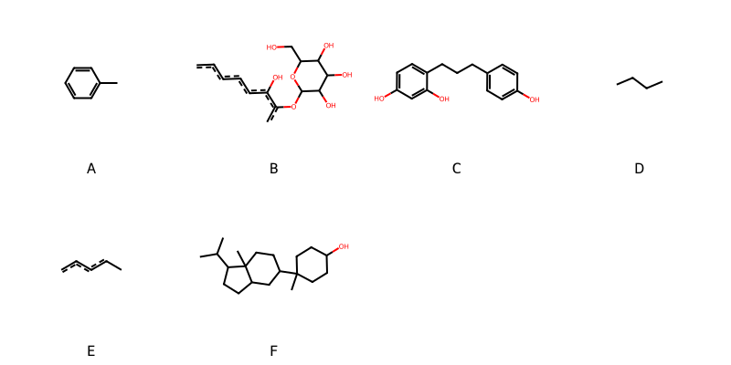

!!! abstract "Tóm tắt"

    **Họ Actinidiaceae** có **1** chi được các cộng đồng sử dụng trong chăm sóc sức khỏe gồm *Actinidia*. Số lượng thành phần hóa học đã phân lập và xác định cấu trúc từ họ này tính đến tháng 12 năm 2024 là **24** nhóm có thể liệt kê như sau *Fatty Acyls, Carboxylic acids and derivatives, Steroids and steroid derivatives, Flavonoids, Furanoid lignans, Pyridines and derivatives, Diazines, Benzopyrans, Imidazopyrimidines, Furans, Dihydrofurans, Benzene and substituted derivatives, Coumarins and derivatives, Prenol lipids, Oxanes, Pyrans, Organooxygen compounds, Naphthalenes, Lactones, Hydroxy acids and derivatives, Benzofurans, Indoles and derivatives, Oxepanes, Dibenzylbutane lignans*. Giữa các loài trong họ này, 3 dược liệu được nghiên cứu nhiều nhất dựa trên số thành phần được phân lập là **Actinidia chinensis, Actinidia polygama*. *Họ Actinidiaceae* đã được một số công động tại các quốc gia như China, Elsewhere đã phát hiện một số tác dụng trên lâm sàng gồm chữa bệnh lẫn độc tính như Thuốc bổ, Thuốc giải độc, Thuốc lợi tiểu.

!!! info "DrDuke"

    James A. Duke sinh năm 1929-2017 là một nhà thực vật học người Mỹ. Đây là một trong những tác giả hàng đầu trong lĩnh vực dược dân tộc học với cuốn *CRC Handbook of Medicinal Herbs* và chính là người xây dựng lên cơ sở dữ liệu về hợp chất tự nhiên và dược dân tộc học tại Bộ nông nghiệp Hoa Kỳ. Các thông tin được đăng tải tại website [Dr. Duke's Phytochemical and Ethnobotanical Databases](https://phytochem.nal.usda.gov/). 
    Trong suốt thập niên 1970, ông lãnh đạo the Plant Taxonomy Laboratory, Plant Genetics and Germplasm Institute of the Agricultural Research Service, U.S. Department of Agriculture.
    Trong tài liệu này, các thông tin về dược dân tộc của các dược liệu được trích dẫn từ tài liệu của James A. Ducke với sự trợ giúp của phần mềm dịch thuật từ tiếng Anh sang tiếng Việt.
   
## Tổng quan về Họ Actinidiaceae
### Phân loại thực vật
Trong *họ Actinidiaceae* có **1** chi được sử dụng làm thuốc với chi tiết số loài trong mỗi chi như sau Actinidia (2) . Chi tiết về loài sử dụng làm thuốc như dưới đây.  

>Họ Actinidiaceae


>|-- Chi Actinidia

>*Actinidia chinensis*,
>*Actinidia polygama*,

### Thành phần hóa học 

Số lượng thành phần hóa học đã phân lập và xác định cấu trúc từ họ này tính đến tháng 12 năm 2024 là 24 nhóm có thể liệt kê như sau Fatty Acyls, Carboxylic acids and derivatives, Steroids and steroid derivatives, Flavonoids, Furanoid lignans, Pyridines and derivatives, Diazines, Benzopyrans, Imidazopyrimidines, Furans, Dihydrofurans, Benzene and substituted derivatives, Coumarins and derivatives, Prenol lipids, Oxanes, Pyrans, Organooxygen compounds, Naphthalenes, Lactones, Hydroxy acids and derivatives, Benzofurans, Indoles and derivatives, Oxepanes, Dibenzylbutane lignans. Số lượng các loài đã được nghiên cứu thành phần hóa học là *2* trong tổng số *2* loài thuộc họ Actinidiaceae.Giữa các loài trong họ này, 3 dược liệu được nghiên cứu nhiều nhất dựa trên số thành phần được phân lập là **Actinidia chinensis, Actinidia polygama**. Sử dụng phần mềm RDKIT với thuật toán  Find Maximum Common Substructure (FMCS), các nhóm hoạt chất phổ biến nhất trong *họ Actinidiaceae* đã xây dựng được nhân. Điều này trong tương lại có thể được sử dụng tìm kiếm mối liên hệ giữa tác dụng của cấu trúc hóa học và tác dụng dược lý. Các nhân trong phần này có thể không giống như cấu trúc gốc của từng nhóm chất. Kết quả được trình bầy như hình dưới đây.

<figure markdown="span">
    { width=100% }
    <figcaption> Cấu trúc hóa học của một số khung cơ bản dựa trên thuật toán FMCS để tìm Benzene and substituted derivatives (A), Coumarins and derivatives (B), Flavonoids (C), Organooxygen compounds (D), Prenol lipids (E), Steroids and steroid derivatives (F).</figcaption>
</figure>


!!! info  "Find Maximum Common Substructure"
    
    Thuật toán FMCS (Find Maximum Common Substructure) là một phương pháp được sử dụng để tìm ra cấu trúc chung nhiều nhất (MCS) trong một tập hợp các cấu trúc hóa học. Các bước của thuật toán gồm:
    - Chọn một cấu trúc hóa học là cấu trúc để tạo truy vấn, còn các cấu trúc khác là mục tiêu.
    - Chia nhỏ cấu trúc để tạo truy vấn thành cấu trúc nhỏ hơn dạng chuỗi SMARTS.
    - Kiểm tra chuỗi SMARTS trong các cấu trúc mục tiêu.
    - Tìm kiếm chuỗi SMARTS xuất hiện nhiều nhất.
    Để biết thêm chi tiết các bạn có thể xem tại [TeachOpenCADD](https://projects.volkamerlab.org/teachopencadd/talktorials/T006_compound_maximum_common_substructures.html)
    ``` python
    pip install rdkit
    def find_core_smiles(smiles_list):
        mols = [Chem.MolFromSmiles(smiles) for smiles in smiles_list]
        mcs = rdFMCS.FindMCS(mols)
        core_smiles = Chem.MolToSmiles(Chem.MolFromSmarts(mcs.smartsString))
        return core_smiles
    ```

### Dược dân tộc học

Họ **Actinidiaceae** đã được một số công động tại các quốc gia như *China, Elsewhere* đã phát hiện một số tác dụng trên lâm sàng gồm chữa bệnh lẫn độc tính như *Thuốc bổ, Thuốc giải độc, Thuốc lợi tiểu*.

## Chi tiết dược dân tộc học


### Chi Actinidia

!!! note "Danh sách các loài thuộc chi"
    
*	 - *Actinidia chinensis*
	 - *Actinidia polygama**

---      
#### *Actinidia chinensis*
**Thông tin về thực vật**

!!! info "Phân loại thực vật của *Actinidia chinensis* từ GIBF:"
    - **Kingdom:** Plantae
    - **Phylum:** Tracheophyta
    - **Order:** Ericales
    - **Family:** Actinidiaceae
    - **Genus:** Actinidia
    - **Species:** *Actinidia chinensis*


 

Chưa có thông tin về loài này trên wikidata.

*Phân bố trên thế giới*: France, Germany, Switzerland, Korea, Republic of, Netherlands, Spain, Chinese Taipei, unknown or invalid, Japan, Australia, Montenegro, Georgia, United States of America, China, Italy, New Zealand, Denmark, Austria, Belgium

*Phân bố tại Việt Nam*: Không có ghi nhận ở Việt Nam

**Thành phần hóa học**
        

Theo cơ sở dữ liệu lotus, từ loài *Actinidia chinensis* đã phân lập và xác định được 186 hoạt chất thuộc về các nhóm Fatty Acyls, Carboxylic acids and derivatives, Steroids and steroid derivatives, Flavonoids, Furanoid lignans, Pyridines and derivatives, Diazines, Benzopyrans, Imidazopyrimidines, Furans, Dihydrofurans, Benzene and substituted derivatives, Coumarins and derivatives, Prenol lipids, Pyrans, Organooxygen compounds, Naphthalenes, Hydroxy acids and derivatives, Indoles and derivatives, Dibenzylbutane lignans. Danh sách các hoạt chất như sau hexanol [(LTS0217299)](https://lotus.naturalproducts.net/compound/lotus_id/LTS0217299), 5-hydroxy-6-methoxy-7-{[(2s,3r,4s,5s,6r)-3,4,5-trihydroxy-6-(hydroxymethyl)oxan-2-yl]oxy}chromen-2-one [(LTS0150068)](https://lotus.naturalproducts.net/compound/lotus_id/LTS0150068), kaempherol [(LTS0155822)](https://lotus.naturalproducts.net/compound/lotus_id/LTS0155822), (+)-glucose [(LTS0262158)](https://lotus.naturalproducts.net/compound/lotus_id/LTS0262158), glucose [(LTS0013597)](https://lotus.naturalproducts.net/compound/lotus_id/LTS0013597), 2-(4-hydroxyphenyl)-8-[3,5,7-trihydroxy-2-(4-hydroxyphenyl)-3,4-dihydro-2h-1-benzopyran-4-yl]-3,4-dihydro-2h-1-benzopyran-3,5,7-triol [(LTS0139553)](https://lotus.naturalproducts.net/compound/lotus_id/LTS0139553), α pinene [(LTS0132416)](https://lotus.naturalproducts.net/compound/lotus_id/LTS0132416), 2h-pyran-2-one, 3-hydroxy- [(LTS0255301)](https://lotus.naturalproducts.net/compound/lotus_id/LTS0255301), campesterol [(LTS0046755)](https://lotus.naturalproducts.net/compound/lotus_id/LTS0046755), (+)-catechol [(LTS0117079)](https://lotus.naturalproducts.net/compound/lotus_id/LTS0117079), oxalic acid [(LTS0217707)](https://lotus.naturalproducts.net/compound/lotus_id/LTS0217707), ortho-xylene [(LTS0161849)](https://lotus.naturalproducts.net/compound/lotus_id/LTS0161849), 3-(3-hydroxy-4-{[3,4,5-trihydroxy-6-(hydroxymethyl)oxan-2-yl]oxy}phenyl)prop-2-enoic acid [(LTS0007465)](https://lotus.naturalproducts.net/compound/lotus_id/LTS0007465), 1-(4-hydroxy-2-{[(2s,3r,4s,5s,6r)-3,4,5-trihydroxy-6-(hydroxymethyl)oxan-2-yl]oxy}phenyl)-3-(4-hydroxyphenyl)propan-1-one [(LTS0165033)](https://lotus.naturalproducts.net/compound/lotus_id/LTS0165033), 3,4,5-trihydroxy-6-(hydroxymethyl)oxan-2-yl 1,10,11-trihydroxy-9-(hydroxymethyl)-1,2,6a,6b,9,12a-hexamethyl-2,3,4,5,6,7,8,8a,10,11,12,12b,13,14b-tetradecahydropicene-4a-carboxylate [(LTS0209667)](https://lotus.naturalproducts.net/compound/lotus_id/LTS0209667), 2,8-dimethyl-2-(4,8,12-trimethyltridec-11-en-1-yl)-3,4-dihydro-1-benzopyran-6-ol [(LTS0043632)](https://lotus.naturalproducts.net/compound/lotus_id/LTS0043632), afzelechin-(4α->8)-afzelechin [(LTS0175533)](https://lotus.naturalproducts.net/compound/lotus_id/LTS0175533), d-fructopyranose [(LTS0259277)](https://lotus.naturalproducts.net/compound/lotus_id/LTS0259277), 7-dehydrositosterol [(LTS0034474)](https://lotus.naturalproducts.net/compound/lotus_id/LTS0034474), (1r,10r,11r,15r)-4-hydroxy-15-methyl-13-oxo-9,14,16-trioxatetracyclo[8.6.0.0³,⁸.0¹¹,¹⁵]hexadeca-3,5,7-trien-6-yl acetate [(LTS0060594)](https://lotus.naturalproducts.net/compound/lotus_id/LTS0060594), caffeic acid 3-glucoside [(LTS0157703)](https://lotus.naturalproducts.net/compound/lotus_id/LTS0157703), 4-hydroxy-6-methoxy-15-methyl-9,14,16-trioxatetracyclo[8.6.0.0³,⁸.0¹¹,¹⁵]hexadeca-3,5,7-trien-13-one [(LTS0241612)](https://lotus.naturalproducts.net/compound/lotus_id/LTS0241612), chlorogenic acid [(LTS0226495)](https://lotus.naturalproducts.net/compound/lotus_id/LTS0226495), delta-tocopherol [(LTS0005408)](https://lotus.naturalproducts.net/compound/lotus_id/LTS0005408), 2-{3-hydroxy-2-[4-(3-hydroxypropyl)-2-methoxyphenoxy]propoxy}-6-(hydroxymethyl)oxane-3,4,5-triol [(LTS0036616)](https://lotus.naturalproducts.net/compound/lotus_id/LTS0036616), ethyl acetate [(LTS0196824)](https://lotus.naturalproducts.net/compound/lotus_id/LTS0196824), (2s,3r,4s,5s,6r)-2-(4-hydroxy-2-methoxyphenoxy)-6-(hydroxymethyl)oxane-3,4,5-triol [(LTS0209679)](https://lotus.naturalproducts.net/compound/lotus_id/LTS0209679), 22,23-dihydrobrassicasterol [(LTS0204629)](https://lotus.naturalproducts.net/compound/lotus_id/LTS0204629), (1r,4as,6as,6br,8ar,9s,10s,11r,12ar,12br,14bs)-10,11-dihydroxy-9-(hydroxymethyl)-1,6a,6b,9,12a-pentamethyl-2-methylidene-1,3,4,5,6,7,8,8a,10,11,12,12b,13,14b-tetradecahydropicene-4a-carboxylic acid [(LTS0031142)](https://lotus.naturalproducts.net/compound/lotus_id/LTS0031142), 6,8-dimethoxy-7-{[3,4,5-trihydroxy-6-(hydroxymethyl)oxan-2-yl]oxy}chromen-2-one [(LTS0162893)](https://lotus.naturalproducts.net/compound/lotus_id/LTS0162893), lariciresinol [(LTS0010950)](https://lotus.naturalproducts.net/compound/lotus_id/LTS0010950), quercitrin [(LTS0093095)](https://lotus.naturalproducts.net/compound/lotus_id/LTS0093095), 3-(4-hydroxy-3-{[3,4,5-trihydroxy-6-(hydroxymethyl)oxan-2-yl]oxy}phenyl)prop-2-enoic acid [(LTS0040843)](https://lotus.naturalproducts.net/compound/lotus_id/LTS0040843), (1s,2r,4as,6as,6br,8ar,9s,10s,11r,12ar,12br,14bs)-10,11-dihydroxy-9-(hydroxymethyl)-1,2,6a,6b,9,12a-hexamethyl-2,3,4,5,6,7,8,8a,10,11,12,12b,13,14b-tetradecahydro-1h-picene-4a-carboxylic acid [(LTS0257716)](https://lotus.naturalproducts.net/compound/lotus_id/LTS0257716), afzelechin [(LTS0233697)](https://lotus.naturalproducts.net/compound/lotus_id/LTS0233697), 10-hydroxy-1,2,6a,6b,9,9,12a-heptamethyl-2,3,4,5,6,7,8,8a,10,11,12,12b,13,14b-tetradecahydro-1h-picene-4a-carboxylic acid [(LTS0166564)](https://lotus.naturalproducts.net/compound/lotus_id/LTS0166564), luteolin [(LTS0017052)](https://lotus.naturalproducts.net/compound/lotus_id/LTS0017052), epicatechin gallate [(LTS0071606)](https://lotus.naturalproducts.net/compound/lotus_id/LTS0071606), 3,5,7,4'-tetrahydroxyflavan [(LTS0039714)](https://lotus.naturalproducts.net/compound/lotus_id/LTS0039714), toluene [(LTS0047403)](https://lotus.naturalproducts.net/compound/lotus_id/LTS0047403), 10,11-dihydroxy-9-(hydroxymethyl)-2,2,6a,6b,9,12a-hexamethyl-1,3,4,5,6,7,8,8a,10,11,12,12b,13,14b-tetradecahydropicene-4a-carboxylic acid [(LTS0258848)](https://lotus.naturalproducts.net/compound/lotus_id/LTS0258848), 1,10,11-trihydroxy-9,9-bis(hydroxymethyl)-1,2,6a,6b,12a-pentamethyl-2,3,4,5,6,7,8,8a,10,11,12,12b,13,14b-tetradecahydropicene-4a-carboxylic acid [(LTS0239305)](https://lotus.naturalproducts.net/compound/lotus_id/LTS0239305), 2-(3,4-dihydroxyphenyl)-5,7-dihydroxy-3-{[3,4,5-trihydroxy-6-(hydroxymethyl)oxan-2-yl]oxy}chromen-4-one [(LTS0195312)](https://lotus.naturalproducts.net/compound/lotus_id/LTS0195312), epigallocatechin [(LTS0175767)](https://lotus.naturalproducts.net/compound/lotus_id/LTS0175767), vitamin e [(LTS0263269)](https://lotus.naturalproducts.net/compound/lotus_id/LTS0263269), 4-hydroxy-15-methyl-13-oxo-9,14,16-trioxatetracyclo[8.6.0.0³,⁸.0¹¹,¹⁵]hexadeca-3,5,7-trien-6-yl acetate [(LTS0117390)](https://lotus.naturalproducts.net/compound/lotus_id/LTS0117390), 2-(4-hydroxy-2-methoxyphenoxy)-6-(hydroxymethyl)oxane-3,4,5-triol [(LTS0150683)](https://lotus.naturalproducts.net/compound/lotus_id/LTS0150683), ethylbenzene [(LTS0122434)](https://lotus.naturalproducts.net/compound/lotus_id/LTS0122434), cymene [(LTS0181568)](https://lotus.naturalproducts.net/compound/lotus_id/LTS0181568), pent-1-en-1-ol [(LTS0211069)](https://lotus.naturalproducts.net/compound/lotus_id/LTS0211069), (2e)-3-(3-hydroxy-4-{[(2s,3r,4s,5s,6r)-3,4,5-trihydroxy-6-(hydroxymethyl)oxan-2-yl]oxy}phenyl)prop-2-enoic acid [(LTS0148993)](https://lotus.naturalproducts.net/compound/lotus_id/LTS0148993), (2r,3r,4r)-2-(3,4-dihydroxyphenyl)-4-[(2r,3r)-2-(3,4-dihydroxyphenyl)-3,5,7-trihydroxy-3,4-dihydro-2h-1-benzopyran-8-yl]-3,4-dihydro-2h-1-benzopyran-3,5,7-triol [(LTS0135510)](https://lotus.naturalproducts.net/compound/lotus_id/LTS0135510), (1s,4s,5r,8r,9s,10s,11r,13r,14r,16s,17s,18r)-16-chloro-9,10,11-trihydroxy-9-(hydroxymethyl)-4,5,13,20,20-pentamethyl-24-oxahexacyclo[15.5.2.0¹,¹⁸.0⁴,¹⁷.0⁵,¹⁴.0⁸,¹³]tetracosan-23-one [(LTS0030605)](https://lotus.naturalproducts.net/compound/lotus_id/LTS0030605), methyl furoate [(LTS0000566)](https://lotus.naturalproducts.net/compound/lotus_id/LTS0000566), 7-dehydrositosterol [(LTS0040825)](https://lotus.naturalproducts.net/compound/lotus_id/LTS0040825), methyl propionate [(LTS0069440)](https://lotus.naturalproducts.net/compound/lotus_id/LTS0069440), myricetin [(LTS0139858)](https://lotus.naturalproducts.net/compound/lotus_id/LTS0139858), 10,11-dihydroxy-2,2,6a,6b,9,9,12a-heptamethyl-1,3,4,5,6,7,8,8a,10,11,12,12b,13,14b-tetradecahydropicene-4a-carboxylic acid [(LTS0167090)](https://lotus.naturalproducts.net/compound/lotus_id/LTS0167090), (2r,3s,4r)-2-(3,4-dihydroxyphenyl)-4-[(2r,3r)-2-(3,4-dihydroxyphenyl)-3,5,7-trihydroxy-3,4-dihydro-2h-1-benzopyran-6-yl]-3,4-dihydro-2h-1-benzopyran-3,5,7-triol [(LTS0076760)](https://lotus.naturalproducts.net/compound/lotus_id/LTS0076760), d-tocopherol [(LTS0064746)](https://lotus.naturalproducts.net/compound/lotus_id/LTS0064746), benzaldehyde [(LTS0094193)](https://lotus.naturalproducts.net/compound/lotus_id/LTS0094193), ethyl propionate [(LTS0049421)](https://lotus.naturalproducts.net/compound/lotus_id/LTS0049421), (1s,2r,5r,6r,9r,10r,13s,15r)-5-[(2r,3e,5r)-5,6-dimethylhept-3-en-2-yl]-6,10-dimethyl-16,17-dioxapentacyclo[13.2.2.0¹,⁹.0²,⁶.0¹⁰,¹⁵]nonadecan-13-ol [(LTS0259911)](https://lotus.naturalproducts.net/compound/lotus_id/LTS0259911), 16-chloro-9,10,11-trihydroxy-9-(hydroxymethyl)-4,5,13,20,20-pentamethyl-24-oxahexacyclo[15.5.2.0¹,¹⁸.0⁴,¹⁷.0⁵,¹⁴.0⁸,¹³]tetracosan-23-one [(LTS0158163)](https://lotus.naturalproducts.net/compound/lotus_id/LTS0158163), coenzyme q10 [(LTS0103893)](https://lotus.naturalproducts.net/compound/lotus_id/LTS0103893), (1r,10r,11r,15r)-4,6-dihydroxy-15-methyl-9,14,16-trioxatetracyclo[8.6.0.0³,⁸.0¹¹,¹⁵]hexadeca-3,5,7-trien-13-one [(LTS0224134)](https://lotus.naturalproducts.net/compound/lotus_id/LTS0224134), 4-[(3ar,4s,6ar)-4-(4-hydroxy-3-methoxyphenyl)-hexahydrofuro[3,4-c]furan-1-yl]-2,6-dimethoxyphenol [(LTS0041035)](https://lotus.naturalproducts.net/compound/lotus_id/LTS0041035), 2-ethylhexanol [(LTS0180984)](https://lotus.naturalproducts.net/compound/lotus_id/LTS0180984), 4,6-dimethoxy-15-methyl-9,14,16-trioxatetracyclo[8.6.0.0³,⁸.0¹¹,¹⁵]hexadeca-3,5,7-trien-13-one [(LTS0226085)](https://lotus.naturalproducts.net/compound/lotus_id/LTS0226085), (2r)-2,8-dimethyl-2-[(4r,8s)-4,8,12-trimethyltridec-11-en-1-yl]-3,4-dihydro-1-benzopyran-6-ol [(LTS0153820)](https://lotus.naturalproducts.net/compound/lotus_id/LTS0153820), 19α-hydroxyasiatic acid [(LTS0215499)](https://lotus.naturalproducts.net/compound/lotus_id/LTS0215499), hexanal [(LTS0238624)](https://lotus.naturalproducts.net/compound/lotus_id/LTS0238624), matairesinol [(LTS0193475)](https://lotus.naturalproducts.net/compound/lotus_id/LTS0193475), (1r,2r,3s,4r,5s,6s)-cyclohexane-1,2,3,4,5,6-hexol [(LTS0123108)](https://lotus.naturalproducts.net/compound/lotus_id/LTS0123108), 2-butoxy-2-(hydroxymethyl)oxane-3,4,5-triol [(LTS0178488)](https://lotus.naturalproducts.net/compound/lotus_id/LTS0178488), epiafzelechin [(LTS0203074)](https://lotus.naturalproducts.net/compound/lotus_id/LTS0203074), (1s,2r,4as,6as,6br,8ar,9r,10s,11r,12ar,12br,14bs)-10,11-dihydroxy-9-(hydroxymethyl)-1,2,6a,6b,9,12a-hexamethyl-2,3,4,5,6,7,8,8a,10,11,12,12b,13,14b-tetradecahydro-1h-picene-4a-carboxylic acid [(LTS0242132)](https://lotus.naturalproducts.net/compound/lotus_id/LTS0242132), ethyl hexanoate [(LTS0021856)](https://lotus.naturalproducts.net/compound/lotus_id/LTS0021856), quinic acid [(LTS0052589)](https://lotus.naturalproducts.net/compound/lotus_id/LTS0052589), isoquercetin [(LTS0254337)](https://lotus.naturalproducts.net/compound/lotus_id/LTS0254337), β-pinene [(LTS0117550)](https://lotus.naturalproducts.net/compound/lotus_id/LTS0117550), vitamin c [(LTS0022555)](https://lotus.naturalproducts.net/compound/lotus_id/LTS0022555), 2-methylbutanoic acid [(LTS0213858)](https://lotus.naturalproducts.net/compound/lotus_id/LTS0213858), (1s,2r,4as,6as,6br,8ar,9s,10r,11r,12ar,12br,14bs)-10,11-dihydroxy-9-(hydroxymethyl)-1,2,6a,6b,9,12a-hexamethyl-2,3,4,5,6,7,8,8a,10,11,12,12b,13,14b-tetradecahydro-1h-picene-4a-carboxylic acid [(LTS0039835)](https://lotus.naturalproducts.net/compound/lotus_id/LTS0039835), 4-[3,5,7-trihydroxy-2-(3,4,5-trihydroxyphenyl)-3,4-dihydro-2h-1-benzopyran-8-yl]-2-(3,4,5-trihydroxyphenyl)-3,4-dihydro-2h-1-benzopyran-3,5,7-triol [(LTS0144797)](https://lotus.naturalproducts.net/compound/lotus_id/LTS0144797), 5-(5,6-dimethylhept-3-en-2-yl)-6,10-dimethyl-16,17-dioxapentacyclo[13.2.2.0¹,⁹.0²,⁶.0¹⁰,¹⁵]nonadecan-13-ol [(LTS0229386)](https://lotus.naturalproducts.net/compound/lotus_id/LTS0229386), maslinic acid [(LTS0109701)](https://lotus.naturalproducts.net/compound/lotus_id/LTS0109701), 1-(5-ethyl-6-methylhept-3-en-2-yl)-9a,11a-dimethyl-1h,2h,6h,7h,8h,9h,9bh,10h,11h-cyclopenta[a]phenanthren-7-ol [(LTS0180656)](https://lotus.naturalproducts.net/compound/lotus_id/LTS0180656), quercitrin [(LTS0186298)](https://lotus.naturalproducts.net/compound/lotus_id/LTS0186298), 1,10,11-trihydroxy-9-(hydroxymethyl)-1,2,6a,6b,9,12a-hexamethyl-2,3,4,5,6,7,8,8a,10,11,12,12b,13,14b-tetradecahydropicene-4a-carboxylic acid [(LTS0156783)](https://lotus.naturalproducts.net/compound/lotus_id/LTS0156783), 7-hydroxy-6-methoxy-8-{[3,4,5-trihydroxy-6-(hydroxymethyl)oxan-2-yl]oxy}chromen-2-one [(LTS0262036)](https://lotus.naturalproducts.net/compound/lotus_id/LTS0262036), malic acid [(LTS0216520)](https://lotus.naturalproducts.net/compound/lotus_id/LTS0216520), stigmast-5-en-3-ol, (3β)- [(LTS0204616)](https://lotus.naturalproducts.net/compound/lotus_id/LTS0204616), sucrose [(LTS0272557)](https://lotus.naturalproducts.net/compound/lotus_id/LTS0272557), m-xylene [(LTS0151729)](https://lotus.naturalproducts.net/compound/lotus_id/LTS0151729), procyanidin c1 [(LTS0260445)](https://lotus.naturalproducts.net/compound/lotus_id/LTS0260445), (2s,3r)-2,3-bis[(4-hydroxy-3-methoxyphenyl)(¹³c)methyl](1-¹³c)butane-1,4-diol [(LTS0268699)](https://lotus.naturalproducts.net/compound/lotus_id/LTS0268699), ent-epicatechin [(LTS0265245)](https://lotus.naturalproducts.net/compound/lotus_id/LTS0265245), (2s,3r,4s,5s,6r)-3,4,5-trihydroxy-6-(hydroxymethyl)oxan-2-yl (1r,2r,4as,6as,6br,8ar,9s,10s,11r,12ar,12br,14bs)-1,10,11-trihydroxy-9-(hydroxymethyl)-1,2,6a,6b,9,12a-hexamethyl-2,3,4,5,6,7,8,8a,10,11,12,12b,13,14b-tetradecahydropicene-4a-carboxylate [(LTS0034743)](https://lotus.naturalproducts.net/compound/lotus_id/LTS0034743), tryptamine [(LTS0181180)](https://lotus.naturalproducts.net/compound/lotus_id/LTS0181180), arjunolic acid [(LTS0055520)](https://lotus.naturalproducts.net/compound/lotus_id/LTS0055520), fraxin [(LTS0190314)](https://lotus.naturalproducts.net/compound/lotus_id/LTS0190314), pinoresinol [(LTS0057431)](https://lotus.naturalproducts.net/compound/lotus_id/LTS0057431), afzelin [(LTS0259097)](https://lotus.naturalproducts.net/compound/lotus_id/LTS0259097), sitogluside [(LTS0201798)](https://lotus.naturalproducts.net/compound/lotus_id/LTS0201798), 4,6-dihydroxy-15-methyl-9,14,16-trioxatetracyclo[8.6.0.0³,⁸.0¹¹,¹⁵]hexadeca-3,5,7-trien-13-one [(LTS0261049)](https://lotus.naturalproducts.net/compound/lotus_id/LTS0261049), pentanal [(LTS0234306)](https://lotus.naturalproducts.net/compound/lotus_id/LTS0234306), leucon [(LTS0114351)](https://lotus.naturalproducts.net/compound/lotus_id/LTS0114351), catechol [(LTS0090912)](https://lotus.naturalproducts.net/compound/lotus_id/LTS0090912), 3-rutinosyl quercetin [(LTS0032845)](https://lotus.naturalproducts.net/compound/lotus_id/LTS0032845), monoterpenes [(LTS0106881)](https://lotus.naturalproducts.net/compound/lotus_id/LTS0106881), quercetin [(LTS0004651)](https://lotus.naturalproducts.net/compound/lotus_id/LTS0004651), tricin [(LTS0271018)](https://lotus.naturalproducts.net/compound/lotus_id/LTS0271018), 3-{[3-(3,4-dihydroxyphenyl)prop-2-enoyl]oxy}-1,4,5-trihydroxycyclohexane-1-carboxylic acid [(LTS0143901)](https://lotus.naturalproducts.net/compound/lotus_id/LTS0143901), (1r,7s,9ar,9br,11ar)-1-[(2r,3e,5s)-5-ethyl-6-methylhept-3-en-2-yl]-9a,11a-dimethyl-1h,2h,6h,7h,8h,9h,9bh,10h,11h-cyclopenta[a]phenanthren-7-ol [(LTS0109910)](https://lotus.naturalproducts.net/compound/lotus_id/LTS0109910), (2r,3s,4s)-2-(3,4-dihydroxyphenyl)-4-[(2r,3s)-2-(3,4-dihydroxyphenyl)-3,5,7-trihydroxy-3,4-dihydro-2h-1-benzopyran-8-yl]-3,4-dihydro-2h-1-benzopyran-3,5,7-triol [(LTS0151498)](https://lotus.naturalproducts.net/compound/lotus_id/LTS0151498), esculin [(LTS0228636)](https://lotus.naturalproducts.net/compound/lotus_id/LTS0228636), ethyl 2-furoate [(LTS0157652)](https://lotus.naturalproducts.net/compound/lotus_id/LTS0157652), asahina [(LTS0068303)](https://lotus.naturalproducts.net/compound/lotus_id/LTS0068303), keto-d-fructose [(LTS0241114)](https://lotus.naturalproducts.net/compound/lotus_id/LTS0241114), syringaresinol [(LTS0116280)](https://lotus.naturalproducts.net/compound/lotus_id/LTS0116280), methyl benzoate [(LTS0225398)](https://lotus.naturalproducts.net/compound/lotus_id/LTS0225398), para-xylene [(LTS0005367)](https://lotus.naturalproducts.net/compound/lotus_id/LTS0005367), asiatic acid [(LTS0249826)](https://lotus.naturalproducts.net/compound/lotus_id/LTS0249826), 4,4,6a,6b,8a,11,12,14b-octamethyl-2,3,4a,5,6,7,8,9,12,12a,12b,13,14,14a-tetradecahydro-1h-picen-3-ol [(LTS0093091)](https://lotus.naturalproducts.net/compound/lotus_id/LTS0093091), actinidic acid [(LTS0113720)](https://lotus.naturalproducts.net/compound/lotus_id/LTS0113720), nictoflorin [(LTS0182501)](https://lotus.naturalproducts.net/compound/lotus_id/LTS0182501), corosolic acid [(LTS0231285)](https://lotus.naturalproducts.net/compound/lotus_id/LTS0231285), 1-penten-3-ol [(LTS0174520)](https://lotus.naturalproducts.net/compound/lotus_id/LTS0174520), (1r,10r,11r,15r)-4-hydroxy-6-methoxy-15-methyl-9,14,16-trioxatetracyclo[8.6.0.0³,⁸.0¹¹,¹⁵]hexadeca-3,5,7-trien-13-one [(LTS0144057)](https://lotus.naturalproducts.net/compound/lotus_id/LTS0144057), naringenin [(LTS0031098)](https://lotus.naturalproducts.net/compound/lotus_id/LTS0031098), vanillic acid [(LTS0229113)](https://lotus.naturalproducts.net/compound/lotus_id/LTS0229113), isobutyric acid [(LTS0128574)](https://lotus.naturalproducts.net/compound/lotus_id/LTS0128574), ergosterol [(LTS0171131)](https://lotus.naturalproducts.net/compound/lotus_id/LTS0171131), chamomile [(LTS0104946)](https://lotus.naturalproducts.net/compound/lotus_id/LTS0104946), (4as,6as,6br,8ar,9s,10s,11r,12ar,12br,14bs)-10,11-dihydroxy-9-(hydroxymethyl)-2,2,6a,6b,9,12a-hexamethyl-1,3,4,5,6,7,8,8a,10,11,12,12b,13,14b-tetradecahydropicene-4a-carboxylic acid [(LTS0016980)](https://lotus.naturalproducts.net/compound/lotus_id/LTS0016980), 2-{[1-(5-ethyl-6-methylheptan-2-yl)-9a,11a-dimethyl-1h,2h,3h,3ah,3bh,4h,6h,7h,8h,9h,9bh,10h,11h-cyclopenta[a]phenanthren-7-yl]oxy}-6-(hydroxymethyl)oxane-3,4,5-triol [(LTS0158828)](https://lotus.naturalproducts.net/compound/lotus_id/LTS0158828), phytosterol [(LTS0029311)](https://lotus.naturalproducts.net/compound/lotus_id/LTS0029311), 5,7-dihydroxy-2-(4-hydroxyphenyl)-3-[(3,4,5-trihydroxy-6-{[(3,4,5-trihydroxy-6-methyloxan-2-yl)oxy]methyl}oxan-2-yl)oxy]chromen-4-one [(LTS0122456)](https://lotus.naturalproducts.net/compound/lotus_id/LTS0122456), (2r,3s,4s)-2-(3,4-dihydroxyphenyl)-4-[(2r,3r)-2-(3,4-dihydroxyphenyl)-3,5,7-trihydroxy-3,4-dihydro-2h-1-benzopyran-6-yl]-3,4-dihydro-2h-1-benzopyran-3,5,7-triol [(LTS0196496)](https://lotus.naturalproducts.net/compound/lotus_id/LTS0196496), actinidine [(LTS0046972)](https://lotus.naturalproducts.net/compound/lotus_id/LTS0046972), naphthalene [(LTS0254484)](https://lotus.naturalproducts.net/compound/lotus_id/LTS0254484), (2r,3s,4s)-2-(3,4-dihydroxyphenyl)-4-[(2r,3r)-2-(3,4-dihydroxyphenyl)-3,5,7-trihydroxy-3,4-dihydro-2h-1-benzopyran-8-yl]-3,4-dihydro-2h-1-benzopyran-3,5,7-triol [(LTS0116257)](https://lotus.naturalproducts.net/compound/lotus_id/LTS0116257), (2r,3s,4r,5r)-2-butoxy-2-(hydroxymethyl)oxane-3,4,5-triol [(LTS0183698)](https://lotus.naturalproducts.net/compound/lotus_id/LTS0183698), citric acid [(LTS0213921)](https://lotus.naturalproducts.net/compound/lotus_id/LTS0213921), 10,11-dihydroxy-9-(hydroxymethyl)-1,6a,6b,9,12a-pentamethyl-2-methylidene-1,3,4,5,6,7,8,8a,10,11,12,12b,13,14b-tetradecahydropicene-4a-carboxylic acid [(LTS0236819)](https://lotus.naturalproducts.net/compound/lotus_id/LTS0236819), (1r,2r,4as,6as,6br,8ar,9s,10s,11r,12ar,12br,14bs)-1,10,11-trihydroxy-9-(hydroxymethyl)-1,2,6a,6b,9,12a-hexamethyl-2,3,4,5,6,7,8,8a,10,11,12,12b,13,14b-tetradecahydropicene-4a-carboxylic acid [(LTS0230705)](https://lotus.naturalproducts.net/compound/lotus_id/LTS0230705), (1r,2r,4as,6as,6br,8ar,10s,11r,12ar,12br,14bs)-1,10,11-trihydroxy-9,9-bis(hydroxymethyl)-1,2,6a,6b,12a-pentamethyl-2,3,4,5,6,7,8,8a,10,11,12,12b,13,14b-tetradecahydropicene-4a-carboxylic acid [(LTS0157559)](https://lotus.naturalproducts.net/compound/lotus_id/LTS0157559), (1r,10r,11r,15r)-4,6-dimethoxy-15-methyl-9,14,16-trioxatetracyclo[8.6.0.0³,⁸.0¹¹,¹⁵]hexadeca-3,5,7-trien-13-one [(LTS0099216)](https://lotus.naturalproducts.net/compound/lotus_id/LTS0099216), fraxin [(LTS0083622)](https://lotus.naturalproducts.net/compound/lotus_id/LTS0083622), isofraxidin-7-glucoside [(LTS0102429)](https://lotus.naturalproducts.net/compound/lotus_id/LTS0102429), 1-penten-3-one [(LTS0122674)](https://lotus.naturalproducts.net/compound/lotus_id/LTS0122674), 10,11-dihydroxy-1,2,6a,6b,9,9,12a-heptamethyl-2,3,4,5,6,7,8,8a,10,11,12,12b,13,14b-tetradecahydro-1h-picene-4a-carboxylic acid [(LTS0122037)](https://lotus.naturalproducts.net/compound/lotus_id/LTS0122037), 5,7-dihydroxy-2-(4-hydroxyphenyl)-3-[(3,4,5-trihydroxy-6-methyloxan-2-yl)oxy]chromen-4-one [(LTS0211340)](https://lotus.naturalproducts.net/compound/lotus_id/LTS0211340), asiatic acid [(LTS0198395)](https://lotus.naturalproducts.net/compound/lotus_id/LTS0198395), heptanol [(LTS0150821)](https://lotus.naturalproducts.net/compound/lotus_id/LTS0150821), gallocatechin 3-o-gallate [(LTS0223197)](https://lotus.naturalproducts.net/compound/lotus_id/LTS0223197), (-)-epigallocatechin gallate [(LTS0173211)](https://lotus.naturalproducts.net/compound/lotus_id/LTS0173211), vita e [(LTS0188293)](https://lotus.naturalproducts.net/compound/lotus_id/LTS0188293), (-)-inositol [(LTS0047771)](https://lotus.naturalproducts.net/compound/lotus_id/LTS0047771), 2-({3,4-dihydroxy-4-[(1e)-3-hydroxybut-1-en-1-yl]-3,5,5-trimethylcyclohexyl}oxy)-6-(hydroxymethyl)oxane-3,4,5-triol [(LTS0256618)](https://lotus.naturalproducts.net/compound/lotus_id/LTS0256618), ursolic acid [(LTS0250838)](https://lotus.naturalproducts.net/compound/lotus_id/LTS0250838), secoisolariciresinol [(LTS0086727)](https://lotus.naturalproducts.net/compound/lotus_id/LTS0086727), 2-(3,4-dihydroxyphenyl)-4-[2-(3,4-dihydroxyphenyl)-3,5,7-trihydroxy-3,4-dihydro-2h-1-benzopyran-8-yl]-3,4-dihydro-2h-1-benzopyran-3,5,7-triol [(LTS0040252)](https://lotus.naturalproducts.net/compound/lotus_id/LTS0040252), sitosterol [(LTS0168132)](https://lotus.naturalproducts.net/compound/lotus_id/LTS0168132), (2r,3r)-2-(3,4-dihydroxyphenyl)-8-[(2r,3r)-2-(3,4-dihydroxyphenyl)-3,5,7-trihydroxy-3,4-dihydro-2h-1-benzopyran-4-yl]-4-[(2r,3s)-2-(3,4-dihydroxyphenyl)-3,5,7-trihydroxy-3,4-dihydro-2h-1-benzopyran-8-yl]-3,4-dihydro-2h-1-benzopyran-3,5,7-triol [(LTS0059648)](https://lotus.naturalproducts.net/compound/lotus_id/LTS0059648), 5-hydroxy-6-methoxy-7-{[3,4,5-trihydroxy-6-(hydroxymethyl)oxan-2-yl]oxy}chromen-2-one [(LTS0077663)](https://lotus.naturalproducts.net/compound/lotus_id/LTS0077663), pirod [(LTS0008205)](https://lotus.naturalproducts.net/compound/lotus_id/LTS0008205), (2r,3r,4r)-2-(3,4-dihydroxyphenyl)-4-[(2r,3s)-2-(3,4-dihydroxyphenyl)-3,5,7-trihydroxy-3,4-dihydro-2h-1-benzopyran-8-yl]-3,4-dihydro-2h-1-benzopyran-3,5,7-triol [(LTS0066122)](https://lotus.naturalproducts.net/compound/lotus_id/LTS0066122), cichoriin [(LTS0075962)](https://lotus.naturalproducts.net/compound/lotus_id/LTS0075962), 6-hydroxy-7-{[3,4,5-trihydroxy-6-(hydroxymethyl)oxan-2-yl]oxy}chromen-2-one [(LTS0228835)](https://lotus.naturalproducts.net/compound/lotus_id/LTS0228835), ethyl butyrate [(LTS0106732)](https://lotus.naturalproducts.net/compound/lotus_id/LTS0106732), (3s,4ar,6ar,6br,8as,12s,12ar,12br,14ar,14br)-4,4,6a,6b,8a,11,12,14b-octamethyl-2,3,4a,5,6,7,8,9,12,12a,12b,13,14,14a-tetradecahydro-1h-picen-3-ol [(LTS0235786)](https://lotus.naturalproducts.net/compound/lotus_id/LTS0235786), (2r,3r)-2-(4-hydroxyphenyl)-8-[(2r,3r,4r)-3,5,7-trihydroxy-2-(4-hydroxyphenyl)-3,4-dihydro-2h-1-benzopyran-4-yl]-3,4-dihydro-2h-1-benzopyran-3,5,7-triol [(LTS0016009)](https://lotus.naturalproducts.net/compound/lotus_id/LTS0016009), (2r,3r,4s,5s,6r)-2-[(2r)-3-hydroxy-2-[4-(3-hydroxypropyl)-2-methoxyphenoxy]propoxy]-6-(hydroxymethyl)oxane-3,4,5-triol [(LTS0006465)](https://lotus.naturalproducts.net/compound/lotus_id/LTS0006465), 1-(5,6-dimethylhept-3-en-2-yl)-9a,11a-dimethyl-1h,2h,3h,3ah,6h,7h,8h,9h,9bh,10h,11h-cyclopenta[a]phenanthren-7-ol [(LTS0029174)](https://lotus.naturalproducts.net/compound/lotus_id/LTS0029174), methyl valerate [(LTS0124122)](https://lotus.naturalproducts.net/compound/lotus_id/LTS0124122), styrene [(LTS0014014)](https://lotus.naturalproducts.net/compound/lotus_id/LTS0014014), (3r,5r)-1,3,4,5-tetrahydroxycyclohexane-1-carboxylic acid [(LTS0249267)](https://lotus.naturalproducts.net/compound/lotus_id/LTS0249267), epigallocatechin [(LTS0052496)](https://lotus.naturalproducts.net/compound/lotus_id/LTS0052496), 2-(3,4-dihydroxyphenyl)-5,7-dihydroxy-3,4-dihydro-2h-1-benzopyran-3-yl 3,4,5-trihydroxybenzoate [(LTS0248252)](https://lotus.naturalproducts.net/compound/lotus_id/LTS0248252), stigmasterol [(LTS0024262)](https://lotus.naturalproducts.net/compound/lotus_id/LTS0024262), methyl butyrate [(LTS0013195)](https://lotus.naturalproducts.net/compound/lotus_id/LTS0013195), gallocatechol [(LTS0267305)](https://lotus.naturalproducts.net/compound/lotus_id/LTS0267305), ethyl benzoate [(LTS0211245)](https://lotus.naturalproducts.net/compound/lotus_id/LTS0211245), rutin [(LTS0042292)](https://lotus.naturalproducts.net/compound/lotus_id/LTS0042292).

| chemicalTaxonomyClassyfireClass     |   lotus_count |
|:------------------------------------|--------------:|
| Benzene and substituted derivatives |            10 |
| Benzopyrans                         |             8 |
| Carboxylic acids and derivatives    |             6 |
| Coumarins and derivatives           |            10 |
| Diazines                            |             1 |
| Dibenzylbutane lignans              |             2 |
| Dihydrofurans                       |             1 |
| Fatty Acyls                         |             8 |
| Flavonoids                          |            45 |
| Furanoid lignans                    |             5 |
| Furans                              |             2 |
| Hydroxy acids and derivatives       |             1 |
| Imidazopyrimidines                  |             1 |
| Indoles and derivatives             |             1 |
| Naphthalenes                        |             1 |
| Organooxygen compounds              |            26 |
| Prenol lipids                       |            38 |
| Pyrans                              |             1 |
| Pyridines and derivatives           |             1 |
| Steroids and steroid derivatives    |            13 |


**Dược dân tộc học**

Danh sách các quốc gia có sử dụng *Actinidia chinensis* trong điều trị các bệnh. 

| Quốc gia   | Bệnh                           |
|:-----------|:-------------------------------|
| China      | Thuốc giải độc, Thuốc lợi tiểu |


---      
#### *Actinidia polygama*
**Thông tin về thực vật**

!!! info "Phân loại thực vật của *Actinidia polygama* từ GIBF:"
    - **Kingdom:** Plantae
    - **Phylum:** Tracheophyta
    - **Order:** Ericales
    - **Family:** Actinidiaceae
    - **Genus:** Actinidia
    - **Species:** *Actinidia polygama*


 

Chưa có thông tin về loài này trên wikidata.

*Phân bố trên thế giới*: Latvia, Russian Federation, Japan, Korea, Republic of, Belgium

*Phân bố tại Việt Nam*: Không có ghi nhận ở Việt Nam

**Thành phần hóa học**
        

Theo cơ sở dữ liệu lotus, từ loài *Actinidia polygama* đã phân lập và xác định được 68 hoạt chất thuộc về các nhóm Organooxygen compounds, Flavonoids, Lactones, Hydroxy acids and derivatives, Benzofurans, Carboxylic acids and derivatives, Dihydrofurans, Pyridines and derivatives, Prenol lipids, Oxepanes, Oxanes. Danh sách các hoạt chất như sau 2-methyl-5-(1-oxopropan-2-yl)cyclopent-1-ene-1-carbaldehyde [(LTS0167839)](https://lotus.naturalproducts.net/compound/lotus_id/LTS0167839), (2s,3s,4r,5s,6r)-2-{[(2s,3s,4r,5s,6r)-6-{[5,7-dihydroxy-2-(4-hydroxyphenyl)-4-oxochromen-3-yl]oxy}-3,4,5-trihydroxyoxan-2-yl]methoxy}-3-hydroxy-6-methyl-5-{[(2r,3s,4s,5s,6r)-3,4,5-trihydroxy-6-methyloxan-2-yl]oxy}oxan-4-yl acetate [(LTS0208800)](https://lotus.naturalproducts.net/compound/lotus_id/LTS0208800), (4s,4ar)-4,7-dimethyl-1h,4h,4ah,5h,6h-cyclopenta[c]pyran-3-one [(LTS0261189)](https://lotus.naturalproducts.net/compound/lotus_id/LTS0261189), (4s,4ar,7s,7as)-4,7-dimethyl-hexahydro-3h-cyclopenta[c]pyran-1-one [(LTS0112582)](https://lotus.naturalproducts.net/compound/lotus_id/LTS0112582), malic acid [(LTS0216520)](https://lotus.naturalproducts.net/compound/lotus_id/LTS0216520), sucrose [(LTS0272557)](https://lotus.naturalproducts.net/compound/lotus_id/LTS0272557), 10,11-dihydroxy-9,9-bis(hydroxymethyl)-1,2,6a,6b,12a-pentamethyl-2,3,4,5,6,7,8,8a,10,11,12,12b,13,14b-tetradecahydro-1h-picene-4a-carboxylic acid [(LTS0190052)](https://lotus.naturalproducts.net/compound/lotus_id/LTS0190052), 1,4-dimethyl-8-methylidene-2-oxabicyclo[3.2.1]octane [(LTS0202642)](https://lotus.naturalproducts.net/compound/lotus_id/LTS0202642), (+)-glucose [(LTS0262158)](https://lotus.naturalproducts.net/compound/lotus_id/LTS0262158), glucose [(LTS0013597)](https://lotus.naturalproducts.net/compound/lotus_id/LTS0013597), actinidine [(LTS0046972)](https://lotus.naturalproducts.net/compound/lotus_id/LTS0046972), (4r,4ar)-4,7-dimethyl-1h,4h,4ah,5h,6h-cyclopenta[c]pyran-3-one [(LTS0027751)](https://lotus.naturalproducts.net/compound/lotus_id/LTS0027751), (1s,2r,4as,6as,6br,8ar,9r,10s,11r,12ar,12br,14bs)-9-formyl-10,11-dihydroxy-1,2,6a,6b,9,12a-hexamethyl-2,3,4,5,6,7,8,8a,10,11,12,12b,13,14b-tetradecahydro-1h-picene-4a-carboxylic acid [(LTS0237829)](https://lotus.naturalproducts.net/compound/lotus_id/LTS0237829), (2s)-2-[(1r)-2-(hydroxymethyl)-3-methylcyclopent-2-en-1-yl]propan-1-ol [(LTS0106809)](https://lotus.naturalproducts.net/compound/lotus_id/LTS0106809), (1s,2r,4as,6as,6br,8ar,9s,10r,11r,12ar,12br,14bs)-11-hydroxy-9-(hydroxymethyl)-10-{[(2e)-3-(4-hydroxyphenyl)prop-2-enoyl]oxy}-1,2,6a,6b,9,12a-hexamethyl-2,3,4,5,6,7,8,8a,10,11,12,12b,13,14b-tetradecahydro-1h-picene-4a-carboxylic acid [(LTS0186228)](https://lotus.naturalproducts.net/compound/lotus_id/LTS0186228), 2,3-dihydroxy-4-(hydroxymethyl)-6a,6b,11,12,14b-pentamethyl-2,3,4a,5,6,7,8,9,10,11,12,12a,14,14a-tetradecahydro-1h-picene-4,8a-dicarboxylic acid [(LTS0143701)](https://lotus.naturalproducts.net/compound/lotus_id/LTS0143701), oxalic acid [(LTS0217707)](https://lotus.naturalproducts.net/compound/lotus_id/LTS0217707), citric acid [(LTS0213921)](https://lotus.naturalproducts.net/compound/lotus_id/LTS0213921), 10,11-dihydroxy-9-(hydroxymethyl)-1,6a,6b,9,12a-pentamethyl-2-methylidene-1,3,4,5,6,7,8,8a,10,11,12,12b,13,14b-tetradecahydropicene-4a-carboxylic acid [(LTS0236819)](https://lotus.naturalproducts.net/compound/lotus_id/LTS0236819), 3-({6-[({3,4-dihydroxy-6-methyl-5-[(3,4,5-trihydroxy-6-methyloxan-2-yl)oxy]oxan-2-yl}oxy)methyl]-3,4,5-trihydroxyoxan-2-yl}oxy)-2-(3,4-dihydroxyphenyl)-5,7-dihydroxychromen-4-one [(LTS0230276)](https://lotus.naturalproducts.net/compound/lotus_id/LTS0230276), 4,7-dimethyl-3h,4h,4ah,5h,6h-cyclopenta[c]pyran-1-one [(LTS0108732)](https://lotus.naturalproducts.net/compound/lotus_id/LTS0108732), (4r,4ar)-4,7-dimethyl-3h,4h,4ah,5h,6h-cyclopenta[c]pyran-1-one [(LTS0261223)](https://lotus.naturalproducts.net/compound/lotus_id/LTS0261223), (1s,4s,5r,8r,9s,10s,11r,13s,14r,17s,18r,19s,20r)-10,11-dihydroxy-9-(hydroxymethyl)-4,5,9,13,19,20-hexamethyl-24-oxahexacyclo[15.5.2.0¹,¹⁸.0⁴,¹⁷.0⁵,¹⁴.0⁸,¹³]tetracos-15-en-23-one [(LTS0057465)](https://lotus.naturalproducts.net/compound/lotus_id/LTS0057465), d-fructopyranose [(LTS0259277)](https://lotus.naturalproducts.net/compound/lotus_id/LTS0259277), 2-[(6-{[5,7-dihydroxy-2-(4-hydroxyphenyl)-4-oxochromen-3-yl]oxy}-3,4,5-trihydroxyoxan-2-yl)methoxy]-3-hydroxy-6-methyl-5-[(3,4,5-trihydroxy-6-methyloxan-2-yl)oxy]oxan-4-yl acetate [(LTS0032832)](https://lotus.naturalproducts.net/compound/lotus_id/LTS0032832), 4,7-dimethyl-hexahydro-3h-cyclopenta[c]pyran-1-one [(LTS0106438)](https://lotus.naturalproducts.net/compound/lotus_id/LTS0106438), 3-({6-[({3,4-dihydroxy-6-methyl-5-[(3,4,5-trihydroxy-6-methyloxan-2-yl)oxy]oxan-2-yl}oxy)methyl]-3,4,5-trihydroxyoxan-2-yl}oxy)-5,7-dihydroxy-2-(4-hydroxyphenyl)chromen-4-one [(LTS0249762)](https://lotus.naturalproducts.net/compound/lotus_id/LTS0249762), (5r)-2-methyl-5-[(2s)-1-oxopropan-2-yl]cyclopent-1-ene-1-carbaldehyde [(LTS0077886)](https://lotus.naturalproducts.net/compound/lotus_id/LTS0077886), 10,11-dihydroxy-1,2,6a,6b,9,9,12a-heptamethyl-2,3,4,5,6,7,8,8a,10,11,12,12b,13,14b-tetradecahydro-1h-picene-4a-carboxylic acid [(LTS0122037)](https://lotus.naturalproducts.net/compound/lotus_id/LTS0122037), (3s,3ar,6as)-3,6,6a-trimethyl-3h,3ah,4h-cyclopenta[b]furan-2-one [(LTS0135975)](https://lotus.naturalproducts.net/compound/lotus_id/LTS0135975), asiatic acid [(LTS0198395)](https://lotus.naturalproducts.net/compound/lotus_id/LTS0198395), 10-(acetyloxy)-1,2,6a,6b,9,9,12a-heptamethyl-2,3,4,5,6,7,8,8a,10,11,12,12b,13,14b-tetradecahydro-1h-picene-4a-carboxylic acid [(LTS0177213)](https://lotus.naturalproducts.net/compound/lotus_id/LTS0177213), (5s)-2-methyl-5-[(2r)-1-oxopropan-2-yl]cyclopent-1-ene-1-carbaldehyde [(LTS0197311)](https://lotus.naturalproducts.net/compound/lotus_id/LTS0197311), 11-hydroxy-9-(hydroxymethyl)-10-{[3-(4-hydroxyphenyl)prop-2-enoyl]oxy}-1,2,6a,6b,9,12a-hexamethyl-2,3,4,5,6,7,8,8a,10,11,12,12b,13,14b-tetradecahydro-1h-picene-4a-carboxylic acid [(LTS0130817)](https://lotus.naturalproducts.net/compound/lotus_id/LTS0130817), (+/-)-dihydroactinidiolide [(LTS0210792)](https://lotus.naturalproducts.net/compound/lotus_id/LTS0210792), keto-d-fructose [(LTS0241114)](https://lotus.naturalproducts.net/compound/lotus_id/LTS0241114), (1s,2r,4as,6as,6br,8ar,10s,11r,12ar,12br,14bs)-10,11-dihydroxy-9,9-bis(hydroxymethyl)-1,2,6a,6b,12a-pentamethyl-2,3,4,5,6,7,8,8a,10,11,12,12b,13,14b-tetradecahydro-1h-picene-4a-carboxylic acid [(LTS0026711)](https://lotus.naturalproducts.net/compound/lotus_id/LTS0026711), (2r,3r,4s,5s,6r)-2-{[(2s,3r,4r,5r,6s)-6-{[5,7-dihydroxy-2-(4-hydroxyphenyl)-4-oxochromen-3-yl]oxy}-3,4,5-trihydroxyoxan-2-yl]methoxy}-3-hydroxy-6-methyl-5-{[(2s,3r,4s,5r,6s)-3,4,5-trihydroxy-6-methyloxan-2-yl]oxy}oxan-4-yl acetate [(LTS0201454)](https://lotus.naturalproducts.net/compound/lotus_id/LTS0201454), ursolic acid [(LTS0250838)](https://lotus.naturalproducts.net/compound/lotus_id/LTS0250838), 3-{[(2r,3s,4r,5s,6s)-6-({[(2s,3s,4r,5r,6r)-3,4-dihydroxy-6-methyl-5-{[(2r,3s,4s,5s,6r)-3,4,5-trihydroxy-6-methyloxan-2-yl]oxy}oxan-2-yl]oxy}methyl)-3,4,5-trihydroxyoxan-2-yl]oxy}-2-(3,4-dihydroxyphenyl)-5,7-dihydroxychromen-4-one [(LTS0250776)](https://lotus.naturalproducts.net/compound/lotus_id/LTS0250776), 3,6,6a-trimethyl-3h,3ah,4h-cyclopenta[b]furan-2-one [(LTS0083562)](https://lotus.naturalproducts.net/compound/lotus_id/LTS0083562), 9-formyl-10,11-dihydroxy-1,2,6a,6b,9,12a-hexamethyl-2,3,4,5,6,7,8,8a,10,11,12,12b,13,14b-tetradecahydro-1h-picene-4a-carboxylic acid [(LTS0103120)](https://lotus.naturalproducts.net/compound/lotus_id/LTS0103120), (3r,3ar,6as)-3,6,6a-trimethyl-3h,3ah,4h-cyclopenta[b]furan-2-one [(LTS0170433)](https://lotus.naturalproducts.net/compound/lotus_id/LTS0170433), (1r,4as,6as,6br,8ar,9r,10s,11r,12ar,12br,14bs)-10,11-dihydroxy-9-(hydroxymethyl)-1,6a,6b,9,12a-pentamethyl-2-methylidene-1,3,4,5,6,7,8,8a,10,11,12,12b,13,14b-tetradecahydropicene-4a-carboxylic acid [(LTS0208150)](https://lotus.naturalproducts.net/compound/lotus_id/LTS0208150), (1s,2r,4as,6as,6br,8ar,9r,10r,11r,12ar,12br,14bs)-11-hydroxy-9-(hydroxymethyl)-10-{[(2e)-3-(4-hydroxyphenyl)prop-2-enoyl]oxy}-1,2,6a,6b,9,12a-hexamethyl-2,3,4,5,6,7,8,8a,10,11,12,12b,13,14b-tetradecahydro-1h-picene-4a-carboxylic acid [(LTS0155136)](https://lotus.naturalproducts.net/compound/lotus_id/LTS0155136), (1s,2r,4as,6as,6br,8ar,9r,10s,11r,12ar,12br,14bs)-10,11-dihydroxy-9-(hydroxymethyl)-1,2,6a,6b,9,12a-hexamethyl-2,3,4,5,6,7,8,8a,10,11,12,12b,13,14b-tetradecahydro-1h-picene-4a-carboxylic acid [(LTS0242132)](https://lotus.naturalproducts.net/compound/lotus_id/LTS0242132), 3-{[(2r,3s,4r,5s,6s)-6-({[(2s,3s,4r,5r,6r)-3,4-dihydroxy-6-methyl-5-{[(2r,3s,4s,5s,6r)-3,4,5-trihydroxy-6-methyloxan-2-yl]oxy}oxan-2-yl]oxy}methyl)-3,4,5-trihydroxyoxan-2-yl]oxy}-5,7-dihydroxy-2-(4-hydroxyphenyl)chromen-4-one [(LTS0027584)](https://lotus.naturalproducts.net/compound/lotus_id/LTS0027584), iridomyrmecin [(LTS0037156)](https://lotus.naturalproducts.net/compound/lotus_id/LTS0037156), quinic acid [(LTS0052589)](https://lotus.naturalproducts.net/compound/lotus_id/LTS0052589), (1s,2r,4as,6as,6br,8ar,10s,12ar,12br,14bs)-10-(acetyloxy)-1,2,6a,6b,9,9,12a-heptamethyl-2,3,4,5,6,7,8,8a,10,11,12,12b,13,14b-tetradecahydro-1h-picene-4a-carboxylic acid [(LTS0176916)](https://lotus.naturalproducts.net/compound/lotus_id/LTS0176916), asiatic acid [(LTS0249826)](https://lotus.naturalproducts.net/compound/lotus_id/LTS0249826), (1s,2r,4as,6as,6br,8ar,9s,10s,12ar,12br,14bs)-10-hydroxy-9-(hydroxymethyl)-1,2,6a,6b,9,12a-hexamethyl-2,3,4,5,6,7,8,8a,10,11,12,12b,13,14b-tetradecahydro-1h-picene-4a-carboxylic acid [(LTS0247957)](https://lotus.naturalproducts.net/compound/lotus_id/LTS0247957), (1s,2r,4as,6as,6br,8ar,9s,10s,11r,12ar,12br,14bs)-10,11-dihydroxy-9-(hydroxymethyl)-1,2,6a,6b,9,12a-hexamethyl-2,3,4,5,6,7,8,8a,10,11,12,12b,13,14b-tetradecahydro-1h-picene-4a-carboxylic acid [(LTS0257716)](https://lotus.naturalproducts.net/compound/lotus_id/LTS0257716), 10,11-dihydroxy-9-(hydroxymethyl)-4,5,9,13,19,20-hexamethyl-24-oxahexacyclo[15.5.2.0¹,¹⁸.0⁴,¹⁷.0⁵,¹⁴.0⁸,¹³]tetracos-15-en-23-one [(LTS0133312)](https://lotus.naturalproducts.net/compound/lotus_id/LTS0133312), 1,4-dimethyl-9-methylidene-2-oxabicyclo[3.3.1]nonane [(LTS0049366)](https://lotus.naturalproducts.net/compound/lotus_id/LTS0049366), dihydroactinidiolide [(LTS0041341)](https://lotus.naturalproducts.net/compound/lotus_id/LTS0041341), 10-hydroxy-1,2,6a,6b,9,9,12a-heptamethyl-2,3,4,5,6,7,8,8a,10,11,12,12b,13,14b-tetradecahydro-1h-picene-4a-carboxylic acid [(LTS0166564)](https://lotus.naturalproducts.net/compound/lotus_id/LTS0166564), vitamin c [(LTS0022555)](https://lotus.naturalproducts.net/compound/lotus_id/LTS0022555), corosolic acid [(LTS0231285)](https://lotus.naturalproducts.net/compound/lotus_id/LTS0231285), (1s,2r,4as,6as,6br,8ar,9s,10r,11r,12ar,12br,14bs)-10,11-dihydroxy-9-(hydroxymethyl)-1,2,6a,6b,9,12a-hexamethyl-2,3,4,5,6,7,8,8a,10,11,12,12b,13,14b-tetradecahydro-1h-picene-4a-carboxylic acid [(LTS0039835)](https://lotus.naturalproducts.net/compound/lotus_id/LTS0039835), (3r,5r)-1,3,4,5-tetrahydroxycyclohexane-1-carboxylic acid [(LTS0249267)](https://lotus.naturalproducts.net/compound/lotus_id/LTS0249267), 3-{[(2r,3s,4r,5r,6s)-6-({[(2s,3s,4s,5r,6s)-3,4-dihydroxy-6-methyl-5-{[(2r,3s,4r,5r,6s)-3,4,5-trihydroxy-6-methyloxan-2-yl]oxy}oxan-2-yl]oxy}methyl)-3,4,5-trihydroxyoxan-2-yl]oxy}-2-(3,4-dihydroxyphenyl)-5,7-dihydroxychromen-4-one [(LTS0180925)](https://lotus.naturalproducts.net/compound/lotus_id/LTS0180925), 4,7-dimethyl-1h,4h,4ah,5h,6h-cyclopenta[c]pyran-3-one [(LTS0158336)](https://lotus.naturalproducts.net/compound/lotus_id/LTS0158336), (2r,3s,4r,4ar,6ar,6bs,8as,11r,12s,12as,14ar,14br)-2,3-dihydroxy-4-(hydroxymethyl)-6a,6b,11,12,14b-pentamethyl-2,3,4a,5,6,7,8,9,10,11,12,12a,14,14a-tetradecahydro-1h-picene-4,8a-dicarboxylic acid [(LTS0228849)](https://lotus.naturalproducts.net/compound/lotus_id/LTS0228849), (4r,4as,7s,7as)-4,7-dimethyl-hexahydro-1h-cyclopenta[c]pyran-3-one [(LTS0157775)](https://lotus.naturalproducts.net/compound/lotus_id/LTS0157775), (4r,4ar,7s,7as)-4,7-dimethyl-hexahydro-3h-cyclopenta[c]pyran-1-one [(LTS0071845)](https://lotus.naturalproducts.net/compound/lotus_id/LTS0071845), (1s,2r,4as,6as,6br,8ar,9r,10s,11r,12ar,12br,14bs)-11-hydroxy-9-(hydroxymethyl)-10-{[(2e)-3-(4-hydroxyphenyl)prop-2-enoyl]oxy}-1,2,6a,6b,9,12a-hexamethyl-2,3,4,5,6,7,8,8a,10,11,12,12b,13,14b-tetradecahydro-1h-picene-4a-carboxylic acid [(LTS0109276)](https://lotus.naturalproducts.net/compound/lotus_id/LTS0109276), 10-hydroxy-9-(hydroxymethyl)-1,2,6a,6b,9,12a-hexamethyl-2,3,4,5,6,7,8,8a,10,11,12,12b,13,14b-tetradecahydro-1h-picene-4a-carboxylic acid [(LTS0009002)](https://lotus.naturalproducts.net/compound/lotus_id/LTS0009002).

| chemicalTaxonomyClassyfireClass   |   lotus_count |
|:----------------------------------|--------------:|
| Benzofurans                       |             2 |
| Carboxylic acids and derivatives  |             2 |
| Dihydrofurans                     |             1 |
| Flavonoids                        |             8 |
| Hydroxy acids and derivatives     |             1 |
| Lactones                          |             8 |
| Organooxygen compounds            |             7 |
| Oxanes                            |             1 |
| Oxepanes                          |             1 |
| Prenol lipids                     |            36 |
| Pyridines and derivatives         |             1 |


**Dược dân tộc học**

Danh sách các quốc gia có sử dụng *Actinidia polygama* trong điều trị các bệnh. 

| Quốc gia   | Bệnh     |
|:-----------|:---------|
| Elsewhere  | Thuốc bổ |


## Bình luận

<div id="giscus-container"></div>
<script src="https://giscus.app/client.js"
        data-repo="hoangson0787/CSDL-duoc-lieu"
        data-repo-id="R_kgDONbMRNA"
        data-category="Duoc lieu"
        data-category-id="DIC_kwDONbMRNM4ClklR"
        data-mapping="pathname"
        data-strict="0"
        data-reactions-enabled="1"
        data-emit-metadata="1"
        data-input-position="bottom"
        data-theme="light"
        data-lang="en"
        crossorigin="anonymous"
        async>
</script>

