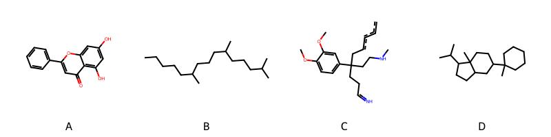

!!! abstract "Tóm tắt"

    **Họ Aizoaceae** có **5** chi được các cộng đồng sử dụng trong chăm sóc sức khỏe gồm *Sceletium, Tetragonia, Mesembryanthemum, Sesuvium, Trianthema*. Số lượng thành phần hóa học đã phân lập và xác định cấu trúc từ họ này tính đến tháng 12 năm 2024 là **12** nhóm có thể liệt kê như sau *Steroids and steroid derivatives, Fatty Acyls, Flavonoids, Cinnamic acids and derivatives, Quinolines and derivatives, Pyrrolidines, Benzopyrans, Aryltetralin lignans, Phenols, Carboxylic acids and derivatives, Benzene and substituted derivatives, Prenol lipids*. Giữa các loài trong họ này, 3 dược liệu được nghiên cứu nhiều nhất dựa trên số thành phần được phân lập là **Tetragonia tetragonoides, Mesembryanthemum tortuosum, Trianthema portulacastrum*. *Họ Aizoaceae* đã được một số công động tại các quốc gia như Elsewhere, Turkey, Haiti, Australia, S Africa(Hottentot), Sudan, South Africa, Dominican Republic, Philippines đã phát hiện một số tác dụng trên lâm sàng gồm chữa bệnh lẫn độc tính như Chất làm mềm, Chất làm se, Chất làm se, Thuốc phá thai, Chất độc, Họ sẽ mở, Ma túy, Thuốc an thần, chất gây say, Ma túy, Thuốc lợi tiểu, Thuốc lợi tiểu, Làm dịu, Thuốc phá thai, Thuốc giải độc, Thuốc lợi tiểu, Thuốc trừ sâu, Chất độc, Thuốc thanh lọc, Thuốc phá thai, Thuốc thanh lọc, Emmenagogue, Thuốc trừ sâu, Thuốc tẩy giun, Xà phòng, chất gây say, dạ dày.

!!! info "DrDuke"

    James A. Duke sinh năm 1929-2017 là một nhà thực vật học người Mỹ. Đây là một trong những tác giả hàng đầu trong lĩnh vực dược dân tộc học với cuốn *CRC Handbook of Medicinal Herbs* và chính là người xây dựng lên cơ sở dữ liệu về hợp chất tự nhiên và dược dân tộc học tại Bộ nông nghiệp Hoa Kỳ. Các thông tin được đăng tải tại website [Dr. Duke's Phytochemical and Ethnobotanical Databases](https://phytochem.nal.usda.gov/). 
    Trong suốt thập niên 1970, ông lãnh đạo the Plant Taxonomy Laboratory, Plant Genetics and Germplasm Institute of the Agricultural Research Service, U.S. Department of Agriculture.
    Trong tài liệu này, các thông tin về dược dân tộc của các dược liệu được trích dẫn từ tài liệu của James A. Ducke với sự trợ giúp của phần mềm dịch thuật từ tiếng Anh sang tiếng Việt.
   
## Tổng quan về Họ Aizoaceae
### Phân loại thực vật
Trong *họ Aizoaceae* có **5** chi được sử dụng làm thuốc với chi tiết số loài trong mỗi chi như sau Trianthema (6) . Chi tiết về loài sử dụng làm thuốc như dưới đây.  

>Họ Aizoaceae


>|-- Chi Sceletium

>*Sceletium anatomicum*,

>|-- Chi Tetragonia

>*Tetragonia tetragonioides*,
>*Tetragonia tetragonoides*,

>|-- Chi Mesembryanthemum

>*Mesembryanthemum crystallinum*,
>*Mesembryanthemum stellatum*,
>*Mesembryanthemum tortuosum*,

>|-- Chi Sesuvium

>*Sesuvium portulacastrum*,

>|-- Chi Trianthema

>*Trianthema decandra*,
>*Trianthema govindia*,
>*Trianthema pentandra*,
>*Trianthema portulacastrum*,
>*Trianthema salsoloides*,
>*Trianthema triquetra*,

### Thành phần hóa học 

Số lượng thành phần hóa học đã phân lập và xác định cấu trúc từ họ này tính đến tháng 12 năm 2024 là 12 nhóm có thể liệt kê như sau Steroids and steroid derivatives, Fatty Acyls, Flavonoids, Cinnamic acids and derivatives, Quinolines and derivatives, Pyrrolidines, Benzopyrans, Aryltetralin lignans, Phenols, Carboxylic acids and derivatives, Benzene and substituted derivatives, Prenol lipids. Số lượng các loài đã được nghiên cứu thành phần hóa học là *6* trong tổng số *13* loài thuộc họ Aizoaceae.Giữa các loài trong họ này, 3 dược liệu được nghiên cứu nhiều nhất dựa trên số thành phần được phân lập là **Tetragonia tetragonoides, Mesembryanthemum tortuosum, Trianthema portulacastrum**. Sử dụng phần mềm RDKIT với thuật toán  Find Maximum Common Substructure (FMCS), các nhóm hoạt chất phổ biến nhất trong *họ Aizoaceae* đã xây dựng được nhân. Điều này trong tương lại có thể được sử dụng tìm kiếm mối liên hệ giữa tác dụng của cấu trúc hóa học và tác dụng dược lý. Các nhân trong phần này có thể không giống như cấu trúc gốc của từng nhóm chất. Kết quả được trình bầy như hình dưới đây.

<figure markdown="span">
    { width=100% }
    <figcaption> Cấu trúc hóa học của một số khung cơ bản dựa trên thuật toán FMCS để tìm Flavonoids (A), Prenol lipids (B), Quinolines and derivatives (C), Steroids and steroid derivatives (D).</figcaption>
</figure>


!!! info  "Find Maximum Common Substructure"
    
    Thuật toán FMCS (Find Maximum Common Substructure) là một phương pháp được sử dụng để tìm ra cấu trúc chung nhiều nhất (MCS) trong một tập hợp các cấu trúc hóa học. Các bước của thuật toán gồm:
    - Chọn một cấu trúc hóa học là cấu trúc để tạo truy vấn, còn các cấu trúc khác là mục tiêu.
    - Chia nhỏ cấu trúc để tạo truy vấn thành cấu trúc nhỏ hơn dạng chuỗi SMARTS.
    - Kiểm tra chuỗi SMARTS trong các cấu trúc mục tiêu.
    - Tìm kiếm chuỗi SMARTS xuất hiện nhiều nhất.
    Để biết thêm chi tiết các bạn có thể xem tại [TeachOpenCADD](https://projects.volkamerlab.org/teachopencadd/talktorials/T006_compound_maximum_common_substructures.html)
    ``` python
    pip install rdkit
    def find_core_smiles(smiles_list):
        mols = [Chem.MolFromSmiles(smiles) for smiles in smiles_list]
        mcs = rdFMCS.FindMCS(mols)
        core_smiles = Chem.MolToSmiles(Chem.MolFromSmarts(mcs.smartsString))
        return core_smiles
    ```

### Dược dân tộc học

Họ **Aizoaceae** đã được một số công động tại các quốc gia như *Elsewhere, Turkey, Haiti, Australia, S Africa(Hottentot), Sudan, South Africa, Dominican Republic, Philippines* đã phát hiện một số tác dụng trên lâm sàng gồm chữa bệnh lẫn độc tính như *Chất làm mềm, Chất làm se, Chất làm se, Thuốc phá thai, Chất độc, Họ sẽ mở, Ma túy, Thuốc an thần, chất gây say, Ma túy, Thuốc lợi tiểu, Thuốc lợi tiểu, Làm dịu, Thuốc phá thai, Thuốc giải độc, Thuốc lợi tiểu, Thuốc trừ sâu, Chất độc, Thuốc thanh lọc, Thuốc phá thai, Thuốc thanh lọc, Emmenagogue, Thuốc trừ sâu, Thuốc tẩy giun, Xà phòng, chất gây say, dạ dày*.

## Chi tiết dược dân tộc học


### Chi Sceletium

!!! note "Danh sách các loài thuộc chi"
    
*	 - *Sceletium anatomicum**

---      
#### *Mesembryanthemum crystallinum*
**Thông tin về thực vật**

!!! info "Phân loại thực vật của *Mesembryanthemum crystallinum* từ GIBF:"
    - **Kingdom:** Plantae
    - **Phylum:** Tracheophyta
    - **Order:** Caryophyllales
    - **Family:** Aizoaceae
    - **Genus:** Mesembryanthemum
    - **Species:** *Mesembryanthemum crystallinum*


 

Chưa có thông tin về loài này trên wikidata.

*Phân bố trên thế giới*: Gibraltar, Cyprus, Portugal, Spain, Malta, South Africa, Tunisia, Morocco, Mexico, Chile, Algeria, United States of America, Australia

*Phân bố tại Việt Nam*: Không có ghi nhận ở Việt Nam

**Thành phần hóa học**
        

Chưa có nghiên cứu về thành phần hóa học của loài này


**Dược dân tộc học**

Danh sách các quốc gia có sử dụng *Mesembryanthemum crystallinum* trong điều trị các bệnh. 

| Quốc gia     | Bệnh                                |
|:-------------|:------------------------------------|
| South Africa | Thuốc an thần, chất gây say, Ma túy |


### Chi Tetragonia

!!! note "Danh sách các loài thuộc chi"
    
*	 - *Tetragonia tetragonioides*
	 - *Tetragonia tetragonoides**

---      
#### *Tetragonia tetragonioides*
**Thông tin về thực vật**

!!! info "Phân loại thực vật của *Tetragonia tetragonioides* từ GIBF:"
    - **Kingdom:** Plantae
    - **Phylum:** Tracheophyta
    - **Order:** Caryophyllales
    - **Family:** Aizoaceae
    - **Genus:** Tetragonia
    - **Species:** *Tetragonia tetragonioides*


 

Chưa có thông tin về loài này trên wikidata.

*Phân bố trên thế giới*: France, Germany, Spain, United States of America, Portugal, Réunion, United Kingdom of Great Britain and Northern Ireland, Brazil, Ecuador, Japan, Korea, Republic of, Netherlands, Jersey, Belgium

*Phân bố tại Việt Nam*: Không có ghi nhận ở Việt Nam

**Thành phần hóa học**
        

Theo cơ sở dữ liệu lotus, từ loài *Tetragonia tetragonioides* đã phân lập và xác định được 2 hoạt chất thuộc về các nhóm Prenol lipids, Carboxylic acids and derivatives. Danh sách các hoạt chất như sau oxalic acid [(LTS0217707)](https://lotus.naturalproducts.net/compound/lotus_id/LTS0217707), phyton [(LTS0143973)](https://lotus.naturalproducts.net/compound/lotus_id/LTS0143973).

| chemicalTaxonomyClassyfireClass   |   lotus_count |
|:----------------------------------|--------------:|
| Carboxylic acids and derivatives  |             1 |
| Prenol lipids                     |             1 |


**Dược dân tộc học**

Danh sách các quốc gia có sử dụng *Tetragonia tetragonioides* trong điều trị các bệnh. 

| Quốc gia   | Bệnh          |
|:-----------|:--------------|
| Elsewhere  | Thuốc trừ sâu |


---      
#### *Tetragonia tetragonoides*
**Thông tin về thực vật**

!!! info "Phân loại thực vật của *Tetragonia tetragonoides* từ GIBF:"
    - **Kingdom:** Plantae
    - **Phylum:** Tracheophyta
    - **Order:** Caryophyllales
    - **Family:** Aizoaceae
    - **Genus:** Tetragonia
    - **Species:** *Tetragonia tetragonoides*


 

Chưa có thông tin về loài này trên wikidata.

*Phân bố trên thế giới*: France, nan, United States of America, Spain, Portugal, Chinese Taipei, China, Croatia, South Africa, New Zealand, Brazil, Ecuador, Japan, Nepal, Australia, Chile, Uruguay

*Phân bố tại Việt Nam*: Không có ghi nhận ở Việt Nam

**Thành phần hóa học**
        

Theo cơ sở dữ liệu lotus, từ loài *Tetragonia tetragonoides* đã phân lập và xác định được 37 hoạt chất thuộc về các nhóm Steroids and steroid derivatives, Flavonoids, Cinnamic acids and derivatives, Aryltetralin lignans, Carboxylic acids and derivatives, Prenol lipids. Danh sách các hoạt chất như sau 1-(3,4-dihydroxyphenyl)-6,7-dihydroxy-n-[2-(4-hydroxyphenyl)ethyl]-3-{[2-(4-hydroxyphenyl)ethyl]carbamoyl}-1,2-dihydronaphthalene-2-carboximidic acid [(LTS0075548)](https://lotus.naturalproducts.net/compound/lotus_id/LTS0075548), phytosterol [(LTS0029311)](https://lotus.naturalproducts.net/compound/lotus_id/LTS0029311), stigmast-5-en-3-ol, (3β)- [(LTS0204616)](https://lotus.naturalproducts.net/compound/lotus_id/LTS0204616), (3s,6r)-6-[(1r,3as,3br,9as,9bs,11ar)-9a,11a-dimethyl-tetradecahydro-1h-cyclopenta[a]phenanthren-1-yl]-3-isopropylheptan-1-ol [(LTS0063219)](https://lotus.naturalproducts.net/compound/lotus_id/LTS0063219), ferulic acid [(LTS0077328)](https://lotus.naturalproducts.net/compound/lotus_id/LTS0077328), (1r,5as,7s,9as,9bs,11ar)-1-[(2r)-5-ethyl-6-methylheptan-2-yl]-9a,11a-dimethyl-tetradecahydro-1h-cyclopenta[a]phenanthren-7-ol [(LTS0024392)](https://lotus.naturalproducts.net/compound/lotus_id/LTS0024392), campesterol [(LTS0046755)](https://lotus.naturalproducts.net/compound/lotus_id/LTS0046755), 3,7,11,15-tetramethylhexadec-2-enal [(LTS0030079)](https://lotus.naturalproducts.net/compound/lotus_id/LTS0030079), (2z)-3-(3,4-dihydroxyphenyl)-n-[2-(4-hydroxyphenyl)ethyl]prop-2-enimidic acid [(LTS0223720)](https://lotus.naturalproducts.net/compound/lotus_id/LTS0223720), oxalic acid [(LTS0217707)](https://lotus.naturalproducts.net/compound/lotus_id/LTS0217707), (3ar,5as,9as,9bs,11ar)-1-(5-ethyl-6-methylhept-3-en-2-yl)-9a,11a-dimethyl-1h,2h,3h,3ah,5h,5ah,6h,7h,8h,9h,9bh,10h,11h-cyclopenta[a]phenanthren-7-ol [(LTS0197417)](https://lotus.naturalproducts.net/compound/lotus_id/LTS0197417), (z)-methyl ferulate [(LTS0130447)](https://lotus.naturalproducts.net/compound/lotus_id/LTS0130447), 3,7,11,15-tetramethylhexadec-2-en-1-ol [(LTS0056933)](https://lotus.naturalproducts.net/compound/lotus_id/LTS0056933), cis-ferulic acid [(LTS0160926)](https://lotus.naturalproducts.net/compound/lotus_id/LTS0160926), 3-(3,4-dihydroxyphenyl)-n-[2-(4-hydroxyphenyl)ethyl]prop-2-enimidic acid [(LTS0204950)](https://lotus.naturalproducts.net/compound/lotus_id/LTS0204950), [(2r,3s,4s,5r,6s)-6-[(3-{[(2s,3r,4s,5s,6r)-4,5-dihydroxy-6-(hydroxymethyl)-3-{[(2s,3r,4s,5s,6r)-3,4,5-trihydroxy-6-(hydroxymethyl)oxan-2-yl]oxy}oxan-2-yl]oxy}-5-hydroxy-2-(3-hydroxy-4-methoxyphenyl)-6-methoxy-4-oxochromen-7-yl)oxy]-3,4,5-trihydroxyoxan-2-yl]methyl (2e)-3-(3,4-dihydroxyphenyl)prop-2-enoate [(LTS0210801)](https://lotus.naturalproducts.net/compound/lotus_id/LTS0210801), (2e,7s,11s)-3,7,11,15-tetramethylhexadec-2-enal [(LTS0242803)](https://lotus.naturalproducts.net/compound/lotus_id/LTS0242803), (1r,3as,3bs,7s,9bs)-1-[(2r,5r)-5,6-dimethylheptan-2-yl]-9a,11a-dimethyl-1h,2h,3h,3ah,3bh,4h,6h,7h,8h,9h,9bh,10h,11h-cyclopenta[a]phenanthren-7-ol [(LTS0057877)](https://lotus.naturalproducts.net/compound/lotus_id/LTS0057877), stigmast-5-en-3-ol [(LTS0071224)](https://lotus.naturalproducts.net/compound/lotus_id/LTS0071224), methyl ferulate [(LTS0265853)](https://lotus.naturalproducts.net/compound/lotus_id/LTS0265853), (3β,5α)-stigmast-7-en-3-ol [(LTS0245097)](https://lotus.naturalproducts.net/compound/lotus_id/LTS0245097), [(2r,3s,4s,5r,6s)-6-[(3-{[(2s,3r,4s,5s,6r)-4,5-dihydroxy-6-(hydroxymethyl)-3-{[(2s,3r,4s,5s,6r)-3,4,5-trihydroxy-6-(hydroxymethyl)oxan-2-yl]oxy}oxan-2-yl]oxy}-5-hydroxy-6-methoxy-2-(4-methoxyphenyl)-4-oxochromen-7-yl)oxy]-3,4,5-trihydroxyoxan-2-yl]methyl (2e)-3-(3,4-dihydroxyphenyl)prop-2-enoate [(LTS0084529)](https://lotus.naturalproducts.net/compound/lotus_id/LTS0084529), (1r,2s)-1-(3,4-dihydroxyphenyl)-6,7-dihydroxy-n-[2-(4-hydroxyphenyl)ethyl]-3-{[2-(4-hydroxyphenyl)ethyl]carbamoyl}-1,2-dihydronaphthalene-2-carboximidic acid [(LTS0211923)](https://lotus.naturalproducts.net/compound/lotus_id/LTS0211923), {6-[(3-{[4,5-dihydroxy-6-(hydroxymethyl)-3-{[3,4,5-trihydroxy-6-(hydroxymethyl)oxan-2-yl]oxy}oxan-2-yl]oxy}-5-hydroxy-6-methoxy-2-(4-methoxyphenyl)-4-oxochromen-7-yl)oxy]-3,4,5-trihydroxyoxan-2-yl}methyl 3-(3,4-dihydroxyphenyl)prop-2-enoate [(LTS0243599)](https://lotus.naturalproducts.net/compound/lotus_id/LTS0243599), (2e,7s,11s)-3,7,11,15-tetramethylhexadec-2-en-1-ol [(LTS0207261)](https://lotus.naturalproducts.net/compound/lotus_id/LTS0207261), chondrillasterol [(LTS0142259)](https://lotus.naturalproducts.net/compound/lotus_id/LTS0142259), {6-[(3-{[4,5-dihydroxy-6-(hydroxymethyl)-3-{[3,4,5-trihydroxy-6-(hydroxymethyl)oxan-2-yl]oxy}oxan-2-yl]oxy}-5-hydroxy-2-(4-hydroxyphenyl)-6-methoxy-4-oxochromen-7-yl)oxy]-3,4,5-trihydroxyoxan-2-yl}methyl 3-(3,4-dihydroxyphenyl)prop-2-enoate [(LTS0123831)](https://lotus.naturalproducts.net/compound/lotus_id/LTS0123831), (7s,11s)-7,11,15-trimethyl-3-methylidenehexadec-1-ene [(LTS0070149)](https://lotus.naturalproducts.net/compound/lotus_id/LTS0070149), 6,10,14-trimethyl-2-methylidenepentadecanal [(LTS0205267)](https://lotus.naturalproducts.net/compound/lotus_id/LTS0205267), {6-[(3-{[4,5-dihydroxy-6-(hydroxymethyl)-3-{[3,4,5-trihydroxy-6-(hydroxymethyl)oxan-2-yl]oxy}oxan-2-yl]oxy}-5-hydroxy-2-(3-hydroxy-4-methoxyphenyl)-6-methoxy-4-oxochromen-7-yl)oxy]-3,4,5-trihydroxyoxan-2-yl}methyl 3-(3,4-dihydroxyphenyl)prop-2-enoate [(LTS0266730)](https://lotus.naturalproducts.net/compound/lotus_id/LTS0266730), ferulic acid [(LTS0273002)](https://lotus.naturalproducts.net/compound/lotus_id/LTS0273002), [(2r,3s,4s,5r,6s)-6-[(3-{[(2s,3r,4s,5s,6r)-4,5-dihydroxy-6-(hydroxymethyl)-3-{[(2s,3r,4s,5s,6r)-3,4,5-trihydroxy-6-(hydroxymethyl)oxan-2-yl]oxy}oxan-2-yl]oxy}-5-hydroxy-2-(4-hydroxyphenyl)-6-methoxy-4-oxochromen-7-yl)oxy]-3,4,5-trihydroxyoxan-2-yl]methyl (2e)-3-(3,4-dihydroxyphenyl)prop-2-enoate [(LTS0240966)](https://lotus.naturalproducts.net/compound/lotus_id/LTS0240966), (6s,10s)-6,10,14-trimethyl-2-methylidenepentadecanal [(LTS0209853)](https://lotus.naturalproducts.net/compound/lotus_id/LTS0209853), (2e)-3-(3,4-dihydroxyphenyl)-n-[2-(4-hydroxyphenyl)ethyl]prop-2-enimidic acid [(LTS0092682)](https://lotus.naturalproducts.net/compound/lotus_id/LTS0092682), (6r,10r)-6,10,14-trimethyl-2-methylidenepentadecanal [(LTS0138609)](https://lotus.naturalproducts.net/compound/lotus_id/LTS0138609), methyl ferulate [(LTS0047572)](https://lotus.naturalproducts.net/compound/lotus_id/LTS0047572), 7,11,15-trimethyl-3-methylidenehexadec-1-ene [(LTS0204893)](https://lotus.naturalproducts.net/compound/lotus_id/LTS0204893).

| chemicalTaxonomyClassyfireClass   |   lotus_count |
|:----------------------------------|--------------:|
| Aryltetralin lignans              |             2 |
| Carboxylic acids and derivatives  |             1 |
| Cinnamic acids and derivatives    |             9 |
| Flavonoids                        |             6 |
| Prenol lipids                     |             9 |
| Steroids and steroid derivatives  |            10 |


**Dược dân tộc học**

Danh sách các quốc gia có sử dụng *Tetragonia tetragonoides* trong điều trị các bệnh. 

| Quốc gia   | Bệnh   |
|:-----------|:-------|
| Elsewhere  | dạ dày |


### Chi Mesembryanthemum

!!! note "Danh sách các loài thuộc chi"
    
*	 - *Mesembryanthemum crystallinum*
	 - *Mesembryanthemum stellatum*
	 - *Mesembryanthemum tortuosum**

---      
#### *Mesembryanthemum crystallinum*
**Thông tin về thực vật**

!!! info "Phân loại thực vật của *Mesembryanthemum crystallinum* từ GIBF:"
    - **Kingdom:** Plantae
    - **Phylum:** Tracheophyta
    - **Order:** Caryophyllales
    - **Family:** Aizoaceae
    - **Genus:** Mesembryanthemum
    - **Species:** *Mesembryanthemum crystallinum*


 

Chưa có thông tin về loài này trên wikidata.

*Phân bố trên thế giới*: Gibraltar, Cyprus, Portugal, Spain, Malta, South Africa, Tunisia, Morocco, Mexico, Chile, Algeria, United States of America, Australia

*Phân bố tại Việt Nam*: Không có ghi nhận ở Việt Nam

**Thành phần hóa học**
        

Theo cơ sở dữ liệu lotus, từ loài *Mesembryanthemum crystallinum* đã phân lập và xác định được 2 hoạt chất thuộc về các nhóm Fatty Acyls, Flavonoids. Danh sách các hoạt chất như sau 2-carboxy-d-arabinitol [(LTS0056947)](https://lotus.naturalproducts.net/compound/lotus_id/LTS0056947), (2s,3r,4s,5r)-2-{[(2s,3r,4s,5s,6r)-2-{[5,7-dihydroxy-2-(4-hydroxy-3-methoxyphenyl)-6-methoxy-4-oxochromen-3-yl]oxy}-4,5-dihydroxy-6-(hydroxymethyl)oxan-3-yl]oxy}-5-hydroxy-4-{[(2s,3r,4s,5s,6r)-3,4,5-trihydroxy-6-(hydroxymethyl)oxan-2-yl]oxy}oxan-3-yl (2z)-3-(4-hydroxy-3-methoxyphenyl)prop-2-enoate [(LTS0067653)](https://lotus.naturalproducts.net/compound/lotus_id/LTS0067653).

| chemicalTaxonomyClassyfireClass   |   lotus_count |
|:----------------------------------|--------------:|
| Fatty Acyls                       |             1 |
| Flavonoids                        |             1 |


**Dược dân tộc học**

Danh sách các quốc gia có sử dụng *Mesembryanthemum crystallinum* trong điều trị các bệnh. 

| Quốc gia   | Bệnh                    |
|:-----------|:------------------------|
| Elsewhere  | Thuốc lợi tiểu          |
| Turkey     | Thuốc lợi tiểu, Làm dịu |


---      
#### *Mesembryanthemum crystallinum*
**Thông tin về thực vật**

!!! info "Phân loại thực vật của *Mesembryanthemum crystallinum* từ GIBF:"
    - **Kingdom:** Plantae
    - **Phylum:** Tracheophyta
    - **Order:** Caryophyllales
    - **Family:** Aizoaceae
    - **Genus:** Mesembryanthemum
    - **Species:** *Mesembryanthemum crystallinum*


 

Chưa có thông tin về loài này trên wikidata.

*Phân bố trên thế giới*: Gibraltar, Cyprus, Portugal, Spain, Malta, South Africa, Tunisia, Morocco, Mexico, Chile, Algeria, United States of America, Australia

*Phân bố tại Việt Nam*: Không có ghi nhận ở Việt Nam

**Thành phần hóa học**
        

Chưa có nghiên cứu về thành phần hóa học của loài này


**Dược dân tộc học**

Danh sách các quốc gia có sử dụng *Mesembryanthemum crystallinum* trong điều trị các bệnh. 

| Quốc gia     | Bệnh         |
|:-------------|:-------------|
| South Africa | chất gây say |


---      
#### *Mesembryanthemum tortuosum*
**Thông tin về thực vật**

!!! info "Phân loại thực vật của *Mesembryanthemum tortuosum* từ GIBF:"
    - **Kingdom:** Plantae
    - **Phylum:** Tracheophyta
    - **Order:** Caryophyllales
    - **Family:** Aizoaceae
    - **Genus:** Mesembryanthemum
    - **Species:** *Mesembryanthemum tortuosum*


 

Chưa có thông tin về loài này trên wikidata.

*Phân bố trên thế giới*: South Africa, nan, unknown or invalid

*Phân bố tại Việt Nam*: Không có ghi nhận ở Việt Nam

**Thành phần hóa học**
        

Theo cơ sở dữ liệu lotus, từ loài *Mesembryanthemum tortuosum* đã phân lập và xác định được 25 hoạt chất thuộc về các nhóm Benzene and substituted derivatives, Phenols, Quinolines and derivatives, Pyrrolidines. Danh sách các hoạt chất như sau tortuosamine [(LTS0024035)](https://lotus.naturalproducts.net/compound/lotus_id/LTS0024035), (3ar,6r,7as)-3a-(3,4-dimethoxyphenyl)-1-methyl-3,6,7,7a-tetrahydro-2h-indol-6-ol [(LTS0033934)](https://lotus.naturalproducts.net/compound/lotus_id/LTS0033934), tortuosamine [(LTS0059117)](https://lotus.naturalproducts.net/compound/lotus_id/LTS0059117), (3as)-3a-(3,4-dimethoxyphenyl)-1-methyl-2,3,7,7a-tetrahydroindol-6-one [(LTS0049180)](https://lotus.naturalproducts.net/compound/lotus_id/LTS0049180), 3a-(3,4-dimethoxyphenyl)-1-methyl-2,3,7,7a-tetrahydroindol-6-one [(LTS0008428)](https://lotus.naturalproducts.net/compound/lotus_id/LTS0008428), (1r,4r)-4-(3,4-dimethoxyphenyl)-4-[2-(dimethylamino)ethyl]cyclohex-2-en-1-ol [(LTS0155968)](https://lotus.naturalproducts.net/compound/lotus_id/LTS0155968), 4-(3,4-dimethoxyphenyl)-4-[2-(dimethylamino)ethyl]cyclohex-2-en-1-ol [(LTS0269008)](https://lotus.naturalproducts.net/compound/lotus_id/LTS0269008), mesembrinol [(LTS0272162)](https://lotus.naturalproducts.net/compound/lotus_id/LTS0272162), n-{2-[1-(3,4-dimethoxyphenyl)-4-oxocyclohexyl]ethyl}-n-methylacetamide [(LTS0140550)](https://lotus.naturalproducts.net/compound/lotus_id/LTS0140550), n-{2-[(6s)-6-(3,4-dimethoxyphenyl)-7,8-dihydro-5h-quinolin-6-yl]ethyl}-n-methylformamide [(LTS0162729)](https://lotus.naturalproducts.net/compound/lotus_id/LTS0162729), {2-[6-(3,4-dimethoxyphenyl)-7,8-dihydro-5h-quinolin-6-yl]ethyl}(methyl)amine [(LTS0157047)](https://lotus.naturalproducts.net/compound/lotus_id/LTS0157047), 3a-(3,4-dimethoxyphenyl)-1-methyl-2h,3h,4h,5h,9bh-pyrrolo[2,3-f]quinoline [(LTS0055766)](https://lotus.naturalproducts.net/compound/lotus_id/LTS0055766), n-{2-[6-(3,4-dimethoxyphenyl)-7,8-dihydro-5h-quinolin-6-yl]ethyl}-n-methylformamide [(LTS0055402)](https://lotus.naturalproducts.net/compound/lotus_id/LTS0055402), 3a-(3,4-dimethoxyphenyl)-1-methyl-2h,3h,4h,5h,8h,9h,9bh-pyrrolo[2,3-f]quinolin-7-ol [(LTS0024820)](https://lotus.naturalproducts.net/compound/lotus_id/LTS0024820), (+)-sceletium a4 [(LTS0116398)](https://lotus.naturalproducts.net/compound/lotus_id/LTS0116398), n-{2-[(6r)-6-(3,4-dimethoxyphenyl)-7,8-dihydro-5h-quinolin-6-yl]ethyl}-n-methylacetamide [(LTS0154893)](https://lotus.naturalproducts.net/compound/lotus_id/LTS0154893), (3as,7as)-3a-(3,4-dimethoxyphenyl)-1-methyl-hexahydroindol-6-one [(LTS0078755)](https://lotus.naturalproducts.net/compound/lotus_id/LTS0078755), (3ar,9bs)-3a-(3,4-dimethoxyphenyl)-1-methyl-2h,3h,4h,5h,8h,9h,9bh-pyrrolo[2,3-f]quinolin-7-ol [(LTS0197558)](https://lotus.naturalproducts.net/compound/lotus_id/LTS0197558), (4s)-4-(3,4-dimethoxyphenyl)-4-[2-(dimethylamino)ethyl]cyclohex-2-en-1-one [(LTS0075732)](https://lotus.naturalproducts.net/compound/lotus_id/LTS0075732), n-{2-[6-(3,4-dimethoxyphenyl)-7,8-dihydro-5h-quinolin-6-yl]ethyl}-n-methylacetamide [(LTS0019899)](https://lotus.naturalproducts.net/compound/lotus_id/LTS0019899), 3a-(3,4-dimethoxyphenyl)-1-methyl-hexahydroindol-6-one [(LTS0183860)](https://lotus.naturalproducts.net/compound/lotus_id/LTS0183860), n-{2-[1-(4-hydroxy-3-methoxyphenyl)-4-oxocyclohexa-2,5-dien-1-yl]ethyl}-n-methylacetamide [(LTS0023805)](https://lotus.naturalproducts.net/compound/lotus_id/LTS0023805), 4-(3,4-dimethoxyphenyl)-4-[2-(dimethylamino)ethyl]cyclohex-2-en-1-one [(LTS0124516)](https://lotus.naturalproducts.net/compound/lotus_id/LTS0124516), mesembrenone [(LTS0093755)](https://lotus.naturalproducts.net/compound/lotus_id/LTS0093755), (3as)-3a-(3,4-dimethoxyphenyl)-1-methyl-hexahydroindol-6-one [(LTS0141676)](https://lotus.naturalproducts.net/compound/lotus_id/LTS0141676).

| chemicalTaxonomyClassyfireClass     |   lotus_count |
|:------------------------------------|--------------:|
| Benzene and substituted derivatives |             5 |
| Phenols                             |             1 |
| Pyrrolidines                        |             8 |
| Quinolines and derivatives          |            11 |


**Dược dân tộc học**

Danh sách các quốc gia có sử dụng *Mesembryanthemum tortuosum* trong điều trị các bệnh. 

| Quốc gia            | Bệnh   |
|:--------------------|:-------|
| S Africa(Hottentot) | Ma túy |


### Chi Sesuvium

!!! note "Danh sách các loài thuộc chi"
    
*	 - *Sesuvium portulacastrum**

---      
#### *Sesuvium portulacastrum*
**Thông tin về thực vật**

!!! info "Phân loại thực vật của *Sesuvium portulacastrum* từ GIBF:"
    - **Kingdom:** Plantae
    - **Phylum:** Tracheophyta
    - **Order:** Caryophyllales
    - **Family:** Aizoaceae
    - **Genus:** Sesuvium
    - **Species:** *Sesuvium portulacastrum*


 

Chưa có thông tin về loài này trên wikidata.

*Phân bố trên thế giới*: Cayman Islands, Curaçao, Turks and Caicos Islands, New Caledonia, Bahamas, Cuba, Jamaica, Antigua and Barbuda, Cabo Verde, Spain, Guadeloupe, Mexico, Chinese Taipei, Bonaire, Sint Eustatius and Saba, Belize, Australia, Aruba, Panama, Martinique, Virgin Islands (U.S.), Sint Maarten (Dutch part), Niue, United States Minor Outlying Islands, Senegal, Brazil, Peru, Argentina, Thailand, United States of America, Dominican Republic, Ecuador, Puerto Rico

*Phân bố tại Việt Nam*: Không có ghi nhận ở Việt Nam

**Thành phần hóa học**
        

Theo cơ sở dữ liệu lotus, từ loài *Sesuvium portulacastrum* đã phân lập và xác định được 4 hoạt chất thuộc về các nhóm Flavonoids. Danh sách các hoạt chất như sau (2s,3r)-3,5-dihydroxy-2-(4-hydroxyphenyl)-6,7-dimethoxy-2,3-dihydro-1-benzopyran-4-one [(LTS0249240)](https://lotus.naturalproducts.net/compound/lotus_id/LTS0249240), 3,5-dihydroxy-2-(4-hydroxyphenyl)-6,7-dimethoxy-2,3-dihydro-1-benzopyran-4-one [(LTS0224033)](https://lotus.naturalproducts.net/compound/lotus_id/LTS0224033), (2r,3r)-5-hydroxy-2-(4-hydroxyphenyl)-6,7-dimethoxy-3-{[(2r,3r,4s,5s,6r)-3,4,5-trihydroxy-6-(hydroxymethyl)oxan-2-yl]oxy}-2,3-dihydro-1-benzopyran-4-one [(LTS0199716)](https://lotus.naturalproducts.net/compound/lotus_id/LTS0199716), 5-hydroxy-2-(4-hydroxyphenyl)-6,7-dimethoxy-3-{[3,4,5-trihydroxy-6-(hydroxymethyl)oxan-2-yl]oxy}-2,3-dihydro-1-benzopyran-4-one [(LTS0245194)](https://lotus.naturalproducts.net/compound/lotus_id/LTS0245194).

| chemicalTaxonomyClassyfireClass   |   lotus_count |
|:----------------------------------|--------------:|
| Flavonoids                        |             4 |


**Dược dân tộc học**

Danh sách các quốc gia có sử dụng *Sesuvium portulacastrum* trong điều trị các bệnh. 

| Quốc gia           | Bệnh           |
|:-------------------|:---------------|
| Dominican Republic | Thuốc tẩy giun |
| Haiti              | Chất làm mềm   |


### Chi Trianthema

!!! note "Danh sách các loài thuộc chi"
    
*	 - *Trianthema decandra*
	 - *Trianthema govindia*
	 - *Trianthema pentandra*
	 - *Trianthema portulacastrum*
	 - *Trianthema salsoloides*
	 - *Trianthema triquetra**

---      
#### *Sesuvium portulacastrum*
**Thông tin về thực vật**

!!! info "Phân loại thực vật của *Sesuvium portulacastrum* từ GIBF:"
    - **Kingdom:** Plantae
    - **Phylum:** Tracheophyta
    - **Order:** Caryophyllales
    - **Family:** Aizoaceae
    - **Genus:** Sesuvium
    - **Species:** *Sesuvium portulacastrum*


 

Chưa có thông tin về loài này trên wikidata.

*Phân bố trên thế giới*: Cayman Islands, Curaçao, Turks and Caicos Islands, New Caledonia, Bahamas, Cuba, Jamaica, Antigua and Barbuda, Cabo Verde, Spain, Guadeloupe, Mexico, Chinese Taipei, Bonaire, Sint Eustatius and Saba, Belize, Australia, Aruba, Panama, Martinique, Virgin Islands (U.S.), Sint Maarten (Dutch part), Niue, United States Minor Outlying Islands, Senegal, Brazil, Peru, Argentina, Thailand, United States of America, Dominican Republic, Ecuador, Puerto Rico

*Phân bố tại Việt Nam*: Không có ghi nhận ở Việt Nam

**Thành phần hóa học**
        

Chưa có nghiên cứu về thành phần hóa học của loài này


**Dược dân tộc học**

Danh sách các quốc gia có sử dụng *Sesuvium portulacastrum* trong điều trị các bệnh. 

| Quốc gia   | Bệnh     |
|:-----------|:---------|
| Australia  | Chất độc |
| Elsewhere  | Họ sẽ mở |


---      
#### *Sesuvium portulacastrum*
**Thông tin về thực vật**

!!! info "Phân loại thực vật của *Sesuvium portulacastrum* từ GIBF:"
    - **Kingdom:** Plantae
    - **Phylum:** Tracheophyta
    - **Order:** Caryophyllales
    - **Family:** Aizoaceae
    - **Genus:** Sesuvium
    - **Species:** *Sesuvium portulacastrum*


 

Chưa có thông tin về loài này trên wikidata.

*Phân bố trên thế giới*: Cayman Islands, Curaçao, Turks and Caicos Islands, New Caledonia, Bahamas, Cuba, Jamaica, Antigua and Barbuda, Cabo Verde, Spain, Guadeloupe, Mexico, Chinese Taipei, Bonaire, Sint Eustatius and Saba, Belize, Australia, Aruba, Panama, Martinique, Virgin Islands (U.S.), Sint Maarten (Dutch part), Niue, United States Minor Outlying Islands, Senegal, Brazil, Peru, Argentina, Thailand, United States of America, Dominican Republic, Ecuador, Puerto Rico

*Phân bố tại Việt Nam*: Không có ghi nhận ở Việt Nam

**Thành phần hóa học**
        

Chưa có nghiên cứu về thành phần hóa học của loài này


**Dược dân tộc học**

Danh sách các quốc gia có sử dụng *Sesuvium portulacastrum* trong điều trị các bệnh. 

| Quốc gia   | Bệnh                        |
|:-----------|:----------------------------|
| Elsewhere  | Chất làm se, Thuốc phá thai |


---      
#### *Sesuvium portulacastrum*
**Thông tin về thực vật**

!!! info "Phân loại thực vật của *Sesuvium portulacastrum* từ GIBF:"
    - **Kingdom:** Plantae
    - **Phylum:** Tracheophyta
    - **Order:** Caryophyllales
    - **Family:** Aizoaceae
    - **Genus:** Sesuvium
    - **Species:** *Sesuvium portulacastrum*


 

Chưa có thông tin về loài này trên wikidata.

*Phân bố trên thế giới*: Cayman Islands, Curaçao, Turks and Caicos Islands, New Caledonia, Bahamas, Cuba, Jamaica, Antigua and Barbuda, Cabo Verde, Spain, Guadeloupe, Mexico, Chinese Taipei, Bonaire, Sint Eustatius and Saba, Belize, Australia, Aruba, Panama, Martinique, Virgin Islands (U.S.), Sint Maarten (Dutch part), Niue, United States Minor Outlying Islands, Senegal, Brazil, Peru, Argentina, Thailand, United States of America, Dominican Republic, Ecuador, Puerto Rico

*Phân bố tại Việt Nam*: Không có ghi nhận ở Việt Nam

**Thành phần hóa học**
        

Chưa có nghiên cứu về thành phần hóa học của loài này


**Dược dân tộc học**

Danh sách các quốc gia có sử dụng *Sesuvium portulacastrum* trong điều trị các bệnh. 

| Quốc gia   | Bệnh        |
|:-----------|:------------|
| Sudan      | Chất làm se |


---      
#### *Trianthema portulacastrum*
**Thông tin về thực vật**

!!! info "Phân loại thực vật của *Trianthema portulacastrum* từ GIBF:"
    - **Kingdom:** Plantae
    - **Phylum:** Tracheophyta
    - **Order:** Caryophyllales
    - **Family:** Aizoaceae
    - **Genus:** Trianthema
    - **Species:** *Trianthema portulacastrum*


 

Chưa có thông tin về loài này trên wikidata.

*Phân bố trên thế giới*: nan, Israel, Gambia, Curaçao, Antigua and Barbuda, Egypt, Mexico, Chinese Taipei, Colombia, United Arab Emirates, Australia, Aruba, Panama, Virgin Islands (U.S.), Saudi Arabia, Saint Kitts and Nevis, India, Brazil, Peru, Viet Nam, Thailand, United States of America, Montserrat, Pakistan, Dominican Republic, Ecuador, Puerto Rico

*Phân bố tại Việt Nam*: Long An

**Thành phần hóa học**
        

Theo cơ sở dữ liệu lotus, từ loài *Trianthema portulacastrum* đã phân lập và xác định được 21 hoạt chất thuộc về các nhóm Steroids and steroid derivatives, Fatty Acyls, Flavonoids, Benzopyrans, Phenols, Benzene and substituted derivatives, Prenol lipids. Danh sách các hoạt chất như sau 2-{[1-(5-ethyl-6-methylheptan-2-yl)-9a,11a-dimethyl-1h,2h,3h,3ah,3bh,4h,6h,7h,8h,9h,9bh,10h,11h-cyclopenta[a]phenanthren-7-yl]oxy}-6-(hydroxymethyl)oxane-3,4,5-triol [(LTS0158828)](https://lotus.naturalproducts.net/compound/lotus_id/LTS0158828), phytosterol [(LTS0029311)](https://lotus.naturalproducts.net/compound/lotus_id/LTS0029311), acetyl aleuritolic acid [(LTS0265563)](https://lotus.naturalproducts.net/compound/lotus_id/LTS0265563), stigmast-5-en-3-ol, (3β)- [(LTS0204616)](https://lotus.naturalproducts.net/compound/lotus_id/LTS0204616), (2r,4e,9r,13r)-5,9,13,17-tetramethyl-2-[(6s,10s)-6,10,14-trimethylpentadec-1-en-2-yl]octadec-4-en-1-ol [(LTS0096105)](https://lotus.naturalproducts.net/compound/lotus_id/LTS0096105), (2s,4e,9r,13r)-5,9,13,17-tetramethyl-2-[(6s,10r)-6,10,14-trimethylpentadec-1-en-2-yl]octadec-4-en-1-ol [(LTS0150041)](https://lotus.naturalproducts.net/compound/lotus_id/LTS0150041), (2r,3r,4s,5s,6r)-2-{[(1r,3as,3bs,7s,9ar,9bs,11ar)-1-[(2r,3e,5s)-5-ethyl-6-methylhept-3-en-2-yl]-9a,11a-dimethyl-1h,2h,3h,3ah,3bh,4h,6h,7h,8h,9h,9bh,10h,11h-cyclopenta[a]phenanthren-7-yl]oxy}-6-(hydroxymethyl)oxane-3,4,5-triol [(LTS0088971)](https://lotus.naturalproducts.net/compound/lotus_id/LTS0088971), 5,9,13,17-tetramethyl-2-(6,10,14-trimethylpentadec-1-en-2-yl)octadec-4-en-1-ol [(LTS0091189)](https://lotus.naturalproducts.net/compound/lotus_id/LTS0091189), linoleic [(LTS0013198)](https://lotus.naturalproducts.net/compound/lotus_id/LTS0013198), sitogluside [(LTS0201798)](https://lotus.naturalproducts.net/compound/lotus_id/LTS0201798), leptorumol [(LTS0065877)](https://lotus.naturalproducts.net/compound/lotus_id/LTS0065877), stigmast-5-en-3-ol [(LTS0071224)](https://lotus.naturalproducts.net/compound/lotus_id/LTS0071224), (2r,4e,9s,13s)-5,9,13,17-tetramethyl-2-[(6r,10r)-6,10,14-trimethylpentadec-1-en-2-yl]octadec-4-en-1-ol [(LTS0001861)](https://lotus.naturalproducts.net/compound/lotus_id/LTS0001861), 5-hydroxy-2-methoxybenzaldehyde [(LTS0168482)](https://lotus.naturalproducts.net/compound/lotus_id/LTS0168482), 10-(acetyloxy)-2,2,6b,9,9,12a,14a-heptamethyl-1,3,4,5,7,8,8a,10,11,12,12b,13,14,14b-tetradecahydropicene-4a-carboxylic acid [(LTS0140352)](https://lotus.naturalproducts.net/compound/lotus_id/LTS0140352), sitosterol [(LTS0168132)](https://lotus.naturalproducts.net/compound/lotus_id/LTS0168132), p-anisic acid [(LTS0123492)](https://lotus.naturalproducts.net/compound/lotus_id/LTS0123492), 2-{[1-(5-ethyl-6-methylhept-3-en-2-yl)-9a,11a-dimethyl-1h,2h,3h,3ah,3bh,4h,6h,7h,8h,9h,9bh,10h,11h-cyclopenta[a]phenanthren-7-yl]oxy}-6-(hydroxymethyl)oxane-3,4,5-triol [(LTS0057912)](https://lotus.naturalproducts.net/compound/lotus_id/LTS0057912), 4-propoxybenzoic acid [(LTS0005131)](https://lotus.naturalproducts.net/compound/lotus_id/LTS0005131), 5-hydroxy-2-(2-hydroxyphenyl)-7-methoxy-6,8-dimethylchromen-4-one [(LTS0232183)](https://lotus.naturalproducts.net/compound/lotus_id/LTS0232183), stigmasterol [(LTS0024262)](https://lotus.naturalproducts.net/compound/lotus_id/LTS0024262).

| chemicalTaxonomyClassyfireClass     |   lotus_count |
|:------------------------------------|--------------:|
| Benzene and substituted derivatives |             2 |
| Benzopyrans                         |             1 |
| Fatty Acyls                         |             1 |
| Flavonoids                          |             1 |
| Phenols                             |             1 |
| Prenol lipids                       |             6 |
| Steroids and steroid derivatives    |             9 |


**Dược dân tộc học**

Danh sách các quốc gia có sử dụng *Trianthema portulacastrum* trong điều trị các bệnh. 

| Quốc gia    | Bệnh                                                                                     |
|:------------|:-----------------------------------------------------------------------------------------|
| Elsewhere   | Thuốc phá thai, Thuốc giải độc, Thuốc lợi tiểu, Thuốc trừ sâu, Chất độc, Thuốc thanh lọc |
| Philippines | Thuốc phá thai, Thuốc thanh lọc, Emmenagogue                                             |


---      
#### *Trianthema portulacastrum*
**Thông tin về thực vật**

!!! info "Phân loại thực vật của *Trianthema portulacastrum* từ GIBF:"
    - **Kingdom:** Plantae
    - **Phylum:** Tracheophyta
    - **Order:** Caryophyllales
    - **Family:** Aizoaceae
    - **Genus:** Trianthema
    - **Species:** *Trianthema portulacastrum*


 

Chưa có thông tin về loài này trên wikidata.

*Phân bố trên thế giới*: nan, Israel, Gambia, Curaçao, Antigua and Barbuda, Egypt, Mexico, Chinese Taipei, Colombia, United Arab Emirates, Australia, Aruba, Panama, Virgin Islands (U.S.), Saudi Arabia, Saint Kitts and Nevis, India, Brazil, Peru, Viet Nam, Thailand, United States of America, Montserrat, Pakistan, Dominican Republic, Ecuador, Puerto Rico

*Phân bố tại Việt Nam*: Long An

**Thành phần hóa học**
        

Chưa có nghiên cứu về thành phần hóa học của loài này


**Dược dân tộc học**

Danh sách các quốc gia có sử dụng *Trianthema portulacastrum* trong điều trị các bệnh. 

| Quốc gia   | Bệnh     |
|:-----------|:---------|
| Sudan      | Xà phòng |


---      
#### *Trianthema portulacastrum*
**Thông tin về thực vật**

!!! info "Phân loại thực vật của *Trianthema portulacastrum* từ GIBF:"
    - **Kingdom:** Plantae
    - **Phylum:** Tracheophyta
    - **Order:** Caryophyllales
    - **Family:** Aizoaceae
    - **Genus:** Trianthema
    - **Species:** *Trianthema portulacastrum*


 

Chưa có thông tin về loài này trên wikidata.

*Phân bố trên thế giới*: nan, Israel, Gambia, Curaçao, Antigua and Barbuda, Egypt, Mexico, Chinese Taipei, Colombia, United Arab Emirates, Australia, Aruba, Panama, Virgin Islands (U.S.), Saudi Arabia, Saint Kitts and Nevis, India, Brazil, Peru, Viet Nam, Thailand, United States of America, Montserrat, Pakistan, Dominican Republic, Ecuador, Puerto Rico

*Phân bố tại Việt Nam*: Long An

**Thành phần hóa học**
        

Chưa có nghiên cứu về thành phần hóa học của loài này


**Dược dân tộc học**

Danh sách các quốc gia có sử dụng *Trianthema portulacastrum* trong điều trị các bệnh. 

| Quốc gia   | Bệnh     |
|:-----------|:---------|
| Elsewhere  | Chất độc |


## Bình luận

<div id="giscus-container"></div>
<script src="https://giscus.app/client.js"
        data-repo="hoangson0787/CSDL-duoc-lieu"
        data-repo-id="R_kgDONbMRNA"
        data-category="Duoc lieu"
        data-category-id="DIC_kwDONbMRNM4ClklR"
        data-mapping="pathname"
        data-strict="0"
        data-reactions-enabled="1"
        data-emit-metadata="1"
        data-input-position="bottom"
        data-theme="light"
        data-lang="en"
        crossorigin="anonymous"
        async>
</script>

