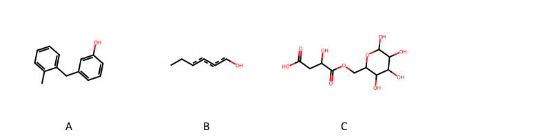

!!! abstract "Tóm tắt"

    **Họ Aloaceae** có **1** chi được các cộng đồng sử dụng trong chăm sóc sức khỏe gồm *Aloe*. Số lượng thành phần hóa học đã phân lập và xác định cấu trúc từ họ này tính đến tháng 12 năm 2024 là **20** nhóm có thể liệt kê như sau *Fatty Acyls, Phenols, Tetralins, Carboxylic acids and derivatives, Steroids and steroid derivatives, Glycerophospholipids, Saccharolipids, Organic phosphoric acids and derivatives, Anthracenes, Naphthofurans, Benzopyrans, Benzene and substituted derivatives, Stilbenes, Prenol lipids, Organooxygen compounds, Cinnamic acids and derivatives, Hydroxy acids and derivatives, Indoles and derivatives, Neoflavonoids, Glycerolipids*. Giữa các loài trong họ này, 3 dược liệu được nghiên cứu nhiều nhất dựa trên số thành phần được phân lập là **Aloe vera, Aloe ferox, Aloe barbadensis*. *Họ Aloaceae* đã được một số công động tại các quốc gia như China, Elsewhere, Turkey, Nepal, Haiti, Egypt, Malaya, Japan*, India, Panama, ain, Trinidad, Lesotho, Africa(Swahili) đã phát hiện một số tác dụng trên lâm sàng gồm chữa bệnh lẫn độc tính như Chất khử trùng, Thuốc thanh lọc, Emmenagogue, Chất làm mềm, Thuốc nhuận tràng, Thuốc tẩy giun, Thuốc trừ sâu, Emmenagogue, Thuốc trừ sâu, Thuốc gây mật, Ecbolic, Thuốc nhuận tràng, Thuốc bổ, Giờ mở cửa, Thuốc lợi tiểu, Chất làm mềm, Thuốc trừ sâu, Thuốc nhuận tràng, Họ sẽ mở, Thuốc gây mật, Emmenagogue, Thuốc nhuận tràng, Chất kích thích, Thuốc bổ, Thuốc tẩy giun, Thuốc nhuận tràng, Thuốc nhuận tràng, Emmenagogue, dạ dày, Thuốc nhuận tràng, Làm dịu, Thuốc nhuận tràng, Thuốc nhuận tràng, Thuốc phá thai, Thuốc phá thai, Chất khử trùng, Chất làm mềm, Thuốc nhuận tràng, Thuốc thanh lọc, Tiêu hóa, Chất làm mềm, Thuốc nhuận tràng, Thuốc tẩy giun, Chất kích thích, dạ dày, dạ dày, Thuốc nhuận tràng, Emmenagogue, dạ dày, Thuốc tẩy giun, Thuốc nhuận tràng.

!!! info "DrDuke"

    James A. Duke sinh năm 1929-2017 là một nhà thực vật học người Mỹ. Đây là một trong những tác giả hàng đầu trong lĩnh vực dược dân tộc học với cuốn *CRC Handbook of Medicinal Herbs* và chính là người xây dựng lên cơ sở dữ liệu về hợp chất tự nhiên và dược dân tộc học tại Bộ nông nghiệp Hoa Kỳ. Các thông tin được đăng tải tại website [Dr. Duke's Phytochemical and Ethnobotanical Databases](https://phytochem.nal.usda.gov/). 
    Trong suốt thập niên 1970, ông lãnh đạo the Plant Taxonomy Laboratory, Plant Genetics and Germplasm Institute of the Agricultural Research Service, U.S. Department of Agriculture.
    Trong tài liệu này, các thông tin về dược dân tộc của các dược liệu được trích dẫn từ tài liệu của James A. Ducke với sự trợ giúp của phần mềm dịch thuật từ tiếng Anh sang tiếng Việt.
   
## Tổng quan về Họ Aloaceae
### Phân loại thực vật
Trong *họ Aloaceae* có **1** chi được sử dụng làm thuốc với chi tiết số loài trong mỗi chi như sau Aloe (8) . Chi tiết về loài sử dụng làm thuốc như dưới đây.  

>Họ Aloaceae


>|-- Chi Aloe

>*Aloe barbadense*,
>*Aloe barbadensis*,
>*Aloe ecklonis*,
>*Aloe ferox*,
>*Aloe rabaiensis*,
>*Aloe saponaria*,
>*Aloe vera*,
>*Aloe zebria*,

### Thành phần hóa học 

Số lượng thành phần hóa học đã phân lập và xác định cấu trúc từ họ này tính đến tháng 12 năm 2024 là 20 nhóm có thể liệt kê như sau Fatty Acyls, Phenols, Tetralins, Carboxylic acids and derivatives, Steroids and steroid derivatives, Glycerophospholipids, Saccharolipids, Organic phosphoric acids and derivatives, Anthracenes, Naphthofurans, Benzopyrans, Benzene and substituted derivatives, Stilbenes, Prenol lipids, Organooxygen compounds, Cinnamic acids and derivatives, Hydroxy acids and derivatives, Indoles and derivatives, Neoflavonoids, Glycerolipids. Số lượng các loài đã được nghiên cứu thành phần hóa học là *5* trong tổng số *8* loài thuộc họ Aloaceae.Giữa các loài trong họ này, 3 dược liệu được nghiên cứu nhiều nhất dựa trên số thành phần được phân lập là **Aloe vera, Aloe ferox, Aloe barbadensis**. Sử dụng phần mềm RDKIT với thuật toán  Find Maximum Common Substructure (FMCS), các nhóm hoạt chất phổ biến nhất trong *họ Aloaceae* đã xây dựng được nhân. Điều này trong tương lại có thể được sử dụng tìm kiếm mối liên hệ giữa tác dụng của cấu trúc hóa học và tác dụng dược lý. Các nhân trong phần này có thể không giống như cấu trúc gốc của từng nhóm chất. Kết quả được trình bầy như hình dưới đây.

<figure markdown="span">
    { width=100% }
    <figcaption> Cấu trúc hóa học của một số khung cơ bản dựa trên thuật toán FMCS để tìm Anthracenes (A), Organooxygen compounds (B), Saccharolipids (C).</figcaption>
</figure>


!!! info  "Find Maximum Common Substructure"
    
    Thuật toán FMCS (Find Maximum Common Substructure) là một phương pháp được sử dụng để tìm ra cấu trúc chung nhiều nhất (MCS) trong một tập hợp các cấu trúc hóa học. Các bước của thuật toán gồm:
    - Chọn một cấu trúc hóa học là cấu trúc để tạo truy vấn, còn các cấu trúc khác là mục tiêu.
    - Chia nhỏ cấu trúc để tạo truy vấn thành cấu trúc nhỏ hơn dạng chuỗi SMARTS.
    - Kiểm tra chuỗi SMARTS trong các cấu trúc mục tiêu.
    - Tìm kiếm chuỗi SMARTS xuất hiện nhiều nhất.
    Để biết thêm chi tiết các bạn có thể xem tại [TeachOpenCADD](https://projects.volkamerlab.org/teachopencadd/talktorials/T006_compound_maximum_common_substructures.html)
    ``` python
    pip install rdkit
    def find_core_smiles(smiles_list):
        mols = [Chem.MolFromSmiles(smiles) for smiles in smiles_list]
        mcs = rdFMCS.FindMCS(mols)
        core_smiles = Chem.MolToSmiles(Chem.MolFromSmarts(mcs.smartsString))
        return core_smiles
    ```

### Dược dân tộc học

Họ **Aloaceae** đã được một số công động tại các quốc gia như *China, Elsewhere, Turkey, Nepal, Haiti, Egypt, Malaya, Japan*, India, Panama, ain, Trinidad, Lesotho, Africa(Swahili)* đã phát hiện một số tác dụng trên lâm sàng gồm chữa bệnh lẫn độc tính như *Chất khử trùng, Thuốc thanh lọc, Emmenagogue, Chất làm mềm, Thuốc nhuận tràng, Thuốc tẩy giun, Thuốc trừ sâu, Emmenagogue, Thuốc trừ sâu, Thuốc gây mật, Ecbolic, Thuốc nhuận tràng, Thuốc bổ, Giờ mở cửa, Thuốc lợi tiểu, Chất làm mềm, Thuốc trừ sâu, Thuốc nhuận tràng, Họ sẽ mở, Thuốc gây mật, Emmenagogue, Thuốc nhuận tràng, Chất kích thích, Thuốc bổ, Thuốc tẩy giun, Thuốc nhuận tràng, Thuốc nhuận tràng, Emmenagogue, dạ dày, Thuốc nhuận tràng, Làm dịu, Thuốc nhuận tràng, Thuốc nhuận tràng, Thuốc phá thai, Thuốc phá thai, Chất khử trùng, Chất làm mềm, Thuốc nhuận tràng, Thuốc thanh lọc, Tiêu hóa, Chất làm mềm, Thuốc nhuận tràng, Thuốc tẩy giun, Chất kích thích, dạ dày, dạ dày, Thuốc nhuận tràng, Emmenagogue, dạ dày, Thuốc tẩy giun, Thuốc nhuận tràng*.

## Chi tiết dược dân tộc học


### Chi Aloe

!!! note "Danh sách các loài thuộc chi"
    
*	 - *Aloe barbadense*
	 - *Aloe barbadensis*
	 - *Aloe ecklonis*
	 - *Aloe ferox*
	 - *Aloe rabaiensis*
	 - *Aloe saponaria*
	 - *Aloe vera*
	 - *Aloe zebria**

---      
#### *Aloe rabaiensis*
**Thông tin về thực vật**

!!! info "Phân loại thực vật của *Aloe rabaiensis* từ GIBF:"
    - **Kingdom:** Plantae
    - **Phylum:** Tracheophyta
    - **Order:** Asparagales
    - **Family:** Asphodelaceae
    - **Genus:** Aloe
    - **Species:** *Aloe rabaiensis*


 

Chưa có thông tin về loài này trên wikidata.

*Phân bố trên thế giới*: nan, Tanzania, United Republic of, Somalia, Uganda, Angola, Kenya, Belgium

*Phân bố tại Việt Nam*: Không có ghi nhận ở Việt Nam

**Thành phần hóa học**
        

Chưa có nghiên cứu về thành phần hóa học của loài này


**Dược dân tộc học**

Danh sách các quốc gia có sử dụng *Aloe rabaiensis* trong điều trị các bệnh. 

| Quốc gia   | Bệnh                                                                       |
|:-----------|:---------------------------------------------------------------------------|
| Haiti      | Giờ mở cửa, Thuốc lợi tiểu, Chất làm mềm, Thuốc trừ sâu, Thuốc nhuận tràng |


---      
#### *Aloe barbadensis*
**Thông tin về thực vật**

!!! info "Phân loại thực vật của *Aloe vera* từ GIBF:"
    - **Kingdom:** Plantae
    - **Phylum:** Tracheophyta
    - **Order:** Asparagales
    - **Family:** Asphodelaceae
    - **Genus:** Aloe
    - **Species:** *Aloe vera*


 

Chưa có thông tin về loài này trên wikidata.

*Phân bố trên thế giới*: nan, New Caledonia, Kenya, Bahamas, Cuba, Jamaica, French Polynesia, Oman, Cabo Verde, Spain, Mexico, unknown or invalid, Barbados, Angola, Paraguay, Dominica, Nigeria, Honduras, India, Brazil, Peru, United States of America, Bolivia (Plurinational State of), Italy, Ecuador, Puerto Rico

*Phân bố tại Việt Nam*: Không có ghi nhận ở Việt Nam

**Thành phần hóa học**
        

Theo cơ sở dữ liệu lotus, từ loài *Aloe barbadensis* đã phân lập và xác định được 31 hoạt chất thuộc về các nhóm Anthracenes, Organooxygen compounds, Benzopyrans, Saccharolipids. Danh sách các hoạt chất như sau 8-[(2r,3r,4r,5r)-5-[(1r)-1,2-dihydroxyethyl]-3,4-dihydroxyoxolan-2-yl]-7-hydroxy-5-methyl-2-(2-oxopropyl)chromen-4-one [(LTS0273425)](https://lotus.naturalproducts.net/compound/lotus_id/LTS0273425), (2s,3r,4s,5s,6r)-4,5-dihydroxy-6-(hydroxymethyl)-2-{2-[(2s)-2-hydroxypropyl]-7-methoxy-5-methyl-4-oxochromen-8-yl}oxan-3-yl (2e)-3-(4-hydroxyphenyl)prop-2-enoate [(LTS0199217)](https://lotus.naturalproducts.net/compound/lotus_id/LTS0199217), 2-[(2s)-2-hydroxypropyl]-7-methoxy-5-methyl-8-[(2s,3r,4r,5s,6r)-3,4,5-trihydroxy-6-(hydroxymethyl)oxan-2-yl]chromen-4-one [(LTS0179389)](https://lotus.naturalproducts.net/compound/lotus_id/LTS0179389), 3-hydroxy-4-oxo-4-[(3,4,5,6-tetrahydroxyoxan-2-yl)methoxy]butanoic acid [(LTS0030533)](https://lotus.naturalproducts.net/compound/lotus_id/LTS0030533), (3s)-3-hydroxy-4-oxo-4-{[(2r,3s,4s,5r,6r)-3,4,5,6-tetrahydroxyoxan-2-yl]methoxy}butanoic acid [(LTS0105121)](https://lotus.naturalproducts.net/compound/lotus_id/LTS0105121), aloin [(LTS0029105)](https://lotus.naturalproducts.net/compound/lotus_id/LTS0029105), (2s,3r,4s,5s,6r)-4,5-dihydroxy-6-(hydroxymethyl)-2-{2-[(2s)-2-hydroxypropyl]-7-methoxy-5-methyl-4-oxochromen-8-yl}oxan-3-yl (2e)-3-phenylprop-2-enoate [(LTS0004111)](https://lotus.naturalproducts.net/compound/lotus_id/LTS0004111), 8,9-dihydroxy-2-methoxy-6-methyl-4-{[3,4,5-trihydroxy-6-(hydroxymethyl)oxan-2-yl]oxy}-3,4-dihydro-2h-anthracen-1-one [(LTS0101353)](https://lotus.naturalproducts.net/compound/lotus_id/LTS0101353), barbaloin [(LTS0119475)](https://lotus.naturalproducts.net/compound/lotus_id/LTS0119475), aloesin [(LTS0217039)](https://lotus.naturalproducts.net/compound/lotus_id/LTS0217039), (3s)-3,9-dihydroxy-8-methoxy-3-methyl-2,4-dihydroanthracen-1-one [(LTS0224811)](https://lotus.naturalproducts.net/compound/lotus_id/LTS0224811), 3,5,7-trihydroxy-9-methyl-3,4-dihydro-2h-anthracen-1-one [(LTS0229992)](https://lotus.naturalproducts.net/compound/lotus_id/LTS0229992), (3s)-3-hydroxy-4-oxo-4-{[(2r,3s,4r,5r,6s)-4,5,6-trihydroxy-3-{[(2r,3r,4s,5s,6r)-3,4,5-trihydroxy-6-(hydroxymethyl)oxan-2-yl]oxy}oxan-2-yl]methoxy}butanoic acid [(LTS0024203)](https://lotus.naturalproducts.net/compound/lotus_id/LTS0024203), (3s)-3,5,7-trihydroxy-9-methyl-3,4-dihydro-2h-anthracen-1-one [(LTS0223661)](https://lotus.naturalproducts.net/compound/lotus_id/LTS0223661), 2,8,9-trihydroxy-6-methyl-4-{[3,4,5-trihydroxy-6-(hydroxymethyl)oxan-2-yl]oxy}-3,4-dihydro-2h-anthracen-1-one [(LTS0224734)](https://lotus.naturalproducts.net/compound/lotus_id/LTS0224734), 4,5-dihydroxy-2-[7-hydroxy-5-methyl-4-oxo-2-(2-oxopropyl)chromen-8-yl]-6-(hydroxymethyl)oxan-3-yl 3-(4-hydroxyphenyl)prop-2-enoate [(LTS0037040)](https://lotus.naturalproducts.net/compound/lotus_id/LTS0037040), 3-hydroxy-4-oxo-4-[(4,5,6-trihydroxy-3-{[3,4,5-trihydroxy-6-(hydroxymethyl)oxan-2-yl]oxy}oxan-2-yl)methoxy]butanoic acid [(LTS0002248)](https://lotus.naturalproducts.net/compound/lotus_id/LTS0002248), 2-(2-hydroxypropyl)-7-methoxy-5-methyl-8-[3,4,5-trihydroxy-6-(hydroxymethyl)oxan-2-yl]chromen-4-one [(LTS0009883)](https://lotus.naturalproducts.net/compound/lotus_id/LTS0009883), 4-({3-[(6-{[(3-carboxy-2-hydroxypropanoyl)oxy]methyl}-5-[(6-{[(3-carboxy-2-hydroxypropanoyl)oxy]methyl}-5-[(6-{[(3-carboxy-2-hydroxypropanoyl)oxy]methyl}-5-[(6-{[(3-carboxy-2-hydroxypropanoyl)oxy]methyl}-3,4-dihydroxy-5-{[3,4,5-trihydroxy-6-(hydroxymethyl)oxan-2-yl]oxy}oxan-2-yl)oxy]-3,4-dihydroxyoxan-2-yl)oxy]-3,4-dihydroxyoxan-2-yl)oxy]-3,4-dihydroxyoxan-2-yl)oxy]-4,5,6-trihydroxyoxan-2-yl}methoxy)-3-hydroxy-4-oxobutanoic acid [(LTS0069518)](https://lotus.naturalproducts.net/compound/lotus_id/LTS0069518), aloe emodin [(LTS0098857)](https://lotus.naturalproducts.net/compound/lotus_id/LTS0098857), methyl aloesinyl cinnamate [(LTS0256815)](https://lotus.naturalproducts.net/compound/lotus_id/LTS0256815), 3,9-dihydroxy-8-methoxy-3-methyl-2,4-dihydroanthracen-1-one [(LTS0209859)](https://lotus.naturalproducts.net/compound/lotus_id/LTS0209859), 7-hydroxy-5-methyl-2-(2-oxopropyl)-8-[3,4,5-trihydroxy-6-(hydroxymethyl)oxan-2-yl]chromen-4-one [(LTS0197988)](https://lotus.naturalproducts.net/compound/lotus_id/LTS0197988), aloeresin a [(LTS0159879)](https://lotus.naturalproducts.net/compound/lotus_id/LTS0159879), (2s,4s)-2,8,9-trihydroxy-6-methyl-4-{[(2r,3r,4s,5s,6r)-3,4,5-trihydroxy-6-(hydroxymethyl)oxan-2-yl]oxy}-3,4-dihydro-2h-anthracen-1-one [(LTS0256439)](https://lotus.naturalproducts.net/compound/lotus_id/LTS0256439), (3s,4s)-3-[(3r,4r)-4-hydroxy-6-methoxy-3,4-dihydro-2h-1-benzopyran-3-yl]-6-methoxy-3,4-dihydro-2h-1-benzopyran-4-ol [(LTS0176064)](https://lotus.naturalproducts.net/compound/lotus_id/LTS0176064), 3-(4-hydroxy-6-methoxy-3,4-dihydro-2h-1-benzopyran-3-yl)-6-methoxy-3,4-dihydro-2h-1-benzopyran-4-ol [(LTS0076474)](https://lotus.naturalproducts.net/compound/lotus_id/LTS0076474), (2s,4s)-8,9-dihydroxy-2-methoxy-6-methyl-4-{[(2r,3r,4s,5s,6r)-3,4,5-trihydroxy-6-(hydroxymethyl)oxan-2-yl]oxy}-3,4-dihydro-2h-anthracen-1-one [(LTS0039598)](https://lotus.naturalproducts.net/compound/lotus_id/LTS0039598), (3s)-4-{[(2r,3s,4r,5r,6r)-3-{[(2r,3r,4r,5s,6r)-6-({[(2s)-3-carboxy-2-hydroxypropanoyl]oxy}methyl)-5-{[(2r,3r,4r,5s,6r)-6-({[(2s)-3-carboxy-2-hydroxypropanoyl]oxy}methyl)-5-{[(2r,3r,4r,5s,6r)-6-({[(2s)-3-carboxy-2-hydroxypropanoyl]oxy}methyl)-5-{[(2r,3r,4r,5s,6r)-6-({[(2s)-3-carboxy-2-hydroxypropanoyl]oxy}methyl)-3,4-dihydroxy-5-{[(2r,3r,4s,5s,6r)-3,4,5-trihydroxy-6-(hydroxymethyl)oxan-2-yl]oxy}oxan-2-yl]oxy}-3,4-dihydroxyoxan-2-yl]oxy}-3,4-dihydroxyoxan-2-yl]oxy}-3,4-dihydroxyoxan-2-yl]oxy}-4,5,6-trihydroxyoxan-2-yl]methoxy}-3-hydroxy-4-oxobutanoic acid [(LTS0128796)](https://lotus.naturalproducts.net/compound/lotus_id/LTS0128796), 8-[5-(1,2-dihydroxyethyl)-3,4-dihydroxyoxolan-2-yl]-7-hydroxy-5-methyl-2-(2-oxopropyl)chromen-4-one [(LTS0028978)](https://lotus.naturalproducts.net/compound/lotus_id/LTS0028978), 4,5-dihydroxy-6-(hydroxymethyl)-2-[2-(2-hydroxypropyl)-7-methoxy-5-methyl-4-oxochromen-8-yl]oxan-3-yl 3-(4-hydroxyphenyl)prop-2-enoate [(LTS0178320)](https://lotus.naturalproducts.net/compound/lotus_id/LTS0178320).

| chemicalTaxonomyClassyfireClass   |   lotus_count |
|:----------------------------------|--------------:|
| Anthracenes                       |            11 |
| Benzopyrans                       |             2 |
| Organooxygen compounds            |            12 |
| Saccharolipids                    |             6 |


**Dược dân tộc học**

Danh sách các quốc gia có sử dụng *Aloe vera* trong điều trị các bệnh. 

| Quốc gia   | Bệnh                                                                                                         |
|:-----------|:-------------------------------------------------------------------------------------------------------------|
| China      | dạ dày, Thuốc nhuận tràng, Emmenagogue                                                                       |
| Egypt      | Emmenagogue, Thuốc trừ sâu, Thuốc gây mật, Ecbolic, Thuốc nhuận tràng, Thuốc bổ                              |
| Elsewhere  | Chất khử trùng, Thuốc thanh lọc, Emmenagogue, Chất làm mềm, Thuốc nhuận tràng, Thuốc tẩy giun, Thuốc trừ sâu |
| Haiti      | Tiêu hóa, Chất làm mềm, Thuốc nhuận tràng, Thuốc tẩy giun, Chất kích thích                                   |
| India      | Thuốc nhuận tràng, Emmenagogue, dạ dày                                                                       |
| Panama     | Thuốc nhuận tràng, Làm dịu                                                                                   |
| Trinidad   | Thuốc phá thai, Thuốc phá thai, Chất khử trùng, Chất làm mềm, Thuốc nhuận tràng                              |
| Turkey     | Thuốc gây mật, Emmenagogue, Thuốc nhuận tràng, Chất kích thích, Thuốc bổ, Thuốc tẩy giun                     |


---      
#### *Aloe barbadensis*
**Thông tin về thực vật**

!!! info "Phân loại thực vật của *Aloe vera* từ GIBF:"
    - **Kingdom:** Plantae
    - **Phylum:** Tracheophyta
    - **Order:** Asparagales
    - **Family:** Asphodelaceae
    - **Genus:** Aloe
    - **Species:** *Aloe vera*


 

Chưa có thông tin về loài này trên wikidata.

*Phân bố trên thế giới*: nan, New Caledonia, Kenya, Bahamas, Cuba, Jamaica, French Polynesia, Oman, Cabo Verde, Spain, Mexico, unknown or invalid, Barbados, Angola, Paraguay, Dominica, Nigeria, Honduras, India, Brazil, Peru, United States of America, Bolivia (Plurinational State of), Italy, Ecuador, Puerto Rico

*Phân bố tại Việt Nam*: Không có ghi nhận ở Việt Nam

**Thành phần hóa học**
        

Chưa có nghiên cứu về thành phần hóa học của loài này


**Dược dân tộc học**

Danh sách các quốc gia có sử dụng *Aloe vera* trong điều trị các bệnh. 

| Quốc gia   | Bệnh              |
|:-----------|:------------------|
| Lesotho    | Thuốc nhuận tràng |


---      
#### *Aloe ferox*
**Thông tin về thực vật**

!!! info "Phân loại thực vật của *Aloe ferox* từ GIBF:"
    - **Kingdom:** Plantae
    - **Phylum:** Tracheophyta
    - **Order:** Asparagales
    - **Family:** Asphodelaceae
    - **Genus:** Aloe
    - **Species:** *Aloe ferox*


 

Chưa có thông tin về loài này trên wikidata.

*Phân bố trên thế giới*: France, South Africa

*Phân bố tại Việt Nam*: Không có ghi nhận ở Việt Nam

**Thành phần hóa học**
        

Theo cơ sở dữ liệu lotus, từ loài *Aloe ferox* đã phân lập và xác định được 49 hoạt chất thuộc về các nhóm Anthracenes, Naphthofurans, Organooxygen compounds, Fatty Acyls, Cinnamic acids and derivatives, Benzopyrans, Phenols, Tetralins, Benzene and substituted derivatives, Stilbenes. Danh sách các hoạt chất như sau 2-[2-(2-{2,4-dihydroxy-6-methyl-3-[(2s,3r,4r,5s,6r)-3,4,5-trihydroxy-6-(hydroxymethyl)oxan-2-yl]phenyl}-2-oxoethyl)-6-hydroxy-4-methylphenyl]-7-hydroxy-5-methoxy-8-[(2s,3r,4r,5s,6r)-3,4,5-trihydroxy-6-(hydroxymethyl)oxan-2-yl]chromen-4-one [(LTS0046002)](https://lotus.naturalproducts.net/compound/lotus_id/LTS0046002), (2s,3r,4s,5s,6r)-4,5-dihydroxy-6-(hydroxymethyl)-2-[2-(4-methoxy-6-oxopyran-2-yl)-3-methyl-5-{[(2s,3r,4s,5s,6r)-3,4,5-trihydroxy-6-(hydroxymethyl)oxan-2-yl]oxy}phenoxy]oxan-3-yl (2e)-3-(4-hydroxyphenyl)prop-2-enoate [(LTS0157592)](https://lotus.naturalproducts.net/compound/lotus_id/LTS0157592), aloin [(LTS0029105)](https://lotus.naturalproducts.net/compound/lotus_id/LTS0029105), (10s)-1,8-dihydroxy-3-(hydroxymethyl)-10-[3,4,5-trihydroxy-6-(hydroxymethyl)oxan-2-yl]-10h-anthracen-9-one [(LTS0228709)](https://lotus.naturalproducts.net/compound/lotus_id/LTS0228709), (10r)-1,8-dihydroxy-3-(hydroxymethyl)-10-[(2s,3r,4s,5s,6r)-3,4,5-trihydroxy-6-(hydroxymethyl)oxan-2-yl]-10h-anthracen-9-one [(LTS0031006)](https://lotus.naturalproducts.net/compound/lotus_id/LTS0031006), 5-methyl-2-(2-oxopropyl)furo[2,3-h]chromen-4-one [(LTS0187350)](https://lotus.naturalproducts.net/compound/lotus_id/LTS0187350), 8-hydroxy-1-methylnaphtho[2,3-c]furan-4,9-dione [(LTS0007568)](https://lotus.naturalproducts.net/compound/lotus_id/LTS0007568), methyl (10s)-10-hydroxyoctadecanoate [(LTS0087157)](https://lotus.naturalproducts.net/compound/lotus_id/LTS0087157), 2-[(5,7-dihydroxy-4-methyl-1,2,3,4-tetrahydronaphthalen-2-yl)oxy]-6-(hydroxymethyl)oxane-3,4,5-triol [(LTS0262148)](https://lotus.naturalproducts.net/compound/lotus_id/LTS0262148), 5-hydroxy-3-methyl-1h-naphtho[2,3-c]furan-4-one [(LTS0114294)](https://lotus.naturalproducts.net/compound/lotus_id/LTS0114294), (10s)-10-hydroxystearic acid [(LTS0149027)](https://lotus.naturalproducts.net/compound/lotus_id/LTS0149027), barbaloin [(LTS0119475)](https://lotus.naturalproducts.net/compound/lotus_id/LTS0119475), aloesin [(LTS0217039)](https://lotus.naturalproducts.net/compound/lotus_id/LTS0217039), 7-hydroxy-8-(3-hydroxy-2-oxopropyl)-5-methyl-2-(2-oxopropyl)chromen-4-one [(LTS0055496)](https://lotus.naturalproducts.net/compound/lotus_id/LTS0055496), (2r,3s,4r,5r,6s)-4,5-dihydroxy-6-(hydroxymethyl)-2-[5-methyl-4-oxo-2-(2-oxopropyl)-7-{[(2r,3s,4r,5r,6s)-3,4,5-trihydroxy-6-(hydroxymethyl)oxan-2-yl]oxy}chromen-8-yl]oxan-3-yl (2e)-3-(4-hydroxyphenyl)prop-2-enoate [(LTS0000941)](https://lotus.naturalproducts.net/compound/lotus_id/LTS0000941), 2-{2,6-dihydroxy-3-[2-(3-hydroxy-2-{7-hydroxy-5-methyl-4-oxo-8-[3,4,5-trihydroxy-6-(hydroxymethyl)oxan-2-yl]chromen-2-yl}-5-methylphenyl)acetyl]-4-methylphenyl}-4,5-dihydroxy-6-(hydroxymethyl)oxan-3-yl 3-(4-hydroxyphenyl)prop-2-enoate [(LTS0224268)](https://lotus.naturalproducts.net/compound/lotus_id/LTS0224268), 10-hydroxystearic acid [(LTS0183716)](https://lotus.naturalproducts.net/compound/lotus_id/LTS0183716), 1,8-dihydroxy-10-[3,4,5-trihydroxy-6-(hydroxymethyl)oxan-2-yl]-3-{[(3,4,5-trihydroxy-6-methyloxan-2-yl)oxy]methyl}-10h-anthracen-9-one [(LTS0200784)](https://lotus.naturalproducts.net/compound/lotus_id/LTS0200784), aloin [(LTS0274534)](https://lotus.naturalproducts.net/compound/lotus_id/LTS0274534), catechol [(LTS0178554)](https://lotus.naturalproducts.net/compound/lotus_id/LTS0178554), aloesone [(LTS0026373)](https://lotus.naturalproducts.net/compound/lotus_id/LTS0026373), 3-[(2-acetyl-3,5-dihydroxyphenyl)methyl]-6,8-dihydroxy-3,4-dihydro-2-benzopyran-1-one [(LTS0272769)](https://lotus.naturalproducts.net/compound/lotus_id/LTS0272769), (3r)-3-[(2-acetyl-3,5-dihydroxyphenyl)methyl]-6,8-dihydroxy-3,4-dihydro-2-benzopyran-1-one [(LTS0069982)](https://lotus.naturalproducts.net/compound/lotus_id/LTS0069982), 4,5-dihydroxy-2-[7-hydroxy-5-methyl-4-oxo-2-(2-oxopropyl)chromen-8-yl]-6-(hydroxymethyl)oxan-3-yl 3-(4-hydroxyphenyl)prop-2-enoate [(LTS0037040)](https://lotus.naturalproducts.net/compound/lotus_id/LTS0037040), 8-[2-(furan-2-yl)-2-oxoethyl]-7-hydroxy-5-methyl-2-(2-oxopropyl)chromen-4-one [(LTS0075578)](https://lotus.naturalproducts.net/compound/lotus_id/LTS0075578), aloinoside a [(LTS0144287)](https://lotus.naturalproducts.net/compound/lotus_id/LTS0144287), 1,8-dihydroxy-3-(hydroxymethyl)-10-[(2s,3r,4s,5s,6r)-3,4,5-trihydroxy-6-(hydroxymethyl)oxan-2-yl]-10h-anthracen-9-one [(LTS0197016)](https://lotus.naturalproducts.net/compound/lotus_id/LTS0197016), 4,5-dihydroxy-6-(hydroxymethyl)-2-[5-methyl-4-oxo-2-(2-oxopropyl)-7-{[3,4,5-trihydroxy-6-(hydroxymethyl)oxan-2-yl]oxy}chromen-8-yl]oxan-3-yl 3-(4-hydroxyphenyl)prop-2-enoate [(LTS0156567)](https://lotus.naturalproducts.net/compound/lotus_id/LTS0156567), 1,3,6-trihydroxy-8-methylanthracene-9,10-dione [(LTS0093516)](https://lotus.naturalproducts.net/compound/lotus_id/LTS0093516), methyl 3,6,9-trihydroxy-1-methyl-8-oxo-6,7-dihydro-5h-anthracene-2-carboxylate [(LTS0045627)](https://lotus.naturalproducts.net/compound/lotus_id/LTS0045627), (6r)-8-methyl-5,6,7,8-tetrahydronaphthalene-1,3,6-triol [(LTS0137098)](https://lotus.naturalproducts.net/compound/lotus_id/LTS0137098), aloe emodin [(LTS0098857)](https://lotus.naturalproducts.net/compound/lotus_id/LTS0098857), benzoic acid [(LTS0145871)](https://lotus.naturalproducts.net/compound/lotus_id/LTS0145871), aloinoside b [(LTS0168247)](https://lotus.naturalproducts.net/compound/lotus_id/LTS0168247), 10-keto stearic acid [(LTS0198554)](https://lotus.naturalproducts.net/compound/lotus_id/LTS0198554), {6-[(5,7-dihydroxy-4-methyl-1,2,3,4-tetrahydronaphthalen-2-yl)oxy]-4,5-dihydroxy-3-{[(2e)-3-(4-hydroxyphenyl)prop-2-enoyl]oxy}oxan-2-yl}methyl (2e)-3-(4-hydroxyphenyl)prop-2-enoate [(LTS0096371)](https://lotus.naturalproducts.net/compound/lotus_id/LTS0096371), 7-hydroxy-5-methyl-2-(2-oxopropyl)-8-[3,4,5-trihydroxy-6-(hydroxymethyl)oxan-2-yl]chromen-4-one [(LTS0197988)](https://lotus.naturalproducts.net/compound/lotus_id/LTS0197988), aloeresin a [(LTS0159879)](https://lotus.naturalproducts.net/compound/lotus_id/LTS0159879), methyl 10-hydroxyoctadecanoate [(LTS0025136)](https://lotus.naturalproducts.net/compound/lotus_id/LTS0025136), (2s,3r,4s,5s,6r)-4,5-dihydroxy-6-(hydroxymethyl)-2-[5-methyl-4-oxo-2-(2-oxopropyl)-7-{[(2s,3r,4s,5s,6r)-3,4,5-trihydroxy-6-(hydroxymethyl)oxan-2-yl]oxy}chromen-8-yl]oxan-3-yl (2e)-3-(4-hydroxyphenyl)prop-2-enoate [(LTS0181658)](https://lotus.naturalproducts.net/compound/lotus_id/LTS0181658), (6r,8r)-8-methyl-5,6,7,8-tetrahydronaphthalene-1,3,6-triol [(LTS0073631)](https://lotus.naturalproducts.net/compound/lotus_id/LTS0073631), (2s,3r,4s,5s,6r)-4,5-dihydroxy-6-(hydroxymethyl)-2-{2-[(2r)-2-hydroxypropyl]-7-methoxy-5-methyl-4-oxochromen-8-yl}oxan-3-yl (2e)-3-(4-hydroxyphenyl)prop-2-enoate [(LTS0130240)](https://lotus.naturalproducts.net/compound/lotus_id/LTS0130240), (2s,3r,4s,5s,6r)-2-{2,6-dihydroxy-3-[2-(3-hydroxy-2-{7-hydroxy-5-methyl-4-oxo-8-[(2s,3r,4r,5s,6r)-3,4,5-trihydroxy-6-(hydroxymethyl)oxan-2-yl]chromen-2-yl}-5-methylphenyl)acetyl]-4-methylphenyl}-4,5-dihydroxy-6-(hydroxymethyl)oxan-3-yl (2e)-3-(4-hydroxyphenyl)prop-2-enoate [(LTS0239214)](https://lotus.naturalproducts.net/compound/lotus_id/LTS0239214), 5-hydroxy-3-methyl-9h-naphtho[2,3-c]furan-4-one [(LTS0118996)](https://lotus.naturalproducts.net/compound/lotus_id/LTS0118996), turkey rhubarb [(LTS0160968)](https://lotus.naturalproducts.net/compound/lotus_id/LTS0160968), altechromone a [(LTS0252146)](https://lotus.naturalproducts.net/compound/lotus_id/LTS0252146), 1,5,8-trihydroxy-3-(hydroxymethyl)-10-[3,4,5-trihydroxy-6-(hydroxymethyl)oxan-2-yl]-10h-anthracen-9-one [(LTS0180385)](https://lotus.naturalproducts.net/compound/lotus_id/LTS0180385), hydroxyacetophenone [(LTS0214036)](https://lotus.naturalproducts.net/compound/lotus_id/LTS0214036), 8-methyl-5,6,7,8-tetrahydronaphthalene-1,3,6-triol [(LTS0240630)](https://lotus.naturalproducts.net/compound/lotus_id/LTS0240630).

| chemicalTaxonomyClassyfireClass     |   lotus_count |
|:------------------------------------|--------------:|
| Anthracenes                         |            14 |
| Benzene and substituted derivatives |             1 |
| Benzopyrans                         |             5 |
| Cinnamic acids and derivatives      |             1 |
| Fatty Acyls                         |             5 |
| Naphthofurans                       |             3 |
| Organooxygen compounds              |            13 |
| Phenols                             |             1 |
| Stilbenes                           |             3 |
| Tetralins                           |             3 |


**Dược dân tộc học**

Danh sách các quốc gia có sử dụng *Aloe ferox* trong điều trị các bệnh. 

| Quốc gia   | Bệnh     |
|:-----------|:---------|
| Japan*     | Họ sẽ mở |


---      
#### *Aloe rabaiensis*
**Thông tin về thực vật**

!!! info "Phân loại thực vật của *Aloe rabaiensis* từ GIBF:"
    - **Kingdom:** Plantae
    - **Phylum:** Tracheophyta
    - **Order:** Asparagales
    - **Family:** Asphodelaceae
    - **Genus:** Aloe
    - **Species:** *Aloe rabaiensis*


 

Chưa có thông tin về loài này trên wikidata.

*Phân bố trên thế giới*: nan, Tanzania, United Republic of, Somalia, Uganda, Angola, Kenya, Belgium

*Phân bố tại Việt Nam*: Không có ghi nhận ở Việt Nam

**Thành phần hóa học**
        

Theo cơ sở dữ liệu lotus, từ loài *Aloe rabaiensis* đã phân lập và xác định được 3 hoạt chất thuộc về các nhóm Anthracenes, Organooxygen compounds. Danh sách các hoạt chất như sau barbaloin [(LTS0119475)](https://lotus.naturalproducts.net/compound/lotus_id/LTS0119475), (2s,3r,4s,5s,6r)-4,5-dihydroxy-6-(hydroxymethyl)-2-{2-[(2r)-2-hydroxypropyl]-7-methoxy-5-methyl-4-oxochromen-8-yl}oxan-3-yl (2e)-3-(4-hydroxyphenyl)prop-2-enoate [(LTS0130240)](https://lotus.naturalproducts.net/compound/lotus_id/LTS0130240), aloin [(LTS0274534)](https://lotus.naturalproducts.net/compound/lotus_id/LTS0274534).

| chemicalTaxonomyClassyfireClass   |   lotus_count |
|:----------------------------------|--------------:|
| Anthracenes                       |             2 |
| Organooxygen compounds            |             1 |


**Dược dân tộc học**

Danh sách các quốc gia có sử dụng *Aloe rabaiensis* trong điều trị các bệnh. 

| Quốc gia        | Bệnh              |
|:----------------|:------------------|
| Africa(Swahili) | Thuốc nhuận tràng |


---      
#### *Aloe saponaria*
**Thông tin về thực vật**

!!! info "Phân loại thực vật của *Aloe microstigma* từ GIBF:"
    - **Kingdom:** Plantae
    - **Phylum:** Tracheophyta
    - **Order:** Asparagales
    - **Family:** Asphodelaceae
    - **Genus:** Aloe
    - **Species:** *Aloe microstigma*


 

Chưa có thông tin về loài này trên wikidata.

*Phân bố trên thế giới*: nan, Malawi, Spain, United States of America, Lesotho, Mexico, Honduras, Portugal, South Africa, New Zealand, Brazil, Guatemala, Australia, Eswatini, Argentina

*Phân bố tại Việt Nam*: Không có ghi nhận ở Việt Nam

**Thành phần hóa học**
        

Theo cơ sở dữ liệu lotus, từ loài *Aloe saponaria* đã phân lập và xác định được 9 hoạt chất thuộc về các nhóm Anthracenes, Organooxygen compounds. Danh sách các hoạt chất như sau 4,9-dihydroxy-2-methoxy-6-methyl-8-{[3,4,5-trihydroxy-6-(hydroxymethyl)oxan-2-yl]oxy}-3,4-dihydro-2h-anthracen-1-one [(LTS0017924)](https://lotus.naturalproducts.net/compound/lotus_id/LTS0017924), 1,3,6-trihydroxy-8-methylanthracene-9,10-dione [(LTS0093516)](https://lotus.naturalproducts.net/compound/lotus_id/LTS0093516), 3,6,9-trihydroxy-8-methyl-3,4-dihydro-2h-anthracen-1-one [(LTS0201589)](https://lotus.naturalproducts.net/compound/lotus_id/LTS0201589), methyl 3,6,9-trihydroxy-1-methyl-8-oxo-6,7-dihydro-5h-anthracene-2-carboxylate [(LTS0045627)](https://lotus.naturalproducts.net/compound/lotus_id/LTS0045627), 3,8-dihydroxy-1-methylanthracene-9,10-dione [(LTS0163797)](https://lotus.naturalproducts.net/compound/lotus_id/LTS0163797), turkey rhubarb [(LTS0160968)](https://lotus.naturalproducts.net/compound/lotus_id/LTS0160968), (2s,4r)-4,9-dihydroxy-2-methoxy-6-methyl-8-{[(2s,3r,4s,5s,6r)-3,4,5-trihydroxy-6-(hydroxymethyl)oxan-2-yl]oxy}-3,4-dihydro-2h-anthracen-1-one [(LTS0188559)](https://lotus.naturalproducts.net/compound/lotus_id/LTS0188559), methyl 3,8-dihydroxy-1-methyl-9,10-dioxoanthracene-2-carboxylate [(LTS0011433)](https://lotus.naturalproducts.net/compound/lotus_id/LTS0011433), amylotetraose [(LTS0261672)](https://lotus.naturalproducts.net/compound/lotus_id/LTS0261672).

| chemicalTaxonomyClassyfireClass   |   lotus_count |
|:----------------------------------|--------------:|
| Anthracenes                       |             6 |
| Organooxygen compounds            |             3 |


**Dược dân tộc học**

Danh sách các quốc gia có sử dụng *Aloe microstigma* trong điều trị các bệnh. 

| Quốc gia   | Bệnh   |
|:-----------|:-------|
| ain        | dạ dày |


---      
#### *Aloe vera*
**Thông tin về thực vật**

!!! info "Phân loại thực vật của *Aloe vera* từ GIBF:"
    - **Kingdom:** Plantae
    - **Phylum:** Tracheophyta
    - **Order:** Asparagales
    - **Family:** Asphodelaceae
    - **Genus:** Aloe
    - **Species:** *Aloe vera*


 

Chưa có thông tin về loài này trên wikidata.

*Phân bố trên thế giới*: France, Benin, Chad, Saint Vincent and the Grenadines, Haiti, Curaçao, Gibraltar, Bahamas, Jamaica, Sri Lanka, Antigua and Barbuda, Oman, Cabo Verde, Spain, French Guiana, Mexico, Chinese Taipei, Colombia, Réunion, Bonaire, Sint Eustatius and Saba, Barbados, United Arab Emirates, Australia, Aruba, Virgin Islands (U.S.), Sint Maarten (Dutch part), Jordan, Portugal, India, Brazil, Peru, United States of America, Philippines, Malta, Dominican Republic, Malaysia, Greece, Ecuador, Puerto Rico, Anguilla, Austria, Cyprus

*Phân bố tại Việt Nam*: Không có ghi nhận ở Việt Nam

**Thành phần hóa học**
        

Theo cơ sở dữ liệu lotus, từ loài *Aloe vera* đã phân lập và xác định được 113 hoạt chất thuộc về các nhóm Anthracenes, Steroids and steroid derivatives, Organooxygen compounds, Fatty Acyls, Glycerophospholipids, Benzopyrans, Saccharolipids, Hydroxy acids and derivatives, Indoles and derivatives, Neoflavonoids, Carboxylic acids and derivatives, Benzene and substituted derivatives, Organic phosphoric acids and derivatives, Glycerolipids, Prenol lipids. Danh sách các hoạt chất như sau 5,7-dihydroxy-2-methyl-8-[3,4,5-trihydroxy-6-(hydroxymethyl)oxan-2-yl]chromen-4-one [(LTS0250499)](https://lotus.naturalproducts.net/compound/lotus_id/LTS0250499), (9's)-1,4',5',8-tetrahydroxy-2',6-bis(hydroxymethyl)-9'-[(2s,3r,4r,5s,6r)-3,4,5-trihydroxy-6-(hydroxymethyl)oxan-2-yl]-[2,9'-bianthracene]-9,10,10'-trione [(LTS0112501)](https://lotus.naturalproducts.net/compound/lotus_id/LTS0112501), 2-(1,2-dihydroxypropyl)-7-methoxy-5-methyl-8-[3,4,5-trihydroxy-6-(hydroxymethyl)oxan-2-yl]chromen-4-one [(LTS0172417)](https://lotus.naturalproducts.net/compound/lotus_id/LTS0172417), 3-hydroxy-4-oxo-4-[(3,4,5,6-tetrahydroxyoxan-2-yl)methoxy]butanoic acid [(LTS0030533)](https://lotus.naturalproducts.net/compound/lotus_id/LTS0030533), (3s)-3-hydroxy-4-oxo-4-{[(2r,3s,4s,5r,6r)-3,4,5,6-tetrahydroxyoxan-2-yl]methoxy}butanoic acid [(LTS0105121)](https://lotus.naturalproducts.net/compound/lotus_id/LTS0105121), aloin [(LTS0029105)](https://lotus.naturalproducts.net/compound/lotus_id/LTS0029105), (+)-glucose [(LTS0262158)](https://lotus.naturalproducts.net/compound/lotus_id/LTS0262158), 1-[4-({[(2r,3r,4r,5r)-3,4-dihydroxy-5-{[(2s,3r,4s,5s,6r)-3,4,5-trihydroxy-6-(hydroxymethyl)oxan-2-yl]oxy}oxan-2-yl]oxy}methyl)-1-hydroxy-8-{[(2s,3r,4r,5r,6s)-3,4,5-trihydroxy-6-methyloxan-2-yl]oxy}naphthalen-2-yl]ethanone [(LTS0010619)](https://lotus.naturalproducts.net/compound/lotus_id/LTS0010619), (10s)-1,8,10-trihydroxy-3-(hydroxymethyl)-10-[(2r,3r,4s,5s,6r)-3,4,5-trihydroxy-6-(hydroxymethyl)oxan-2-yl]anthracen-9-one [(LTS0146973)](https://lotus.naturalproducts.net/compound/lotus_id/LTS0146973), glucose [(LTS0013597)](https://lotus.naturalproducts.net/compound/lotus_id/LTS0013597), (2s,3r,4s,5s,6r)-4,5-dihydroxy-6-(hydroxymethyl)-2-{2-[(2s)-2-hydroxypropyl]-7-methoxy-5-methyl-4-oxochromen-8-yl}oxan-3-yl (2e)-3-(3,4-dihydroxyphenyl)prop-2-enoate [(LTS0154037)](https://lotus.naturalproducts.net/compound/lotus_id/LTS0154037), oxalic acid [(LTS0217707)](https://lotus.naturalproducts.net/compound/lotus_id/LTS0217707), barbaloin [(LTS0119475)](https://lotus.naturalproducts.net/compound/lotus_id/LTS0119475), (2s,3s,4r,5s,6r)-4-(acetyloxy)-3-{[(2s,3s,4r,5r,6r)-4-(acetyloxy)-5-{[(2s,3s,4r,5r,6r)-4-(acetyloxy)-3-hydroxy-6-(hydroxymethyl)-5-methoxyoxan-2-yl]oxy}-3-hydroxy-6-(hydroxymethyl)oxan-2-yl]oxy}-6-{[(2r,3r,4r,5s,6s)-4-(acetyloxy)-6-{[(2r,3s,4s,5s,6s)-6-{[(2r,3r,4r,5s,6s)-4-(acetyloxy)-6-{[(2r,3r,4r,5s,6s)-4-(acetyloxy)-6-{[(2r,3r,4r,5s,6r)-4-(acetyloxy)-5-hydroxy-2-(hydroxymethyl)-6-methoxyoxan-3-yl]oxy}-5-hydroxy-2-(hydroxymethyl)oxan-3-yl]oxy}-5-hydroxy-2-(hydroxymethyl)oxan-3-yl]oxy}-4-hydroxy-5-[(1-hydroxyethylidene)amino]-2-(hydroxymethyl)oxan-3-yl]oxy}-5-hydroxy-2-(hydroxymethyl)oxan-3-yl]oxy}-5-hydroxyoxane-2-carboxylic acid [(LTS0237369)](https://lotus.naturalproducts.net/compound/lotus_id/LTS0237369), 7-hydroxy-2-[(2s)-2-hydroxypropyl]-5-methyl-8-[(2s,3r,4r,5s,6r)-3,4,5-trihydroxy-6-(hydroxymethyl)oxan-2-yl]chromen-4-one [(LTS0268777)](https://lotus.naturalproducts.net/compound/lotus_id/LTS0268777), [(2s,3s,4s,5r,6s)-6-[2-(hexadecanoyloxy)-3-[(5e,8e,11e,14e,17e)-icosa-5,8,11,14,17-pentaenoyloxy]propoxy]-3,4,5-trihydroxyoxan-2-yl]methanesulfonic acid [(LTS0009878)](https://lotus.naturalproducts.net/compound/lotus_id/LTS0009878), (3s)-3,5,7-trihydroxy-9-methyl-3,4-dihydro-2h-anthracen-1-one [(LTS0223661)](https://lotus.naturalproducts.net/compound/lotus_id/LTS0223661), (3r)-3-[(2-acetyl-3,5-dihydroxyphenyl)methyl]-6,8-dihydroxy-3,4-dihydro-2-benzopyran-1-one [(LTS0069982)](https://lotus.naturalproducts.net/compound/lotus_id/LTS0069982), 2-[(2r)-2-hydroxypropyl]-7-methoxy-5-methyl-8-[(2s,3r,4r,5s,6r)-3,4,5-trihydroxy-6-(hydroxymethyl)oxan-2-yl]chromen-4-one [(LTS0189480)](https://lotus.naturalproducts.net/compound/lotus_id/LTS0189480), 2-(1,2-dihydroxyethyl)-7-methoxy-5-methyl-8-[3,4,5-trihydroxy-6-(hydroxymethyl)oxan-2-yl]chromen-4-one [(LTS0049714)](https://lotus.naturalproducts.net/compound/lotus_id/LTS0049714), 4,5-dihydroxy-6-(hydroxymethyl)-2-[2-(2-hydroxypropyl)-7-methoxy-5-methyl-4-oxochromen-8-yl]oxan-3-yl 3-(3,4-dihydroxyphenyl)prop-2-enoate [(LTS0210130)](https://lotus.naturalproducts.net/compound/lotus_id/LTS0210130), 1,4',5',8-tetrahydroxy-2',6-bis(hydroxymethyl)-9'-[(2s,3r,4r,5s,6r)-3,4,5-trihydroxy-6-(hydroxymethyl)oxan-2-yl]-[2,9'-bianthracene]-9,10,10'-trione [(LTS0267513)](https://lotus.naturalproducts.net/compound/lotus_id/LTS0267513), β-carotene [(LTS0275716)](https://lotus.naturalproducts.net/compound/lotus_id/LTS0275716), 3-hydroxy-4-oxo-4-[(4,5,6-trihydroxy-3-{[3,4,5-trihydroxy-6-(hydroxymethyl)oxan-2-yl]oxy}oxan-2-yl)methoxy]butanoic acid [(LTS0002248)](https://lotus.naturalproducts.net/compound/lotus_id/LTS0002248), 2-(2-hydroxypropyl)-7-methoxy-5-methyl-8-[3,4,5-trihydroxy-6-(hydroxymethyl)oxan-2-yl]chromen-4-one [(LTS0009883)](https://lotus.naturalproducts.net/compound/lotus_id/LTS0009883), methyl 3,6,9-trihydroxy-1-methyl-8-oxo-6,7-dihydro-5h-anthracene-2-carboxylate [(LTS0045627)](https://lotus.naturalproducts.net/compound/lotus_id/LTS0045627), 2-amino-3-{[2-(butanoyloxy)-3-(propanoyloxy)propoxy(hydroxy)phosphoryl]oxy}propanoic acid [(LTS0082229)](https://lotus.naturalproducts.net/compound/lotus_id/LTS0082229), 6-{3-[(1r)-3-ethoxy-1-(4-hydroxyphenyl)but-3-en-1-yl]-4,6-dihydroxy-2-methylphenyl}-4-methoxypyran-2-one [(LTS0116396)](https://lotus.naturalproducts.net/compound/lotus_id/LTS0116396), methyl aloesinyl cinnamate [(LTS0256815)](https://lotus.naturalproducts.net/compound/lotus_id/LTS0256815), aloinoside b [(LTS0168247)](https://lotus.naturalproducts.net/compound/lotus_id/LTS0168247), (2s,3r,4s,5s,6r)-4,5-dihydroxy-6-(hydroxymethyl)-2-{2-[(2r)-2-hydroxypropyl]-7-methoxy-5-methyl-4-oxochromen-8-yl}oxan-3-yl (2e)-3-(3,4-dihydroxyphenyl)prop-2-enoate [(LTS0269979)](https://lotus.naturalproducts.net/compound/lotus_id/LTS0269979), 1,4',5',8-tetrahydroxy-2',6-bis(hydroxymethyl)-9'-[3,4,5-trihydroxy-6-(hydroxymethyl)oxan-2-yl]-[2,9'-bianthracene]-9,10,10'-trione [(LTS0197525)](https://lotus.naturalproducts.net/compound/lotus_id/LTS0197525), (2s,3r,4s,5s,6r)-4,5-dihydroxy-6-(hydroxymethyl)-2-{2-[(2r)-2-hydroxypropyl]-7-methoxy-5-methyl-4-oxochromen-8-yl}oxan-3-yl (2e)-3-(4-hydroxyphenyl)prop-2-enoate [(LTS0130240)](https://lotus.naturalproducts.net/compound/lotus_id/LTS0130240), (2s,4s)-8,9-dihydroxy-2-methoxy-6-methyl-4-{[(2r,3r,4s,5s,6r)-3,4,5-trihydroxy-6-(hydroxymethyl)oxan-2-yl]oxy}-3,4-dihydro-2h-anthracen-1-one [(LTS0039598)](https://lotus.naturalproducts.net/compound/lotus_id/LTS0039598), (9'r)-1,4',5',8-tetrahydroxy-2',6-bis(hydroxymethyl)-9'-[(2s,3r,4r,5s,6r)-3,4,5-trihydroxy-6-(hydroxymethyl)oxan-2-yl]-[2,9'-bianthracene]-9,10,10'-trione [(LTS0153582)](https://lotus.naturalproducts.net/compound/lotus_id/LTS0153582), methyl oleate [(LTS0113685)](https://lotus.naturalproducts.net/compound/lotus_id/LTS0113685), 1,8,10-trihydroxy-3-(hydroxymethyl)-10-[3,4,5-trihydroxy-6-(hydroxymethyl)oxan-2-yl]anthracen-9-one [(LTS0168468)](https://lotus.naturalproducts.net/compound/lotus_id/LTS0168468), 2-[(2s)-2-hydroxypropyl]-7-methoxy-5-methyl-8-[(2s,3r,4r,5s,6r)-3,4,5-trihydroxy-6-(hydroxymethyl)oxan-2-yl]chromen-4-one [(LTS0179389)](https://lotus.naturalproducts.net/compound/lotus_id/LTS0179389), (10s)-1,8-dihydroxy-3-(hydroxymethyl)-10-[3,4,5-trihydroxy-6-(hydroxymethyl)oxan-2-yl]-10h-anthracen-9-one [(LTS0228709)](https://lotus.naturalproducts.net/compound/lotus_id/LTS0228709), (2s,3r,4s,5s,6r)-4,5-dihydroxy-6-(hydroxymethyl)-2-{2-[(2s)-2-hydroxypropyl]-7-methoxy-5-methyl-4-oxochromen-8-yl}oxan-3-yl (2e)-3-phenylprop-2-enoate [(LTS0004111)](https://lotus.naturalproducts.net/compound/lotus_id/LTS0004111), (10r)-1,8-dihydroxy-3-(hydroxymethyl)-10-[(2s,3r,4s,5s,6r)-3,4,5-trihydroxy-6-(hydroxymethyl)oxan-2-yl]-10h-anthracen-9-one [(LTS0031006)](https://lotus.naturalproducts.net/compound/lotus_id/LTS0031006), (2s,3r,4s,5s,6r)-4,5-dihydroxy-2-[5-hydroxy-2-(4-methoxy-6-oxopyran-2-yl)-3-methylphenoxy]-6-(hydroxymethyl)oxan-3-yl (2e)-3-(4-hydroxyphenyl)prop-2-enoate [(LTS0110311)](https://lotus.naturalproducts.net/compound/lotus_id/LTS0110311), 8,9-dihydroxy-2-methoxy-6-methyl-4-{[3,4,5-trihydroxy-6-(hydroxymethyl)oxan-2-yl]oxy}-3,4-dihydro-2h-anthracen-1-one [(LTS0101353)](https://lotus.naturalproducts.net/compound/lotus_id/LTS0101353), (2s,3r,4s,5s,6r)-4,5-dihydroxy-6-(hydroxymethyl)-2-{2-[(2r)-2-hydroxypropyl]-7-methoxy-5-methyl-4-oxochromen-8-yl}oxan-3-yl (2z)-3-(4-hydroxyphenyl)prop-2-enoate [(LTS0147074)](https://lotus.naturalproducts.net/compound/lotus_id/LTS0147074), triolein [(LTS0254684)](https://lotus.naturalproducts.net/compound/lotus_id/LTS0254684), 2-[(1r,2s)-1,2-dihydroxypropyl]-7-methoxy-5-methyl-8-[(2s,3r,4r,5s,6r)-3,4,5-trihydroxy-6-(hydroxymethyl)oxan-2-yl]chromen-4-one [(LTS0014529)](https://lotus.naturalproducts.net/compound/lotus_id/LTS0014529), 2,8,9-trihydroxy-6-methyl-4-{[3,4,5-trihydroxy-6-(hydroxymethyl)oxan-2-yl]oxy}-3,4-dihydro-2h-anthracen-1-one [(LTS0224734)](https://lotus.naturalproducts.net/compound/lotus_id/LTS0224734), (2s,3s,4r,5s,6s)-4-(acetyloxy)-3-{[(2r,3s,4r,5r,6r)-4-(acetyloxy)-5-{[(2r,3s,4r,5r,6r)-4-(acetyloxy)-3-hydroxy-6-(hydroxymethyl)-5-methoxyoxan-2-yl]oxy}-3-hydroxy-6-(hydroxymethyl)oxan-2-yl]oxy}-6-{[(2r,3r,4r,5s,6r)-4-(acetyloxy)-6-{[(2r,3s,4r,5s,6r)-6-{[(2r,3r,4r,5s,6r)-4-(acetyloxy)-6-{[(2r,3r,4r,5s,6r)-4-(acetyloxy)-6-{[(2r,3r,4r,5s,6s)-4-(acetyloxy)-5-hydroxy-2-(hydroxymethyl)-6-methoxyoxan-3-yl]oxy}-5-hydroxy-2-(hydroxymethyl)oxan-3-yl]oxy}-5-hydroxy-2-(hydroxymethyl)oxan-3-yl]oxy}-4-hydroxy-5-[(1-hydroxyethylidene)amino]-2-(hydroxymethyl)oxan-3-yl]oxy}-5-hydroxy-2-(hydroxymethyl)oxan-3-yl]oxy}-5-hydroxyoxane-2-carboxylic acid [(LTS0125187)](https://lotus.naturalproducts.net/compound/lotus_id/LTS0125187), cholesterol [(LTS0102304)](https://lotus.naturalproducts.net/compound/lotus_id/LTS0102304), aloe emodin [(LTS0098857)](https://lotus.naturalproducts.net/compound/lotus_id/LTS0098857), 2,8-dihydroxy-6-(hydroxymethyl)-1-methoxy-10-[3,4,5-trihydroxy-6-(hydroxymethyl)oxan-2-yl]-10h-anthracen-9-one [(LTS0083071)](https://lotus.naturalproducts.net/compound/lotus_id/LTS0083071), (2s,3s,4s,5r,6r)-2-[2-(1,2-dihydroxypropyl)-7-methoxy-5-methyl-4-oxochromen-8-yl]-4,5-dihydroxy-6-(hydroxymethyl)oxan-3-yl (2e)-3-(4-hydroxyphenyl)prop-2-enoate [(LTS0249925)](https://lotus.naturalproducts.net/compound/lotus_id/LTS0249925), 4,5-dihydroxy-2-[5-hydroxy-2-(4-methoxy-6-oxopyran-2-yl)-3-methylphenoxy]-6-(hydroxymethyl)oxan-3-yl 3-(4-hydroxyphenyl)prop-2-enoate [(LTS0001902)](https://lotus.naturalproducts.net/compound/lotus_id/LTS0001902), (2s,4s)-2,8,9-trihydroxy-6-methyl-4-{[(2r,3r,4s,5s,6r)-3,4,5-trihydroxy-6-(hydroxymethyl)oxan-2-yl]oxy}-3,4-dihydro-2h-anthracen-1-one [(LTS0256439)](https://lotus.naturalproducts.net/compound/lotus_id/LTS0256439), (3s,4s)-3-[(3r,4r)-4-hydroxy-6-methoxy-3,4-dihydro-2h-1-benzopyran-3-yl]-6-methoxy-3,4-dihydro-2h-1-benzopyran-4-ol [(LTS0176064)](https://lotus.naturalproducts.net/compound/lotus_id/LTS0176064), 3-(4-hydroxy-6-methoxy-3,4-dihydro-2h-1-benzopyran-3-yl)-6-methoxy-3,4-dihydro-2h-1-benzopyran-4-ol [(LTS0076474)](https://lotus.naturalproducts.net/compound/lotus_id/LTS0076474), (3s)-4-{[(2r,3s,4r,5r,6r)-3-{[(2r,3r,4r,5s,6r)-6-({[(2s)-3-carboxy-2-hydroxypropanoyl]oxy}methyl)-5-{[(2r,3r,4r,5s,6r)-6-({[(2s)-3-carboxy-2-hydroxypropanoyl]oxy}methyl)-5-{[(2r,3r,4r,5s,6r)-6-({[(2s)-3-carboxy-2-hydroxypropanoyl]oxy}methyl)-5-{[(2r,3r,4r,5s,6r)-6-({[(2s)-3-carboxy-2-hydroxypropanoyl]oxy}methyl)-3,4-dihydroxy-5-{[(2r,3r,4s,5s,6r)-3,4,5-trihydroxy-6-(hydroxymethyl)oxan-2-yl]oxy}oxan-2-yl]oxy}-3,4-dihydroxyoxan-2-yl]oxy}-3,4-dihydroxyoxan-2-yl]oxy}-3,4-dihydroxyoxan-2-yl]oxy}-4,5,6-trihydroxyoxan-2-yl]methoxy}-3-hydroxy-4-oxobutanoic acid [(LTS0128796)](https://lotus.naturalproducts.net/compound/lotus_id/LTS0128796), arachidonic acid [(LTS0241153)](https://lotus.naturalproducts.net/compound/lotus_id/LTS0241153), o-phosphoethanolamine; bis(nonane) [(LTS0249963)](https://lotus.naturalproducts.net/compound/lotus_id/LTS0249963), 8-[5-(1,2-dihydroxyethyl)-3,4-dihydroxyoxolan-2-yl]-7-hydroxy-5-methyl-2-(2-oxopropyl)chromen-4-one [(LTS0028978)](https://lotus.naturalproducts.net/compound/lotus_id/LTS0028978), 2-[(1r)-1,2-dihydroxyethyl]-7-methoxy-5-methyl-8-[(2s,3r,4r,5s,6r)-3,4,5-trihydroxy-6-(hydroxymethyl)oxan-2-yl]chromen-4-one [(LTS0214267)](https://lotus.naturalproducts.net/compound/lotus_id/LTS0214267), 4,5-dihydroxy-6-(hydroxymethyl)-2-[2-(2-hydroxypropyl)-7-methoxy-5-methyl-4-oxochromen-8-yl]oxan-3-yl 3-(4-hydroxyphenyl)prop-2-enoate [(LTS0178320)](https://lotus.naturalproducts.net/compound/lotus_id/LTS0178320), 8-[(2r,3r,4r,5r)-5-[(1r)-1,2-dihydroxyethyl]-3,4-dihydroxyoxolan-2-yl]-7-hydroxy-5-methyl-2-(2-oxopropyl)chromen-4-one [(LTS0273425)](https://lotus.naturalproducts.net/compound/lotus_id/LTS0273425), stigmast-5-en-3-ol, (3β)- [(LTS0204616)](https://lotus.naturalproducts.net/compound/lotus_id/LTS0204616), malic acid [(LTS0216520)](https://lotus.naturalproducts.net/compound/lotus_id/LTS0216520), (3r)-3,9-dihydroxy-8-methoxy-3-methyl-2,4-dihydroanthracen-1-one [(LTS0143764)](https://lotus.naturalproducts.net/compound/lotus_id/LTS0143764), (10s)-2,8-dihydroxy-6-(hydroxymethyl)-1-methoxy-10-[(2s,3r,4r,5s,6r)-3,4,5-trihydroxy-6-(hydroxymethyl)oxan-2-yl]-10h-anthracen-9-one [(LTS0170582)](https://lotus.naturalproducts.net/compound/lotus_id/LTS0170582), sitogluside [(LTS0201798)](https://lotus.naturalproducts.net/compound/lotus_id/LTS0201798), 4,5-diethyl-3-hexylbenzene-1,2-dicarboxylic acid [(LTS0256168)](https://lotus.naturalproducts.net/compound/lotus_id/LTS0256168), 6-(4-hydroxy-2-methyl-6-{[(2s,3r,4s,5s,6r)-3,4,5-trihydroxy-6-(hydroxymethyl)oxan-2-yl]oxy}phenyl)-4-methoxypyran-2-one [(LTS0055148)](https://lotus.naturalproducts.net/compound/lotus_id/LTS0055148), 4,5-dihydroxy-6-(hydroxymethyl)-2-[2-(4-methoxy-6-oxopyran-2-yl)-3-methyl-5-{[3,4,5-trihydroxy-6-(hydroxymethyl)oxan-2-yl]oxy}phenoxy]oxan-3-yl 3-(4-hydroxyphenyl)prop-2-enoate [(LTS0200257)](https://lotus.naturalproducts.net/compound/lotus_id/LTS0200257), 4,5-dihydroxy-2-[7-hydroxy-5-methyl-4-oxo-2-(2-oxopropyl)chromen-8-yl]-6-(hydroxymethyl)oxan-3-yl 3-(4-hydroxyphenyl)prop-2-enoate [(LTS0037040)](https://lotus.naturalproducts.net/compound/lotus_id/LTS0037040), 7-hydroxy-2-[(2r)-2-hydroxypropyl]-5-methyl-8-[(2s,3r,4r,5s,6r)-3,4,5-trihydroxy-6-(hydroxymethyl)oxan-2-yl]chromen-4-one [(LTS0101529)](https://lotus.naturalproducts.net/compound/lotus_id/LTS0101529), c-2'-decoumaroyl-aloeresin g [(LTS0032099)](https://lotus.naturalproducts.net/compound/lotus_id/LTS0032099), stigmast-5-en-3-ol [(LTS0071224)](https://lotus.naturalproducts.net/compound/lotus_id/LTS0071224), 1,8-dihydroxy-3-(hydroxymethyl)-10-[(2s,3r,4s,5s,6r)-3,4,5-trihydroxy-6-(hydroxymethyl)oxan-2-yl]-10h-anthracen-9-one [(LTS0197016)](https://lotus.naturalproducts.net/compound/lotus_id/LTS0197016), (2s,3r,4s,5r,6r)-4,5-dihydroxy-6-(hydroxymethyl)-2-[5-methyl-4-oxo-2-(2-oxopropyl)-7-{[(2s,3r,4s,5r,6r)-3,4,5-trihydroxy-6-(hydroxymethyl)oxan-2-yl]oxy}chromen-8-yl]oxan-3-yl (2e)-3-phenylprop-2-enoate [(LTS0103398)](https://lotus.naturalproducts.net/compound/lotus_id/LTS0103398), 4,5-dihydroxy-6-(hydroxymethyl)-2-[5-methyl-4-oxo-2-(2-oxopropyl)-7-{[3,4,5-trihydroxy-6-(hydroxymethyl)oxan-2-yl]oxy}chromen-8-yl]oxan-3-yl 3-phenylprop-2-enoate [(LTS0084414)](https://lotus.naturalproducts.net/compound/lotus_id/LTS0084414), 6-(4-hydroxy-2-methyl-6-{[(2s,3r,4s,5s,6s)-3,4,5-trihydroxy-6-(hydroxymethyl)oxan-2-yl]oxy}phenyl)-4-methoxypyran-2-one [(LTS0122106)](https://lotus.naturalproducts.net/compound/lotus_id/LTS0122106), keto-d-fructose [(LTS0241114)](https://lotus.naturalproducts.net/compound/lotus_id/LTS0241114), (2s,3r,4s,5s,6r)-2-{2-[(1s,2s)-1,2-dihydroxypropyl]-7-methoxy-5-methyl-4-oxochromen-8-yl}-4,5-dihydroxy-6-(hydroxymethyl)oxan-3-yl (2e)-3-phenylprop-2-enoate [(LTS0104348)](https://lotus.naturalproducts.net/compound/lotus_id/LTS0104348), n-[2-(5-methoxy-1h-indol-3-yl)ethyl]ethanimidic acid [(LTS0219322)](https://lotus.naturalproducts.net/compound/lotus_id/LTS0219322), 3,9-dihydroxy-8-methoxy-3-methyl-2,4-dihydroanthracen-1-one [(LTS0209859)](https://lotus.naturalproducts.net/compound/lotus_id/LTS0209859), 7-hydroxy-5-methyl-2-(2-oxopropyl)-8-[3,4,5-trihydroxy-6-(hydroxymethyl)oxan-2-yl]chromen-4-one [(LTS0197988)](https://lotus.naturalproducts.net/compound/lotus_id/LTS0197988), aloeresin a [(LTS0159879)](https://lotus.naturalproducts.net/compound/lotus_id/LTS0159879), 7-hydroxy-2-(2-hydroxypropyl)-5-methyl-8-[3,4,5-trihydroxy-6-(hydroxymethyl)oxan-2-yl]chromen-4-one [(LTS0270933)](https://lotus.naturalproducts.net/compound/lotus_id/LTS0270933), (4r)-7-hydroxy-4-(4-hydroxyphenyl)-6-(4-methoxy-6-oxopyran-2-yl)-5-methyl-3,4-dihydro-1-benzopyran-2-one [(LTS0070627)](https://lotus.naturalproducts.net/compound/lotus_id/LTS0070627), 7-methoxy-5-methyl-2-(prop-1-en-1-yl)-8-[3,4,5-trihydroxy-6-(hydroxymethyl)oxan-2-yl]chromen-4-one [(LTS0142692)](https://lotus.naturalproducts.net/compound/lotus_id/LTS0142692), 1-(4-{[(3,4-dihydroxy-5-{[3,4,5-trihydroxy-6-(hydroxymethyl)oxan-2-yl]oxy}oxan-2-yl)oxy]methyl}-1-hydroxy-8-[(3,4,5-trihydroxy-6-methyloxan-2-yl)oxy]naphthalen-2-yl)ethanone [(LTS0211986)](https://lotus.naturalproducts.net/compound/lotus_id/LTS0211986), (10r)-2,8-dihydroxy-6-(hydroxymethyl)-1-methoxy-10-[(2s,3r,4r,5s,6r)-3,4,5-trihydroxy-6-(hydroxymethyl)oxan-2-yl]-10h-anthracen-9-one [(LTS0194466)](https://lotus.naturalproducts.net/compound/lotus_id/LTS0194466), (2s,3r,4s,5s,6r)-4,5-dihydroxy-6-(hydroxymethyl)-2-{2-[(2s)-2-hydroxypropyl]-7-methoxy-5-methyl-4-oxochromen-8-yl}oxan-3-yl (2e)-3-(4-hydroxyphenyl)prop-2-enoate [(LTS0199217)](https://lotus.naturalproducts.net/compound/lotus_id/LTS0199217), (2s,3r,4s,5s,6r)-4,5-dihydroxy-6-(hydroxymethyl)-2-[2-(4-methoxy-6-oxopyran-2-yl)-3-methyl-5-{[(2s,3r,4s,5s,6r)-3,4,5-trihydroxy-6-(hydroxymethyl)oxan-2-yl]oxy}phenoxy]oxan-3-yl (2e)-3-(4-hydroxyphenyl)prop-2-enoate [(LTS0157592)](https://lotus.naturalproducts.net/compound/lotus_id/LTS0157592), 2-{[1-(5-ethyl-6-methylheptan-2-yl)-9a,11a-dimethyl-1h,2h,3h,3ah,3bh,4h,6h,7h,8h,9h,9bh,10h,11h-cyclopenta[a]phenanthren-7-yl]oxy}-6-(hydroxymethyl)oxane-3,4,5-triol [(LTS0158828)](https://lotus.naturalproducts.net/compound/lotus_id/LTS0158828), phytosterol [(LTS0029311)](https://lotus.naturalproducts.net/compound/lotus_id/LTS0029311), (10s)-1,2,8-trihydroxy-6-(hydroxymethyl)-10-[(2s,3r,4r,5s,6r)-3,4,5-trihydroxy-6-(hydroxymethyl)oxan-2-yl]-10h-anthracen-9-one [(LTS0143834)](https://lotus.naturalproducts.net/compound/lotus_id/LTS0143834), aloesin [(LTS0217039)](https://lotus.naturalproducts.net/compound/lotus_id/LTS0217039), 1-anthrol [(LTS0036808)](https://lotus.naturalproducts.net/compound/lotus_id/LTS0036808), (3s)-3,9-dihydroxy-8-methoxy-3-methyl-2,4-dihydroanthracen-1-one [(LTS0224811)](https://lotus.naturalproducts.net/compound/lotus_id/LTS0224811), 3,5,7-trihydroxy-9-methyl-3,4-dihydro-2h-anthracen-1-one [(LTS0229992)](https://lotus.naturalproducts.net/compound/lotus_id/LTS0229992), 1,8-dihydroxy-10-[3,4,5-trihydroxy-6-(hydroxymethyl)oxan-2-yl]-3-{[(3,4,5-trihydroxy-6-methyloxan-2-yl)oxy]methyl}-10h-anthracen-9-one [(LTS0200784)](https://lotus.naturalproducts.net/compound/lotus_id/LTS0200784), aloin [(LTS0274534)](https://lotus.naturalproducts.net/compound/lotus_id/LTS0274534), (3s)-3-hydroxy-4-oxo-4-{[(2r,3s,4r,5r,6s)-4,5,6-trihydroxy-3-{[(2r,3r,4s,5s,6r)-3,4,5-trihydroxy-6-(hydroxymethyl)oxan-2-yl]oxy}oxan-2-yl]methoxy}butanoic acid [(LTS0024203)](https://lotus.naturalproducts.net/compound/lotus_id/LTS0024203), aloinoside a [(LTS0144287)](https://lotus.naturalproducts.net/compound/lotus_id/LTS0144287), 5,7-dihydroxy-2-methyl-8-[(2s,3r,4r,5s,6r)-3,4,5-trihydroxy-6-(hydroxymethyl)oxan-2-yl]chromen-4-one [(LTS0126973)](https://lotus.naturalproducts.net/compound/lotus_id/LTS0126973), (10r)-1,8,10-trihydroxy-3-(hydroxymethyl)-10-[(2r,3r,4s,5s,6r)-3,4,5-trihydroxy-6-(hydroxymethyl)oxan-2-yl]anthracen-9-one [(LTS0031255)](https://lotus.naturalproducts.net/compound/lotus_id/LTS0031255), 4-({3-[(6-{[(3-carboxy-2-hydroxypropanoyl)oxy]methyl}-5-[(6-{[(3-carboxy-2-hydroxypropanoyl)oxy]methyl}-5-[(6-{[(3-carboxy-2-hydroxypropanoyl)oxy]methyl}-5-[(6-{[(3-carboxy-2-hydroxypropanoyl)oxy]methyl}-3,4-dihydroxy-5-{[3,4,5-trihydroxy-6-(hydroxymethyl)oxan-2-yl]oxy}oxan-2-yl)oxy]-3,4-dihydroxyoxan-2-yl)oxy]-3,4-dihydroxyoxan-2-yl)oxy]-3,4-dihydroxyoxan-2-yl)oxy]-4,5,6-trihydroxyoxan-2-yl}methoxy)-3-hydroxy-4-oxobutanoic acid [(LTS0069518)](https://lotus.naturalproducts.net/compound/lotus_id/LTS0069518), emodin [(LTS0163480)](https://lotus.naturalproducts.net/compound/lotus_id/LTS0163480), (2r,3r,4r,5r,6r)-5-{[(2s,3r,4r,5r,6r)-5-{[(2s,3r,4r,5r,6r)-3,4-dihydroxy-6-(hydroxymethyl)-5-methoxyoxan-2-yl]oxy}-3,4-dihydroxy-6-(hydroxymethyl)oxan-2-yl]oxy}-6-(hydroxymethyl)-2-methoxyoxane-3,4-diol [(LTS0136729)](https://lotus.naturalproducts.net/compound/lotus_id/LTS0136729), oleic acid [(LTS0256910)](https://lotus.naturalproducts.net/compound/lotus_id/LTS0256910), (2s)-3-(acetyloxy)-2-hydroxypropoxy([(2r,3r,5s,6r)-2,3,4,5,6-pentahydroxycyclohexyl]oxy)phosphinic acid [(LTS0108205)](https://lotus.naturalproducts.net/compound/lotus_id/LTS0108205), etalon [(LTS0123172)](https://lotus.naturalproducts.net/compound/lotus_id/LTS0123172), 2-[(1r,2r)-1,2-dihydroxypropyl]-7-methoxy-5-methyl-8-[(2s,3r,4r,5r,6r)-3,4,5-trihydroxy-6-(hydroxymethyl)oxan-2-yl]chromen-4-one [(LTS0045120)](https://lotus.naturalproducts.net/compound/lotus_id/LTS0045120), turkey rhubarb [(LTS0160968)](https://lotus.naturalproducts.net/compound/lotus_id/LTS0160968).

| chemicalTaxonomyClassyfireClass          |   lotus_count |
|:-----------------------------------------|--------------:|
| Anthracenes                              |            34 |
| Benzene and substituted derivatives      |             3 |
| Benzopyrans                              |             2 |
| Carboxylic acids and derivatives         |             1 |
| Fatty Acyls                              |             3 |
| Glycerolipids                            |             2 |
| Glycerophospholipids                     |             2 |
| Hydroxy acids and derivatives            |             1 |
| Indoles and derivatives                  |             1 |
| Neoflavonoids                            |             1 |
| Organic phosphoric acids and derivatives |             1 |
| Organooxygen compounds                   |            47 |
| Prenol lipids                            |             1 |
| Saccharolipids                           |             6 |
| Steroids and steroid derivatives         |             6 |


**Dược dân tộc học**

Danh sách các quốc gia có sử dụng *Aloe vera* trong điều trị các bệnh. 

| Quốc gia   | Bệnh                                      |
|:-----------|:------------------------------------------|
| China      | dạ dày, Thuốc tẩy giun, Thuốc nhuận tràng |
| Malaya     | Họ sẽ mở                                  |
| Nepal      | Thuốc nhuận tràng, Thuốc nhuận tràng      |


---      
#### *Aloe vera*
**Thông tin về thực vật**

!!! info "Phân loại thực vật của *Aloe vera* từ GIBF:"
    - **Kingdom:** Plantae
    - **Phylum:** Tracheophyta
    - **Order:** Asparagales
    - **Family:** Asphodelaceae
    - **Genus:** Aloe
    - **Species:** *Aloe vera*


 

Chưa có thông tin về loài này trên wikidata.

*Phân bố trên thế giới*: France, Benin, Chad, Saint Vincent and the Grenadines, Haiti, Curaçao, Gibraltar, Bahamas, Jamaica, Sri Lanka, Antigua and Barbuda, Oman, Cabo Verde, Spain, French Guiana, Mexico, Chinese Taipei, Colombia, Réunion, Bonaire, Sint Eustatius and Saba, Barbados, United Arab Emirates, Australia, Aruba, Virgin Islands (U.S.), Sint Maarten (Dutch part), Jordan, Portugal, India, Brazil, Peru, United States of America, Philippines, Malta, Dominican Republic, Malaysia, Greece, Ecuador, Puerto Rico, Anguilla, Austria, Cyprus

*Phân bố tại Việt Nam*: Không có ghi nhận ở Việt Nam

**Thành phần hóa học**
        

Chưa có nghiên cứu về thành phần hóa học của loài này


**Dược dân tộc học**

Danh sách các quốc gia có sử dụng *Aloe vera* trong điều trị các bệnh. 

| Quốc gia   | Bệnh            |
|:-----------|:----------------|
| China      | Thuốc thanh lọc |


## Bình luận

<div id="giscus-container"></div>
<script src="https://giscus.app/client.js"
        data-repo="hoangson0787/CSDL-duoc-lieu"
        data-repo-id="R_kgDONbMRNA"
        data-category="Duoc lieu"
        data-category-id="DIC_kwDONbMRNM4ClklR"
        data-mapping="pathname"
        data-strict="0"
        data-reactions-enabled="1"
        data-emit-metadata="1"
        data-input-position="bottom"
        data-theme="light"
        data-lang="en"
        crossorigin="anonymous"
        async>
</script>

