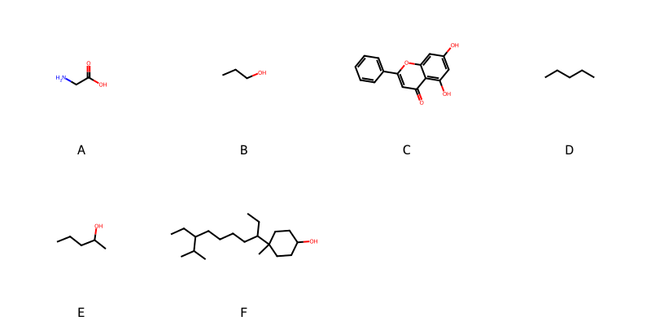

!!! abstract "Tóm tắt"

    **Họ Amaranthaceae** có **12** chi được các cộng đồng sử dụng trong chăm sóc sức khỏe gồm *Amaranthus, Pfaffia, Alternanthera, Cyathula, Digera, Celosia, Iresine, Gomphrena, Aerva, Pupalia, Deeringia, Achyranthes*. Số lượng thành phần hóa học đã phân lập và xác định cấu trúc từ họ này tính đến tháng 12 năm 2024 là **18** nhóm có thể liệt kê như sau *Anthracenes, Steroids and steroid derivatives, Prenol lipids, Organooxygen compounds, Fatty Acyls, Flavonoids, Glycerophospholipids, Azoles, Cinnamic acids and derivatives, Isoflavonoids, Phenols, Carboxylic acids and derivatives, Benzene and substituted derivatives, Betalains, Azolidines, Indolonaphthyridine alkaloids, Protoberberine alkaloids and derivatives, Harmala alkaloids*. Giữa các loài trong họ này, 3 dược liệu được nghiên cứu nhiều nhất dựa trên số thành phần được phân lập là **Celosia argentea, Amaranthus retroflexus, Achyranthes bidentata*. *Họ Amaranthaceae* đã được một số công động tại các quốc gia như Ghana, Elsewhere, Turkey, Ivory Coast, Paraguay, Japan*, Sudan, Java, Iraq, Mexico, US, Lesotho, Philippines, Argentina, Guatemala, China, Venezuela, Japan, Haiti, Panama(Cuna), Mauritius, Malaya, Upper Volta, India, Dominican Republic, Trinidad, Congo, Samoa đã phát hiện một số tác dụng trên lâm sàng gồm chữa bệnh lẫn độc tính như Chất khử trùng, Chất khử trùng, Tim mạch, Thuốc giảm đau, Chất làm lạnh, Chất làm mềm, Chất làm mềm, Thuốc lợi tiểu, Thuốc nhuận tràng, Chất làm se, Làm dịu, Thuốc lợi tiểu, Chất làm lạnh, Thuốc bổ, Chất làm se, Thuốc lợi tiểu, Chất làm se, Thuốc lợi tiểu, Thuốc bổ, Thuốc bổ, Thuốc lợi tiểu, Chất làm se, Chất làm se, cầm máu, Chất độc, Chất độc, Xà phòng, Chống khả năng sinh sản, Chống viêm, Chất làm se, Chất làm lạnh, Thuốc bổ, Thuốc tẩy giun, dễ bị tổn thương, Emmenagogue, Kem đánh răng, gây nôn, Làm dịu, Làm dịu, Thuốc lợi tiểu, Rubefacient, Thuốc nhuận tràng, Sternutatory, Thuốc bổ, Thuốc chống tiêu chảy, Chất làm se, Làm dịu, Thuốc cầm máu, Thuốc diệt chuột, thuốc tống hơi, Thuốc giải độc, Thuốc kích thích tình dục, Thuốc kích thích tình dục, Thuốc bổ, Chất làm se, Thuốc long đờm, Thuốc lợi tiểu, Thuốc lợi tiểu, Chất làm se, Thuốc lợi tiểu, Emmenagogue, Thuốc bổ, Thuốc lợi tiểu, Thuốc lợi tiểu, Emmenagogue, tan máu, Thuốc bổ, Chất đông tụ, Thuốc lợi tiểu, Thuốc bổ, Thuốc lợi tiểu, Thuốc lợi tiểu, Thuốc lợi tiểu, dạ dày, Thuốc lợi tiểu, Thuốc lợi tiểu, dễ bị tổn thương, Thuốc nhuận tràng, Thuốc nhuận tràng, Thuốc phá thai, Thuốc nhỏ mắt, Thuốc tẩy giun, Tim mạch, Thuốc giảm đau, Chất khử trùng, Xà phòng, có mùi hôi, cầm máu, diệt khuẩn, gây nôn, thuốc tống hơi, thuốc tống hơi, Đổ mồ hôi, Thuốc lợi tiểu, Đổ mồ hôi, Đổ mồ hôi, Thuốc lợi tiểu, Thuốc lợi tiểu, Thuốc lợi tiểu, Đổ mồ hôi.

!!! info "DrDuke"

    James A. Duke sinh năm 1929-2017 là một nhà thực vật học người Mỹ. Đây là một trong những tác giả hàng đầu trong lĩnh vực dược dân tộc học với cuốn *CRC Handbook of Medicinal Herbs* và chính là người xây dựng lên cơ sở dữ liệu về hợp chất tự nhiên và dược dân tộc học tại Bộ nông nghiệp Hoa Kỳ. Các thông tin được đăng tải tại website [Dr. Duke's Phytochemical and Ethnobotanical Databases](https://phytochem.nal.usda.gov/). 
    Trong suốt thập niên 1970, ông lãnh đạo the Plant Taxonomy Laboratory, Plant Genetics and Germplasm Institute of the Agricultural Research Service, U.S. Department of Agriculture.
    Trong tài liệu này, các thông tin về dược dân tộc của các dược liệu được trích dẫn từ tài liệu của James A. Ducke với sự trợ giúp của phần mềm dịch thuật từ tiếng Anh sang tiếng Việt.
   
## Tổng quan về Họ Amaranthaceae
### Phân loại thực vật
Trong *họ Amaranthaceae* có **12** chi được sử dụng làm thuốc với chi tiết số loài trong mỗi chi như sau Achyranthes (5) . Chi tiết về loài sử dụng làm thuốc như dưới đây.  

>Họ Amaranthaceae


>|-- Chi Amaranthus

>*Amaranthus bidentata*,
>*Amaranthus blitum*,
>*Amaranthus dubius*,
>*Amaranthus gracilis*,
>*Amaranthus hybridus*,
>*Amaranthus hypochondriacus*,
>*Amaranthus inosus*,
>*Amaranthus palmeri*,
>*Amaranthus quitensis*,
>*Amaranthus retroflexus*,

>|-- Chi Pfaffia

>*Pfaffia iresinioides*,

>|-- Chi Alternanthera

>*Alternanthera aurata*,
>*Alternanthera polygonoides*,
>*Alternanthera repens*,
>*Alternanthera sessilis*,

>|-- Chi Cyathula

>*Cyathula achyranthoides*,
>*Cyathula cylindrica*,
>*Cyathula globulifera*,
>*Cyathula prostrata*,

>|-- Chi Digera

>*Digera muricata*,

>|-- Chi Celosia

>*Celosia argentea*,
>*Celosia cristata*,
>*Celosia stuhlmanniana*,

>|-- Chi Iresine

>*Iresine arbuscula*,
>*Iresine calea*,
>*Iresine herbstii*,

>|-- Chi Gomphrena

>*Gomphrena celosioides*,
>*Gomphrena corymbosa*,
>*Gomphrena pulchella*,

>|-- Chi Aerva

>*Aerva lanata*,

>|-- Chi Pupalia

>*Pupalia lappacea*,

>|-- Chi Deeringia

>*Deeringia amaranthoides*,
>*Deeringia amarantoides*,

>|-- Chi Achyranthes

>*Achyranthes aera*,
>*Achyranthes bidentata*,
>*Achyranthes fauriei*,
>*Achyranthes indica*,
>*Achyranthes japonica*,

### Thành phần hóa học 

Số lượng thành phần hóa học đã phân lập và xác định cấu trúc từ họ này tính đến tháng 12 năm 2024 là 18 nhóm có thể liệt kê như sau Anthracenes, Steroids and steroid derivatives, Prenol lipids, Organooxygen compounds, Fatty Acyls, Flavonoids, Glycerophospholipids, Azoles, Cinnamic acids and derivatives, Isoflavonoids, Phenols, Carboxylic acids and derivatives, Benzene and substituted derivatives, Betalains, Azolidines, Indolonaphthyridine alkaloids, Protoberberine alkaloids and derivatives, Harmala alkaloids. Số lượng các loài đã được nghiên cứu thành phần hóa học là *16* trong tổng số *38* loài thuộc họ Amaranthaceae.Giữa các loài trong họ này, 3 dược liệu được nghiên cứu nhiều nhất dựa trên số thành phần được phân lập là **Celosia argentea, Amaranthus retroflexus, Achyranthes bidentata**. Sử dụng phần mềm RDKIT với thuật toán  Find Maximum Common Substructure (FMCS), các nhóm hoạt chất phổ biến nhất trong *họ Amaranthaceae* đã xây dựng được nhân. Điều này trong tương lại có thể được sử dụng tìm kiếm mối liên hệ giữa tác dụng của cấu trúc hóa học và tác dụng dược lý. Các nhân trong phần này có thể không giống như cấu trúc gốc của từng nhóm chất. Kết quả được trình bầy như hình dưới đây.

<figure markdown="span">
    { width=100% }
    <figcaption> Cấu trúc hóa học của một số khung cơ bản dựa trên thuật toán FMCS để tìm Carboxylic acids and derivatives (A), Fatty Acyls (B), Flavonoids (C), Organooxygen compounds (D), Prenol lipids (E), Steroids and steroid derivatives (F).</figcaption>
</figure>


!!! info  "Find Maximum Common Substructure"
    
    Thuật toán FMCS (Find Maximum Common Substructure) là một phương pháp được sử dụng để tìm ra cấu trúc chung nhiều nhất (MCS) trong một tập hợp các cấu trúc hóa học. Các bước của thuật toán gồm:
    - Chọn một cấu trúc hóa học là cấu trúc để tạo truy vấn, còn các cấu trúc khác là mục tiêu.
    - Chia nhỏ cấu trúc để tạo truy vấn thành cấu trúc nhỏ hơn dạng chuỗi SMARTS.
    - Kiểm tra chuỗi SMARTS trong các cấu trúc mục tiêu.
    - Tìm kiếm chuỗi SMARTS xuất hiện nhiều nhất.
    Để biết thêm chi tiết các bạn có thể xem tại [TeachOpenCADD](https://projects.volkamerlab.org/teachopencadd/talktorials/T006_compound_maximum_common_substructures.html)
    ``` python
    pip install rdkit
    def find_core_smiles(smiles_list):
        mols = [Chem.MolFromSmiles(smiles) for smiles in smiles_list]
        mcs = rdFMCS.FindMCS(mols)
        core_smiles = Chem.MolToSmiles(Chem.MolFromSmarts(mcs.smartsString))
        return core_smiles
    ```

### Dược dân tộc học

Họ **Amaranthaceae** đã được một số công động tại các quốc gia như *Ghana, Elsewhere, Turkey, Ivory Coast, Paraguay, Japan*, Sudan, Java, Iraq, Mexico, US, Lesotho, Philippines, Argentina, Guatemala, China, Venezuela, Japan, Haiti, Panama(Cuna), Mauritius, Malaya, Upper Volta, India, Dominican Republic, Trinidad, Congo, Samoa* đã phát hiện một số tác dụng trên lâm sàng gồm chữa bệnh lẫn độc tính như *Chất khử trùng, Chất khử trùng, Tim mạch, Thuốc giảm đau, Chất làm lạnh, Chất làm mềm, Chất làm mềm, Thuốc lợi tiểu, Thuốc nhuận tràng, Chất làm se, Làm dịu, Thuốc lợi tiểu, Chất làm lạnh, Thuốc bổ, Chất làm se, Thuốc lợi tiểu, Chất làm se, Thuốc lợi tiểu, Thuốc bổ, Thuốc bổ, Thuốc lợi tiểu, Chất làm se, Chất làm se, cầm máu, Chất độc, Chất độc, Xà phòng, Chống khả năng sinh sản, Chống viêm, Chất làm se, Chất làm lạnh, Thuốc bổ, Thuốc tẩy giun, dễ bị tổn thương, Emmenagogue, Kem đánh răng, gây nôn, Làm dịu, Làm dịu, Thuốc lợi tiểu, Rubefacient, Thuốc nhuận tràng, Sternutatory, Thuốc bổ, Thuốc chống tiêu chảy, Chất làm se, Làm dịu, Thuốc cầm máu, Thuốc diệt chuột, thuốc tống hơi, Thuốc giải độc, Thuốc kích thích tình dục, Thuốc kích thích tình dục, Thuốc bổ, Chất làm se, Thuốc long đờm, Thuốc lợi tiểu, Thuốc lợi tiểu, Chất làm se, Thuốc lợi tiểu, Emmenagogue, Thuốc bổ, Thuốc lợi tiểu, Thuốc lợi tiểu, Emmenagogue, tan máu, Thuốc bổ, Chất đông tụ, Thuốc lợi tiểu, Thuốc bổ, Thuốc lợi tiểu, Thuốc lợi tiểu, Thuốc lợi tiểu, dạ dày, Thuốc lợi tiểu, Thuốc lợi tiểu, dễ bị tổn thương, Thuốc nhuận tràng, Thuốc nhuận tràng, Thuốc phá thai, Thuốc nhỏ mắt, Thuốc tẩy giun, Tim mạch, Thuốc giảm đau, Chất khử trùng, Xà phòng, có mùi hôi, cầm máu, diệt khuẩn, gây nôn, thuốc tống hơi, thuốc tống hơi, Đổ mồ hôi, Thuốc lợi tiểu, Đổ mồ hôi, Đổ mồ hôi, Thuốc lợi tiểu, Thuốc lợi tiểu, Thuốc lợi tiểu, Đổ mồ hôi*.

## Chi tiết dược dân tộc học


### Chi Amaranthus

!!! note "Danh sách các loài thuộc chi"
    
*	 - *Amaranthus bidentata*
	 - *Amaranthus blitum*
	 - *Amaranthus dubius*
	 - *Amaranthus gracilis*
	 - *Amaranthus hybridus*
	 - *Amaranthus hypochondriacus*
	 - *Amaranthus inosus*
	 - *Amaranthus palmeri*
	 - *Amaranthus quitensis*
	 - *Amaranthus retroflexus**

---      
#### *Amaranthus retroflexus*
**Thông tin về thực vật**

!!! info "Phân loại thực vật của *Aloe vera* từ GIBF:"
    - **Kingdom:** Plantae
    - **Phylum:** Tracheophyta
    - **Order:** Asparagales
    - **Family:** Asphodelaceae
    - **Genus:** Aloe
    - **Species:** *Aloe vera*


 

Chưa có thông tin về loài này trên wikidata.

*Phân bố trên thế giới*: France, Benin, Chad, Saint Vincent and the Grenadines, Haiti, Curaçao, Gibraltar, Bahamas, Jamaica, Sri Lanka, Antigua and Barbuda, Oman, Cabo Verde, Spain, French Guiana, Mexico, Chinese Taipei, Colombia, Réunion, Bonaire, Sint Eustatius and Saba, Barbados, United Arab Emirates, Australia, Aruba, Virgin Islands (U.S.), Sint Maarten (Dutch part), Jordan, Portugal, India, Brazil, Peru, United States of America, Philippines, Malta, Dominican Republic, Malaysia, Greece, Ecuador, Puerto Rico, Anguilla, Austria, Cyprus

*Phân bố tại Việt Nam*: Không có ghi nhận ở Việt Nam

**Thành phần hóa học**
        

Chưa có nghiên cứu về thành phần hóa học của loài này


**Dược dân tộc học**

Danh sách các quốc gia có sử dụng *Aloe vera* trong điều trị các bệnh. 

| Quốc gia   | Bệnh                             |
|:-----------|:---------------------------------|
| China      | Thuốc lợi tiểu, dễ bị tổn thương |


---      
#### *Amaranthus blitum*
**Thông tin về thực vật**

!!! info "Phân loại thực vật của *Amaranthus blitum* từ GIBF:"
    - **Kingdom:** Plantae
    - **Phylum:** Tracheophyta
    - **Order:** Caryophyllales
    - **Family:** Amaranthaceae
    - **Genus:** Amaranthus
    - **Species:** *Amaranthus blitum*


 

Chưa có thông tin về loài này trên wikidata.

*Phân bố trên thế giới*: France, Germany, Czechia, Netherlands, Hungary, Spain, Poland, Chinese Taipei, Hong Kong, Sweden, South Africa, Belarus, Palestine, State of, Russian Federation, Portugal, Brazil, Argentina, Slovakia, United States of America, Croatia, China, Kazakhstan, Italy, Malaysia, New Zealand, Canada, Denmark, Austria, Belgium

*Phân bố tại Việt Nam*: Không có ghi nhận ở Việt Nam

**Thành phần hóa học**
        

Theo cơ sở dữ liệu lotus, từ loài *Amaranthus blitum* đã phân lập và xác định được 4 hoạt chất thuộc về các nhóm Glycerophospholipids. Danh sách các hoạt chất như sau 1-oleoyl lysophosphatidic acid [(LTS0240355)](https://lotus.naturalproducts.net/compound/lotus_id/LTS0240355), (2r)-2-(pentadecanoyloxy)-3-(tridecanoyloxy)propoxyphosphonic acid [(LTS0060583)](https://lotus.naturalproducts.net/compound/lotus_id/LTS0060583), dipalmitoyl [(LTS0190394)](https://lotus.naturalproducts.net/compound/lotus_id/LTS0190394), (2s)-2-hydroxy-3-[(9z)-octadec-9-enoyloxy]propoxyphosphonic acid [(LTS0146634)](https://lotus.naturalproducts.net/compound/lotus_id/LTS0146634).

| chemicalTaxonomyClassyfireClass   |   lotus_count |
|:----------------------------------|--------------:|
| Glycerophospholipids              |             4 |


**Dược dân tộc học**

Danh sách các quốc gia có sử dụng *Amaranthus blitum* trong điều trị các bệnh. 

| Quốc gia   | Bệnh           |
|:-----------|:---------------|
| China      | Thuốc giải độc |


---      
#### *Amaranthus dubius*
**Thông tin về thực vật**

!!! info "Phân loại thực vật của *Amaranthus dubius* từ GIBF:"
    - **Kingdom:** Plantae
    - **Phylum:** Tracheophyta
    - **Order:** Caryophyllales
    - **Family:** Amaranthaceae
    - **Genus:** Amaranthus
    - **Species:** *Amaranthus dubius*


 

Chưa có thông tin về loài này trên wikidata.

*Phân bố trên thế giới*: Benin, Malawi, Tanzania, United Republic of, Curaçao, Kenya, Nepal, Jamaica, French Polynesia, Seychelles, Guadeloupe, Nauru, French Guiana, Venezuela (Bolivarian Republic of), Mexico, Chinese Taipei, Colombia, Papua New Guinea, Sweden, Rwanda, Timor-Leste, unknown or invalid, South Africa, Bonaire, Sint Eustatius and Saba, Angola, Réunion, Belize, Japan, Martinique, Australia, Panama, Aruba, Indonesia, Mauritius, Saudi Arabia, Guinea, India, Togo, Costa Rica, Peru, Zimbabwe, United States of America, Equatorial Guinea, China, Ethiopia, Uganda, Comoros, Ecuador, Puerto Rico, Congo, Democratic Republic of the

*Phân bố tại Việt Nam*: Không có ghi nhận ở Việt Nam

**Thành phần hóa học**
        

Theo cơ sở dữ liệu lotus, từ loài *Amaranthus dubius* đã phân lập và xác định được 14 hoạt chất thuộc về các nhóm Fatty Acyls, Steroids and steroid derivatives. Danh sách các hoạt chất như sau oleic acid [(LTS0256910)](https://lotus.naturalproducts.net/compound/lotus_id/LTS0256910), phytosterol [(LTS0029311)](https://lotus.naturalproducts.net/compound/lotus_id/LTS0029311), linoleic [(LTS0013198)](https://lotus.naturalproducts.net/compound/lotus_id/LTS0013198), arachidic acid [(LTS0171823)](https://lotus.naturalproducts.net/compound/lotus_id/LTS0171823), 1-[(3z)-5-ethyl-6-methylhept-3-en-2-yl]-9a,11a-dimethyl-1h,2h,3h,3ah,6h,7h,8h,9h,9bh,10h,11h-cyclopenta[a]phenanthren-7-ol [(LTS0222438)](https://lotus.naturalproducts.net/compound/lotus_id/LTS0222438), α linolenic acid [(LTS0132789)](https://lotus.naturalproducts.net/compound/lotus_id/LTS0132789), α-linolenic acid [(LTS0275508)](https://lotus.naturalproducts.net/compound/lotus_id/LTS0275508), 7,7,12,16-tetramethyl-15-(6-methyl-5-methylideneheptan-2-yl)pentacyclo[9.7.0.0¹,³.0³,⁸.0¹²,¹⁶]octadec-8-en-6-ol [(LTS0259188)](https://lotus.naturalproducts.net/compound/lotus_id/LTS0259188), 1-[(3e)-5-ethyl-6-methylhept-3-en-2-yl]-9a,11a-dimethyl-1h,2h,3h,3ah,6h,7h,8h,9h,9bh,10h,11h-cyclopenta[a]phenanthren-7-ol [(LTS0156214)](https://lotus.naturalproducts.net/compound/lotus_id/LTS0156214), chondrillasterol [(LTS0142259)](https://lotus.naturalproducts.net/compound/lotus_id/LTS0142259), lignoceric acid [(LTS0107726)](https://lotus.naturalproducts.net/compound/lotus_id/LTS0107726), palmitic acid [(LTS0079439)](https://lotus.naturalproducts.net/compound/lotus_id/LTS0079439), stearic acid [(LTS0237766)](https://lotus.naturalproducts.net/compound/lotus_id/LTS0237766), myristic acid [(LTS0102566)](https://lotus.naturalproducts.net/compound/lotus_id/LTS0102566).

| chemicalTaxonomyClassyfireClass   |   lotus_count |
|:----------------------------------|--------------:|
| Fatty Acyls                       |             9 |
| Steroids and steroid derivatives  |             5 |


**Dược dân tộc học**

Danh sách các quốc gia có sử dụng *Amaranthus dubius* trong điều trị các bệnh. 

| Quốc gia           | Bệnh                           |
|:-------------------|:-------------------------------|
| Dominican Republic | Rubefacient, Thuốc nhuận tràng |
| Haiti              | gây nôn                        |


---      
#### *Amaranthus dubius*
**Thông tin về thực vật**

!!! info "Phân loại thực vật của *Amaranthus dubius* từ GIBF:"
    - **Kingdom:** Plantae
    - **Phylum:** Tracheophyta
    - **Order:** Caryophyllales
    - **Family:** Amaranthaceae
    - **Genus:** Amaranthus
    - **Species:** *Amaranthus dubius*


 

Chưa có thông tin về loài này trên wikidata.

*Phân bố trên thế giới*: Benin, Malawi, Tanzania, United Republic of, Curaçao, Kenya, Nepal, Jamaica, French Polynesia, Seychelles, Guadeloupe, Nauru, French Guiana, Venezuela (Bolivarian Republic of), Mexico, Chinese Taipei, Colombia, Papua New Guinea, Sweden, Rwanda, Timor-Leste, unknown or invalid, South Africa, Bonaire, Sint Eustatius and Saba, Angola, Réunion, Belize, Japan, Martinique, Australia, Panama, Aruba, Indonesia, Mauritius, Saudi Arabia, Guinea, India, Togo, Costa Rica, Peru, Zimbabwe, United States of America, Equatorial Guinea, China, Ethiopia, Uganda, Comoros, Ecuador, Puerto Rico, Congo, Democratic Republic of the

*Phân bố tại Việt Nam*: Không có ghi nhận ở Việt Nam

**Thành phần hóa học**
        

Chưa có nghiên cứu về thành phần hóa học của loài này


**Dược dân tộc học**

Danh sách các quốc gia có sử dụng *Amaranthus dubius* trong điều trị các bệnh. 

| Quốc gia   | Bệnh         |
|:-----------|:-------------|
| India      | Chất làm mềm |


---      
#### *Amaranthus hybridus*
**Thông tin về thực vật**

!!! info "Phân loại thực vật của *Amaranthus hybridus* từ GIBF:"
    - **Kingdom:** Plantae
    - **Phylum:** Tracheophyta
    - **Order:** Caryophyllales
    - **Family:** Amaranthaceae
    - **Genus:** Amaranthus
    - **Species:** *Amaranthus hybridus*


 

Chưa có thông tin về loài này trên wikidata.

*Phân bố trên thế giới*: Germany, Switzerland, Netherlands, Austria, Spain, Mexico, Chinese Taipei, Sweden, Réunion, South Africa, Australia, Saudi Arabia, Portugal, United Kingdom of Great Britain and Northern Ireland, Argentina, United States of America, Italy, Norway, Ecuador, Slovakia, Belgium

*Phân bố tại Việt Nam*: Không có ghi nhận ở Việt Nam

**Thành phần hóa học**
        

Theo cơ sở dữ liệu lotus, từ loài *Amaranthus hybridus* đã phân lập và xác định được 21 hoạt chất thuộc về các nhóm Fatty Acyls, Steroids and steroid derivatives. Danh sách các hoạt chất như sau phytosterol [(LTS0029311)](https://lotus.naturalproducts.net/compound/lotus_id/LTS0029311), stigmast-5-en-3-ol, (3β)- [(LTS0204616)](https://lotus.naturalproducts.net/compound/lotus_id/LTS0204616), α linolenic acid [(LTS0132789)](https://lotus.naturalproducts.net/compound/lotus_id/LTS0132789), campesterol [(LTS0046755)](https://lotus.naturalproducts.net/compound/lotus_id/LTS0046755), palmitic acid [(LTS0079439)](https://lotus.naturalproducts.net/compound/lotus_id/LTS0079439), stearic acid [(LTS0237766)](https://lotus.naturalproducts.net/compound/lotus_id/LTS0237766), myristic acid [(LTS0102566)](https://lotus.naturalproducts.net/compound/lotus_id/LTS0102566), trigonelline [(LTS0040106)](https://lotus.naturalproducts.net/compound/lotus_id/LTS0040106), linoleic [(LTS0013198)](https://lotus.naturalproducts.net/compound/lotus_id/LTS0013198), 5-dehydroavenasterol [(LTS0129084)](https://lotus.naturalproducts.net/compound/lotus_id/LTS0129084), 1-[(3z)-5-ethyl-6-methylhept-3-en-2-yl]-9a,11a-dimethyl-1h,2h,3h,3ah,6h,7h,8h,9h,9bh,10h,11h-cyclopenta[a]phenanthren-7-ol [(LTS0222438)](https://lotus.naturalproducts.net/compound/lotus_id/LTS0222438), 7,7,12,16-tetramethyl-15-(6-methyl-5-methylideneheptan-2-yl)pentacyclo[9.7.0.0¹,³.0³,⁸.0¹²,¹⁶]octadec-8-en-6-ol [(LTS0259188)](https://lotus.naturalproducts.net/compound/lotus_id/LTS0259188), 1-[(3e)-5-ethyl-6-methylhept-3-en-2-yl]-9a,11a-dimethyl-1h,2h,3h,3ah,6h,7h,8h,9h,9bh,10h,11h-cyclopenta[a]phenanthren-7-ol [(LTS0156214)](https://lotus.naturalproducts.net/compound/lotus_id/LTS0156214), (1r,3as,3bs,7s,9bs)-1-[(2r,5r)-5,6-dimethylheptan-2-yl]-9a,11a-dimethyl-1h,2h,3h,3ah,3bh,4h,6h,7h,8h,9h,9bh,10h,11h-cyclopenta[a]phenanthren-7-ol [(LTS0057877)](https://lotus.naturalproducts.net/compound/lotus_id/LTS0057877), stigmast-5-en-3-ol [(LTS0071224)](https://lotus.naturalproducts.net/compound/lotus_id/LTS0071224), α-linolenic acid [(LTS0275508)](https://lotus.naturalproducts.net/compound/lotus_id/LTS0275508), chondrillasterol [(LTS0142259)](https://lotus.naturalproducts.net/compound/lotus_id/LTS0142259), oleic acid [(LTS0256910)](https://lotus.naturalproducts.net/compound/lotus_id/LTS0256910), delta7-avenasterol [(LTS0199292)](https://lotus.naturalproducts.net/compound/lotus_id/LTS0199292), arachidic acid [(LTS0171823)](https://lotus.naturalproducts.net/compound/lotus_id/LTS0171823), lignoceric acid [(LTS0107726)](https://lotus.naturalproducts.net/compound/lotus_id/LTS0107726).

| chemicalTaxonomyClassyfireClass   |   lotus_count |
|:----------------------------------|--------------:|
|                                   |             1 |
| Fatty Acyls                       |             9 |
| Steroids and steroid derivatives  |            11 |


**Dược dân tộc học**

Danh sách các quốc gia có sử dụng *Amaranthus hybridus* trong điều trị các bệnh. 

| Quốc gia   | Bệnh           |
|:-----------|:---------------|
| US         | Chất khử trùng |


---      
#### *Amaranthus hypochondriacus*
**Thông tin về thực vật**

!!! info "Phân loại thực vật của *Amaranthus hypochondriacus* từ GIBF:"
    - **Kingdom:** Plantae
    - **Phylum:** Tracheophyta
    - **Order:** Caryophyllales
    - **Family:** Amaranthaceae
    - **Genus:** Amaranthus
    - **Species:** *Amaranthus hypochondriacus*


 

Chưa có thông tin về loài này trên wikidata.

*Phân bố trên thế giới*: Germany, France, Switzerland, Czechia, Netherlands, Austria, Hungary, Spain, Mexico, Sweden, Romania, United Kingdom of Great Britain and Northern Ireland, Costa Rica, Ukraine, United States of America, Italy, Slovenia, Norway, New Zealand, Greece, Canada, Denmark, Slovakia, Belgium

*Phân bố tại Việt Nam*: Không có ghi nhận ở Việt Nam

**Thành phần hóa học**
        

Theo cơ sở dữ liệu lotus, từ loài *Amaranthus hypochondriacus* đã phân lập và xác định được 27 hoạt chất thuộc về các nhóm Betalains, Steroids and steroid derivatives, Prenol lipids, Carboxylic acids and derivatives. Danh sách các hoạt chất như sau vitamin e [(LTS0263269)](https://lotus.naturalproducts.net/compound/lotus_id/LTS0263269), (2r)-2,5,7,8-tetramethyl-2-[(4s,8s)-4,8,12-trimethyltridecyl]-3,4-dihydro-1-benzopyran-6-ol [(LTS0130040)](https://lotus.naturalproducts.net/compound/lotus_id/LTS0130040), phytosterol [(LTS0029311)](https://lotus.naturalproducts.net/compound/lotus_id/LTS0029311), stigmast-5-en-3-ol, (3β)- [(LTS0204616)](https://lotus.naturalproducts.net/compound/lotus_id/LTS0204616), (2s,3s,4s,5r,6r)-6-{[(2s,3r,4ar,6ar,6bs,8as,12as,14ar,14br)-2-hydroxy-4,4,6a,6b,11,11,14b-heptamethyl-8a-({[(2s,3r,4s,5s,6r)-3,4,5-trihydroxy-6-(hydroxymethyl)oxan-2-yl]oxy}carbonyl)-1,2,3,4a,5,6,7,8,9,10,12,12a,14,14a-tetradecahydropicen-3-yl]oxy}-3,5-dihydroxy-4-{[(2s,3r,4r,5r,6s)-3,4,5-trihydroxy-6-methyloxan-2-yl]oxy}oxane-2-carboxylic acid [(LTS0179887)](https://lotus.naturalproducts.net/compound/lotus_id/LTS0179887), (2s,3s,4s,5r,6r)-6-{[(2s,3r,4s,4ar,6ar,6bs,8as,12as,14ar,14br)-4-formyl-2-hydroxy-4,6a,6b,11,11,14b-hexamethyl-8a-({[(2s,3r,4s,5s,6r)-3,4,5-trihydroxy-6-(hydroxymethyl)oxan-2-yl]oxy}carbonyl)-1,2,3,4a,5,6,7,8,9,10,12,12a,14,14a-tetradecahydropicen-3-yl]oxy}-3,5-dihydroxy-4-{[(2s,3r,4r,5r,6s)-3,4,5-trihydroxy-6-methyloxan-2-yl]oxy}oxane-2-carboxylic acid [(LTS0150706)](https://lotus.naturalproducts.net/compound/lotus_id/LTS0150706), campesterol [(LTS0046755)](https://lotus.naturalproducts.net/compound/lotus_id/LTS0046755), β-tocotrienol [(LTS0181074)](https://lotus.naturalproducts.net/compound/lotus_id/LTS0181074), (2s)-2-carboxy-5-{[(2s,3r,4s,5s,6r)-3-{[(2r,3r,4s,5s,6s)-6-carboxy-3,4,5-trihydroxyoxan-2-yl]oxy}-4,5-dihydroxy-6-(hydroxymethyl)oxan-2-yl]oxy}-1-{2-[(2s)-2-carboxy-6-carboxylato-2,3-dihydro-1h-pyridin-4-ylidene]ethylidene}-6-hydroxy-2,3-dihydro-1h-1λ⁵-indol-1-ylium [(LTS0232775)](https://lotus.naturalproducts.net/compound/lotus_id/LTS0232775), 24-methylene-cycloartanol [(LTS0077845)](https://lotus.naturalproducts.net/compound/lotus_id/LTS0077845), trigonelline [(LTS0040106)](https://lotus.naturalproducts.net/compound/lotus_id/LTS0040106), 3,5-dihydroxy-6-{[2-hydroxy-4,4,6a,6b,11,11,14b-heptamethyl-8a-({[3,4,5-trihydroxy-6-(hydroxymethyl)oxan-2-yl]oxy}carbonyl)-1,2,3,4a,5,6,7,8,9,10,12,12a,14,14a-tetradecahydropicen-3-yl]oxy}-4-[(3,4,5-trihydroxy-6-methyloxan-2-yl)oxy]oxane-2-carboxylic acid [(LTS0186570)](https://lotus.naturalproducts.net/compound/lotus_id/LTS0186570), bet [(LTS0164067)](https://lotus.naturalproducts.net/compound/lotus_id/LTS0164067), (2s,3s,4s,5r,6r)-6-{[(2s,3r,4ar,6ar,6bs,8as,12as,14ar,14br)-2-hydroxy-4,4,6a,6b,14b-pentamethyl-11-methylidene-8a-({[(2s,3r,4s,5s,6r)-3,4,5-trihydroxy-6-(hydroxymethyl)oxan-2-yl]oxy}carbonyl)-1,2,3,4a,5,6,7,8,9,10,12,12a,14,14a-tetradecahydropicen-3-yl]oxy}-3,5-dihydroxy-4-{[(2s,3r,4r,5r,6s)-3,4,5-trihydroxy-6-methyloxan-2-yl]oxy}oxane-2-carboxylic acid [(LTS0084486)](https://lotus.naturalproducts.net/compound/lotus_id/LTS0084486), 5-dehydroavenasterol [(LTS0129084)](https://lotus.naturalproducts.net/compound/lotus_id/LTS0129084), 6-{[4-formyl-2-hydroxy-4,6a,6b,14b-tetramethyl-11-methylidene-8a-({[3,4,5-trihydroxy-6-(hydroxymethyl)oxan-2-yl]oxy}carbonyl)-1,2,3,4a,5,6,7,8,9,10,12,12a,14,14a-tetradecahydropicen-3-yl]oxy}-3,5-dihydroxy-4-[(3,4,5-trihydroxy-6-methyloxan-2-yl)oxy]oxane-2-carboxylic acid [(LTS0154125)](https://lotus.naturalproducts.net/compound/lotus_id/LTS0154125), (1r,3as,3bs,7s,9bs)-1-[(2r,5r)-5,6-dimethylheptan-2-yl]-9a,11a-dimethyl-1h,2h,3h,3ah,3bh,4h,6h,7h,8h,9h,9bh,10h,11h-cyclopenta[a]phenanthren-7-ol [(LTS0057877)](https://lotus.naturalproducts.net/compound/lotus_id/LTS0057877), stigmast-5-en-3-ol [(LTS0071224)](https://lotus.naturalproducts.net/compound/lotus_id/LTS0071224), (2s,3s,4s,5r,6r)-6-{[(2s,3r,4s,4ar,6ar,6bs,8as,12as,14ar,14br)-4-formyl-2-hydroxy-4,6a,6b,14b-tetramethyl-11-methylidene-8a-({[(2s,3r,4s,5s,6r)-3,4,5-trihydroxy-6-(hydroxymethyl)oxan-2-yl]oxy}carbonyl)-1,2,3,4a,5,6,7,8,9,10,12,12a,14,14a-tetradecahydropicen-3-yl]oxy}-3,5-dihydroxy-4-{[(2s,3r,4r,5r,6s)-3,4,5-trihydroxy-6-methyloxan-2-yl]oxy}oxane-2-carboxylic acid [(LTS0181729)](https://lotus.naturalproducts.net/compound/lotus_id/LTS0181729), cholesterol [(LTS0102304)](https://lotus.naturalproducts.net/compound/lotus_id/LTS0102304), γ-tocotrienol [(LTS0240143)](https://lotus.naturalproducts.net/compound/lotus_id/LTS0240143), chondrillasterol [(LTS0142259)](https://lotus.naturalproducts.net/compound/lotus_id/LTS0142259), 24-methylenecycloartanol [(LTS0018584)](https://lotus.naturalproducts.net/compound/lotus_id/LTS0018584), 3,5-dihydroxy-6-{[2-hydroxy-4,4,6a,6b,14b-pentamethyl-11-methylidene-8a-({[3,4,5-trihydroxy-6-(hydroxymethyl)oxan-2-yl]oxy}carbonyl)-1,2,3,4a,5,6,7,8,9,10,12,12a,14,14a-tetradecahydropicen-3-yl]oxy}-4-[(3,4,5-trihydroxy-6-methyloxan-2-yl)oxy]oxane-2-carboxylic acid [(LTS0169097)](https://lotus.naturalproducts.net/compound/lotus_id/LTS0169097), (2s)-4-[(1e)-2-[(2s)-2-carboxy-5-{[(2s,3r,4s,5s,6r)-3-{[(2r,4s,6s)-6-carboxy-3,4,5-trihydroxyoxan-2-yl]oxy}-4,5-dihydroxy-6-(hydroxymethyl)oxan-2-yl]oxy}-6-hydroxy-2,3-dihydroindol-1-yl]ethenyl]-2,3-dihydropyridine-2,6-dicarboxylic acid [(LTS0006845)](https://lotus.naturalproducts.net/compound/lotus_id/LTS0006845), delta7-avenasterol [(LTS0199292)](https://lotus.naturalproducts.net/compound/lotus_id/LTS0199292), 6-{[4-formyl-2-hydroxy-4,6a,6b,11,11,14b-hexamethyl-8a-({[3,4,5-trihydroxy-6-(hydroxymethyl)oxan-2-yl]oxy}carbonyl)-1,2,3,4a,5,6,7,8,9,10,12,12a,14,14a-tetradecahydropicen-3-yl]oxy}-3,5-dihydroxy-4-[(3,4,5-trihydroxy-6-methyloxan-2-yl)oxy]oxane-2-carboxylic acid [(LTS0250101)](https://lotus.naturalproducts.net/compound/lotus_id/LTS0250101).

| chemicalTaxonomyClassyfireClass   |   lotus_count |
|:----------------------------------|--------------:|
|                                   |             1 |
| Betalains                         |             1 |
| Carboxylic acids and derivatives  |             1 |
| Prenol lipids                     |            10 |
| Steroids and steroid derivatives  |            13 |


**Dược dân tộc học**

Danh sách các quốc gia có sử dụng *Amaranthus hypochondriacus* trong điều trị các bệnh. 

| Quốc gia   | Bệnh                                                          |
|:-----------|:--------------------------------------------------------------|
| Turkey     | Chất làm se, Làm dịu, Thuốc lợi tiểu, Chất làm lạnh, Thuốc bổ |


---      
#### *Amaranthus hypochondriacus*
**Thông tin về thực vật**

!!! info "Phân loại thực vật của *Amaranthus hypochondriacus* từ GIBF:"
    - **Kingdom:** Plantae
    - **Phylum:** Tracheophyta
    - **Order:** Caryophyllales
    - **Family:** Amaranthaceae
    - **Genus:** Amaranthus
    - **Species:** *Amaranthus hypochondriacus*


 

Chưa có thông tin về loài này trên wikidata.

*Phân bố trên thế giới*: Germany, France, Switzerland, Czechia, Netherlands, Austria, Hungary, Spain, Mexico, Sweden, Romania, United Kingdom of Great Britain and Northern Ireland, Costa Rica, Ukraine, United States of America, Italy, Slovenia, Norway, New Zealand, Greece, Canada, Denmark, Slovakia, Belgium

*Phân bố tại Việt Nam*: Không có ghi nhận ở Việt Nam

**Thành phần hóa học**
        

Chưa có nghiên cứu về thành phần hóa học của loài này


**Dược dân tộc học**

Danh sách các quốc gia có sử dụng *Amaranthus hypochondriacus* trong điều trị các bệnh. 

| Quốc gia    | Bệnh           |
|:------------|:---------------|
| Ghana       | Thuốc long đờm |
| Java        | Emmenagogue    |
| Malaya      | Thuốc lợi tiểu |
| Mauritius   | Thuốc lợi tiểu |
| Philippines | có mùi hôi     |


---      
#### *Amaranthus hypochondriacus*
**Thông tin về thực vật**

!!! info "Phân loại thực vật của *Amaranthus hypochondriacus* từ GIBF:"
    - **Kingdom:** Plantae
    - **Phylum:** Tracheophyta
    - **Order:** Caryophyllales
    - **Family:** Amaranthaceae
    - **Genus:** Amaranthus
    - **Species:** *Amaranthus hypochondriacus*


 

Chưa có thông tin về loài này trên wikidata.

*Phân bố trên thế giới*: Germany, France, Switzerland, Czechia, Netherlands, Austria, Hungary, Spain, Mexico, Sweden, Romania, United Kingdom of Great Britain and Northern Ireland, Costa Rica, Ukraine, United States of America, Italy, Slovenia, Norway, New Zealand, Greece, Canada, Denmark, Slovakia, Belgium

*Phân bố tại Việt Nam*: Không có ghi nhận ở Việt Nam

**Thành phần hóa học**
        

Chưa có nghiên cứu về thành phần hóa học của loài này


**Dược dân tộc học**

Danh sách các quốc gia có sử dụng *Amaranthus hypochondriacus* trong điều trị các bệnh. 

| Quốc gia   | Bệnh     |
|:-----------|:---------|
| Mexico     | Xà phòng |
| US         | Chất độc |


---      
#### *Amaranthus hypochondriacus*
**Thông tin về thực vật**

!!! info "Phân loại thực vật của *Amaranthus hypochondriacus* từ GIBF:"
    - **Kingdom:** Plantae
    - **Phylum:** Tracheophyta
    - **Order:** Caryophyllales
    - **Family:** Amaranthaceae
    - **Genus:** Amaranthus
    - **Species:** *Amaranthus hypochondriacus*


 

Chưa có thông tin về loài này trên wikidata.

*Phân bố trên thế giới*: Germany, France, Switzerland, Czechia, Netherlands, Austria, Hungary, Spain, Mexico, Sweden, Romania, United Kingdom of Great Britain and Northern Ireland, Costa Rica, Ukraine, United States of America, Italy, Slovenia, Norway, New Zealand, Greece, Canada, Denmark, Slovakia, Belgium

*Phân bố tại Việt Nam*: Không có ghi nhận ở Việt Nam

**Thành phần hóa học**
        

Chưa có nghiên cứu về thành phần hóa học của loài này


**Dược dân tộc học**

Danh sách các quốc gia có sử dụng *Amaranthus hypochondriacus* trong điều trị các bệnh. 

| Quốc gia   | Bệnh           |
|:-----------|:---------------|
| Argentina  | Thuốc lợi tiểu |


---      
#### *Amaranthus retroflexus*
**Thông tin về thực vật**

!!! info "Phân loại thực vật của *Amaranthus retroflexus* từ GIBF:"
    - **Kingdom:** Plantae
    - **Phylum:** Tracheophyta
    - **Order:** Caryophyllales
    - **Family:** Amaranthaceae
    - **Genus:** Amaranthus
    - **Species:** *Amaranthus retroflexus*


 

Chưa có thông tin về loài này trên wikidata.

*Phân bố trên thế giới*: Israel, Czechia, Netherlands, Hungary, Spain, Poland, Chinese Taipei, Sweden, Australia, Mongolia, Russian Federation, Romania, Uzbekistan, Ukraine, Thailand, Slovakia, Serbia, United States of America, Kazakhstan, Italy, Canada, Austria, Belgium

*Phân bố tại Việt Nam*: Không có ghi nhận ở Việt Nam

**Thành phần hóa học**
        

Theo cơ sở dữ liệu lotus, từ loài *Amaranthus retroflexus* đã phân lập và xác định được 48 hoạt chất thuộc về các nhóm Steroids and steroid derivatives, Organooxygen compounds, Fatty Acyls, Carboxylic acids and derivatives, Prenol lipids. Danh sách các hoạt chất như sau (2r,3r,4s,5s,6r)-2-{[(5s,6e,9e)-3,11-dihydroxy-3,7,11-trimethyldodeca-1,6,9-trien-5-yl]oxy}-6-(hydroxymethyl)oxane-3,4,5-triol [(LTS0089332)](https://lotus.naturalproducts.net/compound/lotus_id/LTS0089332), hexanol [(LTS0217299)](https://lotus.naturalproducts.net/compound/lotus_id/LTS0217299), phytosterol [(LTS0029311)](https://lotus.naturalproducts.net/compound/lotus_id/LTS0029311), 2,6,10-trimethyldodeca-6,11-diene-2,3,8,10-tetrol [(LTS0092907)](https://lotus.naturalproducts.net/compound/lotus_id/LTS0092907), α linolenic acid [(LTS0132789)](https://lotus.naturalproducts.net/compound/lotus_id/LTS0132789), (2r,3r,4s,5s,6r)-2-{[(3s,5s,6e,9e)-3,11-dihydroxy-3,7,11-trimethyldodeca-1,6,9-trien-5-yl]oxy}-6-(hydroxymethyl)oxane-3,4,5-triol [(LTS0054647)](https://lotus.naturalproducts.net/compound/lotus_id/LTS0054647), palmitic acid [(LTS0079439)](https://lotus.naturalproducts.net/compound/lotus_id/LTS0079439), campesterol [(LTS0046755)](https://lotus.naturalproducts.net/compound/lotus_id/LTS0046755), 24-methylene-cycloartanol [(LTS0077845)](https://lotus.naturalproducts.net/compound/lotus_id/LTS0077845), (3r,6e,8s,10s)-2,6,10-trimethyldodeca-6,11-diene-2,3,8,10-tetrol [(LTS0054140)](https://lotus.naturalproducts.net/compound/lotus_id/LTS0054140), stearic acid [(LTS0237766)](https://lotus.naturalproducts.net/compound/lotus_id/LTS0237766), cis-3-hexenol [(LTS0132156)](https://lotus.naturalproducts.net/compound/lotus_id/LTS0132156), myristic acid [(LTS0102566)](https://lotus.naturalproducts.net/compound/lotus_id/LTS0102566), 2-[(3,10-dihydroxy-2,6,10-trimethyldodeca-6,11-dien-2-yl)oxy]-6-(hydroxymethyl)oxane-3,4,5-triol [(LTS0234713)](https://lotus.naturalproducts.net/compound/lotus_id/LTS0234713), trigonelline [(LTS0040106)](https://lotus.naturalproducts.net/compound/lotus_id/LTS0040106), (2s,3r,4r,5s,6r)-2-[(3r,6e,10s)-3,10-dihydroxy-2,6,10-trimethyldodeca-6,11-dien-2-yl]-6-(hydroxymethyl)oxane-3,4,5-triol [(LTS0239326)](https://lotus.naturalproducts.net/compound/lotus_id/LTS0239326), (3r,6s,7e,10s)-2,6,10-trimethyldodeca-7,11-diene-2,3,6,10-tetrol [(LTS0173108)](https://lotus.naturalproducts.net/compound/lotus_id/LTS0173108), 2-[(2,10-dihydroxy-2,6,10-trimethyldodeca-6,11-dien-3-yl)oxy]-6-(hydroxymethyl)oxane-3,4,5-triol [(LTS0264002)](https://lotus.naturalproducts.net/compound/lotus_id/LTS0264002), bet [(LTS0164067)](https://lotus.naturalproducts.net/compound/lotus_id/LTS0164067), linoleic [(LTS0013198)](https://lotus.naturalproducts.net/compound/lotus_id/LTS0013198), 2,6,10-trimethyldodeca-3,6,11-triene-2,8,10-triol [(LTS0110147)](https://lotus.naturalproducts.net/compound/lotus_id/LTS0110147), (2r,3r,4s,5s,6r)-2-{[(3r,5s,6e,10s)-3-hydroxy-10-{[(3s,6e,8s,10r)-10-hydroxy-2,6,10-trimethyl-8-{[(2r,3r,4s,5s,6r)-3,4,5-trihydroxy-6-(hydroxymethyl)oxan-2-yl]oxy}dodeca-1,6,11-trien-3-yl]oxy}-3,7,11-trimethyldodeca-1,6,11-trien-5-yl]oxy}-6-(hydroxymethyl)oxane-3,4,5-triol [(LTS0109453)](https://lotus.naturalproducts.net/compound/lotus_id/LTS0109453), 1-[(3z)-5-ethyl-6-methylhept-3-en-2-yl]-9a,11a-dimethyl-1h,2h,3h,3ah,6h,7h,8h,9h,9bh,10h,11h-cyclopenta[a]phenanthren-7-ol [(LTS0222438)](https://lotus.naturalproducts.net/compound/lotus_id/LTS0222438), 7,7,12,16-tetramethyl-15-(6-methyl-5-methylideneheptan-2-yl)pentacyclo[9.7.0.0¹,³.0³,⁸.0¹²,¹⁶]octadec-8-en-6-ol [(LTS0259188)](https://lotus.naturalproducts.net/compound/lotus_id/LTS0259188), 1-[(3e)-5-ethyl-6-methylhept-3-en-2-yl]-9a,11a-dimethyl-1h,2h,3h,3ah,6h,7h,8h,9h,9bh,10h,11h-cyclopenta[a]phenanthren-7-ol [(LTS0156214)](https://lotus.naturalproducts.net/compound/lotus_id/LTS0156214), (2r,3r,4s,5s,6r)-2-{[(3s,5s,6e)-3-hydroxy-3,7,11-trimethyldodeca-1,6,10-trien-5-yl]oxy}-6-(hydroxymethyl)oxane-3,4,5-triol [(LTS0248291)](https://lotus.naturalproducts.net/compound/lotus_id/LTS0248291), (2r,3r,4s,5s,6r)-2-{[(5s,6e,10r)-3,10-dihydroxy-3,7,11-trimethyldodeca-1,6,11-trien-5-yl]oxy}-6-(hydroxymethyl)oxane-3,4,5-triol [(LTS0271776)](https://lotus.naturalproducts.net/compound/lotus_id/LTS0271776), 2-[(3,11-dihydroxy-3,7,11-trimethyldodeca-1,6,9-trien-5-yl)oxy]-6-(hydroxymethyl)oxane-3,4,5-triol [(LTS0079160)](https://lotus.naturalproducts.net/compound/lotus_id/LTS0079160), (1r,3as,3bs,7s,9bs)-1-[(2r,5r)-5,6-dimethylheptan-2-yl]-9a,11a-dimethyl-1h,2h,3h,3ah,3bh,4h,6h,7h,8h,9h,9bh,10h,11h-cyclopenta[a]phenanthren-7-ol [(LTS0057877)](https://lotus.naturalproducts.net/compound/lotus_id/LTS0057877), (2r,3r,4s,5s,6r)-2-{[(3s,5s,6e,10r,11r,14e,16s,18s)-3,18-dihydroxy-3,7,14,18-tetramethyl-10,11-bis(prop-1-en-2-yl)-16-{[(2r,3r,4s,5s,6r)-3,4,5-trihydroxy-6-(hydroxymethyl)oxan-2-yl]oxy}icosa-1,6,14,19-tetraen-5-yl]oxy}-6-(hydroxymethyl)oxane-3,4,5-triol [(LTS0173115)](https://lotus.naturalproducts.net/compound/lotus_id/LTS0173115), (2s,3r,4s,5s,6r)-2-{[(3r,6e,10s)-2,10-dihydroxy-2,6,10-trimethyldodeca-6,11-dien-3-yl]oxy}-6-(hydroxymethyl)oxane-3,4,5-triol [(LTS0038950)](https://lotus.naturalproducts.net/compound/lotus_id/LTS0038950), (2r,3r,4s,5s,6r)-2-{[(3s,5s,6e,10s,11s,14e,16s,18s)-3,18-dihydroxy-3,7,14,18-tetramethyl-10,11-bis(prop-1-en-2-yl)-16-{[(2r,3r,4s,5s,6r)-3,4,5-trihydroxy-6-(hydroxymethyl)oxan-2-yl]oxy}icosa-1,6,14,19-tetraen-5-yl]oxy}-6-(hydroxymethyl)oxane-3,4,5-triol [(LTS0239299)](https://lotus.naturalproducts.net/compound/lotus_id/LTS0239299), (2s,3r,4s,5s,6r)-2-{[(3r,6e,10s)-3,10-dihydroxy-2,6,10-trimethyldodeca-6,11-dien-2-yl]oxy}-6-(hydroxymethyl)oxane-3,4,5-triol [(LTS0189720)](https://lotus.naturalproducts.net/compound/lotus_id/LTS0189720), 2-[(3-hydroxy-3,7,11-trimethyldodeca-1,6,10-trien-5-yl)oxy]-6-(hydroxymethyl)oxane-3,4,5-triol [(LTS0229834)](https://lotus.naturalproducts.net/compound/lotus_id/LTS0229834), hexanal [(LTS0238624)](https://lotus.naturalproducts.net/compound/lotus_id/LTS0238624), α-linolenic acid [(LTS0275508)](https://lotus.naturalproducts.net/compound/lotus_id/LTS0275508), cholesterol [(LTS0102304)](https://lotus.naturalproducts.net/compound/lotus_id/LTS0102304), chondrillasterol [(LTS0142259)](https://lotus.naturalproducts.net/compound/lotus_id/LTS0142259), oleic acid [(LTS0256910)](https://lotus.naturalproducts.net/compound/lotus_id/LTS0256910), 24-methylenecycloartanol [(LTS0018584)](https://lotus.naturalproducts.net/compound/lotus_id/LTS0018584), 2,6,10-trimethyldodeca-7,11-diene-2,3,6,10-tetrol [(LTS0266359)](https://lotus.naturalproducts.net/compound/lotus_id/LTS0266359), (2r,3r,4s,5s,6r)-2-{[(3s,5s,6e,10r)-3,10-dihydroxy-3,7,11-trimethyldodeca-1,6,11-trien-5-yl]oxy}-6-(hydroxymethyl)oxane-3,4,5-triol [(LTS0115330)](https://lotus.naturalproducts.net/compound/lotus_id/LTS0115330), 2-[(3,10-dihydroxy-3,7,11-trimethyldodeca-1,6,11-trien-5-yl)oxy]-6-(hydroxymethyl)oxane-3,4,5-triol [(LTS0095512)](https://lotus.naturalproducts.net/compound/lotus_id/LTS0095512), arachidic acid [(LTS0171823)](https://lotus.naturalproducts.net/compound/lotus_id/LTS0171823), lignoceric acid [(LTS0107726)](https://lotus.naturalproducts.net/compound/lotus_id/LTS0107726), (3e,6e,8s,10s)-2,6,10-trimethyldodeca-3,6,11-triene-2,8,10-triol [(LTS0053606)](https://lotus.naturalproducts.net/compound/lotus_id/LTS0053606), (2r,3r,4s,5s,6r)-2-{[(5s,6e)-3-hydroxy-3,7,11-trimethyldodeca-1,6,10-trien-5-yl]oxy}-6-(hydroxymethyl)oxane-3,4,5-triol [(LTS0071917)](https://lotus.naturalproducts.net/compound/lotus_id/LTS0071917), 2-({3-hydroxy-10-[(10-hydroxy-2,6,10-trimethyl-8-{[3,4,5-trihydroxy-6-(hydroxymethyl)oxan-2-yl]oxy}dodeca-1,6,11-trien-3-yl)oxy]-3,7,11-trimethyldodeca-1,6,11-trien-5-yl}oxy)-6-(hydroxymethyl)oxane-3,4,5-triol [(LTS0123504)](https://lotus.naturalproducts.net/compound/lotus_id/LTS0123504).

| chemicalTaxonomyClassyfireClass   |   lotus_count |
|:----------------------------------|--------------:|
|                                   |             1 |
| Carboxylic acids and derivatives  |             1 |
| Fatty Acyls                       |            13 |
| Organooxygen compounds            |             1 |
| Prenol lipids                     |            22 |
| Steroids and steroid derivatives  |            10 |


**Dược dân tộc học**

Danh sách các quốc gia có sử dụng *Amaranthus retroflexus* trong điều trị các bệnh. 

| Quốc gia   | Bệnh               |
|:-----------|:-------------------|
| US         | Chất độc, Xà phòng |


### Chi Pfaffia

!!! note "Danh sách các loài thuộc chi"
    
*	 - *Pfaffia iresinioides**

---      
#### *Amaranthus retroflexus*
**Thông tin về thực vật**

!!! info "Phân loại thực vật của *Amaranthus retroflexus* từ GIBF:"
    - **Kingdom:** Plantae
    - **Phylum:** Tracheophyta
    - **Order:** Caryophyllales
    - **Family:** Amaranthaceae
    - **Genus:** Amaranthus
    - **Species:** *Amaranthus retroflexus*


 

Chưa có thông tin về loài này trên wikidata.

*Phân bố trên thế giới*: Israel, Czechia, Netherlands, Hungary, Spain, Poland, Chinese Taipei, Sweden, Australia, Mongolia, Russian Federation, Romania, Uzbekistan, Ukraine, Thailand, Slovakia, Serbia, United States of America, Kazakhstan, Italy, Canada, Austria, Belgium

*Phân bố tại Việt Nam*: Không có ghi nhận ở Việt Nam

**Thành phần hóa học**
        

Chưa có nghiên cứu về thành phần hóa học của loài này


**Dược dân tộc học**

Danh sách các quốc gia có sử dụng *Amaranthus retroflexus* trong điều trị các bệnh. 

| Quốc gia   | Bệnh     |
|:-----------|:---------|
| Venezuela  | Thuốc bổ |


### Chi Alternanthera

!!! note "Danh sách các loài thuộc chi"
    
*	 - *Alternanthera aurata*
	 - *Alternanthera polygonoides*
	 - *Alternanthera repens*
	 - *Alternanthera sessilis**

---      
#### *Amaranthus retroflexus*
**Thông tin về thực vật**

!!! info "Phân loại thực vật của *Amaranthus retroflexus* từ GIBF:"
    - **Kingdom:** Plantae
    - **Phylum:** Tracheophyta
    - **Order:** Caryophyllales
    - **Family:** Amaranthaceae
    - **Genus:** Amaranthus
    - **Species:** *Amaranthus retroflexus*


 

Chưa có thông tin về loài này trên wikidata.

*Phân bố trên thế giới*: Israel, Czechia, Netherlands, Hungary, Spain, Poland, Chinese Taipei, Sweden, Australia, Mongolia, Russian Federation, Romania, Uzbekistan, Ukraine, Thailand, Slovakia, Serbia, United States of America, Kazakhstan, Italy, Canada, Austria, Belgium

*Phân bố tại Việt Nam*: Không có ghi nhận ở Việt Nam

**Thành phần hóa học**
        

Chưa có nghiên cứu về thành phần hóa học của loài này


**Dược dân tộc học**

Danh sách các quốc gia có sử dụng *Amaranthus retroflexus* trong điều trị các bệnh. 

| Quốc gia   | Bệnh          |
|:-----------|:--------------|
| Venezuela  | Chất làm lạnh |


---      
#### *Alternanthera polygonoides*
**Thông tin về thực vật**

!!! info "Phân loại thực vật của *N/A* từ GIBF:"
    - **Kingdom:** Plantae
    - **Phylum:** Tracheophyta
    - **Order:** Caryophyllales
    - **Family:** Amaranthaceae
    - **Genus:** Alternanthera
    - **Species:** *N/A*


 

Chưa có thông tin về loài này trên wikidata.

*Phân bố trên thế giới*: Kenya, Cabo Verde, French Guiana, Mexico, Chinese Taipei, South Africa, Belize, Australia, Indonesia, Uruguay, Myanmar, Niue, India, Brazil, Costa Rica, Argentina, Peru, Namibia, Thailand, United States of America, Botswana, New Zealand, Ecuador

*Phân bố tại Việt Nam*: Không có ghi nhận ở Việt Nam

**Thành phần hóa học**
        

Theo cơ sở dữ liệu lotus, từ loài *Alternanthera polygonoides* đã phân lập và xác định được 2 hoạt chất thuộc về các nhóm Carboxylic acids and derivatives. Danh sách các hoạt chất như sau trigonelline [(LTS0040106)](https://lotus.naturalproducts.net/compound/lotus_id/LTS0040106), bet [(LTS0164067)](https://lotus.naturalproducts.net/compound/lotus_id/LTS0164067).

| chemicalTaxonomyClassyfireClass   |   lotus_count |
|:----------------------------------|--------------:|
|                                   |             1 |
| Carboxylic acids and derivatives  |             1 |


**Dược dân tộc học**

Danh sách các quốc gia có sử dụng *N/A* trong điều trị các bệnh. 

| Quốc gia   | Bệnh                                                                         |
|:-----------|:-----------------------------------------------------------------------------|
| Venezuela  | Chất làm se, Thuốc lợi tiểu, Thuốc bổ, Thuốc bổ, Thuốc lợi tiểu, Chất làm se |


---      
#### *Alternanthera polygonoides*
**Thông tin về thực vật**

!!! info "Phân loại thực vật của *N/A* từ GIBF:"
    - **Kingdom:** Plantae
    - **Phylum:** Tracheophyta
    - **Order:** Caryophyllales
    - **Family:** Amaranthaceae
    - **Genus:** Alternanthera
    - **Species:** *N/A*


 

Chưa có thông tin về loài này trên wikidata.

*Phân bố trên thế giới*: Kenya, Cabo Verde, French Guiana, Mexico, Chinese Taipei, South Africa, Belize, Australia, Indonesia, Uruguay, Myanmar, Niue, India, Brazil, Costa Rica, Argentina, Peru, Namibia, Thailand, United States of America, Botswana, New Zealand, Ecuador

*Phân bố tại Việt Nam*: Không có ghi nhận ở Việt Nam

**Thành phần hóa học**
        

Chưa có nghiên cứu về thành phần hóa học của loài này


**Dược dân tộc học**

Danh sách các quốc gia có sử dụng *N/A* trong điều trị các bệnh. 

| Quốc gia   | Bệnh                              |
|:-----------|:----------------------------------|
| Ghana      | Thuốc nhuận tràng, Thuốc phá thai |
| Mexico     | Đổ mồ hôi, Thuốc lợi tiểu         |
| US         | Thuốc lợi tiểu                    |


---      
#### *Alternanthera sessilis*
**Thông tin về thực vật**

!!! info "Phân loại thực vật của *Alternanthera sessilis* từ GIBF:"
    - **Kingdom:** Plantae
    - **Phylum:** Tracheophyta
    - **Order:** Caryophyllales
    - **Family:** Amaranthaceae
    - **Genus:** Alternanthera
    - **Species:** *Alternanthera sessilis*


 

Chưa có thông tin về loài này trên wikidata.

*Phân bố trên thế giới*: Israel, Singapore, French Guiana, Chinese Taipei, Colombia, Hong Kong, South Africa, Cameroon, Australia, Panama, Eswatini, Indonesia, Nigeria, United Kingdom of Great Britain and Northern Ireland, India, Brazil, Thailand, United States of America, China, Malaysia, Maldives

*Phân bố tại Việt Nam*: Không có ghi nhận ở Việt Nam

**Thành phần hóa học**
        

Theo cơ sở dữ liệu lotus, từ loài *Alternanthera sessilis* đã phân lập và xác định được 11 hoạt chất thuộc về các nhóm Prenol lipids. Danh sách các hoạt chất như sau 10-({3-[(4,5-dihydroxy-3-{[3,4,5-trihydroxy-6-(hydroxymethyl)oxan-2-yl]oxy}oxan-2-yl)oxy]-5-hydroxy-6-(hydroxymethyl)-4-[(3,4,5-trihydroxyoxan-2-yl)oxy]oxan-2-yl}oxy)-11-hydroxy-1,6a,6b,9,9,12a-hexamethyl-2-methylidene-1,3,4,5,6,7,8,8a,10,11,12,12b,13,14b-tetradecahydropicene-4a-carboxylic acid [(LTS0014446)](https://lotus.naturalproducts.net/compound/lotus_id/LTS0014446), (1r,4as,6as,6br,8ar,10r,11r,12ar,12br,14bs)-11-hydroxy-10-{[(2r,3r,4s,5r,6r)-5-hydroxy-6-(hydroxymethyl)-4-{[(2s,3r,4s,5r)-3,4,5-trihydroxyoxan-2-yl]oxy}-3-{[(2s,3r,4s,5s)-3,4,5-trihydroxyoxan-2-yl]oxy}oxan-2-yl]oxy}-1,6a,6b,9,9,12a-hexamethyl-2-methylidene-1,3,4,5,6,7,8,8a,10,11,12,12b,13,14b-tetradecahydropicene-4a-carboxylic acid [(LTS0270991)](https://lotus.naturalproducts.net/compound/lotus_id/LTS0270991), (1s,4ar,6as,6br,8ar,10r,11s,12as,12bs,14br)-10-{[(2r,3r,4s,5s,6s)-3-{[(2r,3r,4r,5r)-4,5-dihydroxy-3-{[(2s,3r,4r,5r,6s)-3,4,5-trihydroxy-6-methyloxan-2-yl]oxy}oxan-2-yl]oxy}-5-hydroxy-6-(hydroxymethyl)-4-{[(2r,3r,4r,5s)-3,4,5-trihydroxyoxan-2-yl]oxy}oxan-2-yl]oxy}-11-hydroxy-1,6a,6b,9,9,12a-hexamethyl-2-methylidene-1,3,4,5,6,7,8,8a,10,11,12,12b,13,14b-tetradecahydropicene-4a-carboxylic acid [(LTS0214015)](https://lotus.naturalproducts.net/compound/lotus_id/LTS0214015), 11-hydroxy-10-{[5-hydroxy-6-(hydroxymethyl)-3,4-bis[(3,4,5-trihydroxyoxan-2-yl)oxy]oxan-2-yl]oxy}-1,6a,6b,9,9,12a-hexamethyl-2-methylidene-1,3,4,5,6,7,8,8a,10,11,12,12b,13,14b-tetradecahydropicene-4a-carboxylic acid [(LTS0021456)](https://lotus.naturalproducts.net/compound/lotus_id/LTS0021456), (1r,4as,6as,6br,8ar,10r,11r,12ar,12br,14bs)-10-{[(2r,3r,4s,5r,6r)-3,5-dihydroxy-6-(hydroxymethyl)-4-{[(2s,3r,4s,5r)-3,4,5-trihydroxyoxan-2-yl]oxy}oxan-2-yl]oxy}-11-hydroxy-1,6a,6b,9,9,12a-hexamethyl-2-methylidene-1,3,4,5,6,7,8,8a,10,11,12,12b,13,14b-tetradecahydropicene-4a-carboxylic acid [(LTS0192492)](https://lotus.naturalproducts.net/compound/lotus_id/LTS0192492), 10-{[3,5-dihydroxy-6-(hydroxymethyl)-4-[(3,4,5-trihydroxyoxan-2-yl)oxy]oxan-2-yl]oxy}-11-hydroxy-1,6a,6b,9,9,12a-hexamethyl-2-methylidene-1,3,4,5,6,7,8,8a,10,11,12,12b,13,14b-tetradecahydropicene-4a-carboxylic acid [(LTS0146322)](https://lotus.naturalproducts.net/compound/lotus_id/LTS0146322), (1r,4as,6as,6br,8ar,10s,11r,12ar,12bs,14bs)-11-hydroxy-10-{[(2r,3r,4r,5r,6s)-5-hydroxy-6-(hydroxymethyl)-4-{[(2r,3r,4s,5s)-3,4,5-trihydroxyoxan-2-yl]oxy}-3-{[(2s,3s,4r,5s)-3,4,5-trihydroxyoxan-2-yl]oxy}oxan-2-yl]oxy}-1,6a,6b,9,9,12a-hexamethyl-2-methylidene-1,3,4,5,6,7,8,8a,10,11,12,12b,13,14b-tetradecahydropicene-4a-carboxylic acid [(LTS0022038)](https://lotus.naturalproducts.net/compound/lotus_id/LTS0022038), 10-{[3-({4,5-dihydroxy-3-[(3,4,5-trihydroxy-6-methyloxan-2-yl)oxy]oxan-2-yl}oxy)-5-hydroxy-6-(hydroxymethyl)-4-[(3,4,5-trihydroxyoxan-2-yl)oxy]oxan-2-yl]oxy}-11-hydroxy-1,6a,6b,9,9,12a-hexamethyl-2-methylidene-1,3,4,5,6,7,8,8a,10,11,12,12b,13,14b-tetradecahydropicene-4a-carboxylic acid [(LTS0126699)](https://lotus.naturalproducts.net/compound/lotus_id/LTS0126699), (1r,4as,6as,6br,8ar,10r,11r,12ar,12br,14bs)-10-{[(2r,3r,4s,5r,6r)-3-{[(2s,3r,4s,5s)-4,5-dihydroxy-3-{[(2s,3r,4s,5s,6r)-3,4,5-trihydroxy-6-(hydroxymethyl)oxan-2-yl]oxy}oxan-2-yl]oxy}-5-hydroxy-6-(hydroxymethyl)-4-{[(2s,3r,4s,5r)-3,4,5-trihydroxyoxan-2-yl]oxy}oxan-2-yl]oxy}-11-hydroxy-1,6a,6b,9,9,12a-hexamethyl-2-methylidene-1,3,4,5,6,7,8,8a,10,11,12,12b,13,14b-tetradecahydropicene-4a-carboxylic acid [(LTS0140731)](https://lotus.naturalproducts.net/compound/lotus_id/LTS0140731), (1r,4as,6as,6br,8ar,10r,11r,12ar,12br,14bs)-10-{[(2r,3r,4s,5r,6r)-3-{[(2s,3r,4s,5s)-4,5-dihydroxy-3-{[(2s,3r,4s,5s,6r)-3,4,5-trihydroxy-6-methyloxan-2-yl]oxy}oxan-2-yl]oxy}-5-hydroxy-6-(hydroxymethyl)-4-{[(2s,3r,4s,5r)-3,4,5-trihydroxyoxan-2-yl]oxy}oxan-2-yl]oxy}-11-hydroxy-1,6a,6b,9,9,12a-hexamethyl-2-methylidene-1,3,4,5,6,7,8,8a,10,11,12,12b,13,14b-tetradecahydropicene-4a-carboxylic acid [(LTS0131912)](https://lotus.naturalproducts.net/compound/lotus_id/LTS0131912), (1s,4as,6ar,6br,8as,10r,11r,12as,12bs,14bs)-10-{[(2r,3r,4s,5r,6r)-3-{[(2s,3s,4s,5s)-4,5-dihydroxy-3-{[(2s,3s,4s,5r,6s)-3,4,5-trihydroxy-6-(hydroxymethyl)oxan-2-yl]oxy}oxan-2-yl]oxy}-5-hydroxy-6-(hydroxymethyl)-4-{[(2s,3s,4r,5r)-3,4,5-trihydroxyoxan-2-yl]oxy}oxan-2-yl]oxy}-11-hydroxy-1,6a,6b,9,9,12a-hexamethyl-2-methylidene-1,3,4,5,6,7,8,8a,10,11,12,12b,13,14b-tetradecahydropicene-4a-carboxylic acid [(LTS0080290)](https://lotus.naturalproducts.net/compound/lotus_id/LTS0080290).

| chemicalTaxonomyClassyfireClass   |   lotus_count |
|:----------------------------------|--------------:|
| Prenol lipids                     |            11 |


**Dược dân tộc học**

Danh sách các quốc gia có sử dụng *Alternanthera sessilis* trong điều trị các bệnh. 

| Quốc gia   | Bệnh          |
|:-----------|:--------------|
| India      | Thuốc nhỏ mắt |


### Chi Cyathula

!!! note "Danh sách các loài thuộc chi"
    
*	 - *Cyathula achyranthoides*
	 - *Cyathula cylindrica*
	 - *Cyathula globulifera*
	 - *Cyathula prostrata**

---      
#### *Alternanthera sessilis*
**Thông tin về thực vật**

!!! info "Phân loại thực vật của *Alternanthera sessilis* từ GIBF:"
    - **Kingdom:** Plantae
    - **Phylum:** Tracheophyta
    - **Order:** Caryophyllales
    - **Family:** Amaranthaceae
    - **Genus:** Alternanthera
    - **Species:** *Alternanthera sessilis*


 

Chưa có thông tin về loài này trên wikidata.

*Phân bố trên thế giới*: Israel, Singapore, French Guiana, Chinese Taipei, Colombia, Hong Kong, South Africa, Cameroon, Australia, Panama, Eswatini, Indonesia, Nigeria, United Kingdom of Great Britain and Northern Ireland, India, Brazil, Thailand, United States of America, China, Malaysia, Maldives

*Phân bố tại Việt Nam*: Không có ghi nhận ở Việt Nam

**Thành phần hóa học**
        

Chưa có nghiên cứu về thành phần hóa học của loài này


**Dược dân tộc học**

Danh sách các quốc gia có sử dụng *Alternanthera sessilis* trong điều trị các bệnh. 

| Quốc gia     | Bệnh          |
|:-------------|:--------------|
| Elsewhere    | Thuốc cầm máu |
| Panama(Cuna) | cầm máu       |


---      
#### *Alternanthera sessilis*
**Thông tin về thực vật**

!!! info "Phân loại thực vật của *Alternanthera sessilis* từ GIBF:"
    - **Kingdom:** Plantae
    - **Phylum:** Tracheophyta
    - **Order:** Caryophyllales
    - **Family:** Amaranthaceae
    - **Genus:** Alternanthera
    - **Species:** *Alternanthera sessilis*


 

Chưa có thông tin về loài này trên wikidata.

*Phân bố trên thế giới*: Israel, Singapore, French Guiana, Chinese Taipei, Colombia, Hong Kong, South Africa, Cameroon, Australia, Panama, Eswatini, Indonesia, Nigeria, United Kingdom of Great Britain and Northern Ireland, India, Brazil, Thailand, United States of America, China, Malaysia, Maldives

*Phân bố tại Việt Nam*: Không có ghi nhận ở Việt Nam

**Thành phần hóa học**
        

Chưa có nghiên cứu về thành phần hóa học của loài này


**Dược dân tộc học**

Danh sách các quốc gia có sử dụng *Alternanthera sessilis* trong điều trị các bệnh. 

| Quốc gia   | Bệnh     |
|:-----------|:---------|
| Lesotho    | Xà phòng |


---      
#### *Alternanthera sessilis*
**Thông tin về thực vật**

!!! info "Phân loại thực vật của *Alternanthera sessilis* từ GIBF:"
    - **Kingdom:** Plantae
    - **Phylum:** Tracheophyta
    - **Order:** Caryophyllales
    - **Family:** Amaranthaceae
    - **Genus:** Alternanthera
    - **Species:** *Alternanthera sessilis*


 

Chưa có thông tin về loài này trên wikidata.

*Phân bố trên thế giới*: Israel, Singapore, French Guiana, Chinese Taipei, Colombia, Hong Kong, South Africa, Cameroon, Australia, Panama, Eswatini, Indonesia, Nigeria, United Kingdom of Great Britain and Northern Ireland, India, Brazil, Thailand, United States of America, China, Malaysia, Maldives

*Phân bố tại Việt Nam*: Không có ghi nhận ở Việt Nam

**Thành phần hóa học**
        

Chưa có nghiên cứu về thành phần hóa học của loài này


**Dược dân tộc học**

Danh sách các quốc gia có sử dụng *Alternanthera sessilis* trong điều trị các bệnh. 

| Quốc gia   | Bệnh    |
|:-----------|:--------|
| Lesotho    | gây nôn |


---      
#### *Cyathula prostrata*
**Thông tin về thực vật**

!!! info "Phân loại thực vật của *Cyathula prostrata* từ GIBF:"
    - **Kingdom:** Plantae
    - **Phylum:** Tracheophyta
    - **Order:** Caryophyllales
    - **Family:** Amaranthaceae
    - **Genus:** Cyathula
    - **Species:** *Cyathula prostrata*


 

Chưa có thông tin về loài này trên wikidata.

*Phân bố trên thế giới*: nan, Benin, Gambia, Vanuatu, Saint Lucia, Nepal, Singapore, Guadeloupe, French Guiana, Gabon, Chinese Taipei, Colombia, Hong Kong, Cambodia, Réunion, Martinique, Panama, Indonesia, Sao Tome and Principe, Dominica, Nigeria, India, Brazil, Costa Rica, Peru, Viet Nam, Thailand, Philippines, China, Nicaragua, Malaysia, Ecuador, Puerto Rico, Guinea

*Phân bố tại Việt Nam*: Hồ Chí Minh city

**Thành phần hóa học**
        

Theo cơ sở dữ liệu lotus, từ loài *Cyathula prostrata* đã phân lập và xác định được 1 hoạt chất thuộc về các nhóm Carboxylic acids and derivatives. Danh sách các hoạt chất như sau bet [(LTS0164067)](https://lotus.naturalproducts.net/compound/lotus_id/LTS0164067).

| chemicalTaxonomyClassyfireClass   |   lotus_count |
|:----------------------------------|--------------:|
| Carboxylic acids and derivatives  |             1 |


**Dược dân tộc học**

Danh sách các quốc gia có sử dụng *Cyathula prostrata* trong điều trị các bệnh. 

| Quốc gia    | Bệnh                                     |
|:------------|:-----------------------------------------|
| Ivory Coast | Tim mạch, Thuốc giảm đau, Chất khử trùng |
| Malaya      | Thuốc tẩy giun                           |
| Upper Volta | Chất khử trùng, Tim mạch, Thuốc giảm đau |


### Chi Digera

!!! note "Danh sách các loài thuộc chi"
    
*	 - *Digera muricata**

---      
#### *Cyathula prostrata*
**Thông tin về thực vật**

!!! info "Phân loại thực vật của *Cyathula prostrata* từ GIBF:"
    - **Kingdom:** Plantae
    - **Phylum:** Tracheophyta
    - **Order:** Caryophyllales
    - **Family:** Amaranthaceae
    - **Genus:** Cyathula
    - **Species:** *Cyathula prostrata*


 

Chưa có thông tin về loài này trên wikidata.

*Phân bố trên thế giới*: nan, Benin, Gambia, Vanuatu, Saint Lucia, Nepal, Singapore, Guadeloupe, French Guiana, Gabon, Chinese Taipei, Colombia, Hong Kong, Cambodia, Réunion, Martinique, Panama, Indonesia, Sao Tome and Principe, Dominica, Nigeria, India, Brazil, Costa Rica, Peru, Viet Nam, Thailand, Philippines, China, Nicaragua, Malaysia, Ecuador, Puerto Rico, Guinea

*Phân bố tại Việt Nam*: Hồ Chí Minh city

**Thành phần hóa học**
        

Chưa có nghiên cứu về thành phần hóa học của loài này


**Dược dân tộc học**

Danh sách các quốc gia có sử dụng *Cyathula prostrata* trong điều trị các bệnh. 

| Quốc gia   | Bệnh              |
|:-----------|:------------------|
| India      | Thuốc nhuận tràng |


### Chi Celosia

!!! note "Danh sách các loài thuộc chi"
    
*	 - *Celosia argentea*
	 - *Celosia cristata*
	 - *Celosia stuhlmanniana**

---      
#### *Celosia argentea*
**Thông tin về thực vật**

!!! info "Phân loại thực vật của *Celosia argentea* từ GIBF:"
    - **Kingdom:** Plantae
    - **Phylum:** Tracheophyta
    - **Order:** Caryophyllales
    - **Family:** Amaranthaceae
    - **Genus:** Celosia
    - **Species:** *Celosia argentea*


 

Chưa có thông tin về loài này trên wikidata.

*Phân bố trên thế giới*: France, Saint Lucia, Bahamas, Singapore, Sri Lanka, Antigua and Barbuda, Guadeloupe, Mexico, Chinese Taipei, Colombia, Hong Kong, Cambodia, South Africa, Barbados, Japan, Belize, Australia, Indonesia, Myanmar, Trinidad and Tobago, Nigeria, Honduras, Guatemala, India, Brazil, Costa Rica, Peru, Viet Nam, Guam, Thailand, United States of America, Philippines, Bolivia (Plurinational State of), China, Dominican Republic, Malaysia, Ecuador, Maldives, Puerto Rico, Lao People’s Democratic Republic

*Phân bố tại Việt Nam*: Nghệ An, Quảng Ninh, Hà Giang, Quảng Nam, Thừa Thiên - Huế, Khánh Hòa, Bến Tre, Đắk Lắk, Đà Nẵng, Hồ Chí Minh city

**Thành phần hóa học**
        

Theo cơ sở dữ liệu lotus, từ loài *Celosia argentea* đã phân lập và xác định được 102 hoạt chất thuộc về các nhóm Steroids and steroid derivatives, Organooxygen compounds, Flavonoids, Fatty Acyls, Isoflavonoids, Phenols, Carboxylic acids and derivatives, Betalains, Prenol lipids. Danh sách các hoạt chất như sau (2s,4z)-4-(2-{[(1s)-1-carboxy-2-(1h-indol-3-yl)ethyl]imino}ethylidene)-2,3-dihydro-1h-pyridine-2,6-dicarboxylic acid [(LTS0061727)](https://lotus.naturalproducts.net/compound/lotus_id/LTS0061727), (2s)-2-({[(10r,13s,16s,19s,22s,25s,26r)-13-(3-carbamimidamidopropyl)-12,15,18,21,24-pentahydroxy-25-({hydroxy[(2s)-5-hydroxy-3,4-dihydro-2h-pyrrol-2-yl]methylidene}amino)-19,26-diisopropyl-22-(2-methylpropyl)-3,5,7,11,14,17,20,23-octaazapentacyclo[14.13.2.1²,²⁷.1⁵,⁸.0⁴,³⁰]tritriaconta-1(29),2(32),4(30),6,8(33),11,14,17,20,23,27-undecaen-10-yl](hydroxy)methylidene}amino)-3-(3h-imidazol-4-yl)propanoic acid [(LTS0034676)](https://lotus.naturalproducts.net/compound/lotus_id/LTS0034676), (2r)-2-({[(8s,9s,12r,15r,18r,21s,27r)-12-[(2r)-butan-2-yl]-21-(3-carbamimidamidopropyl)-10,13,16,19,22,25-hexahydroxy-9-({hydroxy[(2r)-5-hydroxy-3,4-dihydro-2h-pyrrol-2-yl]methylidene}amino)-8,15-diisopropyl-2,11,14,17,20,23,26,30,32-nonaazapentacyclo[16.14.2.1³,⁷.1²⁹,³².0⁴,³³]hexatriaconta-1(33),3(36),4,6,10,13,16,19,22,25,29(35),30-dodecaen-27-yl](hydroxy)methylidene}amino)-5-carbamimidamidopentanoic acid [(LTS0025304)](https://lotus.naturalproducts.net/compound/lotus_id/LTS0025304), (8r,9s,12s,15s,18s,21s,27r)-21-(3-carbamimidamidopropyl)-10,13,16,19,22,25-hexahydroxy-9-({hydroxy[(2s)-5-hydroxy-3,4-dihydro-2h-pyrrol-2-yl]methylidene}amino)-8,15-diisopropyl-12-(2-methylpropyl)-2,11,14,17,20,23,26,30,32-nonaazapentacyclo[16.14.2.1³,⁷.1²⁹,³².0⁴,³³]hexatriaconta-1(33),3(36),4,6,10,13,16,19,22,25,29(35),30-dodecaene-27-carboxylic acid [(LTS0275126)](https://lotus.naturalproducts.net/compound/lotus_id/LTS0275126), campesterol [(LTS0046755)](https://lotus.naturalproducts.net/compound/lotus_id/LTS0046755), stearic acid [(LTS0237766)](https://lotus.naturalproducts.net/compound/lotus_id/LTS0237766), 5-carbamimidamido-2-({[21-(3-carbamimidamidopropyl)-10,13,16,19,22,25-hexahydroxy-9-{[hydroxy(5-hydroxy-3,4-dihydro-2h-pyrrol-2-yl)methylidene]amino}-8-isopropyl-12-(2-methylpropyl)-15-(sec-butyl)-2,11,14,17,20,23,26,30,32-nonaazapentacyclo[16.14.2.1³,⁷.1²⁹,³².0⁴,³³]hexatriaconta-1(33),3(36),4,6,10,13,16,19,22,25,29(35),30-dodecaen-27-yl](hydroxy)methylidene}amino)pentanoic acid [(LTS0232644)](https://lotus.naturalproducts.net/compound/lotus_id/LTS0232644), (2s)-n-[(2s,5s,8r,11s,14s)-8-benzyl-3,6,9,12-tetrahydroxy-11-(hydroxymethyl)-5-isopropyl-14-(methoxycarbonyl)-1,4,7,10,13-pentaazatricyclo[14.6.1.0¹⁷,²²]tricosa-3,6,9,12,16(23),17,19,21-octaen-2-yl]-2-({hydroxy[(2s)-1-[(2s)-5-hydroxy-3,4-dihydro-2h-pyrrole-2-carbonyl]pyrrolidin-2-yl]methylidene}amino)-3-(4-hydroxyphenyl)propanimidic acid [(LTS0047759)](https://lotus.naturalproducts.net/compound/lotus_id/LTS0047759), (7r,10s,13s,19s,22s,25s,28s,29r)-10-(3-carbamimidamidopropyl)-9,12,21,24,27-pentahydroxy-28-({hydroxy[(2s)-5-hydroxy-3,4-dihydro-2h-pyrrol-2-yl]methylidene}amino)-22,29-diisopropyl-25-(2-methylpropyl)-18-oxo-2,4,8,11,17,20,23,26,35-nonaazahexacyclo[17.16.2.1²,⁵.1³⁰,³⁴.0¹³,¹⁷.0³³,³⁶]nonatriaconta-1(36),3,5(39),8,11,20,23,26,30,32,34(38)-undecaene-7-carboxylic acid [(LTS0049705)](https://lotus.naturalproducts.net/compound/lotus_id/LTS0049705), (8s,9s,12s,15s,18s,21s,27s)-21-(3-carbamimidamidopropyl)-10,13,16,19,22,25-hexahydroxy-9-({hydroxy[(2s)-5-hydroxy-3,4-dihydro-2h-pyrrol-2-yl]methylidene}amino)-8,15-diisopropyl-12-(2-methylpropyl)-2,11,14,17,20,23,26,30,32-nonaazapentacyclo[16.14.2.1³,⁷.1²⁹,³².0⁴,³³]hexatriaconta-1(33),3(36),4,6,10,13,16,19,22,25,29(35),30-dodecaene-27-carboxylic acid [(LTS0107682)](https://lotus.naturalproducts.net/compound/lotus_id/LTS0107682), (2s)-n-[(2s,5s,8s,11s,14s)-8-benzyl-3,6,9,12-tetrahydroxy-11-(hydroxymethyl)-5-isopropyl-14-(methoxycarbonyl)-1,4,7,10,13-pentaazatricyclo[14.6.1.0¹⁷,²²]tricosa-3,6,9,12,16(23),17,19,21-octaen-2-yl]-2-({hydroxy[(2s)-1-[(2s)-5-hydroxy-3,4-dihydro-2h-pyrrole-2-carbonyl]pyrrolidin-2-yl]methylidene}amino)-3-(4-hydroxyphenyl)propanimidic acid [(LTS0259364)](https://lotus.naturalproducts.net/compound/lotus_id/LTS0259364), (4z)-4-(2-{[2-(3,4-dihydroxyphenyl)ethyl]imino}ethylidene)-2,3-dihydro-1h-pyridine-2,6-dicarboxylic acid [(LTS0015433)](https://lotus.naturalproducts.net/compound/lotus_id/LTS0015433), (4e)-4-(2-{[1-carboxy-2-(1h-indol-3-yl)ethyl]imino}ethylidene)-2,3-dihydro-1h-pyridine-2,6-dicarboxylic acid [(LTS0200041)](https://lotus.naturalproducts.net/compound/lotus_id/LTS0200041), 5-carbamimidamido-2-({[21-(3-carbamimidamidopropyl)-10,13,16,19,22,25-hexahydroxy-9-{[hydroxy(5-hydroxy-3,4-dihydro-2h-pyrrol-2-yl)methylidene]amino}-8,15-diisopropyl-12-(2-methylpropyl)-2,11,14,17,20,23,26,30,32-nonaazapentacyclo[16.14.2.1³,⁷.1²⁹,³².0⁴,³³]hexatriaconta-1(33),3(36),4,6,10,13,16,19,22,25,29(35),30-dodecaen-27-yl](hydroxy)methylidene}amino)pentanoic acid [(LTS0266782)](https://lotus.naturalproducts.net/compound/lotus_id/LTS0266782), (10s,16r,21s,24s,27s,28r)-16-(3-carbamimidamidopropyl)-12,15,20,23,26-pentahydroxy-27-{2-[(2s)-5-hydroxy-3,4-dihydro-2h-pyrrol-2-yl]-2-oxoacetamido}-28-isopropyl-24-(2-methylpropyl)-17-oxo-21-(sec-butyl)-3,5,7,11,14,19,22,25-octaazapentacyclo[16.13.2.1²,²⁹.1⁵,⁸.0⁴,³²]pentatriaconta-1(31),2(34),4(32),6,8(35),11,14,19,22,25,29-undecaene-10-carboxylic acid [(LTS0166523)](https://lotus.naturalproducts.net/compound/lotus_id/LTS0166523), (10r,13s,16s,19s,22s,25s,26r)-13-(3-carbamimidamidopropyl)-12,15,18,21,24-pentahydroxy-25-({hydroxy[(2s)-5-hydroxy-3,4-dihydro-2h-pyrrol-2-yl]methylidene}amino)-19,26-diisopropyl-22-(2-methylpropyl)-3,5,7,11,14,17,20,23-octaazapentacyclo[14.13.2.1²,²⁷.1⁵,⁸.0⁴,³⁰]tritriaconta-1(29),2(32),4(30),6,8(33),11,14,17,20,23,27-undecaene-10-carboxylic acid [(LTS0180022)](https://lotus.naturalproducts.net/compound/lotus_id/LTS0180022), (2s)-2-({[(8r,9s,12s,15s,18s,21s,27r)-15-[(2s)-butan-2-yl]-21-(3-carbamimidamidopropyl)-10,13,16,19,22,25-hexahydroxy-9-({hydroxy[(2s)-5-hydroxy-3,4-dihydro-2h-pyrrol-2-yl]methylidene}amino)-8-isopropyl-12-(2-methylpropyl)-2,11,14,17,20,23,26,30,32-nonaazapentacyclo[16.14.2.1³,⁷.1²⁹,³².0⁴,³³]hexatriaconta-1(33),3(36),4,6,10,13,16,19,22,25,29(35),30-dodecaen-27-yl](hydroxy)methylidene}amino)-5-carbamimidamidopentanoic acid [(LTS0268686)](https://lotus.naturalproducts.net/compound/lotus_id/LTS0268686), 1-(2-hydroxy-6-methoxy-4-{[3,4,5-trihydroxy-6-(hydroxymethyl)oxan-2-yl]oxy}phenyl)ethanone [(LTS0038662)](https://lotus.naturalproducts.net/compound/lotus_id/LTS0038662), (8r,9s,12s,15s,18s,21s,27r)-15-[(2s)-butan-2-yl]-21-(3-carbamimidamidopropyl)-10,13,16,19,22,25-hexahydroxy-9-({hydroxy[(2s)-5-hydroxy-3,4-dihydro-2h-pyrrol-2-yl]methylidene}amino)-8-isopropyl-12-(2-methylpropyl)-2,11,14,17,20,23,26,30,32-nonaazapentacyclo[16.14.2.1³,⁷.1²⁹,³².0⁴,³³]hexatriaconta-1(33),3(36),4,6,10,13,16,19,22,25,29(35),30-dodecaene-27-carboxylic acid [(LTS0249592)](https://lotus.naturalproducts.net/compound/lotus_id/LTS0249592), 2-({2-[(5-carbamimidamido-1-hydroxy-2-{[hydroxy(3,4,8,11,14-pentahydroxy-15-{[hydroxy(5-hydroxy-3,4-dihydro-2h-pyrrol-2-yl)methylidene]amino}-9,16-diisopropyl-12-(2-methylpropyl)-2,7,10,13-tetraazatricyclo[15.3.1.0⁴,²⁰]henicosa-1(21),2,7,10,13,17,19-heptaen-6-yl)methylidene]amino}pentylidene)amino]-1-hydroxyethylidene}amino)-3-(3h-imidazol-4-yl)propanoic acid [(LTS0094784)](https://lotus.naturalproducts.net/compound/lotus_id/LTS0094784), (2s)-7-amino-2-{[(2s)-2-({[(10s,13s,16s,19r,22s,25s,26r)-22-[(2s)-butan-2-yl]-13-(3-carbamimidamidopropyl)-12,15,18,21,24-pentahydroxy-25-({hydroxy[(2r)-5-hydroxy-3,4-dihydro-2h-pyrrol-2-yl]methylidene}amino)-19,26-diisopropyl-3,5,7,11,14,17,20,23-octaazapentacyclo[14.13.2.1²,²⁷.1⁵,⁸.0⁴,³⁰]tritriaconta-1(29),2(32),4(30),6,8(33),11,14,17,20,23,27-undecaen-10-yl](hydroxy)methylidene}amino)-1-hydroxy-2-(3h-imidazol-4-yl)ethylidene]amino}heptanoic acid [(LTS0175662)](https://lotus.naturalproducts.net/compound/lotus_id/LTS0175662), (4e)-4-(2-{[2-(4-hydroxy-3-methoxyphenyl)ethyl]imino}ethylidene)-2,3-dihydro-1h-pyridine-2,6-dicarboxylic acid [(LTS0226132)](https://lotus.naturalproducts.net/compound/lotus_id/LTS0226132), (2r)-2-({[(8s,9r,12r,15r,18s,21s,27r)-12-[(2s)-butan-2-yl]-21-(3-carbamimidamidopropyl)-10,13,16,19,22,25-hexahydroxy-9-({hydroxy[(2r)-5-hydroxy-3,4-dihydro-2h-pyrrol-2-yl]methylidene}amino)-8,15-diisopropyl-2,11,14,17,20,23,26,30,32-nonaazapentacyclo[16.14.2.1³,⁷.1²⁹,³².0⁴,³³]hexatriaconta-1(33),3(36),4,6,10,13,16,19,22,25,29(35),30-dodecaen-27-yl](hydroxy)methylidene}amino)butanedioic acid [(LTS0260354)](https://lotus.naturalproducts.net/compound/lotus_id/LTS0260354), 2-(3,4-dihydroxyphenyl)-5,7-dihydroxy-3-{[3,4,5-trihydroxy-6-(hydroxymethyl)oxan-2-yl]oxy}chromen-4-one [(LTS0195312)](https://lotus.naturalproducts.net/compound/lotus_id/LTS0195312), 4-(2-{[2-(3,4-dihydroxyphenyl)ethyl]imino}ethylidene)-2,3-dihydro-1h-pyridine-2,6-dicarboxylic acid [(LTS0222707)](https://lotus.naturalproducts.net/compound/lotus_id/LTS0222707), (8r,9s,12s,15s,18s,21s,27s)-21-(3-carbamimidamidopropyl)-10,13,16,19,22,25-hexahydroxy-9-({hydroxy[(2s)-5-hydroxy-3,4-dihydro-2h-pyrrol-2-yl]methylidene}amino)-8,15-diisopropyl-12-(2-methylpropyl)-2,11,14,17,20,23,26,30,32-nonaazapentacyclo[16.14.2.1³,⁷.1²⁹,³².0⁴,³³]hexatriaconta-1(33),3(36),4,6,10,13,16,19,22,25,29(35),30-dodecaene-27-carboxylic acid [(LTS0034553)](https://lotus.naturalproducts.net/compound/lotus_id/LTS0034553), (2r,3r,4s,5s,6r)-2-{[(1r,3as,3bs,7s,9ar,9bs,11ar)-1-[(2r,3e,5s)-5-ethyl-6-methylhept-3-en-2-yl]-9a,11a-dimethyl-1h,2h,3h,3ah,3bh,4h,6h,7h,8h,9h,9bh,10h,11h-cyclopenta[a]phenanthren-7-yl]oxy}-6-(hydroxymethyl)oxane-3,4,5-triol [(LTS0088971)](https://lotus.naturalproducts.net/compound/lotus_id/LTS0088971), 13-(3-carbamimidamidopropyl)-12,15,18,21,24-pentahydroxy-25-{[hydroxy(5-hydroxy-3,4-dihydro-2h-pyrrol-2-yl)methylidene]amino}-19,26-diisopropyl-22-(2-methylpropyl)-3,5,7,11,14,17,20,23-octaazapentacyclo[14.13.2.1²,²⁷.1⁵,⁸.0⁴,³⁰]tritriaconta-1(29),2(32),4(30),6,8(33),11,14,17,20,23,27-undecaene-10-carboxylic acid [(LTS0094105)](https://lotus.naturalproducts.net/compound/lotus_id/LTS0094105), (2s)-2-carboxy-5-{[(2s,3r,4s,5s,6r)-3-{[(2r,3r,4s,5s,6s)-6-carboxy-3,4,5-trihydroxyoxan-2-yl]oxy}-4,5-dihydroxy-6-(hydroxymethyl)oxan-2-yl]oxy}-1-{2-[(2s)-2-carboxy-6-carboxylato-2,3-dihydro-1h-pyridin-4-ylidene]ethylidene}-6-hydroxy-2,3-dihydro-1h-1λ⁵-indol-1-ylium [(LTS0232775)](https://lotus.naturalproducts.net/compound/lotus_id/LTS0232775), hexacosanoic acid [(LTS0240902)](https://lotus.naturalproducts.net/compound/lotus_id/LTS0240902), trigonelline [(LTS0040106)](https://lotus.naturalproducts.net/compound/lotus_id/LTS0040106), (2s)-2-({[(10s,13s,16s,19s,22s,25s,26r)-22-[(2r)-butan-2-yl]-13-(3-carbamimidamidopropyl)-12,15,18,21,24-pentahydroxy-25-({hydroxy[(2s)-5-hydroxy-3,4-dihydro-2h-pyrrol-2-yl]methylidene}amino)-19,26-diisopropyl-3,5,7,11,14,17,20,23-octaazapentacyclo[14.13.2.1²,²⁷.1⁵,⁸.0⁴,³⁰]tritriaconta-1(29),2(32),4(30),6,8(33),11,14,17,20,23,27-undecaen-10-yl](hydroxy)methylidene}amino)-3-(3h-imidazol-4-yl)propanoic acid [(LTS0107131)](https://lotus.naturalproducts.net/compound/lotus_id/LTS0107131), 6-amino-2-{[2-({[13-(3-carbamimidamidopropyl)-12,15,18,21,24-pentahydroxy-25-{[hydroxy(5-hydroxy-3,4-dihydro-2h-pyrrol-2-yl)methylidene]amino}-19,26-diisopropyl-22-(2-methylpropyl)-3,5,7,11,14,17,20,23-octaazapentacyclo[14.13.2.1²,²⁷.1⁵,⁸.0⁴,³⁰]tritriaconta-1(29),2(32),4(30),6,8(33),11,14,17,20,23,27-undecaen-10-yl](hydroxy)methylidene}amino)-1-hydroxy-3-(3h-imidazol-4-yl)propylidene]amino}hexanoic acid [(LTS0234499)](https://lotus.naturalproducts.net/compound/lotus_id/LTS0234499), (2s,4e)-4-[(2z)-2-{[2-(3,4-dihydroxyphenyl)ethyl]imino}ethylidene]-2,3-dihydro-1h-pyridine-2,6-dicarboxylic acid [(LTS0128002)](https://lotus.naturalproducts.net/compound/lotus_id/LTS0128002), 2-({[13-(3-carbamimidamidopropyl)-12,15,18,21,24-pentahydroxy-25-{[hydroxy(5-hydroxy-3,4-dihydro-2h-pyrrol-2-yl)methylidene]amino}-19,26-diisopropyl-22-(2-methylpropyl)-3,5,7,11,14,17,20,23-octaazapentacyclo[14.13.2.1²,²⁷.1⁵,⁸.0⁴,³⁰]tritriaconta-1(29),2(32),4(30),6,8(33),11,14,17,20,23,27-undecaen-10-yl](hydroxy)methylidene}amino)-3-(3h-imidazol-4-yl)propanoic acid [(LTS0260016)](https://lotus.naturalproducts.net/compound/lotus_id/LTS0260016), cholesterol [(LTS0102304)](https://lotus.naturalproducts.net/compound/lotus_id/LTS0102304), n-[8-benzyl-3,6,9,12-tetrahydroxy-11-(hydroxymethyl)-5-isopropyl-14-(methoxycarbonyl)-1,4,7,10,13-pentaazatricyclo[14.6.1.0¹⁷,²²]tricosa-3,6,9,12,16(23),17,19,21-octaen-2-yl]-2-({hydroxy[1-(5-hydroxy-3,4-dihydro-2h-pyrrole-2-carbonyl)pyrrolidin-2-yl]methylidene}amino)-3-(4-hydroxyphenyl)propanimidic acid [(LTS0207543)](https://lotus.naturalproducts.net/compound/lotus_id/LTS0207543), isoquercetin [(LTS0254337)](https://lotus.naturalproducts.net/compound/lotus_id/LTS0254337), 5-carbamimidamido-2-({[(10s,16r,21s,24s,27s,28r)-16-(3-carbamimidamidopropyl)-12,15,20,23,26-pentahydroxy-27-{2-[(2s)-5-hydroxy-3,4-dihydro-2h-pyrrol-2-yl]-2-oxoacetamido}-21,28-diisopropyl-24-(2-methylpropyl)-17-oxo-3,5,7,11,14,19,22,25-octaazapentacyclo[16.13.2.1²,²⁹.1⁵,⁸.0⁴,³²]pentatriaconta-1(31),2(34),4(32),6,8(35),11,14,19,22,25,29-undecaen-10-yl](hydroxy)methylidene}amino)pentanoic acid [(LTS0009953)](https://lotus.naturalproducts.net/compound/lotus_id/LTS0009953), (7s,10s,13s,19s,22s,25s,28s,29r)-10-(3-carbamimidamidopropyl)-9,12,21,24,27-pentahydroxy-28-({hydroxy[(2s)-5-hydroxy-3,4-dihydro-2h-pyrrol-2-yl]methylidene}amino)-22,29-diisopropyl-25-(2-methylpropyl)-18-oxo-2,4,8,11,17,20,23,26,35-nonaazahexacyclo[17.16.2.1²,⁵.1³⁰,³⁴.0¹³,¹⁷.0³³,³⁶]nonatriaconta-1(36),3,5(39),8,11,20,23,26,30,32,34(38)-undecaene-7-carboxylic acid [(LTS0189706)](https://lotus.naturalproducts.net/compound/lotus_id/LTS0189706), 10-(3-carbamimidamidopropyl)-9,12,21,24,27-pentahydroxy-28-{[hydroxy(5-hydroxy-3,4-dihydro-2h-pyrrol-2-yl)methylidene]amino}-22,29-diisopropyl-25-(2-methylpropyl)-18-oxo-2,4,8,11,17,20,23,26,35-nonaazahexacyclo[17.16.2.1²,⁵.1³⁰,³⁴.0¹³,¹⁷.0³³,³⁶]nonatriaconta-1(36),3,5(39),8,11,20,23,26,30,32,34(38)-undecaene-7-carboxylic acid [(LTS0141660)](https://lotus.naturalproducts.net/compound/lotus_id/LTS0141660), 2-({[21-(3-carbamimidamidopropyl)-10,13,16,19,22,25-hexahydroxy-9-{[hydroxy(5-hydroxy-3,4-dihydro-2h-pyrrol-2-yl)methylidene]amino}-8,15-diisopropyl-12-(2-methylpropyl)-2,11,14,17,20,23,26,30,32-nonaazapentacyclo[16.14.2.1³,⁷.1²⁹,³².0⁴,³³]hexatriaconta-1(33),3(36),4,6,10,13,16,19,22,25,29(35),30-dodecaen-27-yl](hydroxy)methylidene}amino)butanedioic acid [(LTS0077543)](https://lotus.naturalproducts.net/compound/lotus_id/LTS0077543), indican [(LTS0042552)](https://lotus.naturalproducts.net/compound/lotus_id/LTS0042552), (10s,13s,16s,19s,22s,25s,26r)-22-[(2r)-butan-2-yl]-13-(3-carbamimidamidopropyl)-12,15,18,21,24-pentahydroxy-25-({hydroxy[(2s)-5-hydroxy-3,4-dihydro-2h-pyrrol-2-yl]methylidene}amino)-19,26-diisopropyl-3,5,7,11,14,17,20,23-octaazapentacyclo[14.13.2.1²,²⁷.1⁵,⁸.0⁴,³⁰]tritriaconta-1(29),2(32),4(30),6,8(33),11,14,17,20,23,27-undecaene-10-carboxylic acid [(LTS0223699)](https://lotus.naturalproducts.net/compound/lotus_id/LTS0223699), betalamic acid [(LTS0265200)](https://lotus.naturalproducts.net/compound/lotus_id/LTS0265200), eugenyl glucoside [(LTS0095502)](https://lotus.naturalproducts.net/compound/lotus_id/LTS0095502), 21-(3-carbamimidamidopropyl)-10,13,16,19,22,25-hexahydroxy-9-{[hydroxy(5-hydroxy-3,4-dihydro-2h-pyrrol-2-yl)methylidene]amino}-8,15-diisopropyl-12-(2-methylpropyl)-2,11,14,17,20,23,26,30,32-nonaazapentacyclo[16.14.2.1³,⁷.1²⁹,³².0⁴,³³]hexatriaconta-1(33),3(36),4,6,10,13,16,19,22,25,29(35),30-dodecaene-27-carboxylic acid [(LTS0080430)](https://lotus.naturalproducts.net/compound/lotus_id/LTS0080430), stigmast-5-en-3-ol, (3β)- [(LTS0204616)](https://lotus.naturalproducts.net/compound/lotus_id/LTS0204616), 3-{[4,5-dihydroxy-6-(hydroxymethyl)-3-[(3,4,5-trihydroxy-6-methyloxan-2-yl)oxy]oxan-2-yl]oxy}-5,7-dihydroxy-2-(4-hydroxy-3-methoxyphenyl)chromen-4-one [(LTS0095279)](https://lotus.naturalproducts.net/compound/lotus_id/LTS0095279), palmitic acid [(LTS0079439)](https://lotus.naturalproducts.net/compound/lotus_id/LTS0079439), 24-methylene-cycloartanol [(LTS0077845)](https://lotus.naturalproducts.net/compound/lotus_id/LTS0077845), 1-(2-hydroxy-6-methoxy-4-{[(2s,3r,4s,5s,6r)-3,4,5-trihydroxy-6-(hydroxymethyl)oxan-2-yl]oxy}phenyl)ethanone [(LTS0179806)](https://lotus.naturalproducts.net/compound/lotus_id/LTS0179806), (2s)-6-amino-2-({[(2s,5s,8s,11s,14s)-8-benzyl-3,6,9,12-tetrahydroxy-2-{[(2s)-1-hydroxy-2-({hydroxy[(2s)-1-[(2s)-5-hydroxy-3,4-dihydro-2h-pyrrole-2-carbonyl]pyrrolidin-2-yl]methylidene}amino)-3-(4-hydroxyphenyl)propylidene]amino}-11-(hydroxymethyl)-5-isopropyl-1,4,7,10,13-pentaazatricyclo[14.6.1.0¹⁷,²²]tricosa-3,6,9,12,16(23),17,19,21-octaen-14-yl](hydroxy)methylidene}amino)hexanoic acid [(LTS0161514)](https://lotus.naturalproducts.net/compound/lotus_id/LTS0161514), sitogluside [(LTS0201798)](https://lotus.naturalproducts.net/compound/lotus_id/LTS0201798), (2s,4e)-4-[(2e)-2-{[2-(4-hydroxy-3-methoxyphenyl)ethyl]imino}ethylidene]-2,3-dihydro-1h-pyridine-2,6-dicarboxylic acid [(LTS0018773)](https://lotus.naturalproducts.net/compound/lotus_id/LTS0018773), (8s,9s,12s,15s,18s,21s,27r)-12,15-bis[(2r)-butan-2-yl]-21-(3-carbamimidamidopropyl)-10,13,16,19,22,25-hexahydroxy-9-({hydroxy[(2r)-5-hydroxy-3,4-dihydro-2h-pyrrol-2-yl]methylidene}amino)-8-isopropyl-2,11,14,17,20,23,26,30,32-nonaazapentacyclo[16.14.2.1³,⁷.1²⁹,³².0⁴,³³]hexatriaconta-1(33),3(36),4,6,10,13,16,19,22,25,29(35),30-dodecaene-27-carboxylic acid [(LTS0155091)](https://lotus.naturalproducts.net/compound/lotus_id/LTS0155091), (7s,10s,13s,19s,22s,25s,28s,29r)-25-[(2r)-butan-2-yl]-10-(3-carbamimidamidopropyl)-9,12,21,24,27-pentahydroxy-28-({hydroxy[(2s)-5-hydroxy-3,4-dihydro-2h-pyrrol-2-yl]methylidene}amino)-22,29-diisopropyl-18-oxo-2,4,8,11,17,20,23,26,35-nonaazahexacyclo[17.16.2.1²,⁵.1³⁰,³⁴.0¹³,¹⁷.0³³,³⁶]nonatriaconta-1(36),3,5(39),8,11,20,23,26,30,32,34(38)-undecaene-7-carboxylic acid [(LTS0172110)](https://lotus.naturalproducts.net/compound/lotus_id/LTS0172110), (2s)-6-amino-2-({[(2s,5s,8r,11s,14r)-8-benzyl-3,6,9,12-tetrahydroxy-2-{[(2s)-1-hydroxy-2-({hydroxy[(2s)-1-[(2r)-5-hydroxy-3,4-dihydro-2h-pyrrole-2-carbonyl]pyrrolidin-2-yl]methylidene}amino)-3-(4-hydroxyphenyl)propylidene]amino}-11-(hydroxymethyl)-5-isopropyl-1,4,7,10,13-pentaazatricyclo[14.6.1.0¹⁷,²²]tricosa-3,6,9,12,16(23),17,19,21-octaen-14-yl](hydroxy)methylidene}amino)hexanoic acid [(LTS0227747)](https://lotus.naturalproducts.net/compound/lotus_id/LTS0227747), (2s)-2-[(2-{[(2s)-5-carbamimidamido-1-hydroxy-2-({hydroxy[(4r,6s,9s,12s,15s,16r)-3,4,8,11,14-pentahydroxy-15-({hydroxy[(2s)-5-hydroxy-3,4-dihydro-2h-pyrrol-2-yl]methylidene}amino)-9,16-diisopropyl-12-(2-methylpropyl)-2,7,10,13-tetraazatricyclo[15.3.1.0⁴,²⁰]henicosa-1(21),2,7,10,13,17,19-heptaen-6-yl]methylidene}amino)pentylidene]amino}-1-hydroxyethylidene)amino]-3-(3h-imidazol-4-yl)propanoic acid [(LTS0191219)](https://lotus.naturalproducts.net/compound/lotus_id/LTS0191219), chondrillasterol [(LTS0142259)](https://lotus.naturalproducts.net/compound/lotus_id/LTS0142259), (2s,4z)-4-(2-oxoethylidene)-2,3-dihydro-1h-pyridine-2,6-dicarboxylic acid [(LTS0140883)](https://lotus.naturalproducts.net/compound/lotus_id/LTS0140883), (2s)-6-amino-2-({[(2s,5s,8r,11s,14s)-8-benzyl-3,6,9,12-tetrahydroxy-2-{[(2s)-1-hydroxy-2-({hydroxy[(2s)-1-[(2s)-5-hydroxy-3,4-dihydro-2h-pyrrole-2-carbonyl]pyrrolidin-2-yl]methylidene}amino)-3-(4-hydroxyphenyl)propylidene]amino}-11-(hydroxymethyl)-5-isopropyl-1,4,7,10,13-pentaazatricyclo[14.6.1.0¹⁷,²²]tricosa-3,6,9,12,16(23),17,19,21-octaen-14-yl](hydroxy)methylidene}amino)hexanoic acid [(LTS0103265)](https://lotus.naturalproducts.net/compound/lotus_id/LTS0103265), 21-(3-carbamimidamidopropyl)-10,13,16,19,22,25-hexahydroxy-9-{[hydroxy(5-hydroxy-3,4-dihydro-2h-pyrrol-2-yl)methylidene]amino}-8-isopropyl-12-(2-methylpropyl)-15-(sec-butyl)-2,11,14,17,20,23,26,30,32-nonaazapentacyclo[16.14.2.1³,⁷.1²⁹,³².0⁴,³³]hexatriaconta-1(33),3(36),4,6,10,13,16,19,22,25,29(35),30-dodecaene-27-carboxylic acid [(LTS0258445)](https://lotus.naturalproducts.net/compound/lotus_id/LTS0258445), isorhamnetin 3-o-glucoside [(LTS0137002)](https://lotus.naturalproducts.net/compound/lotus_id/LTS0137002), 2-({[(10s,16r,21s,24s,27s,28r)-16-(3-carbamimidamidopropyl)-12,15,20,23,26-pentahydroxy-27-{2-[(2s)-5-hydroxy-3,4-dihydro-2h-pyrrol-2-yl]-2-oxoacetamido}-28-isopropyl-24-(2-methylpropyl)-17-oxo-21-(sec-butyl)-3,5,7,11,14,19,22,25-octaazapentacyclo[16.13.2.1²,²⁹.1⁵,⁸.0⁴,³²]pentatriaconta-1(31),2(34),4(32),6,8(35),11,14,19,22,25,29-undecaen-10-yl](hydroxy)methylidene}amino)butanedioic acid [(LTS0179092)](https://lotus.naturalproducts.net/compound/lotus_id/LTS0179092), (2s)-2-({[(8r,9r,12r,15r,18r,21r,27s)-12,15-bis[(2s)-butan-2-yl]-21-(3-carbamimidamidopropyl)-10,13,16,19,22,25-hexahydroxy-9-({hydroxy[(2s)-5-hydroxy-3,4-dihydro-2h-pyrrol-2-yl]methylidene}amino)-8-isopropyl-2,11,14,17,20,23,26,30,32-nonaazapentacyclo[16.14.2.1³,⁷.1²⁹,³².0⁴,³³]hexatriaconta-1(33),3(36),4,6,10,13,16,19,22,25,29(35),30-dodecaen-27-yl](hydroxy)methylidene}amino)-5-carbamimidamidopentanoic acid [(LTS0167783)](https://lotus.naturalproducts.net/compound/lotus_id/LTS0167783), 2-{[1-(5-ethyl-6-methylhept-3-en-2-yl)-9a,11a-dimethyl-1h,2h,3h,3ah,3bh,4h,6h,7h,8h,9h,9bh,10h,11h-cyclopenta[a]phenanthren-7-yl]oxy}-6-(hydroxymethyl)oxane-3,4,5-triol [(LTS0057912)](https://lotus.naturalproducts.net/compound/lotus_id/LTS0057912), (2r,4e)-4-[(2z)-2-{[2-(3,4-dihydroxyphenyl)ethyl]imino}ethylidene]-2,3-dihydro-1h-pyridine-2,6-dicarboxylic acid [(LTS0168087)](https://lotus.naturalproducts.net/compound/lotus_id/LTS0168087), 5-hydroxy-2-(4-hydroxy-3-methoxyphenyl)-7-methoxy-3-{[3,4,5-trihydroxy-6-(hydroxymethyl)oxan-2-yl]oxy}chromen-4-one [(LTS0218546)](https://lotus.naturalproducts.net/compound/lotus_id/LTS0218546), isorhamnetin 3-galactoside [(LTS0087575)](https://lotus.naturalproducts.net/compound/lotus_id/LTS0087575), (2s)-2-({[(8r,9s,12s,15s,18s,21s,27r)-21-(3-carbamimidamidopropyl)-10,13,16,19,22,25-hexahydroxy-9-({hydroxy[(2s)-5-hydroxy-3,4-dihydro-2h-pyrrol-2-yl]methylidene}amino)-8,15-diisopropyl-12-(2-methylpropyl)-2,11,14,17,20,23,26,30,32-nonaazapentacyclo[16.14.2.1³,⁷.1²⁹,³².0⁴,³³]hexatriaconta-1(33),3(36),4,6,10,13,16,19,22,25,29(35),30-dodecaen-27-yl](hydroxy)methylidene}amino)butanedioic acid [(LTS0161052)](https://lotus.naturalproducts.net/compound/lotus_id/LTS0161052), (2s)-5-carbamimidamido-2-({[(8r,9s,12s,15s,18s,21s,27r)-21-(3-carbamimidamidopropyl)-10,13,16,19,22,25-hexahydroxy-9-({hydroxy[(2s)-5-hydroxy-3,4-dihydro-2h-pyrrol-2-yl]methylidene}amino)-8,15-diisopropyl-12-(2-methylpropyl)-2,11,14,17,20,23,26,30,32-nonaazapentacyclo[16.14.2.1³,⁷.1²⁹,³².0⁴,³³]hexatriaconta-1(33),3(36),4,6,10,13,16,19,22,25,29(35),30-dodecaen-27-yl](hydroxy)methylidene}amino)pentanoic acid [(LTS0087185)](https://lotus.naturalproducts.net/compound/lotus_id/LTS0087185), (2s)-2-carboxy-5-{[(2s,3r,4s,5s,6r)-3-{[(2r,3s,4s,5s,6s)-6-carboxy-3,4,5-trihydroxyoxan-2-yl]oxy}-4,5-dihydroxy-6-(hydroxymethyl)oxan-2-yl]oxy}-1-{2-[(2s)-2-carboxy-6-carboxylato-2,3-dihydro-1h-pyridin-4-ylidene]ethylidene}-6-hydroxy-2,3-dihydro-1h-1λ⁵-indol-1-ylium [(LTS0075996)](https://lotus.naturalproducts.net/compound/lotus_id/LTS0075996), 2-{[1-(5-ethyl-6-methylheptan-2-yl)-9a,11a-dimethyl-1h,2h,3h,3ah,3bh,4h,6h,7h,8h,9h,9bh,10h,11h-cyclopenta[a]phenanthren-7-yl]oxy}-6-(hydroxymethyl)oxane-3,4,5-triol [(LTS0158828)](https://lotus.naturalproducts.net/compound/lotus_id/LTS0158828), oleanolic acid [(LTS0141130)](https://lotus.naturalproducts.net/compound/lotus_id/LTS0141130), phytosterol [(LTS0029311)](https://lotus.naturalproducts.net/compound/lotus_id/LTS0029311), (2s,4e)-4-[(2z)-2-{[(1s)-1-carboxy-2-(1h-indol-3-yl)ethyl]imino}ethylidene]-2,3-dihydro-1h-pyridine-2,6-dicarboxylic acid [(LTS0000911)](https://lotus.naturalproducts.net/compound/lotus_id/LTS0000911), 2-({[21-(3-carbamimidamidopropyl)-10,13,16,19,22,25-hexahydroxy-9-{[hydroxy(5-hydroxy-3,4-dihydro-2h-pyrrol-2-yl)methylidene]amino}-8-isopropyl-12-(2-methylpropyl)-15-(sec-butyl)-2,11,14,17,20,23,26,30,32-nonaazapentacyclo[16.14.2.1³,⁷.1²⁹,³².0⁴,³³]hexatriaconta-1(33),3(36),4,6,10,13,16,19,22,25,29(35),30-dodecaen-27-yl](hydroxy)methylidene}amino)butanedioic acid [(LTS0089791)](https://lotus.naturalproducts.net/compound/lotus_id/LTS0089791), 5-carbamimidamido-2-({[(10s,16r,21s,24s,27s,28r)-16-(3-carbamimidamidopropyl)-12,15,20,23,26-pentahydroxy-27-{2-[(2s)-5-hydroxy-3,4-dihydro-2h-pyrrol-2-yl]-2-oxoacetamido}-28-isopropyl-24-(2-methylpropyl)-17-oxo-21-(sec-butyl)-3,5,7,11,14,19,22,25-octaazapentacyclo[16.13.2.1²,²⁹.1⁵,⁸.0⁴,³²]pentatriaconta-1(31),2(34),4(32),6,8(35),11,14,19,22,25,29-undecaen-10-yl](hydroxy)methylidene}amino)pentanoic acid [(LTS0085263)](https://lotus.naturalproducts.net/compound/lotus_id/LTS0085263), 3-{[(2s,3r,4s,5s,6r)-4,5-dihydroxy-6-(hydroxymethyl)-3-{[(2s,3r,4r,5r,6s)-3,4,5-trihydroxy-6-methyloxan-2-yl]oxy}oxan-2-yl]oxy}-5,7-dihydroxy-2-(4-hydroxy-3-methoxyphenyl)chromen-4-one [(LTS0061611)](https://lotus.naturalproducts.net/compound/lotus_id/LTS0061611), 6-amino-2-{[(8-benzyl-3,6,9,12-tetrahydroxy-2-{[1-hydroxy-2-({hydroxy[1-(5-hydroxy-3,4-dihydro-2h-pyrrole-2-carbonyl)pyrrolidin-2-yl]methylidene}amino)-3-(4-hydroxyphenyl)propylidene]amino}-11-(hydroxymethyl)-5-isopropyl-1,4,7,10,13-pentaazatricyclo[14.6.1.0¹⁷,²²]tricosa-3,6,9,12,16(23),17,19,21-octaen-14-yl)(hydroxy)methylidene]amino}hexanoic acid [(LTS0016258)](https://lotus.naturalproducts.net/compound/lotus_id/LTS0016258), indoxyl sulfate [(LTS0112266)](https://lotus.naturalproducts.net/compound/lotus_id/LTS0112266), 2-(hydroxymethyl)-6-[2-methoxy-4-(prop-2-en-1-yl)phenoxy]oxane-3,4,5-triol [(LTS0047093)](https://lotus.naturalproducts.net/compound/lotus_id/LTS0047093), bet [(LTS0164067)](https://lotus.naturalproducts.net/compound/lotus_id/LTS0164067), 2-({hydroxy[1-(5-hydroxy-3,4-dihydro-2h-pyrrole-2-carbonyl)pyrrolidin-2-yl]methylidene}amino)-3-(4-hydroxyphenyl)-n-[3,6,9,12-tetrahydroxy-11-(hydroxymethyl)-5-isopropyl-14-(methoxycarbonyl)-1,4,7,10,13-pentaazatricyclo[14.6.1.0¹⁷,²²]tricosa-3,6,9,12,16(23),17,19,21-octaen-2-yl]propanimidic acid [(LTS0135450)](https://lotus.naturalproducts.net/compound/lotus_id/LTS0135450), (2s)-2-({hydroxy[(2s)-1-[(2s)-5-hydroxy-3,4-dihydro-2h-pyrrole-2-carbonyl]pyrrolidin-2-yl]methylidene}amino)-3-(4-hydroxyphenyl)-n-[(2r,5s,11s,14s)-3,6,9,12-tetrahydroxy-11-(hydroxymethyl)-5-isopropyl-14-(methoxycarbonyl)-1,4,7,10,13-pentaazatricyclo[14.6.1.0¹⁷,²²]tricosa-3,6,9,12,16(23),17,19,21-octaen-2-yl]propanimidic acid [(LTS0053354)](https://lotus.naturalproducts.net/compound/lotus_id/LTS0053354), (2s)-2-({[(8r,9s,12s,15s,18s,21s,27s)-15-[(2r)-butan-2-yl]-12-[(2s)-butan-2-yl]-21-(3-carbamimidamidopropyl)-10,13,16,19,22,25-hexahydroxy-9-({hydroxy[(2s)-5-hydroxy-3,4-dihydro-2h-pyrrol-2-yl]methylidene}amino)-8-isopropyl-2,11,14,17,20,23,26,30,32-nonaazapentacyclo[16.14.2.1³,⁷.1²⁹,³².0⁴,³³]hexatriaconta-1(33),3(36),4,6,10,13,16,19,22,25,29(35),30-dodecaen-27-yl](hydroxy)methylidene}amino)butanedioic acid [(LTS0270067)](https://lotus.naturalproducts.net/compound/lotus_id/LTS0270067), 5-hydroxy-2-(4-hydroxy-3-methoxyphenyl)-7-methoxy-3-{[(2s,3r,4s,5s,6r)-3,4,5-trihydroxy-6-(hydroxymethyl)oxan-2-yl]oxy}chromen-4-one [(LTS0060811)](https://lotus.naturalproducts.net/compound/lotus_id/LTS0060811), 1-(4-{[(2s,3r,4s,5s,6r)-3-{[(2s,3r,4r)-3,4-dihydroxy-4-(hydroxymethyl)oxolan-2-yl]oxy}-4,5-dihydroxy-6-(hydroxymethyl)oxan-2-yl]oxy}-2-hydroxy-6-methoxyphenyl)ethanone [(LTS0231926)](https://lotus.naturalproducts.net/compound/lotus_id/LTS0231926), oleanolic acid [(LTS0117717)](https://lotus.naturalproducts.net/compound/lotus_id/LTS0117717), (2s)-2-({[(8r,9s,12s,15s,18s,21s,27r)-15-[(2s)-butan-2-yl]-21-(3-carbamimidamidopropyl)-10,13,16,19,22,25-hexahydroxy-9-({hydroxy[(2s)-5-hydroxy-3,4-dihydro-2h-pyrrol-2-yl]methylidene}amino)-8-isopropyl-12-(2-methylpropyl)-2,11,14,17,20,23,26,30,32-nonaazapentacyclo[16.14.2.1³,⁷.1²⁹,³².0⁴,³³]hexatriaconta-1(33),3(36),4,6,10,13,16,19,22,25,29(35),30-dodecaen-27-yl](hydroxy)methylidene}amino)butanedioic acid [(LTS0162216)](https://lotus.naturalproducts.net/compound/lotus_id/LTS0162216), (1r,3as,3bs,7s,9bs)-1-[(2r,5r)-5,6-dimethylheptan-2-yl]-9a,11a-dimethyl-1h,2h,3h,3ah,3bh,4h,6h,7h,8h,9h,9bh,10h,11h-cyclopenta[a]phenanthren-7-ol [(LTS0057877)](https://lotus.naturalproducts.net/compound/lotus_id/LTS0057877), (2r)-2-[(2-{[(2r)-5-carbamimidamido-2-({[(4s,6r,12s,15r,16s)-3,4-dihydroxy-15-({hydroxy[(2s)-5-hydroxy-3,4-dihydro-2h-pyrrol-2-yl]methylidene}amino)-9,16-diisopropyl-12-(2-methylpropyl)-8,11,14-trioxa-2,7,10,13-tetraazatricyclo[15.3.1.0⁴,²⁰]henicosa-1(21),2,17,19-tetraen-6-yl](hydroxy)methylidene}amino)-1-hydroxypentylidene]amino}-1-hydroxyethylidene)amino]-3-(3h-imidazol-4-yl)propanoic acid [(LTS0242330)](https://lotus.naturalproducts.net/compound/lotus_id/LTS0242330), sitosterol [(LTS0168132)](https://lotus.naturalproducts.net/compound/lotus_id/LTS0168132), 24-methylenecycloartanol [(LTS0018584)](https://lotus.naturalproducts.net/compound/lotus_id/LTS0018584), (2s)-2-({[(10s,16s,18s,21s,24s,27s,28s)-16-(3-carbamimidamidopropyl)-12,15,20,23,26-pentahydroxy-27-{2-[(2s)-5-hydroxy-3,4-dihydro-2h-pyrrol-2-yl]-2-oxoacetamido}-21,28-diisopropyl-24-(2-methylpropyl)-17-oxo-3,5,7,11,14,19,22,25-octaazapentacyclo[16.13.2.1²,²⁹.1⁵,⁸.0⁴,³²]pentatriaconta-1(31),2(34),4(32),6,8(35),11,14,19,22,25,29-undecaen-10-yl](hydroxy)methylidene}amino)butanedioic acid [(LTS0089005)](https://lotus.naturalproducts.net/compound/lotus_id/LTS0089005), (2s)-6-amino-2-{[(2s)-2-({[(10r,13s,16s,19s,22s,25s,26r)-13-(3-carbamimidamidopropyl)-12,15,18,21,24-pentahydroxy-25-({hydroxy[(2s)-5-hydroxy-3,4-dihydro-2h-pyrrol-2-yl]methylidene}amino)-19,26-diisopropyl-22-(2-methylpropyl)-3,5,7,11,14,17,20,23-octaazapentacyclo[14.13.2.1²,²⁷.1⁵,⁸.0⁴,³⁰]tritriaconta-1(29),2(32),4(30),6,8(33),11,14,17,20,23,27-undecaen-10-yl](hydroxy)methylidene}amino)-1-hydroxy-3-(3h-imidazol-4-yl)propylidene]amino}hexanoic acid [(LTS0207987)](https://lotus.naturalproducts.net/compound/lotus_id/LTS0207987), tlatlancuayin [(LTS0139973)](https://lotus.naturalproducts.net/compound/lotus_id/LTS0139973), 3-methoxytyramine-betaxanthin [(LTS0239927)](https://lotus.naturalproducts.net/compound/lotus_id/LTS0239927), (2s)-2-({hydroxy[(2s)-1-[(2s)-5-hydroxy-3,4-dihydro-2h-pyrrole-2-carbonyl]pyrrolidin-2-yl]methylidene}amino)-3-(4-hydroxyphenyl)-n-[(2s,5s,11s,14s)-3,6,9,12-tetrahydroxy-11-(hydroxymethyl)-5-isopropyl-14-(methoxycarbonyl)-1,4,7,10,13-pentaazatricyclo[14.6.1.0¹⁷,²²]tricosa-3,6,9,12,16(23),17,19,21-octaen-2-yl]propanimidic acid [(LTS0116619)](https://lotus.naturalproducts.net/compound/lotus_id/LTS0116619), stigmasterol [(LTS0024262)](https://lotus.naturalproducts.net/compound/lotus_id/LTS0024262), (2s)-n-[(2r,5r,8s,11s,14s)-8-benzyl-3,6,9,12-tetrahydroxy-11-(hydroxymethyl)-5-isopropyl-14-(methoxycarbonyl)-1,4,7,10,13-pentaazatricyclo[14.6.1.0¹⁷,²²]tricosa-3,6,9,12,16(23),17,19,21-octaen-2-yl]-2-({hydroxy[(2s)-1-[(2s)-5-hydroxy-3,4-dihydro-2h-pyrrole-2-carbonyl]pyrrolidin-2-yl]methylidene}amino)-3-(4-hydroxyphenyl)propanimidic acid [(LTS0098141)](https://lotus.naturalproducts.net/compound/lotus_id/LTS0098141).

| chemicalTaxonomyClassyfireClass   |   lotus_count |
|:----------------------------------|--------------:|
|                                   |             1 |
| Betalains                         |             2 |
| Carboxylic acids and derivatives  |            61 |
| Fatty Acyls                       |             3 |
| Flavonoids                        |             8 |
| Isoflavonoids                     |             1 |
| Organooxygen compounds            |             6 |
| Phenols                           |             3 |
| Prenol lipids                     |             2 |
| Steroids and steroid derivatives  |            14 |


**Dược dân tộc học**

Danh sách các quốc gia có sử dụng *Celosia argentea* trong điều trị các bệnh. 

| Quốc gia   | Bệnh                                                                               |
|:-----------|:-----------------------------------------------------------------------------------|
| China      | Chống viêm, Chất làm se, Chất làm lạnh, Thuốc bổ, Thuốc tẩy giun, dễ bị tổn thương |
| Elsewhere  | Thuốc kích thích tình dục, Thuốc kích thích tình dục, Thuốc bổ, Chất làm se        |


---      
#### *Celosia cristata*
**Thông tin về thực vật**

!!! info "Phân loại thực vật của *Celosia argentea* từ GIBF:"
    - **Kingdom:** Plantae
    - **Phylum:** Tracheophyta
    - **Order:** Caryophyllales
    - **Family:** Amaranthaceae
    - **Genus:** Celosia
    - **Species:** *Celosia argentea*


 

Chưa có thông tin về loài này trên wikidata.

*Phân bố trên thế giới*: nan, Germany, Korea, Republic of, Chile, Spain, Venezuela (Bolivarian Republic of), Mexico, Chinese Taipei, Japan, Russian Federation, Portugal, Burkina Faso, United Kingdom of Great Britain and Northern Ireland, Brazil, Peru, Ukraine, Viet Nam, Thailand, United States of America, China, Pakistan, Italy, Greece, Ecuador, Lao People’s Democratic Republic, Guyana

*Phân bố tại Việt Nam*: Kon Tum

**Thành phần hóa học**
        

Theo cơ sở dữ liệu lotus, từ loài *Celosia cristata* đã phân lập và xác định được 25 hoạt chất thuộc về các nhóm Steroids and steroid derivatives, Flavonoids, Isoflavonoids, Phenols, Carboxylic acids and derivatives, Betalains. Danh sách các hoạt chất như sau 5,7-dimethoxyflavone [(LTS0096902)](https://lotus.naturalproducts.net/compound/lotus_id/LTS0096902), (2s)-2-carboxy-5-{[(2s,3r,4s,5s,6r)-3-{[(2r,3s,4s,5s,6s)-6-carboxy-3,4,5-trihydroxyoxan-2-yl]oxy}-4,5-dihydroxy-6-(hydroxymethyl)oxan-2-yl]oxy}-1-{2-[(2s)-2-carboxy-6-carboxylato-2,3-dihydro-1h-pyridin-4-ylidene]ethylidene}-6-hydroxy-2,3-dihydro-1h-1λ⁵-indol-1-ylium [(LTS0075996)](https://lotus.naturalproducts.net/compound/lotus_id/LTS0075996), phytosterol [(LTS0029311)](https://lotus.naturalproducts.net/compound/lotus_id/LTS0029311), (2s,4e)-4-[(2z)-2-{[(1s)-1-carboxy-2-(1h-indol-3-yl)ethyl]imino}ethylidene]-2,3-dihydro-1h-pyridine-2,6-dicarboxylic acid [(LTS0000911)](https://lotus.naturalproducts.net/compound/lotus_id/LTS0000911), 9-methoxy-6-phenyl-2h-[1,3]dioxolo[4,5-g]chromen-8-one [(LTS0203557)](https://lotus.naturalproducts.net/compound/lotus_id/LTS0203557), tectochrysin [(LTS0143250)](https://lotus.naturalproducts.net/compound/lotus_id/LTS0143250), campesterol [(LTS0046755)](https://lotus.naturalproducts.net/compound/lotus_id/LTS0046755), (2s)-2-carboxy-5-{[(2s,3r,4s,5s,6r)-3-{[(2r,3r,4s,5s,6s)-6-carboxy-3,4,5-trihydroxyoxan-2-yl]oxy}-4,5-dihydroxy-6-(hydroxymethyl)oxan-2-yl]oxy}-1-{2-[(2s)-2-carboxy-6-carboxylato-2,3-dihydro-1h-pyridin-4-ylidene]ethylidene}-6-hydroxy-2,3-dihydro-1h-1λ⁵-indol-1-ylium [(LTS0232775)](https://lotus.naturalproducts.net/compound/lotus_id/LTS0232775), 24-methylene-cycloartanol [(LTS0077845)](https://lotus.naturalproducts.net/compound/lotus_id/LTS0077845), (2s,4e)-4-[(2e)-2-{[2-(4-hydroxy-3-methoxyphenyl)ethyl]imino}ethylidene]-2,3-dihydro-1h-pyridine-2,6-dicarboxylic acid [(LTS0018773)](https://lotus.naturalproducts.net/compound/lotus_id/LTS0018773), mosloflavone [(LTS0073587)](https://lotus.naturalproducts.net/compound/lotus_id/LTS0073587), 5-hydroxy-6-(hydroxymethyl)-7-methoxy-3-(2-methoxyphenyl)chromen-4-one [(LTS0115211)](https://lotus.naturalproducts.net/compound/lotus_id/LTS0115211), (1r,3as,3bs,7s,9bs)-1-[(2r,5r)-5,6-dimethylheptan-2-yl]-9a,11a-dimethyl-1h,2h,3h,3ah,3bh,4h,6h,7h,8h,9h,9bh,10h,11h-cyclopenta[a]phenanthren-7-ol [(LTS0057877)](https://lotus.naturalproducts.net/compound/lotus_id/LTS0057877), (4e)-4-(2-{[1-carboxy-2-(1h-indol-3-yl)ethyl]imino}ethylidene)-2,3-dihydro-1h-pyridine-2,6-dicarboxylic acid [(LTS0200041)](https://lotus.naturalproducts.net/compound/lotus_id/LTS0200041), (2s,4e)-4-[(2z)-2-{[2-(3,4-dihydroxyphenyl)ethyl]imino}ethylidene]-2,3-dihydro-1h-pyridine-2,6-dicarboxylic acid [(LTS0128002)](https://lotus.naturalproducts.net/compound/lotus_id/LTS0128002), cholesterol [(LTS0102304)](https://lotus.naturalproducts.net/compound/lotus_id/LTS0102304), chondrillasterol [(LTS0142259)](https://lotus.naturalproducts.net/compound/lotus_id/LTS0142259), 24-methylenecycloartanol [(LTS0018584)](https://lotus.naturalproducts.net/compound/lotus_id/LTS0018584), tlatlancuayin [(LTS0139973)](https://lotus.naturalproducts.net/compound/lotus_id/LTS0139973), 3-methoxytyramine-betaxanthin [(LTS0239927)](https://lotus.naturalproducts.net/compound/lotus_id/LTS0239927), (2r,4e)-4-[(2z)-2-{[2-(3,4-dihydroxyphenyl)ethyl]imino}ethylidene]-2,3-dihydro-1h-pyridine-2,6-dicarboxylic acid [(LTS0168087)](https://lotus.naturalproducts.net/compound/lotus_id/LTS0168087), betalamic acid [(LTS0265200)](https://lotus.naturalproducts.net/compound/lotus_id/LTS0265200), (4e)-4-(2-{[2-(4-hydroxy-3-methoxyphenyl)ethyl]imino}ethylidene)-2,3-dihydro-1h-pyridine-2,6-dicarboxylic acid [(LTS0226132)](https://lotus.naturalproducts.net/compound/lotus_id/LTS0226132), 9-hydroxy-6-phenyl-2h-[1,3]dioxolo[4,5-g]chromen-8-one [(LTS0261770)](https://lotus.naturalproducts.net/compound/lotus_id/LTS0261770), 4-(2-{[2-(3,4-dihydroxyphenyl)ethyl]imino}ethylidene)-2,3-dihydro-1h-pyridine-2,6-dicarboxylic acid [(LTS0222707)](https://lotus.naturalproducts.net/compound/lotus_id/LTS0222707).

| chemicalTaxonomyClassyfireClass   |   lotus_count |
|:----------------------------------|--------------:|
| Betalains                         |             2 |
| Carboxylic acids and derivatives  |             6 |
| Flavonoids                        |             5 |
| Isoflavonoids                     |             2 |
| Phenols                           |             3 |
| Steroids and steroid derivatives  |             7 |


**Dược dân tộc học**

Danh sách các quốc gia có sử dụng *Celosia argentea* trong điều trị các bệnh. 

| Quốc gia   | Bệnh                                        |
|:-----------|:--------------------------------------------|
| China      | Chất làm se, cầm máu                        |
| Elsewhere  | Thuốc chống tiêu chảy, Chất làm se, Làm dịu |
| Iraq       | Làm dịu                                     |
| Japan      | Thuốc lợi tiểu                              |


---      
#### *Celosia cristata*
**Thông tin về thực vật**

!!! info "Phân loại thực vật của *Celosia argentea* từ GIBF:"
    - **Kingdom:** Plantae
    - **Phylum:** Tracheophyta
    - **Order:** Caryophyllales
    - **Family:** Amaranthaceae
    - **Genus:** Celosia
    - **Species:** *Celosia argentea*


 

Chưa có thông tin về loài này trên wikidata.

*Phân bố trên thế giới*: nan, Germany, Korea, Republic of, Chile, Spain, Venezuela (Bolivarian Republic of), Mexico, Chinese Taipei, Japan, Russian Federation, Portugal, Burkina Faso, United Kingdom of Great Britain and Northern Ireland, Brazil, Peru, Ukraine, Viet Nam, Thailand, United States of America, China, Pakistan, Italy, Greece, Ecuador, Lao People’s Democratic Republic, Guyana

*Phân bố tại Việt Nam*: Kon Tum

**Thành phần hóa học**
        

Chưa có nghiên cứu về thành phần hóa học của loài này


**Dược dân tộc học**

Danh sách các quốc gia có sử dụng *Celosia argentea* trong điều trị các bệnh. 

| Quốc gia   | Bệnh           |
|:-----------|:---------------|
| Congo      | Thuốc tẩy giun |


### Chi Iresine

!!! note "Danh sách các loài thuộc chi"
    
*	 - *Iresine arbuscula*
	 - *Iresine calea*
	 - *Iresine herbstii**

---      
#### *Celosia cristata*
**Thông tin về thực vật**

!!! info "Phân loại thực vật của *Celosia argentea* từ GIBF:"
    - **Kingdom:** Plantae
    - **Phylum:** Tracheophyta
    - **Order:** Caryophyllales
    - **Family:** Amaranthaceae
    - **Genus:** Celosia
    - **Species:** *Celosia argentea*


 

Chưa có thông tin về loài này trên wikidata.

*Phân bố trên thế giới*: nan, Germany, Korea, Republic of, Chile, Spain, Venezuela (Bolivarian Republic of), Mexico, Chinese Taipei, Japan, Russian Federation, Portugal, Burkina Faso, United Kingdom of Great Britain and Northern Ireland, Brazil, Peru, Ukraine, Viet Nam, Thailand, United States of America, China, Pakistan, Italy, Greece, Ecuador, Lao People’s Democratic Republic, Guyana

*Phân bố tại Việt Nam*: Kon Tum

**Thành phần hóa học**
        

Chưa có nghiên cứu về thành phần hóa học của loài này


**Dược dân tộc học**

Danh sách các quốc gia có sử dụng *Celosia argentea* trong điều trị các bệnh. 

| Quốc gia   | Bệnh     |
|:-----------|:---------|
| Guatemala  | Xà phòng |


---      
#### *Celosia cristata*
**Thông tin về thực vật**

!!! info "Phân loại thực vật của *Celosia argentea* từ GIBF:"
    - **Kingdom:** Plantae
    - **Phylum:** Tracheophyta
    - **Order:** Caryophyllales
    - **Family:** Amaranthaceae
    - **Genus:** Celosia
    - **Species:** *Celosia argentea*


 

Chưa có thông tin về loài này trên wikidata.

*Phân bố trên thế giới*: nan, Germany, Korea, Republic of, Chile, Spain, Venezuela (Bolivarian Republic of), Mexico, Chinese Taipei, Japan, Russian Federation, Portugal, Burkina Faso, United Kingdom of Great Britain and Northern Ireland, Brazil, Peru, Ukraine, Viet Nam, Thailand, United States of America, China, Pakistan, Italy, Greece, Ecuador, Lao People’s Democratic Republic, Guyana

*Phân bố tại Việt Nam*: Kon Tum

**Thành phần hóa học**
        

Chưa có nghiên cứu về thành phần hóa học của loài này


**Dược dân tộc học**

Danh sách các quốc gia có sử dụng *Celosia argentea* trong điều trị các bệnh. 

| Quốc gia   | Bệnh                                                                            |
|:-----------|:--------------------------------------------------------------------------------|
| Mexico     | Đổ mồ hôi, Đổ mồ hôi, Thuốc lợi tiểu, Thuốc lợi tiểu, Thuốc lợi tiểu, Đổ mồ hôi |


---      
#### *Iresine herbstii*
**Thông tin về thực vật**

!!! info "Phân loại thực vật của *Iresine herbstii* từ GIBF:"
    - **Kingdom:** Plantae
    - **Phylum:** Tracheophyta
    - **Order:** Caryophyllales
    - **Family:** Amaranthaceae
    - **Genus:** Iresine
    - **Species:** *Iresine herbstii*


 

Chưa có thông tin về loài này trên wikidata.

*Phân bố trên thế giới*: nan, Vanuatu, Bhutan, Nepal, Netherlands, Cuba, Seychelles, Spain, Guadeloupe, Poland, Mexico, Colombia, Papua New Guinea, unknown or invalid, Réunion, South Africa, Japan, Indonesia, Sao Tome and Principe, Nigeria, Portugal, Russian Federation, Guatemala, Brazil, Argentina, Thailand, United States of America, Philippines, China, Ethiopia, Burundi, Fiji, Ecuador, Congo, Democratic Republic of the

*Phân bố tại Việt Nam*: Không có ghi nhận ở Việt Nam

**Thành phần hóa học**
        

Theo cơ sở dữ liệu lotus, từ loài *Iresine herbstii* đã phân lập và xác định được 4 hoạt chất thuộc về các nhóm Carboxylic acids and derivatives. Danh sách các hoạt chất như sau trigonelline [(LTS0040106)](https://lotus.naturalproducts.net/compound/lotus_id/LTS0040106), (2s,4z)-4-(2-oxoethylidene)-2,3-dihydro-1h-pyridine-2,6-dicarboxylic acid [(LTS0140883)](https://lotus.naturalproducts.net/compound/lotus_id/LTS0140883), bet [(LTS0164067)](https://lotus.naturalproducts.net/compound/lotus_id/LTS0164067), betalamic acid [(LTS0265200)](https://lotus.naturalproducts.net/compound/lotus_id/LTS0265200).

| chemicalTaxonomyClassyfireClass   |   lotus_count |
|:----------------------------------|--------------:|
|                                   |             1 |
| Carboxylic acids and derivatives  |             3 |


**Dược dân tộc học**

Danh sách các quốc gia có sử dụng *Iresine herbstii* trong điều trị các bệnh. 

| Quốc gia   | Bệnh       |
|:-----------|:-----------|
| Elsewhere  | diệt khuẩn |
| Trinidad   | diệt khuẩn |


### Chi Gomphrena

!!! note "Danh sách các loài thuộc chi"
    
*	 - *Gomphrena celosioides*
	 - *Gomphrena corymbosa*
	 - *Gomphrena pulchella**

---      
#### *Gomphrena celosioides*
**Thông tin về thực vật**

!!! info "Phân loại thực vật của *Gomphrena celosioides* từ GIBF:"
    - **Kingdom:** Plantae
    - **Phylum:** Tracheophyta
    - **Order:** Caryophyllales
    - **Family:** Amaranthaceae
    - **Genus:** Gomphrena
    - **Species:** *Gomphrena celosioides*


 

Chưa có thông tin về loài này trên wikidata.

*Phân bố trên thế giới*: Benin, Gambia, Tanzania, United Republic of, Kenya, Singapore, Sri Lanka, Ghana, French Guiana, Chinese Taipei, Réunion, South Africa, Australia, Yemen, Eswatini, Madagascar, Indonesia, Uruguay, Nigeria, India, Brazil, Costa Rica, Argentina, Namibia, Thailand, United States of America, Philippines, China, Botswana, Malaysia, Macao

*Phân bố tại Việt Nam*: Không có ghi nhận ở Việt Nam

**Thành phần hóa học**
        

Theo cơ sở dữ liệu lotus, từ loài *Gomphrena celosioides* đã phân lập và xác định được 3 hoạt chất thuộc về các nhóm Benzene and substituted derivatives, Steroids and steroid derivatives. Danh sách các hoạt chất như sau 2-{[1-(5-ethyl-6-methylheptan-2-yl)-9a,11a-dimethyl-1h,2h,3h,3ah,3bh,5ah,6h,7h,8h,9h,9bh,10h,11h-cyclopenta[a]phenanthren-7-yl]oxy}-6-(hydroxymethyl)oxane-3,4,5-triol [(LTS0047510)](https://lotus.naturalproducts.net/compound/lotus_id/LTS0047510), vanillic acid [(LTS0229113)](https://lotus.naturalproducts.net/compound/lotus_id/LTS0229113), (2r,3r,4s,5s,6r)-2-{[(1r,3as,3bs,5ar,7s,9as,9bs,11ar)-1-[(2r,5r)-5-ethyl-6-methylheptan-2-yl]-9a,11a-dimethyl-1h,2h,3h,3ah,3bh,5ah,6h,7h,8h,9h,9bh,10h,11h-cyclopenta[a]phenanthren-7-yl]oxy}-6-(hydroxymethyl)oxane-3,4,5-triol [(LTS0184996)](https://lotus.naturalproducts.net/compound/lotus_id/LTS0184996).

| chemicalTaxonomyClassyfireClass     |   lotus_count |
|:------------------------------------|--------------:|
| Benzene and substituted derivatives |             1 |
| Steroids and steroid derivatives    |             2 |


**Dược dân tộc học**

Danh sách các quốc gia có sử dụng *Gomphrena celosioides* trong điều trị các bệnh. 

| Quốc gia   | Bệnh                    |
|:-----------|:------------------------|
| Paraguay   | Chống khả năng sinh sản |


---      
#### *Gomphrena celosioides*
**Thông tin về thực vật**

!!! info "Phân loại thực vật của *Gomphrena celosioides* từ GIBF:"
    - **Kingdom:** Plantae
    - **Phylum:** Tracheophyta
    - **Order:** Caryophyllales
    - **Family:** Amaranthaceae
    - **Genus:** Gomphrena
    - **Species:** *Gomphrena celosioides*


 

Chưa có thông tin về loài này trên wikidata.

*Phân bố trên thế giới*: Benin, Gambia, Tanzania, United Republic of, Kenya, Singapore, Sri Lanka, Ghana, French Guiana, Chinese Taipei, Réunion, South Africa, Australia, Yemen, Eswatini, Madagascar, Indonesia, Uruguay, Nigeria, India, Brazil, Costa Rica, Argentina, Namibia, Thailand, United States of America, Philippines, China, Botswana, Malaysia, Macao

*Phân bố tại Việt Nam*: Không có ghi nhận ở Việt Nam

**Thành phần hóa học**
        

Chưa có nghiên cứu về thành phần hóa học của loài này


**Dược dân tộc học**

Danh sách các quốc gia có sử dụng *Gomphrena celosioides* trong điều trị các bệnh. 

| Quốc gia   | Bệnh     |
|:-----------|:---------|
| Java       | Xà phòng |


---      
#### *Gomphrena celosioides*
**Thông tin về thực vật**

!!! info "Phân loại thực vật của *Gomphrena celosioides* từ GIBF:"
    - **Kingdom:** Plantae
    - **Phylum:** Tracheophyta
    - **Order:** Caryophyllales
    - **Family:** Amaranthaceae
    - **Genus:** Gomphrena
    - **Species:** *Gomphrena celosioides*


 

Chưa có thông tin về loài này trên wikidata.

*Phân bố trên thế giới*: Benin, Gambia, Tanzania, United Republic of, Kenya, Singapore, Sri Lanka, Ghana, French Guiana, Chinese Taipei, Réunion, South Africa, Australia, Yemen, Eswatini, Madagascar, Indonesia, Uruguay, Nigeria, India, Brazil, Costa Rica, Argentina, Namibia, Thailand, United States of America, Philippines, China, Botswana, Malaysia, Macao

*Phân bố tại Việt Nam*: Không có ghi nhận ở Việt Nam

**Thành phần hóa học**
        

Chưa có nghiên cứu về thành phần hóa học của loài này


**Dược dân tộc học**

Danh sách các quốc gia có sử dụng *Gomphrena celosioides* trong điều trị các bệnh. 

| Quốc gia   | Bệnh                                            |
|:-----------|:------------------------------------------------|
| Argentina  | Chất làm mềm, Thuốc lợi tiểu, Thuốc nhuận tràng |


### Chi Aerva

!!! note "Danh sách các loài thuộc chi"
    
*	 - *Aerva lanata**

---      
#### *Aerva lanata*
**Thông tin về thực vật**

!!! info "Phân loại thực vật của *Ouret lanata* từ GIBF:"
    - **Kingdom:** Plantae
    - **Phylum:** Tracheophyta
    - **Order:** Caryophyllales
    - **Family:** Amaranthaceae
    - **Genus:** Ouret
    - **Species:** *Ouret lanata*


 

Chưa có thông tin về loài này trên wikidata.

*Phân bố trên thế giới*: Malawi, Saudi Arabia, Tanzania, United Republic of, Somalia, Togo, Mozambique, India, Kenya, Côte d’Ivoire, Mayotte

*Phân bố tại Việt Nam*: Không có ghi nhận ở Việt Nam

**Thành phần hóa học**
        

Theo cơ sở dữ liệu lotus, từ loài *Aerva lanata* đã phân lập và xác định được 42 hoạt chất thuộc về các nhóm Steroids and steroid derivatives, Organooxygen compounds, Flavonoids, Cinnamic acids and derivatives, Phenols, Benzene and substituted derivatives, Indolonaphthyridine alkaloids, Prenol lipids, Harmala alkaloids. Danh sách các hoạt chất như sau 2-{[1-(5-ethyl-6-methylheptan-2-yl)-9a,11a-dimethyl-1h,2h,3h,3ah,3bh,4h,6h,7h,8h,9h,9bh,10h,11h-cyclopenta[a]phenanthren-7-yl]oxy}-6-(hydroxymethyl)oxane-3,4,5-triol [(LTS0158828)](https://lotus.naturalproducts.net/compound/lotus_id/LTS0158828), 5,7-dihydroxy-2-(3-hydroxy-4-methoxyphenyl)-3-{[(2s,3r,4s,5s,6r)-3,4,5-trihydroxy-6-({[(2r,3r,4r,5r,6s)-3,4,5-trihydroxy-6-methyloxan-2-yl]oxy}methyl)oxan-2-yl]oxy}chromen-4-one [(LTS0073565)](https://lotus.naturalproducts.net/compound/lotus_id/LTS0073565), stigmast-5-en-3-ol, (3β)- [(LTS0204616)](https://lotus.naturalproducts.net/compound/lotus_id/LTS0204616), β-glucose [(LTS0222199)](https://lotus.naturalproducts.net/compound/lotus_id/LTS0222199), (+)-glucose [(LTS0262158)](https://lotus.naturalproducts.net/compound/lotus_id/LTS0262158), 3-(4-hydroxy-3-methoxyphenyl)-n-[2-(4-hydroxy-3-methoxyphenyl)ethyl]prop-2-enimidic acid [(LTS0159666)](https://lotus.naturalproducts.net/compound/lotus_id/LTS0159666), glucose [(LTS0013597)](https://lotus.naturalproducts.net/compound/lotus_id/LTS0013597), tiliroside [(LTS0222327)](https://lotus.naturalproducts.net/compound/lotus_id/LTS0222327), ferulic acid [(LTS0077328)](https://lotus.naturalproducts.net/compound/lotus_id/LTS0077328), aldehydo-d-galactose [(LTS0128031)](https://lotus.naturalproducts.net/compound/lotus_id/LTS0128031), 3-({6-[({3,4-dihydroxy-6-methyl-5-[(3,4,5-trihydroxy-6-methyloxan-2-yl)oxy]oxan-2-yl}oxy)methyl]-3,4,5-trihydroxyoxan-2-yl}oxy)-5,7-dihydroxy-2-(4-hydroxy-3-methoxyphenyl)chromen-4-one [(LTS0192421)](https://lotus.naturalproducts.net/compound/lotus_id/LTS0192421), syringic acid [(LTS0210036)](https://lotus.naturalproducts.net/compound/lotus_id/LTS0210036), galactose [(LTS0171628)](https://lotus.naturalproducts.net/compound/lotus_id/LTS0171628), 5,7-dihydroxy-2-(4-hydroxy-3-methoxyphenyl)-3-[(3,4,5-trihydroxy-6-{[(3,4,5-trihydroxy-6-methyloxan-2-yl)oxy]methyl}oxan-2-yl)oxy]chromen-4-one [(LTS0035886)](https://lotus.naturalproducts.net/compound/lotus_id/LTS0035886), arabinose [(LTS0085513)](https://lotus.naturalproducts.net/compound/lotus_id/LTS0085513), 12-{[(2s,3r,4s,5s,6r)-3,4,5-trihydroxy-6-(hydroxymethyl)oxan-2-yl]oxy}-1,6-diazatetracyclo[7.6.1.0⁵,¹⁶.0¹⁰,¹⁵]hexadeca-3,5,7,9(16),10(15),11,13-heptaen-2-one [(LTS0225939)](https://lotus.naturalproducts.net/compound/lotus_id/LTS0225939), sitogluside [(LTS0201798)](https://lotus.naturalproducts.net/compound/lotus_id/LTS0201798), 3-(4-hydroxy-3-methoxyphenyl)-n-[2-(4-hydroxyphenyl)ethyl]prop-2-enimidic acid [(LTS0240896)](https://lotus.naturalproducts.net/compound/lotus_id/LTS0240896), α-maltose [(LTS0013631)](https://lotus.naturalproducts.net/compound/lotus_id/LTS0013631), 12-{[3,4,5-trihydroxy-6-(hydroxymethyl)oxan-2-yl]oxy}-1,6-diazatetracyclo[7.6.1.0⁵,¹⁶.0¹⁰,¹⁵]hexadeca-3,5,7,9(16),10(15),11,13-heptaen-2-one [(LTS0211708)](https://lotus.naturalproducts.net/compound/lotus_id/LTS0211708), (6-{[5,7-dihydroxy-2-(4-hydroxyphenyl)-4-oxochromen-3-yl]oxy}-3,4,5-trihydroxyoxan-2-yl)methyl 3-(4-hydroxyphenyl)prop-2-enoate [(LTS0145952)](https://lotus.naturalproducts.net/compound/lotus_id/LTS0145952), 3-{9h-pyrido[3,4-b]indol-1-yl}propanoic acid [(LTS0071266)](https://lotus.naturalproducts.net/compound/lotus_id/LTS0071266), (2e)-3-(4-hydroxy-3-methoxyphenyl)-n-[2-(4-hydroxy-3-methoxyphenyl)ethyl]prop-2-enimidic acid [(LTS0045899)](https://lotus.naturalproducts.net/compound/lotus_id/LTS0045899), stigmast-5-en-3-ol [(LTS0071224)](https://lotus.naturalproducts.net/compound/lotus_id/LTS0071224), 3-{6-methoxy-9h-pyrido[3,4-b]indol-1-yl}propanoic acid [(LTS0029122)](https://lotus.naturalproducts.net/compound/lotus_id/LTS0029122), 10-hydroxycanthin-6-one [(LTS0074837)](https://lotus.naturalproducts.net/compound/lotus_id/LTS0074837), (+-)-mannose [(LTS0276202)](https://lotus.naturalproducts.net/compound/lotus_id/LTS0276202), canthin-6-one [(LTS0216343)](https://lotus.naturalproducts.net/compound/lotus_id/LTS0216343), amyrin [(LTS0222826)](https://lotus.naturalproducts.net/compound/lotus_id/LTS0222826), sitosterol [(LTS0168132)](https://lotus.naturalproducts.net/compound/lotus_id/LTS0168132), l-arabinopyranose [(LTS0043712)](https://lotus.naturalproducts.net/compound/lotus_id/LTS0043712), d-xylose [(LTS0132381)](https://lotus.naturalproducts.net/compound/lotus_id/LTS0132381), rhamnose [(LTS0247365)](https://lotus.naturalproducts.net/compound/lotus_id/LTS0247365), 3-{[(2s,3r,4s,5s,6r)-6-({[(2r,3r,4s,5r,6s)-3,4-dihydroxy-6-methyl-5-{[(2s,3r,4r,5r,6s)-3,4,5-trihydroxy-6-methyloxan-2-yl]oxy}oxan-2-yl]oxy}methyl)-3,4,5-trihydroxyoxan-2-yl]oxy}-5,7-dihydroxy-2-(4-hydroxy-3-methoxyphenyl)chromen-4-one [(LTS0176462)](https://lotus.naturalproducts.net/compound/lotus_id/LTS0176462), l-rhamnose [(LTS0239546)](https://lotus.naturalproducts.net/compound/lotus_id/LTS0239546), 3a,7,8-trihydroxy-9a,11a-dimethyl-1-(2,3,6-trihydroxy-6-methylheptan-2-yl)-1h,2h,3h,5ah,6h,7h,8h,9h,9bh,10h,11h-cyclopenta[a]phenanthren-5-one [(LTS0071237)](https://lotus.naturalproducts.net/compound/lotus_id/LTS0071237), (d)-xylose [(LTS0269907)](https://lotus.naturalproducts.net/compound/lotus_id/LTS0269907), vanillic acid [(LTS0229113)](https://lotus.naturalproducts.net/compound/lotus_id/LTS0229113), 12-methoxy-1,6-diazatetracyclo[7.6.1.0⁵,¹⁶.0¹⁰,¹⁵]hexadeca-3,5,7,9(16),10(15),11,13-heptaen-2-one [(LTS0195910)](https://lotus.naturalproducts.net/compound/lotus_id/LTS0195910), narcissin [(LTS0177843)](https://lotus.naturalproducts.net/compound/lotus_id/LTS0177843), 20-hydroxyecdysone [(LTS0227025)](https://lotus.naturalproducts.net/compound/lotus_id/LTS0227025), (2e)-3-(4-hydroxy-3-methoxyphenyl)-n-[2-(4-hydroxyphenyl)ethyl]prop-2-enimidic acid [(LTS0187051)](https://lotus.naturalproducts.net/compound/lotus_id/LTS0187051).

| chemicalTaxonomyClassyfireClass     |   lotus_count |
|:------------------------------------|--------------:|
| Benzene and substituted derivatives |             2 |
| Cinnamic acids and derivatives      |             4 |
| Flavonoids                          |             7 |
| Harmala alkaloids                   |             2 |
| Indolonaphthyridine alkaloids       |             5 |
| Organooxygen compounds              |            13 |
| Phenols                             |             1 |
| Prenol lipids                       |             1 |
| Steroids and steroid derivatives    |             7 |


**Dược dân tộc học**

Danh sách các quốc gia có sử dụng *Ouret lanata* trong điều trị các bệnh. 

| Quốc gia   | Bệnh                    |
|:-----------|:------------------------|
| Elsewhere  | Làm dịu, Thuốc lợi tiểu |


### Chi Pupalia

!!! note "Danh sách các loài thuộc chi"
    
*	 - *Pupalia lappacea**

---      
#### *Aerva lanata*
**Thông tin về thực vật**

!!! info "Phân loại thực vật của *Ouret lanata* từ GIBF:"
    - **Kingdom:** Plantae
    - **Phylum:** Tracheophyta
    - **Order:** Caryophyllales
    - **Family:** Amaranthaceae
    - **Genus:** Ouret
    - **Species:** *Ouret lanata*


 

Chưa có thông tin về loài này trên wikidata.

*Phân bố trên thế giới*: Malawi, Saudi Arabia, Tanzania, United Republic of, Somalia, Togo, Mozambique, India, Kenya, Côte d’Ivoire, Mayotte

*Phân bố tại Việt Nam*: Không có ghi nhận ở Việt Nam

**Thành phần hóa học**
        

Chưa có nghiên cứu về thành phần hóa học của loài này


**Dược dân tộc học**

Danh sách các quốc gia có sử dụng *Ouret lanata* trong điều trị các bệnh. 

| Quốc gia   | Bệnh                             |
|:-----------|:---------------------------------|
| Elsewhere  | Thuốc diệt chuột, thuốc tống hơi |
| Sudan      | thuốc tống hơi, thuốc tống hơi   |


### Chi Deeringia

!!! note "Danh sách các loài thuộc chi"
    
*	 - *Deeringia amaranthoides*
	 - *Deeringia amarantoides**

---      
#### *Aerva lanata*
**Thông tin về thực vật**

!!! info "Phân loại thực vật của *Ouret lanata* từ GIBF:"
    - **Kingdom:** Plantae
    - **Phylum:** Tracheophyta
    - **Order:** Caryophyllales
    - **Family:** Amaranthaceae
    - **Genus:** Ouret
    - **Species:** *Ouret lanata*


 

Chưa có thông tin về loài này trên wikidata.

*Phân bố trên thế giới*: Malawi, Saudi Arabia, Tanzania, United Republic of, Somalia, Togo, Mozambique, India, Kenya, Côte d’Ivoire, Mayotte

*Phân bố tại Việt Nam*: Không có ghi nhận ở Việt Nam

**Thành phần hóa học**
        

Chưa có nghiên cứu về thành phần hóa học của loài này


**Dược dân tộc học**

Danh sách các quốc gia có sử dụng *Ouret lanata* trong điều trị các bệnh. 

| Quốc gia   | Bệnh         |
|:-----------|:-------------|
| India      | Sternutatory |


---      
#### *Aerva lanata*
**Thông tin về thực vật**

!!! info "Phân loại thực vật của *Ouret lanata* từ GIBF:"
    - **Kingdom:** Plantae
    - **Phylum:** Tracheophyta
    - **Order:** Caryophyllales
    - **Family:** Amaranthaceae
    - **Genus:** Ouret
    - **Species:** *Ouret lanata*


 

Chưa có thông tin về loài này trên wikidata.

*Phân bố trên thế giới*: Malawi, Saudi Arabia, Tanzania, United Republic of, Somalia, Togo, Mozambique, India, Kenya, Côte d’Ivoire, Mayotte

*Phân bố tại Việt Nam*: Không có ghi nhận ở Việt Nam

**Thành phần hóa học**
        

Chưa có nghiên cứu về thành phần hóa học của loài này


**Dược dân tộc học**

Danh sách các quốc gia có sử dụng *Ouret lanata* trong điều trị các bệnh. 

| Quốc gia   | Bệnh         |
|:-----------|:-------------|
| Java       | Sternutatory |


### Chi Achyranthes

!!! note "Danh sách các loài thuộc chi"
    
*	 - *Achyranthes aera*
	 - *Achyranthes bidentata*
	 - *Achyranthes fauriei*
	 - *Achyranthes indica*
	 - *Achyranthes japonica**

---      
#### *Aerva lanata*
**Thông tin về thực vật**

!!! info "Phân loại thực vật của *Ouret lanata* từ GIBF:"
    - **Kingdom:** Plantae
    - **Phylum:** Tracheophyta
    - **Order:** Caryophyllales
    - **Family:** Amaranthaceae
    - **Genus:** Ouret
    - **Species:** *Ouret lanata*


 

Chưa có thông tin về loài này trên wikidata.

*Phân bố trên thế giới*: Malawi, Saudi Arabia, Tanzania, United Republic of, Somalia, Togo, Mozambique, India, Kenya, Côte d’Ivoire, Mayotte

*Phân bố tại Việt Nam*: Không có ghi nhận ở Việt Nam

**Thành phần hóa học**
        

Chưa có nghiên cứu về thành phần hóa học của loài này


**Dược dân tộc học**

Danh sách các quốc gia có sử dụng *Ouret lanata* trong điều trị các bệnh. 

| Quốc gia    | Bệnh                           |
|:------------|:-------------------------------|
| Elsewhere   | Kem đánh răng, gây nôn         |
| Haiti       | Thuốc lợi tiểu, Chất làm se    |
| India       | Thuốc lợi tiểu, Thuốc lợi tiểu |
| Philippines | Thuốc lợi tiểu                 |
| Samoa       | Thuốc lợi tiểu                 |
| Sudan       | Thuốc cầm máu                  |


---      
#### *Achyranthes bidentata*
**Thông tin về thực vật**

!!! info "Phân loại thực vật của *Achyranthes bidentata* từ GIBF:"
    - **Kingdom:** Plantae
    - **Phylum:** Tracheophyta
    - **Order:** Caryophyllales
    - **Family:** Amaranthaceae
    - **Genus:** Achyranthes
    - **Species:** *Achyranthes bidentata*


 

Chưa có thông tin về loài này trên wikidata.

*Phân bố trên thế giới*: nan, United States of America, Chinese Taipei, China, Japan, Korea, Republic of

*Phân bố tại Việt Nam*: Không có ghi nhận ở Việt Nam

**Thành phần hóa học**
        

Theo cơ sở dữ liệu lotus, từ loài *Achyranthes bidentata* đã phân lập và xác định được 42 hoạt chất thuộc về các nhóm Anthracenes, Fatty Acyls, Azoles, Carboxylic acids and derivatives, Azolidines, Prenol lipids. Danh sách các hoạt chất như sau 6-{[4,4,6a,6b,11,11,14b-heptamethyl-8a-({[3,4,5-trihydroxy-6-(hydroxymethyl)oxan-2-yl]oxy}carbonyl)-1,2,3,4a,5,6,7,8,9,10,12,12a,14,14a-tetradecahydropicen-3-yl]oxy}-3,5-dihydroxy-4-[2-methoxy-1-(2-methoxy-2-oxoethoxy)-2-oxoethoxy]oxane-2-carboxylic acid [(LTS0208605)](https://lotus.naturalproducts.net/compound/lotus_id/LTS0208605), butyl (2s,3s,4s,5r,6r)-6-{[(3s,4ar,6ar,6bs,8as,12as,14ar,14br)-4,4,6a,6b,11,11,14b-heptamethyl-8a-({[(2s,3r,4s,5s,6r)-3,4,5-trihydroxy-6-(hydroxymethyl)oxan-2-yl]oxy}carbonyl)-1,2,3,4a,5,6,7,8,9,10,12,12a,14,14a-tetradecahydropicen-3-yl]oxy}-3,5-dihydroxy-4-[(1s,2r)-2-hydroxy-3-methoxy-1-(2-methoxy-2-oxoethoxy)-3-oxopropoxy]oxane-2-carboxylate [(LTS0234905)](https://lotus.naturalproducts.net/compound/lotus_id/LTS0234905), butyl (2s,3s,4s,5r,6r)-6-{[(3s,4ar,6ar,6bs,8as,12as,14ar,14br)-4,4,6a,6b,11,11,14b-heptamethyl-8a-({[(2s,3r,4s,5s,6r)-3,4,5-trihydroxy-6-(hydroxymethyl)oxan-2-yl]oxy}carbonyl)-1,2,3,4a,5,6,7,8,9,10,12,12a,14,14a-tetradecahydropicen-3-yl]oxy}-3,4,5-trihydroxyoxane-2-carboxylate [(LTS0092362)](https://lotus.naturalproducts.net/compound/lotus_id/LTS0092362), [(2-{[4,4,6a,6b,11,11,14b-heptamethyl-8a-({[3,4,5-trihydroxy-6-(hydroxymethyl)oxan-2-yl]oxy}carbonyl)-1,2,3,4a,5,6,7,8,9,10,12,12a,14,14a-tetradecahydropicen-3-yl]oxy}-6-(butoxycarbonyl)-3,5-dihydroxyoxan-4-yl)oxy](2-methoxy-2-oxoethoxy)acetic acid [(LTS0132172)](https://lotus.naturalproducts.net/compound/lotus_id/LTS0132172), {[4,4,6a,6b,11,11,14b-heptamethyl-8a-({[3,4,5-trihydroxy-6-(hydroxymethyl)oxan-2-yl]oxy}carbonyl)-1,2,3,4a,5,6,7,8,9,10,12,12a,14,14a-tetradecahydropicen-3-yl]oxy}(carboxymethoxy)acetic acid [(LTS0247011)](https://lotus.naturalproducts.net/compound/lotus_id/LTS0247011), 3,5-dimethyl 7-{[4,4,6a,6b,11,11,14b-heptamethyl-8a-({[3,4,5-trihydroxy-6-(hydroxymethyl)oxan-2-yl]oxy}carbonyl)-1,2,3,4a,5,6,7,8,9,10,12,12a,14,14a-tetradecahydropicen-3-yl]oxy}-3,8-dihydroxy-2-(2-methoxy-2-oxoethoxy)-hexahydropyrano[3,4-b][1,4]dioxine-3,5-dicarboxylate [(LTS0250022)](https://lotus.naturalproducts.net/compound/lotus_id/LTS0250022), palmitic acid [(LTS0079439)](https://lotus.naturalproducts.net/compound/lotus_id/LTS0079439), butyl 6-{[4,4,6a,6b,11,11,14b-heptamethyl-8a-({[3,4,5-trihydroxy-6-(hydroxymethyl)oxan-2-yl]oxy}carbonyl)-1,2,3,4a,5,6,7,8,9,10,12,12a,14,14a-tetradecahydropicen-3-yl]oxy}-3,4,5-trihydroxyoxane-2-carboxylate [(LTS0053800)](https://lotus.naturalproducts.net/compound/lotus_id/LTS0053800), (2r,3s,4as,5s,7s,8r,8ar)-5-{[(3r,4ar,6as,6bs,8ar,12as,14ar,14br)-4,4,6a,6b,11,11,14b-heptamethyl-8a-({[(2s,3r,4s,5r,6r)-3,4,5-trihydroxy-6-(hydroxymethyl)oxan-2-yl]oxy}carbonyl)-1,2,3,4a,5,6,7,8,9,10,12,12a,14,14a-tetradecahydropicen-3-yl]oxy}-3-(carboxymethoxy)-2,8-dihydroxy-hexahydropyrano[3,4-b][1,4]dioxine-2,7-dicarboxylic acid [(LTS0201660)](https://lotus.naturalproducts.net/compound/lotus_id/LTS0201660), methyl 6-{[4,4,6a,6b,11,11,14b-heptamethyl-8a-({[3,4,5-trihydroxy-6-(hydroxymethyl)oxan-2-yl]oxy}carbonyl)-1,2,3,4a,5,6,7,8,9,10,12,12a,14,14a-tetradecahydropicen-3-yl]oxy}-3,5-dihydroxy-4-{[3,4,5-trihydroxy-6-(hydroxymethyl)oxan-2-yl]oxy}oxane-2-carboxylate [(LTS0261036)](https://lotus.naturalproducts.net/compound/lotus_id/LTS0261036), methyl 6-{[4,4,6a,6b,11,11,14b-heptamethyl-8a-({[3,4,5-trihydroxy-6-(hydroxymethyl)oxan-2-yl]oxy}carbonyl)-1,2,3,4a,5,6,7,8,9,10,12,12a,14,14a-tetradecahydropicen-3-yl]oxy}-3,5-dihydroxy-4-[(3,4,5-trihydroxyoxan-2-yl)oxy]oxane-2-carboxylate [(LTS0181284)](https://lotus.naturalproducts.net/compound/lotus_id/LTS0181284), (2r,3r,4ar,5r,7s,8s,8as)-5-{[(3s,4ar,6ar,6bs,8as,12ar,14ar,14br)-4,4,6a,6b,11,11,14b-heptamethyl-8a-({[(2s,3r,4s,5s,6r)-3,4,5-trihydroxy-6-(hydroxymethyl)oxan-2-yl]oxy}carbonyl)-1,2,3,4a,5,6,7,8,9,10,12,12a,14,14a-tetradecahydropicen-3-yl]oxy}-3-(carboxymethoxy)-2,8-dihydroxy-hexahydropyrano[3,4-b][1,4]dioxine-2,7-dicarboxylic acid [(LTS0139117)](https://lotus.naturalproducts.net/compound/lotus_id/LTS0139117), 6-{[4,4,6a,6b,11,11,14b-heptamethyl-8a-({[3,4,5-trihydroxy-6-(hydroxymethyl)oxan-2-yl]oxy}carbonyl)-1,2,3,4a,5,6,7,8,9,10,12,12a,14,14a-tetradecahydropicen-3-yl]oxy}-3,5-dihydroxy-4-[2-hydroxy-3-methoxy-1-(2-methoxy-2-oxoethoxy)-3-oxopropoxy]oxane-2-carboxylic acid [(LTS0213722)](https://lotus.naturalproducts.net/compound/lotus_id/LTS0213722), bet [(LTS0164067)](https://lotus.naturalproducts.net/compound/lotus_id/LTS0164067), (2s,3s,4s,5r,6r)-6-{[(3s,4ar,6ar,6bs,8as,12as,14ar,14br)-4,4,6a,6b,11,11,14b-heptamethyl-8a-({[(2s,3r,4s,5s,6r)-3,4,5-trihydroxy-6-(hydroxymethyl)oxan-2-yl]oxy}carbonyl)-1,2,3,4a,5,6,7,8,9,10,12,12a,14,14a-tetradecahydropicen-3-yl]oxy}-3,5-dihydroxy-4-[(1s)-2-methoxy-1-(2-methoxy-2-oxoethoxy)-2-oxoethoxy]oxane-2-carboxylic acid [(LTS0008415)](https://lotus.naturalproducts.net/compound/lotus_id/LTS0008415), butyl 6-{[4,4,6a,6b,11,11,14b-heptamethyl-8a-({[3,4,5-trihydroxy-6-(hydroxymethyl)oxan-2-yl]oxy}carbonyl)-1,2,3,4a,5,6,7,8,9,10,12,12a,14,14a-tetradecahydropicen-3-yl]oxy}-3,5-dihydroxy-4-[2-hydroxy-3-methoxy-1-(2-methoxy-2-oxoethoxy)-3-oxopropoxy]oxane-2-carboxylate [(LTS0025869)](https://lotus.naturalproducts.net/compound/lotus_id/LTS0025869), methyl (2s,3s,4s,5r,6r)-6-{[(3s,4ar,6ar,6bs,8as,12as,14ar,14br)-4,4,6a,6b,11,11,14b-heptamethyl-8a-({[(2s,3r,4s,5s,6r)-3,4,5-trihydroxy-6-(hydroxymethyl)oxan-2-yl]oxy}carbonyl)-1,2,3,4a,5,6,7,8,9,10,12,12a,14,14a-tetradecahydropicen-3-yl]oxy}-3,4,5-trihydroxyoxane-2-carboxylate [(LTS0057672)](https://lotus.naturalproducts.net/compound/lotus_id/LTS0057672), methyl (2s,3s,4s,5r,6r)-6-{[(3s,4ar,6ar,6bs,8as,12as,14ar,14br)-4,4,6a,6b,11,11,14b-heptamethyl-8a-({[(2s,3r,4s,5s,6r)-3,4,5-trihydroxy-6-(hydroxymethyl)oxan-2-yl]oxy}carbonyl)-1,2,3,4a,5,6,7,8,9,10,12,12a,14,14a-tetradecahydropicen-3-yl]oxy}-3,5-dihydroxy-4-{[(2s,3r,4s,5s)-3,4,5-trihydroxyoxan-2-yl]oxy}oxane-2-carboxylate [(LTS0004727)](https://lotus.naturalproducts.net/compound/lotus_id/LTS0004727), allantoin [(LTS0106609)](https://lotus.naturalproducts.net/compound/lotus_id/LTS0106609), n-[(4s)-2,5-dihydroxy-4h-imidazol-4-yl]carbamimidic acid [(LTS0174328)](https://lotus.naturalproducts.net/compound/lotus_id/LTS0174328), methyl (2s,3s,4s,5r,6r)-6-{[(3s,4ar,6ar,6bs,8as,12as,14ar,14br)-4,4,6a,6b,11,11,14b-heptamethyl-8a-({[(2s,3r,4s,5s,6r)-3,4,5-trihydroxy-6-(hydroxymethyl)oxan-2-yl]oxy}carbonyl)-1,2,3,4a,5,6,7,8,9,10,12,12a,14,14a-tetradecahydropicen-3-yl]oxy}-3,5-dihydroxy-4-{[(2s,3r,4s,5s,6r)-3,4,5-trihydroxy-6-(hydroxymethyl)oxan-2-yl]oxy}oxane-2-carboxylate [(LTS0134108)](https://lotus.naturalproducts.net/compound/lotus_id/LTS0134108), [(s)-{[(3s,4ar,6ar,6bs,8as,12as,14ar,14br)-4,4,6a,6b,11,11,14b-heptamethyl-8a-({[(2s,3r,4s,5s,6r)-3,4,5-trihydroxy-6-(hydroxymethyl)oxan-2-yl]oxy}carbonyl)-1,2,3,4a,5,6,7,8,9,10,12,12a,14,14a-tetradecahydropicen-3-yl]oxy}(carboxy)methoxy]acetic acid [(LTS0041180)](https://lotus.naturalproducts.net/compound/lotus_id/LTS0041180), methyl (2s,3s,4s,5r,6r)-6-{[(3s,4ar,6ar,6bs,8as,12as,14ar,14br)-4,4,6a,6b,11,11,14b-heptamethyl-8a-({[(2s,3r,4s,5r,6r)-3,4,5-trihydroxy-6-(hydroxymethyl)oxan-2-yl]oxy}carbonyl)-1,2,3,4a,5,6,7,8,9,10,12,12a,14,14a-tetradecahydropicen-3-yl]oxy}-3,4-dihydroxy-5-{[(2s,3r,4s,5r,6r)-3,4,5-trihydroxy-6-(hydroxymethyl)oxan-2-yl]oxy}oxane-2-carboxylate [(LTS0150900)](https://lotus.naturalproducts.net/compound/lotus_id/LTS0150900), methyl (2s,3s,4s,5r,6r)-6-{[(3s,4ar,6ar,6bs,8as,12as,14ar,14br)-4,4,6a,6b,11,11,14b-heptamethyl-8a-({[(2s,3r,4s,5s,6r)-3,4,5-trihydroxy-6-(hydroxymethyl)oxan-2-yl]oxy}carbonyl)-1,2,3,4a,5,6,7,8,9,10,12,12a,14,14a-tetradecahydropicen-3-yl]oxy}-3,5-dihydroxy-4-[(1s)-2-methoxy-1-(2-methoxy-2-oxoethoxy)-2-oxoethoxy]oxane-2-carboxylate [(LTS0203723)](https://lotus.naturalproducts.net/compound/lotus_id/LTS0203723), (s)-{[(2r,3r,4s,5s,6s)-2-{[(3s,4ar,6ar,6bs,8as,12as,14ar,14br)-4,4,6a,6b,11,11,14b-heptamethyl-8a-({[(2s,3r,4s,5s,6r)-3,4,5-trihydroxy-6-(hydroxymethyl)oxan-2-yl]oxy}carbonyl)-1,2,3,4a,5,6,7,8,9,10,12,12a,14,14a-tetradecahydropicen-3-yl]oxy}-6-(butoxycarbonyl)-3,5-dihydroxyoxan-4-yl]oxy}(2-methoxy-2-oxoethoxy)acetic acid [(LTS0058977)](https://lotus.naturalproducts.net/compound/lotus_id/LTS0058977), chikusetsusaponin-v [(LTS0199071)](https://lotus.naturalproducts.net/compound/lotus_id/LTS0199071), physcion [(LTS0052688)](https://lotus.naturalproducts.net/compound/lotus_id/LTS0052688), emodin [(LTS0163480)](https://lotus.naturalproducts.net/compound/lotus_id/LTS0163480), (2s,3s,4s,5r,6r)-6-{[(3s,4ar,6ar,6bs,8as,12as,14ar,14br)-4,4,6a,6b,11,11,14b-heptamethyl-8a-({[(2s,3r,4s,5s,6r)-3,4,5-trihydroxy-6-(hydroxymethyl)oxan-2-yl]oxy}carbonyl)-1,2,3,4a,5,6,7,8,9,10,12,12a,14,14a-tetradecahydropicen-3-yl]oxy}-3,5-dihydroxy-4-[(1s,2r)-2-hydroxy-3-methoxy-1-(2-methoxy-2-oxoethoxy)-3-oxopropoxy]oxane-2-carboxylic acid [(LTS0042614)](https://lotus.naturalproducts.net/compound/lotus_id/LTS0042614), 3,5-dimethyl (2s,3r,4as,5s,7r,8r,8ar)-7-{[(3s,4ar,6ar,6bs,8as,12as,14ar,14br)-4,4,6a,6b,11,11,14b-heptamethyl-8a-({[(2s,3r,4s,5s,6r)-3,4,5-trihydroxy-6-(hydroxymethyl)oxan-2-yl]oxy}carbonyl)-1,2,3,4a,5,6,7,8,9,10,12,12a,14,14a-tetradecahydropicen-3-yl]oxy}-3,8-dihydroxy-2-(2-methoxy-2-oxoethoxy)-hexahydropyrano[3,4-b][1,4]dioxine-3,5-dicarboxylate [(LTS0219268)](https://lotus.naturalproducts.net/compound/lotus_id/LTS0219268), methyl (2r,3r,4r,5s,6s)-6-{[(3r,4as,6as,6br,8ar,12ar,14as,14bs)-4,4,6a,6b,11,11,14b-heptamethyl-8a-({[(2r,3s,4r,5r,6s)-3,4,5-trihydroxy-6-(hydroxymethyl)oxan-2-yl]oxy}carbonyl)-1,2,3,4a,5,6,7,8,9,10,12,12a,14,14a-tetradecahydropicen-3-yl]oxy}-3,4-dihydroxy-5-{[(2r,3s,4r,5r,6s)-3,4,5-trihydroxy-6-(hydroxymethyl)oxan-2-yl]oxy}oxane-2-carboxylate [(LTS0059215)](https://lotus.naturalproducts.net/compound/lotus_id/LTS0059215), methyl (2s,3s,4s,5r,6r)-6-{[(3s,4ar,6ar,6bs,8as,12as,14ar,14br)-4,4,6a,6b,11,11,14b-heptamethyl-8a-({[(2s,3r,4s,5s,6r)-3,4,5-trihydroxy-6-(hydroxymethyl)oxan-2-yl]oxy}carbonyl)-1,2,3,4a,5,6,7,8,9,10,12,12a,14,14a-tetradecahydropicen-3-yl]oxy}-3,4-dihydroxy-5-{[(2s,3r,4s,5s,6r)-3,4,5-trihydroxy-6-(hydroxymethyl)oxan-2-yl]oxy}oxane-2-carboxylate [(LTS0100163)](https://lotus.naturalproducts.net/compound/lotus_id/LTS0100163), methyl 6-{[4,4,6a,6b,11,11,14b-heptamethyl-8a-({[3,4,5-trihydroxy-6-(hydroxymethyl)oxan-2-yl]oxy}carbonyl)-1,2,3,4a,5,6,7,8,9,10,12,12a,14,14a-tetradecahydropicen-3-yl]oxy}-3-hydroxy-4-[2-hydroxy-3-methoxy-1-(2-methoxy-2-oxoethoxy)-3-oxopropoxy]-5-{[3,4,5-trihydroxy-6-(hydroxymethyl)oxan-2-yl]oxy}oxane-2-carboxylate [(LTS0027838)](https://lotus.naturalproducts.net/compound/lotus_id/LTS0027838), methyl 6-{[4,4,6a,6b,11,11,14b-heptamethyl-8a-({[3,4,5-trihydroxy-6-(hydroxymethyl)oxan-2-yl]oxy}carbonyl)-1,2,3,4a,5,6,7,8,9,10,12,12a,14,14a-tetradecahydropicen-3-yl]oxy}-3,5-dihydroxy-4-[2-methoxy-1-(2-methoxy-2-oxoethoxy)-2-oxoethoxy]oxane-2-carboxylate [(LTS0192913)](https://lotus.naturalproducts.net/compound/lotus_id/LTS0192913), (2s,3s,4s,5r,6r)-6-{[(6ar,6bs,8as,12ar,14br)-4,4,6a,6b,11,11,14b-heptamethyl-8a-({[(2s,3r,4s,5s,6r)-3,4,5-trihydroxy-6-(hydroxymethyl)oxan-2-yl]oxy}carbonyl)-1,2,3,4a,5,6,7,8,9,10,12,12a,14,14a-tetradecahydropicen-3-yl]oxy}-3,4-dihydroxy-5-{[(2s,3r,4s,5s,6r)-3,4,5-trihydroxy-6-(hydroxymethyl)oxan-2-yl]oxy}oxane-2-carboxylic acid [(LTS0177837)](https://lotus.naturalproducts.net/compound/lotus_id/LTS0177837), 6-{[4,4,6a,6b,11,11,14b-heptamethyl-8a-({[3,4,5-trihydroxy-6-(hydroxymethyl)oxan-2-yl]oxy}carbonyl)-1,2,3,4a,5,6,7,8,9,10,12,12a,14,14a-tetradecahydropicen-3-yl]oxy}-3,4,5-trihydroxyoxane-2-carboxylic acid [(LTS0051408)](https://lotus.naturalproducts.net/compound/lotus_id/LTS0051408), 5-{[4,4,6a,6b,11,11,14b-heptamethyl-8a-({[3,4,5-trihydroxy-6-(hydroxymethyl)oxan-2-yl]oxy}carbonyl)-1,2,3,4a,5,6,7,8,9,10,12,12a,14,14a-tetradecahydropicen-3-yl]oxy}-3-(carboxymethoxy)-2,8-dihydroxy-hexahydropyrano[3,4-b][1,4]dioxine-2,7-dicarboxylic acid [(LTS0042021)](https://lotus.naturalproducts.net/compound/lotus_id/LTS0042021), methyl 6-{[4,4,6a,6b,11,11,14b-heptamethyl-8a-({[3,4,5-trihydroxy-6-(hydroxymethyl)oxan-2-yl]oxy}carbonyl)-1,2,3,4a,5,6,7,8,9,10,12,12a,14,14a-tetradecahydropicen-3-yl]oxy}-3,4,5-trihydroxyoxane-2-carboxylate [(LTS0047708)](https://lotus.naturalproducts.net/compound/lotus_id/LTS0047708), methyl (2s,3s,4s,5r,6r)-6-{[(3s,4ar,6ar,6bs,8as,12as,14ar,14br)-4,4,6a,6b,11,11,14b-heptamethyl-8a-({[(2s,3r,4s,5s,6r)-3,4,5-trihydroxy-6-(hydroxymethyl)oxan-2-yl]oxy}carbonyl)-1,2,3,4a,5,6,7,8,9,10,12,12a,14,14a-tetradecahydropicen-3-yl]oxy}-3-hydroxy-4-[(1s,2r)-2-hydroxy-3-methoxy-1-(2-methoxy-2-oxoethoxy)-3-oxopropoxy]-5-{[(2s,3r,4s,5s,6r)-3,4,5-trihydroxy-6-(hydroxymethyl)oxan-2-yl]oxy}oxane-2-carboxylate [(LTS0121678)](https://lotus.naturalproducts.net/compound/lotus_id/LTS0121678), calenduloside f [(LTS0040608)](https://lotus.naturalproducts.net/compound/lotus_id/LTS0040608), (4as,5s,7s,8s,8as)-5-[(3s,4as,6ar,6bs,8as,12as,14ar,14bs)-4,4,6a,6b,11,11,14b-heptamethyl-8a-({[(2s,3r,4s,5s,6r)-3,4,5-trihydroxy-6-(hydroxymethyl)oxan-2-yl]oxy}carbonyl)-1,2,3,4a,5,6,7,8,9,10,12,12a,14,14a-tetradecahydropicen-3-yl]-3-(carboxymethoxy)-2,8-dihydroxy-hexahydropyrano[3,4-b][1,4]dioxine-2,7-dicarboxylic acid [(LTS0179157)](https://lotus.naturalproducts.net/compound/lotus_id/LTS0179157), methyl 6-{[4,4,6a,6b,11,11,14b-heptamethyl-8a-({[3,4,5-trihydroxy-6-(hydroxymethyl)oxan-2-yl]oxy}carbonyl)-1,2,3,4a,5,6,7,8,9,10,12,12a,14,14a-tetradecahydropicen-3-yl]oxy}-3,4-dihydroxy-5-{[3,4,5-trihydroxy-6-(hydroxymethyl)oxan-2-yl]oxy}oxane-2-carboxylate [(LTS0101191)](https://lotus.naturalproducts.net/compound/lotus_id/LTS0101191).

| chemicalTaxonomyClassyfireClass   |   lotus_count |
|:----------------------------------|--------------:|
| Anthracenes                       |             2 |
| Azoles                            |             1 |
| Azolidines                        |             1 |
| Carboxylic acids and derivatives  |             1 |
| Fatty Acyls                       |             1 |
| Prenol lipids                     |            36 |


**Dược dân tộc học**

Danh sách các quốc gia có sử dụng *Achyranthes bidentata* trong điều trị các bệnh. 

| Quốc gia   | Bệnh                                                                                   |
|:-----------|:---------------------------------------------------------------------------------------|
| China      | Thuốc lợi tiểu, Emmenagogue, tan máu, Thuốc bổ, Chất đông tụ, Thuốc lợi tiểu, Thuốc bổ |
| Japan*     | Thuốc lợi tiểu                                                                         |
| Java       | Thuốc tẩy giun                                                                         |


---      
#### *Achyranthes fauriei*
**Thông tin về thực vật**

!!! info "Phân loại thực vật của *Achyranthes bidentata* từ GIBF:"
    - **Kingdom:** Plantae
    - **Phylum:** Tracheophyta
    - **Order:** Caryophyllales
    - **Family:** Amaranthaceae
    - **Genus:** Achyranthes
    - **Species:** *Achyranthes bidentata*


 

Chưa có thông tin về loài này trên wikidata.

*Phân bố trên thế giới*: nan, Japan, Korea, Republic of

*Phân bố tại Việt Nam*: Không có ghi nhận ở Việt Nam

**Thành phần hóa học**
        

Theo cơ sở dữ liệu lotus, từ loài *Achyranthes fauriei* đã phân lập và xác định được 8 hoạt chất thuộc về các nhóm Prenol lipids. Danh sách các hoạt chất như sau (2s,3r,4as,5s,8r,8ar)-7-{[(3s,4ar,6ar,6bs,8as,12as,14ar,14br)-4,4,6a,6b,11,11,14b-heptamethyl-8a-({[(2s,3r,4s,5s,6r)-3,4,5-trihydroxy-6-(hydroxymethyl)oxan-2-yl]oxy}carbonyl)-1,2,3,4a,5,6,7,8,9,10,12,12a,14,14a-tetradecahydropicen-3-yl]oxy}-2-(carboxymethoxy)-3,8-dihydroxy-hexahydropyrano[3,4-b][1,4]dioxine-3,5-dicarboxylic acid [(LTS0218932)](https://lotus.naturalproducts.net/compound/lotus_id/LTS0218932), 6-{[4,4,6a,6b,11,11,14b-heptamethyl-8a-({[3,4,5-trihydroxy-6-(hydroxymethyl)oxan-2-yl]oxy}carbonyl)-1,2,3,4a,5,6,7,8,9,10,12,12a,14,14a-tetradecahydropicen-3-yl]oxy}-4-[2-carboxy-1-(carboxymethoxy)-2-hydroxyethoxy]-3-hydroxy-5-{[3,4,5-trihydroxy-6-(hydroxymethyl)oxan-2-yl]oxy}oxane-2-carboxylic acid [(LTS0091588)](https://lotus.naturalproducts.net/compound/lotus_id/LTS0091588), 7-{[4,4,6a,6b,11,11,14b-heptamethyl-9-({[3,4,5-trihydroxy-6-(hydroxymethyl)oxan-2-yl]oxy}carbonyl)-2,3,4a,5,6,7,8,8a,9,10,12,12a,14,14a-tetradecahydro-1h-picen-3-yl]oxy}-2-(carboxymethoxy)-8-hydroxy-3-methoxy-hexahydropyrano[3,4-b][1,4]dioxine-3,5-dicarboxylic acid [(LTS0072291)](https://lotus.naturalproducts.net/compound/lotus_id/LTS0072291), (2s,3s,4s,5r,6r)-6-{[(6ar,6bs,8as,12ar,14br)-4,4,6a,6b,11,11,14b-heptamethyl-8a-({[(2s,3r,4s,5s,6r)-3,4,5-trihydroxy-6-(hydroxymethyl)oxan-2-yl]oxy}carbonyl)-1,2,3,4a,5,6,7,8,9,10,12,12a,14,14a-tetradecahydropicen-3-yl]oxy}-3,4-dihydroxy-5-{[(2s,3r,4s,5s,6r)-3,4,5-trihydroxy-6-(hydroxymethyl)oxan-2-yl]oxy}oxane-2-carboxylic acid [(LTS0177837)](https://lotus.naturalproducts.net/compound/lotus_id/LTS0177837), (2s,3s,4r,5r,6s)-6-{[(6ar,6bs,8as,12ar,14br)-4,4,6a,6b,11,11,14b-heptamethyl-8a-({[(2s,3r,4s,5s,6r)-3,4,5-trihydroxy-6-(hydroxymethyl)oxan-2-yl]oxy}carbonyl)-1,2,3,4a,5,6,7,8,9,10,12,12a,14,14a-tetradecahydropicen-3-yl]oxy}-3-{[(2s,3r,4r,5s)-3,4-dihydroxy-5-(hydroxymethyl)oxolan-2-yl]oxy}-4,5-dihydroxyoxane-2-carboxylic acid [(LTS0023384)](https://lotus.naturalproducts.net/compound/lotus_id/LTS0023384), chikusetsusaponin-v [(LTS0199071)](https://lotus.naturalproducts.net/compound/lotus_id/LTS0199071), 6-{[4,4,6a,6b,11,11,14b-heptamethyl-8a-({[3,4,5-trihydroxy-6-(hydroxymethyl)oxan-2-yl]oxy}carbonyl)-1,2,3,4a,5,6,7,8,9,10,12,12a,14,14a-tetradecahydropicen-3-yl]oxy}-4-[2-carboxy-1-(carboxymethoxy)-2-hydroxyethoxy]-3,5-dihydroxyoxane-2-carboxylic acid [(LTS0119063)](https://lotus.naturalproducts.net/compound/lotus_id/LTS0119063), (2r,3r,4s,5s,6s)-6-{[(3r,4as,6as,6br,8ar,12ar,14as,14bs)-4,4,6a,6b,11,11,14b-heptamethyl-8a-({[(2r,3s,4r,5r,6s)-3,4,5-trihydroxy-6-(hydroxymethyl)oxan-2-yl]oxy}carbonyl)-1,2,3,4a,5,6,7,8,9,10,12,12a,14,14a-tetradecahydropicen-3-yl]oxy}-3-{[(2s,3r,4r,5s)-3,4-dihydroxy-5-(hydroxymethyl)oxolan-2-yl]oxy}-4,5-dihydroxyoxane-2-carboxylic acid [(LTS0147863)](https://lotus.naturalproducts.net/compound/lotus_id/LTS0147863).

| chemicalTaxonomyClassyfireClass   |   lotus_count |
|:----------------------------------|--------------:|
| Prenol lipids                     |             8 |


**Dược dân tộc học**

Danh sách các quốc gia có sử dụng *Achyranthes bidentata* trong điều trị các bệnh. 

| Quốc gia   | Bệnh           |
|:-----------|:---------------|
| Japan*     | Thuốc lợi tiểu |


---      
#### *Achyranthes fauriei*
**Thông tin về thực vật**

!!! info "Phân loại thực vật của *Achyranthes bidentata* từ GIBF:"
    - **Kingdom:** Plantae
    - **Phylum:** Tracheophyta
    - **Order:** Caryophyllales
    - **Family:** Amaranthaceae
    - **Genus:** Achyranthes
    - **Species:** *Achyranthes bidentata*


 

Chưa có thông tin về loài này trên wikidata.

*Phân bố trên thế giới*: nan, Japan, Korea, Republic of

*Phân bố tại Việt Nam*: Không có ghi nhận ở Việt Nam

**Thành phần hóa học**
        

Chưa có nghiên cứu về thành phần hóa học của loài này


**Dược dân tộc học**

Danh sách các quốc gia có sử dụng *Achyranthes bidentata* trong điều trị các bệnh. 

| Quốc gia           | Bệnh                        |
|:-------------------|:----------------------------|
| Dominican Republic | Chất làm se, Thuốc lợi tiểu |
| Elsewhere          | Thuốc long đờm              |
| Trinidad           | Thuốc long đờm              |


---      
#### *Achyranthes japonica*
**Thông tin về thực vật**

!!! info "Phân loại thực vật của *Achyranthes bidentata* từ GIBF:"
    - **Kingdom:** Plantae
    - **Phylum:** Tracheophyta
    - **Order:** Caryophyllales
    - **Family:** Amaranthaceae
    - **Genus:** Achyranthes
    - **Species:** *Achyranthes bidentata*


 

Chưa có thông tin về loài này trên wikidata.

*Phân bố trên thế giới*: nan, United States of America, Korea, Republic of

*Phân bố tại Việt Nam*: Không có ghi nhận ở Việt Nam

**Thành phần hóa học**
        

Theo cơ sở dữ liệu lotus, từ loài *Achyranthes japonica* đã phân lập và xác định được 1 hoạt chất thuộc về các nhóm Protoberberine alkaloids and derivatives. Danh sách các hoạt chất như sau berberine [(LTS0101484)](https://lotus.naturalproducts.net/compound/lotus_id/LTS0101484).

| chemicalTaxonomyClassyfireClass          |   lotus_count |
|:-----------------------------------------|--------------:|
| Protoberberine alkaloids and derivatives |             1 |


**Dược dân tộc học**

Danh sách các quốc gia có sử dụng *Achyranthes bidentata* trong điều trị các bệnh. 

| Quốc gia   | Bệnh                                                  |
|:-----------|:------------------------------------------------------|
| Japan      | Thuốc lợi tiểu, Emmenagogue, Thuốc bổ, Thuốc lợi tiểu |
| Japan*     | Thuốc lợi tiểu, dạ dày, Thuốc lợi tiểu                |


## Bình luận

<div id="giscus-container"></div>
<script src="https://giscus.app/client.js"
        data-repo="hoangson0787/CSDL-duoc-lieu"
        data-repo-id="R_kgDONbMRNA"
        data-category="Duoc lieu"
        data-category-id="DIC_kwDONbMRNM4ClklR"
        data-mapping="pathname"
        data-strict="0"
        data-reactions-enabled="1"
        data-emit-metadata="1"
        data-input-position="bottom"
        data-theme="light"
        data-lang="en"
        crossorigin="anonymous"
        async>
</script>

