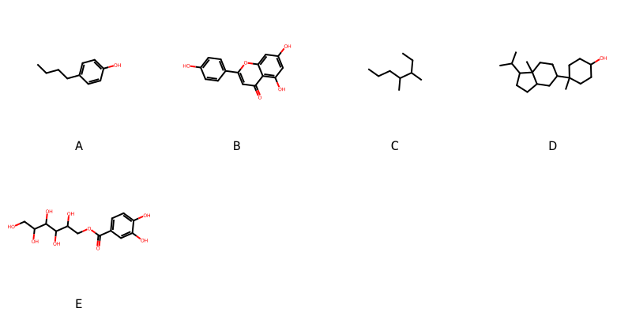

!!! abstract "Tóm tắt"

    **Họ Betulaceae** có **4** chi được các cộng đồng sử dụng trong chăm sóc sức khỏe gồm *Ostrya, Corylus, Betula, Alnus*. Số lượng thành phần hóa học đã phân lập và xác định cấu trúc từ họ này tính đến tháng 12 năm 2024 là **11** nhóm có thể liệt kê như sau *Diarylheptanoids, Steroids and steroid derivatives, Organooxygen compounds, Fatty Acyls, Flavonoids, Cinnamic acids and derivatives, Benzopyrans, Phenols, Tannins, Carboxylic acids and derivatives, Prenol lipids*. Giữa các loài trong họ này, 3 dược liệu được nghiên cứu nhiều nhất dựa trên số thành phần được phân lập là **Corylus avellana, Corylus heterophylla, Alnus rubra*. *Họ Betulaceae* đã được một số công động tại các quốc gia như China, Elsewhere, Turkey, Canada(Kwakiutl), German, Dutch, India, ain, Canada(Salish), US, US(Colonial) đã phát hiện một số tác dụng trên lâm sàng gồm chữa bệnh lẫn độc tính như Chất khử trùng, Chất gây kích ứng, Chất làm se, Chất làm se, Chất làm se, Thuốc lợi tiểu, Chất kích thích, Tiêu hóa, có mùi hôi, Chất làm se, Thuốc lợi tiểu, có mùi hôi, Thuốc bổ, Thuốc tẩy giun, Giờ mở cửa, Tiêu hóa, Thuốc bổ, Thuốc co mạch, Thuốc diệt ký sinh trùng, Thuốc diệt ký sinh trùng, Thuốc lợi tiểu, Thuốc lợi tiểu, Thuốc nhuận tràng, Thuốc bổ, Thuốc tránh thai, Thuốc đắp, gây nôn.

!!! info "DrDuke"

    James A. Duke sinh năm 1929-2017 là một nhà thực vật học người Mỹ. Đây là một trong những tác giả hàng đầu trong lĩnh vực dược dân tộc học với cuốn *CRC Handbook of Medicinal Herbs* và chính là người xây dựng lên cơ sở dữ liệu về hợp chất tự nhiên và dược dân tộc học tại Bộ nông nghiệp Hoa Kỳ. Các thông tin được đăng tải tại website [Dr. Duke's Phytochemical and Ethnobotanical Databases](https://phytochem.nal.usda.gov/). 
    Trong suốt thập niên 1970, ông lãnh đạo the Plant Taxonomy Laboratory, Plant Genetics and Germplasm Institute of the Agricultural Research Service, U.S. Department of Agriculture.
    Trong tài liệu này, các thông tin về dược dân tộc của các dược liệu được trích dẫn từ tài liệu của James A. Ducke với sự trợ giúp của phần mềm dịch thuật từ tiếng Anh sang tiếng Việt.
   
## Tổng quan về Họ Betulaceae
### Phân loại thực vật
Trong *họ Betulaceae* có **4** chi được sử dụng làm thuốc với chi tiết số loài trong mỗi chi như sau Alnus (2) . Chi tiết về loài sử dụng làm thuốc như dưới đây.  

>Họ Betulaceae


>|-- Chi Ostrya

>*Ostrya virginiana*,

>|-- Chi Corylus

>*Corylus avellana*,
>*Corylus heterophylla*,
>*Corylus mandshurica*,

>|-- Chi Betula

>*Betula alba*,
>*Betula lenta*,
>*Betula utilis*,
>*Betula veerucosa*,
>*Betula verrucosa*,

>|-- Chi Alnus

>*Alnus glutinosa*,
>*Alnus rubra*,

### Thành phần hóa học 

Số lượng thành phần hóa học đã phân lập và xác định cấu trúc từ họ này tính đến tháng 12 năm 2024 là 11 nhóm có thể liệt kê như sau Diarylheptanoids, Steroids and steroid derivatives, Organooxygen compounds, Fatty Acyls, Flavonoids, Cinnamic acids and derivatives, Benzopyrans, Phenols, Tannins, Carboxylic acids and derivatives, Prenol lipids. Số lượng các loài đã được nghiên cứu thành phần hóa học là *7* trong tổng số *11* loài thuộc họ Betulaceae.Giữa các loài trong họ này, 3 dược liệu được nghiên cứu nhiều nhất dựa trên số thành phần được phân lập là **Corylus avellana, Corylus heterophylla, Alnus rubra**. Sử dụng phần mềm RDKIT với thuật toán  Find Maximum Common Substructure (FMCS), các nhóm hoạt chất phổ biến nhất trong *họ Betulaceae* đã xây dựng được nhân. Điều này trong tương lại có thể được sử dụng tìm kiếm mối liên hệ giữa tác dụng của cấu trúc hóa học và tác dụng dược lý. Các nhân trong phần này có thể không giống như cấu trúc gốc của từng nhóm chất. Kết quả được trình bầy như hình dưới đây.

<figure markdown="span">
    { width=100% }
    <figcaption> Cấu trúc hóa học của một số khung cơ bản dựa trên thuật toán FMCS để tìm Diarylheptanoids (A), Flavonoids (B), Prenol lipids (C), Steroids and steroid derivatives (D), Tannins (E).</figcaption>
</figure>


!!! info  "Find Maximum Common Substructure"
    
    Thuật toán FMCS (Find Maximum Common Substructure) là một phương pháp được sử dụng để tìm ra cấu trúc chung nhiều nhất (MCS) trong một tập hợp các cấu trúc hóa học. Các bước của thuật toán gồm:
    - Chọn một cấu trúc hóa học là cấu trúc để tạo truy vấn, còn các cấu trúc khác là mục tiêu.
    - Chia nhỏ cấu trúc để tạo truy vấn thành cấu trúc nhỏ hơn dạng chuỗi SMARTS.
    - Kiểm tra chuỗi SMARTS trong các cấu trúc mục tiêu.
    - Tìm kiếm chuỗi SMARTS xuất hiện nhiều nhất.
    Để biết thêm chi tiết các bạn có thể xem tại [TeachOpenCADD](https://projects.volkamerlab.org/teachopencadd/talktorials/T006_compound_maximum_common_substructures.html)
    ``` python
    pip install rdkit
    def find_core_smiles(smiles_list):
        mols = [Chem.MolFromSmiles(smiles) for smiles in smiles_list]
        mcs = rdFMCS.FindMCS(mols)
        core_smiles = Chem.MolToSmiles(Chem.MolFromSmarts(mcs.smartsString))
        return core_smiles
    ```

### Dược dân tộc học

Họ **Betulaceae** đã được một số công động tại các quốc gia như *China, Elsewhere, Turkey, Canada(Kwakiutl), German, Dutch, India, ain, Canada(Salish), US, US(Colonial)* đã phát hiện một số tác dụng trên lâm sàng gồm chữa bệnh lẫn độc tính như *Chất khử trùng, Chất gây kích ứng, Chất làm se, Chất làm se, Chất làm se, Thuốc lợi tiểu, Chất kích thích, Tiêu hóa, có mùi hôi, Chất làm se, Thuốc lợi tiểu, có mùi hôi, Thuốc bổ, Thuốc tẩy giun, Giờ mở cửa, Tiêu hóa, Thuốc bổ, Thuốc co mạch, Thuốc diệt ký sinh trùng, Thuốc diệt ký sinh trùng, Thuốc lợi tiểu, Thuốc lợi tiểu, Thuốc nhuận tràng, Thuốc bổ, Thuốc tránh thai, Thuốc đắp, gây nôn*.

## Chi tiết dược dân tộc học


### Chi Ostrya

!!! note "Danh sách các loài thuộc chi"
    
*	 - *Ostrya virginiana**

---      
#### *Ostrya virginiana*
**Thông tin về thực vật**

!!! info "Phân loại thực vật của *Ostrya virginiana* từ GIBF:"
    - **Kingdom:** Plantae
    - **Phylum:** Tracheophyta
    - **Order:** Fagales
    - **Family:** Betulaceae
    - **Genus:** Ostrya
    - **Species:** *Ostrya virginiana*


 

Chưa có thông tin về loài này trên wikidata.

*Phân bố trên thế giới*: Canada, United States of America

*Phân bố tại Việt Nam*: Không có ghi nhận ở Việt Nam

**Thành phần hóa học**
        

Theo cơ sở dữ liệu lotus, từ loài *Ostrya virginiana* đã phân lập và xác định được 2 hoạt chất thuộc về các nhóm Organooxygen compounds. Danh sách các hoạt chất như sau dhurrin [(LTS0063687)](https://lotus.naturalproducts.net/compound/lotus_id/LTS0063687), dhurrin [(LTS0158099)](https://lotus.naturalproducts.net/compound/lotus_id/LTS0158099).

| chemicalTaxonomyClassyfireClass   |   lotus_count |
|:----------------------------------|--------------:|
| Organooxygen compounds            |             2 |


**Dược dân tộc học**

Danh sách các quốc gia có sử dụng *Ostrya virginiana* trong điều trị các bệnh. 

| Quốc gia     | Bệnh                        |
|:-------------|:----------------------------|
| US           | Thuốc nhuận tràng, Thuốc bổ |
| US(Colonial) | Thuốc bổ                    |


### Chi Corylus

!!! note "Danh sách các loài thuộc chi"
    
*	 - *Corylus avellana*
	 - *Corylus heterophylla*
	 - *Corylus mandshurica**

---      
#### *Corylus avellana*
**Thông tin về thực vật**

!!! info "Phân loại thực vật của *Corylus avellana* từ GIBF:"
    - **Kingdom:** Plantae
    - **Phylum:** Tracheophyta
    - **Order:** Fagales
    - **Family:** Betulaceae
    - **Genus:** Corylus
    - **Species:** *Corylus avellana*


 

Chưa có thông tin về loài này trên wikidata.

*Phân bố trên thế giới*: France, Germany, Switzerland, Netherlands, Austria, Hungary, Spain, Poland, Isle of Man, Russian Federation, Portugal, United Kingdom of Great Britain and Northern Ireland, Ukraine, Georgia, Serbia, United States of America, Luxembourg, Italy, Slovenia, Canada, Denmark, Slovakia, Ireland, Belgium

*Phân bố tại Việt Nam*: Không có ghi nhận ở Việt Nam

**Thành phần hóa học**
        

Theo cơ sở dữ liệu lotus, từ loài *Corylus avellana* đã phân lập và xác định được 55 hoạt chất thuộc về các nhóm Diarylheptanoids, Steroids and steroid derivatives, Organooxygen compounds, Flavonoids, Cinnamic acids and derivatives, Phenols, Carboxylic acids and derivatives, Prenol lipids. Danh sách các hoạt chất như sau (2e)-n-{4-[(3-aminopropyl)amino]butyl}-3-(4-hydroxy-3-methoxyphenyl)-n-[(2e)-3-(4-hydroxy-3-methoxyphenyl)prop-2-enoyl]prop-2-enamide [(LTS0194219)](https://lotus.naturalproducts.net/compound/lotus_id/LTS0194219), n-[(1s,2r)-3-{[(1s,2s,3r,4s,7r,9r,10s,12r,15s)-4,12-bis(acetyloxy)-2-(benzoyloxy)-1,9-dihydroxy-10,14,17,17-tetramethyl-11-oxo-6-oxatetracyclo[11.3.1.0³,¹⁰.0⁴,⁷]heptadec-13-en-15-yl]oxy}-2-hydroxy-3-oxo-1-phenylpropyl]benzenecarboximidic acid [(LTS0249808)](https://lotus.naturalproducts.net/compound/lotus_id/LTS0249808), vitamin e [(LTS0263269)](https://lotus.naturalproducts.net/compound/lotus_id/LTS0263269), (2r)-2,5,7,8-tetramethyl-2-[(4s,8s)-4,8,12-trimethyltridecyl]-3,4-dihydro-1-benzopyran-6-ol [(LTS0130040)](https://lotus.naturalproducts.net/compound/lotus_id/LTS0130040), phytosterol [(LTS0029311)](https://lotus.naturalproducts.net/compound/lotus_id/LTS0029311), stigmast-5-en-3-ol, (3β)- [(LTS0204616)](https://lotus.naturalproducts.net/compound/lotus_id/LTS0204616), (8z,12s)-4,6-dimethoxy-2-oxatricyclo[13.2.2.1³,⁷]icosa-1(17),3(20),4,6,8,15,18-heptaene-5,12-diol [(LTS0240735)](https://lotus.naturalproducts.net/compound/lotus_id/LTS0240735), n-(3-{[(1s,7r,9s,10s,12r)-4,12-bis(acetyloxy)-2-(benzoyloxy)-1,9-dihydroxy-10,14,17,17-tetramethyl-11-oxo-6-oxatetracyclo[11.3.1.0³,¹⁰.0⁴,⁷]heptadec-13-en-15-yl]oxy}-2-hydroxy-3-oxo-1-phenylpropyl)hexanimidic acid [(LTS0141235)](https://lotus.naturalproducts.net/compound/lotus_id/LTS0141235), 5-hydroxy-4,6-dimethoxy-2-oxatricyclo[13.2.2.1³,⁷]icosa-1(17),3(20),4,6,8,15,18-heptaen-12-one [(LTS0180217)](https://lotus.naturalproducts.net/compound/lotus_id/LTS0180217), kaempherol [(LTS0155822)](https://lotus.naturalproducts.net/compound/lotus_id/LTS0155822), n-[(1s,2r)-3-{[(1s,2s,3s,4s,7r,9s,10s,12r,15s)-4-(acetyloxy)-2-(benzoyloxy)-1,12-dihydroxy-10,14,17,17-tetramethyl-11-oxo-9-{[(2s,3r,4s,5r)-3,4,5-trihydroxyoxan-2-yl]oxy}-6-oxatetracyclo[11.3.1.0³,¹⁰.0⁴,⁷]heptadec-13-en-15-yl]oxy}-2-hydroxy-3-oxo-1-phenylpropyl]benzenecarboximidic acid [(LTS0254987)](https://lotus.naturalproducts.net/compound/lotus_id/LTS0254987), filbertone [(LTS0217765)](https://lotus.naturalproducts.net/compound/lotus_id/LTS0217765), (8z,10r)-4,6-dimethoxy-2-oxatricyclo[13.2.2.1³,⁷]icosa-1(17),3(20),4,6,8,15,18-heptaene-5,10-diol [(LTS0136401)](https://lotus.naturalproducts.net/compound/lotus_id/LTS0136401), (10r)-4,6-dimethoxy-2-oxatricyclo[13.2.2.1³,⁷]icosa-1(17),3(20),4,6,8,15,18-heptaene-5,10-diol [(LTS0112968)](https://lotus.naturalproducts.net/compound/lotus_id/LTS0112968), (10e)-17-{[(2s,3r,4s,5s,6r)-3,4,5-trihydroxy-6-(hydroxymethyl)oxan-2-yl]oxy}-3-{[(2s,3r,4s,5s)-3,4,5-trihydroxyoxan-2-yl]oxy}tricyclo[12.3.1.1²,⁶]nonadeca-1(18),2(19),3,5,10,14,16-heptaen-9-one [(LTS0118855)](https://lotus.naturalproducts.net/compound/lotus_id/LTS0118855), campesterol [(LTS0046755)](https://lotus.naturalproducts.net/compound/lotus_id/LTS0046755), n-[(1s,2r)-3-{[(1s,2s,3r,4s,7r,9s,10s,12r,15s)-4-(acetyloxy)-2-(benzoyloxy)-1,9,12-trihydroxy-10,14,17,17-tetramethyl-11-oxo-6-oxatetracyclo[11.3.1.0³,¹⁰.0⁴,⁷]heptadec-13-en-15-yl]oxy}-2-hydroxy-3-oxo-1-phenylpropyl]benzenecarboximidic acid [(LTS0212352)](https://lotus.naturalproducts.net/compound/lotus_id/LTS0212352), (8z,10e,12r)-4-methoxy-2-oxatricyclo[13.2.2.1³,⁷]icosa-1(17),3(20),4,6,8,10,15,18-octaene-5,12-diol [(LTS0049979)](https://lotus.naturalproducts.net/compound/lotus_id/LTS0049979), 3-(3,4-dihydroxyphenyl)-n-{3-[(4-{[1-hydroxy-3-(4-hydroxy-3-methoxyphenyl)prop-2-en-1-ylidene]amino}butyl)amino]propyl}prop-2-enimidic acid [(LTS0144252)](https://lotus.naturalproducts.net/compound/lotus_id/LTS0144252), myricetin [(LTS0139858)](https://lotus.naturalproducts.net/compound/lotus_id/LTS0139858), 3-{[4,5-dihydroxy-6-(hydroxymethyl)-3-{[3,4,5-trihydroxy-6-(hydroxymethyl)oxan-2-yl]oxy}oxan-2-yl]oxy}-2-(3,4-dihydroxyphenyl)-5,7-dihydroxychromen-4-one [(LTS0067754)](https://lotus.naturalproducts.net/compound/lotus_id/LTS0067754), afzelin [(LTS0259097)](https://lotus.naturalproducts.net/compound/lotus_id/LTS0259097), 5-dehydroavenasterol [(LTS0129084)](https://lotus.naturalproducts.net/compound/lotus_id/LTS0129084), (8e,14s)-5,14-dihydroxy-4,6-dimethoxy-2-oxatricyclo[13.2.2.1³,⁷]icosa-1(17),3(20),4,6,8,15,18-heptaen-12-one [(LTS0066476)](https://lotus.naturalproducts.net/compound/lotus_id/LTS0066476), (2e)-n-{3-[(4-{[(2e)-1-hydroxy-3-(4-hydroxy-3-methoxyphenyl)prop-2-en-1-ylidene]amino}butyl)amino]propyl}-3-(4-hydroxy-3-methoxyphenyl)prop-2-enimidic acid [(LTS0076200)](https://lotus.naturalproducts.net/compound/lotus_id/LTS0076200), [(1s,2r,3s,4r,5r,6s,8s,10r,11r,12r,15r)-3,4,6,11-tetrakis(acetyloxy)-2,8-dihydroxy-1,15-dimethyl-9-methylidene-14-oxo-16-oxatetracyclo[10.5.0.0²,¹⁵.0⁵,¹⁰]heptadecan-5-yl]methyl benzoate [(LTS0108873)](https://lotus.naturalproducts.net/compound/lotus_id/LTS0108873), (2e)-n-[(1s,2r)-3-{[(1s,2s,4s,7r,9s,10s,12r,15s)-4,12-bis(acetyloxy)-2-(benzoyloxy)-1,9-dihydroxy-10,14,17,17-tetramethyl-11-oxo-6-oxatetracyclo[11.3.1.0³,¹⁰.0⁴,⁷]heptadec-13-en-15-yl]oxy}-2-hydroxy-3-oxo-1-phenylpropyl]-2-methylbut-2-enimidic acid [(LTS0164359)](https://lotus.naturalproducts.net/compound/lotus_id/LTS0164359), n-[(1s,2r)-3-{[(1s,2s,3r,4s,7r,9s,10s,12r,15s)-4,12-bis(acetyloxy)-2-(benzoyloxy)-1,9-dihydroxy-10,14,17,17-tetramethyl-11-oxo-6-oxatetracyclo[11.3.1.0³,¹⁰.0⁴,⁷]heptadec-13-en-15-yl]oxy}-2-hydroxy-3-oxo-1-phenylpropyl]hexanimidic acid [(LTS0158087)](https://lotus.naturalproducts.net/compound/lotus_id/LTS0158087), (10e,12r)-4-methoxy-2-oxatricyclo[13.2.2.1³,⁷]icosa-1(17),3(20),4,6,8,10,15,18-octaene-5,12-diol [(LTS0265047)](https://lotus.naturalproducts.net/compound/lotus_id/LTS0265047), quercetin [(LTS0004651)](https://lotus.naturalproducts.net/compound/lotus_id/LTS0004651), (1r,3as,3bs,7s,9bs)-1-[(2r,5r)-5,6-dimethylheptan-2-yl]-9a,11a-dimethyl-1h,2h,3h,3ah,3bh,4h,6h,7h,8h,9h,9bh,10h,11h-cyclopenta[a]phenanthren-7-ol [(LTS0057877)](https://lotus.naturalproducts.net/compound/lotus_id/LTS0057877), stigmast-5-en-3-ol [(LTS0071224)](https://lotus.naturalproducts.net/compound/lotus_id/LTS0071224), n-(3-{[(1s,3s,4s,10s)-4,12-bis(acetyloxy)-2-(benzoyloxy)-1,9-dihydroxy-10,14,17,17-tetramethyl-11-oxo-6-oxatetracyclo[11.3.1.0³,¹⁰.0⁴,⁷]heptadec-13-en-15-yl]oxy}-2-hydroxy-3-oxo-1-phenylpropyl)-2-methylbut-2-enimidic acid [(LTS0175596)](https://lotus.naturalproducts.net/compound/lotus_id/LTS0175596), 5,7-dihydroxy-2-(4-hydroxyphenyl)-3-[(3,4,5-trihydroxy-6-methyloxan-2-yl)oxy]chromen-4-one [(LTS0211340)](https://lotus.naturalproducts.net/compound/lotus_id/LTS0211340), n-[(1s,2r)-3-{[(1s,2s,3r,4s,7r,9s,10s,12r,15s)-4,12-bis(acetyloxy)-2-(benzoyloxy)-1,9-dihydroxy-10,14,17,17-tetramethyl-11-oxo-6-oxatetracyclo[11.3.1.0³,¹⁰.0⁴,⁷]heptadec-13-en-15-yl]oxy}-2-hydroxy-3-oxo-1-phenylpropyl]benzenecarboximidic acid [(LTS0163460)](https://lotus.naturalproducts.net/compound/lotus_id/LTS0163460), n-[(1s,2r)-3-{[(1s,2s,3r,4s,7r,9s,10s,12r,15s)-4-(acetyloxy)-2-(benzoyloxy)-1,12-dihydroxy-10,14,17,17-tetramethyl-11-oxo-9-{[(2s,3r,4s,5r)-3,4,5-trihydroxyoxan-2-yl]oxy}-6-oxatetracyclo[11.3.1.0³,¹⁰.0⁴,⁷]heptadec-13-en-15-yl]oxy}-2-hydroxy-3-oxo-1-phenylpropyl]hexanimidic acid [(LTS0241027)](https://lotus.naturalproducts.net/compound/lotus_id/LTS0241027), (8z,10r)-5,10-dihydroxy-4,6-dimethoxy-2-oxatricyclo[13.2.2.1³,⁷]icosa-1(17),3(20),4,6,8,15,18-heptaen-12-one [(LTS0057822)](https://lotus.naturalproducts.net/compound/lotus_id/LTS0057822), (12r)-4,6-dimethoxy-2-oxatricyclo[13.2.2.1³,⁷]icosa-1(17),3(20),4,6,8,10,15,18-octaene-5,12-diol [(LTS0233482)](https://lotus.naturalproducts.net/compound/lotus_id/LTS0233482), (8z)-5-hydroxy-4,6-dimethoxy-2-oxatricyclo[13.2.2.1³,⁷]icosa-1(17),3(20),4,6,8,15,18-heptaen-12-one [(LTS0134986)](https://lotus.naturalproducts.net/compound/lotus_id/LTS0134986), 10-deacetylbaccatin iii [(LTS0231236)](https://lotus.naturalproducts.net/compound/lotus_id/LTS0231236), (2e)-3-(3,4-dihydroxyphenyl)-n-{3-[(4-{[(2e)-1-hydroxy-3-(4-hydroxy-3-methoxyphenyl)prop-2-en-1-ylidene]amino}butyl)amino]propyl}prop-2-enimidic acid [(LTS0162436)](https://lotus.naturalproducts.net/compound/lotus_id/LTS0162436), (2e)-n-{4-[(3-aminopropyl)amino]butyl}-3-(3,4-dihydroxyphenyl)-n-[(2e)-3-(4-hydroxy-3-methoxyphenyl)prop-2-enoyl]prop-2-enamide [(LTS0098738)](https://lotus.naturalproducts.net/compound/lotus_id/LTS0098738), quercitrin [(LTS0093095)](https://lotus.naturalproducts.net/compound/lotus_id/LTS0093095), n-{3-[(4-{[1-hydroxy-3-(4-hydroxy-3-methoxyphenyl)prop-2-en-1-ylidene]amino}butyl)amino]propyl}-3-(4-hydroxy-3-methoxyphenyl)prop-2-enimidic acid [(LTS0002867)](https://lotus.naturalproducts.net/compound/lotus_id/LTS0002867), myricitrin [(LTS0189989)](https://lotus.naturalproducts.net/compound/lotus_id/LTS0189989), (8z,10e,12r)-4,6-dimethoxy-2-oxatricyclo[13.2.2.1³,⁷]icosa-1(17),3(20),4,6,8,10,15,18-octaene-5,12-diol [(LTS0068457)](https://lotus.naturalproducts.net/compound/lotus_id/LTS0068457), 3-{[(2s,3r,4s,5r,6r)-4,5-dihydroxy-6-(hydroxymethyl)-3-{[(2s,3r,4s,5s,6r)-3,4,5-trihydroxy-6-(hydroxymethyl)oxan-2-yl]oxy}oxan-2-yl]oxy}-2-(3,4-dihydroxyphenyl)-5,7-dihydroxychromen-4-one [(LTS0200334)](https://lotus.naturalproducts.net/compound/lotus_id/LTS0200334), (12s)-4,6-dimethoxy-2-oxatricyclo[13.2.2.1³,⁷]icosa-1(17),3(20),4,6,8,15,18-heptaene-5,12-diol [(LTS0241040)](https://lotus.naturalproducts.net/compound/lotus_id/LTS0241040), [(2r,3s,4r,5r,6s,8s,10r,11r,12r,15s)-3,4,6,11-tetrakis(acetyloxy)-2,8-dihydroxy-1,15-dimethyl-9-methylidene-14-oxo-16-oxatetracyclo[10.5.0.0²,¹⁵.0⁵,¹⁰]heptadecan-5-yl]methyl benzoate [(LTS0245059)](https://lotus.naturalproducts.net/compound/lotus_id/LTS0245059), baccatin iii [(LTS0248764)](https://lotus.naturalproducts.net/compound/lotus_id/LTS0248764), (10r)-5,10-dihydroxy-4,6-dimethoxy-2-oxatricyclo[13.2.2.1³,⁷]icosa-1(17),3(20),4,6,8,15,18-heptaen-12-one [(LTS0148685)](https://lotus.naturalproducts.net/compound/lotus_id/LTS0148685), n-(3-{[(1s,3s,4s,7s,10s)-4,12-bis(acetyloxy)-2-(benzoyloxy)-1-hydroxy-10,14,17,17-tetramethyl-11-oxo-9-{[(2s)-3,4,5-trihydroxyoxan-2-yl]oxy}-6-oxatetracyclo[11.3.1.0³,¹⁰.0⁴,⁷]heptadec-13-en-15-yl]oxy}-2-hydroxy-3-oxo-1-phenylpropyl)benzenecarboximidic acid [(LTS0182888)](https://lotus.naturalproducts.net/compound/lotus_id/LTS0182888), quercitrin [(LTS0186298)](https://lotus.naturalproducts.net/compound/lotus_id/LTS0186298), (8e)-5-hydroxy-4,6-dimethoxy-2-oxatricyclo[13.2.2.1³,⁷]icosa-1(17),3(20),4,6,8,15,18-heptaen-12-one [(LTS0160334)](https://lotus.naturalproducts.net/compound/lotus_id/LTS0160334), myricitrin [(LTS0141597)](https://lotus.naturalproducts.net/compound/lotus_id/LTS0141597).

| chemicalTaxonomyClassyfireClass   |   lotus_count |
|:----------------------------------|--------------:|
| Carboxylic acids and derivatives  |             2 |
| Cinnamic acids and derivatives    |             5 |
| Diarylheptanoids                  |            15 |
| Flavonoids                        |            11 |
| Organooxygen compounds            |             1 |
| Phenols                           |             1 |
| Prenol lipids                     |            14 |
| Steroids and steroid derivatives  |             6 |


**Dược dân tộc học**

Danh sách các quốc gia có sử dụng *Corylus avellana* trong điều trị các bệnh. 

| Quốc gia   | Bệnh          |
|:-----------|:--------------|
| Turkey     | Thuốc co mạch |


---      
#### *Corylus heterophylla*
**Thông tin về thực vật**

!!! info "Phân loại thực vật của *Corylus heterophylla* từ GIBF:"
    - **Kingdom:** Plantae
    - **Phylum:** Tracheophyta
    - **Order:** Fagales
    - **Family:** Betulaceae
    - **Genus:** Corylus
    - **Species:** *Corylus heterophylla*


 

Chưa có thông tin về loài này trên wikidata.

*Phân bố trên thế giới*: United States of America, Russian Federation, China, Korea, Republic of, Belarus, Korea (Democratic People’s Republic of)

*Phân bố tại Việt Nam*: Không có ghi nhận ở Việt Nam

**Thành phần hóa học**
        

Theo cơ sở dữ liệu lotus, từ loài *Corylus heterophylla* đã phân lập và xác định được 34 hoạt chất thuộc về các nhóm Flavonoids, Tannins. Danh sách các hoạt chất như sau 3,4,5,21,22,23-hexahydroxy-8,18-dioxo-11,12-bis(3,4,5-trihydroxybenzoyloxy)-9,14,17-trioxatetracyclo[17.4.0.0²,⁷.0¹⁰,¹⁵]tricosa-1(23),2(7),3,5,19,21-hexaen-13-yl 3,4,5-trihydroxy-2-{[7,8,9,12,13,14,29,30,33,34,35-undecahydroxy-4,17,25,38-tetraoxo-20-(3,4,5-trihydroxybenzoyloxy)-3,18,21,24,39-pentaoxaheptacyclo[20.17.0.0²,¹⁹.0⁵,¹⁰.0¹¹,¹⁶.0²⁶,³¹.0³²,³⁷]nonatriaconta-5,7,9,11(16),12,14,26,28,30,32(37),33,35-dodecaen-28-yl]oxy}benzoate [(LTS0247694)](https://lotus.naturalproducts.net/compound/lotus_id/LTS0247694), (2s,3r,4s,5r,6r)-5-hydroxy-3,4-bis(3,4,5-trihydroxybenzoyloxy)-6-[(3,4,5-trihydroxybenzoyloxy)methyl]oxan-2-yl 3,4,5-trihydroxybenzoate [(LTS0130248)](https://lotus.naturalproducts.net/compound/lotus_id/LTS0130248), 3,4,5,12,21,22,23-heptahydroxy-8,18-dioxo-13-(3,4,5-trihydroxybenzoyloxy)-9,14,17-trioxatetracyclo[17.4.0.0²,⁷.0¹⁰,¹⁵]tricosa-1(23),2(7),3,5,19,21-hexaen-11-yl 3,4,5-trihydroxybenzoate [(LTS0184564)](https://lotus.naturalproducts.net/compound/lotus_id/LTS0184564), (11r,12r)-12-[(15s,19s)-2,3,4,7,8,9,19-heptahydroxy-12,17-dioxo-13,16-dioxatetracyclo[13.3.1.0⁵,¹⁸.0⁶,¹¹]nonadeca-1(18),2,4,6,8,10-hexaen-14-yl]-3,4,5,17,18,19-hexahydroxy-8,14-dioxo-9,13-dioxatricyclo[13.4.0.0²,⁷]nonadeca-1(15),2,4,6,16,18-hexaen-11-yl 3,4,5-trihydroxybenzoate [(LTS0107688)](https://lotus.naturalproducts.net/compound/lotus_id/LTS0107688), 3,4,5-trihydroxy-2-{[(1r,2s,18r,19s,21r)-7,8,9,12,13,14,28,29,32,33,34-undecahydroxy-4,24,37-trioxo-19-(3,4,5-trihydroxybenzoyloxy)-3,17,20,23,38-pentaoxaheptacyclo[19.17.0.0²,¹⁸.0⁵,¹⁰.0¹¹,¹⁶.0²⁵,³⁰.0³¹,³⁶]octatriaconta-5,7,9,11(16),12,14,25,27,29,31(36),32,34-dodecaen-27-yl]oxy}benzoic acid [(LTS0250632)](https://lotus.naturalproducts.net/compound/lotus_id/LTS0250632), 3,4,5,21,22,23-hexahydroxy-8,18-dioxo-12,13-bis(3,4,5-trihydroxybenzoyloxy)-9,14,17-trioxatetracyclo[17.4.0.0²,⁷.0¹⁰,¹⁵]tricosa-1(23),2(7),3,5,19,21-hexaen-11-yl 3,4,5-trihydroxybenzoate [(LTS0007322)](https://lotus.naturalproducts.net/compound/lotus_id/LTS0007322), 3,4,5,21,22,23-hexahydroxy-8,18-dioxo-11,12-bis(3,4,5-trihydroxybenzoyloxy)-9,14,17-trioxatetracyclo[17.4.0.0²,⁷.0¹⁰,¹⁵]tricosa-1(23),2(7),3,5,19,21-hexaen-13-yl 2-({7,8,9,12,13,14,20,29,30,33,34,35-dodecahydroxy-4,17,25,38-tetraoxo-3,18,21,24,39-pentaoxaheptacyclo[20.17.0.0²,¹⁹.0⁵,¹⁰.0¹¹,¹⁶.0²⁶,³¹.0³²,³⁷]nonatriaconta-5(10),6,8,11,13,15,26(31),27,29,32(37),33,35-dodecaen-28-yl}oxy)-3,4,5-trihydroxybenzoate [(LTS0126372)](https://lotus.naturalproducts.net/compound/lotus_id/LTS0126372), (10r,11s,12r,15r)-3,4,5,21,22,23-hexahydroxy-8,18-dioxo-12,13-bis(3,4,5-trihydroxybenzoyloxy)-9,14,17-trioxatetracyclo[17.4.0.0²,⁷.0¹⁰,¹⁵]tricosa-1(23),2(7),3,5,19,21-hexaen-11-yl 3,4,5-trihydroxybenzoate [(LTS0271450)](https://lotus.naturalproducts.net/compound/lotus_id/LTS0271450), (10r,11r,12r,13s,15r)-3,4,5,12,21,22,23-heptahydroxy-8,18-dioxo-13-(3,4,5-trihydroxybenzoyloxy)-9,14,17-trioxatetracyclo[17.4.0.0²,⁷.0¹⁰,¹⁵]tricosa-1(23),2(7),3,5,19,21-hexaen-11-yl (1s)-7,8,9-trihydroxy-3,5-dioxo-1h,2h-cyclopenta[c]isochromene-1-carboxylate [(LTS0111817)](https://lotus.naturalproducts.net/compound/lotus_id/LTS0111817), (11r,12r)-12-[(14r,15s,19s)-2,3,4,7,8,9,19-heptahydroxy-12,17-dioxo-13,16-dioxatetracyclo[13.3.1.0⁵,¹⁸.0⁶,¹¹]nonadeca-1(18),2,4,6,8,10-hexaen-14-yl]-3,4,5,17,18,19-hexahydroxy-8,14-dioxo-9,13-dioxatricyclo[13.4.0.0²,⁷]nonadeca-1(15),2,4,6,16,18-hexaen-11-yl 3,4,5-trihydroxybenzoate [(LTS0124879)](https://lotus.naturalproducts.net/compound/lotus_id/LTS0124879), 3,4,5,21,22,23-hexahydroxy-8,18-dioxo-11,12-bis(3,4,5-trihydroxybenzoyloxy)-9,14,17-trioxatetracyclo[17.4.0.0²,⁷.0¹⁰,¹⁵]tricosa-1(23),2(7),3,5,19,21-hexaen-13-yl 2-{[3,4,5,11,12,22,23-heptahydroxy-8,18-dioxo-13-(3,4,5-trihydroxybenzoyloxy)-9,14,17-trioxatetracyclo[17.4.0.0²,⁷.0¹⁰,¹⁵]tricosa-1(23),2(7),3,5,19,21-hexaen-21-yl]oxy}-3,4,5-trihydroxybenzoate [(LTS0166246)](https://lotus.naturalproducts.net/compound/lotus_id/LTS0166246), (10r,11r,12r,13r,15r)-3,4,5,12,21,22,23-heptahydroxy-8,18-dioxo-13-(3,4,5-trihydroxybenzoyloxy)-9,14,17-trioxatetracyclo[17.4.0.0²,⁷.0¹⁰,¹⁵]tricosa-1(23),2(7),3,5,19,21-hexaen-11-yl 3,4,5-trihydroxybenzoate [(LTS0268878)](https://lotus.naturalproducts.net/compound/lotus_id/LTS0268878), miquelianin [(LTS0045574)](https://lotus.naturalproducts.net/compound/lotus_id/LTS0045574), 5-hydroxy-3,4-bis(3,4,5-trihydroxybenzoyloxy)-6-[(3,4,5-trihydroxybenzoyloxy)methyl]oxan-2-yl 3,4,5-trihydroxybenzoate [(LTS0023424)](https://lotus.naturalproducts.net/compound/lotus_id/LTS0023424), 7,8,9,12,13,14,28,29,30,33,34,35-dodecahydroxy-4,17,25,38-tetraoxo-3,18,21,24,39-pentaoxaheptacyclo[20.17.0.0²,¹⁹.0⁵,¹⁰.0¹¹,¹⁶.0²⁶,³¹.0³²,³⁷]nonatriaconta-5,7,9,11(16),12,14,26,28,30,32(37),33,35-dodecaen-20-yl 3,4,5-trihydroxy-2-{[7,8,9,12,13,14,29,30,33,34,35-undecahydroxy-4,17,25,38-tetraoxo-20-(3,4,5-trihydroxybenzoyloxy)-3,18,21,24,39-pentaoxaheptacyclo[20.17.0.0²,¹⁹.0⁵,¹⁰.0¹¹,¹⁶.0²⁶,³¹.0³²,³⁷]nonatriaconta-5,7,9,11(16),12,14,26,28,30,32(37),33,35-dodecaen-28-yl]oxy}benzoate [(LTS0225801)](https://lotus.naturalproducts.net/compound/lotus_id/LTS0225801), 7,8,9,12,13,14,28,29,30,33,34,35-dodecahydroxy-4,17,25,38-tetraoxo-3,18,21,24,39-pentaoxaheptacyclo[20.17.0.0²,¹⁹.0⁵,¹⁰.0¹¹,¹⁶.0²⁶,³¹.0³²,³⁷]nonatriaconta-5,7,9,11(16),12,14,26,28,30,32(37),33,35-dodecaen-20-yl 2-[(12-{2,3,4,7,8,9,19-heptahydroxy-12,17-dioxo-13,16-dioxatetracyclo[13.3.1.0⁵,¹⁸.0⁶,¹¹]nonadeca-1(18),2,4,6,8,10-hexaen-14-yl}-3,4,17,18,19-pentahydroxy-8,14-dioxo-11-(3,4,5-trihydroxybenzoyloxy)-9,13-dioxatricyclo[13.4.0.0²,⁷]nonadeca-1(15),2,4,6,16,18-hexaen-5-yl)oxy]-3,4,5-trihydroxybenzoate [(LTS0035024)](https://lotus.naturalproducts.net/compound/lotus_id/LTS0035024), (10r,11s,12r,13s,15r)-3,4,5,21,22,23-hexahydroxy-8,18-dioxo-12,13-bis(3,4,5-trihydroxybenzoyloxy)-9,14,17-trioxatetracyclo[17.4.0.0²,⁷.0¹⁰,¹⁵]tricosa-1(23),2(7),3,5,19,21-hexaen-11-yl 3,4,5-trihydroxybenzoate [(LTS0067445)](https://lotus.naturalproducts.net/compound/lotus_id/LTS0067445), (2s,20s,22r)-7,8,9,12,13,14,28,29,30,33,34,35-dodecahydroxy-4,17,25,38-tetraoxo-3,18,21,24,39-pentaoxaheptacyclo[20.17.0.0²,¹⁹.0⁵,¹⁰.0¹¹,¹⁶.0²⁶,³¹.0³²,³⁷]nonatriaconta-5,7,9,11(16),12,14,26,28,30,32(37),33,35-dodecaen-20-yl 3,4,5-trihydroxybenzoate [(LTS0096540)](https://lotus.naturalproducts.net/compound/lotus_id/LTS0096540), (10r,11s,12r,13s,15r)-3,4,5,21,22,23-hexahydroxy-8,18-dioxo-11,12-bis(3,4,5-trihydroxybenzoyloxy)-9,14,17-trioxatetracyclo[17.4.0.0²,⁷.0¹⁰,¹⁵]tricosa-1(23),2(7),3,5,19,21-hexaen-13-yl 2-{[(10s,11r,12r,13s,15r)-3,4,5,11,12,22,23-heptahydroxy-8,18-dioxo-13-(3,4,5-trihydroxybenzoyloxy)-9,14,17-trioxatetracyclo[17.4.0.0²,⁷.0¹⁰,¹⁵]tricosa-1(23),2(7),3,5,19,21-hexaen-21-yl]oxy}-3,4,5-trihydroxybenzoate [(LTS0240964)](https://lotus.naturalproducts.net/compound/lotus_id/LTS0240964), (10r,11s,12r,13s,15r)-3,4,5,21,22,23-hexahydroxy-8,18-dioxo-11,12-bis(3,4,5-trihydroxybenzoyloxy)-9,14,17-trioxatetracyclo[17.4.0.0²,⁷.0¹⁰,¹⁵]tricosa-1(23),2(7),3,5,19,21-hexaen-13-yl 2-{[(11r,12r)-12-[(14r,15s,19r)-2,3,4,7,8,9,19-heptahydroxy-12,17-dioxo-13,16-dioxatetracyclo[13.3.1.0⁵,¹⁸.0⁶,¹¹]nonadeca-1(18),2,4,6,8,10-hexaen-14-yl]-3,4,17,18,19-pentahydroxy-8,14-dioxo-11-(3,4,5-trihydroxybenzoyloxy)-9,13-dioxatricyclo[13.4.0.0²,⁷]nonadeca-1(15),2(7),3,5,16,18-hexaen-5-yl]oxy}-3,4,5-trihydroxybenzoate [(LTS0087332)](https://lotus.naturalproducts.net/compound/lotus_id/LTS0087332), (11r,12s)-12-[(14r,15s,19r)-2,3,4,7,8,9,19-heptahydroxy-12,17-dioxo-13,16-dioxatetracyclo[13.3.1.0⁵,¹⁸.0⁶,¹¹]nonadeca-1(18),2,4,6,8,10-hexaen-14-yl]-3,4,5,17,18,19-hexahydroxy-8,14-dioxo-9,13-dioxatricyclo[13.4.0.0²,⁷]nonadeca-1(15),2,4,6,16,18-hexaen-11-yl 3,4,5-trihydroxybenzenecarboperoxoate [(LTS0014171)](https://lotus.naturalproducts.net/compound/lotus_id/LTS0014171), 12-{2,3,4,7,8,9,19-heptahydroxy-12,17-dioxo-13,16-dioxatetracyclo[13.3.1.0⁵,¹⁸.0⁶,¹¹]nonadeca-1(18),2,4,6,8,10-hexaen-14-yl}-3,4,5,17,18,19-hexahydroxy-8,14-dioxo-9,13-dioxatricyclo[13.4.0.0²,⁷]nonadeca-1(15),2,4,6,16,18-hexaen-11-yl 3,4,5-trihydroxybenzenecarboperoxoate [(LTS0065330)](https://lotus.naturalproducts.net/compound/lotus_id/LTS0065330), (10r,11s,12r,13s,15r)-3,4,5,21,22,23-hexahydroxy-8,18-dioxo-11,12-bis(3,4,5-trihydroxybenzoyloxy)-9,14,17-trioxatetracyclo[17.4.0.0²,⁷.0¹⁰,¹⁵]tricosa-1(23),2(7),3,5,19,21-hexaen-13-yl 3,4,5-trihydroxy-2-{[(1r,2s,19r,20s,22r)-7,8,9,12,13,14,29,30,33,34,35-undecahydroxy-4,17,25,38-tetraoxo-20-(3,4,5-trihydroxybenzoyloxy)-3,18,21,24,39-pentaoxaheptacyclo[20.17.0.0²,¹⁹.0⁵,¹⁰.0¹¹,¹⁶.0²⁶,³¹.0³²,³⁷]nonatriaconta-5,7,9,11(16),12,14,26,28,30,32(37),33,35-dodecaen-28-yl]oxy}benzoate [(LTS0254713)](https://lotus.naturalproducts.net/compound/lotus_id/LTS0254713), casuarictin [(LTS0241644)](https://lotus.naturalproducts.net/compound/lotus_id/LTS0241644), 3,4,5-trihydroxy-2-{[(1r,2s,19r,20s,22r)-7,8,9,12,13,14,29,30,33,34,35-undecahydroxy-4,17,25,38-tetraoxo-20-(3,4,5-trihydroxybenzoyloxy)-3,18,21,24,39-pentaoxaheptacyclo[20.17.0.0²,¹⁹.0⁵,¹⁰.0¹¹,¹⁶.0²⁶,³¹.0³²,³⁷]nonatriaconta-5,7,9,11(16),12,14,26,28,30,32(37),33,35-dodecaen-28-yl]oxy}benzoic acid [(LTS0075997)](https://lotus.naturalproducts.net/compound/lotus_id/LTS0075997), (1r,2s,19r,20s,22r)-7,8,9,12,13,14,28,29,30,33,34,35-dodecahydroxy-4,17,25,38-tetraoxo-3,18,21,24,39-pentaoxaheptacyclo[20.17.0.0²,¹⁹.0⁵,¹⁰.0¹¹,¹⁶.0²⁶,³¹.0³²,³⁷]nonatriaconta-5,7,9,11(16),12,14,26,28,30,32(37),33,35-dodecaen-20-yl 3,4,5-trihydroxy-2-{[(1r,2s,19r,20s,22r)-7,8,9,12,13,14,29,30,33,34,35-undecahydroxy-4,17,25,38-tetraoxo-20-(3,4,5-trihydroxybenzoyloxy)-3,18,21,24,39-pentaoxaheptacyclo[20.17.0.0²,¹⁹.0⁵,¹⁰.0¹¹,¹⁶.0²⁶,³¹.0³²,³⁷]nonatriaconta-5,7,9,11(16),12,14,26,28,30,32(37),33,35-dodecaen-28-yl]oxy}benzoate [(LTS0262272)](https://lotus.naturalproducts.net/compound/lotus_id/LTS0262272), 7,8,9,12,13,14,28,29,30,33,34,35-dodecahydroxy-4,17,25,38-tetraoxo-3,18,21,24,39-pentaoxaheptacyclo[20.17.0.0²,¹⁹.0⁵,¹⁰.0¹¹,¹⁶.0²⁶,³¹.0³²,³⁷]nonatriaconta-5,7,9,11(16),12,14,26,28,30,32(37),33,35-dodecaen-20-yl 3,4,5-trihydroxybenzoate [(LTS0009009)](https://lotus.naturalproducts.net/compound/lotus_id/LTS0009009), (2s,3r,4s,5r,6s)-6-{[2-(3,4-dihydroxyphenyl)-5,7-dihydroxy-4-oxochromen-3-yl]oxy}-3,4,5-trihydroxyoxane-2-carboxylic acid [(LTS0111115)](https://lotus.naturalproducts.net/compound/lotus_id/LTS0111115), 3,4,5-trihydroxy-2-{[7,8,9,12,13,14,29,30,33,34,35-undecahydroxy-4,17,25,38-tetraoxo-20-(3,4,5-trihydroxybenzoyloxy)-3,18,21,24,39-pentaoxaheptacyclo[20.17.0.0²,¹⁹.0⁵,¹⁰.0¹¹,¹⁶.0²⁶,³¹.0³²,³⁷]nonatriaconta-5,7,9,11(16),12,14,26,28,30,32(37),33,35-dodecaen-28-yl]oxy}benzoic acid [(LTS0247959)](https://lotus.naturalproducts.net/compound/lotus_id/LTS0247959), (10r,11s,12r,13s,15r)-3,4,5,21,22,23-hexahydroxy-8,18-dioxo-11,12-bis(3,4,5-trihydroxybenzoyloxy)-9,14,17-trioxatetracyclo[17.4.0.0²,⁷.0¹⁰,¹⁵]tricosa-1(23),2(7),3,5,19,21-hexaen-13-yl 2-{[(1r,2s,19r,20r,22r)-7,8,9,12,13,14,20,29,30,33,34,35-dodecahydroxy-4,17,25,38-tetraoxo-3,18,21,24,39-pentaoxaheptacyclo[20.17.0.0²,¹⁹.0⁵,¹⁰.0¹¹,¹⁶.0²⁶,³¹.0³²,³⁷]nonatriaconta-5,7,9,11(16),12,14,26(31),27,29,32(37),33,35-dodecaen-28-yl]oxy}-3,4,5-trihydroxybenzoate [(LTS0257579)](https://lotus.naturalproducts.net/compound/lotus_id/LTS0257579), querciturone [(LTS0168861)](https://lotus.naturalproducts.net/compound/lotus_id/LTS0168861), 3,4,5,12,21,22,23-heptahydroxy-8,18-dioxo-13-(3,4,5-trihydroxybenzoyloxy)-9,14,17-trioxatetracyclo[17.4.0.0²,⁷.0¹⁰,¹⁵]tricosa-1(23),2(7),3,5,19,21-hexaen-11-yl 7,8,9-trihydroxy-3,5-dioxo-1h,2h-cyclopenta[c]isochromene-1-carboxylate [(LTS0019733)](https://lotus.naturalproducts.net/compound/lotus_id/LTS0019733), 3,4,5,21,22,23-hexahydroxy-8,18-dioxo-11,12-bis(3,4,5-trihydroxybenzoyloxy)-9,14,17-trioxatetracyclo[17.4.0.0²,⁷.0¹⁰,¹⁵]tricosa-1(23),2(7),3,5,19,21-hexaen-13-yl 2-[(12-{2,3,4,7,8,9,19-heptahydroxy-12,17-dioxo-13,16-dioxatetracyclo[13.3.1.0⁵,¹⁸.0⁶,¹¹]nonadeca-1(18),2,4,6,8,10-hexaen-14-yl}-3,4,17,18,19-pentahydroxy-8,14-dioxo-11-(3,4,5-trihydroxybenzoyloxy)-9,13-dioxatricyclo[13.4.0.0²,⁷]nonadeca-1(15),2,4,6,16,18-hexaen-5-yl)oxy]-3,4,5-trihydroxybenzoate [(LTS0269671)](https://lotus.naturalproducts.net/compound/lotus_id/LTS0269671), (1r,2s,19r,20s,22r)-7,8,9,12,13,14,28,29,30,33,34,35-dodecahydroxy-4,17,25,38-tetraoxo-3,18,21,24,39-pentaoxaheptacyclo[20.17.0.0²,¹⁹.0⁵,¹⁰.0¹¹,¹⁶.0²⁶,³¹.0³²,³⁷]nonatriaconta-5,7,9,11(16),12,14,26,28,30,32(37),33,35-dodecaen-20-yl 2-{[(11r,12r)-12-[(14r,15s,19r)-2,3,4,7,8,9,19-heptahydroxy-12,17-dioxo-13,16-dioxatetracyclo[13.3.1.0⁵,¹⁸.0⁶,¹¹]nonadeca-1(18),2,4,6,8,10-hexaen-14-yl]-3,4,17,18,19-pentahydroxy-8,14-dioxo-11-(3,4,5-trihydroxybenzoyloxy)-9,13-dioxatricyclo[13.4.0.0²,⁷]nonadeca-1(15),2,4,6,16,18-hexaen-5-yl]oxy}-3,4,5-trihydroxybenzoate [(LTS0233753)](https://lotus.naturalproducts.net/compound/lotus_id/LTS0233753).

| chemicalTaxonomyClassyfireClass   |   lotus_count |
|:----------------------------------|--------------:|
| Flavonoids                        |             3 |
| Tannins                           |            31 |


**Dược dân tộc học**

Danh sách các quốc gia có sử dụng *Corylus heterophylla* trong điều trị các bệnh. 

| Quốc gia   | Bệnh                 |
|:-----------|:---------------------|
| China      | Giờ mở cửa, Tiêu hóa |


---      
#### *Corylus heterophylla*
**Thông tin về thực vật**

!!! info "Phân loại thực vật của *Corylus heterophylla* từ GIBF:"
    - **Kingdom:** Plantae
    - **Phylum:** Tracheophyta
    - **Order:** Fagales
    - **Family:** Betulaceae
    - **Genus:** Corylus
    - **Species:** *Corylus heterophylla*


 

Chưa có thông tin về loài này trên wikidata.

*Phân bố trên thế giới*: United States of America, Russian Federation, China, Korea, Republic of, Belarus, Korea (Democratic People’s Republic of)

*Phân bố tại Việt Nam*: Không có ghi nhận ở Việt Nam

**Thành phần hóa học**
        

Chưa có nghiên cứu về thành phần hóa học của loài này


**Dược dân tộc học**

Danh sách các quốc gia có sử dụng *Corylus heterophylla* trong điều trị các bệnh. 

| Quốc gia   | Bệnh                 |
|:-----------|:---------------------|
| China      | Giờ mở cửa, Tiêu hóa |


### Chi Betula

!!! note "Danh sách các loài thuộc chi"
    
*	 - *Betula alba*
	 - *Betula lenta*
	 - *Betula utilis*
	 - *Betula veerucosa*
	 - *Betula verrucosa**

---      
#### *Corylus heterophylla*
**Thông tin về thực vật**

!!! info "Phân loại thực vật của *Corylus heterophylla* từ GIBF:"
    - **Kingdom:** Plantae
    - **Phylum:** Tracheophyta
    - **Order:** Fagales
    - **Family:** Betulaceae
    - **Genus:** Corylus
    - **Species:** *Corylus heterophylla*


 

Chưa có thông tin về loài này trên wikidata.

*Phân bố trên thế giới*: United States of America, Russian Federation, China, Korea, Republic of, Belarus, Korea (Democratic People’s Republic of)

*Phân bố tại Việt Nam*: Không có ghi nhận ở Việt Nam

**Thành phần hóa học**
        

Chưa có nghiên cứu về thành phần hóa học của loài này


**Dược dân tộc học**

Danh sách các quốc gia có sử dụng *Corylus heterophylla* trong điều trị các bệnh. 

| Quốc gia   | Bệnh                                                                            |
|:-----------|:--------------------------------------------------------------------------------|
| Turkey     | Chất làm se, Chất làm se, Thuốc lợi tiểu, Chất kích thích, Tiêu hóa, có mùi hôi |


---      
#### *Betula lenta*
**Thông tin về thực vật**

!!! info "Phân loại thực vật của *Betula lenta* từ GIBF:"
    - **Kingdom:** Plantae
    - **Phylum:** Tracheophyta
    - **Order:** Fagales
    - **Family:** Betulaceae
    - **Genus:** Betula
    - **Species:** *Betula lenta*


 

Chưa có thông tin về loài này trên wikidata.

*Phân bố trên thế giới*: United States of America

*Phân bố tại Việt Nam*: Không có ghi nhận ở Việt Nam

**Thành phần hóa học**
        

Theo cơ sở dữ liệu lotus, từ loài *Betula lenta* đã phân lập và xác định được 13 hoạt chất thuộc về các nhóm Steroids and steroid derivatives, Prenol lipids. Danh sách các hoạt chất như sau lupeol [(LTS0256952)](https://lotus.naturalproducts.net/compound/lotus_id/LTS0256952), methyl 9-(acetyloxy)-5a,5b,8,8,11a-pentamethyl-1-(prop-1-en-2-yl)-hexadecahydrocyclopenta[a]chrysene-3a-carboxylate [(LTS0258894)](https://lotus.naturalproducts.net/compound/lotus_id/LTS0258894), stigmast-5-en-3-ol, (3β)- [(LTS0204616)](https://lotus.naturalproducts.net/compound/lotus_id/LTS0204616), 3a,5a,5b,8,8,11a-hexamethyl-1-(prop-1-en-2-yl)-tetradecahydro-1h-cyclopenta[a]chrysen-9-one [(LTS0257989)](https://lotus.naturalproducts.net/compound/lotus_id/LTS0257989), betulinic acid [(LTS0210795)](https://lotus.naturalproducts.net/compound/lotus_id/LTS0210795), (1r,3ar,5ar,5br,7ar,11ar,11br,13ar,13bs)-1-(2-hydroxypropan-2-yl)-3a,5a,5b,8,8,11a-hexamethyl-hexadecahydrocyclopenta[a]chrysen-9-ol [(LTS0032043)](https://lotus.naturalproducts.net/compound/lotus_id/LTS0032043), betulone [(LTS0222075)](https://lotus.naturalproducts.net/compound/lotus_id/LTS0222075), betulin [(LTS0101863)](https://lotus.naturalproducts.net/compound/lotus_id/LTS0101863), lupenone [(LTS0107900)](https://lotus.naturalproducts.net/compound/lotus_id/LTS0107900), (1r,3as,5ar,5br,7ar,9s,11ar,11br,13ar,13br)-3a-(hydroxymethyl)-5a,5b,8,8,11a-pentamethyl-1-(prop-1-en-2-yl)-hexadecahydrocyclopenta[a]chrysen-9-yl (2e)-3-(3,4-dihydroxyphenyl)prop-2-enoate [(LTS0068179)](https://lotus.naturalproducts.net/compound/lotus_id/LTS0068179), lupeol [(LTS0088634)](https://lotus.naturalproducts.net/compound/lotus_id/LTS0088634), methyl (1r,3as,5ar,5br,7ar,9s,11ar,11br,13ar,13br)-9-(acetyloxy)-5a,5b,8,8,11a-pentamethyl-1-(prop-1-en-2-yl)-hexadecahydrocyclopenta[a]chrysene-3a-carboxylate [(LTS0193572)](https://lotus.naturalproducts.net/compound/lotus_id/LTS0193572), (1s,3ar,3br,7r,9as,9br,11ar)-1-[(2r,5r)-5-ethyl-6-methylheptan-2-yl]-9a,11a-dimethyl-1h,2h,3h,3ah,3bh,4h,6h,7h,8h,9h,9bh,10h,11h-cyclopenta[a]phenanthren-7-ol [(LTS0234781)](https://lotus.naturalproducts.net/compound/lotus_id/LTS0234781).

| chemicalTaxonomyClassyfireClass   |   lotus_count |
|:----------------------------------|--------------:|
| Prenol lipids                     |            11 |
| Steroids and steroid derivatives  |             2 |


**Dược dân tộc học**

Danh sách các quốc gia có sử dụng *Betula lenta* trong điều trị các bệnh. 

| Quốc gia   | Bệnh                                     |
|:-----------|:-----------------------------------------|
| US         | Thuốc diệt ký sinh trùng, Thuốc lợi tiểu |


---      
#### *Betula utilis*
**Thông tin về thực vật**

!!! info "Phân loại thực vật của *Betula utilis* từ GIBF:"
    - **Kingdom:** Plantae
    - **Phylum:** Tracheophyta
    - **Order:** Fagales
    - **Family:** Betulaceae
    - **Genus:** Betula
    - **Species:** *Betula utilis*


 

Chưa có thông tin về loài này trên wikidata.

*Phân bố trên thế giới*: Germany, France, Czechia, Nepal, Korea, Republic of, Bhutan, Poland, Estonia, United Kingdom of Great Britain and Northern Ireland, India, Latvia, United States of America, China, Pakistan, Norway, Canada, New Zealand, Tajikistan, Denmark, Ireland, Belgium

*Phân bố tại Việt Nam*: Không có ghi nhận ở Việt Nam

**Thành phần hóa học**
        

Theo cơ sở dữ liệu lotus, từ loài *Betula utilis* đã phân lập và xác định được 3 hoạt chất thuộc về các nhóm Fatty Acyls, Prenol lipids. Danh sách các hoạt chất như sau rhododendrin [(LTS0032578)](https://lotus.naturalproducts.net/compound/lotus_id/LTS0032578), 8-(acetyloxy)-10-hydroxy-2,2,6a,6b,9,9,12a-heptamethyl-1,3,4,5,6,7,8,8a,10,11,12,12b,13,14b-tetradecahydropicene-4a-carboxylic acid [(LTS0229642)](https://lotus.naturalproducts.net/compound/lotus_id/LTS0229642), (4as,6as,6br,8s,8ar,10s,12ar,12br,14br)-8-(acetyloxy)-10-hydroxy-2,2,6a,6b,9,9,12a-heptamethyl-1,3,4,5,6,7,8,8a,10,11,12,12b,13,14b-tetradecahydropicene-4a-carboxylic acid [(LTS0036281)](https://lotus.naturalproducts.net/compound/lotus_id/LTS0036281).

| chemicalTaxonomyClassyfireClass   |   lotus_count |
|:----------------------------------|--------------:|
| Fatty Acyls                       |             1 |
| Prenol lipids                     |             2 |


**Dược dân tộc học**

Danh sách các quốc gia có sử dụng *Betula utilis* trong điều trị các bệnh. 

| Quốc gia   | Bệnh             |
|:-----------|:-----------------|
| India      | Thuốc tránh thai |


---      
#### *Betula utilis*
**Thông tin về thực vật**

!!! info "Phân loại thực vật của *Betula utilis* từ GIBF:"
    - **Kingdom:** Plantae
    - **Phylum:** Tracheophyta
    - **Order:** Fagales
    - **Family:** Betulaceae
    - **Genus:** Betula
    - **Species:** *Betula utilis*


 

Chưa có thông tin về loài này trên wikidata.

*Phân bố trên thế giới*: Germany, France, Czechia, Nepal, Korea, Republic of, Bhutan, Poland, Estonia, United Kingdom of Great Britain and Northern Ireland, India, Latvia, United States of America, China, Pakistan, Norway, Canada, New Zealand, Tajikistan, Denmark, Ireland, Belgium

*Phân bố tại Việt Nam*: Không có ghi nhận ở Việt Nam

**Thành phần hóa học**
        

Chưa có nghiên cứu về thành phần hóa học của loài này


**Dược dân tộc học**

Danh sách các quốc gia có sử dụng *Betula utilis* trong điều trị các bệnh. 

| Quốc gia   | Bệnh                     |
|:-----------|:-------------------------|
| Elsewhere  | Thuốc diệt ký sinh trùng |


---      
#### *Betula utilis*
**Thông tin về thực vật**

!!! info "Phân loại thực vật của *Betula utilis* từ GIBF:"
    - **Kingdom:** Plantae
    - **Phylum:** Tracheophyta
    - **Order:** Fagales
    - **Family:** Betulaceae
    - **Genus:** Betula
    - **Species:** *Betula utilis*


 

Chưa có thông tin về loài này trên wikidata.

*Phân bố trên thế giới*: Germany, France, Czechia, Nepal, Korea, Republic of, Bhutan, Poland, Estonia, United Kingdom of Great Britain and Northern Ireland, India, Latvia, United States of America, China, Pakistan, Norway, Canada, New Zealand, Tajikistan, Denmark, Ireland, Belgium

*Phân bố tại Việt Nam*: Không có ghi nhận ở Việt Nam

**Thành phần hóa học**
        

Chưa có nghiên cứu về thành phần hóa học của loài này


**Dược dân tộc học**

Danh sách các quốc gia có sử dụng *Betula utilis* trong điều trị các bệnh. 

| Quốc gia   | Bệnh                              |
|:-----------|:----------------------------------|
| Elsewhere  | Chất khử trùng, Chất gây kích ứng |
| ain        | Thuốc lợi tiểu                    |


### Chi Alnus

!!! note "Danh sách các loài thuộc chi"
    
*	 - *Alnus glutinosa*
	 - *Alnus rubra**

---      
#### *Alnus glutinosa*
**Thông tin về thực vật**

!!! info "Phân loại thực vật của *Alnus glutinosa* từ GIBF:"
    - **Kingdom:** Plantae
    - **Phylum:** Tracheophyta
    - **Order:** Fagales
    - **Family:** Betulaceae
    - **Genus:** Alnus
    - **Species:** *Alnus glutinosa*


 

Chưa có thông tin về loài này trên wikidata.

*Phân bố trên thế giới*: Germany, France, Chile, Netherlands, Hungary, Spain, Poland, Belarus, Russian Federation, United Kingdom of Great Britain and Northern Ireland, Ukraine, Latvia, United States of America, Italy, Canada, New Zealand, Denmark, Austria, Ireland, Belgium

*Phân bố tại Việt Nam*: Không có ghi nhận ở Việt Nam

**Thành phần hóa học**
        

Theo cơ sở dữ liệu lotus, từ loài *Alnus glutinosa* đã phân lập và xác định được 25 hoạt chất thuộc về các nhóm Diarylheptanoids, Steroids and steroid derivatives, Fatty Acyls, Flavonoids, Benzopyrans, Prenol lipids. Danh sách các hoạt chất như sau brassinolide [(LTS0256786)](https://lotus.naturalproducts.net/compound/lotus_id/LTS0256786), (4ar,6ar,8ar,12as,12bs,14ar,14br)-4,4,6a,8a,11,11,12b,14b-octamethyl-2,4a,5,6,8,9,10,12,12a,13,14,14a-dodecahydro-1h-picen-3-one [(LTS0144398)](https://lotus.naturalproducts.net/compound/lotus_id/LTS0144398), stigmast-5-en-3-ol, (3β)- [(LTS0204616)](https://lotus.naturalproducts.net/compound/lotus_id/LTS0204616), betuletol [(LTS0263373)](https://lotus.naturalproducts.net/compound/lotus_id/LTS0263373), (1r,3as,3bs,5as,7s,8r,9ar,9bs,11ar)-1-[(2s,3r,4r,5s)-3,4-dihydroxy-5,6-dimethylheptan-2-yl]-7,8-dihydroxy-9a,11a-dimethyl-tetradecahydrocyclopenta[a]phenanthren-5-one [(LTS0131918)](https://lotus.naturalproducts.net/compound/lotus_id/LTS0131918), acacetin [(LTS0020151)](https://lotus.naturalproducts.net/compound/lotus_id/LTS0020151), taraxerone [(LTS0266976)](https://lotus.naturalproducts.net/compound/lotus_id/LTS0266976), (4e)-5-[(1s)-1-hydroxy-2,6,6-trimethyl-4-oxocyclohex-2-en-1-yl]-3-methylpenta-2,4-dienoic acid [(LTS0268716)](https://lotus.naturalproducts.net/compound/lotus_id/LTS0268716), kaempferide [(LTS0143784)](https://lotus.naturalproducts.net/compound/lotus_id/LTS0143784), pectolinarigenin [(LTS0185768)](https://lotus.naturalproducts.net/compound/lotus_id/LTS0185768), 4,6-dihydroxy-1,3-dimethoxyxanthen-9-one [(LTS0010373)](https://lotus.naturalproducts.net/compound/lotus_id/LTS0010373), (1s,2r,4r,5s,7s,11r,12r,15s,16s)-15-[(2s,3r,4r,5s)-3,4-dihydroxy-5,6-dimethylheptan-2-yl]-4,5-dihydroxy-2,16-dimethyl-9-oxatetracyclo[9.7.0.0²,⁷.0¹²,¹⁶]octadecan-8-one [(LTS0072711)](https://lotus.naturalproducts.net/compound/lotus_id/LTS0072711), stigmast-5-en-3-ol [(LTS0071224)](https://lotus.naturalproducts.net/compound/lotus_id/LTS0071224), isokaempferide [(LTS0011732)](https://lotus.naturalproducts.net/compound/lotus_id/LTS0011732), alnulin [(LTS0076238)](https://lotus.naturalproducts.net/compound/lotus_id/LTS0076238), quercetagetin [(LTS0009041)](https://lotus.naturalproducts.net/compound/lotus_id/LTS0009041), rhododendrin [(LTS0032578)](https://lotus.naturalproducts.net/compound/lotus_id/LTS0032578), centaureidin [(LTS0262608)](https://lotus.naturalproducts.net/compound/lotus_id/LTS0262608), castasterone [(LTS0111493)](https://lotus.naturalproducts.net/compound/lotus_id/LTS0111493), tamarixetin [(LTS0258243)](https://lotus.naturalproducts.net/compound/lotus_id/LTS0258243), diosmetin [(LTS0252065)](https://lotus.naturalproducts.net/compound/lotus_id/LTS0252065), (5s)-1,7-bis(3,4-dihydroxyphenyl)-5-{[(2s,3r,4s,5r)-3,4,5-trihydroxyoxan-2-yl]oxy}heptan-3-one [(LTS0105034)](https://lotus.naturalproducts.net/compound/lotus_id/LTS0105034), glutinone [(LTS0112321)](https://lotus.naturalproducts.net/compound/lotus_id/LTS0112321), 1,4-dihydroxy-2,5,6-trimethoxyxanthen-9-one [(LTS0101502)](https://lotus.naturalproducts.net/compound/lotus_id/LTS0101502), abscisic acid,  [(LTS0140631)](https://lotus.naturalproducts.net/compound/lotus_id/LTS0140631).

| chemicalTaxonomyClassyfireClass   |   lotus_count |
|:----------------------------------|--------------:|
| Benzopyrans                       |             2 |
| Diarylheptanoids                  |             1 |
| Fatty Acyls                       |             1 |
| Flavonoids                        |             9 |
| Prenol lipids                     |             6 |
| Steroids and steroid derivatives  |             6 |


**Dược dân tộc học**

Danh sách các quốc gia có sử dụng *Alnus glutinosa* trong điều trị các bệnh. 

| Quốc gia   | Bệnh                                                              |
|:-----------|:------------------------------------------------------------------|
| Turkey     | Chất làm se, Thuốc lợi tiểu, có mùi hôi, Thuốc bổ, Thuốc tẩy giun |


---      
#### *Alnus rubra*
**Thông tin về thực vật**

!!! info "Phân loại thực vật của *Alnus rubra* từ GIBF:"
    - **Kingdom:** Plantae
    - **Phylum:** Tracheophyta
    - **Order:** Fagales
    - **Family:** Betulaceae
    - **Genus:** Alnus
    - **Species:** *Alnus rubra*


 

Chưa có thông tin về loài này trên wikidata.

*Phân bố trên thế giới*: Canada, United States of America, New Zealand

*Phân bố tại Việt Nam*: Không có ghi nhận ở Việt Nam

**Thành phần hóa học**
        

Theo cơ sở dữ liệu lotus, từ loài *Alnus rubra* đã phân lập và xác định được 31 hoạt chất thuộc về các nhóm Diarylheptanoids, Steroids and steroid derivatives, Tannins, Prenol lipids. Danh sách các hoạt chất như sau (5s)-1,7-bis(3,4-dihydroxyphenyl)-5-hydroxyheptan-3-one [(LTS0054861)](https://lotus.naturalproducts.net/compound/lotus_id/LTS0054861), (2r,3r,4s,5s,6r)-2-{[(3r)-1,7-bis(3,4-dihydroxyphenyl)heptan-3-yl]oxy}-6-(hydroxymethyl)oxane-3,4,5-triol [(LTS0116803)](https://lotus.naturalproducts.net/compound/lotus_id/LTS0116803), stigmast-5-en-3-ol, (3β)- [(LTS0204616)](https://lotus.naturalproducts.net/compound/lotus_id/LTS0204616), 1,7-bis(4-hydroxyphenyl)-5-{[3,4,5-trihydroxy-6-(hydroxymethyl)oxan-2-yl]oxy}heptan-3-one [(LTS0132137)](https://lotus.naturalproducts.net/compound/lotus_id/LTS0132137), betulin [(LTS0101863)](https://lotus.naturalproducts.net/compound/lotus_id/LTS0101863), 1-(3,4-dihydroxyphenyl)-7-(4-hydroxyphenyl)hept-4-en-3-one [(LTS0157330)](https://lotus.naturalproducts.net/compound/lotus_id/LTS0157330), (5s)-1,7-bis(4-hydroxyphenyl)-5-{[(2r,3r,4s,5s,6r)-3,4,5-trihydroxy-6-(hydroxymethyl)oxan-2-yl]oxy}heptan-3-one [(LTS0050926)](https://lotus.naturalproducts.net/compound/lotus_id/LTS0050926), (1r,3as,5as,5br,7as,9s,11ar,11bs,13as,13br)-3a,5a,5b,8,8,11a-hexamethyl-1-(prop-1-en-2-yl)-hexadecahydrocyclopenta[a]chrysen-9-ol [(LTS0183989)](https://lotus.naturalproducts.net/compound/lotus_id/LTS0183989), (1r,3as,5ar,5br,7ar,9s,11as,11bs,13ar,13br)-3a-(hydroxymethyl)-5a,5b,8,8,11a-pentamethyl-1-(prop-1-en-2-yl)-hexadecahydrocyclopenta[a]chrysen-9-ol [(LTS0081955)](https://lotus.naturalproducts.net/compound/lotus_id/LTS0081955), 1,7-bis(4-hydroxyphenyl)hept-4-en-3-one [(LTS0235186)](https://lotus.naturalproducts.net/compound/lotus_id/LTS0235186), (4e)-1,7-bis(4-hydroxyphenyl)hept-4-en-3-one [(LTS0196444)](https://lotus.naturalproducts.net/compound/lotus_id/LTS0196444), (4e)-1-(3,4-dihydroxyphenyl)-7-(4-hydroxyphenyl)hept-4-en-3-one [(LTS0218172)](https://lotus.naturalproducts.net/compound/lotus_id/LTS0218172), (2r,3r,4s,5s,6r)-2-{[(3r)-1,7-bis(3,4-dihydroxyphenyl)heptan-3-yl]oxy}-6-({[(2r,3r,4r)-3,4-dihydroxy-4-(hydroxymethyl)oxolan-2-yl]oxy}methyl)oxane-3,4,5-triol [(LTS0062953)](https://lotus.naturalproducts.net/compound/lotus_id/LTS0062953), (2s,3r,4s,5r)-2-{[(3r)-1,7-bis(3,4-dihydroxyphenyl)heptan-3-yl]oxy}oxane-3,4,5-triol [(LTS0147840)](https://lotus.naturalproducts.net/compound/lotus_id/LTS0147840), (6-{[1,7-bis(3,4-dihydroxyphenyl)-5-oxoheptan-3-yl]oxy}-3,4,5-trihydroxyoxan-2-yl)methyl benzoate [(LTS0068056)](https://lotus.naturalproducts.net/compound/lotus_id/LTS0068056), lupeol [(LTS0088634)](https://lotus.naturalproducts.net/compound/lotus_id/LTS0088634), (6-{[1,7-bis(3,4-dihydroxyphenyl)-5-oxoheptan-3-yl]oxy}-3,4,5-trihydroxyoxan-2-yl)methyl 4-hydroxy-3-methoxybenzoate [(LTS0077751)](https://lotus.naturalproducts.net/compound/lotus_id/LTS0077751), [(2r,3s,4s,5r,6r)-6-{[(3s)-1,7-bis(3,4-dihydroxyphenyl)-5-oxoheptan-3-yl]oxy}-3,4,5-trihydroxyoxan-2-yl]methyl benzoate [(LTS0036364)](https://lotus.naturalproducts.net/compound/lotus_id/LTS0036364), stigmast-5-en-3-ol [(LTS0071224)](https://lotus.naturalproducts.net/compound/lotus_id/LTS0071224), 1,7-bis(4-hydroxyphenyl)-5-[(3,4,5-trihydroxyoxan-2-yl)oxy]heptan-3-one [(LTS0015966)](https://lotus.naturalproducts.net/compound/lotus_id/LTS0015966), lupeol [(LTS0256952)](https://lotus.naturalproducts.net/compound/lotus_id/LTS0256952), 1,7-bis(3,4-dihydroxyphenyl)-5-hydroxyheptan-3-one [(LTS0056815)](https://lotus.naturalproducts.net/compound/lotus_id/LTS0056815), (5s)-1,7-bis(4-hydroxyphenyl)-5-{[(2s,3r,4s,5r)-3,4,5-trihydroxyoxan-2-yl]oxy}heptan-3-one [(LTS0185825)](https://lotus.naturalproducts.net/compound/lotus_id/LTS0185825), alnulin [(LTS0076238)](https://lotus.naturalproducts.net/compound/lotus_id/LTS0076238), (5s)-1,7-bis(3,4-dihydroxyphenyl)-5-{[(2r,3r,4s,5s,6r)-3,4,5-trihydroxy-6-(hydroxymethyl)oxan-2-yl]oxy}heptan-3-one [(LTS0105578)](https://lotus.naturalproducts.net/compound/lotus_id/LTS0105578), (2s,3r,4s,5s,6r)-2-{[(2s,3r,4s,5r)-2-{[(3r)-1,7-bis(3,4-dihydroxyphenyl)heptan-3-yl]oxy}-3,5-dihydroxyoxan-4-yl]oxy}-6-(hydroxymethyl)oxane-3,4,5-triol [(LTS0084858)](https://lotus.naturalproducts.net/compound/lotus_id/LTS0084858), 1,7-bis(3,4-dihydroxyphenyl)-5-[(3,4,5-trihydroxyoxan-2-yl)oxy]heptan-3-one [(LTS0035258)](https://lotus.naturalproducts.net/compound/lotus_id/LTS0035258), (5s)-1,7-bis(3,4-dihydroxyphenyl)-5-{[(2s,3r,4s,5r)-3,4,5-trihydroxyoxan-2-yl]oxy}heptan-3-one [(LTS0105034)](https://lotus.naturalproducts.net/compound/lotus_id/LTS0105034), 1,7-bis(3,4-dihydroxyphenyl)-5-{[3,4,5-trihydroxy-6-(hydroxymethyl)oxan-2-yl]oxy}heptan-3-one [(LTS0165845)](https://lotus.naturalproducts.net/compound/lotus_id/LTS0165845), [(2r,3s,4s,5r,6r)-6-{[(3s)-1,7-bis(3,4-dihydroxyphenyl)-5-oxoheptan-3-yl]oxy}-3,4,5-trihydroxyoxan-2-yl]methyl 4-hydroxy-3-methoxybenzoate [(LTS0146240)](https://lotus.naturalproducts.net/compound/lotus_id/LTS0146240), 3a-(hydroxymethyl)-5a,5b,8,8,11a-pentamethyl-1-(prop-1-en-2-yl)-hexadecahydrocyclopenta[a]chrysen-9-ol [(LTS0008250)](https://lotus.naturalproducts.net/compound/lotus_id/LTS0008250).

| chemicalTaxonomyClassyfireClass   |   lotus_count |
|:----------------------------------|--------------:|
| Diarylheptanoids                  |            20 |
| Prenol lipids                     |             7 |
| Steroids and steroid derivatives  |             2 |
| Tannins                           |             2 |


**Dược dân tộc học**

Danh sách các quốc gia có sử dụng *Alnus rubra* trong điều trị các bệnh. 

| Quốc gia         | Bệnh        |
|:-----------------|:------------|
| Canada(Kwakiutl) | Thuốc đắp   |
| Canada(Salish)   | Thuốc bổ    |
| Dutch            | Thuốc bổ    |
| German           | gây nôn     |
| US               | Chất làm se |


## Bình luận

<div id="giscus-container"></div>
<script src="https://giscus.app/client.js"
        data-repo="hoangson0787/CSDL-duoc-lieu"
        data-repo-id="R_kgDONbMRNA"
        data-category="Duoc lieu"
        data-category-id="DIC_kwDONbMRNM4ClklR"
        data-mapping="pathname"
        data-strict="0"
        data-reactions-enabled="1"
        data-emit-metadata="1"
        data-input-position="bottom"
        data-theme="light"
        data-lang="en"
        crossorigin="anonymous"
        async>
</script>

