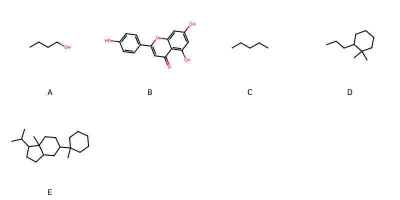

!!! abstract "Tóm tắt"

    **Họ Campanulaceae** có **10** chi được các cộng đồng sử dụng trong chăm sóc sức khỏe gồm *Campanumoea, Campanula, Platycodon, Pratia, Codonopsis, Laurentia, Lobelia, Siphocampylus, Adenophora, Isotoma*. Số lượng thành phần hóa học đã phân lập và xác định cấu trúc từ họ này tính đến tháng 12 năm 2024 là **21** nhóm có thể liệt kê như sau *Organonitrogen compounds, Piperidines, Fatty Acyls, Phenols, Carboxylic acids and derivatives, Harmala alkaloids, Steroids and steroid derivatives, Flavonoids, Furanoid lignans, Pyridines and derivatives, Pyrrolidines, Purine nucleosides, Furans, 2-arylbenzofuran flavonoids, Benzene and substituted derivatives, Coumarins and derivatives, Prenol lipids, Organooxygen compounds, Cinnamic acids and derivatives, Indoles and derivatives, Benzofurans*. Giữa các loài trong họ này, 3 dược liệu được nghiên cứu nhiều nhất dựa trên số thành phần được phân lập là **Platycodon grandiflorum, Codonopsis pilosula, Codonopsis lanceolata*. *Họ Campanulaceae* đã được một số công động tại các quốc gia như US(Appalachia), Salvador, Elsewhere, Turkey, Nepal, Newguinea, Japan*, ain, Chinese, Java, Mexico, US, South Africa, China, UK, Japan, Haiti, Peru, Brazil, Sri Lanka, Indochina, Africa(Swahili) đã phát hiện một số tác dụng trên lâm sàng gồm chữa bệnh lẫn độc tính như Alexiteric, Chất làm se, Chất làm se, Thuốc bổ, dễ bị tổn thương, Chất làm se, Thuốc long đờm, Thuốc an thần, thuốc tống hơi, Thuốc diệt cá, Thuốc bổ, Chất đông tụ, cầm máu, Đổ mồ hôi, Chất độc, Chất độc, Chất độc, Chất độc, có mùi hôi, Chống hút thuốc lá, gây nôn, Chất độc, Chất độc, Thuốc long đờm, Làm dịu, Chất làm lạnh, Làm dịu, Thuốc an thần, Thuốc bổ, Thuốc tẩy giun, Mủ mủ, Chất làm se, dạ dày, Làm dịu, Thuốc long đờm, Chất làm lạnh, Làm dịu, Thuốc long đờm, Chất làm lạnh, Người nói tiếng nói, Thuốc bổ, Ma túy, Chất độc, Chất khử trùng, Người nói tiếng nói, Người nói tiếng nói, Giờ mở cửa, Thuốc bổ, Thuốc an thần, Thuốc bổ, Thuốc gây mê, Thuốc kích thích tình dục, Thuốc bổ, Thuốc long đờm, Thuốc long đờm, gây nôn, Thuốc giải độc, Chất độc, Thuốc long đờm, gây nôn, Thuốc long đờm, Ma túy, gây nôn, Thuốc lợi tiểu, Alexiteric, Thuốc lợi tiểu, gây nôn, Thuốc long đờm, Thuốc nhuận tràng, Thuốc nhuận tràng, Thuốc nhuận tràng, Thuốc trừ sâu, Thuốc trừ sâu, Chất độc, Thuốc đắp, dạ dày, Thuốc bổ, dễ bị tổn thương, gây nôn, gây nôn, Thuốc long đờm, Lo lắng, Chất độc, Người nói tiếng nói, có mùi hôi, Ma túy, tim mạch, Đổ mồ hôi, Chất kích thích, Đổ mồ hôi, Thuốc long đờm, Chất độc, Rubefacient, Ma túy, Chất độc.

!!! info "DrDuke"

    James A. Duke sinh năm 1929-2017 là một nhà thực vật học người Mỹ. Đây là một trong những tác giả hàng đầu trong lĩnh vực dược dân tộc học với cuốn *CRC Handbook of Medicinal Herbs* và chính là người xây dựng lên cơ sở dữ liệu về hợp chất tự nhiên và dược dân tộc học tại Bộ nông nghiệp Hoa Kỳ. Các thông tin được đăng tải tại website [Dr. Duke's Phytochemical and Ethnobotanical Databases](https://phytochem.nal.usda.gov/). 
    Trong suốt thập niên 1970, ông lãnh đạo the Plant Taxonomy Laboratory, Plant Genetics and Germplasm Institute of the Agricultural Research Service, U.S. Department of Agriculture.
    Trong tài liệu này, các thông tin về dược dân tộc của các dược liệu được trích dẫn từ tài liệu của James A. Ducke với sự trợ giúp của phần mềm dịch thuật từ tiếng Anh sang tiếng Việt.
   
## Tổng quan về Họ Campanulaceae
### Phân loại thực vật
Trong *họ Campanulaceae* có **10** chi được sử dụng làm thuốc với chi tiết số loài trong mỗi chi như sau Isotoma (2) . Chi tiết về loài sử dụng làm thuốc như dưới đây.  

>Họ Campanulaceae


>|-- Chi Campanumoea

>*Campanumoea javanica*,
>*Campanumoea pilosula*,

>|-- Chi Campanula

>*Campanula rapunculus*,
>*Campanula trachelium*,

>|-- Chi Platycodon

>*Platycodon grandiflorum*,

>|-- Chi Pratia

>*Pratia nummularia*,

>|-- Chi Codonopsis

>*Codonopsis lanceolata*,
>*Codonopsis panceolata*,
>*Codonopsis pilosula*,
>*Codonopsis tangshen*,

>|-- Chi Laurentia

>*Laurentia longiflora*,

>|-- Chi Lobelia

>*Lobelia angulata*,
>*Lobelia aquatica*,
>*Lobelia assurgens*,
>*Lobelia decurrens*,
>*Lobelia fervens*,
>*Lobelia inflata*,
>*Lobelia laxiflora*,
>*Lobelia leschenaultiana*,
>*Lobelia nicotianaefolia*,
>*Lobelia pinifolia*,
>*Lobelia pyramidalis*,
>*Lobelia radicans*,
>*Lobelia sessilifolia*,
>*Lobelia syphilitica*,

>|-- Chi Siphocampylus

>*Siphocampylus corymbiferus*,

>|-- Chi Adenophora

>*Adenophora koreana*,
>*Adenophora polymorhpa*,
>*Adenophora polymorpha*,
>*Adenophora remotifolia*,
>*Adenophora stricta*,
>*Adenophora triphylla*,
>*Adenophora verticillata*,

>|-- Chi Isotoma

>*Isotoma longiflora*,
>*Isotoma longifolia*,

### Thành phần hóa học 

Số lượng thành phần hóa học đã phân lập và xác định cấu trúc từ họ này tính đến tháng 12 năm 2024 là 21 nhóm có thể liệt kê như sau Organonitrogen compounds, Piperidines, Fatty Acyls, Phenols, Carboxylic acids and derivatives, Harmala alkaloids, Steroids and steroid derivatives, Flavonoids, Furanoid lignans, Pyridines and derivatives, Pyrrolidines, Purine nucleosides, Furans, 2-arylbenzofuran flavonoids, Benzene and substituted derivatives, Coumarins and derivatives, Prenol lipids, Organooxygen compounds, Cinnamic acids and derivatives, Indoles and derivatives, Benzofurans. Số lượng các loài đã được nghiên cứu thành phần hóa học là *9* trong tổng số *35* loài thuộc họ Campanulaceae.Giữa các loài trong họ này, 3 dược liệu được nghiên cứu nhiều nhất dựa trên số thành phần được phân lập là **Platycodon grandiflorum, Codonopsis pilosula, Codonopsis lanceolata**. Sử dụng phần mềm RDKIT với thuật toán  Find Maximum Common Substructure (FMCS), các nhóm hoạt chất phổ biến nhất trong *họ Campanulaceae* đã xây dựng được nhân. Điều này trong tương lại có thể được sử dụng tìm kiếm mối liên hệ giữa tác dụng của cấu trúc hóa học và tác dụng dược lý. Các nhân trong phần này có thể không giống như cấu trúc gốc của từng nhóm chất. Kết quả được trình bầy như hình dưới đây.

<figure markdown="span">
    { width=100% }
    <figcaption> Cấu trúc hóa học của một số khung cơ bản dựa trên thuật toán FMCS để tìm Fatty Acyls (A), Flavonoids (B), Organooxygen compounds (C), Prenol lipids (D), Steroids and steroid derivatives (E).</figcaption>
</figure>


!!! info  "Find Maximum Common Substructure"
    
    Thuật toán FMCS (Find Maximum Common Substructure) là một phương pháp được sử dụng để tìm ra cấu trúc chung nhiều nhất (MCS) trong một tập hợp các cấu trúc hóa học. Các bước của thuật toán gồm:
    - Chọn một cấu trúc hóa học là cấu trúc để tạo truy vấn, còn các cấu trúc khác là mục tiêu.
    - Chia nhỏ cấu trúc để tạo truy vấn thành cấu trúc nhỏ hơn dạng chuỗi SMARTS.
    - Kiểm tra chuỗi SMARTS trong các cấu trúc mục tiêu.
    - Tìm kiếm chuỗi SMARTS xuất hiện nhiều nhất.
    Để biết thêm chi tiết các bạn có thể xem tại [TeachOpenCADD](https://projects.volkamerlab.org/teachopencadd/talktorials/T006_compound_maximum_common_substructures.html)
    ``` python
    pip install rdkit
    def find_core_smiles(smiles_list):
        mols = [Chem.MolFromSmiles(smiles) for smiles in smiles_list]
        mcs = rdFMCS.FindMCS(mols)
        core_smiles = Chem.MolToSmiles(Chem.MolFromSmarts(mcs.smartsString))
        return core_smiles
    ```

### Dược dân tộc học

Họ **Campanulaceae** đã được một số công động tại các quốc gia như *US(Appalachia), Salvador, Elsewhere, Turkey, Nepal, Newguinea, Japan*, ain, Chinese, Java, Mexico, US, South Africa, China, UK, Japan, Haiti, Peru, Brazil, Sri Lanka, Indochina, Africa(Swahili)* đã phát hiện một số tác dụng trên lâm sàng gồm chữa bệnh lẫn độc tính như *Alexiteric, Chất làm se, Chất làm se, Thuốc bổ, dễ bị tổn thương, Chất làm se, Thuốc long đờm, Thuốc an thần, thuốc tống hơi, Thuốc diệt cá, Thuốc bổ, Chất đông tụ, cầm máu, Đổ mồ hôi, Chất độc, Chất độc, Chất độc, Chất độc, có mùi hôi, Chống hút thuốc lá, gây nôn, Chất độc, Chất độc, Thuốc long đờm, Làm dịu, Chất làm lạnh, Làm dịu, Thuốc an thần, Thuốc bổ, Thuốc tẩy giun, Mủ mủ, Chất làm se, dạ dày, Làm dịu, Thuốc long đờm, Chất làm lạnh, Làm dịu, Thuốc long đờm, Chất làm lạnh, Người nói tiếng nói, Thuốc bổ, Ma túy, Chất độc, Chất khử trùng, Người nói tiếng nói, Người nói tiếng nói, Giờ mở cửa, Thuốc bổ, Thuốc an thần, Thuốc bổ, Thuốc gây mê, Thuốc kích thích tình dục, Thuốc bổ, Thuốc long đờm, Thuốc long đờm, gây nôn, Thuốc giải độc, Chất độc, Thuốc long đờm, gây nôn, Thuốc long đờm, Ma túy, gây nôn, Thuốc lợi tiểu, Alexiteric, Thuốc lợi tiểu, gây nôn, Thuốc long đờm, Thuốc nhuận tràng, Thuốc nhuận tràng, Thuốc nhuận tràng, Thuốc trừ sâu, Thuốc trừ sâu, Chất độc, Thuốc đắp, dạ dày, Thuốc bổ, dễ bị tổn thương, gây nôn, gây nôn, Thuốc long đờm, Lo lắng, Chất độc, Người nói tiếng nói, có mùi hôi, Ma túy, tim mạch, Đổ mồ hôi, Chất kích thích, Đổ mồ hôi, Thuốc long đờm, Chất độc, Rubefacient, Ma túy, Chất độc*.

## Chi tiết dược dân tộc học


### Chi Campanumoea

!!! note "Danh sách các loài thuộc chi"
    
*	 - *Campanumoea javanica*
	 - *Campanumoea pilosula**

---      
#### *Lobelia sessilifolia*
**Thông tin về thực vật**

!!! info "Phân loại thực vật của *Lobelia sessilifolia* từ GIBF:"
    - **Kingdom:** Plantae
    - **Phylum:** Tracheophyta
    - **Order:** Asterales
    - **Family:** Campanulaceae
    - **Genus:** Lobelia
    - **Species:** *Lobelia sessilifolia*


 

Chưa có thông tin về loài này trên wikidata.

*Phân bố trên thế giới*: nan, Russian Federation, Japan, China, Korea, Republic of

*Phân bố tại Việt Nam*: Không có ghi nhận ở Việt Nam

**Thành phần hóa học**
        

Chưa có nghiên cứu về thành phần hóa học của loài này


**Dược dân tộc học**

Danh sách các quốc gia có sử dụng *Lobelia sessilifolia* trong điều trị các bệnh. 

| Quốc gia   | Bệnh             |
|:-----------|:-----------------|
| China      | dạ dày, Thuốc bổ |


---      
#### *Lobelia sessilifolia*
**Thông tin về thực vật**

!!! info "Phân loại thực vật của *Lobelia sessilifolia* từ GIBF:"
    - **Kingdom:** Plantae
    - **Phylum:** Tracheophyta
    - **Order:** Asterales
    - **Family:** Campanulaceae
    - **Genus:** Lobelia
    - **Species:** *Lobelia sessilifolia*


 

Chưa có thông tin về loài này trên wikidata.

*Phân bố trên thế giới*: nan, Russian Federation, Japan, China, Korea, Republic of

*Phân bố tại Việt Nam*: Không có ghi nhận ở Việt Nam

**Thành phần hóa học**
        

Chưa có nghiên cứu về thành phần hóa học của loài này


**Dược dân tộc học**

Danh sách các quốc gia có sử dụng *Lobelia sessilifolia* trong điều trị các bệnh. 

| Quốc gia   | Bệnh     |
|:-----------|:---------|
| China      | Thuốc bổ |


### Chi Campanula

!!! note "Danh sách các loài thuộc chi"
    
*	 - *Campanula rapunculus*
	 - *Campanula trachelium**

---      
#### *Campanula rapunculus*
**Thông tin về thực vật**

!!! info "Phân loại thực vật của *Campanula rapunculus* từ GIBF:"
    - **Kingdom:** Plantae
    - **Phylum:** Tracheophyta
    - **Order:** Asterales
    - **Family:** Campanulaceae
    - **Genus:** Campanula
    - **Species:** *Campanula rapunculus*


 

Chưa có thông tin về loài này trên wikidata.

*Phân bố trên thế giới*: France, Germany, Israel, Switzerland, Netherlands, Bulgaria, Hungary, Spain, Sweden, Palestine, State of, Montenegro, Portugal, Croatia, Algeria, Italy, Slovenia, Morocco, Greece, Belgium

*Phân bố tại Việt Nam*: Không có ghi nhận ở Việt Nam

**Thành phần hóa học**
        

Theo cơ sở dữ liệu lotus, từ loài *Campanula rapunculus* đã phân lập và xác định được 5 hoạt chất thuộc về các nhóm Flavonoids, Organooxygen compounds. Danh sách các hoạt chất như sau 1-kestose [(LTS0126727)](https://lotus.naturalproducts.net/compound/lotus_id/LTS0126727), (-)-inositol [(LTS0047771)](https://lotus.naturalproducts.net/compound/lotus_id/LTS0047771), luteolin [(LTS0017052)](https://lotus.naturalproducts.net/compound/lotus_id/LTS0017052), 1l-chiro-inositol [(LTS0257088)](https://lotus.naturalproducts.net/compound/lotus_id/LTS0257088), 2-{[2-({[3,4-dihydroxy-2,5-bis(hydroxymethyl)oxolan-2-yl]oxy}methyl)-3,4-dihydroxy-5-(hydroxymethyl)oxolan-2-yl]oxy}-6-(hydroxymethyl)oxane-3,4,5-triol [(LTS0023878)](https://lotus.naturalproducts.net/compound/lotus_id/LTS0023878).

| chemicalTaxonomyClassyfireClass   |   lotus_count |
|:----------------------------------|--------------:|
| Flavonoids                        |             1 |
| Organooxygen compounds            |             4 |


**Dược dân tộc học**

Danh sách các quốc gia có sử dụng *Campanula rapunculus* trong điều trị các bệnh. 

| Quốc gia   | Bệnh                                    |
|:-----------|:----------------------------------------|
| Turkey     | Chất làm se, Thuốc bổ, dễ bị tổn thương |
| ain        | dễ bị tổn thương                        |


---      
#### *Campanula rapunculus*
**Thông tin về thực vật**

!!! info "Phân loại thực vật của *Campanula rapunculus* từ GIBF:"
    - **Kingdom:** Plantae
    - **Phylum:** Tracheophyta
    - **Order:** Asterales
    - **Family:** Campanulaceae
    - **Genus:** Campanula
    - **Species:** *Campanula rapunculus*


 

Chưa có thông tin về loài này trên wikidata.

*Phân bố trên thế giới*: France, Germany, Israel, Switzerland, Netherlands, Bulgaria, Hungary, Spain, Sweden, Palestine, State of, Montenegro, Portugal, Croatia, Algeria, Italy, Slovenia, Morocco, Greece, Belgium

*Phân bố tại Việt Nam*: Không có ghi nhận ở Việt Nam

**Thành phần hóa học**
        

Chưa có nghiên cứu về thành phần hóa học của loài này


**Dược dân tộc học**

Danh sách các quốc gia có sử dụng *Campanula rapunculus* trong điều trị các bệnh. 

| Quốc gia   | Bệnh        |
|:-----------|:------------|
| UK         | Chất làm se |


### Chi Platycodon

!!! note "Danh sách các loài thuộc chi"
    
*	 - *Platycodon grandiflorum**

---      
#### *Platycodon grandiflorum*
**Thông tin về thực vật**

!!! info "Phân loại thực vật của *Platycodon grandiflorus* từ GIBF:"
    - **Kingdom:** Plantae
    - **Phylum:** Tracheophyta
    - **Order:** Asterales
    - **Family:** Campanulaceae
    - **Genus:** Platycodon
    - **Species:** *Platycodon grandiflorus*


 

Chưa có thông tin về loài này trên wikidata.

*Phân bố trên thế giới*: Germany, nan, Switzerland, Korea, Republic of, Netherlands, Belgium, Hungary, Spain, Sweden, Hong Kong, Japan, Russian Federation, United Kingdom of Great Britain and Northern Ireland, United States of America, China, Italy, Canada, Denmark, Austria, Luxembourg

*Phân bố tại Việt Nam*: Không có ghi nhận ở Việt Nam

**Thành phần hóa học**
        

Theo cơ sở dữ liệu lotus, từ loài *Platycodon grandiflorum* đã phân lập và xác định được 145 hoạt chất thuộc về các nhóm Steroids and steroid derivatives, Organooxygen compounds, Flavonoids, Fatty Acyls, Phenols, Carboxylic acids and derivatives, Benzene and substituted derivatives, Prenol lipids. Danh sách các hoạt chất như sau platycodin d3 [(LTS0114585)](https://lotus.naturalproducts.net/compound/lotus_id/LTS0114585), (2s,3r,4s,5s)-3-{[(2s,3r,4s,5r,6s)-3,4-dihydroxy-6-methyl-5-{[(2s,3r,4s,5r)-3,4,5-trihydroxyoxan-2-yl]oxy}oxan-2-yl]oxy}-4,5-dihydroxyoxan-2-yl (1s,2r,5r,6s,8r,9r,14s,18r,19r,21s,24r)-8-hydroxy-1-(hydroxymethyl)-5,6,12,12,19-pentamethyl-23-oxo-24-{[(2r,3r,4s,5s,6r)-3,4,5-trihydroxy-6-(hydroxymethyl)oxan-2-yl]oxy}-22-oxahexacyclo[19.2.1.0²,¹⁹.0⁵,¹⁸.0⁶,¹⁵.0⁹,¹⁴]tetracos-15-ene-9-carboxylate [(LTS0017234)](https://lotus.naturalproducts.net/compound/lotus_id/LTS0017234), 2,3-dihydroquercetin [(LTS0040950)](https://lotus.naturalproducts.net/compound/lotus_id/LTS0040950), (2s,3r,4s,5s)-3-{[(2s,3r,4s,5s,6s)-4-(acetyloxy)-3-hydroxy-6-methyl-5-{[(2s,3r,4s,5r)-3,4,5-trihydroxyoxan-2-yl]oxy}oxan-2-yl]oxy}-4,5-dihydroxyoxan-2-yl (4ar,5r,6as,6br,8ar,10r,11s,12ar,12br,14bs)-5,11-dihydroxy-9,9-bis(hydroxymethyl)-2,2,6a,6b,12a-pentamethyl-10-{[(2r,3r,4s,5s,6r)-3,4,5-trihydroxy-6-(hydroxymethyl)oxan-2-yl]oxy}-1,3,4,5,6,7,8,8a,10,11,12,12b,13,14b-tetradecahydropicene-4a-carboxylate [(LTS0139165)](https://lotus.naturalproducts.net/compound/lotus_id/LTS0139165), deapio-platycodin d3 [(LTS0125134)](https://lotus.naturalproducts.net/compound/lotus_id/LTS0125134), methyl 5,11-dihydroxy-9,9-bis(hydroxymethyl)-2,2,6a,6b,12a-pentamethyl-10-{[3,4,5-trihydroxy-6-(hydroxymethyl)oxan-2-yl]oxy}-1,3,4,5,6,7,8,8a,10,11,12,12b,13,14b-tetradecahydropicene-4a-carboxylate [(LTS0100830)](https://lotus.naturalproducts.net/compound/lotus_id/LTS0100830), 2-(hexyloxy)-6-{[(3,4,5-trihydroxyoxan-2-yl)oxy]methyl}oxane-3,4,5-triol [(LTS0188998)](https://lotus.naturalproducts.net/compound/lotus_id/LTS0188998), (1s,2r,5r,6s,8r,9r,14s,18r,19r,21s,24r)-8-hydroxy-1-(hydroxymethyl)-5,6,12,12,19-pentamethyl-23-oxo-24-{[(2r,3r,4s,5s,6r)-3,4,5-trihydroxy-6-(hydroxymethyl)oxan-2-yl]oxy}-22-oxahexacyclo[19.2.1.0²,¹⁹.0⁵,¹⁸.0⁶,¹⁵.0⁹,¹⁴]tetracos-15-ene-9-carboxylic acid [(LTS0094042)](https://lotus.naturalproducts.net/compound/lotus_id/LTS0094042), platycodin d [(LTS0232351)](https://lotus.naturalproducts.net/compound/lotus_id/LTS0232351), (2s,3r,4s,4ar,6ar,6bs,8r,8ar,12as,14ar,14br)-8a-({[(2s,3r,4s,5s)-3-{[(2s,3r,4s,5s,6s)-4-(acetyloxy)-5-{[(2s,3r,4s,5r)-4-{[(2s,3r,4r)-3,4-dihydroxy-4-(hydroxymethyl)oxolan-2-yl]oxy}-3,5-dihydroxyoxan-2-yl]oxy}-3-hydroxy-6-methyloxan-2-yl]oxy}-4,5-dihydroxyoxan-2-yl]oxy}carbonyl)-2,8-dihydroxy-4-(hydroxymethyl)-6a,6b,11,11,14b-pentamethyl-3-{[(2r,3r,4s,5s,6r)-3,4,5-trihydroxy-6-(hydroxymethyl)oxan-2-yl]oxy}-1,2,3,4a,5,6,7,8,9,10,12,12a,14,14a-tetradecahydropicene-4-carboxylic acid [(LTS0221916)](https://lotus.naturalproducts.net/compound/lotus_id/LTS0221916), 3-(3-hydroxy-4-{[3,4,5-trihydroxy-6-(hydroxymethyl)oxan-2-yl]oxy}phenyl)prop-2-enoic acid [(LTS0007465)](https://lotus.naturalproducts.net/compound/lotus_id/LTS0007465), (2r,3s,4s,5s)-3-{[(2s,3r,4s,5r,6s)-3,4-dihydroxy-6-methyl-5-{[(2s,3r,4s,5r)-3,4,5-trihydroxyoxan-2-yl]oxy}oxan-2-yl]oxy}-4,5-dihydroxyoxan-2-yl (4ar,5r,6as,6br,8ar,9r,10r,11s,12ar,12br,14bs)-5,11-dihydroxy-9-(hydroxymethyl)-2,2,6a,6b,9,12a-hexamethyl-10-{[(2r,3r,4s,5s,6r)-3,4,5-trihydroxy-6-({[(2r,3r,4s,5s,6r)-3,4,5-trihydroxy-6-({[(2r,3r,4s,5s,6r)-3,4,5-trihydroxy-6-(hydroxymethyl)oxan-2-yl]oxy}methyl)oxan-2-yl]oxy}methyl)oxan-2-yl]oxy}-1,3,4,5,6,7,8,8a,10,11,12,12b,13,14b-tetradecahydropicene-4a-carboxylate [(LTS0243765)](https://lotus.naturalproducts.net/compound/lotus_id/LTS0243765), 3-({5-[(4-{[3,4-dihydroxy-4-(hydroxymethyl)oxolan-2-yl]oxy}-3,5-dihydroxyoxan-2-yl)oxy]-3,4-dihydroxy-6-methyloxan-2-yl}oxy)-4,5-dihydroxyoxan-2-yl 10-{[3,5-dihydroxy-6-(hydroxymethyl)-4-{[3,4,5-trihydroxy-6-(hydroxymethyl)oxan-2-yl]oxy}oxan-2-yl]oxy}-5,11-dihydroxy-9,9-bis(hydroxymethyl)-2,2,6a,6b,12a-pentamethyl-1,3,4,5,6,7,8,8a,10,11,12,12b,13,14b-tetradecahydropicene-4a-carboxylate [(LTS0199147)](https://lotus.naturalproducts.net/compound/lotus_id/LTS0199147), (2r,3r,4s,5s,6r)-2-{[(4e,6s,7r,12e)-1,7-dihydroxytetradeca-4,12-dien-8,10-diyn-6-yl]oxy}-6-(hydroxymethyl)oxane-3,4,5-triol [(LTS0173701)](https://lotus.naturalproducts.net/compound/lotus_id/LTS0173701), 4,4,6b,8a,11,11,12b,14b-octamethyl-1,2,3,4a,5,6,7,8,9,10,12,12a,13,14-tetradecahydropicen-3-yl acetate [(LTS0194084)](https://lotus.naturalproducts.net/compound/lotus_id/LTS0194084), 4-{[3-(3,4-dihydroxyphenyl)prop-2-enoyl]oxy}-1,3,5-trihydroxycyclohexane-1-carboxylic acid [(LTS0262595)](https://lotus.naturalproducts.net/compound/lotus_id/LTS0262595), (2z)-3-(4-hydroxy-3-methoxyphenyl)prop-2-en-1-yl (9z)-octadec-9-enoate [(LTS0032873)](https://lotus.naturalproducts.net/compound/lotus_id/LTS0032873), [(1s,4s,5r,6s,8r,9r,13s,16s,18s)-11-ethyl-8,9-dihydroxy-4,6,16,18-tetramethoxy-11-azahexacyclo[7.7.2.1²,⁵.0¹,¹⁰.0³,⁸.0¹³,¹⁷]nonadecan-13-yl]methyl 2-aminobenzoate [(LTS0153720)](https://lotus.naturalproducts.net/compound/lotus_id/LTS0153720), 8a-[3-({5-[(4-{[3,4-dihydroxy-4-(hydroxymethyl)oxolan-2-yl]oxy}-3,5-dihydroxyoxan-2-yl)oxy]-3,4-dihydroxy-6-methyloxan-2-yl}oxy)-4,5-dihydroxyoxan-2-yl] 4-methyl 2,8-dihydroxy-4-(hydroxymethyl)-6a,6b,11,11,14b-pentamethyl-3-{[3,4,5-trihydroxy-6-(hydroxymethyl)oxan-2-yl]oxy}-1,2,3,4a,5,6,7,8,9,10,12,12a,14,14a-tetradecahydropicene-4,8a-dicarboxylate [(LTS0253778)](https://lotus.naturalproducts.net/compound/lotus_id/LTS0253778), alnulin [(LTS0076238)](https://lotus.naturalproducts.net/compound/lotus_id/LTS0076238), (2z)-3-(4-hydroxy-3-methoxyphenyl)prop-2-en-1-yl hexadecanoate [(LTS0135040)](https://lotus.naturalproducts.net/compound/lotus_id/LTS0135040), luteolin 7-o-glucoside [(LTS0227450)](https://lotus.naturalproducts.net/compound/lotus_id/LTS0227450), (2r,3r,4r,5s,6r)-2-[(1,7-dihydroxytetradeca-4,12-dien-8,10-diyn-6-yl)oxy]-6-(hydroxymethyl)oxane-3,4,5-triol [(LTS0163396)](https://lotus.naturalproducts.net/compound/lotus_id/LTS0163396), (2s,3r,4s,5s)-3-{[(2s,3r,4s,5r,6s)-5-{[(2s,3r,4s,5r)-4-{[(2s,3r,4r)-3,4-dihydroxy-4-(hydroxymethyl)oxolan-2-yl]oxy}-3,5-dihydroxyoxan-2-yl]oxy}-3,4-dihydroxy-6-methyloxan-2-yl]oxy}-4,5-dihydroxyoxan-2-yl (4as,6as,6br,8ar,9r,10r,11s,12ar,12br,14bs)-11-hydroxy-9-(hydroxymethyl)-2,2,6a,6b,9,12a-hexamethyl-10-{[(2r,3r,4s,5s,6r)-3,4,5-trihydroxy-6-({[(2r,3r,4s,5s,6r)-3,4,5-trihydroxy-6-({[(2r,3r,4s,5s,6r)-3,4,5-trihydroxy-6-(hydroxymethyl)oxan-2-yl]oxy}methyl)oxan-2-yl]oxy}methyl)oxan-2-yl]oxy}-1,3,4,5,6,7,8,8a,10,11,12,12b,13,14b-tetradecahydropicene-4a-carboxylate [(LTS0056619)](https://lotus.naturalproducts.net/compound/lotus_id/LTS0056619), (2r,3r,4r,5r)-3-{[(2s,3r,4s,5r,6s)-3,4-dihydroxy-6-methyl-5-{[(2s,3r,4s,5r)-3,4,5-trihydroxyoxan-2-yl]oxy}oxan-2-yl]oxy}-4,5-dihydroxyoxan-2-yl (4ar,5r,6as,6br,8ar,9r,10r,11s,12ar,12br,14bs)-5,11-dihydroxy-9-(hydroxymethyl)-2,2,6a,6b,9,12a-hexamethyl-10-{[(2r,3r,4s,5s,6r)-3,4,5-trihydroxy-6-(hydroxymethyl)oxan-2-yl]oxy}-1,3,4,5,6,7,8,8a,10,11,12,12b,13,14b-tetradecahydropicene-4a-carboxylate [(LTS0124222)](https://lotus.naturalproducts.net/compound/lotus_id/LTS0124222), 3-({5-[(4-{[3,4-dihydroxy-4-(hydroxymethyl)oxolan-2-yl]oxy}-3,5-dihydroxyoxan-2-yl)oxy]-3,4-dihydroxy-6-methyloxan-2-yl}oxy)-4,5-dihydroxyoxan-2-yl 5,11-dihydroxy-9,9-bis(hydroxymethyl)-2,2,6a,6b,12a-pentamethyl-10-{[3,4,5-trihydroxy-6-({[3,4,5-trihydroxy-6-(hydroxymethyl)oxan-2-yl]oxy}methyl)oxan-2-yl]oxy}-1,3,4,5,6,7,8,8a,10,11,12,12b,13,14b-tetradecahydropicene-4a-carboxylate [(LTS0162013)](https://lotus.naturalproducts.net/compound/lotus_id/LTS0162013), platycodin d2 [(LTS0177685)](https://lotus.naturalproducts.net/compound/lotus_id/LTS0177685), methyl 10-{[3,5-dihydroxy-6-(hydroxymethyl)-4-{[3,4,5-trihydroxy-6-(hydroxymethyl)oxan-2-yl]oxy}oxan-2-yl]oxy}-5,11-dihydroxy-9,9-bis(hydroxymethyl)-2,2,6a,6b,12a-pentamethyl-1,3,4,5,6,7,8,8a,10,11,12,12b,13,14b-tetradecahydropicene-4a-carboxylate [(LTS0033701)](https://lotus.naturalproducts.net/compound/lotus_id/LTS0033701), 3-({3,4-dihydroxy-6-methyl-5-[(3,4,5-trihydroxyoxan-2-yl)oxy]oxan-2-yl}oxy)-4,5-dihydroxyoxan-2-yl 5,11-dihydroxy-9,9-bis(hydroxymethyl)-2,2,6a,6b,12a-pentamethyl-10-{[3,4,5-trihydroxy-6-({[3,4,5-trihydroxy-6-(hydroxymethyl)oxan-2-yl]oxy}methyl)oxan-2-yl]oxy}-1,3,4,5,6,7,8,8a,10,11,12,12b,13,14b-tetradecahydropicene-4a-carboxylate [(LTS0037457)](https://lotus.naturalproducts.net/compound/lotus_id/LTS0037457), [(2r,3s,4s,5r,6s)-6-{[2-(3,4-dihydroxyphenyl)-5-hydroxy-4-oxochromen-7-yl]oxy}-3,4,5-trihydroxyoxan-2-yl]methyl acetate [(LTS0204111)](https://lotus.naturalproducts.net/compound/lotus_id/LTS0204111), luteolin [(LTS0017052)](https://lotus.naturalproducts.net/compound/lotus_id/LTS0017052), 3-({5-[(4-{[3,4-dihydroxy-4-(hydroxymethyl)oxolan-2-yl]oxy}-3,5-dihydroxyoxan-2-yl)oxy]-3,4-dihydroxy-6-methyloxan-2-yl}oxy)-4,5-dihydroxyoxan-2-yl 5,11-dihydroxy-9-(hydroxymethyl)-2,2,6a,6b,9,12a-hexamethyl-10-{[3,4,5-trihydroxy-6-(hydroxymethyl)oxan-2-yl]oxy}-1,3,4,5,6,7,8,8a,10,11,12,12b,13,14b-tetradecahydropicene-4a-carboxylate [(LTS0057785)](https://lotus.naturalproducts.net/compound/lotus_id/LTS0057785), (2s,3r,4s,5s)-3-{[(2s,3r,4s,5r,6s)-3,4-dihydroxy-6-methyl-5-{[(2s,3r,4s,5r)-3,4,5-trihydroxyoxan-2-yl]oxy}oxan-2-yl]oxy}-4,5-dihydroxyoxan-2-yl (4ar,5r,6as,6br,8ar,10r,11s,12ar)-5,11-dihydroxy-9,9-bis(hydroxymethyl)-2,2,6a,6b,12a-pentamethyl-10-{[(2r,3r,4s,5s,6r)-3,4,5-trihydroxy-6-(hydroxymethyl)oxan-2-yl]oxy}-1,3,4,5,6,7,8,8a,10,11,12,12b,13,14b-tetradecahydropicene-4a-carboxylate [(LTS0080910)](https://lotus.naturalproducts.net/compound/lotus_id/LTS0080910), (2s,3r,4s,4ar,6ar,6bs,8r,8ar,12as,14ar,14br)-8a-({[(2s,3r,4s,5s)-3-{[(2s,3r,4s,5r,6s)-3,4-dihydroxy-6-methyl-5-{[(2s,3r,4s,5r)-3,4,5-trihydroxyoxan-2-yl]oxy}oxan-2-yl]oxy}-4,5-dihydroxyoxan-2-yl]oxy}carbonyl)-2,8-dihydroxy-4-(hydroxymethyl)-6a,6b,11,11,14b-pentamethyl-3-{[(2r,3r,4s,5s,6r)-3,4,5-trihydroxy-6-({[(2r,3r,4s,5s,6r)-3,4,5-trihydroxy-6-(hydroxymethyl)oxan-2-yl]oxy}methyl)oxan-2-yl]oxy}-1,2,3,4a,5,6,7,8,9,10,12,12a,14,14a-tetradecahydropicene-4-carboxylic acid [(LTS0154707)](https://lotus.naturalproducts.net/compound/lotus_id/LTS0154707), methyl 5,11-dihydroxy-9-(hydroxymethyl)-2,2,6a,6b,9,12a-hexamethyl-10-{[3,4,5-trihydroxy-6-(hydroxymethyl)oxan-2-yl]oxy}-1,3,4,5,6,7,8,8a,10,11,12,12b,13,14b-tetradecahydropicene-4a-carboxylate [(LTS0095420)](https://lotus.naturalproducts.net/compound/lotus_id/LTS0095420), 3-({3,4-dihydroxy-6-methyl-5-[(3,4,5-trihydroxyoxan-2-yl)oxy]oxan-2-yl}oxy)-4,5-dihydroxyoxan-2-yl 5,11-dihydroxy-9,9-bis(hydroxymethyl)-2,2,6a,6b,12a-pentamethyl-10-{[3,4,5-trihydroxy-6-({[3,4,5-trihydroxy-6-({[3,4,5-trihydroxy-6-(hydroxymethyl)oxan-2-yl]oxy}methyl)oxan-2-yl]oxy}methyl)oxan-2-yl]oxy}-1,3,4,5,6,7,8,8a,10,11,12,12b,13,14b-tetradecahydropicene-4a-carboxylate [(LTS0230077)](https://lotus.naturalproducts.net/compound/lotus_id/LTS0230077), 8a-(2s,3r,4s,5s)-3-{[(2s,3r,4s,5r,6s)-5-{[(2s,3r,4s,5r)-4-{[(2s,3r,4r)-3,4-dihydroxy-4-(hydroxymethyl)oxolan-2-yl]oxy}-3,5-dihydroxyoxan-2-yl]oxy}-3,4-dihydroxy-6-methyloxan-2-yl]oxy}-4,5-dihydroxyoxan-2-yl 4-methyl (2s,3r,4s,4ar,6ar,6bs,8r,8ar,12as,14ar,14br)-8-hydroxy-4-(hydroxymethyl)-2-methoxy-6a,6b,11,11,14b-pentamethyl-3-{[(2r,3r,4s,5s,6r)-3,4,5-trihydroxy-6-(hydroxymethyl)oxan-2-yl]oxy}-1,2,3,4a,5,6,7,8,9,10,12,12a,14,14a-tetradecahydropicene-4,8a-dicarboxylate [(LTS0171250)](https://lotus.naturalproducts.net/compound/lotus_id/LTS0171250), (2s,3r,4s,5s)-3-{[(2s,3r,4r,5r,6s)-3-(acetyloxy)-5-{[(2s,3r,4s,5r)-4-{[(2s,3r,4r)-3,4-dihydroxy-4-(hydroxymethyl)oxolan-2-yl]oxy}-3,5-dihydroxyoxan-2-yl]oxy}-4-hydroxy-6-methyloxan-2-yl]oxy}-4,5-dihydroxyoxan-2-yl (4ar,5r,6as,6br,8ar,9r,10r,11s,12ar,12br,14bs)-10-{[(2r,3r,4s,5r,6r)-3,5-dihydroxy-6-(hydroxymethyl)-4-{[(2s,3r,4s,5s,6r)-3,4,5-trihydroxy-6-(hydroxymethyl)oxan-2-yl]oxy}oxan-2-yl]oxy}-5,11-dihydroxy-9-(hydroxymethyl)-2,2,6a,6b,9,12a-hexamethyl-1,3,4,5,6,7,8,8a,10,11,12,12b,13,14b-tetradecahydropicene-4a-carboxylate [(LTS0084976)](https://lotus.naturalproducts.net/compound/lotus_id/LTS0084976), methyl 10-{[3,5-dihydroxy-6-(hydroxymethyl)-4-{[3,4,5-trihydroxy-6-(hydroxymethyl)oxan-2-yl]oxy}oxan-2-yl]oxy}-5,11-dihydroxy-9-(hydroxymethyl)-2,2,6a,6b,9,12a-hexamethyl-1,3,4,5,6,7,8,8a,10,11,12,12b,13,14b-tetradecahydropicene-4a-carboxylate [(LTS0148211)](https://lotus.naturalproducts.net/compound/lotus_id/LTS0148211), (2e)-3-(3-hydroxy-4-{[(2s,3r,4s,5s,6r)-3,4,5-trihydroxy-6-(hydroxymethyl)oxan-2-yl]oxy}phenyl)prop-2-enoic acid [(LTS0148993)](https://lotus.naturalproducts.net/compound/lotus_id/LTS0148993), 3-({5-[(4-{[3,4-dihydroxy-4-(hydroxymethyl)oxolan-2-yl]oxy}-3,5-dihydroxyoxan-2-yl)oxy]-3,4-dihydroxy-6-methyloxan-2-yl}oxy)-4,5-dihydroxyoxan-2-yl 8-hydroxy-1-(hydroxymethyl)-5,6,12,12,19-pentamethyl-23-oxo-24-{[3,4,5-trihydroxy-6-(hydroxymethyl)oxan-2-yl]oxy}-22-oxahexacyclo[19.2.1.0²,¹⁹.0⁵,¹⁸.0⁶,¹⁵.0⁹,¹⁴]tetracos-15-ene-9-carboxylate [(LTS0069118)](https://lotus.naturalproducts.net/compound/lotus_id/LTS0069118), 3-({5-[(4-{[(4r)-3,4-dihydroxy-4-(hydroxymethyl)oxolan-2-yl]oxy}-3,5-dihydroxyoxan-2-yl)oxy]-3,4-dihydroxy-6-methyloxan-2-yl}oxy)-4,5-dihydroxyoxan-2-yl (6as,6br,8as,9s,12ar,12br,14br)-5,11-dihydroxy-9-(hydroxymethyl)-2,2,6a,6b,9,12a-hexamethyl-10-{[3,4,5-trihydroxy-6-(hydroxymethyl)oxan-2-yl]oxy}-1,3,4,5,6,7,8,8a,10,11,12,12b,13,14b-tetradecahydropicene-4a-carboxylate [(LTS0257172)](https://lotus.naturalproducts.net/compound/lotus_id/LTS0257172), (2r,3r,4s,5s,6r)-2-{[(4e,6r,7r,12e)-1,7-dihydroxytetradeca-4,12-dien-8,10-diyn-6-yl]oxy}-6-(hydroxymethyl)oxane-3,4,5-triol [(LTS0124473)](https://lotus.naturalproducts.net/compound/lotus_id/LTS0124473), 2-(3,4-dihydroxyphenyl)-5,7-dihydroxy-3-{[(2s,3r,4r,5r,6s)-3,4,5-trihydroxy-6-(hydroxymethyl)oxan-2-yl]oxy}chromen-4-one [(LTS0241372)](https://lotus.naturalproducts.net/compound/lotus_id/LTS0241372), (4ar,6as,6br,8ar,12ar,12bs,14bs)-5,10,11-trihydroxy-9,9-bis(hydroxymethyl)-2,2,6a,6b,12a-pentamethyl-1,3,4,5,6,7,8,8a,10,11,12,12b,13,14b-tetradecahydropicene-4a-carboxylic acid [(LTS0018824)](https://lotus.naturalproducts.net/compound/lotus_id/LTS0018824), 8a-{[(3-{[4-(acetyloxy)-5-[(4-{[3,4-dihydroxy-4-(hydroxymethyl)oxolan-2-yl]oxy}-3,5-dihydroxyoxan-2-yl)oxy]-3-hydroxy-6-methyloxan-2-yl]oxy}-4,5-dihydroxyoxan-2-yl)oxy]carbonyl}-2,8-dihydroxy-4-(hydroxymethyl)-6a,6b,11,11,14b-pentamethyl-3-{[3,4,5-trihydroxy-6-(hydroxymethyl)oxan-2-yl]oxy}-1,2,3,4a,5,6,7,8,9,10,12,12a,14,14a-tetradecahydropicene-4-carboxylic acid [(LTS0210109)](https://lotus.naturalproducts.net/compound/lotus_id/LTS0210109), (4ar,5r,6as,6br,8ar,10r,11s,12ar,12br,14bs)-5,11-dihydroxy-9,9-bis(hydroxymethyl)-2,2,6a,6b,12a-pentamethyl-10-{[(2r,3r,4s,5s,6r)-3,4,5-trihydroxy-6-({[(2r,4s,5s,6r)-3,4,5-trihydroxy-6-(hydroxymethyl)oxan-2-yl]oxy}methyl)oxan-2-yl]oxy}-1,3,4,5,6,7,8,8a,10,11,12,12b,13,14b-tetradecahydropicene-4a-carboxylic acid [(LTS0223238)](https://lotus.naturalproducts.net/compound/lotus_id/LTS0223238), 2-{[4,5-dihydroxy-6-(hydroxymethyl)-2-(3-methylbutoxy)oxan-3-yl]oxy}-6-(hydroxymethyl)oxane-3,4,5-triol [(LTS0080921)](https://lotus.naturalproducts.net/compound/lotus_id/LTS0080921), (2s,3r,4s,5s)-3-{[(2s,3r,4r,5r,6s)-3-(acetyloxy)-4-hydroxy-6-methyl-5-{[(2s,3r,4s,5r)-3,4,5-trihydroxyoxan-2-yl]oxy}oxan-2-yl]oxy}-4,5-dihydroxyoxan-2-yl (4ar,5r,6as,6br,8ar,10r,11s,12ar,12br,14bs)-5,11-dihydroxy-9,9-bis(hydroxymethyl)-2,2,6a,6b,12a-pentamethyl-10-{[(2r,3r,4s,5s,6r)-3,4,5-trihydroxy-6-(hydroxymethyl)oxan-2-yl]oxy}-1,3,4,5,6,7,8,8a,10,11,12,12b,13,14b-tetradecahydropicene-4a-carboxylate [(LTS0099495)](https://lotus.naturalproducts.net/compound/lotus_id/LTS0099495), (2r,3r,4s,5s,6r)-2-(hexyloxy)-6-({[(2s,3r,4s,5s)-3,4,5-trihydroxyoxan-2-yl]oxy}methyl)oxane-3,4,5-triol [(LTS0081683)](https://lotus.naturalproducts.net/compound/lotus_id/LTS0081683), (2s,3r,4s,4ar,6ar,6bs,8r,8ar,12as,14ar,14br)-8a-({[(2s,3r,4s,5s)-3-{[(2s,3r,4r,5r,6s)-3-(acetyloxy)-4-hydroxy-6-methyl-5-{[(2s,3r,4s,5r)-3,4,5-trihydroxyoxan-2-yl]oxy}oxan-2-yl]oxy}-4,5-dihydroxyoxan-2-yl]oxy}carbonyl)-2,8-dihydroxy-4-(hydroxymethyl)-6a,6b,11,11,14b-pentamethyl-3-{[(2r,3r,4s,5s,6r)-3,4,5-trihydroxy-6-(hydroxymethyl)oxan-2-yl]oxy}-1,2,3,4a,5,6,7,8,9,10,12,12a,14,14a-tetradecahydropicene-4-carboxylic acid [(LTS0195997)](https://lotus.naturalproducts.net/compound/lotus_id/LTS0195997), (3,4,5-trihydroxy-6-{[5-hydroxy-2-(4-hydroxyphenyl)-4-oxochromen-7-yl]oxy}oxan-2-yl)methyl acetate [(LTS0067221)](https://lotus.naturalproducts.net/compound/lotus_id/LTS0067221), cryptochlorogenic acid [(LTS0252404)](https://lotus.naturalproducts.net/compound/lotus_id/LTS0252404), (2r,3s,4r,5s)-3-{[(2s,3r,4s,5s,6s)-4-(acetyloxy)-3-hydroxy-6-methyl-5-{[(2s,3r,4s,5r)-3,4,5-trihydroxyoxan-2-yl]oxy}oxan-2-yl]oxy}-4,5-dihydroxyoxan-2-yl (4ar,5r,6as,6br,8ar,10r,11s,12as,12br,14bs)-5,11-dihydroxy-9,9-bis(hydroxymethyl)-2,2,6a,6b,12a-pentamethyl-10-{[(2r,3r,4s,5s,6r)-3,4,5-trihydroxy-6-(hydroxymethyl)oxan-2-yl]oxy}-1,3,4,5,6,7,8,8a,10,11,12,12b,13,14b-tetradecahydropicene-4a-carboxylate [(LTS0010453)](https://lotus.naturalproducts.net/compound/lotus_id/LTS0010453), (2s,3r,4s,5s,6r)-2-{[(2r,3r,4s,5s,6r)-4,5-dihydroxy-6-(hydroxymethyl)-2-(3-methylbutoxy)oxan-3-yl]oxy}-6-(hydroxymethyl)oxane-3,4,5-triol [(LTS0109793)](https://lotus.naturalproducts.net/compound/lotus_id/LTS0109793), (2s,3r,4s,5s)-3-{[(2s,3r,4s,5s,6s)-4-(acetyloxy)-5-{[(2s,3r,4s,5r)-4-{[(2s,3r,4r)-3,4-dihydroxy-4-(hydroxymethyl)oxolan-2-yl]oxy}-3,5-dihydroxyoxan-2-yl]oxy}-3-hydroxy-6-methyloxan-2-yl]oxy}-4,5-dihydroxyoxan-2-yl (4ar,5r,6as,6br,8ar,9r,10r,11s,12ar,12br,14bs)-10-{[(2r,3r,4s,5r,6r)-3,5-dihydroxy-6-(hydroxymethyl)-4-{[(2s,3r,4s,5s,6r)-3,4,5-trihydroxy-6-(hydroxymethyl)oxan-2-yl]oxy}oxan-2-yl]oxy}-5,11-dihydroxy-9-(hydroxymethyl)-2,2,6a,6b,9,12a-hexamethyl-1,3,4,5,6,7,8,8a,10,11,12,12b,13,14b-tetradecahydropicene-4a-carboxylate [(LTS0126405)](https://lotus.naturalproducts.net/compound/lotus_id/LTS0126405), 2-(hydroxymethyl)-6-[(1-hydroxytetradeca-4,12-dien-8,10-diyn-6-yl)oxy]oxane-3,4,5-triol [(LTS0183251)](https://lotus.naturalproducts.net/compound/lotus_id/LTS0183251), 3-({5-[(4-{[3,4-dihydroxy-4-(hydroxymethyl)oxolan-2-yl]oxy}-3,5-dihydroxyoxan-2-yl)oxy]-3,4-dihydroxy-6-methyloxan-2-yl}oxy)-4,5-dihydroxyoxan-2-yl 5,11-dihydroxy-9,9-bis(hydroxymethyl)-2,2,6a,6b,12a-pentamethyl-10-{[3,4,5-trihydroxy-6-(hydroxymethyl)oxan-2-yl]oxy}-1,3,4,5,6,7,8,8a,10,11,12,12b,13,14b-tetradecahydropicene-4a-carboxylate [(LTS0196525)](https://lotus.naturalproducts.net/compound/lotus_id/LTS0196525), platyconic acid a [(LTS0182816)](https://lotus.naturalproducts.net/compound/lotus_id/LTS0182816), 1-(5-ethyl-6-methylhept-3-en-2-yl)-9a,11a-dimethyl-1h,2h,3h,3ah,5h,5ah,6h,7h,8h,9h,9bh,10h,11h-cyclopenta[a]phenanthren-7-ol [(LTS0173223)](https://lotus.naturalproducts.net/compound/lotus_id/LTS0173223), (2s,3r,4s,5s)-3-{[(2s,3r,4s,5s,6s)-4-(acetyloxy)-5-{[(2s,3r,4s,5r)-4-{[(2s,3r,4r)-3,4-dihydroxy-4-(hydroxymethyl)oxolan-2-yl]oxy}-3,5-dihydroxyoxan-2-yl]oxy}-3-hydroxy-6-methyloxan-2-yl]oxy}-4,5-dihydroxyoxan-2-yl (4ar,5r,6as,6br,8ar,9r,10r,11s,12ar,12br,14bs)-5,11-dihydroxy-9-(hydroxymethyl)-2,2,6a,6b,9,12a-hexamethyl-10-{[(2r,3r,4s,5s,6r)-3,4,5-trihydroxy-6-(hydroxymethyl)oxan-2-yl]oxy}-1,3,4,5,6,7,8,8a,10,11,12,12b,13,14b-tetradecahydropicene-4a-carboxylate [(LTS0150132)](https://lotus.naturalproducts.net/compound/lotus_id/LTS0150132), methyl (1s,2r,5r,6s,8r,9r,14s,18r,19r,21s,24r)-8-hydroxy-1-(hydroxymethyl)-5,6,12,12,19-pentamethyl-23-oxo-24-{[(2r,3r,4s,5s,6r)-3,4,5-trihydroxy-6-(hydroxymethyl)oxan-2-yl]oxy}-22-oxahexacyclo[19.2.1.0²,¹⁹.0⁵,¹⁸.0⁶,¹⁵.0⁹,¹⁴]tetracos-15-ene-9-carboxylate [(LTS0197901)](https://lotus.naturalproducts.net/compound/lotus_id/LTS0197901), 6-[(8a-{[(3-{[3-(acetyloxy)-5-[(4-{[3,4-dihydroxy-4-(hydroxymethyl)oxolan-2-yl]oxy}-3,5-dihydroxyoxan-2-yl)oxy]-4-hydroxy-6-methyloxan-2-yl]oxy}-4,5-dihydroxyoxan-2-yl)oxy]carbonyl}-2,8-dihydroxy-4,4-bis(hydroxymethyl)-6a,6b,11,11,14b-pentamethyl-1,2,3,4a,5,6,7,8,9,10,12,12a,14,14a-tetradecahydropicen-3-yl)oxy]-3,4,5-trihydroxyoxane-2-carboxylic acid [(LTS0146777)](https://lotus.naturalproducts.net/compound/lotus_id/LTS0146777), apigetrin [(LTS0157591)](https://lotus.naturalproducts.net/compound/lotus_id/LTS0157591), methyl (4ar,5r,6as,6br,8ar,10r,11s,12ar,12br,14bs)-5,11-dihydroxy-9,9-bis(hydroxymethyl)-2,2,6a,6b,12a-pentamethyl-10-{[(2r,3r,4s,5s,6r)-3,4,5-trihydroxy-6-({[(2r,3r,4s,5s,6r)-3,4,5-trihydroxy-6-(hydroxymethyl)oxan-2-yl]oxy}methyl)oxan-2-yl]oxy}-1,3,4,5,6,7,8,8a,10,11,12,12b,13,14b-tetradecahydropicene-4a-carboxylate [(LTS0167543)](https://lotus.naturalproducts.net/compound/lotus_id/LTS0167543), 6-[(8a-{[(3-{[4-(acetyloxy)-5-[(4-{[3,4-dihydroxy-4-(hydroxymethyl)oxolan-2-yl]oxy}-3,5-dihydroxyoxan-2-yl)oxy]-3-hydroxy-6-methyloxan-2-yl]oxy}-4,5-dihydroxyoxan-2-yl)oxy]carbonyl}-2,8-dihydroxy-4,4-bis(hydroxymethyl)-6a,6b,11,11,14b-pentamethyl-1,2,3,4a,5,6,7,8,9,10,12,12a,14,14a-tetradecahydropicen-3-yl)oxy]-3,4,5-trihydroxyoxane-2-carboxylic acid [(LTS0233200)](https://lotus.naturalproducts.net/compound/lotus_id/LTS0233200), 3-(4-hydroxy-3-methoxyphenyl)prop-2-en-1-yl octadec-9-enoate [(LTS0006866)](https://lotus.naturalproducts.net/compound/lotus_id/LTS0006866), 8a-({[3-({3,4-dihydroxy-6-methyl-5-[(3,4,5-trihydroxyoxan-2-yl)oxy]oxan-2-yl}oxy)-4,5-dihydroxyoxan-2-yl]oxy}carbonyl)-2,8-dihydroxy-4-(hydroxymethyl)-6a,6b,11,11,14b-pentamethyl-3-{[3,4,5-trihydroxy-6-({[3,4,5-trihydroxy-6-(hydroxymethyl)oxan-2-yl]oxy}methyl)oxan-2-yl]oxy}-1,2,3,4a,5,6,7,8,9,10,12,12a,14,14a-tetradecahydropicene-4-carboxylic acid [(LTS0173584)](https://lotus.naturalproducts.net/compound/lotus_id/LTS0173584), 5,10-dihydroxy-2,2,6a,6b,9,9,12a-heptamethyl-3,11-bis({[3,4,5-trihydroxy-6-(hydroxymethyl)oxan-2-yl]oxy})-1,3,4,5,6,7,8,8a,10,11,12,12b,13,14b-tetradecahydropicene-4a-carboxylic acid [(LTS0215260)](https://lotus.naturalproducts.net/compound/lotus_id/LTS0215260), 3''o-acetylplatycodin d [(LTS0230633)](https://lotus.naturalproducts.net/compound/lotus_id/LTS0230633), stigmast-5-en-3-ol, (3β)- [(LTS0204616)](https://lotus.naturalproducts.net/compound/lotus_id/LTS0204616), (2s,3s,4s,5r,6r)-6-{[(2s,3r,4ar,6ar,6bs,8r,8ar,12as,14ar,14br)-8a-({[(2s,3r,4s,5s)-3-{[(2s,3r,4s,5s,6s)-4-(acetyloxy)-5-{[(2s,3r,4s,5r)-4-{[(2s,3r,4r)-3,4-dihydroxy-4-(hydroxymethyl)oxolan-2-yl]oxy}-3,5-dihydroxyoxan-2-yl]oxy}-3-hydroxy-6-methyloxan-2-yl]oxy}-4,5-dihydroxyoxan-2-yl]oxy}carbonyl)-2,8-dihydroxy-4,4-bis(hydroxymethyl)-6a,6b,11,11,14b-pentamethyl-1,2,3,4a,5,6,7,8,9,10,12,12a,14,14a-tetradecahydropicen-3-yl]oxy}-3,4,5-trihydroxyoxane-2-carboxylic acid [(LTS0131747)](https://lotus.naturalproducts.net/compound/lotus_id/LTS0131747), 3-{[4,5-dihydroxy-6-(hydroxymethyl)-3-[(3,4,5-trihydroxy-6-methyloxan-2-yl)oxy]oxan-2-yl]oxy}-5,7-dihydroxy-2-(4-hydroxy-3-methoxyphenyl)chromen-4-one [(LTS0095279)](https://lotus.naturalproducts.net/compound/lotus_id/LTS0095279), methyl (4ar,5r,6as,6br,8ar,10r,11s,12ar,12br,14bs)-10-{[(2r,3r,4s,5r,6r)-3,5-dihydroxy-6-(hydroxymethyl)-4-{[(2s,3r,4s,5s,6r)-3,4,5-trihydroxy-6-(hydroxymethyl)oxan-2-yl]oxy}oxan-2-yl]oxy}-5,11-dihydroxy-9,9-bis(hydroxymethyl)-2,2,6a,6b,12a-pentamethyl-1,3,4,5,6,7,8,8a,10,11,12,12b,13,14b-tetradecahydropicene-4a-carboxylate [(LTS0031765)](https://lotus.naturalproducts.net/compound/lotus_id/LTS0031765), 2-[(1,7-dihydroxytetradeca-4,12-dien-8,10-diyn-6-yl)oxy]-6-(hydroxymethyl)oxane-3,4,5-triol [(LTS0121633)](https://lotus.naturalproducts.net/compound/lotus_id/LTS0121633), 2-{[(4e,12e)-1,7-dihydroxytetradeca-4,12-dien-8,10-diyn-6-yl]oxy}-6-(hydroxymethyl)oxane-3,4,5-triol [(LTS0135435)](https://lotus.naturalproducts.net/compound/lotus_id/LTS0135435), (2s,3s,4s,5r,6r)-6-{[(2s,3r,4ar,6ar,6bs,8r,8ar,12as,14ar,14br)-8a-({[(2s,3r,4s,5s)-3-{[(2s,3r,4s,5r,6s)-5-{[(2s,3r,4s,5r)-4-{[(2s,3r,4r)-3,4-dihydroxy-4-(hydroxymethyl)oxolan-2-yl]oxy}-3,5-dihydroxyoxan-2-yl]oxy}-3,4-dihydroxy-6-methyloxan-2-yl]oxy}-4,5-dihydroxyoxan-2-yl]oxy}carbonyl)-2,8-dihydroxy-4,4-bis(hydroxymethyl)-6a,6b,11,11,14b-pentamethyl-1,2,3,4a,5,6,7,8,9,10,12,12a,14,14a-tetradecahydropicen-3-yl]oxy}-3,4,5-trihydroxyoxane-2-carboxylic acid [(LTS0257768)](https://lotus.naturalproducts.net/compound/lotus_id/LTS0257768), 6-{[8a-({[3-({5-[(4-{[3,4-dihydroxy-4-(hydroxymethyl)oxolan-2-yl]oxy}-3,5-dihydroxyoxan-2-yl)oxy]-3,4-dihydroxy-6-methyloxan-2-yl}oxy)-4,5-dihydroxyoxan-2-yl]oxy}carbonyl)-2,8-dihydroxy-4,4-bis(hydroxymethyl)-6a,6b,11,11,14b-pentamethyl-1,2,3,4a,5,6,7,8,9,10,12,12a,14,14a-tetradecahydropicen-3-yl]oxy}-3,4,5-trihydroxyoxane-2-carboxylic acid [(LTS0044244)](https://lotus.naturalproducts.net/compound/lotus_id/LTS0044244), (2s,3s,4s,5s)-3-{[(2s,3r,4r,5r,6s)-3-(acetyloxy)-4-hydroxy-6-methyl-5-{[(2s,3r,4s,5r)-3,4,5-trihydroxyoxan-2-yl]oxy}oxan-2-yl]oxy}-4,5-dihydroxyoxan-2-yl (4ar,5r,6as,6br,8ar,10r,11s,12as,12br,14bs)-5,11-dihydroxy-9,9-bis(hydroxymethyl)-2,2,6a,6b,12a-pentamethyl-10-{[(2r,3r,4s,5s,6r)-3,4,5-trihydroxy-6-(hydroxymethyl)oxan-2-yl]oxy}-1,3,4,5,6,7,8,8a,10,11,12,12b,13,14b-tetradecahydropicene-4a-carboxylate [(LTS0260475)](https://lotus.naturalproducts.net/compound/lotus_id/LTS0260475), (2r,3r,4s,5s,6r)-2-{[(4e,6r,7r,12e)-1,7-dihydroxytetradeca-4,12-dien-8,10-diyn-6-yl]oxy}-6-({[(2r,3r,4s,5s,6r)-3,4,5-trihydroxy-6-(hydroxymethyl)oxan-2-yl]oxy}methyl)oxane-3,4,5-triol [(LTS0190181)](https://lotus.naturalproducts.net/compound/lotus_id/LTS0190181), sitogluside [(LTS0201798)](https://lotus.naturalproducts.net/compound/lotus_id/LTS0201798), methyl 5,11-dihydroxy-9,9-bis(hydroxymethyl)-2,2,6a,6b,12a-pentamethyl-10-{[3,4,5-trihydroxy-6-({[3,4,5-trihydroxy-6-(hydroxymethyl)oxan-2-yl]oxy}methyl)oxan-2-yl]oxy}-1,3,4,5,6,7,8,8a,10,11,12,12b,13,14b-tetradecahydropicene-4a-carboxylate [(LTS0173573)](https://lotus.naturalproducts.net/compound/lotus_id/LTS0173573), 3-({3,4-dihydroxy-6-methyl-5-[(3,4,5-trihydroxyoxan-2-yl)oxy]oxan-2-yl}oxy)-4,5-dihydroxyoxan-2-yl 8-hydroxy-1-(hydroxymethyl)-5,6,12,12,19-pentamethyl-23-oxo-24-{[3,4,5-trihydroxy-6-(hydroxymethyl)oxan-2-yl]oxy}-22-oxahexacyclo[19.2.1.0²,¹⁹.0⁵,¹⁸.0⁶,¹⁵.0⁹,¹⁴]tetracos-15-ene-9-carboxylate [(LTS0033847)](https://lotus.naturalproducts.net/compound/lotus_id/LTS0033847), 4,8a-dimethyl 2,8-dihydroxy-4-(hydroxymethyl)-6a,6b,11,11,14b-pentamethyl-3-{[3,4,5-trihydroxy-6-(hydroxymethyl)oxan-2-yl]oxy}-1,2,3,4a,5,6,7,8,9,10,12,12a,14,14a-tetradecahydropicene-4,8a-dicarboxylate [(LTS0181435)](https://lotus.naturalproducts.net/compound/lotus_id/LTS0181435), (2s,3r,4s,5s)-3-{[(2s,3r,4r,5r,6s)-3-(acetyloxy)-5-{[(2s,3r,4s,5r)-4-{[(2s,3r,4r)-3,4-dihydroxy-4-(hydroxymethyl)oxolan-2-yl]oxy}-3,5-dihydroxyoxan-2-yl]oxy}-4-hydroxy-6-methyloxan-2-yl]oxy}-4,5-dihydroxyoxan-2-yl (4ar,5r,6as,6br,8ar,9r,10r,11s,12ar,12br,14bs)-5,11-dihydroxy-9-(hydroxymethyl)-2,2,6a,6b,9,12a-hexamethyl-10-{[(2r,3r,4s,5s,6r)-3,4,5-trihydroxy-6-(hydroxymethyl)oxan-2-yl]oxy}-1,3,4,5,6,7,8,8a,10,11,12,12b,13,14b-tetradecahydropicene-4a-carboxylate [(LTS0145260)](https://lotus.naturalproducts.net/compound/lotus_id/LTS0145260), stigmast-5-en-3-ol [(LTS0071224)](https://lotus.naturalproducts.net/compound/lotus_id/LTS0071224), (4ar,5r,6as,6br,8ar,10r,11s,12ar,12br,14bs)-5,11-dihydroxy-9,9-bis(hydroxymethyl)-2,2,6a,6b,12a-pentamethyl-10-{[(2r,3r,4s,5s,6r)-3,4,5-trihydroxy-6-({[(2r,3r,4s,5s,6r)-3,4,5-trihydroxy-6-(hydroxymethyl)oxan-2-yl]oxy}methyl)oxan-2-yl]oxy}-1,3,4,5,6,7,8,8a,10,11,12,12b,13,14b-tetradecahydropicene-4a-carboxylic acid [(LTS0221660)](https://lotus.naturalproducts.net/compound/lotus_id/LTS0221660), [(2r,3s,4s,5r,6s)-3,4,5-trihydroxy-6-{[5-hydroxy-2-(4-hydroxyphenyl)-4-oxochromen-7-yl]oxy}oxan-2-yl]methyl acetate [(LTS0005495)](https://lotus.naturalproducts.net/compound/lotus_id/LTS0005495), (2r,3r,4s,5s,6r)-2-{[(6r,7r)-1,7-dihydroxytetradeca-4,12-dien-8,10-diyn-6-yl]oxy}-6-(hydroxymethyl)oxane-3,4,5-triol [(LTS0117008)](https://lotus.naturalproducts.net/compound/lotus_id/LTS0117008), (3s,4ar,5s,6as,6br,8ar,10r,11s,12ar,12br,14bs)-5,10-dihydroxy-2,2,6a,6b,9,9,12a-heptamethyl-3,11-bis({[(2r,3r,4s,5s,6r)-3,4,5-trihydroxy-6-(hydroxymethyl)oxan-2-yl]oxy})-1,3,4,5,6,7,8,8a,10,11,12,12b,13,14b-tetradecahydropicene-4a-carboxylic acid [(LTS0096608)](https://lotus.naturalproducts.net/compound/lotus_id/LTS0096608), 2-(3,4-dihydroxyphenyl)-3,5-dihydroxy-7-{[(2s,3r,4s,5s,6r)-3,4,5-trihydroxy-6-({[(2r,3r,4r,5r,6s)-3,4,5-trihydroxy-6-methyloxan-2-yl]oxy}methyl)oxan-2-yl]oxy}chromen-4-one [(LTS0001763)](https://lotus.naturalproducts.net/compound/lotus_id/LTS0001763), 4,5-dihydroxy-3-[(3,4,5-trihydroxy-6-methyloxan-2-yl)oxy]oxan-2-yl 8-hydroxy-1-(hydroxymethyl)-5,6,12,12,19-pentamethyl-23-oxo-24-{[3,4,5-trihydroxy-6-(hydroxymethyl)oxan-2-yl]oxy}-22-oxahexacyclo[19.2.1.0²,¹⁹.0⁵,¹⁸.0⁶,¹⁵.0⁹,¹⁴]tetracos-15-ene-9-carboxylate [(LTS0149943)](https://lotus.naturalproducts.net/compound/lotus_id/LTS0149943), (1r,3ar,5ar,7s,9as,9br,11ar)-1-[(2r,3e,5s)-5-ethyl-6-methylhept-3-en-2-yl]-9a,11a-dimethyl-1h,2h,3h,3ah,5h,5ah,6h,7h,8h,9h,9bh,10h,11h-cyclopenta[a]phenanthren-7-ol [(LTS0075944)](https://lotus.naturalproducts.net/compound/lotus_id/LTS0075944), (2s,3r,4s,5s)-4,5-dihydroxy-3-{[(2s,3r,4r,5r,6s)-3,4,5-trihydroxy-6-methyloxan-2-yl]oxy}oxan-2-yl (4ar,5r,6as,6br,8ar,10r,11s,12ar,12br,14bs)-5,11-dihydroxy-9,9-bis(hydroxymethyl)-2,2,6a,6b,12a-pentamethyl-10-{[(2r,3r,4s,5s,6r)-3,4,5-trihydroxy-6-(hydroxymethyl)oxan-2-yl]oxy}-1,3,4,5,6,7,8,8a,10,11,12,12b,13,14b-tetradecahydropicene-4a-carboxylate [(LTS0236463)](https://lotus.naturalproducts.net/compound/lotus_id/LTS0236463), 2-{[(4e,12e)-1,7-dihydroxytetradeca-4,12-dien-8,10-diyn-6-yl]oxy}-6-({[3,4,5-trihydroxy-6-(hydroxymethyl)oxan-2-yl]oxy}methyl)oxane-3,4,5-triol [(LTS0009203)](https://lotus.naturalproducts.net/compound/lotus_id/LTS0009203), (2r,3s,4s,5s)-3-{[(2s,3r,4s,5r,6s)-3,4-dihydroxy-6-methyl-5-{[(2s,3r,4s,5r)-3,4,5-trihydroxyoxan-2-yl]oxy}oxan-2-yl]oxy}-4,5-dihydroxyoxan-2-yl (4ar,5r,6as,6br,8ar,9r,10r,11s,12ar,12br,14bs)-5,11-dihydroxy-9-(hydroxymethyl)-2,2,6a,6b,9,12a-hexamethyl-10-{[(2r,3r,4s,5s,6r)-3,4,5-trihydroxy-6-({[(2r,3r,4s,5s,6r)-3,4,5-trihydroxy-6-(hydroxymethyl)oxan-2-yl]oxy}methyl)oxan-2-yl]oxy}-1,3,4,5,6,7,8,8a,10,11,12,12b,13,14b-tetradecahydropicene-4a-carboxylate [(LTS0017458)](https://lotus.naturalproducts.net/compound/lotus_id/LTS0017458), methyl (4ar,5r,6as,6br,8ar,9r,10r,11s,12ar,12br,14bs)-10-{[(2r,3r,4s,5r,6r)-3,5-dihydroxy-6-(hydroxymethyl)-4-{[(2r,3r,4s,5s,6r)-3,4,5-trihydroxy-6-(hydroxymethyl)oxan-2-yl]oxy}oxan-2-yl]oxy}-5,11-dihydroxy-9-(hydroxymethyl)-2,2,6a,6b,9,12a-hexamethyl-1,3,4,5,6,7,8,8a,10,11,12,12b,13,14b-tetradecahydropicene-4a-carboxylate [(LTS0027080)](https://lotus.naturalproducts.net/compound/lotus_id/LTS0027080), deapio-platycodin d [(LTS0162445)](https://lotus.naturalproducts.net/compound/lotus_id/LTS0162445), 4,8a-dimethyl (2s,3r,4s,4ar,6ar,6bs,8r,8ar,12as,14ar,14br)-2,8-dihydroxy-4-(hydroxymethyl)-6a,6b,11,11,14b-pentamethyl-3-{[(2r,3r,4s,5s,6r)-3,4,5-trihydroxy-6-(hydroxymethyl)oxan-2-yl]oxy}-1,2,3,4a,5,6,7,8,9,10,12,12a,14,14a-tetradecahydropicene-4,8a-dicarboxylate [(LTS0097270)](https://lotus.naturalproducts.net/compound/lotus_id/LTS0097270), (2s,3r,4s,5s)-3-{[(2s,3r,4s,5r,6s)-5-{[(2s,3r,4s,5r)-4-{[(2s,3r,4r)-3,4-dihydroxy-4-(hydroxymethyl)oxolan-2-yl]oxy}-3,5-dihydroxyoxan-2-yl]oxy}-3,4-dihydroxy-6-methyloxan-2-yl]oxy}-4,5-dihydroxyoxan-2-yl (4ar,5r,6as,6br,8ar,9r,10r,11s,12ar,12br,14bs)-10-{[(2r,3r,4s,5r,6r)-3,5-dihydroxy-6-(hydroxymethyl)-4-{[(2s,3r,4s,5s,6r)-3,4,5-trihydroxy-6-(hydroxymethyl)oxan-2-yl]oxy}oxan-2-yl]oxy}-5,11-dihydroxy-9-(hydroxymethyl)-2,2,6a,6b,9,12a-hexamethyl-1,3,4,5,6,7,8,8a,10,11,12,12b,13,14b-tetradecahydropicene-4a-carboxylate [(LTS0084997)](https://lotus.naturalproducts.net/compound/lotus_id/LTS0084997), 8a-[3-({5-[(4-{[3,4-dihydroxy-4-(hydroxymethyl)oxolan-2-yl]oxy}-3,5-dihydroxyoxan-2-yl)oxy]-3,4-dihydroxy-6-methyloxan-2-yl}oxy)-4,5-dihydroxyoxan-2-yl] 4-methyl 8-hydroxy-4-(hydroxymethyl)-2-methoxy-6a,6b,11,11,14b-pentamethyl-3-{[3,4,5-trihydroxy-6-(hydroxymethyl)oxan-2-yl]oxy}-1,2,3,4a,5,6,7,8,9,10,12,12a,14,14a-tetradecahydropicene-4,8a-dicarboxylate [(LTS0072298)](https://lotus.naturalproducts.net/compound/lotus_id/LTS0072298), (2s,3r,4r,5s)-4,5-dihydroxy-3-{[(2s,3r,4r,5r,6s)-3,4,5-trihydroxy-6-methyloxan-2-yl]oxy}oxan-2-yl (1r,2r,5r,6s,8r,9r,14s,18r,19r,21s,24r)-8-hydroxy-1-(hydroxymethyl)-5,6,12,12,19-pentamethyl-23-oxo-24-{[(2r,3r,4s,5s,6r)-3,4,5-trihydroxy-6-(hydroxymethyl)oxan-2-yl]oxy}-22-oxahexacyclo[19.2.1.0²,¹⁹.0⁵,¹⁸.0⁶,¹⁵.0⁹,¹⁴]tetracos-15-ene-9-carboxylate [(LTS0246618)](https://lotus.naturalproducts.net/compound/lotus_id/LTS0246618), 8a-(2s,3r,4s,5s)-3-{[(2s,3r,4s,5r,6s)-5-{[(2s,3r,4s,5r)-4-{[(2s,3r,4r)-3,4-dihydroxy-4-(hydroxymethyl)oxolan-2-yl]oxy}-3,5-dihydroxyoxan-2-yl]oxy}-3,4-dihydroxy-6-methyloxan-2-yl]oxy}-4,5-dihydroxyoxan-2-yl 4-methyl (2s,3r,4s,4ar,6ar,6bs,8r,8ar,12as,14ar,14br)-2,8-dihydroxy-4-(hydroxymethyl)-6a,6b,11,11,14b-pentamethyl-3-{[(2r,3r,4s,5s,6r)-3,4,5-trihydroxy-6-(hydroxymethyl)oxan-2-yl]oxy}-1,2,3,4a,5,6,7,8,9,10,12,12a,14,14a-tetradecahydropicene-4,8a-dicarboxylate [(LTS0082853)](https://lotus.naturalproducts.net/compound/lotus_id/LTS0082853), (2r,3s,4r,5r)-3-{[(2r,3s,4r,5s,6r)-3,4-dihydroxy-6-methyl-5-{[(2r,3s,4r,5s)-3,4,5-trihydroxyoxan-2-yl]oxy}oxan-2-yl]oxy}-4,5-dihydroxyoxan-2-yl (4as,5s,6ar,6bs,8as,10s,11r,12as,12bs,14br)-10-{[(2s,3s,4r,5s,6s)-3,5-dihydroxy-6-(hydroxymethyl)-4-{[(2r,3s,4r,5r,6s)-3,4,5-trihydroxy-6-(hydroxymethyl)oxan-2-yl]oxy}oxan-2-yl]oxy}-5,11-dihydroxy-9,9-bis(hydroxymethyl)-2,2,6a,6b,12a-pentamethyl-1,3,4,5,6,7,8,8a,10,11,12,12b,13,14b-tetradecahydropicene-4a-carboxylate [(LTS0000717)](https://lotus.naturalproducts.net/compound/lotus_id/LTS0000717), (+)-taxifolin [(LTS0090664)](https://lotus.naturalproducts.net/compound/lotus_id/LTS0090664), (2r,3s,4r,5s)-4,5-dihydroxy-3-{[(2s,3r,4r,5r,6s)-3,4,5-trihydroxy-6-methyloxan-2-yl]oxy}oxan-2-yl (4ar,5r,6as,6br,8ar,10r,11s,12ar,12br,14bs)-5,11-dihydroxy-9,9-bis(hydroxymethyl)-2,2,6a,6b,12a-pentamethyl-10-{[(2r,3r,4s,5s,6r)-3,4,5-trihydroxy-6-(hydroxymethyl)oxan-2-yl]oxy}-1,3,4,5,6,7,8,8a,10,11,12,12b,13,14b-tetradecahydropicene-4a-carboxylate [(LTS0055624)](https://lotus.naturalproducts.net/compound/lotus_id/LTS0055624), methyl (1r,3r,4s,5r)-3-{[(2e)-3-(3,4-dihydroxyphenyl)prop-2-enoyl]oxy}-1,4,5-trihydroxycyclohexane-1-carboxylate [(LTS0238587)](https://lotus.naturalproducts.net/compound/lotus_id/LTS0238587), (2r,3s,4s,5r,6r)-2-(hydroxymethyl)-6-{[(4e,6r,12e)-1-hydroxytetradeca-4,12-dien-8,10-diyn-6-yl]oxy}oxane-3,4,5-triol [(LTS0021129)](https://lotus.naturalproducts.net/compound/lotus_id/LTS0021129), 3-({3,4-dihydroxy-6-methyl-5-[(3,4,5-trihydroxyoxan-2-yl)oxy]oxan-2-yl}oxy)-4,5-dihydroxyoxan-2-yl 5,11-dihydroxy-9,9-bis(hydroxymethyl)-2,2,6a,6b,12a-pentamethyl-10-{[3,4,5-trihydroxy-6-(hydroxymethyl)oxan-2-yl]oxy}-1,3,4,5,6,7,8,8a,10,11,12,12b,13,14b-tetradecahydropicene-4a-carboxylate [(LTS0032158)](https://lotus.naturalproducts.net/compound/lotus_id/LTS0032158), (2s,3s,4s,5r,6r)-6-{[(2s,3r,4ar,6ar,6bs,8r,8ar,12as,14ar,14br)-8a-({[(2s,3r,4s,5s)-3-{[(2s,3r,4r,5r,6s)-3-(acetyloxy)-5-{[(2s,3r,4s,5r)-4-{[(2s,3r,4r)-3,4-dihydroxy-4-(hydroxymethyl)oxolan-2-yl]oxy}-3,5-dihydroxyoxan-2-yl]oxy}-4-hydroxy-6-methyloxan-2-yl]oxy}-4,5-dihydroxyoxan-2-yl]oxy}carbonyl)-2,8-dihydroxy-4,4-bis(hydroxymethyl)-6a,6b,11,11,14b-pentamethyl-1,2,3,4a,5,6,7,8,9,10,12,12a,14,14a-tetradecahydropicen-3-yl]oxy}-3,4,5-trihydroxyoxane-2-carboxylic acid [(LTS0252364)](https://lotus.naturalproducts.net/compound/lotus_id/LTS0252364), chamomile [(LTS0104946)](https://lotus.naturalproducts.net/compound/lotus_id/LTS0104946), (2s,3r,4s,5s)-4,5-dihydroxy-3-{[(2s,3r,4r,5r,6s)-3,4,5-trihydroxy-6-methyloxan-2-yl]oxy}oxan-2-yl (1s,2r,5r,6s,8r,9r,14s,18r,19r,21s,24r)-8-hydroxy-1-(hydroxymethyl)-5,6,12,12,19-pentamethyl-23-oxo-24-{[(2r,3r,4s,5s,6r)-3,4,5-trihydroxy-6-(hydroxymethyl)oxan-2-yl]oxy}-22-oxahexacyclo[19.2.1.0²,¹⁹.0⁵,¹⁸.0⁶,¹⁵.0⁹,¹⁴]tetracos-15-ene-9-carboxylate [(LTS0131533)](https://lotus.naturalproducts.net/compound/lotus_id/LTS0131533), methyl 8-hydroxy-1-(hydroxymethyl)-5,6,12,12,19-pentamethyl-23-oxo-24-{[3,4,5-trihydroxy-6-(hydroxymethyl)oxan-2-yl]oxy}-22-oxahexacyclo[19.2.1.0²,¹⁹.0⁵,¹⁸.0⁶,¹⁵.0⁹,¹⁴]tetracos-15-ene-9-carboxylate [(LTS0171560)](https://lotus.naturalproducts.net/compound/lotus_id/LTS0171560), 8-hydroxy-1-(hydroxymethyl)-5,6,12,12,19-pentamethyl-23-oxo-24-{[3,4,5-trihydroxy-6-(hydroxymethyl)oxan-2-yl]oxy}-22-oxahexacyclo[19.2.1.0²,¹⁹.0⁵,¹⁸.0⁶,¹⁵.0⁹,¹⁴]tetracos-15-ene-9-carboxylic acid [(LTS0009320)](https://lotus.naturalproducts.net/compound/lotus_id/LTS0009320), 3-{[3-(acetyloxy)-5-[(4-{[3,4-dihydroxy-4-(hydroxymethyl)oxolan-2-yl]oxy}-3,5-dihydroxyoxan-2-yl)oxy]-4-hydroxy-6-methyloxan-2-yl]oxy}-4,5-dihydroxyoxan-2-yl 5,11-dihydroxy-9,9-bis(hydroxymethyl)-2,2,6a,6b,12a-pentamethyl-10-{[3,4,5-trihydroxy-6-(hydroxymethyl)oxan-2-yl]oxy}-1,3,4,5,6,7,8,8a,10,11,12,12b,13,14b-tetradecahydropicene-4a-carboxylate [(LTS0070600)](https://lotus.naturalproducts.net/compound/lotus_id/LTS0070600), 3-{[4-(acetyloxy)-5-[(4-{[3,4-dihydroxy-4-(hydroxymethyl)oxolan-2-yl]oxy}-3,5-dihydroxyoxan-2-yl)oxy]-3-hydroxy-6-methyloxan-2-yl]oxy}-4,5-dihydroxyoxan-2-yl 5,11-dihydroxy-9,9-bis(hydroxymethyl)-2,2,6a,6b,12a-pentamethyl-10-{[3,4,5-trihydroxy-6-(hydroxymethyl)oxan-2-yl]oxy}-1,3,4,5,6,7,8,8a,10,11,12,12b,13,14b-tetradecahydropicene-4a-carboxylate [(LTS0006733)](https://lotus.naturalproducts.net/compound/lotus_id/LTS0006733), 2-{[1-(5-ethyl-6-methylheptan-2-yl)-9a,11a-dimethyl-1h,2h,3h,3ah,3bh,4h,6h,7h,8h,9h,9bh,10h,11h-cyclopenta[a]phenanthren-7-yl]oxy}-6-(hydroxymethyl)oxane-3,4,5-triol [(LTS0158828)](https://lotus.naturalproducts.net/compound/lotus_id/LTS0158828), 2-(3,4-dihydroxyphenyl)-3,5-dihydroxy-7-[(3,4,5-trihydroxy-6-{[(3,4,5-trihydroxy-6-methyloxan-2-yl)oxy]methyl}oxan-2-yl)oxy]-2,3-dihydro-1-benzopyran-4-one [(LTS0135911)](https://lotus.naturalproducts.net/compound/lotus_id/LTS0135911), 3-({5-[(4-{[3,4-dihydroxy-4-(hydroxymethyl)oxolan-2-yl]oxy}-3,5-dihydroxyoxan-2-yl)oxy]-3,4-dihydroxy-6-methyloxan-2-yl}oxy)-4,5-dihydroxyoxan-2-yl 10-{[3,5-dihydroxy-6-(hydroxymethyl)-4-{[3,4,5-trihydroxy-6-(hydroxymethyl)oxan-2-yl]oxy}oxan-2-yl]oxy}-5,11-dihydroxy-9-(hydroxymethyl)-2,2,6a,6b,9,12a-hexamethyl-1,3,4,5,6,7,8,8a,10,11,12,12b,13,14b-tetradecahydropicene-4a-carboxylate [(LTS0020721)](https://lotus.naturalproducts.net/compound/lotus_id/LTS0020721), 4,8a-dimethyl (2s,3r,4s,4ar,6ar,6bs,8r,8ar,12as,14ar,14br)-8-hydroxy-4-(hydroxymethyl)-2-methoxy-6a,6b,11,11,14b-pentamethyl-3-{[(2r,3r,4s,5s,6r)-3,4,5-trihydroxy-6-(hydroxymethyl)oxan-2-yl]oxy}-1,2,3,4a,5,6,7,8,9,10,12,12a,14,14a-tetradecahydropicene-4,8a-dicarboxylate [(LTS0020836)](https://lotus.naturalproducts.net/compound/lotus_id/LTS0020836), 3-{[(2s,3r,4s,5s,6r)-4,5-dihydroxy-6-(hydroxymethyl)-3-{[(2s,3r,4r,5r,6s)-3,4,5-trihydroxy-6-methyloxan-2-yl]oxy}oxan-2-yl]oxy}-5,7-dihydroxy-2-(4-hydroxy-3-methoxyphenyl)chromen-4-one [(LTS0061611)](https://lotus.naturalproducts.net/compound/lotus_id/LTS0061611), (4e,12e)-tetradeca-4,12-dien-8,10-diyne-1,6,7-triol [(LTS0225666)](https://lotus.naturalproducts.net/compound/lotus_id/LTS0225666), methyl (4ar,5r,6as,6br,8ar,9r,10r,11s,12ar,12br,14bs)-5,11-dihydroxy-9-(hydroxymethyl)-2,2,6a,6b,9,12a-hexamethyl-10-{[(2r,3r,4s,5s,6r)-3,4,5-trihydroxy-6-(hydroxymethyl)oxan-2-yl]oxy}-1,3,4,5,6,7,8,8a,10,11,12,12b,13,14b-tetradecahydropicene-4a-carboxylate [(LTS0271414)](https://lotus.naturalproducts.net/compound/lotus_id/LTS0271414), 4,8a-dimethyl 8-hydroxy-4-(hydroxymethyl)-2-methoxy-6a,6b,11,11,14b-pentamethyl-3-{[3,4,5-trihydroxy-6-(hydroxymethyl)oxan-2-yl]oxy}-1,2,3,4a,5,6,7,8,9,10,12,12a,14,14a-tetradecahydropicene-4,8a-dicarboxylate [(LTS0206612)](https://lotus.naturalproducts.net/compound/lotus_id/LTS0206612), (4ar,5r,6as,6br,8ar,10r,11s,12ar,12br,14bs)-10-{[(2r,3r,4s,5r,6r)-3,5-dihydroxy-6-(hydroxymethyl)-4-{[(2s,3r,4s,5s,6r)-3,4,5-trihydroxy-6-(hydroxymethyl)oxan-2-yl]oxy}oxan-2-yl]oxy}-5,11-dihydroxy-9,9-bis(hydroxymethyl)-2,2,6a,6b,12a-pentamethyl-1,3,4,5,6,7,8,8a,10,11,12,12b,13,14b-tetradecahydropicene-4a-carboxylic acid [(LTS0211587)](https://lotus.naturalproducts.net/compound/lotus_id/LTS0211587), 2-(2-benzoylphenyl)-3,1-benzoxazin-4-one [(LTS0203197)](https://lotus.naturalproducts.net/compound/lotus_id/LTS0203197), 8a-{[(3-{[3-(acetyloxy)-4-hydroxy-6-methyl-5-[(3,4,5-trihydroxyoxan-2-yl)oxy]oxan-2-yl]oxy}-4,5-dihydroxyoxan-2-yl)oxy]carbonyl}-2,8-dihydroxy-4-(hydroxymethyl)-6a,6b,11,11,14b-pentamethyl-3-{[3,4,5-trihydroxy-6-(hydroxymethyl)oxan-2-yl]oxy}-1,2,3,4a,5,6,7,8,9,10,12,12a,14,14a-tetradecahydropicene-4-carboxylic acid [(LTS0116562)](https://lotus.naturalproducts.net/compound/lotus_id/LTS0116562), (3s,4ar,6bs,8ar,12ar,12bs,14bs)-4,4,6b,8a,11,11,12b,14b-octamethyl-1,2,3,4a,5,6,7,8,9,10,12,12a,13,14-tetradecahydropicen-3-yl acetate [(LTS0229984)](https://lotus.naturalproducts.net/compound/lotus_id/LTS0229984), 3-{[3-(acetyloxy)-5-[(4-{[3,4-dihydroxy-4-(hydroxymethyl)oxolan-2-yl]oxy}-3,5-dihydroxyoxan-2-yl)oxy]-4-hydroxy-6-methyloxan-2-yl]oxy}-4,5-dihydroxyoxan-2-yl 5,11-dihydroxy-9-(hydroxymethyl)-2,2,6a,6b,9,12a-hexamethyl-10-{[3,4,5-trihydroxy-6-(hydroxymethyl)oxan-2-yl]oxy}-1,3,4,5,6,7,8,8a,10,11,12,12b,13,14b-tetradecahydropicene-4a-carboxylate [(LTS0078806)](https://lotus.naturalproducts.net/compound/lotus_id/LTS0078806), (2r,3r)-2-(3,4-dihydroxyphenyl)-3,5-dihydroxy-7-{[(2s,3r,4s,5s,6r)-3,4,5-trihydroxy-6-({[(2r,3r,4r,5r,6s)-3,4,5-trihydroxy-6-methyloxan-2-yl]oxy}methyl)oxan-2-yl]oxy}-2,3-dihydro-1-benzopyran-4-one [(LTS0207242)](https://lotus.naturalproducts.net/compound/lotus_id/LTS0207242), (2s,3r,4s,5s)-3-{[(2s,3r,4s,5r,6s)-5-{[(2s,3r,4s,5r)-4-{[(2s,3r,4r)-3,4-dihydroxy-4-(hydroxymethyl)oxolan-2-yl]oxy}-3,5-dihydroxyoxan-2-yl]oxy}-3,4-dihydroxy-6-methyloxan-2-yl]oxy}-4,5-dihydroxyoxan-2-yl (1s,2r,5r,6s,8r,9r,14s,18r,19r,21s,24r)-8-hydroxy-1-(hydroxymethyl)-5,6,12,12,19-pentamethyl-23-oxo-24-{[(2r,3r,4s,5s,6r)-3,4,5-trihydroxy-6-(hydroxymethyl)oxan-2-yl]oxy}-22-oxahexacyclo[19.2.1.0²,¹⁹.0⁵,¹⁸.0⁶,¹⁵.0⁹,¹⁴]tetracos-15-ene-9-carboxylate [(LTS0040836)](https://lotus.naturalproducts.net/compound/lotus_id/LTS0040836), platycoside e [(LTS0172981)](https://lotus.naturalproducts.net/compound/lotus_id/LTS0172981), (6-{[2-(3,4-dihydroxyphenyl)-5-hydroxy-4-oxochromen-7-yl]oxy}-3,4,5-trihydroxyoxan-2-yl)methyl acetate [(LTS0173305)](https://lotus.naturalproducts.net/compound/lotus_id/LTS0173305), 2''o-acetylplatycodin d [(LTS0260353)](https://lotus.naturalproducts.net/compound/lotus_id/LTS0260353), methyl 3-{[3-(3,4-dihydroxyphenyl)prop-2-enoyl]oxy}-1,4,5-trihydroxycyclohexane-1-carboxylate [(LTS0085688)](https://lotus.naturalproducts.net/compound/lotus_id/LTS0085688), 2-(3,4-dihydroxyphenyl)-5-hydroxy-7-{[3,4,5-trihydroxy-6-(hydroxymethyl)oxan-2-yl]oxy}chromen-4-one [(LTS0158292)](https://lotus.naturalproducts.net/compound/lotus_id/LTS0158292), (2s,3r,4r,5s)-4,5-dihydroxy-3-{[(2s,3r,4r,5r,6s)-3,4,5-trihydroxy-6-methyloxan-2-yl]oxy}oxan-2-yl (1r,2r,5r,6s,8r,9r,14s,18r,19r,24r)-8-hydroxy-1-(hydroxymethyl)-5,6,12,12,19-pentamethyl-23-oxo-24-{[(2r,3r,4s,5s,6r)-3,4,5-trihydroxy-6-(hydroxymethyl)oxan-2-yl]oxy}-22-oxahexacyclo[19.2.1.0²,¹⁹.0⁵,¹⁸.0⁶,¹⁵.0⁹,¹⁴]tetracos-15-ene-9-carboxylate [(LTS0235590)](https://lotus.naturalproducts.net/compound/lotus_id/LTS0235590), 8a-({[3-({5-[(4-{[3,4-dihydroxy-4-(hydroxymethyl)oxolan-2-yl]oxy}-3,5-dihydroxyoxan-2-yl)oxy]-3,4-dihydroxy-6-methyloxan-2-yl}oxy)-4,5-dihydroxyoxan-2-yl]oxy}carbonyl)-2,8-dihydroxy-4-(hydroxymethyl)-6a,6b,11,11,14b-pentamethyl-3-{[3,4,5-trihydroxy-6-(hydroxymethyl)oxan-2-yl]oxy}-1,2,3,4a,5,6,7,8,9,10,12,12a,14,14a-tetradecahydropicene-4-carboxylic acid [(LTS0062253)](https://lotus.naturalproducts.net/compound/lotus_id/LTS0062253), methyl (4ar,5r,6as,6br,8ar,10r,11s,12ar,12br,14bs)-5,11-dihydroxy-9,9-bis(hydroxymethyl)-2,2,6a,6b,12a-pentamethyl-10-{[(2r,3r,4s,5s,6r)-3,4,5-trihydroxy-6-(hydroxymethyl)oxan-2-yl]oxy}-1,3,4,5,6,7,8,8a,10,11,12,12b,13,14b-tetradecahydropicene-4a-carboxylate [(LTS0129349)](https://lotus.naturalproducts.net/compound/lotus_id/LTS0129349), 3-({3,4-dihydroxy-6-methyl-5-[(3,4,5-trihydroxyoxan-2-yl)oxy]oxan-2-yl}oxy)-4,5-dihydroxyoxan-2-yl 10-{[3,5-dihydroxy-6-(hydroxymethyl)-4-{[3,4,5-trihydroxy-6-(hydroxymethyl)oxan-2-yl]oxy}oxan-2-yl]oxy}-5,11-dihydroxy-9,9-bis(hydroxymethyl)-2,2,6a,6b,12a-pentamethyl-1,3,4,5,6,7,8,8a,10,11,12,12b,13,14b-tetradecahydropicene-4a-carboxylate [(LTS0015397)](https://lotus.naturalproducts.net/compound/lotus_id/LTS0015397), 3-{[4-(acetyloxy)-5-[(4-{[3,4-dihydroxy-4-(hydroxymethyl)oxolan-2-yl]oxy}-3,5-dihydroxyoxan-2-yl)oxy]-3-hydroxy-6-methyloxan-2-yl]oxy}-4,5-dihydroxyoxan-2-yl 5,11-dihydroxy-9-(hydroxymethyl)-2,2,6a,6b,9,12a-hexamethyl-10-{[3,4,5-trihydroxy-6-(hydroxymethyl)oxan-2-yl]oxy}-1,3,4,5,6,7,8,8a,10,11,12,12b,13,14b-tetradecahydropicene-4a-carboxylate [(LTS0132370)](https://lotus.naturalproducts.net/compound/lotus_id/LTS0132370), polygalacin d2 [(LTS0033500)](https://lotus.naturalproducts.net/compound/lotus_id/LTS0033500), apigenin 7-o-β-glucoside [(LTS0252743)](https://lotus.naturalproducts.net/compound/lotus_id/LTS0252743), 3-(4-hydroxy-3-methoxyphenyl)prop-2-en-1-yl hexadecanoate [(LTS0088857)](https://lotus.naturalproducts.net/compound/lotus_id/LTS0088857), (2s,3r,4s,5s)-3-{[(2s,3r,4s,5r,6s)-5-{[(2s,3r,4s,5r)-4-{[(2s,3r,4r)-3,4-dihydroxy-4-(hydroxymethyl)oxolan-2-yl]oxy}-3,5-dihydroxyoxan-2-yl]oxy}-3,4-dihydroxy-6-methyloxan-2-yl]oxy}-4,5-dihydroxyoxan-2-yl (4ar,5r,6as,6br,8ar,9r,10r,11s,12ar,12br,14bs)-5,11-dihydroxy-9-(hydroxymethyl)-2,2,6a,6b,9,12a-hexamethyl-10-{[(2r,3r,4s,5s,6r)-3,4,5-trihydroxy-6-(hydroxymethyl)oxan-2-yl]oxy}-1,3,4,5,6,7,8,8a,10,11,12,12b,13,14b-tetradecahydropicene-4a-carboxylate [(LTS0259503)](https://lotus.naturalproducts.net/compound/lotus_id/LTS0259503).

| chemicalTaxonomyClassyfireClass     |   lotus_count |
|:------------------------------------|--------------:|
| Benzene and substituted derivatives |             1 |
| Carboxylic acids and derivatives    |             2 |
| Fatty Acyls                         |            15 |
| Flavonoids                          |            18 |
| Organooxygen compounds              |             6 |
| Phenols                             |             4 |
| Prenol lipids                       |            93 |
| Steroids and steroid derivatives    |             6 |


**Dược dân tộc học**

Danh sách các quốc gia có sử dụng *Platycodon grandiflorus* trong điều trị các bệnh. 

| Quốc gia   | Bệnh                                                                                |
|:-----------|:------------------------------------------------------------------------------------|
| China      | Làm dịu, Thuốc an thần, Thuốc bổ, Thuốc tẩy giun, Mủ mủ, Chất làm se, dạ dày        |
| Elsewhere  | Chất làm se, Thuốc long đờm, Thuốc an thần, thuốc tống hơi, Thuốc diệt cá, Thuốc bổ |
| Indochina  | Thuốc an thần                                                                       |
| Japan      | Thuốc long đờm                                                                      |
| Japan*     | Thuốc long đờm                                                                      |


### Chi Pratia

!!! note "Danh sách các loài thuộc chi"
    
*	 - *Pratia nummularia**

---      
#### *Pratia nummularia*
**Thông tin về thực vật**

!!! info "Phân loại thực vật của *Pratia nummularia* từ GIBF:"
    - **Kingdom:** Plantae
    - **Phylum:** Tracheophyta
    - **Order:** Asterales
    - **Family:** Campanulaceae
    - **Genus:** Pratia
    - **Species:** *Pratia nummularia*

 

Chưa có thông tin về loài này trên wikidata.

*Phân bố trên thế giới*: nan, United States of America, China, Chinese Taipei, Japan, Nepal, Lao People’s Democratic Republic

*Phân bố tại Việt Nam*: Không có ghi nhận ở Việt Nam

**Thành phần hóa học**
        

Theo cơ sở dữ liệu lotus, từ loài *Pratia nummularia* đã phân lập và xác định được 35 hoạt chất thuộc về các nhóm Piperidines, Organooxygen compounds, Fatty Acyls, Flavonoids, Indoles and derivatives. Danh sách các hoạt chất như sau 1-(1-methylpiperidin-2-yl)butan-2-one [(LTS0004580)](https://lotus.naturalproducts.net/compound/lotus_id/LTS0004580), 1-[(2r)-1-methylpiperidin-2-yl]butan-2-one [(LTS0172032)](https://lotus.naturalproducts.net/compound/lotus_id/LTS0172032), apigenin 7-rutinoside [(LTS0055806)](https://lotus.naturalproducts.net/compound/lotus_id/LTS0055806), (4e,12e)-tetradeca-4,12-dien-8,10-diyne-1,6,7-triol [(LTS0225666)](https://lotus.naturalproducts.net/compound/lotus_id/LTS0225666), 2-[(1,7-dihydroxytetradeca-4,12-dien-8,10-diyn-6-yl)oxy]-6-(hydroxymethyl)oxane-3,4,5-triol [(LTS0121633)](https://lotus.naturalproducts.net/compound/lotus_id/LTS0121633), 2-{[(4e,12e)-1,7-dihydroxytetradeca-4,12-dien-8,10-diyn-6-yl]oxy}-6-(hydroxymethyl)oxane-3,4,5-triol [(LTS0135435)](https://lotus.naturalproducts.net/compound/lotus_id/LTS0135435), isorhoifolin [(LTS0199133)](https://lotus.naturalproducts.net/compound/lotus_id/LTS0199133), (2r,3r,4s,5s,6r)-2-{[(4e,6r,7r,12e)-1,7-dihydroxytetradeca-4,12-dien-8,10-diyn-6-yl]oxy}-6-({[(2r,3r,4s,5s,6r)-3,4,5-trihydroxy-6-(hydroxymethyl)oxan-2-yl]oxy}methyl)oxane-3,4,5-triol [(LTS0190181)](https://lotus.naturalproducts.net/compound/lotus_id/LTS0190181), 5-hydroxy-2-(3-hydroxy-4-methoxyphenyl)-7-{[(2s,3r,4s,5s,6r)-3,4,5-trihydroxy-6-({[(2r,3r,4s,5r,6s)-3,4,5-trihydroxy-6-methyloxan-2-yl]oxy}methyl)oxan-2-yl]oxy}chromen-4-one [(LTS0161674)](https://lotus.naturalproducts.net/compound/lotus_id/LTS0161674), 2-(3,4-dihydroxyphenyl)-5-hydroxy-7-{[(2s,3r,4s,5s,6r)-3,4,5-trihydroxy-6-({[(2r,3r,4s,5r,6r)-3,4,5-trihydroxy-6-methyloxan-2-yl]oxy}methyl)oxan-2-yl]oxy}chromen-4-one [(LTS0007421)](https://lotus.naturalproducts.net/compound/lotus_id/LTS0007421), (2s,3s,4r,5r,6s)-2-{[(4e,6s,7r,12e)-1,7-dihydroxytetradeca-4,12-dien-8,10-diyn-6-yl]oxy}-6-({[(2s,3s,4r,5r,6s)-3,4,5-trihydroxy-6-({[(2s,3s,4r,5r,6s)-3,4,5-trihydroxy-6-(hydroxymethyl)oxan-2-yl]oxy}methyl)oxan-2-yl]oxy}methyl)oxane-3,4,5-triol [(LTS0265410)](https://lotus.naturalproducts.net/compound/lotus_id/LTS0265410), (2r,3r,4s,5s,6r)-2-{[(4e,6s,7r,12e)-1,7-dihydroxytetradeca-4,12-dien-8,10-diyn-6-yl]oxy}-6-(hydroxymethyl)oxane-3,4,5-triol [(LTS0173701)](https://lotus.naturalproducts.net/compound/lotus_id/LTS0173701), (2s,3s,4r,5s,6s)-2-{[(4e,6s,7s,12e)-1,7-dihydroxytetradeca-4,12-dien-8,10-diyn-6-yl]oxy}-6-({[(2r,3r,4s,5s,6r)-3,4,5-trihydroxy-6-(hydroxymethyl)oxan-2-yl]oxy}methyl)oxane-3,4,5-triol [(LTS0234935)](https://lotus.naturalproducts.net/compound/lotus_id/LTS0234935), (2r,3r,4s,5r,6r)-2-{[(4e,6s,7s,12e)-1,7-dihydroxytetradeca-4,12-dien-8,10-diyn-6-yl]oxy}-6-({[(2r,3r,4r,5s,6s)-3,4,5-trihydroxy-6-({[(2r,3r,4s,5r,6r)-3,4,5-trihydroxy-6-(hydroxymethyl)oxan-2-yl]oxy}methyl)oxan-2-yl]oxy}methyl)oxane-3,4,5-triol [(LTS0244466)](https://lotus.naturalproducts.net/compound/lotus_id/LTS0244466), 2-[(1,7-dihydroxytetradeca-4,12-dien-8,10-diyn-6-yl)oxy]-6-({[3,4,5-trihydroxy-6-(hydroxymethyl)oxan-2-yl]oxy}methyl)oxane-3,4,5-triol [(LTS0107658)](https://lotus.naturalproducts.net/compound/lotus_id/LTS0107658), lonicerin [(LTS0219204)](https://lotus.naturalproducts.net/compound/lotus_id/LTS0219204), (2r,3r,4s,5s,6r)-2-{[(4e,6s,7r,12e)-1,7-dihydroxytetradeca-4,12-dien-8,10-diyn-6-yl]oxy}-6-({[(2r,3r,4s,5s,6r)-3,4,5-trihydroxy-6-(hydroxymethyl)oxan-2-yl]oxy}methyl)oxane-3,4,5-triol [(LTS0081999)](https://lotus.naturalproducts.net/compound/lotus_id/LTS0081999), (2r,3r,4s,5r,6r)-2-{[(4e,6s,7r,12e)-1,7-dihydroxytetradeca-4,12-dien-8,10-diyn-6-yl]oxy}-6-({[(3r,4r,5r,6s)-3,4,5-trihydroxy-6-methyloxan-2-yl]oxy}methyl)oxane-3,4,5-triol [(LTS0125571)](https://lotus.naturalproducts.net/compound/lotus_id/LTS0125571), 1-[(2r)-1-methylpiperidin-2-yl]pentan-2-one [(LTS0246266)](https://lotus.naturalproducts.net/compound/lotus_id/LTS0246266), 2-{[(4e,12e)-1,7-dihydroxytetradeca-4,12-dien-8,10-diyn-6-yl]oxy}-6-({[3,4,5-trihydroxy-6-(hydroxymethyl)oxan-2-yl]oxy}methyl)oxane-3,4,5-triol [(LTS0009203)](https://lotus.naturalproducts.net/compound/lotus_id/LTS0009203), (2r,3r,4r,5s,6r)-2-[(1,7-dihydroxytetradeca-4,12-dien-8,10-diyn-6-yl)oxy]-6-(hydroxymethyl)oxane-3,4,5-triol [(LTS0163396)](https://lotus.naturalproducts.net/compound/lotus_id/LTS0163396), tetradeca-4,12-dien-8,10-diyne-1,6,7-triol [(LTS0160761)](https://lotus.naturalproducts.net/compound/lotus_id/LTS0160761), (4e,6s,7r,12e)-tetradeca-4,12-dien-8,10-diyne-1,6,7-triol [(LTS0091435)](https://lotus.naturalproducts.net/compound/lotus_id/LTS0091435), l-tryptophan [(LTS0263809)](https://lotus.naturalproducts.net/compound/lotus_id/LTS0263809), 1-(1-methylpiperidin-2-yl)pentan-2-one [(LTS0178363)](https://lotus.naturalproducts.net/compound/lotus_id/LTS0178363), (2r,3r,4s,5s,6r)-2-{[(4e,6s,7r,12e)-1,7-dihydroxytetradeca-4,12-dien-8,10-diyn-6-yl]oxy}-6-({[(2r,3r,4r,5r,6s)-3,4,5-trihydroxy-6-methyloxan-2-yl]oxy}methyl)oxane-3,4,5-triol [(LTS0238226)](https://lotus.naturalproducts.net/compound/lotus_id/LTS0238226), linarin [(LTS0160284)](https://lotus.naturalproducts.net/compound/lotus_id/LTS0160284), (2r,3r,4s,5s,6r)-2-{[(4e,12e)-1,7-dihydroxytetradeca-4,12-dien-8,10-diyn-6-yl]oxy}-6-({[(2r,3r,4s,5s,6r)-3,4,5-trihydroxy-6-({[(2r,3r,4s,5s,6r)-3,4,5-trihydroxy-6-(hydroxymethyl)oxan-2-yl]oxy}methyl)oxan-2-yl]oxy}methyl)oxane-3,4,5-triol [(LTS0054012)](https://lotus.naturalproducts.net/compound/lotus_id/LTS0054012), (2r,3r,4s,5s,6r)-2-{[(4e,6s,7r,12e)-1,7-dihydroxytetradeca-4,12-dien-8,10-diyn-6-yl]oxy}-6-({[(2r,3r,4s,5s,6r)-3,4,5-trihydroxy-6-({[(2r,3r,4s,5s,6r)-3,4,5-trihydroxy-6-(hydroxymethyl)oxan-2-yl]oxy}methyl)oxan-2-yl]oxy}methyl)oxane-3,4,5-triol [(LTS0085702)](https://lotus.naturalproducts.net/compound/lotus_id/LTS0085702), (2r,3r,4s,5r,6r)-2-{[(4e,6r,7s,12e)-1,7-dihydroxytetradeca-4,12-dien-8,10-diyn-6-yl]oxy}-6-(hydroxymethyl)oxane-3,4,5-triol [(LTS0010333)](https://lotus.naturalproducts.net/compound/lotus_id/LTS0010333), 2-[(1,7-dihydroxytetradeca-4,12-dien-8,10-diyn-6-yl)oxy]-6-({[3,4,5-trihydroxy-6-({[3,4,5-trihydroxy-6-(hydroxymethyl)oxan-2-yl]oxy}methyl)oxan-2-yl]oxy}methyl)oxane-3,4,5-triol [(LTS0091294)](https://lotus.naturalproducts.net/compound/lotus_id/LTS0091294), (2r,3r,4s,5s,6r)-2-{[(4e,12e)-1,7-dihydroxytetradeca-4,12-dien-8,10-diyn-6-yl]oxy}-6-({[(2r,3r,4r,5r,6s)-3,4,5-trihydroxy-6-methyloxan-2-yl]oxy}methyl)oxane-3,4,5-triol [(LTS0263220)](https://lotus.naturalproducts.net/compound/lotus_id/LTS0263220), diosmin [(LTS0240372)](https://lotus.naturalproducts.net/compound/lotus_id/LTS0240372), 2-[(1,7-dihydroxytetradeca-4,12-dien-8,10-diyn-6-yl)oxy]-6-{[(3,4,5-trihydroxy-6-methyloxan-2-yl)oxy]methyl}oxane-3,4,5-triol [(LTS0067380)](https://lotus.naturalproducts.net/compound/lotus_id/LTS0067380), (2z)-4-{[(2r,3r,4s,5r,6r)-3,4,5-trihydroxy-6-(hydroxymethyl)oxan-2-yl]oxy}but-2-enenitrile [(LTS0106340)](https://lotus.naturalproducts.net/compound/lotus_id/LTS0106340).

| chemicalTaxonomyClassyfireClass   |   lotus_count |
|:----------------------------------|--------------:|
| Fatty Acyls                       |            18 |
| Flavonoids                        |             7 |
| Indoles and derivatives           |             1 |
| Organooxygen compounds            |             5 |
| Piperidines                       |             4 |


**Dược dân tộc học**

Danh sách các quốc gia có sử dụng *Pratia nummularia* trong điều trị các bệnh. 

| Quốc gia   | Bệnh                             |
|:-----------|:---------------------------------|
| Elsewhere  | Chất đông tụ, cầm máu, Đổ mồ hôi |


### Chi Codonopsis

!!! note "Danh sách các loài thuộc chi"
    
*	 - *Codonopsis lanceolata*
	 - *Codonopsis panceolata*
	 - *Codonopsis pilosula*
	 - *Codonopsis tangshen**

---      
#### *Codonopsis lanceolata*
**Thông tin về thực vật**

!!! info "Phân loại thực vật của *Codonopsis lanceolata* từ GIBF:"
    - **Kingdom:** Plantae
    - **Phylum:** Tracheophyta
    - **Order:** Asterales
    - **Family:** Campanulaceae
    - **Genus:** Codonopsis
    - **Species:** *Codonopsis lanceolata*


 

Chưa có thông tin về loài này trên wikidata.

*Phân bố trên thế giới*: Russian Federation, China, Pakistan, Japan, Korea, Republic of

*Phân bố tại Việt Nam*: Không có ghi nhận ở Việt Nam

**Thành phần hóa học**
        

Theo cơ sở dữ liệu lotus, từ loài *Codonopsis lanceolata* đã phân lập và xác định được 48 hoạt chất thuộc về các nhóm Steroids and steroid derivatives, Organooxygen compounds, Flavonoids, Cinnamic acids and derivatives, Benzofurans, Prenol lipids. Danh sách các hoạt chất như sau (3s,4ar,6ar,8ar,12ar,14ar,14br)-4,4,6a,8a,11,11,12b,14b-octamethyl-1,2,3,4a,5,6,8,9,10,12,12a,13,14,14a-tetradecahydropicen-3-yl acetate [(LTS0107143)](https://lotus.naturalproducts.net/compound/lotus_id/LTS0107143), 3-hydroxy-1-(5-hydroxy-1-benzofuran-6-yl)propan-1-one [(LTS0228239)](https://lotus.naturalproducts.net/compound/lotus_id/LTS0228239), (2s,3s,4s,5r,6r)-6-{[(3s,4ar,6ar,6bs,8r,8ar,12as,14ar,14br)-8a-({[(2s,3r,4s,5s)-3-{[(2s,3r,4s,5r,6s)-5-{[(2s,3r,4s,5r)-3,5-dihydroxy-4-{[(2s,3r,4s,5r)-3,4,5-trihydroxyoxan-2-yl]oxy}oxan-2-yl]oxy}-3,4-dihydroxy-6-methyloxan-2-yl]oxy}-5-hydroxy-4-{[(2s,3r,4s,5s,6r)-3,4,5-trihydroxy-6-(hydroxymethyl)oxan-2-yl]oxy}oxan-2-yl]oxy}carbonyl)-8-hydroxy-4,4,6a,6b,11,11,14b-heptamethyl-1,2,3,4a,5,6,7,8,9,10,12,12a,14,14a-tetradecahydropicen-3-yl]oxy}-3,4,5-trihydroxyoxane-2-carboxylic acid [(LTS0210246)](https://lotus.naturalproducts.net/compound/lotus_id/LTS0210246), stigmast-5-en-3-ol, (3β)- [(LTS0204616)](https://lotus.naturalproducts.net/compound/lotus_id/LTS0204616), (2s,3s,4s,5r,6r)-6-{[(3s,4ar,6ar,6bs,8r,8ar,12as,14ar,14br)-8a-({[(2r,3s,4r,5s)-3-{[(2s,3r,4s,5r,6s)-5-{[(2s,3r,4s,5r)-3,5-dihydroxy-4-{[(2s,3r,4s,5r)-3,4,5-trihydroxyoxan-2-yl]oxy}oxan-2-yl]oxy}-3,4-dihydroxy-6-methyloxan-2-yl]oxy}-5-hydroxy-4-{[(2s,3r,4s,5s)-3,4,5-trihydroxy-6-(hydroxymethyl)oxan-2-yl]oxy}oxan-2-yl]oxy}carbonyl)-8-hydroxy-4,4,6a,6b,11,11,14b-heptamethyl-1,2,3,4a,5,6,7,8,9,10,12,12a,14,14a-tetradecahydropicen-3-yl]oxy}-3,4,5-trihydroxyoxane-2-carboxylic acid [(LTS0102919)](https://lotus.naturalproducts.net/compound/lotus_id/LTS0102919), 6-[(8a-{[(3-{[5-({3,4-dihydroxy-6-methyl-5-[(3,4,5-trihydroxyoxan-2-yl)oxy]oxan-2-yl}oxy)-3,4-dihydroxy-6-(hydroxymethyl)oxan-2-yl]oxy}-4,5-dihydroxyoxan-2-yl)oxy]carbonyl}-8-hydroxy-4,4,6a,6b,11,11,14b-heptamethyl-1,2,3,4a,5,6,7,8,9,10,12,12a,14,14a-tetradecahydropicen-3-yl)oxy]-3,4,5-trihydroxyoxane-2-carboxylic acid [(LTS0261524)](https://lotus.naturalproducts.net/compound/lotus_id/LTS0261524), (2s,3s,4s,5r,6r)-6-{[(3s,4ar,6ar,6bs,8r,8ar,12as,14ar,14br)-8a-({[(2s,3r,4s,5s)-3-{[(2s,3r,4s,5r,6s)-5-{[(2s,3r,4s,5r)-3,5-dihydroxy-4-{[(2s,3r,4s,5r)-3,4,5-trihydroxyoxan-2-yl]oxy}oxan-2-yl]oxy}-3,4-dihydroxy-6-methyloxan-2-yl]oxy}-4,5-dihydroxyoxan-2-yl]oxy}carbonyl)-8-hydroxy-4,4,6a,6b,11,11,14b-heptamethyl-1,2,3,4a,5,6,7,8,9,10,12,12a,14,14a-tetradecahydropicen-3-yl]oxy}-3,4,5-trihydroxyoxane-2-carboxylic acid [(LTS0112957)](https://lotus.naturalproducts.net/compound/lotus_id/LTS0112957), (2s,3s,4s,5r,6r)-6-{[(2s,3r,4ar,6ar,6bs,8r,8ar,12as,14ar,14br)-8a-({[(2s,3r,4s,5s)-3-{[(2s,3r,4s,5r,6s)-5-{[(2s,3r,4s,5r)-3,5-dihydroxy-4-{[(2s,3r,4r,5s)-3,4,5-trihydroxyoxan-2-yl]oxy}oxan-2-yl]oxy}-3,4-dihydroxy-6-methyloxan-2-yl]oxy}-4,5-dihydroxyoxan-2-yl]oxy}carbonyl)-2,8-dihydroxy-4,4,6a,6b,11,11,14b-heptamethyl-1,2,3,4a,5,6,7,8,9,10,12,12a,14,14a-tetradecahydropicen-3-yl]oxy}-3,4,5-trihydroxyoxane-2-carboxylic acid [(LTS0122271)](https://lotus.naturalproducts.net/compound/lotus_id/LTS0122271), (2s,3s,4s,5r,6s)-6-{[(3r,4ar,6ar,6bs,8s,8as,12ar,14ar,14bs)-8a-({[(2r,3r,4r,5r)-3-{[(2r,3r,4r,5s,6r)-3,4-dihydroxy-6-methyl-5-{[(2r,3s,4s,5s)-3,4,5-trihydroxyoxan-2-yl]oxy}oxan-2-yl]oxy}-4,5-dihydroxyoxan-2-yl]oxy}carbonyl)-8-hydroxy-4,4,6a,6b,11,11,14b-heptamethyl-1,2,3,4a,5,6,7,8,9,10,12,12a,14,14a-tetradecahydropicen-3-yl]oxy}-3,4,5-trihydroxyoxane-2-carboxylic acid [(LTS0124685)](https://lotus.naturalproducts.net/compound/lotus_id/LTS0124685), 5-{[3-(3,5-dimethoxy-4-{[3,4,5-trihydroxy-6-(hydroxymethyl)oxan-2-yl]oxy}phenyl)prop-2-en-1-yl]oxy}-3-methyl-5-oxo-3-{[3,4,5-trihydroxy-6-(hydroxymethyl)oxan-2-yl]oxy}pentanoic acid [(LTS0069394)](https://lotus.naturalproducts.net/compound/lotus_id/LTS0069394), (2s,3s,4s,5r,6r)-6-{[(3r,4ar,6ar,6bs,8as,12as,14ar,14br)-8a-({[(2s,3r,4s,5s)-3-{[(2s,3r,4r,5s,6r)-5-{[(2s,3r,4s,5r,6s)-3,4-dihydroxy-6-methyl-5-{[(2s,3r,4s,5r)-3,4,5-trihydroxyoxan-2-yl]oxy}oxan-2-yl]oxy}-3,4-dihydroxy-6-(hydroxymethyl)oxan-2-yl]oxy}-4,5-dihydroxyoxan-2-yl]oxy}carbonyl)-4,4,6a,6b,11,11,14b-heptamethyl-1,2,3,4a,5,6,7,8,9,10,12,12a,14,14a-tetradecahydropicen-3-yl]oxy}-3,4,5-trihydroxyoxane-2-carboxylic acid [(LTS0162146)](https://lotus.naturalproducts.net/compound/lotus_id/LTS0162146), 6-[(8a-{[(3-{[5-({3,5-dihydroxy-4-[(3,4,5-trihydroxyoxan-2-yl)oxy]oxan-2-yl}oxy)-3,4-dihydroxy-6-methyloxan-2-yl]oxy}-5-hydroxy-4-{[3,4,5-trihydroxy-6-(hydroxymethyl)oxan-2-yl]oxy}oxan-2-yl)oxy]carbonyl}-8-hydroxy-4,4,6a,6b,11,11,14b-heptamethyl-1,2,3,4a,5,6,7,8,9,10,12,12a,14,14a-tetradecahydropicen-3-yl)oxy]-3,4,5-trihydroxyoxane-2-carboxylic acid [(LTS0139335)](https://lotus.naturalproducts.net/compound/lotus_id/LTS0139335), (6-{[8a-({[3-({3,5-dihydroxy-6-methyl-4-[(3,4,5-trihydroxyoxan-2-yl)oxy]oxan-2-yl}oxy)-4,5-dihydroxyoxan-2-yl]oxy}carbonyl)-8-hydroxy-4,4,6a,6b,11,11,14b-heptamethyl-1,2,3,4a,5,6,7,8,9,10,12,12a,14,14a-tetradecahydropicen-3-yl]oxy}-3,5-dihydroxy-4-[(3,4,5-trihydroxyoxan-2-yl)oxy]oxan-2-yl)acetic acid [(LTS0210716)](https://lotus.naturalproducts.net/compound/lotus_id/LTS0210716), (3s,4ar,6ar,8ar,12ar,12bs,14ar,14br)-4,4,6a,8a,11,11,12b,14b-octamethyl-1,2,3,4a,5,6,8,9,10,12,12a,13,14,14a-tetradecahydropicen-3-yl acetate [(LTS0072744)](https://lotus.naturalproducts.net/compound/lotus_id/LTS0072744), 6-{[8a-({[3-({3,4-dihydroxy-6-methyl-5-[(3,4,5-trihydroxyoxan-2-yl)oxy]oxan-2-yl}oxy)-5-hydroxy-4-{[3,4,5-trihydroxy-6-(hydroxymethyl)oxan-2-yl]oxy}oxan-2-yl]oxy}carbonyl)-8-hydroxy-4,4,6a,6b,11,11,14b-heptamethyl-1,2,3,4a,5,6,7,8,9,10,12,12a,14,14a-tetradecahydropicen-3-yl]oxy}-3,4,5-trihydroxyoxane-2-carboxylic acid [(LTS0113581)](https://lotus.naturalproducts.net/compound/lotus_id/LTS0113581), (3ar,5as,9as,9bs,11ar)-1-(5-ethyl-6-methylhept-3-en-2-yl)-9a,11a-dimethyl-1h,2h,3h,3ah,5h,5ah,6h,7h,8h,9h,9bh,10h,11h-cyclopenta[a]phenanthren-7-ol [(LTS0197417)](https://lotus.naturalproducts.net/compound/lotus_id/LTS0197417), [(2r,3r,4s,5r,6r)-6-{[(3s,4ar,6ar,6bs,8r,8ar,12as,14ar,14br)-8a-({[(2s,3r,4s,5s)-3-{[(2s,3r,4r,5s,6s)-3,5-dihydroxy-6-methyl-4-{[(2s,3r,4s,5r)-3,4,5-trihydroxyoxan-2-yl]oxy}oxan-2-yl]oxy}-4,5-dihydroxyoxan-2-yl]oxy}carbonyl)-8-hydroxy-4,4,6a,6b,11,11,14b-heptamethyl-1,2,3,4a,5,6,7,8,9,10,12,12a,14,14a-tetradecahydropicen-3-yl]oxy}-3,5-dihydroxy-4-{[(2s,3r,4s,5r)-3,4,5-trihydroxyoxan-2-yl]oxy}oxan-2-yl]acetic acid [(LTS0167213)](https://lotus.naturalproducts.net/compound/lotus_id/LTS0167213), 3-(5-methoxy-1-benzofuran-6-yl)prop-2-enoic acid [(LTS0275221)](https://lotus.naturalproducts.net/compound/lotus_id/LTS0275221), β-amyrin [(LTS0251864)](https://lotus.naturalproducts.net/compound/lotus_id/LTS0251864), lupenone [(LTS0107900)](https://lotus.naturalproducts.net/compound/lotus_id/LTS0107900), (2s,3s,4s,5r,6r)-6-{[(3s,4ar,6ar,6bs,8r,8ar,12as,14ar,14br)-8a-({[(2s,3r,4r,5r)-3-{[(2s,3r,4s,5r,6s)-5-{[(2s,3r,4s,5r)-3,5-dihydroxy-4-{[(2s,3r,4s,5r)-3,4,5-trihydroxyoxan-2-yl]oxy}oxan-2-yl]oxy}-3,4-dihydroxy-6-methyloxan-2-yl]oxy}-4,5-dihydroxyoxan-2-yl]oxy}carbonyl)-8-hydroxy-4,4,6a,6b,11,11,14b-heptamethyl-1,2,3,4a,5,6,7,8,9,10,12,12a,14,14a-tetradecahydropicen-3-yl]oxy}-3,5-dihydroxy-4-{[(2s,3r,4s,5s,6r)-3,4,5-trihydroxy-6-(hydroxymethyl)oxan-2-yl]oxy}oxane-2-carboxylic acid [(LTS0195118)](https://lotus.naturalproducts.net/compound/lotus_id/LTS0195118), syringin [(LTS0046227)](https://lotus.naturalproducts.net/compound/lotus_id/LTS0046227), (2s,3s,4s,5r,6r)-6-{[(3s,4ar,6ar,6bs,8r,8ar,12as,14ar,14br)-8-hydroxy-8a-({[(2s,3r,4s,5s)-5-hydroxy-4-{[(2s,3r,4s,5s,6r)-3,4,5-trihydroxy-6-(hydroxymethyl)oxan-2-yl]oxy}-3-{[(2s,3r,4r,5r,6s)-3,4,5-trihydroxy-6-methyloxan-2-yl]oxy}oxan-2-yl]oxy}carbonyl)-4,4,6a,6b,11,11,14b-heptamethyl-1,2,3,4a,5,6,7,8,9,10,12,12a,14,14a-tetradecahydropicen-3-yl]oxy}-3,4,5-trihydroxyoxane-2-carboxylic acid [(LTS0027449)](https://lotus.naturalproducts.net/compound/lotus_id/LTS0027449), 6-[(8a-{[(3-{[5-({3,5-dihydroxy-4-[(3,4,5-trihydroxyoxan-2-yl)oxy]oxan-2-yl}oxy)-3,4-dihydroxy-6-methyloxan-2-yl]oxy}-4,5-dihydroxyoxan-2-yl)oxy]carbonyl}-2,8-dihydroxy-4,4,6a,6b,11,11,14b-heptamethyl-1,2,3,4a,5,6,7,8,9,10,12,12a,14,14a-tetradecahydropicen-3-yl)oxy]-3,4,5-trihydroxyoxane-2-carboxylic acid [(LTS0091897)](https://lotus.naturalproducts.net/compound/lotus_id/LTS0091897), stigmast-5-en-3-ol [(LTS0071224)](https://lotus.naturalproducts.net/compound/lotus_id/LTS0071224), 6-[(8a-{[(3-{[5-({3,4-dihydroxy-6-methyl-5-[(3,4,5-trihydroxyoxan-2-yl)oxy]oxan-2-yl}oxy)-3,4-dihydroxy-6-(hydroxymethyl)oxan-2-yl]oxy}-4,5-dihydroxyoxan-2-yl)oxy]carbonyl}-4,4,6a,6b,11,11,14b-heptamethyl-1,2,3,4a,5,6,7,8,9,10,12,12a,14,14a-tetradecahydropicen-3-yl)oxy]-3,4,5-trihydroxyoxane-2-carboxylic acid [(LTS0159076)](https://lotus.naturalproducts.net/compound/lotus_id/LTS0159076), 2-(hydroxymethyl)-6-[4-(3-hydroxyprop-1-en-1-yl)-2,6-dimethoxyphenoxy]oxane-3,4,5-triol [(LTS0188912)](https://lotus.naturalproducts.net/compound/lotus_id/LTS0188912), (2s,3s,4s,5r,6r)-6-{[(2s,3r,4ar,6ar,6bs,8r,8ar,12as,14ar,14br)-8a-({[(2r,3s,4r,5s)-3-{[(2s,3r,4r,5r,6s)-5-{[(2s,3r,4s,5r)-3,5-dihydroxy-4-{[(2s,3r,4s,5r)-3,4,5-trihydroxyoxan-2-yl]oxy}oxan-2-yl]oxy}-3,4-dihydroxy-6-methyloxan-2-yl]oxy}-4,5-dihydroxyoxan-2-yl]oxy}carbonyl)-2,8-dihydroxy-4,4,6a,6b,11,11,14b-heptamethyl-1,2,3,4a,5,6,7,8,9,10,12,12a,14,14a-tetradecahydropicen-3-yl]oxy}-3,4,5-trihydroxyoxane-2-carboxylic acid [(LTS0163518)](https://lotus.naturalproducts.net/compound/lotus_id/LTS0163518), (1s,3as,5as,9as,9bs,11ar)-1-(5-ethyl-6-methylhept-3-en-2-yl)-9a,11a-dimethyl-1h,2h,3h,3ah,5h,5ah,6h,8h,9h,9bh,10h,11h-cyclopenta[a]phenanthren-7-one [(LTS0014096)](https://lotus.naturalproducts.net/compound/lotus_id/LTS0014096), alnulin [(LTS0076238)](https://lotus.naturalproducts.net/compound/lotus_id/LTS0076238), (2s,3s,4s,5r,6r)-6-{[(3s,4ar,6ar,6bs,8r,8ar,12as,14ar,14br)-8a-({[(2s,3r,4s,5s)-3-{[(2s,3r,4s,5r,6s)-3,4-dihydroxy-6-methyl-5-{[(2s,3r,4s,5r)-3,4,5-trihydroxyoxan-2-yl]oxy}oxan-2-yl]oxy}-5-hydroxy-4-{[(2s,3r,4s,5s,6r)-3,4,5-trihydroxy-6-(hydroxymethyl)oxan-2-yl]oxy}oxan-2-yl]oxy}carbonyl)-8-hydroxy-4,4,6a,6b,11,11,14b-heptamethyl-1,2,3,4a,5,6,7,8,9,10,12,12a,14,14a-tetradecahydropicen-3-yl]oxy}-3,4,5-trihydroxyoxane-2-carboxylic acid [(LTS0182580)](https://lotus.naturalproducts.net/compound/lotus_id/LTS0182580), luteolin 7-o-glucoside [(LTS0227450)](https://lotus.naturalproducts.net/compound/lotus_id/LTS0227450), chondrillasterol [(LTS0142259)](https://lotus.naturalproducts.net/compound/lotus_id/LTS0142259), 6-[(8a-{[(3-{[5-({3,5-dihydroxy-4-[(3,4,5-trihydroxyoxan-2-yl)oxy]oxan-2-yl}oxy)-3,4-dihydroxy-6-methyloxan-2-yl]oxy}-4,5-dihydroxyoxan-2-yl)oxy]carbonyl}-8-hydroxy-4,4,6a,6b,11,11,14b-heptamethyl-1,2,3,4a,5,6,7,8,9,10,12,12a,14,14a-tetradecahydropicen-3-yl)oxy]-3,4,5-trihydroxyoxane-2-carboxylic acid [(LTS0169819)](https://lotus.naturalproducts.net/compound/lotus_id/LTS0169819), 6-[(8a-{[(3-{[5-({3,5-dihydroxy-4-[(3,4,5-trihydroxyoxan-2-yl)oxy]oxan-2-yl}oxy)-3,4-dihydroxy-6-methyloxan-2-yl]oxy}-4,5-dihydroxyoxan-2-yl)oxy]carbonyl}-8-hydroxy-4,4,6a,6b,11,11,14b-heptamethyl-1,2,3,4a,5,6,7,8,9,10,12,12a,14,14a-tetradecahydropicen-3-yl)oxy]-3,5-dihydroxy-4-{[3,4,5-trihydroxy-6-(hydroxymethyl)oxan-2-yl]oxy}oxane-2-carboxylic acid [(LTS0240339)](https://lotus.naturalproducts.net/compound/lotus_id/LTS0240339), (2s,3s,4s,5r,6r)-6-{[(3s,4ar,6ar,6bs,8r,8ar,12as,14ar,14br)-8a-({[(2r,3s,4r,5r)-3-{[(2s,3r,4s,5r,6s)-3,4-dihydroxy-6-methyl-5-{[(2s,3r,4s,5r)-3,4,5-trihydroxyoxan-2-yl]oxy}oxan-2-yl]oxy}-5-hydroxy-4-{[(2s,3r,4s,5s,6r)-3,4,5-trihydroxy-6-(hydroxymethyl)oxan-2-yl]oxy}oxan-2-yl]oxy}carbonyl)-8-hydroxy-4,4,6a,6b,11,11,14b-heptamethyl-1,2,3,4a,5,6,7,8,9,10,12,12a,14,14a-tetradecahydropicen-3-yl]oxy}-3,4,5-trihydroxyoxane-2-carboxylic acid [(LTS0162901)](https://lotus.naturalproducts.net/compound/lotus_id/LTS0162901), 3,4,5-trihydroxy-6-[(8-hydroxy-8a-{[(5-hydroxy-4-{[3,4,5-trihydroxy-6-(hydroxymethyl)oxan-2-yl]oxy}-3-[(3,4,5-trihydroxy-6-methyloxan-2-yl)oxy]oxan-2-yl)oxy]carbonyl}-4,4,6a,6b,11,11,14b-heptamethyl-1,2,3,4a,5,6,7,8,9,10,12,12a,14,14a-tetradecahydropicen-3-yl)oxy]oxane-2-carboxylic acid [(LTS0230650)](https://lotus.naturalproducts.net/compound/lotus_id/LTS0230650), (2s,3s,4s,5r,6r)-6-{[(3s,4ar,6ar,6bs,8r,8ar,12as,14ar,14br)-8a-({[(2r,3s,4s,5s)-3-{[(2s,3r,4s,5r,6s)-5-{[(2s,3r,4s,5r)-3,5-dihydroxy-4-{[(2s,3r,4s,5r)-3,4,5-trihydroxyoxan-2-yl]oxy}oxan-2-yl]oxy}-3,4-dihydroxy-6-methyloxan-2-yl]oxy}-4,5-dihydroxyoxan-2-yl]oxy}carbonyl)-8-hydroxy-4,4,6a,6b,11,11,14b-heptamethyl-1,2,3,4a,5,6,7,8,9,10,12,12a,14,14a-tetradecahydropicen-3-yl]oxy}-3,4,5-trihydroxyoxane-2-carboxylic acid [(LTS0123826)](https://lotus.naturalproducts.net/compound/lotus_id/LTS0123826), 2-(hydroxymethyl)-6-[4-(1-hydroxyprop-2-en-1-yl)-2,6-dimethoxyphenoxy]oxane-3,4,5-triol [(LTS0048302)](https://lotus.naturalproducts.net/compound/lotus_id/LTS0048302), (2s,3s,4s,5r,6r)-6-{[(3s,4ar,6ar,6bs,8r,8ar,12as,14ar,14br)-8a-({[(2r,3s,4r,5s)-3-{[(2s,3r,4s,5r,6s)-5-{[(2s,3r,4s,5r)-3,5-dihydroxy-4-{[(2s,3r,4s,5r)-3,4,5-trihydroxyoxan-2-yl]oxy}oxan-2-yl]oxy}-3,4-dihydroxy-6-methyloxan-2-yl]oxy}-5-hydroxy-4-{[(2s,3r,4s,5s,6r)-3,4,5-trihydroxy-6-(hydroxymethyl)oxan-2-yl]oxy}oxan-2-yl]oxy}carbonyl)-8-hydroxy-4,4,6a,6b,11,11,14b-heptamethyl-1,2,3,4a,5,6,7,8,9,10,12,12a,14,14a-tetradecahydropicen-3-yl]oxy}-3,4,5-trihydroxyoxane-2-carboxylic acid [(LTS0227086)](https://lotus.naturalproducts.net/compound/lotus_id/LTS0227086), (3s)-5-{[(2e)-3-(3,5-dimethoxy-4-{[(2s,3r,4s,5s,6r)-3,4,5-trihydroxy-6-(hydroxymethyl)oxan-2-yl]oxy}phenyl)prop-2-en-1-yl]oxy}-3-methyl-5-oxo-3-{[(2s,3r,4s,5s,6r)-3,4,5-trihydroxy-6-(hydroxymethyl)oxan-2-yl]oxy}pentanoic acid [(LTS0032277)](https://lotus.naturalproducts.net/compound/lotus_id/LTS0032277), 3-hydroxy-1-(5-methoxy-1-benzofuran-6-yl)propan-1-one [(LTS0251743)](https://lotus.naturalproducts.net/compound/lotus_id/LTS0251743), (2s,3s,4s,5r,6r)-6-{[(3s,4ar,6ar,6bs,8r,8ar,12as,14ar,14br)-8a-({[(2r,3s,4r,5s)-3-{[(2s,3r,4r,5r,6s)-5-{[(2s,3r,4s,5r)-3,5-dihydroxy-4-{[(2s,3r,4s,5r)-3,4,5-trihydroxyoxan-2-yl]oxy}oxan-2-yl]oxy}-3,4-dihydroxy-6-methyloxan-2-yl]oxy}-5-hydroxy-4-{[(2s,3r,4s,5s,6r)-3,4,5-trihydroxy-6-(hydroxymethyl)oxan-2-yl]oxy}oxan-2-yl]oxy}carbonyl)-8-hydroxy-4,4,6a,6b,11,11,14b-heptamethyl-1,2,3,4a,5,6,7,8,9,10,12,12a,14,14a-tetradecahydropicen-3-yl]oxy}-3,5-dihydroxy-4-{[(2s,3r,4s,5s,6r)-3,4,5-trihydroxy-6-(hydroxymethyl)oxan-2-yl]oxy}oxane-2-carboxylic acid [(LTS0044903)](https://lotus.naturalproducts.net/compound/lotus_id/LTS0044903), luteolin [(LTS0017052)](https://lotus.naturalproducts.net/compound/lotus_id/LTS0017052), (2s,3s,4s,5r,6r)-6-{[(3s,4ar,6ar,6bs,8r,8ar,12as,14ar,14br)-8a-({[(2s,3r,4s,5s)-3-{[(2s,3r,4s,5r,6s)-5-{[(2s,3r,4s,5r)-3,5-dihydroxy-4-{[(2s,3r,4s,5r)-3,4,5-trihydroxyoxan-2-yl]oxy}oxan-2-yl]oxy}-3,4-dihydroxy-6-methyloxan-2-yl]oxy}-4,5-dihydroxyoxan-2-yl]oxy}carbonyl)-8-hydroxy-4,4,6a,6b,11,11,14b-heptamethyl-1,2,3,4a,5,6,7,8,9,10,12,12a,14,14a-tetradecahydropicen-3-yl]oxy}-3,5-dihydroxy-4-{[(2s,3r,4s,5s,6r)-3,4,5-trihydroxy-6-(hydroxymethyl)oxan-2-yl]oxy}oxane-2-carboxylic acid [(LTS0239632)](https://lotus.naturalproducts.net/compound/lotus_id/LTS0239632), (2s,3s,4s,5r,6r)-6-{[(3s,4ar,6ar,6bs,8r,8ar,12as,14ar,14br)-8-hydroxy-8a-({[(2r,3s,4r,5r)-5-hydroxy-4-{[(2s,3r,4s,5s,6r)-3,4,5-trihydroxy-6-(hydroxymethyl)oxan-2-yl]oxy}-3-{[(2s,3r,4r,5r,6s)-3,4,5-trihydroxy-6-methyloxan-2-yl]oxy}oxan-2-yl]oxy}carbonyl)-4,4,6a,6b,11,11,14b-heptamethyl-1,2,3,4a,5,6,7,8,9,10,12,12a,14,14a-tetradecahydropicen-3-yl]oxy}-3,4,5-trihydroxyoxane-2-carboxylic acid [(LTS0014584)](https://lotus.naturalproducts.net/compound/lotus_id/LTS0014584), (2r,3s,4s,5r,6s)-2-(hydroxymethyl)-6-{4-[(1s)-1-hydroxyprop-2-en-1-yl]-2,6-dimethoxyphenoxy}oxane-3,4,5-triol [(LTS0142519)](https://lotus.naturalproducts.net/compound/lotus_id/LTS0142519), (2e)-3-(5-methoxy-1-benzofuran-6-yl)prop-2-enoic acid [(LTS0126801)](https://lotus.naturalproducts.net/compound/lotus_id/LTS0126801).

| chemicalTaxonomyClassyfireClass   |   lotus_count |
|:----------------------------------|--------------:|
| Benzofurans                       |             2 |
| Cinnamic acids and derivatives    |             2 |
| Flavonoids                        |             2 |
| Organooxygen compounds            |             6 |
| Prenol lipids                     |            31 |
| Steroids and steroid derivatives  |             5 |


**Dược dân tộc học**

Danh sách các quốc gia có sử dụng *Codonopsis lanceolata* trong điều trị các bệnh. 

| Quốc gia   | Bệnh           |
|:-----------|:---------------|
| China      | Alexiteric     |
| Elsewhere  | Thuốc long đờm |


---      
#### *Codonopsis lanceolata*
**Thông tin về thực vật**

!!! info "Phân loại thực vật của *Codonopsis lanceolata* từ GIBF:"
    - **Kingdom:** Plantae
    - **Phylum:** Tracheophyta
    - **Order:** Asterales
    - **Family:** Campanulaceae
    - **Genus:** Codonopsis
    - **Species:** *Codonopsis lanceolata*


 

Chưa có thông tin về loài này trên wikidata.

*Phân bố trên thế giới*: Russian Federation, China, Pakistan, Japan, Korea, Republic of

*Phân bố tại Việt Nam*: Không có ghi nhận ở Việt Nam

**Thành phần hóa học**
        

Chưa có nghiên cứu về thành phần hóa học của loài này


**Dược dân tộc học**

Danh sách các quốc gia có sử dụng *Codonopsis lanceolata* trong điều trị các bệnh. 

| Quốc gia   | Bệnh     |
|:-----------|:---------|
| Elsewhere  | Thuốc bổ |


---      
#### *Codonopsis pilosula*
**Thông tin về thực vật**

!!! info "Phân loại thực vật của *Codonopsis pilosula* từ GIBF:"
    - **Kingdom:** Plantae
    - **Phylum:** Tracheophyta
    - **Order:** Asterales
    - **Family:** Campanulaceae
    - **Genus:** Codonopsis
    - **Species:** *Codonopsis pilosula*


 

Chưa có thông tin về loài này trên wikidata.

*Phân bố trên thế giới*: nan, United States of America, Russian Federation, China, Pakistan, Estonia, Chinese Taipei, unknown or invalid, Norway, Korea, Republic of

*Phân bố tại Việt Nam*: Không có ghi nhận ở Việt Nam

**Thành phần hóa học**
        

Theo cơ sở dữ liệu lotus, từ loài *Codonopsis pilosula* đã phân lập và xác định được 89 hoạt chất thuộc về các nhóm Steroids and steroid derivatives, Organooxygen compounds, Flavonoids, Fatty Acyls, Cinnamic acids and derivatives, Furanoid lignans, Purine nucleosides, Phenols, Furans, 2-arylbenzofuran flavonoids, Pyridines and derivatives, Benzene and substituted derivatives, Prenol lipids, Harmala alkaloids. Danh sách các hoạt chất như sau d-galacturonic acid [(LTS0153443)](https://lotus.naturalproducts.net/compound/lotus_id/LTS0153443), (3s)-5-{[(2e)-3-{2-[(2e)-3-(3,5-dimethoxy-4-{[(2s,3r,4s,5s,6r)-3,4,5-trihydroxy-6-(hydroxymethyl)oxan-2-yl]oxy}phenyl)prop-2-en-1-yl]-3,5-dimethoxy-4-{[(2s,3r,4s,5s,6r)-3,4,5-trihydroxy-6-(hydroxymethyl)oxan-2-yl]oxy}phenyl}prop-2-en-1-yl]oxy}-3-methyl-5-oxo-3-{[(2s,3r,4s,5s,6r)-3,4,5-trihydroxy-6-(hydroxymethyl)oxan-2-yl]oxy}pentanoic acid [(LTS0136158)](https://lotus.naturalproducts.net/compound/lotus_id/LTS0136158), galacturonic acid [(LTS0125621)](https://lotus.naturalproducts.net/compound/lotus_id/LTS0125621), (+)-glucose [(LTS0262158)](https://lotus.naturalproducts.net/compound/lotus_id/LTS0262158), glucose [(LTS0013597)](https://lotus.naturalproducts.net/compound/lotus_id/LTS0013597), (2r,3s,4s,5r,6s)-2-(hydroxymethyl)-6-[4-(1-hydroxyprop-2-en-1-yl)-2,6-dimethoxyphenoxy]oxane-3,4,5-triol [(LTS0270640)](https://lotus.naturalproducts.net/compound/lotus_id/LTS0270640), 3-methyl-3-{[(2s,3r,4s,5s,6r)-3,4,5-trihydroxy-6-({[(2e)-3-(4-hydroxyphenyl)prop-2-enoyl]oxy}methyl)oxan-2-yl]oxy}pentanedioic acid [(LTS0158219)](https://lotus.naturalproducts.net/compound/lotus_id/LTS0158219), atractylenolide iii [(LTS0024642)](https://lotus.naturalproducts.net/compound/lotus_id/LTS0024642), (3ar,5as,9as,9bs,11ar)-1-(5-ethyl-6-methylhept-3-en-2-yl)-9a,11a-dimethyl-1h,2h,3h,3ah,5h,5ah,6h,7h,8h,9h,9bh,10h,11h-cyclopenta[a]phenanthren-7-ol [(LTS0197417)](https://lotus.naturalproducts.net/compound/lotus_id/LTS0197417), (2z)-3-phenyl-2-{[(2s,3r,4s,5s,6r)-3,4,5-trihydroxy-6-(hydroxymethyl)oxan-2-yl]oxy}prop-2-enoic acid [(LTS0033111)](https://lotus.naturalproducts.net/compound/lotus_id/LTS0033111), (3s)-5-{[(2e)-3-(3,5-dimethoxy-4-{[(2s,3r,4s,5s,6r)-3,4,5-trihydroxy-6-(hydroxymethyl)oxan-2-yl]oxy}phenyl)prop-2-en-1-yl]oxy}-3-methyl-5-oxo-3-{[(2s,3r,4s,5s,6r)-3,4,5-trihydroxy-6-({[(2e)-3-(4-hydroxyphenyl)prop-2-enoyl]oxy}methyl)oxan-2-yl]oxy}pentanoic acid [(LTS0190628)](https://lotus.naturalproducts.net/compound/lotus_id/LTS0190628), para-coumaric acid [(LTS0266252)](https://lotus.naturalproducts.net/compound/lotus_id/LTS0266252), syringaldehyde [(LTS0201406)](https://lotus.naturalproducts.net/compound/lotus_id/LTS0201406), (2r,3r,4s,5s,6r)-2-{[(4e,6s,7r,12e)-1,7-dihydroxytetradeca-4,12-dien-8,10-diyn-6-yl]oxy}-6-(hydroxymethyl)oxane-3,4,5-triol [(LTS0173701)](https://lotus.naturalproducts.net/compound/lotus_id/LTS0173701), 6-(hydroxymethyl)pyridin-3-ol [(LTS0136498)](https://lotus.naturalproducts.net/compound/lotus_id/LTS0136498), furoic acid [(LTS0110632)](https://lotus.naturalproducts.net/compound/lotus_id/LTS0110632), 3-phenyl-2-{[3,4,5-trihydroxy-6-(hydroxymethyl)oxan-2-yl]oxy}prop-2-enoic acid [(LTS0204042)](https://lotus.naturalproducts.net/compound/lotus_id/LTS0204042), (5r,6s,7e,9r)-5,6,9-trihydroxyoctadec-7-enoic acid [(LTS0052494)](https://lotus.naturalproducts.net/compound/lotus_id/LTS0052494), alnulin [(LTS0076238)](https://lotus.naturalproducts.net/compound/lotus_id/LTS0076238), 3,4-dihydroxybenzoic acid [(LTS0018765)](https://lotus.naturalproducts.net/compound/lotus_id/LTS0018765), 2-(hex-2-en-1-yloxy)-6-{[(3,4,5-trihydroxyoxan-2-yl)oxy]methyl}oxane-3,4,5-triol [(LTS0224592)](https://lotus.naturalproducts.net/compound/lotus_id/LTS0224592), l-arabinopyranose [(LTS0043712)](https://lotus.naturalproducts.net/compound/lotus_id/LTS0043712), coniferyl alcohol [(LTS0152881)](https://lotus.naturalproducts.net/compound/lotus_id/LTS0152881), (8ar)-9a-hydroxy-3,8a-dimethyl-5-methylidene-4h,4ah,6h,7h,8h,9h-naphtho[2,3-b]furan-2-one [(LTS0109473)](https://lotus.naturalproducts.net/compound/lotus_id/LTS0109473), (4as,8ar,9as)-3,8a-dimethyl-5-methylidene-4h,4ah,6h,7h,8h,9h,9ah-naphtho[2,3-b]furan-2-one [(LTS0160331)](https://lotus.naturalproducts.net/compound/lotus_id/LTS0160331), luteolin [(LTS0017052)](https://lotus.naturalproducts.net/compound/lotus_id/LTS0017052), (2s,3s,4s,5r,6r)-6-{[(3s,4ar,6ar,6bs,8r,8ar,12as,14ar,14br)-8a-({[(2r,3s,4r,5s)-3-{[(2s,3r,4r,5s,6s)-5-{[(2s,3r,4s,5r,6s)-3,4-dihydroxy-6-methyl-5-{[(2s,3r,4s,5r)-3,4,5-trihydroxyoxan-2-yl]oxy}oxan-2-yl]oxy}-3,4-dihydroxy-6-(hydroxymethyl)oxan-2-yl]oxy}-4,5-dihydroxyoxan-2-yl]oxy}carbonyl)-8-hydroxy-4,4,6a,6b,11,11,14b-heptamethyl-1,2,3,4a,5,6,7,8,9,10,12,12a,14,14a-tetradecahydropicen-3-yl]oxy}-3,4,5-trihydroxyoxane-2-carboxylic acid [(LTS0109528)](https://lotus.naturalproducts.net/compound/lotus_id/LTS0109528), (3s,4ar,6ar,8ar,12ar,14ar,14br)-4,4,6a,8a,11,11,12b,14b-octamethyl-1,2,3,4a,5,6,8,9,10,12,12a,13,14,14a-tetradecahydropicen-3-yl acetate [(LTS0107143)](https://lotus.naturalproducts.net/compound/lotus_id/LTS0107143), friedelin [(LTS0213494)](https://lotus.naturalproducts.net/compound/lotus_id/LTS0213494), dehydrodiconiferyl alcohol [(LTS0152779)](https://lotus.naturalproducts.net/compound/lotus_id/LTS0152779), 4-[(3ar,6as)-4-(4-hydroxy-3-methoxyphenyl)-hexahydrofuro[3,4-c]furan-1-yl]-2-methoxyphenol [(LTS0191067)](https://lotus.naturalproducts.net/compound/lotus_id/LTS0191067), aldehydo-d-galactose [(LTS0128031)](https://lotus.naturalproducts.net/compound/lotus_id/LTS0128031), (3s,4ar,6ar,8ar,12ar,12bs,14ar,14br)-4,4,6a,8a,11,11,12b,14b-octamethyl-1,2,3,4a,5,6,8,9,10,12,12a,13,14,14a-tetradecahydropicen-3-yl acetate [(LTS0072744)](https://lotus.naturalproducts.net/compound/lotus_id/LTS0072744), galactose [(LTS0171628)](https://lotus.naturalproducts.net/compound/lotus_id/LTS0171628), arabinose [(LTS0085513)](https://lotus.naturalproducts.net/compound/lotus_id/LTS0085513), syringin [(LTS0046227)](https://lotus.naturalproducts.net/compound/lotus_id/LTS0046227), (2r,3r,4r,5r)-3-hydroxy-5-(hydroxymethyl)-2-(4-methoxyphenyl)-1,1-dimethyl-4-[(3-methylbut-2-enoyl)oxy]pyrrolidin-1-ium [(LTS0227746)](https://lotus.naturalproducts.net/compound/lotus_id/LTS0227746), (2r,3r,4s,5s,6r)-2-[(2e)-hex-2-en-1-yloxy]-6-({[(2s,3r,4s,5s)-3,4,5-trihydroxyoxan-2-yl]oxy}methyl)oxane-3,4,5-triol [(LTS0146851)](https://lotus.naturalproducts.net/compound/lotus_id/LTS0146851), 2-(hexyloxy)-6-({[3,4,5-trihydroxy-6-(hydroxymethyl)oxan-2-yl]oxy}methyl)oxane-3,4,5-triol [(LTS0001300)](https://lotus.naturalproducts.net/compound/lotus_id/LTS0001300), 2-{[2-(hex-2-en-1-yloxy)-4,5-dihydroxy-6-(hydroxymethyl)oxan-3-yl]oxy}-6-(hydroxymethyl)oxane-3,4,5-triol [(LTS0175899)](https://lotus.naturalproducts.net/compound/lotus_id/LTS0175899), (5r,6s,9r)-5,6,9-trihydroxyoctadec-7-enoic acid [(LTS0079271)](https://lotus.naturalproducts.net/compound/lotus_id/LTS0079271), rhamnose [(LTS0247365)](https://lotus.naturalproducts.net/compound/lotus_id/LTS0247365), l-rhamnose [(LTS0239546)](https://lotus.naturalproducts.net/compound/lotus_id/LTS0239546), 5-{[(2e)-3-{2-[(2e)-3-(3,5-dimethoxy-4-{[(2s,3r,4s,5s,6r)-3,4,5-trihydroxy-6-(hydroxymethyl)oxan-2-yl]oxy}phenyl)prop-2-en-1-yl]-3,5-dimethoxy-4-{[(2s,3r,4s,5s,6r)-3,4,5-trihydroxy-6-(hydroxymethyl)oxan-2-yl]oxy}phenyl}prop-2-en-1-yl]oxy}-3-methyl-5-oxo-3-{[(2s,3r,4s,5s,6r)-3,4,5-trihydroxy-6-(hydroxymethyl)oxan-2-yl]oxy}pentanoic acid [(LTS0065160)](https://lotus.naturalproducts.net/compound/lotus_id/LTS0065160), (2r,3r,4s,5s,6r)-2-(hexyloxy)-6-({[(2r,3r,4s,5s,6r)-3,4,5-trihydroxy-6-(hydroxymethyl)oxan-2-yl]oxy}methyl)oxane-3,4,5-triol [(LTS0022205)](https://lotus.naturalproducts.net/compound/lotus_id/LTS0022205), 5-{[3-(3,5-dimethoxy-4-{[3,4,5-trihydroxy-6-(hydroxymethyl)oxan-2-yl]oxy}phenyl)prop-2-en-1-yl]oxy}-3-methyl-5-oxo-3-{[3,4,5-trihydroxy-6-(hydroxymethyl)oxan-2-yl]oxy}pentanoic acid [(LTS0069394)](https://lotus.naturalproducts.net/compound/lotus_id/LTS0069394), 5-(3-hydroxyprop-1-en-1-yl)-2-methoxyphenol [(LTS0197950)](https://lotus.naturalproducts.net/compound/lotus_id/LTS0197950), stigmast-5-en-3-ol, (3β)- [(LTS0204616)](https://lotus.naturalproducts.net/compound/lotus_id/LTS0204616), sucrose [(LTS0272557)](https://lotus.naturalproducts.net/compound/lotus_id/LTS0272557), tangshenoside i [(LTS0220238)](https://lotus.naturalproducts.net/compound/lotus_id/LTS0220238), (2r,3r,4r,5r)-3,4-dihydroxy-2-(hydroxymethyl)-5-(4-methoxyphenyl)-1,1-dimethylpyrrolidin-1-ium [(LTS0091684)](https://lotus.naturalproducts.net/compound/lotus_id/LTS0091684), 2-[(1,7-dihydroxytetradeca-4,12-dien-8,10-diyn-6-yl)oxy]-6-(hydroxymethyl)oxane-3,4,5-triol [(LTS0121633)](https://lotus.naturalproducts.net/compound/lotus_id/LTS0121633), 2-{[(4e,12e)-1,7-dihydroxytetradeca-4,12-dien-8,10-diyn-6-yl]oxy}-6-(hydroxymethyl)oxane-3,4,5-triol [(LTS0135435)](https://lotus.naturalproducts.net/compound/lotus_id/LTS0135435), pinoresinol [(LTS0057431)](https://lotus.naturalproducts.net/compound/lotus_id/LTS0057431), aldehydo-d-glucuronic acid [(LTS0146152)](https://lotus.naturalproducts.net/compound/lotus_id/LTS0146152), 5-{[3-(3,5-dimethoxy-4-{[3,4,5-trihydroxy-6-(hydroxymethyl)oxan-2-yl]oxy}phenyl)prop-2-en-1-yl]oxy}-3-methyl-5-oxo-3-{[3,4,5-trihydroxy-6-({[3-(4-hydroxyphenyl)prop-2-enoyl]oxy}methyl)oxan-2-yl]oxy}pentanoic acid [(LTS0106093)](https://lotus.naturalproducts.net/compound/lotus_id/LTS0106093), stigmast-5-en-3-ol [(LTS0071224)](https://lotus.naturalproducts.net/compound/lotus_id/LTS0071224), 2-{[2-(hexyloxy)-4,5-dihydroxy-6-(hydroxymethyl)oxan-3-yl]oxy}-6-(hydroxymethyl)oxane-3,4,5-triol [(LTS0027281)](https://lotus.naturalproducts.net/compound/lotus_id/LTS0027281), (2r,3s,4r,5s)-2-(6-aminopurin-9-yl)-5-(hydroxymethyl)oxolane-3,4-diol [(LTS0178532)](https://lotus.naturalproducts.net/compound/lotus_id/LTS0178532), chondrillasterol [(LTS0142259)](https://lotus.naturalproducts.net/compound/lotus_id/LTS0142259), (2s,3s,4s,5r)-2-ethoxy-2,5-bis(hydroxymethyl)oxolane-3,4-diol [(LTS0094984)](https://lotus.naturalproducts.net/compound/lotus_id/LTS0094984), 5-[(3-{2-[3-(3,5-dimethoxy-4-{[3,4,5-trihydroxy-6-(hydroxymethyl)oxan-2-yl]oxy}phenyl)prop-2-en-1-yl]-3,5-dimethoxy-4-{[3,4,5-trihydroxy-6-(hydroxymethyl)oxan-2-yl]oxy}phenyl}prop-2-en-1-yl)oxy]-3-methyl-5-oxo-3-{[3,4,5-trihydroxy-6-(hydroxymethyl)oxan-2-yl]oxy}pentanoic acid [(LTS0091887)](https://lotus.naturalproducts.net/compound/lotus_id/LTS0091887), adenosine [(LTS0014061)](https://lotus.naturalproducts.net/compound/lotus_id/LTS0014061), 2-{3-[3-(3,5-dimethoxy-4-{[3,4,5-trihydroxy-6-(hydroxymethyl)oxan-2-yl]oxy}phenyl)prop-2-en-1-yl]-4-(3-hydroxyprop-1-en-1-yl)-2,6-dimethoxyphenoxy}-6-(hydroxymethyl)oxane-3,4,5-triol [(LTS0234617)](https://lotus.naturalproducts.net/compound/lotus_id/LTS0234617), niacin [(LTS0216673)](https://lotus.naturalproducts.net/compound/lotus_id/LTS0216673), (2s,3r,4s,5s,6r)-2-{[(2r,3r,4s,5s,6r)-2-[(2e)-hex-2-en-1-yloxy]-4,5-dihydroxy-6-(hydroxymethyl)oxan-3-yl]oxy}-6-(hydroxymethyl)oxane-3,4,5-triol [(LTS0000827)](https://lotus.naturalproducts.net/compound/lotus_id/LTS0000827), vanillic acid [(LTS0229113)](https://lotus.naturalproducts.net/compound/lotus_id/LTS0229113), (4e,12e)-tetradeca-4,12-dien-8,10-diyne-1,6,7-triol [(LTS0225666)](https://lotus.naturalproducts.net/compound/lotus_id/LTS0225666), (2s,3r,4s,5s,6r)-2-{[(2r,3r,4s,5s,6r)-2-(hexyloxy)-4,5-dihydroxy-6-(hydroxymethyl)oxan-3-yl]oxy}-6-(hydroxymethyl)oxane-3,4,5-triol [(LTS0110565)](https://lotus.naturalproducts.net/compound/lotus_id/LTS0110565), 3-methyl-3-{[3,4,5-trihydroxy-6-({[3-(4-hydroxyphenyl)prop-2-enoyl]oxy}methyl)oxan-2-yl]oxy}pentanedioic acid [(LTS0076967)](https://lotus.naturalproducts.net/compound/lotus_id/LTS0076967), (-)-friedelin [(LTS0041645)](https://lotus.naturalproducts.net/compound/lotus_id/LTS0041645), β-amyrin [(LTS0251864)](https://lotus.naturalproducts.net/compound/lotus_id/LTS0251864), lupenone [(LTS0107900)](https://lotus.naturalproducts.net/compound/lotus_id/LTS0107900), p-hydroxybenzoic acid [(LTS0263634)](https://lotus.naturalproducts.net/compound/lotus_id/LTS0263634), (1s,3ar,3br,5ar,7s,9ar,9br)-1-(2-hydroxy-6-methylhept-5-en-2-yl)-3a,3b,6,6,9a-pentamethyl-dodecahydro-1h-cyclopenta[a]phenanthren-7-ol [(LTS0162594)](https://lotus.naturalproducts.net/compound/lotus_id/LTS0162594), (1s,3as,5as,9as,9bs,11ar)-1-(5-ethyl-6-methylhept-3-en-2-yl)-9a,11a-dimethyl-1h,2h,3h,3ah,5h,5ah,6h,8h,9h,9bh,10h,11h-cyclopenta[a]phenanthren-7-one [(LTS0014096)](https://lotus.naturalproducts.net/compound/lotus_id/LTS0014096), (2s,3r,4s,5s,6r)-2-{3-[(2e)-3-(3,5-dimethoxy-4-{[(2s,3r,4s,5s,6r)-3,4,5-trihydroxy-6-(hydroxymethyl)oxan-2-yl]oxy}phenyl)prop-2-en-1-yl]-4-[(1e)-3-hydroxyprop-1-en-1-yl]-2,6-dimethoxyphenoxy}-6-(hydroxymethyl)oxane-3,4,5-triol [(LTS0010111)](https://lotus.naturalproducts.net/compound/lotus_id/LTS0010111), tetradeca-4,12-dien-8,10-diyne-1,6,7-triol [(LTS0160761)](https://lotus.naturalproducts.net/compound/lotus_id/LTS0160761), (3s)-5-{[(2e)-3-{2-[(2e)-3-(3,5-dimethoxy-4-{[(2s,3r,4s,5s,6r)-3,4,5-trihydroxy-6-(hydroxymethyl)oxan-2-yl]oxy}phenyl)prop-2-en-1-yl]-3,5-dimethoxy-4-{[(2s,3r,4s,5s,6r)-3,4,5-trihydroxy-6-(hydroxymethyl)oxan-2-yl]oxy}phenyl}prop-2-en-1-yl]oxy}-5-oxo-3-{[(2r,3r,4s,5s,6r)-3,4,5-trihydroxy-6-(hydroxymethyl)oxan-2-yl]oxy}pentanoic acid [(LTS0271510)](https://lotus.naturalproducts.net/compound/lotus_id/LTS0271510), (4e,6s,7r,12e)-tetradeca-4,12-dien-8,10-diyne-1,6,7-triol [(LTS0091435)](https://lotus.naturalproducts.net/compound/lotus_id/LTS0091435), (2s,3s,4s,5r,6r)-6-{[(3s,4ar,6ar,6bs,8r,8ar,12as,14ar,14br)-8a-({[(2r,3s,4s,5s)-3-{[(2s,3r,4s,5r,6s)-5-{[(2s,3r,4s,5r)-3,5-dihydroxy-4-{[(2s,3r,4s,5r)-3,4,5-trihydroxyoxan-2-yl]oxy}oxan-2-yl]oxy}-3,4-dihydroxy-6-methyloxan-2-yl]oxy}-4,5-dihydroxyoxan-2-yl]oxy}carbonyl)-8-hydroxy-4,4,6a,6b,11,11,14b-heptamethyl-1,2,3,4a,5,6,7,8,9,10,12,12a,14,14a-tetradecahydropicen-3-yl]oxy}-3,4,5-trihydroxyoxane-2-carboxylic acid [(LTS0123826)](https://lotus.naturalproducts.net/compound/lotus_id/LTS0123826), perlolyrine [(LTS0026035)](https://lotus.naturalproducts.net/compound/lotus_id/LTS0026035), hydroxycinnamic acid [(LTS0233023)](https://lotus.naturalproducts.net/compound/lotus_id/LTS0233023), (3s)-5-{[(2e)-3-(3,5-dimethoxy-4-{[(2s,3r,4s,5s,6r)-3,4,5-trihydroxy-6-(hydroxymethyl)oxan-2-yl]oxy}phenyl)prop-2-en-1-yl]oxy}-3-methyl-5-oxo-3-{[(2s,3r,4s,5s,6r)-3,4,5-trihydroxy-6-(hydroxymethyl)oxan-2-yl]oxy}pentanoic acid [(LTS0032277)](https://lotus.naturalproducts.net/compound/lotus_id/LTS0032277), (2r,3r,4s,5r,6r)-2-{[(4e,6r,7s,12e)-1,7-dihydroxytetradeca-4,12-dien-8,10-diyn-6-yl]oxy}-6-(hydroxymethyl)oxane-3,4,5-triol [(LTS0010333)](https://lotus.naturalproducts.net/compound/lotus_id/LTS0010333), adenosine [(LTS0052576)](https://lotus.naturalproducts.net/compound/lotus_id/LTS0052576), d-glucopyranuronic acid [(LTS0220513)](https://lotus.naturalproducts.net/compound/lotus_id/LTS0220513), 5-[(1e)-3-hydroxyprop-1-en-1-yl]-2-methoxyphenol [(LTS0179010)](https://lotus.naturalproducts.net/compound/lotus_id/LTS0179010), (3s)-5-{[(2e)-3-(3,5-dimethoxy-4-{[(2s,3r,4s,5s,6r)-3,4,5-trihydroxy-6-(hydroxymethyl)oxan-2-yl]oxy}phenyl)prop-2-en-1-yl]oxy}-3-methyl-5-oxo-3-{[(2s,3r,4s,5s,6r)-3,4,5-trihydroxy-6-({[(2z)-3-(4-hydroxyphenyl)prop-2-enoyl]oxy}methyl)oxan-2-yl]oxy}pentanoic acid [(LTS0139908)](https://lotus.naturalproducts.net/compound/lotus_id/LTS0139908).

| chemicalTaxonomyClassyfireClass     |   lotus_count |
|:------------------------------------|--------------:|
| 2-arylbenzofuran flavonoids         |             1 |
| Benzene and substituted derivatives |             3 |
| Cinnamic acids and derivatives      |             2 |
| Fatty Acyls                         |             9 |
| Flavonoids                          |             1 |
| Furanoid lignans                    |             2 |
| Furans                              |             1 |
| Harmala alkaloids                   |             1 |
| Organooxygen compounds              |            17 |
| Phenols                             |             4 |
| Prenol lipids                       |            12 |
| Purine nucleosides                  |             3 |
| Pyridines and derivatives           |             2 |
| Steroids and steroid derivatives    |             5 |


**Dược dân tộc học**

Danh sách các quốc gia có sử dụng *Codonopsis pilosula* trong điều trị các bệnh. 

| Quốc gia   | Bệnh                                      |
|:-----------|:------------------------------------------|
| China      | Người nói tiếng nói, Giờ mở cửa, Thuốc bổ |


---      
#### *Codonopsis pilosula*
**Thông tin về thực vật**

!!! info "Phân loại thực vật của *Codonopsis pilosula* từ GIBF:"
    - **Kingdom:** Plantae
    - **Phylum:** Tracheophyta
    - **Order:** Asterales
    - **Family:** Campanulaceae
    - **Genus:** Codonopsis
    - **Species:** *Codonopsis pilosula*


 

Chưa có thông tin về loài này trên wikidata.

*Phân bố trên thế giới*: nan, United States of America, Russian Federation, China, Pakistan, Estonia, Chinese Taipei, unknown or invalid, Norway, Korea, Republic of

*Phân bố tại Việt Nam*: Không có ghi nhận ở Việt Nam

**Thành phần hóa học**
        

Chưa có nghiên cứu về thành phần hóa học của loài này


**Dược dân tộc học**

Danh sách các quốc gia có sử dụng *Codonopsis pilosula* trong điều trị các bệnh. 

| Quốc gia   | Bệnh                                |
|:-----------|:------------------------------------|
| Chinese    | Thuốc kích thích tình dục, Thuốc bổ |


### Chi Laurentia

!!! note "Danh sách các loài thuộc chi"
    
*	 - *Laurentia longiflora**

---      
#### *Codonopsis pilosula*
**Thông tin về thực vật**

!!! info "Phân loại thực vật của *Codonopsis pilosula* từ GIBF:"
    - **Kingdom:** Plantae
    - **Phylum:** Tracheophyta
    - **Order:** Asterales
    - **Family:** Campanulaceae
    - **Genus:** Codonopsis
    - **Species:** *Codonopsis pilosula*


 

Chưa có thông tin về loài này trên wikidata.

*Phân bố trên thế giới*: nan, United States of America, Russian Federation, China, Pakistan, Estonia, Chinese Taipei, unknown or invalid, Norway, Korea, Republic of

*Phân bố tại Việt Nam*: Không có ghi nhận ở Việt Nam

**Thành phần hóa học**
        

Chưa có nghiên cứu về thành phần hóa học của loài này


**Dược dân tộc học**

Danh sách các quốc gia có sử dụng *Codonopsis pilosula* trong điều trị các bệnh. 

| Quốc gia   | Bệnh                                                               |
|:-----------|:-------------------------------------------------------------------|
| Elsewhere  | Chất độc                                                           |
| Haiti      | Đổ mồ hôi, Thuốc long đờm, Chất độc, Rubefacient, Ma túy, Chất độc |


### Chi Lobelia

!!! note "Danh sách các loài thuộc chi"
    
*	 - *Lobelia angulata*
	 - *Lobelia aquatica*
	 - *Lobelia assurgens*
	 - *Lobelia decurrens*
	 - *Lobelia fervens*
	 - *Lobelia inflata*
	 - *Lobelia laxiflora*
	 - *Lobelia leschenaultiana*
	 - *Lobelia nicotianaefolia*
	 - *Lobelia pinifolia*
	 - *Lobelia pyramidalis*
	 - *Lobelia radicans*
	 - *Lobelia sessilifolia*
	 - *Lobelia syphilitica**

---      
#### *Codonopsis pilosula*
**Thông tin về thực vật**

!!! info "Phân loại thực vật của *Codonopsis pilosula* từ GIBF:"
    - **Kingdom:** Plantae
    - **Phylum:** Tracheophyta
    - **Order:** Asterales
    - **Family:** Campanulaceae
    - **Genus:** Codonopsis
    - **Species:** *Codonopsis pilosula*


 

Chưa có thông tin về loài này trên wikidata.

*Phân bố trên thế giới*: nan, United States of America, Russian Federation, China, Pakistan, Estonia, Chinese Taipei, unknown or invalid, Norway, Korea, Republic of

*Phân bố tại Việt Nam*: Không có ghi nhận ở Việt Nam

**Thành phần hóa học**
        

Chưa có nghiên cứu về thành phần hóa học của loài này


**Dược dân tộc học**

Danh sách các quốc gia có sử dụng *Codonopsis pilosula* trong điều trị các bệnh. 

| Quốc gia   | Bệnh    |
|:-----------|:--------|
| Newguinea  | gây nôn |


---      
#### *Codonopsis pilosula*
**Thông tin về thực vật**

!!! info "Phân loại thực vật của *Codonopsis pilosula* từ GIBF:"
    - **Kingdom:** Plantae
    - **Phylum:** Tracheophyta
    - **Order:** Asterales
    - **Family:** Campanulaceae
    - **Genus:** Codonopsis
    - **Species:** *Codonopsis pilosula*


 

Chưa có thông tin về loài này trên wikidata.

*Phân bố trên thế giới*: nan, United States of America, Russian Federation, China, Pakistan, Estonia, Chinese Taipei, unknown or invalid, Norway, Korea, Republic of

*Phân bố tại Việt Nam*: Không có ghi nhận ở Việt Nam

**Thành phần hóa học**
        

Chưa có nghiên cứu về thành phần hóa học của loài này


**Dược dân tộc học**

Danh sách các quốc gia có sử dụng *Codonopsis pilosula* trong điều trị các bệnh. 

| Quốc gia   | Bệnh              |
|:-----------|:------------------|
| Haiti      | Thuốc nhuận tràng |


---      
#### *Codonopsis pilosula*
**Thông tin về thực vật**

!!! info "Phân loại thực vật của *Codonopsis pilosula* từ GIBF:"
    - **Kingdom:** Plantae
    - **Phylum:** Tracheophyta
    - **Order:** Asterales
    - **Family:** Campanulaceae
    - **Genus:** Codonopsis
    - **Species:** *Codonopsis pilosula*


 

Chưa có thông tin về loài này trên wikidata.

*Phân bố trên thế giới*: nan, United States of America, Russian Federation, China, Pakistan, Estonia, Chinese Taipei, unknown or invalid, Norway, Korea, Republic of

*Phân bố tại Việt Nam*: Không có ghi nhận ở Việt Nam

**Thành phần hóa học**
        

Chưa có nghiên cứu về thành phần hóa học của loài này


**Dược dân tộc học**

Danh sách các quốc gia có sử dụng *Codonopsis pilosula* trong điều trị các bệnh. 

| Quốc gia   | Bệnh                                 |
|:-----------|:-------------------------------------|
| Haiti      | Thuốc nhuận tràng, Thuốc nhuận tràng |


---      
#### *Codonopsis pilosula*
**Thông tin về thực vật**

!!! info "Phân loại thực vật của *Codonopsis pilosula* từ GIBF:"
    - **Kingdom:** Plantae
    - **Phylum:** Tracheophyta
    - **Order:** Asterales
    - **Family:** Campanulaceae
    - **Genus:** Codonopsis
    - **Species:** *Codonopsis pilosula*


 

Chưa có thông tin về loài này trên wikidata.

*Phân bố trên thế giới*: nan, United States of America, Russian Federation, China, Pakistan, Estonia, Chinese Taipei, unknown or invalid, Norway, Korea, Republic of

*Phân bố tại Việt Nam*: Không có ghi nhận ở Việt Nam

**Thành phần hóa học**
        

Chưa có nghiên cứu về thành phần hóa học của loài này


**Dược dân tộc học**

Danh sách các quốc gia có sử dụng *Codonopsis pilosula* trong điều trị các bệnh. 

| Quốc gia   | Bệnh     |
|:-----------|:---------|
| Peru       | Chất độc |


---      
#### *Codonopsis pilosula*
**Thông tin về thực vật**

!!! info "Phân loại thực vật của *Codonopsis pilosula* từ GIBF:"
    - **Kingdom:** Plantae
    - **Phylum:** Tracheophyta
    - **Order:** Asterales
    - **Family:** Campanulaceae
    - **Genus:** Codonopsis
    - **Species:** *Codonopsis pilosula*


 

Chưa có thông tin về loài này trên wikidata.

*Phân bố trên thế giới*: nan, United States of America, Russian Federation, China, Pakistan, Estonia, Chinese Taipei, unknown or invalid, Norway, Korea, Republic of

*Phân bố tại Việt Nam*: Không có ghi nhận ở Việt Nam

**Thành phần hóa học**
        

Chưa có nghiên cứu về thành phần hóa học của loài này


**Dược dân tộc học**

Danh sách các quốc gia có sử dụng *Codonopsis pilosula* trong điều trị các bệnh. 

| Quốc gia        | Bệnh      |
|:----------------|:----------|
| Africa(Swahili) | Thuốc đắp |


---      
#### *Lobelia inflata*
**Thông tin về thực vật**

!!! info "Phân loại thực vật của *Lobelia inflata* từ GIBF:"
    - **Kingdom:** Plantae
    - **Phylum:** Tracheophyta
    - **Order:** Asterales
    - **Family:** Campanulaceae
    - **Genus:** Lobelia
    - **Species:** *Lobelia inflata*


 

Chưa có thông tin về loài này trên wikidata.

*Phân bố trên thế giới*: United States of America, nan, Canada

*Phân bố tại Việt Nam*: Không có ghi nhận ở Việt Nam

**Thành phần hóa học**
        

Theo cơ sở dữ liệu lotus, từ loài *Lobelia inflata* đã phân lập và xác định được 30 hoạt chất thuộc về các nhóm Organonitrogen compounds, Organooxygen compounds, Fatty Acyls, Pyridines and derivatives, Prenol lipids. Danh sách các hoạt chất như sau 1-phenyl-2-[(2s)-piperidin-2-yl]ethanone [(LTS0091869)](https://lotus.naturalproducts.net/compound/lotus_id/LTS0091869), 2-[6-(2-hydroxy-2-phenylethyl)piperidin-2-yl]-1-phenylethanol [(LTS0045067)](https://lotus.naturalproducts.net/compound/lotus_id/LTS0045067), lobelanidine [(LTS0030996)](https://lotus.naturalproducts.net/compound/lotus_id/LTS0030996), 1-phenyl-2-(piperidin-2-yl)ethanone [(LTS0188697)](https://lotus.naturalproducts.net/compound/lotus_id/LTS0188697), piperideine [(LTS0182838)](https://lotus.naturalproducts.net/compound/lotus_id/LTS0182838), (3s,4as,6ar,6bs,8ar,12ar,14as,14br)-4,4,6a,6b,8a,11,11,14b-octamethyl-1,2,3,4a,5,6,7,8,9,10,12,12a,14,14a-tetradecahydropicen-3-yl hexadecanoate [(LTS0130233)](https://lotus.naturalproducts.net/compound/lotus_id/LTS0130233), 5-aminopentanal [(LTS0023370)](https://lotus.naturalproducts.net/compound/lotus_id/LTS0023370), (4e,12e)-tetradeca-4,12-dien-8,10-diyne-1,6,7-triol [(LTS0225666)](https://lotus.naturalproducts.net/compound/lotus_id/LTS0225666), 2-[(1,7-dihydroxytetradeca-4,12-dien-8,10-diyn-6-yl)oxy]-6-(hydroxymethyl)oxane-3,4,5-triol [(LTS0121633)](https://lotus.naturalproducts.net/compound/lotus_id/LTS0121633), 2-{[(4e,12e)-1,7-dihydroxytetradeca-4,12-dien-8,10-diyn-6-yl]oxy}-6-(hydroxymethyl)oxane-3,4,5-triol [(LTS0135435)](https://lotus.naturalproducts.net/compound/lotus_id/LTS0135435), (1r)-2-[(2s,6r)-6-[(2s)-2-hydroxy-2-phenylethyl]piperidin-2-yl]-1-phenylethanol [(LTS0017091)](https://lotus.naturalproducts.net/compound/lotus_id/LTS0017091), 2-[(2s,6r)-1-methyl-6-(2-oxo-2-phenylethyl)piperidin-2-yl]-1-phenylethanone [(LTS0195533)](https://lotus.naturalproducts.net/compound/lotus_id/LTS0195533), (2r,3r,4s,5s,6r)-2-{[(4e,6r,7r,12e)-1,7-dihydroxytetradeca-4,12-dien-8,10-diyn-6-yl]oxy}-6-({[(2r,3r,4s,5s,6r)-3,4,5-trihydroxy-6-(hydroxymethyl)oxan-2-yl]oxy}methyl)oxane-3,4,5-triol [(LTS0190181)](https://lotus.naturalproducts.net/compound/lotus_id/LTS0190181), lobeline [(LTS0085675)](https://lotus.naturalproducts.net/compound/lotus_id/LTS0085675), β-amyrin [(LTS0251864)](https://lotus.naturalproducts.net/compound/lotus_id/LTS0251864), (2r,3r,4s,5s,6r)-2-{[(4e,6s,7r,12e)-1,7-dihydroxytetradeca-4,12-dien-8,10-diyn-6-yl]oxy}-6-(hydroxymethyl)oxane-3,4,5-triol [(LTS0173701)](https://lotus.naturalproducts.net/compound/lotus_id/LTS0173701), 4,4,6a,6b,8a,11,11,14b-octamethyl-1,2,3,4a,5,6,7,8,9,10,12,12a,14,14a-tetradecahydropicen-3-yl hexadecanoate [(LTS0232124)](https://lotus.naturalproducts.net/compound/lotus_id/LTS0232124), 2-[(1,7-dihydroxytetradeca-4,12-dien-8,10-diyn-6-yl)oxy]-6-({[3,4,5-trihydroxy-6-(hydroxymethyl)oxan-2-yl]oxy}methyl)oxane-3,4,5-triol [(LTS0107658)](https://lotus.naturalproducts.net/compound/lotus_id/LTS0107658), (2r,3r,4s,5s,6r)-2-{[(4e,6s,7r,12e)-1,7-dihydroxytetradeca-4,12-dien-8,10-diyn-6-yl]oxy}-6-({[(2r,3r,4s,5s,6r)-3,4,5-trihydroxy-6-(hydroxymethyl)oxan-2-yl]oxy}methyl)oxane-3,4,5-triol [(LTS0081999)](https://lotus.naturalproducts.net/compound/lotus_id/LTS0081999), 2-{[(4e,12e)-1,7-dihydroxytetradeca-4,12-dien-8,10-diyn-6-yl]oxy}-6-({[3,4,5-trihydroxy-6-(hydroxymethyl)oxan-2-yl]oxy}methyl)oxane-3,4,5-triol [(LTS0009203)](https://lotus.naturalproducts.net/compound/lotus_id/LTS0009203), (2r,3r,4r,5s,6r)-2-[(1,7-dihydroxytetradeca-4,12-dien-8,10-diyn-6-yl)oxy]-6-(hydroxymethyl)oxane-3,4,5-triol [(LTS0163396)](https://lotus.naturalproducts.net/compound/lotus_id/LTS0163396), 2-[(2s,6r)-6-[(2r)-2-hydroxy-2-phenylethyl]-1-methylpiperidin-2-yl]-1-phenylethanone [(LTS0115077)](https://lotus.naturalproducts.net/compound/lotus_id/LTS0115077), 2-[1-methyl-6-(2-oxo-2-phenylethyl)piperidin-2-yl]-1-phenylethanone [(LTS0140319)](https://lotus.naturalproducts.net/compound/lotus_id/LTS0140319), 2-[6-(2-oxo-2-phenylethyl)piperidin-2-yl]-1-phenylethanone [(LTS0224131)](https://lotus.naturalproducts.net/compound/lotus_id/LTS0224131), pentane-1,5-diamine [(LTS0046069)](https://lotus.naturalproducts.net/compound/lotus_id/LTS0046069), 2-[(2r,6s)-6-(2-oxo-2-phenylethyl)piperidin-2-yl]-1-phenylethanone [(LTS0064195)](https://lotus.naturalproducts.net/compound/lotus_id/LTS0064195), 2-[(2r,6s)-6-[(2s)-2-hydroxybutyl]-1-methyl-3,6-dihydro-2h-pyridin-2-yl]-1-phenylethanone [(LTS0032106)](https://lotus.naturalproducts.net/compound/lotus_id/LTS0032106), (1s)-2-[(2s,6s)-6-[(2s)-2-hydroxy-2-phenylethyl]-1-methylpiperidin-2-yl]-1-phenylethanol [(LTS0087233)](https://lotus.naturalproducts.net/compound/lotus_id/LTS0087233), (-)-lobeline [(LTS0073840)](https://lotus.naturalproducts.net/compound/lotus_id/LTS0073840), 2-[6-(2-hydroxybutyl)-1-methyl-3,6-dihydro-2h-pyridin-2-yl]-1-phenylethanone [(LTS0016708)](https://lotus.naturalproducts.net/compound/lotus_id/LTS0016708).

| chemicalTaxonomyClassyfireClass   |   lotus_count |
|:----------------------------------|--------------:|
| Fatty Acyls                       |             9 |
| Organonitrogen compounds          |             5 |
| Organooxygen compounds            |            12 |
| Prenol lipids                     |             3 |
| Pyridines and derivatives         |             1 |


**Dược dân tộc học**

Danh sách các quốc gia có sử dụng *Lobelia inflata* trong điều trị các bệnh. 

| Quốc gia       | Bệnh                                                                                |
|:---------------|:------------------------------------------------------------------------------------|
| Elsewhere      | Thuốc long đờm, gây nôn, Thuốc giải độc, Chất độc                                   |
| Turkey         | gây nôn, Thuốc long đờm, Lo lắng, Chất độc, Người nói tiếng nói, có mùi hôi, Ma túy |
| US             | Chống hút thuốc lá, gây nôn, Chất độc, Chất độc, Thuốc long đờm                     |
| US(Appalachia) | gây nôn                                                                             |


---      
#### *Lobelia inflata*
**Thông tin về thực vật**

!!! info "Phân loại thực vật của *Lobelia inflata* từ GIBF:"
    - **Kingdom:** Plantae
    - **Phylum:** Tracheophyta
    - **Order:** Asterales
    - **Family:** Campanulaceae
    - **Genus:** Lobelia
    - **Species:** *Lobelia inflata*


 

Chưa có thông tin về loài này trên wikidata.

*Phân bố trên thế giới*: United States of America, nan, Canada

*Phân bố tại Việt Nam*: Không có ghi nhận ở Việt Nam

**Thành phần hóa học**
        

Chưa có nghiên cứu về thành phần hóa học của loài này


**Dược dân tộc học**

Danh sách các quốc gia có sử dụng *Lobelia inflata* trong điều trị các bệnh. 

| Quốc gia   | Bệnh                                                     |
|:-----------|:---------------------------------------------------------|
| Mexico     | Thuốc long đờm, gây nôn, Thuốc long đờm, Ma túy, gây nôn |
| Salvador   | gây nôn                                                  |


---      
#### *Lobelia inflata*
**Thông tin về thực vật**

!!! info "Phân loại thực vật của *Lobelia inflata* từ GIBF:"
    - **Kingdom:** Plantae
    - **Phylum:** Tracheophyta
    - **Order:** Asterales
    - **Family:** Campanulaceae
    - **Genus:** Lobelia
    - **Species:** *Lobelia inflata*


 

Chưa có thông tin về loài này trên wikidata.

*Phân bố trên thế giới*: United States of America, nan, Canada

*Phân bố tại Việt Nam*: Không có ghi nhận ở Việt Nam

**Thành phần hóa học**
        

Chưa có nghiên cứu về thành phần hóa học của loài này


**Dược dân tộc học**

Danh sách các quốc gia có sử dụng *Lobelia inflata* trong điều trị các bệnh. 

| Quốc gia   | Bệnh                    |
|:-----------|:------------------------|
| Elsewhere  | Thuốc trừ sâu, Chất độc |


---      
#### *Lobelia inflata*
**Thông tin về thực vật**

!!! info "Phân loại thực vật của *Lobelia inflata* từ GIBF:"
    - **Kingdom:** Plantae
    - **Phylum:** Tracheophyta
    - **Order:** Asterales
    - **Family:** Campanulaceae
    - **Genus:** Lobelia
    - **Species:** *Lobelia inflata*


 

Chưa có thông tin về loài này trên wikidata.

*Phân bố trên thế giới*: United States of America, nan, Canada

*Phân bố tại Việt Nam*: Không có ghi nhận ở Việt Nam

**Thành phần hóa học**
        

Chưa có nghiên cứu về thành phần hóa học của loài này


**Dược dân tộc học**

Danh sách các quốc gia có sử dụng *Lobelia inflata* trong điều trị các bệnh. 

| Quốc gia   | Bệnh                             |
|:-----------|:---------------------------------|
| Elsewhere  | Ma túy, Chất độc, Chất khử trùng |
| Sri Lanka  | Thuốc trừ sâu                    |


---      
#### *Lobelia inflata*
**Thông tin về thực vật**

!!! info "Phân loại thực vật của *Lobelia inflata* từ GIBF:"
    - **Kingdom:** Plantae
    - **Phylum:** Tracheophyta
    - **Order:** Asterales
    - **Family:** Campanulaceae
    - **Genus:** Lobelia
    - **Species:** *Lobelia inflata*


 

Chưa có thông tin về loài này trên wikidata.

*Phân bố trên thế giới*: United States of America, nan, Canada

*Phân bố tại Việt Nam*: Không có ghi nhận ở Việt Nam

**Thành phần hóa học**
        

Chưa có nghiên cứu về thành phần hóa học của loài này


**Dược dân tộc học**

Danh sách các quốc gia có sử dụng *Lobelia inflata* trong điều trị các bệnh. 

| Quốc gia     | Bệnh                       |
|:-------------|:---------------------------|
| South Africa | Đổ mồ hôi, Chất kích thích |


---      
#### *Lobelia inflata*
**Thông tin về thực vật**

!!! info "Phân loại thực vật của *Lobelia inflata* từ GIBF:"
    - **Kingdom:** Plantae
    - **Phylum:** Tracheophyta
    - **Order:** Asterales
    - **Family:** Campanulaceae
    - **Genus:** Lobelia
    - **Species:** *Lobelia inflata*


 

Chưa có thông tin về loài này trên wikidata.

*Phân bố trên thế giới*: United States of America, nan, Canada

*Phân bố tại Việt Nam*: Không có ghi nhận ở Việt Nam

**Thành phần hóa học**
        

Chưa có nghiên cứu về thành phần hóa học của loài này


**Dược dân tộc học**

Danh sách các quốc gia có sử dụng *Lobelia inflata* trong điều trị các bệnh. 

| Quốc gia   | Bệnh               |
|:-----------|:-------------------|
| Nepal      | Chất độc, Chất độc |


---      
#### *Lobelia inflata*
**Thông tin về thực vật**

!!! info "Phân loại thực vật của *Lobelia inflata* từ GIBF:"
    - **Kingdom:** Plantae
    - **Phylum:** Tracheophyta
    - **Order:** Asterales
    - **Family:** Campanulaceae
    - **Genus:** Lobelia
    - **Species:** *Lobelia inflata*


 

Chưa có thông tin về loài này trên wikidata.

*Phân bố trên thế giới*: United States of America, nan, Canada

*Phân bố tại Việt Nam*: Không có ghi nhận ở Việt Nam

**Thành phần hóa học**
        

Chưa có nghiên cứu về thành phần hóa học của loài này


**Dược dân tộc học**

Danh sách các quốc gia có sử dụng *Lobelia inflata* trong điều trị các bệnh. 

| Quốc gia   | Bệnh                       |
|:-----------|:---------------------------|
| China      | Thuốc lợi tiểu, Alexiteric |


---      
#### *Lobelia sessilifolia*
**Thông tin về thực vật**

!!! info "Phân loại thực vật của *Lobelia sessilifolia* từ GIBF:"
    - **Kingdom:** Plantae
    - **Phylum:** Tracheophyta
    - **Order:** Asterales
    - **Family:** Campanulaceae
    - **Genus:** Lobelia
    - **Species:** *Lobelia sessilifolia*


 

Chưa có thông tin về loài này trên wikidata.

*Phân bố trên thế giới*: nan, Russian Federation, Japan, China, Korea, Republic of

*Phân bố tại Việt Nam*: Không có ghi nhận ở Việt Nam

**Thành phần hóa học**
        

Theo cơ sở dữ liệu lotus, từ loài *Lobelia sessilifolia* đã phân lập và xác định được 17 hoạt chất thuộc về các nhóm Fatty Acyls, Organonitrogen compounds, Organooxygen compounds. Danh sách các hoạt chất như sau (2r,3r,4s,5s,6r)-2-{[(4e,6r,7r,12e)-1,7-dihydroxytetradeca-4,12-dien-8,10-diyn-6-yl]oxy}-6-({[(2r,3r,4s,5s,6r)-3,4,5-trihydroxy-6-(hydroxymethyl)oxan-2-yl]oxy}methyl)oxane-3,4,5-triol [(LTS0190181)](https://lotus.naturalproducts.net/compound/lotus_id/LTS0190181), (2r,3r,4s,5s,6r)-2-{[(4e,6s,7r,12e)-1,7-dihydroxytetradeca-4,12-dien-8,10-diyn-6-yl]oxy}-6-({[(2r,3r,4s,5s,6r)-3,4,5-trihydroxy-6-(hydroxymethyl)oxan-2-yl]oxy}methyl)oxane-3,4,5-triol [(LTS0081999)](https://lotus.naturalproducts.net/compound/lotus_id/LTS0081999), lobelanidine [(LTS0030996)](https://lotus.naturalproducts.net/compound/lotus_id/LTS0030996), 2-{[(4e,12e)-1,7-dihydroxytetradeca-4,12-dien-8,10-diyn-6-yl]oxy}-6-({[3,4,5-trihydroxy-6-(hydroxymethyl)oxan-2-yl]oxy}methyl)oxane-3,4,5-triol [(LTS0009203)](https://lotus.naturalproducts.net/compound/lotus_id/LTS0009203), (2r,3r,4r,5s,6r)-2-[(1,7-dihydroxytetradeca-4,12-dien-8,10-diyn-6-yl)oxy]-6-(hydroxymethyl)oxane-3,4,5-triol [(LTS0163396)](https://lotus.naturalproducts.net/compound/lotus_id/LTS0163396), tetradeca-4,12-dien-8,10-diyne-1,6,7-triol [(LTS0160761)](https://lotus.naturalproducts.net/compound/lotus_id/LTS0160761), (4e,12e)-tetradeca-4,12-dien-8,10-diyne-1,6,7-triol [(LTS0225666)](https://lotus.naturalproducts.net/compound/lotus_id/LTS0225666), (2r,3r,4s,5s,6r)-2-{[(4e,6s,7r,12e)-1,7-dihydroxytetradeca-4,12-dien-8,10-diyn-6-yl]oxy}-6-(hydroxymethyl)oxane-3,4,5-triol [(LTS0173701)](https://lotus.naturalproducts.net/compound/lotus_id/LTS0173701), (4e,6s,7r,12e)-tetradeca-4,12-dien-8,10-diyne-1,6,7-triol [(LTS0091435)](https://lotus.naturalproducts.net/compound/lotus_id/LTS0091435), 2-[(1,7-dihydroxytetradeca-4,12-dien-8,10-diyn-6-yl)oxy]-6-(hydroxymethyl)oxane-3,4,5-triol [(LTS0121633)](https://lotus.naturalproducts.net/compound/lotus_id/LTS0121633), 2-(hydroxymethyl)-6-({[3,4,5-trihydroxy-6-(hydroxymethyl)oxan-2-yl]oxy}methyl)piperidine-3,4,5-triol [(LTS0269408)](https://lotus.naturalproducts.net/compound/lotus_id/LTS0269408), (1s)-2-[(2s,6r)-6-[(2r)-2-hydroxy-2-phenylethyl]-1-methylpiperidin-2-yl]-1-phenylethanol [(LTS0065952)](https://lotus.naturalproducts.net/compound/lotus_id/LTS0065952), 2-{[(4e,12e)-1,7-dihydroxytetradeca-4,12-dien-8,10-diyn-6-yl]oxy}-6-(hydroxymethyl)oxane-3,4,5-triol [(LTS0135435)](https://lotus.naturalproducts.net/compound/lotus_id/LTS0135435), (-)-lobeline [(LTS0073840)](https://lotus.naturalproducts.net/compound/lotus_id/LTS0073840), (2r,3r,4s,5s,6r)-2-(hydroxymethyl)-6-({[(2r,3r,4s,5s,6r)-3,4,5-trihydroxy-6-(hydroxymethyl)oxan-2-yl]oxy}methyl)piperidine-3,4,5-triol [(LTS0247838)](https://lotus.naturalproducts.net/compound/lotus_id/LTS0247838), 2-[(2s,6r)-1-methyl-6-(2-oxo-2-phenylethyl)piperidin-2-yl]-1-phenylethanone [(LTS0195533)](https://lotus.naturalproducts.net/compound/lotus_id/LTS0195533), 2-[(1,7-dihydroxytetradeca-4,12-dien-8,10-diyn-6-yl)oxy]-6-({[3,4,5-trihydroxy-6-(hydroxymethyl)oxan-2-yl]oxy}methyl)oxane-3,4,5-triol [(LTS0107658)](https://lotus.naturalproducts.net/compound/lotus_id/LTS0107658).

| chemicalTaxonomyClassyfireClass   |   lotus_count |
|:----------------------------------|--------------:|
| Fatty Acyls                       |            11 |
| Organonitrogen compounds          |             2 |
| Organooxygen compounds            |             4 |


**Dược dân tộc học**

Danh sách các quốc gia có sử dụng *Lobelia sessilifolia* trong điều trị các bệnh. 

| Quốc gia   | Bệnh           |
|:-----------|:---------------|
| China      | Thuốc long đờm |


---      
#### *Lobelia sessilifolia*
**Thông tin về thực vật**

!!! info "Phân loại thực vật của *Lobelia sessilifolia* từ GIBF:"
    - **Kingdom:** Plantae
    - **Phylum:** Tracheophyta
    - **Order:** Asterales
    - **Family:** Campanulaceae
    - **Genus:** Lobelia
    - **Species:** *Lobelia sessilifolia*


 

Chưa có thông tin về loài này trên wikidata.

*Phân bố trên thế giới*: nan, Russian Federation, Japan, China, Korea, Republic of

*Phân bố tại Việt Nam*: Không có ghi nhận ở Việt Nam

**Thành phần hóa học**
        

Chưa có nghiên cứu về thành phần hóa học của loài này


**Dược dân tộc học**

Danh sách các quốc gia có sử dụng *Lobelia sessilifolia* trong điều trị các bệnh. 

| Quốc gia   | Bệnh                                    |
|:-----------|:----------------------------------------|
| Turkey     | Chất độc, có mùi hôi                    |
| US         | Thuốc lợi tiểu, gây nôn, Thuốc long đờm |


### Chi Siphocampylus

!!! note "Danh sách các loài thuộc chi"
    
*	 - *Siphocampylus corymbiferus**

---      
#### *Lobelia sessilifolia*
**Thông tin về thực vật**

!!! info "Phân loại thực vật của *Lobelia sessilifolia* từ GIBF:"
    - **Kingdom:** Plantae
    - **Phylum:** Tracheophyta
    - **Order:** Asterales
    - **Family:** Campanulaceae
    - **Genus:** Lobelia
    - **Species:** *Lobelia sessilifolia*


 

Chưa có thông tin về loài này trên wikidata.

*Phân bố trên thế giới*: nan, Russian Federation, Japan, China, Korea, Republic of

*Phân bố tại Việt Nam*: Không có ghi nhận ở Việt Nam

**Thành phần hóa học**
        

Chưa có nghiên cứu về thành phần hóa học của loài này


**Dược dân tộc học**

Danh sách các quốc gia có sử dụng *Lobelia sessilifolia* trong điều trị các bệnh. 

| Quốc gia   | Bệnh     |
|:-----------|:---------|
| Brazil     | Chất độc |


### Chi Adenophora

!!! note "Danh sách các loài thuộc chi"
    
*	 - *Adenophora koreana*
	 - *Adenophora polymorhpa*
	 - *Adenophora polymorpha*
	 - *Adenophora remotifolia*
	 - *Adenophora stricta*
	 - *Adenophora triphylla*
	 - *Adenophora verticillata**

---      
#### *Lobelia sessilifolia*
**Thông tin về thực vật**

!!! info "Phân loại thực vật của *Lobelia sessilifolia* từ GIBF:"
    - **Kingdom:** Plantae
    - **Phylum:** Tracheophyta
    - **Order:** Asterales
    - **Family:** Campanulaceae
    - **Genus:** Lobelia
    - **Species:** *Lobelia sessilifolia*


 

Chưa có thông tin về loài này trên wikidata.

*Phân bố trên thế giới*: nan, Russian Federation, Japan, China, Korea, Republic of

*Phân bố tại Việt Nam*: Không có ghi nhận ở Việt Nam

**Thành phần hóa học**
        

Chưa có nghiên cứu về thành phần hóa học của loài này


**Dược dân tộc học**

Danh sách các quốc gia có sử dụng *Lobelia sessilifolia* trong điều trị các bệnh. 

| Quốc gia   | Bệnh           |
|:-----------|:---------------|
| Elsewhere  | Thuốc long đờm |


---      
#### *Lobelia sessilifolia*
**Thông tin về thực vật**

!!! info "Phân loại thực vật của *Lobelia sessilifolia* từ GIBF:"
    - **Kingdom:** Plantae
    - **Phylum:** Tracheophyta
    - **Order:** Asterales
    - **Family:** Campanulaceae
    - **Genus:** Lobelia
    - **Species:** *Lobelia sessilifolia*


 

Chưa có thông tin về loài này trên wikidata.

*Phân bố trên thế giới*: nan, Russian Federation, Japan, China, Korea, Republic of

*Phân bố tại Việt Nam*: Không có ghi nhận ở Việt Nam

**Thành phần hóa học**
        

Chưa có nghiên cứu về thành phần hóa học của loài này


**Dược dân tộc học**

Danh sách các quốc gia có sử dụng *Lobelia sessilifolia* trong điều trị các bệnh. 

| Quốc gia   | Bệnh                |
|:-----------|:--------------------|
| China      | Người nói tiếng nói |


---      
#### *Lobelia sessilifolia*
**Thông tin về thực vật**

!!! info "Phân loại thực vật của *Lobelia sessilifolia* từ GIBF:"
    - **Kingdom:** Plantae
    - **Phylum:** Tracheophyta
    - **Order:** Asterales
    - **Family:** Campanulaceae
    - **Genus:** Lobelia
    - **Species:** *Lobelia sessilifolia*


 

Chưa có thông tin về loài này trên wikidata.

*Phân bố trên thế giới*: nan, Russian Federation, Japan, China, Korea, Republic of

*Phân bố tại Việt Nam*: Không có ghi nhận ở Việt Nam

**Thành phần hóa học**
        

Chưa có nghiên cứu về thành phần hóa học của loài này


**Dược dân tộc học**

Danh sách các quốc gia có sử dụng *Lobelia sessilifolia* trong điều trị các bệnh. 

| Quốc gia   | Bệnh                                   |
|:-----------|:---------------------------------------|
| China      | Làm dịu, Thuốc long đờm, Chất làm lạnh |


---      
#### *Lobelia sessilifolia*
**Thông tin về thực vật**

!!! info "Phân loại thực vật của *Lobelia sessilifolia* từ GIBF:"
    - **Kingdom:** Plantae
    - **Phylum:** Tracheophyta
    - **Order:** Asterales
    - **Family:** Campanulaceae
    - **Genus:** Lobelia
    - **Species:** *Lobelia sessilifolia*


 

Chưa có thông tin về loài này trên wikidata.

*Phân bố trên thế giới*: nan, Russian Federation, Japan, China, Korea, Republic of

*Phân bố tại Việt Nam*: Không có ghi nhận ở Việt Nam

**Thành phần hóa học**
        

Chưa có nghiên cứu về thành phần hóa học của loài này


**Dược dân tộc học**

Danh sách các quốc gia có sử dụng *Lobelia sessilifolia* trong điều trị các bệnh. 

| Quốc gia   | Bệnh                   |
|:-----------|:-----------------------|
| China      | Làm dịu, Chất làm lạnh |


---      
#### *Adenophora stricta*
**Thông tin về thực vật**

!!! info "Phân loại thực vật của *Adenophora stricta* từ GIBF:"
    - **Kingdom:** Plantae
    - **Phylum:** Tracheophyta
    - **Order:** Asterales
    - **Family:** Campanulaceae
    - **Genus:** Adenophora
    - **Species:** *Adenophora stricta*


 

Chưa có thông tin về loài này trên wikidata.

*Phân bố trên thế giới*: nan, China, Sweden, Norway, Canada, Korea, Republic of

*Phân bố tại Việt Nam*: Không có ghi nhận ở Việt Nam

**Thành phần hóa học**
        

Theo cơ sở dữ liệu lotus, từ loài *Adenophora stricta* đã phân lập và xác định được 9 hoạt chất thuộc về các nhóm Steroids and steroid derivatives, Coumarins and derivatives, Prenol lipids. Danh sách các hoạt chất như sau 2-{[1-(5-ethyl-6-methylheptan-2-yl)-9a,11a-dimethyl-1h,2h,3h,3ah,3bh,4h,6h,7h,8h,9h,9bh,10h,11h-cyclopenta[a]phenanthren-7-yl]oxy}-6-(hydroxymethyl)oxane-3,4,5-triol [(LTS0158828)](https://lotus.naturalproducts.net/compound/lotus_id/LTS0158828), stigmast-5-en-3-ol, (3β)- [(LTS0204616)](https://lotus.naturalproducts.net/compound/lotus_id/LTS0204616), alnulin [(LTS0076238)](https://lotus.naturalproducts.net/compound/lotus_id/LTS0076238), sitogluside [(LTS0201798)](https://lotus.naturalproducts.net/compound/lotus_id/LTS0201798), 10-(acetyloxy)-8,8-dimethyl-2-oxo-9h,10h-pyrano[2,3-h]chromen-9-yl 2-methylbut-2-enoate [(LTS0226680)](https://lotus.naturalproducts.net/compound/lotus_id/LTS0226680), lupenone [(LTS0107900)](https://lotus.naturalproducts.net/compound/lotus_id/LTS0107900), (1r,3r,6s,8r,11s,12s,15r,16r)-7,7,12,16-tetramethyl-15-[(2r)-6-methylhept-5-en-2-yl]pentacyclo[9.7.0.0¹,³.0³,⁸.0¹²,¹⁶]octadecan-6-yl acetate [(LTS0161433)](https://lotus.naturalproducts.net/compound/lotus_id/LTS0161433), (1s,3r,6s,8r,11s,12s,15r,16r)-7,7,12,16-tetramethyl-15-[(2r)-6-methylhept-5-en-2-yl]pentacyclo[9.7.0.0¹,³.0³,⁸.0¹²,¹⁶]octadecan-6-yl acetate [(LTS0217131)](https://lotus.naturalproducts.net/compound/lotus_id/LTS0217131), stigmast-5-en-3-ol [(LTS0071224)](https://lotus.naturalproducts.net/compound/lotus_id/LTS0071224).

| chemicalTaxonomyClassyfireClass   |   lotus_count |
|:----------------------------------|--------------:|
| Coumarins and derivatives         |             1 |
| Prenol lipids                     |             2 |
| Steroids and steroid derivatives  |             6 |


**Dược dân tộc học**

Danh sách các quốc gia có sử dụng *Adenophora stricta* trong điều trị các bệnh. 

| Quốc gia   | Bệnh           |
|:-----------|:---------------|
| China      | Thuốc long đờm |


---      
#### *Adenophora triphylla*
**Thông tin về thực vật**

!!! info "Phân loại thực vật của *Adenophora triphylla* từ GIBF:"
    - **Kingdom:** Plantae
    - **Phylum:** Tracheophyta
    - **Order:** Asterales
    - **Family:** Campanulaceae
    - **Genus:** Adenophora
    - **Species:** *Adenophora triphylla*


 

Chưa có thông tin về loài này trên wikidata.

*Phân bố trên thế giới*: Russian Federation, Chinese Taipei, China, New Zealand, Japan, Korea, Republic of, Türkiye

*Phân bố tại Việt Nam*: Không có ghi nhận ở Việt Nam

**Thành phần hóa học**
        

Theo cơ sở dữ liệu lotus, từ loài *Adenophora triphylla* đã phân lập và xác định được 22 hoạt chất thuộc về các nhóm Steroids and steroid derivatives, Piperidines, Organooxygen compounds, Fatty Acyls, Pyrrolidines. Danh sách các hoạt chất như sau 6-ethyl-2-(hydroxymethyl)piperidine-3,4-diol [(LTS0219739)](https://lotus.naturalproducts.net/compound/lotus_id/LTS0219739), 2-{[1-(5-ethyl-6-methylheptan-2-yl)-9a,11a-dimethyl-1h,2h,3h,3ah,3bh,4h,6h,7h,8h,9h,9bh,10h,11h-cyclopenta[a]phenanthren-7-yl]oxy}-6-(hydroxymethyl)oxane-3,4,5-triol [(LTS0158828)](https://lotus.naturalproducts.net/compound/lotus_id/LTS0158828), (2r,3s,4s,5r,6s)-2-(hydroxymethyl)-6-[2-methoxy-4-(prop-2-en-1-yl)-6-{[(2s,3r,4s,5s,6r)-3,4,5-trihydroxy-6-({[(2s,3r,4s,5s)-3,4,5-trihydroxyoxan-2-yl]oxy}methyl)oxan-2-yl]oxy}phenoxy]oxane-3,4,5-triol [(LTS0082012)](https://lotus.naturalproducts.net/compound/lotus_id/LTS0082012), 2-(hydroxymethyl)-5-(1-hydroxypentyl)pyrrolidine-3,4-diol [(LTS0200514)](https://lotus.naturalproducts.net/compound/lotus_id/LTS0200514), 1 deoxynojirimycin [(LTS0029077)](https://lotus.naturalproducts.net/compound/lotus_id/LTS0029077), linoleic [(LTS0013198)](https://lotus.naturalproducts.net/compound/lotus_id/LTS0013198), (2r,3r,4r,6r)-6-ethyl-2-(hydroxymethyl)piperidine-3,4-diol [(LTS0169001)](https://lotus.naturalproducts.net/compound/lotus_id/LTS0169001), sitogluside [(LTS0201798)](https://lotus.naturalproducts.net/compound/lotus_id/LTS0201798), 2-(hydroxymethyl)pyrrolidine-3,4-diol [(LTS0255725)](https://lotus.naturalproducts.net/compound/lotus_id/LTS0255725), methyl stearate [(LTS0221686)](https://lotus.naturalproducts.net/compound/lotus_id/LTS0221686), 1-deoxynojirimycin [(LTS0004153)](https://lotus.naturalproducts.net/compound/lotus_id/LTS0004153), (2s,3r,4s,5s,6r)-2-{4-[(1e)-3-hydroxyprop-1-en-1-yl]-2,6-dimethoxyphenoxy}-6-({[(2r,3r,4s,5s,6r)-3,4,5-trihydroxy-6-(hydroxymethyl)oxan-2-yl]oxy}methyl)oxane-3,4,5-triol [(LTS0135469)](https://lotus.naturalproducts.net/compound/lotus_id/LTS0135469), 2-[4-(3-hydroxyprop-1-en-1-yl)-2,6-dimethoxyphenoxy]-6-({[3,4,5-trihydroxy-6-(hydroxymethyl)oxan-2-yl]oxy}methyl)oxane-3,4,5-triol [(LTS0077374)](https://lotus.naturalproducts.net/compound/lotus_id/LTS0077374), 9,12-octadecadienoic acid [(LTS0101463)](https://lotus.naturalproducts.net/compound/lotus_id/LTS0101463), deoxymannojirimycin [(LTS0245637)](https://lotus.naturalproducts.net/compound/lotus_id/LTS0245637), 2-[2-hydroxy-3-methoxy-5-(prop-2-en-1-yl)phenoxy]-6-{[(3,4,5-trihydroxyoxan-2-yl)oxy]methyl}oxane-3,4,5-triol [(LTS0141389)](https://lotus.naturalproducts.net/compound/lotus_id/LTS0141389), (2r,3r,4r)-2-(hydroxymethyl)pyrrolidine-3,4-diol [(LTS0075060)](https://lotus.naturalproducts.net/compound/lotus_id/LTS0075060), (2r,3s,4s,5r,6s)-2-(hydroxymethyl)-6-[2-methoxy-4-(prop-2-en-1-yl)-6-{[(2s,3r,4s,5s,6r)-3,4,5-trihydroxy-6-(hydroxymethyl)oxan-2-yl]oxy}phenoxy]oxane-3,4,5-triol [(LTS0127666)](https://lotus.naturalproducts.net/compound/lotus_id/LTS0127666), (2s,3r,4s,5s,6r)-2-[2-hydroxy-3-methoxy-5-(prop-2-en-1-yl)phenoxy]-6-({[(2s,3r,4s,5s)-3,4,5-trihydroxyoxan-2-yl]oxy}methyl)oxane-3,4,5-triol [(LTS0063620)](https://lotus.naturalproducts.net/compound/lotus_id/LTS0063620), 2-(hydroxymethyl)-6-[2-methoxy-4-(prop-2-en-1-yl)-6-[(3,4,5-trihydroxy-6-{[(3,4,5-trihydroxyoxan-2-yl)oxy]methyl}oxan-2-yl)oxy]phenoxy]oxane-3,4,5-triol [(LTS0171024)](https://lotus.naturalproducts.net/compound/lotus_id/LTS0171024), 2-(hydroxymethyl)-6-[2-methoxy-4-(prop-2-en-1-yl)-6-{[3,4,5-trihydroxy-6-(hydroxymethyl)oxan-2-yl]oxy}phenoxy]oxane-3,4,5-triol [(LTS0121071)](https://lotus.naturalproducts.net/compound/lotus_id/LTS0121071), (2r,3r,4r,5r)-2-(hydroxymethyl)-5-[(1s)-1-hydroxypentyl]pyrrolidine-3,4-diol [(LTS0253467)](https://lotus.naturalproducts.net/compound/lotus_id/LTS0253467).

| chemicalTaxonomyClassyfireClass   |   lotus_count |
|:----------------------------------|--------------:|
| Fatty Acyls                       |             3 |
| Organooxygen compounds            |             8 |
| Piperidines                       |             5 |
| Pyrrolidines                      |             4 |
| Steroids and steroid derivatives  |             2 |


**Dược dân tộc học**

Danh sách các quốc gia có sử dụng *Adenophora triphylla* trong điều trị các bệnh. 

| Quốc gia   | Bệnh           |
|:-----------|:---------------|
| Elsewhere  | Thuốc long đờm |


---      
#### *Adenophora triphylla*
**Thông tin về thực vật**

!!! info "Phân loại thực vật của *Adenophora triphylla* từ GIBF:"
    - **Kingdom:** Plantae
    - **Phylum:** Tracheophyta
    - **Order:** Asterales
    - **Family:** Campanulaceae
    - **Genus:** Adenophora
    - **Species:** *Adenophora triphylla*


 

Chưa có thông tin về loài này trên wikidata.

*Phân bố trên thế giới*: Russian Federation, Chinese Taipei, China, New Zealand, Japan, Korea, Republic of, Türkiye

*Phân bố tại Việt Nam*: Không có ghi nhận ở Việt Nam

**Thành phần hóa học**
        

Chưa có nghiên cứu về thành phần hóa học của loài này


**Dược dân tộc học**

Danh sách các quốc gia có sử dụng *Adenophora triphylla* trong điều trị các bệnh. 

| Quốc gia   | Bệnh                                                                  |
|:-----------|:----------------------------------------------------------------------|
| China      | Làm dịu, Thuốc long đờm, Chất làm lạnh, Người nói tiếng nói, Thuốc bổ |


### Chi Isotoma

!!! note "Danh sách các loài thuộc chi"
    
*	 - *Isotoma longiflora*
	 - *Isotoma longifolia**

---      
#### *Adenophora triphylla*
**Thông tin về thực vật**

!!! info "Phân loại thực vật của *Adenophora triphylla* từ GIBF:"
    - **Kingdom:** Plantae
    - **Phylum:** Tracheophyta
    - **Order:** Asterales
    - **Family:** Campanulaceae
    - **Genus:** Adenophora
    - **Species:** *Adenophora triphylla*


 

Chưa có thông tin về loài này trên wikidata.

*Phân bố trên thế giới*: Russian Federation, Chinese Taipei, China, New Zealand, Japan, Korea, Republic of, Türkiye

*Phân bố tại Việt Nam*: Không có ghi nhận ở Việt Nam

**Thành phần hóa học**
        

Chưa có nghiên cứu về thành phần hóa học của loài này


**Dược dân tộc học**

Danh sách các quốc gia có sử dụng *Adenophora triphylla* trong điều trị các bệnh. 

| Quốc gia   | Bệnh     |
|:-----------|:---------|
| Java       | tim mạch |


---      
#### *Adenophora triphylla*
**Thông tin về thực vật**

!!! info "Phân loại thực vật của *Adenophora triphylla* từ GIBF:"
    - **Kingdom:** Plantae
    - **Phylum:** Tracheophyta
    - **Order:** Asterales
    - **Family:** Campanulaceae
    - **Genus:** Adenophora
    - **Species:** *Adenophora triphylla*


 

Chưa có thông tin về loài này trên wikidata.

*Phân bố trên thế giới*: Russian Federation, Chinese Taipei, China, New Zealand, Japan, Korea, Republic of, Türkiye

*Phân bố tại Việt Nam*: Không có ghi nhận ở Việt Nam

**Thành phần hóa học**
        

Chưa có nghiên cứu về thành phần hóa học của loài này


**Dược dân tộc học**

Danh sách các quốc gia có sử dụng *Adenophora triphylla* trong điều trị các bệnh. 

| Quốc gia   | Bệnh         |
|:-----------|:-------------|
| China      | Thuốc gây mê |


## Bình luận

<div id="giscus-container"></div>
<script src="https://giscus.app/client.js"
        data-repo="hoangson0787/CSDL-duoc-lieu"
        data-repo-id="R_kgDONbMRNA"
        data-category="Duoc lieu"
        data-category-id="DIC_kwDONbMRNM4ClklR"
        data-mapping="pathname"
        data-strict="0"
        data-reactions-enabled="1"
        data-emit-metadata="1"
        data-input-position="bottom"
        data-theme="light"
        data-lang="en"
        crossorigin="anonymous"
        async>
</script>

