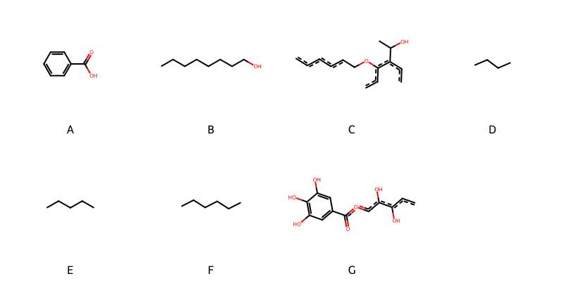

!!! abstract "Tóm tắt"

    **Họ Combretaceae** có **6** chi được các cộng đồng sử dụng trong chăm sóc sức khỏe gồm *Laguncularia, Quisqualis, Calycopteris, Conocarpus, Combretum, Terminalia*. Số lượng thành phần hóa học đã phân lập và xác định cấu trúc từ họ này tính đến tháng 12 năm 2024 là **19** nhóm có thể liệt kê như sau *Fatty Acyls, Phenols, Tannins, Carboxylic acids and derivatives, Saturated hydrocarbons, Unsaturated hydrocarbons, Steroids and steroid derivatives, Flavonoids, Aryltetralin lignans, Saccharolipids, Indenes and isoindenes, Alkyl halides, Dihydrofurans, Benzene and substituted derivatives, Prenol lipids, Organooxygen compounds, Cinnamic acids and derivatives, Isoflavonoids, Dibenzylbutane lignans*. Giữa các loài trong họ này, 3 dược liệu được nghiên cứu nhiều nhất dựa trên số thành phần được phân lập là **Terminalia chebula, Terminalia catappa, Laguncularia racemosa*. *Họ Combretaceae* đã được một số công động tại các quốc gia như Ghana, Elsewhere, Turkey, Nepal, Sudan, Java, Mexico, Philippines, India(Hindu), China, Borneo, Venezuela, Malaysia, Iran, Haiti, Sierra Leone, Brazil, Gambia, Malaya, India, Cambodia, Dominican Republic, India(Santal), Samoa đã phát hiện một số tác dụng trên lâm sàng gồm chữa bệnh lẫn độc tính như Chất làm se, Chất làm se, Chất làm se, Thuốc bổ, Thuốc bổ, Chất làm se, Ma túy, Xà phòng, Chất làm se, Phân hủy đá, Chất làm se, Thuốc an thần, Chất kích thích, Thuốc bổ, Chất làm se, Thuốc bổ, Chất làm se, Thuốc bổ, Thuốc bổ, Chất làm se, Chất làm se, Thuốc cầm máu, Chất làm se, Thuốc nhuận tràng, Chất làm se, Thuốc trợ tim, Chất làm se, có mùi hôi, Chất làm se, thuốc tống hơi, Thuốc nhuận tràng, Làm dịu, Chất làm se, thuốc tống hơi, Thuốc bổ, Chất độc, Làm dịu, Thuốc lợi tiểu, Thuốc nhuận tràng, Thuốc tẩy giun, Thuốc nhỏ mắt, diệt khuẩn, Ma túy, Chất làm se, Nước hoa, Tanifuge, Thuốc tẩy giun, Thuốc bổ, Thuốc bổ, Chất làm se, Thuốc bổ, Họ sẽ mở, Thuốc bổ, thuốc hạ sốt, Thuốc diệt cá, Thuốc diệt giun đũa, Thuốc diệt giun đũa, Thuốc tẩy giun, Thuốc diệt ký sinh trùng, Thuốc diệt ký sinh trùng, Thuốc tẩy giun, Thuốc tẩy giun, Thuốc tẩy giun, Thuốc tẩy giun, Thuốc diệt nấm, Thuốc lợi tiểu, Thuốc bổ, Thuốc cầm máu, Thuốc nhuận tràng, Thuốc nhuận tràng, Thuốc hạ sốt, Thuốc hạ sốt, Thuốc nhuận tràng, Thuốc nhuận tràng, Thuốc tẩy giun, Thuốc nhỏ mắt, Thuốc diệt nấm, Thuốc nhỏ mắt, gây nôn, Thuốc thanh lọc, Thuốc diệt ký sinh trùng, Thuốc tẩy giun, thuốc tống hơi, buồn ngủ, Thuốc tẩy giun, Thuốc trợ tim, Thuốc trợ tim, Chất kích thích, Thuốc trợ tim, Thuốc cầm máu, Thuốc lợi tiểu, Thuốc trợ tim, Thuốc lợi tiểu, Thuốc trợ tim, Thuốc nhỏ mắt, Thuốc nhuận tràng, Thuốc bổ, Kem đánh răng, Thuốc lợi tiểu, dạ dày, Thuốc tẩy giun, Thuốc trợ tim, Thuốc trợ tim, Thuốc nhuận tràng, Thuốc nhuận tràng, Thuốc tẩy giun, Thuốc tẩy giun, Thuốc diệt giun đũa, có mùi hôi, mỹ phẩm, Chất làm se.

!!! info "DrDuke"

    James A. Duke sinh năm 1929-2017 là một nhà thực vật học người Mỹ. Đây là một trong những tác giả hàng đầu trong lĩnh vực dược dân tộc học với cuốn *CRC Handbook of Medicinal Herbs* và chính là người xây dựng lên cơ sở dữ liệu về hợp chất tự nhiên và dược dân tộc học tại Bộ nông nghiệp Hoa Kỳ. Các thông tin được đăng tải tại website [Dr. Duke's Phytochemical and Ethnobotanical Databases](https://phytochem.nal.usda.gov/). 
    Trong suốt thập niên 1970, ông lãnh đạo the Plant Taxonomy Laboratory, Plant Genetics and Germplasm Institute of the Agricultural Research Service, U.S. Department of Agriculture.
    Trong tài liệu này, các thông tin về dược dân tộc của các dược liệu được trích dẫn từ tài liệu của James A. Ducke với sự trợ giúp của phần mềm dịch thuật từ tiếng Anh sang tiếng Việt.
   
## Tổng quan về Họ Combretaceae
### Phân loại thực vật
Trong *họ Combretaceae* có **6** chi được sử dụng làm thuốc với chi tiết số loài trong mỗi chi như sau Terminalia (19) . Chi tiết về loài sử dụng làm thuốc như dưới đây.  

>Họ Combretaceae


>|-- Chi Laguncularia

>*Laguncularia racemosa*,

>|-- Chi Quisqualis

>*Quisqualis densiflora*,
>*Quisqualis indica*,

>|-- Chi Calycopteris

>*Calycopteris floribunda*,

>|-- Chi Conocarpus

>*Conocarpus erecta*,
>*Conocarpus erectus*,

>|-- Chi Combretum

>*Combretum acuminatum*,
>*Combretum bracteatum*,
>*Combretum cacoucia*,
>*Combretum confertum*,
>*Combretum hypotilinum*,
>*Combretum pilosum*,
>*Combretum racemosum*,
>*Combretum raimbaultii*,
>*Combretum tetralophum*,
>*Combretum trifoliatum*,

>|-- Chi Terminalia

>*Terminalia alata*,
>*Terminalia arjuna*,
>*Terminalia belerica*,
>*Terminalia bellerica*,
>*Terminalia bellirica*,
>*Terminalia bialata*,
>*Terminalia calamansanay*,
>*Terminalia catappa*,
>*Terminalia chebula*,
>*Terminalia citrina*,
>*Terminalia comintana*,
>*Terminalia coriacea*,
>*Terminalia glabra*,
>*Terminalia glaucescens*,
>*Terminalia macroptera*,
>*Terminalia myriocarpa*,
>*Terminalia paniculata*,
>*Terminalia tomentosa*,
>*Terminalia travancorensis*,

### Thành phần hóa học 

Số lượng thành phần hóa học đã phân lập và xác định cấu trúc từ họ này tính đến tháng 12 năm 2024 là 19 nhóm có thể liệt kê như sau Fatty Acyls, Phenols, Tannins, Carboxylic acids and derivatives, Saturated hydrocarbons, Unsaturated hydrocarbons, Steroids and steroid derivatives, Flavonoids, Aryltetralin lignans, Saccharolipids, Indenes and isoindenes, Alkyl halides, Dihydrofurans, Benzene and substituted derivatives, Prenol lipids, Organooxygen compounds, Cinnamic acids and derivatives, Isoflavonoids, Dibenzylbutane lignans. Số lượng các loài đã được nghiên cứu thành phần hóa học là *12* trong tổng số *35* loài thuộc họ Combretaceae.Giữa các loài trong họ này, 3 dược liệu được nghiên cứu nhiều nhất dựa trên số thành phần được phân lập là **Terminalia chebula, Terminalia catappa, Laguncularia racemosa**. Sử dụng phần mềm RDKIT với thuật toán  Find Maximum Common Substructure (FMCS), các nhóm hoạt chất phổ biến nhất trong *họ Combretaceae* đã xây dựng được nhân. Điều này trong tương lại có thể được sử dụng tìm kiếm mối liên hệ giữa tác dụng của cấu trúc hóa học và tác dụng dược lý. Các nhân trong phần này có thể không giống như cấu trúc gốc của từng nhóm chất. Kết quả được trình bầy như hình dưới đây.

<figure markdown="span">
    { width=100% }
    <figcaption> Cấu trúc hóa học của một số khung cơ bản dựa trên thuật toán FMCS để tìm Benzene and substituted derivatives (A), Fatty Acyls (B), Flavonoids (C), Organooxygen compounds (D), Prenol lipids (E), Saturated hydrocarbons (F), Tannins (G).</figcaption>
</figure>


!!! info  "Find Maximum Common Substructure"
    
    Thuật toán FMCS (Find Maximum Common Substructure) là một phương pháp được sử dụng để tìm ra cấu trúc chung nhiều nhất (MCS) trong một tập hợp các cấu trúc hóa học. Các bước của thuật toán gồm:
    - Chọn một cấu trúc hóa học là cấu trúc để tạo truy vấn, còn các cấu trúc khác là mục tiêu.
    - Chia nhỏ cấu trúc để tạo truy vấn thành cấu trúc nhỏ hơn dạng chuỗi SMARTS.
    - Kiểm tra chuỗi SMARTS trong các cấu trúc mục tiêu.
    - Tìm kiếm chuỗi SMARTS xuất hiện nhiều nhất.
    Để biết thêm chi tiết các bạn có thể xem tại [TeachOpenCADD](https://projects.volkamerlab.org/teachopencadd/talktorials/T006_compound_maximum_common_substructures.html)
    ``` python
    pip install rdkit
    def find_core_smiles(smiles_list):
        mols = [Chem.MolFromSmiles(smiles) for smiles in smiles_list]
        mcs = rdFMCS.FindMCS(mols)
        core_smiles = Chem.MolToSmiles(Chem.MolFromSmarts(mcs.smartsString))
        return core_smiles
    ```

### Dược dân tộc học

Họ **Combretaceae** đã được một số công động tại các quốc gia như *Ghana, Elsewhere, Turkey, Nepal, Sudan, Java, Mexico, Philippines, India(Hindu), China, Borneo, Venezuela, Malaysia, Iran, Haiti, Sierra Leone, Brazil, Gambia, Malaya, India, Cambodia, Dominican Republic, India(Santal), Samoa* đã phát hiện một số tác dụng trên lâm sàng gồm chữa bệnh lẫn độc tính như *Chất làm se, Chất làm se, Chất làm se, Thuốc bổ, Thuốc bổ, Chất làm se, Ma túy, Xà phòng, Chất làm se, Phân hủy đá, Chất làm se, Thuốc an thần, Chất kích thích, Thuốc bổ, Chất làm se, Thuốc bổ, Chất làm se, Thuốc bổ, Thuốc bổ, Chất làm se, Chất làm se, Thuốc cầm máu, Chất làm se, Thuốc nhuận tràng, Chất làm se, Thuốc trợ tim, Chất làm se, có mùi hôi, Chất làm se, thuốc tống hơi, Thuốc nhuận tràng, Làm dịu, Chất làm se, thuốc tống hơi, Thuốc bổ, Chất độc, Làm dịu, Thuốc lợi tiểu, Thuốc nhuận tràng, Thuốc tẩy giun, Thuốc nhỏ mắt, diệt khuẩn, Ma túy, Chất làm se, Nước hoa, Tanifuge, Thuốc tẩy giun, Thuốc bổ, Thuốc bổ, Chất làm se, Thuốc bổ, Họ sẽ mở, Thuốc bổ, thuốc hạ sốt, Thuốc diệt cá, Thuốc diệt giun đũa, Thuốc diệt giun đũa, Thuốc tẩy giun, Thuốc diệt ký sinh trùng, Thuốc diệt ký sinh trùng, Thuốc tẩy giun, Thuốc tẩy giun, Thuốc tẩy giun, Thuốc tẩy giun, Thuốc diệt nấm, Thuốc lợi tiểu, Thuốc bổ, Thuốc cầm máu, Thuốc nhuận tràng, Thuốc nhuận tràng, Thuốc hạ sốt, Thuốc hạ sốt, Thuốc nhuận tràng, Thuốc nhuận tràng, Thuốc tẩy giun, Thuốc nhỏ mắt, Thuốc diệt nấm, Thuốc nhỏ mắt, gây nôn, Thuốc thanh lọc, Thuốc diệt ký sinh trùng, Thuốc tẩy giun, thuốc tống hơi, buồn ngủ, Thuốc tẩy giun, Thuốc trợ tim, Thuốc trợ tim, Chất kích thích, Thuốc trợ tim, Thuốc cầm máu, Thuốc lợi tiểu, Thuốc trợ tim, Thuốc lợi tiểu, Thuốc trợ tim, Thuốc nhỏ mắt, Thuốc nhuận tràng, Thuốc bổ, Kem đánh răng, Thuốc lợi tiểu, dạ dày, Thuốc tẩy giun, Thuốc trợ tim, Thuốc trợ tim, Thuốc nhuận tràng, Thuốc nhuận tràng, Thuốc tẩy giun, Thuốc tẩy giun, Thuốc diệt giun đũa, có mùi hôi, mỹ phẩm, Chất làm se*.

## Chi tiết dược dân tộc học


### Chi Laguncularia

!!! note "Danh sách các loài thuộc chi"
    
*	 - *Laguncularia racemosa**

---      
#### *Laguncularia racemosa*
**Thông tin về thực vật**

!!! info "Phân loại thực vật của *Laguncularia racemosa* từ GIBF:"
    - **Kingdom:** Plantae
    - **Phylum:** Tracheophyta
    - **Order:** Myrtales
    - **Family:** Combretaceae
    - **Genus:** Laguncularia
    - **Species:** *Laguncularia racemosa*


 

Chưa có thông tin về loài này trên wikidata.

*Phân bố trên thế giới*: Saint Vincent and the Grenadines, Curaçao, Saint Lucia, Bahamas, Cuba, Antigua and Barbuda, French Guiana, Mexico, Colombia, Aruba, Virgin Islands (U.S.), Sint Maarten (Dutch part), Trinidad and Tobago, Nigeria, Saint Kitts and Nevis, Brazil, Costa Rica, United States of America, Ecuador, Puerto Rico, Sierra Leone

*Phân bố tại Việt Nam*: Không có ghi nhận ở Việt Nam

**Thành phần hóa học**
        

Theo cơ sở dữ liệu lotus, từ loài *Laguncularia racemosa* đã phân lập và xác định được 43 hoạt chất thuộc về các nhóm Organooxygen compounds, Fatty Acyls, Flavonoids, Aryltetralin lignans, Phenols, Tannins, Benzene and substituted derivatives. Danh sách các hoạt chất như sau benzyl glucopyranoside [(LTS0210495)](https://lotus.naturalproducts.net/compound/lotus_id/LTS0210495), [3-(8-{2-[8-(acetyloxy)undecyl]-4,6-dihydroxybenzoyloxy}undecyl)-5-hydroxyphenyl]oxidanesulfonic acid [(LTS0110814)](https://lotus.naturalproducts.net/compound/lotus_id/LTS0110814), 2-(hydroxymethyl)-6-[4-(hydroxymethyl)-2-methoxyphenoxy]oxane-3,4,5-triol [(LTS0098044)](https://lotus.naturalproducts.net/compound/lotus_id/LTS0098044), vanilloloside [(LTS0157289)](https://lotus.naturalproducts.net/compound/lotus_id/LTS0157289), 2-(hydroxymethyl)-6-[(3,4,5-trimethoxyphenyl)methoxy]oxane-3,4,5-triol [(LTS0052258)](https://lotus.naturalproducts.net/compound/lotus_id/LTS0052258), salicin [(LTS0129975)](https://lotus.naturalproducts.net/compound/lotus_id/LTS0129975), 7-hydroxy-6,13,14-trimethoxy-2,9-dioxatetracyclo[6.6.2.0⁴,¹⁶.0¹¹,¹⁵]hexadeca-1(15),4(16),5,7,11,13-hexaene-3,10-dione [(LTS0145372)](https://lotus.naturalproducts.net/compound/lotus_id/LTS0145372), 2-(4-hydroxy-3-methoxyphenoxy)-6-(hydroxymethyl)oxane-3,4,5-triol [(LTS0085094)](https://lotus.naturalproducts.net/compound/lotus_id/LTS0085094), koaburaside [(LTS0215775)](https://lotus.naturalproducts.net/compound/lotus_id/LTS0215775), syringaldehyde [(LTS0201406)](https://lotus.naturalproducts.net/compound/lotus_id/LTS0201406), benzyl β-d-glucoside [(LTS0184698)](https://lotus.naturalproducts.net/compound/lotus_id/LTS0184698), [3,4,5-trihydroxy-6-(4-hydroxy-3-methoxyphenoxy)oxan-2-yl]methyl 3,4,5-trihydroxybenzoate [(LTS0156299)](https://lotus.naturalproducts.net/compound/lotus_id/LTS0156299), (2r,3r)-3-(4-hydroxy-3,5-dimethoxyphenyl)-3-methoxypropane-1,2-diol [(LTS0242577)](https://lotus.naturalproducts.net/compound/lotus_id/LTS0242577), koaburaside [(LTS0202780)](https://lotus.naturalproducts.net/compound/lotus_id/LTS0202780), (2r,3s,4s,5r,6r)-2-(hydroxymethyl)-6-[(3,4,5-trimethoxyphenyl)methoxy]oxane-3,4,5-triol [(LTS0108959)](https://lotus.naturalproducts.net/compound/lotus_id/LTS0108959), (2s,3s)-5,7-dihydroxy-4-oxo-2-phenyl-2,3-dihydro-1-benzopyran-3-yl (2e)-3-(3,4-dihydroxyphenyl)prop-2-enoate [(LTS0024476)](https://lotus.naturalproducts.net/compound/lotus_id/LTS0024476), [3,4,5-trihydroxy-6-(4-hydroxy-3,5-dimethoxyphenoxy)oxan-2-yl]methyl 3,4,5-trihydroxybenzoate [(LTS0273294)](https://lotus.naturalproducts.net/compound/lotus_id/LTS0273294), 2-{3-hydroxy-2-[4-(3-hydroxypropyl)-2-methoxyphenoxy]propoxy}-6-(hydroxymethyl)oxane-3,4,5-triol [(LTS0036616)](https://lotus.naturalproducts.net/compound/lotus_id/LTS0036616), 5,7-dihydroxy-4-oxo-2-phenyl-2,3-dihydro-1-benzopyran-3-yl 3-(3,4-dihydroxyphenyl)prop-2-enoate [(LTS0000591)](https://lotus.naturalproducts.net/compound/lotus_id/LTS0000591), 3-(4-hydroxy-3,5-dimethoxyphenyl)-3-methoxypropane-1,2-diol [(LTS0270303)](https://lotus.naturalproducts.net/compound/lotus_id/LTS0270303), {3-[(8s)-8-{2-[(8s)-8-(acetyloxy)undecyl]-4,6-dihydroxybenzoyloxy}undecyl]-5-hydroxyphenyl}oxidanesulfonic acid [(LTS0259839)](https://lotus.naturalproducts.net/compound/lotus_id/LTS0259839), (4s)-11-(3,5-dihydroxyphenyl)undecan-4-yl 2-[(8s)-8-(acetyloxy)undecyl]-4,6-dihydroxybenzoate [(LTS0264364)](https://lotus.naturalproducts.net/compound/lotus_id/LTS0264364), asahina [(LTS0068303)](https://lotus.naturalproducts.net/compound/lotus_id/LTS0068303), 2-(4-hydroxy-2,6-dimethoxyphenoxy)-6-(hydroxymethyl)oxane-3,4,5-triol [(LTS0192524)](https://lotus.naturalproducts.net/compound/lotus_id/LTS0192524), 2,3-dihydroxy-1-(4-hydroxy-3-methoxyphenyl)propan-1-one [(LTS0260010)](https://lotus.naturalproducts.net/compound/lotus_id/LTS0260010), (2r)-2,3-dihydroxy-1-(4-hydroxy-3-methoxyphenyl)propan-1-one [(LTS0107804)](https://lotus.naturalproducts.net/compound/lotus_id/LTS0107804), ellagic acid [(LTS0037297)](https://lotus.naturalproducts.net/compound/lotus_id/LTS0037297), 11-(3,5-dihydroxyphenyl)undecan-4-yl 2-[8-(acetyloxy)undecyl]-4,6-dihydroxybenzoate [(LTS0110371)](https://lotus.naturalproducts.net/compound/lotus_id/LTS0110371), (2s,3r,4s,5s,6r)-2-(4-hydroxy-2,6-dimethoxyphenoxy)-6-(hydroxymethyl)oxane-3,4,5-triol [(LTS0120164)](https://lotus.naturalproducts.net/compound/lotus_id/LTS0120164), (6s,7s,8r)-8-(4-hydroxy-3,5-dimethoxyphenyl)-6,7-bis(hydroxymethyl)-1,3-dimethoxy-5,6,7,8-tetrahydronaphthalen-2-ol [(LTS0243275)](https://lotus.naturalproducts.net/compound/lotus_id/LTS0243275), (2s,3r,4s,5s,6r)-2-(4-hydroxy-3-methoxyphenoxy)-6-(hydroxymethyl)oxane-3,4,5-triol [(LTS0029144)](https://lotus.naturalproducts.net/compound/lotus_id/LTS0029144), [(2r,3s,4s,5r,6s)-3,4,5-trihydroxy-6-(4-hydroxy-3-methoxyphenoxy)oxan-2-yl]methyl 3,4,5-trihydroxybenzoate [(LTS0152670)](https://lotus.naturalproducts.net/compound/lotus_id/LTS0152670), salicin [(LTS0259785)](https://lotus.naturalproducts.net/compound/lotus_id/LTS0259785), (2r,3r,4s,5s,6r)-2-[(2r)-3-hydroxy-2-[4-(3-hydroxypropyl)-2-methoxyphenoxy]propoxy]-6-(hydroxymethyl)oxane-3,4,5-triol [(LTS0006465)](https://lotus.naturalproducts.net/compound/lotus_id/LTS0006465), 4-(4-hydroxy-3-methoxyphenyl)-7-methoxy-2,3-dimethyl-3,4-dihydro-1h-naphthalene-2,6-diol [(LTS0200291)](https://lotus.naturalproducts.net/compound/lotus_id/LTS0200291), luteolin [(LTS0017052)](https://lotus.naturalproducts.net/compound/lotus_id/LTS0017052), 8-(4-hydroxy-3,5-dimethoxyphenyl)-6,7-bis(hydroxymethyl)-1,3-dimethoxy-5,6,7,8-tetrahydronaphthalen-2-ol [(LTS0068427)](https://lotus.naturalproducts.net/compound/lotus_id/LTS0068427), [(2r,3s,4s,5r,6s)-3,4,5-trihydroxy-6-(4-hydroxy-3,5-dimethoxyphenoxy)oxan-2-yl]methyl 3,4,5-trihydroxybenzoate [(LTS0239610)](https://lotus.naturalproducts.net/compound/lotus_id/LTS0239610), naringenin [(LTS0031098)](https://lotus.naturalproducts.net/compound/lotus_id/LTS0031098), 6,7,13,14-tetramethoxy-2,9-dioxatetracyclo[6.6.2.0⁴,¹⁶.0¹¹,¹⁵]hexadeca-1(15),4(16),5,7,11,13-hexaene-3,10-dione [(LTS0131814)](https://lotus.naturalproducts.net/compound/lotus_id/LTS0131814), chamomile [(LTS0104946)](https://lotus.naturalproducts.net/compound/lotus_id/LTS0104946), chrysin [(LTS0200644)](https://lotus.naturalproducts.net/compound/lotus_id/LTS0200644), (2s,3s,4r)-4-(4-hydroxy-3-methoxyphenyl)-7-methoxy-2,3-dimethyl-3,4-dihydro-1h-naphthalene-2,6-diol [(LTS0016932)](https://lotus.naturalproducts.net/compound/lotus_id/LTS0016932).

| chemicalTaxonomyClassyfireClass     |   lotus_count |
|:------------------------------------|--------------:|
| Aryltetralin lignans                |             4 |
| Benzene and substituted derivatives |             2 |
| Fatty Acyls                         |             2 |
| Flavonoids                          |             7 |
| Organooxygen compounds              |            22 |
| Phenols                             |             3 |
| Tannins                             |             3 |


**Dược dân tộc học**

Danh sách các quốc gia có sử dụng *Laguncularia racemosa* trong điều trị các bệnh. 

| Quốc gia           | Bệnh                                         |
|:-------------------|:---------------------------------------------|
| Dominican Republic | Thuốc bổ                                     |
| Elsewhere          | Chất làm se, Thuốc bổ                        |
| Haiti              | Chất làm se                                  |
| Mexico             | Chất làm se, Chất làm se, Thuốc bổ, Thuốc bổ |
| Venezuela          | Chất làm se                                  |


### Chi Quisqualis

!!! note "Danh sách các loài thuộc chi"
    
*	 - *Quisqualis densiflora*
	 - *Quisqualis indica**

---      
#### *Laguncularia racemosa*
**Thông tin về thực vật**

!!! info "Phân loại thực vật của *Laguncularia racemosa* từ GIBF:"
    - **Kingdom:** Plantae
    - **Phylum:** Tracheophyta
    - **Order:** Myrtales
    - **Family:** Combretaceae
    - **Genus:** Laguncularia
    - **Species:** *Laguncularia racemosa*


 

Chưa có thông tin về loài này trên wikidata.

*Phân bố trên thế giới*: Saint Vincent and the Grenadines, Curaçao, Saint Lucia, Bahamas, Cuba, Antigua and Barbuda, French Guiana, Mexico, Colombia, Aruba, Virgin Islands (U.S.), Sint Maarten (Dutch part), Trinidad and Tobago, Nigeria, Saint Kitts and Nevis, Brazil, Costa Rica, United States of America, Ecuador, Puerto Rico, Sierra Leone

*Phân bố tại Việt Nam*: Không có ghi nhận ở Việt Nam

**Thành phần hóa học**
        

Chưa có nghiên cứu về thành phần hóa học của loài này


**Dược dân tộc học**

Danh sách các quốc gia có sử dụng *Laguncularia racemosa* trong điều trị các bệnh. 

| Quốc gia   | Bệnh           |
|:-----------|:---------------|
| Malaya     | Thuốc tẩy giun |


---      
#### *Laguncularia racemosa*
**Thông tin về thực vật**

!!! info "Phân loại thực vật của *Laguncularia racemosa* từ GIBF:"
    - **Kingdom:** Plantae
    - **Phylum:** Tracheophyta
    - **Order:** Myrtales
    - **Family:** Combretaceae
    - **Genus:** Laguncularia
    - **Species:** *Laguncularia racemosa*


 

Chưa có thông tin về loài này trên wikidata.

*Phân bố trên thế giới*: Saint Vincent and the Grenadines, Curaçao, Saint Lucia, Bahamas, Cuba, Antigua and Barbuda, French Guiana, Mexico, Colombia, Aruba, Virgin Islands (U.S.), Sint Maarten (Dutch part), Trinidad and Tobago, Nigeria, Saint Kitts and Nevis, Brazil, Costa Rica, United States of America, Ecuador, Puerto Rico, Sierra Leone

*Phân bố tại Việt Nam*: Không có ghi nhận ở Việt Nam

**Thành phần hóa học**
        

Chưa có nghiên cứu về thành phần hóa học của loài này


**Dược dân tộc học**

Danh sách các quốc gia có sử dụng *Laguncularia racemosa* trong điều trị các bệnh. 

| Quốc gia   | Bệnh                                                                                                               |
|:-----------|:-------------------------------------------------------------------------------------------------------------------|
| China      | Thuốc diệt ký sinh trùng, Thuốc diệt ký sinh trùng, Thuốc tẩy giun, Thuốc tẩy giun, Thuốc tẩy giun, Thuốc tẩy giun |
| Elsewhere  | Thuốc thanh lọc, Thuốc diệt ký sinh trùng, Thuốc tẩy giun, thuốc tống hơi, buồn ngủ, Thuốc tẩy giun                |
| Java       | Thuốc tẩy giun                                                                                                     |
| Malaysia   | Thuốc tẩy giun                                                                                                     |


### Chi Calycopteris

!!! note "Danh sách các loài thuộc chi"
    
*	 - *Calycopteris floribunda**

---      
#### *Calycopteris floribunda*
**Thông tin về thực vật**

!!! info "Phân loại thực vật của *Getonia floribunda* từ GIBF:"
    - **Kingdom:** Plantae
    - **Phylum:** Tracheophyta
    - **Order:** Myrtales
    - **Family:** Combretaceae
    - **Genus:** Getonia
    - **Species:** *Getonia floribunda*


 

Chưa có thông tin về loài này trên wikidata.

*Phân bố trên thế giới*: Myanmar, Thailand, nan, China, unknown or invalid, Cambodia, Bangladesh, Malaysia, India, Lao People’s Democratic Republic, Viet Nam

*Phân bố tại Việt Nam*: Dak Lak

**Thành phần hóa học**
        

Theo cơ sở dữ liệu lotus, từ loài *Calycopteris floribunda* đã phân lập và xác định được 20 hoạt chất thuộc về các nhóm Flavonoids. Danh sách các hoạt chất như sau (5s,7r,10r,11r,15r,17s)-15-hydroxy-2,7,10,11,20,21-hexamethoxy-5,17-diphenyl-4,12,18-trioxapentacyclo[11.8.0.0²,¹¹.0³,⁸.0¹⁴,¹⁹]henicosa-1(21),3(8),13,19-tetraen-9-one [(LTS0063290)](https://lotus.naturalproducts.net/compound/lotus_id/LTS0063290), (1r,5s,7r,13r,20r)-11-hydroxy-5,10,13,14,15-pentamethoxy-7,20-diphenyl-2,8,21-trioxapentacyclo[11.8.0.0¹,¹⁷.0³,¹².0⁴,⁹]henicosa-3,9,11,14,17-pentaen-16-one [(LTS0103504)](https://lotus.naturalproducts.net/compound/lotus_id/LTS0103504), (2r,5r,7s,10s,11r,15r,17r)-2,7,10,11,15,20,21-heptamethoxy-5,17-diphenyl-4,12,18-trioxapentacyclo[11.8.0.0²,¹¹.0³,⁸.0¹⁴,¹⁹]henicosa-1(21),3(8),13,19-tetraen-9-one [(LTS0127315)](https://lotus.naturalproducts.net/compound/lotus_id/LTS0127315), (2r,5r,7r,10r,11r,15r,17r)-7,15-dihydroxy-2,10,11,20,21-pentamethoxy-5,17-diphenyl-4,12,18-trioxapentacyclo[11.8.0.0²,¹¹.0³,⁸.0¹⁴,¹⁹]henicosa-1(21),3(8),13,19-tetraen-9-one [(LTS0017537)](https://lotus.naturalproducts.net/compound/lotus_id/LTS0017537), (5s,7r,10s,11r,15r,17s)-7,15-dihydroxy-2,10,11,20,21-pentamethoxy-5,17-diphenyl-4,12,18-trioxapentacyclo[11.8.0.0²,¹¹.0³,⁸.0¹⁴,¹⁹]henicosa-1(21),3(8),13,19-tetraen-9-one [(LTS0036309)](https://lotus.naturalproducts.net/compound/lotus_id/LTS0036309), 10-hydroxy-5,11,13,14,15-pentamethoxy-7,20-diphenyl-2,8,21-trioxapentacyclo[11.8.0.0¹,¹⁷.0³,¹².0⁴,⁹]henicosa-3,9,11,14,17-pentaen-16-one [(LTS0157685)](https://lotus.naturalproducts.net/compound/lotus_id/LTS0157685), (1r,5s,7r,13r,20r)-5-hydroxy-10,11,13,14,15-pentamethoxy-7,20-diphenyl-2,8,21-trioxapentacyclo[11.8.0.0¹,¹⁷.0³,¹².0⁴,⁹]henicosa-3,9,11,14,17-pentaen-16-one [(LTS0240451)](https://lotus.naturalproducts.net/compound/lotus_id/LTS0240451), (2r,5s,7r,10s,11r,15r,17r)-7,15-dihydroxy-2,10,11,20,21-pentamethoxy-5,17-diphenyl-4,12,18-trioxapentacyclo[11.8.0.0²,¹¹.0³,⁸.0¹⁴,¹⁹]henicosa-1(21),3(8),13,19-tetraen-9-one [(LTS0021201)](https://lotus.naturalproducts.net/compound/lotus_id/LTS0021201), (2r,5r,7s,10s,11r,15s,17r)-15-hydroxy-2,7,10,11,20,21-hexamethoxy-5,17-diphenyl-4,12,18-trioxapentacyclo[11.8.0.0²,¹¹.0³,⁸.0¹⁴,¹⁹]henicosa-1(21),3(8),13,19-tetraen-9-one [(LTS0265416)](https://lotus.naturalproducts.net/compound/lotus_id/LTS0265416), (5s,7r,10r,11r,15r,17s)-7,15-dihydroxy-2,10,11,20,21-pentamethoxy-5,17-diphenyl-4,12,18-trioxapentacyclo[11.8.0.0²,¹¹.0³,⁸.0¹⁴,¹⁹]henicosa-1(21),3(8),13,19-tetraen-9-one [(LTS0272711)](https://lotus.naturalproducts.net/compound/lotus_id/LTS0272711), 7,15-dihydroxy-2,11,20,21-tetramethoxy-5,17-diphenyl-4,12,18-trioxapentacyclo[11.8.0.0²,¹¹.0³,⁸.0¹⁴,¹⁹]henicosa-1(21),3(8),13,19-tetraen-9-one [(LTS0228798)](https://lotus.naturalproducts.net/compound/lotus_id/LTS0228798), 11-hydroxy-5,10,13,14,15-pentamethoxy-7,20-diphenyl-2,8,21-trioxapentacyclo[11.8.0.0¹,¹⁷.0³,¹².0⁴,⁹]henicosa-3,9,11,14,17-pentaen-16-one [(LTS0235608)](https://lotus.naturalproducts.net/compound/lotus_id/LTS0235608), (1r,5s,7r,13r,20r)-5,11-dihydroxy-10,13,14,15-tetramethoxy-7,20-diphenyl-2,8,21-trioxapentacyclo[11.8.0.0¹,¹⁷.0³,¹².0⁴,⁹]henicosa-3,9,11,14,17-pentaen-16-one [(LTS0080243)](https://lotus.naturalproducts.net/compound/lotus_id/LTS0080243), (2r,5s,7r,10r,11r,15r,17s)-2,7,10,11,15,20,21-heptamethoxy-5,17-diphenyl-4,12,18-trioxapentacyclo[11.8.0.0²,¹¹.0³,⁸.0¹⁴,¹⁹]henicosa-1(21),3(8),13,19-tetraen-9-one [(LTS0197499)](https://lotus.naturalproducts.net/compound/lotus_id/LTS0197499), (1s,5r,7s,13s,20s)-5-hydroxy-10,11,13,14-tetramethoxy-7,20-diphenyl-2,8,21-trioxapentacyclo[11.8.0.0¹,¹⁷.0³,¹².0⁴,⁹]henicosa-3,9,11,14,17-pentaen-16-one [(LTS0238546)](https://lotus.naturalproducts.net/compound/lotus_id/LTS0238546), chrysosplenetin [(LTS0202772)](https://lotus.naturalproducts.net/compound/lotus_id/LTS0202772), pachypodol [(LTS0093471)](https://lotus.naturalproducts.net/compound/lotus_id/LTS0093471), (2r,5r,7s,10r,11r,15r,17r)-15-hydroxy-2,7,10,11,20,21-hexamethoxy-5,17-diphenyl-4,12,18-trioxapentacyclo[11.8.0.0²,¹¹.0³,⁸.0¹⁴,¹⁹]henicosa-1(21),3(8),13,19-tetraen-9-one [(LTS0261950)](https://lotus.naturalproducts.net/compound/lotus_id/LTS0261950), (2r,5s,7r,10r,11r,15r,17s)-15-hydroxy-2,7,10,11,20,21-hexamethoxy-5,17-diphenyl-4,12,18-trioxapentacyclo[11.8.0.0²,¹¹.0³,⁸.0¹⁴,¹⁹]henicosa-1(21),3(8),13,19-tetraen-9-one [(LTS0244091)](https://lotus.naturalproducts.net/compound/lotus_id/LTS0244091), (2r,5r,7s,11r,15s,17r)-7,15-dihydroxy-2,11,20,21-tetramethoxy-5,17-diphenyl-4,12,18-trioxapentacyclo[11.8.0.0²,¹¹.0³,⁸.0¹⁴,¹⁹]henicosa-1(21),3(8),13,19-tetraen-9-one [(LTS0109464)](https://lotus.naturalproducts.net/compound/lotus_id/LTS0109464).

| chemicalTaxonomyClassyfireClass   |   lotus_count |
|:----------------------------------|--------------:|
| Flavonoids                        |            20 |


**Dược dân tộc học**

Danh sách các quốc gia có sử dụng *Getonia floribunda* trong điều trị các bệnh. 

| Quốc gia   | Bệnh          |
|:-----------|:--------------|
| Cambodia   | Thuốc bổ      |
| Elsewhere  | Thuốc diệt cá |


### Chi Conocarpus

!!! note "Danh sách các loài thuộc chi"
    
*	 - *Conocarpus erecta*
	 - *Conocarpus erectus**

---      
#### *Calycopteris floribunda*
**Thông tin về thực vật**

!!! info "Phân loại thực vật của *Getonia floribunda* từ GIBF:"
    - **Kingdom:** Plantae
    - **Phylum:** Tracheophyta
    - **Order:** Myrtales
    - **Family:** Combretaceae
    - **Genus:** Getonia
    - **Species:** *Getonia floribunda*


 

Chưa có thông tin về loài này trên wikidata.

*Phân bố trên thế giới*: Myanmar, Thailand, nan, China, unknown or invalid, Cambodia, Bangladesh, Malaysia, India, Lao People’s Democratic Republic, Viet Nam

*Phân bố tại Việt Nam*: Dak Lak

**Thành phần hóa học**
        

Chưa có nghiên cứu về thành phần hóa học của loài này


**Dược dân tộc học**

Danh sách các quốc gia có sử dụng *Getonia floribunda* trong điều trị các bệnh. 

| Quốc gia   | Bệnh                  |
|:-----------|:----------------------|
| Mexico     | Chất làm se, Thuốc bổ |


---      
#### *Conocarpus erectus*
**Thông tin về thực vật**

!!! info "Phân loại thực vật của *Conocarpus erectus* từ GIBF:"
    - **Kingdom:** Plantae
    - **Phylum:** Tracheophyta
    - **Order:** Myrtales
    - **Family:** Combretaceae
    - **Genus:** Conocarpus
    - **Species:** *Conocarpus erectus*


 

Chưa có thông tin về loài này trên wikidata.

*Phân bố trên thế giới*: Gambia, Haiti, Cayman Islands, Curaçao, Turks and Caicos Islands, Bahamas, Cuba, Antigua and Barbuda, Guadeloupe, French Guiana, Mexico, Bonaire, Sint Eustatius and Saba, Belize, Martinique, Aruba, Virgin Islands (U.S.), Sint Maarten (Dutch part), Honduras, Saint Kitts and Nevis, India, Brazil, Costa Rica, United States of America, Dominican Republic, Nicaragua, Ecuador, Puerto Rico, Guyana

*Phân bố tại Việt Nam*: Không có ghi nhận ở Việt Nam

**Thành phần hóa học**
        

Theo cơ sở dữ liệu lotus, từ loài *Conocarpus erectus* đã phân lập và xác định được 2 hoạt chất thuộc về các nhóm Dibenzylbutane lignans. Danh sách các hoạt chất như sau 4-[4-(4-hydroxyphenyl)-2,3-dimethylbutyl]-3-methoxyphenol [(LTS0120201)](https://lotus.naturalproducts.net/compound/lotus_id/LTS0120201), 4-[(2s,3r)-4-(4-hydroxyphenyl)-2,3-dimethylbutyl]-3-methoxyphenol [(LTS0231772)](https://lotus.naturalproducts.net/compound/lotus_id/LTS0231772).

| chemicalTaxonomyClassyfireClass   |   lotus_count |
|:----------------------------------|--------------:|
| Dibenzylbutane lignans            |             2 |


**Dược dân tộc học**

Danh sách các quốc gia có sử dụng *Conocarpus erectus* trong điều trị các bệnh. 

| Quốc gia           | Bệnh                       |
|:-------------------|:---------------------------|
| Dominican Republic | Thuốc bổ                   |
| Elsewhere          | Chất làm se, Thuốc cầm máu |
| Haiti              | Thuốc bổ, Chất làm se      |


### Chi Combretum

!!! note "Danh sách các loài thuộc chi"
    
*	 - *Combretum acuminatum*
	 - *Combretum bracteatum*
	 - *Combretum cacoucia*
	 - *Combretum confertum*
	 - *Combretum hypotilinum*
	 - *Combretum pilosum*
	 - *Combretum racemosum*
	 - *Combretum raimbaultii*
	 - *Combretum tetralophum*
	 - *Combretum trifoliatum**

---      
#### *Conocarpus erectus*
**Thông tin về thực vật**

!!! info "Phân loại thực vật của *Conocarpus erectus* từ GIBF:"
    - **Kingdom:** Plantae
    - **Phylum:** Tracheophyta
    - **Order:** Myrtales
    - **Family:** Combretaceae
    - **Genus:** Conocarpus
    - **Species:** *Conocarpus erectus*


 

Chưa có thông tin về loài này trên wikidata.

*Phân bố trên thế giới*: Gambia, Haiti, Cayman Islands, Curaçao, Turks and Caicos Islands, Bahamas, Cuba, Antigua and Barbuda, Guadeloupe, French Guiana, Mexico, Bonaire, Sint Eustatius and Saba, Belize, Martinique, Aruba, Virgin Islands (U.S.), Sint Maarten (Dutch part), Honduras, Saint Kitts and Nevis, India, Brazil, Costa Rica, United States of America, Dominican Republic, Nicaragua, Ecuador, Puerto Rico, Guyana

*Phân bố tại Việt Nam*: Không có ghi nhận ở Việt Nam

**Thành phần hóa học**
        

Chưa có nghiên cứu về thành phần hóa học của loài này


**Dược dân tộc học**

Danh sách các quốc gia có sử dụng *Conocarpus erectus* trong điều trị các bệnh. 

| Quốc gia   | Bệnh                     |
|:-----------|:-------------------------|
| Elsewhere  | Tanifuge, Thuốc tẩy giun |
| Malaya     | Thuốc tẩy giun           |


---      
#### *Conocarpus erectus*
**Thông tin về thực vật**

!!! info "Phân loại thực vật của *Conocarpus erectus* từ GIBF:"
    - **Kingdom:** Plantae
    - **Phylum:** Tracheophyta
    - **Order:** Myrtales
    - **Family:** Combretaceae
    - **Genus:** Conocarpus
    - **Species:** *Conocarpus erectus*


 

Chưa có thông tin về loài này trên wikidata.

*Phân bố trên thế giới*: Gambia, Haiti, Cayman Islands, Curaçao, Turks and Caicos Islands, Bahamas, Cuba, Antigua and Barbuda, Guadeloupe, French Guiana, Mexico, Bonaire, Sint Eustatius and Saba, Belize, Martinique, Aruba, Virgin Islands (U.S.), Sint Maarten (Dutch part), Honduras, Saint Kitts and Nevis, India, Brazil, Costa Rica, United States of America, Dominican Republic, Nicaragua, Ecuador, Puerto Rico, Guyana

*Phân bố tại Việt Nam*: Không có ghi nhận ở Việt Nam

**Thành phần hóa học**
        

Chưa có nghiên cứu về thành phần hóa học của loài này


**Dược dân tộc học**

Danh sách các quốc gia có sử dụng *Conocarpus erectus* trong điều trị các bệnh. 

| Quốc gia   | Bệnh                   |
|:-----------|:-----------------------|
| Elsewhere  | Thuốc bổ, thuốc hạ sốt |


---      
#### *Conocarpus erectus*
**Thông tin về thực vật**

!!! info "Phân loại thực vật của *Conocarpus erectus* từ GIBF:"
    - **Kingdom:** Plantae
    - **Phylum:** Tracheophyta
    - **Order:** Myrtales
    - **Family:** Combretaceae
    - **Genus:** Conocarpus
    - **Species:** *Conocarpus erectus*


 

Chưa có thông tin về loài này trên wikidata.

*Phân bố trên thế giới*: Gambia, Haiti, Cayman Islands, Curaçao, Turks and Caicos Islands, Bahamas, Cuba, Antigua and Barbuda, Guadeloupe, French Guiana, Mexico, Bonaire, Sint Eustatius and Saba, Belize, Martinique, Aruba, Virgin Islands (U.S.), Sint Maarten (Dutch part), Honduras, Saint Kitts and Nevis, India, Brazil, Costa Rica, United States of America, Dominican Republic, Nicaragua, Ecuador, Puerto Rico, Guyana

*Phân bố tại Việt Nam*: Không có ghi nhận ở Việt Nam

**Thành phần hóa học**
        

Chưa có nghiên cứu về thành phần hóa học của loài này


**Dược dân tộc học**

Danh sách các quốc gia có sử dụng *Conocarpus erectus* trong điều trị các bệnh. 

| Quốc gia   | Bệnh     |
|:-----------|:---------|
| Brazil     | Chất độc |


---      
#### *Conocarpus erectus*
**Thông tin về thực vật**

!!! info "Phân loại thực vật của *Conocarpus erectus* từ GIBF:"
    - **Kingdom:** Plantae
    - **Phylum:** Tracheophyta
    - **Order:** Myrtales
    - **Family:** Combretaceae
    - **Genus:** Conocarpus
    - **Species:** *Conocarpus erectus*


 

Chưa có thông tin về loài này trên wikidata.

*Phân bố trên thế giới*: Gambia, Haiti, Cayman Islands, Curaçao, Turks and Caicos Islands, Bahamas, Cuba, Antigua and Barbuda, Guadeloupe, French Guiana, Mexico, Bonaire, Sint Eustatius and Saba, Belize, Martinique, Aruba, Virgin Islands (U.S.), Sint Maarten (Dutch part), Honduras, Saint Kitts and Nevis, India, Brazil, Costa Rica, United States of America, Dominican Republic, Nicaragua, Ecuador, Puerto Rico, Guyana

*Phân bố tại Việt Nam*: Không có ghi nhận ở Việt Nam

**Thành phần hóa học**
        

Chưa có nghiên cứu về thành phần hóa học của loài này


**Dược dân tộc học**

Danh sách các quốc gia có sử dụng *Conocarpus erectus* trong điều trị các bệnh. 

| Quốc gia   | Bệnh     |
|:-----------|:---------|
| Elsewhere  | Chất độc |


---      
#### *Conocarpus erectus*
**Thông tin về thực vật**

!!! info "Phân loại thực vật của *Conocarpus erectus* từ GIBF:"
    - **Kingdom:** Plantae
    - **Phylum:** Tracheophyta
    - **Order:** Myrtales
    - **Family:** Combretaceae
    - **Genus:** Conocarpus
    - **Species:** *Conocarpus erectus*


 

Chưa có thông tin về loài này trên wikidata.

*Phân bố trên thế giới*: Gambia, Haiti, Cayman Islands, Curaçao, Turks and Caicos Islands, Bahamas, Cuba, Antigua and Barbuda, Guadeloupe, French Guiana, Mexico, Bonaire, Sint Eustatius and Saba, Belize, Martinique, Aruba, Virgin Islands (U.S.), Sint Maarten (Dutch part), Honduras, Saint Kitts and Nevis, India, Brazil, Costa Rica, United States of America, Dominican Republic, Nicaragua, Ecuador, Puerto Rico, Guyana

*Phân bố tại Việt Nam*: Không có ghi nhận ở Việt Nam

**Thành phần hóa học**
        

Chưa có nghiên cứu về thành phần hóa học của loài này


**Dược dân tộc học**

Danh sách các quốc gia có sử dụng *Conocarpus erectus* trong điều trị các bệnh. 

| Quốc gia   | Bệnh              |
|:-----------|:------------------|
| Gambia     | Thuốc nhuận tràng |


---      
#### *Conocarpus erectus*
**Thông tin về thực vật**

!!! info "Phân loại thực vật của *Conocarpus erectus* từ GIBF:"
    - **Kingdom:** Plantae
    - **Phylum:** Tracheophyta
    - **Order:** Myrtales
    - **Family:** Combretaceae
    - **Genus:** Conocarpus
    - **Species:** *Conocarpus erectus*


 

Chưa có thông tin về loài này trên wikidata.

*Phân bố trên thế giới*: Gambia, Haiti, Cayman Islands, Curaçao, Turks and Caicos Islands, Bahamas, Cuba, Antigua and Barbuda, Guadeloupe, French Guiana, Mexico, Bonaire, Sint Eustatius and Saba, Belize, Martinique, Aruba, Virgin Islands (U.S.), Sint Maarten (Dutch part), Honduras, Saint Kitts and Nevis, India, Brazil, Costa Rica, United States of America, Dominican Republic, Nicaragua, Ecuador, Puerto Rico, Guyana

*Phân bố tại Việt Nam*: Không có ghi nhận ở Việt Nam

**Thành phần hóa học**
        

Chưa có nghiên cứu về thành phần hóa học của loài này


**Dược dân tộc học**

Danh sách các quốc gia có sử dụng *Conocarpus erectus* trong điều trị các bệnh. 

| Quốc gia   | Bệnh                                |
|:-----------|:------------------------------------|
| Elsewhere  | Thuốc diệt giun đũa, Thuốc tẩy giun |


---      
#### *Conocarpus erectus*
**Thông tin về thực vật**

!!! info "Phân loại thực vật của *Conocarpus erectus* từ GIBF:"
    - **Kingdom:** Plantae
    - **Phylum:** Tracheophyta
    - **Order:** Myrtales
    - **Family:** Combretaceae
    - **Genus:** Conocarpus
    - **Species:** *Conocarpus erectus*


 

Chưa có thông tin về loài này trên wikidata.

*Phân bố trên thế giới*: Gambia, Haiti, Cayman Islands, Curaçao, Turks and Caicos Islands, Bahamas, Cuba, Antigua and Barbuda, Guadeloupe, French Guiana, Mexico, Bonaire, Sint Eustatius and Saba, Belize, Martinique, Aruba, Virgin Islands (U.S.), Sint Maarten (Dutch part), Honduras, Saint Kitts and Nevis, India, Brazil, Costa Rica, United States of America, Dominican Republic, Nicaragua, Ecuador, Puerto Rico, Guyana

*Phân bố tại Việt Nam*: Không có ghi nhận ở Việt Nam

**Thành phần hóa học**
        

Chưa có nghiên cứu về thành phần hóa học của loài này


**Dược dân tộc học**

Danh sách các quốc gia có sử dụng *Conocarpus erectus* trong điều trị các bệnh. 

| Quốc gia   | Bệnh           |
|:-----------|:---------------|
| Ghana      | Thuốc tẩy giun |


---      
#### *Conocarpus erectus*
**Thông tin về thực vật**

!!! info "Phân loại thực vật của *Conocarpus erectus* từ GIBF:"
    - **Kingdom:** Plantae
    - **Phylum:** Tracheophyta
    - **Order:** Myrtales
    - **Family:** Combretaceae
    - **Genus:** Conocarpus
    - **Species:** *Conocarpus erectus*


 

Chưa có thông tin về loài này trên wikidata.

*Phân bố trên thế giới*: Gambia, Haiti, Cayman Islands, Curaçao, Turks and Caicos Islands, Bahamas, Cuba, Antigua and Barbuda, Guadeloupe, French Guiana, Mexico, Bonaire, Sint Eustatius and Saba, Belize, Martinique, Aruba, Virgin Islands (U.S.), Sint Maarten (Dutch part), Honduras, Saint Kitts and Nevis, India, Brazil, Costa Rica, United States of America, Dominican Republic, Nicaragua, Ecuador, Puerto Rico, Guyana

*Phân bố tại Việt Nam*: Không có ghi nhận ở Việt Nam

**Thành phần hóa học**
        

Chưa có nghiên cứu về thành phần hóa học của loài này


**Dược dân tộc học**

Danh sách các quốc gia có sử dụng *Conocarpus erectus* trong điều trị các bệnh. 

| Quốc gia   | Bệnh        |
|:-----------|:------------|
| India      | Chất làm se |


---      
#### *Conocarpus erectus*
**Thông tin về thực vật**

!!! info "Phân loại thực vật của *Conocarpus erectus* từ GIBF:"
    - **Kingdom:** Plantae
    - **Phylum:** Tracheophyta
    - **Order:** Myrtales
    - **Family:** Combretaceae
    - **Genus:** Conocarpus
    - **Species:** *Conocarpus erectus*


 

Chưa có thông tin về loài này trên wikidata.

*Phân bố trên thế giới*: Gambia, Haiti, Cayman Islands, Curaçao, Turks and Caicos Islands, Bahamas, Cuba, Antigua and Barbuda, Guadeloupe, French Guiana, Mexico, Bonaire, Sint Eustatius and Saba, Belize, Martinique, Aruba, Virgin Islands (U.S.), Sint Maarten (Dutch part), Honduras, Saint Kitts and Nevis, India, Brazil, Costa Rica, United States of America, Dominican Republic, Nicaragua, Ecuador, Puerto Rico, Guyana

*Phân bố tại Việt Nam*: Không có ghi nhận ở Việt Nam

**Thành phần hóa học**
        

Chưa có nghiên cứu về thành phần hóa học của loài này


**Dược dân tộc học**

Danh sách các quốc gia có sử dụng *Conocarpus erectus* trong điều trị các bệnh. 

| Quốc gia   | Bệnh           |
|:-----------|:---------------|
| Borneo     | Thuốc tẩy giun |
| Elsewhere  | Thuốc tẩy giun |


---      
#### *Conocarpus erectus*
**Thông tin về thực vật**

!!! info "Phân loại thực vật của *Conocarpus erectus* từ GIBF:"
    - **Kingdom:** Plantae
    - **Phylum:** Tracheophyta
    - **Order:** Myrtales
    - **Family:** Combretaceae
    - **Genus:** Conocarpus
    - **Species:** *Conocarpus erectus*


 

Chưa có thông tin về loài này trên wikidata.

*Phân bố trên thế giới*: Gambia, Haiti, Cayman Islands, Curaçao, Turks and Caicos Islands, Bahamas, Cuba, Antigua and Barbuda, Guadeloupe, French Guiana, Mexico, Bonaire, Sint Eustatius and Saba, Belize, Martinique, Aruba, Virgin Islands (U.S.), Sint Maarten (Dutch part), Honduras, Saint Kitts and Nevis, India, Brazil, Costa Rica, United States of America, Dominican Republic, Nicaragua, Ecuador, Puerto Rico, Guyana

*Phân bố tại Việt Nam*: Không có ghi nhận ở Việt Nam

**Thành phần hóa học**
        

Chưa có nghiên cứu về thành phần hóa học của loài này


**Dược dân tộc học**

Danh sách các quốc gia có sử dụng *Conocarpus erectus* trong điều trị các bệnh. 

| Quốc gia   | Bệnh                                |
|:-----------|:------------------------------------|
| Elsewhere  | Thuốc tẩy giun, Thuốc diệt giun đũa |
| Malaya     | Thuốc diệt giun đũa                 |


### Chi Terminalia

!!! note "Danh sách các loài thuộc chi"
    
*	 - *Terminalia alata*
	 - *Terminalia arjuna*
	 - *Terminalia belerica*
	 - *Terminalia bellerica*
	 - *Terminalia bellirica*
	 - *Terminalia bialata*
	 - *Terminalia calamansanay*
	 - *Terminalia catappa*
	 - *Terminalia chebula*
	 - *Terminalia citrina*
	 - *Terminalia comintana*
	 - *Terminalia coriacea*
	 - *Terminalia glabra*
	 - *Terminalia glaucescens*
	 - *Terminalia macroptera*
	 - *Terminalia myriocarpa*
	 - *Terminalia paniculata*
	 - *Terminalia tomentosa*
	 - *Terminalia travancorensis**

---      
#### *Terminalia alata*
**Thông tin về thực vật**

!!! info "Phân loại thực vật của *N/A* từ GIBF:"
    - **Kingdom:** Plantae
    - **Phylum:** Tracheophyta
    - **Order:** Myrtales
    - **Family:** Combretaceae
    - **Genus:** Terminalia
    - **Species:** *N/A*


 

Chưa có thông tin về loài này trên wikidata.

*Phân bố trên thế giới*: Benin, Zambia, Micronesia (Federated States of), Jamaica, Singapore, Sri Lanka, French Polynesia, Antigua and Barbuda, Mexico, Chinese Taipei, Hong Kong, South Africa, Belize, Australia, Aruba, Panama, Martinique, Indonesia, Grenada, Sao Tome and Principe, Virgin Islands (U.S.), Nigeria, Honduras, Mozambique, Senegal, India, Palau, Brazil, Costa Rica, Argentina, Zimbabwe, Thailand, Namibia, United States of America, Dominican Republic, Nicaragua, Botswana, Fiji, Maldives, Puerto Rico

*Phân bố tại Việt Nam*: Không có ghi nhận ở Việt Nam

**Thành phần hóa học**
        

Theo cơ sở dữ liệu lotus, từ loài *Terminalia alata* đã phân lập và xác định được 21 hoạt chất thuộc về các nhóm Flavonoids, Steroids and steroid derivatives, Tannins, Prenol lipids. Danh sách các hoạt chất như sau stigmast-5-en-3-ol, (3β)- [(LTS0204616)](https://lotus.naturalproducts.net/compound/lotus_id/LTS0204616), betulinic acid [(LTS0210795)](https://lotus.naturalproducts.net/compound/lotus_id/LTS0210795), arjunolic acid [(LTS0055520)](https://lotus.naturalproducts.net/compound/lotus_id/LTS0055520), (-)-friedelin [(LTS0041645)](https://lotus.naturalproducts.net/compound/lotus_id/LTS0041645), β-amyrin [(LTS0251864)](https://lotus.naturalproducts.net/compound/lotus_id/LTS0251864), leucodelphinidin [(LTS0176250)](https://lotus.naturalproducts.net/compound/lotus_id/LTS0176250), methyl (4as,6as,6br,8ar,10s,12ar,12br,14bs)-10-hydroxy-2,2,6a,6b,9,9,12a-heptamethyl-1,3,4,5,6,7,8,8a,10,11,12,12b,13,14b-tetradecahydropicene-4a-carboxylate [(LTS0101613)](https://lotus.naturalproducts.net/compound/lotus_id/LTS0101613), (4as,6as,6br,10r,11r,12as,12bs,14br)-10,11-dihydroxy-12a-(hydroxymethyl)-2,2,6a,6b,9,9-hexamethyl-1,3,4,5,6,7,8,8a,10,11,12,12b,13,14b-tetradecahydropicene-4a-carboxylic acid [(LTS0140337)](https://lotus.naturalproducts.net/compound/lotus_id/LTS0140337), oleanolic acid [(LTS0117717)](https://lotus.naturalproducts.net/compound/lotus_id/LTS0117717), stigmast-5-en-3-ol [(LTS0071224)](https://lotus.naturalproducts.net/compound/lotus_id/LTS0071224), (2r)-5,7-dimethoxy-2-(2-methoxy-4-{[(2s,3r,4s,5s,6r)-3,4,5-trihydroxy-6-({[(2r,3s,4r,5r,6s)-3,4,5-trihydroxy-6-methyloxan-2-yl]oxy}methyl)oxan-2-yl]oxy}phenyl)-2,3-dihydro-1-benzopyran-4-one [(LTS0089597)](https://lotus.naturalproducts.net/compound/lotus_id/LTS0089597), lupeol [(LTS0256952)](https://lotus.naturalproducts.net/compound/lotus_id/LTS0256952), ellagic acid [(LTS0037297)](https://lotus.naturalproducts.net/compound/lotus_id/LTS0037297), (2s,3r,4s,5s,6r)-3,4,5-trihydroxy-6-(hydroxymethyl)oxan-2-yl (4as,6as,6br,10s,11s,12as,12br,14br)-10,11-dihydroxy-12a-(hydroxymethyl)-2,2,6a,6b,9,9-hexamethyl-1,3,4,5,6,7,8,8a,10,11,12,12b,13,14b-tetradecahydropicene-4a-carboxylate [(LTS0153782)](https://lotus.naturalproducts.net/compound/lotus_id/LTS0153782), (2e)-1-(2,4-dimethoxy-6-{[(2s,3s,4s,5s,6r)-3,4,5-trihydroxy-6-(hydroxymethyl)oxan-2-yl]oxy}phenyl)-3-(2,4-dimethoxyphenyl)prop-2-en-1-one [(LTS0214293)](https://lotus.naturalproducts.net/compound/lotus_id/LTS0214293), (2s)-2-(2,4-dimethoxyphenyl)-5,7-dimethoxy-8-methyl-2,3-dihydro-1-benzopyran-4-one [(LTS0242235)](https://lotus.naturalproducts.net/compound/lotus_id/LTS0242235), terminolic acid [(LTS0274412)](https://lotus.naturalproducts.net/compound/lotus_id/LTS0274412), (1s,4ar,6as,6br,8ar,10r,11r,12ar,12br,14bs)-1,10,11-trihydroxy-2,2,6a,6b,9,9,12a-heptamethyl-1,3,4,5,6,7,8,8a,10,11,12,12b,13,14b-tetradecahydropicene-4a-carboxylic acid [(LTS0252136)](https://lotus.naturalproducts.net/compound/lotus_id/LTS0252136), 3,4,5-trihydroxy-6-(hydroxymethyl)oxan-2-yl 1,10,11-trihydroxy-2,2,6a,6b,9,9,12a-heptamethyl-1,3,4,5,6,7,8,8a,10,11,12,12b,13,14b-tetradecahydropicene-4a-carboxylate [(LTS0136387)](https://lotus.naturalproducts.net/compound/lotus_id/LTS0136387), (6r,7r,9r,13r,14r,18s,25s)-6,7,17-trihydroxy-5,9,13,20,20,25-hexamethyl-3-oxahexacyclo[11.9.3.0¹,¹⁸.0⁵,¹⁰.0⁹,¹⁴.0¹⁷,²⁵]pentacosan-2-one [(LTS0160024)](https://lotus.naturalproducts.net/compound/lotus_id/LTS0160024), flavan-3,4-diol [(LTS0122994)](https://lotus.naturalproducts.net/compound/lotus_id/LTS0122994).

| chemicalTaxonomyClassyfireClass   |   lotus_count |
|:----------------------------------|--------------:|
| Flavonoids                        |             5 |
| Prenol lipids                     |            13 |
| Steroids and steroid derivatives  |             2 |
| Tannins                           |             1 |


**Dược dân tộc học**

Danh sách các quốc gia có sử dụng *N/A* trong điều trị các bệnh. 

| Quốc gia   | Bệnh                                         |
|:-----------|:---------------------------------------------|
| Elsewhere  | Thuốc trợ tim, Thuốc cầm máu, Thuốc lợi tiểu |


---      
#### *Terminalia arjuna*
**Thông tin về thực vật**

!!! info "Phân loại thực vật của *Terminalia arjuna* từ GIBF:"
    - **Kingdom:** Plantae
    - **Phylum:** Tracheophyta
    - **Order:** Myrtales
    - **Family:** Combretaceae
    - **Genus:** Terminalia
    - **Species:** *Terminalia arjuna*


 

Chưa có thông tin về loài này trên wikidata.

*Phân bố trên thế giới*: Thailand, Sri Lanka, India

*Phân bố tại Việt Nam*: Không có ghi nhận ở Việt Nam

**Thành phần hóa học**
        

Theo cơ sở dữ liệu lotus, từ loài *Terminalia arjuna* đã phân lập và xác định được 33 hoạt chất thuộc về các nhóm Steroids and steroid derivatives, Flavonoids, Fatty Acyls, Isoflavonoids, Tannins, Carboxylic acids and derivatives, Benzene and substituted derivatives, Prenol lipids. Danh sách các hoạt chất như sau afrormosin [(LTS0275427)](https://lotus.naturalproducts.net/compound/lotus_id/LTS0275427), (1r,35r,38r,55s)-6,7,8,11,12,23,24,27,28,29,37,43,44,45,48,49,50-heptadecahydroxy-2,14,21,33,36,39,54-heptaoxaundecacyclo[33.20.0.0⁴,⁹.0¹⁰,¹⁹.0¹³,¹⁸.0¹⁶,²⁵.0¹⁷,²².0²⁶,³¹.0³⁸,⁵⁵.0⁴¹,⁴⁶.0⁴⁷,⁵²]pentapentaconta-4(9),5,7,10,12,16,18,22,24,26,28,30,41,43,45,47(52),48,50-octadecaene-3,15,20,32,40,53-hexone [(LTS0235435)](https://lotus.naturalproducts.net/compound/lotus_id/LTS0235435), 8-hydroxyhexadecanoic acid [(LTS0262994)](https://lotus.naturalproducts.net/compound/lotus_id/LTS0262994), 2-{[1-(5-ethyl-6-methylheptan-2-yl)-9a,11a-dimethyl-1h,2h,3h,3ah,3bh,4h,6h,7h,8h,9h,9bh,10h,11h-cyclopenta[a]phenanthren-7-yl]oxy}-6-(hydroxymethyl)oxane-3,4,5-triol [(LTS0158828)](https://lotus.naturalproducts.net/compound/lotus_id/LTS0158828), (10r,11r,13r,14r,15s)-3,4,5,11,20,21,22-heptahydroxy-13-(hydroxymethyl)-8,17-dioxo-9,12,16-trioxatetracyclo[16.4.0.0²,⁷.0¹⁰,¹⁵]docosa-1(18),2,4,6,19,21-hexaen-14-yl 3,4,5-trihydroxy-2-{6,7,13,14-tetrahydroxy-3,10-dioxo-2,9-dioxatetracyclo[6.6.2.0⁴,¹⁶.0¹¹,¹⁵]hexadeca-1(14),4(16),5,7,11(15),12-hexaen-5-yl}benzoate [(LTS0118919)](https://lotus.naturalproducts.net/compound/lotus_id/LTS0118919), (11r,12r)-12-[(15s,19s)-2,3,4,7,8,9,19-heptahydroxy-12,17-dioxo-13,16-dioxatetracyclo[13.3.1.0⁵,¹⁸.0⁶,¹¹]nonadeca-1(18),2,4,6,8,10-hexaen-14-yl]-3,4,5,17,18,19-hexahydroxy-8,14-dioxo-9,13-dioxatricyclo[13.4.0.0²,⁷]nonadeca-1(15),2,4,6,16,18-hexaen-11-yl 3,4,5-trihydroxybenzoate [(LTS0107688)](https://lotus.naturalproducts.net/compound/lotus_id/LTS0107688), arjunolic acid [(LTS0055520)](https://lotus.naturalproducts.net/compound/lotus_id/LTS0055520), (12r,15r,32s,33r)-4,5,6,14,20,21,22,25,26,27,38,39,40,43,44,55-hexadecahydroxy-2,10,13,16,31,34,46,53-octaoxaundecacyclo[46.7.1.0³,⁸.0¹²,³³.0¹⁵,³².0¹⁸,²³.0²⁴,²⁹.0³⁶,⁴¹.0⁴²,⁵¹.0⁴⁵,⁵⁰.0⁴⁹,⁵⁴]hexapentaconta-1(56),3(8),4,6,18,20,22,24(29),25,27,36,38,40,42,44,48,50,54-octadecaene-9,17,30,35,47,52-hexone [(LTS0004581)](https://lotus.naturalproducts.net/compound/lotus_id/LTS0004581), (2r)-2-(2,4-dimethoxyphenyl)-5,7-dimethoxy-2,3-dihydro-1-benzopyran-4-one [(LTS0197961)](https://lotus.naturalproducts.net/compound/lotus_id/LTS0197961), galop [(LTS0222857)](https://lotus.naturalproducts.net/compound/lotus_id/LTS0222857), 3,4,5,11,12,13,21,22,23,26,27,38,39-tridecahydroxy-9,14,17,29,36-pentaoxaoctacyclo[29.8.0.0²,⁷.0¹⁰,¹⁵.0¹⁹,²⁴.0²⁵,³⁴.0²⁸,³³.0³²,³⁷]nonatriaconta-1(39),2,4,6,19(24),20,22,25,27,31,33,37-dodecaene-8,18,30,35-tetrone [(LTS0001619)](https://lotus.naturalproducts.net/compound/lotus_id/LTS0001619), [(2r,3r,4r,5s,6s)-6-[2-oxo-2-(3,4,5-trihydroxyphenyl)ethyl]-3,4,5-tris(3,4,5-trihydroxybenzoyloxy)oxan-2-yl]methyl 3,4,5-trihydroxybenzoate [(LTS0187780)](https://lotus.naturalproducts.net/compound/lotus_id/LTS0187780), (4as,6as,6br,10r,11r,12as,12bs,14br)-10,11-dihydroxy-12a-(hydroxymethyl)-2,2,6a,6b,9,9-hexamethyl-1,3,4,5,6,7,8,8a,10,11,12,12b,13,14b-tetradecahydropicene-4a-carboxylic acid [(LTS0140337)](https://lotus.naturalproducts.net/compound/lotus_id/LTS0140337), (15r)-3,4,5,11,12,13,21,22,23,26,27,38,39-tridecahydroxy-9,14,17,29,36-pentaoxaoctacyclo[29.8.0.0²,⁷.0¹⁰,¹⁵.0¹⁹,²⁴.0²⁵,³⁴.0²⁸,³³.0³²,³⁷]nonatriaconta-1(39),2,4,6,19(24),20,22,25,27,31,33,37-dodecaene-8,18,30,35-tetrone [(LTS0061889)](https://lotus.naturalproducts.net/compound/lotus_id/LTS0061889), oleanolic acid [(LTS0117717)](https://lotus.naturalproducts.net/compound/lotus_id/LTS0117717), 12-[5,8,20,21,22,25-hexahydroxy-17,26,28-trioxo-9-(3,4,5-trihydroxyphenyl)-2,10,16,29-tetraoxaheptacyclo[12.12.3.0¹,¹³.0³,¹².0⁶,¹¹.0¹⁸,²³.0²⁴,²⁷]nonacosa-3,5,11,18,20,22,24-heptaen-15-yl]-3,4,5,17,18,19-hexahydroxy-8,14-dioxo-9,13-dioxatricyclo[13.4.0.0²,⁷]nonadeca-1(15),2,4,6,16,18-hexaen-11-yl 3,4,5-trihydroxybenzoate [(LTS0232910)](https://lotus.naturalproducts.net/compound/lotus_id/LTS0232910), stigmast-5-en-3-ol [(LTS0071224)](https://lotus.naturalproducts.net/compound/lotus_id/LTS0071224), (+)-leucocyanidin [(LTS0173698)](https://lotus.naturalproducts.net/compound/lotus_id/LTS0173698), (1s,4ar,6as,6br,8ar,9r,10r,11r,12ar,12br,14bs)-1,10,11-trihydroxy-9-(hydroxymethyl)-2,2,6a,6b,9,12a-hexamethyl-1,3,4,5,6,7,8,8a,10,11,12,12b,13,14b-tetradecahydropicene-4a-carboxylic acid [(LTS0063501)](https://lotus.naturalproducts.net/compound/lotus_id/LTS0063501), (1r,2r,19s,20s,22r)-7,8,9,12,13,14,28,29,30,33,34,35-dodecahydroxy-20-[2-oxo-2-(3,4,5-trihydroxyphenyl)ethyl]-3,18,21,24,39-pentaoxaheptacyclo[20.17.0.0²,¹⁹.0⁵,¹⁰.0¹¹,¹⁶.0²⁶,³¹.0³²,³⁷]nonatriaconta-5,7,9,11(16),12,14,26,28,30,32(37),33,35-dodecaene-4,17,25,38-tetrone [(LTS0265897)](https://lotus.naturalproducts.net/compound/lotus_id/LTS0265897), ellagic acid [(LTS0037297)](https://lotus.naturalproducts.net/compound/lotus_id/LTS0037297), (3s,4r,5r,6r)-4,5-bis(3,4,5-trihydroxybenzoyloxy)-6-[(3,4,5-trihydroxybenzoyloxy)methyl]oxan-3-yl 3,4,5-trihydroxybenzoate [(LTS0129564)](https://lotus.naturalproducts.net/compound/lotus_id/LTS0129564), (14r,15s,19r)-14-[(10r,11r)-3,4,5,11,17,18,19-heptahydroxy-8,14-dioxo-9,13-dioxatricyclo[13.4.0.0²,⁷]nonadeca-1(15),2,4,6,16,18-hexaen-10-yl]-2,3,4,7,8,9,19-heptahydroxy-13,16-dioxatetracyclo[13.3.1.0⁵,¹⁸.0⁶,¹¹]nonadeca-1(18),2,4,6,8,10-hexaene-12,17-dione [(LTS0041901)](https://lotus.naturalproducts.net/compound/lotus_id/LTS0041901), (10r,11r,12r,15r)-3,4,5,12,13,21,22,23,26,27,38,39-dodecahydroxy-8,18,30,35-tetraoxo-9,14,17,29,36-pentaoxaoctacyclo[29.8.0.0²,⁷.0¹⁰,¹⁵.0¹⁹,²⁴.0²⁵,³⁴.0²⁸,³³.0³²,³⁷]nonatriaconta-1(39),2(7),3,5,19,21,23,25,27,31,33,37-dodecaen-11-yl 3,4,5-trihydroxybenzoate [(LTS0251454)](https://lotus.naturalproducts.net/compound/lotus_id/LTS0251454), (2s,3r,4s,5s,6r)-3,4,5-trihydroxy-6-(hydroxymethyl)oxan-2-yl (4as,6as,6br,10s,11s,12as,12br,14br)-10,11-dihydroxy-12a-(hydroxymethyl)-2,2,6a,6b,9,9-hexamethyl-1,3,4,5,6,7,8,8a,10,11,12,12b,13,14b-tetradecahydropicene-4a-carboxylate [(LTS0153782)](https://lotus.naturalproducts.net/compound/lotus_id/LTS0153782), ethyl gallate [(LTS0270645)](https://lotus.naturalproducts.net/compound/lotus_id/LTS0270645), luteolin [(LTS0017052)](https://lotus.naturalproducts.net/compound/lotus_id/LTS0017052), procyanidol [(LTS0174045)](https://lotus.naturalproducts.net/compound/lotus_id/LTS0174045), (2s,3r,4s,5s,6r)-3,4,5-trihydroxy-6-(hydroxymethyl)oxan-2-yl (1s,4ar,6as,6br,8ar,9r,10r,11r,12ar,12br,14bs)-1,10,11-trihydroxy-9-(hydroxymethyl)-2,2,6a,6b,9,12a-hexamethyl-1,3,4,5,6,7,8,8a,10,11,12,12b,13,14b-tetradecahydropicene-4a-carboxylate [(LTS0209769)](https://lotus.naturalproducts.net/compound/lotus_id/LTS0209769), (1s,4ar,6as,6br,8ar,10r,11r,12ar,12br,14bs)-1,10,11-trihydroxy-2,2,6a,6b,9,9,12a-heptamethyl-1,3,4,5,6,7,8,8a,10,11,12,12b,13,14b-tetradecahydropicene-4a-carboxylic acid [(LTS0252136)](https://lotus.naturalproducts.net/compound/lotus_id/LTS0252136), 3,4,5-trihydroxy-6-(hydroxymethyl)oxan-2-yl 1,10,11-trihydroxy-2,2,6a,6b,9,9,12a-heptamethyl-1,3,4,5,6,7,8,8a,10,11,12,12b,13,14b-tetradecahydropicene-4a-carboxylate [(LTS0136387)](https://lotus.naturalproducts.net/compound/lotus_id/LTS0136387), (10s,11r,12r,13r,15r)-3,4,5,11,12,13,21,22,23,26,27,38,39-tridecahydroxy-9,14,17,29,36-pentaoxaoctacyclo[29.8.0.0²,⁷.0¹⁰,¹⁵.0¹⁹,²⁴.0²⁵,³⁴.0²⁸,³³.0³²,³⁷]nonatriaconta-1(39),2,4,6,19(24),20,22,25,27,31,33,37-dodecaene-8,18,30,35-tetrone [(LTS0009262)](https://lotus.naturalproducts.net/compound/lotus_id/LTS0009262), (1r,2r,20r,42s,46r)-7,8,9,12,13,14,25,26,27,30,31,32,35,36,37,46-hexadecahydroxy-3,18,21,41,43-pentaoxanonacyclo[27.13.3.1³⁸,⁴².0²,²⁰.0⁵,¹⁰.0¹¹,¹⁶.0²³,²⁸.0³³,⁴⁵.0³⁴,³⁹]hexatetraconta-5,7,9,11(16),12,14,23,25,27,29,31,33(45),34(39),35,37-pentadecaene-4,17,22,40,44-pentone [(LTS0131190)](https://lotus.naturalproducts.net/compound/lotus_id/LTS0131190).

| chemicalTaxonomyClassyfireClass     |   lotus_count |
|:------------------------------------|--------------:|
| Benzene and substituted derivatives |             2 |
| Carboxylic acids and derivatives    |             2 |
| Fatty Acyls                         |             1 |
| Flavonoids                          |             4 |
| Isoflavonoids                       |             1 |
| Prenol lipids                       |             8 |
| Steroids and steroid derivatives    |             2 |
| Tannins                             |            13 |


**Dược dân tộc học**

Danh sách các quốc gia có sử dụng *Terminalia arjuna* trong điều trị các bệnh. 

| Quốc gia   | Bệnh                                    |
|:-----------|:----------------------------------------|
| Elsewhere  | Thuốc lợi tiểu, Thuốc bổ, Thuốc cầm máu |
| India      | Thuốc trợ tim, Chất kích thích          |


---      
#### *Terminalia arjuna*
**Thông tin về thực vật**

!!! info "Phân loại thực vật của *Terminalia arjuna* từ GIBF:"
    - **Kingdom:** Plantae
    - **Phylum:** Tracheophyta
    - **Order:** Myrtales
    - **Family:** Combretaceae
    - **Genus:** Terminalia
    - **Species:** *Terminalia arjuna*


 

Chưa có thông tin về loài này trên wikidata.

*Phân bố trên thế giới*: Thailand, Sri Lanka, India

*Phân bố tại Việt Nam*: Không có ghi nhận ở Việt Nam

**Thành phần hóa học**
        

Chưa có nghiên cứu về thành phần hóa học của loài này


**Dược dân tộc học**

Danh sách các quốc gia có sử dụng *Terminalia arjuna* trong điều trị các bệnh. 

| Quốc gia   | Bệnh                                                             |
|:-----------|:-----------------------------------------------------------------|
| India      | Thuốc diệt nấm                                                   |
| Nepal      | Thuốc nhuận tràng, Thuốc hạ sốt, Thuốc hạ sốt, Thuốc nhuận tràng |


---      
#### *Terminalia bellerica*
**Thông tin về thực vật**

!!! info "Phân loại thực vật của *Terminalia bellirica* từ GIBF:"
    - **Kingdom:** Plantae
    - **Phylum:** Tracheophyta
    - **Order:** Myrtales
    - **Family:** Combretaceae
    - **Genus:** Terminalia
    - **Species:** *Terminalia bellirica*


 

Chưa có thông tin về loài này trên wikidata.

*Phân bố trên thế giới*: nan, Sri Lanka, India

*Phân bố tại Việt Nam*: Không có ghi nhận ở Việt Nam

**Thành phần hóa học**
        

Theo cơ sở dữ liệu lotus, từ loài *Terminalia bellerica* đã phân lập và xác định được 15 hoạt chất thuộc về các nhóm Organooxygen compounds, Fatty Acyls, Phenols, Benzene and substituted derivatives, Saturated hydrocarbons, Prenol lipids. Danh sách các hoạt chất như sau 2-[(2-hydroxy-4-methoxyphenyl)methyl]-3-[(4-hydroxyphenyl)methyl]but-3-ene-1,2-diol [(LTS0259963)](https://lotus.naturalproducts.net/compound/lotus_id/LTS0259963), tritriacontane [(LTS0203319)](https://lotus.naturalproducts.net/compound/lotus_id/LTS0203319), (2r)-2-[(2-hydroxy-4-methoxyphenyl)methyl]-3-[(4-hydroxyphenyl)methyl]but-3-ene-1,2-diol [(LTS0266827)](https://lotus.naturalproducts.net/compound/lotus_id/LTS0266827), (1r,4ar,6as,6br,8ar,9r,10r,11r,12ar,12br,14bs)-1,10,11-trihydroxy-9-(hydroxymethyl)-2,2,6a,6b,9,12a-hexamethyl-1,3,4,5,6,7,8,8a,10,11,12,12b,13,14b-tetradecahydropicene-4a-carboxylic acid [(LTS0091847)](https://lotus.naturalproducts.net/compound/lotus_id/LTS0091847), galop [(LTS0222857)](https://lotus.naturalproducts.net/compound/lotus_id/LTS0222857), (1s,4ar,6as,6br,8ar,9r,10r,11r,12ar,12br,14bs)-9-{[(2s,3r,6r)-2,3,4,4,5,5-hexahydroxy-6-(hydroxymethyl)oxan-2-yl]methyl}-1,10,11-trihydroxy-9-(hydroxymethyl)-2,2,6a,6b,12a-pentamethyl-1,3,4,5,6,7,8,8a,10,11,12,12b,13,14b-tetradecahydropicene-4a-carboxylic acid [(LTS0163593)](https://lotus.naturalproducts.net/compound/lotus_id/LTS0163593), 2-{3-[(4-hydroxyphenyl)methyl]-2-methylidenebut-3-en-1-yl}-5-methoxyphenol [(LTS0213006)](https://lotus.naturalproducts.net/compound/lotus_id/LTS0213006), (1s,4ar,6as,6br,8ar,9r,10r,11r,12ar,12br,14bs)-1,10,11-trihydroxy-9-(hydroxymethyl)-2,2,6a,6b,9,12a-hexamethyl-1,3,4,5,6,7,8,8a,10,11,12,12b,13,14b-tetradecahydropicene-4a-carboxylic acid [(LTS0063501)](https://lotus.naturalproducts.net/compound/lotus_id/LTS0063501), (2s,3r,4s,5s,6r)-3,4,5-trihydroxy-6-(hydroxymethyl)oxan-2-yl (1s,4ar,6as,6br,8ar,9r,10r,11r,12ar,12br,14bs)-1,10,11-trihydroxy-9-(hydroxymethyl)-2,2,6a,6b,9,12a-hexamethyl-1,3,4,5,6,7,8,8a,10,11,12,12b,13,14b-tetradecahydropicene-4a-carboxylate [(LTS0209769)](https://lotus.naturalproducts.net/compound/lotus_id/LTS0209769), 4-[3-(4-hydroxyphenyl)-2-methylidenebut-3-en-1-yl]phenol [(LTS0235461)](https://lotus.naturalproducts.net/compound/lotus_id/LTS0235461), anolignan b [(LTS0188539)](https://lotus.naturalproducts.net/compound/lotus_id/LTS0188539), dotriacontan-2-ol [(LTS0227354)](https://lotus.naturalproducts.net/compound/lotus_id/LTS0227354), tritriacontan-9-one [(LTS0182848)](https://lotus.naturalproducts.net/compound/lotus_id/LTS0182848), tetratriacontane [(LTS0215630)](https://lotus.naturalproducts.net/compound/lotus_id/LTS0215630), (2s,3r,4s,5s,6r)-3,4,5-trihydroxy-6-(hydroxymethyl)oxan-2-yl (4as,6as,6br,8ar,10r,11r,12ar,12br,14bs)-10,11-dihydroxy-9,9-bis(hydroxymethyl)-2,2,6a,6b,12a-pentamethyl-1,3,4,5,6,7,8,8a,10,11,12,12b,13,14b-tetradecahydropicene-4a-carboxylate [(LTS0051589)](https://lotus.naturalproducts.net/compound/lotus_id/LTS0051589).

| chemicalTaxonomyClassyfireClass     |   lotus_count |
|:------------------------------------|--------------:|
|                                     |             2 |
| Benzene and substituted derivatives |             1 |
| Fatty Acyls                         |             1 |
| Organooxygen compounds              |             1 |
| Phenols                             |             2 |
| Prenol lipids                       |             5 |
| Saturated hydrocarbons              |             2 |


**Dược dân tộc học**

Danh sách các quốc gia có sử dụng *Terminalia bellirica* trong điều trị các bệnh. 

| Quốc gia   | Bệnh                                                                                  |
|:-----------|:--------------------------------------------------------------------------------------|
| Elsewhere  | Chất làm se, Ma túy, Xà phòng                                                         |
| India      | Làm dịu, Thuốc lợi tiểu, Thuốc nhuận tràng, Thuốc tẩy giun, Thuốc nhỏ mắt, diệt khuẩn |


---      
#### *Terminalia bellirica*
**Thông tin về thực vật**

!!! info "Phân loại thực vật của *Terminalia bellirica* từ GIBF:"
    - **Kingdom:** Plantae
    - **Phylum:** Tracheophyta
    - **Order:** Myrtales
    - **Family:** Combretaceae
    - **Genus:** Terminalia
    - **Species:** *Terminalia bellirica*


 

Chưa có thông tin về loài này trên wikidata.

*Phân bố trên thế giới*: nan, Sri Lanka, India

*Phân bố tại Việt Nam*: Không có ghi nhận ở Việt Nam

**Thành phần hóa học**
        

Theo cơ sở dữ liệu lotus, từ loài *Terminalia bellirica* đã phân lập và xác định được 2 hoạt chất thuộc về các nhóm Phenols. Danh sách các hoạt chất như sau 2-{3-[(4-hydroxyphenyl)methyl]-2-methylidenebut-3-en-1-yl}-5-methoxyphenol [(LTS0213006)](https://lotus.naturalproducts.net/compound/lotus_id/LTS0213006), 4-[3-(4-hydroxyphenyl)-2-methylidenebut-3-en-1-yl]phenol [(LTS0235461)](https://lotus.naturalproducts.net/compound/lotus_id/LTS0235461).

| chemicalTaxonomyClassyfireClass   |   lotus_count |
|:----------------------------------|--------------:|
| Phenols                           |             1 |


**Dược dân tộc học**

Danh sách các quốc gia có sử dụng *Terminalia bellirica* trong điều trị các bệnh. 

| Quốc gia   | Bệnh                |
|:-----------|:--------------------|
| Java       | Ma túy, Chất làm se |


---      
#### *Terminalia bellirica*
**Thông tin về thực vật**

!!! info "Phân loại thực vật của *Terminalia bellirica* từ GIBF:"
    - **Kingdom:** Plantae
    - **Phylum:** Tracheophyta
    - **Order:** Myrtales
    - **Family:** Combretaceae
    - **Genus:** Terminalia
    - **Species:** *Terminalia bellirica*


 

Chưa có thông tin về loài này trên wikidata.

*Phân bố trên thế giới*: nan, Sri Lanka, India

*Phân bố tại Việt Nam*: Không có ghi nhận ở Việt Nam

**Thành phần hóa học**
        

Chưa có nghiên cứu về thành phần hóa học của loài này


**Dược dân tộc học**

Danh sách các quốc gia có sử dụng *Terminalia bellirica* trong điều trị các bệnh. 

| Quốc gia   | Bệnh          |
|:-----------|:--------------|
| Elsewhere  | Thuốc trợ tim |


---      
#### *Terminalia bellirica*
**Thông tin về thực vật**

!!! info "Phân loại thực vật của *Terminalia bellirica* từ GIBF:"
    - **Kingdom:** Plantae
    - **Phylum:** Tracheophyta
    - **Order:** Myrtales
    - **Family:** Combretaceae
    - **Genus:** Terminalia
    - **Species:** *Terminalia bellirica*


 

Chưa có thông tin về loài này trên wikidata.

*Phân bố trên thế giới*: nan, Sri Lanka, India

*Phân bố tại Việt Nam*: Không có ghi nhận ở Việt Nam

**Thành phần hóa học**
        

Chưa có nghiên cứu về thành phần hóa học của loài này


**Dược dân tộc học**

Danh sách các quốc gia có sử dụng *Terminalia bellirica* trong điều trị các bệnh. 

| Quốc gia    | Bệnh                     |
|:------------|:-------------------------|
| Philippines | Chất làm se, Phân hủy đá |


---      
#### *Terminalia catappa*
**Thông tin về thực vật**

!!! info "Phân loại thực vật của *Terminalia catappa* từ GIBF:"
    - **Kingdom:** Plantae
    - **Phylum:** Tracheophyta
    - **Order:** Myrtales
    - **Family:** Combretaceae
    - **Genus:** Terminalia
    - **Species:** *Terminalia catappa*


 

Chưa có thông tin về loài này trên wikidata.

*Phân bố trên thế giới*: Benin, Tanzania, United Republic of, Saint Lucia, Micronesia (Federated States of), Jamaica, French Polynesia, Singapore, Sri Lanka, Antigua and Barbuda, French Guiana, Virgin Islands (British), Mexico, Chinese Taipei, Hong Kong, Réunion, Barbados, Belize, Australia, Aruba, Panama, Martinique, Indonesia, Grenada, Yemen, Sao Tome and Principe, Virgin Islands (U.S.), Trinidad and Tobago, Nigeria, Honduras, Senegal, India, Palau, Brazil, Costa Rica, Northern Mariana Islands, Thailand, United States of America, Philippines, Montserrat, China, Dominican Republic, Nicaragua, Fiji, Maldives, Puerto Rico

*Phân bố tại Việt Nam*: Không có ghi nhận ở Việt Nam

**Thành phần hóa học**
        

Theo cơ sở dữ liệu lotus, từ loài *Terminalia catappa* đã phân lập và xác định được 85 hoạt chất thuộc về các nhóm Steroids and steroid derivatives, Organooxygen compounds, Flavonoids, Tannins, Benzene and substituted derivatives, Prenol lipids. Danh sách các hoạt chất như sau (1r,38r)-1,13,14,15,18,19,20,34,35,39,39-undecahydroxy-2,5,10,23,31-pentaoxo-6,9,24,27,30,40-hexaoxaoctacyclo[34.3.1.0⁴,³⁸.0⁷,²⁶.0⁸,²⁹.0¹¹,¹⁶.0¹⁷,²².0³²,³⁷]tetraconta-3,11(16),12,14,17,19,21,32,34,36-decaen-28-yl 3,4,5-trihydroxybenzoate [(LTS0043003)](https://lotus.naturalproducts.net/compound/lotus_id/LTS0043003), 7,8,9,12,13,14,17,18,19,25-decahydroxy-24-(hydroxymethyl)-29-[3,5,7-trihydroxy-2-(3,4,5-trihydroxyphenyl)-3,4-dihydro-2h-1-benzopyran-8-yl]-3,23,26-trioxahexacyclo[13.10.3.1²,⁶.0⁵,¹⁰.0¹¹,²⁸.0¹⁶,²¹]nonacosa-5,7,9,11,13,15(28),16(21),17,19-nonaene-4,22,27-trione [(LTS0217005)](https://lotus.naturalproducts.net/compound/lotus_id/LTS0217005), 2-(3,4-dihydroxyphenyl)-8-[2-(3,4-dihydroxyphenyl)-3,5,7-trihydroxy-3,4-dihydro-2h-1-benzopyran-4-yl]-5,7-dihydroxy-3,4-dihydro-2h-1-benzopyran-3-yl 3,4,5-trihydroxybenzoate [(LTS0091338)](https://lotus.naturalproducts.net/compound/lotus_id/LTS0091338), (7r,8s,26r,28s,29s)-1,13,14,15,18,19,20,34,35,39,39-undecahydroxy-2,5,10,23,31-pentaoxo-6,9,24,27,30,40-hexaoxaoctacyclo[34.3.1.0⁴,³⁸.0⁷,²⁶.0⁸,²⁹.0¹¹,¹⁶.0¹⁷,²².0³²,³⁷]tetraconta-3,11,13,15,17(22),18,20,32,34,36-decaen-28-yl 3,4,5-trihydroxybenzoate [(LTS0238381)](https://lotus.naturalproducts.net/compound/lotus_id/LTS0238381), (11r,12s,14r,48r,49s)-4,5,6,12,20,21,22,25,26,37,38,41,42,43,55,56,57,63-octadecahydroxy-2,10,13,16,28,35,47,50,61-nonaoxatridecacyclo[50.10.2.0³,⁸.0¹¹,⁴⁹.0¹⁴,⁴⁸.0¹⁸,²³.0²⁴,³³.0²⁷,³².0³⁰,³⁹.0³¹,³⁶.0⁴⁰,⁴⁵.0⁵³,⁶².0⁵⁴,⁵⁹]tetrahexaconta-1(63),3(8),4,6,18,20,22,24,26,30,32,36,38,40(45),41,43,52(64),53(62),54(59),55,57-henicosaene-9,17,29,34,46,51,60-heptone [(LTS0038815)](https://lotus.naturalproducts.net/compound/lotus_id/LTS0038815), 7,8,9,12,13,14,25,26,27,30,31,32,35,36,37-pentadecahydroxy-46-[2,3,4-trihydroxy-5-(hydroxymethyl)oxolan-2-yl]-3,18,21,41,43-pentaoxanonacyclo[27.13.3.1³⁸,⁴².0²,²⁰.0⁵,¹⁰.0¹¹,¹⁶.0²³,²⁸.0³³,⁴⁵.0³⁴,³⁹]hexatetraconta-5,7,9,11(16),12,14,23,25,27,29,31,33(45),34(39),35,37-pentadecaene-4,17,22,40,44-pentone [(LTS0132346)](https://lotus.naturalproducts.net/compound/lotus_id/LTS0132346), [(2r,3s,4s,5r,6s)-6-(3,4-dihydroxy-5-methoxyphenoxy)-3,4,5-trihydroxyoxan-2-yl]methyl 3,4,5-trihydroxybenzoate [(LTS0239631)](https://lotus.naturalproducts.net/compound/lotus_id/LTS0239631), galop [(LTS0222857)](https://lotus.naturalproducts.net/compound/lotus_id/LTS0222857), 3,4,5,11,12,13,21,22,23,26,27,38,39-tridecahydroxy-9,14,17,29,36-pentaoxaoctacyclo[29.8.0.0²,⁷.0¹⁰,¹⁵.0¹⁹,²⁴.0²⁵,³⁴.0²⁸,³³.0³²,³⁷]nonatriaconta-1(39),2,4,6,19(24),20,22,25,27,31,33,37-dodecaene-8,18,30,35-tetrone [(LTS0001619)](https://lotus.naturalproducts.net/compound/lotus_id/LTS0001619), (1r,19r,21s,22r,23r)-6,7,8,11,12,13,22-heptahydroxy-3,16-dioxo-21-(3,4,5-trihydroxybenzoyloxy)-2,17,20-trioxatetracyclo[17.3.1.0⁴,⁹.0¹⁰,¹⁵]tricosa-4(9),5,7,10,12,14-hexaen-23-yl 3,4,5-trihydroxybenzoate [(LTS0129279)](https://lotus.naturalproducts.net/compound/lotus_id/LTS0129279), 7,8,9,12,13,14,25,26,27,30,31,32,35,36,37,46-hexadecahydroxy-3,18,21,41,43-pentaoxanonacyclo[27.13.3.1³⁸,⁴².0²,²⁰.0⁵,¹⁰.0¹¹,¹⁶.0²³,²⁸.0³³,⁴⁵.0³⁴,³⁹]hexatetraconta-5,7,9,11(16),12,14,23,25,27,29,31,33(45),34(39),35,37-pentadecaene-4,17,22,40,44-pentone [(LTS0060522)](https://lotus.naturalproducts.net/compound/lotus_id/LTS0060522), (1r,2r,20r,42s,46s)-7,8,9,12,13,14,25,26,27,30,31,32,35,36,37-pentadecahydroxy-46-[(2r,3r,4s,5s)-2,3,4-trihydroxy-5-(hydroxymethyl)oxolan-2-yl]-3,18,21,41,43-pentaoxanonacyclo[27.13.3.1³⁸,⁴².0²,²⁰.0⁵,¹⁰.0¹¹,¹⁶.0²³,²⁸.0³³,⁴⁵.0³⁴,³⁹]hexatetraconta-5,7,9,11(16),12,14,23,25,27,29,31,33(45),34(39),35,37-pentadecaene-4,17,22,40,44-pentone [(LTS0196480)](https://lotus.naturalproducts.net/compound/lotus_id/LTS0196480), 7,8,9,12,13,14,17,18,19,25,29-undecahydroxy-24-(hydroxymethyl)-3,23,26-trioxahexacyclo[13.10.3.1²,⁶.0⁵,¹⁰.0¹¹,²⁸.0¹⁶,²¹]nonacosa-5,7,9,11,13,15(28),16(21),17,19-nonaene-4,22,27-trione [(LTS0269772)](https://lotus.naturalproducts.net/compound/lotus_id/LTS0269772), taraxanthin [(LTS0218271)](https://lotus.naturalproducts.net/compound/lotus_id/LTS0218271), (10r,11s,12r,13r,15r)-3,4,5,13,21,22,23-heptahydroxy-8,18-dioxo-11-(3,4,5-trihydroxybenzoyloxy)-9,14,17-trioxatetracyclo[17.4.0.0²,⁷.0¹⁰,¹⁵]tricosa-1(23),2(7),3,5,19,21-hexaen-12-yl 3,4,5-trihydroxybenzoate [(LTS0229223)](https://lotus.naturalproducts.net/compound/lotus_id/LTS0229223), 10-hydroxy-1,2,6a,6b,9,9,12a-heptamethyl-2,3,4,5,6,7,8,8a,10,11,12,12b,13,14b-tetradecahydro-1h-picene-4a-carboxylic acid [(LTS0166564)](https://lotus.naturalproducts.net/compound/lotus_id/LTS0166564), [(2r,3s,4r,6s)-6-[5,7-dihydroxy-2-(4-hydroxyphenyl)-4-oxochromen-6-yl]-3,4,5-trihydroxyoxan-2-yl]methyl 3,4,5-trihydroxybenzoate [(LTS0054774)](https://lotus.naturalproducts.net/compound/lotus_id/LTS0054774), (1s,2s,24s,25r,29r)-7,8,9,12,13,14,17,18,19,25-decahydroxy-24-(hydroxymethyl)-29-[(2r,3s)-3,5,7-trihydroxy-2-(3,4,5-trihydroxyphenyl)-3,4-dihydro-2h-1-benzopyran-8-yl]-3,23,26-trioxahexacyclo[13.10.3.1²,⁶.0⁵,¹⁰.0¹¹,²⁸.0¹⁶,²¹]nonacosa-5,7,9,11,13,15(28),16(21),17,19-nonaene-4,22,27-trione [(LTS0047349)](https://lotus.naturalproducts.net/compound/lotus_id/LTS0047349), epicatechin gallate [(LTS0071606)](https://lotus.naturalproducts.net/compound/lotus_id/LTS0071606), (10s,11r,12r,13r,15r)-3,4,5,11,12,13,21,22,23,26,27,38,39-tridecahydroxy-9,14,17,29,36-pentaoxaoctacyclo[29.8.0.0²,⁷.0¹⁰,¹⁵.0¹⁹,²⁴.0²⁵,³⁴.0²⁸,³³.0³²,³⁷]nonatriaconta-1(39),2,4,6,19(24),20,22,25,27,31,33,37-dodecaene-8,18,30,35-tetrone [(LTS0009262)](https://lotus.naturalproducts.net/compound/lotus_id/LTS0009262), carotenoid [(LTS0205297)](https://lotus.naturalproducts.net/compound/lotus_id/LTS0205297), 7,8,9,12,13,14,25,26,27,30,31,32,35,36,37-pentadecahydroxy-46-[3,5,7-trihydroxy-2-(3,4,5-trihydroxyphenyl)-3,4-dihydro-2h-1-benzopyran-8-yl]-3,18,21,41,43-pentaoxanonacyclo[27.13.3.1³⁸,⁴².0²,²⁰.0⁵,¹⁰.0¹¹,¹⁶.0²³,²⁸.0³³,⁴⁵.0³⁴,³⁹]hexatetraconta-5,7,9,11(16),12,14,23,25,27,29,31,33(45),34(39),35,37-pentadecaene-4,17,22,40,44-pentone [(LTS0208752)](https://lotus.naturalproducts.net/compound/lotus_id/LTS0208752), (2r,3s,4r,5r,6r)-4,5,6-trihydroxy-2-[(3,4,5-trihydroxybenzoyloxy)methyl]oxan-3-yl 3,4,5-trihydroxy-2-{6,7,13,14-tetrahydroxy-3,10-dioxo-2,9-dioxatetracyclo[6.6.2.0⁴,¹⁶.0¹¹,¹⁵]hexadeca-1(14),4(16),5,7,11(15),12-hexaen-5-yl}benzoate [(LTS0093285)](https://lotus.naturalproducts.net/compound/lotus_id/LTS0093285), 1,13,14,15,18,19,20,34,35,39,39-undecahydroxy-2,5,10,23,31-pentaoxo-6,9,24,27,30,40-hexaoxaoctacyclo[34.3.1.0⁴,³⁸.0⁷,²⁶.0⁸,²⁹.0¹¹,¹⁶.0¹⁷,²².0³²,³⁷]tetraconta-3,11(16),12,14,17,19,21,32,34,36-decaen-28-yl 3,4,5-trihydroxybenzoate [(LTS0129733)](https://lotus.naturalproducts.net/compound/lotus_id/LTS0129733), [6-(3,4-dihydroxy-5-methoxyphenoxy)-3,4,5-trihydroxyoxan-2-yl]methyl 3,4,5-trihydroxybenzoate [(LTS0059547)](https://lotus.naturalproducts.net/compound/lotus_id/LTS0059547), (2s,3r,4s,5s,6r)-2-[5,7-dihydroxy-2-(4-hydroxyphenyl)-4-oxochromen-8-yl]-4,5-dihydroxy-6-(hydroxymethyl)oxan-3-yl 3,4,5-trihydroxybenzoate [(LTS0181870)](https://lotus.naturalproducts.net/compound/lotus_id/LTS0181870), 12-{2,3,4,7,8,9,19-heptahydroxy-12,17-dioxo-13,16-dioxatetracyclo[13.3.1.0⁵,¹⁸.0⁶,¹¹]nonadeca-1(18),2,4,6,8,10-hexaen-14-yl}-3,4,5,17,18,19-hexahydroxy-8,14-dioxo-9,13-dioxatricyclo[13.4.0.0²,⁷]nonadeca-1(15),2,4,6,16,18-hexaen-11-yl 3,4,5-trihydroxybenzoate [(LTS0215098)](https://lotus.naturalproducts.net/compound/lotus_id/LTS0215098), terflavin b [(LTS0242900)](https://lotus.naturalproducts.net/compound/lotus_id/LTS0242900), (10r,11r,13r,14r,15s)-3,4,5,11,20,21,22-heptahydroxy-8,17-dioxo-13-[(3,4,5-trihydroxybenzoyloxy)methyl]-9,12,16-trioxatetracyclo[16.4.0.0²,⁷.0¹⁰,¹⁵]docosa-1(18),2,4,6,19,21-hexaen-14-yl 3,4,5-trihydroxy-2-{6,7,13,14-tetrahydroxy-3,10-dioxo-2,9-dioxatetracyclo[6.6.2.0⁴,¹⁶.0¹¹,¹⁵]hexadeca-1(14),4(16),5,7,11(15),12-hexaen-5-yl}benzoate [(LTS0252517)](https://lotus.naturalproducts.net/compound/lotus_id/LTS0252517), 5,7-dihydroxy-2-(3,4,5-trihydroxyphenyl)-3,4-dihydro-2h-1-benzopyran-3-yl 3,4,5-trihydroxybenzoate [(LTS0127856)](https://lotus.naturalproducts.net/compound/lotus_id/LTS0127856), (1r,3ar,3br,7s,9ar,9br,11ar)-1-[(2r,5r)-5-ethyl-6-methylheptan-2-yl]-9a,11a-dimethyl-1h,2h,3h,3ah,3bh,4h,6h,7h,8h,9h,9bh,10h,11h-cyclopenta[a]phenanthren-7-ol [(LTS0129695)](https://lotus.naturalproducts.net/compound/lotus_id/LTS0129695), (1s,2s,24r,25r,29s)-7,8,9,12,13,14,17,18,19,25,29-undecahydroxy-24-(hydroxymethyl)-3,23,26-trioxahexacyclo[13.10.3.1²,⁶.0⁵,¹⁰.0¹¹,²⁸.0¹⁶,²¹]nonacosa-5,7,9,11,13,15(28),16(21),17,19-nonaene-4,22,27-trione [(LTS0065447)](https://lotus.naturalproducts.net/compound/lotus_id/LTS0065447), (1r,3ar,3br,7s,9ar,9bs,11ar)-1-[(2r,5s)-5-ethyl-6-methylheptan-2-yl]-9a,11a-dimethyl-1h,2h,3h,3ah,3bh,4h,6h,7h,8h,9h,9bh,10h,11h-cyclopenta[a]phenanthren-7-yl hexadecanoate [(LTS0024173)](https://lotus.naturalproducts.net/compound/lotus_id/LTS0024173), [13,14,15,18,19,20,31,35,36-nonahydroxy-2,10,23,28,32-pentaoxo-5-(3,4,5-trihydroxybenzoyloxy)-3,6,9,24,27,33-hexaoxaheptacyclo[28.7.1.0⁴,²⁵.0⁷,²⁶.0¹¹,¹⁶.0¹⁷,²².0³⁴,³⁸]octatriaconta-1(37),11,13,15,17(22),18,20,34(38),35-nonaen-29-yl]acetic acid [(LTS0074486)](https://lotus.naturalproducts.net/compound/lotus_id/LTS0074486), (1r,35r,38r,55s)-6,7,8,11,12,23,24,27,28,29,37,43,44,45,48,49,50-heptadecahydroxy-2,14,21,33,36,39,54-heptaoxaundecacyclo[33.20.0.0⁴,⁹.0¹⁰,¹⁹.0¹³,¹⁸.0¹⁶,²⁵.0¹⁷,²².0²⁶,³¹.0³⁸,⁵⁵.0⁴¹,⁴⁶.0⁴⁷,⁵²]pentapentaconta-4(9),5,7,10,12,16,18,22,24,26,28,30,41,43,45,47(52),48,50-octadecaene-3,15,20,32,40,53-hexone [(LTS0235435)](https://lotus.naturalproducts.net/compound/lotus_id/LTS0235435), stigmast-5-en-3-ol, (3β)- [(LTS0204616)](https://lotus.naturalproducts.net/compound/lotus_id/LTS0204616), procyanidin b2 3'-o-gallate [(LTS0173344)](https://lotus.naturalproducts.net/compound/lotus_id/LTS0173344), [(2r,3s,4r,5s,6s)-6-[5,7-dihydroxy-2-(4-hydroxyphenyl)-4-oxochromen-6-yl]-3,4,5-trihydroxyoxan-2-yl]methyl 3,4,5-trihydroxybenzoate [(LTS0004151)](https://lotus.naturalproducts.net/compound/lotus_id/LTS0004151), 3,4,5,11,20,21,22-heptahydroxy-8,17-dioxo-13-[(3,4,5-trihydroxybenzoyloxy)methyl]-9,12,16-trioxatetracyclo[16.4.0.0²,⁷.0¹⁰,¹⁵]docosa-1(18),2,4,6,19,21-hexaen-14-yl 3,4,5-trihydroxy-2-{6,7,13,14-tetrahydroxy-3,10-dioxo-2,9-dioxatetracyclo[6.6.2.0⁴,¹⁶.0¹¹,¹⁵]hexadeca-1(14),4(16),5,7,11(15),12-hexaen-5-yl}benzoate [(LTS0012931)](https://lotus.naturalproducts.net/compound/lotus_id/LTS0012931), 46-[2-(3,4-dihydroxyphenyl)-3,5,7-trihydroxy-3,4-dihydro-2h-1-benzopyran-8-yl]-7,8,9,12,13,14,25,26,27,30,31,32,35,36,37-pentadecahydroxy-3,18,21,41,43-pentaoxanonacyclo[27.13.3.1³⁸,⁴².0²,²⁰.0⁵,¹⁰.0¹¹,¹⁶.0²³,²⁸.0³³,⁴⁵.0³⁴,³⁹]hexatetraconta-5,7,9,11(16),12,14,23,25,27,29,31,33(45),34(39),35,37-pentadecaene-4,17,22,40,44-pentone [(LTS0151816)](https://lotus.naturalproducts.net/compound/lotus_id/LTS0151816), 3-rutinosyl quercetin [(LTS0032845)](https://lotus.naturalproducts.net/compound/lotus_id/LTS0032845), 3,4,5,13,21,22,23-heptahydroxy-8,18-dioxo-12-(3,4,5-trihydroxybenzoyloxy)-9,14,17-trioxatetracyclo[17.4.0.0²,⁷.0¹⁰,¹⁵]tricosa-1(23),2(7),3,5,19,21-hexaen-11-yl 3,4,5-trihydroxybenzoate [(LTS0159314)](https://lotus.naturalproducts.net/compound/lotus_id/LTS0159314), isovitexin [(LTS0209186)](https://lotus.naturalproducts.net/compound/lotus_id/LTS0209186), (15r)-3,4,5,11,12,13,21,22,23,26,27,38,39-tridecahydroxy-9,14,17,29,36-pentaoxaoctacyclo[29.8.0.0²,⁷.0¹⁰,¹⁵.0¹⁹,²⁴.0²⁵,³⁴.0²⁸,³³.0³²,³⁷]nonatriaconta-1(39),2,4,6,19(24),20,22,25,27,31,33,37-dodecaene-8,18,30,35-tetrone [(LTS0061889)](https://lotus.naturalproducts.net/compound/lotus_id/LTS0061889), 4,5,6,12,20,21,22,25,26,37,38,41,42,43,55,56,57,63-octadecahydroxy-2,10,13,16,28,35,47,50,61-nonaoxatridecacyclo[50.10.2.0³,⁸.0¹¹,⁴⁹.0¹⁴,⁴⁸.0¹⁸,²³.0²⁴,³³.0²⁷,³².0³⁰,³⁹.0³¹,³⁶.0⁴⁰,⁴⁵.0⁵³,⁶².0⁵⁴,⁵⁹]tetrahexaconta-1(63),3(8),4,6,18,20,22,24,26,30,32,36,38,40(45),41,43,52(64),53(62),54(59),55,57-henicosaene-9,17,29,34,46,51,60-heptone [(LTS0096808)](https://lotus.naturalproducts.net/compound/lotus_id/LTS0096808), 1,16,17,18,21,22,23,34,35,39,39-undecahydroxy-2,5,13,26,31-pentaoxo-6,9,12,27,30,40-hexaoxaoctacyclo[34.3.1.0⁴,³⁸.0⁷,²⁸.0¹⁰,²⁹.0¹⁴,¹⁹.0²⁰,²⁵.0³²,³⁷]tetraconta-3,14,16,18,20(25),21,23,32,34,36-decaen-8-yl 3,4,5-trihydroxybenzoate [(LTS0213864)](https://lotus.naturalproducts.net/compound/lotus_id/LTS0213864), isoorientin [(LTS0061958)](https://lotus.naturalproducts.net/compound/lotus_id/LTS0061958), (1r,7r,8s,26r,28s,29r,38r)-1,13,14,15,18,19,20,34,35,39,39-undecahydroxy-2,5,10,23,31-pentaoxo-6,9,24,27,30,40-hexaoxaoctacyclo[34.3.1.0⁴,³⁸.0⁷,²⁶.0⁸,²⁹.0¹¹,¹⁶.0¹⁷,²².0³²,³⁷]tetraconta-3,11,13,15,17(22),18,20,32,34,36-decaen-28-yl 3,4,5-trihydroxybenzoate [(LTS0223783)](https://lotus.naturalproducts.net/compound/lotus_id/LTS0223783), vitexin [(LTS0199581)](https://lotus.naturalproducts.net/compound/lotus_id/LTS0199581), (10r,11r,13r,14r,15s)-3,4,5,11,14,20,21,22-octahydroxy-13-(hydroxymethyl)-9,12,16-trioxatetracyclo[16.4.0.0²,⁷.0¹⁰,¹⁵]docosa-1(18),2,4,6,19,21-hexaene-8,17-dione [(LTS0033259)](https://lotus.naturalproducts.net/compound/lotus_id/LTS0033259), asiatic acid [(LTS0249826)](https://lotus.naturalproducts.net/compound/lotus_id/LTS0249826), 2-[5,7-dihydroxy-2-(4-hydroxyphenyl)-4-oxochromen-6-yl]-4,5-dihydroxy-6-(hydroxymethyl)oxan-3-yl 3,4,5-trihydroxybenzoate [(LTS0042142)](https://lotus.naturalproducts.net/compound/lotus_id/LTS0042142), 6,7,8,11,12,13,22,23-octahydroxy-3,16-dioxo-2,17,20-trioxatetracyclo[17.3.1.0⁴,⁹.0¹⁰,¹⁵]tricosa-4(9),5,7,10,12,14-hexaen-21-yl 3,4,5-trihydroxybenzoate [(LTS0069732)](https://lotus.naturalproducts.net/compound/lotus_id/LTS0069732), violaxanthin [(LTS0102265)](https://lotus.naturalproducts.net/compound/lotus_id/LTS0102265), vitexin [(LTS0254648)](https://lotus.naturalproducts.net/compound/lotus_id/LTS0254648), 6,7,8,11,12,13,22-heptahydroxy-3,16-dioxo-21-(3,4,5-trihydroxybenzoyloxy)-2,17,20-trioxatetracyclo[17.3.1.0⁴,⁹.0¹⁰,¹⁵]tricosa-4(9),5,7,10,12,14-hexaen-23-yl 3,4,5-trihydroxybenzoate [(LTS0044332)](https://lotus.naturalproducts.net/compound/lotus_id/LTS0044332), 6,7,13-trihydroxy-14-methoxy-2,9-dioxatetracyclo[6.6.2.0⁴,¹⁶.0¹¹,¹⁵]hexadeca-1(15),4,6,8(16),11,13-hexaene-3,10-dione [(LTS0125222)](https://lotus.naturalproducts.net/compound/lotus_id/LTS0125222), cryptoxanthin [(LTS0132646)](https://lotus.naturalproducts.net/compound/lotus_id/LTS0132646), 3,4,5,11,14,20,21,22-octahydroxy-13-(hydroxymethyl)-9,12,16-trioxatetracyclo[16.4.0.0²,⁷.0¹⁰,¹⁵]docosa-1(22),2(7),3,5,18,20-hexaene-8,17-dione [(LTS0149934)](https://lotus.naturalproducts.net/compound/lotus_id/LTS0149934), 1-(5-ethyl-6-methylheptan-2-yl)-9a,11a-dimethyl-1h,2h,3h,3ah,3bh,4h,6h,7h,8h,9h,9bh,10h,11h-cyclopenta[a]phenanthren-7-yl hexadecanoate [(LTS0103065)](https://lotus.naturalproducts.net/compound/lotus_id/LTS0103065), (1r,2r,20r,42r,46r)-7,8,9,12,13,14,25,26,27,30,31,32,35,36,37-pentadecahydroxy-46-[(2r,3s)-3,5,7-trihydroxy-2-(3,4,5-trihydroxyphenyl)-3,4-dihydro-2h-1-benzopyran-8-yl]-3,18,21,41,43-pentaoxanonacyclo[27.13.3.1³⁸,⁴².0²,²⁰.0⁵,¹⁰.0¹¹,¹⁶.0²³,²⁸.0³³,⁴⁵.0³⁴,³⁹]hexatetraconta-5,7,9,11(16),12,14,23,25,27,29,31,33(45),34(39),35,37-pentadecaene-4,17,22,40,44-pentone [(LTS0188008)](https://lotus.naturalproducts.net/compound/lotus_id/LTS0188008), [(5r,7r)-13,14,15,18,19,20,31,35,36-nonahydroxy-2,10,23,28,32-pentaoxo-5-(3,4,5-trihydroxybenzoyloxy)-3,6,9,24,27,33-hexaoxaheptacyclo[28.7.1.0⁴,²⁵.0⁷,²⁶.0¹¹,¹⁶.0¹⁷,²².0³⁴,³⁸]octatriaconta-1(37),11(16),12,14,17,19,21,34(38),35-nonaen-29-yl]acetic acid [(LTS0150607)](https://lotus.naturalproducts.net/compound/lotus_id/LTS0150607), (1r,2r,20s,42s,46r)-46-[(2r,3s)-2-(3,4-dihydroxyphenyl)-3,5,7-trihydroxy-3,4-dihydro-2h-1-benzopyran-8-yl]-7,8,9,12,13,14,25,26,27,30,31,32,35,36,37-pentadecahydroxy-3,18,21,41,43-pentaoxanonacyclo[27.13.3.1³⁸,⁴².0²,²⁰.0⁵,¹⁰.0¹¹,¹⁶.0²³,²⁸.0³³,⁴⁵.0³⁴,³⁹]hexatetraconta-5,7,9,11(16),12,14,23,25,27,29,31,33(45),34(39),35,37-pentadecaene-4,17,22,40,44-pentone [(LTS0073345)](https://lotus.naturalproducts.net/compound/lotus_id/LTS0073345), [3,4,5-trihydroxy-6-(4-hydroxy-3,5-dimethoxyphenoxy)oxan-2-yl]methyl 3,4,5-trihydroxybenzoate [(LTS0273294)](https://lotus.naturalproducts.net/compound/lotus_id/LTS0273294), (11s,12r)-12-[(14r,15s,19r)-2,3,4,7,8,9,19-heptahydroxy-12,17-dioxo-13,16-dioxatetracyclo[13.3.1.0⁵,¹⁸.0⁶,¹¹]nonadeca-1(18),2,4,6,8,10-hexaen-14-yl]-3,4,5,17,18,19-hexahydroxy-8,14-dioxo-9,13-dioxatricyclo[13.4.0.0²,⁷]nonadeca-1(15),2,4,6,16,18-hexaen-11-yl 3,4,5-trihydroxybenzoate [(LTS0250730)](https://lotus.naturalproducts.net/compound/lotus_id/LTS0250730), asiatic acid [(LTS0198395)](https://lotus.naturalproducts.net/compound/lotus_id/LTS0198395), isovitexin [(LTS0035187)](https://lotus.naturalproducts.net/compound/lotus_id/LTS0035187), 2-[5,7-dihydroxy-2-(4-hydroxyphenyl)-4-oxochromen-8-yl]-4,5-dihydroxy-6-(hydroxymethyl)oxan-3-yl 3,4,5-trihydroxybenzoate [(LTS0082285)](https://lotus.naturalproducts.net/compound/lotus_id/LTS0082285), 6,7,8,11,12,23,24,27,28,29,37,43,44,45,48,49,50-heptadecahydroxy-2,14,21,33,36,39,54-heptaoxaundecacyclo[33.20.0.0⁴,⁹.0¹⁰,¹⁹.0¹³,¹⁸.0¹⁶,²⁵.0¹⁷,²².0²⁶,³¹.0³⁸,⁵⁵.0⁴¹,⁴⁶.0⁴⁷,⁵²]pentapentaconta-4(9),5,7,10,12,16,18,22,24,26,28,30,41(46),42,44,47,49,51-octadecaene-3,15,20,32,40,53-hexone [(LTS0123104)](https://lotus.naturalproducts.net/compound/lotus_id/LTS0123104), (1r,35r,37r,38r,55s)-6,7,8,11,12,23,24,27,28,29,37,43,44,45,48,49,50-heptadecahydroxy-2,14,21,33,36,39,54-heptaoxaundecacyclo[33.20.0.0⁴,⁹.0¹⁰,¹⁹.0¹³,¹⁸.0¹⁶,²⁵.0¹⁷,²².0²⁶,³¹.0³⁸,⁵⁵.0⁴¹,⁴⁶.0⁴⁷,⁵²]pentapentaconta-4(9),5,7,10,12,16,18,22,24,26,28,30,41,43,45,47(52),48,50-octadecaene-3,15,20,32,40,53-hexone [(LTS0013610)](https://lotus.naturalproducts.net/compound/lotus_id/LTS0013610), (-)-epigallocatechin gallate [(LTS0173211)](https://lotus.naturalproducts.net/compound/lotus_id/LTS0173211), ursolic acid [(LTS0250838)](https://lotus.naturalproducts.net/compound/lotus_id/LTS0250838), 2-(3,4-dihydroxyphenyl)-4-[2-(3,4-dihydroxyphenyl)-3,5,7-trihydroxy-3,4-dihydro-2h-1-benzopyran-8-yl]-3,4-dihydro-2h-1-benzopyran-3,5,7-triol [(LTS0040252)](https://lotus.naturalproducts.net/compound/lotus_id/LTS0040252), (1s,19r,21s,22r,23r)-6,7,8,11,12,13,22,23-octahydroxy-3,16-dioxo-2,17,20-trioxatetracyclo[17.3.1.0⁴,⁹.0¹⁰,¹⁵]tricosa-4(9),5,7,10,12,14-hexaen-21-yl 3,4,5-trihydroxybenzoate [(LTS0089285)](https://lotus.naturalproducts.net/compound/lotus_id/LTS0089285), ellagic acid [(LTS0037297)](https://lotus.naturalproducts.net/compound/lotus_id/LTS0037297), (2s,3r,4s,5s,6r)-2-[5,7-dihydroxy-2-(4-hydroxyphenyl)-4-oxochromen-6-yl]-4,5-dihydroxy-6-(hydroxymethyl)oxan-3-yl 3,4,5-trihydroxybenzoate [(LTS0269335)](https://lotus.naturalproducts.net/compound/lotus_id/LTS0269335), (2r,3r,4r)-2-(3,4-dihydroxyphenyl)-4-[(2r,3s)-2-(3,4-dihydroxyphenyl)-3,5,7-trihydroxy-3,4-dihydro-2h-1-benzopyran-8-yl]-3,4-dihydro-2h-1-benzopyran-3,5,7-triol [(LTS0066122)](https://lotus.naturalproducts.net/compound/lotus_id/LTS0066122), squalene [(LTS0217821)](https://lotus.naturalproducts.net/compound/lotus_id/LTS0217821), [(4r,5s,7r,25s,26r,29r,30s,31s)-13,14,15,18,19,20,31,35,36-nonahydroxy-2,10,23,28,32-pentaoxo-5-(3,4,5-trihydroxybenzoyloxy)-3,6,9,24,27,33-hexaoxaheptacyclo[28.7.1.0⁴,²⁵.0⁷,²⁶.0¹¹,¹⁶.0¹⁷,²².0³⁴,³⁸]octatriaconta-1(37),11(16),12,14,17,19,21,34(38),35-nonaen-29-yl]acetic acid [(LTS0096003)](https://lotus.naturalproducts.net/compound/lotus_id/LTS0096003), terflavin b [(LTS0159317)](https://lotus.naturalproducts.net/compound/lotus_id/LTS0159317), [(2r,3s,4s,5r,6s)-3,4,5-trihydroxy-6-(4-hydroxy-3,5-dimethoxyphenoxy)oxan-2-yl]methyl 3,4,5-trihydroxybenzoate [(LTS0239610)](https://lotus.naturalproducts.net/compound/lotus_id/LTS0239610), 2-(3,4-dihydroxyphenyl)-5,7-dihydroxy-3,4-dihydro-2h-1-benzopyran-3-yl 3,4,5-trihydroxybenzoate [(LTS0248252)](https://lotus.naturalproducts.net/compound/lotus_id/LTS0248252), isoorientin [(LTS0043542)](https://lotus.naturalproducts.net/compound/lotus_id/LTS0043542), (1r,2r,20r,42s,46r)-7,8,9,12,13,14,25,26,27,30,31,32,35,36,37,46-hexadecahydroxy-3,18,21,41,43-pentaoxanonacyclo[27.13.3.1³⁸,⁴².0²,²⁰.0⁵,¹⁰.0¹¹,¹⁶.0²³,²⁸.0³³,⁴⁵.0³⁴,³⁹]hexatetraconta-5,7,9,11(16),12,14,23,25,27,29,31,33(45),34(39),35,37-pentadecaene-4,17,22,40,44-pentone [(LTS0131190)](https://lotus.naturalproducts.net/compound/lotus_id/LTS0131190), rutin [(LTS0042292)](https://lotus.naturalproducts.net/compound/lotus_id/LTS0042292).

| chemicalTaxonomyClassyfireClass     |   lotus_count |
|:------------------------------------|--------------:|
| Benzene and substituted derivatives |             1 |
| Flavonoids                          |            22 |
| Organooxygen compounds              |             4 |
| Prenol lipids                       |            11 |
| Steroids and steroid derivatives    |             2 |
| Tannins                             |            45 |


**Dược dân tộc học**

Danh sách các quốc gia có sử dụng *Terminalia catappa* trong điều trị các bệnh. 

| Quốc gia    | Bệnh                                                  |
|:------------|:------------------------------------------------------|
| Elsewhere   | Chất làm se, có mùi hôi                               |
| Haiti       | Chất làm se, Thuốc an thần, Chất kích thích, Thuốc bổ |
| India       | Chất làm se, Thuốc trợ tim                            |
| Java        | có mùi hôi                                            |
| Mexico      | Chất làm se, Thuốc bổ, Thuốc bổ, Chất làm se          |
| Philippines | Thuốc nhuận tràng, Thuốc tẩy giun                     |
| Samoa       | Thuốc nhỏ mắt, gây nôn                                |


---      
#### *Terminalia chebula*
**Thông tin về thực vật**

!!! info "Phân loại thực vật của *Terminalia chebula* từ GIBF:"
    - **Kingdom:** Plantae
    - **Phylum:** Tracheophyta
    - **Order:** Myrtales
    - **Family:** Combretaceae
    - **Genus:** Terminalia
    - **Species:** *Terminalia chebula*


 

Chưa có thông tin về loài này trên wikidata.

*Phân bố trên thế giới*: Thailand, Myanmar, nan, United States of America, Philippines, China, Pakistan, Cambodia, Bangladesh, India, Bhutan, Nepal, Lao People’s Democratic Republic, Belgium

*Phân bố tại Việt Nam*: Không có ghi nhận ở Việt Nam

**Thành phần hóa học**
        

Theo cơ sở dữ liệu lotus, từ loài *Terminalia chebula* đã phân lập và xác định được 144 hoạt chất thuộc về các nhóm Indenes and isoindenes, Steroids and steroid derivatives, Alkyl halides, Organooxygen compounds, Fatty Acyls, Flavonoids, Cinnamic acids and derivatives, Saccharolipids, Carboxylic acids and derivatives, Phenols, Tannins, Dihydrofurans, Benzene and substituted derivatives, Saturated hydrocarbons, Unsaturated hydrocarbons, Prenol lipids. Danh sách các hoạt chất như sau tricos-9-ene [(LTS0263895)](https://lotus.naturalproducts.net/compound/lotus_id/LTS0263895), (11r,12r)-12-[(15s,19s)-2,3,4,7,8,9,19-heptahydroxy-12,17-dioxo-13,16-dioxatetracyclo[13.3.1.0⁵,¹⁸.0⁶,¹¹]nonadeca-1(18),2,4,6,8,10-hexaen-14-yl]-3,4,5,17,18,19-hexahydroxy-8,14-dioxo-9,13-dioxatricyclo[13.4.0.0²,⁷]nonadeca-1(15),2,4,6,16,18-hexaen-11-yl 3,4,5-trihydroxybenzoate [(LTS0107688)](https://lotus.naturalproducts.net/compound/lotus_id/LTS0107688), (2r,3r,4r,5r,6r)-2,3-dihydroxy-5-(3,4,5-trihydroxybenzoyloxy)-6-[(3,4,5-trihydroxybenzoyloxy)methyl]oxan-4-yl 3,4,5-trihydroxybenzoate [(LTS0123463)](https://lotus.naturalproducts.net/compound/lotus_id/LTS0123463), tetratriacontane [(LTS0215630)](https://lotus.naturalproducts.net/compound/lotus_id/LTS0215630), [(4r,5s,7r,25s,26r,29s,30s,31s)-13,14,15,18,19,20,31,35,36-nonahydroxy-2,10,23,28,32-pentaoxo-5-(3,4,5-trihydroxybenzoyloxy)-3,6,9,24,27,33-hexaoxaheptacyclo[28.7.1.0⁴,²⁵.0⁷,²⁶.0¹¹,¹⁶.0¹⁷,²².0³⁴,³⁸]octatriaconta-1(37),11(16),12,14,17,19,21,34(38),35-nonaen-29-yl]acetic acid [(LTS0103319)](https://lotus.naturalproducts.net/compound/lotus_id/LTS0103319), (2s,3r,4s,5s,6s)-3-hydroxy-6-methyl-2-({7,13,14-trihydroxy-3,10-dioxo-2,9-dioxatetracyclo[6.6.2.0⁴,¹⁶.0¹¹,¹⁵]hexadeca-1(15),4(16),5,7,11,13-hexaen-6-yl}oxy)-5-(3,4,5-trihydroxybenzoyloxy)oxan-4-yl 3,4,5-trihydroxybenzoate [(LTS0111419)](https://lotus.naturalproducts.net/compound/lotus_id/LTS0111419), oxalic acid [(LTS0217707)](https://lotus.naturalproducts.net/compound/lotus_id/LTS0217707), tetracosyl 2,2,3,3,4,4,4-heptafluorobutanoate [(LTS0215169)](https://lotus.naturalproducts.net/compound/lotus_id/LTS0215169), 4-(3-carboxy-1-{[4,5-dihydroxy-2-(hydroxymethyl)-6-(3,4,5-trihydroxybenzoyloxy)oxan-3-yl]oxy}-1-oxopropan-2-yl)-5,6,7-trihydroxy-1-oxo-3,4-dihydro-2-benzopyran-3-carboxylic acid [(LTS0037134)](https://lotus.naturalproducts.net/compound/lotus_id/LTS0037134), (10s,11r,12r,13r,15r)-3,4,5,11,12,13,21,22,23,26,27-undecahydroxy-9,14,17,29,36-pentaoxaoctacyclo[29.8.0.0²,⁷.0¹⁰,¹⁵.0¹⁹,²⁴.0²⁵,³⁴.0²⁸,³³.0³²,³⁷]nonatriaconta-1(39),2(7),3,5,19,21,23,25,27,31,33,37-dodecaene-8,18,30,35-tetrone [(LTS0065652)](https://lotus.naturalproducts.net/compound/lotus_id/LTS0065652), (3s)-4-{[(1r,19r,21s,22r,23r)-6,7,8,11,12,13,22-heptahydroxy-3,16-dioxo-21-(3,4,5-trihydroxybenzoyloxy)-2,17,20-trioxatetracyclo[17.3.1.0⁴,⁹.0¹⁰,¹⁵]tricosa-4(9),5,7,10,12,14-hexaen-23-yl]oxy}-4-oxo-3-[(3s,4s)-5,6,7-trihydroxy-3-(methoxycarbonyl)-1-oxo-3,4-dihydro-2-benzopyran-4-yl]butanoic acid [(LTS0182196)](https://lotus.naturalproducts.net/compound/lotus_id/LTS0182196), 3,4,5-trihydroxy-6-[(3,4,5-trihydroxybenzoyloxy)methyl]oxan-2-yl 3,4,5-trihydroxybenzoate [(LTS0089653)](https://lotus.naturalproducts.net/compound/lotus_id/LTS0089653), galop [(LTS0222857)](https://lotus.naturalproducts.net/compound/lotus_id/LTS0222857), [(4r,5s,7r,8s,11s,12s,13s,21s)-13,17,18,21-tetrahydroxy-7-(hydroxymethyl)-2,10,14-trioxo-5-(3,4,5-trihydroxybenzoyloxy)-3,6,9,15-tetraoxatetracyclo[10.7.1.1⁴,⁸.0¹⁶,²⁰]henicosa-1(19),16(20),17-trien-11-yl]acetic acid [(LTS0250735)](https://lotus.naturalproducts.net/compound/lotus_id/LTS0250735), 3,4,5,11,12,13,21,22,23,26,27,38,39-tridecahydroxy-9,14,17,29,36-pentaoxaoctacyclo[29.8.0.0²,⁷.0¹⁰,¹⁵.0¹⁹,²⁴.0²⁵,³⁴.0²⁸,³³.0³²,³⁷]nonatriaconta-1(39),2,4,6,19(24),20,22,25,27,31,33,37-dodecaene-8,18,30,35-tetrone [(LTS0001619)](https://lotus.naturalproducts.net/compound/lotus_id/LTS0001619), ethyl 3-phenylprop-2-enoate [(LTS0005299)](https://lotus.naturalproducts.net/compound/lotus_id/LTS0005299), 1-tricosene [(LTS0088284)](https://lotus.naturalproducts.net/compound/lotus_id/LTS0088284), (2s,3r,4s,5s,6r)-3,4,5-trihydroxy-6-(hydroxymethyl)oxan-2-yl (4as,6as,6br,8r,8ar,9s,10r,11r,12ar,12br,14bs)-8,10,11-trihydroxy-9-(hydroxymethyl)-2,2,6a,6b,9,12a-hexamethyl-1,3,4,5,6,7,8,8a,10,11,12,12b,13,14b-tetradecahydropicene-4a-carboxylate [(LTS0197184)](https://lotus.naturalproducts.net/compound/lotus_id/LTS0197184), 10,11-dihydroxy-1,6a,6b,9,9,12a-hexamethyl-2-methylidene-1,3,4,5,6,7,8,8a,10,11,12,12b,13,14b-tetradecahydropicene-4a-carboxylic acid [(LTS0115738)](https://lotus.naturalproducts.net/compound/lotus_id/LTS0115738), phthalic acid [(LTS0167476)](https://lotus.naturalproducts.net/compound/lotus_id/LTS0167476), 3,4,5-tris[3,4-dihydroxy-5-(3,4,5-trihydroxybenzoyloxy)benzoyloxy]-6-{[3,4-dihydroxy-5-(3,4,5-trihydroxybenzoyloxy)benzoyloxy]methyl}oxan-2-yl 3,4-dihydroxy-5-(3,4,5-trihydroxybenzoyloxy)benzoate [(LTS0218755)](https://lotus.naturalproducts.net/compound/lotus_id/LTS0218755), chebulinic acid [(LTS0182742)](https://lotus.naturalproducts.net/compound/lotus_id/LTS0182742), (2s,3r,4s,5r,6r)-3,4,5-tris[3,4-dihydroxy-5-(3,4,5-trihydroxybenzoyloxy)benzoyloxy]-6-{[3,4-dihydroxy-5-(3,4,5-trihydroxybenzoyloxy)benzoyloxy]methyl}oxan-2-yl 3,4-dihydroxy-5-(3,4,5-trihydroxybenzoyloxy)benzoate [(LTS0131917)](https://lotus.naturalproducts.net/compound/lotus_id/LTS0131917), undecan-2-one [(LTS0244143)](https://lotus.naturalproducts.net/compound/lotus_id/LTS0244143), 3,4,8,9,10-pentahydroxybenzo[c]chromen-6-one [(LTS0164602)](https://lotus.naturalproducts.net/compound/lotus_id/LTS0164602), 3-methyl-3-penten-2-one [(LTS0202228)](https://lotus.naturalproducts.net/compound/lotus_id/LTS0202228), (10s,11r,12r,13r,15r)-3,4,5,11,12,13,21,22,23,26,27,38,39-tridecahydroxy-9,14,17,29,36-pentaoxaoctacyclo[29.8.0.0²,⁷.0¹⁰,¹⁵.0¹⁹,²⁴.0²⁵,³⁴.0²⁸,³³.0³²,³⁷]nonatriaconta-1(39),2,4,6,19(24),20,22,25,27,31,33,37-dodecaene-8,18,30,35-tetrone [(LTS0009262)](https://lotus.naturalproducts.net/compound/lotus_id/LTS0009262), octanol [(LTS0250216)](https://lotus.naturalproducts.net/compound/lotus_id/LTS0250216), cyclooctacosane [(LTS0213747)](https://lotus.naturalproducts.net/compound/lotus_id/LTS0213747), 3-hydroxy-4,5-bis(3,4,5-trihydroxybenzoyloxy)-6-[(3,4,5-trihydroxybenzoyloxy)methyl]oxan-2-yl 3,4,5-trihydroxybenzoate [(LTS0076562)](https://lotus.naturalproducts.net/compound/lotus_id/LTS0076562), tetratetracontane [(LTS0113687)](https://lotus.naturalproducts.net/compound/lotus_id/LTS0113687), (2r,3s,4r,5r,6r)-4,5,6-trihydroxy-2-[(3,4,5-trihydroxybenzoyloxy)methyl]oxan-3-yl 3,4,5-trihydroxy-2-{6,7,13,14-tetrahydroxy-3,10-dioxo-2,9-dioxatetracyclo[6.6.2.0⁴,¹⁶.0¹¹,¹⁵]hexadeca-1(14),4(16),5,7,11(15),12-hexaen-5-yl}benzoate [(LTS0093285)](https://lotus.naturalproducts.net/compound/lotus_id/LTS0093285), chebulinic acid [(LTS0015844)](https://lotus.naturalproducts.net/compound/lotus_id/LTS0015844), icosyl 2,2,2-trifluoroacetate [(LTS0203720)](https://lotus.naturalproducts.net/compound/lotus_id/LTS0203720), octacosanoic acid [(LTS0135713)](https://lotus.naturalproducts.net/compound/lotus_id/LTS0135713), 2,3-dihydroxy-5-(3,4,5-trihydroxybenzoyloxy)-6-[(3,4,5-trihydroxybenzoyloxy)methyl]oxan-4-yl 3,4,5-trihydroxybenzoate [(LTS0221303)](https://lotus.naturalproducts.net/compound/lotus_id/LTS0221303), 4,5,6-trihydroxy-2-(hydroxymethyl)oxan-3-yl 3,4,5-trihydroxy-2-{6,7,13,14-tetrahydroxy-3,10-dioxo-2,9-dioxatetracyclo[6.6.2.0⁴,¹⁶.0¹¹,¹⁵]hexadeca-1(14),4(16),5,7,11(15),12-hexaen-5-yl}benzoate [(LTS0051738)](https://lotus.naturalproducts.net/compound/lotus_id/LTS0051738), (1s,2r,4as,6as,6br,8as,10r,11r,12ar,12br,14bs)-10,11-dihydroxy-1,2,6a,6b,9,9,12a-heptamethyl-2,3,4,5,6,7,8,8a,10,11,12,12b,13,14b-tetradecahydro-1h-picene-4a-carboxylic acid [(LTS0182770)](https://lotus.naturalproducts.net/compound/lotus_id/LTS0182770), 2-(3,4-dihydroxyphenyl)-5,7-dihydroxy-3-{[(2s,3r,4r,5r,6s)-3,4,5-trihydroxy-6-(hydroxymethyl)oxan-2-yl]oxy}chromen-4-one [(LTS0241372)](https://lotus.naturalproducts.net/compound/lotus_id/LTS0241372), hexacosanoic acid [(LTS0240902)](https://lotus.naturalproducts.net/compound/lotus_id/LTS0240902), pentatriacontane [(LTS0110888)](https://lotus.naturalproducts.net/compound/lotus_id/LTS0110888), 10,11-dihydroxy-2,2,6a,6b,9,9,12a-heptamethyl-1,3,4,5,6,7,8,8a,10,11,12,12b,13,14b-tetradecahydropicene-4a-carboxylic acid [(LTS0167090)](https://lotus.naturalproducts.net/compound/lotus_id/LTS0167090), 12-{2,3,4,7,8,9,19-heptahydroxy-12,17-dioxo-13,16-dioxatetracyclo[13.3.1.0⁵,¹⁸.0⁶,¹¹]nonadeca-1(18),2,4,6,8,10-hexaen-14-yl}-3,4,5,17,18,19-hexahydroxy-8,14-dioxo-9,13-dioxatricyclo[13.4.0.0²,⁷]nonadeca-1(15),2,4,6,16,18-hexaen-11-yl 3,4,5-trihydroxybenzoate [(LTS0215098)](https://lotus.naturalproducts.net/compound/lotus_id/LTS0215098), triacontanoic acid [(LTS0129613)](https://lotus.naturalproducts.net/compound/lotus_id/LTS0129613), decanol [(LTS0219777)](https://lotus.naturalproducts.net/compound/lotus_id/LTS0219777), terflavin b [(LTS0242900)](https://lotus.naturalproducts.net/compound/lotus_id/LTS0242900), [(4r,5s,7r,25s,26r,29s,30s,31r)-13,14,15,18,19,20,31,35,36-nonahydroxy-2,10,23,28,32-pentaoxo-5-(3,4,5-trihydroxybenzoyloxy)-3,6,9,24,27,33-hexaoxaheptacyclo[28.7.1.0⁴,²⁵.0⁷,²⁶.0¹¹,¹⁶.0¹⁷,²².0³⁴,³⁸]octatriaconta-1(37),11(16),12,14,17,19,21,34(38),35-nonaen-29-yl]acetic acid [(LTS0207268)](https://lotus.naturalproducts.net/compound/lotus_id/LTS0207268), 3,4,5-tris(3,4,5-trihydroxybenzoyloxy)cyclohex-1-ene-1-carboxylic acid [(LTS0127482)](https://lotus.naturalproducts.net/compound/lotus_id/LTS0127482), cyclododecane [(LTS0055130)](https://lotus.naturalproducts.net/compound/lotus_id/LTS0055130), (10r,11r,13r,14r,15s)-3,4,5,11,20,21,22-heptahydroxy-8,17-dioxo-13-[(3,4,5-trihydroxybenzoyloxy)methyl]-9,12,16-trioxatetracyclo[16.4.0.0²,⁷.0¹⁰,¹⁵]docosa-1(18),2,4,6,19,21-hexaen-14-yl 3,4,5-trihydroxy-2-{6,7,13,14-tetrahydroxy-3,10-dioxo-2,9-dioxatetracyclo[6.6.2.0⁴,¹⁶.0¹¹,¹⁵]hexadeca-1(14),4(16),5,7,11(15),12-hexaen-5-yl}benzoate [(LTS0252517)](https://lotus.naturalproducts.net/compound/lotus_id/LTS0252517), tricosyl 2,2,3,3,3-pentafluoropropanoate [(LTS0021511)](https://lotus.naturalproducts.net/compound/lotus_id/LTS0021511), [(4s,5r,7s,8r,13r,21r)-13,17,18,21-tetrahydroxy-7-(hydroxymethyl)-2,10,14-trioxo-5-(3,4,5-trihydroxybenzoyloxy)-3,6,9,15-tetraoxatetracyclo[10.7.1.1⁴,⁸.0¹⁶,²⁰]henicosa-1(19),16(20),17-trien-11-yl]acetic acid [(LTS0209209)](https://lotus.naturalproducts.net/compound/lotus_id/LTS0209209), 2-(3-carboxy-5,6,7-trihydroxy-1-oxo-3,4-dihydro-2-benzopyran-4-yl)butanedioic acid [(LTS0053821)](https://lotus.naturalproducts.net/compound/lotus_id/LTS0053821), 6-({7,13-dihydroxy-14-methoxy-3,10-dioxo-2,9-dioxatetracyclo[6.6.2.0⁴,¹⁶.0¹¹,¹⁵]hexadeca-1(15),4,6,8(16),11,13-hexaen-6-yl}oxy)-5-hydroxy-2-methyl-4-(3,4,5-trihydroxybenzoyloxy)oxan-3-yl 3,4,5-trihydroxybenzoate [(LTS0269904)](https://lotus.naturalproducts.net/compound/lotus_id/LTS0269904), triacontane [(LTS0250709)](https://lotus.naturalproducts.net/compound/lotus_id/LTS0250709), 3,4,5-trihydroxy-6-(hydroxymethyl)oxan-2-yl 8,10,11-trihydroxy-9-(hydroxymethyl)-2,2,6a,6b,9,12a-hexamethyl-1,3,4,5,6,7,8,8a,10,11,12,12b,13,14b-tetradecahydropicene-4a-carboxylate [(LTS0014476)](https://lotus.naturalproducts.net/compound/lotus_id/LTS0014476), (3s)-4-{[(2r,3r,4r,5r,6s)-5-hydroxy-4,6-bis(3,4,5-trihydroxybenzoyloxy)-2-[(3,4,5-trihydroxybenzoyloxy)methyl]oxan-3-yl]oxy}-4-oxo-3-[(3s,4s)-5,6,7-trihydroxy-3-(methoxycarbonyl)-1-oxo-3,4-dihydro-2-benzopyran-4-yl]butanoic acid [(LTS0131282)](https://lotus.naturalproducts.net/compound/lotus_id/LTS0131282), ethyl gallate [(LTS0270645)](https://lotus.naturalproducts.net/compound/lotus_id/LTS0270645), 4-{[5-hydroxy-4,6-bis(3,4,5-trihydroxybenzoyloxy)-2-[(3,4,5-trihydroxybenzoyloxy)methyl]oxan-3-yl]oxy}-4-oxo-3-[5,6,7-trihydroxy-3-(methoxycarbonyl)-1-oxo-3,4-dihydro-2-benzopyran-4-yl]butanoic acid [(LTS0193469)](https://lotus.naturalproducts.net/compound/lotus_id/LTS0193469), (2s,3r,4s,5r,6s)-4,5-dihydroxy-2-methyl-6-({7,13,14-trihydroxy-3,10-dioxo-2,9-dioxatetracyclo[6.6.2.0⁴,¹⁶.0¹¹,¹⁵]hexadeca-1(15),4(16),5,7,11,13-hexaen-6-yl}oxy)oxan-3-yl 3,4,5-trihydroxybenzoate [(LTS0186576)](https://lotus.naturalproducts.net/compound/lotus_id/LTS0186576), maslinic acid [(LTS0109701)](https://lotus.naturalproducts.net/compound/lotus_id/LTS0109701), vitamin c [(LTS0022555)](https://lotus.naturalproducts.net/compound/lotus_id/LTS0022555), (3r,4s,5r)-3,4,5-tris(3,4,5-trihydroxybenzoyloxy)cyclohex-1-ene-1-carboxylic acid [(LTS0263524)](https://lotus.naturalproducts.net/compound/lotus_id/LTS0263524), lignoceric acid [(LTS0107726)](https://lotus.naturalproducts.net/compound/lotus_id/LTS0107726), heptafluorobutyric acid [(LTS0223717)](https://lotus.naturalproducts.net/compound/lotus_id/LTS0223717), heptylcyclohexane [(LTS0120873)](https://lotus.naturalproducts.net/compound/lotus_id/LTS0120873), [13,14,15,18,19,20,31,35,36-nonahydroxy-2,10,23,28,32-pentaoxo-5-(3,4,5-trihydroxybenzoyloxy)-3,6,9,24,27,33-hexaoxaheptacyclo[28.7.1.0⁴,²⁵.0⁷,²⁶.0¹¹,¹⁶.0¹⁷,²².0³⁴,³⁸]octatriaconta-1(37),11,13,15,17(22),18,20,34(38),35-nonaen-29-yl]acetic acid [(LTS0074486)](https://lotus.naturalproducts.net/compound/lotus_id/LTS0074486), indene [(LTS0077189)](https://lotus.naturalproducts.net/compound/lotus_id/LTS0077189), (1r,35r,38r,55s)-6,7,8,11,12,23,24,27,28,29,37,43,44,45,48,49,50-heptadecahydroxy-2,14,21,33,36,39,54-heptaoxaundecacyclo[33.20.0.0⁴,⁹.0¹⁰,¹⁹.0¹³,¹⁸.0¹⁶,²⁵.0¹⁷,²².0²⁶,³¹.0³⁸,⁵⁵.0⁴¹,⁴⁶.0⁴⁷,⁵²]pentapentaconta-4(9),5,7,10,12,16,18,22,24,26,28,30,41,43,45,47(52),48,50-octadecaene-3,15,20,32,40,53-hexone [(LTS0235435)](https://lotus.naturalproducts.net/compound/lotus_id/LTS0235435), octadec-9-ene [(LTS0063726)](https://lotus.naturalproducts.net/compound/lotus_id/LTS0063726), 3-hydroxy-6-methyl-2-({7,13,14-trihydroxy-3,10-dioxo-2,9-dioxatetracyclo[6.6.2.0⁴,¹⁶.0¹¹,¹⁵]hexadeca-1(15),4(16),5,7,11,13-hexaen-6-yl}oxy)-5-(3,4,5-trihydroxybenzoyloxy)oxan-4-yl 3,4,5-trihydroxybenzoate [(LTS0098596)](https://lotus.naturalproducts.net/compound/lotus_id/LTS0098596), stigmast-5-en-3-ol, (3β)- [(LTS0204616)](https://lotus.naturalproducts.net/compound/lotus_id/LTS0204616), [(5s,8r,11s,12s,13r,21r)-13,17,18-trihydroxy-2,10,14-trioxo-5,21-bis(3,4,5-trihydroxybenzoyloxy)-7-[(3,4,5-trihydroxybenzoyloxy)methyl]-3,6,9,15-tetraoxatetracyclo[10.7.1.1⁴,⁸.0¹⁶,²⁰]henicosa-1(19),16(20),17-trien-11-yl]acetic acid [(LTS0268478)](https://lotus.naturalproducts.net/compound/lotus_id/LTS0268478), palmitic acid [(LTS0079439)](https://lotus.naturalproducts.net/compound/lotus_id/LTS0079439), arjunolic acid [(LTS0055520)](https://lotus.naturalproducts.net/compound/lotus_id/LTS0055520), phenol [(LTS0092642)](https://lotus.naturalproducts.net/compound/lotus_id/LTS0092642), (12r,15r,32s,33r)-4,5,6,14,20,21,22,25,26,27,38,39,40,43,44,55-hexadecahydroxy-2,10,13,16,31,34,46,53-octaoxaundecacyclo[46.7.1.0³,⁸.0¹²,³³.0¹⁵,³².0¹⁸,²³.0²⁴,²⁹.0³⁶,⁴¹.0⁴²,⁵¹.0⁴⁵,⁵⁰.0⁴⁹,⁵⁴]hexapentaconta-1(56),3(8),4,6,18,20,22,24(29),25,27,36,38,40,42,44,48,50,54-octadecaene-9,17,30,35,47,52-hexone [(LTS0004581)](https://lotus.naturalproducts.net/compound/lotus_id/LTS0004581), 3,4,5,11,20,21,22-heptahydroxy-8,17-dioxo-13-[(3,4,5-trihydroxybenzoyloxy)methyl]-9,12,16-trioxatetracyclo[16.4.0.0²,⁷.0¹⁰,¹⁵]docosa-1(18),2,4,6,19,21-hexaen-14-yl 3,4,5-trihydroxy-2-{6,7,13,14-tetrahydroxy-3,10-dioxo-2,9-dioxatetracyclo[6.6.2.0⁴,¹⁶.0¹¹,¹⁵]hexadeca-1(14),4(16),5,7,11(15),12-hexaen-5-yl}benzoate [(LTS0012931)](https://lotus.naturalproducts.net/compound/lotus_id/LTS0012931), 13-docosenoic acid [(LTS0129110)](https://lotus.naturalproducts.net/compound/lotus_id/LTS0129110), heptacosanoic acid [(LTS0183108)](https://lotus.naturalproducts.net/compound/lotus_id/LTS0183108), sitogluside [(LTS0201798)](https://lotus.naturalproducts.net/compound/lotus_id/LTS0201798), tetratriacontyl 2,2,3,3,3-pentafluoropropanoate [(LTS0176700)](https://lotus.naturalproducts.net/compound/lotus_id/LTS0176700), tritetracontane [(LTS0155649)](https://lotus.naturalproducts.net/compound/lotus_id/LTS0155649), 3-rutinosyl quercetin [(LTS0032845)](https://lotus.naturalproducts.net/compound/lotus_id/LTS0032845), (15r)-3,4,5,11,12,13,21,22,23,26,27,38,39-tridecahydroxy-9,14,17,29,36-pentaoxaoctacyclo[29.8.0.0²,⁷.0¹⁰,¹⁵.0¹⁹,²⁴.0²⁵,³⁴.0²⁸,³³.0³²,³⁷]nonatriaconta-1(39),2,4,6,19(24),20,22,25,27,31,33,37-dodecaene-8,18,30,35-tetrone [(LTS0061889)](https://lotus.naturalproducts.net/compound/lotus_id/LTS0061889), [(4r,5s,7r,8r,11s,12s,13r,21s)-13,17,18-trihydroxy-2,10,14-trioxo-5,21-bis(3,4,5-trihydroxybenzoyloxy)-7-[(3,4,5-trihydroxybenzoyloxy)methyl]-3,6,9,15-tetraoxatetracyclo[10.7.1.1⁴,⁸.0¹⁶,²⁰]henicosa-1(19),16(20),17-trien-11-yl]acetic acid [(LTS0228109)](https://lotus.naturalproducts.net/compound/lotus_id/LTS0228109), quercetin [(LTS0004651)](https://lotus.naturalproducts.net/compound/lotus_id/LTS0004651), (10s,11s,28r,29r,31r)-3,4,5,16,17,18,21,22,23,29,37,38,39,43,55,56-hexadecahydroxy-9,12,27,30,33,41,47,52-octaoxaundecacyclo[46.6.2.0²,⁷.0¹⁰,³¹.0¹¹,²⁸.0¹⁴,¹⁹.0²⁰,²⁵.0³⁵,⁴⁰.0⁴²,⁵¹.0⁴⁵,⁵⁰.0⁴⁹,⁵⁴]hexapentaconta-1(55),2,4,6,14(19),15,17,20,22,24,35(40),36,38,42(51),43,45(50),48(56),49(54)-octadecaene-8,13,26,34,46,53-hexone [(LTS0162548)](https://lotus.naturalproducts.net/compound/lotus_id/LTS0162548), (11s,12r)-12-[(14r,15r,19r)-2,3,4,7,8,9,19-heptahydroxy-12,17-dioxo-13,16-dioxatetracyclo[13.3.1.0⁵,¹⁸.0⁶,¹¹]nonadeca-1(18),2,4,6,8,10-hexaen-14-yl]-3,4,5,17,18,19-hexahydroxy-8,14-dioxo-9,13-dioxatricyclo[13.4.0.0²,⁷]nonadeca-1(15),2,4,6,16,18-hexaen-11-yl 3,4,5-trihydroxybenzoate [(LTS0001074)](https://lotus.naturalproducts.net/compound/lotus_id/LTS0001074), (2s,3r,4s,5r,6r)-3,4,5-tris(3,4,5-trihydroxybenzoyloxy)-6-[(3,4,5-trihydroxybenzoyloxy)methyl]oxan-2-yl 3,4,5-trihydroxybenzoate [(LTS0216134)](https://lotus.naturalproducts.net/compound/lotus_id/LTS0216134), dotriacontyl 2,2,3,3,4,4,4-heptafluorobutanoate [(LTS0030558)](https://lotus.naturalproducts.net/compound/lotus_id/LTS0030558), 9-heptadecanone [(LTS0164812)](https://lotus.naturalproducts.net/compound/lotus_id/LTS0164812), (1s,4ar,6as,6br,8ar,9r,10r,11r,12ar,12br,14bs)-1,10,11-trihydroxy-9-(hydroxymethyl)-2,2,6a,6b,9,12a-hexamethyl-1,3,4,5,6,7,8,8a,10,11,12,12b,13,14b-tetradecahydropicene-4a-carboxylic acid [(LTS0063501)](https://lotus.naturalproducts.net/compound/lotus_id/LTS0063501), 3,4,5-trihydroxy-6-(hydroxymethyl)oxan-2-yl 10,11-dihydroxy-9-(hydroxymethyl)-2,2,6a,6b,9,12a-hexamethyl-1,3,4,5,6,7,8,8a,10,11,12,12b,13,14b-tetradecahydropicene-4a-carboxylate [(LTS0048225)](https://lotus.naturalproducts.net/compound/lotus_id/LTS0048225), (2s,3r,4r,5r,6r)-3-hydroxy-4,5-bis(3,4,5-trihydroxybenzoyloxy)-6-[(3,4,5-trihydroxybenzoyloxy)methyl]oxan-2-yl 3,4,5-trihydroxybenzoate [(LTS0245464)](https://lotus.naturalproducts.net/compound/lotus_id/LTS0245464), (2s,3r,4s,5s,6r)-3,4,5-trihydroxy-6-(hydroxymethyl)oxan-2-yl (4as,6as,6br,8ar,10r,11r,12ar,12br,14bs)-10,11-dihydroxy-9,9-bis(hydroxymethyl)-2,2,6a,6b,12a-pentamethyl-1,3,4,5,6,7,8,8a,10,11,12,12b,13,14b-tetradecahydropicene-4a-carboxylate [(LTS0051589)](https://lotus.naturalproducts.net/compound/lotus_id/LTS0051589), 3,4,5,11,12,13,21,22,23,26,27-undecahydroxy-9,14,17,29,36-pentaoxaoctacyclo[29.8.0.0²,⁷.0¹⁰,¹⁵.0¹⁹,²⁴.0²⁵,³⁴.0²⁸,³³.0³²,³⁷]nonatriaconta-1(39),2(7),3,5,19,21,23,25,27,31,33,37-dodecaene-8,18,30,35-tetrone [(LTS0059424)](https://lotus.naturalproducts.net/compound/lotus_id/LTS0059424), 3,4,5,11,20,21,22-heptahydroxy-13-(hydroxymethyl)-8,17-dioxo-9,12,16-trioxatetracyclo[16.4.0.0²,⁷.0¹⁰,¹⁵]docosa-1(22),2(7),3,5,18,20-hexaen-14-yl 3,4,5-trihydroxy-2-{6,7,13,14-tetrahydroxy-3,10-dioxo-2,9-dioxatetracyclo[6.6.2.0⁴,¹⁶.0¹¹,¹⁵]hexadeca-1(14),4(16),5,7,11(15),12-hexaen-5-yl}benzoate [(LTS0008248)](https://lotus.naturalproducts.net/compound/lotus_id/LTS0008248), 6,7,8,11,12,13,22,23-octahydroxy-3,16-dioxo-2,17,20-trioxatetracyclo[17.3.1.0⁴,⁹.0¹⁰,¹⁵]tricosa-4(9),5,7,10,12,14-hexaen-21-yl 3,4,5-trihydroxybenzoate [(LTS0069732)](https://lotus.naturalproducts.net/compound/lotus_id/LTS0069732), (4as,6as,6br,8ar,10r,11r,12ar,12bs,14bs)-10,11-dihydroxy-2,2,6a,6b,9,9,12a-heptamethyl-1,3,4,5,6,7,8,8a,10,11,12,12b,13,14b-tetradecahydropicene-4a-carboxylic acid [(LTS0258299)](https://lotus.naturalproducts.net/compound/lotus_id/LTS0258299), corosolic acid [(LTS0231285)](https://lotus.naturalproducts.net/compound/lotus_id/LTS0231285), 3,4,5-trihydroxy-2-{6,7,13,14-tetrahydroxy-3,10-dioxo-2,9-dioxatetracyclo[6.6.2.0⁴,¹⁶.0¹¹,¹⁵]hexadeca-1(14),4(16),5,7,11(15),12-hexaen-5-yl}benzoic acid [(LTS0111232)](https://lotus.naturalproducts.net/compound/lotus_id/LTS0111232), (2s,3r,4s,5s,6r)-3,4,5-trihydroxy-6-(hydroxymethyl)oxan-2-yl (1s,4ar,6as,6br,8ar,9r,10r,11r,12ar,12br,14bs)-1,10,11-trihydroxy-9-(hydroxymethyl)-2,2,6a,6b,9,12a-hexamethyl-1,3,4,5,6,7,8,8a,10,11,12,12b,13,14b-tetradecahydropicene-4a-carboxylate [(LTS0209769)](https://lotus.naturalproducts.net/compound/lotus_id/LTS0209769), [13,17,18,21-tetrahydroxy-7-(hydroxymethyl)-2,10,14-trioxo-5-(3,4,5-trihydroxybenzoyloxy)-3,6,9,15-tetraoxatetracyclo[10.7.1.1⁴,⁸.0¹⁶,²⁰]henicosa-1(19),16(20),17-trien-11-yl]acetic acid [(LTS0068561)](https://lotus.naturalproducts.net/compound/lotus_id/LTS0068561), (12r,14s,15r,32s,33r)-4,5,6,14,20,21,22,25,26,27,38,39,40,43,44,55-hexadecahydroxy-2,10,13,16,31,34,46,53-octaoxaundecacyclo[46.7.1.0³,⁸.0¹²,³³.0¹⁵,³².0¹⁸,²³.0²⁴,²⁹.0³⁶,⁴¹.0⁴²,⁵¹.0⁴⁵,⁵⁰.0⁴⁹,⁵⁴]hexapentaconta-1(56),3(8),4,6,18,20,22,24(29),25,27,36,38,40,42,44,48,50,54-octadecaene-9,17,30,35,47,52-hexone [(LTS0040750)](https://lotus.naturalproducts.net/compound/lotus_id/LTS0040750), (3s,4s)-4-[(2s)-3-carboxy-1-{[(2r,3s,4r,5r,6s)-4,5-dihydroxy-2-(hydroxymethyl)-6-(3,4,5-trihydroxybenzoyloxy)oxan-3-yl]oxy}-1-oxopropan-2-yl]-5,6,7-trihydroxy-1-oxo-3,4-dihydro-2-benzopyran-3-carboxylic acid [(LTS0233851)](https://lotus.naturalproducts.net/compound/lotus_id/LTS0233851), (1r,4as,6as,6br,8as,10r,11r,12ar,12br,14bs)-10,11-dihydroxy-1,6a,6b,9,9,12a-hexamethyl-2-methylidene-1,3,4,5,6,7,8,8a,10,11,12,12b,13,14b-tetradecahydropicene-4a-carboxylic acid [(LTS0204305)](https://lotus.naturalproducts.net/compound/lotus_id/LTS0204305), (-)-shikimate [(LTS0003899)](https://lotus.naturalproducts.net/compound/lotus_id/LTS0003899), (2s,3r,4s,5r,6r)-3,4,5-trihydroxy-6-(hydroxymethyl)oxan-2-yl (4as,6as,6br,8ar,9r,10r,11r,12ar,12br,14bs)-10,11-dihydroxy-9-(hydroxymethyl)-2,2,6a,6b,9,12a-hexamethyl-1,3,4,5,6,7,8,8a,10,11,12,12b,13,14b-tetradecahydropicene-4a-carboxylate [(LTS0027787)](https://lotus.naturalproducts.net/compound/lotus_id/LTS0027787), (10r,11r,13r,14r,15s)-3,4,5,11,20,21,22-heptahydroxy-13-(hydroxymethyl)-8,17-dioxo-9,12,16-trioxatetracyclo[16.4.0.0²,⁷.0¹⁰,¹⁵]docosa-1(18),2,4,6,19,21-hexaen-14-yl 3,4,5-trihydroxy-2-{6,7,13,14-tetrahydroxy-3,10-dioxo-2,9-dioxatetracyclo[6.6.2.0⁴,¹⁶.0¹¹,¹⁵]hexadeca-1(14),4(16),5,7,11(15),12-hexaen-5-yl}benzoate [(LTS0118919)](https://lotus.naturalproducts.net/compound/lotus_id/LTS0118919), acetylfuran [(LTS0186281)](https://lotus.naturalproducts.net/compound/lotus_id/LTS0186281), methyl gallate [(LTS0043810)](https://lotus.naturalproducts.net/compound/lotus_id/LTS0043810), (2r,3s,4r,5r,6s)-4,5,6-trihydroxy-2-(hydroxymethyl)oxan-3-yl 3,4,5-trihydroxy-2-{6,7,13,14-tetrahydroxy-3,10-dioxo-2,9-dioxatetracyclo[6.6.2.0⁴,¹⁶.0¹¹,¹⁵]hexadeca-1(14),4(16),5,7,11(15),12-hexaen-5-yl}benzoate [(LTS0075699)](https://lotus.naturalproducts.net/compound/lotus_id/LTS0075699), [(5r,7r)-13,14,15,18,19,20,31,35,36-nonahydroxy-2,10,23,28,32-pentaoxo-5-(3,4,5-trihydroxybenzoyloxy)-3,6,9,24,27,33-hexaoxaheptacyclo[28.7.1.0⁴,²⁵.0⁷,²⁶.0¹¹,¹⁶.0¹⁷,²².0³⁴,³⁸]octatriaconta-1(37),11(16),12,14,17,19,21,34(38),35-nonaen-29-yl]acetic acid [(LTS0150607)](https://lotus.naturalproducts.net/compound/lotus_id/LTS0150607), (2s,3r,4s,5s,6r)-3,4,5-trihydroxy-6-(hydroxymethyl)oxan-2-yl (4as,6as,6br,8r,8ar,9r,10r,11r,12ar,12br,14bs)-8,10,11-trihydroxy-9-(hydroxymethyl)-2,2,6a,6b,9,12a-hexamethyl-1,3,4,5,6,7,8,8a,10,11,12,12b,13,14b-tetradecahydropicene-4a-carboxylate [(LTS0084559)](https://lotus.naturalproducts.net/compound/lotus_id/LTS0084559), (11r,12r)-12-[(14r,15s,19s)-2,3,4,7,8,9,19-heptahydroxy-12,17-dioxo-13,16-dioxatetracyclo[13.3.1.0⁵,¹⁸.0⁶,¹¹]nonadeca-1(18),2,4,6,8,10-hexaen-14-yl]-3,4,5,17,18,19-hexahydroxy-8,14-dioxo-9,13-dioxatricyclo[13.4.0.0²,⁷]nonadeca-1(15),2,4,6,16,18-hexaen-11-yl 3,4,5-trihydroxybenzoate [(LTS0124879)](https://lotus.naturalproducts.net/compound/lotus_id/LTS0124879), (2s,3r,4s,5s,6r)-3,4,5-trihydroxy-6-[(3,4,5-trihydroxybenzoyloxy)methyl]oxan-2-yl 3,4,5-trihydroxybenzoate [(LTS0167635)](https://lotus.naturalproducts.net/compound/lotus_id/LTS0167635), 4-{[6,7,8,11,12,13,22-heptahydroxy-3,16-dioxo-21-(3,4,5-trihydroxybenzoyloxy)-2,17,20-trioxatetracyclo[17.3.1.0⁴,⁹.0¹⁰,¹⁵]tricosa-4(9),5,7,10,12,14-hexaen-23-yl]oxy}-4-oxo-3-[5,6,7-trihydroxy-3-(methoxycarbonyl)-1-oxo-3,4-dihydro-2-benzopyran-4-yl]butanoic acid [(LTS0115529)](https://lotus.naturalproducts.net/compound/lotus_id/LTS0115529), hexacosyl 2,2,3,3,3-pentafluoropropanoate [(LTS0257601)](https://lotus.naturalproducts.net/compound/lotus_id/LTS0257601), 4,5-dihydroxy-2-methyl-6-({7,13,14-trihydroxy-3,10-dioxo-2,9-dioxatetracyclo[6.6.2.0⁴,¹⁶.0¹¹,¹⁵]hexadeca-1(15),4(16),5,7,11,13-hexaen-6-yl}oxy)oxan-3-yl 3,4,5-trihydroxybenzoate [(LTS0214232)](https://lotus.naturalproducts.net/compound/lotus_id/LTS0214232), cyclohexane [(LTS0251511)](https://lotus.naturalproducts.net/compound/lotus_id/LTS0251511), methyl salicylate [(LTS0128373)](https://lotus.naturalproducts.net/compound/lotus_id/LTS0128373), tetratriacontyl 2,2,3,3,4,4,4-heptafluorobutanoate [(LTS0068717)](https://lotus.naturalproducts.net/compound/lotus_id/LTS0068717), cetane [(LTS0134950)](https://lotus.naturalproducts.net/compound/lotus_id/LTS0134950), 10,11-dihydroxy-1,2,6a,6b,9,9,12a-heptamethyl-2,3,4,5,6,7,8,8a,10,11,12,12b,13,14b-tetradecahydro-1h-picene-4a-carboxylic acid [(LTS0122037)](https://lotus.naturalproducts.net/compound/lotus_id/LTS0122037), chebulic acid [(LTS0034859)](https://lotus.naturalproducts.net/compound/lotus_id/LTS0034859), icos-9-ene [(LTS0275148)](https://lotus.naturalproducts.net/compound/lotus_id/LTS0275148), 10-nonadecanone [(LTS0271644)](https://lotus.naturalproducts.net/compound/lotus_id/LTS0271644), 9 octadecenoic acid [(LTS0158691)](https://lotus.naturalproducts.net/compound/lotus_id/LTS0158691), 4,5,6,14,20,21,22,25,26,27,38,39,40,43,44,55-hexadecahydroxy-2,10,13,16,31,34,46,53-octaoxaundecacyclo[46.7.1.0³,⁸.0¹²,³³.0¹⁵,³².0¹⁸,²³.0²⁴,²⁹.0³⁶,⁴¹.0⁴²,⁵¹.0⁴⁵,⁵⁰.0⁴⁹,⁵⁴]hexapentaconta-1(56),3(8),4,6,18,20,22,24(29),25,27,36,38,40,42,44,48,50,54-octadecaene-9,17,30,35,47,52-hexone [(LTS0116666)](https://lotus.naturalproducts.net/compound/lotus_id/LTS0116666), 6,7,8,11,12,23,24,27,28,29,37,43,44,45,48,49,50-heptadecahydroxy-2,14,21,33,36,39,54-heptaoxaundecacyclo[33.20.0.0⁴,⁹.0¹⁰,¹⁹.0¹³,¹⁸.0¹⁶,²⁵.0¹⁷,²².0²⁶,³¹.0³⁸,⁵⁵.0⁴¹,⁴⁶.0⁴⁷,⁵²]pentapentaconta-4(9),5,7,10,12,16,18,22,24,26,28,30,41(46),42,44,47,49,51-octadecaene-3,15,20,32,40,53-hexone [(LTS0123104)](https://lotus.naturalproducts.net/compound/lotus_id/LTS0123104), (1r,35r,37r,38r,55s)-6,7,8,11,12,23,24,27,28,29,37,43,44,45,48,49,50-heptadecahydroxy-2,14,21,33,36,39,54-heptaoxaundecacyclo[33.20.0.0⁴,⁹.0¹⁰,¹⁹.0¹³,¹⁸.0¹⁶,²⁵.0¹⁷,²².0²⁶,³¹.0³⁸,⁵⁵.0⁴¹,⁴⁶.0⁴⁷,⁵²]pentapentaconta-4(9),5,7,10,12,16,18,22,24,26,28,30,41,43,45,47(52),48,50-octadecaene-3,15,20,32,40,53-hexone [(LTS0013610)](https://lotus.naturalproducts.net/compound/lotus_id/LTS0013610), 8-pentadecanone [(LTS0109566)](https://lotus.naturalproducts.net/compound/lotus_id/LTS0109566), (2s,3s,4s,5r,6s)-6-({7,13-dihydroxy-14-methoxy-3,10-dioxo-2,9-dioxatetracyclo[6.6.2.0⁴,¹⁶.0¹¹,¹⁵]hexadeca-1(15),4,6,8(16),11,13-hexaen-6-yl}oxy)-5-hydroxy-2-methyl-4-(3,4,5-trihydroxybenzoyloxy)oxan-3-yl 3,4,5-trihydroxybenzoate [(LTS0050010)](https://lotus.naturalproducts.net/compound/lotus_id/LTS0050010), (1s,19r,21s,22r,23r)-6,7,8,11,12,13,22,23-octahydroxy-3,16-dioxo-2,17,20-trioxatetracyclo[17.3.1.0⁴,⁹.0¹⁰,¹⁵]tricosa-4(9),5,7,10,12,14-hexaen-21-yl 3,4,5-trihydroxybenzoate [(LTS0089285)](https://lotus.naturalproducts.net/compound/lotus_id/LTS0089285), oleic acid [(LTS0256910)](https://lotus.naturalproducts.net/compound/lotus_id/LTS0256910), 3,4,5-tris(3,4,5-trihydroxybenzoyloxy)-6-[(3,4,5-trihydroxybenzoyloxy)methyl]oxan-2-yl 3,4,5-trihydroxybenzoate [(LTS0226232)](https://lotus.naturalproducts.net/compound/lotus_id/LTS0226232), octatriacontyl 2,2,3,3,3-pentafluoropropanoate [(LTS0050139)](https://lotus.naturalproducts.net/compound/lotus_id/LTS0050139), ellagic acid [(LTS0037297)](https://lotus.naturalproducts.net/compound/lotus_id/LTS0037297), squalene [(LTS0217821)](https://lotus.naturalproducts.net/compound/lotus_id/LTS0217821), (2r,3s,4r,5r,6r)-4,5,6-trihydroxy-2-(hydroxymethyl)oxan-3-yl 3,4,5-trihydroxy-2-{6,7,13,14-tetrahydroxy-3,10-dioxo-2,9-dioxatetracyclo[6.6.2.0⁴,¹⁶.0¹¹,¹⁵]hexadeca-1(14),4(16),5,7,11(15),12-hexaen-5-yl}benzoate [(LTS0139979)](https://lotus.naturalproducts.net/compound/lotus_id/LTS0139979), 3,4,5,16,17,18,21,22,23,29,37,38,39,43,55,56-hexadecahydroxy-9,12,27,30,33,41,47,52-octaoxaundecacyclo[46.6.2.0²,⁷.0¹⁰,³¹.0¹¹,²⁸.0¹⁴,¹⁹.0²⁰,²⁵.0³⁵,⁴⁰.0⁴²,⁵¹.0⁴⁵,⁵⁰.0⁴⁹,⁵⁴]hexapentaconta-1(55),2,4,6,14(19),15,17,20,22,24,35(40),36,38,42(51),43,45(50),48(56),49(54)-octadecaene-8,13,26,34,46,53-hexone [(LTS0087840)](https://lotus.naturalproducts.net/compound/lotus_id/LTS0087840), terflavin b [(LTS0159317)](https://lotus.naturalproducts.net/compound/lotus_id/LTS0159317), ethyl octadec-9-enoate [(LTS0274205)](https://lotus.naturalproducts.net/compound/lotus_id/LTS0274205).

| chemicalTaxonomyClassyfireClass     |   lotus_count |
|:------------------------------------|--------------:|
| Alkyl halides                       |             8 |
| Benzene and substituted derivatives |             6 |
| Carboxylic acids and derivatives    |             5 |
| Cinnamic acids and derivatives      |             1 |
| Dihydrofurans                       |             1 |
| Fatty Acyls                         |            12 |
| Flavonoids                          |             3 |
| Indenes and isoindenes              |             1 |
| Organooxygen compounds              |             7 |
| Phenols                             |             1 |
| Prenol lipids                       |            18 |
| Saccharolipids                      |             4 |
| Saturated hydrocarbons              |            10 |
| Steroids and steroid derivatives    |             2 |
| Tannins                             |            60 |
| Unsaturated hydrocarbons            |             4 |


**Dược dân tộc học**

Danh sách các quốc gia có sử dụng *Terminalia chebula* trong điều trị các bệnh. 

| Quốc gia      | Bệnh                                                                                           |
|:--------------|:-----------------------------------------------------------------------------------------------|
| China         | Chất làm se, thuốc tống hơi, Thuốc nhuận tràng, Làm dịu, Chất làm se, thuốc tống hơi, Thuốc bổ |
| India         | Thuốc nhỏ mắt, Thuốc diệt nấm                                                                  |
| India(Santal) | Thuốc nhuận tràng                                                                              |
| Iran          | Thuốc bổ, Họ sẽ mở                                                                             |
| Nepal         | Thuốc trợ tim, Thuốc trợ tim, Thuốc nhuận tràng, Thuốc nhuận tràng                             |
| Turkey        | Chất làm se, Thuốc nhuận tràng                                                                 |


---      
#### *Terminalia citrina*
**Thông tin về thực vật**

!!! info "Phân loại thực vật của *Terminalia citrina* từ GIBF:"
    - **Kingdom:** Plantae
    - **Phylum:** Tracheophyta
    - **Order:** Myrtales
    - **Family:** Combretaceae
    - **Genus:** Terminalia
    - **Species:** *Terminalia citrina*


 

Chưa có thông tin về loài này trên wikidata.

*Phân bố trên thế giới*: Thailand, nan, Philippines, Tanzania, United Republic of, Pakistan, unknown or invalid, Cambodia, Bangladesh, Malaysia, India, Indonesia, Brazil, Singapore, Lao People’s Democratic Republic, Viet Nam

*Phân bố tại Việt Nam*: Thua Thien Hue

**Thành phần hóa học**
        

Theo cơ sở dữ liệu lotus, từ loài *Terminalia citrina* đã phân lập và xác định được 14 hoạt chất thuộc về các nhóm Benzene and substituted derivatives, Tannins. Danh sách các hoạt chất như sau [(5r,7r)-13,14,15,18,19,20,31,35,36-nonahydroxy-2,10,23,28,32-pentaoxo-5-(3,4,5-trihydroxybenzoyloxy)-3,6,9,24,27,33-hexaoxaheptacyclo[28.7.1.0⁴,²⁵.0⁷,²⁶.0¹¹,¹⁶.0¹⁷,²².0³⁴,³⁸]octatriaconta-1(37),11(16),12,14,17,19,21,34(38),35-nonaen-29-yl]acetic acid [(LTS0150607)](https://lotus.naturalproducts.net/compound/lotus_id/LTS0150607), [13,14,15,18,19,20,31,35,36-nonahydroxy-2,10,23,28,32-pentaoxo-5-(3,4,5-trihydroxybenzoyloxy)-3,6,9,24,27,33-hexaoxaheptacyclo[28.7.1.0⁴,²⁵.0⁷,²⁶.0¹¹,¹⁶.0¹⁷,²².0³⁴,³⁸]octatriaconta-1(37),11,13,15,17(22),18,20,34(38),35-nonaen-29-yl]acetic acid [(LTS0074486)](https://lotus.naturalproducts.net/compound/lotus_id/LTS0074486), (1r,35r,38r,55s)-6,7,8,11,12,23,24,27,28,29,37,43,44,45,48,49,50-heptadecahydroxy-2,14,21,33,36,39,54-heptaoxaundecacyclo[33.20.0.0⁴,⁹.0¹⁰,¹⁹.0¹³,¹⁸.0¹⁶,²⁵.0¹⁷,²².0²⁶,³¹.0³⁸,⁵⁵.0⁴¹,⁴⁶.0⁴⁷,⁵²]pentapentaconta-4(9),5,7,10,12,16,18,22,24,26,28,30,41,43,45,47(52),48,50-octadecaene-3,15,20,32,40,53-hexone [(LTS0235435)](https://lotus.naturalproducts.net/compound/lotus_id/LTS0235435), (5r)-4,5-dihydroxy-3-(3,4,5-trihydroxybenzoyloxy)cyclohex-1-ene-1-carboxylic acid [(LTS0122211)](https://lotus.naturalproducts.net/compound/lotus_id/LTS0122211), (2r,3r,4s,5r,6r)-2,3,5-trihydroxy-6-(hydroxymethyl)oxan-4-yl 3,4,5-trihydroxybenzoate [(LTS0048459)](https://lotus.naturalproducts.net/compound/lotus_id/LTS0048459), galop [(LTS0222857)](https://lotus.naturalproducts.net/compound/lotus_id/LTS0222857), β-glucogallin [(LTS0193705)](https://lotus.naturalproducts.net/compound/lotus_id/LTS0193705), [(5s,8r,11s,12s,13r,21r)-13,17,18-trihydroxy-2,10,14-trioxo-5,21-bis(3,4,5-trihydroxybenzoyloxy)-7-[(3,4,5-trihydroxybenzoyloxy)methyl]-3,6,9,15-tetraoxatetracyclo[10.7.1.1⁴,⁸.0¹⁶,²⁰]henicosa-1(19),16(20),17-trien-11-yl]acetic acid [(LTS0268478)](https://lotus.naturalproducts.net/compound/lotus_id/LTS0268478), (1s,19r,21s,22r,23r)-6,7,8,11,12,13,22,23-octahydroxy-3,16-dioxo-2,17,20-trioxatetracyclo[17.3.1.0⁴,⁹.0¹⁰,¹⁵]tricosa-4(9),5,7,10,12,14-hexaen-21-yl 3,4,5-trihydroxybenzoate [(LTS0089285)](https://lotus.naturalproducts.net/compound/lotus_id/LTS0089285), 10-{2,3,4,7,8,9,19-heptahydroxy-12,17-dioxo-13,16-dioxatetracyclo[13.3.1.0⁵,¹⁸.0⁶,¹¹]nonadeca-1,3,5(18),6(11),7,9-hexaen-14-yl}-3,4,5,11,17,18,19,22,23,34,35-undecahydroxy-9,13,25,32-tetraoxaheptacyclo[25.8.0.0²,⁷.0¹⁵,²⁰.0²¹,³⁰.0²⁴,²⁹.0²⁸,³³]pentatriaconta-1(35),2,4,6,15(20),16,18,21,23,27,29,33-dodecaene-8,14,26,31-tetrone [(LTS0153200)](https://lotus.naturalproducts.net/compound/lotus_id/LTS0153200), (15r)-3,4,5,11,12,13,21,22,23,26,27,38,39-tridecahydroxy-9,14,17,29,36-pentaoxaoctacyclo[29.8.0.0²,⁷.0¹⁰,¹⁵.0¹⁹,²⁴.0²⁵,³⁴.0²⁸,³³.0³²,³⁷]nonatriaconta-1(39),2,4,6,19(24),20,22,25,27,31,33,37-dodecaene-8,18,30,35-tetrone [(LTS0061889)](https://lotus.naturalproducts.net/compound/lotus_id/LTS0061889), (12r,15r,32s,33r)-4,5,6,14,20,21,22,25,26,27,38,39,40,43,44,55-hexadecahydroxy-2,10,13,16,31,34,46,53-octaoxaundecacyclo[46.7.1.0³,⁸.0¹²,³³.0¹⁵,³².0¹⁸,²³.0²⁴,²⁹.0³⁶,⁴¹.0⁴²,⁵¹.0⁴⁵,⁵⁰.0⁴⁹,⁵⁴]hexapentaconta-1(56),3(8),4,6,18,20,22,24(29),25,27,36,38,40,42,44,48,50,54-octadecaene-9,17,30,35,47,52-hexone [(LTS0004581)](https://lotus.naturalproducts.net/compound/lotus_id/LTS0004581), 6-o-galloyl-β-d-glucose [(LTS0167841)](https://lotus.naturalproducts.net/compound/lotus_id/LTS0167841), chebulic acid [(LTS0034859)](https://lotus.naturalproducts.net/compound/lotus_id/LTS0034859).

| chemicalTaxonomyClassyfireClass     |   lotus_count |
|:------------------------------------|--------------:|
| Benzene and substituted derivatives |             5 |
| Tannins                             |             9 |


**Dược dân tộc học**

Danh sách các quốc gia có sử dụng *Terminalia citrina* trong điều trị các bệnh. 

| Quốc gia   | Bệnh                          |
|:-----------|:------------------------------|
| Elsewhere  | Thuốc trợ tim, Thuốc lợi tiểu |


---      
#### *Terminalia citrina*
**Thông tin về thực vật**

!!! info "Phân loại thực vật của *Terminalia citrina* từ GIBF:"
    - **Kingdom:** Plantae
    - **Phylum:** Tracheophyta
    - **Order:** Myrtales
    - **Family:** Combretaceae
    - **Genus:** Terminalia
    - **Species:** *Terminalia citrina*


 

Chưa có thông tin về loài này trên wikidata.

*Phân bố trên thế giới*: Thailand, nan, Philippines, Tanzania, United Republic of, Pakistan, unknown or invalid, Cambodia, Bangladesh, Malaysia, India, Indonesia, Brazil, Singapore, Lao People’s Democratic Republic, Viet Nam

*Phân bố tại Việt Nam*: Thua Thien Hue

**Thành phần hóa học**
        

Chưa có nghiên cứu về thành phần hóa học của loài này


**Dược dân tộc học**

Danh sách các quốc gia có sử dụng *Terminalia citrina* trong điều trị các bệnh. 

| Quốc gia    | Bệnh        |
|:------------|:------------|
| Philippines | Chất làm se |


---      
#### *Terminalia citrina*
**Thông tin về thực vật**

!!! info "Phân loại thực vật của *Terminalia citrina* từ GIBF:"
    - **Kingdom:** Plantae
    - **Phylum:** Tracheophyta
    - **Order:** Myrtales
    - **Family:** Combretaceae
    - **Genus:** Terminalia
    - **Species:** *Terminalia citrina*


 

Chưa có thông tin về loài này trên wikidata.

*Phân bố trên thế giới*: Thailand, nan, Philippines, Tanzania, United Republic of, Pakistan, unknown or invalid, Cambodia, Bangladesh, Malaysia, India, Indonesia, Brazil, Singapore, Lao People’s Democratic Republic, Viet Nam

*Phân bố tại Việt Nam*: Thua Thien Hue

**Thành phần hóa học**
        

Chưa có nghiên cứu về thành phần hóa học của loài này


**Dược dân tộc học**

Danh sách các quốc gia có sử dụng *Terminalia citrina* trong điều trị các bệnh. 

| Quốc gia     | Bệnh          |
|:-------------|:--------------|
| Elsewhere    | Thuốc trợ tim |
| India(Hindu) | Thuốc trợ tim |


---      
#### *Terminalia citrina*
**Thông tin về thực vật**

!!! info "Phân loại thực vật của *Terminalia citrina* từ GIBF:"
    - **Kingdom:** Plantae
    - **Phylum:** Tracheophyta
    - **Order:** Myrtales
    - **Family:** Combretaceae
    - **Genus:** Terminalia
    - **Species:** *Terminalia citrina*


 

Chưa có thông tin về loài này trên wikidata.

*Phân bố trên thế giới*: Thailand, nan, Philippines, Tanzania, United Republic of, Pakistan, unknown or invalid, Cambodia, Bangladesh, Malaysia, India, Indonesia, Brazil, Singapore, Lao People’s Democratic Republic, Viet Nam

*Phân bố tại Việt Nam*: Thua Thien Hue

**Thành phần hóa học**
        

Chưa có nghiên cứu về thành phần hóa học của loài này


**Dược dân tộc học**

Danh sách các quốc gia có sử dụng *Terminalia citrina* trong điều trị các bệnh. 

| Quốc gia   | Bệnh                  |
|:-----------|:----------------------|
| Sudan      | Chất làm se, Thuốc bổ |


---      
#### *Terminalia citrina*
**Thông tin về thực vật**

!!! info "Phân loại thực vật của *Terminalia citrina* từ GIBF:"
    - **Kingdom:** Plantae
    - **Phylum:** Tracheophyta
    - **Order:** Myrtales
    - **Family:** Combretaceae
    - **Genus:** Terminalia
    - **Species:** *Terminalia citrina*


 

Chưa có thông tin về loài này trên wikidata.

*Phân bố trên thế giới*: Thailand, nan, Philippines, Tanzania, United Republic of, Pakistan, unknown or invalid, Cambodia, Bangladesh, Malaysia, India, Indonesia, Brazil, Singapore, Lao People’s Democratic Republic, Viet Nam

*Phân bố tại Việt Nam*: Thua Thien Hue

**Thành phần hóa học**
        

Chưa có nghiên cứu về thành phần hóa học của loài này


**Dược dân tộc học**

Danh sách các quốc gia có sử dụng *Terminalia citrina* trong điều trị các bệnh. 

| Quốc gia     | Bệnh              |
|:-------------|:------------------|
| Sierra Leone | Thuốc nhuận tràng |


---      
#### *Terminalia macroptera*
**Thông tin về thực vật**

!!! info "Phân loại thực vật của *Terminalia macroptera* từ GIBF:"
    - **Kingdom:** Plantae
    - **Phylum:** Tracheophyta
    - **Order:** Myrtales
    - **Family:** Combretaceae
    - **Genus:** Terminalia
    - **Species:** *Terminalia macroptera*


 

Chưa có thông tin về loài này trên wikidata.

*Phân bố trên thế giới*: Benin, Chad, Gambia, Côte d’Ivoire, Nigeria, Ethiopia, Senegal, Uganda, Togo, Guinea, Mali

*Phân bố tại Việt Nam*: Không có ghi nhận ở Việt Nam

**Thành phần hóa học**
        

Theo cơ sở dữ liệu lotus, từ loài *Terminalia macroptera* đã phân lập và xác định được 17 hoạt chất thuộc về các nhóm Tannins, Prenol lipids. Danh sách các hoạt chất như sau (1r,35r,38r,55s)-6,7,8,11,12,23,24,27,28,29,37,43,44,45,48,49,50-heptadecahydroxy-2,14,21,33,36,39,54-heptaoxaundecacyclo[33.20.0.0⁴,⁹.0¹⁰,¹⁹.0¹³,¹⁸.0¹⁶,²⁵.0¹⁷,²².0²⁶,³¹.0³⁸,⁵⁵.0⁴¹,⁴⁶.0⁴⁷,⁵²]pentapentaconta-4(9),5,7,10,12,16,18,22,24,26,28,30,41,43,45,47(52),48,50-octadecaene-3,15,20,32,40,53-hexone [(LTS0235435)](https://lotus.naturalproducts.net/compound/lotus_id/LTS0235435), (4as,6as,6br,10r,11r,12as,12bs,14br)-10,11-dihydroxy-12a-(hydroxymethyl)-2,2,6a,6b,9,9-hexamethyl-1,3,4,5,6,7,8,8a,10,11,12,12b,13,14b-tetradecahydropicene-4a-carboxylic acid [(LTS0140337)](https://lotus.naturalproducts.net/compound/lotus_id/LTS0140337), (4as,6as,6br,8ar,9r,10r,11r,12ar,12br,14br)-10,11-dihydroxy-2,2,6a,6b,9,12a-hexamethyl-9-[(3,4,5-trihydroxybenzoyloxy)methyl]-1,3,4,5,6,7,8,8a,10,11,12,12b,13,14b-tetradecahydropicene-4a-carboxylic acid [(LTS0242918)](https://lotus.naturalproducts.net/compound/lotus_id/LTS0242918), (4as,6as,6br,8ar,9r,10r,11r,12ar,12br,14bs)-10,11-dihydroxy-2,2,6a,6b,9,12a-hexamethyl-9-[(3,4,5-trihydroxybenzoyloxy)methyl]-1,3,4,5,6,7,8,8a,10,11,12,12b,13,14b-tetradecahydropicene-4a-carboxylic acid [(LTS0193164)](https://lotus.naturalproducts.net/compound/lotus_id/LTS0193164), 6,7,8,11,12,23,24,27,28,29,37,43,44,45,48,49,50-heptadecahydroxy-2,14,21,33,36,39,54-heptaoxaundecacyclo[33.20.0.0⁴,⁹.0¹⁰,¹⁹.0¹³,¹⁸.0¹⁶,²⁵.0¹⁷,²².0²⁶,³¹.0³⁸,⁵⁵.0⁴¹,⁴⁶.0⁴⁷,⁵²]pentapentaconta-4(9),5,7,10,12,16,18,22,24,26,28,30,41(46),42,44,47,49,51-octadecaene-3,15,20,32,40,53-hexone [(LTS0123104)](https://lotus.naturalproducts.net/compound/lotus_id/LTS0123104), terflavin b [(LTS0159317)](https://lotus.naturalproducts.net/compound/lotus_id/LTS0159317), (10s,11s,12r,13r,15r)-3,4,5,11,13,21,22,23,26,27,38,39-dodecahydroxy-8,18,30,35-tetraoxo-9,14,17,29,36-pentaoxaoctacyclo[29.8.0.0²,⁷.0¹⁰,¹⁵.0¹⁹,²⁴.0²⁵,³⁴.0²⁸,³³.0³²,³⁷]nonatriaconta-1(39),2,4,6,19(24),20,22,25,27,31,33,37-dodecaen-12-yl 3,4,5-trihydroxybenzoate [(LTS0170216)](https://lotus.naturalproducts.net/compound/lotus_id/LTS0170216), (1s,4ar,6as,6br,8ar,9r,10r,11r,12ar,12br,14bs)-1,10,11-trihydroxy-9-(hydroxymethyl)-2,2,6a,6b,9,12a-hexamethyl-1,3,4,5,6,7,8,8a,10,11,12,12b,13,14b-tetradecahydropicene-4a-carboxylic acid [(LTS0063501)](https://lotus.naturalproducts.net/compound/lotus_id/LTS0063501), (2s,3r,4s,5s,6r)-3,4,5-trihydroxy-6-(hydroxymethyl)oxan-2-yl (1s,4ar,6as,6br,8ar,9r,10r,11r,12ar,12br,14bs)-1,10,11-trihydroxy-9-(hydroxymethyl)-2,2,6a,6b,9,12a-hexamethyl-1,3,4,5,6,7,8,8a,10,11,12,12b,13,14b-tetradecahydropicene-4a-carboxylate [(LTS0209769)](https://lotus.naturalproducts.net/compound/lotus_id/LTS0209769), terminolic acid [(LTS0274412)](https://lotus.naturalproducts.net/compound/lotus_id/LTS0274412), (1s,4ar,6as,6br,8ar,10r,11r,12ar,12br,14bs)-1,10,11-trihydroxy-2,2,6a,6b,9,9,12a-heptamethyl-1,3,4,5,6,7,8,8a,10,11,12,12b,13,14b-tetradecahydropicene-4a-carboxylic acid [(LTS0252136)](https://lotus.naturalproducts.net/compound/lotus_id/LTS0252136), (2s,3r,4s,5s,6r)-3,4,5-trihydroxy-6-(hydroxymethyl)oxan-2-yl (4as,6as,6br,8r,8ar,9s,10r,11r,12ar,12br,14bs)-8,10,11-trihydroxy-9-(hydroxymethyl)-2,2,6a,6b,9,12a-hexamethyl-1,3,4,5,6,7,8,8a,10,11,12,12b,13,14b-tetradecahydropicene-4a-carboxylate [(LTS0197184)](https://lotus.naturalproducts.net/compound/lotus_id/LTS0197184), 10-{2,3,4,7,8,9,19-heptahydroxy-12,17-dioxo-13,16-dioxatetracyclo[13.3.1.0⁵,¹⁸.0⁶,¹¹]nonadeca-1,3,5(18),6(11),7,9-hexaen-14-yl}-3,4,5,11,17,18,19,22,23,34,35-undecahydroxy-9,13,25,32-tetraoxaheptacyclo[25.8.0.0²,⁷.0¹⁵,²⁰.0²¹,³⁰.0²⁴,²⁹.0²⁸,³³]pentatriaconta-1(35),2,4,6,15(20),16,18,21,23,27,29,33-dodecaene-8,14,26,31-tetrone [(LTS0153200)](https://lotus.naturalproducts.net/compound/lotus_id/LTS0153200), (10r,11r,13r,14r,15s)-3,4,5,11,20,21,22-heptahydroxy-8,17-dioxo-13-[(3,4,5-trihydroxybenzoyloxy)methyl]-9,12,16-trioxatetracyclo[16.4.0.0²,⁷.0¹⁰,¹⁵]docosa-1(18),2,4,6,19,21-hexaen-14-yl 3,4,5-trihydroxy-2-{6,7,13,14-tetrahydroxy-3,10-dioxo-2,9-dioxatetracyclo[6.6.2.0⁴,¹⁶.0¹¹,¹⁵]hexadeca-1(14),4(16),5,7,11(15),12-hexaen-5-yl}benzoate [(LTS0252517)](https://lotus.naturalproducts.net/compound/lotus_id/LTS0252517), (1s,4ar,6as,6br,8ar,9s,10r,11r,12ar,12br,14bs)-1,10,11-trihydroxy-9-(hydroxymethyl)-2,2,6a,6b,9,12a-hexamethyl-1,3,4,5,6,7,8,8a,10,11,12,12b,13,14b-tetradecahydropicene-4a-carboxylic acid [(LTS0175505)](https://lotus.naturalproducts.net/compound/lotus_id/LTS0175505), sericoside [(LTS0161476)](https://lotus.naturalproducts.net/compound/lotus_id/LTS0161476), (10r,11s,28r,31r)-3,4,5,16,17,18,21,22,23,29,37,38,39,43,55,56-hexadecahydroxy-9,12,27,30,33,41,47,52-octaoxaundecacyclo[46.6.2.0²,⁷.0¹⁰,³¹.0¹¹,²⁸.0¹⁴,¹⁹.0²⁰,²⁵.0³⁵,⁴⁰.0⁴²,⁵¹.0⁴⁵,⁵⁰.0⁴⁹,⁵⁴]hexapentaconta-1(55),2,4,6,14(19),15,17,20,22,24,35(40),36,38,42(51),43,45(50),48(56),49(54)-octadecaene-8,13,26,34,46,53-hexone [(LTS0114953)](https://lotus.naturalproducts.net/compound/lotus_id/LTS0114953).

| chemicalTaxonomyClassyfireClass   |   lotus_count |
|:----------------------------------|--------------:|
| Prenol lipids                     |            10 |
| Tannins                           |             7 |


**Dược dân tộc học**

Danh sách các quốc gia có sử dụng *Terminalia macroptera* trong điều trị các bệnh. 

| Quốc gia   | Bệnh     |
|:-----------|:---------|
| Sudan      | Nước hoa |


---      
#### *Terminalia myriocarpa*
**Thông tin về thực vật**

!!! info "Phân loại thực vật của *Terminalia myriocarpa* từ GIBF:"
    - **Kingdom:** Plantae
    - **Phylum:** Tracheophyta
    - **Order:** Myrtales
    - **Family:** Combretaceae
    - **Genus:** Terminalia
    - **Species:** *Terminalia myriocarpa*


 

Chưa có thông tin về loài này trên wikidata.

*Phân bố trên thế giới*: Myanmar, Thailand, nan, United States of America, China, unknown or invalid, Malaysia, India, Bhutan, Nepal, Cuba, Panama, Indonesia, Puerto Rico, Lao People’s Democratic Republic, Viet Nam

*Phân bố tại Việt Nam*: Vinh Phúc, Thanh Hoa, Tonkin, Ha Tinh, Ninh Bình, Nghe An

**Thành phần hóa học**
        

Theo cơ sở dữ liệu lotus, từ loài *Terminalia myriocarpa* đã phân lập và xác định được 18 hoạt chất thuộc về các nhóm Flavonoids, Benzene and substituted derivatives, Tannins. Danh sách các hoạt chất như sau 3,4,5,11,14,20,21,22-octahydroxy-13-(hydroxymethyl)-9,12,16-trioxatetracyclo[16.4.0.0²,⁷.0¹⁰,¹⁵]docosa-1(22),2(7),3,5,18,20-hexaene-8,17-dione [(LTS0149934)](https://lotus.naturalproducts.net/compound/lotus_id/LTS0149934), ethyl gallate [(LTS0270645)](https://lotus.naturalproducts.net/compound/lotus_id/LTS0270645), orientin [(LTS0172349)](https://lotus.naturalproducts.net/compound/lotus_id/LTS0172349), galop [(LTS0222857)](https://lotus.naturalproducts.net/compound/lotus_id/LTS0222857), nictoflorin [(LTS0182501)](https://lotus.naturalproducts.net/compound/lotus_id/LTS0182501), 6,7,8,11,12,23,24,27,28,29,37,43,44,45,48,49,50-heptadecahydroxy-2,14,21,33,36,39,54-heptaoxaundecacyclo[33.20.0.0⁴,⁹.0¹⁰,¹⁹.0¹³,¹⁸.0¹⁶,²⁵.0¹⁷,²².0²⁶,³¹.0³⁸,⁵⁵.0⁴¹,⁴⁶.0⁴⁷,⁵²]pentapentaconta-4(9),5,7,10,12,16,18,22,24,26,28,30,41(46),42,44,47,49,51-octadecaene-3,15,20,32,40,53-hexone [(LTS0123104)](https://lotus.naturalproducts.net/compound/lotus_id/LTS0123104), (1r,35r,37r,38r,55s)-6,7,8,11,12,23,24,27,28,29,37,43,44,45,48,49,50-heptadecahydroxy-2,14,21,33,36,39,54-heptaoxaundecacyclo[33.20.0.0⁴,⁹.0¹⁰,¹⁹.0¹³,¹⁸.0¹⁶,²⁵.0¹⁷,²².0²⁶,³¹.0³⁸,⁵⁵.0⁴¹,⁴⁶.0⁴⁷,⁵²]pentapentaconta-4(9),5,7,10,12,16,18,22,24,26,28,30,41,43,45,47(52),48,50-octadecaene-3,15,20,32,40,53-hexone [(LTS0013610)](https://lotus.naturalproducts.net/compound/lotus_id/LTS0013610), isoorientin [(LTS0061958)](https://lotus.naturalproducts.net/compound/lotus_id/LTS0061958), flavogallonic acid [(LTS0068768)](https://lotus.naturalproducts.net/compound/lotus_id/LTS0068768), 3,4,5-trihydroxy-2-{6,7,13,14-tetrahydroxy-3,10-dioxo-2,9-dioxatetracyclo[6.6.2.0⁴,¹⁶.0¹¹,¹⁵]hexadeca-1(14),4(16),5,7,11(15),12-hexaen-5-yl}benzoic acid [(LTS0111232)](https://lotus.naturalproducts.net/compound/lotus_id/LTS0111232), methyl 3,4,5-trihydroxy-2-{6,7,13,14-tetrahydroxy-3,10-dioxo-2,9-dioxatetracyclo[6.6.2.0⁴,¹⁶.0¹¹,¹⁵]hexadeca-1(14),4(16),5,7,11(15),12-hexaen-5-yl}benzoate [(LTS0129989)](https://lotus.naturalproducts.net/compound/lotus_id/LTS0129989), vitexin [(LTS0199581)](https://lotus.naturalproducts.net/compound/lotus_id/LTS0199581), ellagic acid [(LTS0037297)](https://lotus.naturalproducts.net/compound/lotus_id/LTS0037297), 3-rutinosyl quercetin [(LTS0032845)](https://lotus.naturalproducts.net/compound/lotus_id/LTS0032845), (10r,11r,13r,14r,15s)-3,4,5,11,14,20,21,22-octahydroxy-13-(hydroxymethyl)-9,12,16-trioxatetracyclo[16.4.0.0²,⁷.0¹⁰,¹⁵]docosa-1(18),2,4,6,19,21-hexaene-8,17-dione [(LTS0033259)](https://lotus.naturalproducts.net/compound/lotus_id/LTS0033259), neosaponarin [(LTS0204742)](https://lotus.naturalproducts.net/compound/lotus_id/LTS0204742), isovitexin [(LTS0209186)](https://lotus.naturalproducts.net/compound/lotus_id/LTS0209186), methyl gallate [(LTS0043810)](https://lotus.naturalproducts.net/compound/lotus_id/LTS0043810).

| chemicalTaxonomyClassyfireClass     |   lotus_count |
|:------------------------------------|--------------:|
| Benzene and substituted derivatives |             4 |
| Flavonoids                          |             7 |
| Tannins                             |             7 |


**Dược dân tộc học**

Danh sách các quốc gia có sử dụng *Terminalia myriocarpa* trong điều trị các bệnh. 

| Quốc gia   | Bệnh                          |
|:-----------|:------------------------------|
| Elsewhere  | Thuốc trợ tim, Thuốc lợi tiểu |


---      
#### *Terminalia myriocarpa*
**Thông tin về thực vật**

!!! info "Phân loại thực vật của *Terminalia myriocarpa* từ GIBF:"
    - **Kingdom:** Plantae
    - **Phylum:** Tracheophyta
    - **Order:** Myrtales
    - **Family:** Combretaceae
    - **Genus:** Terminalia
    - **Species:** *Terminalia myriocarpa*


 

Chưa có thông tin về loài này trên wikidata.

*Phân bố trên thế giới*: Myanmar, Thailand, nan, United States of America, China, unknown or invalid, Malaysia, India, Bhutan, Nepal, Cuba, Panama, Indonesia, Puerto Rico, Lao People’s Democratic Republic, Viet Nam

*Phân bố tại Việt Nam*: Vinh Phúc, Thanh Hoa, Tonkin, Ha Tinh, Ninh Bình, Nghe An

**Thành phần hóa học**
        

Chưa có nghiên cứu về thành phần hóa học của loài này


**Dược dân tộc học**

Danh sách các quốc gia có sử dụng *Terminalia myriocarpa* trong điều trị các bệnh. 

| Quốc gia   | Bệnh                          |
|:-----------|:------------------------------|
| Elsewhere  | Thuốc trợ tim, Thuốc lợi tiểu |


---      
#### *Terminalia myriocarpa*
**Thông tin về thực vật**

!!! info "Phân loại thực vật của *Terminalia myriocarpa* từ GIBF:"
    - **Kingdom:** Plantae
    - **Phylum:** Tracheophyta
    - **Order:** Myrtales
    - **Family:** Combretaceae
    - **Genus:** Terminalia
    - **Species:** *Terminalia myriocarpa*


 

Chưa có thông tin về loài này trên wikidata.

*Phân bố trên thế giới*: Myanmar, Thailand, nan, United States of America, China, unknown or invalid, Malaysia, India, Bhutan, Nepal, Cuba, Panama, Indonesia, Puerto Rico, Lao People’s Democratic Republic, Viet Nam

*Phân bố tại Việt Nam*: Vinh Phúc, Thanh Hoa, Tonkin, Ha Tinh, Ninh Bình, Nghe An

**Thành phần hóa học**
        

Chưa có nghiên cứu về thành phần hóa học của loài này


**Dược dân tộc học**

Danh sách các quốc gia có sử dụng *Terminalia myriocarpa* trong điều trị các bệnh. 

| Quốc gia   | Bệnh                 |
|:-----------|:---------------------|
| India      | mỹ phẩm, Chất làm se |


---      
#### *Terminalia myriocarpa*
**Thông tin về thực vật**

!!! info "Phân loại thực vật của *Terminalia myriocarpa* từ GIBF:"
    - **Kingdom:** Plantae
    - **Phylum:** Tracheophyta
    - **Order:** Myrtales
    - **Family:** Combretaceae
    - **Genus:** Terminalia
    - **Species:** *Terminalia myriocarpa*


 

Chưa có thông tin về loài này trên wikidata.

*Phân bố trên thế giới*: Myanmar, Thailand, nan, United States of America, China, unknown or invalid, Malaysia, India, Bhutan, Nepal, Cuba, Panama, Indonesia, Puerto Rico, Lao People’s Democratic Republic, Viet Nam

*Phân bố tại Việt Nam*: Vinh Phúc, Thanh Hoa, Tonkin, Ha Tinh, Ninh Bình, Nghe An

**Thành phần hóa học**
        

Chưa có nghiên cứu về thành phần hóa học của loài này


**Dược dân tộc học**

Danh sách các quốc gia có sử dụng *Terminalia myriocarpa* trong điều trị các bệnh. 

| Quốc gia   | Bệnh                                                                                                             |
|:-----------|:-----------------------------------------------------------------------------------------------------------------|
| Elsewhere  | Thuốc trợ tim, Thuốc nhỏ mắt, Thuốc nhuận tràng, Thuốc bổ, Kem đánh răng, Thuốc lợi tiểu, dạ dày, Thuốc tẩy giun |


## Bình luận

<div id="giscus-container"></div>
<script src="https://giscus.app/client.js"
        data-repo="hoangson0787/CSDL-duoc-lieu"
        data-repo-id="R_kgDONbMRNA"
        data-category="Duoc lieu"
        data-category-id="DIC_kwDONbMRNM4ClklR"
        data-mapping="pathname"
        data-strict="0"
        data-reactions-enabled="1"
        data-emit-metadata="1"
        data-input-position="bottom"
        data-theme="light"
        data-lang="en"
        crossorigin="anonymous"
        async>
</script>

