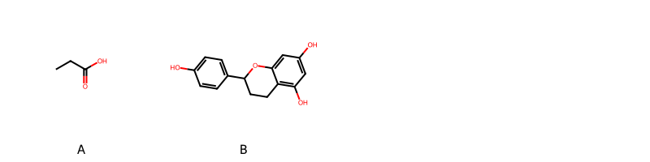

!!! abstract "Tóm tắt"

    **Họ Cycadaceae** có **1** chi được các cộng đồng sử dụng trong chăm sóc sức khỏe gồm *Cycas*. Số lượng thành phần hóa học đã phân lập và xác định cấu trúc từ họ này tính đến tháng 12 năm 2024 là **8** nhóm có thể liệt kê như sau *Organooxygen compounds, Flavonoids, Aryltetralin lignans, Furanoid lignans, Benzofurans, 2-arylbenzofuran flavonoids, Carboxylic acids and derivatives, Prenol lipids*. Giữa các loài trong họ này, 3 dược liệu được nghiên cứu nhiều nhất dựa trên số thành phần được phân lập là **Cycas revoluta, Cycas circinalis, Cycas rumphii*. *Họ Cycadaceae* đã được một số công động tại các quốc gia như China, Elsewhere, Java, Guam đã phát hiện một số tác dụng trên lâm sàng gồm chữa bệnh lẫn độc tính như Chất độc, Chất độc, Ma túy, thuốc tống hơi, Emmenagogue, Thuốc long đờm, Thuốc bổ, Thuốc bổ, Thuốc bổ, Thuốc long đờm, cầm máu, gây nôn.

!!! info "DrDuke"

    James A. Duke sinh năm 1929-2017 là một nhà thực vật học người Mỹ. Đây là một trong những tác giả hàng đầu trong lĩnh vực dược dân tộc học với cuốn *CRC Handbook of Medicinal Herbs* và chính là người xây dựng lên cơ sở dữ liệu về hợp chất tự nhiên và dược dân tộc học tại Bộ nông nghiệp Hoa Kỳ. Các thông tin được đăng tải tại website [Dr. Duke's Phytochemical and Ethnobotanical Databases](https://phytochem.nal.usda.gov/). 
    Trong suốt thập niên 1970, ông lãnh đạo the Plant Taxonomy Laboratory, Plant Genetics and Germplasm Institute of the Agricultural Research Service, U.S. Department of Agriculture.
    Trong tài liệu này, các thông tin về dược dân tộc của các dược liệu được trích dẫn từ tài liệu của James A. Ducke với sự trợ giúp của phần mềm dịch thuật từ tiếng Anh sang tiếng Việt.
   
## Tổng quan về Họ Cycadaceae
### Phân loại thực vật
Trong *họ Cycadaceae* có **1** chi được sử dụng làm thuốc với chi tiết số loài trong mỗi chi như sau Cycas (3) . Chi tiết về loài sử dụng làm thuốc như dưới đây.  

>Họ Cycadaceae


>|-- Chi Cycas

>*Cycas circinalis*,
>*Cycas revoluta*,
>*Cycas rumphii*,

### Thành phần hóa học 

Số lượng thành phần hóa học đã phân lập và xác định cấu trúc từ họ này tính đến tháng 12 năm 2024 là 8 nhóm có thể liệt kê như sau Organooxygen compounds, Flavonoids, Aryltetralin lignans, Furanoid lignans, Benzofurans, 2-arylbenzofuran flavonoids, Carboxylic acids and derivatives, Prenol lipids. Số lượng các loài đã được nghiên cứu thành phần hóa học là *3* trong tổng số *3* loài thuộc họ Cycadaceae.Giữa các loài trong họ này, 3 dược liệu được nghiên cứu nhiều nhất dựa trên số thành phần được phân lập là **Cycas revoluta, Cycas circinalis, Cycas rumphii**. Sử dụng phần mềm RDKIT với thuật toán  Find Maximum Common Substructure (FMCS), các nhóm hoạt chất phổ biến nhất trong *họ Cycadaceae* đã xây dựng được nhân. Điều này trong tương lại có thể được sử dụng tìm kiếm mối liên hệ giữa tác dụng của cấu trúc hóa học và tác dụng dược lý. Các nhân trong phần này có thể không giống như cấu trúc gốc của từng nhóm chất. Kết quả được trình bầy như hình dưới đây.

<figure markdown="span">
    { width=100% }
    <figcaption> Cấu trúc hóa học của một số khung cơ bản dựa trên thuật toán FMCS để tìm Carboxylic acids and derivatives (A), Flavonoids (B).</figcaption>
</figure>


!!! info  "Find Maximum Common Substructure"
    
    Thuật toán FMCS (Find Maximum Common Substructure) là một phương pháp được sử dụng để tìm ra cấu trúc chung nhiều nhất (MCS) trong một tập hợp các cấu trúc hóa học. Các bước của thuật toán gồm:
    - Chọn một cấu trúc hóa học là cấu trúc để tạo truy vấn, còn các cấu trúc khác là mục tiêu.
    - Chia nhỏ cấu trúc để tạo truy vấn thành cấu trúc nhỏ hơn dạng chuỗi SMARTS.
    - Kiểm tra chuỗi SMARTS trong các cấu trúc mục tiêu.
    - Tìm kiếm chuỗi SMARTS xuất hiện nhiều nhất.
    Để biết thêm chi tiết các bạn có thể xem tại [TeachOpenCADD](https://projects.volkamerlab.org/teachopencadd/talktorials/T006_compound_maximum_common_substructures.html)
    ``` python
    pip install rdkit
    def find_core_smiles(smiles_list):
        mols = [Chem.MolFromSmiles(smiles) for smiles in smiles_list]
        mcs = rdFMCS.FindMCS(mols)
        core_smiles = Chem.MolToSmiles(Chem.MolFromSmarts(mcs.smartsString))
        return core_smiles
    ```

### Dược dân tộc học

Họ **Cycadaceae** đã được một số công động tại các quốc gia như *China, Elsewhere, Java, Guam* đã phát hiện một số tác dụng trên lâm sàng gồm chữa bệnh lẫn độc tính như *Chất độc, Chất độc, Ma túy, thuốc tống hơi, Emmenagogue, Thuốc long đờm, Thuốc bổ, Thuốc bổ, Thuốc bổ, Thuốc long đờm, cầm máu, gây nôn*.

## Chi tiết dược dân tộc học


### Chi Cycas

!!! note "Danh sách các loài thuộc chi"
    
*	 - *Cycas circinalis*
	 - *Cycas revoluta*
	 - *Cycas rumphii**

---      
#### *Cycas circinalis*
**Thông tin về thực vật**

!!! info "Phân loại thực vật của *Cycas circinalis* từ GIBF:"
    - **Kingdom:** Plantae
    - **Phylum:** Tracheophyta
    - **Order:** Cycadales
    - **Family:** Cycadaceae
    - **Genus:** Cycas
    - **Species:** *Cycas circinalis*


 

Chưa có thông tin về loài này trên wikidata.

*Phân bố trên thế giới*: nan, Tanzania, United Republic of, Cook Islands, Vanuatu, New Caledonia, Cuba, Jamaica, Tonga, French Polynesia, Sri Lanka, Côte d’Ivoire, Spain, French Guiana, Mexico, Colombia, Papua New Guinea, unknown or invalid, Japan, Cameroon, Australia, Panama, Indonesia, Paraguay, Dominica, Nigeria, Portugal, India, Brazil, Peru, Viet Nam, Zimbabwe, Guam, United States of America, Bolivia (Plurinational State of), Philippines, China, Dominican Republic, Norway, Canada

*Phân bố tại Việt Nam*: Khanh Hoa

**Thành phần hóa học**
        

Theo cơ sở dữ liệu lotus, từ loài *Cycas circinalis* đã phân lập và xác định được 37 hoạt chất thuộc về các nhóm Flavonoids, Carboxylic acids and derivatives, 2-arylbenzofuran flavonoids, Benzofurans. Danh sách các hoạt chất như sau 3-(methylamino)-(dl)-alanine [(LTS0175145)](https://lotus.naturalproducts.net/compound/lotus_id/LTS0175145), d-aspartic acid [(LTS0144001)](https://lotus.naturalproducts.net/compound/lotus_id/LTS0144001), 2''-o-glucosylvitexin [(LTS0248756)](https://lotus.naturalproducts.net/compound/lotus_id/LTS0248756), 6-[4-(5,7-dihydroxy-4-oxo-2,3-dihydro-1-benzopyran-2-yl)phenoxy]-5,7-dihydroxy-2-(4-hydroxyphenyl)chromen-4-one [(LTS0030196)](https://lotus.naturalproducts.net/compound/lotus_id/LTS0030196), 2-[(5-methyl-3-oxohexyl)amino]propanoic acid [(LTS0182452)](https://lotus.naturalproducts.net/compound/lotus_id/LTS0182452), loliolide [(LTS0119422)](https://lotus.naturalproducts.net/compound/lotus_id/LTS0119422), ent-epicatechin [(LTS0265245)](https://lotus.naturalproducts.net/compound/lotus_id/LTS0265245), (2s)-2-[(5-methyl-3-oxohexyl)amino]propanoic acid [(LTS0177904)](https://lotus.naturalproducts.net/compound/lotus_id/LTS0177904), gamma(amino)-butyric acid [(LTS0118818)](https://lotus.naturalproducts.net/compound/lotus_id/LTS0118818), β-methylamino-l-alanine [(LTS0259082)](https://lotus.naturalproducts.net/compound/lotus_id/LTS0259082), l-alanine [(LTS0042208)](https://lotus.naturalproducts.net/compound/lotus_id/LTS0042208), β alanine [(LTS0209241)](https://lotus.naturalproducts.net/compound/lotus_id/LTS0209241), d-alanine [(LTS0272178)](https://lotus.naturalproducts.net/compound/lotus_id/LTS0272178), isoginkgetin [(LTS0061203)](https://lotus.naturalproducts.net/compound/lotus_id/LTS0061203), 8-{5-[(2s)-5,7-dihydroxy-4-oxo-2,3-dihydro-1-benzopyran-2-yl]-2-methoxyphenyl}-5,7-dihydroxy-2-(4-methoxyphenyl)chromen-4-one [(LTS0118418)](https://lotus.naturalproducts.net/compound/lotus_id/LTS0118418), (2s)-8-{5-[(2s)-5,7-dihydroxy-4-oxo-2,3-dihydro-1-benzopyran-2-yl]-2-methoxyphenyl}-5,7-dihydroxy-2-(4-hydroxyphenyl)-2,3-dihydro-1-benzopyran-4-one [(LTS0015740)](https://lotus.naturalproducts.net/compound/lotus_id/LTS0015740), 4-[(2s,3r)-3-(hydroxymethyl)-5-(3-hydroxypropyl)-7-methoxy-2,3-dihydro-1-benzofuran-2-yl]-2-methoxyphenol [(LTS0153479)](https://lotus.naturalproducts.net/compound/lotus_id/LTS0153479), catechol [(LTS0090912)](https://lotus.naturalproducts.net/compound/lotus_id/LTS0090912), 8-[5-(5,7-dihydroxy-4-oxo-2,3-dihydro-1-benzopyran-2-yl)-2-methoxyphenyl]-5,7-dihydroxy-2-(4-methoxyphenyl)chromen-4-one [(LTS0025638)](https://lotus.naturalproducts.net/compound/lotus_id/LTS0025638), l-aspartic acid [(LTS0205466)](https://lotus.naturalproducts.net/compound/lotus_id/LTS0205466), l-serine [(LTS0106692)](https://lotus.naturalproducts.net/compound/lotus_id/LTS0106692), asahina [(LTS0068303)](https://lotus.naturalproducts.net/compound/lotus_id/LTS0068303), l-proline [(LTS0090383)](https://lotus.naturalproducts.net/compound/lotus_id/LTS0090383), pyroglutamic acid [(LTS0142947)](https://lotus.naturalproducts.net/compound/lotus_id/LTS0142947), l-glutamic acid [(LTS0037133)](https://lotus.naturalproducts.net/compound/lotus_id/LTS0037133), 6-{4-[(2s)-5,7-dihydroxy-4-oxo-2,3-dihydro-1-benzopyran-2-yl]phenoxy}-5,7-dihydroxy-2-(4-hydroxyphenyl)chromen-4-one [(LTS0272153)](https://lotus.naturalproducts.net/compound/lotus_id/LTS0272153), 8-[4,5-dihydroxy-6-(hydroxymethyl)-3-{[3,4,5-trihydroxy-6-(hydroxymethyl)oxan-2-yl]oxy}oxan-2-yl]-5,7-dihydroxy-2-(4-hydroxyphenyl)chromen-4-one [(LTS0114327)](https://lotus.naturalproducts.net/compound/lotus_id/LTS0114327), aminoadipic acid [(LTS0221318)](https://lotus.naturalproducts.net/compound/lotus_id/LTS0221318), l glutamine [(LTS0263175)](https://lotus.naturalproducts.net/compound/lotus_id/LTS0263175), 4-[3-(hydroxymethyl)-5-(3-hydroxypropyl)-7-methoxy-2,3-dihydro-1-benzofuran-2-yl]-2-methoxyphenol [(LTS0259518)](https://lotus.naturalproducts.net/compound/lotus_id/LTS0259518), gallocatechol [(LTS0267305)](https://lotus.naturalproducts.net/compound/lotus_id/LTS0267305), 8-{5-[(2s)-5,7-dihydroxy-4-oxo-2,3-dihydro-1-benzopyran-2-yl]-2-methoxyphenyl}-5,7-dihydroxy-2-(4-hydroxyphenyl)chromen-4-one [(LTS0113963)](https://lotus.naturalproducts.net/compound/lotus_id/LTS0113963), loliolide [(LTS0254454)](https://lotus.naturalproducts.net/compound/lotus_id/LTS0254454), epigallocatechin [(LTS0052496)](https://lotus.naturalproducts.net/compound/lotus_id/LTS0052496), naringenin [(LTS0031098)](https://lotus.naturalproducts.net/compound/lotus_id/LTS0031098), amentoflavone [(LTS0063796)](https://lotus.naturalproducts.net/compound/lotus_id/LTS0063796), epigallocatechin [(LTS0175767)](https://lotus.naturalproducts.net/compound/lotus_id/LTS0175767).

| chemicalTaxonomyClassyfireClass   |   lotus_count |
|:----------------------------------|--------------:|
| 2-arylbenzofuran flavonoids       |             2 |
| Benzofurans                       |             2 |
| Carboxylic acids and derivatives  |            16 |
| Flavonoids                        |            17 |


**Dược dân tộc học**

Danh sách các quốc gia có sử dụng *Cycas circinalis* trong điều trị các bệnh. 

| Quốc gia   | Bệnh                             |
|:-----------|:---------------------------------|
| Elsewhere  | Chất độc, Ma túy, thuốc tống hơi |
| Guam       | Chất độc                         |


---      
#### *Cycas revoluta*
**Thông tin về thực vật**

!!! info "Phân loại thực vật của *Cycas revoluta* từ GIBF:"
    - **Kingdom:** Plantae
    - **Phylum:** Tracheophyta
    - **Order:** Cycadales
    - **Family:** Cycadaceae
    - **Genus:** Cycas
    - **Species:** *Cycas revoluta*


 

Chưa có thông tin về loài này trên wikidata.

*Phân bố trên thế giới*: nan, France, Saint Vincent and the Grenadines, Haiti, Cayman Islands, Nepal, Bahamas, Korea, Republic of, Jamaica, Belgium, Sri Lanka, Seychelles, Egypt, Spain, French Guiana, Chinese Taipei, Colombia, Hong Kong, South Africa, Japan, Australia, Portugal, Saint Kitts and Nevis, India, Brazil, Costa Rica, Türkiye, Argentina, Namibia, United States of America, Philippines, Bolivia (Plurinational State of), Bermuda, China, Dominican Republic, Italy, Nicaragua, Malaysia, Greece, Puerto Rico, Cyprus

*Phân bố tại Việt Nam*: Không có ghi nhận ở Việt Nam

**Thành phần hóa học**
        

Theo cơ sở dữ liệu lotus, từ loài *Cycas revoluta* đã phân lập và xác định được 43 hoạt chất thuộc về các nhóm Organooxygen compounds, Flavonoids, Aryltetralin lignans, Furanoid lignans, Carboxylic acids and derivatives, Prenol lipids. Danh sách các hoạt chất như sau abu [(LTS0208699)](https://lotus.naturalproducts.net/compound/lotus_id/LTS0208699), (+)-isolariciresinol [(LTS0164886)](https://lotus.naturalproducts.net/compound/lotus_id/LTS0164886), 6-[4-(5,7-dihydroxy-4-oxo-2,3-dihydro-1-benzopyran-2-yl)phenoxy]-5,7-dihydroxy-2-(4-hydroxyphenyl)chromen-4-one [(LTS0030196)](https://lotus.naturalproducts.net/compound/lotus_id/LTS0030196), 8-{5-[(2s)-5,7-dihydroxy-4-oxo-2,3-dihydro-1-benzopyran-2-yl]-2-hydroxyphenyl}-5,7-dihydroxy-2-(4-hydroxyphenyl)chromen-4-one [(LTS0243265)](https://lotus.naturalproducts.net/compound/lotus_id/LTS0243265), 4-{4-[(4-hydroxy-3-methoxyphenyl)methyl]-3-(hydroxymethyl)oxolan-2-yl}-2-methoxyphenol [(LTS0211349)](https://lotus.naturalproducts.net/compound/lotus_id/LTS0211349), (2s)-5-carbamimidamido-2-(hydroxyamino)pentanoic acid [(LTS0106777)](https://lotus.naturalproducts.net/compound/lotus_id/LTS0106777), 8-[5-(5,7-dihydroxy-4-oxo-2,3-dihydro-1-benzopyran-2-yl)-2-hydroxyphenyl]-5,7-dihydroxy-2-(4-hydroxyphenyl)chromen-4-one [(LTS0189695)](https://lotus.naturalproducts.net/compound/lotus_id/LTS0189695), (3s)-3-aminobutanoic acid [(LTS0054078)](https://lotus.naturalproducts.net/compound/lotus_id/LTS0054078), gamma(amino)-butyric acid [(LTS0118818)](https://lotus.naturalproducts.net/compound/lotus_id/LTS0118818), 8-[5-(5,7-dihydroxy-4-oxochromen-2-yl)-2-hydroxyphenyl]-5,7-dihydroxy-2-(4-methoxyphenyl)chromen-4-one [(LTS0254320)](https://lotus.naturalproducts.net/compound/lotus_id/LTS0254320), 6-{4-[(2s)-5,7-dihydroxy-4-oxo-2,3-dihydro-1-benzopyran-2-yl]phenoxy}-5-hydroxy-2-(4-hydroxyphenyl)-7-methoxychromen-4-one [(LTS0172179)](https://lotus.naturalproducts.net/compound/lotus_id/LTS0172179), β alanine [(LTS0209241)](https://lotus.naturalproducts.net/compound/lotus_id/LTS0209241), β-methylamino-l-alanine [(LTS0259082)](https://lotus.naturalproducts.net/compound/lotus_id/LTS0259082), 8-(4-hydroxy-3-methoxyphenyl)-6,7-bis(hydroxymethyl)-3-methoxy-5,6,7,8-tetrahydronaphthalen-2-ol [(LTS0008421)](https://lotus.naturalproducts.net/compound/lotus_id/LTS0008421), (1z)-1-methyl-2-({[3,4,5-trihydroxy-6-(hydroxymethyl)oxan-2-yl]oxy}methyl)diazen-1-ium-1-olate [(LTS0048001)](https://lotus.naturalproducts.net/compound/lotus_id/LTS0048001), 6-[4-(5,7-dihydroxy-4-oxo-2,3-dihydro-1-benzopyran-2-yl)phenoxy]-5,7-dihydroxy-2-(4-hydroxyphenyl)-2,3-dihydro-1-benzopyran-4-one [(LTS0241217)](https://lotus.naturalproducts.net/compound/lotus_id/LTS0241217), aminoadipate [(LTS0127381)](https://lotus.naturalproducts.net/compound/lotus_id/LTS0127381), (2s)-1-{2-amino-2-[carboxymethylthio(carbonoimidyl)]ethyl}-5-oxopiperidine-2-carboxylic acid [(LTS0225214)](https://lotus.naturalproducts.net/compound/lotus_id/LTS0225214), 1-{2-amino-2-[carboxymethylthio(carbonoimidyl)]ethyl}-5-oxopiperidine-2-carboxylic acid [(LTS0046694)](https://lotus.naturalproducts.net/compound/lotus_id/LTS0046694), 1-methyl-1-oxo-2-({[(2s,3r,4s,5s,6r)-3,4,5-trihydroxy-6-({[(2r,3r,4s,5s,6r)-3,4,5-trihydroxy-6-(hydroxymethyl)oxan-2-yl]oxy}methyl)oxan-2-yl]oxy}methyl)hydrazinium [(LTS0069983)](https://lotus.naturalproducts.net/compound/lotus_id/LTS0069983), (-)-2-aminobutyric acid [(LTS0072825)](https://lotus.naturalproducts.net/compound/lotus_id/LTS0072825), macrozamin [(LTS0163519)](https://lotus.naturalproducts.net/compound/lotus_id/LTS0163519), macrozemin [(LTS0012537)](https://lotus.naturalproducts.net/compound/lotus_id/LTS0012537), (2s)-6-{4-[(2s)-5,7-dihydroxy-4-oxo-2,3-dihydro-1-benzopyran-2-yl]phenoxy}-5,7-dihydroxy-2-(4-hydroxyphenyl)-2,3-dihydro-1-benzopyran-4-one [(LTS0140155)](https://lotus.naturalproducts.net/compound/lotus_id/LTS0140155), asahina [(LTS0068303)](https://lotus.naturalproducts.net/compound/lotus_id/LTS0068303), 2-amino-3-(1-amino-3h-inden-2-yl)propanoic acid [(LTS0209098)](https://lotus.naturalproducts.net/compound/lotus_id/LTS0209098), (2s,3r,4s,5s,6r)-2-{[(2r,3r,4s,5r,6r)-3,5-dihydroxy-2-(hydroxymethyl)-6-{[(methyl-oxo-λ⁵-azanylidene)amino]methoxy}oxan-4-yl]oxy}-6-(hydroxymethyl)oxane-3,4,5-triol [(LTS0114750)](https://lotus.naturalproducts.net/compound/lotus_id/LTS0114750), lariciresinol [(LTS0010950)](https://lotus.naturalproducts.net/compound/lotus_id/LTS0010950), 3-aminobutyric acid [(LTS0127818)](https://lotus.naturalproducts.net/compound/lotus_id/LTS0127818), (2s)-2-amino-3-(1-amino-3h-inden-2-yl)propanoic acid [(LTS0009716)](https://lotus.naturalproducts.net/compound/lotus_id/LTS0009716), 2-({[(2s,3r,4s,5r,6r)-3,5-dihydroxy-6-(hydroxymethyl)-4-{[(2s,3r,4s,5s,6r)-3,4,5-trihydroxy-6-(hydroxymethyl)oxan-2-yl]oxy}oxan-2-yl]oxy}methyl)-1-methyl-1-oxohydrazinium [(LTS0264388)](https://lotus.naturalproducts.net/compound/lotus_id/LTS0264388), 6-{4-[(2s)-5,7-dihydroxy-4-oxo-2,3-dihydro-1-benzopyran-2-yl]phenoxy}-5,7-dihydroxy-2-(4-hydroxyphenyl)chromen-4-one [(LTS0272153)](https://lotus.naturalproducts.net/compound/lotus_id/LTS0272153), citrulline [(LTS0031418)](https://lotus.naturalproducts.net/compound/lotus_id/LTS0031418), 4-hydroxy-4-(3-hydroxybut-1-en-1-yl)-3,5,5-trimethylcyclohex-2-en-1-one [(LTS0183737)](https://lotus.naturalproducts.net/compound/lotus_id/LTS0183737), aminoadipic acid [(LTS0221318)](https://lotus.naturalproducts.net/compound/lotus_id/LTS0221318), blumenol a [(LTS0019694)](https://lotus.naturalproducts.net/compound/lotus_id/LTS0019694), (2s,3r,4s,5s,6r)-2-{[(2s,3r,4s,5r,6r)-2-{[(2r,3r,4s,5r,6r)-3,5-dihydroxy-2-(hydroxymethyl)-6-{[(methyl-oxo-λ⁵-azanylidene)amino]methoxy}oxan-4-yl]oxy}-3,5-dihydroxy-6-(hydroxymethyl)oxan-4-yl]oxy}-6-(hydroxymethyl)oxane-3,4,5-triol [(LTS0167306)](https://lotus.naturalproducts.net/compound/lotus_id/LTS0167306), (2s)-1-[(2s)-2-amino-2-[carboxymethylthio(carbonoimidyl)]ethyl]-5-oxopiperidine-2-carboxylic acid [(LTS0196928)](https://lotus.naturalproducts.net/compound/lotus_id/LTS0196928), (2s)-1-[(2r)-2-amino-2-[carboxymethylthio(carbonoimidyl)]ethyl]-5-oxopiperidine-2-carboxylic acid [(LTS0219811)](https://lotus.naturalproducts.net/compound/lotus_id/LTS0219811), naringenin [(LTS0031098)](https://lotus.naturalproducts.net/compound/lotus_id/LTS0031098), amentoflavone [(LTS0063796)](https://lotus.naturalproducts.net/compound/lotus_id/LTS0063796), l(+)-citrulline [(LTS0065454)](https://lotus.naturalproducts.net/compound/lotus_id/LTS0065454), hinokiflavone [(LTS0187644)](https://lotus.naturalproducts.net/compound/lotus_id/LTS0187644).

| chemicalTaxonomyClassyfireClass   |   lotus_count |
|:----------------------------------|--------------:|
| Aryltetralin lignans              |             2 |
| Carboxylic acids and derivatives  |            18 |
| Flavonoids                        |            12 |
| Furanoid lignans                  |             2 |
| Organooxygen compounds            |             7 |
| Prenol lipids                     |             2 |


**Dược dân tộc học**

Danh sách các quốc gia có sử dụng *Cycas revoluta* trong điều trị các bệnh. 

| Quốc gia   | Bệnh                                            |
|:-----------|:------------------------------------------------|
| China      | Thuốc bổ, Thuốc long đờm                        |
| Elsewhere  | Emmenagogue, Thuốc long đờm, Thuốc bổ, Thuốc bổ |
| Java       | cầm máu                                         |


---      
#### *Cycas rumphii*
**Thông tin về thực vật**

!!! info "Phân loại thực vật của *Cycas rumphii* từ GIBF:"
    - **Kingdom:** Plantae
    - **Phylum:** Tracheophyta
    - **Order:** Cycadales
    - **Family:** Cycadaceae
    - **Genus:** Cycas
    - **Species:** *Cycas rumphii*


 

Chưa có thông tin về loài này trên wikidata.

*Phân bố trên thế giới*: Germany, nan, Micronesia (Federated States of), New Caledonia, Solomon Islands, Tonga, Singapore, Seychelles, Venezuela (Bolivarian Republic of), Mexico, Colombia, Papua New Guinea, Timor-Leste, unknown or invalid, Australia, Panama, Indonesia, India, Palau, Northern Mariana Islands, Viet Nam, Guam, Thailand, United States of America, Philippines, China, Christmas Island, Fiji, Malaysia, New Zealand

*Phân bố tại Việt Nam*: Dong Nai

**Thành phần hóa học**
        

Theo cơ sở dữ liệu lotus, từ loài *Cycas rumphii* đã phân lập và xác định được 10 hoạt chất thuộc về các nhóm Carboxylic acids and derivatives. Danh sách các hoạt chất như sau aminoadipic acid [(LTS0221318)](https://lotus.naturalproducts.net/compound/lotus_id/LTS0221318), l glutamine [(LTS0263175)](https://lotus.naturalproducts.net/compound/lotus_id/LTS0263175), 3-(methylamino)-(dl)-alanine [(LTS0175145)](https://lotus.naturalproducts.net/compound/lotus_id/LTS0175145), l-proline [(LTS0090383)](https://lotus.naturalproducts.net/compound/lotus_id/LTS0090383), l-alanine [(LTS0042208)](https://lotus.naturalproducts.net/compound/lotus_id/LTS0042208), l-glutamic acid [(LTS0037133)](https://lotus.naturalproducts.net/compound/lotus_id/LTS0037133), gamma(amino)-butyric acid [(LTS0118818)](https://lotus.naturalproducts.net/compound/lotus_id/LTS0118818), l-aspartic acid [(LTS0205466)](https://lotus.naturalproducts.net/compound/lotus_id/LTS0205466), β alanine [(LTS0209241)](https://lotus.naturalproducts.net/compound/lotus_id/LTS0209241), l-serine [(LTS0106692)](https://lotus.naturalproducts.net/compound/lotus_id/LTS0106692).

| chemicalTaxonomyClassyfireClass   |   lotus_count |
|:----------------------------------|--------------:|
| Carboxylic acids and derivatives  |            10 |


**Dược dân tộc học**

Danh sách các quốc gia có sử dụng *Cycas rumphii* trong điều trị các bệnh. 

| Quốc gia   | Bệnh    |
|:-----------|:--------|
| Java       | gây nôn |


## Bình luận

<div id="giscus-container"></div>
<script src="https://giscus.app/client.js"
        data-repo="hoangson0787/CSDL-duoc-lieu"
        data-repo-id="R_kgDONbMRNA"
        data-category="Duoc lieu"
        data-category-id="DIC_kwDONbMRNM4ClklR"
        data-mapping="pathname"
        data-strict="0"
        data-reactions-enabled="1"
        data-emit-metadata="1"
        data-input-position="bottom"
        data-theme="light"
        data-lang="en"
        crossorigin="anonymous"
        async>
</script>

