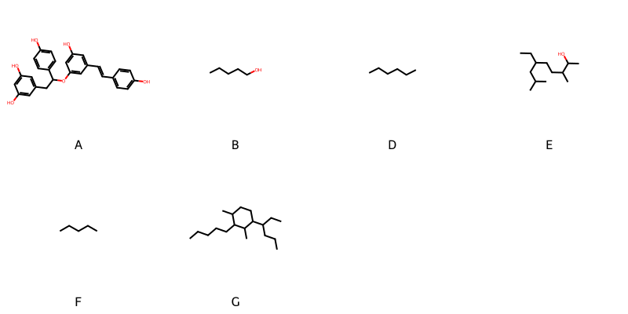

!!! abstract "Tóm tắt"

    **Họ Cyperaceae** có **11** chi được các cộng đồng sử dụng trong chăm sóc sức khỏe gồm *Mapania, Eleocharis, Cyperus, Remirea, Carex, Kyllinga, Scirpus, Mariscus, Juncellus, Fimbristylis, Scleria*. Số lượng thành phần hóa học đã phân lập và xác định cấu trúc từ họ này tính đến tháng 12 năm 2024 là **24** nhóm có thể liệt kê như sau *Diarylheptanoids, Epoxides, Stilbenolignans, Fatty Acyls, Indanes, Tetralins, Unsaturated hydrocarbons, Steroids and steroid derivatives, Flavonoids, Pyridines and derivatives, Heteroaromatic compounds, Benzopyrans, Tetrahydrofurans, 2-arylbenzofuran flavonoids, Benzene and substituted derivatives, Stilbenes, Coumarins and derivatives, Prenol lipids, Oxanes, Polycyclic hydrocarbons, Organooxygen compounds, Cinnamic acids and derivatives, Aurone flavonoids, Oxepanes*. Giữa các loài trong họ này, 3 dược liệu được nghiên cứu nhiều nhất dựa trên số thành phần được phân lập là **Cyperus rotundus, Cyperus longus, Cyperus articulatus*. *Họ Cyperaceae* đã được một số công động tại các quốc gia như Elsewhere, Turkey, Egypt, Dominican Republic, Japan*, Sudan, Java, Mexico, US, Argentina, Guyana, India(Hindu), Africa, China, UK, Venezuela, Iran, Brazil, Malaya, India, Sumatra, Sanscrit, Nigeria đã phát hiện một số tác dụng trên lâm sàng gồm chữa bệnh lẫn độc tính như Chất kích thích, Thuốc bổ, Chất kích thích, dạ dày, Chất làm lạnh, Chất làm se, Chất làm se, Chất kích thích, Chất kích thích, dạ dày, dạ dày, Thuốc bổ, Chất làm se, Thuốc bổ, Chất làm se, Thuốc an thần, Chất kích thích, Thuốc bổ, dạ dày, Chất làm se, Thuốc lợi tiểu, Chất độc, Chất làm se, Thuốc lợi tiểu, Thuốc nhuận tràng, Chất làm lạnh, Thuốc bổ, Chất làm se, Thuốc tẩy giun, Chất làm se, thuốc tống hơi, Làm dịu, Thuốc lợi tiểu, Emmenagogue, dạ dày, Thuốc tẩy giun, Nước hoa, Chất kích thích, Thuốc bổ, Chất làm se, Đổ mồ hôi, Thuốc lợi tiểu, Thuốc an thần, Thuốc giãn mạch, Thuốc giảm đau, Chất tạo ngọt, Chất độc, Emmenagogue, Emmenagogue, dễ bị tổn thương, Thuốc bổ, dạ dày, Kháng sinh, diệt khuẩn, Nước hoa, Thuốc an thần, Thuốc bổ, Thuốc giải độc, Chất làm lạnh, Thuốc giải độc, Làm dịu, có mùi hôi, Thuốc bổ, Thuốc lợi tiểu, Chất làm lạnh, Thuốc kích thích tình dục, Chất làm mềm, Thuốc kích thích tiết sữa, Chất làm lạnh, Thuốc lợi tiểu, Thuốc lợi tiểu, Emmenagogue, dạ dày, Thuốc tẩy giun, Đổ mồ hôi, Chất làm se, Chất làm mềm, Thuốc lợi tiểu, Thuốc long đờm, Thuốc nhuận tràng, có mùi hôi, Thuốc lợi tiểu, Thuốc nhuận tràng, Chất làm lạnh, Thuốc bổ, Chất làm se, Thuốc lợi tiểu, thuốc tống hơi, Tiêu hóa, Thuốc nhuận tràng, Thuốc trợ tim, dạ dày, Thuốc trừ sâu, Thuốc tẩy giun, Thuốc tẩy giun, Thuốc tẩy giun, Thuốc đắp, có mùi hôi, diệt khuẩn, Thuốc kích thích tình dục, Emmenagogue, dạ dày, dạ dày, Thuốc bổ, dạ dày, Thuốc bổ, Làm dịu, Thuốc tẩy giun, Chất làm lạnh, Thuốc lợi tiểu, thuốc tống hơi, Tiêu hóa, Thuốc lợi tiểu, thuốc xông khói, Đổ mồ hôi, Chất làm se, Đổ mồ hôi, Thuốc lợi tiểu, Đổ mồ hôi, Thuốc lợi tiểu, Emmenagogue.

!!! info "DrDuke"

    James A. Duke sinh năm 1929-2017 là một nhà thực vật học người Mỹ. Đây là một trong những tác giả hàng đầu trong lĩnh vực dược dân tộc học với cuốn *CRC Handbook of Medicinal Herbs* và chính là người xây dựng lên cơ sở dữ liệu về hợp chất tự nhiên và dược dân tộc học tại Bộ nông nghiệp Hoa Kỳ. Các thông tin được đăng tải tại website [Dr. Duke's Phytochemical and Ethnobotanical Databases](https://phytochem.nal.usda.gov/). 
    Trong suốt thập niên 1970, ông lãnh đạo the Plant Taxonomy Laboratory, Plant Genetics and Germplasm Institute of the Agricultural Research Service, U.S. Department of Agriculture.
    Trong tài liệu này, các thông tin về dược dân tộc của các dược liệu được trích dẫn từ tài liệu của James A. Ducke với sự trợ giúp của phần mềm dịch thuật từ tiếng Anh sang tiếng Việt.
   
## Tổng quan về Họ Cyperaceae
### Phân loại thực vật
Trong *họ Cyperaceae* có **11** chi được sử dụng làm thuốc với chi tiết số loài trong mỗi chi như sau Scleria (1) . Chi tiết về loài sử dụng làm thuốc như dưới đây.  

>Họ Cyperaceae


>|-- Chi Mapania

>*Mapania cuidata*,

>|-- Chi Eleocharis

>*Eleocharis dulcis*,
>*Eleocharis geniculata*,
>*Eleocharis interstincta*,
>*Eleocharis plantaginea*,

>|-- Chi Cyperus

>*Cyperus articulatus*,
>*Cyperus esculentus*,
>*Cyperus iria*,
>*Cyperus kyllinga*,
>*Cyperus longus*,
>*Cyperus obtusatus*,
>*Cyperus rotundus*,
>*Cyperus rotundus*,
>*Cyperus sesquiflorus*,
>*Cyperus stolonifera*,
>*Cyperus stoloniferus*,

>|-- Chi Remirea

>*Remirea maritima*,

>|-- Chi Carex

>*Carex arenaria*,
>*Carex cernua*,
>*Carex hirta*,

>|-- Chi Kyllinga

>*Kyllinga monocephala*,
>*Kyllinga squamulata*,

>|-- Chi Scirpus

>*Scirpus americanus*,
>*Scirpus articulatus*,
>*Scirpus grossus*,
>*Scirpus lacustris*,
>*Scirpus maritimus*,
>*Scirpus palustris*,
>*Scirpus tuberosus*,

>|-- Chi Mariscus

>*Mariscus sieberianus*,

>|-- Chi Juncellus

>*Juncellus inundatus*,

>|-- Chi Fimbristylis

>*Fimbristylis aestivalis*,

>|-- Chi Scleria

>*Scleria pergracilis*,

### Thành phần hóa học 

Số lượng thành phần hóa học đã phân lập và xác định cấu trúc từ họ này tính đến tháng 12 năm 2024 là 24 nhóm có thể liệt kê như sau Diarylheptanoids, Epoxides, Stilbenolignans, Fatty Acyls, Indanes, Tetralins, Unsaturated hydrocarbons, Steroids and steroid derivatives, Flavonoids, Pyridines and derivatives, Heteroaromatic compounds, Benzopyrans, Tetrahydrofurans, 2-arylbenzofuran flavonoids, Benzene and substituted derivatives, Stilbenes, Coumarins and derivatives, Prenol lipids, Oxanes, Polycyclic hydrocarbons, Organooxygen compounds, Cinnamic acids and derivatives, Aurone flavonoids, Oxepanes. Số lượng các loài đã được nghiên cứu thành phần hóa học là *11* trong tổng số *32* loài thuộc họ Cyperaceae.Giữa các loài trong họ này, 3 dược liệu được nghiên cứu nhiều nhất dựa trên số thành phần được phân lập là **Cyperus rotundus, Cyperus longus, Cyperus articulatus**. Sử dụng phần mềm RDKIT với thuật toán  Find Maximum Common Substructure (FMCS), các nhóm hoạt chất phổ biến nhất trong *họ Cyperaceae* đã xây dựng được nhân. Điều này trong tương lại có thể được sử dụng tìm kiếm mối liên hệ giữa tác dụng của cấu trúc hóa học và tác dụng dược lý. Các nhân trong phần này có thể không giống như cấu trúc gốc của từng nhóm chất. Kết quả được trình bầy như hình dưới đây.

<figure markdown="span">
    { width=100% }
    <figcaption> Cấu trúc hóa học của một số khung cơ bản dựa trên thuật toán FMCS để tìm 2-arylbenzofuran flavonoids (A), Fatty Acyls (B), Flavonoids (C), Organooxygen compounds (D), Oxepanes (E), Prenol lipids (F), Steroids and steroid derivatives (G).</figcaption>
</figure>


!!! info  "Find Maximum Common Substructure"
    
    Thuật toán FMCS (Find Maximum Common Substructure) là một phương pháp được sử dụng để tìm ra cấu trúc chung nhiều nhất (MCS) trong một tập hợp các cấu trúc hóa học. Các bước của thuật toán gồm:
    - Chọn một cấu trúc hóa học là cấu trúc để tạo truy vấn, còn các cấu trúc khác là mục tiêu.
    - Chia nhỏ cấu trúc để tạo truy vấn thành cấu trúc nhỏ hơn dạng chuỗi SMARTS.
    - Kiểm tra chuỗi SMARTS trong các cấu trúc mục tiêu.
    - Tìm kiếm chuỗi SMARTS xuất hiện nhiều nhất.
    Để biết thêm chi tiết các bạn có thể xem tại [TeachOpenCADD](https://projects.volkamerlab.org/teachopencadd/talktorials/T006_compound_maximum_common_substructures.html)
    ``` python
    pip install rdkit
    def find_core_smiles(smiles_list):
        mols = [Chem.MolFromSmiles(smiles) for smiles in smiles_list]
        mcs = rdFMCS.FindMCS(mols)
        core_smiles = Chem.MolToSmiles(Chem.MolFromSmarts(mcs.smartsString))
        return core_smiles
    ```

### Dược dân tộc học

Họ **Cyperaceae** đã được một số công động tại các quốc gia như *Elsewhere, Turkey, Egypt, Dominican Republic, Japan*, Sudan, Java, Mexico, US, Argentina, Guyana, India(Hindu), Africa, China, UK, Venezuela, Iran, Brazil, Malaya, India, Sumatra, Sanscrit, Nigeria* đã phát hiện một số tác dụng trên lâm sàng gồm chữa bệnh lẫn độc tính như *Chất kích thích, Thuốc bổ, Chất kích thích, dạ dày, Chất làm lạnh, Chất làm se, Chất làm se, Chất kích thích, Chất kích thích, dạ dày, dạ dày, Thuốc bổ, Chất làm se, Thuốc bổ, Chất làm se, Thuốc an thần, Chất kích thích, Thuốc bổ, dạ dày, Chất làm se, Thuốc lợi tiểu, Chất độc, Chất làm se, Thuốc lợi tiểu, Thuốc nhuận tràng, Chất làm lạnh, Thuốc bổ, Chất làm se, Thuốc tẩy giun, Chất làm se, thuốc tống hơi, Làm dịu, Thuốc lợi tiểu, Emmenagogue, dạ dày, Thuốc tẩy giun, Nước hoa, Chất kích thích, Thuốc bổ, Chất làm se, Đổ mồ hôi, Thuốc lợi tiểu, Thuốc an thần, Thuốc giãn mạch, Thuốc giảm đau, Chất tạo ngọt, Chất độc, Emmenagogue, Emmenagogue, dễ bị tổn thương, Thuốc bổ, dạ dày, Kháng sinh, diệt khuẩn, Nước hoa, Thuốc an thần, Thuốc bổ, Thuốc giải độc, Chất làm lạnh, Thuốc giải độc, Làm dịu, có mùi hôi, Thuốc bổ, Thuốc lợi tiểu, Chất làm lạnh, Thuốc kích thích tình dục, Chất làm mềm, Thuốc kích thích tiết sữa, Chất làm lạnh, Thuốc lợi tiểu, Thuốc lợi tiểu, Emmenagogue, dạ dày, Thuốc tẩy giun, Đổ mồ hôi, Chất làm se, Chất làm mềm, Thuốc lợi tiểu, Thuốc long đờm, Thuốc nhuận tràng, có mùi hôi, Thuốc lợi tiểu, Thuốc nhuận tràng, Chất làm lạnh, Thuốc bổ, Chất làm se, Thuốc lợi tiểu, thuốc tống hơi, Tiêu hóa, Thuốc nhuận tràng, Thuốc trợ tim, dạ dày, Thuốc trừ sâu, Thuốc tẩy giun, Thuốc tẩy giun, Thuốc tẩy giun, Thuốc đắp, có mùi hôi, diệt khuẩn, Thuốc kích thích tình dục, Emmenagogue, dạ dày, dạ dày, Thuốc bổ, dạ dày, Thuốc bổ, Làm dịu, Thuốc tẩy giun, Chất làm lạnh, Thuốc lợi tiểu, thuốc tống hơi, Tiêu hóa, Thuốc lợi tiểu, thuốc xông khói, Đổ mồ hôi, Chất làm se, Đổ mồ hôi, Thuốc lợi tiểu, Đổ mồ hôi, Thuốc lợi tiểu, Emmenagogue*.

## Chi tiết dược dân tộc học


### Chi Mapania

!!! note "Danh sách các loài thuộc chi"
    
*	 - *Mapania cuidata**

---      
#### *Cyperus longus*
**Thông tin về thực vật**

!!! info "Phân loại thực vật của *Cyperus longus* từ GIBF:"
    - **Kingdom:** Plantae
    - **Phylum:** Tracheophyta
    - **Order:** Poales
    - **Family:** Cyperaceae
    - **Genus:** Cyperus
    - **Species:** *Cyperus longus*


 

Chưa có thông tin về loài này trên wikidata.

*Phân bố trên thế giới*: France, Germany, Israel, nan, Czechia, Netherlands, Hungary, Spain, South Africa, Eswatini, Palestine, State of, Russian Federation, Portugal, United Kingdom of Great Britain and Northern Ireland, Iraq, Guernsey, Croatia, Italy, Botswana, Denmark, Austria, Belgium

*Phân bố tại Việt Nam*: Không có ghi nhận ở Việt Nam

**Thành phần hóa học**
        

Chưa có nghiên cứu về thành phần hóa học của loài này


**Dược dân tộc học**

Danh sách các quốc gia có sử dụng *Cyperus longus* trong điều trị các bệnh. 

| Quốc gia   | Bệnh     |
|:-----------|:---------|
| Sumatra    | Thuốc bổ |


### Chi Eleocharis

!!! note "Danh sách các loài thuộc chi"
    
*	 - *Eleocharis dulcis*
	 - *Eleocharis geniculata*
	 - *Eleocharis interstincta*
	 - *Eleocharis plantaginea**

---      
#### *Eleocharis dulcis*
**Thông tin về thực vật**

!!! info "Phân loại thực vật của *Eleocharis dulcis* từ GIBF:"
    - **Kingdom:** Plantae
    - **Phylum:** Tracheophyta
    - **Order:** Poales
    - **Family:** Cyperaceae
    - **Genus:** Eleocharis
    - **Species:** *Eleocharis dulcis*


 

Chưa có thông tin về loài này trên wikidata.

*Phân bố trên thế giới*: France, nan, New Caledonia, Korea, Republic of, Solomon Islands, Tonga, Seychelles, Gabon, Chinese Taipei, Timor-Leste, Réunion, South Africa, Japan, Australia, Madagascar, Guinea, Togo, Thailand, United States of America, China, Botswana, Malaysia, Sierra Leone

*Phân bố tại Việt Nam*: Không có ghi nhận ở Việt Nam

**Thành phần hóa học**
        

Theo cơ sở dữ liệu lotus, từ loài *Eleocharis dulcis* đã phân lập và xác định được 10 hoạt chất thuộc về các nhóm Steroids and steroid derivatives, Flavonoids, Fatty Acyls, Aurone flavonoids, Prenol lipids. Danh sách các hoạt chất như sau tricin [(LTS0271018)](https://lotus.naturalproducts.net/compound/lotus_id/LTS0271018), stigmast-5-en-3-ol [(LTS0071224)](https://lotus.naturalproducts.net/compound/lotus_id/LTS0071224), phytosterol [(LTS0029311)](https://lotus.naturalproducts.net/compound/lotus_id/LTS0029311), stigmast-5-en-3-ol, (3β)- [(LTS0204616)](https://lotus.naturalproducts.net/compound/lotus_id/LTS0204616), cyanidin [(LTS0077168)](https://lotus.naturalproducts.net/compound/lotus_id/LTS0077168), betulin [(LTS0101863)](https://lotus.naturalproducts.net/compound/lotus_id/LTS0101863), 5,7-dihydroxy-2-(4-hydroxyphenyl)-1λ⁴-chromen-1-ylium-3-olate [(LTS0218726)](https://lotus.naturalproducts.net/compound/lotus_id/LTS0218726), pelargonidin [(LTS0269823)](https://lotus.naturalproducts.net/compound/lotus_id/LTS0269823), aureusidin [(LTS0260686)](https://lotus.naturalproducts.net/compound/lotus_id/LTS0260686), hexacosanoic acid [(LTS0240902)](https://lotus.naturalproducts.net/compound/lotus_id/LTS0240902).

| chemicalTaxonomyClassyfireClass   |   lotus_count |
|:----------------------------------|--------------:|
| Aurone flavonoids                 |             1 |
| Fatty Acyls                       |             1 |
| Flavonoids                        |             4 |
| Prenol lipids                     |             1 |
| Steroids and steroid derivatives  |             3 |


**Dược dân tộc học**

Danh sách các quốc gia có sử dụng *Eleocharis dulcis* trong điều trị các bệnh. 

| Quốc gia   | Bệnh                   |
|:-----------|:-----------------------|
| India      | Kháng sinh, diệt khuẩn |


---      
#### *Eleocharis geniculata*
**Thông tin về thực vật**

!!! info "Phân loại thực vật của *Eleocharis geniculata* từ GIBF:"
    - **Kingdom:** Plantae
    - **Phylum:** Tracheophyta
    - **Order:** Poales
    - **Family:** Cyperaceae
    - **Genus:** Eleocharis
    - **Species:** *Eleocharis geniculata*


 

Chưa có thông tin về loài này trên wikidata.

*Phân bố trên thế giới*: United States of America, French Guiana, Mexico, Chinese Taipei, Colombia, Dominican Republic, Liberia, El Salvador, British Indian Ocean Territory, Malaysia, Australia, Brazil, Panama, Puerto Rico, Peru

*Phân bố tại Việt Nam*: Không có ghi nhận ở Việt Nam

**Thành phần hóa học**
        

Theo cơ sở dữ liệu lotus, từ loài *Eleocharis geniculata* đã phân lập và xác định được 4 hoạt chất thuộc về các nhóm Flavonoids. Danh sách các hoạt chất như sau tricin [(LTS0271018)](https://lotus.naturalproducts.net/compound/lotus_id/LTS0271018), luteolin 5-methyl ether [(LTS0002226)](https://lotus.naturalproducts.net/compound/lotus_id/LTS0002226), luteolin [(LTS0017052)](https://lotus.naturalproducts.net/compound/lotus_id/LTS0017052), cyanidin [(LTS0077168)](https://lotus.naturalproducts.net/compound/lotus_id/LTS0077168).

| chemicalTaxonomyClassyfireClass   |   lotus_count |
|:----------------------------------|--------------:|
| Flavonoids                        |             4 |


**Dược dân tộc học**

Danh sách các quốc gia có sử dụng *Eleocharis geniculata* trong điều trị các bệnh. 

| Quốc gia   | Bệnh             |
|:-----------|:-----------------|
| Venezuela  | dạ dày, Thuốc bổ |


---      
#### *Eleocharis geniculata*
**Thông tin về thực vật**

!!! info "Phân loại thực vật của *Eleocharis geniculata* từ GIBF:"
    - **Kingdom:** Plantae
    - **Phylum:** Tracheophyta
    - **Order:** Poales
    - **Family:** Cyperaceae
    - **Genus:** Eleocharis
    - **Species:** *Eleocharis geniculata*


 

Chưa có thông tin về loài này trên wikidata.

*Phân bố trên thế giới*: United States of America, French Guiana, Mexico, Chinese Taipei, Colombia, Dominican Republic, Liberia, El Salvador, British Indian Ocean Territory, Malaysia, Australia, Brazil, Panama, Puerto Rico, Peru

*Phân bố tại Việt Nam*: Không có ghi nhận ở Việt Nam

**Thành phần hóa học**
        

Chưa có nghiên cứu về thành phần hóa học của loài này


**Dược dân tộc học**

Danh sách các quốc gia có sử dụng *Eleocharis geniculata* trong điều trị các bệnh. 

| Quốc gia           | Bệnh           |
|:-------------------|:---------------|
| Dominican Republic | Thuốc lợi tiểu |


---      
#### *Eleocharis geniculata*
**Thông tin về thực vật**

!!! info "Phân loại thực vật của *Eleocharis geniculata* từ GIBF:"
    - **Kingdom:** Plantae
    - **Phylum:** Tracheophyta
    - **Order:** Poales
    - **Family:** Cyperaceae
    - **Genus:** Eleocharis
    - **Species:** *Eleocharis geniculata*


 

Chưa có thông tin về loài này trên wikidata.

*Phân bố trên thế giới*: United States of America, French Guiana, Mexico, Chinese Taipei, Colombia, Dominican Republic, Liberia, El Salvador, British Indian Ocean Territory, Malaysia, Australia, Brazil, Panama, Puerto Rico, Peru

*Phân bố tại Việt Nam*: Không có ghi nhận ở Việt Nam

**Thành phần hóa học**
        

Chưa có nghiên cứu về thành phần hóa học của loài này


**Dược dân tộc học**

Danh sách các quốc gia có sử dụng *Eleocharis geniculata* trong điều trị các bệnh. 

| Quốc gia   | Bệnh          |
|:-----------|:--------------|
| China      | Chất làm lạnh |


### Chi Cyperus

!!! note "Danh sách các loài thuộc chi"
    
*	 - *Cyperus articulatus*
	 - *Cyperus esculentus*
	 - *Cyperus iria*
	 - *Cyperus kyllinga*
	 - *Cyperus longus*
	 - *Cyperus obtusatus*
	 - *Cyperus rotundus*
	 - *Cyperus rotundus?*
	 - *Cyperus sesquiflorus*
	 - *Cyperus stolonifera*
	 - *Cyperus stoloniferus**

---      
#### *Cyperus articulatus*
**Thông tin về thực vật**

!!! info "Phân loại thực vật của *Cyperus articulatus* từ GIBF:"
    - **Kingdom:** Plantae
    - **Phylum:** Tracheophyta
    - **Order:** Poales
    - **Family:** Cyperaceae
    - **Genus:** Cyperus
    - **Species:** *Cyperus articulatus*


 

Chưa có thông tin về loài này trên wikidata.

*Phân bố trên thế giới*: nan, Benin, Israel, Curaçao, Kenya, Mayotte, Seychelles, Ghana, Egypt, Guadeloupe, French Guiana, Mexico, Gabon, Colombia, Réunion, South Africa, Angola, Eswatini, Madagascar, Nigeria, Mozambique, India, Brazil, Costa Rica, Peru, Argentina, Zimbabwe, United States of America, Nicaragua, Botswana

*Phân bố tại Việt Nam*: Không có ghi nhận ở Việt Nam

**Thành phần hóa học**
        

Theo cơ sở dữ liệu lotus, từ loài *Cyperus articulatus* đã phân lập và xác định được 26 hoạt chất thuộc về các nhóm Prenol lipids, Organooxygen compounds. Danh sách các hoạt chất như sau myrtenol [(LTS0130529)](https://lotus.naturalproducts.net/compound/lotus_id/LTS0130529), (1r,7r,10r)-4,10,11,11-tetramethyltricyclo[5.3.1.0¹,⁵]undec-4-en-3-one [(LTS0029825)](https://lotus.naturalproducts.net/compound/lotus_id/LTS0029825), 1,4a-dimethyl-7-(prop-1-en-2-yl)-3,4,5,6,7,8-hexahydronaphthalen-2-one [(LTS0024573)](https://lotus.naturalproducts.net/compound/lotus_id/LTS0024573), mustakone [(LTS0000432)](https://lotus.naturalproducts.net/compound/lotus_id/LTS0000432), (4as,7r)-1,4a-dimethyl-7-(prop-1-en-2-yl)-3,4,5,6,7,8-hexahydronaphthalen-2-one [(LTS0077665)](https://lotus.naturalproducts.net/compound/lotus_id/LTS0077665), (1r,2s,6s,7r,8s)-8-isopropyl-1,5-dimethyltricyclo[4.4.0.0²,⁷]dec-4-en-3-one [(LTS0158791)](https://lotus.naturalproducts.net/compound/lotus_id/LTS0158791), 4a-hydroxy-4,8a-dimethyl-6-(prop-1-en-2-yl)-hexahydro-2h-naphthalen-1-one [(LTS0214696)](https://lotus.naturalproducts.net/compound/lotus_id/LTS0214696), (7r)-1,4a-dimethyl-7-(prop-1-en-2-yl)-3,4,5,6,7,8-hexahydronaphthalen-2-one [(LTS0266257)](https://lotus.naturalproducts.net/compound/lotus_id/LTS0266257), cyperotundone [(LTS0230425)](https://lotus.naturalproducts.net/compound/lotus_id/LTS0230425), 4,8a-dimethyl-6-(prop-1-en-2-yl)-octahydronaphthalene-1,4a-diol [(LTS0086426)](https://lotus.naturalproducts.net/compound/lotus_id/LTS0086426), (1s,2s,6s,7r,8s)-8-isopropyl-1,5-dimethyltricyclo[4.4.0.0²,⁷]dec-4-en-3-one [(LTS0224432)](https://lotus.naturalproducts.net/compound/lotus_id/LTS0224432), myrtenal [(LTS0147823)](https://lotus.naturalproducts.net/compound/lotus_id/LTS0147823), (4ar,8s,8ar)-3,8-dimethyl-5-(propan-2-ylidene)-4,4a,6,7,8,8a-hexahydronaphthalen-1-one [(LTS0162838)](https://lotus.naturalproducts.net/compound/lotus_id/LTS0162838), 8-isopropyl-1,5-dimethyltricyclo[4.4.0.0²,⁷]dec-4-en-3-one [(LTS0077798)](https://lotus.naturalproducts.net/compound/lotus_id/LTS0077798), 3-methyl-2-[5-oxo-2-(prop-1-en-2-yl)hexyl]cyclopent-2-en-1-one [(LTS0196202)](https://lotus.naturalproducts.net/compound/lotus_id/LTS0196202), (1r,2r,6r,7s,8r)-8-isopropyl-1,5-dimethyltricyclo[4.4.0.0²,⁷]dec-4-en-3-one [(LTS0140803)](https://lotus.naturalproducts.net/compound/lotus_id/LTS0140803), (-)-myrtenol [(LTS0097970)](https://lotus.naturalproducts.net/compound/lotus_id/LTS0097970), (1s,4s,4ar,6r,8as)-4,8a-dimethyl-6-(prop-1-en-2-yl)-octahydronaphthalene-1,4a-diol [(LTS0100790)](https://lotus.naturalproducts.net/compound/lotus_id/LTS0100790), myrtenal [(LTS0202475)](https://lotus.naturalproducts.net/compound/lotus_id/LTS0202475), 3-methyl-2-[(2r)-5-oxo-2-(prop-1-en-2-yl)hexyl]cyclopent-2-en-1-one [(LTS0199935)](https://lotus.naturalproducts.net/compound/lotus_id/LTS0199935), 8-hydroxy-4,8a-dimethyl-6-(prop-1-en-2-yl)-octahydronaphthalen-1-one [(LTS0270492)](https://lotus.naturalproducts.net/compound/lotus_id/LTS0270492), (2s,6s,7r,8s)-8-isopropyl-1,5-dimethyltricyclo[4.4.0.0²,⁷]dec-4-en-3-one [(LTS0215008)](https://lotus.naturalproducts.net/compound/lotus_id/LTS0215008), (4r,4as,6s,8r,8as)-8-hydroxy-4,8a-dimethyl-6-(prop-1-en-2-yl)-octahydronaphthalen-1-one [(LTS0253059)](https://lotus.naturalproducts.net/compound/lotus_id/LTS0253059), corymbolone [(LTS0132873)](https://lotus.naturalproducts.net/compound/lotus_id/LTS0132873), 3,8-dimethyl-5-(propan-2-ylidene)-4,4a,6,7,8,8a-hexahydronaphthalen-1-one [(LTS0235013)](https://lotus.naturalproducts.net/compound/lotus_id/LTS0235013), 3-methyl-2-[(2s)-5-oxo-2-(prop-1-en-2-yl)hexyl]cyclopent-2-en-1-one [(LTS0138769)](https://lotus.naturalproducts.net/compound/lotus_id/LTS0138769).

| chemicalTaxonomyClassyfireClass   |   lotus_count |
|:----------------------------------|--------------:|
| Organooxygen compounds            |             3 |
| Prenol lipids                     |            23 |


**Dược dân tộc học**

Danh sách các quốc gia có sử dụng *Cyperus articulatus* trong điều trị các bệnh. 

| Quốc gia   | Bệnh            |
|:-----------|:----------------|
| Africa     | thuốc xông khói |
| Elsewhere  | Thuốc an thần   |


---      
#### *Cyperus esculentus*
**Thông tin về thực vật**

!!! info "Phân loại thực vật của *Cyperus esculentus* từ GIBF:"
    - **Kingdom:** Plantae
    - **Phylum:** Tracheophyta
    - **Order:** Poales
    - **Family:** Cyperaceae
    - **Genus:** Cyperus
    - **Species:** *Cyperus esculentus*


 

Chưa có thông tin về loài này trên wikidata.

*Phân bố trên thế giới*: France, Germany, Switzerland, Netherlands, Colombia, South Africa, Madagascar, Nigeria, Portugal, Russian Federation, Brazil, Argentina, United States of America, Italy, Slovenia, New Zealand, Canada, Iran (Islamic Republic of), Austria, Belgium

*Phân bố tại Việt Nam*: Không có ghi nhận ở Việt Nam

**Thành phần hóa học**
        

Theo cơ sở dữ liệu lotus, từ loài *Cyperus esculentus* đã phân lập và xác định được 4 hoạt chất thuộc về các nhóm Fatty Acyls, Prenol lipids, Organooxygen compounds. Danh sách các hoạt chất như sau sucrose [(LTS0272557)](https://lotus.naturalproducts.net/compound/lotus_id/LTS0272557), ethyl palmitate [(LTS0111042)](https://lotus.naturalproducts.net/compound/lotus_id/LTS0111042), (2r)-2,5,7,8-tetramethyl-2-[(4s,8s)-4,8,12-trimethyltridecyl]-3,4-dihydro-1-benzopyran-6-ol [(LTS0130040)](https://lotus.naturalproducts.net/compound/lotus_id/LTS0130040), α-maltose [(LTS0013631)](https://lotus.naturalproducts.net/compound/lotus_id/LTS0013631).

| chemicalTaxonomyClassyfireClass   |   lotus_count |
|:----------------------------------|--------------:|
| Fatty Acyls                       |             1 |
| Organooxygen compounds            |             2 |
| Prenol lipids                     |             1 |


**Dược dân tộc học**

Danh sách các quốc gia có sử dụng *Cyperus esculentus* trong điều trị các bệnh. 

| Quốc gia   | Bệnh                                                                              |
|:-----------|:----------------------------------------------------------------------------------|
| China      | Chất làm se, Thuốc an thần, Chất kích thích, Thuốc bổ, dạ dày                     |
| Egypt      | Thuốc kích thích tình dục, Chất làm mềm, Thuốc kích thích tiết sữa, Chất làm lạnh |
| Mexico     | Đổ mồ hôi, Thuốc lợi tiểu, Emmenagogue                                            |
| Nigeria    | Chất tạo ngọt                                                                     |


---      
#### *Cyperus iria*
**Thông tin về thực vật**

!!! info "Phân loại thực vật của *Cyperus iria* từ GIBF:"
    - **Kingdom:** Plantae
    - **Phylum:** Tracheophyta
    - **Order:** Poales
    - **Family:** Cyperaceae
    - **Genus:** Cyperus
    - **Species:** *Cyperus iria*


 

Chưa có thông tin về loài này trên wikidata.

*Phân bố trên thế giới*: Korea, Republic of, Singapore, French Guiana, Mexico, Chinese Taipei, Réunion, South Africa, Japan, Australia, Madagascar, Indonesia, India, Brazil, Thailand, United States of America, Philippines, China, Nicaragua, Malaysia, Canada, Ecuador, Puerto Rico, El Salvador

*Phân bố tại Việt Nam*: Không có ghi nhận ở Việt Nam

**Thành phần hóa học**
        

Theo cơ sở dữ liệu lotus, từ loài *Cyperus iria* đã phân lập và xác định được 8 hoạt chất thuộc về các nhóm Flavonoids, Aurone flavonoids, Prenol lipids. Danh sách các hoạt chất như sau tricin [(LTS0271018)](https://lotus.naturalproducts.net/compound/lotus_id/LTS0271018), luteolin [(LTS0017052)](https://lotus.naturalproducts.net/compound/lotus_id/LTS0017052), cyanidin [(LTS0077168)](https://lotus.naturalproducts.net/compound/lotus_id/LTS0077168), 5,7-dihydroxy-2-(4-hydroxyphenyl)-1λ⁴-chromen-1-ylium-3-olate [(LTS0218726)](https://lotus.naturalproducts.net/compound/lotus_id/LTS0218726), pelargonidin [(LTS0269823)](https://lotus.naturalproducts.net/compound/lotus_id/LTS0269823), juvenile hormone iii [(LTS0100769)](https://lotus.naturalproducts.net/compound/lotus_id/LTS0100769), aureusidin [(LTS0260686)](https://lotus.naturalproducts.net/compound/lotus_id/LTS0260686), quercetin [(LTS0004651)](https://lotus.naturalproducts.net/compound/lotus_id/LTS0004651).

| chemicalTaxonomyClassyfireClass   |   lotus_count |
|:----------------------------------|--------------:|
| Aurone flavonoids                 |             1 |
| Flavonoids                        |             6 |
| Prenol lipids                     |             1 |


**Dược dân tộc học**

Danh sách các quốc gia có sử dụng *Cyperus iria* trong điều trị các bệnh. 

| Quốc gia   | Bệnh                                                                                           |
|:-----------|:-----------------------------------------------------------------------------------------------|
| India      | Chất làm se, Chất kích thích, Chất kích thích, dạ dày, dạ dày, Thuốc bổ, Chất làm se, Thuốc bổ |


---      
#### *Cyperus iria*
**Thông tin về thực vật**

!!! info "Phân loại thực vật của *Cyperus iria* từ GIBF:"
    - **Kingdom:** Plantae
    - **Phylum:** Tracheophyta
    - **Order:** Poales
    - **Family:** Cyperaceae
    - **Genus:** Cyperus
    - **Species:** *Cyperus iria*


 

Chưa có thông tin về loài này trên wikidata.

*Phân bố trên thế giới*: Korea, Republic of, Singapore, French Guiana, Mexico, Chinese Taipei, Réunion, South Africa, Japan, Australia, Madagascar, Indonesia, India, Brazil, Thailand, United States of America, Philippines, China, Nicaragua, Malaysia, Canada, Ecuador, Puerto Rico, El Salvador

*Phân bố tại Việt Nam*: Không có ghi nhận ở Việt Nam

**Thành phần hóa học**
        

Chưa có nghiên cứu về thành phần hóa học của loài này


**Dược dân tộc học**

Danh sách các quốc gia có sử dụng *Cyperus iria* trong điều trị các bệnh. 

| Quốc gia   | Bệnh                                                                         |
|:-----------|:-----------------------------------------------------------------------------|
| India      | Thuốc giải độc, Làm dịu, có mùi hôi, Thuốc bổ, Thuốc lợi tiểu, Chất làm lạnh |


---      
#### *Cyperus longus*
**Thông tin về thực vật**

!!! info "Phân loại thực vật của *Cyperus longus* từ GIBF:"
    - **Kingdom:** Plantae
    - **Phylum:** Tracheophyta
    - **Order:** Poales
    - **Family:** Cyperaceae
    - **Genus:** Cyperus
    - **Species:** *Cyperus longus*


 

Chưa có thông tin về loài này trên wikidata.

*Phân bố trên thế giới*: France, Germany, Israel, nan, Czechia, Netherlands, Hungary, Spain, South Africa, Eswatini, Palestine, State of, Russian Federation, Portugal, United Kingdom of Great Britain and Northern Ireland, Iraq, Guernsey, Croatia, Italy, Botswana, Denmark, Austria, Belgium

*Phân bố tại Việt Nam*: Không có ghi nhận ở Việt Nam

**Thành phần hóa học**
        

Theo cơ sở dữ liệu lotus, từ loài *Cyperus longus* đã phân lập và xác định được 79 hoạt chất thuộc về các nhóm Diarylheptanoids, Epoxides, Stilbenolignans, Organooxygen compounds, Flavonoids, Fatty Acyls, Indanes, 2-arylbenzofuran flavonoids, Stilbenes, Prenol lipids, Oxepanes. Danh sách các hoạt chất như sau 5-[(2s,3r)-2-(3,4-dihydroxyphenyl)-6-hydroxy-4-[(1e)-2-(4-hydroxyphenyl)ethenyl]-2,3-dihydro-1-benzofuran-3-yl]benzene-1,3-diol [(LTS0000999)](https://lotus.naturalproducts.net/compound/lotus_id/LTS0000999), 2-[(1s)-4-(hydroxymethyl)cyclohex-3-en-1-yl]propan-2-ol [(LTS0229608)](https://lotus.naturalproducts.net/compound/lotus_id/LTS0229608), (+)-catechol [(LTS0117079)](https://lotus.naturalproducts.net/compound/lotus_id/LTS0117079), 4-[3-(3,5-dihydroxyphenyl)-7-[2-(3,5-dihydroxyphenyl)ethenyl]-2,3-dihydro-1,4-benzodioxin-2-yl]benzene-1,2-diol [(LTS0101468)](https://lotus.naturalproducts.net/compound/lotus_id/LTS0101468), 2,10,10-trimethyl-6-methylidenecycloundeca-2,8-diene-1,5-diol [(LTS0007587)](https://lotus.naturalproducts.net/compound/lotus_id/LTS0007587), (5r)-5-(2-hydroxypropan-2-yl)-2-methylcyclohex-2-en-1-ol [(LTS0109206)](https://lotus.naturalproducts.net/compound/lotus_id/LTS0109206), (3s,5r,8s)-3,8-dihydroxy-3,8-dimethyl-5-(prop-1-en-2-yl)-4,5,6,7-tetrahydro-2h-azulen-1-one [(LTS0117547)](https://lotus.naturalproducts.net/compound/lotus_id/LTS0117547), (1r,2s,5e,9s,10s)-1,5,8,8-tetramethylbicyclo[8.1.0]undec-5-ene-2,9-diol [(LTS0200164)](https://lotus.naturalproducts.net/compound/lotus_id/LTS0200164), (4r,4ar,7r)-4-hydroxy-1,4a-dimethyl-7-(prop-1-en-2-yl)-3,4,5,6,7,8-hexahydronaphthalen-2-one [(LTS0052010)](https://lotus.naturalproducts.net/compound/lotus_id/LTS0052010), trans-p-menth-6-ene-2,8-diol [(LTS0018715)](https://lotus.naturalproducts.net/compound/lotus_id/LTS0018715), (1r,2s,5r,8r,9r)-1-(hydroxymethyl)-4,4,8-trimethyl-12-oxatricyclo[6.3.1.0²,⁵]dodecan-9-ol [(LTS0089953)](https://lotus.naturalproducts.net/compound/lotus_id/LTS0089953), 4,4,8-trimethyltricyclo[6.3.1.0¹,⁵]dodecane-2,9-diol [(LTS0057780)](https://lotus.naturalproducts.net/compound/lotus_id/LTS0057780), (1r,5r,8r,9r)-1-(hydroxymethyl)-4,4,8-trimethyl-12-oxatricyclo[6.3.1.0²,⁵]dodecan-9-ol [(LTS0177100)](https://lotus.naturalproducts.net/compound/lotus_id/LTS0177100), luteolin [(LTS0017052)](https://lotus.naturalproducts.net/compound/lotus_id/LTS0017052), 3a-hydroxy-1,4-dimethyl-7-(prop-1-en-2-yl)-3,4,5,6,7,8-hexahydroazulen-2-one [(LTS0095320)](https://lotus.naturalproducts.net/compound/lotus_id/LTS0095320), (1s,5s)-5-(2-hydroxypropan-2-yl)-2-methylcyclohex-2-en-1-ol [(LTS0236613)](https://lotus.naturalproducts.net/compound/lotus_id/LTS0236613), 2-[(2s,5s)-5-hydroxy-2-(prop-1-en-2-yl)hexyl]-3-methylcyclopent-2-en-1-one [(LTS0166588)](https://lotus.naturalproducts.net/compound/lotus_id/LTS0166588), 4,4,8-trimethyltricyclo[6.3.1.0²,⁵]dodecane-1,9-diol [(LTS0217165)](https://lotus.naturalproducts.net/compound/lotus_id/LTS0217165), 4-[(2r,3r)-3-(3,5-dihydroxyphenyl)-7-[(1e)-2-(3,5-dihydroxyphenyl)ethenyl]-2,3-dihydro-1,4-benzodioxin-2-yl]benzene-1,2-diol [(LTS0078661)](https://lotus.naturalproducts.net/compound/lotus_id/LTS0078661), 2-[(5r)-5-hydroxy-2-(prop-1-en-2-yl)hexyl]-3-methylcyclopent-2-en-1-one [(LTS0104937)](https://lotus.naturalproducts.net/compound/lotus_id/LTS0104937), (1r,2r,5r,8r,9r)-1-(hydroxymethyl)-4,4,8-trimethyl-12-oxatricyclo[6.3.1.0²,⁵]dodecan-9-ol [(LTS0173529)](https://lotus.naturalproducts.net/compound/lotus_id/LTS0173529), (1r,2r,4r,5r,8s,9s)-4,8,11,11-tetramethyltricyclo[7.2.0.0²,⁴]undecane-5,8-diol [(LTS0170615)](https://lotus.naturalproducts.net/compound/lotus_id/LTS0170615), 1,6,6,10-tetramethyl-4,9,14-trioxatetracyclo[11.1.0.0³,⁵.0⁸,¹⁰]tetradecane [(LTS0084872)](https://lotus.naturalproducts.net/compound/lotus_id/LTS0084872), (1r,14r)-19-[(1e)-2-(3,5-dihydroxyphenyl)ethenyl]-15,22-dioxapentacyclo[12.8.0.0²,⁷.0⁸,¹³.0¹⁶,²¹]docosa-2,4,6,8,10,12,16,18,20-nonaene-4,5,9,11-tetrol [(LTS0078484)](https://lotus.naturalproducts.net/compound/lotus_id/LTS0078484), cyperusol c [(LTS0096971)](https://lotus.naturalproducts.net/compound/lotus_id/LTS0096971), 3,8-dihydroxy-3,8-dimethyl-5-(prop-1-en-2-yl)-4,5,6,7-tetrahydro-2h-azulen-1-one [(LTS0265994)](https://lotus.naturalproducts.net/compound/lotus_id/LTS0265994), 2-[(5s)-5-hydroxy-2-(prop-1-en-2-yl)hexyl]-3-methylcyclopent-2-en-1-one [(LTS0053984)](https://lotus.naturalproducts.net/compound/lotus_id/LTS0053984), 4-[(2s,3s)-3-(3,5-dihydroxyphenyl)-4-hydroxy-6-[(1e)-2-(4-hydroxyphenyl)ethenyl]-2,3-dihydro-1-benzofuran-2-yl]benzene-1,2-diol [(LTS0171940)](https://lotus.naturalproducts.net/compound/lotus_id/LTS0171940), 3-methyl-2-[5-oxo-2-(prop-1-en-2-yl)hexyl]cyclopent-2-en-1-one [(LTS0196202)](https://lotus.naturalproducts.net/compound/lotus_id/LTS0196202), 5-[2-(3,4-dihydroxyphenyl)-4-[2-(3,4-dihydroxyphenyl)ethenyl]-6-hydroxy-2,3-dihydro-1-benzofuran-3-yl]benzene-1,3-diol [(LTS0008585)](https://lotus.naturalproducts.net/compound/lotus_id/LTS0008585), clovanediol [(LTS0203958)](https://lotus.naturalproducts.net/compound/lotus_id/LTS0203958), 6-(3,4-dihydroxyphenyl)-5-(3,5-dihydroxyphenyl)-3-(2-phenylethenyl)cyclohept-2-en-1-one [(LTS0073579)](https://lotus.naturalproducts.net/compound/lotus_id/LTS0073579), (1s,5r,8r,9s)-4,4,8-trimethyl-13-oxatricyclo[6.3.2.0²,⁵]tridecane-1,9-diol [(LTS0153463)](https://lotus.naturalproducts.net/compound/lotus_id/LTS0153463), 2-[(2s,5r)-5-hydroxy-2-(prop-1-en-2-yl)hexyl]-3-methylcyclopent-2-en-1-one [(LTS0225048)](https://lotus.naturalproducts.net/compound/lotus_id/LTS0225048), 6-(3,4-dihydroxyphenyl)-5-(3,5-dihydroxyphenyl)-3-[2-(4-hydroxyphenyl)ethenyl]cyclohept-2-en-1-one [(LTS0180626)](https://lotus.naturalproducts.net/compound/lotus_id/LTS0180626), (1s,2s,5s,8s,9r)-4,4,8-trimethyltricyclo[6.3.1.0¹,⁵]dodecane-2,9-diol [(LTS0183388)](https://lotus.naturalproducts.net/compound/lotus_id/LTS0183388), pallidol [(LTS0261397)](https://lotus.naturalproducts.net/compound/lotus_id/LTS0261397), ent-epicatechin [(LTS0265245)](https://lotus.naturalproducts.net/compound/lotus_id/LTS0265245), (1s,3as,4s,7r,8as)-1,4-dimethyl-7-(prop-1-en-2-yl)-octahydroazulene-1,4-diol [(LTS0203316)](https://lotus.naturalproducts.net/compound/lotus_id/LTS0203316), (1r,2r,5r,8s,9s)-4,4,8-trimethyltricyclo[6.3.1.0²,⁵]dodecane-1,9-diol [(LTS0127752)](https://lotus.naturalproducts.net/compound/lotus_id/LTS0127752), tocilizumab [(LTS0196778)](https://lotus.naturalproducts.net/compound/lotus_id/LTS0196778), 1-(hydroxymethyl)-4,4,8-trimethyl-12-oxatricyclo[6.3.1.0²,⁵]dodecan-9-ol [(LTS0017657)](https://lotus.naturalproducts.net/compound/lotus_id/LTS0017657), (1r,2s,9s,10s)-1,5,8,8-tetramethylbicyclo[8.1.0]undec-5-ene-2,9-diol [(LTS0267123)](https://lotus.naturalproducts.net/compound/lotus_id/LTS0267123), catechol [(LTS0090912)](https://lotus.naturalproducts.net/compound/lotus_id/LTS0090912), (1s,2r,5r,8r,9s)-4,4,8-trimethyl-13-oxatricyclo[6.3.2.0²,⁵]tridecane-1,9-diol [(LTS0179723)](https://lotus.naturalproducts.net/compound/lotus_id/LTS0179723), 1,4-dimethyl-7-(prop-1-en-2-yl)-octahydroazulene-1,4-diol [(LTS0032265)](https://lotus.naturalproducts.net/compound/lotus_id/LTS0032265), 4-[(2r,3s)-3-(3,5-dihydroxyphenyl)-7-[(1e)-2-(3,5-dihydroxyphenyl)ethenyl]-2,3-dihydro-1,4-benzodioxin-2-yl]benzene-1,2-diol [(LTS0038995)](https://lotus.naturalproducts.net/compound/lotus_id/LTS0038995), 4-[3-(3,5-dihydroxyphenyl)-4-hydroxy-6-[2-(4-hydroxyphenyl)ethenyl]-2,3-dihydro-1-benzofuran-2-yl]benzene-1,2-diol [(LTS0218842)](https://lotus.naturalproducts.net/compound/lotus_id/LTS0218842), (3r,5r,8s)-3,8-dihydroxy-3,8-dimethyl-5-(prop-1-en-2-yl)-4,5,6,7-tetrahydro-2h-azulen-1-one [(LTS0002523)](https://lotus.naturalproducts.net/compound/lotus_id/LTS0002523), 19-[2-(3,5-dihydroxyphenyl)ethenyl]-15,22-dioxapentacyclo[12.8.0.0²,⁷.0⁸,¹³.0¹⁶,²¹]docosa-2,4,6,8,10,12,16,18,20-nonaene-4,5,9,11-tetrol [(LTS0195571)](https://lotus.naturalproducts.net/compound/lotus_id/LTS0195571), (1r,3s,5r,8s,10s,13r)-1,6,6,10-tetramethyl-4,9,14-trioxatetracyclo[11.1.0.0³,⁵.0⁸,¹⁰]tetradecane [(LTS0136630)](https://lotus.naturalproducts.net/compound/lotus_id/LTS0136630), pallidol [(LTS0003728)](https://lotus.naturalproducts.net/compound/lotus_id/LTS0003728), 4,8,11,11-tetramethyltricyclo[7.2.0.0²,⁴]undecane-5,8-diol [(LTS0000077)](https://lotus.naturalproducts.net/compound/lotus_id/LTS0000077), 3-methyl-2-[(2r)-5-oxo-2-(prop-1-en-2-yl)hexyl]cyclopent-2-en-1-one [(LTS0199935)](https://lotus.naturalproducts.net/compound/lotus_id/LTS0199935), 4-isopropyl-1,6-dimethyl-3,4,4a,7,8,8a-hexahydro-2h-naphthalene-1,7-diol [(LTS0179584)](https://lotus.naturalproducts.net/compound/lotus_id/LTS0179584), 2,4a-dihydroxy-2,5-dimethyl-8-(prop-1-en-2-yl)-hexahydro-3h-naphthalen-1-one [(LTS0105335)](https://lotus.naturalproducts.net/compound/lotus_id/LTS0105335), 4-hydroxy-1,4a-dimethyl-7-(prop-1-en-2-yl)-3,4,5,6,7,8-hexahydronaphthalen-2-one [(LTS0063059)](https://lotus.naturalproducts.net/compound/lotus_id/LTS0063059), piceatannol [(LTS0094372)](https://lotus.naturalproducts.net/compound/lotus_id/LTS0094372), (1r,2s,5r,8s,9s)-4,4,8-trimethyltricyclo[6.3.1.0²,⁵]dodecane-1,9-diol [(LTS0221108)](https://lotus.naturalproducts.net/compound/lotus_id/LTS0221108), (1s,8r,9s,16r)-8,16-bis(4-hydroxyphenyl)tetracyclo[7.7.0.0²,⁷.0¹⁰,¹⁵]hexadeca-2,4,6,10,12,14-hexaene-4,6,12,14-tetrol [(LTS0027103)](https://lotus.naturalproducts.net/compound/lotus_id/LTS0027103), 5-[(2s,3s)-2-(3,4-dihydroxyphenyl)-6-hydroxy-4-[(1e)-2-(4-hydroxyphenyl)ethenyl]-2,3-dihydro-1-benzofuran-3-yl]benzene-1,3-diol [(LTS0159664)](https://lotus.naturalproducts.net/compound/lotus_id/LTS0159664), resveratrol [(LTS0256677)](https://lotus.naturalproducts.net/compound/lotus_id/LTS0256677), 2-[4-(hydroxymethyl)cyclohex-3-en-1-yl]propan-2-ol [(LTS0092261)](https://lotus.naturalproducts.net/compound/lotus_id/LTS0092261), (5s,6s)-6-(3,4-dihydroxyphenyl)-5-(3,5-dihydroxyphenyl)-3-[(1e)-2-(4-hydroxyphenyl)ethenyl]cyclohept-2-en-1-one [(LTS0217325)](https://lotus.naturalproducts.net/compound/lotus_id/LTS0217325), (3as,4r,7r)-3a-hydroxy-1,4-dimethyl-7-(prop-1-en-2-yl)-3,4,5,6,7,8-hexahydroazulen-2-one [(LTS0022801)](https://lotus.naturalproducts.net/compound/lotus_id/LTS0022801), piceatannol [(LTS0129442)](https://lotus.naturalproducts.net/compound/lotus_id/LTS0129442), (1r,2r,5s,8s,9s)-4,4,8-trimethyltricyclo[6.3.1.0²,⁵]dodecane-1,9-diol [(LTS0182480)](https://lotus.naturalproducts.net/compound/lotus_id/LTS0182480), 1,5,8,8-tetramethylbicyclo[8.1.0]undec-5-ene-2,9-diol [(LTS0067003)](https://lotus.naturalproducts.net/compound/lotus_id/LTS0067003), (2s,4ar,5r,8r,8as)-2,4a-dihydroxy-2,5-dimethyl-8-(prop-1-en-2-yl)-hexahydro-3h-naphthalen-1-one [(LTS0155480)](https://lotus.naturalproducts.net/compound/lotus_id/LTS0155480), (1r,3s,5s,8s,10s,13r)-1,6,6,10-tetramethyl-4,9,14-trioxatetracyclo[11.1.0.0³,⁵.0⁸,¹⁰]tetradecane [(LTS0204848)](https://lotus.naturalproducts.net/compound/lotus_id/LTS0204848), (1s,2s,5r,8r,9s)-4,4,8-trimethyl-13-oxatricyclo[6.3.2.0²,⁵]tridecane-1,9-diol [(LTS0087144)](https://lotus.naturalproducts.net/compound/lotus_id/LTS0087144), (1s,4s,4ar,7r,8as)-4-isopropyl-1,6-dimethyl-3,4,4a,7,8,8a-hexahydro-2h-naphthalene-1,7-diol [(LTS0134682)](https://lotus.naturalproducts.net/compound/lotus_id/LTS0134682), (5s,6s)-6-(3,4-dihydroxyphenyl)-5-(3,5-dihydroxyphenyl)-3-[(1e)-2-phenylethenyl]cyclohept-2-en-1-one [(LTS0079540)](https://lotus.naturalproducts.net/compound/lotus_id/LTS0079540), 5-[(2s,3s)-2-(3,4-dihydroxyphenyl)-4-[(1e)-2-(3,4-dihydroxyphenyl)ethenyl]-6-hydroxy-2,3-dihydro-1-benzofuran-3-yl]benzene-1,3-diol [(LTS0216705)](https://lotus.naturalproducts.net/compound/lotus_id/LTS0216705), 4,4,8-trimethyl-13-oxatricyclo[6.3.2.0²,⁵]tridecane-1,9-diol [(LTS0142262)](https://lotus.naturalproducts.net/compound/lotus_id/LTS0142262), (1r,2z,5s,8e)-2,10,10-trimethyl-6-methylidenecycloundeca-2,8-diene-1,5-diol [(LTS0028154)](https://lotus.naturalproducts.net/compound/lotus_id/LTS0028154), 1,4a-dimethyl-7-(prop-1-en-2-yl)-octahydronaphthalene-1,4-diol [(LTS0130225)](https://lotus.naturalproducts.net/compound/lotus_id/LTS0130225), 5-[2-(3,4-dihydroxyphenyl)-6-hydroxy-4-[2-(4-hydroxyphenyl)ethenyl]-2,3-dihydro-1-benzofuran-3-yl]benzene-1,3-diol [(LTS0273813)](https://lotus.naturalproducts.net/compound/lotus_id/LTS0273813), 3-methyl-2-[(2s)-5-oxo-2-(prop-1-en-2-yl)hexyl]cyclopent-2-en-1-one [(LTS0138769)](https://lotus.naturalproducts.net/compound/lotus_id/LTS0138769).

| chemicalTaxonomyClassyfireClass   |   lotus_count |
|:----------------------------------|--------------:|
| 2-arylbenzofuran flavonoids       |             7 |
| Diarylheptanoids                  |             4 |
| Epoxides                          |             3 |
| Fatty Acyls                       |             4 |
| Flavonoids                        |             4 |
| Indanes                           |             3 |
| Organooxygen compounds            |            12 |
| Oxepanes                          |             8 |
| Prenol lipids                     |            24 |
| Stilbenes                         |             4 |
| Stilbenolignans                   |             5 |


**Dược dân tộc học**

Danh sách các quốc gia có sử dụng *Cyperus longus* trong điều trị các bệnh. 

| Quốc gia   | Bệnh           |
|:-----------|:---------------|
| Egypt      | Thuốc lợi tiểu |


---      
#### *Cyperus longus*
**Thông tin về thực vật**

!!! info "Phân loại thực vật của *Cyperus longus* từ GIBF:"
    - **Kingdom:** Plantae
    - **Phylum:** Tracheophyta
    - **Order:** Poales
    - **Family:** Cyperaceae
    - **Genus:** Cyperus
    - **Species:** *Cyperus longus*


 

Chưa có thông tin về loài này trên wikidata.

*Phân bố trên thế giới*: France, Germany, Israel, nan, Czechia, Netherlands, Hungary, Spain, South Africa, Eswatini, Palestine, State of, Russian Federation, Portugal, United Kingdom of Great Britain and Northern Ireland, Iraq, Guernsey, Croatia, Italy, Botswana, Denmark, Austria, Belgium

*Phân bố tại Việt Nam*: Không có ghi nhận ở Việt Nam

**Thành phần hóa học**
        

Chưa có nghiên cứu về thành phần hóa học của loài này


**Dược dân tộc học**

Danh sách các quốc gia có sử dụng *Cyperus longus* trong điều trị các bệnh. 

| Quốc gia   | Bệnh                                     |
|:-----------|:-----------------------------------------|
| Argentina  | Thuốc lợi tiểu, thuốc tống hơi, Tiêu hóa |


---      
#### *Cyperus rotundus*
**Thông tin về thực vật**

!!! info "Phân loại thực vật của *Cyperus rotundus* từ GIBF:"
    - **Kingdom:** Plantae
    - **Phylum:** Tracheophyta
    - **Order:** Poales
    - **Family:** Cyperaceae
    - **Genus:** Cyperus
    - **Species:** *Cyperus rotundus*


 

Chưa có thông tin về loài này trên wikidata.

*Phân bố trên thế giới*: Indonesia, Curaçao, Portugal, Brazil, Chinese Taipei, Italy, Thailand, Puerto Rico, French Guiana, Argentina, Mexico, Turks and Caicos Islands, Algeria, Israel, Guam, Australia, Singapore, New Zealand, Spain, China, South Africa, Morocco, Hong Kong, United States of America

*Phân bố tại Việt Nam*: Không có ghi nhận ở Việt Nam

**Thành phần hóa học**
        

Theo cơ sở dữ liệu lotus, từ loài *Cyperus rotundus* đã phân lập và xác định được 208 hoạt chất thuộc về các nhóm Epoxides, Steroids and steroid derivatives, Polycyclic hydrocarbons, Heteroaromatic compounds, Organooxygen compounds, Fatty Acyls, Flavonoids, Cinnamic acids and derivatives, Tetrahydrofurans, Tetralins, 2-arylbenzofuran flavonoids, Pyridines and derivatives, Benzene and substituted derivatives, Coumarins and derivatives, Unsaturated hydrocarbons, Prenol lipids, Oxepanes, Oxanes. Danh sách các hoạt chất như sau (4as,6as,6br,8ar,10s,12ar,12br,14bs)-10-{[(2r,3r,4s,5s,6r)-4,5-dihydroxy-6-(hydroxymethyl)-3-{[(2s,3r,4r,5r,6s)-3,4,5-trihydroxy-6-methyloxan-2-yl]oxy}oxan-2-yl]oxy}-2,2,6a,6b,9,9,12a-heptamethyl-1,3,4,5,6,7,8,8a,10,11,12,12b,13,14b-tetradecahydropicene-4a-carboxylic acid [(LTS0155345)](https://lotus.naturalproducts.net/compound/lotus_id/LTS0155345), 4-isopropyl-1,6-dimethyl-2,3,4,4a,7,8-hexahydronaphthalene [(LTS0270743)](https://lotus.naturalproducts.net/compound/lotus_id/LTS0270743), (1s,2s,5s,8r)-2-methyl-6-methylidene-9-(propan-2-ylidene)-11-oxatricyclo[6.2.1.0¹,⁵]undecan-8-ol [(LTS0063268)](https://lotus.naturalproducts.net/compound/lotus_id/LTS0063268), (2r,5s,6s,8r)-1,5-dimethyl-9-methylidenetricyclo[6.2.2.0²,⁶]dodecane [(LTS0121912)](https://lotus.naturalproducts.net/compound/lotus_id/LTS0121912), (4as,7r)-1,4a-dimethyl-7-(prop-1-en-2-yl)-3,4,5,6,7,8-hexahydro-2h-naphthalen-2-ol [(LTS0014284)](https://lotus.naturalproducts.net/compound/lotus_id/LTS0014284), (1r,7r,10r)-4,10,11,11-tetramethyltricyclo[5.3.1.0¹,⁵]undec-4-en-3-one [(LTS0029825)](https://lotus.naturalproducts.net/compound/lotus_id/LTS0029825), (4z,8z)-2,5,9-trimethylcycloundeca-4,8-dien-1-one [(LTS0225335)](https://lotus.naturalproducts.net/compound/lotus_id/LTS0225335), (7ar)-1,1,7-trimethyl-4-methylidene-octahydrocyclopropa[e]azulen-7-ol [(LTS0091612)](https://lotus.naturalproducts.net/compound/lotus_id/LTS0091612), (4e,8e,13z)-12-isopropyl-1,5,9-trimethylcyclotetradeca-4,8,13-triene-1,3-diol [(LTS0120820)](https://lotus.naturalproducts.net/compound/lotus_id/LTS0120820), (-)-β-selinene [(LTS0273811)](https://lotus.naturalproducts.net/compound/lotus_id/LTS0273811), α pinene [(LTS0132416)](https://lotus.naturalproducts.net/compound/lotus_id/LTS0132416), phellandrene [(LTS0157173)](https://lotus.naturalproducts.net/compound/lotus_id/LTS0157173), (1r,4r,5r)-4,8,8-trimethyl-5-(3-oxobutyl)bicyclo[3.2.1]octan-6-one [(LTS0041725)](https://lotus.naturalproducts.net/compound/lotus_id/LTS0041725), ferulic acid [(LTS0077328)](https://lotus.naturalproducts.net/compound/lotus_id/LTS0077328), pinocarveol [(LTS0090950)](https://lotus.naturalproducts.net/compound/lotus_id/LTS0090950), (1r,7s,10r)-4,10,11,11-tetramethyltricyclo[5.3.1.0¹,⁵]undec-4-en-6-one [(LTS0246067)](https://lotus.naturalproducts.net/compound/lotus_id/LTS0246067), (1r,2r,5r,6r,8s)-1,5,9-trimethyltricyclo[6.2.2.0²,⁶]dodec-9-ene [(LTS0077383)](https://lotus.naturalproducts.net/compound/lotus_id/LTS0077383), guaiene [(LTS0039431)](https://lotus.naturalproducts.net/compound/lotus_id/LTS0039431), (1r,2s,5r,6r,8r)-1,5-dimethyl-9-methylidenetricyclo[6.2.2.0²,⁶]dodecane [(LTS0154680)](https://lotus.naturalproducts.net/compound/lotus_id/LTS0154680), α-longipinene [(LTS0199827)](https://lotus.naturalproducts.net/compound/lotus_id/LTS0199827), para-coumaric acid [(LTS0266252)](https://lotus.naturalproducts.net/compound/lotus_id/LTS0266252), aristolone [(LTS0064647)](https://lotus.naturalproducts.net/compound/lotus_id/LTS0064647), (1r,6r,7s,10r)-4,10,11,11-tetramethyltricyclo[5.3.1.0¹,⁵]undec-4-en-6-yl acetate [(LTS0071816)](https://lotus.naturalproducts.net/compound/lotus_id/LTS0071816), 4,10,11,11-tetramethyltricyclo[5.3.1.0¹,⁵]undec-4-ene-3,6-diol [(LTS0255374)](https://lotus.naturalproducts.net/compound/lotus_id/LTS0255374), 10,11,11-trimethyl-4-methylidenetricyclo[5.3.1.0¹,⁵]undec-2-ene [(LTS0220435)](https://lotus.naturalproducts.net/compound/lotus_id/LTS0220435), (1r,7r)-4,10,11,11-tetramethyltricyclo[5.3.1.0¹,⁵]undec-4-en-3-one [(LTS0084047)](https://lotus.naturalproducts.net/compound/lotus_id/LTS0084047), α-selinene [(LTS0024564)](https://lotus.naturalproducts.net/compound/lotus_id/LTS0024564), (1r,3s,5r)-6,6-dimethyl-2-methylidenebicyclo[3.1.1]heptan-3-ol [(LTS0165758)](https://lotus.naturalproducts.net/compound/lotus_id/LTS0165758), (2r)-4-[(6s)-1,5,5-trimethyl-6h,7h-cyclopenta[c]pyridin-6-yl]butan-2-ol [(LTS0261434)](https://lotus.naturalproducts.net/compound/lotus_id/LTS0261434), (1s,2s,6s,7r,8s)-8-isopropyl-1,5-dimethyltricyclo[4.4.0.0²,⁷]dec-4-en-3-one [(LTS0224432)](https://lotus.naturalproducts.net/compound/lotus_id/LTS0224432), (1r)-4-isopropyl-1,6-dimethyl-1,2-dihydronaphthalene [(LTS0120131)](https://lotus.naturalproducts.net/compound/lotus_id/LTS0120131), (1r,5s,7r,10r)-10,11,11-trimethyl-4-methylidenetricyclo[5.3.1.0¹,⁵]undec-2-ene [(LTS0251121)](https://lotus.naturalproducts.net/compound/lotus_id/LTS0251121), (2r)-n-[(1r,2s,3r,4e,8z)-1,3-dihydroxy-1-{[(2s,3r,4s,5s,6r)-3,4,5-trihydroxy-6-(hydroxymethyl)oxan-2-yl]oxy}tetradeca-4,8-dien-2-yl]-2-hydroxypentacosanimidic acid [(LTS0211405)](https://lotus.naturalproducts.net/compound/lotus_id/LTS0211405), (1s,4s)-4-isopropyl-1,6-dimethyl-1,2,3,4-tetrahydronaphthalene [(LTS0139634)](https://lotus.naturalproducts.net/compound/lotus_id/LTS0139634), 3,4-dihydroxybenzoic acid [(LTS0018765)](https://lotus.naturalproducts.net/compound/lotus_id/LTS0018765), (1r,2s,6s,7s,8r)-8-isopropyl-1,3-dimethyltricyclo[4.4.0.0²,⁷]dec-3-ene [(LTS0106607)](https://lotus.naturalproducts.net/compound/lotus_id/LTS0106607), 2-[(1r,4s)-4-ethenyl-4-methyl-3-(prop-1-en-2-yl)cyclohexyl]propan-2-ol [(LTS0235839)](https://lotus.naturalproducts.net/compound/lotus_id/LTS0235839), thymol [(LTS0168527)](https://lotus.naturalproducts.net/compound/lotus_id/LTS0168527), (7r)-4a-methyl-1-methylidene-7-(prop-1-en-2-yl)-octahydronaphthalen-2-ol [(LTS0058549)](https://lotus.naturalproducts.net/compound/lotus_id/LTS0058549), (1r,2r,7s,8r,9s)-2,6,6,11-tetramethyltricyclo[5.4.0.0²,⁸]undec-10-en-9-ol [(LTS0067358)](https://lotus.naturalproducts.net/compound/lotus_id/LTS0067358), α-cubebene [(LTS0083688)](https://lotus.naturalproducts.net/compound/lotus_id/LTS0083688), sugeonyl acetate [(LTS0060512)](https://lotus.naturalproducts.net/compound/lotus_id/LTS0060512), 2,6,6,8-tetramethyl-10-oxatetracyclo[5.4.1.0¹,⁵.0⁹,¹¹]dodecane [(LTS0267039)](https://lotus.naturalproducts.net/compound/lotus_id/LTS0267039), 4,4,8-trimethyltricyclo[6.3.1.0¹,⁵]dodecane-2,9-diol [(LTS0057780)](https://lotus.naturalproducts.net/compound/lotus_id/LTS0057780), (4ar,7s,8as)-1,4a-dimethyl-7-(prop-1-en-2-yl)-4,5,6,7,8,8a-hexahydro-3h-naphthalene [(LTS0148007)](https://lotus.naturalproducts.net/compound/lotus_id/LTS0148007), (4s,4as,8as)-4-isopropyl-1,6-dimethyl-3,4,4a,7,8,8a-hexahydronaphthalene [(LTS0014980)](https://lotus.naturalproducts.net/compound/lotus_id/LTS0014980), luteolin [(LTS0017052)](https://lotus.naturalproducts.net/compound/lotus_id/LTS0017052), nootkatone [(LTS0027125)](https://lotus.naturalproducts.net/compound/lotus_id/LTS0027125), (2r)-4-[(6r)-1,5,5-trimethyl-6h,7h-cyclopenta[c]pyridin-6-yl]butan-2-ol [(LTS0026787)](https://lotus.naturalproducts.net/compound/lotus_id/LTS0026787), (+)-borneol [(LTS0059936)](https://lotus.naturalproducts.net/compound/lotus_id/LTS0059936), (e)-calamene [(LTS0228241)](https://lotus.naturalproducts.net/compound/lotus_id/LTS0228241), caryophyllene alcohol [(LTS0130095)](https://lotus.naturalproducts.net/compound/lotus_id/LTS0130095), β-caryophyllene oxide [(LTS0213960)](https://lotus.naturalproducts.net/compound/lotus_id/LTS0213960), 4,8,11,11-tetramethyl-9,10-dioxatricyclo[6.3.2.0²,⁷]trideca-2,4,6-triene [(LTS0069359)](https://lotus.naturalproducts.net/compound/lotus_id/LTS0069359), 4,10,11,11-tetramethyltricyclo[5.3.1.0¹,⁵]undec-4-en-6-yl acetate [(LTS0262130)](https://lotus.naturalproducts.net/compound/lotus_id/LTS0262130), perillene [(LTS0083458)](https://lotus.naturalproducts.net/compound/lotus_id/LTS0083458), valencene [(LTS0110395)](https://lotus.naturalproducts.net/compound/lotus_id/LTS0110395), cymene [(LTS0181568)](https://lotus.naturalproducts.net/compound/lotus_id/LTS0181568), (1s,8r)-4,8,11,11-tetramethyl-9,10-dioxatricyclo[6.3.2.0²,⁷]trideca-2,4,6-triene [(LTS0015895)](https://lotus.naturalproducts.net/compound/lotus_id/LTS0015895), gamma-muurolene [(LTS0052920)](https://lotus.naturalproducts.net/compound/lotus_id/LTS0052920), solavetivone [(LTS0097811)](https://lotus.naturalproducts.net/compound/lotus_id/LTS0097811), 6,9-bis(acetyloxy)-4,10,11,11-tetramethyltricyclo[5.3.1.0¹,⁵]undec-4-en-3-yl acetate [(LTS0255435)](https://lotus.naturalproducts.net/compound/lotus_id/LTS0255435), humulene [(LTS0263171)](https://lotus.naturalproducts.net/compound/lotus_id/LTS0263171), 10,11,11-trimethyltricyclo[5.3.1.0¹,⁵]undec-4-ene-4-carboxylic acid [(LTS0166341)](https://lotus.naturalproducts.net/compound/lotus_id/LTS0166341), carvacrol [(LTS0012882)](https://lotus.naturalproducts.net/compound/lotus_id/LTS0012882), rosenonolactone [(LTS0038418)](https://lotus.naturalproducts.net/compound/lotus_id/LTS0038418), 4-[(6r)-1,5,5-trimethyl-6h,7h-cyclopenta[c]pyridin-6-yl]butan-2-one [(LTS0187821)](https://lotus.naturalproducts.net/compound/lotus_id/LTS0187821), 1-[3-hydroxy-7a-methyl-5-(prop-1-en-2-yl)-hexahydro-1h-inden-3a-yl]ethanone [(LTS0267013)](https://lotus.naturalproducts.net/compound/lotus_id/LTS0267013), 2h-1-benzopyran-2-one [(LTS0069773)](https://lotus.naturalproducts.net/compound/lotus_id/LTS0069773), (1r,2s,5s,6r,8s,10s)-1,5-dimethyl-9-methylidenetricyclo[6.2.2.0²,⁶]dodecan-10-ol [(LTS0227555)](https://lotus.naturalproducts.net/compound/lotus_id/LTS0227555), (2r,4as,7r)-4a-methyl-1-methylidene-7-(prop-1-en-2-yl)-octahydronaphthalen-2-ol [(LTS0118571)](https://lotus.naturalproducts.net/compound/lotus_id/LTS0118571), (1r,2r,5r,7r,10s,11s)-5-ethenyl-2,5,11-trimethyl-15-oxatetracyclo[9.3.2.0¹,¹⁰.0²,⁷]hexadecane-8,16-dione [(LTS0255704)](https://lotus.naturalproducts.net/compound/lotus_id/LTS0255704), valencene [(LTS0031707)](https://lotus.naturalproducts.net/compound/lotus_id/LTS0031707), (1s)-4-isopropyl-1,6-dimethyl-1,2-dihydronaphthalene [(LTS0177753)](https://lotus.naturalproducts.net/compound/lotus_id/LTS0177753), gamma-eudesmol [(LTS0147389)](https://lotus.naturalproducts.net/compound/lotus_id/LTS0147389), [(1s,5r)-6,6-dimethylbicyclo[3.1.1]hept-2-en-2-yl]methanol [(LTS0044518)](https://lotus.naturalproducts.net/compound/lotus_id/LTS0044518), α-copaene [(LTS0207598)](https://lotus.naturalproducts.net/compound/lotus_id/LTS0207598), (1r,3s,6s,7s,10r)-4,10,11,11-tetramethyltricyclo[5.3.1.0¹,⁵]undec-4-ene-3,6-diol [(LTS0212144)](https://lotus.naturalproducts.net/compound/lotus_id/LTS0212144), 4,10,11,11-tetramethyl-3-oxotricyclo[5.3.1.0¹,⁵]undec-4-en-6-yl acetate [(LTS0032382)](https://lotus.naturalproducts.net/compound/lotus_id/LTS0032382), 2,7,7,10-tetramethyl-3-oxatetracyclo[7.3.0.0²,⁴.0⁶,⁸]dodecane [(LTS0156016)](https://lotus.naturalproducts.net/compound/lotus_id/LTS0156016), (1as,2s,4as,7r,8ar)-1a,4a-dimethyl-7-(prop-1-en-2-yl)-hexahydro-2h-naphtho[1,8a-b]oxiren-2-ol [(LTS0063584)](https://lotus.naturalproducts.net/compound/lotus_id/LTS0063584), 1,5-dimethyltricyclo[6.2.2.0²,⁶]dodec-9-ene [(LTS0028533)](https://lotus.naturalproducts.net/compound/lotus_id/LTS0028533), (1ar,2r,4as,5s,7r,8as)-1a,5-dimethyl-7-(prop-1-en-2-yl)-octahydronaphtho[1,8a-b]oxiren-2-ol [(LTS0269853)](https://lotus.naturalproducts.net/compound/lotus_id/LTS0269853), (1ar,4as,7r,7as,7bs)-1,1,7-trimethyl-4-methylidene-octahydro-1ah-cyclopropa[e]azulene [(LTS0028578)](https://lotus.naturalproducts.net/compound/lotus_id/LTS0028578), (4ar,7s)-1,4a-dimethyl-7-(prop-1-en-2-yl)-3,4,5,6,7,8-hexahydronaphthalen-2-one [(LTS0251654)](https://lotus.naturalproducts.net/compound/lotus_id/LTS0251654), (+)-4-terpineol [(LTS0140257)](https://lotus.naturalproducts.net/compound/lotus_id/LTS0140257), 4-[(6s)-1,5,5-trimethyl-6h,7h-cyclopenta[c]pyridin-6-yl]butan-2-one [(LTS0171857)](https://lotus.naturalproducts.net/compound/lotus_id/LTS0171857), aristolone [(LTS0230263)](https://lotus.naturalproducts.net/compound/lotus_id/LTS0230263), 5-(5,6-dimethylhept-3-en-2-yl)-6,10-dimethyl-16,17-dioxapentacyclo[13.2.2.0¹,⁹.0²,⁶.0¹⁰,¹⁵]nonadec-18-en-13-ol [(LTS0211330)](https://lotus.naturalproducts.net/compound/lotus_id/LTS0211330), phytol [(LTS0096073)](https://lotus.naturalproducts.net/compound/lotus_id/LTS0096073), verbenol [(LTS0140945)](https://lotus.naturalproducts.net/compound/lotus_id/LTS0140945), 7-isopropyl-1,4a-dimethyl-2,3,4,5,6,8a-hexahydronaphthalen-1-ol [(LTS0044461)](https://lotus.naturalproducts.net/compound/lotus_id/LTS0044461), β-pinene [(LTS0117550)](https://lotus.naturalproducts.net/compound/lotus_id/LTS0117550), 2-methyl-6-methylidene-9-(propan-2-ylidene)-11-oxatricyclo[6.2.1.0¹,⁵]undecan-8-ol [(LTS0270223)](https://lotus.naturalproducts.net/compound/lotus_id/LTS0270223), selinene [(LTS0197809)](https://lotus.naturalproducts.net/compound/lotus_id/LTS0197809), (1r,3ar,4r,7r)-1,4-dimethyl-7-(prop-1-en-2-yl)-1,2,3,3a,4,5,6,7-octahydroazulene [(LTS0257129)](https://lotus.naturalproducts.net/compound/lotus_id/LTS0257129), tetracyclo[6.3.2.0¹,⁸.0²,⁵]tridecan-9-ol [(LTS0121286)](https://lotus.naturalproducts.net/compound/lotus_id/LTS0121286), α-limonene [(LTS0244943)](https://lotus.naturalproducts.net/compound/lotus_id/LTS0244943), 4-{1,5,5-trimethyl-6h,7h-cyclopenta[c]pyridin-6-yl}butan-2-ol [(LTS0263515)](https://lotus.naturalproducts.net/compound/lotus_id/LTS0263515), levoverbenone [(LTS0037738)](https://lotus.naturalproducts.net/compound/lotus_id/LTS0037738), (-)-α-phellandrene [(LTS0226766)](https://lotus.naturalproducts.net/compound/lotus_id/LTS0226766), 7-isopropyl-1,8a-dimethyl-octahydro-1h-naphthalene [(LTS0261696)](https://lotus.naturalproducts.net/compound/lotus_id/LTS0261696), cyperene [(LTS0272596)](https://lotus.naturalproducts.net/compound/lotus_id/LTS0272596), 10,11,11-trimethyl-12-oxatricyclo[5.3.1.1³,¹⁰]dodecan-5-one [(LTS0176625)](https://lotus.naturalproducts.net/compound/lotus_id/LTS0176625), stigmast-5-en-3-ol, (3β)- [(LTS0204616)](https://lotus.naturalproducts.net/compound/lotus_id/LTS0204616), cuparene [(LTS0028747)](https://lotus.naturalproducts.net/compound/lotus_id/LTS0028747), 4,7-dimethyl-3,4-dihydro-2h-naphthalen-1-one [(LTS0265560)](https://lotus.naturalproducts.net/compound/lotus_id/LTS0265560), ledol [(LTS0168644)](https://lotus.naturalproducts.net/compound/lotus_id/LTS0168644), eucalyptol [(LTS0051374)](https://lotus.naturalproducts.net/compound/lotus_id/LTS0051374), 1,8-cineole [(LTS0166505)](https://lotus.naturalproducts.net/compound/lotus_id/LTS0166505), (1r,3s,7s,10s)-10,11,11-trimethyl-12-oxatricyclo[5.3.1.1³,¹⁰]dodecan-5-one [(LTS0165007)](https://lotus.naturalproducts.net/compound/lotus_id/LTS0165007), 1,4a-dimethyl-7-(prop-1-en-2-yl)-3,4,5,6,7,8-hexahydronaphthalen-2-one [(LTS0024573)](https://lotus.naturalproducts.net/compound/lotus_id/LTS0024573), β-elemene [(LTS0225699)](https://lotus.naturalproducts.net/compound/lotus_id/LTS0225699), (1s,3as,4s,7r,8as)-1,4-dimethyl-7-(prop-1-en-2-yl)-octahydroazulene-1,4-diol [(LTS0203316)](https://lotus.naturalproducts.net/compound/lotus_id/LTS0203316), mustakone [(LTS0000432)](https://lotus.naturalproducts.net/compound/lotus_id/LTS0000432), (4as,7r)-1,4a-dimethyl-7-(prop-1-en-2-yl)-3,4,5,6,7,8-hexahydronaphthalen-2-one [(LTS0077665)](https://lotus.naturalproducts.net/compound/lotus_id/LTS0077665), sabinaketone [(LTS0133971)](https://lotus.naturalproducts.net/compound/lotus_id/LTS0133971), cyperolone [(LTS0256818)](https://lotus.naturalproducts.net/compound/lotus_id/LTS0256818), (1r,6r,7s,10r)-4,10,11,11-tetramethyl-3-oxotricyclo[5.3.1.0¹,⁵]undec-4-en-6-yl acetate [(LTS0183739)](https://lotus.naturalproducts.net/compound/lotus_id/LTS0183739), 4-isopropyl-1,6-dimethyl-1,2-dihydronaphthalene [(LTS0004459)](https://lotus.naturalproducts.net/compound/lotus_id/LTS0004459), (-)-α-pinene [(LTS0032699)](https://lotus.naturalproducts.net/compound/lotus_id/LTS0032699), 1-[(1r,7r)-7-isopropyl-4-methylidene-octahydroinden-1-yl]ethanone [(LTS0188339)](https://lotus.naturalproducts.net/compound/lotus_id/LTS0188339), 1a,5-dimethyl-7-(prop-1-en-2-yl)-octahydronaphtho[1,8a-b]oxiren-2-ol [(LTS0136569)](https://lotus.naturalproducts.net/compound/lotus_id/LTS0136569), 1,4-dimethyl-7-(prop-1-en-2-yl)-octahydroazulene-1,4-diol [(LTS0032265)](https://lotus.naturalproducts.net/compound/lotus_id/LTS0032265), 1,5,9-trimethyltricyclo[6.2.2.0²,⁶]dodec-9-ene [(LTS0258328)](https://lotus.naturalproducts.net/compound/lotus_id/LTS0258328), 2,2,7,7-tetramethyltricyclo[6.2.1.0¹,⁶]undec-5-en-10-one [(LTS0007204)](https://lotus.naturalproducts.net/compound/lotus_id/LTS0007204), 4a-hydroxy-4,8a-dimethyl-6-(prop-1-en-2-yl)-5,6,7,8-tetrahydro-1h-naphthalen-2-one [(LTS0138648)](https://lotus.naturalproducts.net/compound/lotus_id/LTS0138648), (1r,7r,8as)-1,8a-dimethyl-7-(prop-1-en-2-yl)-2,6,7,8-tetrahydro-1h-naphthalene [(LTS0183545)](https://lotus.naturalproducts.net/compound/lotus_id/LTS0183545), (3as,3br,5as,9as,9bs,11as)-7-ethyl-7-hydroxy-9a,11a-dimethyl-dodecahydro-2h-cyclopenta[a]phenanthren-1-one [(LTS0150792)](https://lotus.naturalproducts.net/compound/lotus_id/LTS0150792), terpinolene [(LTS0104525)](https://lotus.naturalproducts.net/compound/lotus_id/LTS0104525), (-)-β-pinene [(LTS0108757)](https://lotus.naturalproducts.net/compound/lotus_id/LTS0108757), 7-isopropyl-1,4a-dimethyl-3,4,5,6-tetrahydronaphthalen-2-one [(LTS0149247)](https://lotus.naturalproducts.net/compound/lotus_id/LTS0149247), 1,4-dimethyl-7-(prop-1-en-2-yl)-1,2,3,3a,4,5,6,7-octahydroazulene [(LTS0217070)](https://lotus.naturalproducts.net/compound/lotus_id/LTS0217070), (1r,2s,5r,6r,8r)-1,5-dimethyltricyclo[6.2.2.0²,⁶]dodec-9-ene [(LTS0262383)](https://lotus.naturalproducts.net/compound/lotus_id/LTS0262383), carvone [(LTS0196605)](https://lotus.naturalproducts.net/compound/lotus_id/LTS0196605), methyl (5z,11e,14e,17e)-icosa-5,11,14,17-tetraenoate [(LTS0242069)](https://lotus.naturalproducts.net/compound/lotus_id/LTS0242069), (+)-camphene [(LTS0109845)](https://lotus.naturalproducts.net/compound/lotus_id/LTS0109845), (4as,6r,8as)-4a-hydroxy-4,8a-dimethyl-6-(prop-1-en-2-yl)-5,6,7,8-tetrahydro-1h-naphthalen-2-one [(LTS0004761)](https://lotus.naturalproducts.net/compound/lotus_id/LTS0004761), 8-isopropyl-1,5-dimethyltricyclo[4.4.0.0²,⁷]dec-4-en-3-one [(LTS0077798)](https://lotus.naturalproducts.net/compound/lotus_id/LTS0077798), cyperol [(LTS0247308)](https://lotus.naturalproducts.net/compound/lotus_id/LTS0247308), delta-cadinene [(LTS0019321)](https://lotus.naturalproducts.net/compound/lotus_id/LTS0019321), (1z,5z)-8,8-dimethyl-9-methylidenecycloundeca-1,5-diene [(LTS0003275)](https://lotus.naturalproducts.net/compound/lotus_id/LTS0003275), carvone, (+)- [(LTS0027671)](https://lotus.naturalproducts.net/compound/lotus_id/LTS0027671), 1,5-dimethyl-9-methylidenetricyclo[6.2.2.0²,⁶]dodecane [(LTS0066635)](https://lotus.naturalproducts.net/compound/lotus_id/LTS0066635), (4ar,6r,8as)-4a-hydroxy-4,8a-dimethyl-6-(prop-1-en-2-yl)-5,6,7,8-tetrahydro-1h-naphthalen-2-one [(LTS0058452)](https://lotus.naturalproducts.net/compound/lotus_id/LTS0058452), caryophyllene [(LTS0131870)](https://lotus.naturalproducts.net/compound/lotus_id/LTS0131870), (1ar,4r,4ar,7r,7ar,7bs)-1,1,4,7-tetramethyl-octahydro-1ah-cyclopropa[e]azulen-4-ol [(LTS0245385)](https://lotus.naturalproducts.net/compound/lotus_id/LTS0245385), (-)-α-gurjunene [(LTS0194913)](https://lotus.naturalproducts.net/compound/lotus_id/LTS0194913), cyperene [(LTS0140263)](https://lotus.naturalproducts.net/compound/lotus_id/LTS0140263), (1s,2r,4s)-5,5-dimethyl-6-methylidenebicyclo[2.2.1]heptan-2-ol [(LTS0027702)](https://lotus.naturalproducts.net/compound/lotus_id/LTS0027702), 2-cyclopropylthiophene [(LTS0194577)](https://lotus.naturalproducts.net/compound/lotus_id/LTS0194577), 2,6,6,11-tetramethyltricyclo[5.4.0.0²,⁸]undec-10-en-9-one [(LTS0251252)](https://lotus.naturalproducts.net/compound/lotus_id/LTS0251252), (1r,5r)-6,6-dimethyl-2-methylidenebicyclo[3.1.1]heptan-3-one [(LTS0043419)](https://lotus.naturalproducts.net/compound/lotus_id/LTS0043419), (-)-β-fenchyl alcohol [(LTS0048619)](https://lotus.naturalproducts.net/compound/lotus_id/LTS0048619), vanillic acid [(LTS0229113)](https://lotus.naturalproducts.net/compound/lotus_id/LTS0229113), (1r,4s)-4-isopropyl-1,6-dimethyl-1,2,3,4-tetrahydronaphthalene [(LTS0158900)](https://lotus.naturalproducts.net/compound/lotus_id/LTS0158900), α-muurolene [(LTS0022607)](https://lotus.naturalproducts.net/compound/lotus_id/LTS0022607), 10-{[4,5-dihydroxy-6-(hydroxymethyl)-3-[(3,4,5-trihydroxy-6-methyloxan-2-yl)oxy]oxan-2-yl]oxy}-2,2,6a,6b,9,9,12a-heptamethyl-1,3,4,5,6,7,8,8a,10,11,12,12b,13,14b-tetradecahydropicene-4a-carboxylic acid [(LTS0258240)](https://lotus.naturalproducts.net/compound/lotus_id/LTS0258240), caryophyllene [(LTS0085212)](https://lotus.naturalproducts.net/compound/lotus_id/LTS0085212), cuminaldehyde [(LTS0037806)](https://lotus.naturalproducts.net/compound/lotus_id/LTS0037806), 31,32-dioxapentacyclo[20.8.1.1⁷,¹⁶.0¹,²².0⁷,¹⁶]dotriacontane [(LTS0273504)](https://lotus.naturalproducts.net/compound/lotus_id/LTS0273504), (1r,3e,7e,11r)-1,5,5,7-tetramethyl-12-oxabicyclo[9.1.0]dodeca-3,7-diene [(LTS0027633)](https://lotus.naturalproducts.net/compound/lotus_id/LTS0027633), β-selinene [(LTS0096341)](https://lotus.naturalproducts.net/compound/lotus_id/LTS0096341), germacrene b [(LTS0265072)](https://lotus.naturalproducts.net/compound/lotus_id/LTS0265072), oleanolic acid [(LTS0141130)](https://lotus.naturalproducts.net/compound/lotus_id/LTS0141130), bicyclo[3.2.0]hept-6-ene [(LTS0249094)](https://lotus.naturalproducts.net/compound/lotus_id/LTS0249094), myrtenol [(LTS0130529)](https://lotus.naturalproducts.net/compound/lotus_id/LTS0130529), (4ar)-1,4a-dimethyl-7-(prop-1-en-2-yl)-3,4,5,6,7,8-hexahydronaphthalen-2-one [(LTS0224197)](https://lotus.naturalproducts.net/compound/lotus_id/LTS0224197), (1s,2r,5r,6r,9r,10r,13s,15s)-5-[(2s,3e,5r)-5,6-dimethylhept-3-en-2-yl]-6,10-dimethyl-16,17-dioxapentacyclo[13.2.2.0¹,⁹.0²,⁶.0¹⁰,¹⁵]nonadec-18-en-13-ol [(LTS0084016)](https://lotus.naturalproducts.net/compound/lotus_id/LTS0084016), nootkatone [(LTS0183338)](https://lotus.naturalproducts.net/compound/lotus_id/LTS0183338), (4s,4as,8as)-4-isopropyl-6-methyl-1-methylidene-3,4,4a,7,8,8a-hexahydro-2h-naphthalene [(LTS0099302)](https://lotus.naturalproducts.net/compound/lotus_id/LTS0099302), (1r,2r,5r,8s,9s)-4,4,8-trimethyltricyclo[6.3.1.0¹,⁵]dodecane-2,9-diol [(LTS0007295)](https://lotus.naturalproducts.net/compound/lotus_id/LTS0007295), (4s)-4,7-dimethyl-3,4-dihydro-2h-naphthalen-1-one [(LTS0151328)](https://lotus.naturalproducts.net/compound/lotus_id/LTS0151328), pinocarvone [(LTS0084836)](https://lotus.naturalproducts.net/compound/lotus_id/LTS0084836), (1r,3s,6s,7s,9s,10s)-6,9-bis(acetyloxy)-4,10,11,11-tetramethyltricyclo[5.3.1.0¹,⁵]undec-4-en-3-yl acetate [(LTS0203765)](https://lotus.naturalproducts.net/compound/lotus_id/LTS0203765), fenchol [(LTS0261470)](https://lotus.naturalproducts.net/compound/lotus_id/LTS0261470), (4as)-7-isopropyl-1,4a-dimethyl-3,4,5,6-tetrahydronaphthalen-2-one [(LTS0066061)](https://lotus.naturalproducts.net/compound/lotus_id/LTS0066061), verbenone [(LTS0275336)](https://lotus.naturalproducts.net/compound/lotus_id/LTS0275336), cyperine [(LTS0271214)](https://lotus.naturalproducts.net/compound/lotus_id/LTS0271214), p-hydroxybenzoic acid [(LTS0263634)](https://lotus.naturalproducts.net/compound/lotus_id/LTS0263634), 1,1,4,7-tetramethyl-octahydro-1ah-cyclopropa[e]azulen-4a-ol [(LTS0248056)](https://lotus.naturalproducts.net/compound/lotus_id/LTS0248056), cyperotundone [(LTS0230425)](https://lotus.naturalproducts.net/compound/lotus_id/LTS0230425), 4,8,8-trimethyl-5-(3-oxobutyl)bicyclo[3.2.1]octan-6-one [(LTS0047667)](https://lotus.naturalproducts.net/compound/lotus_id/LTS0047667), cadalene [(LTS0077722)](https://lotus.naturalproducts.net/compound/lotus_id/LTS0077722), caryophyllene oxide [(LTS0159789)](https://lotus.naturalproducts.net/compound/lotus_id/LTS0159789), oleanolic acid [(LTS0117717)](https://lotus.naturalproducts.net/compound/lotus_id/LTS0117717), (1r,2r,5r,7e)-7-ethylidene-1,2,8,8-tetramethylbicyclo[3.2.1]octane [(LTS0194705)](https://lotus.naturalproducts.net/compound/lotus_id/LTS0194705), 4-isopropyl-1,6-dimethyl-3,4,4a,7,8,8a-hexahydronaphthalene [(LTS0154650)](https://lotus.naturalproducts.net/compound/lotus_id/LTS0154650), (1s,4r)-4-isopropyl-1,6-dimethyl-1,2,3,4-tetrahydronaphthalene [(LTS0015102)](https://lotus.naturalproducts.net/compound/lotus_id/LTS0015102), 4,10,11,11-tetramethyltricyclo[5.3.1.0¹,⁵]undec-4-en-6-one [(LTS0241841)](https://lotus.naturalproducts.net/compound/lotus_id/LTS0241841), 2-carboxy-d-arabinitol [(LTS0056947)](https://lotus.naturalproducts.net/compound/lotus_id/LTS0056947), (1s,3as,4r,7s,8as)-1,4-dimethyl-7-(prop-1-en-2-yl)-octahydroazulene-1,4-diol [(LTS0211728)](https://lotus.naturalproducts.net/compound/lotus_id/LTS0211728), 4-{1,5,5-trimethyl-6h,7h-cyclopenta[c]pyridin-6-yl}butan-2-one [(LTS0231359)](https://lotus.naturalproducts.net/compound/lotus_id/LTS0231359), (1r,4r,6s,10s)-4,12,12-trimethyl-9-methylidene-5-oxatricyclo[8.2.0.0⁴,⁶]dodecane [(LTS0029123)](https://lotus.naturalproducts.net/compound/lotus_id/LTS0029123), sitosterol [(LTS0168132)](https://lotus.naturalproducts.net/compound/lotus_id/LTS0168132), (+)-borneol [(LTS0189059)](https://lotus.naturalproducts.net/compound/lotus_id/LTS0189059), (1ar,4ar,7s,7as,7br)-1,1,7-trimethyl-4-methylidene-octahydrocyclopropa[e]azulen-7-ol [(LTS0243368)](https://lotus.naturalproducts.net/compound/lotus_id/LTS0243368), (-)-cis-carveol [(LTS0048903)](https://lotus.naturalproducts.net/compound/lotus_id/LTS0048903), α-myrcene [(LTS0115731)](https://lotus.naturalproducts.net/compound/lotus_id/LTS0115731), 5-[2-(3,4-dihydroxyphenyl)-4-[(1e)-2-(3,4-dihydroxyphenyl)ethenyl]-6-hydroxy-2,3-dihydro-1-benzofuran-3-yl]benzene-1,3-diol [(LTS0146751)](https://lotus.naturalproducts.net/compound/lotus_id/LTS0146751), limonene,  [(LTS0155981)](https://lotus.naturalproducts.net/compound/lotus_id/LTS0155981), (1r,7r,10r)-10,11,11-trimethyltricyclo[5.3.1.0¹,⁵]undec-4-ene-4-carboxylic acid [(LTS0102298)](https://lotus.naturalproducts.net/compound/lotus_id/LTS0102298), 4a-methyl-1-methylidene-7-(prop-1-en-2-yl)-octahydronaphthalene [(LTS0165615)](https://lotus.naturalproducts.net/compound/lotus_id/LTS0165615), (1r,2s,7s,8s)-8-isopropyl-1,3-dimethyltricyclo[4.4.0.0²,⁷]dec-3-ene [(LTS0190031)](https://lotus.naturalproducts.net/compound/lotus_id/LTS0190031), camphene [(LTS0267242)](https://lotus.naturalproducts.net/compound/lotus_id/LTS0267242), 1,4a-dimethyl-7-(propan-2-ylidene)-3,4,5,6,8,8a-hexahydronaphthalene [(LTS0160369)](https://lotus.naturalproducts.net/compound/lotus_id/LTS0160369), (1s,7r,10s)-4,10,11,11-tetramethyltricyclo[5.3.1.0¹,⁵]undeca-2,4-diene [(LTS0037892)](https://lotus.naturalproducts.net/compound/lotus_id/LTS0037892), n-(1,3-dihydroxy-1-{[3,4,5-trihydroxy-6-(hydroxymethyl)oxan-2-yl]oxy}tetradeca-4,8-dien-2-yl)-2-hydroxypentacosanimidic acid [(LTS0040806)](https://lotus.naturalproducts.net/compound/lotus_id/LTS0040806).

| chemicalTaxonomyClassyfireClass     |   lotus_count |
|:------------------------------------|--------------:|
| 2-arylbenzofuran flavonoids         |             1 |
| Benzene and substituted derivatives |             4 |
| Cinnamic acids and derivatives      |             2 |
| Coumarins and derivatives           |             1 |
| Epoxides                            |             2 |
| Fatty Acyls                         |             4 |
| Flavonoids                          |             1 |
| Heteroaromatic compounds            |             2 |
| Organooxygen compounds              |             8 |
| Oxanes                              |             2 |
| Oxepanes                            |             3 |
| Polycyclic hydrocarbons             |             3 |
| Prenol lipids                       |           150 |
| Pyridines and derivatives           |             6 |
| Steroids and steroid derivatives    |             5 |
| Tetrahydrofurans                    |             2 |
| Tetralins                           |             4 |
| Unsaturated hydrocarbons            |             6 |


**Dược dân tộc học**

Danh sách các quốc gia có sử dụng *Cyperus rotundus* trong điều trị các bệnh. 

| Quốc gia   | Bệnh                                                                                                                           |
|:-----------|:-------------------------------------------------------------------------------------------------------------------------------|
| China      | diệt khuẩn, Thuốc kích thích tình dục, Emmenagogue, dạ dày                                                                     |
| Egypt      | Thuốc lợi tiểu, Emmenagogue, dạ dày, Thuốc tẩy giun, Đổ mồ hôi, Chất làm se, Chất làm mềm                                      |
| Elsewhere  | Chất làm se, Đổ mồ hôi, Thuốc lợi tiểu, Thuốc an thần, Thuốc giãn mạch, Thuốc giảm đau                                         |
| India      | Chất làm se, Thuốc tẩy giun                                                                                                    |
| Iran       | Nước hoa                                                                                                                       |
| Japan*     | Emmenagogue                                                                                                                    |
| Java       | Thuốc lợi tiểu                                                                                                                 |
| Sanscrit   | Chất làm se                                                                                                                    |
| Sudan      | Đổ mồ hôi, Chất làm se                                                                                                         |
| Turkey     | Chất làm se, thuốc tống hơi, Làm dịu, Thuốc lợi tiểu, Emmenagogue, dạ dày, Thuốc tẩy giun, Nước hoa, Chất kích thích, Thuốc bổ |


---      
#### *Cyperus rotundus*
**Thông tin về thực vật**

!!! info "Phân loại thực vật của *Cyperus rotundus* từ GIBF:"
    - **Kingdom:** Plantae
    - **Phylum:** Tracheophyta
    - **Order:** Poales
    - **Family:** Cyperaceae
    - **Genus:** Cyperus
    - **Species:** *Cyperus rotundus*


 

Chưa có thông tin về loài này trên wikidata.

*Phân bố trên thế giới*: Indonesia, Curaçao, Portugal, Brazil, Chinese Taipei, Italy, Thailand, Puerto Rico, French Guiana, Argentina, Mexico, Turks and Caicos Islands, Algeria, Israel, Guam, Australia, Singapore, New Zealand, Spain, China, South Africa, Morocco, Hong Kong, United States of America

*Phân bố tại Việt Nam*: Không có ghi nhận ở Việt Nam

**Thành phần hóa học**
        

Theo cơ sở dữ liệu lotus, từ loài *Cyperus rotundus* đã phân lập và xác định được 208 hoạt chất thuộc về các nhóm Epoxides, Steroids and steroid derivatives, Polycyclic hydrocarbons, Heteroaromatic compounds, Organooxygen compounds, Fatty Acyls, Flavonoids, Cinnamic acids and derivatives, Tetrahydrofurans, Tetralins, 2-arylbenzofuran flavonoids, Pyridines and derivatives, Benzene and substituted derivatives, Coumarins and derivatives, Unsaturated hydrocarbons, Prenol lipids, Oxepanes, Oxanes. Danh sách các hoạt chất như sau (4as,6as,6br,8ar,10s,12ar,12br,14bs)-10-{[(2r,3r,4s,5s,6r)-4,5-dihydroxy-6-(hydroxymethyl)-3-{[(2s,3r,4r,5r,6s)-3,4,5-trihydroxy-6-methyloxan-2-yl]oxy}oxan-2-yl]oxy}-2,2,6a,6b,9,9,12a-heptamethyl-1,3,4,5,6,7,8,8a,10,11,12,12b,13,14b-tetradecahydropicene-4a-carboxylic acid [(LTS0155345)](https://lotus.naturalproducts.net/compound/lotus_id/LTS0155345), 4-isopropyl-1,6-dimethyl-2,3,4,4a,7,8-hexahydronaphthalene [(LTS0270743)](https://lotus.naturalproducts.net/compound/lotus_id/LTS0270743), (1s,2s,5s,8r)-2-methyl-6-methylidene-9-(propan-2-ylidene)-11-oxatricyclo[6.2.1.0¹,⁵]undecan-8-ol [(LTS0063268)](https://lotus.naturalproducts.net/compound/lotus_id/LTS0063268), (2r,5s,6s,8r)-1,5-dimethyl-9-methylidenetricyclo[6.2.2.0²,⁶]dodecane [(LTS0121912)](https://lotus.naturalproducts.net/compound/lotus_id/LTS0121912), (4as,7r)-1,4a-dimethyl-7-(prop-1-en-2-yl)-3,4,5,6,7,8-hexahydro-2h-naphthalen-2-ol [(LTS0014284)](https://lotus.naturalproducts.net/compound/lotus_id/LTS0014284), (1r,7r,10r)-4,10,11,11-tetramethyltricyclo[5.3.1.0¹,⁵]undec-4-en-3-one [(LTS0029825)](https://lotus.naturalproducts.net/compound/lotus_id/LTS0029825), (4z,8z)-2,5,9-trimethylcycloundeca-4,8-dien-1-one [(LTS0225335)](https://lotus.naturalproducts.net/compound/lotus_id/LTS0225335), (7ar)-1,1,7-trimethyl-4-methylidene-octahydrocyclopropa[e]azulen-7-ol [(LTS0091612)](https://lotus.naturalproducts.net/compound/lotus_id/LTS0091612), (4e,8e,13z)-12-isopropyl-1,5,9-trimethylcyclotetradeca-4,8,13-triene-1,3-diol [(LTS0120820)](https://lotus.naturalproducts.net/compound/lotus_id/LTS0120820), (-)-β-selinene [(LTS0273811)](https://lotus.naturalproducts.net/compound/lotus_id/LTS0273811), α pinene [(LTS0132416)](https://lotus.naturalproducts.net/compound/lotus_id/LTS0132416), phellandrene [(LTS0157173)](https://lotus.naturalproducts.net/compound/lotus_id/LTS0157173), (1r,4r,5r)-4,8,8-trimethyl-5-(3-oxobutyl)bicyclo[3.2.1]octan-6-one [(LTS0041725)](https://lotus.naturalproducts.net/compound/lotus_id/LTS0041725), ferulic acid [(LTS0077328)](https://lotus.naturalproducts.net/compound/lotus_id/LTS0077328), pinocarveol [(LTS0090950)](https://lotus.naturalproducts.net/compound/lotus_id/LTS0090950), (1r,7s,10r)-4,10,11,11-tetramethyltricyclo[5.3.1.0¹,⁵]undec-4-en-6-one [(LTS0246067)](https://lotus.naturalproducts.net/compound/lotus_id/LTS0246067), (1r,2r,5r,6r,8s)-1,5,9-trimethyltricyclo[6.2.2.0²,⁶]dodec-9-ene [(LTS0077383)](https://lotus.naturalproducts.net/compound/lotus_id/LTS0077383), guaiene [(LTS0039431)](https://lotus.naturalproducts.net/compound/lotus_id/LTS0039431), (1r,2s,5r,6r,8r)-1,5-dimethyl-9-methylidenetricyclo[6.2.2.0²,⁶]dodecane [(LTS0154680)](https://lotus.naturalproducts.net/compound/lotus_id/LTS0154680), α-longipinene [(LTS0199827)](https://lotus.naturalproducts.net/compound/lotus_id/LTS0199827), para-coumaric acid [(LTS0266252)](https://lotus.naturalproducts.net/compound/lotus_id/LTS0266252), aristolone [(LTS0064647)](https://lotus.naturalproducts.net/compound/lotus_id/LTS0064647), (1r,6r,7s,10r)-4,10,11,11-tetramethyltricyclo[5.3.1.0¹,⁵]undec-4-en-6-yl acetate [(LTS0071816)](https://lotus.naturalproducts.net/compound/lotus_id/LTS0071816), 4,10,11,11-tetramethyltricyclo[5.3.1.0¹,⁵]undec-4-ene-3,6-diol [(LTS0255374)](https://lotus.naturalproducts.net/compound/lotus_id/LTS0255374), 10,11,11-trimethyl-4-methylidenetricyclo[5.3.1.0¹,⁵]undec-2-ene [(LTS0220435)](https://lotus.naturalproducts.net/compound/lotus_id/LTS0220435), (1r,7r)-4,10,11,11-tetramethyltricyclo[5.3.1.0¹,⁵]undec-4-en-3-one [(LTS0084047)](https://lotus.naturalproducts.net/compound/lotus_id/LTS0084047), α-selinene [(LTS0024564)](https://lotus.naturalproducts.net/compound/lotus_id/LTS0024564), (1r,3s,5r)-6,6-dimethyl-2-methylidenebicyclo[3.1.1]heptan-3-ol [(LTS0165758)](https://lotus.naturalproducts.net/compound/lotus_id/LTS0165758), (2r)-4-[(6s)-1,5,5-trimethyl-6h,7h-cyclopenta[c]pyridin-6-yl]butan-2-ol [(LTS0261434)](https://lotus.naturalproducts.net/compound/lotus_id/LTS0261434), (1s,2s,6s,7r,8s)-8-isopropyl-1,5-dimethyltricyclo[4.4.0.0²,⁷]dec-4-en-3-one [(LTS0224432)](https://lotus.naturalproducts.net/compound/lotus_id/LTS0224432), (1r)-4-isopropyl-1,6-dimethyl-1,2-dihydronaphthalene [(LTS0120131)](https://lotus.naturalproducts.net/compound/lotus_id/LTS0120131), (1r,5s,7r,10r)-10,11,11-trimethyl-4-methylidenetricyclo[5.3.1.0¹,⁵]undec-2-ene [(LTS0251121)](https://lotus.naturalproducts.net/compound/lotus_id/LTS0251121), (2r)-n-[(1r,2s,3r,4e,8z)-1,3-dihydroxy-1-{[(2s,3r,4s,5s,6r)-3,4,5-trihydroxy-6-(hydroxymethyl)oxan-2-yl]oxy}tetradeca-4,8-dien-2-yl]-2-hydroxypentacosanimidic acid [(LTS0211405)](https://lotus.naturalproducts.net/compound/lotus_id/LTS0211405), (1s,4s)-4-isopropyl-1,6-dimethyl-1,2,3,4-tetrahydronaphthalene [(LTS0139634)](https://lotus.naturalproducts.net/compound/lotus_id/LTS0139634), 3,4-dihydroxybenzoic acid [(LTS0018765)](https://lotus.naturalproducts.net/compound/lotus_id/LTS0018765), (1r,2s,6s,7s,8r)-8-isopropyl-1,3-dimethyltricyclo[4.4.0.0²,⁷]dec-3-ene [(LTS0106607)](https://lotus.naturalproducts.net/compound/lotus_id/LTS0106607), 2-[(1r,4s)-4-ethenyl-4-methyl-3-(prop-1-en-2-yl)cyclohexyl]propan-2-ol [(LTS0235839)](https://lotus.naturalproducts.net/compound/lotus_id/LTS0235839), thymol [(LTS0168527)](https://lotus.naturalproducts.net/compound/lotus_id/LTS0168527), (7r)-4a-methyl-1-methylidene-7-(prop-1-en-2-yl)-octahydronaphthalen-2-ol [(LTS0058549)](https://lotus.naturalproducts.net/compound/lotus_id/LTS0058549), (1r,2r,7s,8r,9s)-2,6,6,11-tetramethyltricyclo[5.4.0.0²,⁸]undec-10-en-9-ol [(LTS0067358)](https://lotus.naturalproducts.net/compound/lotus_id/LTS0067358), α-cubebene [(LTS0083688)](https://lotus.naturalproducts.net/compound/lotus_id/LTS0083688), sugeonyl acetate [(LTS0060512)](https://lotus.naturalproducts.net/compound/lotus_id/LTS0060512), 2,6,6,8-tetramethyl-10-oxatetracyclo[5.4.1.0¹,⁵.0⁹,¹¹]dodecane [(LTS0267039)](https://lotus.naturalproducts.net/compound/lotus_id/LTS0267039), 4,4,8-trimethyltricyclo[6.3.1.0¹,⁵]dodecane-2,9-diol [(LTS0057780)](https://lotus.naturalproducts.net/compound/lotus_id/LTS0057780), (4ar,7s,8as)-1,4a-dimethyl-7-(prop-1-en-2-yl)-4,5,6,7,8,8a-hexahydro-3h-naphthalene [(LTS0148007)](https://lotus.naturalproducts.net/compound/lotus_id/LTS0148007), (4s,4as,8as)-4-isopropyl-1,6-dimethyl-3,4,4a,7,8,8a-hexahydronaphthalene [(LTS0014980)](https://lotus.naturalproducts.net/compound/lotus_id/LTS0014980), luteolin [(LTS0017052)](https://lotus.naturalproducts.net/compound/lotus_id/LTS0017052), nootkatone [(LTS0027125)](https://lotus.naturalproducts.net/compound/lotus_id/LTS0027125), (2r)-4-[(6r)-1,5,5-trimethyl-6h,7h-cyclopenta[c]pyridin-6-yl]butan-2-ol [(LTS0026787)](https://lotus.naturalproducts.net/compound/lotus_id/LTS0026787), (+)-borneol [(LTS0059936)](https://lotus.naturalproducts.net/compound/lotus_id/LTS0059936), (e)-calamene [(LTS0228241)](https://lotus.naturalproducts.net/compound/lotus_id/LTS0228241), caryophyllene alcohol [(LTS0130095)](https://lotus.naturalproducts.net/compound/lotus_id/LTS0130095), β-caryophyllene oxide [(LTS0213960)](https://lotus.naturalproducts.net/compound/lotus_id/LTS0213960), 4,8,11,11-tetramethyl-9,10-dioxatricyclo[6.3.2.0²,⁷]trideca-2,4,6-triene [(LTS0069359)](https://lotus.naturalproducts.net/compound/lotus_id/LTS0069359), 4,10,11,11-tetramethyltricyclo[5.3.1.0¹,⁵]undec-4-en-6-yl acetate [(LTS0262130)](https://lotus.naturalproducts.net/compound/lotus_id/LTS0262130), perillene [(LTS0083458)](https://lotus.naturalproducts.net/compound/lotus_id/LTS0083458), valencene [(LTS0110395)](https://lotus.naturalproducts.net/compound/lotus_id/LTS0110395), cymene [(LTS0181568)](https://lotus.naturalproducts.net/compound/lotus_id/LTS0181568), (1s,8r)-4,8,11,11-tetramethyl-9,10-dioxatricyclo[6.3.2.0²,⁷]trideca-2,4,6-triene [(LTS0015895)](https://lotus.naturalproducts.net/compound/lotus_id/LTS0015895), gamma-muurolene [(LTS0052920)](https://lotus.naturalproducts.net/compound/lotus_id/LTS0052920), solavetivone [(LTS0097811)](https://lotus.naturalproducts.net/compound/lotus_id/LTS0097811), 6,9-bis(acetyloxy)-4,10,11,11-tetramethyltricyclo[5.3.1.0¹,⁵]undec-4-en-3-yl acetate [(LTS0255435)](https://lotus.naturalproducts.net/compound/lotus_id/LTS0255435), humulene [(LTS0263171)](https://lotus.naturalproducts.net/compound/lotus_id/LTS0263171), 10,11,11-trimethyltricyclo[5.3.1.0¹,⁵]undec-4-ene-4-carboxylic acid [(LTS0166341)](https://lotus.naturalproducts.net/compound/lotus_id/LTS0166341), carvacrol [(LTS0012882)](https://lotus.naturalproducts.net/compound/lotus_id/LTS0012882), rosenonolactone [(LTS0038418)](https://lotus.naturalproducts.net/compound/lotus_id/LTS0038418), 4-[(6r)-1,5,5-trimethyl-6h,7h-cyclopenta[c]pyridin-6-yl]butan-2-one [(LTS0187821)](https://lotus.naturalproducts.net/compound/lotus_id/LTS0187821), 1-[3-hydroxy-7a-methyl-5-(prop-1-en-2-yl)-hexahydro-1h-inden-3a-yl]ethanone [(LTS0267013)](https://lotus.naturalproducts.net/compound/lotus_id/LTS0267013), 2h-1-benzopyran-2-one [(LTS0069773)](https://lotus.naturalproducts.net/compound/lotus_id/LTS0069773), (1r,2s,5s,6r,8s,10s)-1,5-dimethyl-9-methylidenetricyclo[6.2.2.0²,⁶]dodecan-10-ol [(LTS0227555)](https://lotus.naturalproducts.net/compound/lotus_id/LTS0227555), (2r,4as,7r)-4a-methyl-1-methylidene-7-(prop-1-en-2-yl)-octahydronaphthalen-2-ol [(LTS0118571)](https://lotus.naturalproducts.net/compound/lotus_id/LTS0118571), (1r,2r,5r,7r,10s,11s)-5-ethenyl-2,5,11-trimethyl-15-oxatetracyclo[9.3.2.0¹,¹⁰.0²,⁷]hexadecane-8,16-dione [(LTS0255704)](https://lotus.naturalproducts.net/compound/lotus_id/LTS0255704), valencene [(LTS0031707)](https://lotus.naturalproducts.net/compound/lotus_id/LTS0031707), (1s)-4-isopropyl-1,6-dimethyl-1,2-dihydronaphthalene [(LTS0177753)](https://lotus.naturalproducts.net/compound/lotus_id/LTS0177753), gamma-eudesmol [(LTS0147389)](https://lotus.naturalproducts.net/compound/lotus_id/LTS0147389), [(1s,5r)-6,6-dimethylbicyclo[3.1.1]hept-2-en-2-yl]methanol [(LTS0044518)](https://lotus.naturalproducts.net/compound/lotus_id/LTS0044518), α-copaene [(LTS0207598)](https://lotus.naturalproducts.net/compound/lotus_id/LTS0207598), (1r,3s,6s,7s,10r)-4,10,11,11-tetramethyltricyclo[5.3.1.0¹,⁵]undec-4-ene-3,6-diol [(LTS0212144)](https://lotus.naturalproducts.net/compound/lotus_id/LTS0212144), 4,10,11,11-tetramethyl-3-oxotricyclo[5.3.1.0¹,⁵]undec-4-en-6-yl acetate [(LTS0032382)](https://lotus.naturalproducts.net/compound/lotus_id/LTS0032382), 2,7,7,10-tetramethyl-3-oxatetracyclo[7.3.0.0²,⁴.0⁶,⁸]dodecane [(LTS0156016)](https://lotus.naturalproducts.net/compound/lotus_id/LTS0156016), (1as,2s,4as,7r,8ar)-1a,4a-dimethyl-7-(prop-1-en-2-yl)-hexahydro-2h-naphtho[1,8a-b]oxiren-2-ol [(LTS0063584)](https://lotus.naturalproducts.net/compound/lotus_id/LTS0063584), 1,5-dimethyltricyclo[6.2.2.0²,⁶]dodec-9-ene [(LTS0028533)](https://lotus.naturalproducts.net/compound/lotus_id/LTS0028533), (1ar,2r,4as,5s,7r,8as)-1a,5-dimethyl-7-(prop-1-en-2-yl)-octahydronaphtho[1,8a-b]oxiren-2-ol [(LTS0269853)](https://lotus.naturalproducts.net/compound/lotus_id/LTS0269853), (1ar,4as,7r,7as,7bs)-1,1,7-trimethyl-4-methylidene-octahydro-1ah-cyclopropa[e]azulene [(LTS0028578)](https://lotus.naturalproducts.net/compound/lotus_id/LTS0028578), (4ar,7s)-1,4a-dimethyl-7-(prop-1-en-2-yl)-3,4,5,6,7,8-hexahydronaphthalen-2-one [(LTS0251654)](https://lotus.naturalproducts.net/compound/lotus_id/LTS0251654), (+)-4-terpineol [(LTS0140257)](https://lotus.naturalproducts.net/compound/lotus_id/LTS0140257), 4-[(6s)-1,5,5-trimethyl-6h,7h-cyclopenta[c]pyridin-6-yl]butan-2-one [(LTS0171857)](https://lotus.naturalproducts.net/compound/lotus_id/LTS0171857), aristolone [(LTS0230263)](https://lotus.naturalproducts.net/compound/lotus_id/LTS0230263), 5-(5,6-dimethylhept-3-en-2-yl)-6,10-dimethyl-16,17-dioxapentacyclo[13.2.2.0¹,⁹.0²,⁶.0¹⁰,¹⁵]nonadec-18-en-13-ol [(LTS0211330)](https://lotus.naturalproducts.net/compound/lotus_id/LTS0211330), phytol [(LTS0096073)](https://lotus.naturalproducts.net/compound/lotus_id/LTS0096073), verbenol [(LTS0140945)](https://lotus.naturalproducts.net/compound/lotus_id/LTS0140945), 7-isopropyl-1,4a-dimethyl-2,3,4,5,6,8a-hexahydronaphthalen-1-ol [(LTS0044461)](https://lotus.naturalproducts.net/compound/lotus_id/LTS0044461), β-pinene [(LTS0117550)](https://lotus.naturalproducts.net/compound/lotus_id/LTS0117550), 2-methyl-6-methylidene-9-(propan-2-ylidene)-11-oxatricyclo[6.2.1.0¹,⁵]undecan-8-ol [(LTS0270223)](https://lotus.naturalproducts.net/compound/lotus_id/LTS0270223), selinene [(LTS0197809)](https://lotus.naturalproducts.net/compound/lotus_id/LTS0197809), (1r,3ar,4r,7r)-1,4-dimethyl-7-(prop-1-en-2-yl)-1,2,3,3a,4,5,6,7-octahydroazulene [(LTS0257129)](https://lotus.naturalproducts.net/compound/lotus_id/LTS0257129), tetracyclo[6.3.2.0¹,⁸.0²,⁵]tridecan-9-ol [(LTS0121286)](https://lotus.naturalproducts.net/compound/lotus_id/LTS0121286), α-limonene [(LTS0244943)](https://lotus.naturalproducts.net/compound/lotus_id/LTS0244943), 4-{1,5,5-trimethyl-6h,7h-cyclopenta[c]pyridin-6-yl}butan-2-ol [(LTS0263515)](https://lotus.naturalproducts.net/compound/lotus_id/LTS0263515), levoverbenone [(LTS0037738)](https://lotus.naturalproducts.net/compound/lotus_id/LTS0037738), (-)-α-phellandrene [(LTS0226766)](https://lotus.naturalproducts.net/compound/lotus_id/LTS0226766), 7-isopropyl-1,8a-dimethyl-octahydro-1h-naphthalene [(LTS0261696)](https://lotus.naturalproducts.net/compound/lotus_id/LTS0261696), cyperene [(LTS0272596)](https://lotus.naturalproducts.net/compound/lotus_id/LTS0272596), 10,11,11-trimethyl-12-oxatricyclo[5.3.1.1³,¹⁰]dodecan-5-one [(LTS0176625)](https://lotus.naturalproducts.net/compound/lotus_id/LTS0176625), stigmast-5-en-3-ol, (3β)- [(LTS0204616)](https://lotus.naturalproducts.net/compound/lotus_id/LTS0204616), cuparene [(LTS0028747)](https://lotus.naturalproducts.net/compound/lotus_id/LTS0028747), 4,7-dimethyl-3,4-dihydro-2h-naphthalen-1-one [(LTS0265560)](https://lotus.naturalproducts.net/compound/lotus_id/LTS0265560), ledol [(LTS0168644)](https://lotus.naturalproducts.net/compound/lotus_id/LTS0168644), eucalyptol [(LTS0051374)](https://lotus.naturalproducts.net/compound/lotus_id/LTS0051374), 1,8-cineole [(LTS0166505)](https://lotus.naturalproducts.net/compound/lotus_id/LTS0166505), (1r,3s,7s,10s)-10,11,11-trimethyl-12-oxatricyclo[5.3.1.1³,¹⁰]dodecan-5-one [(LTS0165007)](https://lotus.naturalproducts.net/compound/lotus_id/LTS0165007), 1,4a-dimethyl-7-(prop-1-en-2-yl)-3,4,5,6,7,8-hexahydronaphthalen-2-one [(LTS0024573)](https://lotus.naturalproducts.net/compound/lotus_id/LTS0024573), β-elemene [(LTS0225699)](https://lotus.naturalproducts.net/compound/lotus_id/LTS0225699), (1s,3as,4s,7r,8as)-1,4-dimethyl-7-(prop-1-en-2-yl)-octahydroazulene-1,4-diol [(LTS0203316)](https://lotus.naturalproducts.net/compound/lotus_id/LTS0203316), mustakone [(LTS0000432)](https://lotus.naturalproducts.net/compound/lotus_id/LTS0000432), (4as,7r)-1,4a-dimethyl-7-(prop-1-en-2-yl)-3,4,5,6,7,8-hexahydronaphthalen-2-one [(LTS0077665)](https://lotus.naturalproducts.net/compound/lotus_id/LTS0077665), sabinaketone [(LTS0133971)](https://lotus.naturalproducts.net/compound/lotus_id/LTS0133971), cyperolone [(LTS0256818)](https://lotus.naturalproducts.net/compound/lotus_id/LTS0256818), (1r,6r,7s,10r)-4,10,11,11-tetramethyl-3-oxotricyclo[5.3.1.0¹,⁵]undec-4-en-6-yl acetate [(LTS0183739)](https://lotus.naturalproducts.net/compound/lotus_id/LTS0183739), 4-isopropyl-1,6-dimethyl-1,2-dihydronaphthalene [(LTS0004459)](https://lotus.naturalproducts.net/compound/lotus_id/LTS0004459), (-)-α-pinene [(LTS0032699)](https://lotus.naturalproducts.net/compound/lotus_id/LTS0032699), 1-[(1r,7r)-7-isopropyl-4-methylidene-octahydroinden-1-yl]ethanone [(LTS0188339)](https://lotus.naturalproducts.net/compound/lotus_id/LTS0188339), 1a,5-dimethyl-7-(prop-1-en-2-yl)-octahydronaphtho[1,8a-b]oxiren-2-ol [(LTS0136569)](https://lotus.naturalproducts.net/compound/lotus_id/LTS0136569), 1,4-dimethyl-7-(prop-1-en-2-yl)-octahydroazulene-1,4-diol [(LTS0032265)](https://lotus.naturalproducts.net/compound/lotus_id/LTS0032265), 1,5,9-trimethyltricyclo[6.2.2.0²,⁶]dodec-9-ene [(LTS0258328)](https://lotus.naturalproducts.net/compound/lotus_id/LTS0258328), 2,2,7,7-tetramethyltricyclo[6.2.1.0¹,⁶]undec-5-en-10-one [(LTS0007204)](https://lotus.naturalproducts.net/compound/lotus_id/LTS0007204), 4a-hydroxy-4,8a-dimethyl-6-(prop-1-en-2-yl)-5,6,7,8-tetrahydro-1h-naphthalen-2-one [(LTS0138648)](https://lotus.naturalproducts.net/compound/lotus_id/LTS0138648), (1r,7r,8as)-1,8a-dimethyl-7-(prop-1-en-2-yl)-2,6,7,8-tetrahydro-1h-naphthalene [(LTS0183545)](https://lotus.naturalproducts.net/compound/lotus_id/LTS0183545), (3as,3br,5as,9as,9bs,11as)-7-ethyl-7-hydroxy-9a,11a-dimethyl-dodecahydro-2h-cyclopenta[a]phenanthren-1-one [(LTS0150792)](https://lotus.naturalproducts.net/compound/lotus_id/LTS0150792), terpinolene [(LTS0104525)](https://lotus.naturalproducts.net/compound/lotus_id/LTS0104525), (-)-β-pinene [(LTS0108757)](https://lotus.naturalproducts.net/compound/lotus_id/LTS0108757), 7-isopropyl-1,4a-dimethyl-3,4,5,6-tetrahydronaphthalen-2-one [(LTS0149247)](https://lotus.naturalproducts.net/compound/lotus_id/LTS0149247), 1,4-dimethyl-7-(prop-1-en-2-yl)-1,2,3,3a,4,5,6,7-octahydroazulene [(LTS0217070)](https://lotus.naturalproducts.net/compound/lotus_id/LTS0217070), (1r,2s,5r,6r,8r)-1,5-dimethyltricyclo[6.2.2.0²,⁶]dodec-9-ene [(LTS0262383)](https://lotus.naturalproducts.net/compound/lotus_id/LTS0262383), carvone [(LTS0196605)](https://lotus.naturalproducts.net/compound/lotus_id/LTS0196605), methyl (5z,11e,14e,17e)-icosa-5,11,14,17-tetraenoate [(LTS0242069)](https://lotus.naturalproducts.net/compound/lotus_id/LTS0242069), (+)-camphene [(LTS0109845)](https://lotus.naturalproducts.net/compound/lotus_id/LTS0109845), (4as,6r,8as)-4a-hydroxy-4,8a-dimethyl-6-(prop-1-en-2-yl)-5,6,7,8-tetrahydro-1h-naphthalen-2-one [(LTS0004761)](https://lotus.naturalproducts.net/compound/lotus_id/LTS0004761), 8-isopropyl-1,5-dimethyltricyclo[4.4.0.0²,⁷]dec-4-en-3-one [(LTS0077798)](https://lotus.naturalproducts.net/compound/lotus_id/LTS0077798), cyperol [(LTS0247308)](https://lotus.naturalproducts.net/compound/lotus_id/LTS0247308), delta-cadinene [(LTS0019321)](https://lotus.naturalproducts.net/compound/lotus_id/LTS0019321), (1z,5z)-8,8-dimethyl-9-methylidenecycloundeca-1,5-diene [(LTS0003275)](https://lotus.naturalproducts.net/compound/lotus_id/LTS0003275), carvone, (+)- [(LTS0027671)](https://lotus.naturalproducts.net/compound/lotus_id/LTS0027671), 1,5-dimethyl-9-methylidenetricyclo[6.2.2.0²,⁶]dodecane [(LTS0066635)](https://lotus.naturalproducts.net/compound/lotus_id/LTS0066635), (4ar,6r,8as)-4a-hydroxy-4,8a-dimethyl-6-(prop-1-en-2-yl)-5,6,7,8-tetrahydro-1h-naphthalen-2-one [(LTS0058452)](https://lotus.naturalproducts.net/compound/lotus_id/LTS0058452), caryophyllene [(LTS0131870)](https://lotus.naturalproducts.net/compound/lotus_id/LTS0131870), (1ar,4r,4ar,7r,7ar,7bs)-1,1,4,7-tetramethyl-octahydro-1ah-cyclopropa[e]azulen-4-ol [(LTS0245385)](https://lotus.naturalproducts.net/compound/lotus_id/LTS0245385), (-)-α-gurjunene [(LTS0194913)](https://lotus.naturalproducts.net/compound/lotus_id/LTS0194913), cyperene [(LTS0140263)](https://lotus.naturalproducts.net/compound/lotus_id/LTS0140263), (1s,2r,4s)-5,5-dimethyl-6-methylidenebicyclo[2.2.1]heptan-2-ol [(LTS0027702)](https://lotus.naturalproducts.net/compound/lotus_id/LTS0027702), 2-cyclopropylthiophene [(LTS0194577)](https://lotus.naturalproducts.net/compound/lotus_id/LTS0194577), 2,6,6,11-tetramethyltricyclo[5.4.0.0²,⁸]undec-10-en-9-one [(LTS0251252)](https://lotus.naturalproducts.net/compound/lotus_id/LTS0251252), (1r,5r)-6,6-dimethyl-2-methylidenebicyclo[3.1.1]heptan-3-one [(LTS0043419)](https://lotus.naturalproducts.net/compound/lotus_id/LTS0043419), (-)-β-fenchyl alcohol [(LTS0048619)](https://lotus.naturalproducts.net/compound/lotus_id/LTS0048619), vanillic acid [(LTS0229113)](https://lotus.naturalproducts.net/compound/lotus_id/LTS0229113), (1r,4s)-4-isopropyl-1,6-dimethyl-1,2,3,4-tetrahydronaphthalene [(LTS0158900)](https://lotus.naturalproducts.net/compound/lotus_id/LTS0158900), α-muurolene [(LTS0022607)](https://lotus.naturalproducts.net/compound/lotus_id/LTS0022607), 10-{[4,5-dihydroxy-6-(hydroxymethyl)-3-[(3,4,5-trihydroxy-6-methyloxan-2-yl)oxy]oxan-2-yl]oxy}-2,2,6a,6b,9,9,12a-heptamethyl-1,3,4,5,6,7,8,8a,10,11,12,12b,13,14b-tetradecahydropicene-4a-carboxylic acid [(LTS0258240)](https://lotus.naturalproducts.net/compound/lotus_id/LTS0258240), caryophyllene [(LTS0085212)](https://lotus.naturalproducts.net/compound/lotus_id/LTS0085212), cuminaldehyde [(LTS0037806)](https://lotus.naturalproducts.net/compound/lotus_id/LTS0037806), 31,32-dioxapentacyclo[20.8.1.1⁷,¹⁶.0¹,²².0⁷,¹⁶]dotriacontane [(LTS0273504)](https://lotus.naturalproducts.net/compound/lotus_id/LTS0273504), (1r,3e,7e,11r)-1,5,5,7-tetramethyl-12-oxabicyclo[9.1.0]dodeca-3,7-diene [(LTS0027633)](https://lotus.naturalproducts.net/compound/lotus_id/LTS0027633), β-selinene [(LTS0096341)](https://lotus.naturalproducts.net/compound/lotus_id/LTS0096341), germacrene b [(LTS0265072)](https://lotus.naturalproducts.net/compound/lotus_id/LTS0265072), oleanolic acid [(LTS0141130)](https://lotus.naturalproducts.net/compound/lotus_id/LTS0141130), bicyclo[3.2.0]hept-6-ene [(LTS0249094)](https://lotus.naturalproducts.net/compound/lotus_id/LTS0249094), myrtenol [(LTS0130529)](https://lotus.naturalproducts.net/compound/lotus_id/LTS0130529), (4ar)-1,4a-dimethyl-7-(prop-1-en-2-yl)-3,4,5,6,7,8-hexahydronaphthalen-2-one [(LTS0224197)](https://lotus.naturalproducts.net/compound/lotus_id/LTS0224197), (1s,2r,5r,6r,9r,10r,13s,15s)-5-[(2s,3e,5r)-5,6-dimethylhept-3-en-2-yl]-6,10-dimethyl-16,17-dioxapentacyclo[13.2.2.0¹,⁹.0²,⁶.0¹⁰,¹⁵]nonadec-18-en-13-ol [(LTS0084016)](https://lotus.naturalproducts.net/compound/lotus_id/LTS0084016), nootkatone [(LTS0183338)](https://lotus.naturalproducts.net/compound/lotus_id/LTS0183338), (4s,4as,8as)-4-isopropyl-6-methyl-1-methylidene-3,4,4a,7,8,8a-hexahydro-2h-naphthalene [(LTS0099302)](https://lotus.naturalproducts.net/compound/lotus_id/LTS0099302), (1r,2r,5r,8s,9s)-4,4,8-trimethyltricyclo[6.3.1.0¹,⁵]dodecane-2,9-diol [(LTS0007295)](https://lotus.naturalproducts.net/compound/lotus_id/LTS0007295), (4s)-4,7-dimethyl-3,4-dihydro-2h-naphthalen-1-one [(LTS0151328)](https://lotus.naturalproducts.net/compound/lotus_id/LTS0151328), pinocarvone [(LTS0084836)](https://lotus.naturalproducts.net/compound/lotus_id/LTS0084836), (1r,3s,6s,7s,9s,10s)-6,9-bis(acetyloxy)-4,10,11,11-tetramethyltricyclo[5.3.1.0¹,⁵]undec-4-en-3-yl acetate [(LTS0203765)](https://lotus.naturalproducts.net/compound/lotus_id/LTS0203765), fenchol [(LTS0261470)](https://lotus.naturalproducts.net/compound/lotus_id/LTS0261470), (4as)-7-isopropyl-1,4a-dimethyl-3,4,5,6-tetrahydronaphthalen-2-one [(LTS0066061)](https://lotus.naturalproducts.net/compound/lotus_id/LTS0066061), verbenone [(LTS0275336)](https://lotus.naturalproducts.net/compound/lotus_id/LTS0275336), cyperine [(LTS0271214)](https://lotus.naturalproducts.net/compound/lotus_id/LTS0271214), p-hydroxybenzoic acid [(LTS0263634)](https://lotus.naturalproducts.net/compound/lotus_id/LTS0263634), 1,1,4,7-tetramethyl-octahydro-1ah-cyclopropa[e]azulen-4a-ol [(LTS0248056)](https://lotus.naturalproducts.net/compound/lotus_id/LTS0248056), cyperotundone [(LTS0230425)](https://lotus.naturalproducts.net/compound/lotus_id/LTS0230425), 4,8,8-trimethyl-5-(3-oxobutyl)bicyclo[3.2.1]octan-6-one [(LTS0047667)](https://lotus.naturalproducts.net/compound/lotus_id/LTS0047667), cadalene [(LTS0077722)](https://lotus.naturalproducts.net/compound/lotus_id/LTS0077722), caryophyllene oxide [(LTS0159789)](https://lotus.naturalproducts.net/compound/lotus_id/LTS0159789), oleanolic acid [(LTS0117717)](https://lotus.naturalproducts.net/compound/lotus_id/LTS0117717), (1r,2r,5r,7e)-7-ethylidene-1,2,8,8-tetramethylbicyclo[3.2.1]octane [(LTS0194705)](https://lotus.naturalproducts.net/compound/lotus_id/LTS0194705), 4-isopropyl-1,6-dimethyl-3,4,4a,7,8,8a-hexahydronaphthalene [(LTS0154650)](https://lotus.naturalproducts.net/compound/lotus_id/LTS0154650), (1s,4r)-4-isopropyl-1,6-dimethyl-1,2,3,4-tetrahydronaphthalene [(LTS0015102)](https://lotus.naturalproducts.net/compound/lotus_id/LTS0015102), 4,10,11,11-tetramethyltricyclo[5.3.1.0¹,⁵]undec-4-en-6-one [(LTS0241841)](https://lotus.naturalproducts.net/compound/lotus_id/LTS0241841), 2-carboxy-d-arabinitol [(LTS0056947)](https://lotus.naturalproducts.net/compound/lotus_id/LTS0056947), (1s,3as,4r,7s,8as)-1,4-dimethyl-7-(prop-1-en-2-yl)-octahydroazulene-1,4-diol [(LTS0211728)](https://lotus.naturalproducts.net/compound/lotus_id/LTS0211728), 4-{1,5,5-trimethyl-6h,7h-cyclopenta[c]pyridin-6-yl}butan-2-one [(LTS0231359)](https://lotus.naturalproducts.net/compound/lotus_id/LTS0231359), (1r,4r,6s,10s)-4,12,12-trimethyl-9-methylidene-5-oxatricyclo[8.2.0.0⁴,⁶]dodecane [(LTS0029123)](https://lotus.naturalproducts.net/compound/lotus_id/LTS0029123), sitosterol [(LTS0168132)](https://lotus.naturalproducts.net/compound/lotus_id/LTS0168132), (+)-borneol [(LTS0189059)](https://lotus.naturalproducts.net/compound/lotus_id/LTS0189059), (1ar,4ar,7s,7as,7br)-1,1,7-trimethyl-4-methylidene-octahydrocyclopropa[e]azulen-7-ol [(LTS0243368)](https://lotus.naturalproducts.net/compound/lotus_id/LTS0243368), (-)-cis-carveol [(LTS0048903)](https://lotus.naturalproducts.net/compound/lotus_id/LTS0048903), α-myrcene [(LTS0115731)](https://lotus.naturalproducts.net/compound/lotus_id/LTS0115731), 5-[2-(3,4-dihydroxyphenyl)-4-[(1e)-2-(3,4-dihydroxyphenyl)ethenyl]-6-hydroxy-2,3-dihydro-1-benzofuran-3-yl]benzene-1,3-diol [(LTS0146751)](https://lotus.naturalproducts.net/compound/lotus_id/LTS0146751), limonene,  [(LTS0155981)](https://lotus.naturalproducts.net/compound/lotus_id/LTS0155981), (1r,7r,10r)-10,11,11-trimethyltricyclo[5.3.1.0¹,⁵]undec-4-ene-4-carboxylic acid [(LTS0102298)](https://lotus.naturalproducts.net/compound/lotus_id/LTS0102298), 4a-methyl-1-methylidene-7-(prop-1-en-2-yl)-octahydronaphthalene [(LTS0165615)](https://lotus.naturalproducts.net/compound/lotus_id/LTS0165615), (1r,2s,7s,8s)-8-isopropyl-1,3-dimethyltricyclo[4.4.0.0²,⁷]dec-3-ene [(LTS0190031)](https://lotus.naturalproducts.net/compound/lotus_id/LTS0190031), camphene [(LTS0267242)](https://lotus.naturalproducts.net/compound/lotus_id/LTS0267242), 1,4a-dimethyl-7-(propan-2-ylidene)-3,4,5,6,8,8a-hexahydronaphthalene [(LTS0160369)](https://lotus.naturalproducts.net/compound/lotus_id/LTS0160369), (1s,7r,10s)-4,10,11,11-tetramethyltricyclo[5.3.1.0¹,⁵]undeca-2,4-diene [(LTS0037892)](https://lotus.naturalproducts.net/compound/lotus_id/LTS0037892), n-(1,3-dihydroxy-1-{[3,4,5-trihydroxy-6-(hydroxymethyl)oxan-2-yl]oxy}tetradeca-4,8-dien-2-yl)-2-hydroxypentacosanimidic acid [(LTS0040806)](https://lotus.naturalproducts.net/compound/lotus_id/LTS0040806).

| chemicalTaxonomyClassyfireClass     |   lotus_count |
|:------------------------------------|--------------:|
| 2-arylbenzofuran flavonoids         |             1 |
| Benzene and substituted derivatives |             4 |
| Cinnamic acids and derivatives      |             2 |
| Coumarins and derivatives           |             1 |
| Epoxides                            |             2 |
| Fatty Acyls                         |             4 |
| Flavonoids                          |             1 |
| Heteroaromatic compounds            |             2 |
| Organooxygen compounds              |             8 |
| Oxanes                              |             2 |
| Oxepanes                            |             3 |
| Polycyclic hydrocarbons             |             3 |
| Prenol lipids                       |           150 |
| Pyridines and derivatives           |             6 |
| Steroids and steroid derivatives    |             5 |
| Tetrahydrofurans                    |             2 |
| Tetralins                           |             4 |
| Unsaturated hydrocarbons            |             6 |


**Dược dân tộc học**

Danh sách các quốc gia có sử dụng *Cyperus rotundus* trong điều trị các bệnh. 

| Quốc gia   | Bệnh                                            |
|:-----------|:------------------------------------------------|
| China      | Emmenagogue, dễ bị tổn thương, Thuốc bổ, dạ dày |


---      
#### *Cyperus sesquiflorus*
**Thông tin về thực vật**

!!! info "Phân loại thực vật của *Cyperus sesquiflorus* từ GIBF:"
    - **Kingdom:** Plantae
    - **Phylum:** Tracheophyta
    - **Order:** Poales
    - **Family:** Cyperaceae
    - **Genus:** Cyperus
    - **Species:** *Cyperus sesquiflorus*


 

Chưa có thông tin về loài này trên wikidata.

*Phân bố trên thế giới*: Thailand, United States of America, French Guiana, Mexico, Chinese Taipei, Gabon, South Africa, El Salvador, Australia, Brazil, Madagascar, Argentina, Uruguay

*Phân bố tại Việt Nam*: Không có ghi nhận ở Việt Nam

**Thành phần hóa học**
        

Theo cơ sở dữ liệu lotus, từ loài *Cyperus sesquiflorus* đã phân lập và xác định được 6 hoạt chất thuộc về các nhóm Flavonoids. Danh sách các hoạt chất như sau isorhamnetin [(LTS0107505)](https://lotus.naturalproducts.net/compound/lotus_id/LTS0107505), cyanidin [(LTS0077168)](https://lotus.naturalproducts.net/compound/lotus_id/LTS0077168), kaempherol [(LTS0155822)](https://lotus.naturalproducts.net/compound/lotus_id/LTS0155822), 5,7-dihydroxy-2-(4-hydroxyphenyl)-1λ⁴-chromen-1-ylium-3-olate [(LTS0218726)](https://lotus.naturalproducts.net/compound/lotus_id/LTS0218726), pelargonidin [(LTS0269823)](https://lotus.naturalproducts.net/compound/lotus_id/LTS0269823), quercetin [(LTS0004651)](https://lotus.naturalproducts.net/compound/lotus_id/LTS0004651).

| chemicalTaxonomyClassyfireClass   |   lotus_count |
|:----------------------------------|--------------:|
| Flavonoids                        |             6 |


**Dược dân tộc học**

Danh sách các quốc gia có sử dụng *Cyperus sesquiflorus* trong điều trị các bệnh. 

| Quốc gia   | Bệnh                                     |
|:-----------|:-----------------------------------------|
| Argentina  | thuốc tống hơi, Tiêu hóa, Thuốc lợi tiểu |


---      
#### *Cyperus sesquiflorus*
**Thông tin về thực vật**

!!! info "Phân loại thực vật của *Cyperus sesquiflorus* từ GIBF:"
    - **Kingdom:** Plantae
    - **Phylum:** Tracheophyta
    - **Order:** Poales
    - **Family:** Cyperaceae
    - **Genus:** Cyperus
    - **Species:** *Cyperus sesquiflorus*


 

Chưa có thông tin về loài này trên wikidata.

*Phân bố trên thế giới*: Thailand, United States of America, French Guiana, Mexico, Chinese Taipei, Gabon, South Africa, El Salvador, Australia, Brazil, Madagascar, Argentina, Uruguay

*Phân bố tại Việt Nam*: Không có ghi nhận ở Việt Nam

**Thành phần hóa học**
        

Chưa có nghiên cứu về thành phần hóa học của loài này


**Dược dân tộc học**

Danh sách các quốc gia có sử dụng *Cyperus sesquiflorus* trong điều trị các bệnh. 

| Quốc gia   | Bệnh                    |
|:-----------|:------------------------|
| India      | Chất kích thích, dạ dày |


---      
#### *Cyperus sesquiflorus*
**Thông tin về thực vật**

!!! info "Phân loại thực vật của *Cyperus sesquiflorus* từ GIBF:"
    - **Kingdom:** Plantae
    - **Phylum:** Tracheophyta
    - **Order:** Poales
    - **Family:** Cyperaceae
    - **Genus:** Cyperus
    - **Species:** *Cyperus sesquiflorus*


 

Chưa có thông tin về loài này trên wikidata.

*Phân bố trên thế giới*: Thailand, United States of America, French Guiana, Mexico, Chinese Taipei, Gabon, South Africa, El Salvador, Australia, Brazil, Madagascar, Argentina, Uruguay

*Phân bố tại Việt Nam*: Không có ghi nhận ở Việt Nam

**Thành phần hóa học**
        

Chưa có nghiên cứu về thành phần hóa học của loài này


**Dược dân tộc học**

Danh sách các quốc gia có sử dụng *Cyperus sesquiflorus* trong điều trị các bệnh. 

| Quốc gia   | Bệnh                  |
|:-----------|:----------------------|
| Elsewhere  | Thuốc trợ tim, dạ dày |


### Chi Remirea

!!! note "Danh sách các loài thuộc chi"
    
*	 - *Remirea maritima**

---      
#### *Remirea maritima*
**Thông tin về thực vật**

!!! info "Phân loại thực vật của *Cyperus pedunculatus* từ GIBF:"
    - **Kingdom:** Plantae
    - **Phylum:** Tracheophyta
    - **Order:** Poales
    - **Family:** Cyperaceae
    - **Genus:** Cyperus
    - **Species:** *Cyperus pedunculatus*


 

Chưa có thông tin về loài này trên wikidata.

*Phân bố trên thế giới*: Ghana, Benin, United States of America, Equatorial Guinea, Côte d’Ivoire, French Guiana, Nigeria, Chinese Taipei, Gabon, Liberia, Belize, Brazil, Togo

*Phân bố tại Việt Nam*: Không có ghi nhận ở Việt Nam

**Thành phần hóa học**
        

Theo cơ sở dữ liệu lotus, từ loài *Remirea maritima* đã phân lập và xác định được 5 hoạt chất thuộc về các nhóm Benzene and substituted derivatives, Benzopyrans, Organooxygen compounds. Danh sách các hoạt chất như sau 1-(5-hydroxy-7-methoxy-2,2-dimethylchromen-6-yl)ethanone [(LTS0275271)](https://lotus.naturalproducts.net/compound/lotus_id/LTS0275271), 1-[(2s)-4,7-dihydroxy-6-methoxy-2-(prop-1-en-2-yl)-2,3-dihydro-1-benzofuran-5-yl]ethanone [(LTS0028905)](https://lotus.naturalproducts.net/compound/lotus_id/LTS0028905), 1-[4-hydroxy-6-methoxy-2-(prop-1-en-2-yl)-2,3-dihydro-1-benzofuran-5-yl]ethanone [(LTS0019027)](https://lotus.naturalproducts.net/compound/lotus_id/LTS0019027), 1-[4,7-dihydroxy-6-methoxy-2-(prop-1-en-2-yl)-2,3-dihydro-1-benzofuran-5-yl]ethanone [(LTS0147645)](https://lotus.naturalproducts.net/compound/lotus_id/LTS0147645), preremirol [(LTS0036603)](https://lotus.naturalproducts.net/compound/lotus_id/LTS0036603).

| chemicalTaxonomyClassyfireClass     |   lotus_count |
|:------------------------------------|--------------:|
| Benzene and substituted derivatives |             3 |
| Benzopyrans                         |             1 |
| Organooxygen compounds              |             1 |


**Dược dân tộc học**

Danh sách các quốc gia có sử dụng *Cyperus pedunculatus* trong điều trị các bệnh. 

| Quốc gia   | Bệnh           |
|:-----------|:---------------|
| Brazil     | có mùi hôi     |
| Elsewhere  | Chất làm se    |
| Guyana     | Thuốc lợi tiểu |


### Chi Carex

!!! note "Danh sách các loài thuộc chi"
    
*	 - *Carex arenaria*
	 - *Carex cernua*
	 - *Carex hirta**

---      
#### *Remirea maritima*
**Thông tin về thực vật**

!!! info "Phân loại thực vật của *Cyperus pedunculatus* từ GIBF:"
    - **Kingdom:** Plantae
    - **Phylum:** Tracheophyta
    - **Order:** Poales
    - **Family:** Cyperaceae
    - **Genus:** Cyperus
    - **Species:** *Cyperus pedunculatus*


 

Chưa có thông tin về loài này trên wikidata.

*Phân bố trên thế giới*: Ghana, Benin, United States of America, Equatorial Guinea, Côte d’Ivoire, French Guiana, Nigeria, Chinese Taipei, Gabon, Liberia, Belize, Brazil, Togo

*Phân bố tại Việt Nam*: Không có ghi nhận ở Việt Nam

**Thành phần hóa học**
        

Chưa có nghiên cứu về thành phần hóa học của loài này


**Dược dân tộc học**

Danh sách các quốc gia có sử dụng *Cyperus pedunculatus* trong điều trị các bệnh. 

| Quốc gia   | Bệnh                                                          |
|:-----------|:--------------------------------------------------------------|
| Elsewhere  | Đổ mồ hôi, Thuốc lợi tiểu                                     |
| Turkey     | Thuốc lợi tiểu, Thuốc long đờm, Thuốc nhuận tràng, có mùi hôi |


---      
#### *Remirea maritima*
**Thông tin về thực vật**

!!! info "Phân loại thực vật của *Cyperus pedunculatus* từ GIBF:"
    - **Kingdom:** Plantae
    - **Phylum:** Tracheophyta
    - **Order:** Poales
    - **Family:** Cyperaceae
    - **Genus:** Cyperus
    - **Species:** *Cyperus pedunculatus*


 

Chưa có thông tin về loài này trên wikidata.

*Phân bố trên thế giới*: Ghana, Benin, United States of America, Equatorial Guinea, Côte d’Ivoire, French Guiana, Nigeria, Chinese Taipei, Gabon, Liberia, Belize, Brazil, Togo

*Phân bố tại Việt Nam*: Không có ghi nhận ở Việt Nam

**Thành phần hóa học**
        

Chưa có nghiên cứu về thành phần hóa học của loài này


**Dược dân tộc học**

Danh sách các quốc gia có sử dụng *Cyperus pedunculatus* trong điều trị các bệnh. 

| Quốc gia   | Bệnh     |
|:-----------|:---------|
| Elsewhere  | Chất độc |


---      
#### *Remirea maritima*
**Thông tin về thực vật**

!!! info "Phân loại thực vật của *Cyperus pedunculatus* từ GIBF:"
    - **Kingdom:** Plantae
    - **Phylum:** Tracheophyta
    - **Order:** Poales
    - **Family:** Cyperaceae
    - **Genus:** Cyperus
    - **Species:** *Cyperus pedunculatus*


 

Chưa có thông tin về loài này trên wikidata.

*Phân bố trên thế giới*: Ghana, Benin, United States of America, Equatorial Guinea, Côte d’Ivoire, French Guiana, Nigeria, Chinese Taipei, Gabon, Liberia, Belize, Brazil, Togo

*Phân bố tại Việt Nam*: Không có ghi nhận ở Việt Nam

**Thành phần hóa học**
        

Chưa có nghiên cứu về thành phần hóa học của loài này


**Dược dân tộc học**

Danh sách các quốc gia có sử dụng *Cyperus pedunculatus* trong điều trị các bệnh. 

| Quốc gia   | Bệnh           |
|:-----------|:---------------|
| Elsewhere  | Thuốc lợi tiểu |
| Turkey     | Thuốc lợi tiểu |


### Chi Kyllinga

!!! note "Danh sách các loài thuộc chi"
    
*	 - *Kyllinga monocephala*
	 - *Kyllinga squamulata**

---      
#### *Remirea maritima*
**Thông tin về thực vật**

!!! info "Phân loại thực vật của *Cyperus pedunculatus* từ GIBF:"
    - **Kingdom:** Plantae
    - **Phylum:** Tracheophyta
    - **Order:** Poales
    - **Family:** Cyperaceae
    - **Genus:** Cyperus
    - **Species:** *Cyperus pedunculatus*


 

Chưa có thông tin về loài này trên wikidata.

*Phân bố trên thế giới*: Ghana, Benin, United States of America, Equatorial Guinea, Côte d’Ivoire, French Guiana, Nigeria, Chinese Taipei, Gabon, Liberia, Belize, Brazil, Togo

*Phân bố tại Việt Nam*: Không có ghi nhận ở Việt Nam

**Thành phần hóa học**
        

Chưa có nghiên cứu về thành phần hóa học của loài này


**Dược dân tộc học**

Danh sách các quốc gia có sử dụng *Cyperus pedunculatus* trong điều trị các bệnh. 

| Quốc gia   | Bệnh                                                                     |
|:-----------|:-------------------------------------------------------------------------|
| China      | thuốc xông khói                                                          |
| Elsewhere  | dạ dày, Thuốc bổ, Làm dịu, Thuốc tẩy giun, Chất làm lạnh, Thuốc lợi tiểu |


---      
#### *Remirea maritima*
**Thông tin về thực vật**

!!! info "Phân loại thực vật của *Cyperus pedunculatus* từ GIBF:"
    - **Kingdom:** Plantae
    - **Phylum:** Tracheophyta
    - **Order:** Poales
    - **Family:** Cyperaceae
    - **Genus:** Cyperus
    - **Species:** *Cyperus pedunculatus*


 

Chưa có thông tin về loài này trên wikidata.

*Phân bố trên thế giới*: Ghana, Benin, United States of America, Equatorial Guinea, Côte d’Ivoire, French Guiana, Nigeria, Chinese Taipei, Gabon, Liberia, Belize, Brazil, Togo

*Phân bố tại Việt Nam*: Không có ghi nhận ở Việt Nam

**Thành phần hóa học**
        

Chưa có nghiên cứu về thành phần hóa học của loài này


**Dược dân tộc học**

Danh sách các quốc gia có sử dụng *Cyperus pedunculatus* trong điều trị các bệnh. 

| Quốc gia   | Bệnh            |
|:-----------|:----------------|
| Elsewhere  | thuốc xông khói |


### Chi Scirpus

!!! note "Danh sách các loài thuộc chi"
    
*	 - *Scirpus americanus*
	 - *Scirpus articulatus*
	 - *Scirpus grossus*
	 - *Scirpus lacustris*
	 - *Scirpus maritimus*
	 - *Scirpus palustris?*
	 - *Scirpus tuberosus**

---      
#### *Remirea maritima*
**Thông tin về thực vật**

!!! info "Phân loại thực vật của *Cyperus pedunculatus* từ GIBF:"
    - **Kingdom:** Plantae
    - **Phylum:** Tracheophyta
    - **Order:** Poales
    - **Family:** Cyperaceae
    - **Genus:** Cyperus
    - **Species:** *Cyperus pedunculatus*


 

Chưa có thông tin về loài này trên wikidata.

*Phân bố trên thế giới*: Ghana, Benin, United States of America, Equatorial Guinea, Côte d’Ivoire, French Guiana, Nigeria, Chinese Taipei, Gabon, Liberia, Belize, Brazil, Togo

*Phân bố tại Việt Nam*: Không có ghi nhận ở Việt Nam

**Thành phần hóa học**
        

Chưa có nghiên cứu về thành phần hóa học của loài này


**Dược dân tộc học**

Danh sách các quốc gia có sử dụng *Cyperus pedunculatus* trong điều trị các bệnh. 

| Quốc gia   | Bệnh     |
|:-----------|:---------|
| US         | Chất độc |


---      
#### *Remirea maritima*
**Thông tin về thực vật**

!!! info "Phân loại thực vật của *Cyperus pedunculatus* từ GIBF:"
    - **Kingdom:** Plantae
    - **Phylum:** Tracheophyta
    - **Order:** Poales
    - **Family:** Cyperaceae
    - **Genus:** Cyperus
    - **Species:** *Cyperus pedunculatus*


 

Chưa có thông tin về loài này trên wikidata.

*Phân bố trên thế giới*: Ghana, Benin, United States of America, Equatorial Guinea, Côte d’Ivoire, French Guiana, Nigeria, Chinese Taipei, Gabon, Liberia, Belize, Brazil, Togo

*Phân bố tại Việt Nam*: Không có ghi nhận ở Việt Nam

**Thành phần hóa học**
        

Chưa có nghiên cứu về thành phần hóa học của loài này


**Dược dân tộc học**

Danh sách các quốc gia có sử dụng *Cyperus pedunculatus* trong điều trị các bệnh. 

| Quốc gia     | Bệnh              |
|:-------------|:------------------|
| India(Hindu) | Thuốc nhuận tràng |


---      
#### *Scirpus grossus*
**Thông tin về thực vật**

!!! info "Phân loại thực vật của *Actinoscirpus grossus* từ GIBF:"
    - **Kingdom:** Plantae
    - **Phylum:** Tracheophyta
    - **Order:** Poales
    - **Family:** Cyperaceae
    - **Genus:** Actinoscirpus
    - **Species:** *Actinoscirpus grossus*


 

Chưa có thông tin về loài này trên wikidata.

*Phân bố trên thế giới*: nan, Thailand, Myanmar, United States of America, Philippines, China, Papua New Guinea, unknown or invalid, Cambodia, Bangladesh, Malaysia, Japan, India, Australia, Indonesia, Sri Lanka, Lao People’s Democratic Republic, Viet Nam

*Phân bố tại Việt Nam*: Không có ghi nhận ở Việt Nam

**Thành phần hóa học**
        

Theo cơ sở dữ liệu lotus, từ loài *Scirpus grossus* đã phân lập và xác định được 8 hoạt chất thuộc về các nhóm Flavonoids, Steroids and steroid derivatives, Aurone flavonoids. Danh sách các hoạt chất như sau tricin [(LTS0271018)](https://lotus.naturalproducts.net/compound/lotus_id/LTS0271018), luteolin [(LTS0017052)](https://lotus.naturalproducts.net/compound/lotus_id/LTS0017052), 2-(3,5-dihydroxy-4-oxidophenyl)-3,5,7-trihydroxy-1λ⁴-chromen-1-ylium [(LTS0276138)](https://lotus.naturalproducts.net/compound/lotus_id/LTS0276138), cyanidin [(LTS0077168)](https://lotus.naturalproducts.net/compound/lotus_id/LTS0077168), progesterone [(LTS0238391)](https://lotus.naturalproducts.net/compound/lotus_id/LTS0238391), retroprogesterone [(LTS0027213)](https://lotus.naturalproducts.net/compound/lotus_id/LTS0027213), aureusidin [(LTS0260686)](https://lotus.naturalproducts.net/compound/lotus_id/LTS0260686), delphinidin [(LTS0036798)](https://lotus.naturalproducts.net/compound/lotus_id/LTS0036798).

| chemicalTaxonomyClassyfireClass   |   lotus_count |
|:----------------------------------|--------------:|
| Aurone flavonoids                 |             1 |
| Flavonoids                        |             5 |
| Steroids and steroid derivatives  |             2 |


**Dược dân tộc học**

Danh sách các quốc gia có sử dụng *Actinoscirpus grossus* trong điều trị các bệnh. 

| Quốc gia     | Bệnh                                                                    |
|:-------------|:------------------------------------------------------------------------|
| Elsewhere    | Chất làm se, Thuốc lợi tiểu, Thuốc nhuận tràng, Chất làm lạnh, Thuốc bổ |
| India        | Thuốc lợi tiểu, Thuốc nhuận tràng, Chất làm lạnh, Thuốc bổ, Chất làm se |
| India(Hindu) | Chất làm se                                                             |


---      
#### *Scirpus grossus*
**Thông tin về thực vật**

!!! info "Phân loại thực vật của *Actinoscirpus grossus* từ GIBF:"
    - **Kingdom:** Plantae
    - **Phylum:** Tracheophyta
    - **Order:** Poales
    - **Family:** Cyperaceae
    - **Genus:** Actinoscirpus
    - **Species:** *Actinoscirpus grossus*


 

Chưa có thông tin về loài này trên wikidata.

*Phân bố trên thế giới*: nan, Thailand, Myanmar, United States of America, Philippines, China, Papua New Guinea, unknown or invalid, Cambodia, Bangladesh, Malaysia, Japan, India, Australia, Indonesia, Sri Lanka, Lao People’s Democratic Republic, Viet Nam

*Phân bố tại Việt Nam*: Không có ghi nhận ở Việt Nam

**Thành phần hóa học**
        

Chưa có nghiên cứu về thành phần hóa học của loài này


**Dược dân tộc học**

Danh sách các quốc gia có sử dụng *Actinoscirpus grossus* trong điều trị các bệnh. 

| Quốc gia   | Bệnh                                  |
|:-----------|:--------------------------------------|
| Elsewhere  | Chất làm se, Thuốc lợi tiểu, Chất độc |


---      
#### *Scirpus maritimus*
**Thông tin về thực vật**

!!! info "Phân loại thực vật của *Bolboschoenus maritimus* từ GIBF:"
    - **Kingdom:** Plantae
    - **Phylum:** Tracheophyta
    - **Order:** Poales
    - **Family:** Cyperaceae
    - **Genus:** Bolboschoenus
    - **Species:** *Bolboschoenus maritimus*


 

Chưa có thông tin về loài này trên wikidata.

*Phân bố trên thế giới*: France, United States of America, Korea, Republic of, Belgium

*Phân bố tại Việt Nam*: Không có ghi nhận ở Việt Nam

**Thành phần hóa học**
        

Theo cơ sở dữ liệu lotus, từ loài *Scirpus maritimus* đã phân lập và xác định được 8 hoạt chất thuộc về các nhóm Stilbenes, 2-arylbenzofuran flavonoids. Danh sách các hoạt chất như sau piceatannol [(LTS0129442)](https://lotus.naturalproducts.net/compound/lotus_id/LTS0129442), tocilizumab [(LTS0196778)](https://lotus.naturalproducts.net/compound/lotus_id/LTS0196778), 5-[(2r,3r)-2-(3,4-dihydroxyphenyl)-6-hydroxy-4-[(1e)-2-(4-hydroxyphenyl)ethenyl]-2,3-dihydro-1-benzofuran-3-yl]benzene-1,3-diol [(LTS0167301)](https://lotus.naturalproducts.net/compound/lotus_id/LTS0167301), 5-[2-(3,4-dihydroxyphenyl)-6-hydroxy-4-[(1e)-2-(4-hydroxyphenyl)ethenyl]-2,3-dihydro-1-benzofuran-3-yl]benzene-1,3-diol [(LTS0244024)](https://lotus.naturalproducts.net/compound/lotus_id/LTS0244024), 5-[(2r,3s)-2-(3,4-dihydroxyphenyl)-4-[(1z)-2-(3,4-dihydroxyphenyl)ethenyl]-6-hydroxy-2,3-dihydro-1-benzofuran-3-yl]benzene-1,3-diol [(LTS0243482)](https://lotus.naturalproducts.net/compound/lotus_id/LTS0243482), ε-viniferin [(LTS0201400)](https://lotus.naturalproducts.net/compound/lotus_id/LTS0201400), resveratrol [(LTS0256677)](https://lotus.naturalproducts.net/compound/lotus_id/LTS0256677), 5-[2-(3,4-dihydroxyphenyl)-4-[(1e)-2-(3,4-dihydroxyphenyl)ethenyl]-6-hydroxy-2,3-dihydro-1-benzofuran-3-yl]benzene-1,3-diol [(LTS0146751)](https://lotus.naturalproducts.net/compound/lotus_id/LTS0146751).

| chemicalTaxonomyClassyfireClass   |   lotus_count |
|:----------------------------------|--------------:|
| 2-arylbenzofuran flavonoids       |             5 |
| Stilbenes                         |             3 |


**Dược dân tộc học**

Danh sách các quốc gia có sử dụng *Bolboschoenus maritimus* trong điều trị các bệnh. 

| Quốc gia   | Bệnh        |
|:-----------|:------------|
| China      | Emmenagogue |


---      
#### *Scirpus maritimus*
**Thông tin về thực vật**

!!! info "Phân loại thực vật của *Bolboschoenus maritimus* từ GIBF:"
    - **Kingdom:** Plantae
    - **Phylum:** Tracheophyta
    - **Order:** Poales
    - **Family:** Cyperaceae
    - **Genus:** Bolboschoenus
    - **Species:** *Bolboschoenus maritimus*


 

Chưa có thông tin về loài này trên wikidata.

*Phân bố trên thế giới*: France, United States of America, Korea, Republic of, Belgium

*Phân bố tại Việt Nam*: Không có ghi nhận ở Việt Nam

**Thành phần hóa học**
        

Chưa có nghiên cứu về thành phần hóa học của loài này


**Dược dân tộc học**

Danh sách các quốc gia có sử dụng *Bolboschoenus maritimus* trong điều trị các bệnh. 

| Quốc gia   | Bệnh          |
|:-----------|:--------------|
| UK         | Thuốc an thần |


---      
#### *Scirpus maritimus*
**Thông tin về thực vật**

!!! info "Phân loại thực vật của *Bolboschoenus maritimus* từ GIBF:"
    - **Kingdom:** Plantae
    - **Phylum:** Tracheophyta
    - **Order:** Poales
    - **Family:** Cyperaceae
    - **Genus:** Bolboschoenus
    - **Species:** *Bolboschoenus maritimus*


 

Chưa có thông tin về loài này trên wikidata.

*Phân bố trên thế giới*: France, United States of America, Korea, Republic of, Belgium

*Phân bố tại Việt Nam*: Không có ghi nhận ở Việt Nam

**Thành phần hóa học**
        

Chưa có nghiên cứu về thành phần hóa học của loài này


**Dược dân tộc học**

Danh sách các quốc gia có sử dụng *Bolboschoenus maritimus* trong điều trị các bệnh. 

| Quốc gia   | Bệnh                          |
|:-----------|:------------------------------|
| China      | Thuốc giải độc, Chất làm lạnh |


### Chi Mariscus

!!! note "Danh sách các loài thuộc chi"
    
*	 - *Mariscus sieberianus**

---      
#### *Scirpus maritimus*
**Thông tin về thực vật**

!!! info "Phân loại thực vật của *Bolboschoenus maritimus* từ GIBF:"
    - **Kingdom:** Plantae
    - **Phylum:** Tracheophyta
    - **Order:** Poales
    - **Family:** Cyperaceae
    - **Genus:** Bolboschoenus
    - **Species:** *Bolboschoenus maritimus*


 

Chưa có thông tin về loài này trên wikidata.

*Phân bố trên thế giới*: France, United States of America, Korea, Republic of, Belgium

*Phân bố tại Việt Nam*: Không có ghi nhận ở Việt Nam

**Thành phần hóa học**
        

Chưa có nghiên cứu về thành phần hóa học của loài này


**Dược dân tộc học**

Danh sách các quốc gia có sử dụng *Bolboschoenus maritimus* trong điều trị các bệnh. 

| Quốc gia   | Bệnh                                           |
|:-----------|:-----------------------------------------------|
| Sumatra    | Thuốc tẩy giun, Thuốc tẩy giun, Thuốc tẩy giun |


### Chi Juncellus

!!! note "Danh sách các loài thuộc chi"
    
*	 - *Juncellus inundatus**

---      
#### *Scirpus maritimus*
**Thông tin về thực vật**

!!! info "Phân loại thực vật của *Bolboschoenus maritimus* từ GIBF:"
    - **Kingdom:** Plantae
    - **Phylum:** Tracheophyta
    - **Order:** Poales
    - **Family:** Cyperaceae
    - **Genus:** Bolboschoenus
    - **Species:** *Bolboschoenus maritimus*


 

Chưa có thông tin về loài này trên wikidata.

*Phân bố trên thế giới*: France, United States of America, Korea, Republic of, Belgium

*Phân bố tại Việt Nam*: Không có ghi nhận ở Việt Nam

**Thành phần hóa học**
        

Chưa có nghiên cứu về thành phần hóa học của loài này


**Dược dân tộc học**

Danh sách các quốc gia có sử dụng *Bolboschoenus maritimus* trong điều trị các bệnh. 

| Quốc gia   | Bệnh                      |
|:-----------|:--------------------------|
| India      | Chất kích thích, Thuốc bổ |


### Chi Fimbristylis

!!! note "Danh sách các loài thuộc chi"
    
*	 - *Fimbristylis aestivalis**

---      
#### *Scirpus maritimus*
**Thông tin về thực vật**

!!! info "Phân loại thực vật của *Bolboschoenus maritimus* từ GIBF:"
    - **Kingdom:** Plantae
    - **Phylum:** Tracheophyta
    - **Order:** Poales
    - **Family:** Cyperaceae
    - **Genus:** Bolboschoenus
    - **Species:** *Bolboschoenus maritimus*


 

Chưa có thông tin về loài này trên wikidata.

*Phân bố trên thế giới*: France, United States of America, Korea, Republic of, Belgium

*Phân bố tại Việt Nam*: Không có ghi nhận ở Việt Nam

**Thành phần hóa học**
        

Chưa có nghiên cứu về thành phần hóa học của loài này


**Dược dân tộc học**

Danh sách các quốc gia có sử dụng *Bolboschoenus maritimus* trong điều trị các bệnh. 

| Quốc gia   | Bệnh      |
|:-----------|:----------|
| Malaya     | Thuốc đắp |


### Chi Scleria

!!! note "Danh sách các loài thuộc chi"
    
*	 - *Scleria pergracilis**

---      
#### *Scirpus maritimus*
**Thông tin về thực vật**

!!! info "Phân loại thực vật của *Bolboschoenus maritimus* từ GIBF:"
    - **Kingdom:** Plantae
    - **Phylum:** Tracheophyta
    - **Order:** Poales
    - **Family:** Cyperaceae
    - **Genus:** Bolboschoenus
    - **Species:** *Bolboschoenus maritimus*


 

Chưa có thông tin về loài này trên wikidata.

*Phân bố trên thế giới*: France, United States of America, Korea, Republic of, Belgium

*Phân bố tại Việt Nam*: Không có ghi nhận ở Việt Nam

**Thành phần hóa học**
        

Chưa có nghiên cứu về thành phần hóa học của loài này


**Dược dân tộc học**

Danh sách các quốc gia có sử dụng *Bolboschoenus maritimus* trong điều trị các bệnh. 

| Quốc gia   | Bệnh          |
|:-----------|:--------------|
| Elsewhere  | Thuốc trừ sâu |


## Bình luận

<div id="giscus-container"></div>
<script src="https://giscus.app/client.js"
        data-repo="hoangson0787/CSDL-duoc-lieu"
        data-repo-id="R_kgDONbMRNA"
        data-category="Duoc lieu"
        data-category-id="DIC_kwDONbMRNM4ClklR"
        data-mapping="pathname"
        data-strict="0"
        data-reactions-enabled="1"
        data-emit-metadata="1"
        data-input-position="bottom"
        data-theme="light"
        data-lang="en"
        crossorigin="anonymous"
        async>
</script>

