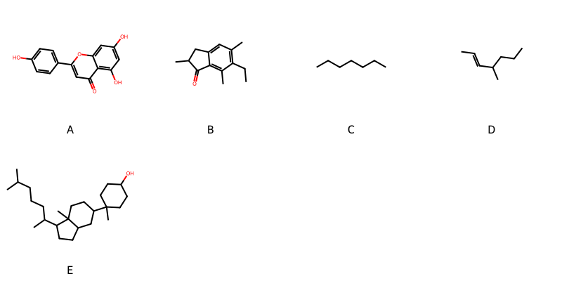

!!! abstract "Tóm tắt"

    **Họ Dennstaedtiaceae** có **2** chi được các cộng đồng sử dụng trong chăm sóc sức khỏe gồm *Pteridium, henomeris*. Số lượng thành phần hóa học đã phân lập và xác định cấu trúc từ họ này tính đến tháng 12 năm 2024 là **11** nhóm có thể liệt kê như sau *Steroids and steroid derivatives, Organooxygen compounds, Flavonoids, Indanes, Cinnamic acids and derivatives, Pyrrolidines, Carboxylic acids and derivatives, Benzene and substituted derivatives, Glycerolipids, Coumarins and derivatives, Prenol lipids*. Giữa các loài trong họ này, 3 dược liệu được nghiên cứu nhiều nhất dựa trên số thành phần được phân lập là **Pteridium aquilinum*. *Họ Dennstaedtiaceae* đã được một số công động tại các quốc gia như China, Elsewhere, Hawaii, Canada(Salish), US, US(Amerindian) đã phát hiện một số tác dụng trên lâm sàng gồm chữa bệnh lẫn độc tính như Chất gây ung thư, Gây đột biến, Thuốc tẩy giun, Chất độc, Người nói tiếng nói, Thuốc an thần, Thuốc bổ, Thuốc lợi tiểu, Thuốc tẩy giun, Thuốc nhuận tràng, diệt khuẩn, Chất độc, Chất độc, Tanifuge, Chất làm se, Thuốc tẩy giun.

!!! info "DrDuke"

    James A. Duke sinh năm 1929-2017 là một nhà thực vật học người Mỹ. Đây là một trong những tác giả hàng đầu trong lĩnh vực dược dân tộc học với cuốn *CRC Handbook of Medicinal Herbs* và chính là người xây dựng lên cơ sở dữ liệu về hợp chất tự nhiên và dược dân tộc học tại Bộ nông nghiệp Hoa Kỳ. Các thông tin được đăng tải tại website [Dr. Duke's Phytochemical and Ethnobotanical Databases](https://phytochem.nal.usda.gov/). 
    Trong suốt thập niên 1970, ông lãnh đạo the Plant Taxonomy Laboratory, Plant Genetics and Germplasm Institute of the Agricultural Research Service, U.S. Department of Agriculture.
    Trong tài liệu này, các thông tin về dược dân tộc của các dược liệu được trích dẫn từ tài liệu của James A. Ducke với sự trợ giúp của phần mềm dịch thuật từ tiếng Anh sang tiếng Việt.
   
## Tổng quan về Họ Dennstaedtiaceae
### Phân loại thực vật
Trong *họ Dennstaedtiaceae* có **2** chi được sử dụng làm thuốc với chi tiết số loài trong mỗi chi như sau henomeris (1) . Chi tiết về loài sử dụng làm thuốc như dưới đây.  

>Họ Dennstaedtiaceae


>|-- Chi Pteridium

>*Pteridium aquilinum*,

>|-- Chi henomeris

>*henomeris chusana*,

### Thành phần hóa học 

Số lượng thành phần hóa học đã phân lập và xác định cấu trúc từ họ này tính đến tháng 12 năm 2024 là 11 nhóm có thể liệt kê như sau Steroids and steroid derivatives, Organooxygen compounds, Flavonoids, Indanes, Cinnamic acids and derivatives, Pyrrolidines, Carboxylic acids and derivatives, Benzene and substituted derivatives, Glycerolipids, Coumarins and derivatives, Prenol lipids. Số lượng các loài đã được nghiên cứu thành phần hóa học là *1* trong tổng số *2* loài thuộc họ Dennstaedtiaceae.Giữa các loài trong họ này, 3 dược liệu được nghiên cứu nhiều nhất dựa trên số thành phần được phân lập là **Pteridium aquilinum**. Sử dụng phần mềm RDKIT với thuật toán  Find Maximum Common Substructure (FMCS), các nhóm hoạt chất phổ biến nhất trong *họ Dennstaedtiaceae* đã xây dựng được nhân. Điều này trong tương lại có thể được sử dụng tìm kiếm mối liên hệ giữa tác dụng của cấu trúc hóa học và tác dụng dược lý. Các nhân trong phần này có thể không giống như cấu trúc gốc của từng nhóm chất. Kết quả được trình bầy như hình dưới đây.

<figure markdown="span">
    { width=100% }
    <figcaption> Cấu trúc hóa học của một số khung cơ bản dựa trên thuật toán FMCS để tìm Flavonoids (A), Indanes (B), Organooxygen compounds (C), Prenol lipids (D), Steroids and steroid derivatives (E).</figcaption>
</figure>


!!! info  "Find Maximum Common Substructure"
    
    Thuật toán FMCS (Find Maximum Common Substructure) là một phương pháp được sử dụng để tìm ra cấu trúc chung nhiều nhất (MCS) trong một tập hợp các cấu trúc hóa học. Các bước của thuật toán gồm:
    - Chọn một cấu trúc hóa học là cấu trúc để tạo truy vấn, còn các cấu trúc khác là mục tiêu.
    - Chia nhỏ cấu trúc để tạo truy vấn thành cấu trúc nhỏ hơn dạng chuỗi SMARTS.
    - Kiểm tra chuỗi SMARTS trong các cấu trúc mục tiêu.
    - Tìm kiếm chuỗi SMARTS xuất hiện nhiều nhất.
    Để biết thêm chi tiết các bạn có thể xem tại [TeachOpenCADD](https://projects.volkamerlab.org/teachopencadd/talktorials/T006_compound_maximum_common_substructures.html)
    ``` python
    pip install rdkit
    def find_core_smiles(smiles_list):
        mols = [Chem.MolFromSmiles(smiles) for smiles in smiles_list]
        mcs = rdFMCS.FindMCS(mols)
        core_smiles = Chem.MolToSmiles(Chem.MolFromSmarts(mcs.smartsString))
        return core_smiles
    ```

### Dược dân tộc học

Họ **Dennstaedtiaceae** đã được một số công động tại các quốc gia như *China, Elsewhere, Hawaii, Canada(Salish), US, US(Amerindian)* đã phát hiện một số tác dụng trên lâm sàng gồm chữa bệnh lẫn độc tính như *Chất gây ung thư, Gây đột biến, Thuốc tẩy giun, Chất độc, Người nói tiếng nói, Thuốc an thần, Thuốc bổ, Thuốc lợi tiểu, Thuốc tẩy giun, Thuốc nhuận tràng, diệt khuẩn, Chất độc, Chất độc, Tanifuge, Chất làm se, Thuốc tẩy giun*.

## Chi tiết dược dân tộc học


### Chi Pteridium

!!! note "Danh sách các loài thuộc chi"
    
*	 - *Pteridium aquilinum**

---      
#### *Pteridium aquilinum*
**Thông tin về thực vật**

!!! info "Phân loại thực vật của *Pteridium aquilinum* từ GIBF:"
    - **Kingdom:** Plantae
    - **Phylum:** Tracheophyta
    - **Order:** Polypodiales
    - **Family:** Dennstaedtiaceae
    - **Genus:** Pteridium
    - **Species:** *Pteridium aquilinum*


 

Chưa có thông tin về loài này trên wikidata.

*Phân bố trên thế giới*: Germany, France, Malawi, Kenya, Netherlands, Spain, Poland, Mexico, Chinese Taipei, Cambodia, South Africa, Eswatini, Indonesia, Isle of Man, Montenegro, Portugal, Russian Federation, Honduras, United Kingdom of Great Britain and Northern Ireland, Türkiye, Viet Nam, Thailand, United States of America, Italy, Malaysia, Canada, Greece, Austria, Ireland

*Phân bố tại Việt Nam*: Lâm Đồng

**Thành phần hóa học**
        

Theo cơ sở dữ liệu lotus, từ loài *Pteridium aquilinum* đã phân lập và xác định được 125 hoạt chất thuộc về các nhóm Steroids and steroid derivatives, Organooxygen compounds, Flavonoids, Indanes, Cinnamic acids and derivatives, Pyrrolidines, Carboxylic acids and derivatives, Benzene and substituted derivatives, Glycerolipids, Coumarins and derivatives, Prenol lipids. Danh sách các hoạt chất như sau (2r)-2-hydroxy-6-(2-hydroxyethyl)-2,5,7-trimethyl-3h-inden-1-one [(LTS0255089)](https://lotus.naturalproducts.net/compound/lotus_id/LTS0255089), 6-(2-methoxyethyl)-2,2,5,7-tetramethyl-3h-inden-1-one [(LTS0078442)](https://lotus.naturalproducts.net/compound/lotus_id/LTS0078442), kaempherol [(LTS0155822)](https://lotus.naturalproducts.net/compound/lotus_id/LTS0155822), (2s)-6-(2-hydroxyethyl)-2-(hydroxymethyl)-2,5,7-trimethyl-3h-inden-1-one [(LTS0030105)](https://lotus.naturalproducts.net/compound/lotus_id/LTS0030105), 4-vinylphenol [(LTS0148777)](https://lotus.naturalproducts.net/compound/lotus_id/LTS0148777), doradexanthin [(LTS0141142)](https://lotus.naturalproducts.net/compound/lotus_id/LTS0141142), neoxanthin [(LTS0000701)](https://lotus.naturalproducts.net/compound/lotus_id/LTS0000701), 3-{[(2s,3r,4s,5r,6s)-3,5-dihydroxy-6-(hydroxymethyl)-4-{[(2s,3r,4s,5s,6r)-3,4,5-trihydroxy-6-(hydroxymethyl)oxan-2-yl]oxy}oxan-2-yl]oxy}-2-(3,4-dihydroxyphenyl)-5,7-dihydroxychromen-4-one [(LTS0201954)](https://lotus.naturalproducts.net/compound/lotus_id/LTS0201954), fumaric acid [(LTS0114831)](https://lotus.naturalproducts.net/compound/lotus_id/LTS0114831), 1-(3,6-dihydroxy-6-methylheptan-2-yl)-3a,7,8-trihydroxy-9a,11a-dimethyl-1h,2h,3h,5ah,6h,7h,8h,9h,9bh,10h,11h-cyclopenta[a]phenanthren-5-one [(LTS0050438)](https://lotus.naturalproducts.net/compound/lotus_id/LTS0050438), (2'r,3'ar,4'r,7'ar)-4'-hydroxy-2',4',6'-trimethyl-7'a-{[(2s,3r,4s,5s,6r)-3,4,5-trihydroxy-6-(hydroxymethyl)oxan-2-yl]oxy}-2',3'a-dihydro-1'h-spiro[cyclopropane-1,5'-inden]-3'-one [(LTS0055352)](https://lotus.naturalproducts.net/compound/lotus_id/LTS0055352), 2-(4-ethenylphenoxy)-6-{[(3,4,5-trihydroxyoxan-2-yl)oxy]methyl}oxane-3,4,5-triol [(LTS0083367)](https://lotus.naturalproducts.net/compound/lotus_id/LTS0083367), neoxanthin [(LTS0227522)](https://lotus.naturalproducts.net/compound/lotus_id/LTS0227522), chlorogenic acid [(LTS0226495)](https://lotus.naturalproducts.net/compound/lotus_id/LTS0226495), β-carotene [(LTS0275716)](https://lotus.naturalproducts.net/compound/lotus_id/LTS0275716), (6s,7ar)-2-[(2e,4e,6e,8e,10e,12e,14e,16e)-17-[(4r)-4-hydroxy-2,6,6-trimethylcyclohex-1-en-1-yl]-6,11,15-trimethylheptadeca-2,4,6,8,10,12,14,16-octaen-2-yl]-4,4,7a-trimethyl-2,5,6,7-tetrahydro-1-benzofuran-6-ol [(LTS0100944)](https://lotus.naturalproducts.net/compound/lotus_id/LTS0100944), 3-{[(2s,3r,4s,5r,6s)-3,5-dihydroxy-6-(hydroxymethyl)-4-{[(2s,3r,4s,5s,6r)-3,4,5-trihydroxy-6-(hydroxymethyl)oxan-2-yl]oxy}oxan-2-yl]oxy}-5,7-dihydroxy-2-(4-hydroxy-3-methoxyphenyl)chromen-4-one [(LTS0139611)](https://lotus.naturalproducts.net/compound/lotus_id/LTS0139611), 6-(2-chloroethyl)-2,5,7-trimethyl-2,3-dihydroinden-1-one [(LTS0090273)](https://lotus.naturalproducts.net/compound/lotus_id/LTS0090273), astragalin [(LTS0249588)](https://lotus.naturalproducts.net/compound/lotus_id/LTS0249588), 1-(2,3-dihydroxy-6-methylheptan-2-yl)-3a,8-dihydroxy-9a,11a-dimethyl-7-{[3,4,5-trihydroxy-6-(hydroxymethyl)oxan-2-yl]oxy}-1h,2h,3h,5ah,6h,7h,8h,9h,9bh,10h,11h-cyclopenta[a]phenanthren-5-one [(LTS0178111)](https://lotus.naturalproducts.net/compound/lotus_id/LTS0178111), taraxanthin [(LTS0218271)](https://lotus.naturalproducts.net/compound/lotus_id/LTS0218271), (3s)-3-hydroxy-2,2,5,7-tetramethyl-6-(2-{[(2r,3s,4s,5s,6r)-3,4,5-trihydroxy-6-(hydroxymethyl)oxan-2-yl]oxy}ethyl)-3h-inden-1-one [(LTS0026039)](https://lotus.naturalproducts.net/compound/lotus_id/LTS0026039), (4s,4ar,7as,7br)-4-hydroxy-6,6,7b-trimethyl-3-({[(2r,3r,4s,5s,6r)-3,4,5-trihydroxy-6-(hydroxymethyl)oxan-2-yl]oxy}methyl)-1h,2h,4h,4ah,5h,7ah-cyclobuta[e]inden-7-one [(LTS0241397)](https://lotus.naturalproducts.net/compound/lotus_id/LTS0241397), carotenoid [(LTS0205297)](https://lotus.naturalproducts.net/compound/lotus_id/LTS0205297), 2-(3,4-dihydroxyphenyl)-5,7-dihydroxy-3-{[3,4,5-trihydroxy-6-(hydroxymethyl)oxan-2-yl]oxy}chromen-4-one [(LTS0195312)](https://lotus.naturalproducts.net/compound/lotus_id/LTS0195312), (2s,3s)-pterosin c [(LTS0167407)](https://lotus.naturalproducts.net/compound/lotus_id/LTS0167407), rhodoxanthin [(LTS0006899)](https://lotus.naturalproducts.net/compound/lotus_id/LTS0006899), α-carotene [(LTS0224243)](https://lotus.naturalproducts.net/compound/lotus_id/LTS0224243), 2-(3,4-dihydroxyphenyl)-5,7-dihydroxy-3-{[(2s,3r,4r,5s,6r)-3,4,5-trihydroxy-6-(hydroxymethyl)oxan-2-yl]oxy}chromen-4-one [(LTS0220665)](https://lotus.naturalproducts.net/compound/lotus_id/LTS0220665), 4'-hydroxy-2',4',6'-trimethyl-7'a-{[3,4,5-trihydroxy-6-(hydroxymethyl)oxan-2-yl]oxy}-2',3'a-dihydro-1'h-spiro[cyclopropane-1,5'-inden]-3'-one [(LTS0003603)](https://lotus.naturalproducts.net/compound/lotus_id/LTS0003603), (2r)-6-(2-hydroxyethyl)-2,5,7-trimethyl-2,3-dihydroinden-1-one [(LTS0072892)](https://lotus.naturalproducts.net/compound/lotus_id/LTS0072892), (2r)-6-(2-methoxyethyl)-2,5,7-trimethyl-2,3-dihydroinden-1-one [(LTS0132426)](https://lotus.naturalproducts.net/compound/lotus_id/LTS0132426), (2r)-2,5,7-trimethyl-6-(2-{[(2r,3r,4s,5s,6r)-3,4,5-trihydroxy-6-(hydroxymethyl)oxan-2-yl]oxy}ethyl)-2,3-dihydroinden-1-one [(LTS0033680)](https://lotus.naturalproducts.net/compound/lotus_id/LTS0033680), ptaquiloside [(LTS0081145)](https://lotus.naturalproducts.net/compound/lotus_id/LTS0081145), 2-(3,4-dihydroxyphenyl)-5,7-dihydroxy-3-{[(2s,3r,4r,5r,6s)-3,4,5-trihydroxy-6-(hydroxymethyl)oxan-2-yl]oxy}chromen-4-one [(LTS0241372)](https://lotus.naturalproducts.net/compound/lotus_id/LTS0241372), 6-(2-methoxyethyl)-2,5,7-trimethyl-2,3-dihydroinden-1-one [(LTS0246501)](https://lotus.naturalproducts.net/compound/lotus_id/LTS0246501), (2's,3'as,4's)-4'-hydroxy-2'-(hydroxymethyl)-2',4',6'-trimethyl-7'-{[(2s,3r,4s,5s,6r)-3,4,5-trihydroxy-6-(hydroxymethyl)oxan-2-yl]oxy}-3'a,7'a-dihydro-1'h-spiro[cyclopropane-1,5'-inden]-3'-one [(LTS0211332)](https://lotus.naturalproducts.net/compound/lotus_id/LTS0211332), 2-[(2e,4e,6e,8e,10e,12e,14e,16e)-17-(4-hydroxy-2,6,6-trimethylcyclohex-1-en-1-yl)-6,11,15-trimethylheptadeca-2,4,6,8,10,12,14,16-octaen-2-yl]-4,4,7a-trimethyl-2,5,6,7-tetrahydro-1-benzofuran-6-ol [(LTS0008322)](https://lotus.naturalproducts.net/compound/lotus_id/LTS0008322), 2h-1-benzopyran-2-one [(LTS0069773)](https://lotus.naturalproducts.net/compound/lotus_id/LTS0069773), 5-{[3-(3,4-dihydroxyphenyl)prop-2-enoyl]oxy}-3,4-dihydroxycyclohex-1-ene-1-carboxylic acid [(LTS0072581)](https://lotus.naturalproducts.net/compound/lotus_id/LTS0072581), (2s,3s)-3-hydroxy-6-(2-hydroxyethyl)-5-(hydroxymethyl)-2,7-dimethyl-2,3-dihydroinden-1-one [(LTS0268001)](https://lotus.naturalproducts.net/compound/lotus_id/LTS0268001), 3-{[3,5-dihydroxy-6-(hydroxymethyl)-4-{[3,4,5-trihydroxy-6-(hydroxymethyl)oxan-2-yl]oxy}oxan-2-yl]oxy}-2-(3,4-dihydroxyphenyl)-5-hydroxy-7-methoxychromen-4-one [(LTS0233445)](https://lotus.naturalproducts.net/compound/lotus_id/LTS0233445), 3,5-dihydroxy-2-(4-{[3,4,5-trihydroxy-6-(hydroxymethyl)oxan-2-yl]oxy}phenyl)-7-[(3,4,5-trihydroxy-6-methyloxan-2-yl)oxy]chromen-4-one [(LTS0231036)](https://lotus.naturalproducts.net/compound/lotus_id/LTS0231036), 3-hydroxy-6-(2-hydroxyethyl)-2,5,7-trimethyl-2,3-dihydroinden-1-one [(LTS0175628)](https://lotus.naturalproducts.net/compound/lotus_id/LTS0175628), isoquercetin [(LTS0254337)](https://lotus.naturalproducts.net/compound/lotus_id/LTS0254337), (3s)-3-hydroxy-2,2,5,7-tetramethyl-6-(2-{[(2r,3r,4s,5s,6r)-3,4,5-trihydroxy-6-(hydroxymethyl)oxan-2-yl]oxy}ethyl)-3h-inden-1-one [(LTS0171985)](https://lotus.naturalproducts.net/compound/lotus_id/LTS0171985), 2,5,7-trimethyl-6-(2-{[(2r,3r,4s,5s,6r)-3,4,5-trihydroxy-6-(hydroxymethyl)oxan-2-yl]oxy}ethyl)-2,3-dihydroinden-1-one [(LTS0212387)](https://lotus.naturalproducts.net/compound/lotus_id/LTS0212387), (6-{[5,7-dihydroxy-2-(4-hydroxyphenyl)-4-oxochromen-3-yl]oxy}-3,4,5-trihydroxyoxan-2-yl)methyl 3-(3,4-dihydroxyphenyl)prop-2-enoate [(LTS0260203)](https://lotus.naturalproducts.net/compound/lotus_id/LTS0260203), β-homocyclocitral [(LTS0104070)](https://lotus.naturalproducts.net/compound/lotus_id/LTS0104070), butenedioic acid [(LTS0069098)](https://lotus.naturalproducts.net/compound/lotus_id/LTS0069098), ponasterone a [(LTS0254731)](https://lotus.naturalproducts.net/compound/lotus_id/LTS0254731), 6-(2-hydroxyethyl)-2,2,5,7-tetramethyl-3h-inden-1-one [(LTS0098258)](https://lotus.naturalproducts.net/compound/lotus_id/LTS0098258), (2'r,3'ar,4'r,7'ar)-4'-hydroxy-2',4',6'-trimethyl-7'a-{[(2r,3s,4r,5r,6s)-3,4,5-trihydroxy-6-(hydroxymethyl)oxan-2-yl]oxy}-2',3'a-dihydro-1'h-spiro[cyclopropane-1,5'-inden]-3'-one [(LTS0120107)](https://lotus.naturalproducts.net/compound/lotus_id/LTS0120107), (2s)-2-(hydroxymethyl)-2,5,7-trimethyl-6-(2-{[(2r,3r,4s,5s,6r)-3,4,5-trihydroxy-6-(hydroxymethyl)oxan-2-yl]oxy}ethyl)-3h-inden-1-one [(LTS0057500)](https://lotus.naturalproducts.net/compound/lotus_id/LTS0057500), 4'-hydroxy-2'-(hydroxymethyl)-2',4',6'-trimethyl-7'a-{[3,4,5-trihydroxy-6-(hydroxymethyl)oxan-2-yl]oxy}-1',3'a-dihydrospiro[cyclopropane-1,5'-inden]-3'-one [(LTS0081867)](https://lotus.naturalproducts.net/compound/lotus_id/LTS0081867), (3r)-6-(2-chloroethyl)-3-hydroxy-2,2,5,7-tetramethyl-3h-inden-1-one [(LTS0242930)](https://lotus.naturalproducts.net/compound/lotus_id/LTS0242930), 6-(2-hydroxyethyl)-2,2,5,7-tetramethyl-3-{[3,4,5-trihydroxy-6-(hydroxymethyl)oxan-2-yl]oxy}-3h-inden-1-one [(LTS0141794)](https://lotus.naturalproducts.net/compound/lotus_id/LTS0141794), (+)-α-carotene [(LTS0200789)](https://lotus.naturalproducts.net/compound/lotus_id/LTS0200789), glyceryl stearate [(LTS0073221)](https://lotus.naturalproducts.net/compound/lotus_id/LTS0073221), 3,5-dihydroxy-2-(4-{[(2s,3r,4s,5s,6r)-3,4,5-trihydroxy-6-(hydroxymethyl)oxan-2-yl]oxy}phenyl)-7-{[(2s,3r,4r,5r,6s)-3,4,5-trihydroxy-6-methyloxan-2-yl]oxy}chromen-4-one [(LTS0109003)](https://lotus.naturalproducts.net/compound/lotus_id/LTS0109003), ptaquiloside [(LTS0195454)](https://lotus.naturalproducts.net/compound/lotus_id/LTS0195454), succinic acid [(LTS0237204)](https://lotus.naturalproducts.net/compound/lotus_id/LTS0237204), trifolin [(LTS0237581)](https://lotus.naturalproducts.net/compound/lotus_id/LTS0237581), (6-{[5,7-dihydroxy-2-(4-hydroxyphenyl)-4-oxochromen-3-yl]oxy}-3,4,5-trihydroxyoxan-2-yl)methyl 3-(4-hydroxy-3-methoxyphenyl)prop-2-enoate [(LTS0063300)](https://lotus.naturalproducts.net/compound/lotus_id/LTS0063300), 3,5-dihydroxy-2-(4-{[(2s,3r,4s,5s,6r)-3,4,5-trihydroxy-6-(hydroxymethyl)oxan-2-yl]oxy}phenyl)-7-{[(2s,3s,4r,5r,6s)-3,4,5-trihydroxy-6-methyloxan-2-yl]oxy}chromen-4-one [(LTS0047717)](https://lotus.naturalproducts.net/compound/lotus_id/LTS0047717), ponasteroside a [(LTS0132951)](https://lotus.naturalproducts.net/compound/lotus_id/LTS0132951), 3-{[3,5-dihydroxy-6-(hydroxymethyl)-4-{[3,4,5-trihydroxy-6-(hydroxymethyl)oxan-2-yl]oxy}oxan-2-yl]oxy}-2-(3,4-dihydroxyphenyl)-5,7-dihydroxychromen-4-one [(LTS0079088)](https://lotus.naturalproducts.net/compound/lotus_id/LTS0079088), 2-hydroxy-6-(2-hydroxyethyl)-2,5,7-trimethyl-3h-inden-1-one [(LTS0074212)](https://lotus.naturalproducts.net/compound/lotus_id/LTS0074212), (2s,3r,4s,5s,6r)-2-(4-ethenylphenoxy)-6-({[(2s,3r,4s,5r)-3,4,5-trihydroxyoxan-2-yl]oxy}methyl)oxane-3,4,5-triol [(LTS0087368)](https://lotus.naturalproducts.net/compound/lotus_id/LTS0087368), (3'ar,4's,7'ar)-4'-hydroxy-2',2',4',6'-tetramethyl-7'a-{[(2s,3r,4s,5s,6r)-3,4,5-trihydroxy-6-(hydroxymethyl)oxan-2-yl]oxy}-1',3'a-dihydrospiro[cyclopropane-1,5'-inden]-3'-one [(LTS0179395)](https://lotus.naturalproducts.net/compound/lotus_id/LTS0179395), ecdysone [(LTS0209653)](https://lotus.naturalproducts.net/compound/lotus_id/LTS0209653), quercetin [(LTS0004651)](https://lotus.naturalproducts.net/compound/lotus_id/LTS0004651), (2s,3r,4r,5r,6s)-2-{[(2s,3r,4s,5s,6r)-2-(4-ethenylphenoxy)-4,5-dihydroxy-6-(hydroxymethyl)oxan-3-yl]oxy}-6-methyloxane-3,4,5-triol [(LTS0251458)](https://lotus.naturalproducts.net/compound/lotus_id/LTS0251458), (2's,3'ar,4's,7'ar)-4'-hydroxy-2',4',6'-trimethyl-7'a-{[(2s,3r,4s,5s,6r)-3,4,5-trihydroxy-6-(hydroxymethyl)oxan-2-yl]oxy}-2',3'a-dihydro-1'h-spiro[cyclopropane-1,5'-inden]-3'-one [(LTS0251638)](https://lotus.naturalproducts.net/compound/lotus_id/LTS0251638), 6-(2-chloroethyl)-3-hydroxy-2,2,5,7-tetramethyl-3h-inden-1-one [(LTS0013940)](https://lotus.naturalproducts.net/compound/lotus_id/LTS0013940), 4'-hydroxy-2',2',4',6'-tetramethyl-7'a-{[3,4,5-trihydroxy-6-(hydroxymethyl)oxan-2-yl]oxy}-1',3'a-dihydrospiro[cyclopropane-1,5'-inden]-3'-one [(LTS0092681)](https://lotus.naturalproducts.net/compound/lotus_id/LTS0092681), 5-o-caffeoylshikimic acid [(LTS0092117)](https://lotus.naturalproducts.net/compound/lotus_id/LTS0092117), 6-(2-hydroxyethyl)-2,5,7-trimethyl-2,3-dihydroinden-1-one [(LTS0228662)](https://lotus.naturalproducts.net/compound/lotus_id/LTS0228662), shikimate [(LTS0197942)](https://lotus.naturalproducts.net/compound/lotus_id/LTS0197942), 3a,7,8-trihydroxy-9a,11a-dimethyl-1-(2,3,6-trihydroxy-6-methylheptan-2-yl)-1h,2h,3h,5ah,6h,7h,8h,9h,9bh,10h,11h-cyclopenta[a]phenanthren-5-one [(LTS0071237)](https://lotus.naturalproducts.net/compound/lotus_id/LTS0071237), violaxanthin [(LTS0102265)](https://lotus.naturalproducts.net/compound/lotus_id/LTS0102265), [(2s,3s,4s,5r,6s)-6-{[5,7-dihydroxy-2-(4-hydroxyphenyl)-4-oxochromen-3-yl]oxy}-3,4,5-trihydroxyoxan-2-yl]methyl (2e)-3-(3,4-dihydroxyphenyl)prop-2-enoate [(LTS0045546)](https://lotus.naturalproducts.net/compound/lotus_id/LTS0045546), (1s,3as,5ar,7s,8s,9ar,9br,11ar)-3a,7,8-trihydroxy-9a,11a-dimethyl-1-[(2r,3r)-2,3,6-trihydroxy-6-methylheptan-2-yl]-1h,2h,3h,5ah,6h,7h,8h,9h,9bh,10h,11h-cyclopenta[a]phenanthren-5-one [(LTS0250065)](https://lotus.naturalproducts.net/compound/lotus_id/LTS0250065), chamomile [(LTS0104946)](https://lotus.naturalproducts.net/compound/lotus_id/LTS0104946), 3-{[(2s,3r,4s,5r,6r)-3,5-dihydroxy-6-(hydroxymethyl)-4-{[(2s,3r,4s,5s,6r)-3,4,5-trihydroxy-6-(hydroxymethyl)oxan-2-yl]oxy}oxan-2-yl]oxy}-2-(3,4-dihydroxyphenyl)-5-hydroxy-7-methoxychromen-4-one [(LTS0011668)](https://lotus.naturalproducts.net/compound/lotus_id/LTS0011668), cryptoxanthin [(LTS0132646)](https://lotus.naturalproducts.net/compound/lotus_id/LTS0132646), (2s)-5-(hydroxymethyl)-2,7-dimethyl-6-(2-{[(2r,3s,4s,5s,6r)-3,4,5-trihydroxy-6-(hydroxymethyl)oxan-2-yl]oxy}ethyl)-2,3-dihydroinden-1-one [(LTS0018291)](https://lotus.naturalproducts.net/compound/lotus_id/LTS0018291), (-)-shikimate [(LTS0003899)](https://lotus.naturalproducts.net/compound/lotus_id/LTS0003899), (2s)-6-(2-hydroxyethyl)-5-(hydroxymethyl)-2,7-dimethyl-2,3-dihydroinden-1-one [(LTS0263594)](https://lotus.naturalproducts.net/compound/lotus_id/LTS0263594), (2r,3r,4s,5s,6r)-2-(4-ethenylphenoxy)-6-({[(2s,3r,4s,5s)-3,4,5-trihydroxyoxan-2-yl]oxy}methyl)oxane-3,4,5-triol [(LTS0074882)](https://lotus.naturalproducts.net/compound/lotus_id/LTS0074882), 6-(2-hydroxyethyl)-2-(hydroxymethyl)-2,5,7-trimethyl-3h-inden-1-one [(LTS0039932)](https://lotus.naturalproducts.net/compound/lotus_id/LTS0039932), 1-(2,3-dihydroxy-6-methylheptan-2-yl)-3a,7,8-trihydroxy-9a,11a-dimethyl-1h,2h,3h,5ah,6h,7h,8h,9h,9bh,10h,11h-cyclopenta[a]phenanthren-5-one [(LTS0122841)](https://lotus.naturalproducts.net/compound/lotus_id/LTS0122841), 3-{[(2s,3r,4s,5r,6r)-3,5-dihydroxy-6-(hydroxymethyl)-4-{[(2s,3r,4s,5s,6r)-3,4,5-trihydroxy-6-(hydroxymethyl)oxan-2-yl]oxy}oxan-2-yl]oxy}-2-(3,4-dihydroxyphenyl)-5,7-dihydroxychromen-4-one [(LTS0076888)](https://lotus.naturalproducts.net/compound/lotus_id/LTS0076888), 6-(2-chloroethyl)-2,2,5,7-tetramethyl-3h-inden-1-one [(LTS0256640)](https://lotus.naturalproducts.net/compound/lotus_id/LTS0256640), 3-{[3,5-dihydroxy-6-(hydroxymethyl)-4-{[3,4,5-trihydroxy-6-(hydroxymethyl)oxan-2-yl]oxy}oxan-2-yl]oxy}-5,7-dihydroxy-2-(4-hydroxy-3-methoxyphenyl)chromen-4-one [(LTS0153520)](https://lotus.naturalproducts.net/compound/lotus_id/LTS0153520), [(2r,3s,4s,5r,6s)-6-{[5,7-dihydroxy-2-(4-hydroxyphenyl)-4-oxochromen-3-yl]oxy}-3,4,5-trihydroxyoxan-2-yl]methyl (2e)-3-(3,4-dihydroxyphenyl)prop-2-enoate [(LTS0201495)](https://lotus.naturalproducts.net/compound/lotus_id/LTS0201495), (2r)-6-(2-chloroethyl)-2,5,7-trimethyl-2,3-dihydroinden-1-one [(LTS0231717)](https://lotus.naturalproducts.net/compound/lotus_id/LTS0231717), tiliroside [(LTS0222327)](https://lotus.naturalproducts.net/compound/lotus_id/LTS0222327), (3r)-6-(2-hydroxyethyl)-2,2,5,7-tetramethyl-3-{[(2r,3r,4s,5s,6r)-3,4,5-trihydroxy-6-(hydroxymethyl)oxan-2-yl]oxy}-3h-inden-1-one [(LTS0004050)](https://lotus.naturalproducts.net/compound/lotus_id/LTS0004050), 3-{[(2s,3r,4s,5r,6s)-3,5-dihydroxy-6-(hydroxymethyl)-4-{[(2s,3s,4s,5s,6r)-3,4,5-trihydroxy-6-(hydroxymethyl)oxan-2-yl]oxy}oxan-2-yl]oxy}-2-(3,4-dihydroxyphenyl)-5-hydroxy-7-methoxychromen-4-one [(LTS0157596)](https://lotus.naturalproducts.net/compound/lotus_id/LTS0157596), trifolin [(LTS0267055)](https://lotus.naturalproducts.net/compound/lotus_id/LTS0267055), (6-{[5,7-dihydroxy-2-(4-hydroxyphenyl)-4-oxochromen-3-yl]oxy}-3,4,5-trihydroxyoxan-2-yl)methyl 3-(4-hydroxyphenyl)prop-2-enoate [(LTS0145952)](https://lotus.naturalproducts.net/compound/lotus_id/LTS0145952), 6-(2-chloroethyl)-2-(hydroxymethyl)-2,5,7-trimethyl-3h-inden-1-one [(LTS0139887)](https://lotus.naturalproducts.net/compound/lotus_id/LTS0139887), mutatochrome [(LTS0195278)](https://lotus.naturalproducts.net/compound/lotus_id/LTS0195278), [(2r,3s,4s,5r,6s)-6-{[5,7-dihydroxy-2-(4-hydroxyphenyl)-4-oxochromen-3-yl]oxy}-3,4,5-trihydroxyoxan-2-yl]methyl (2e)-3-(4-hydroxy-3-methoxyphenyl)prop-2-enoate [(LTS0048419)](https://lotus.naturalproducts.net/compound/lotus_id/LTS0048419), 4-[(1e,3e,5e,7e,9e,11e,13e,15e)-16-(4,4,7a-trimethyl-2,5,6,7-tetrahydro-1-benzofuran-2-yl)-3,7,12-trimethylheptadeca-1,3,5,7,9,11,13,15-octaen-1-yl]-3,5,5-trimethylcyclohex-3-en-1-ol [(LTS0070797)](https://lotus.naturalproducts.net/compound/lotus_id/LTS0070797), zeaxanthin [(LTS0192928)](https://lotus.naturalproducts.net/compound/lotus_id/LTS0192928), 3-epiecdysone [(LTS0241762)](https://lotus.naturalproducts.net/compound/lotus_id/LTS0241762), prunasin [(LTS0130138)](https://lotus.naturalproducts.net/compound/lotus_id/LTS0130138), 3-{[(2s,3r,4s,5r,6r)-3,5-dihydroxy-6-(hydroxymethyl)-4-{[(2s,3r,4s,5s,6r)-3,4,5-trihydroxy-6-(hydroxymethyl)oxan-2-yl]oxy}oxan-2-yl]oxy}-5,7-dihydroxy-2-(4-hydroxy-3-methoxyphenyl)chromen-4-one [(LTS0241826)](https://lotus.naturalproducts.net/compound/lotus_id/LTS0241826), sitosterol [(LTS0168132)](https://lotus.naturalproducts.net/compound/lotus_id/LTS0168132), 3-stearoyl-sn-glycerol [(LTS0156323)](https://lotus.naturalproducts.net/compound/lotus_id/LTS0156323), benzoic acid [(LTS0145871)](https://lotus.naturalproducts.net/compound/lotus_id/LTS0145871), ptaquiloside [(LTS0159246)](https://lotus.naturalproducts.net/compound/lotus_id/LTS0159246), (2s)-6-(2-hydroxyethyl)-2,5,7-trimethyl-2,3-dihydroinden-1-one [(LTS0209873)](https://lotus.naturalproducts.net/compound/lotus_id/LTS0209873), 2-{[2-(4-ethenylphenoxy)-4,5-dihydroxy-6-(hydroxymethyl)oxan-3-yl]oxy}-6-methyloxane-3,4,5-triol [(LTS0174758)](https://lotus.naturalproducts.net/compound/lotus_id/LTS0174758), (2r)-3,4-dihydro-2h-pyrrole-2,5-diol [(LTS0236512)](https://lotus.naturalproducts.net/compound/lotus_id/LTS0236512), (2r,3r,4s,5s,6s)-2-{[(1r,3as,3bs,7s,9ar,9bs,11ar)-1-[(2r,5r)-5-ethyl-6-methylheptan-2-yl]-9a,11a-dimethyl-1h,2h,3h,3ah,3bh,4h,6h,7h,8h,9h,9bh,10h,11h-cyclopenta[a]phenanthren-7-yl]oxy}-6-(hydroxymethyl)oxane-3,4,5-triol [(LTS0076809)](https://lotus.naturalproducts.net/compound/lotus_id/LTS0076809), (2's,3'ar,4's,7'ar)-4'-hydroxy-2'-(hydroxymethyl)-2',4',6'-trimethyl-7'a-{[(2s,3r,4s,5s,6r)-3,4,5-trihydroxy-6-(hydroxymethyl)oxan-2-yl]oxy}-1',3'a-dihydrospiro[cyclopropane-1,5'-inden]-3'-one [(LTS0191394)](https://lotus.naturalproducts.net/compound/lotus_id/LTS0191394), (2s)-6-(2-chloroethyl)-2-(hydroxymethyl)-2,5,7-trimethyl-3h-inden-1-one [(LTS0167034)](https://lotus.naturalproducts.net/compound/lotus_id/LTS0167034), 3,4-dihydro-2h-pyrrole-2,5-diol [(LTS0020646)](https://lotus.naturalproducts.net/compound/lotus_id/LTS0020646), 3-hydroxy-6-(2-hydroxyethyl)-5-(hydroxymethyl)-2,7-dimethyl-2,3-dihydroinden-1-one [(LTS0157537)](https://lotus.naturalproducts.net/compound/lotus_id/LTS0157537), (2'r,3'as,4'r)-4'-hydroxy-2',4',6'-trimethyl-7'-{[(2s,3r,4s,5s,6r)-3,4,5-trihydroxy-6-(hydroxymethyl)oxan-2-yl]oxy}-1',2',3'a,7'a-tetrahydrospiro[cyclopropane-1,5'-inden]-3'-one [(LTS0098983)](https://lotus.naturalproducts.net/compound/lotus_id/LTS0098983), 4-hydroxy-6,6,7b-trimethyl-3-({[3,4,5-trihydroxy-6-(hydroxymethyl)oxan-2-yl]oxy}methyl)-1h,2h,4h,4ah,5h,7ah-cyclobuta[e]inden-7-one [(LTS0058026)](https://lotus.naturalproducts.net/compound/lotus_id/LTS0058026), [(3r,4s,5s)-5-{[5,7-dihydroxy-2-(4-hydroxyphenyl)-4-oxochromen-3-yl]oxy}-3,4-dihydroxyoxolan-3-yl]methyl (2e)-3-(4-hydroxy-3-methoxyphenyl)prop-2-enoate [(LTS0057553)](https://lotus.naturalproducts.net/compound/lotus_id/LTS0057553).

| chemicalTaxonomyClassyfireClass     |   lotus_count |
|:------------------------------------|--------------:|
| Benzene and substituted derivatives |             2 |
| Carboxylic acids and derivatives    |             3 |
| Cinnamic acids and derivatives      |             2 |
| Coumarins and derivatives           |             1 |
| Flavonoids                          |            30 |
| Glycerolipids                       |             2 |
| Indanes                             |            23 |
| Organooxygen compounds              |            25 |
| Prenol lipids                       |            23 |
| Pyrrolidines                        |             2 |
| Steroids and steroid derivatives    |            11 |


**Dược dân tộc học**

Danh sách các quốc gia có sử dụng *Pteridium aquilinum* trong điều trị các bệnh. 

| Quốc gia       | Bệnh                                                                  |
|:---------------|:----------------------------------------------------------------------|
| Canada(Salish) | Người nói tiếng nói                                                   |
| China          | Thuốc an thần, Thuốc bổ                                               |
| Elsewhere      | diệt khuẩn, Chất độc, Chất độc, Tanifuge, Chất làm se, Thuốc tẩy giun |
| US             | Chất gây ung thư, Gây đột biến, Thuốc tẩy giun, Chất độc              |
| US(Amerindian) | Thuốc lợi tiểu, Thuốc tẩy giun                                        |


### Chi henomeris

!!! note "Danh sách các loài thuộc chi"
    
*	 - *henomeris chusana**

---      
#### *Pteridium aquilinum*
**Thông tin về thực vật**

!!! info "Phân loại thực vật của *Pteridium aquilinum* từ GIBF:"
    - **Kingdom:** Plantae
    - **Phylum:** Tracheophyta
    - **Order:** Polypodiales
    - **Family:** Dennstaedtiaceae
    - **Genus:** Pteridium
    - **Species:** *Pteridium aquilinum*


 

Chưa có thông tin về loài này trên wikidata.

*Phân bố trên thế giới*: Germany, France, Malawi, Kenya, Netherlands, Spain, Poland, Mexico, Chinese Taipei, Cambodia, South Africa, Eswatini, Indonesia, Isle of Man, Montenegro, Portugal, Russian Federation, Honduras, United Kingdom of Great Britain and Northern Ireland, Türkiye, Viet Nam, Thailand, United States of America, Italy, Malaysia, Canada, Greece, Austria, Ireland

*Phân bố tại Việt Nam*: Lâm Đồng

**Thành phần hóa học**
        

Chưa có nghiên cứu về thành phần hóa học của loài này


**Dược dân tộc học**

Danh sách các quốc gia có sử dụng *Pteridium aquilinum* trong điều trị các bệnh. 

| Quốc gia   | Bệnh              |
|:-----------|:------------------|
| Hawaii     | Thuốc nhuận tràng |


## Bình luận

<div id="giscus-container"></div>
<script src="https://giscus.app/client.js"
        data-repo="hoangson0787/CSDL-duoc-lieu"
        data-repo-id="R_kgDONbMRNA"
        data-category="Duoc lieu"
        data-category-id="DIC_kwDONbMRNM4ClklR"
        data-mapping="pathname"
        data-strict="0"
        data-reactions-enabled="1"
        data-emit-metadata="1"
        data-input-position="bottom"
        data-theme="light"
        data-lang="en"
        crossorigin="anonymous"
        async>
</script>

