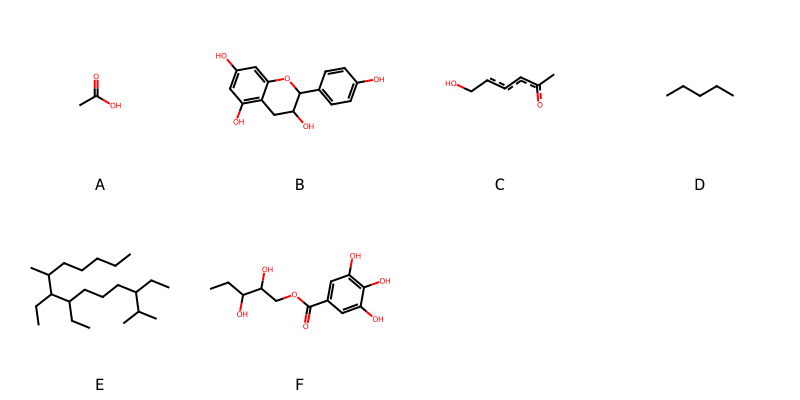

!!! abstract "Tóm tắt"

    **Họ Elaeagnaceae** có **2** chi được các cộng đồng sử dụng trong chăm sóc sức khỏe gồm *Elaeagnus, Hippophae*. Số lượng thành phần hóa học đã phân lập và xác định cấu trúc từ họ này tính đến tháng 12 năm 2024 là **15** nhóm có thể liệt kê như sau *Steroids and steroid derivatives, Organooxygen compounds, Glycerolipids, Flavonoids, Fatty Acyls, Cinnamic acids and derivatives, Glycerophospholipids, Isocoumarins and derivatives, Benzopyrans, Tannins, Sphingolipids, Dihydrofurans, Benzene and substituted derivatives, Stilbenes, Prenol lipids*. Giữa các loài trong họ này, 3 dược liệu được nghiên cứu nhiều nhất dựa trên số thành phần được phân lập là **Hippophae rhamnoides, Elaeagnus umbellata, Elaeagnus pungens*. *Họ Elaeagnaceae* đã được một số công động tại các quốc gia như anish, China, Elsewhere, India đã phát hiện một số tác dụng trên lâm sàng gồm chữa bệnh lẫn độc tính như Chất làm se, Chất làm se, Tim mạch, Chất làm se, Tim mạch, Chất kích thích, Thuốc chống tiêu chảy, Thuốc bổ.

!!! info "DrDuke"

    James A. Duke sinh năm 1929-2017 là một nhà thực vật học người Mỹ. Đây là một trong những tác giả hàng đầu trong lĩnh vực dược dân tộc học với cuốn *CRC Handbook of Medicinal Herbs* và chính là người xây dựng lên cơ sở dữ liệu về hợp chất tự nhiên và dược dân tộc học tại Bộ nông nghiệp Hoa Kỳ. Các thông tin được đăng tải tại website [Dr. Duke's Phytochemical and Ethnobotanical Databases](https://phytochem.nal.usda.gov/). 
    Trong suốt thập niên 1970, ông lãnh đạo the Plant Taxonomy Laboratory, Plant Genetics and Germplasm Institute of the Agricultural Research Service, U.S. Department of Agriculture.
    Trong tài liệu này, các thông tin về dược dân tộc của các dược liệu được trích dẫn từ tài liệu của James A. Ducke với sự trợ giúp của phần mềm dịch thuật từ tiếng Anh sang tiếng Việt.
   
## Tổng quan về Họ Elaeagnaceae
### Phân loại thực vật
Trong *họ Elaeagnaceae* có **2** chi được sử dụng làm thuốc với chi tiết số loài trong mỗi chi như sau Hippophae (1) . Chi tiết về loài sử dụng làm thuốc như dưới đây.  

>Họ Elaeagnaceae


>|-- Chi Elaeagnus

>*Elaeagnus latifolia*,
>*Elaeagnus longipes*,
>*Elaeagnus pungens*,
>*Elaeagnus umbellata*,

>|-- Chi Hippophae

>*Hippophae rhamnoides*,

### Thành phần hóa học 

Số lượng thành phần hóa học đã phân lập và xác định cấu trúc từ họ này tính đến tháng 12 năm 2024 là 15 nhóm có thể liệt kê như sau Steroids and steroid derivatives, Organooxygen compounds, Glycerolipids, Flavonoids, Fatty Acyls, Cinnamic acids and derivatives, Glycerophospholipids, Isocoumarins and derivatives, Benzopyrans, Tannins, Sphingolipids, Dihydrofurans, Benzene and substituted derivatives, Stilbenes, Prenol lipids. Số lượng các loài đã được nghiên cứu thành phần hóa học là *3* trong tổng số *5* loài thuộc họ Elaeagnaceae.Giữa các loài trong họ này, 3 dược liệu được nghiên cứu nhiều nhất dựa trên số thành phần được phân lập là **Hippophae rhamnoides, Elaeagnus umbellata, Elaeagnus pungens**. Sử dụng phần mềm RDKIT với thuật toán  Find Maximum Common Substructure (FMCS), các nhóm hoạt chất phổ biến nhất trong *họ Elaeagnaceae* đã xây dựng được nhân. Điều này trong tương lại có thể được sử dụng tìm kiếm mối liên hệ giữa tác dụng của cấu trúc hóa học và tác dụng dược lý. Các nhân trong phần này có thể không giống như cấu trúc gốc của từng nhóm chất. Kết quả được trình bầy như hình dưới đây.

<figure markdown="span">
    { width=100% }
    <figcaption> Cấu trúc hóa học của một số khung cơ bản dựa trên thuật toán FMCS để tìm Fatty Acyls (A), Flavonoids (B), Organooxygen compounds (C), Prenol lipids (D), Steroids and steroid derivatives (E), Tannins (F).</figcaption>
</figure>


!!! info  "Find Maximum Common Substructure"
    
    Thuật toán FMCS (Find Maximum Common Substructure) là một phương pháp được sử dụng để tìm ra cấu trúc chung nhiều nhất (MCS) trong một tập hợp các cấu trúc hóa học. Các bước của thuật toán gồm:
    - Chọn một cấu trúc hóa học là cấu trúc để tạo truy vấn, còn các cấu trúc khác là mục tiêu.
    - Chia nhỏ cấu trúc để tạo truy vấn thành cấu trúc nhỏ hơn dạng chuỗi SMARTS.
    - Kiểm tra chuỗi SMARTS trong các cấu trúc mục tiêu.
    - Tìm kiếm chuỗi SMARTS xuất hiện nhiều nhất.
    Để biết thêm chi tiết các bạn có thể xem tại [TeachOpenCADD](https://projects.volkamerlab.org/teachopencadd/talktorials/T006_compound_maximum_common_substructures.html)
    ``` python
    pip install rdkit
    def find_core_smiles(smiles_list):
        mols = [Chem.MolFromSmiles(smiles) for smiles in smiles_list]
        mcs = rdFMCS.FindMCS(mols)
        core_smiles = Chem.MolToSmiles(Chem.MolFromSmarts(mcs.smartsString))
        return core_smiles
    ```

### Dược dân tộc học

Họ **Elaeagnaceae** đã được một số công động tại các quốc gia như *anish, China, Elsewhere, India* đã phát hiện một số tác dụng trên lâm sàng gồm chữa bệnh lẫn độc tính như *Chất làm se, Chất làm se, Tim mạch, Chất làm se, Tim mạch, Chất kích thích, Thuốc chống tiêu chảy, Thuốc bổ*.

## Chi tiết dược dân tộc học


### Chi Elaeagnus

!!! note "Danh sách các loài thuộc chi"
    
*	 - *Elaeagnus latifolia*
	 - *Elaeagnus longipes*
	 - *Elaeagnus pungens*
	 - *Elaeagnus umbellata**

---      
#### *Elaeagnus pungens*
**Thông tin về thực vật**

!!! info "Phân loại thực vật của *Elaeagnus pungens* từ GIBF:"
    - **Kingdom:** Plantae
    - **Phylum:** Tracheophyta
    - **Order:** Rosales
    - **Family:** Elaeagnaceae
    - **Genus:** Elaeagnus
    - **Species:** *Elaeagnus pungens*


 

Chưa có thông tin về loài này trên wikidata.

*Phân bố trên thế giới*: nan, France, United States of America, Switzerland, Russian Federation, China, United Kingdom of Great Britain and Northern Ireland, New Zealand, Belgium

*Phân bố tại Việt Nam*: Không có ghi nhận ở Việt Nam

**Thành phần hóa học**
        

Chưa có nghiên cứu về thành phần hóa học của loài này


**Dược dân tộc học**

Danh sách các quốc gia có sử dụng *Elaeagnus pungens* trong điều trị các bệnh. 

| Quốc gia   | Bệnh                  |
|:-----------|:----------------------|
| India      | Chất làm se, Tim mạch |


---      
#### *Elaeagnus pungens*
**Thông tin về thực vật**

!!! info "Phân loại thực vật của *Elaeagnus pungens* từ GIBF:"
    - **Kingdom:** Plantae
    - **Phylum:** Tracheophyta
    - **Order:** Rosales
    - **Family:** Elaeagnaceae
    - **Genus:** Elaeagnus
    - **Species:** *Elaeagnus pungens*


 

Chưa có thông tin về loài này trên wikidata.

*Phân bố trên thế giới*: nan, France, United States of America, Switzerland, Russian Federation, China, United Kingdom of Great Britain and Northern Ireland, New Zealand, Belgium

*Phân bố tại Việt Nam*: Không có ghi nhận ở Việt Nam

**Thành phần hóa học**
        

Chưa có nghiên cứu về thành phần hóa học của loài này


**Dược dân tộc học**

Danh sách các quốc gia có sử dụng *Elaeagnus pungens* trong điều trị các bệnh. 

| Quốc gia   | Bệnh        |
|:-----------|:------------|
| China      | Chất làm se |


---      
#### *Elaeagnus pungens*
**Thông tin về thực vật**

!!! info "Phân loại thực vật của *Elaeagnus pungens* từ GIBF:"
    - **Kingdom:** Plantae
    - **Phylum:** Tracheophyta
    - **Order:** Rosales
    - **Family:** Elaeagnaceae
    - **Genus:** Elaeagnus
    - **Species:** *Elaeagnus pungens*


 

Chưa có thông tin về loài này trên wikidata.

*Phân bố trên thế giới*: nan, France, United States of America, Switzerland, Russian Federation, China, United Kingdom of Great Britain and Northern Ireland, New Zealand, Belgium

*Phân bố tại Việt Nam*: Không có ghi nhận ở Việt Nam

**Thành phần hóa học**
        

Theo cơ sở dữ liệu lotus, từ loài *Elaeagnus pungens* đã phân lập và xác định được 13 hoạt chất thuộc về các nhóm Benzene and substituted derivatives, Stilbenes, Organooxygen compounds. Danh sách các hoạt chất như sau (2r,3r,4s,5r,6s)-2-({[(2r,3r,4r,5s)-3,4-dihydroxy-5-(hydroxymethyl)oxolan-2-yl]oxy}methyl)-6-(4-hydroxy-3-methoxyphenoxy)oxane-3,4,5-triol [(LTS0097698)](https://lotus.naturalproducts.net/compound/lotus_id/LTS0097698), 2-[3-hydroxy-1,2-bis(4-hydroxy-3-methoxyphenyl)propoxy]-6-(hydroxymethyl)oxane-3,4,5-triol [(LTS0262659)](https://lotus.naturalproducts.net/compound/lotus_id/LTS0262659), 4-(4-carboxy-2-methoxyphenoxy)-3,5-dimethoxybenzoic acid [(LTS0233146)](https://lotus.naturalproducts.net/compound/lotus_id/LTS0233146), (2r,3r,4s,5r,6s)-2-({[(2r,3r,4r,5s)-3,4-dihydroxy-5-(hydroxymethyl)oxolan-2-yl]oxy}methyl)-6-(3,4-dimethoxyphenoxy)oxane-3,4,5-triol [(LTS0094476)](https://lotus.naturalproducts.net/compound/lotus_id/LTS0094476), 4-(4-carboxy-2-methoxyphenoxy)-3-{[(1z)-2-carboxyeth-1-en-1-yl]oxy}-5-methoxybenzoic acid [(LTS0136691)](https://lotus.naturalproducts.net/compound/lotus_id/LTS0136691), 4-(4-carboxy-2-methoxyphenoxy)-3-[(2-carboxyeth-1-en-1-yl)oxy]-5-methoxybenzoic acid [(LTS0163395)](https://lotus.naturalproducts.net/compound/lotus_id/LTS0163395), (2r,3r,4s,5s,6r)-2-[(1s,2r)-3-hydroxy-1,2-bis(4-hydroxy-3-methoxyphenyl)propoxy]-6-(hydroxymethyl)oxane-3,4,5-triol [(LTS0023660)](https://lotus.naturalproducts.net/compound/lotus_id/LTS0023660), 2-({[3,4-dihydroxy-5-(hydroxymethyl)oxolan-2-yl]oxy}methyl)-6-(3-hydroxy-4,5-dimethoxyphenoxy)oxane-3,4,5-triol [(LTS0267114)](https://lotus.naturalproducts.net/compound/lotus_id/LTS0267114), (2r,3r,4s,5r,6s)-2-({[(2r,3r,4r,5s)-3,4-dihydroxy-5-(hydroxymethyl)oxolan-2-yl]oxy}methyl)-6-(3-hydroxy-4,5-dimethoxyphenoxy)oxane-3,4,5-triol [(LTS0197178)](https://lotus.naturalproducts.net/compound/lotus_id/LTS0197178), (2r,3r,4s,5r,6r)-2-({[(2r,3r,4r,5s)-3,4-dihydroxy-5-(hydroxymethyl)oxolan-2-yl]oxy}methyl)-6-isopropoxyoxane-3,4,5-triol [(LTS0275598)](https://lotus.naturalproducts.net/compound/lotus_id/LTS0275598), 2-({[3,4-dihydroxy-5-(hydroxymethyl)oxolan-2-yl]oxy}methyl)-6-(4-hydroxy-3-methoxyphenoxy)oxane-3,4,5-triol [(LTS0135597)](https://lotus.naturalproducts.net/compound/lotus_id/LTS0135597), 2-({[3,4-dihydroxy-5-(hydroxymethyl)oxolan-2-yl]oxy}methyl)-6-(3,4-dimethoxyphenoxy)oxane-3,4,5-triol [(LTS0024317)](https://lotus.naturalproducts.net/compound/lotus_id/LTS0024317), 2-({[3,4-dihydroxy-5-(hydroxymethyl)oxolan-2-yl]oxy}methyl)-6-isopropoxyoxane-3,4,5-triol [(LTS0233725)](https://lotus.naturalproducts.net/compound/lotus_id/LTS0233725).

| chemicalTaxonomyClassyfireClass     |   lotus_count |
|:------------------------------------|--------------:|
| Benzene and substituted derivatives |             3 |
| Organooxygen compounds              |             8 |
| Stilbenes                           |             2 |


**Dược dân tộc học**

Danh sách các quốc gia có sử dụng *Elaeagnus pungens* trong điều trị các bệnh. 

| Quốc gia   | Bệnh                            |
|:-----------|:--------------------------------|
| Elsewhere  | Thuốc chống tiêu chảy, Thuốc bổ |


---      
#### *Elaeagnus umbellata*
**Thông tin về thực vật**

!!! info "Phân loại thực vật của *Elaeagnus umbellata* từ GIBF:"
    - **Kingdom:** Plantae
    - **Phylum:** Tracheophyta
    - **Order:** Rosales
    - **Family:** Elaeagnaceae
    - **Genus:** Elaeagnus
    - **Species:** *Elaeagnus umbellata*


 

Chưa có thông tin về loài này trên wikidata.

*Phân bố trên thế giới*: United States of America, Portugal, Sweden, Canada, Netherlands, Belgium

*Phân bố tại Việt Nam*: Không có ghi nhận ở Việt Nam

**Thành phần hóa học**
        

Theo cơ sở dữ liệu lotus, từ loài *Elaeagnus umbellata* đã phân lập và xác định được 47 hoạt chất thuộc về các nhóm Tannins, Isocoumarins and derivatives. Danh sách các hoạt chất như sau 3,4,5,11,14,20,21,22-octahydroxy-13-(hydroxymethyl)-9,12,16-trioxatetracyclo[16.4.0.0²,⁷.0¹⁰,¹⁵]docosa-1(22),2(7),3,5,18,20-hexaene-8,17-dione [(LTS0149934)](https://lotus.naturalproducts.net/compound/lotus_id/LTS0149934), 2-{[(11r,12r)-12-[(14r,15s,19s)-19-[6-({[(10s,11r)-10-[(1s,2r)-2-carboxy-1-hydroxy-2-(3,4,5-trihydroxybenzoyloxy)ethyl]-3,4,5,17,18,19-hexahydroxy-8,14-dioxo-9,13-dioxatricyclo[13.4.0.0²,⁷]nonadeca-1(15),2,4,6,16,18-hexaen-11-yl]oxy}carbonyl)-2,3,4-trihydroxyphenyl]-2,3,4,7,8,9-hexahydroxy-12,17-dioxo-13,16-dioxatetracyclo[13.3.1.0⁵,¹⁸.0⁶,¹¹]nonadeca-1,3,5(18),6,8,10-hexaen-14-yl]-3,4,17,18,19-pentahydroxy-8,14-dioxo-11-(3,4,5-trihydroxybenzoyloxy)-9,13-dioxatricyclo[13.4.0.0²,⁷]nonadeca-1(19),2(7),3,5,15,17-hexaen-5-yl]oxy}-3,4,5-trihydroxybenzoic acid [(LTS0202336)](https://lotus.naturalproducts.net/compound/lotus_id/LTS0202336), 2-[(12-{2,3,4,7,8,9,19-heptahydroxy-12,17-dioxo-13,16-dioxatetracyclo[13.3.1.0⁵,¹⁸.0⁶,¹¹]nonadeca-1(18),2,4,6,8,10-hexaen-14-yl}-3,4,17,18,19-pentahydroxy-8,14-dioxo-11-(3,4,5-trihydroxybenzoyloxy)-9,13-dioxatricyclo[13.4.0.0²,⁷]nonadeca-1(15),2,4,6,16,18-hexaen-5-yl)oxy]-3,4,5-trihydroxybenzoic acid [(LTS0212607)](https://lotus.naturalproducts.net/compound/lotus_id/LTS0212607), 2-{[(10s,11r,12r,13s,15r)-13-{2-[(14r,15s,19s)-14-[(10r,11s)-3,4,5,17,18,19-hexahydroxy-8,14-dioxo-11-(3,4,5-trihydroxybenzoyloxy)-9,13-dioxatricyclo[13.4.0.0²,⁷]nonadeca-1(19),2(7),3,5,15,17-hexaen-10-yl]-2,3,4,7,8,9-hexahydroxy-12,17-dioxo-13,16-dioxatetracyclo[13.3.1.0⁵,¹⁸.0⁶,¹¹]nonadeca-1(18),2,4,6,8,10-hexaen-19-yl]-3,4,5-trihydroxybenzoyloxy}-3,4,5,11,12,22,23-heptahydroxy-8,18-dioxo-9,14,17-trioxatetracyclo[17.4.0.0²,⁷.0¹⁰,¹⁵]tricosa-1(23),2(7),3,5,19,21-hexaen-21-yl]oxy}-3,4,5-trihydroxybenzoic acid [(LTS0037490)](https://lotus.naturalproducts.net/compound/lotus_id/LTS0037490), (10s,11r,12r,13s,15r)-3,4,5,11,12,21,22,23-octahydroxy-8,18-dioxo-9,14,17-trioxatetracyclo[17.4.0.0²,⁷.0¹⁰,¹⁵]tricosa-1(23),2(7),3,5,19,21-hexaen-13-yl 3,4,5-trihydroxybenzoate [(LTS0233186)](https://lotus.naturalproducts.net/compound/lotus_id/LTS0233186), 2-{[(11s,12r)-12-[(14r,15s,19s)-19-[6-({[(11s,12r)-5-(6-carboxy-2,3,4-trihydroxyphenoxy)-12-[(14r,15s,19r)-2,3,4,7,8,9,19-heptahydroxy-12,17-dioxo-13,16-dioxatetracyclo[13.3.1.0⁵,¹⁸.0⁶,¹¹]nonadeca-1(18),2,4,6,8,10-hexaen-14-yl]-3,4,17,18,19-pentahydroxy-8,14-dioxo-9,13-dioxatricyclo[13.4.0.0²,⁷]nonadeca-1(15),2,4,6,16,18-hexaen-11-yl]oxy}carbonyl)-2,3,4-trihydroxyphenyl]-2,3,4,7,8,9-hexahydroxy-12,17-dioxo-13,16-dioxatetracyclo[13.3.1.0⁵,¹⁸.0⁶,¹¹]nonadeca-1(18),2,4,6,8,10-hexaen-14-yl]-3,4,17,18,19-pentahydroxy-8,14-dioxo-11-(3,4,5-trihydroxybenzoyloxy)-9,13-dioxatricyclo[13.4.0.0²,⁷]nonadeca-1(15),2,4,6,16,18-hexaen-5-yl]oxy}-3,4,5-trihydroxybenzoic acid [(LTS0095237)](https://lotus.naturalproducts.net/compound/lotus_id/LTS0095237), (10r,11s)-11-[(10r,11r)-3,4,5,17,18,19-hexahydroxy-8,14-dioxo-11-(3,4,5-trihydroxybenzoyloxy)-9,13-dioxatricyclo[13.4.0.0²,⁷]nonadeca-1(19),2(7),3,5,15,17-hexaen-10-yl]-3,4,5,16,17,18-hexahydroxy-8,13-dioxo-9,12-dioxatricyclo[12.4.0.0²,⁷]octadeca-1(18),2(7),3,5,14,16-hexaene-10-carboxylic acid [(LTS0118593)](https://lotus.naturalproducts.net/compound/lotus_id/LTS0118593), (19s)-14-{3,4,5,11,17,18,19-heptahydroxy-8,14-dioxo-9,13-dioxatricyclo[13.4.0.0²,⁷]nonadeca-1(15),2,4,6,16,18-hexaen-10-yl}-2,3,4,7,8,9,19-heptahydroxy-13,16-dioxatetracyclo[13.3.1.0⁵,¹⁸.0⁶,¹¹]nonadeca-1(18),2,4,6,8,10-hexaene-12,17-dione [(LTS0122912)](https://lotus.naturalproducts.net/compound/lotus_id/LTS0122912), (10r,11s)-11-[(10r,11r)-11-{2-[(14r,15s,19s)-14-[(10r,11r)-3,4,5,17,18,19-hexahydroxy-8,14-dioxo-11-(3,4,5-trihydroxybenzoyloxy)-9,13-dioxatricyclo[13.4.0.0²,⁷]nonadeca-1(19),2(7),3,5,15,17-hexaen-10-yl]-2,3,4,7,8,9-hexahydroxy-12,17-dioxo-13,16-dioxatetracyclo[13.3.1.0⁵,¹⁸.0⁶,¹¹]nonadeca-1(18),2,4,6,8,10-hexaen-19-yl]-3,4,5-trihydroxybenzoyloxy}-3,4,5,17,18,19-hexahydroxy-8,14-dioxo-9,13-dioxatricyclo[13.4.0.0²,⁷]nonadeca-1(19),2(7),3,5,15,17-hexaen-10-yl]-3,4,5,16,17,18-hexahydroxy-8,13-dioxo-9,12-dioxatricyclo[12.4.0.0²,⁷]octadeca-1(18),2(7),3,5,14,16-hexaene-10-carboxylic acid [(LTS0145759)](https://lotus.naturalproducts.net/compound/lotus_id/LTS0145759), 3-[3,4,5,17,18,19-hexahydroxy-8,14-dioxo-11-(3,4,5-trihydroxybenzoyloxy)-9,13-dioxatricyclo[13.4.0.0²,⁷]nonadeca-1(19),2(7),3,5,15,17-hexaen-10-yl]-3-hydroxy-2-(3,4,5-trihydroxybenzoyloxy)propanoic acid [(LTS0072051)](https://lotus.naturalproducts.net/compound/lotus_id/LTS0072051), 12-[2,3,4,7,8,9-hexahydroxy-12,17-dioxo-19-(2,3,4,5-tetrahydroxyoxan-2-yl)-13,16-dioxatetracyclo[13.3.1.0⁵,¹⁸.0⁶,¹¹]nonadeca-1(18),2,4,6,8,10-hexaen-14-yl]-3,4,5,17,18,19-hexahydroxy-8,14-dioxo-9,13-dioxatricyclo[13.4.0.0²,⁷]nonadeca-1(15),2,4,6,16,18-hexaen-11-yl 3,4,5-trihydroxybenzoate [(LTS0105563)](https://lotus.naturalproducts.net/compound/lotus_id/LTS0105563), 2-{[12-(19-{6-[({12-[2-carboxy-1-hydroxy-2-(3,4,5-trihydroxybenzoyloxy)ethyl]-3,4,5,17,18,19-hexahydroxy-8,14-dioxo-9,13-dioxatricyclo[13.4.0.0²,⁷]nonadeca-1(15),2,4,6,16,18-hexaen-11-yl}oxy)carbonyl]-2,3,4-trihydroxyphenyl}-2,3,4,7,8,9-hexahydroxy-12,17-dioxo-13,16-dioxatetracyclo[13.3.1.0⁵,¹⁸.0⁶,¹¹]nonadeca-1(18),2,4,6,8,10-hexaen-14-yl)-3,4,17,18,19-pentahydroxy-8,14-dioxo-11-(3,4,5-trihydroxybenzoyloxy)-9,13-dioxatricyclo[13.4.0.0²,⁷]nonadeca-1(15),2,4,6,16,18-hexaen-5-yl]oxy}-3,4,5-trihydroxybenzoic acid [(LTS0036834)](https://lotus.naturalproducts.net/compound/lotus_id/LTS0036834), 2-{[13-(2-{14-[3,4,5,17,18,19-hexahydroxy-8,14-dioxo-11-(3,4,5-trihydroxybenzoyloxy)-9,13-dioxatricyclo[13.4.0.0²,⁷]nonadeca-1(19),2(7),3,5,15,17-hexaen-10-yl]-2,3,4,7,8,9-hexahydroxy-12,17-dioxo-13,16-dioxatetracyclo[13.3.1.0⁵,¹⁸.0⁶,¹¹]nonadeca-1(18),2,4,6,8,10-hexaen-19-yl}-3,4,5-trihydroxybenzoyloxy)-3,4,5,11,12,22,23-heptahydroxy-8,18-dioxo-9,14,17-trioxatetracyclo[17.4.0.0²,⁷.0¹⁰,¹⁵]tricosa-1(23),2(7),3,5,19,21-hexaen-21-yl]oxy}-3,4,5-trihydroxybenzoic acid [(LTS0273628)](https://lotus.naturalproducts.net/compound/lotus_id/LTS0273628), (2s,3r,4s,5s,6r)-3,4,5-trihydroxy-6-[(3,4,5-trihydroxybenzoyloxy)methyl]oxan-2-yl 3,4,5-trihydroxybenzoate [(LTS0167635)](https://lotus.naturalproducts.net/compound/lotus_id/LTS0167635), (10r,11s)-11-[(10r,11s)-17-(6-carboxy-2,3,4-trihydroxyphenoxy)-11-{2-[(14r,15s,19s)-14-[(10r,11s)-3,4,5,17,18,19-hexahydroxy-8,14-dioxo-11-(3,4,5-trihydroxybenzoyloxy)-9,13-dioxatricyclo[13.4.0.0²,⁷]nonadeca-1(19),2(7),3,5,15,17-hexaen-10-yl]-2,3,4,7,8,9-hexahydroxy-12,17-dioxo-13,16-dioxatetracyclo[13.3.1.0⁵,¹⁸.0⁶,¹¹]nonadeca-1(18),2,4,6,8,10-hexaen-19-yl]-3,4,5-trihydroxybenzoyloxy}-3,4,5,18,19-pentahydroxy-8,14-dioxo-9,13-dioxatricyclo[13.4.0.0²,⁷]nonadeca-1(19),2(7),3,5,15,17-hexaen-10-yl]-3,4,5,16,17,18-hexahydroxy-8,13-dioxo-9,12-dioxatricyclo[12.4.0.0²,⁷]octadeca-1(18),2(7),3,5,14,16-hexaene-10-carboxylic acid [(LTS0078875)](https://lotus.naturalproducts.net/compound/lotus_id/LTS0078875), 7,8,9-trihydroxy-3,5-dioxo-1h,2h-cyclopenta[c]isochromene-1-carboxylic acid [(LTS0239831)](https://lotus.naturalproducts.net/compound/lotus_id/LTS0239831), 3,4,5-trihydroxy-6-[(3,4,5-trihydroxybenzoyloxy)methyl]oxan-2-yl 3,4,5-trihydroxybenzoate [(LTS0089653)](https://lotus.naturalproducts.net/compound/lotus_id/LTS0089653), 3-[3,4,5,17,18,19-hexahydroxy-8,14-dioxo-11-(3,4,5-trihydroxybenzoyloxy)-9,13-dioxatricyclo[13.4.0.0²,⁷]nonadeca-1(19),2(7),3,5,15,17-hexaen-10-yl]-2,3-dihydroxypropanoic acid [(LTS0065382)](https://lotus.naturalproducts.net/compound/lotus_id/LTS0065382), 2-{[(11s,12r)-12-[(14r,15s,19s)-19-[6-({[(11s,12r)-12-[(14r,15s,19r)-2,3,4,7,8,9,19-heptahydroxy-12,17-dioxo-13,16-dioxatetracyclo[13.3.1.0⁵,¹⁸.0⁶,¹¹]nonadeca-1(18),2,4,6,8,10-hexaen-14-yl]-3,4,5,17,18,19-hexahydroxy-8,14-dioxo-9,13-dioxatricyclo[13.4.0.0²,⁷]nonadeca-1(15),2,4,6,16,18-hexaen-11-yl]oxy}carbonyl)-2,3,4-trihydroxyphenyl]-2,3,4,7,8,9-hexahydroxy-12,17-dioxo-13,16-dioxatetracyclo[13.3.1.0⁵,¹⁸.0⁶,¹¹]nonadeca-1(18),2,4,6,8,10-hexaen-14-yl]-3,4,17,18,19-pentahydroxy-8,14-dioxo-11-(3,4,5-trihydroxybenzoyloxy)-9,13-dioxatricyclo[13.4.0.0²,⁷]nonadeca-1(15),2,4,6,16,18-hexaen-5-yl]oxy}-3,4,5-trihydroxybenzoic acid [(LTS0155220)](https://lotus.naturalproducts.net/compound/lotus_id/LTS0155220), 12-{2,3,4,7,8,9,19-heptahydroxy-12,17-dioxo-13,16-dioxatetracyclo[13.3.1.0⁵,¹⁸.0⁶,¹¹]nonadeca-1(18),2,4,6,8,10-hexaen-14-yl}-3,4,5,17,18,19-hexahydroxy-8,14-dioxo-9,13-dioxatricyclo[13.4.0.0²,⁷]nonadeca-1(15),2,4,6,16,18-hexaen-11-yl 2-{14-[3,4,5,17,18,19-hexahydroxy-8,14-dioxo-11-(3,4,5-trihydroxybenzoyloxy)-9,13-dioxatricyclo[13.4.0.0²,⁷]nonadeca-1(19),2(7),3,5,15,17-hexaen-10-yl]-2,3,4,7,8,9-hexahydroxy-12,17-dioxo-13,16-dioxatetracyclo[13.3.1.0⁵,¹⁸.0⁶,¹¹]nonadeca-1(18),2,4,6,8,10-hexaen-19-yl}-3,4,5-trihydroxybenzoate [(LTS0152587)](https://lotus.naturalproducts.net/compound/lotus_id/LTS0152587), 2-{[(11s,12r)-12-[(14r,15s,19s)-19-[6-({[(11s,12s)-12-[(1s,2r)-2-carboxy-1-hydroxy-2-(3,4,5-trihydroxybenzoyloxy)ethyl]-3,4,5,17,18,19-hexahydroxy-8,14-dioxo-9,13-dioxatricyclo[13.4.0.0²,⁷]nonadeca-1(15),2,4,6,16,18-hexaen-11-yl]oxy}carbonyl)-2,3,4-trihydroxyphenyl]-2,3,4,7,8,9-hexahydroxy-12,17-dioxo-13,16-dioxatetracyclo[13.3.1.0⁵,¹⁸.0⁶,¹¹]nonadeca-1(18),2,4,6,8,10-hexaen-14-yl]-3,4,17,18,19-pentahydroxy-8,14-dioxo-11-(3,4,5-trihydroxybenzoyloxy)-9,13-dioxatricyclo[13.4.0.0²,⁷]nonadeca-1(15),2,4,6,16,18-hexaen-5-yl]oxy}-3,4,5-trihydroxybenzoic acid [(LTS0150259)](https://lotus.naturalproducts.net/compound/lotus_id/LTS0150259), 10-[19-(12-{3,4,5,11,16,17,18-heptahydroxy-8,13-dioxo-9,12-dioxatricyclo[12.4.0.0²,⁷]octadeca-1(14),2,4,6,15,17-hexaen-10-yl}-3,4,5,17,18,19-hexahydroxy-8,14-dioxo-11-(3,4,5-trihydroxybenzoyloxy)-9,13-dioxatricyclo[13.4.0.0²,⁷]nonadeca-1(15),2(7),3,5,16,18-hexaen-6-yl)-2,3,4,7,8,9-hexahydroxy-12,17-dioxo-13,16-dioxatetracyclo[13.3.1.0⁵,¹⁸.0⁶,¹¹]nonadeca-1,3,5(18),6,8,10-hexaen-14-yl]-3,4,5,17,18,19-hexahydroxy-8,14-dioxo-9,13-dioxatricyclo[13.4.0.0²,⁷]nonadeca-1(15),2,4,6,16,18-hexaen-11-yl 3,4,5-trihydroxybenzoate [(LTS0023769)](https://lotus.naturalproducts.net/compound/lotus_id/LTS0023769), (14r,15s,19s)-14-[(10r,11r)-3,4,5,11,17,18,19-heptahydroxy-8,14-dioxo-9,13-dioxatricyclo[13.4.0.0²,⁷]nonadeca-1(15),2,4,6,16,18-hexaen-10-yl]-2,3,4,7,8,9,19-heptahydroxy-13,16-dioxatetracyclo[13.3.1.0⁵,¹⁸.0⁶,¹¹]nonadeca-1(18),2,4,6,8,10-hexaene-12,17-dione [(LTS0042847)](https://lotus.naturalproducts.net/compound/lotus_id/LTS0042847), (10s,11s)-11-[(10r,11s)-3,4,5,17,18,19-hexahydroxy-8,14-dioxo-11-(3,4,5-trihydroxybenzoyloxy)-9,13-dioxatricyclo[13.4.0.0²,⁷]nonadeca-1(19),2(7),3,5,15,17-hexaen-10-yl]-3,4,5,16,17,18-hexahydroxy-8,13-dioxo-9,12-dioxatricyclo[12.4.0.0²,⁷]octadeca-1(18),2(7),3,5,14,16-hexaene-10-carboxylic acid [(LTS0099038)](https://lotus.naturalproducts.net/compound/lotus_id/LTS0099038), 2-{[(11r,12r)-12-[(14r,15s,19s)-2,3,4,7,8,9-hexahydroxy-12,17-dioxo-19-[(2r,3s,4s,5r)-2,3,4,5-tetrahydroxyoxan-2-yl]-13,16-dioxatetracyclo[13.3.1.0⁵,¹⁸.0⁶,¹¹]nonadeca-1(18),2,4,6,8,10-hexaen-14-yl]-3,4,17,18,19-pentahydroxy-8,14-dioxo-11-(3,4,5-trihydroxybenzoyloxy)-9,13-dioxatricyclo[13.4.0.0²,⁷]nonadeca-1(15),2,4,6,16,18-hexaen-5-yl]oxy}-3,4,5-trihydroxybenzoic acid [(LTS0046403)](https://lotus.naturalproducts.net/compound/lotus_id/LTS0046403), 2-{[(10s,11r,12r,13s,15r)-13-{2-[(14r,15s,19s)-14-[(10r,11r)-3,4,5,17,18,19-hexahydroxy-8,14-dioxo-11-(3,4,5-trihydroxybenzoyloxy)-9,13-dioxatricyclo[13.4.0.0²,⁷]nonadeca-1(19),2(7),3,5,15,17-hexaen-10-yl]-2,3,4,7,8,9-hexahydroxy-12,17-dioxo-13,16-dioxatetracyclo[13.3.1.0⁵,¹⁸.0⁶,¹¹]nonadeca-1(18),2,4,6,8,10-hexaen-19-yl]-3,4,5-trihydroxybenzoyloxy}-3,4,5,11,12,22,23-heptahydroxy-8,18-dioxo-9,14,17-trioxatetracyclo[17.4.0.0²,⁷.0¹⁰,¹⁵]tricosa-1(23),2(7),3,5,19,21-hexaen-21-yl]oxy}-3,4,5-trihydroxybenzoic acid [(LTS0056005)](https://lotus.naturalproducts.net/compound/lotus_id/LTS0056005), 3,4,5-trihydroxy-2-({7,13,14-trihydroxy-3,10-dioxo-2,9-dioxatetracyclo[6.6.2.0⁴,¹⁶.0¹¹,¹⁵]hexadeca-1(15),4(16),5,7,11,13-hexaen-6-yl}oxy)benzoic acid [(LTS0234952)](https://lotus.naturalproducts.net/compound/lotus_id/LTS0234952), 11-[3,4,5,17,18,19-hexahydroxy-8,14-dioxo-11-(3,4,5-trihydroxybenzoyloxy)-9,13-dioxatricyclo[13.4.0.0²,⁷]nonadeca-1(19),2(7),3,5,15,17-hexaen-10-yl]-3,4,5,16,17,18-hexahydroxy-8,13-dioxo-9,12-dioxatricyclo[12.4.0.0²,⁷]octadeca-1(18),2(7),3,5,14,16-hexaene-10-carboxylic acid [(LTS0148387)](https://lotus.naturalproducts.net/compound/lotus_id/LTS0148387), (2r,3s)-3-[(10r,11r)-3,4,5,11,17,18,19-heptahydroxy-8,14-dioxo-9,13-dioxatricyclo[13.4.0.0²,⁷]nonadeca-1(15),2,4,6,16,18-hexaen-10-yl]-2,3-bis(3,4,5-trihydroxybenzoyloxy)propanoic acid [(LTS0147342)](https://lotus.naturalproducts.net/compound/lotus_id/LTS0147342), (2r,3s)-3-[(10s,11s)-3,4,5,17,18,19-hexahydroxy-8,14-dioxo-11-(3,4,5-trihydroxybenzoyloxy)-9,13-dioxatricyclo[13.4.0.0²,⁷]nonadeca-1(19),2(7),3,5,15,17-hexaen-10-yl]-3-hydroxy-2-(3,4,5-trihydroxybenzoyloxy)propanoic acid [(LTS0158404)](https://lotus.naturalproducts.net/compound/lotus_id/LTS0158404), 2-{[(11r,12r)-12-[(14r,15s,19r)-2,3,4,7,8,9,19-heptahydroxy-12,17-dioxo-13,16-dioxatetracyclo[13.3.1.0⁵,¹⁸.0⁶,¹¹]nonadeca-1(18),2,4,6,8,10-hexaen-14-yl]-3,4,17,18,19-pentahydroxy-8,14-dioxo-11-(3,4,5-trihydroxybenzoyloxy)-9,13-dioxatricyclo[13.4.0.0²,⁷]nonadeca-1(15),2,4,6,16,18-hexaen-5-yl]oxy}-3,4,5-trihydroxybenzoic acid [(LTS0097236)](https://lotus.naturalproducts.net/compound/lotus_id/LTS0097236), (10r,11s)-11-[(10r,11s)-11-{2-[(14r,15s,19s)-14-[(10r,11s)-3,4,5,17,18,19-hexahydroxy-8,14-dioxo-11-(3,4,5-trihydroxybenzoyloxy)-9,13-dioxatricyclo[13.4.0.0²,⁷]nonadeca-1(19),2(7),3,5,15,17-hexaen-10-yl]-2,3,4,7,8,9-hexahydroxy-12,17-dioxo-13,16-dioxatetracyclo[13.3.1.0⁵,¹⁸.0⁶,¹¹]nonadeca-1(18),2,4,6,8,10-hexaen-19-yl]-3,4,5-trihydroxybenzoyloxy}-3,4,5,17,18,19-hexahydroxy-8,14-dioxo-9,13-dioxatricyclo[13.4.0.0²,⁷]nonadeca-1(19),2(7),3,5,15,17-hexaen-10-yl]-3,4,5,16,17,18-hexahydroxy-8,13-dioxo-9,12-dioxatricyclo[12.4.0.0²,⁷]octadeca-1(18),2(7),3,5,14,16-hexaene-10-carboxylic acid [(LTS0038120)](https://lotus.naturalproducts.net/compound/lotus_id/LTS0038120), 14-{3,4,5,11,17,18,19-heptahydroxy-8,14-dioxo-9,13-dioxatricyclo[13.4.0.0²,⁷]nonadeca-1(15),2,4,6,16,18-hexaen-10-yl}-2,3,4,7,8,9,19-heptahydroxy-13,16-dioxatetracyclo[13.3.1.0⁵,¹⁸.0⁶,¹¹]nonadeca-1(18),2,4,6,8,10-hexaene-12,17-dione [(LTS0090883)](https://lotus.naturalproducts.net/compound/lotus_id/LTS0090883), (10r,11r)-10-[(14r,15s,19s)-19-[(11r,12r)-12-[(10s,11r)-3,4,5,11,16,17,18-heptahydroxy-8,13-dioxo-9,12-dioxatricyclo[12.4.0.0²,⁷]octadeca-1(14),2,4,6,15,17-hexaen-10-yl]-3,4,5,17,18,19-hexahydroxy-8,14-dioxo-11-(3,4,5-trihydroxybenzoyloxy)-9,13-dioxatricyclo[13.4.0.0²,⁷]nonadeca-1(15),2(7),3,5,16,18-hexaen-6-yl]-2,3,4,7,8,9-hexahydroxy-12,17-dioxo-13,16-dioxatetracyclo[13.3.1.0⁵,¹⁸.0⁶,¹¹]nonadeca-1,3,5(18),6,8,10-hexaen-14-yl]-3,4,5,17,18,19-hexahydroxy-8,14-dioxo-9,13-dioxatricyclo[13.4.0.0²,⁷]nonadeca-1(15),2,4,6,16,18-hexaen-11-yl 3,4,5-trihydroxybenzoate [(LTS0144799)](https://lotus.naturalproducts.net/compound/lotus_id/LTS0144799), (10r,11r,13r,14r,15s)-3,4,5,11,14,20,21,22-octahydroxy-13-(hydroxymethyl)-9,12,16-trioxatetracyclo[16.4.0.0²,⁷.0¹⁰,¹⁵]docosa-1(18),2,4,6,19,21-hexaene-8,17-dione [(LTS0033259)](https://lotus.naturalproducts.net/compound/lotus_id/LTS0033259), 11-[11-(2-{14-[3,4,5,17,18,19-hexahydroxy-8,14-dioxo-11-(3,4,5-trihydroxybenzoyloxy)-9,13-dioxatricyclo[13.4.0.0²,⁷]nonadeca-1(19),2(7),3,5,15,17-hexaen-10-yl]-2,3,4,7,8,9-hexahydroxy-12,17-dioxo-13,16-dioxatetracyclo[13.3.1.0⁵,¹⁸.0⁶,¹¹]nonadeca-1(18),2,4,6,8,10-hexaen-19-yl}-3,4,5-trihydroxybenzoyloxy)-3,4,5,17,18,19-hexahydroxy-8,14-dioxo-9,13-dioxatricyclo[13.4.0.0²,⁷]nonadeca-1(19),2(7),3,5,15,17-hexaen-10-yl]-3,4,5,16,17,18-hexahydroxy-8,13-dioxo-9,12-dioxatricyclo[12.4.0.0²,⁷]octadeca-1(18),2(7),3,5,14,16-hexaene-10-carboxylic acid [(LTS0025336)](https://lotus.naturalproducts.net/compound/lotus_id/LTS0025336), (2r,3r)-3-[(10s,11s)-3,4,5,17,18,19-hexahydroxy-8,14-dioxo-11-(3,4,5-trihydroxybenzoyloxy)-9,13-dioxatricyclo[13.4.0.0²,⁷]nonadeca-1(19),2(7),3,5,15,17-hexaen-10-yl]-2,3-dihydroxypropanoic acid [(LTS0201062)](https://lotus.naturalproducts.net/compound/lotus_id/LTS0201062), (14r,15s,19r)-14-[(10r,11r)-3,4,5,11,17,18,19-heptahydroxy-8,14-dioxo-9,13-dioxatricyclo[13.4.0.0²,⁷]nonadeca-1(15),2,4,6,16,18-hexaen-10-yl]-2,3,4,7,8,9,19-heptahydroxy-13,16-dioxatetracyclo[13.3.1.0⁵,¹⁸.0⁶,¹¹]nonadeca-1(18),2,4,6,8,10-hexaene-12,17-dione [(LTS0041901)](https://lotus.naturalproducts.net/compound/lotus_id/LTS0041901), 3,4,5,11,12,21,22,23-octahydroxy-8,18-dioxo-9,14,17-trioxatetracyclo[17.4.0.0²,⁷.0¹⁰,¹⁵]tricosa-1(23),2(7),3,5,19,21-hexaen-13-yl 3,4,5-trihydroxybenzoate [(LTS0016187)](https://lotus.naturalproducts.net/compound/lotus_id/LTS0016187), (1r,2s,19r,22r)-7,8,9,12,13,14,20,28,29,30,33,34,35-tridecahydroxy-3,18,21,24,39-pentaoxaheptacyclo[20.17.0.0²,¹⁹.0⁵,¹⁰.0¹¹,¹⁶.0²⁶,³¹.0³²,³⁷]nonatriaconta-5(10),6,8,11,13,15,26(31),27,29,32,34,36-dodecaene-4,17,25,38-tetrone [(LTS0137167)](https://lotus.naturalproducts.net/compound/lotus_id/LTS0137167), 2-{[(11r,12r)-12-[(15s,19s)-2,3,4,7,8,9,19-heptahydroxy-12,17-dioxo-13,16-dioxatetracyclo[13.3.1.0⁵,¹⁸.0⁶,¹¹]nonadeca-1(18),2,4,6,8,10-hexaen-14-yl]-3,4,17,18,19-pentahydroxy-8,14-dioxo-11-(3,4,5-trihydroxybenzoyloxy)-9,13-dioxatricyclo[13.4.0.0²,⁷]nonadeca-1(15),2,4,6,16,18-hexaen-5-yl]oxy}-3,4,5-trihydroxybenzoic acid [(LTS0220707)](https://lotus.naturalproducts.net/compound/lotus_id/LTS0220707), 2-({12-[2,3,4,7,8,9-hexahydroxy-12,17-dioxo-19-(2,3,4,5-tetrahydroxyoxan-2-yl)-13,16-dioxatetracyclo[13.3.1.0⁵,¹⁸.0⁶,¹¹]nonadeca-1(18),2,4,6,8,10-hexaen-14-yl]-3,4,17,18,19-pentahydroxy-8,14-dioxo-11-(3,4,5-trihydroxybenzoyloxy)-9,13-dioxatricyclo[13.4.0.0²,⁷]nonadeca-1(15),2,4,6,16,18-hexaen-5-yl}oxy)-3,4,5-trihydroxybenzoic acid [(LTS0144704)](https://lotus.naturalproducts.net/compound/lotus_id/LTS0144704), 2-{[(11s,12r)-12-[(14r,15s,19s)-2,3,4,7,8,9-hexahydroxy-12,17-dioxo-19-[(3r,4r,5s)-2,3,4,5-tetrahydroxyoxan-2-yl]-13,16-dioxatetracyclo[13.3.1.0⁵,¹⁸.0⁶,¹¹]nonadeca-1(18),2,4,6,8,10-hexaen-14-yl]-3,4,17,18,19-pentahydroxy-8,14-dioxo-11-(3,4,5-trihydroxybenzoyloxy)-9,13-dioxatricyclo[13.4.0.0²,⁷]nonadeca-1(15),2,4,6,16,18-hexaen-5-yl]oxy}-3,4,5-trihydroxybenzoic acid [(LTS0169691)](https://lotus.naturalproducts.net/compound/lotus_id/LTS0169691), (11r,12r)-12-[(14r,15s,19r)-2,3,4,7,8,9,19-heptahydroxy-12,17-dioxo-13,16-dioxatetracyclo[13.3.1.0⁵,¹⁸.0⁶,¹¹]nonadeca-1(18),2,4,6,8,10-hexaen-14-yl]-3,4,5,17,18,19-hexahydroxy-8,14-dioxo-9,13-dioxatricyclo[13.4.0.0²,⁷]nonadeca-1(15),2,4,6,16,18-hexaen-11-yl 2-[(14r,15s,19s)-14-[(10r,11r)-3,4,5,17,18,19-hexahydroxy-8,14-dioxo-11-(3,4,5-trihydroxybenzoyloxy)-9,13-dioxatricyclo[13.4.0.0²,⁷]nonadeca-1(19),2(7),3,5,15,17-hexaen-10-yl]-2,3,4,7,8,9-hexahydroxy-12,17-dioxo-13,16-dioxatetracyclo[13.3.1.0⁵,¹⁸.0⁶,¹¹]nonadeca-1(18),2,4,6,8,10-hexaen-19-yl]-3,4,5-trihydroxybenzoate [(LTS0103658)](https://lotus.naturalproducts.net/compound/lotus_id/LTS0103658), (11r,12r)-12-[(14r,15s,19s)-2,3,4,7,8,9-hexahydroxy-12,17-dioxo-19-[(2s,3s,4s,5r)-2,3,4,5-tetrahydroxyoxan-2-yl]-13,16-dioxatetracyclo[13.3.1.0⁵,¹⁸.0⁶,¹¹]nonadeca-1(18),2,4,6,8,10-hexaen-14-yl]-3,4,5,17,18,19-hexahydroxy-8,14-dioxo-9,13-dioxatricyclo[13.4.0.0²,⁷]nonadeca-1(15),2,4,6,16,18-hexaen-11-yl 3,4,5-trihydroxybenzoate [(LTS0082183)](https://lotus.naturalproducts.net/compound/lotus_id/LTS0082183), (2r,3r)-3-[(10s,11r)-3,4,5,17,18,19-hexahydroxy-8,14-dioxo-11-(3,4,5-trihydroxybenzoyloxy)-9,13-dioxatricyclo[13.4.0.0²,⁷]nonadeca-1(19),2(7),3,5,15,17-hexaen-10-yl]-2,3-dihydroxypropanoic acid [(LTS0046481)](https://lotus.naturalproducts.net/compound/lotus_id/LTS0046481), 10-[19-(12-{2,3,4,7,8,9,19-heptahydroxy-12,17-dioxo-13,16-dioxatetracyclo[13.3.1.0⁵,¹⁸.0⁶,¹¹]nonadeca-1(18),2,4,6,8,10-hexaen-14-yl}-3,4,5,17,18,19-hexahydroxy-8,14-dioxo-11-(3,4,5-trihydroxybenzoyloxy)-9,13-dioxatricyclo[13.4.0.0²,⁷]nonadeca-1(15),2(7),3,5,16,18-hexaen-6-yl)-2,3,4,7,8,9-hexahydroxy-12,17-dioxo-13,16-dioxatetracyclo[13.3.1.0⁵,¹⁸.0⁶,¹¹]nonadeca-1,3,5(18),6,8,10-hexaen-14-yl]-3,4,5,17,18,19-hexahydroxy-8,14-dioxo-9,13-dioxatricyclo[13.4.0.0²,⁷]nonadeca-1(15),2,4,6,16,18-hexaen-11-yl 3,4,5-trihydroxybenzoate [(LTS0041478)](https://lotus.naturalproducts.net/compound/lotus_id/LTS0041478).

| chemicalTaxonomyClassyfireClass   |   lotus_count |
|:----------------------------------|--------------:|
| Isocoumarins and derivatives      |             1 |
| Tannins                           |            45 |


**Dược dân tộc học**

Danh sách các quốc gia có sử dụng *Elaeagnus umbellata* trong điều trị các bệnh. 

| Quốc gia   | Bệnh                                   |
|:-----------|:---------------------------------------|
| India      | Chất làm se, Tim mạch, Chất kích thích |


### Chi Hippophae

!!! note "Danh sách các loài thuộc chi"
    
*	 - *Hippophae rhamnoides**

---      
#### *Hippophae rhamnoides*
**Thông tin về thực vật**

!!! info "Phân loại thực vật của *Hippophae rhamnoides* từ GIBF:"
    - **Kingdom:** Plantae
    - **Phylum:** Tracheophyta
    - **Order:** Rosales
    - **Family:** Elaeagnaceae
    - **Genus:** Hippophae
    - **Species:** *Hippophae rhamnoides*


 

Chưa có thông tin về loài này trên wikidata.

*Phân bố trên thế giới*: France, Germany, Switzerland, Netherlands, Spain, Poland, Sweden, Belarus, Kyrgyzstan, Russian Federation, United Kingdom of Great Britain and Northern Ireland, Uzbekistan, Ukraine, China, Italy, Lithuania, Norway, Canada, Denmark, Austria, Belgium

*Phân bố tại Việt Nam*: Không có ghi nhận ở Việt Nam

**Thành phần hóa học**
        

Theo cơ sở dữ liệu lotus, từ loài *Hippophae rhamnoides* đã phân lập và xác định được 154 hoạt chất thuộc về các nhóm Steroids and steroid derivatives, Organooxygen compounds, Flavonoids, Fatty Acyls, Cinnamic acids and derivatives, Glycerophospholipids, Benzopyrans, Tannins, Sphingolipids, Dihydrofurans, Benzene and substituted derivatives, Glycerolipids, Prenol lipids. Danh sách các hoạt chất như sau (2s,3r,4s,5s,6r)-4,5-dihydroxy-3-(3,4,5-trihydroxybenzoyloxy)-6-[(3,4,5-trihydroxybenzoyloxy)methyl]oxan-2-yl 3,4,5-trihydroxybenzoate [(LTS0243221)](https://lotus.naturalproducts.net/compound/lotus_id/LTS0243221), (10r,11s)-11-[(10r,11r)-3,4,5,17,18,19-hexahydroxy-8,14-dioxo-11-(3,4,5-trihydroxybenzoyloxy)-9,13-dioxatricyclo[13.4.0.0²,⁷]nonadeca-1(19),2(7),3,5,15,17-hexaen-10-yl]-3,4,5,16,17,18-hexahydroxy-8,13-dioxo-9,12-dioxatricyclo[12.4.0.0²,⁷]octadeca-1(18),2(7),3,5,14,16-hexaene-10-carboxylic acid [(LTS0118593)](https://lotus.naturalproducts.net/compound/lotus_id/LTS0118593), (1r,2r,4ar,6as,6br,8ar,10s,12ar,12br,14br)-10-hydroxy-1,4a,6a,6b,9,9,12a-heptamethyl-2,3,4,5,6,7,8,8a,10,11,12,12b,13,14b-tetradecahydro-1h-picene-2-carboxylic acid [(LTS0225205)](https://lotus.naturalproducts.net/compound/lotus_id/LTS0225205), isoamyl hexanoate [(LTS0261119)](https://lotus.naturalproducts.net/compound/lotus_id/LTS0261119), kaempherol [(LTS0155822)](https://lotus.naturalproducts.net/compound/lotus_id/LTS0155822), 7,8,9,12,13,14,20,28,29,30,33,34,35-tridecahydroxy-3,18,21,24,39-pentaoxaheptacyclo[20.17.0.0²,¹⁹.0⁵,¹⁰.0¹¹,¹⁶.0²⁶,³¹.0³²,³⁷]nonatriaconta-5(10),6,8,11,13,15,26(31),27,29,32,34,36-dodecaene-4,17,25,38-tetrone [(LTS0221409)](https://lotus.naturalproducts.net/compound/lotus_id/LTS0221409), (11r,12r)-12-[(15s,19s)-2,3,4,7,8,9,19-heptahydroxy-12,17-dioxo-13,16-dioxatetracyclo[13.3.1.0⁵,¹⁸.0⁶,¹¹]nonadeca-1(18),2,4,6,8,10-hexaen-14-yl]-3,4,5,17,18,19-hexahydroxy-8,14-dioxo-9,13-dioxatricyclo[13.4.0.0²,⁷]nonadeca-1(15),2,4,6,16,18-hexaen-11-yl 3,4,5-trihydroxybenzoate [(LTS0107688)](https://lotus.naturalproducts.net/compound/lotus_id/LTS0107688), campesterol [(LTS0046755)](https://lotus.naturalproducts.net/compound/lotus_id/LTS0046755), (+)-catechol [(LTS0117079)](https://lotus.naturalproducts.net/compound/lotus_id/LTS0117079), neoxanthin [(LTS0000701)](https://lotus.naturalproducts.net/compound/lotus_id/LTS0000701), stearic acid [(LTS0237766)](https://lotus.naturalproducts.net/compound/lotus_id/LTS0237766), (1r,7s,9as,11ar)-1-[(5z)-5-isopropylhept-5-en-2-yl]-6,9a,11a-trimethyl-1h,2h,3h,3ah,5h,5ah,6h,7h,8h,9h,9bh,10h,11h-cyclopenta[a]phenanthren-7-ol [(LTS0207040)](https://lotus.naturalproducts.net/compound/lotus_id/LTS0207040), 4,4,7a-trimethyl-2-{6,11,15-trimethyl-17-[(1e)-2,2,6-trimethylcyclohexylidene]heptadeca-2,4,6,8,10,12,14-heptaen-2-yl}-2,5,6,7-tetrahydro-1-benzofuran [(LTS0008539)](https://lotus.naturalproducts.net/compound/lotus_id/LTS0008539), galop [(LTS0222857)](https://lotus.naturalproducts.net/compound/lotus_id/LTS0222857), linoleic [(LTS0013198)](https://lotus.naturalproducts.net/compound/lotus_id/LTS0013198), para-coumaric acid [(LTS0266252)](https://lotus.naturalproducts.net/compound/lotus_id/LTS0266252), (4as,6br,10s,12ar,14bs)-10-hydroxy-2,2,6a,6b,9,9,12a-heptamethyl-1,3,4,5,6,7,8,8a,10,11,12,12b,13,14b-tetradecahydropicene-4a-carbaldehyde [(LTS0035167)](https://lotus.naturalproducts.net/compound/lotus_id/LTS0035167), 7,7,12,16-tetramethyl-15-(6-methyl-5-methylideneheptan-2-yl)pentacyclo[9.7.0.0¹,³.0³,⁸.0¹²,¹⁶]octadec-8-en-6-ol [(LTS0259188)](https://lotus.naturalproducts.net/compound/lotus_id/LTS0259188), 2-o-caffeoyl maslinic acid [(LTS0005842)](https://lotus.naturalproducts.net/compound/lotus_id/LTS0005842), ethyl dec-4-enoate; obtusilic acid [(LTS0172169)](https://lotus.naturalproducts.net/compound/lotus_id/LTS0172169), delta-tocopherol [(LTS0005408)](https://lotus.naturalproducts.net/compound/lotus_id/LTS0005408), (1s,2s,4as,6as,6br,8as,10s,12as,12br,14br)-10-hydroxy-1,2,6a,6b,9,9,12a-heptamethyl-2,3,4,5,6,7,8,8a,10,11,12,12b,13,14b-tetradecahydro-1h-picene-4a-carboxylic acid [(LTS0260638)](https://lotus.naturalproducts.net/compound/lotus_id/LTS0260638), erythrodiol [(LTS0057163)](https://lotus.naturalproducts.net/compound/lotus_id/LTS0057163), isorhamnetin [(LTS0107505)](https://lotus.naturalproducts.net/compound/lotus_id/LTS0107505), β-carotene [(LTS0275716)](https://lotus.naturalproducts.net/compound/lotus_id/LTS0275716), 7,8,9,12,13,14,25,26,27,30,31,32,35,36,37,46-hexadecahydroxy-3,18,21,41,43-pentaoxanonacyclo[27.13.3.1³⁸,⁴².0²,²⁰.0⁵,¹⁰.0¹¹,¹⁶.0²³,²⁸.0³³,⁴⁵.0³⁴,³⁹]hexatetraconta-5,7,9,11(16),12,14,23,25,27,29,31,33(45),34(39),35,37-pentadecaene-4,17,22,40,44-pentone [(LTS0060522)](https://lotus.naturalproducts.net/compound/lotus_id/LTS0060522), 3,4-dihydroxybenzoic acid [(LTS0018765)](https://lotus.naturalproducts.net/compound/lotus_id/LTS0018765), n-(3,4-dihydroxy-1-{[3,4,5-trihydroxy-6-(hydroxymethyl)oxan-2-yl]oxy}octadec-6-en-2-yl)-2-hydroxyhexadecanimidic acid [(LTS0103291)](https://lotus.naturalproducts.net/compound/lotus_id/LTS0103291), (2r)-n-[(2s,3s,4r,6e)-3,4-dihydroxy-1-{[(2r,3r,4s,5s,6r)-3,4,5-trihydroxy-6-(hydroxymethyl)oxan-2-yl]oxy}octadec-6-en-2-yl]-2-hydroxyhexadecanimidic acid [(LTS0201148)](https://lotus.naturalproducts.net/compound/lotus_id/LTS0201148), γ-tocotrienol [(LTS0240143)](https://lotus.naturalproducts.net/compound/lotus_id/LTS0240143), lycopene [(LTS0116567)](https://lotus.naturalproducts.net/compound/lotus_id/LTS0116567), 5-hydroxy-2-(4-hydroxy-3-methoxyphenyl)-3-{[(2r,3r,4s,5s,6r)-3,4,5-trihydroxy-6-(hydroxymethyl)oxan-2-yl]oxy}-7-{[(2r,3r,4r,5r,6s)-3,4,5-trihydroxy-6-methyloxan-2-yl]oxy}chromen-4-one [(LTS0087427)](https://lotus.naturalproducts.net/compound/lotus_id/LTS0087427), (6r)-6-[(1r,3as,3br,9as,9bs,11ar)-9a,11a-dimethyl-tetradecahydro-1h-cyclopenta[a]phenanthren-1-yl]-3-isopropylhepta-1,3-dien-1-ol [(LTS0267802)](https://lotus.naturalproducts.net/compound/lotus_id/LTS0267802), 2-octadecenoic acid [(LTS0181255)](https://lotus.naturalproducts.net/compound/lotus_id/LTS0181255), casuarictin [(LTS0241644)](https://lotus.naturalproducts.net/compound/lotus_id/LTS0241644), (10r,11s,12r,13r,15r)-3,4,5,13,21,22,23-heptahydroxy-8,18-dioxo-11-(3,4,5-trihydroxybenzoyloxy)-9,14,17-trioxatetracyclo[17.4.0.0²,⁷.0¹⁰,¹⁵]tricosa-1(23),2(7),3,5,19,21-hexaen-12-yl 3,4,5-trihydroxybenzoate [(LTS0229223)](https://lotus.naturalproducts.net/compound/lotus_id/LTS0229223), hyperoside [(LTS0089156)](https://lotus.naturalproducts.net/compound/lotus_id/LTS0089156), 10-hydroxy-1,2,6a,6b,9,9,12a-heptamethyl-2,3,4,5,6,7,8,8a,10,11,12,12b,13,14b-tetradecahydro-1h-picene-4a-carboxylic acid [(LTS0166564)](https://lotus.naturalproducts.net/compound/lotus_id/LTS0166564), quercetin 3-methyl ether [(LTS0194170)](https://lotus.naturalproducts.net/compound/lotus_id/LTS0194170), 10-{[3-(4-hydroxyphenyl)prop-2-enoyl]oxy}-2,2,6a,6b,9,9,12a-heptamethyl-1,3,4,5,6,7,8,8a,10,11,12,12b,13,14b-tetradecahydropicene-4a-carboxylic acid [(LTS0035824)](https://lotus.naturalproducts.net/compound/lotus_id/LTS0035824), 2-(3,4-dihydroxyphenyl)-5,7-dihydroxy-3-{[3,4,5-trihydroxy-6-(hydroxymethyl)oxan-2-yl]oxy}chromen-4-one [(LTS0195312)](https://lotus.naturalproducts.net/compound/lotus_id/LTS0195312), epigallocatechin [(LTS0175767)](https://lotus.naturalproducts.net/compound/lotus_id/LTS0175767), cycloartenol [(LTS0269561)](https://lotus.naturalproducts.net/compound/lotus_id/LTS0269561), α-carotene [(LTS0224243)](https://lotus.naturalproducts.net/compound/lotus_id/LTS0224243), vitamin e [(LTS0263269)](https://lotus.naturalproducts.net/compound/lotus_id/LTS0263269), (2r)-2,5,7,8-tetramethyl-2-[(4s,8s)-4,8,12-trimethyltridecyl]-3,4-dihydro-1-benzopyran-6-ol [(LTS0130040)](https://lotus.naturalproducts.net/compound/lotus_id/LTS0130040), (10s,11r,12r,13s,15r)-3,4,5,11,12,21,22,23-octahydroxy-8,18-dioxo-9,14,17-trioxatetracyclo[17.4.0.0²,⁷.0¹⁰,¹⁵]tricosa-1(23),2(7),3,5,19,21-hexaen-13-yl 3,4,5-trihydroxybenzoate [(LTS0233186)](https://lotus.naturalproducts.net/compound/lotus_id/LTS0233186), α linolenic acid [(LTS0132789)](https://lotus.naturalproducts.net/compound/lotus_id/LTS0132789), octacosanoic acid [(LTS0135713)](https://lotus.naturalproducts.net/compound/lotus_id/LTS0135713), 2-(3,4-dihydroxyphenyl)-5,7-dihydroxy-3-{[(2s,3r,4r,5r,6s)-3,4,5-trihydroxy-6-(hydroxymethyl)oxan-2-yl]oxy}chromen-4-one [(LTS0241372)](https://lotus.naturalproducts.net/compound/lotus_id/LTS0241372), (2r,6r,7ar)-2-[(2e,4e,6e,8e,10e,12e,14e)-15-[(2r,6r,7ar)-6-hydroxy-4,4,7a-trimethyl-2,5,6,7-tetrahydro-1-benzofuran-2-yl]-6,11-dimethylhexadeca-2,4,6,8,10,12,14-heptaen-2-yl]-4,4,7a-trimethyl-2,5,6,7-tetrahydro-1-benzofuran-6-ol [(LTS0148950)](https://lotus.naturalproducts.net/compound/lotus_id/LTS0148950), gamma-linolenic acid [(LTS0160094)](https://lotus.naturalproducts.net/compound/lotus_id/LTS0160094), 12-{2,3,4,7,8,9,19-heptahydroxy-12,17-dioxo-13,16-dioxatetracyclo[13.3.1.0⁵,¹⁸.0⁶,¹¹]nonadeca-1(18),2,4,6,8,10-hexaen-14-yl}-3,4,5,17,18,19-hexahydroxy-8,14-dioxo-9,13-dioxatricyclo[13.4.0.0²,⁷]nonadeca-1(15),2,4,6,16,18-hexaen-11-yl 3,4,5-trihydroxybenzoate [(LTS0215098)](https://lotus.naturalproducts.net/compound/lotus_id/LTS0215098), (2s,20s,22r)-7,8,9,12,13,14,28,29,30,33,34,35-dodecahydroxy-4,17,25,38-tetraoxo-3,18,21,24,39-pentaoxaheptacyclo[20.17.0.0²,¹⁹.0⁵,¹⁰.0¹¹,¹⁶.0²⁶,³¹.0³²,³⁷]nonatriaconta-5,7,9,11(16),12,14,26,28,30,32(37),33,35-dodecaen-20-yl 3,4,5-trihydroxybenzoate [(LTS0096540)](https://lotus.naturalproducts.net/compound/lotus_id/LTS0096540), palmitoleic acid [(LTS0261591)](https://lotus.naturalproducts.net/compound/lotus_id/LTS0261591), (2r,7ar)-4,4,7a-trimethyl-2-[(2e,4e,6e,8e,10e,12e,14e)-6,11,15-trimethyl-17-[(1e,6s)-2,2,6-trimethylcyclohexylidene]heptadeca-2,4,6,8,10,12,14-heptaen-2-yl]-2,5,6,7-tetrahydro-1-benzofuran [(LTS0222798)](https://lotus.naturalproducts.net/compound/lotus_id/LTS0222798), oleanolic aldehyde [(LTS0170906)](https://lotus.naturalproducts.net/compound/lotus_id/LTS0170906), (4as,6as,6br,8ar,10s,12ar,12br,14bs)-10-{[(2e)-3-(4-hydroxyphenyl)prop-2-enoyl]oxy}-2,2,6a,6b,9,9,12a-heptamethyl-1,3,4,5,6,7,8,8a,10,11,12,12b,13,14b-tetradecahydropicene-4a-carboxylic acid [(LTS0177289)](https://lotus.naturalproducts.net/compound/lotus_id/LTS0177289), amyrin [(LTS0222826)](https://lotus.naturalproducts.net/compound/lotus_id/LTS0222826), gamma-tocopherol [(LTS0058127)](https://lotus.naturalproducts.net/compound/lotus_id/LTS0058127), heptadecanoic acid [(LTS0136609)](https://lotus.naturalproducts.net/compound/lotus_id/LTS0136609), 7,8,9,12,13,14,28,29,30,33,34,35-dodecahydroxy-4,17,25,38-tetraoxo-3,18,21,24,39-pentaoxaheptacyclo[20.17.0.0²,¹⁹.0⁵,¹⁰.0¹¹,¹⁶.0²⁶,³¹.0³²,³⁷]nonatriaconta-5,7,9,11(16),12,14,26,28,30,32(37),33,35-dodecaen-20-yl 3,4,5-trihydroxybenzoate [(LTS0009009)](https://lotus.naturalproducts.net/compound/lotus_id/LTS0009009), 1,3,3-trimethyl-2-[(9e,11e,13e,15e,17e)-3,7,12,16-tetramethyl-18-(2,6,6-trimethylcyclohex-1-en-1-yl)octadeca-1,3,5,7,9,11,13,15,17-nonaen-1-yl]cyclohex-1-ene [(LTS0110068)](https://lotus.naturalproducts.net/compound/lotus_id/LTS0110068), 2-methylbutyl 2-methylbutyrate [(LTS0143110)](https://lotus.naturalproducts.net/compound/lotus_id/LTS0143110), (11r,12r)-12-[(14r,15s,19r)-2,3,4,7,8,9,19-heptahydroxy-12,17-dioxo-13,16-dioxatetracyclo[13.3.1.0⁵,¹⁸.0⁶,¹¹]nonadeca-1(18),2,4,6,8,10-hexaen-14-yl]-3,4,5,17,18,19-hexahydroxy-8,14-dioxo-9,13-dioxatricyclo[13.4.0.0²,⁷]nonadeca-1(15),2,4,6,16,18-hexaen-11-yl 3,4,5-trihydroxybenzoate [(LTS0124505)](https://lotus.naturalproducts.net/compound/lotus_id/LTS0124505), vitamin c [(LTS0022555)](https://lotus.naturalproducts.net/compound/lotus_id/LTS0022555), (z)-24-ethylidenelophenol [(LTS0155418)](https://lotus.naturalproducts.net/compound/lotus_id/LTS0155418), (4as,6as,6br,8ar,10s,12ar,12br,14bs)-10-{[(2e)-3-(3,4-dihydroxyphenyl)prop-2-enoyl]oxy}-2,2,6a,6b,9,9,12a-heptamethyl-1,3,4,5,6,7,8,8a,10,11,12,12b,13,14b-tetradecahydropicene-4a-carboxylic acid [(LTS0112548)](https://lotus.naturalproducts.net/compound/lotus_id/LTS0112548), (+)-α-carotene [(LTS0200789)](https://lotus.naturalproducts.net/compound/lotus_id/LTS0200789), ethyl isovalerate [(LTS0206295)](https://lotus.naturalproducts.net/compound/lotus_id/LTS0206295), 2-[(12-{2,3,4,7,8,9,19-heptahydroxy-12,17-dioxo-13,16-dioxatetracyclo[13.3.1.0⁵,¹⁸.0⁶,¹¹]nonadeca-1(18),2,4,6,8,10-hexaen-14-yl}-3,4,17,18,19-pentahydroxy-8,14-dioxo-11-(3,4,5-trihydroxybenzoyloxy)-9,13-dioxatricyclo[13.4.0.0²,⁷]nonadeca-1(15),2,4,6,16,18-hexaen-5-yl)oxy]-3,4,5-trihydroxybenzoic acid [(LTS0212607)](https://lotus.naturalproducts.net/compound/lotus_id/LTS0212607), stigmast-5-en-3-ol, (3β)- [(LTS0204616)](https://lotus.naturalproducts.net/compound/lotus_id/LTS0204616), 2-[(8e,10e,12e,14e)-15-(6-hydroxy-4,4,7a-trimethyl-2,5,6,7-tetrahydro-1-benzofuran-2-yl)-6,11-dimethylhexadeca-2,4,6,8,10,12,14-heptaen-2-yl]-4,4,7a-trimethyl-2,5,6,7-tetrahydro-1-benzofuran-6-ol [(LTS0044878)](https://lotus.naturalproducts.net/compound/lotus_id/LTS0044878), (1r,2r,20r,42s,46r)-7,8,9,12,13,14,25,26,27,30,31,32,35,36,37,46-hexadecahydroxy-3,18,21,41,43-pentaoxanonacyclo[27.13.3.1³⁸,⁴².0²,²⁰.0⁵,¹⁰.0¹¹,¹⁶.0²³,²⁸.0³³,⁴⁵.0³⁴,³⁹]hexatetraconta-5,7,9,11(16),12,14,23,25,27,29,31,33(45),34(39),35,37-pentadecaene-4,17,22,40,44-pentone [(LTS0131190)](https://lotus.naturalproducts.net/compound/lotus_id/LTS0131190), 5-hydroxy-2-(4-hydroxy-3-methoxyphenyl)-3-{[3,4,5-trihydroxy-6-(hydroxymethyl)oxan-2-yl]oxy}-7-[(3,4,5-trihydroxy-6-methyloxan-2-yl)oxy]chromen-4-one [(LTS0037985)](https://lotus.naturalproducts.net/compound/lotus_id/LTS0037985), avenasterol [(LTS0103350)](https://lotus.naturalproducts.net/compound/lotus_id/LTS0103350), palmitic acid [(LTS0079439)](https://lotus.naturalproducts.net/compound/lotus_id/LTS0079439), 24-methylene-cycloartanol [(LTS0077845)](https://lotus.naturalproducts.net/compound/lotus_id/LTS0077845), pomolic acid [(LTS0196537)](https://lotus.naturalproducts.net/compound/lotus_id/LTS0196537), 2-(3,4-dihydroxyphenyl)-5,7-dihydroxy-3-{[(2r,3s,4r,5r,6s)-3,4,5-trihydroxy-6-(hydroxymethyl)oxan-2-yl]oxy}chromen-4-one [(LTS0119671)](https://lotus.naturalproducts.net/compound/lotus_id/LTS0119671), (1r,3ar,5as,6s,7s,9as,11ar)-3a,6,9a,11a-tetramethyl-1-[(2r)-6-methyl-5-methylideneheptan-2-yl]-1h,2h,3h,4h,5h,5ah,6h,7h,8h,9h,10h,11h-cyclopenta[a]phenanthren-7-ol [(LTS0243203)](https://lotus.naturalproducts.net/compound/lotus_id/LTS0243203), catechol [(LTS0090912)](https://lotus.naturalproducts.net/compound/lotus_id/LTS0090912), 3-rutinosyl quercetin [(LTS0032845)](https://lotus.naturalproducts.net/compound/lotus_id/LTS0032845), 3,4,5,13,21,22,23-heptahydroxy-8,18-dioxo-12-(3,4,5-trihydroxybenzoyloxy)-9,14,17-trioxatetracyclo[17.4.0.0²,⁷.0¹⁰,¹⁵]tricosa-1(23),2(7),3,5,19,21-hexaen-11-yl 3,4,5-trihydroxybenzoate [(LTS0159314)](https://lotus.naturalproducts.net/compound/lotus_id/LTS0159314), tocotrienol [(LTS0016323)](https://lotus.naturalproducts.net/compound/lotus_id/LTS0016323), (10r,11s,13r,14r,15s)-3,4,5,14,20,21,22-heptahydroxy-13-(hydroxymethyl)-8,17-dioxo-9,12,16-trioxatetracyclo[16.4.0.0²,⁷.0¹⁰,¹⁵]docosa-1(22),2(7),3,5,18,20-hexaen-11-yl 3,4,5-trihydroxybenzoate [(LTS0041434)](https://lotus.naturalproducts.net/compound/lotus_id/LTS0041434), quercetin [(LTS0004651)](https://lotus.naturalproducts.net/compound/lotus_id/LTS0004651), 2,7,8-trimethyl-2-(4,8,12-trimethyltridecyl)-3,4-dihydro-1-benzopyran-6-ol [(LTS0095444)](https://lotus.naturalproducts.net/compound/lotus_id/LTS0095444), stigmast-5-en-3-ol [(LTS0071224)](https://lotus.naturalproducts.net/compound/lotus_id/LTS0071224), (1r,2s,19r,20s,22r)-7,8,9,12,13,14,20,28,29,30,33,34,35-tridecahydroxy-3,18,21,24,39-pentaoxaheptacyclo[20.17.0.0²,¹⁹.0⁵,¹⁰.0¹¹,¹⁶.0²⁶,³¹.0³²,³⁷]nonatriaconta-5(10),6,8,11,13,15,26(31),27,29,32,34,36-dodecaene-4,17,25,38-tetrone [(LTS0272643)](https://lotus.naturalproducts.net/compound/lotus_id/LTS0272643), 11-[3,4,5,17,18,19-hexahydroxy-8,14-dioxo-11-(3,4,5-trihydroxybenzoyloxy)-9,13-dioxatricyclo[13.4.0.0²,⁷]nonadeca-1(19),2(7),3,5,15,17-hexaen-10-yl]-3,4,5,16,17,18-hexahydroxy-8,13-dioxo-9,12-dioxatricyclo[12.4.0.0²,⁷]octadeca-1(18),2(7),3,5,14,16-hexaene-10-carboxylic acid [(LTS0148387)](https://lotus.naturalproducts.net/compound/lotus_id/LTS0148387), cis-vaccenic acid [(LTS0158216)](https://lotus.naturalproducts.net/compound/lotus_id/LTS0158216), (1s,2r,4as,6as,6br,8ar,10s,12ar,12br,14bs)-10-hydroxy-1,2,6a,6b,9,9,12a-heptamethyl-2,3,4,5,6,7,8,8a,10,11,12,12b,13,14b-tetradecahydro-1h-picene-4a-carbaldehyde [(LTS0083213)](https://lotus.naturalproducts.net/compound/lotus_id/LTS0083213), gamma-carotene [(LTS0108535)](https://lotus.naturalproducts.net/compound/lotus_id/LTS0108535), 6-methoxy-2h-chromene [(LTS0036249)](https://lotus.naturalproducts.net/compound/lotus_id/LTS0036249), isorhamnetin 3-o-glucoside [(LTS0137002)](https://lotus.naturalproducts.net/compound/lotus_id/LTS0137002), trans-vaccenic acid [(LTS0029579)](https://lotus.naturalproducts.net/compound/lotus_id/LTS0029579), 4,4a,6b,8a,11,11,12b,14a-octamethyl-hexadecahydropicen-3-ol [(LTS0182128)](https://lotus.naturalproducts.net/compound/lotus_id/LTS0182128), uvaol [(LTS0008025)](https://lotus.naturalproducts.net/compound/lotus_id/LTS0008025), 2-{[(11r,12r)-12-[(15s,19s)-2,3,4,7,8,9,19-heptahydroxy-12,17-dioxo-13,16-dioxatetracyclo[13.3.1.0⁵,¹⁸.0⁶,¹¹]nonadeca-1(18),2,4,6,8,10-hexaen-14-yl]-3,4,17,18,19-pentahydroxy-8,14-dioxo-11-(3,4,5-trihydroxybenzoyloxy)-9,13-dioxatricyclo[13.4.0.0²,⁷]nonadeca-1(15),2,4,6,16,18-hexaen-5-yl]oxy}-3,4,5-trihydroxybenzoic acid [(LTS0220707)](https://lotus.naturalproducts.net/compound/lotus_id/LTS0220707), 5,7-dihydroxy-2-(4-hydroxy-3-methoxyphenyl)-3-{[(2r,3r,4s,5s,6r)-3,4,5-trihydroxy-6-({[(2r,3r,4r,5r,6s)-3,4,5-trihydroxy-6-methyloxan-2-yl]oxy}methyl)oxan-2-yl]oxy}chromen-4-one [(LTS0115868)](https://lotus.naturalproducts.net/compound/lotus_id/LTS0115868), urs-12-ene-3β,28-diol [(LTS0136738)](https://lotus.naturalproducts.net/compound/lotus_id/LTS0136738), (2r)-6-methoxycyclohexane-1,2,3,4,5-pentol [(LTS0170182)](https://lotus.naturalproducts.net/compound/lotus_id/LTS0170182), α-tocotrienol [(LTS0005247)](https://lotus.naturalproducts.net/compound/lotus_id/LTS0005247), isorhamnetin 3-galactoside [(LTS0087575)](https://lotus.naturalproducts.net/compound/lotus_id/LTS0087575), 1,3-bis(octanoyloxy)propan-2-yl octadeca-9,12-dienoate [(LTS0100792)](https://lotus.naturalproducts.net/compound/lotus_id/LTS0100792), vitamin a [(LTS0234636)](https://lotus.naturalproducts.net/compound/lotus_id/LTS0234636), oleanolic acid [(LTS0141130)](https://lotus.naturalproducts.net/compound/lotus_id/LTS0141130), phytosterol [(LTS0029311)](https://lotus.naturalproducts.net/compound/lotus_id/LTS0029311), ethyl 3-hydroxy-3-methylbutanoate [(LTS0052095)](https://lotus.naturalproducts.net/compound/lotus_id/LTS0052095), (1r,2r,20s,42s,46s)-7,8,9,12,13,14,25,26,27,30,31,32,35,36,37,46-hexadecahydroxy-3,18,21,41,43-pentaoxanonacyclo[27.13.3.1³⁸,⁴².0²,²⁰.0⁵,¹⁰.0¹¹,¹⁶.0²³,²⁸.0³³,⁴⁵.0³⁴,³⁹]hexatetraconta-5,7,9,11(16),12,14,23,25,27,29,31,33(45),34(39),35,37-pentadecaene-4,17,22,40,44-pentone [(LTS0090979)](https://lotus.naturalproducts.net/compound/lotus_id/LTS0090979), (4as,6as,6br,8ar,10r,11r,12ar,12br,14bs)-10-hydroxy-11-{[(2e)-3-(4-hydroxyphenyl)prop-2-enoyl]oxy}-2,2,6a,6b,9,9,12a-heptamethyl-1,3,4,5,6,7,8,8a,10,11,12,12b,13,14b-tetradecahydropicene-4a-carboxylic acid [(LTS0227528)](https://lotus.naturalproducts.net/compound/lotus_id/LTS0227528), canthaxanthin [(LTS0154130)](https://lotus.naturalproducts.net/compound/lotus_id/LTS0154130), (3s,6r)-6-[(1r,3as,3br,9as,9bs,11ar)-9a,11a-dimethyl-tetradecahydro-1h-cyclopenta[a]phenanthren-1-yl]-3-isopropylheptan-1-ol [(LTS0063219)](https://lotus.naturalproducts.net/compound/lotus_id/LTS0063219), tiliroside [(LTS0222327)](https://lotus.naturalproducts.net/compound/lotus_id/LTS0222327), (1r,5as,7s,9as,9bs,11ar)-1-[(2r)-5-ethyl-6-methylheptan-2-yl]-9a,11a-dimethyl-tetradecahydro-1h-cyclopenta[a]phenanthren-7-ol [(LTS0024392)](https://lotus.naturalproducts.net/compound/lotus_id/LTS0024392), (3r,6s,8r,11s,12s,15r,16r)-7,7,12,16-tetramethyl-15-[(2r)-6-methylhept-5-en-2-yl]pentacyclo[9.7.0.0¹,³.0³,⁸.0¹²,¹⁶]octadecan-6-ol [(LTS0062833)](https://lotus.naturalproducts.net/compound/lotus_id/LTS0062833), β-tocotrienol [(LTS0181074)](https://lotus.naturalproducts.net/compound/lotus_id/LTS0181074), myristic acid [(LTS0102566)](https://lotus.naturalproducts.net/compound/lotus_id/LTS0102566), 4,5-dihydroxy-3-(3,4,5-trihydroxybenzoyloxy)-6-[(3,4,5-trihydroxybenzoyloxy)methyl]oxan-2-yl 3,4,5-trihydroxybenzoate [(LTS0063924)](https://lotus.naturalproducts.net/compound/lotus_id/LTS0063924), l-β,gamm [(LTS0241176)](https://lotus.naturalproducts.net/compound/lotus_id/LTS0241176), (11r,12r)-12-[(14r,15s,19s)-2,3,4,7,8,9,19-heptahydroxy-12,17-dioxo-13,16-dioxatetracyclo[13.3.1.0⁵,¹⁸.0⁶,¹¹]nonadeca-1(18),2,4,6,8,10-hexaen-14-yl]-3,4,5,17,18,19-hexahydroxy-8,14-dioxo-9,13-dioxatricyclo[13.4.0.0²,⁷]nonadeca-1(15),2,4,6,16,18-hexaen-11-yl 3,4,5-trihydroxybenzoate [(LTS0124879)](https://lotus.naturalproducts.net/compound/lotus_id/LTS0124879), 5,7-dihydroxy-2-(4-hydroxy-3-methoxyphenyl)-3-[(3,4,5-trihydroxy-6-{[(3,4,5-trihydroxy-6-methyloxan-2-yl)oxy]methyl}oxan-2-yl)oxy]chromen-4-one [(LTS0035886)](https://lotus.naturalproducts.net/compound/lotus_id/LTS0035886), (11r,12r)-12-[(15s,19r)-2,3,4,7,8,9,19-heptahydroxy-12,17-dioxo-13,16-dioxatetracyclo[13.3.1.0⁵,¹⁸.0⁶,¹¹]nonadeca-1(18),2,4,6,8,10-hexaen-14-yl]-3,4,5,17,18,19-hexahydroxy-8,14-dioxo-9,13-dioxatricyclo[13.4.0.0²,⁷]nonadeca-1(15),2,4,6,16,18-hexaen-11-yl 3,4,5-trihydroxybenzoate [(LTS0102915)](https://lotus.naturalproducts.net/compound/lotus_id/LTS0102915), 2-{[(11r,12r)-12-[(14r,15s,19s)-2,3,4,7,8,9,19-heptahydroxy-12,17-dioxo-13,16-dioxatetracyclo[13.3.1.0⁵,¹⁸.0⁶,¹¹]nonadeca-1(18),2,4,6,8,10-hexaen-14-yl]-3,4,17,18,19-pentahydroxy-8,14-dioxo-11-(3,4,5-trihydroxybenzoyloxy)-9,13-dioxatricyclo[13.4.0.0²,⁷]nonadeca-1(15),2,4,6,16,18-hexaen-5-yl]oxy}-3,4,5-trihydroxybenzoic acid [(LTS0053732)](https://lotus.naturalproducts.net/compound/lotus_id/LTS0053732), apple oil [(LTS0202895)](https://lotus.naturalproducts.net/compound/lotus_id/LTS0202895), β-amyrin [(LTS0251864)](https://lotus.naturalproducts.net/compound/lotus_id/LTS0251864), (2r,42r,46r)-7,8,9,12,13,14,25,26,27,30,31,32,35,36,37,46-hexadecahydroxy-3,18,21,41,43-pentaoxanonacyclo[27.13.3.1³⁸,⁴².0²,²⁰.0⁵,¹⁰.0¹¹,¹⁶.0²³,²⁸.0³³,⁴⁵.0³⁴,³⁹]hexatetraconta-5,7,9,11(16),12,14,23,25,27,29,31,33(45),34(39),35,37-pentadecaene-4,17,22,40,44-pentone [(LTS0247655)](https://lotus.naturalproducts.net/compound/lotus_id/LTS0247655), (6-{[5,7-dihydroxy-2-(4-hydroxyphenyl)-4-oxochromen-3-yl]oxy}-3,4,5-trihydroxyoxan-2-yl)methyl 3-(4-hydroxyphenyl)prop-2-enoate [(LTS0145952)](https://lotus.naturalproducts.net/compound/lotus_id/LTS0145952), oleanolic acid [(LTS0117717)](https://lotus.naturalproducts.net/compound/lotus_id/LTS0117717), (1r,3as,3bs,7s,9bs)-1-[(2r,5r)-5,6-dimethylheptan-2-yl]-9a,11a-dimethyl-1h,2h,3h,3ah,3bh,4h,6h,7h,8h,9h,9bh,10h,11h-cyclopenta[a]phenanthren-7-ol [(LTS0057877)](https://lotus.naturalproducts.net/compound/lotus_id/LTS0057877), hydroxymethylfurfural [(LTS0233269)](https://lotus.naturalproducts.net/compound/lotus_id/LTS0233269), 1,3-bis(octanoyloxy)propan-2-yl (9z,12z)-octadeca-9,12-dienoate [(LTS0077007)](https://lotus.naturalproducts.net/compound/lotus_id/LTS0077007), 10-hydroxy-1,4a,6a,6b,9,9,12a-heptamethyl-2,3,4,5,6,7,8,8a,10,11,12,12b,13,14b-tetradecahydro-1h-picene-2-carboxylic acid [(LTS0135306)](https://lotus.naturalproducts.net/compound/lotus_id/LTS0135306), zeaxanthin [(LTS0192928)](https://lotus.naturalproducts.net/compound/lotus_id/LTS0192928), lupeol [(LTS0256952)](https://lotus.naturalproducts.net/compound/lotus_id/LTS0256952), 7-hexadecenoic acid [(LTS0193581)](https://lotus.naturalproducts.net/compound/lotus_id/LTS0193581), ursolic acid [(LTS0250838)](https://lotus.naturalproducts.net/compound/lotus_id/LTS0250838), α-linolenic acid [(LTS0275508)](https://lotus.naturalproducts.net/compound/lotus_id/LTS0275508), 5-{[(5-formylfuran-2-yl)methoxy]methyl}furan-2-carbaldehyde [(LTS0244889)](https://lotus.naturalproducts.net/compound/lotus_id/LTS0244889), sitosterol [(LTS0168132)](https://lotus.naturalproducts.net/compound/lotus_id/LTS0168132), 10-hydroxy-11-{[3-(4-hydroxyphenyl)prop-2-enoyl]oxy}-2,2,6a,6b,9,9,12a-heptamethyl-1,3,4,5,6,7,8,8a,10,11,12,12b,13,14b-tetradecahydropicene-4a-carboxylic acid [(LTS0125981)](https://lotus.naturalproducts.net/compound/lotus_id/LTS0125981), oleic acid [(LTS0256910)](https://lotus.naturalproducts.net/compound/lotus_id/LTS0256910), ethyl 2-methylbutyrate [(LTS0066548)](https://lotus.naturalproducts.net/compound/lotus_id/LTS0066548), 24-methylenecycloartanol [(LTS0018584)](https://lotus.naturalproducts.net/compound/lotus_id/LTS0018584), hydroxycinnamic acid [(LTS0233023)](https://lotus.naturalproducts.net/compound/lotus_id/LTS0233023), 3,4,5,11,12,21,22,23-octahydroxy-8,18-dioxo-9,14,17-trioxatetracyclo[17.4.0.0²,⁷.0¹⁰,¹⁵]tricosa-1(23),2(7),3,5,19,21-hexaen-13-yl 3,4,5-trihydroxybenzoate [(LTS0016187)](https://lotus.naturalproducts.net/compound/lotus_id/LTS0016187), pinitol [(LTS0194724)](https://lotus.naturalproducts.net/compound/lotus_id/LTS0194724), (1r,2s,19r,22r)-7,8,9,12,13,14,20,28,29,30,33,34,35-tridecahydroxy-3,18,21,24,39-pentaoxaheptacyclo[20.17.0.0²,¹⁹.0⁵,¹⁰.0¹¹,¹⁶.0²⁶,³¹.0³²,³⁷]nonatriaconta-5(10),6,8,11,13,15,26(31),27,29,32,34,36-dodecaene-4,17,25,38-tetrone [(LTS0137167)](https://lotus.naturalproducts.net/compound/lotus_id/LTS0137167), epigallocatechin [(LTS0052496)](https://lotus.naturalproducts.net/compound/lotus_id/LTS0052496), 1,10-dihydroxy-1,2,6a,6b,9,9,12a-heptamethyl-2,3,4,5,6,7,8,8a,10,11,12,12b,13,14b-tetradecahydropicene-4a-carboxylic acid [(LTS0147544)](https://lotus.naturalproducts.net/compound/lotus_id/LTS0147544), 11-{[3-(3,4-dihydroxyphenyl)prop-2-enoyl]oxy}-10-hydroxy-2,2,6a,6b,9,9,12a-heptamethyl-1,3,4,5,6,7,8,8a,10,11,12,12b,13,14b-tetradecahydropicene-4a-carboxylic acid [(LTS0032059)](https://lotus.naturalproducts.net/compound/lotus_id/LTS0032059), 3,4,5,14,20,21,22-heptahydroxy-13-(hydroxymethyl)-8,17-dioxo-9,12,16-trioxatetracyclo[16.4.0.0²,⁷.0¹⁰,¹⁵]docosa-1(22),2(7),3,5,18,20-hexaen-11-yl 3,4,5-trihydroxybenzoate [(LTS0005266)](https://lotus.naturalproducts.net/compound/lotus_id/LTS0005266), gallocatechol [(LTS0267305)](https://lotus.naturalproducts.net/compound/lotus_id/LTS0267305).

| chemicalTaxonomyClassyfireClass     |   lotus_count |
|:------------------------------------|--------------:|
| Benzene and substituted derivatives |             2 |
| Benzopyrans                         |             1 |
| Cinnamic acids and derivatives      |             2 |
| Dihydrofurans                       |             1 |
| Fatty Acyls                         |            22 |
| Flavonoids                          |            22 |
| Glycerolipids                       |             2 |
| Glycerophospholipids                |             1 |
| Organooxygen compounds              |             4 |
| Prenol lipids                       |            49 |
| Sphingolipids                       |             2 |
| Steroids and steroid derivatives    |            17 |
| Tannins                             |            28 |


**Dược dân tộc học**

Danh sách các quốc gia có sử dụng *Hippophae rhamnoides* trong điều trị các bệnh. 

| Quốc gia   | Bệnh        |
|:-----------|:------------|
| anish      | Chất làm se |


## Bình luận

<div id="giscus-container"></div>
<script src="https://giscus.app/client.js"
        data-repo="hoangson0787/CSDL-duoc-lieu"
        data-repo-id="R_kgDONbMRNA"
        data-category="Duoc lieu"
        data-category-id="DIC_kwDONbMRNM4ClklR"
        data-mapping="pathname"
        data-strict="0"
        data-reactions-enabled="1"
        data-emit-metadata="1"
        data-input-position="bottom"
        data-theme="light"
        data-lang="en"
        crossorigin="anonymous"
        async>
</script>

