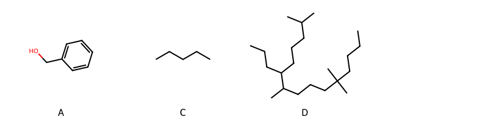

!!! abstract "Tóm tắt"

    **Họ Ephedraceae** có **1** chi được các cộng đồng sử dụng trong chăm sóc sức khỏe gồm *Ephedra*. Số lượng thành phần hóa học đã phân lập và xác định cấu trúc từ họ này tính đến tháng 12 năm 2024 là **16** nhóm có thể liệt kê như sau *Steroids and steroid derivatives, 5'-deoxyribonucleosides, Diazines, Organooxygen compounds, Flavonoids, Fatty Acyls, Cinnamic acids and derivatives, Quinolines and derivatives, Furanoid lignans, Phenol ethers, Phenols, Tannins, Carboxylic acids and derivatives, Benzene and substituted derivatives, Organic phosphoric acids and derivatives, Prenol lipids*. Giữa các loài trong họ này, 3 dược liệu được nghiên cứu nhiều nhất dựa trên số thành phần được phân lập là **Ephedra alata, Ephedra sinica, Ephedra distachya*. *Họ Ephedraceae* đã được một số công động tại các quốc gia như China, Elsewhere, Turkey, Nepal, South America, Japan*, India, Iraq, ain đã phát hiện một số tác dụng trên lâm sàng gồm chữa bệnh lẫn độc tính như Chất độc, Thuốc chống ho, thuốc hạ sốt, Đổ mồ hôi, Thuốc chống ho, Đổ mồ hôi, thuốc hạ sốt, Thuốc lợi tiểu, Thuốc lợi tiểu, dạ dày, có mùi hôi, Thuốc bổ, Thuốc nhỏ mắt, Thuốc trợ tim, Thuốc trợ tim, Hạ huyết áp, Thuốc trợ tim, Hạ huyết áp, có mùi hôi, Chất kích thích, thuốc hạ sốt, Thuốc chống ho, Đổ mồ hôi, Đổ mồ hôi, Chất làm se.

!!! info "DrDuke"

    James A. Duke sinh năm 1929-2017 là một nhà thực vật học người Mỹ. Đây là một trong những tác giả hàng đầu trong lĩnh vực dược dân tộc học với cuốn *CRC Handbook of Medicinal Herbs* và chính là người xây dựng lên cơ sở dữ liệu về hợp chất tự nhiên và dược dân tộc học tại Bộ nông nghiệp Hoa Kỳ. Các thông tin được đăng tải tại website [Dr. Duke's Phytochemical and Ethnobotanical Databases](https://phytochem.nal.usda.gov/). 
    Trong suốt thập niên 1970, ông lãnh đạo the Plant Taxonomy Laboratory, Plant Genetics and Germplasm Institute of the Agricultural Research Service, U.S. Department of Agriculture.
    Trong tài liệu này, các thông tin về dược dân tộc của các dược liệu được trích dẫn từ tài liệu của James A. Ducke với sự trợ giúp của phần mềm dịch thuật từ tiếng Anh sang tiếng Việt.
   
## Tổng quan về Họ Ephedraceae
### Phân loại thực vật
Trong *họ Ephedraceae* có **1** chi được sử dụng làm thuốc với chi tiết số loài trong mỗi chi như sau Ephedra (9) . Chi tiết về loài sử dụng làm thuốc như dưới đây.  

>Họ Ephedraceae


>|-- Chi Ephedra

>*Ephedra alata*,
>*Ephedra americana*,
>*Ephedra distachya*,
>*Ephedra equisetina*,
>*Ephedra foliata*,
>*Ephedra fragilis*,
>*Ephedra gerardiana*,
>*Ephedra sinica*,
>*Ephedra vulgaris*,

### Thành phần hóa học 

Số lượng thành phần hóa học đã phân lập và xác định cấu trúc từ họ này tính đến tháng 12 năm 2024 là 16 nhóm có thể liệt kê như sau Steroids and steroid derivatives, 5'-deoxyribonucleosides, Diazines, Organooxygen compounds, Flavonoids, Fatty Acyls, Cinnamic acids and derivatives, Quinolines and derivatives, Furanoid lignans, Phenol ethers, Phenols, Tannins, Carboxylic acids and derivatives, Benzene and substituted derivatives, Organic phosphoric acids and derivatives, Prenol lipids. Số lượng các loài đã được nghiên cứu thành phần hóa học là *7* trong tổng số *9* loài thuộc họ Ephedraceae.Giữa các loài trong họ này, 3 dược liệu được nghiên cứu nhiều nhất dựa trên số thành phần được phân lập là **Ephedra alata, Ephedra sinica, Ephedra distachya**. Sử dụng phần mềm RDKIT với thuật toán  Find Maximum Common Substructure (FMCS), các nhóm hoạt chất phổ biến nhất trong *họ Ephedraceae* đã xây dựng được nhân. Điều này trong tương lại có thể được sử dụng tìm kiếm mối liên hệ giữa tác dụng của cấu trúc hóa học và tác dụng dược lý. Các nhân trong phần này có thể không giống như cấu trúc gốc của từng nhóm chất. Kết quả được trình bầy như hình dưới đây.

<figure markdown="span">
    { width=100% }
    <figcaption> Cấu trúc hóa học của một số khung cơ bản dựa trên thuật toán FMCS để tìm Benzene and substituted derivatives (A), Flavonoids (B), Prenol lipids (C), Steroids and steroid derivatives (D).</figcaption>
</figure>


!!! info  "Find Maximum Common Substructure"
    
    Thuật toán FMCS (Find Maximum Common Substructure) là một phương pháp được sử dụng để tìm ra cấu trúc chung nhiều nhất (MCS) trong một tập hợp các cấu trúc hóa học. Các bước của thuật toán gồm:
    - Chọn một cấu trúc hóa học là cấu trúc để tạo truy vấn, còn các cấu trúc khác là mục tiêu.
    - Chia nhỏ cấu trúc để tạo truy vấn thành cấu trúc nhỏ hơn dạng chuỗi SMARTS.
    - Kiểm tra chuỗi SMARTS trong các cấu trúc mục tiêu.
    - Tìm kiếm chuỗi SMARTS xuất hiện nhiều nhất.
    Để biết thêm chi tiết các bạn có thể xem tại [TeachOpenCADD](https://projects.volkamerlab.org/teachopencadd/talktorials/T006_compound_maximum_common_substructures.html)
    ``` python
    pip install rdkit
    def find_core_smiles(smiles_list):
        mols = [Chem.MolFromSmiles(smiles) for smiles in smiles_list]
        mcs = rdFMCS.FindMCS(mols)
        core_smiles = Chem.MolToSmiles(Chem.MolFromSmarts(mcs.smartsString))
        return core_smiles
    ```

### Dược dân tộc học

Họ **Ephedraceae** đã được một số công động tại các quốc gia như *China, Elsewhere, Turkey, Nepal, South America, Japan*, India, Iraq, ain* đã phát hiện một số tác dụng trên lâm sàng gồm chữa bệnh lẫn độc tính như *Chất độc, Thuốc chống ho, thuốc hạ sốt, Đổ mồ hôi, Thuốc chống ho, Đổ mồ hôi, thuốc hạ sốt, Thuốc lợi tiểu, Thuốc lợi tiểu, dạ dày, có mùi hôi, Thuốc bổ, Thuốc nhỏ mắt, Thuốc trợ tim, Thuốc trợ tim, Hạ huyết áp, Thuốc trợ tim, Hạ huyết áp, có mùi hôi, Chất kích thích, thuốc hạ sốt, Thuốc chống ho, Đổ mồ hôi, Đổ mồ hôi, Chất làm se*.

## Chi tiết dược dân tộc học


### Chi Ephedra

!!! note "Danh sách các loài thuộc chi"
    
*	 - *Ephedra alata*
	 - *Ephedra americana*
	 - *Ephedra distachya*
	 - *Ephedra equisetina*
	 - *Ephedra foliata*
	 - *Ephedra fragilis*
	 - *Ephedra gerardiana*
	 - *Ephedra sinica*
	 - *Ephedra vulgaris**

---      
#### *Ephedra alata*
**Thông tin về thực vật**

!!! info "Phân loại thực vật của *Ephedra alata* từ GIBF:"
    - **Kingdom:** Plantae
    - **Phylum:** Tracheophyta
    - **Order:** Ephedrales
    - **Family:** Ephedraceae
    - **Genus:** Ephedra
    - **Species:** *Ephedra alata*


 

Chưa có thông tin về loài này trên wikidata.

*Phân bố trên thế giới*: Tunisia, Egypt, Saudi Arabia, Israel, Jordan, Algeria, Morocco, Kuwait

*Phân bố tại Việt Nam*: Không có ghi nhận ở Việt Nam

**Thành phần hóa học**
        

Theo cơ sở dữ liệu lotus, từ loài *Ephedra alata* đã phân lập và xác định được 34 hoạt chất thuộc về các nhóm Organooxygen compounds, Flavonoids, Cinnamic acids and derivatives, Quinolines and derivatives, Furanoid lignans, Tannins, Benzene and substituted derivatives. Danh sách các hoạt chất như sau (+)-syringaresinol [(LTS0158868)](https://lotus.naturalproducts.net/compound/lotus_id/LTS0158868), 5,7-dihydroxy-2-(4-hydroxyphenyl)-6,8-bis[3,4,5-trihydroxy-6-(hydroxymethyl)oxan-2-yl]chromen-4-one [(LTS0255367)](https://lotus.naturalproducts.net/compound/lotus_id/LTS0255367), 2,5-dihydroxy-6-(hydroxymethyl)-3-(3,4,5-trihydroxybenzoyloxy)oxan-4-yl 3,4,5-trihydroxybenzoate; 2-(1,2-dihydroxyethyl)-5-hydroxy-4-(3,4,5-trihydroxybenzoyloxy)oxolan-3-yl 3,4,5-trihydroxybenzoate; 4,5,6-trihydroxy-1-oxo-2-(3,4,5-trihydroxybenzoyloxy)hexan-3-yl 3,4,5-trihydroxybenzoate [(LTS0018705)](https://lotus.naturalproducts.net/compound/lotus_id/LTS0018705), 3,5,8-trihydroxy-2-(4-hydroxyphenyl)-7-{[3,4,5-trihydroxy-6-(hydroxymethyl)oxan-2-yl]oxy}chromen-4-one [(LTS0206053)](https://lotus.naturalproducts.net/compound/lotus_id/LTS0206053), 3,5,8-trihydroxy-2-(4-hydroxyphenyl)-7-{[(3r,4s,5s,6r)-3,4,5-trihydroxy-6-(hydroxymethyl)oxan-2-yl]oxy}chromen-4-one [(LTS0001301)](https://lotus.naturalproducts.net/compound/lotus_id/LTS0001301), lucenin 3 [(LTS0044747)](https://lotus.naturalproducts.net/compound/lotus_id/LTS0044747), 6-hydroxykynurenic acid [(LTS0184381)](https://lotus.naturalproducts.net/compound/lotus_id/LTS0184381), vicenin-2 [(LTS0103522)](https://lotus.naturalproducts.net/compound/lotus_id/LTS0103522), (2r,3s,4s,5r,6r)-2,5-dihydroxy-6-(hydroxymethyl)-3-(3,4,5-trihydroxybenzoyloxy)oxan-4-yl 3,4,5-trihydroxybenzoate [(LTS0025893)](https://lotus.naturalproducts.net/compound/lotus_id/LTS0025893), 3,5,8-trihydroxy-2-(4-hydroxyphenyl)-7-{[(2s,3r,4s,5s,6r)-3,4,5-trihydroxy-6-(hydroxymethyl)oxan-2-yl]oxy}chromen-4-one [(LTS0032724)](https://lotus.naturalproducts.net/compound/lotus_id/LTS0032724), (-)-syringaresinol [(LTS0076227)](https://lotus.naturalproducts.net/compound/lotus_id/LTS0076227), afzelin [(LTS0259097)](https://lotus.naturalproducts.net/compound/lotus_id/LTS0259097), para-coumaric acid [(LTS0266252)](https://lotus.naturalproducts.net/compound/lotus_id/LTS0266252), 2-(3,4-dihydroxyphenyl)-5,7-dihydroxy-6-[3,4,5-trihydroxy-6-(hydroxymethyl)oxan-2-yl]-8-(3,4,5-trihydroxyoxan-2-yl)chromen-4-one [(LTS0261911)](https://lotus.naturalproducts.net/compound/lotus_id/LTS0261911), 7-methoxy-4-oxo-1h-quinoline-2-carboxylic acid [(LTS0255947)](https://lotus.naturalproducts.net/compound/lotus_id/LTS0255947), 2,5-dihydroxy-6-(hydroxymethyl)-3-(3,4,5-trihydroxybenzoyloxy)oxan-4-yl 3,4,5-trihydroxybenzoate [(LTS0080319)](https://lotus.naturalproducts.net/compound/lotus_id/LTS0080319), (2r,3r,4r,5r)-4,5,6-trihydroxy-1-oxo-2-[2-oxo-2-(3,4,5-trihydroxyphenyl)ethyl]hexan-3-yl 3,4,5-trihydroxybenzoate [(LTS0126939)](https://lotus.naturalproducts.net/compound/lotus_id/LTS0126939), pseudoephedrine [(LTS0007631)](https://lotus.naturalproducts.net/compound/lotus_id/LTS0007631), 5,7-dihydroxy-2-(4-hydroxyphenyl)-3-[(3,4,5-trihydroxy-6-methyloxan-2-yl)oxy]chromen-4-one [(LTS0211340)](https://lotus.naturalproducts.net/compound/lotus_id/LTS0211340), vicenin 2 [(LTS0181160)](https://lotus.naturalproducts.net/compound/lotus_id/LTS0181160), 2-(3,4-dihydroxyphenyl)-5,7-dihydroxy-6-[(2s,3r,4r,5s,6r)-3,4,5-trihydroxy-6-(hydroxymethyl)oxan-2-yl]-8-[(2s,3r,4s,5r)-3,4,5-trihydroxyoxan-2-yl]chromen-4-one [(LTS0226246)](https://lotus.naturalproducts.net/compound/lotus_id/LTS0226246), syringaresinol [(LTS0116280)](https://lotus.naturalproducts.net/compound/lotus_id/LTS0116280), 5-hydroxy-2-(4-hydroxyphenyl)-8-methoxy-7-{[(2r,3r,4s,5s,6s)-3,5,6-trihydroxy-4-({[(2r,3r,4r,5r,6s)-3,4,5-trihydroxy-6-methyloxan-2-yl]oxy}methyl)oxan-2-yl]oxy}-3-{[(3r,4s,5s,6r)-3,4,5-trihydroxy-6-(hydroxymethyl)oxan-2-yl]oxy}chromen-4-one [(LTS0015755)](https://lotus.naturalproducts.net/compound/lotus_id/LTS0015755), [(2r,3s,4s,5r,6s)-3,4,5-trihydroxy-6-{[3,5,8-trihydroxy-2-(4-hydroxyphenyl)-4-oxochromen-7-yl]oxy}oxan-2-yl]methyl (1s,3r,4s,5r)-1,3,4,5-tetrahydroxycyclohexane-1-carboxylate [(LTS0000709)](https://lotus.naturalproducts.net/compound/lotus_id/LTS0000709), (2s,3r,4s,5r,6r)-3,4,5-tris[3,4-dihydroxy-5-(3,4,5-trihydroxybenzoyloxy)benzoyloxy]-6-{[3,4-dihydroxy-5-(3,4,5-trihydroxybenzoyloxy)benzoyloxy]methyl}oxan-2-yl 3,4-dihydroxy-5-(3,4,5-trihydroxybenzoyloxy)benzoate [(LTS0131917)](https://lotus.naturalproducts.net/compound/lotus_id/LTS0131917), quercitrin [(LTS0093095)](https://lotus.naturalproducts.net/compound/lotus_id/LTS0093095), hydroxycinnamic acid [(LTS0233023)](https://lotus.naturalproducts.net/compound/lotus_id/LTS0233023), 5-hydroxy-2-(4-hydroxyphenyl)-8-methoxy-3-{[(2s,3r,4s,5s,6r)-3,4,5-trihydroxy-6-(hydroxymethyl)oxan-2-yl]oxy}-7-{[(2s,3r,4s,5s,6r)-3,4,5-trihydroxy-6-({[(2r,3r,4r,5r,6s)-3,4,5-trihydroxy-6-methyloxan-2-yl]oxy}methyl)oxan-2-yl]oxy}chromen-4-one [(LTS0051719)](https://lotus.naturalproducts.net/compound/lotus_id/LTS0051719), [(2r,3s,4s,5r)-3,4,5-trihydroxy-6-{[3,5,8-trihydroxy-2-(4-hydroxyphenyl)-4-oxochromen-7-yl]oxy}oxan-2-yl]methyl (1s,3r,4s,5r)-1,3,4,5-tetrahydroxycyclohexane-1-carboxylate [(LTS0062241)](https://lotus.naturalproducts.net/compound/lotus_id/LTS0062241), (3,4,5-trihydroxy-6-{[3,5,8-trihydroxy-2-(4-hydroxyphenyl)-4-oxochromen-7-yl]oxy}oxan-2-yl)methyl 1,3,4,5-tetrahydroxycyclohexane-1-carboxylate [(LTS0196145)](https://lotus.naturalproducts.net/compound/lotus_id/LTS0196145), 5-hydroxy-2-(4-hydroxyphenyl)-8-methoxy-3-{[3,4,5-trihydroxy-6-(hydroxymethyl)oxan-2-yl]oxy}-7-[(3,4,5-trihydroxy-6-{[(3,4,5-trihydroxy-6-methyloxan-2-yl)oxy]methyl}oxan-2-yl)oxy]chromen-4-one [(LTS0080347)](https://lotus.naturalproducts.net/compound/lotus_id/LTS0080347), quercitrin [(LTS0186298)](https://lotus.naturalproducts.net/compound/lotus_id/LTS0186298), ephedrine [(LTS0276367)](https://lotus.naturalproducts.net/compound/lotus_id/LTS0276367), 7-methoxy-4-oxo-3h-quinoline-2-carboxylic acid [(LTS0121828)](https://lotus.naturalproducts.net/compound/lotus_id/LTS0121828).

| chemicalTaxonomyClassyfireClass     |   lotus_count |
|:------------------------------------|--------------:|
| Benzene and substituted derivatives |             5 |
| Cinnamic acids and derivatives      |             2 |
| Flavonoids                          |            16 |
| Furanoid lignans                    |             3 |
| Organooxygen compounds              |             1 |
| Quinolines and derivatives          |             3 |
| Tannins                             |             3 |


**Dược dân tộc học**

Danh sách các quốc gia có sử dụng *Ephedra alata* trong điều trị các bệnh. 

| Quốc gia   | Bệnh          |
|:-----------|:--------------|
| Iraq       | Thuốc trợ tim |


---      
#### *Ephedra alata*
**Thông tin về thực vật**

!!! info "Phân loại thực vật của *Ephedra alata* từ GIBF:"
    - **Kingdom:** Plantae
    - **Phylum:** Tracheophyta
    - **Order:** Ephedrales
    - **Family:** Ephedraceae
    - **Genus:** Ephedra
    - **Species:** *Ephedra alata*


 

Chưa có thông tin về loài này trên wikidata.

*Phân bố trên thế giới*: Tunisia, Egypt, Saudi Arabia, Israel, Jordan, Algeria, Morocco, Kuwait

*Phân bố tại Việt Nam*: Không có ghi nhận ở Việt Nam

**Thành phần hóa học**
        

Chưa có nghiên cứu về thành phần hóa học của loài này


**Dược dân tộc học**

Danh sách các quốc gia có sử dụng *Ephedra alata* trong điều trị các bệnh. 

| Quốc gia      | Bệnh           |
|:--------------|:---------------|
| South America | Thuốc lợi tiểu |


---      
#### *Ephedra distachya*
**Thông tin về thực vật**

!!! info "Phân loại thực vật của *Ephedra distachya* từ GIBF:"
    - **Kingdom:** Plantae
    - **Phylum:** Tracheophyta
    - **Order:** Ephedrales
    - **Family:** Ephedraceae
    - **Genus:** Ephedra
    - **Species:** *Ephedra distachya*


 

Chưa có thông tin về loài này trên wikidata.

*Phân bố trên thế giới*: France, Slovakia, Spain, Switzerland, Moldova, Republic of, Russian Federation, Kazakhstan, Romania, Italy, Bulgaria, Hungary, Ukraine

*Phân bố tại Việt Nam*: Không có ghi nhận ở Việt Nam

**Thành phần hóa học**
        

Theo cơ sở dữ liệu lotus, từ loài *Ephedra distachya* đã phân lập và xác định được 30 hoạt chất thuộc về các nhóm Steroids and steroid derivatives, 5'-deoxyribonucleosides, Fatty Acyls, Flavonoids, Cinnamic acids and derivatives, Quinolines and derivatives, Carboxylic acids and derivatives, Benzene and substituted derivatives. Danh sách các hoạt chất như sau {[(2e)-1-hydroxy-3-(4-hydroxyphenyl)prop-2-en-1-ylidene]amino}acetic acid [(LTS0125383)](https://lotus.naturalproducts.net/compound/lotus_id/LTS0125383), 5-methylthioadenosine [(LTS0058305)](https://lotus.naturalproducts.net/compound/lotus_id/LTS0058305), 2-[(2-carboxy-1-hydroxyethylidene)amino]-3-(1h-indol-3-yl)propanoic acid [(LTS0045252)](https://lotus.naturalproducts.net/compound/lotus_id/LTS0045252), 6-hydroxykynurenic acid [(LTS0184381)](https://lotus.naturalproducts.net/compound/lotus_id/LTS0184381), 4-[3-(docosyloxy)-3-oxoprop-1-en-1-yl]benzoic acid [(LTS0129563)](https://lotus.naturalproducts.net/compound/lotus_id/LTS0129563), ephedroxane [(LTS0025868)](https://lotus.naturalproducts.net/compound/lotus_id/LTS0025868), (1r,3ar,9as,9br,11ar)-1-[(2r,5r)-5-ethyl-6-methylheptan-2-yl]-9a,11a-dimethyl-1h,2h,3h,3ah,5h,5ah,6h,8h,9h,9bh,10h,11h-cyclopenta[a]phenanthren-7-one [(LTS0123511)](https://lotus.naturalproducts.net/compound/lotus_id/LTS0123511), (2s)-2-[(2-carboxy-1-hydroxyethylidene)amino]-3-(1h-indol-3-yl)propanoic acid [(LTS0166756)](https://lotus.naturalproducts.net/compound/lotus_id/LTS0166756), (1r)-2-(dimethylamino)-1-phenylpropan-1-ol [(LTS0214568)](https://lotus.naturalproducts.net/compound/lotus_id/LTS0214568), 1-(5-ethyl-6-methylhept-3-en-2-yl)-9a,11a-dimethyl-1h,2h,3h,3ah,3bh,4h,5h,8h,9h,9bh,10h,11h-cyclopenta[a]phenanthren-7-one [(LTS0047688)](https://lotus.naturalproducts.net/compound/lotus_id/LTS0047688), {[1-hydroxy-3-(4-hydroxyphenyl)prop-2-en-1-ylidene]amino}acetic acid [(LTS0263435)](https://lotus.naturalproducts.net/compound/lotus_id/LTS0263435), 4-[3-(icosyloxy)-3-oxoprop-1-en-1-yl]benzoic acid [(LTS0228695)](https://lotus.naturalproducts.net/compound/lotus_id/LTS0228695), pseudoephedrine,  [(LTS0074566)](https://lotus.naturalproducts.net/compound/lotus_id/LTS0074566), (4s,5s)-3,4-dimethyl-5-phenyl-1,3-oxazolidin-2-one [(LTS0163097)](https://lotus.naturalproducts.net/compound/lotus_id/LTS0163097), methylthioadenosine [(LTS0023576)](https://lotus.naturalproducts.net/compound/lotus_id/LTS0023576), pseudoephedrine [(LTS0007631)](https://lotus.naturalproducts.net/compound/lotus_id/LTS0007631), acid, kynurenic [(LTS0137555)](https://lotus.naturalproducts.net/compound/lotus_id/LTS0137555), vicenin 2 [(LTS0181160)](https://lotus.naturalproducts.net/compound/lotus_id/LTS0181160), (-)-norephedrine [(LTS0188366)](https://lotus.naturalproducts.net/compound/lotus_id/LTS0188366), (2r)-2-{[(2e)-1-hydroxy-3-(4-hydroxyphenyl)prop-2-en-1-ylidene]amino}propanoic acid [(LTS0006552)](https://lotus.naturalproducts.net/compound/lotus_id/LTS0006552), cinnamic acid [(LTS0128130)](https://lotus.naturalproducts.net/compound/lotus_id/LTS0128130), (2s,3r,4s,5r,6r)-3,4,5-tris[3,4-dihydroxy-5-(3,4,5-trihydroxybenzoyloxy)benzoyloxy]-6-{[3,4-dihydroxy-5-(3,4,5-trihydroxybenzoyloxy)benzoyloxy]methyl}oxan-2-yl 3,4-dihydroxy-5-(3,4,5-trihydroxybenzoyloxy)benzoate [(LTS0131917)](https://lotus.naturalproducts.net/compound/lotus_id/LTS0131917), phenylpropanolamine [(LTS0093784)](https://lotus.naturalproducts.net/compound/lotus_id/LTS0093784), n-methylephedrine [(LTS0187593)](https://lotus.naturalproducts.net/compound/lotus_id/LTS0187593), (1r,3as,3bs,9ar,9bs,11ar)-1-[(2r,3e,5s)-5-ethyl-6-methylhept-3-en-2-yl]-9a,11a-dimethyl-1h,2h,3h,3ah,3bh,4h,5h,8h,9h,9bh,10h,11h-cyclopenta[a]phenanthren-7-one [(LTS0039266)](https://lotus.naturalproducts.net/compound/lotus_id/LTS0039266), ephedrine [(LTS0276367)](https://lotus.naturalproducts.net/compound/lotus_id/LTS0276367), phenylacrylic acid [(LTS0097258)](https://lotus.naturalproducts.net/compound/lotus_id/LTS0097258), cathine [(LTS0119764)](https://lotus.naturalproducts.net/compound/lotus_id/LTS0119764), n-methylpseudoephedrine [(LTS0047148)](https://lotus.naturalproducts.net/compound/lotus_id/LTS0047148), 2-{[1-hydroxy-3-(4-hydroxyphenyl)prop-2-en-1-ylidene]amino}propanoic acid [(LTS0223081)](https://lotus.naturalproducts.net/compound/lotus_id/LTS0223081).

| chemicalTaxonomyClassyfireClass     |   lotus_count |
|:------------------------------------|--------------:|
| 5'-deoxyribonucleosides             |             2 |
| Benzene and substituted derivatives |             9 |
| Carboxylic acids and derivatives    |             6 |
| Cinnamic acids and derivatives      |             2 |
| Fatty Acyls                         |             2 |
| Flavonoids                          |             1 |
| Quinolines and derivatives          |             2 |
| Steroids and steroid derivatives    |             3 |


**Dược dân tộc học**

Danh sách các quốc gia có sử dụng *Ephedra distachya* trong điều trị các bệnh. 

| Quốc gia   | Bệnh                                    |
|:-----------|:----------------------------------------|
| Elsewhere  | Chất độc                                |
| Japan*     | thuốc hạ sốt, Thuốc chống ho, Đổ mồ hôi |


---      
#### *Ephedra equisetina*
**Thông tin về thực vật**

!!! info "Phân loại thực vật của *Ephedra equisetina* từ GIBF:"
    - **Kingdom:** Plantae
    - **Phylum:** Tracheophyta
    - **Order:** Ephedrales
    - **Family:** Ephedraceae
    - **Genus:** Ephedra
    - **Species:** *Ephedra equisetina*


 

Chưa có thông tin về loài này trên wikidata.

*Phân bố trên thế giới*: France, nan, United States of America, Poland, Azerbaijan, Russian Federation, China, Kazakhstan, unknown or invalid, Uzbekistan, Belgium, Tajikistan, Mongolia, Ukraine, Turkmenistan, Kyrgyzstan

*Phân bố tại Việt Nam*: Không có ghi nhận ở Việt Nam

**Thành phần hóa học**
        

Theo cơ sở dữ liệu lotus, từ loài *Ephedra equisetina* đã phân lập và xác định được 30 hoạt chất thuộc về các nhóm Steroids and steroid derivatives, Flavonoids, Cinnamic acids and derivatives, Benzene and substituted derivatives, Prenol lipids. Danh sách các hoạt chất như sau vitamin e [(LTS0263269)](https://lotus.naturalproducts.net/compound/lotus_id/LTS0263269), (2r)-2,5,7,8-tetramethyl-2-[(4s,8s)-4,8,12-trimethyltridecyl]-3,4-dihydro-1-benzopyran-6-ol [(LTS0130040)](https://lotus.naturalproducts.net/compound/lotus_id/LTS0130040), phytosterol [(LTS0029311)](https://lotus.naturalproducts.net/compound/lotus_id/LTS0029311), stigmast-5-en-3-ol, (3β)- [(LTS0204616)](https://lotus.naturalproducts.net/compound/lotus_id/LTS0204616), campesterol [(LTS0046755)](https://lotus.naturalproducts.net/compound/lotus_id/LTS0046755), (3r,6s,8r,11s,12s,15r,16r)-7,7,12,16-tetramethyl-15-[(2r)-6-methylhept-5-en-2-yl]pentacyclo[9.7.0.0¹,³.0³,⁸.0¹²,¹⁶]octadecan-6-ol [(LTS0062833)](https://lotus.naturalproducts.net/compound/lotus_id/LTS0062833), vicenin 1 [(LTS0217678)](https://lotus.naturalproducts.net/compound/lotus_id/LTS0217678), para-coumaric acid [(LTS0266252)](https://lotus.naturalproducts.net/compound/lotus_id/LTS0266252), (1r)-2-(dimethylamino)-1-phenylpropan-1-ol [(LTS0214568)](https://lotus.naturalproducts.net/compound/lotus_id/LTS0214568), p-hydroxybenzoic acid [(LTS0263634)](https://lotus.naturalproducts.net/compound/lotus_id/LTS0263634), pseudoephedrine,  [(LTS0074566)](https://lotus.naturalproducts.net/compound/lotus_id/LTS0074566), (1r,3as,3bs,7s,9bs)-1-[(2r,5r)-5,6-dimethylheptan-2-yl]-9a,11a-dimethyl-1h,2h,3h,3ah,3bh,4h,6h,7h,8h,9h,9bh,10h,11h-cyclopenta[a]phenanthren-7-ol [(LTS0057877)](https://lotus.naturalproducts.net/compound/lotus_id/LTS0057877), pseudoephedrine [(LTS0007631)](https://lotus.naturalproducts.net/compound/lotus_id/LTS0007631), stigmast-5-en-3-ol [(LTS0071224)](https://lotus.naturalproducts.net/compound/lotus_id/LTS0071224), lupeol [(LTS0256952)](https://lotus.naturalproducts.net/compound/lotus_id/LTS0256952), β-carotene [(LTS0275716)](https://lotus.naturalproducts.net/compound/lotus_id/LTS0275716), vicenin 2 [(LTS0181160)](https://lotus.naturalproducts.net/compound/lotus_id/LTS0181160), 3,4-dihydroxybenzoic acid [(LTS0018765)](https://lotus.naturalproducts.net/compound/lotus_id/LTS0018765), cholesterol [(LTS0102304)](https://lotus.naturalproducts.net/compound/lotus_id/LTS0102304), vitexin [(LTS0199581)](https://lotus.naturalproducts.net/compound/lotus_id/LTS0199581), 5,7-dihydroxy-2-(4-hydroxyphenyl)-6-[(2s,3r,4r,5s,6r)-3,4,5-trihydroxy-6-(hydroxymethyl)oxan-2-yl]-8-[(2s,3r,4s,5r)-3,4,5-trihydroxyoxan-2-yl]chromen-4-one [(LTS0053695)](https://lotus.naturalproducts.net/compound/lotus_id/LTS0053695), cinnamic acid [(LTS0128130)](https://lotus.naturalproducts.net/compound/lotus_id/LTS0128130), benzoic acid [(LTS0145871)](https://lotus.naturalproducts.net/compound/lotus_id/LTS0145871), phenylpropanolamine [(LTS0093784)](https://lotus.naturalproducts.net/compound/lotus_id/LTS0093784), (3br,7s,9bs,11ar)-9b-ethyl-3a,6,6,11a-tetramethyl-1-(6-methylheptan-2-yl)-dodecahydro-1h-cyclopenta[a]phenanthren-7-ol [(LTS0199504)](https://lotus.naturalproducts.net/compound/lotus_id/LTS0199504), cycloartanol [(LTS0176903)](https://lotus.naturalproducts.net/compound/lotus_id/LTS0176903), vanillic acid [(LTS0229113)](https://lotus.naturalproducts.net/compound/lotus_id/LTS0229113), ephedrine [(LTS0276367)](https://lotus.naturalproducts.net/compound/lotus_id/LTS0276367), phenylacrylic acid [(LTS0097258)](https://lotus.naturalproducts.net/compound/lotus_id/LTS0097258), cycloartenol [(LTS0269561)](https://lotus.naturalproducts.net/compound/lotus_id/LTS0269561).

| chemicalTaxonomyClassyfireClass     |   lotus_count |
|:------------------------------------|--------------:|
| Benzene and substituted derivatives |             9 |
| Cinnamic acids and derivatives      |             3 |
| Flavonoids                          |             4 |
| Prenol lipids                       |             4 |
| Steroids and steroid derivatives    |            10 |


**Dược dân tộc học**

Danh sách các quốc gia có sử dụng *Ephedra equisetina* trong điều trị các bệnh. 

| Quốc gia   | Bệnh                                    |
|:-----------|:----------------------------------------|
| Japan*     | Thuốc chống ho, thuốc hạ sốt, Đổ mồ hôi |


---      
#### *Ephedra foliata*
**Thông tin về thực vật**

!!! info "Phân loại thực vật của *Ephedra ciliata* từ GIBF:"
    - **Kingdom:** Plantae
    - **Phylum:** Tracheophyta
    - **Order:** Ephedrales
    - **Family:** Ephedraceae
    - **Genus:** Ephedra
    - **Species:** *Ephedra ciliata*


 

Chưa có thông tin về loài này trên wikidata.

*Phân bố trên thế giới*: Israel, Saudi Arabia, Uzbekistan, Iran (Islamic Republic of), India, United Arab Emirates, Oman

*Phân bố tại Việt Nam*: Không có ghi nhận ở Việt Nam

**Thành phần hóa học**
        

Theo cơ sở dữ liệu lotus, từ loài *Ephedra foliata* đã phân lập và xác định được 5 hoạt chất thuộc về các nhóm Benzene and substituted derivatives, Quinolines and derivatives, Organooxygen compounds. Danh sách các hoạt chất như sau (1r,2s,5s)-3-azabicyclo[3.1.0]hexane-2-carboxylic acid [(LTS0120587)](https://lotus.naturalproducts.net/compound/lotus_id/LTS0120587), 6-hydroxykynurenic acid [(LTS0184381)](https://lotus.naturalproducts.net/compound/lotus_id/LTS0184381), pseudoephedrine,  [(LTS0074566)](https://lotus.naturalproducts.net/compound/lotus_id/LTS0074566), pseudoephedrine [(LTS0007631)](https://lotus.naturalproducts.net/compound/lotus_id/LTS0007631), 3-azabicyclo[3.1.0]hexane-2-carboxylic acid [(LTS0152661)](https://lotus.naturalproducts.net/compound/lotus_id/LTS0152661).

| chemicalTaxonomyClassyfireClass     |   lotus_count |
|:------------------------------------|--------------:|
| Benzene and substituted derivatives |             2 |
| Organooxygen compounds              |             2 |
| Quinolines and derivatives          |             1 |


**Dược dân tộc học**

Danh sách các quốc gia có sử dụng *Ephedra ciliata* trong điều trị các bệnh. 

| Quốc gia   | Bệnh          |
|:-----------|:--------------|
| Iraq       | Thuốc trợ tim |


---      
#### *Ephedra fragilis*
**Thông tin về thực vật**

!!! info "Phân loại thực vật của *Ephedra fragilis* từ GIBF:"
    - **Kingdom:** Plantae
    - **Phylum:** Tracheophyta
    - **Order:** Ephedrales
    - **Family:** Ephedraceae
    - **Genus:** Ephedra
    - **Species:** *Ephedra fragilis*


 

Chưa có thông tin về loài này trên wikidata.

*Phân bố trên thế giới*: France, Spain, Portugal, Algeria, Italy, Morocco, Greece, Gibraltar

*Phân bố tại Việt Nam*: Không có ghi nhận ở Việt Nam

**Thành phần hóa học**
        

Theo cơ sở dữ liệu lotus, từ loài *Ephedra fragilis* đã phân lập và xác định được 6 hoạt chất thuộc về các nhóm Benzene and substituted derivatives, Flavonoids, Quinolines and derivatives. Danh sách các hoạt chất như sau acid, kynurenic [(LTS0137555)](https://lotus.naturalproducts.net/compound/lotus_id/LTS0137555), violanthin [(LTS0015167)](https://lotus.naturalproducts.net/compound/lotus_id/LTS0015167), 5,7-dihydroxy-2-(4-hydroxyphenyl)-6-[(2s,3r,4r,5s,6r)-3,4,5-trihydroxy-6-(hydroxymethyl)oxan-2-yl]-8-[(2s,3r,4s,5r)-3,4,5-trihydroxyoxan-2-yl]chromen-4-one [(LTS0053695)](https://lotus.naturalproducts.net/compound/lotus_id/LTS0053695), 6-hydroxykynurenic acid [(LTS0184381)](https://lotus.naturalproducts.net/compound/lotus_id/LTS0184381), ephedrine [(LTS0276367)](https://lotus.naturalproducts.net/compound/lotus_id/LTS0276367), (2s,3r,4s,5r,6r)-3,4,5-tris[3,4-dihydroxy-5-(3,4,5-trihydroxybenzoyloxy)benzoyloxy]-6-{[3,4-dihydroxy-5-(3,4,5-trihydroxybenzoyloxy)benzoyloxy]methyl}oxan-2-yl 3,4-dihydroxy-5-(3,4,5-trihydroxybenzoyloxy)benzoate [(LTS0131917)](https://lotus.naturalproducts.net/compound/lotus_id/LTS0131917).

| chemicalTaxonomyClassyfireClass     |   lotus_count |
|:------------------------------------|--------------:|
| Benzene and substituted derivatives |             1 |
| Flavonoids                          |             2 |
| Quinolines and derivatives          |             2 |


**Dược dân tộc học**

Danh sách các quốc gia có sử dụng *Ephedra fragilis* trong điều trị các bệnh. 

| Quốc gia   | Bệnh                        |
|:-----------|:----------------------------|
| ain        | có mùi hôi, Chất kích thích |


---      
#### *Ephedra gerardiana*
**Thông tin về thực vật**

!!! info "Phân loại thực vật của *Ephedra gerardiana* từ GIBF:"
    - **Kingdom:** Plantae
    - **Phylum:** Tracheophyta
    - **Order:** Ephedrales
    - **Family:** Ephedraceae
    - **Genus:** Ephedra
    - **Species:** *Ephedra gerardiana*


 

Chưa có thông tin về loài này trên wikidata.

*Phân bố trên thế giới*: Germany, nan, United States of America, Russian Federation, China, Pakistan, Sweden, Greece, India, Nepal, Bhutan, Tajikistan, Belgium

*Phân bố tại Việt Nam*: Không có ghi nhận ở Việt Nam

**Thành phần hóa học**
        

Theo cơ sở dữ liệu lotus, từ loài *Ephedra gerardiana* đã phân lập và xác định được 11 hoạt chất thuộc về các nhóm Organooxygen compounds, Fatty Acyls, Quinolines and derivatives, Benzene and substituted derivatives, Organic phosphoric acids and derivatives. Danh sách các hoạt chất như sau pseudoephedrine,  [(LTS0074566)](https://lotus.naturalproducts.net/compound/lotus_id/LTS0074566), (1r)-2-(dimethylamino)-1-phenylpropan-1-ol [(LTS0214568)](https://lotus.naturalproducts.net/compound/lotus_id/LTS0214568), 6-hydroxykynurenic acid [(LTS0184381)](https://lotus.naturalproducts.net/compound/lotus_id/LTS0184381), o-phosphoethanolamine; bis(nonane) [(LTS0249963)](https://lotus.naturalproducts.net/compound/lotus_id/LTS0249963), ephedrine [(LTS0276367)](https://lotus.naturalproducts.net/compound/lotus_id/LTS0276367), 4-[3-(icosyloxy)-3-oxoprop-1-en-1-yl]benzoic acid [(LTS0228695)](https://lotus.naturalproducts.net/compound/lotus_id/LTS0228695), 4-[3-(docosyloxy)-3-oxoprop-1-en-1-yl]benzoic acid [(LTS0129563)](https://lotus.naturalproducts.net/compound/lotus_id/LTS0129563), cathinone [(LTS0144639)](https://lotus.naturalproducts.net/compound/lotus_id/LTS0144639), (2s,3r,4s,5r,6r)-3,4,5-tris[3,4-dihydroxy-5-(3,4,5-trihydroxybenzoyloxy)benzoyloxy]-6-{[3,4-dihydroxy-5-(3,4,5-trihydroxybenzoyloxy)benzoyloxy]methyl}oxan-2-yl 3,4-dihydroxy-5-(3,4,5-trihydroxybenzoyloxy)benzoate [(LTS0131917)](https://lotus.naturalproducts.net/compound/lotus_id/LTS0131917), pseudoephedrine [(LTS0007631)](https://lotus.naturalproducts.net/compound/lotus_id/LTS0007631), phenylpropanolamine [(LTS0093784)](https://lotus.naturalproducts.net/compound/lotus_id/LTS0093784).

| chemicalTaxonomyClassyfireClass          |   lotus_count |
|:-----------------------------------------|--------------:|
| Benzene and substituted derivatives      |             5 |
| Fatty Acyls                              |             2 |
| Organic phosphoric acids and derivatives |             1 |
| Organooxygen compounds                   |             1 |
| Quinolines and derivatives               |             1 |


**Dược dân tộc học**

Danh sách các quốc gia có sử dụng *Ephedra gerardiana* trong điều trị các bệnh. 

| Quốc gia   | Bệnh                                                   |
|:-----------|:-------------------------------------------------------|
| India      | Thuốc trợ tim                                          |
| Nepal      | Thuốc trợ tim, Hạ huyết áp, Thuốc trợ tim, Hạ huyết áp |


---      
#### *Ephedra sinica*
**Thông tin về thực vật**

!!! info "Phân loại thực vật của *Ephedra sinica* từ GIBF:"
    - **Kingdom:** Plantae
    - **Phylum:** Tracheophyta
    - **Order:** Ephedrales
    - **Family:** Ephedraceae
    - **Genus:** Ephedra
    - **Species:** *Ephedra sinica*


 

Chưa có thông tin về loài này trên wikidata.

*Phân bố trên thế giới*: nan, Germany, United States of America, Russian Federation, China, Canada, Japan, Mongolia

*Phân bố tại Việt Nam*: Không có ghi nhận ở Việt Nam

**Thành phần hóa học**
        

Theo cơ sở dữ liệu lotus, từ loài *Ephedra sinica* đã phân lập và xác định được 34 hoạt chất thuộc về các nhóm Diazines, Fatty Acyls, Flavonoids, Phenol ethers, Phenols, Benzene and substituted derivatives, Prenol lipids. Danh sách các hoạt chất như sau 4-terpineol [(LTS0253733)](https://lotus.naturalproducts.net/compound/lotus_id/LTS0253733), terpineol [(LTS0136148)](https://lotus.naturalproducts.net/compound/lotus_id/LTS0136148), kaempherol [(LTS0155822)](https://lotus.naturalproducts.net/compound/lotus_id/LTS0155822), l-norpseudoephedrine [(LTS0132961)](https://lotus.naturalproducts.net/compound/lotus_id/LTS0132961), ent-epicatechin [(LTS0265245)](https://lotus.naturalproducts.net/compound/lotus_id/LTS0265245), 4-[3-(docosyloxy)-3-oxoprop-1-en-1-yl]benzoic acid [(LTS0129563)](https://lotus.naturalproducts.net/compound/lotus_id/LTS0129563), (+)-α-terpineol [(LTS0258249)](https://lotus.naturalproducts.net/compound/lotus_id/LTS0258249), terpineols [(LTS0139391)](https://lotus.naturalproducts.net/compound/lotus_id/LTS0139391), synephrine [(LTS0189530)](https://lotus.naturalproducts.net/compound/lotus_id/LTS0189530), (1r)-2-(dimethylamino)-1-phenylpropan-1-ol [(LTS0214568)](https://lotus.naturalproducts.net/compound/lotus_id/LTS0214568), 4-[(1e)-3-(docosyloxy)-3-oxoprop-1-en-1-yl]benzoic acid [(LTS0110050)](https://lotus.naturalproducts.net/compound/lotus_id/LTS0110050), 4-[3-(icosyloxy)-3-oxoprop-1-en-1-yl]benzoic acid [(LTS0228695)](https://lotus.naturalproducts.net/compound/lotus_id/LTS0228695), 4-vinylanisole [(LTS0020637)](https://lotus.naturalproducts.net/compound/lotus_id/LTS0020637), methylephedrine [(LTS0217476)](https://lotus.naturalproducts.net/compound/lotus_id/LTS0217476), pseudoephedrine,  [(LTS0074566)](https://lotus.naturalproducts.net/compound/lotus_id/LTS0074566), herbacetin [(LTS0138520)](https://lotus.naturalproducts.net/compound/lotus_id/LTS0138520), dihydrocarveol [(LTS0111467)](https://lotus.naturalproducts.net/compound/lotus_id/LTS0111467), 3-methylherbacetin [(LTS0077569)](https://lotus.naturalproducts.net/compound/lotus_id/LTS0077569), pseudoephedrine [(LTS0007631)](https://lotus.naturalproducts.net/compound/lotus_id/LTS0007631), tricin [(LTS0271018)](https://lotus.naturalproducts.net/compound/lotus_id/LTS0271018), 4-[(1e)-3-(icosyloxy)-3-oxoprop-1-en-1-yl]benzoic acid [(LTS0160469)](https://lotus.naturalproducts.net/compound/lotus_id/LTS0160469), (-)-norephedrine [(LTS0188366)](https://lotus.naturalproducts.net/compound/lotus_id/LTS0188366), (1r,2r)-2-(dimethylamino)-1-phenylpropan-1-ol [(LTS0262482)](https://lotus.naturalproducts.net/compound/lotus_id/LTS0262482), 7-hydroxy-2-(4-hydroxyphenyl)-5-[(3,4,5-trihydroxy-6-methyloxan-2-yl)oxy]chromen-4-one [(LTS0226125)](https://lotus.naturalproducts.net/compound/lotus_id/LTS0226125), ligustrazine [(LTS0230758)](https://lotus.naturalproducts.net/compound/lotus_id/LTS0230758), α-myrcene [(LTS0115731)](https://lotus.naturalproducts.net/compound/lotus_id/LTS0115731), phenylpropanolamine [(LTS0093784)](https://lotus.naturalproducts.net/compound/lotus_id/LTS0093784), 2-amino-1-phenyl-propan-1-ol [(LTS0258991)](https://lotus.naturalproducts.net/compound/lotus_id/LTS0258991), epigallocatechin [(LTS0052496)](https://lotus.naturalproducts.net/compound/lotus_id/LTS0052496), ephedrine [(LTS0276367)](https://lotus.naturalproducts.net/compound/lotus_id/LTS0276367), chamomile [(LTS0104946)](https://lotus.naturalproducts.net/compound/lotus_id/LTS0104946), linalool, (+-)- [(LTS0128839)](https://lotus.naturalproducts.net/compound/lotus_id/LTS0128839), cathine [(LTS0119764)](https://lotus.naturalproducts.net/compound/lotus_id/LTS0119764), 7-hydroxy-2-(4-hydroxyphenyl)-5-{[(2r,3r,4r,5r,6s)-3,4,5-trihydroxy-6-methyloxan-2-yl]oxy}chromen-4-one [(LTS0115274)](https://lotus.naturalproducts.net/compound/lotus_id/LTS0115274).

| chemicalTaxonomyClassyfireClass     |   lotus_count |
|:------------------------------------|--------------:|
| Benzene and substituted derivatives |            11 |
| Diazines                            |             1 |
| Fatty Acyls                         |             4 |
| Flavonoids                          |             9 |
| Phenol ethers                       |             1 |
| Phenols                             |             1 |
| Prenol lipids                       |             7 |


**Dược dân tộc học**

Danh sách các quốc gia có sử dụng *Ephedra sinica* trong điều trị các bệnh. 

| Quốc gia   | Bệnh                                    |
|:-----------|:----------------------------------------|
| China      | Chất độc                                |
| Japan*     | Thuốc chống ho, Đổ mồ hôi, thuốc hạ sốt |


---      
#### *Ephedra sinica*
**Thông tin về thực vật**

!!! info "Phân loại thực vật của *Ephedra sinica* từ GIBF:"
    - **Kingdom:** Plantae
    - **Phylum:** Tracheophyta
    - **Order:** Ephedrales
    - **Family:** Ephedraceae
    - **Genus:** Ephedra
    - **Species:** *Ephedra sinica*


 

Chưa có thông tin về loài này trên wikidata.

*Phân bố trên thế giới*: nan, Germany, United States of America, Russian Federation, China, Canada, Japan, Mongolia

*Phân bố tại Việt Nam*: Không có ghi nhận ở Việt Nam

**Thành phần hóa học**
        

Chưa có nghiên cứu về thành phần hóa học của loài này


**Dược dân tộc học**

Danh sách các quốc gia có sử dụng *Ephedra sinica* trong điều trị các bệnh. 

| Quốc gia   | Bệnh                                         |
|:-----------|:---------------------------------------------|
| China      | Đổ mồ hôi, Chất làm se                       |
| Elsewhere  | Thuốc nhỏ mắt                                |
| Turkey     | Thuốc lợi tiểu, dạ dày, có mùi hôi, Thuốc bổ |


## Bình luận

<div id="giscus-container"></div>
<script src="https://giscus.app/client.js"
        data-repo="hoangson0787/CSDL-duoc-lieu"
        data-repo-id="R_kgDONbMRNA"
        data-category="Duoc lieu"
        data-category-id="DIC_kwDONbMRNM4ClklR"
        data-mapping="pathname"
        data-strict="0"
        data-reactions-enabled="1"
        data-emit-metadata="1"
        data-input-position="bottom"
        data-theme="light"
        data-lang="en"
        crossorigin="anonymous"
        async>
</script>

