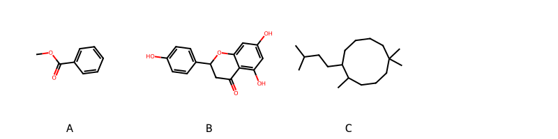

!!! abstract "Tóm tắt"

    **Họ Erythroxylaceae** có **1** chi được các cộng đồng sử dụng trong chăm sóc sức khỏe gồm *Erythroxylum*. Số lượng thành phần hóa học đã phân lập và xác định cấu trúc từ họ này tính đến tháng 12 năm 2024 là **11** nhóm có thể liệt kê như sau *Organooxygen compounds, Fatty Acyls, Flavonoids, Tropane alkaloids, Cinnamic acids and derivatives, Pyrroles, Pyrrolidines, Carboxylic acids and derivatives, Benzene and substituted derivatives, Pyridines and derivatives, Prenol lipids*. Giữa các loài trong họ này, 3 dược liệu được nghiên cứu nhiều nhất dựa trên số thành phần được phân lập là **Erythroxylum coca, Erythroxylum cuneatum, Erythroxylum rufum*. *Họ Erythroxylaceae* đã được một số công động tại các quốc gia như Elsewhere, Venezuela, Turkey, Ecuador(Jivaro), Amerindian, Peru, South America, Europe, India, Pahang, Ecuador, Colombia(Cubeo) đã phát hiện một số tác dụng trên lâm sàng gồm chữa bệnh lẫn độc tính như Chất gây ảo giác, Chất gây ảo giác, Chất kích thích, Chất kích thích, Lo lắng, Ma túy, Chất độc, Họ sẽ mở, thuốc tống hơi, Tiêu hóa, Thuốc lợi tiểu, Thuốc kích thích tình dục, Ma túy, Thuốc bổ, Thuốc diệt cá, Thuốc gây mê, Thuốc gây mê, Chất kích thích, Ma túy, Ma túy, Chất kích thích, Thuốc gây mê, Chất làm se, giãn đồng tử, Chất kích thích.

!!! info "DrDuke"

    James A. Duke sinh năm 1929-2017 là một nhà thực vật học người Mỹ. Đây là một trong những tác giả hàng đầu trong lĩnh vực dược dân tộc học với cuốn *CRC Handbook of Medicinal Herbs* và chính là người xây dựng lên cơ sở dữ liệu về hợp chất tự nhiên và dược dân tộc học tại Bộ nông nghiệp Hoa Kỳ. Các thông tin được đăng tải tại website [Dr. Duke's Phytochemical and Ethnobotanical Databases](https://phytochem.nal.usda.gov/). 
    Trong suốt thập niên 1970, ông lãnh đạo the Plant Taxonomy Laboratory, Plant Genetics and Germplasm Institute of the Agricultural Research Service, U.S. Department of Agriculture.
    Trong tài liệu này, các thông tin về dược dân tộc của các dược liệu được trích dẫn từ tài liệu của James A. Ducke với sự trợ giúp của phần mềm dịch thuật từ tiếng Anh sang tiếng Việt.
   
## Tổng quan về Họ Erythroxylaceae
### Phân loại thực vật
Trong *họ Erythroxylaceae* có **1** chi được sử dụng làm thuốc với chi tiết số loài trong mỗi chi như sau Erythroxylum (3) . Chi tiết về loài sử dụng làm thuốc như dưới đây.  

>Họ Erythroxylaceae


>|-- Chi Erythroxylum

>*Erythroxylum coca*,
>*Erythroxylum cuneatum*,
>*Erythroxylum rufum*,

### Thành phần hóa học 

Số lượng thành phần hóa học đã phân lập và xác định cấu trúc từ họ này tính đến tháng 12 năm 2024 là 11 nhóm có thể liệt kê như sau Organooxygen compounds, Fatty Acyls, Flavonoids, Tropane alkaloids, Cinnamic acids and derivatives, Pyrroles, Pyrrolidines, Carboxylic acids and derivatives, Benzene and substituted derivatives, Pyridines and derivatives, Prenol lipids. Số lượng các loài đã được nghiên cứu thành phần hóa học là *3* trong tổng số *3* loài thuộc họ Erythroxylaceae.Giữa các loài trong họ này, 3 dược liệu được nghiên cứu nhiều nhất dựa trên số thành phần được phân lập là **Erythroxylum coca, Erythroxylum cuneatum, Erythroxylum rufum**. Sử dụng phần mềm RDKIT với thuật toán  Find Maximum Common Substructure (FMCS), các nhóm hoạt chất phổ biến nhất trong *họ Erythroxylaceae* đã xây dựng được nhân. Điều này trong tương lại có thể được sử dụng tìm kiếm mối liên hệ giữa tác dụng của cấu trúc hóa học và tác dụng dược lý. Các nhân trong phần này có thể không giống như cấu trúc gốc của từng nhóm chất. Kết quả được trình bầy như hình dưới đây.

<figure markdown="span">
    { width=100% }
    <figcaption> Cấu trúc hóa học của một số khung cơ bản dựa trên thuật toán FMCS để tìm Benzene and substituted derivatives (A), Flavonoids (B), Prenol lipids (C).</figcaption>
</figure>


!!! info  "Find Maximum Common Substructure"
    
    Thuật toán FMCS (Find Maximum Common Substructure) là một phương pháp được sử dụng để tìm ra cấu trúc chung nhiều nhất (MCS) trong một tập hợp các cấu trúc hóa học. Các bước của thuật toán gồm:
    - Chọn một cấu trúc hóa học là cấu trúc để tạo truy vấn, còn các cấu trúc khác là mục tiêu.
    - Chia nhỏ cấu trúc để tạo truy vấn thành cấu trúc nhỏ hơn dạng chuỗi SMARTS.
    - Kiểm tra chuỗi SMARTS trong các cấu trúc mục tiêu.
    - Tìm kiếm chuỗi SMARTS xuất hiện nhiều nhất.
    Để biết thêm chi tiết các bạn có thể xem tại [TeachOpenCADD](https://projects.volkamerlab.org/teachopencadd/talktorials/T006_compound_maximum_common_substructures.html)
    ``` python
    pip install rdkit
    def find_core_smiles(smiles_list):
        mols = [Chem.MolFromSmiles(smiles) for smiles in smiles_list]
        mcs = rdFMCS.FindMCS(mols)
        core_smiles = Chem.MolToSmiles(Chem.MolFromSmarts(mcs.smartsString))
        return core_smiles
    ```

### Dược dân tộc học

Họ **Erythroxylaceae** đã được một số công động tại các quốc gia như *Elsewhere, Venezuela, Turkey, Ecuador(Jivaro), Amerindian, Peru, South America, Europe, India, Pahang, Ecuador, Colombia(Cubeo)* đã phát hiện một số tác dụng trên lâm sàng gồm chữa bệnh lẫn độc tính như *Chất gây ảo giác, Chất gây ảo giác, Chất kích thích, Chất kích thích, Lo lắng, Ma túy, Chất độc, Họ sẽ mở, thuốc tống hơi, Tiêu hóa, Thuốc lợi tiểu, Thuốc kích thích tình dục, Ma túy, Thuốc bổ, Thuốc diệt cá, Thuốc gây mê, Thuốc gây mê, Chất kích thích, Ma túy, Ma túy, Chất kích thích, Thuốc gây mê, Chất làm se, giãn đồng tử, Chất kích thích*.

## Chi tiết dược dân tộc học


### Chi Erythroxylum

!!! note "Danh sách các loài thuộc chi"
    
*	 - *Erythroxylum coca*
	 - *Erythroxylum cuneatum*
	 - *Erythroxylum rufum**

---      
#### *Erythroxylum coca*
**Thông tin về thực vật**

!!! info "Phân loại thực vật của *Erythroxylum coca* từ GIBF:"
    - **Kingdom:** Plantae
    - **Phylum:** Tracheophyta
    - **Order:** Malpighiales
    - **Family:** Erythroxylaceae
    - **Genus:** Erythroxylum
    - **Species:** *Erythroxylum coca*


 

Chưa có thông tin về loài này trên wikidata.

*Phân bố trên thế giới*: nan, Bolivia (Plurinational State of), United States of America, Honduras, Colombia, China, unknown or invalid, El Salvador, Norway, Ecuador, Brazil, Côte d’Ivoire, Panama, Costa Rica, Peru, Slovakia, Belgium

*Phân bố tại Việt Nam*: Không có ghi nhận ở Việt Nam

**Thành phần hóa học**
        

Theo cơ sở dữ liệu lotus, từ loài *Erythroxylum coca* đã phân lập và xác định được 27 hoạt chất thuộc về các nhóm Fatty Acyls, Cinnamic acids and derivatives, Pyrroles, Tropane alkaloids, Pyrrolidines, Carboxylic acids and derivatives, Benzene and substituted derivatives, Pyridines and derivatives. Danh sách các hoạt chất như sau hygrine [(LTS0269809)](https://lotus.naturalproducts.net/compound/lotus_id/LTS0269809), hexanol [(LTS0217299)](https://lotus.naturalproducts.net/compound/lotus_id/LTS0217299), benzoylecgonine [(LTS0050319)](https://lotus.naturalproducts.net/compound/lotus_id/LTS0050319), (2s)-2-(phenylamino)propanoic acid [(LTS0199539)](https://lotus.naturalproducts.net/compound/lotus_id/LTS0199539), (z)-cinnamoylcocaine [(LTS0213762)](https://lotus.naturalproducts.net/compound/lotus_id/LTS0213762), cuskhygrine [(LTS0083137)](https://lotus.naturalproducts.net/compound/lotus_id/LTS0083137), (1r,5s)-8-methyl-8-azabicyclo[3.2.1]octan-3-yl (2z)-3-phenylprop-2-enoate [(LTS0243751)](https://lotus.naturalproducts.net/compound/lotus_id/LTS0243751), d-phenylalanine [(LTS0048920)](https://lotus.naturalproducts.net/compound/lotus_id/LTS0048920), (+)-hygrine [(LTS0186540)](https://lotus.naturalproducts.net/compound/lotus_id/LTS0186540), methyl (2r,3s)-3-hydroxy-8-methyl-8-azabicyclo[3.2.1]octane-2-carboxylate [(LTS0124863)](https://lotus.naturalproducts.net/compound/lotus_id/LTS0124863), (-)-nicotine [(LTS0184620)](https://lotus.naturalproducts.net/compound/lotus_id/LTS0184620), cocaine [(LTS0252766)](https://lotus.naturalproducts.net/compound/lotus_id/LTS0252766), cuscohygrine [(LTS0040983)](https://lotus.naturalproducts.net/compound/lotus_id/LTS0040983), tropanone [(LTS0059326)](https://lotus.naturalproducts.net/compound/lotus_id/LTS0059326), (1r,5s)-8-methyl-8-azabicyclo[3.2.1]octan-3-yl benzoate [(LTS0170248)](https://lotus.naturalproducts.net/compound/lotus_id/LTS0170248), hydroxytropacocaine [(LTS0012034)](https://lotus.naturalproducts.net/compound/lotus_id/LTS0012034), methyl (1r,2r,3s,5s)-8-methyl-3-{[(2e)-3-phenylprop-2-enoyl]oxy}-8-azabicyclo[3.2.1]octane-2-carboxylate [(LTS0033591)](https://lotus.naturalproducts.net/compound/lotus_id/LTS0033591), ecgonine methyl ester [(LTS0005115)](https://lotus.naturalproducts.net/compound/lotus_id/LTS0005115), methyl salicylate [(LTS0128373)](https://lotus.naturalproducts.net/compound/lotus_id/LTS0128373), l-arginine [(LTS0064737)](https://lotus.naturalproducts.net/compound/lotus_id/LTS0064737), 1-methylpyrrole [(LTS0044483)](https://lotus.naturalproducts.net/compound/lotus_id/LTS0044483), cocaine [(LTS0022144)](https://lotus.naturalproducts.net/compound/lotus_id/LTS0022144), nicotine [(LTS0177379)](https://lotus.naturalproducts.net/compound/lotus_id/LTS0177379), (1r,5s)-8-methyl-8-azabicyclo[3.2.1]octan-3-yl (2e)-3-phenylprop-2-enoate [(LTS0270454)](https://lotus.naturalproducts.net/compound/lotus_id/LTS0270454), benzoyltropine [(LTS0048448)](https://lotus.naturalproducts.net/compound/lotus_id/LTS0048448), (1r,5s)-8-methyl-8-azabicyclo[3.2.1]octan-3-yl 2-phenylacetate [(LTS0163179)](https://lotus.naturalproducts.net/compound/lotus_id/LTS0163179), (1-methylpyrrolidin-2-yl)acetic acid [(LTS0227380)](https://lotus.naturalproducts.net/compound/lotus_id/LTS0227380).

| chemicalTaxonomyClassyfireClass     |   lotus_count |
|:------------------------------------|--------------:|
|                                     |             4 |
| Benzene and substituted derivatives |             6 |
| Carboxylic acids and derivatives    |             3 |
| Cinnamic acids and derivatives      |             4 |
| Fatty Acyls                         |             1 |
| Pyridines and derivatives           |             2 |
| Pyrroles                            |             1 |
| Pyrrolidines                        |             1 |
| Tropane alkaloids                   |             4 |


**Dược dân tộc học**

Danh sách các quốc gia có sử dụng *Erythroxylum coca* trong điều trị các bệnh. 

| Quốc gia        | Bệnh                                                                          |
|:----------------|:------------------------------------------------------------------------------|
| Amerindian      | Họ sẽ mở, thuốc tống hơi, Tiêu hóa, Thuốc lợi tiểu, Thuốc kích thích tình dục |
| Colombia(Cubeo) | Ma túy                                                                        |
| Ecuador         | Ma túy                                                                        |
| Ecuador(Jivaro) | Chất gây ảo giác                                                              |
| Elsewhere       | Thuốc gây mê, Chất kích thích, Ma túy, Ma túy, Chất kích thích                |
| Europe          | Thuốc gây mê                                                                  |
| India           | Thuốc gây mê, Chất làm se, giãn đồng tử, Chất kích thích                      |
| Peru            | Chất gây ảo giác, Chất kích thích                                             |
| South America   | Chất độc                                                                      |
| Turkey          | Chất kích thích, Lo lắng, Ma túy                                              |


---      
#### *Erythroxylum cuneatum*
**Thông tin về thực vật**

!!! info "Phân loại thực vật của *Erythroxylum cuneatum* từ GIBF:"
    - **Kingdom:** Plantae
    - **Phylum:** Tracheophyta
    - **Order:** Malpighiales
    - **Family:** Erythroxylaceae
    - **Genus:** Erythroxylum
    - **Species:** *Erythroxylum cuneatum*


 

Chưa có thông tin về loài này trên wikidata.

*Phân bố trên thế giới*: Thailand, Myanmar, nan, United States of America, Philippines, Brunei Darussalam, Papua New Guinea, unknown or invalid, Malaysia, Indonesia, Brazil, Singapore, Madagascar, Lao People’s Democratic Republic, Viet Nam

*Phân bố tại Việt Nam*: Không có ghi nhận ở Việt Nam

**Thành phần hóa học**
        

Theo cơ sở dữ liệu lotus, từ loài *Erythroxylum cuneatum* đã phân lập và xác định được 19 hoạt chất thuộc về các nhóm Benzene and substituted derivatives, Prenol lipids, Organooxygen compounds, Pyridines and derivatives. Danh sách các hoạt chất như sau 1-(8a-hydroxy-2,4a,8,8-tetramethyl-decahydrophenanthren-2-yl)ethane-1,2-diol [(LTS0070905)](https://lotus.naturalproducts.net/compound/lotus_id/LTS0070905), (1r,3r,5s,6r)-6-(benzoyloxy)-8-methyl-8-azabicyclo[3.2.1]octan-3-yl benzoate [(LTS0074520)](https://lotus.naturalproducts.net/compound/lotus_id/LTS0074520), ent-manool [(LTS0136185)](https://lotus.naturalproducts.net/compound/lotus_id/LTS0136185), (2r,4as,4br,7r,10as)-7-ethenyl-1,1,4a,7-tetramethyl-3,4,4b,5,6,9,10,10a-octahydro-2h-phenanthren-2-ol [(LTS0177756)](https://lotus.naturalproducts.net/compound/lotus_id/LTS0177756), 5-(3-hydroxy-3-methylpent-4-en-1-yl)-1,1,4a-trimethyl-6-methylidene-hexahydro-2h-naphthalen-2-ol [(LTS0272270)](https://lotus.naturalproducts.net/compound/lotus_id/LTS0272270), (2r,4as,5r,8as)-5-[(3s)-3-hydroxy-3-methylpent-4-en-1-yl]-1,1,4a-trimethyl-6-methylidene-hexahydro-2h-naphthalen-2-ol [(LTS0202487)](https://lotus.naturalproducts.net/compound/lotus_id/LTS0202487), (-)-nicotine [(LTS0184620)](https://lotus.naturalproducts.net/compound/lotus_id/LTS0184620), (1r,3r,5s)-8-methyl-8-azabicyclo[3.2.1]octan-3-yl benzoate [(LTS0003279)](https://lotus.naturalproducts.net/compound/lotus_id/LTS0003279), (1r,5s)-8-methyl-8-azabicyclo[3.2.1]octan-3-yl benzoate [(LTS0170248)](https://lotus.naturalproducts.net/compound/lotus_id/LTS0170248), (1s,4as,6s,8as)-6-[(1s)-1,2-dihydroxyethyl]-6,8a-dimethyl-1-(4-methylpent-4-en-1-yl)-hexahydro-1h-naphthalen-2-one [(LTS0079492)](https://lotus.naturalproducts.net/compound/lotus_id/LTS0079492), (1s)-1-[(2s,4as,4br,8as,10as)-8a-hydroxy-2,4a,8,8-tetramethyl-decahydrophenanthren-2-yl]ethane-1,2-diol [(LTS0219009)](https://lotus.naturalproducts.net/compound/lotus_id/LTS0219009), 5-(5,5,8a-trimethyl-2-methylidene-hexahydro-1h-naphthalen-1-yl)-3-methylpent-1-en-3-ol [(LTS0259845)](https://lotus.naturalproducts.net/compound/lotus_id/LTS0259845), 7-ethenyl-1,1,4a,7-tetramethyl-3,4,4b,5,6,9,10,10a-octahydro-2h-phenanthren-2-ol [(LTS0048503)](https://lotus.naturalproducts.net/compound/lotus_id/LTS0048503), 7-ethenyl-1,1,4a,7-tetramethyl-3,4,4b,5,6,9,10,10a-octahydro-2h-phenanthrene-2,5-diol [(LTS0091480)](https://lotus.naturalproducts.net/compound/lotus_id/LTS0091480), 6-(benzoyloxy)-8-methyl-8-azabicyclo[3.2.1]octan-3-yl benzoate [(LTS0226658)](https://lotus.naturalproducts.net/compound/lotus_id/LTS0226658), nicotine [(LTS0177379)](https://lotus.naturalproducts.net/compound/lotus_id/LTS0177379), benzoyltropine [(LTS0048448)](https://lotus.naturalproducts.net/compound/lotus_id/LTS0048448), 6-(1,2-dihydroxyethyl)-6,8a-dimethyl-1-(4-methylpent-4-en-1-yl)-hexahydro-1h-naphthalen-2-one [(LTS0071633)](https://lotus.naturalproducts.net/compound/lotus_id/LTS0071633), (2r,4ar,4br,5s,7r,10as)-7-ethenyl-1,1,4a,7-tetramethyl-3,4,4b,5,6,9,10,10a-octahydro-2h-phenanthrene-2,5-diol [(LTS0218148)](https://lotus.naturalproducts.net/compound/lotus_id/LTS0218148).

| chemicalTaxonomyClassyfireClass     |   lotus_count |
|:------------------------------------|--------------:|
| Benzene and substituted derivatives |             5 |
| Organooxygen compounds              |             2 |
| Prenol lipids                       |            10 |
| Pyridines and derivatives           |             2 |


**Dược dân tộc học**

Danh sách các quốc gia có sử dụng *Erythroxylum cuneatum* trong điều trị các bệnh. 

| Quốc gia   | Bệnh          |
|:-----------|:--------------|
| Elsewhere  | Thuốc diệt cá |
| Pahang     | Thuốc bổ      |


---      
#### *Erythroxylum rufum*
**Thông tin về thực vật**

!!! info "Phân loại thực vật của *Erythroxylum rufum* từ GIBF:"
    - **Kingdom:** Plantae
    - **Phylum:** Tracheophyta
    - **Order:** Malpighiales
    - **Family:** Erythroxylaceae
    - **Genus:** Erythroxylum
    - **Species:** *Erythroxylum rufum*


 

Chưa có thông tin về loài này trên wikidata.

*Phân bố trên thế giới*: nan, Bolivia (Plurinational State of), Venezuela (Bolivarian Republic of), Haiti, Colombia, Dominican Republic, Canada, Brazil, Cuba, Jamaica, Puerto Rico, Peru, Guyana

*Phân bố tại Việt Nam*: Không có ghi nhận ở Việt Nam

**Thành phần hóa học**
        

Theo cơ sở dữ liệu lotus, từ loài *Erythroxylum rufum* đã phân lập và xác định được 15 hoạt chất thuộc về các nhóm Flavonoids, Benzene and substituted derivatives. Danh sách các hoạt chất như sau 2-(3,4-dihydroxyphenyl)-5,7-dihydroxy-3-{[(2s,3r,4r,5r,6s)-3,4,5-trihydroxy-6-(hydroxymethyl)oxan-2-yl]oxy}chromen-4-one [(LTS0241372)](https://lotus.naturalproducts.net/compound/lotus_id/LTS0241372), cocaine [(LTS0252766)](https://lotus.naturalproducts.net/compound/lotus_id/LTS0252766), 5,7-dihydroxy-2-(4-hydroxyphenyl)-3-[(3,4,5-trihydroxy-6-methyloxan-2-yl)oxy]chromen-4-one [(LTS0211340)](https://lotus.naturalproducts.net/compound/lotus_id/LTS0211340), cocaine [(LTS0022144)](https://lotus.naturalproducts.net/compound/lotus_id/LTS0022144), prunin [(LTS0234554)](https://lotus.naturalproducts.net/compound/lotus_id/LTS0234554), hyperoside [(LTS0089156)](https://lotus.naturalproducts.net/compound/lotus_id/LTS0089156), 5,7-dihydroxy-3-{[(2s,3r,4s,5s,6r)-3,4,5-trihydroxy-6-(hydroxymethyl)oxan-2-yl]oxy}-2-(3,4,5-trihydroxyphenyl)chromen-4-one [(LTS0113279)](https://lotus.naturalproducts.net/compound/lotus_id/LTS0113279), (+)-taxifolin [(LTS0090664)](https://lotus.naturalproducts.net/compound/lotus_id/LTS0090664), guaijaverin [(LTS0119144)](https://lotus.naturalproducts.net/compound/lotus_id/LTS0119144), trifolin [(LTS0237581)](https://lotus.naturalproducts.net/compound/lotus_id/LTS0237581), astragalin [(LTS0249588)](https://lotus.naturalproducts.net/compound/lotus_id/LTS0249588), juglanin [(LTS0053649)](https://lotus.naturalproducts.net/compound/lotus_id/LTS0053649), quercitrin [(LTS0093095)](https://lotus.naturalproducts.net/compound/lotus_id/LTS0093095), 2-(3,4-dihydroxyphenyl)-5,7-dihydroxy-3-{[(2s,3r,4s,5r)-3,4,5-trihydroxyoxan-2-yl]oxy}-2,3-dihydro-1-benzopyran-4-one [(LTS0135293)](https://lotus.naturalproducts.net/compound/lotus_id/LTS0135293), (2s)-5-hydroxy-2-(4-hydroxyphenyl)-7-{[(2r,3s,4r,5r,6s)-3,4,5-trihydroxy-6-(hydroxymethyl)oxan-2-yl]oxy}-2,3-dihydro-1-benzopyran-4-one [(LTS0055196)](https://lotus.naturalproducts.net/compound/lotus_id/LTS0055196).

| chemicalTaxonomyClassyfireClass     |   lotus_count |
|:------------------------------------|--------------:|
| Benzene and substituted derivatives |             1 |
| Flavonoids                          |            13 |


**Dược dân tộc học**

Danh sách các quốc gia có sử dụng *Erythroxylum rufum* trong điều trị các bệnh. 

| Quốc gia   | Bệnh     |
|:-----------|:---------|
| Venezuela  | Chất độc |


## Bình luận

<div id="giscus-container"></div>
<script src="https://giscus.app/client.js"
        data-repo="hoangson0787/CSDL-duoc-lieu"
        data-repo-id="R_kgDONbMRNA"
        data-category="Duoc lieu"
        data-category-id="DIC_kwDONbMRNM4ClklR"
        data-mapping="pathname"
        data-strict="0"
        data-reactions-enabled="1"
        data-emit-metadata="1"
        data-input-position="bottom"
        data-theme="light"
        data-lang="en"
        crossorigin="anonymous"
        async>
</script>

