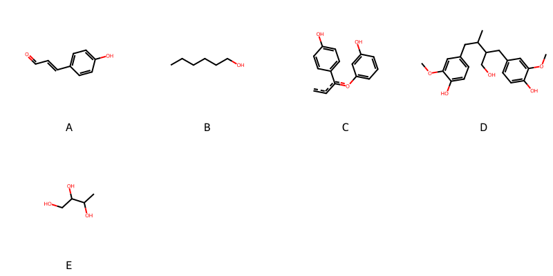

!!! abstract "Tóm tắt"

    **Họ Grossulariaceae** có **2** chi được các cộng đồng sử dụng trong chăm sóc sức khỏe gồm *Itea, Ribes*. Số lượng thành phần hóa học đã phân lập và xác định cấu trúc từ họ này tính đến tháng 12 năm 2024 là **16** nhóm có thể liệt kê như sau *Lignan lactones, Organooxygen compounds, Flavonoids, Fatty Acyls, Cinnamic acids and derivatives, Aryltetralin lignans, Furanoid lignans, Dihydrofurans, Nucleoside and nucleotide analogues, Phenols, Tannins, Carboxylic acids and derivatives, Benzene and substituted derivatives, Prenol lipids, Harmala alkaloids, Dibenzylbutane lignans*. Giữa các loài trong họ này, 3 dược liệu được nghiên cứu nhiều nhất dựa trên số thành phần được phân lập là **Ribes nigrum, Ribes rubrum, Ribes orientale*. *Họ Grossulariaceae* đã được một số công động tại các quốc gia như China, UK, Elsewhere, Turkey, ain, Canada(Kwakiutl), Haiti đã phát hiện một số tác dụng trên lâm sàng gồm chữa bệnh lẫn độc tính như Chất làm se, Chất làm lạnh, Giờ mở cửa, Giờ mở cửa, Thuốc kháng axit, Tiêu hóa, Thuốc lợi tiểu, Thuốc nhuận tràng, Thuốc lợi tiểu, Thuốc lợi tiểu, Chất làm lạnh, có mùi hôi, Tiêu hóa, Thuốc lợi tiểu, Thuốc nhuận tràng, Thuốc nhuận tràng, Thuốc đắp, dạ dày.

!!! info "DrDuke"

    James A. Duke sinh năm 1929-2017 là một nhà thực vật học người Mỹ. Đây là một trong những tác giả hàng đầu trong lĩnh vực dược dân tộc học với cuốn *CRC Handbook of Medicinal Herbs* và chính là người xây dựng lên cơ sở dữ liệu về hợp chất tự nhiên và dược dân tộc học tại Bộ nông nghiệp Hoa Kỳ. Các thông tin được đăng tải tại website [Dr. Duke's Phytochemical and Ethnobotanical Databases](https://phytochem.nal.usda.gov/). 
    Trong suốt thập niên 1970, ông lãnh đạo the Plant Taxonomy Laboratory, Plant Genetics and Germplasm Institute of the Agricultural Research Service, U.S. Department of Agriculture.
    Trong tài liệu này, các thông tin về dược dân tộc của các dược liệu được trích dẫn từ tài liệu của James A. Ducke với sự trợ giúp của phần mềm dịch thuật từ tiếng Anh sang tiếng Việt.
   
## Tổng quan về Họ Grossulariaceae
### Phân loại thực vật
Trong *họ Grossulariaceae* có **2** chi được sử dụng làm thuốc với chi tiết số loài trong mỗi chi như sau Ribes (6) . Chi tiết về loài sử dụng làm thuốc như dưới đây.  

>Họ Grossulariaceae


>|-- Chi Itea

>*Itea chinensis*,

>|-- Chi Ribes

>*Ribes grossularia*,
>*Ribes lobbii*,
>*Ribes nigrum*,
>*Ribes orientale*,
>*Ribes rubrum*,
>*Ribes uvacria*,

### Thành phần hóa học 

Số lượng thành phần hóa học đã phân lập và xác định cấu trúc từ họ này tính đến tháng 12 năm 2024 là 16 nhóm có thể liệt kê như sau Lignan lactones, Organooxygen compounds, Flavonoids, Fatty Acyls, Cinnamic acids and derivatives, Aryltetralin lignans, Furanoid lignans, Dihydrofurans, Nucleoside and nucleotide analogues, Phenols, Tannins, Carboxylic acids and derivatives, Benzene and substituted derivatives, Prenol lipids, Harmala alkaloids, Dibenzylbutane lignans. Số lượng các loài đã được nghiên cứu thành phần hóa học là *5* trong tổng số *7* loài thuộc họ Grossulariaceae.Giữa các loài trong họ này, 3 dược liệu được nghiên cứu nhiều nhất dựa trên số thành phần được phân lập là **Ribes nigrum, Ribes rubrum, Ribes orientale**. Sử dụng phần mềm RDKIT với thuật toán  Find Maximum Common Substructure (FMCS), các nhóm hoạt chất phổ biến nhất trong *họ Grossulariaceae* đã xây dựng được nhân. Điều này trong tương lại có thể được sử dụng tìm kiếm mối liên hệ giữa tác dụng của cấu trúc hóa học và tác dụng dược lý. Các nhân trong phần này có thể không giống như cấu trúc gốc của từng nhóm chất. Kết quả được trình bầy như hình dưới đây.

<figure markdown="span">
    { width=100% }
    <figcaption> Cấu trúc hóa học của một số khung cơ bản dựa trên thuật toán FMCS để tìm Cinnamic acids and derivatives (A), Fatty Acyls (B), Flavonoids (C), Furanoid lignans (D), Organooxygen compounds (E).</figcaption>
</figure>


!!! info  "Find Maximum Common Substructure"
    
    Thuật toán FMCS (Find Maximum Common Substructure) là một phương pháp được sử dụng để tìm ra cấu trúc chung nhiều nhất (MCS) trong một tập hợp các cấu trúc hóa học. Các bước của thuật toán gồm:
    - Chọn một cấu trúc hóa học là cấu trúc để tạo truy vấn, còn các cấu trúc khác là mục tiêu.
    - Chia nhỏ cấu trúc để tạo truy vấn thành cấu trúc nhỏ hơn dạng chuỗi SMARTS.
    - Kiểm tra chuỗi SMARTS trong các cấu trúc mục tiêu.
    - Tìm kiếm chuỗi SMARTS xuất hiện nhiều nhất.
    Để biết thêm chi tiết các bạn có thể xem tại [TeachOpenCADD](https://projects.volkamerlab.org/teachopencadd/talktorials/T006_compound_maximum_common_substructures.html)
    ``` python
    pip install rdkit
    def find_core_smiles(smiles_list):
        mols = [Chem.MolFromSmiles(smiles) for smiles in smiles_list]
        mcs = rdFMCS.FindMCS(mols)
        core_smiles = Chem.MolToSmiles(Chem.MolFromSmarts(mcs.smartsString))
        return core_smiles
    ```

### Dược dân tộc học

Họ **Grossulariaceae** đã được một số công động tại các quốc gia như *China, UK, Elsewhere, Turkey, ain, Canada(Kwakiutl), Haiti* đã phát hiện một số tác dụng trên lâm sàng gồm chữa bệnh lẫn độc tính như *Chất làm se, Chất làm lạnh, Giờ mở cửa, Giờ mở cửa, Thuốc kháng axit, Tiêu hóa, Thuốc lợi tiểu, Thuốc nhuận tràng, Thuốc lợi tiểu, Thuốc lợi tiểu, Chất làm lạnh, có mùi hôi, Tiêu hóa, Thuốc lợi tiểu, Thuốc nhuận tràng, Thuốc nhuận tràng, Thuốc đắp, dạ dày*.

## Chi tiết dược dân tộc học


### Chi Itea

!!! note "Danh sách các loài thuộc chi"
    
*	 - *Itea chinensis**

---      
#### *Itea chinensis*
**Thông tin về thực vật**

!!! info "Phân loại thực vật của *Itea chinensis* từ GIBF:"
    - **Kingdom:** Plantae
    - **Phylum:** Tracheophyta
    - **Order:** Saxifragales
    - **Family:** Iteaceae
    - **Genus:** Itea
    - **Species:** *Itea chinensis*


 

Chưa có thông tin về loài này trên wikidata.

*Phân bố trên thế giới*: Thailand, United States of America, China, Chinese Taipei, Hong Kong, unknown or invalid, Viet Nam

*Phân bố tại Việt Nam*: Thua Thien-Hue, Lam Dong, Kon Tum, Ninh Binh, Vinh Phuc

**Thành phần hóa học**
        

Theo cơ sở dữ liệu lotus, từ loài *Itea chinensis* đã phân lập và xác định được 4 hoạt chất thuộc về các nhóm Flavonoids. Danh sách các hoạt chất như sau vitexin [(LTS0199581)](https://lotus.naturalproducts.net/compound/lotus_id/LTS0199581), isoorientin [(LTS0061958)](https://lotus.naturalproducts.net/compound/lotus_id/LTS0061958), orientin [(LTS0172349)](https://lotus.naturalproducts.net/compound/lotus_id/LTS0172349), isovitexin [(LTS0209186)](https://lotus.naturalproducts.net/compound/lotus_id/LTS0209186).

| chemicalTaxonomyClassyfireClass   |   lotus_count |
|:----------------------------------|--------------:|
| Flavonoids                        |             4 |


**Dược dân tộc học**

Danh sách các quốc gia có sử dụng *Itea chinensis* trong điều trị các bệnh. 

| Quốc gia   | Bệnh   |
|:-----------|:-------|
| China      | dạ dày |


### Chi Ribes

!!! note "Danh sách các loài thuộc chi"
    
*	 - *Ribes grossularia*
	 - *Ribes lobbii*
	 - *Ribes nigrum*
	 - *Ribes orientale*
	 - *Ribes rubrum*
	 - *Ribes uva-cria**

---      
#### *Ribes grossularia*
**Thông tin về thực vật**

!!! info "Phân loại thực vật của *N/A* từ GIBF:"
    - **Kingdom:** Plantae
    - **Phylum:** Tracheophyta
    - **Order:** Saxifragales
    - **Family:** Grossulariaceae
    - **Genus:** Ribes
    - **Species:** *N/A*


 

Chưa có thông tin về loài này trên wikidata.

*Phân bố trên thế giới*: France, United States of America, Mexico, Russian Federation, New Zealand, Canada, Chile, Argentina

*Phân bố tại Việt Nam*: Không có ghi nhận ở Việt Nam

**Thành phần hóa học**
        

Theo cơ sở dữ liệu lotus, từ loài *Ribes grossularia* đã phân lập và xác định được 1 hoạt chất thuộc về các nhóm Dihydrofurans. Danh sách các hoạt chất như sau vitamin c [(LTS0022555)](https://lotus.naturalproducts.net/compound/lotus_id/LTS0022555).

| chemicalTaxonomyClassyfireClass   |   lotus_count |
|:----------------------------------|--------------:|
| Dihydrofurans                     |             1 |


**Dược dân tộc học**

Danh sách các quốc gia có sử dụng *N/A* trong điều trị các bệnh. 

| Quốc gia   | Bệnh                                   |
|:-----------|:---------------------------------------|
| UK         | Chất làm se, Chất làm lạnh, Giờ mở cửa |


---      
#### *Ribes grossularia*
**Thông tin về thực vật**

!!! info "Phân loại thực vật của *N/A* từ GIBF:"
    - **Kingdom:** Plantae
    - **Phylum:** Tracheophyta
    - **Order:** Saxifragales
    - **Family:** Grossulariaceae
    - **Genus:** Ribes
    - **Species:** *N/A*


 

Chưa có thông tin về loài này trên wikidata.

*Phân bố trên thế giới*: France, United States of America, Mexico, Russian Federation, New Zealand, Canada, Chile, Argentina

*Phân bố tại Việt Nam*: Không có ghi nhận ở Việt Nam

**Thành phần hóa học**
        

Chưa có nghiên cứu về thành phần hóa học của loài này


**Dược dân tộc học**

Danh sách các quốc gia có sử dụng *N/A* trong điều trị các bệnh. 

| Quốc gia         | Bệnh      |
|:-----------------|:----------|
| Canada(Kwakiutl) | Thuốc đắp |


---      
#### *Ribes nigrum*
**Thông tin về thực vật**

!!! info "Phân loại thực vật của *Ribes nigrum* từ GIBF:"
    - **Kingdom:** Plantae
    - **Phylum:** Tracheophyta
    - **Order:** Saxifragales
    - **Family:** Grossulariaceae
    - **Genus:** Ribes
    - **Species:** *Ribes nigrum*


 

Chưa có thông tin về loài này trên wikidata.

*Phân bố trên thế giới*: Germany, Switzerland, Czechia, Netherlands, Poland, Sweden, Mongolia, Belarus, Russian Federation, Montenegro, Estonia, United Kingdom of Great Britain and Northern Ireland, Ukraine, United States of America, China, Lithuania, Norway, Canada, Denmark, Austria

*Phân bố tại Việt Nam*: Không có ghi nhận ở Việt Nam

**Thành phần hóa học**
        

Theo cơ sở dữ liệu lotus, từ loài *Ribes nigrum* đã phân lập và xác định được 153 hoạt chất thuộc về các nhóm Lignan lactones, Organooxygen compounds, Flavonoids, Fatty Acyls, Cinnamic acids and derivatives, Aryltetralin lignans, Furanoid lignans, Carboxylic acids and derivatives, Phenols, Tannins, Dihydrofurans, Benzene and substituted derivatives, Prenol lipids, Harmala alkaloids, Dibenzylbutane lignans. Danh sách các hoạt chất như sau (+)-isolariciresinol [(LTS0164886)](https://lotus.naturalproducts.net/compound/lotus_id/LTS0164886), 3-{[4,5-dihydroxy-6-(hydroxymethyl)-3-[(3,4,5-trihydroxyoxan-2-yl)oxy]oxan-2-yl]oxy}-2-(3,4-dihydroxyphenyl)-7-hydroxy-5-{[3,4,5-trihydroxy-6-(hydroxymethyl)oxan-2-yl]oxy}-1λ⁴-chromen-1-ylium [(LTS0233510)](https://lotus.naturalproducts.net/compound/lotus_id/LTS0233510), kaempherol [(LTS0155822)](https://lotus.naturalproducts.net/compound/lotus_id/LTS0155822), ferulic acid [(LTS0077328)](https://lotus.naturalproducts.net/compound/lotus_id/LTS0077328), (+)-catechol [(LTS0117079)](https://lotus.naturalproducts.net/compound/lotus_id/LTS0117079), hesperetin [(LTS0087195)](https://lotus.naturalproducts.net/compound/lotus_id/LTS0087195), 3-(3-hydroxy-4-{[3,4,5-trihydroxy-6-(hydroxymethyl)oxan-2-yl]oxy}phenyl)prop-2-enoic acid [(LTS0007465)](https://lotus.naturalproducts.net/compound/lotus_id/LTS0007465), 5,7-dihydroxy-3-{[(2s,3r,4s,5s,6r)-3,4,5-trihydroxy-6-(hydroxymethyl)oxan-2-yl]oxy}-2-(3,4,5-trihydroxyphenyl)chromen-4-one [(LTS0113279)](https://lotus.naturalproducts.net/compound/lotus_id/LTS0113279), galop [(LTS0222857)](https://lotus.naturalproducts.net/compound/lotus_id/LTS0222857), linoleic [(LTS0013198)](https://lotus.naturalproducts.net/compound/lotus_id/LTS0013198), para-coumaric acid [(LTS0266252)](https://lotus.naturalproducts.net/compound/lotus_id/LTS0266252), cyanin [(LTS0264308)](https://lotus.naturalproducts.net/compound/lotus_id/LTS0264308), (2e)-3-(3-methoxy-4-{[(2s,3r,4s,5s,6r)-3,4,5-trihydroxy-6-(hydroxymethyl)oxan-2-yl]oxy}phenyl)prop-2-enoic acid [(LTS0116734)](https://lotus.naturalproducts.net/compound/lotus_id/LTS0116734), arctigenin methyl ether [(LTS0066013)](https://lotus.naturalproducts.net/compound/lotus_id/LTS0066013), cyanidin 3-o-rutinoside [(LTS0049654)](https://lotus.naturalproducts.net/compound/lotus_id/LTS0049654), chlorogenic acid [(LTS0226495)](https://lotus.naturalproducts.net/compound/lotus_id/LTS0226495), 2-(3,4-dihydroxyphenyl)-5,7-dihydroxy-3-{[(2s,3s,4r,5s,6s)-3,4,5-trihydroxy-6-methyloxan-2-yl]oxy}chromen-4-one [(LTS0167743)](https://lotus.naturalproducts.net/compound/lotus_id/LTS0167743), 3-[(4,5-dihydroxy-6-{[(3,4,5-trihydroxy-6-methyloxan-2-yl)oxy]methyl}-3-[(3,4,5-trihydroxyoxan-2-yl)oxy]oxan-2-yl)oxy]-2-(3,4-dihydroxyphenyl)-5,7-dihydroxy-1λ⁴-chromen-1-ylium [(LTS0101704)](https://lotus.naturalproducts.net/compound/lotus_id/LTS0101704), (1e,5r,6s,7r,8r)-1-(3,4-dihydroxyphenyl)-5,6,7,8,9-pentahydroxynon-1-ene-3,4-dione [(LTS0028362)](https://lotus.naturalproducts.net/compound/lotus_id/LTS0028362), 5,7-dihydroxy-2-(4-hydroxyphenyl)-3-{[(2r,3s,4r,5r,6s)-3,4,5-trihydroxy-6-(hydroxymethyl)oxan-2-yl]oxy}-1λ⁴-chromen-1-ylium [(LTS0140621)](https://lotus.naturalproducts.net/compound/lotus_id/LTS0140621), (2s)-7-{[(2s,3s,4s,5s,6r)-4,5-dihydroxy-6-(hydroxymethyl)-3-{[(2s,3s,4r,5r,6s)-3,4,5-trihydroxy-6-methyloxan-2-yl]oxy}oxan-2-yl]oxy}-5-hydroxy-2-(4-hydroxyphenyl)-2,3-dihydro-1-benzopyran-4-one [(LTS0138617)](https://lotus.naturalproducts.net/compound/lotus_id/LTS0138617), 3-(3,4-dihydroxyphenyl)-7-methyl-4-{[3,4,5-trihydroxy-6-(hydroxymethyl)oxan-2-yl]oxy}-2,8-dioxatricyclo[7.3.1.0⁵,¹³]trideca-1(12),3,5(13),6,9-pentaen-11-one [(LTS0256314)](https://lotus.naturalproducts.net/compound/lotus_id/LTS0256314), 2-(3,5-dihydroxy-4-oxidophenyl)-5,7-dihydroxy-3-{[(2s,3r,4s,5s,6r)-3,4,5-trihydroxy-6-(hydroxymethyl)oxan-2-yl]oxy}-1λ⁴-chromen-1-ylium [(LTS0079754)](https://lotus.naturalproducts.net/compound/lotus_id/LTS0079754), 7-methyl-4-{[3,4,5-trihydroxy-6-(hydroxymethyl)oxan-2-yl]oxy}-3-(3,4,5-trihydroxyphenyl)-2,8-dioxatricyclo[7.3.1.0⁵,¹³]trideca-1(12),3,5(13),6,9-pentaen-11-one [(LTS0021377)](https://lotus.naturalproducts.net/compound/lotus_id/LTS0021377), 3-[(4,5-dihydroxy-3-{[3,4,5-trihydroxy-6-(hydroxymethyl)oxan-2-yl]oxy}-6-{[(3,4,5-trihydroxy-6-methyloxan-2-yl)oxy]methyl}oxan-2-yl)oxy]-2-(3,4-dihydroxyphenyl)-5,7-dihydroxy-1λ⁴-chromen-1-ylium [(LTS0016654)](https://lotus.naturalproducts.net/compound/lotus_id/LTS0016654), astragalin [(LTS0249588)](https://lotus.naturalproducts.net/compound/lotus_id/LTS0249588), lariciresinol [(LTS0010950)](https://lotus.naturalproducts.net/compound/lotus_id/LTS0010950), [(2r,3s,4s,5r,6s)-6-{[2-(3,4-dihydroxyphenyl)-7-hydroxy-5-oxochromen-3-yl]oxy}-3,4,5-trihydroxyoxan-2-yl]methyl 3-(3,4-dihydroxyphenyl)prop-2-enoate [(LTS0105542)](https://lotus.naturalproducts.net/compound/lotus_id/LTS0105542), (3as,4r,9ar)-6-hydroxy-4-(4-hydroxy-3-methoxyphenyl)-7-methoxy-3h,3ah,4h,9h,9ah-naphtho[2,3-c]furan-1-one [(LTS0229877)](https://lotus.naturalproducts.net/compound/lotus_id/LTS0229877), 5,7-dihydroxy-2-(3-hydroxy-5-methoxy-4-oxidophenyl)-3-{[(2s,3r,4s,5s,6r)-3,4,5-trihydroxy-6-(hydroxymethyl)oxan-2-yl]oxy}-1λ⁴-chromen-1-ylium [(LTS0002588)](https://lotus.naturalproducts.net/compound/lotus_id/LTS0002588), petunidin-3-o-glucoside [(LTS0178327)](https://lotus.naturalproducts.net/compound/lotus_id/LTS0178327), (3r,5r)-1,3,5-trihydroxy-4-{[(2e)-3-(4-hydroxyphenyl)prop-2-enoyl]oxy}cyclohexane-1-carboxylic acid [(LTS0093718)](https://lotus.naturalproducts.net/compound/lotus_id/LTS0093718), p-coumaric acid glucoside [(LTS0275987)](https://lotus.naturalproducts.net/compound/lotus_id/LTS0275987), myricetin 3-rutinoside [(LTS0155272)](https://lotus.naturalproducts.net/compound/lotus_id/LTS0155272), 7-methyl-4-[(3,4,5-trihydroxy-6-{[(3,4,5-trihydroxy-6-methyloxan-2-yl)oxy]methyl}oxan-2-yl)oxy]-3-(3,4,5-trihydroxyphenyl)-2,8-dioxatricyclo[7.3.1.0⁵,¹³]trideca-1(12),3,5(13),6,9-pentaen-11-one [(LTS0175586)](https://lotus.naturalproducts.net/compound/lotus_id/LTS0175586), 2-cyano-2-(2-{[3,4,5-trihydroxy-6-(hydroxymethyl)oxan-2-yl]oxy}ethylidene)ethyl 3-(4-hydroxy-3-methoxyphenyl)prop-2-enoate [(LTS0259817)](https://lotus.naturalproducts.net/compound/lotus_id/LTS0259817), (2r,3s,4s)-4-[(2r,3s)-3,5,7-trihydroxy-2-(3,4,5-trihydroxyphenyl)-3,4-dihydro-2h-1-benzopyran-8-yl]-2-(3,4,5-trihydroxyphenyl)-3,4-dihydro-2h-1-benzopyran-3,5,7-triol [(LTS0116861)](https://lotus.naturalproducts.net/compound/lotus_id/LTS0116861), tulipanin [(LTS0099172)](https://lotus.naturalproducts.net/compound/lotus_id/LTS0099172), luteolin [(LTS0017052)](https://lotus.naturalproducts.net/compound/lotus_id/LTS0017052), 5,7-dihydroxy-3-{[3,4,5-trihydroxy-6-(hydroxymethyl)oxan-2-yl]oxy}-2-(3,4,5-trihydroxyphenyl)-1λ⁴-chromen-1-ylium [(LTS0172638)](https://lotus.naturalproducts.net/compound/lotus_id/LTS0172638), (2e)-2-cyano-2-(2-{[(2r,3r,4s,5s,6r)-3,4,5-trihydroxy-6-(hydroxymethyl)oxan-2-yl]oxy}ethylidene)ethyl (2e)-3-(4-hydroxy-3-methoxyphenyl)prop-2-enoate [(LTS0097661)](https://lotus.naturalproducts.net/compound/lotus_id/LTS0097661), [(2r,3s,4s,5r)-6-{[2-(3,4-dihydroxy-5-methoxyphenyl)-7-hydroxy-5-oxochromen-3-yl]oxy}-3,4,5-trihydroxyoxan-2-yl]methyl 3-(4-hydroxyphenyl)prop-2-enoate [(LTS0126872)](https://lotus.naturalproducts.net/compound/lotus_id/LTS0126872), 2-(3,4-dihydroxy-5-{[(2s,3r,4s,5s,6r)-3,4,5-trihydroxy-6-(hydroxymethyl)oxan-2-yl]oxy}phenyl)-3,5,7-trihydroxychromen-4-one [(LTS0270443)](https://lotus.naturalproducts.net/compound/lotus_id/LTS0270443), 3-{[(2s,3r,4r,5r)-3,4-dihydroxy-5-(hydroxymethyl)oxolan-2-yl]oxy}-2-(3,4-dihydroxyphenyl)-5,7-dihydroxy-1λ⁴-chromen-1-ylium [(LTS0073276)](https://lotus.naturalproducts.net/compound/lotus_id/LTS0073276), 5,7-dihydroxy-2-(4-hydroxy-3-methoxyphenyl)-3-{[(2s,3r,4s,5s,6r)-3,4,5-trihydroxy-6-({[(2r,3r,4r,5r,6s)-3,4,5-trihydroxy-6-methyloxan-2-yl]oxy}methyl)oxan-2-yl]oxy}-1λ⁴-chromen-1-ylium [(LTS0143796)](https://lotus.naturalproducts.net/compound/lotus_id/LTS0143796), 2-(3,4-dihydroxyphenyl)-5,7-dihydroxy-3-{[3,4,5-trihydroxy-6-(hydroxymethyl)oxan-2-yl]oxy}chromen-4-one [(LTS0195312)](https://lotus.naturalproducts.net/compound/lotus_id/LTS0195312), 2-(3,4-dihydroxy-5-methoxyphenyl)-5,7-dihydroxy-3-{[(2r,3r,4r,5r)-3,4,5-trihydroxyoxan-2-yl]oxy}-1λ⁴-chromen-1-ylium [(LTS0050404)](https://lotus.naturalproducts.net/compound/lotus_id/LTS0050404), α linolenic acid [(LTS0132789)](https://lotus.naturalproducts.net/compound/lotus_id/LTS0132789), 8-[3,5,7-trihydroxy-2-(3,4,5-trihydroxyphenyl)-3,4-dihydro-2h-1-benzopyran-4-yl]-4-[3,5,7-trihydroxy-2-(3,4,5-trihydroxyphenyl)-3,4-dihydro-2h-1-benzopyran-8-yl]-2-(3,4,5-trihydroxyphenyl)-3,4-dihydro-2h-1-benzopyran-3,5,7-triol [(LTS0272286)](https://lotus.naturalproducts.net/compound/lotus_id/LTS0272286), 5,7-dihydroxy-3-{[(2s,3r,4s,5s,6r)-3,4,5-trihydroxy-6-({[(2r,3r,4r,5r,6s)-3,4,5-trihydroxy-6-(hydroxymethyl)oxan-2-yl]oxy}methyl)oxan-2-yl]oxy}-2-(3,4,5-trihydroxyphenyl)chromen-4-one [(LTS0262062)](https://lotus.naturalproducts.net/compound/lotus_id/LTS0262062), 5,7-dihydroxy-3-{[(2r,3r,4s,5s)-3,4,5-trihydroxyoxan-2-yl]oxy}-2-(3,4,5-trihydroxyphenyl)-1λ⁴-chromen-1-ylium [(LTS0214645)](https://lotus.naturalproducts.net/compound/lotus_id/LTS0214645), 5,7-dihydroxy-2-(4-hydroxy-3-oxidophenyl)-3-{[(2s,3r,4s,5s,6r)-3,4,5-trihydroxy-6-({[(2r,3r,4r,5r,6s)-3,4,5-trihydroxy-6-methyloxan-2-yl]oxy}methyl)oxan-2-yl]oxy}-1λ⁴-chromen-1-ylium [(LTS0013740)](https://lotus.naturalproducts.net/compound/lotus_id/LTS0013740), (1s,3r,4r,5r)-1,3,4-trihydroxy-5-{[(2e)-3-(4-hydroxyphenyl)prop-2-enoyl]oxy}cyclohexane-1-carboxylic acid [(LTS0211457)](https://lotus.naturalproducts.net/compound/lotus_id/LTS0211457), nortrachelogenin [(LTS0172824)](https://lotus.naturalproducts.net/compound/lotus_id/LTS0172824), myricetin [(LTS0139858)](https://lotus.naturalproducts.net/compound/lotus_id/LTS0139858), 2-(3,4-dihydroxyphenyl)-5,7-dihydroxy-3-{[(2s,3r,4r,5r,6s)-3,4,5-trihydroxy-6-(hydroxymethyl)oxan-2-yl]oxy}chromen-4-one [(LTS0241372)](https://lotus.naturalproducts.net/compound/lotus_id/LTS0241372), gamma-linolenic acid [(LTS0160094)](https://lotus.naturalproducts.net/compound/lotus_id/LTS0160094), delphinidin 3-glucoside [(LTS0010677)](https://lotus.naturalproducts.net/compound/lotus_id/LTS0010677), peonidin-3-glucoside [(LTS0204470)](https://lotus.naturalproducts.net/compound/lotus_id/LTS0204470), 5-hydroxy-3-{[(2s,3r,4s,5s,6r)-3,4,5-trihydroxy-6-(hydroxymethyl)oxan-2-yl]oxy}-2-(3,4,5-trihydroxyphenyl)chromen-7-one [(LTS0073780)](https://lotus.naturalproducts.net/compound/lotus_id/LTS0073780), 5-hydroxy-2-(4-hydroxy-3,5-dimethoxyphenyl)-3-{[(2s,3r,4s,5s,6r)-3,4,5-trihydroxy-6-({[(1r,2r,3r,4s,5r)-2,3,4-trihydroxy-5-methylcyclohexyl]oxy}methyl)oxan-2-yl]oxy}chromen-7-one [(LTS0232034)](https://lotus.naturalproducts.net/compound/lotus_id/LTS0232034), cryptochlorogenic acid [(LTS0252404)](https://lotus.naturalproducts.net/compound/lotus_id/LTS0252404), (1e)-1-cyano-3-{[(2r,3r,4s,5s,6r)-3,4,5-trihydroxy-6-(hydroxymethyl)oxan-2-yl]oxy}prop-1-en-1-yl (2e)-3-(4-hydroxy-3-methoxyphenyl)prop-2-enoate [(LTS0206678)](https://lotus.naturalproducts.net/compound/lotus_id/LTS0206678), 3-{[(2r,3s,4s,5r)-3,4-dihydroxy-5-(hydroxymethyl)oxolan-2-yl]oxy}-5,7-dihydroxy-2-(4-hydroxyphenyl)-1λ⁴-chromen-1-ylium [(LTS0240683)](https://lotus.naturalproducts.net/compound/lotus_id/LTS0240683), (3r,4s,5s,6r)-2,4,5-trihydroxy-6-(hydroxymethyl)oxan-3-yl (2e)-3-(4-hydroxy-3-methoxyphenyl)prop-2-enoate [(LTS0182153)](https://lotus.naturalproducts.net/compound/lotus_id/LTS0182153), pelargonidin 3-o-rutinoside [(LTS0031008)](https://lotus.naturalproducts.net/compound/lotus_id/LTS0031008), sesamin [(LTS0120161)](https://lotus.naturalproducts.net/compound/lotus_id/LTS0120161), 4-[(3ar,4s,6ar)-4-(4-hydroxy-3-methoxyphenyl)-hexahydrofuro[3,4-c]furan-1-yl]-2,6-dimethoxyphenol [(LTS0041035)](https://lotus.naturalproducts.net/compound/lotus_id/LTS0041035), (1e,5r,6s,7r,8r)-5,6,7,8,9-pentahydroxy-1-(4-hydroxyphenyl)non-1-ene-3,4-dione [(LTS0078905)](https://lotus.naturalproducts.net/compound/lotus_id/LTS0078905), 4-{[3,4,5-trihydroxy-6-(hydroxymethyl)oxan-2-yl]oxy}benzoic acid [(LTS0184109)](https://lotus.naturalproducts.net/compound/lotus_id/LTS0184109), matairesinol [(LTS0193475)](https://lotus.naturalproducts.net/compound/lotus_id/LTS0193475), (4r)-3-(4-hydroxy-3-methoxybenzoyl)-4-[(4-hydroxy-3-methoxyphenyl)methyl]oxolan-2-one [(LTS0189906)](https://lotus.naturalproducts.net/compound/lotus_id/LTS0189906), 5,7-dihydroxy-3-{[3,4,5-trihydroxy-6-({[3,4,5-trihydroxy-6-(hydroxymethyl)oxan-2-yl]oxy}methyl)oxan-2-yl]oxy}-2-(3,4,5-trihydroxyphenyl)chromen-4-one [(LTS0043019)](https://lotus.naturalproducts.net/compound/lotus_id/LTS0043019), (2e)-2-cyano-2-(2-{[(2r,3r,4s,5s,6r)-3,4,5-trihydroxy-6-(hydroxymethyl)oxan-2-yl]oxy}ethylidene)ethyl (2e)-3-(4-hydroxyphenyl)prop-2-enoate [(LTS0055413)](https://lotus.naturalproducts.net/compound/lotus_id/LTS0055413), 5,7-dihydroxy-3-{[3,4,5-trihydroxy-6-(hydroxymethyl)oxan-2-yl]oxy}-2-(3,4,5-trihydroxyphenyl)chromen-4-one [(LTS0197005)](https://lotus.naturalproducts.net/compound/lotus_id/LTS0197005), 3,4-dihydroxycinnamic acid [(LTS0128050)](https://lotus.naturalproducts.net/compound/lotus_id/LTS0128050), isoquercetin [(LTS0254337)](https://lotus.naturalproducts.net/compound/lotus_id/LTS0254337), cyanidin 3-o-β-d-galactoside [(LTS0186861)](https://lotus.naturalproducts.net/compound/lotus_id/LTS0186861), 3-{[(2r,3r,4s,5s,6r)-4,5-dihydroxy-6-(hydroxymethyl)-3-{[(2s,3r,4s,5r)-3,4,5-trihydroxyoxan-2-yl]oxy}oxan-2-yl]oxy}-5,7-dihydroxy-2-(4-hydroxyphenyl)-1λ⁴-chromen-1-ylium [(LTS0135403)](https://lotus.naturalproducts.net/compound/lotus_id/LTS0135403), (3r,4s,5r,6r)-3,4,5,6,7-pentahydroxy-1-(3,4,5-trihydroxyphenyl)heptane-1,2-dione [(LTS0073787)](https://lotus.naturalproducts.net/compound/lotus_id/LTS0073787), neochlorogenic acid [(LTS0235816)](https://lotus.naturalproducts.net/compound/lotus_id/LTS0235816), 3-{[(2r,3r,4r,5s)-3,4-dihydroxy-5-(hydroxymethyl)oxolan-2-yl]oxy}-2-(3,4-dihydroxyphenyl)-5,7-dihydroxy-1λ⁴-chromen-1-ylium [(LTS0243985)](https://lotus.naturalproducts.net/compound/lotus_id/LTS0243985), 2-[(4-{[1,3-dihydroxy-1-(4-hydroxy-3-methoxyphenyl)propan-2-yl]oxy}-3-methoxyphenyl)methyl]-3-[(4-hydroxy-3-methoxyphenyl)methyl]butane-1,4-diol [(LTS0090582)](https://lotus.naturalproducts.net/compound/lotus_id/LTS0090582), vitamin c [(LTS0022555)](https://lotus.naturalproducts.net/compound/lotus_id/LTS0022555), 3-{[4,5-dihydroxy-6-(hydroxymethyl)-3-[(3,4,5-trihydroxyoxan-2-yl)oxy]oxan-2-yl]oxy}-5,7-dihydroxy-2-(3,4,5-trihydroxyphenyl)-1λ⁴-chromen-1-ylium [(LTS0120239)](https://lotus.naturalproducts.net/compound/lotus_id/LTS0120239), 4-[3,5,7-trihydroxy-2-(3,4,5-trihydroxyphenyl)-3,4-dihydro-2h-1-benzopyran-8-yl]-2-(3,4,5-trihydroxyphenyl)-3,4-dihydro-2h-1-benzopyran-3,5,7-triol [(LTS0144797)](https://lotus.naturalproducts.net/compound/lotus_id/LTS0144797), quercitrin [(LTS0186298)](https://lotus.naturalproducts.net/compound/lotus_id/LTS0186298), 3,5-dihydroxy-4-{[(2s,3r,4s,5s,6r)-3,4,5-trihydroxy-6-(hydroxymethyl)oxan-2-yl]oxy}benzoic acid [(LTS0137217)](https://lotus.naturalproducts.net/compound/lotus_id/LTS0137217), 2-cyano-2-(2-{[3,4,5-trihydroxy-6-(hydroxymethyl)oxan-2-yl]oxy}ethylidene)ethyl 3-(4-hydroxyphenyl)prop-2-enoate [(LTS0214526)](https://lotus.naturalproducts.net/compound/lotus_id/LTS0214526), gallocatechol [(LTS0267305)](https://lotus.naturalproducts.net/compound/lotus_id/LTS0267305), 4-o-feruloyl-d-quinic acid [(LTS0140332)](https://lotus.naturalproducts.net/compound/lotus_id/LTS0140332), stearidonic acid [(LTS0228733)](https://lotus.naturalproducts.net/compound/lotus_id/LTS0228733), 3-feruloylquinic acid [(LTS0062037)](https://lotus.naturalproducts.net/compound/lotus_id/LTS0062037), (2s,3r)-2,3-bis[(4-hydroxy-3-methoxyphenyl)(¹³c)methyl](1-¹³c)butane-1,4-diol [(LTS0268699)](https://lotus.naturalproducts.net/compound/lotus_id/LTS0268699), ent-epicatechin [(LTS0265245)](https://lotus.naturalproducts.net/compound/lotus_id/LTS0265245), (3r,4s,5s,6s)-3,4,5-trihydroxy-6-methoxyoxan-2-yl 3,4,5-trihydroxybenzoate [(LTS0066765)](https://lotus.naturalproducts.net/compound/lotus_id/LTS0066765), pinoresinol [(LTS0057431)](https://lotus.naturalproducts.net/compound/lotus_id/LTS0057431), (1s,3r,4s,5r)-1,3,5-trihydroxy-4-{[(2e)-3-(4-hydroxyphenyl)prop-2-enoyl]oxy}cyclohexane-1-carboxylic acid [(LTS0122976)](https://lotus.naturalproducts.net/compound/lotus_id/LTS0122976), (4r)-3-[(s)-hydroxy(4-hydroxy-3-methoxyphenyl)methyl]-4-[(4-hydroxy-3-methoxyphenyl)methyl]oxolan-2-one [(LTS0036979)](https://lotus.naturalproducts.net/compound/lotus_id/LTS0036979), 3-rutinosyl quercetin [(LTS0032845)](https://lotus.naturalproducts.net/compound/lotus_id/LTS0032845), (1r,4s)-1,3,4-trihydroxy-5-(3,4,5-trihydroxybenzoyloxy)cyclohexane-1-carboxylic acid [(LTS0180055)](https://lotus.naturalproducts.net/compound/lotus_id/LTS0180055), quercetin [(LTS0004651)](https://lotus.naturalproducts.net/compound/lotus_id/LTS0004651), 5,7-dihydroxy-2-(4-hydroxy-3,5-dimethoxyphenyl)-3-{[(2r,3r,4s,5s)-3,4,5-trihydroxyoxan-2-yl]oxy}-1λ⁴-chromen-1-ylium [(LTS0042107)](https://lotus.naturalproducts.net/compound/lotus_id/LTS0042107), pelargonidin 3-glucoside [(LTS0095399)](https://lotus.naturalproducts.net/compound/lotus_id/LTS0095399), 5,7-dihydroxy-2-(4-hydroxy-3-oxidophenyl)-3-{[(2s,3r,4s,5s,6r)-3,4,5-trihydroxy-6-(hydroxymethyl)oxan-2-yl]oxy}-1λ⁴-chromen-1-ylium [(LTS0083222)](https://lotus.naturalproducts.net/compound/lotus_id/LTS0083222), asahina [(LTS0068303)](https://lotus.naturalproducts.net/compound/lotus_id/LTS0068303), theogallin [(LTS0007361)](https://lotus.naturalproducts.net/compound/lotus_id/LTS0007361), syringaresinol [(LTS0116280)](https://lotus.naturalproducts.net/compound/lotus_id/LTS0116280), 3-(3,4-dihydroxyphenyl)-7-methyl-4-[(3,4,5-trihydroxy-6-{[(3,4,5-trihydroxy-6-methyloxan-2-yl)oxy]methyl}oxan-2-yl)oxy]-2,8-dioxatricyclo[7.3.1.0⁵,¹³]trideca-1(12),3,5(13),6,9-pentaen-11-one [(LTS0076467)](https://lotus.naturalproducts.net/compound/lotus_id/LTS0076467), 1-[5-(methoxymethyl)furan-2-yl]-9h-pyrido[3,4-b]indole-3-carboxylic acid [(LTS0252405)](https://lotus.naturalproducts.net/compound/lotus_id/LTS0252405), 5,7-dihydroxy-3-[(3,4,5-trihydroxy-6-{[(3,4,5-trihydroxy-6-methyloxan-2-yl)oxy]methyl}oxan-2-yl)oxy]-2-(3,4,5-trihydroxyphenyl)chromen-4-one [(LTS0085140)](https://lotus.naturalproducts.net/compound/lotus_id/LTS0085140), 3,4,5-trihydroxy-6-(hydroxymethyl)oxan-2-yl (2e)-3-(4-hydroxyphenyl)prop-2-enoate [(LTS0231261)](https://lotus.naturalproducts.net/compound/lotus_id/LTS0231261), (6-{[2-(3,4-dihydroxyphenyl)-7-hydroxy-5-oxochromen-3-yl]oxy}-3,4,5-trihydroxyoxan-2-yl)methyl 3-(4-hydroxyphenyl)prop-2-enoate [(LTS0083305)](https://lotus.naturalproducts.net/compound/lotus_id/LTS0083305), (+)-taxifolin [(LTS0090664)](https://lotus.naturalproducts.net/compound/lotus_id/LTS0090664), naringin [(LTS0165229)](https://lotus.naturalproducts.net/compound/lotus_id/LTS0165229), naringenin [(LTS0031098)](https://lotus.naturalproducts.net/compound/lotus_id/LTS0031098), (2r,3s,4r)-8-[(2r,3s,4s)-3,5,7-trihydroxy-2-(3,4,5-trihydroxyphenyl)-3,4-dihydro-2h-1-benzopyran-4-yl]-4-[(2r,3s)-3,5,7-trihydroxy-2-(3,4,5-trihydroxyphenyl)-3,4-dihydro-2h-1-benzopyran-8-yl]-2-(3,4,5-trihydroxyphenyl)-3,4-dihydro-2h-1-benzopyran-3,5,7-triol [(LTS0235824)](https://lotus.naturalproducts.net/compound/lotus_id/LTS0235824), chamomile [(LTS0104946)](https://lotus.naturalproducts.net/compound/lotus_id/LTS0104946), 3,4-bis[(3,4-dimethoxyphenyl)methyl]oxolan-2-one [(LTS0224300)](https://lotus.naturalproducts.net/compound/lotus_id/LTS0224300), (1r,3r,4s,5r)-1,3,4-trihydroxy-5-{[(2e)-3-(4-hydroxyphenyl)prop-2-enoyl]oxy}cyclohexane-1-carboxylic acid [(LTS0198665)](https://lotus.naturalproducts.net/compound/lotus_id/LTS0198665), malvidin-3-glucoside [(LTS0140239)](https://lotus.naturalproducts.net/compound/lotus_id/LTS0140239), methyl gallate [(LTS0043810)](https://lotus.naturalproducts.net/compound/lotus_id/LTS0043810), chrysanthemin [(LTS0221391)](https://lotus.naturalproducts.net/compound/lotus_id/LTS0221391), (1e,5r,6s,7r,8r)-5,6,7,8,9-pentahydroxy-1-(4-hydroxy-3-methoxyphenyl)non-1-ene-3,4-dione [(LTS0148023)](https://lotus.naturalproducts.net/compound/lotus_id/LTS0148023), trifolin [(LTS0267055)](https://lotus.naturalproducts.net/compound/lotus_id/LTS0267055), p-hydroxybenzoic acid [(LTS0263634)](https://lotus.naturalproducts.net/compound/lotus_id/LTS0263634), 1-caffeoyl-β-d-glucose [(LTS0223743)](https://lotus.naturalproducts.net/compound/lotus_id/LTS0223743), 3-{[(2s,3r,4s,5s,6r)-4,5-dihydroxy-6-(hydroxymethyl)-3-{[(2s,3r,4s,5r)-3,4,5-trihydroxyoxan-2-yl]oxy}oxan-2-yl]oxy}-5,7-dihydroxy-2-(4-hydroxy-3-oxidophenyl)-1λ⁴-chromen-1-ylium [(LTS0228789)](https://lotus.naturalproducts.net/compound/lotus_id/LTS0228789), acid, folic [(LTS0212965)](https://lotus.naturalproducts.net/compound/lotus_id/LTS0212965), (2e)-2-cyano-2-(2-{[(2r,3r,4s,5r,6r)-3,4,5-trihydroxy-6-(hydroxymethyl)oxan-2-yl]oxy}ethylidene)ethyl (2e)-3-(4-hydroxy-3-methoxyphenyl)prop-2-enoate [(LTS0159925)](https://lotus.naturalproducts.net/compound/lotus_id/LTS0159925), 3-o-feruloyl-d-quinic acid [(LTS0039027)](https://lotus.naturalproducts.net/compound/lotus_id/LTS0039027), 2,5-dihydroxybenzoic acid [(LTS0170793)](https://lotus.naturalproducts.net/compound/lotus_id/LTS0170793), 5,7-dihydroxy-2-(4-hydroxy-3-methoxyphenyl)-3-{[(2s,3r,4s,5r,6r)-3,4,5-trihydroxy-6-(hydroxymethyl)oxan-2-yl]oxy}-1λ⁴-chromen-1-ylium [(LTS0013592)](https://lotus.naturalproducts.net/compound/lotus_id/LTS0013592), 3-{[(2s,3r,4r,5r)-3,4-dihydroxy-5-(hydroxymethyl)oxolan-2-yl]oxy}-5,7-dihydroxy-2-(3,4,5-trihydroxyphenyl)-1λ⁴-chromen-1-ylium [(LTS0241371)](https://lotus.naturalproducts.net/compound/lotus_id/LTS0241371), 1-(4-hydroxy-3-methoxyphenyl)-2-(4-{4-[(4-hydroxy-3-methoxyphenyl)methyl]-3-(hydroxymethyl)oxolan-2-yl}-2-methoxyphenoxy)propane-1,3-diol [(LTS0025808)](https://lotus.naturalproducts.net/compound/lotus_id/LTS0025808), secoisolariciresinol [(LTS0086727)](https://lotus.naturalproducts.net/compound/lotus_id/LTS0086727), 3-hydroxy-4-{[3,4,5-trihydroxy-6-(hydroxymethyl)oxan-2-yl]oxy}benzoic acid [(LTS0074315)](https://lotus.naturalproducts.net/compound/lotus_id/LTS0074315), cyanidin 3-glucoside [(LTS0217835)](https://lotus.naturalproducts.net/compound/lotus_id/LTS0217835), phytonadione [(LTS0132253)](https://lotus.naturalproducts.net/compound/lotus_id/LTS0132253), α-linolenic acid [(LTS0275508)](https://lotus.naturalproducts.net/compound/lotus_id/LTS0275508), petunidin 3-glucoside [(LTS0001367)](https://lotus.naturalproducts.net/compound/lotus_id/LTS0001367), oleic acid [(LTS0256910)](https://lotus.naturalproducts.net/compound/lotus_id/LTS0256910), benzoic acid [(LTS0145871)](https://lotus.naturalproducts.net/compound/lotus_id/LTS0145871), ellagic acid [(LTS0037297)](https://lotus.naturalproducts.net/compound/lotus_id/LTS0037297), tyrosol [(LTS0132195)](https://lotus.naturalproducts.net/compound/lotus_id/LTS0132195), epigallocatechin [(LTS0052496)](https://lotus.naturalproducts.net/compound/lotus_id/LTS0052496), 4-[(2s,3r)-2-ethyl-1-hydroxy-3-[(4-hydroxy-3-methoxyphenyl)methyl]pentyl]-2-methoxyphenol [(LTS0240188)](https://lotus.naturalproducts.net/compound/lotus_id/LTS0240188), cyanidin 3-o-sophoroside [(LTS0112561)](https://lotus.naturalproducts.net/compound/lotus_id/LTS0112561), 2-(3,4-dihydroxyphenyl)-5,7-dihydroxy-3-{[(2s,3r,4s,5s,6r)-3,4,5-trihydroxy-6-({[(2r,3r,4r,5r,6s)-3,4,5-trihydroxy-6-(hydroxymethyl)oxan-2-yl]oxy}methyl)oxan-2-yl]oxy}chromen-4-one [(LTS0187133)](https://lotus.naturalproducts.net/compound/lotus_id/LTS0187133), 2-(3,4-dihydroxyphenyl)-5,7-dihydroxy-3-{[3,4,5-trihydroxy-6-({[3,4,5-trihydroxy-6-(hydroxymethyl)oxan-2-yl]oxy}methyl)oxan-2-yl]oxy}chromen-4-one [(LTS0118434)](https://lotus.naturalproducts.net/compound/lotus_id/LTS0118434), (2r,3s,4s)-4-[(2r,3r)-3,5,7-trihydroxy-2-(3,4,5-trihydroxyphenyl)-3,4-dihydro-2h-1-benzopyran-8-yl]-2-(3,4,5-trihydroxyphenyl)-3,4-dihydro-2h-1-benzopyran-3,5,7-triol [(LTS0206716)](https://lotus.naturalproducts.net/compound/lotus_id/LTS0206716), rutin [(LTS0042292)](https://lotus.naturalproducts.net/compound/lotus_id/LTS0042292), 5,7-dihydroxy-2-(4-hydroxyphenyl)-3-{[(2r,3r,4s,5r,6r)-3,4,5-trihydroxy-6-(hydroxymethyl)oxan-2-yl]oxy}-1λ⁴-chromen-1-ylium [(LTS0230661)](https://lotus.naturalproducts.net/compound/lotus_id/LTS0230661).

| chemicalTaxonomyClassyfireClass     |   lotus_count |
|:------------------------------------|--------------:|
| Aryltetralin lignans                |             1 |
| Benzene and substituted derivatives |             6 |
| Carboxylic acids and derivatives    |             1 |
| Cinnamic acids and derivatives      |             9 |
| Dibenzylbutane lignans              |             4 |
| Dihydrofurans                       |             1 |
| Fatty Acyls                         |            12 |
| Flavonoids                          |            83 |
| Furanoid lignans                    |            12 |
| Harmala alkaloids                   |             1 |
| Lignan lactones                     |             1 |
| Organooxygen compounds              |            19 |
| Phenols                             |             1 |
| Prenol lipids                       |             1 |
| Tannins                             |             1 |


**Dược dân tộc học**

Danh sách các quốc gia có sử dụng *Ribes nigrum* trong điều trị các bệnh. 

| Quốc gia   | Bệnh                                                |
|:-----------|:----------------------------------------------------|
| Elsewhere  | Thuốc lợi tiểu                                      |
| Turkey     | Thuốc lợi tiểu, Chất làm lạnh, có mùi hôi, Tiêu hóa |


---      
#### *Ribes orientale*
**Thông tin về thực vật**

!!! info "Phân loại thực vật của *Ribes orientale* từ GIBF:"
    - **Kingdom:** Plantae
    - **Phylum:** Tracheophyta
    - **Order:** Saxifragales
    - **Family:** Grossulariaceae
    - **Genus:** Ribes
    - **Species:** *Ribes orientale*


 

Chưa có thông tin về loài này trên wikidata.

*Phân bố trên thế giới*: Lebanon, Russian Federation, China, Pakistan, Türkiye, Greece, Iran (Islamic Republic of), India, Nepal, Azerbaijan, Tajikistan, Bhutan, Peru, Georgia, Armenia

*Phân bố tại Việt Nam*: Không có ghi nhận ở Việt Nam

**Thành phần hóa học**
        

Theo cơ sở dữ liệu lotus, từ loài *Ribes orientale* đã phân lập và xác định được 9 hoạt chất thuộc về các nhóm Fatty Acyls. Danh sách các hoạt chất như sau gamma-linolenic acid [(LTS0160094)](https://lotus.naturalproducts.net/compound/lotus_id/LTS0160094), oleic acid [(LTS0256910)](https://lotus.naturalproducts.net/compound/lotus_id/LTS0256910), linoleic [(LTS0013198)](https://lotus.naturalproducts.net/compound/lotus_id/LTS0013198), icosenoic acid [(LTS0039770)](https://lotus.naturalproducts.net/compound/lotus_id/LTS0039770), arachidic acid [(LTS0171823)](https://lotus.naturalproducts.net/compound/lotus_id/LTS0171823), α-linolenic acid [(LTS0275508)](https://lotus.naturalproducts.net/compound/lotus_id/LTS0275508), palmitic acid [(LTS0079439)](https://lotus.naturalproducts.net/compound/lotus_id/LTS0079439), stearic acid [(LTS0237766)](https://lotus.naturalproducts.net/compound/lotus_id/LTS0237766), palmitoleic acid [(LTS0261591)](https://lotus.naturalproducts.net/compound/lotus_id/LTS0261591).

| chemicalTaxonomyClassyfireClass   |   lotus_count |
|:----------------------------------|--------------:|
| Fatty Acyls                       |             9 |


**Dược dân tộc học**

Danh sách các quốc gia có sử dụng *Ribes orientale* trong điều trị các bệnh. 

| Quốc gia   | Bệnh              |
|:-----------|:------------------|
| Elsewhere  | Thuốc nhuận tràng |


---      
#### *Ribes rubrum*
**Thông tin về thực vật**

!!! info "Phân loại thực vật của *Ribes rubrum* từ GIBF:"
    - **Kingdom:** Plantae
    - **Phylum:** Tracheophyta
    - **Order:** Saxifragales
    - **Family:** Grossulariaceae
    - **Genus:** Ribes
    - **Species:** *Ribes rubrum*


 

Chưa có thông tin về loài này trên wikidata.

*Phân bố trên thế giới*: Germany, France, United States of America, Switzerland, Russian Federation, Sweden, United Kingdom of Great Britain and Northern Ireland, Norway, New Zealand, Czechia, Netherlands, Austria, Belgium

*Phân bố tại Việt Nam*: Không có ghi nhận ở Việt Nam

**Thành phần hóa học**
        

Theo cơ sở dữ liệu lotus, từ loài *Ribes rubrum* đã phân lập và xác định được 104 hoạt chất thuộc về các nhóm Organooxygen compounds, Flavonoids, Fatty Acyls, Cinnamic acids and derivatives, Furanoid lignans, Dihydrofurans, Nucleoside and nucleotide analogues, Tannins, Carboxylic acids and derivatives, Benzene and substituted derivatives, Dibenzylbutane lignans. Danh sách các hoạt chất như sau 3-{[4,5-dihydroxy-6-(hydroxymethyl)-3-[(3,4,5-trihydroxyoxan-2-yl)oxy]oxan-2-yl]oxy}-2-(3,4-dihydroxyphenyl)-7-hydroxy-5-{[3,4,5-trihydroxy-6-(hydroxymethyl)oxan-2-yl]oxy}-1λ⁴-chromen-1-ylium [(LTS0233510)](https://lotus.naturalproducts.net/compound/lotus_id/LTS0233510), kaempherol [(LTS0155822)](https://lotus.naturalproducts.net/compound/lotus_id/LTS0155822), (+)-catechol [(LTS0117079)](https://lotus.naturalproducts.net/compound/lotus_id/LTS0117079), hesperetin [(LTS0087195)](https://lotus.naturalproducts.net/compound/lotus_id/LTS0087195), 3-(3-hydroxy-4-{[3,4,5-trihydroxy-6-(hydroxymethyl)oxan-2-yl]oxy}phenyl)prop-2-enoic acid [(LTS0007465)](https://lotus.naturalproducts.net/compound/lotus_id/LTS0007465), para-coumaric acid [(LTS0266252)](https://lotus.naturalproducts.net/compound/lotus_id/LTS0266252), cyanin [(LTS0264308)](https://lotus.naturalproducts.net/compound/lotus_id/LTS0264308), (2e)-3-(3-methoxy-4-{[(2s,3r,4s,5s,6r)-3,4,5-trihydroxy-6-(hydroxymethyl)oxan-2-yl]oxy}phenyl)prop-2-enoic acid [(LTS0116734)](https://lotus.naturalproducts.net/compound/lotus_id/LTS0116734), methyl 2-{1-[(2r,3r,4s,5s,6r)-3,4,5-trihydroxy-6-(hydroxymethyl)oxan-2-yl]indol-3-yl}acetate [(LTS0019398)](https://lotus.naturalproducts.net/compound/lotus_id/LTS0019398), cyanidin 3-o-rutinoside [(LTS0049654)](https://lotus.naturalproducts.net/compound/lotus_id/LTS0049654), chlorogenic acid [(LTS0226495)](https://lotus.naturalproducts.net/compound/lotus_id/LTS0226495), 3-[(4,5-dihydroxy-6-{[(3,4,5-trihydroxy-6-methyloxan-2-yl)oxy]methyl}-3-[(3,4,5-trihydroxyoxan-2-yl)oxy]oxan-2-yl)oxy]-2-(3,4-dihydroxyphenyl)-5,7-dihydroxy-1λ⁴-chromen-1-ylium [(LTS0101704)](https://lotus.naturalproducts.net/compound/lotus_id/LTS0101704), 2-(3,5-dihydroxy-4-oxidophenyl)-5,7-dihydroxy-3-{[(2s,3r,4s,5s,6r)-3,4,5-trihydroxy-6-(hydroxymethyl)oxan-2-yl]oxy}-1λ⁴-chromen-1-ylium [(LTS0079754)](https://lotus.naturalproducts.net/compound/lotus_id/LTS0079754), (1e,5r,6s,7r,8r)-1-(3,4-dihydroxyphenyl)-5,6,7,8,9-pentahydroxynon-1-ene-3,4-dione [(LTS0028362)](https://lotus.naturalproducts.net/compound/lotus_id/LTS0028362), 5,7-dihydroxy-2-(4-hydroxyphenyl)-3-{[(2r,3s,4r,5r,6s)-3,4,5-trihydroxy-6-(hydroxymethyl)oxan-2-yl]oxy}-1λ⁴-chromen-1-ylium [(LTS0140621)](https://lotus.naturalproducts.net/compound/lotus_id/LTS0140621), 3-[(4,5-dihydroxy-3-{[3,4,5-trihydroxy-6-(hydroxymethyl)oxan-2-yl]oxy}-6-{[(3,4,5-trihydroxy-6-methyloxan-2-yl)oxy]methyl}oxan-2-yl)oxy]-2-(3,4-dihydroxyphenyl)-5,7-dihydroxy-1λ⁴-chromen-1-ylium [(LTS0016654)](https://lotus.naturalproducts.net/compound/lotus_id/LTS0016654), astragalin [(LTS0249588)](https://lotus.naturalproducts.net/compound/lotus_id/LTS0249588), [(2r,3s,4s,5r,6s)-6-{[2-(3,4-dihydroxyphenyl)-7-hydroxy-5-oxochromen-3-yl]oxy}-3,4,5-trihydroxyoxan-2-yl]methyl 3-(3,4-dihydroxyphenyl)prop-2-enoate [(LTS0105542)](https://lotus.naturalproducts.net/compound/lotus_id/LTS0105542), 5,7-dihydroxy-2-(3-hydroxy-5-methoxy-4-oxidophenyl)-3-{[(2s,3r,4s,5s,6r)-3,4,5-trihydroxy-6-(hydroxymethyl)oxan-2-yl]oxy}-1λ⁴-chromen-1-ylium [(LTS0002588)](https://lotus.naturalproducts.net/compound/lotus_id/LTS0002588), cyanidin 3-o-sophoroside [(LTS0112561)](https://lotus.naturalproducts.net/compound/lotus_id/LTS0112561), (3r,5r)-1,3,5-trihydroxy-4-{[(2e)-3-(4-hydroxyphenyl)prop-2-enoyl]oxy}cyclohexane-1-carboxylic acid [(LTS0093718)](https://lotus.naturalproducts.net/compound/lotus_id/LTS0093718), p-coumaric acid glucoside [(LTS0275987)](https://lotus.naturalproducts.net/compound/lotus_id/LTS0275987), tulipanin [(LTS0099172)](https://lotus.naturalproducts.net/compound/lotus_id/LTS0099172), luteolin [(LTS0017052)](https://lotus.naturalproducts.net/compound/lotus_id/LTS0017052), epicatechin gallate [(LTS0071606)](https://lotus.naturalproducts.net/compound/lotus_id/LTS0071606), {1-[(2r,3r,4s,5s,6r)-3,4,5-trihydroxy-6-(hydroxymethyl)oxan-2-yl]indol-3-yl}acetic acid [(LTS0250751)](https://lotus.naturalproducts.net/compound/lotus_id/LTS0250751), 2-(3,4-dihydroxy-5-{[(2s,3r,4s,5s,6r)-3,4,5-trihydroxy-6-(hydroxymethyl)oxan-2-yl]oxy}phenyl)-3,5,7-trihydroxychromen-4-one [(LTS0270443)](https://lotus.naturalproducts.net/compound/lotus_id/LTS0270443), [(2r,3s,4s,5r)-6-{[2-(3,4-dihydroxy-5-methoxyphenyl)-7-hydroxy-5-oxochromen-3-yl]oxy}-3,4,5-trihydroxyoxan-2-yl]methyl 3-(4-hydroxyphenyl)prop-2-enoate [(LTS0126872)](https://lotus.naturalproducts.net/compound/lotus_id/LTS0126872), 3-{[(2s,3r,4r,5r)-3,4-dihydroxy-5-(hydroxymethyl)oxolan-2-yl]oxy}-2-(3,4-dihydroxyphenyl)-5,7-dihydroxy-1λ⁴-chromen-1-ylium [(LTS0073276)](https://lotus.naturalproducts.net/compound/lotus_id/LTS0073276), 5,7-dihydroxy-2-(4-hydroxy-3-methoxyphenyl)-3-{[(2s,3r,4s,5s,6r)-3,4,5-trihydroxy-6-({[(2r,3r,4r,5r,6s)-3,4,5-trihydroxy-6-methyloxan-2-yl]oxy}methyl)oxan-2-yl]oxy}-1λ⁴-chromen-1-ylium [(LTS0143796)](https://lotus.naturalproducts.net/compound/lotus_id/LTS0143796), (2r,3r,4r)-2-(3,4-dihydroxyphenyl)-4-[(2r,3r)-2-(3,4-dihydroxyphenyl)-3,5,7-trihydroxy-3,4-dihydro-2h-1-benzopyran-8-yl]-3,4-dihydro-2h-1-benzopyran-3,5,7-triol [(LTS0135510)](https://lotus.naturalproducts.net/compound/lotus_id/LTS0135510), (1s,3r,4r,5r)-1,3,4-trihydroxy-5-{[(2e)-3-(4-hydroxyphenyl)prop-2-enoyl]oxy}cyclohexane-1-carboxylic acid [(LTS0211457)](https://lotus.naturalproducts.net/compound/lotus_id/LTS0211457), myricetin [(LTS0139858)](https://lotus.naturalproducts.net/compound/lotus_id/LTS0139858), delphinidin 3-glucoside [(LTS0010677)](https://lotus.naturalproducts.net/compound/lotus_id/LTS0010677), (2r,3s,4r)-2-(3,4-dihydroxyphenyl)-4-[(2r,3r)-2-(3,4-dihydroxyphenyl)-3,5,7-trihydroxy-3,4-dihydro-2h-1-benzopyran-6-yl]-3,4-dihydro-2h-1-benzopyran-3,5,7-triol [(LTS0076760)](https://lotus.naturalproducts.net/compound/lotus_id/LTS0076760), peonidin-3-glucoside [(LTS0204470)](https://lotus.naturalproducts.net/compound/lotus_id/LTS0204470), cryptochlorogenic acid [(LTS0252404)](https://lotus.naturalproducts.net/compound/lotus_id/LTS0252404), 3-{[(2r,3s,4s,5r)-3,4-dihydroxy-5-(hydroxymethyl)oxolan-2-yl]oxy}-5,7-dihydroxy-2-(4-hydroxyphenyl)-1λ⁴-chromen-1-ylium [(LTS0240683)](https://lotus.naturalproducts.net/compound/lotus_id/LTS0240683), pelargonidin 3-o-rutinoside [(LTS0031008)](https://lotus.naturalproducts.net/compound/lotus_id/LTS0031008), (3r,4s,5s,6r)-2,4,5-trihydroxy-6-(hydroxymethyl)oxan-3-yl (2e)-3-(4-hydroxy-3-methoxyphenyl)prop-2-enoate [(LTS0182153)](https://lotus.naturalproducts.net/compound/lotus_id/LTS0182153), aconitic acid [(LTS0039736)](https://lotus.naturalproducts.net/compound/lotus_id/LTS0039736), (1e,5r,6s,7r,8r)-5,6,7,8,9-pentahydroxy-1-(4-hydroxyphenyl)non-1-ene-3,4-dione [(LTS0078905)](https://lotus.naturalproducts.net/compound/lotus_id/LTS0078905), 4-{[3,4,5-trihydroxy-6-(hydroxymethyl)oxan-2-yl]oxy}benzoic acid [(LTS0184109)](https://lotus.naturalproducts.net/compound/lotus_id/LTS0184109), 2-cyano-2-(2-{[3,4,5-trihydroxy-6-(hydroxymethyl)oxan-2-yl]oxy}ethylidene)ethyl 4-hydroxybenzoate [(LTS0023659)](https://lotus.naturalproducts.net/compound/lotus_id/LTS0023659), matairesinol [(LTS0193475)](https://lotus.naturalproducts.net/compound/lotus_id/LTS0193475), 2-{[2-(3,4-dihydroxyphenyl)-5,7-dihydroxy-3,4-dihydro-2h-1-benzopyran-3-yl]oxy}-2-(3,4,5-trihydroxyphenyl)-3,4-dihydro-1-benzopyran-3,4,5,7-tetrol [(LTS0222425)](https://lotus.naturalproducts.net/compound/lotus_id/LTS0222425), isoquercetin [(LTS0254337)](https://lotus.naturalproducts.net/compound/lotus_id/LTS0254337), cyanidin 3-o-β-d-galactoside [(LTS0186861)](https://lotus.naturalproducts.net/compound/lotus_id/LTS0186861), 3-{[(2r,3r,4s,5s,6r)-4,5-dihydroxy-6-(hydroxymethyl)-3-{[(2s,3r,4s,5r)-3,4,5-trihydroxyoxan-2-yl]oxy}oxan-2-yl]oxy}-5,7-dihydroxy-2-(4-hydroxyphenyl)-1λ⁴-chromen-1-ylium [(LTS0135403)](https://lotus.naturalproducts.net/compound/lotus_id/LTS0135403), (3r,4s,5r,6r)-3,4,5,6,7-pentahydroxy-1-(3,4,5-trihydroxyphenyl)heptane-1,2-dione [(LTS0073787)](https://lotus.naturalproducts.net/compound/lotus_id/LTS0073787), neochlorogenic acid [(LTS0235816)](https://lotus.naturalproducts.net/compound/lotus_id/LTS0235816), 3-{[(2r,3r,4r,5s)-3,4-dihydroxy-5-(hydroxymethyl)oxolan-2-yl]oxy}-2-(3,4-dihydroxyphenyl)-5,7-dihydroxy-1λ⁴-chromen-1-ylium [(LTS0243985)](https://lotus.naturalproducts.net/compound/lotus_id/LTS0243985), methyl 2-{1-[3,4,5-trihydroxy-6-(hydroxymethyl)oxan-2-yl]indol-3-yl}acetate [(LTS0008033)](https://lotus.naturalproducts.net/compound/lotus_id/LTS0008033), vitamin c [(LTS0022555)](https://lotus.naturalproducts.net/compound/lotus_id/LTS0022555), 3-{[4,5-dihydroxy-6-(hydroxymethyl)-3-[(3,4,5-trihydroxyoxan-2-yl)oxy]oxan-2-yl]oxy}-5,7-dihydroxy-2-(3,4,5-trihydroxyphenyl)-1λ⁴-chromen-1-ylium [(LTS0120239)](https://lotus.naturalproducts.net/compound/lotus_id/LTS0120239), 4-[3,5,7-trihydroxy-2-(3,4,5-trihydroxyphenyl)-3,4-dihydro-2h-1-benzopyran-8-yl]-2-(3,4,5-trihydroxyphenyl)-3,4-dihydro-2h-1-benzopyran-3,5,7-triol [(LTS0144797)](https://lotus.naturalproducts.net/compound/lotus_id/LTS0144797), 2-cyano-2-(2-{[3,4,5-trihydroxy-6-(hydroxymethyl)oxan-2-yl]oxy}ethylidene)ethyl 4-hydroxy-3-methoxybenzoate [(LTS0079952)](https://lotus.naturalproducts.net/compound/lotus_id/LTS0079952), 3,5-dihydroxy-4-{[(2s,3r,4s,5s,6r)-3,4,5-trihydroxy-6-(hydroxymethyl)oxan-2-yl]oxy}benzoic acid [(LTS0137217)](https://lotus.naturalproducts.net/compound/lotus_id/LTS0137217), {1-[3,4,5-trihydroxy-6-(hydroxymethyl)oxan-2-yl]indol-3-yl}acetic acid [(LTS0024155)](https://lotus.naturalproducts.net/compound/lotus_id/LTS0024155), 4-o-feruloyl-d-quinic acid [(LTS0140332)](https://lotus.naturalproducts.net/compound/lotus_id/LTS0140332), succinic acid [(LTS0237204)](https://lotus.naturalproducts.net/compound/lotus_id/LTS0237204), procyanidin c1 [(LTS0260445)](https://lotus.naturalproducts.net/compound/lotus_id/LTS0260445), 3-feruloylquinic acid [(LTS0062037)](https://lotus.naturalproducts.net/compound/lotus_id/LTS0062037), (2s,3r)-2,3-bis[(4-hydroxy-3-methoxyphenyl)(¹³c)methyl](1-¹³c)butane-1,4-diol [(LTS0268699)](https://lotus.naturalproducts.net/compound/lotus_id/LTS0268699), ent-epicatechin [(LTS0265245)](https://lotus.naturalproducts.net/compound/lotus_id/LTS0265245), (3r,4s,5s,6s)-3,4,5-trihydroxy-6-methoxyoxan-2-yl 3,4,5-trihydroxybenzoate [(LTS0066765)](https://lotus.naturalproducts.net/compound/lotus_id/LTS0066765), kaempferol 3-o-rutinoside [(LTS0097007)](https://lotus.naturalproducts.net/compound/lotus_id/LTS0097007), (1s,3r,4s,5r)-1,3,5-trihydroxy-4-{[(2e)-3-(4-hydroxyphenyl)prop-2-enoyl]oxy}cyclohexane-1-carboxylic acid [(LTS0122976)](https://lotus.naturalproducts.net/compound/lotus_id/LTS0122976), 3-rutinosyl quercetin [(LTS0032845)](https://lotus.naturalproducts.net/compound/lotus_id/LTS0032845), (1r,4s)-1,3,4-trihydroxy-5-(3,4,5-trihydroxybenzoyloxy)cyclohexane-1-carboxylic acid [(LTS0180055)](https://lotus.naturalproducts.net/compound/lotus_id/LTS0180055), quercetin [(LTS0004651)](https://lotus.naturalproducts.net/compound/lotus_id/LTS0004651), pelargonidin 3-glucoside [(LTS0095399)](https://lotus.naturalproducts.net/compound/lotus_id/LTS0095399), (2r,3s,4s)-2-(3,4-dihydroxyphenyl)-4-[(2r,3s)-2-(3,4-dihydroxyphenyl)-3,5,7-trihydroxy-3,4-dihydro-2h-1-benzopyran-8-yl]-3,4-dihydro-2h-1-benzopyran-3,5,7-triol [(LTS0151498)](https://lotus.naturalproducts.net/compound/lotus_id/LTS0151498), asahina [(LTS0068303)](https://lotus.naturalproducts.net/compound/lotus_id/LTS0068303), theogallin [(LTS0007361)](https://lotus.naturalproducts.net/compound/lotus_id/LTS0007361), l(+)-tartaric acid [(LTS0084538)](https://lotus.naturalproducts.net/compound/lotus_id/LTS0084538), 3,4,5-trihydroxy-6-(hydroxymethyl)oxan-2-yl (2e)-3-(4-hydroxyphenyl)prop-2-enoate [(LTS0231261)](https://lotus.naturalproducts.net/compound/lotus_id/LTS0231261), (6-{[2-(3,4-dihydroxyphenyl)-7-hydroxy-5-oxochromen-3-yl]oxy}-3,4,5-trihydroxyoxan-2-yl)methyl 3-(4-hydroxyphenyl)prop-2-enoate [(LTS0083305)](https://lotus.naturalproducts.net/compound/lotus_id/LTS0083305), (2e)-2-cyano-2-(2-{[(2r,3r,4s,5s,6r)-3,4,5-trihydroxy-6-(hydroxymethyl)oxan-2-yl]oxy}ethylidene)ethyl 4-hydroxy-3-methoxybenzoate [(LTS0251549)](https://lotus.naturalproducts.net/compound/lotus_id/LTS0251549), naringenin [(LTS0031098)](https://lotus.naturalproducts.net/compound/lotus_id/LTS0031098), trans-aconitic acid [(LTS0049047)](https://lotus.naturalproducts.net/compound/lotus_id/LTS0049047), chamomile [(LTS0104946)](https://lotus.naturalproducts.net/compound/lotus_id/LTS0104946), (2r,3s,4s)-2-(3,4-dihydroxyphenyl)-4-[(2r,3r)-2-(3,4-dihydroxyphenyl)-3,5,7-trihydroxy-3,4-dihydro-2h-1-benzopyran-6-yl]-3,4-dihydro-2h-1-benzopyran-3,5,7-triol [(LTS0196496)](https://lotus.naturalproducts.net/compound/lotus_id/LTS0196496), (1r,3r,4s,5r)-1,3,4-trihydroxy-5-{[(2e)-3-(4-hydroxyphenyl)prop-2-enoyl]oxy}cyclohexane-1-carboxylic acid [(LTS0198665)](https://lotus.naturalproducts.net/compound/lotus_id/LTS0198665), (2r,3s,4s)-2-(3,4-dihydroxyphenyl)-4-[(2r,3r)-2-(3,4-dihydroxyphenyl)-3,5,7-trihydroxy-3,4-dihydro-2h-1-benzopyran-8-yl]-3,4-dihydro-2h-1-benzopyran-3,5,7-triol [(LTS0116257)](https://lotus.naturalproducts.net/compound/lotus_id/LTS0116257), (.+-.)-tartaric acid [(LTS0061981)](https://lotus.naturalproducts.net/compound/lotus_id/LTS0061981), (2e)-2-cyano-2-(2-{[(2r,3r,4s,5s,6r)-3,4,5-trihydroxy-6-(hydroxymethyl)oxan-2-yl]oxy}ethylidene)ethyl 4-hydroxybenzoate [(LTS0106527)](https://lotus.naturalproducts.net/compound/lotus_id/LTS0106527), (1e,5r,6s,7r,8r)-5,6,7,8,9-pentahydroxy-1-(4-hydroxy-3-methoxyphenyl)non-1-ene-3,4-dione [(LTS0148023)](https://lotus.naturalproducts.net/compound/lotus_id/LTS0148023), 3-{[(2s,3r,4s,5s,6r)-4,5-dihydroxy-6-(hydroxymethyl)-3-{[(2s,3r,4s,5r)-3,4,5-trihydroxyoxan-2-yl]oxy}oxan-2-yl]oxy}-5,7-dihydroxy-2-(4-hydroxy-3-oxidophenyl)-1λ⁴-chromen-1-ylium [(LTS0228789)](https://lotus.naturalproducts.net/compound/lotus_id/LTS0228789), 3-o-feruloyl-d-quinic acid [(LTS0039027)](https://lotus.naturalproducts.net/compound/lotus_id/LTS0039027), 3-{[(2s,3r,4r,5r)-3,4-dihydroxy-5-(hydroxymethyl)oxolan-2-yl]oxy}-5,7-dihydroxy-2-(3,4,5-trihydroxyphenyl)-1λ⁴-chromen-1-ylium [(LTS0241371)](https://lotus.naturalproducts.net/compound/lotus_id/LTS0241371), secoisolariciresinol [(LTS0086727)](https://lotus.naturalproducts.net/compound/lotus_id/LTS0086727), 3-hydroxy-4-{[3,4,5-trihydroxy-6-(hydroxymethyl)oxan-2-yl]oxy}benzoic acid [(LTS0074315)](https://lotus.naturalproducts.net/compound/lotus_id/LTS0074315), (-)-epigallocatechin gallate [(LTS0173211)](https://lotus.naturalproducts.net/compound/lotus_id/LTS0173211), cyanidin 3-glucoside [(LTS0217835)](https://lotus.naturalproducts.net/compound/lotus_id/LTS0217835), petunidin 3-glucoside [(LTS0001367)](https://lotus.naturalproducts.net/compound/lotus_id/LTS0001367), (2r,3r)-2-(3,4-dihydroxyphenyl)-8-[(2r,3r)-2-(3,4-dihydroxyphenyl)-3,5,7-trihydroxy-3,4-dihydro-2h-1-benzopyran-4-yl]-4-[(2r,3s)-2-(3,4-dihydroxyphenyl)-3,5,7-trihydroxy-3,4-dihydro-2h-1-benzopyran-8-yl]-3,4-dihydro-2h-1-benzopyran-3,5,7-triol [(LTS0059648)](https://lotus.naturalproducts.net/compound/lotus_id/LTS0059648), (2r,3r,4r)-2-(3,4-dihydroxyphenyl)-4-[(2r,3s)-2-(3,4-dihydroxyphenyl)-3,5,7-trihydroxy-3,4-dihydro-2h-1-benzopyran-8-yl]-3,4-dihydro-2h-1-benzopyran-3,5,7-triol [(LTS0066122)](https://lotus.naturalproducts.net/compound/lotus_id/LTS0066122), aconitate [(LTS0252302)](https://lotus.naturalproducts.net/compound/lotus_id/LTS0252302), epigallocatechin [(LTS0052496)](https://lotus.naturalproducts.net/compound/lotus_id/LTS0052496), 1-caffeoyl-β-d-glucose [(LTS0223743)](https://lotus.naturalproducts.net/compound/lotus_id/LTS0223743), gallocatechol [(LTS0267305)](https://lotus.naturalproducts.net/compound/lotus_id/LTS0267305), rutin [(LTS0042292)](https://lotus.naturalproducts.net/compound/lotus_id/LTS0042292), 5,7-dihydroxy-2-(4-hydroxyphenyl)-3-{[(2r,3r,4s,5r,6r)-3,4,5-trihydroxy-6-(hydroxymethyl)oxan-2-yl]oxy}-1λ⁴-chromen-1-ylium [(LTS0230661)](https://lotus.naturalproducts.net/compound/lotus_id/LTS0230661).

| chemicalTaxonomyClassyfireClass     |   lotus_count |
|:------------------------------------|--------------:|
| Benzene and substituted derivatives |             1 |
| Carboxylic acids and derivatives    |             4 |
| Cinnamic acids and derivatives      |             7 |
| Dibenzylbutane lignans              |             2 |
| Dihydrofurans                       |             1 |
| Fatty Acyls                         |             2 |
| Flavonoids                          |            59 |
| Furanoid lignans                    |             1 |
| Nucleoside and nucleotide analogues |             4 |
| Organooxygen compounds              |            21 |
| Tannins                             |             2 |


**Dược dân tộc học**

Danh sách các quốc gia có sử dụng *Ribes rubrum* trong điều trị các bệnh. 

| Quốc gia   | Bệnh                              |
|:-----------|:----------------------------------|
| Haiti      | Thuốc lợi tiểu, Thuốc nhuận tràng |
| ain        | Giờ mở cửa                        |


---      
#### *Ribes rubrum*
**Thông tin về thực vật**

!!! info "Phân loại thực vật của *Ribes rubrum* từ GIBF:"
    - **Kingdom:** Plantae
    - **Phylum:** Tracheophyta
    - **Order:** Saxifragales
    - **Family:** Grossulariaceae
    - **Genus:** Ribes
    - **Species:** *Ribes rubrum*


 

Chưa có thông tin về loài này trên wikidata.

*Phân bố trên thế giới*: Germany, France, United States of America, Switzerland, Russian Federation, Sweden, United Kingdom of Great Britain and Northern Ireland, Norway, New Zealand, Czechia, Netherlands, Austria, Belgium

*Phân bố tại Việt Nam*: Không có ghi nhận ở Việt Nam

**Thành phần hóa học**
        

Chưa có nghiên cứu về thành phần hóa học của loài này


**Dược dân tộc học**

Danh sách các quốc gia có sử dụng *Ribes rubrum* trong điều trị các bệnh. 

| Quốc gia   | Bệnh                                                          |
|:-----------|:--------------------------------------------------------------|
| Turkey     | Thuốc kháng axit, Tiêu hóa, Thuốc lợi tiểu, Thuốc nhuận tràng |


## Bình luận

<div id="giscus-container"></div>
<script src="https://giscus.app/client.js"
        data-repo="hoangson0787/CSDL-duoc-lieu"
        data-repo-id="R_kgDONbMRNA"
        data-category="Duoc lieu"
        data-category-id="DIC_kwDONbMRNM4ClklR"
        data-mapping="pathname"
        data-strict="0"
        data-reactions-enabled="1"
        data-emit-metadata="1"
        data-input-position="bottom"
        data-theme="light"
        data-lang="en"
        crossorigin="anonymous"
        async>
</script>

