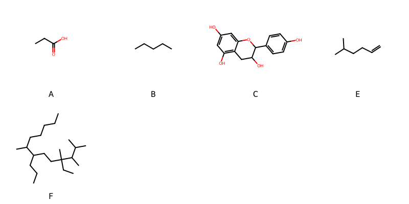

!!! abstract "Tóm tắt"

    **Họ Malpighiaceae** có **7** chi được các cộng đồng sử dụng trong chăm sóc sức khỏe gồm *Malpighia, Tetrapterys, Byrsonima, Banisteriopsis, Hiptage, Galphimia, Mascagnia*. Số lượng thành phần hóa học đã phân lập và xác định cấu trúc từ họ này tính đến tháng 12 năm 2024 là **16** nhóm có thể liệt kê như sau *Steroids and steroid derivatives, Organooxygen compounds, Flavonoids, Fatty Acyls, Benzopyrans, Pyrrolidines, Indoles and derivatives, Benzofurans, Carboxylic acids and derivatives, Tannins, Dihydrofurans, Benzene and substituted derivatives, Glycerolipids, Prenol lipids, Harmala alkaloids, Oxanes*. Giữa các loài trong họ này, 3 dược liệu được nghiên cứu nhiều nhất dựa trên số thành phần được phân lập là **Galphimia glauca, Byrsonima crassifolia, Banisteriopsis caapi*. *Họ Malpighiaceae* đã được một số công động tại các quốc gia như Sa(Amazon), Elsewhere, Venezuela, Haiti, Peru(Quechua), Peru, Brazil, Bahamas, Colombia, Panama, India, Java, Mexico, Colombia(Choco) đã phát hiện một số tác dụng trên lâm sàng gồm chữa bệnh lẫn độc tính như Alexiteric, Thuốc diệt cá, Chất gây ảo giác, Chất làm mềm, Chất làm se, Chất làm se, Chất làm se, Ma túy, Thuốc diệt cá, Thuốc kích thích tình dục, Thuốc lợi tiểu, Thuốc nhuận tràng, Thuốc trừ sâu, Thuốc trừ sâu, chất gây say.

!!! info "DrDuke"

    James A. Duke sinh năm 1929-2017 là một nhà thực vật học người Mỹ. Đây là một trong những tác giả hàng đầu trong lĩnh vực dược dân tộc học với cuốn *CRC Handbook of Medicinal Herbs* và chính là người xây dựng lên cơ sở dữ liệu về hợp chất tự nhiên và dược dân tộc học tại Bộ nông nghiệp Hoa Kỳ. Các thông tin được đăng tải tại website [Dr. Duke's Phytochemical and Ethnobotanical Databases](https://phytochem.nal.usda.gov/). 
    Trong suốt thập niên 1970, ông lãnh đạo the Plant Taxonomy Laboratory, Plant Genetics and Germplasm Institute of the Agricultural Research Service, U.S. Department of Agriculture.
    Trong tài liệu này, các thông tin về dược dân tộc của các dược liệu được trích dẫn từ tài liệu của James A. Ducke với sự trợ giúp của phần mềm dịch thuật từ tiếng Anh sang tiếng Việt.
   
## Tổng quan về Họ Malpighiaceae
### Phân loại thực vật
Trong *họ Malpighiaceae* có **7** chi được sử dụng làm thuốc với chi tiết số loài trong mỗi chi như sau Mascagnia (1) . Chi tiết về loài sử dụng làm thuốc như dưới đây.  

>Họ Malpighiaceae


>|-- Chi Malpighia

>*Malpighia glabra*,
>*Malpighia polytricha*,
>*Malpighia punicifolia*,
>*Malpighia urens*,

>|-- Chi Tetrapterys

>*Tetrapterys methystica*,

>|-- Chi Byrsonima

>*Byrsonima crassifolia*,

>|-- Chi Banisteriopsis

>*Banisteriopsis caapi*,
>*Banisteriopsis inebrians*,
>*Banisteriopsis rusbyana*,

>|-- Chi Hiptage

>*Hiptage benghalensis*,

>|-- Chi Galphimia

>*Galphimia glauca*,

>|-- Chi Mascagnia

>*Mascagnia macroptera*,

### Thành phần hóa học 

Số lượng thành phần hóa học đã phân lập và xác định cấu trúc từ họ này tính đến tháng 12 năm 2024 là 16 nhóm có thể liệt kê như sau Steroids and steroid derivatives, Organooxygen compounds, Flavonoids, Fatty Acyls, Benzopyrans, Pyrrolidines, Indoles and derivatives, Benzofurans, Carboxylic acids and derivatives, Tannins, Dihydrofurans, Benzene and substituted derivatives, Glycerolipids, Prenol lipids, Harmala alkaloids, Oxanes. Số lượng các loài đã được nghiên cứu thành phần hóa học là *6* trong tổng số *12* loài thuộc họ Malpighiaceae.Giữa các loài trong họ này, 3 dược liệu được nghiên cứu nhiều nhất dựa trên số thành phần được phân lập là **Galphimia glauca, Byrsonima crassifolia, Banisteriopsis caapi**. Sử dụng phần mềm RDKIT với thuật toán  Find Maximum Common Substructure (FMCS), các nhóm hoạt chất phổ biến nhất trong *họ Malpighiaceae* đã xây dựng được nhân. Điều này trong tương lại có thể được sử dụng tìm kiếm mối liên hệ giữa tác dụng của cấu trúc hóa học và tác dụng dược lý. Các nhân trong phần này có thể không giống như cấu trúc gốc của từng nhóm chất. Kết quả được trình bầy như hình dưới đây.

<figure markdown="span">
    { width=100% }
    <figcaption> Cấu trúc hóa học của một số khung cơ bản dựa trên thuật toán FMCS để tìm Carboxylic acids and derivatives (A), Fatty Acyls (B), Flavonoids (C), Harmala alkaloids (D), Prenol lipids (E), Steroids and steroid derivatives (F).</figcaption>
</figure>


!!! info  "Find Maximum Common Substructure"
    
    Thuật toán FMCS (Find Maximum Common Substructure) là một phương pháp được sử dụng để tìm ra cấu trúc chung nhiều nhất (MCS) trong một tập hợp các cấu trúc hóa học. Các bước của thuật toán gồm:
    - Chọn một cấu trúc hóa học là cấu trúc để tạo truy vấn, còn các cấu trúc khác là mục tiêu.
    - Chia nhỏ cấu trúc để tạo truy vấn thành cấu trúc nhỏ hơn dạng chuỗi SMARTS.
    - Kiểm tra chuỗi SMARTS trong các cấu trúc mục tiêu.
    - Tìm kiếm chuỗi SMARTS xuất hiện nhiều nhất.
    Để biết thêm chi tiết các bạn có thể xem tại [TeachOpenCADD](https://projects.volkamerlab.org/teachopencadd/talktorials/T006_compound_maximum_common_substructures.html)
    ``` python
    pip install rdkit
    def find_core_smiles(smiles_list):
        mols = [Chem.MolFromSmiles(smiles) for smiles in smiles_list]
        mcs = rdFMCS.FindMCS(mols)
        core_smiles = Chem.MolToSmiles(Chem.MolFromSmarts(mcs.smartsString))
        return core_smiles
    ```

### Dược dân tộc học

Họ **Malpighiaceae** đã được một số công động tại các quốc gia như *Sa(Amazon), Elsewhere, Venezuela, Haiti, Peru(Quechua), Peru, Brazil, Bahamas, Colombia, Panama, India, Java, Mexico, Colombia(Choco)* đã phát hiện một số tác dụng trên lâm sàng gồm chữa bệnh lẫn độc tính như *Alexiteric, Thuốc diệt cá, Chất gây ảo giác, Chất làm mềm, Chất làm se, Chất làm se, Chất làm se, Ma túy, Thuốc diệt cá, Thuốc kích thích tình dục, Thuốc lợi tiểu, Thuốc nhuận tràng, Thuốc trừ sâu, Thuốc trừ sâu, chất gây say*.

## Chi tiết dược dân tộc học


### Chi Malpighia

!!! note "Danh sách các loài thuộc chi"
    
*	 - *Malpighia glabra*
	 - *Malpighia polytricha*
	 - *Malpighia punicifolia*
	 - *Malpighia urens**

---      
#### *Malpighia glabra*
**Thông tin về thực vật**

!!! info "Phân loại thực vật của *Malpighia glabra* từ GIBF:"
    - **Kingdom:** Plantae
    - **Phylum:** Tracheophyta
    - **Order:** Malpighiales
    - **Family:** Malpighiaceae
    - **Genus:** Malpighia
    - **Species:** *Malpighia glabra*


 

Chưa có thông tin về loài này trên wikidata.

*Phân bố trên thế giới*: Puerto Rico, El Salvador, Guatemala, Brazil, Mexico, Costa Rica, Myanmar, United States of America, Belize, Viet Nam, Honduras, Bolivia (Plurinational State of), Colombia, Philippines

*Phân bố tại Việt Nam*: Hồ Chí Minh city

**Thành phần hóa học**
        

Theo cơ sở dữ liệu lotus, từ loài *Malpighia glabra* đã phân lập và xác định được 9 hoạt chất thuộc về các nhóm Steroids and steroid derivatives, Organooxygen compounds, Fatty Acyls, Dihydrofurans, Prenol lipids. Danh sách các hoạt chất như sau stigmast-5-en-3-ol [(LTS0071224)](https://lotus.naturalproducts.net/compound/lotus_id/LTS0071224), acetophenone [(LTS0155971)](https://lotus.naturalproducts.net/compound/lotus_id/LTS0155971), stigmast-5-en-3-ol, (3β)- [(LTS0204616)](https://lotus.naturalproducts.net/compound/lotus_id/LTS0204616), vitamin c [(LTS0022555)](https://lotus.naturalproducts.net/compound/lotus_id/LTS0022555), methyl caproate [(LTS0235403)](https://lotus.naturalproducts.net/compound/lotus_id/LTS0235403), ethyl hexanoate [(LTS0021856)](https://lotus.naturalproducts.net/compound/lotus_id/LTS0021856), (3e)-oct-3-en-1-ol [(LTS0113859)](https://lotus.naturalproducts.net/compound/lotus_id/LTS0113859), limonene,  [(LTS0155981)](https://lotus.naturalproducts.net/compound/lotus_id/LTS0155981), stearyl alcohol [(LTS0222463)](https://lotus.naturalproducts.net/compound/lotus_id/LTS0222463).

| chemicalTaxonomyClassyfireClass   |   lotus_count |
|:----------------------------------|--------------:|
| Dihydrofurans                     |             1 |
| Fatty Acyls                       |             4 |
| Organooxygen compounds            |             1 |
| Prenol lipids                     |             1 |
| Steroids and steroid derivatives  |             2 |


**Dược dân tộc học**

Danh sách các quốc gia có sử dụng *Malpighia glabra* trong điều trị các bệnh. 

| Quốc gia   | Bệnh                     |
|:-----------|:-------------------------|
| Elsewhere  | Chất làm se              |
| Mexico     | Chất làm se, Chất làm se |


---      
#### *Malpighia glabra*
**Thông tin về thực vật**

!!! info "Phân loại thực vật của *Malpighia glabra* từ GIBF:"
    - **Kingdom:** Plantae
    - **Phylum:** Tracheophyta
    - **Order:** Malpighiales
    - **Family:** Malpighiaceae
    - **Genus:** Malpighia
    - **Species:** *Malpighia glabra*


 

Chưa có thông tin về loài này trên wikidata.

*Phân bố trên thế giới*: Puerto Rico, El Salvador, Guatemala, Brazil, Mexico, Costa Rica, Myanmar, United States of America, Belize, Viet Nam, Honduras, Bolivia (Plurinational State of), Colombia, Philippines

*Phân bố tại Việt Nam*: Hồ Chí Minh city

**Thành phần hóa học**
        

Chưa có nghiên cứu về thành phần hóa học của loài này


**Dược dân tộc học**

Danh sách các quốc gia có sử dụng *Malpighia glabra* trong điều trị các bệnh. 

| Quốc gia   | Bệnh           |
|:-----------|:---------------|
| Bahamas    | Thuốc lợi tiểu |


---      
#### *Malpighia punicifolia*
**Thông tin về thực vật**

!!! info "Phân loại thực vật của *Malpighia glabra* từ GIBF:"
    - **Kingdom:** Plantae
    - **Phylum:** Tracheophyta
    - **Order:** Malpighiales
    - **Family:** Malpighiaceae
    - **Genus:** Malpighia
    - **Species:** *Malpighia glabra*


 

Chưa có thông tin về loài này trên wikidata.

*Phân bố trên thế giới*: nan, Trinidad and Tobago, unknown or invalid, Dominican Republic, Jamaica, Colombia, Antigua and Barbuda, Brazil, Venezuela (Bolivarian Republic of), Senegal, Honduras, Puerto Rico, French Guiana, Guatemala, Mexico, Cuba, Angola, Ecuador, United States of America

*Phân bố tại Việt Nam*: Không có ghi nhận ở Việt Nam

**Thành phần hóa học**
        

Theo cơ sở dữ liệu lotus, từ loài *Malpighia punicifolia* đã phân lập và xác định được 11 hoạt chất thuộc về các nhóm Fatty Acyls, Prenol lipids, Organooxygen compounds, Dihydrofurans. Danh sách các hoạt chất như sau acetoin [(LTS0220819)](https://lotus.naturalproducts.net/compound/lotus_id/LTS0220819), acetophenone [(LTS0155971)](https://lotus.naturalproducts.net/compound/lotus_id/LTS0155971), vitamin c [(LTS0022555)](https://lotus.naturalproducts.net/compound/lotus_id/LTS0022555), methyl caproate [(LTS0235403)](https://lotus.naturalproducts.net/compound/lotus_id/LTS0235403), 3-octenol [(LTS0122062)](https://lotus.naturalproducts.net/compound/lotus_id/LTS0122062), hexyl butyrate [(LTS0143525)](https://lotus.naturalproducts.net/compound/lotus_id/LTS0143525), 2-pentanone [(LTS0016615)](https://lotus.naturalproducts.net/compound/lotus_id/LTS0016615), ethyl hexanoate [(LTS0021856)](https://lotus.naturalproducts.net/compound/lotus_id/LTS0021856), (3e)-oct-3-en-1-ol [(LTS0113859)](https://lotus.naturalproducts.net/compound/lotus_id/LTS0113859), limonene,  [(LTS0155981)](https://lotus.naturalproducts.net/compound/lotus_id/LTS0155981), stearyl alcohol [(LTS0222463)](https://lotus.naturalproducts.net/compound/lotus_id/LTS0222463).

| chemicalTaxonomyClassyfireClass   |   lotus_count |
|:----------------------------------|--------------:|
| Dihydrofurans                     |             1 |
| Fatty Acyls                       |             6 |
| Organooxygen compounds            |             3 |
| Prenol lipids                     |             1 |


**Dược dân tộc học**

Danh sách các quốc gia có sử dụng *Malpighia glabra* trong điều trị các bệnh. 

| Quốc gia   | Bệnh        |
|:-----------|:------------|
| Venezuela  | Chất làm se |


---      
#### *Malpighia punicifolia*
**Thông tin về thực vật**

!!! info "Phân loại thực vật của *Malpighia glabra* từ GIBF:"
    - **Kingdom:** Plantae
    - **Phylum:** Tracheophyta
    - **Order:** Malpighiales
    - **Family:** Malpighiaceae
    - **Genus:** Malpighia
    - **Species:** *Malpighia glabra*


 

Chưa có thông tin về loài này trên wikidata.

*Phân bố trên thế giới*: nan, Trinidad and Tobago, unknown or invalid, Dominican Republic, Jamaica, Colombia, Antigua and Barbuda, Brazil, Venezuela (Bolivarian Republic of), Senegal, Honduras, Puerto Rico, French Guiana, Guatemala, Mexico, Cuba, Angola, Ecuador, United States of America

*Phân bố tại Việt Nam*: Không có ghi nhận ở Việt Nam

**Thành phần hóa học**
        

Chưa có nghiên cứu về thành phần hóa học của loài này


**Dược dân tộc học**

Danh sách các quốc gia có sử dụng *Malpighia glabra* trong điều trị các bệnh. 

| Quốc gia   | Bệnh        |
|:-----------|:------------|
| Haiti      | Chất làm se |


### Chi Tetrapterys

!!! note "Danh sách các loài thuộc chi"
    
*	 - *Tetrapterys methystica**

---      
#### *Malpighia punicifolia*
**Thông tin về thực vật**

!!! info "Phân loại thực vật của *Malpighia glabra* từ GIBF:"
    - **Kingdom:** Plantae
    - **Phylum:** Tracheophyta
    - **Order:** Malpighiales
    - **Family:** Malpighiaceae
    - **Genus:** Malpighia
    - **Species:** *Malpighia glabra*


 

Chưa có thông tin về loài này trên wikidata.

*Phân bố trên thế giới*: nan, Trinidad and Tobago, unknown or invalid, Dominican Republic, Jamaica, Colombia, Antigua and Barbuda, Brazil, Venezuela (Bolivarian Republic of), Senegal, Honduras, Puerto Rico, French Guiana, Guatemala, Mexico, Cuba, Angola, Ecuador, United States of America

*Phân bố tại Việt Nam*: Không có ghi nhận ở Việt Nam

**Thành phần hóa học**
        

Chưa có nghiên cứu về thành phần hóa học của loài này


**Dược dân tộc học**

Danh sách các quốc gia có sử dụng *Malpighia glabra* trong điều trị các bệnh. 

| Quốc gia   | Bệnh         |
|:-----------|:-------------|
| Brazil     | chất gây say |


### Chi Byrsonima

!!! note "Danh sách các loài thuộc chi"
    
*	 - *Byrsonima crassifolia**

---      
#### *Byrsonima crassifolia*
**Thông tin về thực vật**

!!! info "Phân loại thực vật của *Byrsonima crassifolia* từ GIBF:"
    - **Kingdom:** Plantae
    - **Phylum:** Tracheophyta
    - **Order:** Malpighiales
    - **Family:** Malpighiaceae
    - **Genus:** Byrsonima
    - **Species:** *Byrsonima crassifolia*


 

Chưa có thông tin về loài này trên wikidata.

*Phân bố trên thế giới*: French Guiana, Venezuela (Bolivarian Republic of), Mexico, Honduras, Colombia, Nicaragua, Puerto Rico, Guatemala, Belize, Suriname, Brazil, Panama, Costa Rica, El Salvador

*Phân bố tại Việt Nam*: Không có ghi nhận ở Việt Nam

**Thành phần hóa học**
        

Theo cơ sở dữ liệu lotus, từ loài *Byrsonima crassifolia* đã phân lập và xác định được 54 hoạt chất thuộc về các nhóm Steroids and steroid derivatives, Flavonoids, Carboxylic acids and derivatives, Benzene and substituted derivatives, Glycerolipids, Prenol lipids. Danh sách các hoạt chất như sau 2-(3,4-dihydroxyphenyl)-4-[2-(3,4-dihydroxyphenyl)-3,5,7-trihydroxy-3,4-dihydro-2h-1-benzopyran-6-yl]-3,4-dihydro-2h-1-benzopyran-3,5,7-triol [(LTS0072400)](https://lotus.naturalproducts.net/compound/lotus_id/LTS0072400), (+,-)-pipecolic acid [(LTS0189894)](https://lotus.naturalproducts.net/compound/lotus_id/LTS0189894), 2-{[1-(5-ethyl-6-methylheptan-2-yl)-9a,11a-dimethyl-1h,2h,3h,3ah,3bh,4h,6h,7h,8h,9h,9bh,10h,11h-cyclopenta[a]phenanthren-7-yl]oxy}-6-(hydroxymethyl)oxane-3,4,5-triol [(LTS0158828)](https://lotus.naturalproducts.net/compound/lotus_id/LTS0158828), oleanolic acid [(LTS0141130)](https://lotus.naturalproducts.net/compound/lotus_id/LTS0141130), (2s,3s,4r)-2-(3,4-dihydroxyphenyl)-4-[(2s,3s)-2-(3,4-dihydroxyphenyl)-3,5,7-trihydroxy-3,4-dihydro-2h-1-benzopyran-8-yl]-8-[(2s,3s,4s)-2-(3,4-dihydroxyphenyl)-5,7-dihydroxy-3-(3,4,5-trihydroxybenzoyloxy)-3,4-dihydro-2h-1-benzopyran-4-yl]-5,7-dihydroxy-3,4-dihydro-2h-1-benzopyran-3-yl 3,4,5-trihydroxybenzoate [(LTS0078796)](https://lotus.naturalproducts.net/compound/lotus_id/LTS0078796), stigmast-5-en-3-ol, (3β)- [(LTS0204616)](https://lotus.naturalproducts.net/compound/lotus_id/LTS0204616), d-aspartic acid [(LTS0144001)](https://lotus.naturalproducts.net/compound/lotus_id/LTS0144001), betulinic acid [(LTS0210795)](https://lotus.naturalproducts.net/compound/lotus_id/LTS0210795), (1r,3ar,5ar,5br,7ar,9r,10s,11ar,11br,13ar,13br)-3a,5a,5b,8,8,11a-hexamethyl-1-(prop-1-en-2-yl)-hexadecahydrocyclopenta[a]chrysene-9,10-diol [(LTS0097528)](https://lotus.naturalproducts.net/compound/lotus_id/LTS0097528), [(2s,3s,4s,5r,6s)-6-[(2r)-2,3-bis(hexadecanoyloxy)propoxy]-3,4,5-trihydroxyoxan-2-yl]methanesulfonic acid [(LTS0241691)](https://lotus.naturalproducts.net/compound/lotus_id/LTS0241691), 2-(3,4-dihydroxyphenyl)-8-[2-(3,4-dihydroxyphenyl)-3,5,7-trihydroxy-3,4-dihydro-2h-1-benzopyran-4-yl]-5,7-dihydroxy-3,4-dihydro-2h-1-benzopyran-3-yl 3,4,5-trihydroxybenzoate [(LTS0091338)](https://lotus.naturalproducts.net/compound/lotus_id/LTS0091338), betulin [(LTS0101863)](https://lotus.naturalproducts.net/compound/lotus_id/LTS0101863), (4as,6as,6br,8ar,10r,11s,12ar,12br,14bs)-10,11-dihydroxy-2,2,6a,6b,9,9,12a-heptamethyl-1,3,4,5,6,7,8,8a,10,11,12,12b,13,14b-tetradecahydropicene-4a-carboxylic acid [(LTS0066479)](https://lotus.naturalproducts.net/compound/lotus_id/LTS0066479), (2s,3s,4s)-2-(3,4-dihydroxyphenyl)-4-[(2s,3s)-2-(3,4-dihydroxyphenyl)-5,7-dihydroxy-3-(3,4,5-trihydroxybenzoyloxy)-3,4-dihydro-2h-1-benzopyran-8-yl]-5,7-dihydroxy-3,4-dihydro-2h-1-benzopyran-3-yl 3,4,5-trihydroxybenzoate [(LTS0011842)](https://lotus.naturalproducts.net/compound/lotus_id/LTS0011842), ent-epicatechin [(LTS0265245)](https://lotus.naturalproducts.net/compound/lotus_id/LTS0265245), (2r,3r,4r)-2-(3,4-dihydroxyphenyl)-4-[(2s,3s,4r)-2-(3,4-dihydroxyphenyl)-4-[(2s,3s)-2-(3,4-dihydroxyphenyl)-3,5,7-trihydroxy-3,4-dihydro-2h-1-benzopyran-8-yl]-5,7-dihydroxy-3-(3,4,5-trihydroxybenzoyloxy)-3,4-dihydro-2h-1-benzopyran-8-yl]-5,7-dihydroxy-3,4-dihydro-2h-1-benzopyran-3-yl 3,4,5-trihydroxybenzoate [(LTS0117352)](https://lotus.naturalproducts.net/compound/lotus_id/LTS0117352), (+)-catechol [(LTS0117079)](https://lotus.naturalproducts.net/compound/lotus_id/LTS0117079), 1-(hexadecanoyloxy)-3-{[3,4,5-trihydroxy-6-(hydroxymethyl)oxan-2-yl]oxy}propan-2-yl hexadecanoate [(LTS0178760)](https://lotus.naturalproducts.net/compound/lotus_id/LTS0178760), l-alanine [(LTS0042208)](https://lotus.naturalproducts.net/compound/lotus_id/LTS0042208), methyl gallate [(LTS0043810)](https://lotus.naturalproducts.net/compound/lotus_id/LTS0043810), 2-(3,4-dihydroxyphenyl)-5,7-dihydroxy-3-{[(2s,3r,4r,5r,6s)-3,4,5-trihydroxy-6-(hydroxymethyl)oxan-2-yl]oxy}chromen-4-one [(LTS0241372)](https://lotus.naturalproducts.net/compound/lotus_id/LTS0241372), d-alanine [(LTS0272178)](https://lotus.naturalproducts.net/compound/lotus_id/LTS0272178), 10,11-dihydroxy-2,2,6a,6b,9,9,12a-heptamethyl-1,3,4,5,6,7,8,8a,10,11,12,12b,13,14b-tetradecahydropicene-4a-carboxylic acid [(LTS0167090)](https://lotus.naturalproducts.net/compound/lotus_id/LTS0167090), galop [(LTS0222857)](https://lotus.naturalproducts.net/compound/lotus_id/LTS0222857), sitogluside [(LTS0201798)](https://lotus.naturalproducts.net/compound/lotus_id/LTS0201798), (2s,3s,4r)-2-(3,4-dihydroxyphenyl)-4-[(2s,3s)-2-(3,4-dihydroxyphenyl)-3,5,7-trihydroxy-3,4-dihydro-2h-1-benzopyran-6-yl]-3,4-dihydro-2h-1-benzopyran-3,5,7-triol [(LTS0021279)](https://lotus.naturalproducts.net/compound/lotus_id/LTS0021279), guaijaverin [(LTS0015984)](https://lotus.naturalproducts.net/compound/lotus_id/LTS0015984), catechol [(LTS0090912)](https://lotus.naturalproducts.net/compound/lotus_id/LTS0090912), lupeol [(LTS0088634)](https://lotus.naturalproducts.net/compound/lotus_id/LTS0088634), (2s,3s)-2-(3,4-dihydroxyphenyl)-8-[(2s,3s,4s)-2-(3,4-dihydroxyphenyl)-3,5,7-trihydroxy-3,4-dihydro-2h-1-benzopyran-4-yl]-5,7-dihydroxy-3,4-dihydro-2h-1-benzopyran-3-yl 3,4,5-trihydroxybenzoate [(LTS0230806)](https://lotus.naturalproducts.net/compound/lotus_id/LTS0230806), 1-(hexadec-8-enoyloxy)-3-{[3,4,5-trihydroxy-6-(hydroxymethyl)oxan-2-yl]oxy}propan-2-yl hexadec-8-enoate [(LTS0237499)](https://lotus.naturalproducts.net/compound/lotus_id/LTS0237499), oleanolic acid [(LTS0117717)](https://lotus.naturalproducts.net/compound/lotus_id/LTS0117717), (+)-epicatechin [(LTS0222407)](https://lotus.naturalproducts.net/compound/lotus_id/LTS0222407), quercetin [(LTS0004651)](https://lotus.naturalproducts.net/compound/lotus_id/LTS0004651), l-aspartic acid [(LTS0205466)](https://lotus.naturalproducts.net/compound/lotus_id/LTS0205466), 5-hydroxypipecolic acid [(LTS0145112)](https://lotus.naturalproducts.net/compound/lotus_id/LTS0145112), stigmast-5-en-3-ol [(LTS0071224)](https://lotus.naturalproducts.net/compound/lotus_id/LTS0071224), 2-(3,4-dihydroxyphenyl)-4-[2-(3,4-dihydroxyphenyl)-3,5,7-trihydroxy-3,4-dihydro-2h-1-benzopyran-8-yl]-5,7-dihydroxy-3,4-dihydro-2h-1-benzopyran-3-yl 3,4,5-trihydroxybenzoate [(LTS0268871)](https://lotus.naturalproducts.net/compound/lotus_id/LTS0268871), lupeol [(LTS0256952)](https://lotus.naturalproducts.net/compound/lotus_id/LTS0256952), guaijaverin [(LTS0065676)](https://lotus.naturalproducts.net/compound/lotus_id/LTS0065676), 2-(3,4-dihydroxyphenyl)-4-[2-(3,4-dihydroxyphenyl)-3,5,7-trihydroxy-3,4-dihydro-2h-1-benzopyran-8-yl]-3,4-dihydro-2h-1-benzopyran-3,5,7-triol [(LTS0040252)](https://lotus.naturalproducts.net/compound/lotus_id/LTS0040252), l-valine [(LTS0231703)](https://lotus.naturalproducts.net/compound/lotus_id/LTS0231703), (2s,3s,4s)-2-(3,4-dihydroxyphenyl)-4-[(2s,3s)-2-(3,4-dihydroxyphenyl)-3,5,7-trihydroxy-3,4-dihydro-2h-1-benzopyran-8-yl]-5,7-dihydroxy-3,4-dihydro-2h-1-benzopyran-3-yl 3,4,5-trihydroxybenzoate [(LTS0022496)](https://lotus.naturalproducts.net/compound/lotus_id/LTS0022496), isoquercetin [(LTS0254337)](https://lotus.naturalproducts.net/compound/lotus_id/LTS0254337), (2r)-1-[(8z)-hexadec-8-enoyloxy]-3-{[(2r,3r,4s,5s,6r)-3,4,5-trihydroxy-6-(hydroxymethyl)oxan-2-yl]oxy}propan-2-yl (8z)-hexadec-8-enoate [(LTS0011953)](https://lotus.naturalproducts.net/compound/lotus_id/LTS0011953), 2-(3,4-dihydroxyphenyl)-4-[2-(3,4-dihydroxyphenyl)-3,5,7-trihydroxy-3,4-dihydro-2h-1-benzopyran-8-yl]-8-[2-(3,4-dihydroxyphenyl)-5,7-dihydroxy-3-(3,4,5-trihydroxybenzoyloxy)-3,4-dihydro-2h-1-benzopyran-4-yl]-5,7-dihydroxy-3,4-dihydro-2h-1-benzopyran-3-yl 3,4,5-trihydroxybenzoate [(LTS0008715)](https://lotus.naturalproducts.net/compound/lotus_id/LTS0008715), hyperoside [(LTS0089156)](https://lotus.naturalproducts.net/compound/lotus_id/LTS0089156), 3a,5a,5b,8,8,11a-hexamethyl-1-(prop-1-en-2-yl)-hexadecahydrocyclopenta[a]chrysene-9,10-diol [(LTS0175264)](https://lotus.naturalproducts.net/compound/lotus_id/LTS0175264), maslinic acid [(LTS0109701)](https://lotus.naturalproducts.net/compound/lotus_id/LTS0109701), {6-[2,3-bis(hexadecanoyloxy)propoxy]-3,4,5-trihydroxyoxan-2-yl}methanesulfonic acid [(LTS0110635)](https://lotus.naturalproducts.net/compound/lotus_id/LTS0110635), (2s,3s,4s)-2-(3,4-dihydroxyphenyl)-4-[(2s,3s)-2-(3,4-dihydroxyphenyl)-3,5,7-trihydroxy-3,4-dihydro-2h-1-benzopyran-8-yl]-3,4-dihydro-2h-1-benzopyran-3,5,7-triol [(LTS0032041)](https://lotus.naturalproducts.net/compound/lotus_id/LTS0032041), (2r)-1-(hexadecanoyloxy)-3-{[(2r,3r,4s,5s,6r)-3,4,5-trihydroxy-6-(hydroxymethyl)oxan-2-yl]oxy}propan-2-yl hexadecanoate [(LTS0181367)](https://lotus.naturalproducts.net/compound/lotus_id/LTS0181367), 2-(3,4-dihydroxyphenyl)-4-[2-(3,4-dihydroxyphenyl)-5,7-dihydroxy-3-(3,4,5-trihydroxybenzoyloxy)-3,4-dihydro-2h-1-benzopyran-8-yl]-5,7-dihydroxy-3,4-dihydro-2h-1-benzopyran-3-yl 3,4,5-trihydroxybenzoate [(LTS0024047)](https://lotus.naturalproducts.net/compound/lotus_id/LTS0024047), 2-(3,4-dihydroxyphenyl)-5,7-dihydroxy-3-{[3,4,5-trihydroxy-6-(hydroxymethyl)oxan-2-yl]oxy}chromen-4-one [(LTS0195312)](https://lotus.naturalproducts.net/compound/lotus_id/LTS0195312).

| chemicalTaxonomyClassyfireClass     |   lotus_count |
|:------------------------------------|--------------:|
| Benzene and substituted derivatives |             2 |
| Carboxylic acids and derivatives    |             7 |
| Flavonoids                          |            24 |
| Glycerolipids                       |             6 |
| Prenol lipids                       |            11 |
| Steroids and steroid derivatives    |             4 |


**Dược dân tộc học**

Danh sách các quốc gia có sử dụng *Byrsonima crassifolia* trong điều trị các bệnh. 

| Quốc gia   | Bệnh                      |
|:-----------|:--------------------------|
| Elsewhere  | Thuốc diệt cá             |
| Mexico     | Chất làm se, Chất làm se  |
| Panama     | Thuốc lợi tiểu            |
| Venezuela  | Alexiteric, Thuốc diệt cá |


### Chi Banisteriopsis

!!! note "Danh sách các loài thuộc chi"
    
*	 - *Banisteriopsis caapi*
	 - *Banisteriopsis inebrians*
	 - *Banisteriopsis rusbyana**

---      
#### *Banisteriopsis caapi*
**Thông tin về thực vật**

!!! info "Phân loại thực vật của *Banisteriopsis caapi* từ GIBF:"
    - **Kingdom:** Plantae
    - **Phylum:** Tracheophyta
    - **Order:** Malpighiales
    - **Family:** Malpighiaceae
    - **Genus:** Banisteriopsis
    - **Species:** *Banisteriopsis caapi*


 

Chưa có thông tin về loài này trên wikidata.

*Phân bố trên thế giới*: nan, United States of America, Bolivia (Plurinational State of), Colombia, Brazil, Ecuador, Puerto Rico, Costa Rica, Peru, Belgium

*Phân bố tại Việt Nam*: Không có ghi nhận ở Việt Nam

**Thành phần hóa học**
        

Theo cơ sở dữ liệu lotus, từ loài *Banisteriopsis caapi* đã phân lập và xác định được 28 hoạt chất thuộc về các nhóm Steroids and steroid derivatives, Organooxygen compounds, Flavonoids, Pyrrolidines, Indoles and derivatives, Benzofurans, Prenol lipids, Harmala alkaloids. Danh sách các hoạt chất như sau phytosterol [(LTS0029311)](https://lotus.naturalproducts.net/compound/lotus_id/LTS0029311), stigmast-5-en-3-ol, (3β)- [(LTS0204616)](https://lotus.naturalproducts.net/compound/lotus_id/LTS0204616), 1-{7-methoxy-9h-pyrido[3,4-b]indol-1-yl}ethanone [(LTS0045517)](https://lotus.naturalproducts.net/compound/lotus_id/LTS0045517), harmalol [(LTS0116566)](https://lotus.naturalproducts.net/compound/lotus_id/LTS0116566), (2r,3r,4r)-2-(3,4-dihydroxyphenyl)-4-[(2r,3r)-2-(3,4-dihydroxyphenyl)-3,5,7-trihydroxy-3,4-dihydro-2h-1-benzopyran-8-yl]-3,4-dihydro-2h-1-benzopyran-3,5,7-triol [(LTS0135510)](https://lotus.naturalproducts.net/compound/lotus_id/LTS0135510), shihunine [(LTS0178567)](https://lotus.naturalproducts.net/compound/lotus_id/LTS0178567), ent-epicatechin [(LTS0265245)](https://lotus.naturalproducts.net/compound/lotus_id/LTS0265245), harmol [(LTS0120174)](https://lotus.naturalproducts.net/compound/lotus_id/LTS0120174), (2r,3r,4r,5r)-5-{[(2s,3s,4s,5r)-3,4-dihydroxy-2,5-bis(hydroxymethyl)oxolan-2-yl]oxy}-2-(hydroxymethyl)oxane-2,3,4-triol [(LTS0055072)](https://lotus.naturalproducts.net/compound/lotus_id/LTS0055072), harmaline [(LTS0120934)](https://lotus.naturalproducts.net/compound/lotus_id/LTS0120934), (3r,6e)-nerolidol [(LTS0145065)](https://lotus.naturalproducts.net/compound/lotus_id/LTS0145065), 4,5,6-trihydroxy-15-methoxy-3-{[3,4,5-trihydroxy-6-(hydroxymethyl)oxan-2-yl]oxy}-8,18-diazatetracyclo[9.7.0.0²,⁸.0¹²,¹⁷]octadeca-1(11),12,14,16-tetraen-7-one [(LTS0143962)](https://lotus.naturalproducts.net/compound/lotus_id/LTS0143962), methyl 7-methoxy-9h-pyrido[3,4-b]indole-1-carboxylate [(LTS0221199)](https://lotus.naturalproducts.net/compound/lotus_id/LTS0221199), 7-methoxy-1h,2h,3h,4h,9h-pyrido[3,4-b]indole [(LTS0055392)](https://lotus.naturalproducts.net/compound/lotus_id/LTS0055392), catechol [(LTS0090912)](https://lotus.naturalproducts.net/compound/lotus_id/LTS0090912), oleanolic acid [(LTS0117717)](https://lotus.naturalproducts.net/compound/lotus_id/LTS0117717), harmine [(LTS0131294)](https://lotus.naturalproducts.net/compound/lotus_id/LTS0131294), (+/-)-tetrahydroharmine [(LTS0033199)](https://lotus.naturalproducts.net/compound/lotus_id/LTS0033199), 7-methoxy-9h-pyrido[3,4-b]indole-1-carboximidic acid [(LTS0097899)](https://lotus.naturalproducts.net/compound/lotus_id/LTS0097899), (2s,3r,4s,5r,6s)-4,5,6-trihydroxy-15-methoxy-3-{[(2r,3r,4s,5s,6r)-3,4,5-trihydroxy-6-(hydroxymethyl)oxan-2-yl]oxy}-8,18-diazatetracyclo[9.7.0.0²,⁸.0¹²,¹⁷]octadeca-1(11),12,14,16-tetraen-7-one [(LTS0011462)](https://lotus.naturalproducts.net/compound/lotus_id/LTS0011462), ursolic acid [(LTS0250838)](https://lotus.naturalproducts.net/compound/lotus_id/LTS0250838), 2-(3,4-dihydroxyphenyl)-4-[2-(3,4-dihydroxyphenyl)-3,5,7-trihydroxy-3,4-dihydro-2h-1-benzopyran-8-yl]-3,4-dihydro-2h-1-benzopyran-3,5,7-triol [(LTS0040252)](https://lotus.naturalproducts.net/compound/lotus_id/LTS0040252), (2s,3s,4s,5r,6r)-4,5,6-trihydroxy-15-methoxy-3-{[(2r,3r,4s,5s,6r)-3,4,5-trihydroxy-6-(hydroxymethyl)oxan-2-yl]oxy}-8,18-diazatetracyclo[9.7.0.0²,⁸.0¹²,¹⁷]octadeca-1(11),12,14,16-tetraen-7-one [(LTS0040754)](https://lotus.naturalproducts.net/compound/lotus_id/LTS0040754), tetrahydroharmine [(LTS0159476)](https://lotus.naturalproducts.net/compound/lotus_id/LTS0159476), harmol [(LTS0023194)](https://lotus.naturalproducts.net/compound/lotus_id/LTS0023194), 7-methoxy-3h,4h,9h-pyrido[3,4-b]indole-1-carboxylic acid [(LTS0167981)](https://lotus.naturalproducts.net/compound/lotus_id/LTS0167981), 2-[(2s)-1-methylpyrrolidin-2-yl]benzoic acid [(LTS0201822)](https://lotus.naturalproducts.net/compound/lotus_id/LTS0201822), 5-{[3,4-dihydroxy-2,5-bis(hydroxymethyl)oxolan-2-yl]oxy}-2-(hydroxymethyl)oxane-2,3,4-triol [(LTS0188520)](https://lotus.naturalproducts.net/compound/lotus_id/LTS0188520).

| chemicalTaxonomyClassyfireClass   |   lotus_count |
|:----------------------------------|--------------:|
| Benzofurans                       |             1 |
| Flavonoids                        |             4 |
| Harmala alkaloids                 |            11 |
| Indoles and derivatives           |             4 |
| Organooxygen compounds            |             2 |
| Prenol lipids                     |             3 |
| Pyrrolidines                      |             1 |
| Steroids and steroid derivatives  |             2 |


**Dược dân tộc học**

Danh sách các quốc gia có sử dụng *Banisteriopsis caapi* trong điều trị các bệnh. 

| Quốc gia        | Bệnh             |
|:----------------|:-----------------|
| Colombia        | Chất gây ảo giác |
| Colombia(Choco) | Chất gây ảo giác |
| Elsewhere       | Chất gây ảo giác |
| Peru            | Chất gây ảo giác |
| Peru(Quechua)   | Chất gây ảo giác |
| Sa(Amazon)      | Ma túy           |


---      
#### *Banisteriopsis caapi*
**Thông tin về thực vật**

!!! info "Phân loại thực vật của *Banisteriopsis caapi* từ GIBF:"
    - **Kingdom:** Plantae
    - **Phylum:** Tracheophyta
    - **Order:** Malpighiales
    - **Family:** Malpighiaceae
    - **Genus:** Banisteriopsis
    - **Species:** *Banisteriopsis caapi*


 

Chưa có thông tin về loài này trên wikidata.

*Phân bố trên thế giới*: nan, United States of America, Bolivia (Plurinational State of), Colombia, Brazil, Ecuador, Puerto Rico, Costa Rica, Peru, Belgium

*Phân bố tại Việt Nam*: Không có ghi nhận ở Việt Nam

**Thành phần hóa học**
        

Chưa có nghiên cứu về thành phần hóa học của loài này


**Dược dân tộc học**

Danh sách các quốc gia có sử dụng *Banisteriopsis caapi* trong điều trị các bệnh. 

| Quốc gia   | Bệnh             |
|:-----------|:-----------------|
| Peru       | Chất gây ảo giác |


---      
#### *Banisteriopsis caapi*
**Thông tin về thực vật**

!!! info "Phân loại thực vật của *Banisteriopsis caapi* từ GIBF:"
    - **Kingdom:** Plantae
    - **Phylum:** Tracheophyta
    - **Order:** Malpighiales
    - **Family:** Malpighiaceae
    - **Genus:** Banisteriopsis
    - **Species:** *Banisteriopsis caapi*


 

Chưa có thông tin về loài này trên wikidata.

*Phân bố trên thế giới*: nan, United States of America, Bolivia (Plurinational State of), Colombia, Brazil, Ecuador, Puerto Rico, Costa Rica, Peru, Belgium

*Phân bố tại Việt Nam*: Không có ghi nhận ở Việt Nam

**Thành phần hóa học**
        

Chưa có nghiên cứu về thành phần hóa học của loài này


**Dược dân tộc học**

Danh sách các quốc gia có sử dụng *Banisteriopsis caapi* trong điều trị các bệnh. 

| Quốc gia   | Bệnh             |
|:-----------|:-----------------|
| Peru       | Chất gây ảo giác |


### Chi Hiptage

!!! note "Danh sách các loài thuộc chi"
    
*	 - *Hiptage benghalensis**

---      
#### *Hiptage benghalensis*
**Thông tin về thực vật**

!!! info "Phân loại thực vật của *Hiptage benghalensis* từ GIBF:"
    - **Kingdom:** Plantae
    - **Phylum:** Tracheophyta
    - **Order:** Malpighiales
    - **Family:** Malpighiaceae
    - **Genus:** Hiptage
    - **Species:** *Hiptage benghalensis*


 

Chưa có thông tin về loài này trên wikidata.

*Phân bố trên thế giới*: Thailand, Mauritius, United States of America, Chinese Taipei, China, Hong Kong, Réunion, India, Australia, Indonesia

*Phân bố tại Việt Nam*: Không có ghi nhận ở Việt Nam

**Thành phần hóa học**
        

Theo cơ sở dữ liệu lotus, từ loài *Hiptage benghalensis* đã phân lập và xác định được 1 hoạt chất thuộc về các nhóm Benzopyrans. Danh sách các hoạt chất như sau mangiferin [(LTS0009443)](https://lotus.naturalproducts.net/compound/lotus_id/LTS0009443).

| chemicalTaxonomyClassyfireClass   |   lotus_count |
|:----------------------------------|--------------:|
| Benzopyrans                       |             1 |


**Dược dân tộc học**

Danh sách các quốc gia có sử dụng *Hiptage benghalensis* trong điều trị các bệnh. 

| Quốc gia   | Bệnh                         |
|:-----------|:-----------------------------|
| India      | Thuốc trừ sâu, Thuốc trừ sâu |
| Java       | Thuốc kích thích tình dục    |


### Chi Galphimia

!!! note "Danh sách các loài thuộc chi"
    
*	 - *Galphimia glauca**

---      
#### *Galphimia glauca*
**Thông tin về thực vật**

!!! info "Phân loại thực vật của *Galphimia glauca* từ GIBF:"
    - **Kingdom:** Plantae
    - **Phylum:** Tracheophyta
    - **Order:** Malpighiales
    - **Family:** Malpighiaceae
    - **Genus:** Galphimia
    - **Species:** *Galphimia glauca*


 

Chưa có thông tin về loài này trên wikidata.

*Phân bố trên thế giới*: nan, Turks and Caicos Islands, Cuba, Jamaica, Singapore, Mexico, Colombia, Hong Kong, Réunion, Australia, Panama, Indonesia, India, Brazil, Viet Nam, Thailand, United States of America, Philippines, Nicaragua, Malaysia, Ecuador, Puerto Rico, El Salvador, Austria

*Phân bố tại Việt Nam*: Không có ghi nhận ở Việt Nam

**Thành phần hóa học**
        

Theo cơ sở dữ liệu lotus, từ loài *Galphimia glauca* đã phân lập và xác định được 62 hoạt chất thuộc về các nhóm Steroids and steroid derivatives, Flavonoids, Tannins, Carboxylic acids and derivatives, Benzene and substituted derivatives, Prenol lipids, Oxanes. Danh sách các hoạt chất như sau 2-{[1-(5-ethyl-6-methylheptan-2-yl)-9a,11a-dimethyl-1h,2h,3h,3ah,3bh,4h,6h,7h,8h,9h,9bh,10h,11h-cyclopenta[a]phenanthren-7-yl]oxy}-6-(hydroxymethyl)oxane-3,4,5-triol [(LTS0158828)](https://lotus.naturalproducts.net/compound/lotus_id/LTS0158828), methyl (1s,2r,5r,10s,11s,14r,15s,16s,18s,21r,22s,24r)-24-(acetyloxy)-22-[(acetyloxy)methyl]-10-hydroxy-2,5,14,21-tetramethyl-8-methylidene-19-oxo-17,20-dioxahexacyclo[12.10.0.0²,¹¹.0⁵,¹⁰.0¹⁵,²².0¹⁶,¹⁸]tetracosane-11-carboxylate [(LTS0242979)](https://lotus.naturalproducts.net/compound/lotus_id/LTS0242979), phytosterol [(LTS0029311)](https://lotus.naturalproducts.net/compound/lotus_id/LTS0029311), methyl (5ar,6r,7s,7as,7br,9ar,13as,13bs,15as,15bs)-6,7,13a-trihydroxy-5a-[(1r)-1-hydroxyethyl]-7b,9a,15a-trimethyl-12-methylidene-3-oxo-5h,6h,7h,7ah,8h,9h,10h,11h,13h,14h,15h,15bh-chryseno[2,1-c]oxepine-13b-carboxylate [(LTS0222545)](https://lotus.naturalproducts.net/compound/lotus_id/LTS0222545), methyl (5as,7r,7ar,7br,9as,13as,13bs,15as,15br)-7,13a-dihydroxy-5a-[(1s)-1-hydroxyethyl]-7b,9a,12,15a-tetramethyl-3-oxo-5h,6h,7h,7ah,8h,9h,10h,13h,14h,15h,15bh-chryseno[2,1-c]oxepine-13b-carboxylate [(LTS0057287)](https://lotus.naturalproducts.net/compound/lotus_id/LTS0057287), methyl (5as,7r,7as,7br,9as,13as,13bs,15as,15br)-7,13a-dihydroxy-5a-[(1s)-1-hydroxyethyl]-7b,9a,12,15a-tetramethyl-3-oxo-5h,6h,7h,7ah,8h,9h,10h,13h,14h,15h,15bh-chryseno[2,1-c]oxepine-13b-carboxylate [(LTS0128007)](https://lotus.naturalproducts.net/compound/lotus_id/LTS0128007), methyl (5ar,6r,7s,7as,7br,9as,13as,13bs,15as,15br)-6-(acetyloxy)-7,13a-dihydroxy-5a-[(1s)-1-hydroxyethyl]-7b,9a,12,15a-tetramethyl-3-oxo-5h,6h,7h,7ah,8h,9h,10h,13h,14h,15h,15bh-chryseno[2,1-c]oxepine-13b-carboxylate [(LTS0019279)](https://lotus.naturalproducts.net/compound/lotus_id/LTS0019279), methyl 6,24-bis(acetyloxy)-22-[(acetyloxy)methyl]-10-hydroxy-2,5,14,21-tetramethyl-8-methylidene-19-oxo-17,20-dioxahexacyclo[12.10.0.0²,¹¹.0⁵,¹⁰.0¹⁵,²².0¹⁶,¹⁸]tetracosane-11-carboxylate [(LTS0274958)](https://lotus.naturalproducts.net/compound/lotus_id/LTS0274958), methyl (1s,2r,5s,6r,10s,11r,12s,14r,15s,16s,18s,21r,22s,24r)-6,12,24-tris(acetyloxy)-22-[(acetyloxy)methyl]-10-hydroxy-2,5,14,21-tetramethyl-8-methylidene-19-oxo-17,20-dioxahexacyclo[12.10.0.0²,¹¹.0⁵,¹⁰.0¹⁵,²².0¹⁶,¹⁸]tetracosane-11-carboxylate [(LTS0201065)](https://lotus.naturalproducts.net/compound/lotus_id/LTS0201065), methyl (1s,2s,3s,4r,5r,8r,13s,14s,17s,18r,20r,21r,22r,25s)-3-(acetyloxy)-2,13,20,21-tetrahydroxy-25-methoxy-5,8,22-trimethyl-11-methylidene-24-oxahexacyclo[15.5.3.0¹,¹⁸.0⁴,¹⁷.0⁵,¹⁴.0⁸,¹³]pentacosane-14-carboxylate [(LTS0112444)](https://lotus.naturalproducts.net/compound/lotus_id/LTS0112444), methyl (4as,4bs,6as,7s,8r,9r,10s,10as,10br,12as)-4a,9,10-trihydroxy-8-[(1r)-1-hydroxyethyl]-8-(hydroxymethyl)-7-(3-methoxy-3-oxopropyl)-3,6a,10b,12a-tetramethyl-1,4,5,6,7,9,10,10a,11,12-decahydrochrysene-4b-carboxylate [(LTS0126774)](https://lotus.naturalproducts.net/compound/lotus_id/LTS0126774), tiliroside [(LTS0222327)](https://lotus.naturalproducts.net/compound/lotus_id/LTS0222327), methyl (5as,7r,7as,7br,9ar,13as,13br,15as,15bs)-7,13a-dihydroxy-5a-[(1r)-1-hydroxyethyl]-7b,9a,12,15a-tetramethyl-3-oxo-5h,6h,7h,7ah,8h,9h,10h,11h,14h,15h,15bh-chryseno[2,1-c]oxepine-13b-carboxylate [(LTS0071180)](https://lotus.naturalproducts.net/compound/lotus_id/LTS0071180), methyl (5ar,6r,7s,7as,7br,9as,13as,13br,15as,15bs)-7-(acetyloxy)-6,13a-dihydroxy-5a-[(1r)-1-hydroxyethyl]-7b,9a,12,15a-tetramethyl-3-oxo-5h,6h,7h,7ah,8h,9h,10h,13h,14h,15h,15bh-chryseno[2,1-c]oxepine-13b-carboxylate [(LTS0243085)](https://lotus.naturalproducts.net/compound/lotus_id/LTS0243085), methyl gallate [(LTS0043810)](https://lotus.naturalproducts.net/compound/lotus_id/LTS0043810), 2-(3,4-dihydroxyphenyl)-5,7-dihydroxy-3-{[(2s,3r,4r,5r,6s)-3,4,5-trihydroxy-6-(hydroxymethyl)oxan-2-yl]oxy}chromen-4-one [(LTS0241372)](https://lotus.naturalproducts.net/compound/lotus_id/LTS0241372), methyl (5ar,6r,7s,7as,7br,9as,13as,13bs,15as,15bs)-7-(acetyloxy)-6,13a-dihydroxy-5a-[(1r)-1-hydroxyethyl]-7b,9a,12,15a-tetramethyl-3-oxo-5h,6h,7h,7ah,8h,9h,10h,13h,14h,15h,15bh-chryseno[2,1-c]oxepine-13b-carboxylate [(LTS0024547)](https://lotus.naturalproducts.net/compound/lotus_id/LTS0024547), 10,11-dihydroxy-2,2,6a,6b,9,9,12a-heptamethyl-1,3,4,5,6,7,8,8a,10,11,12,12b,13,14b-tetradecahydropicene-4a-carboxylic acid [(LTS0167090)](https://lotus.naturalproducts.net/compound/lotus_id/LTS0167090), methyl 6-(acetyloxy)-7,12,13a-trihydroxy-5a-(1-hydroxyethyl)-7b,9a,12,15a-tetramethyl-3-oxo-5h,6h,7h,7ah,8h,9h,10h,11h,13h,14h,15h,15bh-chryseno[2,1-c]oxepine-13b-carboxylate [(LTS0221250)](https://lotus.naturalproducts.net/compound/lotus_id/LTS0221250), methyl (5ar,6r,7s,7as,7br,9as,13as,13br,15as,15bs)-6-(acetyloxy)-7,13a-dihydroxy-5a-[(1r)-1-hydroxyethyl]-7b,9a,12,15a-tetramethyl-3-oxo-5h,6h,7h,7ah,8h,9h,10h,13h,14h,15h,15bh-chryseno[2,1-c]oxepine-13b-carboxylate [(LTS0217110)](https://lotus.naturalproducts.net/compound/lotus_id/LTS0217110), methyl (5ar,6r,7s,7as,7br,9as,13as,13br,15as,15bs)-6,7,13a-trihydroxy-5a-[(1r)-1-hydroxyethyl]-7b,9a,12,15a-tetramethyl-3-oxo-5h,6h,7h,7ah,8h,9h,10h,13h,14h,15h,15bh-chryseno[2,1-c]oxepine-13b-carboxylate [(LTS0125459)](https://lotus.naturalproducts.net/compound/lotus_id/LTS0125459), galop [(LTS0222857)](https://lotus.naturalproducts.net/compound/lotus_id/LTS0222857), methyl (5as,7r,7as,7br,9ar,13as,13br,15as,15bs)-7,13a-dihydroxy-5a-[(1r)-1-hydroxyethyl]-7b,9a,15a-trimethyl-12-methylidene-3-oxo-5h,6h,7h,7ah,8h,9h,10h,11h,13h,14h,15h,15bh-chryseno[2,1-c]oxepine-13b-carboxylate [(LTS0243273)](https://lotus.naturalproducts.net/compound/lotus_id/LTS0243273), methyl (5ar,6r,7s,7as,7br,9as,13as,13bs,15as,15bs)-6-(acetyloxy)-7,13a-dihydroxy-5a-[(1r)-1-hydroxyethyl]-7b,9a,12,15a-tetramethyl-3-oxo-5h,6h,7h,7ah,8h,9h,10h,13h,14h,15h,15bh-chryseno[2,1-c]oxepine-13b-carboxylate [(LTS0046117)](https://lotus.naturalproducts.net/compound/lotus_id/LTS0046117), sitogluside [(LTS0201798)](https://lotus.naturalproducts.net/compound/lotus_id/LTS0201798), methyl 7,13a-dihydroxy-5a-(1-hydroxyethyl)-7b,9a,15a-trimethyl-12-methylidene-3-oxo-5h,6h,7h,7ah,8h,9h,10h,11h,13h,14h,15h,15bh-chryseno[2,1-c]oxepine-13b-carboxylate [(LTS0003039)](https://lotus.naturalproducts.net/compound/lotus_id/LTS0003039), methyl 3,21-bis(acetyloxy)-2,13,20,25-tetrahydroxy-5,8,22-trimethyl-11-methylidene-24-oxahexacyclo[15.5.3.0¹,¹⁸.0⁴,¹⁷.0⁵,¹⁴.0⁸,¹³]pentacosane-14-carboxylate [(LTS0179018)](https://lotus.naturalproducts.net/compound/lotus_id/LTS0179018), methyl 3-(acetyloxy)-2,13,20,21-tetrahydroxy-25-methoxy-5,8,22-trimethyl-11-methylidene-24-oxahexacyclo[15.5.3.0¹,¹⁸.0⁴,¹⁷.0⁵,¹⁴.0⁸,¹³]pentacosane-14-carboxylate [(LTS0132314)](https://lotus.naturalproducts.net/compound/lotus_id/LTS0132314), methyl 7,13a-dihydroxy-5a-(1-hydroxyethyl)-7b,9a,12,15a-tetramethyl-3-oxo-5h,6h,7h,7ah,8h,9h,10h,13h,14h,15h,15bh-chryseno[2,1-c]oxepine-13b-carboxylate [(LTS0106339)](https://lotus.naturalproducts.net/compound/lotus_id/LTS0106339), methyl 3-(acetyloxy)-2,13,20,21,25-pentahydroxy-5,8,22-trimethyl-11-methylidene-24-oxahexacyclo[15.5.3.0¹,¹⁸.0⁴,¹⁷.0⁵,¹⁴.0⁸,¹³]pentacosane-14-carboxylate [(LTS0066483)](https://lotus.naturalproducts.net/compound/lotus_id/LTS0066483), quercetin [(LTS0004651)](https://lotus.naturalproducts.net/compound/lotus_id/LTS0004651), methyl 10-(acetyloxy)-8a-[(acetyloxy)methyl]-7,8,14a,14b-tetrahydroxy-4a,6a,9,12b-tetramethyl-2-methylidene-tetradecahydro-1h-picene-4-carboxylate [(LTS0257432)](https://lotus.naturalproducts.net/compound/lotus_id/LTS0257432), methyl 6,12,24-tris(acetyloxy)-22-[(acetyloxy)methyl]-10-hydroxy-2,5,14,21-tetramethyl-8-methylidene-19-oxo-17,20-dioxahexacyclo[12.10.0.0²,¹¹.0⁵,¹⁰.0¹⁵,²².0¹⁶,¹⁸]tetracosane-11-carboxylate [(LTS0091556)](https://lotus.naturalproducts.net/compound/lotus_id/LTS0091556), methyl (1s,2s,3s,4r,5r,8r,13s,14s,17s,18r,20r,21r,22r,25s)-3-(acetyloxy)-2,13,20,21,25-pentahydroxy-5,8,22-trimethyl-11-methylidene-24-oxahexacyclo[15.5.3.0¹,¹⁸.0⁴,¹⁷.0⁵,¹⁴.0⁸,¹³]pentacosane-14-carboxylate [(LTS0106038)](https://lotus.naturalproducts.net/compound/lotus_id/LTS0106038), methyl (5ar,6r,7s,7as,7br,9ar,13as,13bs,15as,15bs)-7-(acetyloxy)-6,13a-dihydroxy-5a-[(1r)-1-hydroxyethyl]-7b,9a,15a-trimethyl-12-methylidene-3-oxo-5h,6h,7h,7ah,8h,9h,10h,11h,13h,14h,15h,15bh-chryseno[2,1-c]oxepine-13b-carboxylate [(LTS0018088)](https://lotus.naturalproducts.net/compound/lotus_id/LTS0018088), methyl 7,13a-dihydroxy-5a-(1-hydroxyethyl)-7b,9a,12,15a-tetramethyl-3-oxo-5h,6h,7h,7ah,8h,9h,10h,11h,14h,15h,15bh-chryseno[2,1-c]oxepine-13b-carboxylate [(LTS0089832)](https://lotus.naturalproducts.net/compound/lotus_id/LTS0089832), methyl 6-(acetyloxy)-7,13a-dihydroxy-5a-(1-hydroxyethyl)-7b,9a,12,15a-tetramethyl-3-oxo-5h,6h,7h,7ah,8h,9h,10h,13h,14h,15h,15bh-chryseno[2,1-c]oxepine-13b-carboxylate [(LTS0153730)](https://lotus.naturalproducts.net/compound/lotus_id/LTS0153730), methyl (5as,7r,7as,7br,9as,13as,13br,15as,15bs)-7,13a-dihydroxy-5a-[(1r)-1-hydroxyethyl]-7b,9a,12,15a-tetramethyl-3-oxo-5h,6h,7h,7ah,8h,9h,10h,13h,14h,15h,15bh-chryseno[2,1-c]oxepine-13b-carboxylate [(LTS0092885)](https://lotus.naturalproducts.net/compound/lotus_id/LTS0092885), methyl (5ar,6r,7s,7as,7br,9ar,13as,13bs,15as,15bs)-6,7,13a-trihydroxy-5a-(1-hydroxyethyl)-7b,9a,15a-trimethyl-12-methylidene-3-oxo-5h,6h,7h,7ah,8h,9h,10h,11h,13h,14h,15h,15bh-chryseno[2,1-c]oxepine-13b-carboxylate [(LTS0167864)](https://lotus.naturalproducts.net/compound/lotus_id/LTS0167864), methyl (5ar,6r,7s,7as,7br,9as,12r,13as,13bs,15as,15bs)-6-(acetyloxy)-7,12,13a-trihydroxy-5a-[(1r)-1-hydroxyethyl]-7b,9a,12,15a-tetramethyl-3-oxo-5h,6h,7h,7ah,8h,9h,10h,11h,13h,14h,15h,15bh-chryseno[2,1-c]oxepine-13b-carboxylate [(LTS0005175)](https://lotus.naturalproducts.net/compound/lotus_id/LTS0005175), methyl (5as,7r,7as,7br,9as,13as,13bs,15as,15bs)-7,13a-dihydroxy-5a-[(1r)-1-hydroxyethyl]-7b,9a,12,15a-tetramethyl-3-oxo-5h,6h,7h,7ah,8h,9h,10h,13h,14h,15h,15bh-chryseno[2,1-c]oxepine-13b-carboxylate [(LTS0115351)](https://lotus.naturalproducts.net/compound/lotus_id/LTS0115351), ellagic acid [(LTS0037297)](https://lotus.naturalproducts.net/compound/lotus_id/LTS0037297), methyl 7-(acetyloxy)-6,13a-dihydroxy-5a-(1-hydroxyethyl)-7b,9a,12,15a-tetramethyl-3-oxo-5h,6h,7h,7ah,8h,9h,10h,13h,14h,15h,15bh-chryseno[2,1-c]oxepine-13b-carboxylate [(LTS0056522)](https://lotus.naturalproducts.net/compound/lotus_id/LTS0056522), methyl 7-(acetyloxy)-6,13a-dihydroxy-5a-(1-hydroxyethyl)-7b,9a,15a-trimethyl-12-methylidene-3-oxo-5h,6h,7h,7ah,8h,9h,10h,11h,13h,14h,15h,15bh-chryseno[2,1-c]oxepine-13b-carboxylate [(LTS0193015)](https://lotus.naturalproducts.net/compound/lotus_id/LTS0193015), methyl 6,7,13a-trihydroxy-5a-(1-hydroxyethyl)-7b,9a,12,15a-tetramethyl-3-oxo-5h,6h,7h,7ah,8h,9h,10h,13h,14h,15h,15bh-chryseno[2,1-c]oxepine-13b-carboxylate [(LTS0125177)](https://lotus.naturalproducts.net/compound/lotus_id/LTS0125177), hyperoside [(LTS0089156)](https://lotus.naturalproducts.net/compound/lotus_id/LTS0089156), methyl (5ar,6r,7s,7as,7br,9ar,13as,13br,15as,15bs)-6,7,13a-trihydroxy-5a-[(1r)-1-hydroxyethyl]-7b,9a,15a-trimethyl-12-methylidene-3-oxo-5h,6h,7h,7ah,8h,9h,10h,11h,13h,14h,15h,15bh-chryseno[2,1-c]oxepine-13b-carboxylate [(LTS0252984)](https://lotus.naturalproducts.net/compound/lotus_id/LTS0252984), methyl (5ar,6r,7s,7as,7br,9ar,13as,13bs,15as,15bs)-6-(acetyloxy)-7,13a-dihydroxy-5a-[(1r)-1-hydroxyethyl]-7b,9a,15a-trimethyl-12-methylidene-3-oxo-5h,6h,7h,7ah,8h,9h,10h,11h,13h,14h,15h,15bh-chryseno[2,1-c]oxepine-13b-carboxylate [(LTS0228283)](https://lotus.naturalproducts.net/compound/lotus_id/LTS0228283), maslinic acid [(LTS0109701)](https://lotus.naturalproducts.net/compound/lotus_id/LTS0109701), methyl 24-(acetyloxy)-22-[(acetyloxy)methyl]-10-hydroxy-2,5,14,21-tetramethyl-8-methylidene-19-oxo-17,20-dioxahexacyclo[12.10.0.0²,¹¹.0⁵,¹⁰.0¹⁵,²².0¹⁶,¹⁸]tetracosane-11-carboxylate [(LTS0264721)](https://lotus.naturalproducts.net/compound/lotus_id/LTS0264721), methyl 6,7,13a-trihydroxy-5a-(1-hydroxyethyl)-7b,9a,15a-trimethyl-12-methylidene-3-oxo-5h,6h,7h,7ah,8h,9h,10h,11h,13h,14h,15h,15bh-chryseno[2,1-c]oxepine-13b-carboxylate [(LTS0118273)](https://lotus.naturalproducts.net/compound/lotus_id/LTS0118273), methyl (5ar,6r,7s,7as,7br,9ar,13as,13br,15as,15bs)-7-(acetyloxy)-6,13a-dihydroxy-5a-[(1r)-1-hydroxyethyl]-7b,9a,15a-trimethyl-12-methylidene-3-oxo-5h,6h,7h,7ah,8h,9h,10h,11h,13h,14h,15h,15bh-chryseno[2,1-c]oxepine-13b-carboxylate [(LTS0271536)](https://lotus.naturalproducts.net/compound/lotus_id/LTS0271536), methyl (5ar,6r,7s,7as,7br,9as,13as,13bs,15as,15bs)-7-(acetyloxy)-6,13a-dihydroxy-5a-(1-hydroxyethyl)-7b,9a,12,15a-tetramethyl-3-oxo-5h,6h,7h,7ah,8h,9h,10h,13h,14h,15h,15bh-chryseno[2,1-c]oxepine-13b-carboxylate [(LTS0034265)](https://lotus.naturalproducts.net/compound/lotus_id/LTS0034265), methyl (1s,2r,5s,6r,10s,11s,14r,15s,16s,18s,21r,22s,24r)-6,24-bis(acetyloxy)-22-[(acetyloxy)methyl]-10-hydroxy-2,5,14,21-tetramethyl-8-methylidene-19-oxo-17,20-dioxahexacyclo[12.10.0.0²,¹¹.0⁵,¹⁰.0¹⁵,²².0¹⁶,¹⁸]tetracosane-11-carboxylate [(LTS0187624)](https://lotus.naturalproducts.net/compound/lotus_id/LTS0187624), methyl (5ar,6r,7s,7as,7br,9ar,13as,13bs,15as,15bs)-7-(acetyloxy)-6,13a-dihydroxy-5a-(1-hydroxyethyl)-7b,9a,15a-trimethyl-12-methylidene-3-oxo-5h,6h,7h,7ah,8h,9h,10h,11h,13h,14h,15h,15bh-chryseno[2,1-c]oxepine-13b-carboxylate [(LTS0153233)](https://lotus.naturalproducts.net/compound/lotus_id/LTS0153233), methyl (5as,7r,7as,7br,9ar,13as,13bs,15as,15bs)-7,13a-dihydroxy-5a-[(1r)-1-hydroxyethyl]-7b,9a,12,15a-tetramethyl-3-oxo-5h,6h,7h,7ah,8h,9h,10h,11h,14h,15h,15bh-chryseno[2,1-c]oxepine-13b-carboxylate [(LTS0116233)](https://lotus.naturalproducts.net/compound/lotus_id/LTS0116233), stigmasterol [(LTS0024262)](https://lotus.naturalproducts.net/compound/lotus_id/LTS0024262), methyl (1s,2s,3s,4r,5r,8r,13s,14s,17s,18r,20r,21r,22r,25s)-3,21-bis(acetyloxy)-2,13,20,25-tetrahydroxy-5,8,22-trimethyl-11-methylidene-24-oxahexacyclo[15.5.3.0¹,¹⁸.0⁴,¹⁷.0⁵,¹⁴.0⁸,¹³]pentacosane-14-carboxylate [(LTS0117744)](https://lotus.naturalproducts.net/compound/lotus_id/LTS0117744), methyl (5as,7r,7as,7br,9ar,13as,13bs,15as,15bs)-7,13a-dihydroxy-5a-[(1r)-1-hydroxyethyl]-7b,9a,15a-trimethyl-12-methylidene-3-oxo-5h,6h,7h,7ah,8h,9h,10h,11h,13h,14h,15h,15bh-chryseno[2,1-c]oxepine-13b-carboxylate [(LTS0016564)](https://lotus.naturalproducts.net/compound/lotus_id/LTS0016564), methyl (4s,4as,6ar,6bs,7s,8s,8as,9r,10s,12as,12bs,14as,14bs)-10-(acetyloxy)-8a-[(acetyloxy)methyl]-7,8,14a,14b-tetrahydroxy-4a,6a,9,12b-tetramethyl-2-methylidene-tetradecahydro-1h-picene-4-carboxylate [(LTS0197502)](https://lotus.naturalproducts.net/compound/lotus_id/LTS0197502), methyl (5ar,6r,7s,7as,7br,9as,13as,13bs,15as,15bs)-6,7,13a-trihydroxy-5a-[(1r)-1-hydroxyethyl]-7b,9a,12,15a-tetramethyl-3-oxo-5h,6h,7h,7ah,8h,9h,10h,13h,14h,15h,15bh-chryseno[2,1-c]oxepine-13b-carboxylate [(LTS0228604)](https://lotus.naturalproducts.net/compound/lotus_id/LTS0228604), methyl 6-(acetyloxy)-7,13a-dihydroxy-5a-(1-hydroxyethyl)-7b,9a,15a-trimethyl-12-methylidene-3-oxo-5h,6h,7h,7ah,8h,9h,10h,11h,13h,14h,15h,15bh-chryseno[2,1-c]oxepine-13b-carboxylate [(LTS0017898)](https://lotus.naturalproducts.net/compound/lotus_id/LTS0017898).

| chemicalTaxonomyClassyfireClass     |   lotus_count |
|:------------------------------------|--------------:|
| Benzene and substituted derivatives |             2 |
| Carboxylic acids and derivatives    |             4 |
| Flavonoids                          |             4 |
| Oxanes                              |             4 |
| Prenol lipids                       |             5 |
| Steroids and steroid derivatives    |            42 |
| Tannins                             |             1 |


**Dược dân tộc học**

Danh sách các quốc gia có sử dụng *Galphimia glauca* trong điều trị các bệnh. 

| Quốc gia   | Bệnh         |
|:-----------|:-------------|
| Mexico     | Chất làm mềm |


### Chi Mascagnia

!!! note "Danh sách các loài thuộc chi"
    
*	 - *Mascagnia macroptera**

---      
#### *Galphimia glauca*
**Thông tin về thực vật**

!!! info "Phân loại thực vật của *Galphimia glauca* từ GIBF:"
    - **Kingdom:** Plantae
    - **Phylum:** Tracheophyta
    - **Order:** Malpighiales
    - **Family:** Malpighiaceae
    - **Genus:** Galphimia
    - **Species:** *Galphimia glauca*


 

Chưa có thông tin về loài này trên wikidata.

*Phân bố trên thế giới*: nan, Turks and Caicos Islands, Cuba, Jamaica, Singapore, Mexico, Colombia, Hong Kong, Réunion, Australia, Panama, Indonesia, India, Brazil, Viet Nam, Thailand, United States of America, Philippines, Nicaragua, Malaysia, Ecuador, Puerto Rico, El Salvador, Austria

*Phân bố tại Việt Nam*: Không có ghi nhận ở Việt Nam

**Thành phần hóa học**
        

Chưa có nghiên cứu về thành phần hóa học của loài này


**Dược dân tộc học**

Danh sách các quốc gia có sử dụng *Galphimia glauca* trong điều trị các bệnh. 

| Quốc gia   | Bệnh              |
|:-----------|:------------------|
| Mexico     | Thuốc nhuận tràng |


## Bình luận

<div id="giscus-container"></div>
<script src="https://giscus.app/client.js"
        data-repo="hoangson0787/CSDL-duoc-lieu"
        data-repo-id="R_kgDONbMRNA"
        data-category="Duoc lieu"
        data-category-id="DIC_kwDONbMRNM4ClklR"
        data-mapping="pathname"
        data-strict="0"
        data-reactions-enabled="1"
        data-emit-metadata="1"
        data-input-position="bottom"
        data-theme="light"
        data-lang="en"
        crossorigin="anonymous"
        async>
</script>

