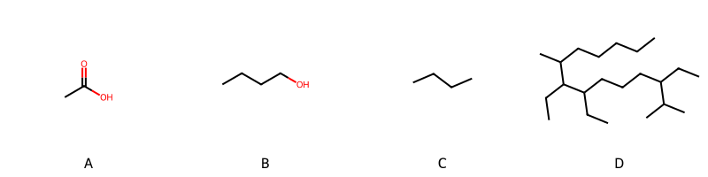

!!! abstract "Tóm tắt"

    **Họ Musaceae** có **1** chi được các cộng đồng sử dụng trong chăm sóc sức khỏe gồm *Musa*. Số lượng thành phần hóa học đã phân lập và xác định cấu trúc từ họ này tính đến tháng 12 năm 2024 là **14** nhóm có thể liệt kê như sau *Steroids and steroid derivatives, Organonitrogen compounds, Organooxygen compounds, Naphthalenes, Fatty Acyls, Tetrahydroisoquinolines, Glycerophospholipids, Flavonoids, Indoles and derivatives, Phenol ethers, Phenols, Carboxylic acids and derivatives, Benzene and substituted derivatives, Prenol lipids*. Giữa các loài trong họ này, 3 dược liệu được nghiên cứu nhiều nhất dựa trên số thành phần được phân lập là **Musa paradisiaca*. *Họ Musaceae* đã được một số công động tại các quốc gia như China, Elsewhere, Venezuela, Mexico(Chinantec), Haiti, Bahamas, Iraq, Panama(Choco), Java, Trinidad đã phát hiện một số tác dụng trên lâm sàng gồm chữa bệnh lẫn độc tính như Chất làm se, Thuốc diệt nấm, Thuốc tẩy giun, Thuốc tẩy giun, diệt khuẩn, Kem đánh răng, Thuốc kháng axit, Thuốc giải độc, Chất làm se, thuốc tống hơi, Thuốc diệt nấm, Thuốc cầm máu, Thuốc tẩy giun, diệt khuẩn, Thuốc kích thích tình dục, Chất làm se, Thuốc nhuận tràng, Thuốc giải độc, Thuốc tẩy giun, chất gây say, cầm máu, cầm máu, Chất làm lạnh, Sẹo, Thuốc nhuận tràng, Chất làm se, Chất làm mềm, Đổ mồ hôi.

!!! info "DrDuke"

    James A. Duke sinh năm 1929-2017 là một nhà thực vật học người Mỹ. Đây là một trong những tác giả hàng đầu trong lĩnh vực dược dân tộc học với cuốn *CRC Handbook of Medicinal Herbs* và chính là người xây dựng lên cơ sở dữ liệu về hợp chất tự nhiên và dược dân tộc học tại Bộ nông nghiệp Hoa Kỳ. Các thông tin được đăng tải tại website [Dr. Duke's Phytochemical and Ethnobotanical Databases](https://phytochem.nal.usda.gov/). 
    Trong suốt thập niên 1970, ông lãnh đạo the Plant Taxonomy Laboratory, Plant Genetics and Germplasm Institute of the Agricultural Research Service, U.S. Department of Agriculture.
    Trong tài liệu này, các thông tin về dược dân tộc của các dược liệu được trích dẫn từ tài liệu của James A. Ducke với sự trợ giúp của phần mềm dịch thuật từ tiếng Anh sang tiếng Việt.
   
## Tổng quan về Họ Musaceae
### Phân loại thực vật
Trong *họ Musaceae* có **1** chi được sử dụng làm thuốc với chi tiết số loài trong mỗi chi như sau Musa (3) . Chi tiết về loài sử dụng làm thuốc như dưới đây.  

>Họ Musaceae


>|-- Chi Musa

>*Musa basjoo*,
>*Musa paradisiaca*,
>*Musa sapientum*,

### Thành phần hóa học 

Số lượng thành phần hóa học đã phân lập và xác định cấu trúc từ họ này tính đến tháng 12 năm 2024 là 14 nhóm có thể liệt kê như sau Steroids and steroid derivatives, Organonitrogen compounds, Organooxygen compounds, Naphthalenes, Fatty Acyls, Tetrahydroisoquinolines, Glycerophospholipids, Flavonoids, Indoles and derivatives, Phenol ethers, Phenols, Carboxylic acids and derivatives, Benzene and substituted derivatives, Prenol lipids. Số lượng các loài đã được nghiên cứu thành phần hóa học là *1* trong tổng số *3* loài thuộc họ Musaceae.Giữa các loài trong họ này, 3 dược liệu được nghiên cứu nhiều nhất dựa trên số thành phần được phân lập là **Musa paradisiaca**. Sử dụng phần mềm RDKIT với thuật toán  Find Maximum Common Substructure (FMCS), các nhóm hoạt chất phổ biến nhất trong *họ Musaceae* đã xây dựng được nhân. Điều này trong tương lại có thể được sử dụng tìm kiếm mối liên hệ giữa tác dụng của cấu trúc hóa học và tác dụng dược lý. Các nhân trong phần này có thể không giống như cấu trúc gốc của từng nhóm chất. Kết quả được trình bầy như hình dưới đây.

<figure markdown="span">
    { width=100% }
    <figcaption> Cấu trúc hóa học của một số khung cơ bản dựa trên thuật toán FMCS để tìm Carboxylic acids and derivatives (A), Fatty Acyls (B), Organooxygen compounds (C), Steroids and steroid derivatives (D).</figcaption>
</figure>


!!! info  "Find Maximum Common Substructure"
    
    Thuật toán FMCS (Find Maximum Common Substructure) là một phương pháp được sử dụng để tìm ra cấu trúc chung nhiều nhất (MCS) trong một tập hợp các cấu trúc hóa học. Các bước của thuật toán gồm:
    - Chọn một cấu trúc hóa học là cấu trúc để tạo truy vấn, còn các cấu trúc khác là mục tiêu.
    - Chia nhỏ cấu trúc để tạo truy vấn thành cấu trúc nhỏ hơn dạng chuỗi SMARTS.
    - Kiểm tra chuỗi SMARTS trong các cấu trúc mục tiêu.
    - Tìm kiếm chuỗi SMARTS xuất hiện nhiều nhất.
    Để biết thêm chi tiết các bạn có thể xem tại [TeachOpenCADD](https://projects.volkamerlab.org/teachopencadd/talktorials/T006_compound_maximum_common_substructures.html)
    ``` python
    pip install rdkit
    def find_core_smiles(smiles_list):
        mols = [Chem.MolFromSmiles(smiles) for smiles in smiles_list]
        mcs = rdFMCS.FindMCS(mols)
        core_smiles = Chem.MolToSmiles(Chem.MolFromSmarts(mcs.smartsString))
        return core_smiles
    ```

### Dược dân tộc học

Họ **Musaceae** đã được một số công động tại các quốc gia như *China, Elsewhere, Venezuela, Mexico(Chinantec), Haiti, Bahamas, Iraq, Panama(Choco), Java, Trinidad* đã phát hiện một số tác dụng trên lâm sàng gồm chữa bệnh lẫn độc tính như *Chất làm se, Thuốc diệt nấm, Thuốc tẩy giun, Thuốc tẩy giun, diệt khuẩn, Kem đánh răng, Thuốc kháng axit, Thuốc giải độc, Chất làm se, thuốc tống hơi, Thuốc diệt nấm, Thuốc cầm máu, Thuốc tẩy giun, diệt khuẩn, Thuốc kích thích tình dục, Chất làm se, Thuốc nhuận tràng, Thuốc giải độc, Thuốc tẩy giun, chất gây say, cầm máu, cầm máu, Chất làm lạnh, Sẹo, Thuốc nhuận tràng, Chất làm se, Chất làm mềm, Đổ mồ hôi*.

## Chi tiết dược dân tộc học


### Chi Musa

!!! note "Danh sách các loài thuộc chi"
    
*	 - *Musa basjoo*
	 - *Musa paradisiaca*
	 - *Musa sapientum**

---      
#### *Musa paradisiaca*
**Thông tin về thực vật**

!!! info "Phân loại thực vật của *Musa paradisiaca* từ GIBF:"
    - **Kingdom:** Plantae
    - **Phylum:** Tracheophyta
    - **Order:** Zingiberales
    - **Family:** Musaceae
    - **Genus:** Musa
    - **Species:** *Musa paradisiaca*


 

Chưa có thông tin về loài này trên wikidata.

*Phân bố trên thế giới*: nan, French Polynesia, Trinidad and Tobago, Lao People’s Democratic Republic, Indonesia, United Arab Emirates, Panama, Réunion, Saint Lucia, Belize, Pakistan, Jamaica, American Samoa, Colombia, Cambodia, Micronesia (Federated States of), India, Ethiopia, Nepal, Malawi, Barbados, Brazil, Chinese Taipei, Mozambique, Tanzania, United Republic of, Nicaragua, Sri Lanka, Thailand, Honduras, Puerto Rico, Malaysia, French Guiana, Kenya, Guatemala, Argentina, Greece, Mexico, Myanmar, Algeria, Viet Nam, Cuba, Australia, Singapore, Peru, China, Spain, Ecuador, South Africa, Morocco, Costa Rica, Hong Kong, United States of America, Macao, Bolivia (Plurinational State of), Bahamas

*Phân bố tại Việt Nam*: Hậu Giang

**Thành phần hóa học**
        

Chưa có nghiên cứu về thành phần hóa học của loài này


**Dược dân tộc học**

Danh sách các quốc gia có sử dụng *Musa paradisiaca* trong điều trị các bệnh. 

| Quốc gia   | Bệnh                              |
|:-----------|:----------------------------------|
| China      | Thuốc nhuận tràng, Thuốc giải độc |


---      
#### *Musa paradisiaca*
**Thông tin về thực vật**

!!! info "Phân loại thực vật của *Musa paradisiaca* từ GIBF:"
    - **Kingdom:** Plantae
    - **Phylum:** Tracheophyta
    - **Order:** Zingiberales
    - **Family:** Musaceae
    - **Genus:** Musa
    - **Species:** *Musa paradisiaca*


 

Chưa có thông tin về loài này trên wikidata.

*Phân bố trên thế giới*: nan, French Polynesia, Trinidad and Tobago, Lao People’s Democratic Republic, Indonesia, United Arab Emirates, Panama, Réunion, Saint Lucia, Belize, Pakistan, Jamaica, American Samoa, Colombia, Cambodia, Micronesia (Federated States of), India, Ethiopia, Nepal, Malawi, Barbados, Brazil, Chinese Taipei, Mozambique, Tanzania, United Republic of, Nicaragua, Sri Lanka, Thailand, Honduras, Puerto Rico, Malaysia, French Guiana, Kenya, Guatemala, Argentina, Greece, Mexico, Myanmar, Algeria, Viet Nam, Cuba, Australia, Singapore, Peru, China, Spain, Ecuador, South Africa, Morocco, Costa Rica, Hong Kong, United States of America, Macao, Bolivia (Plurinational State of), Bahamas

*Phân bố tại Việt Nam*: Hậu Giang

**Thành phần hóa học**
        

Theo cơ sở dữ liệu lotus, từ loài *Musa paradisiaca* đã phân lập và xác định được 130 hoạt chất thuộc về các nhóm Steroids and steroid derivatives, Organonitrogen compounds, Organooxygen compounds, Naphthalenes, Fatty Acyls, Tetrahydroisoquinolines, Glycerophospholipids, Flavonoids, Indoles and derivatives, Phenol ethers, Phenols, Carboxylic acids and derivatives, Benzene and substituted derivatives, Prenol lipids. Danh sách các hoạt chất như sau hexanol [(LTS0217299)](https://lotus.naturalproducts.net/compound/lotus_id/LTS0217299), leucocyanidin [(LTS0181482)](https://lotus.naturalproducts.net/compound/lotus_id/LTS0181482), 2,3-dihydroxypropoxy(3-(hexadecanoyloxy)-2-[(9e,12e)-octadeca-9,12-dienoyloxy]propoxy)phosphinic acid [(LTS0232487)](https://lotus.naturalproducts.net/compound/lotus_id/LTS0232487), d-aspartic acid [(LTS0144001)](https://lotus.naturalproducts.net/compound/lotus_id/LTS0144001), sitoindoside i [(LTS0071215)](https://lotus.naturalproducts.net/compound/lotus_id/LTS0071215), campesterol [(LTS0046755)](https://lotus.naturalproducts.net/compound/lotus_id/LTS0046755), 2-heptanone [(LTS0087207)](https://lotus.naturalproducts.net/compound/lotus_id/LTS0087207), 1-(5-isopropylhept-5-en-2-yl)-6,9a,11a-trimethyl-1h,2h,3h,3ah,5h,5ah,6h,7h,8h,9h,9bh,10h,11h-cyclopenta[a]phenanthren-7-ol [(LTS0024105)](https://lotus.naturalproducts.net/compound/lotus_id/LTS0024105), (1r,7s,9as,11ar)-1-[(5z)-5-isopropylhept-5-en-2-yl]-6,9a,11a-trimethyl-1h,2h,3h,3ah,5h,5ah,6h,7h,8h,9h,9bh,10h,11h-cyclopenta[a]phenanthren-7-ol [(LTS0207040)](https://lotus.naturalproducts.net/compound/lotus_id/LTS0207040), eugenol [(LTS0052342)](https://lotus.naturalproducts.net/compound/lotus_id/LTS0052342), linoleic [(LTS0013198)](https://lotus.naturalproducts.net/compound/lotus_id/LTS0013198), (1r,3ar,5ar,6s,7s,9as,11ar)-1-[(2r,5r)-5,6-dimethylhept-6-en-2-yl]-3a,6,9a,11a-tetramethyl-1h,2h,3h,4h,5h,5ah,6h,7h,8h,9h,10h,11h-cyclopenta[a]phenanthren-7-ol [(LTS0013116)](https://lotus.naturalproducts.net/compound/lotus_id/LTS0013116), (1r,3ar,5as,6s,7s,9as,9br,11ar)-1-[(2r,5r)-5-ethyl-6-methylheptan-2-yl]-6,9a,11a-trimethyl-1h,2h,3h,3ah,5h,5ah,6h,7h,8h,9h,9bh,10h,11h-cyclopenta[a]phenanthren-7-ol [(LTS0004483)](https://lotus.naturalproducts.net/compound/lotus_id/LTS0004483), 2-pentanol [(LTS0217254)](https://lotus.naturalproducts.net/compound/lotus_id/LTS0217254), ethyl acetate [(LTS0196824)](https://lotus.naturalproducts.net/compound/lotus_id/LTS0196824), 2-(4-hydroxyphenyl)naphthalene-1-carbonyl 2-(4-hydroxyphenyl)naphthalene-1-carboxylate [(LTS0085392)](https://lotus.naturalproducts.net/compound/lotus_id/LTS0085392), 12,16-dimethyl-15-(6-methyl-5-methylideneheptan-2-yl)pentacyclo[9.7.0.0¹,³.0³,⁸.0¹²,¹⁶]octadecan-6-ol [(LTS0179004)](https://lotus.naturalproducts.net/compound/lotus_id/LTS0179004), lauric acid [(LTS0051907)](https://lotus.naturalproducts.net/compound/lotus_id/LTS0051907), 2-heptyl butyrate [(LTS0081117)](https://lotus.naturalproducts.net/compound/lotus_id/LTS0081117), l-arginine [(LTS0064737)](https://lotus.naturalproducts.net/compound/lotus_id/LTS0064737), amyl alcohol; isovaleric acid [(LTS0222142)](https://lotus.naturalproducts.net/compound/lotus_id/LTS0222142), isovaleraldehyde [(LTS0227741)](https://lotus.naturalproducts.net/compound/lotus_id/LTS0227741), l-isoleucine [(LTS0249538)](https://lotus.naturalproducts.net/compound/lotus_id/LTS0249538), procyanidol [(LTS0174045)](https://lotus.naturalproducts.net/compound/lotus_id/LTS0174045), 2-pentanone [(LTS0016615)](https://lotus.naturalproducts.net/compound/lotus_id/LTS0016615), bran oil [(LTS0143969)](https://lotus.naturalproducts.net/compound/lotus_id/LTS0143969), isoamyl alcohol [(LTS0112297)](https://lotus.naturalproducts.net/compound/lotus_id/LTS0112297), cycloartenol [(LTS0269561)](https://lotus.naturalproducts.net/compound/lotus_id/LTS0269561), methyl eugenol [(LTS0098881)](https://lotus.naturalproducts.net/compound/lotus_id/LTS0098881), acetophenone [(LTS0155971)](https://lotus.naturalproducts.net/compound/lotus_id/LTS0155971), (1s,3r,6r,7s,8s,11s,12s,15r,16r)-15-[(2r,5s)-5,6-dimethylhept-6-en-2-yl]-7,12,16-trimethylpentacyclo[9.7.0.0¹,³.0³,⁸.0¹²,¹⁶]octadecan-6-ol [(LTS0080621)](https://lotus.naturalproducts.net/compound/lotus_id/LTS0080621), 2-hydroxy-4-(4-hydroxyphenyl)phenalen-1-one [(LTS0121517)](https://lotus.naturalproducts.net/compound/lotus_id/LTS0121517), α linolenic acid [(LTS0132789)](https://lotus.naturalproducts.net/compound/lotus_id/LTS0132789), (+-)-propylene glycol [(LTS0274535)](https://lotus.naturalproducts.net/compound/lotus_id/LTS0274535), putrescine [(LTS0238763)](https://lotus.naturalproducts.net/compound/lotus_id/LTS0238763), dopamine [(LTS0029901)](https://lotus.naturalproducts.net/compound/lotus_id/LTS0029901), d-phenylalanine [(LTS0048920)](https://lotus.naturalproducts.net/compound/lotus_id/LTS0048920), 2-nonanone [(LTS0245014)](https://lotus.naturalproducts.net/compound/lotus_id/LTS0245014), 15-(5,6-dimethylhept-6-en-2-yl)-7,12,16-trimethylpentacyclo[9.7.0.0¹,³.0³,⁸.0¹²,¹⁶]octadecan-6-one [(LTS0130764)](https://lotus.naturalproducts.net/compound/lotus_id/LTS0130764), (3r,8s,11s,12s,16r)-15-(5,6-dimethylhept-6-en-2-yl)-7,12,16-trimethylpentacyclo[9.7.0.0¹,³.0³,⁸.0¹²,¹⁶]octadecan-6-one [(LTS0114006)](https://lotus.naturalproducts.net/compound/lotus_id/LTS0114006), hexanol; isovaleric acid [(LTS0197589)](https://lotus.naturalproducts.net/compound/lotus_id/LTS0197589), elemicin [(LTS0188875)](https://lotus.naturalproducts.net/compound/lotus_id/LTS0188875), 1-(5,6-dimethylhept-6-en-2-yl)-3a,6,9a,11a-tetramethyl-1h,2h,3h,4h,5h,5ah,6h,7h,8h,9h,10h,11h-cyclopenta[a]phenanthren-7-ol [(LTS0120208)](https://lotus.naturalproducts.net/compound/lotus_id/LTS0120208), l-aspartic acid [(LTS0205466)](https://lotus.naturalproducts.net/compound/lotus_id/LTS0205466), palmitoleic acid [(LTS0261591)](https://lotus.naturalproducts.net/compound/lotus_id/LTS0261591), hexanal [(LTS0238624)](https://lotus.naturalproducts.net/compound/lotus_id/LTS0238624), (1s,3r,7s,8s,11s,12s,15r,16r)-15-[(2r,5s)-5,6-dimethylhept-6-en-2-yl]-7,12,16-trimethylpentacyclo[9.7.0.0¹,³.0³,⁸.0¹²,¹⁶]octadecan-6-one [(LTS0008992)](https://lotus.naturalproducts.net/compound/lotus_id/LTS0008992), d-methionine [(LTS0108782)](https://lotus.naturalproducts.net/compound/lotus_id/LTS0108782), 2-[(6-{[1-(5-ethyl-6-methylheptan-2-yl)-9a,11a-dimethyl-1h,2h,3h,3ah,3bh,4h,6h,7h,8h,9h,9bh,10h,11h-cyclopenta[a]phenanthren-7-yl]oxy}-3,4,5-trihydroxyoxan-2-yl)methoxy]-3,4,5,6-tetrahydroxycyclohexyl hexadecanoate [(LTS0092529)](https://lotus.naturalproducts.net/compound/lotus_id/LTS0092529), butyl butyrate [(LTS0236625)](https://lotus.naturalproducts.net/compound/lotus_id/LTS0236625), 12,16-dimethyl-15-(6-methyl-5-methylideneheptan-2-yl)pentacyclo[9.7.0.0¹,³.0³,⁸.0¹²,¹⁶]octadecan-6-yl acetate [(LTS0032544)](https://lotus.naturalproducts.net/compound/lotus_id/LTS0032544), l-glutamic acid [(LTS0037133)](https://lotus.naturalproducts.net/compound/lotus_id/LTS0037133), [(2r,3s,4s,5r,6r)-6-{[(2r,3s,4s,5r,6r)-6-{[(1r,3as,3bs,7s,9ar,9bs,11ar)-1-[(2r,5r)-5-ethyl-6-methylheptan-2-yl]-9a,11a-dimethyl-1h,2h,3h,3ah,3bh,4h,6h,7h,8h,9h,9bh,10h,11h-cyclopenta[a]phenanthren-7-yl]oxy}-3,4,5-trihydroxyoxan-2-yl]methoxy}-3,4,5-trihydroxyoxan-2-yl]methyl hexadecanoate [(LTS0098980)](https://lotus.naturalproducts.net/compound/lotus_id/LTS0098980), phenylacetaldehyde [(LTS0245512)](https://lotus.naturalproducts.net/compound/lotus_id/LTS0245512), hexanone [(LTS0108749)](https://lotus.naturalproducts.net/compound/lotus_id/LTS0108749), 2-pentyl butyrate [(LTS0071890)](https://lotus.naturalproducts.net/compound/lotus_id/LTS0071890), (z)-24-ethylidenelophenol [(LTS0155418)](https://lotus.naturalproducts.net/compound/lotus_id/LTS0155418), hexyl acetate [(LTS0202355)](https://lotus.naturalproducts.net/compound/lotus_id/LTS0202355), l-leucine [(LTS0113423)](https://lotus.naturalproducts.net/compound/lotus_id/LTS0113423), 15-(5,6-dimethylhept-6-en-2-yl)-7,12,16-trimethylpentacyclo[9.7.0.0¹,³.0³,⁸.0¹²,¹⁶]octadecan-6-ol [(LTS0043570)](https://lotus.naturalproducts.net/compound/lotus_id/LTS0043570), stigmast-5-en-3-ol, (3β)- [(LTS0204616)](https://lotus.naturalproducts.net/compound/lotus_id/LTS0204616), 5-methylfurfural [(LTS0186625)](https://lotus.naturalproducts.net/compound/lotus_id/LTS0186625), palmitic acid [(LTS0079439)](https://lotus.naturalproducts.net/compound/lotus_id/LTS0079439), tryptamine [(LTS0181180)](https://lotus.naturalproducts.net/compound/lotus_id/LTS0181180), 24-methylene-cycloartanol [(LTS0077845)](https://lotus.naturalproducts.net/compound/lotus_id/LTS0077845), (1r,3s,6s,8r,11r,12s,15r,16r)-12,16-dimethyl-15-[(2r)-6-methyl-5-methylideneheptan-2-yl]pentacyclo[9.7.0.0¹,³.0³,⁸.0¹²,¹⁶]octadecan-6-yl acetate [(LTS0172810)](https://lotus.naturalproducts.net/compound/lotus_id/LTS0172810), l-alanine [(LTS0042208)](https://lotus.naturalproducts.net/compound/lotus_id/LTS0042208), 2-hydroxy-9-(4-hydroxyphenyl)phenalen-1-one [(LTS0011425)](https://lotus.naturalproducts.net/compound/lotus_id/LTS0011425), d-alanine [(LTS0272178)](https://lotus.naturalproducts.net/compound/lotus_id/LTS0272178), (1r,2s,3r,4s,5s,6r)-2-{[(2r,3s,4s,5r,6r)-6-{[(1r,3as,3bs,7s,9ar,9bs,11ar)-1-[(2r,5r)-5-ethyl-6-methylheptan-2-yl]-9a,11a-dimethyl-1h,2h,3h,3ah,3bh,4h,6h,7h,8h,9h,9bh,10h,11h-cyclopenta[a]phenanthren-7-yl]oxy}-3,4,5-trihydroxyoxan-2-yl]methoxy}-3,4,5,6-tetrahydroxycyclohexyl hexadecanoate [(LTS0026607)](https://lotus.naturalproducts.net/compound/lotus_id/LTS0026607), (1s,3r,7s,8s,11s,12s,15r,16r)-7,12,16-trimethyl-15-[(2r)-6-methyl-5-oxoheptan-2-yl]pentacyclo[9.7.0.0¹,³.0³,⁸.0¹²,¹⁶]octadecan-6-one [(LTS0175444)](https://lotus.naturalproducts.net/compound/lotus_id/LTS0175444), sitogluside [(LTS0201798)](https://lotus.naturalproducts.net/compound/lotus_id/LTS0201798), 2-heptanol [(LTS0147404)](https://lotus.naturalproducts.net/compound/lotus_id/LTS0147404), hexyl butyrate [(LTS0143525)](https://lotus.naturalproducts.net/compound/lotus_id/LTS0143525), (1r,2r,3s,4s,5r,6s)-6-{[(2r,3s,4s,5r,6r)-6-{[(1r,3as,3bs,7s,9ar,9bs,11ar)-1-[(2r,5r)-5-ethyl-6-methylheptan-2-yl]-9a,11a-dimethyl-1h,2h,3h,3ah,3bh,4h,6h,7h,8h,9h,9bh,10h,11h-cyclopenta[a]phenanthren-7-yl]oxy}-3,4,5-trihydroxyoxan-2-yl]methoxy}cyclohexane-1,2,3,4,5-pentol [(LTS0057357)](https://lotus.naturalproducts.net/compound/lotus_id/LTS0057357), cycloeucalenol [(LTS0125739)](https://lotus.naturalproducts.net/compound/lotus_id/LTS0125739), stigmast-5-en-3-ol [(LTS0071224)](https://lotus.naturalproducts.net/compound/lotus_id/LTS0071224), l-serine [(LTS0106692)](https://lotus.naturalproducts.net/compound/lotus_id/LTS0106692), 1-(5-ethyl-6-methylheptan-2-yl)-6,9a,11a-trimethyl-1h,2h,3h,3ah,5h,5ah,6h,7h,8h,9h,9bh,10h,11h-cyclopenta[a]phenanthren-7-ol [(LTS0085508)](https://lotus.naturalproducts.net/compound/lotus_id/LTS0085508), l-tyrosine [(LTS0029981)](https://lotus.naturalproducts.net/compound/lotus_id/LTS0029981), l-proline [(LTS0090383)](https://lotus.naturalproducts.net/compound/lotus_id/LTS0090383), salsolinol [(LTS0155847)](https://lotus.naturalproducts.net/compound/lotus_id/LTS0155847), 7,12,16-trimethyl-15-(6-methyl-5-methylideneheptan-2-yl)pentacyclo[9.7.0.0¹,³.0³,⁸.0¹²,¹⁶]octadecan-6-one [(LTS0116840)](https://lotus.naturalproducts.net/compound/lotus_id/LTS0116840), l-valine [(LTS0231703)](https://lotus.naturalproducts.net/compound/lotus_id/LTS0231703), n-[2-(5-methoxy-1h-indol-3-yl)ethyl]ethanimidic acid [(LTS0219322)](https://lotus.naturalproducts.net/compound/lotus_id/LTS0219322), l-threonine [(LTS0184056)](https://lotus.naturalproducts.net/compound/lotus_id/LTS0184056), 12,16-dimethyl-15-(6-methyl-5-methylideneheptan-2-yl)pentacyclo[9.7.0.0¹,³.0³,⁸.0¹²,¹⁶]octadecan-6-one [(LTS0032192)](https://lotus.naturalproducts.net/compound/lotus_id/LTS0032192), (1s,3r,7s,8s,11s,12s,15r,16r)-7,12,16-trimethyl-15-[(2r)-6-methyl-5-methylideneheptan-2-yl]pentacyclo[9.7.0.0¹,³.0³,⁸.0¹²,¹⁶]octadecan-6-one [(LTS0224467)](https://lotus.naturalproducts.net/compound/lotus_id/LTS0224467), (1s,3r,7r,8s,11s,12s,15r,16r)-7,12,16-trimethyl-15-[(2r)-6-methyl-5-methylideneheptan-2-yl]pentacyclo[9.7.0.0¹,³.0³,⁸.0¹²,¹⁶]octadecan-6-one [(LTS0066419)](https://lotus.naturalproducts.net/compound/lotus_id/LTS0066419), l-methionine [(LTS0196746)](https://lotus.naturalproducts.net/compound/lotus_id/LTS0196746), (1s,3r,6r,7s,8s,11s,12s,15r,16r)-7,12,16-trimethyl-15-[(2r)-6-methyl-5-methylideneheptan-2-yl]pentacyclo[9.7.0.0¹,³.0³,⁸.0¹²,¹⁶]octadecan-6-ol [(LTS0011277)](https://lotus.naturalproducts.net/compound/lotus_id/LTS0011277), 15-(5,6-dimethylhept-6-en-2-yl)-12,16-dimethylpentacyclo[9.7.0.0¹,³.0³,⁸.0¹²,¹⁶]octadecan-6-one [(LTS0157318)](https://lotus.naturalproducts.net/compound/lotus_id/LTS0157318), (1r,3s,6s,8r,11r,12s,15r,16r)-12,16-dimethyl-15-[(2r)-6-methyl-5-methylideneheptan-2-yl]pentacyclo[9.7.0.0¹,³.0³,⁸.0¹²,¹⁶]octadecan-6-ol [(LTS0090018)](https://lotus.naturalproducts.net/compound/lotus_id/LTS0090018), ionone [(LTS0252546)](https://lotus.naturalproducts.net/compound/lotus_id/LTS0252546), 2-{[1-(5-ethyl-6-methylheptan-2-yl)-9a,11a-dimethyl-1h,2h,3h,3ah,3bh,4h,6h,7h,8h,9h,9bh,10h,11h-cyclopenta[a]phenanthren-7-yl]oxy}-6-(hydroxymethyl)oxane-3,4,5-triol [(LTS0158828)](https://lotus.naturalproducts.net/compound/lotus_id/LTS0158828), norepinephrine [(LTS0169380)](https://lotus.naturalproducts.net/compound/lotus_id/LTS0169380), phytosterol [(LTS0029311)](https://lotus.naturalproducts.net/compound/lotus_id/LTS0029311), (2s)-2-(phenylamino)propanoic acid [(LTS0199539)](https://lotus.naturalproducts.net/compound/lotus_id/LTS0199539), creosol [(LTS0051403)](https://lotus.naturalproducts.net/compound/lotus_id/LTS0051403), 7,12,16-trimethyl-15-(6-methyl-5-oxoheptan-2-yl)pentacyclo[9.7.0.0¹,³.0³,⁸.0¹²,¹⁶]octadecan-6-one [(LTS0124908)](https://lotus.naturalproducts.net/compound/lotus_id/LTS0124908), 7,12,16-trimethyl-15-(6-methyl-5-methylideneheptan-2-yl)pentacyclo[9.7.0.0¹,³.0³,⁸.0¹²,¹⁶]octadecan-6-ol [(LTS0042683)](https://lotus.naturalproducts.net/compound/lotus_id/LTS0042683), sec-amyl acetate [(LTS0102156)](https://lotus.naturalproducts.net/compound/lotus_id/LTS0102156), (3r,6s,8r,11s,12s,15r,16r)-7,7,12,16-tetramethyl-15-[(2r)-6-methylhept-5-en-2-yl]pentacyclo[9.7.0.0¹,³.0³,⁸.0¹²,¹⁶]octadecan-6-ol [(LTS0062833)](https://lotus.naturalproducts.net/compound/lotus_id/LTS0062833), myristic acid [(LTS0102566)](https://lotus.naturalproducts.net/compound/lotus_id/LTS0102566), hexyl hexanoate [(LTS0063928)](https://lotus.naturalproducts.net/compound/lotus_id/LTS0063928), l-lysine [(LTS0068734)](https://lotus.naturalproducts.net/compound/lotus_id/LTS0068734), campesterol [(LTS0029429)](https://lotus.naturalproducts.net/compound/lotus_id/LTS0029429), (1s,3r,8s,11s,12s,15r,16r)-12,16-dimethyl-15-[(2r)-6-methyl-5-methylideneheptan-2-yl]pentacyclo[9.7.0.0¹,³.0³,⁸.0¹²,¹⁶]octadecan-6-one [(LTS0118869)](https://lotus.naturalproducts.net/compound/lotus_id/LTS0118869), (1s,3r,7r,8s,11s,12s,15r,16r)-15-[(2r,5s)-5,6-dimethylhept-6-en-2-yl]-7,12,16-trimethylpentacyclo[9.7.0.0¹,³.0³,⁸.0¹²,¹⁶]octadecan-6-one [(LTS0140255)](https://lotus.naturalproducts.net/compound/lotus_id/LTS0140255), hexan-2-yl butanoate [(LTS0009879)](https://lotus.naturalproducts.net/compound/lotus_id/LTS0009879), acid, folic [(LTS0212965)](https://lotus.naturalproducts.net/compound/lotus_id/LTS0212965), (1r,3as,3bs,7s,9bs)-1-[(2r,5r)-5,6-dimethylheptan-2-yl]-9a,11a-dimethyl-1h,2h,3h,3ah,3bh,4h,6h,7h,8h,9h,9bh,10h,11h-cyclopenta[a]phenanthren-7-ol [(LTS0057877)](https://lotus.naturalproducts.net/compound/lotus_id/LTS0057877), (1s,3r,8s,11s,12s,15r,16r)-15-[(2r,5s)-5,6-dimethylhept-6-en-2-yl]-12,16-dimethylpentacyclo[9.7.0.0¹,³.0³,⁸.0¹²,¹⁶]octadecan-6-one [(LTS0055598)](https://lotus.naturalproducts.net/compound/lotus_id/LTS0055598), l-histidine [(LTS0094081)](https://lotus.naturalproducts.net/compound/lotus_id/LTS0094081), 2-carboxy-d-arabinitol [(LTS0056947)](https://lotus.naturalproducts.net/compound/lotus_id/LTS0056947), 5-ethenyl-2-methoxyphenol [(LTS0076260)](https://lotus.naturalproducts.net/compound/lotus_id/LTS0076260), (2r,3r,4s,5s,6r)-2-{[(1r,3as,3bs,7s,9ar,9bs,11ar)-1-[(2r,5r)-5-ethyl-6-methylheptan-2-yl]-9a,11a-dimethyl-1h,2h,3h,3ah,3bh,4h,6h,7h,8h,9h,9bh,10h,11h-cyclopenta[a]phenanthren-7-yl]oxy}-6-({[(2r,3r,4s,5s,6r)-3,4,5-trihydroxy-6-(hydroxymethyl)oxan-2-yl]oxy}methyl)oxane-3,4,5-triol [(LTS0096737)](https://lotus.naturalproducts.net/compound/lotus_id/LTS0096737), α-linolenic acid [(LTS0275508)](https://lotus.naturalproducts.net/compound/lotus_id/LTS0275508), 2-{[1-(5-ethyl-6-methylheptan-2-yl)-9a,11a-dimethyl-1h,2h,3h,3ah,3bh,4h,6h,7h,8h,9h,9bh,10h,11h-cyclopenta[a]phenanthren-7-yl]oxy}-6-({[3,4,5-trihydroxy-6-(hydroxymethyl)oxan-2-yl]oxy}methyl)oxane-3,4,5-triol [(LTS0054550)](https://lotus.naturalproducts.net/compound/lotus_id/LTS0054550), sitosterol [(LTS0168132)](https://lotus.naturalproducts.net/compound/lotus_id/LTS0168132), {6-[(6-{[1-(5-ethyl-6-methylheptan-2-yl)-9a,11a-dimethyl-1h,2h,3h,3ah,3bh,4h,6h,7h,8h,9h,9bh,10h,11h-cyclopenta[a]phenanthren-7-yl]oxy}-3,4,5-trihydroxyoxan-2-yl)methoxy]-3,4,5-trihydroxyoxan-2-yl}methyl hexadecanoate [(LTS0065442)](https://lotus.naturalproducts.net/compound/lotus_id/LTS0065442), oleic acid [(LTS0256910)](https://lotus.naturalproducts.net/compound/lotus_id/LTS0256910), 24-methylenecycloartanol [(LTS0018584)](https://lotus.naturalproducts.net/compound/lotus_id/LTS0018584), l-tryptophan [(LTS0263809)](https://lotus.naturalproducts.net/compound/lotus_id/LTS0263809), levodopa [(LTS0130329)](https://lotus.naturalproducts.net/compound/lotus_id/LTS0130329), 2-methoxy-4-vinyl-phenol [(LTS0128961)](https://lotus.naturalproducts.net/compound/lotus_id/LTS0128961), butyl acetate [(LTS0047300)](https://lotus.naturalproducts.net/compound/lotus_id/LTS0047300), stigmasterol [(LTS0024262)](https://lotus.naturalproducts.net/compound/lotus_id/LTS0024262), 6-[(6-{[1-(5-ethyl-6-methylheptan-2-yl)-9a,11a-dimethyl-1h,2h,3h,3ah,3bh,4h,6h,7h,8h,9h,9bh,10h,11h-cyclopenta[a]phenanthren-7-yl]oxy}-3,4,5-trihydroxyoxan-2-yl)methoxy]cyclohexane-1,2,3,4,5-pentol [(LTS0235623)](https://lotus.naturalproducts.net/compound/lotus_id/LTS0235623), heptan-2-yl acetate [(LTS0259428)](https://lotus.naturalproducts.net/compound/lotus_id/LTS0259428).

| chemicalTaxonomyClassyfireClass     |   lotus_count |
|:------------------------------------|--------------:|
| Benzene and substituted derivatives |             2 |
| Carboxylic acids and derivatives    |            26 |
| Fatty Acyls                         |            20 |
| Flavonoids                          |             2 |
| Glycerophospholipids                |             1 |
| Indoles and derivatives             |             3 |
| Naphthalenes                        |             3 |
| Organonitrogen compounds            |             1 |
| Organooxygen compounds              |            11 |
| Phenol ethers                       |             1 |
| Phenols                             |             6 |
| Prenol lipids                       |             1 |
| Steroids and steroid derivatives    |            51 |
| Tetrahydroisoquinolines             |             1 |


**Dược dân tộc học**

Danh sách các quốc gia có sử dụng *Musa paradisiaca* trong điều trị các bệnh. 

| Quốc gia      | Bệnh                                                                                                                     |
|:--------------|:-------------------------------------------------------------------------------------------------------------------------|
| Elsewhere     | Thuốc kháng axit, Thuốc giải độc, Chất làm se, thuốc tống hơi, Thuốc diệt nấm, Thuốc cầm máu, Thuốc tẩy giun, diệt khuẩn |
| Haiti         | cầm máu, Chất làm lạnh, Sẹo, Thuốc nhuận tràng, Chất làm se, Chất làm mềm                                                |
| Iraq          | Thuốc tẩy giun                                                                                                           |
| Panama(Choco) | chất gây say                                                                                                             |
| Trinidad      | Chất làm se, Thuốc diệt nấm, Thuốc tẩy giun, Thuốc tẩy giun, diệt khuẩn                                                  |
| Venezuela     | Thuốc kích thích tình dục, Chất làm se                                                                                   |


---      
#### *Musa paradisiaca*
**Thông tin về thực vật**

!!! info "Phân loại thực vật của *Musa paradisiaca* từ GIBF:"
    - **Kingdom:** Plantae
    - **Phylum:** Tracheophyta
    - **Order:** Zingiberales
    - **Family:** Musaceae
    - **Genus:** Musa
    - **Species:** *Musa paradisiaca*


 

Chưa có thông tin về loài này trên wikidata.

*Phân bố trên thế giới*: nan, French Polynesia, Trinidad and Tobago, Lao People’s Democratic Republic, Indonesia, United Arab Emirates, Panama, Réunion, Saint Lucia, Belize, Pakistan, Jamaica, American Samoa, Colombia, Cambodia, Micronesia (Federated States of), India, Ethiopia, Nepal, Malawi, Barbados, Brazil, Chinese Taipei, Mozambique, Tanzania, United Republic of, Nicaragua, Sri Lanka, Thailand, Honduras, Puerto Rico, Malaysia, French Guiana, Kenya, Guatemala, Argentina, Greece, Mexico, Myanmar, Algeria, Viet Nam, Cuba, Australia, Singapore, Peru, China, Spain, Ecuador, South Africa, Morocco, Costa Rica, Hong Kong, United States of America, Macao, Bolivia (Plurinational State of), Bahamas

*Phân bố tại Việt Nam*: Hậu Giang

**Thành phần hóa học**
        

Chưa có nghiên cứu về thành phần hóa học của loài này


**Dược dân tộc học**

Danh sách các quốc gia có sử dụng *Musa paradisiaca* trong điều trị các bệnh. 

| Quốc gia          | Bệnh          |
|:------------------|:--------------|
| Bahamas           | Đổ mồ hôi     |
| Java              | cầm máu       |
| Mexico(Chinantec) | Kem đánh răng |


## Bình luận

<div id="giscus-container"></div>
<script src="https://giscus.app/client.js"
        data-repo="hoangson0787/CSDL-duoc-lieu"
        data-repo-id="R_kgDONbMRNA"
        data-category="Duoc lieu"
        data-category-id="DIC_kwDONbMRNM4ClklR"
        data-mapping="pathname"
        data-strict="0"
        data-reactions-enabled="1"
        data-emit-metadata="1"
        data-input-position="bottom"
        data-theme="light"
        data-lang="en"
        crossorigin="anonymous"
        async>
</script>

