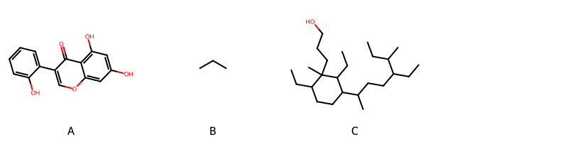

!!! abstract "Tóm tắt"

    **Họ Nyctaginaceae** có **5** chi được các cộng đồng sử dụng trong chăm sóc sức khỏe gồm *Pisonia, Mirabilis, Ceodes, Commicarpus, Boerhaavia*. Số lượng thành phần hóa học đã phân lập và xác định cấu trúc từ họ này tính đến tháng 12 năm 2024 là **13** nhóm có thể liệt kê như sau *Steroids and steroid derivatives, Lignan lactones, Organooxygen compounds, Fatty Acyls, Tetrahydroisoquinolines, Cinnamic acids and derivatives, Isoflavonoids, Indoles and derivatives, Phenols, Isoquinolines and derivatives, Carboxylic acids and derivatives, Benzene and substituted derivatives, Prenol lipids*. Giữa các loài trong họ này, 3 dược liệu được nghiên cứu nhiều nhất dựa trên số thành phần được phân lập là **Pisonia umbellifera, Mirabilis jalapa, Boerhaavia coccinea*. *Họ Nyctaginaceae* đã được một số công động tại các quốc gia như Elsewhere, Turkey, Sudan, ain, Mexico, US, Philippines, Africa, China, Venezuela, Japan, Hawaii, Haiti, Brazil, Malaya, Bahamas, Upper Volta, India, Dominican Republic, Oceania, Bolivia đã phát hiện một số tác dụng trên lâm sàng gồm chữa bệnh lẫn độc tính như Chất độc, Thuốc bổ, Thuốc bổ, mỹ phẩm, Thuốc lợi tiểu, Thuốc lợi tiểu, Thuốc nhuận tràng, Thuốc lợi tiểu, gây nôn, Thuốc nhuận tràng, Thuốc nhuận tràng, Thuốc long đờm, Thuốc nhuận tràng, Thuốc nhuận tràng, Thuốc thanh lọc, Thuốc tẩy giun, Thuốc lợi tiểu, Xà phòng, cầm máu, gây nôn, gây nôn, Chất làm lạnh, Thuốc nhuận tràng, gây nôn, Thuốc long đờm, gây nôn, gây nôn, Thuốc long đờm, Thuốc nhuận tràng, Thuốc lợi tiểu, mỹ phẩm, mỹ phẩm, Thuốc lợi tiểu, thuốc tống hơi, Thuốc nhuận tràng, Thuốc tẩy giun, dạ dày.

!!! info "DrDuke"

    James A. Duke sinh năm 1929-2017 là một nhà thực vật học người Mỹ. Đây là một trong những tác giả hàng đầu trong lĩnh vực dược dân tộc học với cuốn *CRC Handbook of Medicinal Herbs* và chính là người xây dựng lên cơ sở dữ liệu về hợp chất tự nhiên và dược dân tộc học tại Bộ nông nghiệp Hoa Kỳ. Các thông tin được đăng tải tại website [Dr. Duke's Phytochemical and Ethnobotanical Databases](https://phytochem.nal.usda.gov/). 
    Trong suốt thập niên 1970, ông lãnh đạo the Plant Taxonomy Laboratory, Plant Genetics and Germplasm Institute of the Agricultural Research Service, U.S. Department of Agriculture.
    Trong tài liệu này, các thông tin về dược dân tộc của các dược liệu được trích dẫn từ tài liệu của James A. Ducke với sự trợ giúp của phần mềm dịch thuật từ tiếng Anh sang tiếng Việt.
   
## Tổng quan về Họ Nyctaginaceae
### Phân loại thực vật
Trong *họ Nyctaginaceae* có **5** chi được sử dụng làm thuốc với chi tiết số loài trong mỗi chi như sau Boerhaavia (5) . Chi tiết về loài sử dụng làm thuốc như dưới đây.  

>Họ Nyctaginaceae


>|-- Chi Pisonia

>*Pisonia brunioniana*,
>*Pisonia grandis*,
>*Pisonia irregularis*,
>*Pisonia umbellifera*,

>|-- Chi Mirabilis

>*Mirabilis jalapa*,

>|-- Chi Ceodes

>*Ceodes brunoniana*,

>|-- Chi Commicarpus

>*Commicarpus scandens*,

>|-- Chi Boerhaavia

>*Boerhaavia coccinea*,
>*Boerhaavia diffusa*,
>*Boerhaavia erecta*,
>*Boerhaavia paniculata*,
>*Boerhaavia repens*,

### Thành phần hóa học 

Số lượng thành phần hóa học đã phân lập và xác định cấu trúc từ họ này tính đến tháng 12 năm 2024 là 13 nhóm có thể liệt kê như sau Steroids and steroid derivatives, Lignan lactones, Organooxygen compounds, Fatty Acyls, Tetrahydroisoquinolines, Cinnamic acids and derivatives, Isoflavonoids, Indoles and derivatives, Phenols, Isoquinolines and derivatives, Carboxylic acids and derivatives, Benzene and substituted derivatives, Prenol lipids. Số lượng các loài đã được nghiên cứu thành phần hóa học là *3* trong tổng số *12* loài thuộc họ Nyctaginaceae.Giữa các loài trong họ này, 3 dược liệu được nghiên cứu nhiều nhất dựa trên số thành phần được phân lập là **Pisonia umbellifera, Mirabilis jalapa, Boerhaavia coccinea**. Sử dụng phần mềm RDKIT với thuật toán  Find Maximum Common Substructure (FMCS), các nhóm hoạt chất phổ biến nhất trong *họ Nyctaginaceae* đã xây dựng được nhân. Điều này trong tương lại có thể được sử dụng tìm kiếm mối liên hệ giữa tác dụng của cấu trúc hóa học và tác dụng dược lý. Các nhân trong phần này có thể không giống như cấu trúc gốc của từng nhóm chất. Kết quả được trình bầy như hình dưới đây.

<figure markdown="span">
    { width=100% }
    <figcaption> Cấu trúc hóa học của một số khung cơ bản dựa trên thuật toán FMCS để tìm Isoflavonoids (A), Organooxygen compounds (B), Prenol lipids (C).</figcaption>
</figure>


!!! info  "Find Maximum Common Substructure"
    
    Thuật toán FMCS (Find Maximum Common Substructure) là một phương pháp được sử dụng để tìm ra cấu trúc chung nhiều nhất (MCS) trong một tập hợp các cấu trúc hóa học. Các bước của thuật toán gồm:
    - Chọn một cấu trúc hóa học là cấu trúc để tạo truy vấn, còn các cấu trúc khác là mục tiêu.
    - Chia nhỏ cấu trúc để tạo truy vấn thành cấu trúc nhỏ hơn dạng chuỗi SMARTS.
    - Kiểm tra chuỗi SMARTS trong các cấu trúc mục tiêu.
    - Tìm kiếm chuỗi SMARTS xuất hiện nhiều nhất.
    Để biết thêm chi tiết các bạn có thể xem tại [TeachOpenCADD](https://projects.volkamerlab.org/teachopencadd/talktorials/T006_compound_maximum_common_substructures.html)
    ``` python
    pip install rdkit
    def find_core_smiles(smiles_list):
        mols = [Chem.MolFromSmiles(smiles) for smiles in smiles_list]
        mcs = rdFMCS.FindMCS(mols)
        core_smiles = Chem.MolToSmiles(Chem.MolFromSmarts(mcs.smartsString))
        return core_smiles
    ```

### Dược dân tộc học

Họ **Nyctaginaceae** đã được một số công động tại các quốc gia như *Elsewhere, Turkey, Sudan, ain, Mexico, US, Philippines, Africa, China, Venezuela, Japan, Hawaii, Haiti, Brazil, Malaya, Bahamas, Upper Volta, India, Dominican Republic, Oceania, Bolivia* đã phát hiện một số tác dụng trên lâm sàng gồm chữa bệnh lẫn độc tính như *Chất độc, Thuốc bổ, Thuốc bổ, mỹ phẩm, Thuốc lợi tiểu, Thuốc lợi tiểu, Thuốc nhuận tràng, Thuốc lợi tiểu, gây nôn, Thuốc nhuận tràng, Thuốc nhuận tràng, Thuốc long đờm, Thuốc nhuận tràng, Thuốc nhuận tràng, Thuốc thanh lọc, Thuốc tẩy giun, Thuốc lợi tiểu, Xà phòng, cầm máu, gây nôn, gây nôn, Chất làm lạnh, Thuốc nhuận tràng, gây nôn, Thuốc long đờm, gây nôn, gây nôn, Thuốc long đờm, Thuốc nhuận tràng, Thuốc lợi tiểu, mỹ phẩm, mỹ phẩm, Thuốc lợi tiểu, thuốc tống hơi, Thuốc nhuận tràng, Thuốc tẩy giun, dạ dày*.

## Chi tiết dược dân tộc học


### Chi Pisonia

!!! note "Danh sách các loài thuộc chi"
    
*	 - *Pisonia brunioniana*
	 - *Pisonia grandis*
	 - *Pisonia irregularis*
	 - *Pisonia umbellifera**

---      
#### *Pisonia umbellifera*
**Thông tin về thực vật**

!!! info "Phân loại thực vật của *Ceodes umbellifera* từ GIBF:"
    - **Kingdom:** Plantae
    - **Phylum:** Tracheophyta
    - **Order:** Caryophyllales
    - **Family:** Nyctaginaceae
    - **Genus:** Ceodes
    - **Species:** *Ceodes umbellifera*


 

Chưa có thông tin về loài này trên wikidata.

*Phân bố trên thế giới*: nan, Cook Islands, Vanuatu, Tonga, French Polynesia, Chinese Taipei, Papua New Guinea, Timor-Leste, Japan, Australia, Indonesia, Thailand, United States of America, Philippines, China, Christmas Island, Malaysia, New Zealand, Belgium

*Phân bố tại Việt Nam*: Không có ghi nhận ở Việt Nam

**Thành phần hóa học**
        

Chưa có nghiên cứu về thành phần hóa học của loài này


**Dược dân tộc học**

Danh sách các quốc gia có sử dụng *Ceodes umbellifera* trong điều trị các bệnh. 

| Quốc gia   | Bệnh                              |
|:-----------|:----------------------------------|
| Oceania    | Thuốc lợi tiểu, Thuốc nhuận tràng |


---      
#### *Pisonia umbellifera*
**Thông tin về thực vật**

!!! info "Phân loại thực vật của *Ceodes umbellifera* từ GIBF:"
    - **Kingdom:** Plantae
    - **Phylum:** Tracheophyta
    - **Order:** Caryophyllales
    - **Family:** Nyctaginaceae
    - **Genus:** Ceodes
    - **Species:** *Ceodes umbellifera*


 

Chưa có thông tin về loài này trên wikidata.

*Phân bố trên thế giới*: nan, Cook Islands, Vanuatu, Tonga, French Polynesia, Chinese Taipei, Papua New Guinea, Timor-Leste, Japan, Australia, Indonesia, Thailand, United States of America, Philippines, China, Christmas Island, Malaysia, New Zealand, Belgium

*Phân bố tại Việt Nam*: Không có ghi nhận ở Việt Nam

**Thành phần hóa học**
        

Chưa có nghiên cứu về thành phần hóa học của loài này


**Dược dân tộc học**

Danh sách các quốc gia có sử dụng *Ceodes umbellifera* trong điều trị các bệnh. 

| Quốc gia   | Bệnh                              |
|:-----------|:----------------------------------|
| Elsewhere  | Thuốc lợi tiểu, Thuốc nhuận tràng |


---      
#### *Pisonia umbellifera*
**Thông tin về thực vật**

!!! info "Phân loại thực vật của *Ceodes umbellifera* từ GIBF:"
    - **Kingdom:** Plantae
    - **Phylum:** Tracheophyta
    - **Order:** Caryophyllales
    - **Family:** Nyctaginaceae
    - **Genus:** Ceodes
    - **Species:** *Ceodes umbellifera*


 

Chưa có thông tin về loài này trên wikidata.

*Phân bố trên thế giới*: nan, Cook Islands, Vanuatu, Tonga, French Polynesia, Chinese Taipei, Papua New Guinea, Timor-Leste, Japan, Australia, Indonesia, Thailand, United States of America, Philippines, China, Christmas Island, Malaysia, New Zealand, Belgium

*Phân bố tại Việt Nam*: Không có ghi nhận ở Việt Nam

**Thành phần hóa học**
        

Chưa có nghiên cứu về thành phần hóa học của loài này


**Dược dân tộc học**

Danh sách các quốc gia có sử dụng *Ceodes umbellifera* trong điều trị các bệnh. 

| Quốc gia   | Bệnh     |
|:-----------|:---------|
| Bolivia    | Xà phòng |


---      
#### *Pisonia umbellifera*
**Thông tin về thực vật**

!!! info "Phân loại thực vật của *Ceodes umbellifera* từ GIBF:"
    - **Kingdom:** Plantae
    - **Phylum:** Tracheophyta
    - **Order:** Caryophyllales
    - **Family:** Nyctaginaceae
    - **Genus:** Ceodes
    - **Species:** *Ceodes umbellifera*


 

Chưa có thông tin về loài này trên wikidata.

*Phân bố trên thế giới*: nan, Cook Islands, Vanuatu, Tonga, French Polynesia, Chinese Taipei, Papua New Guinea, Timor-Leste, Japan, Australia, Indonesia, Thailand, United States of America, Philippines, China, Christmas Island, Malaysia, New Zealand, Belgium

*Phân bố tại Việt Nam*: Không có ghi nhận ở Việt Nam

**Thành phần hóa học**
        

Theo cơ sở dữ liệu lotus, từ loài *Pisonia umbellifera* đã phân lập và xác định được 41 hoạt chất thuộc về các nhóm Lignan lactones, Organooxygen compounds, Cinnamic acids and derivatives, Isoflavonoids, Phenols, Isoquinolines and derivatives, Benzene and substituted derivatives, Prenol lipids. Danh sách các hoạt chất như sau (2s,3s,4s,5r,6r)-6-{[(3s,4ar,6ar,6bs,8as,12as,14ar,14br)-4,4,6a,6b,11,11,14b-heptamethyl-8a-({[(2s,3r,4s,5s,6r)-3,4,5-trihydroxy-6-(hydroxymethyl)oxan-2-yl]oxy}carbonyl)-1,2,3,4a,5,6,7,8,9,10,12,12a,14,14a-tetradecahydropicen-3-yl]oxy}-3-hydroxy-5-{[(2s,3r,4s,5s,6r)-3,4,5-trihydroxy-6-(hydroxymethyl)oxan-2-yl]oxy}-4-{[(2s,3r,4s,5r)-3,4,5-trihydroxyoxan-2-yl]oxy}oxane-2-carboxylic acid [(LTS0172896)](https://lotus.naturalproducts.net/compound/lotus_id/LTS0172896), (3ar,4s,6ar)-4-(4-hydroxy-3,5-dimethoxyphenyl)-tetrahydro-3h-furo[3,4-c]furan-1-one [(LTS0205432)](https://lotus.naturalproducts.net/compound/lotus_id/LTS0205432), 3-hydroxy-1-(4-hydroxy-3,5-dimethoxyphenyl)propan-1-one [(LTS0181389)](https://lotus.naturalproducts.net/compound/lotus_id/LTS0181389), 3-[5-(6-hydroxy-6-methylhept-4-en-2-yl)-4,8-dimethyl-12-(prop-1-en-2-yl)tetracyclo[7.5.0.0¹,¹³.0⁴,⁸]tetradecan-13-yl]propanoic acid [(LTS0067726)](https://lotus.naturalproducts.net/compound/lotus_id/LTS0067726), 6-{[4,4,6a,6b,11,11,14b-heptamethyl-8a-({[3,4,5-trihydroxy-6-(hydroxymethyl)oxan-2-yl]oxy}carbonyl)-1,2,3,4a,5,6,7,8,9,10,12,12a,14,14a-tetradecahydropicen-3-yl]oxy}-4-[carboxy(carboxymethoxy)methoxy]-3,5-dihydroxyoxane-2-carboxylic acid [(LTS0027780)](https://lotus.naturalproducts.net/compound/lotus_id/LTS0027780), oleanolic acid 3-o-glucuronide [(LTS0136855)](https://lotus.naturalproducts.net/compound/lotus_id/LTS0136855), 2-hydroxy-1-(4-hydroxy-3-methoxyphenyl)propan-1-one [(LTS0058288)](https://lotus.naturalproducts.net/compound/lotus_id/LTS0058288), 7-methoxy-3,4-dihydroisoquinoline-1,6-diol [(LTS0267308)](https://lotus.naturalproducts.net/compound/lotus_id/LTS0267308), 6-{[4,4,6a,6b,11,11,14b-heptamethyl-8a-({[3,4,5-trihydroxy-6-(hydroxymethyl)oxan-2-yl]oxy}carbonyl)-1,2,3,4a,5,6,7,8,9,10,12,12a,14,14a-tetradecahydropicen-3-yl]oxy}-4-[(4,5-dihydroxy-3-{[3,4,5-trihydroxy-6-(hydroxymethyl)oxan-2-yl]oxy}oxan-2-yl)oxy]-3-hydroxy-5-{[3,4,5-trihydroxy-6-(hydroxymethyl)oxan-2-yl]oxy}oxane-2-carboxylic acid [(LTS0105531)](https://lotus.naturalproducts.net/compound/lotus_id/LTS0105531), methyl ferulate [(LTS0047572)](https://lotus.naturalproducts.net/compound/lotus_id/LTS0047572), (2s,3s,4s,5r,6r)-6-{[(3s,4ar,6ar,6bs,8as,12as,14ar,14br)-8a-carboxy-4,4,6a,6b,11,11,14b-heptamethyl-1,2,3,4a,5,6,7,8,9,10,12,12a,14,14a-tetradecahydropicen-3-yl]oxy}-4-[(s)-carboxy(carboxymethoxy)methoxy]-3,5-dihydroxyoxane-2-carboxylic acid [(LTS0062265)](https://lotus.naturalproducts.net/compound/lotus_id/LTS0062265), 6-[(8a-carboxy-4,4,6a,6b,11,11,14b-heptamethyl-1,2,3,4a,5,6,7,8,9,10,12,12a,14,14a-tetradecahydropicen-3-yl)oxy]-3,4,5-trihydroxyoxane-2-carboxylic acid [(LTS0177925)](https://lotus.naturalproducts.net/compound/lotus_id/LTS0177925), (1s,2s)-1-(4-hydroxy-3,5-dimethoxyphenyl)propane-1,2-diol [(LTS0167776)](https://lotus.naturalproducts.net/compound/lotus_id/LTS0167776), 4-[(1s,2s)-2-hydroxy-1-methoxypropyl]-2,6-dimethoxyphenol [(LTS0055967)](https://lotus.naturalproducts.net/compound/lotus_id/LTS0055967), methyl (3r)-3-hydroxy-3-(4-hydroxy-3-methoxyphenyl)propanoate [(LTS0063548)](https://lotus.naturalproducts.net/compound/lotus_id/LTS0063548), 3-(4-hydroxy-3-methoxyphenyl)-n-[2-(4-hydroxyphenyl)ethyl]prop-2-enimidic acid [(LTS0240896)](https://lotus.naturalproducts.net/compound/lotus_id/LTS0240896), syringaldehyde [(LTS0201406)](https://lotus.naturalproducts.net/compound/lotus_id/LTS0201406), 3,4,4,5-tetramethoxycyclohexa-2,5-dien-1-one [(LTS0210243)](https://lotus.naturalproducts.net/compound/lotus_id/LTS0210243), methyl (2s)-3-hydroxy-2-(4-hydroxy-3,5-dimethoxyphenyl)propanoate [(LTS0261731)](https://lotus.naturalproducts.net/compound/lotus_id/LTS0261731), 3-[(1s,4r,5r,8s,9s,12s,13r)-4,8-dimethyl-5-[(2r)-6-methyl-5-methylideneheptan-2-yl]-12-(prop-1-en-2-yl)tetracyclo[7.5.0.0¹,¹³.0⁴,⁸]tetradecan-13-yl]propanoic acid [(LTS0237593)](https://lotus.naturalproducts.net/compound/lotus_id/LTS0237593), methyl ferulate [(LTS0265853)](https://lotus.naturalproducts.net/compound/lotus_id/LTS0265853), methyl 3-hydroxy-2-(4-hydroxy-3,5-dimethoxyphenyl)propanoate [(LTS0005470)](https://lotus.naturalproducts.net/compound/lotus_id/LTS0005470), (2e)-3-(4-hydroxy-3-methoxyphenyl)-n-[2-(3-hydroxy-4-methoxyphenyl)ethyl]prop-2-enimidic acid [(LTS0014279)](https://lotus.naturalproducts.net/compound/lotus_id/LTS0014279), 2-hydroxy-1-(4-hydroxy-3,5-dimethoxyphenyl)propan-1-one [(LTS0089844)](https://lotus.naturalproducts.net/compound/lotus_id/LTS0089844), 6-{[4,4,6a,6b,11,11,14b-heptamethyl-8a-({[3,4,5-trihydroxy-6-(hydroxymethyl)oxan-2-yl]oxy}carbonyl)-1,2,3,4a,5,6,7,8,9,10,12,12a,14,14a-tetradecahydropicen-3-yl]oxy}-3-hydroxy-5-{[3,4,5-trihydroxy-6-(hydroxymethyl)oxan-2-yl]oxy}-4-[(3,4,5-trihydroxyoxan-2-yl)oxy]oxane-2-carboxylic acid [(LTS0008937)](https://lotus.naturalproducts.net/compound/lotus_id/LTS0008937), 3-(4-hydroxy-3-methoxyphenyl)-n-[2-(3-hydroxy-4-methoxyphenyl)ethyl]prop-2-enimidic acid [(LTS0198895)](https://lotus.naturalproducts.net/compound/lotus_id/LTS0198895), (2r)-2,3-dihydroxy-1-(4-hydroxyphenyl)propan-1-one [(LTS0227403)](https://lotus.naturalproducts.net/compound/lotus_id/LTS0227403), 3-[4,8-dimethyl-5-(6-methyl-5-methylideneheptan-2-yl)-12-(prop-1-en-2-yl)tetracyclo[7.5.0.0¹,¹³.0⁴,⁸]tetradecan-13-yl]propanoic acid [(LTS0006758)](https://lotus.naturalproducts.net/compound/lotus_id/LTS0006758), syringate [(LTS0079777)](https://lotus.naturalproducts.net/compound/lotus_id/LTS0079777), 6-[(8a-carboxy-4,4,6a,6b,11,11,14b-heptamethyl-1,2,3,4a,5,6,7,8,9,10,12,12a,14,14a-tetradecahydropicen-3-yl)oxy]-4-[carboxy(carboxymethoxy)methoxy]-3,5-dihydroxyoxane-2-carboxylic acid [(LTS0246156)](https://lotus.naturalproducts.net/compound/lotus_id/LTS0246156), (2s)-2-hydroxy-1-(4-hydroxy-3,5-dimethoxyphenyl)propan-1-one [(LTS0004103)](https://lotus.naturalproducts.net/compound/lotus_id/LTS0004103), 3-[(1s,4r,5r,8s,9s,12s,13r)-5-[(2r,4e)-6-hydroxy-6-methylhept-4-en-2-yl]-4,8-dimethyl-12-(prop-1-en-2-yl)tetracyclo[7.5.0.0¹,¹³.0⁴,⁸]tetradecan-13-yl]propanoic acid [(LTS0233838)](https://lotus.naturalproducts.net/compound/lotus_id/LTS0233838), (2s)-2-hydroxy-1-(4-hydroxy-3-methoxyphenyl)propan-1-one [(LTS0125178)](https://lotus.naturalproducts.net/compound/lotus_id/LTS0125178), 6-{[4,4,6a,6b,11,11,14b-heptamethyl-8a-({[3,4,5-trihydroxy-6-(hydroxymethyl)oxan-2-yl]oxy}carbonyl)-1,2,3,4a,5,6,7,8,9,10,12,12a,14,14a-tetradecahydropicen-3-yl]oxy}-3,4,5-trihydroxyoxane-2-carboxylic acid [(LTS0051408)](https://lotus.naturalproducts.net/compound/lotus_id/LTS0051408), 2,6-dimethoxy-1,4-benzoquinone [(LTS0097421)](https://lotus.naturalproducts.net/compound/lotus_id/LTS0097421), (2s,3s,4s,5r,6r)-6-{[(3s,4ar,6ar,6bs,8as,12as,14ar,14br)-4,4,6a,6b,11,11,14b-heptamethyl-8a-({[(2s,3r,4s,5s,6r)-3,4,5-trihydroxy-6-(hydroxymethyl)oxan-2-yl]oxy}carbonyl)-1,2,3,4a,5,6,7,8,9,10,12,12a,14,14a-tetradecahydropicen-3-yl]oxy}-4-{[(2s,3r,4s,5r)-4,5-dihydroxy-3-{[(2s,3r,4s,5s,6r)-3,4,5-trihydroxy-6-(hydroxymethyl)oxan-2-yl]oxy}oxan-2-yl]oxy}-3-hydroxy-5-{[(2s,3r,4s,5s,6r)-3,4,5-trihydroxy-6-(hydroxymethyl)oxan-2-yl]oxy}oxane-2-carboxylic acid [(LTS0263613)](https://lotus.naturalproducts.net/compound/lotus_id/LTS0263613), calenduloside f [(LTS0040608)](https://lotus.naturalproducts.net/compound/lotus_id/LTS0040608), 6,8-dimethylisogenistein [(LTS0017009)](https://lotus.naturalproducts.net/compound/lotus_id/LTS0017009), (2s,3s,4s,5r,6r)-6-{[(3s,4ar,6ar,6bs,8as,12as,14ar,14br)-4,4,6a,6b,11,11,14b-heptamethyl-8a-({[(2s,3r,4s,5s,6r)-3,4,5-trihydroxy-6-(hydroxymethyl)oxan-2-yl]oxy}carbonyl)-1,2,3,4a,5,6,7,8,9,10,12,12a,14,14a-tetradecahydropicen-3-yl]oxy}-4-[(s)-carboxy(carboxymethoxy)methoxy]-3,5-dihydroxyoxane-2-carboxylic acid [(LTS0169117)](https://lotus.naturalproducts.net/compound/lotus_id/LTS0169117), methyl (2r)-3-hydroxy-2-(4-hydroxy-3-methoxyphenyl)propanoate [(LTS0212164)](https://lotus.naturalproducts.net/compound/lotus_id/LTS0212164), (2e)-3-(4-hydroxy-3-methoxyphenyl)-n-[2-(4-hydroxyphenyl)ethyl]prop-2-enimidic acid [(LTS0187051)](https://lotus.naturalproducts.net/compound/lotus_id/LTS0187051).

| chemicalTaxonomyClassyfireClass     |   lotus_count |
|:------------------------------------|--------------:|
| Benzene and substituted derivatives |             1 |
| Cinnamic acids and derivatives      |             5 |
| Isoflavonoids                       |             1 |
| Isoquinolines and derivatives       |             1 |
| Lignan lactones                     |             1 |
| Organooxygen compounds              |             8 |
| Phenols                             |             8 |
| Prenol lipids                       |            16 |


**Dược dân tộc học**

Danh sách các quốc gia có sử dụng *Ceodes umbellifera* trong điều trị các bệnh. 

| Quốc gia    | Bệnh     |
|:------------|:---------|
| Philippines | Xà phòng |


### Chi Mirabilis

!!! note "Danh sách các loài thuộc chi"
    
*	 - *Mirabilis jalapa**

---      
#### *Mirabilis jalapa*
**Thông tin về thực vật**

!!! info "Phân loại thực vật của *Mirabilis jalapa* từ GIBF:"
    - **Kingdom:** Plantae
    - **Phylum:** Tracheophyta
    - **Order:** Caryophyllales
    - **Family:** Nyctaginaceae
    - **Genus:** Mirabilis
    - **Species:** *Mirabilis jalapa*


 

Chưa có thông tin về loài này trên wikidata.

*Phân bố trên thế giới*: Western Sahara, Dominican Republic, Indonesia, Panama, Maldives, Uruguay, Colombia, India, Ethiopia, Malawi, Portugal, Madagascar, Brazil, Cameroon, Chinese Taipei, Italy, Malta, Sri Lanka, Venezuela (Bolivarian Republic of), Thailand, Philippines, Puerto Rico, Kenya, Argentina, Greece, Mexico, Chile, Israel, Australia, Singapore, Peru, France, New Zealand, Spain, China, South Africa, Ecuador, Costa Rica, Hong Kong, United States of America, Bolivia (Plurinational State of)

*Phân bố tại Việt Nam*: Không có ghi nhận ở Việt Nam

**Thành phần hóa học**
        

Theo cơ sở dữ liệu lotus, từ loài *Mirabilis jalapa* đã phân lập và xác định được 39 hoạt chất thuộc về các nhóm Steroids and steroid derivatives, Organooxygen compounds, Fatty Acyls, Tetrahydroisoquinolines, Isoflavonoids, Indoles and derivatives, Carboxylic acids and derivatives, Prenol lipids. Danh sách các hoạt chất như sau 5,7-dihydroxy-3-(2-methoxyphenyl)-6-methylchromen-4-one [(LTS0195986)](https://lotus.naturalproducts.net/compound/lotus_id/LTS0195986), 1-methyl-1,2,3,4-tetrahydroisoquinoline-7,8-diol [(LTS0094387)](https://lotus.naturalproducts.net/compound/lotus_id/LTS0094387), 5-hydroxy-3-(2-hydroxy-3-{[(2s,3r,4s,5s,6r)-3,4,5-trihydroxy-6-(hydroxymethyl)oxan-2-yl]oxy}phenyl)-2-(hydroxymethyl)-7-methoxy-6-methylchromen-4-one [(LTS0029018)](https://lotus.naturalproducts.net/compound/lotus_id/LTS0029018), phytosterol [(LTS0029311)](https://lotus.naturalproducts.net/compound/lotus_id/LTS0029311), stigmast-5-en-3-ol, (3β)- [(LTS0204616)](https://lotus.naturalproducts.net/compound/lotus_id/LTS0204616), (6ar,12as)-4,11,12a-trihydroxy-9-methoxy-10-methyl-6,6a-dihydro-5,7-dioxatetraphen-12-one [(LTS0071076)](https://lotus.naturalproducts.net/compound/lotus_id/LTS0071076), 4,11,12a-trihydroxy-6,9-dimethoxy-10-methyl-6,6a-dihydro-5,7-dioxatetraphen-12-one [(LTS0011814)](https://lotus.naturalproducts.net/compound/lotus_id/LTS0011814), 12-tricosanone [(LTS0082392)](https://lotus.naturalproducts.net/compound/lotus_id/LTS0082392), d-alanine [(LTS0272178)](https://lotus.naturalproducts.net/compound/lotus_id/LTS0272178), (6as,12ar)-4,11,12a-trihydroxy-9-methoxy-10-methyl-6,6a-dihydro-5,7-dioxatetraphen-12-one [(LTS0123496)](https://lotus.naturalproducts.net/compound/lotus_id/LTS0123496), (6ar,12as)-4,11,12a-trihydroxy-9-methoxy-8,10-dimethyl-6,6a-dihydro-5,7-dioxatetraphen-12-one [(LTS0069864)](https://lotus.naturalproducts.net/compound/lotus_id/LTS0069864), α-maltose [(LTS0013631)](https://lotus.naturalproducts.net/compound/lotus_id/LTS0013631), (6s)-3,6,11-trihydroxy-9-methoxy-10-methyl-6h-5,7-dioxatetraphen-12-one [(LTS0252666)](https://lotus.naturalproducts.net/compound/lotus_id/LTS0252666), (6r,6ar,12ar)-4,11,12a-trihydroxy-6,9-dimethoxy-10-methyl-6,6a-dihydro-5,7-dioxatetraphen-12-one [(LTS0137913)](https://lotus.naturalproducts.net/compound/lotus_id/LTS0137913), 5-hydroxy-3-(2-hydroxy-3-{[3,4,5-trihydroxy-6-(hydroxymethyl)oxan-2-yl]oxy}phenyl)-2-(hydroxymethyl)-7-methoxy-6-methylchromen-4-one [(LTS0171664)](https://lotus.naturalproducts.net/compound/lotus_id/LTS0171664), oleanolic acid [(LTS0117717)](https://lotus.naturalproducts.net/compound/lotus_id/LTS0117717), 4,6,9,11-tetrahydroxy-8,10-dimethyl-6h-5,7-dioxatetraphen-12-one [(LTS0266311)](https://lotus.naturalproducts.net/compound/lotus_id/LTS0266311), 4,6,11-trihydroxy-9-methoxy-10-methyl-6h-5,7-dioxatetraphen-12-one [(LTS0157953)](https://lotus.naturalproducts.net/compound/lotus_id/LTS0157953), methyl (8r,11z,14z)-8-hydroxyoctadeca-11,14-dienoate [(LTS0091310)](https://lotus.naturalproducts.net/compound/lotus_id/LTS0091310), 3,6,11-trihydroxy-9-methoxy-10-methyl-6h-5,7-dioxatetraphen-12-one [(LTS0006470)](https://lotus.naturalproducts.net/compound/lotus_id/LTS0006470), 2-carboxy-d-arabinitol [(LTS0056947)](https://lotus.naturalproducts.net/compound/lotus_id/LTS0056947), (1r)-1-methyl-1,2,3,4-tetrahydroisoquinoline-7,8-diol [(LTS0175015)](https://lotus.naturalproducts.net/compound/lotus_id/LTS0175015), amyrin [(LTS0222826)](https://lotus.naturalproducts.net/compound/lotus_id/LTS0222826), l-valine [(LTS0231703)](https://lotus.naturalproducts.net/compound/lotus_id/LTS0231703), ursolic acid [(LTS0250838)](https://lotus.naturalproducts.net/compound/lotus_id/LTS0250838), (1r,3ar,3br,7s,9ar,9br,11ar)-1-[(2r,5r)-5-ethyl-6-methylheptan-2-yl]-9a,11a-dimethyl-1h,2h,3h,3ah,3bh,4h,6h,7h,8h,9h,9bh,10h,11h-cyclopenta[a]phenanthren-7-ol [(LTS0129695)](https://lotus.naturalproducts.net/compound/lotus_id/LTS0129695), (6r)-4,6,11-trihydroxy-9-methoxy-10-methyl-6h-5,7-dioxatetraphen-12-one [(LTS0259937)](https://lotus.naturalproducts.net/compound/lotus_id/LTS0259937), (2s,4z)-4-(2-oxoethylidene)-2,3-dihydro-1h-pyridine-2,6-dicarboxylic acid [(LTS0140883)](https://lotus.naturalproducts.net/compound/lotus_id/LTS0140883), methyl 8-hydroxyoctadeca-11,14-dienoate [(LTS0032586)](https://lotus.naturalproducts.net/compound/lotus_id/LTS0032586), brassicasterol [(LTS0014226)](https://lotus.naturalproducts.net/compound/lotus_id/LTS0014226), l-tryptophan [(LTS0263809)](https://lotus.naturalproducts.net/compound/lotus_id/LTS0263809), 3,9,11-trihydroxy-10-methyl-5,7-dioxatetraphene-6,12-dione [(LTS0214834)](https://lotus.naturalproducts.net/compound/lotus_id/LTS0214834), 4,11,12a-trihydroxy-9-methoxy-8,10-dimethyl-6,6a-dihydro-5,7-dioxatetraphen-12-one [(LTS0203380)](https://lotus.naturalproducts.net/compound/lotus_id/LTS0203380), ceryl alcohol [(LTS0140051)](https://lotus.naturalproducts.net/compound/lotus_id/LTS0140051), (6s)-4,6,9,11-tetrahydroxy-8,10-dimethyl-6h-5,7-dioxatetraphen-12-one [(LTS0123415)](https://lotus.naturalproducts.net/compound/lotus_id/LTS0123415), betalamic acid [(LTS0265200)](https://lotus.naturalproducts.net/compound/lotus_id/LTS0265200), lignoceric acid [(LTS0107726)](https://lotus.naturalproducts.net/compound/lotus_id/LTS0107726), l-leucine [(LTS0113423)](https://lotus.naturalproducts.net/compound/lotus_id/LTS0113423), boeravinone c [(LTS0251244)](https://lotus.naturalproducts.net/compound/lotus_id/LTS0251244).

| chemicalTaxonomyClassyfireClass   |   lotus_count |
|:----------------------------------|--------------:|
| Carboxylic acids and derivatives  |             5 |
| Fatty Acyls                       |             5 |
| Indoles and derivatives           |             1 |
| Isoflavonoids                     |            17 |
| Organooxygen compounds            |             2 |
| Prenol lipids                     |             3 |
| Steroids and steroid derivatives  |             4 |
| Tetrahydroisoquinolines           |             2 |


**Dược dân tộc học**

Danh sách các quốc gia có sử dụng *Mirabilis jalapa* trong điều trị các bệnh. 

| Quốc gia           | Bệnh                                                      |
|:-------------------|:----------------------------------------------------------|
| China              | Thuốc bổ, Thuốc bổ, mỹ phẩm                               |
| Dominican Republic | Thuốc nhuận tràng                                         |
| Elsewhere          | Thuốc nhuận tràng, Thuốc nhuận tràng                      |
| Haiti              | thuốc tống hơi, Thuốc nhuận tràng, Thuốc tẩy giun, dạ dày |
| India              | mỹ phẩm                                                   |
| Japan              | mỹ phẩm                                                   |
| Malaya             | mỹ phẩm, Thuốc lợi tiểu                                   |
| Mexico             | Thuốc nhuận tràng                                         |
| Turkey             | Thuốc thanh lọc, Thuốc tẩy giun, Thuốc lợi tiểu           |
| US                 | Chất độc                                                  |
| Venezuela          | Thuốc nhuận tràng                                         |
| ain                | Thuốc nhuận tràng                                         |


### Chi Ceodes

!!! note "Danh sách các loài thuộc chi"
    
*	 - *Ceodes brunoniana**

---      
#### *Mirabilis jalapa*
**Thông tin về thực vật**

!!! info "Phân loại thực vật của *Mirabilis jalapa* từ GIBF:"
    - **Kingdom:** Plantae
    - **Phylum:** Tracheophyta
    - **Order:** Caryophyllales
    - **Family:** Nyctaginaceae
    - **Genus:** Mirabilis
    - **Species:** *Mirabilis jalapa*


 

Chưa có thông tin về loài này trên wikidata.

*Phân bố trên thế giới*: Western Sahara, Dominican Republic, Indonesia, Panama, Maldives, Uruguay, Colombia, India, Ethiopia, Malawi, Portugal, Madagascar, Brazil, Cameroon, Chinese Taipei, Italy, Malta, Sri Lanka, Venezuela (Bolivarian Republic of), Thailand, Philippines, Puerto Rico, Kenya, Argentina, Greece, Mexico, Chile, Israel, Australia, Singapore, Peru, France, New Zealand, Spain, China, South Africa, Ecuador, Costa Rica, Hong Kong, United States of America, Bolivia (Plurinational State of)

*Phân bố tại Việt Nam*: Không có ghi nhận ở Việt Nam

**Thành phần hóa học**
        

Chưa có nghiên cứu về thành phần hóa học của loài này


**Dược dân tộc học**

Danh sách các quốc gia có sử dụng *Mirabilis jalapa* trong điều trị các bệnh. 

| Quốc gia   | Bệnh     |
|:-----------|:---------|
| Elsewhere  | Chất độc |


### Chi Commicarpus

!!! note "Danh sách các loài thuộc chi"
    
*	 - *Commicarpus scandens**

---      
#### *Mirabilis jalapa*
**Thông tin về thực vật**

!!! info "Phân loại thực vật của *Mirabilis jalapa* từ GIBF:"
    - **Kingdom:** Plantae
    - **Phylum:** Tracheophyta
    - **Order:** Caryophyllales
    - **Family:** Nyctaginaceae
    - **Genus:** Mirabilis
    - **Species:** *Mirabilis jalapa*


 

Chưa có thông tin về loài này trên wikidata.

*Phân bố trên thế giới*: Western Sahara, Dominican Republic, Indonesia, Panama, Maldives, Uruguay, Colombia, India, Ethiopia, Malawi, Portugal, Madagascar, Brazil, Cameroon, Chinese Taipei, Italy, Malta, Sri Lanka, Venezuela (Bolivarian Republic of), Thailand, Philippines, Puerto Rico, Kenya, Argentina, Greece, Mexico, Chile, Israel, Australia, Singapore, Peru, France, New Zealand, Spain, China, South Africa, Ecuador, Costa Rica, Hong Kong, United States of America, Bolivia (Plurinational State of)

*Phân bố tại Việt Nam*: Không có ghi nhận ở Việt Nam

**Thành phần hóa học**
        

Chưa có nghiên cứu về thành phần hóa học của loài này


**Dược dân tộc học**

Danh sách các quốc gia có sử dụng *Mirabilis jalapa* trong điều trị các bệnh. 

| Quốc gia   | Bệnh           |
|:-----------|:---------------|
| Bahamas    | Thuốc lợi tiểu |


### Chi Boerhaavia

!!! note "Danh sách các loài thuộc chi"
    
*	 - *Boerhaavia coccinea*
	 - *Boerhaavia diffusa*
	 - *Boerhaavia erecta*
	 - *Boerhaavia paniculata*
	 - *Boerhaavia repens**

---      
#### *Boerhaavia coccinea*
**Thông tin về thực vật**

!!! info "Phân loại thực vật của *Boerhaavia coccinea* từ GIBF:"
    - **Kingdom:** Plantae
    - **Phylum:** Tracheophyta
    - **Order:** Caryophyllales
    - **Family:** Nyctaginaceae
    - **Genus:** Boerhavia
    - **Species:** *Boerhaavia coccinea*


 

Chưa có thông tin về loài này trên wikidata.

*Phân bố trên thế giới*: nan, United States of America, Nigeria, Mexico, Colombia, Brazil, Puerto Rico, Guyana

*Phân bố tại Việt Nam*: Không có ghi nhận ở Việt Nam

**Thành phần hóa học**
        

Theo cơ sở dữ liệu lotus, từ loài *Boerhaavia coccinea* đã phân lập và xác định được 1 hoạt chất thuộc về các nhóm Isoflavonoids. Danh sách các hoạt chất như sau (6as,12ar)-11,12a-dihydroxy-9,10-dimethoxy-6,6a-dihydro-5,7-dioxatetraphen-12-one [(LTS0227668)](https://lotus.naturalproducts.net/compound/lotus_id/LTS0227668).

| chemicalTaxonomyClassyfireClass   |   lotus_count |
|:----------------------------------|--------------:|
| Isoflavonoids                     |             1 |


**Dược dân tộc học**

Danh sách các quốc gia có sử dụng *Boerhaavia coccinea* trong điều trị các bệnh. 

| Quốc gia   | Bệnh    |
|:-----------|:--------|
| Brazil     | gây nôn |


---      
#### *Boerhaavia coccinea*
**Thông tin về thực vật**

!!! info "Phân loại thực vật của *Boerhaavia coccinea* từ GIBF:"
    - **Kingdom:** Plantae
    - **Phylum:** Tracheophyta
    - **Order:** Caryophyllales
    - **Family:** Nyctaginaceae
    - **Genus:** Boerhavia
    - **Species:** *Boerhaavia coccinea*


 

Chưa có thông tin về loài này trên wikidata.

*Phân bố trên thế giới*: nan, United States of America, Nigeria, Mexico, Colombia, Brazil, Puerto Rico, Guyana

*Phân bố tại Việt Nam*: Không có ghi nhận ở Việt Nam

**Thành phần hóa học**
        

Chưa có nghiên cứu về thành phần hóa học của loài này


**Dược dân tộc học**

Danh sách các quốc gia có sử dụng *Boerhaavia coccinea* trong điều trị các bệnh. 

| Quốc gia    | Bệnh                                                                |
|:------------|:--------------------------------------------------------------------|
| Africa      | Thuốc nhuận tràng, Thuốc long đờm                                   |
| Elsewhere   | gây nôn, gây nôn, Thuốc long đờm, Thuốc nhuận tràng, Thuốc lợi tiểu |
| Haiti       | Thuốc lợi tiểu, gây nôn                                             |
| Hawaii      | Thuốc lợi tiểu                                                      |
| Sudan       | gây nôn, Chất làm lạnh, Thuốc nhuận tràng                           |
| Upper Volta | Thuốc nhuận tràng                                                   |


---      
#### *Boerhaavia coccinea*
**Thông tin về thực vật**

!!! info "Phân loại thực vật của *Boerhaavia coccinea* từ GIBF:"
    - **Kingdom:** Plantae
    - **Phylum:** Tracheophyta
    - **Order:** Caryophyllales
    - **Family:** Nyctaginaceae
    - **Genus:** Boerhavia
    - **Species:** *Boerhaavia coccinea*


 

Chưa có thông tin về loài này trên wikidata.

*Phân bố trên thế giới*: nan, United States of America, Nigeria, Mexico, Colombia, Brazil, Puerto Rico, Guyana

*Phân bố tại Việt Nam*: Không có ghi nhận ở Việt Nam

**Thành phần hóa học**
        

Chưa có nghiên cứu về thành phần hóa học của loài này


**Dược dân tộc học**

Danh sách các quốc gia có sử dụng *Boerhaavia coccinea* trong điều trị các bệnh. 

| Quốc gia           | Bệnh           |
|:-------------------|:---------------|
| Dominican Republic | Thuốc lợi tiểu |


---      
#### *Boerhaavia coccinea*
**Thông tin về thực vật**

!!! info "Phân loại thực vật của *Boerhaavia coccinea* từ GIBF:"
    - **Kingdom:** Plantae
    - **Phylum:** Tracheophyta
    - **Order:** Caryophyllales
    - **Family:** Nyctaginaceae
    - **Genus:** Boerhavia
    - **Species:** *Boerhaavia coccinea*


 

Chưa có thông tin về loài này trên wikidata.

*Phân bố trên thế giới*: nan, United States of America, Nigeria, Mexico, Colombia, Brazil, Puerto Rico, Guyana

*Phân bố tại Việt Nam*: Không có ghi nhận ở Việt Nam

**Thành phần hóa học**
        

Chưa có nghiên cứu về thành phần hóa học của loài này


**Dược dân tộc học**

Danh sách các quốc gia có sử dụng *Boerhaavia coccinea* trong điều trị các bệnh. 

| Quốc gia   | Bệnh    |
|:-----------|:--------|
| Venezuela  | cầm máu |


---      
#### *Boerhaavia coccinea*
**Thông tin về thực vật**

!!! info "Phân loại thực vật của *Boerhaavia coccinea* từ GIBF:"
    - **Kingdom:** Plantae
    - **Phylum:** Tracheophyta
    - **Order:** Caryophyllales
    - **Family:** Nyctaginaceae
    - **Genus:** Boerhavia
    - **Species:** *Boerhaavia coccinea*


 

Chưa có thông tin về loài này trên wikidata.

*Phân bố trên thế giới*: nan, United States of America, Nigeria, Mexico, Colombia, Brazil, Puerto Rico, Guyana

*Phân bố tại Việt Nam*: Không có ghi nhận ở Việt Nam

**Thành phần hóa học**
        

Chưa có nghiên cứu về thành phần hóa học của loài này


**Dược dân tộc học**

Danh sách các quốc gia có sử dụng *Boerhaavia coccinea* trong điều trị các bệnh. 

| Quốc gia   | Bệnh                    |
|:-----------|:------------------------|
| Elsewhere  | gây nôn, Thuốc long đờm |


## Bình luận

<div id="giscus-container"></div>
<script src="https://giscus.app/client.js"
        data-repo="hoangson0787/CSDL-duoc-lieu"
        data-repo-id="R_kgDONbMRNA"
        data-category="Duoc lieu"
        data-category-id="DIC_kwDONbMRNM4ClklR"
        data-mapping="pathname"
        data-strict="0"
        data-reactions-enabled="1"
        data-emit-metadata="1"
        data-input-position="bottom"
        data-theme="light"
        data-lang="en"
        crossorigin="anonymous"
        async>
</script>

