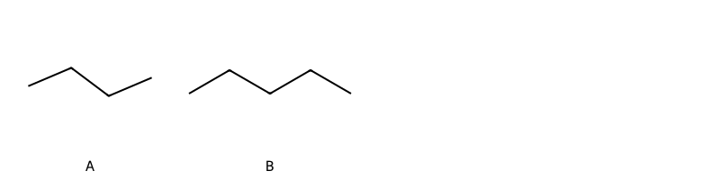

!!! abstract "Tóm tắt"

    **Họ Oxalidaceae** có **3** chi được các cộng đồng sử dụng trong chăm sóc sức khỏe gồm *Averrhoa, Biophytum, Oxalis*. Số lượng thành phần hóa học đã phân lập và xác định cấu trúc từ họ này tính đến tháng 12 năm 2024 là **11** nhóm có thể liệt kê như sau *Organooxygen compounds, Flavonoids, Fatty Acyls, Quinolines and derivatives, Phenols, Benzothiazoles, Carboxylic acids and derivatives, Benzene and substituted derivatives, Pyridines and derivatives, Prenol lipids, Cinnamaldehydes*. Giữa các loài trong họ này, 3 dược liệu được nghiên cứu nhiều nhất dựa trên số thành phần được phân lập là **Averrhoa carambola, Biophytum sensitivum*. *Họ Oxalidaceae* đã được một số công động tại các quốc gia như China, Elsewhere, Turkey, Nepal, French, Haiti, anish, Kembola, English, Australia, US(NM), India(Oraon), India, Java, ain, Dominican Republic, US, Philippines đã phát hiện một số tác dụng trên lâm sàng gồm chữa bệnh lẫn độc tính như Alexiteric, Chất làm se, Thuốc lợi tiểu, Emmenagogue, Chất làm lạnh, Chất làm lạnh, Thuốc cầm máu, Thuốc tẩy giun, Chất khử trùng, Chất làm lạnh, Chất làm lạnh, Chất làm lạnh, Mủ mủ, Chất làm se, Chất độc, Giờ mở cửa, Giờ mở cửa, Chất làm se, Emmenagogue, dạ dày, Thuốc tẩy giun, Chất làm lạnh, Thuốc giải độc, Chất khử trùng, Người nói tiếng nói, Thuốc chống tiêu chảy, Thuốc lợi tiểu, Thuốc lợi tiểu, Chất độc, Chất làm lạnh, Thuốc lợi tiểu, Chất độc, Chất làm lạnh, Chất làm se, Thuốc lợi tiểu, Giờ mở cửa, Chất làm se, Thuốc lợi tiểu, Thuốc bổ, Thuốc tẩy giun, buồn ngủ, dễ bị tổn thương, Đổ mồ hôi.

!!! info "DrDuke"

    James A. Duke sinh năm 1929-2017 là một nhà thực vật học người Mỹ. Đây là một trong những tác giả hàng đầu trong lĩnh vực dược dân tộc học với cuốn *CRC Handbook of Medicinal Herbs* và chính là người xây dựng lên cơ sở dữ liệu về hợp chất tự nhiên và dược dân tộc học tại Bộ nông nghiệp Hoa Kỳ. Các thông tin được đăng tải tại website [Dr. Duke's Phytochemical and Ethnobotanical Databases](https://phytochem.nal.usda.gov/). 
    Trong suốt thập niên 1970, ông lãnh đạo the Plant Taxonomy Laboratory, Plant Genetics and Germplasm Institute of the Agricultural Research Service, U.S. Department of Agriculture.
    Trong tài liệu này, các thông tin về dược dân tộc của các dược liệu được trích dẫn từ tài liệu của James A. Ducke với sự trợ giúp của phần mềm dịch thuật từ tiếng Anh sang tiếng Việt.
   
## Tổng quan về Họ Oxalidaceae
### Phân loại thực vật
Trong *họ Oxalidaceae* có **3** chi được sử dụng làm thuốc với chi tiết số loài trong mỗi chi như sau Oxalis (5) . Chi tiết về loài sử dụng làm thuốc như dưới đây.  

>Họ Oxalidaceae


>|-- Chi Averrhoa

>*Averrhoa bilimbi*,
>*Averrhoa carambola*,

>|-- Chi Biophytum

>*Biophytum sensitivum*,

>|-- Chi Oxalis

>*Oxalis acetosella*,
>*Oxalis corniculata*,
>*Oxalis latifolia*,
>*Oxalis pescaprae*,
>*Oxalis violacea*,

### Thành phần hóa học 

Số lượng thành phần hóa học đã phân lập và xác định cấu trúc từ họ này tính đến tháng 12 năm 2024 là 11 nhóm có thể liệt kê như sau Organooxygen compounds, Flavonoids, Fatty Acyls, Quinolines and derivatives, Phenols, Benzothiazoles, Carboxylic acids and derivatives, Benzene and substituted derivatives, Pyridines and derivatives, Prenol lipids, Cinnamaldehydes. Số lượng các loài đã được nghiên cứu thành phần hóa học là *2* trong tổng số *8* loài thuộc họ Oxalidaceae.Giữa các loài trong họ này, 3 dược liệu được nghiên cứu nhiều nhất dựa trên số thành phần được phân lập là **Averrhoa carambola, Biophytum sensitivum**. Sử dụng phần mềm RDKIT với thuật toán  Find Maximum Common Substructure (FMCS), các nhóm hoạt chất phổ biến nhất trong *họ Oxalidaceae* đã xây dựng được nhân. Điều này trong tương lại có thể được sử dụng tìm kiếm mối liên hệ giữa tác dụng của cấu trúc hóa học và tác dụng dược lý. Các nhân trong phần này có thể không giống như cấu trúc gốc của từng nhóm chất. Kết quả được trình bầy như hình dưới đây.

<figure markdown="span">
    { width=100% }
    <figcaption> Cấu trúc hóa học của một số khung cơ bản dựa trên thuật toán FMCS để tìm Organooxygen compounds (A), Prenol lipids (B).</figcaption>
</figure>


!!! info  "Find Maximum Common Substructure"
    
    Thuật toán FMCS (Find Maximum Common Substructure) là một phương pháp được sử dụng để tìm ra cấu trúc chung nhiều nhất (MCS) trong một tập hợp các cấu trúc hóa học. Các bước của thuật toán gồm:
    - Chọn một cấu trúc hóa học là cấu trúc để tạo truy vấn, còn các cấu trúc khác là mục tiêu.
    - Chia nhỏ cấu trúc để tạo truy vấn thành cấu trúc nhỏ hơn dạng chuỗi SMARTS.
    - Kiểm tra chuỗi SMARTS trong các cấu trúc mục tiêu.
    - Tìm kiếm chuỗi SMARTS xuất hiện nhiều nhất.
    Để biết thêm chi tiết các bạn có thể xem tại [TeachOpenCADD](https://projects.volkamerlab.org/teachopencadd/talktorials/T006_compound_maximum_common_substructures.html)
    ``` python
    pip install rdkit
    def find_core_smiles(smiles_list):
        mols = [Chem.MolFromSmiles(smiles) for smiles in smiles_list]
        mcs = rdFMCS.FindMCS(mols)
        core_smiles = Chem.MolToSmiles(Chem.MolFromSmarts(mcs.smartsString))
        return core_smiles
    ```

### Dược dân tộc học

Họ **Oxalidaceae** đã được một số công động tại các quốc gia như *China, Elsewhere, Turkey, Nepal, French, Haiti, anish, Kembola, English, Australia, US(NM), India(Oraon), India, Java, ain, Dominican Republic, US, Philippines* đã phát hiện một số tác dụng trên lâm sàng gồm chữa bệnh lẫn độc tính như *Alexiteric, Chất làm se, Thuốc lợi tiểu, Emmenagogue, Chất làm lạnh, Chất làm lạnh, Thuốc cầm máu, Thuốc tẩy giun, Chất khử trùng, Chất làm lạnh, Chất làm lạnh, Chất làm lạnh, Mủ mủ, Chất làm se, Chất độc, Giờ mở cửa, Giờ mở cửa, Chất làm se, Emmenagogue, dạ dày, Thuốc tẩy giun, Chất làm lạnh, Thuốc giải độc, Chất khử trùng, Người nói tiếng nói, Thuốc chống tiêu chảy, Thuốc lợi tiểu, Thuốc lợi tiểu, Chất độc, Chất làm lạnh, Thuốc lợi tiểu, Chất độc, Chất làm lạnh, Chất làm se, Thuốc lợi tiểu, Giờ mở cửa, Chất làm se, Thuốc lợi tiểu, Thuốc bổ, Thuốc tẩy giun, buồn ngủ, dễ bị tổn thương, Đổ mồ hôi*.

## Chi tiết dược dân tộc học


### Chi Averrhoa

!!! note "Danh sách các loài thuộc chi"
    
*	 - *Averrhoa bilimbi*
	 - *Averrhoa carambola**

---      
#### *Biophytum sensitivum*
**Thông tin về thực vật**

!!! info "Phân loại thực vật của *Biophytum sensitivum* từ GIBF:"
    - **Kingdom:** Plantae
    - **Phylum:** Tracheophyta
    - **Order:** Oxalidales
    - **Family:** Oxalidaceae
    - **Genus:** Biophytum
    - **Species:** *Biophytum sensitivum*


 

Chưa có thông tin về loài này trên wikidata.

*Phân bố trên thế giới*: Thailand, Philippines, Chinese Taipei, China, Honduras, India, Indonesia, Sri Lanka, Congo, Democratic Republic of the

*Phân bố tại Việt Nam*: Không có ghi nhận ở Việt Nam

**Thành phần hóa học**
        

Chưa có nghiên cứu về thành phần hóa học của loài này


**Dược dân tộc học**

Danh sách các quốc gia có sử dụng *Biophytum sensitivum* trong điều trị các bệnh. 

| Quốc gia   | Bệnh      |
|:-----------|:----------|
| Java       | Đổ mồ hôi |


---      
#### *Averrhoa carambola*
**Thông tin về thực vật**

!!! info "Phân loại thực vật của *Averrhoa carambola* từ GIBF:"
    - **Kingdom:** Plantae
    - **Phylum:** Tracheophyta
    - **Order:** Oxalidales
    - **Family:** Oxalidaceae
    - **Genus:** Averrhoa
    - **Species:** *Averrhoa carambola*


 

Chưa có thông tin về loài này trên wikidata.

*Phân bố trên thế giới*: Benin, Cayman Islands, Saint Lucia, Nepal, Côte d’Ivoire, French Polynesia, Sri Lanka, Seychelles, Singapore, French Guiana, Venezuela (Bolivarian Republic of), Mexico, Chinese Taipei, Colombia, Hong Kong, Bangladesh, Barbados, Angola, Belize, Australia, Panama, Indonesia, Trinidad and Tobago, Nigeria, Saint Kitts and Nevis, India, Brazil, Costa Rica, Peru, Argentina, Viet Nam, Thailand, United States of America, Philippines, Bolivia (Plurinational State of), China, Dominican Republic, Malaysia, Canada, Ecuador, Puerto Rico, Macao

*Phân bố tại Việt Nam*: Tiền Giang, Cần Thơ, Phú Yên, Long An, Quảng Nam, Hòa Bình, Ninh Bình, Hồ Chí Minh city

**Thành phần hóa học**
        

Theo cơ sở dữ liệu lotus, từ loài *Averrhoa carambola* đã phân lập và xác định được 85 hoạt chất thuộc về các nhóm Organooxygen compounds, Flavonoids, Fatty Acyls, Quinolines and derivatives, Phenols, Benzothiazoles, Carboxylic acids and derivatives, Benzene and substituted derivatives, Pyridines and derivatives, Prenol lipids, Cinnamaldehydes. Danh sách các hoạt chất như sau hexanol [(LTS0217299)](https://lotus.naturalproducts.net/compound/lotus_id/LTS0217299), (3s,5r,8r,3'r)-mutatoxanthin [(LTS0245321)](https://lotus.naturalproducts.net/compound/lotus_id/LTS0245321), 4-terpineol [(LTS0253733)](https://lotus.naturalproducts.net/compound/lotus_id/LTS0253733), 2-[(2e,4e,6e,8e)-17-(4-hydroxy-2,6,6-trimethylcyclohex-1-en-1-yl)-6,11,15-trimethylheptadeca-2,4,6,8,10,12,14,16-octaen-2-yl]-4,4,7a-trimethyl-2,5,6,7-tetrahydro-1-benzofuran-6-ol [(LTS0119891)](https://lotus.naturalproducts.net/compound/lotus_id/LTS0119891), α pinene [(LTS0132416)](https://lotus.naturalproducts.net/compound/lotus_id/LTS0132416), (6s,10r,12e,14e,16e,19r,20e,23s,27r)-2,6,10,14,19,23,27,31-octamethyldotriaconta-2,12,14,16,20,30-hexaene [(LTS0079584)](https://lotus.naturalproducts.net/compound/lotus_id/LTS0079584), cinnamal [(LTS0271313)](https://lotus.naturalproducts.net/compound/lotus_id/LTS0271313), 2-phenyl-ethanol [(LTS0206341)](https://lotus.naturalproducts.net/compound/lotus_id/LTS0206341), 6-methyl-5-hepten-2-one [(LTS0241073)](https://lotus.naturalproducts.net/compound/lotus_id/LTS0241073), ethyl acetate [(LTS0196824)](https://lotus.naturalproducts.net/compound/lotus_id/LTS0196824), 6-[(2r,3s,4r,5s,6s)-4,5-dihydroxy-6-methyl-3-{[(2s,3r,4r,5r,6s)-3,4,5-trihydroxy-6-methyloxan-2-yl]oxy}oxan-2-yl]-5,7-dihydroxy-2-(4-hydroxyphenyl)chromen-4-one [(LTS0005343)](https://lotus.naturalproducts.net/compound/lotus_id/LTS0005343), β-carotene [(LTS0275716)](https://lotus.naturalproducts.net/compound/lotus_id/LTS0275716), (6s,7ar)-2-[(2e,4e,6e,8e,10e,12e,14e,16e)-17-[(4r)-4-hydroxy-2,6,6-trimethylcyclohex-1-en-1-yl]-6,11,15-trimethylheptadeca-2,4,6,8,10,12,14,16-octaen-2-yl]-4,4,7a-trimethyl-2,5,6,7-tetrahydro-1-benzofuran-6-ol [(LTS0100944)](https://lotus.naturalproducts.net/compound/lotus_id/LTS0100944), 4-hydroxy-4-(5-hydroxy-3-methylpenta-1,3-dien-1-yl)-3,5,5-trimethylcyclohex-2-en-1-one [(LTS0276348)](https://lotus.naturalproducts.net/compound/lotus_id/LTS0276348), benzyl alcohol [(LTS0125638)](https://lotus.naturalproducts.net/compound/lotus_id/LTS0125638), 2-[(2e,4e,6e,8e,10e,12e,14e)-15-(4,4,7a-trimethyl-2,5,6,7-tetrahydro-1-benzofuran-2-yl)-6,11-dimethylhexadeca-2,4,6,8,10,12,14-heptaen-2-yl]-4,4,7a-trimethyl-2,5,6,7-tetrahydro-1-benzofuran-6-ol [(LTS0193198)](https://lotus.naturalproducts.net/compound/lotus_id/LTS0193198), cinch [(LTS0092379)](https://lotus.naturalproducts.net/compound/lotus_id/LTS0092379), (2s,6r,7as)-2-[(2e,4e,6e,8e,10e,12e,14e)-15-[(2s,7ar)-4,4,7a-trimethyl-2,5,6,7-tetrahydro-1-benzofuran-2-yl]-6,11-dimethylhexadeca-2,4,6,8,10,12,14-heptaen-2-yl]-4,4,7a-trimethyl-2,5,6,7-tetrahydro-1-benzofuran-6-ol [(LTS0220558)](https://lotus.naturalproducts.net/compound/lotus_id/LTS0220558), amyl alcohol [(LTS0193146)](https://lotus.naturalproducts.net/compound/lotus_id/LTS0193146), 8'-apo-β-carotenol [(LTS0098653)](https://lotus.naturalproducts.net/compound/lotus_id/LTS0098653), epicatechin gallate [(LTS0071606)](https://lotus.naturalproducts.net/compound/lotus_id/LTS0071606), (4s)-4-hydroxy-4-[(1e,3e)-5-hydroxy-3-methylpenta-1,3-dien-1-yl]-3,5,5-trimethylcyclohex-2-en-1-one [(LTS0109490)](https://lotus.naturalproducts.net/compound/lotus_id/LTS0109490), octanol [(LTS0250216)](https://lotus.naturalproducts.net/compound/lotus_id/LTS0250216), isoamyl alcohol [(LTS0112297)](https://lotus.naturalproducts.net/compound/lotus_id/LTS0112297), carotenoid [(LTS0205297)](https://lotus.naturalproducts.net/compound/lotus_id/LTS0205297), β-ionone [(LTS0155301)](https://lotus.naturalproducts.net/compound/lotus_id/LTS0155301), acetophenone [(LTS0155971)](https://lotus.naturalproducts.net/compound/lotus_id/LTS0155971), 2,5-dimethoxy-3-undecylphenol [(LTS0140098)](https://lotus.naturalproducts.net/compound/lotus_id/LTS0140098), (2r,3r,4r)-2-(3,4-dihydroxyphenyl)-4-[(2r,3r)-2-(3,4-dihydroxyphenyl)-3,5,7-trihydroxy-3,4-dihydro-2h-1-benzopyran-8-yl]-3,4-dihydro-2h-1-benzopyran-3,5,7-triol [(LTS0135510)](https://lotus.naturalproducts.net/compound/lotus_id/LTS0135510), ethyl sorbate [(LTS0045485)](https://lotus.naturalproducts.net/compound/lotus_id/LTS0045485), (4s)-4-hydroxy-4-[(1e,3s)-5-hydroxy-3-methylpent-1-en-1-yl]-3,5,5-trimethylcyclohex-2-en-1-one [(LTS0220428)](https://lotus.naturalproducts.net/compound/lotus_id/LTS0220428), 4-[(9e,11e,13e,15e,17e)-18-(4-hydroxy-2,6,6-trimethylcyclohex-1-en-1-yl)-3,7,12,16-tetramethyloctadeca-1,3,5,7,9,11,13,15,17-nonaen-1-yl]-3,5,5-trimethylcyclohex-2-en-1-ol [(LTS0021348)](https://lotus.naturalproducts.net/compound/lotus_id/LTS0021348), benzaldehyde [(LTS0094193)](https://lotus.naturalproducts.net/compound/lotus_id/LTS0094193), 2-[(2e,4e,6e,8e,10e,12e,14e,16e)-17-(4-hydroxy-2,6,6-trimethylcyclohex-1-en-1-yl)-6,11,15-trimethylheptadeca-2,4,6,8,10,12,14,16-octaen-2-yl]-4,4,7a-trimethyl-2,5,6,7-tetrahydro-1-benzofuran-6-ol [(LTS0008322)](https://lotus.naturalproducts.net/compound/lotus_id/LTS0008322), 2,6,10,14,19,23,27,31-octamethyldotriaconta-2,12,14,16,20,30-hexaene [(LTS0116962)](https://lotus.naturalproducts.net/compound/lotus_id/LTS0116962), hexanal [(LTS0238624)](https://lotus.naturalproducts.net/compound/lotus_id/LTS0238624), 2-methoxy-6-undecylcyclohexa-2,5-diene-1,4-dione [(LTS0175492)](https://lotus.naturalproducts.net/compound/lotus_id/LTS0175492), ethyl hexanoate [(LTS0021856)](https://lotus.naturalproducts.net/compound/lotus_id/LTS0021856), 3,5,5-trimethyl-4-[(1e,3e,5e,7e,9e)-3,7,12,16-tetramethyl-18-(2,6,6-trimethylcyclohex-1-en-1-yl)octadeca-1,3,5,7,9,11,13,15,17-nonaen-1-yl]cyclohex-3-en-1-ol [(LTS0132454)](https://lotus.naturalproducts.net/compound/lotus_id/LTS0132454), β-pinene [(LTS0117550)](https://lotus.naturalproducts.net/compound/lotus_id/LTS0117550), neurosporene [(LTS0117305)](https://lotus.naturalproducts.net/compound/lotus_id/LTS0117305), 1,3,3-trimethyl-2-[(9e,11e,13e,15e,17e)-3,7,12,16-tetramethyl-18-(2,6,6-trimethylcyclohex-1-en-1-yl)octadeca-1,3,5,7,9,11,13,15,17-nonaen-1-yl]cyclohex-1-ene [(LTS0110068)](https://lotus.naturalproducts.net/compound/lotus_id/LTS0110068), 6-methyl-5-hepten-2-ol [(LTS0181977)](https://lotus.naturalproducts.net/compound/lotus_id/LTS0181977), (2s,6s,7ar)-2-[(2e,4e,6e,8e,10e,12e,14e)-15-[(2r,7ar)-4,4,7a-trimethyl-2,5,6,7-tetrahydro-1-benzofuran-2-yl]-6,11-dimethylhexadeca-2,4,6,8,10,12,14-heptaen-2-yl]-4,4,7a-trimethyl-2,5,6,7-tetrahydro-1-benzofuran-6-ol [(LTS0138893)](https://lotus.naturalproducts.net/compound/lotus_id/LTS0138893), methyl isopropyl ketone [(LTS0193450)](https://lotus.naturalproducts.net/compound/lotus_id/LTS0193450), (4e,6e,8e,10e,12e,14e,16e)-2,6,11,15-tetramethyl-17-(2,6,6-trimethylcyclohex-1-en-1-yl)heptadeca-2,4,6,8,10,12,14,16-octaenal [(LTS0059203)](https://lotus.naturalproducts.net/compound/lotus_id/LTS0059203), phenethyl acetate [(LTS0136181)](https://lotus.naturalproducts.net/compound/lotus_id/LTS0136181), 2-[(2e,4e,6e,8e)-15-(4,4,7a-trimethyl-2,5,6,7-tetrahydro-1-benzofuran-2-yl)-6,11-dimethylhexadeca-2,4,6,8,10,12,14-heptaen-2-yl]-4,4,7a-trimethyl-2,5,6,7-tetrahydro-1-benzofuran-6-ol [(LTS0061774)](https://lotus.naturalproducts.net/compound/lotus_id/LTS0061774), veratrole [(LTS0266065)](https://lotus.naturalproducts.net/compound/lotus_id/LTS0266065), (4e,6e,8e,10e,12e,14e,16e)-2,6,11,15-tetramethyl-17-(2,6,6-trimethylcyclohex-1-en-1-yl)heptadeca-2,4,6,8,10,12,14,16-octaen-1-ol [(LTS0019284)](https://lotus.naturalproducts.net/compound/lotus_id/LTS0019284), apocarotenal [(LTS0146481)](https://lotus.naturalproducts.net/compound/lotus_id/LTS0146481), ent-epicatechin [(LTS0265245)](https://lotus.naturalproducts.net/compound/lotus_id/LTS0265245), palmitic acid [(LTS0079439)](https://lotus.naturalproducts.net/compound/lotus_id/LTS0079439), 3-methoxy-5-undecylphenol [(LTS0121206)](https://lotus.naturalproducts.net/compound/lotus_id/LTS0121206), 3-phenyl-2-propenal [(LTS0204346)](https://lotus.naturalproducts.net/compound/lotus_id/LTS0204346), ethyl nicotinate [(LTS0116042)](https://lotus.naturalproducts.net/compound/lotus_id/LTS0116042), ethyl caprate [(LTS0106514)](https://lotus.naturalproducts.net/compound/lotus_id/LTS0106514), 4-hydroxy-4-(5-hydroxy-3-methylpent-1-en-1-yl)-3,5,5-trimethylcyclohex-2-en-1-one [(LTS0255206)](https://lotus.naturalproducts.net/compound/lotus_id/LTS0255206), isovitexin [(LTS0209186)](https://lotus.naturalproducts.net/compound/lotus_id/LTS0209186), (+)-epicatechin [(LTS0222407)](https://lotus.naturalproducts.net/compound/lotus_id/LTS0222407), ethanone, 1-(2-methylphenyl)- [(LTS0137734)](https://lotus.naturalproducts.net/compound/lotus_id/LTS0137734), epsilon-carotene [(LTS0100429)](https://lotus.naturalproducts.net/compound/lotus_id/LTS0100429), carvone [(LTS0196605)](https://lotus.naturalproducts.net/compound/lotus_id/LTS0196605), carvone, (+)- [(LTS0027671)](https://lotus.naturalproducts.net/compound/lotus_id/LTS0027671), methyl benzoate [(LTS0225398)](https://lotus.naturalproducts.net/compound/lotus_id/LTS0225398), 1-penten-3-ol [(LTS0174520)](https://lotus.naturalproducts.net/compound/lotus_id/LTS0174520), cryptoxanthin [(LTS0132646)](https://lotus.naturalproducts.net/compound/lotus_id/LTS0132646), zeta-carotene [(LTS0218266)](https://lotus.naturalproducts.net/compound/lotus_id/LTS0218266), (4s)-4-hydroxy-4-[(1e,3z)-5-hydroxy-3-methylpenta-1,3-dien-1-yl]-3,5,5-trimethylcyclohex-2-en-1-one [(LTS0146896)](https://lotus.naturalproducts.net/compound/lotus_id/LTS0146896), methyl salicylate [(LTS0128373)](https://lotus.naturalproducts.net/compound/lotus_id/LTS0128373), zeta-carotene [(LTS0007334)](https://lotus.naturalproducts.net/compound/lotus_id/LTS0007334), 5-o-methylembelin [(LTS0181481)](https://lotus.naturalproducts.net/compound/lotus_id/LTS0181481), (1r)-4-[(1e,3e,5e,7e,9e,11e,13e,15e,17e)-18-[(4r)-4-hydroxy-2,6,6-trimethylcyclohex-1-en-1-yl]-3,7,12,16-tetramethyloctadeca-1,3,5,7,9,11,13,15,17-nonaen-1-yl]-3,5,5-trimethylcyclohex-2-en-1-ol [(LTS0035691)](https://lotus.naturalproducts.net/compound/lotus_id/LTS0035691), (-)-epigallocatechin gallate [(LTS0173211)](https://lotus.naturalproducts.net/compound/lotus_id/LTS0173211), limonene,  [(LTS0155981)](https://lotus.naturalproducts.net/compound/lotus_id/LTS0155981), ethyl butyrate [(LTS0106732)](https://lotus.naturalproducts.net/compound/lotus_id/LTS0106732), (2s,4r)-1,7,7-trimethylbicyclo[2.2.1]heptan-2-ol [(LTS0010050)](https://lotus.naturalproducts.net/compound/lotus_id/LTS0010050), all-trans-phytofluene [(LTS0269894)](https://lotus.naturalproducts.net/compound/lotus_id/LTS0269894), butyl acetate [(LTS0047300)](https://lotus.naturalproducts.net/compound/lotus_id/LTS0047300), methyl anthranilate [(LTS0069354)](https://lotus.naturalproducts.net/compound/lotus_id/LTS0069354), epigallocatechin [(LTS0052496)](https://lotus.naturalproducts.net/compound/lotus_id/LTS0052496), 2,6,10,14,19,23,27,31-octamethyldotriaconta-2,6,8,10,12,14,16,18,20,22,26,30-dodecaene [(LTS0225766)](https://lotus.naturalproducts.net/compound/lotus_id/LTS0225766), borneol [(LTS0264960)](https://lotus.naturalproducts.net/compound/lotus_id/LTS0264960), benzothiazole [(LTS0073984)](https://lotus.naturalproducts.net/compound/lotus_id/LTS0073984), ethyl benzoate [(LTS0211245)](https://lotus.naturalproducts.net/compound/lotus_id/LTS0211245).

| chemicalTaxonomyClassyfireClass     |   lotus_count |
|:------------------------------------|--------------:|
| Benzene and substituted derivatives |             9 |
| Benzothiazoles                      |             1 |
| Carboxylic acids and derivatives    |             2 |
| Cinnamaldehydes                     |             2 |
| Fatty Acyls                         |             8 |
| Flavonoids                          |             8 |
| Organooxygen compounds              |            10 |
| Phenols                             |             2 |
| Prenol lipids                       |            40 |
| Pyridines and derivatives           |             1 |
| Quinolines and derivatives          |             1 |


**Dược dân tộc học**

Danh sách các quốc gia có sử dụng *Averrhoa carambola* trong điều trị các bệnh. 

| Quốc gia   | Bệnh                  |
|:-----------|:----------------------|
| China      | Người nói tiếng nói   |
| Elsewhere  | Thuốc chống tiêu chảy |
| Kembola    | Người nói tiếng nói   |


### Chi Biophytum

!!! note "Danh sách các loài thuộc chi"
    
*	 - *Biophytum sensitivum**

---      
#### *Biophytum sensitivum*
**Thông tin về thực vật**

!!! info "Phân loại thực vật của *Biophytum sensitivum* từ GIBF:"
    - **Kingdom:** Plantae
    - **Phylum:** Tracheophyta
    - **Order:** Oxalidales
    - **Family:** Oxalidaceae
    - **Genus:** Biophytum
    - **Species:** *Biophytum sensitivum*


 

Chưa có thông tin về loài này trên wikidata.

*Phân bố trên thế giới*: Thailand, Philippines, Chinese Taipei, China, Honduras, India, Indonesia, Sri Lanka, Congo, Democratic Republic of the

*Phân bố tại Việt Nam*: Không có ghi nhận ở Việt Nam

**Thành phần hóa học**
        

Theo cơ sở dữ liệu lotus, từ loài *Biophytum sensitivum* đã phân lập và xác định được 1 hoạt chất thuộc về các nhóm Flavonoids. Danh sách các hoạt chất như sau amentoflavone [(LTS0063796)](https://lotus.naturalproducts.net/compound/lotus_id/LTS0063796).

| chemicalTaxonomyClassyfireClass   |   lotus_count |
|:----------------------------------|--------------:|
| Flavonoids                        |             1 |


**Dược dân tộc học**

Danh sách các quốc gia có sử dụng *Biophytum sensitivum* trong điều trị các bệnh. 

| Quốc gia    | Bệnh             |
|:------------|:-----------------|
| India       | Thuốc lợi tiểu   |
| Philippines | dễ bị tổn thương |


### Chi Oxalis

!!! note "Danh sách các loài thuộc chi"
    
*	 - *Oxalis acetosella*
	 - *Oxalis corniculata*
	 - *Oxalis latifolia*
	 - *Oxalis pes-caprae*
	 - *Oxalis violacea**

---      
#### *Biophytum sensitivum*
**Thông tin về thực vật**

!!! info "Phân loại thực vật của *Biophytum sensitivum* từ GIBF:"
    - **Kingdom:** Plantae
    - **Phylum:** Tracheophyta
    - **Order:** Oxalidales
    - **Family:** Oxalidaceae
    - **Genus:** Biophytum
    - **Species:** *Biophytum sensitivum*


 

Chưa có thông tin về loài này trên wikidata.

*Phân bố trên thế giới*: Thailand, Philippines, Chinese Taipei, China, Honduras, India, Indonesia, Sri Lanka, Congo, Democratic Republic of the

*Phân bố tại Việt Nam*: Không có ghi nhận ở Việt Nam

**Thành phần hóa học**
        

Chưa có nghiên cứu về thành phần hóa học của loài này


**Dược dân tộc học**

Danh sách các quốc gia có sử dụng *Biophytum sensitivum* trong điều trị các bệnh. 

| Quốc gia   | Bệnh                                                 |
|:-----------|:-----------------------------------------------------|
| Elsewhere  | Thuốc lợi tiểu, Chất độc, Chất làm lạnh              |
| Turkey     | Thuốc lợi tiểu, Chất độc, Chất làm lạnh, Chất làm se |
| ain        | Chất độc                                             |


---      
#### *Biophytum sensitivum*
**Thông tin về thực vật**

!!! info "Phân loại thực vật của *Biophytum sensitivum* từ GIBF:"
    - **Kingdom:** Plantae
    - **Phylum:** Tracheophyta
    - **Order:** Oxalidales
    - **Family:** Oxalidaceae
    - **Genus:** Biophytum
    - **Species:** *Biophytum sensitivum*


 

Chưa có thông tin về loài này trên wikidata.

*Phân bố trên thế giới*: Thailand, Philippines, Chinese Taipei, China, Honduras, India, Indonesia, Sri Lanka, Congo, Democratic Republic of the

*Phân bố tại Việt Nam*: Không có ghi nhận ở Việt Nam

**Thành phần hóa học**
        

Chưa có nghiên cứu về thành phần hóa học của loài này


**Dược dân tộc học**

Danh sách các quốc gia có sử dụng *Biophytum sensitivum* trong điều trị các bệnh. 

| Quốc gia           | Bệnh                                                                                                              |
|:-------------------|:------------------------------------------------------------------------------------------------------------------|
| Australia          | Chất độc                                                                                                          |
| China              | Alexiteric, Chất làm se, Thuốc lợi tiểu, Emmenagogue, Chất làm lạnh, Chất làm lạnh, Thuốc cầm máu, Thuốc tẩy giun |
| Dominican Republic | Chất khử trùng                                                                                                    |
| Elsewhere          | Giờ mở cửa, Chất làm se, Emmenagogue, dạ dày, Thuốc tẩy giun, Chất làm lạnh, Thuốc giải độc, Chất khử trùng       |
| English            | Chất làm se                                                                                                       |
| French             | Giờ mở cửa                                                                                                        |
| Haiti              | Chất làm lạnh, Mủ mủ                                                                                              |
| Nepal              | Chất làm lạnh, Chất làm lạnh                                                                                      |
| Turkey             | Thuốc lợi tiểu, Giờ mở cửa, Chất làm se                                                                           |
| anish              | Thuốc lợi tiểu                                                                                                    |


---      
#### *Biophytum sensitivum*
**Thông tin về thực vật**

!!! info "Phân loại thực vật của *Biophytum sensitivum* từ GIBF:"
    - **Kingdom:** Plantae
    - **Phylum:** Tracheophyta
    - **Order:** Oxalidales
    - **Family:** Oxalidaceae
    - **Genus:** Biophytum
    - **Species:** *Biophytum sensitivum*


 

Chưa có thông tin về loài này trên wikidata.

*Phân bố trên thế giới*: Thailand, Philippines, Chinese Taipei, China, Honduras, India, Indonesia, Sri Lanka, Congo, Democratic Republic of the

*Phân bố tại Việt Nam*: Không có ghi nhận ở Việt Nam

**Thành phần hóa học**
        

Chưa có nghiên cứu về thành phần hóa học của loài này


**Dược dân tộc học**

Danh sách các quốc gia có sử dụng *Biophytum sensitivum* trong điều trị các bệnh. 

| Quốc gia     | Bệnh     |
|:-------------|:---------|
| India(Oraon) | buồn ngủ |


---      
#### *Biophytum sensitivum*
**Thông tin về thực vật**

!!! info "Phân loại thực vật của *Biophytum sensitivum* từ GIBF:"
    - **Kingdom:** Plantae
    - **Phylum:** Tracheophyta
    - **Order:** Oxalidales
    - **Family:** Oxalidaceae
    - **Genus:** Biophytum
    - **Species:** *Biophytum sensitivum*


 

Chưa có thông tin về loài này trên wikidata.

*Phân bố trên thế giới*: Thailand, Philippines, Chinese Taipei, China, Honduras, India, Indonesia, Sri Lanka, Congo, Democratic Republic of the

*Phân bố tại Việt Nam*: Không có ghi nhận ở Việt Nam

**Thành phần hóa học**
        

Chưa có nghiên cứu về thành phần hóa học của loài này


**Dược dân tộc học**

Danh sách các quốc gia có sử dụng *Biophytum sensitivum* trong điều trị các bệnh. 

| Quốc gia   | Bệnh     |
|:-----------|:---------|
| Australia  | Chất độc |


---      
#### *Biophytum sensitivum*
**Thông tin về thực vật**

!!! info "Phân loại thực vật của *Biophytum sensitivum* từ GIBF:"
    - **Kingdom:** Plantae
    - **Phylum:** Tracheophyta
    - **Order:** Oxalidales
    - **Family:** Oxalidaceae
    - **Genus:** Biophytum
    - **Species:** *Biophytum sensitivum*


 

Chưa có thông tin về loài này trên wikidata.

*Phân bố trên thế giới*: Thailand, Philippines, Chinese Taipei, China, Honduras, India, Indonesia, Sri Lanka, Congo, Democratic Republic of the

*Phân bố tại Việt Nam*: Không có ghi nhận ở Việt Nam

**Thành phần hóa học**
        

Chưa có nghiên cứu về thành phần hóa học của loài này


**Dược dân tộc học**

Danh sách các quốc gia có sử dụng *Biophytum sensitivum* trong điều trị các bệnh. 

| Quốc gia   | Bệnh                     |
|:-----------|:-------------------------|
| US         | Thuốc lợi tiểu, Thuốc bổ |
| US(NM)     | Thuốc tẩy giun           |


## Bình luận

<div id="giscus-container"></div>
<script src="https://giscus.app/client.js"
        data-repo="hoangson0787/CSDL-duoc-lieu"
        data-repo-id="R_kgDONbMRNA"
        data-category="Duoc lieu"
        data-category-id="DIC_kwDONbMRNM4ClklR"
        data-mapping="pathname"
        data-strict="0"
        data-reactions-enabled="1"
        data-emit-metadata="1"
        data-input-position="bottom"
        data-theme="light"
        data-lang="en"
        crossorigin="anonymous"
        async>
</script>

