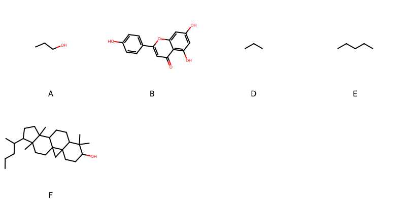

!!! abstract "Tóm tắt"

    **Họ Passifloraceae** có **2** chi được các cộng đồng sử dụng trong chăm sóc sức khỏe gồm *Adenia, Passiflora*. Số lượng thành phần hóa học đã phân lập và xác định cấu trúc từ họ này tính đến tháng 12 năm 2024 là **20** nhóm có thể liệt kê như sau *Fatty Acyls, Phenols, Carboxylic acids and derivatives, Saturated hydrocarbons, Unsaturated hydrocarbons, Harmala alkaloids, Steroids and steroid derivatives, Flavonoids, Furanoid lignans, Dihydrofurans, Benzene and substituted derivatives, Prenol lipids, Pyrans, Thiols, Organooxygen compounds, Naphthalenes, Indoles and derivatives, Phenol ethers, Thioethers, Dibenzylbutane lignans*. Giữa các loài trong họ này, 3 dược liệu được nghiên cứu nhiều nhất dựa trên số thành phần được phân lập là **Passiflora edulis, Passiflora incarnata, Passiflora foetida*. *Họ Passifloraceae* đã được một số công động tại các quốc gia như Salvador, Elsewhere, Turkey, Paraguay, Iraq, Mexico, US, Bermuda, Africa, Venezuela, Haiti, Upper Volta, Sri Lanka, Cuba, Dominican Republic, Trinidad đã phát hiện một số tác dụng trên lâm sàng gồm chữa bệnh lẫn độc tính như Chất làm se, Chất độc, Chống khả năng sinh sản, Emmenagogue, Ma túy, Ma túy, Chất độc, Chất làm mềm, Ma túy, Ma túy, Thuốc an thần, Thuốc an thần, Ma túy, Thuốc an thần, Ma túy, buồn ngủ, Thuốc an thần, Nước hoa, Thuốc an thần, Thuốc an thần, Ma túy, Thuốc an thần, Thuốc an thần, Thuốc an thần, Thuốc thông mũi, buồn ngủ, Thuốc an thần, dạ dày, Giờ mở cửa, Thuốc tẩy giun, Thuốc giải độc, có mùi hôi, Thuốc kích thích tình dục, Thuốc kích thích tình dục, Thuốc lợi tiểu, Thuốc nhuận tràng, Thuốc diệt cá, Thuốc lợi tiểu, Thuốc thông mũi, Thuốc tẩy giun, Thuốc tẩy giun, Thuốc tẩy giun, Thuốc ức chế tim, gây nôn, Emmenagogue, Chất độc, thuốc tống hơi.

!!! info "DrDuke"

    James A. Duke sinh năm 1929-2017 là một nhà thực vật học người Mỹ. Đây là một trong những tác giả hàng đầu trong lĩnh vực dược dân tộc học với cuốn *CRC Handbook of Medicinal Herbs* và chính là người xây dựng lên cơ sở dữ liệu về hợp chất tự nhiên và dược dân tộc học tại Bộ nông nghiệp Hoa Kỳ. Các thông tin được đăng tải tại website [Dr. Duke's Phytochemical and Ethnobotanical Databases](https://phytochem.nal.usda.gov/). 
    Trong suốt thập niên 1970, ông lãnh đạo the Plant Taxonomy Laboratory, Plant Genetics and Germplasm Institute of the Agricultural Research Service, U.S. Department of Agriculture.
    Trong tài liệu này, các thông tin về dược dân tộc của các dược liệu được trích dẫn từ tài liệu của James A. Ducke với sự trợ giúp của phần mềm dịch thuật từ tiếng Anh sang tiếng Việt.
   
## Tổng quan về Họ Passifloraceae
### Phân loại thực vật
Trong *họ Passifloraceae* có **2** chi được sử dụng làm thuốc với chi tiết số loài trong mỗi chi như sau Passiflora (12) . Chi tiết về loài sử dụng làm thuốc như dưới đây.  

>Họ Passifloraceae


>|-- Chi Adenia

>*Adenia lobata*,
>*Adenia palmata*,
>*Adenia volkensii*,

>|-- Chi Passiflora

>*Passiflora ciliata*,
>*Passiflora cincinnata*,
>*Passiflora edulis*,
>*Passiflora foetida*,
>*Passiflora incarnata*,
>*Passiflora jorullensis*,
>*Passiflora laurifolia*,
>*Passiflora maliformis*,
>*Passiflora murucuja*,
>*Passiflora quadrangularis*,
>*Passiflora rubra*,
>*Passiflora salvadorensis*,

### Thành phần hóa học 

Số lượng thành phần hóa học đã phân lập và xác định cấu trúc từ họ này tính đến tháng 12 năm 2024 là 20 nhóm có thể liệt kê như sau Fatty Acyls, Phenols, Carboxylic acids and derivatives, Saturated hydrocarbons, Unsaturated hydrocarbons, Harmala alkaloids, Steroids and steroid derivatives, Flavonoids, Furanoid lignans, Dihydrofurans, Benzene and substituted derivatives, Prenol lipids, Pyrans, Thiols, Organooxygen compounds, Naphthalenes, Indoles and derivatives, Phenol ethers, Thioethers, Dibenzylbutane lignans. Số lượng các loài đã được nghiên cứu thành phần hóa học là *11* trong tổng số *15* loài thuộc họ Passifloraceae.Giữa các loài trong họ này, 3 dược liệu được nghiên cứu nhiều nhất dựa trên số thành phần được phân lập là **Passiflora edulis, Passiflora incarnata, Passiflora foetida**. Sử dụng phần mềm RDKIT với thuật toán  Find Maximum Common Substructure (FMCS), các nhóm hoạt chất phổ biến nhất trong *họ Passifloraceae* đã xây dựng được nhân. Điều này trong tương lại có thể được sử dụng tìm kiếm mối liên hệ giữa tác dụng của cấu trúc hóa học và tác dụng dược lý. Các nhân trong phần này có thể không giống như cấu trúc gốc của từng nhóm chất. Kết quả được trình bầy như hình dưới đây.

<figure markdown="span">
    { width=100% }
    <figcaption> Cấu trúc hóa học của một số khung cơ bản dựa trên thuật toán FMCS để tìm Fatty Acyls (A), Flavonoids (B), Harmala alkaloids (C), Organooxygen compounds (D), Prenol lipids (E), Steroids and steroid derivatives (F).</figcaption>
</figure>


!!! info  "Find Maximum Common Substructure"
    
    Thuật toán FMCS (Find Maximum Common Substructure) là một phương pháp được sử dụng để tìm ra cấu trúc chung nhiều nhất (MCS) trong một tập hợp các cấu trúc hóa học. Các bước của thuật toán gồm:
    - Chọn một cấu trúc hóa học là cấu trúc để tạo truy vấn, còn các cấu trúc khác là mục tiêu.
    - Chia nhỏ cấu trúc để tạo truy vấn thành cấu trúc nhỏ hơn dạng chuỗi SMARTS.
    - Kiểm tra chuỗi SMARTS trong các cấu trúc mục tiêu.
    - Tìm kiếm chuỗi SMARTS xuất hiện nhiều nhất.
    Để biết thêm chi tiết các bạn có thể xem tại [TeachOpenCADD](https://projects.volkamerlab.org/teachopencadd/talktorials/T006_compound_maximum_common_substructures.html)
    ``` python
    pip install rdkit
    def find_core_smiles(smiles_list):
        mols = [Chem.MolFromSmiles(smiles) for smiles in smiles_list]
        mcs = rdFMCS.FindMCS(mols)
        core_smiles = Chem.MolToSmiles(Chem.MolFromSmarts(mcs.smartsString))
        return core_smiles
    ```

### Dược dân tộc học

Họ **Passifloraceae** đã được một số công động tại các quốc gia như *Salvador, Elsewhere, Turkey, Paraguay, Iraq, Mexico, US, Bermuda, Africa, Venezuela, Haiti, Upper Volta, Sri Lanka, Cuba, Dominican Republic, Trinidad* đã phát hiện một số tác dụng trên lâm sàng gồm chữa bệnh lẫn độc tính như *Chất làm se, Chất độc, Chống khả năng sinh sản, Emmenagogue, Ma túy, Ma túy, Chất độc, Chất làm mềm, Ma túy, Ma túy, Thuốc an thần, Thuốc an thần, Ma túy, Thuốc an thần, Ma túy, buồn ngủ, Thuốc an thần, Nước hoa, Thuốc an thần, Thuốc an thần, Ma túy, Thuốc an thần, Thuốc an thần, Thuốc an thần, Thuốc thông mũi, buồn ngủ, Thuốc an thần, dạ dày, Giờ mở cửa, Thuốc tẩy giun, Thuốc giải độc, có mùi hôi, Thuốc kích thích tình dục, Thuốc kích thích tình dục, Thuốc lợi tiểu, Thuốc nhuận tràng, Thuốc diệt cá, Thuốc lợi tiểu, Thuốc thông mũi, Thuốc tẩy giun, Thuốc tẩy giun, Thuốc tẩy giun, Thuốc ức chế tim, gây nôn, Emmenagogue, Chất độc, thuốc tống hơi*.

## Chi tiết dược dân tộc học


### Chi Adenia

!!! note "Danh sách các loài thuộc chi"
    
*	 - *Adenia lobata*
	 - *Adenia palmata*
	 - *Adenia volkensii**

---      
#### *Passiflora edulis*
**Thông tin về thực vật**

!!! info "Phân loại thực vật của *Passiflora edulis* từ GIBF:"
    - **Kingdom:** Plantae
    - **Phylum:** Tracheophyta
    - **Order:** Malpighiales
    - **Family:** Passifloraceae
    - **Genus:** Passiflora
    - **Species:** *Passiflora edulis*


 

Chưa có thông tin về loài này trên wikidata.

*Phân bố trên thế giới*: nan, Malawi, Tanzania, United Republic of, Kenya, Bahamas, Singapore, Antigua and Barbuda, Ghana, Guadeloupe, French Guiana, Mexico, Chinese Taipei, Colombia, Hong Kong, South Africa, Martinique, Australia, Indonesia, Uruguay, Virgin Islands (U.S.), Dominica, Niue, Honduras, Portugal, Guatemala, India, Brazil, Costa Rica, Argentina, Peru, United States of America, Bolivia (Plurinational State of), China, Dominican Republic, New Zealand, Ecuador, Maldives, Puerto Rico, El Salvador

*Phân bố tại Việt Nam*: Không có ghi nhận ở Việt Nam

**Thành phần hóa học**
        

Chưa có nghiên cứu về thành phần hóa học của loài này


**Dược dân tộc học**

Danh sách các quốc gia có sử dụng *Passiflora edulis* trong điều trị các bệnh. 

| Quốc gia    | Bệnh                                                                        |
|:------------|:----------------------------------------------------------------------------|
| Upper Volta | Thuốc kích thích tình dục, Thuốc lợi tiểu, Thuốc nhuận tràng, Thuốc diệt cá |


---      
#### *Passiflora edulis*
**Thông tin về thực vật**

!!! info "Phân loại thực vật của *Passiflora edulis* từ GIBF:"
    - **Kingdom:** Plantae
    - **Phylum:** Tracheophyta
    - **Order:** Malpighiales
    - **Family:** Passifloraceae
    - **Genus:** Passiflora
    - **Species:** *Passiflora edulis*


 

Chưa có thông tin về loài này trên wikidata.

*Phân bố trên thế giới*: nan, Malawi, Tanzania, United Republic of, Kenya, Bahamas, Singapore, Antigua and Barbuda, Ghana, Guadeloupe, French Guiana, Mexico, Chinese Taipei, Colombia, Hong Kong, South Africa, Martinique, Australia, Indonesia, Uruguay, Virgin Islands (U.S.), Dominica, Niue, Honduras, Portugal, Guatemala, India, Brazil, Costa Rica, Argentina, Peru, United States of America, Bolivia (Plurinational State of), China, Dominican Republic, New Zealand, Ecuador, Maldives, Puerto Rico, El Salvador

*Phân bố tại Việt Nam*: Không có ghi nhận ở Việt Nam

**Thành phần hóa học**
        

Chưa có nghiên cứu về thành phần hóa học của loài này


**Dược dân tộc học**

Danh sách các quốc gia có sử dụng *Passiflora edulis* trong điều trị các bệnh. 

| Quốc gia   | Bệnh     |
|:-----------|:---------|
| Sri Lanka  | Chất độc |


---      
#### *Adenia volkensii*
**Thông tin về thực vật**

!!! info "Phân loại thực vật của *Adenia volkensii* từ GIBF:"
    - **Kingdom:** Plantae
    - **Phylum:** Tracheophyta
    - **Order:** Malpighiales
    - **Family:** Passifloraceae
    - **Genus:** Adenia
    - **Species:** *Adenia volkensii*


 

Chưa có thông tin về loài này trên wikidata.

*Phân bố trên thế giới*: nan, Tanzania, United Republic of, Kenya

*Phân bố tại Việt Nam*: Không có ghi nhận ở Việt Nam

**Thành phần hóa học**
        

Theo cơ sở dữ liệu lotus, từ loài *Adenia volkensii* đã phân lập và xác định được 6 hoạt chất thuộc về các nhóm Organooxygen compounds. Danh sách các hoạt chất như sau 4-hydroxy-1-{[3,4,5-trihydroxy-6-(hydroxymethyl)oxan-2-yl]oxy}cyclopent-2-ene-1-carbonitrile [(LTS0150559)](https://lotus.naturalproducts.net/compound/lotus_id/LTS0150559), epitetraphyllin b [(LTS0083255)](https://lotus.naturalproducts.net/compound/lotus_id/LTS0083255), (1s,4s)-4-hydroxy-1-{[(2s,3r,4s,5s,6r)-3,4,5-trihydroxy-6-(hydroxymethyl)oxan-2-yl]oxy}cyclopent-2-ene-1-carboximidic acid [(LTS0198953)](https://lotus.naturalproducts.net/compound/lotus_id/LTS0198953), (1s,4s)-4-hydroxy-1-{[(2s,3r,4s,5s,6r)-3,4,5-trihydroxy-6-(hydroxymethyl)oxan-2-yl]oxy}cyclopent-2-ene-1-carbonitrile [(LTS0184702)](https://lotus.naturalproducts.net/compound/lotus_id/LTS0184702), (1r,4r)-4-hydroxy-1-{[(2s,3r,4s,5s,6r)-3,4,5-trihydroxy-6-(hydroxymethyl)oxan-2-yl]oxy}cyclopent-2-ene-1-carboximidic acid [(LTS0133018)](https://lotus.naturalproducts.net/compound/lotus_id/LTS0133018), 4-hydroxy-1-{[3,4,5-trihydroxy-6-(hydroxymethyl)oxan-2-yl]oxy}cyclopent-2-ene-1-carboximidic acid [(LTS0219142)](https://lotus.naturalproducts.net/compound/lotus_id/LTS0219142).

| chemicalTaxonomyClassyfireClass   |   lotus_count |
|:----------------------------------|--------------:|
| Organooxygen compounds            |             6 |


**Dược dân tộc học**

Danh sách các quốc gia có sử dụng *Adenia volkensii* trong điều trị các bệnh. 

| Quốc gia   | Bệnh     |
|:-----------|:---------|
| Africa     | Chất độc |


### Chi Passiflora

!!! note "Danh sách các loài thuộc chi"
    
*	 - *Passiflora ciliata*
	 - *Passiflora cincinnata*
	 - *Passiflora edulis*
	 - *Passiflora foetida*
	 - *Passiflora incarnata*
	 - *Passiflora jorullensis?*
	 - *Passiflora laurifolia*
	 - *Passiflora maliformis*
	 - *Passiflora murucuja*
	 - *Passiflora quadrangularis*
	 - *Passiflora rubra*
	 - *Passiflora salvadorensis**

---      
#### *Adenia volkensii*
**Thông tin về thực vật**

!!! info "Phân loại thực vật của *Adenia volkensii* từ GIBF:"
    - **Kingdom:** Plantae
    - **Phylum:** Tracheophyta
    - **Order:** Malpighiales
    - **Family:** Passifloraceae
    - **Genus:** Adenia
    - **Species:** *Adenia volkensii*


 

Chưa có thông tin về loài này trên wikidata.

*Phân bố trên thế giới*: nan, Tanzania, United Republic of, Kenya

*Phân bố tại Việt Nam*: Không có ghi nhận ở Việt Nam

**Thành phần hóa học**
        

Chưa có nghiên cứu về thành phần hóa học của loài này


**Dược dân tộc học**

Danh sách các quốc gia có sử dụng *Adenia volkensii* trong điều trị các bệnh. 

| Quốc gia   | Bệnh                                         |
|:-----------|:---------------------------------------------|
| Mexico     | Ma túy, Ma túy, Thuốc an thần, Thuốc an thần |


---      
#### *Passiflora cincinnata*
**Thông tin về thực vật**

!!! info "Phân loại thực vật của *Passiflora cincinnata* từ GIBF:"
    - **Kingdom:** Plantae
    - **Phylum:** Tracheophyta
    - **Order:** Malpighiales
    - **Family:** Passifloraceae
    - **Genus:** Passiflora
    - **Species:** *Passiflora cincinnata*


 

Chưa có thông tin về loài này trên wikidata.

*Phân bố trên thế giới*: Paraguay, Bolivia (Plurinational State of), Argentina, Brazil

*Phân bố tại Việt Nam*: Không có ghi nhận ở Việt Nam

**Thành phần hóa học**
        

Theo cơ sở dữ liệu lotus, từ loài *Passiflora cincinnata* đã phân lập và xác định được 1 hoạt chất thuộc về các nhóm Harmala alkaloids. Danh sách các hoạt chất như sau harmine [(LTS0131294)](https://lotus.naturalproducts.net/compound/lotus_id/LTS0131294).

| chemicalTaxonomyClassyfireClass   |   lotus_count |
|:----------------------------------|--------------:|
| Harmala alkaloids                 |             1 |


**Dược dân tộc học**

Danh sách các quốc gia có sử dụng *Passiflora cincinnata* trong điều trị các bệnh. 

| Quốc gia   | Bệnh                    |
|:-----------|:------------------------|
| Paraguay   | Chống khả năng sinh sản |


---      
#### *Passiflora edulis*
**Thông tin về thực vật**

!!! info "Phân loại thực vật của *Passiflora edulis* từ GIBF:"
    - **Kingdom:** Plantae
    - **Phylum:** Tracheophyta
    - **Order:** Malpighiales
    - **Family:** Passifloraceae
    - **Genus:** Passiflora
    - **Species:** *Passiflora edulis*


 

Chưa có thông tin về loài này trên wikidata.

*Phân bố trên thế giới*: nan, Malawi, Tanzania, United Republic of, Kenya, Bahamas, Singapore, Antigua and Barbuda, Ghana, Guadeloupe, French Guiana, Mexico, Chinese Taipei, Colombia, Hong Kong, South Africa, Martinique, Australia, Indonesia, Uruguay, Virgin Islands (U.S.), Dominica, Niue, Honduras, Portugal, Guatemala, India, Brazil, Costa Rica, Argentina, Peru, United States of America, Bolivia (Plurinational State of), China, Dominican Republic, New Zealand, Ecuador, Maldives, Puerto Rico, El Salvador

*Phân bố tại Việt Nam*: Không có ghi nhận ở Việt Nam

**Thành phần hóa học**
        

Theo cơ sở dữ liệu lotus, từ loài *Passiflora edulis* đã phân lập và xác định được 98 hoạt chất thuộc về các nhóm Thiols, Steroids and steroid derivatives, Organooxygen compounds, Naphthalenes, Flavonoids, Furanoid lignans, Thioethers, Benzene and substituted derivatives, Saturated hydrocarbons, Unsaturated hydrocarbons, Prenol lipids, Harmala alkaloids, Dibenzylbutane lignans. Danh sách các hoạt chất như sau (2s,3r,4s,5s,6r)-3,4,5-trihydroxy-6-(hydroxymethyl)oxan-2-yl (1s,3s,4s,6s,7s,8r,11s,12s,14s,15r,16r)-4,6,14-trihydroxy-7,12,16-trimethyl-15-[(2s,5s)-2,5,6-trihydroxy-5-isopropylhexan-2-yl]pentacyclo[9.7.0.0¹,³.0³,⁸.0¹²,¹⁶]octadecane-7-carboxylate [(LTS0009040)](https://lotus.naturalproducts.net/compound/lotus_id/LTS0009040), 15-(5,6-dihydroxy-5-isopropylhexan-2-yl)-4,6,14-trihydroxy-7,12,16-trimethylpentacyclo[9.7.0.0¹,³.0³,⁸.0¹²,¹⁶]octadecane-7-carboxylic acid [(LTS0156335)](https://lotus.naturalproducts.net/compound/lotus_id/LTS0156335), (1s,3s,4s,6s,7s,8r,11s,12s,15s,16r)-4,6-dihydroxy-7,12,16-trimethyl-15-[(2s,5s)-2,5,6-trihydroxy-5-isopropylhexan-2-yl]pentacyclo[9.7.0.0¹,³.0³,⁸.0¹²,¹⁶]octadecane-7-carboxylic acid [(LTS0188007)](https://lotus.naturalproducts.net/compound/lotus_id/LTS0188007), harmane [(LTS0068205)](https://lotus.naturalproducts.net/compound/lotus_id/LTS0068205), laetrile [(LTS0251059)](https://lotus.naturalproducts.net/compound/lotus_id/LTS0251059), prenol [(LTS0257971)](https://lotus.naturalproducts.net/compound/lotus_id/LTS0257971), neoxanthin [(LTS0000701)](https://lotus.naturalproducts.net/compound/lotus_id/LTS0000701), isoschaftoside [(LTS0157117)](https://lotus.naturalproducts.net/compound/lotus_id/LTS0157117), (2s,3r,4s,5s,6r)-3,4,5-trihydroxy-6-(hydroxymethyl)oxan-2-yl (1s,3s,4s,6s,7s,8r,11s,12s,14r,15r,16r)-15-[(2r,5s)-5,6-dihydroxy-5-isopropylhexan-2-yl]-4,6,14-trihydroxy-7,12,16-trimethylpentacyclo[9.7.0.0¹,³.0³,⁸.0¹²,¹⁶]octadecane-7-carboxylate [(LTS0074582)](https://lotus.naturalproducts.net/compound/lotus_id/LTS0074582), (2s)-2-phenyl-2-{[(2r,3r,4s,5s,6r)-3,4,5-trihydroxy-6-({[(2r,3r,4r,5r,6s)-3,4,5-trihydroxy-6-methyloxan-2-yl]oxy}methyl)oxan-2-yl]oxy}acetonitrile [(LTS0093872)](https://lotus.naturalproducts.net/compound/lotus_id/LTS0093872), (1s,3s,4s,6s,7s,8r,11s,12s,14s,15r,16r)-4,6,14-trihydroxy-7,12,16-trimethyl-15-[(2s,5s)-2,5,6-trihydroxy-5-isopropylhexan-2-yl]pentacyclo[9.7.0.0¹,³.0³,⁸.0¹²,¹⁶]octadecane-7-carboxylic acid [(LTS0106775)](https://lotus.naturalproducts.net/compound/lotus_id/LTS0106775), 3,4,5-trihydroxy-6-(hydroxymethyl)oxan-2-yl 4,6-dihydroxy-15-(3-hydroxy-6-methyl-5-oxoheptan-2-yl)-7,12,16-trimethylpentacyclo[9.7.0.0¹,³.0³,⁸.0¹²,¹⁶]octadecane-7-carboxylate [(LTS0122944)](https://lotus.naturalproducts.net/compound/lotus_id/LTS0122944), harmaline [(LTS0120934)](https://lotus.naturalproducts.net/compound/lotus_id/LTS0120934), (3s)-1,1,3-trimethylcyclohexane [(LTS0246493)](https://lotus.naturalproducts.net/compound/lotus_id/LTS0246493), (1s,3s,4s,6s,7s,8r,11s,12s,15r,16r)-15-[(1r)-1-[(2r,4s,5s)-4,5-dihydroxy-4-isopropyloxolan-2-yl]ethyl]-4,6-dihydroxy-7,12,16-trimethylpentacyclo[9.7.0.0¹,³.0³,⁸.0¹²,¹⁶]octadecane-7-carboxylic acid [(LTS0168645)](https://lotus.naturalproducts.net/compound/lotus_id/LTS0168645), harmine [(LTS0131294)](https://lotus.naturalproducts.net/compound/lotus_id/LTS0131294), (3ar,7as)-4,4,7a-trimethyl-2-[(2e,4e,6e,8e,10e,12e,14e,16e)-6,11,15-trimethyl-17-(2,6,6-trimethylcyclohex-1-en-1-yl)heptadeca-2,4,6,8,10,12,14,16-octaen-2-yl]-3a,5,6,7-tetrahydro-1-benzofuran [(LTS0064659)](https://lotus.naturalproducts.net/compound/lotus_id/LTS0064659), β-carotene [(LTS0275716)](https://lotus.naturalproducts.net/compound/lotus_id/LTS0275716), 1,1,3-trimethylcyclohexane [(LTS0164861)](https://lotus.naturalproducts.net/compound/lotus_id/LTS0164861), lycopene [(LTS0116567)](https://lotus.naturalproducts.net/compound/lotus_id/LTS0116567), (2r)-2-phenyl-2-{[(2s,3s,4s,5s,6r)-3,4,5-trihydroxy-6-(hydroxymethyl)oxan-2-yl]oxy}acetonitrile [(LTS0274248)](https://lotus.naturalproducts.net/compound/lotus_id/LTS0274248), 2-ethyl-1,1,3-trimethylcyclohexane [(LTS0055992)](https://lotus.naturalproducts.net/compound/lotus_id/LTS0055992), (1s,3s,4s,6s,7s,8r,11s,12s,14r,15r,16r)-15-[(2r,5s)-5,6-dihydroxy-5-isopropylhexan-2-yl]-4,6,14-trihydroxy-7,12,16-trimethylpentacyclo[9.7.0.0¹,³.0³,⁸.0¹²,¹⁶]octadecane-7-carboxylic acid [(LTS0019555)](https://lotus.naturalproducts.net/compound/lotus_id/LTS0019555), 2-(3,4-dihydroxyphenyl)-5,7-dihydroxy-6-[(3,4,5,6-tetrahydroxyoxan-2-yl)methyl]chromen-4-one [(LTS0271429)](https://lotus.naturalproducts.net/compound/lotus_id/LTS0271429), (2s,3r,4s,5s,6r)-3,4,5-trihydroxy-6-(hydroxymethyl)oxan-2-yl (1s,3s,4s,6s,7s,8r,11s,12s,15r,16r)-4,6-dihydroxy-15-[(2s,3r)-3-hydroxy-6-methyl-5-oxoheptan-2-yl]-7,12,16-trimethylpentacyclo[9.7.0.0¹,³.0³,⁸.0¹²,¹⁶]octadecane-7-carboxylate [(LTS0199742)](https://lotus.naturalproducts.net/compound/lotus_id/LTS0199742), 2-(3,4-dihydroxyphenyl)-5,7-dihydroxy-6-{[(2r,3r,4s,5r,6s)-3,4,5,6-tetrahydroxyoxan-2-yl]methyl}chromen-4-one [(LTS0250841)](https://lotus.naturalproducts.net/compound/lotus_id/LTS0250841), 5,7-dihydroxy-2-(4-hydroxyphenyl)-6-[(3r,4r,5s,6r)-3,4,5-trihydroxy-6-(hydroxymethyl)oxan-2-yl]-8-[(2s,3r,4s,5s)-3,4,5-trihydroxyoxan-2-yl]chromen-4-one [(LTS0158548)](https://lotus.naturalproducts.net/compound/lotus_id/LTS0158548), 4,6-dihydroxy-7,12,16-trimethyl-15-(3,5,6-trihydroxy-5-isopropylhexan-2-yl)pentacyclo[9.7.0.0¹,³.0³,⁸.0¹²,¹⁶]octadecane-7-carboxylic acid [(LTS0120668)](https://lotus.naturalproducts.net/compound/lotus_id/LTS0120668), (2s,3r,4s,5s,6r)-3,4,5-trihydroxy-6-(hydroxymethyl)oxan-2-yl (1s,3s,4s,6s,7s,8r,11s,12s,15r,16r)-15-[(2r,5s)-5,6-dihydroxy-5-isopropylhexan-2-yl]-4,6-dihydroxy-7,12,16-trimethylpentacyclo[9.7.0.0¹,³.0³,⁸.0¹²,¹⁶]octadecane-7-carboxylate [(LTS0240055)](https://lotus.naturalproducts.net/compound/lotus_id/LTS0240055), 3,4,5-trihydroxy-6-(hydroxymethyl)oxan-2-yl 4,6-dihydroxy-7,12,16-trimethyl-15-(3,5,6-trihydroxy-5-isopropylhexan-2-yl)pentacyclo[9.7.0.0¹,³.0³,⁸.0¹²,¹⁶]octadecane-7-carboxylate [(LTS0256658)](https://lotus.naturalproducts.net/compound/lotus_id/LTS0256658), harmol [(LTS0120174)](https://lotus.naturalproducts.net/compound/lotus_id/LTS0120174), 3,4,5-trihydroxy-6-(hydroxymethyl)oxan-2-yl 15-[2,5-dihydroxy-6-methyl-5-({[3,4,5-trihydroxy-6-(hydroxymethyl)oxan-2-yl]oxy}methyl)heptan-2-yl]-4,6-dihydroxy-7,12,16-trimethylpentacyclo[9.7.0.0¹,³.0³,⁸.0¹²,¹⁶]octadecane-7-carboxylate [(LTS0208232)](https://lotus.naturalproducts.net/compound/lotus_id/LTS0208232), 3,4,5-trihydroxy-6-(hydroxymethyl)oxan-2-yl 4,6,14-trihydroxy-7,12,16-trimethyl-15-(2,5,6-trihydroxy-5-isopropylhexan-2-yl)pentacyclo[9.7.0.0¹,³.0³,⁸.0¹²,¹⁶]octadecane-7-carboxylate [(LTS0100263)](https://lotus.naturalproducts.net/compound/lotus_id/LTS0100263), (6e)-6-[(2z)-but-2-en-1-ylidene]-1,5,5-trimethylcyclohex-1-ene [(LTS0105382)](https://lotus.naturalproducts.net/compound/lotus_id/LTS0105382), schaftoside [(LTS0104338)](https://lotus.naturalproducts.net/compound/lotus_id/LTS0104338), 3-(methylthio)-1-hexanol [(LTS0034649)](https://lotus.naturalproducts.net/compound/lotus_id/LTS0034649), matairesinol [(LTS0193475)](https://lotus.naturalproducts.net/compound/lotus_id/LTS0193475), 3-mercaptohexanol [(LTS0047627)](https://lotus.naturalproducts.net/compound/lotus_id/LTS0047627), 3,4,5-trihydroxy-6-(hydroxymethyl)oxan-2-yl 15-[1-(4,5-dihydroxy-4-isopropyloxolan-2-yl)ethyl]-4,6-dihydroxy-7,12,16-trimethylpentacyclo[9.7.0.0¹,³.0³,⁸.0¹²,¹⁶]octadecane-7-carboxylate [(LTS0189123)](https://lotus.naturalproducts.net/compound/lotus_id/LTS0189123), (1s,3s,4s,6s,7s,8r,11s,12s,15r,16r)-4,6-dihydroxy-15-[(2s,3r)-3-hydroxy-6-methyl-5-oxoheptan-2-yl]-7,12,16-trimethylpentacyclo[9.7.0.0¹,³.0³,⁸.0¹²,¹⁶]octadecane-7-carboxylic acid [(LTS0182548)](https://lotus.naturalproducts.net/compound/lotus_id/LTS0182548), (2r)-2-phenyl-2-{[(2r,3r,4r,5s,6r)-3,4,5-trihydroxy-6-(hydroxymethyl)oxan-2-yl]oxy}acetonitrile [(LTS0021903)](https://lotus.naturalproducts.net/compound/lotus_id/LTS0021903), neurosporene [(LTS0117305)](https://lotus.naturalproducts.net/compound/lotus_id/LTS0117305), (2s,3r,4s,5s,6r)-3,4,5-trihydroxy-6-(hydroxymethyl)oxan-2-yl (1s,3s,4s,6s,7s,8r,11s,12s,15r,16r)-4,6-dihydroxy-15-[(2r,5s)-5-hydroxy-6-methyl-5-({[(2r,3r,4s,5s,6r)-3,4,5-trihydroxy-6-(hydroxymethyl)oxan-2-yl]oxy}methyl)heptan-2-yl]-7,12,16-trimethylpentacyclo[9.7.0.0¹,³.0³,⁸.0¹²,¹⁶]octadecane-7-carboxylate [(LTS0223649)](https://lotus.naturalproducts.net/compound/lotus_id/LTS0223649), (1s,3s,4s,6s,7s,8r,11s,12s,14s,15r,16r)-15-[(2r,5s)-5,6-dihydroxy-5-isopropylhexan-2-yl]-4,6,14-trihydroxy-7,12,16-trimethylpentacyclo[9.7.0.0¹,³.0³,⁸.0¹²,¹⁶]octadecane-7-carboxylic acid [(LTS0134191)](https://lotus.naturalproducts.net/compound/lotus_id/LTS0134191), (2r)-2-phenyl-2-{[(2s,3s,4s,5s,6r)-3,4,5-trihydroxy-6-({[(2r,3r,4s,5s,6r)-3,4,5-trihydroxy-6-(hydroxymethyl)oxan-2-yl]oxy}methyl)oxan-2-yl]oxy}acetonitrile [(LTS0107752)](https://lotus.naturalproducts.net/compound/lotus_id/LTS0107752), 3,4,5-trihydroxy-6-(hydroxymethyl)oxan-2-yl 4,6-dihydroxy-7,12,16-trimethyl-15-(2,5,6-trihydroxy-5-isopropylhexan-2-yl)pentacyclo[9.7.0.0¹,³.0³,⁸.0¹²,¹⁶]octadecane-7-carboxylate [(LTS0232904)](https://lotus.naturalproducts.net/compound/lotus_id/LTS0232904), (2s,3r,4s,5s,6r)-3,4,5-trihydroxy-6-(hydroxymethyl)oxan-2-yl (1s,3s,4s,6s,7s,8r,11s,12s,15s,16r)-15-[(2s,5s)-2,5-dihydroxy-6-methyl-5-({[(2r,3r,4s,5s,6r)-3,4,5-trihydroxy-6-(hydroxymethyl)oxan-2-yl]oxy}methyl)heptan-2-yl]-4,6-dihydroxy-7,12,16-trimethylpentacyclo[9.7.0.0¹,³.0³,⁸.0¹²,¹⁶]octadecane-7-carboxylate [(LTS0110516)](https://lotus.naturalproducts.net/compound/lotus_id/LTS0110516), 3,4,5-trihydroxy-6-(hydroxymethyl)oxan-2-yl 15-(5,6-dihydroxy-5-isopropylhexan-2-yl)-4,6,14-trihydroxy-7,12,16-trimethylpentacyclo[9.7.0.0¹,³.0³,⁸.0¹²,¹⁶]octadecane-7-carboxylate [(LTS0065418)](https://lotus.naturalproducts.net/compound/lotus_id/LTS0065418), benzyl glucopyranoside [(LTS0210495)](https://lotus.naturalproducts.net/compound/lotus_id/LTS0210495), harmalol [(LTS0116566)](https://lotus.naturalproducts.net/compound/lotus_id/LTS0116566), (2s,3r)-2,3-bis[(4-hydroxy-3-methoxyphenyl)(¹³c)methyl](1-¹³c)butane-1,4-diol [(LTS0268699)](https://lotus.naturalproducts.net/compound/lotus_id/LTS0268699), 3,4,5-trihydroxy-6-(hydroxymethyl)oxan-2-yl 4,6,14-trihydroxy-15-[5-hydroxy-6-methyl-5-({[3,4,5-trihydroxy-6-(hydroxymethyl)oxan-2-yl]oxy}methyl)heptan-2-yl]-7,12,16-trimethylpentacyclo[9.7.0.0¹,³.0³,⁸.0¹²,¹⁶]octadecane-7-carboxylate [(LTS0177868)](https://lotus.naturalproducts.net/compound/lotus_id/LTS0177868), 4,6-dihydroxy-15-(3-hydroxy-6-methyl-5-oxoheptan-2-yl)-7,12,16-trimethylpentacyclo[9.7.0.0¹,³.0³,⁸.0¹²,¹⁶]octadecane-7-carboxylic acid [(LTS0221049)](https://lotus.naturalproducts.net/compound/lotus_id/LTS0221049), 6-(but-2-en-1-ylidene)-1,5,5-trimethylcyclohex-1-ene [(LTS0222681)](https://lotus.naturalproducts.net/compound/lotus_id/LTS0222681), cis-phytoene [(LTS0239283)](https://lotus.naturalproducts.net/compound/lotus_id/LTS0239283), 1,1,6-trimethyl-2h-naphthalene [(LTS0101344)](https://lotus.naturalproducts.net/compound/lotus_id/LTS0101344), isovitexin [(LTS0209186)](https://lotus.naturalproducts.net/compound/lotus_id/LTS0209186), 15-(5,6-dihydroxy-5-isopropylhexan-2-yl)-4,6-dihydroxy-7,12,16-trimethylpentacyclo[9.7.0.0¹,³.0³,⁸.0¹²,¹⁶]octadecane-7-carboxylic acid [(LTS0209465)](https://lotus.naturalproducts.net/compound/lotus_id/LTS0209465), (2s,3r,4s,5s,6r)-3,4,5-trihydroxy-6-(hydroxymethyl)oxan-2-yl (1s,3s,4s,6s,7s,8r,11s,12s,14s,15r,16r)-4,6,14-trihydroxy-15-[(2r,5s)-5-hydroxy-6-methyl-5-({[(2r,3r,4s,5s,6r)-3,4,5-trihydroxy-6-(hydroxymethyl)oxan-2-yl]oxy}methyl)heptan-2-yl]-7,12,16-trimethylpentacyclo[9.7.0.0¹,³.0³,⁸.0¹²,¹⁶]octadecane-7-carboxylate [(LTS0070882)](https://lotus.naturalproducts.net/compound/lotus_id/LTS0070882), β-citraurin [(LTS0011056)](https://lotus.naturalproducts.net/compound/lotus_id/LTS0011056), (2s,3r,4s,5s,6r)-3,4,5-trihydroxy-6-(hydroxymethyl)oxan-2-yl (1s,3s,4s,6s,7s,8r,11s,12s,14s,15r,16r)-15-[(2r,5s)-5,6-dihydroxy-5-isopropylhexan-2-yl]-4,6,14-trihydroxy-7,12,16-trimethylpentacyclo[9.7.0.0¹,³.0³,⁸.0¹²,¹⁶]octadecane-7-carboxylate [(LTS0068543)](https://lotus.naturalproducts.net/compound/lotus_id/LTS0068543), phytofluene [(LTS0181914)](https://lotus.naturalproducts.net/compound/lotus_id/LTS0181914), isoorientin [(LTS0061958)](https://lotus.naturalproducts.net/compound/lotus_id/LTS0061958), (2s,3r,4s,5s,6r)-3,4,5-trihydroxy-6-(hydroxymethyl)oxan-2-yl (1s,3s,4s,6s,7s,8r,11s,12s,14r,15r,16r)-4,6,14-trihydroxy-15-[(2r,5s)-5-hydroxy-6-methyl-5-({[(2r,3r,4s,5s,6r)-3,4,5-trihydroxy-6-(hydroxymethyl)oxan-2-yl]oxy}methyl)heptan-2-yl]-7,12,16-trimethylpentacyclo[9.7.0.0¹,³.0³,⁸.0¹²,¹⁶]octadecane-7-carboxylate [(LTS0199813)](https://lotus.naturalproducts.net/compound/lotus_id/LTS0199813), gamma-carotene [(LTS0108535)](https://lotus.naturalproducts.net/compound/lotus_id/LTS0108535), amygdalin [(LTS0185669)](https://lotus.naturalproducts.net/compound/lotus_id/LTS0185669), orientin [(LTS0172349)](https://lotus.naturalproducts.net/compound/lotus_id/LTS0172349), violaxanthin [(LTS0102265)](https://lotus.naturalproducts.net/compound/lotus_id/LTS0102265), 15-[1-(4,5-dihydroxy-4-isopropyloxolan-2-yl)ethyl]-4,6-dihydroxy-7,12,16-trimethylpentacyclo[9.7.0.0¹,³.0³,⁸.0¹²,¹⁶]octadecane-7-carboxylic acid [(LTS0097088)](https://lotus.naturalproducts.net/compound/lotus_id/LTS0097088), (2r)-2-phenyl-2-{[(4s,5s)-3,4,5-trihydroxy-6-({[(3r,5s,6r)-3,4,5-trihydroxy-6-(hydroxymethyl)oxan-2-yl]oxy}methyl)oxan-2-yl]oxy}acetonitrile [(LTS0091377)](https://lotus.naturalproducts.net/compound/lotus_id/LTS0091377), cryptoxanthin [(LTS0132646)](https://lotus.naturalproducts.net/compound/lotus_id/LTS0132646), 3,4,5-trihydroxy-6-(hydroxymethyl)oxan-2-yl 15-(5,6-dihydroxy-5-isopropylhexan-2-yl)-4,6-dihydroxy-7,12,16-trimethylpentacyclo[9.7.0.0¹,³.0³,⁸.0¹²,¹⁶]octadecane-7-carboxylate [(LTS0008959)](https://lotus.naturalproducts.net/compound/lotus_id/LTS0008959), (6e)-6-[(2e)-but-2-en-1-ylidene]-1,5,5-trimethylcyclohex-1-ene [(LTS0176898)](https://lotus.naturalproducts.net/compound/lotus_id/LTS0176898), antheraxanthin [(LTS0210072)](https://lotus.naturalproducts.net/compound/lotus_id/LTS0210072), (2s,3r,4s,5s,6r)-3,4,5-trihydroxy-6-(hydroxymethyl)oxan-2-yl (1s,3s,4s,6s,7s,8r,11s,12s,15r,16r)-15-[(1r)-1-[(2r,4s,5s)-4,5-dihydroxy-4-isopropyloxolan-2-yl]ethyl]-4,6-dihydroxy-7,12,16-trimethylpentacyclo[9.7.0.0¹,³.0³,⁸.0¹²,¹⁶]octadecane-7-carboxylate [(LTS0239812)](https://lotus.naturalproducts.net/compound/lotus_id/LTS0239812), 2-phenyl-2-{[3,4,5-trihydroxy-6-(hydroxymethyl)oxan-2-yl]oxy}acetonitrile [(LTS0258953)](https://lotus.naturalproducts.net/compound/lotus_id/LTS0258953), 3,4,5-trihydroxy-6-(hydroxymethyl)oxan-2-yl 4,6-dihydroxy-15-[5-hydroxy-6-methyl-5-({[3,4,5-trihydroxy-6-(hydroxymethyl)oxan-2-yl]oxy}methyl)heptan-2-yl]-7,12,16-trimethylpentacyclo[9.7.0.0¹,³.0³,⁸.0¹²,¹⁶]octadecane-7-carboxylate [(LTS0211854)](https://lotus.naturalproducts.net/compound/lotus_id/LTS0211854), (s)-prunasin [(LTS0035643)](https://lotus.naturalproducts.net/compound/lotus_id/LTS0035643), 1-methyl-3h,4h,9h-pyrido[3,4-b]indole [(LTS0027115)](https://lotus.naturalproducts.net/compound/lotus_id/LTS0027115), 2-(hydroxymethyl)-6-[2-methoxy-4-(prop-2-en-1-yl)phenoxy]oxane-3,4,5-triol [(LTS0047093)](https://lotus.naturalproducts.net/compound/lotus_id/LTS0047093), 2-phenyl-2-[(3,4,5-trihydroxy-6-{[(3,4,5-trihydroxy-6-methyloxan-2-yl)oxy]methyl}oxan-2-yl)oxy]acetonitrile [(LTS0221220)](https://lotus.naturalproducts.net/compound/lotus_id/LTS0221220), (2s)-2-phenyl-2-{[(2r,3r,4r,5s,6r)-3,4,5-trihydroxy-6-(hydroxymethyl)oxan-2-yl]oxy}acetonitrile [(LTS0223818)](https://lotus.naturalproducts.net/compound/lotus_id/LTS0223818), (1s,3s,4s,6s,7s,8r,11s,12s,15r,16r)-15-[(2r,5s)-5,6-dihydroxy-5-isopropylhexan-2-yl]-4,6-dihydroxy-7,12,16-trimethylpentacyclo[9.7.0.0¹,³.0³,⁸.0¹²,¹⁶]octadecane-7-carboxylic acid [(LTS0185596)](https://lotus.naturalproducts.net/compound/lotus_id/LTS0185596), prolycopene [(LTS0065016)](https://lotus.naturalproducts.net/compound/lotus_id/LTS0065016), (2r,3s)-2-ethyl-1,1,3-trimethylcyclohexane [(LTS0221091)](https://lotus.naturalproducts.net/compound/lotus_id/LTS0221091), (2s)-2-phenyl-2-{[(2r,3r,4s,5s,6r)-3,4,5-trihydroxy-6-({[(2r,3r,4s,5s,6r)-3,4,5-trihydroxy-6-(hydroxymethyl)oxan-2-yl]oxy}methyl)oxan-2-yl]oxy}acetonitrile [(LTS0185608)](https://lotus.naturalproducts.net/compound/lotus_id/LTS0185608), 4,6,14-trihydroxy-7,12,16-trimethyl-15-(2,5,6-trihydroxy-5-isopropylhexan-2-yl)pentacyclo[9.7.0.0¹,³.0³,⁸.0¹²,¹⁶]octadecane-7-carboxylic acid [(LTS0018508)](https://lotus.naturalproducts.net/compound/lotus_id/LTS0018508), secoisolariciresinol [(LTS0086727)](https://lotus.naturalproducts.net/compound/lotus_id/LTS0086727), prunasin [(LTS0130138)](https://lotus.naturalproducts.net/compound/lotus_id/LTS0130138), (2s,3r,4s,5s,6r)-3,4,5-trihydroxy-6-(hydroxymethyl)oxan-2-yl (1s,3s,4s,6s,7s,8r,11s,12s,15s,16r)-4,6-dihydroxy-7,12,16-trimethyl-15-[(2s,5s)-2,5,6-trihydroxy-5-isopropylhexan-2-yl]pentacyclo[9.7.0.0¹,³.0³,⁸.0¹²,¹⁶]octadecane-7-carboxylate [(LTS0267207)](https://lotus.naturalproducts.net/compound/lotus_id/LTS0267207), 2-(3,4-dihydroxyphenyl)-5,7-dihydroxy-6-{[(2r,3s,4s,5r,6r)-3,4,5,6-tetrahydroxyoxan-2-yl]methyl}chromen-4-one [(LTS0243326)](https://lotus.naturalproducts.net/compound/lotus_id/LTS0243326), 4,6-dihydroxy-7,12,16-trimethyl-15-(2,5,6-trihydroxy-5-isopropylhexan-2-yl)pentacyclo[9.7.0.0¹,³.0³,⁸.0¹²,¹⁶]octadecane-7-carboxylic acid [(LTS0081587)](https://lotus.naturalproducts.net/compound/lotus_id/LTS0081587), all-trans-phytofluene [(LTS0269894)](https://lotus.naturalproducts.net/compound/lotus_id/LTS0269894), (-)-mandelonitrile [(LTS0009065)](https://lotus.naturalproducts.net/compound/lotus_id/LTS0009065), (2r,3r,4r,5s,6r)-2-(benzyloxy)-6-(hydroxymethyl)oxane-3,4,5-triol [(LTS0032400)](https://lotus.naturalproducts.net/compound/lotus_id/LTS0032400), (1s,3s,4s,6s,7s,8r,11s,12s,15r,16r)-4,6-dihydroxy-7,12,16-trimethyl-15-[(2s,3r,5s)-3,5,6-trihydroxy-5-isopropylhexan-2-yl]pentacyclo[9.7.0.0¹,³.0³,⁸.0¹²,¹⁶]octadecane-7-carboxylic acid [(LTS0026091)](https://lotus.naturalproducts.net/compound/lotus_id/LTS0026091), (2s,3r,4s,5s,6r)-3,4,5-trihydroxy-6-(hydroxymethyl)oxan-2-yl (1s,3s,4s,6s,7s,8r,11s,12s,15r,16r)-4,6-dihydroxy-7,12,16-trimethyl-15-[(2s,3r,5s)-3,5,6-trihydroxy-5-isopropylhexan-2-yl]pentacyclo[9.7.0.0¹,³.0³,⁸.0¹²,¹⁶]octadecane-7-carboxylate [(LTS0154577)](https://lotus.naturalproducts.net/compound/lotus_id/LTS0154577), (6e)-6-(but-2-en-1-ylidene)-1,5,5-trimethylcyclohex-1-ene [(LTS0088684)](https://lotus.naturalproducts.net/compound/lotus_id/LTS0088684).

| chemicalTaxonomyClassyfireClass     |   lotus_count |
|:------------------------------------|--------------:|
| Benzene and substituted derivatives |             1 |
| Dibenzylbutane lignans              |             2 |
| Flavonoids                          |             9 |
| Furanoid lignans                    |             1 |
| Harmala alkaloids                   |             6 |
| Naphthalenes                        |             1 |
| Organooxygen compounds              |            17 |
| Prenol lipids                       |            36 |
| Saturated hydrocarbons              |             4 |
| Steroids and steroid derivatives    |            15 |
| Thioethers                          |             1 |
| Thiols                              |             1 |
| Unsaturated hydrocarbons            |             4 |


**Dược dân tộc học**

Danh sách các quốc gia có sử dụng *Passiflora edulis* trong điều trị các bệnh. 

| Quốc gia   | Bệnh                  |
|:-----------|:----------------------|
| Elsewhere  | Thuốc an thần, Ma túy |


---      
#### *Passiflora foetida*
**Thông tin về thực vật**

!!! info "Phân loại thực vật của *Passiflora foetida* từ GIBF:"
    - **Kingdom:** Plantae
    - **Phylum:** Tracheophyta
    - **Order:** Malpighiales
    - **Family:** Passifloraceae
    - **Genus:** Passiflora
    - **Species:** *Passiflora foetida*


 

Chưa có thông tin về loài này trên wikidata.

*Phân bố trên thế giới*: Benin, Curaçao, Jamaica, Sri Lanka, French Guiana, Virgin Islands (British), Mexico, Chinese Taipei, Colombia, Hong Kong, Bonaire, Sint Eustatius and Saba, South Africa, Martinique, Australia, Aruba, Panama, Virgin Islands (U.S.), Honduras, Saint Kitts and Nevis, Guatemala, India, Brazil, Costa Rica, Peru, Argentina, Thailand, United States of America, Bolivia (Plurinational State of), Dominican Republic, Nicaragua, Malaysia, Puerto Rico, Sierra Leone

*Phân bố tại Việt Nam*: Không có ghi nhận ở Việt Nam

**Thành phần hóa học**
        

Theo cơ sở dữ liệu lotus, từ loài *Passiflora foetida* đã phân lập và xác định được 47 hoạt chất thuộc về các nhóm Fatty Acyls, Flavonoids, Organooxygen compounds, Harmala alkaloids. Danh sách các hoạt chất như sau (2r,4s,6s)-4,6-dihydroxy-1-[(2s,4s)-4-hydroxy-6-oxooxan-2-yl]henicosan-2-yl acetate [(LTS0097741)](https://lotus.naturalproducts.net/compound/lotus_id/LTS0097741), deidaclin [(LTS0103659)](https://lotus.naturalproducts.net/compound/lotus_id/LTS0103659), harmane [(LTS0068205)](https://lotus.naturalproducts.net/compound/lotus_id/LTS0068205), 4-hydroxy-1-{[3,4,5-trihydroxy-6-(hydroxymethyl)oxan-2-yl]oxy}cyclopent-2-ene-1-carbonitrile [(LTS0150559)](https://lotus.naturalproducts.net/compound/lotus_id/LTS0150559), sucrose [(LTS0272557)](https://lotus.naturalproducts.net/compound/lotus_id/LTS0272557), 1-{[(2s,3r,4s,5s,6r)-3,4,5-trihydroxy-6-(hydroxymethyl)oxan-2-yl]oxy}cyclopent-2-ene-1-carbonitrile [(LTS0269796)](https://lotus.naturalproducts.net/compound/lotus_id/LTS0269796), (4r,6r)-4-hydroxy-6-[(2r,4s,6s)-2,4,6-trihydroxyhenicosyl]oxan-2-one [(LTS0207387)](https://lotus.naturalproducts.net/compound/lotus_id/LTS0207387), (+)-glucose [(LTS0262158)](https://lotus.naturalproducts.net/compound/lotus_id/LTS0262158), kaempherol [(LTS0155822)](https://lotus.naturalproducts.net/compound/lotus_id/LTS0155822), glucose [(LTS0013597)](https://lotus.naturalproducts.net/compound/lotus_id/LTS0013597), α linolenic acid [(LTS0132789)](https://lotus.naturalproducts.net/compound/lotus_id/LTS0132789), 1-{[3,4,5-trihydroxy-6-(hydroxymethyl)oxan-2-yl]oxy}cyclopent-2-ene-1-carbonitrile [(LTS0199149)](https://lotus.naturalproducts.net/compound/lotus_id/LTS0199149), aldehydo-d-galactose [(LTS0128031)](https://lotus.naturalproducts.net/compound/lotus_id/LTS0128031), 1-methyl-3h,4h,9h-pyrido[3,4-b]indole [(LTS0027115)](https://lotus.naturalproducts.net/compound/lotus_id/LTS0027115), isoschaftoside [(LTS0157117)](https://lotus.naturalproducts.net/compound/lotus_id/LTS0157117), (1r,4s)-4-hydroxy-1-{[(2s,3r,4s,5s,6s)-3,4,5-trihydroxy-6-(hydroxymethyl)oxan-2-yl]oxy}cyclopent-2-ene-1-carbonitrile [(LTS0064356)](https://lotus.naturalproducts.net/compound/lotus_id/LTS0064356), galactose [(LTS0171628)](https://lotus.naturalproducts.net/compound/lotus_id/LTS0171628), (1s,4r)-4-hydroxy-1-{[(2r,3s,4r,5r,6s)-3,4,5-trihydroxy-6-(hydroxymethyl)oxan-2-yl]oxy}cyclopent-2-ene-1-carbonitrile [(LTS0274324)](https://lotus.naturalproducts.net/compound/lotus_id/LTS0274324), linoleic [(LTS0013198)](https://lotus.naturalproducts.net/compound/lotus_id/LTS0013198), epitetraphyllin b [(LTS0083255)](https://lotus.naturalproducts.net/compound/lotus_id/LTS0083255), harmaline [(LTS0120934)](https://lotus.naturalproducts.net/compound/lotus_id/LTS0120934), (2s,3r,4s,5r,6r)-2-{[(1r,4r)-4-hydroxy-1-methylcyclopent-2-en-1-yl]oxy}-6-(hydroxymethyl)oxane-3,4,5-triol [(LTS0185683)](https://lotus.naturalproducts.net/compound/lotus_id/LTS0185683), isovitexin [(LTS0209186)](https://lotus.naturalproducts.net/compound/lotus_id/LTS0209186), linamarin [(LTS0206216)](https://lotus.naturalproducts.net/compound/lotus_id/LTS0206216), harmine [(LTS0131294)](https://lotus.naturalproducts.net/compound/lotus_id/LTS0131294), schaftoside [(LTS0104338)](https://lotus.naturalproducts.net/compound/lotus_id/LTS0104338), vicenin 2 [(LTS0181160)](https://lotus.naturalproducts.net/compound/lotus_id/LTS0181160), (6r)-6-[(2s,4s,7s)-2,4,7-trihydroxyhenicosyl]-5,6-dihydropyran-2-one [(LTS0042633)](https://lotus.naturalproducts.net/compound/lotus_id/LTS0042633), luteolin 7-o-glucoside [(LTS0227450)](https://lotus.naturalproducts.net/compound/lotus_id/LTS0227450), linamarin [(LTS0032647)](https://lotus.naturalproducts.net/compound/lotus_id/LTS0032647), (1s,4s)-4-hydroxy-1-{[(2s,3r,4s,5s,6r)-3,4,5-trihydroxy-6-(hydroxymethyl)oxan-2-yl]oxy}cyclopent-2-ene-1-carbonitrile [(LTS0184702)](https://lotus.naturalproducts.net/compound/lotus_id/LTS0184702), α-linolenic acid [(LTS0275508)](https://lotus.naturalproducts.net/compound/lotus_id/LTS0275508), vitexin [(LTS0199581)](https://lotus.naturalproducts.net/compound/lotus_id/LTS0199581), (2r,4s,6s)-4,6-dihydroxy-1-[(2s,4r)-4-hydroxy-6-oxooxan-2-yl]henicosan-2-yl acetate [(LTS0233809)](https://lotus.naturalproducts.net/compound/lotus_id/LTS0233809), (4s,6r)-4-hydroxy-6-[(2r,4s,6s)-2,4,6-trihydroxyhenicosyl]oxan-2-one [(LTS0098006)](https://lotus.naturalproducts.net/compound/lotus_id/LTS0098006), (1r,4r)-4-hydroxy-1-{[(2s,3r,4s,5r,6r)-3,4,5-trihydroxy-6-(hydroxymethyl)oxan-2-yl]oxy}cyclopent-2-ene-1-carbonitrile [(LTS0214180)](https://lotus.naturalproducts.net/compound/lotus_id/LTS0214180), (4-cyano-4-{[3,4,5-trihydroxy-6-(hydroxymethyl)oxan-2-yl]oxy}cyclopent-2-en-1-yl)oxidanesulfonic acid [(LTS0270845)](https://lotus.naturalproducts.net/compound/lotus_id/LTS0270845), luteolin [(LTS0017052)](https://lotus.naturalproducts.net/compound/lotus_id/LTS0017052), 5,7-dihydroxy-2-(4-hydroxyphenyl)-6-[(3r,4r,5s,6r)-3,4,5-trihydroxy-6-(hydroxymethyl)oxan-2-yl]-8-[(2s,3r,4s,5s)-3,4,5-trihydroxyoxan-2-yl]chromen-4-one [(LTS0158548)](https://lotus.naturalproducts.net/compound/lotus_id/LTS0158548), apigenin 7-o-β-glucoside [(LTS0252743)](https://lotus.naturalproducts.net/compound/lotus_id/LTS0252743), 4,6-dihydroxy-1-(4-hydroxy-6-oxooxan-2-yl)henicosan-2-yl acetate [(LTS0245832)](https://lotus.naturalproducts.net/compound/lotus_id/LTS0245832), (6s)-6-[(2r,4s,6s)-2,4,6-trihydroxyhenicosyl]-5,6-dihydropyran-2-one [(LTS0153308)](https://lotus.naturalproducts.net/compound/lotus_id/LTS0153308), harmol [(LTS0023194)](https://lotus.naturalproducts.net/compound/lotus_id/LTS0023194), deidaclin [(LTS0049775)](https://lotus.naturalproducts.net/compound/lotus_id/LTS0049775), chrysoeriol [(LTS0095766)](https://lotus.naturalproducts.net/compound/lotus_id/LTS0095766), chamomile [(LTS0104946)](https://lotus.naturalproducts.net/compound/lotus_id/LTS0104946), 4-hydroxy-6-(2,4,6-trihydroxyhenicosyl)oxan-2-one [(LTS0240436)](https://lotus.naturalproducts.net/compound/lotus_id/LTS0240436).

| chemicalTaxonomyClassyfireClass   |   lotus_count |
|:----------------------------------|--------------:|
| Fatty Acyls                       |            11 |
| Flavonoids                        |            12 |
| Harmala alkaloids                 |             5 |
| Organooxygen compounds            |            19 |


**Dược dân tộc học**

Danh sách các quốc gia có sử dụng *Passiflora foetida* trong điều trị các bệnh. 

| Quốc gia   | Bệnh                           |
|:-----------|:-------------------------------|
| Cuba       | Emmenagogue                    |
| Elsewhere  | gây nôn, Emmenagogue, Chất độc |
| Trinidad   | Thuốc tẩy giun, Thuốc tẩy giun |
| Venezuela  | Emmenagogue                    |


---      
#### *Passiflora incarnata*
**Thông tin về thực vật**

!!! info "Phân loại thực vật của *Passiflora incarnata* từ GIBF:"
    - **Kingdom:** Plantae
    - **Phylum:** Tracheophyta
    - **Order:** Malpighiales
    - **Family:** Passifloraceae
    - **Genus:** Passiflora
    - **Species:** *Passiflora incarnata*


 

Chưa có thông tin về loài này trên wikidata.

*Phân bố trên thế giới*: United States of America

*Phân bố tại Việt Nam*: Không có ghi nhận ở Việt Nam

**Thành phần hóa học**
        

Theo cơ sở dữ liệu lotus, từ loài *Passiflora incarnata* đã phân lập và xác định được 59 hoạt chất thuộc về các nhóm Pyrans, Organooxygen compounds, Fatty Acyls, Flavonoids, Indoles and derivatives, Phenol ethers, Carboxylic acids and derivatives, Phenols, Dihydrofurans, Benzene and substituted derivatives, Prenol lipids, Harmala alkaloids. Danh sách các hoạt chất như sau β-ionone [(LTS0155301)](https://lotus.naturalproducts.net/compound/lotus_id/LTS0155301), orientin [(LTS0143863)](https://lotus.naturalproducts.net/compound/lotus_id/LTS0143863), harmane [(LTS0068205)](https://lotus.naturalproducts.net/compound/lotus_id/LTS0068205), (2s)-2-(phenylamino)propanoic acid [(LTS0199539)](https://lotus.naturalproducts.net/compound/lotus_id/LTS0199539), 2-(3,4-dihydroxyphenyl)-5,7-dihydroxy-6,8-bis[3,4,5-trihydroxy-6-(hydroxymethyl)oxan-2-yl]chromen-4-one [(LTS0167509)](https://lotus.naturalproducts.net/compound/lotus_id/LTS0167509), kaempherol [(LTS0155822)](https://lotus.naturalproducts.net/compound/lotus_id/LTS0155822), harmalol [(LTS0116566)](https://lotus.naturalproducts.net/compound/lotus_id/LTS0116566), anethole [(LTS0033696)](https://lotus.naturalproducts.net/compound/lotus_id/LTS0033696), isoeugenol [(LTS0136836)](https://lotus.naturalproducts.net/compound/lotus_id/LTS0136836), β-carboline [(LTS0263207)](https://lotus.naturalproducts.net/compound/lotus_id/LTS0263207), palmitic acid [(LTS0079439)](https://lotus.naturalproducts.net/compound/lotus_id/LTS0079439), d-phenylalanine [(LTS0048920)](https://lotus.naturalproducts.net/compound/lotus_id/LTS0048920), 1-methyl-3h,4h,9h-pyrido[3,4-b]indole [(LTS0027115)](https://lotus.naturalproducts.net/compound/lotus_id/LTS0027115), isoschaftoside [(LTS0157117)](https://lotus.naturalproducts.net/compound/lotus_id/LTS0157117), lucenin-2 [(LTS0182065)](https://lotus.naturalproducts.net/compound/lotus_id/LTS0182065), l-alanine [(LTS0042208)](https://lotus.naturalproducts.net/compound/lotus_id/LTS0042208), eugenol [(LTS0052342)](https://lotus.naturalproducts.net/compound/lotus_id/LTS0052342), harmaline [(LTS0120934)](https://lotus.naturalproducts.net/compound/lotus_id/LTS0120934), 2-phenyl-ethanol [(LTS0206341)](https://lotus.naturalproducts.net/compound/lotus_id/LTS0206341), 5-hydroxy-2-(4-hydroxyphenyl)-7-methoxy-6-[(2s,3r,4r,5s,6r)-3,4,5-trihydroxy-6-(hydroxymethyl)oxan-2-yl]chromen-4-one [(LTS0100911)](https://lotus.naturalproducts.net/compound/lotus_id/LTS0100911), 2-(3,4-dihydroxyphenyl)-5,7-dihydroxy-6-[2,3,4,5-tetrahydroxy-6-(hydroxymethyl)oxan-2-yl]chromen-4-one [(LTS0230624)](https://lotus.naturalproducts.net/compound/lotus_id/LTS0230624), 5-hydroxy-2-(4-hydroxyphenyl)-7-methoxy-6-[3,4,5-trihydroxy-6-(hydroxymethyl)oxan-2-yl]chromen-4-one [(LTS0070435)](https://lotus.naturalproducts.net/compound/lotus_id/LTS0070435), isovitexin [(LTS0209186)](https://lotus.naturalproducts.net/compound/lotus_id/LTS0209186), harmine [(LTS0131294)](https://lotus.naturalproducts.net/compound/lotus_id/LTS0131294), quercetin [(LTS0004651)](https://lotus.naturalproducts.net/compound/lotus_id/LTS0004651), methyl salicylate [(LTS0128373)](https://lotus.naturalproducts.net/compound/lotus_id/LTS0128373), schaftoside [(LTS0104338)](https://lotus.naturalproducts.net/compound/lotus_id/LTS0104338), 6-[4,5-dihydroxy-6-(hydroxymethyl)-3-{[3,4,5-trihydroxy-6-(hydroxymethyl)oxan-2-yl]oxy}oxan-2-yl]-5,7-dihydroxy-2-(4-hydroxy-3-methoxyphenyl)chromen-4-one [(LTS0103108)](https://lotus.naturalproducts.net/compound/lotus_id/LTS0103108), isovitexin [(LTS0035187)](https://lotus.naturalproducts.net/compound/lotus_id/LTS0035187), vicenin 2 [(LTS0181160)](https://lotus.naturalproducts.net/compound/lotus_id/LTS0181160), benzyl alcohol [(LTS0125638)](https://lotus.naturalproducts.net/compound/lotus_id/LTS0125638), l-tyrosine [(LTS0029981)](https://lotus.naturalproducts.net/compound/lotus_id/LTS0029981), l-proline [(LTS0090383)](https://lotus.naturalproducts.net/compound/lotus_id/LTS0090383), carvone [(LTS0196605)](https://lotus.naturalproducts.net/compound/lotus_id/LTS0196605), hexanal [(LTS0238624)](https://lotus.naturalproducts.net/compound/lotus_id/LTS0238624), l-valine [(LTS0231703)](https://lotus.naturalproducts.net/compound/lotus_id/LTS0231703), isoorientin [(LTS0061958)](https://lotus.naturalproducts.net/compound/lotus_id/LTS0061958), gynocardin [(LTS0189778)](https://lotus.naturalproducts.net/compound/lotus_id/LTS0189778), vitexin [(LTS0199581)](https://lotus.naturalproducts.net/compound/lotus_id/LTS0199581), lauric acid [(LTS0051907)](https://lotus.naturalproducts.net/compound/lotus_id/LTS0051907), carvone, (+)- [(LTS0027671)](https://lotus.naturalproducts.net/compound/lotus_id/LTS0027671), oleic acid [(LTS0256910)](https://lotus.naturalproducts.net/compound/lotus_id/LTS0256910), phytol [(LTS0096073)](https://lotus.naturalproducts.net/compound/lotus_id/LTS0096073), talmon [(LTS0152081)](https://lotus.naturalproducts.net/compound/lotus_id/LTS0152081), lucenin 2 [(LTS0058881)](https://lotus.naturalproducts.net/compound/lotus_id/LTS0058881), l glutamine [(LTS0263175)](https://lotus.naturalproducts.net/compound/lotus_id/LTS0263175), orientin [(LTS0172349)](https://lotus.naturalproducts.net/compound/lotus_id/LTS0172349), 2-(3,4-dihydroxyphenyl)-5,7-dihydroxy-6-[(2s,3s,4s,5s,6s)-2,3,4,5-tetrahydroxy-6-(hydroxymethyl)oxan-2-yl]chromen-4-one [(LTS0203125)](https://lotus.naturalproducts.net/compound/lotus_id/LTS0203125), vitamin c [(LTS0022555)](https://lotus.naturalproducts.net/compound/lotus_id/LTS0022555), luteolin [(LTS0017052)](https://lotus.naturalproducts.net/compound/lotus_id/LTS0017052), 5,7-dihydroxy-2-(4-hydroxyphenyl)-6-[(3r,4r,5s,6r)-3,4,5-trihydroxy-6-(hydroxymethyl)oxan-2-yl]-8-[(2s,3r,4s,5s)-3,4,5-trihydroxyoxan-2-yl]chromen-4-one [(LTS0158548)](https://lotus.naturalproducts.net/compound/lotus_id/LTS0158548), phytol [(LTS0031808)](https://lotus.naturalproducts.net/compound/lotus_id/LTS0031808), harmol [(LTS0023194)](https://lotus.naturalproducts.net/compound/lotus_id/LTS0023194), 4,5-dihydroxy-1-{[3,4,5-trihydroxy-6-(hydroxymethyl)oxan-2-yl]oxy}cyclopent-2-ene-1-carbonitrile [(LTS0227273)](https://lotus.naturalproducts.net/compound/lotus_id/LTS0227273), 6-[(2s,3r,4s,5s,6r)-4,5-dihydroxy-6-(hydroxymethyl)-3-{[(2r,3r,4s,5s,6r)-3,4,5-trihydroxy-6-(hydroxymethyl)oxan-2-yl]oxy}oxan-2-yl]-5,7-dihydroxy-2-(4-hydroxy-3-methoxyphenyl)chromen-4-one [(LTS0019647)](https://lotus.naturalproducts.net/compound/lotus_id/LTS0019647), vitexin [(LTS0254648)](https://lotus.naturalproducts.net/compound/lotus_id/LTS0254648), chamomile [(LTS0104946)](https://lotus.naturalproducts.net/compound/lotus_id/LTS0104946), linalool, (+-)- [(LTS0128839)](https://lotus.naturalproducts.net/compound/lotus_id/LTS0128839), isoorientin [(LTS0043542)](https://lotus.naturalproducts.net/compound/lotus_id/LTS0043542).

| chemicalTaxonomyClassyfireClass     |   lotus_count |
|:------------------------------------|--------------:|
| Benzene and substituted derivatives |             3 |
| Carboxylic acids and derivatives    |             7 |
| Dihydrofurans                       |             1 |
| Fatty Acyls                         |             3 |
| Flavonoids                          |            25 |
| Harmala alkaloids                   |             6 |
| Indoles and derivatives             |             1 |
| Organooxygen compounds              |             3 |
| Phenol ethers                       |             1 |
| Phenols                             |             2 |
| Prenol lipids                       |             6 |
| Pyrans                              |             1 |


**Dược dân tộc học**

Danh sách các quốc gia có sử dụng *Passiflora incarnata* trong điều trị các bệnh. 

| Quốc gia   | Bệnh                            |
|:-----------|:--------------------------------|
| Bermuda    | Nước hoa                        |
| Elsewhere  | Ma túy, Thuốc an thần           |
| Iraq       | Ma túy                          |
| Turkey     | Ma túy, buồn ngủ, Thuốc an thần |
| US         | Thuốc kích thích tình dục       |


---      
#### *Passiflora jorullensis*
**Thông tin về thực vật**

!!! info "Phân loại thực vật của *Passiflora incarnata* từ GIBF:"
    - **Kingdom:** Plantae
    - **Phylum:** Tracheophyta
    - **Order:** Malpighiales
    - **Family:** Passifloraceae
    - **Genus:** Passiflora
    - **Species:** *Passiflora incarnata*


 

Chưa có thông tin về loài này trên wikidata.

*Phân bố trên thế giới*: United States of America

*Phân bố tại Việt Nam*: Không có ghi nhận ở Việt Nam

**Thành phần hóa học**
        

Theo cơ sở dữ liệu lotus, từ loài *Passiflora jorullensis* đã phân lập và xác định được 3 hoạt chất thuộc về các nhóm Harmala alkaloids. Danh sách các hoạt chất như sau harmaline [(LTS0120934)](https://lotus.naturalproducts.net/compound/lotus_id/LTS0120934), 1-methyl-3h,4h,9h-pyrido[3,4-b]indole [(LTS0027115)](https://lotus.naturalproducts.net/compound/lotus_id/LTS0027115), harmane [(LTS0068205)](https://lotus.naturalproducts.net/compound/lotus_id/LTS0068205).

| chemicalTaxonomyClassyfireClass   |   lotus_count |
|:----------------------------------|--------------:|
| Harmala alkaloids                 |             3 |


**Dược dân tộc học**

Danh sách các quốc gia có sử dụng *Passiflora incarnata* trong điều trị các bệnh. 

| Quốc gia   | Bệnh                       |
|:-----------|:---------------------------|
| Mexico     | Thuốc giải độc, có mùi hôi |


---      
#### *Passiflora laurifolia*
**Thông tin về thực vật**

!!! info "Phân loại thực vật của *Passiflora laurifolia* từ GIBF:"
    - **Kingdom:** Plantae
    - **Phylum:** Tracheophyta
    - **Order:** Malpighiales
    - **Family:** Passifloraceae
    - **Genus:** Passiflora
    - **Species:** *Passiflora laurifolia*


 

Chưa có thông tin về loài này trên wikidata.

*Phân bố trên thế giới*: nan, Cook Islands, New Caledonia, Tonga, French Polynesia, Singapore, Guadeloupe, French Guiana, Virgin Islands (British), Chinese Taipei, Bonaire, Sint Eustatius and Saba, Martinique, Saint Barthélemy, Virgin Islands (U.S.), Niue, Trinidad and Tobago, Brazil, United States of America, Montserrat, Dominican Republic, Fiji, Malaysia, Samoa, Puerto Rico, Guyana

*Phân bố tại Việt Nam*: Không có ghi nhận ở Việt Nam

**Thành phần hóa học**
        

Theo cơ sở dữ liệu lotus, từ loài *Passiflora laurifolia* đã phân lập và xác định được 2 hoạt chất thuộc về các nhóm Harmala alkaloids. Danh sách các hoạt chất như sau harmaline [(LTS0120934)](https://lotus.naturalproducts.net/compound/lotus_id/LTS0120934), harmine [(LTS0131294)](https://lotus.naturalproducts.net/compound/lotus_id/LTS0131294).

| chemicalTaxonomyClassyfireClass   |   lotus_count |
|:----------------------------------|--------------:|
| Harmala alkaloids                 |             2 |


**Dược dân tộc học**

Danh sách các quốc gia có sử dụng *Passiflora laurifolia* trong điều trị các bệnh. 

| Quốc gia           | Bệnh                                              |
|:-------------------|:--------------------------------------------------|
| Dominican Republic | Thuốc tẩy giun                                    |
| Elsewhere          | Chất độc                                          |
| Haiti              | Thuốc an thần, dạ dày, Giờ mở cửa, Thuốc tẩy giun |
| Trinidad           | Thuốc tẩy giun, Thuốc tẩy giun                    |


---      
#### *Passiflora maliformis*
**Thông tin về thực vật**

!!! info "Phân loại thực vật của *Passiflora maliformis* từ GIBF:"
    - **Kingdom:** Plantae
    - **Phylum:** Tracheophyta
    - **Order:** Malpighiales
    - **Family:** Passifloraceae
    - **Genus:** Passiflora
    - **Species:** *Passiflora maliformis*


 

Chưa có thông tin về loài này trên wikidata.

*Phân bố trên thế giới*: nan, Haiti, Cook Islands, Vanuatu, New Caledonia, Jamaica, Tonga, French Polynesia, Guadeloupe, Pitcairn, Venezuela (Bolivarian Republic of), Colombia, American Samoa, Réunion, Australia, Dominica, Niue, Brazil, United States of America, Dominican Republic, Fiji, Ecuador

*Phân bố tại Việt Nam*: Không có ghi nhận ở Việt Nam

**Thành phần hóa học**
        

Theo cơ sở dữ liệu lotus, từ loài *Passiflora maliformis* đã phân lập và xác định được 1 hoạt chất thuộc về các nhóm Harmala alkaloids. Danh sách các hoạt chất như sau harmine [(LTS0131294)](https://lotus.naturalproducts.net/compound/lotus_id/LTS0131294).

| chemicalTaxonomyClassyfireClass   |   lotus_count |
|:----------------------------------|--------------:|
| Harmala alkaloids                 |             1 |


**Dược dân tộc học**

Danh sách các quốc gia có sử dụng *Passiflora maliformis* trong điều trị các bệnh. 

| Quốc gia           | Bệnh                         |
|:-------------------|:-----------------------------|
| Dominican Republic | Chất làm se                  |
| Haiti              | Thuốc an thần, Thuốc an thần |


---      
#### *Passiflora murucuja*
**Thông tin về thực vật**

!!! info "Phân loại thực vật của *Passiflora murucuja* từ GIBF:"
    - **Kingdom:** Plantae
    - **Phylum:** Tracheophyta
    - **Order:** Malpighiales
    - **Family:** Passifloraceae
    - **Genus:** Passiflora
    - **Species:** *Passiflora murucuja*


 

Chưa có thông tin về loài này trên wikidata.

*Phân bố trên thế giới*: nan, Guadeloupe, Haiti, Hong Kong, Dominican Republic, Puerto Rico, Netherlands, Jamaica, Denmark

*Phân bố tại Việt Nam*: Không có ghi nhận ở Việt Nam

**Thành phần hóa học**
        

Theo cơ sở dữ liệu lotus, từ loài *Passiflora murucuja* đã phân lập và xác định được 5 hoạt chất thuộc về các nhóm Organooxygen compounds. Danh sách các hoạt chất như sau 4-hydroxy-1-{[3,4,5-trihydroxy-6-(hydroxymethyl)oxan-2-yl]oxy}cyclopent-2-ene-1-carbonitrile [(LTS0150559)](https://lotus.naturalproducts.net/compound/lotus_id/LTS0150559), volkenin [(LTS0206138)](https://lotus.naturalproducts.net/compound/lotus_id/LTS0206138), 4-hydroxy-1-[(3,4,5-trihydroxy-6-methyloxan-2-yl)oxy]cyclopent-2-ene-1-carbonitrile [(LTS0026389)](https://lotus.naturalproducts.net/compound/lotus_id/LTS0026389), (1s,4r)-4-hydroxy-1-{[(2s,3r,4r,5r,6r)-3,4,5-trihydroxy-6-methyloxan-2-yl]oxy}cyclopent-2-ene-1-carbonitrile [(LTS0025352)](https://lotus.naturalproducts.net/compound/lotus_id/LTS0025352), (1r,4s)-4-hydroxy-1-{[(2s,3r,4s,5s,6s)-3,4,5-trihydroxy-6-(hydroxymethyl)oxan-2-yl]oxy}cyclopent-2-ene-1-carbonitrile [(LTS0064356)](https://lotus.naturalproducts.net/compound/lotus_id/LTS0064356).

| chemicalTaxonomyClassyfireClass   |   lotus_count |
|:----------------------------------|--------------:|
| Organooxygen compounds            |             5 |


**Dược dân tộc học**

Danh sách các quốc gia có sử dụng *Passiflora murucuja* trong điều trị các bệnh. 

| Quốc gia           | Bệnh           |
|:-------------------|:---------------|
| Dominican Republic | Emmenagogue    |
| Haiti              | thuốc tống hơi |


---      
#### *Passiflora quadrangularis*
**Thông tin về thực vật**

!!! info "Phân loại thực vật của *Passiflora quadrangularis* từ GIBF:"
    - **Kingdom:** Plantae
    - **Phylum:** Tracheophyta
    - **Order:** Malpighiales
    - **Family:** Passifloraceae
    - **Genus:** Passiflora
    - **Species:** *Passiflora quadrangularis*


 

Chưa có thông tin về loài này trên wikidata.

*Phân bố trên thế giới*: Tanzania, United Republic of, Haiti, Cocos (Keeling) Islands, Kenya, Jamaica, Singapore, Sri Lanka, Guadeloupe, Spain, Mexico, Colombia, Réunion, Angola, Cameroon, Panama, Indonesia, Mauritius, Niue, Trinidad and Tobago, Honduras, Guatemala, Brazil, Costa Rica, Peru, Viet Nam, Bolivia (Plurinational State of), United States of America, Uganda, Nicaragua, Malaysia, Canada, Ecuador, Puerto Rico, El Salvador, Belgium

*Phân bố tại Việt Nam*: Không có ghi nhận ở Việt Nam

**Thành phần hóa học**
        

Theo cơ sở dữ liệu lotus, từ loài *Passiflora quadrangularis* đã phân lập và xác định được 21 hoạt chất thuộc về các nhóm Fatty Acyls, Steroids and steroid derivatives, Prenol lipids, Organooxygen compounds. Danh sách các hoạt chất như sau (2e)-2,6-dimethylhepta-2,5-dienoic acid [(LTS0125374)](https://lotus.naturalproducts.net/compound/lotus_id/LTS0125374), (2r,3r,4s,5s,6r)-2-{[(1s,3r,6s,8r,11s,12s,15r,16r)-15-[(1r)-2-hydroxy-1-[(2r)-2-hydroxy-5,5-dimethyloxolan-2-yl]ethyl]-7,7,12,16-tetramethylpentacyclo[9.7.0.0¹,³.0³,⁸.0¹²,¹⁶]octadecan-6-yl]oxy}-6-({[(2r,3r,4s,5s,6r)-3,4,5-trihydroxy-6-(hydroxymethyl)oxan-2-yl]oxy}methyl)oxane-3,4,5-triol [(LTS0108050)](https://lotus.naturalproducts.net/compound/lotus_id/LTS0108050), 2,6-dimethylhepta-2,5-dienoic acid [(LTS0024241)](https://lotus.naturalproducts.net/compound/lotus_id/LTS0024241), 2-({15-[2-hydroxy-1-(2-hydroxy-5,5-dimethyloxolan-2-yl)ethyl]-7,7,12,16-tetramethylpentacyclo[9.7.0.0¹,³.0³,⁸.0¹²,¹⁶]octadecan-6-yl}oxy)-6-({[3,4,5-trihydroxy-6-(hydroxymethyl)oxan-2-yl]oxy}methyl)oxane-3,4,5-triol [(LTS0108186)](https://lotus.naturalproducts.net/compound/lotus_id/LTS0108186), 2-{[15-(1-hydroxy-6-methyl-7-{[3,4,5-trihydroxy-6-({[3,4,5-trihydroxy-6-(hydroxymethyl)oxan-2-yl]oxy}methyl)oxan-2-yl]oxy}hept-5-en-2-yl)-7,7,12,16-tetramethylpentacyclo[9.7.0.0¹,³.0³,⁸.0¹²,¹⁶]octadecan-6-yl]oxy}-6-({[3,4,5-trihydroxy-6-(hydroxymethyl)oxan-2-yl]oxy}methyl)oxane-3,4,5-triol [(LTS0235016)](https://lotus.naturalproducts.net/compound/lotus_id/LTS0235016), 2,6-dimethylocta-5,7-diene-2,3-diol [(LTS0062318)](https://lotus.naturalproducts.net/compound/lotus_id/LTS0062318), (3s,5e)-2,6-dimethylocta-5,7-diene-2,3-diol [(LTS0131151)](https://lotus.naturalproducts.net/compound/lotus_id/LTS0131151), 3,7-dimethyloct-3-ene-1,2,6,7-tetrol [(LTS0209962)](https://lotus.naturalproducts.net/compound/lotus_id/LTS0209962), (2s,3e,6s)-3,7-dimethyloct-3-ene-1,2,6,7-tetrol [(LTS0115341)](https://lotus.naturalproducts.net/compound/lotus_id/LTS0115341), 2-({15-[(5z)-1-hydroxy-6-methyl-7-{[3,4,5-trihydroxy-6-({[3,4,5-trihydroxy-6-(hydroxymethyl)oxan-2-yl]oxy}methyl)oxan-2-yl]oxy}hept-5-en-2-yl]-7,7,12,16-tetramethylpentacyclo[9.7.0.0¹,³.0³,⁸.0¹²,¹⁶]octadecan-6-yl}oxy)-6-({[3,4,5-trihydroxy-6-(hydroxymethyl)oxan-2-yl]oxy}methyl)oxane-3,4,5-triol [(LTS0043305)](https://lotus.naturalproducts.net/compound/lotus_id/LTS0043305), (2s,3r,4s,5s,6r)-3,4,5-trihydroxy-6-(hydroxymethyl)oxan-2-yl (2e)-2,6-dimethylhepta-2,5-dienoate [(LTS0166399)](https://lotus.naturalproducts.net/compound/lotus_id/LTS0166399), acutoside a [(LTS0110716)](https://lotus.naturalproducts.net/compound/lotus_id/LTS0110716), (2r,3e,6r)-3,7-dimethyloct-3-ene-1,2,6,7-tetrol [(LTS0210096)](https://lotus.naturalproducts.net/compound/lotus_id/LTS0210096), 2,5-dimethyl-4-{[3,4,5-trihydroxy-6-(hydroxymethyl)oxan-2-yl]oxy}-2h-furan-3-one [(LTS0086518)](https://lotus.naturalproducts.net/compound/lotus_id/LTS0086518), (2r,3r,4s,5s,6r)-2-{[(1r,3s,6s,8s,11r,12s,15r,16r)-15-[(2r,5z)-1-hydroxy-6-methyl-7-{[(2r,3r,4s,5s,6r)-3,4,5-trihydroxy-6-({[(2r,3r,4s,5s,6r)-3,4,5-trihydroxy-6-(hydroxymethyl)oxan-2-yl]oxy}methyl)oxan-2-yl]oxy}hept-5-en-2-yl]-7,7,12,16-tetramethylpentacyclo[9.7.0.0¹,³.0³,⁸.0¹²,¹⁶]octadecan-6-yl]oxy}-6-({[(2r,3r,4s,5s,6r)-3,4,5-trihydroxy-6-(hydroxymethyl)oxan-2-yl]oxy}methyl)oxane-3,4,5-triol [(LTS0211529)](https://lotus.naturalproducts.net/compound/lotus_id/LTS0211529), 3,4,5-trihydroxy-6-(hydroxymethyl)oxan-2-yl 2,6-dimethylhepta-2,5-dienoate [(LTS0154716)](https://lotus.naturalproducts.net/compound/lotus_id/LTS0154716), (4-cyano-4-{[3,4,5-trihydroxy-6-(hydroxymethyl)oxan-2-yl]oxy}cyclopent-2-en-1-yl)oxidanesulfonic acid [(LTS0270845)](https://lotus.naturalproducts.net/compound/lotus_id/LTS0270845), (2r,3r,4s,5s,6r)-2-{[(1s,3r,6s,8r,11s,12s,15r,16r)-15-[(3r,6r)-6-[(2s)-1,2-dihydroxypropan-2-yl]oxan-3-yl]-7,7,12,16-tetramethylpentacyclo[9.7.0.0¹,³.0³,⁸.0¹²,¹⁶]octadecan-6-yl]oxy}-6-({[(2r,3r,4s,5s,6r)-3,4,5-trihydroxy-6-(hydroxymethyl)oxan-2-yl]oxy}methyl)oxane-3,4,5-triol [(LTS0016612)](https://lotus.naturalproducts.net/compound/lotus_id/LTS0016612), 10-{[4,5-dihydroxy-6-(hydroxymethyl)-3-{[3,4,5-trihydroxy-6-(hydroxymethyl)oxan-2-yl]oxy}oxan-2-yl]oxy}-2,2,6a,6b,9,9,12a-heptamethyl-1,3,4,5,6,7,8,8a,10,11,12,12b,13,14b-tetradecahydropicene-4a-carboxylic acid [(LTS0224854)](https://lotus.naturalproducts.net/compound/lotus_id/LTS0224854), 2-({15-[6-(1,2-dihydroxypropan-2-yl)oxan-3-yl]-7,7,12,16-tetramethylpentacyclo[9.7.0.0¹,³.0³,⁸.0¹²,¹⁶]octadecan-6-yl}oxy)-6-({[3,4,5-trihydroxy-6-(hydroxymethyl)oxan-2-yl]oxy}methyl)oxane-3,4,5-triol [(LTS0088286)](https://lotus.naturalproducts.net/compound/lotus_id/LTS0088286), (2r)-2,5-dimethyl-4-{[(2s,3r,4s,5s,6r)-3,4,5-trihydroxy-6-(hydroxymethyl)oxan-2-yl]oxy}-2h-furan-3-one [(LTS0012925)](https://lotus.naturalproducts.net/compound/lotus_id/LTS0012925).

| chemicalTaxonomyClassyfireClass   |   lotus_count |
|:----------------------------------|--------------:|
| Fatty Acyls                       |             7 |
| Organooxygen compounds            |             5 |
| Prenol lipids                     |             6 |
| Steroids and steroid derivatives  |             3 |


**Dược dân tộc học**

Danh sách các quốc gia có sử dụng *Passiflora quadrangularis* trong điều trị các bệnh. 

| Quốc gia           | Bệnh                                     |
|:-------------------|:-----------------------------------------|
| Dominican Republic | Thuốc ức chế tim                         |
| Elsewhere          | Thuốc an thần                            |
| Haiti              | Thuốc an thần, Thuốc thông mũi, buồn ngủ |
| Trinidad           | Thuốc an thần                            |
| Venezuela          | Ma túy, Chất độc, Chất làm mềm           |


---      
#### *Passiflora rubra*
**Thông tin về thực vật**

!!! info "Phân loại thực vật của *Passiflora rubra* từ GIBF:"
    - **Kingdom:** Plantae
    - **Phylum:** Tracheophyta
    - **Order:** Malpighiales
    - **Family:** Passifloraceae
    - **Genus:** Passiflora
    - **Species:** *Passiflora rubra*


 

Chưa có thông tin về loài này trên wikidata.

*Phân bố trên thế giới*: nan, Haiti, Cook Islands, Suriname, Bahamas, Cuba, Jamaica, Netherlands, French Polynesia, Antigua and Barbuda, Guadeloupe, French Guiana, Virgin Islands (British), Venezuela (Bolivarian Republic of), Colombia, unknown or invalid, Bonaire, Sint Eustatius and Saba, Saint Martin (French part), Virgin Islands (U.S.), Dominica, United Kingdom of Great Britain and Northern Ireland, Saint Kitts and Nevis, Brazil, Peru, Bolivia (Plurinational State of), Dominican Republic, Nicaragua, Ecuador, Puerto Rico, Belgium

*Phân bố tại Việt Nam*: Không có ghi nhận ở Việt Nam

**Thành phần hóa học**
        

Theo cơ sở dữ liệu lotus, từ loài *Passiflora rubra* đã phân lập và xác định được 4 hoạt chất thuộc về các nhóm Harmala alkaloids. Danh sách các hoạt chất như sau harmaline [(LTS0120934)](https://lotus.naturalproducts.net/compound/lotus_id/LTS0120934), harmine [(LTS0131294)](https://lotus.naturalproducts.net/compound/lotus_id/LTS0131294), 1-methyl-3h,4h,9h-pyrido[3,4-b]indole [(LTS0027115)](https://lotus.naturalproducts.net/compound/lotus_id/LTS0027115), harmane [(LTS0068205)](https://lotus.naturalproducts.net/compound/lotus_id/LTS0068205).

| chemicalTaxonomyClassyfireClass   |   lotus_count |
|:----------------------------------|--------------:|
| Harmala alkaloids                 |             4 |


**Dược dân tộc học**

Danh sách các quốc gia có sử dụng *Passiflora rubra* trong điều trị các bệnh. 

| Quốc gia   | Bệnh            |
|:-----------|:----------------|
| Haiti      | Thuốc thông mũi |


---      
#### *Passiflora rubra*
**Thông tin về thực vật**

!!! info "Phân loại thực vật của *Passiflora rubra* từ GIBF:"
    - **Kingdom:** Plantae
    - **Phylum:** Tracheophyta
    - **Order:** Malpighiales
    - **Family:** Passifloraceae
    - **Genus:** Passiflora
    - **Species:** *Passiflora rubra*


 

Chưa có thông tin về loài này trên wikidata.

*Phân bố trên thế giới*: nan, Haiti, Cook Islands, Suriname, Bahamas, Cuba, Jamaica, Netherlands, French Polynesia, Antigua and Barbuda, Guadeloupe, French Guiana, Virgin Islands (British), Venezuela (Bolivarian Republic of), Colombia, unknown or invalid, Bonaire, Sint Eustatius and Saba, Saint Martin (French part), Virgin Islands (U.S.), Dominica, United Kingdom of Great Britain and Northern Ireland, Saint Kitts and Nevis, Brazil, Peru, Bolivia (Plurinational State of), Dominican Republic, Nicaragua, Ecuador, Puerto Rico, Belgium

*Phân bố tại Việt Nam*: Không có ghi nhận ở Việt Nam

**Thành phần hóa học**
        

Chưa có nghiên cứu về thành phần hóa học của loài này


**Dược dân tộc học**

Danh sách các quốc gia có sử dụng *Passiflora rubra* trong điều trị các bệnh. 

| Quốc gia   | Bệnh           |
|:-----------|:---------------|
| Salvador   | Thuốc lợi tiểu |


## Bình luận

<div id="giscus-container"></div>
<script src="https://giscus.app/client.js"
        data-repo="hoangson0787/CSDL-duoc-lieu"
        data-repo-id="R_kgDONbMRNA"
        data-category="Duoc lieu"
        data-category-id="DIC_kwDONbMRNM4ClklR"
        data-mapping="pathname"
        data-strict="0"
        data-reactions-enabled="1"
        data-emit-metadata="1"
        data-input-position="bottom"
        data-theme="light"
        data-lang="en"
        crossorigin="anonymous"
        async>
</script>

