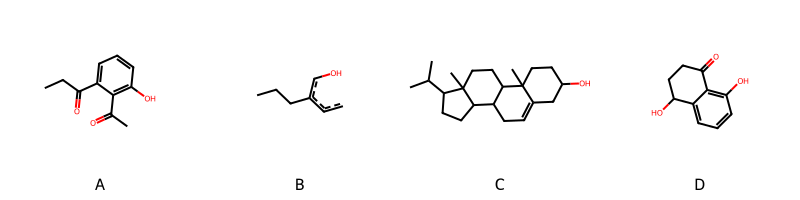

!!! abstract "Tóm tắt"

    **Họ Plumbaginaceae** có **4** chi được các cộng đồng sử dụng trong chăm sóc sức khỏe gồm *Plumbago, Statice, Limonium, Armeria*. Số lượng thành phần hóa học đã phân lập và xác định cấu trúc từ họ này tính đến tháng 12 năm 2024 là **16** nhóm có thể liệt kê như sau *Naphthofurans, Steroids and steroid derivatives, Organonitrogen compounds, Organooxygen compounds, Naphthalenes, Azoles, Flavonoids, Benzopyrans, Pyrrolidines, Hydroxy acids and derivatives, Saccharolipids, Tetralins, Benzene and substituted derivatives, Glycerolipids, Coumarins and derivatives, Prenol lipids*. Giữa các loài trong họ này, 3 dược liệu được nghiên cứu nhiều nhất dựa trên số thành phần được phân lập là **Plumbago zeylanica, Plumbago indica, Plumbago auriculata*. *Họ Plumbaginaceae* đã được một số công động tại các quốc gia như Ghana, Elsewhere, Turkey, Tanzania, Paraguay, Sudan, Java, Mexico, US, India(Ayurvedic), Mediterranean, Africa, Venezuela, Malaysia, Japan, Haiti, anish, English, Europe, India, Dominican Republic, Dutch, W Africa, Nigeria đã phát hiện một số tác dụng trên lâm sàng gồm chữa bệnh lẫn độc tính như Bàng quang, Chất khử trùng, Đổ mồ hôi, Thuốc lợi tiểu, Ma túy, Giờ mở cửa, Thuốc diệt nấm, Oxy độc hại, Chất làm se, Chất làm se, Thuốc bổ, Chất làm se, cầm máu, Chất độc, Chất độc, Bàng quang, Rubefacient, Emmenagogue, Giờ mở cửa, Chất làm se, Ma túy, Chất độc, Thuốc nhuận tràng, Người nói tiếng nói, Bàng quang, Rubefacient, Thuốc bổ, Thuốc bổ, Bàng quang, Thuốc diệt nấm, Emmenagogue, Thuốc lợi tiểu, Thuốc lợi tiểu, Emmenagogue, Thuốc long đờm, diệt khuẩn, Thuốc phá thai, Thuốc phá thai, Chất chống kích ứng, Bàng quang, Thuốc tẩy giun, Tiêu hóa, có mùi hôi, Bàng quang, gây nôn, Chất độc, Rubefacient, Bàng quang, Thuốc nhuận tràng, Bàng quang, gây nôn, Rubefacient, Bàng quang, Người nói tiếng nói, Chất độc, gây nôn, Thuốc cầm máu, gây nôn, Thuốc nhuận tràng, gây nôn, Thuốc thanh lọc, Người nói tiếng nói.

!!! info "DrDuke"

    James A. Duke sinh năm 1929-2017 là một nhà thực vật học người Mỹ. Đây là một trong những tác giả hàng đầu trong lĩnh vực dược dân tộc học với cuốn *CRC Handbook of Medicinal Herbs* và chính là người xây dựng lên cơ sở dữ liệu về hợp chất tự nhiên và dược dân tộc học tại Bộ nông nghiệp Hoa Kỳ. Các thông tin được đăng tải tại website [Dr. Duke's Phytochemical and Ethnobotanical Databases](https://phytochem.nal.usda.gov/). 
    Trong suốt thập niên 1970, ông lãnh đạo the Plant Taxonomy Laboratory, Plant Genetics and Germplasm Institute of the Agricultural Research Service, U.S. Department of Agriculture.
    Trong tài liệu này, các thông tin về dược dân tộc của các dược liệu được trích dẫn từ tài liệu của James A. Ducke với sự trợ giúp của phần mềm dịch thuật từ tiếng Anh sang tiếng Việt.
   
## Tổng quan về Họ Plumbaginaceae
### Phân loại thực vật
Trong *họ Plumbaginaceae* có **4** chi được sử dụng làm thuốc với chi tiết số loài trong mỗi chi như sau Armeria (1) . Chi tiết về loài sử dụng làm thuốc như dưới đây.  

>Họ Plumbaginaceae


>|-- Chi Plumbago

>*Plumbago auriculata*,
>*Plumbago europaea*,
>*Plumbago indica*,
>*Plumbago pulchella*,
>*Plumbago rosea*,
>*Plumbago scandens*,
>*Plumbago zeylanica*,

>|-- Chi Statice

>*Statice caroliniana*,
>*Statice limonium*,

>|-- Chi Limonium

>*Limonium carolinianum*,
>*Limonium vulgare*,

>|-- Chi Armeria

>*Armeria vulgaris*,

### Thành phần hóa học 

Số lượng thành phần hóa học đã phân lập và xác định cấu trúc từ họ này tính đến tháng 12 năm 2024 là 16 nhóm có thể liệt kê như sau Naphthofurans, Steroids and steroid derivatives, Organonitrogen compounds, Organooxygen compounds, Naphthalenes, Azoles, Flavonoids, Benzopyrans, Pyrrolidines, Hydroxy acids and derivatives, Saccharolipids, Tetralins, Benzene and substituted derivatives, Glycerolipids, Coumarins and derivatives, Prenol lipids. Số lượng các loài đã được nghiên cứu thành phần hóa học là *6* trong tổng số *12* loài thuộc họ Plumbaginaceae.Giữa các loài trong họ này, 3 dược liệu được nghiên cứu nhiều nhất dựa trên số thành phần được phân lập là **Plumbago zeylanica, Plumbago indica, Plumbago auriculata**. Sử dụng phần mềm RDKIT với thuật toán  Find Maximum Common Substructure (FMCS), các nhóm hoạt chất phổ biến nhất trong *họ Plumbaginaceae* đã xây dựng được nhân. Điều này trong tương lại có thể được sử dụng tìm kiếm mối liên hệ giữa tác dụng của cấu trúc hóa học và tác dụng dược lý. Các nhân trong phần này có thể không giống như cấu trúc gốc của từng nhóm chất. Kết quả được trình bầy như hình dưới đây.

<figure markdown="span">
    { width=100% }
    <figcaption> Cấu trúc hóa học của một số khung cơ bản dựa trên thuật toán FMCS để tìm Naphthalenes (A), Organooxygen compounds (B), Steroids and steroid derivatives (C), Tetralins (D).</figcaption>
</figure>


!!! info  "Find Maximum Common Substructure"
    
    Thuật toán FMCS (Find Maximum Common Substructure) là một phương pháp được sử dụng để tìm ra cấu trúc chung nhiều nhất (MCS) trong một tập hợp các cấu trúc hóa học. Các bước của thuật toán gồm:
    - Chọn một cấu trúc hóa học là cấu trúc để tạo truy vấn, còn các cấu trúc khác là mục tiêu.
    - Chia nhỏ cấu trúc để tạo truy vấn thành cấu trúc nhỏ hơn dạng chuỗi SMARTS.
    - Kiểm tra chuỗi SMARTS trong các cấu trúc mục tiêu.
    - Tìm kiếm chuỗi SMARTS xuất hiện nhiều nhất.
    Để biết thêm chi tiết các bạn có thể xem tại [TeachOpenCADD](https://projects.volkamerlab.org/teachopencadd/talktorials/T006_compound_maximum_common_substructures.html)
    ``` python
    pip install rdkit
    def find_core_smiles(smiles_list):
        mols = [Chem.MolFromSmiles(smiles) for smiles in smiles_list]
        mcs = rdFMCS.FindMCS(mols)
        core_smiles = Chem.MolToSmiles(Chem.MolFromSmarts(mcs.smartsString))
        return core_smiles
    ```

### Dược dân tộc học

Họ **Plumbaginaceae** đã được một số công động tại các quốc gia như *Ghana, Elsewhere, Turkey, Tanzania, Paraguay, Sudan, Java, Mexico, US, India(Ayurvedic), Mediterranean, Africa, Venezuela, Malaysia, Japan, Haiti, anish, English, Europe, India, Dominican Republic, Dutch, W Africa, Nigeria* đã phát hiện một số tác dụng trên lâm sàng gồm chữa bệnh lẫn độc tính như *Bàng quang, Chất khử trùng, Đổ mồ hôi, Thuốc lợi tiểu, Ma túy, Giờ mở cửa, Thuốc diệt nấm, Oxy độc hại, Chất làm se, Chất làm se, Thuốc bổ, Chất làm se, cầm máu, Chất độc, Chất độc, Bàng quang, Rubefacient, Emmenagogue, Giờ mở cửa, Chất làm se, Ma túy, Chất độc, Thuốc nhuận tràng, Người nói tiếng nói, Bàng quang, Rubefacient, Thuốc bổ, Thuốc bổ, Bàng quang, Thuốc diệt nấm, Emmenagogue, Thuốc lợi tiểu, Thuốc lợi tiểu, Emmenagogue, Thuốc long đờm, diệt khuẩn, Thuốc phá thai, Thuốc phá thai, Chất chống kích ứng, Bàng quang, Thuốc tẩy giun, Tiêu hóa, có mùi hôi, Bàng quang, gây nôn, Chất độc, Rubefacient, Bàng quang, Thuốc nhuận tràng, Bàng quang, gây nôn, Rubefacient, Bàng quang, Người nói tiếng nói, Chất độc, gây nôn, Thuốc cầm máu, gây nôn, Thuốc nhuận tràng, gây nôn, Thuốc thanh lọc, Người nói tiếng nói*.

## Chi tiết dược dân tộc học


### Chi Plumbago

!!! note "Danh sách các loài thuộc chi"
    
*	 - *Plumbago auriculata*
	 - *Plumbago europaea*
	 - *Plumbago indica*
	 - *Plumbago pulchella*
	 - *Plumbago rosea*
	 - *Plumbago scandens*
	 - *Plumbago zeylanica**

---      
#### *Plumbago auriculata*
**Thông tin về thực vật**

!!! info "Phân loại thực vật của *Plumbago auriculata* từ GIBF:"
    - **Kingdom:** Plantae
    - **Phylum:** Tracheophyta
    - **Order:** Caryophyllales
    - **Family:** Plumbaginaceae
    - **Genus:** Plumbago
    - **Species:** *Plumbago auriculata*


 

Chưa có thông tin về loài này trên wikidata.

*Phân bố trên thế giới*: nan, Kenya, Bahamas, Chile, Jamaica, Singapore, Sri Lanka, Egypt, Spain, Mexico, Colombia, Hong Kong, South Africa, Japan, Australia, Martinique, Virgin Islands (U.S.), Jordan, Portugal, Senegal, India, Brazil, Costa Rica, Peru, Türkiye, Argentina, Thailand, United States of America, Philippines, China, Dominican Republic, Malaysia, New Zealand, Greece, Ecuador, Puerto Rico

*Phân bố tại Việt Nam*: Không có ghi nhận ở Việt Nam

**Thành phần hóa học**
        

Theo cơ sở dữ liệu lotus, từ loài *Plumbago auriculata* đã phân lập và xác định được 10 hoạt chất thuộc về các nhóm Benzene and substituted derivatives, Tetralins, Naphthalenes. Danh sách các hoạt chất như sau 1',4-dihydroxy-1,6'-dimethyl-6,7-dihydro-[2,2'-binaphthalene]-5,5',8,8'-tetrone [(LTS0050825)](https://lotus.naturalproducts.net/compound/lotus_id/LTS0050825), maritinone [(LTS0126003)](https://lotus.naturalproducts.net/compound/lotus_id/LTS0126003), (3s,4s)-4,8-dihydroxy-3-methyl-3,4-dihydro-2h-naphthalen-1-one [(LTS0040585)](https://lotus.naturalproducts.net/compound/lotus_id/LTS0040585), 4,8-dihydroxy-2-methyl-3,4-dihydro-2h-naphthalen-1-one [(LTS0242135)](https://lotus.naturalproducts.net/compound/lotus_id/LTS0242135), 5-hydroxy-3-methoxy-2-methylnaphthalene-1,4-dione [(LTS0076957)](https://lotus.naturalproducts.net/compound/lotus_id/LTS0076957), 1',8-dihydroxy-3,6'-dimethyl-[2,2'-binaphthalene]-1,4,5',8'-tetrone [(LTS0126254)](https://lotus.naturalproducts.net/compound/lotus_id/LTS0126254), 4,8-dihydroxy-3-methyl-3,4-dihydro-2h-naphthalen-1-one [(LTS0141396)](https://lotus.naturalproducts.net/compound/lotus_id/LTS0141396), plumbagin [(LTS0212929)](https://lotus.naturalproducts.net/compound/lotus_id/LTS0212929), (2s,4s)-4,8-dihydroxy-2-methyl-3,4-dihydro-2h-naphthalen-1-one [(LTS0247554)](https://lotus.naturalproducts.net/compound/lotus_id/LTS0247554), 5,6-dihydroxy-2-methylnaphthalene-1,4-dione [(LTS0050103)](https://lotus.naturalproducts.net/compound/lotus_id/LTS0050103).

| chemicalTaxonomyClassyfireClass     |   lotus_count |
|:------------------------------------|--------------:|
|                                     |             1 |
| Benzene and substituted derivatives |             1 |
| Naphthalenes                        |             4 |
| Tetralins                           |             4 |


**Dược dân tộc học**

Danh sách các quốc gia có sử dụng *Plumbago auriculata* trong điều trị các bệnh. 

| Quốc gia   | Bệnh                   |
|:-----------|:-----------------------|
| Africa     | Chất độc               |
| Elsewhere  | gây nôn, Thuốc cầm máu |


---      
#### *Plumbago europaea*
**Thông tin về thực vật**

!!! info "Phân loại thực vật của *Plumbago europaea* từ GIBF:"
    - **Kingdom:** Plantae
    - **Phylum:** Tracheophyta
    - **Order:** Caryophyllales
    - **Family:** Plumbaginaceae
    - **Genus:** Plumbago
    - **Species:** *Plumbago europaea*


 

Chưa có thông tin về loài này trên wikidata.

*Phân bố trên thế giới*: France, Syrian Arab Republic, Israel, Albania, Bulgaria, Spain, Bosnia and Herzegovina, Palestine, State of, Montenegro, Portugal, Iraq, Türkiye, Georgia, Serbia, Croatia, Algeria, Italy, Morocco, Greece, North Macedonia, Armenia, Cyprus

*Phân bố tại Việt Nam*: Không có ghi nhận ở Việt Nam

**Thành phần hóa học**
        

Theo cơ sở dữ liệu lotus, từ loài *Plumbago europaea* đã phân lập và xác định được 5 hoạt chất thuộc về các nhóm Flavonoids, Organooxygen compounds, Naphthalenes. Danh sách các hoạt chất như sau 5,7-dihydroxy-3-{[(2r,3r,4r,5r,6s)-3,4,5-trihydroxy-6-methyloxan-2-yl]oxy}-2-(3,4,5-trihydroxyphenyl)chromen-4-one [(LTS0199262)](https://lotus.naturalproducts.net/compound/lotus_id/LTS0199262), (2r,3r,4s,5s,6r)-2-[(4,8-dihydroxynaphthalen-1-yl)oxy]-6-(hydroxymethyl)oxane-3,4,5-triol [(LTS0197810)](https://lotus.naturalproducts.net/compound/lotus_id/LTS0197810), 2-[(4,8-dihydroxynaphthalen-1-yl)oxy]-6-(hydroxymethyl)oxane-3,4,5-triol [(LTS0240894)](https://lotus.naturalproducts.net/compound/lotus_id/LTS0240894), plumbagin [(LTS0212929)](https://lotus.naturalproducts.net/compound/lotus_id/LTS0212929), myricitrin [(LTS0141597)](https://lotus.naturalproducts.net/compound/lotus_id/LTS0141597).

| chemicalTaxonomyClassyfireClass   |   lotus_count |
|:----------------------------------|--------------:|
| Flavonoids                        |             2 |
| Naphthalenes                      |             1 |
| Organooxygen compounds            |             2 |


**Dược dân tộc học**

Danh sách các quốc gia có sử dụng *Plumbago europaea* trong điều trị các bệnh. 

| Quốc gia      | Bệnh                                                            |
|:--------------|:----------------------------------------------------------------|
| Europe        | gây nôn, Rubefacient, Bàng quang, Người nói tiếng nói, Chất độc |
| Mediterranean | gây nôn, Thuốc thanh lọc, Người nói tiếng nói                   |


---      
#### *Plumbago indica*
**Thông tin về thực vật**

!!! info "Phân loại thực vật của *Plumbago indica* từ GIBF:"
    - **Kingdom:** Plantae
    - **Phylum:** Tracheophyta
    - **Order:** Caryophyllales
    - **Family:** Plumbaginaceae
    - **Genus:** Plumbago
    - **Species:** *Plumbago indica*


 

Chưa có thông tin về loài này trên wikidata.

*Phân bố trên thế giới*: nan, France, Switzerland, New Caledonia, Cuba, Jamaica, French Polynesia, Sri Lanka, Singapore, Guadeloupe, Mexico, Papua New Guinea, Hong Kong, unknown or invalid, Cambodia, Bangladesh, South Africa, Martinique, Indonesia, Myanmar, Brunei Darussalam, Trinidad and Tobago, India, Viet Nam, Thailand, United States of America, Philippines, China, Dominican Republic, Fiji, Samoa, Lao People’s Democratic Republic

*Phân bố tại Việt Nam*: Ninh Thuận, Đồng Nai

**Thành phần hóa học**
        

Theo cơ sở dữ liệu lotus, từ loài *Plumbago indica* đã phân lập và xác định được 18 hoạt chất thuộc về các nhóm Steroids and steroid derivatives, Organooxygen compounds, Naphthalenes, Flavonoids, Benzopyrans. Danh sách các hoạt chất như sau 4-(2,3-dihydroxyphenyl)-2-methyl-4-oxobutanoic acid [(LTS0220738)](https://lotus.naturalproducts.net/compound/lotus_id/LTS0220738), (11r,12r)-2,12-dihydroxy-11-(3-hydroxy-5-methoxyphenyl)-8-methoxy-4,6,10-trioxatricyclo[7.4.0.0³,⁷]trideca-1,3(7),8-trien-13-one [(LTS0157405)](https://lotus.naturalproducts.net/compound/lotus_id/LTS0157405), (3r)-4-(2,3-dihydroxyphenyl)-3-methyl-4-oxobutanoic acid [(LTS0201597)](https://lotus.naturalproducts.net/compound/lotus_id/LTS0201597), 5,6-dihydroxy-2-methyl-2,3-dihydronaphthalene-1,4-dione [(LTS0082297)](https://lotus.naturalproducts.net/compound/lotus_id/LTS0082297), phytosterol [(LTS0029311)](https://lotus.naturalproducts.net/compound/lotus_id/LTS0029311), stigmast-5-en-3-ol, (3β)- [(LTS0204616)](https://lotus.naturalproducts.net/compound/lotus_id/LTS0204616), 5-hydroxy-2-(4-hydroxy-3,5-dimethoxyphenyl)-3,7-dimethoxychromen-4-one [(LTS0214474)](https://lotus.naturalproducts.net/compound/lotus_id/LTS0214474), stigmast-5-en-3-ol [(LTS0071224)](https://lotus.naturalproducts.net/compound/lotus_id/LTS0071224), (1r,3as,3bs,7s,9bs)-1-[(2r,5r)-5,6-dimethylheptan-2-yl]-9a,11a-dimethyl-1h,2h,3h,3ah,3bh,4h,6h,7h,8h,9h,9bh,10h,11h-cyclopenta[a]phenanthren-7-ol [(LTS0057877)](https://lotus.naturalproducts.net/compound/lotus_id/LTS0057877), 3,5-dihydroxy-7-methoxy-2-(3,4,5-trimethoxyphenyl)-2,3-dihydro-1-benzopyran-4-one [(LTS0190183)](https://lotus.naturalproducts.net/compound/lotus_id/LTS0190183), 2-methyl-4-oxochromene-8-carboxylic acid [(LTS0246292)](https://lotus.naturalproducts.net/compound/lotus_id/LTS0246292), plumbagin [(LTS0212929)](https://lotus.naturalproducts.net/compound/lotus_id/LTS0212929), campesterol [(LTS0046755)](https://lotus.naturalproducts.net/compound/lotus_id/LTS0046755), (2s,3s)-3,5-dihydroxy-7-methoxy-2-(3,4,5-trimethoxyphenyl)-2,3-dihydro-1-benzopyran-4-one [(LTS0034697)](https://lotus.naturalproducts.net/compound/lotus_id/LTS0034697), 5-hydroxy-3-[(8-hydroxy-3-methyl-1,4-dioxonaphthalen-2-yl)oxy]-2-methylnaphthalene-1,4-dione [(LTS0193370)](https://lotus.naturalproducts.net/compound/lotus_id/LTS0193370), (2s)-4-(2,3-dihydroxyphenyl)-2-methyl-4-oxobutanoic acid [(LTS0213305)](https://lotus.naturalproducts.net/compound/lotus_id/LTS0213305), 5,6-dihydroxy-2-methylnaphthalene-1,4-dione [(LTS0050103)](https://lotus.naturalproducts.net/compound/lotus_id/LTS0050103), 2,12-dihydroxy-11-(3-hydroxy-5-methoxyphenyl)-8-methoxy-4,6,10-trioxatricyclo[7.4.0.0³,⁷]trideca-1,3(7),8-trien-13-one [(LTS0203426)](https://lotus.naturalproducts.net/compound/lotus_id/LTS0203426).

| chemicalTaxonomyClassyfireClass   |   lotus_count |
|:----------------------------------|--------------:|
| Benzopyrans                       |             1 |
| Flavonoids                        |             5 |
| Naphthalenes                      |             4 |
| Organooxygen compounds            |             3 |
| Steroids and steroid derivatives  |             5 |


**Dược dân tộc học**

Danh sách các quốc gia có sử dụng *Plumbago indica* trong điều trị các bệnh. 

| Quốc gia   | Bệnh                                                                                       |
|:-----------|:-------------------------------------------------------------------------------------------|
| Elsewhere  | Chất khử trùng, Đổ mồ hôi, Thuốc lợi tiểu, Ma túy, Giờ mở cửa, Thuốc diệt nấm, Oxy độc hại |


---      
#### *Plumbago indica*
**Thông tin về thực vật**

!!! info "Phân loại thực vật của *Plumbago indica* từ GIBF:"
    - **Kingdom:** Plantae
    - **Phylum:** Tracheophyta
    - **Order:** Caryophyllales
    - **Family:** Plumbaginaceae
    - **Genus:** Plumbago
    - **Species:** *Plumbago indica*


 

Chưa có thông tin về loài này trên wikidata.

*Phân bố trên thế giới*: nan, France, Switzerland, New Caledonia, Cuba, Jamaica, French Polynesia, Sri Lanka, Singapore, Guadeloupe, Mexico, Papua New Guinea, Hong Kong, unknown or invalid, Cambodia, Bangladesh, South Africa, Martinique, Indonesia, Myanmar, Brunei Darussalam, Trinidad and Tobago, India, Viet Nam, Thailand, United States of America, Philippines, China, Dominican Republic, Fiji, Samoa, Lao People’s Democratic Republic

*Phân bố tại Việt Nam*: Ninh Thuận, Đồng Nai

**Thành phần hóa học**
        

Chưa có nghiên cứu về thành phần hóa học của loài này


**Dược dân tộc học**

Danh sách các quốc gia có sử dụng *Plumbago indica* trong điều trị các bệnh. 

| Quốc gia   | Bệnh                                                                      |
|:-----------|:--------------------------------------------------------------------------|
| Mexico     | gây nôn, Chất độc, Rubefacient, Bàng quang, Thuốc nhuận tràng, Bàng quang |


---      
#### *Plumbago indica*
**Thông tin về thực vật**

!!! info "Phân loại thực vật của *Plumbago indica* từ GIBF:"
    - **Kingdom:** Plantae
    - **Phylum:** Tracheophyta
    - **Order:** Caryophyllales
    - **Family:** Plumbaginaceae
    - **Genus:** Plumbago
    - **Species:** *Plumbago indica*


 

Chưa có thông tin về loài này trên wikidata.

*Phân bố trên thế giới*: nan, France, Switzerland, New Caledonia, Cuba, Jamaica, French Polynesia, Sri Lanka, Singapore, Guadeloupe, Mexico, Papua New Guinea, Hong Kong, unknown or invalid, Cambodia, Bangladesh, South Africa, Martinique, Indonesia, Myanmar, Brunei Darussalam, Trinidad and Tobago, India, Viet Nam, Thailand, United States of America, Philippines, China, Dominican Republic, Fiji, Samoa, Lao People’s Democratic Republic

*Phân bố tại Việt Nam*: Ninh Thuận, Đồng Nai

**Thành phần hóa học**
        

Chưa có nghiên cứu về thành phần hóa học của loài này


**Dược dân tộc học**

Danh sách các quốc gia có sử dụng *Plumbago indica* trong điều trị các bệnh. 

| Quốc gia   | Bệnh                                                         |
|:-----------|:-------------------------------------------------------------|
| India      | có mùi hôi, Bàng quang                                       |
| Turkey     | Giờ mở cửa, Chất làm se, Ma túy, Chất độc, Thuốc nhuận tràng |


---      
#### *Plumbago scandens*
**Thông tin về thực vật**

!!! info "Phân loại thực vật của *Plumbago zeylanica* từ GIBF:"
    - **Kingdom:** Plantae
    - **Phylum:** Tracheophyta
    - **Order:** Caryophyllales
    - **Family:** Plumbaginaceae
    - **Genus:** Plumbago
    - **Species:** *Plumbago zeylanica*


 

Chưa có thông tin về loài này trên wikidata.

*Phân bố trên thế giới*: United States of America, Guadeloupe, Mexico, Curaçao, Bonaire, Sint Eustatius and Saba, Ecuador, Brazil, Saint Martin (French part), Puerto Rico, El Salvador

*Phân bố tại Việt Nam*: Không có ghi nhận ở Việt Nam

**Thành phần hóa học**
        

Theo cơ sở dữ liệu lotus, từ loài *Plumbago scandens* đã phân lập và xác định được 8 hoạt chất thuộc về các nhóm Steroids and steroid derivatives, Tetralins, Naphthalenes. Danh sách các hoạt chất như sau (3s,4s)-4,8-dihydroxy-3-methyl-3,4-dihydro-2h-naphthalen-1-one [(LTS0040585)](https://lotus.naturalproducts.net/compound/lotus_id/LTS0040585), (3s,4r)-4,8-dihydroxy-3-methyl-3,4-dihydro-2h-naphthalen-1-one [(LTS0091988)](https://lotus.naturalproducts.net/compound/lotus_id/LTS0091988), stigmast-5-en-3-ol, (3β)- [(LTS0204616)](https://lotus.naturalproducts.net/compound/lotus_id/LTS0204616), isoshinanolone [(LTS0209897)](https://lotus.naturalproducts.net/compound/lotus_id/LTS0209897), sitosterol [(LTS0168132)](https://lotus.naturalproducts.net/compound/lotus_id/LTS0168132), 4,8-dihydroxy-3-methyl-3,4-dihydro-2h-naphthalen-1-one [(LTS0141396)](https://lotus.naturalproducts.net/compound/lotus_id/LTS0141396), plumbagin [(LTS0212929)](https://lotus.naturalproducts.net/compound/lotus_id/LTS0212929), stigmast-5-en-3-ol [(LTS0071224)](https://lotus.naturalproducts.net/compound/lotus_id/LTS0071224).

| chemicalTaxonomyClassyfireClass   |   lotus_count |
|:----------------------------------|--------------:|
| Naphthalenes                      |             1 |
| Steroids and steroid derivatives  |             3 |
| Tetralins                         |             4 |


**Dược dân tộc học**

Danh sách các quốc gia có sử dụng *Plumbago zeylanica* trong điều trị các bệnh. 

| Quốc gia           | Bệnh                              |
|:-------------------|:----------------------------------|
| Dominican Republic | Bàng quang                        |
| Elsewhere          | gây nôn, Thuốc nhuận tràng        |
| Haiti              | Người nói tiếng nói, Bàng quang   |
| Mexico             | Chất độc, Bàng quang, Rubefacient |
| Paraguay           | Bàng quang                        |
| Venezuela          | Rubefacient                       |


---      
#### *Plumbago zeylanica*
**Thông tin về thực vật**

!!! info "Phân loại thực vật của *Plumbago zeylanica* từ GIBF:"
    - **Kingdom:** Plantae
    - **Phylum:** Tracheophyta
    - **Order:** Caryophyllales
    - **Family:** Plumbaginaceae
    - **Genus:** Plumbago
    - **Species:** *Plumbago zeylanica*


 

Chưa có thông tin về loài này trên wikidata.

*Phân bố trên thế giới*: Gambia, Nepal, Jamaica, Antigua and Barbuda, Guadeloupe, French Guiana, Mexico, Chinese Taipei, Rwanda, Hong Kong, South Africa, Australia, Mauritius, Sint Maarten (Dutch part), Senegal, India, Brazil, Costa Rica, Peru, Northern Mariana Islands, Argentina, Guam, Namibia, Thailand, Zimbabwe, United States of America, Viet Nam, China, Dominican Republic, Nicaragua, Botswana, Ecuador, Puerto Rico, El Salvador

*Phân bố tại Việt Nam*: Quảng Bình

**Thành phần hóa học**
        

Theo cơ sở dữ liệu lotus, từ loài *Plumbago zeylanica* đã phân lập và xác định được 64 hoạt chất thuộc về các nhóm Naphthofurans, Steroids and steroid derivatives, Organooxygen compounds, Naphthalenes, Azoles, Pyrrolidines, Hydroxy acids and derivatives, Saccharolipids, Tetralins, Benzene and substituted derivatives, Glycerolipids, Coumarins and derivatives, Prenol lipids. Danh sách các hoạt chất như sau 8,19-dihydroxy-2-methylpentacyclo[11.8.0.0²,¹¹.0⁴,⁹.0¹⁵,²⁰]henicosa-1(13),4,6,8,15,17,19-heptaene-3,10,14,21-tetrone [(LTS0155297)](https://lotus.naturalproducts.net/compound/lotus_id/LTS0155297), (3s,4s)-4,8-dihydroxy-3-methyl-3,4-dihydro-2h-naphthalen-1-one [(LTS0040585)](https://lotus.naturalproducts.net/compound/lotus_id/LTS0040585), lupeol acetate [(LTS0077599)](https://lotus.naturalproducts.net/compound/lotus_id/LTS0077599), 2-{[1-(5-ethyl-6-methylheptan-2-yl)-9a,11a-dimethyl-1h,2h,3h,3ah,3bh,4h,6h,7h,8h,9h,9bh,10h,11h-cyclopenta[a]phenanthren-7-yl]oxy}-6-(hydroxymethyl)oxane-3,4,5-triol [(LTS0158828)](https://lotus.naturalproducts.net/compound/lotus_id/LTS0158828), (1r,11r,13r)-5,16-dihydroxy-2-(8-hydroxy-3-methyl-1,4-dioxonaphthalen-2-yl)-1,13-dimethylpentacyclo[11.8.0.0²,¹¹.0⁴,⁹.0¹⁵,²⁰]henicosa-4,6,8,15,17,19-hexaene-3,10,14,21-tetrone [(LTS0056657)](https://lotus.naturalproducts.net/compound/lotus_id/LTS0056657), stigmast-5-en-3-ol, (3β)- [(LTS0204616)](https://lotus.naturalproducts.net/compound/lotus_id/LTS0204616), (2r)-7-hydroxy-2-[(4r)-2-iminoimidazolidin-4-yl]-6-methylhept-5-enoic acid [(LTS0043247)](https://lotus.naturalproducts.net/compound/lotus_id/LTS0043247), seselin [(LTS0194066)](https://lotus.naturalproducts.net/compound/lotus_id/LTS0194066), 5,8-dihydroxy-2-methylnaphthalene-1,4-dione [(LTS0077880)](https://lotus.naturalproducts.net/compound/lotus_id/LTS0077880), (2r)-2-[(4r)-1-(2-hydroxy-4-{[(2s,3r,4s,5r)-3,4,5-trihydroxyoxan-2-yl]oxy}butyl)-2-iminoimidazolidin-4-yl]-3-[(2r)-4-methyl-5-oxo-2h-furan-2-yl]propanoic acid [(LTS0080840)](https://lotus.naturalproducts.net/compound/lotus_id/LTS0080840), sitoindoside i [(LTS0071215)](https://lotus.naturalproducts.net/compound/lotus_id/LTS0071215), methyl 4-(2-hydroxy-3-{[3,4,5-trihydroxy-6-(hydroxymethyl)oxan-2-yl]oxy}phenyl)-3-methyl-4-oxobutanoate [(LTS0274032)](https://lotus.naturalproducts.net/compound/lotus_id/LTS0274032), methyl (3s)-4-(2-hydroxy-3-{[(2s,3r,4s,5s,6r)-3,4,5-trihydroxy-6-(hydroxymethyl)oxan-2-yl]oxy}phenyl)-3-methyl-4-oxobutanoate [(LTS0228267)](https://lotus.naturalproducts.net/compound/lotus_id/LTS0228267), tecomin [(LTS0207379)](https://lotus.naturalproducts.net/compound/lotus_id/LTS0207379), (2r)-2-[(4r)-1-(2-hydroxy-4-{[(2s,3r,4s,5r)-3,4,5-trihydroxyoxan-2-yl]oxy}butyl)-2-iminoimidazolidin-4-yl]-6-methylhept-5-enoic acid [(LTS0103128)](https://lotus.naturalproducts.net/compound/lotus_id/LTS0103128), 3a,5a,5b,8,8,11a-hexamethyl-1-(prop-1-en-2-yl)-tetradecahydro-1h-cyclopenta[a]chrysen-9-one [(LTS0257989)](https://lotus.naturalproducts.net/compound/lotus_id/LTS0257989), sitogluside [(LTS0201798)](https://lotus.naturalproducts.net/compound/lotus_id/LTS0201798), trilinolein [(LTS0236992)](https://lotus.naturalproducts.net/compound/lotus_id/LTS0236992), 4,4'-dihydroxy-7,7'-dimethyl-6,7-dihydro-[1,1'-binaphthalene]-5,5',8,8'-tetrone [(LTS0085523)](https://lotus.naturalproducts.net/compound/lotus_id/LTS0085523), xanthoxyletin [(LTS0112626)](https://lotus.naturalproducts.net/compound/lotus_id/LTS0112626), lupenone [(LTS0107900)](https://lotus.naturalproducts.net/compound/lotus_id/LTS0107900), (2r)-2-[(4r)-1-(2,4-dihydroxybutyl)-2-iminoimidazolidin-4-yl]-3-[(2r)-4-methyl-5-oxo-2h-furan-2-yl]propanoic acid [(LTS0082869)](https://lotus.naturalproducts.net/compound/lotus_id/LTS0082869), (2r)-2-[(4r)-2-iminoimidazolidin-4-yl]-6-methylhept-5-enoic acid [(LTS0113167)](https://lotus.naturalproducts.net/compound/lotus_id/LTS0113167), 3a,5a,5b,8,8,11a-hexamethyl-1-(prop-1-en-2-yl)-hexadecahydrocyclopenta[a]chrysen-9-yl acetate [(LTS0081577)](https://lotus.naturalproducts.net/compound/lotus_id/LTS0081577), (2r,5e)-7-hydroxy-2-[(4r)-2-iminoimidazolidin-4-yl]-6-methylhept-5-enoic acid [(LTS0172517)](https://lotus.naturalproducts.net/compound/lotus_id/LTS0172517), (2s,11r)-8,19-dihydroxy-2-methylpentacyclo[11.8.0.0²,¹¹.0⁴,⁹.0¹⁵,²⁰]henicosa-1(13),4,6,8,15,17,19-heptaene-3,10,14,21-tetrone [(LTS0200498)](https://lotus.naturalproducts.net/compound/lotus_id/LTS0200498), 5-hydroxy-3-[(8-hydroxy-3-methyl-1,4-dioxonaphthalen-2-yl)methyl]-2-methylnaphthalene-1,4-dione [(LTS0089376)](https://lotus.naturalproducts.net/compound/lotus_id/LTS0089376), stigmast-5-en-3-ol [(LTS0071224)](https://lotus.naturalproducts.net/compound/lotus_id/LTS0071224), (3s,4r)-4,8-dihydroxy-3-methyl-3,4-dihydro-2h-naphthalen-1-one [(LTS0091988)](https://lotus.naturalproducts.net/compound/lotus_id/LTS0091988), (2r,5e)-7-hydroxy-2-[(4r)-1-(2-hydroxy-4-{[(2s,3r,4s,5r)-3,4,5-trihydroxyoxan-2-yl]oxy}butyl)-2-iminoimidazolidin-4-yl]-6-methylhept-5-enoic acid [(LTS0066784)](https://lotus.naturalproducts.net/compound/lotus_id/LTS0066784), methyl (3r)-4-(2-hydroxy-3-{[(2s,3r,4s,5s,6r)-3,4,5-trihydroxy-6-(hydroxymethyl)oxan-2-yl]oxy}phenyl)-3-methyl-4-oxobutanoate [(LTS0153661)](https://lotus.naturalproducts.net/compound/lotus_id/LTS0153661), 5-(2-hydroxypropan-2-yl)-16-methoxy-4,14-dioxatetracyclo[7.7.0.0³,⁷.0¹¹,¹⁵]hexadeca-1(9),3(7),5,10,12,15-hexaene-2,8-dione [(LTS0080971)](https://lotus.naturalproducts.net/compound/lotus_id/LTS0080971), sitosterol [(LTS0168132)](https://lotus.naturalproducts.net/compound/lotus_id/LTS0168132), 4,8-dihydroxy-3-methyl-3,4-dihydro-2h-naphthalen-1-one [(LTS0141396)](https://lotus.naturalproducts.net/compound/lotus_id/LTS0141396), (3r)-4-(2-hydroxy-3-{[(2s,3r,4s,5s,6r)-3,4,5-trihydroxy-6-(hydroxymethyl)oxan-2-yl]oxy}phenyl)-3-methyl-4-oxobutanoic acid [(LTS0019048)](https://lotus.naturalproducts.net/compound/lotus_id/LTS0019048), linolein [(LTS0183869)](https://lotus.naturalproducts.net/compound/lotus_id/LTS0183869), 5,7-dihydroxy-8-methoxy-2-methylnaphthalene-1,4-dione [(LTS0163932)](https://lotus.naturalproducts.net/compound/lotus_id/LTS0163932), (3s)-4-(2-hydroxy-3-{[(2s,3r,4s,5s,6r)-3,4,5-trihydroxy-6-(hydroxymethyl)oxan-2-yl]oxy}phenyl)-3-methyl-4-oxobutanoic acid [(LTS0194487)](https://lotus.naturalproducts.net/compound/lotus_id/LTS0194487), (5s,7r,7ar)-2-(2,4-dihydroxybutyl)-3-imino-5-(2-methylprop-1-en-1-yl)-tetrahydro-1h-pyrrolo[1,2-c]imidazole-7-carboxylic acid [(LTS0166031)](https://lotus.naturalproducts.net/compound/lotus_id/LTS0166031), 5-hydroxy-3-[(5-hydroxy-1,4-dioxonaphthalen-2-yl)methyl]-2-methylnaphthalene-1,4-dione [(LTS0242174)](https://lotus.naturalproducts.net/compound/lotus_id/LTS0242174), 4-(2-hydroxy-3-{[3,4,5-trihydroxy-6-(hydroxymethyl)oxan-2-yl]oxy}phenyl)-3-methyl-4-oxobutanoic acid [(LTS0127905)](https://lotus.naturalproducts.net/compound/lotus_id/LTS0127905), xanthyletin [(LTS0016674)](https://lotus.naturalproducts.net/compound/lotus_id/LTS0016674), 5-methoxy-8,8-dimethylpyrano[2,3-f]chromen-2-one [(LTS0086567)](https://lotus.naturalproducts.net/compound/lotus_id/LTS0086567), (5s,7r,7ar)-3-imino-5-(2-methylprop-1-en-1-yl)-hexahydropyrrolo[1,2-c]imidazole-7-carboxylic acid [(LTS0139350)](https://lotus.naturalproducts.net/compound/lotus_id/LTS0139350), 16-methoxy-5-(prop-1-en-2-yl)-4,14-dioxatetracyclo[7.7.0.0³,⁷.0¹¹,¹⁵]hexadeca-1(9),3(7),5,10,12,15-hexaene-2,8-dione [(LTS0226402)](https://lotus.naturalproducts.net/compound/lotus_id/LTS0226402), suberosin [(LTS0171880)](https://lotus.naturalproducts.net/compound/lotus_id/LTS0171880), maritinone [(LTS0126003)](https://lotus.naturalproducts.net/compound/lotus_id/LTS0126003), (2r,5e)-2-[(4r)-1-(2,4-dihydroxybutyl)-2-iminoimidazolidin-4-yl]-7-hydroxy-6-methylhept-5-enoic acid [(LTS0055335)](https://lotus.naturalproducts.net/compound/lotus_id/LTS0055335), (2'r,3'r,4'r)-4,4',8'-trihydroxy-2',7-dimethyl-3'-propyl-3',4'-dihydro-[1,2'-binaphthalene]-1',5,8-trione [(LTS0195549)](https://lotus.naturalproducts.net/compound/lotus_id/LTS0195549), (3r)-4-(2,3-dihydroxyphenyl)-3-methyl-4-oxobutanoic acid [(LTS0201597)](https://lotus.naturalproducts.net/compound/lotus_id/LTS0201597), (2r)-2-[(4r)-1-(2,4-dihydroxybutyl)-2-iminoimidazolidin-4-yl]-6-methylhept-5-enoic acid [(LTS0211861)](https://lotus.naturalproducts.net/compound/lotus_id/LTS0211861), 3-chloro-5-hydroxy-2-methylnaphthalene-1,4-dione [(LTS0197827)](https://lotus.naturalproducts.net/compound/lotus_id/LTS0197827), 1',8-dihydroxy-3,6'-dimethyl-[2,2'-binaphthalene]-1,4,5',8'-tetrone [(LTS0126254)](https://lotus.naturalproducts.net/compound/lotus_id/LTS0126254), isoshinanolone [(LTS0209897)](https://lotus.naturalproducts.net/compound/lotus_id/LTS0209897), 2-methyl-5-[(3-methylbut-2-en-1-yl)oxy]naphthalene-1,4-dione [(LTS0024953)](https://lotus.naturalproducts.net/compound/lotus_id/LTS0024953), (5s,7r,7ar)-2-(2-hydroxy-4-{[(2s,3r,4s,5r)-3,4,5-trihydroxyoxan-2-yl]oxy}butyl)-3-imino-5-(2-methylprop-1-en-1-yl)-tetrahydro-1h-pyrrolo[1,2-c]imidazole-7-carboxylic acid [(LTS0251109)](https://lotus.naturalproducts.net/compound/lotus_id/LTS0251109), elliptinone [(LTS0268993)](https://lotus.naturalproducts.net/compound/lotus_id/LTS0268993), (2r)-2-[(4r)-2-iminoimidazolidin-4-yl]-3-[(2r)-4-methyl-5-oxo-2h-furan-2-yl]propanoic acid [(LTS0133029)](https://lotus.naturalproducts.net/compound/lotus_id/LTS0133029), 4-(2,3-dihydroxyphenyl)-3-methyl-4-oxobutanoic acid [(LTS0087770)](https://lotus.naturalproducts.net/compound/lotus_id/LTS0087770), plumbagin [(LTS0212929)](https://lotus.naturalproducts.net/compound/lotus_id/LTS0212929), droserone [(LTS0228939)](https://lotus.naturalproducts.net/compound/lotus_id/LTS0228939), (2r)-6-hydroxy-2-[(4r)-2-iminoimidazolidin-4-yl]-6-methylheptanoic acid [(LTS0071618)](https://lotus.naturalproducts.net/compound/lotus_id/LTS0071618), 16-hydroxy-5-(prop-1-en-2-yl)-4,14-dioxatetracyclo[7.7.0.0³,⁷.0¹¹,¹⁵]hexadeca-1(9),3(7),5,10,12,15-hexaene-2,8-dione [(LTS0035285)](https://lotus.naturalproducts.net/compound/lotus_id/LTS0035285), (6-{[1-(5-ethyl-6-methylheptan-2-yl)-9a,11a-dimethyl-1h,2h,3h,3ah,3bh,4h,6h,7h,8h,9h,9bh,10h,11h-cyclopenta[a]phenanthren-7-yl]oxy}-3,4,5-trihydroxyoxan-2-yl)methyl hexadecanoate [(LTS0197284)](https://lotus.naturalproducts.net/compound/lotus_id/LTS0197284).

| chemicalTaxonomyClassyfireClass     |   lotus_count |
|:------------------------------------|--------------:|
|                                     |             1 |
| Azoles                              |             4 |
| Benzene and substituted derivatives |             1 |
| Coumarins and derivatives           |             5 |
| Glycerolipids                       |             2 |
| Hydroxy acids and derivatives       |             4 |
| Naphthalenes                        |            13 |
| Naphthofurans                       |             3 |
| Organooxygen compounds              |             9 |
| Prenol lipids                       |             5 |
| Pyrrolidines                        |             2 |
| Saccharolipids                      |             3 |
| Steroids and steroid derivatives    |             7 |
| Tetralins                           |             4 |


**Dược dân tộc học**

Danh sách các quốc gia có sử dụng *Plumbago zeylanica* trong điều trị các bệnh. 

| Quốc gia         | Bệnh                                                    |
|:-----------------|:--------------------------------------------------------|
| Elsewhere        | Thuốc lợi tiểu, Emmenagogue, Thuốc long đờm, diệt khuẩn |
| Ghana            | Thuốc phá thai, Chất chống kích ứng, Bàng quang         |
| India            | Thuốc diệt nấm, Emmenagogue                             |
| India(Ayurvedic) | Tiêu hóa                                                |
| Japan            | Thuốc phá thai                                          |
| Java             | Emmenagogue                                             |
| Malaysia         | Thuốc phá thai                                          |
| Nigeria          | Thuốc tẩy giun                                          |
| Sudan            | Thuốc bổ, Bàng quang                                    |
| Tanzania         | Bàng quang                                              |
| W Africa         | Bàng quang                                              |


### Chi Statice

!!! note "Danh sách các loài thuộc chi"
    
*	 - *Statice caroliniana*
	 - *Statice limonium**

---      
#### *Plumbago zeylanica*
**Thông tin về thực vật**

!!! info "Phân loại thực vật của *Plumbago zeylanica* từ GIBF:"
    - **Kingdom:** Plantae
    - **Phylum:** Tracheophyta
    - **Order:** Caryophyllales
    - **Family:** Plumbaginaceae
    - **Genus:** Plumbago
    - **Species:** *Plumbago zeylanica*


 

Chưa có thông tin về loài này trên wikidata.

*Phân bố trên thế giới*: Gambia, Nepal, Jamaica, Antigua and Barbuda, Guadeloupe, French Guiana, Mexico, Chinese Taipei, Rwanda, Hong Kong, South Africa, Australia, Mauritius, Sint Maarten (Dutch part), Senegal, India, Brazil, Costa Rica, Peru, Northern Mariana Islands, Argentina, Guam, Namibia, Thailand, Zimbabwe, United States of America, Viet Nam, China, Dominican Republic, Nicaragua, Botswana, Ecuador, Puerto Rico, El Salvador

*Phân bố tại Việt Nam*: Quảng Bình

**Thành phần hóa học**
        

Chưa có nghiên cứu về thành phần hóa học của loài này


**Dược dân tộc học**

Danh sách các quốc gia có sử dụng *Plumbago zeylanica* trong điều trị các bệnh. 

| Quốc gia   | Bệnh        |
|:-----------|:------------|
| Dutch      | Thuốc bổ    |
| English    | Chất làm se |


---      
#### *Plumbago zeylanica*
**Thông tin về thực vật**

!!! info "Phân loại thực vật của *Plumbago zeylanica* từ GIBF:"
    - **Kingdom:** Plantae
    - **Phylum:** Tracheophyta
    - **Order:** Caryophyllales
    - **Family:** Plumbaginaceae
    - **Genus:** Plumbago
    - **Species:** *Plumbago zeylanica*


 

Chưa có thông tin về loài này trên wikidata.

*Phân bố trên thế giới*: Gambia, Nepal, Jamaica, Antigua and Barbuda, Guadeloupe, French Guiana, Mexico, Chinese Taipei, Rwanda, Hong Kong, South Africa, Australia, Mauritius, Sint Maarten (Dutch part), Senegal, India, Brazil, Costa Rica, Peru, Northern Mariana Islands, Argentina, Guam, Namibia, Thailand, Zimbabwe, United States of America, Viet Nam, China, Dominican Republic, Nicaragua, Botswana, Ecuador, Puerto Rico, El Salvador

*Phân bố tại Việt Nam*: Quảng Bình

**Thành phần hóa học**
        

Chưa có nghiên cứu về thành phần hóa học của loài này


**Dược dân tộc học**

Danh sách các quốc gia có sử dụng *Plumbago zeylanica* trong điều trị các bệnh. 

| Quốc gia   | Bệnh        |
|:-----------|:------------|
| US         | Chất làm se |


### Chi Limonium

!!! note "Danh sách các loài thuộc chi"
    
*	 - *Limonium carolinianum*
	 - *Limonium vulgare**

---      
#### *Plumbago zeylanica*
**Thông tin về thực vật**

!!! info "Phân loại thực vật của *Plumbago zeylanica* từ GIBF:"
    - **Kingdom:** Plantae
    - **Phylum:** Tracheophyta
    - **Order:** Caryophyllales
    - **Family:** Plumbaginaceae
    - **Genus:** Plumbago
    - **Species:** *Plumbago zeylanica*


 

Chưa có thông tin về loài này trên wikidata.

*Phân bố trên thế giới*: Gambia, Nepal, Jamaica, Antigua and Barbuda, Guadeloupe, French Guiana, Mexico, Chinese Taipei, Rwanda, Hong Kong, South Africa, Australia, Mauritius, Sint Maarten (Dutch part), Senegal, India, Brazil, Costa Rica, Peru, Northern Mariana Islands, Argentina, Guam, Namibia, Thailand, Zimbabwe, United States of America, Viet Nam, China, Dominican Republic, Nicaragua, Botswana, Ecuador, Puerto Rico, El Salvador

*Phân bố tại Việt Nam*: Quảng Bình

**Thành phần hóa học**
        

Chưa có nghiên cứu về thành phần hóa học của loài này


**Dược dân tộc học**

Danh sách các quốc gia có sử dụng *Plumbago zeylanica* trong điều trị các bệnh. 

| Quốc gia   | Bệnh                  |
|:-----------|:----------------------|
| Turkey     | Chất làm se, Thuốc bổ |


---      
#### *Limonium vulgare*
**Thông tin về thực vật**

!!! info "Phân loại thực vật của *Limonium vulgare* từ GIBF:"
    - **Kingdom:** Plantae
    - **Phylum:** Tracheophyta
    - **Order:** Caryophyllales
    - **Family:** Plumbaginaceae
    - **Genus:** Limonium
    - **Species:** *Limonium vulgare*


 

Chưa có thông tin về loài này trên wikidata.

*Phân bố trên thế giới*: Netherlands, Denmark, France, Germany, Albania, United Kingdom of Great Britain and Northern Ireland, Sweden

*Phân bố tại Việt Nam*: Không có ghi nhận ở Việt Nam

**Thành phần hóa học**
        

Theo cơ sở dữ liệu lotus, từ loài *Limonium vulgare* đã phân lập và xác định được 1 hoạt chất thuộc về các nhóm Organonitrogen compounds. Danh sách các hoạt chất như sau β-alaninebetaine [(LTS0209088)](https://lotus.naturalproducts.net/compound/lotus_id/LTS0209088).

| chemicalTaxonomyClassyfireClass   |   lotus_count |
|:----------------------------------|--------------:|
| Organonitrogen compounds          |             1 |


**Dược dân tộc học**

Danh sách các quốc gia có sử dụng *Limonium vulgare* trong điều trị các bệnh. 

| Quốc gia   | Bệnh                 |
|:-----------|:---------------------|
| Turkey     | Chất làm se, cầm máu |


### Chi Armeria

!!! note "Danh sách các loài thuộc chi"
    
*	 - *Armeria vulgaris**

---      
#### *Limonium vulgare*
**Thông tin về thực vật**

!!! info "Phân loại thực vật của *Limonium vulgare* từ GIBF:"
    - **Kingdom:** Plantae
    - **Phylum:** Tracheophyta
    - **Order:** Caryophyllales
    - **Family:** Plumbaginaceae
    - **Genus:** Limonium
    - **Species:** *Limonium vulgare*


 

Chưa có thông tin về loài này trên wikidata.

*Phân bố trên thế giới*: Netherlands, Denmark, France, Germany, Albania, United Kingdom of Great Britain and Northern Ireland, Sweden

*Phân bố tại Việt Nam*: Không có ghi nhận ở Việt Nam

**Thành phần hóa học**
        

Chưa có nghiên cứu về thành phần hóa học của loài này


**Dược dân tộc học**

Danh sách các quốc gia có sử dụng *Limonium vulgare* trong điều trị các bệnh. 

| Quốc gia   | Bệnh           |
|:-----------|:---------------|
| Dutch      | Thuốc lợi tiểu |
| anish      | Chất làm se    |


## Bình luận

<div id="giscus-container"></div>
<script src="https://giscus.app/client.js"
        data-repo="hoangson0787/CSDL-duoc-lieu"
        data-repo-id="R_kgDONbMRNA"
        data-category="Duoc lieu"
        data-category-id="DIC_kwDONbMRNM4ClklR"
        data-mapping="pathname"
        data-strict="0"
        data-reactions-enabled="1"
        data-emit-metadata="1"
        data-input-position="bottom"
        data-theme="light"
        data-lang="en"
        crossorigin="anonymous"
        async>
</script>

