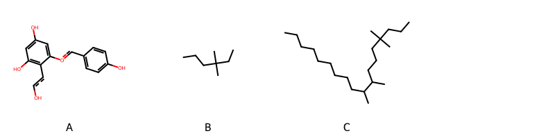

!!! abstract "Tóm tắt"

    **Họ Polypodiaceae** có **6** chi được các cộng đồng sử dụng trong chăm sóc sức khỏe gồm *Pleopeltis, Pyrrosia, Drymoglossum, Drynaria, Lemmaphyllum, Polypodium*. Số lượng thành phần hóa học đã phân lập và xác định cấu trúc từ họ này tính đến tháng 12 năm 2024 là **8** nhóm có thể liệt kê như sau *Steroids and steroid derivatives, Organooxygen compounds, Flavonoids, Fatty Acyls, Cinnamic acids and derivatives, Benzopyrans, Organic phosphoric acids and derivatives, Prenol lipids*. Giữa các loài trong họ này, 3 dược liệu được nghiên cứu nhiều nhất dựa trên số thành phần được phân lập là **Polypodium virginianum, Polypodium vulgare, Pyrrosia lingua*. *Họ Polypodiaceae* đã được một số công động tại các quốc gia như Canada(Salish), Salvador, China, Elsewhere, Venezuela, Mexico(Mazatec), Turkey, Egypt, Paraguay, India, Europe, Colombia, Panama, Mexico, US, ain đã phát hiện một số tác dụng trên lâm sàng gồm chữa bệnh lẫn độc tính như Chất làm se, Chất làm se, Thuốc lợi tiểu, Chất làm se, Thuốc lợi tiểu, Thuốc lợi tiểu, Chất làm lạnh, Chất làm se, diệt khuẩn, Chất tạo ngọt, Chống khả năng sinh sản, Họ sẽ mở, Chất làm se, Thuốc gây mật, Thuốc long đờm, Thuốc bổ, Thuốc giảm đau, Thuốc giảm đau, thuốc tống hơi, Thuốc long đờm, Đổ mồ hôi, Thuốc lợi tiểu, Thuốc lợi tiểu, Chất làm lạnh, Thuốc lợi tiểu, Thuốc long đờm, Thuốc lợi tiểu, cầm máu, Thuốc nhuận tràng, Thuốc nhuận tràng, Thuốc long đờm, Thuốc phá thai, Chất độc, Tanifuge, Thuốc đắp, có mùi hôi, cầm máu, Đổ mồ hôi.

!!! info "DrDuke"

    James A. Duke sinh năm 1929-2017 là một nhà thực vật học người Mỹ. Đây là một trong những tác giả hàng đầu trong lĩnh vực dược dân tộc học với cuốn *CRC Handbook of Medicinal Herbs* và chính là người xây dựng lên cơ sở dữ liệu về hợp chất tự nhiên và dược dân tộc học tại Bộ nông nghiệp Hoa Kỳ. Các thông tin được đăng tải tại website [Dr. Duke's Phytochemical and Ethnobotanical Databases](https://phytochem.nal.usda.gov/). 
    Trong suốt thập niên 1970, ông lãnh đạo the Plant Taxonomy Laboratory, Plant Genetics and Germplasm Institute of the Agricultural Research Service, U.S. Department of Agriculture.
    Trong tài liệu này, các thông tin về dược dân tộc của các dược liệu được trích dẫn từ tài liệu của James A. Ducke với sự trợ giúp của phần mềm dịch thuật từ tiếng Anh sang tiếng Việt.
   
## Tổng quan về Họ Polypodiaceae
### Phân loại thực vật
Trong *họ Polypodiaceae* có **6** chi được sử dụng làm thuốc với chi tiết số loài trong mỗi chi như sau Polypodium (14) . Chi tiết về loài sử dụng làm thuốc như dưới đây.  

>Họ Polypodiaceae


>|-- Chi Pleopeltis

>*Pleopeltis thunbergianus*,

>|-- Chi Pyrrosia

>*Pyrrosia lingua*,

>|-- Chi Drymoglossum

>*Drymoglossum carnosum*,
>*Drymoglossum heterophyllum*,

>|-- Chi Drynaria

>*Drynaria fortunei*,
>*Drynaria quercifolia*,

>|-- Chi Lemmaphyllum

>*Lemmaphyllum carnosum*,

>|-- Chi Polypodium

>*Polypodium angustifolium*,
>*Polypodium attenuatum*,
>*Polypodium aureum*,
>*Polypodium barometz*,
>*Polypodium filixmas*,
>*Polypodium fimbriatum*,
>*Polypodium furfuraceum*,
>*Polypodium glaucophyllum*,
>*Polypodium lingua*,
>*Polypodium maritimum*,
>*Polypodium phyllitides*,
>*Polypodium plebejum*,
>*Polypodium virginianum*,
>*Polypodium vulgare*,

### Thành phần hóa học 

Số lượng thành phần hóa học đã phân lập và xác định cấu trúc từ họ này tính đến tháng 12 năm 2024 là 8 nhóm có thể liệt kê như sau Steroids and steroid derivatives, Organooxygen compounds, Flavonoids, Fatty Acyls, Cinnamic acids and derivatives, Benzopyrans, Organic phosphoric acids and derivatives, Prenol lipids. Số lượng các loài đã được nghiên cứu thành phần hóa học là *4* trong tổng số *21* loài thuộc họ Polypodiaceae.Giữa các loài trong họ này, 3 dược liệu được nghiên cứu nhiều nhất dựa trên số thành phần được phân lập là **Polypodium virginianum, Polypodium vulgare, Pyrrosia lingua**. Sử dụng phần mềm RDKIT với thuật toán  Find Maximum Common Substructure (FMCS), các nhóm hoạt chất phổ biến nhất trong *họ Polypodiaceae* đã xây dựng được nhân. Điều này trong tương lại có thể được sử dụng tìm kiếm mối liên hệ giữa tác dụng của cấu trúc hóa học và tác dụng dược lý. Các nhân trong phần này có thể không giống như cấu trúc gốc của từng nhóm chất. Kết quả được trình bầy như hình dưới đây.

<figure markdown="span">
    { width=100% }
    <figcaption> Cấu trúc hóa học của một số khung cơ bản dựa trên thuật toán FMCS để tìm Flavonoids (A), Prenol lipids (B), Steroids and steroid derivatives (C).</figcaption>
</figure>


!!! info  "Find Maximum Common Substructure"
    
    Thuật toán FMCS (Find Maximum Common Substructure) là một phương pháp được sử dụng để tìm ra cấu trúc chung nhiều nhất (MCS) trong một tập hợp các cấu trúc hóa học. Các bước của thuật toán gồm:
    - Chọn một cấu trúc hóa học là cấu trúc để tạo truy vấn, còn các cấu trúc khác là mục tiêu.
    - Chia nhỏ cấu trúc để tạo truy vấn thành cấu trúc nhỏ hơn dạng chuỗi SMARTS.
    - Kiểm tra chuỗi SMARTS trong các cấu trúc mục tiêu.
    - Tìm kiếm chuỗi SMARTS xuất hiện nhiều nhất.
    Để biết thêm chi tiết các bạn có thể xem tại [TeachOpenCADD](https://projects.volkamerlab.org/teachopencadd/talktorials/T006_compound_maximum_common_substructures.html)
    ``` python
    pip install rdkit
    def find_core_smiles(smiles_list):
        mols = [Chem.MolFromSmiles(smiles) for smiles in smiles_list]
        mcs = rdFMCS.FindMCS(mols)
        core_smiles = Chem.MolToSmiles(Chem.MolFromSmarts(mcs.smartsString))
        return core_smiles
    ```

### Dược dân tộc học

Họ **Polypodiaceae** đã được một số công động tại các quốc gia như *Canada(Salish), Salvador, China, Elsewhere, Venezuela, Mexico(Mazatec), Turkey, Egypt, Paraguay, India, Europe, Colombia, Panama, Mexico, US, ain* đã phát hiện một số tác dụng trên lâm sàng gồm chữa bệnh lẫn độc tính như *Chất làm se, Chất làm se, Thuốc lợi tiểu, Chất làm se, Thuốc lợi tiểu, Thuốc lợi tiểu, Chất làm lạnh, Chất làm se, diệt khuẩn, Chất tạo ngọt, Chống khả năng sinh sản, Họ sẽ mở, Chất làm se, Thuốc gây mật, Thuốc long đờm, Thuốc bổ, Thuốc giảm đau, Thuốc giảm đau, thuốc tống hơi, Thuốc long đờm, Đổ mồ hôi, Thuốc lợi tiểu, Thuốc lợi tiểu, Chất làm lạnh, Thuốc lợi tiểu, Thuốc long đờm, Thuốc lợi tiểu, cầm máu, Thuốc nhuận tràng, Thuốc nhuận tràng, Thuốc long đờm, Thuốc phá thai, Chất độc, Tanifuge, Thuốc đắp, có mùi hôi, cầm máu, Đổ mồ hôi*.

## Chi tiết dược dân tộc học


### Chi Pleopeltis

!!! note "Danh sách các loài thuộc chi"
    
*	 - *Pleopeltis thunbergianus**

---      
#### *Polypodium aureum*
**Thông tin về thực vật**

!!! info "Phân loại thực vật của *N/A* từ GIBF:"
    - **Kingdom:** Plantae
    - **Phylum:** Tracheophyta
    - **Order:** Polypodiales
    - **Family:** Polypodiaceae
    - **Genus:** N/A
    - **Species:** *N/A*


 

Chưa có thông tin về loài này trên wikidata.

*Phân bố trên thế giới*: France, Germany, Czechia, Chile, Singapore, Spain, Mexico, Chinese Taipei, Colombia, Sweden, South Africa, Japan, Australia, Russian Federation, Portugal, United Kingdom of Great Britain and Northern Ireland, Brazil, Peru, Ukraine, Georgia, United States of America, Dominican Republic, Italy, New Zealand, Canada, Ecuador, Austria, Ireland, Luxembourg

*Phân bố tại Việt Nam*: Không có ghi nhận ở Việt Nam

**Thành phần hóa học**
        

Chưa có nghiên cứu về thành phần hóa học của loài này


**Dược dân tộc học**

Danh sách các quốc gia có sử dụng *N/A* trong điều trị các bệnh. 

| Quốc gia   | Bệnh           |
|:-----------|:---------------|
| China      | Thuốc lợi tiểu |


### Chi Pyrrosia

!!! note "Danh sách các loài thuộc chi"
    
*	 - *Pyrrosia lingua**

---      
#### *Pyrrosia lingua*
**Thông tin về thực vật**

!!! info "Phân loại thực vật của *Pyrrosia lingua* từ GIBF:"
    - **Kingdom:** Plantae
    - **Phylum:** Tracheophyta
    - **Order:** Polypodiales
    - **Family:** Polypodiaceae
    - **Genus:** Pyrrosia
    - **Species:** *Pyrrosia lingua*


 

Chưa có thông tin về loài này trên wikidata.

*Phân bố trên thế giới*: Chinese Taipei, China, Japan, Korea, Republic of

*Phân bố tại Việt Nam*: Không có ghi nhận ở Việt Nam

**Thành phần hóa học**
        

Theo cơ sở dữ liệu lotus, từ loài *Pyrrosia lingua* đã phân lập và xác định được 34 hoạt chất thuộc về các nhóm Steroids and steroid derivatives, Organooxygen compounds, Flavonoids, Benzopyrans, Prenol lipids. Danh sách các hoạt chất như sau 6,10,10,14,15-pentamethyl-20-methylidenehexacyclo[17.3.2.0¹,¹⁸.0²,¹⁵.0⁵,¹⁴.0⁶,¹¹]tetracosan-22-ol [(LTS0179357)](https://lotus.naturalproducts.net/compound/lotus_id/LTS0179357), stigmast-5-en-3-ol, (3β)- [(LTS0204616)](https://lotus.naturalproducts.net/compound/lotus_id/LTS0204616), sucrose [(LTS0272557)](https://lotus.naturalproducts.net/compound/lotus_id/LTS0272557), trifolin [(LTS0237581)](https://lotus.naturalproducts.net/compound/lotus_id/LTS0237581), (2s)-2-[(1s,3ar,3br,5as,9as,9br,11ar)-3a,3b,6,6,9a-pentamethyl-dodecahydro-1h-cyclopenta[a]phenanthren-1-yl]-6-methylhept-5-en-2-ol [(LTS0197951)](https://lotus.naturalproducts.net/compound/lotus_id/LTS0197951), kaempherol [(LTS0155822)](https://lotus.naturalproducts.net/compound/lotus_id/LTS0155822), (5s)-5-[(1s,3ar,3br,5as,9as,9br,11ar)-3a,3b,6,6,9a-pentamethyl-dodecahydro-1h-cyclopenta[a]phenanthren-1-yl]-5-methyloxolan-2-one [(LTS0008009)](https://lotus.naturalproducts.net/compound/lotus_id/LTS0008009), 2-{5a,5b,8,8,11a,13b-hexamethyl-hexadecahydrocyclopenta[a]chrysen-3-yl}propane-1,2-diol [(LTS0182526)](https://lotus.naturalproducts.net/compound/lotus_id/LTS0182526), (1r,2s,5r,6s,11s,14r,15r,18s,19s,20r,22s)-6,10,10,14,15,20-hexamethylhexacyclo[17.3.2.0¹,¹⁸.0²,¹⁵.0⁵,¹⁴.0⁶,¹¹]tetracosane-20,22-diol [(LTS0081697)](https://lotus.naturalproducts.net/compound/lotus_id/LTS0081697), isomangiferin [(LTS0231038)](https://lotus.naturalproducts.net/compound/lotus_id/LTS0231038), (1r,2s,5r,6s,11s,14r,15r,18s,19s,22s)-6,10,10,14,15-pentamethyl-20-methylidenehexacyclo[17.3.2.0¹,¹⁸.0²,¹⁵.0⁵,¹⁴.0⁶,¹¹]tetracosan-22-ol [(LTS0271835)](https://lotus.naturalproducts.net/compound/lotus_id/LTS0271835), 5a,5b,8,8,11a-pentamethyl-3-(prop-1-en-2-yl)-hexadecahydrocyclopenta[a]chrysene-13b-carbaldehyde [(LTS0062588)](https://lotus.naturalproducts.net/compound/lotus_id/LTS0062588), (1r,2s,5r,6s,11s,14r,15r,18s,19s)-6,10,10,14,15,20,20-heptamethyl-21-oxahexacyclo[17.3.2.0¹,¹⁸.0²,¹⁵.0⁵,¹⁴.0⁶,¹¹]tetracosane [(LTS0198310)](https://lotus.naturalproducts.net/compound/lotus_id/LTS0198310), 2-{3a,3b,6,6,9a-pentamethyl-dodecahydro-1h-cyclopenta[a]phenanthren-1-yl}-6-methylhept-5-en-2-ol [(LTS0167037)](https://lotus.naturalproducts.net/compound/lotus_id/LTS0167037), diploptene [(LTS0013192)](https://lotus.naturalproducts.net/compound/lotus_id/LTS0013192), [5a,5b,8,8,11a-pentamethyl-3-(prop-1-en-2-yl)-hexadecahydrocyclopenta[a]chrysen-13b-yl]methanol [(LTS0011063)](https://lotus.naturalproducts.net/compound/lotus_id/LTS0011063), chlorogenic acid [(LTS0226495)](https://lotus.naturalproducts.net/compound/lotus_id/LTS0226495), quercetin [(LTS0004651)](https://lotus.naturalproducts.net/compound/lotus_id/LTS0004651), [(1r,2s,5r,6s,11s,14r,15r,18s,19s,20s)-6,10,10,14,15,20-hexamethyl-21-oxahexacyclo[17.3.2.0¹,¹⁸.0²,¹⁵.0⁵,¹⁴.0⁶,¹¹]tetracosan-20-yl]methanol [(LTS0255285)](https://lotus.naturalproducts.net/compound/lotus_id/LTS0255285), (2r,5s)-5-[(1s,3ar,3br,5as,9as,9br,11ar)-3a,3b,6,6,9a-pentamethyl-dodecahydro-1h-cyclopenta[a]phenanthren-1-yl]-5-methyloxolan-2-ol [(LTS0033226)](https://lotus.naturalproducts.net/compound/lotus_id/LTS0033226), 2-[(3s,3as,5ar,5br,7as,11as,11br,13ar,13bs)-5a,5b,8,8,11a,13b-hexamethyl-hexadecahydrocyclopenta[a]chrysen-3-yl]prop-2-en-1-ol [(LTS0229428)](https://lotus.naturalproducts.net/compound/lotus_id/LTS0229428), 6,10,10,14,15,20-hexamethylhexacyclo[17.3.2.0¹,¹⁸.0²,¹⁵.0⁵,¹⁴.0⁶,¹¹]tetracosane-20,22-diol [(LTS0132055)](https://lotus.naturalproducts.net/compound/lotus_id/LTS0132055), (2r)-2-[(3s,3as,5ar,5br,7as,11as,11br,13ar,13bs)-5a,5b,8,8,11a,13b-hexamethyl-hexadecahydrocyclopenta[a]chrysen-3-yl]propane-1,2-diol [(LTS0235905)](https://lotus.naturalproducts.net/compound/lotus_id/LTS0235905), isoquercetin [(LTS0254337)](https://lotus.naturalproducts.net/compound/lotus_id/LTS0254337), 2-[(2r,5s)-5-[(1s,3ar,3br,5as,9as,9br,11ar)-3a,3b,6,6,9a-pentamethyl-dodecahydro-1h-cyclopenta[a]phenanthren-1-yl]-5-methyloxolan-2-yl]propan-2-ol [(LTS0270357)](https://lotus.naturalproducts.net/compound/lotus_id/LTS0270357), 6,10,10,14,15,20,20-heptamethyl-21-oxahexacyclo[17.3.2.0¹,¹⁸.0²,¹⁵.0⁵,¹⁴.0⁶,¹¹]tetracosane [(LTS0248547)](https://lotus.naturalproducts.net/compound/lotus_id/LTS0248547), (3s,3as,5ar,5br,7as,11as,11br,13as,13br)-5a,5b,8,8,11a-pentamethyl-3-(prop-1-en-2-yl)-hexadecahydrocyclopenta[a]chrysene-13b-carbaldehyde [(LTS0031906)](https://lotus.naturalproducts.net/compound/lotus_id/LTS0031906), 2-{5a,5b,8,8,11a,13b-hexamethyl-hexadecahydrocyclopenta[a]chrysen-3-yl}prop-2-en-1-ol [(LTS0073776)](https://lotus.naturalproducts.net/compound/lotus_id/LTS0073776), (3ar,3br,5as,9as,9br,11as)-3a,3b,6,6,9a-pentamethyl-dodecahydro-1h-cyclopenta[a]phenanthrene [(LTS0004414)](https://lotus.naturalproducts.net/compound/lotus_id/LTS0004414), 5a,5b,8,8,11a,13b-hexamethyl-3-(prop-1-en-2-yl)-hexadecahydrocyclopenta[a]chrysene [(LTS0264295)](https://lotus.naturalproducts.net/compound/lotus_id/LTS0264295), [(3s,3as,5ar,5br,7as,11as,11br,13as,13br)-5a,5b,8,8,11a-pentamethyl-3-(prop-1-en-2-yl)-hexadecahydrocyclopenta[a]chrysen-13b-yl]methanol [(LTS0208631)](https://lotus.naturalproducts.net/compound/lotus_id/LTS0208631), 3a,3b,6,6,9a-pentamethyl-dodecahydro-1h-cyclopenta[a]phenanthrene [(LTS0181501)](https://lotus.naturalproducts.net/compound/lotus_id/LTS0181501), {6,10,10,14,15,20-hexamethyl-21-oxahexacyclo[17.3.2.0¹,¹⁸.0²,¹⁵.0⁵,¹⁴.0⁶,¹¹]tetracosan-20-yl}methanol [(LTS0254219)](https://lotus.naturalproducts.net/compound/lotus_id/LTS0254219), 2-(5-{3a,3b,6,6,9a-pentamethyl-dodecahydro-1h-cyclopenta[a]phenanthren-1-yl}-5-methyloxolan-2-yl)propan-2-ol [(LTS0218145)](https://lotus.naturalproducts.net/compound/lotus_id/LTS0218145).

| chemicalTaxonomyClassyfireClass   |   lotus_count |
|:----------------------------------|--------------:|
| Benzopyrans                       |             1 |
| Flavonoids                        |             4 |
| Organooxygen compounds            |             2 |
| Prenol lipids                     |            24 |
| Steroids and steroid derivatives  |             3 |


**Dược dân tộc học**

Danh sách các quốc gia có sử dụng *Pyrrosia lingua* trong điều trị các bệnh. 

| Quốc gia   | Bệnh                    |
|:-----------|:------------------------|
| China      | Thuốc lợi tiểu, cầm máu |
| Elsewhere  | Thuốc lợi tiểu          |


### Chi Drymoglossum

!!! note "Danh sách các loài thuộc chi"
    
*	 - *Drymoglossum carnosum*
	 - *Drymoglossum heterophyllum**

---      
#### *Pyrrosia lingua*
**Thông tin về thực vật**

!!! info "Phân loại thực vật của *Pyrrosia lingua* từ GIBF:"
    - **Kingdom:** Plantae
    - **Phylum:** Tracheophyta
    - **Order:** Polypodiales
    - **Family:** Polypodiaceae
    - **Genus:** Pyrrosia
    - **Species:** *Pyrrosia lingua*


 

Chưa có thông tin về loài này trên wikidata.

*Phân bố trên thế giới*: Chinese Taipei, China, Japan, Korea, Republic of

*Phân bố tại Việt Nam*: Không có ghi nhận ở Việt Nam

**Thành phần hóa học**
        

Chưa có nghiên cứu về thành phần hóa học của loài này


**Dược dân tộc học**

Danh sách các quốc gia có sử dụng *Pyrrosia lingua* trong điều trị các bệnh. 

| Quốc gia   | Bệnh      |
|:-----------|:----------|
| China      | Thuốc đắp |


---      
#### *Pyrrosia lingua*
**Thông tin về thực vật**

!!! info "Phân loại thực vật của *Pyrrosia lingua* từ GIBF:"
    - **Kingdom:** Plantae
    - **Phylum:** Tracheophyta
    - **Order:** Polypodiales
    - **Family:** Polypodiaceae
    - **Genus:** Pyrrosia
    - **Species:** *Pyrrosia lingua*


 

Chưa có thông tin về loài này trên wikidata.

*Phân bố trên thế giới*: Chinese Taipei, China, Japan, Korea, Republic of

*Phân bố tại Việt Nam*: Không có ghi nhận ở Việt Nam

**Thành phần hóa học**
        

Chưa có nghiên cứu về thành phần hóa học của loài này


**Dược dân tộc học**

Danh sách các quốc gia có sử dụng *Pyrrosia lingua* trong điều trị các bệnh. 

| Quốc gia   | Bệnh    |
|:-----------|:--------|
| Elsewhere  | cầm máu |


### Chi Drynaria

!!! note "Danh sách các loài thuộc chi"
    
*	 - *Drynaria fortunei*
	 - *Drynaria quercifolia**

---      
#### *Pyrrosia lingua*
**Thông tin về thực vật**

!!! info "Phân loại thực vật của *Pyrrosia lingua* từ GIBF:"
    - **Kingdom:** Plantae
    - **Phylum:** Tracheophyta
    - **Order:** Polypodiales
    - **Family:** Polypodiaceae
    - **Genus:** Pyrrosia
    - **Species:** *Pyrrosia lingua*


 

Chưa có thông tin về loài này trên wikidata.

*Phân bố trên thế giới*: Chinese Taipei, China, Japan, Korea, Republic of

*Phân bố tại Việt Nam*: Không có ghi nhận ở Việt Nam

**Thành phần hóa học**
        

Chưa có nghiên cứu về thành phần hóa học của loài này


**Dược dân tộc học**

Danh sách các quốc gia có sử dụng *Pyrrosia lingua* trong điều trị các bệnh. 

| Quốc gia   | Bệnh                           |
|:-----------|:-------------------------------|
| China      | Thuốc giảm đau, thuốc tống hơi |


---      
#### *Pyrrosia lingua*
**Thông tin về thực vật**

!!! info "Phân loại thực vật của *Pyrrosia lingua* từ GIBF:"
    - **Kingdom:** Plantae
    - **Phylum:** Tracheophyta
    - **Order:** Polypodiales
    - **Family:** Polypodiaceae
    - **Genus:** Pyrrosia
    - **Species:** *Pyrrosia lingua*


 

Chưa có thông tin về loài này trên wikidata.

*Phân bố trên thế giới*: Chinese Taipei, China, Japan, Korea, Republic of

*Phân bố tại Việt Nam*: Không có ghi nhận ở Việt Nam

**Thành phần hóa học**
        

Chưa có nghiên cứu về thành phần hóa học của loài này


**Dược dân tộc học**

Danh sách các quốc gia có sử dụng *Pyrrosia lingua* trong điều trị các bệnh. 

| Quốc gia   | Bệnh                    |
|:-----------|:------------------------|
| Egypt      | Thuốc bổ                |
| Elsewhere  | Chất làm se, diệt khuẩn |
| India      | Chất làm se             |


### Chi Lemmaphyllum

!!! note "Danh sách các loài thuộc chi"
    
*	 - *Lemmaphyllum carnosum**

---      
#### *Pyrrosia lingua*
**Thông tin về thực vật**

!!! info "Phân loại thực vật của *Pyrrosia lingua* từ GIBF:"
    - **Kingdom:** Plantae
    - **Phylum:** Tracheophyta
    - **Order:** Polypodiales
    - **Family:** Polypodiaceae
    - **Genus:** Pyrrosia
    - **Species:** *Pyrrosia lingua*


 

Chưa có thông tin về loài này trên wikidata.

*Phân bố trên thế giới*: Chinese Taipei, China, Japan, Korea, Republic of

*Phân bố tại Việt Nam*: Không có ghi nhận ở Việt Nam

**Thành phần hóa học**
        

Chưa có nghiên cứu về thành phần hóa học của loài này


**Dược dân tộc học**

Danh sách các quốc gia có sử dụng *Pyrrosia lingua* trong điều trị các bệnh. 

| Quốc gia   | Bệnh                        |
|:-----------|:----------------------------|
| Elsewhere  | Chất làm se, Thuốc lợi tiểu |


### Chi Polypodium

!!! note "Danh sách các loài thuộc chi"
    
*	 - *Polypodium angustifolium*
	 - *Polypodium attenuatum*
	 - *Polypodium aureum*
	 - *Polypodium barometz*
	 - *Polypodium filix-mas*
	 - *Polypodium fimbriatum*
	 - *Polypodium furfuraceum*
	 - *Polypodium glaucophyllum*
	 - *Polypodium lingua*
	 - *Polypodium maritimum*
	 - *Polypodium phyllitides*
	 - *Polypodium plebejum*
	 - *Polypodium virginianum*
	 - *Polypodium vulgare**

---      
#### *Pyrrosia lingua*
**Thông tin về thực vật**

!!! info "Phân loại thực vật của *Pyrrosia lingua* từ GIBF:"
    - **Kingdom:** Plantae
    - **Phylum:** Tracheophyta
    - **Order:** Polypodiales
    - **Family:** Polypodiaceae
    - **Genus:** Pyrrosia
    - **Species:** *Pyrrosia lingua*


 

Chưa có thông tin về loài này trên wikidata.

*Phân bố trên thế giới*: Chinese Taipei, China, Japan, Korea, Republic of

*Phân bố tại Việt Nam*: Không có ghi nhận ở Việt Nam

**Thành phần hóa học**
        

Chưa có nghiên cứu về thành phần hóa học của loài này


**Dược dân tộc học**

Danh sách các quốc gia có sử dụng *Pyrrosia lingua* trong điều trị các bệnh. 

| Quốc gia   | Bệnh                      |
|:-----------|:--------------------------|
| Egypt      | Thuốc long đờm, Đổ mồ hôi |
| Mexico     | Đổ mồ hôi                 |


---      
#### *Pyrrosia lingua*
**Thông tin về thực vật**

!!! info "Phân loại thực vật của *Pyrrosia lingua* từ GIBF:"
    - **Kingdom:** Plantae
    - **Phylum:** Tracheophyta
    - **Order:** Polypodiales
    - **Family:** Polypodiaceae
    - **Genus:** Pyrrosia
    - **Species:** *Pyrrosia lingua*


 

Chưa có thông tin về loài này trên wikidata.

*Phân bố trên thế giới*: Chinese Taipei, China, Japan, Korea, Republic of

*Phân bố tại Việt Nam*: Không có ghi nhận ở Việt Nam

**Thành phần hóa học**
        

Chưa có nghiên cứu về thành phần hóa học của loài này


**Dược dân tộc học**

Danh sách các quốc gia có sử dụng *Pyrrosia lingua* trong điều trị các bệnh. 

| Quốc gia   | Bệnh                          |
|:-----------|:------------------------------|
| Venezuela  | Thuốc lợi tiểu, Chất làm lạnh |


---      
#### *Polypodium aureum*
**Thông tin về thực vật**

!!! info "Phân loại thực vật của *N/A* từ GIBF:"
    - **Kingdom:** Plantae
    - **Phylum:** Tracheophyta
    - **Order:** Polypodiales
    - **Family:** Polypodiaceae
    - **Genus:** N/A
    - **Species:** *N/A*


 

Chưa có thông tin về loài này trên wikidata.

*Phân bố trên thế giới*: France, Germany, Czechia, Chile, Singapore, Spain, Mexico, Chinese Taipei, Colombia, Sweden, South Africa, Japan, Australia, Russian Federation, Portugal, United Kingdom of Great Britain and Northern Ireland, Brazil, Peru, Ukraine, Georgia, United States of America, Dominican Republic, Italy, New Zealand, Canada, Ecuador, Austria, Ireland, Luxembourg

*Phân bố tại Việt Nam*: Không có ghi nhận ở Việt Nam

**Thành phần hóa học**
        

Theo cơ sở dữ liệu lotus, từ loài *Polypodium aureum* đã phân lập và xác định được 10 hoạt chất thuộc về các nhóm Flavonoids, Fatty Acyls, Steroids and steroid derivatives, Prenol lipids. Danh sách các hoạt chất như sau (3r,3ar,5as,5br,7as,11as,11br)-3-isopropyl-3a,5a,5b,8,8,11a-hexamethyl-1h,2h,3h,4h,5h,6h,7h,7ah,9h,10h,11h,11bh,12h,13h-cyclopenta[a]chrysene [(LTS0037493)](https://lotus.naturalproducts.net/compound/lotus_id/LTS0037493), hop-21-ene [(LTS0209856)](https://lotus.naturalproducts.net/compound/lotus_id/LTS0209856), linoleic [(LTS0013198)](https://lotus.naturalproducts.net/compound/lotus_id/LTS0013198), α linolenic acid [(LTS0132789)](https://lotus.naturalproducts.net/compound/lotus_id/LTS0132789), α-linolenic acid [(LTS0275508)](https://lotus.naturalproducts.net/compound/lotus_id/LTS0275508), arachidonic acid [(LTS0241153)](https://lotus.naturalproducts.net/compound/lotus_id/LTS0241153), diploptene [(LTS0013192)](https://lotus.naturalproducts.net/compound/lotus_id/LTS0013192), hopan-22-ol [(LTS0006285)](https://lotus.naturalproducts.net/compound/lotus_id/LTS0006285), fernene [(LTS0080047)](https://lotus.naturalproducts.net/compound/lotus_id/LTS0080047), (1r,5r,6r,7s,13r,21s)-5,13-bis(4-hydroxyphenyl)-7-[(2r,3s)-3,5,7-trihydroxy-2-(4-hydroxyphenyl)-3,4-dihydro-2h-1-benzopyran-8-yl]-4,12,14-trioxapentacyclo[11.7.1.0²,¹¹.0³,⁸.0¹⁵,²⁰]henicosa-2,8,10,15,17,19-hexaene-6,9,17,19,21-pentol [(LTS0232805)](https://lotus.naturalproducts.net/compound/lotus_id/LTS0232805).

| chemicalTaxonomyClassyfireClass   |   lotus_count |
|:----------------------------------|--------------:|
| Fatty Acyls                       |             4 |
| Flavonoids                        |             1 |
| Prenol lipids                     |             4 |
| Steroids and steroid derivatives  |             1 |


**Dược dân tộc học**

Danh sách các quốc gia có sử dụng *N/A* trong điều trị các bệnh. 

| Quốc gia        | Bệnh              |
|:----------------|:------------------|
| Mexico          | có mùi hôi        |
| Mexico(Mazatec) | có mùi hôi        |
| Venezuela       | Thuốc nhuận tràng |


---      
#### *Polypodium aureum*
**Thông tin về thực vật**

!!! info "Phân loại thực vật của *N/A* từ GIBF:"
    - **Kingdom:** Plantae
    - **Phylum:** Tracheophyta
    - **Order:** Polypodiales
    - **Family:** Polypodiaceae
    - **Genus:** N/A
    - **Species:** *N/A*


 

Chưa có thông tin về loài này trên wikidata.

*Phân bố trên thế giới*: France, Germany, Czechia, Chile, Singapore, Spain, Mexico, Chinese Taipei, Colombia, Sweden, South Africa, Japan, Australia, Russian Federation, Portugal, United Kingdom of Great Britain and Northern Ireland, Brazil, Peru, Ukraine, Georgia, United States of America, Dominican Republic, Italy, New Zealand, Canada, Ecuador, Austria, Ireland, Luxembourg

*Phân bố tại Việt Nam*: Không có ghi nhận ở Việt Nam

**Thành phần hóa học**
        

Chưa có nghiên cứu về thành phần hóa học của loài này


**Dược dân tộc học**

Danh sách các quốc gia có sử dụng *N/A* trong điều trị các bệnh. 

| Quốc gia   | Bệnh     |
|:-----------|:---------|
| China      | Thuốc bổ |
| Europe     | cầm máu  |


---      
#### *Polypodium aureum*
**Thông tin về thực vật**

!!! info "Phân loại thực vật của *N/A* từ GIBF:"
    - **Kingdom:** Plantae
    - **Phylum:** Tracheophyta
    - **Order:** Polypodiales
    - **Family:** Polypodiaceae
    - **Genus:** N/A
    - **Species:** *N/A*


 

Chưa có thông tin về loài này trên wikidata.

*Phân bố trên thế giới*: France, Germany, Czechia, Chile, Singapore, Spain, Mexico, Chinese Taipei, Colombia, Sweden, South Africa, Japan, Australia, Russian Federation, Portugal, United Kingdom of Great Britain and Northern Ireland, Brazil, Peru, Ukraine, Georgia, United States of America, Dominican Republic, Italy, New Zealand, Canada, Ecuador, Austria, Ireland, Luxembourg

*Phân bố tại Việt Nam*: Không có ghi nhận ở Việt Nam

**Thành phần hóa học**
        

Chưa có nghiên cứu về thành phần hóa học của loài này


**Dược dân tộc học**

Danh sách các quốc gia có sử dụng *N/A* trong điều trị các bệnh. 

| Quốc gia   | Bệnh                               |
|:-----------|:-----------------------------------|
| Mexico     | Thuốc phá thai, Chất độc, Tanifuge |


---      
#### *Polypodium aureum*
**Thông tin về thực vật**

!!! info "Phân loại thực vật của *N/A* từ GIBF:"
    - **Kingdom:** Plantae
    - **Phylum:** Tracheophyta
    - **Order:** Polypodiales
    - **Family:** Polypodiaceae
    - **Genus:** N/A
    - **Species:** *N/A*


 

Chưa có thông tin về loài này trên wikidata.

*Phân bố trên thế giới*: France, Germany, Czechia, Chile, Singapore, Spain, Mexico, Chinese Taipei, Colombia, Sweden, South Africa, Japan, Australia, Russian Federation, Portugal, United Kingdom of Great Britain and Northern Ireland, Brazil, Peru, Ukraine, Georgia, United States of America, Dominican Republic, Italy, New Zealand, Canada, Ecuador, Austria, Ireland, Luxembourg

*Phân bố tại Việt Nam*: Không có ghi nhận ở Việt Nam

**Thành phần hóa học**
        

Chưa có nghiên cứu về thành phần hóa học của loài này


**Dược dân tộc học**

Danh sách các quốc gia có sử dụng *N/A* trong điều trị các bệnh. 

| Quốc gia   | Bệnh                           |
|:-----------|:-------------------------------|
| Colombia   | Thuốc lợi tiểu, Thuốc long đờm |


---      
#### *Polypodium aureum*
**Thông tin về thực vật**

!!! info "Phân loại thực vật của *N/A* từ GIBF:"
    - **Kingdom:** Plantae
    - **Phylum:** Tracheophyta
    - **Order:** Polypodiales
    - **Family:** Polypodiaceae
    - **Genus:** N/A
    - **Species:** *N/A*


 

Chưa có thông tin về loài này trên wikidata.

*Phân bố trên thế giới*: France, Germany, Czechia, Chile, Singapore, Spain, Mexico, Chinese Taipei, Colombia, Sweden, South Africa, Japan, Australia, Russian Federation, Portugal, United Kingdom of Great Britain and Northern Ireland, Brazil, Peru, Ukraine, Georgia, United States of America, Dominican Republic, Italy, New Zealand, Canada, Ecuador, Austria, Ireland, Luxembourg

*Phân bố tại Việt Nam*: Không có ghi nhận ở Việt Nam

**Thành phần hóa học**
        

Chưa có nghiên cứu về thành phần hóa học của loài này


**Dược dân tộc học**

Danh sách các quốc gia có sử dụng *N/A* trong điều trị các bệnh. 

| Quốc gia   | Bệnh           |
|:-----------|:---------------|
| Salvador   | Thuốc giảm đau |


---      
#### *Polypodium aureum*
**Thông tin về thực vật**

!!! info "Phân loại thực vật của *N/A* từ GIBF:"
    - **Kingdom:** Plantae
    - **Phylum:** Tracheophyta
    - **Order:** Polypodiales
    - **Family:** Polypodiaceae
    - **Genus:** N/A
    - **Species:** *N/A*


 

Chưa có thông tin về loài này trên wikidata.

*Phân bố trên thế giới*: France, Germany, Czechia, Chile, Singapore, Spain, Mexico, Chinese Taipei, Colombia, Sweden, South Africa, Japan, Australia, Russian Federation, Portugal, United Kingdom of Great Britain and Northern Ireland, Brazil, Peru, Ukraine, Georgia, United States of America, Dominican Republic, Italy, New Zealand, Canada, Ecuador, Austria, Ireland, Luxembourg

*Phân bố tại Việt Nam*: Không có ghi nhận ở Việt Nam

**Thành phần hóa học**
        

Chưa có nghiên cứu về thành phần hóa học của loài này


**Dược dân tộc học**

Danh sách các quốc gia có sử dụng *N/A* trong điều trị các bệnh. 

| Quốc gia   | Bệnh          |
|:-----------|:--------------|
| Venezuela  | Chất tạo ngọt |


---      
#### *Polypodium aureum*
**Thông tin về thực vật**

!!! info "Phân loại thực vật của *N/A* từ GIBF:"
    - **Kingdom:** Plantae
    - **Phylum:** Tracheophyta
    - **Order:** Polypodiales
    - **Family:** Polypodiaceae
    - **Genus:** N/A
    - **Species:** *N/A*


 

Chưa có thông tin về loài này trên wikidata.

*Phân bố trên thế giới*: France, Germany, Czechia, Chile, Singapore, Spain, Mexico, Chinese Taipei, Colombia, Sweden, South Africa, Japan, Australia, Russian Federation, Portugal, United Kingdom of Great Britain and Northern Ireland, Brazil, Peru, Ukraine, Georgia, United States of America, Dominican Republic, Italy, New Zealand, Canada, Ecuador, Austria, Ireland, Luxembourg

*Phân bố tại Việt Nam*: Không có ghi nhận ở Việt Nam

**Thành phần hóa học**
        

Chưa có nghiên cứu về thành phần hóa học của loài này


**Dược dân tộc học**

Danh sách các quốc gia có sử dụng *N/A* trong điều trị các bệnh. 

| Quốc gia   | Bệnh                                                       |
|:-----------|:-----------------------------------------------------------|
| China      | Chất làm se, Thuốc lợi tiểu, Thuốc lợi tiểu, Chất làm lạnh |


---      
#### *Polypodium aureum*
**Thông tin về thực vật**

!!! info "Phân loại thực vật của *N/A* từ GIBF:"
    - **Kingdom:** Plantae
    - **Phylum:** Tracheophyta
    - **Order:** Polypodiales
    - **Family:** Polypodiaceae
    - **Genus:** N/A
    - **Species:** *N/A*


 

Chưa có thông tin về loài này trên wikidata.

*Phân bố trên thế giới*: France, Germany, Czechia, Chile, Singapore, Spain, Mexico, Chinese Taipei, Colombia, Sweden, South Africa, Japan, Australia, Russian Federation, Portugal, United Kingdom of Great Britain and Northern Ireland, Brazil, Peru, Ukraine, Georgia, United States of America, Dominican Republic, Italy, New Zealand, Canada, Ecuador, Austria, Ireland, Luxembourg

*Phân bố tại Việt Nam*: Không có ghi nhận ở Việt Nam

**Thành phần hóa học**
        

Chưa có nghiên cứu về thành phần hóa học của loài này


**Dược dân tộc học**

Danh sách các quốc gia có sử dụng *N/A* trong điều trị các bệnh. 

| Quốc gia   | Bệnh      |
|:-----------|:----------|
| Panama     | Đổ mồ hôi |


---      
#### *Polypodium aureum*
**Thông tin về thực vật**

!!! info "Phân loại thực vật của *N/A* từ GIBF:"
    - **Kingdom:** Plantae
    - **Phylum:** Tracheophyta
    - **Order:** Polypodiales
    - **Family:** Polypodiaceae
    - **Genus:** N/A
    - **Species:** *N/A*


 

Chưa có thông tin về loài này trên wikidata.

*Phân bố trên thế giới*: France, Germany, Czechia, Chile, Singapore, Spain, Mexico, Chinese Taipei, Colombia, Sweden, South Africa, Japan, Australia, Russian Federation, Portugal, United Kingdom of Great Britain and Northern Ireland, Brazil, Peru, Ukraine, Georgia, United States of America, Dominican Republic, Italy, New Zealand, Canada, Ecuador, Austria, Ireland, Luxembourg

*Phân bố tại Việt Nam*: Không có ghi nhận ở Việt Nam

**Thành phần hóa học**
        

Chưa có nghiên cứu về thành phần hóa học của loài này


**Dược dân tộc học**

Danh sách các quốc gia có sử dụng *N/A* trong điều trị các bệnh. 

| Quốc gia   | Bệnh                    |
|:-----------|:------------------------|
| Paraguay   | Chống khả năng sinh sản |


---      
#### *Polypodium aureum*
**Thông tin về thực vật**

!!! info "Phân loại thực vật của *N/A* từ GIBF:"
    - **Kingdom:** Plantae
    - **Phylum:** Tracheophyta
    - **Order:** Polypodiales
    - **Family:** Polypodiaceae
    - **Genus:** N/A
    - **Species:** *N/A*


 

Chưa có thông tin về loài này trên wikidata.

*Phân bố trên thế giới*: France, Germany, Czechia, Chile, Singapore, Spain, Mexico, Chinese Taipei, Colombia, Sweden, South Africa, Japan, Australia, Russian Federation, Portugal, United Kingdom of Great Britain and Northern Ireland, Brazil, Peru, Ukraine, Georgia, United States of America, Dominican Republic, Italy, New Zealand, Canada, Ecuador, Austria, Ireland, Luxembourg

*Phân bố tại Việt Nam*: Không có ghi nhận ở Việt Nam

**Thành phần hóa học**
        

Chưa có nghiên cứu về thành phần hóa học của loài này


**Dược dân tộc học**

Danh sách các quốc gia có sử dụng *N/A* trong điều trị các bệnh. 

| Quốc gia        | Bệnh                              |
|:----------------|:----------------------------------|
| Mexico(Mazatec) | Thuốc nhuận tràng, Thuốc long đờm |


---      
#### *Polypodium virginianum*
**Thông tin về thực vật**

!!! info "Phân loại thực vật của *Polypodium virginianum* từ GIBF:"
    - **Kingdom:** Plantae
    - **Phylum:** Tracheophyta
    - **Order:** Polypodiales
    - **Family:** Polypodiaceae
    - **Genus:** Polypodium
    - **Species:** *Polypodium virginianum*


 

Chưa có thông tin về loài này trên wikidata.

*Phân bố trên thế giới*: nan, Canada, United States of America

*Phân bố tại Việt Nam*: Không có ghi nhận ở Việt Nam

**Thành phần hóa học**
        

Theo cơ sở dữ liệu lotus, từ loài *Polypodium virginianum* đã phân lập và xác định được 95 hoạt chất thuộc về các nhóm Steroids and steroid derivatives, Organooxygen compounds, Flavonoids, Cinnamic acids and derivatives, Organic phosphoric acids and derivatives, Prenol lipids. Danh sách các hoạt chất như sau (3r,3ar,5as,5br,7as,11as,11br)-3-isopropyl-3a,5a,5b,8,8,11a-hexamethyl-1h,2h,3h,4h,5h,6h,7h,7ah,9h,10h,11h,11bh,12h,13h-cyclopenta[a]chrysene [(LTS0037493)](https://lotus.naturalproducts.net/compound/lotus_id/LTS0037493), 3-isopropyl-3a,5a,5b,8,8,11a-hexamethyl-1h,2h,3h,4h,5h,6h,7h,7ah,9h,10h,11h,11bh,12h,13h-cyclopenta[a]chrysene [(LTS0263136)](https://lotus.naturalproducts.net/compound/lotus_id/LTS0263136), 15-(5,6-dimethylhept-6-en-2-yl)-7,7,12,16-tetramethylpentacyclo[9.7.0.0¹,³.0³,⁸.0¹²,¹⁶]octadecan-6-yl acetate [(LTS0238500)](https://lotus.naturalproducts.net/compound/lotus_id/LTS0238500), (1s,3r,6s,8s,11r,12s,15r,16r)-15-[(2r)-5,5-dimethyl-6-methylideneoctan-2-yl]-7,7,12,16-tetramethylpentacyclo[9.7.0.0¹,³.0³,⁸.0¹²,¹⁶]octadecan-6-yl acetate [(LTS0187454)](https://lotus.naturalproducts.net/compound/lotus_id/LTS0187454), (3r,3ar,5ar,5br,7as,11as,11br,13as,13bs)-5a,5b,8,8,11a,13b-hexamethyl-3-(prop-1-en-2-yl)-hexadecahydrocyclopenta[a]chrysene [(LTS0198204)](https://lotus.naturalproducts.net/compound/lotus_id/LTS0198204), (1s,3r,6s,8r,11s,12s,15r,16r)-15-[(2r)-5,5-dimethyl-6-methylideneoctan-2-yl]-7,7,12,16-tetramethylpentacyclo[9.7.0.0¹,³.0³,⁸.0¹²,¹⁶]octadecan-6-yl acetate [(LTS0026508)](https://lotus.naturalproducts.net/compound/lotus_id/LTS0026508), isoschaftoside [(LTS0157117)](https://lotus.naturalproducts.net/compound/lotus_id/LTS0157117), 1-(3,6-dihydroxy-6-methylheptan-2-yl)-3a,7,8-trihydroxy-9a,11a-dimethyl-1h,2h,3h,5ah,6h,7h,8h,9h,9bh,10h,11h-cyclopenta[a]phenanthren-5-one [(LTS0050438)](https://lotus.naturalproducts.net/compound/lotus_id/LTS0050438), (1s,3as,5ar,7r,8s,9ar,9br,11ar)-3a,7,8-trihydroxy-9a,11a-dimethyl-1-[(2r,3r,5s)-2,3,5,6-tetrahydroxy-6-methylheptan-2-yl]-1h,2h,3h,5ah,6h,7h,8h,9h,9bh,10h,11h-cyclopenta[a]phenanthren-5-one [(LTS0162589)](https://lotus.naturalproducts.net/compound/lotus_id/LTS0162589), 3-isopropyl-3a,5a,8,8,11a,13a-hexamethyl-1h,2h,3h,4h,5h,7h,7ah,9h,10h,11h,11bh,12h,13h,13bh-cyclopenta[a]chrysene [(LTS0171872)](https://lotus.naturalproducts.net/compound/lotus_id/LTS0171872), (1s,3as,5as,7r,8s,9ar,9br,11ar)-3a,5a,7,8-tetrahydroxy-9a,11a-dimethyl-1-[(2r,3r,5s)-2,3,5,6-tetrahydroxy-6-methylheptan-2-yl]-1h,2h,3h,6h,7h,8h,9h,9bh,10h,11h-cyclopenta[a]phenanthren-5-one [(LTS0202652)](https://lotus.naturalproducts.net/compound/lotus_id/LTS0202652), 3-isopropyl-3a,5a,8,8,11a,13a-hexamethyl-1h,2h,3h,4h,5h,5bh,6h,7h,7ah,9h,10h,11h,13h,13bh-cyclopenta[a]chrysene [(LTS0198277)](https://lotus.naturalproducts.net/compound/lotus_id/LTS0198277), (1r,3as,5ar,7r,8s,9ar,9br,11ar)-3a,7,8-trihydroxy-9a,11a-dimethyl-1-[(2s,3r,5s)-3,5,6-trihydroxy-6-methylheptan-2-yl]-1h,2h,3h,5ah,6h,7h,8h,9h,9bh,10h,11h-cyclopenta[a]phenanthren-5-one [(LTS0146752)](https://lotus.naturalproducts.net/compound/lotus_id/LTS0146752), 3a,6,6,9a,11a-pentamethyl-1-(6-methylhept-5-en-2-yl)-1h,2h,3h,5h,5ah,7h,8h,9h,9bh,10h,11h-cyclopenta[a]phenanthrene [(LTS0161306)](https://lotus.naturalproducts.net/compound/lotus_id/LTS0161306), chlorogenic acid [(LTS0226495)](https://lotus.naturalproducts.net/compound/lotus_id/LTS0226495), (1s,3r,6s,8s,11r,12s,15r,16r)-7,7,12,16-tetramethyl-15-[(2s)-6-methylhept-5-en-2-yl]pentacyclo[9.7.0.0¹,³.0³,⁸.0¹²,¹⁶]octadecan-6-yl acetate [(LTS0210217)](https://lotus.naturalproducts.net/compound/lotus_id/LTS0210217), 1,7,7,11,16,20,20-heptamethylpentacyclo[13.8.0.0³,¹².0⁶,¹¹.0¹⁶,²¹]tricos-3-ene [(LTS0077239)](https://lotus.naturalproducts.net/compound/lotus_id/LTS0077239), 7,12,16-trimethyl-15-(6-methylheptan-2-yl)pentacyclo[9.7.0.0¹,³.0³,⁸.0¹²,¹⁶]octadecan-6-yl acetate [(LTS0132816)](https://lotus.naturalproducts.net/compound/lotus_id/LTS0132816), (1s,3r,6s,8s,11r,12s,15r,16r)-15-[(2s,5r)-5,6-dimethylhept-6-en-2-yl]-7,7,12,16-tetramethylpentacyclo[9.7.0.0¹,³.0³,⁸.0¹²,¹⁶]octadecan-6-yl acetate [(LTS0110970)](https://lotus.naturalproducts.net/compound/lotus_id/LTS0110970), (1s,6r,11s,12r,15s,16s,21s)-1,7,7,11,16,20,20-heptamethylpentacyclo[13.8.0.0³,¹².0⁶,¹¹.0¹⁶,²¹]tricos-3-ene [(LTS0030094)](https://lotus.naturalproducts.net/compound/lotus_id/LTS0030094), 2-{5a,5b,8,8,11a,13b-hexamethyl-hexadecahydrocyclopenta[a]chrysen-3-yl}propyl acetate [(LTS0073623)](https://lotus.naturalproducts.net/compound/lotus_id/LTS0073623), (6s,7ar)-2-[(2e,4e,6e,8e,10e,12e,14e,16e)-17-[(4r)-4-hydroxy-2,6,6-trimethylcyclohex-1-en-1-yl]-6,11,15-trimethylheptadeca-2,4,6,8,10,12,14,16-octaen-2-yl]-4,4,7a-trimethyl-2,5,6,7-tetrahydro-1-benzofuran-6-ol [(LTS0100944)](https://lotus.naturalproducts.net/compound/lotus_id/LTS0100944), 7,7,12,16-tetramethyl-15-(6-methylheptan-2-yl)pentacyclo[9.7.0.0¹,³.0³,⁸.0¹²,¹⁶]octadecan-6-yl acetate [(LTS0159052)](https://lotus.naturalproducts.net/compound/lotus_id/LTS0159052), astragalin [(LTS0249588)](https://lotus.naturalproducts.net/compound/lotus_id/LTS0249588), taraxanthin [(LTS0218271)](https://lotus.naturalproducts.net/compound/lotus_id/LTS0218271), hyperoside [(LTS0089156)](https://lotus.naturalproducts.net/compound/lotus_id/LTS0089156), (3r,3ar,5ar,5br,7ar,11as,13as,13br)-3-isopropyl-3a,5a,8,8,11a,13a-hexamethyl-1h,2h,3h,4h,5h,5bh,6h,7h,7ah,9h,10h,11h,13h,13bh-cyclopenta[a]chrysene [(LTS0165224)](https://lotus.naturalproducts.net/compound/lotus_id/LTS0165224), 15-(5-ethyl-6-methylhept-6-en-2-yl)-7,7,12,16-tetramethylpentacyclo[9.7.0.0¹,³.0³,⁸.0¹²,¹⁶]octadecan-6-yl acetate [(LTS0222433)](https://lotus.naturalproducts.net/compound/lotus_id/LTS0222433), 5,7-dihydroxy-2-(4-hydroxyphenyl)-6-[(3r,4r,5s,6r)-3,4,5-trihydroxy-6-(hydroxymethyl)oxan-2-yl]-8-[(2s,3r,4s,5s)-3,4,5-trihydroxyoxan-2-yl]chromen-4-one [(LTS0158548)](https://lotus.naturalproducts.net/compound/lotus_id/LTS0158548), 5a,5b,8,8,11a,13b-hexamethyl-3-(prop-1-en-2-yl)-hexadecahydrocyclopenta[a]chrysene [(LTS0264295)](https://lotus.naturalproducts.net/compound/lotus_id/LTS0264295), rhodoxanthin [(LTS0006899)](https://lotus.naturalproducts.net/compound/lotus_id/LTS0006899), (1r,3as,5as,9as,9br,11as)-3a,6,6,9a,11a-pentamethyl-1-[(2r)-6-methylhept-5-en-2-yl]-1h,2h,3h,5h,5ah,7h,8h,9h,9bh,10h,11h-cyclopenta[a]phenanthrene [(LTS0002479)](https://lotus.naturalproducts.net/compound/lotus_id/LTS0002479), 3-isopropyl-5a,5b,8,8,11a,13b-hexamethyl-1h,2h,4h,5h,6h,7h,7ah,9h,10h,11h,11bh,12h,13h,13ah-cyclopenta[a]chrysene [(LTS0085198)](https://lotus.naturalproducts.net/compound/lotus_id/LTS0085198), (1r,3r,6r,11s,12r,15r,16s,21s)-1,3,7,7,11,16,20,20-octamethyl-2-oxapentacyclo[13.8.0.0³,¹².0⁶,¹¹.0¹⁶,²¹]tricosane [(LTS0147036)](https://lotus.naturalproducts.net/compound/lotus_id/LTS0147036), polypodine b [(LTS0019094)](https://lotus.naturalproducts.net/compound/lotus_id/LTS0019094), 2-[(3r,3as,5ar,5br,7ar,11as,11br,13as,13bs)-5a,5b,8,8,11a,13b-hexamethyl-hexadecahydrocyclopenta[a]chrysen-3-yl]propan-2-ol [(LTS0034565)](https://lotus.naturalproducts.net/compound/lotus_id/LTS0034565), (3s,3ar,5ar,5br,7as,11as,11br,13as,13bs)-5a,5b,8,8,11a,13b-hexamethyl-3-(prop-1-en-2-yl)-hexadecahydrocyclopenta[a]chrysene [(LTS0075444)](https://lotus.naturalproducts.net/compound/lotus_id/LTS0075444), 7,7,12,16-tetramethyl-15-(6-methylhept-5-en-2-yl)pentacyclo[9.7.0.0¹,³.0³,⁸.0¹²,¹⁶]octadecan-6-yl acetate [(LTS0026455)](https://lotus.naturalproducts.net/compound/lotus_id/LTS0026455), (1r,3as,5ar,7r,9ar,9bs,11ar)-7-{[(2r,3r,4s,5s,6r)-4,5-dihydroxy-6-(hydroxymethyl)-3-{[(2s,3r,4r,5r,6s)-3,4,5-trihydroxy-6-methyloxan-2-yl]oxy}oxan-2-yl]oxy}-9a,11a-dimethyl-1-[(1s)-1-[(2r,5s,6r)-5-methyl-6-{[(2s,3r,4r,5r,6s)-3,4,5-trihydroxy-6-methyloxan-2-yl]oxy}oxan-2-yl]ethyl]-1h,2h,3h,3ah,5ah,6h,7h,8h,9h,9bh,10h,11h-cyclopenta[a]phenanthren-5-one [(LTS0172414)](https://lotus.naturalproducts.net/compound/lotus_id/LTS0172414), 3a,3b,6,6,9a-pentamethyl-1-(6-methylhepta-1,5-dien-2-yl)-dodecahydro-1h-cyclopenta[a]phenanthrene [(LTS0101110)](https://lotus.naturalproducts.net/compound/lotus_id/LTS0101110), 2-[(2e,4e,6e,8e,10e,12e,14e,16e)-17-(4-hydroxy-2,6,6-trimethylcyclohex-1-en-1-yl)-6,11,15-trimethylheptadeca-2,4,6,8,10,12,14,16-octaen-2-yl]-4,4,7a-trimethyl-2,5,6,7-tetrahydro-1-benzofuran-6-ol [(LTS0008322)](https://lotus.naturalproducts.net/compound/lotus_id/LTS0008322), diploptene [(LTS0013192)](https://lotus.naturalproducts.net/compound/lotus_id/LTS0013192), (1r,3r,6s,8r,11s,12s,15r,16r)-7,7,12,16-tetramethyl-15-[(2r)-6-methylhept-5-en-2-yl]pentacyclo[9.7.0.0¹,³.0³,⁸.0¹²,¹⁶]octadecan-6-yl acetate [(LTS0161433)](https://lotus.naturalproducts.net/compound/lotus_id/LTS0161433), (1r,2s,5s,7s,10r,11r,14r,15s,20r)-7-isopropyl-1,2,11,15,19,19-hexamethyl-6-oxahexacyclo[12.8.0.0²,¹¹.0⁵,⁷.0⁵,¹⁰.0¹⁵,²⁰]docosane [(LTS0127151)](https://lotus.naturalproducts.net/compound/lotus_id/LTS0127151), (5ar,5br,7as,11as,11bs,13as,13br)-3-isopropyl-5a,5b,8,8,11a,13b-hexamethyl-1h,2h,4h,5h,6h,7h,7ah,9h,10h,11h,11bh,12h,13h,13ah-cyclopenta[a]chrysene [(LTS0181990)](https://lotus.naturalproducts.net/compound/lotus_id/LTS0181990), (1s,3as,5ar,7r,8s,9ar,9br,11ar)-3a,7,8-trihydroxy-9a,11a-dimethyl-1-[(2r,3r,6s)-2,3,7-trihydroxy-6-methylheptan-2-yl]-1h,2h,3h,5ah,6h,7h,8h,9h,9bh,10h,11h-cyclopenta[a]phenanthren-5-one [(LTS0188641)](https://lotus.naturalproducts.net/compound/lotus_id/LTS0188641), (1s,3r,6s,8s,11r,12s,15r,16r)-15-[(2r,5s)-5-ethyl-6-methylhept-6-en-2-yl]-7,7,12,16-tetramethylpentacyclo[9.7.0.0¹,³.0³,⁸.0¹²,¹⁶]octadecan-6-yl acetate [(LTS0208265)](https://lotus.naturalproducts.net/compound/lotus_id/LTS0208265), 7,7,12,16-tetramethyl-15-(6-methylheptan-2-yl)pentacyclo[9.7.0.0¹,³.0³,⁸.0¹²,¹⁶]octadecan-6-one [(LTS0222664)](https://lotus.naturalproducts.net/compound/lotus_id/LTS0222664), fernene [(LTS0080047)](https://lotus.naturalproducts.net/compound/lotus_id/LTS0080047), inokosterone [(LTS0097815)](https://lotus.naturalproducts.net/compound/lotus_id/LTS0097815), 1,3,7,7,11,16,20,20-octamethyl-2-oxapentacyclo[13.8.0.0³,¹².0⁶,¹¹.0¹⁶,²¹]tricosane [(LTS0248751)](https://lotus.naturalproducts.net/compound/lotus_id/LTS0248751), (1s,3r,6s,8s,11r,12s,15r,16r)-7,7,12,16-tetramethyl-15-[(2r)-6-methylheptan-2-yl]pentacyclo[9.7.0.0¹,³.0³,⁸.0¹²,¹⁶]octadecan-6-yl acetate [(LTS0037563)](https://lotus.naturalproducts.net/compound/lotus_id/LTS0037563), (3r,3ar,5as,5br,7ar,11as,11br)-3-isopropyl-3a,5a,5b,8,8,11a-hexamethyl-1h,2h,3h,4h,5h,6h,7h,7ah,9h,10h,11h,11bh,12h,13h-cyclopenta[a]chrysene [(LTS0196106)](https://lotus.naturalproducts.net/compound/lotus_id/LTS0196106), o-phosphoethanolamine; bis(nonane) [(LTS0249963)](https://lotus.naturalproducts.net/compound/lotus_id/LTS0249963), (1s,3as,5as,7r,8s,9ar,9br,11ar)-3a,5a,7,8-tetrahydroxy-9a,11a-dimethyl-1-[(2r,3s)-2,3,6-trihydroxy-6-methylheptan-2-yl]-1h,2h,3h,6h,7h,8h,9h,9bh,10h,11h-cyclopenta[a]phenanthren-5-one [(LTS0015561)](https://lotus.naturalproducts.net/compound/lotus_id/LTS0015561), 3a,7,8-trihydroxy-9a,11a-dimethyl-1-(2,3,7-trihydroxy-6-methylheptan-2-yl)-1h,2h,3h,5ah,6h,7h,8h,9h,9bh,10h,11h-cyclopenta[a]phenanthren-5-one [(LTS0165231)](https://lotus.naturalproducts.net/compound/lotus_id/LTS0165231), (2s)-2-[(3s,3ar,5ar,5br,7as,11as,11br,13as,13bs)-5a,5b,8,8,11a,13b-hexamethyl-hexadecahydrocyclopenta[a]chrysen-3-yl]propyl acetate [(LTS0267311)](https://lotus.naturalproducts.net/compound/lotus_id/LTS0267311), 3a,5a,7,8-tetrahydroxy-9a,11a-dimethyl-1-(2,3,5,6-tetrahydroxy-6-methylheptan-2-yl)-1h,2h,3h,6h,7h,8h,9h,9bh,10h,11h-cyclopenta[a]phenanthren-5-one [(LTS0031612)](https://lotus.naturalproducts.net/compound/lotus_id/LTS0031612), 3a,5a,7,8-tetrahydroxy-9a,11a-dimethyl-1-(2,3,6-trihydroxy-6-methylheptan-2-yl)-1h,2h,3h,6h,7h,8h,9h,9bh,10h,11h-cyclopenta[a]phenanthren-5-one [(LTS0099123)](https://lotus.naturalproducts.net/compound/lotus_id/LTS0099123), (1r,3as,5ar,7s,8s,9as,9br,11as)-3a,7,8-trihydroxy-9a,11a-dimethyl-1-[(2s,3s,6s)-2,3,7-trihydroxy-6-methylheptan-2-yl]-1h,2h,3h,5ah,6h,7h,8h,9h,9bh,10h,11h-cyclopenta[a]phenanthren-5-one [(LTS0044527)](https://lotus.naturalproducts.net/compound/lotus_id/LTS0044527), 3a,7,8-trihydroxy-9a,11a-dimethyl-1-(2,3,5,6-tetrahydroxy-6-methylheptan-2-yl)-1h,2h,3h,5ah,6h,7h,8h,9h,9bh,10h,11h-cyclopenta[a]phenanthren-5-one [(LTS0012446)](https://lotus.naturalproducts.net/compound/lotus_id/LTS0012446), ecdysone [(LTS0209653)](https://lotus.naturalproducts.net/compound/lotus_id/LTS0209653), 3-rutinosyl quercetin [(LTS0032845)](https://lotus.naturalproducts.net/compound/lotus_id/LTS0032845), (1s,3r,6s,8r,11s,12s,15r,16r)-7,7,12,16-tetramethyl-15-[(2r)-6-methylhept-5-en-2-yl]pentacyclo[9.7.0.0¹,³.0³,⁸.0¹²,¹⁶]octadecan-6-yl acetate [(LTS0217131)](https://lotus.naturalproducts.net/compound/lotus_id/LTS0217131), stigmast-5-en-3-ol [(LTS0071224)](https://lotus.naturalproducts.net/compound/lotus_id/LTS0071224), 3a,7,8-trihydroxy-9a,11a-dimethyl-1-(3,5,6-trihydroxy-6-methylheptan-2-yl)-1h,2h,3h,5ah,6h,7h,8h,9h,9bh,10h,11h-cyclopenta[a]phenanthren-5-one [(LTS0150008)](https://lotus.naturalproducts.net/compound/lotus_id/LTS0150008), osladin [(LTS0111949)](https://lotus.naturalproducts.net/compound/lotus_id/LTS0111949), 5-o-caffeoylshikimic acid [(LTS0092117)](https://lotus.naturalproducts.net/compound/lotus_id/LTS0092117), (4as,5s,8as)-1,1,4a-trimethyl-6-methylidene-5-[(3e,7e)-4,8,12-trimethyltrideca-3,7,11-trien-1-yl]-hexahydro-2h-naphthalene [(LTS0105037)](https://lotus.naturalproducts.net/compound/lotus_id/LTS0105037), 3a,7,8-trihydroxy-9a,11a-dimethyl-1-(2,3,6-trihydroxy-6-methylheptan-2-yl)-1h,2h,3h,5ah,6h,7h,8h,9h,9bh,10h,11h-cyclopenta[a]phenanthren-5-one [(LTS0071237)](https://lotus.naturalproducts.net/compound/lotus_id/LTS0071237), (1s,3r,6s,7s,8r,11r,12s,15r,16r)-7,12,16-trimethyl-15-[(2r)-6-methylheptan-2-yl]pentacyclo[9.7.0.0¹,³.0³,⁸.0¹²,¹⁶]octadecan-6-yl acetate [(LTS0013238)](https://lotus.naturalproducts.net/compound/lotus_id/LTS0013238), pterosterone [(LTS0204913)](https://lotus.naturalproducts.net/compound/lotus_id/LTS0204913), violaxanthin [(LTS0102265)](https://lotus.naturalproducts.net/compound/lotus_id/LTS0102265), (1r,3as,3bs,5as,7s,9ar,9bs,11as)-7-{[(2r,3r,4s,5s,6r)-4,5-dihydroxy-6-(hydroxymethyl)-3-{[(2s,3r,4r,5r,6s)-3,4,5-trihydroxy-6-methyloxan-2-yl]oxy}oxan-2-yl]oxy}-9a,11a-dimethyl-1-[(1s)-1-[(2r,5s,6r)-5-methyl-6-{[(2s,3r,4r,5r,6s)-3,4,5-trihydroxy-6-methyloxan-2-yl]oxy}oxan-2-yl]ethyl]-tetradecahydrocyclopenta[a]phenanthren-5-one [(LTS0105513)](https://lotus.naturalproducts.net/compound/lotus_id/LTS0105513), cryptoxanthin [(LTS0132646)](https://lotus.naturalproducts.net/compound/lotus_id/LTS0132646), 1,1,4a-trimethyl-6-methylidene-5-(4,8,12-trimethyltrideca-3,7,11-trien-1-yl)-hexahydro-2h-naphthalene [(LTS0077654)](https://lotus.naturalproducts.net/compound/lotus_id/LTS0077654), (3br,7s,9bs,11ar)-9b-ethyl-3a,6,6,11a-tetramethyl-1-(6-methylheptan-2-yl)-dodecahydro-1h-cyclopenta[a]phenanthren-7-yl acetate [(LTS0128304)](https://lotus.naturalproducts.net/compound/lotus_id/LTS0128304), (1r,3as,5ar,7r,8s,9ar,11ar)-3a,7,8-trihydroxy-9a,11a-dimethyl-1-[(3r)-3,5,6-trihydroxy-6-methylheptan-2-yl]-1h,2h,3h,5ah,6h,7h,8h,9h,9bh,10h,11h-cyclopenta[a]phenanthren-5-one [(LTS0085704)](https://lotus.naturalproducts.net/compound/lotus_id/LTS0085704), 15-(5,5-dimethyl-6-methylideneoctan-2-yl)-7,7,12,16-tetramethylpentacyclo[9.7.0.0¹,³.0³,⁸.0¹²,¹⁶]octadecan-6-yl acetate [(LTS0229725)](https://lotus.naturalproducts.net/compound/lotus_id/LTS0229725), 3a,7,8-trihydroxy-9a,11a-dimethyl-1-(2,3,5-trihydroxy-6-methylheptan-2-yl)-1h,2h,3h,5ah,6h,7h,8h,9h,9bh,10h,11h-cyclopenta[a]phenanthren-5-one [(LTS0110763)](https://lotus.naturalproducts.net/compound/lotus_id/LTS0110763), osladin [(LTS0034999)](https://lotus.naturalproducts.net/compound/lotus_id/LTS0034999), (8r,12s)-15-(5,6-dimethylhept-6-en-2-yl)-7,7,12,16-tetramethylpentacyclo[9.7.0.0¹,³.0³,⁸.0¹²,¹⁶]octadecan-6-yl acetate [(LTS0106304)](https://lotus.naturalproducts.net/compound/lotus_id/LTS0106304), (5ar,5br,11as,13br)-3-isopropyl-5a,5b,8,8,11a,13b-hexamethyl-1h,2h,4h,5h,6h,7h,7ah,9h,10h,11h,11bh,12h,13h,13ah-cyclopenta[a]chrysene [(LTS0085119)](https://lotus.naturalproducts.net/compound/lotus_id/LTS0085119), (3r,3ar,5as,7as,11as,11br,13as,13br)-3-isopropyl-3a,5a,8,8,11a,13a-hexamethyl-1h,2h,3h,4h,5h,7h,7ah,9h,10h,11h,11bh,12h,13h,13bh-cyclopenta[a]chrysene [(LTS0051219)](https://lotus.naturalproducts.net/compound/lotus_id/LTS0051219), 7-isopropyl-1,2,11,15,19,19-hexamethyl-6-oxahexacyclo[12.8.0.0²,¹¹.0⁵,⁷.0⁵,¹⁰.0¹⁵,²⁰]docosane [(LTS0013679)](https://lotus.naturalproducts.net/compound/lotus_id/LTS0013679), (1r,3r,6s,11s,12r,15s,16s,21s)-1,3,7,7,11,16,20,20-octamethyl-2-oxapentacyclo[13.8.0.0³,¹².0⁶,¹¹.0¹⁶,²¹]tricosane [(LTS0210671)](https://lotus.naturalproducts.net/compound/lotus_id/LTS0210671), dammara-20,24-diene [(LTS0215736)](https://lotus.naturalproducts.net/compound/lotus_id/LTS0215736), zeaxanthin [(LTS0192928)](https://lotus.naturalproducts.net/compound/lotus_id/LTS0192928), (3as,5as,7s,9ar,9bs,11as)-7-{[(2r,3r,4s,5s,6r)-4,5-dihydroxy-6-(hydroxymethyl)-3-{[(2s,3r,4r,5r,6s)-3,4,5-trihydroxy-6-methyloxan-2-yl]oxy}oxan-2-yl]oxy}-9a,11a-dimethyl-1-[(1s)-1-[(5r,6r)-5-methyl-6-{[(2s,3r,4r,5r,6s)-3,4,5-trihydroxy-6-methyloxan-2-yl]oxy}oxan-2-yl]ethyl]-tetradecahydrocyclopenta[a]phenanthren-5-one [(LTS0106652)](https://lotus.naturalproducts.net/compound/lotus_id/LTS0106652), 2-{5a,5b,8,8,11a,13b-hexamethyl-hexadecahydrocyclopenta[a]chrysen-3-yl}propan-2-ol [(LTS0051971)](https://lotus.naturalproducts.net/compound/lotus_id/LTS0051971), (3r,3ar,5as,7ar,11as,11br,13as,13bs)-3-isopropyl-3a,5a,8,8,11a,13a-hexamethyl-1h,2h,3h,4h,5h,7h,7ah,9h,10h,11h,11bh,12h,13h,13bh-cyclopenta[a]chrysene [(LTS0243078)](https://lotus.naturalproducts.net/compound/lotus_id/LTS0243078), (1s,3as,5ar,7r,8s,9ar,9br,11ar)-3a,7,8-trihydroxy-9a,11a-dimethyl-1-[(2r,3s)-2,3,6-trihydroxy-6-methylheptan-2-yl]-1h,2h,3h,5ah,6h,7h,8h,9h,9bh,10h,11h-cyclopenta[a]phenanthren-5-one [(LTS0202486)](https://lotus.naturalproducts.net/compound/lotus_id/LTS0202486), (1r,3ar,5as,7s,9ar,9br,11ar)-7-{[(2r,3r,4s,5s,6r)-4,5-dihydroxy-6-(hydroxymethyl)-3-{[(2s,3r,4r,5r,6s)-3,4,5-trihydroxy-6-methyloxan-2-yl]oxy}oxan-2-yl]oxy}-9a,11a-dimethyl-1-[(1s)-1-[(2s,5r,6s)-5-methyl-6-{[(2s,3r,4r,5r,6s)-3,4,5-trihydroxy-6-methyloxan-2-yl]oxy}oxan-2-yl]ethyl]-1h,2h,3h,3ah,5ah,6h,7h,8h,9h,9bh,10h,11h-cyclopenta[a]phenanthren-5-one [(LTS0008171)](https://lotus.naturalproducts.net/compound/lotus_id/LTS0008171), 20-hydroxyecdysone [(LTS0227025)](https://lotus.naturalproducts.net/compound/lotus_id/LTS0227025), (1s,3r,8s,11s,12s,15r,16r)-7,7,12,16-tetramethyl-15-[(2r)-6-methylheptan-2-yl]pentacyclo[9.7.0.0¹,³.0³,⁸.0¹²,¹⁶]octadecan-6-one [(LTS0259069)](https://lotus.naturalproducts.net/compound/lotus_id/LTS0259069).

| chemicalTaxonomyClassyfireClass          |   lotus_count |
|:-----------------------------------------|--------------:|
| Cinnamic acids and derivatives           |             1 |
| Flavonoids                               |             5 |
| Organic phosphoric acids and derivatives |             1 |
| Organooxygen compounds                   |             1 |
| Prenol lipids                            |            37 |
| Steroids and steroid derivatives         |            49 |


**Dược dân tộc học**

Danh sách các quốc gia có sử dụng *Polypodium virginianum* trong điều trị các bệnh. 

| Quốc gia   | Bệnh              |
|:-----------|:------------------|
| US         | Thuốc nhuận tràng |


---      
#### *Polypodium vulgare*
**Thông tin về thực vật**

!!! info "Phân loại thực vật của *Polypodium vulgare* từ GIBF:"
    - **Kingdom:** Plantae
    - **Phylum:** Tracheophyta
    - **Order:** Polypodiales
    - **Family:** Polypodiaceae
    - **Genus:** Polypodium
    - **Species:** *Polypodium vulgare*


 

Chưa có thông tin về loài này trên wikidata.

*Phân bố trên thế giới*: France, Germany, nan, Switzerland, Czechia, Netherlands, Austria, Finland, Hungary, Spain, Poland, Sweden, Russian Federation, Portugal, Romania, United Kingdom of Great Britain and Northern Ireland, Ukraine, Latvia, Croatia, Italy, Lithuania, Norway, New Zealand, Slovenia, Denmark, Slovakia, Ireland, Luxembourg

*Phân bố tại Việt Nam*: Không có ghi nhận ở Việt Nam

**Thành phần hóa học**
        

Theo cơ sở dữ liệu lotus, từ loài *Polypodium vulgare* đã phân lập và xác định được 91 hoạt chất thuộc về các nhóm Steroids and steroid derivatives, Organooxygen compounds, Flavonoids, Cinnamic acids and derivatives, Organic phosphoric acids and derivatives, Prenol lipids. Danh sách các hoạt chất như sau (3r,3ar,5as,5br,7as,11as,11br)-3-isopropyl-3a,5a,5b,8,8,11a-hexamethyl-1h,2h,3h,4h,5h,6h,7h,7ah,9h,10h,11h,11bh,12h,13h-cyclopenta[a]chrysene [(LTS0037493)](https://lotus.naturalproducts.net/compound/lotus_id/LTS0037493), 3-isopropyl-3a,5a,5b,8,8,11a-hexamethyl-1h,2h,3h,4h,5h,6h,7h,7ah,9h,10h,11h,11bh,12h,13h-cyclopenta[a]chrysene [(LTS0263136)](https://lotus.naturalproducts.net/compound/lotus_id/LTS0263136), 15-(5,6-dimethylhept-6-en-2-yl)-7,7,12,16-tetramethylpentacyclo[9.7.0.0¹,³.0³,⁸.0¹²,¹⁶]octadecan-6-yl acetate [(LTS0238500)](https://lotus.naturalproducts.net/compound/lotus_id/LTS0238500), (1s,3r,6s,8s,11r,12s,15r,16r)-15-[(2r)-5,5-dimethyl-6-methylideneoctan-2-yl]-7,7,12,16-tetramethylpentacyclo[9.7.0.0¹,³.0³,⁸.0¹²,¹⁶]octadecan-6-yl acetate [(LTS0187454)](https://lotus.naturalproducts.net/compound/lotus_id/LTS0187454), (3r,3ar,5ar,5br,7as,11as,11br,13as,13bs)-5a,5b,8,8,11a,13b-hexamethyl-3-(prop-1-en-2-yl)-hexadecahydrocyclopenta[a]chrysene [(LTS0198204)](https://lotus.naturalproducts.net/compound/lotus_id/LTS0198204), (1s,3r,6s,8r,11s,12s,15r,16r)-15-[(2r)-5,5-dimethyl-6-methylideneoctan-2-yl]-7,7,12,16-tetramethylpentacyclo[9.7.0.0¹,³.0³,⁸.0¹²,¹⁶]octadecan-6-yl acetate [(LTS0026508)](https://lotus.naturalproducts.net/compound/lotus_id/LTS0026508), isoschaftoside [(LTS0157117)](https://lotus.naturalproducts.net/compound/lotus_id/LTS0157117), 1-(3,6-dihydroxy-6-methylheptan-2-yl)-3a,7,8-trihydroxy-9a,11a-dimethyl-1h,2h,3h,5ah,6h,7h,8h,9h,9bh,10h,11h-cyclopenta[a]phenanthren-5-one [(LTS0050438)](https://lotus.naturalproducts.net/compound/lotus_id/LTS0050438), (1s,3as,5ar,7r,8s,9ar,9br,11ar)-3a,7,8-trihydroxy-9a,11a-dimethyl-1-[(2r,3r,5s)-2,3,5,6-tetrahydroxy-6-methylheptan-2-yl]-1h,2h,3h,5ah,6h,7h,8h,9h,9bh,10h,11h-cyclopenta[a]phenanthren-5-one [(LTS0162589)](https://lotus.naturalproducts.net/compound/lotus_id/LTS0162589), 3-isopropyl-3a,5a,8,8,11a,13a-hexamethyl-1h,2h,3h,4h,5h,7h,7ah,9h,10h,11h,11bh,12h,13h,13bh-cyclopenta[a]chrysene [(LTS0171872)](https://lotus.naturalproducts.net/compound/lotus_id/LTS0171872), (1s,3as,5as,7r,8s,9ar,9br,11ar)-3a,5a,7,8-tetrahydroxy-9a,11a-dimethyl-1-[(2r,3r,5s)-2,3,5,6-tetrahydroxy-6-methylheptan-2-yl]-1h,2h,3h,6h,7h,8h,9h,9bh,10h,11h-cyclopenta[a]phenanthren-5-one [(LTS0202652)](https://lotus.naturalproducts.net/compound/lotus_id/LTS0202652), 3-isopropyl-3a,5a,8,8,11a,13a-hexamethyl-1h,2h,3h,4h,5h,5bh,6h,7h,7ah,9h,10h,11h,13h,13bh-cyclopenta[a]chrysene [(LTS0198277)](https://lotus.naturalproducts.net/compound/lotus_id/LTS0198277), (1r,3as,5ar,7r,8s,9ar,9br,11ar)-3a,7,8-trihydroxy-9a,11a-dimethyl-1-[(2s,3r,5s)-3,5,6-trihydroxy-6-methylheptan-2-yl]-1h,2h,3h,5ah,6h,7h,8h,9h,9bh,10h,11h-cyclopenta[a]phenanthren-5-one [(LTS0146752)](https://lotus.naturalproducts.net/compound/lotus_id/LTS0146752), 3a,6,6,9a,11a-pentamethyl-1-(6-methylhept-5-en-2-yl)-1h,2h,3h,5h,5ah,7h,8h,9h,9bh,10h,11h-cyclopenta[a]phenanthrene [(LTS0161306)](https://lotus.naturalproducts.net/compound/lotus_id/LTS0161306), chlorogenic acid [(LTS0226495)](https://lotus.naturalproducts.net/compound/lotus_id/LTS0226495), (1s,3r,6s,8s,11r,12s,15r,16r)-7,7,12,16-tetramethyl-15-[(2s)-6-methylhept-5-en-2-yl]pentacyclo[9.7.0.0¹,³.0³,⁸.0¹²,¹⁶]octadecan-6-yl acetate [(LTS0210217)](https://lotus.naturalproducts.net/compound/lotus_id/LTS0210217), 1,7,7,11,16,20,20-heptamethylpentacyclo[13.8.0.0³,¹².0⁶,¹¹.0¹⁶,²¹]tricos-3-ene [(LTS0077239)](https://lotus.naturalproducts.net/compound/lotus_id/LTS0077239), 7,12,16-trimethyl-15-(6-methylheptan-2-yl)pentacyclo[9.7.0.0¹,³.0³,⁸.0¹²,¹⁶]octadecan-6-yl acetate [(LTS0132816)](https://lotus.naturalproducts.net/compound/lotus_id/LTS0132816), (1s,3r,6s,8s,11r,12s,15r,16r)-15-[(2s,5r)-5,6-dimethylhept-6-en-2-yl]-7,7,12,16-tetramethylpentacyclo[9.7.0.0¹,³.0³,⁸.0¹²,¹⁶]octadecan-6-yl acetate [(LTS0110970)](https://lotus.naturalproducts.net/compound/lotus_id/LTS0110970), (1s,6r,11s,12r,15s,16s,21s)-1,7,7,11,16,20,20-heptamethylpentacyclo[13.8.0.0³,¹².0⁶,¹¹.0¹⁶,²¹]tricos-3-ene [(LTS0030094)](https://lotus.naturalproducts.net/compound/lotus_id/LTS0030094), 2-{5a,5b,8,8,11a,13b-hexamethyl-hexadecahydrocyclopenta[a]chrysen-3-yl}propyl acetate [(LTS0073623)](https://lotus.naturalproducts.net/compound/lotus_id/LTS0073623), (6s,7ar)-2-[(2e,4e,6e,8e,10e,12e,14e,16e)-17-[(4r)-4-hydroxy-2,6,6-trimethylcyclohex-1-en-1-yl]-6,11,15-trimethylheptadeca-2,4,6,8,10,12,14,16-octaen-2-yl]-4,4,7a-trimethyl-2,5,6,7-tetrahydro-1-benzofuran-6-ol [(LTS0100944)](https://lotus.naturalproducts.net/compound/lotus_id/LTS0100944), 7,7,12,16-tetramethyl-15-(6-methylheptan-2-yl)pentacyclo[9.7.0.0¹,³.0³,⁸.0¹²,¹⁶]octadecan-6-yl acetate [(LTS0159052)](https://lotus.naturalproducts.net/compound/lotus_id/LTS0159052), astragalin [(LTS0249588)](https://lotus.naturalproducts.net/compound/lotus_id/LTS0249588), taraxanthin [(LTS0218271)](https://lotus.naturalproducts.net/compound/lotus_id/LTS0218271), hyperoside [(LTS0089156)](https://lotus.naturalproducts.net/compound/lotus_id/LTS0089156), (3r,3ar,5ar,5br,7ar,11as,13as,13br)-3-isopropyl-3a,5a,8,8,11a,13a-hexamethyl-1h,2h,3h,4h,5h,5bh,6h,7h,7ah,9h,10h,11h,13h,13bh-cyclopenta[a]chrysene [(LTS0165224)](https://lotus.naturalproducts.net/compound/lotus_id/LTS0165224), 15-(5-ethyl-6-methylhept-6-en-2-yl)-7,7,12,16-tetramethylpentacyclo[9.7.0.0¹,³.0³,⁸.0¹²,¹⁶]octadecan-6-yl acetate [(LTS0222433)](https://lotus.naturalproducts.net/compound/lotus_id/LTS0222433), 5,7-dihydroxy-2-(4-hydroxyphenyl)-6-[(3r,4r,5s,6r)-3,4,5-trihydroxy-6-(hydroxymethyl)oxan-2-yl]-8-[(2s,3r,4s,5s)-3,4,5-trihydroxyoxan-2-yl]chromen-4-one [(LTS0158548)](https://lotus.naturalproducts.net/compound/lotus_id/LTS0158548), 5a,5b,8,8,11a,13b-hexamethyl-3-(prop-1-en-2-yl)-hexadecahydrocyclopenta[a]chrysene [(LTS0264295)](https://lotus.naturalproducts.net/compound/lotus_id/LTS0264295), rhodoxanthin [(LTS0006899)](https://lotus.naturalproducts.net/compound/lotus_id/LTS0006899), (1r,3as,5as,9as,9br,11as)-3a,6,6,9a,11a-pentamethyl-1-[(2r)-6-methylhept-5-en-2-yl]-1h,2h,3h,5h,5ah,7h,8h,9h,9bh,10h,11h-cyclopenta[a]phenanthrene [(LTS0002479)](https://lotus.naturalproducts.net/compound/lotus_id/LTS0002479), 3-isopropyl-5a,5b,8,8,11a,13b-hexamethyl-1h,2h,4h,5h,6h,7h,7ah,9h,10h,11h,11bh,12h,13h,13ah-cyclopenta[a]chrysene [(LTS0085198)](https://lotus.naturalproducts.net/compound/lotus_id/LTS0085198), (1r,3r,6r,11s,12r,15r,16s,21s)-1,3,7,7,11,16,20,20-octamethyl-2-oxapentacyclo[13.8.0.0³,¹².0⁶,¹¹.0¹⁶,²¹]tricosane [(LTS0147036)](https://lotus.naturalproducts.net/compound/lotus_id/LTS0147036), polypodine b [(LTS0019094)](https://lotus.naturalproducts.net/compound/lotus_id/LTS0019094), (3s,3ar,5ar,5br,7as,11as,11br,13as,13bs)-5a,5b,8,8,11a,13b-hexamethyl-3-(prop-1-en-2-yl)-hexadecahydrocyclopenta[a]chrysene [(LTS0075444)](https://lotus.naturalproducts.net/compound/lotus_id/LTS0075444), 7,7,12,16-tetramethyl-15-(6-methylhept-5-en-2-yl)pentacyclo[9.7.0.0¹,³.0³,⁸.0¹²,¹⁶]octadecan-6-yl acetate [(LTS0026455)](https://lotus.naturalproducts.net/compound/lotus_id/LTS0026455), (1r,3as,5ar,7r,9ar,9bs,11ar)-7-{[(2r,3r,4s,5s,6r)-4,5-dihydroxy-6-(hydroxymethyl)-3-{[(2s,3r,4r,5r,6s)-3,4,5-trihydroxy-6-methyloxan-2-yl]oxy}oxan-2-yl]oxy}-9a,11a-dimethyl-1-[(1s)-1-[(2r,5s,6r)-5-methyl-6-{[(2s,3r,4r,5r,6s)-3,4,5-trihydroxy-6-methyloxan-2-yl]oxy}oxan-2-yl]ethyl]-1h,2h,3h,3ah,5ah,6h,7h,8h,9h,9bh,10h,11h-cyclopenta[a]phenanthren-5-one [(LTS0172414)](https://lotus.naturalproducts.net/compound/lotus_id/LTS0172414), 2-[(2e,4e,6e,8e,10e,12e,14e,16e)-17-(4-hydroxy-2,6,6-trimethylcyclohex-1-en-1-yl)-6,11,15-trimethylheptadeca-2,4,6,8,10,12,14,16-octaen-2-yl]-4,4,7a-trimethyl-2,5,6,7-tetrahydro-1-benzofuran-6-ol [(LTS0008322)](https://lotus.naturalproducts.net/compound/lotus_id/LTS0008322), diploptene [(LTS0013192)](https://lotus.naturalproducts.net/compound/lotus_id/LTS0013192), (1r,3r,6s,8r,11s,12s,15r,16r)-7,7,12,16-tetramethyl-15-[(2r)-6-methylhept-5-en-2-yl]pentacyclo[9.7.0.0¹,³.0³,⁸.0¹²,¹⁶]octadecan-6-yl acetate [(LTS0161433)](https://lotus.naturalproducts.net/compound/lotus_id/LTS0161433), (1r,2s,5s,7s,10r,11r,14r,15s,20r)-7-isopropyl-1,2,11,15,19,19-hexamethyl-6-oxahexacyclo[12.8.0.0²,¹¹.0⁵,⁷.0⁵,¹⁰.0¹⁵,²⁰]docosane [(LTS0127151)](https://lotus.naturalproducts.net/compound/lotus_id/LTS0127151), (5ar,5br,7as,11as,11bs,13as,13br)-3-isopropyl-5a,5b,8,8,11a,13b-hexamethyl-1h,2h,4h,5h,6h,7h,7ah,9h,10h,11h,11bh,12h,13h,13ah-cyclopenta[a]chrysene [(LTS0181990)](https://lotus.naturalproducts.net/compound/lotus_id/LTS0181990), (1s,3as,5ar,7r,8s,9ar,9br,11ar)-3a,7,8-trihydroxy-9a,11a-dimethyl-1-[(2r,3r,6s)-2,3,7-trihydroxy-6-methylheptan-2-yl]-1h,2h,3h,5ah,6h,7h,8h,9h,9bh,10h,11h-cyclopenta[a]phenanthren-5-one [(LTS0188641)](https://lotus.naturalproducts.net/compound/lotus_id/LTS0188641), (1s,3r,6s,8s,11r,12s,15r,16r)-15-[(2r,5s)-5-ethyl-6-methylhept-6-en-2-yl]-7,7,12,16-tetramethylpentacyclo[9.7.0.0¹,³.0³,⁸.0¹²,¹⁶]octadecan-6-yl acetate [(LTS0208265)](https://lotus.naturalproducts.net/compound/lotus_id/LTS0208265), 7,7,12,16-tetramethyl-15-(6-methylheptan-2-yl)pentacyclo[9.7.0.0¹,³.0³,⁸.0¹²,¹⁶]octadecan-6-one [(LTS0222664)](https://lotus.naturalproducts.net/compound/lotus_id/LTS0222664), fernene [(LTS0080047)](https://lotus.naturalproducts.net/compound/lotus_id/LTS0080047), inokosterone [(LTS0097815)](https://lotus.naturalproducts.net/compound/lotus_id/LTS0097815), 1,3,7,7,11,16,20,20-octamethyl-2-oxapentacyclo[13.8.0.0³,¹².0⁶,¹¹.0¹⁶,²¹]tricosane [(LTS0248751)](https://lotus.naturalproducts.net/compound/lotus_id/LTS0248751), (1s,3r,6s,8s,11r,12s,15r,16r)-7,7,12,16-tetramethyl-15-[(2r)-6-methylheptan-2-yl]pentacyclo[9.7.0.0¹,³.0³,⁸.0¹²,¹⁶]octadecan-6-yl acetate [(LTS0037563)](https://lotus.naturalproducts.net/compound/lotus_id/LTS0037563), (3r,3ar,5as,5br,7ar,11as,11br)-3-isopropyl-3a,5a,5b,8,8,11a-hexamethyl-1h,2h,3h,4h,5h,6h,7h,7ah,9h,10h,11h,11bh,12h,13h-cyclopenta[a]chrysene [(LTS0196106)](https://lotus.naturalproducts.net/compound/lotus_id/LTS0196106), o-phosphoethanolamine; bis(nonane) [(LTS0249963)](https://lotus.naturalproducts.net/compound/lotus_id/LTS0249963), (1s,3as,5as,7r,8s,9ar,9br,11ar)-3a,5a,7,8-tetrahydroxy-9a,11a-dimethyl-1-[(2r,3s)-2,3,6-trihydroxy-6-methylheptan-2-yl]-1h,2h,3h,6h,7h,8h,9h,9bh,10h,11h-cyclopenta[a]phenanthren-5-one [(LTS0015561)](https://lotus.naturalproducts.net/compound/lotus_id/LTS0015561), 3a,7,8-trihydroxy-9a,11a-dimethyl-1-(2,3,7-trihydroxy-6-methylheptan-2-yl)-1h,2h,3h,5ah,6h,7h,8h,9h,9bh,10h,11h-cyclopenta[a]phenanthren-5-one [(LTS0165231)](https://lotus.naturalproducts.net/compound/lotus_id/LTS0165231), (2s)-2-[(3s,3ar,5ar,5br,7as,11as,11br,13as,13bs)-5a,5b,8,8,11a,13b-hexamethyl-hexadecahydrocyclopenta[a]chrysen-3-yl]propyl acetate [(LTS0267311)](https://lotus.naturalproducts.net/compound/lotus_id/LTS0267311), 3a,5a,7,8-tetrahydroxy-9a,11a-dimethyl-1-(2,3,5,6-tetrahydroxy-6-methylheptan-2-yl)-1h,2h,3h,6h,7h,8h,9h,9bh,10h,11h-cyclopenta[a]phenanthren-5-one [(LTS0031612)](https://lotus.naturalproducts.net/compound/lotus_id/LTS0031612), 3a,5a,7,8-tetrahydroxy-9a,11a-dimethyl-1-(2,3,6-trihydroxy-6-methylheptan-2-yl)-1h,2h,3h,6h,7h,8h,9h,9bh,10h,11h-cyclopenta[a]phenanthren-5-one [(LTS0099123)](https://lotus.naturalproducts.net/compound/lotus_id/LTS0099123), (1r,3as,5ar,7s,8s,9as,9br,11as)-3a,7,8-trihydroxy-9a,11a-dimethyl-1-[(2s,3s,6s)-2,3,7-trihydroxy-6-methylheptan-2-yl]-1h,2h,3h,5ah,6h,7h,8h,9h,9bh,10h,11h-cyclopenta[a]phenanthren-5-one [(LTS0044527)](https://lotus.naturalproducts.net/compound/lotus_id/LTS0044527), 3a,7,8-trihydroxy-9a,11a-dimethyl-1-(2,3,5,6-tetrahydroxy-6-methylheptan-2-yl)-1h,2h,3h,5ah,6h,7h,8h,9h,9bh,10h,11h-cyclopenta[a]phenanthren-5-one [(LTS0012446)](https://lotus.naturalproducts.net/compound/lotus_id/LTS0012446), ecdysone [(LTS0209653)](https://lotus.naturalproducts.net/compound/lotus_id/LTS0209653), 3-rutinosyl quercetin [(LTS0032845)](https://lotus.naturalproducts.net/compound/lotus_id/LTS0032845), (1s,3r,6s,8r,11s,12s,15r,16r)-7,7,12,16-tetramethyl-15-[(2r)-6-methylhept-5-en-2-yl]pentacyclo[9.7.0.0¹,³.0³,⁸.0¹²,¹⁶]octadecan-6-yl acetate [(LTS0217131)](https://lotus.naturalproducts.net/compound/lotus_id/LTS0217131), stigmast-5-en-3-ol [(LTS0071224)](https://lotus.naturalproducts.net/compound/lotus_id/LTS0071224), 3a,7,8-trihydroxy-9a,11a-dimethyl-1-(3,5,6-trihydroxy-6-methylheptan-2-yl)-1h,2h,3h,5ah,6h,7h,8h,9h,9bh,10h,11h-cyclopenta[a]phenanthren-5-one [(LTS0150008)](https://lotus.naturalproducts.net/compound/lotus_id/LTS0150008), osladin [(LTS0111949)](https://lotus.naturalproducts.net/compound/lotus_id/LTS0111949), 5-o-caffeoylshikimic acid [(LTS0092117)](https://lotus.naturalproducts.net/compound/lotus_id/LTS0092117), (4as,5s,8as)-1,1,4a-trimethyl-6-methylidene-5-[(3e,7e)-4,8,12-trimethyltrideca-3,7,11-trien-1-yl]-hexahydro-2h-naphthalene [(LTS0105037)](https://lotus.naturalproducts.net/compound/lotus_id/LTS0105037), 3a,7,8-trihydroxy-9a,11a-dimethyl-1-(2,3,6-trihydroxy-6-methylheptan-2-yl)-1h,2h,3h,5ah,6h,7h,8h,9h,9bh,10h,11h-cyclopenta[a]phenanthren-5-one [(LTS0071237)](https://lotus.naturalproducts.net/compound/lotus_id/LTS0071237), (1s,3r,6s,7s,8r,11r,12s,15r,16r)-7,12,16-trimethyl-15-[(2r)-6-methylheptan-2-yl]pentacyclo[9.7.0.0¹,³.0³,⁸.0¹²,¹⁶]octadecan-6-yl acetate [(LTS0013238)](https://lotus.naturalproducts.net/compound/lotus_id/LTS0013238), pterosterone [(LTS0204913)](https://lotus.naturalproducts.net/compound/lotus_id/LTS0204913), violaxanthin [(LTS0102265)](https://lotus.naturalproducts.net/compound/lotus_id/LTS0102265), (1r,3as,3bs,5as,7s,9ar,9bs,11as)-7-{[(2r,3r,4s,5s,6r)-4,5-dihydroxy-6-(hydroxymethyl)-3-{[(2s,3r,4r,5r,6s)-3,4,5-trihydroxy-6-methyloxan-2-yl]oxy}oxan-2-yl]oxy}-9a,11a-dimethyl-1-[(1s)-1-[(2r,5s,6r)-5-methyl-6-{[(2s,3r,4r,5r,6s)-3,4,5-trihydroxy-6-methyloxan-2-yl]oxy}oxan-2-yl]ethyl]-tetradecahydrocyclopenta[a]phenanthren-5-one [(LTS0105513)](https://lotus.naturalproducts.net/compound/lotus_id/LTS0105513), cryptoxanthin [(LTS0132646)](https://lotus.naturalproducts.net/compound/lotus_id/LTS0132646), 1,1,4a-trimethyl-6-methylidene-5-(4,8,12-trimethyltrideca-3,7,11-trien-1-yl)-hexahydro-2h-naphthalene [(LTS0077654)](https://lotus.naturalproducts.net/compound/lotus_id/LTS0077654), (3br,7s,9bs,11ar)-9b-ethyl-3a,6,6,11a-tetramethyl-1-(6-methylheptan-2-yl)-dodecahydro-1h-cyclopenta[a]phenanthren-7-yl acetate [(LTS0128304)](https://lotus.naturalproducts.net/compound/lotus_id/LTS0128304), (1r,3as,5ar,7r,8s,9ar,11ar)-3a,7,8-trihydroxy-9a,11a-dimethyl-1-[(3r)-3,5,6-trihydroxy-6-methylheptan-2-yl]-1h,2h,3h,5ah,6h,7h,8h,9h,9bh,10h,11h-cyclopenta[a]phenanthren-5-one [(LTS0085704)](https://lotus.naturalproducts.net/compound/lotus_id/LTS0085704), 15-(5,5-dimethyl-6-methylideneoctan-2-yl)-7,7,12,16-tetramethylpentacyclo[9.7.0.0¹,³.0³,⁸.0¹²,¹⁶]octadecan-6-yl acetate [(LTS0229725)](https://lotus.naturalproducts.net/compound/lotus_id/LTS0229725), 3a,7,8-trihydroxy-9a,11a-dimethyl-1-(2,3,5-trihydroxy-6-methylheptan-2-yl)-1h,2h,3h,5ah,6h,7h,8h,9h,9bh,10h,11h-cyclopenta[a]phenanthren-5-one [(LTS0110763)](https://lotus.naturalproducts.net/compound/lotus_id/LTS0110763), osladin [(LTS0034999)](https://lotus.naturalproducts.net/compound/lotus_id/LTS0034999), (8r,12s)-15-(5,6-dimethylhept-6-en-2-yl)-7,7,12,16-tetramethylpentacyclo[9.7.0.0¹,³.0³,⁸.0¹²,¹⁶]octadecan-6-yl acetate [(LTS0106304)](https://lotus.naturalproducts.net/compound/lotus_id/LTS0106304), (5ar,5br,11as,13br)-3-isopropyl-5a,5b,8,8,11a,13b-hexamethyl-1h,2h,4h,5h,6h,7h,7ah,9h,10h,11h,11bh,12h,13h,13ah-cyclopenta[a]chrysene [(LTS0085119)](https://lotus.naturalproducts.net/compound/lotus_id/LTS0085119), (3r,3ar,5as,7as,11as,11br,13as,13br)-3-isopropyl-3a,5a,8,8,11a,13a-hexamethyl-1h,2h,3h,4h,5h,7h,7ah,9h,10h,11h,11bh,12h,13h,13bh-cyclopenta[a]chrysene [(LTS0051219)](https://lotus.naturalproducts.net/compound/lotus_id/LTS0051219), 7-isopropyl-1,2,11,15,19,19-hexamethyl-6-oxahexacyclo[12.8.0.0²,¹¹.0⁵,⁷.0⁵,¹⁰.0¹⁵,²⁰]docosane [(LTS0013679)](https://lotus.naturalproducts.net/compound/lotus_id/LTS0013679), (1r,3r,6s,11s,12r,15s,16s,21s)-1,3,7,7,11,16,20,20-octamethyl-2-oxapentacyclo[13.8.0.0³,¹².0⁶,¹¹.0¹⁶,²¹]tricosane [(LTS0210671)](https://lotus.naturalproducts.net/compound/lotus_id/LTS0210671), zeaxanthin [(LTS0192928)](https://lotus.naturalproducts.net/compound/lotus_id/LTS0192928), (3as,5as,7s,9ar,9bs,11as)-7-{[(2r,3r,4s,5s,6r)-4,5-dihydroxy-6-(hydroxymethyl)-3-{[(2s,3r,4r,5r,6s)-3,4,5-trihydroxy-6-methyloxan-2-yl]oxy}oxan-2-yl]oxy}-9a,11a-dimethyl-1-[(1s)-1-[(5r,6r)-5-methyl-6-{[(2s,3r,4r,5r,6s)-3,4,5-trihydroxy-6-methyloxan-2-yl]oxy}oxan-2-yl]ethyl]-tetradecahydrocyclopenta[a]phenanthren-5-one [(LTS0106652)](https://lotus.naturalproducts.net/compound/lotus_id/LTS0106652), (3r,3ar,5as,7ar,11as,11br,13as,13bs)-3-isopropyl-3a,5a,8,8,11a,13a-hexamethyl-1h,2h,3h,4h,5h,7h,7ah,9h,10h,11h,11bh,12h,13h,13bh-cyclopenta[a]chrysene [(LTS0243078)](https://lotus.naturalproducts.net/compound/lotus_id/LTS0243078), (1s,3as,5ar,7r,8s,9ar,9br,11ar)-3a,7,8-trihydroxy-9a,11a-dimethyl-1-[(2r,3s)-2,3,6-trihydroxy-6-methylheptan-2-yl]-1h,2h,3h,5ah,6h,7h,8h,9h,9bh,10h,11h-cyclopenta[a]phenanthren-5-one [(LTS0202486)](https://lotus.naturalproducts.net/compound/lotus_id/LTS0202486), (1r,3ar,5as,7s,9ar,9br,11ar)-7-{[(2r,3r,4s,5s,6r)-4,5-dihydroxy-6-(hydroxymethyl)-3-{[(2s,3r,4r,5r,6s)-3,4,5-trihydroxy-6-methyloxan-2-yl]oxy}oxan-2-yl]oxy}-9a,11a-dimethyl-1-[(1s)-1-[(2s,5r,6s)-5-methyl-6-{[(2s,3r,4r,5r,6s)-3,4,5-trihydroxy-6-methyloxan-2-yl]oxy}oxan-2-yl]ethyl]-1h,2h,3h,3ah,5ah,6h,7h,8h,9h,9bh,10h,11h-cyclopenta[a]phenanthren-5-one [(LTS0008171)](https://lotus.naturalproducts.net/compound/lotus_id/LTS0008171), 20-hydroxyecdysone [(LTS0227025)](https://lotus.naturalproducts.net/compound/lotus_id/LTS0227025), (1s,3r,8s,11s,12s,15r,16r)-7,7,12,16-tetramethyl-15-[(2r)-6-methylheptan-2-yl]pentacyclo[9.7.0.0¹,³.0³,⁸.0¹²,¹⁶]octadecan-6-one [(LTS0259069)](https://lotus.naturalproducts.net/compound/lotus_id/LTS0259069).

| chemicalTaxonomyClassyfireClass          |   lotus_count |
|:-----------------------------------------|--------------:|
| Cinnamic acids and derivatives           |             1 |
| Flavonoids                               |             5 |
| Organic phosphoric acids and derivatives |             1 |
| Organooxygen compounds                   |             1 |
| Prenol lipids                            |            33 |
| Steroids and steroid derivatives         |            49 |


**Dược dân tộc học**

Danh sách các quốc gia có sử dụng *Polypodium vulgare* trong điều trị các bệnh. 

| Quốc gia       | Bệnh                                                 |
|:---------------|:-----------------------------------------------------|
| Canada(Salish) | Chất tạo ngọt                                        |
| Turkey         | Họ sẽ mở, Chất làm se, Thuốc gây mật, Thuốc long đờm |
| ain            | Thuốc nhuận tràng                                    |


## Bình luận

<div id="giscus-container"></div>
<script src="https://giscus.app/client.js"
        data-repo="hoangson0787/CSDL-duoc-lieu"
        data-repo-id="R_kgDONbMRNA"
        data-category="Duoc lieu"
        data-category-id="DIC_kwDONbMRNM4ClklR"
        data-mapping="pathname"
        data-strict="0"
        data-reactions-enabled="1"
        data-emit-metadata="1"
        data-input-position="bottom"
        data-theme="light"
        data-lang="en"
        crossorigin="anonymous"
        async>
</script>

