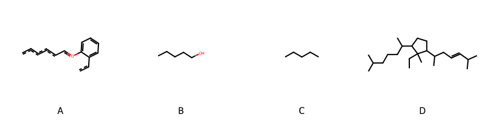

!!! abstract "Tóm tắt"

    **Họ Primulaceae** có **6** chi được các cộng đồng sử dụng trong chăm sóc sức khỏe gồm *Anagallis, Samolus, Cyclamen, Glaux, Primula, Lysimachia*. Số lượng thành phần hóa học đã phân lập và xác định cấu trúc từ họ này tính đến tháng 12 năm 2024 là **11** nhóm có thể liệt kê như sau *Steroids and steroid derivatives, Phenol esters, Organooxygen compounds, Flavonoids, Fatty Acyls, Cinnamic acids and derivatives, Phenols, Tannins, Benzene and substituted derivatives, Saturated hydrocarbons, Prenol lipids*. Giữa các loài trong họ này, 3 dược liệu được nghiên cứu nhiều nhất dựa trên số thành phần được phân lập là **Anagallis arvensis, Primula veris, Cyclamen persicum*. *Họ Primulaceae* đã được một số công động tại các quốc gia như Elsewhere, Turkey, Canada(Kwakiutl), US(Amerindian), Iraq, ain, Italian, US, China, UK, anish, English, German, India, Europe, Dutch đã phát hiện một số tác dụng trên lâm sàng gồm chữa bệnh lẫn độc tính như Alexiteric, giải độc, Thuốc lợi tiểu, Chất làm lạnh, Chất làm se, Chất làm se, dạ dày, Chất làm se, dễ bị tổn thương, Chất độc, Emmenagogue, Thuốc thanh lọc, Thuốc nhuận tràng, Gây dị ứng, Lo lắng, Thuốc an thần, Thuốc lợi tiểu, Thuốc long đờm, có mùi hôi, Thuốc diệt chó, Thuốc diệt cá, Chất độc, Thuốc diệt côn trùng, Thuốc diệt cá, Thuốc diệt nấm, Thuốc trừ sâu, Thuốc diệt tuyến trùng, Thuốc diệt cá, Chất độc, Thuốc giải độc, Thuốc kháng axit, Thuốc kháng axit, Thuốc long đờm, dễ bị tổn thương, Chất làm se, Thuốc kích thích tình dục, Thuốc nhuận tràng, Chất độc, Chất kích thích, Thuốc bổ, gây nôn, Thuốc long đờm, Thuốc long đờm, cầm máu, Thuốc lợi tiểu, Thuốc lợi tiểu, Thuốc long đờm, Lo lắng, Chất độc, có mùi hôi, buồn ngủ, Thuốc an thần, có mùi hôi, cầm máu, dễ bị tổn thương, gây nôn, thuốc tống hơi, Thuốc long đờm, Đổ mồ hôi, Thuốc lợi tiểu, Thuốc lợi tiểu, Thuốc diệt cá.

!!! info "DrDuke"

    James A. Duke sinh năm 1929-2017 là một nhà thực vật học người Mỹ. Đây là một trong những tác giả hàng đầu trong lĩnh vực dược dân tộc học với cuốn *CRC Handbook of Medicinal Herbs* và chính là người xây dựng lên cơ sở dữ liệu về hợp chất tự nhiên và dược dân tộc học tại Bộ nông nghiệp Hoa Kỳ. Các thông tin được đăng tải tại website [Dr. Duke's Phytochemical and Ethnobotanical Databases](https://phytochem.nal.usda.gov/). 
    Trong suốt thập niên 1970, ông lãnh đạo the Plant Taxonomy Laboratory, Plant Genetics and Germplasm Institute of the Agricultural Research Service, U.S. Department of Agriculture.
    Trong tài liệu này, các thông tin về dược dân tộc của các dược liệu được trích dẫn từ tài liệu của James A. Ducke với sự trợ giúp của phần mềm dịch thuật từ tiếng Anh sang tiếng Việt.
   
## Tổng quan về Họ Primulaceae
### Phân loại thực vật
Trong *họ Primulaceae* có **6** chi được sử dụng làm thuốc với chi tiết số loài trong mỗi chi như sau Lysimachia (6) . Chi tiết về loài sử dụng làm thuốc như dưới đây.  

>Họ Primulaceae


>|-- Chi Anagallis

>*Anagallis arvensis*,
>*Anagallis coerulea*,

>|-- Chi Samolus

>*Samolus valerandi*,

>|-- Chi Cyclamen

>*Cyclamen balearicum*,
>*Cyclamen europaeum*,
>*Cyclamen persicum*,

>|-- Chi Glaux

>*Glaux maritima*,

>|-- Chi Primula

>*Primula obconica*,
>*Primula officinalis*,
>*Primula reticulata*,
>*Primula sieboldii*,
>*Primula veris*,
>*Primula vulgaris*,

>|-- Chi Lysimachia

>*Lysimachia christinae*,
>*Lysimachia nemorum*,
>*Lysimachia nummularia*,
>*Lysimachia paridiformis*,
>*Lysimachia quadrifolia*,
>*Lysimachia vulgaris*,

### Thành phần hóa học 

Số lượng thành phần hóa học đã phân lập và xác định cấu trúc từ họ này tính đến tháng 12 năm 2024 là 11 nhóm có thể liệt kê như sau Steroids and steroid derivatives, Phenol esters, Organooxygen compounds, Flavonoids, Fatty Acyls, Cinnamic acids and derivatives, Phenols, Tannins, Benzene and substituted derivatives, Saturated hydrocarbons, Prenol lipids. Số lượng các loài đã được nghiên cứu thành phần hóa học là *12* trong tổng số *19* loài thuộc họ Primulaceae.Giữa các loài trong họ này, 3 dược liệu được nghiên cứu nhiều nhất dựa trên số thành phần được phân lập là **Anagallis arvensis, Primula veris, Cyclamen persicum**. Sử dụng phần mềm RDKIT với thuật toán  Find Maximum Common Substructure (FMCS), các nhóm hoạt chất phổ biến nhất trong *họ Primulaceae* đã xây dựng được nhân. Điều này trong tương lại có thể được sử dụng tìm kiếm mối liên hệ giữa tác dụng của cấu trúc hóa học và tác dụng dược lý. Các nhân trong phần này có thể không giống như cấu trúc gốc của từng nhóm chất. Kết quả được trình bầy như hình dưới đây.

<figure markdown="span">
    { width=100% }
    <figcaption> Cấu trúc hóa học của một số khung cơ bản dựa trên thuật toán FMCS để tìm Flavonoids (A), Organooxygen compounds (B), Prenol lipids (C), Steroids and steroid derivatives (D).</figcaption>
</figure>


!!! info  "Find Maximum Common Substructure"
    
    Thuật toán FMCS (Find Maximum Common Substructure) là một phương pháp được sử dụng để tìm ra cấu trúc chung nhiều nhất (MCS) trong một tập hợp các cấu trúc hóa học. Các bước của thuật toán gồm:
    - Chọn một cấu trúc hóa học là cấu trúc để tạo truy vấn, còn các cấu trúc khác là mục tiêu.
    - Chia nhỏ cấu trúc để tạo truy vấn thành cấu trúc nhỏ hơn dạng chuỗi SMARTS.
    - Kiểm tra chuỗi SMARTS trong các cấu trúc mục tiêu.
    - Tìm kiếm chuỗi SMARTS xuất hiện nhiều nhất.
    Để biết thêm chi tiết các bạn có thể xem tại [TeachOpenCADD](https://projects.volkamerlab.org/teachopencadd/talktorials/T006_compound_maximum_common_substructures.html)
    ``` python
    pip install rdkit
    def find_core_smiles(smiles_list):
        mols = [Chem.MolFromSmiles(smiles) for smiles in smiles_list]
        mcs = rdFMCS.FindMCS(mols)
        core_smiles = Chem.MolToSmiles(Chem.MolFromSmarts(mcs.smartsString))
        return core_smiles
    ```

### Dược dân tộc học

Họ **Primulaceae** đã được một số công động tại các quốc gia như *Elsewhere, Turkey, Canada(Kwakiutl), US(Amerindian), Iraq, ain, Italian, US, China, UK, anish, English, German, India, Europe, Dutch* đã phát hiện một số tác dụng trên lâm sàng gồm chữa bệnh lẫn độc tính như *Alexiteric, giải độc, Thuốc lợi tiểu, Chất làm lạnh, Chất làm se, Chất làm se, dạ dày, Chất làm se, dễ bị tổn thương, Chất độc, Emmenagogue, Thuốc thanh lọc, Thuốc nhuận tràng, Gây dị ứng, Lo lắng, Thuốc an thần, Thuốc lợi tiểu, Thuốc long đờm, có mùi hôi, Thuốc diệt chó, Thuốc diệt cá, Chất độc, Thuốc diệt côn trùng, Thuốc diệt cá, Thuốc diệt nấm, Thuốc trừ sâu, Thuốc diệt tuyến trùng, Thuốc diệt cá, Chất độc, Thuốc giải độc, Thuốc kháng axit, Thuốc kháng axit, Thuốc long đờm, dễ bị tổn thương, Chất làm se, Thuốc kích thích tình dục, Thuốc nhuận tràng, Chất độc, Chất kích thích, Thuốc bổ, gây nôn, Thuốc long đờm, Thuốc long đờm, cầm máu, Thuốc lợi tiểu, Thuốc lợi tiểu, Thuốc long đờm, Lo lắng, Chất độc, có mùi hôi, buồn ngủ, Thuốc an thần, có mùi hôi, cầm máu, dễ bị tổn thương, gây nôn, thuốc tống hơi, Thuốc long đờm, Đổ mồ hôi, Thuốc lợi tiểu, Thuốc lợi tiểu, Thuốc diệt cá*.

## Chi tiết dược dân tộc học


### Chi Anagallis

!!! note "Danh sách các loài thuộc chi"
    
*	 - *Anagallis arvensis*
	 - *Anagallis coerulea**

---      
#### *Anagallis arvensis*
**Thông tin về thực vật**

!!! info "Phân loại thực vật của *Lysimachia arvensis* từ GIBF:"
    - **Kingdom:** Plantae
    - **Phylum:** Tracheophyta
    - **Order:** Ericales
    - **Family:** Primulaceae
    - **Genus:** Lysimachia
    - **Species:** *Lysimachia arvensis*


 

Chưa có thông tin về loài này trên wikidata.

*Phân bố trên thế giới*: Germany, France, Switzerland, Albania, Netherlands, Spain, Portugal, United Kingdom of Great Britain and Northern Ireland, Jersey, Guernsey, United States of America, Croatia, Malta, Italy, Slovenia, New Zealand, Greece, Austria, Ireland, Cyprus

*Phân bố tại Việt Nam*: Không có ghi nhận ở Việt Nam

**Thành phần hóa học**
        

Theo cơ sở dữ liệu lotus, từ loài *Anagallis arvensis* đã phân lập và xác định được 79 hoạt chất thuộc về các nhóm Steroids and steroid derivatives, Organooxygen compounds, Fatty Acyls, Flavonoids, Saturated hydrocarbons, Prenol lipids. Danh sách các hoạt chất như sau 2-(3,5-dimethoxy-4-oxidophenyl)-5,7-dihydroxy-3-{[(3r,4s,5s,6r)-3,4,5-trihydroxy-6-(hydroxymethyl)oxan-2-yl]oxy}-1λ⁴-chromen-1-ylium [(LTS0272884)](https://lotus.naturalproducts.net/compound/lotus_id/LTS0272884), 6-{2,8-dihydroxy-3a,6,6,9b,11a-pentamethyl-7,10-dioxo-1h,2h,3h,3bh,4h,9ah,11h-cyclopenta[a]phenanthren-1-yl}-6-hydroxy-2-methyl-5-oxohept-3-en-2-yl acetate [(LTS0129712)](https://lotus.naturalproducts.net/compound/lotus_id/LTS0129712), glucose [(LTS0013597)](https://lotus.naturalproducts.net/compound/lotus_id/LTS0013597), pelargonidin [(LTS0269823)](https://lotus.naturalproducts.net/compound/lotus_id/LTS0269823), 5,7-dihydroxy-2-(4-hydroxy-3,5-dimethoxyphenyl)-3-[(3,4,5-trihydroxy-6-methyloxan-2-yl)oxy]-1λ⁴-chromen-1-ylium [(LTS0141351)](https://lotus.naturalproducts.net/compound/lotus_id/LTS0141351), lacceroic acid [(LTS0107569)](https://lotus.naturalproducts.net/compound/lotus_id/LTS0107569), linoleic [(LTS0013198)](https://lotus.naturalproducts.net/compound/lotus_id/LTS0013198), (3e,6r)-6-[(1r,2r,3as,3bs,8s,9ar,9br,11ar)-2-hydroxy-3a,6,6,9b,11a-pentamethyl-7,10-dioxo-8-{[(2s,3r,4s,5s,6r)-3,4,5-trihydroxy-6-(hydroxymethyl)oxan-2-yl]oxy}-1h,2h,3h,3bh,4h,8h,9h,9ah,11h-cyclopenta[a]phenanthren-1-yl]-6-hydroxy-2-methyl-5-oxohept-3-en-2-yl acetate [(LTS0082665)](https://lotus.naturalproducts.net/compound/lotus_id/LTS0082665), 2-[(6-{[6-({2,22-dihydroxy-4,5,9,9,13,20,20-heptamethyl-24-oxahexacyclo[15.5.2.0¹,¹⁸.0⁴,¹⁷.0⁵,¹⁴.0⁸,¹³]tetracosan-10-yl}oxy)-4,5-dihydroxyoxan-3-yl]oxy}-4-hydroxy-2-(hydroxymethyl)-5-[(3,4,5-trihydroxyoxan-2-yl)oxy]oxan-3-yl)oxy]-6-(hydroxymethyl)oxane-3,4,5-triol [(LTS0189880)](https://lotus.naturalproducts.net/compound/lotus_id/LTS0189880), (3s,4r,4ar,6ar,6bs,8r,8as,12as,14ar,14br)-4,8a-bis(hydroxymethyl)-4,6a,6b,11,11,14b-hexamethyl-1,2,3,4a,5,6,7,8,9,10,12,12a,14,14a-tetradecahydropicene-3,8-diol [(LTS0018338)](https://lotus.naturalproducts.net/compound/lotus_id/LTS0018338), 2-hydroxy-10-[(4-hydroxy-5-{[4-hydroxy-6-(hydroxymethyl)-5-{[3,4,5-trihydroxy-6-(hydroxymethyl)oxan-2-yl]oxy}-3-[(3,4,5-trihydroxyoxan-2-yl)oxy]oxan-2-yl]oxy}-3-{[3,4,5-trihydroxy-6-(hydroxymethyl)oxan-2-yl]oxy}oxan-2-yl)oxy]-4,5,9,9,13,20,20-heptamethyl-24-oxahexacyclo[15.5.2.0¹,¹⁸.0⁴,¹⁷.0⁵,¹⁴.0⁸,¹³]tetracosan-22-yl acetate [(LTS0184595)](https://lotus.naturalproducts.net/compound/lotus_id/LTS0184595), l-arabinopyranose [(LTS0043712)](https://lotus.naturalproducts.net/compound/lotus_id/LTS0043712), (1r,2r,4s,5r,8r,10s,13r,14r,17s,18r,22s)-10-{[(2s,3r,4s,5s)-5-{[(2s,3r,4s,5s,6r)-4,5-dihydroxy-6-(hydroxymethyl)-3-{[(2s,3r,4s,5r)-3,4,5-trihydroxyoxan-2-yl]oxy}oxan-2-yl]oxy}-4-hydroxy-3-{[(2s,3r,4s,5s,6r)-3,4,5-trihydroxy-6-(hydroxymethyl)oxan-2-yl]oxy}oxan-2-yl]oxy}-2-hydroxy-4,5,9,9,13,20,20-heptamethyl-24-oxahexacyclo[15.5.2.0¹,¹⁸.0⁴,¹⁷.0⁵,¹⁴.0⁸,¹³]tetracosan-22-yl acetate [(LTS0139935)](https://lotus.naturalproducts.net/compound/lotus_id/LTS0139935), 2-[(5-{[4,5-dihydroxy-6-(hydroxymethyl)-3-[(3,4,5-trihydroxyoxan-2-yl)oxy]oxan-2-yl]oxy}-4-hydroxy-2-{[2-hydroxy-9-(hydroxymethyl)-4,5,9,13,20,20-hexamethyl-24-oxahexacyclo[15.5.2.0¹,¹⁸.0⁴,¹⁷.0⁵,¹⁴.0⁸,¹³]tetracosan-10-yl]oxy}oxan-3-yl)oxy]-6-(hydroxymethyl)oxane-3,4,5-triol [(LTS0036419)](https://lotus.naturalproducts.net/compound/lotus_id/LTS0036419), (2s,3r,4s,5s,6r)-2-{[(2r,3s,4s,5r,6r)-6-{[(3s,4r,5r,6s)-6-{[(1s,2r,4s,5r,8r,10s,13r,14r,17s,18s,22s)-2,22-dihydroxy-4,5,9,9,13,20,20-heptamethyl-24-oxahexacyclo[15.5.2.0¹,¹⁸.0⁴,¹⁷.0⁵,¹⁴.0⁸,¹³]tetracosan-10-yl]oxy}-4,5-dihydroxyoxan-3-yl]oxy}-4-hydroxy-2-(hydroxymethyl)-5-{[(2s,3r,4s,5r)-3,4,5-trihydroxyoxan-2-yl]oxy}oxan-3-yl]oxy}-6-(hydroxymethyl)oxane-3,4,5-triol [(LTS0244766)](https://lotus.naturalproducts.net/compound/lotus_id/LTS0244766), 10-{[5-({3-[(3,4-dihydroxy-5-{[3,4,5-trihydroxy-6-(hydroxymethyl)oxan-2-yl]oxy}oxan-2-yl)oxy]-4,5-dihydroxy-6-(hydroxymethyl)oxan-2-yl}oxy)-4-hydroxy-3-{[3,4,5-trihydroxy-6-(hydroxymethyl)oxan-2-yl]oxy}oxan-2-yl]oxy}-2-hydroxy-9-(hydroxymethyl)-4,5,9,13,20,20-hexamethyl-24-oxahexacyclo[15.5.2.0¹,¹⁸.0⁴,¹⁷.0⁵,¹⁴.0⁸,¹³]tetracosan-22-yl acetate [(LTS0128703)](https://lotus.naturalproducts.net/compound/lotus_id/LTS0128703), (1r,2r,3as,3bs,8r,9ar,9br,11ar)-1-[(2s,4e)-2,6-dihydroxy-6-methyl-3-oxohept-4-en-2-yl]-2,8-dihydroxy-3a,6,6,9b,11a-pentamethyl-1h,2h,3h,3bh,4h,8h,9h,9ah,11h-cyclopenta[a]phenanthrene-7,10-dione [(LTS0270136)](https://lotus.naturalproducts.net/compound/lotus_id/LTS0270136), (1r,2r,4s,5r,8r,10s,13r,14r,17s,18r,22s,23s)-10-{[(2s,3r,4s,5s)-5-{[(2s,3r,4s,5s,6r)-4,5-dihydroxy-6-(hydroxymethyl)-3-{[(2s,3r,4s,5r)-3,4,5-trihydroxyoxan-2-yl]oxy}oxan-2-yl]oxy}-4-hydroxy-3-{[(2s,3r,4s,5s,6r)-3,4,5-trihydroxy-6-(hydroxymethyl)oxan-2-yl]oxy}oxan-2-yl]oxy}-2,23-dihydroxy-4,5,9,9,13,20,20-heptamethyl-24-oxahexacyclo[15.5.2.0¹,¹⁸.0⁴,¹⁷.0⁵,¹⁴.0⁸,¹³]tetracosan-22-yl acetate [(LTS0051449)](https://lotus.naturalproducts.net/compound/lotus_id/LTS0051449), (3e,6r)-6-[(1r,2r,3as,3bs,8s,9ar,9br,11ar)-2-hydroxy-3a,6,6,9b,11a-pentamethyl-7,10-dioxo-8-{[(2r,3r,4r,5r,6r)-3,4,5-trihydroxy-6-(hydroxymethyl)oxan-2-yl]oxy}-1h,2h,3h,3bh,4h,8h,9h,9ah,11h-cyclopenta[a]phenanthren-1-yl]-6-hydroxy-2-methyl-5-oxohept-3-en-2-yl acetate [(LTS0162702)](https://lotus.naturalproducts.net/compound/lotus_id/LTS0162702), (1s,2r,4s,5r,8r,10s,13r,14r,17s,18r,22s,23s)-4,5,9,9,13,20,20-heptamethyl-24-oxahexacyclo[15.5.2.0¹,¹⁸.0⁴,¹⁷.0⁵,¹⁴.0⁸,¹³]tetracosane-2,10,22,23-tetrol [(LTS0242797)](https://lotus.naturalproducts.net/compound/lotus_id/LTS0242797), (2s,3r,4s,5s,6r)-2-{[(2r,3s,4s,5r,6r)-6-{[(3s,4s,5r,6s)-6-{[(1s,2r,4s,5r,8r,10s,13r,14r,17s,18r,22s,23s)-2,22-dihydroxy-23-methoxy-4,5,9,9,13,20,20-heptamethyl-24-oxahexacyclo[15.5.2.0¹,¹⁸.0⁴,¹⁷.0⁵,¹⁴.0⁸,¹³]tetracosan-10-yl]oxy}-4-hydroxy-5-{[(2s,3r,4s,5s,6r)-3,4,5-trihydroxy-6-(hydroxymethyl)oxan-2-yl]oxy}oxan-3-yl]oxy}-4-hydroxy-2-(hydroxymethyl)-5-{[(2s,3r,4s,5r)-3,4,5-trihydroxyoxan-2-yl]oxy}oxan-3-yl]oxy}-6-(hydroxymethyl)oxane-3,4,5-triol [(LTS0126989)](https://lotus.naturalproducts.net/compound/lotus_id/LTS0126989), (3e,6s)-6-[(1r,2r,3as,3bs,9as,9br,11ar)-2,8-dihydroxy-3a,6,6,9b,11a-pentamethyl-7,10-dioxo-1h,2h,3h,3bh,4h,9ah,11h-cyclopenta[a]phenanthren-1-yl]-6-hydroxy-2-methyl-5-oxohept-3-en-2-yl acetate [(LTS0049209)](https://lotus.naturalproducts.net/compound/lotus_id/LTS0049209), α linolenic acid [(LTS0132789)](https://lotus.naturalproducts.net/compound/lotus_id/LTS0132789), 4,8a-bis(hydroxymethyl)-4,6a,6b,11,11,14b-hexamethyl-1,2,3,4a,5,6,7,8,9,10,12,12a,14,14a-tetradecahydropicene-3,8-diol [(LTS0021351)](https://lotus.naturalproducts.net/compound/lotus_id/LTS0021351), (1r,2r,4s,5r,8r,9r,10s,13r,14r,17s,18s,22s)-2-hydroxy-10-{[(2s,3r,4s,5s)-4-hydroxy-5-{[(2r,3r,4s,5s,6r)-4-hydroxy-6-(hydroxymethyl)-5-{[(2s,3r,4s,5s,6r)-3,4,5-trihydroxy-6-(hydroxymethyl)oxan-2-yl]oxy}-3-{[(2s,3r,4s,5r)-3,4,5-trihydroxyoxan-2-yl]oxy}oxan-2-yl]oxy}-3-{[(2s,3r,4s,5s,6r)-3,4,5-trihydroxy-6-(hydroxymethyl)oxan-2-yl]oxy}oxan-2-yl]oxy}-9-(hydroxymethyl)-4,5,9,13,20,20-hexamethyl-24-oxahexacyclo[15.5.2.0¹,¹⁸.0⁴,¹⁷.0⁵,¹⁴.0⁸,¹³]tetracosan-22-yl acetate [(LTS0173277)](https://lotus.naturalproducts.net/compound/lotus_id/LTS0173277), 1-(2,6-dihydroxy-6-methyl-3-oxoheptan-2-yl)-2,8-dihydroxy-3a,6,6,9b,11a-pentamethyl-1h,2h,3h,3bh,4h,9ah,11h-cyclopenta[a]phenanthrene-7,10-dione [(LTS0059837)](https://lotus.naturalproducts.net/compound/lotus_id/LTS0059837), 2-(3,4-dihydroxyphenyl)-5,7-dihydroxy-3-{[(2s,3r,4r,5r,6s)-3,4,5-trihydroxy-6-(hydroxymethyl)oxan-2-yl]oxy}chromen-4-one [(LTS0241372)](https://lotus.naturalproducts.net/compound/lotus_id/LTS0241372), (1r,2r,4s,5r,8r,10s,13r,14r,17s,18r,22s,23s)-2,23-dihydroxy-10-{[(2s,3r,4s,5s)-4-hydroxy-5-{[(2r,3r,4s,5s,6r)-4-hydroxy-6-(hydroxymethyl)-5-{[(2s,3r,4s,5s,6r)-3,4,5-trihydroxy-6-(hydroxymethyl)oxan-2-yl]oxy}-3-{[(2s,3r,4s,5r)-3,4,5-trihydroxyoxan-2-yl]oxy}oxan-2-yl]oxy}-3-{[(2s,3r,4s,5s,6r)-3,4,5-trihydroxy-6-(hydroxymethyl)oxan-2-yl]oxy}oxan-2-yl]oxy}-4,5,9,9,13,20,20-heptamethyl-24-oxahexacyclo[15.5.2.0¹,¹⁸.0⁴,¹⁷.0⁵,¹⁴.0⁸,¹³]tetracosan-22-yl acetate [(LTS0080594)](https://lotus.naturalproducts.net/compound/lotus_id/LTS0080594), 10-[(5-{[4,5-dihydroxy-6-(hydroxymethyl)-3-[(3,4,5-trihydroxyoxan-2-yl)oxy]oxan-2-yl]oxy}-4-hydroxy-3-{[3,4,5-trihydroxy-6-(hydroxymethyl)oxan-2-yl]oxy}oxan-2-yl)oxy]-2,23-dihydroxy-9-(hydroxymethyl)-4,5,9,13,20,20-hexamethyl-24-oxahexacyclo[15.5.2.0¹,¹⁸.0⁴,¹⁷.0⁵,¹⁴.0⁸,¹³]tetracosan-22-yl acetate [(LTS0223500)](https://lotus.naturalproducts.net/compound/lotus_id/LTS0223500), 6-hydroxy-6-(2-hydroxy-3a,6,6,9b,11a-pentamethyl-7,10-dioxo-8-{[3,4,5-trihydroxy-6-(hydroxymethyl)oxan-2-yl]oxy}-1h,2h,3h,3bh,4h,8h,9h,9ah,11h-cyclopenta[a]phenanthren-1-yl)-2-methyl-5-oxoheptan-2-yl acetate [(LTS0124470)](https://lotus.naturalproducts.net/compound/lotus_id/LTS0124470), 10-[(5-{[4,5-dihydroxy-6-(hydroxymethyl)-3-[(3,4,5-trihydroxyoxan-2-yl)oxy]oxan-2-yl]oxy}-4-hydroxy-3-{[3,4,5-trihydroxy-6-(hydroxymethyl)oxan-2-yl]oxy}oxan-2-yl)oxy]-2,23-dihydroxy-4,5,9,9,13,20,20-heptamethyl-24-oxahexacyclo[15.5.2.0¹,¹⁸.0⁴,¹⁷.0⁵,¹⁴.0⁸,¹³]tetracosan-22-yl acetate [(LTS0013053)](https://lotus.naturalproducts.net/compound/lotus_id/LTS0013053), 2-({2-[(4,5-dihydroxy-2-{[2-hydroxy-9-(hydroxymethyl)-4,5,9,13,20,20-hexamethyl-24-oxahexacyclo[15.5.2.0¹,¹⁸.0⁴,¹⁷.0⁵,¹⁴.0⁸,¹³]tetracosan-10-yl]oxy}oxan-3-yl)oxy]-3-hydroxy-6-(hydroxymethyl)-5-[(3,4,5-trihydroxyoxan-2-yl)oxy]oxan-4-yl}oxy)-6-(hydroxymethyl)oxane-3,4,5-triol [(LTS0062621)](https://lotus.naturalproducts.net/compound/lotus_id/LTS0062621), (1s,2r,4s,5r,8r,9r,10s,13r,14r,17s,18r,22s,23r)-9-(hydroxymethyl)-4,5,9,13,20,20-hexamethyl-24-oxahexacyclo[15.5.2.0¹,¹⁸.0⁴,¹⁷.0⁵,¹⁴.0⁸,¹³]tetracosane-2,10,22,23-tetrol [(LTS0009253)](https://lotus.naturalproducts.net/compound/lotus_id/LTS0009253), (4s,4as,5r,6as,6br,8ar,10s,12ar,12br,14bs)-10-{[(2s,3r,4s,5s)-5-{[(2s,3r,4s,5s,6r)-4,5-dihydroxy-6-(hydroxymethyl)-3-{[(2s,3r,4s,5r)-3,4,5-trihydroxyoxan-2-yl]oxy}oxan-2-yl]oxy}-4-hydroxy-3-{[(2s,3r,4s,5s,6r)-3,4,5-trihydroxy-6-(hydroxymethyl)oxan-2-yl]oxy}oxan-2-yl]oxy}-4-hydroxy-4a-(hydroxymethyl)-2,2,6a,6b,9,9,12a-heptamethyl-1,3,4,5,6,7,8,8a,10,11,12,12b,13,14b-tetradecahydropicen-5-yl acetate [(LTS0274770)](https://lotus.naturalproducts.net/compound/lotus_id/LTS0274770), (1r,2r,4s,5r,8r,10s,13r,14r,17s,18r,22s)-2-hydroxy-10-{[(2s,3r,4s,5s)-4-hydroxy-5-{[(2r,3r,4s,5s,6r)-4-hydroxy-6-(hydroxymethyl)-5-{[(2s,3r,4s,5s,6r)-3,4,5-trihydroxy-6-(hydroxymethyl)oxan-2-yl]oxy}-3-{[(2s,3r,4s,5r)-3,4,5-trihydroxyoxan-2-yl]oxy}oxan-2-yl]oxy}-3-{[(2s,3r,4s,5s,6r)-3,4,5-trihydroxy-6-(hydroxymethyl)oxan-2-yl]oxy}oxan-2-yl]oxy}-4,5,9,9,13,20,20-heptamethyl-24-oxahexacyclo[15.5.2.0¹,¹⁸.0⁴,¹⁷.0⁵,¹⁴.0⁸,¹³]tetracosan-22-yl acetate [(LTS0157745)](https://lotus.naturalproducts.net/compound/lotus_id/LTS0157745), hexacosane [(LTS0079361)](https://lotus.naturalproducts.net/compound/lotus_id/LTS0079361), 2-({4-hydroxy-6-[(4-hydroxy-6-{[2-hydroxy-9-(hydroxymethyl)-4,5,9,13,20,20-hexamethyl-24-oxahexacyclo[15.5.2.0¹,¹⁸.0⁴,¹⁷.0⁵,¹⁴.0⁸,¹³]tetracosan-10-yl]oxy}-5-{[3,4,5-trihydroxy-6-(hydroxymethyl)oxan-2-yl]oxy}oxan-3-yl)oxy]-2-(hydroxymethyl)-5-[(3,4,5-trihydroxyoxan-2-yl)oxy]oxan-3-yl}oxy)-6-(hydroxymethyl)oxane-3,4,5-triol [(LTS0225636)](https://lotus.naturalproducts.net/compound/lotus_id/LTS0225636), (2s,3r,4s,5r)-2-{[(2s,3r,4s,5s,6r)-2-{[(3s,4r,5r,6s)-6-{[(1s,2r,4s,5r,8r,10s,13r,14r,17s,18r,22s)-2,22-dihydroxy-4,5,9,9,13,20,20-heptamethyl-24-oxahexacyclo[15.5.2.0¹,¹⁸.0⁴,¹⁷.0⁵,¹⁴.0⁸,¹³]tetracosan-10-yl]oxy}-4,5-dihydroxyoxan-3-yl]oxy}-4,5-dihydroxy-6-(hydroxymethyl)oxan-3-yl]oxy}oxane-3,4,5-triol [(LTS0258625)](https://lotus.naturalproducts.net/compound/lotus_id/LTS0258625), (1r,2r,3as,3bs,8r,9ar,9br,11ar)-1-[(2s)-2,6-dihydroxy-6-methyl-3-oxoheptan-2-yl]-2,8-dihydroxy-3a,6,6,9b,11a-pentamethyl-1h,2h,3h,3bh,4h,8h,9h,9ah,11h-cyclopenta[a]phenanthrene-7,10-dione [(LTS0061190)](https://lotus.naturalproducts.net/compound/lotus_id/LTS0061190), 10-[(5-{[4,5-dihydroxy-6-(hydroxymethyl)-3-[(3,4,5-trihydroxyoxan-2-yl)oxy]oxan-2-yl]oxy}-4-hydroxy-3-{[3,4,5-trihydroxy-6-(hydroxymethyl)oxan-2-yl]oxy}oxan-2-yl)oxy]-2-hydroxy-9-(hydroxymethyl)-4,5,9,13,20,20-hexamethyl-24-oxahexacyclo[15.5.2.0¹,¹⁸.0⁴,¹⁷.0⁵,¹⁴.0⁸,¹³]tetracosan-22-yl acetate [(LTS0273373)](https://lotus.naturalproducts.net/compound/lotus_id/LTS0273373), 2,23-dihydroxy-10-[(4-hydroxy-5-{[4-hydroxy-6-(hydroxymethyl)-5-{[3,4,5-trihydroxy-6-(hydroxymethyl)oxan-2-yl]oxy}-3-[(3,4,5-trihydroxyoxan-2-yl)oxy]oxan-2-yl]oxy}-3-{[3,4,5-trihydroxy-6-(hydroxymethyl)oxan-2-yl]oxy}oxan-2-yl)oxy]-4,5,9,9,13,20,20-heptamethyl-24-oxahexacyclo[15.5.2.0¹,¹⁸.0⁴,¹⁷.0⁵,¹⁴.0⁸,¹³]tetracosan-22-yl acetate [(LTS0062931)](https://lotus.naturalproducts.net/compound/lotus_id/LTS0062931), stigmast-5-en-3-ol, (3β)- [(LTS0204616)](https://lotus.naturalproducts.net/compound/lotus_id/LTS0204616), 6-hydroxy-6-(2-hydroxy-3a,6,6,9b,11a-pentamethyl-7,10-dioxo-8-{[3,4,5-trihydroxy-6-(hydroxymethyl)oxan-2-yl]oxy}-1h,2h,3h,3bh,4h,8h,9h,9ah,11h-cyclopenta[a]phenanthren-1-yl)-2-methyl-5-oxohept-3-en-2-yl acetate [(LTS0260530)](https://lotus.naturalproducts.net/compound/lotus_id/LTS0260530), 10-[(5-{[4,5-dihydroxy-6-(hydroxymethyl)-3-[(3,4,5-trihydroxyoxan-2-yl)oxy]oxan-2-yl]oxy}-4-hydroxy-3-{[3,4,5-trihydroxy-6-(hydroxymethyl)oxan-2-yl]oxy}oxan-2-yl)oxy]-4-hydroxy-4a-(hydroxymethyl)-2,2,6a,6b,9,9,12a-heptamethyl-1,3,4,5,6,7,8,8a,10,11,12,12b,13,14b-tetradecahydropicen-5-yl acetate [(LTS0013590)](https://lotus.naturalproducts.net/compound/lotus_id/LTS0013590), quercimeritrin [(LTS0043461)](https://lotus.naturalproducts.net/compound/lotus_id/LTS0043461), 9-(hydroxymethyl)-4,5,9,13,20,20-hexamethyl-24-oxahexacyclo[15.5.2.0¹,¹⁸.0⁴,¹⁷.0⁵,¹⁴.0⁸,¹³]tetracosane-2,10,22,23-tetrol [(LTS0110139)](https://lotus.naturalproducts.net/compound/lotus_id/LTS0110139), (1s,2r,4s,5r,8r,9r,10s,13r,14r,17s,18r,22s)-9-(hydroxymethyl)-4,5,9,13,20,20-hexamethyl-24-oxahexacyclo[15.5.2.0¹,¹⁸.0⁴,¹⁷.0⁵,¹⁴.0⁸,¹³]tetracosane-2,10,22-triol [(LTS0164465)](https://lotus.naturalproducts.net/compound/lotus_id/LTS0164465), 10-[(5-{[4,5-dihydroxy-6-(hydroxymethyl)-3-[(3,4,5-trihydroxyoxan-2-yl)oxy]oxan-2-yl]oxy}-4-hydroxy-3-{[3,4,5-trihydroxy-6-(hydroxymethyl)oxan-2-yl]oxy}oxan-2-yl)oxy]-2-hydroxy-4,5,9,9,13,20,20-heptamethyl-24-oxahexacyclo[15.5.2.0¹,¹⁸.0⁴,¹⁷.0⁵,¹⁴.0⁸,¹³]tetracosan-22-yl acetate [(LTS0140608)](https://lotus.naturalproducts.net/compound/lotus_id/LTS0140608), 3-rutinosyl quercetin [(LTS0032845)](https://lotus.naturalproducts.net/compound/lotus_id/LTS0032845), (3e,6s)-6-[(1r,2r,3as,3bs,8r,9ar,9br,11ar)-2,8-dihydroxy-3a,6,6,9b,11a-pentamethyl-7,10-dioxo-1h,2h,3h,3bh,4h,8h,9h,9ah,11h-cyclopenta[a]phenanthren-1-yl]-6-hydroxy-2-methyl-5-oxohept-3-en-2-yl acetate [(LTS0097049)](https://lotus.naturalproducts.net/compound/lotus_id/LTS0097049), 6-{2,8-dihydroxy-3a,6,6,9b,11a-pentamethyl-7,10-dioxo-1h,2h,3h,3bh,4h,8h,9h,9ah,11h-cyclopenta[a]phenanthren-1-yl}-6-hydroxy-2-methyl-5-oxohept-3-en-2-yl acetate [(LTS0086953)](https://lotus.naturalproducts.net/compound/lotus_id/LTS0086953), (4s,4as,5r,6as,6br,8ar,10s,12ar,12br,14bs)-10-{[(2s,3r,4r,5s)-5-{[(2s,3r,4s,5s,6r)-4,5-dihydroxy-6-(hydroxymethyl)-3-{[(2s,3r,4s,5r)-3,4,5-trihydroxyoxan-2-yl]oxy}oxan-2-yl]oxy}-3,4-dihydroxyoxan-2-yl]oxy}-4-hydroxy-4a-(hydroxymethyl)-2,2,6a,6b,9,9,12a-heptamethyl-1,3,4,5,6,7,8,8a,10,11,12,12b,13,14b-tetradecahydropicen-5-yl acetate [(LTS0018575)](https://lotus.naturalproducts.net/compound/lotus_id/LTS0018575), 10-[(5-{[4,5-dihydroxy-6-(hydroxymethyl)-3-[(3,4,5-trihydroxyoxan-2-yl)oxy]oxan-2-yl]oxy}-3,4-dihydroxyoxan-2-yl)oxy]-4-hydroxy-4a-(hydroxymethyl)-2,2,6a,6b,9,9,12a-heptamethyl-1,3,4,5,6,7,8,8a,10,11,12,12b,13,14b-tetradecahydropicen-5-yl acetate [(LTS0108101)](https://lotus.naturalproducts.net/compound/lotus_id/LTS0108101), d-xylose [(LTS0132381)](https://lotus.naturalproducts.net/compound/lotus_id/LTS0132381), (3e,6r)-6-[(1r,2r,3as,3bs,5as,9as,9bs,11ar)-2,8-dihydroxy-3a,6,6,9b,11a-pentamethyl-7,10-dioxo-1h,2h,3h,3bh,5ah,9ah,11h-cyclopenta[a]phenanthren-1-yl]-6-hydroxy-2-methyl-5-oxohept-3-en-2-yl acetate [(LTS0213312)](https://lotus.naturalproducts.net/compound/lotus_id/LTS0213312), 2-[(6-{[6-({2,22-dihydroxy-23-methoxy-4,5,9,9,13,20,20-heptamethyl-24-oxahexacyclo[15.5.2.0¹,¹⁸.0⁴,¹⁷.0⁵,¹⁴.0⁸,¹³]tetracosan-10-yl}oxy)-4-hydroxy-5-{[3,4,5-trihydroxy-6-(hydroxymethyl)oxan-2-yl]oxy}oxan-3-yl]oxy}-4-hydroxy-2-(hydroxymethyl)-5-[(3,4,5-trihydroxyoxan-2-yl)oxy]oxan-3-yl)oxy]-6-(hydroxymethyl)oxane-3,4,5-triol [(LTS0252723)](https://lotus.naturalproducts.net/compound/lotus_id/LTS0252723), 4,5,9,9,13,20,20-heptamethyl-24-oxahexacyclo[15.5.2.0¹,¹⁸.0⁴,¹⁷.0⁵,¹⁴.0⁸,¹³]tetracosane-2,10,22,23-tetrol [(LTS0208732)](https://lotus.naturalproducts.net/compound/lotus_id/LTS0208732), (2s,3r,4s,5s,6r)-2-{[(2r,3s,4s,5r,6r)-4-hydroxy-6-{[(3s,4s,5r,6s)-4-hydroxy-6-{[(1s,2r,4s,5r,8r,9r,10s,13r,14r,17s,18r)-2-hydroxy-9-(hydroxymethyl)-4,5,9,13,20,20-hexamethyl-24-oxahexacyclo[15.5.2.0¹,¹⁸.0⁴,¹⁷.0⁵,¹⁴.0⁸,¹³]tetracosan-10-yl]oxy}-5-{[(2s,3r,4s,5s,6r)-3,4,5-trihydroxy-6-(hydroxymethyl)oxan-2-yl]oxy}oxan-3-yl]oxy}-2-(hydroxymethyl)-5-{[(2s,3r,4s,5r)-3,4,5-trihydroxyoxan-2-yl]oxy}oxan-3-yl]oxy}-6-(hydroxymethyl)oxane-3,4,5-triol [(LTS0077143)](https://lotus.naturalproducts.net/compound/lotus_id/LTS0077143), (2s,3r,4s,5s,6r)-2-{[(2s,3r,4s,5s)-5-{[(2s,3r,4s,5s,6r)-4,5-dihydroxy-6-(hydroxymethyl)-3-{[(2s,3r,4s,5r)-3,4,5-trihydroxyoxan-2-yl]oxy}oxan-2-yl]oxy}-4-hydroxy-2-{[(1s,2r,4s,5r,8r,9r,10s,13r,14r,17s,18r)-2-hydroxy-9-(hydroxymethyl)-4,5,9,13,20,20-hexamethyl-24-oxahexacyclo[15.5.2.0¹,¹⁸.0⁴,¹⁷.0⁵,¹⁴.0⁸,¹³]tetracosan-10-yl]oxy}oxan-3-yl]oxy}-6-(hydroxymethyl)oxane-3,4,5-triol [(LTS0014616)](https://lotus.naturalproducts.net/compound/lotus_id/LTS0014616), 6-{2,8-dihydroxy-3a,6,6,9b,11a-pentamethyl-7,10-dioxo-1h,2h,3h,3bh,5ah,9ah,11h-cyclopenta[a]phenanthren-1-yl}-6-hydroxy-2-methyl-5-oxohept-3-en-2-yl acetate [(LTS0232260)](https://lotus.naturalproducts.net/compound/lotus_id/LTS0232260), 2-hydroxy-10-[(4-hydroxy-5-{[4-hydroxy-6-(hydroxymethyl)-5-{[3,4,5-trihydroxy-6-(hydroxymethyl)oxan-2-yl]oxy}-3-[(3,4,5-trihydroxyoxan-2-yl)oxy]oxan-2-yl]oxy}-3-{[3,4,5-trihydroxy-6-(hydroxymethyl)oxan-2-yl]oxy}oxan-2-yl)oxy]-9-(hydroxymethyl)-4,5,9,13,20,20-hexamethyl-24-oxahexacyclo[15.5.2.0¹,¹⁸.0⁴,¹⁷.0⁵,¹⁴.0⁸,¹³]tetracosan-22-yl acetate [(LTS0234067)](https://lotus.naturalproducts.net/compound/lotus_id/LTS0234067), 10-[(4-hydroxy-5-{[4-hydroxy-6-(hydroxymethyl)-5-{[3,4,5-trihydroxy-6-(hydroxymethyl)oxan-2-yl]oxy}-3-[(3,4,5-trihydroxyoxan-2-yl)oxy]oxan-2-yl]oxy}-3-{[3,4,5-trihydroxy-6-(hydroxymethyl)oxan-2-yl]oxy}oxan-2-yl)oxy]-4,5,9,9,13,20,20-heptamethyl-24-oxahexacyclo[15.5.2.0¹,¹⁸.0⁴,¹⁷.0⁵,¹⁴.0⁸,¹³]tetracosane-2,22,23-triol [(LTS0131015)](https://lotus.naturalproducts.net/compound/lotus_id/LTS0131015), malvidin-3-glucoside [(LTS0140239)](https://lotus.naturalproducts.net/compound/lotus_id/LTS0140239), (2s,3r,4s,5s,6r)-2-{[(2s,3r,4r,5r,6r)-2-{[(2s,3r,4s,5r)-4,5-dihydroxy-2-{[(1s,2r,4s,5r,8r,9r,10s,13r,14r,17s,18r)-2-hydroxy-9-(hydroxymethyl)-4,5,9,13,20,20-hexamethyl-24-oxahexacyclo[15.5.2.0¹,¹⁸.0⁴,¹⁷.0⁵,¹⁴.0⁸,¹³]tetracosan-10-yl]oxy}oxan-3-yl]oxy}-3-hydroxy-6-(hydroxymethyl)-5-{[(2s,3s,4r,5r)-3,4,5-trihydroxyoxan-2-yl]oxy}oxan-4-yl]oxy}-6-(hydroxymethyl)oxane-3,4,5-triol [(LTS0086331)](https://lotus.naturalproducts.net/compound/lotus_id/LTS0086331), (1r,2r,3as,3bs,9as,9br,11ar)-1-[(2s)-2,6-dihydroxy-6-methyl-3-oxoheptan-2-yl]-2,8-dihydroxy-3a,6,6,9b,11a-pentamethyl-1h,2h,3h,3bh,4h,9ah,11h-cyclopenta[a]phenanthrene-7,10-dione [(LTS0248125)](https://lotus.naturalproducts.net/compound/lotus_id/LTS0248125), miquelianin [(LTS0045574)](https://lotus.naturalproducts.net/compound/lotus_id/LTS0045574), (1r,2r,4s,5r,8r,9r,10s,13r,14r,17s,18s,22s)-10-{[(2s,3r,4s,5s)-5-{[(2s,3r,4s,5s,6r)-4,5-dihydroxy-6-(hydroxymethyl)-3-{[(2s,3r,4s,5r)-3,4,5-trihydroxyoxan-2-yl]oxy}oxan-2-yl]oxy}-4-hydroxy-3-{[(2s,3r,4s,5s,6r)-3,4,5-trihydroxy-6-(hydroxymethyl)oxan-2-yl]oxy}oxan-2-yl]oxy}-2-hydroxy-9-(hydroxymethyl)-4,5,9,13,20,20-hexamethyl-24-oxahexacyclo[15.5.2.0¹,¹⁸.0⁴,¹⁷.0⁵,¹⁴.0⁸,¹³]tetracosan-22-yl acetate [(LTS0141134)](https://lotus.naturalproducts.net/compound/lotus_id/LTS0141134), β-amyrin [(LTS0251864)](https://lotus.naturalproducts.net/compound/lotus_id/LTS0251864), (1r,2r,4s,5r,8r,10s,13r,14r,17s,18r,22s)-10-{[(2s,3r,4r,5s)-3,4-dihydroxy-5-{[(2r,3r,4s,5s,6r)-4-hydroxy-6-(hydroxymethyl)-5-{[(2s,3r,4s,5s,6r)-3,4,5-trihydroxy-6-(hydroxymethyl)oxan-2-yl]oxy}-3-{[(2s,3r,4s,5r)-3,4,5-trihydroxyoxan-2-yl]oxy}oxan-2-yl]oxy}oxan-2-yl]oxy}-2-hydroxy-4,5,9,9,13,20,20-heptamethyl-24-oxahexacyclo[15.5.2.0¹,¹⁸.0⁴,¹⁷.0⁵,¹⁴.0⁸,¹³]tetracosan-22-yl acetate [(LTS0087469)](https://lotus.naturalproducts.net/compound/lotus_id/LTS0087469), 9-(hydroxymethyl)-4,5,9,13,20,20-hexamethyl-24-oxahexacyclo[15.5.2.0¹,¹⁸.0⁴,¹⁷.0⁵,¹⁴.0⁸,¹³]tetracosane-2,10,22-triol [(LTS0268199)](https://lotus.naturalproducts.net/compound/lotus_id/LTS0268199), α-linolenic acid [(LTS0275508)](https://lotus.naturalproducts.net/compound/lotus_id/LTS0275508), 1-(2,6-dihydroxy-6-methyl-3-oxoheptan-2-yl)-2,8-dihydroxy-3a,6,6,9b,11a-pentamethyl-1h,2h,3h,3bh,4h,8h,9h,9ah,11h-cyclopenta[a]phenanthrene-7,10-dione [(LTS0184921)](https://lotus.naturalproducts.net/compound/lotus_id/LTS0184921), 5,7-dihydroxy-2-(4-hydroxyphenyl)-1λ⁴-chromen-1-ylium-3-olate [(LTS0218726)](https://lotus.naturalproducts.net/compound/lotus_id/LTS0218726), kaempferol 7-o-glucoside [(LTS0025882)](https://lotus.naturalproducts.net/compound/lotus_id/LTS0025882), (1r,2r,4s,5r,8r,9r,10s,13r,14r,17s,18r,22s,23s)-10-{[(2s,3r,4s,5s)-5-{[(2s,3r,4s,5s,6r)-4,5-dihydroxy-6-(hydroxymethyl)-3-{[(2s,3r,4s,5r)-3,4,5-trihydroxyoxan-2-yl]oxy}oxan-2-yl]oxy}-4-hydroxy-3-{[(2s,3r,4s,5s,6r)-3,4,5-trihydroxy-6-(hydroxymethyl)oxan-2-yl]oxy}oxan-2-yl]oxy}-2,23-dihydroxy-9-(hydroxymethyl)-4,5,9,13,20,20-hexamethyl-24-oxahexacyclo[15.5.2.0¹,¹⁸.0⁴,¹⁷.0⁵,¹⁴.0⁸,¹³]tetracosan-22-yl acetate [(LTS0034496)](https://lotus.naturalproducts.net/compound/lotus_id/LTS0034496), (1s,2r,4s,5r,8r,10s,13r,14r,17s,18r,22s,23s)-10-{[(2s,3r,4s,5s)-4-hydroxy-5-{[(2r,3r,4s,5s,6r)-4-hydroxy-6-(hydroxymethyl)-5-{[(2s,3r,4s,5s,6r)-3,4,5-trihydroxy-6-(hydroxymethyl)oxan-2-yl]oxy}-3-{[(2s,3r,4s,5r)-3,4,5-trihydroxyoxan-2-yl]oxy}oxan-2-yl]oxy}-3-{[(2s,3r,4s,5s,6r)-3,4,5-trihydroxy-6-(hydroxymethyl)oxan-2-yl]oxy}oxan-2-yl]oxy}-4,5,9,9,13,20,20-heptamethyl-24-oxahexacyclo[15.5.2.0¹,¹⁸.0⁴,¹⁷.0⁵,¹⁴.0⁸,¹³]tetracosane-2,22,23-triol [(LTS0013992)](https://lotus.naturalproducts.net/compound/lotus_id/LTS0013992), 1-(2,6-dihydroxy-6-methyl-3-oxohept-4-en-2-yl)-2,8-dihydroxy-3a,6,6,9b,11a-pentamethyl-1h,2h,3h,3bh,4h,8h,9h,9ah,11h-cyclopenta[a]phenanthrene-7,10-dione [(LTS0030421)](https://lotus.naturalproducts.net/compound/lotus_id/LTS0030421), (6r)-6-[(1r,2r,3as,3bs,8s,9ar,9br,11ar)-2-hydroxy-3a,6,6,9b,11a-pentamethyl-7,10-dioxo-8-{[(2r,3r,4r,5r,6r)-3,4,5-trihydroxy-6-(hydroxymethyl)oxan-2-yl]oxy}-1h,2h,3h,3bh,4h,8h,9h,9ah,11h-cyclopenta[a]phenanthren-1-yl]-6-hydroxy-2-methyl-5-oxoheptan-2-yl acetate [(LTS0173285)](https://lotus.naturalproducts.net/compound/lotus_id/LTS0173285), 10-[(3,4-dihydroxy-5-{[4-hydroxy-6-(hydroxymethyl)-5-{[3,4,5-trihydroxy-6-(hydroxymethyl)oxan-2-yl]oxy}-3-[(3,4,5-trihydroxyoxan-2-yl)oxy]oxan-2-yl]oxy}oxan-2-yl)oxy]-2-hydroxy-4,5,9,9,13,20,20-heptamethyl-24-oxahexacyclo[15.5.2.0¹,¹⁸.0⁴,¹⁷.0⁵,¹⁴.0⁸,¹³]tetracosan-22-yl acetate [(LTS0196970)](https://lotus.naturalproducts.net/compound/lotus_id/LTS0196970).

| chemicalTaxonomyClassyfireClass   |   lotus_count |
|:----------------------------------|--------------:|
| Fatty Acyls                       |             4 |
| Flavonoids                        |            10 |
| Organooxygen compounds            |             3 |
| Prenol lipids                     |            43 |
| Saturated hydrocarbons            |             1 |
| Steroids and steroid derivatives  |            18 |


**Dược dân tộc học**

Danh sách các quốc gia có sử dụng *Lysimachia arvensis* trong điều trị các bệnh. 

| Quốc gia   | Bệnh                                                                           |
|:-----------|:-------------------------------------------------------------------------------|
| Elsewhere  | Đổ mồ hôi, Thuốc lợi tiểu, Thuốc lợi tiểu, Thuốc diệt cá                       |
| India      | Thuốc diệt nấm, Thuốc trừ sâu, Thuốc diệt tuyến trùng, Thuốc diệt cá, Chất độc |
| Iraq       | Thuốc diệt chó, Thuốc diệt cá, Chất độc, Thuốc diệt côn trùng                  |
| Turkey     | Thuốc lợi tiểu, Thuốc long đờm, Lo lắng, Chất độc, có mùi hôi                  |
| UK         | Thuốc giải độc                                                                 |
| US         | Chất độc                                                                       |
| ain        | Thuốc long đờm                                                                 |


---      
#### *Anagallis arvensis*
**Thông tin về thực vật**

!!! info "Phân loại thực vật của *Lysimachia arvensis* từ GIBF:"
    - **Kingdom:** Plantae
    - **Phylum:** Tracheophyta
    - **Order:** Ericales
    - **Family:** Primulaceae
    - **Genus:** Lysimachia
    - **Species:** *Lysimachia arvensis*


 

Chưa có thông tin về loài này trên wikidata.

*Phân bố trên thế giới*: Germany, France, Switzerland, Albania, Netherlands, Spain, Portugal, United Kingdom of Great Britain and Northern Ireland, Jersey, Guernsey, United States of America, Croatia, Malta, Italy, Slovenia, New Zealand, Greece, Austria, Ireland, Cyprus

*Phân bố tại Việt Nam*: Không có ghi nhận ở Việt Nam

**Thành phần hóa học**
        

Chưa có nghiên cứu về thành phần hóa học của loài này


**Dược dân tộc học**

Danh sách các quốc gia có sử dụng *Lysimachia arvensis* trong điều trị các bệnh. 

| Quốc gia   | Bệnh           |
|:-----------|:---------------|
| Turkey     | Thuốc lợi tiểu |


### Chi Samolus

!!! note "Danh sách các loài thuộc chi"
    
*	 - *Samolus valerandi**

---      
#### *Anagallis arvensis*
**Thông tin về thực vật**

!!! info "Phân loại thực vật của *Lysimachia arvensis* từ GIBF:"
    - **Kingdom:** Plantae
    - **Phylum:** Tracheophyta
    - **Order:** Ericales
    - **Family:** Primulaceae
    - **Genus:** Lysimachia
    - **Species:** *Lysimachia arvensis*


 

Chưa có thông tin về loài này trên wikidata.

*Phân bố trên thế giới*: Germany, France, Switzerland, Albania, Netherlands, Spain, Portugal, United Kingdom of Great Britain and Northern Ireland, Jersey, Guernsey, United States of America, Croatia, Malta, Italy, Slovenia, New Zealand, Greece, Austria, Ireland, Cyprus

*Phân bố tại Việt Nam*: Không có ghi nhận ở Việt Nam

**Thành phần hóa học**
        

Chưa có nghiên cứu về thành phần hóa học của loài này


**Dược dân tộc học**

Danh sách các quốc gia có sử dụng *Lysimachia arvensis* trong điều trị các bệnh. 

| Quốc gia   | Bệnh             |
|:-----------|:-----------------|
| ain        | dễ bị tổn thương |


### Chi Cyclamen

!!! note "Danh sách các loài thuộc chi"
    
*	 - *Cyclamen balearicum*
	 - *Cyclamen europaeum*
	 - *Cyclamen persicum**

---      
#### *Cyclamen balearicum*
**Thông tin về thực vật**

!!! info "Phân loại thực vật của *Cyclamen balearicum* từ GIBF:"
    - **Kingdom:** Plantae
    - **Phylum:** Tracheophyta
    - **Order:** Ericales
    - **Family:** Primulaceae
    - **Genus:** Cyclamen
    - **Species:** *Cyclamen balearicum*


 

Chưa có thông tin về loài này trên wikidata.

*Phân bố trên thế giới*: France, nan, Spain

*Phân bố tại Việt Nam*: Không có ghi nhận ở Việt Nam

**Thành phần hóa học**
        

Theo cơ sở dữ liệu lotus, từ loài *Cyclamen balearicum* đã phân lập và xác định được 15 hoạt chất thuộc về các nhóm Prenol lipids. Danh sách các hoạt chất như sau cyclamin [(LTS0194481)](https://lotus.naturalproducts.net/compound/lotus_id/LTS0194481), (1s,2r,4s,5r,8r,10s,13r,14r,17s,18r,20s)-10-{[(2s,3r,4s,5s)-5-{[(2s,3r,4s,5s,6r)-4,5-dihydroxy-6-({[(2r,3r,4s,5s,6r)-3,4,5-trihydroxy-6-(hydroxymethyl)oxan-2-yl]oxy}methyl)-3-{[(2s,3r,4s,5s)-3,4,5-trihydroxyoxan-2-yl]oxy}oxan-2-yl]oxy}-4-hydroxy-3-{[(2s,3r,4s,5s,6r)-3,4,5-trihydroxy-6-(hydroxymethyl)oxan-2-yl]oxy}oxan-2-yl]oxy}-2-hydroxy-4,5,9,9,13,20-hexamethyl-24-oxahexacyclo[15.5.2.0¹,¹⁸.0⁴,¹⁷.0⁵,¹⁴.0⁸,¹³]tetracosane-20-carbaldehyde [(LTS0272542)](https://lotus.naturalproducts.net/compound/lotus_id/LTS0272542), (2r,4s,5r,10s,13r,14r,18r,20r)-2,10-dihydroxy-4,5,9,9,13,20-hexamethyl-24-oxahexacyclo[15.5.2.0¹,¹⁸.0⁴,¹⁷.0⁵,¹⁴.0⁸,¹³]tetracosane-20-carbaldehyde [(LTS0048953)](https://lotus.naturalproducts.net/compound/lotus_id/LTS0048953), (1s,2r,4s,5r,8r,10s,13r,14r,17s,18r,20s)-10-{[(2r,3r,4s,5s)-5-{[(2s,3r,4s,5s,6r)-4,5-dihydroxy-6-({[(2r,3r,4s,5s,6r)-3,4,5-trihydroxy-6-(hydroxymethyl)oxan-2-yl]oxy}methyl)-3-{[(2s,3r,4s,5r)-3,4,5-trihydroxyoxan-2-yl]oxy}oxan-2-yl]oxy}-4-hydroxy-3-{[(2s,3r,4s,5s,6r)-3,4,5-trihydroxy-6-(hydroxymethyl)oxan-2-yl]oxy}oxan-2-yl]oxy}-2-hydroxy-4,5,9,9,13,20-hexamethyl-24-oxahexacyclo[15.5.2.0¹,¹⁸.0⁴,¹⁷.0⁵,¹⁴.0⁸,¹³]tetracosane-20-carbaldehyde [(LTS0246813)](https://lotus.naturalproducts.net/compound/lotus_id/LTS0246813), (1s,2r,4s,5r,8r,10s,13r,14r,17s,18r,20s)-10-{[(2s,3r,4s,5s)-5-{[(2s,3r,4s,5s,6r)-4,5-dihydroxy-6-(hydroxymethyl)-3-{[(2s,3r,4s,5s)-3,4,5-trihydroxyoxan-2-yl]oxy}oxan-2-yl]oxy}-4-hydroxy-3-{[(2s,3r,4s,5s,6r)-3,4,5-trihydroxy-6-(hydroxymethyl)oxan-2-yl]oxy}oxan-2-yl]oxy}-2-hydroxy-4,5,9,9,13,20-hexamethyl-24-oxahexacyclo[15.5.2.0¹,¹⁸.0⁴,¹⁷.0⁵,¹⁴.0⁸,¹³]tetracosane-20-carbaldehyde [(LTS0100351)](https://lotus.naturalproducts.net/compound/lotus_id/LTS0100351), (1s,2r,4s,5r,8r,10s,13r,14r,17s,18r,20s)-10-{[(2r,3r,4s,5s)-5-{[(2s,3r,4s,5s,6r)-4,5-dihydroxy-6-(hydroxymethyl)-3-{[(2s,3r,4s,5r)-3,4,5-trihydroxyoxan-2-yl]oxy}oxan-2-yl]oxy}-4-hydroxy-3-{[(2s,3r,4s,5s,6r)-3,4,5-trihydroxy-6-(hydroxymethyl)oxan-2-yl]oxy}oxan-2-yl]oxy}-2-hydroxy-4,5,9,9,13,20-hexamethyl-24-oxahexacyclo[15.5.2.0¹,¹⁸.0⁴,¹⁷.0⁵,¹⁴.0⁸,¹³]tetracosane-20-carbaldehyde [(LTS0168992)](https://lotus.naturalproducts.net/compound/lotus_id/LTS0168992), 4,5,9,9,13,20-hexamethyl-22-oxahexacyclo[18.3.2.0¹,¹⁸.0⁴,¹⁷.0⁵,¹⁴.0⁸,¹³]pentacos-16-ene-2,10,21-triol [(LTS0047540)](https://lotus.naturalproducts.net/compound/lotus_id/LTS0047540), primulagenin a [(LTS0109361)](https://lotus.naturalproducts.net/compound/lotus_id/LTS0109361), (2s,4as,5r,6as,6br,8ar,10s,12ar,12br,14bs)-5,10-dihydroxy-4a-(hydroxymethyl)-2,6a,6b,9,9,12a-hexamethyl-1,3,4,5,6,7,8,8a,10,11,12,12b,13,14b-tetradecahydropicene-2-carbaldehyde [(LTS0218938)](https://lotus.naturalproducts.net/compound/lotus_id/LTS0218938), (3s,8as,12as)-8a-(hydroxymethyl)-4,4,6a,6b,11,11,14b-heptamethyl-1,2,3,4a,5,6,7,8,9,10,12,12a,14,14a-tetradecahydropicene-3,8-diol [(LTS0244878)](https://lotus.naturalproducts.net/compound/lotus_id/LTS0244878), 10-[(5-{[4,5-dihydroxy-6-({[3,4,5-trihydroxy-6-(hydroxymethyl)oxan-2-yl]oxy}methyl)-3-[(3,4,5-trihydroxyoxan-2-yl)oxy]oxan-2-yl]oxy}-4-hydroxy-3-{[3,4,5-trihydroxy-6-(hydroxymethyl)oxan-2-yl]oxy}oxan-2-yl)oxy]-2-hydroxy-4,5,9,9,13,20-hexamethyl-24-oxahexacyclo[15.5.2.0¹,¹⁸.0⁴,¹⁷.0⁵,¹⁴.0⁸,¹³]tetracosane-20-carbaldehyde [(LTS0087019)](https://lotus.naturalproducts.net/compound/lotus_id/LTS0087019), (1s,2r,4s,5r,8r,10s,13r,14r,17s,18r,20s)-2-hydroxy-10-{[(2r,3r,4s,5s)-4-hydroxy-5-{[(2s,3r,4s,5r,6r)-5-hydroxy-6-(hydroxymethyl)-4-{[(2s,3r,4s,5s,6r)-3,4,5-trihydroxy-6-(hydroxymethyl)oxan-2-yl]oxy}-3-{[(2s,3r,4s,5r)-3,4,5-trihydroxyoxan-2-yl]oxy}oxan-2-yl]oxy}-3-{[(2s,3r,4s,5s,6r)-3,4,5-trihydroxy-6-(hydroxymethyl)oxan-2-yl]oxy}oxan-2-yl]oxy}-4,5,9,9,13,20-hexamethyl-24-oxahexacyclo[15.5.2.0¹,¹⁸.0⁴,¹⁷.0⁵,¹⁴.0⁸,¹³]tetracosane-20-carbaldehyde [(LTS0238566)](https://lotus.naturalproducts.net/compound/lotus_id/LTS0238566), (1s,2r,4s,5r,8r,10s,13r,14r,17s,18r,20s)-2,10-dihydroxy-4,5,9,9,13,20-hexamethyl-24-oxahexacyclo[15.5.2.0¹,¹⁸.0⁴,¹⁷.0⁵,¹⁴.0⁸,¹³]tetracosane-20-carbaldehyde [(LTS0128319)](https://lotus.naturalproducts.net/compound/lotus_id/LTS0128319), 10-[(5-{[4,5-dihydroxy-6-(hydroxymethyl)-3-[(3,4,5-trihydroxyoxan-2-yl)oxy]oxan-2-yl]oxy}-4-hydroxy-3-{[3,4,5-trihydroxy-6-(hydroxymethyl)oxan-2-yl]oxy}oxan-2-yl)oxy]-2-hydroxy-4,5,9,9,13,20-hexamethyl-24-oxahexacyclo[15.5.2.0¹,¹⁸.0⁴,¹⁷.0⁵,¹⁴.0⁸,¹³]tetracosane-20-carbaldehyde [(LTS0028095)](https://lotus.naturalproducts.net/compound/lotus_id/LTS0028095), 2-hydroxy-10-[(4-hydroxy-5-{[5-hydroxy-6-(hydroxymethyl)-4-{[3,4,5-trihydroxy-6-(hydroxymethyl)oxan-2-yl]oxy}-3-[(3,4,5-trihydroxyoxan-2-yl)oxy]oxan-2-yl]oxy}-3-{[3,4,5-trihydroxy-6-(hydroxymethyl)oxan-2-yl]oxy}oxan-2-yl)oxy]-4,5,9,9,13,20-hexamethyl-24-oxahexacyclo[15.5.2.0¹,¹⁸.0⁴,¹⁷.0⁵,¹⁴.0⁸,¹³]tetracosane-20-carbaldehyde [(LTS0031652)](https://lotus.naturalproducts.net/compound/lotus_id/LTS0031652).

| chemicalTaxonomyClassyfireClass   |   lotus_count |
|:----------------------------------|--------------:|
| Prenol lipids                     |            15 |


**Dược dân tộc học**

Danh sách các quốc gia có sử dụng *Cyclamen balearicum* trong điều trị các bệnh. 

| Quốc gia   | Bệnh    |
|:-----------|:--------|
| ain        | gây nôn |


---      
#### *Cyclamen europaeum*
**Thông tin về thực vật**

!!! info "Phân loại thực vật của *Cyclamen europaeum* từ GIBF:"
    - **Kingdom:** Plantae
    - **Phylum:** Tracheophyta
    - **Order:** Ericales
    - **Family:** Primulaceae
    - **Genus:** Cyclamen
    - **Species:** *Cyclamen europaeum*


 

Chưa có thông tin về loài này trên wikidata.

*Phân bố trên thế giới*: France, nan, Germany, Spain, United States of America, Egypt, Switzerland, Italy, Hungary, Austria

*Phân bố tại Việt Nam*: Không có ghi nhận ở Việt Nam

**Thành phần hóa học**
        

Theo cơ sở dữ liệu lotus, từ loài *Cyclamen europaeum* đã phân lập và xác định được 2 hoạt chất thuộc về các nhóm Prenol lipids. Danh sách các hoạt chất như sau cyclamin [(LTS0194481)](https://lotus.naturalproducts.net/compound/lotus_id/LTS0194481), (1s,2r,4s,5r,8r,10s,13r,14r,17s,18r,20s)-10-{[(2s,3r,4s,5s)-5-{[(2s,3r,4s,5s,6r)-4,5-dihydroxy-6-({[(2r,3r,4s,5s,6r)-3,4,5-trihydroxy-6-(hydroxymethyl)oxan-2-yl]oxy}methyl)-3-{[(2s,3r,4s,5s)-3,4,5-trihydroxyoxan-2-yl]oxy}oxan-2-yl]oxy}-4-hydroxy-3-{[(2s,3r,4s,5s,6r)-3,4,5-trihydroxy-6-(hydroxymethyl)oxan-2-yl]oxy}oxan-2-yl]oxy}-2-hydroxy-4,5,9,9,13,20-hexamethyl-24-oxahexacyclo[15.5.2.0¹,¹⁸.0⁴,¹⁷.0⁵,¹⁴.0⁸,¹³]tetracosane-20-carbaldehyde [(LTS0272542)](https://lotus.naturalproducts.net/compound/lotus_id/LTS0272542).

| chemicalTaxonomyClassyfireClass   |   lotus_count |
|:----------------------------------|--------------:|
| Prenol lipids                     |             2 |


**Dược dân tộc học**

Danh sách các quốc gia có sử dụng *Cyclamen europaeum* trong điều trị các bệnh. 

| Quốc gia   | Bệnh                                                                                       |
|:-----------|:-------------------------------------------------------------------------------------------|
| Elsewhere  | Emmenagogue, Thuốc thanh lọc, Thuốc nhuận tràng                                            |
| Turkey     | Thuốc kích thích tình dục, Thuốc nhuận tràng, Chất độc, Chất kích thích, Thuốc bổ, gây nôn |


---      
#### *Cyclamen persicum*
**Thông tin về thực vật**

!!! info "Phân loại thực vật của *Cyclamen persicum* từ GIBF:"
    - **Kingdom:** Plantae
    - **Phylum:** Tracheophyta
    - **Order:** Ericales
    - **Family:** Primulaceae
    - **Genus:** Cyclamen
    - **Species:** *Cyclamen persicum*


 

Chưa có thông tin về loài này trên wikidata.

*Phân bố trên thế giới*: nan, Syrian Arab Republic, Israel, United States of America, Jordan, Palestine, State of, Lebanon, Germany, France, Spain, Italy, United Kingdom of Great Britain and Northern Ireland, New Zealand, Greece, Netherlands, Cyprus

*Phân bố tại Việt Nam*: Không có ghi nhận ở Việt Nam

**Thành phần hóa học**
        

Theo cơ sở dữ liệu lotus, từ loài *Cyclamen persicum* đã phân lập và xác định được 39 hoạt chất thuộc về các nhóm Flavonoids, Tannins, Prenol lipids. Danh sách các hoạt chất như sau (2r,4s,5r,10s,13r,14r,18r,20r)-2,10-dihydroxy-4,5,9,9,13,20-hexamethyl-24-oxahexacyclo[15.5.2.0¹,¹⁸.0⁴,¹⁷.0⁵,¹⁴.0⁸,¹³]tetracosane-20-carbaldehyde [(LTS0048953)](https://lotus.naturalproducts.net/compound/lotus_id/LTS0048953), 3,4,5-trihydroxy-6-[(3,4,5-trihydroxybenzoyloxy)methyl]oxan-2-yl 3,4-dihydroxy-5-({3,4,5-trihydroxy-6-[(3,4,5-trihydroxybenzoyloxy)methyl]oxan-2-yl}oxy)benzoate [(LTS0106531)](https://lotus.naturalproducts.net/compound/lotus_id/LTS0106531), (1s,2r,4s,5r,8r,10s,13r,14r,17s,18r,20s)-10-{[(2s,3r,4s,5s)-5-{[(2s,3r,4s,5s,6r)-4,5-dihydroxy-6-(hydroxymethyl)-3-{[(2s,3r,4s,5s)-3,4,5-trihydroxyoxan-2-yl]oxy}oxan-2-yl]oxy}-4-hydroxy-3-{[(2s,3r,4s,5s,6r)-3,4,5-trihydroxy-6-(hydroxymethyl)oxan-2-yl]oxy}oxan-2-yl]oxy}-2-hydroxy-4,5,9,9,13,20-hexamethyl-24-oxahexacyclo[15.5.2.0¹,¹⁸.0⁴,¹⁷.0⁵,¹⁴.0⁸,¹³]tetracosane-20-carbaldehyde [(LTS0100351)](https://lotus.naturalproducts.net/compound/lotus_id/LTS0100351), kaempherol [(LTS0155822)](https://lotus.naturalproducts.net/compound/lotus_id/LTS0155822), (2r,3s,4r,5r,6s)-3,4,5-trihydroxy-6-[(3,4,5-trihydroxybenzoyloxy)methyl]oxan-2-yl 3,4-dihydroxy-5-{[(2s,3r,4s,5s,6r)-3,4,5-trihydroxy-6-[(3,4,5-trihydroxybenzoyloxy)methyl]oxan-2-yl]oxy}benzoate [(LTS0195446)](https://lotus.naturalproducts.net/compound/lotus_id/LTS0195446), (1s,2r,4s,5r,8r,10s,13r,14r,17s,18r,20s)-2,10-dihydroxy-4,5,9,9,13,20-hexamethyl-24-oxahexacyclo[15.5.2.0¹,¹⁸.0⁴,¹⁷.0⁵,¹⁴.0⁸,¹³]tetracosane-20-carbaldehyde [(LTS0128319)](https://lotus.naturalproducts.net/compound/lotus_id/LTS0128319), 10-[(5-{[4,5-dihydroxy-6-(hydroxymethyl)-3-[(3,4,5-trihydroxyoxan-2-yl)oxy]oxan-2-yl]oxy}-4-hydroxy-3-{[3,4,5-trihydroxy-6-(hydroxymethyl)oxan-2-yl]oxy}oxan-2-yl)oxy]-2-hydroxy-4,5,9,9,13,20-hexamethyl-24-oxahexacyclo[15.5.2.0¹,¹⁸.0⁴,¹⁷.0⁵,¹⁴.0⁸,¹³]tetracosane-20-carbaldehyde [(LTS0028095)](https://lotus.naturalproducts.net/compound/lotus_id/LTS0028095), 2-hydroxy-10-[(4-hydroxy-5-{[5-hydroxy-6-(hydroxymethyl)-4-{[3,4,5-trihydroxy-6-(hydroxymethyl)oxan-2-yl]oxy}-3-[(3,4,5-trihydroxyoxan-2-yl)oxy]oxan-2-yl]oxy}-3-{[3,4,5-trihydroxy-6-(hydroxymethyl)oxan-2-yl]oxy}oxan-2-yl)oxy]-4,5,9,9,13,20-hexamethyl-24-oxahexacyclo[15.5.2.0¹,¹⁸.0⁴,¹⁷.0⁵,¹⁴.0⁸,¹³]tetracosane-20-carbaldehyde [(LTS0031652)](https://lotus.naturalproducts.net/compound/lotus_id/LTS0031652), cyclamin [(LTS0194481)](https://lotus.naturalproducts.net/compound/lotus_id/LTS0194481), cyanin [(LTS0264308)](https://lotus.naturalproducts.net/compound/lotus_id/LTS0264308), 2-(3,4-dihydroxyphenyl)-7-hydroxy-3-{[(2s,3r,4r,5s,6s)-3,4,5-trihydroxy-6-(hydroxymethyl)oxan-2-yl]oxy}-5-{[(2s,3r,4s,5s,6s)-3,4,5-trihydroxy-6-(hydroxymethyl)oxan-2-yl]oxy}-1λ⁴-chromen-1-ylium [(LTS0184296)](https://lotus.naturalproducts.net/compound/lotus_id/LTS0184296), chrysanthemin [(LTS0221391)](https://lotus.naturalproducts.net/compound/lotus_id/LTS0221391), trifolin [(LTS0267055)](https://lotus.naturalproducts.net/compound/lotus_id/LTS0267055), 3-rutinosyl quercetin [(LTS0032845)](https://lotus.naturalproducts.net/compound/lotus_id/LTS0032845), (2s,4as,5r,6as,6br,8ar,10s,12ar,12br,14bs)-5,10-dihydroxy-4a-(hydroxymethyl)-2,6a,6b,9,9,12a-hexamethyl-1,3,4,5,6,7,8,8a,10,11,12,12b,13,14b-tetradecahydropicene-2-carbaldehyde [(LTS0218938)](https://lotus.naturalproducts.net/compound/lotus_id/LTS0218938), (3s,8as,12as)-8a-(hydroxymethyl)-4,4,6a,6b,11,11,14b-heptamethyl-1,2,3,4a,5,6,7,8,9,10,12,12a,14,14a-tetradecahydropicene-3,8-diol [(LTS0244878)](https://lotus.naturalproducts.net/compound/lotus_id/LTS0244878), (1s,2r,4s,5r,8r,10s,13r,14r,17s,18r,20s)-2-hydroxy-10-{[(2r,3r,4s,5s)-4-hydroxy-5-{[(2s,3r,4s,5r,6r)-5-hydroxy-6-(hydroxymethyl)-4-{[(2s,3r,4s,5s,6r)-3,4,5-trihydroxy-6-(hydroxymethyl)oxan-2-yl]oxy}-3-{[(2s,3r,4s,5r)-3,4,5-trihydroxyoxan-2-yl]oxy}oxan-2-yl]oxy}-3-{[(2s,3r,4s,5s,6r)-3,4,5-trihydroxy-6-(hydroxymethyl)oxan-2-yl]oxy}oxan-2-yl]oxy}-4,5,9,9,13,20-hexamethyl-24-oxahexacyclo[15.5.2.0¹,¹⁸.0⁴,¹⁷.0⁵,¹⁴.0⁸,¹³]tetracosane-20-carbaldehyde [(LTS0238566)](https://lotus.naturalproducts.net/compound/lotus_id/LTS0238566), 3-({4,5-dihydroxy-3-[(3,4,5-trihydroxy-6-methyloxan-2-yl)oxy]-6-{[(3,4,5-trihydroxy-6-methyloxan-2-yl)oxy]methyl}oxan-2-yl}oxy)-2-(3,4-dihydroxyphenyl)-5,7-dihydroxychromen-4-one [(LTS0021411)](https://lotus.naturalproducts.net/compound/lotus_id/LTS0021411), (1s,2r,4s,5r,8r,10s,13r,14r,17s,18r,20s)-10-{[(2s,3r,4s,5s)-5-{[(2s,3r,4s,5s,6r)-4,5-dihydroxy-6-({[(2r,3r,4s,5s,6r)-3,4,5-trihydroxy-6-(hydroxymethyl)oxan-2-yl]oxy}methyl)-3-{[(2s,3r,4s,5s)-3,4,5-trihydroxyoxan-2-yl]oxy}oxan-2-yl]oxy}-4-hydroxy-3-{[(2s,3r,4s,5s,6r)-3,4,5-trihydroxy-6-(hydroxymethyl)oxan-2-yl]oxy}oxan-2-yl]oxy}-2-hydroxy-4,5,9,9,13,20-hexamethyl-24-oxahexacyclo[15.5.2.0¹,¹⁸.0⁴,¹⁷.0⁵,¹⁴.0⁸,¹³]tetracosane-20-carbaldehyde [(LTS0272542)](https://lotus.naturalproducts.net/compound/lotus_id/LTS0272542), (1s,2r,4s,5r,8r,10s,13r,14r,17s,18r,20s)-10-{[(2r,3r,4s,5s)-5-{[(2s,3r,4s,5s,6r)-4,5-dihydroxy-6-({[(2r,3r,4s,5s,6r)-3,4,5-trihydroxy-6-(hydroxymethyl)oxan-2-yl]oxy}methyl)-3-{[(2s,3r,4s,5r)-3,4,5-trihydroxyoxan-2-yl]oxy}oxan-2-yl]oxy}-4-hydroxy-3-{[(2s,3r,4s,5s,6r)-3,4,5-trihydroxy-6-(hydroxymethyl)oxan-2-yl]oxy}oxan-2-yl]oxy}-2-hydroxy-4,5,9,9,13,20-hexamethyl-24-oxahexacyclo[15.5.2.0¹,¹⁸.0⁴,¹⁷.0⁵,¹⁴.0⁸,¹³]tetracosane-20-carbaldehyde [(LTS0246813)](https://lotus.naturalproducts.net/compound/lotus_id/LTS0246813), 5,7-dihydroxy-2-(4-hydroxy-3-oxidophenyl)-3-{[(2s,3r,4s,5s,6r)-3,4,5-trihydroxy-6-(hydroxymethyl)oxan-2-yl]oxy}-1λ⁴-chromen-1-ylium [(LTS0083222)](https://lotus.naturalproducts.net/compound/lotus_id/LTS0083222), oenin [(LTS0257288)](https://lotus.naturalproducts.net/compound/lotus_id/LTS0257288), astragalin [(LTS0249588)](https://lotus.naturalproducts.net/compound/lotus_id/LTS0249588), (1s,2r,4s,5r,8r,10s,13r,14r,17s,18r,20s)-10-{[(2r,3r,4s,5s)-5-{[(2s,3r,4s,5s,6r)-4,5-dihydroxy-6-(hydroxymethyl)-3-{[(2s,3r,4s,5r)-3,4,5-trihydroxyoxan-2-yl]oxy}oxan-2-yl]oxy}-4-hydroxy-3-{[(2s,3r,4s,5s,6r)-3,4,5-trihydroxy-6-(hydroxymethyl)oxan-2-yl]oxy}oxan-2-yl]oxy}-2-hydroxy-4,5,9,9,13,20-hexamethyl-24-oxahexacyclo[15.5.2.0¹,¹⁸.0⁴,¹⁷.0⁵,¹⁴.0⁸,¹³]tetracosane-20-carbaldehyde [(LTS0168992)](https://lotus.naturalproducts.net/compound/lotus_id/LTS0168992), 4,5,9,9,13,20-hexamethyl-22-oxahexacyclo[18.3.2.0¹,¹⁸.0⁴,¹⁷.0⁵,¹⁴.0⁸,¹³]pentacos-16-ene-2,10,21-triol [(LTS0047540)](https://lotus.naturalproducts.net/compound/lotus_id/LTS0047540), lycopene [(LTS0116567)](https://lotus.naturalproducts.net/compound/lotus_id/LTS0116567), 2-(3,4-dihydroxyphenyl)-7-hydroxy-5-{[(2s,3r,4s,5s,6r)-3,4,5-trihydroxy-6-(hydroxymethyl)oxan-2-yl]oxy}-3-{[(2s,3r,5s,6r)-3,4,5-trihydroxy-6-(hydroxymethyl)oxan-2-yl]oxy}-1λ⁴-chromen-1-ylium [(LTS0009799)](https://lotus.naturalproducts.net/compound/lotus_id/LTS0009799), 2,6,10,14,19,23,27,31-octamethyldotriaconta-2,6,8,10,12,14,16,18,20,22,24,26,30-tridecaene [(LTS0219851)](https://lotus.naturalproducts.net/compound/lotus_id/LTS0219851), 10-[(5-{[4,5-dihydroxy-6-({[3,4,5-trihydroxy-6-(hydroxymethyl)oxan-2-yl]oxy}methyl)-3-[(3,4,5-trihydroxyoxan-2-yl)oxy]oxan-2-yl]oxy}-4-hydroxy-3-{[3,4,5-trihydroxy-6-(hydroxymethyl)oxan-2-yl]oxy}oxan-2-yl)oxy]-2-hydroxy-4,5,9,9,13,20-hexamethyl-24-oxahexacyclo[15.5.2.0¹,¹⁸.0⁴,¹⁷.0⁵,¹⁴.0⁸,¹³]tetracosane-20-carbaldehyde [(LTS0087019)](https://lotus.naturalproducts.net/compound/lotus_id/LTS0087019), isoquercetin [(LTS0254337)](https://lotus.naturalproducts.net/compound/lotus_id/LTS0254337), phlorizin chalcone [(LTS0160338)](https://lotus.naturalproducts.net/compound/lotus_id/LTS0160338), 2-(3,4-dihydroxy-5-methoxyphenyl)-7-hydroxy-3,5-bis({[(2s,3r,4s,5s,6r)-3,4,5-trihydroxy-6-(hydroxymethyl)oxan-2-yl]oxy})-1λ⁴-chromen-1-ylium [(LTS0188405)](https://lotus.naturalproducts.net/compound/lotus_id/LTS0188405), [(2r,3s,4s,5r,6s)-6-{[2-(3,4-dihydroxyphenyl)-5,7-dihydroxy-4-oxochromen-3-yl]oxy}-3,4,5-trihydroxyoxan-2-yl]methyl acetate [(LTS0147422)](https://lotus.naturalproducts.net/compound/lotus_id/LTS0147422), cyanin betaine [(LTS0259506)](https://lotus.naturalproducts.net/compound/lotus_id/LTS0259506), primulagenin a [(LTS0109361)](https://lotus.naturalproducts.net/compound/lotus_id/LTS0109361), 7-hydroxy-2-(4-hydroxy-3,5-dimethoxyphenyl)-3-{[(2s,3r,4s,5s,6r)-3,4,5-trihydroxy-6-(hydroxymethyl)oxan-2-yl]oxy}-5-{[(2s,3r,4s,5s,6s)-3,4,5-trihydroxy-6-(hydroxymethyl)oxan-2-yl]oxy}-1λ⁴-chromen-1-ylium [(LTS0163982)](https://lotus.naturalproducts.net/compound/lotus_id/LTS0163982), 2-(3,4-dihydroxyphenyl)-5,7-dihydroxy-3-{[3,4,5-trihydroxy-6-(hydroxymethyl)oxan-2-yl]oxy}chromen-4-one [(LTS0195312)](https://lotus.naturalproducts.net/compound/lotus_id/LTS0195312), 3-{[(2s,3r,4s,5s,6r)-4,5-dihydroxy-3-{[(2s,3r,4r,5r,6s)-3,4,5-trihydroxy-6-methyloxan-2-yl]oxy}-6-({[(2r,3r,4r,5r,6s)-3,4,5-trihydroxy-6-methyloxan-2-yl]oxy}methyl)oxan-2-yl]oxy}-2-(3,4-dihydroxyphenyl)-5,7-dihydroxychromen-4-one [(LTS0026125)](https://lotus.naturalproducts.net/compound/lotus_id/LTS0026125), rutin [(LTS0042292)](https://lotus.naturalproducts.net/compound/lotus_id/LTS0042292).

| chemicalTaxonomyClassyfireClass   |   lotus_count |
|:----------------------------------|--------------:|
| Flavonoids                        |            20 |
| Prenol lipids                     |            17 |
| Tannins                           |             2 |


**Dược dân tộc học**

Danh sách các quốc gia có sử dụng *Cyclamen persicum* trong điều trị các bệnh. 

| Quốc gia   | Bệnh          |
|:-----------|:--------------|
| Elsewhere  | Thuốc diệt cá |
| India      | Thuốc diệt cá |


### Chi Glaux

!!! note "Danh sách các loài thuộc chi"
    
*	 - *Glaux maritima**

---      
#### *Cyclamen persicum*
**Thông tin về thực vật**

!!! info "Phân loại thực vật của *Cyclamen persicum* từ GIBF:"
    - **Kingdom:** Plantae
    - **Phylum:** Tracheophyta
    - **Order:** Ericales
    - **Family:** Primulaceae
    - **Genus:** Cyclamen
    - **Species:** *Cyclamen persicum*


 

Chưa có thông tin về loài này trên wikidata.

*Phân bố trên thế giới*: nan, Syrian Arab Republic, Israel, United States of America, Jordan, Palestine, State of, Lebanon, Germany, France, Spain, Italy, United Kingdom of Great Britain and Northern Ireland, New Zealand, Greece, Netherlands, Cyprus

*Phân bố tại Việt Nam*: Không có ghi nhận ở Việt Nam

**Thành phần hóa học**
        

Chưa có nghiên cứu về thành phần hóa học của loài này


**Dược dân tộc học**

Danh sách các quốc gia có sử dụng *Cyclamen persicum* trong điều trị các bệnh. 

| Quốc gia         | Bệnh                    |
|:-----------------|:------------------------|
| Canada(Kwakiutl) | buồn ngủ, Thuốc an thần |


### Chi Primula

!!! note "Danh sách các loài thuộc chi"
    
*	 - *Primula obconica*
	 - *Primula officinalis*
	 - *Primula reticulata*
	 - *Primula sieboldii*
	 - *Primula veris*
	 - *Primula vulgaris**

---      
#### *Primula obconica*
**Thông tin về thực vật**

!!! info "Phân loại thực vật của *Primula obconica* từ GIBF:"
    - **Kingdom:** Plantae
    - **Phylum:** Tracheophyta
    - **Order:** Ericales
    - **Family:** Primulaceae
    - **Genus:** Primula
    - **Species:** *Primula obconica*


 

Chưa có thông tin về loài này trên wikidata.

*Phân bố trên thế giới*: nan, Spain, United States of America, Mexico, China, Colombia, Portugal, New Zealand, Australia, Nepal, Brazil, Finland, Belgium

*Phân bố tại Việt Nam*: Không có ghi nhận ở Việt Nam

**Thành phần hóa học**
        

Theo cơ sở dữ liệu lotus, từ loài *Primula obconica* đã phân lập và xác định được 6 hoạt chất thuộc về các nhóm Phenols, Phenol esters, Organooxygen compounds. Danh sách các hoạt chất như sau primin [(LTS0035408)](https://lotus.naturalproducts.net/compound/lotus_id/LTS0035408), 3-methoxy-5-pentylphenol [(LTS0011882)](https://lotus.naturalproducts.net/compound/lotus_id/LTS0011882), 2-methoxy-6-pentylbenzene-1,4-diol [(LTS0095870)](https://lotus.naturalproducts.net/compound/lotus_id/LTS0095870), 4-hydroxy-2-methoxy-6-pentylphenyl acetate [(LTS0138658)](https://lotus.naturalproducts.net/compound/lotus_id/LTS0138658), 2-heptyl-6-methoxybenzene-1,4-diol [(LTS0013450)](https://lotus.naturalproducts.net/compound/lotus_id/LTS0013450), olivetol [(LTS0125421)](https://lotus.naturalproducts.net/compound/lotus_id/LTS0125421).

| chemicalTaxonomyClassyfireClass   |   lotus_count |
|:----------------------------------|--------------:|
| Organooxygen compounds            |             1 |
| Phenol esters                     |             1 |
| Phenols                           |             4 |


**Dược dân tộc học**

Danh sách các quốc gia có sử dụng *Primula obconica* trong điều trị các bệnh. 

| Quốc gia   | Bệnh       |
|:-----------|:-----------|
| Elsewhere  | Gây dị ứng |


---      
#### *Primula officinalis*
**Thông tin về thực vật**

!!! info "Phân loại thực vật của *Primula officinalis* từ GIBF:"
    - **Kingdom:** Plantae
    - **Phylum:** Tracheophyta
    - **Order:** Ericales
    - **Family:** Primulaceae
    - **Genus:** Primula
    - **Species:** *Primula officinalis*


 

Chưa có thông tin về loài này trên wikidata.

*Phân bố trên thế giới*: Germany, France, nan, Switzerland, Czechia, Bulgaria, Austria, Finland, Spain, Poland, Sweden, unknown or invalid, Belarus, Russian Federation, Romania, United Kingdom of Great Britain and Northern Ireland, Brazil, Ukraine, United States of America, Moldova, Republic of, Lithuania, Italy, Armenia, Slovakia, Belgium

*Phân bố tại Việt Nam*: Không có ghi nhận ở Việt Nam

**Thành phần hóa học**
        

Theo cơ sở dữ liệu lotus, từ loài *Primula officinalis* đã phân lập và xác định được 21 hoạt chất thuộc về các nhóm Flavonoids, Prenol lipids, Organooxygen compounds. Danh sách các hoạt chất như sau 2-(3,4-dimethoxyphenyl)chromen-4-one [(LTS0182841)](https://lotus.naturalproducts.net/compound/lotus_id/LTS0182841), 1,3,4,5,6,7,8,9-octahydroxynonan-2-one [(LTS0203442)](https://lotus.naturalproducts.net/compound/lotus_id/LTS0203442), 1,2,4,5,6,7-hexahydroxyheptan-3-one [(LTS0129981)](https://lotus.naturalproducts.net/compound/lotus_id/LTS0129981), 1,3,4,5,6,7,8-heptahydroxyoctan-2-one [(LTS0234842)](https://lotus.naturalproducts.net/compound/lotus_id/LTS0234842), (3r,4s,5r,6s,7r,8r)-1,3,4,5,6,7,8,9-octahydroxynonan-2-one [(LTS0099988)](https://lotus.naturalproducts.net/compound/lotus_id/LTS0099988), (3r,4s,5s,6s,7s)-1,3,4,5,6,7,8-heptahydroxyoctan-2-one [(LTS0170602)](https://lotus.naturalproducts.net/compound/lotus_id/LTS0170602), 2-(2,5-dimethoxyphenyl)chromen-4-one [(LTS0265263)](https://lotus.naturalproducts.net/compound/lotus_id/LTS0265263), perseitol [(LTS0275012)](https://lotus.naturalproducts.net/compound/lotus_id/LTS0275012), 2-(3,4-dihydroxyphenyl)-5,7-dihydroxy-3-{[(2s,3s,4r,5s,6r)-3,4,5-trihydroxy-6-({[(2r,3r,4s,5s,6r)-3,4,5-trihydroxy-6-(hydroxymethyl)oxan-2-yl]oxy}methyl)oxan-2-yl]oxy}chromen-4-one [(LTS0032966)](https://lotus.naturalproducts.net/compound/lotus_id/LTS0032966), (2r,4r,5r,6r)-1,2,4,5,6,7-hexahydroxyheptan-3-one [(LTS0197691)](https://lotus.naturalproducts.net/compound/lotus_id/LTS0197691), volemitol [(LTS0005353)](https://lotus.naturalproducts.net/compound/lotus_id/LTS0005353), (3r,4s,5s,6s,7r,8r)-1,3,4,5,6,7,8,9-octahydroxynonan-2-one [(LTS0077570)](https://lotus.naturalproducts.net/compound/lotus_id/LTS0077570), (-)-inositol [(LTS0047771)](https://lotus.naturalproducts.net/compound/lotus_id/LTS0047771), (1r,2r,3s,4r,5s,6s)-cyclohexane-1,2,3,4,5,6-hexol [(LTS0123108)](https://lotus.naturalproducts.net/compound/lotus_id/LTS0123108), 2-(7-methoxy-2h-1,3-benzodioxol-5-yl)chromen-4-one [(LTS0253836)](https://lotus.naturalproducts.net/compound/lotus_id/LTS0253836), (2r,3r,4s,5r,6s)-heptane-1,2,3,4,5,6,7-heptol [(LTS0198998)](https://lotus.naturalproducts.net/compound/lotus_id/LTS0198998), (2r,3r,4s,5s,6r)-6-[(1r)-1,2-dihydroxyethyl]oxane-2,3,4,5-tetrol [(LTS0130995)](https://lotus.naturalproducts.net/compound/lotus_id/LTS0130995), 2-(3-hydroxy-4,5-dimethoxyphenyl)chromen-4-one [(LTS0100332)](https://lotus.naturalproducts.net/compound/lotus_id/LTS0100332), 6-(1,2-dihydroxyethyl)oxane-2,3,4,5-tetrol [(LTS0029822)](https://lotus.naturalproducts.net/compound/lotus_id/LTS0029822), primulagenin a [(LTS0109361)](https://lotus.naturalproducts.net/compound/lotus_id/LTS0109361), d-glycero-d-manno-octulose [(LTS0019762)](https://lotus.naturalproducts.net/compound/lotus_id/LTS0019762).

| chemicalTaxonomyClassyfireClass   |   lotus_count |
|:----------------------------------|--------------:|
| Flavonoids                        |             5 |
| Organooxygen compounds            |            15 |
| Prenol lipids                     |             1 |


**Dược dân tộc học**

Danh sách các quốc gia có sử dụng *Primula officinalis* trong điều trị các bệnh. 

| Quốc gia   | Bệnh           |
|:-----------|:---------------|
| Elsewhere  | Thuốc long đờm |


---      
#### *Primula officinalis*
**Thông tin về thực vật**

!!! info "Phân loại thực vật của *Primula officinalis* từ GIBF:"
    - **Kingdom:** Plantae
    - **Phylum:** Tracheophyta
    - **Order:** Ericales
    - **Family:** Primulaceae
    - **Genus:** Primula
    - **Species:** *Primula officinalis*


 

Chưa có thông tin về loài này trên wikidata.

*Phân bố trên thế giới*: Germany, France, nan, Switzerland, Czechia, Bulgaria, Austria, Finland, Spain, Poland, Sweden, unknown or invalid, Belarus, Russian Federation, Romania, United Kingdom of Great Britain and Northern Ireland, Brazil, Ukraine, United States of America, Moldova, Republic of, Lithuania, Italy, Armenia, Slovakia, Belgium

*Phân bố tại Việt Nam*: Không có ghi nhận ở Việt Nam

**Thành phần hóa học**
        

Chưa có nghiên cứu về thành phần hóa học của loài này


**Dược dân tộc học**

Danh sách các quốc gia có sử dụng *Primula officinalis* trong điều trị các bệnh. 

| Quốc gia   | Bệnh     |
|:-----------|:---------|
| Elsewhere  | Chất độc |


---      
#### *Primula sieboldii*
**Thông tin về thực vật**

!!! info "Phân loại thực vật của *Primula sieboldii* từ GIBF:"
    - **Kingdom:** Plantae
    - **Phylum:** Tracheophyta
    - **Order:** Ericales
    - **Family:** Primulaceae
    - **Genus:** Primula
    - **Species:** *Primula sieboldii*


 

Chưa có thông tin về loài này trên wikidata.

*Phân bố trên thế giới*: nan, Germany, Poland, Russian Federation, China, Estonia, Norway, Japan, Korea, Republic of

*Phân bố tại Việt Nam*: Không có ghi nhận ở Việt Nam

**Thành phần hóa học**
        

Theo cơ sở dữ liệu lotus, từ loài *Primula sieboldii* đã phân lập và xác định được 1 hoạt chất thuộc về các nhóm Prenol lipids. Danh sách các hoạt chất như sau (1s,2r,4s,5r,8r,10s,13s,14r,17s,18r)-4,5,9,9,13,20,20-heptamethyl-24-oxahexacyclo[15.5.2.0¹,¹⁸.0⁴,¹⁷.0⁵,¹⁴.0⁸,¹³]tetracosane-2,10-diol [(LTS0195000)](https://lotus.naturalproducts.net/compound/lotus_id/LTS0195000).

| chemicalTaxonomyClassyfireClass   |   lotus_count |
|:----------------------------------|--------------:|
| Prenol lipids                     |             1 |


**Dược dân tộc học**

Danh sách các quốc gia có sử dụng *Primula sieboldii* trong điều trị các bệnh. 

| Quốc gia   | Bệnh           |
|:-----------|:---------------|
| Elsewhere  | Thuốc long đờm |


---      
#### *Primula veris*
**Thông tin về thực vật**

!!! info "Phân loại thực vật của *Primula veris* từ GIBF:"
    - **Kingdom:** Plantae
    - **Phylum:** Tracheophyta
    - **Order:** Ericales
    - **Family:** Primulaceae
    - **Genus:** Primula
    - **Species:** *Primula veris*


 

Chưa có thông tin về loài này trên wikidata.

*Phân bố trên thế giới*: Germany, France, Switzerland, Czechia, Belgium, Netherlands, Hungary, Spain, Poland, Sweden, Russian Federation, United Kingdom of Great Britain and Northern Ireland, Ukraine, Georgia, Slovakia, Italy, Armenia, Denmark, Austria, Ireland, Luxembourg

*Phân bố tại Việt Nam*: Không có ghi nhận ở Việt Nam

**Thành phần hóa học**
        

Theo cơ sở dữ liệu lotus, từ loài *Primula veris* đã phân lập và xác định được 50 hoạt chất thuộc về các nhóm Flavonoids, Benzene and substituted derivatives, Prenol lipids, Organooxygen compounds. Danh sách các hoạt chất như sau 2-(3,4-dimethoxyphenyl)chromen-4-one [(LTS0182841)](https://lotus.naturalproducts.net/compound/lotus_id/LTS0182841), 1,3,4,5,6,7,8,9-octahydroxynonan-2-one [(LTS0203442)](https://lotus.naturalproducts.net/compound/lotus_id/LTS0203442), 4-{[4,5-dihydroxy-6-(hydroxymethyl)-3-[(3,4,5-trihydroxy-6-methyloxan-2-yl)oxy]oxan-2-yl]oxy}-5-{[3,4-dihydroxy-6-(hydroxymethyl)-5-[(3,4,5-trihydroxyoxan-2-yl)oxy]oxan-2-yl]oxy}-3-hydroxy-6-({2-hydroxy-4,5,9,9,13,20,20-heptamethyl-24-oxahexacyclo[15.5.2.0¹,¹⁸.0⁴,¹⁷.0⁵,¹⁴.0⁸,¹³]tetracosan-10-yl}oxy)oxane-2-carboxylic acid [(LTS0146335)](https://lotus.naturalproducts.net/compound/lotus_id/LTS0146335), 1,2,4,5,6,7-hexahydroxyheptan-3-one [(LTS0129981)](https://lotus.naturalproducts.net/compound/lotus_id/LTS0129981), zapotin [(LTS0254694)](https://lotus.naturalproducts.net/compound/lotus_id/LTS0254694), d-galactose [(LTS0231627)](https://lotus.naturalproducts.net/compound/lotus_id/LTS0231627), 1,3,4,5,6,7,8-heptahydroxyoctan-2-one [(LTS0234842)](https://lotus.naturalproducts.net/compound/lotus_id/LTS0234842), (3r,4s,5s,6s,7s)-1,3,4,5,6,7,8-heptahydroxyoctan-2-one [(LTS0170602)](https://lotus.naturalproducts.net/compound/lotus_id/LTS0170602), (3r,4s,5r,6s,7r,8r)-1,3,4,5,6,7,8,9-octahydroxynonan-2-one [(LTS0099988)](https://lotus.naturalproducts.net/compound/lotus_id/LTS0099988), primin [(LTS0035408)](https://lotus.naturalproducts.net/compound/lotus_id/LTS0035408), glucuronic acid [(LTS0216665)](https://lotus.naturalproducts.net/compound/lotus_id/LTS0216665), flavone [(LTS0083403)](https://lotus.naturalproducts.net/compound/lotus_id/LTS0083403), methyl 2-hydroxy-4-methoxybenzoate [(LTS0026423)](https://lotus.naturalproducts.net/compound/lotus_id/LTS0026423), 2-(2,5-dimethoxyphenyl)chromen-4-one [(LTS0265263)](https://lotus.naturalproducts.net/compound/lotus_id/LTS0265263), riccardin c [(LTS0142955)](https://lotus.naturalproducts.net/compound/lotus_id/LTS0142955), β-l-arabinose [(LTS0007385)](https://lotus.naturalproducts.net/compound/lotus_id/LTS0007385), 5,6-dimethoxy-2-(2,3,5,6-tetramethoxyphenyl)chromen-4-one [(LTS0268827)](https://lotus.naturalproducts.net/compound/lotus_id/LTS0268827), perseitol [(LTS0275012)](https://lotus.naturalproducts.net/compound/lotus_id/LTS0275012), α-l-rhamnopyranose [(LTS0084516)](https://lotus.naturalproducts.net/compound/lotus_id/LTS0084516), α-glucose [(LTS0132398)](https://lotus.naturalproducts.net/compound/lotus_id/LTS0132398), galactose [(LTS0254955)](https://lotus.naturalproducts.net/compound/lotus_id/LTS0254955), primulic acid [(LTS0227762)](https://lotus.naturalproducts.net/compound/lotus_id/LTS0227762), 2-(3,4,5-trimethoxyphenyl)chromen-4-one [(LTS0220312)](https://lotus.naturalproducts.net/compound/lotus_id/LTS0220312), 2-(2-hydroxyphenyl)chromen-4-one [(LTS0275421)](https://lotus.naturalproducts.net/compound/lotus_id/LTS0275421), 5,6-dimethoxy-2-(2,3,6-trimethoxyphenyl)chromen-4-one [(LTS0057720)](https://lotus.naturalproducts.net/compound/lotus_id/LTS0057720), 2-(3,4-dihydroxyphenyl)-5,7-dihydroxy-3-{[(2s,3s,4r,5s,6r)-3,4,5-trihydroxy-6-({[(2r,3r,4s,5s,6r)-3,4,5-trihydroxy-6-(hydroxymethyl)oxan-2-yl]oxy}methyl)oxan-2-yl]oxy}chromen-4-one [(LTS0032966)](https://lotus.naturalproducts.net/compound/lotus_id/LTS0032966), (2r,4r,5r,6r)-1,2,4,5,6,7-hexahydroxyheptan-3-one [(LTS0197691)](https://lotus.naturalproducts.net/compound/lotus_id/LTS0197691), volemitol [(LTS0005353)](https://lotus.naturalproducts.net/compound/lotus_id/LTS0005353), (3r,4s,5s,6s,7r,8r)-1,3,4,5,6,7,8,9-octahydroxynonan-2-one [(LTS0077570)](https://lotus.naturalproducts.net/compound/lotus_id/LTS0077570), α-d-xylopyranose [(LTS0080270)](https://lotus.naturalproducts.net/compound/lotus_id/LTS0080270), (-)-inositol [(LTS0047771)](https://lotus.naturalproducts.net/compound/lotus_id/LTS0047771), 2-(3-methoxyphenyl)chromen-4-one [(LTS0180366)](https://lotus.naturalproducts.net/compound/lotus_id/LTS0180366), 2-(7-methoxy-2h-1,3-benzodioxol-5-yl)chromen-4-one [(LTS0253836)](https://lotus.naturalproducts.net/compound/lotus_id/LTS0253836), (1r,2r,3s,4r,5s,6s)-cyclohexane-1,2,3,4,5,6-hexol [(LTS0123108)](https://lotus.naturalproducts.net/compound/lotus_id/LTS0123108), 4-hydroxy-6-{[8-hydroxy-8a-(hydroxymethyl)-4,4,6a,6b,11,11,14b-heptamethyl-1,2,3,4a,5,6,7,8,9,10,12,12a,14,14a-tetradecahydropicen-3-yl]oxy}-3-{[3,4,5-trihydroxy-6-({[3,4,5-trihydroxy-6-(hydroxymethyl)oxan-2-yl]oxy}methyl)oxan-2-yl]oxy}-5-[(3,4,5-trihydroxy-6-methyloxan-2-yl)oxy]oxane-2-carboxylic acid [(LTS0242870)](https://lotus.naturalproducts.net/compound/lotus_id/LTS0242870), 6-methyloxane-2,3,4,5-tetrol [(LTS0175812)](https://lotus.naturalproducts.net/compound/lotus_id/LTS0175812), 6-{[22-(acetyloxy)-2-hydroxy-4,5,9,9,13,20,20-heptamethyl-24-oxahexacyclo[15.5.2.0¹,¹⁸.0⁴,¹⁷.0⁵,¹⁴.0⁸,¹³]tetracosan-10-yl]oxy}-4-{[4,5-dihydroxy-6-(hydroxymethyl)-3-[(3,4,5-trihydroxy-6-methyloxan-2-yl)oxy]oxan-2-yl]oxy}-3-hydroxy-5-{[3,4,5-trihydroxy-6-(hydroxymethyl)oxan-2-yl]oxy}oxane-2-carboxylic acid [(LTS0127018)](https://lotus.naturalproducts.net/compound/lotus_id/LTS0127018), 4-{[4,5-dihydroxy-6-(hydroxymethyl)-3-[(3,4,5-trihydroxy-6-methyloxan-2-yl)oxy]oxan-2-yl]oxy}-3-hydroxy-6-({2-hydroxy-4,5,9,9,13,20,20-heptamethyl-24-oxahexacyclo[15.5.2.0¹,¹⁸.0⁴,¹⁷.0⁵,¹⁴.0⁸,¹³]tetracosan-10-yl}oxy)-5-{[3,4,5-trihydroxy-6-(hydroxymethyl)oxan-2-yl]oxy}oxane-2-carboxylic acid [(LTS0265989)](https://lotus.naturalproducts.net/compound/lotus_id/LTS0265989), (2r,3r,4s,5r,6s)-heptane-1,2,3,4,5,6,7-heptol [(LTS0198998)](https://lotus.naturalproducts.net/compound/lotus_id/LTS0198998), xylose [(LTS0140156)](https://lotus.naturalproducts.net/compound/lotus_id/LTS0140156), (2r,3r,4s,5s,6r)-6-[(1r)-1,2-dihydroxyethyl]oxane-2,3,4,5-tetrol [(LTS0130995)](https://lotus.naturalproducts.net/compound/lotus_id/LTS0130995), 2-(3-hydroxy-4,5-dimethoxyphenyl)chromen-4-one [(LTS0100332)](https://lotus.naturalproducts.net/compound/lotus_id/LTS0100332), paeonol [(LTS0014950)](https://lotus.naturalproducts.net/compound/lotus_id/LTS0014950), 2-(2-methoxyphenyl)chromen-4-one [(LTS0132054)](https://lotus.naturalproducts.net/compound/lotus_id/LTS0132054), 6-(1,2-dihydroxyethyl)oxane-2,3,4,5-tetrol [(LTS0029822)](https://lotus.naturalproducts.net/compound/lotus_id/LTS0029822), galacturonic acid, d- [(LTS0014319)](https://lotus.naturalproducts.net/compound/lotus_id/LTS0014319), primulagenin a [(LTS0109361)](https://lotus.naturalproducts.net/compound/lotus_id/LTS0109361), galacturonic acid [(LTS0178981)](https://lotus.naturalproducts.net/compound/lotus_id/LTS0178981), (1s,2r,4s,5r,8r,10s,13s,14r,17s,18r)-4,5,9,9,13,20,20-heptamethyl-24-oxahexacyclo[15.5.2.0¹,¹⁸.0⁴,¹⁷.0⁵,¹⁴.0⁸,¹³]tetracosane-2,10-diol [(LTS0195000)](https://lotus.naturalproducts.net/compound/lotus_id/LTS0195000), d-glycero-d-manno-octulose [(LTS0019762)](https://lotus.naturalproducts.net/compound/lotus_id/LTS0019762).

| chemicalTaxonomyClassyfireClass     |   lotus_count |
|:------------------------------------|--------------:|
|                                     |             1 |
| Benzene and substituted derivatives |             1 |
| Flavonoids                          |            13 |
| Organooxygen compounds              |            28 |
| Prenol lipids                       |             7 |


**Dược dân tộc học**

Danh sách các quốc gia có sử dụng *Primula veris* trong điều trị các bệnh. 

| Quốc gia   | Bệnh                                                               |
|:-----------|:-------------------------------------------------------------------|
| Europe     | có mùi hôi                                                         |
| Turkey     | Lo lắng, Thuốc an thần, Thuốc lợi tiểu, Thuốc long đờm, có mùi hôi |


---      
#### *Primula vulgaris*
**Thông tin về thực vật**

!!! info "Phân loại thực vật của *Primula vulgaris* từ GIBF:"
    - **Kingdom:** Plantae
    - **Phylum:** Tracheophyta
    - **Order:** Ericales
    - **Family:** Primulaceae
    - **Genus:** Primula
    - **Species:** *Primula vulgaris*


 

Chưa có thông tin về loài này trên wikidata.

*Phân bố trên thế giới*: France, Germany, Switzerland, Czechia, Netherlands, Hungary, Spain, Russian Federation, Portugal, United Kingdom of Great Britain and Northern Ireland, Ukraine, Georgia, Serbia, Luxembourg, Italy, Slovenia, Norway, Austria, Ireland, Belgium

*Phân bố tại Việt Nam*: Không có ghi nhận ở Việt Nam

**Thành phần hóa học**
        

Theo cơ sở dữ liệu lotus, từ loài *Primula vulgaris* đã phân lập và xác định được 5 hoạt chất thuộc về các nhóm Benzene and substituted derivatives, Cinnamic acids and derivatives, Organooxygen compounds. Danh sách các hoạt chất như sau para-coumaric acid [(LTS0266252)](https://lotus.naturalproducts.net/compound/lotus_id/LTS0266252), trans-2-hydroxycinnamic acid [(LTS0142397)](https://lotus.naturalproducts.net/compound/lotus_id/LTS0142397), salicyclic acid [(LTS0116548)](https://lotus.naturalproducts.net/compound/lotus_id/LTS0116548), primin [(LTS0035408)](https://lotus.naturalproducts.net/compound/lotus_id/LTS0035408), 2,5-dihydroxybenzoic acid [(LTS0170793)](https://lotus.naturalproducts.net/compound/lotus_id/LTS0170793).

| chemicalTaxonomyClassyfireClass     |   lotus_count |
|:------------------------------------|--------------:|
| Benzene and substituted derivatives |             2 |
| Cinnamic acids and derivatives      |             2 |
| Organooxygen compounds              |             1 |


**Dược dân tộc học**

Danh sách các quốc gia có sử dụng *Primula vulgaris* trong điều trị các bệnh. 

| Quốc gia   | Bệnh    |
|:-----------|:--------|
| Elsewhere  | gây nôn |
| Turkey     | gây nôn |


### Chi Lysimachia

!!! note "Danh sách các loài thuộc chi"
    
*	 - *Lysimachia christinae*
	 - *Lysimachia nemorum*
	 - *Lysimachia nummularia*
	 - *Lysimachia paridiformis*
	 - *Lysimachia quadrifolia*
	 - *Lysimachia vulgaris**

---      
#### *Lysimachia christinae*
**Thông tin về thực vật**

!!! info "Phân loại thực vật của *Lysimachia christinae* từ GIBF:"
    - **Kingdom:** Plantae
    - **Phylum:** Tracheophyta
    - **Order:** Ericales
    - **Family:** Primulaceae
    - **Genus:** Lysimachia
    - **Species:** *Lysimachia christinae*


 

Chưa có thông tin về loài này trên wikidata.

*Phân bố trên thế giới*: nan, Japan, China, Chinese Taipei, Korea, Republic of, United States of America

*Phân bố tại Việt Nam*: Không có ghi nhận ở Việt Nam

**Thành phần hóa học**
        

Theo cơ sở dữ liệu lotus, từ loài *Lysimachia christinae* đã phân lập và xác định được 5 hoạt chất thuộc về các nhóm Flavonoids. Danh sách các hoạt chất như sau vicenin 2 [(LTS0181160)](https://lotus.naturalproducts.net/compound/lotus_id/LTS0181160), 3-{[(2s,5r,6r)-4,5-dihydroxy-3-{[(2s,5r,6r)-3,4,5-trihydroxy-6-methyloxan-2-yl]oxy}-6-({[(2r,4s,5r)-3,4,5-trihydroxy-6-methyloxan-2-yl]oxy}methyl)oxan-2-yl]oxy}-5,7-dihydroxy-2-(4-hydroxyphenyl)chromen-4-one [(LTS0213410)](https://lotus.naturalproducts.net/compound/lotus_id/LTS0213410), 5,7-dihydroxy-3-{[(2r,3r,4s,5s,6r)-5-hydroxy-6-(hydroxymethyl)-3,4-bis({[(2s,3r,4r,5r,6s)-3,4,5-trihydroxy-6-methyloxan-2-yl]oxy})oxan-2-yl]oxy}-2-(4-hydroxyphenyl)chromen-4-one [(LTS0146227)](https://lotus.naturalproducts.net/compound/lotus_id/LTS0146227), astragalin [(LTS0249588)](https://lotus.naturalproducts.net/compound/lotus_id/LTS0249588), myricitrin [(LTS0189989)](https://lotus.naturalproducts.net/compound/lotus_id/LTS0189989).

| chemicalTaxonomyClassyfireClass   |   lotus_count |
|:----------------------------------|--------------:|
| Flavonoids                        |             4 |


**Dược dân tộc học**

Danh sách các quốc gia có sử dụng *Lysimachia christinae* trong điều trị các bệnh. 

| Quốc gia   | Bệnh                                                |
|:-----------|:----------------------------------------------------|
| China      | Alexiteric, giải độc, Thuốc lợi tiểu, Chất làm lạnh |


---      
#### *Lysimachia christinae*
**Thông tin về thực vật**

!!! info "Phân loại thực vật của *Lysimachia christinae* từ GIBF:"
    - **Kingdom:** Plantae
    - **Phylum:** Tracheophyta
    - **Order:** Ericales
    - **Family:** Primulaceae
    - **Genus:** Lysimachia
    - **Species:** *Lysimachia christinae*


 

Chưa có thông tin về loài này trên wikidata.

*Phân bố trên thế giới*: nan, Japan, China, Chinese Taipei, Korea, Republic of, United States of America

*Phân bố tại Việt Nam*: Không có ghi nhận ở Việt Nam

**Thành phần hóa học**
        

Chưa có nghiên cứu về thành phần hóa học của loài này


**Dược dân tộc học**

Danh sách các quốc gia có sử dụng *Lysimachia christinae* trong điều trị các bệnh. 

| Quốc gia   | Bệnh                          |
|:-----------|:------------------------------|
| Europe     | Chất làm se, dễ bị tổn thương |


---      
#### *Lysimachia nummularia*
**Thông tin về thực vật**

!!! info "Phân loại thực vật của *Lysimachia nummularia* từ GIBF:"
    - **Kingdom:** Plantae
    - **Phylum:** Tracheophyta
    - **Order:** Ericales
    - **Family:** Primulaceae
    - **Genus:** Lysimachia
    - **Species:** *Lysimachia nummularia*


 

Chưa có thông tin về loài này trên wikidata.

*Phân bố trên thế giới*: Austria, Hungary, United States of America, Czechia, Switzerland, Canada, Sweden, Netherlands, Poland, Belarus, Belgium, Lithuania, Italy, Denmark, Germany, Norway, Australia, Russian Federation, France, Ukraine, United Kingdom of Great Britain and Northern Ireland

*Phân bố tại Việt Nam*: Không có ghi nhận ở Việt Nam

**Thành phần hóa học**
        

Theo cơ sở dữ liệu lotus, từ loài *Lysimachia nummularia* đã phân lập và xác định được 15 hoạt chất thuộc về các nhóm Flavonoids. Danh sách các hoạt chất như sau 2-(3,4-dihydroxyphenyl)-5,7-dihydroxy-3-{[(2s,3r,4r,5r,6s)-3,4,5-trihydroxy-6-(hydroxymethyl)oxan-2-yl]oxy}chromen-4-one [(LTS0241372)](https://lotus.naturalproducts.net/compound/lotus_id/LTS0241372), 3-{[(2s,3r,4s,5r,6r)-4,5-dihydroxy-3-{[(2s,3r,4r,5r,6s)-3,4,5-trihydroxy-6-methyloxan-2-yl]oxy}-6-({[(2r,3r,4r,5r,6s)-3,4,5-trihydroxy-6-methyloxan-2-yl]oxy}methyl)oxan-2-yl]oxy}-2-(3,4-dihydroxyphenyl)-5,7-dihydroxychromen-4-one [(LTS0082113)](https://lotus.naturalproducts.net/compound/lotus_id/LTS0082113), 3-{[(2s,3r,4s,5r,6r)-4,5-dihydroxy-3-{[(2s,3r,4r,5r,6s)-3,4,5-trihydroxy-6-methyloxan-2-yl]oxy}-6-({[(2r,3r,4r,5r,6s)-3,4,5-trihydroxy-6-methyloxan-2-yl]oxy}methyl)oxan-2-yl]oxy}-5,7-dihydroxy-2-(4-hydroxyphenyl)chromen-4-one [(LTS0127064)](https://lotus.naturalproducts.net/compound/lotus_id/LTS0127064), 3-{[(2r,3r,4s,5r,6r)-4,5-dihydroxy-6-(hydroxymethyl)-3-{[(2s,3s,4r,5r,6s)-3,4,5-trihydroxy-6-methyloxan-2-yl]oxy}oxan-2-yl]oxy}-5,7-dihydroxy-2-(4-hydroxyphenyl)chromen-4-one [(LTS0199818)](https://lotus.naturalproducts.net/compound/lotus_id/LTS0199818), trifolin [(LTS0237581)](https://lotus.naturalproducts.net/compound/lotus_id/LTS0237581), mearnsitrin [(LTS0029128)](https://lotus.naturalproducts.net/compound/lotus_id/LTS0029128), 3-({4,5-dihydroxy-3-[(3,4,5-trihydroxy-6-methyloxan-2-yl)oxy]-6-{[(3,4,5-trihydroxy-6-methyloxan-2-yl)oxy]methyl}oxan-2-yl}oxy)-5,7-dihydroxy-2-(4-hydroxyphenyl)chromen-4-one [(LTS0207966)](https://lotus.naturalproducts.net/compound/lotus_id/LTS0207966), 3-{[3,4-dihydroxy-5-(hydroxymethyl)oxolan-2-yl]oxy}-5,7-dihydroxy-2-(3,4,5-trihydroxyphenyl)chromen-4-one [(LTS0140542)](https://lotus.naturalproducts.net/compound/lotus_id/LTS0140542), 3-{[(2s,3r,4r,5s)-3,4-dihydroxy-5-(hydroxymethyl)oxolan-2-yl]oxy}-5,7-dihydroxy-2-(3,4,5-trihydroxyphenyl)chromen-4-one [(LTS0251404)](https://lotus.naturalproducts.net/compound/lotus_id/LTS0251404), 5,7-dihydroxy-2-(4-hydroxy-3,5-dimethoxyphenyl)-3-{[(3s,4r,5s,6s)-3,4,5-trihydroxy-6-(hydroxymethyl)oxan-2-yl]oxy}chromen-4-one [(LTS0097754)](https://lotus.naturalproducts.net/compound/lotus_id/LTS0097754), 3-{[(2s,3r,4s,5r,6r)-4,5-dihydroxy-6-(hydroxymethyl)-3-{[(2s,3r,4r,5r,6s)-3,4,5-trihydroxy-6-methyloxan-2-yl]oxy}oxan-2-yl]oxy}-2-(3,4-dihydroxyphenyl)-5,7-dihydroxychromen-4-one [(LTS0156552)](https://lotus.naturalproducts.net/compound/lotus_id/LTS0156552), 3-rutinosyl quercetin [(LTS0032845)](https://lotus.naturalproducts.net/compound/lotus_id/LTS0032845), 5,7-dihydroxy-2-(4-hydroxy-3,5-dimethoxyphenyl)-3-{[(2s,3s,4s,5r)-3,4,5-trihydroxyoxan-2-yl]oxy}chromen-4-one [(LTS0222324)](https://lotus.naturalproducts.net/compound/lotus_id/LTS0222324), myricitrin [(LTS0189989)](https://lotus.naturalproducts.net/compound/lotus_id/LTS0189989), 3-({4,5-dihydroxy-3-[(3,4,5-trihydroxy-6-methyloxan-2-yl)oxy]-6-{[(3,4,5-trihydroxy-6-methyloxan-2-yl)oxy]methyl}oxan-2-yl}oxy)-2-(3,4-dihydroxyphenyl)-5,7-dihydroxychromen-4-one [(LTS0021411)](https://lotus.naturalproducts.net/compound/lotus_id/LTS0021411).

| chemicalTaxonomyClassyfireClass   |   lotus_count |
|:----------------------------------|--------------:|
| Flavonoids                        |            15 |


**Dược dân tộc học**

Danh sách các quốc gia có sử dụng *Lysimachia nummularia* trong điều trị các bệnh. 

| Quốc gia   | Bệnh                                                            |
|:-----------|:----------------------------------------------------------------|
| Dutch      | Thuốc kháng axit                                                |
| English    | Chất làm se                                                     |
| Italian    | Thuốc long đờm                                                  |
| Turkey     | Thuốc kháng axit, Thuốc long đờm, dễ bị tổn thương, Chất làm se |
| anish      | dễ bị tổn thương                                                |


---      
#### *Lysimachia nummularia*
**Thông tin về thực vật**

!!! info "Phân loại thực vật của *Lysimachia nummularia* từ GIBF:"
    - **Kingdom:** Plantae
    - **Phylum:** Tracheophyta
    - **Order:** Ericales
    - **Family:** Primulaceae
    - **Genus:** Lysimachia
    - **Species:** *Lysimachia nummularia*


 

Chưa có thông tin về loài này trên wikidata.

*Phân bố trên thế giới*: Austria, Hungary, United States of America, Czechia, Switzerland, Canada, Sweden, Netherlands, Poland, Belarus, Belgium, Lithuania, Italy, Denmark, Germany, Norway, Australia, Russian Federation, France, Ukraine, United Kingdom of Great Britain and Northern Ireland

*Phân bố tại Việt Nam*: Không có ghi nhận ở Việt Nam

**Thành phần hóa học**
        

Chưa có nghiên cứu về thành phần hóa học của loài này


**Dược dân tộc học**

Danh sách các quốc gia có sử dụng *Lysimachia nummularia* trong điều trị các bệnh. 

| Quốc gia   | Bệnh                           |
|:-----------|:-------------------------------|
| China      | thuốc tống hơi, Thuốc long đờm |


---      
#### *Lysimachia nummularia*
**Thông tin về thực vật**

!!! info "Phân loại thực vật của *Lysimachia nummularia* từ GIBF:"
    - **Kingdom:** Plantae
    - **Phylum:** Tracheophyta
    - **Order:** Ericales
    - **Family:** Primulaceae
    - **Genus:** Lysimachia
    - **Species:** *Lysimachia nummularia*


 

Chưa có thông tin về loài này trên wikidata.

*Phân bố trên thế giới*: Austria, Hungary, United States of America, Czechia, Switzerland, Canada, Sweden, Netherlands, Poland, Belarus, Belgium, Lithuania, Italy, Denmark, Germany, Norway, Australia, Russian Federation, France, Ukraine, United Kingdom of Great Britain and Northern Ireland

*Phân bố tại Việt Nam*: Không có ghi nhận ở Việt Nam

**Thành phần hóa học**
        

Chưa có nghiên cứu về thành phần hóa học của loài này


**Dược dân tộc học**

Danh sách các quốc gia có sử dụng *Lysimachia nummularia* trong điều trị các bệnh. 

| Quốc gia       | Bệnh                |
|:---------------|:--------------------|
| US(Amerindian) | Chất làm se, dạ dày |


---      
#### *Lysimachia vulgaris*
**Thông tin về thực vật**

!!! info "Phân loại thực vật của *Lysimachia vulgaris* từ GIBF:"
    - **Kingdom:** Plantae
    - **Phylum:** Tracheophyta
    - **Order:** Ericales
    - **Family:** Primulaceae
    - **Genus:** Lysimachia
    - **Species:** *Lysimachia vulgaris*


 

Chưa có thông tin về loài này trên wikidata.

*Phân bố trên thế giới*: Netherlands, Russian Federation, Austria, Poland, Denmark, Belgium, France, New Zealand, Germany, Luxembourg, United States of America, Finland, United Kingdom of Great Britain and Northern Ireland, Czechia, Switzerland, Sweden

*Phân bố tại Việt Nam*: Không có ghi nhận ở Việt Nam

**Thành phần hóa học**
        

Theo cơ sở dữ liệu lotus, từ loài *Lysimachia vulgaris* đã phân lập và xác định được 14 hoạt chất thuộc về các nhóm Flavonoids, Prenol lipids. Danh sách các hoạt chất như sau 3-{[4,5-dihydroxy-6-(hydroxymethyl)-3-[(3,4,5-trihydroxy-6-methyloxan-2-yl)oxy]oxan-2-yl]oxy}-2-(3,4-dihydroxyphenyl)-5,7-dihydroxychromen-4-one [(LTS0139403)](https://lotus.naturalproducts.net/compound/lotus_id/LTS0139403), 6-[(8a-{[(3,5-dihydroxy-4-{[3,4,5-trihydroxy-6-(hydroxymethyl)oxan-2-yl]oxy}-6-({[3,4,5-trihydroxy-6-(hydroxymethyl)oxan-2-yl]oxy}methyl)oxan-2-yl)oxy]carbonyl}-4-formyl-4,6a,6b,11,11,14b-hexamethyl-1,2,3,4a,5,6,7,8,9,10,12,12a,14,14a-tetradecahydropicen-3-yl)oxy]-3,4,5-trihydroxyoxane-2-carboxylic acid [(LTS0005110)](https://lotus.naturalproducts.net/compound/lotus_id/LTS0005110), hyperoside [(LTS0089156)](https://lotus.naturalproducts.net/compound/lotus_id/LTS0089156), 5,7-dihydroxy-2-(4-hydroxy-3,5-dimethoxyphenyl)-3-{[(2s,3r,4s,5r,6r)-3,4,5-trihydroxy-6-(hydroxymethyl)oxan-2-yl]oxy}chromen-4-one [(LTS0160998)](https://lotus.naturalproducts.net/compound/lotus_id/LTS0160998), 5,7-dihydroxy-2-(4-hydroxy-3-methoxyphenyl)-3-[(3,4,5-trihydroxy-6-{[(3,4,5-trihydroxy-6-methyloxan-2-yl)oxy]methyl}oxan-2-yl)oxy]chromen-4-one [(LTS0035886)](https://lotus.naturalproducts.net/compound/lotus_id/LTS0035886), 2-(3,4-dihydroxyphenyl)-5,7-dihydroxy-3-{[3,4,5-trihydroxy-6-(hydroxymethyl)oxan-2-yl]oxy}chromen-4-one [(LTS0195312)](https://lotus.naturalproducts.net/compound/lotus_id/LTS0195312), astragalin [(LTS0249588)](https://lotus.naturalproducts.net/compound/lotus_id/LTS0249588), cacticin [(LTS0161087)](https://lotus.naturalproducts.net/compound/lotus_id/LTS0161087), trifolin [(LTS0267055)](https://lotus.naturalproducts.net/compound/lotus_id/LTS0267055), 5,7-dihydroxy-2-(4-hydroxy-3,5-dimethoxyphenyl)-3-{[3,4,5-trihydroxy-6-(hydroxymethyl)oxan-2-yl]oxy}chromen-4-one [(LTS0151623)](https://lotus.naturalproducts.net/compound/lotus_id/LTS0151623), 3-{[(2s,3r,4s,5r,6r)-4,5-dihydroxy-6-(hydroxymethyl)-3-{[(2s,3r,4r,5r,6s)-3,4,5-trihydroxy-6-methyloxan-2-yl]oxy}oxan-2-yl]oxy}-2-(3,4-dihydroxyphenyl)-5,7-dihydroxychromen-4-one [(LTS0156552)](https://lotus.naturalproducts.net/compound/lotus_id/LTS0156552), 5,7-dihydroxy-2-(4-hydroxy-3,5-dimethoxyphenyl)-3-{[(3r,4s,5r,6r)-3,4,5-trihydroxy-6-(hydroxymethyl)oxan-2-yl]oxy}chromen-4-one [(LTS0144846)](https://lotus.naturalproducts.net/compound/lotus_id/LTS0144846), isorhamnetin 3-galactoside [(LTS0087575)](https://lotus.naturalproducts.net/compound/lotus_id/LTS0087575), 5,7-dihydroxy-2-(4-hydroxy-3-methoxyphenyl)-3-{[(2s,3r,4s,5r,6r)-3,4,5-trihydroxy-6-({[(2r,3r,4r,5r,6s)-3,4,5-trihydroxy-6-methyloxan-2-yl]oxy}methyl)oxan-2-yl]oxy}chromen-4-one [(LTS0094483)](https://lotus.naturalproducts.net/compound/lotus_id/LTS0094483).

| chemicalTaxonomyClassyfireClass   |   lotus_count |
|:----------------------------------|--------------:|
| Flavonoids                        |            13 |
| Prenol lipids                     |             1 |


**Dược dân tộc học**

Danh sách các quốc gia có sử dụng *Lysimachia vulgaris* trong điều trị các bệnh. 

| Quốc gia   | Bệnh                    |
|:-----------|:------------------------|
| Dutch      | Chất làm se             |
| English    | cầm máu                 |
| Europe     | Thuốc long đờm, cầm máu |
| German     | Thuốc long đờm          |
| ain        | cầm máu                 |
| anish      | dễ bị tổn thương        |


## Bình luận

<div id="giscus-container"></div>
<script src="https://giscus.app/client.js"
        data-repo="hoangson0787/CSDL-duoc-lieu"
        data-repo-id="R_kgDONbMRNA"
        data-category="Duoc lieu"
        data-category-id="DIC_kwDONbMRNM4ClklR"
        data-mapping="pathname"
        data-strict="0"
        data-reactions-enabled="1"
        data-emit-metadata="1"
        data-input-position="bottom"
        data-theme="light"
        data-lang="en"
        crossorigin="anonymous"
        async>
</script>

