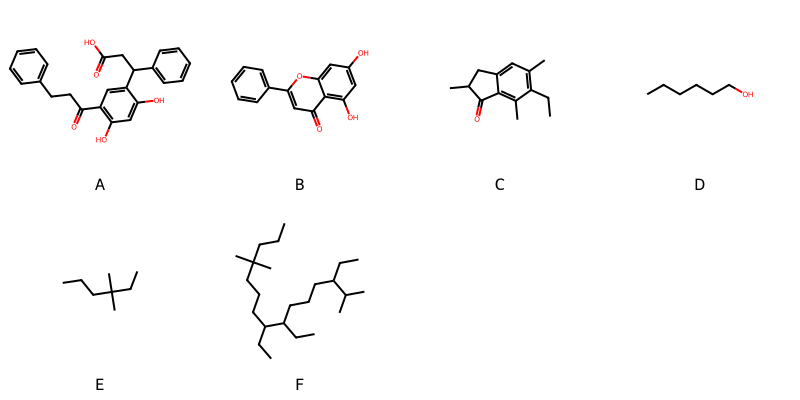

!!! abstract "Tóm tắt"

    **Họ Pteridaceae** có **9** chi được các cộng đồng sử dụng trong chăm sóc sức khỏe gồm *Pellaea, Actiniopteris, Pityrogramma, Acrostichum, Adiantum, Pteris, Ceratopteris, Coniogramme, Cheilanthes*. Số lượng thành phần hóa học đã phân lập và xác định cấu trúc từ họ này tính đến tháng 12 năm 2024 là **18** nhóm có thể liệt kê như sau *Diarylheptanoids, Indenes and isoindenes, Steroids and steroid derivatives, Organooxygen compounds, Fatty Acyls, Flavonoids, Indanes, Benzodioxanes, Benzopyrans, Cinnamic acids and derivatives, Dihydrofurans, Isoflavonoids, Naphthopyrans, Carboxylic acids and derivatives, Benzene and substituted derivatives, Linear 1,3-diarylpropanoids, Saturated hydrocarbons, Prenol lipids*. Giữa các loài trong họ này, 3 dược liệu được nghiên cứu nhiều nhất dựa trên số thành phần được phân lập là **Pteris multifida, Adiantum pedatum, Pityrogramma calomelanos*. *Họ Pteridaceae* đã được một số công động tại các quốc gia như China, Elsewhere, Venezuela, Egypt, Paraguay, Malaya, India, Iraq, Mexico, US đã phát hiện một số tác dụng trên lâm sàng gồm chữa bệnh lẫn độc tính như Chất làm mềm, Thuốc long đờm, Chất kích thích, Chất làm mềm, dễ bị tổn thương, Chất làm se, Chất làm se, Làm dịu, Thuốc lợi tiểu, Emmenagogue, Chất làm mềm, Thuốc long đờm, có mùi hôi, Thuốc bổ, Chất kích thích, Chất làm se, Thuốc lợi tiểu, Emmenagogue, Chất làm mềm, Thuốc long đờm, Chất kích thích, có mùi hôi, Thuốc bổ, Chống khả năng sinh sản, Emmenagogue, Làm dịu, Thuốc long đờm, Thuốc bổ, Thuốc cầm máu, Thuốc nhuận tràng, Thuốc bổ, Thuốc cầm máu, Thuốc tẩy giun, Thuốc diệt ký sinh trùng, Chất độc, Chất làm lạnh, Thuốc lợi tiểu, có mùi hôi, Thuốc nhuận tràng, Thuốc đắp, cầm máu, cầm máu, Thuốc tẩy giun, Thuốc tẩy giun, Chất làm lạnh, Alexiteric, thuốc tống hơi, Chất làm lạnh, Đổ mồ hôi, Thuốc lợi tiểu.

!!! info "DrDuke"

    James A. Duke sinh năm 1929-2017 là một nhà thực vật học người Mỹ. Đây là một trong những tác giả hàng đầu trong lĩnh vực dược dân tộc học với cuốn *CRC Handbook of Medicinal Herbs* và chính là người xây dựng lên cơ sở dữ liệu về hợp chất tự nhiên và dược dân tộc học tại Bộ nông nghiệp Hoa Kỳ. Các thông tin được đăng tải tại website [Dr. Duke's Phytochemical and Ethnobotanical Databases](https://phytochem.nal.usda.gov/). 
    Trong suốt thập niên 1970, ông lãnh đạo the Plant Taxonomy Laboratory, Plant Genetics and Germplasm Institute of the Agricultural Research Service, U.S. Department of Agriculture.
    Trong tài liệu này, các thông tin về dược dân tộc của các dược liệu được trích dẫn từ tài liệu của James A. Ducke với sự trợ giúp của phần mềm dịch thuật từ tiếng Anh sang tiếng Việt.
   
## Tổng quan về Họ Pteridaceae
### Phân loại thực vật
Trong *họ Pteridaceae* có **9** chi được sử dụng làm thuốc với chi tiết số loài trong mỗi chi như sau Cheilanthes (1) . Chi tiết về loài sử dụng làm thuốc như dưới đây.  

>Họ Pteridaceae


>|-- Chi Pellaea

>*Pellaea flavens*,

>|-- Chi Actiniopteris

>*Actiniopteris australis*,
>*Actiniopteris dichotoma*,

>|-- Chi Pityrogramma

>*Pityrogramma calomelanos*,

>|-- Chi Acrostichum

>*Acrostichum aureum*,

>|-- Chi Adiantum

>*Adiantum capillusveneris*,
>*Adiantum caudatum*,
>*Adiantum concinnum*,
>*Adiantum monochlamys*,
>*Adiantum pedatum*,
>*Adiantum tenerum*,
>*Adiantum venustum*,

>|-- Chi Pteris

>*Pteris ensiformis*,
>*Pteris multifida*,

>|-- Chi Ceratopteris

>*Ceratopteris thalictroides*,

>|-- Chi Coniogramme

>*Coniogramme japonica*,

>|-- Chi Cheilanthes

>*Cheilanthes myriophylla*,

### Thành phần hóa học 

Số lượng thành phần hóa học đã phân lập và xác định cấu trúc từ họ này tính đến tháng 12 năm 2024 là 18 nhóm có thể liệt kê như sau Diarylheptanoids, Indenes and isoindenes, Steroids and steroid derivatives, Organooxygen compounds, Fatty Acyls, Flavonoids, Indanes, Benzodioxanes, Benzopyrans, Cinnamic acids and derivatives, Dihydrofurans, Isoflavonoids, Naphthopyrans, Carboxylic acids and derivatives, Benzene and substituted derivatives, Linear 1,3-diarylpropanoids, Saturated hydrocarbons, Prenol lipids. Số lượng các loài đã được nghiên cứu thành phần hóa học là *10* trong tổng số *17* loài thuộc họ Pteridaceae.Giữa các loài trong họ này, 3 dược liệu được nghiên cứu nhiều nhất dựa trên số thành phần được phân lập là **Pteris multifida, Adiantum pedatum, Pityrogramma calomelanos**. Sử dụng phần mềm RDKIT với thuật toán  Find Maximum Common Substructure (FMCS), các nhóm hoạt chất phổ biến nhất trong *họ Pteridaceae* đã xây dựng được nhân. Điều này trong tương lại có thể được sử dụng tìm kiếm mối liên hệ giữa tác dụng của cấu trúc hóa học và tác dụng dược lý. Các nhân trong phần này có thể không giống như cấu trúc gốc của từng nhóm chất. Kết quả được trình bầy như hình dưới đây.

<figure markdown="span">
    { width=100% }
    <figcaption> Cấu trúc hóa học của một số khung cơ bản dựa trên thuật toán FMCS để tìm Diarylheptanoids (A), Flavonoids (B), Indanes (C), Organooxygen compounds (D), Prenol lipids (E), Steroids and steroid derivatives (F).</figcaption>
</figure>


!!! info  "Find Maximum Common Substructure"
    
    Thuật toán FMCS (Find Maximum Common Substructure) là một phương pháp được sử dụng để tìm ra cấu trúc chung nhiều nhất (MCS) trong một tập hợp các cấu trúc hóa học. Các bước của thuật toán gồm:
    - Chọn một cấu trúc hóa học là cấu trúc để tạo truy vấn, còn các cấu trúc khác là mục tiêu.
    - Chia nhỏ cấu trúc để tạo truy vấn thành cấu trúc nhỏ hơn dạng chuỗi SMARTS.
    - Kiểm tra chuỗi SMARTS trong các cấu trúc mục tiêu.
    - Tìm kiếm chuỗi SMARTS xuất hiện nhiều nhất.
    Để biết thêm chi tiết các bạn có thể xem tại [TeachOpenCADD](https://projects.volkamerlab.org/teachopencadd/talktorials/T006_compound_maximum_common_substructures.html)
    ``` python
    pip install rdkit
    def find_core_smiles(smiles_list):
        mols = [Chem.MolFromSmiles(smiles) for smiles in smiles_list]
        mcs = rdFMCS.FindMCS(mols)
        core_smiles = Chem.MolToSmiles(Chem.MolFromSmarts(mcs.smartsString))
        return core_smiles
    ```

### Dược dân tộc học

Họ **Pteridaceae** đã được một số công động tại các quốc gia như *China, Elsewhere, Venezuela, Egypt, Paraguay, Malaya, India, Iraq, Mexico, US* đã phát hiện một số tác dụng trên lâm sàng gồm chữa bệnh lẫn độc tính như *Chất làm mềm, Thuốc long đờm, Chất kích thích, Chất làm mềm, dễ bị tổn thương, Chất làm se, Chất làm se, Làm dịu, Thuốc lợi tiểu, Emmenagogue, Chất làm mềm, Thuốc long đờm, có mùi hôi, Thuốc bổ, Chất kích thích, Chất làm se, Thuốc lợi tiểu, Emmenagogue, Chất làm mềm, Thuốc long đờm, Chất kích thích, có mùi hôi, Thuốc bổ, Chống khả năng sinh sản, Emmenagogue, Làm dịu, Thuốc long đờm, Thuốc bổ, Thuốc cầm máu, Thuốc nhuận tràng, Thuốc bổ, Thuốc cầm máu, Thuốc tẩy giun, Thuốc diệt ký sinh trùng, Chất độc, Chất làm lạnh, Thuốc lợi tiểu, có mùi hôi, Thuốc nhuận tràng, Thuốc đắp, cầm máu, cầm máu, Thuốc tẩy giun, Thuốc tẩy giun, Chất làm lạnh, Alexiteric, thuốc tống hơi, Chất làm lạnh, Đổ mồ hôi, Thuốc lợi tiểu*.

## Chi tiết dược dân tộc học


### Chi Pellaea

!!! note "Danh sách các loài thuộc chi"
    
*	 - *Pellaea flavens**

---      
#### *Adiantum caudatum*
**Thông tin về thực vật**

!!! info "Phân loại thực vật của *Adiantum caudatum* từ GIBF:"
    - **Kingdom:** Plantae
    - **Phylum:** Tracheophyta
    - **Order:** Polypodiales
    - **Family:** Pteridaceae
    - **Genus:** Adiantum
    - **Species:** *Adiantum caudatum*


 

Chưa có thông tin về loài này trên wikidata.

*Phân bố trên thế giới*: Thailand, Chinese Taipei, China, Pakistan, Hong Kong, Timor-Leste, Malaysia, India, Macao, Indonesia, Viet Nam

*Phân bố tại Việt Nam*: Quảng Ninh, Ninh Bình, Hải Phòng

**Thành phần hóa học**
        

Chưa có nghiên cứu về thành phần hóa học của loài này


**Dược dân tộc học**

Danh sách các quốc gia có sử dụng *Adiantum caudatum* trong điều trị các bệnh. 

| Quốc gia   | Bệnh                    |
|:-----------|:------------------------|
| Paraguay   | Chống khả năng sinh sản |


### Chi Actiniopteris

!!! note "Danh sách các loài thuộc chi"
    
*	 - *Actiniopteris australis*
	 - *Actiniopteris dichotoma**

---      
#### *Actiniopteris australis*
**Thông tin về thực vật**

!!! info "Phân loại thực vật của *Actiniopteris australis* từ GIBF:"
    - **Kingdom:** Plantae
    - **Phylum:** Tracheophyta
    - **Order:** Polypodiales
    - **Family:** Pteridaceae
    - **Genus:** Actiniopteris
    - **Species:** *Actiniopteris australis*


 

Chưa có thông tin về loài này trên wikidata.

*Phân bố trên thế giới*: nan, France, Malawi, Tanzania, United Republic of, Zambia, Kenya, Sri Lanka, Seychelles, Cabo Verde, Egypt, unknown or invalid, Réunion, South Africa, Cameroon, Australia, Madagascar, Mauritius, Saudi Arabia, Nigeria, Mozambique, India, Togo, Zimbabwe, Namibia, United States of America, Ethiopia, Pakistan, Uganda, Botswana, Congo, Democratic Republic of the

*Phân bố tại Việt Nam*: Không có ghi nhận ở Việt Nam

**Thành phần hóa học**
        

Theo cơ sở dữ liệu lotus, từ loài *Actiniopteris australis* đã phân lập và xác định được 6 hoạt chất thuộc về các nhóm Fatty Acyls, Steroids and steroid derivatives, Saturated hydrocarbons, Organooxygen compounds. Danh sách các hoạt chất như sau stigmast-5-en-3-ol, (3β)- [(LTS0204616)](https://lotus.naturalproducts.net/compound/lotus_id/LTS0204616), sitogluside [(LTS0201798)](https://lotus.naturalproducts.net/compound/lotus_id/LTS0201798), d-fructopyranose [(LTS0259277)](https://lotus.naturalproducts.net/compound/lotus_id/LTS0259277), glucose [(LTS0013597)](https://lotus.naturalproducts.net/compound/lotus_id/LTS0013597), n-hentriacontanol [(LTS0212771)](https://lotus.naturalproducts.net/compound/lotus_id/LTS0212771), hentriacontane [(LTS0046415)](https://lotus.naturalproducts.net/compound/lotus_id/LTS0046415).

| chemicalTaxonomyClassyfireClass   |   lotus_count |
|:----------------------------------|--------------:|
| Fatty Acyls                       |             1 |
| Organooxygen compounds            |             2 |
| Saturated hydrocarbons            |             1 |
| Steroids and steroid derivatives  |             2 |


**Dược dân tộc học**

Danh sách các quốc gia có sử dụng *Actiniopteris australis* trong điều trị các bệnh. 

| Quốc gia   | Bệnh                          |
|:-----------|:------------------------------|
| Egypt      | Thuốc cầm máu, Thuốc tẩy giun |


---      
#### *Actiniopteris australis*
**Thông tin về thực vật**

!!! info "Phân loại thực vật của *Actiniopteris australis* từ GIBF:"
    - **Kingdom:** Plantae
    - **Phylum:** Tracheophyta
    - **Order:** Polypodiales
    - **Family:** Pteridaceae
    - **Genus:** Actiniopteris
    - **Species:** *Actiniopteris australis*


 

Chưa có thông tin về loài này trên wikidata.

*Phân bố trên thế giới*: nan, France, Malawi, Tanzania, United Republic of, Zambia, Kenya, Sri Lanka, Seychelles, Cabo Verde, Egypt, unknown or invalid, Réunion, South Africa, Cameroon, Australia, Madagascar, Mauritius, Saudi Arabia, Nigeria, Mozambique, India, Togo, Zimbabwe, Namibia, United States of America, Ethiopia, Pakistan, Uganda, Botswana, Congo, Democratic Republic of the

*Phân bố tại Việt Nam*: Không có ghi nhận ở Việt Nam

**Thành phần hóa học**
        

Chưa có nghiên cứu về thành phần hóa học của loài này


**Dược dân tộc học**

Danh sách các quốc gia có sử dụng *Actiniopteris australis* trong điều trị các bệnh. 

| Quốc gia   | Bệnh                          |
|:-----------|:------------------------------|
| India      | Thuốc cầm máu, Thuốc tẩy giun |


### Chi Pityrogramma

!!! note "Danh sách các loài thuộc chi"
    
*	 - *Pityrogramma calomelanos**

---      
#### *Pityrogramma calomelanos*
**Thông tin về thực vật**

!!! info "Phân loại thực vật của *Pityrogramma calomelanos* từ GIBF:"
    - **Kingdom:** Plantae
    - **Phylum:** Tracheophyta
    - **Order:** Polypodiales
    - **Family:** Pteridaceae
    - **Genus:** Pityrogramma
    - **Species:** *Pityrogramma calomelanos*


 

Chưa có thông tin về loài này trên wikidata.

*Phân bố trên thế giới*: Vanuatu, Suriname, Jamaica, Singapore, Sri Lanka, Ghana, Guadeloupe, French Guiana, Mexico, Chinese Taipei, Colombia, Gabon, Hong Kong, Timor-Leste, Réunion, Cambodia, Belize, Australia, Martinique, Panama, Indonesia, Sao Tome and Principe, Virgin Islands (U.S.), Dominica, Honduras, Saint Kitts and Nevis, India, Brazil, Costa Rica, Viet Nam, Thailand, United States of America, Philippines, Montserrat, Bolivia (Plurinational State of), Dominican Republic, Malaysia, Ecuador, Puerto Rico, El Salvador

*Phân bố tại Việt Nam*: Gia Lai, Đăk Nông, Bình Định, Đắk Lắk

**Thành phần hóa học**
        

Theo cơ sở dữ liệu lotus, từ loài *Pityrogramma calomelanos* đã phân lập và xác định được 39 hoạt chất thuộc về các nhóm Diarylheptanoids, Flavonoids, Indanes, Benzopyrans, Linear 1,3-diarylpropanoids. Danh sách các hoạt chất như sau methyl 3-[5,7-dihydroxy-2-(4-hydroxyphenyl)-4-oxochromen-8-yl]-3-phenylpropanoate [(LTS0152296)](https://lotus.naturalproducts.net/compound/lotus_id/LTS0152296), (10s)-3,5-dihydroxy-2,10-diphenyl-9h,10h-pyrano[2,3-h]chromene-4,8-dione [(LTS0103714)](https://lotus.naturalproducts.net/compound/lotus_id/LTS0103714), calomelanol c [(LTS0107476)](https://lotus.naturalproducts.net/compound/lotus_id/LTS0107476), calomelanol h [(LTS0258305)](https://lotus.naturalproducts.net/compound/lotus_id/LTS0258305), gymnogrammene [(LTS0269765)](https://lotus.naturalproducts.net/compound/lotus_id/LTS0269765), 1-(2,6-dihydroxyphenyl)-3-(4-methoxyphenyl)propan-1-one [(LTS0022291)](https://lotus.naturalproducts.net/compound/lotus_id/LTS0022291), 5-hydroxy-2-(4-hydroxyphenyl)-10-phenyl-9h,10h-pyrano[2,3-h]chromene-4,8-dione [(LTS0188361)](https://lotus.naturalproducts.net/compound/lotus_id/LTS0188361), (7s,13r)-9-hydroxy-7-(4-hydroxyphenyl)-13-phenyl-4,14-dioxatricyclo[8.4.0.0³,⁸]tetradeca-1,3(8),9-triene-5,11-dione [(LTS0081561)](https://lotus.naturalproducts.net/compound/lotus_id/LTS0081561), (4r)-5,7-dihydroxy-4-(4-hydroxyphenyl)-8-(3-phenylpropanoyl)-3,4-dihydro-1-benzopyran-2-one [(LTS0042529)](https://lotus.naturalproducts.net/compound/lotus_id/LTS0042529), (7r,13r)-9-hydroxy-7,13-diphenyl-4,14-dioxatricyclo[8.4.0.0³,⁸]tetradeca-1,3(8),9-triene-5,11-dione [(LTS0064337)](https://lotus.naturalproducts.net/compound/lotus_id/LTS0064337), (3r)-3-[5,7-dihydroxy-2-(4-hydroxyphenyl)-4-oxochromen-8-yl]-3-phenylpropanoic acid [(LTS0177310)](https://lotus.naturalproducts.net/compound/lotus_id/LTS0177310), (10s)-5-hydroxy-2,10-diphenyl-9h,10h-pyrano[2,3-h]chromene-4,8-dione [(LTS0095486)](https://lotus.naturalproducts.net/compound/lotus_id/LTS0095486), (7s,13r)-9-hydroxy-7-(4-hydroxyphenyl)-13-(4-methoxyphenyl)-4,14-dioxatricyclo[8.4.0.0³,⁸]tetradeca-1(10),2,8-triene-5,11-dione [(LTS0008544)](https://lotus.naturalproducts.net/compound/lotus_id/LTS0008544), (10s)-3,5-dihydroxy-2-(4-hydroxyphenyl)-10-phenyl-9h,10h-pyrano[2,3-h]chromene-4,8-dione [(LTS0264272)](https://lotus.naturalproducts.net/compound/lotus_id/LTS0264272), calomelanol g [(LTS0029969)](https://lotus.naturalproducts.net/compound/lotus_id/LTS0029969), 9-hydroxy-7,13-diphenyl-4,14-dioxatricyclo[8.4.0.0³,⁸]tetradeca-1,3(8),9-triene-5,11-dione [(LTS0111305)](https://lotus.naturalproducts.net/compound/lotus_id/LTS0111305), methyl (3r)-3-[5,7-dihydroxy-2-(4-hydroxyphenyl)-4-oxochromen-8-yl]-3-phenylpropanoate [(LTS0208259)](https://lotus.naturalproducts.net/compound/lotus_id/LTS0208259), (10s)-5-hydroxy-2-(4-hydroxyphenyl)-10-phenyl-9h,10h-pyrano[2,3-h]chromene-4,8-dione [(LTS0241272)](https://lotus.naturalproducts.net/compound/lotus_id/LTS0241272), 3,5-dihydroxy-2,10-diphenyl-9h,10h-pyrano[2,3-h]chromene-4,8-dione [(LTS0035778)](https://lotus.naturalproducts.net/compound/lotus_id/LTS0035778), (4s)-5,7-dihydroxy-8-[3-(4-methoxyphenyl)propanoyl]-4-phenyl-3,4-dihydro-1-benzopyran-2-one [(LTS0260376)](https://lotus.naturalproducts.net/compound/lotus_id/LTS0260376), 5-hydroxy-2,10-diphenyl-9h,10h-pyrano[2,3-h]chromene-4,8-dione [(LTS0027252)](https://lotus.naturalproducts.net/compound/lotus_id/LTS0027252), 9-hydroxy-7,13-bis(4-hydroxyphenyl)-4,14-dioxatricyclo[8.4.0.0³,⁸]tetradeca-1,3(8),9-triene-5,11-dione [(LTS0011980)](https://lotus.naturalproducts.net/compound/lotus_id/LTS0011980), (4s)-5,7-dihydroxy-4-(4-hydroxyphenyl)-8-(3-phenylpropanoyl)-3,4-dihydro-1-benzopyran-2-one [(LTS0052055)](https://lotus.naturalproducts.net/compound/lotus_id/LTS0052055), calomelanone [(LTS0108680)](https://lotus.naturalproducts.net/compound/lotus_id/LTS0108680), 1-(2,6-dihydroxy-4-methoxyphenyl)-3-phenylpropan-1-one [(LTS0269836)](https://lotus.naturalproducts.net/compound/lotus_id/LTS0269836), 3-[5,7-dihydroxy-2-(4-hydroxyphenyl)-4-oxochromen-8-yl]-3-phenylpropanoic acid [(LTS0033827)](https://lotus.naturalproducts.net/compound/lotus_id/LTS0033827), (6r)-6-hydroxy-5,7,7-trimethyl-3h,4h,6h,8h-indeno[5,6-c]pyran-1-one [(LTS0165671)](https://lotus.naturalproducts.net/compound/lotus_id/LTS0165671), (4r)-5,7-dihydroxy-4-phenyl-8-(3-phenylpropanoyl)-3,4-dihydro-1-benzopyran-2-one [(LTS0091089)](https://lotus.naturalproducts.net/compound/lotus_id/LTS0091089), (7r,13r)-9-hydroxy-7-(4-hydroxyphenyl)-13-(4-methoxyphenyl)-4,14-dioxatricyclo[8.4.0.0³,⁸]tetradeca-1(10),2,8-triene-5,11-dione [(LTS0102161)](https://lotus.naturalproducts.net/compound/lotus_id/LTS0102161), calomelanol a [(LTS0074035)](https://lotus.naturalproducts.net/compound/lotus_id/LTS0074035), 9-hydroxy-7-(4-hydroxyphenyl)-13-phenyl-4,14-dioxatricyclo[8.4.0.0³,⁸]tetradeca-1,3(8),9-triene-5,11-dione [(LTS0275159)](https://lotus.naturalproducts.net/compound/lotus_id/LTS0275159), calomelanol d-1 [(LTS0239637)](https://lotus.naturalproducts.net/compound/lotus_id/LTS0239637), calomelanol d [(LTS0035080)](https://lotus.naturalproducts.net/compound/lotus_id/LTS0035080), (7s,13r)-9-hydroxy-7,13-bis(4-hydroxyphenyl)-4,14-dioxatricyclo[8.4.0.0³,⁸]tetradeca-1,3(8),9-triene-5,11-dione [(LTS0094550)](https://lotus.naturalproducts.net/compound/lotus_id/LTS0094550), calomelanol b [(LTS0003522)](https://lotus.naturalproducts.net/compound/lotus_id/LTS0003522), (7r,13s)-9-hydroxy-13-(4-hydroxyphenyl)-7-phenyl-4,14-dioxatricyclo[8.4.0.0³,⁸]tetradeca-1,3(8),9-triene-5,11-dione [(LTS0217555)](https://lotus.naturalproducts.net/compound/lotus_id/LTS0217555), (4s)-5,7-dihydroxy-4-phenyl-8-(3-phenylpropanoyl)-3,4-dihydro-1-benzopyran-2-one [(LTS0169045)](https://lotus.naturalproducts.net/compound/lotus_id/LTS0169045), 6-(2-hydroxyethyl)-2,2,5,7-tetramethyl-3h-inden-1-one [(LTS0098258)](https://lotus.naturalproducts.net/compound/lotus_id/LTS0098258), (4r)-5,7-dihydroxy-8-[3-(4-hydroxyphenyl)propanoyl]-4-phenyl-3,4-dihydro-1-benzopyran-2-one [(LTS0219094)](https://lotus.naturalproducts.net/compound/lotus_id/LTS0219094).

| chemicalTaxonomyClassyfireClass   |   lotus_count |
|:----------------------------------|--------------:|
| Benzopyrans                       |             1 |
| Diarylheptanoids                  |            14 |
| Flavonoids                        |            19 |
| Indanes                           |             1 |
| Linear 1,3-diarylpropanoids       |             4 |


**Dược dân tộc học**

Danh sách các quốc gia có sử dụng *Pityrogramma calomelanos* trong điều trị các bệnh. 

| Quốc gia   | Bệnh    |
|:-----------|:--------|
| Elsewhere  | cầm máu |


### Chi Acrostichum

!!! note "Danh sách các loài thuộc chi"
    
*	 - *Acrostichum aureum**

---      
#### *Acrostichum aureum*
**Thông tin về thực vật**

!!! info "Phân loại thực vật của *Acrostichum aureum* từ GIBF:"
    - **Kingdom:** Plantae
    - **Phylum:** Tracheophyta
    - **Order:** Polypodiales
    - **Family:** Pteridaceae
    - **Genus:** Acrostichum
    - **Species:** *Acrostichum aureum*


 

Chưa có thông tin về loài này trên wikidata.

*Phân bố trên thế giới*: nan, Benin, Tanzania, United Republic of, Cayman Islands, Vanuatu, New Caledonia, Cuba, Jamaica, Singapore, Guadeloupe, French Guiana, Mexico, Chinese Taipei, Colombia, Hong Kong, Cambodia, Bangladesh, South Africa, Liberia, Belize, Australia, Indonesia, Madagascar, Honduras, Mozambique, India, Brazil, Costa Rica, Northern Mariana Islands, Viet Nam, Zimbabwe, Thailand, United States of America, China, Malaysia, Samoa, Puerto Rico, Macao, Sierra Leone

*Phân bố tại Việt Nam*: Tiền Giang, Cần Thơ, Đồng Tháp, An Giang, Hồ Chí Minh city

**Thành phần hóa học**
        

Theo cơ sở dữ liệu lotus, từ loài *Acrostichum aureum* đã phân lập và xác định được 5 hoạt chất thuộc về các nhóm Indanes. Danh sách các hoạt chất như sau (2s,3s)-pterosin c [(LTS0167407)](https://lotus.naturalproducts.net/compound/lotus_id/LTS0167407), (2r)-pterosin p [(LTS0092002)](https://lotus.naturalproducts.net/compound/lotus_id/LTS0092002), 3-hydroxy-6-(2-hydroxyethyl)-2,5,7-trimethyl-2,3-dihydroinden-1-one [(LTS0175628)](https://lotus.naturalproducts.net/compound/lotus_id/LTS0175628), 2-[(1s,2r)-1-hydroxy-2,4,6-trimethyl-3-oxo-1,2-dihydroinden-5-yl]ethoxysulfonic acid [(LTS0031116)](https://lotus.naturalproducts.net/compound/lotus_id/LTS0031116), (2s,3s)-sulfated pterosin c [(LTS0207058)](https://lotus.naturalproducts.net/compound/lotus_id/LTS0207058).

| chemicalTaxonomyClassyfireClass   |   lotus_count |
|:----------------------------------|--------------:|
| Indanes                           |             5 |


**Dược dân tộc học**

Danh sách các quốc gia có sử dụng *Acrostichum aureum* trong điều trị các bệnh. 

| Quốc gia   | Bệnh                           |
|:-----------|:-------------------------------|
| Elsewhere  | Chất làm mềm, dễ bị tổn thương |


### Chi Adiantum

!!! note "Danh sách các loài thuộc chi"
    
*	 - *Adiantum capillus-veneris*
	 - *Adiantum caudatum*
	 - *Adiantum concinnum*
	 - *Adiantum monochlamys*
	 - *Adiantum pedatum*
	 - *Adiantum tenerum*
	 - *Adiantum venustum**

---      
#### *Acrostichum aureum*
**Thông tin về thực vật**

!!! info "Phân loại thực vật của *Acrostichum aureum* từ GIBF:"
    - **Kingdom:** Plantae
    - **Phylum:** Tracheophyta
    - **Order:** Polypodiales
    - **Family:** Pteridaceae
    - **Genus:** Acrostichum
    - **Species:** *Acrostichum aureum*


 

Chưa có thông tin về loài này trên wikidata.

*Phân bố trên thế giới*: nan, Benin, Tanzania, United Republic of, Cayman Islands, Vanuatu, New Caledonia, Cuba, Jamaica, Singapore, Guadeloupe, French Guiana, Mexico, Chinese Taipei, Colombia, Hong Kong, Cambodia, Bangladesh, South Africa, Liberia, Belize, Australia, Indonesia, Madagascar, Honduras, Mozambique, India, Brazil, Costa Rica, Northern Mariana Islands, Viet Nam, Zimbabwe, Thailand, United States of America, China, Malaysia, Samoa, Puerto Rico, Macao, Sierra Leone

*Phân bố tại Việt Nam*: Tiền Giang, Cần Thơ, Đồng Tháp, An Giang, Hồ Chí Minh city

**Thành phần hóa học**
        

Chưa có nghiên cứu về thành phần hóa học của loài này


**Dược dân tộc học**

Danh sách các quốc gia có sử dụng *Acrostichum aureum* trong điều trị các bệnh. 

| Quốc gia   | Bệnh                                                                                                                   |
|:-----------|:-----------------------------------------------------------------------------------------------------------------------|
| Egypt      | Đổ mồ hôi, Thuốc lợi tiểu                                                                                              |
| India      | Làm dịu, Thuốc long đờm, Thuốc bổ                                                                                      |
| Iraq       | Chất làm se, Thuốc lợi tiểu, Emmenagogue, Chất làm mềm, Thuốc long đờm, Chất kích thích, có mùi hôi, Thuốc bổ          |
| Mexico     | Thuốc nhuận tràng                                                                                                      |
| US         | Chất làm se, Làm dịu, Thuốc lợi tiểu, Emmenagogue, Chất làm mềm, Thuốc long đờm, có mùi hôi, Thuốc bổ, Chất kích thích |


---      
#### *Adiantum caudatum*
**Thông tin về thực vật**

!!! info "Phân loại thực vật của *Adiantum caudatum* từ GIBF:"
    - **Kingdom:** Plantae
    - **Phylum:** Tracheophyta
    - **Order:** Polypodiales
    - **Family:** Pteridaceae
    - **Genus:** Adiantum
    - **Species:** *Adiantum caudatum*


 

Chưa có thông tin về loài này trên wikidata.

*Phân bố trên thế giới*: Thailand, Chinese Taipei, China, Pakistan, Hong Kong, Timor-Leste, Malaysia, India, Macao, Indonesia, Viet Nam

*Phân bố tại Việt Nam*: Quảng Ninh, Ninh Bình, Hải Phòng

**Thành phần hóa học**
        

Theo cơ sở dữ liệu lotus, từ loài *Adiantum caudatum* đã phân lập và xác định được 35 hoạt chất thuộc về các nhóm Naphthopyrans, Steroids and steroid derivatives, Prenol lipids. Danh sách các hoạt chất như sau (3r,3ar,5as,5br,7as,11as,11br)-3-isopropyl-3a,5a,5b,8,8,11a-hexamethyl-1h,2h,3h,4h,5h,6h,7h,7ah,9h,10h,11h,11bh,12h,13h-cyclopenta[a]chrysene [(LTS0037493)](https://lotus.naturalproducts.net/compound/lotus_id/LTS0037493), (3r,3ar,5as,11as,13as)-3-isopropyl-3a,5a,8,8,11a,13a-hexamethyl-1h,2h,3h,4h,5h,6h,7h,7ah,9h,10h,11h,12h,13h,13bh-cyclopenta[a]chrysene [(LTS0255666)](https://lotus.naturalproducts.net/compound/lotus_id/LTS0255666), 1-{1-hydroxy-5a,5b,8,8,11a,13b-hexamethyl-hexadecahydrocyclopenta[a]chrysen-3-yl}ethanone [(LTS0078941)](https://lotus.naturalproducts.net/compound/lotus_id/LTS0078941), 1-[(3s,3as,5ar,5br,7as,11as,11br,13ar,13bs)-5a,5b,8,8,11a,13b-hexamethyl-hexadecahydrocyclopenta[a]chrysen-3-yl]ethanone [(LTS0073855)](https://lotus.naturalproducts.net/compound/lotus_id/LTS0073855), (1r,2r,5s,7s,10r,11s,14r,15s,20s)-7-isopropyl-1,2,10,15,19,19-hexamethyl-6-oxahexacyclo[12.8.0.0²,¹¹.0⁵,⁷.0⁵,¹⁰.0¹⁵,²⁰]docosane [(LTS0265376)](https://lotus.naturalproducts.net/compound/lotus_id/LTS0265376), (3r,3ar,5ar,5bs,7as,11as,11bs,13as,13br)-3-isopropyl-3a,5a,7a,8,11b,13a-hexamethyl-1h,2h,3h,4h,5h,5bh,6h,7h,10h,11h,11ah,12h,13h,13bh-cyclopenta[a]chrysene [(LTS0058107)](https://lotus.naturalproducts.net/compound/lotus_id/LTS0058107), (3r,3ar,5as,7as,11as,13as,13br)-3-isopropyl-3a,5a,8,8,11a,13a-hexamethyl-1h,2h,3h,4h,5h,7h,7ah,9h,10h,11h,13h,13bh-cyclopenta[a]chrysene [(LTS0084825)](https://lotus.naturalproducts.net/compound/lotus_id/LTS0084825), 14-hydroxy-9-isopropyl-5,10,13,18,18-pentamethyl-23-oxahexacyclo[13.6.2.0¹,¹⁷.0²,¹⁴.0⁵,¹³.0⁶,¹⁰]tricosan-22-one [(LTS0191043)](https://lotus.naturalproducts.net/compound/lotus_id/LTS0191043), (3r,3ar,5as,7as,11as,11br,13as,13br)-3-isopropyl-3a,5a,8,8,11a,13a-hexamethyl-1h,2h,3h,4h,5h,7h,7ah,9h,10h,11h,11bh,12h,13h,13bh-cyclopenta[a]chrysene [(LTS0051219)](https://lotus.naturalproducts.net/compound/lotus_id/LTS0051219), 3-isopropyl-3a,5a,8,8,11a,13a-hexamethyl-1h,2h,3h,4h,5h,7h,7ah,9h,10h,11h,11bh,12h,13h,13bh-cyclopenta[a]chrysene [(LTS0171872)](https://lotus.naturalproducts.net/compound/lotus_id/LTS0171872), 3-isopropyl-3a,5a,8,8,11a,13a-hexamethyl-1h,2h,3h,4h,5h,5bh,6h,7h,7ah,9h,10h,11h,13h,13bh-cyclopenta[a]chrysene [(LTS0198277)](https://lotus.naturalproducts.net/compound/lotus_id/LTS0198277), (3r,3ar,5ar,7as,11br,13as)-3-isopropyl-3a,5a,7a,8,11b,13a-hexamethyl-1h,2h,3h,4h,5h,5bh,6h,7h,10h,11h,11ah,12h,13h,13bh-cyclopenta[a]chrysene [(LTS0116538)](https://lotus.naturalproducts.net/compound/lotus_id/LTS0116538), (1r,3r,3ar,5as,7as,11as,13as,13br)-3-isopropyl-3a,5a,8,8,11a,13a-hexamethyl-1h,2h,3h,4h,5h,7h,7ah,9h,10h,11h,13h,13bh-cyclopenta[a]chrysen-1-ol [(LTS0246379)](https://lotus.naturalproducts.net/compound/lotus_id/LTS0246379), 3-isopropyl-8-methoxy-3a,5a,7a,8,11b,13a-hexamethyl-tetradecahydro-1h-cyclopenta[a]chrysen-9-ol [(LTS0073917)](https://lotus.naturalproducts.net/compound/lotus_id/LTS0073917), (3r,3as,5as,5br,7as,11as,11br,13bs)-3-isopropyl-3a,5a,5b,8,8,11a-hexamethyl-1h,2h,3h,4h,5h,6h,7h,7ah,9h,10h,11h,11bh,12h,13bh-cyclopenta[a]chrysene [(LTS0257705)](https://lotus.naturalproducts.net/compound/lotus_id/LTS0257705), 3-isopropyl-3a,5a,5b,8,8,11a-hexamethyl-1h,2h,3h,4h,5h,6h,7h,7ah,9h,10h,11h,11bh,12h,13bh-cyclopenta[a]chrysene [(LTS0011391)](https://lotus.naturalproducts.net/compound/lotus_id/LTS0011391), (1r,2s,5s,6s,9r,10r,13s,14r,15s,17s)-14-hydroxy-9-isopropyl-5,10,13,18,18-pentamethyl-23-oxahexacyclo[13.6.2.0¹,¹⁷.0²,¹⁴.0⁵,¹³.0⁶,¹⁰]tricosan-22-one [(LTS0212428)](https://lotus.naturalproducts.net/compound/lotus_id/LTS0212428), (1r,3r,3ar,5ar,5br,7as,11as,13as,13br)-3-isopropyl-3a,5a,8,8,11a,13a-hexamethyl-1h,2h,3h,4h,5h,5bh,6h,7h,7ah,9h,10h,11h,13h,13bh-cyclopenta[a]chrysen-1-ol [(LTS0065902)](https://lotus.naturalproducts.net/compound/lotus_id/LTS0065902), (3r,3ar,5ar,5bs,7as,11as,13as,13br)-3-isopropyl-3a,5a,8,8,11a,13a-hexamethyl-1h,2h,3h,4h,5h,5bh,6h,7h,7ah,9h,10h,11h,13h,13bh-cyclopenta[a]chrysene [(LTS0205199)](https://lotus.naturalproducts.net/compound/lotus_id/LTS0205199), 1-[(1r,3s,3as,5ar,5br,7as,11as,11br,13as,13bs)-1-hydroxy-5a,5b,8,8,11a,13b-hexamethyl-hexadecahydrocyclopenta[a]chrysen-3-yl]ethanone [(LTS0214896)](https://lotus.naturalproducts.net/compound/lotus_id/LTS0214896), 7-isopropyl-1,2,10,15,19,19-hexamethyl-6-oxahexacyclo[12.8.0.0²,¹¹.0⁵,⁷.0⁵,¹⁰.0¹⁵,²⁰]docosane [(LTS0253932)](https://lotus.naturalproducts.net/compound/lotus_id/LTS0253932), fernene [(LTS0080047)](https://lotus.naturalproducts.net/compound/lotus_id/LTS0080047), 1-{5a,5b,8,8,11a,13b-hexamethyl-hexadecahydrocyclopenta[a]chrysen-3-yl}ethanone [(LTS0260488)](https://lotus.naturalproducts.net/compound/lotus_id/LTS0260488), (1r,2r,5s,6r,9r,10r,13s,14r,15s,17s)-14-hydroxy-9-isopropyl-5,10,13,18,18-pentamethyl-23-oxahexacyclo[13.6.2.0¹,¹⁷.0²,¹⁴.0⁵,¹³.0⁶,¹⁰]tricosan-22-one [(LTS0209247)](https://lotus.naturalproducts.net/compound/lotus_id/LTS0209247), (3r,3ar,5as,7as,11as,13as,13br)-3-isopropyl-3a,5a,8,8,11a,13a-hexamethyl-1h,2h,3h,4h,5h,6h,7h,7ah,9h,10h,11h,12h,13h,13bh-cyclopenta[a]chrysene [(LTS0255847)](https://lotus.naturalproducts.net/compound/lotus_id/LTS0255847), 3-isopropyl-3a,5a,8,8,11a,13a-hexamethyl-1h,2h,3h,4h,5h,5bh,6h,7h,7ah,9h,10h,11h,13h,13bh-cyclopenta[a]chrysen-1-ol [(LTS0014916)](https://lotus.naturalproducts.net/compound/lotus_id/LTS0014916), 3-isopropyl-3a,5a,8,8,11a,13a-hexamethyl-1h,2h,3h,4h,5h,6h,7h,7ah,9h,10h,11h,12h,13h,13bh-cyclopenta[a]chrysene [(LTS0037727)](https://lotus.naturalproducts.net/compound/lotus_id/LTS0037727), (3r,3ar,5ar,5bs,7as,8s,9r,11as,11br,13as,13br)-3-isopropyl-8-methoxy-3a,5a,7a,8,11b,13a-hexamethyl-tetradecahydro-1h-cyclopenta[a]chrysen-9-ol [(LTS0037409)](https://lotus.naturalproducts.net/compound/lotus_id/LTS0037409), (1r,3r,3ar,5as,7as,11as,11br,13as,13br)-3-isopropyl-3a,5a,8,8,11a,13a-hexamethyl-1h,2h,3h,4h,5h,7h,7ah,9h,10h,11h,11bh,12h,13h,13bh-cyclopenta[a]chrysen-1-ol [(LTS0184984)](https://lotus.naturalproducts.net/compound/lotus_id/LTS0184984), 1-[(3r,3as,5ar,5br,7as,11as,11br,13ar,13bs)-5a,5b,8,8,11a,13b-hexamethyl-hexadecahydrocyclopenta[a]chrysen-3-yl]ethanone [(LTS0214096)](https://lotus.naturalproducts.net/compound/lotus_id/LTS0214096), 1-[(3s,3as,5br,11as)-5a,5b,8,8,11a,13b-hexamethyl-hexadecahydrocyclopenta[a]chrysen-3-yl]ethanone [(LTS0107718)](https://lotus.naturalproducts.net/compound/lotus_id/LTS0107718), 3-isopropyl-3a,5a,8,8,11a,13a-hexamethyl-1h,2h,3h,4h,5h,7h,7ah,9h,10h,11h,13h,13bh-cyclopenta[a]chrysene [(LTS0024607)](https://lotus.naturalproducts.net/compound/lotus_id/LTS0024607), 3-isopropyl-3a,5a,8,8,11a,13a-hexamethyl-1h,2h,3h,4h,5h,7h,7ah,9h,10h,11h,13h,13bh-cyclopenta[a]chrysen-1-ol [(LTS0041391)](https://lotus.naturalproducts.net/compound/lotus_id/LTS0041391), 3-isopropyl-3a,5a,8,8,11a,13a-hexamethyl-1h,2h,3h,4h,5h,7h,7ah,9h,10h,11h,11bh,12h,13h,13bh-cyclopenta[a]chrysen-1-ol [(LTS0190231)](https://lotus.naturalproducts.net/compound/lotus_id/LTS0190231), 3-isopropyl-3a,5a,7a,8,11b,13a-hexamethyl-1h,2h,3h,4h,5h,5bh,6h,7h,10h,11h,11ah,12h,13h,13bh-cyclopenta[a]chrysene [(LTS0127465)](https://lotus.naturalproducts.net/compound/lotus_id/LTS0127465).

| chemicalTaxonomyClassyfireClass   |   lotus_count |
|:----------------------------------|--------------:|
| Naphthopyrans                     |             1 |
| Prenol lipids                     |            27 |
| Steroids and steroid derivatives  |             6 |


**Dược dân tộc học**

Danh sách các quốc gia có sử dụng *Adiantum caudatum* trong điều trị các bệnh. 

| Quốc gia   | Bệnh                              |
|:-----------|:----------------------------------|
| India      | Làm dịu, Thuốc long đờm, Thuốc bổ |


---      
#### *Adiantum caudatum*
**Thông tin về thực vật**

!!! info "Phân loại thực vật của *Adiantum caudatum* từ GIBF:"
    - **Kingdom:** Plantae
    - **Phylum:** Tracheophyta
    - **Order:** Polypodiales
    - **Family:** Pteridaceae
    - **Genus:** Adiantum
    - **Species:** *Adiantum caudatum*


 

Chưa có thông tin về loài này trên wikidata.

*Phân bố trên thế giới*: Thailand, Chinese Taipei, China, Pakistan, Hong Kong, Timor-Leste, Malaysia, India, Macao, Indonesia, Viet Nam

*Phân bố tại Việt Nam*: Quảng Ninh, Ninh Bình, Hải Phòng

**Thành phần hóa học**
        

Chưa có nghiên cứu về thành phần hóa học của loài này


**Dược dân tộc học**

Danh sách các quốc gia có sử dụng *Adiantum caudatum* trong điều trị các bệnh. 

| Quốc gia   | Bệnh        |
|:-----------|:------------|
| Venezuela  | Emmenagogue |


---      
#### *Adiantum monochlamys*
**Thông tin về thực vật**

!!! info "Phân loại thực vật của *Adiantum monochlamys* từ GIBF:"
    - **Kingdom:** Plantae
    - **Phylum:** Tracheophyta
    - **Order:** Polypodiales
    - **Family:** Pteridaceae
    - **Genus:** Adiantum
    - **Species:** *Adiantum monochlamys*


 

Chưa có thông tin về loài này trên wikidata.

*Phân bố trên thế giới*: nan, Chinese Taipei, unknown or invalid, Japan, Korea, Republic of

*Phân bố tại Việt Nam*: Không có ghi nhận ở Việt Nam

**Thành phần hóa học**
        

Theo cơ sở dữ liệu lotus, từ loài *Adiantum monochlamys* đã phân lập và xác định được 12 hoạt chất thuộc về các nhóm Steroids and steroid derivatives, Prenol lipids, Organooxygen compounds. Danh sách các hoạt chất như sau (3r,3ar,5ar,5bs,7r,7as,11ar,11br,13as,13br)-3-isopropyl-3a,5a,7a,8,11b,13a-hexamethyl-1h,2h,3h,4h,5h,5bh,6h,7h,10h,11h,11ah,12h,13h,13bh-cyclopenta[a]chrysen-7-yl acetate [(LTS0160054)](https://lotus.naturalproducts.net/compound/lotus_id/LTS0160054), (4s,4ar,6ar,6br,8ar,12as,12br,14ar,14br)-4-hydroxy-4,6a,6b,9,9,12a,14b-heptamethyl-tetradecahydro-1h-picen-3-one [(LTS0212385)](https://lotus.naturalproducts.net/compound/lotus_id/LTS0212385), 4,6a,6b,9,9,12a,14b-heptamethyl-hexadecahydropicene-3,4-diol [(LTS0107300)](https://lotus.naturalproducts.net/compound/lotus_id/LTS0107300), (1s)-1-[(3r,3as,5ar,5br,7as,11as,11br,13as,13bs)-5a,5b,8,8,11a,13b-hexamethyl-hexadecahydrocyclopenta[a]chrysen-3-yl]ethyl acetate [(LTS0032519)](https://lotus.naturalproducts.net/compound/lotus_id/LTS0032519), 4-hydroxy-4,6a,6b,9,9,12a,14b-heptamethyl-tetradecahydro-1h-picen-3-one [(LTS0164357)](https://lotus.naturalproducts.net/compound/lotus_id/LTS0164357), 1-{5a,5b,8,8,11a,13b-hexamethyl-hexadecahydrocyclopenta[a]chrysen-3-yl}ethyl acetate [(LTS0250532)](https://lotus.naturalproducts.net/compound/lotus_id/LTS0250532), [(3r,3ar,5ar,5bs,7as,11ar,11br,13as,13br)-3-isopropyl-3a,5a,7a,8,13a-pentamethyl-1h,2h,3h,4h,5h,5bh,6h,7h,10h,11h,11ah,12h,13h,13bh-cyclopenta[a]chrysen-11b-yl]methyl acetate [(LTS0188558)](https://lotus.naturalproducts.net/compound/lotus_id/LTS0188558), (3s,4s,4as,6ar,6br,8as,12as,12br,14ar,14br)-4,6a,6b,9,9,12a,14b-heptamethyl-hexadecahydropicene-3,4-diol [(LTS0064134)](https://lotus.naturalproducts.net/compound/lotus_id/LTS0064134), 3-isopropyl-3a,5a,7a,8,11b,13a-hexamethyl-1h,2h,3h,4h,5h,5bh,6h,7h,10h,11h,11ah,12h,13h,13bh-cyclopenta[a]chrysen-7-yl acetate [(LTS0174485)](https://lotus.naturalproducts.net/compound/lotus_id/LTS0174485), (3r,4s,4as,6ar,6br,8as,12as,12br,14ar,14br)-4,6a,6b,9,9,12a,14b-heptamethyl-hexadecahydropicene-3,4-diol [(LTS0111877)](https://lotus.naturalproducts.net/compound/lotus_id/LTS0111877), [(3r,3ar,5ar,5br,7as,11ar,11br,13as,13br)-3-isopropyl-3a,5a,7a,8,13a-pentamethyl-1h,2h,3h,4h,5h,5bh,6h,7h,10h,11h,11ah,12h,13h,13bh-cyclopenta[a]chrysen-11b-yl]methanol [(LTS0070290)](https://lotus.naturalproducts.net/compound/lotus_id/LTS0070290), {3-isopropyl-3a,5a,7a,8,13a-pentamethyl-1h,2h,3h,4h,5h,5bh,6h,7h,10h,11h,11ah,12h,13h,13bh-cyclopenta[a]chrysen-11b-yl}methyl acetate [(LTS0047195)](https://lotus.naturalproducts.net/compound/lotus_id/LTS0047195).

| chemicalTaxonomyClassyfireClass   |   lotus_count |
|:----------------------------------|--------------:|
| Organooxygen compounds            |             5 |
| Prenol lipids                     |             4 |
| Steroids and steroid derivatives  |             3 |


**Dược dân tộc học**

Danh sách các quốc gia có sử dụng *Adiantum monochlamys* trong điều trị các bệnh. 

| Quốc gia   | Bệnh                                              |
|:-----------|:--------------------------------------------------|
| China      | Thuốc diệt ký sinh trùng, Chất độc, Chất làm lạnh |


---      
#### *Adiantum pedatum*
**Thông tin về thực vật**

!!! info "Phân loại thực vật của *Adiantum pedatum* từ GIBF:"
    - **Kingdom:** Plantae
    - **Phylum:** Tracheophyta
    - **Order:** Polypodiales
    - **Family:** Pteridaceae
    - **Genus:** Adiantum
    - **Species:** *Adiantum pedatum*


 

Chưa có thông tin về loài này trên wikidata.

*Phân bố trên thế giới*: nan, Canada, United States of America

*Phân bố tại Việt Nam*: Không có ghi nhận ở Việt Nam

**Thành phần hóa học**
        

Theo cơ sở dữ liệu lotus, từ loài *Adiantum pedatum* đã phân lập và xác định được 42 hoạt chất thuộc về các nhóm Naphthopyrans, Steroids and steroid derivatives, Prenol lipids, Organooxygen compounds. Danh sách các hoạt chất như sau (3r,3ar,5as,5br,7as,11as,11br)-3-isopropyl-3a,5a,5b,8,8,11a-hexamethyl-1h,2h,3h,4h,5h,6h,7h,7ah,9h,10h,11h,11bh,12h,13h-cyclopenta[a]chrysene [(LTS0037493)](https://lotus.naturalproducts.net/compound/lotus_id/LTS0037493), rhodoxanthin [(LTS0006899)](https://lotus.naturalproducts.net/compound/lotus_id/LTS0006899), α-carotene [(LTS0224243)](https://lotus.naturalproducts.net/compound/lotus_id/LTS0224243), (3r,3ar,5as,11as,13as)-3-isopropyl-3a,5a,8,8,11a,13a-hexamethyl-1h,2h,3h,4h,5h,6h,7h,7ah,9h,10h,11h,12h,13h,13bh-cyclopenta[a]chrysene [(LTS0255666)](https://lotus.naturalproducts.net/compound/lotus_id/LTS0255666), 1-[(3s,3as,5ar,5br,7as,11as,11br,13ar,13bs)-5a,5b,8,8,11a,13b-hexamethyl-hexadecahydrocyclopenta[a]chrysen-3-yl]ethanone [(LTS0073855)](https://lotus.naturalproducts.net/compound/lotus_id/LTS0073855), (3r,3ar,5ar,5bs,7as,11as,11br,13as,13br)-3-isopropyl-3a,5a,7a,11b,13a-pentamethyl-1h,2h,3h,4h,5h,5bh,6h,7h,10h,11h,11ah,12h,13h,13bh-cyclopenta[a]chrysene-8-carbaldehyde [(LTS0002444)](https://lotus.naturalproducts.net/compound/lotus_id/LTS0002444), (3r,3ar,5ar,5bs,7as,11as,11bs,13as,13br)-3-isopropyl-3a,5a,7a,8,11b,13a-hexamethyl-1h,2h,3h,4h,5h,5bh,6h,7h,10h,11h,11ah,12h,13h,13bh-cyclopenta[a]chrysene [(LTS0058107)](https://lotus.naturalproducts.net/compound/lotus_id/LTS0058107), (3r,3ar,5as,7as,11as,13as,13br)-3-isopropyl-3a,5a,8,8,11a,13a-hexamethyl-1h,2h,3h,4h,5h,7h,7ah,9h,10h,11h,13h,13bh-cyclopenta[a]chrysene [(LTS0084825)](https://lotus.naturalproducts.net/compound/lotus_id/LTS0084825), doradexanthin [(LTS0141142)](https://lotus.naturalproducts.net/compound/lotus_id/LTS0141142), (4s,4ar,6ar,6br,8as,12as,12br,14ar,14br)-4-hydroxy-4,6a,6b,9,9,12a,14b-heptamethyl-tetradecahydro-1h-picen-3-one [(LTS0067230)](https://lotus.naturalproducts.net/compound/lotus_id/LTS0067230), [(3r,3ar,5ar,5br,7ar,8r,11as,13as,13br)-3-isopropyl-3a,5a,8,11a,13a-pentamethyl-1h,2h,3h,4h,5h,5bh,6h,7h,7ah,9h,10h,11h,13h,13bh-cyclopenta[a]chrysen-8-yl]methanol [(LTS0256793)](https://lotus.naturalproducts.net/compound/lotus_id/LTS0256793), (3r,3ar,5as,7as,11as,11br,13as,13br)-3-isopropyl-3a,5a,8,8,11a,13a-hexamethyl-1h,2h,3h,4h,5h,7h,7ah,9h,10h,11h,11bh,12h,13h,13bh-cyclopenta[a]chrysene [(LTS0051219)](https://lotus.naturalproducts.net/compound/lotus_id/LTS0051219), (1r,6s,14r,15r,19s)-6,10,10,14,15,20-hexamethyl-21-oxahexacyclo[17.3.2.0¹,¹⁸.0²,¹⁵.0⁵,¹⁴.0⁶,¹¹]tetracosan-20-ol [(LTS0109133)](https://lotus.naturalproducts.net/compound/lotus_id/LTS0109133), (4s,4ar,6ar,6br,8ar,12as,12br,14ar,14br)-4-hydroxy-4,6a,6b,9,9,12a,14b-heptamethyl-tetradecahydro-1h-picen-3-one [(LTS0212385)](https://lotus.naturalproducts.net/compound/lotus_id/LTS0212385), 3-isopropyl-3a,5a,8,8,11a,13a-hexamethyl-1h,2h,3h,4h,5h,7h,7ah,9h,10h,11h,11bh,12h,13h,13bh-cyclopenta[a]chrysene [(LTS0171872)](https://lotus.naturalproducts.net/compound/lotus_id/LTS0171872), 4-hydroxy-4,6a,6b,9,9,12a,14b-heptamethyl-tetradecahydro-1h-picen-3-one [(LTS0164357)](https://lotus.naturalproducts.net/compound/lotus_id/LTS0164357), 5a,5b,8,8,11a,13b-hexamethyl-tetradecahydro-1h-cyclopenta[a]chrysen-3-one [(LTS0083442)](https://lotus.naturalproducts.net/compound/lotus_id/LTS0083442), (3r,3ar,5ar,7as,11br,13as)-3-isopropyl-3a,5a,7a,8,11b,13a-hexamethyl-1h,2h,3h,4h,5h,5bh,6h,7h,10h,11h,11ah,12h,13h,13bh-cyclopenta[a]chrysene [(LTS0116538)](https://lotus.naturalproducts.net/compound/lotus_id/LTS0116538), (3r,3ar,5ar,5br,7as,11as,11br,13as,13br)-3-isopropyl-3a,5a,7a,11b,13a-pentamethyl-1h,2h,3h,4h,5h,5bh,6h,7h,10h,11h,11ah,12h,13h,13bh-cyclopenta[a]chrysene-8-carboxylic acid [(LTS0270704)](https://lotus.naturalproducts.net/compound/lotus_id/LTS0270704), (3r,3ar,5as,5br,7as,11as,11br)-3-isopropyl-3a,5a,5b,8,8,11a-hexamethyl-1h,2h,3h,4h,5h,6h,7h,7ah,9h,10h,11h,11bh-cyclopenta[a]chrysene [(LTS0148152)](https://lotus.naturalproducts.net/compound/lotus_id/LTS0148152), zeaxanthin [(LTS0192928)](https://lotus.naturalproducts.net/compound/lotus_id/LTS0192928), tetrahymanol [(LTS0035867)](https://lotus.naturalproducts.net/compound/lotus_id/LTS0035867), (3s,3ar,5ar,5br,7as,11as,11br,13ar,13br)-5a,5b,8,8,11a,13b-hexamethyl-hexadecahydrocyclopenta[a]chrysen-3-yl acetate [(LTS0142598)](https://lotus.naturalproducts.net/compound/lotus_id/LTS0142598), 5a,5b,8,8,11a,13b-hexamethyl-hexadecahydrocyclopenta[a]chrysen-3-yl acetate [(LTS0049809)](https://lotus.naturalproducts.net/compound/lotus_id/LTS0049809), (3r,3as,5as,5br,11as,13br)-3-isopropyl-3a,5a,5b,8,8,11a-hexamethyl-1h,2h,3h,4h,5h,6h,7h,7ah,9h,10h,11h,11bh,12h,13bh-cyclopenta[a]chrysene [(LTS0027497)](https://lotus.naturalproducts.net/compound/lotus_id/LTS0027497), 1-{3-hydroxy-5a,5b,8,8,11a,13b-hexamethyl-tetradecahydro-1h-cyclopenta[a]chrysen-3-yl}ethanone [(LTS0244501)](https://lotus.naturalproducts.net/compound/lotus_id/LTS0244501), 1-{5a,5b,8,8,11a,13b-hexamethyl-hexadecahydrocyclopenta[a]chrysen-3-yl}ethyl acetate [(LTS0250532)](https://lotus.naturalproducts.net/compound/lotus_id/LTS0250532), 3-isopropyl-3a,5a,7a,11b,13a-pentamethyl-1h,2h,3h,4h,5h,5bh,6h,7h,10h,11h,11ah,12h,13h,13bh-cyclopenta[a]chrysene-8-carboxylic acid [(LTS0083757)](https://lotus.naturalproducts.net/compound/lotus_id/LTS0083757), [(3r,3ar,5ar,5bs,7ar,8r,11as,13as,13br)-3-isopropyl-3a,5a,8,11a,13a-pentamethyl-1h,2h,3h,4h,5h,5bh,6h,7h,7ah,9h,10h,11h,13h,13bh-cyclopenta[a]chrysen-8-yl]methanol [(LTS0127640)](https://lotus.naturalproducts.net/compound/lotus_id/LTS0127640), hopan-22-ol [(LTS0006285)](https://lotus.naturalproducts.net/compound/lotus_id/LTS0006285), fernene [(LTS0080047)](https://lotus.naturalproducts.net/compound/lotus_id/LTS0080047), taraxanthin [(LTS0218271)](https://lotus.naturalproducts.net/compound/lotus_id/LTS0218271), 1-[(3r,3ar,5ar,5br,7as,11as,11br,13as,13br)-3-hydroxy-5a,5b,8,8,11a,13b-hexamethyl-tetradecahydro-1h-cyclopenta[a]chrysen-3-yl]ethanone [(LTS0064579)](https://lotus.naturalproducts.net/compound/lotus_id/LTS0064579), {3-isopropyl-3a,5a,8,11a,13a-pentamethyl-1h,2h,3h,4h,5h,5bh,6h,7h,7ah,9h,10h,11h,13h,13bh-cyclopenta[a]chrysen-8-yl}methanol [(LTS0157780)](https://lotus.naturalproducts.net/compound/lotus_id/LTS0157780), 1-[(3r,3ar,5ar,5br,7as,11as,11br,13ar,13br)-3-hydroxy-5a,5b,8,8,11a,13b-hexamethyl-tetradecahydro-1h-cyclopenta[a]chrysen-3-yl]ethanone [(LTS0072710)](https://lotus.naturalproducts.net/compound/lotus_id/LTS0072710), (5ar,7as,11br)-3-isopropyl-3a,5a,7a,11b,13a-pentamethyl-1h,2h,3h,4h,5h,5bh,6h,7h,10h,11h,11ah,12h,13h,13bh-cyclopenta[a]chrysene-8-carbaldehyde [(LTS0227046)](https://lotus.naturalproducts.net/compound/lotus_id/LTS0227046), 1-[(3r,3as,5ar,5br,7as,11as,11br,13ar,13bs)-5a,5b,8,8,11a,13b-hexamethyl-hexadecahydrocyclopenta[a]chrysen-3-yl]ethanone [(LTS0214096)](https://lotus.naturalproducts.net/compound/lotus_id/LTS0214096), 1-[(3s,3as,5br,11as)-5a,5b,8,8,11a,13b-hexamethyl-hexadecahydrocyclopenta[a]chrysen-3-yl]ethanone [(LTS0107718)](https://lotus.naturalproducts.net/compound/lotus_id/LTS0107718), (6s,14r,18s)-6,10,10,14,15,20-hexamethyl-21-oxahexacyclo[17.3.2.0¹,¹⁸.0²,¹⁵.0⁵,¹⁴.0⁶,¹¹]tetracosan-20-ol [(LTS0060684)](https://lotus.naturalproducts.net/compound/lotus_id/LTS0060684), cryptoxanthin [(LTS0132646)](https://lotus.naturalproducts.net/compound/lotus_id/LTS0132646), (1s)-1-[(3r,3as,5ar,5br,7as,11as,11br,13as,13bs)-5a,5b,8,8,11a,13b-hexamethyl-hexadecahydrocyclopenta[a]chrysen-3-yl]ethyl acetate [(LTS0032519)](https://lotus.naturalproducts.net/compound/lotus_id/LTS0032519), (+)-α-carotene [(LTS0200789)](https://lotus.naturalproducts.net/compound/lotus_id/LTS0200789).

| chemicalTaxonomyClassyfireClass   |   lotus_count |
|:----------------------------------|--------------:|
| Naphthopyrans                     |             2 |
| Organooxygen compounds            |             3 |
| Prenol lipids                     |            23 |
| Steroids and steroid derivatives  |            12 |


**Dược dân tộc học**

Danh sách các quốc gia có sử dụng *Adiantum pedatum* trong điều trị các bệnh. 

| Quốc gia   | Bệnh                                          |
|:-----------|:----------------------------------------------|
| Elsewhere  | Làm dịu, Thuốc long đờm, Thuốc bổ             |
| US         | Chất làm mềm, Thuốc long đờm, Chất kích thích |


---      
#### *Adiantum pedatum*
**Thông tin về thực vật**

!!! info "Phân loại thực vật của *Adiantum pedatum* từ GIBF:"
    - **Kingdom:** Plantae
    - **Phylum:** Tracheophyta
    - **Order:** Polypodiales
    - **Family:** Pteridaceae
    - **Genus:** Adiantum
    - **Species:** *Adiantum pedatum*


 

Chưa có thông tin về loài này trên wikidata.

*Phân bố trên thế giới*: nan, Canada, United States of America

*Phân bố tại Việt Nam*: Không có ghi nhận ở Việt Nam

**Thành phần hóa học**
        

Chưa có nghiên cứu về thành phần hóa học của loài này


**Dược dân tộc học**

Danh sách các quốc gia có sử dụng *Adiantum pedatum* trong điều trị các bệnh. 

| Quốc gia   | Bệnh        |
|:-----------|:------------|
| Mexico     | Emmenagogue |


---      
#### *Adiantum venustum*
**Thông tin về thực vật**

!!! info "Phân loại thực vật của *Adiantum venustum* từ GIBF:"
    - **Kingdom:** Plantae
    - **Phylum:** Tracheophyta
    - **Order:** Polypodiales
    - **Family:** Pteridaceae
    - **Genus:** Adiantum
    - **Species:** *Adiantum venustum*


 

Chưa có thông tin về loài này trên wikidata.

*Phân bố trên thế giới*: Germany, nan, France, United States of America, Switzerland, French Guiana, China, Pakistan, Sweden, unknown or invalid, United Kingdom of Great Britain and Northern Ireland, Canada, India, Nepal, Korea, Republic of, Netherlands, Belgium

*Phân bố tại Việt Nam*: Không có ghi nhận ở Việt Nam

**Thành phần hóa học**
        

Theo cơ sở dữ liệu lotus, từ loài *Adiantum venustum* đã phân lập và xác định được 23 hoạt chất thuộc về các nhóm Steroids and steroid derivatives, Prenol lipids. Danh sách các hoạt chất như sau rhodoxanthin [(LTS0006899)](https://lotus.naturalproducts.net/compound/lotus_id/LTS0006899), α-carotene [(LTS0224243)](https://lotus.naturalproducts.net/compound/lotus_id/LTS0224243), 4-{3a,6,6,9a,11a-pentamethyl-dodecahydro-1h-cyclopenta[a]phenanthren-1-yl}-2-(2-methylprop-1-en-1-yl)oxolane [(LTS0234737)](https://lotus.naturalproducts.net/compound/lotus_id/LTS0234737), (1r,3ar,3br,5's,5as,9ar,9bs,11ar)-5'-isopropyl-2',3a,6,6,9a,11a-hexamethyl-2,3,3b,4,5,5a,7,8,9,9b,10,11-dodecahydrospiro[cyclopenta[a]phenanthrene-1,1'-cyclopentan]-2'-ene [(LTS0053627)](https://lotus.naturalproducts.net/compound/lotus_id/LTS0053627), (3r,3ar,5ar,5br,7as,11ar,13as,13br)-3-isopropyl-3a,5a,8,8,13a-pentamethyl-1h,2h,3h,4h,5h,5bh,6h,7h,7ah,9h,10h,11h,13h,13bh-cyclopenta[a]chrysene-11a-carboxylic acid [(LTS0129747)](https://lotus.naturalproducts.net/compound/lotus_id/LTS0129747), (2r,4s)-4-[(1r,3as,3br,5as,9ar,9bs,11ar)-3a,6,6,9a,11a-pentamethyl-dodecahydro-1h-cyclopenta[a]phenanthren-1-yl]-2-(2-methylprop-1-en-1-yl)oxolane [(LTS0118576)](https://lotus.naturalproducts.net/compound/lotus_id/LTS0118576), (1s,2s,5r,6r,9s,10r,13r,15s)-5,9,14,14-tetramethyl-6-[(2z)-6-methylhept-2-en-2-yl]-16-oxapentacyclo[13.2.2.0¹,¹³.0²,¹⁰.0⁵,⁹]nonadecane [(LTS0093089)](https://lotus.naturalproducts.net/compound/lotus_id/LTS0093089), 3-isopropyl-3a,5a,8,8,13a-pentamethyl-1h,2h,3h,4h,5h,5bh,6h,7h,7ah,9h,10h,11h,13h,13bh-cyclopenta[a]chrysene-11a-carboxylic acid [(LTS0117000)](https://lotus.naturalproducts.net/compound/lotus_id/LTS0117000), zeaxanthin [(LTS0192928)](https://lotus.naturalproducts.net/compound/lotus_id/LTS0192928), β-carotene [(LTS0275716)](https://lotus.naturalproducts.net/compound/lotus_id/LTS0275716), 5,9,14,14-tetramethyl-6-(6-methylhept-2-en-2-yl)-16-oxapentacyclo[13.2.2.0¹,¹³.0²,¹⁰.0⁵,⁹]nonadecane [(LTS0134378)](https://lotus.naturalproducts.net/compound/lotus_id/LTS0134378), 1-{3-hydroxy-5a,5b,8,8,11a,13b-hexamethyl-tetradecahydro-1h-cyclopenta[a]chrysen-3-yl}ethanone [(LTS0244501)](https://lotus.naturalproducts.net/compound/lotus_id/LTS0244501), 5'-isopropyl-2',3a,6,6,9a,11a-hexamethyl-2,3,3b,4,5,5a,7,8,9,9b,10,11-dodecahydrospiro[cyclopenta[a]phenanthrene-1,1'-cyclopentan]-2'-ene [(LTS0039830)](https://lotus.naturalproducts.net/compound/lotus_id/LTS0039830), [6,6,9a,11a-tetramethyl-1-(6-methylhept-2-en-2-yl)-dodecahydro-1h-cyclopenta[a]phenanthren-3a-yl]methanol [(LTS0118030)](https://lotus.naturalproducts.net/compound/lotus_id/LTS0118030), 1-[(3s,3ar,5ar,5br,7ar,11as,11bs,13ar,13br)-3-hydroxy-5a,5b,8,8,11a,13b-hexamethyl-tetradecahydro-1h-cyclopenta[a]chrysen-3-yl]ethanone [(LTS0079135)](https://lotus.naturalproducts.net/compound/lotus_id/LTS0079135), 11-hydroxy-4,4,6a,6b,8a,11,14b-heptamethyl-tetradecahydro-1h-picen-3-one [(LTS0074341)](https://lotus.naturalproducts.net/compound/lotus_id/LTS0074341), taraxanthin [(LTS0218271)](https://lotus.naturalproducts.net/compound/lotus_id/LTS0218271), (4ar,6ar,6br,8as,11s,12as,12br,14ar,14br)-11-hydroxy-4,4,6a,6b,8a,11,14b-heptamethyl-tetradecahydro-1h-picen-3-one [(LTS0184116)](https://lotus.naturalproducts.net/compound/lotus_id/LTS0184116), [(1r,3ar,3br,5as,9ar,9bs,11ar)-6,6,9a,11a-tetramethyl-1-[(2z)-6-methylhept-2-en-2-yl]-dodecahydro-1h-cyclopenta[a]phenanthren-3a-yl]methanol [(LTS0249940)](https://lotus.naturalproducts.net/compound/lotus_id/LTS0249940), 1-[(1r,3ar,5ar,5br,7as,11as,11br,13ar,13bs)-3a,5a,5b,8,8,11a-hexamethyl-hexadecahydrocyclopenta[a]chrysen-1-yl]ethanone [(LTS0151764)](https://lotus.naturalproducts.net/compound/lotus_id/LTS0151764), violaxanthin [(LTS0102265)](https://lotus.naturalproducts.net/compound/lotus_id/LTS0102265), 1-{3a,5a,5b,8,8,11a-hexamethyl-hexadecahydrocyclopenta[a]chrysen-1-yl}ethanone [(LTS0094056)](https://lotus.naturalproducts.net/compound/lotus_id/LTS0094056), (+)-α-carotene [(LTS0200789)](https://lotus.naturalproducts.net/compound/lotus_id/LTS0200789).

| chemicalTaxonomyClassyfireClass   |   lotus_count |
|:----------------------------------|--------------:|
| Prenol lipids                     |            19 |
| Steroids and steroid derivatives  |             4 |


**Dược dân tộc học**

Danh sách các quốc gia có sử dụng *Adiantum venustum* trong điều trị các bệnh. 

| Quốc gia   | Bệnh                              |
|:-----------|:----------------------------------|
| India      | Làm dịu, Thuốc long đờm, Thuốc bổ |


### Chi Pteris

!!! note "Danh sách các loài thuộc chi"
    
*	 - *Pteris ensiformis*
	 - *Pteris multifida**

---      
#### *Pteris ensiformis*
**Thông tin về thực vật**

!!! info "Phân loại thực vật của *Pteris ensiformis* từ GIBF:"
    - **Kingdom:** Plantae
    - **Phylum:** Tracheophyta
    - **Order:** Polypodiales
    - **Family:** Pteridaceae
    - **Genus:** Pteris
    - **Species:** *Pteris ensiformis*


 

Chưa có thông tin về loài này trên wikidata.

*Phân bố trên thế giới*: Thailand, Philippines, French Guiana, Chinese Taipei, Hong Kong, Brazil, Australia, Japan, Puerto Rico, Singapore, Macao, Indonesia, Viet Nam

*Phân bố tại Việt Nam*: Đà Nẵng

**Thành phần hóa học**
        

Theo cơ sở dữ liệu lotus, từ loài *Pteris ensiformis* đã phân lập và xác định được 23 hoạt chất thuộc về các nhóm Steroids and steroid derivatives, Organooxygen compounds, Cinnamic acids and derivatives, Indanes, Dihydrofurans, Benzene and substituted derivatives. Danh sách các hoạt chất như sau 2-{[1-(5-ethyl-6-methylheptan-2-yl)-9a,11a-dimethyl-1h,2h,3h,3ah,3bh,4h,6h,7h,8h,9h,9bh,10h,11h-cyclopenta[a]phenanthren-7-yl]oxy}-6-(hydroxymethyl)oxane-3,4,5-triol [(LTS0158828)](https://lotus.naturalproducts.net/compound/lotus_id/LTS0158828), stigmast-5-en-3-ol, (3β)- [(LTS0204616)](https://lotus.naturalproducts.net/compound/lotus_id/LTS0204616), (1r,3r,4s,5r)-1,3,4-trihydroxy-5-{[(2e)-3-(4-hydroxyphenyl)prop-2-enoyl]oxy}cyclohexane-1-carboxylic acid [(LTS0198665)](https://lotus.naturalproducts.net/compound/lotus_id/LTS0198665), (2r)-6-(2-hydroxyethyl)-2,5,7-trimethyl-2,3-dihydroinden-1-one [(LTS0072892)](https://lotus.naturalproducts.net/compound/lotus_id/LTS0072892), benzoyl-β-d-glucoside [(LTS0158954)](https://lotus.naturalproducts.net/compound/lotus_id/LTS0158954), 1,3,4-trihydroxy-5-{[3-(4-hydroxyphenyl)prop-2-enoyl]oxy}cyclohexane-1-carboxylic acid [(LTS0222963)](https://lotus.naturalproducts.net/compound/lotus_id/LTS0222963), 4,5-dihydroxy-6-(hydroxymethyl)-3-[(3,4,5-trihydroxyoxan-2-yl)oxy]oxan-2-yl benzoate [(LTS0155790)](https://lotus.naturalproducts.net/compound/lotus_id/LTS0155790), para-coumaric acid [(LTS0266252)](https://lotus.naturalproducts.net/compound/lotus_id/LTS0266252), (2s,3r,4s,5s,6r)-4,5-dihydroxy-6-(hydroxymethyl)-3-{[(2s,3r,4s,5r)-3,4,5-trihydroxyoxan-2-yl]oxy}oxan-2-yl benzoate [(LTS0201741)](https://lotus.naturalproducts.net/compound/lotus_id/LTS0201741), sitogluside [(LTS0201798)](https://lotus.naturalproducts.net/compound/lotus_id/LTS0201798), (2r,3r)-6-(2-hydroxyethyl)-2-(hydroxymethyl)-2,5,7-trimethyl-3-{[(2r,3r,4s,5s,6r)-3,4,5-trihydroxy-6-(hydroxymethyl)oxan-2-yl]oxy}-3h-inden-1-one [(LTS0256848)](https://lotus.naturalproducts.net/compound/lotus_id/LTS0256848), (5z)-5-(2-hydroxyethylidene)furan-2-one [(LTS0126534)](https://lotus.naturalproducts.net/compound/lotus_id/LTS0126534), benzoyl-β-d-glucoside [(LTS0179278)](https://lotus.naturalproducts.net/compound/lotus_id/LTS0179278), sitosterol [(LTS0168132)](https://lotus.naturalproducts.net/compound/lotus_id/LTS0168132), benzoic acid [(LTS0145871)](https://lotus.naturalproducts.net/compound/lotus_id/LTS0145871), 6-(2-hydroxyethyl)-2,5,7-trimethyl-2,3-dihydroinden-1-one [(LTS0228662)](https://lotus.naturalproducts.net/compound/lotus_id/LTS0228662), (3r,4r,5r,6s)-6-{[(2s,3r,4s,5s,6r)-2-(benzoyloxy)-4,5-dihydroxy-6-(hydroxymethyl)oxan-3-yl]oxy}-4,5-dihydroxyoxan-3-yl benzoate [(LTS0073458)](https://lotus.naturalproducts.net/compound/lotus_id/LTS0073458), hydroxycinnamic acid [(LTS0233023)](https://lotus.naturalproducts.net/compound/lotus_id/LTS0233023), 6-(2-hydroxyethyl)-2-(hydroxymethyl)-2,5,7-trimethyl-3-{[3,4,5-trihydroxy-6-(hydroxymethyl)oxan-2-yl]oxy}-3h-inden-1-one [(LTS0149830)](https://lotus.naturalproducts.net/compound/lotus_id/LTS0149830), cyclolaudenol [(LTS0231558)](https://lotus.naturalproducts.net/compound/lotus_id/LTS0231558), 3-{[5-(benzoyloxy)-3,4-dihydroxyoxan-2-yl]oxy}-4,5-dihydroxy-6-(hydroxymethyl)oxan-2-yl benzoate [(LTS0246585)](https://lotus.naturalproducts.net/compound/lotus_id/LTS0246585), 5-(2-hydroxyethylidene)furan-2-one [(LTS0109680)](https://lotus.naturalproducts.net/compound/lotus_id/LTS0109680), 15-(5,6-dimethylhept-6-en-2-yl)-7,7,12,16-tetramethylpentacyclo[9.7.0.0¹,³.0³,⁸.0¹²,¹⁶]octadecan-6-ol [(LTS0091769)](https://lotus.naturalproducts.net/compound/lotus_id/LTS0091769).

| chemicalTaxonomyClassyfireClass     |   lotus_count |
|:------------------------------------|--------------:|
| Benzene and substituted derivatives |             1 |
| Cinnamic acids and derivatives      |             2 |
| Dihydrofurans                       |             2 |
| Indanes                             |             2 |
| Organooxygen compounds              |            10 |
| Steroids and steroid derivatives    |             6 |


**Dược dân tộc học**

Danh sách các quốc gia có sử dụng *Pteris ensiformis* trong điều trị các bệnh. 

| Quốc gia   | Bệnh        |
|:-----------|:------------|
| Elsewhere  | Chất làm se |
| Malaya     | Chất làm se |


---      
#### *Pteris multifida*
**Thông tin về thực vật**

!!! info "Phân loại thực vật của *Pteris multifida* từ GIBF:"
    - **Kingdom:** Plantae
    - **Phylum:** Tracheophyta
    - **Order:** Polypodiales
    - **Family:** Pteridaceae
    - **Genus:** Pteris
    - **Species:** *Pteris multifida*


 

Chưa có thông tin về loài này trên wikidata.

*Phân bố trên thế giới*: Thailand, United States of America, Chinese Taipei, China, Hong Kong, Italy, New Zealand, Japan, Korea, Republic of, Macao, Singapore, Viet Nam, Belgium

*Phân bố tại Việt Nam*: Thừa Thiên - Huế

**Thành phần hóa học**
        

Theo cơ sở dữ liệu lotus, từ loài *Pteris multifida* đã phân lập và xác định được 61 hoạt chất thuộc về các nhóm Indenes and isoindenes, Steroids and steroid derivatives, Organooxygen compounds, Flavonoids, Benzodioxanes, Indanes, Cinnamic acids and derivatives, Isoflavonoids, Carboxylic acids and derivatives, Prenol lipids. Danh sách các hoạt chất như sau (2s,3s)-pterosin c [(LTS0167407)](https://lotus.naturalproducts.net/compound/lotus_id/LTS0167407), 2-{[1-(5-ethyl-6-methylheptan-2-yl)-9a,11a-dimethyl-1h,2h,3h,3ah,3bh,4h,6h,7h,8h,9h,9bh,10h,11h-cyclopenta[a]phenanthren-7-yl]oxy}-6-(hydroxymethyl)oxane-3,4,5-triol [(LTS0158828)](https://lotus.naturalproducts.net/compound/lotus_id/LTS0158828), stigmast-5-en-3-ol, (3β)- [(LTS0204616)](https://lotus.naturalproducts.net/compound/lotus_id/LTS0204616), (2s,4r,4ar,6s,7r,8as)-4,6-dihydroxy-7-isopropyl-4a-methyl-1-methylidene-octahydronaphthalen-2-yl (2e)-3-(3,4-dihydroxyphenyl)prop-2-enoate [(LTS0040013)](https://lotus.naturalproducts.net/compound/lotus_id/LTS0040013), 5-(hydroxymethyl)-5,9-dimethyl-14-methylidenetetracyclo[11.2.1.0¹,¹⁰.0⁴,⁹]hexadecane-7,15-diol [(LTS0033927)](https://lotus.naturalproducts.net/compound/lotus_id/LTS0033927), (2r)-6-(2-hydroxyethyl)-2,5,7-trimethyl-2,3-dihydroinden-1-one [(LTS0072892)](https://lotus.naturalproducts.net/compound/lotus_id/LTS0072892), 3-hydroxy-7-(hydroxymethyl)-2,5-dimethyl-6-(2-{[3,4,5-trihydroxy-6-(hydroxymethyl)oxan-2-yl]oxy}ethyl)-2,3-dihydroinden-1-one [(LTS0108641)](https://lotus.naturalproducts.net/compound/lotus_id/LTS0108641), (2r)-6-(2-methoxyethyl)-2,5,7-trimethyl-2,3-dihydroinden-1-one [(LTS0132426)](https://lotus.naturalproducts.net/compound/lotus_id/LTS0132426), 5,14-bis(hydroxymethyl)-5,9-dimethyltetracyclo[11.2.1.0¹,¹⁰.0⁴,⁹]hexadecane-7,14-diol [(LTS0045439)](https://lotus.naturalproducts.net/compound/lotus_id/LTS0045439), (2r,3s,4s,5r,6s)-2-({[(2r,3r,4r)-3,4-dihydroxy-4-(hydroxymethyl)oxolan-2-yl]oxy}methyl)-6-{3-hydroxy-4-[(2s,3s)-3-(hydroxymethyl)-7-[(1e)-3-hydroxyprop-1-en-1-yl]-2,3-dihydro-1,4-benzodioxin-2-yl]phenoxy}oxane-3,4,5-triol [(LTS0026930)](https://lotus.naturalproducts.net/compound/lotus_id/LTS0026930), 5-(hydroxymethyl)-5,9-dimethyl-14-methylidenetetracyclo[11.2.1.0¹,¹⁰.0⁴,⁹]hexadecane-7,15,16-triol [(LTS0079731)](https://lotus.naturalproducts.net/compound/lotus_id/LTS0079731), (1r,4r,7r,9r,10s,13r,15s)-5,5,9,14,14-pentamethyltetracyclo[11.2.1.0¹,¹⁰.0⁴,⁹]hexadecane-7,15-diol [(LTS0251999)](https://lotus.naturalproducts.net/compound/lotus_id/LTS0251999), (2s,3s)-6-(2-hydroxyethyl)-2,5,7-trimethyl-3-{[(2r,3r,4s,5s,6r)-3,4,5-trihydroxy-6-(hydroxymethyl)oxan-2-yl]oxy}-2,3-dihydroinden-1-one [(LTS0274393)](https://lotus.naturalproducts.net/compound/lotus_id/LTS0274393), n-[(2s)-1-(acetyloxy)-3-phenylpropan-2-yl]-2-{[hydroxy(phenyl)methylidene]amino}-3-phenylpropanimidic acid [(LTS0163723)](https://lotus.naturalproducts.net/compound/lotus_id/LTS0163723), 6-(2-methoxyethyl)-2,5,7-trimethyl-2,3-dihydroinden-1-one [(LTS0246501)](https://lotus.naturalproducts.net/compound/lotus_id/LTS0246501), (2r,3r,4s,5s,6r)-2-{[(2s,3r,4as,8r,8ar)-8-hydroxy-3-isopropyl-8a-methyl-5-methylidene-octahydronaphthalen-2-yl]oxy}-6-({[(2r,3r,4s,5s)-3,4,5-trihydroxyoxan-2-yl]oxy}methyl)oxane-3,4,5-triol [(LTS0129430)](https://lotus.naturalproducts.net/compound/lotus_id/LTS0129430), (1r,4s,5s,7s,9r,10s,13r,15s)-5-(hydroxymethyl)-5,9-dimethyl-14-methylidenetetracyclo[11.2.1.0¹,¹⁰.0⁴,⁹]hexadecane-7,15-diol [(LTS0216438)](https://lotus.naturalproducts.net/compound/lotus_id/LTS0216438), (1s,2r,10s,11r)-6,15-bis[(1r)-1,2-dihydroxyethyl]-5,7,10,11,14,16-hexamethylpentacyclo[9.7.0.0²,¹⁰.0³,⁸.0¹³,¹⁸]octadeca-3,5,7,13(18),14,16-hexaene-9,12-dione [(LTS0192670)](https://lotus.naturalproducts.net/compound/lotus_id/LTS0192670), 6-(2-hydroxyethyl)-2,5,7-trimethyl-3-{[3,4,5-trihydroxy-6-(hydroxymethyl)oxan-2-yl]oxy}-2,3-dihydroinden-1-one [(LTS0119383)](https://lotus.naturalproducts.net/compound/lotus_id/LTS0119383), sitogluside [(LTS0201798)](https://lotus.naturalproducts.net/compound/lotus_id/LTS0201798), (2r,3r)-6-(2-hydroxyethyl)-2-(hydroxymethyl)-2,5,7-trimethyl-3-{[(2r,3r,4s,5s,6r)-3,4,5-trihydroxy-6-(hydroxymethyl)oxan-2-yl]oxy}-3h-inden-1-one [(LTS0256848)](https://lotus.naturalproducts.net/compound/lotus_id/LTS0256848), (1r,3r,4r,7r,9s,10r,13r,14r)-14-(hydroxymethyl)-5,5,9-trimethyltetracyclo[11.2.1.0¹,¹⁰.0⁴,⁹]hexadecane-3,7,14-triol [(LTS0026159)](https://lotus.naturalproducts.net/compound/lotus_id/LTS0026159), (1r,3r,4r,7r,9s,10r,13r,14s)-5,5,9,14-tetramethyltetracyclo[11.2.1.0¹,¹⁰.0⁴,⁹]hexadecane-3,7-diol [(LTS0141415)](https://lotus.naturalproducts.net/compound/lotus_id/LTS0141415), 6-(2-hydroxyethyl)-2,5,7-trimethylinden-1-one [(LTS0243887)](https://lotus.naturalproducts.net/compound/lotus_id/LTS0243887), (2r,3s,4r,5r,6r)-4,5-dihydroxy-6-{[(1s,2r)-5-(2-hydroxyethyl)-2,4,6-trimethyl-3-oxo-1,2-dihydroinden-1-yl]oxy}-2-(hydroxymethyl)oxan-3-yl (2e)-3-(4-hydroxyphenyl)prop-2-enoate [(LTS0096349)](https://lotus.naturalproducts.net/compound/lotus_id/LTS0096349), 4,5-dicaffeoylquinic acid [(LTS0046605)](https://lotus.naturalproducts.net/compound/lotus_id/LTS0046605), (1s,4r,7r,9r,10r,13r,14r)-14-(hydroxymethyl)-5,5,9-trimethyltetracyclo[11.2.1.0¹,¹⁰.0⁴,⁹]hexadecane-7,14-diol [(LTS0044071)](https://lotus.naturalproducts.net/compound/lotus_id/LTS0044071), (1s,4r,7r,9r,10s,13s,15s,16r)-5,5,9-trimethyl-14-methylidenetetracyclo[11.2.1.0¹,¹⁰.0⁴,⁹]hexadecane-7,15,16-triol [(LTS0110737)](https://lotus.naturalproducts.net/compound/lotus_id/LTS0110737), 4,6-dihydroxy-7-isopropyl-4a-methyl-1-methylidene-octahydronaphthalen-2-yl 3-(3,4-dihydroxyphenyl)prop-2-enoate [(LTS0017820)](https://lotus.naturalproducts.net/compound/lotus_id/LTS0017820), (2r,3s,4r,5r,6r)-4,5-dihydroxy-6-{[(1s,2s)-5-(2-hydroxyethyl)-2,4,6-trimethyl-3-oxo-1,2-dihydroinden-1-yl]oxy}-2-(hydroxymethyl)oxan-3-yl (2e)-3-(4-hydroxyphenyl)prop-2-enoate [(LTS0016948)](https://lotus.naturalproducts.net/compound/lotus_id/LTS0016948), (1s,4s,5s,7s,9r,10s,13s,15s,16r)-5-(hydroxymethyl)-5,9-dimethyl-14-methylidenetetracyclo[11.2.1.0¹,¹⁰.0⁴,⁹]hexadecane-7,15,16-triol [(LTS0043752)](https://lotus.naturalproducts.net/compound/lotus_id/LTS0043752), stigmast-5-en-3-ol [(LTS0071224)](https://lotus.naturalproducts.net/compound/lotus_id/LTS0071224), (2r,3r,4s,5s,6s)-2-{[(2s,3r,4r,5r)-3,4-dihydroxy-2,5-bis(hydroxymethyl)oxolan-2-yl]oxy}-6-(hydroxymethyl)oxane-3,4,5-triol [(LTS0105692)](https://lotus.naturalproducts.net/compound/lotus_id/LTS0105692), (2r,3s,4r,5r,6r)-4,5-dihydroxy-2-(hydroxymethyl)-6-{2-[(2r)-2,4,6-trimethyl-3-oxo-1,2-dihydroinden-5-yl]ethoxy}oxan-3-yl (2e)-3-(4-hydroxyphenyl)prop-2-enoate [(LTS0059100)](https://lotus.naturalproducts.net/compound/lotus_id/LTS0059100), luteolin 7-o-glucoside [(LTS0227450)](https://lotus.naturalproducts.net/compound/lotus_id/LTS0227450), (3r)-3-hydroxy-2,5,7-trimethyl-6-(2-{[(2r,3r,4s,5s,6r)-3,4,5-trihydroxy-6-(hydroxymethyl)oxan-2-yl]oxy}ethyl)-2,3-dihydroinden-1-one [(LTS0143693)](https://lotus.naturalproducts.net/compound/lotus_id/LTS0143693), 6-(2-chloroethyl)-2,5,7-trimethyl-2,3-dihydroinden-1-one [(LTS0090273)](https://lotus.naturalproducts.net/compound/lotus_id/LTS0090273), (2s,3s)-6-(2-hydroxyethyl)-2,5,7-trimethyl-3-{[(2r,3r,4s,5r,6r)-3,4,5-trihydroxy-6-(hydroxymethyl)oxan-2-yl]oxy}-2,3-dihydroinden-1-one [(LTS0079022)](https://lotus.naturalproducts.net/compound/lotus_id/LTS0079022), (1r,13r)-7,7-dimethyl-8,12,20-trioxapentacyclo[11.8.0.0²,¹¹.0⁴,⁹.0¹⁴,¹⁹]henicosa-2(11),3,5,9,14,16,18-heptaen-17-ol [(LTS0016639)](https://lotus.naturalproducts.net/compound/lotus_id/LTS0016639), 3-hydroxy-6-(2-hydroxyethyl)-7-(hydroxymethyl)-2,2,5-trimethyl-3h-inden-1-one [(LTS0233843)](https://lotus.naturalproducts.net/compound/lotus_id/LTS0233843), 3,4-dihydroxycinnamic acid [(LTS0128050)](https://lotus.naturalproducts.net/compound/lotus_id/LTS0128050), 3-hydroxy-6-(2-hydroxyethyl)-2,5,7-trimethyl-2,3-dihydroinden-1-one [(LTS0175628)](https://lotus.naturalproducts.net/compound/lotus_id/LTS0175628), (2s,3s)-3-hydroxy-7-(hydroxymethyl)-2,5-dimethyl-6-(2-{[(2r,3r,4s,5s,6r)-3,4,5-trihydroxy-6-(hydroxymethyl)oxan-2-yl]oxy}ethyl)-2,3-dihydroinden-1-one [(LTS0065981)](https://lotus.naturalproducts.net/compound/lotus_id/LTS0065981), (2r,3r)-3-hydroxy-2,5,7-trimethyl-6-(2-{[(2r,3r,4s,5s,6r)-3,4,5-trihydroxy-6-(hydroxymethyl)oxan-2-yl]oxy}ethyl)-2,3-dihydroinden-1-one [(LTS0148068)](https://lotus.naturalproducts.net/compound/lotus_id/LTS0148068), 6-(2-hydroxyethyl)-2,5,7-trimethyl-2,3-dihydroinden-1-one [(LTS0228662)](https://lotus.naturalproducts.net/compound/lotus_id/LTS0228662), (2r,3r,4s,5s,6s)-2-{[(1r,3as,3bs,7s,9ar,9bs,11ar)-1-[(2r,5r)-5-ethyl-6-methylheptan-2-yl]-9a,11a-dimethyl-1h,2h,3h,3ah,3bh,4h,6h,7h,8h,9h,9bh,10h,11h-cyclopenta[a]phenanthren-7-yl]oxy}-6-(hydroxymethyl)oxane-3,4,5-triol [(LTS0076809)](https://lotus.naturalproducts.net/compound/lotus_id/LTS0076809), (1s,4s,5s,7s,9s,10s,13r,14r)-5,14-bis(hydroxymethyl)-5,9-dimethyltetracyclo[11.2.1.0¹,¹⁰.0⁴,⁹]hexadecane-7,14-diol [(LTS0218754)](https://lotus.naturalproducts.net/compound/lotus_id/LTS0218754), (2r,3r,4s,5s,6r)-2-{[(1s,4r,7r,9r,10r,13r,14r)-14-hydroxy-5,5,9,14-tetramethyltetracyclo[11.2.1.0¹,¹⁰.0⁴,⁹]hexadecan-7-yl]oxy}-6-(hydroxymethyl)oxane-3,4,5-triol [(LTS0133095)](https://lotus.naturalproducts.net/compound/lotus_id/LTS0133095), (1s,4r,7r,9r,10r,13r,14r)-5,5,9,14-tetramethyltetracyclo[11.2.1.0¹,¹⁰.0⁴,⁹]hexadecane-7,14-diol [(LTS0092975)](https://lotus.naturalproducts.net/compound/lotus_id/LTS0092975), (2s,3s)-3-hydroxy-6-(2-hydroxyethyl)-7-(hydroxymethyl)-2,5-dimethyl-2,3-dihydroinden-1-one [(LTS0184658)](https://lotus.naturalproducts.net/compound/lotus_id/LTS0184658), 6-(2-hydroxyethyl)-2-(hydroxymethyl)-2,5,7-trimethyl-3-{[3,4,5-trihydroxy-6-(hydroxymethyl)oxan-2-yl]oxy}-3h-inden-1-one [(LTS0149830)](https://lotus.naturalproducts.net/compound/lotus_id/LTS0149830), (2s)-n-[(2r)-3-(acetyloxy)-2-benzylpropyl]-2-{[hydroxy(phenyl)methylidene]amino}-3-phenylpropanimidic acid [(LTS0263202)](https://lotus.naturalproducts.net/compound/lotus_id/LTS0263202), luteolin [(LTS0017052)](https://lotus.naturalproducts.net/compound/lotus_id/LTS0017052), apigenin 7-o-β-glucoside [(LTS0252743)](https://lotus.naturalproducts.net/compound/lotus_id/LTS0252743), apigetrin [(LTS0157591)](https://lotus.naturalproducts.net/compound/lotus_id/LTS0157591), (2s)-2-(hydroxymethyl)-2,5,7-trimethyl-6-(2-{[(2r,3r,4s,5s,6r)-3,4,5-trihydroxy-6-(hydroxymethyl)oxan-2-yl]oxy}ethyl)-3h-inden-1-one [(LTS0057500)](https://lotus.naturalproducts.net/compound/lotus_id/LTS0057500), (3r)-3-hydroxy-6-(2-hydroxyethyl)-7-(hydroxymethyl)-2,2,5-trimethyl-3h-inden-1-one [(LTS0188181)](https://lotus.naturalproducts.net/compound/lotus_id/LTS0188181), chamomile [(LTS0104946)](https://lotus.naturalproducts.net/compound/lotus_id/LTS0104946), (2r,3r,4s,5s,6r)-2-{[(1r,4r,7r,9r,10s,13r,15s)-15-hydroxy-5,5,9-trimethyl-14-methylidenetetracyclo[11.2.1.0¹,¹⁰.0⁴,⁹]hexadecan-7-yl]oxy}-6-(hydroxymethyl)oxane-3,4,5-triol [(LTS0116043)](https://lotus.naturalproducts.net/compound/lotus_id/LTS0116043), isoneorautenol [(LTS0243363)](https://lotus.naturalproducts.net/compound/lotus_id/LTS0243363), (1s,2s,10r,11r)-6,15-bis[(1r)-1,2-dihydroxyethyl]-5,7,10,11,14,16-hexamethylpentacyclo[9.7.0.0²,¹⁰.0³,⁸.0¹³,¹⁸]octadeca-3,5,7,13(18),14,16-hexaene-9,12-dione [(LTS0122946)](https://lotus.naturalproducts.net/compound/lotus_id/LTS0122946).

| chemicalTaxonomyClassyfireClass   |   lotus_count |
|:----------------------------------|--------------:|
| Benzodioxanes                     |             1 |
| Carboxylic acids and derivatives  |             2 |
| Cinnamic acids and derivatives    |             4 |
| Flavonoids                        |             5 |
| Indanes                           |            12 |
| Indenes and isoindenes            |             1 |
| Isoflavonoids                     |             2 |
| Organooxygen compounds            |            12 |
| Prenol lipids                     |            17 |
| Steroids and steroid derivatives  |             5 |


**Dược dân tộc học**

Danh sách các quốc gia có sử dụng *Pteris multifida* trong điều trị các bệnh. 

| Quốc gia   | Bệnh                                                               |
|:-----------|:-------------------------------------------------------------------|
| China      | cầm máu, Thuốc tẩy giun, Thuốc tẩy giun, Chất làm lạnh, Alexiteric |


### Chi Ceratopteris

!!! note "Danh sách các loài thuộc chi"
    
*	 - *Ceratopteris thalictroides**

---      
#### *Pteris multifida*
**Thông tin về thực vật**

!!! info "Phân loại thực vật của *Pteris multifida* từ GIBF:"
    - **Kingdom:** Plantae
    - **Phylum:** Tracheophyta
    - **Order:** Polypodiales
    - **Family:** Pteridaceae
    - **Genus:** Pteris
    - **Species:** *Pteris multifida*


 

Chưa có thông tin về loài này trên wikidata.

*Phân bố trên thế giới*: Thailand, United States of America, Chinese Taipei, China, Hong Kong, Italy, New Zealand, Japan, Korea, Republic of, Macao, Singapore, Viet Nam, Belgium

*Phân bố tại Việt Nam*: Thừa Thiên - Huế

**Thành phần hóa học**
        

Chưa có nghiên cứu về thành phần hóa học của loài này


**Dược dân tộc học**

Danh sách các quốc gia có sử dụng *Pteris multifida* trong điều trị các bệnh. 

| Quốc gia   | Bệnh                                       |
|:-----------|:-------------------------------------------|
| China      | Thuốc cầm máu, Thuốc nhuận tràng, Thuốc bổ |
| Iraq       | Thuốc đắp                                  |


### Chi Coniogramme

!!! note "Danh sách các loài thuộc chi"
    
*	 - *Coniogramme japonica**

---      
#### *Coniogramme japonica*
**Thông tin về thực vật**

!!! info "Phân loại thực vật của *Coniogramme japonica* từ GIBF:"
    - **Kingdom:** Plantae
    - **Phylum:** Tracheophyta
    - **Order:** Polypodiales
    - **Family:** Pteridaceae
    - **Genus:** Coniogramme
    - **Species:** *Coniogramme japonica*


 

Chưa có thông tin về loài này trên wikidata.

*Phân bố trên thế giới*: United States of America, Chinese Taipei, China, Japan, Korea, Republic of, Belgium

*Phân bố tại Việt Nam*: Không có ghi nhận ở Việt Nam

**Thành phần hóa học**
        

Theo cơ sở dữ liệu lotus, từ loài *Coniogramme japonica* đã phân lập và xác định được 15 hoạt chất thuộc về các nhóm Benzene and substituted derivatives, Steroids and steroid derivatives, Prenol lipids. Danh sách các hoạt chất như sau rhodoxanthin [(LTS0006899)](https://lotus.naturalproducts.net/compound/lotus_id/LTS0006899), α-carotene [(LTS0224243)](https://lotus.naturalproducts.net/compound/lotus_id/LTS0224243), zeaxanthin [(LTS0192928)](https://lotus.naturalproducts.net/compound/lotus_id/LTS0192928), 2-{[1-(5-ethyl-6-methylheptan-2-yl)-9a,11a-dimethyl-1h,2h,3h,3ah,3bh,4h,6h,7h,8h,9h,9bh,10h,11h-cyclopenta[a]phenanthren-7-yl]oxy}-6-(hydroxymethyl)oxane-3,4,5-triol [(LTS0158828)](https://lotus.naturalproducts.net/compound/lotus_id/LTS0158828), (1r,3br,7s,9bs,11ar)-1-(5,6-dimethylhept-6-en-2-yl)-9b-ethyl-3a,6,6,11a-tetramethyl-dodecahydro-1h-cyclopenta[a]phenanthren-7-ol [(LTS0118011)](https://lotus.naturalproducts.net/compound/lotus_id/LTS0118011), stigmast-5-en-3-ol, (3β)- [(LTS0204616)](https://lotus.naturalproducts.net/compound/lotus_id/LTS0204616), cyclolaudenol [(LTS0231558)](https://lotus.naturalproducts.net/compound/lotus_id/LTS0231558), sitogluside [(LTS0201798)](https://lotus.naturalproducts.net/compound/lotus_id/LTS0201798), violaxanthin [(LTS0102265)](https://lotus.naturalproducts.net/compound/lotus_id/LTS0102265), benzophenone 12 [(LTS0194549)](https://lotus.naturalproducts.net/compound/lotus_id/LTS0194549), cryptoxanthin [(LTS0132646)](https://lotus.naturalproducts.net/compound/lotus_id/LTS0132646), carotenoid [(LTS0205297)](https://lotus.naturalproducts.net/compound/lotus_id/LTS0205297), taraxanthin [(LTS0218271)](https://lotus.naturalproducts.net/compound/lotus_id/LTS0218271), (+)-α-carotene [(LTS0200789)](https://lotus.naturalproducts.net/compound/lotus_id/LTS0200789), stigmast-5-en-3-ol [(LTS0071224)](https://lotus.naturalproducts.net/compound/lotus_id/LTS0071224).

| chemicalTaxonomyClassyfireClass     |   lotus_count |
|:------------------------------------|--------------:|
| Benzene and substituted derivatives |             1 |
| Prenol lipids                       |             8 |
| Steroids and steroid derivatives    |             5 |


**Dược dân tộc học**

Danh sách các quốc gia có sử dụng *Coniogramme japonica* trong điều trị các bệnh. 

| Quốc gia   | Bệnh                          |
|:-----------|:------------------------------|
| China      | thuốc tống hơi, Chất làm lạnh |


### Chi Cheilanthes

!!! note "Danh sách các loài thuộc chi"
    
*	 - *Cheilanthes myriophylla**

---      
#### *Coniogramme japonica*
**Thông tin về thực vật**

!!! info "Phân loại thực vật của *Coniogramme japonica* từ GIBF:"
    - **Kingdom:** Plantae
    - **Phylum:** Tracheophyta
    - **Order:** Polypodiales
    - **Family:** Pteridaceae
    - **Genus:** Coniogramme
    - **Species:** *Coniogramme japonica*


 

Chưa có thông tin về loài này trên wikidata.

*Phân bố trên thế giới*: United States of America, Chinese Taipei, China, Japan, Korea, Republic of, Belgium

*Phân bố tại Việt Nam*: Không có ghi nhận ở Việt Nam

**Thành phần hóa học**
        

Chưa có nghiên cứu về thành phần hóa học của loài này


**Dược dân tộc học**

Danh sách các quốc gia có sử dụng *Coniogramme japonica* trong điều trị các bệnh. 

| Quốc gia   | Bệnh                       |
|:-----------|:---------------------------|
| Venezuela  | Thuốc lợi tiểu, có mùi hôi |


## Bình luận

<div id="giscus-container"></div>
<script src="https://giscus.app/client.js"
        data-repo="hoangson0787/CSDL-duoc-lieu"
        data-repo-id="R_kgDONbMRNA"
        data-category="Duoc lieu"
        data-category-id="DIC_kwDONbMRNM4ClklR"
        data-mapping="pathname"
        data-strict="0"
        data-reactions-enabled="1"
        data-emit-metadata="1"
        data-input-position="bottom"
        data-theme="light"
        data-lang="en"
        crossorigin="anonymous"
        async>
</script>

