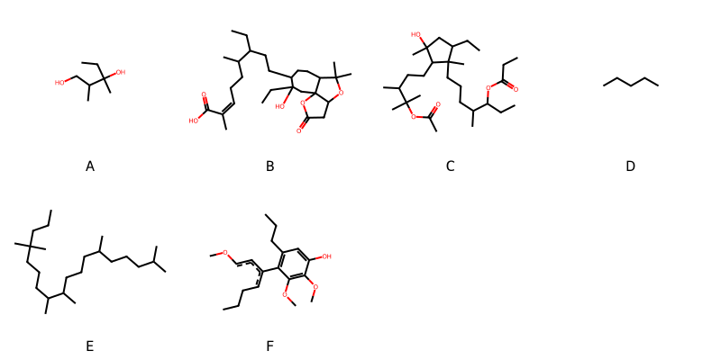

!!! abstract "Tóm tắt"

    **Họ Schisandraceae** có **2** chi được các cộng đồng sử dụng trong chăm sóc sức khỏe gồm *Kadsura, Schisandra*. Số lượng thành phần hóa học đã phân lập và xác định cấu trúc từ họ này tính đến tháng 12 năm 2024 là **22** nhóm có thể liệt kê như sau *Furofurans, Amaryllidaceae alkaloids, Fatty Acyls, Alkylhalophosphines, Tannins, Isocoumarans, Carboxylic acids and derivatives, Unsaturated hydrocarbons, Harmala alkaloids, Furopyrans, Steroids and steroid derivatives, Flavonoids, Aryltetralin lignans, Benzodioxoles, 2-arylbenzofuran flavonoids, Benzene and substituted derivatives, Prenol lipids, Organooxygen compounds, Cinnamic acids and derivatives, Indoles and derivatives, Naphthopyrans, Dibenzylbutane lignans*. Giữa các loài trong họ này, 3 dược liệu được nghiên cứu nhiều nhất dựa trên số thành phần được phân lập là **Kadsura coccinea, Schisandra chinensis, Kadsura japonica*. *Họ Schisandraceae* đã được một số công động tại các quốc gia như Japan*, China, Elsewhere, Java, Chinese, Malaya (Import) đã phát hiện một số tác dụng trên lâm sàng gồm chữa bệnh lẫn độc tính như Thuốc bổ, Thuốc chống ho, Thuốc bổ, Thuốc giãn mạch, diệt khuẩn, Thuốc kích thích tình dục, Thuốc bổ, Thuốc long đờm, diệt khuẩn, thuốc tống hơi.

!!! info "DrDuke"

    James A. Duke sinh năm 1929-2017 là một nhà thực vật học người Mỹ. Đây là một trong những tác giả hàng đầu trong lĩnh vực dược dân tộc học với cuốn *CRC Handbook of Medicinal Herbs* và chính là người xây dựng lên cơ sở dữ liệu về hợp chất tự nhiên và dược dân tộc học tại Bộ nông nghiệp Hoa Kỳ. Các thông tin được đăng tải tại website [Dr. Duke's Phytochemical and Ethnobotanical Databases](https://phytochem.nal.usda.gov/). 
    Trong suốt thập niên 1970, ông lãnh đạo the Plant Taxonomy Laboratory, Plant Genetics and Germplasm Institute of the Agricultural Research Service, U.S. Department of Agriculture.
    Trong tài liệu này, các thông tin về dược dân tộc của các dược liệu được trích dẫn từ tài liệu của James A. Ducke với sự trợ giúp của phần mềm dịch thuật từ tiếng Anh sang tiếng Việt.
   
## Tổng quan về Họ Schisandraceae
### Phân loại thực vật
Trong *họ Schisandraceae* có **2** chi được sử dụng làm thuốc với chi tiết số loài trong mỗi chi như sau Schisandra (2) . Chi tiết về loài sử dụng làm thuốc như dưới đây.  

>Họ Schisandraceae


>|-- Chi Kadsura

>*Kadsura cauliflora*,
>*Kadsura coccinea*,
>*Kadsura japonica*,
>*Kadsura peltigera*,

>|-- Chi Schisandra

>*Schisandra chinensis*,
>*Schisandra henanthera*,

### Thành phần hóa học 

Số lượng thành phần hóa học đã phân lập và xác định cấu trúc từ họ này tính đến tháng 12 năm 2024 là 22 nhóm có thể liệt kê như sau Furofurans, Amaryllidaceae alkaloids, Fatty Acyls, Alkylhalophosphines, Tannins, Isocoumarans, Carboxylic acids and derivatives, Unsaturated hydrocarbons, Harmala alkaloids, Furopyrans, Steroids and steroid derivatives, Flavonoids, Aryltetralin lignans, Benzodioxoles, 2-arylbenzofuran flavonoids, Benzene and substituted derivatives, Prenol lipids, Organooxygen compounds, Cinnamic acids and derivatives, Indoles and derivatives, Naphthopyrans, Dibenzylbutane lignans. Số lượng các loài đã được nghiên cứu thành phần hóa học là *3* trong tổng số *6* loài thuộc họ Schisandraceae.Giữa các loài trong họ này, 3 dược liệu được nghiên cứu nhiều nhất dựa trên số thành phần được phân lập là **Kadsura coccinea, Schisandra chinensis, Kadsura japonica**. Sử dụng phần mềm RDKIT với thuật toán  Find Maximum Common Substructure (FMCS), các nhóm hoạt chất phổ biến nhất trong *họ Schisandraceae* đã xây dựng được nhân. Điều này trong tương lại có thể được sử dụng tìm kiếm mối liên hệ giữa tác dụng của cấu trúc hóa học và tác dụng dược lý. Các nhân trong phần này có thể không giống như cấu trúc gốc của từng nhóm chất. Kết quả được trình bầy như hình dưới đây.

<figure markdown="span">
    { width=100% }
    <figcaption> Cấu trúc hóa học của một số khung cơ bản dựa trên thuật toán FMCS để tìm Carboxylic acids and derivatives (A), Furofurans (B), Naphthopyrans (C), Prenol lipids (D), Steroids and steroid derivatives (E), Tannins (F).</figcaption>
</figure>


!!! info  "Find Maximum Common Substructure"
    
    Thuật toán FMCS (Find Maximum Common Substructure) là một phương pháp được sử dụng để tìm ra cấu trúc chung nhiều nhất (MCS) trong một tập hợp các cấu trúc hóa học. Các bước của thuật toán gồm:
    - Chọn một cấu trúc hóa học là cấu trúc để tạo truy vấn, còn các cấu trúc khác là mục tiêu.
    - Chia nhỏ cấu trúc để tạo truy vấn thành cấu trúc nhỏ hơn dạng chuỗi SMARTS.
    - Kiểm tra chuỗi SMARTS trong các cấu trúc mục tiêu.
    - Tìm kiếm chuỗi SMARTS xuất hiện nhiều nhất.
    Để biết thêm chi tiết các bạn có thể xem tại [TeachOpenCADD](https://projects.volkamerlab.org/teachopencadd/talktorials/T006_compound_maximum_common_substructures.html)
    ``` python
    pip install rdkit
    def find_core_smiles(smiles_list):
        mols = [Chem.MolFromSmiles(smiles) for smiles in smiles_list]
        mcs = rdFMCS.FindMCS(mols)
        core_smiles = Chem.MolToSmiles(Chem.MolFromSmarts(mcs.smartsString))
        return core_smiles
    ```

### Dược dân tộc học

Họ **Schisandraceae** đã được một số công động tại các quốc gia như *Japan*, China, Elsewhere, Java, Chinese, Malaya (Import)* đã phát hiện một số tác dụng trên lâm sàng gồm chữa bệnh lẫn độc tính như *Thuốc bổ, Thuốc chống ho, Thuốc bổ, Thuốc giãn mạch, diệt khuẩn, Thuốc kích thích tình dục, Thuốc bổ, Thuốc long đờm, diệt khuẩn, thuốc tống hơi*.

## Chi tiết dược dân tộc học


### Chi Kadsura

!!! note "Danh sách các loài thuộc chi"
    
*	 - *Kadsura cauliflora*
	 - *Kadsura coccinea*
	 - *Kadsura japonica*
	 - *Kadsura peltigera**

---      
#### *Kadsura coccinea*
**Thông tin về thực vật**

!!! info "Phân loại thực vật của *Kadsura coccinea* từ GIBF:"
    - **Kingdom:** Plantae
    - **Phylum:** Tracheophyta
    - **Order:** Austrobaileyales
    - **Family:** Schisandraceae
    - **Genus:** Kadsura
    - **Species:** *Kadsura coccinea*


 

Chưa có thông tin về loài này trên wikidata.

*Phân bố trên thế giới*: Thailand, nan, United States of America, China, Hong Kong, unknown or invalid, Viet Nam

*Phân bố tại Việt Nam*: Quang Binh, Bac Kan, Thua Thien-Hue, Lam Dong, Ninh Binh, Đăk Nông

**Thành phần hóa học**
        

Chưa có nghiên cứu về thành phần hóa học của loài này


**Dược dân tộc học**

Danh sách các quốc gia có sử dụng *Kadsura coccinea* trong điều trị các bệnh. 

| Quốc gia   | Bệnh           |
|:-----------|:---------------|
| Java       | Thuốc long đờm |


---      
#### *Kadsura coccinea*
**Thông tin về thực vật**

!!! info "Phân loại thực vật của *Kadsura coccinea* từ GIBF:"
    - **Kingdom:** Plantae
    - **Phylum:** Tracheophyta
    - **Order:** Austrobaileyales
    - **Family:** Schisandraceae
    - **Genus:** Kadsura
    - **Species:** *Kadsura coccinea*


 

Chưa có thông tin về loài này trên wikidata.

*Phân bố trên thế giới*: Thailand, nan, United States of America, China, Hong Kong, unknown or invalid, Viet Nam

*Phân bố tại Việt Nam*: Quang Binh, Bac Kan, Thua Thien-Hue, Lam Dong, Ninh Binh, Đăk Nông

**Thành phần hóa học**
        

Theo cơ sở dữ liệu lotus, từ loài *Kadsura coccinea* đã phân lập và xác định được 334 hoạt chất thuộc về các nhóm Furopyrans, Steroids and steroid derivatives, Furofurans, Fatty Acyls, Benzodioxoles, Aryltetralin lignans, Naphthopyrans, Tannins, Isocoumarans, 2-arylbenzofuran flavonoids, Carboxylic acids and derivatives, Benzene and substituted derivatives, Prenol lipids, Dibenzylbutane lignans. Danh sách các hoạt chất như sau 3-[5-(4-hydroxy-6-methylhept-5-en-2-yl)-4,8-dimethyl-12-(prop-1-en-2-yl)tetracyclo[7.5.0.0¹,¹³.0⁴,⁸]tetradecan-13-yl]propanoic acid [(LTS0133639)](https://lotus.naturalproducts.net/compound/lotus_id/LTS0133639), (1s,3r,9r,12s,13s,16r,17r)-8,8,13,17-tetramethyl-16-[(1s)-1-[(2r)-5-methyl-6-oxo-2,3-dihydropyran-2-yl]ethyl]-7-oxapentacyclo[10.7.0.0¹,³.0³,⁹.0¹³,¹⁷]nonadecan-6-one [(LTS0085115)](https://lotus.naturalproducts.net/compound/lotus_id/LTS0085115), 3-[5-(6-hydroxy-6-methylhept-4-en-2-yl)-4,8-dimethyl-12-(prop-1-en-2-yl)tetracyclo[7.5.0.0¹,¹³.0⁴,⁸]tetradecan-13-yl]propanoic acid [(LTS0067726)](https://lotus.naturalproducts.net/compound/lotus_id/LTS0067726), 3-[(3r,3ar,7e,8r,10ar,10bs)-8-(2-hydroxypropan-2-yl)-3a,10b-dimethyl-3-[(1s)-1-[(2s)-5-methyl-6-oxo-2,3-dihydropyran-2-yl]ethyl]-1h,2h,3h,4h,6h,8h,9h,10h,10ah-cyclohepta[e]inden-7-ylidene]propanoic acid [(LTS0106509)](https://lotus.naturalproducts.net/compound/lotus_id/LTS0106509), (1s,3r,7r,10s,13s,14r,15s)-1-hydroxy-17-[(1s,2s)-1-hydroxy-1-[(2s,4s)-4-methyl-5-oxooxolan-2-yl]propan-2-yl]-9,9,14-trimethyl-5-oxo-4,8-dioxapentacyclo[11.7.0.0³,⁷.0³,¹⁰.0¹⁴,¹⁸]icos-17-en-15-yl acetate [(LTS0269154)](https://lotus.naturalproducts.net/compound/lotus_id/LTS0269154), 3-[(3r,3ar,6s,7s,9br)-3a,6,9b-trimethyl-3-[(1s)-1-[(2r)-5-methyl-6-oxo-2,3-dihydropyran-2-yl]ethyl]-7-(prop-1-en-2-yl)-1h,2h,3h,4h,5h,7h,8h,9h-cyclopenta[a]naphthalen-6-yl]propanoic acid [(LTS0179096)](https://lotus.naturalproducts.net/compound/lotus_id/LTS0179096), pregomisin [(LTS0074893)](https://lotus.naturalproducts.net/compound/lotus_id/LTS0074893), (2z,6r)-6-[(4ar,6ar,6br,9r,11bs)-10-formyl-6a-methoxy-4,4,6b,11b-tetramethyl-3-oxo-1h,2h,4ah,5h,6h,7h,8h,9h-cyclohexa[a]fluoren-9-yl]-2-methylhept-2-enoic acid [(LTS0010165)](https://lotus.naturalproducts.net/compound/lotus_id/LTS0010165), 1-hydroxy-16-[1-(3-hydroxy-5-methyl-6-oxo-2,3-dihydropyran-2-yl)ethyl]-8,8,13-trimethyl-17-methylidene-7-oxatetracyclo[10.7.0.0³,⁹.0¹³,¹⁸]nonadeca-2,4,15-trien-6-one [(LTS0169216)](https://lotus.naturalproducts.net/compound/lotus_id/LTS0169216), (9r,10r,11r)-11-hydroxy-4,5,19-trimethoxy-9,10-dimethyl-15,17-dioxatetracyclo[10.7.0.0²,⁷.0¹⁴,¹⁸]nonadeca-1(12),2(7),3,5,13,18-hexaen-3-yl (2r)-2-methylbutanoate [(LTS0230631)](https://lotus.naturalproducts.net/compound/lotus_id/LTS0230631), (2z,6r)-6-[(1r,3ar,5ar,7r,9ar,9br)-7-(acetyloxy)-3a,6,6,9a-tetramethyl-11-methylidene-1h,2h,3h,5h,5ah,7h,8h,9h,9bh,10h,11ah-cyclopenta[a]phenanthren-1-yl]-2-methylhept-2-enoic acid [(LTS0148799)](https://lotus.naturalproducts.net/compound/lotus_id/LTS0148799), kadlongilactone b [(LTS0042506)](https://lotus.naturalproducts.net/compound/lotus_id/LTS0042506), 10-hydroxy-16-[1-hydroxy-1-(5-methyl-6-oxo-2,3-dihydropyran-2-yl)ethyl]-8,8,13,17-tetramethyl-7-oxapentacyclo[10.7.0.0¹,³.0³,⁹.0¹³,¹⁷]nonadec-4-en-6-one [(LTS0250092)](https://lotus.naturalproducts.net/compound/lotus_id/LTS0250092), 1,11,17-trihydroxy-9,9,14-trimethyl-17-[1-(5-methyl-6-oxo-2,3-dihydropyran-2-yl)ethyl]-18-methylidene-3,8-dioxapentacyclo[11.7.0.0²,⁴.0⁴,¹⁰.0¹⁴,¹⁹]icos-5-en-7-one [(LTS0206147)](https://lotus.naturalproducts.net/compound/lotus_id/LTS0206147), kadlongilactone a [(LTS0043352)](https://lotus.naturalproducts.net/compound/lotus_id/LTS0043352), (1s,9r,12s,13r,18r)-1-hydroxy-8,8,13-trimethyl-16-[(1r)-1-[(2r)-5-methyl-6-oxo-2,3-dihydropyran-2-yl]ethyl]-17-methylidene-7-oxatetracyclo[10.7.0.0³,⁹.0¹³,¹⁸]nonadeca-2,4,15-trien-6-one [(LTS0225312)](https://lotus.naturalproducts.net/compound/lotus_id/LTS0225312), 6-[7-(acetyloxy)-3a,6,6,9a-tetramethyl-11-methylidene-1h,2h,3h,5h,5ah,7h,8h,9h,9bh,10h,11ah-cyclopenta[a]phenanthren-1-yl]-2-methylhept-2-enoic acid [(LTS0202157)](https://lotus.naturalproducts.net/compound/lotus_id/LTS0202157), (1s,9s,10r,12s,13r,18r)-1-hydroxy-8,8,13-trimethyl-16-[(1r)-1-[(2r)-5-methyl-6-oxo-2,3-dihydropyran-2-yl]ethyl]-17-methylidene-6-oxo-7-oxatetracyclo[10.7.0.0³,⁹.0¹³,¹⁸]nonadeca-2,4,15-trien-10-yl acetate [(LTS0252115)](https://lotus.naturalproducts.net/compound/lotus_id/LTS0252115), (11r,12r,13s,14s)-3,22-dimethoxy-12,13-dimethyl-5,7,18,20-tetraoxapentacyclo[13.7.0.0²,¹⁰.0⁴,⁸.0¹⁷,²¹]docosa-1(15),2(10),3,8,16,21-hexaene-11,14-diol [(LTS0242789)](https://lotus.naturalproducts.net/compound/lotus_id/LTS0242789), 3-[4,8-dimethyl-5-(6-methylhept-5-en-2-yl)-12-(prop-1-en-2-yl)tetracyclo[7.5.0.0¹,¹³.0⁴,⁸]tetradecan-13-yl]propanoic acid [(LTS0089683)](https://lotus.naturalproducts.net/compound/lotus_id/LTS0089683), 3-{5-[4-(acetyloxy)-6-methylhept-5-en-2-yl]-4,8-dimethyl-12-(prop-1-en-2-yl)tetracyclo[7.5.0.0¹,¹³.0⁴,⁸]tetradecan-13-yl}propanoic acid [(LTS0224513)](https://lotus.naturalproducts.net/compound/lotus_id/LTS0224513), 3-[5-(5-hydroperoxy-6-methylhept-6-en-2-yl)-4,8-dimethyl-12-(prop-1-en-2-yl)tetracyclo[7.5.0.0¹,¹³.0⁴,⁸]tetradecan-13-yl]propanoic acid [(LTS0241783)](https://lotus.naturalproducts.net/compound/lotus_id/LTS0241783), 1-hydroxy-8,8,13-trimethyl-16-[1-(5-methyl-6-oxo-2,3-dihydropyran-2-yl)ethyl]-17-methylidene-7-oxatetracyclo[10.7.0.0³,⁹.0¹³,¹⁸]nonadeca-2,4-dien-6-one [(LTS0089307)](https://lotus.naturalproducts.net/compound/lotus_id/LTS0089307), 1,17-dihydroxy-9,9,14,18-tetramethyl-17-[1-(5-methyl-6-oxo-2,3-dihydropyran-2-yl)ethyl]-4,8-dioxapentacyclo[11.7.0.0³,⁷.0³,¹⁰.0¹⁴,¹⁸]icosan-5-one [(LTS0181297)](https://lotus.naturalproducts.net/compound/lotus_id/LTS0181297), 2-[(1s,2r,3r)-1-hydroxy-4-(3-hydroxy-4,5-dimethoxyphenyl)-2,3-dimethylbutyl]-4,5-dimethoxyphenol [(LTS0215842)](https://lotus.naturalproducts.net/compound/lotus_id/LTS0215842), 3-hydroxy-4,5,19-trimethoxy-9,10-dimethyl-15,17-dioxatetracyclo[10.7.0.0²,⁷.0¹⁴,¹⁸]nonadeca-1(12),2(7),3,5,13,18-hexaen-11-yl acetate [(LTS0006196)](https://lotus.naturalproducts.net/compound/lotus_id/LTS0006196), (8r,9s,10r,11r)-11-(acetyloxy)-14-hydroxy-3,4,5,15,16-pentamethoxy-9,10-dimethyltricyclo[10.4.0.0²,⁷]hexadeca-1(12),2,4,6,13,15-hexaen-8-yl 2-methylbut-2-enoate [(LTS0202637)](https://lotus.naturalproducts.net/compound/lotus_id/LTS0202637), (2s,8r,12r,15r,16r)-2,7,7,12,16-pentamethyl-15-[(1s)-1-[(2r)-5-methyl-6-oxo-2,3-dihydropyran-2-yl]ethyl]-6-oxatetracyclo[9.7.0.0²,⁸.0¹²,¹⁶]octadec-1(11)-en-5-one [(LTS0158413)](https://lotus.naturalproducts.net/compound/lotus_id/LTS0158413), (11r,12r,13s,14r)-3,22-dimethoxy-12,13-dimethyl-14-{[(2z)-2-methylbut-2-enoyl]oxy}-5,7,18,20-tetraoxapentacyclo[13.7.0.0²,¹⁰.0⁴,⁸.0¹⁷,²¹]docosa-1(22),2(10),3,8,15,17(21)-hexaen-11-yl (2e)-2-methylbut-2-enoate [(LTS0065614)](https://lotus.naturalproducts.net/compound/lotus_id/LTS0065614), 12,25-dihydroxy-18,19,20-trimethoxy-11,12,24,25-tetramethyl-4,6,9,14-tetraoxapentacyclo[13.7.3.0³,⁷.0⁸,²².0¹⁶,²¹]pentacosa-1(22),2,7,16(21),17,19-hexaen-13-one [(LTS0125997)](https://lotus.naturalproducts.net/compound/lotus_id/LTS0125997), (1r,3s,7s,10r,13s,14s,16r,18s,19s)-1-hydroxy-18-[(1r,2r)-1-hydroxy-1-[(2r)-4-methyl-5-oxo-2h-furan-2-yl]propan-2-yl]-9,9,19-trimethyl-4,8,15-trioxahexacyclo[11.8.0.0³,⁷.0³,¹⁰.0¹⁴,¹⁶.0¹⁴,¹⁹]henicosan-5-one [(LTS0195717)](https://lotus.naturalproducts.net/compound/lotus_id/LTS0195717), 3-[(1s,4r,5r,8s,9s,12s,13r)-5-[(2r)-4-[(2s)-3,3-dimethyloxiran-2-yl]butan-2-yl]-4,8-dimethyl-12-(prop-1-en-2-yl)tetracyclo[7.5.0.0¹,¹³.0⁴,⁸]tetradecan-13-yl]propanoic acid [(LTS0245175)](https://lotus.naturalproducts.net/compound/lotus_id/LTS0245175), (8r,9s,10r,11r)-11-hydroxy-3,4,5,19-tetramethoxy-9,10-dimethyl-15,17-dioxatetracyclo[10.7.0.0²,⁷.0¹⁴,¹⁸]nonadeca-1(12),2(7),3,5,13,18-hexaen-8-yl acetate [(LTS0128867)](https://lotus.naturalproducts.net/compound/lotus_id/LTS0128867), (9s,10s)-3,4,5,14,15,16-hexamethoxy-9,10-dimethyltricyclo[10.4.0.0²,⁷]hexadeca-1(12),2(7),3,5,13,15-hexaene [(LTS0124319)](https://lotus.naturalproducts.net/compound/lotus_id/LTS0124319), (2z,6r)-6-[(3as,5ar,7r,9ar,9br,11r)-7-hydroxy-3a,6,6,9a,11-pentamethyl-2h,3h,5h,5ah,7h,8h,9h,9bh,10h,11h-cyclopenta[a]phenanthren-1-yl]-2-methylhept-2-enoic acid [(LTS0196355)](https://lotus.naturalproducts.net/compound/lotus_id/LTS0196355), (9s,10s,11r)-3,4,5,19-tetramethoxy-9,10-dimethyl-15,17-dioxatetracyclo[10.7.0.0²,⁷.0¹⁴,¹⁸]nonadeca-1(12),2(7),3,5,13,18-hexaen-11-ol [(LTS0227909)](https://lotus.naturalproducts.net/compound/lotus_id/LTS0227909), (9r,10s)-3,4,5,19-tetramethoxy-9,10-dimethyl-15,17-dioxatetracyclo[10.7.0.0²,⁷.0¹⁴,¹⁸]nonadeca-1(12),2(7),3,5,13,18-hexaene [(LTS0167102)](https://lotus.naturalproducts.net/compound/lotus_id/LTS0167102), (8s,9s,10r,11s)-11-hydroxy-3,4,5,19-tetramethoxy-9,10-dimethyl-15,17-dioxatetracyclo[10.7.0.0²,⁷.0¹⁴,¹⁸]nonadeca-1(12),2,4,6,13,18-hexaen-8-yl (2e)-2-methylbut-2-enoate [(LTS0051577)](https://lotus.naturalproducts.net/compound/lotus_id/LTS0051577), (8r,9s,10r,11r)-8-(acetyloxy)-9-hydroxy-3,4,5,19-tetramethoxy-9,10-dimethyl-15,17-dioxatetracyclo[10.7.0.0²,⁷.0¹⁴,¹⁸]nonadeca-1(12),2(7),3,5,13,18-hexaen-11-yl acetate [(LTS0104313)](https://lotus.naturalproducts.net/compound/lotus_id/LTS0104313), (12s,13r,14s)-14-hydroxy-3,22-dimethoxy-12,13-dimethyl-5,7,18,20-tetraoxapentacyclo[13.7.0.0²,¹⁰.0⁴,⁸.0¹⁷,²¹]docosa-1(15),2(10),3,8,16,21-hexaen-11-one [(LTS0040345)](https://lotus.naturalproducts.net/compound/lotus_id/LTS0040345), (8r,9s,10r,11r)-11-(acetyloxy)-3,4,5,19-tetramethoxy-9,10-dimethyl-15,17-dioxatetracyclo[10.7.0.0²,⁷.0¹⁴,¹⁸]nonadeca-1(12),2,4,6,13,18-hexaen-8-yl (2e)-2-methylbut-2-enoate [(LTS0130492)](https://lotus.naturalproducts.net/compound/lotus_id/LTS0130492), (1s,3r,7r,10s,13r,14r,16s,18r,19r)-1-hydroxy-18-[(1s,2s)-1-hydroxy-1-[(2s)-4-methyl-5-oxo-2h-furan-2-yl]propan-2-yl]-9,9,19-trimethyl-4,8,15-trioxahexacyclo[11.8.0.0³,⁷.0³,¹⁰.0¹⁴,¹⁶.0¹⁴,¹⁹]henicosan-5-one [(LTS0212900)](https://lotus.naturalproducts.net/compound/lotus_id/LTS0212900), (1r,17s,18s,19r)-9,12,13-trimethoxy-18,19-dimethyl-5,7,20-trioxapentacyclo[15.2.1.0²,¹⁰.0⁴,⁸.0¹¹,¹⁶]icosa-2(10),3,8,11,13,15-hexaen-14-ol [(LTS0109613)](https://lotus.naturalproducts.net/compound/lotus_id/LTS0109613), 3a,6,6,9a,11a-pentamethyl-1-(6-methyl-4-oxohept-5-en-2-yl)-1h,2h,3h,3bh,4h,5h,5ah,8h,9h,11h-cyclopenta[a]phenanthren-7-one [(LTS0211088)](https://lotus.naturalproducts.net/compound/lotus_id/LTS0211088), (1s,10s)-2,3,13,14,15-pentamethoxy-8,9-dimethyl-4-oxo-17-oxatetracyclo[8.6.1.0¹,⁶.0¹¹,¹⁶]heptadeca-2,5,11,13,15-pentaen-7-yl acetate [(LTS0192025)](https://lotus.naturalproducts.net/compound/lotus_id/LTS0192025), 3-[3a,6,9b-trimethyl-3-(6-methylhept-5-en-2-yl)-7-(prop-1-en-2-yl)-1h,2h,3h,4h,7h,8h,9h,9ah-cyclopenta[a]naphthalen-6-yl]propanoic acid [(LTS0165023)](https://lotus.naturalproducts.net/compound/lotus_id/LTS0165023), 3-[(1s,4r,5r,8s,9s,12s,13r)-5-[(2r,5r)-5-hydroxy-6-methylhept-6-en-2-yl]-4,8-dimethyl-12-(prop-1-en-2-yl)tetracyclo[7.5.0.0¹,¹³.0⁴,⁸]tetradecan-13-yl]propanoic acid [(LTS0168531)](https://lotus.naturalproducts.net/compound/lotus_id/LTS0168531), 3-[3a,6,9b-trimethyl-3-oxo-7-(prop-1-en-2-yl)-1h,2h,4h,7h,8h,9h,9ah-cyclopenta[a]naphthalen-6-yl]propanoic acid [(LTS0133477)](https://lotus.naturalproducts.net/compound/lotus_id/LTS0133477), 3-[3a,6,9b-trimethyl-3-(6-methyl-4-oxohept-5-en-2-yl)-7-(prop-1-en-2-yl)-1h,2h,3h,4h,5h,5ah,7h,8h-cyclopenta[a]naphthalen-6-yl]propanoic acid [(LTS0000416)](https://lotus.naturalproducts.net/compound/lotus_id/LTS0000416), (1s,8r,9r,10r)-2,3,13,14,15-pentamethoxy-8,9-dimethyl-17-oxatetracyclo[8.6.1.0¹,⁶.0¹¹,¹⁶]heptadeca-2,5,11,13,15-pentaen-4-one [(LTS0093852)](https://lotus.naturalproducts.net/compound/lotus_id/LTS0093852), (8r,9s,10r,11r)-11-(acetyloxy)-3,4,5,19-tetramethoxy-9,10-dimethyl-15,17-dioxatetracyclo[10.7.0.0²,⁷.0¹⁴,¹⁸]nonadeca-1(12),2,4,6,13,18-hexaen-8-yl (2z)-2-methylbut-2-enoate [(LTS0046230)](https://lotus.naturalproducts.net/compound/lotus_id/LTS0046230), 3-[5-(5-hydroxy-6-methylhept-6-en-2-yl)-4,8-dimethyl-12-(prop-1-en-2-yl)tetracyclo[7.5.0.0¹,¹³.0⁴,⁸]tetradecan-13-yl]propanoic acid [(LTS0084374)](https://lotus.naturalproducts.net/compound/lotus_id/LTS0084374), 9,9,18-trimethyl-17-[1-(5-methyl-6-oxo-2,3-dihydropyran-2-yl)ethyl]-5-oxo-4,8-dioxapentacyclo[11.7.0.0³,⁷.0³,¹⁰.0¹⁴,¹⁸]icos-14-en-1-yl formate [(LTS0141618)](https://lotus.naturalproducts.net/compound/lotus_id/LTS0141618), (1s,12r,13s,14s,15s)-15-(acetyloxy)-14-hydroxy-19,20-dimethoxy-13,14-dimethyl-18-oxo-3,6,8-trioxapentacyclo[9.9.1.0¹,¹⁶.0⁴,²¹.0⁵,⁹]henicosa-4,9,11(21),16,19-pentaen-12-yl benzoate [(LTS0056404)](https://lotus.naturalproducts.net/compound/lotus_id/LTS0056404), 1-hydroxy-8,8,13-trimethyl-16-[1-(5-methyl-6-oxo-2,3-dihydropyran-2-yl)ethyl]-17-methylidene-6-oxo-7-oxatetracyclo[10.7.0.0³,⁹.0¹³,¹⁸]nonadeca-2,4-dien-10-yl acetate [(LTS0159428)](https://lotus.naturalproducts.net/compound/lotus_id/LTS0159428), 3-[(1s,4r,5r,8s,9s,12s,13r)-4,8-dimethyl-5-[(2r)-6-methylhept-5-en-2-yl]-12-(prop-1-en-2-yl)tetracyclo[7.5.0.0¹,¹³.0⁴,⁸]tetradecan-13-yl]propanoic acid [(LTS0053350)](https://lotus.naturalproducts.net/compound/lotus_id/LTS0053350), 1-hydroxy-9,9,14-trimethyl-17-[1-(5-methyl-6-oxo-2,3-dihydropyran-2-yl)ethyl]-18-methylidene-7-oxo-3,8-dioxapentacyclo[11.7.0.0²,⁴.0⁴,¹⁰.0¹⁴,¹⁹]icosa-5,16-dien-11-yl acetate [(LTS0202956)](https://lotus.naturalproducts.net/compound/lotus_id/LTS0202956), sitogluside [(LTS0201798)](https://lotus.naturalproducts.net/compound/lotus_id/LTS0201798), (1r,3ar,5ar,9ar,9bs,11ar)-3a,6,6,9a,11a-pentamethyl-1-[(2r)-6-methyl-4-oxohept-5-en-2-yl]-1h,2h,3h,5h,5ah,8h,9h,9bh,10h,11h-cyclopenta[a]phenanthren-7-one [(LTS0037099)](https://lotus.naturalproducts.net/compound/lotus_id/LTS0037099), (2z,6r)-6-[(2r,4ar,7r,8s,9as)-7-(1-carboxy-1-methylethyl)-8-(carboxymethyl)-4a,8-dimethyl-1-methylidene-2,3,4,5,6,7,9,9a-octahydrofluoren-2-yl]-2-methylhept-2-enoic acid [(LTS0195156)](https://lotus.naturalproducts.net/compound/lotus_id/LTS0195156), 1-hydroxy-14-(hydroxymethyl)-9,9,18-trimethyl-17-[1-(5-methyl-6-oxo-2,3-dihydropyran-2-yl)ethyl]-4,8-dioxapentacyclo[11.7.0.0³,⁷.0³,¹⁰.0¹⁴,¹⁸]icosan-5-one [(LTS0271043)](https://lotus.naturalproducts.net/compound/lotus_id/LTS0271043), 6-[(3ar,6s,9as,9bs)-6-(2-carboxyethyl)-3a,6,9b-trimethyl-7-(prop-1-en-2-yl)-1h,2h,3h,4h,7h,8h,9h,9ah-cyclopenta[a]naphthalen-3-yl]-2-methylhept-2-enoic acid [(LTS0105440)](https://lotus.naturalproducts.net/compound/lotus_id/LTS0105440), (8r,9s,10r,11r)-11-(acetyloxy)-14-hydroxy-3,4,5,15,16-pentamethoxy-9,10-dimethyltricyclo[10.4.0.0²,⁷]hexadeca-1(12),2(7),3,5,13,15-hexaen-8-yl benzoate [(LTS0231830)](https://lotus.naturalproducts.net/compound/lotus_id/LTS0231830), 4,5,6,9,10,11-hexamethoxy-15,16-dimethyl-17-oxatetracyclo[12.2.1.0²,⁷.0⁸,¹³]heptadeca-2(7),3,5,8(13),9,11-hexaene [(LTS0214450)](https://lotus.naturalproducts.net/compound/lotus_id/LTS0214450), (1s,17r,18r,19s)-9,12,13,14-tetramethoxy-18,19-dimethyl-5,7,20-trioxapentacyclo[15.2.1.0²,¹⁰.0⁴,⁸.0¹¹,¹⁶]icosa-2(10),3,8,11(16),12,14-hexaene [(LTS0127529)](https://lotus.naturalproducts.net/compound/lotus_id/LTS0127529), 14-hydroxy-3,22-dimethoxy-12,13-dimethyl-5,7,18,20-tetraoxapentacyclo[13.7.0.0²,¹⁰.0⁴,⁸.0¹⁷,²¹]docosa-1(15),2(10),3,8,16,21-hexaen-11-yl benzoate [(LTS0002304)](https://lotus.naturalproducts.net/compound/lotus_id/LTS0002304), 1,16-dihydroxy-8,8,13-trimethyl-16-[1-(5-methyl-6-oxo-2,3-dihydropyran-2-yl)ethyl]-17-methylidene-7-oxatetracyclo[10.7.0.0³,⁹.0¹³,¹⁸]nonadeca-2,4-dien-6-one [(LTS0138602)](https://lotus.naturalproducts.net/compound/lotus_id/LTS0138602), kadsuracoccinic acid a [(LTS0141699)](https://lotus.naturalproducts.net/compound/lotus_id/LTS0141699), 21-hydroxy-8,13,13-trimethyl-5-[1-(5-methyl-6-oxo-2,3-dihydropyran-2-yl)ethyl]-4-methylidene-15-oxo-14,18,19-trioxapentacyclo[10.7.2.0¹,⁹.0³,⁸.0¹⁷,²¹]henicosan-11-yl acetate [(LTS0010327)](https://lotus.naturalproducts.net/compound/lotus_id/LTS0010327), 3-[(1s,4r,5r,8s,9s,12s,13r)-5-[(2r,4e)-6-hydroperoxy-6-methylhept-4-en-2-yl]-4,8-dimethyl-12-(prop-1-en-2-yl)tetracyclo[7.5.0.0¹,¹³.0⁴,⁸]tetradecan-13-yl]propanoic acid [(LTS0199589)](https://lotus.naturalproducts.net/compound/lotus_id/LTS0199589), 13,26-dihydroxy-1,6,6,20,24-pentamethyl-7,22-dioxahexacyclo[13.12.0.0²,¹³.0⁵,¹¹.0¹⁶,²⁵.0¹⁸,²³]heptacosa-9,11,16(25),19-tetraene-8,21-dione [(LTS0039718)](https://lotus.naturalproducts.net/compound/lotus_id/LTS0039718), 3-[3-(5-hydroxy-6-methylhept-6-en-2-yl)-3a,6,9b-trimethyl-7-(prop-1-en-2-yl)-1h,2h,3h,4h,5h,5ah,7h,8h-cyclopenta[a]naphthalen-6-yl]propanoic acid [(LTS0017381)](https://lotus.naturalproducts.net/compound/lotus_id/LTS0017381), 1,11-dihydroxy-9,9,14-trimethyl-17-[1-(5-methyl-6-oxo-2,3-dihydropyran-2-yl)ethyl]-18-methylidene-3,8-dioxapentacyclo[11.7.0.0²,⁴.0⁴,¹⁰.0¹⁴,¹⁹]icosa-5,16-dien-7-one [(LTS0117912)](https://lotus.naturalproducts.net/compound/lotus_id/LTS0117912), (8s,9s,10s,11r)-11-(acetyloxy)-9-hydroxy-3,4,5,14,15,16-hexamethoxy-9,10-dimethyltricyclo[10.4.0.0²,⁷]hexadeca-1(12),2(7),3,5,13,15-hexaen-8-yl benzoate [(LTS0230749)](https://lotus.naturalproducts.net/compound/lotus_id/LTS0230749), (1r,2r,4s,10s,13s,14r,19r)-1-hydroxy-9,9,14-trimethyl-17-[(1r)-1-[(2r)-5-methyl-6-oxo-2,3-dihydropyran-2-yl]ethyl]-18-methylidene-3,8-dioxapentacyclo[11.7.0.0²,⁴.0⁴,¹⁰.0¹⁴,¹⁹]icosa-5,16-dien-7-one [(LTS0240079)](https://lotus.naturalproducts.net/compound/lotus_id/LTS0240079), (1r,12r,13r,14r)-18,19-dimethoxy-13,14-dimethyl-20-oxo-3,6,8-trioxapentacyclo[9.9.1.0¹,¹⁶.0⁴,²¹.0⁵,⁹]henicosa-4,9,11(21),16,18-pentaen-12-yl benzoate [(LTS0109229)](https://lotus.naturalproducts.net/compound/lotus_id/LTS0109229), (8r,9r,10s,11r)-11-(acetyloxy)-5-hydroxy-3,4,14,15,16-pentamethoxy-9,10-dimethyltricyclo[10.4.0.0²,⁷]hexadeca-1(12),2(7),3,5,13,15-hexaen-8-yl acetate [(LTS0255942)](https://lotus.naturalproducts.net/compound/lotus_id/LTS0255942), 3-[(1s,4r,5r,8s,9s,12s,13r)-5-[(2r)-4-(acetyloxy)-6-methylhept-5-en-2-yl]-13-ethyl-4,8-dimethyltetracyclo[7.5.0.0¹,¹³.0⁴,⁸]tetradecan-12-yl]but-3-enoic acid [(LTS0231716)](https://lotus.naturalproducts.net/compound/lotus_id/LTS0231716), 1,15-dihydroxy-9,9,14,18-tetramethyl-19-(4-methyl-5-oxooxolan-2-yl)-5-oxo-4,8,20-trioxahexacyclo[11.10.0.0³,⁷.0³,¹⁰.0¹⁴,²¹.0¹⁷,²¹]tricosan-12-yl acetate [(LTS0184482)](https://lotus.naturalproducts.net/compound/lotus_id/LTS0184482), (11r,12s,13s)-3,22-dimethoxy-12,13-dimethyl-5,7,18,20-tetraoxapentacyclo[13.7.0.0²,¹⁰.0⁴,⁸.0¹⁷,²¹]docosa-1(15),2(10),3,8,16,21-hexaen-11-ol [(LTS0268520)](https://lotus.naturalproducts.net/compound/lotus_id/LTS0268520), (1s,9s,10r,12s,13r,16s,18s)-1-hydroxy-8,8,13-trimethyl-16-[(1r)-1-[(2r)-5-methyl-6-oxo-2,3-dihydropyran-2-yl]ethyl]-17-methylidene-6-oxo-7-oxatetracyclo[10.7.0.0³,⁹.0¹³,¹⁸]nonadeca-2,4-dien-10-yl acetate [(LTS0151462)](https://lotus.naturalproducts.net/compound/lotus_id/LTS0151462), kadcoccilactone c [(LTS0224471)](https://lotus.naturalproducts.net/compound/lotus_id/LTS0224471), 3-[(3r,3ar,6s,7s,9as,9bs)-3a,6,9b-trimethyl-3-[(2z)-6-methylhept-2-en-2-yl]-7-(prop-1-en-2-yl)-1h,2h,3h,4h,7h,8h,9h,9ah-cyclopenta[a]naphthalen-6-yl]propanoic acid [(LTS0254379)](https://lotus.naturalproducts.net/compound/lotus_id/LTS0254379), 9,12,13-trimethoxy-18,19-dimethyl-5,7,20-trioxapentacyclo[15.2.1.0²,¹⁰.0⁴,⁸.0¹¹,¹⁶]icosa-2(10),3,8,11,13,15-hexaen-14-ol [(LTS0190643)](https://lotus.naturalproducts.net/compound/lotus_id/LTS0190643), (11r,12r,15r,24s,25s)-12-hydroxy-18,19,20-trimethoxy-11,12,24,25-tetramethyl-4,6,9,14-tetraoxapentacyclo[13.7.3.0³,⁷.0⁸,²².0¹⁶,²¹]pentacosa-1(22),2,7,16(21),17,19-hexaen-13-one [(LTS0013684)](https://lotus.naturalproducts.net/compound/lotus_id/LTS0013684), (1s,3r,7r,10s,12r,13r,14s,15s,17r,18s,19s,21s)-1,15-dihydroxy-9,9,14,18-tetramethyl-19-[(2s)-4-methyl-5-oxooxolan-2-yl]-5-oxo-4,8,20-trioxahexacyclo[11.10.0.0³,⁷.0³,¹⁰.0¹⁴,²¹.0¹⁷,²¹]tricosan-12-yl acetate [(LTS0249639)](https://lotus.naturalproducts.net/compound/lotus_id/LTS0249639), (6s,7s,8r)-8-(4-hydroxy-3-methoxyphenyl)-6,7-bis(hydroxymethyl)-3-methoxy-5,6,7,8-tetrahydronaphthalen-2-ol [(LTS0262045)](https://lotus.naturalproducts.net/compound/lotus_id/LTS0262045), 3-[8-(2-hydroxypropan-2-yl)-3a,10b-dimethyl-3-[1-(5-methyl-6-oxo-2,3-dihydropyran-2-yl)ethyl]-1h,2h,3h,4h,6h,8h,9h,10h,10ah-cyclohepta[e]inden-7-ylidene]propanoic acid [(LTS0039036)](https://lotus.naturalproducts.net/compound/lotus_id/LTS0039036), (8r,9s,10r,11r)-8-(acetyloxy)-3,4,5,19-tetramethoxy-9,10-dimethyl-15,17-dioxatetracyclo[10.7.0.0²,⁷.0¹⁴,¹⁸]nonadeca-1(12),2(7),3,5,13,18-hexaen-11-yl benzoate [(LTS0211137)](https://lotus.naturalproducts.net/compound/lotus_id/LTS0211137), (2z,6r)-6-[(3r,3ar,6s,7s,9as,9bs)-6-(2-carboxyethyl)-3a,6,9b-trimethyl-7-(prop-1-en-2-yl)-1h,2h,3h,4h,7h,8h,9h,9ah-cyclopenta[a]naphthalen-3-yl]-2-methylhept-2-enoic acid [(LTS0248205)](https://lotus.naturalproducts.net/compound/lotus_id/LTS0248205), (9r,10r,11r)-11-hydroxy-4,5,19-trimethoxy-9,10-dimethyl-15,17-dioxatetracyclo[10.7.0.0²,⁷.0¹⁴,¹⁸]nonadeca-1(12),2(7),3,5,13,18-hexaen-3-yl (2z)-2-methylbut-2-enoate [(LTS0227206)](https://lotus.naturalproducts.net/compound/lotus_id/LTS0227206), (1r,2r,4s,10s,11r,13s,14r,17r,19r)-1,11,17-trihydroxy-9,9,14-trimethyl-17-[(1s)-1-[(2r)-5-methyl-6-oxo-2,3-dihydropyran-2-yl]ethyl]-18-methylidene-3,8-dioxapentacyclo[11.7.0.0²,⁴.0⁴,¹⁰.0¹⁴,¹⁹]icos-5-en-7-one [(LTS0052813)](https://lotus.naturalproducts.net/compound/lotus_id/LTS0052813), (9r,10r,11r)-11-hydroxy-4,5,19-trimethoxy-9,10-dimethyl-15,17-dioxatetracyclo[10.7.0.0²,⁷.0¹⁴,¹⁸]nonadeca-1(12),2(7),3,5,13,18-hexaen-3-yl benzoate [(LTS0086627)](https://lotus.naturalproducts.net/compound/lotus_id/LTS0086627), 15-hydroxy-18,19-dimethoxy-13,14-dimethyl-20-oxo-3,6,8-trioxapentacyclo[9.9.1.0¹,¹⁶.0⁴,²¹.0⁵,⁹]henicosa-4(21),5(9),10,16,18-pentaen-12-yl 2-methylbutanoate [(LTS0270239)](https://lotus.naturalproducts.net/compound/lotus_id/LTS0270239), (2e,6r)-6-[(3r,3ar,6s,7s,9as,9bs)-6-(2-carboxyethyl)-3a,6,9b-trimethyl-7-(prop-1-en-2-yl)-1h,2h,3h,4h,7h,8h,9h,9ah-cyclopenta[a]naphthalen-3-yl]-2-methylhept-2-enoic acid [(LTS0265617)](https://lotus.naturalproducts.net/compound/lotus_id/LTS0265617), (11r,12s,13r,14r)-14-hydroxy-3,22-dimethoxy-12,13-dimethyl-5,7,18,20-tetraoxapentacyclo[13.7.0.0²,¹⁰.0⁴,⁸.0¹⁷,²¹]docosa-1(15),2,4(8),9,16,21-hexaen-11-yl (2z)-2-methylbut-2-enoate [(LTS0228912)](https://lotus.naturalproducts.net/compound/lotus_id/LTS0228912), 9,12-dimethoxy-21,22-dimethyl-5,7,14,16,23-pentaoxahexacyclo[18.2.1.0²,¹⁰.0⁴,⁸.0¹¹,¹⁹.0¹³,¹⁷]tricosa-2(10),3,8,11(19),12,17-hexaene [(LTS0274007)](https://lotus.naturalproducts.net/compound/lotus_id/LTS0274007), (2z,6r)-6-[(4ar,6as,6bs,10ar,11bs)-4,4,6b,10,11b-pentamethyl-3-oxo-1h,2h,4ah,5h,6h,6ah,7h,8h,10ah-cyclohexa[a]fluoren-9-yl]-2-methylhept-2-enoic acid [(LTS0197221)](https://lotus.naturalproducts.net/compound/lotus_id/LTS0197221), (3r,3ar,5ar,7r,8s,10ar,10bs)-3a,10b-dimethyl-3-[(1s)-1-[(2s)-5-methyl-6-oxo-2,3-dihydropyran-2-yl]ethyl]-8-(prop-1-en-2-yl)-decahydro-1h-spiro[cyclohepta[e]indene-7,2'-oxolan]-5'-one [(LTS0272436)](https://lotus.naturalproducts.net/compound/lotus_id/LTS0272436), (2e,5s,6s)-6-[(1r,3ar,5ar,9as,11ar)-3a,6,6,9a,11a-pentamethyl-7-oxo-1h,2h,3h,4h,5h,5ah,8h,9h,10h,11h-cyclopenta[a]phenanthren-1-yl]-5-(acetyloxy)-2-methylhept-2-enoic acid [(LTS0156402)](https://lotus.naturalproducts.net/compound/lotus_id/LTS0156402), (1r,2r,4s,10s,11r,13s,14r,17s,19s)-1-hydroxy-9,9,14-trimethyl-17-[(1r)-1-[(2r)-5-methyl-6-oxo-2,3-dihydropyran-2-yl]ethyl]-18-methylidene-7-oxo-3,8-dioxapentacyclo[11.7.0.0²,⁴.0⁴,¹⁰.0¹⁴,¹⁹]icos-5-en-11-yl acetate [(LTS0168739)](https://lotus.naturalproducts.net/compound/lotus_id/LTS0168739), (2e,6s)-6-[(3r,3ar,6s,7s,9as,9bs)-6-(2-carboxyethyl)-3a,6,9b-trimethyl-7-(prop-1-en-2-yl)-1h,2h,3h,4h,7h,8h,9h,9ah-cyclopenta[a]naphthalen-3-yl]-2-methylhept-2-enoic acid [(LTS0170958)](https://lotus.naturalproducts.net/compound/lotus_id/LTS0170958), (1s,12r,13s,14s,15s)-12-(acetyloxy)-14-hydroxy-19,20-dimethoxy-13,14-dimethyl-18-oxo-3,6,8-trioxapentacyclo[9.9.1.0¹,¹⁶.0⁴,²¹.0⁵,⁹]henicosa-4,9,11(21),16,19-pentaen-15-yl (2z)-2-methylbut-2-enoate [(LTS0274513)](https://lotus.naturalproducts.net/compound/lotus_id/LTS0274513), 8-(4-hydroxy-3-methoxyphenyl)-6,7-bis(hydroxymethyl)-3-methoxy-5,6,7,8-tetrahydronaphthalen-2-ol [(LTS0008421)](https://lotus.naturalproducts.net/compound/lotus_id/LTS0008421), (1s,3r,7r,10s,12r,13r,14s,15s,17r,18s,19s,21s)-1,12-dihydroxy-9,9,14,18-tetramethyl-19-[(2s,4s)-4-methyl-5-oxooxolan-2-yl]-5-oxo-4,8,20-trioxahexacyclo[11.10.0.0³,⁷.0³,¹⁰.0¹⁴,²¹.0¹⁷,²¹]tricosan-15-yl acetate [(LTS0189660)](https://lotus.naturalproducts.net/compound/lotus_id/LTS0189660), 6-{1-[10-hydroxy-2,6,10-trimethyl-11-(prop-1-en-2-yl)-14-oxatetracyclo[7.4.1.0¹,⁹.0²,⁶]tetradecan-5-yl]ethyl}-3-methyl-5,6-dihydropyran-2-one [(LTS0163618)](https://lotus.naturalproducts.net/compound/lotus_id/LTS0163618), (1r,2r,4s,10s,11r,13s,14r,19r)-1-hydroxy-9,9,14-trimethyl-17-[(1r)-1-[(2r)-5-methyl-6-oxo-2,3-dihydropyran-2-yl]ethyl]-18-methylidene-7-oxo-3,8-dioxapentacyclo[11.7.0.0²,⁴.0⁴,¹⁰.0¹⁴,¹⁹]icosa-5,16-dien-11-yl acetate [(LTS0141301)](https://lotus.naturalproducts.net/compound/lotus_id/LTS0141301), (9r,10r,11r)-11-hydroxy-4,5,19-trimethoxy-9,10-dimethyl-15,17-dioxatetracyclo[10.7.0.0²,⁷.0¹⁴,¹⁸]nonadeca-1(12),2(7),3,5,13,18-hexaen-3-yl 2-methylbutanoate [(LTS0137938)](https://lotus.naturalproducts.net/compound/lotus_id/LTS0137938), (1'r,2s,2's,4's,6'r,7'r,11'r,12's,14's,16'r,20'r,23's,25'r)-12',14',25'-trihydroxy-4,7',22',22'-tetramethyl-3',10',17',21'-tetraoxaspiro[furan-2,9'-heptacyclo[12.11.0.0²,⁴.0²,¹¹.0⁶,¹¹.0¹⁶,²⁰.0¹⁶,²³]pentacosane]-5,18'-dione [(LTS0183072)](https://lotus.naturalproducts.net/compound/lotus_id/LTS0183072), 1-hydroxy-9,9,14-trimethyl-17-[1-(5-methyl-6-oxo-2,3-dihydropyran-2-yl)ethyl]-18-methylidene-3,8-dioxapentacyclo[11.7.0.0²,⁴.0⁴,¹⁰.0¹⁴,¹⁹]icosa-5,16-dien-7-one [(LTS0106336)](https://lotus.naturalproducts.net/compound/lotus_id/LTS0106336), (11s,12r,13r)-3,22-dimethoxy-12,13-dimethyl-5,7,18,20-tetraoxapentacyclo[13.7.0.0²,¹⁰.0⁴,⁸.0¹⁷,²¹]docosa-1(15),2(10),3,8,16,21-hexaen-11-ol [(LTS0275142)](https://lotus.naturalproducts.net/compound/lotus_id/LTS0275142), 2,7,7,12,16-pentamethyl-15-(6-methyl-4-oxoheptan-2-yl)-6-oxatetracyclo[9.7.0.0²,⁸.0¹²,¹⁶]octadec-1(18)-en-5-one [(LTS0132805)](https://lotus.naturalproducts.net/compound/lotus_id/LTS0132805), (2z,6r)-6-[(3ar,6s,7s,9as,9bs)-6-(2-carboxyethyl)-3a,6,9b-trimethyl-7-(prop-1-en-2-yl)-1h,2h,3h,4h,7h,8h,9h,9ah-cyclopenta[a]naphthalen-3-yl]-2-methylhept-2-enoic acid [(LTS0208159)](https://lotus.naturalproducts.net/compound/lotus_id/LTS0208159), 13-hydroxy-1,6,6,20,24-pentamethyl-7,22-dioxahexacyclo[13.12.0.0²,¹³.0⁵,¹¹.0¹⁶,²⁵.0¹⁸,²³]heptacosa-9,11,16(25),19-tetraene-8,21,26-trione [(LTS0053779)](https://lotus.naturalproducts.net/compound/lotus_id/LTS0053779), (1r,17s,18s,19r)-9,12,13,14-tetramethoxy-18,19-dimethyl-5,7,20-trioxapentacyclo[15.2.1.0²,¹⁰.0⁴,⁸.0¹¹,¹⁶]icosa-2(10),3,8,11(16),12,14-hexaene [(LTS0086529)](https://lotus.naturalproducts.net/compound/lotus_id/LTS0086529), (1r,12r,13r,14r)-18,19-dimethoxy-13,14-dimethyl-20-oxo-3,6,8-trioxapentacyclo[9.9.1.0¹,¹⁶.0⁴,²¹.0⁵,⁹]henicosa-4(21),5(9),10,16,18-pentaen-12-yl propanoate [(LTS0197348)](https://lotus.naturalproducts.net/compound/lotus_id/LTS0197348), (8s,9s,10s,11r)-11-(acetyloxy)-9-hydroxy-3,4,5,19-tetramethoxy-9,10-dimethyl-15,17-dioxatetracyclo[10.7.0.0²,⁷.0¹⁴,¹⁸]nonadeca-1(12),2(7),3,5,13,18-hexaen-8-yl benzoate [(LTS0004314)](https://lotus.naturalproducts.net/compound/lotus_id/LTS0004314), 6-[6-(2-carboxyethyl)-7-(2-hydroxypropan-2-yl)-3a,6,9b-trimethyl-1h,2h,3h,4h,5h,7h,8h,9h-cyclopenta[a]naphthalen-3-yl]-2-methylhept-2-enoic acid [(LTS0102776)](https://lotus.naturalproducts.net/compound/lotus_id/LTS0102776), 1-hydroxy-8,8,13-trimethyl-16-[1-(5-methyl-6-oxo-2,3-dihydropyran-2-yl)ethyl]-17-methylidene-6-oxo-7-oxatetracyclo[10.7.0.0³,⁹.0¹³,¹⁸]nonadeca-2,4,15-trien-10-yl acetate [(LTS0127788)](https://lotus.naturalproducts.net/compound/lotus_id/LTS0127788), 18,19-dimethoxy-13,14-dimethyl-20-oxo-3,6,8-trioxapentacyclo[9.9.1.0¹,¹⁶.0⁴,²¹.0⁵,⁹]henicosa-4(21),5(9),10,16,18-pentaen-12-yl propanoate [(LTS0258244)](https://lotus.naturalproducts.net/compound/lotus_id/LTS0258244), (6r,7s,8s)-8-(4-hydroxy-3,5-dimethoxyphenyl)-3-methoxy-6,7-dimethyl-5,6,7,8-tetrahydronaphthalen-2-ol [(LTS0043625)](https://lotus.naturalproducts.net/compound/lotus_id/LTS0043625), 13,24-dihydroxy-7,21,21-trimethyl-8-(4-methyl-5-oxo-2h-furan-2-yl)-17-oxo-3,9,16,20-tetraoxaheptacyclo[11.11.0.0²,⁴.0²,¹⁰.0⁶,¹⁰.0¹⁵,¹⁹.0¹⁵,²²]tetracosan-11-yl acetate [(LTS0066701)](https://lotus.naturalproducts.net/compound/lotus_id/LTS0066701), (2z,6r)-6-[(1r,3ar,5ar,9ar,9br)-3a,6,6,9a-tetramethyl-11-methylidene-7-oxo-1h,2h,3h,5h,5ah,8h,9h,9bh,10h,11ah-cyclopenta[a]phenanthren-1-yl]-2-methylhept-2-enoic acid [(LTS0263010)](https://lotus.naturalproducts.net/compound/lotus_id/LTS0263010), (1s,3r,7r,10s,13s,14r,17s,18r)-1-hydroxy-14-(hydroxymethyl)-9,9,18-trimethyl-17-[(1s)-1-[(2s)-5-methyl-6-oxo-2,3-dihydropyran-2-yl]ethyl]-4,8-dioxapentacyclo[11.7.0.0³,⁷.0³,¹⁰.0¹⁴,¹⁸]icosan-5-one [(LTS0138862)](https://lotus.naturalproducts.net/compound/lotus_id/LTS0138862), (2z)-6-{3a,6,6,9a,11a-pentamethyl-7-oxo-1h,2h,3h,3bh,4h,5h,5ah,8h,9h,11h-cyclopenta[a]phenanthren-1-yl}-2-methylhept-2-enoic acid [(LTS0117689)](https://lotus.naturalproducts.net/compound/lotus_id/LTS0117689), (1s,3r,7r,10s,13s,14r,15s)-1,7-dihydroxy-17-[(1s,2s)-1-hydroxy-1-[(2s,4s)-4-methyl-5-oxooxolan-2-yl]propan-2-yl]-9,9,14-trimethyl-5-oxo-4,8-dioxapentacyclo[11.7.0.0³,⁷.0³,¹⁰.0¹⁴,¹⁸]icos-17-en-15-yl acetate [(LTS0049246)](https://lotus.naturalproducts.net/compound/lotus_id/LTS0049246), (11r,12s,13r,14r)-14-hydroxy-3,22-dimethoxy-12,13-dimethyl-5,7,18,20-tetraoxapentacyclo[13.7.0.0²,¹⁰.0⁴,⁸.0¹⁷,²¹]docosa-1(15),2(10),3,8,16,21-hexaen-11-yl benzoate [(LTS0252562)](https://lotus.naturalproducts.net/compound/lotus_id/LTS0252562), 9,12,13,14-tetramethoxy-18,19-dimethyl-5,7,20-trioxapentacyclo[15.2.1.0²,¹⁰.0⁴,⁸.0¹¹,¹⁶]icosa-2(10),3,8,11(16),12,14-hexaene [(LTS0157088)](https://lotus.naturalproducts.net/compound/lotus_id/LTS0157088), 1,14,15-trihydroxy-17-[1-hydroxy-1-(4-methyl-5-oxo-2h-furan-2-yl)propan-2-yl]-9,9,18-trimethyl-4,8-dioxapentacyclo[11.7.0.0³,⁷.0³,¹⁰.0¹⁴,¹⁸]icosan-5-one [(LTS0120644)](https://lotus.naturalproducts.net/compound/lotus_id/LTS0120644), 14-hydroxy-3,22-dimethoxy-12,13-dimethyl-5,7,18,20-tetraoxapentacyclo[13.7.0.0²,¹⁰.0⁴,⁸.0¹⁷,²¹]docosa-1(15),2,4(8),9,16,21-hexaen-11-yl 2-methylbut-2-enoate [(LTS0131045)](https://lotus.naturalproducts.net/compound/lotus_id/LTS0131045), (8r,9s,10r,11r)-8-(acetyloxy)-3,4,5,19-tetramethoxy-9,10-dimethyl-15,17-dioxatetracyclo[10.7.0.0²,⁷.0¹⁴,¹⁸]nonadeca-1(19),2(7),3,5,12,14(18)-hexaen-11-yl 2-methylbutanoate [(LTS0189190)](https://lotus.naturalproducts.net/compound/lotus_id/LTS0189190), 18,19-dimethoxy-13,14-dimethyl-20-oxo-3,6,8-trioxapentacyclo[9.9.1.0¹,¹⁶.0⁴,²¹.0⁵,⁹]henicosa-4,9,11(21),16,18-pentaen-12-yl acetate [(LTS0045299)](https://lotus.naturalproducts.net/compound/lotus_id/LTS0045299), (9s,10r)-3,4,15,16-tetramethoxy-9,10-dimethyltricyclo[10.4.0.0²,⁷]hexadeca-1(12),2,4,6,13,15-hexaene-5,14-diol [(LTS0078798)](https://lotus.naturalproducts.net/compound/lotus_id/LTS0078798), (1s,8r,9r,10r)-3,4,13,14,15-pentamethoxy-8,9-dimethyl-17-oxatetracyclo[8.6.1.0¹,⁶.0¹¹,¹⁶]heptadeca-3,5,11,13,15-pentaen-2-one [(LTS0103999)](https://lotus.naturalproducts.net/compound/lotus_id/LTS0103999), stigmast-5-en-3-ol, (3β)- [(LTS0204616)](https://lotus.naturalproducts.net/compound/lotus_id/LTS0204616), 2-methyl-6-{7,7,12,16-tetramethyl-6-oxopentacyclo[9.7.0.0¹,³.0³,⁸.0¹²,¹⁶]octadecan-15-yl}hept-2-enoic acid [(LTS0242075)](https://lotus.naturalproducts.net/compound/lotus_id/LTS0242075), 11-(acetyloxy)-3,4,5,19-tetramethoxy-9,10-dimethyl-15,17-dioxatetracyclo[10.7.0.0²,⁷.0¹⁴,¹⁸]nonadeca-1(12),2,4,6,13,18-hexaen-8-yl 2-methylbut-2-enoate [(LTS0078234)](https://lotus.naturalproducts.net/compound/lotus_id/LTS0078234), (1r,3s,7s,10r,13r,14r,17s,18r)-1,17-dihydroxy-9,9,14,18-tetramethyl-17-[(1s)-1-[(2r)-5-methyl-6-oxo-2,3-dihydropyran-2-yl]ethyl]-4,8-dioxapentacyclo[11.7.0.0³,⁷.0³,¹⁰.0¹⁴,¹⁸]icosan-5-one [(LTS0203653)](https://lotus.naturalproducts.net/compound/lotus_id/LTS0203653), (1r,3s,7s,10r,12s,13s,14r,15r,17s,18r,19r,21r)-1,12-dihydroxy-9,9,14,18-tetramethyl-19-[(2s,4s)-4-methyl-5-oxooxolan-2-yl]-5-oxo-4,8,20-trioxahexacyclo[11.10.0.0³,⁷.0³,¹⁰.0¹⁴,²¹.0¹⁷,²¹]tricosan-15-yl acetate [(LTS0112019)](https://lotus.naturalproducts.net/compound/lotus_id/LTS0112019), 1,10,16-trihydroxy-8,8,13-trimethyl-16-[1-(5-methyl-6-oxo-2,3-dihydropyran-2-yl)ethyl]-17-methylidene-7-oxatetracyclo[10.7.0.0³,⁹.0¹³,¹⁸]nonadeca-2,4-dien-6-one [(LTS0004229)](https://lotus.naturalproducts.net/compound/lotus_id/LTS0004229), (12s,13r,14r)-14-hydroxy-3,22-dimethoxy-12,13-dimethyl-5,7,18,20-tetraoxapentacyclo[13.7.0.0²,¹⁰.0⁴,⁸.0¹⁷,²¹]docosa-1(15),2(10),3,8,16,21-hexaen-11-one [(LTS0096960)](https://lotus.naturalproducts.net/compound/lotus_id/LTS0096960), 3-[(3r,3ar,5ar,6s,7s,9br)-3a,6,9b-trimethyl-3-[(2r)-6-methyl-4-oxoheptan-2-yl]-7-(prop-1-en-2-yl)-1h,2h,3h,4h,5h,5ah,7h,8h-cyclopenta[a]naphthalen-6-yl]propanoic acid [(LTS0242656)](https://lotus.naturalproducts.net/compound/lotus_id/LTS0242656), (11r,12s,13r,14r)-14-(acetyloxy)-3,22-dimethoxy-12,13-dimethyl-5,7,18,20-tetraoxapentacyclo[13.7.0.0²,¹⁰.0⁴,⁸.0¹⁷,²¹]docosa-1(15),2,4(8),9,16,21-hexaen-11-yl (2z)-2-methylbut-2-enoate [(LTS0215417)](https://lotus.naturalproducts.net/compound/lotus_id/LTS0215417), ananolignan b [(LTS0267027)](https://lotus.naturalproducts.net/compound/lotus_id/LTS0267027), (1s,3r,7r,10s,12r,13r,14s,15s,17r,18s,19s,21s)-1,15-dihydroxy-9,9,14,18-tetramethyl-19-[(2s,4s)-4-methyl-5-oxooxolan-2-yl]-5-oxo-4,8,20-trioxahexacyclo[11.10.0.0³,⁷.0³,¹⁰.0¹⁴,²¹.0¹⁷,²¹]tricosan-12-yl acetate [(LTS0158973)](https://lotus.naturalproducts.net/compound/lotus_id/LTS0158973), (8r,9s,10r,11r)-8-(acetyloxy)-3,4,5,19-tetramethoxy-9,10-dimethyl-15,17-dioxatetracyclo[10.7.0.0²,⁷.0¹⁴,¹⁸]nonadeca-1(12),2(7),3,5,13,18-hexaen-11-yl 2-methylpropanoate [(LTS0125868)](https://lotus.naturalproducts.net/compound/lotus_id/LTS0125868), (1r,2s,5r,12r,13r,15r,26r)-13,26-dihydroxy-12-methoxy-1,6,6,20,24-pentamethyl-7,22-dioxahexacyclo[13.12.0.0²,¹³.0⁵,¹¹.0¹⁶,²⁵.0¹⁸,²³]heptacosa-10,16(25),17,19,23-pentaene-8,21-dione [(LTS0145686)](https://lotus.naturalproducts.net/compound/lotus_id/LTS0145686), (1s,3r,7r,10s,12r,13r,14s,15s,17r,18s,19s,21s)-1,15-dihydroxy-9,9,14,18-tetramethyl-19-(4-methyl-5-oxooxolan-2-yl)-5-oxo-4,8,20-trioxahexacyclo[11.10.0.0³,⁷.0³,¹⁰.0¹⁴,²¹.0¹⁷,²¹]tricosan-12-yl acetate [(LTS0133796)](https://lotus.naturalproducts.net/compound/lotus_id/LTS0133796), 3-[(3r,3ar,6s,7s,9as,9bs)-3a,6,9b-trimethyl-3-[(2s)-6-methylhept-5-en-2-yl]-7-(prop-1-en-2-yl)-1h,2h,3h,4h,7h,8h,9h,9ah-cyclopenta[a]naphthalen-6-yl]propanoic acid [(LTS0154373)](https://lotus.naturalproducts.net/compound/lotus_id/LTS0154373), 3-[(1s,4r,5r,8s,9s,12s,13r)-13-ethyl-5-[(2r,4e)-6-hydroxy-6-methylhept-4-en-2-yl]-4,8-dimethyltetracyclo[7.5.0.0¹,¹³.0⁴,⁸]tetradecan-12-yl]but-3-enoic acid [(LTS0078524)](https://lotus.naturalproducts.net/compound/lotus_id/LTS0078524), 1,10-dihydroxy-8,8,13-trimethyl-16-[1-(5-methyl-6-oxo-2,3-dihydropyran-2-yl)ethyl]-17-methylidene-7-oxatetracyclo[10.7.0.0³,⁹.0¹³,¹⁸]nonadeca-2,4,15-trien-6-one [(LTS0137309)](https://lotus.naturalproducts.net/compound/lotus_id/LTS0137309), 11-hydroxy-3,4,5,19-tetramethoxy-9,10-dimethyl-15,17-dioxatetracyclo[10.7.0.0²,⁷.0¹⁴,¹⁸]nonadeca-1(12),2,4,6,13,18-hexaen-8-yl 2-methylbut-2-enoate [(LTS0126412)](https://lotus.naturalproducts.net/compound/lotus_id/LTS0126412), (8s,9s,10s,11r)-8-(acetyloxy)-9-hydroxy-3,4,5,19-tetramethoxy-9,10-dimethyl-15,17-dioxatetracyclo[10.7.0.0²,⁷.0¹⁴,¹⁸]nonadeca-1(12),2(7),3,5,13,18-hexaen-11-yl acetate [(LTS0222376)](https://lotus.naturalproducts.net/compound/lotus_id/LTS0222376), (2z,6r)-6-[(3r,3ar,6s,7s,9br)-6-(2-carboxyethyl)-3a,6,9b-trimethyl-7-(prop-1-en-2-yl)-1h,2h,3h,4h,5h,7h,8h,9h-cyclopenta[a]naphthalen-3-yl]-2-methylhept-2-enoic acid [(LTS0160012)](https://lotus.naturalproducts.net/compound/lotus_id/LTS0160012), (11r,12r,13s,14r)-3,22-dimethoxy-12,13-dimethyl-14-{[(2e)-2-methylbut-2-enoyl]oxy}-5,7,18,20-tetraoxapentacyclo[13.7.0.0²,¹⁰.0⁴,⁸.0¹⁷,²¹]docosa-1(22),2(10),3,8,15,17(21)-hexaen-11-yl (2e)-2-methylbut-2-enoate [(LTS0270838)](https://lotus.naturalproducts.net/compound/lotus_id/LTS0270838), (1r,20s,21s,22r)-9,12-dimethoxy-21,22-dimethyl-5,7,14,16,23-pentaoxahexacyclo[18.2.1.0²,¹⁰.0⁴,⁸.0¹¹,¹⁹.0¹³,¹⁷]tricosa-2(10),3,8,11(19),12,17-hexaene [(LTS0219123)](https://lotus.naturalproducts.net/compound/lotus_id/LTS0219123), (1r,2r,4s,10s,11r,13s,14r,19r)-1,11-dihydroxy-9,9,14-trimethyl-17-[(1r)-1-[(2r)-5-methyl-6-oxo-2,3-dihydropyran-2-yl]ethyl]-18-methylidene-3,8-dioxapentacyclo[11.7.0.0²,⁴.0⁴,¹⁰.0¹⁴,¹⁹]icosa-5,16-dien-7-one [(LTS0033159)](https://lotus.naturalproducts.net/compound/lotus_id/LTS0033159), 5-[4-(3-hydroxy-4,5-dimethoxyphenyl)-2,3-dimethylbutyl]-2,3-dimethoxyphenol [(LTS0104636)](https://lotus.naturalproducts.net/compound/lotus_id/LTS0104636), methyl 3-[7-(2-hydroxypropan-2-yl)-3a,6,9b-trimethyl-3-[1-(5-methyl-6-oxo-2,3-dihydropyran-2-yl)ethyl]-1h,2h,3h,4h,5h,7h,8h,9h-cyclopenta[a]naphthalen-6-yl]propanoate [(LTS0256028)](https://lotus.naturalproducts.net/compound/lotus_id/LTS0256028), (1r,2r,9s,10r,11s,13s,15s,16s,19r,27s)-2,27-dihydroxy-6,10,15,20,20-pentamethyl-8,12,21-trioxaheptacyclo[13.13.0.0²,¹¹.0⁴,⁹.0¹¹,¹³.0¹⁶,²⁷.0¹⁹,²⁵]octacosa-3,5,23,25-tetraene-7,22-dione [(LTS0165763)](https://lotus.naturalproducts.net/compound/lotus_id/LTS0165763), (12s,13s)-3,22-dimethoxy-12,13-dimethyl-5,7,18,20-tetraoxapentacyclo[13.7.0.0²,¹⁰.0⁴,⁸.0¹⁷,²¹]docosa-1(15),2(10),3,8,16,21-hexaen-11-ol [(LTS0203702)](https://lotus.naturalproducts.net/compound/lotus_id/LTS0203702), (1r,2s,5s,11s,13r,14r,16r,27r)-14,27-dihydroxy-1,6,6,21,25-pentamethyl-7,12,23-trioxaheptacyclo[14.12.0.0²,¹⁴.0⁵,¹¹.0¹¹,¹³.0¹⁷,²⁶.0¹⁹,²⁴]octacosa-9,17(26),18,20,24-pentaene-8,22-dione [(LTS0054890)](https://lotus.naturalproducts.net/compound/lotus_id/LTS0054890), (1r,3as,3bs,5ar,9as,11ar)-3a,6,6,9a,11a-pentamethyl-1-[(2r)-6-methyl-4-oxoheptan-2-yl]-1h,2h,3h,3bh,4h,5h,5ah,8h,9h,11h-cyclopenta[a]phenanthren-7-one [(LTS0011165)](https://lotus.naturalproducts.net/compound/lotus_id/LTS0011165), (9s,10r)-3,4,5,19-tetramethoxy-9,10-dimethyl-15,17-dioxatetracyclo[10.7.0.0²,⁷.0¹⁴,¹⁸]nonadeca-1(12),2(7),3,5,13,18-hexaene [(LTS0017535)](https://lotus.naturalproducts.net/compound/lotus_id/LTS0017535), 3,22-dimethoxy-12,13-dimethyl-14-[(2-methylbut-2-enoyl)oxy]-5,7,18,20-tetraoxapentacyclo[13.7.0.0²,¹⁰.0⁴,⁸.0¹⁷,²¹]docosa-1(22),2(10),3,8,15,17(21)-hexaen-11-yl 2-methylbut-2-enoate [(LTS0259171)](https://lotus.naturalproducts.net/compound/lotus_id/LTS0259171), (1s,3r,7r,10s,13r,14s,15s,17r,18r)-1,14,15-trihydroxy-17-[(1s,2s)-1-hydroxy-1-[(2s)-4-methyl-5-oxo-2h-furan-2-yl]propan-2-yl]-9,9,18-trimethyl-4,8-dioxapentacyclo[11.7.0.0³,⁷.0³,¹⁰.0¹⁴,¹⁸]icosan-5-one [(LTS0029646)](https://lotus.naturalproducts.net/compound/lotus_id/LTS0029646), (2z,6r)-6-[(2r,4as,4bs,7r,8s,9as)-7-(2-hydroxypropan-2-yl)-8-(3-methoxy-3-oxopropyl)-4a,8-dimethyl-1-methylidene-2,3,4,4b,5,6,7,9a-octahydrofluoren-2-yl]-2-methylhept-2-enoic acid [(LTS0184707)](https://lotus.naturalproducts.net/compound/lotus_id/LTS0184707), (1s,3r,7r,10s,12r,13r,14s,15s,17r,18s,19s,21s)-1,12-dihydroxy-9,9,14,18-tetramethyl-19-(4-methyl-5-oxooxolan-2-yl)-5-oxo-4,8,20-trioxahexacyclo[11.10.0.0³,⁷.0³,¹⁰.0¹⁴,²¹.0¹⁷,²¹]tricosan-15-yl acetate [(LTS0156874)](https://lotus.naturalproducts.net/compound/lotus_id/LTS0156874), 3,4,13,14,15-pentamethoxy-8,9-dimethyl-17-oxatetracyclo[8.6.1.0¹,⁶.0¹¹,¹⁶]heptadeca-3,5,11,13,15-pentaen-2-one [(LTS0208906)](https://lotus.naturalproducts.net/compound/lotus_id/LTS0208906), 3-{3a,6,9b-trimethyl-3-[1-(5-methyl-6-oxo-2,3-dihydropyran-2-yl)ethyl]-7-(prop-1-en-2-yl)-1h,2h,3h,4h,5h,7h,8h,9h-cyclopenta[a]naphthalen-6-yl}propanoic acid [(LTS0078815)](https://lotus.naturalproducts.net/compound/lotus_id/LTS0078815), (1r,2s,4s,6r,7s,8s,10r,11s,13s,15r,19r,22s,24r)-11,13,24-trihydroxy-7,21,21-trimethyl-8-[(2s)-4-methyl-5-oxo-2h-furan-2-yl]-3,9,16,20-tetraoxaheptacyclo[11.11.0.0²,⁴.0²,¹⁰.0⁶,¹⁰.0¹⁵,¹⁹.0¹⁵,²²]tetracosan-17-one [(LTS0085594)](https://lotus.naturalproducts.net/compound/lotus_id/LTS0085594), 1,12-dihydroxy-9,9,14,18-tetramethyl-19-(4-methyl-5-oxooxolan-2-yl)-5-oxo-4,8,20-trioxahexacyclo[11.10.0.0³,⁷.0³,¹⁰.0¹⁴,²¹.0¹⁷,²¹]tricosan-15-yl acetate [(LTS0042948)](https://lotus.naturalproducts.net/compound/lotus_id/LTS0042948), 3-[3-(6-hydroxy-6-methyl-4-oxoheptan-2-yl)-3a,6,9b-trimethyl-7-(prop-1-en-2-yl)-1h,2h,3h,4h,5h,5ah,7h,8h-cyclopenta[a]naphthalen-6-yl]propanoic acid [(LTS0174210)](https://lotus.naturalproducts.net/compound/lotus_id/LTS0174210), 15-(acetyloxy)-14-hydroxy-19,20-dimethoxy-13,14-dimethyl-18-oxo-3,6,8-trioxapentacyclo[9.9.1.0¹,¹⁶.0⁴,²¹.0⁵,⁹]henicosa-4,9,11(21),16,19-pentaen-12-yl benzoate [(LTS0098097)](https://lotus.naturalproducts.net/compound/lotus_id/LTS0098097), (1s,12r,13r,14s,15r)-15-hydroxy-18,19-dimethoxy-13,14-dimethyl-20-oxo-3,6,8-trioxapentacyclo[9.9.1.0¹,¹⁶.0⁴,²¹.0⁵,⁹]henicosa-4(21),5(9),10,16,18-pentaen-12-yl (2r)-2-methylbutanoate [(LTS0006105)](https://lotus.naturalproducts.net/compound/lotus_id/LTS0006105), (1r,2s,4s,6r,7s,8r,10r,11r,13s,15r,19r,22s,24r)-13,24-dihydroxy-7,21,21-trimethyl-8-[(2s)-4-methyl-5-oxo-2h-furan-2-yl]-17-oxo-3,9,16,20-tetraoxaheptacyclo[11.11.0.0²,⁴.0²,¹⁰.0⁶,¹⁰.0¹⁵,¹⁹.0¹⁵,²²]tetracosan-11-yl acetate [(LTS0184875)](https://lotus.naturalproducts.net/compound/lotus_id/LTS0184875), (8r,9s,10r,11r)-8-(acetyloxy)-3,4,5,19-tetramethoxy-9,10-dimethyl-15,17-dioxatetracyclo[10.7.0.0²,⁷.0¹⁴,¹⁸]nonadeca-1(19),2(7),3,5,12,14(18)-hexaen-11-yl butanoate [(LTS0196871)](https://lotus.naturalproducts.net/compound/lotus_id/LTS0196871), (1r,4r,6r,7r,10r,14s,17r)-6,10,15,15-tetramethyl-7-[(1s)-1-[(2r)-5-methyl-6-oxo-2,3-dihydropyran-2-yl]ethyl]-3,19-dioxo-16,20-dioxatetracyclo[12.6.0.0¹,¹⁷.0⁶,¹⁰]icosan-4-yl acetate [(LTS0165010)](https://lotus.naturalproducts.net/compound/lotus_id/LTS0165010), 3-[(1s,4r,5r,8s,9s,12s,13r)-13-ethyl-4,8-dimethyl-5-[(2r)-6-methylhept-5-en-2-yl]tetracyclo[7.5.0.0¹,¹³.0⁴,⁸]tetradecan-12-yl]but-3-enoic acid [(LTS0143488)](https://lotus.naturalproducts.net/compound/lotus_id/LTS0143488), (9r,10r,11r)-3,4,19-trimethoxy-9,10-dimethyl-15,17-dioxatetracyclo[10.7.0.0²,⁷.0¹⁴,¹⁸]nonadeca-1(12),2,4,6,13,18-hexaene-5,11-diol [(LTS0018669)](https://lotus.naturalproducts.net/compound/lotus_id/LTS0018669), (8r,9s,10r,11r)-8-(acetyloxy)-3,4,5,19-tetramethoxy-9,10-dimethyl-15,17-dioxatetracyclo[10.7.0.0²,⁷.0¹⁴,¹⁸]nonadeca-1(12),2(7),3,5,13,18-hexaen-11-yl acetate [(LTS0200990)](https://lotus.naturalproducts.net/compound/lotus_id/LTS0200990), (1s,4r,6r,7r,10r,14s,17r)-6,10,15,15-tetramethyl-7-[(1s)-1-[(2r)-5-methyl-6-oxo-2,3-dihydropyran-2-yl]ethyl]-3,19-dioxo-16,20-dioxatetracyclo[12.6.0.0¹,¹⁷.0⁶,¹⁰]icosan-4-yl acetate [(LTS0230259)](https://lotus.naturalproducts.net/compound/lotus_id/LTS0230259), 3-[3a,6,9b-trimethyl-3-(6-methyl-4-oxoheptan-2-yl)-7-(prop-1-en-2-yl)-1h,2h,3h,4h,5h,5ah,7h,8h-cyclopenta[a]naphthalen-6-yl]propanoic acid [(LTS0126257)](https://lotus.naturalproducts.net/compound/lotus_id/LTS0126257), 18,19-dimethoxy-13,14-dimethyl-20-oxo-3,6,8-trioxapentacyclo[9.9.1.0¹,¹⁶.0⁴,²¹.0⁵,⁹]henicosa-4,9,11(21),16,18-pentaen-12-yl benzoate [(LTS0273142)](https://lotus.naturalproducts.net/compound/lotus_id/LTS0273142), 2,3,13,14,15-pentamethoxy-8,9-dimethyl-17-oxatetracyclo[8.6.1.0¹,⁶.0¹¹,¹⁶]heptadeca-2,5,11,13,15-pentaen-4-one [(LTS0188963)](https://lotus.naturalproducts.net/compound/lotus_id/LTS0188963), (-)-dehydrodiconiferyl alcohol [(LTS0251671)](https://lotus.naturalproducts.net/compound/lotus_id/LTS0251671), (1s,9r,12s,13r,18r)-1-hydroxy-16-[(1r)-1-[(2s,3s)-3-hydroxy-5-methyl-6-oxo-2,3-dihydropyran-2-yl]ethyl]-8,8,13-trimethyl-17-methylidene-7-oxatetracyclo[10.7.0.0³,⁹.0¹³,¹⁸]nonadeca-2,4,15-trien-6-one [(LTS0204586)](https://lotus.naturalproducts.net/compound/lotus_id/LTS0204586), 3a,10b-dimethyl-3-[1-(5-methyl-6-oxo-2,3-dihydropyran-2-yl)ethyl]-8-(prop-1-en-2-yl)-decahydro-1h-spiro[cyclohepta[e]indene-7,2'-oxolan]-5'-one [(LTS0118491)](https://lotus.naturalproducts.net/compound/lotus_id/LTS0118491), 6-{7-hydroxy-3a,6,6,9a,11-pentamethyl-2h,3h,5h,5ah,7h,8h,9h,9bh,10h,11h-cyclopenta[a]phenanthren-1-yl}-2-methylhept-2-enoic acid [(LTS0202055)](https://lotus.naturalproducts.net/compound/lotus_id/LTS0202055), 12-(acetyloxy)-14-hydroxy-19,20-dimethoxy-13,14-dimethyl-18-oxo-3,6,8-trioxapentacyclo[9.9.1.0¹,¹⁶.0⁴,²¹.0⁵,⁹]henicosa-4,9,11(21),16,19-pentaen-15-yl 2-methylbut-2-enoate [(LTS0130842)](https://lotus.naturalproducts.net/compound/lotus_id/LTS0130842), (9r,10r,11r)-3-hydroxy-4,5,19-trimethoxy-9,10-dimethyl-15,17-dioxatetracyclo[10.7.0.0²,⁷.0¹⁴,¹⁸]nonadeca-1(12),2(7),3,5,13,18-hexaen-11-yl acetate [(LTS0138583)](https://lotus.naturalproducts.net/compound/lotus_id/LTS0138583), (8s,9s,10r,11s)-8-(acetyloxy)-3,4,5,19-tetramethoxy-9,10-dimethyl-15,17-dioxatetracyclo[10.7.0.0²,⁷.0¹⁴,¹⁸]nonadeca-1(19),2(7),3,5,12,14(18)-hexaen-11-yl (2z)-2-methylbut-2-enoate [(LTS0024586)](https://lotus.naturalproducts.net/compound/lotus_id/LTS0024586), 13,26-dihydroxy-1,6,6,20,24-pentamethyl-7,22-dioxahexacyclo[13.12.0.0²,¹³.0⁵,¹¹.0¹⁶,²⁵.0¹⁸,²³]heptacosa-9,11,16(25),17,19,23-hexaene-8,21-dione [(LTS0100058)](https://lotus.naturalproducts.net/compound/lotus_id/LTS0100058), (2s,8r,11s,12s,15r,16r)-2,7,7,12,16-pentamethyl-15-[(2r)-6-methyl-4-oxoheptan-2-yl]-6-oxatetracyclo[9.7.0.0²,⁸.0¹²,¹⁶]octadec-1(18)-en-5-one [(LTS0264581)](https://lotus.naturalproducts.net/compound/lotus_id/LTS0264581), 3-[(1s,4r,5r,8s,9s,12s,13r)-5-[(2r,4r)-4-(acetyloxy)-6-methylhept-5-en-2-yl]-4,8-dimethyl-12-(prop-1-en-2-yl)tetracyclo[7.5.0.0¹,¹³.0⁴,⁸]tetradecan-13-yl]propanoic acid [(LTS0180545)](https://lotus.naturalproducts.net/compound/lotus_id/LTS0180545), (2z,5r,6s)-5-(acetyloxy)-2-methyl-6-[(1s,3r,8s,11s,12s,15r,16r)-7,7,12,16-tetramethyl-6-oxopentacyclo[9.7.0.0¹,³.0³,⁸.0¹²,¹⁶]octadecan-15-yl]hept-2-enoic acid [(LTS0145006)](https://lotus.naturalproducts.net/compound/lotus_id/LTS0145006), (2z,6r)-6-[(2r,4as,4br,7s,8s,9ar)-8-(2-carboxyethyl)-9a-methoxy-4a,8-dimethyl-1-methylidene-7-(prop-1-en-2-yl)-3,4,4b,5,6,7-hexahydro-2h-fluoren-2-yl]-2-methylhept-2-enoic acid [(LTS0011396)](https://lotus.naturalproducts.net/compound/lotus_id/LTS0011396), (1r,3ar,5ar,9ar,9bs,11ar)-3a,6,6,9a,11a-pentamethyl-1-[(2r)-6-methyl-4-oxoheptan-2-yl]-1h,2h,3h,5h,5ah,8h,9h,9bh,10h,11h-cyclopenta[a]phenanthren-7-one [(LTS0084744)](https://lotus.naturalproducts.net/compound/lotus_id/LTS0084744), (2z,6r)-6-[(2r,4as,4bs,7s,8s,9as)-8-(2-carboxyethyl)-4a,8-dimethyl-1-methylidene-7-(prop-1-en-2-yl)-2,3,4,4b,5,6,7,9a-octahydrofluoren-2-yl]-2-methylhept-2-enoic acid [(LTS0097435)](https://lotus.naturalproducts.net/compound/lotus_id/LTS0097435), 3-[(1s,4r,5r,8s,9s,12s,13r)-5-[(2r,5r)-5-hydroperoxy-6-methylhept-6-en-2-yl]-4,8-dimethyl-12-(prop-1-en-2-yl)tetracyclo[7.5.0.0¹,¹³.0⁴,⁸]tetradecan-13-yl]propanoic acid [(LTS0178677)](https://lotus.naturalproducts.net/compound/lotus_id/LTS0178677), (8r,9s,10r,11r)-3,4,5,19-tetramethoxy-9,10-dimethyl-11-[(2-methylpropanoyl)oxy]-15,17-dioxatetracyclo[10.7.0.0²,⁷.0¹⁴,¹⁸]nonadeca-1(12),2,4,6,13,18-hexaen-8-yl (2z)-2-methylbut-2-enoate [(LTS0252090)](https://lotus.naturalproducts.net/compound/lotus_id/LTS0252090), 3-[(3r,3ar,5ar,6s,7s,9br)-3a,6,9b-trimethyl-3-[(2r)-6-methyl-4-oxohept-5-en-2-yl]-7-(prop-1-en-2-yl)-1h,2h,3h,4h,5h,5ah,7h,8h-cyclopenta[a]naphthalen-6-yl]propanoic acid [(LTS0131558)](https://lotus.naturalproducts.net/compound/lotus_id/LTS0131558), (8s,9s,10r,11r)-3,4,5,19-tetramethoxy-9,10-dimethyl-15,17-dioxatetracyclo[10.7.0.0²,⁷.0¹⁴,¹⁸]nonadeca-1(12),2(7),3,5,13,18-hexaene-8,11-diol [(LTS0262143)](https://lotus.naturalproducts.net/compound/lotus_id/LTS0262143), (1s,10s)-2,3,13,14,15-pentamethoxy-8,9-dimethyl-17-oxatetracyclo[8.6.1.0¹,⁶.0¹¹,¹⁶]heptadeca-2,5,11,13,15-pentaen-4-one [(LTS0139829)](https://lotus.naturalproducts.net/compound/lotus_id/LTS0139829), (8r,9s,10r,11r)-11-(butanoyloxy)-3,4,5,19-tetramethoxy-9,10-dimethyl-15,17-dioxatetracyclo[10.7.0.0²,⁷.0¹⁴,¹⁸]nonadeca-1(12),2,4,6,13,18-hexaen-8-yl (2z)-2-methylbut-2-enoate [(LTS0230604)](https://lotus.naturalproducts.net/compound/lotus_id/LTS0230604), 11-(acetyloxy)-9-hydroxy-3,4,5,14,15,16-hexamethoxy-9,10-dimethyltricyclo[10.4.0.0²,⁷]hexadeca-1(12),2(7),3,5,13,15-hexaen-8-yl benzoate [(LTS0184198)](https://lotus.naturalproducts.net/compound/lotus_id/LTS0184198), (6s)-6-[(1s)-1-[(1s,2r,5r,6r,9s,10s,11s)-10-hydroxy-2,6,10-trimethyl-11-(prop-1-en-2-yl)-14-oxatetracyclo[7.4.1.0¹,⁹.0²,⁶]tetradecan-5-yl]ethyl]-3-methyl-5,6-dihydropyran-2-one [(LTS0186536)](https://lotus.naturalproducts.net/compound/lotus_id/LTS0186536), (2s,8r,11s,12s,15r,16r)-2,7,7,12,16-pentamethyl-15-[(2r)-6-methyl-4-oxohept-5-en-2-yl]-6-oxatetracyclo[9.7.0.0²,⁸.0¹²,¹⁶]octadec-1(18)-en-5-one [(LTS0175998)](https://lotus.naturalproducts.net/compound/lotus_id/LTS0175998), (1s,3r,7r,9r,10s,13s,14r,15s,17r)-1,15-dihydroxy-17-[(1s,2s)-1-hydroxy-1-[(2s)-4-methyl-5-oxo-2h-furan-2-yl]propan-2-yl]-9-(hydroxymethyl)-9,14-dimethyl-4,8-dioxapentacyclo[11.7.0.0³,⁷.0³,¹⁰.0¹⁴,¹⁸]icos-18-en-5-one [(LTS0059062)](https://lotus.naturalproducts.net/compound/lotus_id/LTS0059062), 1,16-dihydroxy-8,8,13-trimethyl-16-[1-(5-methyl-6-oxo-2,3-dihydropyran-2-yl)ethyl]-17-methylidene-6-oxo-7-oxatetracyclo[10.7.0.0³,⁹.0¹³,¹⁸]nonadeca-2,4-dien-10-yl acetate [(LTS0227767)](https://lotus.naturalproducts.net/compound/lotus_id/LTS0227767), (8r,9s,10r,11r)-11-(butanoyloxy)-3,4,5,19-tetramethoxy-9,10-dimethyl-15,17-dioxatetracyclo[10.7.0.0²,⁷.0¹⁴,¹⁸]nonadeca-1(12),2,4,6,13,18-hexaen-8-yl 2-methylbut-2-enoate [(LTS0021223)](https://lotus.naturalproducts.net/compound/lotus_id/LTS0021223), 11,13,24-trihydroxy-7,21,21-trimethyl-8-(4-methyl-5-oxo-2h-furan-2-yl)-3,9,16,20-tetraoxaheptacyclo[11.11.0.0²,⁴.0²,¹⁰.0⁶,¹⁰.0¹⁵,¹⁹.0¹⁵,²²]tetracosan-17-one [(LTS0169448)](https://lotus.naturalproducts.net/compound/lotus_id/LTS0169448), (6r)-6-[(4ar,6as,6bs,10ar,11bs)-4,4,6b,10,11b-pentamethyl-3-oxo-1h,2h,4ah,5h,6h,6ah,7h,8h,10ah-cyclohexa[a]fluoren-9-yl]-2-methylhept-2-enoic acid [(LTS0043838)](https://lotus.naturalproducts.net/compound/lotus_id/LTS0043838), (1s,3r,7r,10s,13s,17s,18r)-1-hydroxy-17-[(1s,2s)-1-hydroxy-1-[(2s)-4-methyl-5-oxo-2h-furan-2-yl]propan-2-yl]-9,9,18-trimethyl-4,8-dioxapentacyclo[11.7.0.0³,⁷.0³,¹⁰.0¹⁴,¹⁸]icos-14-en-5-one [(LTS0036987)](https://lotus.naturalproducts.net/compound/lotus_id/LTS0036987), (1s,14r,15r,16s)-5,6,9,10,11-pentamethoxy-15,16-dimethyl-17-oxatetracyclo[12.2.1.0²,⁷.0⁸,¹³]heptadeca-2(7),3,5,8(13),9,11-hexaen-4-ol [(LTS0274335)](https://lotus.naturalproducts.net/compound/lotus_id/LTS0274335), (1r,3s,5s,8r,9s,11r,12r,17r,21r)-21-hydroxy-8,13,13-trimethyl-5-[(1r)-1-[(2r)-5-methyl-6-oxo-2,3-dihydropyran-2-yl]ethyl]-4-methylidene-15-oxo-14,18,19-trioxapentacyclo[10.7.2.0¹,⁹.0³,⁸.0¹⁷,²¹]henicosan-11-yl acetate [(LTS0214625)](https://lotus.naturalproducts.net/compound/lotus_id/LTS0214625), 3-[(1s,4r,5r,8s,9s,12s,13r)-13-ethyl-5-[(2r,4e)-6-hydroperoxy-6-methylhept-4-en-2-yl]-4,8-dimethyltetracyclo[7.5.0.0¹,¹³.0⁴,⁸]tetradecan-12-yl]but-3-eneperoxoic acid [(LTS0139171)](https://lotus.naturalproducts.net/compound/lotus_id/LTS0139171), 2,3-dimethoxy-8-(7-methoxy-2h-1,3-benzodioxol-5-yl)-6,7-dimethyl-5,6,7,8-tetrahydronaphthalen-1-ol [(LTS0254406)](https://lotus.naturalproducts.net/compound/lotus_id/LTS0254406), 2,7,7,12,16-pentamethyl-15-(6-methyl-4-oxohept-5-en-2-yl)-6-oxatetracyclo[9.7.0.0²,⁸.0¹²,¹⁶]octadec-1(18)-en-5-one [(LTS0174569)](https://lotus.naturalproducts.net/compound/lotus_id/LTS0174569), (8s,9s,10r,11r)-11-hydroxy-3,4,5,19-tetramethoxy-9,10-dimethyl-15,17-dioxatetracyclo[10.7.0.0²,⁷.0¹⁴,¹⁸]nonadeca-1(12),2,4,6,13,18-hexaen-8-yl (2e)-2-methylbut-2-enoate [(LTS0203461)](https://lotus.naturalproducts.net/compound/lotus_id/LTS0203461), stigmast-5-en-3-ol [(LTS0071224)](https://lotus.naturalproducts.net/compound/lotus_id/LTS0071224), (8r,9s,10r,11r)-11-hydroxy-3,4,5,19-tetramethoxy-9,10-dimethyl-15,17-dioxatetracyclo[10.7.0.0²,⁷.0¹⁴,¹⁸]nonadeca-1(12),2,4,6,13,18-hexaen-8-yl (2e)-2-methylbut-2-enoate [(LTS0222645)](https://lotus.naturalproducts.net/compound/lotus_id/LTS0222645), kadcoccilactone g [(LTS0174794)](https://lotus.naturalproducts.net/compound/lotus_id/LTS0174794), (1r,2s,5s,11s,13r,14r,16r,19s,24r,25s,27r)-14,27-dihydroxy-1,6,6,21,25-pentamethyl-7,12,23-trioxaheptacyclo[14.12.0.0²,¹⁴.0⁵,¹¹.0¹¹,¹³.0¹⁷,²⁶.0¹⁹,²⁴]octacosa-9,17(26),20-triene-8,22-dione [(LTS0118502)](https://lotus.naturalproducts.net/compound/lotus_id/LTS0118502), (6r,7r,8r)-2,3-dimethoxy-8-(7-methoxy-2h-1,3-benzodioxol-5-yl)-6,7-dimethyl-5,6,7,8-tetrahydronaphthalen-1-ol [(LTS0076623)](https://lotus.naturalproducts.net/compound/lotus_id/LTS0076623), (2z,6s)-6-[(3r,3ar,6s,7s,9as,9bs)-6-(2-carboxyethyl)-3a,6,9b-trimethyl-7-(prop-1-en-2-yl)-1h,2h,3h,4h,7h,8h,9h,9ah-cyclopenta[a]naphthalen-3-yl]-2-methylhept-2-enoic acid [(LTS0258497)](https://lotus.naturalproducts.net/compound/lotus_id/LTS0258497), micranoic acid a [(LTS0267497)](https://lotus.naturalproducts.net/compound/lotus_id/LTS0267497), (1s,3r,7r,10s,13s,17s,18r)-9,9,18-trimethyl-17-[(1s)-1-[(2s)-5-methyl-6-oxo-2,3-dihydropyran-2-yl]ethyl]-5-oxo-4,8-dioxapentacyclo[11.7.0.0³,⁷.0³,¹⁰.0¹⁴,¹⁸]icos-14-en-1-yl formate [(LTS0018314)](https://lotus.naturalproducts.net/compound/lotus_id/LTS0018314), 6-{3a,6,6,9a-tetramethyl-11-methylidene-7-oxo-1h,2h,3h,5h,5ah,8h,9h,9bh,10h,11ah-cyclopenta[a]phenanthren-1-yl}-2-methylhept-2-enoic acid [(LTS0109983)](https://lotus.naturalproducts.net/compound/lotus_id/LTS0109983), (9r,10s)-3,4,5-trimethoxy-9,10-dimethyl-15,17-dioxatetracyclo[10.7.0.0²,⁷.0¹⁴,¹⁸]nonadeca-1(12),2(7),3,5,13,18-hexaen-19-yl (2z)-2-methylbut-2-enoate [(LTS0214360)](https://lotus.naturalproducts.net/compound/lotus_id/LTS0214360), 6-[6-(2-carboxyethyl)-3a,6,9b-trimethyl-7-(prop-1-en-2-yl)-1h,2h,3h,4h,7h,8h,9h,9ah-cyclopenta[a]naphthalen-3-yl]-2-methylhept-2-enoic acid [(LTS0105706)](https://lotus.naturalproducts.net/compound/lotus_id/LTS0105706), 3-[5-(6-hydroperoxy-6-methylhept-4-en-2-yl)-4,8-dimethyl-12-(prop-1-en-2-yl)tetracyclo[7.5.0.0¹,¹³.0⁴,⁸]tetradecan-13-yl]propanoic acid [(LTS0113490)](https://lotus.naturalproducts.net/compound/lotus_id/LTS0113490), (8r,9s,10r,11r)-11-hydroxy-3,4,5,19-tetramethoxy-9,10-dimethyl-15,17-dioxatetracyclo[10.7.0.0²,⁷.0¹⁴,¹⁸]nonadeca-1(12),2(7),3,5,13,18-hexaen-8-yl benzoate [(LTS0195866)](https://lotus.naturalproducts.net/compound/lotus_id/LTS0195866), 2-{[1-(5-ethyl-6-methylheptan-2-yl)-9a,11a-dimethyl-1h,2h,3h,3ah,3bh,4h,6h,7h,8h,9h,9bh,10h,11h-cyclopenta[a]phenanthren-7-yl]oxy}-6-(hydroxymethyl)oxane-3,4,5-triol [(LTS0158828)](https://lotus.naturalproducts.net/compound/lotus_id/LTS0158828), 13,26-dihydroxy-12-methoxy-1,6,6,20,24-pentamethyl-7,22-dioxahexacyclo[13.12.0.0²,¹³.0⁵,¹¹.0¹⁶,²⁵.0¹⁸,²³]heptacosa-10,16(25),17,19,23-pentaene-8,21-dione [(LTS0137530)](https://lotus.naturalproducts.net/compound/lotus_id/LTS0137530), (9r,10r,11r)-3,4,5,19-tetramethoxy-9,10-dimethyl-15,17-dioxatetracyclo[10.7.0.0²,⁷.0¹⁴,¹⁸]nonadeca-1(12),2(7),3,5,13,18-hexaen-11-yl acetate [(LTS0055131)](https://lotus.naturalproducts.net/compound/lotus_id/LTS0055131), 3-[(1s,4r,5r,8s,9s,12s,13r)-13-ethyl-5-[(2r)-4-hydroxy-6-methylhept-5-en-2-yl]-4,8-dimethyltetracyclo[7.5.0.0¹,¹³.0⁴,⁸]tetradecan-12-yl]but-3-enoic acid [(LTS0184310)](https://lotus.naturalproducts.net/compound/lotus_id/LTS0184310), 8-(acetyloxy)-9-hydroxy-3,4,5,19-tetramethoxy-9,10-dimethyl-15,17-dioxatetracyclo[10.7.0.0²,⁷.0¹⁴,¹⁸]nonadeca-1(12),2(7),3,5,13,18-hexaen-11-yl acetate [(LTS0159861)](https://lotus.naturalproducts.net/compound/lotus_id/LTS0159861), 3,22-dimethoxy-12,13-dimethyl-5,7,18,20-tetraoxapentacyclo[13.7.0.0²,¹⁰.0⁴,⁸.0¹⁷,²¹]docosa-1(15),2(10),3,8,16,21-hexaen-11-ol [(LTS0016331)](https://lotus.naturalproducts.net/compound/lotus_id/LTS0016331), 6-{3a,6,6,9a,11a-pentamethyl-7-oxo-1h,2h,3h,4h,5h,5ah,8h,9h,10h,11h-cyclopenta[a]phenanthren-1-yl}-5-(acetyloxy)-2-methylhept-2-enoic acid [(LTS0240715)](https://lotus.naturalproducts.net/compound/lotus_id/LTS0240715), (17r)-8,8,13,17-tetramethyl-16-[(1r)-1-(5-methyl-6-oxo-2,3-dihydropyran-2-yl)ethyl]-7-oxapentacyclo[10.7.0.0¹,³.0³,⁹.0¹³,¹⁷]nonadecan-6-one [(LTS0074744)](https://lotus.naturalproducts.net/compound/lotus_id/LTS0074744), 14-hydroxy-18-[1-hydroxy-1-(4-methyl-5-oxo-2h-furan-2-yl)propan-2-yl]-6,6,17-trimethyl-7,11,19-trioxahexacyclo[16.2.2.0¹,¹⁷.0²,¹⁴.0⁵,¹².0⁸,¹²]docosan-10-one [(LTS0217020)](https://lotus.naturalproducts.net/compound/lotus_id/LTS0217020), 3-[3-(6-hydroxy-6-methylhept-4-en-2-yl)-3a,6,9b-trimethyl-7-(prop-1-en-2-yl)-1h,2h,3h,4h,5h,5ah,7h,8h-cyclopenta[a]naphthalen-6-yl]propanoic acid [(LTS0070177)](https://lotus.naturalproducts.net/compound/lotus_id/LTS0070177), (8r,9s,10r,11r)-11-(acetyloxy)-14-hydroxy-3,4,5,15,16-pentamethoxy-9,10-dimethyltricyclo[10.4.0.0²,⁷]hexadeca-1(12),2,4,6,13,15-hexaen-8-yl (2z)-2-methylbut-2-enoate [(LTS0116148)](https://lotus.naturalproducts.net/compound/lotus_id/LTS0116148), seco-coccinic acid d [(LTS0253996)](https://lotus.naturalproducts.net/compound/lotus_id/LTS0253996), (8s,9s,10r,11r)-8-hydroxy-3,4,5,19-tetramethoxy-9,10-dimethyl-15,17-dioxatetracyclo[10.7.0.0²,⁷.0¹⁴,¹⁸]nonadeca-1(12),2(7),3,5,13,18-hexaen-11-yl acetate [(LTS0229319)](https://lotus.naturalproducts.net/compound/lotus_id/LTS0229319), 2,27-dihydroxy-6,10,15,20,20-pentamethyl-8,12,21-trioxaheptacyclo[13.13.0.0²,¹¹.0⁴,⁹.0¹¹,¹³.0¹⁶,²⁷.0¹⁹,²⁵]octacosa-3,5,23,25-tetraene-7,22-dione [(LTS0253517)](https://lotus.naturalproducts.net/compound/lotus_id/LTS0253517), (2z,6r)-6-[(3ar,5ar,7r,9ar,9br,11r)-7-hydroxy-3a,6,6,9a,11-pentamethyl-2h,3h,5h,5ah,7h,8h,9h,9bh,10h,11h-cyclopenta[a]phenanthren-1-yl]-2-methylhept-2-enoic acid [(LTS0205498)](https://lotus.naturalproducts.net/compound/lotus_id/LTS0205498), (2z,6r)-6-[(3as,5ar,7r,9ar,9br)-7-hydroxy-3a,6,6,9a,11-pentamethyl-2h,3h,5h,5ah,7h,8h,9h,9bh,10h,11h-cyclopenta[a]phenanthren-1-yl]-2-methylhept-2-enoic acid [(LTS0081623)](https://lotus.naturalproducts.net/compound/lotus_id/LTS0081623), (1r,12r,13r,14r)-18,19-dimethoxy-13,14-dimethyl-20-oxo-3,6,8-trioxapentacyclo[9.9.1.0¹,¹⁶.0⁴,²¹.0⁵,⁹]henicosa-4(21),5(9),10,16,18-pentaen-12-yl (2r)-2-methylbutanoate [(LTS0243076)](https://lotus.naturalproducts.net/compound/lotus_id/LTS0243076), 1,15-dihydroxy-17-[1-hydroxy-1-(4-methyl-5-oxo-2h-furan-2-yl)propan-2-yl]-9-(hydroxymethyl)-9,14-dimethyl-4,8-dioxapentacyclo[11.7.0.0³,⁷.0³,¹⁰.0¹⁴,¹⁸]icos-18-en-5-one [(LTS0109353)](https://lotus.naturalproducts.net/compound/lotus_id/LTS0109353), kadcoccilactone d [(LTS0048657)](https://lotus.naturalproducts.net/compound/lotus_id/LTS0048657), 12-hydroxy-18,19,20-trimethoxy-11,12,24,25-tetramethyl-4,6,9,14-tetraoxapentacyclo[13.7.3.0³,⁷.0⁸,²².0¹⁶,²¹]pentacosa-1(22),2,7,16(21),17,19-hexaen-13-one [(LTS0044784)](https://lotus.naturalproducts.net/compound/lotus_id/LTS0044784), (1s,7r,8s,9r,10r)-2,3,13,14,15-pentamethoxy-8,9-dimethyl-4-oxo-17-oxatetracyclo[8.6.1.0¹,⁶.0¹¹,¹⁶]heptadeca-2,5,11,13,15-pentaen-7-yl acetate [(LTS0103501)](https://lotus.naturalproducts.net/compound/lotus_id/LTS0103501), 1-hydroxy-8,8,13-trimethyl-16-[1-(5-methyl-6-oxo-2,3-dihydropyran-2-yl)ethyl]-17-methylidene-7-oxatetracyclo[10.7.0.0³,⁹.0¹³,¹⁸]nonadeca-2,4,15-trien-6-one [(LTS0031085)](https://lotus.naturalproducts.net/compound/lotus_id/LTS0031085), (11r,12r,15s,24s,25s)-12,25-dihydroxy-18,19,20-trimethoxy-11,12,24,25-tetramethyl-4,6,9,14-tetraoxapentacyclo[13.7.3.0³,⁷.0⁸,²².0¹⁶,²¹]pentacosa-1(22),2,7,16(21),17,19-hexaen-13-one [(LTS0098250)](https://lotus.naturalproducts.net/compound/lotus_id/LTS0098250), 5-(acetyloxy)-2-methyl-6-{7,7,12,16-tetramethyl-6-oxopentacyclo[9.7.0.0¹,³.0³,⁸.0¹²,¹⁶]octadecan-15-yl}hept-2-enoic acid [(LTS0203000)](https://lotus.naturalproducts.net/compound/lotus_id/LTS0203000), (8r,9s,10r,11r)-8-(acetyloxy)-3,4,5,19-tetramethoxy-9,10-dimethyl-15,17-dioxatetracyclo[10.7.0.0²,⁷.0¹⁴,¹⁸]nonadeca-1(19),2(7),3,5,12,14(18)-hexaen-11-yl propanoate [(LTS0209067)](https://lotus.naturalproducts.net/compound/lotus_id/LTS0209067), (11r,12r,13s,14r)-3,22-dimethoxy-12,13-dimethyl-14-{[(2z)-2-methylbut-2-enoyl]oxy}-5,7,18,20-tetraoxapentacyclo[13.7.0.0²,¹⁰.0⁴,⁸.0¹⁷,²¹]docosa-1(22),2(10),3,8,15,17(21)-hexaen-11-yl (2z)-2-methylbut-2-enoate [(LTS0167749)](https://lotus.naturalproducts.net/compound/lotus_id/LTS0167749), (1s,3r,7r,10s,13r,14s,17s,18r)-1,14-dihydroxy-9,9,18-trimethyl-17-[(1s)-1-[(2s)-5-methyl-6-oxo-2,3-dihydropyran-2-yl]ethyl]-4,8-dioxapentacyclo[11.7.0.0³,⁷.0³,¹⁰.0¹⁴,¹⁸]icosan-5-one [(LTS0249745)](https://lotus.naturalproducts.net/compound/lotus_id/LTS0249745), 3a,6,6,9a,11a-pentamethyl-1-(6-methyl-4-oxoheptan-2-yl)-1h,2h,3h,3bh,4h,5h,5ah,8h,9h,11h-cyclopenta[a]phenanthren-7-one [(LTS0253181)](https://lotus.naturalproducts.net/compound/lotus_id/LTS0253181), 8-(4-hydroxy-3,5-dimethoxyphenyl)-3-methoxy-6,7-dimethyl-5,6,7,8-tetrahydronaphthalen-2-ol [(LTS0017070)](https://lotus.naturalproducts.net/compound/lotus_id/LTS0017070), 3,4,5,19-tetramethoxy-9,10-dimethyl-15,17-dioxatetracyclo[10.7.0.0²,⁷.0¹⁴,¹⁸]nonadeca-1(12),2(7),3,5,13,18-hexaen-11-ol [(LTS0095517)](https://lotus.naturalproducts.net/compound/lotus_id/LTS0095517), (2z,6r)-6-[(1r,3ar,5ar,7r,9ar,9br,11as)-7-(acetyloxy)-3a,6,6,9a-tetramethyl-11-methylidene-1h,2h,3h,5h,5ah,7h,8h,9h,9bh,10h,11ah-cyclopenta[a]phenanthren-1-yl]-2-methylhept-2-enoic acid [(LTS0207892)](https://lotus.naturalproducts.net/compound/lotus_id/LTS0207892), 1,14-dihydroxy-9,9,18-trimethyl-17-[1-(5-methyl-6-oxo-2,3-dihydropyran-2-yl)ethyl]-4,8-dioxapentacyclo[11.7.0.0³,⁷.0³,¹⁰.0¹⁴,¹⁸]icosan-5-one [(LTS0245083)](https://lotus.naturalproducts.net/compound/lotus_id/LTS0245083), 5,6,9,10,11-pentamethoxy-15,16-dimethyl-17-oxatetracyclo[12.2.1.0²,⁷.0⁸,¹³]heptadeca-2(7),3,5,8(13),9,11-hexaen-4-ol [(LTS0275566)](https://lotus.naturalproducts.net/compound/lotus_id/LTS0275566), 11-(acetyloxy)-9-hydroxy-3,4,5,19-tetramethoxy-9,10-dimethyl-15,17-dioxatetracyclo[10.7.0.0²,⁷.0¹⁴,¹⁸]nonadeca-1(12),2(7),3,5,13,18-hexaen-8-yl benzoate [(LTS0210712)](https://lotus.naturalproducts.net/compound/lotus_id/LTS0210712), 14-hydroxy-3,22-dimethoxy-12,13-dimethyl-5,7,18,20-tetraoxapentacyclo[13.7.0.0²,¹⁰.0⁴,⁸.0¹⁷,²¹]docosa-1(15),2(10),3,8,16,21-hexaen-11-one [(LTS0192593)](https://lotus.naturalproducts.net/compound/lotus_id/LTS0192593), (2z,6r)-6-[(2r,4as,4bs,7r,8s,9as)-7-(1-carboxy-1-methylethyl)-8-(carboxymethyl)-4a,8-dimethyl-1-methylidene-2,3,4,4b,5,6,7,9a-octahydrofluoren-2-yl]-2-methylhept-2-enoic acid [(LTS0168878)](https://lotus.naturalproducts.net/compound/lotus_id/LTS0168878), 1-hydroxy-9,9,14-trimethyl-17-[1-(5-methyl-6-oxo-2,3-dihydropyran-2-yl)ethyl]-18-methylidene-7-oxo-3,8-dioxapentacyclo[11.7.0.0²,⁴.0⁴,¹⁰.0¹⁴,¹⁹]icos-5-en-11-yl acetate [(LTS0151031)](https://lotus.naturalproducts.net/compound/lotus_id/LTS0151031), 18,19-dimethoxy-13,14-dimethyl-20-oxo-3,6,8-trioxapentacyclo[9.9.1.0¹,¹⁶.0⁴,²¹.0⁵,⁹]henicosa-4(21),5(9),10,16,18-pentaen-12-yl 2-methylbutanoate [(LTS0199892)](https://lotus.naturalproducts.net/compound/lotus_id/LTS0199892), (1s,9r,12s,13r,16r,18r)-1,16-dihydroxy-8,8,13-trimethyl-16-[(1s)-1-[(2r)-5-methyl-6-oxo-2,3-dihydropyran-2-yl]ethyl]-17-methylidene-7-oxatetracyclo[10.7.0.0³,⁹.0¹³,¹⁸]nonadeca-2,4-dien-6-one [(LTS0043641)](https://lotus.naturalproducts.net/compound/lotus_id/LTS0043641), (1s,3r,7r,10s,13s,14s,17r,18s)-1,17-dihydroxy-9,9,14,18-tetramethyl-17-[(1r)-1-[(2s)-5-methyl-6-oxo-2,3-dihydropyran-2-yl]ethyl]-4,8-dioxapentacyclo[11.7.0.0³,⁷.0³,¹⁰.0¹⁴,¹⁸]icosan-5-one [(LTS0176141)](https://lotus.naturalproducts.net/compound/lotus_id/LTS0176141), 6-[6-(2-carboxyethyl)-3a,6,9b-trimethyl-7-(prop-1-en-2-yl)-1h,2h,4h,7h,8h,9h,9ah-cyclopenta[a]naphthalen-3-ylidene]-2-methylhept-2-enoic acid [(LTS0126087)](https://lotus.naturalproducts.net/compound/lotus_id/LTS0126087), (1s,9s,10r,12s,13r,18r)-1,10-dihydroxy-8,8,13-trimethyl-16-[(1r)-1-[(2r)-5-methyl-6-oxo-2,3-dihydropyran-2-yl]ethyl]-17-methylidene-7-oxatetracyclo[10.7.0.0³,⁹.0¹³,¹⁸]nonadeca-2,4,15-trien-6-one [(LTS0266278)](https://lotus.naturalproducts.net/compound/lotus_id/LTS0266278), 2,3,13,14,15-pentamethoxy-8,9-dimethyl-4-oxo-17-oxatetracyclo[8.6.1.0¹,⁶.0¹¹,¹⁶]heptadeca-2,5,11,13,15-pentaen-7-yl acetate [(LTS0236139)](https://lotus.naturalproducts.net/compound/lotus_id/LTS0236139), 3-{5-[4-(3,3-dimethyloxiran-2-yl)butan-2-yl]-4,8-dimethyl-12-(prop-1-en-2-yl)tetracyclo[7.5.0.0¹,¹³.0⁴,⁸]tetradecan-13-yl}propanoic acid [(LTS0218437)](https://lotus.naturalproducts.net/compound/lotus_id/LTS0218437), 1-hydroxy-18-[1-hydroxy-1-(4-methyl-5-oxo-2h-furan-2-yl)propan-2-yl]-9,9,19-trimethyl-4,8,15-trioxahexacyclo[11.8.0.0³,⁷.0³,¹⁰.0¹⁴,¹⁶.0¹⁴,¹⁹]henicosan-5-one [(LTS0142301)](https://lotus.naturalproducts.net/compound/lotus_id/LTS0142301), 3-[(1s,4r,5r,8s,9s,12s,13r)-5-[(2r,4r)-4-hydroxy-6-methylhept-5-en-2-yl]-4,8-dimethyl-12-(prop-1-en-2-yl)tetracyclo[7.5.0.0¹,¹³.0⁴,⁸]tetradecan-13-yl]propanoic acid [(LTS0273328)](https://lotus.naturalproducts.net/compound/lotus_id/LTS0273328), (1r,12r,13r,14r)-18,19-dimethoxy-13,14-dimethyl-20-oxo-3,6,8-trioxapentacyclo[9.9.1.0¹,¹⁶.0⁴,²¹.0⁵,⁹]henicosa-4,9,11(21),16,18-pentaen-12-yl acetate [(LTS0067892)](https://lotus.naturalproducts.net/compound/lotus_id/LTS0067892), (1s,3r,7r,10s,12r,13r,14s,15s,17r,18s,19s,21s)-1,12-dihydroxy-9,9,14,18-tetramethyl-19-[(2s)-4-methyl-5-oxooxolan-2-yl]-5-oxo-4,8,20-trioxahexacyclo[11.10.0.0³,⁷.0³,¹⁰.0¹⁴,²¹.0¹⁷,²¹]tricosan-15-yl acetate [(LTS0084558)](https://lotus.naturalproducts.net/compound/lotus_id/LTS0084558), (1r,3as,3bs,5ar,9as,11ar)-3a,6,6,9a,11a-pentamethyl-1-[(2r)-6-methyl-4-oxohept-5-en-2-yl]-1h,2h,3h,3bh,4h,5h,5ah,8h,9h,11h-cyclopenta[a]phenanthren-7-one [(LTS0075582)](https://lotus.naturalproducts.net/compound/lotus_id/LTS0075582), (2z,6r)-6-[(1r,3ar,5ar,9ar,9br,11as)-3a,6,6,9a-tetramethyl-11-methylidene-7-oxo-1h,2h,3h,5h,5ah,8h,9h,9bh,10h,11ah-cyclopenta[a]phenanthren-1-yl]-2-methylhept-2-enoic acid [(LTS0034668)](https://lotus.naturalproducts.net/compound/lotus_id/LTS0034668), 3a,6,6,9a,11a-pentamethyl-1-(6-methyl-4-oxoheptan-2-yl)-1h,2h,3h,5h,5ah,8h,9h,9bh,10h,11h-cyclopenta[a]phenanthren-7-one [(LTS0073229)](https://lotus.naturalproducts.net/compound/lotus_id/LTS0073229), 3-[(3r,3ar,5ar,6s,7s,9br)-3-[(2r)-6-hydroxy-6-methyl-4-oxoheptan-2-yl]-3a,6,9b-trimethyl-7-(prop-1-en-2-yl)-1h,2h,3h,4h,5h,5ah,7h,8h-cyclopenta[a]naphthalen-6-yl]propanoic acid [(LTS0076612)](https://lotus.naturalproducts.net/compound/lotus_id/LTS0076612), 12',14',25'-trihydroxy-4,7',22',22'-tetramethyl-3',10',17',21'-tetraoxaspiro[furan-2,9'-heptacyclo[12.11.0.0²,⁴.0²,¹¹.0⁶,¹¹.0¹⁶,²⁰.0¹⁶,²³]pentacosane]-5,18'-dione [(LTS0180500)](https://lotus.naturalproducts.net/compound/lotus_id/LTS0180500), (9r,10r,11r)-11-hydroxy-4,5,19-trimethoxy-9,10-dimethyl-15,17-dioxatetracyclo[10.7.0.0²,⁷.0¹⁴,¹⁸]nonadeca-1(12),2(7),3,5,13,18-hexaen-3-yl (2e)-2-methylbut-2-enoate [(LTS0195987)](https://lotus.naturalproducts.net/compound/lotus_id/LTS0195987), 3-[(3r,3ar,6s,7s,9as,9bs)-3a,6,9b-trimethyl-3-[(2e)-6-methylhept-2-en-2-yl]-7-(prop-1-en-2-yl)-1h,2h,3h,4h,7h,8h,9h,9ah-cyclopenta[a]naphthalen-6-yl]propanoic acid [(LTS0166788)](https://lotus.naturalproducts.net/compound/lotus_id/LTS0166788), 3a,6,6,9a,11a-pentamethyl-1-(6-methyl-4-oxohept-5-en-2-yl)-1h,2h,3h,5h,5ah,8h,9h,9bh,10h,11h-cyclopenta[a]phenanthren-7-one [(LTS0145103)](https://lotus.naturalproducts.net/compound/lotus_id/LTS0145103), (1r,2s,5r,13s,15r,26r)-13,26-dihydroxy-1,6,6,20,24-pentamethyl-7,22-dioxahexacyclo[13.12.0.0²,¹³.0⁵,¹¹.0¹⁶,²⁵.0¹⁸,²³]heptacosa-9,11,16(25),17,19,23-hexaene-8,21-dione [(LTS0242785)](https://lotus.naturalproducts.net/compound/lotus_id/LTS0242785), 3-[(3r,3ar,5as,6s,7s,9br)-3-[(2r,4e)-6-hydroxy-6-methylhept-4-en-2-yl]-3a,6,9b-trimethyl-7-(prop-1-en-2-yl)-1h,2h,3h,4h,5h,5ah,7h,8h-cyclopenta[a]naphthalen-6-yl]propanoic acid [(LTS0261447)](https://lotus.naturalproducts.net/compound/lotus_id/LTS0261447), (1s,9s,10r,12s,13r,16r,18r)-1,10,16-trihydroxy-8,8,13-trimethyl-16-[(1s)-1-[(2r)-5-methyl-6-oxo-2,3-dihydropyran-2-yl]ethyl]-17-methylidene-7-oxatetracyclo[10.7.0.0³,⁹.0¹³,¹⁸]nonadeca-2,4-dien-6-one [(LTS0254350)](https://lotus.naturalproducts.net/compound/lotus_id/LTS0254350), 6,10,15,15-tetramethyl-7-[1-(5-methyl-6-oxo-2,3-dihydropyran-2-yl)ethyl]-3,19-dioxo-16,20-dioxatetracyclo[12.6.0.0¹,¹⁷.0⁶,¹⁰]icosan-4-yl acetate [(LTS0240958)](https://lotus.naturalproducts.net/compound/lotus_id/LTS0240958), 3-[(1s,4r,5r,8s,9s,12s,13r)-5-[(2r,4e)-6-hydroxy-6-methylhept-4-en-2-yl]-4,8-dimethyl-12-(prop-1-en-2-yl)tetracyclo[7.5.0.0¹,¹³.0⁴,⁸]tetradecan-13-yl]propanoic acid [(LTS0233838)](https://lotus.naturalproducts.net/compound/lotus_id/LTS0233838), (1r,14s,15s,16r)-4,5,6,9,10,11-hexamethoxy-15,16-dimethyl-17-oxatetracyclo[12.2.1.0²,⁷.0⁸,¹³]heptadeca-2(7),3,5,8(13),9,11-hexaene [(LTS0135877)](https://lotus.naturalproducts.net/compound/lotus_id/LTS0135877), 11-hydroxy-4,5,19-trimethoxy-9,10-dimethyl-15,17-dioxatetracyclo[10.7.0.0²,⁷.0¹⁴,¹⁸]nonadeca-1(12),2(7),3,5,13,18-hexaen-3-yl 2-methylbutanoate [(LTS0077363)](https://lotus.naturalproducts.net/compound/lotus_id/LTS0077363), (1s,9r,12s,13r,16s,18s)-1-hydroxy-8,8,13-trimethyl-16-[(1r)-1-[(2r)-5-methyl-6-oxo-2,3-dihydropyran-2-yl]ethyl]-17-methylidene-7-oxatetracyclo[10.7.0.0³,⁹.0¹³,¹⁸]nonadeca-2,4-dien-6-one [(LTS0087542)](https://lotus.naturalproducts.net/compound/lotus_id/LTS0087542), (1r,2s,4s,6r,7s,8s,10r,11s,13s,15r,19r,22s,24r)-11,13,24-trihydroxy-7,21,21-trimethyl-8-(4-methyl-5-oxo-2h-furan-2-yl)-3,9,16,20-tetraoxaheptacyclo[11.11.0.0²,⁴.0²,¹⁰.0⁶,¹⁰.0¹⁵,¹⁹.0¹⁵,²²]tetracosan-17-one [(LTS0074938)](https://lotus.naturalproducts.net/compound/lotus_id/LTS0074938), (2z,6r)-6-[(2r,4as,4bs,7r,8s,9as)-8-(2-carboxyethyl)-7-(2-hydroxypropan-2-yl)-4a,8-dimethyl-1-methylidene-2,3,4,4b,5,6,7,9a-octahydrofluoren-2-yl]-2-methylhept-2-enoic acid [(LTS0186702)](https://lotus.naturalproducts.net/compound/lotus_id/LTS0186702), methyl 3-[(3r,3ar,6s,7r,9br)-7-(2-hydroxypropan-2-yl)-3a,6,9b-trimethyl-3-[(1s)-1-[(2r)-5-methyl-6-oxo-2,3-dihydropyran-2-yl]ethyl]-1h,2h,3h,4h,5h,7h,8h,9h-cyclopenta[a]naphthalen-6-yl]propanoate [(LTS0096350)](https://lotus.naturalproducts.net/compound/lotus_id/LTS0096350), (1r,2r,4s,10s,11r,13s,14r,17r,19r)-1,17-dihydroxy-9,9,14-trimethyl-17-[(1s)-1-[(2r)-5-methyl-6-oxo-2,3-dihydropyran-2-yl]ethyl]-18-methylidene-7-oxo-3,8-dioxapentacyclo[11.7.0.0²,⁴.0⁴,¹⁰.0¹⁴,¹⁹]icos-5-en-11-yl acetate [(LTS0061415)](https://lotus.naturalproducts.net/compound/lotus_id/LTS0061415), 14,27-dihydroxy-1,6,6,21,25-pentamethyl-7,12,23-trioxaheptacyclo[14.12.0.0²,¹⁴.0⁵,¹¹.0¹¹,¹³.0¹⁷,²⁶.0¹⁹,²⁴]octacosa-9,17(26),20-triene-8,22-dione [(LTS0262783)](https://lotus.naturalproducts.net/compound/lotus_id/LTS0262783), (1s,3r,7r,10s,13s,17r,18r)-1-hydroxy-17-[(1s,2s)-1-hydroxy-1-[(2s)-4-methyl-5-oxo-2h-furan-2-yl]propan-2-yl]-9,9,18-trimethyl-4,8-dioxapentacyclo[11.7.0.0³,⁷.0³,¹⁰.0¹⁴,¹⁸]icos-14-en-5-one [(LTS0197097)](https://lotus.naturalproducts.net/compound/lotus_id/LTS0197097), (12s,13s,14s)-18,19-dimethoxy-13,14-dimethyl-20-oxo-3,6,8-trioxapentacyclo[9.9.1.0¹,¹⁶.0⁴,²¹.0⁵,⁹]henicosa-4,9,11(21),16,18-pentaen-12-yl benzoate [(LTS0095804)](https://lotus.naturalproducts.net/compound/lotus_id/LTS0095804), 11-hydroxy-4,5,19-trimethoxy-9,10-dimethyl-15,17-dioxatetracyclo[10.7.0.0²,⁷.0¹⁴,¹⁸]nonadeca-1(12),2(7),3,5,13,18-hexaen-3-yl 2-methylbut-2-enoate [(LTS0156897)](https://lotus.naturalproducts.net/compound/lotus_id/LTS0156897), (2z,6r)-6-[(3r,3ar,6s,9as,9bs)-6-(2-carboxyethyl)-3a,6,9b-trimethyl-7-(prop-1-en-2-yl)-1h,2h,3h,4h,7h,8h,9h,9ah-cyclopenta[a]naphthalen-3-yl]-2-methylhept-2-enoic acid [(LTS0216709)](https://lotus.naturalproducts.net/compound/lotus_id/LTS0216709), 3-[(3r,3ar,5as,6s,7s,9br)-3a,6,9b-trimethyl-3-[(2r)-6-methyl-4-oxohept-5-en-2-yl]-7-(prop-1-en-2-yl)-1h,2h,3h,4h,5h,5ah,7h,8h-cyclopenta[a]naphthalen-6-yl]propanoic acid [(LTS0253869)](https://lotus.naturalproducts.net/compound/lotus_id/LTS0253869), (9r,10r,11s)-3,4,19-trimethoxy-9,10-dimethyl-15,17-dioxatetracyclo[10.7.0.0²,⁷.0¹⁴,¹⁸]nonadeca-1(12),2,4,6,13,18-hexaene-5,11-diol [(LTS0004184)](https://lotus.naturalproducts.net/compound/lotus_id/LTS0004184), 14-(acetyloxy)-3,22-dimethoxy-12,13-dimethyl-5,7,18,20-tetraoxapentacyclo[13.7.0.0²,¹⁰.0⁴,⁸.0¹⁷,²¹]docosa-1(15),2,4(8),9,16,21-hexaen-11-yl 2-methylbut-2-enoate [(LTS0092662)](https://lotus.naturalproducts.net/compound/lotus_id/LTS0092662), 6-[6-(2-carboxyethyl)-3a,6,9b-trimethyl-7-(prop-1-en-2-yl)-1h,2h,3h,4h,5h,7h,8h,9h-cyclopenta[a]naphthalen-3-yl]-2-methylhept-2-enoic acid [(LTS0264056)](https://lotus.naturalproducts.net/compound/lotus_id/LTS0264056), 3-[7-(2-hydroxypropan-2-yl)-3a,6,9b-trimethyl-3-[1-(5-methyl-6-oxo-2,3-dihydropyran-2-yl)ethyl]-1h,2h,3h,4h,5h,7h,8h,9h-cyclopenta[a]naphthalen-6-yl]propanoic acid [(LTS0097005)](https://lotus.naturalproducts.net/compound/lotus_id/LTS0097005), (1r,2s,5r,13s,15r,18s,23r,24s,26s)-13,26-dihydroxy-1,6,6,20,24-pentamethyl-7,22-dioxahexacyclo[13.12.0.0²,¹³.0⁵,¹¹.0¹⁶,²⁵.0¹⁸,²³]heptacosa-9,11,16(25),19-tetraene-8,21-dione [(LTS0214941)](https://lotus.naturalproducts.net/compound/lotus_id/LTS0214941), 14,27-dihydroxy-1,6,6,21,25-pentamethyl-7,12,23-trioxaheptacyclo[14.12.0.0²,¹⁴.0⁵,¹¹.0¹¹,¹³.0¹⁷,²⁶.0¹⁹,²⁴]octacosa-9,17(26),18,20,24-pentaene-8,22-dione [(LTS0112073)](https://lotus.naturalproducts.net/compound/lotus_id/LTS0112073), (1s,3r,7r,9r,10s,13s,14r,15s,17r)-1,15-dihydroxy-17-[(1s,2s)-1-hydroxy-1-[(2r)-4-methyl-5-oxo-2h-furan-2-yl]propan-2-yl]-9-(hydroxymethyl)-9,14-dimethyl-4,8-dioxapentacyclo[11.7.0.0³,⁷.0³,¹⁰.0¹⁴,¹⁸]icos-18-en-5-one [(LTS0263776)](https://lotus.naturalproducts.net/compound/lotus_id/LTS0263776), 4-[3-(hydroxymethyl)-5-(3-hydroxyprop-1-en-1-yl)-7-methoxy-2,3-dihydro-1-benzofuran-2-yl]-2-methoxyphenol [(LTS0092199)](https://lotus.naturalproducts.net/compound/lotus_id/LTS0092199), 1,17-dihydroxy-9,9,14-trimethyl-17-[1-(5-methyl-6-oxo-2,3-dihydropyran-2-yl)ethyl]-18-methylidene-7-oxo-3,8-dioxapentacyclo[11.7.0.0²,⁴.0⁴,¹⁰.0¹⁴,¹⁹]icos-5-en-11-yl acetate [(LTS0218095)](https://lotus.naturalproducts.net/compound/lotus_id/LTS0218095), (2z,6r)-2-methyl-6-[(1s,3r,8s,11s,12s,15r,16r)-7,7,12,16-tetramethyl-6-oxopentacyclo[9.7.0.0¹,³.0³,⁸.0¹²,¹⁶]octadecan-15-yl]hept-2-enoic acid [(LTS0143635)](https://lotus.naturalproducts.net/compound/lotus_id/LTS0143635), (1s,9s,10r,12s,13r,16r,18r)-1,16-dihydroxy-8,8,13-trimethyl-16-[(1s)-1-[(2r)-5-methyl-6-oxo-2,3-dihydropyran-2-yl]ethyl]-17-methylidene-6-oxo-7-oxatetracyclo[10.7.0.0³,⁹.0¹³,¹⁸]nonadeca-2,4-dien-10-yl acetate [(LTS0064436)](https://lotus.naturalproducts.net/compound/lotus_id/LTS0064436), (1s,3s,9s,10r,12s,13s,16s,17r)-10-hydroxy-16-[(1r)-1-hydroxy-1-[(2r)-5-methyl-6-oxo-2,3-dihydropyran-2-yl]ethyl]-8,8,13,17-tetramethyl-7-oxapentacyclo[10.7.0.0¹,³.0³,⁹.0¹³,¹⁷]nonadec-4-en-6-one [(LTS0215997)](https://lotus.naturalproducts.net/compound/lotus_id/LTS0215997), 3-[(3r,3ar,5as,6s,7s,9br)-3-[(2r,5r)-5-hydroxy-6-methylhept-6-en-2-yl]-3a,6,9b-trimethyl-7-(prop-1-en-2-yl)-1h,2h,3h,4h,5h,5ah,7h,8h-cyclopenta[a]naphthalen-6-yl]propanoic acid [(LTS0243471)](https://lotus.naturalproducts.net/compound/lotus_id/LTS0243471), 3,22-dimethoxy-12,13-dimethyl-5,7,18,20-tetraoxapentacyclo[13.7.0.0²,¹⁰.0⁴,⁸.0¹⁷,²¹]docosa-1(15),2(10),3,8,16,21-hexaene-11,14-diol [(LTS0206484)](https://lotus.naturalproducts.net/compound/lotus_id/LTS0206484), (2z,6r)-6-[(3r,3ar,6s,7r,9br)-6-(2-carboxyethyl)-7-(2-hydroxypropan-2-yl)-3a,6,9b-trimethyl-1h,2h,3h,4h,5h,7h,8h,9h-cyclopenta[a]naphthalen-3-yl]-2-methylhept-2-enoic acid [(LTS0044695)](https://lotus.naturalproducts.net/compound/lotus_id/LTS0044695), (1r,3s,7s,10r,12s,13s,14r,15r,17s,18r,19r,21r)-1,15-dihydroxy-9,9,14,18-tetramethyl-19-[(2s,4s)-4-methyl-5-oxooxolan-2-yl]-5-oxo-4,8,20-trioxahexacyclo[11.10.0.0³,⁷.0³,¹⁰.0¹⁴,²¹.0¹⁷,²¹]tricosan-12-yl acetate [(LTS0114065)](https://lotus.naturalproducts.net/compound/lotus_id/LTS0114065), (8r,9s,10r,11r)-11,14-dihydroxy-3,4,5,15,16-pentamethoxy-9,10-dimethyltricyclo[10.4.0.0²,⁷]hexadeca-1(12),2(7),3,5,13,15-hexaen-8-yl benzoate [(LTS0048307)](https://lotus.naturalproducts.net/compound/lotus_id/LTS0048307), (2s,8r,11s,12r,15r,16r)-2,7,7,12-tetramethyl-15-[(2r)-6-methyl-4-oxoheptan-2-yl]-6-oxatetracyclo[9.7.0.0²,⁸.0¹²,¹⁶]octadec-1(18)-en-5-one [(LTS0098398)](https://lotus.naturalproducts.net/compound/lotus_id/LTS0098398), (9r,10r,11r)-3,4,5,19-tetramethoxy-9,10-dimethyl-15,17-dioxatetracyclo[10.7.0.0²,⁷.0¹⁴,¹⁸]nonadeca-1(12),2(7),3,5,13,18-hexaen-11-ol [(LTS0075156)](https://lotus.naturalproducts.net/compound/lotus_id/LTS0075156), 2,7,7,12,16-pentamethyl-15-[1-(5-methyl-6-oxo-2,3-dihydropyran-2-yl)ethyl]-6-oxatetracyclo[9.7.0.0²,⁸.0¹²,¹⁶]octadec-1(11)-en-5-one [(LTS0134993)](https://lotus.naturalproducts.net/compound/lotus_id/LTS0134993), (2z,6r)-6-[(5ar,7as,7bs,10r,11as,12bs)-5,5,7b,12b-tetramethyl-11-methylidene-3-oxo-1h,2h,5ah,6h,7h,7ah,8h,9h,10h,11ah-fluoreno[2,1-c]oxepin-10-yl]-2-methylhept-2-enoic acid [(LTS0159207)](https://lotus.naturalproducts.net/compound/lotus_id/LTS0159207), 3-[(3r,3ar,5as,6s,7s,9br)-3-[(2r)-6-hydroxy-6-methyl-4-oxoheptan-2-yl]-3a,6,9b-trimethyl-7-(prop-1-en-2-yl)-1h,2h,3h,4h,5h,5ah,7h,8h-cyclopenta[a]naphthalen-6-yl]propanoic acid [(LTS0112938)](https://lotus.naturalproducts.net/compound/lotus_id/LTS0112938), 3-[(3r,3ar,6s,7r,9br)-7-(2-hydroxypropan-2-yl)-3a,6,9b-trimethyl-3-[(1s)-1-[(2r)-5-methyl-6-oxo-2,3-dihydropyran-2-yl]ethyl]-1h,2h,3h,4h,5h,7h,8h,9h-cyclopenta[a]naphthalen-6-yl]propanoic acid [(LTS0188623)](https://lotus.naturalproducts.net/compound/lotus_id/LTS0188623), (9r,10r,11s)-11-hydroxy-4,5,19-trimethoxy-9,10-dimethyl-15,17-dioxatetracyclo[10.7.0.0²,⁷.0¹⁴,¹⁸]nonadeca-1(12),2(7),3,5,13,18-hexaen-3-yl benzoate [(LTS0066727)](https://lotus.naturalproducts.net/compound/lotus_id/LTS0066727), 3,4,19-trimethoxy-9,10-dimethyl-15,17-dioxatetracyclo[10.7.0.0²,⁷.0¹⁴,¹⁸]nonadeca-1(12),2,4,6,13,18-hexaene-5,11-diol [(LTS0271102)](https://lotus.naturalproducts.net/compound/lotus_id/LTS0271102), (1s,3r,7s,10r,13s,14r,18r,19r)-1-hydroxy-18-{1-hydroxy-1-[(2s)-4-methyl-5-oxo-2h-furan-2-yl]propan-2-yl}-9,9,19-trimethyl-4,8,15-trioxahexacyclo[11.8.0.0³,⁷.0³,¹⁰.0¹⁴,¹⁶.0¹⁴,¹⁹]henicosan-5-one [(LTS0123719)](https://lotus.naturalproducts.net/compound/lotus_id/LTS0123719), 11-hydroxy-4,5,19-trimethoxy-9,10-dimethyl-15,17-dioxatetracyclo[10.7.0.0²,⁷.0¹⁴,¹⁸]nonadeca-1(12),2(7),3,5,13,18-hexaen-3-yl benzoate [(LTS0030871)](https://lotus.naturalproducts.net/compound/lotus_id/LTS0030871).

| chemicalTaxonomyClassyfireClass     |   lotus_count |
|:------------------------------------|--------------:|
| 2-arylbenzofuran flavonoids         |             2 |
| Aryltetralin lignans                |             6 |
| Benzene and substituted derivatives |             2 |
| Benzodioxoles                       |             2 |
| Carboxylic acids and derivatives    |            18 |
| Dibenzylbutane lignans              |             3 |
| Fatty Acyls                         |             4 |
| Furofurans                          |            17 |
| Furopyrans                          |             5 |
| Isocoumarans                        |             6 |
| Naphthopyrans                       |            13 |
| Prenol lipids                       |           133 |
| Steroids and steroid derivatives    |            18 |
| Tannins                             |           104 |


**Dược dân tộc học**

Danh sách các quốc gia có sử dụng *Kadsura coccinea* trong điều trị các bệnh. 

| Quốc gia   | Bệnh                                |
|:-----------|:------------------------------------|
| Chinese    | Thuốc kích thích tình dục, Thuốc bổ |


---      
#### *Kadsura japonica*
**Thông tin về thực vật**

!!! info "Phân loại thực vật của *Kadsura japonica* từ GIBF:"
    - **Kingdom:** Plantae
    - **Phylum:** Tracheophyta
    - **Order:** Austrobaileyales
    - **Family:** Schisandraceae
    - **Genus:** Kadsura
    - **Species:** *Kadsura japonica*


 

Chưa có thông tin về loài này trên wikidata.

*Phân bố trên thế giới*: nan, United States of America, Chinese Taipei, Japan, Korea, Republic of, Belgium

*Phân bố tại Việt Nam*: Không có ghi nhận ở Việt Nam

**Thành phần hóa học**
        

Theo cơ sở dữ liệu lotus, từ loài *Kadsura japonica* đã phân lập và xác định được 41 hoạt chất thuộc về các nhóm Benzene and substituted derivatives, Benzodioxoles, Tannins, Prenol lipids. Danh sách các hoạt chất như sau (8s,9s,10s,11r)-9,19-dihydroxy-3,4,5-trimethoxy-9,10-dimethyl-8-{[(2z)-2-methylbut-2-enoyl]oxy}-15,17-dioxatetracyclo[10.7.0.0²,⁷.0¹⁴,¹⁸]nonadeca-1(12),2,4,6,13,18-hexaen-11-yl (2z)-2-methylbut-2-enoate [(LTS0241672)](https://lotus.naturalproducts.net/compound/lotus_id/LTS0241672), 16-hydroxy-3,4,5,14,15-pentamethoxy-9,10-dimethyltricyclo[10.4.0.0²,⁷]hexadeca-1(12),2,4,6,13,15-hexaen-8-yl 2-methylbut-2-enoate [(LTS0047824)](https://lotus.naturalproducts.net/compound/lotus_id/LTS0047824), elemol [(LTS0208556)](https://lotus.naturalproducts.net/compound/lotus_id/LTS0208556), methyl 2-[(4r,5z,7r,8r,9r)-9-(acetyloxy)-5-(2-methoxy-2-oxoethylidene)-7,8-dimethyl-2,13,15-trioxatetracyclo[8.6.1.0⁴,¹⁷.0¹²,¹⁶]heptadeca-1(17),10,12(16)-trien-4-yl]-2-oxoacetate [(LTS0146178)](https://lotus.naturalproducts.net/compound/lotus_id/LTS0146178), 3-hydroxy-4,5,19-trimethoxy-9,10-dimethyl-15,17-dioxatetracyclo[10.7.0.0²,⁷.0¹⁴,¹⁸]nonadeca-1(19),2(7),3,5,12,14(18)-hexaen-11-yl 2-methylbut-2-enoate [(LTS0129217)](https://lotus.naturalproducts.net/compound/lotus_id/LTS0129217), 4-(2-methoxy-2-oxoacetyl)-5-(2-methoxy-2-oxoethylidene)-7,8-dimethyl-2,13,15-trioxatetracyclo[8.6.1.0⁴,¹⁷.0¹²,¹⁶]heptadeca-1(17),10,12(16)-trien-9-yl benzoate [(LTS0018313)](https://lotus.naturalproducts.net/compound/lotus_id/LTS0018313), (9r,10r,11s)-4,5,15,16-tetramethoxy-9,10-dimethyltricyclo[10.4.0.0²,⁷]hexadeca-1(12),2(7),3,5,13,15-hexaene-3,11,14-triol [(LTS0236116)](https://lotus.naturalproducts.net/compound/lotus_id/LTS0236116), (8s,9s,10r)-9-hydroxy-3,4,5,19-tetramethoxy-9,10-dimethyl-11-oxo-15,17-dioxatetracyclo[10.7.0.0²,⁷.0¹⁴,¹⁸]nonadeca-1(12),2,4,6,13,18-hexaen-8-yl (2z)-2-methylbut-2-enoate [(LTS0115852)](https://lotus.naturalproducts.net/compound/lotus_id/LTS0115852), 5-hydroxy-3,4,19-trimethoxy-9,10-dimethyl-15,17-dioxatetracyclo[10.7.0.0²,⁷.0¹⁴,¹⁸]nonadeca-1(12),2,4,6,13,18-hexaen-8-one [(LTS0040701)](https://lotus.naturalproducts.net/compound/lotus_id/LTS0040701), methyl 2-[9-(acetyloxy)-5-(2-methoxy-2-oxoethylidene)-7,8-dimethyl-2,13,15-trioxatetracyclo[8.6.1.0⁴,¹⁷.0¹²,¹⁶]heptadeca-1(17),10,12(16)-trien-4-yl]-2-oxoacetate [(LTS0110588)](https://lotus.naturalproducts.net/compound/lotus_id/LTS0110588), 9-hydroxy-3,4,5,19-tetramethoxy-9,10-dimethyl-11-oxo-15,17-dioxatetracyclo[10.7.0.0²,⁷.0¹⁴,¹⁸]nonadeca-1(12),2,4,6,13,18-hexaen-8-yl 2-methylbut-2-enoate [(LTS0042964)](https://lotus.naturalproducts.net/compound/lotus_id/LTS0042964), (-)-germacrene d [(LTS0059194)](https://lotus.naturalproducts.net/compound/lotus_id/LTS0059194), (9r,10r,11s)-3-hydroxy-4,5,19-trimethoxy-9,10-dimethyl-15,17-dioxatetracyclo[10.7.0.0²,⁷.0¹⁴,¹⁸]nonadeca-1(19),2(7),3,5,12,14(18)-hexaen-11-yl hexanoate [(LTS0124298)](https://lotus.naturalproducts.net/compound/lotus_id/LTS0124298), (4r,5z,7r,8r,9r)-4-(2-methoxy-2-oxoacetyl)-5-(2-methoxy-2-oxoethylidene)-7,8-dimethyl-2,13,15-trioxatetracyclo[8.6.1.0⁴,¹⁷.0¹²,¹⁶]heptadeca-1(17),10,12(16)-trien-9-yl (2z)-2-methylbut-2-enoate [(LTS0171948)](https://lotus.naturalproducts.net/compound/lotus_id/LTS0171948), 8-(benzoyloxy)-9,19-dihydroxy-3,4,5-trimethoxy-9,10-dimethyl-15,17-dioxatetracyclo[10.7.0.0²,⁷.0¹⁴,¹⁸]nonadeca-1(12),2(7),3,5,13,18-hexaen-11-yl benzoate [(LTS0031301)](https://lotus.naturalproducts.net/compound/lotus_id/LTS0031301), 11-(acetyloxy)-3,4,5,19-tetramethoxy-9,10-dimethyl-15,17-dioxatetracyclo[10.7.0.0²,⁷.0¹⁴,¹⁸]nonadeca-1(12),2,4,6,13,18-hexaen-8-yl 2-methylbut-2-enoate [(LTS0078234)](https://lotus.naturalproducts.net/compound/lotus_id/LTS0078234), (4r,5z,7r,8r,9r)-4-(2-methoxy-2-oxoacetyl)-5-(2-methoxy-2-oxoethylidene)-7,8-dimethyl-2,13,15-trioxatetracyclo[8.6.1.0⁴,¹⁷.0¹²,¹⁶]heptadeca-1(17),10,12(16)-trien-9-yl (2r)-2-methylbutanoate [(LTS0119861)](https://lotus.naturalproducts.net/compound/lotus_id/LTS0119861), (8r,9r,10r)-3,4,5,14,15,16-hexamethoxy-9,10-dimethyltricyclo[10.4.0.0²,⁷]hexadeca-1(12),2(7),3,5,13,15-hexaen-8-yl benzoate [(LTS0145456)](https://lotus.naturalproducts.net/compound/lotus_id/LTS0145456), (4r,5z,7r,8r,9r)-4-(2-methoxy-2-oxoacetyl)-5-(2-methoxy-2-oxoethylidene)-7,8-dimethyl-2,13,15-trioxatetracyclo[8.6.1.0⁴,¹⁷.0¹²,¹⁶]heptadeca-1(17),10,12(16)-trien-9-yl benzoate [(LTS0190474)](https://lotus.naturalproducts.net/compound/lotus_id/LTS0190474), 9,19-dihydroxy-3,4,5-trimethoxy-9,10-dimethyl-11-[(2-methylbut-2-enoyl)oxy]-15,17-dioxatetracyclo[10.7.0.0²,⁷.0¹⁴,¹⁸]nonadeca-1(19),2(7),3,5,12,14(18)-hexaen-8-yl 2-methylbut-2-enoate [(LTS0063342)](https://lotus.naturalproducts.net/compound/lotus_id/LTS0063342), (8s,9s,10s,11r)-8-(benzoyloxy)-9,19-dihydroxy-3,4,5-trimethoxy-9,10-dimethyl-15,17-dioxatetracyclo[10.7.0.0²,⁷.0¹⁴,¹⁸]nonadeca-1(12),2(7),3,5,13,18-hexaen-11-yl benzoate [(LTS0117121)](https://lotus.naturalproducts.net/compound/lotus_id/LTS0117121), 16-hydroxy-3,4,5,14,15-pentamethoxy-9,10-dimethyltricyclo[10.4.0.0²,⁷]hexadeca-1(12),2(7),3,5,13,15-hexaen-8-yl acetate [(LTS0186555)](https://lotus.naturalproducts.net/compound/lotus_id/LTS0186555), (9r,10r,11s)-3-hydroxy-4,5,19-trimethoxy-9,10-dimethyl-15,17-dioxatetracyclo[10.7.0.0²,⁷.0¹⁴,¹⁸]nonadeca-1(12),2(7),3,5,13,18-hexaen-11-yl acetate [(LTS0145671)](https://lotus.naturalproducts.net/compound/lotus_id/LTS0145671), 4,5,15,16-tetramethoxy-9,10-dimethyltricyclo[10.4.0.0²,⁷]hexadeca-1(12),2(7),3,5,13,15-hexaene-3,11,14-triol [(LTS0196183)](https://lotus.naturalproducts.net/compound/lotus_id/LTS0196183), (9s,10s)-5-hydroxy-3,4,19-trimethoxy-9,10-dimethyl-15,17-dioxatetracyclo[10.7.0.0²,⁷.0¹⁴,¹⁸]nonadeca-1(12),2,4,6,13,18-hexaen-8-one [(LTS0214490)](https://lotus.naturalproducts.net/compound/lotus_id/LTS0214490), 4-(2-methoxy-2-oxoacetyl)-5-(2-methoxy-2-oxoethylidene)-7,8-dimethyl-2,13,15-trioxatetracyclo[8.6.1.0⁴,¹⁷.0¹²,¹⁶]heptadeca-1(17),10,12(16)-trien-9-yl 2-methylbut-2-enoate [(LTS0187374)](https://lotus.naturalproducts.net/compound/lotus_id/LTS0187374), (1z,6z,8s)-8-isopropyl-1-methyl-5-methylidenecyclodeca-1,6-diene [(LTS0065195)](https://lotus.naturalproducts.net/compound/lotus_id/LTS0065195), (2z,6r)-6-[(3r,3ar,6s,7s,9as,9bs)-6-(2-carboxyethyl)-3a,6,9b-trimethyl-7-(prop-1-en-2-yl)-1h,2h,3h,4h,7h,8h,9h,9ah-cyclopenta[a]naphthalen-3-yl]-2-methylhept-2-enoic acid [(LTS0248205)](https://lotus.naturalproducts.net/compound/lotus_id/LTS0248205), 16-hydroxy-3,4,5,14,15-pentamethoxy-9,10-dimethyltricyclo[10.4.0.0²,⁷]hexadeca-1(12),2,4,6,13,15-hexaen-8-yl (2e)-2-methylbut-2-enoate [(LTS0100870)](https://lotus.naturalproducts.net/compound/lotus_id/LTS0100870), 19-hydroxy-3,4,5-trimethoxy-9,10-dimethyl-15,17-dioxatetracyclo[10.7.0.0²,⁷.0¹⁴,¹⁸]nonadeca-1(12),2(7),3,5,13,18-hexaen-11-one [(LTS0148586)](https://lotus.naturalproducts.net/compound/lotus_id/LTS0148586), 3,4,5,14,15,16-hexamethoxy-9,10-dimethyltricyclo[10.4.0.0²,⁷]hexadeca-1(12),2(7),3,5,13,15-hexaen-8-yl benzoate [(LTS0065905)](https://lotus.naturalproducts.net/compound/lotus_id/LTS0065905), 3,4,5,19-tetramethoxy-9,10-dimethyl-15,17-dioxatetracyclo[10.7.0.0²,⁷.0¹⁴,¹⁸]nonadeca-1(12),2(7),3,5,13,18-hexaen-11-yl acetate [(LTS0024069)](https://lotus.naturalproducts.net/compound/lotus_id/LTS0024069), 3-hydroxy-4,5,19-trimethoxy-9,10-dimethyl-15,17-dioxatetracyclo[10.7.0.0²,⁷.0¹⁴,¹⁸]nonadeca-1(19),2(7),3,5,12,14(18)-hexaen-11-yl hexanoate [(LTS0005173)](https://lotus.naturalproducts.net/compound/lotus_id/LTS0005173), (9s,10s)-19-hydroxy-3,4,5-trimethoxy-9,10-dimethyl-15,17-dioxatetracyclo[10.7.0.0²,⁷.0¹⁴,¹⁸]nonadeca-1(12),2(7),3,5,13,18-hexaen-11-one [(LTS0113497)](https://lotus.naturalproducts.net/compound/lotus_id/LTS0113497), (8r,9s,10r,11s)-11-(acetyloxy)-3,4,5,19-tetramethoxy-9,10-dimethyl-15,17-dioxatetracyclo[10.7.0.0²,⁷.0¹⁴,¹⁸]nonadeca-1(12),2,4,6,13,18-hexaen-8-yl (2z)-2-methylbut-2-enoate [(LTS0252533)](https://lotus.naturalproducts.net/compound/lotus_id/LTS0252533), (8s,9r,10r)-16-hydroxy-3,4,5,14,15-pentamethoxy-9,10-dimethyltricyclo[10.4.0.0²,⁷]hexadeca-1(12),2,4,6,13,15-hexaen-8-yl (2z)-2-methylbut-2-enoate [(LTS0202919)](https://lotus.naturalproducts.net/compound/lotus_id/LTS0202919), 3-hydroxy-4,5,19-trimethoxy-9,10-dimethyl-15,17-dioxatetracyclo[10.7.0.0²,⁷.0¹⁴,¹⁸]nonadeca-1(12),2(7),3,5,13,18-hexaen-11-yl acetate [(LTS0006196)](https://lotus.naturalproducts.net/compound/lotus_id/LTS0006196), 4-(2-methoxy-2-oxoacetyl)-5-(2-methoxy-2-oxoethylidene)-7,8-dimethyl-2,13,15-trioxatetracyclo[8.6.1.0⁴,¹⁷.0¹²,¹⁶]heptadeca-1(17),10,12(16)-trien-9-yl 2-methylbutanoate [(LTS0191986)](https://lotus.naturalproducts.net/compound/lotus_id/LTS0191986), (9r,10r,11s)-3-hydroxy-4,5,19-trimethoxy-9,10-dimethyl-15,17-dioxatetracyclo[10.7.0.0²,⁷.0¹⁴,¹⁸]nonadeca-1(19),2(7),3,5,12,14(18)-hexaen-11-yl (2z)-2-methylbut-2-enoate [(LTS0174837)](https://lotus.naturalproducts.net/compound/lotus_id/LTS0174837), (8s,9r,10r)-16-hydroxy-3,4,5,14,15-pentamethoxy-9,10-dimethyltricyclo[10.4.0.0²,⁷]hexadeca-1(12),2(7),3,5,13,15-hexaen-8-yl acetate [(LTS0000069)](https://lotus.naturalproducts.net/compound/lotus_id/LTS0000069), (2z,6r)-6-[(3ar,6s,7s,9as,9bs)-6-(2-carboxyethyl)-3a,6,9b-trimethyl-7-(prop-1-en-2-yl)-1h,2h,3h,4h,7h,8h,9h,9ah-cyclopenta[a]naphthalen-3-yl]-2-methylhept-2-enoic acid [(LTS0208159)](https://lotus.naturalproducts.net/compound/lotus_id/LTS0208159).

| chemicalTaxonomyClassyfireClass     |   lotus_count |
|:------------------------------------|--------------:|
| Benzene and substituted derivatives |             2 |
| Benzodioxoles                       |             6 |
| Prenol lipids                       |             5 |
| Tannins                             |            28 |


**Dược dân tộc học**

Danh sách các quốc gia có sử dụng *Kadsura japonica* trong điều trị các bệnh. 

| Quốc gia   | Bệnh     |
|:-----------|:---------|
| Elsewhere  | Thuốc bổ |


---      
#### *Kadsura japonica*
**Thông tin về thực vật**

!!! info "Phân loại thực vật của *Kadsura japonica* từ GIBF:"
    - **Kingdom:** Plantae
    - **Phylum:** Tracheophyta
    - **Order:** Austrobaileyales
    - **Family:** Schisandraceae
    - **Genus:** Kadsura
    - **Species:** *Kadsura japonica*


 

Chưa có thông tin về loài này trên wikidata.

*Phân bố trên thế giới*: nan, United States of America, Chinese Taipei, Japan, Korea, Republic of, Belgium

*Phân bố tại Việt Nam*: Không có ghi nhận ở Việt Nam

**Thành phần hóa học**
        

Chưa có nghiên cứu về thành phần hóa học của loài này


**Dược dân tộc học**

Danh sách các quốc gia có sử dụng *Kadsura japonica* trong điều trị các bệnh. 

| Quốc gia   | Bệnh           |
|:-----------|:---------------|
| China      | thuốc tống hơi |


### Chi Schisandra

!!! note "Danh sách các loài thuộc chi"
    
*	 - *Schisandra chinensis*
	 - *Schisandra henanthera**

---      
#### *Schisandra chinensis*
**Thông tin về thực vật**

!!! info "Phân loại thực vật của *Schisandra chinensis* từ GIBF:"
    - **Kingdom:** Plantae
    - **Phylum:** Tracheophyta
    - **Order:** Austrobaileyales
    - **Family:** Schisandraceae
    - **Genus:** Schisandra
    - **Species:** *Schisandra chinensis*


 

Chưa có thông tin về loài này trên wikidata.

*Phân bố trên thế giới*: Latvia, Russian Federation, Chinese Taipei, China, Japan, Korea, Republic of, Belarus, Viet Nam, Belgium

*Phân bố tại Việt Nam*: Không có ghi nhận ở Việt Nam

**Thành phần hóa học**
        

Theo cơ sở dữ liệu lotus, từ loài *Schisandra chinensis* đã phân lập và xác định được 134 hoạt chất thuộc về các nhóm Steroids and steroid derivatives, Furofurans, Organooxygen compounds, Amaryllidaceae alkaloids, Flavonoids, Fatty Acyls, Cinnamic acids and derivatives, Indoles and derivatives, Tannins, Alkylhalophosphines, Carboxylic acids and derivatives, Benzene and substituted derivatives, Unsaturated hydrocarbons, Prenol lipids, Harmala alkaloids, Dibenzylbutane lignans. Danh sách các hoạt chất như sau macelignan [(LTS0157636)](https://lotus.naturalproducts.net/compound/lotus_id/LTS0157636), β-chamigrene [(LTS0185874)](https://lotus.naturalproducts.net/compound/lotus_id/LTS0185874), (9s,10s,11s)-3,4,14,15,16-pentamethoxy-9,10-dimethyltricyclo[10.4.0.0²,⁷]hexadeca-1(12),2(7),3,5,13,15-hexaene-5,11-diol [(LTS0171932)](https://lotus.naturalproducts.net/compound/lotus_id/LTS0171932), harmane [(LTS0068205)](https://lotus.naturalproducts.net/compound/lotus_id/LTS0068205), (8r,9r,10s)-9-hydroxy-3,4,5,19-tetramethoxy-9,10-dimethyl-15,17-dioxatetracyclo[10.7.0.0²,⁷.0¹⁴,¹⁸]nonadeca-1(12),2,4,6,13,18-hexaen-8-yl (2z)-2-methylbut-2-enoate [(LTS0158608)](https://lotus.naturalproducts.net/compound/lotus_id/LTS0158608), kaempherol [(LTS0155822)](https://lotus.naturalproducts.net/compound/lotus_id/LTS0155822), (8r,9s,10s)-9-hydroxy-3,4,5,19-tetramethoxy-9,10-dimethyl-15,17-dioxatetracyclo[10.7.0.0²,⁷.0¹⁴,¹⁸]nonadeca-1(12),2(7),3,5,13,18-hexaen-8-yl benzoate [(LTS0054936)](https://lotus.naturalproducts.net/compound/lotus_id/LTS0054936), (8s,9s,10s)-3,4,5,19-tetramethoxy-9,10-dimethyl-15,17-dioxatetracyclo[10.7.0.0²,⁷.0¹⁴,¹⁸]nonadeca-1(12),2(7),3,5,13,18-hexaen-8-ol [(LTS0191081)](https://lotus.naturalproducts.net/compound/lotus_id/LTS0191081), pregomisin [(LTS0074893)](https://lotus.naturalproducts.net/compound/lotus_id/LTS0074893), α pinene [(LTS0132416)](https://lotus.naturalproducts.net/compound/lotus_id/LTS0132416), 10-hydroxy-4,5,14,15,16-pentamethoxy-9,10-dimethyltricyclo[10.4.0.0²,⁷]hexadeca-1(12),2(7),3,5,13,15-hexaen-3-yl 2-methylbut-2-enoate [(LTS0234533)](https://lotus.naturalproducts.net/compound/lotus_id/LTS0234533), 1-hydroxy-9,9,18-trimethyl-18-[2-methyl-3-(4-methyl-5-oxofuran-2-ylidene)propanoyl]-4,8,15-trioxapentacyclo[11.7.0.0³,⁷.0³,¹⁰.0¹⁴,¹⁹]icosane-5,16-dione [(LTS0145187)](https://lotus.naturalproducts.net/compound/lotus_id/LTS0145187), 6-methylidenebicyclo[3.1.0]hexane [(LTS0174739)](https://lotus.naturalproducts.net/compound/lotus_id/LTS0174739), (1r,7s,9as,11ar)-1-[(5z)-5-isopropylhept-5-en-2-yl]-6,9a,11a-trimethyl-1h,2h,3h,3ah,5h,5ah,6h,7h,8h,9h,9bh,10h,11h-cyclopenta[a]phenanthren-7-ol [(LTS0207040)](https://lotus.naturalproducts.net/compound/lotus_id/LTS0207040), (9s,10s,11s)-10-hydroxy-3,4,5,19-tetramethoxy-9,10-dimethyl-15,17-dioxatetracyclo[10.7.0.0²,⁷.0¹⁴,¹⁸]nonadeca-1(19),2(7),3,5,12,14(18)-hexaen-11-yl (2e)-2-methylbut-2-enoate [(LTS0248361)](https://lotus.naturalproducts.net/compound/lotus_id/LTS0248361), 2,3-dihydroxypropyl 12-hydroxyoctadecanoate [(LTS0052924)](https://lotus.naturalproducts.net/compound/lotus_id/LTS0052924), (9s,10s)-3,4,5,19-tetramethoxy-9,10-dimethyl-15,17-dioxatetracyclo[10.7.0.0²,⁷.0¹⁴,¹⁸]nonadeca-1(12),2(7),3,5,13,18-hexaen-9-ol [(LTS0012186)](https://lotus.naturalproducts.net/compound/lotus_id/LTS0012186), (8r,9s,10s)-9-hydroxy-3,4,5,19-tetramethoxy-9,10-dimethyl-15,17-dioxatetracyclo[10.7.0.0²,⁷.0¹⁴,¹⁸]nonadeca-1(12),2,4,6,13,18-hexaen-8-yl (2z)-2-methylbut-2-enoate [(LTS0184539)](https://lotus.naturalproducts.net/compound/lotus_id/LTS0184539), 2-isopropyl-5-methylanisole [(LTS0054789)](https://lotus.naturalproducts.net/compound/lotus_id/LTS0054789), 3,22-dimethoxy-13-methyl-12-methylidene-5,7,18,20-tetraoxapentacyclo[13.7.0.0²,¹⁰.0⁴,⁸.0¹⁷,²¹]docosa-1(22),2(10),3,8,15,17(21)-hexaen-11-yl benzoate [(LTS0039570)](https://lotus.naturalproducts.net/compound/lotus_id/LTS0039570), (9s,10s)-4,5,14,15,16-pentamethoxy-9,10-dimethyltricyclo[10.4.0.0²,⁷]hexadeca-1(12),2(7),3,5,13,15-hexaene-3,10-diol [(LTS0226516)](https://lotus.naturalproducts.net/compound/lotus_id/LTS0226516), (8s,9s,10s)-9,19-dihydroxy-3,4,5-trimethoxy-9,10-dimethyl-15,17-dioxatetracyclo[10.7.0.0²,⁷.0¹⁴,¹⁸]nonadeca-1(12),2,4,6,13,18-hexaen-8-yl 2-methylbut-2-enoate [(LTS0116154)](https://lotus.naturalproducts.net/compound/lotus_id/LTS0116154), 9-hydroxy-4-methyl-11,16,18-trioxa-4-azapentacyclo[11.7.0.0²,¹⁰.0³,⁷.0¹⁵,¹⁹]icosa-1(20),13,15(19)-trien-12-one [(LTS0112481)](https://lotus.naturalproducts.net/compound/lotus_id/LTS0112481), 3,4-dihydroxybenzoic acid [(LTS0018765)](https://lotus.naturalproducts.net/compound/lotus_id/LTS0018765), (2e,6r)-6-[(1r,3ar,5ar,7r,9as,11ar)-7-hydroxy-3a,6,6,9a,11a-pentamethyl-1h,2h,3h,4h,5h,5ah,7h,8h,9h,10h,11h-cyclopenta[a]phenanthren-1-yl]-2-methylhept-2-enoic acid [(LTS0114116)](https://lotus.naturalproducts.net/compound/lotus_id/LTS0114116), (9r,10s)-3,4,5,14,15,16-hexamethoxy-9,10-dimethyltricyclo[10.4.0.0²,⁷]hexadeca-1(12),2(7),3,5,13,15-hexaene [(LTS0151644)](https://lotus.naturalproducts.net/compound/lotus_id/LTS0151644), 3,4,5,14,15,16-hexamethoxy-9,10-dimethyltricyclo[10.4.0.0²,⁷]hexadeca-1(12),2(7),3,5,13,15-hexaene [(LTS0019047)](https://lotus.naturalproducts.net/compound/lotus_id/LTS0019047), (1s,3r,7r,10s,13r,14s,18r,19r)-1-hydroxy-9,9,18-trimethyl-18-[(2s)-2-methyl-3-[(2z)-4-methyl-5-oxofuran-2-ylidene]propanoyl]-4,8,15-trioxapentacyclo[11.7.0.0³,⁷.0³,¹⁰.0¹⁴,¹⁹]icosane-5,16-dione [(LTS0033263)](https://lotus.naturalproducts.net/compound/lotus_id/LTS0033263), (8s,9s,10r)-9-hydroxy-3,4,5,19-tetramethoxy-9,10-dimethyl-15,17-dioxatetracyclo[10.7.0.0²,⁷.0¹⁴,¹⁸]nonadeca-1(12),2,4,6,13,18-hexaen-8-yl (2z)-2-methylbut-2-enoate [(LTS0027059)](https://lotus.naturalproducts.net/compound/lotus_id/LTS0027059), 3,4,14,15,16-pentamethoxy-9,10-dimethyltricyclo[10.4.0.0²,⁷]hexadeca-1(12),2(7),3,5,13,15-hexaen-5-ol [(LTS0156934)](https://lotus.naturalproducts.net/compound/lotus_id/LTS0156934), (9r,10r,11r)-10-hydroxy-3,4,5,19-tetramethoxy-9,10-dimethyl-15,17-dioxatetracyclo[10.7.0.0²,⁷.0¹⁴,¹⁸]nonadeca-1(19),2(7),3,5,12,14(18)-hexaen-11-yl (2z)-2-methylbut-2-enoate [(LTS0230782)](https://lotus.naturalproducts.net/compound/lotus_id/LTS0230782), (9s,10s,11s)-10-hydroxy-3,4,5,19-tetramethoxy-9,10-dimethyl-15,17-dioxatetracyclo[10.7.0.0²,⁷.0¹⁴,¹⁸]nonadeca-1(12),2(7),3,5,13,18-hexaen-11-yl benzoate [(LTS0138763)](https://lotus.naturalproducts.net/compound/lotus_id/LTS0138763), (9s,10r)-3,4,5-trimethoxy-9,10-dimethyl-15,17-dioxatetracyclo[10.7.0.0²,⁷.0¹⁴,¹⁸]nonadeca-1(12),2(7),3,5,13,18-hexaen-19-ol [(LTS0176344)](https://lotus.naturalproducts.net/compound/lotus_id/LTS0176344), 4,5,15,16-tetramethoxy-9,10-dimethyltricyclo[10.4.0.0²,⁷]hexadeca-1(12),2(7),3,5,13,15-hexaene-3,14-diol [(LTS0010542)](https://lotus.naturalproducts.net/compound/lotus_id/LTS0010542), (9s,10s)-10-hydroxy-4,5,14,15,16-pentamethoxy-9,10-dimethyltricyclo[10.4.0.0²,⁷]hexadeca-1(12),2(7),3,5,13,15-hexaen-3-yl (2z)-2-methylbut-2-enoate [(LTS0136218)](https://lotus.naturalproducts.net/compound/lotus_id/LTS0136218), (9s,10r)-3,4,14,15,16-pentamethoxy-9,10-dimethyltricyclo[10.4.0.0²,⁷]hexadeca-1(12),2(7),3,5,13,15-hexaen-5-ol [(LTS0264164)](https://lotus.naturalproducts.net/compound/lotus_id/LTS0264164), (9r,10s,11s)-10-hydroxy-3,4,5,19-tetramethoxy-9,10-dimethyl-15,17-dioxatetracyclo[10.7.0.0²,⁷.0¹⁴,¹⁸]nonadeca-1(12),2(7),3,5,13,18-hexaen-11-yl benzoate [(LTS0091323)](https://lotus.naturalproducts.net/compound/lotus_id/LTS0091323), methostenol [(LTS0043508)](https://lotus.naturalproducts.net/compound/lotus_id/LTS0043508), (12s,13s)-3,22-dimethoxy-12,13-dimethyl-5,7,18,20-tetraoxapentacyclo[13.7.0.0²,¹⁰.0⁴,⁸.0¹⁷,²¹]docosa-1(15),2(10),3,8,16,21-hexaene [(LTS0015961)](https://lotus.naturalproducts.net/compound/lotus_id/LTS0015961), 1,7-dimethyl-7-(4-methylpent-3-en-1-yl)tricyclo[2.2.1.0²,⁶]heptane [(LTS0197179)](https://lotus.naturalproducts.net/compound/lotus_id/LTS0197179), (9r,10s)-10-hydroxy-4,5,14,15,16-pentamethoxy-9,10-dimethyltricyclo[10.4.0.0²,⁷]hexadeca-1(12),2(7),3,5,13,15-hexaen-3-yl benzoate [(LTS0118433)](https://lotus.naturalproducts.net/compound/lotus_id/LTS0118433), phenylacrylic acid [(LTS0097258)](https://lotus.naturalproducts.net/compound/lotus_id/LTS0097258), (8s,9s,10s)-9-hydroxy-3,4,5,19-tetramethoxy-9,10-dimethyl-15,17-dioxatetracyclo[10.7.0.0²,⁷.0¹⁴,¹⁸]nonadeca-1(12),2(7),3,5,13,18-hexaen-8-yl benzoate [(LTS0237905)](https://lotus.naturalproducts.net/compound/lotus_id/LTS0237905), 1-hydroxy-18-[1-hydroxy-1-(4-methyl-5-oxo-2h-furan-2-yl)propan-2-yl]-9,9,19-trimethyl-4,8,15-trioxahexacyclo[11.8.0.0³,⁷.0³,¹⁰.0¹⁴,¹⁶.0¹⁴,¹⁹]henicosan-5-one [(LTS0142301)](https://lotus.naturalproducts.net/compound/lotus_id/LTS0142301), 1,2,7,7-tetramethylbicyclo[2.2.1]hept-2-ene [(LTS0089755)](https://lotus.naturalproducts.net/compound/lotus_id/LTS0089755), 3,4,15,16-tetramethoxy-9,10-dimethyltricyclo[10.4.0.0²,⁷]hexadeca-1(16),2(7),3,5,12,14-hexaene-5,9,14-triol [(LTS0143798)](https://lotus.naturalproducts.net/compound/lotus_id/LTS0143798), (9s,10s,11r)-3,4,5,19-tetramethoxy-9,10-dimethyl-15,17-dioxatetracyclo[10.7.0.0²,⁷.0¹⁴,¹⁸]nonadeca-1(12),2(7),3,5,13,18-hexaen-11-yl benzoate [(LTS0023478)](https://lotus.naturalproducts.net/compound/lotus_id/LTS0023478), tridec-3-en-1-yne [(LTS0232755)](https://lotus.naturalproducts.net/compound/lotus_id/LTS0232755), 12,25-dihydroxy-18,19,20-trimethoxy-11,12,24,25-tetramethyl-4,6,9,14-tetraoxapentacyclo[13.7.3.0³,⁷.0⁸,²².0¹⁶,²¹]pentacosa-1(22),2,7,16(21),17,19-hexaen-13-one [(LTS0125997)](https://lotus.naturalproducts.net/compound/lotus_id/LTS0125997), nordihydroguaiaretic acid [(LTS0102771)](https://lotus.naturalproducts.net/compound/lotus_id/LTS0102771), masoprocol [(LTS0161715)](https://lotus.naturalproducts.net/compound/lotus_id/LTS0161715), (9r,10r)-3,4,5,19-tetramethoxy-9,10-dimethyl-15,17-dioxatetracyclo[10.7.0.0²,⁷.0¹⁴,¹⁸]nonadeca-1(12),2(7),3,5,13,18-hexaene [(LTS0048630)](https://lotus.naturalproducts.net/compound/lotus_id/LTS0048630), β-carboline [(LTS0263207)](https://lotus.naturalproducts.net/compound/lotus_id/LTS0263207), (8s,9s,10s)-9-hydroxy-3,4,5,19-tetramethoxy-9,10-dimethyl-15,17-dioxatetracyclo[10.7.0.0²,⁷.0¹⁴,¹⁸]nonadeca-1(12),2,4,6,13,18-hexaen-8-yl (2e)-2-methylbut-2-enoate [(LTS0064163)](https://lotus.naturalproducts.net/compound/lotus_id/LTS0064163), (11r,13r)-3,22-dimethoxy-13-methyl-12-methylidene-5,7,18,20-tetraoxapentacyclo[13.7.0.0²,¹⁰.0⁴,⁸.0¹⁷,²¹]docosa-1(22),2(10),3,8,15,17(21)-hexaen-11-yl benzoate [(LTS0202743)](https://lotus.naturalproducts.net/compound/lotus_id/LTS0202743), (9s,10s)-3,4,5,14,15,16-hexamethoxy-9,10-dimethyltricyclo[10.4.0.0²,⁷]hexadeca-1(12),2(7),3,5,13,15-hexaene [(LTS0124319)](https://lotus.naturalproducts.net/compound/lotus_id/LTS0124319), 4-(3-methoxy-4-{[3,4,5-trihydroxy-6-(hydroxymethyl)oxan-2-yl]oxy}phenyl)butan-2-one [(LTS0215400)](https://lotus.naturalproducts.net/compound/lotus_id/LTS0215400), (9r,10s)-3,4,5,19-tetramethoxy-9,10-dimethyl-15,17-dioxatetracyclo[10.7.0.0²,⁷.0¹⁴,¹⁸]nonadeca-1(12),2(7),3,5,13,18-hexaene [(LTS0167102)](https://lotus.naturalproducts.net/compound/lotus_id/LTS0167102), arisanschinin k [(LTS0046411)](https://lotus.naturalproducts.net/compound/lotus_id/LTS0046411), 3,4,5,19-tetramethoxy-9,10-dimethyl-15,17-dioxatetracyclo[10.7.0.0²,⁷.0¹⁴,¹⁸]nonadeca-1(12),2(7),3,5,13,18-hexaen-11-yl benzoate [(LTS0002284)](https://lotus.naturalproducts.net/compound/lotus_id/LTS0002284), (8s,9s,10s)-9-hydroxy-3,4,5,19-tetramethoxy-9,10-dimethyl-15,17-dioxatetracyclo[10.7.0.0²,⁷.0¹⁴,¹⁸]nonadeca-1(12),2,4,6,13,18-hexaen-8-yl (2z)-2-methylbut-2-enoate [(LTS0152082)](https://lotus.naturalproducts.net/compound/lotus_id/LTS0152082), tricyclo[10.4.0.0²,⁷]hexadeca-1(16),2,4,6,8,10,12,14-octaene [(LTS0041270)](https://lotus.naturalproducts.net/compound/lotus_id/LTS0041270), 4,5,19-trimethoxy-9,10-dimethyl-15,17-dioxatetracyclo[10.7.0.0²,⁷.0¹⁴,¹⁸]nonadeca-1(12),2(7),3,5,13,18-hexaen-3-ol [(LTS0059781)](https://lotus.naturalproducts.net/compound/lotus_id/LTS0059781), 3,4,5,19-tetramethoxy-9,10-dimethyl-15,17-dioxatetracyclo[10.7.0.0²,⁷.0¹⁴,¹⁸]nonadeca-1(12),2(7),3,5,13,18-hexaen-8-ol [(LTS0133881)](https://lotus.naturalproducts.net/compound/lotus_id/LTS0133881), (9r,10r)-10-hydroxy-4,5,14,15,16-pentamethoxy-9,10-dimethyltricyclo[10.4.0.0²,⁷]hexadeca-1(12),2(7),3,5,13,15-hexaen-3-yl (2z)-2-methylbut-2-enoate [(LTS0208030)](https://lotus.naturalproducts.net/compound/lotus_id/LTS0208030), 3,4,5,19-tetramethoxy-9,10-dimethyl-15,17-dioxatetracyclo[10.7.0.0²,⁷.0¹⁴,¹⁸]nonadeca-1(12),2(7),3,5,13,18-hexaen-9-ol [(LTS0014805)](https://lotus.naturalproducts.net/compound/lotus_id/LTS0014805), (1s,3r,7r,10s,13r,14r,16s,18r,19r)-1-hydroxy-18-[(1s,2s)-1-hydroxy-1-[(2s)-4-methyl-5-oxo-2h-furan-2-yl]propan-2-yl]-9,9,19-trimethyl-4,8,15-trioxahexacyclo[11.8.0.0³,⁷.0³,¹⁰.0¹⁴,¹⁶.0¹⁴,¹⁹]henicosan-5-one [(LTS0212900)](https://lotus.naturalproducts.net/compound/lotus_id/LTS0212900), 3,22-dimethoxy-12,13-dimethyl-5,7,18,20-tetraoxapentacyclo[13.7.0.0²,¹⁰.0⁴,⁸.0¹⁷,²¹]docosa-1(15),2(10),3,8,16,21-hexaene [(LTS0036125)](https://lotus.naturalproducts.net/compound/lotus_id/LTS0036125), (8s,9s,10s)-9,19-dihydroxy-3,4,5-trimethoxy-9,10-dimethyl-15,17-dioxatetracyclo[10.7.0.0²,⁷.0¹⁴,¹⁸]nonadeca-1(12),2,4,6,13,18-hexaen-8-yl (2e)-2-methylbut-2-enoate [(LTS0109511)](https://lotus.naturalproducts.net/compound/lotus_id/LTS0109511), (z)-24-ethylidenelophenol [(LTS0155418)](https://lotus.naturalproducts.net/compound/lotus_id/LTS0155418), (9r,10s)-3,4,5,19-tetramethoxy-9,10-dimethyl-15,17-dioxatetracyclo[10.7.0.0²,⁷.0¹⁴,¹⁸]nonadeca-1(12),2(7),3,5,13,18-hexaen-9-ol [(LTS0108845)](https://lotus.naturalproducts.net/compound/lotus_id/LTS0108845), macelignan [(LTS0151408)](https://lotus.naturalproducts.net/compound/lotus_id/LTS0151408), {7-isopropyl-10-methyltricyclo[4.4.0.0¹,⁵]dec-3-en-3-yl}methanol [(LTS0164135)](https://lotus.naturalproducts.net/compound/lotus_id/LTS0164135), (9s,10r)-3,4,15,16-tetramethoxy-9,10-dimethyltricyclo[10.4.0.0²,⁷]hexadeca-1(12),2,4,6,13,15-hexaene-5,14-diol [(LTS0078798)](https://lotus.naturalproducts.net/compound/lotus_id/LTS0078798), (9r,10s)-4,5,14,15,16-pentamethoxy-9,10-dimethyltricyclo[10.4.0.0²,⁷]hexadeca-1(12),2(7),3,5,13,15-hexaen-3-ol [(LTS0186084)](https://lotus.naturalproducts.net/compound/lotus_id/LTS0186084), (9s,10r)-4,5,15,16-tetramethoxy-9,10-dimethyltricyclo[10.4.0.0²,⁷]hexadeca-1(12),2(7),3,5,13,15-hexaene-3,14-diol [(LTS0050066)](https://lotus.naturalproducts.net/compound/lotus_id/LTS0050066), (9r,10s)-3,4,5,14,15,16-hexamethoxy-9,10-dimethyltricyclo[10.4.0.0²,⁷]hexadeca-1(12),2(7),3,5,13,15-hexaen-9-ol [(LTS0219215)](https://lotus.naturalproducts.net/compound/lotus_id/LTS0219215), (12r,13s)-3,22-dimethoxy-12,13-dimethyl-5,7,18,20-tetraoxapentacyclo[13.7.0.0²,¹⁰.0⁴,⁸.0¹⁷,²¹]docosa-1(15),2(10),3,8,16,21-hexaene [(LTS0274152)](https://lotus.naturalproducts.net/compound/lotus_id/LTS0274152), (9s,10s)-3,4,5,19-tetramethoxy-9,10-dimethyl-15,17-dioxatetracyclo[10.7.0.0²,⁷.0¹⁴,¹⁸]nonadeca-1(12),2(7),3,5,13,18-hexaen-10-ol [(LTS0028970)](https://lotus.naturalproducts.net/compound/lotus_id/LTS0028970), (8r,9s,10s)-3,4,5,14,15,16-hexamethoxy-9,10-dimethyltricyclo[10.4.0.0²,⁷]hexadeca-1(12),2(7),3,5,13,15-hexaen-8-ol [(LTS0113461)](https://lotus.naturalproducts.net/compound/lotus_id/LTS0113461), dichloro(cyclohexyl)phosphane [(LTS0069821)](https://lotus.naturalproducts.net/compound/lotus_id/LTS0069821), (9s,10s,11r)-10-hydroxy-3,4,5,19-tetramethoxy-9,10-dimethyl-15,17-dioxatetracyclo[10.7.0.0²,⁷.0¹⁴,¹⁸]nonadeca-1(12),2(7),3,5,13,18-hexaen-11-yl benzoate [(LTS0211946)](https://lotus.naturalproducts.net/compound/lotus_id/LTS0211946), 10-hydroxy-3,4,5,19-tetramethoxy-9,10-dimethyl-15,17-dioxatetracyclo[10.7.0.0²,⁷.0¹⁴,¹⁸]nonadeca-1(12),2(7),3,5,13,18-hexaen-11-yl benzoate [(LTS0224562)](https://lotus.naturalproducts.net/compound/lotus_id/LTS0224562), sitogluside [(LTS0201798)](https://lotus.naturalproducts.net/compound/lotus_id/LTS0201798), (9s,10r)-4,5,19-trimethoxy-9,10-dimethyl-15,17-dioxatetracyclo[10.7.0.0²,⁷.0¹⁴,¹⁸]nonadeca-1(12),2(7),3,5,13,18-hexaen-3-ol [(LTS0205229)](https://lotus.naturalproducts.net/compound/lotus_id/LTS0205229), (9s,10s)-10-hydroxy-4,5,14,15,16-pentamethoxy-9,10-dimethyltricyclo[10.4.0.0²,⁷]hexadeca-1(12),2(7),3,5,13,15-hexaen-3-yl (2e)-2-methylbut-2-enoate [(LTS0193664)](https://lotus.naturalproducts.net/compound/lotus_id/LTS0193664), (9r,10r)-3,4,5,14,15,16-hexamethoxy-9,10-dimethyltricyclo[10.4.0.0²,⁷]hexadeca-1(12),2(7),3,5,13,15-hexaen-9-ol [(LTS0024140)](https://lotus.naturalproducts.net/compound/lotus_id/LTS0024140), [(1r,5r,6r,7r,10r)-7-isopropyl-10-methyltricyclo[4.4.0.0¹,⁵]dec-3-en-3-yl]methanol [(LTS0101976)](https://lotus.naturalproducts.net/compound/lotus_id/LTS0101976), (9s,10s,11s)-10-hydroxy-3,4,5,19-tetramethoxy-9,10-dimethyl-15,17-dioxatetracyclo[10.7.0.0²,⁷.0¹⁴,¹⁸]nonadeca-1(12),2(7),3,5,13,18-hexaen-11-yl 3-methylbut-2-enoate [(LTS0123905)](https://lotus.naturalproducts.net/compound/lotus_id/LTS0123905), quercetin [(LTS0004651)](https://lotus.naturalproducts.net/compound/lotus_id/LTS0004651), isolimonene [(LTS0176358)](https://lotus.naturalproducts.net/compound/lotus_id/LTS0176358), (9r,10r)-3,4,5,14,15,16-hexamethoxy-9,10-dimethyltricyclo[10.4.0.0²,⁷]hexadeca-1(12),2(7),3,5,13,15-hexaene [(LTS0276407)](https://lotus.naturalproducts.net/compound/lotus_id/LTS0276407), (9s,10s,11s)-3,4,5,19-tetramethoxy-9,10-dimethyl-11-phenoxy-15,17-dioxatetracyclo[10.7.0.0²,⁷.0¹⁴,¹⁸]nonadeca-1(12),2(7),3,5,13,18-hexaen-10-ol [(LTS0157309)](https://lotus.naturalproducts.net/compound/lotus_id/LTS0157309), n-[2-(5-methoxy-1h-indol-3-yl)ethyl]ethanimidic acid [(LTS0219322)](https://lotus.naturalproducts.net/compound/lotus_id/LTS0219322), cinnamic acid [(LTS0128130)](https://lotus.naturalproducts.net/compound/lotus_id/LTS0128130), 3,7,11,15-tetramethylhexadeca-2,6,10,14-tetraenoic acid [(LTS0142582)](https://lotus.naturalproducts.net/compound/lotus_id/LTS0142582), (9s,10s)-3,4,5,19-tetramethoxy-9,10-dimethyl-15,17-dioxatetracyclo[10.7.0.0²,⁷.0¹⁴,¹⁸]nonadeca-1(12),2,4,6,13,18-hexaen-8-yl (2e)-2-methylbut-2-enoate [(LTS0247588)](https://lotus.naturalproducts.net/compound/lotus_id/LTS0247588), 3,4,5,19-tetramethoxy-9,10-dimethyl-15,17-dioxatetracyclo[10.7.0.0²,⁷.0¹⁴,¹⁸]nonadeca-1(12),2(7),3,5,13,18-hexaen-10-ol [(LTS0047827)](https://lotus.naturalproducts.net/compound/lotus_id/LTS0047827), (2e,6e,10e)-3,7,11,15-tetramethylhexadeca-2,6,10,14-tetraenoic acid [(LTS0142328)](https://lotus.naturalproducts.net/compound/lotus_id/LTS0142328), (11s,12r,15s,24s,25s)-12,25-dihydroxy-18,19,20-trimethoxy-11,12,24,25-tetramethyl-4,6,9,14-tetraoxapentacyclo[13.7.3.0³,⁷.0⁸,²².0¹⁶,²¹]pentacosa-1(22),2,7,16(21),17,19-hexaen-13-one [(LTS0169626)](https://lotus.naturalproducts.net/compound/lotus_id/LTS0169626), (2e,6r)-6-[(1r,3ar,4r,5ar,7r,9as,11ar)-4,7-dihydroxy-3a,6,6,9a,11a-pentamethyl-1h,2h,3h,4h,5h,5ah,7h,8h,9h,10h,11h-cyclopenta[a]phenanthren-1-yl]-2-methylhept-2-enoic acid [(LTS0080987)](https://lotus.naturalproducts.net/compound/lotus_id/LTS0080987), cuminaldehyde [(LTS0037806)](https://lotus.naturalproducts.net/compound/lotus_id/LTS0037806), 10-hydroxy-4,5,14,15,16-pentamethoxy-9,10-dimethyltricyclo[10.4.0.0²,⁷]hexadeca-1(12),2(7),3,5,13,15-hexaen-3-yl benzoate [(LTS0158779)](https://lotus.naturalproducts.net/compound/lotus_id/LTS0158779), (9s,10s)-3,4,5,14,15,16-hexamethoxy-9,10-dimethyltricyclo[10.4.0.0²,⁷]hexadeca-1(12),2(7),3,5,13,15-hexaen-9-ol [(LTS0203593)](https://lotus.naturalproducts.net/compound/lotus_id/LTS0203593), (9s,10s)-10-hydroxy-4,5,14,15,16-pentamethoxy-9,10-dimethyltricyclo[10.4.0.0²,⁷]hexadeca-1(12),2(7),3,5,13,15-hexaen-3-yl benzoate [(LTS0212603)](https://lotus.naturalproducts.net/compound/lotus_id/LTS0212603), 3,4,5,14,15,16-hexamethoxy-9,10-dimethyltricyclo[10.4.0.0²,⁷]hexadeca-1(12),2(7),3,5,13,15-hexaen-9-ol [(LTS0077106)](https://lotus.naturalproducts.net/compound/lotus_id/LTS0077106), (8r,9r,10s)-9-hydroxy-3,4,5,19-tetramethoxy-9,10-dimethyl-15,17-dioxatetracyclo[10.7.0.0²,⁷.0¹⁴,¹⁸]nonadeca-1(12),2,4,6,13,18-hexaen-8-yl (2e)-2-methylbut-2-enoate [(LTS0262000)](https://lotus.naturalproducts.net/compound/lotus_id/LTS0262000), methyl 4-fluoro-3-phenoxybenzoate [(LTS0251721)](https://lotus.naturalproducts.net/compound/lotus_id/LTS0251721), sorbic acid [(LTS0175104)](https://lotus.naturalproducts.net/compound/lotus_id/LTS0175104), 2-methyl-1-phenylprop-2-en-1-ol [(LTS0234819)](https://lotus.naturalproducts.net/compound/lotus_id/LTS0234819), 3,4,5,19-tetramethoxy-9,10-dimethyl-15,17-dioxatetracyclo[10.7.0.0²,⁷.0¹⁴,¹⁸]nonadeca-1(12),2(7),3,5,13,18-hexaene [(LTS0171074)](https://lotus.naturalproducts.net/compound/lotus_id/LTS0171074), 5-[4-(3-hydroxy-4,5-dimethoxyphenyl)-2,3-dimethylbutyl]-2,3-dimethoxyphenol [(LTS0104636)](https://lotus.naturalproducts.net/compound/lotus_id/LTS0104636), 3,4,5-trimethoxy-9,10-dimethyl-15,17-dioxatetracyclo[10.7.0.0²,⁷.0¹⁴,¹⁸]nonadeca-1(12),2(7),3,5,13,18-hexaen-19-ol [(LTS0007549)](https://lotus.naturalproducts.net/compound/lotus_id/LTS0007549), (11r,12r,15r,24s,25s)-12-hydroxy-18,19,20-trimethoxy-11,12,24,25-tetramethyl-4,6,9,14-tetraoxapentacyclo[13.7.3.0³,⁷.0⁸,²².0¹⁶,²¹]pentacosa-1(22),2,7,16(21),17,19-hexaen-13-one [(LTS0013684)](https://lotus.naturalproducts.net/compound/lotus_id/LTS0013684), (11r,13s)-3,22-dimethoxy-13-methyl-12-methylidene-5,7,18,20-tetraoxapentacyclo[13.7.0.0²,¹⁰.0⁴,⁸.0¹⁷,²¹]docosa-1(22),2(10),3,8,15,17(21)-hexaen-11-yl benzoate [(LTS0072284)](https://lotus.naturalproducts.net/compound/lotus_id/LTS0072284), (8r,9s,10s)-3,4,5,19-tetramethoxy-9,10-dimethyl-15,17-dioxatetracyclo[10.7.0.0²,⁷.0¹⁴,¹⁸]nonadeca-1(12),2(7),3,5,13,18-hexaen-8-ol [(LTS0269965)](https://lotus.naturalproducts.net/compound/lotus_id/LTS0269965), (9s,10r)-3,4,5,19-tetramethoxy-9,10-dimethyl-15,17-dioxatetracyclo[10.7.0.0²,⁷.0¹⁴,¹⁸]nonadeca-1(12),2(7),3,5,13,18-hexaene [(LTS0017535)](https://lotus.naturalproducts.net/compound/lotus_id/LTS0017535), 6-{7-hydroxy-3a,6,6,9a,11a-pentamethyl-1h,2h,3h,4h,5h,5ah,7h,8h,9h,10h,11h-cyclopenta[a]phenanthren-1-yl}-2-methylhept-2-enoic acid [(LTS0041960)](https://lotus.naturalproducts.net/compound/lotus_id/LTS0041960), (1s,3r,7r,10s,13r,14s,18r,19r)-1-hydroxy-9,9,18-trimethyl-18-[(2r)-2-methyl-3-[(2z)-4-methyl-5-oxofuran-2-ylidene]propanoyl]-4,8,15-trioxapentacyclo[11.7.0.0³,⁷.0³,¹⁰.0¹⁴,¹⁹]icosane-5,16-dione [(LTS0263749)](https://lotus.naturalproducts.net/compound/lotus_id/LTS0263749), 10-hydroxy-3,4,5,19-tetramethoxy-9,10-dimethyl-15,17-dioxatetracyclo[10.7.0.0²,⁷.0¹⁴,¹⁸]nonadeca-1(19),2(7),3,5,12,14(18)-hexaen-11-yl 2-methylbut-2-enoate [(LTS0261203)](https://lotus.naturalproducts.net/compound/lotus_id/LTS0261203), 7,7-dimethyl-11-methylidenespiro[5.5]undec-2-ene-3-carbaldehyde [(LTS0149915)](https://lotus.naturalproducts.net/compound/lotus_id/LTS0149915), (9r,10r)-3,4,5,19-tetramethoxy-9,10-dimethyl-15,17-dioxatetracyclo[10.7.0.0²,⁷.0¹⁴,¹⁸]nonadeca-1(12),2(7),3,5,13,18-hexaen-9-ol [(LTS0134549)](https://lotus.naturalproducts.net/compound/lotus_id/LTS0134549), 9-hydroxy-3,4,5,19-tetramethoxy-9,10-dimethyl-15,17-dioxatetracyclo[10.7.0.0²,⁷.0¹⁴,¹⁸]nonadeca-1(12),2,4,6,13,18-hexaen-8-yl 2-methylbut-2-enoate [(LTS0148872)](https://lotus.naturalproducts.net/compound/lotus_id/LTS0148872), 4,5,14,15,16-pentamethoxy-9,10-dimethyltricyclo[10.4.0.0²,⁷]hexadeca-1(12),2(7),3,5,13,15-hexaen-3-ol [(LTS0044439)](https://lotus.naturalproducts.net/compound/lotus_id/LTS0044439), 12-hydroxy-18,19,20-trimethoxy-11,12,24,25-tetramethyl-4,6,9,14-tetraoxapentacyclo[13.7.3.0³,⁷.0⁸,²².0¹⁶,²¹]pentacosa-1(22),2,7,16(21),17,19-hexaen-13-one [(LTS0044784)](https://lotus.naturalproducts.net/compound/lotus_id/LTS0044784), (11r,12r,15s,24s,25s)-12,25-dihydroxy-18,19,20-trimethoxy-11,12,24,25-tetramethyl-4,6,9,14-tetraoxapentacyclo[13.7.3.0³,⁷.0⁸,²².0¹⁶,²¹]pentacosa-1(22),2,7,16(21),17,19-hexaen-13-one [(LTS0098250)](https://lotus.naturalproducts.net/compound/lotus_id/LTS0098250), methylcitric acid [(LTS0161307)](https://lotus.naturalproducts.net/compound/lotus_id/LTS0161307), (9s,10r)-4,5,14,15,16-pentamethoxy-9,10-dimethyltricyclo[10.4.0.0²,⁷]hexadeca-1(12),2(7),3,5,13,15-hexaen-3-ol [(LTS0252762)](https://lotus.naturalproducts.net/compound/lotus_id/LTS0252762), (3r,5r)-1,3,4,5-tetrahydroxycyclohexane-1-carboxylic acid [(LTS0249267)](https://lotus.naturalproducts.net/compound/lotus_id/LTS0249267), (9s,10s)-3,4,5,14,15-pentamethoxy-9,10-dimethyl-16-phenoxytricyclo[10.4.0.0²,⁷]hexadeca-1(12),2(7),3,5,13,15-hexaen-9-ol [(LTS0141951)](https://lotus.naturalproducts.net/compound/lotus_id/LTS0141951), (9r,10s)-4,5,19-trimethoxy-9,10-dimethyl-15,17-dioxatetracyclo[10.7.0.0²,⁷.0¹⁴,¹⁸]nonadeca-1(12),2(7),3,5,13,18-hexaen-3-ol [(LTS0257581)](https://lotus.naturalproducts.net/compound/lotus_id/LTS0257581), 6-{4,7-dihydroxy-3a,6,6,9a,11a-pentamethyl-1h,2h,3h,4h,5h,5ah,7h,8h,9h,10h,11h-cyclopenta[a]phenanthren-1-yl}-2-methylhept-2-enoic acid [(LTS0061632)](https://lotus.naturalproducts.net/compound/lotus_id/LTS0061632), 3,4,15,16-tetramethoxy-9,10-dimethyltricyclo[10.4.0.0²,⁷]hexadeca-1(12),2,4,6,13,15-hexaene-5,14-diol [(LTS0244836)](https://lotus.naturalproducts.net/compound/lotus_id/LTS0244836), (9r,10s)-4,5,15,16-tetramethoxy-9,10-dimethyltricyclo[10.4.0.0²,⁷]hexadeca-1(12),2(7),3,5,13,15-hexaene-3,14-diol [(LTS0155577)](https://lotus.naturalproducts.net/compound/lotus_id/LTS0155577).

| chemicalTaxonomyClassyfireClass     |   lotus_count |
|:------------------------------------|--------------:|
|                                     |             1 |
| Alkylhalophosphines                 |             1 |
| Amaryllidaceae alkaloids            |             1 |
| Benzene and substituted derivatives |             3 |
| Carboxylic acids and derivatives    |             4 |
| Cinnamic acids and derivatives      |             2 |
| Dibenzylbutane lignans              |             6 |
| Fatty Acyls                         |             2 |
| Flavonoids                          |             2 |
| Furofurans                          |             2 |
| Harmala alkaloids                   |             1 |
| Indoles and derivatives             |             2 |
| Organooxygen compounds              |             2 |
| Prenol lipids                       |            14 |
| Steroids and steroid derivatives    |             3 |
| Tannins                             |            83 |
| Unsaturated hydrocarbons            |             3 |


**Dược dân tộc học**

Danh sách các quốc gia có sử dụng *Schisandra chinensis* trong điều trị các bệnh. 

| Quốc gia        | Bệnh                        |
|:----------------|:----------------------------|
| Elsewhere       | Thuốc giãn mạch, diệt khuẩn |
| Japan*          | Thuốc chống ho, Thuốc bổ    |
| Malaya (Import) | Thuốc bổ                    |


---      
#### *Schisandra chinensis*
**Thông tin về thực vật**

!!! info "Phân loại thực vật của *Schisandra chinensis* từ GIBF:"
    - **Kingdom:** Plantae
    - **Phylum:** Tracheophyta
    - **Order:** Austrobaileyales
    - **Family:** Schisandraceae
    - **Genus:** Schisandra
    - **Species:** *Schisandra chinensis*


 

Chưa có thông tin về loài này trên wikidata.

*Phân bố trên thế giới*: Latvia, Russian Federation, Chinese Taipei, China, Japan, Korea, Republic of, Belarus, Viet Nam, Belgium

*Phân bố tại Việt Nam*: Không có ghi nhận ở Việt Nam

**Thành phần hóa học**
        

Chưa có nghiên cứu về thành phần hóa học của loài này


**Dược dân tộc học**

Danh sách các quốc gia có sử dụng *Schisandra chinensis* trong điều trị các bệnh. 

| Quốc gia   | Bệnh       |
|:-----------|:-----------|
| Elsewhere  | diệt khuẩn |


## Bình luận

<div id="giscus-container"></div>
<script src="https://giscus.app/client.js"
        data-repo="hoangson0787/CSDL-duoc-lieu"
        data-repo-id="R_kgDONbMRNA"
        data-category="Duoc lieu"
        data-category-id="DIC_kwDONbMRNM4ClklR"
        data-mapping="pathname"
        data-strict="0"
        data-reactions-enabled="1"
        data-emit-metadata="1"
        data-input-position="bottom"
        data-theme="light"
        data-lang="en"
        crossorigin="anonymous"
        async>
</script>

