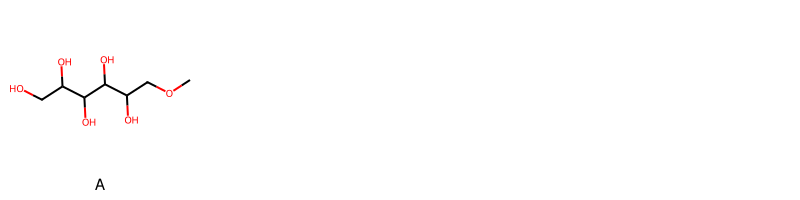

!!! abstract "Tóm tắt"

    **Họ Simmondsiaceae** có **1** chi được các cộng đồng sử dụng trong chăm sóc sức khỏe gồm *Simmondsia*. Số lượng thành phần hóa học đã phân lập và xác định cấu trúc từ họ này tính đến tháng 12 năm 2024 là **4** nhóm có thể liệt kê như sau *Fatty Acyls, Cinnamic acids and derivatives, Benzene and substituted derivatives, Organooxygen compounds*. Giữa các loài trong họ này, 3 dược liệu được nghiên cứu nhiều nhất dựa trên số thành phần được phân lập là **Simmondsia chinensis*. *Họ Simmondsiaceae* đã được một số công động tại các quốc gia như Mexico(Seri) đã phát hiện một số tác dụng trên lâm sàng gồm chữa bệnh lẫn độc tính như gây nôn.

!!! info "DrDuke"

    James A. Duke sinh năm 1929-2017 là một nhà thực vật học người Mỹ. Đây là một trong những tác giả hàng đầu trong lĩnh vực dược dân tộc học với cuốn *CRC Handbook of Medicinal Herbs* và chính là người xây dựng lên cơ sở dữ liệu về hợp chất tự nhiên và dược dân tộc học tại Bộ nông nghiệp Hoa Kỳ. Các thông tin được đăng tải tại website [Dr. Duke's Phytochemical and Ethnobotanical Databases](https://phytochem.nal.usda.gov/). 
    Trong suốt thập niên 1970, ông lãnh đạo the Plant Taxonomy Laboratory, Plant Genetics and Germplasm Institute of the Agricultural Research Service, U.S. Department of Agriculture.
    Trong tài liệu này, các thông tin về dược dân tộc của các dược liệu được trích dẫn từ tài liệu của James A. Ducke với sự trợ giúp của phần mềm dịch thuật từ tiếng Anh sang tiếng Việt.
   
## Tổng quan về Họ Simmondsiaceae
### Phân loại thực vật
Trong *họ Simmondsiaceae* có **1** chi được sử dụng làm thuốc với chi tiết số loài trong mỗi chi như sau Simmondsia (1) . Chi tiết về loài sử dụng làm thuốc như dưới đây.  

>Họ Simmondsiaceae


>|-- Chi Simmondsia

>*Simmondsia chinensis*,

### Thành phần hóa học 

Số lượng thành phần hóa học đã phân lập và xác định cấu trúc từ họ này tính đến tháng 12 năm 2024 là 4 nhóm có thể liệt kê như sau Fatty Acyls, Cinnamic acids and derivatives, Benzene and substituted derivatives, Organooxygen compounds. Số lượng các loài đã được nghiên cứu thành phần hóa học là *1* trong tổng số *1* loài thuộc họ Simmondsiaceae.Giữa các loài trong họ này, 3 dược liệu được nghiên cứu nhiều nhất dựa trên số thành phần được phân lập là **Simmondsia chinensis**. Sử dụng phần mềm RDKIT với thuật toán  Find Maximum Common Substructure (FMCS), các nhóm hoạt chất phổ biến nhất trong *họ Simmondsiaceae* đã xây dựng được nhân. Điều này trong tương lại có thể được sử dụng tìm kiếm mối liên hệ giữa tác dụng của cấu trúc hóa học và tác dụng dược lý. Các nhân trong phần này có thể không giống như cấu trúc gốc của từng nhóm chất. Kết quả được trình bầy như hình dưới đây.

<figure markdown="span">
    { width=100% }
    <figcaption> Cấu trúc hóa học của một số khung cơ bản dựa trên thuật toán FMCS để tìm Organooxygen compounds (A).</figcaption>
</figure>


!!! info  "Find Maximum Common Substructure"
    
    Thuật toán FMCS (Find Maximum Common Substructure) là một phương pháp được sử dụng để tìm ra cấu trúc chung nhiều nhất (MCS) trong một tập hợp các cấu trúc hóa học. Các bước của thuật toán gồm:
    - Chọn một cấu trúc hóa học là cấu trúc để tạo truy vấn, còn các cấu trúc khác là mục tiêu.
    - Chia nhỏ cấu trúc để tạo truy vấn thành cấu trúc nhỏ hơn dạng chuỗi SMARTS.
    - Kiểm tra chuỗi SMARTS trong các cấu trúc mục tiêu.
    - Tìm kiếm chuỗi SMARTS xuất hiện nhiều nhất.
    Để biết thêm chi tiết các bạn có thể xem tại [TeachOpenCADD](https://projects.volkamerlab.org/teachopencadd/talktorials/T006_compound_maximum_common_substructures.html)
    ``` python
    pip install rdkit
    def find_core_smiles(smiles_list):
        mols = [Chem.MolFromSmiles(smiles) for smiles in smiles_list]
        mcs = rdFMCS.FindMCS(mols)
        core_smiles = Chem.MolToSmiles(Chem.MolFromSmarts(mcs.smartsString))
        return core_smiles
    ```

### Dược dân tộc học

Họ **Simmondsiaceae** đã được một số công động tại các quốc gia như *Mexico(Seri)* đã phát hiện một số tác dụng trên lâm sàng gồm chữa bệnh lẫn độc tính như *gây nôn*.

## Chi tiết dược dân tộc học


### Chi Simmondsia

!!! note "Danh sách các loài thuộc chi"
    
*	 - *Simmondsia chinensis**

---      
#### *Simmondsia chinensis*
**Thông tin về thực vật**

!!! info "Phân loại thực vật của *Simmondsia chinensis* từ GIBF:"
    - **Kingdom:** Plantae
    - **Phylum:** Tracheophyta
    - **Order:** Caryophyllales
    - **Family:** Simmondsiaceae
    - **Genus:** Simmondsia
    - **Species:** *Simmondsia chinensis*


 

Chưa có thông tin về loài này trên wikidata.

*Phân bố trên thế giới*: United States of America, Mexico

*Phân bố tại Việt Nam*: Không có ghi nhận ở Việt Nam

**Thành phần hóa học**
        

Theo cơ sở dữ liệu lotus, từ loài *Simmondsia chinensis* đã phân lập và xác định được 39 hoạt chất thuộc về các nhóm Fatty Acyls, Cinnamic acids and derivatives, Benzene and substituted derivatives, Organooxygen compounds. Danh sách các hoạt chất như sau (1s,2r,3s,4r,5s,6s)-4-methoxy-6-{[(2r,3r,4s,5r,6r)-3,4,5-trihydroxy-6-(hydroxymethyl)oxan-2-yl]oxy}cyclohexane-1,2,3,5-tetrol [(LTS0147202)](https://lotus.naturalproducts.net/compound/lotus_id/LTS0147202), benzyl tetracosanoate [(LTS0243689)](https://lotus.naturalproducts.net/compound/lotus_id/LTS0243689), sucrose [(LTS0272557)](https://lotus.naturalproducts.net/compound/lotus_id/LTS0272557), 11-eicosenoic acid [(LTS0026816)](https://lotus.naturalproducts.net/compound/lotus_id/LTS0026816), benzyl octacosanoate [(LTS0047994)](https://lotus.naturalproducts.net/compound/lotus_id/LTS0047994), 2-[(1z,2s,3r,4s,6r)-2-hydroxy-3,4-dimethoxy-6-{[(2s,3s,4r,5r,6s)-3,4,5-trihydroxy-6-(hydroxymethyl)oxan-2-yl]oxy}cyclohexylidene]acetonitrile [(LTS0002839)](https://lotus.naturalproducts.net/compound/lotus_id/LTS0002839), 1-phenylethyl tetracosanoate [(LTS0209981)](https://lotus.naturalproducts.net/compound/lotus_id/LTS0209981), 1-phenylethyl octacosanoate [(LTS0254220)](https://lotus.naturalproducts.net/compound/lotus_id/LTS0254220), 2-{[2-(cyanomethylidene)-3,5-dihydroxy-4-methoxycyclohexyl]oxy}-4,5-dihydroxy-6-(hydroxymethyl)oxan-3-yl 3-(4-hydroxy-3-methoxyphenyl)prop-2-enoate [(LTS0045594)](https://lotus.naturalproducts.net/compound/lotus_id/LTS0045594), (1s,2r,3s,4r,5s,6s)-5-methoxy-6-{[(2s,3s,4r,5s,6s)-3,4,5-trihydroxy-6-(hydroxymethyl)oxan-2-yl]oxy}cyclohexane-1,2,3,4-tetrol [(LTS0140252)](https://lotus.naturalproducts.net/compound/lotus_id/LTS0140252), 5-methoxy-6-{[3,4,5-trihydroxy-6-(hydroxymethyl)oxan-2-yl]oxy}cyclohexane-1,2,3,4-tetrol [(LTS0204709)](https://lotus.naturalproducts.net/compound/lotus_id/LTS0204709), 2-[(1z,2s,3s,4s,6r)-2,4-dihydroxy-3-methoxy-6-{[(2r,3r,4s,5s,6r)-3,4,5-trihydroxy-6-(hydroxymethyl)oxan-2-yl]oxy}cyclohexylidene]acetonitrile [(LTS0183738)](https://lotus.naturalproducts.net/compound/lotus_id/LTS0183738), 4-methoxy-6-{[3,4,5-trihydroxy-6-(hydroxymethyl)oxan-2-yl]oxy}cyclohexane-1,2,3,5-tetrol [(LTS0161848)](https://lotus.naturalproducts.net/compound/lotus_id/LTS0161848), 2-{[(2e)-2-(cyanomethylidene)-3-hydroxy-4,5-dimethoxycyclohexyl]oxy}-4,5-dihydroxy-6-(hydroxymethyl)oxan-3-yl (2e)-3-(4-hydroxy-3-methoxyphenyl)prop-2-enoate [(LTS0187131)](https://lotus.naturalproducts.net/compound/lotus_id/LTS0187131), 1-phenylethyl hexacosanoate [(LTS0031927)](https://lotus.naturalproducts.net/compound/lotus_id/LTS0031927), (2r,3r,4s,5s,6r)-2-{[(1r,2e,3s,4r,5s)-2-(cyanomethylidene)-3-hydroxy-4,5-dimethoxycyclohexyl]oxy}-4,5-dihydroxy-6-(hydroxymethyl)oxan-3-yl (2e)-3-(4-hydroxy-3-methoxyphenyl)prop-2-enoate [(LTS0106679)](https://lotus.naturalproducts.net/compound/lotus_id/LTS0106679), 2-(2-hydroxy-3,4-dimethoxy-6-{[3,4,5-trihydroxy-6-(hydroxymethyl)oxan-2-yl]oxy}cyclohexylidene)acetonitrile [(LTS0027842)](https://lotus.naturalproducts.net/compound/lotus_id/LTS0027842), 2-[2,4-dihydroxy-3,6-bis({[3,4,5-trihydroxy-6-(hydroxymethyl)oxan-2-yl]oxy})cyclohexylidene]acetonitrile [(LTS0252110)](https://lotus.naturalproducts.net/compound/lotus_id/LTS0252110), 1-phenylethyl triacontanoate [(LTS0147364)](https://lotus.naturalproducts.net/compound/lotus_id/LTS0147364), 2-[(1z)-2-hydroxy-3,4-dimethoxy-6-{[3,4,5-trihydroxy-6-(hydroxymethyl)oxan-2-yl]oxy}cyclohexylidene]acetonitrile [(LTS0161437)](https://lotus.naturalproducts.net/compound/lotus_id/LTS0161437), pinit [(LTS0010732)](https://lotus.naturalproducts.net/compound/lotus_id/LTS0010732), methylinositol [(LTS0181335)](https://lotus.naturalproducts.net/compound/lotus_id/LTS0181335), 1-phenylethyl docosanoate [(LTS0258008)](https://lotus.naturalproducts.net/compound/lotus_id/LTS0258008), (2r,3r,4s,5r,6r)-2-{[(1r,2e,3s,4r,5s)-2-(cyanomethylidene)-3-hydroxy-4,5-dimethoxycyclohexyl]oxy}-3,5-dihydroxy-6-(hydroxymethyl)oxan-4-yl (2e)-3-(4-hydroxy-3-methoxyphenyl)prop-2-enoate [(LTS0269962)](https://lotus.naturalproducts.net/compound/lotus_id/LTS0269962), 2-[(1e,2s,3r,4s,6r)-2,3-dihydroxy-4-methoxy-6-{[(2r,3r,4s,5s,6r)-3,4,5-trihydroxy-6-(hydroxymethyl)oxan-2-yl]oxy}cyclohexylidene]acetonitrile [(LTS0081479)](https://lotus.naturalproducts.net/compound/lotus_id/LTS0081479), 2-{[2-(cyanomethylidene)-3,4-dihydroxy-5-methoxycyclohexyl]oxy}-4,5-dihydroxy-6-(hydroxymethyl)oxan-3-yl 3-(4-hydroxy-3-methoxyphenyl)prop-2-enoate [(LTS0164026)](https://lotus.naturalproducts.net/compound/lotus_id/LTS0164026), 2-[(1z,2r,3r,4r,6s)-2,4-dihydroxy-3,6-bis({[(2r,3r,4s,5s,6r)-3,4,5-trihydroxy-6-(hydroxymethyl)oxan-2-yl]oxy})cyclohexylidene]acetonitrile [(LTS0040779)](https://lotus.naturalproducts.net/compound/lotus_id/LTS0040779), (11e)-icos-11-en-1-ol [(LTS0107430)](https://lotus.naturalproducts.net/compound/lotus_id/LTS0107430), pinitol [(LTS0194724)](https://lotus.naturalproducts.net/compound/lotus_id/LTS0194724), icos-11-en-1-ol [(LTS0212967)](https://lotus.naturalproducts.net/compound/lotus_id/LTS0212967), cis-11-eicosenoic acid [(LTS0121218)](https://lotus.naturalproducts.net/compound/lotus_id/LTS0121218), granulated sugar [(LTS0014367)](https://lotus.naturalproducts.net/compound/lotus_id/LTS0014367), docos-13-en-1-ol [(LTS0108942)](https://lotus.naturalproducts.net/compound/lotus_id/LTS0108942), (2r,3r,4s,5s,6r)-2-{[(1r,2z,3s,4s,5s)-2-(cyanomethylidene)-3,5-dihydroxy-4-methoxycyclohexyl]oxy}-4,5-dihydroxy-6-(hydroxymethyl)oxan-3-yl (2e)-3-(4-hydroxy-3-methoxyphenyl)prop-2-enoate [(LTS0106922)](https://lotus.naturalproducts.net/compound/lotus_id/LTS0106922), 2-[(1e,2r,3s,4r,6s)-2-hydroxy-3,4-dimethoxy-6-{[(2r,3r,4r,5s,6r)-3,4,5-trihydroxy-6-(hydroxymethyl)oxan-2-yl]oxy}cyclohexylidene]acetonitrile [(LTS0258726)](https://lotus.naturalproducts.net/compound/lotus_id/LTS0258726), docos-13-en-1-ol [(LTS0040197)](https://lotus.naturalproducts.net/compound/lotus_id/LTS0040197), (2r,3r,4s,5s,6r)-2-{[(1r,2z,3s,4r,5s)-2-(cyanomethylidene)-3,4-dihydroxy-5-methoxycyclohexyl]oxy}-4,5-dihydroxy-6-(hydroxymethyl)oxan-3-yl (2e)-3-(4-hydroxy-3-methoxyphenyl)prop-2-enoate [(LTS0227365)](https://lotus.naturalproducts.net/compound/lotus_id/LTS0227365), benzyl triacontanoate [(LTS0129929)](https://lotus.naturalproducts.net/compound/lotus_id/LTS0129929), benzyl hexacosanoate [(LTS0131056)](https://lotus.naturalproducts.net/compound/lotus_id/LTS0131056).

| chemicalTaxonomyClassyfireClass     |   lotus_count |
|:------------------------------------|--------------:|
| Benzene and substituted derivatives |             9 |
| Cinnamic acids and derivatives      |             7 |
| Fatty Acyls                         |             6 |
| Organooxygen compounds              |            16 |


**Dược dân tộc học**

Danh sách các quốc gia có sử dụng *Simmondsia chinensis* trong điều trị các bệnh. 

| Quốc gia     | Bệnh    |
|:-------------|:--------|
| Mexico(Seri) | gây nôn |


## Bình luận

<div id="giscus-container"></div>
<script src="https://giscus.app/client.js"
        data-repo="hoangson0787/CSDL-duoc-lieu"
        data-repo-id="R_kgDONbMRNA"
        data-category="Duoc lieu"
        data-category-id="DIC_kwDONbMRNM4ClklR"
        data-mapping="pathname"
        data-strict="0"
        data-reactions-enabled="1"
        data-emit-metadata="1"
        data-input-position="bottom"
        data-theme="light"
        data-lang="en"
        crossorigin="anonymous"
        async>
</script>

