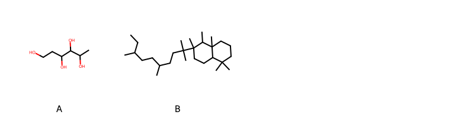

!!! abstract "Tóm tắt"

    **Họ Symplocaceae** có **1** chi được các cộng đồng sử dụng trong chăm sóc sức khỏe gồm *Symplocos*. Số lượng thành phần hóa học đã phân lập và xác định cấu trúc từ họ này tính đến tháng 12 năm 2024 là **7** nhóm có thể liệt kê như sau *Steroids and steroid derivatives, Organooxygen compounds, Lignan glycosides, Tannins, Carboxylic acids and derivatives, Prenol lipids, Harmala alkaloids*. Giữa các loài trong họ này, 3 dược liệu được nghiên cứu nhiều nhất dựa trên số thành phần được phân lập là **Symplocos paniculata, Symplocos racemosa, Symplocos tinctoria*. *Họ Symplocaceae* đã được một số công động tại các quốc gia như India(Hindu), Elsewhere, India, USA, US, Penang đã phát hiện một số tác dụng trên lâm sàng gồm chữa bệnh lẫn độc tính như Chất làm se, Chất làm se, diệt khuẩn, Thuốc bổ, Thuốc tẩy giun, cầm máu, dạ dày, mỹ phẩm.

!!! info "DrDuke"

    James A. Duke sinh năm 1929-2017 là một nhà thực vật học người Mỹ. Đây là một trong những tác giả hàng đầu trong lĩnh vực dược dân tộc học với cuốn *CRC Handbook of Medicinal Herbs* và chính là người xây dựng lên cơ sở dữ liệu về hợp chất tự nhiên và dược dân tộc học tại Bộ nông nghiệp Hoa Kỳ. Các thông tin được đăng tải tại website [Dr. Duke's Phytochemical and Ethnobotanical Databases](https://phytochem.nal.usda.gov/). 
    Trong suốt thập niên 1970, ông lãnh đạo the Plant Taxonomy Laboratory, Plant Genetics and Germplasm Institute of the Agricultural Research Service, U.S. Department of Agriculture.
    Trong tài liệu này, các thông tin về dược dân tộc của các dược liệu được trích dẫn từ tài liệu của James A. Ducke với sự trợ giúp của phần mềm dịch thuật từ tiếng Anh sang tiếng Việt.
   
## Tổng quan về Họ Symplocaceae
### Phân loại thực vật
Trong *họ Symplocaceae* có **1** chi được sử dụng làm thuốc với chi tiết số loài trong mỗi chi như sau Symplocos (5) . Chi tiết về loài sử dụng làm thuốc như dưới đây.  

>Họ Symplocaceae


>|-- Chi Symplocos

>*Symplocos laurina*,
>*Symplocos paniculata*,
>*Symplocos penangiana*,
>*Symplocos racemosa*,
>*Symplocos tinctoria*,

### Thành phần hóa học 

Số lượng thành phần hóa học đã phân lập và xác định cấu trúc từ họ này tính đến tháng 12 năm 2024 là 7 nhóm có thể liệt kê như sau Steroids and steroid derivatives, Organooxygen compounds, Lignan glycosides, Tannins, Carboxylic acids and derivatives, Prenol lipids, Harmala alkaloids. Số lượng các loài đã được nghiên cứu thành phần hóa học là *3* trong tổng số *5* loài thuộc họ Symplocaceae.Giữa các loài trong họ này, 3 dược liệu được nghiên cứu nhiều nhất dựa trên số thành phần được phân lập là **Symplocos paniculata, Symplocos racemosa, Symplocos tinctoria**. Sử dụng phần mềm RDKIT với thuật toán  Find Maximum Common Substructure (FMCS), các nhóm hoạt chất phổ biến nhất trong *họ Symplocaceae* đã xây dựng được nhân. Điều này trong tương lại có thể được sử dụng tìm kiếm mối liên hệ giữa tác dụng của cấu trúc hóa học và tác dụng dược lý. Các nhân trong phần này có thể không giống như cấu trúc gốc của từng nhóm chất. Kết quả được trình bầy như hình dưới đây.

<figure markdown="span">
    { width=100% }
    <figcaption> Cấu trúc hóa học của một số khung cơ bản dựa trên thuật toán FMCS để tìm Organooxygen compounds (A), Prenol lipids (B).</figcaption>
</figure>


!!! info  "Find Maximum Common Substructure"
    
    Thuật toán FMCS (Find Maximum Common Substructure) là một phương pháp được sử dụng để tìm ra cấu trúc chung nhiều nhất (MCS) trong một tập hợp các cấu trúc hóa học. Các bước của thuật toán gồm:
    - Chọn một cấu trúc hóa học là cấu trúc để tạo truy vấn, còn các cấu trúc khác là mục tiêu.
    - Chia nhỏ cấu trúc để tạo truy vấn thành cấu trúc nhỏ hơn dạng chuỗi SMARTS.
    - Kiểm tra chuỗi SMARTS trong các cấu trúc mục tiêu.
    - Tìm kiếm chuỗi SMARTS xuất hiện nhiều nhất.
    Để biết thêm chi tiết các bạn có thể xem tại [TeachOpenCADD](https://projects.volkamerlab.org/teachopencadd/talktorials/T006_compound_maximum_common_substructures.html)
    ``` python
    pip install rdkit
    def find_core_smiles(smiles_list):
        mols = [Chem.MolFromSmiles(smiles) for smiles in smiles_list]
        mcs = rdFMCS.FindMCS(mols)
        core_smiles = Chem.MolToSmiles(Chem.MolFromSmarts(mcs.smartsString))
        return core_smiles
    ```

### Dược dân tộc học

Họ **Symplocaceae** đã được một số công động tại các quốc gia như *India(Hindu), Elsewhere, India, USA, US, Penang* đã phát hiện một số tác dụng trên lâm sàng gồm chữa bệnh lẫn độc tính như *Chất làm se, Chất làm se, diệt khuẩn, Thuốc bổ, Thuốc tẩy giun, cầm máu, dạ dày, mỹ phẩm*.

## Chi tiết dược dân tộc học


### Chi Symplocos

!!! note "Danh sách các loài thuộc chi"
    
*	 - *Symplocos laurina*
	 - *Symplocos paniculata*
	 - *Symplocos penangiana*
	 - *Symplocos racemosa*
	 - *Symplocos tinctoria**

---      
#### *Symplocos paniculata*
**Thông tin về thực vật**

!!! info "Phân loại thực vật của *Symplocos paniculata* từ GIBF:"
    - **Kingdom:** Plantae
    - **Phylum:** Tracheophyta
    - **Order:** Ericales
    - **Family:** Symplocaceae
    - **Genus:** Symplocos
    - **Species:** *Symplocos paniculata*


 

Chưa có thông tin về loài này trên wikidata.

*Phân bố trên thế giới*: United States of America, Chinese Taipei, China, Hong Kong, Japan, Nepal

*Phân bố tại Việt Nam*: Không có ghi nhận ở Việt Nam

**Thành phần hóa học**
        

Chưa có nghiên cứu về thành phần hóa học của loài này


**Dược dân tộc học**

Danh sách các quốc gia có sử dụng *Symplocos paniculata* trong điều trị các bệnh. 

| Quốc gia   | Bệnh    |
|:-----------|:--------|
| Elsewhere  | cầm máu |


---      
#### *Symplocos paniculata*
**Thông tin về thực vật**

!!! info "Phân loại thực vật của *Symplocos paniculata* từ GIBF:"
    - **Kingdom:** Plantae
    - **Phylum:** Tracheophyta
    - **Order:** Ericales
    - **Family:** Symplocaceae
    - **Genus:** Symplocos
    - **Species:** *Symplocos paniculata*


 

Chưa có thông tin về loài này trên wikidata.

*Phân bố trên thế giới*: United States of America, Chinese Taipei, China, Hong Kong, Japan, Nepal

*Phân bố tại Việt Nam*: Không có ghi nhận ở Việt Nam

**Thành phần hóa học**
        

Theo cơ sở dữ liệu lotus, từ loài *Symplocos paniculata* đã phân lập và xác định được 79 hoạt chất thuộc về các nhóm Prenol lipids. Danh sách các hoạt chất như sau (2s,3s,4s,5r,6r)-6-{[(3s,4ar,6ar,6bs,7r,8s,8ar,9r,10r,12as,14ar,14br)-7,8-dihydroxy-8a-(hydroxymethyl)-4,4,6a,6b,11,11,14b-heptamethyl-9-{[(2r)-2-methylbutanoyl]oxy}-10-{[(2e)-3-phenylprop-2-enoyl]oxy}-1,2,3,4a,5,6,7,8,9,10,12,12a,14,14a-tetradecahydropicen-3-yl]oxy}-4-(acetyloxy)-3-{[(2s,3r,4r,5s)-3,4-dihydroxy-5-(hydroxymethyl)oxolan-2-yl]oxy}-5-{[(2s,3r,4s,5s,6r)-3,4,5-trihydroxy-6-(hydroxymethyl)oxan-2-yl]oxy}oxane-2-carboxylic acid [(LTS0108996)](https://lotus.naturalproducts.net/compound/lotus_id/LTS0108996), methyl (2s,3s,4s,5r,6r)-6-{[(3s,4ar,6ar,6bs,7r,8s,8ar,9r,10r,12as,14ar,14br)-10-{[(2e)-3,7-dimethylocta-2,6-dienoyl]oxy}-7,8-dihydroxy-8a-(hydroxymethyl)-4,4,6a,6b,11,11,14b-heptamethyl-9-{[(2r)-2-methylbutanoyl]oxy}-1,2,3,4a,5,6,7,8,9,10,12,12a,14,14a-tetradecahydropicen-3-yl]oxy}-3-{[(2s,3r,4r,5s)-3,4-dihydroxy-5-(hydroxymethyl)oxolan-2-yl]oxy}-4-hydroxy-5-{[(2s,3r,4s,5s,6r)-3,4,5-trihydroxy-6-(hydroxymethyl)oxan-2-yl]oxy}oxane-2-carboxylate [(LTS0225917)](https://lotus.naturalproducts.net/compound/lotus_id/LTS0225917), ethyl 3-{[3,4-dihydroxy-5-(hydroxymethyl)oxolan-2-yl]oxy}-6-({10-[(3,7-dimethylocta-2,6-dienoyl)oxy]-7,8-dihydroxy-8a-(hydroxymethyl)-4,4,6a,6b,11,11,14b-heptamethyl-9-[(2-methylbutanoyl)oxy]-1,2,3,4a,5,6,7,8,9,10,12,12a,14,14a-tetradecahydropicen-3-yl}oxy)-4-hydroxy-5-{[3,4,5-trihydroxy-6-(hydroxymethyl)oxan-2-yl]oxy}oxane-2-carboxylate [(LTS0266017)](https://lotus.naturalproducts.net/compound/lotus_id/LTS0266017), (2s,3s,4s,5r,6r)-6-{[(3s,4ar,6ar,6bs,7r,8s,8ar,9r,10r,12as,14ar,14br)-10-{[(2e)-3,7-dimethylocta-2,6-dienoyl]oxy}-7,8-dihydroxy-8a-(hydroxymethyl)-4,4,6a,6b,11,11,14b-heptamethyl-9-[(2-methylpropanoyl)oxy]-1,2,3,4a,5,6,7,8,9,10,12,12a,14,14a-tetradecahydropicen-3-yl]oxy}-4-(acetyloxy)-3-{[(2s,3r,4r,5s)-3,4-dihydroxy-5-(hydroxymethyl)oxolan-2-yl]oxy}-5-{[(2s,3r,4s,5s,6r)-3,4,5-trihydroxy-6-(hydroxymethyl)oxan-2-yl]oxy}oxane-2-carboxylic acid [(LTS0222987)](https://lotus.naturalproducts.net/compound/lotus_id/LTS0222987), 4-(acetyloxy)-3-{[3,4-dihydroxy-5-(hydroxymethyl)oxolan-2-yl]oxy}-6-({10-[(3,7-dimethylocta-2,6-dienoyl)oxy]-7,8-dihydroxy-8a-(hydroxymethyl)-4,4,6a,6b,11,11,14b-heptamethyl-9-[(2-methylbutanoyl)oxy]-1,2,3,4a,5,6,7,8,9,10,12,12a,14,14a-tetradecahydropicen-3-yl}oxy)-5-{[3,4,5-trihydroxy-6-(hydroxymethyl)oxan-2-yl]oxy}oxane-2-carboxylic acid [(LTS0215379)](https://lotus.naturalproducts.net/compound/lotus_id/LTS0215379), ethyl (2s,3s,4s,5r,6r)-6-{[(3s,4ar,6ar,6bs,7r,8s,8ar,9r,10r,12as,14ar,14br)-10-{[(2z)-3,7-dimethylocta-2,6-dienoyl]oxy}-7,8-dihydroxy-8a-(hydroxymethyl)-4,4,6a,6b,11,11,14b-heptamethyl-9-{[(2r)-2-methylbutanoyl]oxy}-1,2,3,4a,5,6,7,8,9,10,12,12a,14,14a-tetradecahydropicen-3-yl]oxy}-3-{[(2s,3r,4r,5s)-3,4-dihydroxy-5-(hydroxymethyl)oxolan-2-yl]oxy}-4-hydroxy-5-{[(2s,3r,4s,5s,6r)-3,4,5-trihydroxy-6-(hydroxymethyl)oxan-2-yl]oxy}oxane-2-carboxylate [(LTS0017802)](https://lotus.naturalproducts.net/compound/lotus_id/LTS0017802), methyl (2s,3s,4s,5r,6r)-6-{[(3s,6ar,6bs,7r,8s,8as,9r,10r,12as,14ar,14br)-7,8,9,10-tetrahydroxy-8a-(hydroxymethyl)-4,4,6a,6b,11,11,14b-heptamethyl-1,2,3,4a,5,6,7,8,9,10,12,12a,14,14a-tetradecahydropicen-3-yl]oxy}-3-{[(2s,3r,4r,5s)-3,4-dihydroxy-5-(hydroxymethyl)oxolan-2-yl]oxy}-4-hydroxy-5-{[(2s,3r,4s,5s,6r)-3,4,5-trihydroxy-6-(hydroxymethyl)oxan-2-yl]oxy}oxane-2-carboxylate [(LTS0254765)](https://lotus.naturalproducts.net/compound/lotus_id/LTS0254765), butyl 3-{[3,4-dihydroxy-5-(hydroxymethyl)oxolan-2-yl]oxy}-6-{[7,8-dihydroxy-8a-(hydroxymethyl)-4,4,6a,6b,11,11,14b-heptamethyl-9-[(2-methylbutanoyl)oxy]-10-[(3-phenylprop-2-enoyl)oxy]-1,2,3,4a,5,6,7,8,9,10,12,12a,14,14a-tetradecahydropicen-3-yl]oxy}-4-hydroxy-5-{[3,4,5-trihydroxy-6-(hydroxymethyl)oxan-2-yl]oxy}oxane-2-carboxylate [(LTS0199772)](https://lotus.naturalproducts.net/compound/lotus_id/LTS0199772), butyl (2s,3s,4s,5r,6r)-6-{[(3s,4ar,6ar,6bs,7r,8s,8ar,9r,10r,12as,14ar,14br)-10-{[(2e)-3,7-dimethylocta-2,6-dienoyl]oxy}-7,8-dihydroxy-8a-(hydroxymethyl)-4,4,6a,6b,11,11,14b-heptamethyl-9-{[(2r)-2-methylbutanoyl]oxy}-1,2,3,4a,5,6,7,8,9,10,12,12a,14,14a-tetradecahydropicen-3-yl]oxy}-3-{[(2s,3r,4r,5s)-3,4-dihydroxy-5-(hydroxymethyl)oxolan-2-yl]oxy}-4-hydroxy-5-{[(2s,3r,4s,5s,6r)-3,4,5-trihydroxy-6-(hydroxymethyl)oxan-2-yl]oxy}oxane-2-carboxylate [(LTS0190371)](https://lotus.naturalproducts.net/compound/lotus_id/LTS0190371), (2s,3s,4s,5r,6r)-6-{[(3s,4ar,6ar,6bs,7r,8s,8ar,9r,10r,12as,14ar,14br)-10-(benzoyloxy)-7,8-dihydroxy-8a-(hydroxymethyl)-4,4,6a,6b,11,11,14b-heptamethyl-9-{[(2r)-2-methylbutanoyl]oxy}-1,2,3,4a,5,6,7,8,9,10,12,12a,14,14a-tetradecahydropicen-3-yl]oxy}-4-(acetyloxy)-3-{[(2s,3r,4r,5s)-3,4-dihydroxy-5-(hydroxymethyl)oxolan-2-yl]oxy}-5-{[(2s,3r,4s,5s,6r)-3,4,5-trihydroxy-6-(hydroxymethyl)oxan-2-yl]oxy}oxane-2-carboxylic acid [(LTS0109455)](https://lotus.naturalproducts.net/compound/lotus_id/LTS0109455), methyl 3-{[3,4-dihydroxy-5-(hydroxymethyl)oxolan-2-yl]oxy}-6-({10-[(3,7-dimethylocta-2,6-dienoyl)oxy]-7,8-dihydroxy-8a-(hydroxymethyl)-4,4,6a,6b,11,11,14b-heptamethyl-9-[(2-methylbutanoyl)oxy]-1,2,3,4a,5,6,7,8,9,10,12,12a,14,14a-tetradecahydropicen-3-yl}oxy)-4-hydroxy-5-{[3,4,5-trihydroxy-6-(hydroxymethyl)oxan-2-yl]oxy}oxane-2-carboxylate [(LTS0073093)](https://lotus.naturalproducts.net/compound/lotus_id/LTS0073093), (3r,4r,4ar,5s,6r,6as,6br,8ar,10s,12ar,12br,14bs)-5,6,10-trihydroxy-4a-(hydroxymethyl)-2,2,6a,6b,9,9,12a-heptamethyl-4-[(2-methylpropanoyl)oxy]-1,3,4,5,6,7,8,8a,10,11,12,12b,13,14b-tetradecahydropicen-3-yl (2z)-3,7-dimethylocta-2,6-dienoate [(LTS0135481)](https://lotus.naturalproducts.net/compound/lotus_id/LTS0135481), (2s,3s,4s,5r,6r)-6-{[(3s,4ar,6ar,6bs,7r,8s,8ar,9r,10r,12as,14ar,14br)-10-{[(2e)-3,7-dimethylocta-2,6-dienoyl]oxy}-7,8-dihydroxy-8a-(hydroxymethyl)-4,4,6a,6b,11,11,14b-heptamethyl-9-{[(2r)-2-methylbutanoyl]oxy}-1,2,3,4a,5,6,7,8,9,10,12,12a,14,14a-tetradecahydropicen-3-yl]oxy}-4-(acetyloxy)-3-{[(2s,3r,4r,5s)-3,4-dihydroxy-5-(hydroxymethyl)oxolan-2-yl]oxy}-5-{[(2s,3r,4s,5s,6r)-3,4,5-trihydroxy-6-(hydroxymethyl)oxan-2-yl]oxy}oxane-2-carboxylic acid [(LTS0014448)](https://lotus.naturalproducts.net/compound/lotus_id/LTS0014448), methyl (2s,3s,4s,5r,6r)-6-{[(3s,4ar,6ar,6bs,7r,8s,8ar,9r,10r,12as,14ar,14br)-10-{[(2z)-3,7-dimethylocta-2,6-dienoyl]oxy}-7,8-dihydroxy-8a-(hydroxymethyl)-4,4,6a,6b,11,11,14b-heptamethyl-9-[(2-methylbutanoyl)oxy]-1,2,3,4a,5,6,7,8,9,10,12,12a,14,14a-tetradecahydropicen-3-yl]oxy}-4-(acetyloxy)-3-{[(2s,3r,4r,5s)-3,4-dihydroxy-5-(hydroxymethyl)oxolan-2-yl]oxy}-5-{[(2s,3r,4s,5s,6r)-3,4,5-trihydroxy-6-(hydroxymethyl)oxan-2-yl]oxy}oxane-2-carboxylate [(LTS0087915)](https://lotus.naturalproducts.net/compound/lotus_id/LTS0087915), butyl (2s,3s,4s,5r,6r)-6-{[(3s,6ar,6bs,7r,8s,8ar,9s,12as,14ar,14br)-9-{[(2e)-3,7-dimethylocta-2,6-dienoyl]oxy}-7,8-dihydroxy-8a-(hydroxymethyl)-4,4,6a,6b,11,11,14b-heptamethyl-1,2,3,4a,5,6,7,8,9,10,12,12a,14,14a-tetradecahydropicen-3-yl]oxy}-3-{[(2s,3r,4r,5s)-3,4-dihydroxy-5-(hydroxymethyl)oxolan-2-yl]oxy}-4-hydroxy-5-{[(2s,3r,4s,5s,6r)-3,4,5-trihydroxy-6-(hydroxymethyl)oxan-2-yl]oxy}oxane-2-carboxylate [(LTS0231810)](https://lotus.naturalproducts.net/compound/lotus_id/LTS0231810), butyl (2s,3s,4s,5r,6r)-6-{[(3s,4ar,6ar,6bs,7r,8s,8ar,9s,12as,14ar,14br)-9-{[(2z)-3,7-dimethylocta-2,6-dienoyl]oxy}-7,8-dihydroxy-8a-(hydroxymethyl)-4,4,6a,6b,11,11,14b-heptamethyl-1,2,3,4a,5,6,7,8,9,10,12,12a,14,14a-tetradecahydropicen-3-yl]oxy}-3-{[(2s,3r,4r,5s)-3,4-dihydroxy-5-(hydroxymethyl)oxolan-2-yl]oxy}-4-hydroxy-5-{[(2s,3r,4s,5s,6r)-3,4,5-trihydroxy-6-(hydroxymethyl)oxan-2-yl]oxy}oxane-2-carboxylate [(LTS0073802)](https://lotus.naturalproducts.net/compound/lotus_id/LTS0073802), butyl (2s,3s,4s,5r,6r)-6-{[(3s,4ar,6ar,6bs,7r,8s,8ar,9r,10r,12as,14ar,14br)-7,8-dihydroxy-8a-(hydroxymethyl)-4,4,6a,6b,11,11,14b-heptamethyl-9-{[(2r)-2-methylbutanoyl]oxy}-10-{[(2e)-3-phenylprop-2-enoyl]oxy}-1,2,3,4a,5,6,7,8,9,10,12,12a,14,14a-tetradecahydropicen-3-yl]oxy}-3-{[(2s,3r,4r,5s)-3,4-dihydroxy-5-(hydroxymethyl)oxolan-2-yl]oxy}-4-hydroxy-5-{[(2s,3r,4s,5s,6r)-3,4,5-trihydroxy-6-(hydroxymethyl)oxan-2-yl]oxy}oxane-2-carboxylate [(LTS0037996)](https://lotus.naturalproducts.net/compound/lotus_id/LTS0037996), methyl (2r,3r,4r,5s,6s)-6-{[(3s,4ar,6as,6br,7r,8r,8as,9s,10s,12as,14ar,14bs)-10-{[(2e)-3,7-dimethylocta-2,6-dienoyl]oxy}-7,8-dihydroxy-8a-(hydroxymethyl)-4,4,6a,6b,11,11,14b-heptamethyl-9-{[(2r)-2-methylbutanoyl]oxy}-1,2,3,4a,5,6,7,8,9,10,12,12a,14,14a-tetradecahydropicen-3-yl]oxy}-3-{[(2r,3s,4s,5r)-3,4-dihydroxy-5-(hydroxymethyl)oxolan-2-yl]oxy}-4-hydroxy-5-{[(2r,3s,4r,5r,6s)-3,4,5-trihydroxy-6-(hydroxymethyl)oxan-2-yl]oxy}oxane-2-carboxylate [(LTS0252271)](https://lotus.naturalproducts.net/compound/lotus_id/LTS0252271), (2s,3s,4s,5r,6r)-6-{[(3s,4ar,6ar,6bs,7r,8s,8ar,9r,10r,12as,14ar,14br)-9-(benzoyloxy)-10-{[(2z)-3,7-dimethylocta-2,6-dienoyl]oxy}-7,8-dihydroxy-8a-(hydroxymethyl)-4,4,6a,6b,11,11,14b-heptamethyl-1,2,3,4a,5,6,7,8,9,10,12,12a,14,14a-tetradecahydropicen-3-yl]oxy}-4-(acetyloxy)-3-{[(2s,3r,4r,5s)-3,4-dihydroxy-5-(hydroxymethyl)oxolan-2-yl]oxy}-5-{[(2s,3r,4s,5s,6r)-3,4,5-trihydroxy-6-(hydroxymethyl)oxan-2-yl]oxy}oxane-2-carboxylic acid [(LTS0188289)](https://lotus.naturalproducts.net/compound/lotus_id/LTS0188289), methyl (2s,3r,4r,5r,6r)-6-{[(3r,4ar,6as,6br,7r,8r,8as,9s,10s,12as,14ar,14bs)-10-{[(2z)-3,7-dimethylocta-2,6-dienoyl]oxy}-7,8-dihydroxy-8a-(hydroxymethyl)-4,4,6a,6b,11,11,14b-heptamethyl-9-{[(2r)-2-methylbutanoyl]oxy}-1,2,3,4a,5,6,7,8,9,10,12,12a,14,14a-tetradecahydropicen-3-yl]oxy}-3-{[(2r,3r,4r,5r)-3,4-dihydroxy-5-(hydroxymethyl)oxolan-2-yl]oxy}-4-hydroxy-5-{[(2r,3r,4r,5s,6s)-3,4,5-trihydroxy-6-(hydroxymethyl)oxan-2-yl]oxy}oxane-2-carboxylate [(LTS0158060)](https://lotus.naturalproducts.net/compound/lotus_id/LTS0158060), 10-hydroxy-1,2,6a,6b,9,9,12a-heptamethyl-2,3,4,5,6,7,8,8a,10,11,12,12b,13,14b-tetradecahydro-1h-picene-4a-carboxylic acid [(LTS0166564)](https://lotus.naturalproducts.net/compound/lotus_id/LTS0166564), (3s,4ar,6ar,6bs,7r,8s,8as,9s,12as,14ar,14br)-8a-(hydroxymethyl)-4,4,6a,6b,11,11,14b-heptamethyl-1,2,3,4a,5,6,7,8,9,10,12,12a,14,14a-tetradecahydropicene-3,7,8,9-tetrol [(LTS0028785)](https://lotus.naturalproducts.net/compound/lotus_id/LTS0028785), 6-({10-[(3,7-dimethylocta-2,6-dienoyl)oxy]-7,8-dihydroxy-8a-(hydroxymethyl)-4,4,6a,6b,11,11,14b-heptamethyl-9-[(2-methylbutanoyl)oxy]-1,2,3,4a,5,6,7,8,9,10,12,12a,14,14a-tetradecahydropicen-3-yl}oxy)-3,4-dihydroxy-5-{[3,4,5-trihydroxy-6-(hydroxymethyl)oxan-2-yl]oxy}oxane-2-carboxylic acid [(LTS0034472)](https://lotus.naturalproducts.net/compound/lotus_id/LTS0034472), butyl (2s,3s,4r,5r,6r)-6-{[(3r,4ar,6as,6bs,7s,8r,8ar,9r,10s,12ar,14as,14bs)-10-{[(2e)-3,7-dimethylocta-2,6-dienoyl]oxy}-7,8-dihydroxy-8a-(hydroxymethyl)-4,4,6a,6b,11,11,14b-heptamethyl-9-{[(2r)-2-methylbutanoyl]oxy}-1,2,3,4a,5,6,7,8,9,10,12,12a,14,14a-tetradecahydropicen-3-yl]oxy}-3-{[(2r,3s,4s,5r)-3,4-dihydroxy-5-(hydroxymethyl)oxolan-2-yl]oxy}-4-hydroxy-5-{[(2r,3s,4s,5r,6r)-3,4,5-trihydroxy-6-(hydroxymethyl)oxan-2-yl]oxy}oxane-2-carboxylate [(LTS0002682)](https://lotus.naturalproducts.net/compound/lotus_id/LTS0002682), butyl (2s,3s,4s,5r,6r)-6-{[(3s,6ar,6bs,7r,8s,8ar,9r,10r,12as,14ar,14br)-10-{[(2e)-3,7-dimethylocta-2,6-dienoyl]oxy}-7,8-dihydroxy-8a-(hydroxymethyl)-4,4,6a,6b,11,11,14b-heptamethyl-9-[(2-methylbutanoyl)oxy]-1,2,3,4a,5,6,7,8,9,10,12,12a,14,14a-tetradecahydropicen-3-yl]oxy}-3-{[(2s,3r,4r,5s)-3,4-dihydroxy-5-(hydroxymethyl)oxolan-2-yl]oxy}-4-hydroxy-5-{[(2s,3r,4s,5s,6r)-3,4,5-trihydroxy-6-(hydroxymethyl)oxan-2-yl]oxy}oxane-2-carboxylate [(LTS0251507)](https://lotus.naturalproducts.net/compound/lotus_id/LTS0251507), ethyl (2s,3s,4s,5r,6r)-6-{[(3s,4ar,6ar,6bs,7r,8s,8ar,9r,10r,12as,14ar,14br)-10-{[(2z)-3,7-dimethylocta-2,6-dienoyl]oxy}-7,8-dihydroxy-8a-(hydroxymethyl)-4,4,6a,6b,11,11,14b-heptamethyl-9-{[(2s)-2-methylbutanoyl]oxy}-1,2,3,4a,5,6,7,8,9,10,12,12a,14,14a-tetradecahydropicen-3-yl]oxy}-3-{[(2s,3r,4r,5s)-3,4-dihydroxy-5-(hydroxymethyl)oxolan-2-yl]oxy}-4-hydroxy-5-{[(2s,3r,4s,5s,6r)-3,4,5-trihydroxy-6-(hydroxymethyl)oxan-2-yl]oxy}oxane-2-carboxylate [(LTS0002494)](https://lotus.naturalproducts.net/compound/lotus_id/LTS0002494), (2s,3s,4s,5r,6r)-6-{[(3s,4ar,6ar,7r,8s,8ar,9r,10r,12as,14ar,14br)-10-{[(2e)-3,7-dimethylocta-2,6-dienoyl]oxy}-7,8-dihydroxy-8a-(hydroxymethyl)-4,4,6a,6b,11,11,14b-heptamethyl-9-[(2-methylpropanoyl)oxy]-1,2,3,4a,5,6,7,8,9,10,12,12a,14,14a-tetradecahydropicen-3-yl]oxy}-4-(acetyloxy)-3-{[(2s,3r,4r,5s)-3,4-dihydroxy-5-(hydroxymethyl)oxolan-2-yl]oxy}-5-{[(2s,3r,4s,5s,6r)-3,4,5-trihydroxy-6-(hydroxymethyl)oxan-2-yl]oxy}oxane-2-carboxylic acid [(LTS0131631)](https://lotus.naturalproducts.net/compound/lotus_id/LTS0131631), (2s,3s,4s,5r,6r)-6-{[(3s,4ar,6ar,6bs,7r,8s,8ar,9r,10r,12as,14ar,14br)-10-{[(2z)-3,7-dimethylocta-2,6-dienoyl]oxy}-7,8-dihydroxy-8a-(hydroxymethyl)-4,4,6a,6b,11,11,14b-heptamethyl-9-[(2-methylbutanoyl)oxy]-1,2,3,4a,5,6,7,8,9,10,12,12a,14,14a-tetradecahydropicen-3-yl]oxy}-3,4-dihydroxy-5-{[(2s,3r,4s,5s,6r)-3,4,5-trihydroxy-6-(hydroxymethyl)oxan-2-yl]oxy}oxane-2-carboxylic acid [(LTS0207819)](https://lotus.naturalproducts.net/compound/lotus_id/LTS0207819), 4-(acetyloxy)-3-{[3,4-dihydroxy-5-(hydroxymethyl)oxolan-2-yl]oxy}-6-({10-[(3,7-dimethylocta-2,6-dienoyl)oxy]-7,8-dihydroxy-8a-(hydroxymethyl)-4,4,6a,6b,11,11,14b-heptamethyl-9-[(2-methylpropanoyl)oxy]-1,2,3,4a,5,6,7,8,9,10,12,12a,14,14a-tetradecahydropicen-3-yl}oxy)-5-{[3,4,5-trihydroxy-6-(hydroxymethyl)oxan-2-yl]oxy}oxane-2-carboxylic acid [(LTS0097142)](https://lotus.naturalproducts.net/compound/lotus_id/LTS0097142), ethyl (2s,3s,4s,5r,6r)-6-{[(3s,4ar,6ar,6bs,7r,8s,8ar,9r,10r,12as,14ar,14br)-10-{[(2z)-3,7-dimethylocta-2,6-dienoyl]oxy}-7,8-dihydroxy-8a-(hydroxymethyl)-4,4,6a,6b,11,11,14b-heptamethyl-9-[(2-methylbutanoyl)oxy]-1,2,3,4a,5,6,7,8,9,10,12,12a,14,14a-tetradecahydropicen-3-yl]oxy}-3-{[(2s,3r,4r,5s)-3,4-dihydroxy-5-(hydroxymethyl)oxolan-2-yl]oxy}-4-hydroxy-5-{[(2s,3r,4s,5s,6r)-3,4,5-trihydroxy-6-(hydroxymethyl)oxan-2-yl]oxy}oxane-2-carboxylate [(LTS0126448)](https://lotus.naturalproducts.net/compound/lotus_id/LTS0126448), 6-{[7,8-dihydroxy-8a-(hydroxymethyl)-4,4,6a,6b,11,11,14b-heptamethyl-9-[(2-methylbutanoyl)oxy]-10-[(3-phenylprop-2-enoyl)oxy]-1,2,3,4a,5,6,7,8,9,10,12,12a,14,14a-tetradecahydropicen-3-yl]oxy}-3,4-dihydroxy-5-{[3,4,5-trihydroxy-6-(hydroxymethyl)oxan-2-yl]oxy}oxane-2-carboxylic acid [(LTS0144035)](https://lotus.naturalproducts.net/compound/lotus_id/LTS0144035), pentyl (2r,3s,4r,5s,6r)-6-{[(3r,4ar,6as,6bs,7r,8s,8as,9r,10r,12ar,14ar,14br)-10-{[(2z)-3,7-dimethylocta-2,6-dienoyl]oxy}-7,8-dihydroxy-8a-(hydroxymethyl)-4,4,6a,6b,11,11,14b-heptamethyl-9-{[(2r)-2-methylbutanoyl]oxy}-1,2,3,4a,5,6,7,8,9,10,12,12a,14,14a-tetradecahydropicen-3-yl]oxy}-3-{[(2s,3r,4s,5s)-3,4-dihydroxy-5-(hydroxymethyl)oxolan-2-yl]oxy}-4-hydroxy-5-{[(2r,3r,4r,5r,6s)-3,4,5-trihydroxy-6-(hydroxymethyl)oxan-2-yl]oxy}oxane-2-carboxylate [(LTS0191329)](https://lotus.naturalproducts.net/compound/lotus_id/LTS0191329), methyl 4-(acetyloxy)-3-{[3,4-dihydroxy-5-(hydroxymethyl)oxolan-2-yl]oxy}-6-({10-[(3,7-dimethylocta-2,6-dienoyl)oxy]-7,8-dihydroxy-8a-(hydroxymethyl)-4,4,6a,6b,11,11,14b-heptamethyl-9-[(2-methylbutanoyl)oxy]-1,2,3,4a,5,6,7,8,9,10,12,12a,14,14a-tetradecahydropicen-3-yl}oxy)-5-{[3,4,5-trihydroxy-6-(hydroxymethyl)oxan-2-yl]oxy}oxane-2-carboxylate [(LTS0136440)](https://lotus.naturalproducts.net/compound/lotus_id/LTS0136440), butyl 3-{[3,4-dihydroxy-5-(hydroxymethyl)oxolan-2-yl]oxy}-6-({9-[(3,7-dimethylocta-2,6-dienoyl)oxy]-7,8-dihydroxy-8a-(hydroxymethyl)-4,4,6a,6b,11,11,14b-heptamethyl-1,2,3,4a,5,6,7,8,9,10,12,12a,14,14a-tetradecahydropicen-3-yl}oxy)-4-hydroxy-5-{[3,4,5-trihydroxy-6-(hydroxymethyl)oxan-2-yl]oxy}oxane-2-carboxylate [(LTS0167987)](https://lotus.naturalproducts.net/compound/lotus_id/LTS0167987), methyl (2s,3s,4s,5r,6r)-6-{[(3s,4ar,6ar,6bs,7r,8s,8ar,9r,10r,12as,14ar,14br)-10-{[(2z)-3,7-dimethylocta-2,6-dienoyl]oxy}-7,8-dihydroxy-8a-(hydroxymethyl)-4,4,6a,6b,11,11,14b-heptamethyl-9-{[(2r)-2-methylbutanoyl]oxy}-1,2,3,4a,5,6,7,8,9,10,12,12a,14,14a-tetradecahydropicen-3-yl]oxy}-4-(acetyloxy)-3-{[(2s,3r,4r,5s)-3,4-dihydroxy-5-(hydroxymethyl)oxolan-2-yl]oxy}-5-{[(2s,3r,4s,5s,6r)-3,4,5-trihydroxy-6-(hydroxymethyl)oxan-2-yl]oxy}oxane-2-carboxylate [(LTS0118525)](https://lotus.naturalproducts.net/compound/lotus_id/LTS0118525), butyl (2s,3s,4s,5r,6r)-6-{[(3s,4ar,6ar,6bs,7r,8s,8ar,9r,10r,12as,14ar,14br)-7,8-dihydroxy-8a-(hydroxymethyl)-4,4,6a,6b,11,11,14b-heptamethyl-9-[(2-methylbutanoyl)oxy]-10-{[(2e)-3-phenylprop-2-enoyl]oxy}-1,2,3,4a,5,6,7,8,9,10,12,12a,14,14a-tetradecahydropicen-3-yl]oxy}-3-{[(2s,3r,4r,5s)-3,4-dihydroxy-5-(hydroxymethyl)oxolan-2-yl]oxy}-4-hydroxy-5-{[(2s,3r,4s,5s,6r)-3,4,5-trihydroxy-6-(hydroxymethyl)oxan-2-yl]oxy}oxane-2-carboxylate [(LTS0076866)](https://lotus.naturalproducts.net/compound/lotus_id/LTS0076866), (2s,3s,4s,5r,6r)-6-{[(3s,4ar,6ar,6bs,7r,8s,8ar,9r,10r,12as,14ar,14br)-10-(benzoyloxy)-7,8-dihydroxy-8a-(hydroxymethyl)-4,4,6a,6b,11,11,14b-heptamethyl-9-[(2-methylbutanoyl)oxy]-1,2,3,4a,5,6,7,8,9,10,12,12a,14,14a-tetradecahydropicen-3-yl]oxy}-4-(acetyloxy)-3-{[(2s,3r,4r,5s)-3,4-dihydroxy-5-(hydroxymethyl)oxolan-2-yl]oxy}-5-{[(2s,3r,4s,5s,6r)-3,4,5-trihydroxy-6-(hydroxymethyl)oxan-2-yl]oxy}oxane-2-carboxylic acid [(LTS0155707)](https://lotus.naturalproducts.net/compound/lotus_id/LTS0155707), (2s,3s,4s,5r,6r)-6-{[(3s,4ar,6ar,6bs,7r,8s,8ar,9r,10r,12as,14ar,14br)-10-{[(2z)-3,7-dimethylocta-2,6-dienoyl]oxy}-7,8-dihydroxy-8a-(hydroxymethyl)-4,4,6a,6b,11,11,14b-heptamethyl-9-{[(2r)-2-methylbutanoyl]oxy}-1,2,3,4a,5,6,7,8,9,10,12,12a,14,14a-tetradecahydropicen-3-yl]oxy}-4-(acetyloxy)-3-{[(2s,3r,4r,5s)-3,4-dihydroxy-5-(hydroxymethyl)oxolan-2-yl]oxy}-5-{[(2s,3r,4s,5s,6r)-3,4,5-trihydroxy-6-(hydroxymethyl)oxan-2-yl]oxy}oxane-2-carboxylic acid [(LTS0215057)](https://lotus.naturalproducts.net/compound/lotus_id/LTS0215057), (2s,3s,4s,5r,6r)-6-{[(3s,4ar,6ar,6bs,7r,8s,8ar,9r,10r,12as,14ar,14br)-10-{[(2z)-3,7-dimethylocta-2,6-dienoyl]oxy}-7,8-dihydroxy-8a-(hydroxymethyl)-4,4,6a,6b,11,11,14b-heptamethyl-9-{[(2s)-2-methylbutanoyl]oxy}-1,2,3,4a,5,6,7,8,9,10,12,12a,14,14a-tetradecahydropicen-3-yl]oxy}-3,4-dihydroxy-5-{[(2s,3r,4s,5s,6r)-3,4,5-trihydroxy-6-(hydroxymethyl)oxan-2-yl]oxy}oxane-2-carboxylic acid [(LTS0200486)](https://lotus.naturalproducts.net/compound/lotus_id/LTS0200486), (3s,6ar,6bs,7r,8s,8as,9s,12ar,14ar,14br)-8a-(hydroxymethyl)-4,4,6a,6b,11,11,14b-heptamethyl-1,2,3,4a,5,6,7,8,9,10,12,12a,14,14a-tetradecahydropicene-3,7,8,9-tetrol [(LTS0247648)](https://lotus.naturalproducts.net/compound/lotus_id/LTS0247648), butyl (2s,3s,4s,5r,6r)-6-{[(3s,4ar,6ar,6bs,7r,8s,8ar,9r,10r,12as,14ar,14br)-10-{[(2z)-3,7-dimethylocta-2,6-dienoyl]oxy}-7,8-dihydroxy-8a-(hydroxymethyl)-4,4,6a,6b,11,11,14b-heptamethyl-9-{[(2r)-2-methylbutanoyl]oxy}-1,2,3,4a,5,6,7,8,9,10,12,12a,14,14a-tetradecahydropicen-3-yl]oxy}-3-{[(2s,3r,4r,5s)-3,4-dihydroxy-5-(hydroxymethyl)oxolan-2-yl]oxy}-4-hydroxy-5-{[(2s,3r,4s,5s,6r)-3,4,5-trihydroxy-6-(hydroxymethyl)oxan-2-yl]oxy}oxane-2-carboxylate [(LTS0049175)](https://lotus.naturalproducts.net/compound/lotus_id/LTS0049175), 1,10,11-trihydroxy-9-(hydroxymethyl)-1,2,6a,6b,9,12a-hexamethyl-2,3,4,5,6,7,8,8a,10,11,12,12b,13,14b-tetradecahydropicene-4a-carboxylic acid [(LTS0156783)](https://lotus.naturalproducts.net/compound/lotus_id/LTS0156783), butyl (2r,3r,4s,5s,6r)-6-{[(3r,4ar,6as,6br,7r,8r,8as,9r,12ar,14ar,14br)-9-{[(2z)-3,7-dimethylocta-2,6-dienoyl]oxy}-7,8-dihydroxy-8a-(hydroxymethyl)-4,4,6a,6b,11,11,14b-heptamethyl-1,2,3,4a,5,6,7,8,9,10,12,12a,14,14a-tetradecahydropicen-3-yl]oxy}-3-{[(2s,3s,4r,5r)-3,4-dihydroxy-5-(hydroxymethyl)oxolan-2-yl]oxy}-4-hydroxy-5-{[(2r,3r,4s,5r,6r)-3,4,5-trihydroxy-6-(hydroxymethyl)oxan-2-yl]oxy}oxane-2-carboxylate [(LTS0229283)](https://lotus.naturalproducts.net/compound/lotus_id/LTS0229283), (2s,3s,4s,5r,6r)-6-{[(3s,4ar,6ar,6bs,7r,8s,8ar,9r,10r,12as,14ar,14br)-10-{[(2e)-3,7-dimethylocta-2,6-dienoyl]oxy}-7,8-dihydroxy-8a-(hydroxymethyl)-4,4,6a,6b,11,11,14b-heptamethyl-9-[(2-methylbutanoyl)oxy]-1,2,3,4a,5,6,7,8,9,10,12,12a,14,14a-tetradecahydropicen-3-yl]oxy}-3,4-dihydroxy-5-{[(2s,3r,4s,5s,6r)-3,4,5-trihydroxy-6-(hydroxymethyl)oxan-2-yl]oxy}oxane-2-carboxylic acid [(LTS0228510)](https://lotus.naturalproducts.net/compound/lotus_id/LTS0228510), butyl (2s,3s,4s,5r,6r)-6-{[(3s,4as,6ar,6bs,7r,8s,8ar,9r,10r,12as,14ar,14br)-10-{[(2z)-3,7-dimethylocta-2,6-dienoyl]oxy}-7,8-dihydroxy-8a-(hydroxymethyl)-4,4,6a,6b,11,11,14b-heptamethyl-9-{[(2r)-2-methylbutanoyl]oxy}-1,2,3,4a,5,6,7,8,9,10,12,12a,14,14a-tetradecahydropicen-3-yl]oxy}-3-{[(2s,3r,4r,5s)-3,4-dihydroxy-5-(hydroxymethyl)oxolan-2-yl]oxy}-4-hydroxy-5-{[(2s,3r,4s,5s,6r)-3,4,5-trihydroxy-6-(hydroxymethyl)oxan-2-yl]oxy}oxane-2-carboxylate [(LTS0192813)](https://lotus.naturalproducts.net/compound/lotus_id/LTS0192813), 4-(acetyloxy)-3-{[3,4-dihydroxy-5-(hydroxymethyl)oxolan-2-yl]oxy}-6-{[7,8-dihydroxy-8a-(hydroxymethyl)-4,4,6a,6b,11,11,14b-heptamethyl-9-[(2-methylbutanoyl)oxy]-10-[(3-phenylprop-2-enoyl)oxy]-1,2,3,4a,5,6,7,8,9,10,12,12a,14,14a-tetradecahydropicen-3-yl]oxy}-5-{[3,4,5-trihydroxy-6-(hydroxymethyl)oxan-2-yl]oxy}oxane-2-carboxylic acid [(LTS0061175)](https://lotus.naturalproducts.net/compound/lotus_id/LTS0061175), (1r,2r,4as,6as,6br,8ar,9r,10s,11r,12ar,12br,14bs)-1,10,11-trihydroxy-9-(hydroxymethyl)-1,2,6a,6b,9,12a-hexamethyl-2,3,4,5,6,7,8,8a,10,11,12,12b,13,14b-tetradecahydropicene-4a-carboxylic acid [(LTS0101460)](https://lotus.naturalproducts.net/compound/lotus_id/LTS0101460), (2s,3s,4s,5r,6r)-6-{[(3s,4ar,6ar,6bs,7r,8s,8ar,9r,10r,12as,14ar,14br)-10-{[(2e)-3,7-dimethylocta-2,6-dienoyl]oxy}-7,8-dihydroxy-8a-(hydroxymethyl)-4,4,6a,6b,11,11,14b-heptamethyl-9-[(2-methylbutanoyl)oxy]-1,2,3,4a,5,6,7,8,9,10,12,12a,14,14a-tetradecahydropicen-3-yl]oxy}-4-(acetyloxy)-3-{[(2s,3r,4r,5s)-3,4-dihydroxy-5-(hydroxymethyl)oxolan-2-yl]oxy}-5-{[(2s,3r,4s,5s,6r)-3,4,5-trihydroxy-6-(hydroxymethyl)oxan-2-yl]oxy}oxane-2-carboxylic acid [(LTS0163165)](https://lotus.naturalproducts.net/compound/lotus_id/LTS0163165), methyl (2s,3s,4s,5r,6r)-6-{[(3s,6ar,6bs,7r,8s,8ar,9r,10r,12as,14ar,14br)-10-{[(2e)-3,7-dimethylocta-2,6-dienoyl]oxy}-7,8-dihydroxy-8a-(hydroxymethyl)-4,4,6a,6b,11,11,14b-heptamethyl-9-[(2-methylbutanoyl)oxy]-1,2,3,4a,5,6,7,8,9,10,12,12a,14,14a-tetradecahydropicen-3-yl]oxy}-3-{[(2s,3r,4r,5s)-3,4-dihydroxy-5-(hydroxymethyl)oxolan-2-yl]oxy}-4-hydroxy-5-{[(2s,3r,4s,5s,6r)-3,4,5-trihydroxy-6-(hydroxymethyl)oxan-2-yl]oxy}oxane-2-carboxylate [(LTS0146341)](https://lotus.naturalproducts.net/compound/lotus_id/LTS0146341), (2s,3s,4s,5r,6r)-6-{[(3s,4ar,6ar,6bs,7r,8s,8ar,9r,10r,12as,14ar,14br)-10-{[(2z)-3,7-dimethylocta-2,6-dienoyl]oxy}-7,8-dihydroxy-8a-(hydroxymethyl)-4,4,6a,6b,11,11,14b-heptamethyl-9-[(2-methylbutanoyl)oxy]-1,2,3,4a,5,6,7,8,9,10,12,12a,14,14a-tetradecahydropicen-3-yl]oxy}-4-(acetyloxy)-3-{[(2s,3r,4r,5s)-3,4-dihydroxy-5-(hydroxymethyl)oxolan-2-yl]oxy}-5-{[(2s,3r,4s,5s,6r)-3,4,5-trihydroxy-6-(hydroxymethyl)oxan-2-yl]oxy}oxane-2-carboxylic acid [(LTS0157906)](https://lotus.naturalproducts.net/compound/lotus_id/LTS0157906), (2s,3s,4s,5r,6r)-6-{[(3s,4ar,6ar,6bs,7r,8s,8ar,9r,10r,12as,14ar,14br)-7,8-dihydroxy-8a-(hydroxymethyl)-4,4,6a,6b,11,11,14b-heptamethyl-9-{[(2r)-2-methylbutanoyl]oxy}-10-{[(2e)-3-phenylprop-2-enoyl]oxy}-1,2,3,4a,5,6,7,8,9,10,12,12a,14,14a-tetradecahydropicen-3-yl]oxy}-3,4-dihydroxy-5-{[(2s,3r,4s,5s,6r)-3,4,5-trihydroxy-6-(hydroxymethyl)oxan-2-yl]oxy}oxane-2-carboxylic acid [(LTS0102089)](https://lotus.naturalproducts.net/compound/lotus_id/LTS0102089), (2s,3s,4s,5r,6r)-6-{[(3s,4ar,6ar,6bs,7r,8s,8ar,9r,10r,12as,14ar,14br)-7,8-dihydroxy-8a-(hydroxymethyl)-4,4,6a,6b,11,11,14b-heptamethyl-9-{[(2r)-2-methylbutanoyl]oxy}-10-{[(2e)-3-phenylprop-2-enoyl]oxy}-1,2,3,4a,5,6,7,8,9,10,12,12a,14,14a-tetradecahydropicen-3-yl]oxy}-3-{[(2s,3r,4r,5s)-3,4-dihydroxy-5-(hydroxymethyl)oxolan-2-yl]oxy}-4-hydroxy-5-{[(2s,3r,4s,5s,6r)-3,4,5-trihydroxy-6-(hydroxymethyl)oxan-2-yl]oxy}oxane-2-carboxylic acid [(LTS0252553)](https://lotus.naturalproducts.net/compound/lotus_id/LTS0252553), (2s,3s,4s,5r,6r)-6-{[(3s,4ar,6ar,6bs,7r,8s,8ar,9s,12as,14ar,14br)-9-{[(2z)-3,7-dimethylocta-2,6-dienoyl]oxy}-7,8-dihydroxy-8a-(hydroxymethyl)-4,4,6a,6b,11,11,14b-heptamethyl-1,2,3,4a,5,6,7,8,9,10,12,12a,14,14a-tetradecahydropicen-3-yl]oxy}-4-(acetyloxy)-3-{[(2s,3r,4r,5s)-3,4-dihydroxy-5-(hydroxymethyl)oxolan-2-yl]oxy}-5-{[(2s,3r,4s,5s,6r)-3,4,5-trihydroxy-6-(hydroxymethyl)oxan-2-yl]oxy}oxane-2-carboxylic acid [(LTS0002722)](https://lotus.naturalproducts.net/compound/lotus_id/LTS0002722), 4-(acetyloxy)-3-{[3,4-dihydroxy-5-(hydroxymethyl)oxolan-2-yl]oxy}-6-({9-[(3,7-dimethylocta-2,6-dienoyl)oxy]-7,8-dihydroxy-8a-(hydroxymethyl)-4,4,6a,6b,11,11,14b-heptamethyl-1,2,3,4a,5,6,7,8,9,10,12,12a,14,14a-tetradecahydropicen-3-yl}oxy)-5-{[3,4,5-trihydroxy-6-(hydroxymethyl)oxan-2-yl]oxy}oxane-2-carboxylic acid [(LTS0227953)](https://lotus.naturalproducts.net/compound/lotus_id/LTS0227953), butyl (2s,3s,4s,5r,6r)-6-{[(3s,4ar,6ar,6bs,7r,8s,8ar,9r,10r,12as,14ar,14br)-10-{[(2e)-3,7-dimethylocta-2,6-dienoyl]oxy}-7,8-dihydroxy-8a-(hydroxymethyl)-4,4,6a,6b,11,11,14b-heptamethyl-9-[(2-methylbutanoyl)oxy]-1,2,3,4a,5,6,7,8,9,10,12,12a,14,14a-tetradecahydropicen-3-yl]oxy}-3-{[(2s,3r,4r,5s)-3,4-dihydroxy-5-(hydroxymethyl)oxolan-2-yl]oxy}-4-hydroxy-5-{[(2s,3r,4s,5s,6r)-3,4,5-trihydroxy-6-(hydroxymethyl)oxan-2-yl]oxy}oxane-2-carboxylate [(LTS0000799)](https://lotus.naturalproducts.net/compound/lotus_id/LTS0000799), methyl (2s,3s,4s,5r,6r)-6-{[(3s,4ar,6ar,6bs,7r,8s,8ar,9r,10r,12as,14ar,14br)-10-{[(2z)-3,7-dimethylocta-2,6-dienoyl]oxy}-7,8-dihydroxy-8a-(hydroxymethyl)-4,4,6a,6b,11,11,14b-heptamethyl-9-{[(2s)-2-methylbutanoyl]oxy}-1,2,3,4a,5,6,7,8,9,10,12,12a,14,14a-tetradecahydropicen-3-yl]oxy}-3-{[(2s,3r,4r,5s)-3,4-dihydroxy-5-(hydroxymethyl)oxolan-2-yl]oxy}-4-hydroxy-5-{[(2s,3r,4s,5s,6r)-3,4,5-trihydroxy-6-(hydroxymethyl)oxan-2-yl]oxy}oxane-2-carboxylate [(LTS0015294)](https://lotus.naturalproducts.net/compound/lotus_id/LTS0015294), (4s,4ar,5s,6r,6as,6br,8ar,10s,12ar,12br,14bs)-5,6,10-trihydroxy-4a-(hydroxymethyl)-2,2,6a,6b,9,9,12a-heptamethyl-1,3,4,5,6,7,8,8a,10,11,12,12b,13,14b-tetradecahydropicen-4-yl (2z)-3,7-dimethylocta-2,6-dienoate [(LTS0110747)](https://lotus.naturalproducts.net/compound/lotus_id/LTS0110747), butyl (2s,3s,4s,5r,6r)-6-{[(3s,4ar,6ar,6bs,7r,8s,8ar,9r,10r,12as,14ar,14br)-10-{[(2e)-3,7-dimethylocta-2,6-dienoyl]oxy}-7,8-dihydroxy-8a-(hydroxymethyl)-4,4,6a,6b,11,11,14b-heptamethyl-9-{[(2s)-2-methylbutanoyl]oxy}-1,2,3,4a,5,6,7,8,9,10,12,12a,14,14a-tetradecahydropicen-3-yl]oxy}-3-{[(2s,3r,4r,5s)-3,4-dihydroxy-5-(hydroxymethyl)oxolan-2-yl]oxy}-4-hydroxy-5-{[(2s,3r,4s,5s,6r)-3,4,5-trihydroxy-6-(hydroxymethyl)oxan-2-yl]oxy}oxane-2-carboxylate [(LTS0232222)](https://lotus.naturalproducts.net/compound/lotus_id/LTS0232222), (2s,3s,4s,5r,6r)-6-{[(3s,4ar,6ar,6bs,7r,8s,8ar,9r,10r,12as,14ar,14br)-10-{[(2z)-3,7-dimethylocta-2,6-dienoyl]oxy}-7,8-dihydroxy-8a-(hydroxymethyl)-4,4,6a,6b,11,11,14b-heptamethyl-9-[(2-methylpropanoyl)oxy]-1,2,3,4a,5,6,7,8,9,10,12,12a,14,14a-tetradecahydropicen-3-yl]oxy}-4-(acetyloxy)-3-{[(2s,3r,4r,5s)-3,4-dihydroxy-5-(hydroxymethyl)oxolan-2-yl]oxy}-5-{[(2s,3r,4s,5s,6r)-3,4,5-trihydroxy-6-(hydroxymethyl)oxan-2-yl]oxy}oxane-2-carboxylic acid [(LTS0123474)](https://lotus.naturalproducts.net/compound/lotus_id/LTS0123474), methyl 4-(acetyloxy)-6-{[9-(benzoyloxy)-10-[(3,7-dimethylocta-2,6-dienoyl)oxy]-7,8-dihydroxy-8a-(hydroxymethyl)-4,4,6a,6b,11,11,14b-heptamethyl-1,2,3,4a,5,6,7,8,9,10,12,12a,14,14a-tetradecahydropicen-3-yl]oxy}-3-{[3,4-dihydroxy-5-(hydroxymethyl)oxolan-2-yl]oxy}-5-{[3,4,5-trihydroxy-6-(hydroxymethyl)oxan-2-yl]oxy}oxane-2-carboxylate [(LTS0132554)](https://lotus.naturalproducts.net/compound/lotus_id/LTS0132554), (3r,4r,4ar,5s,6r,6as,6br,8ar,10s,12ar,12br,14bs)-10-{[(2r,3r,4s,5r,6r)-4-(acetyloxy)-5-{[(2s,3r,4r,5s)-3,4-dihydroxy-5-(hydroxymethyl)oxolan-2-yl]oxy}-6-(hydroxymethyl)-3-{[(2s,3r,4s,5s,6r)-3,4,5-trihydroxy-6-(hydroxymethyl)oxan-2-yl]oxy}oxan-2-yl]oxy}-5,6-dihydroxy-4a-(hydroxymethyl)-2,2,6a,6b,9,9,12a-heptamethyl-3-{[(2e)-3-phenylprop-2-enoyl]oxy}-1,3,4,5,6,7,8,8a,10,11,12,12b,13,14b-tetradecahydropicen-4-yl 2-methylbutanoate [(LTS0038648)](https://lotus.naturalproducts.net/compound/lotus_id/LTS0038648), corosolic acid [(LTS0231285)](https://lotus.naturalproducts.net/compound/lotus_id/LTS0231285), (2s,3s,4s,5r,6r)-6-{[(3s,4ar,6ar,6bs,7r,8s,8ar,9r,10r,12as,14ar,14br)-7,8-dihydroxy-8a-(hydroxymethyl)-4,4,6a,6b,11,11,14b-heptamethyl-9-[(2-methylbutanoyl)oxy]-10-{[(2e)-3-phenylprop-2-enoyl]oxy}-1,2,3,4a,5,6,7,8,9,10,12,12a,14,14a-tetradecahydropicen-3-yl]oxy}-3,4-dihydroxy-5-{[(2s,3r,4s,5s,6r)-3,4,5-trihydroxy-6-(hydroxymethyl)oxan-2-yl]oxy}oxane-2-carboxylic acid [(LTS0212783)](https://lotus.naturalproducts.net/compound/lotus_id/LTS0212783), 4-(acetyloxy)-6-{[9-(benzoyloxy)-10-[(3,7-dimethylocta-2,6-dienoyl)oxy]-7,8-dihydroxy-8a-(hydroxymethyl)-4,4,6a,6b,11,11,14b-heptamethyl-1,2,3,4a,5,6,7,8,9,10,12,12a,14,14a-tetradecahydropicen-3-yl]oxy}-3-{[3,4-dihydroxy-5-(hydroxymethyl)oxolan-2-yl]oxy}-5-{[3,4,5-trihydroxy-6-(hydroxymethyl)oxan-2-yl]oxy}oxane-2-carboxylic acid [(LTS0015765)](https://lotus.naturalproducts.net/compound/lotus_id/LTS0015765), pentyl 3-{[3,4-dihydroxy-5-(hydroxymethyl)oxolan-2-yl]oxy}-6-({10-[(3,7-dimethylocta-2,6-dienoyl)oxy]-7,8-dihydroxy-8a-(hydroxymethyl)-4,4,6a,6b,11,11,14b-heptamethyl-9-[(2-methylbutanoyl)oxy]-1,2,3,4a,5,6,7,8,9,10,12,12a,14,14a-tetradecahydropicen-3-yl}oxy)-4-hydroxy-5-{[3,4,5-trihydroxy-6-(hydroxymethyl)oxan-2-yl]oxy}oxane-2-carboxylate [(LTS0047675)](https://lotus.naturalproducts.net/compound/lotus_id/LTS0047675), butyl (2s,3s,4s,5r,6r)-6-{[(3s,4ar,6ar,6bs,7r,8s,8ar,9r,10r,12as,14ar,14br)-10-{[(2z)-3,7-dimethylocta-2,6-dienoyl]oxy}-7,8-dihydroxy-8a-(hydroxymethyl)-4,4,6a,6b,11,11,14b-heptamethyl-9-[(2-methylbutanoyl)oxy]-1,2,3,4a,5,6,7,8,9,10,12,12a,14,14a-tetradecahydropicen-3-yl]oxy}-3-{[(2s,3r,4r,5s)-3,4-dihydroxy-5-(hydroxymethyl)oxolan-2-yl]oxy}-4-hydroxy-5-{[(2s,3r,4s,5s,6r)-3,4,5-trihydroxy-6-(hydroxymethyl)oxan-2-yl]oxy}oxane-2-carboxylate [(LTS0214506)](https://lotus.naturalproducts.net/compound/lotus_id/LTS0214506), (2s,3s,4s,5r,6r)-6-{[(3s,4ar,6ar,6bs,7r,8s,8ar,9r,10r,12as,14ar,14br)-10-{[(2e)-3,7-dimethylocta-2,6-dienoyl]oxy}-7,8-dihydroxy-8a-(hydroxymethyl)-4,4,6a,6b,11,11,14b-heptamethyl-9-{[(2r)-2-methylbutanoyl]oxy}-1,2,3,4a,5,6,7,8,9,10,12,12a,14,14a-tetradecahydropicen-3-yl]oxy}-3,4-dihydroxy-5-{[(2s,3r,4s,5s,6r)-3,4,5-trihydroxy-6-(hydroxymethyl)oxan-2-yl]oxy}oxane-2-carboxylic acid [(LTS0130000)](https://lotus.naturalproducts.net/compound/lotus_id/LTS0130000), methyl (2s,3s,4s,5r,6r)-6-{[(3s,4ar,6ar,6bs,7r,8s,8ar,9r,10s,12as,14ar,14br)-10-{[(2e)-3,7-dimethylocta-2,6-dienoyl]oxy}-7,8-dihydroxy-8a-(hydroxymethyl)-4,4,6a,6b,11,11,14b-heptamethyl-9-(2-methylbutanoyl)-1,2,3,4a,5,6,7,8,9,10,12,12a,14,14a-tetradecahydropicen-3-yl]oxy}-3-{[(2s,3r,4r,5s)-3,4-dihydroxy-5-(hydroxymethyl)oxolan-2-yl]oxy}-4-hydroxy-5-{[(2s,3r,4s,5s,6r)-3,4,5-trihydroxy-6-(hydroxymethyl)oxan-2-yl]oxy}oxane-2-carboxylate [(LTS0089557)](https://lotus.naturalproducts.net/compound/lotus_id/LTS0089557), (2s,3s,4s,5r,6r)-6-{[(3s,4ar,6ar,6bs,7r,8s,8ar,9r,10s,12as,14ar,14br)-7,8-dihydroxy-8a-(hydroxymethyl)-4,4,6a,6b,11,11,14b-heptamethyl-9-{[(2r)-2-methylbutanoyl]oxy}-10-{[(2e)-3-phenylprop-2-enoyl]oxy}-1,2,3,4a,5,6,7,8,9,10,12,12a,14,14a-tetradecahydropicen-3-yl]oxy}-3,4-dihydroxy-5-{[(2s,3r,4s,5s,6r)-3,4,5-trihydroxy-6-(hydroxymethyl)oxan-2-yl]oxy}oxane-2-carboxylic acid [(LTS0072788)](https://lotus.naturalproducts.net/compound/lotus_id/LTS0072788), 4-(acetyloxy)-6-{[10-(benzoyloxy)-7,8-dihydroxy-8a-(hydroxymethyl)-4,4,6a,6b,11,11,14b-heptamethyl-9-[(2-methylbutanoyl)oxy]-1,2,3,4a,5,6,7,8,9,10,12,12a,14,14a-tetradecahydropicen-3-yl]oxy}-3-{[3,4-dihydroxy-5-(hydroxymethyl)oxolan-2-yl]oxy}-5-{[3,4,5-trihydroxy-6-(hydroxymethyl)oxan-2-yl]oxy}oxane-2-carboxylic acid [(LTS0205845)](https://lotus.naturalproducts.net/compound/lotus_id/LTS0205845), 10,11-dihydroxy-1,2,6a,6b,9,9,12a-heptamethyl-2,3,4,5,6,7,8,8a,10,11,12,12b,13,14b-tetradecahydro-1h-picene-4a-carboxylic acid [(LTS0122037)](https://lotus.naturalproducts.net/compound/lotus_id/LTS0122037), (2s,3s,4s,5r,6r)-6-{[(3s,4ar,6ar,6bs,7r,8s,8ar,9r,10r,12as,14ar,14br)-10-{[(2z)-3,7-dimethylocta-2,6-dienoyl]oxy}-7,8-dihydroxy-8a-(hydroxymethyl)-4,4,6a,6b,11,11,14b-heptamethyl-9-{[(2r)-2-methylbutanoyl]oxy}-1,2,3,4a,5,6,7,8,9,10,12,12a,14,14a-tetradecahydropicen-3-yl]oxy}-3,4-dihydroxy-5-{[(2s,3r,4s,5s,6r)-3,4,5-trihydroxy-6-(hydroxymethyl)oxan-2-yl]oxy}oxane-2-carboxylic acid [(LTS0157751)](https://lotus.naturalproducts.net/compound/lotus_id/LTS0157751), (3r,4r,4ar,5s,6r,6as,6br,8ar,10s,12ar,12br,14bs)-10-{[(2r,3r,4s,5s,6r)-5-{[(2s,3r,4r,5s)-3,4-dihydroxy-5-(hydroxymethyl)oxolan-2-yl]oxy}-4-hydroxy-6-(hydroxymethyl)-3-{[(2s,3r,4s,5s,6r)-3,4,5-trihydroxy-6-(hydroxymethyl)oxan-2-yl]oxy}oxan-2-yl]oxy}-5,6-dihydroxy-4a-(hydroxymethyl)-2,2,6a,6b,9,9,12a-heptamethyl-3-{[(2e)-3-phenylprop-2-enoyl]oxy}-1,3,4,5,6,7,8,8a,10,11,12,12b,13,14b-tetradecahydropicen-4-yl 2-methylbutanoate [(LTS0072844)](https://lotus.naturalproducts.net/compound/lotus_id/LTS0072844), 3-{[3,4-dihydroxy-5-(hydroxymethyl)oxolan-2-yl]oxy}-6-{[7,8-dihydroxy-8a-(hydroxymethyl)-4,4,6a,6b,11,11,14b-heptamethyl-9-[(2-methylbutanoyl)oxy]-10-[(3-phenylprop-2-enoyl)oxy]-1,2,3,4a,5,6,7,8,9,10,12,12a,14,14a-tetradecahydropicen-3-yl]oxy}-4-hydroxy-5-{[3,4,5-trihydroxy-6-(hydroxymethyl)oxan-2-yl]oxy}oxane-2-carboxylic acid [(LTS0191038)](https://lotus.naturalproducts.net/compound/lotus_id/LTS0191038), ursolic acid [(LTS0250838)](https://lotus.naturalproducts.net/compound/lotus_id/LTS0250838), butyl 3-{[3,4-dihydroxy-5-(hydroxymethyl)oxolan-2-yl]oxy}-6-({10-[(3,7-dimethylocta-2,6-dienoyl)oxy]-7,8-dihydroxy-8a-(hydroxymethyl)-4,4,6a,6b,11,11,14b-heptamethyl-9-[(2-methylbutanoyl)oxy]-1,2,3,4a,5,6,7,8,9,10,12,12a,14,14a-tetradecahydropicen-3-yl}oxy)-4-hydroxy-5-{[3,4,5-trihydroxy-6-(hydroxymethyl)oxan-2-yl]oxy}oxane-2-carboxylate [(LTS0015734)](https://lotus.naturalproducts.net/compound/lotus_id/LTS0015734), methyl (2s,3s,4s,5r,6r)-6-{[(3s,4ar,6ar,6bs,7r,8s,8ar,9r,10r,12as,14ar,14br)-9-(benzoyloxy)-10-{[(2z)-3,7-dimethylocta-2,6-dienoyl]oxy}-7,8-dihydroxy-8a-(hydroxymethyl)-4,4,6a,6b,11,11,14b-heptamethyl-1,2,3,4a,5,6,7,8,9,10,12,12a,14,14a-tetradecahydropicen-3-yl]oxy}-4-(acetyloxy)-3-{[(2s,3r,4r,5s)-3,4-dihydroxy-5-(hydroxymethyl)oxolan-2-yl]oxy}-5-{[(2s,3r,4s,5s,6r)-3,4,5-trihydroxy-6-(hydroxymethyl)oxan-2-yl]oxy}oxane-2-carboxylate [(LTS0068134)](https://lotus.naturalproducts.net/compound/lotus_id/LTS0068134), (3r,4r,4as,5s,6r,6as,6br,8ar,10s,12ar,12br,14bs)-4a-(hydroxymethyl)-2,2,6a,6b,9,9,12a-heptamethyl-1,3,4,5,6,7,8,8a,10,11,12,12b,13,14b-tetradecahydropicene-3,4,5,6,10-pentol [(LTS0034056)](https://lotus.naturalproducts.net/compound/lotus_id/LTS0034056), butyl (2r,3r,4r,5s,6s)-6-{[(3s,4ar,6as,6bs,7s,8s,8ar,9s,10s,12ar,14as,14bs)-7,8-dihydroxy-8a-(hydroxymethyl)-4,4,6a,6b,11,11,14b-heptamethyl-9-{[(2r)-2-methylbutanoyl]oxy}-10-{[(2e)-3-phenylprop-2-enoyl]oxy}-1,2,3,4a,5,6,7,8,9,10,12,12a,14,14a-tetradecahydropicen-3-yl]oxy}-3-{[(2r,3s,4s,5r)-3,4-dihydroxy-5-(hydroxymethyl)oxolan-2-yl]oxy}-4-hydroxy-5-{[(2r,3s,4r,5r,6s)-3,4,5-trihydroxy-6-(hydroxymethyl)oxan-2-yl]oxy}oxane-2-carboxylate [(LTS0072259)](https://lotus.naturalproducts.net/compound/lotus_id/LTS0072259).

| chemicalTaxonomyClassyfireClass   |   lotus_count |
|:----------------------------------|--------------:|
| Prenol lipids                     |            79 |


**Dược dân tộc học**

Danh sách các quốc gia có sử dụng *Symplocos paniculata* trong điều trị các bệnh. 

| Quốc gia   | Bệnh     |
|:-----------|:---------|
| Elsewhere  | Thuốc bổ |


---      
#### *Symplocos paniculata*
**Thông tin về thực vật**

!!! info "Phân loại thực vật của *Symplocos paniculata* từ GIBF:"
    - **Kingdom:** Plantae
    - **Phylum:** Tracheophyta
    - **Order:** Ericales
    - **Family:** Symplocaceae
    - **Genus:** Symplocos
    - **Species:** *Symplocos paniculata*


 

Chưa có thông tin về loài này trên wikidata.

*Phân bố trên thế giới*: United States of America, Chinese Taipei, China, Hong Kong, Japan, Nepal

*Phân bố tại Việt Nam*: Không có ghi nhận ở Việt Nam

**Thành phần hóa học**
        

Chưa có nghiên cứu về thành phần hóa học của loài này


**Dược dân tộc học**

Danh sách các quốc gia có sử dụng *Symplocos paniculata* trong điều trị các bệnh. 

| Quốc gia   | Bệnh           |
|:-----------|:---------------|
| Penang     | Thuốc tẩy giun |


---      
#### *Symplocos racemosa*
**Thông tin về thực vật**

!!! info "Phân loại thực vật của *Symplocos racemosa* từ GIBF:"
    - **Kingdom:** Plantae
    - **Phylum:** Tracheophyta
    - **Order:** Ericales
    - **Family:** Symplocaceae
    - **Genus:** Symplocos
    - **Species:** *Symplocos racemosa*


 

Chưa có thông tin về loài này trên wikidata.

*Phân bố trên thế giới*: Myanmar, Thailand, China, Cambodia, India, Palau, Nepal, Lao People’s Democratic Republic, Viet Nam

*Phân bố tại Việt Nam*: 谅山, 谅山省, Lam Dong, Kon Tum

**Thành phần hóa học**
        

Theo cơ sở dữ liệu lotus, từ loài *Symplocos racemosa* đã phân lập và xác định được 26 hoạt chất thuộc về các nhóm Steroids and steroid derivatives, Organooxygen compounds, Lignan glycosides, Tannins, Carboxylic acids and derivatives, Prenol lipids, Harmala alkaloids. Danh sách các hoạt chất như sau (2s,3r,4s,5s,6r)-2-{4-[(1s,3ar,4s,6ar)-4-(3,4-dihydroxy-5-methoxyphenyl)-hexahydrofuro[3,4-c]furan-1-yl]-2-hydroxy-6-methoxyphenoxy}-6-(hydroxymethyl)oxane-3,4,5-triol [(LTS0140556)](https://lotus.naturalproducts.net/compound/lotus_id/LTS0140556), 2-{[1-(5-ethyl-6-methylheptan-2-yl)-9a,11a-dimethyl-1h,2h,3h,3ah,3bh,4h,6h,7h,8h,9h,9bh,10h,11h-cyclopenta[a]phenanthren-7-yl]oxy}-6-(hydroxymethyl)oxane-3,4,5-triol [(LTS0158828)](https://lotus.naturalproducts.net/compound/lotus_id/LTS0158828), oleanolic acid [(LTS0141130)](https://lotus.naturalproducts.net/compound/lotus_id/LTS0141130), harmane [(LTS0068205)](https://lotus.naturalproducts.net/compound/lotus_id/LTS0068205), stigmast-5-en-3-ol, (3β)- [(LTS0204616)](https://lotus.naturalproducts.net/compound/lotus_id/LTS0204616), 1,2,6a,6b,9,9,12a-heptamethyl-10-oxo-2,3,4,5,6,7,8,8a,11,12,12b,13-dodecahydropicene-4a-carboxylic acid [(LTS0264368)](https://lotus.naturalproducts.net/compound/lotus_id/LTS0264368), betulin [(LTS0101863)](https://lotus.naturalproducts.net/compound/lotus_id/LTS0101863), 4-(hydroxymethyl)-4,6a,6b,8a,11,11,14b-heptamethyl-2,4a,5,6,7,8,9,10,12,12a,14,14a-dodecahydro-1h-picen-3-one [(LTS0093961)](https://lotus.naturalproducts.net/compound/lotus_id/LTS0093961), 1-methyl-3h,4h,9h-pyrido[3,4-b]indole [(LTS0027115)](https://lotus.naturalproducts.net/compound/lotus_id/LTS0027115), [4-(4-{[3,5-dihydroxy-6-(hydroxymethyl)-4-{[3,4,5-trihydroxy-6-(hydroxymethyl)oxan-2-yl]oxy}oxan-2-yl]oxy}-5-hydroxy-6-(hydroxymethyl)-3-methoxyoxan-2-yl)-3,5-dihydroxyphenyl]methyl 4-hydroxy-3,5-dimethoxybenzoate [(LTS0169591)](https://lotus.naturalproducts.net/compound/lotus_id/LTS0169591), {4-[(2s,3s,4s,5r,6r)-4-{[(2s,3r,4s,5r,6r)-3,5-dihydroxy-6-(hydroxymethyl)-4-{[(2s,3r,4s,5s,6r)-3,4,5-trihydroxy-6-(hydroxymethyl)oxan-2-yl]oxy}oxan-2-yl]oxy}-5-hydroxy-6-(hydroxymethyl)-3-methoxyoxan-2-yl]-3,5-dihydroxyphenyl}methyl 4-hydroxy-3,5-dimethoxybenzoate [(LTS0243377)](https://lotus.naturalproducts.net/compound/lotus_id/LTS0243377), sitogluside [(LTS0201798)](https://lotus.naturalproducts.net/compound/lotus_id/LTS0201798), (2s,4as,6as,6br,8ar,12ar,12br)-1,2,6a,6b,9,9,12a-heptamethyl-10-oxo-2,3,4,5,6,7,8,8a,11,12,12b,13-dodecahydropicene-4a-carboxylic acid [(LTS0189322)](https://lotus.naturalproducts.net/compound/lotus_id/LTS0189322), (4as,6as,6br,8as,10s,12ar,12bs,14br)-10-hydroxy-2,2,6a,6b,9,9,12a-heptamethyl-1,3,4,5,6,7,8,8a,10,11,12,12b,13,14b-tetradecahydropicene-4a-carboxylic acid [(LTS0087204)](https://lotus.naturalproducts.net/compound/lotus_id/LTS0087204), β-amyrin [(LTS0251864)](https://lotus.naturalproducts.net/compound/lotus_id/LTS0251864), (4s,4ar,6ar,6bs,8ar,12ar,14ar,14br)-4-(hydroxymethyl)-4,6a,6b,8a,11,11,14b-heptamethyl-2,4a,5,6,7,8,9,10,12,12a,14,14a-dodecahydro-1h-picen-3-one [(LTS0081076)](https://lotus.naturalproducts.net/compound/lotus_id/LTS0081076), oleanolic acid [(LTS0117717)](https://lotus.naturalproducts.net/compound/lotus_id/LTS0117717), stigmast-5-en-3-ol [(LTS0071224)](https://lotus.naturalproducts.net/compound/lotus_id/LTS0071224), (2s,3r,4s,5r,6r)-2-{2-[(benzoyloxy)methyl]-4-hydroxyphenoxy}-3,5-dihydroxy-6-(hydroxymethyl)oxan-4-yl benzoate [(LTS0193535)](https://lotus.naturalproducts.net/compound/lotus_id/LTS0193535), sitosterol [(LTS0168132)](https://lotus.naturalproducts.net/compound/lotus_id/LTS0168132), undecyl 3-{4-[3-oxo-3-(undecyloxy)propyl]-1,2,3,4-dithiadiazetidin-3-yl}propanoate [(LTS0028705)](https://lotus.naturalproducts.net/compound/lotus_id/LTS0028705), 8a-(hydroxymethyl)-4,4,6a,6b,11,12,14b-heptamethyl-2,3,4a,5,6,7,8,9,10,11,14,14a-dodecahydro-1h-picen-3-yl acetate [(LTS0270391)](https://lotus.naturalproducts.net/compound/lotus_id/LTS0270391), salireposide [(LTS0249272)](https://lotus.naturalproducts.net/compound/lotus_id/LTS0249272), (3s,4ar,6ar,6bs,8as,11s,14ar,14br)-8a-(hydroxymethyl)-4,4,6a,6b,11,12,14b-heptamethyl-2,3,4a,5,6,7,8,9,10,11,14,14a-dodecahydro-1h-picen-3-yl acetate [(LTS0179184)](https://lotus.naturalproducts.net/compound/lotus_id/LTS0179184), (3s,4as,6ar,6br,8ar,12as,12br,14ar,14bs)-4,4,6a,6b,8a,11,11,14b-octamethyl-1,2,3,4a,5,6,7,8,9,10,12,12a,12b,14a-tetradecahydropicen-3-ol [(LTS0273285)](https://lotus.naturalproducts.net/compound/lotus_id/LTS0273285), 3a-(hydroxymethyl)-5a,5b,8,8,11a-pentamethyl-1-(prop-1-en-2-yl)-hexadecahydrocyclopenta[a]chrysen-9-ol [(LTS0008250)](https://lotus.naturalproducts.net/compound/lotus_id/LTS0008250).

| chemicalTaxonomyClassyfireClass   |   lotus_count |
|:----------------------------------|--------------:|
| Carboxylic acids and derivatives  |             1 |
| Harmala alkaloids                 |             2 |
| Lignan glycosides                 |             1 |
| Organooxygen compounds            |             2 |
| Prenol lipids                     |            13 |
| Steroids and steroid derivatives  |             5 |
| Tannins                           |             2 |


**Dược dân tộc học**

Danh sách các quốc gia có sử dụng *Symplocos racemosa* trong điều trị các bệnh. 

| Quốc gia     | Bệnh                    |
|:-------------|:------------------------|
| Elsewhere    | Chất làm se, diệt khuẩn |
| India        | mỹ phẩm                 |
| India(Hindu) | Chất làm se             |


---      
#### *Symplocos tinctoria*
**Thông tin về thực vật**

!!! info "Phân loại thực vật của *Symplocos tinctoria* từ GIBF:"
    - **Kingdom:** Plantae
    - **Phylum:** Tracheophyta
    - **Order:** Ericales
    - **Family:** Symplocaceae
    - **Genus:** Symplocos
    - **Species:** *Symplocos tinctoria*


 

Chưa có thông tin về loài này trên wikidata.

*Phân bố trên thế giới*: United States of America

*Phân bố tại Việt Nam*: Không có ghi nhận ở Việt Nam

**Thành phần hóa học**
        

Theo cơ sở dữ liệu lotus, từ loài *Symplocos tinctoria* đã phân lập và xác định được 10 hoạt chất thuộc về các nhóm Organooxygen compounds. Danh sách các hoạt chất như sau d-galacturonic acid [(LTS0153443)](https://lotus.naturalproducts.net/compound/lotus_id/LTS0153443), (+-)-mannose [(LTS0276202)](https://lotus.naturalproducts.net/compound/lotus_id/LTS0276202), galacturonic acid [(LTS0125621)](https://lotus.naturalproducts.net/compound/lotus_id/LTS0125621), β-glucose [(LTS0222199)](https://lotus.naturalproducts.net/compound/lotus_id/LTS0222199), keto-d-fructose [(LTS0241114)](https://lotus.naturalproducts.net/compound/lotus_id/LTS0241114), d-glucopyranuronic acid [(LTS0220513)](https://lotus.naturalproducts.net/compound/lotus_id/LTS0220513), (+)-glucose [(LTS0262158)](https://lotus.naturalproducts.net/compound/lotus_id/LTS0262158), d-fructopyranose [(LTS0259277)](https://lotus.naturalproducts.net/compound/lotus_id/LTS0259277), glucose [(LTS0013597)](https://lotus.naturalproducts.net/compound/lotus_id/LTS0013597), aldehydo-d-glucuronic acid [(LTS0146152)](https://lotus.naturalproducts.net/compound/lotus_id/LTS0146152).

| chemicalTaxonomyClassyfireClass   |   lotus_count |
|:----------------------------------|--------------:|
| Organooxygen compounds            |            10 |


**Dược dân tộc học**

Danh sách các quốc gia có sử dụng *Symplocos tinctoria* trong điều trị các bệnh. 

| Quốc gia   | Bệnh     |
|:-----------|:---------|
| US         | Thuốc bổ |
| USA        | dạ dày   |


## Bình luận

<div id="giscus-container"></div>
<script src="https://giscus.app/client.js"
        data-repo="hoangson0787/CSDL-duoc-lieu"
        data-repo-id="R_kgDONbMRNA"
        data-category="Duoc lieu"
        data-category-id="DIC_kwDONbMRNM4ClklR"
        data-mapping="pathname"
        data-strict="0"
        data-reactions-enabled="1"
        data-emit-metadata="1"
        data-input-position="bottom"
        data-theme="light"
        data-lang="en"
        crossorigin="anonymous"
        async>
</script>

