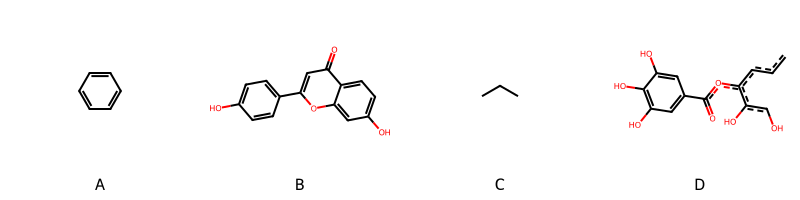

!!! abstract "Tóm tắt"

    **Họ Tamaricaceae** có **1** chi được các cộng đồng sử dụng trong chăm sóc sức khỏe gồm *Tamarix*. Số lượng thành phần hóa học đã phân lập và xác định cấu trúc từ họ này tính đến tháng 12 năm 2024 là **11** nhóm có thể liệt kê như sau *Steroids and steroid derivatives, Organooxygen compounds, Flavonoids, Fatty Acyls, Cinnamic acids and derivatives, Phenols, Tannins, Carboxylic acids and derivatives, Benzene and substituted derivatives, Prenol lipids, Organic sulfuric acids and derivatives*. Giữa các loài trong họ này, 3 dược liệu được nghiên cứu nhiều nhất dựa trên số thành phần được phân lập là **Tamarix aphylla, Tamarix gallica, Tamarix dioica*. *Họ Tamaricaceae* đã được một số công động tại các quốc gia như China, Elsewhere, India, ain, Iraq, Mexico đã phát hiện một số tác dụng trên lâm sàng gồm chữa bệnh lẫn độc tính như Alexiteric, Họ sẽ mở, Chất làm se, thuốc tống hơi, thuốc tống hơi, Thuốc lợi tiểu, Thuốc lợi tiểu, Thuốc lợi tiểu, Thuốc lợi tiểu, có mùi hôi, dễ bị tổn thương, Thuốc giảm đau, Thuốc lợi tiểu, Thuốc long đờm, Chất khử trùng, Thuốc bổ, Chất làm se, Chất làm se, có mùi hôi, Thuốc bổ, Thuốc lợi tiểu, Thuốc nhuận tràng.

!!! info "DrDuke"

    James A. Duke sinh năm 1929-2017 là một nhà thực vật học người Mỹ. Đây là một trong những tác giả hàng đầu trong lĩnh vực dược dân tộc học với cuốn *CRC Handbook of Medicinal Herbs* và chính là người xây dựng lên cơ sở dữ liệu về hợp chất tự nhiên và dược dân tộc học tại Bộ nông nghiệp Hoa Kỳ. Các thông tin được đăng tải tại website [Dr. Duke's Phytochemical and Ethnobotanical Databases](https://phytochem.nal.usda.gov/). 
    Trong suốt thập niên 1970, ông lãnh đạo the Plant Taxonomy Laboratory, Plant Genetics and Germplasm Institute of the Agricultural Research Service, U.S. Department of Agriculture.
    Trong tài liệu này, các thông tin về dược dân tộc của các dược liệu được trích dẫn từ tài liệu của James A. Ducke với sự trợ giúp của phần mềm dịch thuật từ tiếng Anh sang tiếng Việt.
   
## Tổng quan về Họ Tamaricaceae
### Phân loại thực vật
Trong *họ Tamaricaceae* có **1** chi được sử dụng làm thuốc với chi tiết số loài trong mỗi chi như sau Tamarix (8) . Chi tiết về loài sử dụng làm thuốc như dưới đây.  

>Họ Tamaricaceae


>|-- Chi Tamarix

>*Tamarix aphylla*,
>*Tamarix chinensis*,
>*Tamarix dioica*,
>*Tamarix ericoides*,
>*Tamarix gallica*,
>*Tamarix indica*,
>*Tamarix mannifera*,
>*Tamarix troupii*,

### Thành phần hóa học 

Số lượng thành phần hóa học đã phân lập và xác định cấu trúc từ họ này tính đến tháng 12 năm 2024 là 11 nhóm có thể liệt kê như sau Steroids and steroid derivatives, Organooxygen compounds, Flavonoids, Fatty Acyls, Cinnamic acids and derivatives, Phenols, Tannins, Carboxylic acids and derivatives, Benzene and substituted derivatives, Prenol lipids, Organic sulfuric acids and derivatives. Số lượng các loài đã được nghiên cứu thành phần hóa học là *4* trong tổng số *8* loài thuộc họ Tamaricaceae.Giữa các loài trong họ này, 3 dược liệu được nghiên cứu nhiều nhất dựa trên số thành phần được phân lập là **Tamarix aphylla, Tamarix gallica, Tamarix dioica**. Sử dụng phần mềm RDKIT với thuật toán  Find Maximum Common Substructure (FMCS), các nhóm hoạt chất phổ biến nhất trong *họ Tamaricaceae* đã xây dựng được nhân. Điều này trong tương lại có thể được sử dụng tìm kiếm mối liên hệ giữa tác dụng của cấu trúc hóa học và tác dụng dược lý. Các nhân trong phần này có thể không giống như cấu trúc gốc của từng nhóm chất. Kết quả được trình bầy như hình dưới đây.

<figure markdown="span">
    { width=100% }
    <figcaption> Cấu trúc hóa học của một số khung cơ bản dựa trên thuật toán FMCS để tìm Benzene and substituted derivatives (A), Flavonoids (B), Organooxygen compounds (C), Tannins (D).</figcaption>
</figure>


!!! info  "Find Maximum Common Substructure"
    
    Thuật toán FMCS (Find Maximum Common Substructure) là một phương pháp được sử dụng để tìm ra cấu trúc chung nhiều nhất (MCS) trong một tập hợp các cấu trúc hóa học. Các bước của thuật toán gồm:
    - Chọn một cấu trúc hóa học là cấu trúc để tạo truy vấn, còn các cấu trúc khác là mục tiêu.
    - Chia nhỏ cấu trúc để tạo truy vấn thành cấu trúc nhỏ hơn dạng chuỗi SMARTS.
    - Kiểm tra chuỗi SMARTS trong các cấu trúc mục tiêu.
    - Tìm kiếm chuỗi SMARTS xuất hiện nhiều nhất.
    Để biết thêm chi tiết các bạn có thể xem tại [TeachOpenCADD](https://projects.volkamerlab.org/teachopencadd/talktorials/T006_compound_maximum_common_substructures.html)
    ``` python
    pip install rdkit
    def find_core_smiles(smiles_list):
        mols = [Chem.MolFromSmiles(smiles) for smiles in smiles_list]
        mcs = rdFMCS.FindMCS(mols)
        core_smiles = Chem.MolToSmiles(Chem.MolFromSmarts(mcs.smartsString))
        return core_smiles
    ```

### Dược dân tộc học

Họ **Tamaricaceae** đã được một số công động tại các quốc gia như *China, Elsewhere, India, ain, Iraq, Mexico* đã phát hiện một số tác dụng trên lâm sàng gồm chữa bệnh lẫn độc tính như *Alexiteric, Họ sẽ mở, Chất làm se, thuốc tống hơi, thuốc tống hơi, Thuốc lợi tiểu, Thuốc lợi tiểu, Thuốc lợi tiểu, Thuốc lợi tiểu, có mùi hôi, dễ bị tổn thương, Thuốc giảm đau, Thuốc lợi tiểu, Thuốc long đờm, Chất khử trùng, Thuốc bổ, Chất làm se, Chất làm se, có mùi hôi, Thuốc bổ, Thuốc lợi tiểu, Thuốc nhuận tràng*.

## Chi tiết dược dân tộc học


### Chi Tamarix

!!! note "Danh sách các loài thuộc chi"
    
*	 - *Tamarix aphylla*
	 - *Tamarix chinensis*
	 - *Tamarix dioica*
	 - *Tamarix ericoides*
	 - *Tamarix gallica*
	 - *Tamarix indica*
	 - *Tamarix mannifera*
	 - *Tamarix troupii**

---      
#### *Tamarix aphylla*
**Thông tin về thực vật**

!!! info "Phân loại thực vật của *Tamarix aphylla* từ GIBF:"
    - **Kingdom:** Plantae
    - **Phylum:** Tracheophyta
    - **Order:** Caryophyllales
    - **Family:** Tamaricaceae
    - **Genus:** Tamarix
    - **Species:** *Tamarix aphylla*


 

Chưa có thông tin về loài này trên wikidata.

*Phân bố trên thế giới*: Israel, United States of America, Spain, Egypt, Mexico, Chinese Taipei, Algeria, Morocco, India, United Arab Emirates, Australia, Peru

*Phân bố tại Việt Nam*: Không có ghi nhận ở Việt Nam

**Thành phần hóa học**
        

Theo cơ sở dữ liệu lotus, từ loài *Tamarix aphylla* đã phân lập và xác định được 81 hoạt chất thuộc về các nhóm Steroids and steroid derivatives, Organooxygen compounds, Flavonoids, Cinnamic acids and derivatives, Phenols, Tannins, Carboxylic acids and derivatives, Benzene and substituted derivatives, Prenol lipids. Danh sách các hoạt chất như sau paraben [(LTS0224398)](https://lotus.naturalproducts.net/compound/lotus_id/LTS0224398), (+)-glucose [(LTS0262158)](https://lotus.naturalproducts.net/compound/lotus_id/LTS0262158), glucose [(LTS0013597)](https://lotus.naturalproducts.net/compound/lotus_id/LTS0013597), ferulic acid [(LTS0077328)](https://lotus.naturalproducts.net/compound/lotus_id/LTS0077328), (1r,3as,4r,6as)-1,4-bis(2,3-dimethoxyphenoxy)-hexahydrofuro[3,4-c]furan [(LTS0103957)](https://lotus.naturalproducts.net/compound/lotus_id/LTS0103957), 2-(3,4-dihydroxyphenyl)-5-hydroxy-7-methoxy-4-oxochromen-3-yl 3,4,5,6-tetrahydroxyoxane-2-carboxylate [(LTS0162311)](https://lotus.naturalproducts.net/compound/lotus_id/LTS0162311), ortho-xylene [(LTS0161849)](https://lotus.naturalproducts.net/compound/lotus_id/LTS0161849), isoferulic acid [(LTS0227619)](https://lotus.naturalproducts.net/compound/lotus_id/LTS0227619), 2-[5-({[(10r,12s,13s)-3,4,5,12,21,22,23-heptahydroxy-8,18-dioxo-11-(3,4,5-trihydroxybenzoyloxy)-9,14,17-trioxatetracyclo[17.4.0.0²,⁷.0¹⁰,¹⁵]tricosa-1(23),2(7),3,5,19,21-hexaen-13-yl]oxy}carbonyl)-2,3-dihydroxyphenoxy]-3,4,5-trihydroxybenzoic acid [(LTS0040014)](https://lotus.naturalproducts.net/compound/lotus_id/LTS0040014), 5-hydroxy-2-(4-hydroxyphenyl)-7-methoxy-3-{[(2s,3r,4s,5s,6r)-3,4,5-trihydroxy-6-(hydroxymethyl)oxan-2-yl]oxy}chromen-4-one [(LTS0033574)](https://lotus.naturalproducts.net/compound/lotus_id/LTS0033574), galop [(LTS0222857)](https://lotus.naturalproducts.net/compound/lotus_id/LTS0222857), methyl 2-[2,3-dihydroxy-5-(methoxycarbonyl)phenoxy]-3,4,5-trihydroxybenzoate [(LTS0058639)](https://lotus.naturalproducts.net/compound/lotus_id/LTS0058639), d-fructopyranose [(LTS0259277)](https://lotus.naturalproducts.net/compound/lotus_id/LTS0259277), rhamnocitrin [(LTS0198024)](https://lotus.naturalproducts.net/compound/lotus_id/LTS0198024), ribose [(LTS0106224)](https://lotus.naturalproducts.net/compound/lotus_id/LTS0106224), methyl ferulate [(LTS0265853)](https://lotus.naturalproducts.net/compound/lotus_id/LTS0265853), 5-hydroxy-2-(4-hydroxyphenyl)-7-methoxy-3-{[(2s,3r,4r,5r,6s)-3,4,5-trihydroxy-6-methyloxan-2-yl]oxy}chromen-4-one [(LTS0232013)](https://lotus.naturalproducts.net/compound/lotus_id/LTS0232013), (3s,14br)-8a-(hydroxymethyl)-4,4,6a,11,11,12b,14b-heptamethyl-1,2,3,4a,5,6,8,9,10,12,12a,13,14,14a-tetradecahydropicen-3-ol [(LTS0015363)](https://lotus.naturalproducts.net/compound/lotus_id/LTS0015363), l-arabinopyranose [(LTS0043712)](https://lotus.naturalproducts.net/compound/lotus_id/LTS0043712), n-methyl-l-proline [(LTS0166121)](https://lotus.naturalproducts.net/compound/lotus_id/LTS0166121), (10r,11r,13s)-3,4,5,12,21,22,23-heptahydroxy-8,18-dioxo-13-(3,4,5-trihydroxybenzoyloxy)-9,14,17-trioxatetracyclo[17.4.0.0²,⁷.0¹⁰,¹⁵]tricosa-1(23),2(7),3,5,19,21-hexaen-11-yl 3,4,5-trihydroxybenzoate [(LTS0028723)](https://lotus.naturalproducts.net/compound/lotus_id/LTS0028723), cyclohexanone [(LTS0246959)](https://lotus.naturalproducts.net/compound/lotus_id/LTS0246959), 2-(3,4-dihydroxyphenyl)-5,7-dihydroxy-3-{[(2s,3s,4r,5r,6s)-3,4,5-trihydroxy-6-methyloxan-2-yl]oxy}chromen-4-one [(LTS0083664)](https://lotus.naturalproducts.net/compound/lotus_id/LTS0083664), 5-(6-carboxy-2,3,4-trihydroxyphenoxy)-2-(5-carboxy-2,3-dihydroxyphenoxy)-3,4-dihydroxybenzoic acid [(LTS0211940)](https://lotus.naturalproducts.net/compound/lotus_id/LTS0211940), flavogallonic acid dilactone [(LTS0057922)](https://lotus.naturalproducts.net/compound/lotus_id/LTS0057922), vanillate [(LTS0253904)](https://lotus.naturalproducts.net/compound/lotus_id/LTS0253904), 2-[5-({[3,4,5,13,21,22,23-heptahydroxy-8,18-dioxo-12-(3,4,5-trihydroxybenzoyloxy)-9,14,17-trioxatetracyclo[17.4.0.0²,⁷.0¹⁰,¹⁵]tricosa-1(23),2(7),3,5,19,21-hexaen-11-yl]oxy}carbonyl)-2,3-dihydroxyphenoxy]-3,4,5-trihydroxybenzoic acid [(LTS0141825)](https://lotus.naturalproducts.net/compound/lotus_id/LTS0141825), acetophenone [(LTS0155971)](https://lotus.naturalproducts.net/compound/lotus_id/LTS0155971), 2-(4-hydroxyphenyl)-7-methoxy-3-[(2,3,4,5,6-pentahydroxyhexan-2-yl)oxy]chromen-4-one [(LTS0005484)](https://lotus.naturalproducts.net/compound/lotus_id/LTS0005484), (3r,4ar,6ar,8as,12as,12bs,14ar,14br)-8a-(hydroxymethyl)-4,4,6a,11,11,12b,14b-heptamethyl-1,2,3,4a,5,6,8,9,10,12,12a,13,14,14a-tetradecahydropicen-3-ol [(LTS0014634)](https://lotus.naturalproducts.net/compound/lotus_id/LTS0014634), 4,5,6,13,21,22,26,27,28,35,43,44-dodecahydroxy-14,36-bis(hydroxymethyl)-9,18,31,40-tetraoxo-34-(3,4,5-trihydroxybenzoyloxy)-2,10,15,17,24,32,37,39-octaoxaheptacyclo[39.3.1.1¹⁹,²³.0³,⁸.0¹¹,¹⁶.0²⁵,³⁰.0³³,³⁸]hexatetraconta-1(45),3,5,7,19,21,23(46),25,27,29,41,43-dodecaen-12-yl 3,4,5-trihydroxybenzoate [(LTS0008806)](https://lotus.naturalproducts.net/compound/lotus_id/LTS0008806), 2-hydroxy-3-{[3-(3-hydroxy-4-methoxyphenyl)prop-2-enoyl]oxy}propyl pentacosanoate [(LTS0237074)](https://lotus.naturalproducts.net/compound/lotus_id/LTS0237074), 2-[5-({[3-(2,3-dihydroxy-6-{[4,5,13,21,22-pentahydroxy-14-(hydroxymethyl)-9,18-dioxo-12-(3,4,5-trihydroxybenzoyloxy)-2,10,15,17-tetraoxatetracyclo[17.3.1.0³,⁸.0¹¹,¹⁶]tricosa-1(23),3,5,7,19,21-hexaen-6-yl]oxy}benzoyloxy)-5-hydroxy-6-(hydroxymethyl)-4-(3,4,5-trihydroxybenzoyloxy)oxan-2-yl]oxy}carbonyl)-2,3-dihydroxyphenoxy]-3,4,5-trihydroxybenzoic acid [(LTS0154273)](https://lotus.naturalproducts.net/compound/lotus_id/LTS0154273), aldehydo-d-galactose [(LTS0128031)](https://lotus.naturalproducts.net/compound/lotus_id/LTS0128031), 2-hydroxy-3-{[(2e)-3-(3-hydroxy-4-methoxyphenyl)prop-2-en-1-yl]oxy}propyl pentacosanoate [(LTS0262257)](https://lotus.naturalproducts.net/compound/lotus_id/LTS0262257), 8a-(hydroxymethyl)-4,4,6a,11,11,12b,14b-heptamethyl-2,4a,5,6,8,9,10,12,12a,13,14,14a-dodecahydro-1h-picen-3-one [(LTS0023005)](https://lotus.naturalproducts.net/compound/lotus_id/LTS0023005), 2-(3,4-dihydroxyphenyl)-5,7-dihydroxy-3-{[(2s,3r,4r,5r,6s)-3,4,5-trihydroxy-6-(hydroxymethyl)oxan-2-yl]oxy}chromen-4-one [(LTS0241372)](https://lotus.naturalproducts.net/compound/lotus_id/LTS0241372), galactose [(LTS0171628)](https://lotus.naturalproducts.net/compound/lotus_id/LTS0171628), arabinose [(LTS0085513)](https://lotus.naturalproducts.net/compound/lotus_id/LTS0085513), 3-(4-methoxy-3-{[3,4,5-trihydroxy-6-(hydroxymethyl)oxan-2-yl]oxy}phenyl)prop-2-enoic acid [(LTS0272139)](https://lotus.naturalproducts.net/compound/lotus_id/LTS0272139), 2,4,5-trihydroxy-6-[(3,4,5-trihydroxybenzoyloxy)methyl]oxan-3-yl 3,4,5-trihydroxybenzoate [(LTS0015341)](https://lotus.naturalproducts.net/compound/lotus_id/LTS0015341), 8a-(hydroxymethyl)-4,4,6a,11,11,12b,14b-heptamethyl-1,2,3,4a,5,6,8,9,10,12,12a,13,14,14a-tetradecahydropicen-3-ol [(LTS0116300)](https://lotus.naturalproducts.net/compound/lotus_id/LTS0116300), (4ar,6ar,8as,12as,12bs,14ar,14br)-8a-(hydroxymethyl)-4,4,6a,11,11,12b,14b-heptamethyl-2,4a,5,6,8,9,10,12,12a,13,14,14a-dodecahydro-1h-picen-3-one [(LTS0041643)](https://lotus.naturalproducts.net/compound/lotus_id/LTS0041643), 6-hydroxy-7,14-dimethoxy-13-{[3,4,5-trihydroxy-6-(hydroxymethyl)oxan-2-yl]oxy}-2,9-dioxatetracyclo[6.6.2.0⁴,¹⁶.0¹¹,¹⁵]hexadeca-1(15),4,6,8(16),11,13-hexaene-3,10-dione [(LTS0274843)](https://lotus.naturalproducts.net/compound/lotus_id/LTS0274843), 2-(5-carboxy-2,3-dihydroxyphenoxy)-3,4,5-trihydroxybenzoic acid [(LTS0091592)](https://lotus.naturalproducts.net/compound/lotus_id/LTS0091592), (2r,3r,4s,5s,6r)-2,4,5-trihydroxy-6-[(3,4,5-trihydroxybenzoyloxy)methyl]oxan-3-yl 3,4,5-trihydroxybenzoate [(LTS0152456)](https://lotus.naturalproducts.net/compound/lotus_id/LTS0152456), tamarixetin [(LTS0258243)](https://lotus.naturalproducts.net/compound/lotus_id/LTS0258243), 3,4-dihydroxy-5-(2,3,4-trihydroxyphenoxy)benzoic acid [(LTS0038915)](https://lotus.naturalproducts.net/compound/lotus_id/LTS0038915), (d)-xylose [(LTS0269907)](https://lotus.naturalproducts.net/compound/lotus_id/LTS0269907), quercitrin [(LTS0186298)](https://lotus.naturalproducts.net/compound/lotus_id/LTS0186298), 1-{3,4,5,11,17,18,19-heptahydroxy-8,14-dioxo-9,13-dioxatricyclo[13.4.0.0²,⁷]nonadeca-1(15),2,4,6,16,18-hexaen-10-yl}-2-hydroxy-3-oxopropyl 3,4,5-trihydroxybenzoate [(LTS0126471)](https://lotus.naturalproducts.net/compound/lotus_id/LTS0126471), stigmast-5-en-3-ol, (3β)- [(LTS0204616)](https://lotus.naturalproducts.net/compound/lotus_id/LTS0204616), sucrose [(LTS0272557)](https://lotus.naturalproducts.net/compound/lotus_id/LTS0272557), 5-hydroxy-6-(hydroxymethyl)-2,4-bis(3,4,5-trihydroxybenzoyloxy)oxan-3-yl 2-[4-({[(10r,12s,13s)-3,4,5,12,21,22,23-heptahydroxy-8,18-dioxo-11-(3,4,5-trihydroxybenzoyloxy)-9,14,17-trioxatetracyclo[17.4.0.0²,⁷.0¹⁰,¹⁵]tricosa-1(23),2(7),3,5,19,21-hexaen-13-yl]oxy}carbonyl)-2,3-dihydroxyphenoxy]-3,4,5-trihydroxybenzoate [(LTS0209669)](https://lotus.naturalproducts.net/compound/lotus_id/LTS0209669), d-ribopyranose [(LTS0182808)](https://lotus.naturalproducts.net/compound/lotus_id/LTS0182808), 2-(4-hydroxyphenyl)-7-methoxy-3-{[(2r,3s,4r,5r)-2,3,4,5,6-pentahydroxyhexan-2-yl]oxy}chromen-4-one [(LTS0207240)](https://lotus.naturalproducts.net/compound/lotus_id/LTS0207240), (2s,3s,5r)-5-hydroxy-3,4-bis(3,4,5-trihydroxybenzoyloxy)-6-[(3,4,5-trihydroxybenzoyloxy)methyl]oxan-2-yl 3,4,5-trihydroxybenzoate [(LTS0031030)](https://lotus.naturalproducts.net/compound/lotus_id/LTS0031030), 1-methylpyrrolidine-2-carboxylic acid [(LTS0230271)](https://lotus.naturalproducts.net/compound/lotus_id/LTS0230271), 3-[6-({[3,4,5,21,22,23-hexahydroxy-8,18-dioxo-11,13-bis(3,4,5-trihydroxybenzoyloxy)-9,14,17-trioxatetracyclo[17.4.0.0²,⁷.0¹⁰,¹⁵]tricosa-1(23),2(7),3,5,19,21-hexaen-12-yl]oxy}carbonyl)-2,3,4-trihydroxyphenoxy]-4,5-dihydroxybenzoic acid [(LTS0123887)](https://lotus.naturalproducts.net/compound/lotus_id/LTS0123887), quercetin [(LTS0004651)](https://lotus.naturalproducts.net/compound/lotus_id/LTS0004651), mesityl oxide [(LTS0243322)](https://lotus.naturalproducts.net/compound/lotus_id/LTS0243322), keto-d-fructose [(LTS0241114)](https://lotus.naturalproducts.net/compound/lotus_id/LTS0241114), d-xylose [(LTS0132381)](https://lotus.naturalproducts.net/compound/lotus_id/LTS0132381), (2s,3s,4s,5r,6s)-3,4,5-trihydroxy-6-{5-[7-methoxy-4-oxo-3,5-bis(sulfooxy)chromen-2-yl]-2-(sulfooxy)phenoxy}oxane-2-carboxylic acid [(LTS0022418)](https://lotus.naturalproducts.net/compound/lotus_id/LTS0022418), ferulic acid [(LTS0273002)](https://lotus.naturalproducts.net/compound/lotus_id/LTS0273002), 1,4-bis(2,3-dimethoxyphenoxy)-hexahydrofuro[3,4-c]furan [(LTS0106918)](https://lotus.naturalproducts.net/compound/lotus_id/LTS0106918), 5-hydroxy-2-(4-hydroxyphenyl)-7-methoxy-3-[(3,4,5-trihydroxy-6-methyloxan-2-yl)oxy]chromen-4-one [(LTS0141037)](https://lotus.naturalproducts.net/compound/lotus_id/LTS0141037), (2e)-3-(4-methoxy-3-{[(2s,3r,4s,5s,6r)-3,4,5-trihydroxy-6-(hydroxymethyl)oxan-2-yl]oxy}phenyl)prop-2-enoic acid [(LTS0108644)](https://lotus.naturalproducts.net/compound/lotus_id/LTS0108644), phytol [(LTS0031808)](https://lotus.naturalproducts.net/compound/lotus_id/LTS0031808), phytosterol [(LTS0029311)](https://lotus.naturalproducts.net/compound/lotus_id/LTS0029311), 2-(3,4-dihydroxyphenyl)-5-hydroxy-7-methoxy-4-oxochromen-3-yl (2s,3s,4s,5r,6r)-3,4,5,6-tetrahydroxyoxane-2-carboxylate [(LTS0063189)](https://lotus.naturalproducts.net/compound/lotus_id/LTS0063189), isoferulic acid [(LTS0160560)](https://lotus.naturalproducts.net/compound/lotus_id/LTS0160560), 3,4,5-trihydroxy-2-{[(11s,13r,16s)-4,5,13,21,22-pentahydroxy-14-(hydroxymethyl)-9,18-dioxo-12-(3,4,5-trihydroxybenzoyloxy)-2,10,15,17-tetraoxatetracyclo[17.3.1.0³,⁸.0¹¹,¹⁶]tricosa-1(23),3,5,7,19,21-hexaen-6-yl]oxy}benzoic acid [(LTS0191472)](https://lotus.naturalproducts.net/compound/lotus_id/LTS0191472), (2s)-2-hydroxy-3-{[(2e)-3-(3-hydroxy-4-methoxyphenyl)prop-2-enoyl]oxy}propyl pentacosanoate [(LTS0056673)](https://lotus.naturalproducts.net/compound/lotus_id/LTS0056673), diacetone alcohol [(LTS0034046)](https://lotus.naturalproducts.net/compound/lotus_id/LTS0034046), 4,5,6,13,21,22,26,27,28,35,43,44-dodecahydroxy-14,36-bis(hydroxymethyl)-9,18,31,40-tetraoxo-12-(3,4,5-trihydroxybenzoyloxy)-2,10,15,17,24,32,37,39-octaoxaheptacyclo[39.2.2.1¹⁹,²³.0³,⁸.0¹¹,¹⁶.0²⁵,³⁰.0³³,³⁸]hexatetraconta-1(43),3,5,7,19,21,23(46),25,27,29,41,44-dodecaen-34-yl 3,4,5-trihydroxybenzoate [(LTS0274114)](https://lotus.naturalproducts.net/compound/lotus_id/LTS0274114), 2,3,5-trihydroxy-6-[(3,4,5-trihydroxybenzoyloxy)methyl]oxan-4-yl 3,4,5-trihydroxybenzoate [(LTS0194780)](https://lotus.naturalproducts.net/compound/lotus_id/LTS0194780), ellagic acid [(LTS0037297)](https://lotus.naturalproducts.net/compound/lotus_id/LTS0037297), (2r,3r,4s,5r,6r)-2,3,5-trihydroxy-6-[(3,4,5-trihydroxybenzoyloxy)methyl]oxan-4-yl 3,4,5-trihydroxybenzoate [(LTS0138996)](https://lotus.naturalproducts.net/compound/lotus_id/LTS0138996), raffinose [(LTS0113066)](https://lotus.naturalproducts.net/compound/lotus_id/LTS0113066), myricadiol [(LTS0234194)](https://lotus.naturalproducts.net/compound/lotus_id/LTS0234194).

| chemicalTaxonomyClassyfireClass     |   lotus_count |
|:------------------------------------|--------------:|
| Benzene and substituted derivatives |            15 |
| Carboxylic acids and derivatives    |             2 |
| Cinnamic acids and derivatives      |             7 |
| Flavonoids                          |            14 |
| Organooxygen compounds              |            20 |
| Phenols                             |             1 |
| Prenol lipids                       |             6 |
| Steroids and steroid derivatives    |             2 |
| Tannins                             |            13 |


**Dược dân tộc học**

Danh sách các quốc gia có sử dụng *Tamarix aphylla* trong điều trị các bệnh. 

| Quốc gia   | Bệnh        |
|:-----------|:------------|
| Elsewhere  | Chất làm se |


---      
#### *Tamarix chinensis*
**Thông tin về thực vật**

!!! info "Phân loại thực vật của *Tamarix chinensis* từ GIBF:"
    - **Kingdom:** Plantae
    - **Phylum:** Tracheophyta
    - **Order:** Caryophyllales
    - **Family:** Tamaricaceae
    - **Genus:** Tamarix
    - **Species:** *Tamarix chinensis*


 

Chưa có thông tin về loài này trên wikidata.

*Phân bố trên thế giới*: France, Germany, United States of America, Spain, Mexico, China, Russian Federation, Chinese Taipei, Türkiye, Uzbekistan, Chile, New Zealand, United Kingdom of Great Britain and Northern Ireland, Australia, Korea, Republic of, Argentina, Uruguay

*Phân bố tại Việt Nam*: Không có ghi nhận ở Việt Nam

**Thành phần hóa học**
        

Theo cơ sở dữ liệu lotus, từ loài *Tamarix chinensis* đã phân lập và xác định được 5 hoạt chất thuộc về các nhóm Benzene and substituted derivatives, Flavonoids, Tannins. Danh sách các hoạt chất như sau galop [(LTS0222857)](https://lotus.naturalproducts.net/compound/lotus_id/LTS0222857), (1r,38r)-1,13,14,15,18,19,20,34,35,39,39-undecahydroxy-2,5,10,23,31-pentaoxo-6,9,24,27,30,40-hexaoxaoctacyclo[34.3.1.0⁴,³⁸.0⁷,²⁶.0⁸,²⁹.0¹¹,¹⁶.0¹⁷,²².0³²,³⁷]tetraconta-3,11(16),12,14,17,19,21,32,34,36-decaen-28-yl 3,4,5-trihydroxybenzoate [(LTS0043003)](https://lotus.naturalproducts.net/compound/lotus_id/LTS0043003), (7r,8s,26r,28s,29s)-1,13,14,15,18,19,20,34,35,39,39-undecahydroxy-2,5,10,23,31-pentaoxo-6,9,24,27,30,40-hexaoxaoctacyclo[34.3.1.0⁴,³⁸.0⁷,²⁶.0⁸,²⁹.0¹¹,¹⁶.0¹⁷,²².0³²,³⁷]tetraconta-3,11,13,15,17(22),18,20,32,34,36-decaen-28-yl 3,4,5-trihydroxybenzoate [(LTS0238381)](https://lotus.naturalproducts.net/compound/lotus_id/LTS0238381), kaempferide [(LTS0143784)](https://lotus.naturalproducts.net/compound/lotus_id/LTS0143784), ellagic acid [(LTS0037297)](https://lotus.naturalproducts.net/compound/lotus_id/LTS0037297).

| chemicalTaxonomyClassyfireClass     |   lotus_count |
|:------------------------------------|--------------:|
| Benzene and substituted derivatives |             1 |
| Flavonoids                          |             1 |
| Tannins                             |             3 |


**Dược dân tộc học**

Danh sách các quốc gia có sử dụng *Tamarix chinensis* trong điều trị các bệnh. 

| Quốc gia   | Bệnh                                                                                                                                                                                                            |
|:-----------|:----------------------------------------------------------------------------------------------------------------------------------------------------------------------------------------------------------------|
| China      | Alexiteric, Họ sẽ mở, Chất làm se, thuốc tống hơi, thuốc tống hơi, Thuốc lợi tiểu, Thuốc lợi tiểu, Thuốc lợi tiểu, Thuốc lợi tiểu, có mùi hôi, dễ bị tổn thương, Thuốc giảm đau, Thuốc lợi tiểu, Thuốc long đờm |
| Elsewhere  | Chất khử trùng, Thuốc bổ                                                                                                                                                                                        |


---      
#### *Tamarix dioica*
**Thông tin về thực vật**

!!! info "Phân loại thực vật của *Tamarix dioica* từ GIBF:"
    - **Kingdom:** Plantae
    - **Phylum:** Tracheophyta
    - **Order:** Caryophyllales
    - **Family:** Tamaricaceae
    - **Genus:** Tamarix
    - **Species:** *Tamarix dioica*


 

Chưa có thông tin về loài này trên wikidata.

*Phân bố trên thế giới*: nan, Pakistan, Afghanistan, Iran (Islamic Republic of), India, Nepal, Bhutan

*Phân bố tại Việt Nam*: Không có ghi nhận ở Việt Nam

**Thành phần hóa học**
        

Theo cơ sở dữ liệu lotus, từ loài *Tamarix dioica* đã phân lập và xác định được 11 hoạt chất thuộc về các nhóm Flavonoids, Fatty Acyls, Cinnamic acids and derivatives. Danh sách các hoạt chất như sau gardenin b [(LTS0017705)](https://lotus.naturalproducts.net/compound/lotus_id/LTS0017705), gardenin a [(LTS0151938)](https://lotus.naturalproducts.net/compound/lotus_id/LTS0151938), gardenin e [(LTS0221851)](https://lotus.naturalproducts.net/compound/lotus_id/LTS0221851), gardenin c [(LTS0124966)](https://lotus.naturalproducts.net/compound/lotus_id/LTS0124966), hentriacontan-7-ol [(LTS0141147)](https://lotus.naturalproducts.net/compound/lotus_id/LTS0141147), tamadone [(LTS0199916)](https://lotus.naturalproducts.net/compound/lotus_id/LTS0199916), hexacosyl 3-(4-hydroxyphenyl)prop-2-enoate [(LTS0189242)](https://lotus.naturalproducts.net/compound/lotus_id/LTS0189242), hexacosyl (2e)-3-(4-hydroxyphenyl)prop-2-enoate [(LTS0179527)](https://lotus.naturalproducts.net/compound/lotus_id/LTS0179527), nevadensin [(LTS0200685)](https://lotus.naturalproducts.net/compound/lotus_id/LTS0200685), chamomile [(LTS0104946)](https://lotus.naturalproducts.net/compound/lotus_id/LTS0104946), tamaridone [(LTS0245350)](https://lotus.naturalproducts.net/compound/lotus_id/LTS0245350).

| chemicalTaxonomyClassyfireClass   |   lotus_count |
|:----------------------------------|--------------:|
| Cinnamic acids and derivatives    |             2 |
| Fatty Acyls                       |             1 |
| Flavonoids                        |             8 |


**Dược dân tộc học**

Danh sách các quốc gia có sử dụng *Tamarix dioica* trong điều trị các bệnh. 

| Quốc gia   | Bệnh        |
|:-----------|:------------|
| Elsewhere  | Chất làm se |


---      
#### *Tamarix dioica*
**Thông tin về thực vật**

!!! info "Phân loại thực vật của *Tamarix dioica* từ GIBF:"
    - **Kingdom:** Plantae
    - **Phylum:** Tracheophyta
    - **Order:** Caryophyllales
    - **Family:** Tamaricaceae
    - **Genus:** Tamarix
    - **Species:** *Tamarix dioica*


 

Chưa có thông tin về loài này trên wikidata.

*Phân bố trên thế giới*: nan, Pakistan, Afghanistan, Iran (Islamic Republic of), India, Nepal, Bhutan

*Phân bố tại Việt Nam*: Không có ghi nhận ở Việt Nam

**Thành phần hóa học**
        

Chưa có nghiên cứu về thành phần hóa học của loài này


**Dược dân tộc học**

Danh sách các quốc gia có sử dụng *Tamarix dioica* trong điều trị các bệnh. 

| Quốc gia   | Bệnh        |
|:-----------|:------------|
| Elsewhere  | Chất làm se |


---      
#### *Tamarix gallica*
**Thông tin về thực vật**

!!! info "Phân loại thực vật của *Tamarix gallica* từ GIBF:"
    - **Kingdom:** Plantae
    - **Phylum:** Tracheophyta
    - **Order:** Caryophyllales
    - **Family:** Tamaricaceae
    - **Genus:** Tamarix
    - **Species:** *Tamarix gallica*


 

Chưa có thông tin về loài này trên wikidata.

*Phân bố trên thế giới*: France, Germany, nan, Spain, United States of America, Bermuda, Portugal, Algeria, Mexico, Croatia, Italy, United Kingdom of Great Britain and Northern Ireland, Slovenia, Morocco, Netherlands, Argentina, Uruguay, Belgium

*Phân bố tại Việt Nam*: Không có ghi nhận ở Việt Nam

**Thành phần hóa học**
        

Theo cơ sở dữ liệu lotus, từ loài *Tamarix gallica* đã phân lập và xác định được 14 hoạt chất thuộc về các nhóm Steroids and steroid derivatives, Fatty Acyls, Flavonoids, Prenol lipids, Organic sulfuric acids and derivatives. Danh sách các hoạt chất như sau tamarixetin [(LTS0258243)](https://lotus.naturalproducts.net/compound/lotus_id/LTS0258243), lupeol [(LTS0256952)](https://lotus.naturalproducts.net/compound/lotus_id/LTS0256952), 2-carboxy-d-arabinitol [(LTS0056947)](https://lotus.naturalproducts.net/compound/lotus_id/LTS0056947), stigmast-5-en-3-ol, (3β)- [(LTS0204616)](https://lotus.naturalproducts.net/compound/lotus_id/LTS0204616), ursolic acid [(LTS0250838)](https://lotus.naturalproducts.net/compound/lotus_id/LTS0250838), cholesterol [(LTS0102304)](https://lotus.naturalproducts.net/compound/lotus_id/LTS0102304), β-amyrin [(LTS0251864)](https://lotus.naturalproducts.net/compound/lotus_id/LTS0251864), 24-α-ethylcholesterol [(LTS0232294)](https://lotus.naturalproducts.net/compound/lotus_id/LTS0232294), avenasterol [(LTS0103350)](https://lotus.naturalproducts.net/compound/lotus_id/LTS0103350), 24-α-methylcholesterol [(LTS0106857)](https://lotus.naturalproducts.net/compound/lotus_id/LTS0106857), [4-(3-hydroxyprop-1-en-1-yl)-2-methoxyphenyl]oxidanesulfonic acid [(LTS0143588)](https://lotus.naturalproducts.net/compound/lotus_id/LTS0143588), {4-[(1e)-3-hydroxyprop-1-en-1-yl]-2-methoxyphenyl}oxidanesulfonic acid [(LTS0237935)](https://lotus.naturalproducts.net/compound/lotus_id/LTS0237935), (3ar,3br,9ar,9bs,11ar)-1-(5-ethyl-6-methylheptan-2-yl)-9a,11a-dimethyl-1h,2h,3h,3ah,3bh,4h,6h,7h,8h,9h,9bh,10h,11h-cyclopenta[a]phenanthren-7-ol [(LTS0126002)](https://lotus.naturalproducts.net/compound/lotus_id/LTS0126002), stigmast-5-en-3-ol [(LTS0071224)](https://lotus.naturalproducts.net/compound/lotus_id/LTS0071224).

| chemicalTaxonomyClassyfireClass        |   lotus_count |
|:---------------------------------------|--------------:|
| Fatty Acyls                            |             1 |
| Flavonoids                             |             1 |
| Organic sulfuric acids and derivatives |             2 |
| Prenol lipids                          |             3 |
| Steroids and steroid derivatives       |             7 |


**Dược dân tộc học**

Danh sách các quốc gia có sử dụng *Tamarix gallica* trong điều trị các bệnh. 

| Quốc gia   | Bệnh                                              |
|:-----------|:--------------------------------------------------|
| Mexico     | Chất làm se, có mùi hôi, Thuốc bổ, Thuốc lợi tiểu |
| ain        | Chất làm se                                       |


---      
#### *Tamarix gallica*
**Thông tin về thực vật**

!!! info "Phân loại thực vật của *Tamarix gallica* từ GIBF:"
    - **Kingdom:** Plantae
    - **Phylum:** Tracheophyta
    - **Order:** Caryophyllales
    - **Family:** Tamaricaceae
    - **Genus:** Tamarix
    - **Species:** *Tamarix gallica*


 

Chưa có thông tin về loài này trên wikidata.

*Phân bố trên thế giới*: France, Germany, nan, Spain, United States of America, Bermuda, Portugal, Algeria, Mexico, Croatia, Italy, United Kingdom of Great Britain and Northern Ireland, Slovenia, Morocco, Netherlands, Argentina, Uruguay, Belgium

*Phân bố tại Việt Nam*: Không có ghi nhận ở Việt Nam

**Thành phần hóa học**
        

Chưa có nghiên cứu về thành phần hóa học của loài này


**Dược dân tộc học**

Danh sách các quốc gia có sử dụng *Tamarix gallica* trong điều trị các bệnh. 

| Quốc gia   | Bệnh        |
|:-----------|:------------|
| India      | Chất làm se |


---      
#### *Tamarix gallica*
**Thông tin về thực vật**

!!! info "Phân loại thực vật của *Tamarix gallica* từ GIBF:"
    - **Kingdom:** Plantae
    - **Phylum:** Tracheophyta
    - **Order:** Caryophyllales
    - **Family:** Tamaricaceae
    - **Genus:** Tamarix
    - **Species:** *Tamarix gallica*


 

Chưa có thông tin về loài này trên wikidata.

*Phân bố trên thế giới*: France, Germany, nan, Spain, United States of America, Bermuda, Portugal, Algeria, Mexico, Croatia, Italy, United Kingdom of Great Britain and Northern Ireland, Slovenia, Morocco, Netherlands, Argentina, Uruguay, Belgium

*Phân bố tại Việt Nam*: Không có ghi nhận ở Việt Nam

**Thành phần hóa học**
        

Chưa có nghiên cứu về thành phần hóa học của loài này


**Dược dân tộc học**

Danh sách các quốc gia có sử dụng *Tamarix gallica* trong điều trị các bệnh. 

| Quốc gia   | Bệnh              |
|:-----------|:------------------|
| Iraq       | Thuốc nhuận tràng |


---      
#### *Tamarix gallica*
**Thông tin về thực vật**

!!! info "Phân loại thực vật của *Tamarix gallica* từ GIBF:"
    - **Kingdom:** Plantae
    - **Phylum:** Tracheophyta
    - **Order:** Caryophyllales
    - **Family:** Tamaricaceae
    - **Genus:** Tamarix
    - **Species:** *Tamarix gallica*


 

Chưa có thông tin về loài này trên wikidata.

*Phân bố trên thế giới*: France, Germany, nan, Spain, United States of America, Bermuda, Portugal, Algeria, Mexico, Croatia, Italy, United Kingdom of Great Britain and Northern Ireland, Slovenia, Morocco, Netherlands, Argentina, Uruguay, Belgium

*Phân bố tại Việt Nam*: Không có ghi nhận ở Việt Nam

**Thành phần hóa học**
        

Chưa có nghiên cứu về thành phần hóa học của loài này


**Dược dân tộc học**

Danh sách các quốc gia có sử dụng *Tamarix gallica* trong điều trị các bệnh. 

| Quốc gia   | Bệnh        |
|:-----------|:------------|
| India      | Chất làm se |


## Bình luận

<div id="giscus-container"></div>
<script src="https://giscus.app/client.js"
        data-repo="hoangson0787/CSDL-duoc-lieu"
        data-repo-id="R_kgDONbMRNA"
        data-category="Duoc lieu"
        data-category-id="DIC_kwDONbMRNM4ClklR"
        data-mapping="pathname"
        data-strict="0"
        data-reactions-enabled="1"
        data-emit-metadata="1"
        data-input-position="bottom"
        data-theme="light"
        data-lang="en"
        crossorigin="anonymous"
        async>
</script>

