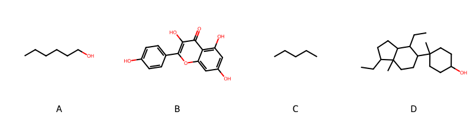

!!! abstract "Tóm tắt"

    **Họ Tiliaceae** có **5** chi được các cộng đồng sử dụng trong chăm sóc sức khỏe gồm *Carpodiptera, Corchorus, Grewia, Tilia, Triumfetta*. Số lượng thành phần hóa học đã phân lập và xác định cấu trúc từ họ này tính đến tháng 12 năm 2024 là **14** nhóm có thể liệt kê như sau *Steroids and steroid derivatives, Organooxygen compounds, Naphthalenes, Flavonoids, Fatty Acyls, Cinnamic acids and derivatives, Phenol ethers, Phenols, Carboxylic acids and derivatives, Benzene and substituted derivatives, Glycerolipids, Coumarins and derivatives, Saturated hydrocarbons, Prenol lipids*. Giữa các loài trong họ này, 3 dược liệu được nghiên cứu nhiều nhất dựa trên số thành phần được phân lập là **Corchorus olitorius, Corchorus aestuans, Tilia platyphyllos*. *Họ Tiliaceae* đã được một số công động tại các quốc gia như Elsewhere, Turkey, Haiti, Malaya, Burma, Eurasia, Costa Rica, India, Iraq, Dominican Republic, Mexico, W Africa, Inflammation đã phát hiện một số tác dụng trên lâm sàng gồm chữa bệnh lẫn độc tính như Chất làm lạnh, Chất làm mềm, Chất làm mềm, Thuốc an thần, Chất làm se, Chất làm se, diệt khuẩn, Làm dịu, Chất làm lạnh, dạ dày, Chất làm se, dạ dày, Chất làm lạnh, Giờ mở cửa, thuốc tống hơi, Thuốc nhuận tràng, Chất kích thích, dạ dày, Làm dịu, Làm dịu, Thuốc bổ, Thuốc lợi tiểu, Thuốc nhuận tràng, Làm dịu, Thuốc lợi tiểu, Thuốc long đờm, Lo lắng, Chất kích thích, có mùi hôi, Thuốc bổ, Mủ mủ, Thuốc an thần, Thuốc bổ, Thuốc kích thích tình dục, Thuốc diệt chấy rận, Thuốc giải độc, Xà phòng, Thuốc lợi tiểu, Thuốc nhuận tràng, Xà phòng, dạ dày, dạ dày, Thuốc lợi tiểu, Đổ mồ hôi, Đổ mồ hôi, dạ dày.

!!! info "DrDuke"

    James A. Duke sinh năm 1929-2017 là một nhà thực vật học người Mỹ. Đây là một trong những tác giả hàng đầu trong lĩnh vực dược dân tộc học với cuốn *CRC Handbook of Medicinal Herbs* và chính là người xây dựng lên cơ sở dữ liệu về hợp chất tự nhiên và dược dân tộc học tại Bộ nông nghiệp Hoa Kỳ. Các thông tin được đăng tải tại website [Dr. Duke's Phytochemical and Ethnobotanical Databases](https://phytochem.nal.usda.gov/). 
    Trong suốt thập niên 1970, ông lãnh đạo the Plant Taxonomy Laboratory, Plant Genetics and Germplasm Institute of the Agricultural Research Service, U.S. Department of Agriculture.
    Trong tài liệu này, các thông tin về dược dân tộc của các dược liệu được trích dẫn từ tài liệu của James A. Ducke với sự trợ giúp của phần mềm dịch thuật từ tiếng Anh sang tiếng Việt.
   
## Tổng quan về Họ Tiliaceae
### Phân loại thực vật
Trong *họ Tiliaceae* có **5** chi được sử dụng làm thuốc với chi tiết số loài trong mỗi chi như sau Triumfetta (3) . Chi tiết về loài sử dụng làm thuốc như dưới đây.  

>Họ Tiliaceae


>|-- Chi Carpodiptera

>*Carpodiptera cubensis*,

>|-- Chi Corchorus

>*Corchorus acutangulus*,
>*Corchorus aestuans*,
>*Corchorus capsularis*,
>*Corchorus olitorius*,
>*Corchorus siliquosus*,

>|-- Chi Grewia

>*Grewia asiatica*,
>*Grewia carpinifolia*,
>*Grewia hirsuta*,
>*Grewia optiva*,
>*Grewia sclerophylla*,
>*Grewia tiliifolia*,
>*Grewia umbellata*,
>*Grewia venusta*,

>|-- Chi Tilia

>*Tilia cordata*,
>*Tilia europea*,
>*Tilia platyphyllos*,

>|-- Chi Triumfetta

>*Triumfetta lappula*,
>*Triumfetta rotundifolia*,
>*Triumfetta semitriloba*,

### Thành phần hóa học 

Số lượng thành phần hóa học đã phân lập và xác định cấu trúc từ họ này tính đến tháng 12 năm 2024 là 14 nhóm có thể liệt kê như sau Steroids and steroid derivatives, Organooxygen compounds, Naphthalenes, Flavonoids, Fatty Acyls, Cinnamic acids and derivatives, Phenol ethers, Phenols, Carboxylic acids and derivatives, Benzene and substituted derivatives, Glycerolipids, Coumarins and derivatives, Saturated hydrocarbons, Prenol lipids. Số lượng các loài đã được nghiên cứu thành phần hóa học là *7* trong tổng số *20* loài thuộc họ Tiliaceae.Giữa các loài trong họ này, 3 dược liệu được nghiên cứu nhiều nhất dựa trên số thành phần được phân lập là **Corchorus olitorius, Corchorus aestuans, Tilia platyphyllos**. Sử dụng phần mềm RDKIT với thuật toán  Find Maximum Common Substructure (FMCS), các nhóm hoạt chất phổ biến nhất trong *họ Tiliaceae* đã xây dựng được nhân. Điều này trong tương lại có thể được sử dụng tìm kiếm mối liên hệ giữa tác dụng của cấu trúc hóa học và tác dụng dược lý. Các nhân trong phần này có thể không giống như cấu trúc gốc của từng nhóm chất. Kết quả được trình bầy như hình dưới đây.

<figure markdown="span">
    { width=100% }
    <figcaption> Cấu trúc hóa học của một số khung cơ bản dựa trên thuật toán FMCS để tìm Fatty Acyls (A), Flavonoids (B), Prenol lipids (C), Steroids and steroid derivatives (D).</figcaption>
</figure>


!!! info  "Find Maximum Common Substructure"
    
    Thuật toán FMCS (Find Maximum Common Substructure) là một phương pháp được sử dụng để tìm ra cấu trúc chung nhiều nhất (MCS) trong một tập hợp các cấu trúc hóa học. Các bước của thuật toán gồm:
    - Chọn một cấu trúc hóa học là cấu trúc để tạo truy vấn, còn các cấu trúc khác là mục tiêu.
    - Chia nhỏ cấu trúc để tạo truy vấn thành cấu trúc nhỏ hơn dạng chuỗi SMARTS.
    - Kiểm tra chuỗi SMARTS trong các cấu trúc mục tiêu.
    - Tìm kiếm chuỗi SMARTS xuất hiện nhiều nhất.
    Để biết thêm chi tiết các bạn có thể xem tại [TeachOpenCADD](https://projects.volkamerlab.org/teachopencadd/talktorials/T006_compound_maximum_common_substructures.html)
    ``` python
    pip install rdkit
    def find_core_smiles(smiles_list):
        mols = [Chem.MolFromSmiles(smiles) for smiles in smiles_list]
        mcs = rdFMCS.FindMCS(mols)
        core_smiles = Chem.MolToSmiles(Chem.MolFromSmarts(mcs.smartsString))
        return core_smiles
    ```

### Dược dân tộc học

Họ **Tiliaceae** đã được một số công động tại các quốc gia như *Elsewhere, Turkey, Haiti, Malaya, Burma, Eurasia, Costa Rica, India, Iraq, Dominican Republic, Mexico, W Africa, Inflammation* đã phát hiện một số tác dụng trên lâm sàng gồm chữa bệnh lẫn độc tính như *Chất làm lạnh, Chất làm mềm, Chất làm mềm, Thuốc an thần, Chất làm se, Chất làm se, diệt khuẩn, Làm dịu, Chất làm lạnh, dạ dày, Chất làm se, dạ dày, Chất làm lạnh, Giờ mở cửa, thuốc tống hơi, Thuốc nhuận tràng, Chất kích thích, dạ dày, Làm dịu, Làm dịu, Thuốc bổ, Thuốc lợi tiểu, Thuốc nhuận tràng, Làm dịu, Thuốc lợi tiểu, Thuốc long đờm, Lo lắng, Chất kích thích, có mùi hôi, Thuốc bổ, Mủ mủ, Thuốc an thần, Thuốc bổ, Thuốc kích thích tình dục, Thuốc diệt chấy rận, Thuốc giải độc, Xà phòng, Thuốc lợi tiểu, Thuốc nhuận tràng, Xà phòng, dạ dày, dạ dày, Thuốc lợi tiểu, Đổ mồ hôi, Đổ mồ hôi, dạ dày*.

## Chi tiết dược dân tộc học


### Chi Carpodiptera

!!! note "Danh sách các loài thuộc chi"
    
*	 - *Carpodiptera cubensis**

---      
#### *Tilia platyphyllos*
**Thông tin về thực vật**

!!! info "Phân loại thực vật của *Tilia platyphyllos* từ GIBF:"
    - **Kingdom:** Plantae
    - **Phylum:** Tracheophyta
    - **Order:** Malvales
    - **Family:** Malvaceae
    - **Genus:** Tilia
    - **Species:** *Tilia platyphyllos*


 

Chưa có thông tin về loài này trên wikidata.

*Phân bố trên thế giới*: Germany, France, Spain, Poland, Switzerland, Luxembourg, Russian Federation, United States of America, Sweden, Ukraine, United Kingdom of Great Britain and Northern Ireland, Czechia, Netherlands, Hungary, Austria, Ireland, Belgium

*Phân bố tại Việt Nam*: Không có ghi nhận ở Việt Nam

**Thành phần hóa học**
        

Chưa có nghiên cứu về thành phần hóa học của loài này


**Dược dân tộc học**

Danh sách các quốc gia có sử dụng *Tilia platyphyllos* trong điều trị các bệnh. 

| Quốc gia   | Bệnh                   |
|:-----------|:-----------------------|
| Haiti      | dạ dày, Thuốc lợi tiểu |


### Chi Corchorus

!!! note "Danh sách các loài thuộc chi"
    
*	 - *Corchorus acutangulus*
	 - *Corchorus aestuans*
	 - *Corchorus capsularis*
	 - *Corchorus olitorius*
	 - *Corchorus siliquosus**

---      
#### *Tilia platyphyllos*
**Thông tin về thực vật**

!!! info "Phân loại thực vật của *Tilia platyphyllos* từ GIBF:"
    - **Kingdom:** Plantae
    - **Phylum:** Tracheophyta
    - **Order:** Malvales
    - **Family:** Malvaceae
    - **Genus:** Tilia
    - **Species:** *Tilia platyphyllos*


 

Chưa có thông tin về loài này trên wikidata.

*Phân bố trên thế giới*: Germany, France, Spain, Poland, Switzerland, Luxembourg, Russian Federation, United States of America, Sweden, Ukraine, United Kingdom of Great Britain and Northern Ireland, Czechia, Netherlands, Hungary, Austria, Ireland, Belgium

*Phân bố tại Việt Nam*: Không có ghi nhận ở Việt Nam

**Thành phần hóa học**
        

Chưa có nghiên cứu về thành phần hóa học của loài này


**Dược dân tộc học**

Danh sách các quốc gia có sử dụng *Tilia platyphyllos* trong điều trị các bệnh. 

| Quốc gia   | Bệnh   |
|:-----------|:-------|
| Iraq       | dạ dày |


---      
#### *Corchorus aestuans*
**Thông tin về thực vật**

!!! info "Phân loại thực vật của *Corchorus aestuans* từ GIBF:"
    - **Kingdom:** Plantae
    - **Phylum:** Tracheophyta
    - **Order:** Malvales
    - **Family:** Malvaceae
    - **Genus:** Corchorus
    - **Species:** *Corchorus aestuans*


 

Chưa có thông tin về loài này trên wikidata.

*Phân bố trên thế giới*: Cayman Islands, Singapore, Antigua and Barbuda, Ghana, French Guiana, Mexico, Chinese Taipei, Hong Kong, Bonaire, Sint Eustatius and Saba, Australia, British Indian Ocean Territory, Indonesia, Virgin Islands (U.S.), Mozambique, Saint Kitts and Nevis, India, Brazil, Thailand, United States of America, Montserrat, China, Dominican Republic, Maldives, Puerto Rico

*Phân bố tại Việt Nam*: Không có ghi nhận ở Việt Nam

**Thành phần hóa học**
        

Theo cơ sở dữ liệu lotus, từ loài *Corchorus aestuans* đã phân lập và xác định được 31 hoạt chất thuộc về các nhóm Fatty Acyls, Steroids and steroid derivatives, Prenol lipids, Carboxylic acids and derivatives. Danh sách các hoạt chất như sau (2r,3r,4s,5r,6r)-2-{[(3s,4r,4as,6ar,6bs,8s,8as,12ar,14ar,14br)-8-hydroxy-4,8a-bis(hydroxymethyl)-4,6a,6b,11,11,14b-hexamethyl-1,2,3,4a,5,6,7,8,9,10,12,12a,14,14a-tetradecahydropicen-3-yl]oxy}-6-(hydroxymethyl)oxane-3,4,5-triol [(LTS0016217)](https://lotus.naturalproducts.net/compound/lotus_id/LTS0016217), d-aspartic acid [(LTS0144001)](https://lotus.naturalproducts.net/compound/lotus_id/LTS0144001), stigmast-5-en-3-ol, (3β)- [(LTS0204616)](https://lotus.naturalproducts.net/compound/lotus_id/LTS0204616), (2r,3r,4s,5r,6r)-2-{[(3s,4as,6ar,6bs,8s,8as,12ar,14as,14br)-8-hydroxy-8a-(hydroxymethyl)-4,4,6a,6b,11,11,14b-heptamethyl-1,2,3,4a,5,6,7,8,9,10,12,12a,14,14a-tetradecahydropicen-3-yl]oxy}-6-(hydroxymethyl)oxane-3,4,5-triol [(LTS0141413)](https://lotus.naturalproducts.net/compound/lotus_id/LTS0141413), (2s,3r,4s,5s,6r)-2-{[(2r,3r,4s,5r,6r)-4,5-dihydroxy-2-{[(1s,2s,4s,5r,8s,10s,13s,14r,17s,18s)-2-hydroxy-4,5,9,9,13,20,20-heptamethyl-24-oxahexacyclo[15.5.2.0¹,¹⁸.0⁴,¹⁷.0⁵,¹⁴.0⁸,¹³]tetracos-15-en-10-yl]oxy}-6-(hydroxymethyl)oxan-3-yl]oxy}-6-(hydroxymethyl)oxane-3,4,5-triol [(LTS0084961)](https://lotus.naturalproducts.net/compound/lotus_id/LTS0084961), palmitic acid [(LTS0079439)](https://lotus.naturalproducts.net/compound/lotus_id/LTS0079439), d-phenylalanine [(LTS0048920)](https://lotus.naturalproducts.net/compound/lotus_id/LTS0048920), (2r,3r,4s,5s,6r)-2-{[(1r,3as,3bs,7s,9ar,9bs,11ar)-1-[(2r,3e,5s)-5-ethyl-6-methylhept-3-en-2-yl]-9a,11a-dimethyl-1h,2h,3h,3ah,3bh,4h,6h,7h,8h,9h,9bh,10h,11h-cyclopenta[a]phenanthren-7-yl]oxy}-6-(hydroxymethyl)oxane-3,4,5-triol [(LTS0088971)](https://lotus.naturalproducts.net/compound/lotus_id/LTS0088971), stearic acid [(LTS0237766)](https://lotus.naturalproducts.net/compound/lotus_id/LTS0237766), (2r,3r,4s,5r,6r)-2-{[(3s,4ar,6ar,6bs,8s,8as,14ar,14bs)-8-hydroxy-8a-(hydroxymethyl)-4,4,6a,6b,11,11,14b-heptamethyl-1,2,3,4a,5,6,7,8,9,10,12,14a-dodecahydropicen-3-yl]oxy}-6-(hydroxymethyl)oxane-3,4,5-triol [(LTS0130258)](https://lotus.naturalproducts.net/compound/lotus_id/LTS0130258), 2-{[8-hydroxy-4,8a-bis(hydroxymethyl)-4,6a,6b,11,11,14b-hexamethyl-1,2,3,4a,5,6,7,8,9,10,12,12a,14,14a-tetradecahydropicen-3-yl]oxy}-6-(hydroxymethyl)oxane-3,4,5-triol [(LTS0202028)](https://lotus.naturalproducts.net/compound/lotus_id/LTS0202028), l-lysine [(LTS0068734)](https://lotus.naturalproducts.net/compound/lotus_id/LTS0068734), (2s,3r,4s,5s,6r)-2-{[(2r,3r,4s,5r,6r)-2-{[(3s,4ar,6ar,6bs,8s,8as,14ar,14bs)-8-hydroxy-8a-(hydroxymethyl)-4,4,6a,6b,11,11,14b-heptamethyl-1,2,3,4a,5,6,7,8,9,10,12,14a-dodecahydropicen-3-yl]oxy}-4,5-dihydroxy-6-(hydroxymethyl)oxan-3-yl]oxy}-6-(hydroxymethyl)oxane-3,4,5-triol [(LTS0030353)](https://lotus.naturalproducts.net/compound/lotus_id/LTS0030353), l-serine [(LTS0106692)](https://lotus.naturalproducts.net/compound/lotus_id/LTS0106692), stigmast-5-en-3-ol [(LTS0071224)](https://lotus.naturalproducts.net/compound/lotus_id/LTS0071224), 2-[(4,5-dihydroxy-2-{[8-hydroxy-8a-(hydroxymethyl)-4,4,6a,6b,11,11,14b-heptamethyl-1,2,3,4a,5,6,7,8,9,10,12,12a,14,14a-tetradecahydropicen-3-yl]oxy}-6-(hydroxymethyl)oxan-3-yl)oxy]-6-(hydroxymethyl)oxane-3,4,5-triol [(LTS0219280)](https://lotus.naturalproducts.net/compound/lotus_id/LTS0219280), l-valine [(LTS0231703)](https://lotus.naturalproducts.net/compound/lotus_id/LTS0231703), α-linolenic acid [(LTS0275508)](https://lotus.naturalproducts.net/compound/lotus_id/LTS0275508), (2r,3r,4s,5r,6r)-2-{[(1s,2s,4s,5r,8r,9r,10s,13s,14r,17s,18s)-2-hydroxy-9-(hydroxymethyl)-4,5,9,13,20,20-hexamethyl-24-oxahexacyclo[15.5.2.0¹,¹⁸.0⁴,¹⁷.0⁵,¹⁴.0⁸,¹³]tetracos-15-en-10-yl]oxy}-6-(hydroxymethyl)oxane-3,4,5-triol [(LTS0087697)](https://lotus.naturalproducts.net/compound/lotus_id/LTS0087697), oleic acid [(LTS0256910)](https://lotus.naturalproducts.net/compound/lotus_id/LTS0256910), l-threonine [(LTS0184056)](https://lotus.naturalproducts.net/compound/lotus_id/LTS0184056), 2-{[8-hydroxy-8a-(hydroxymethyl)-4,4,6a,6b,11,11,14b-heptamethyl-1,2,3,4a,5,6,7,8,9,10,12,12a,14,14a-tetradecahydropicen-3-yl]oxy}-6-(hydroxymethyl)oxane-3,4,5-triol [(LTS0264925)](https://lotus.naturalproducts.net/compound/lotus_id/LTS0264925), (2s,3r,4s,5s,6r)-2-{[(2r,3r,4s,5r,6r)-2-{[(3s,4ar,6as,6br,8s,8as,12ar,14bs)-8-hydroxy-8a-(hydroxymethyl)-4,4,6a,6b,11,11,14b-heptamethyl-1,2,3,4a,5,6,7,8,9,10,12,12a-dodecahydropicen-3-yl]oxy}-4,5-dihydroxy-6-(hydroxymethyl)oxan-3-yl]oxy}-6-(hydroxymethyl)oxane-3,4,5-triol [(LTS0147303)](https://lotus.naturalproducts.net/compound/lotus_id/LTS0147303), 2-[(4,5-dihydroxy-2-{[8-hydroxy-8a-(hydroxymethyl)-4,4,6a,6b,11,11,14b-heptamethyl-1,2,3,4a,5,6,7,8,9,10,12,12a-dodecahydropicen-3-yl]oxy}-6-(hydroxymethyl)oxan-3-yl)oxy]-6-(hydroxymethyl)oxane-3,4,5-triol [(LTS0186666)](https://lotus.naturalproducts.net/compound/lotus_id/LTS0186666), 2-{[4,5-dihydroxy-2-({2-hydroxy-4,5,9,9,13,20,20-heptamethyl-24-oxahexacyclo[15.5.2.0¹,¹⁸.0⁴,¹⁷.0⁵,¹⁴.0⁸,¹³]tetracos-15-en-10-yl}oxy)-6-(hydroxymethyl)oxan-3-yl]oxy}-6-(hydroxymethyl)oxane-3,4,5-triol [(LTS0179924)](https://lotus.naturalproducts.net/compound/lotus_id/LTS0179924), (2s,3r,4s,5s,6r)-2-{[(2r,3r,4s,5r,6r)-4,5-dihydroxy-2-{[(2r,4s,5r,13s,18s)-2-hydroxy-4,5,9,9,13,20,20-heptamethyl-24-oxahexacyclo[15.5.2.0¹,¹⁸.0⁴,¹⁷.0⁵,¹⁴.0⁸,¹³]tetracos-15-en-10-yl]oxy}-6-(hydroxymethyl)oxan-3-yl]oxy}-6-(hydroxymethyl)oxane-3,4,5-triol [(LTS0059722)](https://lotus.naturalproducts.net/compound/lotus_id/LTS0059722), 2-[(4,5-dihydroxy-2-{[8-hydroxy-8a-(hydroxymethyl)-4,4,6a,6b,11,11,14b-heptamethyl-1,2,3,4a,5,6,7,8,9,10,12,14a-dodecahydropicen-3-yl]oxy}-6-(hydroxymethyl)oxan-3-yl)oxy]-6-(hydroxymethyl)oxane-3,4,5-triol [(LTS0059085)](https://lotus.naturalproducts.net/compound/lotus_id/LTS0059085), 2-{[1-(5-ethyl-6-methylhept-3-en-2-yl)-9a,11a-dimethyl-1h,2h,3h,3ah,3bh,4h,6h,7h,8h,9h,9bh,10h,11h-cyclopenta[a]phenanthren-7-yl]oxy}-6-(hydroxymethyl)oxane-3,4,5-triol [(LTS0057912)](https://lotus.naturalproducts.net/compound/lotus_id/LTS0057912), 2-{[2-hydroxy-9-(hydroxymethyl)-4,5,9,13,20,20-hexamethyl-24-oxahexacyclo[15.5.2.0¹,¹⁸.0⁴,¹⁷.0⁵,¹⁴.0⁸,¹³]tetracos-15-en-10-yl]oxy}-6-(hydroxymethyl)oxane-3,4,5-triol [(LTS0136499)](https://lotus.naturalproducts.net/compound/lotus_id/LTS0136499), 2-{[8-hydroxy-8a-(hydroxymethyl)-4,4,6a,6b,11,11,14b-heptamethyl-1,2,3,4a,5,6,7,8,9,10,12,14a-dodecahydropicen-3-yl]oxy}-6-(hydroxymethyl)oxane-3,4,5-triol [(LTS0085505)](https://lotus.naturalproducts.net/compound/lotus_id/LTS0085505), (2s,3r,4s,5s,6r)-2-{[(2r,3r,4s,5r,6r)-2-{[(3s,4ar,6ar,6bs,8s,8as,12ar,14ar,14br)-8-hydroxy-8a-(hydroxymethyl)-4,4,6a,6b,11,11,14b-heptamethyl-1,2,3,4a,5,6,7,8,9,10,12,12a,14,14a-tetradecahydropicen-3-yl]oxy}-4,5-dihydroxy-6-(hydroxymethyl)oxan-3-yl]oxy}-6-(hydroxymethyl)oxane-3,4,5-triol [(LTS0219014)](https://lotus.naturalproducts.net/compound/lotus_id/LTS0219014).

| chemicalTaxonomyClassyfireClass   |   lotus_count |
|:----------------------------------|--------------:|
| Carboxylic acids and derivatives  |             6 |
| Fatty Acyls                       |             4 |
| Prenol lipids                     |            17 |
| Steroids and steroid derivatives  |             4 |


**Dược dân tộc học**

Danh sách các quốc gia có sử dụng *Corchorus aestuans* trong điều trị các bệnh. 

| Quốc gia   | Bệnh   |
|:-----------|:-------|
| India      | dạ dày |


---      
#### *Corchorus capsularis*
**Thông tin về thực vật**

!!! info "Phân loại thực vật của *Corchorus capsularis* từ GIBF:"
    - **Kingdom:** Plantae
    - **Phylum:** Tracheophyta
    - **Order:** Malvales
    - **Family:** Malvaceae
    - **Genus:** Corchorus
    - **Species:** *Corchorus capsularis*


 

Chưa có thông tin về loài này trên wikidata.

*Phân bố trên thế giới*: nan, Tanzania, United Republic of, Zambia, Nepal, Singapore, Sri Lanka, Mexico, Chinese Taipei, Papua New Guinea, Hong Kong, Cambodia, Bangladesh, Japan, Australia, Madagascar, Indonesia, Myanmar, Trinidad and Tobago, Nigeria, India, Brazil, Viet Nam, Thailand, United States of America, Philippines, China, Malaysia

*Phân bố tại Việt Nam*: Hòa Bình, Cần Thơ

**Thành phần hóa học**
        

Theo cơ sở dữ liệu lotus, từ loài *Corchorus capsularis* đã phân lập và xác định được 20 hoạt chất thuộc về các nhóm Steroids and steroid derivatives, Cinnamic acids and derivatives, Phenols, Benzene and substituted derivatives, Prenol lipids. Danh sách các hoạt chất như sau 2-{[1-(5-ethyl-6-methylheptan-2-yl)-9a,11a-dimethyl-1h,2h,3h,3ah,3bh,4h,6h,7h,8h,9h,9bh,10h,11h-cyclopenta[a]phenanthren-7-yl]oxy}-6-(hydroxymethyl)oxane-3,4,5-triol [(LTS0158828)](https://lotus.naturalproducts.net/compound/lotus_id/LTS0158828), strophanthidin [(LTS0023973)](https://lotus.naturalproducts.net/compound/lotus_id/LTS0023973), (2s,3r,4s,5s,6r)-2-{[(1s,3as,3br,5ar,7s,9ar,9br,11r,11ar)-11-hydroxy-3a-(hydroxymethyl)-1-[(2s,5s)-5-(2-hydroxypropan-2-yl)-2-methyloxolan-2-yl]-3b,6,6,9a-tetramethyl-dodecahydro-1h-cyclopenta[a]phenanthren-7-yl]oxy}-6-(hydroxymethyl)oxane-3,4,5-triol [(LTS0272487)](https://lotus.naturalproducts.net/compound/lotus_id/LTS0272487), ferulic acid [(LTS0077328)](https://lotus.naturalproducts.net/compound/lotus_id/LTS0077328), (1s,2r,4as,6as,6br,8as,10r,11r,12ar,12br,14bs)-10,11-dihydroxy-1,2,6a,6b,9,9,12a-heptamethyl-2,3,4,5,6,7,8,8a,10,11,12,12b,13,14b-tetradecahydro-1h-picene-4a-carboxylic acid [(LTS0182770)](https://lotus.naturalproducts.net/compound/lotus_id/LTS0182770), 2,3,12-trihydroxy-4,6a,6b,11,12,14b-hexamethyl-1,2,3,4a,5,6,7,8,9,10,11,12a,14,14a-tetradecahydropicene-4,8a-dicarboxylic acid [(LTS0058559)](https://lotus.naturalproducts.net/compound/lotus_id/LTS0058559), para-coumaric acid [(LTS0266252)](https://lotus.naturalproducts.net/compound/lotus_id/LTS0266252), sitogluside [(LTS0201798)](https://lotus.naturalproducts.net/compound/lotus_id/LTS0201798), p-hydroxybenzoic acid [(LTS0263634)](https://lotus.naturalproducts.net/compound/lotus_id/LTS0263634), 10,11-dihydroxy-1,2,6a,6b,9,9,12a-heptamethyl-2,3,4,5,6,7,8,8a,10,11,12,12b,13,14b-tetradecahydro-1h-picene-4a-carboxylic acid [(LTS0122037)](https://lotus.naturalproducts.net/compound/lotus_id/LTS0122037), dinitro [(LTS0008113)](https://lotus.naturalproducts.net/compound/lotus_id/LTS0008113), strophanthidin [(LTS0262470)](https://lotus.naturalproducts.net/compound/lotus_id/LTS0262470), 3,4-dihydroxybenzoic acid [(LTS0018765)](https://lotus.naturalproducts.net/compound/lotus_id/LTS0018765), 3,4-dihydroxycinnamic acid [(LTS0128050)](https://lotus.naturalproducts.net/compound/lotus_id/LTS0128050), phytol [(LTS0096073)](https://lotus.naturalproducts.net/compound/lotus_id/LTS0096073), 2-{[11-hydroxy-3a-(hydroxymethyl)-1-[5-(2-hydroxypropan-2-yl)-2-methyloxolan-2-yl]-3b,6,6,9a-tetramethyl-dodecahydro-1h-cyclopenta[a]phenanthren-7-yl]oxy}-6-(hydroxymethyl)oxane-3,4,5-triol [(LTS0141969)](https://lotus.naturalproducts.net/compound/lotus_id/LTS0141969), phytol [(LTS0031808)](https://lotus.naturalproducts.net/compound/lotus_id/LTS0031808), vanillic acid [(LTS0229113)](https://lotus.naturalproducts.net/compound/lotus_id/LTS0229113), (1r,3as,3br,5as,7s,9as,9bs,11ar)-7-{[(2r,4s,5r,6r)-4,5-dihydroxy-6-methyloxan-2-yl]oxy}-3a,5a-dihydroxy-11a-methyl-1-(5-oxo-2h-furan-3-yl)-dodecahydro-1h-cyclopenta[a]phenanthrene-9a-carbaldehyde [(LTS0000786)](https://lotus.naturalproducts.net/compound/lotus_id/LTS0000786), 7-[(4,5-dihydroxy-6-methyloxan-2-yl)oxy]-3a,5a-dihydroxy-11a-methyl-1-(5-oxo-2h-furan-3-yl)-dodecahydro-1h-cyclopenta[a]phenanthrene-9a-carbaldehyde [(LTS0197094)](https://lotus.naturalproducts.net/compound/lotus_id/LTS0197094).

| chemicalTaxonomyClassyfireClass     |   lotus_count |
|:------------------------------------|--------------:|
| Benzene and substituted derivatives |             3 |
| Cinnamic acids and derivatives      |             3 |
| Phenols                             |             1 |
| Prenol lipids                       |             7 |
| Steroids and steroid derivatives    |             6 |


**Dược dân tộc học**

Danh sách các quốc gia có sử dụng *Corchorus capsularis* trong điều trị các bệnh. 

| Quốc gia   | Bệnh                                                                   |
|:-----------|:-----------------------------------------------------------------------|
| Iraq       | Giờ mở cửa, thuốc tống hơi, Thuốc nhuận tràng, Chất kích thích, dạ dày |


---      
#### *Corchorus olitorius*
**Thông tin về thực vật**

!!! info "Phân loại thực vật của *Corchorus olitorius* từ GIBF:"
    - **Kingdom:** Plantae
    - **Phylum:** Tracheophyta
    - **Order:** Malvales
    - **Family:** Malvaceae
    - **Genus:** Corchorus
    - **Species:** *Corchorus olitorius*


 

Chưa có thông tin về loài này trên wikidata.

*Phân bố trên thế giới*: France, Benin, Israel, Gambia, Tanzania, United Republic of, Lebanon, Malawi, Haiti, Kenya, Côte d’Ivoire, Mali, Egypt, Mexico, Chinese Taipei, South Africa, Djibouti, Japan, Cameroon, Australia, Madagascar, Saudi Arabia, Nigeria, Burkina Faso, Mozambique, India, Brazil, Türkiye, Viet Nam, United States of America, Philippines, China, Algeria, Burundi, Belgium

*Phân bố tại Việt Nam*: Không có ghi nhận ở Việt Nam

**Thành phần hóa học**
        

Theo cơ sở dữ liệu lotus, từ loài *Corchorus olitorius* đã phân lập và xác định được 72 hoạt chất thuộc về các nhóm Steroids and steroid derivatives, Organooxygen compounds, Flavonoids, Fatty Acyls, Cinnamic acids and derivatives, Carboxylic acids and derivatives, Benzene and substituted derivatives, Glycerolipids, Coumarins and derivatives, Prenol lipids. Danh sách các hoạt chất như sau 4-[(1r,3as,3br,5ar,7s,9as,9bs,11ar)-7-{[(2r,4s,5s,6r)-4,5-dihydroxy-6-methyloxan-2-yl]oxy}-3a-hydroxy-9a,11a-dimethyl-tetradecahydrocyclopenta[a]phenanthren-1-yl]-5h-furan-2-one [(LTS0069289)](https://lotus.naturalproducts.net/compound/lotus_id/LTS0069289), scopolin [(LTS0061811)](https://lotus.naturalproducts.net/compound/lotus_id/LTS0061811), (1r,3as,3br,5as,7s,9as,9bs,11ar)-7-{[(2r,5s)-4,5-dihydroxy-6-methyloxan-2-yl]oxy}-3a,5a-dihydroxy-11a-methyl-1-(5-oxo-2h-furan-3-yl)-dodecahydro-1h-cyclopenta[a]phenanthrene-9a-carbaldehyde [(LTS0212228)](https://lotus.naturalproducts.net/compound/lotus_id/LTS0212228), strophanthidin [(LTS0023973)](https://lotus.naturalproducts.net/compound/lotus_id/LTS0023973), stigmast-5-en-3-ol, (3β)- [(LTS0204616)](https://lotus.naturalproducts.net/compound/lotus_id/LTS0204616), 4-[(1r,3as,3br,5ar,7s,9as,9bs,11ar)-7-{[(2r,4s,5r,6r)-4,5-dihydroxy-6-methyloxan-2-yl]oxy}-3a-hydroxy-9a,11a-dimethyl-tetradecahydrocyclopenta[a]phenanthren-1-yl]-5h-furan-2-one [(LTS0172328)](https://lotus.naturalproducts.net/compound/lotus_id/LTS0172328), 3,5-dicaffeoylquinic acid [(LTS0177751)](https://lotus.naturalproducts.net/compound/lotus_id/LTS0177751), 4-{3a,10-dihydroxy-7-[(4-hydroxy-6-methyl-5-{[3,4,5-trihydroxy-6-(hydroxymethyl)oxan-2-yl]oxy}oxan-2-yl)oxy]-9a,11a-dimethyl-tetradecahydrocyclopenta[a]phenanthren-1-yl}-5h-furan-2-one [(LTS0030960)](https://lotus.naturalproducts.net/compound/lotus_id/LTS0030960), 2-[(6-hydroxy-2,6-dimethylocta-2,7-dien-1-yl)oxy]-6-(hydroxymethyl)oxane-3,4,5-triol [(LTS0190477)](https://lotus.naturalproducts.net/compound/lotus_id/LTS0190477), trifolin [(LTS0237581)](https://lotus.naturalproducts.net/compound/lotus_id/LTS0237581), nicotianamine [(LTS0217066)](https://lotus.naturalproducts.net/compound/lotus_id/LTS0217066), 3-{[(2s,3r,4r,5s,6r)-6-{[2-(3,4-dihydroxyphenyl)-5,7-dihydroxy-4-oxochromen-3-yl]oxy}-3,4,5-trihydroxyoxan-2-yl]methoxy}-3-oxopropanoic acid [(LTS0035931)](https://lotus.naturalproducts.net/compound/lotus_id/LTS0035931), juglanin [(LTS0053649)](https://lotus.naturalproducts.net/compound/lotus_id/LTS0053649), 1-hexadecanoyl-sn-glycerol [(LTS0062636)](https://lotus.naturalproducts.net/compound/lotus_id/LTS0062636), ferulic acid [(LTS0077328)](https://lotus.naturalproducts.net/compound/lotus_id/LTS0077328), (10e,15z)-9,12,13-trihydroxyoctadeca-10,15-dienoic acid [(LTS0244209)](https://lotus.naturalproducts.net/compound/lotus_id/LTS0244209), (10e)-9,12,13-trihydroxyoctadeca-10,15-dienoic acid [(LTS0151534)](https://lotus.naturalproducts.net/compound/lotus_id/LTS0151534), methyl (2s,3s,4s,5r,6s)-6-[(3-{[(2r,3s,4r,5r,6s)-3-{[(2e)-3-(3,4-dihydroxyphenyl)prop-2-enoyl]oxy}-4,5-dihydroxy-6-(hydroxymethyl)oxan-2-yl]oxy}-5-hydroxy-2-(4-hydroxyphenyl)-4-oxochromen-7-yl)oxy]-3,4,5-trihydroxyoxane-2-carboxylate [(LTS0077603)](https://lotus.naturalproducts.net/compound/lotus_id/LTS0077603), 4-[(1r,3as,3br,5as,7s,9ar,9bs,11ar)-3a,5a,7-trihydroxy-9a-(hydroxymethyl)-11a-methyl-dodecahydro-1h-cyclopenta[a]phenanthren-1-yl]-5h-furan-2-one [(LTS0088429)](https://lotus.naturalproducts.net/compound/lotus_id/LTS0088429), 4-hydroxy-3,5,5-trimethyl-4-[(1e)-3-oxo-4-{[3,4,5-trihydroxy-6-(hydroxymethyl)oxan-2-yl]oxy}but-1-en-1-yl]cyclohex-2-en-1-one [(LTS0075205)](https://lotus.naturalproducts.net/compound/lotus_id/LTS0075205), 2-(3,4-dihydroxyphenyl)-5,7-dihydroxy-3-{[(2s,3r,4r,5r,6s)-3,4,5-trihydroxy-6-(hydroxymethyl)oxan-2-yl]oxy}chromen-4-one [(LTS0241372)](https://lotus.naturalproducts.net/compound/lotus_id/LTS0241372), scopolin [(LTS0014838)](https://lotus.naturalproducts.net/compound/lotus_id/LTS0014838), 4-{7-[(4,5-dihydroxy-6-methyloxan-2-yl)oxy]-3a-hydroxy-9a,11a-dimethyl-tetradecahydrocyclopenta[a]phenanthren-1-yl}-5h-furan-2-one [(LTS0036041)](https://lotus.naturalproducts.net/compound/lotus_id/LTS0036041), methyl 6-({3-[(3-{[3-(3,4-dihydroxyphenyl)prop-2-enoyl]oxy}-4,5-dihydroxy-6-(hydroxymethyl)oxan-2-yl)oxy]-5-hydroxy-2-(4-hydroxyphenyl)-4-oxochromen-7-yl}oxy)-3,4,5-trihydroxyoxane-2-carboxylate [(LTS0026462)](https://lotus.naturalproducts.net/compound/lotus_id/LTS0026462), (2r,3r,4s,5s,6r)-2-{[(1r,3s,6s)-6-[(1e,3s)-3-hydroxybut-1-en-1-yl]-1,5,5-trimethyl-7-oxabicyclo[4.1.0]heptan-3-yl]oxy}-6-(hydroxymethyl)oxane-3,4,5-triol [(LTS0035337)](https://lotus.naturalproducts.net/compound/lotus_id/LTS0035337), para-coumaric acid [(LTS0266252)](https://lotus.naturalproducts.net/compound/lotus_id/LTS0266252), 2-(3,4-dihydroxyphenyl)-5,7-dihydroxy-3-{[(2r,3s,4r,5r,6s)-3,4,5-trihydroxy-6-(hydroxymethyl)oxan-2-yl]oxy}chromen-4-one [(LTS0119671)](https://lotus.naturalproducts.net/compound/lotus_id/LTS0119671), sitogluside [(LTS0201798)](https://lotus.naturalproducts.net/compound/lotus_id/LTS0201798), (2s,3r,4s,5s,6r)-2-({2-[(2s,5s)-5-[(1r,3as,3br,5ar,7s,9ar,9br,11r,11ar)-7,11-dihydroxy-3b,6,6,9a-tetramethyl-3a-({[(2s,3s,4r,5r,6s)-3,4,5-trihydroxy-6-(hydroxymethyl)oxan-2-yl]oxy}methyl)-dodecahydro-1h-cyclopenta[a]phenanthren-1-yl]-5-methyloxolan-2-yl]propan-2-yl}oxy)-6-(hydroxymethyl)oxane-3,4,5-triol [(LTS0009394)](https://lotus.naturalproducts.net/compound/lotus_id/LTS0009394), erysimoside [(LTS0033605)](https://lotus.naturalproducts.net/compound/lotus_id/LTS0033605), p-hydroxybenzoic acid [(LTS0263634)](https://lotus.naturalproducts.net/compound/lotus_id/LTS0263634), 4-[(1r,3as,3br,5ar,7s,9as,9bs,11ar)-3a-hydroxy-7-{[(2r,4s,5s,6r)-4-hydroxy-6-methyl-5-{[(2s,3r,4s,5s,6r)-3,4,5-trihydroxy-6-(hydroxymethyl)oxan-2-yl]oxy}oxan-2-yl]oxy}-9a,11a-dimethyl-tetradecahydrocyclopenta[a]phenanthren-1-yl]-5h-furan-2-one [(LTS0160050)](https://lotus.naturalproducts.net/compound/lotus_id/LTS0160050), 3-[(6-{[2-(3,4-dihydroxyphenyl)-5,7-dihydroxy-4-oxochromen-3-yl]oxy}-3,4,5-trihydroxyoxan-2-yl)methoxy]-3-oxopropanoic acid [(LTS0174746)](https://lotus.naturalproducts.net/compound/lotus_id/LTS0174746), chlorogenic acid [(LTS0226495)](https://lotus.naturalproducts.net/compound/lotus_id/LTS0226495), oleanolic acid [(LTS0117717)](https://lotus.naturalproducts.net/compound/lotus_id/LTS0117717), 3,5-bis({[3-(3,4-dihydroxyphenyl)prop-2-enoyl]oxy})-1,4-dihydroxycyclohexane-1-carboxylic acid [(LTS0076864)](https://lotus.naturalproducts.net/compound/lotus_id/LTS0076864), 7-[(4,5-dihydroxy-6-methyloxan-2-yl)oxy]-3a,5a-dihydroxy-11a-methyl-1-(5-oxo-2h-furan-3-yl)-dodecahydro-1h-cyclopenta[a]phenanthrene-9a-carbaldehyde [(LTS0197094)](https://lotus.naturalproducts.net/compound/lotus_id/LTS0197094), 2-({6-[(1e)-3-hydroxybut-1-en-1-yl]-1,5,5-trimethyl-7-oxabicyclo[4.1.0]heptan-3-yl}oxy)-6-(hydroxymethyl)oxane-3,4,5-triol [(LTS0214859)](https://lotus.naturalproducts.net/compound/lotus_id/LTS0214859), helveticoside [(LTS0031660)](https://lotus.naturalproducts.net/compound/lotus_id/LTS0031660), 3-{[3-(3,4-dihydroxyphenyl)prop-2-enoyl]oxy}-1,4,5-trihydroxycyclohexane-1-carboxylic acid [(LTS0143901)](https://lotus.naturalproducts.net/compound/lotus_id/LTS0143901), strophanthidin [(LTS0262470)](https://lotus.naturalproducts.net/compound/lotus_id/LTS0262470), 3,4-dihydroxybenzoic acid [(LTS0018765)](https://lotus.naturalproducts.net/compound/lotus_id/LTS0018765), 4-{3a,10-dihydroxy-7-[(4-hydroxy-6-methyl-5-{[3,4,5-trihydroxy-6-(hydroxymethyl)oxan-2-yl]oxy}oxan-2-yl)oxy]-9a-(hydroxymethyl)-11a-methyl-tetradecahydrocyclopenta[a]phenanthren-1-yl}-5h-furan-2-one [(LTS0222086)](https://lotus.naturalproducts.net/compound/lotus_id/LTS0222086), 4-hydroxy-3,5,5-trimethyl-4-(3-oxo-4-{[3,4,5-trihydroxy-6-(hydroxymethyl)oxan-2-yl]oxy}but-1-en-1-yl)cyclohex-2-en-1-one [(LTS0106750)](https://lotus.naturalproducts.net/compound/lotus_id/LTS0106750), 4-[(1r,3as,3br,5as,7s,9ar,9bs,11ar)-3a,5a-dihydroxy-7-{[(2r,4r,5s,6r)-4-hydroxy-6-methyl-5-{[(2s,3r,4s,5s,6r)-3,4,5-trihydroxy-6-(hydroxymethyl)oxan-2-yl]oxy}oxan-2-yl]oxy}-9a,11a-dimethyl-dodecahydro-1h-cyclopenta[a]phenanthren-1-yl]-5h-furan-2-one [(LTS0164402)](https://lotus.naturalproducts.net/compound/lotus_id/LTS0164402), astragalin [(LTS0249588)](https://lotus.naturalproducts.net/compound/lotus_id/LTS0249588), 2-[(2-{5-[7,11-dihydroxy-3b,6,6,9a-tetramethyl-3a-({[3,4,5-trihydroxy-6-(hydroxymethyl)oxan-2-yl]oxy}methyl)-dodecahydro-1h-cyclopenta[a]phenanthren-1-yl]-5-methyloxolan-2-yl}propan-2-yl)oxy]-6-(hydroxymethyl)oxane-3,4,5-triol [(LTS0247273)](https://lotus.naturalproducts.net/compound/lotus_id/LTS0247273), 3,4-dihydroxycinnamic acid [(LTS0128050)](https://lotus.naturalproducts.net/compound/lotus_id/LTS0128050), (4s)-4-hydroxy-3,5,5-trimethyl-4-[(1e,3s)-3-{[(2r,3r,4s,5s,6r)-3,4,5-trihydroxy-6-(hydroxymethyl)oxan-2-yl]oxy}but-1-en-1-yl]cyclohex-2-en-1-one [(LTS0020614)](https://lotus.naturalproducts.net/compound/lotus_id/LTS0020614), (1r,3as,3br,5as,7s,9as,9bs,11ar)-3a,5a-dihydroxy-7-{[(2r,4s,5s,6r)-4-hydroxy-6-methyl-5-{[(2r,3r,4s,5s,6r)-3,4,5-trihydroxy-6-(hydroxymethyl)oxan-2-yl]oxy}oxan-2-yl]oxy}-11a-methyl-1-(5-oxo-2h-furan-3-yl)-dodecahydro-1h-cyclopenta[a]phenanthrene-9a-carbaldehyde [(LTS0180087)](https://lotus.naturalproducts.net/compound/lotus_id/LTS0180087), isoquercetin [(LTS0254337)](https://lotus.naturalproducts.net/compound/lotus_id/LTS0254337), phytol [(LTS0096073)](https://lotus.naturalproducts.net/compound/lotus_id/LTS0096073), 4-{3a,5a,10-trihydroxy-7-[(4-hydroxy-6-methyl-5-{[3,4,5-trihydroxy-6-(hydroxymethyl)oxan-2-yl]oxy}oxan-2-yl)oxy]-9a,11a-dimethyl-dodecahydro-1h-cyclopenta[a]phenanthren-1-yl}-5h-furan-2-one [(LTS0160756)](https://lotus.naturalproducts.net/compound/lotus_id/LTS0160756), methyl (2s,3s,4s,5r,6s)-3,4,5-trihydroxy-6-{[5-hydroxy-2-(4-hydroxyphenyl)-4-oxo-3-{[(2r,3s,4r,5r,6s)-3,4,5-trihydroxy-6-(hydroxymethyl)oxan-2-yl]oxy}chromen-7-yl]oxy}oxane-2-carboxylate [(LTS0150794)](https://lotus.naturalproducts.net/compound/lotus_id/LTS0150794), cichoriin [(LTS0075962)](https://lotus.naturalproducts.net/compound/lotus_id/LTS0075962), (1r,3as,3br,5as,7s,9as,9bs,11ar)-3a,5a-dihydroxy-7-{[(2r,4s,5s,6r)-4-hydroxy-6-methyl-5-{[(2s,3r,4s,5s,6r)-3,4,5-trihydroxy-6-({[(2r,3r,4s,5s,6r)-3,4,5-trihydroxy-6-(hydroxymethyl)oxan-2-yl]oxy}methyl)oxan-2-yl]oxy}oxan-2-yl]oxy}-11a-methyl-1-(5-oxo-2h-furan-3-yl)-dodecahydro-1h-cyclopenta[a]phenanthrene-9a-carbaldehyde [(LTS0013713)](https://lotus.naturalproducts.net/compound/lotus_id/LTS0013713), (4s)-4-hydroxy-3,5,5-trimethyl-4-[(1e)-3-oxo-4-{[(2r,3r,4s,5s,6r)-3,4,5-trihydroxy-6-(hydroxymethyl)oxan-2-yl]oxy}but-1-en-1-yl]cyclohex-2-en-1-one [(LTS0126702)](https://lotus.naturalproducts.net/compound/lotus_id/LTS0126702), 2-{[6-(3-hydroxybut-1-en-1-yl)-1,5,5-trimethyl-7-oxabicyclo[4.1.0]heptan-3-yl]oxy}-6-(hydroxymethyl)oxane-3,4,5-triol [(LTS0123462)](https://lotus.naturalproducts.net/compound/lotus_id/LTS0123462), 4-hydroxy-3,5,5-trimethyl-4-(3-{[3,4,5-trihydroxy-6-(hydroxymethyl)oxan-2-yl]oxy}but-1-en-1-yl)cyclohex-2-en-1-one [(LTS0170985)](https://lotus.naturalproducts.net/compound/lotus_id/LTS0170985), (1r,3as,3br,5as,7s,9bs,11ar)-3a,5a-dihydroxy-7-{[(2r,4r,5s,6r)-4-hydroxy-6-methyl-5-{[(2s,3r,4s,5s,6r)-3,4,5-trihydroxy-6-(hydroxymethyl)oxan-2-yl]oxy}oxan-2-yl]oxy}-11a-methyl-1-(5-oxo-2h-furan-3-yl)-dodecahydro-1h-cyclopenta[a]phenanthrene-9a-carbaldehyde [(LTS0048187)](https://lotus.naturalproducts.net/compound/lotus_id/LTS0048187), (9as,11ar)-3a,5a-dihydroxy-7-{[(2r,4s,6r)-4-hydroxy-6-methyl-5-{[(3r,4s,5s,6r)-3,4,5-trihydroxy-6-(hydroxymethyl)oxan-2-yl]oxy}oxan-2-yl]oxy}-11a-methyl-1-(5-oxo-2h-furan-3-yl)-dodecahydro-1h-cyclopenta[a]phenanthrene-9a-carbaldehyde [(LTS0119272)](https://lotus.naturalproducts.net/compound/lotus_id/LTS0119272), methyl 3,4,5-trihydroxy-6-{[5-hydroxy-2-(4-hydroxyphenyl)-4-oxo-3-{[3,4,5-trihydroxy-6-(hydroxymethyl)oxan-2-yl]oxy}chromen-7-yl]oxy}oxane-2-carboxylate [(LTS0202859)](https://lotus.naturalproducts.net/compound/lotus_id/LTS0202859), 4-[(1r,3as,3br,5ar,7s,9as,9bs,11ar)-3a-hydroxy-7-{[(2r,4r,5s,6r)-4-hydroxy-6-methyl-5-{[(2s,3r,4s,5s,6r)-3,4,5-trihydroxy-6-(hydroxymethyl)oxan-2-yl]oxy}oxan-2-yl]oxy}-9a,11a-dimethyl-tetradecahydrocyclopenta[a]phenanthren-1-yl]-5h-furan-2-one [(LTS0027043)](https://lotus.naturalproducts.net/compound/lotus_id/LTS0027043), (1r,3as,5as,7r,9as,11ar)-7-{[(2r,5s)-4,5-dihydroxy-6-methyloxan-2-yl]oxy}-3a,5a-dihydroxy-11a-methyl-1-(5-oxo-2h-furan-3-yl)-dodecahydro-1h-cyclopenta[a]phenanthrene-9a-carbaldehyde [(LTS0238031)](https://lotus.naturalproducts.net/compound/lotus_id/LTS0238031), phytol [(LTS0031808)](https://lotus.naturalproducts.net/compound/lotus_id/LTS0031808), vanillic acid [(LTS0229113)](https://lotus.naturalproducts.net/compound/lotus_id/LTS0229113), (4r)-4-hydroxy-3,5,5-trimethyl-4-[(1e,3r)-3-{[(2s,3s,4r,5r,6s)-3,4,5-trihydroxy-6-(hydroxymethyl)oxan-2-yl]oxy}but-1-en-1-yl]cyclohex-2-en-1-one [(LTS0039936)](https://lotus.naturalproducts.net/compound/lotus_id/LTS0039936), 2-(3,4-dihydroxyphenyl)-5,7-dihydroxy-3-{[(2r,3s,4r,5s,6s)-3,4,5-trihydroxy-6-(hydroxymethyl)oxan-2-yl]oxy}chromen-4-one [(LTS0083101)](https://lotus.naturalproducts.net/compound/lotus_id/LTS0083101), (1r,3as,3br,5as,7s,9as,9bs,11ar)-7-{[(2r,4s,5r,6r)-4,5-dihydroxy-6-methyloxan-2-yl]oxy}-3a,5a-dihydroxy-11a-methyl-1-(5-oxo-2h-furan-3-yl)-dodecahydro-1h-cyclopenta[a]phenanthrene-9a-carbaldehyde [(LTS0000786)](https://lotus.naturalproducts.net/compound/lotus_id/LTS0000786), (1r,3as,5as,7s,9as,11ar)-7-{[(2r,5s)-6-({[(3r,6s)-4,6-dihydroxy-2-methyloxan-3-yl]oxy}methyl)-3,4,5-trihydroxyoxan-2-yl]oxy}-3a,5a-dihydroxy-11a-methyl-1-(5-oxo-2h-furan-3-yl)-dodecahydro-1h-cyclopenta[a]phenanthrene-9a-carbaldehyde [(LTS0198859)](https://lotus.naturalproducts.net/compound/lotus_id/LTS0198859), 2-(3,4-dihydroxyphenyl)-5,7-dihydroxy-3-{[3,4,5-trihydroxy-6-(hydroxymethyl)oxan-2-yl]oxy}chromen-4-one [(LTS0195312)](https://lotus.naturalproducts.net/compound/lotus_id/LTS0195312), erysimoside [(LTS0074609)](https://lotus.naturalproducts.net/compound/lotus_id/LTS0074609).

| chemicalTaxonomyClassyfireClass     |   lotus_count |
|:------------------------------------|--------------:|
| Benzene and substituted derivatives |             3 |
| Carboxylic acids and derivatives    |             1 |
| Cinnamic acids and derivatives      |             3 |
| Coumarins and derivatives           |             2 |
| Fatty Acyls                         |             9 |
| Flavonoids                          |            14 |
| Glycerolipids                       |             1 |
| Organooxygen compounds              |             7 |
| Prenol lipids                       |             5 |
| Steroids and steroid derivatives    |            26 |


**Dược dân tộc học**

Danh sách các quốc gia có sử dụng *Corchorus olitorius* trong điều trị các bệnh. 

| Quốc gia   | Bệnh                                                 |
|:-----------|:-----------------------------------------------------|
| Elsewhere  | Làm dịu, Thuốc bổ, Thuốc lợi tiểu, Thuốc nhuận tràng |


---      
#### *Corchorus olitorius*
**Thông tin về thực vật**

!!! info "Phân loại thực vật của *Corchorus olitorius* từ GIBF:"
    - **Kingdom:** Plantae
    - **Phylum:** Tracheophyta
    - **Order:** Malvales
    - **Family:** Malvaceae
    - **Genus:** Corchorus
    - **Species:** *Corchorus olitorius*


 

Chưa có thông tin về loài này trên wikidata.

*Phân bố trên thế giới*: France, Benin, Israel, Gambia, Tanzania, United Republic of, Lebanon, Malawi, Haiti, Kenya, Côte d’Ivoire, Mali, Egypt, Mexico, Chinese Taipei, South Africa, Djibouti, Japan, Cameroon, Australia, Madagascar, Saudi Arabia, Nigeria, Burkina Faso, Mozambique, India, Brazil, Türkiye, Viet Nam, United States of America, Philippines, China, Algeria, Burundi, Belgium

*Phân bố tại Việt Nam*: Không có ghi nhận ở Việt Nam

**Thành phần hóa học**
        

Chưa có nghiên cứu về thành phần hóa học của loài này


**Dược dân tộc học**

Danh sách các quốc gia có sử dụng *Corchorus olitorius* trong điều trị các bệnh. 

| Quốc gia     | Bệnh                        |
|:-------------|:----------------------------|
| Haiti        | Chất làm mềm, Thuốc an thần |
| Inflammation | Thuốc an thần               |


### Chi Grewia

!!! note "Danh sách các loài thuộc chi"
    
*	 - *Grewia asiatica*
	 - *Grewia carpinifolia*
	 - *Grewia hirsuta*
	 - *Grewia optiva*
	 - *Grewia sclerophylla*
	 - *Grewia tiliifolia*
	 - *Grewia umbellata*
	 - *Grewia venusta**

---      
#### *Grewia asiatica*
**Thông tin về thực vật**

!!! info "Phân loại thực vật của *Grewia asiatica* từ GIBF:"
    - **Kingdom:** Plantae
    - **Phylum:** Tracheophyta
    - **Order:** Malvales
    - **Family:** Malvaceae
    - **Genus:** Grewia
    - **Species:** *Grewia asiatica*


 

Chưa có thông tin về loài này trên wikidata.

*Phân bố trên thế giới*: Seychelles, United States of America, Trinidad and Tobago, China, Pakistan, Hong Kong, Réunion, Brazil, Iran (Islamic Republic of), India, Nepal, Australia, Puerto Rico, Sri Lanka, Lao People’s Democratic Republic, Viet Nam

*Phân bố tại Việt Nam*: Ninh Thuan

**Thành phần hóa học**
        

Theo cơ sở dữ liệu lotus, từ loài *Grewia asiatica* đã phân lập và xác định được 1 hoạt chất thuộc về các nhóm Fatty Acyls. Danh sách các hoạt chất như sau 22-hydroxytetratriacontan-13-one [(LTS0063906)](https://lotus.naturalproducts.net/compound/lotus_id/LTS0063906).

| chemicalTaxonomyClassyfireClass   |   lotus_count |
|:----------------------------------|--------------:|
| Fatty Acyls                       |             1 |


**Dược dân tộc học**

Danh sách các quốc gia có sử dụng *Grewia asiatica* trong điều trị các bệnh. 

| Quốc gia   | Bệnh                                                    |
|:-----------|:--------------------------------------------------------|
| Burma      | Xà phòng                                                |
| Elsewhere  | Chất làm se, dạ dày, Chất làm lạnh                      |
| India      | Chất làm se, diệt khuẩn, Làm dịu, Chất làm lạnh, dạ dày |


---      
#### *Grewia asiatica*
**Thông tin về thực vật**

!!! info "Phân loại thực vật của *Grewia asiatica* từ GIBF:"
    - **Kingdom:** Plantae
    - **Phylum:** Tracheophyta
    - **Order:** Malvales
    - **Family:** Malvaceae
    - **Genus:** Grewia
    - **Species:** *Grewia asiatica*


 

Chưa có thông tin về loài này trên wikidata.

*Phân bố trên thế giới*: Seychelles, United States of America, Trinidad and Tobago, China, Pakistan, Hong Kong, Réunion, Brazil, Iran (Islamic Republic of), India, Nepal, Australia, Puerto Rico, Sri Lanka, Lao People’s Democratic Republic, Viet Nam

*Phân bố tại Việt Nam*: Ninh Thuan

**Thành phần hóa học**
        

Chưa có nghiên cứu về thành phần hóa học của loài này


**Dược dân tộc học**

Danh sách các quốc gia có sử dụng *Grewia asiatica* trong điều trị các bệnh. 

| Quốc gia   | Bệnh                |
|:-----------|:--------------------|
| Elsewhere  | Thuốc diệt chấy rận |


---      
#### *Grewia asiatica*
**Thông tin về thực vật**

!!! info "Phân loại thực vật của *Grewia asiatica* từ GIBF:"
    - **Kingdom:** Plantae
    - **Phylum:** Tracheophyta
    - **Order:** Malvales
    - **Family:** Malvaceae
    - **Genus:** Grewia
    - **Species:** *Grewia asiatica*


 

Chưa có thông tin về loài này trên wikidata.

*Phân bố trên thế giới*: Seychelles, United States of America, Trinidad and Tobago, China, Pakistan, Hong Kong, Réunion, Brazil, Iran (Islamic Republic of), India, Nepal, Australia, Puerto Rico, Sri Lanka, Lao People’s Democratic Republic, Viet Nam

*Phân bố tại Việt Nam*: Ninh Thuan

**Thành phần hóa học**
        

Chưa có nghiên cứu về thành phần hóa học của loài này


**Dược dân tộc học**

Danh sách các quốc gia có sử dụng *Grewia asiatica* trong điều trị các bệnh. 

| Quốc gia   | Bệnh   |
|:-----------|:-------|
| India      | Mủ mủ  |


---      
#### *Grewia asiatica*
**Thông tin về thực vật**

!!! info "Phân loại thực vật của *Grewia asiatica* từ GIBF:"
    - **Kingdom:** Plantae
    - **Phylum:** Tracheophyta
    - **Order:** Malvales
    - **Family:** Malvaceae
    - **Genus:** Grewia
    - **Species:** *Grewia asiatica*


 

Chưa có thông tin về loài này trên wikidata.

*Phân bố trên thế giới*: Seychelles, United States of America, Trinidad and Tobago, China, Pakistan, Hong Kong, Réunion, Brazil, Iran (Islamic Republic of), India, Nepal, Australia, Puerto Rico, Sri Lanka, Lao People’s Democratic Republic, Viet Nam

*Phân bố tại Việt Nam*: Ninh Thuan

**Thành phần hóa học**
        

Chưa có nghiên cứu về thành phần hóa học của loài này


**Dược dân tộc học**

Danh sách các quốc gia có sử dụng *Grewia asiatica* trong điều trị các bệnh. 

| Quốc gia   | Bệnh     |
|:-----------|:---------|
| India      | Xà phòng |


---      
#### *Grewia asiatica*
**Thông tin về thực vật**

!!! info "Phân loại thực vật của *Grewia asiatica* từ GIBF:"
    - **Kingdom:** Plantae
    - **Phylum:** Tracheophyta
    - **Order:** Malvales
    - **Family:** Malvaceae
    - **Genus:** Grewia
    - **Species:** *Grewia asiatica*


 

Chưa có thông tin về loài này trên wikidata.

*Phân bố trên thế giới*: Seychelles, United States of America, Trinidad and Tobago, China, Pakistan, Hong Kong, Réunion, Brazil, Iran (Islamic Republic of), India, Nepal, Australia, Puerto Rico, Sri Lanka, Lao People’s Democratic Republic, Viet Nam

*Phân bố tại Việt Nam*: Ninh Thuan

**Thành phần hóa học**
        

Chưa có nghiên cứu về thành phần hóa học của loài này


**Dược dân tộc học**

Danh sách các quốc gia có sử dụng *Grewia asiatica* trong điều trị các bệnh. 

| Quốc gia   | Bệnh         |
|:-----------|:-------------|
| India      | Chất làm mềm |


---      
#### *Grewia asiatica*
**Thông tin về thực vật**

!!! info "Phân loại thực vật của *Grewia asiatica* từ GIBF:"
    - **Kingdom:** Plantae
    - **Phylum:** Tracheophyta
    - **Order:** Malvales
    - **Family:** Malvaceae
    - **Genus:** Grewia
    - **Species:** *Grewia asiatica*


 

Chưa có thông tin về loài này trên wikidata.

*Phân bố trên thế giới*: Seychelles, United States of America, Trinidad and Tobago, China, Pakistan, Hong Kong, Réunion, Brazil, Iran (Islamic Republic of), India, Nepal, Australia, Puerto Rico, Sri Lanka, Lao People’s Democratic Republic, Viet Nam

*Phân bố tại Việt Nam*: Ninh Thuan

**Thành phần hóa học**
        

Chưa có nghiên cứu về thành phần hóa học của loài này


**Dược dân tộc học**

Danh sách các quốc gia có sử dụng *Grewia asiatica* trong điều trị các bệnh. 

| Quốc gia   | Bệnh                     |
|:-----------|:-------------------------|
| India      | Thuốc giải độc, Xà phòng |


---      
#### *Grewia asiatica*
**Thông tin về thực vật**

!!! info "Phân loại thực vật của *Grewia asiatica* từ GIBF:"
    - **Kingdom:** Plantae
    - **Phylum:** Tracheophyta
    - **Order:** Malvales
    - **Family:** Malvaceae
    - **Genus:** Grewia
    - **Species:** *Grewia asiatica*


 

Chưa có thông tin về loài này trên wikidata.

*Phân bố trên thế giới*: Seychelles, United States of America, Trinidad and Tobago, China, Pakistan, Hong Kong, Réunion, Brazil, Iran (Islamic Republic of), India, Nepal, Australia, Puerto Rico, Sri Lanka, Lao People’s Democratic Republic, Viet Nam

*Phân bố tại Việt Nam*: Ninh Thuan

**Thành phần hóa học**
        

Chưa có nghiên cứu về thành phần hóa học của loài này


**Dược dân tộc học**

Danh sách các quốc gia có sử dụng *Grewia asiatica* trong điều trị các bệnh. 

| Quốc gia   | Bệnh                                |
|:-----------|:------------------------------------|
| Malaya     | Thuốc bổ, Thuốc kích thích tình dục |


---      
#### *Grewia asiatica*
**Thông tin về thực vật**

!!! info "Phân loại thực vật của *Grewia asiatica* từ GIBF:"
    - **Kingdom:** Plantae
    - **Phylum:** Tracheophyta
    - **Order:** Malvales
    - **Family:** Malvaceae
    - **Genus:** Grewia
    - **Species:** *Grewia asiatica*


 

Chưa có thông tin về loài này trên wikidata.

*Phân bố trên thế giới*: Seychelles, United States of America, Trinidad and Tobago, China, Pakistan, Hong Kong, Réunion, Brazil, Iran (Islamic Republic of), India, Nepal, Australia, Puerto Rico, Sri Lanka, Lao People’s Democratic Republic, Viet Nam

*Phân bố tại Việt Nam*: Ninh Thuan

**Thành phần hóa học**
        

Chưa có nghiên cứu về thành phần hóa học của loài này


**Dược dân tộc học**

Danh sách các quốc gia có sử dụng *Grewia asiatica* trong điều trị các bệnh. 

| Quốc gia   | Bệnh              |
|:-----------|:------------------|
| W Africa   | Thuốc nhuận tràng |


### Chi Tilia

!!! note "Danh sách các loài thuộc chi"
    
*	 - *Tilia cordata*
	 - *Tilia europea*
	 - *Tilia platyphyllos**

---      
#### *Tilia cordata*
**Thông tin về thực vật**

!!! info "Phân loại thực vật của *Tilia cordata* từ GIBF:"
    - **Kingdom:** Plantae
    - **Phylum:** Tracheophyta
    - **Order:** Malvales
    - **Family:** Malvaceae
    - **Genus:** Tilia
    - **Species:** *Tilia cordata*


 

Chưa có thông tin về loài này trên wikidata.

*Phân bố trên thế giới*: France, Germany, Switzerland, Finland, Austria, Hungary, Poland, Sweden, Belarus, Russian Federation, United Kingdom of Great Britain and Northern Ireland, Ukraine, United States of America, Kazakhstan, Lithuania, Norway, Canada, Denmark, Slovakia, Belgium

*Phân bố tại Việt Nam*: Không có ghi nhận ở Việt Nam

**Thành phần hóa học**
        

Theo cơ sở dữ liệu lotus, từ loài *Tilia cordata* đã phân lập và xác định được 10 hoạt chất thuộc về các nhóm Flavonoids, Fatty Acyls. Danh sách các hoạt chất như sau 2-(3,4-dihydroxyphenyl)-5,7-dihydroxy-3-{[(2s,3r,4r,5r,6s)-3,4,5-trihydroxy-6-(hydroxymethyl)oxan-2-yl]oxy}chromen-4-one [(LTS0241372)](https://lotus.naturalproducts.net/compound/lotus_id/LTS0241372), 5,7-dihydroxy-2-(4-hydroxyphenyl)-3-[(3,4,5-trihydroxy-6-methyloxan-2-yl)oxy]chromen-4-one [(LTS0211340)](https://lotus.naturalproducts.net/compound/lotus_id/LTS0211340), 5-hydroxy-2-(4-hydroxyphenyl)-3-{[3,4,5-trihydroxy-6-(hydroxymethyl)oxan-2-yl]oxy}-7-[(3,4,5-trihydroxy-6-methyloxan-2-yl)oxy]chromen-4-one [(LTS0108466)](https://lotus.naturalproducts.net/compound/lotus_id/LTS0108466), astragalin [(LTS0249588)](https://lotus.naturalproducts.net/compound/lotus_id/LTS0249588), kaempherol [(LTS0155822)](https://lotus.naturalproducts.net/compound/lotus_id/LTS0155822), nonanoic acid [(LTS0269947)](https://lotus.naturalproducts.net/compound/lotus_id/LTS0269947), tiliroside [(LTS0222327)](https://lotus.naturalproducts.net/compound/lotus_id/LTS0222327), quercitrin [(LTS0093095)](https://lotus.naturalproducts.net/compound/lotus_id/LTS0093095), quercetin [(LTS0004651)](https://lotus.naturalproducts.net/compound/lotus_id/LTS0004651), 2-(3,4-dihydroxyphenyl)-5-hydroxy-3-{[(2s,3r,4s,5s,6r)-3,4,5-trihydroxy-6-(hydroxymethyl)oxan-2-yl]oxy}-7-{[(2r,3r,4r,5r,6s)-3,4,5-trihydroxy-6-methyloxan-2-yl]oxy}chromen-4-one [(LTS0275061)](https://lotus.naturalproducts.net/compound/lotus_id/LTS0275061).

| chemicalTaxonomyClassyfireClass   |   lotus_count |
|:----------------------------------|--------------:|
| Fatty Acyls                       |             1 |
| Flavonoids                        |             9 |


**Dược dân tộc học**

Danh sách các quốc gia có sử dụng *Tilia cordata* trong điều trị các bệnh. 

| Quốc gia   | Bệnh                                                                                    |
|:-----------|:----------------------------------------------------------------------------------------|
| Elsewhere  | Đổ mồ hôi, dạ dày                                                                       |
| Eurasia    | Đổ mồ hôi, dạ dày                                                                       |
| Turkey     | Làm dịu, Thuốc lợi tiểu, Thuốc long đờm, Lo lắng, Chất kích thích, có mùi hôi, Thuốc bổ |


---      
#### *Tilia cordata*
**Thông tin về thực vật**

!!! info "Phân loại thực vật của *Tilia cordata* từ GIBF:"
    - **Kingdom:** Plantae
    - **Phylum:** Tracheophyta
    - **Order:** Malvales
    - **Family:** Malvaceae
    - **Genus:** Tilia
    - **Species:** *Tilia cordata*


 

Chưa có thông tin về loài này trên wikidata.

*Phân bố trên thế giới*: France, Germany, Switzerland, Finland, Austria, Hungary, Poland, Sweden, Belarus, Russian Federation, United Kingdom of Great Britain and Northern Ireland, Ukraine, United States of America, Kazakhstan, Lithuania, Norway, Canada, Denmark, Slovakia, Belgium

*Phân bố tại Việt Nam*: Không có ghi nhận ở Việt Nam

**Thành phần hóa học**
        

Chưa có nghiên cứu về thành phần hóa học của loài này


**Dược dân tộc học**

Danh sách các quốc gia có sử dụng *Tilia cordata* trong điều trị các bệnh. 

| Quốc gia   | Bệnh          |
|:-----------|:--------------|
| Elsewhere  | Thuốc an thần |


---      
#### *Tilia platyphyllos*
**Thông tin về thực vật**

!!! info "Phân loại thực vật của *Tilia platyphyllos* từ GIBF:"
    - **Kingdom:** Plantae
    - **Phylum:** Tracheophyta
    - **Order:** Malvales
    - **Family:** Malvaceae
    - **Genus:** Tilia
    - **Species:** *Tilia platyphyllos*


 

Chưa có thông tin về loài này trên wikidata.

*Phân bố trên thế giới*: Germany, France, Spain, Poland, Switzerland, Luxembourg, Russian Federation, United States of America, Sweden, Ukraine, United Kingdom of Great Britain and Northern Ireland, Czechia, Netherlands, Hungary, Austria, Ireland, Belgium

*Phân bố tại Việt Nam*: Không có ghi nhận ở Việt Nam

**Thành phần hóa học**
        

Theo cơ sở dữ liệu lotus, từ loài *Tilia platyphyllos* đã phân lập và xác định được 28 hoạt chất thuộc về các nhóm Naphthalenes, Fatty Acyls, Phenol ethers, Phenols, Saturated hydrocarbons, Prenol lipids. Danh sách các hoạt chất như sau β-ionone [(LTS0155301)](https://lotus.naturalproducts.net/compound/lotus_id/LTS0155301), 6,10,14-trimethylpentadecan-2-one [(LTS0258077)](https://lotus.naturalproducts.net/compound/lotus_id/LTS0258077), 2,6,11,15-tetramethylhexadeca-2,7,10,14-tetraen-6-ol [(LTS0092683)](https://lotus.naturalproducts.net/compound/lotus_id/LTS0092683), docosane [(LTS0210348)](https://lotus.naturalproducts.net/compound/lotus_id/LTS0210348), β-eudesmol [(LTS0203280)](https://lotus.naturalproducts.net/compound/lotus_id/LTS0203280), heneicosane [(LTS0039017)](https://lotus.naturalproducts.net/compound/lotus_id/LTS0039017), naphthalene [(LTS0254484)](https://lotus.naturalproducts.net/compound/lotus_id/LTS0254484), 6,10,14-trimethylpentadeca-5,9,13-trien-2-one [(LTS0158635)](https://lotus.naturalproducts.net/compound/lotus_id/LTS0158635), palmitic acid [(LTS0079439)](https://lotus.naturalproducts.net/compound/lotus_id/LTS0079439), tetracosane [(LTS0090497)](https://lotus.naturalproducts.net/compound/lotus_id/LTS0090497), myristic acid [(LTS0102566)](https://lotus.naturalproducts.net/compound/lotus_id/LTS0102566), (5e,9e)-farnesyl acetone [(LTS0229980)](https://lotus.naturalproducts.net/compound/lotus_id/LTS0229980), 5,5,9-trimethyl-14-methylidenetetracyclo[11.2.1.0¹,¹⁰.0⁴,⁹]hexadecane [(LTS0079242)](https://lotus.naturalproducts.net/compound/lotus_id/LTS0079242), eugenol [(LTS0052342)](https://lotus.naturalproducts.net/compound/lotus_id/LTS0052342), tricosane [(LTS0089836)](https://lotus.naturalproducts.net/compound/lotus_id/LTS0089836), capric acid [(LTS0039856)](https://lotus.naturalproducts.net/compound/lotus_id/LTS0039856), linoleic [(LTS0013198)](https://lotus.naturalproducts.net/compound/lotus_id/LTS0013198), lauric acid [(LTS0051907)](https://lotus.naturalproducts.net/compound/lotus_id/LTS0051907), oleic acid [(LTS0256910)](https://lotus.naturalproducts.net/compound/lotus_id/LTS0256910), 1-[(3-methylbut-2-en-1-yl)oxy]-4-(prop-2-en-1-yl)benzene [(LTS0238489)](https://lotus.naturalproducts.net/compound/lotus_id/LTS0238489), pentacosane [(LTS0080764)](https://lotus.naturalproducts.net/compound/lotus_id/LTS0080764), phytol [(LTS0096073)](https://lotus.naturalproducts.net/compound/lotus_id/LTS0096073), nonacosane [(LTS0062747)](https://lotus.naturalproducts.net/compound/lotus_id/LTS0062747), (10e)-2,6,11,15-tetramethylhexadeca-2,7,10,14-tetraen-6-ol [(LTS0057371)](https://lotus.naturalproducts.net/compound/lotus_id/LTS0057371), phytol [(LTS0031808)](https://lotus.naturalproducts.net/compound/lotus_id/LTS0031808), nonanoic acid [(LTS0269947)](https://lotus.naturalproducts.net/compound/lotus_id/LTS0269947), (4r,9r,10s)-5,5,9-trimethyl-14-methylidenetetracyclo[11.2.1.0¹,¹⁰.0⁴,⁹]hexadecane [(LTS0219579)](https://lotus.naturalproducts.net/compound/lotus_id/LTS0219579), heptacosane [(LTS0150428)](https://lotus.naturalproducts.net/compound/lotus_id/LTS0150428).

| chemicalTaxonomyClassyfireClass   |   lotus_count |
|:----------------------------------|--------------:|
| Fatty Acyls                       |             7 |
| Naphthalenes                      |             1 |
| Phenol ethers                     |             1 |
| Phenols                           |             1 |
| Prenol lipids                     |            11 |
| Saturated hydrocarbons            |             7 |


**Dược dân tộc học**

Danh sách các quốc gia có sử dụng *Tilia platyphyllos* trong điều trị các bệnh. 

| Quốc gia   | Bệnh      |
|:-----------|:----------|
| Elsewhere  | Đổ mồ hôi |


### Chi Triumfetta

!!! note "Danh sách các loài thuộc chi"
    
*	 - *Triumfetta lappula*
	 - *Triumfetta rotundifolia*
	 - *Triumfetta semitriloba**

---      
#### *Tilia platyphyllos*
**Thông tin về thực vật**

!!! info "Phân loại thực vật của *Tilia platyphyllos* từ GIBF:"
    - **Kingdom:** Plantae
    - **Phylum:** Tracheophyta
    - **Order:** Malvales
    - **Family:** Malvaceae
    - **Genus:** Tilia
    - **Species:** *Tilia platyphyllos*


 

Chưa có thông tin về loài này trên wikidata.

*Phân bố trên thế giới*: Germany, France, Spain, Poland, Switzerland, Luxembourg, Russian Federation, United States of America, Sweden, Ukraine, United Kingdom of Great Britain and Northern Ireland, Czechia, Netherlands, Hungary, Austria, Ireland, Belgium

*Phân bố tại Việt Nam*: Không có ghi nhận ở Việt Nam

**Thành phần hóa học**
        

Chưa có nghiên cứu về thành phần hóa học của loài này


**Dược dân tộc học**

Danh sách các quốc gia có sử dụng *Tilia platyphyllos* trong điều trị các bệnh. 

| Quốc gia           | Bệnh          |
|:-------------------|:--------------|
| Costa Rica         | Chất làm se   |
| Dominican Republic | Chất làm lạnh |


---      
#### *Tilia platyphyllos*
**Thông tin về thực vật**

!!! info "Phân loại thực vật của *Tilia platyphyllos* từ GIBF:"
    - **Kingdom:** Plantae
    - **Phylum:** Tracheophyta
    - **Order:** Malvales
    - **Family:** Malvaceae
    - **Genus:** Tilia
    - **Species:** *Tilia platyphyllos*


 

Chưa có thông tin về loài này trên wikidata.

*Phân bố trên thế giới*: Germany, France, Spain, Poland, Switzerland, Luxembourg, Russian Federation, United States of America, Sweden, Ukraine, United Kingdom of Great Britain and Northern Ireland, Czechia, Netherlands, Hungary, Austria, Ireland, Belgium

*Phân bố tại Việt Nam*: Không có ghi nhận ở Việt Nam

**Thành phần hóa học**
        

Chưa có nghiên cứu về thành phần hóa học của loài này


**Dược dân tộc học**

Danh sách các quốc gia có sử dụng *Tilia platyphyllos* trong điều trị các bệnh. 

| Quốc gia   | Bệnh    |
|:-----------|:--------|
| Elsewhere  | Làm dịu |


---      
#### *Triumfetta semitriloba*
**Thông tin về thực vật**

!!! info "Phân loại thực vật của *Triumfetta semitriloba* từ GIBF:"
    - **Kingdom:** Plantae
    - **Phylum:** Tracheophyta
    - **Order:** Malvales
    - **Family:** Malvaceae
    - **Genus:** Triumfetta
    - **Species:** *Triumfetta semitriloba*


 

Chưa có thông tin về loài này trên wikidata.

*Phân bố trên thế giới*: Haiti, Saint Lucia, Cuba, Guadeloupe, Venezuela (Bolivarian Republic of), Mexico, Chinese Taipei, Colombia, Martinique, Saint Martin (French part), Saint Barthélemy, Dominica, Nigeria, Honduras, Saint Kitts and Nevis, Guatemala, Brazil, Argentina, United States of America, Bolivia (Plurinational State of), Bermuda, Dominican Republic, Ecuador, Puerto Rico

*Phân bố tại Việt Nam*: Không có ghi nhận ở Việt Nam

**Thành phần hóa học**
        

Theo cơ sở dữ liệu lotus, từ loài *Triumfetta semitriloba* đã phân lập và xác định được 3 hoạt chất thuộc về các nhóm Steroids and steroid derivatives, Prenol lipids. Danh sách các hoạt chất như sau oleanolic acid [(LTS0117717)](https://lotus.naturalproducts.net/compound/lotus_id/LTS0117717), stigmast-5-en-3-ol [(LTS0071224)](https://lotus.naturalproducts.net/compound/lotus_id/LTS0071224), stigmast-5-en-3-ol, (3β)- [(LTS0204616)](https://lotus.naturalproducts.net/compound/lotus_id/LTS0204616).

| chemicalTaxonomyClassyfireClass   |   lotus_count |
|:----------------------------------|--------------:|
| Prenol lipids                     |             1 |
| Steroids and steroid derivatives  |             2 |


**Dược dân tộc học**

Danh sách các quốc gia có sử dụng *Triumfetta semitriloba* trong điều trị các bệnh. 

| Quốc gia           | Bệnh           |
|:-------------------|:---------------|
| Dominican Republic | Chất làm lạnh  |
| Mexico             | Thuốc lợi tiểu |


## Bình luận

<div id="giscus-container"></div>
<script src="https://giscus.app/client.js"
        data-repo="hoangson0787/CSDL-duoc-lieu"
        data-repo-id="R_kgDONbMRNA"
        data-category="Duoc lieu"
        data-category-id="DIC_kwDONbMRNM4ClklR"
        data-mapping="pathname"
        data-strict="0"
        data-reactions-enabled="1"
        data-emit-metadata="1"
        data-input-position="bottom"
        data-theme="light"
        data-lang="en"
        crossorigin="anonymous"
        async>
</script>

