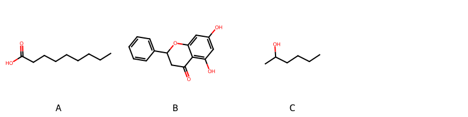

!!! abstract "Tóm tắt"

    **Họ Turneraceae** có **1** chi được các cộng đồng sử dụng trong chăm sóc sức khỏe gồm *Turnera*. Số lượng thành phần hóa học đã phân lập và xác định cấu trúc từ họ này tính đến tháng 12 năm 2024 là **5** nhóm có thể liệt kê như sau *Organooxygen compounds, Fatty Acyls, Flavonoids, Carboxylic acids and derivatives, Prenol lipids*. Giữa các loài trong họ này, 3 dược liệu được nghiên cứu nhiều nhất dựa trên số thành phần được phân lập là **Turnera diffusa, Turnera ulmifolia*. *Họ Turneraceae* đã được một số công động tại các quốc gia như Elsewhere, Venezuela, French, Haiti, anish, Bahamas, Mexico, US đã phát hiện một số tác dụng trên lâm sàng gồm chữa bệnh lẫn độc tính như Emmenagogue, Lo lắng, Thuốc bổ, Thuốc bổ, Thuốc kích thích tình dục, Thuốc kích thích tình dục, Chất kích thích, Thuốc nhuận tràng, Thuốc kích thích tình dục, Chất làm se, Thuốc lợi tiểu, Thuốc lợi tiểu, Thuốc bổ, Thuốc bổ, Thuốc bổ, Thuốc lợi tiểu, Thuốc kích thích tình dục, Thuốc kích thích tình dục, Thuốc bổ, Thuốc long đờm, Thuốc bổ, Thuốc long đờm, Thuốc nhuận tràng, Chất kích thích, Thuốc bổ, Chất làm se, dạ dày, dạ dày.

!!! info "DrDuke"

    James A. Duke sinh năm 1929-2017 là một nhà thực vật học người Mỹ. Đây là một trong những tác giả hàng đầu trong lĩnh vực dược dân tộc học với cuốn *CRC Handbook of Medicinal Herbs* và chính là người xây dựng lên cơ sở dữ liệu về hợp chất tự nhiên và dược dân tộc học tại Bộ nông nghiệp Hoa Kỳ. Các thông tin được đăng tải tại website [Dr. Duke's Phytochemical and Ethnobotanical Databases](https://phytochem.nal.usda.gov/). 
    Trong suốt thập niên 1970, ông lãnh đạo the Plant Taxonomy Laboratory, Plant Genetics and Germplasm Institute of the Agricultural Research Service, U.S. Department of Agriculture.
    Trong tài liệu này, các thông tin về dược dân tộc của các dược liệu được trích dẫn từ tài liệu của James A. Ducke với sự trợ giúp của phần mềm dịch thuật từ tiếng Anh sang tiếng Việt.
   
## Tổng quan về Họ Turneraceae
### Phân loại thực vật
Trong *họ Turneraceae* có **1** chi được sử dụng làm thuốc với chi tiết số loài trong mỗi chi như sau Turnera (2) . Chi tiết về loài sử dụng làm thuốc như dưới đây.  

>Họ Turneraceae


>|-- Chi Turnera

>*Turnera diffusa*,
>*Turnera ulmifolia*,

### Thành phần hóa học 

Số lượng thành phần hóa học đã phân lập và xác định cấu trúc từ họ này tính đến tháng 12 năm 2024 là 5 nhóm có thể liệt kê như sau Organooxygen compounds, Fatty Acyls, Flavonoids, Carboxylic acids and derivatives, Prenol lipids. Số lượng các loài đã được nghiên cứu thành phần hóa học là *2* trong tổng số *2* loài thuộc họ Turneraceae.Giữa các loài trong họ này, 3 dược liệu được nghiên cứu nhiều nhất dựa trên số thành phần được phân lập là **Turnera diffusa, Turnera ulmifolia**. Sử dụng phần mềm RDKIT với thuật toán  Find Maximum Common Substructure (FMCS), các nhóm hoạt chất phổ biến nhất trong *họ Turneraceae* đã xây dựng được nhân. Điều này trong tương lại có thể được sử dụng tìm kiếm mối liên hệ giữa tác dụng của cấu trúc hóa học và tác dụng dược lý. Các nhân trong phần này có thể không giống như cấu trúc gốc của từng nhóm chất. Kết quả được trình bầy như hình dưới đây.

<figure markdown="span">
    { width=100% }
    <figcaption> Cấu trúc hóa học của một số khung cơ bản dựa trên thuật toán FMCS để tìm Fatty Acyls (A), Flavonoids (B), Organooxygen compounds (C).</figcaption>
</figure>


!!! info  "Find Maximum Common Substructure"
    
    Thuật toán FMCS (Find Maximum Common Substructure) là một phương pháp được sử dụng để tìm ra cấu trúc chung nhiều nhất (MCS) trong một tập hợp các cấu trúc hóa học. Các bước của thuật toán gồm:
    - Chọn một cấu trúc hóa học là cấu trúc để tạo truy vấn, còn các cấu trúc khác là mục tiêu.
    - Chia nhỏ cấu trúc để tạo truy vấn thành cấu trúc nhỏ hơn dạng chuỗi SMARTS.
    - Kiểm tra chuỗi SMARTS trong các cấu trúc mục tiêu.
    - Tìm kiếm chuỗi SMARTS xuất hiện nhiều nhất.
    Để biết thêm chi tiết các bạn có thể xem tại [TeachOpenCADD](https://projects.volkamerlab.org/teachopencadd/talktorials/T006_compound_maximum_common_substructures.html)
    ``` python
    pip install rdkit
    def find_core_smiles(smiles_list):
        mols = [Chem.MolFromSmiles(smiles) for smiles in smiles_list]
        mcs = rdFMCS.FindMCS(mols)
        core_smiles = Chem.MolToSmiles(Chem.MolFromSmarts(mcs.smartsString))
        return core_smiles
    ```

### Dược dân tộc học

Họ **Turneraceae** đã được một số công động tại các quốc gia như *Elsewhere, Venezuela, French, Haiti, anish, Bahamas, Mexico, US* đã phát hiện một số tác dụng trên lâm sàng gồm chữa bệnh lẫn độc tính như *Emmenagogue, Lo lắng, Thuốc bổ, Thuốc bổ, Thuốc kích thích tình dục, Thuốc kích thích tình dục, Chất kích thích, Thuốc nhuận tràng, Thuốc kích thích tình dục, Chất làm se, Thuốc lợi tiểu, Thuốc lợi tiểu, Thuốc bổ, Thuốc bổ, Thuốc bổ, Thuốc lợi tiểu, Thuốc kích thích tình dục, Thuốc kích thích tình dục, Thuốc bổ, Thuốc long đờm, Thuốc bổ, Thuốc long đờm, Thuốc nhuận tràng, Chất kích thích, Thuốc bổ, Chất làm se, dạ dày, dạ dày*.

## Chi tiết dược dân tộc học


### Chi Turnera

!!! note "Danh sách các loài thuộc chi"
    
*	 - *Turnera diffusa*
	 - *Turnera ulmifolia**

---      
#### *Turnera diffusa*
**Thông tin về thực vật**

!!! info "Phân loại thực vật của *Turnera diffusa* từ GIBF:"
    - **Kingdom:** Plantae
    - **Phylum:** Tracheophyta
    - **Order:** Malpighiales
    - **Family:** Turneraceae
    - **Genus:** Turnera
    - **Species:** *Turnera diffusa*


 

Chưa có thông tin về loài này trên wikidata.

*Phân bố trên thế giới*: Virgin Islands (U.S.), United States of America, Mexico, Bahamas, Dominican Republic, Guatemala, Belize, Brazil, Cuba, Puerto Rico, El Salvador

*Phân bố tại Việt Nam*: Không có ghi nhận ở Việt Nam

**Thành phần hóa học**
        

Theo cơ sở dữ liệu lotus, từ loài *Turnera diffusa* đã phân lập và xác định được 64 hoạt chất thuộc về các nhóm Flavonoids, Prenol lipids, Organooxygen compounds. Danh sách các hoạt chất như sau dextrose [(LTS0241274)](https://lotus.naturalproducts.net/compound/lotus_id/LTS0241274), 3,7,11,15,19,23,27,31,35,39,43-undecamethyltetratetraconta-2,6,10,14,18,22,26,30,34,38,42-undecaen-1-ol [(LTS0065004)](https://lotus.naturalproducts.net/compound/lotus_id/LTS0065004), arbutin [(LTS0210780)](https://lotus.naturalproducts.net/compound/lotus_id/LTS0210780), 4-hydroxy-1-{[3,4,5-trihydroxy-6-(hydroxymethyl)oxan-2-yl]oxy}cyclopent-2-ene-1-carbonitrile [(LTS0150559)](https://lotus.naturalproducts.net/compound/lotus_id/LTS0150559), sucrose [(LTS0272557)](https://lotus.naturalproducts.net/compound/lotus_id/LTS0272557), 8-({4,5-dihydroxy-6-methyl-3-[(3,4,5-trihydroxy-6-methyloxan-2-yl)oxy]oxan-2-yl}oxy)-2-(3,4-dihydroxyphenyl)-5,7-dihydroxychromen-4-one [(LTS0128281)](https://lotus.naturalproducts.net/compound/lotus_id/LTS0128281), 2-(3,4-dihydroxyphenyl)-5,7-dihydroxy-8-[(2s,3s,5r,6r)-5-hydroxy-6-methyl-4-oxo-3-{[(2s,3r,4r,5r,6s)-3,4,5-trihydroxy-6-methyloxan-2-yl]oxy}oxan-2-yl]chromen-4-one [(LTS0275347)](https://lotus.naturalproducts.net/compound/lotus_id/LTS0275347), 8-{[(2s,3r,4s,5s,6r)-4,5-dihydroxy-6-methyl-3-{[(2s,3r,4r,5r,6s)-3,4,5-trihydroxy-6-methyloxan-2-yl]oxy}oxan-2-yl]oxy}-2-(3,4-dihydroxyphenyl)-5,7-dihydroxychromen-4-one [(LTS0219634)](https://lotus.naturalproducts.net/compound/lotus_id/LTS0219634), 2-(3,4-dihydroxyphenyl)-5,7-dihydroxy-8-{5-hydroxy-6-methyl-4-oxo-3-[(3,4,5-trihydroxy-6-methyloxan-2-yl)oxy]oxan-2-yl}chromen-4-one [(LTS0027729)](https://lotus.naturalproducts.net/compound/lotus_id/LTS0027729), (+)-glucose [(LTS0262158)](https://lotus.naturalproducts.net/compound/lotus_id/LTS0262158), (1r,4s,6r,10s)-4,12,12-trimethyl-9-methylidene-5-oxatricyclo[8.2.0.0⁴,⁶]dodecane [(LTS0057919)](https://lotus.naturalproducts.net/compound/lotus_id/LTS0057919), (2z,6z,10z,14z,18z,22z,26z,30e,34e,38e)-3,7,11,15,19,23,27,31,35,39,43-undecamethyltetratetraconta-2,6,10,14,18,22,26,30,34,38,42-undecaen-1-ol [(LTS0092809)](https://lotus.naturalproducts.net/compound/lotus_id/LTS0092809), acacetin [(LTS0020151)](https://lotus.naturalproducts.net/compound/lotus_id/LTS0020151), 2,5-bis(hydroxymethyl)-2-methoxyoxolane-3,4-diol [(LTS0088366)](https://lotus.naturalproducts.net/compound/lotus_id/LTS0088366), (3,4,5-trihydroxy-6-{[5-hydroxy-2-(4-hydroxyphenyl)-4-oxochromen-7-yl]oxy}oxan-2-yl)methyl 3-(4-hydroxyphenyl)prop-2-enoate [(LTS0215870)](https://lotus.naturalproducts.net/compound/lotus_id/LTS0215870), 2-(3,4-dihydroxy-5-methoxyphenyl)-5,7-dihydroxy-3-{[3,4,5-trihydroxy-6-({[3,4,5-trihydroxy-6-(hydroxymethyl)oxan-2-yl]oxy}methyl)oxan-2-yl]oxy}chromen-4-one [(LTS0140224)](https://lotus.naturalproducts.net/compound/lotus_id/LTS0140224), 8-hydroxy-4a,8-dimethyl-4,5,6,7-tetrahydro-3h-naphthalen-2-one [(LTS0058666)](https://lotus.naturalproducts.net/compound/lotus_id/LTS0058666), 8-[4,5-dihydroxy-6-(hydroxymethyl)-3-[(3,4,5-trihydroxy-6-methyloxan-2-yl)oxy]oxan-2-yl]-2-(3,4-dihydroxyphenyl)-5,7-dihydroxychromen-4-one [(LTS0233877)](https://lotus.naturalproducts.net/compound/lotus_id/LTS0233877), pinocembrin [(LTS0155292)](https://lotus.naturalproducts.net/compound/lotus_id/LTS0155292), (2r,3s,4r,5r,6s)-4,5-dihydroxy-6-{[5-hydroxy-2-(4-hydroxyphenyl)-4-oxochromen-7-yl]oxy}-2-(hydroxymethyl)oxan-3-yl (2z)-3-(4-hydroxyphenyl)prop-2-enoate [(LTS0118237)](https://lotus.naturalproducts.net/compound/lotus_id/LTS0118237), epitetraphyllin b [(LTS0083255)](https://lotus.naturalproducts.net/compound/lotus_id/LTS0083255), 3-[2-(3,4-dihydroxyphenyl)-5,7-dihydroxy-4-oxochromen-8-yl]prop-2-enoic acid [(LTS0104346)](https://lotus.naturalproducts.net/compound/lotus_id/LTS0104346), lrhamnose [(LTS0184148)](https://lotus.naturalproducts.net/compound/lotus_id/LTS0184148), (2e)-3-[2-(3,4-dihydroxyphenyl)-5,7-dihydroxy-4-oxochromen-8-yl]prop-2-enoic acid [(LTS0073191)](https://lotus.naturalproducts.net/compound/lotus_id/LTS0073191), 6-deoxymannose [(LTS0121619)](https://lotus.naturalproducts.net/compound/lotus_id/LTS0121619), 8-[(2s,3r,4s,5s,6r)-4,5-dihydroxy-6-(hydroxymethyl)-3-{[(2r,3r,4r,5r,6s)-3,4,5-trihydroxy-6-methyloxan-2-yl]oxy}oxan-2-yl]-2-(3,4-dihydroxyphenyl)-5,7-dihydroxychromen-4-one [(LTS0128960)](https://lotus.naturalproducts.net/compound/lotus_id/LTS0128960), caryophyllene oxide [(LTS0159789)](https://lotus.naturalproducts.net/compound/lotus_id/LTS0159789), 5-hydroxy-2-(4-hydroxy-3-methoxyphenyl)-7-{[3,4,5-trihydroxy-6-(hydroxymethyl)oxan-2-yl]oxy}chromen-4-one [(LTS0085390)](https://lotus.naturalproducts.net/compound/lotus_id/LTS0085390), 3-(4-{[3,4,5-trihydroxy-6-(hydroxymethyl)oxan-2-yl]oxy}phenyl)prop-2-enoic acid [(LTS0116640)](https://lotus.naturalproducts.net/compound/lotus_id/LTS0116640), β-arbutin [(LTS0246837)](https://lotus.naturalproducts.net/compound/lotus_id/LTS0246837), (4as,5s)-3-(2-hydroxypropan-2-yl)-4a,5-dimethyl-5,6,7,8-tetrahydronaphthalen-2-one [(LTS0133557)](https://lotus.naturalproducts.net/compound/lotus_id/LTS0133557), sorbose [(LTS0195687)](https://lotus.naturalproducts.net/compound/lotus_id/LTS0195687), velutin [(LTS0048337)](https://lotus.naturalproducts.net/compound/lotus_id/LTS0048337), apigenin 7,4'-dimethyl ether [(LTS0208774)](https://lotus.naturalproducts.net/compound/lotus_id/LTS0208774), [(2r,3s,4s,5r,6s)-3,4,5-trihydroxy-6-{[5-hydroxy-2-(4-hydroxyphenyl)-4-oxochromen-7-yl]oxy}oxan-2-yl]methyl (2z)-3-(4-hydroxyphenyl)prop-2-enoate [(LTS0222278)](https://lotus.naturalproducts.net/compound/lotus_id/LTS0222278), 2-methyl-3-{[(2s,3r,4s,5s,6r)-3,4,5-trihydroxy-6-(hydroxymethyl)oxan-2-yl]oxy}pyran-4-one [(LTS0165877)](https://lotus.naturalproducts.net/compound/lotus_id/LTS0165877), 2-(3,4-dihydroxy-5-methoxyphenyl)-5,7-dihydroxy-3-{[(2s,3r,4s,5s,6r)-3,4,5-trihydroxy-6-({[(2r,3r,4s,5s,6r)-3,4,5-trihydroxy-6-(hydroxymethyl)oxan-2-yl]oxy}methyl)oxan-2-yl]oxy}chromen-4-one [(LTS0274846)](https://lotus.naturalproducts.net/compound/lotus_id/LTS0274846), pinocembrine [(LTS0141508)](https://lotus.naturalproducts.net/compound/lotus_id/LTS0141508), (2r,3s,4s,5r)-2,5-bis(hydroxymethyl)-2-methoxyoxolane-3,4-diol [(LTS0191480)](https://lotus.naturalproducts.net/compound/lotus_id/LTS0191480), keto-d-fructose [(LTS0241114)](https://lotus.naturalproducts.net/compound/lotus_id/LTS0241114), 2-(3,4-dihydroxyphenyl)-5,7-dihydroxy-3-{[(2s,3r,4s,5s,6r)-3,4,5-trihydroxy-6-({[(2r,3r,4s,5s,6r)-3,4,5-trihydroxy-6-(hydroxymethyl)oxan-2-yl]oxy}methyl)oxan-2-yl]oxy}chromen-4-one [(LTS0183115)](https://lotus.naturalproducts.net/compound/lotus_id/LTS0183115), 5,7-dihydroxy-2-(4-hydroxy-3,5-dimethoxyphenyl)-3-{[(2s,3r,4s,5s,6r)-3,4,5-trihydroxy-6-({[(2r,3r,4s,5s,6r)-3,4,5-trihydroxy-6-(hydroxymethyl)oxan-2-yl]oxy}methyl)oxan-2-yl]oxy}chromen-4-one [(LTS0007084)](https://lotus.naturalproducts.net/compound/lotus_id/LTS0007084), 5,7-dihydroxy-2-(4-hydroxy-3-methoxyphenyl)-8-[(2s,3r,4r,5s,6r)-3,4,5-trihydroxy-6-({[(2r,3r,4s,5s,6r)-3,4,5-trihydroxy-6-(hydroxymethyl)oxan-2-yl]oxy}methyl)oxan-2-yl]chromen-4-one [(LTS0107417)](https://lotus.naturalproducts.net/compound/lotus_id/LTS0107417), 5-hydroxy-2-(4-hydroxy-3,5-dimethoxyphenyl)-7-{[(2s,3r,4s,5s,6r)-3,4,5-trihydroxy-6-(hydroxymethyl)oxan-2-yl]oxy}chromen-4-one [(LTS0261653)](https://lotus.naturalproducts.net/compound/lotus_id/LTS0261653), (3,4,5-trihydroxy-6-{[5-hydroxy-2-(4-hydroxyphenyl)-4-oxochromen-7-yl]oxy}oxan-2-yl)methyl (2e)-3-(4-hydroxyphenyl)prop-2-enoate [(LTS0276084)](https://lotus.naturalproducts.net/compound/lotus_id/LTS0276084), 2,6,10,15,19,23-hexamethyltetracosa-2,6,10,14,18,22-hexaene [(LTS0193020)](https://lotus.naturalproducts.net/compound/lotus_id/LTS0193020), (2s,3s,4s,5r)-2,5-bis(hydroxymethyl)-2-methoxyoxolane-3,4-diol [(LTS0259879)](https://lotus.naturalproducts.net/compound/lotus_id/LTS0259879), 5,7-dihydroxy-2-(4-hydroxy-3,5-dimethoxyphenyl)-3-{[3,4,5-trihydroxy-6-({[3,4,5-trihydroxy-6-(hydroxymethyl)oxan-2-yl]oxy}methyl)oxan-2-yl]oxy}chromen-4-one [(LTS0136005)](https://lotus.naturalproducts.net/compound/lotus_id/LTS0136005), 2-methyl-3-{[3,4,5-trihydroxy-6-(hydroxymethyl)oxan-2-yl]oxy}pyran-4-one [(LTS0033410)](https://lotus.naturalproducts.net/compound/lotus_id/LTS0033410), (4as,8s)-8-hydroxy-4a,8-dimethyl-4,5,6,7-tetrahydro-3h-naphthalen-2-one [(LTS0257883)](https://lotus.naturalproducts.net/compound/lotus_id/LTS0257883), 8-[4,5-dihydroxy-6-(hydroxymethyl)-3-[(3,4,5-trihydroxy-6-methyloxan-2-yl)oxy]oxan-2-yl]-5,7-dihydroxy-2-(4-hydroxyphenyl)chromen-4-one [(LTS0104007)](https://lotus.naturalproducts.net/compound/lotus_id/LTS0104007), 5-hydroxy-2-(4-hydroxy-3,5-dimethoxyphenyl)-7-{[3,4,5-trihydroxy-6-(hydroxymethyl)oxan-2-yl]oxy}chromen-4-one [(LTS0111978)](https://lotus.naturalproducts.net/compound/lotus_id/LTS0111978), squalene [(LTS0217821)](https://lotus.naturalproducts.net/compound/lotus_id/LTS0217821), 4,5-dihydroxy-6-{[5-hydroxy-2-(4-hydroxyphenyl)-4-oxochromen-7-yl]oxy}-2-(hydroxymethyl)oxan-3-yl 3-(4-hydroxyphenyl)prop-2-enoate [(LTS0151231)](https://lotus.naturalproducts.net/compound/lotus_id/LTS0151231), 3-(2-hydroxypropan-2-yl)-4a,5-dimethyl-5,6,7,8-tetrahydronaphthalen-2-one [(LTS0184582)](https://lotus.naturalproducts.net/compound/lotus_id/LTS0184582), echinacin [(LTS0276335)](https://lotus.naturalproducts.net/compound/lotus_id/LTS0276335), granulated sugar [(LTS0014367)](https://lotus.naturalproducts.net/compound/lotus_id/LTS0014367), apigenin 7-o-β-glucoside [(LTS0252743)](https://lotus.naturalproducts.net/compound/lotus_id/LTS0252743), apigetrin [(LTS0157591)](https://lotus.naturalproducts.net/compound/lotus_id/LTS0157591), chamomile [(LTS0104946)](https://lotus.naturalproducts.net/compound/lotus_id/LTS0104946), 8-[(2s,3r,4s,5s,6r)-4,5-dihydroxy-6-(hydroxymethyl)-3-{[(2r,3r,4r,5r,6s)-3,4,5-trihydroxy-6-methyloxan-2-yl]oxy}oxan-2-yl]-5,7-dihydroxy-2-(4-hydroxyphenyl)chromen-4-one [(LTS0131509)](https://lotus.naturalproducts.net/compound/lotus_id/LTS0131509), 5-hydroxy-2-(4-hydroxy-3-methoxyphenyl)-7-{[(2s,3r,4s,5s,6r)-3,4,5-trihydroxy-6-(hydroxymethyl)oxan-2-yl]oxy}chromen-4-one [(LTS0065615)](https://lotus.naturalproducts.net/compound/lotus_id/LTS0065615), (2z)-3-(4-{[(2s,3r,4s,5s,6r)-3,4,5-trihydroxy-6-(hydroxymethyl)oxan-2-yl]oxy}phenyl)prop-2-enoic acid [(LTS0101359)](https://lotus.naturalproducts.net/compound/lotus_id/LTS0101359), 2-(3,4-dihydroxyphenyl)-5,7-dihydroxy-3-{[3,4,5-trihydroxy-6-({[3,4,5-trihydroxy-6-(hydroxymethyl)oxan-2-yl]oxy}methyl)oxan-2-yl]oxy}chromen-4-one [(LTS0118434)](https://lotus.naturalproducts.net/compound/lotus_id/LTS0118434).

| chemicalTaxonomyClassyfireClass   |   lotus_count |
|:----------------------------------|--------------:|
| Flavonoids                        |            35 |
| Organooxygen compounds            |            21 |
| Prenol lipids                     |             8 |


**Dược dân tộc học**

Danh sách các quốc gia có sử dụng *Turnera diffusa* trong điều trị các bệnh. 

| Quốc gia   | Bệnh                                                                                                                                            |
|:-----------|:------------------------------------------------------------------------------------------------------------------------------------------------|
| Elsewhere  | Thuốc kích thích tình dục, Chất kích thích, Thuốc nhuận tràng                                                                                   |
| French     | Thuốc kích thích tình dục                                                                                                                       |
| Haiti      | Thuốc kích thích tình dục, Thuốc bổ                                                                                                             |
| Mexico     | Thuốc kích thích tình dục, Chất làm se, Thuốc lợi tiểu, Thuốc lợi tiểu, Thuốc bổ, Thuốc bổ, Thuốc bổ, Thuốc lợi tiểu, Thuốc kích thích tình dục |
| US         | Thuốc long đờm, Thuốc nhuận tràng, Chất kích thích, Thuốc bổ, Chất làm se                                                                       |
| anish      | Lo lắng                                                                                                                                         |


---      
#### *Turnera ulmifolia*
**Thông tin về thực vật**

!!! info "Phân loại thực vật của *Turnera ulmifolia* từ GIBF:"
    - **Kingdom:** Plantae
    - **Phylum:** Tracheophyta
    - **Order:** Malpighiales
    - **Family:** Turneraceae
    - **Genus:** Turnera
    - **Species:** *Turnera ulmifolia*


 

Chưa có thông tin về loài này trên wikidata.

*Phân bố trên thế giới*: Benin, Cayman Islands, Saint Lucia, Turks and Caicos Islands, New Caledonia, Marshall Islands, Bahamas, Cuba, Jamaica, Chile, French Polynesia, Singapore, Seychelles, Ghana, Spain, Guadeloupe, French Guiana, Virgin Islands (British), Mexico, Chinese Taipei, Colombia, Hong Kong, Bangladesh, Barbados, Liberia, Belize, Japan, Aruba, Panama, Indonesia, Mauritius, Dominica, Honduras, Portugal, Saint Kitts and Nevis, India, Palau, Brazil, Costa Rica, Northern Mariana Islands, Viet Nam, Guam, Thailand, United States of America, Philippines, Dominican Republic, Nicaragua, Malaysia, Ecuador, Maldives, Puerto Rico

*Phân bố tại Việt Nam*: Khánh Hòa, Hồ Chí Minh city

**Thành phần hóa học**
        

Theo cơ sở dữ liệu lotus, từ loài *Turnera ulmifolia* đã phân lập và xác định được 24 hoạt chất thuộc về các nhóm Fatty Acyls, Organooxygen compounds, Carboxylic acids and derivatives. Danh sách các hoạt chất như sau deidaclin [(LTS0103659)](https://lotus.naturalproducts.net/compound/lotus_id/LTS0103659), 4-hydroxy-1-{[3,4,5-trihydroxy-6-(hydroxymethyl)oxan-2-yl]oxy}cyclopent-2-ene-1-carbonitrile [(LTS0150559)](https://lotus.naturalproducts.net/compound/lotus_id/LTS0150559), 1-{[(2s,3r,4s,5s,6r)-3,4,5-trihydroxy-6-(hydroxymethyl)oxan-2-yl]oxy}cyclopent-2-ene-1-carbonitrile [(LTS0269796)](https://lotus.naturalproducts.net/compound/lotus_id/LTS0269796), (+)-vernolic acid [(LTS0163877)](https://lotus.naturalproducts.net/compound/lotus_id/LTS0163877), 1-{[3,4,5-trihydroxy-6-(hydroxymethyl)oxan-2-yl]oxy}cyclopent-2-ene-1-carbonitrile [(LTS0199149)](https://lotus.naturalproducts.net/compound/lotus_id/LTS0199149), palmitic acid [(LTS0079439)](https://lotus.naturalproducts.net/compound/lotus_id/LTS0079439), (1r,4s)-4-hydroxy-1-{[(2s,3r,4s,5s,6r)-3,4,5-trihydroxy-6-(hydroxymethyl)oxan-2-yl]oxy}cyclopent-2-ene-1-carbonitrile [(LTS0206350)](https://lotus.naturalproducts.net/compound/lotus_id/LTS0206350), stearic acid [(LTS0237766)](https://lotus.naturalproducts.net/compound/lotus_id/LTS0237766), myristic acid [(LTS0102566)](https://lotus.naturalproducts.net/compound/lotus_id/LTS0102566), linoleic [(LTS0013198)](https://lotus.naturalproducts.net/compound/lotus_id/LTS0013198), epitetraphyllin b [(LTS0083255)](https://lotus.naturalproducts.net/compound/lotus_id/LTS0083255), linamarin [(LTS0206216)](https://lotus.naturalproducts.net/compound/lotus_id/LTS0206216), (cyclopent-1-en-1-ylamino)acetic acid [(LTS0038561)](https://lotus.naturalproducts.net/compound/lotus_id/LTS0038561), palmitoleic acid [(LTS0261591)](https://lotus.naturalproducts.net/compound/lotus_id/LTS0261591), malvalic acid [(LTS0267034)](https://lotus.naturalproducts.net/compound/lotus_id/LTS0267034), linamarin [(LTS0032647)](https://lotus.naturalproducts.net/compound/lotus_id/LTS0032647), (1s,4s)-4-hydroxy-1-{[(2s,3r,4s,5s,6r)-3,4,5-trihydroxy-6-(hydroxymethyl)oxan-2-yl]oxy}cyclopent-2-ene-1-carbonitrile [(LTS0184702)](https://lotus.naturalproducts.net/compound/lotus_id/LTS0184702), lauric acid [(LTS0051907)](https://lotus.naturalproducts.net/compound/lotus_id/LTS0051907), oleic acid [(LTS0256910)](https://lotus.naturalproducts.net/compound/lotus_id/LTS0256910), 11-(3-pentyloxiran-2-yl)undec-9-enoic acid [(LTS0126926)](https://lotus.naturalproducts.net/compound/lotus_id/LTS0126926), (-)-vernolic acid [(LTS0159408)](https://lotus.naturalproducts.net/compound/lotus_id/LTS0159408), deidaclin [(LTS0049775)](https://lotus.naturalproducts.net/compound/lotus_id/LTS0049775), sterculic acid [(LTS0262239)](https://lotus.naturalproducts.net/compound/lotus_id/LTS0262239), (9z)-11-[(2r,3r)-3-pentyloxiran-2-yl]undec-9-enoic acid [(LTS0215504)](https://lotus.naturalproducts.net/compound/lotus_id/LTS0215504).

| chemicalTaxonomyClassyfireClass   |   lotus_count |
|:----------------------------------|--------------:|
| Carboxylic acids and derivatives  |             1 |
| Fatty Acyls                       |            13 |
| Organooxygen compounds            |            10 |


**Dược dân tộc học**

Danh sách các quốc gia có sử dụng *Turnera ulmifolia* trong điều trị các bệnh. 

| Quốc gia   | Bệnh                     |
|:-----------|:-------------------------|
| Bahamas    | Emmenagogue              |
| Haiti      | dạ dày, dạ dày           |
| Mexico     | Thuốc bổ, Thuốc bổ       |
| Venezuela  | Thuốc long đờm, Thuốc bổ |


## Bình luận

<div id="giscus-container"></div>
<script src="https://giscus.app/client.js"
        data-repo="hoangson0787/CSDL-duoc-lieu"
        data-repo-id="R_kgDONbMRNA"
        data-category="Duoc lieu"
        data-category-id="DIC_kwDONbMRNM4ClklR"
        data-mapping="pathname"
        data-strict="0"
        data-reactions-enabled="1"
        data-emit-metadata="1"
        data-input-position="bottom"
        data-theme="light"
        data-lang="en"
        crossorigin="anonymous"
        async>
</script>

