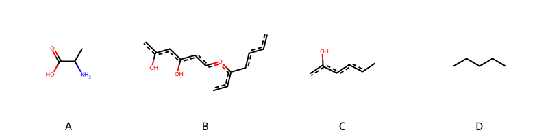

!!! abstract "Tóm tắt"

    **Họ Viscaceae** có **2** chi được các cộng đồng sử dụng trong chăm sóc sức khỏe gồm *Viscum, Phoradendron*. Số lượng thành phần hóa học đã phân lập và xác định cấu trúc từ họ này tính đến tháng 12 năm 2024 là **13** nhóm có thể liệt kê như sau *Tetrapyrroles and derivatives, Steroids and steroid derivatives, Organooxygen compounds, Lignan glycosides, Flavonoids, Fatty Acyls, Cinnamic acids and derivatives, Furanoid lignans, Benzofurans, Phenols, Carboxylic acids and derivatives, Benzene and substituted derivatives, Prenol lipids*. Giữa các loài trong họ này, 3 dược liệu được nghiên cứu nhiều nhất dựa trên số thành phần được phân lập là **Viscum album, Viscum articulatum, Phoradendron serotinum*. *Họ Viscaceae* đã được một số công động tại các quốc gia như India(Hindu), UK, Elsewhere, Turkey, US(Amerindian), Europe, ain, India, US đã phát hiện một số tác dụng trên lâm sàng gồm chữa bệnh lẫn độc tính như Chất làm se, Thuốc lợi tiểu, gây nôn, Ma túy, Lo lắng, Thuốc cầm máu, Thuốc bổ, Chất độc, Ma túy, Chất độc, Ma túy, Lo lắng, Thuốc nhuận tràng, Thuốc an thần, gây nôn, Chất khử trùng, Thuốc trợ tim, Thuốc lợi tiểu, Oxy độc hại, Thuốc bổ, Thuốc kích thích tình dục, Tim mạch.

!!! info "DrDuke"

    James A. Duke sinh năm 1929-2017 là một nhà thực vật học người Mỹ. Đây là một trong những tác giả hàng đầu trong lĩnh vực dược dân tộc học với cuốn *CRC Handbook of Medicinal Herbs* và chính là người xây dựng lên cơ sở dữ liệu về hợp chất tự nhiên và dược dân tộc học tại Bộ nông nghiệp Hoa Kỳ. Các thông tin được đăng tải tại website [Dr. Duke's Phytochemical and Ethnobotanical Databases](https://phytochem.nal.usda.gov/). 
    Trong suốt thập niên 1970, ông lãnh đạo the Plant Taxonomy Laboratory, Plant Genetics and Germplasm Institute of the Agricultural Research Service, U.S. Department of Agriculture.
    Trong tài liệu này, các thông tin về dược dân tộc của các dược liệu được trích dẫn từ tài liệu của James A. Ducke với sự trợ giúp của phần mềm dịch thuật từ tiếng Anh sang tiếng Việt.
   
## Tổng quan về Họ Viscaceae
### Phân loại thực vật
Trong *họ Viscaceae* có **2** chi được sử dụng làm thuốc với chi tiết số loài trong mỗi chi như sau Phoradendron (2) . Chi tiết về loài sử dụng làm thuốc như dưới đây.  

>Họ Viscaceae


>|-- Chi Viscum

>*Viscum album*,
>*Viscum articulatum*,
>*Viscum monoicum*,
>*Viscum orientale*,

>|-- Chi Phoradendron

>*Phoradendron flavescens*,
>*Phoradendron serotinum*,

### Thành phần hóa học 

Số lượng thành phần hóa học đã phân lập và xác định cấu trúc từ họ này tính đến tháng 12 năm 2024 là 13 nhóm có thể liệt kê như sau Tetrapyrroles and derivatives, Steroids and steroid derivatives, Organooxygen compounds, Lignan glycosides, Flavonoids, Fatty Acyls, Cinnamic acids and derivatives, Furanoid lignans, Benzofurans, Phenols, Carboxylic acids and derivatives, Benzene and substituted derivatives, Prenol lipids. Số lượng các loài đã được nghiên cứu thành phần hóa học là *3* trong tổng số *6* loài thuộc họ Viscaceae.Giữa các loài trong họ này, 3 dược liệu được nghiên cứu nhiều nhất dựa trên số thành phần được phân lập là **Viscum album, Viscum articulatum, Phoradendron serotinum**. Sử dụng phần mềm RDKIT với thuật toán  Find Maximum Common Substructure (FMCS), các nhóm hoạt chất phổ biến nhất trong *họ Viscaceae* đã xây dựng được nhân. Điều này trong tương lại có thể được sử dụng tìm kiếm mối liên hệ giữa tác dụng của cấu trúc hóa học và tác dụng dược lý. Các nhân trong phần này có thể không giống như cấu trúc gốc của từng nhóm chất. Kết quả được trình bầy như hình dưới đây.

<figure markdown="span">
    { width=100% }
    <figcaption> Cấu trúc hóa học của một số khung cơ bản dựa trên thuật toán FMCS để tìm Carboxylic acids and derivatives (A), Flavonoids (B), Organooxygen compounds (C), Prenol lipids (D).</figcaption>
</figure>


!!! info  "Find Maximum Common Substructure"
    
    Thuật toán FMCS (Find Maximum Common Substructure) là một phương pháp được sử dụng để tìm ra cấu trúc chung nhiều nhất (MCS) trong một tập hợp các cấu trúc hóa học. Các bước của thuật toán gồm:
    - Chọn một cấu trúc hóa học là cấu trúc để tạo truy vấn, còn các cấu trúc khác là mục tiêu.
    - Chia nhỏ cấu trúc để tạo truy vấn thành cấu trúc nhỏ hơn dạng chuỗi SMARTS.
    - Kiểm tra chuỗi SMARTS trong các cấu trúc mục tiêu.
    - Tìm kiếm chuỗi SMARTS xuất hiện nhiều nhất.
    Để biết thêm chi tiết các bạn có thể xem tại [TeachOpenCADD](https://projects.volkamerlab.org/teachopencadd/talktorials/T006_compound_maximum_common_substructures.html)
    ``` python
    pip install rdkit
    def find_core_smiles(smiles_list):
        mols = [Chem.MolFromSmiles(smiles) for smiles in smiles_list]
        mcs = rdFMCS.FindMCS(mols)
        core_smiles = Chem.MolToSmiles(Chem.MolFromSmarts(mcs.smartsString))
        return core_smiles
    ```

### Dược dân tộc học

Họ **Viscaceae** đã được một số công động tại các quốc gia như *India(Hindu), UK, Elsewhere, Turkey, US(Amerindian), Europe, ain, India, US* đã phát hiện một số tác dụng trên lâm sàng gồm chữa bệnh lẫn độc tính như *Chất làm se, Thuốc lợi tiểu, gây nôn, Ma túy, Lo lắng, Thuốc cầm máu, Thuốc bổ, Chất độc, Ma túy, Chất độc, Ma túy, Lo lắng, Thuốc nhuận tràng, Thuốc an thần, gây nôn, Chất khử trùng, Thuốc trợ tim, Thuốc lợi tiểu, Oxy độc hại, Thuốc bổ, Thuốc kích thích tình dục, Tim mạch*.

## Chi tiết dược dân tộc học


### Chi Viscum

!!! note "Danh sách các loài thuộc chi"
    
*	 - *Viscum album*
	 - *Viscum articulatum*
	 - *Viscum monoicum*
	 - *Viscum orientale**

---      
#### *Viscum album*
**Thông tin về thực vật**

!!! info "Phân loại thực vật của *Viscum album* từ GIBF:"
    - **Kingdom:** Plantae
    - **Phylum:** Tracheophyta
    - **Order:** Santalales
    - **Family:** Viscaceae
    - **Genus:** Viscum
    - **Species:** *Viscum album*


 

Chưa có thông tin về loài này trên wikidata.

*Phân bố trên thế giới*: Germany, France, Czechia, Finland, Hungary, Spain, Poland, Sweden, Japan, Belarus, Russian Federation, United Kingdom of Great Britain and Northern Ireland, Ukraine, Georgia, United States of America, Luxembourg, Italy, Lithuania, Armenia, Denmark, Austria, Belgium

*Phân bố tại Việt Nam*: Không có ghi nhận ở Việt Nam

**Thành phần hóa học**
        

Theo cơ sở dữ liệu lotus, từ loài *Viscum album* đã phân lập và xác định được 114 hoạt chất thuộc về các nhóm Tetrapyrroles and derivatives, Steroids and steroid derivatives, Organooxygen compounds, Lignan glycosides, Fatty Acyls, Flavonoids, Cinnamic acids and derivatives, Furanoid lignans, Benzofurans, Carboxylic acids and derivatives, Benzene and substituted derivatives, Prenol lipids. Danh sách các hoạt chất như sau methyl (21s,22s)-16-ethenyl-11-ethyl-12,17,21,26-tetramethyl-4-oxo-22-(3-oxo-3-{[(2e)-3,7,11,15-tetramethylhexadec-2-en-1-yl]oxy}propyl)-7,23,24,25-tetraazahexacyclo[18.2.1.1⁵,⁸.1¹⁰,¹³.1¹⁵,¹⁸.0²,⁶]hexacosa-1(23),2(6),5(26),7,9,11,13,15,17,19-decaene-3-carboxylate [(LTS0002371)](https://lotus.naturalproducts.net/compound/lotus_id/LTS0002371), d-sorbitol [(LTS0220157)](https://lotus.naturalproducts.net/compound/lotus_id/LTS0220157), (7ar)-6-hydroxy-4,4,7a-trimethyl-6,7-dihydro-5h-1-benzofuran-2-one [(LTS0273073)](https://lotus.naturalproducts.net/compound/lotus_id/LTS0273073), aspartic acid [(LTS0182847)](https://lotus.naturalproducts.net/compound/lotus_id/LTS0182847), (1r,2r,3s,4s,5s,6r)-6-methoxycyclohexane-1,2,3,4,5-pentol [(LTS0235152)](https://lotus.naturalproducts.net/compound/lotus_id/LTS0235152), methyl (3r,21s,22s)-16-ethenyl-11-ethyl-12,17,21,26-tetramethyl-4-oxo-22-(3-oxo-3-{[(2e,7r,11r)-3,7,11,15-tetramethylhexadec-2-en-1-yl]oxy}propyl)-7,23,24,25-tetraazahexacyclo[18.2.1.1⁵,⁸.1¹⁰,¹³.1¹⁵,¹⁸.0²,⁶]hexacosa-1(23),2(6),5(26),7,9,11,13,15,17,19-decaene-3-carboxylate [(LTS0200273)](https://lotus.naturalproducts.net/compound/lotus_id/LTS0200273), amylose [(LTS0110579)](https://lotus.naturalproducts.net/compound/lotus_id/LTS0110579), ferulic acid [(LTS0077328)](https://lotus.naturalproducts.net/compound/lotus_id/LTS0077328), 3-[(3r,21s,22s)-16-ethenyl-11-ethyl-12-(hydroxymethylidene)-3-(methoxycarbonyl)-17,21,26-trimethyl-4-oxo-7,23,24,25-tetraazahexacyclo[18.2.1.1⁵,⁸.1¹⁰,¹³.1¹⁵,¹⁸.0²,⁶]hexacosa-1,5(26),6,8,10,13(25),14,16,18,20(23)-decaen-22-yl]propanoic acid [(LTS0133791)](https://lotus.naturalproducts.net/compound/lotus_id/LTS0133791), 5-hydroxy-7-methoxy-2-(3-methoxy-4-{[(2s,3r,4s,5s,6r)-3,4,5-trihydroxy-6-(hydroxymethyl)oxan-2-yl]oxy}phenyl)-3-{[(2s,3r,4s,5s,6r)-3,4,5-trihydroxy-6-(hydroxymethyl)oxan-2-yl]oxy}chromen-4-one [(LTS0262586)](https://lotus.naturalproducts.net/compound/lotus_id/LTS0262586), 2,6-dimethoxy-4-[(1e)-3-{[(2r,3r,4s,5s,6r)-3,4,5-trihydroxy-6-(hydroxymethyl)oxan-2-yl]oxy}prop-1-en-1-yl]phenyl acetate [(LTS0065250)](https://lotus.naturalproducts.net/compound/lotus_id/LTS0065250), (2r,3r,4s,5s,6r)-2-{[(2e)-3-(4-hydroxy-3,5-dimethoxyphenyl)prop-2-en-1-yl]oxy}-6-(hydroxymethyl)oxane-3,4,5-triol [(LTS0272385)](https://lotus.naturalproducts.net/compound/lotus_id/LTS0272385), galop [(LTS0222857)](https://lotus.naturalproducts.net/compound/lotus_id/LTS0222857), lysine [(LTS0141380)](https://lotus.naturalproducts.net/compound/lotus_id/LTS0141380), [(3r,4s,5s)-5-{[(2s,3r,4s,5s,6r)-2-{4-[(2s)-5,7-dimethoxy-4-oxo-2,3-dihydro-1-benzopyran-2-yl]phenoxy}-4,5-dihydroxy-6-(hydroxymethyl)oxan-3-yl]oxy}-3,4-dihydroxyoxolan-3-yl]methyl (2e)-3-phenylprop-2-enoate [(LTS0051259)](https://lotus.naturalproducts.net/compound/lotus_id/LTS0051259), 2-{[3-(4-hydroxy-3,5-dimethoxyphenyl)prop-2-en-1-yl]oxy}-6-(hydroxymethyl)oxane-3,4,5-triol [(LTS0151748)](https://lotus.naturalproducts.net/compound/lotus_id/LTS0151748), (2s,3r,4s,5s,6r)-2-{4-[(1s)-4-(3,5-dimethoxy-4-{[(2s,3r,4s,5s,6r)-3,4,5-trihydroxy-6-(hydroxymethyl)oxan-2-yl]oxy}phenyl)-hexahydrofuro[3,4-c]furan-1-yl]-2,6-dimethoxyphenoxy}-6-(hydroxymethyl)oxane-3,4,5-triol [(LTS0114197)](https://lotus.naturalproducts.net/compound/lotus_id/LTS0114197), (1s,2r,4s,5s)-cyclohexane-1,2,3,4,5-pentol [(LTS0022481)](https://lotus.naturalproducts.net/compound/lotus_id/LTS0022481), chlorogenic acid [(LTS0226495)](https://lotus.naturalproducts.net/compound/lotus_id/LTS0226495), 9-hydroxy-5a,5b,8,8,11a-pentamethyl-1-(prop-1-en-2-yl)-hexadecahydrocyclopenta[a]chrysene-3a-carboxylic acid [(LTS0214300)](https://lotus.naturalproducts.net/compound/lotus_id/LTS0214300), 5,7-dimethoxy-2-(4-{[3,4,5-trihydroxy-6-(hydroxymethyl)oxan-2-yl]oxy}phenyl)-2,3-dihydro-1-benzopyran-4-one [(LTS0214090)](https://lotus.naturalproducts.net/compound/lotus_id/LTS0214090), l-isoleucine [(LTS0249538)](https://lotus.naturalproducts.net/compound/lotus_id/LTS0249538), 1-(2-hydroxy-4,6-dimethoxyphenyl)-3-(4-{[3,4,5-trihydroxy-6-(hydroxymethyl)oxan-2-yl]oxy}phenyl)prop-2-en-1-one [(LTS0190291)](https://lotus.naturalproducts.net/compound/lotus_id/LTS0190291), (1r,2r,4r,5s)-6-methoxycyclohexane-1,2,3,4,5-pentol [(LTS0024531)](https://lotus.naturalproducts.net/compound/lotus_id/LTS0024531), 3-{[(2s,3r,4s,5s,6r)-6-({[(2r,3r,4r)-3,4-dihydroxy-4-(hydroxymethyl)oxolan-2-yl]oxy}methyl)-3,4,5-trihydroxyoxan-2-yl]oxy}-5-hydroxy-2-(4-hydroxy-3-methoxyphenyl)-7-{[(2s,3r,4r,5r,6s)-3,4,5-trihydroxy-6-methyloxan-2-yl]oxy}chromen-4-one [(LTS0031366)](https://lotus.naturalproducts.net/compound/lotus_id/LTS0031366), 2,6-dimethoxy-4-(3-{[3,4,5-trihydroxy-6-(hydroxymethyl)oxan-2-yl]oxy}prop-1-en-1-yl)phenyl acetate [(LTS0036691)](https://lotus.naturalproducts.net/compound/lotus_id/LTS0036691), carotenoid [(LTS0205297)](https://lotus.naturalproducts.net/compound/lotus_id/LTS0205297), [(3s,4s,5s)-5-{[(2s,3r,4s,5s,6s)-4,5-dihydroxy-2-{4-[(1e)-3-(2-hydroxy-4,6-dimethoxyphenyl)-3-oxoprop-1-en-1-yl]phenoxy}-6-(hydroxymethyl)oxan-3-yl]oxy}-3,4-dihydroxyoxolan-3-yl]methyl (2e)-3-phenylprop-2-enoate [(LTS0253981)](https://lotus.naturalproducts.net/compound/lotus_id/LTS0253981), vitamin e [(LTS0263269)](https://lotus.naturalproducts.net/compound/lotus_id/LTS0263269), (2r)-2,5,7,8-tetramethyl-2-[(4s,8s)-4,8,12-trimethyltridecyl]-3,4-dihydro-1-benzopyran-6-ol [(LTS0130040)](https://lotus.naturalproducts.net/compound/lotus_id/LTS0130040), betulinic acid [(LTS0210795)](https://lotus.naturalproducts.net/compound/lotus_id/LTS0210795), coniferin [(LTS0119031)](https://lotus.naturalproducts.net/compound/lotus_id/LTS0119031), methyl (21s,22s)-16-ethenyl-11-ethyl-12-(hydroxymethylidene)-17,21,26-trimethyl-4-oxo-22-(3-oxo-3-{[(2e,7r,11r)-3,7,11,15-tetramethylhexadec-2-en-1-yl]oxy}propyl)-7,23,24,25-tetraazahexacyclo[18.2.1.1⁵,⁸.1¹⁰,¹³.1¹⁵,¹⁸.0²,⁶]hexacosa-1,5(26),6,8,10,13(25),14,16,18,20(23)-decaene-3-carboxylate [(LTS0073176)](https://lotus.naturalproducts.net/compound/lotus_id/LTS0073176), (1s,5s,6r)-6-methyl-2-methylidene-6-(4-methylpent-3-en-1-yl)bicyclo[3.1.1]heptane [(LTS0130370)](https://lotus.naturalproducts.net/compound/lotus_id/LTS0130370), (2s)-5,7-dimethoxy-2-(3-methoxy-4-{[(2s,3r,4s,5s,6r)-3,4,5-trihydroxy-6-(hydroxymethyl)oxan-2-yl]oxy}phenyl)-2,3-dihydro-1-benzopyran-4-one [(LTS0253120)](https://lotus.naturalproducts.net/compound/lotus_id/LTS0253120), 3-[16-ethenyl-11-ethyl-12-(hydroxymethylidene)-3-(methoxycarbonyl)-17,21,26-trimethyl-4-oxo-7,23,24,25-tetraazahexacyclo[18.2.1.1⁵,⁸.1¹⁰,¹³.1¹⁵,¹⁸.0²,⁶]hexacosa-1,5(26),6,8,10,13(25),14,16,18,20(23)-decaen-22-yl]propanoic acid [(LTS0134328)](https://lotus.naturalproducts.net/compound/lotus_id/LTS0134328), syringin [(LTS0046227)](https://lotus.naturalproducts.net/compound/lotus_id/LTS0046227), l-allothreonine [(LTS0115582)](https://lotus.naturalproducts.net/compound/lotus_id/LTS0115582), l-aspartic acid [(LTS0205466)](https://lotus.naturalproducts.net/compound/lotus_id/LTS0205466), tsugafolin [(LTS0095146)](https://lotus.naturalproducts.net/compound/lotus_id/LTS0095146), ononitol [(LTS0052856)](https://lotus.naturalproducts.net/compound/lotus_id/LTS0052856), (2s)-2-(4-{[(2s,3r,4s,5s,6r)-3-{[(2s,3s,4r)-3,4-dihydroxy-4-(hydroxymethyl)oxolan-2-yl]oxy}-4,5-dihydroxy-6-(hydroxymethyl)oxan-2-yl]oxy}phenyl)-5-hydroxy-4-oxo-2,3-dihydro-1-benzopyran-7-yl (2e)-3-(4-hydroxy-3,5-dimethoxyphenyl)prop-2-enoate [(LTS0086896)](https://lotus.naturalproducts.net/compound/lotus_id/LTS0086896), (1r,2s,3r,4s,5r,6s)-6-methoxycyclohexane-1,2,3,4,5-pentol [(LTS0041053)](https://lotus.naturalproducts.net/compound/lotus_id/LTS0041053), 3,4-dihydroxycinnamic acid [(LTS0128050)](https://lotus.naturalproducts.net/compound/lotus_id/LTS0128050), l-glutamic acid [(LTS0037133)](https://lotus.naturalproducts.net/compound/lotus_id/LTS0037133), 3-[16-ethenyl-11-ethyl-3-(methoxycarbonyl)-12,17,21,26-tetramethyl-4-oxo-7,23,24,25-tetraazahexacyclo[18.2.1.1⁵,⁸.1¹⁰,¹³.1¹⁵,¹⁸.0²,⁶]hexacosa-1(23),2(6),5(26),7,9,11,13,15,17,19-decaen-22-yl]propanoic acid [(LTS0079490)](https://lotus.naturalproducts.net/compound/lotus_id/LTS0079490), 3-epioleanolic acid [(LTS0183671)](https://lotus.naturalproducts.net/compound/lotus_id/LTS0183671), pachypodol [(LTS0093471)](https://lotus.naturalproducts.net/compound/lotus_id/LTS0093471), 4,4,6a,6b,8a,11,11,14b-octamethyl-1,2,3,4a,5,6,7,8,9,10,12,12a,14,14a-tetradecahydropicen-3-yl acetate [(LTS0153642)](https://lotus.naturalproducts.net/compound/lotus_id/LTS0153642), l-leucine [(LTS0113423)](https://lotus.naturalproducts.net/compound/lotus_id/LTS0113423), (+)-α-carotene [(LTS0200789)](https://lotus.naturalproducts.net/compound/lotus_id/LTS0200789), stigmast-5-en-3-ol, (3β)- [(LTS0204616)](https://lotus.naturalproducts.net/compound/lotus_id/LTS0204616), l-alanine [(LTS0042208)](https://lotus.naturalproducts.net/compound/lotus_id/LTS0042208), 1-(2-hydroxy-4,6-dimethoxyphenyl)-3-(3-methoxy-4-{[3,4,5-trihydroxy-6-(hydroxymethyl)oxan-2-yl]oxy}phenyl)prop-2-en-1-one [(LTS0026245)](https://lotus.naturalproducts.net/compound/lotus_id/LTS0026245), (2r,3s,4s,5r,6s)-5-{[(2s,3r,4r)-3,4-dihydroxy-4-(hydroxymethyl)oxolan-2-yl]oxy}-2-(hydroxymethyl)-6-{4-[(1e)-3-hydroxyprop-1-en-1-yl]-2-methoxyphenoxy}oxane-3,4-diol [(LTS0273288)](https://lotus.naturalproducts.net/compound/lotus_id/LTS0273288), sitogluside [(LTS0201798)](https://lotus.naturalproducts.net/compound/lotus_id/LTS0201798), (2s,3r,4s,5r,6s)-2-(hydroxymethyl)-6-{4-[(1e)-3-hydroxyprop-1-en-1-yl]-2,6-dimethoxyphenoxy}oxane-3,4,5-triol [(LTS0208391)](https://lotus.naturalproducts.net/compound/lotus_id/LTS0208391), 5-hydroxy-7-methoxy-2-(3-methoxy-4-{[3,4,5-trihydroxy-6-(hydroxymethyl)oxan-2-yl]oxy}phenyl)-3-{[3,4,5-trihydroxy-6-(hydroxymethyl)oxan-2-yl]oxy}chromen-4-one [(LTS0082244)](https://lotus.naturalproducts.net/compound/lotus_id/LTS0082244), lisoleucine [(LTS0126267)](https://lotus.naturalproducts.net/compound/lotus_id/LTS0126267), stigmast-5-en-3-ol [(LTS0071224)](https://lotus.naturalproducts.net/compound/lotus_id/LTS0071224), l-serine [(LTS0106692)](https://lotus.naturalproducts.net/compound/lotus_id/LTS0106692), 3-{[3-(3,4-dihydroxyphenyl)prop-2-enoyl]oxy}-1,4,5-trihydroxycyclohexane-1-carboxylic acid [(LTS0143901)](https://lotus.naturalproducts.net/compound/lotus_id/LTS0143901), 2-(hydroxymethyl)-6-[4-(3-hydroxyprop-1-en-1-yl)-2,6-dimethoxyphenoxy]oxane-3,4,5-triol [(LTS0188912)](https://lotus.naturalproducts.net/compound/lotus_id/LTS0188912), 2-{4-[4-(3,5-dimethoxy-4-{[3,4,5-trihydroxy-6-(hydroxymethyl)oxan-2-yl]oxy}phenyl)-hexahydrofuro[3,4-c]furan-1-yl]-2,6-dimethoxyphenoxy}-6-(hydroxymethyl)oxane-3,4,5-triol [(LTS0011685)](https://lotus.naturalproducts.net/compound/lotus_id/LTS0011685), d-quercitol [(LTS0134109)](https://lotus.naturalproducts.net/compound/lotus_id/LTS0134109), avicularin [(LTS0034490)](https://lotus.naturalproducts.net/compound/lotus_id/LTS0034490), syringaresinol [(LTS0116280)](https://lotus.naturalproducts.net/compound/lotus_id/LTS0116280), (1r,2r,4s,5r)-6-methoxycyclohexane-1,2,3,4,5-pentol [(LTS0163741)](https://lotus.naturalproducts.net/compound/lotus_id/LTS0163741), caffeic acid [(LTS0027481)](https://lotus.naturalproducts.net/compound/lotus_id/LTS0027481), (2r,3s,4s,5r,6s)-2-({[(2s,3r,4r)-3,4-dihydroxy-4-(hydroxymethyl)oxolan-2-yl]oxy}methyl)-6-{[(3r,6e)-8-hydroxy-3,7-dimethylocta-1,6-dien-3-yl]oxy}oxane-3,4,5-triol [(LTS0187002)](https://lotus.naturalproducts.net/compound/lotus_id/LTS0187002), 2-{4-[(3-{[3,4-dihydroxy-4-(hydroxymethyl)oxolan-2-yl]oxy}-4,5-dihydroxy-6-(hydroxymethyl)oxan-2-yl)oxy]phenyl}-5-hydroxy-4-oxo-2,3-dihydro-1-benzopyran-7-yl 3-(4-hydroxy-3,5-dimethoxyphenyl)prop-2-enoate [(LTS0060473)](https://lotus.naturalproducts.net/compound/lotus_id/LTS0060473), (2s,3r,4s,5r,6r)-2-{4-[(1r,3ar,4s,6as)-4-(3,5-dimethoxy-4-{[(2s,3r,4s,5r,6r)-3,4,5-trihydroxy-6-(hydroxymethyl)oxan-2-yl]oxy}phenyl)-hexahydrofuro[3,4-c]furan-1-yl]-2,6-dimethoxyphenoxy}-6-(hydroxymethyl)oxane-3,4,5-triol [(LTS0176057)](https://lotus.naturalproducts.net/compound/lotus_id/LTS0176057), (2s)-5,7-dimethoxy-2-(4-{[(2s,3r,4s,5s,6r)-3,4,5-trihydroxy-6-(hydroxymethyl)oxan-2-yl]oxy}phenyl)-2,3-dihydro-1-benzopyran-4-one [(LTS0227045)](https://lotus.naturalproducts.net/compound/lotus_id/LTS0227045), ferulic acid [(LTS0273002)](https://lotus.naturalproducts.net/compound/lotus_id/LTS0273002), 3-{[6-({[3,4-dihydroxy-4-(hydroxymethyl)oxolan-2-yl]oxy}methyl)-3,4,5-trihydroxyoxan-2-yl]oxy}-5-hydroxy-2-(4-hydroxy-3-methoxyphenyl)-7-[(3,4,5-trihydroxy-6-methyloxan-2-yl)oxy]chromen-4-one [(LTS0013369)](https://lotus.naturalproducts.net/compound/lotus_id/LTS0013369), methyl (21s,22s)-16-ethenyl-11-ethyl-12-(hydroxymethylidene)-17,21,26-trimethyl-4-oxo-22-(3-oxo-3-{[(2e)-3,7,11,15-tetramethylhexadec-2-en-1-yl]oxy}propyl)-7,23,24,25-tetraazahexacyclo[18.2.1.1⁵,⁸.1¹⁰,¹³.1¹⁵,¹⁸.0²,⁶]hexacosa-1,5(26),6,8,10,13(25),14,16,18,20(23)-decaene-3-carboxylate [(LTS0059915)](https://lotus.naturalproducts.net/compound/lotus_id/LTS0059915), (3s,4as,6ar,6bs,8ar,12ar,14as,14br)-4,4,6a,6b,8a,11,11,14b-octamethyl-1,2,3,4a,5,6,7,8,9,10,12,12a,14,14a-tetradecahydropicen-3-yl acetate [(LTS0004736)](https://lotus.naturalproducts.net/compound/lotus_id/LTS0004736), violaxanthin [(LTS0102265)](https://lotus.naturalproducts.net/compound/lotus_id/LTS0102265), glutaminsaeure [(LTS0065967)](https://lotus.naturalproducts.net/compound/lotus_id/LTS0065967), (2s)-2-(4-hydroxyphenyl)-5,7-dimethoxy-2,3-dihydro-1-benzopyran-4-one [(LTS0079445)](https://lotus.naturalproducts.net/compound/lotus_id/LTS0079445), (2r)-6-methoxycyclohexane-1,2,3,4,5-pentol [(LTS0170182)](https://lotus.naturalproducts.net/compound/lotus_id/LTS0170182), 3-[(3r,21s,22s)-16-ethenyl-11-ethyl-3-(methoxycarbonyl)-12,17,21,26-tetramethyl-4-oxo-7,23,24,25-tetraazahexacyclo[18.2.1.1⁵,⁸.1¹⁰,¹³.1¹⁵,¹⁸.0²,⁶]hexacosa-1(23),2(6),5(26),7,9,11,13,15,17,19-decaen-22-yl]propanoic acid [(LTS0031695)](https://lotus.naturalproducts.net/compound/lotus_id/LTS0031695), 3-{4-[(3-{[3,4-dihydroxy-4-(hydroxymethyl)oxolan-2-yl]oxy}-4,5-dihydroxy-6-(hydroxymethyl)oxan-2-yl)oxy]phenyl}-1-(2-hydroxy-4,6-dimethoxyphenyl)prop-2-en-1-one [(LTS0025010)](https://lotus.naturalproducts.net/compound/lotus_id/LTS0025010), quercitol [(LTS0095604)](https://lotus.naturalproducts.net/compound/lotus_id/LTS0095604), 2-{4-[(3as,6ar)-4-(3,5-dimethoxy-4-{[3,4,5-trihydroxy-6-(hydroxymethyl)oxan-2-yl]oxy}phenyl)-hexahydrofuro[3,4-c]furan-1-yl]-2,6-dimethoxyphenoxy}-6-(hydroxymethyl)oxane-3,4,5-triol [(LTS0192414)](https://lotus.naturalproducts.net/compound/lotus_id/LTS0192414), 2-{[1-(5-ethyl-6-methylheptan-2-yl)-9a,11a-dimethyl-1h,2h,3h,3ah,3bh,4h,6h,7h,8h,9h,9bh,10h,11h-cyclopenta[a]phenanthren-7-yl]oxy}-6-(hydroxymethyl)oxane-3,4,5-triol [(LTS0158828)](https://lotus.naturalproducts.net/compound/lotus_id/LTS0158828), phytosterol [(LTS0029311)](https://lotus.naturalproducts.net/compound/lotus_id/LTS0029311), (+)-syringaresinol [(LTS0158868)](https://lotus.naturalproducts.net/compound/lotus_id/LTS0158868), (2e)-3-(4-{[(2r,3r,4s,5s,6r)-3-{[(2s,3r,4r)-3,4-dihydroxy-4-(hydroxymethyl)oxolan-2-yl]oxy}-4,5-dihydroxy-6-(hydroxymethyl)oxan-2-yl]oxy}phenyl)-1-(2-hydroxy-4,6-dimethoxyphenyl)prop-2-en-1-one [(LTS0094749)](https://lotus.naturalproducts.net/compound/lotus_id/LTS0094749), (2e)-1-(2-hydroxy-4,6-dimethoxyphenyl)-3-(4-{[(2s,3s,4s,5s,6r)-3,4,5-trihydroxy-6-(hydroxymethyl)oxan-2-yl]oxy}phenyl)prop-2-en-1-one [(LTS0096500)](https://lotus.naturalproducts.net/compound/lotus_id/LTS0096500), naringenin 5,7-dimethyl ether [(LTS0268079)](https://lotus.naturalproducts.net/compound/lotus_id/LTS0268079), 2-({[3,4-dihydroxy-4-(hydroxymethyl)oxolan-2-yl]oxy}methyl)-6-[(8-hydroxy-3,7-dimethylocta-1,6-dien-3-yl)oxy]oxane-3,4,5-triol [(LTS0232741)](https://lotus.naturalproducts.net/compound/lotus_id/LTS0232741), viscumitol [(LTS0013476)](https://lotus.naturalproducts.net/compound/lotus_id/LTS0013476), 5,7-dimethoxy-2-(3-methoxy-4-{[3,4,5-trihydroxy-6-(hydroxymethyl)oxan-2-yl]oxy}phenyl)-2,3-dihydro-1-benzopyran-4-one [(LTS0053428)](https://lotus.naturalproducts.net/compound/lotus_id/LTS0053428), leucine [(LTS0102123)](https://lotus.naturalproducts.net/compound/lotus_id/LTS0102123), (2s)-7-hydroxy-5-methoxy-2-(4-methoxyphenyl)-2,3-dihydro-1-benzopyran-4-one [(LTS0275551)](https://lotus.naturalproducts.net/compound/lotus_id/LTS0275551), l-lysine [(LTS0068734)](https://lotus.naturalproducts.net/compound/lotus_id/LTS0068734), β-amyrin [(LTS0251864)](https://lotus.naturalproducts.net/compound/lotus_id/LTS0251864), viscumitol [(LTS0089573)](https://lotus.naturalproducts.net/compound/lotus_id/LTS0089573), alanine [(LTS0117512)](https://lotus.naturalproducts.net/compound/lotus_id/LTS0117512), (2e)-1-(2-hydroxy-4,6-dimethoxyphenyl)-3-(4-{[(2s,3r,4s,5s,6r)-3,4,5-trihydroxy-6-(hydroxymethyl)oxan-2-yl]oxy}phenyl)prop-2-en-1-one [(LTS0221560)](https://lotus.naturalproducts.net/compound/lotus_id/LTS0221560), threonine(l) [(LTS0208404)](https://lotus.naturalproducts.net/compound/lotus_id/LTS0208404), oleanolic acid [(LTS0117717)](https://lotus.naturalproducts.net/compound/lotus_id/LTS0117717), (2e)-3-(4-{[(2s,3r,4s,5s,6s)-3-{[(2s,3s,4r)-3,4-dihydroxy-4-(hydroxymethyl)oxolan-2-yl]oxy}-4,5-dihydroxy-6-(hydroxymethyl)oxan-2-yl]oxy}phenyl)-1-(2-hydroxy-4,6-dimethoxyphenyl)prop-2-en-1-one [(LTS0057642)](https://lotus.naturalproducts.net/compound/lotus_id/LTS0057642), (2r,3s,4s,5r,6r)-2-(hydroxymethyl)-6-{4-[(1e)-3-hydroxyprop-1-en-1-yl]-2,6-dimethoxyphenoxy}oxane-3,4,5-triol [(LTS0230398)](https://lotus.naturalproducts.net/compound/lotus_id/LTS0230398), (-)-inositol [(LTS0047771)](https://lotus.naturalproducts.net/compound/lotus_id/LTS0047771), serin [(LTS0138133)](https://lotus.naturalproducts.net/compound/lotus_id/LTS0138133), ursolic acid [(LTS0250838)](https://lotus.naturalproducts.net/compound/lotus_id/LTS0250838), β-farnesene [(LTS0067925)](https://lotus.naturalproducts.net/compound/lotus_id/LTS0067925), (2e)-1-(2-hydroxy-4,6-dimethoxyphenyl)-3-(3-methoxy-4-{[(2s,3r,4s,5s,6r)-3,4,5-trihydroxy-6-(hydroxymethyl)oxan-2-yl]oxy}phenyl)prop-2-en-1-one [(LTS0251894)](https://lotus.naturalproducts.net/compound/lotus_id/LTS0251894), (4s)-4-hydroxy-4-(3-hydroxybut-1-en-1-yl)-3,5,5-trimethylcyclohex-2-en-1-one [(LTS0225700)](https://lotus.naturalproducts.net/compound/lotus_id/LTS0225700), (6s,9r)-vomifoliol [(LTS0052786)](https://lotus.naturalproducts.net/compound/lotus_id/LTS0052786), pinitol [(LTS0194724)](https://lotus.naturalproducts.net/compound/lotus_id/LTS0194724), 5-{[3,4-dihydroxy-4-(hydroxymethyl)oxolan-2-yl]oxy}-2-(hydroxymethyl)-6-[4-(3-hydroxyprop-1-en-1-yl)-2-methoxyphenoxy]oxane-3,4-diol [(LTS0025116)](https://lotus.naturalproducts.net/compound/lotus_id/LTS0025116).

| chemicalTaxonomyClassyfireClass     |   lotus_count |
|:------------------------------------|--------------:|
| Benzene and substituted derivatives |             1 |
| Benzofurans                         |             1 |
| Carboxylic acids and derivatives    |            16 |
| Cinnamic acids and derivatives      |             4 |
| Fatty Acyls                         |             6 |
| Flavonoids                          |            24 |
| Furanoid lignans                    |             2 |
| Lignan glycosides                   |             4 |
| Organooxygen compounds              |            24 |
| Prenol lipids                       |            17 |
| Steroids and steroid derivatives    |             5 |
| Tetrapyrroles and derivatives       |             8 |


**Dược dân tộc học**

Danh sách các quốc gia có sử dụng *Viscum album* trong điều trị các bệnh. 

| Quốc gia   | Bệnh                                                                                                      |
|:-----------|:----------------------------------------------------------------------------------------------------------|
| Elsewhere  | Ma túy, Lo lắng, Thuốc nhuận tràng, Thuốc an thần, gây nôn, Chất khử trùng, Thuốc trợ tim, Thuốc lợi tiểu |
| Europe     | Chất độc                                                                                                  |
| Turkey     | Chất làm se, Thuốc lợi tiểu, gây nôn, Ma túy, Lo lắng, Thuốc cầm máu, Thuốc bổ                            |
| UK         | Chất độc                                                                                                  |
| ain        | Tim mạch                                                                                                  |


---      
#### *Viscum articulatum*
**Thông tin về thực vật**

!!! info "Phân loại thực vật của *Viscum articulatum* từ GIBF:"
    - **Kingdom:** Plantae
    - **Phylum:** Tracheophyta
    - **Order:** Santalales
    - **Family:** Viscaceae
    - **Genus:** Viscum
    - **Species:** *Viscum articulatum*


 

Chưa có thông tin về loài này trên wikidata.

*Phân bố trên thế giới*: Thailand, nan, Myanmar, Chinese Taipei, China, Hong Kong, Cambodia, Malaysia, India, Bhutan, Australia, Singapore, Viet Nam

*Phân bố tại Việt Nam*: Lao Cai

**Thành phần hóa học**
        

Theo cơ sở dữ liệu lotus, từ loài *Viscum articulatum* đã phân lập và xác định được 51 hoạt chất thuộc về các nhóm Organooxygen compounds, Flavonoids, Fatty Acyls, Cinnamic acids and derivatives, Phenols, Benzene and substituted derivatives, Prenol lipids. Danh sách các hoạt chất như sau prunin [(LTS0234554)](https://lotus.naturalproducts.net/compound/lotus_id/LTS0234554), p-hydroxybenzaldehyde [(LTS0259836)](https://lotus.naturalproducts.net/compound/lotus_id/LTS0259836), visartiside a [(LTS0187242)](https://lotus.naturalproducts.net/compound/lotus_id/LTS0187242), (2s)-2-(4-{[(2s,3r,4r)-3,4-dihydroxy-4-(hydroxymethyl)oxolan-2-yl]oxy}-3-methoxyphenyl)-5-hydroxy-7-{[(2s,3r,4s,5s,6r)-3,4,5-trihydroxy-6-(hydroxymethyl)oxan-2-yl]oxy}-2,3-dihydro-1-benzopyran-4-one [(LTS0020805)](https://lotus.naturalproducts.net/compound/lotus_id/LTS0020805), 2-{[2-(4-hydroxy-3-methoxyphenyl)-7-methoxy-3,4-dihydro-2h-1-benzopyran-5-yl]oxy}-6-(hydroxymethyl)oxane-3,4,5-triol [(LTS0038765)](https://lotus.naturalproducts.net/compound/lotus_id/LTS0038765), [(3s,4r,5s)-5-{[(2r,3r,4s,5r,6r)-2-(benzyloxy)-3,5-dihydroxy-6-(hydroxymethyl)oxan-4-yl]oxy}-3,4-dihydroxyoxolan-3-yl]methyl benzoate [(LTS0189403)](https://lotus.naturalproducts.net/compound/lotus_id/LTS0189403), paraben [(LTS0224398)](https://lotus.naturalproducts.net/compound/lotus_id/LTS0224398), [(3s,4r,5s)-5-{[(2s,3r,4s,5s,6r)-4,5-dihydroxy-2-{[(2s)-5-hydroxy-4-oxo-2-phenyl-2,3-dihydro-1-benzopyran-7-yl]oxy}-6-(hydroxymethyl)oxan-3-yl]oxy}-3,4-dihydroxyoxolan-3-yl]methyl (2e)-3-phenylprop-2-enoate [(LTS0040056)](https://lotus.naturalproducts.net/compound/lotus_id/LTS0040056), {5-[(4,5-dihydroxy-2-{[5-hydroxy-2-(4-hydroxyphenyl)-4-oxo-2,3-dihydro-1-benzopyran-7-yl]oxy}-6-(hydroxymethyl)oxan-3-yl)oxy]-3,4-dihydroxyoxolan-3-yl}methyl 3-phenylprop-2-enoate [(LTS0072464)](https://lotus.naturalproducts.net/compound/lotus_id/LTS0072464), 2-(4-{[3,4-dihydroxy-4-(hydroxymethyl)oxolan-2-yl]oxy}-3-methoxyphenyl)-5-hydroxy-7-{[3,4,5-trihydroxy-6-(hydroxymethyl)oxan-2-yl]oxy}-2,3-dihydro-1-benzopyran-4-one [(LTS0246465)](https://lotus.naturalproducts.net/compound/lotus_id/LTS0246465), [5-({4,5-dihydroxy-2-[(5-hydroxy-4-oxo-2-phenyl-2,3-dihydro-1-benzopyran-7-yl)oxy]-6-(hydroxymethyl)oxan-3-yl}oxy)-3,4-dihydroxyoxolan-3-yl]methyl 3-phenylprop-2-enoate [(LTS0219906)](https://lotus.naturalproducts.net/compound/lotus_id/LTS0219906), (2s)-5-hydroxy-2-(4-hydroxyphenyl)-7-{[(2s,3r,4s,5r,6r)-3,4,5-trihydroxy-6-(hydroxymethyl)oxan-2-yl]oxy}-2,3-dihydro-1-benzopyran-4-one [(LTS0211993)](https://lotus.naturalproducts.net/compound/lotus_id/LTS0211993), (2s)-5-hydroxy-2-(4-hydroxy-3-methoxyphenyl)-7-{[(2s,3r,4s,5s,6r)-3,4,5-trihydroxy-6-(hydroxymethyl)oxan-2-yl]oxy}-2,3-dihydro-1-benzopyran-4-one [(LTS0067107)](https://lotus.naturalproducts.net/compound/lotus_id/LTS0067107), 7-[(3-{[3,4-dihydroxy-4-(hydroxymethyl)oxolan-2-yl]oxy}-4,5-dihydroxy-6-(hydroxymethyl)oxan-2-yl)oxy]-5-hydroxy-2-phenyl-2,3-dihydro-1-benzopyran-4-one [(LTS0114733)](https://lotus.naturalproducts.net/compound/lotus_id/LTS0114733), visartiside b [(LTS0182020)](https://lotus.naturalproducts.net/compound/lotus_id/LTS0182020), (1r,3r,4r,5s)-1,3,5-trihydroxy-4-{[(2e)-3-phenylprop-2-enoyl]oxy}cyclohexane-1-carboxylic acid [(LTS0146021)](https://lotus.naturalproducts.net/compound/lotus_id/LTS0146021), [(3s,4r,5s)-5-{[(2r,3r,4s,5r,6r)-2-(benzyloxy)-3,5-dihydroxy-6-(hydroxymethyl)oxan-4-yl]oxy}-3,4-dihydroxyoxolan-3-yl]methyl (2e)-3-phenylprop-2-enoate [(LTS0100588)](https://lotus.naturalproducts.net/compound/lotus_id/LTS0100588), (2s)-7-{[(2s,3r,4s,5s,6r)-3-{[(2s,3r,4r)-4-({[(2s,3r,4r)-3,4-dihydroxy-4-(hydroxymethyl)oxolan-2-yl]oxy}methyl)-3,4-dihydroxyoxolan-2-yl]oxy}-4,5-dihydroxy-6-(hydroxymethyl)oxan-2-yl]oxy}-5-hydroxy-2-phenyl-2,3-dihydro-1-benzopyran-4-one [(LTS0146327)](https://lotus.naturalproducts.net/compound/lotus_id/LTS0146327), (3,4-dihydroxy-5-{[2,3,5-trihydroxy-6-(hydroxymethyl)oxan-4-yl]oxy}oxolan-3-yl)methyl 3-phenylprop-2-enoate [(LTS0244155)](https://lotus.naturalproducts.net/compound/lotus_id/LTS0244155), [(3s,4r,5s)-3,4-dihydroxy-5-{4-[(2s)-5-hydroxy-4-oxo-7-{[(2s,3r,4s,5s,6r)-3,4,5-trihydroxy-6-(hydroxymethyl)oxan-2-yl]oxy}-2,3-dihydro-1-benzopyran-2-yl]-2-methoxyphenoxy}oxolan-3-yl]methyl (2e)-3-phenylprop-2-enoate [(LTS0189832)](https://lotus.naturalproducts.net/compound/lotus_id/LTS0189832), 2-phenyl-ethanol [(LTS0206341)](https://lotus.naturalproducts.net/compound/lotus_id/LTS0206341), (4as,6as,6br,8as,10s,12ar,12bs,14br)-10-hydroxy-2,2,6a,6b,9,9,12a-heptamethyl-1,3,4,5,6,7,8,8a,10,11,12,12b,13,14b-tetradecahydropicene-4a-carboxylic acid [(LTS0087204)](https://lotus.naturalproducts.net/compound/lotus_id/LTS0087204), 2-{4-[3-(4-hydroxy-2,3,6-trimethoxyphenyl)propyl]-2-methoxyphenoxy}-6-(hydroxymethyl)oxane-3,4,5-triol [(LTS0111608)](https://lotus.naturalproducts.net/compound/lotus_id/LTS0111608), vanillin [(LTS0136163)](https://lotus.naturalproducts.net/compound/lotus_id/LTS0136163), p-hydroxybenzoic acid [(LTS0263634)](https://lotus.naturalproducts.net/compound/lotus_id/LTS0263634), allo-inositol [(LTS0238269)](https://lotus.naturalproducts.net/compound/lotus_id/LTS0238269), (3s,6ar,8ar,14br)-4,4,6a,6b,8a,11,11,14b-octamethyl-1,2,3,4a,5,6,7,8,9,10,12,12a,14,14a-tetradecahydropicen-3-yl acetate [(LTS0116273)](https://lotus.naturalproducts.net/compound/lotus_id/LTS0116273), [(3s,4r,5s)-3,4-dihydroxy-5-{[(2s,3r,4s,5r,6r)-2,3,5-trihydroxy-6-(hydroxymethyl)oxan-4-yl]oxy}oxolan-3-yl]methyl (2e)-3-phenylprop-2-enoate [(LTS0157291)](https://lotus.naturalproducts.net/compound/lotus_id/LTS0157291), (2s,3r,4s,5s,6r)-2-{[(2r)-2-(4-hydroxy-3-methoxyphenyl)-7-methoxy-3,4-dihydro-2h-1-benzopyran-5-yl]oxy}-6-(hydroxymethyl)oxane-3,4,5-triol [(LTS0090896)](https://lotus.naturalproducts.net/compound/lotus_id/LTS0090896), d-quercitol [(LTS0134109)](https://lotus.naturalproducts.net/compound/lotus_id/LTS0134109), visartiside f [(LTS0060409)](https://lotus.naturalproducts.net/compound/lotus_id/LTS0060409), [(3s,4r,5s)-5-{[(2s,3r,4s,5s,6r)-4,5-dihydroxy-2-{[(2s)-5-hydroxy-2-(4-hydroxyphenyl)-4-oxo-2,3-dihydro-1-benzopyran-7-yl]oxy}-6-(hydroxymethyl)oxan-3-yl]oxy}-3,4-dihydroxyoxolan-3-yl]methyl (2e)-3-phenylprop-2-enoate [(LTS0207357)](https://lotus.naturalproducts.net/compound/lotus_id/LTS0207357), (5-{[2-(benzyloxy)-3,5-dihydroxy-6-(hydroxymethyl)oxan-4-yl]oxy}-3,4-dihydroxyoxolan-3-yl)methyl benzoate [(LTS0183848)](https://lotus.naturalproducts.net/compound/lotus_id/LTS0183848), 3,4-dihydroxybenzoic acid [(LTS0018765)](https://lotus.naturalproducts.net/compound/lotus_id/LTS0018765), (2s)-5-hydroxy-2-(4-hydroxy-3-methoxyphenyl)-7-{[(2s,3r,4s,5s,6s)-3,4,5-trihydroxy-6-(hydroxymethyl)oxan-2-yl]oxy}-2,3-dihydro-1-benzopyran-4-one [(LTS0182980)](https://lotus.naturalproducts.net/compound/lotus_id/LTS0182980), (2s)-2-(3,4-dihydroxyphenyl)-5-hydroxy-7-{[(2s,3r,4s,5s,6r)-3,4,5-trihydroxy-6-(hydroxymethyl)oxan-2-yl]oxy}-2,3-dihydro-1-benzopyran-4-one [(LTS0109822)](https://lotus.naturalproducts.net/compound/lotus_id/LTS0109822), 7-[(3-{[4-({[3,4-dihydroxy-4-(hydroxymethyl)oxolan-2-yl]oxy}methyl)-3,4-dihydroxyoxolan-2-yl]oxy}-4,5-dihydroxy-6-(hydroxymethyl)oxan-2-yl)oxy]-5-hydroxy-2-phenyl-2,3-dihydro-1-benzopyran-4-one [(LTS0139841)](https://lotus.naturalproducts.net/compound/lotus_id/LTS0139841), (2s)-7-{[(2s,3r,4s,5s,6r)-3-{[(2s,3r,4r)-3,4-dihydroxy-4-(hydroxymethyl)oxolan-2-yl]oxy}-4,5-dihydroxy-6-(hydroxymethyl)oxan-2-yl]oxy}-5-hydroxy-2-phenyl-2,3-dihydro-1-benzopyran-4-one [(LTS0125315)](https://lotus.naturalproducts.net/compound/lotus_id/LTS0125315), 2-(3,4-dihydroxyphenyl)-5-hydroxy-7-{[3,4,5-trihydroxy-6-(hydroxymethyl)oxan-2-yl]oxy}-2,3-dihydro-1-benzopyran-4-one [(LTS0254001)](https://lotus.naturalproducts.net/compound/lotus_id/LTS0254001), (2s)-5-hydroxy-2-phenyl-7-{[(2s,3r,4s,5s,6r)-3,4,5-trihydroxy-6-(hydroxymethyl)oxan-2-yl]oxy}-2,3-dihydro-1-benzopyran-4-one [(LTS0097344)](https://lotus.naturalproducts.net/compound/lotus_id/LTS0097344), (5-{[2-(benzyloxy)-3,5-dihydroxy-6-(hydroxymethyl)oxan-4-yl]oxy}-3,4-dihydroxyoxolan-3-yl)methyl 3-phenylprop-2-enoate [(LTS0237055)](https://lotus.naturalproducts.net/compound/lotus_id/LTS0237055), β-amyrin acetate [(LTS0137234)](https://lotus.naturalproducts.net/compound/lotus_id/LTS0137234), 3-hydroxy-4-{[(2s,3r,4s,5s,6r)-3,4,5-trihydroxy-6-(hydroxymethyl)oxan-2-yl]oxy}benzoic acid [(LTS0015275)](https://lotus.naturalproducts.net/compound/lotus_id/LTS0015275), 2-{[2-(3,4-dihydroxyphenyl)-5-hydroxy-4-oxo-2,3-dihydro-1-benzopyran-7-yl]oxy}-4,5-dihydroxy-6-(hydroxymethyl)oxan-3-yl 3-phenylprop-2-enoate [(LTS0133751)](https://lotus.naturalproducts.net/compound/lotus_id/LTS0133751), {3,4-dihydroxy-5-[4-(5-hydroxy-4-oxo-7-{[3,4,5-trihydroxy-6-(hydroxymethyl)oxan-2-yl]oxy}-2,3-dihydro-1-benzopyran-2-yl)-2-methoxyphenoxy]oxolan-3-yl}methyl 3-phenylprop-2-enoate [(LTS0059385)](https://lotus.naturalproducts.net/compound/lotus_id/LTS0059385), 5-hydroxy-2-phenyl-7-{[3,4,5-trihydroxy-6-(hydroxymethyl)oxan-2-yl]oxy}-2,3-dihydro-1-benzopyran-4-one [(LTS0004763)](https://lotus.naturalproducts.net/compound/lotus_id/LTS0004763), (2s,3r,4s,5s,6r)-2-{4-[3-(4-hydroxy-2,3,6-trimethoxyphenyl)propyl]-2-methoxyphenoxy}-6-(hydroxymethyl)oxane-3,4,5-triol [(LTS0116405)](https://lotus.naturalproducts.net/compound/lotus_id/LTS0116405), (6-{[2-(3,4-dihydroxyphenyl)-5-hydroxy-4-oxo-2,3-dihydro-1-benzopyran-7-yl]oxy}-3,4,5-trihydroxyoxan-2-yl)methyl 3-phenylprop-2-enoate [(LTS0250515)](https://lotus.naturalproducts.net/compound/lotus_id/LTS0250515), 5-hydroxy-2-(4-hydroxyphenyl)-7-{[3,4,5-trihydroxy-6-(hydroxymethyl)oxan-2-yl]oxy}-2,3-dihydro-1-benzopyran-4-one [(LTS0207777)](https://lotus.naturalproducts.net/compound/lotus_id/LTS0207777), visartiside c [(LTS0249622)](https://lotus.naturalproducts.net/compound/lotus_id/LTS0249622), viscumiside a [(LTS0134254)](https://lotus.naturalproducts.net/compound/lotus_id/LTS0134254).

| chemicalTaxonomyClassyfireClass     |   lotus_count |
|:------------------------------------|--------------:|
| Benzene and substituted derivatives |             4 |
| Cinnamic acids and derivatives      |             4 |
| Fatty Acyls                         |             1 |
| Flavonoids                          |            29 |
| Organooxygen compounds              |             9 |
| Phenols                             |             1 |
| Prenol lipids                       |             3 |


**Dược dân tộc học**

Danh sách các quốc gia có sử dụng *Viscum articulatum* trong điều trị các bệnh. 

| Quốc gia   | Bệnh                      |
|:-----------|:--------------------------|
| Elsewhere  | Thuốc kích thích tình dục |


---      
#### *Viscum articulatum*
**Thông tin về thực vật**

!!! info "Phân loại thực vật của *Viscum articulatum* từ GIBF:"
    - **Kingdom:** Plantae
    - **Phylum:** Tracheophyta
    - **Order:** Santalales
    - **Family:** Viscaceae
    - **Genus:** Viscum
    - **Species:** *Viscum articulatum*


 

Chưa có thông tin về loài này trên wikidata.

*Phân bố trên thế giới*: Thailand, nan, Myanmar, Chinese Taipei, China, Hong Kong, Cambodia, Malaysia, India, Bhutan, Australia, Singapore, Viet Nam

*Phân bố tại Việt Nam*: Lao Cai

**Thành phần hóa học**
        

Chưa có nghiên cứu về thành phần hóa học của loài này


**Dược dân tộc học**

Danh sách các quốc gia có sử dụng *Viscum articulatum* trong điều trị các bệnh. 

| Quốc gia   | Bệnh             |
|:-----------|:-----------------|
| Elsewhere  | Ma túy, Chất độc |


---      
#### *Viscum articulatum*
**Thông tin về thực vật**

!!! info "Phân loại thực vật của *Viscum articulatum* từ GIBF:"
    - **Kingdom:** Plantae
    - **Phylum:** Tracheophyta
    - **Order:** Santalales
    - **Family:** Viscaceae
    - **Genus:** Viscum
    - **Species:** *Viscum articulatum*


 

Chưa có thông tin về loài này trên wikidata.

*Phân bố trên thế giới*: Thailand, nan, Myanmar, Chinese Taipei, China, Hong Kong, Cambodia, Malaysia, India, Bhutan, Australia, Singapore, Viet Nam

*Phân bố tại Việt Nam*: Lao Cai

**Thành phần hóa học**
        

Chưa có nghiên cứu về thành phần hóa học của loài này


**Dược dân tộc học**

Danh sách các quốc gia có sử dụng *Viscum articulatum* trong điều trị các bệnh. 

| Quốc gia     | Bệnh     |
|:-------------|:---------|
| Elsewhere    | Chất độc |
| India        | Chất độc |
| India(Hindu) | Thuốc bổ |


### Chi Phoradendron

!!! note "Danh sách các loài thuộc chi"
    
*	 - *Phoradendron flavescens*
	 - *Phoradendron serotinum**

---      
#### *Viscum articulatum*
**Thông tin về thực vật**

!!! info "Phân loại thực vật của *Viscum articulatum* từ GIBF:"
    - **Kingdom:** Plantae
    - **Phylum:** Tracheophyta
    - **Order:** Santalales
    - **Family:** Viscaceae
    - **Genus:** Viscum
    - **Species:** *Viscum articulatum*


 

Chưa có thông tin về loài này trên wikidata.

*Phân bố trên thế giới*: Thailand, nan, Myanmar, Chinese Taipei, China, Hong Kong, Cambodia, Malaysia, India, Bhutan, Australia, Singapore, Viet Nam

*Phân bố tại Việt Nam*: Lao Cai

**Thành phần hóa học**
        

Chưa có nghiên cứu về thành phần hóa học của loài này


**Dược dân tộc học**

Danh sách các quốc gia có sử dụng *Viscum articulatum* trong điều trị các bệnh. 

| Quốc gia       | Bệnh        |
|:---------------|:------------|
| US(Amerindian) | Oxy độc hại |


---      
#### *Phoradendron serotinum*
**Thông tin về thực vật**

!!! info "Phân loại thực vật của *Phoradendron leucarpum* từ GIBF:"
    - **Kingdom:** Plantae
    - **Phylum:** Tracheophyta
    - **Order:** Santalales
    - **Family:** Viscaceae
    - **Genus:** Phoradendron
    - **Species:** *Phoradendron leucarpum*


 

Chưa có thông tin về loài này trên wikidata.

*Phân bố trên thế giới*: nan, United States of America, Mexico, Chinese Taipei, Colombia, Brazil, Peru

*Phân bố tại Việt Nam*: Không có ghi nhận ở Việt Nam

**Thành phần hóa học**
        

Theo cơ sở dữ liệu lotus, từ loài *Phoradendron serotinum* đã phân lập và xác định được 6 hoạt chất thuộc về các nhóm Flavonoids. Danh sách các hoạt chất như sau 5,7-dihydroxy-2-(4-hydroxyphenyl)-6-[(3r,4r,5s,6r)-3,4,5-trihydroxy-6-(hydroxymethyl)oxan-2-yl]-8-[(2s,3r,4s,5s)-3,4,5-trihydroxyoxan-2-yl]chromen-4-one [(LTS0158548)](https://lotus.naturalproducts.net/compound/lotus_id/LTS0158548), vitexin [(LTS0199581)](https://lotus.naturalproducts.net/compound/lotus_id/LTS0199581), 5,7-dihydroxy-2-(4-{[(2s,3r,4s,5s,6r)-3,4,5-trihydroxy-6-(hydroxymethyl)oxan-2-yl]oxy}phenyl)chromen-4-one [(LTS0246588)](https://lotus.naturalproducts.net/compound/lotus_id/LTS0246588), chamomile [(LTS0104946)](https://lotus.naturalproducts.net/compound/lotus_id/LTS0104946), isoschaftoside [(LTS0157117)](https://lotus.naturalproducts.net/compound/lotus_id/LTS0157117), schaftoside [(LTS0104338)](https://lotus.naturalproducts.net/compound/lotus_id/LTS0104338).

| chemicalTaxonomyClassyfireClass   |   lotus_count |
|:----------------------------------|--------------:|
| Flavonoids                        |             6 |


**Dược dân tộc học**

Danh sách các quốc gia có sử dụng *Phoradendron leucarpum* trong điều trị các bệnh. 

| Quốc gia   | Bệnh     |
|:-----------|:---------|
| US         | Chất độc |


## Bình luận

<div id="giscus-container"></div>
<script src="https://giscus.app/client.js"
        data-repo="hoangson0787/CSDL-duoc-lieu"
        data-repo-id="R_kgDONbMRNA"
        data-category="Duoc lieu"
        data-category-id="DIC_kwDONbMRNM4ClklR"
        data-mapping="pathname"
        data-strict="0"
        data-reactions-enabled="1"
        data-emit-metadata="1"
        data-input-position="bottom"
        data-theme="light"
        data-lang="en"
        crossorigin="anonymous"
        async>
</script>

