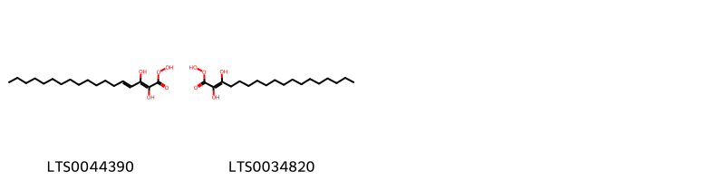
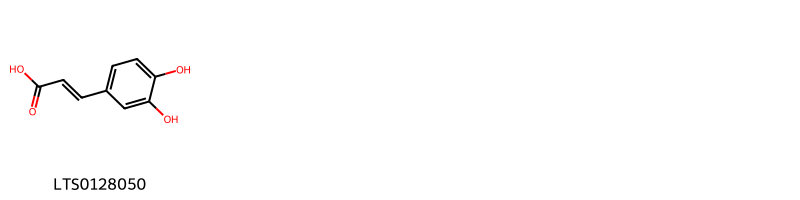
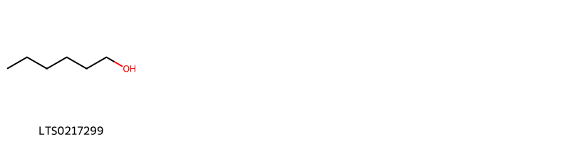
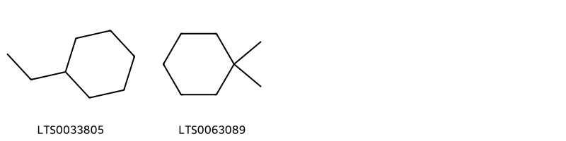

!!! abstract "Tóm tắt"

    Actisô (Folium Cynarae scolymi) là lá phơi hoặc sấy khô của cây Actisô (Cynara scolymus L.), thuộc họ Cúc (Asteraceae). Loài cây này có nguồn gốc từ khu vực Địa Trung Hải và hiện được trồng phổ biến tại Việt Nam, đặc biệt ở các vùng có khí hậu mát mẻ như Đà Lạt, Sapa và Tam Đảo. Trong y học cổ truyền, lá actisô có vị đắng, tính mát, thường được sử dụng để lợi mật, mát gan, thông tiểu, và điều trị các triệu chứng như đầy bụng, khó tiêu, vàng da, và táo bón. Nhiều nghiên cứu hiện đại đã xác nhận tác dụng dược lý của actisô, bao gồm khả năng bảo vệ gan, giảm cholesterol, hạ đường huyết, chống oxy hóa, và kháng viêm. Thành phần hóa học chính trong lá actisô bao gồm acid chlorogenic, acid caffeic, và một số hợp chất phenolic khác.

## Thông tin về thực vật

Dược liệu **Actisô (Lá)** từ bộ phận **Lá** từ loài *Cynara scolymus*.

**Mô tả thực vật:** Cây Actiso cao gần 1m hay hơn, có khi tới hơn 2m, trên thân và lá có lông trắng như bông. Lá to mọc cách, phiến lá bị khía sâu, có gai, mặt dưới có lông trắng. Cụm hoa hình đầu, màu tím nhạt. Lá bắc ngoài của cụm hoa dầy và nhọn. Phần gốc nạc của lá bắc và để hoa ăn được.

*Tài liệu tham khảo:* "Những cây thuốc và vị thuốc Việt Nam" - Đỗ Tất Lợi 
Trong dược điển Việt nam, một loài được sử dụng làm dược liệu là *Cynara scolymus*.

!!! info "Phân loại thực vật của *Cynara scolymus*"
    - **Kingdom:** Plantae
    - **Phylum:** Tracheophyta
    - **Order:** Asterales
    - **Family:** Asteraceae
    - **Genus:** Cynara
    - **Species:** *Cynara scolymus*

**Phân bố trên thế giới:** France, Germany, Switzerland, Nepal, Chile, Netherlands, Spain, Colombia, Réunion, Russian Federation, Portugal, United Kingdom of Great Britain and Northern Ireland, Guatemala, Brazil, Ukraine, United States of America, Pakistan, Italy, Norway, New Zealand, Greece, Ecuador, Denmark, Belgium

**Phân bố tại Việt nam:** Không có ghi nhận ở Việt Nam

## Thông tin về dược liệu 

### Định danh

!!! info "Thông tin về tên gọi"

    - Dược liệu tiếng Việt: actiso
    - Dược liệu tiếng Trung: None (None)
    - Dược liệu tiếng Anh: None
    - Dược liệu latin thông dụng: Folium Cynarae scolymi
    - Dược liệu latin kiểu DĐVN: *folium cynarae scolymi*
    - Dược liệu latin kiểu DĐVN: *None*
    - Dược liệu latin kiểu thông tư: *None*
    - Bộ phận dùng: Lá (Folium)

### Mô tả dược liệu 

- **Theo dược điển Việt nam V:** 
Lá nhăn nheo, dài khoảng 1m đến 1,2m, rộng khoảng 0,5 m hay được chia nhỏ. Phiến lá xẻ thùy sâu hình lông chim; mép thùy khía răng cưa to, đỉnh răng cưa thường có gai rất nhỏ, mềm. Mặt trên lá màu nâu hoặc lục, mặt dưới màu xám trắng, lồi nhiều và những rãnh dọc rất nhỏ song song. Lá có nhiều lòng trắng vón vào nhau. Vị hơi mặn và hơi đắng.

- **Mô tả dược liệu theo thông tư chế biến dược liệu theo phương pháp cổ truyền:** 

### Chế biến 

- **Chế biến theo dược điển việt nam V**: 
Lá được thu hái vào năm thứ nhất của thời kỳ sinh trưởng hoặc cuối mùa hoa, đem phơi hoặc sấy khô ở 50 °c đến 60 °c. Lá cần được ổn định trước rồi mới bào chế thành dạng thuốc, có thể dùng hơi nước sôi có áp suất cao đề xử lý nhanh lá. Sau đỏ phơi hoặc sấy khô.

- **Chế biến theo thông tư:** 

--- 

## Thành phần hóa học

- Theo tài liệu của GS. Đỗ Tất Lợi:  (1) Nhóm hóa học là: phenolic compounds
(2) Tên hoạt chất là biomaker trong dược điển Việt Nam, Hồng Kông: Acid chlorogenic
    

**Thành phần hóa học từ loài **Cynara scolymus**

Theo cơ sở dữ liệu lotus, loài *Cynara scolymus* đã phân lập và xác định được **75** hoạt chất thuộc về các nhóm Organooxygen compounds, Flavonoids, Fatty Acyls, Cinnamic acids and derivatives, Carboxylic acids and derivatives, Dihydrofurans, Benzene and substituted derivatives, Pyridines and derivatives, Saturated hydrocarbons, Prenol lipids trong bảng dưới đây. Danh sách các hoạt chất như sau (3ar,4s,6ar,8s,9ar,9br)-8-hydroxy-3,6,9-trimethylidene-2-oxo-octahydroazuleno[4,5-b]furan-4-yl 2-methylprop-2-enoate [(LTS0140805)](https://lotus.naturalproducts.net/compound/lotus_id/LTS0140805), β-selinene [(LTS0096341)](https://lotus.naturalproducts.net/compound/lotus_id/LTS0096341), hexanol [(LTS0217299)](https://lotus.naturalproducts.net/compound/lotus_id/LTS0217299), prunin [(LTS0234554)](https://lotus.naturalproducts.net/compound/lotus_id/LTS0234554), (2s,3s,4s,5r,6r)-6-{[(3s,4r,4ar,6ar,6bs,8as,11r,12s,12as,14ar,14br)-4-(hydroxymethyl)-4,6a,6b,11,12,14b-hexamethyl-8a-({[(2s,3r,4s,5s,6r)-3,4,5-trihydroxy-6-(hydroxymethyl)oxan-2-yl]oxy}carbonyl)-2,3,4a,5,6,7,8,9,10,11,12,12a,14,14a-tetradecahydro-1h-picen-3-yl]oxy}-3,4,5-trihydroxyoxane-2-carboxylic acid [(LTS0013988)](https://lotus.naturalproducts.net/compound/lotus_id/LTS0013988), valencene [(LTS0110395)](https://lotus.naturalproducts.net/compound/lotus_id/LTS0110395), m-xylene [(LTS0151729)](https://lotus.naturalproducts.net/compound/lotus_id/LTS0151729), apigenin 7-rutinoside [(LTS0055806)](https://lotus.naturalproducts.net/compound/lotus_id/LTS0055806), dehydrocostus lactone [(LTS0202421)](https://lotus.naturalproducts.net/compound/lotus_id/LTS0202421), (3r,5r)-4-{[(2e)-3-(3,4-dihydroxyphenyl)prop-2-enoyl]oxy}-1,3,5-trihydroxycyclohexane-1-carboxylic acid [(LTS0165819)](https://lotus.naturalproducts.net/compound/lotus_id/LTS0165819), 4-isopropyl-1,6-dimethylidene-octahydronaphthalene [(LTS0155478)](https://lotus.naturalproducts.net/compound/lotus_id/LTS0155478), luteolin 7-o-glucuronide [(LTS0081420)](https://lotus.naturalproducts.net/compound/lotus_id/LTS0081420), (2s,3s,4s,5r,6r)-6-{[(3s,4ar,6ar,6bs,8as,12as,14ar,14br)-4-(hydroxymethyl)-4,6a,6b,11,12,14b-hexamethyl-8a-({[(2s,3r,4s,5s,6r)-3,4,5-trihydroxy-6-(hydroxymethyl)oxan-2-yl]oxy}carbonyl)-2,3,4a,5,6,7,8,9,10,11,12,12a,14,14a-tetradecahydro-1h-picen-3-yl]oxy}-3,4,5-trihydroxyoxane-2-carboxylic acid [(LTS0191473)](https://lotus.naturalproducts.net/compound/lotus_id/LTS0191473), humulene [(LTS0263171)](https://lotus.naturalproducts.net/compound/lotus_id/LTS0263171), β-elemene [(LTS0225699)](https://lotus.naturalproducts.net/compound/lotus_id/LTS0225699), grosheimin [(LTS0260185)](https://lotus.naturalproducts.net/compound/lotus_id/LTS0260185), ortho-xylene [(LTS0161849)](https://lotus.naturalproducts.net/compound/lotus_id/LTS0161849), (1ar,7r,7ar,7bs)-1,1,7,7a-tetramethyl-1ah,2h,3h,5h,6h,7h,7bh-cyclopropa[a]naphthalene [(LTS0234436)](https://lotus.naturalproducts.net/compound/lotus_id/LTS0234436), 1,1,7,7a-tetramethyl-1ah,2h,3h,5h,6h,7h,7bh-cyclopropa[a]naphthalene [(LTS0185310)](https://lotus.naturalproducts.net/compound/lotus_id/LTS0185310), (1s)-3,4-bis({[3-(3,4-dihydroxyphenyl)prop-2-enoyl]oxy})-1,5-dihydroxycyclohexane-1-carboxylic acid [(LTS0244229)](https://lotus.naturalproducts.net/compound/lotus_id/LTS0244229), cynaropicrin [(LTS0272033)](https://lotus.naturalproducts.net/compound/lotus_id/LTS0272033), (3r,3as,6as,8r,9r,9as,9bs)-3,8-dihydroxy-3-(hydroxymethyl)-9-methyl-6-methylidene-octahydro-3ah-azuleno[4,5-b]furan-2-one [(LTS0272995)](https://lotus.naturalproducts.net/compound/lotus_id/LTS0272995), 1,4-bis({[(2e)-3-(3,4-dihydroxyphenyl)prop-2-enoyl]oxy})-3,5-dihydroxycyclohexane-1-carboxylic acid [(LTS0201979)](https://lotus.naturalproducts.net/compound/lotus_id/LTS0201979), (2s,3s,4s,5r,6r)-6-{[(3s,4ar,6ar,6bs,8ar,10s,12as,14ar,14br)-10-hydroxy-4,4,6a,6b,11,11,14b-heptamethyl-8a-({[(2s,3r,4s,5s,6r)-3,4,5-trihydroxy-6-(hydroxymethyl)oxan-2-yl]oxy}carbonyl)-1,2,3,4a,5,6,7,8,9,10,12,12a,14,14a-tetradecahydropicen-3-yl]oxy}-3,4-dihydroxy-5-{[(2s,3r,4s,5s)-3,4,5-trihydroxyoxan-2-yl]oxy}oxane-2-carboxylic acid [(LTS0232801)](https://lotus.naturalproducts.net/compound/lotus_id/LTS0232801), 2-phenyl-ethanol [(LTS0206341)](https://lotus.naturalproducts.net/compound/lotus_id/LTS0206341), (3as,4s,6as,9r,9as,9bs)-4-hydroxy-9-methyl-3,6-dimethylidene-octahydroazuleno[4,5-b]furan-2,8-dione [(LTS0233750)](https://lotus.naturalproducts.net/compound/lotus_id/LTS0233750), pentanal [(LTS0234306)](https://lotus.naturalproducts.net/compound/lotus_id/LTS0234306), (3s,3ar,4s,6ar,8s,9s,9ar,9br)-8-hydroxy-3,9-dimethyl-6-methylidene-4-{[(2r,3r,4s,5s,6r)-3,4,5-trihydroxy-6-(hydroxymethyl)oxan-2-yl]oxy}-decahydroazuleno[4,5-b]furan-2-one [(LTS0082960)](https://lotus.naturalproducts.net/compound/lotus_id/LTS0082960), 4,5-dicaffeoylquinic acid [(LTS0046605)](https://lotus.naturalproducts.net/compound/lotus_id/LTS0046605), 3-(chloromethyl)-3-hydroxy-9-methyl-6-methylidene-octahydroazuleno[4,5-b]furan-2,8-dione [(LTS0054456)](https://lotus.naturalproducts.net/compound/lotus_id/LTS0054456), levo-α-cedrene [(LTS0222481)](https://lotus.naturalproducts.net/compound/lotus_id/LTS0222481), cedrene [(LTS0256646)](https://lotus.naturalproducts.net/compound/lotus_id/LTS0256646), valencene [(LTS0031707)](https://lotus.naturalproducts.net/compound/lotus_id/LTS0031707), [(1s,4s,5r,6s,8r,9r,13s,16s,18s)-11-ethyl-8,9-dihydroxy-4,6,16,18-tetramethoxy-11-azahexacyclo[7.7.2.1²,⁵.0¹,¹⁰.0³,⁸.0¹³,¹⁷]nonadecan-13-yl]methyl 2-aminobenzoate [(LTS0153720)](https://lotus.naturalproducts.net/compound/lotus_id/LTS0153720), benzene [(LTS0177573)](https://lotus.naturalproducts.net/compound/lotus_id/LTS0177573), chlorogenic acid [(LTS0226495)](https://lotus.naturalproducts.net/compound/lotus_id/LTS0226495), 5-hydroxy-2-(3-hydroxy-4-{[3,4,5-trihydroxy-6-(hydroxymethyl)oxan-2-yl]oxy}phenyl)-7-[(3,4,5-trihydroxy-6-{[(3,4,5-trihydroxy-6-methyloxan-2-yl)oxy]methyl}oxan-2-yl)oxy]chromen-4-one [(LTS0020110)](https://lotus.naturalproducts.net/compound/lotus_id/LTS0020110), ethylcyclohexane [(LTS0033805)](https://lotus.naturalproducts.net/compound/lotus_id/LTS0033805), pyridine [(LTS0108275)](https://lotus.naturalproducts.net/compound/lotus_id/LTS0108275), cynarine [(LTS0039940)](https://lotus.naturalproducts.net/compound/lotus_id/LTS0039940), 3-o-feruloyl-d-quinic acid [(LTS0039027)](https://lotus.naturalproducts.net/compound/lotus_id/LTS0039027), lonicerin [(LTS0219204)](https://lotus.naturalproducts.net/compound/lotus_id/LTS0219204), 5-hydroxy-2-(4-hydroxyphenyl)-7-[(3,4,5-trihydroxy-6-{[(3,4,5-trihydroxy-6-methyloxan-2-yl)oxy]methyl}oxan-2-yl)oxy]-2,3-dihydro-1-benzopyran-4-one [(LTS0252145)](https://lotus.naturalproducts.net/compound/lotus_id/LTS0252145), (2e,4e)-2,3-dihydroxyoctadeca-2,4-dieneperoxoic acid [(LTS0044390)](https://lotus.naturalproducts.net/compound/lotus_id/LTS0044390), β-carotene [(LTS0275716)](https://lotus.naturalproducts.net/compound/lotus_id/LTS0275716), luteolin 7-rutinoside [(LTS0209304)](https://lotus.naturalproducts.net/compound/lotus_id/LTS0209304), luteolin 7-o-glucoside [(LTS0227450)](https://lotus.naturalproducts.net/compound/lotus_id/LTS0227450), hexanal [(LTS0238624)](https://lotus.naturalproducts.net/compound/lotus_id/LTS0238624), (3s,3ar,4s,6ar,8r,9s,9ar,9br)-8-hydroxy-3,9-dimethyl-6-methylidene-4-{[(2r,3r,4s,5s,6r)-3,4,5-trihydroxy-6-(hydroxymethyl)oxan-2-yl]oxy}-decahydroazuleno[4,5-b]furan-2-one [(LTS0042151)](https://lotus.naturalproducts.net/compound/lotus_id/LTS0042151), benzyl alcohol [(LTS0125638)](https://lotus.naturalproducts.net/compound/lotus_id/LTS0125638), 4-hydroxy-9-methyl-3,6-dimethylidene-octahydroazuleno[4,5-b]furan-2,8-dione [(LTS0074846)](https://lotus.naturalproducts.net/compound/lotus_id/LTS0074846), (2e)-2,3-dihydroxyoctadec-2-eneperoxoic acid [(LTS0034820)](https://lotus.naturalproducts.net/compound/lotus_id/LTS0034820), 3,4-dihydroxycinnamic acid [(LTS0128050)](https://lotus.naturalproducts.net/compound/lotus_id/LTS0128050), 2-methyl-3h-furan-2-carbaldehyde [(LTS0245708)](https://lotus.naturalproducts.net/compound/lotus_id/LTS0245708), quinic acid [(LTS0052589)](https://lotus.naturalproducts.net/compound/lotus_id/LTS0052589), luteolin 3'-glucoside [(LTS0071552)](https://lotus.naturalproducts.net/compound/lotus_id/LTS0071552), para-xylene [(LTS0005367)](https://lotus.naturalproducts.net/compound/lotus_id/LTS0005367), limonene,  [(LTS0155981)](https://lotus.naturalproducts.net/compound/lotus_id/LTS0155981), (1r)-1,3-bis({[3-(3,4-dihydroxyphenyl)prop-2-enoyl]oxy})-4,5-dihydroxycyclohexane-1-carboxylic acid [(LTS0042414)](https://lotus.naturalproducts.net/compound/lotus_id/LTS0042414), 1,1-dimethylcyclohexane [(LTS0063089)](https://lotus.naturalproducts.net/compound/lotus_id/LTS0063089), (2s,3s,4s,5r)-6-{[2-(3,4-dihydroxyphenyl)-5-hydroxy-4-oxochromen-7-yl]oxy}-3,4,5-trihydroxyoxane-2-carboxylic acid [(LTS0086262)](https://lotus.naturalproducts.net/compound/lotus_id/LTS0086262), neochlorogenic acid [(LTS0235816)](https://lotus.naturalproducts.net/compound/lotus_id/LTS0235816), (3r,3ar,6ar,8s,9s,9ar,9bs)-3,8-dihydroxy-3-(hydroxymethyl)-9-methyl-6-methylidene-octahydro-3ah-azuleno[4,5-b]furan-2-one [(LTS0204762)](https://lotus.naturalproducts.net/compound/lotus_id/LTS0204762), [(2r,3s,4s,5r,6s)-6-{[2-(3,4-dihydroxyphenyl)-5-hydroxy-4-oxochromen-7-yl]oxy}-3,4,5-trihydroxyoxan-2-yl]methyl acetate [(LTS0204111)](https://lotus.naturalproducts.net/compound/lotus_id/LTS0204111), luteolin [(LTS0017052)](https://lotus.naturalproducts.net/compound/lotus_id/LTS0017052), (3r,5r)-1,3,4,5-tetrahydroxycyclohexane-1-carboxylic acid [(LTS0249267)](https://lotus.naturalproducts.net/compound/lotus_id/LTS0249267), (3ar,4s,6ar,9ar,9br)-3,6,9-trimethylidene-2,8-dioxo-hexahydro-3ah-azuleno[4,5-b]furan-4-yl 2-(hydroxymethyl)prop-2-enoate [(LTS0182739)](https://lotus.naturalproducts.net/compound/lotus_id/LTS0182739), apigenin 7-o-β-glucoside [(LTS0252743)](https://lotus.naturalproducts.net/compound/lotus_id/LTS0252743), phenylacetaldehyde [(LTS0245512)](https://lotus.naturalproducts.net/compound/lotus_id/LTS0245512), 4-hydroxy-3-(methanesulfonylmethyl)-9-methyl-6-methylidene-octahydro-3h-azuleno[4,5-b]furan-2,8-dione [(LTS0227230)](https://lotus.naturalproducts.net/compound/lotus_id/LTS0227230), 7-{[(3s,4s,5s,6r)-4,5-dihydroxy-6-methyl-3-{[(3r,4s,5s,6r)-3,4,5-trihydroxy-6-(hydroxymethyl)oxan-2-yl]oxy}oxan-2-yl]oxy}-5-hydroxy-2-(4-hydroxyphenyl)chromen-4-one [(LTS0205671)](https://lotus.naturalproducts.net/compound/lotus_id/LTS0205671), longifolene [(LTS0202079)](https://lotus.naturalproducts.net/compound/lotus_id/LTS0202079), carotenoid [(LTS0205297)](https://lotus.naturalproducts.net/compound/lotus_id/LTS0205297), (2s,7s)-3,3,7-trimethyl-8-methylidenetricyclo[5.4.0.0²,⁹]undecane [(LTS0085446)](https://lotus.naturalproducts.net/compound/lotus_id/LTS0085446), 5-hydroxy-2-(3-hydroxyphenyl)-7-{[(2s,3r,4s,5s,6r)-3,4,5-trihydroxy-6-(hydroxymethyl)oxan-2-yl]oxy}chromen-4-one [(LTS0146309)](https://lotus.naturalproducts.net/compound/lotus_id/LTS0146309). 
        
| chemicalTaxonomyClassyfireClass     |   smiles_count |
|:------------------------------------|---------------:|
| Benzene and substituted derivatives |             75 |
| Carboxylic acids and derivatives    |             68 |
| Cinnamic acids and derivatives      |             25 |
| Dihydrofurans                       |             14 |
| Fatty Acyls                         |              7 |
| Flavonoids                          |           1308 |
| Organooxygen compounds              |            651 |
| Prenol lipids                       |           2152 |
| Pyridines and derivatives           |              8 |
| Saturated hydrocarbons              |             22 |

            
### Nhóm Benzene and substituted derivatives
<figure markdown="span">
    { width=100% }
<figcaption>Hình ảnh cấu trúc hóa học của hoạt chất thuộc nhóm *Benzene and substituted derivatives*. Tên thường gọi của các hoạt chất tương ứng là 2-phenyl-ethanol [(LTS0206341)](https://lotus.naturalproducts.net/compound/lotus_id/LTS0206341), m-xylene [(LTS0151729)](https://lotus.naturalproducts.net/compound/lotus_id/LTS0151729), ortho-xylene [(LTS0161849)](https://lotus.naturalproducts.net/compound/lotus_id/LTS0161849), phenylacetaldehyde [(LTS0245512)](https://lotus.naturalproducts.net/compound/lotus_id/LTS0245512), benzene [(LTS0177573)](https://lotus.naturalproducts.net/compound/lotus_id/LTS0177573), para-xylene [(LTS0005367)](https://lotus.naturalproducts.net/compound/lotus_id/LTS0005367), benzyl alcohol [(LTS0125638)](https://lotus.naturalproducts.net/compound/lotus_id/LTS0125638).</figcaption>
</figure>

            
            
### Nhóm Benzene and substituted derivatives
<figure markdown="span">
    { width=100% }
<figcaption>Hình ảnh cấu trúc hóa học của hoạt chất thuộc nhóm *Benzene and substituted derivatives*. Tên thường gọi của các hoạt chất tương ứng là 2-phenyl-ethanol [(LTS0206341)](https://lotus.naturalproducts.net/compound/lotus_id/LTS0206341), m-xylene [(LTS0151729)](https://lotus.naturalproducts.net/compound/lotus_id/LTS0151729), ortho-xylene [(LTS0161849)](https://lotus.naturalproducts.net/compound/lotus_id/LTS0161849), phenylacetaldehyde [(LTS0245512)](https://lotus.naturalproducts.net/compound/lotus_id/LTS0245512), benzene [(LTS0177573)](https://lotus.naturalproducts.net/compound/lotus_id/LTS0177573), para-xylene [(LTS0005367)](https://lotus.naturalproducts.net/compound/lotus_id/LTS0005367), benzyl alcohol [(LTS0125638)](https://lotus.naturalproducts.net/compound/lotus_id/LTS0125638).</figcaption>
</figure>

### Nhóm Carboxylic acids and derivatives
<figure markdown="span">
    { width=100% }
<figcaption>Hình ảnh cấu trúc hóa học của hoạt chất thuộc nhóm *Carboxylic acids and derivatives*. Tên thường gọi của các hoạt chất tương ứng là (2e,4e)-2,3-dihydroxyoctadeca-2,4-dieneperoxoic acid [(LTS0044390)](https://lotus.naturalproducts.net/compound/lotus_id/LTS0044390), (2e)-2,3-dihydroxyoctadec-2-eneperoxoic acid [(LTS0034820)](https://lotus.naturalproducts.net/compound/lotus_id/LTS0034820).</figcaption>
</figure>

            
            
### Nhóm Benzene and substituted derivatives
<figure markdown="span">
    { width=100% }
<figcaption>Hình ảnh cấu trúc hóa học của hoạt chất thuộc nhóm *Benzene and substituted derivatives*. Tên thường gọi của các hoạt chất tương ứng là 2-phenyl-ethanol [(LTS0206341)](https://lotus.naturalproducts.net/compound/lotus_id/LTS0206341), m-xylene [(LTS0151729)](https://lotus.naturalproducts.net/compound/lotus_id/LTS0151729), ortho-xylene [(LTS0161849)](https://lotus.naturalproducts.net/compound/lotus_id/LTS0161849), phenylacetaldehyde [(LTS0245512)](https://lotus.naturalproducts.net/compound/lotus_id/LTS0245512), benzene [(LTS0177573)](https://lotus.naturalproducts.net/compound/lotus_id/LTS0177573), para-xylene [(LTS0005367)](https://lotus.naturalproducts.net/compound/lotus_id/LTS0005367), benzyl alcohol [(LTS0125638)](https://lotus.naturalproducts.net/compound/lotus_id/LTS0125638).</figcaption>
</figure>

### Nhóm Carboxylic acids and derivatives
<figure markdown="span">
    { width=100% }
<figcaption>Hình ảnh cấu trúc hóa học của hoạt chất thuộc nhóm *Carboxylic acids and derivatives*. Tên thường gọi của các hoạt chất tương ứng là (2e,4e)-2,3-dihydroxyoctadeca-2,4-dieneperoxoic acid [(LTS0044390)](https://lotus.naturalproducts.net/compound/lotus_id/LTS0044390), (2e)-2,3-dihydroxyoctadec-2-eneperoxoic acid [(LTS0034820)](https://lotus.naturalproducts.net/compound/lotus_id/LTS0034820).</figcaption>
</figure>

### Nhóm Cinnamic acids and derivatives
<figure markdown="span">
    { width=100% }
<figcaption>Hình ảnh cấu trúc hóa học của hoạt chất thuộc nhóm *Cinnamic acids and derivatives*. Tên thường gọi của các hoạt chất tương ứng là 3,4-dihydroxycinnamic acid [(LTS0128050)](https://lotus.naturalproducts.net/compound/lotus_id/LTS0128050).</figcaption>
</figure>

            
            
### Nhóm Benzene and substituted derivatives
<figure markdown="span">
    { width=100% }
<figcaption>Hình ảnh cấu trúc hóa học của hoạt chất thuộc nhóm *Benzene and substituted derivatives*. Tên thường gọi của các hoạt chất tương ứng là 2-phenyl-ethanol [(LTS0206341)](https://lotus.naturalproducts.net/compound/lotus_id/LTS0206341), m-xylene [(LTS0151729)](https://lotus.naturalproducts.net/compound/lotus_id/LTS0151729), ortho-xylene [(LTS0161849)](https://lotus.naturalproducts.net/compound/lotus_id/LTS0161849), phenylacetaldehyde [(LTS0245512)](https://lotus.naturalproducts.net/compound/lotus_id/LTS0245512), benzene [(LTS0177573)](https://lotus.naturalproducts.net/compound/lotus_id/LTS0177573), para-xylene [(LTS0005367)](https://lotus.naturalproducts.net/compound/lotus_id/LTS0005367), benzyl alcohol [(LTS0125638)](https://lotus.naturalproducts.net/compound/lotus_id/LTS0125638).</figcaption>
</figure>

### Nhóm Carboxylic acids and derivatives
<figure markdown="span">
    { width=100% }
<figcaption>Hình ảnh cấu trúc hóa học của hoạt chất thuộc nhóm *Carboxylic acids and derivatives*. Tên thường gọi của các hoạt chất tương ứng là (2e,4e)-2,3-dihydroxyoctadeca-2,4-dieneperoxoic acid [(LTS0044390)](https://lotus.naturalproducts.net/compound/lotus_id/LTS0044390), (2e)-2,3-dihydroxyoctadec-2-eneperoxoic acid [(LTS0034820)](https://lotus.naturalproducts.net/compound/lotus_id/LTS0034820).</figcaption>
</figure>

### Nhóm Cinnamic acids and derivatives
<figure markdown="span">
    { width=100% }
<figcaption>Hình ảnh cấu trúc hóa học của hoạt chất thuộc nhóm *Cinnamic acids and derivatives*. Tên thường gọi của các hoạt chất tương ứng là 3,4-dihydroxycinnamic acid [(LTS0128050)](https://lotus.naturalproducts.net/compound/lotus_id/LTS0128050).</figcaption>
</figure>

### Nhóm Dihydrofurans
<figure markdown="span">
    { width=100% }
<figcaption>Hình ảnh cấu trúc hóa học của hoạt chất thuộc nhóm *Dihydrofurans*. Tên thường gọi của các hoạt chất tương ứng là 2-methyl-3h-furan-2-carbaldehyde [(LTS0245708)](https://lotus.naturalproducts.net/compound/lotus_id/LTS0245708).</figcaption>
</figure>

            
            
### Nhóm Benzene and substituted derivatives
<figure markdown="span">
    { width=100% }
<figcaption>Hình ảnh cấu trúc hóa học của hoạt chất thuộc nhóm *Benzene and substituted derivatives*. Tên thường gọi của các hoạt chất tương ứng là 2-phenyl-ethanol [(LTS0206341)](https://lotus.naturalproducts.net/compound/lotus_id/LTS0206341), m-xylene [(LTS0151729)](https://lotus.naturalproducts.net/compound/lotus_id/LTS0151729), ortho-xylene [(LTS0161849)](https://lotus.naturalproducts.net/compound/lotus_id/LTS0161849), phenylacetaldehyde [(LTS0245512)](https://lotus.naturalproducts.net/compound/lotus_id/LTS0245512), benzene [(LTS0177573)](https://lotus.naturalproducts.net/compound/lotus_id/LTS0177573), para-xylene [(LTS0005367)](https://lotus.naturalproducts.net/compound/lotus_id/LTS0005367), benzyl alcohol [(LTS0125638)](https://lotus.naturalproducts.net/compound/lotus_id/LTS0125638).</figcaption>
</figure>

### Nhóm Carboxylic acids and derivatives
<figure markdown="span">
    { width=100% }
<figcaption>Hình ảnh cấu trúc hóa học của hoạt chất thuộc nhóm *Carboxylic acids and derivatives*. Tên thường gọi của các hoạt chất tương ứng là (2e,4e)-2,3-dihydroxyoctadeca-2,4-dieneperoxoic acid [(LTS0044390)](https://lotus.naturalproducts.net/compound/lotus_id/LTS0044390), (2e)-2,3-dihydroxyoctadec-2-eneperoxoic acid [(LTS0034820)](https://lotus.naturalproducts.net/compound/lotus_id/LTS0034820).</figcaption>
</figure>

### Nhóm Cinnamic acids and derivatives
<figure markdown="span">
    { width=100% }
<figcaption>Hình ảnh cấu trúc hóa học của hoạt chất thuộc nhóm *Cinnamic acids and derivatives*. Tên thường gọi của các hoạt chất tương ứng là 3,4-dihydroxycinnamic acid [(LTS0128050)](https://lotus.naturalproducts.net/compound/lotus_id/LTS0128050).</figcaption>
</figure>

### Nhóm Dihydrofurans
<figure markdown="span">
    { width=100% }
<figcaption>Hình ảnh cấu trúc hóa học của hoạt chất thuộc nhóm *Dihydrofurans*. Tên thường gọi của các hoạt chất tương ứng là 2-methyl-3h-furan-2-carbaldehyde [(LTS0245708)](https://lotus.naturalproducts.net/compound/lotus_id/LTS0245708).</figcaption>
</figure>

### Nhóm Fatty Acyls
<figure markdown="span">
    { width=100% }
<figcaption>Hình ảnh cấu trúc hóa học của hoạt chất thuộc nhóm *Fatty Acyls*. Tên thường gọi của các hoạt chất tương ứng là hexanol [(LTS0217299)](https://lotus.naturalproducts.net/compound/lotus_id/LTS0217299).</figcaption>
</figure>

            
            
### Nhóm Benzene and substituted derivatives
<figure markdown="span">
    { width=100% }
<figcaption>Hình ảnh cấu trúc hóa học của hoạt chất thuộc nhóm *Benzene and substituted derivatives*. Tên thường gọi của các hoạt chất tương ứng là 2-phenyl-ethanol [(LTS0206341)](https://lotus.naturalproducts.net/compound/lotus_id/LTS0206341), m-xylene [(LTS0151729)](https://lotus.naturalproducts.net/compound/lotus_id/LTS0151729), ortho-xylene [(LTS0161849)](https://lotus.naturalproducts.net/compound/lotus_id/LTS0161849), phenylacetaldehyde [(LTS0245512)](https://lotus.naturalproducts.net/compound/lotus_id/LTS0245512), benzene [(LTS0177573)](https://lotus.naturalproducts.net/compound/lotus_id/LTS0177573), para-xylene [(LTS0005367)](https://lotus.naturalproducts.net/compound/lotus_id/LTS0005367), benzyl alcohol [(LTS0125638)](https://lotus.naturalproducts.net/compound/lotus_id/LTS0125638).</figcaption>
</figure>

### Nhóm Carboxylic acids and derivatives
<figure markdown="span">
    { width=100% }
<figcaption>Hình ảnh cấu trúc hóa học của hoạt chất thuộc nhóm *Carboxylic acids and derivatives*. Tên thường gọi của các hoạt chất tương ứng là (2e,4e)-2,3-dihydroxyoctadeca-2,4-dieneperoxoic acid [(LTS0044390)](https://lotus.naturalproducts.net/compound/lotus_id/LTS0044390), (2e)-2,3-dihydroxyoctadec-2-eneperoxoic acid [(LTS0034820)](https://lotus.naturalproducts.net/compound/lotus_id/LTS0034820).</figcaption>
</figure>

### Nhóm Cinnamic acids and derivatives
<figure markdown="span">
    { width=100% }
<figcaption>Hình ảnh cấu trúc hóa học của hoạt chất thuộc nhóm *Cinnamic acids and derivatives*. Tên thường gọi của các hoạt chất tương ứng là 3,4-dihydroxycinnamic acid [(LTS0128050)](https://lotus.naturalproducts.net/compound/lotus_id/LTS0128050).</figcaption>
</figure>

### Nhóm Dihydrofurans
<figure markdown="span">
    { width=100% }
<figcaption>Hình ảnh cấu trúc hóa học của hoạt chất thuộc nhóm *Dihydrofurans*. Tên thường gọi của các hoạt chất tương ứng là 2-methyl-3h-furan-2-carbaldehyde [(LTS0245708)](https://lotus.naturalproducts.net/compound/lotus_id/LTS0245708).</figcaption>
</figure>

### Nhóm Fatty Acyls
<figure markdown="span">
    { width=100% }
<figcaption>Hình ảnh cấu trúc hóa học của hoạt chất thuộc nhóm *Fatty Acyls*. Tên thường gọi của các hoạt chất tương ứng là hexanol [(LTS0217299)](https://lotus.naturalproducts.net/compound/lotus_id/LTS0217299).</figcaption>
</figure>

### Nhóm Flavonoids
<figure markdown="span">
    { width=100% }
<figcaption>Hình ảnh cấu trúc hóa học của hoạt chất thuộc nhóm *Flavonoids*. Tên thường gọi của các hoạt chất tương ứng là luteolin 7-o-glucoside [(LTS0227450)](https://lotus.naturalproducts.net/compound/lotus_id/LTS0227450), luteolin [(LTS0017052)](https://lotus.naturalproducts.net/compound/lotus_id/LTS0017052), apigenin 7-o-β-glucoside [(LTS0252743)](https://lotus.naturalproducts.net/compound/lotus_id/LTS0252743), luteolin 7-rutinoside [(LTS0209304)](https://lotus.naturalproducts.net/compound/lotus_id/LTS0209304), lonicerin [(LTS0219204)](https://lotus.naturalproducts.net/compound/lotus_id/LTS0219204), apigenin 7-rutinoside [(LTS0055806)](https://lotus.naturalproducts.net/compound/lotus_id/LTS0055806), luteolin 7-o-glucuronide [(LTS0081420)](https://lotus.naturalproducts.net/compound/lotus_id/LTS0081420), prunin [(LTS0234554)](https://lotus.naturalproducts.net/compound/lotus_id/LTS0234554), 5-hydroxy-2-(3-hydroxyphenyl)-7-{[(2s,3r,4s,5s,6r)-3,4,5-trihydroxy-6-(hydroxymethyl)oxan-2-yl]oxy}chromen-4-one [(LTS0146309)](https://lotus.naturalproducts.net/compound/lotus_id/LTS0146309), (2s,3s,4s,5r)-6-{[2-(3,4-dihydroxyphenyl)-5-hydroxy-4-oxochromen-7-yl]oxy}-3,4,5-trihydroxyoxane-2-carboxylic acid [(LTS0086262)](https://lotus.naturalproducts.net/compound/lotus_id/LTS0086262), 7-{[(3s,4s,5s,6r)-4,5-dihydroxy-6-methyl-3-{[(3r,4s,5s,6r)-3,4,5-trihydroxy-6-(hydroxymethyl)oxan-2-yl]oxy}oxan-2-yl]oxy}-5-hydroxy-2-(4-hydroxyphenyl)chromen-4-one [(LTS0205671)](https://lotus.naturalproducts.net/compound/lotus_id/LTS0205671), 5-hydroxy-2-(4-hydroxyphenyl)-7-[(3,4,5-trihydroxy-6-{[(3,4,5-trihydroxy-6-methyloxan-2-yl)oxy]methyl}oxan-2-yl)oxy]-2,3-dihydro-1-benzopyran-4-one [(LTS0252145)](https://lotus.naturalproducts.net/compound/lotus_id/LTS0252145), luteolin 3'-glucoside [(LTS0071552)](https://lotus.naturalproducts.net/compound/lotus_id/LTS0071552), [(2r,3s,4s,5r,6s)-6-{[2-(3,4-dihydroxyphenyl)-5-hydroxy-4-oxochromen-7-yl]oxy}-3,4,5-trihydroxyoxan-2-yl]methyl acetate [(LTS0204111)](https://lotus.naturalproducts.net/compound/lotus_id/LTS0204111), 5-hydroxy-2-(3-hydroxy-4-{[3,4,5-trihydroxy-6-(hydroxymethyl)oxan-2-yl]oxy}phenyl)-7-[(3,4,5-trihydroxy-6-{[(3,4,5-trihydroxy-6-methyloxan-2-yl)oxy]methyl}oxan-2-yl)oxy]chromen-4-one [(LTS0020110)](https://lotus.naturalproducts.net/compound/lotus_id/LTS0020110).</figcaption>
</figure>

            
            
### Nhóm Benzene and substituted derivatives
<figure markdown="span">
    { width=100% }
<figcaption>Hình ảnh cấu trúc hóa học của hoạt chất thuộc nhóm *Benzene and substituted derivatives*. Tên thường gọi của các hoạt chất tương ứng là 2-phenyl-ethanol [(LTS0206341)](https://lotus.naturalproducts.net/compound/lotus_id/LTS0206341), m-xylene [(LTS0151729)](https://lotus.naturalproducts.net/compound/lotus_id/LTS0151729), ortho-xylene [(LTS0161849)](https://lotus.naturalproducts.net/compound/lotus_id/LTS0161849), phenylacetaldehyde [(LTS0245512)](https://lotus.naturalproducts.net/compound/lotus_id/LTS0245512), benzene [(LTS0177573)](https://lotus.naturalproducts.net/compound/lotus_id/LTS0177573), para-xylene [(LTS0005367)](https://lotus.naturalproducts.net/compound/lotus_id/LTS0005367), benzyl alcohol [(LTS0125638)](https://lotus.naturalproducts.net/compound/lotus_id/LTS0125638).</figcaption>
</figure>

### Nhóm Carboxylic acids and derivatives
<figure markdown="span">
    { width=100% }
<figcaption>Hình ảnh cấu trúc hóa học của hoạt chất thuộc nhóm *Carboxylic acids and derivatives*. Tên thường gọi của các hoạt chất tương ứng là (2e,4e)-2,3-dihydroxyoctadeca-2,4-dieneperoxoic acid [(LTS0044390)](https://lotus.naturalproducts.net/compound/lotus_id/LTS0044390), (2e)-2,3-dihydroxyoctadec-2-eneperoxoic acid [(LTS0034820)](https://lotus.naturalproducts.net/compound/lotus_id/LTS0034820).</figcaption>
</figure>

### Nhóm Cinnamic acids and derivatives
<figure markdown="span">
    { width=100% }
<figcaption>Hình ảnh cấu trúc hóa học của hoạt chất thuộc nhóm *Cinnamic acids and derivatives*. Tên thường gọi của các hoạt chất tương ứng là 3,4-dihydroxycinnamic acid [(LTS0128050)](https://lotus.naturalproducts.net/compound/lotus_id/LTS0128050).</figcaption>
</figure>

### Nhóm Dihydrofurans
<figure markdown="span">
    { width=100% }
<figcaption>Hình ảnh cấu trúc hóa học của hoạt chất thuộc nhóm *Dihydrofurans*. Tên thường gọi của các hoạt chất tương ứng là 2-methyl-3h-furan-2-carbaldehyde [(LTS0245708)](https://lotus.naturalproducts.net/compound/lotus_id/LTS0245708).</figcaption>
</figure>

### Nhóm Fatty Acyls
<figure markdown="span">
    { width=100% }
<figcaption>Hình ảnh cấu trúc hóa học của hoạt chất thuộc nhóm *Fatty Acyls*. Tên thường gọi của các hoạt chất tương ứng là hexanol [(LTS0217299)](https://lotus.naturalproducts.net/compound/lotus_id/LTS0217299).</figcaption>
</figure>

### Nhóm Flavonoids
<figure markdown="span">
    { width=100% }
<figcaption>Hình ảnh cấu trúc hóa học của hoạt chất thuộc nhóm *Flavonoids*. Tên thường gọi của các hoạt chất tương ứng là luteolin 7-o-glucoside [(LTS0227450)](https://lotus.naturalproducts.net/compound/lotus_id/LTS0227450), luteolin [(LTS0017052)](https://lotus.naturalproducts.net/compound/lotus_id/LTS0017052), apigenin 7-o-β-glucoside [(LTS0252743)](https://lotus.naturalproducts.net/compound/lotus_id/LTS0252743), luteolin 7-rutinoside [(LTS0209304)](https://lotus.naturalproducts.net/compound/lotus_id/LTS0209304), lonicerin [(LTS0219204)](https://lotus.naturalproducts.net/compound/lotus_id/LTS0219204), apigenin 7-rutinoside [(LTS0055806)](https://lotus.naturalproducts.net/compound/lotus_id/LTS0055806), luteolin 7-o-glucuronide [(LTS0081420)](https://lotus.naturalproducts.net/compound/lotus_id/LTS0081420), prunin [(LTS0234554)](https://lotus.naturalproducts.net/compound/lotus_id/LTS0234554), 5-hydroxy-2-(3-hydroxyphenyl)-7-{[(2s,3r,4s,5s,6r)-3,4,5-trihydroxy-6-(hydroxymethyl)oxan-2-yl]oxy}chromen-4-one [(LTS0146309)](https://lotus.naturalproducts.net/compound/lotus_id/LTS0146309), (2s,3s,4s,5r)-6-{[2-(3,4-dihydroxyphenyl)-5-hydroxy-4-oxochromen-7-yl]oxy}-3,4,5-trihydroxyoxane-2-carboxylic acid [(LTS0086262)](https://lotus.naturalproducts.net/compound/lotus_id/LTS0086262), 7-{[(3s,4s,5s,6r)-4,5-dihydroxy-6-methyl-3-{[(3r,4s,5s,6r)-3,4,5-trihydroxy-6-(hydroxymethyl)oxan-2-yl]oxy}oxan-2-yl]oxy}-5-hydroxy-2-(4-hydroxyphenyl)chromen-4-one [(LTS0205671)](https://lotus.naturalproducts.net/compound/lotus_id/LTS0205671), 5-hydroxy-2-(4-hydroxyphenyl)-7-[(3,4,5-trihydroxy-6-{[(3,4,5-trihydroxy-6-methyloxan-2-yl)oxy]methyl}oxan-2-yl)oxy]-2,3-dihydro-1-benzopyran-4-one [(LTS0252145)](https://lotus.naturalproducts.net/compound/lotus_id/LTS0252145), luteolin 3'-glucoside [(LTS0071552)](https://lotus.naturalproducts.net/compound/lotus_id/LTS0071552), [(2r,3s,4s,5r,6s)-6-{[2-(3,4-dihydroxyphenyl)-5-hydroxy-4-oxochromen-7-yl]oxy}-3,4,5-trihydroxyoxan-2-yl]methyl acetate [(LTS0204111)](https://lotus.naturalproducts.net/compound/lotus_id/LTS0204111), 5-hydroxy-2-(3-hydroxy-4-{[3,4,5-trihydroxy-6-(hydroxymethyl)oxan-2-yl]oxy}phenyl)-7-[(3,4,5-trihydroxy-6-{[(3,4,5-trihydroxy-6-methyloxan-2-yl)oxy]methyl}oxan-2-yl)oxy]chromen-4-one [(LTS0020110)](https://lotus.naturalproducts.net/compound/lotus_id/LTS0020110).</figcaption>
</figure>

### Nhóm Organooxygen compounds
<figure markdown="span">
    { width=100% }
<figcaption>Hình ảnh cấu trúc hóa học của hoạt chất thuộc nhóm *Organooxygen compounds*. Tên thường gọi của các hoạt chất tương ứng là chlorogenic acid [(LTS0226495)](https://lotus.naturalproducts.net/compound/lotus_id/LTS0226495), 4,5-dicaffeoylquinic acid [(LTS0046605)](https://lotus.naturalproducts.net/compound/lotus_id/LTS0046605), cynarine [(LTS0039940)](https://lotus.naturalproducts.net/compound/lotus_id/LTS0039940), 3-o-feruloyl-d-quinic acid [(LTS0039027)](https://lotus.naturalproducts.net/compound/lotus_id/LTS0039027), (3r,5r)-1,3,4,5-tetrahydroxycyclohexane-1-carboxylic acid [(LTS0249267)](https://lotus.naturalproducts.net/compound/lotus_id/LTS0249267), neochlorogenic acid [(LTS0235816)](https://lotus.naturalproducts.net/compound/lotus_id/LTS0235816), (3r,5r)-4-{[(2e)-3-(3,4-dihydroxyphenyl)prop-2-enoyl]oxy}-1,3,5-trihydroxycyclohexane-1-carboxylic acid [(LTS0165819)](https://lotus.naturalproducts.net/compound/lotus_id/LTS0165819), hexanal [(LTS0238624)](https://lotus.naturalproducts.net/compound/lotus_id/LTS0238624), (1s)-3,4-bis({[3-(3,4-dihydroxyphenyl)prop-2-enoyl]oxy})-1,5-dihydroxycyclohexane-1-carboxylic acid [(LTS0244229)](https://lotus.naturalproducts.net/compound/lotus_id/LTS0244229), (1r)-1,3-bis({[3-(3,4-dihydroxyphenyl)prop-2-enoyl]oxy})-4,5-dihydroxycyclohexane-1-carboxylic acid [(LTS0042414)](https://lotus.naturalproducts.net/compound/lotus_id/LTS0042414), quinic acid [(LTS0052589)](https://lotus.naturalproducts.net/compound/lotus_id/LTS0052589), pentanal [(LTS0234306)](https://lotus.naturalproducts.net/compound/lotus_id/LTS0234306).</figcaption>
</figure>

            
            
### Nhóm Benzene and substituted derivatives
<figure markdown="span">
    { width=100% }
<figcaption>Hình ảnh cấu trúc hóa học của hoạt chất thuộc nhóm *Benzene and substituted derivatives*. Tên thường gọi của các hoạt chất tương ứng là 2-phenyl-ethanol [(LTS0206341)](https://lotus.naturalproducts.net/compound/lotus_id/LTS0206341), m-xylene [(LTS0151729)](https://lotus.naturalproducts.net/compound/lotus_id/LTS0151729), ortho-xylene [(LTS0161849)](https://lotus.naturalproducts.net/compound/lotus_id/LTS0161849), phenylacetaldehyde [(LTS0245512)](https://lotus.naturalproducts.net/compound/lotus_id/LTS0245512), benzene [(LTS0177573)](https://lotus.naturalproducts.net/compound/lotus_id/LTS0177573), para-xylene [(LTS0005367)](https://lotus.naturalproducts.net/compound/lotus_id/LTS0005367), benzyl alcohol [(LTS0125638)](https://lotus.naturalproducts.net/compound/lotus_id/LTS0125638).</figcaption>
</figure>

### Nhóm Carboxylic acids and derivatives
<figure markdown="span">
    { width=100% }
<figcaption>Hình ảnh cấu trúc hóa học của hoạt chất thuộc nhóm *Carboxylic acids and derivatives*. Tên thường gọi của các hoạt chất tương ứng là (2e,4e)-2,3-dihydroxyoctadeca-2,4-dieneperoxoic acid [(LTS0044390)](https://lotus.naturalproducts.net/compound/lotus_id/LTS0044390), (2e)-2,3-dihydroxyoctadec-2-eneperoxoic acid [(LTS0034820)](https://lotus.naturalproducts.net/compound/lotus_id/LTS0034820).</figcaption>
</figure>

### Nhóm Cinnamic acids and derivatives
<figure markdown="span">
    { width=100% }
<figcaption>Hình ảnh cấu trúc hóa học của hoạt chất thuộc nhóm *Cinnamic acids and derivatives*. Tên thường gọi của các hoạt chất tương ứng là 3,4-dihydroxycinnamic acid [(LTS0128050)](https://lotus.naturalproducts.net/compound/lotus_id/LTS0128050).</figcaption>
</figure>

### Nhóm Dihydrofurans
<figure markdown="span">
    { width=100% }
<figcaption>Hình ảnh cấu trúc hóa học của hoạt chất thuộc nhóm *Dihydrofurans*. Tên thường gọi của các hoạt chất tương ứng là 2-methyl-3h-furan-2-carbaldehyde [(LTS0245708)](https://lotus.naturalproducts.net/compound/lotus_id/LTS0245708).</figcaption>
</figure>

### Nhóm Fatty Acyls
<figure markdown="span">
    { width=100% }
<figcaption>Hình ảnh cấu trúc hóa học của hoạt chất thuộc nhóm *Fatty Acyls*. Tên thường gọi của các hoạt chất tương ứng là hexanol [(LTS0217299)](https://lotus.naturalproducts.net/compound/lotus_id/LTS0217299).</figcaption>
</figure>

### Nhóm Flavonoids
<figure markdown="span">
    { width=100% }
<figcaption>Hình ảnh cấu trúc hóa học của hoạt chất thuộc nhóm *Flavonoids*. Tên thường gọi của các hoạt chất tương ứng là luteolin 7-o-glucoside [(LTS0227450)](https://lotus.naturalproducts.net/compound/lotus_id/LTS0227450), luteolin [(LTS0017052)](https://lotus.naturalproducts.net/compound/lotus_id/LTS0017052), apigenin 7-o-β-glucoside [(LTS0252743)](https://lotus.naturalproducts.net/compound/lotus_id/LTS0252743), luteolin 7-rutinoside [(LTS0209304)](https://lotus.naturalproducts.net/compound/lotus_id/LTS0209304), lonicerin [(LTS0219204)](https://lotus.naturalproducts.net/compound/lotus_id/LTS0219204), apigenin 7-rutinoside [(LTS0055806)](https://lotus.naturalproducts.net/compound/lotus_id/LTS0055806), luteolin 7-o-glucuronide [(LTS0081420)](https://lotus.naturalproducts.net/compound/lotus_id/LTS0081420), prunin [(LTS0234554)](https://lotus.naturalproducts.net/compound/lotus_id/LTS0234554), 5-hydroxy-2-(3-hydroxyphenyl)-7-{[(2s,3r,4s,5s,6r)-3,4,5-trihydroxy-6-(hydroxymethyl)oxan-2-yl]oxy}chromen-4-one [(LTS0146309)](https://lotus.naturalproducts.net/compound/lotus_id/LTS0146309), (2s,3s,4s,5r)-6-{[2-(3,4-dihydroxyphenyl)-5-hydroxy-4-oxochromen-7-yl]oxy}-3,4,5-trihydroxyoxane-2-carboxylic acid [(LTS0086262)](https://lotus.naturalproducts.net/compound/lotus_id/LTS0086262), 7-{[(3s,4s,5s,6r)-4,5-dihydroxy-6-methyl-3-{[(3r,4s,5s,6r)-3,4,5-trihydroxy-6-(hydroxymethyl)oxan-2-yl]oxy}oxan-2-yl]oxy}-5-hydroxy-2-(4-hydroxyphenyl)chromen-4-one [(LTS0205671)](https://lotus.naturalproducts.net/compound/lotus_id/LTS0205671), 5-hydroxy-2-(4-hydroxyphenyl)-7-[(3,4,5-trihydroxy-6-{[(3,4,5-trihydroxy-6-methyloxan-2-yl)oxy]methyl}oxan-2-yl)oxy]-2,3-dihydro-1-benzopyran-4-one [(LTS0252145)](https://lotus.naturalproducts.net/compound/lotus_id/LTS0252145), luteolin 3'-glucoside [(LTS0071552)](https://lotus.naturalproducts.net/compound/lotus_id/LTS0071552), [(2r,3s,4s,5r,6s)-6-{[2-(3,4-dihydroxyphenyl)-5-hydroxy-4-oxochromen-7-yl]oxy}-3,4,5-trihydroxyoxan-2-yl]methyl acetate [(LTS0204111)](https://lotus.naturalproducts.net/compound/lotus_id/LTS0204111), 5-hydroxy-2-(3-hydroxy-4-{[3,4,5-trihydroxy-6-(hydroxymethyl)oxan-2-yl]oxy}phenyl)-7-[(3,4,5-trihydroxy-6-{[(3,4,5-trihydroxy-6-methyloxan-2-yl)oxy]methyl}oxan-2-yl)oxy]chromen-4-one [(LTS0020110)](https://lotus.naturalproducts.net/compound/lotus_id/LTS0020110).</figcaption>
</figure>

### Nhóm Organooxygen compounds
<figure markdown="span">
    { width=100% }
<figcaption>Hình ảnh cấu trúc hóa học của hoạt chất thuộc nhóm *Organooxygen compounds*. Tên thường gọi của các hoạt chất tương ứng là chlorogenic acid [(LTS0226495)](https://lotus.naturalproducts.net/compound/lotus_id/LTS0226495), 4,5-dicaffeoylquinic acid [(LTS0046605)](https://lotus.naturalproducts.net/compound/lotus_id/LTS0046605), cynarine [(LTS0039940)](https://lotus.naturalproducts.net/compound/lotus_id/LTS0039940), 3-o-feruloyl-d-quinic acid [(LTS0039027)](https://lotus.naturalproducts.net/compound/lotus_id/LTS0039027), (3r,5r)-1,3,4,5-tetrahydroxycyclohexane-1-carboxylic acid [(LTS0249267)](https://lotus.naturalproducts.net/compound/lotus_id/LTS0249267), neochlorogenic acid [(LTS0235816)](https://lotus.naturalproducts.net/compound/lotus_id/LTS0235816), (3r,5r)-4-{[(2e)-3-(3,4-dihydroxyphenyl)prop-2-enoyl]oxy}-1,3,5-trihydroxycyclohexane-1-carboxylic acid [(LTS0165819)](https://lotus.naturalproducts.net/compound/lotus_id/LTS0165819), hexanal [(LTS0238624)](https://lotus.naturalproducts.net/compound/lotus_id/LTS0238624), (1s)-3,4-bis({[3-(3,4-dihydroxyphenyl)prop-2-enoyl]oxy})-1,5-dihydroxycyclohexane-1-carboxylic acid [(LTS0244229)](https://lotus.naturalproducts.net/compound/lotus_id/LTS0244229), (1r)-1,3-bis({[3-(3,4-dihydroxyphenyl)prop-2-enoyl]oxy})-4,5-dihydroxycyclohexane-1-carboxylic acid [(LTS0042414)](https://lotus.naturalproducts.net/compound/lotus_id/LTS0042414), quinic acid [(LTS0052589)](https://lotus.naturalproducts.net/compound/lotus_id/LTS0052589), pentanal [(LTS0234306)](https://lotus.naturalproducts.net/compound/lotus_id/LTS0234306).</figcaption>
</figure>

### Nhóm Prenol lipids
<figure markdown="span">
    { width=100% }
<figcaption>Hình ảnh cấu trúc hóa học của hoạt chất thuộc nhóm *Prenol lipids*. Tên thường gọi của các hoạt chất tương ứng là (3ar,4s,6ar,8s,9ar,9br)-8-hydroxy-3,6,9-trimethylidene-2-oxo-octahydroazuleno[4,5-b]furan-4-yl 2-methylprop-2-enoate [(LTS0140805)](https://lotus.naturalproducts.net/compound/lotus_id/LTS0140805), cynaropicrin [(LTS0272033)](https://lotus.naturalproducts.net/compound/lotus_id/LTS0272033), 1,1,7,7a-tetramethyl-1ah,2h,3h,5h,6h,7h,7bh-cyclopropa[a]naphthalene [(LTS0185310)](https://lotus.naturalproducts.net/compound/lotus_id/LTS0185310), carotenoid [(LTS0205297)](https://lotus.naturalproducts.net/compound/lotus_id/LTS0205297), 4-hydroxy-9-methyl-3,6-dimethylidene-octahydroazuleno[4,5-b]furan-2,8-dione [(LTS0074846)](https://lotus.naturalproducts.net/compound/lotus_id/LTS0074846), (3s,3ar,4s,6ar,8s,9s,9ar,9br)-8-hydroxy-3,9-dimethyl-6-methylidene-4-{[(2r,3r,4s,5s,6r)-3,4,5-trihydroxy-6-(hydroxymethyl)oxan-2-yl]oxy}-decahydroazuleno[4,5-b]furan-2-one [(LTS0082960)](https://lotus.naturalproducts.net/compound/lotus_id/LTS0082960), (3s,3ar,4s,6ar,8r,9s,9ar,9br)-8-hydroxy-3,9-dimethyl-6-methylidene-4-{[(2r,3r,4s,5s,6r)-3,4,5-trihydroxy-6-(hydroxymethyl)oxan-2-yl]oxy}-decahydroazuleno[4,5-b]furan-2-one [(LTS0042151)](https://lotus.naturalproducts.net/compound/lotus_id/LTS0042151), longifolene [(LTS0202079)](https://lotus.naturalproducts.net/compound/lotus_id/LTS0202079), 3-(chloromethyl)-3-hydroxy-9-methyl-6-methylidene-octahydroazuleno[4,5-b]furan-2,8-dione [(LTS0054456)](https://lotus.naturalproducts.net/compound/lotus_id/LTS0054456), β-selinene [(LTS0096341)](https://lotus.naturalproducts.net/compound/lotus_id/LTS0096341), (2s,3s,4s,5r,6r)-6-{[(3s,4ar,6ar,6bs,8as,12as,14ar,14br)-4-(hydroxymethyl)-4,6a,6b,11,12,14b-hexamethyl-8a-({[(2s,3r,4s,5s,6r)-3,4,5-trihydroxy-6-(hydroxymethyl)oxan-2-yl]oxy}carbonyl)-2,3,4a,5,6,7,8,9,10,11,12,12a,14,14a-tetradecahydro-1h-picen-3-yl]oxy}-3,4,5-trihydroxyoxane-2-carboxylic acid [(LTS0191473)](https://lotus.naturalproducts.net/compound/lotus_id/LTS0191473), cedrene [(LTS0256646)](https://lotus.naturalproducts.net/compound/lotus_id/LTS0256646), humulene [(LTS0263171)](https://lotus.naturalproducts.net/compound/lotus_id/LTS0263171), (3r,3ar,6ar,8s,9s,9ar,9bs)-3,8-dihydroxy-3-(hydroxymethyl)-9-methyl-6-methylidene-octahydro-3ah-azuleno[4,5-b]furan-2-one [(LTS0204762)](https://lotus.naturalproducts.net/compound/lotus_id/LTS0204762), [(1s,4s,5r,6s,8r,9r,13s,16s,18s)-11-ethyl-8,9-dihydroxy-4,6,16,18-tetramethoxy-11-azahexacyclo[7.7.2.1²,⁵.0¹,¹⁰.0³,⁸.0¹³,¹⁷]nonadecan-13-yl]methyl 2-aminobenzoate [(LTS0153720)](https://lotus.naturalproducts.net/compound/lotus_id/LTS0153720), limonene,  [(LTS0155981)](https://lotus.naturalproducts.net/compound/lotus_id/LTS0155981), (2s,3s,4s,5r,6r)-6-{[(3s,4ar,6ar,6bs,8ar,10s,12as,14ar,14br)-10-hydroxy-4,4,6a,6b,11,11,14b-heptamethyl-8a-({[(2s,3r,4s,5s,6r)-3,4,5-trihydroxy-6-(hydroxymethyl)oxan-2-yl]oxy}carbonyl)-1,2,3,4a,5,6,7,8,9,10,12,12a,14,14a-tetradecahydropicen-3-yl]oxy}-3,4-dihydroxy-5-{[(2s,3r,4s,5s)-3,4,5-trihydroxyoxan-2-yl]oxy}oxane-2-carboxylic acid [(LTS0232801)](https://lotus.naturalproducts.net/compound/lotus_id/LTS0232801), β-elemene [(LTS0225699)](https://lotus.naturalproducts.net/compound/lotus_id/LTS0225699), (2s,7s)-3,3,7-trimethyl-8-methylidenetricyclo[5.4.0.0²,⁹]undecane [(LTS0085446)](https://lotus.naturalproducts.net/compound/lotus_id/LTS0085446), (3ar,4s,6ar,9ar,9br)-3,6,9-trimethylidene-2,8-dioxo-hexahydro-3ah-azuleno[4,5-b]furan-4-yl 2-(hydroxymethyl)prop-2-enoate [(LTS0182739)](https://lotus.naturalproducts.net/compound/lotus_id/LTS0182739), β-carotene [(LTS0275716)](https://lotus.naturalproducts.net/compound/lotus_id/LTS0275716), levo-α-cedrene [(LTS0222481)](https://lotus.naturalproducts.net/compound/lotus_id/LTS0222481), grosheimin [(LTS0260185)](https://lotus.naturalproducts.net/compound/lotus_id/LTS0260185), (1ar,7r,7ar,7bs)-1,1,7,7a-tetramethyl-1ah,2h,3h,5h,6h,7h,7bh-cyclopropa[a]naphthalene [(LTS0234436)](https://lotus.naturalproducts.net/compound/lotus_id/LTS0234436), (3as,4s,6as,9r,9as,9bs)-4-hydroxy-9-methyl-3,6-dimethylidene-octahydroazuleno[4,5-b]furan-2,8-dione [(LTS0233750)](https://lotus.naturalproducts.net/compound/lotus_id/LTS0233750), 4-hydroxy-3-(methanesulfonylmethyl)-9-methyl-6-methylidene-octahydro-3h-azuleno[4,5-b]furan-2,8-dione [(LTS0227230)](https://lotus.naturalproducts.net/compound/lotus_id/LTS0227230), dehydrocostus lactone [(LTS0202421)](https://lotus.naturalproducts.net/compound/lotus_id/LTS0202421), 4-isopropyl-1,6-dimethylidene-octahydronaphthalene [(LTS0155478)](https://lotus.naturalproducts.net/compound/lotus_id/LTS0155478), (2s,3s,4s,5r,6r)-6-{[(3s,4r,4ar,6ar,6bs,8as,11r,12s,12as,14ar,14br)-4-(hydroxymethyl)-4,6a,6b,11,12,14b-hexamethyl-8a-({[(2s,3r,4s,5s,6r)-3,4,5-trihydroxy-6-(hydroxymethyl)oxan-2-yl]oxy}carbonyl)-2,3,4a,5,6,7,8,9,10,11,12,12a,14,14a-tetradecahydro-1h-picen-3-yl]oxy}-3,4,5-trihydroxyoxane-2-carboxylic acid [(LTS0013988)](https://lotus.naturalproducts.net/compound/lotus_id/LTS0013988), valencene [(LTS0031707)](https://lotus.naturalproducts.net/compound/lotus_id/LTS0031707), valencene [(LTS0110395)](https://lotus.naturalproducts.net/compound/lotus_id/LTS0110395).</figcaption>
</figure>

            
            
### Nhóm Benzene and substituted derivatives
<figure markdown="span">
    { width=100% }
<figcaption>Hình ảnh cấu trúc hóa học của hoạt chất thuộc nhóm *Benzene and substituted derivatives*. Tên thường gọi của các hoạt chất tương ứng là 2-phenyl-ethanol [(LTS0206341)](https://lotus.naturalproducts.net/compound/lotus_id/LTS0206341), m-xylene [(LTS0151729)](https://lotus.naturalproducts.net/compound/lotus_id/LTS0151729), ortho-xylene [(LTS0161849)](https://lotus.naturalproducts.net/compound/lotus_id/LTS0161849), phenylacetaldehyde [(LTS0245512)](https://lotus.naturalproducts.net/compound/lotus_id/LTS0245512), benzene [(LTS0177573)](https://lotus.naturalproducts.net/compound/lotus_id/LTS0177573), para-xylene [(LTS0005367)](https://lotus.naturalproducts.net/compound/lotus_id/LTS0005367), benzyl alcohol [(LTS0125638)](https://lotus.naturalproducts.net/compound/lotus_id/LTS0125638).</figcaption>
</figure>

### Nhóm Carboxylic acids and derivatives
<figure markdown="span">
    { width=100% }
<figcaption>Hình ảnh cấu trúc hóa học của hoạt chất thuộc nhóm *Carboxylic acids and derivatives*. Tên thường gọi của các hoạt chất tương ứng là (2e,4e)-2,3-dihydroxyoctadeca-2,4-dieneperoxoic acid [(LTS0044390)](https://lotus.naturalproducts.net/compound/lotus_id/LTS0044390), (2e)-2,3-dihydroxyoctadec-2-eneperoxoic acid [(LTS0034820)](https://lotus.naturalproducts.net/compound/lotus_id/LTS0034820).</figcaption>
</figure>

### Nhóm Cinnamic acids and derivatives
<figure markdown="span">
    { width=100% }
<figcaption>Hình ảnh cấu trúc hóa học của hoạt chất thuộc nhóm *Cinnamic acids and derivatives*. Tên thường gọi của các hoạt chất tương ứng là 3,4-dihydroxycinnamic acid [(LTS0128050)](https://lotus.naturalproducts.net/compound/lotus_id/LTS0128050).</figcaption>
</figure>

### Nhóm Dihydrofurans
<figure markdown="span">
    { width=100% }
<figcaption>Hình ảnh cấu trúc hóa học của hoạt chất thuộc nhóm *Dihydrofurans*. Tên thường gọi của các hoạt chất tương ứng là 2-methyl-3h-furan-2-carbaldehyde [(LTS0245708)](https://lotus.naturalproducts.net/compound/lotus_id/LTS0245708).</figcaption>
</figure>

### Nhóm Fatty Acyls
<figure markdown="span">
    { width=100% }
<figcaption>Hình ảnh cấu trúc hóa học của hoạt chất thuộc nhóm *Fatty Acyls*. Tên thường gọi của các hoạt chất tương ứng là hexanol [(LTS0217299)](https://lotus.naturalproducts.net/compound/lotus_id/LTS0217299).</figcaption>
</figure>

### Nhóm Flavonoids
<figure markdown="span">
    { width=100% }
<figcaption>Hình ảnh cấu trúc hóa học của hoạt chất thuộc nhóm *Flavonoids*. Tên thường gọi của các hoạt chất tương ứng là luteolin 7-o-glucoside [(LTS0227450)](https://lotus.naturalproducts.net/compound/lotus_id/LTS0227450), luteolin [(LTS0017052)](https://lotus.naturalproducts.net/compound/lotus_id/LTS0017052), apigenin 7-o-β-glucoside [(LTS0252743)](https://lotus.naturalproducts.net/compound/lotus_id/LTS0252743), luteolin 7-rutinoside [(LTS0209304)](https://lotus.naturalproducts.net/compound/lotus_id/LTS0209304), lonicerin [(LTS0219204)](https://lotus.naturalproducts.net/compound/lotus_id/LTS0219204), apigenin 7-rutinoside [(LTS0055806)](https://lotus.naturalproducts.net/compound/lotus_id/LTS0055806), luteolin 7-o-glucuronide [(LTS0081420)](https://lotus.naturalproducts.net/compound/lotus_id/LTS0081420), prunin [(LTS0234554)](https://lotus.naturalproducts.net/compound/lotus_id/LTS0234554), 5-hydroxy-2-(3-hydroxyphenyl)-7-{[(2s,3r,4s,5s,6r)-3,4,5-trihydroxy-6-(hydroxymethyl)oxan-2-yl]oxy}chromen-4-one [(LTS0146309)](https://lotus.naturalproducts.net/compound/lotus_id/LTS0146309), (2s,3s,4s,5r)-6-{[2-(3,4-dihydroxyphenyl)-5-hydroxy-4-oxochromen-7-yl]oxy}-3,4,5-trihydroxyoxane-2-carboxylic acid [(LTS0086262)](https://lotus.naturalproducts.net/compound/lotus_id/LTS0086262), 7-{[(3s,4s,5s,6r)-4,5-dihydroxy-6-methyl-3-{[(3r,4s,5s,6r)-3,4,5-trihydroxy-6-(hydroxymethyl)oxan-2-yl]oxy}oxan-2-yl]oxy}-5-hydroxy-2-(4-hydroxyphenyl)chromen-4-one [(LTS0205671)](https://lotus.naturalproducts.net/compound/lotus_id/LTS0205671), 5-hydroxy-2-(4-hydroxyphenyl)-7-[(3,4,5-trihydroxy-6-{[(3,4,5-trihydroxy-6-methyloxan-2-yl)oxy]methyl}oxan-2-yl)oxy]-2,3-dihydro-1-benzopyran-4-one [(LTS0252145)](https://lotus.naturalproducts.net/compound/lotus_id/LTS0252145), luteolin 3'-glucoside [(LTS0071552)](https://lotus.naturalproducts.net/compound/lotus_id/LTS0071552), [(2r,3s,4s,5r,6s)-6-{[2-(3,4-dihydroxyphenyl)-5-hydroxy-4-oxochromen-7-yl]oxy}-3,4,5-trihydroxyoxan-2-yl]methyl acetate [(LTS0204111)](https://lotus.naturalproducts.net/compound/lotus_id/LTS0204111), 5-hydroxy-2-(3-hydroxy-4-{[3,4,5-trihydroxy-6-(hydroxymethyl)oxan-2-yl]oxy}phenyl)-7-[(3,4,5-trihydroxy-6-{[(3,4,5-trihydroxy-6-methyloxan-2-yl)oxy]methyl}oxan-2-yl)oxy]chromen-4-one [(LTS0020110)](https://lotus.naturalproducts.net/compound/lotus_id/LTS0020110).</figcaption>
</figure>

### Nhóm Organooxygen compounds
<figure markdown="span">
    { width=100% }
<figcaption>Hình ảnh cấu trúc hóa học của hoạt chất thuộc nhóm *Organooxygen compounds*. Tên thường gọi của các hoạt chất tương ứng là chlorogenic acid [(LTS0226495)](https://lotus.naturalproducts.net/compound/lotus_id/LTS0226495), 4,5-dicaffeoylquinic acid [(LTS0046605)](https://lotus.naturalproducts.net/compound/lotus_id/LTS0046605), cynarine [(LTS0039940)](https://lotus.naturalproducts.net/compound/lotus_id/LTS0039940), 3-o-feruloyl-d-quinic acid [(LTS0039027)](https://lotus.naturalproducts.net/compound/lotus_id/LTS0039027), (3r,5r)-1,3,4,5-tetrahydroxycyclohexane-1-carboxylic acid [(LTS0249267)](https://lotus.naturalproducts.net/compound/lotus_id/LTS0249267), neochlorogenic acid [(LTS0235816)](https://lotus.naturalproducts.net/compound/lotus_id/LTS0235816), (3r,5r)-4-{[(2e)-3-(3,4-dihydroxyphenyl)prop-2-enoyl]oxy}-1,3,5-trihydroxycyclohexane-1-carboxylic acid [(LTS0165819)](https://lotus.naturalproducts.net/compound/lotus_id/LTS0165819), hexanal [(LTS0238624)](https://lotus.naturalproducts.net/compound/lotus_id/LTS0238624), (1s)-3,4-bis({[3-(3,4-dihydroxyphenyl)prop-2-enoyl]oxy})-1,5-dihydroxycyclohexane-1-carboxylic acid [(LTS0244229)](https://lotus.naturalproducts.net/compound/lotus_id/LTS0244229), (1r)-1,3-bis({[3-(3,4-dihydroxyphenyl)prop-2-enoyl]oxy})-4,5-dihydroxycyclohexane-1-carboxylic acid [(LTS0042414)](https://lotus.naturalproducts.net/compound/lotus_id/LTS0042414), quinic acid [(LTS0052589)](https://lotus.naturalproducts.net/compound/lotus_id/LTS0052589), pentanal [(LTS0234306)](https://lotus.naturalproducts.net/compound/lotus_id/LTS0234306).</figcaption>
</figure>

### Nhóm Prenol lipids
<figure markdown="span">
    { width=100% }
<figcaption>Hình ảnh cấu trúc hóa học của hoạt chất thuộc nhóm *Prenol lipids*. Tên thường gọi của các hoạt chất tương ứng là (3ar,4s,6ar,8s,9ar,9br)-8-hydroxy-3,6,9-trimethylidene-2-oxo-octahydroazuleno[4,5-b]furan-4-yl 2-methylprop-2-enoate [(LTS0140805)](https://lotus.naturalproducts.net/compound/lotus_id/LTS0140805), cynaropicrin [(LTS0272033)](https://lotus.naturalproducts.net/compound/lotus_id/LTS0272033), 1,1,7,7a-tetramethyl-1ah,2h,3h,5h,6h,7h,7bh-cyclopropa[a]naphthalene [(LTS0185310)](https://lotus.naturalproducts.net/compound/lotus_id/LTS0185310), carotenoid [(LTS0205297)](https://lotus.naturalproducts.net/compound/lotus_id/LTS0205297), 4-hydroxy-9-methyl-3,6-dimethylidene-octahydroazuleno[4,5-b]furan-2,8-dione [(LTS0074846)](https://lotus.naturalproducts.net/compound/lotus_id/LTS0074846), (3s,3ar,4s,6ar,8s,9s,9ar,9br)-8-hydroxy-3,9-dimethyl-6-methylidene-4-{[(2r,3r,4s,5s,6r)-3,4,5-trihydroxy-6-(hydroxymethyl)oxan-2-yl]oxy}-decahydroazuleno[4,5-b]furan-2-one [(LTS0082960)](https://lotus.naturalproducts.net/compound/lotus_id/LTS0082960), (3s,3ar,4s,6ar,8r,9s,9ar,9br)-8-hydroxy-3,9-dimethyl-6-methylidene-4-{[(2r,3r,4s,5s,6r)-3,4,5-trihydroxy-6-(hydroxymethyl)oxan-2-yl]oxy}-decahydroazuleno[4,5-b]furan-2-one [(LTS0042151)](https://lotus.naturalproducts.net/compound/lotus_id/LTS0042151), longifolene [(LTS0202079)](https://lotus.naturalproducts.net/compound/lotus_id/LTS0202079), 3-(chloromethyl)-3-hydroxy-9-methyl-6-methylidene-octahydroazuleno[4,5-b]furan-2,8-dione [(LTS0054456)](https://lotus.naturalproducts.net/compound/lotus_id/LTS0054456), β-selinene [(LTS0096341)](https://lotus.naturalproducts.net/compound/lotus_id/LTS0096341), (2s,3s,4s,5r,6r)-6-{[(3s,4ar,6ar,6bs,8as,12as,14ar,14br)-4-(hydroxymethyl)-4,6a,6b,11,12,14b-hexamethyl-8a-({[(2s,3r,4s,5s,6r)-3,4,5-trihydroxy-6-(hydroxymethyl)oxan-2-yl]oxy}carbonyl)-2,3,4a,5,6,7,8,9,10,11,12,12a,14,14a-tetradecahydro-1h-picen-3-yl]oxy}-3,4,5-trihydroxyoxane-2-carboxylic acid [(LTS0191473)](https://lotus.naturalproducts.net/compound/lotus_id/LTS0191473), cedrene [(LTS0256646)](https://lotus.naturalproducts.net/compound/lotus_id/LTS0256646), humulene [(LTS0263171)](https://lotus.naturalproducts.net/compound/lotus_id/LTS0263171), (3r,3ar,6ar,8s,9s,9ar,9bs)-3,8-dihydroxy-3-(hydroxymethyl)-9-methyl-6-methylidene-octahydro-3ah-azuleno[4,5-b]furan-2-one [(LTS0204762)](https://lotus.naturalproducts.net/compound/lotus_id/LTS0204762), [(1s,4s,5r,6s,8r,9r,13s,16s,18s)-11-ethyl-8,9-dihydroxy-4,6,16,18-tetramethoxy-11-azahexacyclo[7.7.2.1²,⁵.0¹,¹⁰.0³,⁸.0¹³,¹⁷]nonadecan-13-yl]methyl 2-aminobenzoate [(LTS0153720)](https://lotus.naturalproducts.net/compound/lotus_id/LTS0153720), limonene,  [(LTS0155981)](https://lotus.naturalproducts.net/compound/lotus_id/LTS0155981), (2s,3s,4s,5r,6r)-6-{[(3s,4ar,6ar,6bs,8ar,10s,12as,14ar,14br)-10-hydroxy-4,4,6a,6b,11,11,14b-heptamethyl-8a-({[(2s,3r,4s,5s,6r)-3,4,5-trihydroxy-6-(hydroxymethyl)oxan-2-yl]oxy}carbonyl)-1,2,3,4a,5,6,7,8,9,10,12,12a,14,14a-tetradecahydropicen-3-yl]oxy}-3,4-dihydroxy-5-{[(2s,3r,4s,5s)-3,4,5-trihydroxyoxan-2-yl]oxy}oxane-2-carboxylic acid [(LTS0232801)](https://lotus.naturalproducts.net/compound/lotus_id/LTS0232801), β-elemene [(LTS0225699)](https://lotus.naturalproducts.net/compound/lotus_id/LTS0225699), (2s,7s)-3,3,7-trimethyl-8-methylidenetricyclo[5.4.0.0²,⁹]undecane [(LTS0085446)](https://lotus.naturalproducts.net/compound/lotus_id/LTS0085446), (3ar,4s,6ar,9ar,9br)-3,6,9-trimethylidene-2,8-dioxo-hexahydro-3ah-azuleno[4,5-b]furan-4-yl 2-(hydroxymethyl)prop-2-enoate [(LTS0182739)](https://lotus.naturalproducts.net/compound/lotus_id/LTS0182739), β-carotene [(LTS0275716)](https://lotus.naturalproducts.net/compound/lotus_id/LTS0275716), levo-α-cedrene [(LTS0222481)](https://lotus.naturalproducts.net/compound/lotus_id/LTS0222481), grosheimin [(LTS0260185)](https://lotus.naturalproducts.net/compound/lotus_id/LTS0260185), (1ar,7r,7ar,7bs)-1,1,7,7a-tetramethyl-1ah,2h,3h,5h,6h,7h,7bh-cyclopropa[a]naphthalene [(LTS0234436)](https://lotus.naturalproducts.net/compound/lotus_id/LTS0234436), (3as,4s,6as,9r,9as,9bs)-4-hydroxy-9-methyl-3,6-dimethylidene-octahydroazuleno[4,5-b]furan-2,8-dione [(LTS0233750)](https://lotus.naturalproducts.net/compound/lotus_id/LTS0233750), 4-hydroxy-3-(methanesulfonylmethyl)-9-methyl-6-methylidene-octahydro-3h-azuleno[4,5-b]furan-2,8-dione [(LTS0227230)](https://lotus.naturalproducts.net/compound/lotus_id/LTS0227230), dehydrocostus lactone [(LTS0202421)](https://lotus.naturalproducts.net/compound/lotus_id/LTS0202421), 4-isopropyl-1,6-dimethylidene-octahydronaphthalene [(LTS0155478)](https://lotus.naturalproducts.net/compound/lotus_id/LTS0155478), (2s,3s,4s,5r,6r)-6-{[(3s,4r,4ar,6ar,6bs,8as,11r,12s,12as,14ar,14br)-4-(hydroxymethyl)-4,6a,6b,11,12,14b-hexamethyl-8a-({[(2s,3r,4s,5s,6r)-3,4,5-trihydroxy-6-(hydroxymethyl)oxan-2-yl]oxy}carbonyl)-2,3,4a,5,6,7,8,9,10,11,12,12a,14,14a-tetradecahydro-1h-picen-3-yl]oxy}-3,4,5-trihydroxyoxane-2-carboxylic acid [(LTS0013988)](https://lotus.naturalproducts.net/compound/lotus_id/LTS0013988), valencene [(LTS0031707)](https://lotus.naturalproducts.net/compound/lotus_id/LTS0031707), valencene [(LTS0110395)](https://lotus.naturalproducts.net/compound/lotus_id/LTS0110395).</figcaption>
</figure>

### Nhóm Pyridines and derivatives
<figure markdown="span">
    { width=100% }
<figcaption>Hình ảnh cấu trúc hóa học của hoạt chất thuộc nhóm *Pyridines and derivatives*. Tên thường gọi của các hoạt chất tương ứng là pyridine [(LTS0108275)](https://lotus.naturalproducts.net/compound/lotus_id/LTS0108275).</figcaption>
</figure>

            
            
### Nhóm Benzene and substituted derivatives
<figure markdown="span">
    { width=100% }
<figcaption>Hình ảnh cấu trúc hóa học của hoạt chất thuộc nhóm *Benzene and substituted derivatives*. Tên thường gọi của các hoạt chất tương ứng là 2-phenyl-ethanol [(LTS0206341)](https://lotus.naturalproducts.net/compound/lotus_id/LTS0206341), m-xylene [(LTS0151729)](https://lotus.naturalproducts.net/compound/lotus_id/LTS0151729), ortho-xylene [(LTS0161849)](https://lotus.naturalproducts.net/compound/lotus_id/LTS0161849), phenylacetaldehyde [(LTS0245512)](https://lotus.naturalproducts.net/compound/lotus_id/LTS0245512), benzene [(LTS0177573)](https://lotus.naturalproducts.net/compound/lotus_id/LTS0177573), para-xylene [(LTS0005367)](https://lotus.naturalproducts.net/compound/lotus_id/LTS0005367), benzyl alcohol [(LTS0125638)](https://lotus.naturalproducts.net/compound/lotus_id/LTS0125638).</figcaption>
</figure>

### Nhóm Carboxylic acids and derivatives
<figure markdown="span">
    { width=100% }
<figcaption>Hình ảnh cấu trúc hóa học của hoạt chất thuộc nhóm *Carboxylic acids and derivatives*. Tên thường gọi của các hoạt chất tương ứng là (2e,4e)-2,3-dihydroxyoctadeca-2,4-dieneperoxoic acid [(LTS0044390)](https://lotus.naturalproducts.net/compound/lotus_id/LTS0044390), (2e)-2,3-dihydroxyoctadec-2-eneperoxoic acid [(LTS0034820)](https://lotus.naturalproducts.net/compound/lotus_id/LTS0034820).</figcaption>
</figure>

### Nhóm Cinnamic acids and derivatives
<figure markdown="span">
    { width=100% }
<figcaption>Hình ảnh cấu trúc hóa học của hoạt chất thuộc nhóm *Cinnamic acids and derivatives*. Tên thường gọi của các hoạt chất tương ứng là 3,4-dihydroxycinnamic acid [(LTS0128050)](https://lotus.naturalproducts.net/compound/lotus_id/LTS0128050).</figcaption>
</figure>

### Nhóm Dihydrofurans
<figure markdown="span">
    { width=100% }
<figcaption>Hình ảnh cấu trúc hóa học của hoạt chất thuộc nhóm *Dihydrofurans*. Tên thường gọi của các hoạt chất tương ứng là 2-methyl-3h-furan-2-carbaldehyde [(LTS0245708)](https://lotus.naturalproducts.net/compound/lotus_id/LTS0245708).</figcaption>
</figure>

### Nhóm Fatty Acyls
<figure markdown="span">
    { width=100% }
<figcaption>Hình ảnh cấu trúc hóa học của hoạt chất thuộc nhóm *Fatty Acyls*. Tên thường gọi của các hoạt chất tương ứng là hexanol [(LTS0217299)](https://lotus.naturalproducts.net/compound/lotus_id/LTS0217299).</figcaption>
</figure>

### Nhóm Flavonoids
<figure markdown="span">
    { width=100% }
<figcaption>Hình ảnh cấu trúc hóa học của hoạt chất thuộc nhóm *Flavonoids*. Tên thường gọi của các hoạt chất tương ứng là luteolin 7-o-glucoside [(LTS0227450)](https://lotus.naturalproducts.net/compound/lotus_id/LTS0227450), luteolin [(LTS0017052)](https://lotus.naturalproducts.net/compound/lotus_id/LTS0017052), apigenin 7-o-β-glucoside [(LTS0252743)](https://lotus.naturalproducts.net/compound/lotus_id/LTS0252743), luteolin 7-rutinoside [(LTS0209304)](https://lotus.naturalproducts.net/compound/lotus_id/LTS0209304), lonicerin [(LTS0219204)](https://lotus.naturalproducts.net/compound/lotus_id/LTS0219204), apigenin 7-rutinoside [(LTS0055806)](https://lotus.naturalproducts.net/compound/lotus_id/LTS0055806), luteolin 7-o-glucuronide [(LTS0081420)](https://lotus.naturalproducts.net/compound/lotus_id/LTS0081420), prunin [(LTS0234554)](https://lotus.naturalproducts.net/compound/lotus_id/LTS0234554), 5-hydroxy-2-(3-hydroxyphenyl)-7-{[(2s,3r,4s,5s,6r)-3,4,5-trihydroxy-6-(hydroxymethyl)oxan-2-yl]oxy}chromen-4-one [(LTS0146309)](https://lotus.naturalproducts.net/compound/lotus_id/LTS0146309), (2s,3s,4s,5r)-6-{[2-(3,4-dihydroxyphenyl)-5-hydroxy-4-oxochromen-7-yl]oxy}-3,4,5-trihydroxyoxane-2-carboxylic acid [(LTS0086262)](https://lotus.naturalproducts.net/compound/lotus_id/LTS0086262), 7-{[(3s,4s,5s,6r)-4,5-dihydroxy-6-methyl-3-{[(3r,4s,5s,6r)-3,4,5-trihydroxy-6-(hydroxymethyl)oxan-2-yl]oxy}oxan-2-yl]oxy}-5-hydroxy-2-(4-hydroxyphenyl)chromen-4-one [(LTS0205671)](https://lotus.naturalproducts.net/compound/lotus_id/LTS0205671), 5-hydroxy-2-(4-hydroxyphenyl)-7-[(3,4,5-trihydroxy-6-{[(3,4,5-trihydroxy-6-methyloxan-2-yl)oxy]methyl}oxan-2-yl)oxy]-2,3-dihydro-1-benzopyran-4-one [(LTS0252145)](https://lotus.naturalproducts.net/compound/lotus_id/LTS0252145), luteolin 3'-glucoside [(LTS0071552)](https://lotus.naturalproducts.net/compound/lotus_id/LTS0071552), [(2r,3s,4s,5r,6s)-6-{[2-(3,4-dihydroxyphenyl)-5-hydroxy-4-oxochromen-7-yl]oxy}-3,4,5-trihydroxyoxan-2-yl]methyl acetate [(LTS0204111)](https://lotus.naturalproducts.net/compound/lotus_id/LTS0204111), 5-hydroxy-2-(3-hydroxy-4-{[3,4,5-trihydroxy-6-(hydroxymethyl)oxan-2-yl]oxy}phenyl)-7-[(3,4,5-trihydroxy-6-{[(3,4,5-trihydroxy-6-methyloxan-2-yl)oxy]methyl}oxan-2-yl)oxy]chromen-4-one [(LTS0020110)](https://lotus.naturalproducts.net/compound/lotus_id/LTS0020110).</figcaption>
</figure>

### Nhóm Organooxygen compounds
<figure markdown="span">
    { width=100% }
<figcaption>Hình ảnh cấu trúc hóa học của hoạt chất thuộc nhóm *Organooxygen compounds*. Tên thường gọi của các hoạt chất tương ứng là chlorogenic acid [(LTS0226495)](https://lotus.naturalproducts.net/compound/lotus_id/LTS0226495), 4,5-dicaffeoylquinic acid [(LTS0046605)](https://lotus.naturalproducts.net/compound/lotus_id/LTS0046605), cynarine [(LTS0039940)](https://lotus.naturalproducts.net/compound/lotus_id/LTS0039940), 3-o-feruloyl-d-quinic acid [(LTS0039027)](https://lotus.naturalproducts.net/compound/lotus_id/LTS0039027), (3r,5r)-1,3,4,5-tetrahydroxycyclohexane-1-carboxylic acid [(LTS0249267)](https://lotus.naturalproducts.net/compound/lotus_id/LTS0249267), neochlorogenic acid [(LTS0235816)](https://lotus.naturalproducts.net/compound/lotus_id/LTS0235816), (3r,5r)-4-{[(2e)-3-(3,4-dihydroxyphenyl)prop-2-enoyl]oxy}-1,3,5-trihydroxycyclohexane-1-carboxylic acid [(LTS0165819)](https://lotus.naturalproducts.net/compound/lotus_id/LTS0165819), hexanal [(LTS0238624)](https://lotus.naturalproducts.net/compound/lotus_id/LTS0238624), (1s)-3,4-bis({[3-(3,4-dihydroxyphenyl)prop-2-enoyl]oxy})-1,5-dihydroxycyclohexane-1-carboxylic acid [(LTS0244229)](https://lotus.naturalproducts.net/compound/lotus_id/LTS0244229), (1r)-1,3-bis({[3-(3,4-dihydroxyphenyl)prop-2-enoyl]oxy})-4,5-dihydroxycyclohexane-1-carboxylic acid [(LTS0042414)](https://lotus.naturalproducts.net/compound/lotus_id/LTS0042414), quinic acid [(LTS0052589)](https://lotus.naturalproducts.net/compound/lotus_id/LTS0052589), pentanal [(LTS0234306)](https://lotus.naturalproducts.net/compound/lotus_id/LTS0234306).</figcaption>
</figure>

### Nhóm Prenol lipids
<figure markdown="span">
    { width=100% }
<figcaption>Hình ảnh cấu trúc hóa học của hoạt chất thuộc nhóm *Prenol lipids*. Tên thường gọi của các hoạt chất tương ứng là (3ar,4s,6ar,8s,9ar,9br)-8-hydroxy-3,6,9-trimethylidene-2-oxo-octahydroazuleno[4,5-b]furan-4-yl 2-methylprop-2-enoate [(LTS0140805)](https://lotus.naturalproducts.net/compound/lotus_id/LTS0140805), cynaropicrin [(LTS0272033)](https://lotus.naturalproducts.net/compound/lotus_id/LTS0272033), 1,1,7,7a-tetramethyl-1ah,2h,3h,5h,6h,7h,7bh-cyclopropa[a]naphthalene [(LTS0185310)](https://lotus.naturalproducts.net/compound/lotus_id/LTS0185310), carotenoid [(LTS0205297)](https://lotus.naturalproducts.net/compound/lotus_id/LTS0205297), 4-hydroxy-9-methyl-3,6-dimethylidene-octahydroazuleno[4,5-b]furan-2,8-dione [(LTS0074846)](https://lotus.naturalproducts.net/compound/lotus_id/LTS0074846), (3s,3ar,4s,6ar,8s,9s,9ar,9br)-8-hydroxy-3,9-dimethyl-6-methylidene-4-{[(2r,3r,4s,5s,6r)-3,4,5-trihydroxy-6-(hydroxymethyl)oxan-2-yl]oxy}-decahydroazuleno[4,5-b]furan-2-one [(LTS0082960)](https://lotus.naturalproducts.net/compound/lotus_id/LTS0082960), (3s,3ar,4s,6ar,8r,9s,9ar,9br)-8-hydroxy-3,9-dimethyl-6-methylidene-4-{[(2r,3r,4s,5s,6r)-3,4,5-trihydroxy-6-(hydroxymethyl)oxan-2-yl]oxy}-decahydroazuleno[4,5-b]furan-2-one [(LTS0042151)](https://lotus.naturalproducts.net/compound/lotus_id/LTS0042151), longifolene [(LTS0202079)](https://lotus.naturalproducts.net/compound/lotus_id/LTS0202079), 3-(chloromethyl)-3-hydroxy-9-methyl-6-methylidene-octahydroazuleno[4,5-b]furan-2,8-dione [(LTS0054456)](https://lotus.naturalproducts.net/compound/lotus_id/LTS0054456), β-selinene [(LTS0096341)](https://lotus.naturalproducts.net/compound/lotus_id/LTS0096341), (2s,3s,4s,5r,6r)-6-{[(3s,4ar,6ar,6bs,8as,12as,14ar,14br)-4-(hydroxymethyl)-4,6a,6b,11,12,14b-hexamethyl-8a-({[(2s,3r,4s,5s,6r)-3,4,5-trihydroxy-6-(hydroxymethyl)oxan-2-yl]oxy}carbonyl)-2,3,4a,5,6,7,8,9,10,11,12,12a,14,14a-tetradecahydro-1h-picen-3-yl]oxy}-3,4,5-trihydroxyoxane-2-carboxylic acid [(LTS0191473)](https://lotus.naturalproducts.net/compound/lotus_id/LTS0191473), cedrene [(LTS0256646)](https://lotus.naturalproducts.net/compound/lotus_id/LTS0256646), humulene [(LTS0263171)](https://lotus.naturalproducts.net/compound/lotus_id/LTS0263171), (3r,3ar,6ar,8s,9s,9ar,9bs)-3,8-dihydroxy-3-(hydroxymethyl)-9-methyl-6-methylidene-octahydro-3ah-azuleno[4,5-b]furan-2-one [(LTS0204762)](https://lotus.naturalproducts.net/compound/lotus_id/LTS0204762), [(1s,4s,5r,6s,8r,9r,13s,16s,18s)-11-ethyl-8,9-dihydroxy-4,6,16,18-tetramethoxy-11-azahexacyclo[7.7.2.1²,⁵.0¹,¹⁰.0³,⁸.0¹³,¹⁷]nonadecan-13-yl]methyl 2-aminobenzoate [(LTS0153720)](https://lotus.naturalproducts.net/compound/lotus_id/LTS0153720), limonene,  [(LTS0155981)](https://lotus.naturalproducts.net/compound/lotus_id/LTS0155981), (2s,3s,4s,5r,6r)-6-{[(3s,4ar,6ar,6bs,8ar,10s,12as,14ar,14br)-10-hydroxy-4,4,6a,6b,11,11,14b-heptamethyl-8a-({[(2s,3r,4s,5s,6r)-3,4,5-trihydroxy-6-(hydroxymethyl)oxan-2-yl]oxy}carbonyl)-1,2,3,4a,5,6,7,8,9,10,12,12a,14,14a-tetradecahydropicen-3-yl]oxy}-3,4-dihydroxy-5-{[(2s,3r,4s,5s)-3,4,5-trihydroxyoxan-2-yl]oxy}oxane-2-carboxylic acid [(LTS0232801)](https://lotus.naturalproducts.net/compound/lotus_id/LTS0232801), β-elemene [(LTS0225699)](https://lotus.naturalproducts.net/compound/lotus_id/LTS0225699), (2s,7s)-3,3,7-trimethyl-8-methylidenetricyclo[5.4.0.0²,⁹]undecane [(LTS0085446)](https://lotus.naturalproducts.net/compound/lotus_id/LTS0085446), (3ar,4s,6ar,9ar,9br)-3,6,9-trimethylidene-2,8-dioxo-hexahydro-3ah-azuleno[4,5-b]furan-4-yl 2-(hydroxymethyl)prop-2-enoate [(LTS0182739)](https://lotus.naturalproducts.net/compound/lotus_id/LTS0182739), β-carotene [(LTS0275716)](https://lotus.naturalproducts.net/compound/lotus_id/LTS0275716), levo-α-cedrene [(LTS0222481)](https://lotus.naturalproducts.net/compound/lotus_id/LTS0222481), grosheimin [(LTS0260185)](https://lotus.naturalproducts.net/compound/lotus_id/LTS0260185), (1ar,7r,7ar,7bs)-1,1,7,7a-tetramethyl-1ah,2h,3h,5h,6h,7h,7bh-cyclopropa[a]naphthalene [(LTS0234436)](https://lotus.naturalproducts.net/compound/lotus_id/LTS0234436), (3as,4s,6as,9r,9as,9bs)-4-hydroxy-9-methyl-3,6-dimethylidene-octahydroazuleno[4,5-b]furan-2,8-dione [(LTS0233750)](https://lotus.naturalproducts.net/compound/lotus_id/LTS0233750), 4-hydroxy-3-(methanesulfonylmethyl)-9-methyl-6-methylidene-octahydro-3h-azuleno[4,5-b]furan-2,8-dione [(LTS0227230)](https://lotus.naturalproducts.net/compound/lotus_id/LTS0227230), dehydrocostus lactone [(LTS0202421)](https://lotus.naturalproducts.net/compound/lotus_id/LTS0202421), 4-isopropyl-1,6-dimethylidene-octahydronaphthalene [(LTS0155478)](https://lotus.naturalproducts.net/compound/lotus_id/LTS0155478), (2s,3s,4s,5r,6r)-6-{[(3s,4r,4ar,6ar,6bs,8as,11r,12s,12as,14ar,14br)-4-(hydroxymethyl)-4,6a,6b,11,12,14b-hexamethyl-8a-({[(2s,3r,4s,5s,6r)-3,4,5-trihydroxy-6-(hydroxymethyl)oxan-2-yl]oxy}carbonyl)-2,3,4a,5,6,7,8,9,10,11,12,12a,14,14a-tetradecahydro-1h-picen-3-yl]oxy}-3,4,5-trihydroxyoxane-2-carboxylic acid [(LTS0013988)](https://lotus.naturalproducts.net/compound/lotus_id/LTS0013988), valencene [(LTS0031707)](https://lotus.naturalproducts.net/compound/lotus_id/LTS0031707), valencene [(LTS0110395)](https://lotus.naturalproducts.net/compound/lotus_id/LTS0110395).</figcaption>
</figure>

### Nhóm Pyridines and derivatives
<figure markdown="span">
    { width=100% }
<figcaption>Hình ảnh cấu trúc hóa học của hoạt chất thuộc nhóm *Pyridines and derivatives*. Tên thường gọi của các hoạt chất tương ứng là pyridine [(LTS0108275)](https://lotus.naturalproducts.net/compound/lotus_id/LTS0108275).</figcaption>
</figure>

### Nhóm Saturated hydrocarbons
<figure markdown="span">
    { width=100% }
<figcaption>Hình ảnh cấu trúc hóa học của hoạt chất thuộc nhóm *Saturated hydrocarbons*. Tên thường gọi của các hoạt chất tương ứng là ethylcyclohexane [(LTS0033805)](https://lotus.naturalproducts.net/compound/lotus_id/LTS0033805), 1,1-dimethylcyclohexane [(LTS0063089)](https://lotus.naturalproducts.net/compound/lotus_id/LTS0063089).</figcaption>
</figure>

            

---

## Tác dụng dược lý

Theo tài liệu "Những cây thuốc và vị thuốc Việt Nam" - Đỗ Tất Lợi:- Sau khi tiêm mạch máu dung dịch actisô từ 2 đến 3 giờ lượng mật bài tiết tăng lên gấp 4 lần.
- Uống và tiêm actisô đều có tác dụng tăng lượng nước tiểu, lượng urê trong nước tiểu cũng tăng lên, hằng số Amba (Ambard) hạ xuống lượng cholesterin và ure trong máu cũng hạ thấp, tuy nhiên lúc mới uống, có khi người ta thấy lượng urê trong máu tăng lên, do actisô làm tăng sự phát sinh urê trong máu.
- Actiso không có độc.

Theo tài liệu quốc tế: 

---

## Dược điển Việt Nam V

### Soi bột:

Mảnh biểu bì phiến lá gồm những tế bào hình nhiều cạnh, mang lỗ khí và lông che chở. Mảnh biểu bì gân lá gồm tế bào hình chữ nhật, thành mỏng. Mảnh mạch xoắn, mạch mạng, mạch vòng và mạch vạch. Mảnh mô mềm. Nhiều khối nhựa màu nâu, kích thước to nhỏ không nhất định.nn

<!-- Hình ảnh soi bột sẽ được tự động chèn vào đây sau -->

### Vi phẫu:

<!-- Hình ảnh vi phẫu sẽ được tự động chèn vào đây sau -->

### Định tính

A.Cắt nhỏ 3 g dược liệu, cho vào bình cầu, thêm 50ml ethanol 96 % (TT), đun sôi hồi lưu trên cách thủy trong 30 min, lọc (dung dịch A). Lấy 5 ml dung dịch A, bốc hơi trên cách thủy cho hết ethanol. Hòa cắn còn lại trong 1 ml dung dịch acid hydrocloric 1M(TT) và 4 ml nước cất, lọc. Thêm vào dịch lọc 1 ml dung dịch natri nitrit 10 % (TT), để lạnh ở 10 °c trong 20 min. Thêm 4 ml dung dịch natri hydroxyd 10 % (TT), xuất hiện màu hồng cánh sen bền vững. B.Phương pháp sắc ký lớp mỏng (Phụ lục 5.4). Bản mỏng: Silicagel G. Dung môi khai triển: Acid formic – butyl axetat – nước (5:14:5). Dung dịch thử: Dung dịch A. Dung dịch chất đối chiếu: Dung dịch cynarin 1 mg/ml trong methanol (TT). Dung dịch dược liệu đối chiếu: Nếu không có cynarin chuẩn, lấy khoảng 3g lá Actiso( mẫu chuẩn), tiến hành chiết như mô tả ở phần chuẩn bị dung dịch A. Cách tiến hành: Chấm lên bàn mòng 15 µl dung dịch thử, 10 µl mỗi dung dịch đối chiếu. Sau khi triển khai xong, lấy bản mỏng ra để khô ở nhiệt độ phòng. Phun dung dịch natri nitrit 10% (TT) và sau 1 min phun dung dịch natri hydroxyd 10 % (TT). Quan sát dưới ánh sáng thường. Trên sắc ký đồ của dung dịch thử phải có 1 vết màu vàng (flavonoid); 1 vết màu hồng (cynarin) có cùng giá trị Rf với vết của cynarin trên sắc ký đồ của dung dịch chất đối chiếu, hoặc trên sắc ký đồ của dung dịch thử phải có các vết cùng màu và cùng giá trị Rf với các vết thu được trên sắc ký đồ của dung dịch dược liệu đối chiếu.

### Định lượng

Cân chính xác khoảng 3 g dược liệu đã cắt nhỏ hoặc xay thành bột thô. Làm ẩm với ethanol 96 % (TT) trong 30 min, cho vào bình Soxhlet chiết với ethanol 70 % (TT) trong cách thủy cho tới hết hoạt chất (thử bằng phản ứng định tính A: dịch thử không xuất hiện màu hồng cánh sen). Cất thu hồi dung môi. Thêm 20ml nước cất vào cắn, khuấy kỹ cho tan, lọc qua giấy lọc. Cho dịch lọc vào ống quay ly tâm và thêm 20 ml dung dịch chì acetat 10% (TT), khuấy đều. Ly tâm với vận tốc 3000 r/min, trong 15 min. Gạn bỏ lớp nước. Thêm vào cắn 5 ml dung dịch acid acetic 10 % (TT) và 25 ml dung dịch acid sulfuric 0,05 M (TT). Chuyển hỗn hợp vào bình định mức 100ml, lắc đều trong 30 min. Thêm nước cất đến vạch, trộn đều. Lấy chính xác 20ml hỗn hợp vào ống ly tâm và ly tâm như trên. Lấy chính xác 1 ml dung dịch trong ở phía trên cho vào bình định mức 50ml. Thêm methanol (TT) đến vạch, lắc đều. Đo độ hấp thụ cực đại của dung dịch ở bước sóng 325 nm. Mẫu trắng là methanol (TT). Hàm lượng hoạt chất trong dược liệu được tính theo công thức sau: Trong đó: A là độ hấp thụ của mẫu đo 616 là độ hấp thụ của dung dịch cynarin 1 % trong methanol (TT) ở bước sóng 325 nm; p là khối lượng dược liệu thô (đã trừ độ ẩm). Dược liệu phải chứa không ít hơn 0,1 % hoạt chất tính theo cynarin.

### Thông tin khác 

- ** Độ ẩm: ** 
Không quá 13,0 % (Phụ lục 9.6, 1 g, 105 °c, 4 h).

- ** Bảo quản:** 
Để nơi khô ráo, thoáng mát, phòng ẩm mốc.nn

## Dược điển Hồng kong

<!-- PDF sẽ được tự động chèn vào đây sau -->

---

## Y dược học cổ truyền

- **Tên vị thuốc:** Actiso
- **Tính vị quy kinh:** Khổ, lương. Vào các kinh can, đởm.
- **Công năng chủ trị:** Lợi mật, chỉ thống. Chủ trị: Tiêu hóa kém, viêm gan, viêm túi mật, sỏi mật.
- **Chú ý:** 
- **Kiêng kỵ:** 

## Bình luận

