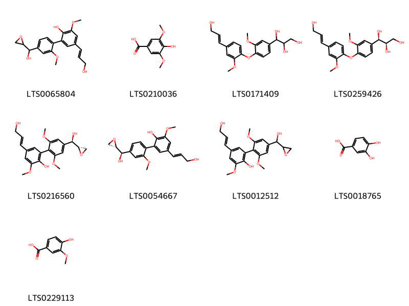
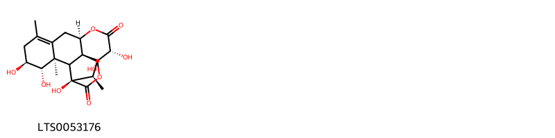
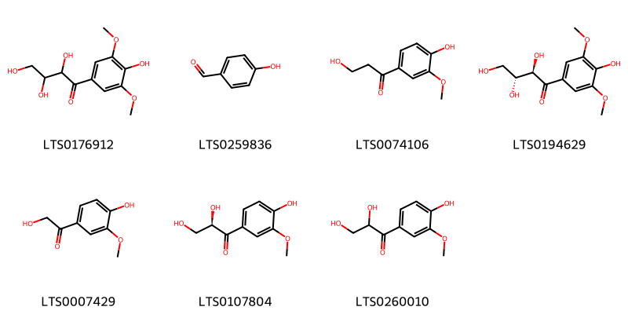
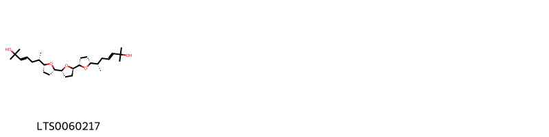
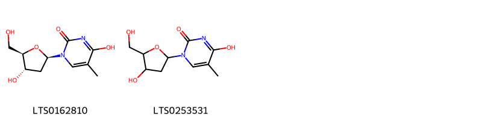

!!! abstract "Tóm tắt"

    Cây Bách bệnh có tên khoa học là Eurycoma longifolia Jack, thuộc họ Thanh thất (Simaroubaceae). Cây phân bố phổ biến ở khắp Việt Nam nhưng phổ biến nhất ở miền Trung. Ngoài ra, cây còn phân bố ở vùng khác như Borneo, Campuchia, Lào, Malaya, Myanmar, Philippines, Sumatera, Thái Lan. Trong Y học cổ truyền, dược liệu có tác dụng bổ khí huyết, ôn tỳ thận, được dùng trong các trường hợp khí huyết lưỡng hư, cơ thể yếu mệt, thiếu máu, ăn uống kém, khó tiêu, các bệnh tả, lỵ, các trường hợp sinh dục yếu, dương suy, tảo tiết; bên cạnh đó, còn dùng để chữa cảm mạo, phát sốt, sốt rét, giải độc rượu, tẩy giun. Thành phần hóa học của dược liệu bao gồm canthin-6-one alkaloid, β-carboline alkaloid, quassinoid, quassinoid diterpenoid, Eurycomaoside, tirucallane-type triterpene, dẫn xuất squalene, biphenylneolignan, eurycolactone, laurycolactone, và eurycomalactone. Các tác dụng dược lý của dược liệu từ đó được nghiên cứu chứng minh bao gồm chống sốt rét, chống ung thư, chống đái tháo đường, chống viêm, kích thích tình dục, kháng khuẩn, giải lo âu.

## Thông tin về thực vật

Dược liệu **Bách Bệnh (Rễ)** từ bộ phận **nan** từ loài *Eurycoma longifolia*.

**Mô tả thực vật:** Cây nhỏ có cành. Lá kép lông chim lẻ gồm 10 đến 36 đôi lá chét, hầu như không có cuống, hình trứng dài, dày, nhẵn hoặc có lông ở mặt dưới. Hoa và bao hoa phủ đầy lông. Quả hạch màu đỏ, nhẵn, hơi thuôn dài, đầu tù và cong, mặt trong có lông thưa và ngắn. Một hạt, trên mặt hạt có nhiều lông ngắn.

*Tài liệu tham khảo:* "Những cây thuốc và vị thuốc Việt Nam" - Đỗ Tất Lợi 
Trong dược điển Việt nam, một loài được sử dụng làm dược liệu là *Eurycoma longifolia*.

!!! info "Phân loại thực vật của *Eurycoma longifolia*"
    - **Kingdom:** Plantae
    - **Phylum:** Tracheophyta
    - **Order:** Sapindales
    - **Family:** Simaroubaceae
    - **Genus:** Eurycoma
    - **Species:** *Eurycoma longifolia*

**Phân bố trên thế giới:** Thailand, nan, Myanmar, Philippines, Brunei Darussalam, Cambodia, Malaysia, Indonesia, Singapore, Lao People’s Democratic Republic, Viet Nam

**Phân bố tại Việt nam:** Dak Lak, Khanh Hoa, Thua Thien-Hue, Đồng Nai, Hue Province, Quang Tri, Tay Ninh, Kon Tum, Quảng Nam, Thừa Thiên - Huế, Ninh Thuận, Khánh Hòa

## Thông tin về dược liệu 

### Định danh

!!! info "Thông tin về tên gọi"

    - Dược liệu tiếng Việt: nan
    - Dược liệu tiếng Trung: nan (nan)
    - Dược liệu tiếng Anh: nan
    - Dược liệu latin thông dụng: nan
    - Dược liệu latin kiểu DĐVN: *radix eurycomae longifoliae*
    - Dược liệu latin kiểu DĐVN: *nan*
    - Dược liệu latin kiểu thông tư: *nan*
    - Bộ phận dùng: nan (nan)

### Mô tả dược liệu 

- **Theo dược điển Việt nam V:** nan

- **Mô tả dược liệu theo thông tư chế biến dược liệu theo phương pháp cổ truyền:** nan

### Chế biến 

- **Chế biến theo dược điển việt nam V**: nan

- **Chế biến theo thông tư:** nan

--- 

## Thành phần hóa học

- Theo tài liệu của GS. Đỗ Tất Lợi:  (1) Nhóm hóa học: canthin-6-one alkaloid, β-carboline alkaloid, quassinoid, quassinoid diterpenoid, Eurycomaoside, tirucallane-type triterpene, dẫn xuất squalene, biphenylneolignan, eurycolactone, laurycolactone, và eurycomalactone
(2) Không có đề cập trong các Dược điển trên
    

**Thành phần hóa học từ loài **Eurycoma longifolia**

Theo cơ sở dữ liệu lotus, loài *Eurycoma longifolia* đã phân lập và xác định được **266** hoạt chất thuộc về các nhóm Fatty Acyls, Phenols, Pyrimidine nucleosides, Indolonaphthyridine alkaloids, Harmala alkaloids, Steroids and steroid derivatives, Furanoid lignans, Oxolanes, Pyridines and derivatives, Naphthofurans, Purine nucleosides, Benzene and substituted derivatives, Stilbenes, Coumarins and derivatives, Prenol lipids, Coumarans, Organooxygen compounds, Indoles and derivatives, Naphthopyrans trong bảng dưới đây. Danh sách các hoạt chất như sau (1r,2s,3s,5r,9r,10r,11r,12s,13s,16s)-3,9,12-trihydroxy-2,6,10,16-tetramethyl-14-oxatetracyclo[11.2.1.0²,¹¹.0⁵,¹⁰]hexadec-6-ene-8,15-dione [(LTS0064119)](https://lotus.naturalproducts.net/compound/lotus_id/LTS0064119), (1s,2r,10r,11r,12r,13r,16r)-12-hydroxy-2,6,10,16-tetramethyl-9,14-dioxatetracyclo[11.2.1.0²,¹¹.0⁵,¹⁰]hexadeca-4,6-diene-3,8,15-trione [(LTS0048808)](https://lotus.naturalproducts.net/compound/lotus_id/LTS0048808), 8-(acetyloxy)-4,7,17-trihydroxy-6,14,18-trimethyl-9,16-dioxo-3,10-dioxapentacyclo[9.8.0.0¹,⁷.0⁴,¹⁹.0¹³,¹⁸]nonadec-14-en-5-yl acetate [(LTS0041012)](https://lotus.naturalproducts.net/compound/lotus_id/LTS0041012), scopolin [(LTS0061811)](https://lotus.naturalproducts.net/compound/lotus_id/LTS0061811), 3,14,15-trihydroxy-2,6,9,13,16-pentamethyl-10-oxatetracyclo[7.6.1.0²,⁷.0¹²,¹⁶]hexadeca-5,7-diene-4,11-dione [(LTS0194559)](https://lotus.naturalproducts.net/compound/lotus_id/LTS0194559), (1r,2s,3s,7s,8r,9s,13r,14s,15r,16r)-3,8,14,15-tetrahydroxy-2,6,13,16-tetramethyl-10-oxatetracyclo[7.6.1.0²,⁷.0¹²,¹⁶]hexadec-5-ene-4,11-dione [(LTS0230549)](https://lotus.naturalproducts.net/compound/lotus_id/LTS0230549), (1r,2s,5r,9r,10r,11s,12s,13s,16s)-9,12-dihydroxy-2,6,10,16-tetramethyl-14-oxatetracyclo[11.2.1.0²,¹¹.0⁵,¹⁰]hexadec-6-ene-3,8,15-trione [(LTS0239199)](https://lotus.naturalproducts.net/compound/lotus_id/LTS0239199), 1-(5,6-dihydroxy-7,7-dimethyloxepan-3-yl)-3a,6,6,9a,11a-pentamethyl-1h,2h,3h,5h,5ah,8h,9h,9bh,10h,11h-cyclopenta[a]phenanthren-7-one [(LTS0129635)](https://lotus.naturalproducts.net/compound/lotus_id/LTS0129635), 9,12-dihydroxy-2,6,10,16-tetramethyl-14-oxatetracyclo[11.2.1.0²,¹¹.0⁵,¹⁰]hexadeca-4,6-diene-3,8,15-trione [(LTS0150202)](https://lotus.naturalproducts.net/compound/lotus_id/LTS0150202), 1-[5-(3,3-dimethyloxiran-2-yl)-2-hydroxyoxolan-3-yl]-3a,6,6,9a,11a-pentamethyl-1h,2h,3h,5h,5ah,8h,9h,9bh,10h,11h-cyclopenta[a]phenanthren-7-one [(LTS0039575)](https://lotus.naturalproducts.net/compound/lotus_id/LTS0039575), (1r,4r,5r,6s,7r,8r,11r,13s,17s,18s,19r)-8-(acetyloxy)-4,7,17-trihydroxy-6,14,18-trimethyl-9,16-dioxo-3,10-dioxapentacyclo[9.8.0.0¹,⁷.0⁴,¹⁹.0¹³,¹⁸]nonadec-14-en-5-yl acetate [(LTS0173540)](https://lotus.naturalproducts.net/compound/lotus_id/LTS0173540), (1r,4r,5r,7r,8r,11r,13s,17s,18s,19r)-4,5,7,8,17-pentahydroxy-14,18-dimethyl-6-methylidene-3,10-dioxapentacyclo[9.8.0.0¹,⁷.0⁴,¹⁹.0¹³,¹⁸]nonadec-14-ene-9,16-dione [(LTS0121207)](https://lotus.naturalproducts.net/compound/lotus_id/LTS0121207), 2-(6-hydroxy-2-imino-3h-purin-9-yl)-5-(hydroxymethyl)oxolane-3,4-diol [(LTS0005186)](https://lotus.naturalproducts.net/compound/lotus_id/LTS0005186), (1r,2r,3r,6r,7s,8r,9s,12s,13r,14r,15r,16r)-3,6,8,14,15-pentahydroxy-2,6,13,16-tetramethyl-10-oxatetracyclo[7.6.1.0²,⁷.0¹²,¹⁶]hexadec-4-en-11-one [(LTS0127516)](https://lotus.naturalproducts.net/compound/lotus_id/LTS0127516), 1,2-diguaiacylpropane-1,3-diol [(LTS0243974)](https://lotus.naturalproducts.net/compound/lotus_id/LTS0243974), campesterol [(LTS0046755)](https://lotus.naturalproducts.net/compound/lotus_id/LTS0046755), (1s,2s,3r,5s,8s,9s,10r,11s,12s)-8,9,11,12-tetrahydroxy-3,10-dimethyl-3-[(2r)-3-methyl-5-oxo-2h-furan-2-yl]-6,13-dioxatetracyclo[7.5.0.0¹,⁵.0²,¹²]tetradecan-7-one [(LTS0032687)](https://lotus.naturalproducts.net/compound/lotus_id/LTS0032687), (3e,6s)-6-[(2r,5s)-5-[(2r,2's,5r,5'r)-5'-[(2s,4e)-6-hydroperoxy-2-hydroxy-6-methylhept-4-en-2-yl]-2'-methyl-[2,2'-bioxolan]-5-yl]-5-methyloxolan-2-yl]-2-methylhept-3-ene-2,6-diol [(LTS0221732)](https://lotus.naturalproducts.net/compound/lotus_id/LTS0221732), (1s,3as,5ar,9ar,9br,11as)-1-[(3s,5r,6s)-5,6-dihydroxy-7,7-dimethyloxepan-3-yl]-3a,6,6,9a,11a-pentamethyl-1h,2h,3h,5h,5ah,8h,9h,9bh,10h,11h-cyclopenta[a]phenanthren-7-one [(LTS0215285)](https://lotus.naturalproducts.net/compound/lotus_id/LTS0215285), (1s,3as,5ar,7s,9ar,9bs,11as)-1-[(2s,4r)-4-[(2s)-3,3-dimethyloxiran-2-yl]-4-hydroxybutan-2-yl]-3a,6,6,9a,11a-pentamethyl-1h,2h,3h,5h,5ah,7h,8h,9h,9bh,10h,11h-cyclopenta[a]phenanthren-7-ol [(LTS0092482)](https://lotus.naturalproducts.net/compound/lotus_id/LTS0092482), 4,7,8,17-tetrahydroxy-6,14,18-trimethyl-9,16-dioxo-3,10-dioxapentacyclo[9.8.0.0¹,⁷.0⁴,¹⁹.0¹³,¹⁸]nonadec-14-en-5-yl acetate [(LTS0270732)](https://lotus.naturalproducts.net/compound/lotus_id/LTS0270732), (1s,4s,5s,6r,7s,8s,11s,13r,17r,18r,19s)-4,5,7,8,17-pentahydroxy-6,14,18-trimethyl-3,10-dioxapentacyclo[9.8.0.0¹,⁷.0⁴,¹⁹.0¹³,¹⁸]nonadec-14-ene-9,16-dione [(LTS0228534)](https://lotus.naturalproducts.net/compound/lotus_id/LTS0228534), (5r,7r,8r,11r,13s,16s,17s,18s,19r)-4,5,7,8,16,17-hexahydroxy-14,18-dimethyl-6-methylidene-3,10-dioxapentacyclo[9.8.0.0¹,⁷.0⁴,¹⁹.0¹³,¹⁸]nonadec-14-en-9-one [(LTS0118526)](https://lotus.naturalproducts.net/compound/lotus_id/LTS0118526), methyl 9h-pyrido[3,4-b]indole-1-carboxylate [(LTS0143229)](https://lotus.naturalproducts.net/compound/lotus_id/LTS0143229), (1r,2s,3s,7s,9r,12s,13r,14r,15r,16s)-3,14,15-trihydroxy-1,2,6,13,16-pentamethyl-10-oxatetracyclo[7.6.1.0²,⁷.0¹²,¹⁶]hexadec-5-ene-4,11-dione [(LTS0234394)](https://lotus.naturalproducts.net/compound/lotus_id/LTS0234394), 4,5,7,8,17-pentahydroxy-14,18-dimethyl-6-methylidene-3,10-dioxapentacyclo[9.8.0.0¹,⁷.0⁴,¹⁹.0¹³,¹⁸]nonadec-14-ene-9,16-dione [(LTS0098657)](https://lotus.naturalproducts.net/compound/lotus_id/LTS0098657), 4-hydroxy-3-methoxy-1,6-diazatetracyclo[7.6.1.0⁵,¹⁶.0¹⁰,¹⁵]hexadeca-3,5,7,9(16),10(15),11,13-heptaen-2-one [(LTS0262949)](https://lotus.naturalproducts.net/compound/lotus_id/LTS0262949), 9-methoxycanthin-6-one [(LTS0254425)](https://lotus.naturalproducts.net/compound/lotus_id/LTS0254425), 3,12,15,16-tetrahydroxy-2,6,14,17-tetramethyl-10-oxatetracyclo[7.7.1.0²,⁷.0¹³,¹⁷]heptadec-5-ene-4,11-dione [(LTS0117911)](https://lotus.naturalproducts.net/compound/lotus_id/LTS0117911), 4,9,12-trihydroxy-2,6,10,16-tetramethyl-14-oxatetracyclo[11.2.1.0²,¹¹.0⁵,¹⁰]hexadec-6-ene-3,8,15-trione [(LTS0194385)](https://lotus.naturalproducts.net/compound/lotus_id/LTS0194385), syringaldehyde [(LTS0201406)](https://lotus.naturalproducts.net/compound/lotus_id/LTS0201406), 3,9,12-trihydroxy-2,6,10,16-tetramethyl-14-oxatetracyclo[11.2.1.0²,¹¹.0⁵,¹⁰]hexadec-6-ene-8,15-dione [(LTS0022366)](https://lotus.naturalproducts.net/compound/lotus_id/LTS0022366), (1r,2r,3s,7s,8r,9s,12r,13s,14r,15r,16r,17s)-3,12,15,16-tetrahydroxy-2,6,14,17-tetramethyl-4,11-dioxo-10-oxatetracyclo[7.7.1.0²,⁷.0¹³,¹⁷]heptadec-5-en-8-yl acetate [(LTS0063049)](https://lotus.naturalproducts.net/compound/lotus_id/LTS0063049), guaiacylglycerol [(LTS0120388)](https://lotus.naturalproducts.net/compound/lotus_id/LTS0120388), (1s,2r,9r,10s,11r,12r,15r)-11-hydroxy-2,6,9,15-tetramethyl-13-oxatetracyclo[10.2.1.0²,¹⁰.0⁵,⁹]pentadeca-4,6-diene-3,8,14-trione [(LTS0220847)](https://lotus.naturalproducts.net/compound/lotus_id/LTS0220847), (1s,2r,8s,9s,10r,11r,12r,13r,16r)-8,9,12-trihydroxy-2,6,10,16-tetramethyl-14-oxatetracyclo[11.2.1.0²,¹¹.0⁵,¹⁰]hexadeca-4,6-diene-3,15-dione [(LTS0076660)](https://lotus.naturalproducts.net/compound/lotus_id/LTS0076660), (3r)-3-methoxy-1,6-diazatetracyclo[7.6.1.0⁵,¹⁶.0¹⁰,¹⁵]hexadeca-5,7,9(16),10(15),11,13-hexaen-2-one [(LTS0169713)](https://lotus.naturalproducts.net/compound/lotus_id/LTS0169713), (1s,3as,5ar,7s,9ar,9br,11as)-1-[(2s,4r)-4-[(2s)-3,3-dimethyloxiran-2-yl]-4-hydroxybutan-2-yl]-3a,6,6,9a,11a-pentamethyl-1h,2h,3h,5h,5ah,7h,8h,9h,9bh,10h,11h-cyclopenta[a]phenanthren-7-ol [(LTS0269481)](https://lotus.naturalproducts.net/compound/lotus_id/LTS0269481), 4-hydroxy-1-[4-hydroxy-5-(hydroxymethyl)oxolan-2-yl]-5-methylpyrimidin-2-one [(LTS0253531)](https://lotus.naturalproducts.net/compound/lotus_id/LTS0253531), 1,6-diazatetracyclo[7.6.1.0⁵,¹⁶.0¹⁰,¹⁵]hexadeca-3,5(16),7,9,12,14-hexaene-2,11-dione [(LTS0073015)](https://lotus.naturalproducts.net/compound/lotus_id/LTS0073015), (2s,4r,7r,8r,9r,12r)-7,8,11-trihydroxy-12-(hydroxymethyl)-2,9-dimethyl-2-[(2r)-3-methyl-5-oxo-2h-furan-2-yl]-5-oxatricyclo[6.3.1.0⁴,¹²]dodec-1(11)-ene-6,10-dione [(LTS0097399)](https://lotus.naturalproducts.net/compound/lotus_id/LTS0097399), (1s,4r)-4-(acetyloxy)-1-[(2r,5r)-5-[(2s)-2-hydroxy-6-methylhept-5-en-2-yl]-2-methyloxolan-2-yl]-4-[(2s,5r)-5-[(2s)-2-hydroxy-6-methylhept-5-en-2-yl]-2-methyloxolan-2-yl]butyl acetate [(LTS0268516)](https://lotus.naturalproducts.net/compound/lotus_id/LTS0268516), (3s,4s)-4-hydroxy-3-methoxy-1,6-diazatetracyclo[7.6.1.0⁵,¹⁶.0¹⁰,¹⁵]hexadeca-5,7,9(16),10(15),11,13-hexaen-2-one [(LTS0026130)](https://lotus.naturalproducts.net/compound/lotus_id/LTS0026130), (2r,3r)-2,3,4-trihydroxy-1-(4-hydroxy-3,5-dimethoxyphenyl)butan-1-one [(LTS0194629)](https://lotus.naturalproducts.net/compound/lotus_id/LTS0194629), 3,8,9,12-tetrahydroxy-2,6,10,16-tetramethyl-14-oxatetracyclo[11.2.1.0²,¹¹.0⁵,¹⁰]hexadec-5-ene-4,15-dione [(LTS0094060)](https://lotus.naturalproducts.net/compound/lotus_id/LTS0094060), (1r,2r,3s,7s,8r,9s,12r,13r,14s,15r,16r,17s)-3,12,13,15,16-pentahydroxy-2,6,14,17-tetramethyl-4,11-dioxo-10-oxatetracyclo[7.7.1.0²,⁷.0¹³,¹⁷]heptadec-5-en-8-yl acetate [(LTS0250348)](https://lotus.naturalproducts.net/compound/lotus_id/LTS0250348), 6-{5-[5'-(6-hydroperoxy-2-hydroxy-6-methylhept-4-en-2-yl)-2'-methyl-[2,2'-bioxolan]-5-yl]-5-methyloxolan-2-yl}-2-methylhept-3-ene-2,6-diol [(LTS0010122)](https://lotus.naturalproducts.net/compound/lotus_id/LTS0010122), 3,4-dihydroxybenzoic acid [(LTS0018765)](https://lotus.naturalproducts.net/compound/lotus_id/LTS0018765), pentyl 3-{9h-pyrido[3,4-b]indol-1-yl}propanoate [(LTS0067739)](https://lotus.naturalproducts.net/compound/lotus_id/LTS0067739), (1r,2s,3s,7s,8r,9s,12r,13s,14r,15r,16s)-3,8,12,14,15-pentahydroxy-2,6,13,16-tetramethyl-10-oxatetracyclo[7.6.1.0²,⁷.0¹²,¹⁶]hexadec-5-ene-4,11-dione [(LTS0253703)](https://lotus.naturalproducts.net/compound/lotus_id/LTS0253703), 13-methoxy-6-methyl-1,6-diazatetracyclo[7.6.1.0⁵,¹⁶.0¹⁰,¹⁵]hexadeca-4,7,9(16),10(15),11,13-hexaene-2,3-dione [(LTS0199958)](https://lotus.naturalproducts.net/compound/lotus_id/LTS0199958), (1r,4s,5r,6s,7r,8r,11r,13s,17s,18s,19r)-4,5,7,8,17-pentahydroxy-6,18-dimethyl-3,10-dioxapentacyclo[9.8.0.0¹,⁷.0⁴,¹⁹.0¹³,¹⁸]nonadec-14-ene-9,16-dione [(LTS0184335)](https://lotus.naturalproducts.net/compound/lotus_id/LTS0184335), (2s)-7-[(2s)-5-carboxy-2-(prop-1-en-2-yl)-2,3-dihydro-1-benzofuran-7-yl]-2-(prop-1-en-2-yl)-2,3-dihydro-1-benzofuran-5-carboxylic acid [(LTS0076345)](https://lotus.naturalproducts.net/compound/lotus_id/LTS0076345), (1s,2r,3r,5s,9s,10s,11s,12r,13r,16r)-3,9,12-trihydroxy-2,6,10,16-tetramethyl-14-oxatetracyclo[11.2.1.0²,¹¹.0⁵,¹⁰]hexadec-6-ene-8,15-dione [(LTS0253883)](https://lotus.naturalproducts.net/compound/lotus_id/LTS0253883), 3,12,13,15,16-pentahydroxy-2,6,14,17-tetramethyl-10-oxatetracyclo[7.7.1.0²,⁷.0¹³,¹⁷]heptadec-5-ene-4,11-dione [(LTS0054526)](https://lotus.naturalproducts.net/compound/lotus_id/LTS0054526), 8-hydroxy-1,6-diazatetracyclo[7.6.1.0⁵,¹⁶.0¹⁰,¹⁵]hexadeca-5,7,9(16),10(15),11,13-hexaen-2-one [(LTS0179188)](https://lotus.naturalproducts.net/compound/lotus_id/LTS0179188), (1r,2s,3s,7r,9r,12r,13r,14s,15r,16r,17s)-3,7,12,13,15,16-hexahydroxy-2,6,14,17-tetramethyl-10-oxatetracyclo[7.7.1.0²,⁷.0¹³,¹⁷]heptadec-5-ene-4,11-dione [(LTS0120037)](https://lotus.naturalproducts.net/compound/lotus_id/LTS0120037), (1r,2s,3s,4s,7s,8r,9s,12s,13r,14r,15r,16r)-3,4,8,14,15-pentahydroxy-2,13,16-trimethyl-6-methylidene-10-oxatetracyclo[7.6.1.0²,⁷.0¹²,¹⁶]hexadecan-11-one [(LTS0203308)](https://lotus.naturalproducts.net/compound/lotus_id/LTS0203308), 4',5',7',17'-tetrahydroxy-14',18'-dimethyl-9',16'-dioxo-3',10'-dioxaspiro[oxirane-2,6'-pentacyclo[9.8.0.0¹,⁷.0⁴,¹⁹.0¹³,¹⁸]nonadecan]-14'-en-8'-yl acetate [(LTS0011735)](https://lotus.naturalproducts.net/compound/lotus_id/LTS0011735), (1r,2r,3s,9r,12s,13r,14r,15r,16r)-3,14,15-trihydroxy-2,6,9,13,16-pentamethyl-10-oxatetracyclo[7.6.1.0²,⁷.0¹²,¹⁶]hexadeca-5,7-diene-4,11-dione [(LTS0099960)](https://lotus.naturalproducts.net/compound/lotus_id/LTS0099960), 3,8,12,14,15-pentahydroxy-2,6,13,16-tetramethyl-10-oxatetracyclo[7.6.1.0²,⁷.0¹²,¹⁶]hexadec-5-ene-4,11-dione [(LTS0067203)](https://lotus.naturalproducts.net/compound/lotus_id/LTS0067203), 14-hydroxy-13-methoxy-1,6-diazatetracyclo[7.6.1.0⁵,¹⁶.0¹⁰,¹⁵]hexadeca-3,5,7,9(16),10(15),11,13-heptaen-2-one [(LTS0221140)](https://lotus.naturalproducts.net/compound/lotus_id/LTS0221140), methyl 8,11-dihydroxy-2,6,9,15-tetramethyl-3,14-dioxo-13-oxatetracyclo[10.2.1.0²,¹⁰.0⁵,⁹]pentadeca-4,6-diene-8-carboxylate [(LTS0265489)](https://lotus.naturalproducts.net/compound/lotus_id/LTS0265489), 13-{[3,4,5-trihydroxy-6-(hydroxymethyl)oxan-2-yl]oxy}-1,6-diazatetracyclo[7.6.1.0⁵,¹⁶.0¹⁰,¹⁵]hexadeca-3,5,7,9(16),10(15),11,13-heptaen-2-one [(LTS0028637)](https://lotus.naturalproducts.net/compound/lotus_id/LTS0028637), 4,5,7,8,16,17-hexahydroxy-6,14,18-trimethyl-3,10-dioxapentacyclo[9.8.0.0¹,⁷.0⁴,¹⁹.0¹³,¹⁸]nonadec-14-en-9-one [(LTS0174813)](https://lotus.naturalproducts.net/compound/lotus_id/LTS0174813), 11-hydroxy-2,6,9,15-tetramethyl-13-oxatetracyclo[10.2.1.0²,¹⁰.0⁵,⁹]pentadec-4-ene-3,8,14-trione [(LTS0098855)](https://lotus.naturalproducts.net/compound/lotus_id/LTS0098855), (1r,2s,5r,8r,9r,10r,11s,12s,13s,16s)-8,9,12-trihydroxy-2,10,16-trimethyl-6-methylidene-14-oxatetracyclo[11.2.1.0²,¹¹.0⁵,¹⁰]hexadecane-3,15-dione [(LTS0019666)](https://lotus.naturalproducts.net/compound/lotus_id/LTS0019666), 3-(hydroxymethyl)-13-methoxy-1,6-diazatetracyclo[7.6.1.0⁵,¹⁶.0¹⁰,¹⁵]hexadeca-3,5,7,9(16),10(15),11,13-heptaen-2-one [(LTS0269745)](https://lotus.naturalproducts.net/compound/lotus_id/LTS0269745), (2r,5s,9s,10s,11r,12r,13r,16r)-9,12-dihydroxy-2,6,10,16-tetramethyl-14-oxatetracyclo[11.2.1.0²,¹¹.0⁵,¹⁰]hexadec-6-ene-3,8,15-trione [(LTS0065364)](https://lotus.naturalproducts.net/compound/lotus_id/LTS0065364), 12,13-dimethoxy-1,6-diazatetracyclo[7.6.1.0⁵,¹⁶.0¹⁰,¹⁵]hexadeca-3,5,7,9(16),10(15),11,13-heptaen-2-one [(LTS0182216)](https://lotus.naturalproducts.net/compound/lotus_id/LTS0182216), scopoletin [(LTS0193112)](https://lotus.naturalproducts.net/compound/lotus_id/LTS0193112), 3,14-dihydroxy-2,6,13,16-tetramethyl-10-oxatetracyclo[7.6.1.0²,⁷.0¹²,¹⁶]hexadec-5-ene-4,8,11-trione [(LTS0170066)](https://lotus.naturalproducts.net/compound/lotus_id/LTS0170066), (1r,2s,3s,7s,8r,9s,12s,13r,14r,15r,16r)-3,8,14,15-tetrahydroxy-2,6,13,16-tetramethyl-10-oxatetracyclo[7.6.1.0²,⁷.0¹²,¹⁶]hexadec-5-ene-4,11-dione [(LTS0213748)](https://lotus.naturalproducts.net/compound/lotus_id/LTS0213748), 13-{[3,4,5-trihydroxy-6-(hydroxymethyl)oxan-2-yl]oxy}-1,6-diazatetracyclo[7.6.1.0⁵,¹⁶.0¹⁰,¹⁵]hexadeca-5,7,9(16),10(15),11,13-hexaen-2-one [(LTS0072172)](https://lotus.naturalproducts.net/compound/lotus_id/LTS0072172), 10,13-dihydroxy-2,6,11,17-tetramethyl-7,15-dioxapentacyclo[12.2.1.0²,¹².0⁵,¹¹.0⁶,⁸]heptadec-4-ene-3,9,16-trione [(LTS0225517)](https://lotus.naturalproducts.net/compound/lotus_id/LTS0225517), (1r,3as,5ar,9ar,9bs,11as)-1-[(3s)-5-hydroxy-6-(2-hydroxypropan-2-yl)oxan-3-yl]-3a,6,6,9a,11a-pentamethyl-1h,2h,3h,5h,5ah,8h,9h,9bh,10h,11h-cyclopenta[a]phenanthren-7-one [(LTS0074054)](https://lotus.naturalproducts.net/compound/lotus_id/LTS0074054), (1r,2s,3s,7s,9r,13s,14r,15r,17s)-3,15-dihydroxy-2,6,14,17-tetramethyl-10-oxatetracyclo[7.7.1.0²,⁷.0¹³,¹⁷]heptadec-5-ene-4,11,16-trione [(LTS0017596)](https://lotus.naturalproducts.net/compound/lotus_id/LTS0017596), (1r,2r,5r,8r,9r,10r,11s,12r,13s,16s)-8,9,12-trihydroxy-2,6,10,16-tetramethyl-14-oxatetracyclo[11.2.1.0²,¹¹.0⁵,¹⁰]hexadec-6-ene-3,15-dione [(LTS0062065)](https://lotus.naturalproducts.net/compound/lotus_id/LTS0062065), (2s)-2-[(2r,5r)-5-[(2r,2's,5s,5's)-5'-[(2r)-2-hydroxy-6-methylhept-5-en-2-yl]-2'-methyl-[2,2'-bioxolan]-5-yl]-5-methyloxolan-2-yl]-6-methylhept-5-en-2-ol [(LTS0217694)](https://lotus.naturalproducts.net/compound/lotus_id/LTS0217694), (3r,4r)-3,4-dimethoxy-1,6-diazatetracyclo[7.6.1.0⁵,¹⁶.0¹⁰,¹⁵]hexadeca-5,7,9(16),10(15),11,13-hexaen-2-one [(LTS0275332)](https://lotus.naturalproducts.net/compound/lotus_id/LTS0275332), β-carboline [(LTS0263207)](https://lotus.naturalproducts.net/compound/lotus_id/LTS0263207), 4'-[(r)-hydroxy((2s)-oxiran-2-yl)methyl]-5-[(1e)-3-hydroxyprop-1-en-1-yl]-2',3,6'-trimethoxy-[1,1'-biphenyl]-2-ol [(LTS0216560)](https://lotus.naturalproducts.net/compound/lotus_id/LTS0216560), 8,9,12-trihydroxy-2,6,10,16-tetramethyl-14-oxatetracyclo[11.2.1.0²,¹¹.0⁵,¹⁰]hexadec-4-ene-3,15-dione [(LTS0246426)](https://lotus.naturalproducts.net/compound/lotus_id/LTS0246426), (1s,2r,6r,8s,9s,10r,12r,13r,16r)-8,9,12-trihydroxy-2,6,10,16-tetramethyl-14-oxatetracyclo[11.2.1.0²,¹¹.0⁵,¹⁰]hexadec-4-ene-3,15-dione [(LTS0245456)](https://lotus.naturalproducts.net/compound/lotus_id/LTS0245456), 5-methoxycanthin-6-one [(LTS0119214)](https://lotus.naturalproducts.net/compound/lotus_id/LTS0119214), (1'r,2s,5'r,7'r,8'r,11'r,13's,17's,18's,19'r)-4',5',7',8',17'-pentahydroxy-14',18'-dimethyl-3',10'-dioxaspiro[oxirane-2,6'-pentacyclo[9.8.0.0¹,⁷.0⁴,¹⁹.0¹³,¹⁸]nonadecan]-14'-ene-9',16'-dione [(LTS0245932)](https://lotus.naturalproducts.net/compound/lotus_id/LTS0245932), 13-hydroxy-1,6-diazatetracyclo[7.6.1.0⁵,¹⁶.0¹⁰,¹⁵]hexadeca-5,7,9(16),10(15),11,13-hexaen-2-one [(LTS0202212)](https://lotus.naturalproducts.net/compound/lotus_id/LTS0202212), 13-methoxy-1,6-diazatetracyclo[7.6.1.0⁵,¹⁶.0¹⁰,¹⁵]hexadeca-5,7,9(16),10(15),11,13-hexaen-2-one [(LTS0222112)](https://lotus.naturalproducts.net/compound/lotus_id/LTS0222112), (1r,2s,9r,10s,11s,12s,13s,16s)-9,12-dihydroxy-2,6,10,16-tetramethyl-14-oxatetracyclo[11.2.1.0²,¹¹.0⁵,¹⁰]hexadeca-4,6-diene-3,8,15-trione [(LTS0173448)](https://lotus.naturalproducts.net/compound/lotus_id/LTS0173448), ribonucleoside [(LTS0044502)](https://lotus.naturalproducts.net/compound/lotus_id/LTS0044502), (3r)-3-(hydroxymethyl)-1,6-diazatetracyclo[7.6.1.0⁵,¹⁶.0¹⁰,¹⁵]hexadeca-5,7,9(16),10(15),11,13-hexaen-2-one [(LTS0192349)](https://lotus.naturalproducts.net/compound/lotus_id/LTS0192349), methyl nigakinone [(LTS0123859)](https://lotus.naturalproducts.net/compound/lotus_id/LTS0123859), 11-hydroxy-12-methoxy-1,6-diazatetracyclo[7.6.1.0⁵,¹⁶.0¹⁰,¹⁵]hexadeca-3,5,7,9(16),10(15),11,13-heptaen-2-one [(LTS0005682)](https://lotus.naturalproducts.net/compound/lotus_id/LTS0005682), (1r,2r)-1-(4-{4-[(1e)-3-hydroxyprop-1-en-1-yl]-2-methoxyphenoxy}-3-methoxyphenyl)propane-1,2,3-triol [(LTS0259426)](https://lotus.naturalproducts.net/compound/lotus_id/LTS0259426), 3,15-dihydroxy-2,6,14,17-tetramethyl-10-oxatetracyclo[7.7.1.0²,⁷.0¹³,¹⁷]heptadec-5-ene-4,11,16-trione [(LTS0025551)](https://lotus.naturalproducts.net/compound/lotus_id/LTS0025551), (1r,3ar,3br,7s,9ar,9br,11ar)-1-[(2s,3e,5s)-5-ethyl-6-methylhept-3-en-2-yl]-9a,11a-dimethyl-1h,2h,3h,3ah,3bh,4h,6h,7h,8h,9h,9bh,10h,11h-cyclopenta[a]phenanthren-7-ol [(LTS0244733)](https://lotus.naturalproducts.net/compound/lotus_id/LTS0244733), 9,10,13-trihydroxy-2,6,11,17-tetramethyl-7,15-dioxapentacyclo[12.2.1.0²,¹².0⁵,¹¹.0⁶,⁸]heptadec-4-ene-3,16-dione [(LTS0041485)](https://lotus.naturalproducts.net/compound/lotus_id/LTS0041485), 13-{[(2s,3r,4s,5s,6r)-3,4,5-trihydroxy-6-(hydroxymethyl)oxan-2-yl]oxy}-1,6-diazatetracyclo[7.6.1.0⁵,¹⁶.0¹⁰,¹⁵]hexadeca-5,7,9(16),10(15),11,13-hexaen-2-one [(LTS0142844)](https://lotus.naturalproducts.net/compound/lotus_id/LTS0142844), (1r,2r,3s,5r,8r,9r,11r,12r)-8,9,11,12-tetrahydroxy-3-methyl-3-[(2r)-3-methyl-5-oxo-2h-furan-2-yl]-10-methylidene-6,13-dioxatetracyclo[7.5.0.0¹,⁵.0²,¹²]tetradecan-7-one [(LTS0053349)](https://lotus.naturalproducts.net/compound/lotus_id/LTS0053349), (1r,2s,4r,7r,8r,9s,10r,11r,12s)-7,8,10,11-tetrahydroxy-2,9,12-trimethyl-2-[(2r)-3-methyl-5-oxo-2h-furan-2-yl]-5-oxatricyclo[6.3.1.0⁴,¹²]dodecan-6-one [(LTS0108866)](https://lotus.naturalproducts.net/compound/lotus_id/LTS0108866), 3,12,13,15,16-pentahydroxy-2,6,14,17-tetramethyl-4,11-dioxo-10-oxatetracyclo[7.7.1.0²,⁷.0¹³,¹⁷]heptadec-5-en-8-yl acetate [(LTS0252440)](https://lotus.naturalproducts.net/compound/lotus_id/LTS0252440), 1-[4-(3,3-dimethyloxiran-2-yl)-4-hydroxybutan-2-yl]-3a,6,6,9a,11a-pentamethyl-1h,2h,3h,5h,5ah,7h,8h,9h,9bh,10h,11h-cyclopenta[a]phenanthren-7-ol [(LTS0041689)](https://lotus.naturalproducts.net/compound/lotus_id/LTS0041689), 2-hydroxy-1-(4-hydroxy-3-methoxyphenyl)ethanone [(LTS0007429)](https://lotus.naturalproducts.net/compound/lotus_id/LTS0007429), 11-hydroxy-2,6,9,15-tetramethyl-13-oxatetracyclo[10.2.1.0²,¹⁰.0⁵,⁹]pentadeca-4,6-diene-3,8,14-trione [(LTS0246149)](https://lotus.naturalproducts.net/compound/lotus_id/LTS0246149), 3,7,12,13,15,16-hexahydroxy-2,6,14,17-tetramethyl-10-oxatetracyclo[7.7.1.0²,⁷.0¹³,¹⁷]heptadec-5-ene-4,11-dione [(LTS0208882)](https://lotus.naturalproducts.net/compound/lotus_id/LTS0208882), (1'r,2r,4'r,5'r,7'r,8'r,11'r,13's,17's,18's,19'r)-4',5',7',8',17'-pentahydroxy-14',18'-dimethyl-3',10'-dioxaspiro[oxirane-2,6'-pentacyclo[9.8.0.0¹,⁷.0⁴,¹⁹.0¹³,¹⁸]nonadecan]-14'-ene-9',16'-dione [(LTS0125102)](https://lotus.naturalproducts.net/compound/lotus_id/LTS0125102), 12-methoxy-1,6-diazatetracyclo[7.6.1.0⁵,¹⁶.0¹⁰,¹⁵]hexadeca-5,7,9(16),10(15),11,13-hexaen-2-one [(LTS0184315)](https://lotus.naturalproducts.net/compound/lotus_id/LTS0184315), (1s,2r,6s,8s,9s,10r,12r,13r,16r)-6,8,9,12-tetrahydroxy-2,6,10,16-tetramethyl-14-oxatetracyclo[11.2.1.0²,¹¹.0⁵,¹⁰]hexadec-4-ene-3,15-dione [(LTS0124050)](https://lotus.naturalproducts.net/compound/lotus_id/LTS0124050), (1s,4r)-4-hydroxy-1-[(2r,5r)-5-[(2s)-2-hydroxy-6-methylhept-5-en-2-yl]-2-methyloxolan-2-yl]-4-[(2s,5r)-5-[(2s)-2-hydroxy-6-methylhept-5-en-2-yl]-2-methyloxolan-2-yl]butyl acetate [(LTS0126627)](https://lotus.naturalproducts.net/compound/lotus_id/LTS0126627), (1s,2r,5s,8s,9s,10s,11r,12r,13r,16r)-8,9,12-trihydroxy-2,6,10,16-tetramethyl-14-oxatetracyclo[11.2.1.0²,¹¹.0⁵,¹⁰]hexadec-6-ene-3,15-dione [(LTS0091890)](https://lotus.naturalproducts.net/compound/lotus_id/LTS0091890), (1r,2r,3s,7s,8r,9s,12s,13r,14r,15r,16r)-3,14,15-trihydroxy-2,6,13,16-tetramethyl-4,11-dioxo-10-oxatetracyclo[7.6.1.0²,⁷.0¹²,¹⁶]hexadec-5-en-8-yl acetate [(LTS0170107)](https://lotus.naturalproducts.net/compound/lotus_id/LTS0170107), (1s,3as,5as,9ar,9br,11as)-1-[(3s,5r,6s)-5,6-dihydroxy-7,7-dimethyloxepan-3-yl]-3a,6,6,9a,11a-pentamethyl-1h,2h,3h,5h,5ah,8h,9h,9bh,10h,11h-cyclopenta[a]phenanthren-7-one [(LTS0256502)](https://lotus.naturalproducts.net/compound/lotus_id/LTS0256502), eurycomanone [(LTS0136273)](https://lotus.naturalproducts.net/compound/lotus_id/LTS0136273), 2,3,4-trihydroxy-1-(4-hydroxy-3,5-dimethoxyphenyl)butan-1-one [(LTS0176912)](https://lotus.naturalproducts.net/compound/lotus_id/LTS0176912), 8,9,12-trihydroxy-2,10,16-trimethyl-6-methylidene-14-oxatetracyclo[11.2.1.0²,¹¹.0⁵,¹⁰]hexadecane-3,15-dione [(LTS0211819)](https://lotus.naturalproducts.net/compound/lotus_id/LTS0211819), (1r,4s,5r,6r,7r,8r,11r,13s,17s,18s,19r)-4,5,7,8,17-pentahydroxy-6,14,18-trimethyl-3,10-dioxapentacyclo[9.8.0.0¹,⁷.0⁴,¹⁹.0¹³,¹⁸]nonadec-14-ene-9,16-dione [(LTS0182942)](https://lotus.naturalproducts.net/compound/lotus_id/LTS0182942), 3,14,15-trihydroxy-1,2,6,13,16-pentamethyl-10-oxatetracyclo[7.6.1.0²,⁷.0¹²,¹⁶]hexadec-5-ene-4,11-dione [(LTS0101455)](https://lotus.naturalproducts.net/compound/lotus_id/LTS0101455), 6-methoxy-7-{[3,4,5-trihydroxy-6-(hydroxymethyl)oxan-2-yl]oxy}chromen-2-one [(LTS0042457)](https://lotus.naturalproducts.net/compound/lotus_id/LTS0042457), 4'-[hydroxy(oxiran-2-yl)methyl]-5-(3-hydroxyprop-1-en-1-yl)-2',3-dimethoxy-[1,1'-biphenyl]-2-ol [(LTS0065804)](https://lotus.naturalproducts.net/compound/lotus_id/LTS0065804), (1r,5s,6r,7r,8r,11r,16s,17s,18r)-5,7,8,16,17-pentahydroxy-6,14,18-trimethyl-3,10-dioxapentacyclo[9.8.0.0¹,⁷.0⁵,¹⁹.0¹³,¹⁸]nonadec-13-ene-4,9-dione [(LTS0053176)](https://lotus.naturalproducts.net/compound/lotus_id/LTS0053176), (1s,2r,5s,9s,10s,11r,12r,15r)-11-hydroxy-2,6,9,15-tetramethyl-13-oxatetracyclo[10.2.1.0²,¹⁰.0⁵,⁹]pentadec-6-ene-3,8,14-trione [(LTS0076446)](https://lotus.naturalproducts.net/compound/lotus_id/LTS0076446), (1r,2r,4s,5s,9r,10r,11r,12r,13s,16s)-4,9,12-trihydroxy-2,6,10,16-tetramethyl-14-oxatetracyclo[11.2.1.0²,¹¹.0⁵,¹⁰]hexadec-6-ene-3,8,15-trione [(LTS0246387)](https://lotus.naturalproducts.net/compound/lotus_id/LTS0246387), (1'r,2s,4'r,5'r,7'r,8'r,11'r,13's,17's,18's,19'r)-8'-(acetyloxy)-4',7',17'-trihydroxy-14',18'-dimethyl-9',16'-dioxo-3',10'-dioxaspiro[oxirane-2,6'-pentacyclo[9.8.0.0¹,⁷.0⁴,¹⁹.0¹³,¹⁸]nonadecan]-14'-en-5'-yl acetate [(LTS0267627)](https://lotus.naturalproducts.net/compound/lotus_id/LTS0267627), 4-(acetyloxy)-1,4-bis[5-(2-hydroxy-6-methylhept-5-en-2-yl)-2-methyloxolan-2-yl]butyl acetate [(LTS0159549)](https://lotus.naturalproducts.net/compound/lotus_id/LTS0159549), fraxidin [(LTS0182118)](https://lotus.naturalproducts.net/compound/lotus_id/LTS0182118), (1'r,2s,4'r,5'r,7'r,8'r,11'r,13's,17's,18's,19'r)-4',5',7',17'-tetrahydroxy-14',18'-dimethyl-9',16'-dioxo-3',10'-dioxaspiro[oxirane-2,6'-pentacyclo[9.8.0.0¹,⁷.0⁴,¹⁹.0¹³,¹⁸]nonadecan]-14'-en-8'-yl acetate [(LTS0256543)](https://lotus.naturalproducts.net/compound/lotus_id/LTS0256543), 3,13,15,16-tetrahydroxy-2,6,14,17-tetramethyl-4,11-dioxo-10-oxatetracyclo[7.7.1.0²,⁷.0¹³,¹⁷]heptadec-5-en-12-yl acetate [(LTS0015458)](https://lotus.naturalproducts.net/compound/lotus_id/LTS0015458), (1r,2r)-1-(4-hydroxy-3-methoxyphenyl)propane-1,2,3-triol [(LTS0263325)](https://lotus.naturalproducts.net/compound/lotus_id/LTS0263325), 12-hydroxy-2,6,10,16-tetramethyl-9,14-dioxatetracyclo[11.2.1.0²,¹¹.0⁵,¹⁰]hexadeca-4,6-diene-3,8,15-trione [(LTS0166752)](https://lotus.naturalproducts.net/compound/lotus_id/LTS0166752), (1s,2r,3s,7s,8r,9s,12s,13r,14r,15r,16r)-3,14,15-trihydroxy-2,6,13,16-tetramethyl-4,11-dioxo-10-oxatetracyclo[7.6.1.0²,⁷.0¹²,¹⁶]hexadec-5-en-8-yl acetate [(LTS0124471)](https://lotus.naturalproducts.net/compound/lotus_id/LTS0124471), 4,9,12-trihydroxy-2,6,10,16-tetramethyl-14-oxatetracyclo[11.2.1.0²,¹¹.0⁵,¹⁰]hexadeca-4,6-diene-3,8,15-trione [(LTS0060030)](https://lotus.naturalproducts.net/compound/lotus_id/LTS0060030), p-hydroxybenzaldehyde [(LTS0259836)](https://lotus.naturalproducts.net/compound/lotus_id/LTS0259836), (1r,4r,5r,6s,7r,8r,11r,13s,17s,18s,19r)-4,5,7,8,17-pentahydroxy-6,14,18-trimethyl-3,10-dioxapentacyclo[9.8.0.0¹,⁷.0⁴,¹⁹.0¹³,¹⁸]nonadec-14-ene-9,16-dione [(LTS0146930)](https://lotus.naturalproducts.net/compound/lotus_id/LTS0146930), (1r,2s,5s,9r,10r,11s,12s,13s,16s)-5,9,12-trihydroxy-2,6,10,16-tetramethyl-14-oxatetracyclo[11.2.1.0²,¹¹.0⁵,¹⁰]hexadec-6-ene-3,8,15-trione [(LTS0113537)](https://lotus.naturalproducts.net/compound/lotus_id/LTS0113537), 2-hydroxy-3-methoxy-1,6-diazatetracyclo[7.6.1.0⁵,¹⁶.0¹⁰,¹⁵]hexadeca-2,5,7,9(16),10(15),11,13-heptaen-4-one [(LTS0073592)](https://lotus.naturalproducts.net/compound/lotus_id/LTS0073592), 9-hydroxycanthin-6-one [(LTS0133957)](https://lotus.naturalproducts.net/compound/lotus_id/LTS0133957), 12-hydroxy-13-methoxy-1,6-diazatetracyclo[7.6.1.0⁵,¹⁶.0¹⁰,¹⁵]hexadeca-3,5,7,9(16),10(15),11,13-heptaen-2-one [(LTS0232884)](https://lotus.naturalproducts.net/compound/lotus_id/LTS0232884), 8-hydroxy-1,6-diazatetracyclo[7.6.1.0⁵,¹⁶.0¹⁰,¹⁵]hexadeca-3,5,7,9(16),10(15),11,13-heptaen-2-one [(LTS0069921)](https://lotus.naturalproducts.net/compound/lotus_id/LTS0069921), (1r,2s,3s,7s,9r,12s,13r,14r,15r,16r)-3,14,15-trihydroxy-2,6,13,16-tetramethyl-10-oxatetracyclo[7.6.1.0²,⁷.0¹²,¹⁶]hexadec-5-ene-4,11-dione [(LTS0191847)](https://lotus.naturalproducts.net/compound/lotus_id/LTS0191847), (1s,2s)-1,2-bis(4-hydroxy-3-methoxyphenyl)propane-1,3-diol [(LTS0040718)](https://lotus.naturalproducts.net/compound/lotus_id/LTS0040718), 4'-[(r)-hydroxy((2s)-oxiran-2-yl)methyl]-5-[(1e)-3-hydroxyprop-1-en-1-yl]-2',3-dimethoxy-[1,1'-biphenyl]-2-ol [(LTS0054667)](https://lotus.naturalproducts.net/compound/lotus_id/LTS0054667), (1s,2r,5r,9s,10s,11r,12r,15r)-11-hydroxy-2,6,9,15-tetramethyl-13-oxatetracyclo[10.2.1.0²,¹⁰.0⁵,⁹]pentadec-6-ene-3,8,14-trione [(LTS0136870)](https://lotus.naturalproducts.net/compound/lotus_id/LTS0136870), 4'-[hydroxy(oxiran-2-yl)methyl]-5-(3-hydroxyprop-1-en-1-yl)-2',3,6'-trimethoxy-[1,1'-biphenyl]-2-ol [(LTS0012512)](https://lotus.naturalproducts.net/compound/lotus_id/LTS0012512), (1r,2s,6s,8s,10r,11s,12s,13s,14s,17s)-10,13-dihydroxy-2,6,11,17-tetramethyl-7,15-dioxapentacyclo[12.2.1.0²,¹².0⁵,¹¹.0⁶,⁸]heptadec-4-ene-3,9,16-trione [(LTS0240061)](https://lotus.naturalproducts.net/compound/lotus_id/LTS0240061), 3-(hydroxymethyl)-1,6-diazatetracyclo[7.6.1.0⁵,¹⁶.0¹⁰,¹⁵]hexadeca-5,7,9(16),10(15),11,13-hexaen-2-one [(LTS0098582)](https://lotus.naturalproducts.net/compound/lotus_id/LTS0098582), (1r,2r,3r,6r,7s,8r,9s,12s,13r,14r,15r,16r)-6,8,14,15-tetrahydroxy-2,6,13,16-tetramethyl-3-{[(2r,3r,4s,5s,6r)-3,4,5-trihydroxy-6-(hydroxymethyl)oxan-2-yl]oxy}-10-oxatetracyclo[7.6.1.0²,⁷.0¹²,¹⁶]hexadec-4-en-11-one [(LTS0256616)](https://lotus.naturalproducts.net/compound/lotus_id/LTS0256616), (1r,4r,5r,7r,8r,11r,13s,16s,17s,18s,19r)-4,5,7,8,17-pentahydroxy-14,18-dimethyl-6-methylidene-16-{[(2r,3r,4s,5s,6r)-3,4,5-trihydroxy-6-(hydroxymethyl)oxan-2-yl]oxy}-3,10-dioxapentacyclo[9.8.0.0¹,⁷.0⁴,¹⁹.0¹³,¹⁸]nonadec-14-en-9-one [(LTS0189012)](https://lotus.naturalproducts.net/compound/lotus_id/LTS0189012), (1s,3as,5ar,9ar,9br,11as)-1-[(2r,3s,5r)-5-[(2s)-3,3-dimethyloxiran-2-yl]-2-hydroxyoxolan-3-yl]-3a,6,6,9a,11a-pentamethyl-1h,2h,3h,5h,5ah,8h,9h,9bh,10h,11h-cyclopenta[a]phenanthren-7-one [(LTS0152633)](https://lotus.naturalproducts.net/compound/lotus_id/LTS0152633), 3,12,15,16-tetrahydroxy-2,6,14,17-tetramethyl-4,11-dioxo-10-oxatetracyclo[7.7.1.0²,⁷.0¹³,¹⁷]heptadec-5-en-8-yl acetate [(LTS0109996)](https://lotus.naturalproducts.net/compound/lotus_id/LTS0109996), sitogluside [(LTS0201798)](https://lotus.naturalproducts.net/compound/lotus_id/LTS0201798), 3,14,15-trihydroxy-2,6,13,16-tetramethyl-10-oxatetracyclo[7.6.1.0²,⁷.0¹²,¹⁶]hexadec-5-ene-4,11-dione [(LTS0129805)](https://lotus.naturalproducts.net/compound/lotus_id/LTS0129805), 2-{5-[5'-(2-hydroxy-6-methylhept-5-en-2-yl)-2'-methyl-[2,2'-bioxolan]-5-yl]-5-methyloxolan-2-yl}-6-methylhept-5-en-2-ol [(LTS0061152)](https://lotus.naturalproducts.net/compound/lotus_id/LTS0061152), (1r,2s,3s,7s,9r,12r,13s,14r,15r,16r,17s)-3,12,15,16-tetrahydroxy-2,6,14,17-tetramethyl-10-oxatetracyclo[7.7.1.0²,⁷.0¹³,¹⁷]heptadec-5-ene-4,11-dione [(LTS0085724)](https://lotus.naturalproducts.net/compound/lotus_id/LTS0085724), (1s,4s,5s,6r,7r,8s,11s,13r,17r,18r,19s)-4,5,7,8,17-pentahydroxy-6,14,18-trimethyl-3,10-dioxapentacyclo[9.8.0.0¹,⁷.0⁴,¹⁹.0¹³,¹⁸]nonadec-14-ene-9,16-dione [(LTS0067341)](https://lotus.naturalproducts.net/compound/lotus_id/LTS0067341), 3-{9h-pyrido[3,4-b]indol-1-yl}propanoic acid [(LTS0071266)](https://lotus.naturalproducts.net/compound/lotus_id/LTS0071266), (1r,2s,9s,11s,12s,15s)-11-hydroxy-2,6,9,15-tetramethyl-13-oxatetracyclo[10.2.1.0²,¹⁰.0⁵,⁹]pentadeca-4,6-diene-3,8,14-trione [(LTS0203228)](https://lotus.naturalproducts.net/compound/lotus_id/LTS0203228), (1s,2r,3r,8s,9s,10r,11s,12r,13r,16r)-3,8,9,12-tetrahydroxy-2,6,10,16-tetramethyl-14-oxatetracyclo[11.2.1.0²,¹¹.0⁵,¹⁰]hexadec-5-ene-4,15-dione [(LTS0187034)](https://lotus.naturalproducts.net/compound/lotus_id/LTS0187034), (1s,2r,4r,5s,9s,10r,11r,12r,13r,16r)-4,9,12-trihydroxy-2,6,10,16-tetramethyl-14-oxatetracyclo[11.2.1.0²,¹¹.0⁵,¹⁰]hexadec-6-ene-3,8,15-trione [(LTS0218349)](https://lotus.naturalproducts.net/compound/lotus_id/LTS0218349), (1s,3as,5ar,9ar,9br,11as)-3a,6,6,9a,11a-pentamethyl-1-[(2s,4r,5s)-4,5,6-trihydroxy-6-methylheptan-2-yl]-1h,2h,3h,5h,5ah,8h,9h,9bh,10h,11h-cyclopenta[a]phenanthren-7-one [(LTS0189980)](https://lotus.naturalproducts.net/compound/lotus_id/LTS0189980), (1r,2s,6s,8r,9r,10s,11s,12s,13s,16s)-8,9,12-trihydroxy-2,6,10,16-tetramethyl-14-oxatetracyclo[11.2.1.0²,¹¹.0⁵,¹⁰]hexadec-4-ene-3,15-dione [(LTS0005421)](https://lotus.naturalproducts.net/compound/lotus_id/LTS0005421), (1s,2r,4r,5s,8s,9s,10r,11r,12r,13r,16r)-4,8,9,12-tetrahydroxy-2,6,10,16-tetramethyl-14-oxatetracyclo[11.2.1.0²,¹¹.0⁵,¹⁰]hexadec-6-ene-3,15-dione [(LTS0033172)](https://lotus.naturalproducts.net/compound/lotus_id/LTS0033172), 4,5,7,8,17-pentahydroxy-6,14,18-trimethyl-3,10-dioxapentacyclo[9.8.0.0¹,⁷.0⁴,¹⁹.0¹³,¹⁸]nonadec-14-ene-9,16-dione [(LTS0117536)](https://lotus.naturalproducts.net/compound/lotus_id/LTS0117536), 10-hydroxycanthin-6-one [(LTS0074837)](https://lotus.naturalproducts.net/compound/lotus_id/LTS0074837), 5,9,12-trihydroxy-2,6,10,16-tetramethyl-14-oxatetracyclo[11.2.1.0²,¹¹.0⁵,¹⁰]hexadec-6-ene-3,8,15-trione [(LTS0215384)](https://lotus.naturalproducts.net/compound/lotus_id/LTS0215384), 6,8,14,15-tetrahydroxy-2,6,13,16-tetramethyl-3-{[3,4,5-trihydroxy-6-(hydroxymethyl)oxan-2-yl]oxy}-10-oxatetracyclo[7.6.1.0²,⁷.0¹²,¹⁶]hexadec-4-en-11-one [(LTS0086648)](https://lotus.naturalproducts.net/compound/lotus_id/LTS0086648), canthin-6-one [(LTS0216343)](https://lotus.naturalproducts.net/compound/lotus_id/LTS0216343), (1s,2r,9r,10s,11r,12r,15r)-7-chloro-11-hydroxy-2,6,9,15-tetramethyl-13-oxatetracyclo[10.2.1.0²,¹⁰.0⁵,⁹]pentadeca-4,6-diene-3,8,14-trione [(LTS0259298)](https://lotus.naturalproducts.net/compound/lotus_id/LTS0259298), 12,13-dimethoxy-1,6-diazatetracyclo[7.6.1.0⁵,¹⁶.0¹⁰,¹⁵]hexadeca-5,7,9(16),10(15),11,13-hexaen-2-one [(LTS0135286)](https://lotus.naturalproducts.net/compound/lotus_id/LTS0135286), 3a,6,6,9a,11a-pentamethyl-1-(4,5,6-trihydroxy-6-methylheptan-2-yl)-1h,2h,3h,5h,5ah,8h,9h,9bh,10h,11h-cyclopenta[a]phenanthren-7-one [(LTS0097158)](https://lotus.naturalproducts.net/compound/lotus_id/LTS0097158), 3,14,15-trihydroxy-2,6,13,16-tetramethyl-4,11-dioxo-10-oxatetracyclo[7.6.1.0²,⁷.0¹²,¹⁶]hexadec-5-en-8-yl acetate [(LTS0092696)](https://lotus.naturalproducts.net/compound/lotus_id/LTS0092696), 2,3-dihydroxy-1-(4-hydroxy-3-methoxyphenyl)propan-1-one [(LTS0260010)](https://lotus.naturalproducts.net/compound/lotus_id/LTS0260010), methyl (1s,2r,8r,9r,10r,11r,12r,15r)-8,11-dihydroxy-2,6,9,15-tetramethyl-3,14-dioxo-13-oxatetracyclo[10.2.1.0²,¹⁰.0⁵,⁹]pentadeca-4,6-diene-8-carboxylate [(LTS0232155)](https://lotus.naturalproducts.net/compound/lotus_id/LTS0232155), 4-hydroxy-3-methoxy-1,6-diazatetracyclo[7.6.1.0⁵,¹⁶.0¹⁰,¹⁵]hexadeca-5,7,9(16),10(15),11,13-hexaen-2-one [(LTS0100427)](https://lotus.naturalproducts.net/compound/lotus_id/LTS0100427), (1s,2r,9s,11r,12r,15r)-11-hydroxy-2,6,9,15-tetramethyl-13-oxatetracyclo[10.2.1.0²,¹⁰.0⁵,⁹]pentadec-6-ene-3,8,14-trione [(LTS0032311)](https://lotus.naturalproducts.net/compound/lotus_id/LTS0032311), 1-[4-(3,3-dimethyloxiran-2-yl)-4-hydroxybutan-2-yl]-3a,6,6,9a,11a-pentamethyl-1h,2h,3h,5h,5ah,8h,9h,9bh,10h,11h-cyclopenta[a]phenanthren-7-one [(LTS0095321)](https://lotus.naturalproducts.net/compound/lotus_id/LTS0095321), adenosine [(LTS0014061)](https://lotus.naturalproducts.net/compound/lotus_id/LTS0014061), 4',5',7',8',17'-pentahydroxy-14',18'-dimethyl-3',10'-dioxaspiro[oxirane-2,6'-pentacyclo[9.8.0.0¹,⁷.0⁴,¹⁹.0¹³,¹⁸]nonadecan]-14'-ene-9',16'-dione [(LTS0062456)](https://lotus.naturalproducts.net/compound/lotus_id/LTS0062456), niacin [(LTS0216673)](https://lotus.naturalproducts.net/compound/lotus_id/LTS0216673), (1s,3as,5as,9ar,9br,11as)-3a,6,6,9a,11a-pentamethyl-1-[(2s,4r,5s)-4,5,6-trihydroxy-6-methylheptan-2-yl]-1h,2h,3h,5h,5ah,8h,9h,9bh,10h,11h-cyclopenta[a]phenanthren-7-one [(LTS0000660)](https://lotus.naturalproducts.net/compound/lotus_id/LTS0000660), (1r,4r,5r,6s,7r,8r,11r,13s,16s,17s,18s,19r)-4,5,7,8,16,17-hexahydroxy-6,14,18-trimethyl-3,10-dioxapentacyclo[9.8.0.0¹,⁷.0⁴,¹⁹.0¹³,¹⁸]nonadec-14-en-9-one [(LTS0137783)](https://lotus.naturalproducts.net/compound/lotus_id/LTS0137783), (3e,6s)-6-[(2r,5s)-5-[(2r,2's,5r,5'r)-5'-[(2s,4e)-6-hydroxy-6-methylhept-4-en-2-yl]-[2,2'-bioxolan]-5-yl]oxolan-2-yl]-2-methylhept-3-en-2-ol [(LTS0060217)](https://lotus.naturalproducts.net/compound/lotus_id/LTS0060217), (1r,3ar,3br,7s,9ar,9br,11ar)-1-[(2r,5r)-5,6-dimethylheptan-2-yl]-9a,11a-dimethyl-1h,2h,3h,3ah,3bh,4h,6h,7h,8h,9h,9bh,10h,11h-cyclopenta[a]phenanthren-7-ol [(LTS0015450)](https://lotus.naturalproducts.net/compound/lotus_id/LTS0015450), (1r,4r,7r,11s,13r,18s,19s)-4,5,7,8,17-pentahydroxy-14,18-dimethyl-6-methylidene-3,10-dioxapentacyclo[9.8.0.0¹,⁷.0⁴,¹⁹.0¹³,¹⁸]nonadec-14-ene-9,16-dione [(LTS0149273)](https://lotus.naturalproducts.net/compound/lotus_id/LTS0149273), (1r,2s,9s,10r,11s,12s,15s)-7-chloro-11-hydroxy-2,6,9,15-tetramethyl-13-oxatetracyclo[10.2.1.0²,¹⁰.0⁵,⁹]pentadeca-4,6-diene-3,8,14-trione [(LTS0063026)](https://lotus.naturalproducts.net/compound/lotus_id/LTS0063026), (1s,3as,5as,9ar,9br,11as)-1-[(2s,3s,5r)-5-[(2s)-3,3-dimethyloxiran-2-yl]-2-hydroxyoxolan-3-yl]-3a,6,6,9a,11a-pentamethyl-1h,2h,3h,5h,5ah,8h,9h,9bh,10h,11h-cyclopenta[a]phenanthren-7-one [(LTS0030076)](https://lotus.naturalproducts.net/compound/lotus_id/LTS0030076), vanillic acid [(LTS0229113)](https://lotus.naturalproducts.net/compound/lotus_id/LTS0229113), 3,8,14,15-tetrahydroxy-2,6,13,16-tetramethyl-10-oxatetracyclo[7.6.1.0²,⁷.0¹²,¹⁶]hexadec-5-ene-4,11-dione [(LTS0110336)](https://lotus.naturalproducts.net/compound/lotus_id/LTS0110336), (1s,2r,9s,10r,11r,12r,13r,16r)-4,9,12-trihydroxy-2,6,10,16-tetramethyl-14-oxatetracyclo[11.2.1.0²,¹¹.0⁵,¹⁰]hexadeca-4,6-diene-3,8,15-trione [(LTS0072722)](https://lotus.naturalproducts.net/compound/lotus_id/LTS0072722), (1s,2r,3s,5r,9s,10r,11r,12r)-11,12-dihydroxy-3,10-dimethyl-3-[(2s)-3-methyl-5-oxo-2h-furan-2-yl]-6,13-dioxatetracyclo[7.5.0.0¹,⁵.0²,¹²]tetradecan-7-one [(LTS0258557)](https://lotus.naturalproducts.net/compound/lotus_id/LTS0258557), 12-methoxy-1,6-diazatetracyclo[7.6.1.0⁵,¹⁶.0¹⁰,¹⁵]hexadeca-3,5,7,9(16),10(15),11,13-heptaen-2-one [(LTS0195910)](https://lotus.naturalproducts.net/compound/lotus_id/LTS0195910), 13-{[(2s,3r,4s,5s,6r)-3,4,5-trihydroxy-6-(hydroxymethyl)oxan-2-yl]oxy}-1,6-diazatetracyclo[7.6.1.0⁵,¹⁶.0¹⁰,¹⁵]hexadeca-3,5,7,9(16),10(15),11,13-heptaen-2-one [(LTS0106779)](https://lotus.naturalproducts.net/compound/lotus_id/LTS0106779), (1s,3as,5ar,9ar,9br,11as)-1-[(2s,4r)-4-[(2s)-3,3-dimethyloxiran-2-yl]-4-hydroxybutan-2-yl]-3a,6,6,9a,11a-pentamethyl-1h,2h,3h,5h,5ah,8h,9h,9bh,10h,11h-cyclopenta[a]phenanthren-7-one [(LTS0248938)](https://lotus.naturalproducts.net/compound/lotus_id/LTS0248938), 3,8,12,13,15,16-hexahydroxy-2,6,14,17-tetramethyl-10-oxatetracyclo[7.7.1.0²,⁷.0¹³,¹⁷]heptadec-5-ene-4,11-dione [(LTS0223204)](https://lotus.naturalproducts.net/compound/lotus_id/LTS0223204), 7,8,10,11-tetrahydroxy-2,9,12-trimethyl-2-(3-methyl-5-oxo-2h-furan-2-yl)-5-oxatricyclo[6.3.1.0⁴,¹²]dodecan-6-one [(LTS0217137)](https://lotus.naturalproducts.net/compound/lotus_id/LTS0217137), 8-hydroxy-13-methoxy-1,6-diazatetracyclo[7.6.1.0⁵,¹⁶.0¹⁰,¹⁵]hexadeca-3,5,7,9(16),10(15),11,13-heptaen-2-one [(LTS0261774)](https://lotus.naturalproducts.net/compound/lotus_id/LTS0261774), (1s,2r,3r,6s,7s,8r,9s,12s,13r,14r,15r,16r)-6,8,14,15-tetrahydroxy-2,6,13,16-tetramethyl-3-{[(2r,3r,4s,5s,6r)-3,4,5-trihydroxy-6-(hydroxymethyl)oxan-2-yl]oxy}-10-oxatetracyclo[7.6.1.0²,⁷.0¹²,¹⁶]hexadec-4-en-11-one [(LTS0074511)](https://lotus.naturalproducts.net/compound/lotus_id/LTS0074511), 4-hydroxy-1,4-bis[5-(2-hydroxy-6-methylhept-5-en-2-yl)-2-methyloxolan-2-yl]butyl acetate [(LTS0185912)](https://lotus.naturalproducts.net/compound/lotus_id/LTS0185912), 4,5,6,7,8,17-hexahydroxy-6-(hydroxymethyl)-14,18-dimethyl-3,10-dioxapentacyclo[9.8.0.0¹,⁷.0⁴,¹⁹.0¹³,¹⁸]nonadec-14-ene-9,16-dione [(LTS0077989)](https://lotus.naturalproducts.net/compound/lotus_id/LTS0077989), 2-{[1-(5-ethyl-6-methylheptan-2-yl)-9a,11a-dimethyl-1h,2h,3h,3ah,3bh,4h,6h,7h,8h,9h,9bh,10h,11h-cyclopenta[a]phenanthren-7-yl]oxy}-6-(hydroxymethyl)oxane-3,4,5-triol [(LTS0158828)](https://lotus.naturalproducts.net/compound/lotus_id/LTS0158828), (1r,2s,3s,7s,8r,9s,12r,13r,14s,15r,16r,17s)-3,8,12,13,15,16-hexahydroxy-2,6,14,17-tetramethyl-10-oxatetracyclo[7.7.1.0²,⁷.0¹³,¹⁷]heptadec-5-ene-4,11-dione [(LTS0091295)](https://lotus.naturalproducts.net/compound/lotus_id/LTS0091295), phytosterol [(LTS0029311)](https://lotus.naturalproducts.net/compound/lotus_id/LTS0029311), 7-chloro-11-hydroxy-2,6,9,15-tetramethyl-13-oxatetracyclo[10.2.1.0²,¹⁰.0⁵,⁹]pentadeca-4,6-diene-3,8,14-trione [(LTS0078995)](https://lotus.naturalproducts.net/compound/lotus_id/LTS0078995), 8,9,11,12-tetrahydroxy-3,10-dimethyl-3-(3-methyl-5-oxo-2h-furan-2-yl)-6,13-dioxatetracyclo[7.5.0.0¹,⁵.0²,¹²]tetradecan-7-one [(LTS0216308)](https://lotus.naturalproducts.net/compound/lotus_id/LTS0216308), (1r,4r,5r,6r,7r,8r,11r,13s,17s,18s,19r)-4,5,6,7,8,17-hexahydroxy-6-(hydroxymethyl)-14,18-dimethyl-3,10-dioxapentacyclo[9.8.0.0¹,⁷.0⁴,¹⁹.0¹³,¹⁸]nonadec-14-ene-9,16-dione [(LTS0047601)](https://lotus.naturalproducts.net/compound/lotus_id/LTS0047601), (1r,2s,3s,7s,9r,13s,14r,15s,17s)-3,15-dihydroxy-2,6,14,17-tetramethyl-10-oxatetracyclo[7.7.1.0²,⁷.0¹³,¹⁷]heptadec-5-ene-4,11,16-trione [(LTS0247389)](https://lotus.naturalproducts.net/compound/lotus_id/LTS0247389), 14-hydroxy-13-methoxy-1,6-diazatetracyclo[7.6.1.0⁵,¹⁶.0¹⁰,¹⁵]hexadeca-5,7,9(16),10(15),11,13-hexaen-2-one [(LTS0025654)](https://lotus.naturalproducts.net/compound/lotus_id/LTS0025654), (1s,2r,6r,9r,11r,12r,15r)-11-hydroxy-2,6,9,15-tetramethyl-13-oxatetracyclo[10.2.1.0²,¹⁰.0⁵,⁹]pentadec-4-ene-3,8,14-trione [(LTS0137748)](https://lotus.naturalproducts.net/compound/lotus_id/LTS0137748), (1r,2r,6s,8s,9r,10r,11s,12r,13s,16s)-8,9,12-trihydroxy-2,6,10,16-tetramethyl-14-oxatetracyclo[11.2.1.0²,¹¹.0⁵,¹⁰]hexadec-4-ene-3,15-dione [(LTS0259280)](https://lotus.naturalproducts.net/compound/lotus_id/LTS0259280), 4-{4-[(4-hydroxy-3-methoxyphenyl)methyl]-3-(hydroxymethyl)oxolan-2-yl}-2-methoxyphenol [(LTS0211349)](https://lotus.naturalproducts.net/compound/lotus_id/LTS0211349), 3,13-dimethoxy-1,6-diazatetracyclo[7.6.1.0⁵,¹⁶.0¹⁰,¹⁵]hexadeca-3,5,7,9(16),10(15),11,13-heptaen-2-one [(LTS0152663)](https://lotus.naturalproducts.net/compound/lotus_id/LTS0152663), (2s,4r,7r,8s,12r)-7,8,11-trihydroxy-12-(hydroxymethyl)-2-methyl-2-[(2r)-3-methyl-5-oxo-2h-furan-2-yl]-9-methylidene-5-oxatricyclo[6.3.1.0⁴,¹²]dodec-1(11)-ene-6,10-dione [(LTS0153402)](https://lotus.naturalproducts.net/compound/lotus_id/LTS0153402), (1'r,2s,4'r,5'r,7'r,8'r,11'r,13's,17's,18's,19'r)-4',5',7',8',17'-pentahydroxy-14',18'-dimethyl-3',10'-dioxaspiro[oxirane-2,6'-pentacyclo[9.8.0.0¹,⁷.0⁴,¹⁹.0¹³,¹⁸]nonadecan]-14'-ene-9',16'-dione [(LTS0056857)](https://lotus.naturalproducts.net/compound/lotus_id/LTS0056857), 1-(methoxymethyl)-9h-pyrido[3,4-b]indole [(LTS0125114)](https://lotus.naturalproducts.net/compound/lotus_id/LTS0125114), 3-(hydroxymethyl)-13-methoxy-1,6-diazatetracyclo[7.6.1.0⁵,¹⁶.0¹⁰,¹⁵]hexadeca-5,7,9(16),10(15),11,13-hexaen-2-one [(LTS0118790)](https://lotus.naturalproducts.net/compound/lotus_id/LTS0118790), (1s,2s,3s,7s,8r,9s,12s,13r,14r,15r,16r)-3,8,14,15-tetrahydroxy-2,6,13,16-tetramethyl-10-oxatetracyclo[7.6.1.0²,⁷.0¹²,¹⁶]hexadec-5-ene-4,11-dione [(LTS0207646)](https://lotus.naturalproducts.net/compound/lotus_id/LTS0207646), syringic acid [(LTS0210036)](https://lotus.naturalproducts.net/compound/lotus_id/LTS0210036), 11-hydroxycanthin-6-one [(LTS0031951)](https://lotus.naturalproducts.net/compound/lotus_id/LTS0031951), (1'r,2s,4's,5'r,7'r,8'r,11'r,13's,17's,18's,19'r)-4',5',7',8',17'-pentahydroxy-14',18'-dimethyl-3',10'-dioxaspiro[oxirane-2,6'-pentacyclo[9.8.0.0¹,⁷.0⁴,¹⁹.0¹³,¹⁸]nonadecan]-14'-ene-9',16'-dione [(LTS0003405)](https://lotus.naturalproducts.net/compound/lotus_id/LTS0003405), 3-hydroxy-1-(4-hydroxy-3-methoxyphenyl)propan-1-one [(LTS0074106)](https://lotus.naturalproducts.net/compound/lotus_id/LTS0074106), 3-{7-methoxy-9h-pyrido[3,4-b]indol-1-yl}propanoic acid [(LTS0240424)](https://lotus.naturalproducts.net/compound/lotus_id/LTS0240424), eurycomalactone [(LTS0059455)](https://lotus.naturalproducts.net/compound/lotus_id/LTS0059455), (1r,2r,3s,5r,9r,10r,11s,12r,13s,16r)-3,9,12-trihydroxy-2,6,10,16-tetramethyl-14-oxatetracyclo[11.2.1.0²,¹¹.0⁵,¹⁰]hexadec-6-ene-8,15-dione [(LTS0198774)](https://lotus.naturalproducts.net/compound/lotus_id/LTS0198774), (1s,2r,9s,10r,11r,12r,13r,16r)-9,12-dihydroxy-2,6,10,16-tetramethyl-14-oxatetracyclo[11.2.1.0²,¹¹.0⁵,¹⁰]hexadeca-4,6-diene-3,8,15-trione [(LTS0198988)](https://lotus.naturalproducts.net/compound/lotus_id/LTS0198988), (1s,2r,8s,9s,10s,11r,12r,13r,16r)-8,9,12-trihydroxy-2,6,10,16-tetramethyl-14-oxatetracyclo[11.2.1.0²,¹¹.0⁵,¹⁰]hexadec-6-ene-3,15-dione [(LTS0223997)](https://lotus.naturalproducts.net/compound/lotus_id/LTS0223997), (1r,2s,6r,8s,9s,10r,11s,12s,13s,14s,17s)-9,10,13-trihydroxy-2,6,11,17-tetramethyl-7,15-dioxapentacyclo[12.2.1.0²,¹².0⁵,¹¹.0⁶,⁸]heptadec-4-ene-3,16-dione [(LTS0254360)](https://lotus.naturalproducts.net/compound/lotus_id/LTS0254360), 3-[2-(1-methylpyridin-4-ylidene)ethylidene]indole [(LTS0087465)](https://lotus.naturalproducts.net/compound/lotus_id/LTS0087465), (2s,4r,7r,8r,9s,12r)-7,8,11-trihydroxy-12-(hydroxymethyl)-2,9-dimethyl-2-[(2r)-3-methyl-5-oxo-2h-furan-2-yl]-5-oxatricyclo[6.3.1.0⁴,¹²]dodec-1(11)-ene-6,10-dione [(LTS0241734)](https://lotus.naturalproducts.net/compound/lotus_id/LTS0241734), 4-[(2s,3s,4r)-4-[(4-hydroxy-3-methoxyphenyl)methyl]-3-(hydroxymethyl)oxolan-2-yl]-2-methoxyphenol [(LTS0196286)](https://lotus.naturalproducts.net/compound/lotus_id/LTS0196286), (1r,2s,8s,9r,10r,11r,12r,13s,16r)-8,9,12-trihydroxy-2,6,10,16-tetramethyl-14-oxatetracyclo[11.2.1.0²,¹¹.0⁵,¹⁰]hexadeca-4,6-diene-3,15-dione [(LTS0145080)](https://lotus.naturalproducts.net/compound/lotus_id/LTS0145080), 7-[5-carboxy-2-(prop-1-en-2-yl)-2,3-dihydro-1-benzofuran-7-yl]-2-(prop-1-en-2-yl)-2,3-dihydro-1-benzofuran-5-carboxylic acid [(LTS0152508)](https://lotus.naturalproducts.net/compound/lotus_id/LTS0152508), (1r,4r,5r,6r,7r,8r,11r,13s,16s,17s,18s,19r)-4,5,6,7,8,16,17-heptahydroxy-6-(hydroxymethyl)-14,18-dimethyl-3,10-dioxapentacyclo[9.8.0.0¹,⁷.0⁴,¹⁹.0¹³,¹⁸]nonadec-14-en-9-one [(LTS0274084)](https://lotus.naturalproducts.net/compound/lotus_id/LTS0274084), 3,4-dimethoxy-1,6-diazatetracyclo[7.6.1.0⁵,¹⁶.0¹⁰,¹⁵]hexadeca-5,7,9(16),10(15),11,13-hexaen-2-one [(LTS0058383)](https://lotus.naturalproducts.net/compound/lotus_id/LTS0058383), 3-methoxy-1,6-diazatetracyclo[7.6.1.0⁵,¹⁶.0¹⁰,¹⁵]hexadeca-5,7,9(16),10(15),11,13-hexaen-2-one [(LTS0276092)](https://lotus.naturalproducts.net/compound/lotus_id/LTS0276092), (1r,2s,5r,8r,9r,10r,11s,12s,13s,16s)-8,9,12-trihydroxy-2,6,10,16-tetramethyl-14-oxatetracyclo[11.2.1.0²,¹¹.0⁵,¹⁰]hexadec-6-ene-3,15-dione [(LTS0134247)](https://lotus.naturalproducts.net/compound/lotus_id/LTS0134247), 6-methyl-1,6-diazatetracyclo[7.6.1.0⁵,¹⁶.0¹⁰,¹⁵]hexadeca-4,7,9(16),10(15),11,13-hexaene-2,3-dione [(LTS0034610)](https://lotus.naturalproducts.net/compound/lotus_id/LTS0034610), 11-hydroxy-2,6,9,15-tetramethyl-13-oxatetracyclo[10.2.1.0²,¹⁰.0⁵,⁹]pentadec-6-ene-3,8,14-trione [(LTS0122455)](https://lotus.naturalproducts.net/compound/lotus_id/LTS0122455), (1s,2s,3s,7r,9s,12s,13s,14s,16r)-3,14-dihydroxy-2,6,13,16-tetramethyl-10-oxatetracyclo[7.6.1.0²,⁷.0¹²,¹⁶]hexadec-5-ene-4,8,11-trione [(LTS0241508)](https://lotus.naturalproducts.net/compound/lotus_id/LTS0241508), (1r,2s,3s,7s,9r,12r,13r,14s,15r,16r,17s)-3,13,15,16-tetrahydroxy-2,6,14,17-tetramethyl-4,11-dioxo-10-oxatetracyclo[7.7.1.0²,⁷.0¹³,¹⁷]heptadec-5-en-12-yl acetate [(LTS0123998)](https://lotus.naturalproducts.net/compound/lotus_id/LTS0123998), (3s)-3-(hydroxymethyl)-13-methoxy-1,6-diazatetracyclo[7.6.1.0⁵,¹⁶.0¹⁰,¹⁵]hexadeca-5,7,9(16),10(15),11,13-hexaen-2-one [(LTS0019610)](https://lotus.naturalproducts.net/compound/lotus_id/LTS0019610), 1,6-diazatetracyclo[7.6.1.0⁵,¹⁶.0¹⁰,¹⁵]hexadeca-3,5(16),7,9,11,14-hexaene-2,13-dione [(LTS0234932)](https://lotus.naturalproducts.net/compound/lotus_id/LTS0234932), 8'-(acetyloxy)-4',7',17'-trihydroxy-14',18'-dimethyl-9',16'-dioxo-3',10'-dioxaspiro[oxirane-2,6'-pentacyclo[9.8.0.0¹,⁷.0⁴,¹⁹.0¹³,¹⁸]nonadecan]-14'-en-5'-yl acetate [(LTS0231451)](https://lotus.naturalproducts.net/compound/lotus_id/LTS0231451), (3as,5ar,9ar,9br,11as)-1-[4-(3,3-dimethyloxiran-2-yl)-4-hydroxybutan-2-yl]-3a,6,6,9a,11a-pentamethyl-1h,2h,3h,5h,5ah,8h,9h,9bh,10h,11h-cyclopenta[a]phenanthren-7-one [(LTS0274890)](https://lotus.naturalproducts.net/compound/lotus_id/LTS0274890), (1s,2r,6r,9r,10s,11r,12r,15r)-11-hydroxy-2,6,9,15-tetramethyl-13-oxatetracyclo[10.2.1.0²,¹⁰.0⁵,⁹]pentadec-4-ene-3,8,14-trione [(LTS0029558)](https://lotus.naturalproducts.net/compound/lotus_id/LTS0029558), 4,8,9,12-tetrahydroxy-2,6,10,16-tetramethyl-14-oxatetracyclo[11.2.1.0²,¹¹.0⁵,¹⁰]hexadec-6-ene-3,15-dione [(LTS0041206)](https://lotus.naturalproducts.net/compound/lotus_id/LTS0041206), (2r)-2,3-dihydroxy-1-(4-hydroxy-3-methoxyphenyl)propan-1-one [(LTS0107804)](https://lotus.naturalproducts.net/compound/lotus_id/LTS0107804), eurycomanone [(LTS0089470)](https://lotus.naturalproducts.net/compound/lotus_id/LTS0089470), (1r,4r,5r,7r,8r,11r,13s,16s,17s,18s,19r)-4,5,7,8,16,17-hexahydroxy-14,18-dimethyl-6-methylidene-3,10-dioxapentacyclo[9.8.0.0¹,⁷.0⁴,¹⁹.0¹³,¹⁸]nonadec-14-en-9-one [(LTS0273283)](https://lotus.naturalproducts.net/compound/lotus_id/LTS0273283), 3-(hydroxymethyl)-1,6-diazatetracyclo[7.6.1.0⁵,¹⁶.0¹⁰,¹⁵]hexadeca-3,5,7,9(16),10(15),11,13-heptaen-2-one [(LTS0063491)](https://lotus.naturalproducts.net/compound/lotus_id/LTS0063491), 9,12-dihydroxy-2,6,10,16-tetramethyl-14-oxatetracyclo[11.2.1.0²,¹¹.0⁵,¹⁰]hexadec-6-ene-3,8,15-trione [(LTS0151999)](https://lotus.naturalproducts.net/compound/lotus_id/LTS0151999), 4,5,7,8,17-pentahydroxy-14,18-dimethyl-6-methylidene-16-{[3,4,5-trihydroxy-6-(hydroxymethyl)oxan-2-yl]oxy}-3,10-dioxapentacyclo[9.8.0.0¹,⁷.0⁴,¹⁹.0¹³,¹⁸]nonadec-14-en-9-one [(LTS0190639)](https://lotus.naturalproducts.net/compound/lotus_id/LTS0190639), 8-hydroxy-13-methoxy-1,6-diazatetracyclo[7.6.1.0⁵,¹⁶.0¹⁰,¹⁵]hexadeca-5,7,9(16),10(15),11,13-hexaen-2-one [(LTS0261408)](https://lotus.naturalproducts.net/compound/lotus_id/LTS0261408), 4,5,6,7,8,16,17-heptahydroxy-6-(hydroxymethyl)-14,18-dimethyl-3,10-dioxapentacyclo[9.8.0.0¹,⁷.0⁴,¹⁹.0¹³,¹⁸]nonadec-14-en-9-one [(LTS0145243)](https://lotus.naturalproducts.net/compound/lotus_id/LTS0145243), (1s,3as,5as,9ar,9br,11as)-1-[(2s,4r)-4-[(2s)-3,3-dimethyloxiran-2-yl]-4-hydroxybutan-2-yl]-3a,6,6,9a,11a-pentamethyl-1h,2h,3h,5h,5ah,8h,9h,9bh,10h,11h-cyclopenta[a]phenanthren-7-one [(LTS0005566)](https://lotus.naturalproducts.net/compound/lotus_id/LTS0005566), 8,9,12-trihydroxy-2,6,10,16-tetramethyl-14-oxatetracyclo[11.2.1.0²,¹¹.0⁵,¹⁰]hexadeca-4,6-diene-3,15-dione [(LTS0015030)](https://lotus.naturalproducts.net/compound/lotus_id/LTS0015030), (1r,2r,4s,5r,8s,9r,10s,11s,12r,13s,16s)-4,8,9,12-tetrahydroxy-2,6,10,16-tetramethyl-14-oxatetracyclo[11.2.1.0²,¹¹.0⁵,¹⁰]hexadec-6-ene-3,15-dione [(LTS0102063)](https://lotus.naturalproducts.net/compound/lotus_id/LTS0102063), thymidine [(LTS0162810)](https://lotus.naturalproducts.net/compound/lotus_id/LTS0162810), 8,9,12-trihydroxy-2,6,10,16-tetramethyl-14-oxatetracyclo[11.2.1.0²,¹¹.0⁵,¹⁰]hexadec-6-ene-3,15-dione [(LTS0194225)](https://lotus.naturalproducts.net/compound/lotus_id/LTS0194225), adenosine [(LTS0052576)](https://lotus.naturalproducts.net/compound/lotus_id/LTS0052576), 4,5,7,8,16,17-hexahydroxy-14,18-dimethyl-6-methylidene-3,10-dioxapentacyclo[9.8.0.0¹,⁷.0⁴,¹⁹.0¹³,¹⁸]nonadec-14-en-9-one [(LTS0037159)](https://lotus.naturalproducts.net/compound/lotus_id/LTS0037159), (1r,2s,8r,9r,10s,11s,12s,13s,16s)-8,9,12-trihydroxy-2,6,10,16-tetramethyl-14-oxatetracyclo[11.2.1.0²,¹¹.0⁵,¹⁰]hexadeca-4,6-diene-3,15-dione [(LTS0010032)](https://lotus.naturalproducts.net/compound/lotus_id/LTS0010032), stigmasterol [(LTS0024262)](https://lotus.naturalproducts.net/compound/lotus_id/LTS0024262), (1r,4r,5r,6s,7r,8r,11r,13s,17s,18s,19r)-4,7,8,17-tetrahydroxy-6,14,18-trimethyl-9,16-dioxo-3,10-dioxapentacyclo[9.8.0.0¹,⁷.0⁴,¹⁹.0¹³,¹⁸]nonadec-14-en-5-yl acetate [(LTS0260838)](https://lotus.naturalproducts.net/compound/lotus_id/LTS0260838), 1-{4-[4-(3-hydroxyprop-1-en-1-yl)-2-methoxyphenoxy]-3-methoxyphenyl}propane-1,2,3-triol [(LTS0171409)](https://lotus.naturalproducts.net/compound/lotus_id/LTS0171409), (3e,6r)-6-[(2r,5s)-5-[(2r,2's,5r,5'r)-5'-[(2r,4e)-6-hydroperoxy-2-hydroxy-6-methylhept-4-en-2-yl]-2'-methyl-[2,2'-bioxolan]-5-yl]-5-methyloxolan-2-yl]-2-methylhept-3-ene-2,6-diol [(LTS0093503)](https://lotus.naturalproducts.net/compound/lotus_id/LTS0093503), 1,6-diazatetracyclo[7.6.1.0⁵,¹⁶.0¹⁰,¹⁵]hexadeca-5,7,9(16),10(15),11,13-hexaen-2-one [(LTS0102173)](https://lotus.naturalproducts.net/compound/lotus_id/LTS0102173), (1r,2s,3s,7s,9r,12r,13r,14s,15r,16r,17s)-3,12,13,15,16-pentahydroxy-2,6,14,17-tetramethyl-10-oxatetracyclo[7.7.1.0²,⁷.0¹³,¹⁷]heptadec-5-ene-4,11-dione [(LTS0115850)](https://lotus.naturalproducts.net/compound/lotus_id/LTS0115850). 
        
| chemicalTaxonomyClassyfireClass     |   smiles_count |
|:------------------------------------|---------------:|
| Benzene and substituted derivatives |            353 |
| Coumarans                           |            127 |
| Coumarins and derivatives           |            148 |
| Fatty Acyls                         |            285 |
| Furanoid lignans                    |             93 |
| Harmala alkaloids                   |            155 |
| Indoles and derivatives             |             24 |
| Indolonaphthyridine alkaloids       |           1594 |
| Naphthofurans                       |            146 |
| Naphthopyrans                       |             96 |
| Organooxygen compounds              |            179 |
| Oxolanes                            |             99 |
| Phenols                             |             75 |
| Prenol lipids                       |          10319 |
| Purine nucleosides                  |            170 |
| Pyridines and derivatives           |             14 |
| Pyrimidine nucleosides              |             73 |
| Steroids and steroid derivatives    |           4152 |
| Stilbenes                           |             83 |

            
### Nhóm Benzene and substituted derivatives
<figure markdown="span">
    { width=100% }
<figcaption>Hình ảnh cấu trúc hóa học của hoạt chất thuộc nhóm *Benzene and substituted derivatives*. Tên thường gọi của các hoạt chất tương ứng là 4'-[hydroxy(oxiran-2-yl)methyl]-5-(3-hydroxyprop-1-en-1-yl)-2',3-dimethoxy-[1,1'-biphenyl]-2-ol [(LTS0065804)](https://lotus.naturalproducts.net/compound/lotus_id/LTS0065804), syringic acid [(LTS0210036)](https://lotus.naturalproducts.net/compound/lotus_id/LTS0210036), 1-{4-[4-(3-hydroxyprop-1-en-1-yl)-2-methoxyphenoxy]-3-methoxyphenyl}propane-1,2,3-triol [(LTS0171409)](https://lotus.naturalproducts.net/compound/lotus_id/LTS0171409), (1r,2r)-1-(4-{4-[(1e)-3-hydroxyprop-1-en-1-yl]-2-methoxyphenoxy}-3-methoxyphenyl)propane-1,2,3-triol [(LTS0259426)](https://lotus.naturalproducts.net/compound/lotus_id/LTS0259426), 4'-[(r)-hydroxy((2s)-oxiran-2-yl)methyl]-5-[(1e)-3-hydroxyprop-1-en-1-yl]-2',3,6'-trimethoxy-[1,1'-biphenyl]-2-ol [(LTS0216560)](https://lotus.naturalproducts.net/compound/lotus_id/LTS0216560), 4'-[(r)-hydroxy((2s)-oxiran-2-yl)methyl]-5-[(1e)-3-hydroxyprop-1-en-1-yl]-2',3-dimethoxy-[1,1'-biphenyl]-2-ol [(LTS0054667)](https://lotus.naturalproducts.net/compound/lotus_id/LTS0054667), 4'-[hydroxy(oxiran-2-yl)methyl]-5-(3-hydroxyprop-1-en-1-yl)-2',3,6'-trimethoxy-[1,1'-biphenyl]-2-ol [(LTS0012512)](https://lotus.naturalproducts.net/compound/lotus_id/LTS0012512), 3,4-dihydroxybenzoic acid [(LTS0018765)](https://lotus.naturalproducts.net/compound/lotus_id/LTS0018765), vanillic acid [(LTS0229113)](https://lotus.naturalproducts.net/compound/lotus_id/LTS0229113).</figcaption>
</figure>

            
            
### Nhóm Benzene and substituted derivatives
<figure markdown="span">
    { width=100% }
<figcaption>Hình ảnh cấu trúc hóa học của hoạt chất thuộc nhóm *Benzene and substituted derivatives*. Tên thường gọi của các hoạt chất tương ứng là 4'-[hydroxy(oxiran-2-yl)methyl]-5-(3-hydroxyprop-1-en-1-yl)-2',3-dimethoxy-[1,1'-biphenyl]-2-ol [(LTS0065804)](https://lotus.naturalproducts.net/compound/lotus_id/LTS0065804), syringic acid [(LTS0210036)](https://lotus.naturalproducts.net/compound/lotus_id/LTS0210036), 1-{4-[4-(3-hydroxyprop-1-en-1-yl)-2-methoxyphenoxy]-3-methoxyphenyl}propane-1,2,3-triol [(LTS0171409)](https://lotus.naturalproducts.net/compound/lotus_id/LTS0171409), (1r,2r)-1-(4-{4-[(1e)-3-hydroxyprop-1-en-1-yl]-2-methoxyphenoxy}-3-methoxyphenyl)propane-1,2,3-triol [(LTS0259426)](https://lotus.naturalproducts.net/compound/lotus_id/LTS0259426), 4'-[(r)-hydroxy((2s)-oxiran-2-yl)methyl]-5-[(1e)-3-hydroxyprop-1-en-1-yl]-2',3,6'-trimethoxy-[1,1'-biphenyl]-2-ol [(LTS0216560)](https://lotus.naturalproducts.net/compound/lotus_id/LTS0216560), 4'-[(r)-hydroxy((2s)-oxiran-2-yl)methyl]-5-[(1e)-3-hydroxyprop-1-en-1-yl]-2',3-dimethoxy-[1,1'-biphenyl]-2-ol [(LTS0054667)](https://lotus.naturalproducts.net/compound/lotus_id/LTS0054667), 4'-[hydroxy(oxiran-2-yl)methyl]-5-(3-hydroxyprop-1-en-1-yl)-2',3,6'-trimethoxy-[1,1'-biphenyl]-2-ol [(LTS0012512)](https://lotus.naturalproducts.net/compound/lotus_id/LTS0012512), 3,4-dihydroxybenzoic acid [(LTS0018765)](https://lotus.naturalproducts.net/compound/lotus_id/LTS0018765), vanillic acid [(LTS0229113)](https://lotus.naturalproducts.net/compound/lotus_id/LTS0229113).</figcaption>
</figure>

### Nhóm Coumarans
<figure markdown="span">
    { width=100% }
<figcaption>Hình ảnh cấu trúc hóa học của hoạt chất thuộc nhóm *Coumarans*. Tên thường gọi của các hoạt chất tương ứng là (2s)-7-[(2s)-5-carboxy-2-(prop-1-en-2-yl)-2,3-dihydro-1-benzofuran-7-yl]-2-(prop-1-en-2-yl)-2,3-dihydro-1-benzofuran-5-carboxylic acid [(LTS0076345)](https://lotus.naturalproducts.net/compound/lotus_id/LTS0076345), 7-[5-carboxy-2-(prop-1-en-2-yl)-2,3-dihydro-1-benzofuran-7-yl]-2-(prop-1-en-2-yl)-2,3-dihydro-1-benzofuran-5-carboxylic acid [(LTS0152508)](https://lotus.naturalproducts.net/compound/lotus_id/LTS0152508).</figcaption>
</figure>

            
            
### Nhóm Benzene and substituted derivatives
<figure markdown="span">
    { width=100% }
<figcaption>Hình ảnh cấu trúc hóa học của hoạt chất thuộc nhóm *Benzene and substituted derivatives*. Tên thường gọi của các hoạt chất tương ứng là 4'-[hydroxy(oxiran-2-yl)methyl]-5-(3-hydroxyprop-1-en-1-yl)-2',3-dimethoxy-[1,1'-biphenyl]-2-ol [(LTS0065804)](https://lotus.naturalproducts.net/compound/lotus_id/LTS0065804), syringic acid [(LTS0210036)](https://lotus.naturalproducts.net/compound/lotus_id/LTS0210036), 1-{4-[4-(3-hydroxyprop-1-en-1-yl)-2-methoxyphenoxy]-3-methoxyphenyl}propane-1,2,3-triol [(LTS0171409)](https://lotus.naturalproducts.net/compound/lotus_id/LTS0171409), (1r,2r)-1-(4-{4-[(1e)-3-hydroxyprop-1-en-1-yl]-2-methoxyphenoxy}-3-methoxyphenyl)propane-1,2,3-triol [(LTS0259426)](https://lotus.naturalproducts.net/compound/lotus_id/LTS0259426), 4'-[(r)-hydroxy((2s)-oxiran-2-yl)methyl]-5-[(1e)-3-hydroxyprop-1-en-1-yl]-2',3,6'-trimethoxy-[1,1'-biphenyl]-2-ol [(LTS0216560)](https://lotus.naturalproducts.net/compound/lotus_id/LTS0216560), 4'-[(r)-hydroxy((2s)-oxiran-2-yl)methyl]-5-[(1e)-3-hydroxyprop-1-en-1-yl]-2',3-dimethoxy-[1,1'-biphenyl]-2-ol [(LTS0054667)](https://lotus.naturalproducts.net/compound/lotus_id/LTS0054667), 4'-[hydroxy(oxiran-2-yl)methyl]-5-(3-hydroxyprop-1-en-1-yl)-2',3,6'-trimethoxy-[1,1'-biphenyl]-2-ol [(LTS0012512)](https://lotus.naturalproducts.net/compound/lotus_id/LTS0012512), 3,4-dihydroxybenzoic acid [(LTS0018765)](https://lotus.naturalproducts.net/compound/lotus_id/LTS0018765), vanillic acid [(LTS0229113)](https://lotus.naturalproducts.net/compound/lotus_id/LTS0229113).</figcaption>
</figure>

### Nhóm Coumarans
<figure markdown="span">
    { width=100% }
<figcaption>Hình ảnh cấu trúc hóa học của hoạt chất thuộc nhóm *Coumarans*. Tên thường gọi của các hoạt chất tương ứng là (2s)-7-[(2s)-5-carboxy-2-(prop-1-en-2-yl)-2,3-dihydro-1-benzofuran-7-yl]-2-(prop-1-en-2-yl)-2,3-dihydro-1-benzofuran-5-carboxylic acid [(LTS0076345)](https://lotus.naturalproducts.net/compound/lotus_id/LTS0076345), 7-[5-carboxy-2-(prop-1-en-2-yl)-2,3-dihydro-1-benzofuran-7-yl]-2-(prop-1-en-2-yl)-2,3-dihydro-1-benzofuran-5-carboxylic acid [(LTS0152508)](https://lotus.naturalproducts.net/compound/lotus_id/LTS0152508).</figcaption>
</figure>

### Nhóm Coumarins and derivatives
<figure markdown="span">
    { width=100% }
<figcaption>Hình ảnh cấu trúc hóa học của hoạt chất thuộc nhóm *Coumarins and derivatives*. Tên thường gọi của các hoạt chất tương ứng là scopoletin [(LTS0193112)](https://lotus.naturalproducts.net/compound/lotus_id/LTS0193112), fraxidin [(LTS0182118)](https://lotus.naturalproducts.net/compound/lotus_id/LTS0182118), scopolin [(LTS0061811)](https://lotus.naturalproducts.net/compound/lotus_id/LTS0061811), 6-methoxy-7-{[3,4,5-trihydroxy-6-(hydroxymethyl)oxan-2-yl]oxy}chromen-2-one [(LTS0042457)](https://lotus.naturalproducts.net/compound/lotus_id/LTS0042457).</figcaption>
</figure>

            
            
### Nhóm Benzene and substituted derivatives
<figure markdown="span">
    { width=100% }
<figcaption>Hình ảnh cấu trúc hóa học của hoạt chất thuộc nhóm *Benzene and substituted derivatives*. Tên thường gọi của các hoạt chất tương ứng là 4'-[hydroxy(oxiran-2-yl)methyl]-5-(3-hydroxyprop-1-en-1-yl)-2',3-dimethoxy-[1,1'-biphenyl]-2-ol [(LTS0065804)](https://lotus.naturalproducts.net/compound/lotus_id/LTS0065804), syringic acid [(LTS0210036)](https://lotus.naturalproducts.net/compound/lotus_id/LTS0210036), 1-{4-[4-(3-hydroxyprop-1-en-1-yl)-2-methoxyphenoxy]-3-methoxyphenyl}propane-1,2,3-triol [(LTS0171409)](https://lotus.naturalproducts.net/compound/lotus_id/LTS0171409), (1r,2r)-1-(4-{4-[(1e)-3-hydroxyprop-1-en-1-yl]-2-methoxyphenoxy}-3-methoxyphenyl)propane-1,2,3-triol [(LTS0259426)](https://lotus.naturalproducts.net/compound/lotus_id/LTS0259426), 4'-[(r)-hydroxy((2s)-oxiran-2-yl)methyl]-5-[(1e)-3-hydroxyprop-1-en-1-yl]-2',3,6'-trimethoxy-[1,1'-biphenyl]-2-ol [(LTS0216560)](https://lotus.naturalproducts.net/compound/lotus_id/LTS0216560), 4'-[(r)-hydroxy((2s)-oxiran-2-yl)methyl]-5-[(1e)-3-hydroxyprop-1-en-1-yl]-2',3-dimethoxy-[1,1'-biphenyl]-2-ol [(LTS0054667)](https://lotus.naturalproducts.net/compound/lotus_id/LTS0054667), 4'-[hydroxy(oxiran-2-yl)methyl]-5-(3-hydroxyprop-1-en-1-yl)-2',3,6'-trimethoxy-[1,1'-biphenyl]-2-ol [(LTS0012512)](https://lotus.naturalproducts.net/compound/lotus_id/LTS0012512), 3,4-dihydroxybenzoic acid [(LTS0018765)](https://lotus.naturalproducts.net/compound/lotus_id/LTS0018765), vanillic acid [(LTS0229113)](https://lotus.naturalproducts.net/compound/lotus_id/LTS0229113).</figcaption>
</figure>

### Nhóm Coumarans
<figure markdown="span">
    { width=100% }
<figcaption>Hình ảnh cấu trúc hóa học của hoạt chất thuộc nhóm *Coumarans*. Tên thường gọi của các hoạt chất tương ứng là (2s)-7-[(2s)-5-carboxy-2-(prop-1-en-2-yl)-2,3-dihydro-1-benzofuran-7-yl]-2-(prop-1-en-2-yl)-2,3-dihydro-1-benzofuran-5-carboxylic acid [(LTS0076345)](https://lotus.naturalproducts.net/compound/lotus_id/LTS0076345), 7-[5-carboxy-2-(prop-1-en-2-yl)-2,3-dihydro-1-benzofuran-7-yl]-2-(prop-1-en-2-yl)-2,3-dihydro-1-benzofuran-5-carboxylic acid [(LTS0152508)](https://lotus.naturalproducts.net/compound/lotus_id/LTS0152508).</figcaption>
</figure>

### Nhóm Coumarins and derivatives
<figure markdown="span">
    { width=100% }
<figcaption>Hình ảnh cấu trúc hóa học của hoạt chất thuộc nhóm *Coumarins and derivatives*. Tên thường gọi của các hoạt chất tương ứng là scopoletin [(LTS0193112)](https://lotus.naturalproducts.net/compound/lotus_id/LTS0193112), fraxidin [(LTS0182118)](https://lotus.naturalproducts.net/compound/lotus_id/LTS0182118), scopolin [(LTS0061811)](https://lotus.naturalproducts.net/compound/lotus_id/LTS0061811), 6-methoxy-7-{[3,4,5-trihydroxy-6-(hydroxymethyl)oxan-2-yl]oxy}chromen-2-one [(LTS0042457)](https://lotus.naturalproducts.net/compound/lotus_id/LTS0042457).</figcaption>
</figure>

### Nhóm Fatty Acyls
<figure markdown="span">
    { width=100% }
<figcaption>Hình ảnh cấu trúc hóa học của hoạt chất thuộc nhóm *Fatty Acyls*. Tên thường gọi của các hoạt chất tương ứng là 11-hydroxy-2,6,9,15-tetramethyl-13-oxatetracyclo[10.2.1.0²,¹⁰.0⁵,⁹]pentadec-6-ene-3,8,14-trione [(LTS0122455)](https://lotus.naturalproducts.net/compound/lotus_id/LTS0122455), (1s,2r,5s,9s,10s,11r,12r,15r)-11-hydroxy-2,6,9,15-tetramethyl-13-oxatetracyclo[10.2.1.0²,¹⁰.0⁵,⁹]pentadec-6-ene-3,8,14-trione [(LTS0076446)](https://lotus.naturalproducts.net/compound/lotus_id/LTS0076446), (1s,2r,9s,11r,12r,15r)-11-hydroxy-2,6,9,15-tetramethyl-13-oxatetracyclo[10.2.1.0²,¹⁰.0⁵,⁹]pentadec-6-ene-3,8,14-trione [(LTS0032311)](https://lotus.naturalproducts.net/compound/lotus_id/LTS0032311), (1s,2r,5r,9s,10s,11r,12r,15r)-11-hydroxy-2,6,9,15-tetramethyl-13-oxatetracyclo[10.2.1.0²,¹⁰.0⁵,⁹]pentadec-6-ene-3,8,14-trione [(LTS0136870)](https://lotus.naturalproducts.net/compound/lotus_id/LTS0136870).</figcaption>
</figure>

            
            
### Nhóm Benzene and substituted derivatives
<figure markdown="span">
    { width=100% }
<figcaption>Hình ảnh cấu trúc hóa học của hoạt chất thuộc nhóm *Benzene and substituted derivatives*. Tên thường gọi của các hoạt chất tương ứng là 4'-[hydroxy(oxiran-2-yl)methyl]-5-(3-hydroxyprop-1-en-1-yl)-2',3-dimethoxy-[1,1'-biphenyl]-2-ol [(LTS0065804)](https://lotus.naturalproducts.net/compound/lotus_id/LTS0065804), syringic acid [(LTS0210036)](https://lotus.naturalproducts.net/compound/lotus_id/LTS0210036), 1-{4-[4-(3-hydroxyprop-1-en-1-yl)-2-methoxyphenoxy]-3-methoxyphenyl}propane-1,2,3-triol [(LTS0171409)](https://lotus.naturalproducts.net/compound/lotus_id/LTS0171409), (1r,2r)-1-(4-{4-[(1e)-3-hydroxyprop-1-en-1-yl]-2-methoxyphenoxy}-3-methoxyphenyl)propane-1,2,3-triol [(LTS0259426)](https://lotus.naturalproducts.net/compound/lotus_id/LTS0259426), 4'-[(r)-hydroxy((2s)-oxiran-2-yl)methyl]-5-[(1e)-3-hydroxyprop-1-en-1-yl]-2',3,6'-trimethoxy-[1,1'-biphenyl]-2-ol [(LTS0216560)](https://lotus.naturalproducts.net/compound/lotus_id/LTS0216560), 4'-[(r)-hydroxy((2s)-oxiran-2-yl)methyl]-5-[(1e)-3-hydroxyprop-1-en-1-yl]-2',3-dimethoxy-[1,1'-biphenyl]-2-ol [(LTS0054667)](https://lotus.naturalproducts.net/compound/lotus_id/LTS0054667), 4'-[hydroxy(oxiran-2-yl)methyl]-5-(3-hydroxyprop-1-en-1-yl)-2',3,6'-trimethoxy-[1,1'-biphenyl]-2-ol [(LTS0012512)](https://lotus.naturalproducts.net/compound/lotus_id/LTS0012512), 3,4-dihydroxybenzoic acid [(LTS0018765)](https://lotus.naturalproducts.net/compound/lotus_id/LTS0018765), vanillic acid [(LTS0229113)](https://lotus.naturalproducts.net/compound/lotus_id/LTS0229113).</figcaption>
</figure>

### Nhóm Coumarans
<figure markdown="span">
    { width=100% }
<figcaption>Hình ảnh cấu trúc hóa học của hoạt chất thuộc nhóm *Coumarans*. Tên thường gọi của các hoạt chất tương ứng là (2s)-7-[(2s)-5-carboxy-2-(prop-1-en-2-yl)-2,3-dihydro-1-benzofuran-7-yl]-2-(prop-1-en-2-yl)-2,3-dihydro-1-benzofuran-5-carboxylic acid [(LTS0076345)](https://lotus.naturalproducts.net/compound/lotus_id/LTS0076345), 7-[5-carboxy-2-(prop-1-en-2-yl)-2,3-dihydro-1-benzofuran-7-yl]-2-(prop-1-en-2-yl)-2,3-dihydro-1-benzofuran-5-carboxylic acid [(LTS0152508)](https://lotus.naturalproducts.net/compound/lotus_id/LTS0152508).</figcaption>
</figure>

### Nhóm Coumarins and derivatives
<figure markdown="span">
    { width=100% }
<figcaption>Hình ảnh cấu trúc hóa học của hoạt chất thuộc nhóm *Coumarins and derivatives*. Tên thường gọi của các hoạt chất tương ứng là scopoletin [(LTS0193112)](https://lotus.naturalproducts.net/compound/lotus_id/LTS0193112), fraxidin [(LTS0182118)](https://lotus.naturalproducts.net/compound/lotus_id/LTS0182118), scopolin [(LTS0061811)](https://lotus.naturalproducts.net/compound/lotus_id/LTS0061811), 6-methoxy-7-{[3,4,5-trihydroxy-6-(hydroxymethyl)oxan-2-yl]oxy}chromen-2-one [(LTS0042457)](https://lotus.naturalproducts.net/compound/lotus_id/LTS0042457).</figcaption>
</figure>

### Nhóm Fatty Acyls
<figure markdown="span">
    { width=100% }
<figcaption>Hình ảnh cấu trúc hóa học của hoạt chất thuộc nhóm *Fatty Acyls*. Tên thường gọi của các hoạt chất tương ứng là 11-hydroxy-2,6,9,15-tetramethyl-13-oxatetracyclo[10.2.1.0²,¹⁰.0⁵,⁹]pentadec-6-ene-3,8,14-trione [(LTS0122455)](https://lotus.naturalproducts.net/compound/lotus_id/LTS0122455), (1s,2r,5s,9s,10s,11r,12r,15r)-11-hydroxy-2,6,9,15-tetramethyl-13-oxatetracyclo[10.2.1.0²,¹⁰.0⁵,⁹]pentadec-6-ene-3,8,14-trione [(LTS0076446)](https://lotus.naturalproducts.net/compound/lotus_id/LTS0076446), (1s,2r,9s,11r,12r,15r)-11-hydroxy-2,6,9,15-tetramethyl-13-oxatetracyclo[10.2.1.0²,¹⁰.0⁵,⁹]pentadec-6-ene-3,8,14-trione [(LTS0032311)](https://lotus.naturalproducts.net/compound/lotus_id/LTS0032311), (1s,2r,5r,9s,10s,11r,12r,15r)-11-hydroxy-2,6,9,15-tetramethyl-13-oxatetracyclo[10.2.1.0²,¹⁰.0⁵,⁹]pentadec-6-ene-3,8,14-trione [(LTS0136870)](https://lotus.naturalproducts.net/compound/lotus_id/LTS0136870).</figcaption>
</figure>

### Nhóm Furanoid lignans
<figure markdown="span">
    { width=100% }
<figcaption>Hình ảnh cấu trúc hóa học của hoạt chất thuộc nhóm *Furanoid lignans*. Tên thường gọi của các hoạt chất tương ứng là 4-{4-[(4-hydroxy-3-methoxyphenyl)methyl]-3-(hydroxymethyl)oxolan-2-yl}-2-methoxyphenol [(LTS0211349)](https://lotus.naturalproducts.net/compound/lotus_id/LTS0211349), 4-[(2s,3s,4r)-4-[(4-hydroxy-3-methoxyphenyl)methyl]-3-(hydroxymethyl)oxolan-2-yl]-2-methoxyphenol [(LTS0196286)](https://lotus.naturalproducts.net/compound/lotus_id/LTS0196286).</figcaption>
</figure>

            
            
### Nhóm Benzene and substituted derivatives
<figure markdown="span">
    { width=100% }
<figcaption>Hình ảnh cấu trúc hóa học của hoạt chất thuộc nhóm *Benzene and substituted derivatives*. Tên thường gọi của các hoạt chất tương ứng là 4'-[hydroxy(oxiran-2-yl)methyl]-5-(3-hydroxyprop-1-en-1-yl)-2',3-dimethoxy-[1,1'-biphenyl]-2-ol [(LTS0065804)](https://lotus.naturalproducts.net/compound/lotus_id/LTS0065804), syringic acid [(LTS0210036)](https://lotus.naturalproducts.net/compound/lotus_id/LTS0210036), 1-{4-[4-(3-hydroxyprop-1-en-1-yl)-2-methoxyphenoxy]-3-methoxyphenyl}propane-1,2,3-triol [(LTS0171409)](https://lotus.naturalproducts.net/compound/lotus_id/LTS0171409), (1r,2r)-1-(4-{4-[(1e)-3-hydroxyprop-1-en-1-yl]-2-methoxyphenoxy}-3-methoxyphenyl)propane-1,2,3-triol [(LTS0259426)](https://lotus.naturalproducts.net/compound/lotus_id/LTS0259426), 4'-[(r)-hydroxy((2s)-oxiran-2-yl)methyl]-5-[(1e)-3-hydroxyprop-1-en-1-yl]-2',3,6'-trimethoxy-[1,1'-biphenyl]-2-ol [(LTS0216560)](https://lotus.naturalproducts.net/compound/lotus_id/LTS0216560), 4'-[(r)-hydroxy((2s)-oxiran-2-yl)methyl]-5-[(1e)-3-hydroxyprop-1-en-1-yl]-2',3-dimethoxy-[1,1'-biphenyl]-2-ol [(LTS0054667)](https://lotus.naturalproducts.net/compound/lotus_id/LTS0054667), 4'-[hydroxy(oxiran-2-yl)methyl]-5-(3-hydroxyprop-1-en-1-yl)-2',3,6'-trimethoxy-[1,1'-biphenyl]-2-ol [(LTS0012512)](https://lotus.naturalproducts.net/compound/lotus_id/LTS0012512), 3,4-dihydroxybenzoic acid [(LTS0018765)](https://lotus.naturalproducts.net/compound/lotus_id/LTS0018765), vanillic acid [(LTS0229113)](https://lotus.naturalproducts.net/compound/lotus_id/LTS0229113).</figcaption>
</figure>

### Nhóm Coumarans
<figure markdown="span">
    { width=100% }
<figcaption>Hình ảnh cấu trúc hóa học của hoạt chất thuộc nhóm *Coumarans*. Tên thường gọi của các hoạt chất tương ứng là (2s)-7-[(2s)-5-carboxy-2-(prop-1-en-2-yl)-2,3-dihydro-1-benzofuran-7-yl]-2-(prop-1-en-2-yl)-2,3-dihydro-1-benzofuran-5-carboxylic acid [(LTS0076345)](https://lotus.naturalproducts.net/compound/lotus_id/LTS0076345), 7-[5-carboxy-2-(prop-1-en-2-yl)-2,3-dihydro-1-benzofuran-7-yl]-2-(prop-1-en-2-yl)-2,3-dihydro-1-benzofuran-5-carboxylic acid [(LTS0152508)](https://lotus.naturalproducts.net/compound/lotus_id/LTS0152508).</figcaption>
</figure>

### Nhóm Coumarins and derivatives
<figure markdown="span">
    { width=100% }
<figcaption>Hình ảnh cấu trúc hóa học của hoạt chất thuộc nhóm *Coumarins and derivatives*. Tên thường gọi của các hoạt chất tương ứng là scopoletin [(LTS0193112)](https://lotus.naturalproducts.net/compound/lotus_id/LTS0193112), fraxidin [(LTS0182118)](https://lotus.naturalproducts.net/compound/lotus_id/LTS0182118), scopolin [(LTS0061811)](https://lotus.naturalproducts.net/compound/lotus_id/LTS0061811), 6-methoxy-7-{[3,4,5-trihydroxy-6-(hydroxymethyl)oxan-2-yl]oxy}chromen-2-one [(LTS0042457)](https://lotus.naturalproducts.net/compound/lotus_id/LTS0042457).</figcaption>
</figure>

### Nhóm Fatty Acyls
<figure markdown="span">
    { width=100% }
<figcaption>Hình ảnh cấu trúc hóa học của hoạt chất thuộc nhóm *Fatty Acyls*. Tên thường gọi của các hoạt chất tương ứng là 11-hydroxy-2,6,9,15-tetramethyl-13-oxatetracyclo[10.2.1.0²,¹⁰.0⁵,⁹]pentadec-6-ene-3,8,14-trione [(LTS0122455)](https://lotus.naturalproducts.net/compound/lotus_id/LTS0122455), (1s,2r,5s,9s,10s,11r,12r,15r)-11-hydroxy-2,6,9,15-tetramethyl-13-oxatetracyclo[10.2.1.0²,¹⁰.0⁵,⁹]pentadec-6-ene-3,8,14-trione [(LTS0076446)](https://lotus.naturalproducts.net/compound/lotus_id/LTS0076446), (1s,2r,9s,11r,12r,15r)-11-hydroxy-2,6,9,15-tetramethyl-13-oxatetracyclo[10.2.1.0²,¹⁰.0⁵,⁹]pentadec-6-ene-3,8,14-trione [(LTS0032311)](https://lotus.naturalproducts.net/compound/lotus_id/LTS0032311), (1s,2r,5r,9s,10s,11r,12r,15r)-11-hydroxy-2,6,9,15-tetramethyl-13-oxatetracyclo[10.2.1.0²,¹⁰.0⁵,⁹]pentadec-6-ene-3,8,14-trione [(LTS0136870)](https://lotus.naturalproducts.net/compound/lotus_id/LTS0136870).</figcaption>
</figure>

### Nhóm Furanoid lignans
<figure markdown="span">
    { width=100% }
<figcaption>Hình ảnh cấu trúc hóa học của hoạt chất thuộc nhóm *Furanoid lignans*. Tên thường gọi của các hoạt chất tương ứng là 4-{4-[(4-hydroxy-3-methoxyphenyl)methyl]-3-(hydroxymethyl)oxolan-2-yl}-2-methoxyphenol [(LTS0211349)](https://lotus.naturalproducts.net/compound/lotus_id/LTS0211349), 4-[(2s,3s,4r)-4-[(4-hydroxy-3-methoxyphenyl)methyl]-3-(hydroxymethyl)oxolan-2-yl]-2-methoxyphenol [(LTS0196286)](https://lotus.naturalproducts.net/compound/lotus_id/LTS0196286).</figcaption>
</figure>

### Nhóm Harmala alkaloids
<figure markdown="span">
    { width=100% }
<figcaption>Hình ảnh cấu trúc hóa học của hoạt chất thuộc nhóm *Harmala alkaloids*. Tên thường gọi của các hoạt chất tương ứng là 3-{9h-pyrido[3,4-b]indol-1-yl}propanoic acid [(LTS0071266)](https://lotus.naturalproducts.net/compound/lotus_id/LTS0071266), 3-{7-methoxy-9h-pyrido[3,4-b]indol-1-yl}propanoic acid [(LTS0240424)](https://lotus.naturalproducts.net/compound/lotus_id/LTS0240424), 1-(methoxymethyl)-9h-pyrido[3,4-b]indole [(LTS0125114)](https://lotus.naturalproducts.net/compound/lotus_id/LTS0125114), methyl 9h-pyrido[3,4-b]indole-1-carboxylate [(LTS0143229)](https://lotus.naturalproducts.net/compound/lotus_id/LTS0143229), pentyl 3-{9h-pyrido[3,4-b]indol-1-yl}propanoate [(LTS0067739)](https://lotus.naturalproducts.net/compound/lotus_id/LTS0067739).</figcaption>
</figure>

            
            
### Nhóm Benzene and substituted derivatives
<figure markdown="span">
    { width=100% }
<figcaption>Hình ảnh cấu trúc hóa học của hoạt chất thuộc nhóm *Benzene and substituted derivatives*. Tên thường gọi của các hoạt chất tương ứng là 4'-[hydroxy(oxiran-2-yl)methyl]-5-(3-hydroxyprop-1-en-1-yl)-2',3-dimethoxy-[1,1'-biphenyl]-2-ol [(LTS0065804)](https://lotus.naturalproducts.net/compound/lotus_id/LTS0065804), syringic acid [(LTS0210036)](https://lotus.naturalproducts.net/compound/lotus_id/LTS0210036), 1-{4-[4-(3-hydroxyprop-1-en-1-yl)-2-methoxyphenoxy]-3-methoxyphenyl}propane-1,2,3-triol [(LTS0171409)](https://lotus.naturalproducts.net/compound/lotus_id/LTS0171409), (1r,2r)-1-(4-{4-[(1e)-3-hydroxyprop-1-en-1-yl]-2-methoxyphenoxy}-3-methoxyphenyl)propane-1,2,3-triol [(LTS0259426)](https://lotus.naturalproducts.net/compound/lotus_id/LTS0259426), 4'-[(r)-hydroxy((2s)-oxiran-2-yl)methyl]-5-[(1e)-3-hydroxyprop-1-en-1-yl]-2',3,6'-trimethoxy-[1,1'-biphenyl]-2-ol [(LTS0216560)](https://lotus.naturalproducts.net/compound/lotus_id/LTS0216560), 4'-[(r)-hydroxy((2s)-oxiran-2-yl)methyl]-5-[(1e)-3-hydroxyprop-1-en-1-yl]-2',3-dimethoxy-[1,1'-biphenyl]-2-ol [(LTS0054667)](https://lotus.naturalproducts.net/compound/lotus_id/LTS0054667), 4'-[hydroxy(oxiran-2-yl)methyl]-5-(3-hydroxyprop-1-en-1-yl)-2',3,6'-trimethoxy-[1,1'-biphenyl]-2-ol [(LTS0012512)](https://lotus.naturalproducts.net/compound/lotus_id/LTS0012512), 3,4-dihydroxybenzoic acid [(LTS0018765)](https://lotus.naturalproducts.net/compound/lotus_id/LTS0018765), vanillic acid [(LTS0229113)](https://lotus.naturalproducts.net/compound/lotus_id/LTS0229113).</figcaption>
</figure>

### Nhóm Coumarans
<figure markdown="span">
    { width=100% }
<figcaption>Hình ảnh cấu trúc hóa học của hoạt chất thuộc nhóm *Coumarans*. Tên thường gọi của các hoạt chất tương ứng là (2s)-7-[(2s)-5-carboxy-2-(prop-1-en-2-yl)-2,3-dihydro-1-benzofuran-7-yl]-2-(prop-1-en-2-yl)-2,3-dihydro-1-benzofuran-5-carboxylic acid [(LTS0076345)](https://lotus.naturalproducts.net/compound/lotus_id/LTS0076345), 7-[5-carboxy-2-(prop-1-en-2-yl)-2,3-dihydro-1-benzofuran-7-yl]-2-(prop-1-en-2-yl)-2,3-dihydro-1-benzofuran-5-carboxylic acid [(LTS0152508)](https://lotus.naturalproducts.net/compound/lotus_id/LTS0152508).</figcaption>
</figure>

### Nhóm Coumarins and derivatives
<figure markdown="span">
    { width=100% }
<figcaption>Hình ảnh cấu trúc hóa học của hoạt chất thuộc nhóm *Coumarins and derivatives*. Tên thường gọi của các hoạt chất tương ứng là scopoletin [(LTS0193112)](https://lotus.naturalproducts.net/compound/lotus_id/LTS0193112), fraxidin [(LTS0182118)](https://lotus.naturalproducts.net/compound/lotus_id/LTS0182118), scopolin [(LTS0061811)](https://lotus.naturalproducts.net/compound/lotus_id/LTS0061811), 6-methoxy-7-{[3,4,5-trihydroxy-6-(hydroxymethyl)oxan-2-yl]oxy}chromen-2-one [(LTS0042457)](https://lotus.naturalproducts.net/compound/lotus_id/LTS0042457).</figcaption>
</figure>

### Nhóm Fatty Acyls
<figure markdown="span">
    { width=100% }
<figcaption>Hình ảnh cấu trúc hóa học của hoạt chất thuộc nhóm *Fatty Acyls*. Tên thường gọi của các hoạt chất tương ứng là 11-hydroxy-2,6,9,15-tetramethyl-13-oxatetracyclo[10.2.1.0²,¹⁰.0⁵,⁹]pentadec-6-ene-3,8,14-trione [(LTS0122455)](https://lotus.naturalproducts.net/compound/lotus_id/LTS0122455), (1s,2r,5s,9s,10s,11r,12r,15r)-11-hydroxy-2,6,9,15-tetramethyl-13-oxatetracyclo[10.2.1.0²,¹⁰.0⁵,⁹]pentadec-6-ene-3,8,14-trione [(LTS0076446)](https://lotus.naturalproducts.net/compound/lotus_id/LTS0076446), (1s,2r,9s,11r,12r,15r)-11-hydroxy-2,6,9,15-tetramethyl-13-oxatetracyclo[10.2.1.0²,¹⁰.0⁵,⁹]pentadec-6-ene-3,8,14-trione [(LTS0032311)](https://lotus.naturalproducts.net/compound/lotus_id/LTS0032311), (1s,2r,5r,9s,10s,11r,12r,15r)-11-hydroxy-2,6,9,15-tetramethyl-13-oxatetracyclo[10.2.1.0²,¹⁰.0⁵,⁹]pentadec-6-ene-3,8,14-trione [(LTS0136870)](https://lotus.naturalproducts.net/compound/lotus_id/LTS0136870).</figcaption>
</figure>

### Nhóm Furanoid lignans
<figure markdown="span">
    { width=100% }
<figcaption>Hình ảnh cấu trúc hóa học của hoạt chất thuộc nhóm *Furanoid lignans*. Tên thường gọi của các hoạt chất tương ứng là 4-{4-[(4-hydroxy-3-methoxyphenyl)methyl]-3-(hydroxymethyl)oxolan-2-yl}-2-methoxyphenol [(LTS0211349)](https://lotus.naturalproducts.net/compound/lotus_id/LTS0211349), 4-[(2s,3s,4r)-4-[(4-hydroxy-3-methoxyphenyl)methyl]-3-(hydroxymethyl)oxolan-2-yl]-2-methoxyphenol [(LTS0196286)](https://lotus.naturalproducts.net/compound/lotus_id/LTS0196286).</figcaption>
</figure>

### Nhóm Harmala alkaloids
<figure markdown="span">
    { width=100% }
<figcaption>Hình ảnh cấu trúc hóa học của hoạt chất thuộc nhóm *Harmala alkaloids*. Tên thường gọi của các hoạt chất tương ứng là 3-{9h-pyrido[3,4-b]indol-1-yl}propanoic acid [(LTS0071266)](https://lotus.naturalproducts.net/compound/lotus_id/LTS0071266), 3-{7-methoxy-9h-pyrido[3,4-b]indol-1-yl}propanoic acid [(LTS0240424)](https://lotus.naturalproducts.net/compound/lotus_id/LTS0240424), 1-(methoxymethyl)-9h-pyrido[3,4-b]indole [(LTS0125114)](https://lotus.naturalproducts.net/compound/lotus_id/LTS0125114), methyl 9h-pyrido[3,4-b]indole-1-carboxylate [(LTS0143229)](https://lotus.naturalproducts.net/compound/lotus_id/LTS0143229), pentyl 3-{9h-pyrido[3,4-b]indol-1-yl}propanoate [(LTS0067739)](https://lotus.naturalproducts.net/compound/lotus_id/LTS0067739).</figcaption>
</figure>

### Nhóm Indoles and derivatives
<figure markdown="span">
    { width=100% }
<figcaption>Hình ảnh cấu trúc hóa học của hoạt chất thuộc nhóm *Indoles and derivatives*. Tên thường gọi của các hoạt chất tương ứng là β-carboline [(LTS0263207)](https://lotus.naturalproducts.net/compound/lotus_id/LTS0263207).</figcaption>
</figure>

            
            
### Nhóm Benzene and substituted derivatives
<figure markdown="span">
    { width=100% }
<figcaption>Hình ảnh cấu trúc hóa học của hoạt chất thuộc nhóm *Benzene and substituted derivatives*. Tên thường gọi của các hoạt chất tương ứng là 4'-[hydroxy(oxiran-2-yl)methyl]-5-(3-hydroxyprop-1-en-1-yl)-2',3-dimethoxy-[1,1'-biphenyl]-2-ol [(LTS0065804)](https://lotus.naturalproducts.net/compound/lotus_id/LTS0065804), syringic acid [(LTS0210036)](https://lotus.naturalproducts.net/compound/lotus_id/LTS0210036), 1-{4-[4-(3-hydroxyprop-1-en-1-yl)-2-methoxyphenoxy]-3-methoxyphenyl}propane-1,2,3-triol [(LTS0171409)](https://lotus.naturalproducts.net/compound/lotus_id/LTS0171409), (1r,2r)-1-(4-{4-[(1e)-3-hydroxyprop-1-en-1-yl]-2-methoxyphenoxy}-3-methoxyphenyl)propane-1,2,3-triol [(LTS0259426)](https://lotus.naturalproducts.net/compound/lotus_id/LTS0259426), 4'-[(r)-hydroxy((2s)-oxiran-2-yl)methyl]-5-[(1e)-3-hydroxyprop-1-en-1-yl]-2',3,6'-trimethoxy-[1,1'-biphenyl]-2-ol [(LTS0216560)](https://lotus.naturalproducts.net/compound/lotus_id/LTS0216560), 4'-[(r)-hydroxy((2s)-oxiran-2-yl)methyl]-5-[(1e)-3-hydroxyprop-1-en-1-yl]-2',3-dimethoxy-[1,1'-biphenyl]-2-ol [(LTS0054667)](https://lotus.naturalproducts.net/compound/lotus_id/LTS0054667), 4'-[hydroxy(oxiran-2-yl)methyl]-5-(3-hydroxyprop-1-en-1-yl)-2',3,6'-trimethoxy-[1,1'-biphenyl]-2-ol [(LTS0012512)](https://lotus.naturalproducts.net/compound/lotus_id/LTS0012512), 3,4-dihydroxybenzoic acid [(LTS0018765)](https://lotus.naturalproducts.net/compound/lotus_id/LTS0018765), vanillic acid [(LTS0229113)](https://lotus.naturalproducts.net/compound/lotus_id/LTS0229113).</figcaption>
</figure>

### Nhóm Coumarans
<figure markdown="span">
    { width=100% }
<figcaption>Hình ảnh cấu trúc hóa học của hoạt chất thuộc nhóm *Coumarans*. Tên thường gọi của các hoạt chất tương ứng là (2s)-7-[(2s)-5-carboxy-2-(prop-1-en-2-yl)-2,3-dihydro-1-benzofuran-7-yl]-2-(prop-1-en-2-yl)-2,3-dihydro-1-benzofuran-5-carboxylic acid [(LTS0076345)](https://lotus.naturalproducts.net/compound/lotus_id/LTS0076345), 7-[5-carboxy-2-(prop-1-en-2-yl)-2,3-dihydro-1-benzofuran-7-yl]-2-(prop-1-en-2-yl)-2,3-dihydro-1-benzofuran-5-carboxylic acid [(LTS0152508)](https://lotus.naturalproducts.net/compound/lotus_id/LTS0152508).</figcaption>
</figure>

### Nhóm Coumarins and derivatives
<figure markdown="span">
    { width=100% }
<figcaption>Hình ảnh cấu trúc hóa học của hoạt chất thuộc nhóm *Coumarins and derivatives*. Tên thường gọi của các hoạt chất tương ứng là scopoletin [(LTS0193112)](https://lotus.naturalproducts.net/compound/lotus_id/LTS0193112), fraxidin [(LTS0182118)](https://lotus.naturalproducts.net/compound/lotus_id/LTS0182118), scopolin [(LTS0061811)](https://lotus.naturalproducts.net/compound/lotus_id/LTS0061811), 6-methoxy-7-{[3,4,5-trihydroxy-6-(hydroxymethyl)oxan-2-yl]oxy}chromen-2-one [(LTS0042457)](https://lotus.naturalproducts.net/compound/lotus_id/LTS0042457).</figcaption>
</figure>

### Nhóm Fatty Acyls
<figure markdown="span">
    { width=100% }
<figcaption>Hình ảnh cấu trúc hóa học của hoạt chất thuộc nhóm *Fatty Acyls*. Tên thường gọi của các hoạt chất tương ứng là 11-hydroxy-2,6,9,15-tetramethyl-13-oxatetracyclo[10.2.1.0²,¹⁰.0⁵,⁹]pentadec-6-ene-3,8,14-trione [(LTS0122455)](https://lotus.naturalproducts.net/compound/lotus_id/LTS0122455), (1s,2r,5s,9s,10s,11r,12r,15r)-11-hydroxy-2,6,9,15-tetramethyl-13-oxatetracyclo[10.2.1.0²,¹⁰.0⁵,⁹]pentadec-6-ene-3,8,14-trione [(LTS0076446)](https://lotus.naturalproducts.net/compound/lotus_id/LTS0076446), (1s,2r,9s,11r,12r,15r)-11-hydroxy-2,6,9,15-tetramethyl-13-oxatetracyclo[10.2.1.0²,¹⁰.0⁵,⁹]pentadec-6-ene-3,8,14-trione [(LTS0032311)](https://lotus.naturalproducts.net/compound/lotus_id/LTS0032311), (1s,2r,5r,9s,10s,11r,12r,15r)-11-hydroxy-2,6,9,15-tetramethyl-13-oxatetracyclo[10.2.1.0²,¹⁰.0⁵,⁹]pentadec-6-ene-3,8,14-trione [(LTS0136870)](https://lotus.naturalproducts.net/compound/lotus_id/LTS0136870).</figcaption>
</figure>

### Nhóm Furanoid lignans
<figure markdown="span">
    { width=100% }
<figcaption>Hình ảnh cấu trúc hóa học của hoạt chất thuộc nhóm *Furanoid lignans*. Tên thường gọi của các hoạt chất tương ứng là 4-{4-[(4-hydroxy-3-methoxyphenyl)methyl]-3-(hydroxymethyl)oxolan-2-yl}-2-methoxyphenol [(LTS0211349)](https://lotus.naturalproducts.net/compound/lotus_id/LTS0211349), 4-[(2s,3s,4r)-4-[(4-hydroxy-3-methoxyphenyl)methyl]-3-(hydroxymethyl)oxolan-2-yl]-2-methoxyphenol [(LTS0196286)](https://lotus.naturalproducts.net/compound/lotus_id/LTS0196286).</figcaption>
</figure>

### Nhóm Harmala alkaloids
<figure markdown="span">
    { width=100% }
<figcaption>Hình ảnh cấu trúc hóa học của hoạt chất thuộc nhóm *Harmala alkaloids*. Tên thường gọi của các hoạt chất tương ứng là 3-{9h-pyrido[3,4-b]indol-1-yl}propanoic acid [(LTS0071266)](https://lotus.naturalproducts.net/compound/lotus_id/LTS0071266), 3-{7-methoxy-9h-pyrido[3,4-b]indol-1-yl}propanoic acid [(LTS0240424)](https://lotus.naturalproducts.net/compound/lotus_id/LTS0240424), 1-(methoxymethyl)-9h-pyrido[3,4-b]indole [(LTS0125114)](https://lotus.naturalproducts.net/compound/lotus_id/LTS0125114), methyl 9h-pyrido[3,4-b]indole-1-carboxylate [(LTS0143229)](https://lotus.naturalproducts.net/compound/lotus_id/LTS0143229), pentyl 3-{9h-pyrido[3,4-b]indol-1-yl}propanoate [(LTS0067739)](https://lotus.naturalproducts.net/compound/lotus_id/LTS0067739).</figcaption>
</figure>

### Nhóm Indoles and derivatives
<figure markdown="span">
    { width=100% }
<figcaption>Hình ảnh cấu trúc hóa học của hoạt chất thuộc nhóm *Indoles and derivatives*. Tên thường gọi của các hoạt chất tương ứng là β-carboline [(LTS0263207)](https://lotus.naturalproducts.net/compound/lotus_id/LTS0263207).</figcaption>
</figure>

### Nhóm Indolonaphthyridine alkaloids
<figure markdown="span">
    { width=100% }
<figcaption>Hình ảnh cấu trúc hóa học của hoạt chất thuộc nhóm *Indolonaphthyridine alkaloids*. Tên thường gọi của các hoạt chất tương ứng là 9-hydroxycanthin-6-one [(LTS0133957)](https://lotus.naturalproducts.net/compound/lotus_id/LTS0133957), 13-{[(2s,3r,4s,5s,6r)-3,4,5-trihydroxy-6-(hydroxymethyl)oxan-2-yl]oxy}-1,6-diazatetracyclo[7.6.1.0⁵,¹⁶.0¹⁰,¹⁵]hexadeca-3,5,7,9(16),10(15),11,13-heptaen-2-one [(LTS0106779)](https://lotus.naturalproducts.net/compound/lotus_id/LTS0106779), 1,6-diazatetracyclo[7.6.1.0⁵,¹⁶.0¹⁰,¹⁵]hexadeca-3,5(16),7,9,11,14-hexaene-2,13-dione [(LTS0234932)](https://lotus.naturalproducts.net/compound/lotus_id/LTS0234932), 9-methoxycanthin-6-one [(LTS0254425)](https://lotus.naturalproducts.net/compound/lotus_id/LTS0254425), 12,13-dimethoxy-1,6-diazatetracyclo[7.6.1.0⁵,¹⁶.0¹⁰,¹⁵]hexadeca-3,5,7,9(16),10(15),11,13-heptaen-2-one [(LTS0182216)](https://lotus.naturalproducts.net/compound/lotus_id/LTS0182216), canthin-6-one [(LTS0216343)](https://lotus.naturalproducts.net/compound/lotus_id/LTS0216343), 13-{[3,4,5-trihydroxy-6-(hydroxymethyl)oxan-2-yl]oxy}-1,6-diazatetracyclo[7.6.1.0⁵,¹⁶.0¹⁰,¹⁵]hexadeca-3,5,7,9(16),10(15),11,13-heptaen-2-one [(LTS0028637)](https://lotus.naturalproducts.net/compound/lotus_id/LTS0028637), 13-hydroxy-1,6-diazatetracyclo[7.6.1.0⁵,¹⁶.0¹⁰,¹⁵]hexadeca-5,7,9(16),10(15),11,13-hexaen-2-one [(LTS0202212)](https://lotus.naturalproducts.net/compound/lotus_id/LTS0202212), 12-methoxy-1,6-diazatetracyclo[7.6.1.0⁵,¹⁶.0¹⁰,¹⁵]hexadeca-5,7,9(16),10(15),11,13-hexaen-2-one [(LTS0184315)](https://lotus.naturalproducts.net/compound/lotus_id/LTS0184315), 3-(hydroxymethyl)-1,6-diazatetracyclo[7.6.1.0⁵,¹⁶.0¹⁰,¹⁵]hexadeca-3,5,7,9(16),10(15),11,13-heptaen-2-one [(LTS0063491)](https://lotus.naturalproducts.net/compound/lotus_id/LTS0063491), 13-{[3,4,5-trihydroxy-6-(hydroxymethyl)oxan-2-yl]oxy}-1,6-diazatetracyclo[7.6.1.0⁵,¹⁶.0¹⁰,¹⁵]hexadeca-5,7,9(16),10(15),11,13-hexaen-2-one [(LTS0072172)](https://lotus.naturalproducts.net/compound/lotus_id/LTS0072172), 13-methoxy-1,6-diazatetracyclo[7.6.1.0⁵,¹⁶.0¹⁰,¹⁵]hexadeca-5,7,9(16),10(15),11,13-hexaen-2-one [(LTS0222112)](https://lotus.naturalproducts.net/compound/lotus_id/LTS0222112), 12-hydroxy-13-methoxy-1,6-diazatetracyclo[7.6.1.0⁵,¹⁶.0¹⁰,¹⁵]hexadeca-3,5,7,9(16),10(15),11,13-heptaen-2-one [(LTS0232884)](https://lotus.naturalproducts.net/compound/lotus_id/LTS0232884), 3-(hydroxymethyl)-1,6-diazatetracyclo[7.6.1.0⁵,¹⁶.0¹⁰,¹⁵]hexadeca-5,7,9(16),10(15),11,13-hexaen-2-one [(LTS0098582)](https://lotus.naturalproducts.net/compound/lotus_id/LTS0098582), 1,6-diazatetracyclo[7.6.1.0⁵,¹⁶.0¹⁰,¹⁵]hexadeca-5,7,9(16),10(15),11,13-hexaen-2-one [(LTS0102173)](https://lotus.naturalproducts.net/compound/lotus_id/LTS0102173), 8-hydroxy-1,6-diazatetracyclo[7.6.1.0⁵,¹⁶.0¹⁰,¹⁵]hexadeca-5,7,9(16),10(15),11,13-hexaen-2-one [(LTS0179188)](https://lotus.naturalproducts.net/compound/lotus_id/LTS0179188), 6-methyl-1,6-diazatetracyclo[7.6.1.0⁵,¹⁶.0¹⁰,¹⁵]hexadeca-4,7,9(16),10(15),11,13-hexaene-2,3-dione [(LTS0034610)](https://lotus.naturalproducts.net/compound/lotus_id/LTS0034610), (3r,4r)-3,4-dimethoxy-1,6-diazatetracyclo[7.6.1.0⁵,¹⁶.0¹⁰,¹⁵]hexadeca-5,7,9(16),10(15),11,13-hexaen-2-one [(LTS0275332)](https://lotus.naturalproducts.net/compound/lotus_id/LTS0275332), 13-{[(2s,3r,4s,5s,6r)-3,4,5-trihydroxy-6-(hydroxymethyl)oxan-2-yl]oxy}-1,6-diazatetracyclo[7.6.1.0⁵,¹⁶.0¹⁰,¹⁵]hexadeca-5,7,9(16),10(15),11,13-hexaen-2-one [(LTS0142844)](https://lotus.naturalproducts.net/compound/lotus_id/LTS0142844), 3,13-dimethoxy-1,6-diazatetracyclo[7.6.1.0⁵,¹⁶.0¹⁰,¹⁵]hexadeca-3,5,7,9(16),10(15),11,13-heptaen-2-one [(LTS0152663)](https://lotus.naturalproducts.net/compound/lotus_id/LTS0152663), 4-hydroxy-3-methoxy-1,6-diazatetracyclo[7.6.1.0⁵,¹⁶.0¹⁰,¹⁵]hexadeca-3,5,7,9(16),10(15),11,13-heptaen-2-one [(LTS0262949)](https://lotus.naturalproducts.net/compound/lotus_id/LTS0262949), 10-hydroxycanthin-6-one [(LTS0074837)](https://lotus.naturalproducts.net/compound/lotus_id/LTS0074837), (3r)-3-methoxy-1,6-diazatetracyclo[7.6.1.0⁵,¹⁶.0¹⁰,¹⁵]hexadeca-5,7,9(16),10(15),11,13-hexaen-2-one [(LTS0169713)](https://lotus.naturalproducts.net/compound/lotus_id/LTS0169713), 3-(hydroxymethyl)-13-methoxy-1,6-diazatetracyclo[7.6.1.0⁵,¹⁶.0¹⁰,¹⁵]hexadeca-3,5,7,9(16),10(15),11,13-heptaen-2-one [(LTS0269745)](https://lotus.naturalproducts.net/compound/lotus_id/LTS0269745), 8-hydroxy-13-methoxy-1,6-diazatetracyclo[7.6.1.0⁵,¹⁶.0¹⁰,¹⁵]hexadeca-5,7,9(16),10(15),11,13-hexaen-2-one [(LTS0261408)](https://lotus.naturalproducts.net/compound/lotus_id/LTS0261408), 13-methoxy-6-methyl-1,6-diazatetracyclo[7.6.1.0⁵,¹⁶.0¹⁰,¹⁵]hexadeca-4,7,9(16),10(15),11,13-hexaene-2,3-dione [(LTS0199958)](https://lotus.naturalproducts.net/compound/lotus_id/LTS0199958), 3-methoxy-1,6-diazatetracyclo[7.6.1.0⁵,¹⁶.0¹⁰,¹⁵]hexadeca-5,7,9(16),10(15),11,13-hexaen-2-one [(LTS0276092)](https://lotus.naturalproducts.net/compound/lotus_id/LTS0276092), (3r)-3-(hydroxymethyl)-1,6-diazatetracyclo[7.6.1.0⁵,¹⁶.0¹⁰,¹⁵]hexadeca-5,7,9(16),10(15),11,13-hexaen-2-one [(LTS0192349)](https://lotus.naturalproducts.net/compound/lotus_id/LTS0192349), 12-methoxy-1,6-diazatetracyclo[7.6.1.0⁵,¹⁶.0¹⁰,¹⁵]hexadeca-3,5,7,9(16),10(15),11,13-heptaen-2-one [(LTS0195910)](https://lotus.naturalproducts.net/compound/lotus_id/LTS0195910), 1,6-diazatetracyclo[7.6.1.0⁵,¹⁶.0¹⁰,¹⁵]hexadeca-3,5(16),7,9,12,14-hexaene-2,11-dione [(LTS0073015)](https://lotus.naturalproducts.net/compound/lotus_id/LTS0073015), 2-hydroxy-3-methoxy-1,6-diazatetracyclo[7.6.1.0⁵,¹⁶.0¹⁰,¹⁵]hexadeca-2,5,7,9(16),10(15),11,13-heptaen-4-one [(LTS0073592)](https://lotus.naturalproducts.net/compound/lotus_id/LTS0073592), 8-hydroxy-1,6-diazatetracyclo[7.6.1.0⁵,¹⁶.0¹⁰,¹⁵]hexadeca-3,5,7,9(16),10(15),11,13-heptaen-2-one [(LTS0069921)](https://lotus.naturalproducts.net/compound/lotus_id/LTS0069921), 14-hydroxy-13-methoxy-1,6-diazatetracyclo[7.6.1.0⁵,¹⁶.0¹⁰,¹⁵]hexadeca-3,5,7,9(16),10(15),11,13-heptaen-2-one [(LTS0221140)](https://lotus.naturalproducts.net/compound/lotus_id/LTS0221140), 14-hydroxy-13-methoxy-1,6-diazatetracyclo[7.6.1.0⁵,¹⁶.0¹⁰,¹⁵]hexadeca-5,7,9(16),10(15),11,13-hexaen-2-one [(LTS0025654)](https://lotus.naturalproducts.net/compound/lotus_id/LTS0025654), 3,4-dimethoxy-1,6-diazatetracyclo[7.6.1.0⁵,¹⁶.0¹⁰,¹⁵]hexadeca-5,7,9(16),10(15),11,13-hexaen-2-one [(LTS0058383)](https://lotus.naturalproducts.net/compound/lotus_id/LTS0058383), 5-methoxycanthin-6-one [(LTS0119214)](https://lotus.naturalproducts.net/compound/lotus_id/LTS0119214), 12,13-dimethoxy-1,6-diazatetracyclo[7.6.1.0⁵,¹⁶.0¹⁰,¹⁵]hexadeca-5,7,9(16),10(15),11,13-hexaen-2-one [(LTS0135286)](https://lotus.naturalproducts.net/compound/lotus_id/LTS0135286), methyl nigakinone [(LTS0123859)](https://lotus.naturalproducts.net/compound/lotus_id/LTS0123859), 8-hydroxy-13-methoxy-1,6-diazatetracyclo[7.6.1.0⁵,¹⁶.0¹⁰,¹⁵]hexadeca-3,5,7,9(16),10(15),11,13-heptaen-2-one [(LTS0261774)](https://lotus.naturalproducts.net/compound/lotus_id/LTS0261774), 11-hydroxycanthin-6-one [(LTS0031951)](https://lotus.naturalproducts.net/compound/lotus_id/LTS0031951), 11-hydroxy-12-methoxy-1,6-diazatetracyclo[7.6.1.0⁵,¹⁶.0¹⁰,¹⁵]hexadeca-3,5,7,9(16),10(15),11,13-heptaen-2-one [(LTS0005682)](https://lotus.naturalproducts.net/compound/lotus_id/LTS0005682), (3s,4s)-4-hydroxy-3-methoxy-1,6-diazatetracyclo[7.6.1.0⁵,¹⁶.0¹⁰,¹⁵]hexadeca-5,7,9(16),10(15),11,13-hexaen-2-one [(LTS0026130)](https://lotus.naturalproducts.net/compound/lotus_id/LTS0026130), 4-hydroxy-3-methoxy-1,6-diazatetracyclo[7.6.1.0⁵,¹⁶.0¹⁰,¹⁵]hexadeca-5,7,9(16),10(15),11,13-hexaen-2-one [(LTS0100427)](https://lotus.naturalproducts.net/compound/lotus_id/LTS0100427), (3s)-3-(hydroxymethyl)-13-methoxy-1,6-diazatetracyclo[7.6.1.0⁵,¹⁶.0¹⁰,¹⁵]hexadeca-5,7,9(16),10(15),11,13-hexaen-2-one [(LTS0019610)](https://lotus.naturalproducts.net/compound/lotus_id/LTS0019610), 3-(hydroxymethyl)-13-methoxy-1,6-diazatetracyclo[7.6.1.0⁵,¹⁶.0¹⁰,¹⁵]hexadeca-5,7,9(16),10(15),11,13-hexaen-2-one [(LTS0118790)](https://lotus.naturalproducts.net/compound/lotus_id/LTS0118790).</figcaption>
</figure>

            
            
### Nhóm Benzene and substituted derivatives
<figure markdown="span">
    { width=100% }
<figcaption>Hình ảnh cấu trúc hóa học của hoạt chất thuộc nhóm *Benzene and substituted derivatives*. Tên thường gọi của các hoạt chất tương ứng là 4'-[hydroxy(oxiran-2-yl)methyl]-5-(3-hydroxyprop-1-en-1-yl)-2',3-dimethoxy-[1,1'-biphenyl]-2-ol [(LTS0065804)](https://lotus.naturalproducts.net/compound/lotus_id/LTS0065804), syringic acid [(LTS0210036)](https://lotus.naturalproducts.net/compound/lotus_id/LTS0210036), 1-{4-[4-(3-hydroxyprop-1-en-1-yl)-2-methoxyphenoxy]-3-methoxyphenyl}propane-1,2,3-triol [(LTS0171409)](https://lotus.naturalproducts.net/compound/lotus_id/LTS0171409), (1r,2r)-1-(4-{4-[(1e)-3-hydroxyprop-1-en-1-yl]-2-methoxyphenoxy}-3-methoxyphenyl)propane-1,2,3-triol [(LTS0259426)](https://lotus.naturalproducts.net/compound/lotus_id/LTS0259426), 4'-[(r)-hydroxy((2s)-oxiran-2-yl)methyl]-5-[(1e)-3-hydroxyprop-1-en-1-yl]-2',3,6'-trimethoxy-[1,1'-biphenyl]-2-ol [(LTS0216560)](https://lotus.naturalproducts.net/compound/lotus_id/LTS0216560), 4'-[(r)-hydroxy((2s)-oxiran-2-yl)methyl]-5-[(1e)-3-hydroxyprop-1-en-1-yl]-2',3-dimethoxy-[1,1'-biphenyl]-2-ol [(LTS0054667)](https://lotus.naturalproducts.net/compound/lotus_id/LTS0054667), 4'-[hydroxy(oxiran-2-yl)methyl]-5-(3-hydroxyprop-1-en-1-yl)-2',3,6'-trimethoxy-[1,1'-biphenyl]-2-ol [(LTS0012512)](https://lotus.naturalproducts.net/compound/lotus_id/LTS0012512), 3,4-dihydroxybenzoic acid [(LTS0018765)](https://lotus.naturalproducts.net/compound/lotus_id/LTS0018765), vanillic acid [(LTS0229113)](https://lotus.naturalproducts.net/compound/lotus_id/LTS0229113).</figcaption>
</figure>

### Nhóm Coumarans
<figure markdown="span">
    { width=100% }
<figcaption>Hình ảnh cấu trúc hóa học của hoạt chất thuộc nhóm *Coumarans*. Tên thường gọi của các hoạt chất tương ứng là (2s)-7-[(2s)-5-carboxy-2-(prop-1-en-2-yl)-2,3-dihydro-1-benzofuran-7-yl]-2-(prop-1-en-2-yl)-2,3-dihydro-1-benzofuran-5-carboxylic acid [(LTS0076345)](https://lotus.naturalproducts.net/compound/lotus_id/LTS0076345), 7-[5-carboxy-2-(prop-1-en-2-yl)-2,3-dihydro-1-benzofuran-7-yl]-2-(prop-1-en-2-yl)-2,3-dihydro-1-benzofuran-5-carboxylic acid [(LTS0152508)](https://lotus.naturalproducts.net/compound/lotus_id/LTS0152508).</figcaption>
</figure>

### Nhóm Coumarins and derivatives
<figure markdown="span">
    { width=100% }
<figcaption>Hình ảnh cấu trúc hóa học của hoạt chất thuộc nhóm *Coumarins and derivatives*. Tên thường gọi của các hoạt chất tương ứng là scopoletin [(LTS0193112)](https://lotus.naturalproducts.net/compound/lotus_id/LTS0193112), fraxidin [(LTS0182118)](https://lotus.naturalproducts.net/compound/lotus_id/LTS0182118), scopolin [(LTS0061811)](https://lotus.naturalproducts.net/compound/lotus_id/LTS0061811), 6-methoxy-7-{[3,4,5-trihydroxy-6-(hydroxymethyl)oxan-2-yl]oxy}chromen-2-one [(LTS0042457)](https://lotus.naturalproducts.net/compound/lotus_id/LTS0042457).</figcaption>
</figure>

### Nhóm Fatty Acyls
<figure markdown="span">
    { width=100% }
<figcaption>Hình ảnh cấu trúc hóa học của hoạt chất thuộc nhóm *Fatty Acyls*. Tên thường gọi của các hoạt chất tương ứng là 11-hydroxy-2,6,9,15-tetramethyl-13-oxatetracyclo[10.2.1.0²,¹⁰.0⁵,⁹]pentadec-6-ene-3,8,14-trione [(LTS0122455)](https://lotus.naturalproducts.net/compound/lotus_id/LTS0122455), (1s,2r,5s,9s,10s,11r,12r,15r)-11-hydroxy-2,6,9,15-tetramethyl-13-oxatetracyclo[10.2.1.0²,¹⁰.0⁵,⁹]pentadec-6-ene-3,8,14-trione [(LTS0076446)](https://lotus.naturalproducts.net/compound/lotus_id/LTS0076446), (1s,2r,9s,11r,12r,15r)-11-hydroxy-2,6,9,15-tetramethyl-13-oxatetracyclo[10.2.1.0²,¹⁰.0⁵,⁹]pentadec-6-ene-3,8,14-trione [(LTS0032311)](https://lotus.naturalproducts.net/compound/lotus_id/LTS0032311), (1s,2r,5r,9s,10s,11r,12r,15r)-11-hydroxy-2,6,9,15-tetramethyl-13-oxatetracyclo[10.2.1.0²,¹⁰.0⁵,⁹]pentadec-6-ene-3,8,14-trione [(LTS0136870)](https://lotus.naturalproducts.net/compound/lotus_id/LTS0136870).</figcaption>
</figure>

### Nhóm Furanoid lignans
<figure markdown="span">
    { width=100% }
<figcaption>Hình ảnh cấu trúc hóa học của hoạt chất thuộc nhóm *Furanoid lignans*. Tên thường gọi của các hoạt chất tương ứng là 4-{4-[(4-hydroxy-3-methoxyphenyl)methyl]-3-(hydroxymethyl)oxolan-2-yl}-2-methoxyphenol [(LTS0211349)](https://lotus.naturalproducts.net/compound/lotus_id/LTS0211349), 4-[(2s,3s,4r)-4-[(4-hydroxy-3-methoxyphenyl)methyl]-3-(hydroxymethyl)oxolan-2-yl]-2-methoxyphenol [(LTS0196286)](https://lotus.naturalproducts.net/compound/lotus_id/LTS0196286).</figcaption>
</figure>

### Nhóm Harmala alkaloids
<figure markdown="span">
    { width=100% }
<figcaption>Hình ảnh cấu trúc hóa học của hoạt chất thuộc nhóm *Harmala alkaloids*. Tên thường gọi của các hoạt chất tương ứng là 3-{9h-pyrido[3,4-b]indol-1-yl}propanoic acid [(LTS0071266)](https://lotus.naturalproducts.net/compound/lotus_id/LTS0071266), 3-{7-methoxy-9h-pyrido[3,4-b]indol-1-yl}propanoic acid [(LTS0240424)](https://lotus.naturalproducts.net/compound/lotus_id/LTS0240424), 1-(methoxymethyl)-9h-pyrido[3,4-b]indole [(LTS0125114)](https://lotus.naturalproducts.net/compound/lotus_id/LTS0125114), methyl 9h-pyrido[3,4-b]indole-1-carboxylate [(LTS0143229)](https://lotus.naturalproducts.net/compound/lotus_id/LTS0143229), pentyl 3-{9h-pyrido[3,4-b]indol-1-yl}propanoate [(LTS0067739)](https://lotus.naturalproducts.net/compound/lotus_id/LTS0067739).</figcaption>
</figure>

### Nhóm Indoles and derivatives
<figure markdown="span">
    { width=100% }
<figcaption>Hình ảnh cấu trúc hóa học của hoạt chất thuộc nhóm *Indoles and derivatives*. Tên thường gọi của các hoạt chất tương ứng là β-carboline [(LTS0263207)](https://lotus.naturalproducts.net/compound/lotus_id/LTS0263207).</figcaption>
</figure>

### Nhóm Indolonaphthyridine alkaloids
<figure markdown="span">
    { width=100% }
<figcaption>Hình ảnh cấu trúc hóa học của hoạt chất thuộc nhóm *Indolonaphthyridine alkaloids*. Tên thường gọi của các hoạt chất tương ứng là 9-hydroxycanthin-6-one [(LTS0133957)](https://lotus.naturalproducts.net/compound/lotus_id/LTS0133957), 13-{[(2s,3r,4s,5s,6r)-3,4,5-trihydroxy-6-(hydroxymethyl)oxan-2-yl]oxy}-1,6-diazatetracyclo[7.6.1.0⁵,¹⁶.0¹⁰,¹⁵]hexadeca-3,5,7,9(16),10(15),11,13-heptaen-2-one [(LTS0106779)](https://lotus.naturalproducts.net/compound/lotus_id/LTS0106779), 1,6-diazatetracyclo[7.6.1.0⁵,¹⁶.0¹⁰,¹⁵]hexadeca-3,5(16),7,9,11,14-hexaene-2,13-dione [(LTS0234932)](https://lotus.naturalproducts.net/compound/lotus_id/LTS0234932), 9-methoxycanthin-6-one [(LTS0254425)](https://lotus.naturalproducts.net/compound/lotus_id/LTS0254425), 12,13-dimethoxy-1,6-diazatetracyclo[7.6.1.0⁵,¹⁶.0¹⁰,¹⁵]hexadeca-3,5,7,9(16),10(15),11,13-heptaen-2-one [(LTS0182216)](https://lotus.naturalproducts.net/compound/lotus_id/LTS0182216), canthin-6-one [(LTS0216343)](https://lotus.naturalproducts.net/compound/lotus_id/LTS0216343), 13-{[3,4,5-trihydroxy-6-(hydroxymethyl)oxan-2-yl]oxy}-1,6-diazatetracyclo[7.6.1.0⁵,¹⁶.0¹⁰,¹⁵]hexadeca-3,5,7,9(16),10(15),11,13-heptaen-2-one [(LTS0028637)](https://lotus.naturalproducts.net/compound/lotus_id/LTS0028637), 13-hydroxy-1,6-diazatetracyclo[7.6.1.0⁵,¹⁶.0¹⁰,¹⁵]hexadeca-5,7,9(16),10(15),11,13-hexaen-2-one [(LTS0202212)](https://lotus.naturalproducts.net/compound/lotus_id/LTS0202212), 12-methoxy-1,6-diazatetracyclo[7.6.1.0⁵,¹⁶.0¹⁰,¹⁵]hexadeca-5,7,9(16),10(15),11,13-hexaen-2-one [(LTS0184315)](https://lotus.naturalproducts.net/compound/lotus_id/LTS0184315), 3-(hydroxymethyl)-1,6-diazatetracyclo[7.6.1.0⁵,¹⁶.0¹⁰,¹⁵]hexadeca-3,5,7,9(16),10(15),11,13-heptaen-2-one [(LTS0063491)](https://lotus.naturalproducts.net/compound/lotus_id/LTS0063491), 13-{[3,4,5-trihydroxy-6-(hydroxymethyl)oxan-2-yl]oxy}-1,6-diazatetracyclo[7.6.1.0⁵,¹⁶.0¹⁰,¹⁵]hexadeca-5,7,9(16),10(15),11,13-hexaen-2-one [(LTS0072172)](https://lotus.naturalproducts.net/compound/lotus_id/LTS0072172), 13-methoxy-1,6-diazatetracyclo[7.6.1.0⁵,¹⁶.0¹⁰,¹⁵]hexadeca-5,7,9(16),10(15),11,13-hexaen-2-one [(LTS0222112)](https://lotus.naturalproducts.net/compound/lotus_id/LTS0222112), 12-hydroxy-13-methoxy-1,6-diazatetracyclo[7.6.1.0⁵,¹⁶.0¹⁰,¹⁵]hexadeca-3,5,7,9(16),10(15),11,13-heptaen-2-one [(LTS0232884)](https://lotus.naturalproducts.net/compound/lotus_id/LTS0232884), 3-(hydroxymethyl)-1,6-diazatetracyclo[7.6.1.0⁵,¹⁶.0¹⁰,¹⁵]hexadeca-5,7,9(16),10(15),11,13-hexaen-2-one [(LTS0098582)](https://lotus.naturalproducts.net/compound/lotus_id/LTS0098582), 1,6-diazatetracyclo[7.6.1.0⁵,¹⁶.0¹⁰,¹⁵]hexadeca-5,7,9(16),10(15),11,13-hexaen-2-one [(LTS0102173)](https://lotus.naturalproducts.net/compound/lotus_id/LTS0102173), 8-hydroxy-1,6-diazatetracyclo[7.6.1.0⁵,¹⁶.0¹⁰,¹⁵]hexadeca-5,7,9(16),10(15),11,13-hexaen-2-one [(LTS0179188)](https://lotus.naturalproducts.net/compound/lotus_id/LTS0179188), 6-methyl-1,6-diazatetracyclo[7.6.1.0⁵,¹⁶.0¹⁰,¹⁵]hexadeca-4,7,9(16),10(15),11,13-hexaene-2,3-dione [(LTS0034610)](https://lotus.naturalproducts.net/compound/lotus_id/LTS0034610), (3r,4r)-3,4-dimethoxy-1,6-diazatetracyclo[7.6.1.0⁵,¹⁶.0¹⁰,¹⁵]hexadeca-5,7,9(16),10(15),11,13-hexaen-2-one [(LTS0275332)](https://lotus.naturalproducts.net/compound/lotus_id/LTS0275332), 13-{[(2s,3r,4s,5s,6r)-3,4,5-trihydroxy-6-(hydroxymethyl)oxan-2-yl]oxy}-1,6-diazatetracyclo[7.6.1.0⁵,¹⁶.0¹⁰,¹⁵]hexadeca-5,7,9(16),10(15),11,13-hexaen-2-one [(LTS0142844)](https://lotus.naturalproducts.net/compound/lotus_id/LTS0142844), 3,13-dimethoxy-1,6-diazatetracyclo[7.6.1.0⁵,¹⁶.0¹⁰,¹⁵]hexadeca-3,5,7,9(16),10(15),11,13-heptaen-2-one [(LTS0152663)](https://lotus.naturalproducts.net/compound/lotus_id/LTS0152663), 4-hydroxy-3-methoxy-1,6-diazatetracyclo[7.6.1.0⁵,¹⁶.0¹⁰,¹⁵]hexadeca-3,5,7,9(16),10(15),11,13-heptaen-2-one [(LTS0262949)](https://lotus.naturalproducts.net/compound/lotus_id/LTS0262949), 10-hydroxycanthin-6-one [(LTS0074837)](https://lotus.naturalproducts.net/compound/lotus_id/LTS0074837), (3r)-3-methoxy-1,6-diazatetracyclo[7.6.1.0⁵,¹⁶.0¹⁰,¹⁵]hexadeca-5,7,9(16),10(15),11,13-hexaen-2-one [(LTS0169713)](https://lotus.naturalproducts.net/compound/lotus_id/LTS0169713), 3-(hydroxymethyl)-13-methoxy-1,6-diazatetracyclo[7.6.1.0⁵,¹⁶.0¹⁰,¹⁵]hexadeca-3,5,7,9(16),10(15),11,13-heptaen-2-one [(LTS0269745)](https://lotus.naturalproducts.net/compound/lotus_id/LTS0269745), 8-hydroxy-13-methoxy-1,6-diazatetracyclo[7.6.1.0⁵,¹⁶.0¹⁰,¹⁵]hexadeca-5,7,9(16),10(15),11,13-hexaen-2-one [(LTS0261408)](https://lotus.naturalproducts.net/compound/lotus_id/LTS0261408), 13-methoxy-6-methyl-1,6-diazatetracyclo[7.6.1.0⁵,¹⁶.0¹⁰,¹⁵]hexadeca-4,7,9(16),10(15),11,13-hexaene-2,3-dione [(LTS0199958)](https://lotus.naturalproducts.net/compound/lotus_id/LTS0199958), 3-methoxy-1,6-diazatetracyclo[7.6.1.0⁵,¹⁶.0¹⁰,¹⁵]hexadeca-5,7,9(16),10(15),11,13-hexaen-2-one [(LTS0276092)](https://lotus.naturalproducts.net/compound/lotus_id/LTS0276092), (3r)-3-(hydroxymethyl)-1,6-diazatetracyclo[7.6.1.0⁵,¹⁶.0¹⁰,¹⁵]hexadeca-5,7,9(16),10(15),11,13-hexaen-2-one [(LTS0192349)](https://lotus.naturalproducts.net/compound/lotus_id/LTS0192349), 12-methoxy-1,6-diazatetracyclo[7.6.1.0⁵,¹⁶.0¹⁰,¹⁵]hexadeca-3,5,7,9(16),10(15),11,13-heptaen-2-one [(LTS0195910)](https://lotus.naturalproducts.net/compound/lotus_id/LTS0195910), 1,6-diazatetracyclo[7.6.1.0⁵,¹⁶.0¹⁰,¹⁵]hexadeca-3,5(16),7,9,12,14-hexaene-2,11-dione [(LTS0073015)](https://lotus.naturalproducts.net/compound/lotus_id/LTS0073015), 2-hydroxy-3-methoxy-1,6-diazatetracyclo[7.6.1.0⁵,¹⁶.0¹⁰,¹⁵]hexadeca-2,5,7,9(16),10(15),11,13-heptaen-4-one [(LTS0073592)](https://lotus.naturalproducts.net/compound/lotus_id/LTS0073592), 8-hydroxy-1,6-diazatetracyclo[7.6.1.0⁵,¹⁶.0¹⁰,¹⁵]hexadeca-3,5,7,9(16),10(15),11,13-heptaen-2-one [(LTS0069921)](https://lotus.naturalproducts.net/compound/lotus_id/LTS0069921), 14-hydroxy-13-methoxy-1,6-diazatetracyclo[7.6.1.0⁵,¹⁶.0¹⁰,¹⁵]hexadeca-3,5,7,9(16),10(15),11,13-heptaen-2-one [(LTS0221140)](https://lotus.naturalproducts.net/compound/lotus_id/LTS0221140), 14-hydroxy-13-methoxy-1,6-diazatetracyclo[7.6.1.0⁵,¹⁶.0¹⁰,¹⁵]hexadeca-5,7,9(16),10(15),11,13-hexaen-2-one [(LTS0025654)](https://lotus.naturalproducts.net/compound/lotus_id/LTS0025654), 3,4-dimethoxy-1,6-diazatetracyclo[7.6.1.0⁵,¹⁶.0¹⁰,¹⁵]hexadeca-5,7,9(16),10(15),11,13-hexaen-2-one [(LTS0058383)](https://lotus.naturalproducts.net/compound/lotus_id/LTS0058383), 5-methoxycanthin-6-one [(LTS0119214)](https://lotus.naturalproducts.net/compound/lotus_id/LTS0119214), 12,13-dimethoxy-1,6-diazatetracyclo[7.6.1.0⁵,¹⁶.0¹⁰,¹⁵]hexadeca-5,7,9(16),10(15),11,13-hexaen-2-one [(LTS0135286)](https://lotus.naturalproducts.net/compound/lotus_id/LTS0135286), methyl nigakinone [(LTS0123859)](https://lotus.naturalproducts.net/compound/lotus_id/LTS0123859), 8-hydroxy-13-methoxy-1,6-diazatetracyclo[7.6.1.0⁵,¹⁶.0¹⁰,¹⁵]hexadeca-3,5,7,9(16),10(15),11,13-heptaen-2-one [(LTS0261774)](https://lotus.naturalproducts.net/compound/lotus_id/LTS0261774), 11-hydroxycanthin-6-one [(LTS0031951)](https://lotus.naturalproducts.net/compound/lotus_id/LTS0031951), 11-hydroxy-12-methoxy-1,6-diazatetracyclo[7.6.1.0⁵,¹⁶.0¹⁰,¹⁵]hexadeca-3,5,7,9(16),10(15),11,13-heptaen-2-one [(LTS0005682)](https://lotus.naturalproducts.net/compound/lotus_id/LTS0005682), (3s,4s)-4-hydroxy-3-methoxy-1,6-diazatetracyclo[7.6.1.0⁵,¹⁶.0¹⁰,¹⁵]hexadeca-5,7,9(16),10(15),11,13-hexaen-2-one [(LTS0026130)](https://lotus.naturalproducts.net/compound/lotus_id/LTS0026130), 4-hydroxy-3-methoxy-1,6-diazatetracyclo[7.6.1.0⁵,¹⁶.0¹⁰,¹⁵]hexadeca-5,7,9(16),10(15),11,13-hexaen-2-one [(LTS0100427)](https://lotus.naturalproducts.net/compound/lotus_id/LTS0100427), (3s)-3-(hydroxymethyl)-13-methoxy-1,6-diazatetracyclo[7.6.1.0⁵,¹⁶.0¹⁰,¹⁵]hexadeca-5,7,9(16),10(15),11,13-hexaen-2-one [(LTS0019610)](https://lotus.naturalproducts.net/compound/lotus_id/LTS0019610), 3-(hydroxymethyl)-13-methoxy-1,6-diazatetracyclo[7.6.1.0⁵,¹⁶.0¹⁰,¹⁵]hexadeca-5,7,9(16),10(15),11,13-hexaen-2-one [(LTS0118790)](https://lotus.naturalproducts.net/compound/lotus_id/LTS0118790).</figcaption>
</figure>

### Nhóm Naphthofurans
<figure markdown="span">
    { width=100% }
<figcaption>Hình ảnh cấu trúc hóa học của hoạt chất thuộc nhóm *Naphthofurans*. Tên thường gọi của các hoạt chất tương ứng là 3,14,15-trihydroxy-2,6,9,13,16-pentamethyl-10-oxatetracyclo[7.6.1.0²,⁷.0¹²,¹⁶]hexadeca-5,7-diene-4,11-dione [(LTS0194559)](https://lotus.naturalproducts.net/compound/lotus_id/LTS0194559), (1r,2r,3s,9r,12s,13r,14r,15r,16r)-3,14,15-trihydroxy-2,6,9,13,16-pentamethyl-10-oxatetracyclo[7.6.1.0²,⁷.0¹²,¹⁶]hexadeca-5,7-diene-4,11-dione [(LTS0099960)](https://lotus.naturalproducts.net/compound/lotus_id/LTS0099960).</figcaption>
</figure>

            
            
### Nhóm Benzene and substituted derivatives
<figure markdown="span">
    { width=100% }
<figcaption>Hình ảnh cấu trúc hóa học của hoạt chất thuộc nhóm *Benzene and substituted derivatives*. Tên thường gọi của các hoạt chất tương ứng là 4'-[hydroxy(oxiran-2-yl)methyl]-5-(3-hydroxyprop-1-en-1-yl)-2',3-dimethoxy-[1,1'-biphenyl]-2-ol [(LTS0065804)](https://lotus.naturalproducts.net/compound/lotus_id/LTS0065804), syringic acid [(LTS0210036)](https://lotus.naturalproducts.net/compound/lotus_id/LTS0210036), 1-{4-[4-(3-hydroxyprop-1-en-1-yl)-2-methoxyphenoxy]-3-methoxyphenyl}propane-1,2,3-triol [(LTS0171409)](https://lotus.naturalproducts.net/compound/lotus_id/LTS0171409), (1r,2r)-1-(4-{4-[(1e)-3-hydroxyprop-1-en-1-yl]-2-methoxyphenoxy}-3-methoxyphenyl)propane-1,2,3-triol [(LTS0259426)](https://lotus.naturalproducts.net/compound/lotus_id/LTS0259426), 4'-[(r)-hydroxy((2s)-oxiran-2-yl)methyl]-5-[(1e)-3-hydroxyprop-1-en-1-yl]-2',3,6'-trimethoxy-[1,1'-biphenyl]-2-ol [(LTS0216560)](https://lotus.naturalproducts.net/compound/lotus_id/LTS0216560), 4'-[(r)-hydroxy((2s)-oxiran-2-yl)methyl]-5-[(1e)-3-hydroxyprop-1-en-1-yl]-2',3-dimethoxy-[1,1'-biphenyl]-2-ol [(LTS0054667)](https://lotus.naturalproducts.net/compound/lotus_id/LTS0054667), 4'-[hydroxy(oxiran-2-yl)methyl]-5-(3-hydroxyprop-1-en-1-yl)-2',3,6'-trimethoxy-[1,1'-biphenyl]-2-ol [(LTS0012512)](https://lotus.naturalproducts.net/compound/lotus_id/LTS0012512), 3,4-dihydroxybenzoic acid [(LTS0018765)](https://lotus.naturalproducts.net/compound/lotus_id/LTS0018765), vanillic acid [(LTS0229113)](https://lotus.naturalproducts.net/compound/lotus_id/LTS0229113).</figcaption>
</figure>

### Nhóm Coumarans
<figure markdown="span">
    { width=100% }
<figcaption>Hình ảnh cấu trúc hóa học của hoạt chất thuộc nhóm *Coumarans*. Tên thường gọi của các hoạt chất tương ứng là (2s)-7-[(2s)-5-carboxy-2-(prop-1-en-2-yl)-2,3-dihydro-1-benzofuran-7-yl]-2-(prop-1-en-2-yl)-2,3-dihydro-1-benzofuran-5-carboxylic acid [(LTS0076345)](https://lotus.naturalproducts.net/compound/lotus_id/LTS0076345), 7-[5-carboxy-2-(prop-1-en-2-yl)-2,3-dihydro-1-benzofuran-7-yl]-2-(prop-1-en-2-yl)-2,3-dihydro-1-benzofuran-5-carboxylic acid [(LTS0152508)](https://lotus.naturalproducts.net/compound/lotus_id/LTS0152508).</figcaption>
</figure>

### Nhóm Coumarins and derivatives
<figure markdown="span">
    { width=100% }
<figcaption>Hình ảnh cấu trúc hóa học của hoạt chất thuộc nhóm *Coumarins and derivatives*. Tên thường gọi của các hoạt chất tương ứng là scopoletin [(LTS0193112)](https://lotus.naturalproducts.net/compound/lotus_id/LTS0193112), fraxidin [(LTS0182118)](https://lotus.naturalproducts.net/compound/lotus_id/LTS0182118), scopolin [(LTS0061811)](https://lotus.naturalproducts.net/compound/lotus_id/LTS0061811), 6-methoxy-7-{[3,4,5-trihydroxy-6-(hydroxymethyl)oxan-2-yl]oxy}chromen-2-one [(LTS0042457)](https://lotus.naturalproducts.net/compound/lotus_id/LTS0042457).</figcaption>
</figure>

### Nhóm Fatty Acyls
<figure markdown="span">
    { width=100% }
<figcaption>Hình ảnh cấu trúc hóa học của hoạt chất thuộc nhóm *Fatty Acyls*. Tên thường gọi của các hoạt chất tương ứng là 11-hydroxy-2,6,9,15-tetramethyl-13-oxatetracyclo[10.2.1.0²,¹⁰.0⁵,⁹]pentadec-6-ene-3,8,14-trione [(LTS0122455)](https://lotus.naturalproducts.net/compound/lotus_id/LTS0122455), (1s,2r,5s,9s,10s,11r,12r,15r)-11-hydroxy-2,6,9,15-tetramethyl-13-oxatetracyclo[10.2.1.0²,¹⁰.0⁵,⁹]pentadec-6-ene-3,8,14-trione [(LTS0076446)](https://lotus.naturalproducts.net/compound/lotus_id/LTS0076446), (1s,2r,9s,11r,12r,15r)-11-hydroxy-2,6,9,15-tetramethyl-13-oxatetracyclo[10.2.1.0²,¹⁰.0⁵,⁹]pentadec-6-ene-3,8,14-trione [(LTS0032311)](https://lotus.naturalproducts.net/compound/lotus_id/LTS0032311), (1s,2r,5r,9s,10s,11r,12r,15r)-11-hydroxy-2,6,9,15-tetramethyl-13-oxatetracyclo[10.2.1.0²,¹⁰.0⁵,⁹]pentadec-6-ene-3,8,14-trione [(LTS0136870)](https://lotus.naturalproducts.net/compound/lotus_id/LTS0136870).</figcaption>
</figure>

### Nhóm Furanoid lignans
<figure markdown="span">
    { width=100% }
<figcaption>Hình ảnh cấu trúc hóa học của hoạt chất thuộc nhóm *Furanoid lignans*. Tên thường gọi của các hoạt chất tương ứng là 4-{4-[(4-hydroxy-3-methoxyphenyl)methyl]-3-(hydroxymethyl)oxolan-2-yl}-2-methoxyphenol [(LTS0211349)](https://lotus.naturalproducts.net/compound/lotus_id/LTS0211349), 4-[(2s,3s,4r)-4-[(4-hydroxy-3-methoxyphenyl)methyl]-3-(hydroxymethyl)oxolan-2-yl]-2-methoxyphenol [(LTS0196286)](https://lotus.naturalproducts.net/compound/lotus_id/LTS0196286).</figcaption>
</figure>

### Nhóm Harmala alkaloids
<figure markdown="span">
    { width=100% }
<figcaption>Hình ảnh cấu trúc hóa học của hoạt chất thuộc nhóm *Harmala alkaloids*. Tên thường gọi của các hoạt chất tương ứng là 3-{9h-pyrido[3,4-b]indol-1-yl}propanoic acid [(LTS0071266)](https://lotus.naturalproducts.net/compound/lotus_id/LTS0071266), 3-{7-methoxy-9h-pyrido[3,4-b]indol-1-yl}propanoic acid [(LTS0240424)](https://lotus.naturalproducts.net/compound/lotus_id/LTS0240424), 1-(methoxymethyl)-9h-pyrido[3,4-b]indole [(LTS0125114)](https://lotus.naturalproducts.net/compound/lotus_id/LTS0125114), methyl 9h-pyrido[3,4-b]indole-1-carboxylate [(LTS0143229)](https://lotus.naturalproducts.net/compound/lotus_id/LTS0143229), pentyl 3-{9h-pyrido[3,4-b]indol-1-yl}propanoate [(LTS0067739)](https://lotus.naturalproducts.net/compound/lotus_id/LTS0067739).</figcaption>
</figure>

### Nhóm Indoles and derivatives
<figure markdown="span">
    { width=100% }
<figcaption>Hình ảnh cấu trúc hóa học của hoạt chất thuộc nhóm *Indoles and derivatives*. Tên thường gọi của các hoạt chất tương ứng là β-carboline [(LTS0263207)](https://lotus.naturalproducts.net/compound/lotus_id/LTS0263207).</figcaption>
</figure>

### Nhóm Indolonaphthyridine alkaloids
<figure markdown="span">
    { width=100% }
<figcaption>Hình ảnh cấu trúc hóa học của hoạt chất thuộc nhóm *Indolonaphthyridine alkaloids*. Tên thường gọi của các hoạt chất tương ứng là 9-hydroxycanthin-6-one [(LTS0133957)](https://lotus.naturalproducts.net/compound/lotus_id/LTS0133957), 13-{[(2s,3r,4s,5s,6r)-3,4,5-trihydroxy-6-(hydroxymethyl)oxan-2-yl]oxy}-1,6-diazatetracyclo[7.6.1.0⁵,¹⁶.0¹⁰,¹⁵]hexadeca-3,5,7,9(16),10(15),11,13-heptaen-2-one [(LTS0106779)](https://lotus.naturalproducts.net/compound/lotus_id/LTS0106779), 1,6-diazatetracyclo[7.6.1.0⁵,¹⁶.0¹⁰,¹⁵]hexadeca-3,5(16),7,9,11,14-hexaene-2,13-dione [(LTS0234932)](https://lotus.naturalproducts.net/compound/lotus_id/LTS0234932), 9-methoxycanthin-6-one [(LTS0254425)](https://lotus.naturalproducts.net/compound/lotus_id/LTS0254425), 12,13-dimethoxy-1,6-diazatetracyclo[7.6.1.0⁵,¹⁶.0¹⁰,¹⁵]hexadeca-3,5,7,9(16),10(15),11,13-heptaen-2-one [(LTS0182216)](https://lotus.naturalproducts.net/compound/lotus_id/LTS0182216), canthin-6-one [(LTS0216343)](https://lotus.naturalproducts.net/compound/lotus_id/LTS0216343), 13-{[3,4,5-trihydroxy-6-(hydroxymethyl)oxan-2-yl]oxy}-1,6-diazatetracyclo[7.6.1.0⁵,¹⁶.0¹⁰,¹⁵]hexadeca-3,5,7,9(16),10(15),11,13-heptaen-2-one [(LTS0028637)](https://lotus.naturalproducts.net/compound/lotus_id/LTS0028637), 13-hydroxy-1,6-diazatetracyclo[7.6.1.0⁵,¹⁶.0¹⁰,¹⁵]hexadeca-5,7,9(16),10(15),11,13-hexaen-2-one [(LTS0202212)](https://lotus.naturalproducts.net/compound/lotus_id/LTS0202212), 12-methoxy-1,6-diazatetracyclo[7.6.1.0⁵,¹⁶.0¹⁰,¹⁵]hexadeca-5,7,9(16),10(15),11,13-hexaen-2-one [(LTS0184315)](https://lotus.naturalproducts.net/compound/lotus_id/LTS0184315), 3-(hydroxymethyl)-1,6-diazatetracyclo[7.6.1.0⁵,¹⁶.0¹⁰,¹⁵]hexadeca-3,5,7,9(16),10(15),11,13-heptaen-2-one [(LTS0063491)](https://lotus.naturalproducts.net/compound/lotus_id/LTS0063491), 13-{[3,4,5-trihydroxy-6-(hydroxymethyl)oxan-2-yl]oxy}-1,6-diazatetracyclo[7.6.1.0⁵,¹⁶.0¹⁰,¹⁵]hexadeca-5,7,9(16),10(15),11,13-hexaen-2-one [(LTS0072172)](https://lotus.naturalproducts.net/compound/lotus_id/LTS0072172), 13-methoxy-1,6-diazatetracyclo[7.6.1.0⁵,¹⁶.0¹⁰,¹⁵]hexadeca-5,7,9(16),10(15),11,13-hexaen-2-one [(LTS0222112)](https://lotus.naturalproducts.net/compound/lotus_id/LTS0222112), 12-hydroxy-13-methoxy-1,6-diazatetracyclo[7.6.1.0⁵,¹⁶.0¹⁰,¹⁵]hexadeca-3,5,7,9(16),10(15),11,13-heptaen-2-one [(LTS0232884)](https://lotus.naturalproducts.net/compound/lotus_id/LTS0232884), 3-(hydroxymethyl)-1,6-diazatetracyclo[7.6.1.0⁵,¹⁶.0¹⁰,¹⁵]hexadeca-5,7,9(16),10(15),11,13-hexaen-2-one [(LTS0098582)](https://lotus.naturalproducts.net/compound/lotus_id/LTS0098582), 1,6-diazatetracyclo[7.6.1.0⁵,¹⁶.0¹⁰,¹⁵]hexadeca-5,7,9(16),10(15),11,13-hexaen-2-one [(LTS0102173)](https://lotus.naturalproducts.net/compound/lotus_id/LTS0102173), 8-hydroxy-1,6-diazatetracyclo[7.6.1.0⁵,¹⁶.0¹⁰,¹⁵]hexadeca-5,7,9(16),10(15),11,13-hexaen-2-one [(LTS0179188)](https://lotus.naturalproducts.net/compound/lotus_id/LTS0179188), 6-methyl-1,6-diazatetracyclo[7.6.1.0⁵,¹⁶.0¹⁰,¹⁵]hexadeca-4,7,9(16),10(15),11,13-hexaene-2,3-dione [(LTS0034610)](https://lotus.naturalproducts.net/compound/lotus_id/LTS0034610), (3r,4r)-3,4-dimethoxy-1,6-diazatetracyclo[7.6.1.0⁵,¹⁶.0¹⁰,¹⁵]hexadeca-5,7,9(16),10(15),11,13-hexaen-2-one [(LTS0275332)](https://lotus.naturalproducts.net/compound/lotus_id/LTS0275332), 13-{[(2s,3r,4s,5s,6r)-3,4,5-trihydroxy-6-(hydroxymethyl)oxan-2-yl]oxy}-1,6-diazatetracyclo[7.6.1.0⁵,¹⁶.0¹⁰,¹⁵]hexadeca-5,7,9(16),10(15),11,13-hexaen-2-one [(LTS0142844)](https://lotus.naturalproducts.net/compound/lotus_id/LTS0142844), 3,13-dimethoxy-1,6-diazatetracyclo[7.6.1.0⁵,¹⁶.0¹⁰,¹⁵]hexadeca-3,5,7,9(16),10(15),11,13-heptaen-2-one [(LTS0152663)](https://lotus.naturalproducts.net/compound/lotus_id/LTS0152663), 4-hydroxy-3-methoxy-1,6-diazatetracyclo[7.6.1.0⁵,¹⁶.0¹⁰,¹⁵]hexadeca-3,5,7,9(16),10(15),11,13-heptaen-2-one [(LTS0262949)](https://lotus.naturalproducts.net/compound/lotus_id/LTS0262949), 10-hydroxycanthin-6-one [(LTS0074837)](https://lotus.naturalproducts.net/compound/lotus_id/LTS0074837), (3r)-3-methoxy-1,6-diazatetracyclo[7.6.1.0⁵,¹⁶.0¹⁰,¹⁵]hexadeca-5,7,9(16),10(15),11,13-hexaen-2-one [(LTS0169713)](https://lotus.naturalproducts.net/compound/lotus_id/LTS0169713), 3-(hydroxymethyl)-13-methoxy-1,6-diazatetracyclo[7.6.1.0⁵,¹⁶.0¹⁰,¹⁵]hexadeca-3,5,7,9(16),10(15),11,13-heptaen-2-one [(LTS0269745)](https://lotus.naturalproducts.net/compound/lotus_id/LTS0269745), 8-hydroxy-13-methoxy-1,6-diazatetracyclo[7.6.1.0⁵,¹⁶.0¹⁰,¹⁵]hexadeca-5,7,9(16),10(15),11,13-hexaen-2-one [(LTS0261408)](https://lotus.naturalproducts.net/compound/lotus_id/LTS0261408), 13-methoxy-6-methyl-1,6-diazatetracyclo[7.6.1.0⁵,¹⁶.0¹⁰,¹⁵]hexadeca-4,7,9(16),10(15),11,13-hexaene-2,3-dione [(LTS0199958)](https://lotus.naturalproducts.net/compound/lotus_id/LTS0199958), 3-methoxy-1,6-diazatetracyclo[7.6.1.0⁵,¹⁶.0¹⁰,¹⁵]hexadeca-5,7,9(16),10(15),11,13-hexaen-2-one [(LTS0276092)](https://lotus.naturalproducts.net/compound/lotus_id/LTS0276092), (3r)-3-(hydroxymethyl)-1,6-diazatetracyclo[7.6.1.0⁵,¹⁶.0¹⁰,¹⁵]hexadeca-5,7,9(16),10(15),11,13-hexaen-2-one [(LTS0192349)](https://lotus.naturalproducts.net/compound/lotus_id/LTS0192349), 12-methoxy-1,6-diazatetracyclo[7.6.1.0⁵,¹⁶.0¹⁰,¹⁵]hexadeca-3,5,7,9(16),10(15),11,13-heptaen-2-one [(LTS0195910)](https://lotus.naturalproducts.net/compound/lotus_id/LTS0195910), 1,6-diazatetracyclo[7.6.1.0⁵,¹⁶.0¹⁰,¹⁵]hexadeca-3,5(16),7,9,12,14-hexaene-2,11-dione [(LTS0073015)](https://lotus.naturalproducts.net/compound/lotus_id/LTS0073015), 2-hydroxy-3-methoxy-1,6-diazatetracyclo[7.6.1.0⁵,¹⁶.0¹⁰,¹⁵]hexadeca-2,5,7,9(16),10(15),11,13-heptaen-4-one [(LTS0073592)](https://lotus.naturalproducts.net/compound/lotus_id/LTS0073592), 8-hydroxy-1,6-diazatetracyclo[7.6.1.0⁵,¹⁶.0¹⁰,¹⁵]hexadeca-3,5,7,9(16),10(15),11,13-heptaen-2-one [(LTS0069921)](https://lotus.naturalproducts.net/compound/lotus_id/LTS0069921), 14-hydroxy-13-methoxy-1,6-diazatetracyclo[7.6.1.0⁵,¹⁶.0¹⁰,¹⁵]hexadeca-3,5,7,9(16),10(15),11,13-heptaen-2-one [(LTS0221140)](https://lotus.naturalproducts.net/compound/lotus_id/LTS0221140), 14-hydroxy-13-methoxy-1,6-diazatetracyclo[7.6.1.0⁵,¹⁶.0¹⁰,¹⁵]hexadeca-5,7,9(16),10(15),11,13-hexaen-2-one [(LTS0025654)](https://lotus.naturalproducts.net/compound/lotus_id/LTS0025654), 3,4-dimethoxy-1,6-diazatetracyclo[7.6.1.0⁵,¹⁶.0¹⁰,¹⁵]hexadeca-5,7,9(16),10(15),11,13-hexaen-2-one [(LTS0058383)](https://lotus.naturalproducts.net/compound/lotus_id/LTS0058383), 5-methoxycanthin-6-one [(LTS0119214)](https://lotus.naturalproducts.net/compound/lotus_id/LTS0119214), 12,13-dimethoxy-1,6-diazatetracyclo[7.6.1.0⁵,¹⁶.0¹⁰,¹⁵]hexadeca-5,7,9(16),10(15),11,13-hexaen-2-one [(LTS0135286)](https://lotus.naturalproducts.net/compound/lotus_id/LTS0135286), methyl nigakinone [(LTS0123859)](https://lotus.naturalproducts.net/compound/lotus_id/LTS0123859), 8-hydroxy-13-methoxy-1,6-diazatetracyclo[7.6.1.0⁵,¹⁶.0¹⁰,¹⁵]hexadeca-3,5,7,9(16),10(15),11,13-heptaen-2-one [(LTS0261774)](https://lotus.naturalproducts.net/compound/lotus_id/LTS0261774), 11-hydroxycanthin-6-one [(LTS0031951)](https://lotus.naturalproducts.net/compound/lotus_id/LTS0031951), 11-hydroxy-12-methoxy-1,6-diazatetracyclo[7.6.1.0⁵,¹⁶.0¹⁰,¹⁵]hexadeca-3,5,7,9(16),10(15),11,13-heptaen-2-one [(LTS0005682)](https://lotus.naturalproducts.net/compound/lotus_id/LTS0005682), (3s,4s)-4-hydroxy-3-methoxy-1,6-diazatetracyclo[7.6.1.0⁵,¹⁶.0¹⁰,¹⁵]hexadeca-5,7,9(16),10(15),11,13-hexaen-2-one [(LTS0026130)](https://lotus.naturalproducts.net/compound/lotus_id/LTS0026130), 4-hydroxy-3-methoxy-1,6-diazatetracyclo[7.6.1.0⁵,¹⁶.0¹⁰,¹⁵]hexadeca-5,7,9(16),10(15),11,13-hexaen-2-one [(LTS0100427)](https://lotus.naturalproducts.net/compound/lotus_id/LTS0100427), (3s)-3-(hydroxymethyl)-13-methoxy-1,6-diazatetracyclo[7.6.1.0⁵,¹⁶.0¹⁰,¹⁵]hexadeca-5,7,9(16),10(15),11,13-hexaen-2-one [(LTS0019610)](https://lotus.naturalproducts.net/compound/lotus_id/LTS0019610), 3-(hydroxymethyl)-13-methoxy-1,6-diazatetracyclo[7.6.1.0⁵,¹⁶.0¹⁰,¹⁵]hexadeca-5,7,9(16),10(15),11,13-hexaen-2-one [(LTS0118790)](https://lotus.naturalproducts.net/compound/lotus_id/LTS0118790).</figcaption>
</figure>

### Nhóm Naphthofurans
<figure markdown="span">
    { width=100% }
<figcaption>Hình ảnh cấu trúc hóa học của hoạt chất thuộc nhóm *Naphthofurans*. Tên thường gọi của các hoạt chất tương ứng là 3,14,15-trihydroxy-2,6,9,13,16-pentamethyl-10-oxatetracyclo[7.6.1.0²,⁷.0¹²,¹⁶]hexadeca-5,7-diene-4,11-dione [(LTS0194559)](https://lotus.naturalproducts.net/compound/lotus_id/LTS0194559), (1r,2r,3s,9r,12s,13r,14r,15r,16r)-3,14,15-trihydroxy-2,6,9,13,16-pentamethyl-10-oxatetracyclo[7.6.1.0²,⁷.0¹²,¹⁶]hexadeca-5,7-diene-4,11-dione [(LTS0099960)](https://lotus.naturalproducts.net/compound/lotus_id/LTS0099960).</figcaption>
</figure>

### Nhóm Naphthopyrans
<figure markdown="span">
    { width=100% }
<figcaption>Hình ảnh cấu trúc hóa học của hoạt chất thuộc nhóm *Naphthopyrans*. Tên thường gọi của các hoạt chất tương ứng là (1r,5s,6r,7r,8r,11r,16s,17s,18r)-5,7,8,16,17-pentahydroxy-6,14,18-trimethyl-3,10-dioxapentacyclo[9.8.0.0¹,⁷.0⁵,¹⁹.0¹³,¹⁸]nonadec-13-ene-4,9-dione [(LTS0053176)](https://lotus.naturalproducts.net/compound/lotus_id/LTS0053176).</figcaption>
</figure>

            
            
### Nhóm Benzene and substituted derivatives
<figure markdown="span">
    { width=100% }
<figcaption>Hình ảnh cấu trúc hóa học của hoạt chất thuộc nhóm *Benzene and substituted derivatives*. Tên thường gọi của các hoạt chất tương ứng là 4'-[hydroxy(oxiran-2-yl)methyl]-5-(3-hydroxyprop-1-en-1-yl)-2',3-dimethoxy-[1,1'-biphenyl]-2-ol [(LTS0065804)](https://lotus.naturalproducts.net/compound/lotus_id/LTS0065804), syringic acid [(LTS0210036)](https://lotus.naturalproducts.net/compound/lotus_id/LTS0210036), 1-{4-[4-(3-hydroxyprop-1-en-1-yl)-2-methoxyphenoxy]-3-methoxyphenyl}propane-1,2,3-triol [(LTS0171409)](https://lotus.naturalproducts.net/compound/lotus_id/LTS0171409), (1r,2r)-1-(4-{4-[(1e)-3-hydroxyprop-1-en-1-yl]-2-methoxyphenoxy}-3-methoxyphenyl)propane-1,2,3-triol [(LTS0259426)](https://lotus.naturalproducts.net/compound/lotus_id/LTS0259426), 4'-[(r)-hydroxy((2s)-oxiran-2-yl)methyl]-5-[(1e)-3-hydroxyprop-1-en-1-yl]-2',3,6'-trimethoxy-[1,1'-biphenyl]-2-ol [(LTS0216560)](https://lotus.naturalproducts.net/compound/lotus_id/LTS0216560), 4'-[(r)-hydroxy((2s)-oxiran-2-yl)methyl]-5-[(1e)-3-hydroxyprop-1-en-1-yl]-2',3-dimethoxy-[1,1'-biphenyl]-2-ol [(LTS0054667)](https://lotus.naturalproducts.net/compound/lotus_id/LTS0054667), 4'-[hydroxy(oxiran-2-yl)methyl]-5-(3-hydroxyprop-1-en-1-yl)-2',3,6'-trimethoxy-[1,1'-biphenyl]-2-ol [(LTS0012512)](https://lotus.naturalproducts.net/compound/lotus_id/LTS0012512), 3,4-dihydroxybenzoic acid [(LTS0018765)](https://lotus.naturalproducts.net/compound/lotus_id/LTS0018765), vanillic acid [(LTS0229113)](https://lotus.naturalproducts.net/compound/lotus_id/LTS0229113).</figcaption>
</figure>

### Nhóm Coumarans
<figure markdown="span">
    { width=100% }
<figcaption>Hình ảnh cấu trúc hóa học của hoạt chất thuộc nhóm *Coumarans*. Tên thường gọi của các hoạt chất tương ứng là (2s)-7-[(2s)-5-carboxy-2-(prop-1-en-2-yl)-2,3-dihydro-1-benzofuran-7-yl]-2-(prop-1-en-2-yl)-2,3-dihydro-1-benzofuran-5-carboxylic acid [(LTS0076345)](https://lotus.naturalproducts.net/compound/lotus_id/LTS0076345), 7-[5-carboxy-2-(prop-1-en-2-yl)-2,3-dihydro-1-benzofuran-7-yl]-2-(prop-1-en-2-yl)-2,3-dihydro-1-benzofuran-5-carboxylic acid [(LTS0152508)](https://lotus.naturalproducts.net/compound/lotus_id/LTS0152508).</figcaption>
</figure>

### Nhóm Coumarins and derivatives
<figure markdown="span">
    { width=100% }
<figcaption>Hình ảnh cấu trúc hóa học của hoạt chất thuộc nhóm *Coumarins and derivatives*. Tên thường gọi của các hoạt chất tương ứng là scopoletin [(LTS0193112)](https://lotus.naturalproducts.net/compound/lotus_id/LTS0193112), fraxidin [(LTS0182118)](https://lotus.naturalproducts.net/compound/lotus_id/LTS0182118), scopolin [(LTS0061811)](https://lotus.naturalproducts.net/compound/lotus_id/LTS0061811), 6-methoxy-7-{[3,4,5-trihydroxy-6-(hydroxymethyl)oxan-2-yl]oxy}chromen-2-one [(LTS0042457)](https://lotus.naturalproducts.net/compound/lotus_id/LTS0042457).</figcaption>
</figure>

### Nhóm Fatty Acyls
<figure markdown="span">
    { width=100% }
<figcaption>Hình ảnh cấu trúc hóa học của hoạt chất thuộc nhóm *Fatty Acyls*. Tên thường gọi của các hoạt chất tương ứng là 11-hydroxy-2,6,9,15-tetramethyl-13-oxatetracyclo[10.2.1.0²,¹⁰.0⁵,⁹]pentadec-6-ene-3,8,14-trione [(LTS0122455)](https://lotus.naturalproducts.net/compound/lotus_id/LTS0122455), (1s,2r,5s,9s,10s,11r,12r,15r)-11-hydroxy-2,6,9,15-tetramethyl-13-oxatetracyclo[10.2.1.0²,¹⁰.0⁵,⁹]pentadec-6-ene-3,8,14-trione [(LTS0076446)](https://lotus.naturalproducts.net/compound/lotus_id/LTS0076446), (1s,2r,9s,11r,12r,15r)-11-hydroxy-2,6,9,15-tetramethyl-13-oxatetracyclo[10.2.1.0²,¹⁰.0⁵,⁹]pentadec-6-ene-3,8,14-trione [(LTS0032311)](https://lotus.naturalproducts.net/compound/lotus_id/LTS0032311), (1s,2r,5r,9s,10s,11r,12r,15r)-11-hydroxy-2,6,9,15-tetramethyl-13-oxatetracyclo[10.2.1.0²,¹⁰.0⁵,⁹]pentadec-6-ene-3,8,14-trione [(LTS0136870)](https://lotus.naturalproducts.net/compound/lotus_id/LTS0136870).</figcaption>
</figure>

### Nhóm Furanoid lignans
<figure markdown="span">
    { width=100% }
<figcaption>Hình ảnh cấu trúc hóa học của hoạt chất thuộc nhóm *Furanoid lignans*. Tên thường gọi của các hoạt chất tương ứng là 4-{4-[(4-hydroxy-3-methoxyphenyl)methyl]-3-(hydroxymethyl)oxolan-2-yl}-2-methoxyphenol [(LTS0211349)](https://lotus.naturalproducts.net/compound/lotus_id/LTS0211349), 4-[(2s,3s,4r)-4-[(4-hydroxy-3-methoxyphenyl)methyl]-3-(hydroxymethyl)oxolan-2-yl]-2-methoxyphenol [(LTS0196286)](https://lotus.naturalproducts.net/compound/lotus_id/LTS0196286).</figcaption>
</figure>

### Nhóm Harmala alkaloids
<figure markdown="span">
    { width=100% }
<figcaption>Hình ảnh cấu trúc hóa học của hoạt chất thuộc nhóm *Harmala alkaloids*. Tên thường gọi của các hoạt chất tương ứng là 3-{9h-pyrido[3,4-b]indol-1-yl}propanoic acid [(LTS0071266)](https://lotus.naturalproducts.net/compound/lotus_id/LTS0071266), 3-{7-methoxy-9h-pyrido[3,4-b]indol-1-yl}propanoic acid [(LTS0240424)](https://lotus.naturalproducts.net/compound/lotus_id/LTS0240424), 1-(methoxymethyl)-9h-pyrido[3,4-b]indole [(LTS0125114)](https://lotus.naturalproducts.net/compound/lotus_id/LTS0125114), methyl 9h-pyrido[3,4-b]indole-1-carboxylate [(LTS0143229)](https://lotus.naturalproducts.net/compound/lotus_id/LTS0143229), pentyl 3-{9h-pyrido[3,4-b]indol-1-yl}propanoate [(LTS0067739)](https://lotus.naturalproducts.net/compound/lotus_id/LTS0067739).</figcaption>
</figure>

### Nhóm Indoles and derivatives
<figure markdown="span">
    { width=100% }
<figcaption>Hình ảnh cấu trúc hóa học của hoạt chất thuộc nhóm *Indoles and derivatives*. Tên thường gọi của các hoạt chất tương ứng là β-carboline [(LTS0263207)](https://lotus.naturalproducts.net/compound/lotus_id/LTS0263207).</figcaption>
</figure>

### Nhóm Indolonaphthyridine alkaloids
<figure markdown="span">
    { width=100% }
<figcaption>Hình ảnh cấu trúc hóa học của hoạt chất thuộc nhóm *Indolonaphthyridine alkaloids*. Tên thường gọi của các hoạt chất tương ứng là 9-hydroxycanthin-6-one [(LTS0133957)](https://lotus.naturalproducts.net/compound/lotus_id/LTS0133957), 13-{[(2s,3r,4s,5s,6r)-3,4,5-trihydroxy-6-(hydroxymethyl)oxan-2-yl]oxy}-1,6-diazatetracyclo[7.6.1.0⁵,¹⁶.0¹⁰,¹⁵]hexadeca-3,5,7,9(16),10(15),11,13-heptaen-2-one [(LTS0106779)](https://lotus.naturalproducts.net/compound/lotus_id/LTS0106779), 1,6-diazatetracyclo[7.6.1.0⁵,¹⁶.0¹⁰,¹⁵]hexadeca-3,5(16),7,9,11,14-hexaene-2,13-dione [(LTS0234932)](https://lotus.naturalproducts.net/compound/lotus_id/LTS0234932), 9-methoxycanthin-6-one [(LTS0254425)](https://lotus.naturalproducts.net/compound/lotus_id/LTS0254425), 12,13-dimethoxy-1,6-diazatetracyclo[7.6.1.0⁵,¹⁶.0¹⁰,¹⁵]hexadeca-3,5,7,9(16),10(15),11,13-heptaen-2-one [(LTS0182216)](https://lotus.naturalproducts.net/compound/lotus_id/LTS0182216), canthin-6-one [(LTS0216343)](https://lotus.naturalproducts.net/compound/lotus_id/LTS0216343), 13-{[3,4,5-trihydroxy-6-(hydroxymethyl)oxan-2-yl]oxy}-1,6-diazatetracyclo[7.6.1.0⁵,¹⁶.0¹⁰,¹⁵]hexadeca-3,5,7,9(16),10(15),11,13-heptaen-2-one [(LTS0028637)](https://lotus.naturalproducts.net/compound/lotus_id/LTS0028637), 13-hydroxy-1,6-diazatetracyclo[7.6.1.0⁵,¹⁶.0¹⁰,¹⁵]hexadeca-5,7,9(16),10(15),11,13-hexaen-2-one [(LTS0202212)](https://lotus.naturalproducts.net/compound/lotus_id/LTS0202212), 12-methoxy-1,6-diazatetracyclo[7.6.1.0⁵,¹⁶.0¹⁰,¹⁵]hexadeca-5,7,9(16),10(15),11,13-hexaen-2-one [(LTS0184315)](https://lotus.naturalproducts.net/compound/lotus_id/LTS0184315), 3-(hydroxymethyl)-1,6-diazatetracyclo[7.6.1.0⁵,¹⁶.0¹⁰,¹⁵]hexadeca-3,5,7,9(16),10(15),11,13-heptaen-2-one [(LTS0063491)](https://lotus.naturalproducts.net/compound/lotus_id/LTS0063491), 13-{[3,4,5-trihydroxy-6-(hydroxymethyl)oxan-2-yl]oxy}-1,6-diazatetracyclo[7.6.1.0⁵,¹⁶.0¹⁰,¹⁵]hexadeca-5,7,9(16),10(15),11,13-hexaen-2-one [(LTS0072172)](https://lotus.naturalproducts.net/compound/lotus_id/LTS0072172), 13-methoxy-1,6-diazatetracyclo[7.6.1.0⁵,¹⁶.0¹⁰,¹⁵]hexadeca-5,7,9(16),10(15),11,13-hexaen-2-one [(LTS0222112)](https://lotus.naturalproducts.net/compound/lotus_id/LTS0222112), 12-hydroxy-13-methoxy-1,6-diazatetracyclo[7.6.1.0⁵,¹⁶.0¹⁰,¹⁵]hexadeca-3,5,7,9(16),10(15),11,13-heptaen-2-one [(LTS0232884)](https://lotus.naturalproducts.net/compound/lotus_id/LTS0232884), 3-(hydroxymethyl)-1,6-diazatetracyclo[7.6.1.0⁵,¹⁶.0¹⁰,¹⁵]hexadeca-5,7,9(16),10(15),11,13-hexaen-2-one [(LTS0098582)](https://lotus.naturalproducts.net/compound/lotus_id/LTS0098582), 1,6-diazatetracyclo[7.6.1.0⁵,¹⁶.0¹⁰,¹⁵]hexadeca-5,7,9(16),10(15),11,13-hexaen-2-one [(LTS0102173)](https://lotus.naturalproducts.net/compound/lotus_id/LTS0102173), 8-hydroxy-1,6-diazatetracyclo[7.6.1.0⁵,¹⁶.0¹⁰,¹⁵]hexadeca-5,7,9(16),10(15),11,13-hexaen-2-one [(LTS0179188)](https://lotus.naturalproducts.net/compound/lotus_id/LTS0179188), 6-methyl-1,6-diazatetracyclo[7.6.1.0⁵,¹⁶.0¹⁰,¹⁵]hexadeca-4,7,9(16),10(15),11,13-hexaene-2,3-dione [(LTS0034610)](https://lotus.naturalproducts.net/compound/lotus_id/LTS0034610), (3r,4r)-3,4-dimethoxy-1,6-diazatetracyclo[7.6.1.0⁵,¹⁶.0¹⁰,¹⁵]hexadeca-5,7,9(16),10(15),11,13-hexaen-2-one [(LTS0275332)](https://lotus.naturalproducts.net/compound/lotus_id/LTS0275332), 13-{[(2s,3r,4s,5s,6r)-3,4,5-trihydroxy-6-(hydroxymethyl)oxan-2-yl]oxy}-1,6-diazatetracyclo[7.6.1.0⁵,¹⁶.0¹⁰,¹⁵]hexadeca-5,7,9(16),10(15),11,13-hexaen-2-one [(LTS0142844)](https://lotus.naturalproducts.net/compound/lotus_id/LTS0142844), 3,13-dimethoxy-1,6-diazatetracyclo[7.6.1.0⁵,¹⁶.0¹⁰,¹⁵]hexadeca-3,5,7,9(16),10(15),11,13-heptaen-2-one [(LTS0152663)](https://lotus.naturalproducts.net/compound/lotus_id/LTS0152663), 4-hydroxy-3-methoxy-1,6-diazatetracyclo[7.6.1.0⁵,¹⁶.0¹⁰,¹⁵]hexadeca-3,5,7,9(16),10(15),11,13-heptaen-2-one [(LTS0262949)](https://lotus.naturalproducts.net/compound/lotus_id/LTS0262949), 10-hydroxycanthin-6-one [(LTS0074837)](https://lotus.naturalproducts.net/compound/lotus_id/LTS0074837), (3r)-3-methoxy-1,6-diazatetracyclo[7.6.1.0⁵,¹⁶.0¹⁰,¹⁵]hexadeca-5,7,9(16),10(15),11,13-hexaen-2-one [(LTS0169713)](https://lotus.naturalproducts.net/compound/lotus_id/LTS0169713), 3-(hydroxymethyl)-13-methoxy-1,6-diazatetracyclo[7.6.1.0⁵,¹⁶.0¹⁰,¹⁵]hexadeca-3,5,7,9(16),10(15),11,13-heptaen-2-one [(LTS0269745)](https://lotus.naturalproducts.net/compound/lotus_id/LTS0269745), 8-hydroxy-13-methoxy-1,6-diazatetracyclo[7.6.1.0⁵,¹⁶.0¹⁰,¹⁵]hexadeca-5,7,9(16),10(15),11,13-hexaen-2-one [(LTS0261408)](https://lotus.naturalproducts.net/compound/lotus_id/LTS0261408), 13-methoxy-6-methyl-1,6-diazatetracyclo[7.6.1.0⁵,¹⁶.0¹⁰,¹⁵]hexadeca-4,7,9(16),10(15),11,13-hexaene-2,3-dione [(LTS0199958)](https://lotus.naturalproducts.net/compound/lotus_id/LTS0199958), 3-methoxy-1,6-diazatetracyclo[7.6.1.0⁵,¹⁶.0¹⁰,¹⁵]hexadeca-5,7,9(16),10(15),11,13-hexaen-2-one [(LTS0276092)](https://lotus.naturalproducts.net/compound/lotus_id/LTS0276092), (3r)-3-(hydroxymethyl)-1,6-diazatetracyclo[7.6.1.0⁵,¹⁶.0¹⁰,¹⁵]hexadeca-5,7,9(16),10(15),11,13-hexaen-2-one [(LTS0192349)](https://lotus.naturalproducts.net/compound/lotus_id/LTS0192349), 12-methoxy-1,6-diazatetracyclo[7.6.1.0⁵,¹⁶.0¹⁰,¹⁵]hexadeca-3,5,7,9(16),10(15),11,13-heptaen-2-one [(LTS0195910)](https://lotus.naturalproducts.net/compound/lotus_id/LTS0195910), 1,6-diazatetracyclo[7.6.1.0⁵,¹⁶.0¹⁰,¹⁵]hexadeca-3,5(16),7,9,12,14-hexaene-2,11-dione [(LTS0073015)](https://lotus.naturalproducts.net/compound/lotus_id/LTS0073015), 2-hydroxy-3-methoxy-1,6-diazatetracyclo[7.6.1.0⁵,¹⁶.0¹⁰,¹⁵]hexadeca-2,5,7,9(16),10(15),11,13-heptaen-4-one [(LTS0073592)](https://lotus.naturalproducts.net/compound/lotus_id/LTS0073592), 8-hydroxy-1,6-diazatetracyclo[7.6.1.0⁵,¹⁶.0¹⁰,¹⁵]hexadeca-3,5,7,9(16),10(15),11,13-heptaen-2-one [(LTS0069921)](https://lotus.naturalproducts.net/compound/lotus_id/LTS0069921), 14-hydroxy-13-methoxy-1,6-diazatetracyclo[7.6.1.0⁵,¹⁶.0¹⁰,¹⁵]hexadeca-3,5,7,9(16),10(15),11,13-heptaen-2-one [(LTS0221140)](https://lotus.naturalproducts.net/compound/lotus_id/LTS0221140), 14-hydroxy-13-methoxy-1,6-diazatetracyclo[7.6.1.0⁵,¹⁶.0¹⁰,¹⁵]hexadeca-5,7,9(16),10(15),11,13-hexaen-2-one [(LTS0025654)](https://lotus.naturalproducts.net/compound/lotus_id/LTS0025654), 3,4-dimethoxy-1,6-diazatetracyclo[7.6.1.0⁵,¹⁶.0¹⁰,¹⁵]hexadeca-5,7,9(16),10(15),11,13-hexaen-2-one [(LTS0058383)](https://lotus.naturalproducts.net/compound/lotus_id/LTS0058383), 5-methoxycanthin-6-one [(LTS0119214)](https://lotus.naturalproducts.net/compound/lotus_id/LTS0119214), 12,13-dimethoxy-1,6-diazatetracyclo[7.6.1.0⁵,¹⁶.0¹⁰,¹⁵]hexadeca-5,7,9(16),10(15),11,13-hexaen-2-one [(LTS0135286)](https://lotus.naturalproducts.net/compound/lotus_id/LTS0135286), methyl nigakinone [(LTS0123859)](https://lotus.naturalproducts.net/compound/lotus_id/LTS0123859), 8-hydroxy-13-methoxy-1,6-diazatetracyclo[7.6.1.0⁵,¹⁶.0¹⁰,¹⁵]hexadeca-3,5,7,9(16),10(15),11,13-heptaen-2-one [(LTS0261774)](https://lotus.naturalproducts.net/compound/lotus_id/LTS0261774), 11-hydroxycanthin-6-one [(LTS0031951)](https://lotus.naturalproducts.net/compound/lotus_id/LTS0031951), 11-hydroxy-12-methoxy-1,6-diazatetracyclo[7.6.1.0⁵,¹⁶.0¹⁰,¹⁵]hexadeca-3,5,7,9(16),10(15),11,13-heptaen-2-one [(LTS0005682)](https://lotus.naturalproducts.net/compound/lotus_id/LTS0005682), (3s,4s)-4-hydroxy-3-methoxy-1,6-diazatetracyclo[7.6.1.0⁵,¹⁶.0¹⁰,¹⁵]hexadeca-5,7,9(16),10(15),11,13-hexaen-2-one [(LTS0026130)](https://lotus.naturalproducts.net/compound/lotus_id/LTS0026130), 4-hydroxy-3-methoxy-1,6-diazatetracyclo[7.6.1.0⁵,¹⁶.0¹⁰,¹⁵]hexadeca-5,7,9(16),10(15),11,13-hexaen-2-one [(LTS0100427)](https://lotus.naturalproducts.net/compound/lotus_id/LTS0100427), (3s)-3-(hydroxymethyl)-13-methoxy-1,6-diazatetracyclo[7.6.1.0⁵,¹⁶.0¹⁰,¹⁵]hexadeca-5,7,9(16),10(15),11,13-hexaen-2-one [(LTS0019610)](https://lotus.naturalproducts.net/compound/lotus_id/LTS0019610), 3-(hydroxymethyl)-13-methoxy-1,6-diazatetracyclo[7.6.1.0⁵,¹⁶.0¹⁰,¹⁵]hexadeca-5,7,9(16),10(15),11,13-hexaen-2-one [(LTS0118790)](https://lotus.naturalproducts.net/compound/lotus_id/LTS0118790).</figcaption>
</figure>

### Nhóm Naphthofurans
<figure markdown="span">
    { width=100% }
<figcaption>Hình ảnh cấu trúc hóa học của hoạt chất thuộc nhóm *Naphthofurans*. Tên thường gọi của các hoạt chất tương ứng là 3,14,15-trihydroxy-2,6,9,13,16-pentamethyl-10-oxatetracyclo[7.6.1.0²,⁷.0¹²,¹⁶]hexadeca-5,7-diene-4,11-dione [(LTS0194559)](https://lotus.naturalproducts.net/compound/lotus_id/LTS0194559), (1r,2r,3s,9r,12s,13r,14r,15r,16r)-3,14,15-trihydroxy-2,6,9,13,16-pentamethyl-10-oxatetracyclo[7.6.1.0²,⁷.0¹²,¹⁶]hexadeca-5,7-diene-4,11-dione [(LTS0099960)](https://lotus.naturalproducts.net/compound/lotus_id/LTS0099960).</figcaption>
</figure>

### Nhóm Naphthopyrans
<figure markdown="span">
    { width=100% }
<figcaption>Hình ảnh cấu trúc hóa học của hoạt chất thuộc nhóm *Naphthopyrans*. Tên thường gọi của các hoạt chất tương ứng là (1r,5s,6r,7r,8r,11r,16s,17s,18r)-5,7,8,16,17-pentahydroxy-6,14,18-trimethyl-3,10-dioxapentacyclo[9.8.0.0¹,⁷.0⁵,¹⁹.0¹³,¹⁸]nonadec-13-ene-4,9-dione [(LTS0053176)](https://lotus.naturalproducts.net/compound/lotus_id/LTS0053176).</figcaption>
</figure>

### Nhóm Organooxygen compounds
<figure markdown="span">
    { width=100% }
<figcaption>Hình ảnh cấu trúc hóa học của hoạt chất thuộc nhóm *Organooxygen compounds*. Tên thường gọi của các hoạt chất tương ứng là 2,3,4-trihydroxy-1-(4-hydroxy-3,5-dimethoxyphenyl)butan-1-one [(LTS0176912)](https://lotus.naturalproducts.net/compound/lotus_id/LTS0176912), p-hydroxybenzaldehyde [(LTS0259836)](https://lotus.naturalproducts.net/compound/lotus_id/LTS0259836), 3-hydroxy-1-(4-hydroxy-3-methoxyphenyl)propan-1-one [(LTS0074106)](https://lotus.naturalproducts.net/compound/lotus_id/LTS0074106), (2r,3r)-2,3,4-trihydroxy-1-(4-hydroxy-3,5-dimethoxyphenyl)butan-1-one [(LTS0194629)](https://lotus.naturalproducts.net/compound/lotus_id/LTS0194629), 2-hydroxy-1-(4-hydroxy-3-methoxyphenyl)ethanone [(LTS0007429)](https://lotus.naturalproducts.net/compound/lotus_id/LTS0007429), (2r)-2,3-dihydroxy-1-(4-hydroxy-3-methoxyphenyl)propan-1-one [(LTS0107804)](https://lotus.naturalproducts.net/compound/lotus_id/LTS0107804), 2,3-dihydroxy-1-(4-hydroxy-3-methoxyphenyl)propan-1-one [(LTS0260010)](https://lotus.naturalproducts.net/compound/lotus_id/LTS0260010).</figcaption>
</figure>

            
            
### Nhóm Benzene and substituted derivatives
<figure markdown="span">
    { width=100% }
<figcaption>Hình ảnh cấu trúc hóa học của hoạt chất thuộc nhóm *Benzene and substituted derivatives*. Tên thường gọi của các hoạt chất tương ứng là 4'-[hydroxy(oxiran-2-yl)methyl]-5-(3-hydroxyprop-1-en-1-yl)-2',3-dimethoxy-[1,1'-biphenyl]-2-ol [(LTS0065804)](https://lotus.naturalproducts.net/compound/lotus_id/LTS0065804), syringic acid [(LTS0210036)](https://lotus.naturalproducts.net/compound/lotus_id/LTS0210036), 1-{4-[4-(3-hydroxyprop-1-en-1-yl)-2-methoxyphenoxy]-3-methoxyphenyl}propane-1,2,3-triol [(LTS0171409)](https://lotus.naturalproducts.net/compound/lotus_id/LTS0171409), (1r,2r)-1-(4-{4-[(1e)-3-hydroxyprop-1-en-1-yl]-2-methoxyphenoxy}-3-methoxyphenyl)propane-1,2,3-triol [(LTS0259426)](https://lotus.naturalproducts.net/compound/lotus_id/LTS0259426), 4'-[(r)-hydroxy((2s)-oxiran-2-yl)methyl]-5-[(1e)-3-hydroxyprop-1-en-1-yl]-2',3,6'-trimethoxy-[1,1'-biphenyl]-2-ol [(LTS0216560)](https://lotus.naturalproducts.net/compound/lotus_id/LTS0216560), 4'-[(r)-hydroxy((2s)-oxiran-2-yl)methyl]-5-[(1e)-3-hydroxyprop-1-en-1-yl]-2',3-dimethoxy-[1,1'-biphenyl]-2-ol [(LTS0054667)](https://lotus.naturalproducts.net/compound/lotus_id/LTS0054667), 4'-[hydroxy(oxiran-2-yl)methyl]-5-(3-hydroxyprop-1-en-1-yl)-2',3,6'-trimethoxy-[1,1'-biphenyl]-2-ol [(LTS0012512)](https://lotus.naturalproducts.net/compound/lotus_id/LTS0012512), 3,4-dihydroxybenzoic acid [(LTS0018765)](https://lotus.naturalproducts.net/compound/lotus_id/LTS0018765), vanillic acid [(LTS0229113)](https://lotus.naturalproducts.net/compound/lotus_id/LTS0229113).</figcaption>
</figure>

### Nhóm Coumarans
<figure markdown="span">
    { width=100% }
<figcaption>Hình ảnh cấu trúc hóa học của hoạt chất thuộc nhóm *Coumarans*. Tên thường gọi của các hoạt chất tương ứng là (2s)-7-[(2s)-5-carboxy-2-(prop-1-en-2-yl)-2,3-dihydro-1-benzofuran-7-yl]-2-(prop-1-en-2-yl)-2,3-dihydro-1-benzofuran-5-carboxylic acid [(LTS0076345)](https://lotus.naturalproducts.net/compound/lotus_id/LTS0076345), 7-[5-carboxy-2-(prop-1-en-2-yl)-2,3-dihydro-1-benzofuran-7-yl]-2-(prop-1-en-2-yl)-2,3-dihydro-1-benzofuran-5-carboxylic acid [(LTS0152508)](https://lotus.naturalproducts.net/compound/lotus_id/LTS0152508).</figcaption>
</figure>

### Nhóm Coumarins and derivatives
<figure markdown="span">
    { width=100% }
<figcaption>Hình ảnh cấu trúc hóa học của hoạt chất thuộc nhóm *Coumarins and derivatives*. Tên thường gọi của các hoạt chất tương ứng là scopoletin [(LTS0193112)](https://lotus.naturalproducts.net/compound/lotus_id/LTS0193112), fraxidin [(LTS0182118)](https://lotus.naturalproducts.net/compound/lotus_id/LTS0182118), scopolin [(LTS0061811)](https://lotus.naturalproducts.net/compound/lotus_id/LTS0061811), 6-methoxy-7-{[3,4,5-trihydroxy-6-(hydroxymethyl)oxan-2-yl]oxy}chromen-2-one [(LTS0042457)](https://lotus.naturalproducts.net/compound/lotus_id/LTS0042457).</figcaption>
</figure>

### Nhóm Fatty Acyls
<figure markdown="span">
    { width=100% }
<figcaption>Hình ảnh cấu trúc hóa học của hoạt chất thuộc nhóm *Fatty Acyls*. Tên thường gọi của các hoạt chất tương ứng là 11-hydroxy-2,6,9,15-tetramethyl-13-oxatetracyclo[10.2.1.0²,¹⁰.0⁵,⁹]pentadec-6-ene-3,8,14-trione [(LTS0122455)](https://lotus.naturalproducts.net/compound/lotus_id/LTS0122455), (1s,2r,5s,9s,10s,11r,12r,15r)-11-hydroxy-2,6,9,15-tetramethyl-13-oxatetracyclo[10.2.1.0²,¹⁰.0⁵,⁹]pentadec-6-ene-3,8,14-trione [(LTS0076446)](https://lotus.naturalproducts.net/compound/lotus_id/LTS0076446), (1s,2r,9s,11r,12r,15r)-11-hydroxy-2,6,9,15-tetramethyl-13-oxatetracyclo[10.2.1.0²,¹⁰.0⁵,⁹]pentadec-6-ene-3,8,14-trione [(LTS0032311)](https://lotus.naturalproducts.net/compound/lotus_id/LTS0032311), (1s,2r,5r,9s,10s,11r,12r,15r)-11-hydroxy-2,6,9,15-tetramethyl-13-oxatetracyclo[10.2.1.0²,¹⁰.0⁵,⁹]pentadec-6-ene-3,8,14-trione [(LTS0136870)](https://lotus.naturalproducts.net/compound/lotus_id/LTS0136870).</figcaption>
</figure>

### Nhóm Furanoid lignans
<figure markdown="span">
    { width=100% }
<figcaption>Hình ảnh cấu trúc hóa học của hoạt chất thuộc nhóm *Furanoid lignans*. Tên thường gọi của các hoạt chất tương ứng là 4-{4-[(4-hydroxy-3-methoxyphenyl)methyl]-3-(hydroxymethyl)oxolan-2-yl}-2-methoxyphenol [(LTS0211349)](https://lotus.naturalproducts.net/compound/lotus_id/LTS0211349), 4-[(2s,3s,4r)-4-[(4-hydroxy-3-methoxyphenyl)methyl]-3-(hydroxymethyl)oxolan-2-yl]-2-methoxyphenol [(LTS0196286)](https://lotus.naturalproducts.net/compound/lotus_id/LTS0196286).</figcaption>
</figure>

### Nhóm Harmala alkaloids
<figure markdown="span">
    { width=100% }
<figcaption>Hình ảnh cấu trúc hóa học của hoạt chất thuộc nhóm *Harmala alkaloids*. Tên thường gọi của các hoạt chất tương ứng là 3-{9h-pyrido[3,4-b]indol-1-yl}propanoic acid [(LTS0071266)](https://lotus.naturalproducts.net/compound/lotus_id/LTS0071266), 3-{7-methoxy-9h-pyrido[3,4-b]indol-1-yl}propanoic acid [(LTS0240424)](https://lotus.naturalproducts.net/compound/lotus_id/LTS0240424), 1-(methoxymethyl)-9h-pyrido[3,4-b]indole [(LTS0125114)](https://lotus.naturalproducts.net/compound/lotus_id/LTS0125114), methyl 9h-pyrido[3,4-b]indole-1-carboxylate [(LTS0143229)](https://lotus.naturalproducts.net/compound/lotus_id/LTS0143229), pentyl 3-{9h-pyrido[3,4-b]indol-1-yl}propanoate [(LTS0067739)](https://lotus.naturalproducts.net/compound/lotus_id/LTS0067739).</figcaption>
</figure>

### Nhóm Indoles and derivatives
<figure markdown="span">
    { width=100% }
<figcaption>Hình ảnh cấu trúc hóa học của hoạt chất thuộc nhóm *Indoles and derivatives*. Tên thường gọi của các hoạt chất tương ứng là β-carboline [(LTS0263207)](https://lotus.naturalproducts.net/compound/lotus_id/LTS0263207).</figcaption>
</figure>

### Nhóm Indolonaphthyridine alkaloids
<figure markdown="span">
    { width=100% }
<figcaption>Hình ảnh cấu trúc hóa học của hoạt chất thuộc nhóm *Indolonaphthyridine alkaloids*. Tên thường gọi của các hoạt chất tương ứng là 9-hydroxycanthin-6-one [(LTS0133957)](https://lotus.naturalproducts.net/compound/lotus_id/LTS0133957), 13-{[(2s,3r,4s,5s,6r)-3,4,5-trihydroxy-6-(hydroxymethyl)oxan-2-yl]oxy}-1,6-diazatetracyclo[7.6.1.0⁵,¹⁶.0¹⁰,¹⁵]hexadeca-3,5,7,9(16),10(15),11,13-heptaen-2-one [(LTS0106779)](https://lotus.naturalproducts.net/compound/lotus_id/LTS0106779), 1,6-diazatetracyclo[7.6.1.0⁵,¹⁶.0¹⁰,¹⁵]hexadeca-3,5(16),7,9,11,14-hexaene-2,13-dione [(LTS0234932)](https://lotus.naturalproducts.net/compound/lotus_id/LTS0234932), 9-methoxycanthin-6-one [(LTS0254425)](https://lotus.naturalproducts.net/compound/lotus_id/LTS0254425), 12,13-dimethoxy-1,6-diazatetracyclo[7.6.1.0⁵,¹⁶.0¹⁰,¹⁵]hexadeca-3,5,7,9(16),10(15),11,13-heptaen-2-one [(LTS0182216)](https://lotus.naturalproducts.net/compound/lotus_id/LTS0182216), canthin-6-one [(LTS0216343)](https://lotus.naturalproducts.net/compound/lotus_id/LTS0216343), 13-{[3,4,5-trihydroxy-6-(hydroxymethyl)oxan-2-yl]oxy}-1,6-diazatetracyclo[7.6.1.0⁵,¹⁶.0¹⁰,¹⁵]hexadeca-3,5,7,9(16),10(15),11,13-heptaen-2-one [(LTS0028637)](https://lotus.naturalproducts.net/compound/lotus_id/LTS0028637), 13-hydroxy-1,6-diazatetracyclo[7.6.1.0⁵,¹⁶.0¹⁰,¹⁵]hexadeca-5,7,9(16),10(15),11,13-hexaen-2-one [(LTS0202212)](https://lotus.naturalproducts.net/compound/lotus_id/LTS0202212), 12-methoxy-1,6-diazatetracyclo[7.6.1.0⁵,¹⁶.0¹⁰,¹⁵]hexadeca-5,7,9(16),10(15),11,13-hexaen-2-one [(LTS0184315)](https://lotus.naturalproducts.net/compound/lotus_id/LTS0184315), 3-(hydroxymethyl)-1,6-diazatetracyclo[7.6.1.0⁵,¹⁶.0¹⁰,¹⁵]hexadeca-3,5,7,9(16),10(15),11,13-heptaen-2-one [(LTS0063491)](https://lotus.naturalproducts.net/compound/lotus_id/LTS0063491), 13-{[3,4,5-trihydroxy-6-(hydroxymethyl)oxan-2-yl]oxy}-1,6-diazatetracyclo[7.6.1.0⁵,¹⁶.0¹⁰,¹⁵]hexadeca-5,7,9(16),10(15),11,13-hexaen-2-one [(LTS0072172)](https://lotus.naturalproducts.net/compound/lotus_id/LTS0072172), 13-methoxy-1,6-diazatetracyclo[7.6.1.0⁵,¹⁶.0¹⁰,¹⁵]hexadeca-5,7,9(16),10(15),11,13-hexaen-2-one [(LTS0222112)](https://lotus.naturalproducts.net/compound/lotus_id/LTS0222112), 12-hydroxy-13-methoxy-1,6-diazatetracyclo[7.6.1.0⁵,¹⁶.0¹⁰,¹⁵]hexadeca-3,5,7,9(16),10(15),11,13-heptaen-2-one [(LTS0232884)](https://lotus.naturalproducts.net/compound/lotus_id/LTS0232884), 3-(hydroxymethyl)-1,6-diazatetracyclo[7.6.1.0⁵,¹⁶.0¹⁰,¹⁵]hexadeca-5,7,9(16),10(15),11,13-hexaen-2-one [(LTS0098582)](https://lotus.naturalproducts.net/compound/lotus_id/LTS0098582), 1,6-diazatetracyclo[7.6.1.0⁵,¹⁶.0¹⁰,¹⁵]hexadeca-5,7,9(16),10(15),11,13-hexaen-2-one [(LTS0102173)](https://lotus.naturalproducts.net/compound/lotus_id/LTS0102173), 8-hydroxy-1,6-diazatetracyclo[7.6.1.0⁵,¹⁶.0¹⁰,¹⁵]hexadeca-5,7,9(16),10(15),11,13-hexaen-2-one [(LTS0179188)](https://lotus.naturalproducts.net/compound/lotus_id/LTS0179188), 6-methyl-1,6-diazatetracyclo[7.6.1.0⁵,¹⁶.0¹⁰,¹⁵]hexadeca-4,7,9(16),10(15),11,13-hexaene-2,3-dione [(LTS0034610)](https://lotus.naturalproducts.net/compound/lotus_id/LTS0034610), (3r,4r)-3,4-dimethoxy-1,6-diazatetracyclo[7.6.1.0⁵,¹⁶.0¹⁰,¹⁵]hexadeca-5,7,9(16),10(15),11,13-hexaen-2-one [(LTS0275332)](https://lotus.naturalproducts.net/compound/lotus_id/LTS0275332), 13-{[(2s,3r,4s,5s,6r)-3,4,5-trihydroxy-6-(hydroxymethyl)oxan-2-yl]oxy}-1,6-diazatetracyclo[7.6.1.0⁵,¹⁶.0¹⁰,¹⁵]hexadeca-5,7,9(16),10(15),11,13-hexaen-2-one [(LTS0142844)](https://lotus.naturalproducts.net/compound/lotus_id/LTS0142844), 3,13-dimethoxy-1,6-diazatetracyclo[7.6.1.0⁵,¹⁶.0¹⁰,¹⁵]hexadeca-3,5,7,9(16),10(15),11,13-heptaen-2-one [(LTS0152663)](https://lotus.naturalproducts.net/compound/lotus_id/LTS0152663), 4-hydroxy-3-methoxy-1,6-diazatetracyclo[7.6.1.0⁵,¹⁶.0¹⁰,¹⁵]hexadeca-3,5,7,9(16),10(15),11,13-heptaen-2-one [(LTS0262949)](https://lotus.naturalproducts.net/compound/lotus_id/LTS0262949), 10-hydroxycanthin-6-one [(LTS0074837)](https://lotus.naturalproducts.net/compound/lotus_id/LTS0074837), (3r)-3-methoxy-1,6-diazatetracyclo[7.6.1.0⁵,¹⁶.0¹⁰,¹⁵]hexadeca-5,7,9(16),10(15),11,13-hexaen-2-one [(LTS0169713)](https://lotus.naturalproducts.net/compound/lotus_id/LTS0169713), 3-(hydroxymethyl)-13-methoxy-1,6-diazatetracyclo[7.6.1.0⁵,¹⁶.0¹⁰,¹⁵]hexadeca-3,5,7,9(16),10(15),11,13-heptaen-2-one [(LTS0269745)](https://lotus.naturalproducts.net/compound/lotus_id/LTS0269745), 8-hydroxy-13-methoxy-1,6-diazatetracyclo[7.6.1.0⁵,¹⁶.0¹⁰,¹⁵]hexadeca-5,7,9(16),10(15),11,13-hexaen-2-one [(LTS0261408)](https://lotus.naturalproducts.net/compound/lotus_id/LTS0261408), 13-methoxy-6-methyl-1,6-diazatetracyclo[7.6.1.0⁵,¹⁶.0¹⁰,¹⁵]hexadeca-4,7,9(16),10(15),11,13-hexaene-2,3-dione [(LTS0199958)](https://lotus.naturalproducts.net/compound/lotus_id/LTS0199958), 3-methoxy-1,6-diazatetracyclo[7.6.1.0⁵,¹⁶.0¹⁰,¹⁵]hexadeca-5,7,9(16),10(15),11,13-hexaen-2-one [(LTS0276092)](https://lotus.naturalproducts.net/compound/lotus_id/LTS0276092), (3r)-3-(hydroxymethyl)-1,6-diazatetracyclo[7.6.1.0⁵,¹⁶.0¹⁰,¹⁵]hexadeca-5,7,9(16),10(15),11,13-hexaen-2-one [(LTS0192349)](https://lotus.naturalproducts.net/compound/lotus_id/LTS0192349), 12-methoxy-1,6-diazatetracyclo[7.6.1.0⁵,¹⁶.0¹⁰,¹⁵]hexadeca-3,5,7,9(16),10(15),11,13-heptaen-2-one [(LTS0195910)](https://lotus.naturalproducts.net/compound/lotus_id/LTS0195910), 1,6-diazatetracyclo[7.6.1.0⁵,¹⁶.0¹⁰,¹⁵]hexadeca-3,5(16),7,9,12,14-hexaene-2,11-dione [(LTS0073015)](https://lotus.naturalproducts.net/compound/lotus_id/LTS0073015), 2-hydroxy-3-methoxy-1,6-diazatetracyclo[7.6.1.0⁵,¹⁶.0¹⁰,¹⁵]hexadeca-2,5,7,9(16),10(15),11,13-heptaen-4-one [(LTS0073592)](https://lotus.naturalproducts.net/compound/lotus_id/LTS0073592), 8-hydroxy-1,6-diazatetracyclo[7.6.1.0⁵,¹⁶.0¹⁰,¹⁵]hexadeca-3,5,7,9(16),10(15),11,13-heptaen-2-one [(LTS0069921)](https://lotus.naturalproducts.net/compound/lotus_id/LTS0069921), 14-hydroxy-13-methoxy-1,6-diazatetracyclo[7.6.1.0⁵,¹⁶.0¹⁰,¹⁵]hexadeca-3,5,7,9(16),10(15),11,13-heptaen-2-one [(LTS0221140)](https://lotus.naturalproducts.net/compound/lotus_id/LTS0221140), 14-hydroxy-13-methoxy-1,6-diazatetracyclo[7.6.1.0⁵,¹⁶.0¹⁰,¹⁵]hexadeca-5,7,9(16),10(15),11,13-hexaen-2-one [(LTS0025654)](https://lotus.naturalproducts.net/compound/lotus_id/LTS0025654), 3,4-dimethoxy-1,6-diazatetracyclo[7.6.1.0⁵,¹⁶.0¹⁰,¹⁵]hexadeca-5,7,9(16),10(15),11,13-hexaen-2-one [(LTS0058383)](https://lotus.naturalproducts.net/compound/lotus_id/LTS0058383), 5-methoxycanthin-6-one [(LTS0119214)](https://lotus.naturalproducts.net/compound/lotus_id/LTS0119214), 12,13-dimethoxy-1,6-diazatetracyclo[7.6.1.0⁵,¹⁶.0¹⁰,¹⁵]hexadeca-5,7,9(16),10(15),11,13-hexaen-2-one [(LTS0135286)](https://lotus.naturalproducts.net/compound/lotus_id/LTS0135286), methyl nigakinone [(LTS0123859)](https://lotus.naturalproducts.net/compound/lotus_id/LTS0123859), 8-hydroxy-13-methoxy-1,6-diazatetracyclo[7.6.1.0⁵,¹⁶.0¹⁰,¹⁵]hexadeca-3,5,7,9(16),10(15),11,13-heptaen-2-one [(LTS0261774)](https://lotus.naturalproducts.net/compound/lotus_id/LTS0261774), 11-hydroxycanthin-6-one [(LTS0031951)](https://lotus.naturalproducts.net/compound/lotus_id/LTS0031951), 11-hydroxy-12-methoxy-1,6-diazatetracyclo[7.6.1.0⁵,¹⁶.0¹⁰,¹⁵]hexadeca-3,5,7,9(16),10(15),11,13-heptaen-2-one [(LTS0005682)](https://lotus.naturalproducts.net/compound/lotus_id/LTS0005682), (3s,4s)-4-hydroxy-3-methoxy-1,6-diazatetracyclo[7.6.1.0⁵,¹⁶.0¹⁰,¹⁵]hexadeca-5,7,9(16),10(15),11,13-hexaen-2-one [(LTS0026130)](https://lotus.naturalproducts.net/compound/lotus_id/LTS0026130), 4-hydroxy-3-methoxy-1,6-diazatetracyclo[7.6.1.0⁵,¹⁶.0¹⁰,¹⁵]hexadeca-5,7,9(16),10(15),11,13-hexaen-2-one [(LTS0100427)](https://lotus.naturalproducts.net/compound/lotus_id/LTS0100427), (3s)-3-(hydroxymethyl)-13-methoxy-1,6-diazatetracyclo[7.6.1.0⁵,¹⁶.0¹⁰,¹⁵]hexadeca-5,7,9(16),10(15),11,13-hexaen-2-one [(LTS0019610)](https://lotus.naturalproducts.net/compound/lotus_id/LTS0019610), 3-(hydroxymethyl)-13-methoxy-1,6-diazatetracyclo[7.6.1.0⁵,¹⁶.0¹⁰,¹⁵]hexadeca-5,7,9(16),10(15),11,13-hexaen-2-one [(LTS0118790)](https://lotus.naturalproducts.net/compound/lotus_id/LTS0118790).</figcaption>
</figure>

### Nhóm Naphthofurans
<figure markdown="span">
    { width=100% }
<figcaption>Hình ảnh cấu trúc hóa học của hoạt chất thuộc nhóm *Naphthofurans*. Tên thường gọi của các hoạt chất tương ứng là 3,14,15-trihydroxy-2,6,9,13,16-pentamethyl-10-oxatetracyclo[7.6.1.0²,⁷.0¹²,¹⁶]hexadeca-5,7-diene-4,11-dione [(LTS0194559)](https://lotus.naturalproducts.net/compound/lotus_id/LTS0194559), (1r,2r,3s,9r,12s,13r,14r,15r,16r)-3,14,15-trihydroxy-2,6,9,13,16-pentamethyl-10-oxatetracyclo[7.6.1.0²,⁷.0¹²,¹⁶]hexadeca-5,7-diene-4,11-dione [(LTS0099960)](https://lotus.naturalproducts.net/compound/lotus_id/LTS0099960).</figcaption>
</figure>

### Nhóm Naphthopyrans
<figure markdown="span">
    { width=100% }
<figcaption>Hình ảnh cấu trúc hóa học của hoạt chất thuộc nhóm *Naphthopyrans*. Tên thường gọi của các hoạt chất tương ứng là (1r,5s,6r,7r,8r,11r,16s,17s,18r)-5,7,8,16,17-pentahydroxy-6,14,18-trimethyl-3,10-dioxapentacyclo[9.8.0.0¹,⁷.0⁵,¹⁹.0¹³,¹⁸]nonadec-13-ene-4,9-dione [(LTS0053176)](https://lotus.naturalproducts.net/compound/lotus_id/LTS0053176).</figcaption>
</figure>

### Nhóm Organooxygen compounds
<figure markdown="span">
    { width=100% }
<figcaption>Hình ảnh cấu trúc hóa học của hoạt chất thuộc nhóm *Organooxygen compounds*. Tên thường gọi của các hoạt chất tương ứng là 2,3,4-trihydroxy-1-(4-hydroxy-3,5-dimethoxyphenyl)butan-1-one [(LTS0176912)](https://lotus.naturalproducts.net/compound/lotus_id/LTS0176912), p-hydroxybenzaldehyde [(LTS0259836)](https://lotus.naturalproducts.net/compound/lotus_id/LTS0259836), 3-hydroxy-1-(4-hydroxy-3-methoxyphenyl)propan-1-one [(LTS0074106)](https://lotus.naturalproducts.net/compound/lotus_id/LTS0074106), (2r,3r)-2,3,4-trihydroxy-1-(4-hydroxy-3,5-dimethoxyphenyl)butan-1-one [(LTS0194629)](https://lotus.naturalproducts.net/compound/lotus_id/LTS0194629), 2-hydroxy-1-(4-hydroxy-3-methoxyphenyl)ethanone [(LTS0007429)](https://lotus.naturalproducts.net/compound/lotus_id/LTS0007429), (2r)-2,3-dihydroxy-1-(4-hydroxy-3-methoxyphenyl)propan-1-one [(LTS0107804)](https://lotus.naturalproducts.net/compound/lotus_id/LTS0107804), 2,3-dihydroxy-1-(4-hydroxy-3-methoxyphenyl)propan-1-one [(LTS0260010)](https://lotus.naturalproducts.net/compound/lotus_id/LTS0260010).</figcaption>
</figure>

### Nhóm Oxolanes
<figure markdown="span">
    { width=100% }
<figcaption>Hình ảnh cấu trúc hóa học của hoạt chất thuộc nhóm *Oxolanes*. Tên thường gọi của các hoạt chất tương ứng là (3e,6s)-6-[(2r,5s)-5-[(2r,2's,5r,5'r)-5'-[(2s,4e)-6-hydroxy-6-methylhept-4-en-2-yl]-[2,2'-bioxolan]-5-yl]oxolan-2-yl]-2-methylhept-3-en-2-ol [(LTS0060217)](https://lotus.naturalproducts.net/compound/lotus_id/LTS0060217).</figcaption>
</figure>

            
            
### Nhóm Benzene and substituted derivatives
<figure markdown="span">
    { width=100% }
<figcaption>Hình ảnh cấu trúc hóa học của hoạt chất thuộc nhóm *Benzene and substituted derivatives*. Tên thường gọi của các hoạt chất tương ứng là 4'-[hydroxy(oxiran-2-yl)methyl]-5-(3-hydroxyprop-1-en-1-yl)-2',3-dimethoxy-[1,1'-biphenyl]-2-ol [(LTS0065804)](https://lotus.naturalproducts.net/compound/lotus_id/LTS0065804), syringic acid [(LTS0210036)](https://lotus.naturalproducts.net/compound/lotus_id/LTS0210036), 1-{4-[4-(3-hydroxyprop-1-en-1-yl)-2-methoxyphenoxy]-3-methoxyphenyl}propane-1,2,3-triol [(LTS0171409)](https://lotus.naturalproducts.net/compound/lotus_id/LTS0171409), (1r,2r)-1-(4-{4-[(1e)-3-hydroxyprop-1-en-1-yl]-2-methoxyphenoxy}-3-methoxyphenyl)propane-1,2,3-triol [(LTS0259426)](https://lotus.naturalproducts.net/compound/lotus_id/LTS0259426), 4'-[(r)-hydroxy((2s)-oxiran-2-yl)methyl]-5-[(1e)-3-hydroxyprop-1-en-1-yl]-2',3,6'-trimethoxy-[1,1'-biphenyl]-2-ol [(LTS0216560)](https://lotus.naturalproducts.net/compound/lotus_id/LTS0216560), 4'-[(r)-hydroxy((2s)-oxiran-2-yl)methyl]-5-[(1e)-3-hydroxyprop-1-en-1-yl]-2',3-dimethoxy-[1,1'-biphenyl]-2-ol [(LTS0054667)](https://lotus.naturalproducts.net/compound/lotus_id/LTS0054667), 4'-[hydroxy(oxiran-2-yl)methyl]-5-(3-hydroxyprop-1-en-1-yl)-2',3,6'-trimethoxy-[1,1'-biphenyl]-2-ol [(LTS0012512)](https://lotus.naturalproducts.net/compound/lotus_id/LTS0012512), 3,4-dihydroxybenzoic acid [(LTS0018765)](https://lotus.naturalproducts.net/compound/lotus_id/LTS0018765), vanillic acid [(LTS0229113)](https://lotus.naturalproducts.net/compound/lotus_id/LTS0229113).</figcaption>
</figure>

### Nhóm Coumarans
<figure markdown="span">
    { width=100% }
<figcaption>Hình ảnh cấu trúc hóa học của hoạt chất thuộc nhóm *Coumarans*. Tên thường gọi của các hoạt chất tương ứng là (2s)-7-[(2s)-5-carboxy-2-(prop-1-en-2-yl)-2,3-dihydro-1-benzofuran-7-yl]-2-(prop-1-en-2-yl)-2,3-dihydro-1-benzofuran-5-carboxylic acid [(LTS0076345)](https://lotus.naturalproducts.net/compound/lotus_id/LTS0076345), 7-[5-carboxy-2-(prop-1-en-2-yl)-2,3-dihydro-1-benzofuran-7-yl]-2-(prop-1-en-2-yl)-2,3-dihydro-1-benzofuran-5-carboxylic acid [(LTS0152508)](https://lotus.naturalproducts.net/compound/lotus_id/LTS0152508).</figcaption>
</figure>

### Nhóm Coumarins and derivatives
<figure markdown="span">
    { width=100% }
<figcaption>Hình ảnh cấu trúc hóa học của hoạt chất thuộc nhóm *Coumarins and derivatives*. Tên thường gọi của các hoạt chất tương ứng là scopoletin [(LTS0193112)](https://lotus.naturalproducts.net/compound/lotus_id/LTS0193112), fraxidin [(LTS0182118)](https://lotus.naturalproducts.net/compound/lotus_id/LTS0182118), scopolin [(LTS0061811)](https://lotus.naturalproducts.net/compound/lotus_id/LTS0061811), 6-methoxy-7-{[3,4,5-trihydroxy-6-(hydroxymethyl)oxan-2-yl]oxy}chromen-2-one [(LTS0042457)](https://lotus.naturalproducts.net/compound/lotus_id/LTS0042457).</figcaption>
</figure>

### Nhóm Fatty Acyls
<figure markdown="span">
    { width=100% }
<figcaption>Hình ảnh cấu trúc hóa học của hoạt chất thuộc nhóm *Fatty Acyls*. Tên thường gọi của các hoạt chất tương ứng là 11-hydroxy-2,6,9,15-tetramethyl-13-oxatetracyclo[10.2.1.0²,¹⁰.0⁵,⁹]pentadec-6-ene-3,8,14-trione [(LTS0122455)](https://lotus.naturalproducts.net/compound/lotus_id/LTS0122455), (1s,2r,5s,9s,10s,11r,12r,15r)-11-hydroxy-2,6,9,15-tetramethyl-13-oxatetracyclo[10.2.1.0²,¹⁰.0⁵,⁹]pentadec-6-ene-3,8,14-trione [(LTS0076446)](https://lotus.naturalproducts.net/compound/lotus_id/LTS0076446), (1s,2r,9s,11r,12r,15r)-11-hydroxy-2,6,9,15-tetramethyl-13-oxatetracyclo[10.2.1.0²,¹⁰.0⁵,⁹]pentadec-6-ene-3,8,14-trione [(LTS0032311)](https://lotus.naturalproducts.net/compound/lotus_id/LTS0032311), (1s,2r,5r,9s,10s,11r,12r,15r)-11-hydroxy-2,6,9,15-tetramethyl-13-oxatetracyclo[10.2.1.0²,¹⁰.0⁵,⁹]pentadec-6-ene-3,8,14-trione [(LTS0136870)](https://lotus.naturalproducts.net/compound/lotus_id/LTS0136870).</figcaption>
</figure>

### Nhóm Furanoid lignans
<figure markdown="span">
    { width=100% }
<figcaption>Hình ảnh cấu trúc hóa học của hoạt chất thuộc nhóm *Furanoid lignans*. Tên thường gọi của các hoạt chất tương ứng là 4-{4-[(4-hydroxy-3-methoxyphenyl)methyl]-3-(hydroxymethyl)oxolan-2-yl}-2-methoxyphenol [(LTS0211349)](https://lotus.naturalproducts.net/compound/lotus_id/LTS0211349), 4-[(2s,3s,4r)-4-[(4-hydroxy-3-methoxyphenyl)methyl]-3-(hydroxymethyl)oxolan-2-yl]-2-methoxyphenol [(LTS0196286)](https://lotus.naturalproducts.net/compound/lotus_id/LTS0196286).</figcaption>
</figure>

### Nhóm Harmala alkaloids
<figure markdown="span">
    { width=100% }
<figcaption>Hình ảnh cấu trúc hóa học của hoạt chất thuộc nhóm *Harmala alkaloids*. Tên thường gọi của các hoạt chất tương ứng là 3-{9h-pyrido[3,4-b]indol-1-yl}propanoic acid [(LTS0071266)](https://lotus.naturalproducts.net/compound/lotus_id/LTS0071266), 3-{7-methoxy-9h-pyrido[3,4-b]indol-1-yl}propanoic acid [(LTS0240424)](https://lotus.naturalproducts.net/compound/lotus_id/LTS0240424), 1-(methoxymethyl)-9h-pyrido[3,4-b]indole [(LTS0125114)](https://lotus.naturalproducts.net/compound/lotus_id/LTS0125114), methyl 9h-pyrido[3,4-b]indole-1-carboxylate [(LTS0143229)](https://lotus.naturalproducts.net/compound/lotus_id/LTS0143229), pentyl 3-{9h-pyrido[3,4-b]indol-1-yl}propanoate [(LTS0067739)](https://lotus.naturalproducts.net/compound/lotus_id/LTS0067739).</figcaption>
</figure>

### Nhóm Indoles and derivatives
<figure markdown="span">
    { width=100% }
<figcaption>Hình ảnh cấu trúc hóa học của hoạt chất thuộc nhóm *Indoles and derivatives*. Tên thường gọi của các hoạt chất tương ứng là β-carboline [(LTS0263207)](https://lotus.naturalproducts.net/compound/lotus_id/LTS0263207).</figcaption>
</figure>

### Nhóm Indolonaphthyridine alkaloids
<figure markdown="span">
    { width=100% }
<figcaption>Hình ảnh cấu trúc hóa học của hoạt chất thuộc nhóm *Indolonaphthyridine alkaloids*. Tên thường gọi của các hoạt chất tương ứng là 9-hydroxycanthin-6-one [(LTS0133957)](https://lotus.naturalproducts.net/compound/lotus_id/LTS0133957), 13-{[(2s,3r,4s,5s,6r)-3,4,5-trihydroxy-6-(hydroxymethyl)oxan-2-yl]oxy}-1,6-diazatetracyclo[7.6.1.0⁵,¹⁶.0¹⁰,¹⁵]hexadeca-3,5,7,9(16),10(15),11,13-heptaen-2-one [(LTS0106779)](https://lotus.naturalproducts.net/compound/lotus_id/LTS0106779), 1,6-diazatetracyclo[7.6.1.0⁵,¹⁶.0¹⁰,¹⁵]hexadeca-3,5(16),7,9,11,14-hexaene-2,13-dione [(LTS0234932)](https://lotus.naturalproducts.net/compound/lotus_id/LTS0234932), 9-methoxycanthin-6-one [(LTS0254425)](https://lotus.naturalproducts.net/compound/lotus_id/LTS0254425), 12,13-dimethoxy-1,6-diazatetracyclo[7.6.1.0⁵,¹⁶.0¹⁰,¹⁵]hexadeca-3,5,7,9(16),10(15),11,13-heptaen-2-one [(LTS0182216)](https://lotus.naturalproducts.net/compound/lotus_id/LTS0182216), canthin-6-one [(LTS0216343)](https://lotus.naturalproducts.net/compound/lotus_id/LTS0216343), 13-{[3,4,5-trihydroxy-6-(hydroxymethyl)oxan-2-yl]oxy}-1,6-diazatetracyclo[7.6.1.0⁵,¹⁶.0¹⁰,¹⁵]hexadeca-3,5,7,9(16),10(15),11,13-heptaen-2-one [(LTS0028637)](https://lotus.naturalproducts.net/compound/lotus_id/LTS0028637), 13-hydroxy-1,6-diazatetracyclo[7.6.1.0⁵,¹⁶.0¹⁰,¹⁵]hexadeca-5,7,9(16),10(15),11,13-hexaen-2-one [(LTS0202212)](https://lotus.naturalproducts.net/compound/lotus_id/LTS0202212), 12-methoxy-1,6-diazatetracyclo[7.6.1.0⁵,¹⁶.0¹⁰,¹⁵]hexadeca-5,7,9(16),10(15),11,13-hexaen-2-one [(LTS0184315)](https://lotus.naturalproducts.net/compound/lotus_id/LTS0184315), 3-(hydroxymethyl)-1,6-diazatetracyclo[7.6.1.0⁵,¹⁶.0¹⁰,¹⁵]hexadeca-3,5,7,9(16),10(15),11,13-heptaen-2-one [(LTS0063491)](https://lotus.naturalproducts.net/compound/lotus_id/LTS0063491), 13-{[3,4,5-trihydroxy-6-(hydroxymethyl)oxan-2-yl]oxy}-1,6-diazatetracyclo[7.6.1.0⁵,¹⁶.0¹⁰,¹⁵]hexadeca-5,7,9(16),10(15),11,13-hexaen-2-one [(LTS0072172)](https://lotus.naturalproducts.net/compound/lotus_id/LTS0072172), 13-methoxy-1,6-diazatetracyclo[7.6.1.0⁵,¹⁶.0¹⁰,¹⁵]hexadeca-5,7,9(16),10(15),11,13-hexaen-2-one [(LTS0222112)](https://lotus.naturalproducts.net/compound/lotus_id/LTS0222112), 12-hydroxy-13-methoxy-1,6-diazatetracyclo[7.6.1.0⁵,¹⁶.0¹⁰,¹⁵]hexadeca-3,5,7,9(16),10(15),11,13-heptaen-2-one [(LTS0232884)](https://lotus.naturalproducts.net/compound/lotus_id/LTS0232884), 3-(hydroxymethyl)-1,6-diazatetracyclo[7.6.1.0⁵,¹⁶.0¹⁰,¹⁵]hexadeca-5,7,9(16),10(15),11,13-hexaen-2-one [(LTS0098582)](https://lotus.naturalproducts.net/compound/lotus_id/LTS0098582), 1,6-diazatetracyclo[7.6.1.0⁵,¹⁶.0¹⁰,¹⁵]hexadeca-5,7,9(16),10(15),11,13-hexaen-2-one [(LTS0102173)](https://lotus.naturalproducts.net/compound/lotus_id/LTS0102173), 8-hydroxy-1,6-diazatetracyclo[7.6.1.0⁵,¹⁶.0¹⁰,¹⁵]hexadeca-5,7,9(16),10(15),11,13-hexaen-2-one [(LTS0179188)](https://lotus.naturalproducts.net/compound/lotus_id/LTS0179188), 6-methyl-1,6-diazatetracyclo[7.6.1.0⁵,¹⁶.0¹⁰,¹⁵]hexadeca-4,7,9(16),10(15),11,13-hexaene-2,3-dione [(LTS0034610)](https://lotus.naturalproducts.net/compound/lotus_id/LTS0034610), (3r,4r)-3,4-dimethoxy-1,6-diazatetracyclo[7.6.1.0⁵,¹⁶.0¹⁰,¹⁵]hexadeca-5,7,9(16),10(15),11,13-hexaen-2-one [(LTS0275332)](https://lotus.naturalproducts.net/compound/lotus_id/LTS0275332), 13-{[(2s,3r,4s,5s,6r)-3,4,5-trihydroxy-6-(hydroxymethyl)oxan-2-yl]oxy}-1,6-diazatetracyclo[7.6.1.0⁵,¹⁶.0¹⁰,¹⁵]hexadeca-5,7,9(16),10(15),11,13-hexaen-2-one [(LTS0142844)](https://lotus.naturalproducts.net/compound/lotus_id/LTS0142844), 3,13-dimethoxy-1,6-diazatetracyclo[7.6.1.0⁵,¹⁶.0¹⁰,¹⁵]hexadeca-3,5,7,9(16),10(15),11,13-heptaen-2-one [(LTS0152663)](https://lotus.naturalproducts.net/compound/lotus_id/LTS0152663), 4-hydroxy-3-methoxy-1,6-diazatetracyclo[7.6.1.0⁵,¹⁶.0¹⁰,¹⁵]hexadeca-3,5,7,9(16),10(15),11,13-heptaen-2-one [(LTS0262949)](https://lotus.naturalproducts.net/compound/lotus_id/LTS0262949), 10-hydroxycanthin-6-one [(LTS0074837)](https://lotus.naturalproducts.net/compound/lotus_id/LTS0074837), (3r)-3-methoxy-1,6-diazatetracyclo[7.6.1.0⁵,¹⁶.0¹⁰,¹⁵]hexadeca-5,7,9(16),10(15),11,13-hexaen-2-one [(LTS0169713)](https://lotus.naturalproducts.net/compound/lotus_id/LTS0169713), 3-(hydroxymethyl)-13-methoxy-1,6-diazatetracyclo[7.6.1.0⁵,¹⁶.0¹⁰,¹⁵]hexadeca-3,5,7,9(16),10(15),11,13-heptaen-2-one [(LTS0269745)](https://lotus.naturalproducts.net/compound/lotus_id/LTS0269745), 8-hydroxy-13-methoxy-1,6-diazatetracyclo[7.6.1.0⁵,¹⁶.0¹⁰,¹⁵]hexadeca-5,7,9(16),10(15),11,13-hexaen-2-one [(LTS0261408)](https://lotus.naturalproducts.net/compound/lotus_id/LTS0261408), 13-methoxy-6-methyl-1,6-diazatetracyclo[7.6.1.0⁵,¹⁶.0¹⁰,¹⁵]hexadeca-4,7,9(16),10(15),11,13-hexaene-2,3-dione [(LTS0199958)](https://lotus.naturalproducts.net/compound/lotus_id/LTS0199958), 3-methoxy-1,6-diazatetracyclo[7.6.1.0⁵,¹⁶.0¹⁰,¹⁵]hexadeca-5,7,9(16),10(15),11,13-hexaen-2-one [(LTS0276092)](https://lotus.naturalproducts.net/compound/lotus_id/LTS0276092), (3r)-3-(hydroxymethyl)-1,6-diazatetracyclo[7.6.1.0⁵,¹⁶.0¹⁰,¹⁵]hexadeca-5,7,9(16),10(15),11,13-hexaen-2-one [(LTS0192349)](https://lotus.naturalproducts.net/compound/lotus_id/LTS0192349), 12-methoxy-1,6-diazatetracyclo[7.6.1.0⁵,¹⁶.0¹⁰,¹⁵]hexadeca-3,5,7,9(16),10(15),11,13-heptaen-2-one [(LTS0195910)](https://lotus.naturalproducts.net/compound/lotus_id/LTS0195910), 1,6-diazatetracyclo[7.6.1.0⁵,¹⁶.0¹⁰,¹⁵]hexadeca-3,5(16),7,9,12,14-hexaene-2,11-dione [(LTS0073015)](https://lotus.naturalproducts.net/compound/lotus_id/LTS0073015), 2-hydroxy-3-methoxy-1,6-diazatetracyclo[7.6.1.0⁵,¹⁶.0¹⁰,¹⁵]hexadeca-2,5,7,9(16),10(15),11,13-heptaen-4-one [(LTS0073592)](https://lotus.naturalproducts.net/compound/lotus_id/LTS0073592), 8-hydroxy-1,6-diazatetracyclo[7.6.1.0⁵,¹⁶.0¹⁰,¹⁵]hexadeca-3,5,7,9(16),10(15),11,13-heptaen-2-one [(LTS0069921)](https://lotus.naturalproducts.net/compound/lotus_id/LTS0069921), 14-hydroxy-13-methoxy-1,6-diazatetracyclo[7.6.1.0⁵,¹⁶.0¹⁰,¹⁵]hexadeca-3,5,7,9(16),10(15),11,13-heptaen-2-one [(LTS0221140)](https://lotus.naturalproducts.net/compound/lotus_id/LTS0221140), 14-hydroxy-13-methoxy-1,6-diazatetracyclo[7.6.1.0⁵,¹⁶.0¹⁰,¹⁵]hexadeca-5,7,9(16),10(15),11,13-hexaen-2-one [(LTS0025654)](https://lotus.naturalproducts.net/compound/lotus_id/LTS0025654), 3,4-dimethoxy-1,6-diazatetracyclo[7.6.1.0⁵,¹⁶.0¹⁰,¹⁵]hexadeca-5,7,9(16),10(15),11,13-hexaen-2-one [(LTS0058383)](https://lotus.naturalproducts.net/compound/lotus_id/LTS0058383), 5-methoxycanthin-6-one [(LTS0119214)](https://lotus.naturalproducts.net/compound/lotus_id/LTS0119214), 12,13-dimethoxy-1,6-diazatetracyclo[7.6.1.0⁵,¹⁶.0¹⁰,¹⁵]hexadeca-5,7,9(16),10(15),11,13-hexaen-2-one [(LTS0135286)](https://lotus.naturalproducts.net/compound/lotus_id/LTS0135286), methyl nigakinone [(LTS0123859)](https://lotus.naturalproducts.net/compound/lotus_id/LTS0123859), 8-hydroxy-13-methoxy-1,6-diazatetracyclo[7.6.1.0⁵,¹⁶.0¹⁰,¹⁵]hexadeca-3,5,7,9(16),10(15),11,13-heptaen-2-one [(LTS0261774)](https://lotus.naturalproducts.net/compound/lotus_id/LTS0261774), 11-hydroxycanthin-6-one [(LTS0031951)](https://lotus.naturalproducts.net/compound/lotus_id/LTS0031951), 11-hydroxy-12-methoxy-1,6-diazatetracyclo[7.6.1.0⁵,¹⁶.0¹⁰,¹⁵]hexadeca-3,5,7,9(16),10(15),11,13-heptaen-2-one [(LTS0005682)](https://lotus.naturalproducts.net/compound/lotus_id/LTS0005682), (3s,4s)-4-hydroxy-3-methoxy-1,6-diazatetracyclo[7.6.1.0⁵,¹⁶.0¹⁰,¹⁵]hexadeca-5,7,9(16),10(15),11,13-hexaen-2-one [(LTS0026130)](https://lotus.naturalproducts.net/compound/lotus_id/LTS0026130), 4-hydroxy-3-methoxy-1,6-diazatetracyclo[7.6.1.0⁵,¹⁶.0¹⁰,¹⁵]hexadeca-5,7,9(16),10(15),11,13-hexaen-2-one [(LTS0100427)](https://lotus.naturalproducts.net/compound/lotus_id/LTS0100427), (3s)-3-(hydroxymethyl)-13-methoxy-1,6-diazatetracyclo[7.6.1.0⁵,¹⁶.0¹⁰,¹⁵]hexadeca-5,7,9(16),10(15),11,13-hexaen-2-one [(LTS0019610)](https://lotus.naturalproducts.net/compound/lotus_id/LTS0019610), 3-(hydroxymethyl)-13-methoxy-1,6-diazatetracyclo[7.6.1.0⁵,¹⁶.0¹⁰,¹⁵]hexadeca-5,7,9(16),10(15),11,13-hexaen-2-one [(LTS0118790)](https://lotus.naturalproducts.net/compound/lotus_id/LTS0118790).</figcaption>
</figure>

### Nhóm Naphthofurans
<figure markdown="span">
    { width=100% }
<figcaption>Hình ảnh cấu trúc hóa học của hoạt chất thuộc nhóm *Naphthofurans*. Tên thường gọi của các hoạt chất tương ứng là 3,14,15-trihydroxy-2,6,9,13,16-pentamethyl-10-oxatetracyclo[7.6.1.0²,⁷.0¹²,¹⁶]hexadeca-5,7-diene-4,11-dione [(LTS0194559)](https://lotus.naturalproducts.net/compound/lotus_id/LTS0194559), (1r,2r,3s,9r,12s,13r,14r,15r,16r)-3,14,15-trihydroxy-2,6,9,13,16-pentamethyl-10-oxatetracyclo[7.6.1.0²,⁷.0¹²,¹⁶]hexadeca-5,7-diene-4,11-dione [(LTS0099960)](https://lotus.naturalproducts.net/compound/lotus_id/LTS0099960).</figcaption>
</figure>

### Nhóm Naphthopyrans
<figure markdown="span">
    { width=100% }
<figcaption>Hình ảnh cấu trúc hóa học của hoạt chất thuộc nhóm *Naphthopyrans*. Tên thường gọi của các hoạt chất tương ứng là (1r,5s,6r,7r,8r,11r,16s,17s,18r)-5,7,8,16,17-pentahydroxy-6,14,18-trimethyl-3,10-dioxapentacyclo[9.8.0.0¹,⁷.0⁵,¹⁹.0¹³,¹⁸]nonadec-13-ene-4,9-dione [(LTS0053176)](https://lotus.naturalproducts.net/compound/lotus_id/LTS0053176).</figcaption>
</figure>

### Nhóm Organooxygen compounds
<figure markdown="span">
    { width=100% }
<figcaption>Hình ảnh cấu trúc hóa học của hoạt chất thuộc nhóm *Organooxygen compounds*. Tên thường gọi của các hoạt chất tương ứng là 2,3,4-trihydroxy-1-(4-hydroxy-3,5-dimethoxyphenyl)butan-1-one [(LTS0176912)](https://lotus.naturalproducts.net/compound/lotus_id/LTS0176912), p-hydroxybenzaldehyde [(LTS0259836)](https://lotus.naturalproducts.net/compound/lotus_id/LTS0259836), 3-hydroxy-1-(4-hydroxy-3-methoxyphenyl)propan-1-one [(LTS0074106)](https://lotus.naturalproducts.net/compound/lotus_id/LTS0074106), (2r,3r)-2,3,4-trihydroxy-1-(4-hydroxy-3,5-dimethoxyphenyl)butan-1-one [(LTS0194629)](https://lotus.naturalproducts.net/compound/lotus_id/LTS0194629), 2-hydroxy-1-(4-hydroxy-3-methoxyphenyl)ethanone [(LTS0007429)](https://lotus.naturalproducts.net/compound/lotus_id/LTS0007429), (2r)-2,3-dihydroxy-1-(4-hydroxy-3-methoxyphenyl)propan-1-one [(LTS0107804)](https://lotus.naturalproducts.net/compound/lotus_id/LTS0107804), 2,3-dihydroxy-1-(4-hydroxy-3-methoxyphenyl)propan-1-one [(LTS0260010)](https://lotus.naturalproducts.net/compound/lotus_id/LTS0260010).</figcaption>
</figure>

### Nhóm Oxolanes
<figure markdown="span">
    { width=100% }
<figcaption>Hình ảnh cấu trúc hóa học của hoạt chất thuộc nhóm *Oxolanes*. Tên thường gọi của các hoạt chất tương ứng là (3e,6s)-6-[(2r,5s)-5-[(2r,2's,5r,5'r)-5'-[(2s,4e)-6-hydroxy-6-methylhept-4-en-2-yl]-[2,2'-bioxolan]-5-yl]oxolan-2-yl]-2-methylhept-3-en-2-ol [(LTS0060217)](https://lotus.naturalproducts.net/compound/lotus_id/LTS0060217).</figcaption>
</figure>

### Nhóm Phenols
<figure markdown="span">
    { width=100% }
<figcaption>Hình ảnh cấu trúc hóa học của hoạt chất thuộc nhóm *Phenols*. Tên thường gọi của các hoạt chất tương ứng là syringaldehyde [(LTS0201406)](https://lotus.naturalproducts.net/compound/lotus_id/LTS0201406), (1r,2r)-1-(4-hydroxy-3-methoxyphenyl)propane-1,2,3-triol [(LTS0263325)](https://lotus.naturalproducts.net/compound/lotus_id/LTS0263325), guaiacylglycerol [(LTS0120388)](https://lotus.naturalproducts.net/compound/lotus_id/LTS0120388).</figcaption>
</figure>

            
            
### Nhóm Benzene and substituted derivatives
<figure markdown="span">
    { width=100% }
<figcaption>Hình ảnh cấu trúc hóa học của hoạt chất thuộc nhóm *Benzene and substituted derivatives*. Tên thường gọi của các hoạt chất tương ứng là 4'-[hydroxy(oxiran-2-yl)methyl]-5-(3-hydroxyprop-1-en-1-yl)-2',3-dimethoxy-[1,1'-biphenyl]-2-ol [(LTS0065804)](https://lotus.naturalproducts.net/compound/lotus_id/LTS0065804), syringic acid [(LTS0210036)](https://lotus.naturalproducts.net/compound/lotus_id/LTS0210036), 1-{4-[4-(3-hydroxyprop-1-en-1-yl)-2-methoxyphenoxy]-3-methoxyphenyl}propane-1,2,3-triol [(LTS0171409)](https://lotus.naturalproducts.net/compound/lotus_id/LTS0171409), (1r,2r)-1-(4-{4-[(1e)-3-hydroxyprop-1-en-1-yl]-2-methoxyphenoxy}-3-methoxyphenyl)propane-1,2,3-triol [(LTS0259426)](https://lotus.naturalproducts.net/compound/lotus_id/LTS0259426), 4'-[(r)-hydroxy((2s)-oxiran-2-yl)methyl]-5-[(1e)-3-hydroxyprop-1-en-1-yl]-2',3,6'-trimethoxy-[1,1'-biphenyl]-2-ol [(LTS0216560)](https://lotus.naturalproducts.net/compound/lotus_id/LTS0216560), 4'-[(r)-hydroxy((2s)-oxiran-2-yl)methyl]-5-[(1e)-3-hydroxyprop-1-en-1-yl]-2',3-dimethoxy-[1,1'-biphenyl]-2-ol [(LTS0054667)](https://lotus.naturalproducts.net/compound/lotus_id/LTS0054667), 4'-[hydroxy(oxiran-2-yl)methyl]-5-(3-hydroxyprop-1-en-1-yl)-2',3,6'-trimethoxy-[1,1'-biphenyl]-2-ol [(LTS0012512)](https://lotus.naturalproducts.net/compound/lotus_id/LTS0012512), 3,4-dihydroxybenzoic acid [(LTS0018765)](https://lotus.naturalproducts.net/compound/lotus_id/LTS0018765), vanillic acid [(LTS0229113)](https://lotus.naturalproducts.net/compound/lotus_id/LTS0229113).</figcaption>
</figure>

### Nhóm Coumarans
<figure markdown="span">
    { width=100% }
<figcaption>Hình ảnh cấu trúc hóa học của hoạt chất thuộc nhóm *Coumarans*. Tên thường gọi của các hoạt chất tương ứng là (2s)-7-[(2s)-5-carboxy-2-(prop-1-en-2-yl)-2,3-dihydro-1-benzofuran-7-yl]-2-(prop-1-en-2-yl)-2,3-dihydro-1-benzofuran-5-carboxylic acid [(LTS0076345)](https://lotus.naturalproducts.net/compound/lotus_id/LTS0076345), 7-[5-carboxy-2-(prop-1-en-2-yl)-2,3-dihydro-1-benzofuran-7-yl]-2-(prop-1-en-2-yl)-2,3-dihydro-1-benzofuran-5-carboxylic acid [(LTS0152508)](https://lotus.naturalproducts.net/compound/lotus_id/LTS0152508).</figcaption>
</figure>

### Nhóm Coumarins and derivatives
<figure markdown="span">
    { width=100% }
<figcaption>Hình ảnh cấu trúc hóa học của hoạt chất thuộc nhóm *Coumarins and derivatives*. Tên thường gọi của các hoạt chất tương ứng là scopoletin [(LTS0193112)](https://lotus.naturalproducts.net/compound/lotus_id/LTS0193112), fraxidin [(LTS0182118)](https://lotus.naturalproducts.net/compound/lotus_id/LTS0182118), scopolin [(LTS0061811)](https://lotus.naturalproducts.net/compound/lotus_id/LTS0061811), 6-methoxy-7-{[3,4,5-trihydroxy-6-(hydroxymethyl)oxan-2-yl]oxy}chromen-2-one [(LTS0042457)](https://lotus.naturalproducts.net/compound/lotus_id/LTS0042457).</figcaption>
</figure>

### Nhóm Fatty Acyls
<figure markdown="span">
    { width=100% }
<figcaption>Hình ảnh cấu trúc hóa học của hoạt chất thuộc nhóm *Fatty Acyls*. Tên thường gọi của các hoạt chất tương ứng là 11-hydroxy-2,6,9,15-tetramethyl-13-oxatetracyclo[10.2.1.0²,¹⁰.0⁵,⁹]pentadec-6-ene-3,8,14-trione [(LTS0122455)](https://lotus.naturalproducts.net/compound/lotus_id/LTS0122455), (1s,2r,5s,9s,10s,11r,12r,15r)-11-hydroxy-2,6,9,15-tetramethyl-13-oxatetracyclo[10.2.1.0²,¹⁰.0⁵,⁹]pentadec-6-ene-3,8,14-trione [(LTS0076446)](https://lotus.naturalproducts.net/compound/lotus_id/LTS0076446), (1s,2r,9s,11r,12r,15r)-11-hydroxy-2,6,9,15-tetramethyl-13-oxatetracyclo[10.2.1.0²,¹⁰.0⁵,⁹]pentadec-6-ene-3,8,14-trione [(LTS0032311)](https://lotus.naturalproducts.net/compound/lotus_id/LTS0032311), (1s,2r,5r,9s,10s,11r,12r,15r)-11-hydroxy-2,6,9,15-tetramethyl-13-oxatetracyclo[10.2.1.0²,¹⁰.0⁵,⁹]pentadec-6-ene-3,8,14-trione [(LTS0136870)](https://lotus.naturalproducts.net/compound/lotus_id/LTS0136870).</figcaption>
</figure>

### Nhóm Furanoid lignans
<figure markdown="span">
    { width=100% }
<figcaption>Hình ảnh cấu trúc hóa học của hoạt chất thuộc nhóm *Furanoid lignans*. Tên thường gọi của các hoạt chất tương ứng là 4-{4-[(4-hydroxy-3-methoxyphenyl)methyl]-3-(hydroxymethyl)oxolan-2-yl}-2-methoxyphenol [(LTS0211349)](https://lotus.naturalproducts.net/compound/lotus_id/LTS0211349), 4-[(2s,3s,4r)-4-[(4-hydroxy-3-methoxyphenyl)methyl]-3-(hydroxymethyl)oxolan-2-yl]-2-methoxyphenol [(LTS0196286)](https://lotus.naturalproducts.net/compound/lotus_id/LTS0196286).</figcaption>
</figure>

### Nhóm Harmala alkaloids
<figure markdown="span">
    { width=100% }
<figcaption>Hình ảnh cấu trúc hóa học của hoạt chất thuộc nhóm *Harmala alkaloids*. Tên thường gọi của các hoạt chất tương ứng là 3-{9h-pyrido[3,4-b]indol-1-yl}propanoic acid [(LTS0071266)](https://lotus.naturalproducts.net/compound/lotus_id/LTS0071266), 3-{7-methoxy-9h-pyrido[3,4-b]indol-1-yl}propanoic acid [(LTS0240424)](https://lotus.naturalproducts.net/compound/lotus_id/LTS0240424), 1-(methoxymethyl)-9h-pyrido[3,4-b]indole [(LTS0125114)](https://lotus.naturalproducts.net/compound/lotus_id/LTS0125114), methyl 9h-pyrido[3,4-b]indole-1-carboxylate [(LTS0143229)](https://lotus.naturalproducts.net/compound/lotus_id/LTS0143229), pentyl 3-{9h-pyrido[3,4-b]indol-1-yl}propanoate [(LTS0067739)](https://lotus.naturalproducts.net/compound/lotus_id/LTS0067739).</figcaption>
</figure>

### Nhóm Indoles and derivatives
<figure markdown="span">
    { width=100% }
<figcaption>Hình ảnh cấu trúc hóa học của hoạt chất thuộc nhóm *Indoles and derivatives*. Tên thường gọi của các hoạt chất tương ứng là β-carboline [(LTS0263207)](https://lotus.naturalproducts.net/compound/lotus_id/LTS0263207).</figcaption>
</figure>

### Nhóm Indolonaphthyridine alkaloids
<figure markdown="span">
    { width=100% }
<figcaption>Hình ảnh cấu trúc hóa học của hoạt chất thuộc nhóm *Indolonaphthyridine alkaloids*. Tên thường gọi của các hoạt chất tương ứng là 9-hydroxycanthin-6-one [(LTS0133957)](https://lotus.naturalproducts.net/compound/lotus_id/LTS0133957), 13-{[(2s,3r,4s,5s,6r)-3,4,5-trihydroxy-6-(hydroxymethyl)oxan-2-yl]oxy}-1,6-diazatetracyclo[7.6.1.0⁵,¹⁶.0¹⁰,¹⁵]hexadeca-3,5,7,9(16),10(15),11,13-heptaen-2-one [(LTS0106779)](https://lotus.naturalproducts.net/compound/lotus_id/LTS0106779), 1,6-diazatetracyclo[7.6.1.0⁵,¹⁶.0¹⁰,¹⁵]hexadeca-3,5(16),7,9,11,14-hexaene-2,13-dione [(LTS0234932)](https://lotus.naturalproducts.net/compound/lotus_id/LTS0234932), 9-methoxycanthin-6-one [(LTS0254425)](https://lotus.naturalproducts.net/compound/lotus_id/LTS0254425), 12,13-dimethoxy-1,6-diazatetracyclo[7.6.1.0⁵,¹⁶.0¹⁰,¹⁵]hexadeca-3,5,7,9(16),10(15),11,13-heptaen-2-one [(LTS0182216)](https://lotus.naturalproducts.net/compound/lotus_id/LTS0182216), canthin-6-one [(LTS0216343)](https://lotus.naturalproducts.net/compound/lotus_id/LTS0216343), 13-{[3,4,5-trihydroxy-6-(hydroxymethyl)oxan-2-yl]oxy}-1,6-diazatetracyclo[7.6.1.0⁵,¹⁶.0¹⁰,¹⁵]hexadeca-3,5,7,9(16),10(15),11,13-heptaen-2-one [(LTS0028637)](https://lotus.naturalproducts.net/compound/lotus_id/LTS0028637), 13-hydroxy-1,6-diazatetracyclo[7.6.1.0⁵,¹⁶.0¹⁰,¹⁵]hexadeca-5,7,9(16),10(15),11,13-hexaen-2-one [(LTS0202212)](https://lotus.naturalproducts.net/compound/lotus_id/LTS0202212), 12-methoxy-1,6-diazatetracyclo[7.6.1.0⁵,¹⁶.0¹⁰,¹⁵]hexadeca-5,7,9(16),10(15),11,13-hexaen-2-one [(LTS0184315)](https://lotus.naturalproducts.net/compound/lotus_id/LTS0184315), 3-(hydroxymethyl)-1,6-diazatetracyclo[7.6.1.0⁵,¹⁶.0¹⁰,¹⁵]hexadeca-3,5,7,9(16),10(15),11,13-heptaen-2-one [(LTS0063491)](https://lotus.naturalproducts.net/compound/lotus_id/LTS0063491), 13-{[3,4,5-trihydroxy-6-(hydroxymethyl)oxan-2-yl]oxy}-1,6-diazatetracyclo[7.6.1.0⁵,¹⁶.0¹⁰,¹⁵]hexadeca-5,7,9(16),10(15),11,13-hexaen-2-one [(LTS0072172)](https://lotus.naturalproducts.net/compound/lotus_id/LTS0072172), 13-methoxy-1,6-diazatetracyclo[7.6.1.0⁵,¹⁶.0¹⁰,¹⁵]hexadeca-5,7,9(16),10(15),11,13-hexaen-2-one [(LTS0222112)](https://lotus.naturalproducts.net/compound/lotus_id/LTS0222112), 12-hydroxy-13-methoxy-1,6-diazatetracyclo[7.6.1.0⁵,¹⁶.0¹⁰,¹⁵]hexadeca-3,5,7,9(16),10(15),11,13-heptaen-2-one [(LTS0232884)](https://lotus.naturalproducts.net/compound/lotus_id/LTS0232884), 3-(hydroxymethyl)-1,6-diazatetracyclo[7.6.1.0⁵,¹⁶.0¹⁰,¹⁵]hexadeca-5,7,9(16),10(15),11,13-hexaen-2-one [(LTS0098582)](https://lotus.naturalproducts.net/compound/lotus_id/LTS0098582), 1,6-diazatetracyclo[7.6.1.0⁵,¹⁶.0¹⁰,¹⁵]hexadeca-5,7,9(16),10(15),11,13-hexaen-2-one [(LTS0102173)](https://lotus.naturalproducts.net/compound/lotus_id/LTS0102173), 8-hydroxy-1,6-diazatetracyclo[7.6.1.0⁵,¹⁶.0¹⁰,¹⁵]hexadeca-5,7,9(16),10(15),11,13-hexaen-2-one [(LTS0179188)](https://lotus.naturalproducts.net/compound/lotus_id/LTS0179188), 6-methyl-1,6-diazatetracyclo[7.6.1.0⁵,¹⁶.0¹⁰,¹⁵]hexadeca-4,7,9(16),10(15),11,13-hexaene-2,3-dione [(LTS0034610)](https://lotus.naturalproducts.net/compound/lotus_id/LTS0034610), (3r,4r)-3,4-dimethoxy-1,6-diazatetracyclo[7.6.1.0⁵,¹⁶.0¹⁰,¹⁵]hexadeca-5,7,9(16),10(15),11,13-hexaen-2-one [(LTS0275332)](https://lotus.naturalproducts.net/compound/lotus_id/LTS0275332), 13-{[(2s,3r,4s,5s,6r)-3,4,5-trihydroxy-6-(hydroxymethyl)oxan-2-yl]oxy}-1,6-diazatetracyclo[7.6.1.0⁵,¹⁶.0¹⁰,¹⁵]hexadeca-5,7,9(16),10(15),11,13-hexaen-2-one [(LTS0142844)](https://lotus.naturalproducts.net/compound/lotus_id/LTS0142844), 3,13-dimethoxy-1,6-diazatetracyclo[7.6.1.0⁵,¹⁶.0¹⁰,¹⁵]hexadeca-3,5,7,9(16),10(15),11,13-heptaen-2-one [(LTS0152663)](https://lotus.naturalproducts.net/compound/lotus_id/LTS0152663), 4-hydroxy-3-methoxy-1,6-diazatetracyclo[7.6.1.0⁵,¹⁶.0¹⁰,¹⁵]hexadeca-3,5,7,9(16),10(15),11,13-heptaen-2-one [(LTS0262949)](https://lotus.naturalproducts.net/compound/lotus_id/LTS0262949), 10-hydroxycanthin-6-one [(LTS0074837)](https://lotus.naturalproducts.net/compound/lotus_id/LTS0074837), (3r)-3-methoxy-1,6-diazatetracyclo[7.6.1.0⁵,¹⁶.0¹⁰,¹⁵]hexadeca-5,7,9(16),10(15),11,13-hexaen-2-one [(LTS0169713)](https://lotus.naturalproducts.net/compound/lotus_id/LTS0169713), 3-(hydroxymethyl)-13-methoxy-1,6-diazatetracyclo[7.6.1.0⁵,¹⁶.0¹⁰,¹⁵]hexadeca-3,5,7,9(16),10(15),11,13-heptaen-2-one [(LTS0269745)](https://lotus.naturalproducts.net/compound/lotus_id/LTS0269745), 8-hydroxy-13-methoxy-1,6-diazatetracyclo[7.6.1.0⁵,¹⁶.0¹⁰,¹⁵]hexadeca-5,7,9(16),10(15),11,13-hexaen-2-one [(LTS0261408)](https://lotus.naturalproducts.net/compound/lotus_id/LTS0261408), 13-methoxy-6-methyl-1,6-diazatetracyclo[7.6.1.0⁵,¹⁶.0¹⁰,¹⁵]hexadeca-4,7,9(16),10(15),11,13-hexaene-2,3-dione [(LTS0199958)](https://lotus.naturalproducts.net/compound/lotus_id/LTS0199958), 3-methoxy-1,6-diazatetracyclo[7.6.1.0⁵,¹⁶.0¹⁰,¹⁵]hexadeca-5,7,9(16),10(15),11,13-hexaen-2-one [(LTS0276092)](https://lotus.naturalproducts.net/compound/lotus_id/LTS0276092), (3r)-3-(hydroxymethyl)-1,6-diazatetracyclo[7.6.1.0⁵,¹⁶.0¹⁰,¹⁵]hexadeca-5,7,9(16),10(15),11,13-hexaen-2-one [(LTS0192349)](https://lotus.naturalproducts.net/compound/lotus_id/LTS0192349), 12-methoxy-1,6-diazatetracyclo[7.6.1.0⁵,¹⁶.0¹⁰,¹⁵]hexadeca-3,5,7,9(16),10(15),11,13-heptaen-2-one [(LTS0195910)](https://lotus.naturalproducts.net/compound/lotus_id/LTS0195910), 1,6-diazatetracyclo[7.6.1.0⁵,¹⁶.0¹⁰,¹⁵]hexadeca-3,5(16),7,9,12,14-hexaene-2,11-dione [(LTS0073015)](https://lotus.naturalproducts.net/compound/lotus_id/LTS0073015), 2-hydroxy-3-methoxy-1,6-diazatetracyclo[7.6.1.0⁵,¹⁶.0¹⁰,¹⁵]hexadeca-2,5,7,9(16),10(15),11,13-heptaen-4-one [(LTS0073592)](https://lotus.naturalproducts.net/compound/lotus_id/LTS0073592), 8-hydroxy-1,6-diazatetracyclo[7.6.1.0⁵,¹⁶.0¹⁰,¹⁵]hexadeca-3,5,7,9(16),10(15),11,13-heptaen-2-one [(LTS0069921)](https://lotus.naturalproducts.net/compound/lotus_id/LTS0069921), 14-hydroxy-13-methoxy-1,6-diazatetracyclo[7.6.1.0⁵,¹⁶.0¹⁰,¹⁵]hexadeca-3,5,7,9(16),10(15),11,13-heptaen-2-one [(LTS0221140)](https://lotus.naturalproducts.net/compound/lotus_id/LTS0221140), 14-hydroxy-13-methoxy-1,6-diazatetracyclo[7.6.1.0⁵,¹⁶.0¹⁰,¹⁵]hexadeca-5,7,9(16),10(15),11,13-hexaen-2-one [(LTS0025654)](https://lotus.naturalproducts.net/compound/lotus_id/LTS0025654), 3,4-dimethoxy-1,6-diazatetracyclo[7.6.1.0⁵,¹⁶.0¹⁰,¹⁵]hexadeca-5,7,9(16),10(15),11,13-hexaen-2-one [(LTS0058383)](https://lotus.naturalproducts.net/compound/lotus_id/LTS0058383), 5-methoxycanthin-6-one [(LTS0119214)](https://lotus.naturalproducts.net/compound/lotus_id/LTS0119214), 12,13-dimethoxy-1,6-diazatetracyclo[7.6.1.0⁵,¹⁶.0¹⁰,¹⁵]hexadeca-5,7,9(16),10(15),11,13-hexaen-2-one [(LTS0135286)](https://lotus.naturalproducts.net/compound/lotus_id/LTS0135286), methyl nigakinone [(LTS0123859)](https://lotus.naturalproducts.net/compound/lotus_id/LTS0123859), 8-hydroxy-13-methoxy-1,6-diazatetracyclo[7.6.1.0⁵,¹⁶.0¹⁰,¹⁵]hexadeca-3,5,7,9(16),10(15),11,13-heptaen-2-one [(LTS0261774)](https://lotus.naturalproducts.net/compound/lotus_id/LTS0261774), 11-hydroxycanthin-6-one [(LTS0031951)](https://lotus.naturalproducts.net/compound/lotus_id/LTS0031951), 11-hydroxy-12-methoxy-1,6-diazatetracyclo[7.6.1.0⁵,¹⁶.0¹⁰,¹⁵]hexadeca-3,5,7,9(16),10(15),11,13-heptaen-2-one [(LTS0005682)](https://lotus.naturalproducts.net/compound/lotus_id/LTS0005682), (3s,4s)-4-hydroxy-3-methoxy-1,6-diazatetracyclo[7.6.1.0⁵,¹⁶.0¹⁰,¹⁵]hexadeca-5,7,9(16),10(15),11,13-hexaen-2-one [(LTS0026130)](https://lotus.naturalproducts.net/compound/lotus_id/LTS0026130), 4-hydroxy-3-methoxy-1,6-diazatetracyclo[7.6.1.0⁵,¹⁶.0¹⁰,¹⁵]hexadeca-5,7,9(16),10(15),11,13-hexaen-2-one [(LTS0100427)](https://lotus.naturalproducts.net/compound/lotus_id/LTS0100427), (3s)-3-(hydroxymethyl)-13-methoxy-1,6-diazatetracyclo[7.6.1.0⁵,¹⁶.0¹⁰,¹⁵]hexadeca-5,7,9(16),10(15),11,13-hexaen-2-one [(LTS0019610)](https://lotus.naturalproducts.net/compound/lotus_id/LTS0019610), 3-(hydroxymethyl)-13-methoxy-1,6-diazatetracyclo[7.6.1.0⁵,¹⁶.0¹⁰,¹⁵]hexadeca-5,7,9(16),10(15),11,13-hexaen-2-one [(LTS0118790)](https://lotus.naturalproducts.net/compound/lotus_id/LTS0118790).</figcaption>
</figure>

### Nhóm Naphthofurans
<figure markdown="span">
    { width=100% }
<figcaption>Hình ảnh cấu trúc hóa học của hoạt chất thuộc nhóm *Naphthofurans*. Tên thường gọi của các hoạt chất tương ứng là 3,14,15-trihydroxy-2,6,9,13,16-pentamethyl-10-oxatetracyclo[7.6.1.0²,⁷.0¹²,¹⁶]hexadeca-5,7-diene-4,11-dione [(LTS0194559)](https://lotus.naturalproducts.net/compound/lotus_id/LTS0194559), (1r,2r,3s,9r,12s,13r,14r,15r,16r)-3,14,15-trihydroxy-2,6,9,13,16-pentamethyl-10-oxatetracyclo[7.6.1.0²,⁷.0¹²,¹⁶]hexadeca-5,7-diene-4,11-dione [(LTS0099960)](https://lotus.naturalproducts.net/compound/lotus_id/LTS0099960).</figcaption>
</figure>

### Nhóm Naphthopyrans
<figure markdown="span">
    { width=100% }
<figcaption>Hình ảnh cấu trúc hóa học của hoạt chất thuộc nhóm *Naphthopyrans*. Tên thường gọi của các hoạt chất tương ứng là (1r,5s,6r,7r,8r,11r,16s,17s,18r)-5,7,8,16,17-pentahydroxy-6,14,18-trimethyl-3,10-dioxapentacyclo[9.8.0.0¹,⁷.0⁵,¹⁹.0¹³,¹⁸]nonadec-13-ene-4,9-dione [(LTS0053176)](https://lotus.naturalproducts.net/compound/lotus_id/LTS0053176).</figcaption>
</figure>

### Nhóm Organooxygen compounds
<figure markdown="span">
    { width=100% }
<figcaption>Hình ảnh cấu trúc hóa học của hoạt chất thuộc nhóm *Organooxygen compounds*. Tên thường gọi của các hoạt chất tương ứng là 2,3,4-trihydroxy-1-(4-hydroxy-3,5-dimethoxyphenyl)butan-1-one [(LTS0176912)](https://lotus.naturalproducts.net/compound/lotus_id/LTS0176912), p-hydroxybenzaldehyde [(LTS0259836)](https://lotus.naturalproducts.net/compound/lotus_id/LTS0259836), 3-hydroxy-1-(4-hydroxy-3-methoxyphenyl)propan-1-one [(LTS0074106)](https://lotus.naturalproducts.net/compound/lotus_id/LTS0074106), (2r,3r)-2,3,4-trihydroxy-1-(4-hydroxy-3,5-dimethoxyphenyl)butan-1-one [(LTS0194629)](https://lotus.naturalproducts.net/compound/lotus_id/LTS0194629), 2-hydroxy-1-(4-hydroxy-3-methoxyphenyl)ethanone [(LTS0007429)](https://lotus.naturalproducts.net/compound/lotus_id/LTS0007429), (2r)-2,3-dihydroxy-1-(4-hydroxy-3-methoxyphenyl)propan-1-one [(LTS0107804)](https://lotus.naturalproducts.net/compound/lotus_id/LTS0107804), 2,3-dihydroxy-1-(4-hydroxy-3-methoxyphenyl)propan-1-one [(LTS0260010)](https://lotus.naturalproducts.net/compound/lotus_id/LTS0260010).</figcaption>
</figure>

### Nhóm Oxolanes
<figure markdown="span">
    { width=100% }
<figcaption>Hình ảnh cấu trúc hóa học của hoạt chất thuộc nhóm *Oxolanes*. Tên thường gọi của các hoạt chất tương ứng là (3e,6s)-6-[(2r,5s)-5-[(2r,2's,5r,5'r)-5'-[(2s,4e)-6-hydroxy-6-methylhept-4-en-2-yl]-[2,2'-bioxolan]-5-yl]oxolan-2-yl]-2-methylhept-3-en-2-ol [(LTS0060217)](https://lotus.naturalproducts.net/compound/lotus_id/LTS0060217).</figcaption>
</figure>

### Nhóm Phenols
<figure markdown="span">
    { width=100% }
<figcaption>Hình ảnh cấu trúc hóa học của hoạt chất thuộc nhóm *Phenols*. Tên thường gọi của các hoạt chất tương ứng là syringaldehyde [(LTS0201406)](https://lotus.naturalproducts.net/compound/lotus_id/LTS0201406), (1r,2r)-1-(4-hydroxy-3-methoxyphenyl)propane-1,2,3-triol [(LTS0263325)](https://lotus.naturalproducts.net/compound/lotus_id/LTS0263325), guaiacylglycerol [(LTS0120388)](https://lotus.naturalproducts.net/compound/lotus_id/LTS0120388).</figcaption>
</figure>

### Nhóm Prenol lipids
<figure markdown="span">
    { width=100% }
<figcaption>Hình ảnh cấu trúc hóa học của hoạt chất thuộc nhóm *Prenol lipids*. Tên thường gọi của các hoạt chất tương ứng là (1r,4r,5r,6s,7r,8r,11r,13s,17s,18s,19r)-4,5,7,8,17-pentahydroxy-6,14,18-trimethyl-3,10-dioxapentacyclo[9.8.0.0¹,⁷.0⁴,¹⁹.0¹³,¹⁸]nonadec-14-ene-9,16-dione [(LTS0146930)](https://lotus.naturalproducts.net/compound/lotus_id/LTS0146930), (1s,2r,3s,5r,9s,10r,11r,12r)-11,12-dihydroxy-3,10-dimethyl-3-[(2s)-3-methyl-5-oxo-2h-furan-2-yl]-6,13-dioxatetracyclo[7.5.0.0¹,⁵.0²,¹²]tetradecan-7-one [(LTS0258557)](https://lotus.naturalproducts.net/compound/lotus_id/LTS0258557), 4,5,7,8,17-pentahydroxy-6,14,18-trimethyl-3,10-dioxapentacyclo[9.8.0.0¹,⁷.0⁴,¹⁹.0¹³,¹⁸]nonadec-14-ene-9,16-dione [(LTS0117536)](https://lotus.naturalproducts.net/compound/lotus_id/LTS0117536), (1'r,2r,4'r,5'r,7'r,8'r,11'r,13's,17's,18's,19'r)-4',5',7',8',17'-pentahydroxy-14',18'-dimethyl-3',10'-dioxaspiro[oxirane-2,6'-pentacyclo[9.8.0.0¹,⁷.0⁴,¹⁹.0¹³,¹⁸]nonadecan]-14'-ene-9',16'-dione [(LTS0125102)](https://lotus.naturalproducts.net/compound/lotus_id/LTS0125102), 1-[5-(3,3-dimethyloxiran-2-yl)-2-hydroxyoxolan-3-yl]-3a,6,6,9a,11a-pentamethyl-1h,2h,3h,5h,5ah,8h,9h,9bh,10h,11h-cyclopenta[a]phenanthren-7-one [(LTS0039575)](https://lotus.naturalproducts.net/compound/lotus_id/LTS0039575), (1r,2s,9s,11s,12s,15s)-11-hydroxy-2,6,9,15-tetramethyl-13-oxatetracyclo[10.2.1.0²,¹⁰.0⁵,⁹]pentadeca-4,6-diene-3,8,14-trione [(LTS0203228)](https://lotus.naturalproducts.net/compound/lotus_id/LTS0203228), (1s,2r,3r,6s,7s,8r,9s,12s,13r,14r,15r,16r)-6,8,14,15-tetrahydroxy-2,6,13,16-tetramethyl-3-{[(2r,3r,4s,5s,6r)-3,4,5-trihydroxy-6-(hydroxymethyl)oxan-2-yl]oxy}-10-oxatetracyclo[7.6.1.0²,⁷.0¹²,¹⁶]hexadec-4-en-11-one [(LTS0074511)](https://lotus.naturalproducts.net/compound/lotus_id/LTS0074511), 4,5,7,8,16,17-hexahydroxy-6,14,18-trimethyl-3,10-dioxapentacyclo[9.8.0.0¹,⁷.0⁴,¹⁹.0¹³,¹⁸]nonadec-14-en-9-one [(LTS0174813)](https://lotus.naturalproducts.net/compound/lotus_id/LTS0174813), 7-chloro-11-hydroxy-2,6,9,15-tetramethyl-13-oxatetracyclo[10.2.1.0²,¹⁰.0⁵,⁹]pentadeca-4,6-diene-3,8,14-trione [(LTS0078995)](https://lotus.naturalproducts.net/compound/lotus_id/LTS0078995), 3,14,15-trihydroxy-1,2,6,13,16-pentamethyl-10-oxatetracyclo[7.6.1.0²,⁷.0¹²,¹⁶]hexadec-5-ene-4,11-dione [(LTS0101455)](https://lotus.naturalproducts.net/compound/lotus_id/LTS0101455), 3,8,12,14,15-pentahydroxy-2,6,13,16-tetramethyl-10-oxatetracyclo[7.6.1.0²,⁷.0¹²,¹⁶]hexadec-5-ene-4,11-dione [(LTS0067203)](https://lotus.naturalproducts.net/compound/lotus_id/LTS0067203), 4,5,6,7,8,17-hexahydroxy-6-(hydroxymethyl)-14,18-dimethyl-3,10-dioxapentacyclo[9.8.0.0¹,⁷.0⁴,¹⁹.0¹³,¹⁸]nonadec-14-ene-9,16-dione [(LTS0077989)](https://lotus.naturalproducts.net/compound/lotus_id/LTS0077989), (2s)-2-[(2r,5r)-5-[(2r,2's,5s,5's)-5'-[(2r)-2-hydroxy-6-methylhept-5-en-2-yl]-2'-methyl-[2,2'-bioxolan]-5-yl]-5-methyloxolan-2-yl]-6-methylhept-5-en-2-ol [(LTS0217694)](https://lotus.naturalproducts.net/compound/lotus_id/LTS0217694), (1r,2s,3s,7s,8r,9s,12s,13r,14r,15r,16r)-3,8,14,15-tetrahydroxy-2,6,13,16-tetramethyl-10-oxatetracyclo[7.6.1.0²,⁷.0¹²,¹⁶]hexadec-5-ene-4,11-dione [(LTS0213748)](https://lotus.naturalproducts.net/compound/lotus_id/LTS0213748), eurycomanone [(LTS0089470)](https://lotus.naturalproducts.net/compound/lotus_id/LTS0089470), 8'-(acetyloxy)-4',7',17'-trihydroxy-14',18'-dimethyl-9',16'-dioxo-3',10'-dioxaspiro[oxirane-2,6'-pentacyclo[9.8.0.0¹,⁷.0⁴,¹⁹.0¹³,¹⁸]nonadecan]-14'-en-5'-yl acetate [(LTS0231451)](https://lotus.naturalproducts.net/compound/lotus_id/LTS0231451), (2s,4r,7r,8r,9r,12r)-7,8,11-trihydroxy-12-(hydroxymethyl)-2,9-dimethyl-2-[(2r)-3-methyl-5-oxo-2h-furan-2-yl]-5-oxatricyclo[6.3.1.0⁴,¹²]dodec-1(11)-ene-6,10-dione [(LTS0097399)](https://lotus.naturalproducts.net/compound/lotus_id/LTS0097399), (1s,3as,5ar,7s,9ar,9bs,11as)-1-[(2s,4r)-4-[(2s)-3,3-dimethyloxiran-2-yl]-4-hydroxybutan-2-yl]-3a,6,6,9a,11a-pentamethyl-1h,2h,3h,5h,5ah,7h,8h,9h,9bh,10h,11h-cyclopenta[a]phenanthren-7-ol [(LTS0092482)](https://lotus.naturalproducts.net/compound/lotus_id/LTS0092482), (1s,3as,5as,9ar,9br,11as)-1-[(2s,3s,5r)-5-[(2s)-3,3-dimethyloxiran-2-yl]-2-hydroxyoxolan-3-yl]-3a,6,6,9a,11a-pentamethyl-1h,2h,3h,5h,5ah,8h,9h,9bh,10h,11h-cyclopenta[a]phenanthren-7-one [(LTS0030076)](https://lotus.naturalproducts.net/compound/lotus_id/LTS0030076), 8-(acetyloxy)-4,7,17-trihydroxy-6,14,18-trimethyl-9,16-dioxo-3,10-dioxapentacyclo[9.8.0.0¹,⁷.0⁴,¹⁹.0¹³,¹⁸]nonadec-14-en-5-yl acetate [(LTS0041012)](https://lotus.naturalproducts.net/compound/lotus_id/LTS0041012), (1r,4r,5r,6r,7r,8r,11r,13s,17s,18s,19r)-4,5,6,7,8,17-hexahydroxy-6-(hydroxymethyl)-14,18-dimethyl-3,10-dioxapentacyclo[9.8.0.0¹,⁷.0⁴,¹⁹.0¹³,¹⁸]nonadec-14-ene-9,16-dione [(LTS0047601)](https://lotus.naturalproducts.net/compound/lotus_id/LTS0047601), (1r,2r,3s,5r,8r,9r,11r,12r)-8,9,11,12-tetrahydroxy-3-methyl-3-[(2r)-3-methyl-5-oxo-2h-furan-2-yl]-10-methylidene-6,13-dioxatetracyclo[7.5.0.0¹,⁵.0²,¹²]tetradecan-7-one [(LTS0053349)](https://lotus.naturalproducts.net/compound/lotus_id/LTS0053349), 3,8,14,15-tetrahydroxy-2,6,13,16-tetramethyl-10-oxatetracyclo[7.6.1.0²,⁷.0¹²,¹⁶]hexadec-5-ene-4,11-dione [(LTS0110336)](https://lotus.naturalproducts.net/compound/lotus_id/LTS0110336), (1r,2s,3s,7r,9r,12r,13r,14s,15r,16r,17s)-3,7,12,13,15,16-hexahydroxy-2,6,14,17-tetramethyl-10-oxatetracyclo[7.7.1.0²,⁷.0¹³,¹⁷]heptadec-5-ene-4,11-dione [(LTS0120037)](https://lotus.naturalproducts.net/compound/lotus_id/LTS0120037), (5r,7r,8r,11r,13s,16s,17s,18s,19r)-4,5,7,8,16,17-hexahydroxy-14,18-dimethyl-6-methylidene-3,10-dioxapentacyclo[9.8.0.0¹,⁷.0⁴,¹⁹.0¹³,¹⁸]nonadec-14-en-9-one [(LTS0118526)](https://lotus.naturalproducts.net/compound/lotus_id/LTS0118526), (1r,2r,3r,6r,7s,8r,9s,12s,13r,14r,15r,16r)-3,6,8,14,15-pentahydroxy-2,6,13,16-tetramethyl-10-oxatetracyclo[7.6.1.0²,⁷.0¹²,¹⁶]hexadec-4-en-11-one [(LTS0127516)](https://lotus.naturalproducts.net/compound/lotus_id/LTS0127516), (1'r,2s,4'r,5'r,7'r,8'r,11'r,13's,17's,18's,19'r)-8'-(acetyloxy)-4',7',17'-trihydroxy-14',18'-dimethyl-9',16'-dioxo-3',10'-dioxaspiro[oxirane-2,6'-pentacyclo[9.8.0.0¹,⁷.0⁴,¹⁹.0¹³,¹⁸]nonadecan]-14'-en-5'-yl acetate [(LTS0267627)](https://lotus.naturalproducts.net/compound/lotus_id/LTS0267627), (1r,4r,5r,6s,7r,8r,11r,13s,16s,17s,18s,19r)-4,5,7,8,16,17-hexahydroxy-6,14,18-trimethyl-3,10-dioxapentacyclo[9.8.0.0¹,⁷.0⁴,¹⁹.0¹³,¹⁸]nonadec-14-en-9-one [(LTS0137783)](https://lotus.naturalproducts.net/compound/lotus_id/LTS0137783), (1r,4s,5r,6s,7r,8r,11r,13s,17s,18s,19r)-4,5,7,8,17-pentahydroxy-6,18-dimethyl-3,10-dioxapentacyclo[9.8.0.0¹,⁷.0⁴,¹⁹.0¹³,¹⁸]nonadec-14-ene-9,16-dione [(LTS0184335)](https://lotus.naturalproducts.net/compound/lotus_id/LTS0184335), (1s,2r,9r,10s,11r,12r,15r)-7-chloro-11-hydroxy-2,6,9,15-tetramethyl-13-oxatetracyclo[10.2.1.0²,¹⁰.0⁵,⁹]pentadeca-4,6-diene-3,8,14-trione [(LTS0259298)](https://lotus.naturalproducts.net/compound/lotus_id/LTS0259298), (1r,4r,7r,11s,13r,18s,19s)-4,5,7,8,17-pentahydroxy-14,18-dimethyl-6-methylidene-3,10-dioxapentacyclo[9.8.0.0¹,⁷.0⁴,¹⁹.0¹³,¹⁸]nonadec-14-ene-9,16-dione [(LTS0149273)](https://lotus.naturalproducts.net/compound/lotus_id/LTS0149273), 1-(5,6-dihydroxy-7,7-dimethyloxepan-3-yl)-3a,6,6,9a,11a-pentamethyl-1h,2h,3h,5h,5ah,8h,9h,9bh,10h,11h-cyclopenta[a]phenanthren-7-one [(LTS0129635)](https://lotus.naturalproducts.net/compound/lotus_id/LTS0129635), eurycomanone [(LTS0136273)](https://lotus.naturalproducts.net/compound/lotus_id/LTS0136273), (1s,2r,6r,9r,11r,12r,15r)-11-hydroxy-2,6,9,15-tetramethyl-13-oxatetracyclo[10.2.1.0²,¹⁰.0⁵,⁹]pentadec-4-ene-3,8,14-trione [(LTS0137748)](https://lotus.naturalproducts.net/compound/lotus_id/LTS0137748), 3,14-dihydroxy-2,6,13,16-tetramethyl-10-oxatetracyclo[7.6.1.0²,⁷.0¹²,¹⁶]hexadec-5-ene-4,8,11-trione [(LTS0170066)](https://lotus.naturalproducts.net/compound/lotus_id/LTS0170066), (1s,3as,5ar,9ar,9br,11as)-1-[(2r,3s,5r)-5-[(2s)-3,3-dimethyloxiran-2-yl]-2-hydroxyoxolan-3-yl]-3a,6,6,9a,11a-pentamethyl-1h,2h,3h,5h,5ah,8h,9h,9bh,10h,11h-cyclopenta[a]phenanthren-7-one [(LTS0152633)](https://lotus.naturalproducts.net/compound/lotus_id/LTS0152633), 4,5,7,8,17-pentahydroxy-14,18-dimethyl-6-methylidene-16-{[3,4,5-trihydroxy-6-(hydroxymethyl)oxan-2-yl]oxy}-3,10-dioxapentacyclo[9.8.0.0¹,⁷.0⁴,¹⁹.0¹³,¹⁸]nonadec-14-en-9-one [(LTS0190639)](https://lotus.naturalproducts.net/compound/lotus_id/LTS0190639), 4,5,6,7,8,16,17-heptahydroxy-6-(hydroxymethyl)-14,18-dimethyl-3,10-dioxapentacyclo[9.8.0.0¹,⁷.0⁴,¹⁹.0¹³,¹⁸]nonadec-14-en-9-one [(LTS0145243)](https://lotus.naturalproducts.net/compound/lotus_id/LTS0145243), (2s,4r,7r,8s,12r)-7,8,11-trihydroxy-12-(hydroxymethyl)-2-methyl-2-[(2r)-3-methyl-5-oxo-2h-furan-2-yl]-9-methylidene-5-oxatricyclo[6.3.1.0⁴,¹²]dodec-1(11)-ene-6,10-dione [(LTS0153402)](https://lotus.naturalproducts.net/compound/lotus_id/LTS0153402), 4,5,7,8,17-pentahydroxy-14,18-dimethyl-6-methylidene-3,10-dioxapentacyclo[9.8.0.0¹,⁷.0⁴,¹⁹.0¹³,¹⁸]nonadec-14-ene-9,16-dione [(LTS0098657)](https://lotus.naturalproducts.net/compound/lotus_id/LTS0098657), 3,12,13,15,16-pentahydroxy-2,6,14,17-tetramethyl-4,11-dioxo-10-oxatetracyclo[7.7.1.0²,⁷.0¹³,¹⁷]heptadec-5-en-8-yl acetate [(LTS0252440)](https://lotus.naturalproducts.net/compound/lotus_id/LTS0252440), (1r,2r,3s,7s,8r,9s,12r,13r,14s,15r,16r,17s)-3,12,13,15,16-pentahydroxy-2,6,14,17-tetramethyl-4,11-dioxo-10-oxatetracyclo[7.7.1.0²,⁷.0¹³,¹⁷]heptadec-5-en-8-yl acetate [(LTS0250348)](https://lotus.naturalproducts.net/compound/lotus_id/LTS0250348), (1r,2r,3s,7s,8r,9s,12s,13r,14r,15r,16r)-3,14,15-trihydroxy-2,6,13,16-tetramethyl-4,11-dioxo-10-oxatetracyclo[7.6.1.0²,⁷.0¹²,¹⁶]hexadec-5-en-8-yl acetate [(LTS0170107)](https://lotus.naturalproducts.net/compound/lotus_id/LTS0170107), 1-[4-(3,3-dimethyloxiran-2-yl)-4-hydroxybutan-2-yl]-3a,6,6,9a,11a-pentamethyl-1h,2h,3h,5h,5ah,8h,9h,9bh,10h,11h-cyclopenta[a]phenanthren-7-one [(LTS0095321)](https://lotus.naturalproducts.net/compound/lotus_id/LTS0095321), (1r,2s,3s,7s,9r,12s,13r,14r,15r,16s)-3,14,15-trihydroxy-1,2,6,13,16-pentamethyl-10-oxatetracyclo[7.6.1.0²,⁷.0¹²,¹⁶]hexadec-5-ene-4,11-dione [(LTS0234394)](https://lotus.naturalproducts.net/compound/lotus_id/LTS0234394), 3,12,15,16-tetrahydroxy-2,6,14,17-tetramethyl-10-oxatetracyclo[7.7.1.0²,⁷.0¹³,¹⁷]heptadec-5-ene-4,11-dione [(LTS0117911)](https://lotus.naturalproducts.net/compound/lotus_id/LTS0117911), (1'r,2s,4'r,5'r,7'r,8'r,11'r,13's,17's,18's,19'r)-4',5',7',17'-tetrahydroxy-14',18'-dimethyl-9',16'-dioxo-3',10'-dioxaspiro[oxirane-2,6'-pentacyclo[9.8.0.0¹,⁷.0⁴,¹⁹.0¹³,¹⁸]nonadecan]-14'-en-8'-yl acetate [(LTS0256543)](https://lotus.naturalproducts.net/compound/lotus_id/LTS0256543), (1r,4r,5r,7r,8r,11r,13s,16s,17s,18s,19r)-4,5,7,8,17-pentahydroxy-14,18-dimethyl-6-methylidene-16-{[(2r,3r,4s,5s,6r)-3,4,5-trihydroxy-6-(hydroxymethyl)oxan-2-yl]oxy}-3,10-dioxapentacyclo[9.8.0.0¹,⁷.0⁴,¹⁹.0¹³,¹⁸]nonadec-14-en-9-one [(LTS0189012)](https://lotus.naturalproducts.net/compound/lotus_id/LTS0189012), (1r,4r,5r,6s,7r,8r,11r,13s,17s,18s,19r)-8-(acetyloxy)-4,7,17-trihydroxy-6,14,18-trimethyl-9,16-dioxo-3,10-dioxapentacyclo[9.8.0.0¹,⁷.0⁴,¹⁹.0¹³,¹⁸]nonadec-14-en-5-yl acetate [(LTS0173540)](https://lotus.naturalproducts.net/compound/lotus_id/LTS0173540), 6,8,14,15-tetrahydroxy-2,6,13,16-tetramethyl-3-{[3,4,5-trihydroxy-6-(hydroxymethyl)oxan-2-yl]oxy}-10-oxatetracyclo[7.6.1.0²,⁷.0¹²,¹⁶]hexadec-4-en-11-one [(LTS0086648)](https://lotus.naturalproducts.net/compound/lotus_id/LTS0086648), (1r,2s,3s,7s,9r,13s,14r,15s,17s)-3,15-dihydroxy-2,6,14,17-tetramethyl-10-oxatetracyclo[7.7.1.0²,⁷.0¹³,¹⁷]heptadec-5-ene-4,11,16-trione [(LTS0247389)](https://lotus.naturalproducts.net/compound/lotus_id/LTS0247389), 4-(acetyloxy)-1,4-bis[5-(2-hydroxy-6-methylhept-5-en-2-yl)-2-methyloxolan-2-yl]butyl acetate [(LTS0159549)](https://lotus.naturalproducts.net/compound/lotus_id/LTS0159549), 4-hydroxy-1,4-bis[5-(2-hydroxy-6-methylhept-5-en-2-yl)-2-methyloxolan-2-yl]butyl acetate [(LTS0185912)](https://lotus.naturalproducts.net/compound/lotus_id/LTS0185912), 3,8,12,13,15,16-hexahydroxy-2,6,14,17-tetramethyl-10-oxatetracyclo[7.7.1.0²,⁷.0¹³,¹⁷]heptadec-5-ene-4,11-dione [(LTS0223204)](https://lotus.naturalproducts.net/compound/lotus_id/LTS0223204), (1s,4r)-4-(acetyloxy)-1-[(2r,5r)-5-[(2s)-2-hydroxy-6-methylhept-5-en-2-yl]-2-methyloxolan-2-yl]-4-[(2s,5r)-5-[(2s)-2-hydroxy-6-methylhept-5-en-2-yl]-2-methyloxolan-2-yl]butyl acetate [(LTS0268516)](https://lotus.naturalproducts.net/compound/lotus_id/LTS0268516), 2-{5-[5'-(2-hydroxy-6-methylhept-5-en-2-yl)-2'-methyl-[2,2'-bioxolan]-5-yl]-5-methyloxolan-2-yl}-6-methylhept-5-en-2-ol [(LTS0061152)](https://lotus.naturalproducts.net/compound/lotus_id/LTS0061152), (1r,3as,5ar,9ar,9bs,11as)-1-[(3s)-5-hydroxy-6-(2-hydroxypropan-2-yl)oxan-3-yl]-3a,6,6,9a,11a-pentamethyl-1h,2h,3h,5h,5ah,8h,9h,9bh,10h,11h-cyclopenta[a]phenanthren-7-one [(LTS0074054)](https://lotus.naturalproducts.net/compound/lotus_id/LTS0074054), (1r,4r,5r,7r,8r,11r,13s,16s,17s,18s,19r)-4,5,7,8,16,17-hexahydroxy-14,18-dimethyl-6-methylidene-3,10-dioxapentacyclo[9.8.0.0¹,⁷.0⁴,¹⁹.0¹³,¹⁸]nonadec-14-en-9-one [(LTS0273283)](https://lotus.naturalproducts.net/compound/lotus_id/LTS0273283), (1s,3as,5ar,9ar,9br,11as)-1-[(2s,4r)-4-[(2s)-3,3-dimethyloxiran-2-yl]-4-hydroxybutan-2-yl]-3a,6,6,9a,11a-pentamethyl-1h,2h,3h,5h,5ah,8h,9h,9bh,10h,11h-cyclopenta[a]phenanthren-7-one [(LTS0248938)](https://lotus.naturalproducts.net/compound/lotus_id/LTS0248938), 4,7,8,17-tetrahydroxy-6,14,18-trimethyl-9,16-dioxo-3,10-dioxapentacyclo[9.8.0.0¹,⁷.0⁴,¹⁹.0¹³,¹⁸]nonadec-14-en-5-yl acetate [(LTS0270732)](https://lotus.naturalproducts.net/compound/lotus_id/LTS0270732), (1'r,2s,4'r,5'r,7'r,8'r,11'r,13's,17's,18's,19'r)-4',5',7',8',17'-pentahydroxy-14',18'-dimethyl-3',10'-dioxaspiro[oxirane-2,6'-pentacyclo[9.8.0.0¹,⁷.0⁴,¹⁹.0¹³,¹⁸]nonadecan]-14'-ene-9',16'-dione [(LTS0056857)](https://lotus.naturalproducts.net/compound/lotus_id/LTS0056857), (1r,2s,3s,4s,7s,8r,9s,12s,13r,14r,15r,16r)-3,4,8,14,15-pentahydroxy-2,13,16-trimethyl-6-methylidene-10-oxatetracyclo[7.6.1.0²,⁷.0¹²,¹⁶]hexadecan-11-one [(LTS0203308)](https://lotus.naturalproducts.net/compound/lotus_id/LTS0203308), 7,8,10,11-tetrahydroxy-2,9,12-trimethyl-2-(3-methyl-5-oxo-2h-furan-2-yl)-5-oxatricyclo[6.3.1.0⁴,¹²]dodecan-6-one [(LTS0217137)](https://lotus.naturalproducts.net/compound/lotus_id/LTS0217137), (1r,2s,3s,7s,9r,12r,13s,14r,15r,16r,17s)-3,12,15,16-tetrahydroxy-2,6,14,17-tetramethyl-10-oxatetracyclo[7.7.1.0²,⁷.0¹³,¹⁷]heptadec-5-ene-4,11-dione [(LTS0085724)](https://lotus.naturalproducts.net/compound/lotus_id/LTS0085724), 8,9,11,12-tetrahydroxy-3,10-dimethyl-3-(3-methyl-5-oxo-2h-furan-2-yl)-6,13-dioxatetracyclo[7.5.0.0¹,⁵.0²,¹²]tetradecan-7-one [(LTS0216308)](https://lotus.naturalproducts.net/compound/lotus_id/LTS0216308), 11-hydroxy-2,6,9,15-tetramethyl-13-oxatetracyclo[10.2.1.0²,¹⁰.0⁵,⁹]pentadec-4-ene-3,8,14-trione [(LTS0098855)](https://lotus.naturalproducts.net/compound/lotus_id/LTS0098855), (1s,2r,9r,10s,11r,12r,15r)-11-hydroxy-2,6,9,15-tetramethyl-13-oxatetracyclo[10.2.1.0²,¹⁰.0⁵,⁹]pentadeca-4,6-diene-3,8,14-trione [(LTS0220847)](https://lotus.naturalproducts.net/compound/lotus_id/LTS0220847), (1s,2s,3s,7s,8r,9s,12s,13r,14r,15r,16r)-3,8,14,15-tetrahydroxy-2,6,13,16-tetramethyl-10-oxatetracyclo[7.6.1.0²,⁷.0¹²,¹⁶]hexadec-5-ene-4,11-dione [(LTS0207646)](https://lotus.naturalproducts.net/compound/lotus_id/LTS0207646), (3e,6r)-6-[(2r,5s)-5-[(2r,2's,5r,5'r)-5'-[(2r,4e)-6-hydroperoxy-2-hydroxy-6-methylhept-4-en-2-yl]-2'-methyl-[2,2'-bioxolan]-5-yl]-5-methyloxolan-2-yl]-2-methylhept-3-ene-2,6-diol [(LTS0093503)](https://lotus.naturalproducts.net/compound/lotus_id/LTS0093503), (1s,3as,5ar,9ar,9br,11as)-1-[(3s,5r,6s)-5,6-dihydroxy-7,7-dimethyloxepan-3-yl]-3a,6,6,9a,11a-pentamethyl-1h,2h,3h,5h,5ah,8h,9h,9bh,10h,11h-cyclopenta[a]phenanthren-7-one [(LTS0215285)](https://lotus.naturalproducts.net/compound/lotus_id/LTS0215285), (1r,2s,3s,7s,8r,9s,13r,14s,15r,16r)-3,8,14,15-tetrahydroxy-2,6,13,16-tetramethyl-10-oxatetracyclo[7.6.1.0²,⁷.0¹²,¹⁶]hexadec-5-ene-4,11-dione [(LTS0230549)](https://lotus.naturalproducts.net/compound/lotus_id/LTS0230549), 3,7,12,13,15,16-hexahydroxy-2,6,14,17-tetramethyl-10-oxatetracyclo[7.7.1.0²,⁷.0¹³,¹⁷]heptadec-5-ene-4,11-dione [(LTS0208882)](https://lotus.naturalproducts.net/compound/lotus_id/LTS0208882), (3e,6s)-6-[(2r,5s)-5-[(2r,2's,5r,5'r)-5'-[(2s,4e)-6-hydroperoxy-2-hydroxy-6-methylhept-4-en-2-yl]-2'-methyl-[2,2'-bioxolan]-5-yl]-5-methyloxolan-2-yl]-2-methylhept-3-ene-2,6-diol [(LTS0221732)](https://lotus.naturalproducts.net/compound/lotus_id/LTS0221732), (1r,4s,5r,6r,7r,8r,11r,13s,17s,18s,19r)-4,5,7,8,17-pentahydroxy-6,14,18-trimethyl-3,10-dioxapentacyclo[9.8.0.0¹,⁷.0⁴,¹⁹.0¹³,¹⁸]nonadec-14-ene-9,16-dione [(LTS0182942)](https://lotus.naturalproducts.net/compound/lotus_id/LTS0182942), (1s,2r,6r,9r,10s,11r,12r,15r)-11-hydroxy-2,6,9,15-tetramethyl-13-oxatetracyclo[10.2.1.0²,¹⁰.0⁵,⁹]pentadec-4-ene-3,8,14-trione [(LTS0029558)](https://lotus.naturalproducts.net/compound/lotus_id/LTS0029558), (1r,2s,3s,7s,9r,13s,14r,15r,17s)-3,15-dihydroxy-2,6,14,17-tetramethyl-10-oxatetracyclo[7.7.1.0²,⁷.0¹³,¹⁷]heptadec-5-ene-4,11,16-trione [(LTS0017596)](https://lotus.naturalproducts.net/compound/lotus_id/LTS0017596), (1r,2s,9s,10r,11s,12s,15s)-7-chloro-11-hydroxy-2,6,9,15-tetramethyl-13-oxatetracyclo[10.2.1.0²,¹⁰.0⁵,⁹]pentadeca-4,6-diene-3,8,14-trione [(LTS0063026)](https://lotus.naturalproducts.net/compound/lotus_id/LTS0063026), methyl (1s,2r,8r,9r,10r,11r,12r,15r)-8,11-dihydroxy-2,6,9,15-tetramethyl-3,14-dioxo-13-oxatetracyclo[10.2.1.0²,¹⁰.0⁵,⁹]pentadeca-4,6-diene-8-carboxylate [(LTS0232155)](https://lotus.naturalproducts.net/compound/lotus_id/LTS0232155), (1s,3as,5ar,9ar,9br,11as)-3a,6,6,9a,11a-pentamethyl-1-[(2s,4r,5s)-4,5,6-trihydroxy-6-methylheptan-2-yl]-1h,2h,3h,5h,5ah,8h,9h,9bh,10h,11h-cyclopenta[a]phenanthren-7-one [(LTS0189980)](https://lotus.naturalproducts.net/compound/lotus_id/LTS0189980), (1s,4s,5s,6r,7r,8s,11s,13r,17r,18r,19s)-4,5,7,8,17-pentahydroxy-6,14,18-trimethyl-3,10-dioxapentacyclo[9.8.0.0¹,⁷.0⁴,¹⁹.0¹³,¹⁸]nonadec-14-ene-9,16-dione [(LTS0067341)](https://lotus.naturalproducts.net/compound/lotus_id/LTS0067341), (1s,2s,3s,7r,9s,12s,13s,14s,16r)-3,14-dihydroxy-2,6,13,16-tetramethyl-10-oxatetracyclo[7.6.1.0²,⁷.0¹²,¹⁶]hexadec-5-ene-4,8,11-trione [(LTS0241508)](https://lotus.naturalproducts.net/compound/lotus_id/LTS0241508), 4',5',7',8',17'-pentahydroxy-14',18'-dimethyl-3',10'-dioxaspiro[oxirane-2,6'-pentacyclo[9.8.0.0¹,⁷.0⁴,¹⁹.0¹³,¹⁸]nonadecan]-14'-ene-9',16'-dione [(LTS0062456)](https://lotus.naturalproducts.net/compound/lotus_id/LTS0062456), (1s,3as,5as,9ar,9br,11as)-1-[(3s,5r,6s)-5,6-dihydroxy-7,7-dimethyloxepan-3-yl]-3a,6,6,9a,11a-pentamethyl-1h,2h,3h,5h,5ah,8h,9h,9bh,10h,11h-cyclopenta[a]phenanthren-7-one [(LTS0256502)](https://lotus.naturalproducts.net/compound/lotus_id/LTS0256502), (1r,2s,3s,7s,9r,12s,13r,14r,15r,16r)-3,14,15-trihydroxy-2,6,13,16-tetramethyl-10-oxatetracyclo[7.6.1.0²,⁷.0¹²,¹⁶]hexadec-5-ene-4,11-dione [(LTS0191847)](https://lotus.naturalproducts.net/compound/lotus_id/LTS0191847), (1r,2s,3s,7s,8r,9s,12r,13s,14r,15r,16s)-3,8,12,14,15-pentahydroxy-2,6,13,16-tetramethyl-10-oxatetracyclo[7.6.1.0²,⁷.0¹²,¹⁶]hexadec-5-ene-4,11-dione [(LTS0253703)](https://lotus.naturalproducts.net/compound/lotus_id/LTS0253703), (1r,2r,3r,6r,7s,8r,9s,12s,13r,14r,15r,16r)-6,8,14,15-tetrahydroxy-2,6,13,16-tetramethyl-3-{[(2r,3r,4s,5s,6r)-3,4,5-trihydroxy-6-(hydroxymethyl)oxan-2-yl]oxy}-10-oxatetracyclo[7.6.1.0²,⁷.0¹²,¹⁶]hexadec-4-en-11-one [(LTS0256616)](https://lotus.naturalproducts.net/compound/lotus_id/LTS0256616), (3as,5ar,9ar,9br,11as)-1-[4-(3,3-dimethyloxiran-2-yl)-4-hydroxybutan-2-yl]-3a,6,6,9a,11a-pentamethyl-1h,2h,3h,5h,5ah,8h,9h,9bh,10h,11h-cyclopenta[a]phenanthren-7-one [(LTS0274890)](https://lotus.naturalproducts.net/compound/lotus_id/LTS0274890), (1s,3as,5ar,7s,9ar,9br,11as)-1-[(2s,4r)-4-[(2s)-3,3-dimethyloxiran-2-yl]-4-hydroxybutan-2-yl]-3a,6,6,9a,11a-pentamethyl-1h,2h,3h,5h,5ah,7h,8h,9h,9bh,10h,11h-cyclopenta[a]phenanthren-7-ol [(LTS0269481)](https://lotus.naturalproducts.net/compound/lotus_id/LTS0269481), 4',5',7',17'-tetrahydroxy-14',18'-dimethyl-9',16'-dioxo-3',10'-dioxaspiro[oxirane-2,6'-pentacyclo[9.8.0.0¹,⁷.0⁴,¹⁹.0¹³,¹⁸]nonadecan]-14'-en-8'-yl acetate [(LTS0011735)](https://lotus.naturalproducts.net/compound/lotus_id/LTS0011735), (1r,2s,3s,7s,9r,12r,13r,14s,15r,16r,17s)-3,12,13,15,16-pentahydroxy-2,6,14,17-tetramethyl-10-oxatetracyclo[7.7.1.0²,⁷.0¹³,¹⁷]heptadec-5-ene-4,11-dione [(LTS0115850)](https://lotus.naturalproducts.net/compound/lotus_id/LTS0115850), (1r,2s,3s,7s,9r,12r,13r,14s,15r,16r,17s)-3,13,15,16-tetrahydroxy-2,6,14,17-tetramethyl-4,11-dioxo-10-oxatetracyclo[7.7.1.0²,⁷.0¹³,¹⁷]heptadec-5-en-12-yl acetate [(LTS0123998)](https://lotus.naturalproducts.net/compound/lotus_id/LTS0123998), (1r,4r,5r,7r,8r,11r,13s,17s,18s,19r)-4,5,7,8,17-pentahydroxy-14,18-dimethyl-6-methylidene-3,10-dioxapentacyclo[9.8.0.0¹,⁷.0⁴,¹⁹.0¹³,¹⁸]nonadec-14-ene-9,16-dione [(LTS0121207)](https://lotus.naturalproducts.net/compound/lotus_id/LTS0121207), (1r,4r,5r,6s,7r,8r,11r,13s,17s,18s,19r)-4,7,8,17-tetrahydroxy-6,14,18-trimethyl-9,16-dioxo-3,10-dioxapentacyclo[9.8.0.0¹,⁷.0⁴,¹⁹.0¹³,¹⁸]nonadec-14-en-5-yl acetate [(LTS0260838)](https://lotus.naturalproducts.net/compound/lotus_id/LTS0260838), (1r,2r,3s,7s,8r,9s,12r,13s,14r,15r,16r,17s)-3,12,15,16-tetrahydroxy-2,6,14,17-tetramethyl-4,11-dioxo-10-oxatetracyclo[7.7.1.0²,⁷.0¹³,¹⁷]heptadec-5-en-8-yl acetate [(LTS0063049)](https://lotus.naturalproducts.net/compound/lotus_id/LTS0063049), 3,13,15,16-tetrahydroxy-2,6,14,17-tetramethyl-4,11-dioxo-10-oxatetracyclo[7.7.1.0²,⁷.0¹³,¹⁷]heptadec-5-en-12-yl acetate [(LTS0015458)](https://lotus.naturalproducts.net/compound/lotus_id/LTS0015458), (1s,2s,3r,5s,8s,9s,10r,11s,12s)-8,9,11,12-tetrahydroxy-3,10-dimethyl-3-[(2r)-3-methyl-5-oxo-2h-furan-2-yl]-6,13-dioxatetracyclo[7.5.0.0¹,⁵.0²,¹²]tetradecan-7-one [(LTS0032687)](https://lotus.naturalproducts.net/compound/lotus_id/LTS0032687), 6-{5-[5'-(6-hydroperoxy-2-hydroxy-6-methylhept-4-en-2-yl)-2'-methyl-[2,2'-bioxolan]-5-yl]-5-methyloxolan-2-yl}-2-methylhept-3-ene-2,6-diol [(LTS0010122)](https://lotus.naturalproducts.net/compound/lotus_id/LTS0010122), 3,14,15-trihydroxy-2,6,13,16-tetramethyl-10-oxatetracyclo[7.6.1.0²,⁷.0¹²,¹⁶]hexadec-5-ene-4,11-dione [(LTS0129805)](https://lotus.naturalproducts.net/compound/lotus_id/LTS0129805), (1s,3as,5as,9ar,9br,11as)-1-[(2s,4r)-4-[(2s)-3,3-dimethyloxiran-2-yl]-4-hydroxybutan-2-yl]-3a,6,6,9a,11a-pentamethyl-1h,2h,3h,5h,5ah,8h,9h,9bh,10h,11h-cyclopenta[a]phenanthren-7-one [(LTS0005566)](https://lotus.naturalproducts.net/compound/lotus_id/LTS0005566), (1'r,2s,4's,5'r,7'r,8'r,11'r,13's,17's,18's,19'r)-4',5',7',8',17'-pentahydroxy-14',18'-dimethyl-3',10'-dioxaspiro[oxirane-2,6'-pentacyclo[9.8.0.0¹,⁷.0⁴,¹⁹.0¹³,¹⁸]nonadecan]-14'-ene-9',16'-dione [(LTS0003405)](https://lotus.naturalproducts.net/compound/lotus_id/LTS0003405), (1s,3as,5as,9ar,9br,11as)-3a,6,6,9a,11a-pentamethyl-1-[(2s,4r,5s)-4,5,6-trihydroxy-6-methylheptan-2-yl]-1h,2h,3h,5h,5ah,8h,9h,9bh,10h,11h-cyclopenta[a]phenanthren-7-one [(LTS0000660)](https://lotus.naturalproducts.net/compound/lotus_id/LTS0000660), 3,12,13,15,16-pentahydroxy-2,6,14,17-tetramethyl-10-oxatetracyclo[7.7.1.0²,⁷.0¹³,¹⁷]heptadec-5-ene-4,11-dione [(LTS0054526)](https://lotus.naturalproducts.net/compound/lotus_id/LTS0054526), 3,14,15-trihydroxy-2,6,13,16-tetramethyl-4,11-dioxo-10-oxatetracyclo[7.6.1.0²,⁷.0¹²,¹⁶]hexadec-5-en-8-yl acetate [(LTS0092696)](https://lotus.naturalproducts.net/compound/lotus_id/LTS0092696), 3,15-dihydroxy-2,6,14,17-tetramethyl-10-oxatetracyclo[7.7.1.0²,⁷.0¹³,¹⁷]heptadec-5-ene-4,11,16-trione [(LTS0025551)](https://lotus.naturalproducts.net/compound/lotus_id/LTS0025551), (1r,2s,4r,7r,8r,9s,10r,11r,12s)-7,8,10,11-tetrahydroxy-2,9,12-trimethyl-2-[(2r)-3-methyl-5-oxo-2h-furan-2-yl]-5-oxatricyclo[6.3.1.0⁴,¹²]dodecan-6-one [(LTS0108866)](https://lotus.naturalproducts.net/compound/lotus_id/LTS0108866), (2s,4r,7r,8r,9s,12r)-7,8,11-trihydroxy-12-(hydroxymethyl)-2,9-dimethyl-2-[(2r)-3-methyl-5-oxo-2h-furan-2-yl]-5-oxatricyclo[6.3.1.0⁴,¹²]dodec-1(11)-ene-6,10-dione [(LTS0241734)](https://lotus.naturalproducts.net/compound/lotus_id/LTS0241734), 3a,6,6,9a,11a-pentamethyl-1-(4,5,6-trihydroxy-6-methylheptan-2-yl)-1h,2h,3h,5h,5ah,8h,9h,9bh,10h,11h-cyclopenta[a]phenanthren-7-one [(LTS0097158)](https://lotus.naturalproducts.net/compound/lotus_id/LTS0097158), (1s,4s,5s,6r,7s,8s,11s,13r,17r,18r,19s)-4,5,7,8,17-pentahydroxy-6,14,18-trimethyl-3,10-dioxapentacyclo[9.8.0.0¹,⁷.0⁴,¹⁹.0¹³,¹⁸]nonadec-14-ene-9,16-dione [(LTS0228534)](https://lotus.naturalproducts.net/compound/lotus_id/LTS0228534), 11-hydroxy-2,6,9,15-tetramethyl-13-oxatetracyclo[10.2.1.0²,¹⁰.0⁵,⁹]pentadeca-4,6-diene-3,8,14-trione [(LTS0246149)](https://lotus.naturalproducts.net/compound/lotus_id/LTS0246149), 3,12,15,16-tetrahydroxy-2,6,14,17-tetramethyl-4,11-dioxo-10-oxatetracyclo[7.7.1.0²,⁷.0¹³,¹⁷]heptadec-5-en-8-yl acetate [(LTS0109996)](https://lotus.naturalproducts.net/compound/lotus_id/LTS0109996), 1-[4-(3,3-dimethyloxiran-2-yl)-4-hydroxybutan-2-yl]-3a,6,6,9a,11a-pentamethyl-1h,2h,3h,5h,5ah,7h,8h,9h,9bh,10h,11h-cyclopenta[a]phenanthren-7-ol [(LTS0041689)](https://lotus.naturalproducts.net/compound/lotus_id/LTS0041689), 4,5,7,8,16,17-hexahydroxy-14,18-dimethyl-6-methylidene-3,10-dioxapentacyclo[9.8.0.0¹,⁷.0⁴,¹⁹.0¹³,¹⁸]nonadec-14-en-9-one [(LTS0037159)](https://lotus.naturalproducts.net/compound/lotus_id/LTS0037159), (1r,2s,3s,7s,8r,9s,12r,13r,14s,15r,16r,17s)-3,8,12,13,15,16-hexahydroxy-2,6,14,17-tetramethyl-10-oxatetracyclo[7.7.1.0²,⁷.0¹³,¹⁷]heptadec-5-ene-4,11-dione [(LTS0091295)](https://lotus.naturalproducts.net/compound/lotus_id/LTS0091295), (1r,4r,5r,6r,7r,8r,11r,13s,16s,17s,18s,19r)-4,5,6,7,8,16,17-heptahydroxy-6-(hydroxymethyl)-14,18-dimethyl-3,10-dioxapentacyclo[9.8.0.0¹,⁷.0⁴,¹⁹.0¹³,¹⁸]nonadec-14-en-9-one [(LTS0274084)](https://lotus.naturalproducts.net/compound/lotus_id/LTS0274084), (1s,4r)-4-hydroxy-1-[(2r,5r)-5-[(2s)-2-hydroxy-6-methylhept-5-en-2-yl]-2-methyloxolan-2-yl]-4-[(2s,5r)-5-[(2s)-2-hydroxy-6-methylhept-5-en-2-yl]-2-methyloxolan-2-yl]butyl acetate [(LTS0126627)](https://lotus.naturalproducts.net/compound/lotus_id/LTS0126627), (1s,2r,3s,7s,8r,9s,12s,13r,14r,15r,16r)-3,14,15-trihydroxy-2,6,13,16-tetramethyl-4,11-dioxo-10-oxatetracyclo[7.6.1.0²,⁷.0¹²,¹⁶]hexadec-5-en-8-yl acetate [(LTS0124471)](https://lotus.naturalproducts.net/compound/lotus_id/LTS0124471), (1'r,2s,5'r,7'r,8'r,11'r,13's,17's,18's,19'r)-4',5',7',8',17'-pentahydroxy-14',18'-dimethyl-3',10'-dioxaspiro[oxirane-2,6'-pentacyclo[9.8.0.0¹,⁷.0⁴,¹⁹.0¹³,¹⁸]nonadecan]-14'-ene-9',16'-dione [(LTS0245932)](https://lotus.naturalproducts.net/compound/lotus_id/LTS0245932), methyl 8,11-dihydroxy-2,6,9,15-tetramethyl-3,14-dioxo-13-oxatetracyclo[10.2.1.0²,¹⁰.0⁵,⁹]pentadeca-4,6-diene-8-carboxylate [(LTS0265489)](https://lotus.naturalproducts.net/compound/lotus_id/LTS0265489).</figcaption>
</figure>

            
            
### Nhóm Benzene and substituted derivatives
<figure markdown="span">
    { width=100% }
<figcaption>Hình ảnh cấu trúc hóa học của hoạt chất thuộc nhóm *Benzene and substituted derivatives*. Tên thường gọi của các hoạt chất tương ứng là 4'-[hydroxy(oxiran-2-yl)methyl]-5-(3-hydroxyprop-1-en-1-yl)-2',3-dimethoxy-[1,1'-biphenyl]-2-ol [(LTS0065804)](https://lotus.naturalproducts.net/compound/lotus_id/LTS0065804), syringic acid [(LTS0210036)](https://lotus.naturalproducts.net/compound/lotus_id/LTS0210036), 1-{4-[4-(3-hydroxyprop-1-en-1-yl)-2-methoxyphenoxy]-3-methoxyphenyl}propane-1,2,3-triol [(LTS0171409)](https://lotus.naturalproducts.net/compound/lotus_id/LTS0171409), (1r,2r)-1-(4-{4-[(1e)-3-hydroxyprop-1-en-1-yl]-2-methoxyphenoxy}-3-methoxyphenyl)propane-1,2,3-triol [(LTS0259426)](https://lotus.naturalproducts.net/compound/lotus_id/LTS0259426), 4'-[(r)-hydroxy((2s)-oxiran-2-yl)methyl]-5-[(1e)-3-hydroxyprop-1-en-1-yl]-2',3,6'-trimethoxy-[1,1'-biphenyl]-2-ol [(LTS0216560)](https://lotus.naturalproducts.net/compound/lotus_id/LTS0216560), 4'-[(r)-hydroxy((2s)-oxiran-2-yl)methyl]-5-[(1e)-3-hydroxyprop-1-en-1-yl]-2',3-dimethoxy-[1,1'-biphenyl]-2-ol [(LTS0054667)](https://lotus.naturalproducts.net/compound/lotus_id/LTS0054667), 4'-[hydroxy(oxiran-2-yl)methyl]-5-(3-hydroxyprop-1-en-1-yl)-2',3,6'-trimethoxy-[1,1'-biphenyl]-2-ol [(LTS0012512)](https://lotus.naturalproducts.net/compound/lotus_id/LTS0012512), 3,4-dihydroxybenzoic acid [(LTS0018765)](https://lotus.naturalproducts.net/compound/lotus_id/LTS0018765), vanillic acid [(LTS0229113)](https://lotus.naturalproducts.net/compound/lotus_id/LTS0229113).</figcaption>
</figure>

### Nhóm Coumarans
<figure markdown="span">
    { width=100% }
<figcaption>Hình ảnh cấu trúc hóa học của hoạt chất thuộc nhóm *Coumarans*. Tên thường gọi của các hoạt chất tương ứng là (2s)-7-[(2s)-5-carboxy-2-(prop-1-en-2-yl)-2,3-dihydro-1-benzofuran-7-yl]-2-(prop-1-en-2-yl)-2,3-dihydro-1-benzofuran-5-carboxylic acid [(LTS0076345)](https://lotus.naturalproducts.net/compound/lotus_id/LTS0076345), 7-[5-carboxy-2-(prop-1-en-2-yl)-2,3-dihydro-1-benzofuran-7-yl]-2-(prop-1-en-2-yl)-2,3-dihydro-1-benzofuran-5-carboxylic acid [(LTS0152508)](https://lotus.naturalproducts.net/compound/lotus_id/LTS0152508).</figcaption>
</figure>

### Nhóm Coumarins and derivatives
<figure markdown="span">
    { width=100% }
<figcaption>Hình ảnh cấu trúc hóa học của hoạt chất thuộc nhóm *Coumarins and derivatives*. Tên thường gọi của các hoạt chất tương ứng là scopoletin [(LTS0193112)](https://lotus.naturalproducts.net/compound/lotus_id/LTS0193112), fraxidin [(LTS0182118)](https://lotus.naturalproducts.net/compound/lotus_id/LTS0182118), scopolin [(LTS0061811)](https://lotus.naturalproducts.net/compound/lotus_id/LTS0061811), 6-methoxy-7-{[3,4,5-trihydroxy-6-(hydroxymethyl)oxan-2-yl]oxy}chromen-2-one [(LTS0042457)](https://lotus.naturalproducts.net/compound/lotus_id/LTS0042457).</figcaption>
</figure>

### Nhóm Fatty Acyls
<figure markdown="span">
    { width=100% }
<figcaption>Hình ảnh cấu trúc hóa học của hoạt chất thuộc nhóm *Fatty Acyls*. Tên thường gọi của các hoạt chất tương ứng là 11-hydroxy-2,6,9,15-tetramethyl-13-oxatetracyclo[10.2.1.0²,¹⁰.0⁵,⁹]pentadec-6-ene-3,8,14-trione [(LTS0122455)](https://lotus.naturalproducts.net/compound/lotus_id/LTS0122455), (1s,2r,5s,9s,10s,11r,12r,15r)-11-hydroxy-2,6,9,15-tetramethyl-13-oxatetracyclo[10.2.1.0²,¹⁰.0⁵,⁹]pentadec-6-ene-3,8,14-trione [(LTS0076446)](https://lotus.naturalproducts.net/compound/lotus_id/LTS0076446), (1s,2r,9s,11r,12r,15r)-11-hydroxy-2,6,9,15-tetramethyl-13-oxatetracyclo[10.2.1.0²,¹⁰.0⁵,⁹]pentadec-6-ene-3,8,14-trione [(LTS0032311)](https://lotus.naturalproducts.net/compound/lotus_id/LTS0032311), (1s,2r,5r,9s,10s,11r,12r,15r)-11-hydroxy-2,6,9,15-tetramethyl-13-oxatetracyclo[10.2.1.0²,¹⁰.0⁵,⁹]pentadec-6-ene-3,8,14-trione [(LTS0136870)](https://lotus.naturalproducts.net/compound/lotus_id/LTS0136870).</figcaption>
</figure>

### Nhóm Furanoid lignans
<figure markdown="span">
    { width=100% }
<figcaption>Hình ảnh cấu trúc hóa học của hoạt chất thuộc nhóm *Furanoid lignans*. Tên thường gọi của các hoạt chất tương ứng là 4-{4-[(4-hydroxy-3-methoxyphenyl)methyl]-3-(hydroxymethyl)oxolan-2-yl}-2-methoxyphenol [(LTS0211349)](https://lotus.naturalproducts.net/compound/lotus_id/LTS0211349), 4-[(2s,3s,4r)-4-[(4-hydroxy-3-methoxyphenyl)methyl]-3-(hydroxymethyl)oxolan-2-yl]-2-methoxyphenol [(LTS0196286)](https://lotus.naturalproducts.net/compound/lotus_id/LTS0196286).</figcaption>
</figure>

### Nhóm Harmala alkaloids
<figure markdown="span">
    { width=100% }
<figcaption>Hình ảnh cấu trúc hóa học của hoạt chất thuộc nhóm *Harmala alkaloids*. Tên thường gọi của các hoạt chất tương ứng là 3-{9h-pyrido[3,4-b]indol-1-yl}propanoic acid [(LTS0071266)](https://lotus.naturalproducts.net/compound/lotus_id/LTS0071266), 3-{7-methoxy-9h-pyrido[3,4-b]indol-1-yl}propanoic acid [(LTS0240424)](https://lotus.naturalproducts.net/compound/lotus_id/LTS0240424), 1-(methoxymethyl)-9h-pyrido[3,4-b]indole [(LTS0125114)](https://lotus.naturalproducts.net/compound/lotus_id/LTS0125114), methyl 9h-pyrido[3,4-b]indole-1-carboxylate [(LTS0143229)](https://lotus.naturalproducts.net/compound/lotus_id/LTS0143229), pentyl 3-{9h-pyrido[3,4-b]indol-1-yl}propanoate [(LTS0067739)](https://lotus.naturalproducts.net/compound/lotus_id/LTS0067739).</figcaption>
</figure>

### Nhóm Indoles and derivatives
<figure markdown="span">
    { width=100% }
<figcaption>Hình ảnh cấu trúc hóa học của hoạt chất thuộc nhóm *Indoles and derivatives*. Tên thường gọi của các hoạt chất tương ứng là β-carboline [(LTS0263207)](https://lotus.naturalproducts.net/compound/lotus_id/LTS0263207).</figcaption>
</figure>

### Nhóm Indolonaphthyridine alkaloids
<figure markdown="span">
    { width=100% }
<figcaption>Hình ảnh cấu trúc hóa học của hoạt chất thuộc nhóm *Indolonaphthyridine alkaloids*. Tên thường gọi của các hoạt chất tương ứng là 9-hydroxycanthin-6-one [(LTS0133957)](https://lotus.naturalproducts.net/compound/lotus_id/LTS0133957), 13-{[(2s,3r,4s,5s,6r)-3,4,5-trihydroxy-6-(hydroxymethyl)oxan-2-yl]oxy}-1,6-diazatetracyclo[7.6.1.0⁵,¹⁶.0¹⁰,¹⁵]hexadeca-3,5,7,9(16),10(15),11,13-heptaen-2-one [(LTS0106779)](https://lotus.naturalproducts.net/compound/lotus_id/LTS0106779), 1,6-diazatetracyclo[7.6.1.0⁵,¹⁶.0¹⁰,¹⁵]hexadeca-3,5(16),7,9,11,14-hexaene-2,13-dione [(LTS0234932)](https://lotus.naturalproducts.net/compound/lotus_id/LTS0234932), 9-methoxycanthin-6-one [(LTS0254425)](https://lotus.naturalproducts.net/compound/lotus_id/LTS0254425), 12,13-dimethoxy-1,6-diazatetracyclo[7.6.1.0⁵,¹⁶.0¹⁰,¹⁵]hexadeca-3,5,7,9(16),10(15),11,13-heptaen-2-one [(LTS0182216)](https://lotus.naturalproducts.net/compound/lotus_id/LTS0182216), canthin-6-one [(LTS0216343)](https://lotus.naturalproducts.net/compound/lotus_id/LTS0216343), 13-{[3,4,5-trihydroxy-6-(hydroxymethyl)oxan-2-yl]oxy}-1,6-diazatetracyclo[7.6.1.0⁵,¹⁶.0¹⁰,¹⁵]hexadeca-3,5,7,9(16),10(15),11,13-heptaen-2-one [(LTS0028637)](https://lotus.naturalproducts.net/compound/lotus_id/LTS0028637), 13-hydroxy-1,6-diazatetracyclo[7.6.1.0⁵,¹⁶.0¹⁰,¹⁵]hexadeca-5,7,9(16),10(15),11,13-hexaen-2-one [(LTS0202212)](https://lotus.naturalproducts.net/compound/lotus_id/LTS0202212), 12-methoxy-1,6-diazatetracyclo[7.6.1.0⁵,¹⁶.0¹⁰,¹⁵]hexadeca-5,7,9(16),10(15),11,13-hexaen-2-one [(LTS0184315)](https://lotus.naturalproducts.net/compound/lotus_id/LTS0184315), 3-(hydroxymethyl)-1,6-diazatetracyclo[7.6.1.0⁵,¹⁶.0¹⁰,¹⁵]hexadeca-3,5,7,9(16),10(15),11,13-heptaen-2-one [(LTS0063491)](https://lotus.naturalproducts.net/compound/lotus_id/LTS0063491), 13-{[3,4,5-trihydroxy-6-(hydroxymethyl)oxan-2-yl]oxy}-1,6-diazatetracyclo[7.6.1.0⁵,¹⁶.0¹⁰,¹⁵]hexadeca-5,7,9(16),10(15),11,13-hexaen-2-one [(LTS0072172)](https://lotus.naturalproducts.net/compound/lotus_id/LTS0072172), 13-methoxy-1,6-diazatetracyclo[7.6.1.0⁵,¹⁶.0¹⁰,¹⁵]hexadeca-5,7,9(16),10(15),11,13-hexaen-2-one [(LTS0222112)](https://lotus.naturalproducts.net/compound/lotus_id/LTS0222112), 12-hydroxy-13-methoxy-1,6-diazatetracyclo[7.6.1.0⁵,¹⁶.0¹⁰,¹⁵]hexadeca-3,5,7,9(16),10(15),11,13-heptaen-2-one [(LTS0232884)](https://lotus.naturalproducts.net/compound/lotus_id/LTS0232884), 3-(hydroxymethyl)-1,6-diazatetracyclo[7.6.1.0⁵,¹⁶.0¹⁰,¹⁵]hexadeca-5,7,9(16),10(15),11,13-hexaen-2-one [(LTS0098582)](https://lotus.naturalproducts.net/compound/lotus_id/LTS0098582), 1,6-diazatetracyclo[7.6.1.0⁵,¹⁶.0¹⁰,¹⁵]hexadeca-5,7,9(16),10(15),11,13-hexaen-2-one [(LTS0102173)](https://lotus.naturalproducts.net/compound/lotus_id/LTS0102173), 8-hydroxy-1,6-diazatetracyclo[7.6.1.0⁵,¹⁶.0¹⁰,¹⁵]hexadeca-5,7,9(16),10(15),11,13-hexaen-2-one [(LTS0179188)](https://lotus.naturalproducts.net/compound/lotus_id/LTS0179188), 6-methyl-1,6-diazatetracyclo[7.6.1.0⁵,¹⁶.0¹⁰,¹⁵]hexadeca-4,7,9(16),10(15),11,13-hexaene-2,3-dione [(LTS0034610)](https://lotus.naturalproducts.net/compound/lotus_id/LTS0034610), (3r,4r)-3,4-dimethoxy-1,6-diazatetracyclo[7.6.1.0⁵,¹⁶.0¹⁰,¹⁵]hexadeca-5,7,9(16),10(15),11,13-hexaen-2-one [(LTS0275332)](https://lotus.naturalproducts.net/compound/lotus_id/LTS0275332), 13-{[(2s,3r,4s,5s,6r)-3,4,5-trihydroxy-6-(hydroxymethyl)oxan-2-yl]oxy}-1,6-diazatetracyclo[7.6.1.0⁵,¹⁶.0¹⁰,¹⁵]hexadeca-5,7,9(16),10(15),11,13-hexaen-2-one [(LTS0142844)](https://lotus.naturalproducts.net/compound/lotus_id/LTS0142844), 3,13-dimethoxy-1,6-diazatetracyclo[7.6.1.0⁵,¹⁶.0¹⁰,¹⁵]hexadeca-3,5,7,9(16),10(15),11,13-heptaen-2-one [(LTS0152663)](https://lotus.naturalproducts.net/compound/lotus_id/LTS0152663), 4-hydroxy-3-methoxy-1,6-diazatetracyclo[7.6.1.0⁵,¹⁶.0¹⁰,¹⁵]hexadeca-3,5,7,9(16),10(15),11,13-heptaen-2-one [(LTS0262949)](https://lotus.naturalproducts.net/compound/lotus_id/LTS0262949), 10-hydroxycanthin-6-one [(LTS0074837)](https://lotus.naturalproducts.net/compound/lotus_id/LTS0074837), (3r)-3-methoxy-1,6-diazatetracyclo[7.6.1.0⁵,¹⁶.0¹⁰,¹⁵]hexadeca-5,7,9(16),10(15),11,13-hexaen-2-one [(LTS0169713)](https://lotus.naturalproducts.net/compound/lotus_id/LTS0169713), 3-(hydroxymethyl)-13-methoxy-1,6-diazatetracyclo[7.6.1.0⁵,¹⁶.0¹⁰,¹⁵]hexadeca-3,5,7,9(16),10(15),11,13-heptaen-2-one [(LTS0269745)](https://lotus.naturalproducts.net/compound/lotus_id/LTS0269745), 8-hydroxy-13-methoxy-1,6-diazatetracyclo[7.6.1.0⁵,¹⁶.0¹⁰,¹⁵]hexadeca-5,7,9(16),10(15),11,13-hexaen-2-one [(LTS0261408)](https://lotus.naturalproducts.net/compound/lotus_id/LTS0261408), 13-methoxy-6-methyl-1,6-diazatetracyclo[7.6.1.0⁵,¹⁶.0¹⁰,¹⁵]hexadeca-4,7,9(16),10(15),11,13-hexaene-2,3-dione [(LTS0199958)](https://lotus.naturalproducts.net/compound/lotus_id/LTS0199958), 3-methoxy-1,6-diazatetracyclo[7.6.1.0⁵,¹⁶.0¹⁰,¹⁵]hexadeca-5,7,9(16),10(15),11,13-hexaen-2-one [(LTS0276092)](https://lotus.naturalproducts.net/compound/lotus_id/LTS0276092), (3r)-3-(hydroxymethyl)-1,6-diazatetracyclo[7.6.1.0⁵,¹⁶.0¹⁰,¹⁵]hexadeca-5,7,9(16),10(15),11,13-hexaen-2-one [(LTS0192349)](https://lotus.naturalproducts.net/compound/lotus_id/LTS0192349), 12-methoxy-1,6-diazatetracyclo[7.6.1.0⁵,¹⁶.0¹⁰,¹⁵]hexadeca-3,5,7,9(16),10(15),11,13-heptaen-2-one [(LTS0195910)](https://lotus.naturalproducts.net/compound/lotus_id/LTS0195910), 1,6-diazatetracyclo[7.6.1.0⁵,¹⁶.0¹⁰,¹⁵]hexadeca-3,5(16),7,9,12,14-hexaene-2,11-dione [(LTS0073015)](https://lotus.naturalproducts.net/compound/lotus_id/LTS0073015), 2-hydroxy-3-methoxy-1,6-diazatetracyclo[7.6.1.0⁵,¹⁶.0¹⁰,¹⁵]hexadeca-2,5,7,9(16),10(15),11,13-heptaen-4-one [(LTS0073592)](https://lotus.naturalproducts.net/compound/lotus_id/LTS0073592), 8-hydroxy-1,6-diazatetracyclo[7.6.1.0⁵,¹⁶.0¹⁰,¹⁵]hexadeca-3,5,7,9(16),10(15),11,13-heptaen-2-one [(LTS0069921)](https://lotus.naturalproducts.net/compound/lotus_id/LTS0069921), 14-hydroxy-13-methoxy-1,6-diazatetracyclo[7.6.1.0⁵,¹⁶.0¹⁰,¹⁵]hexadeca-3,5,7,9(16),10(15),11,13-heptaen-2-one [(LTS0221140)](https://lotus.naturalproducts.net/compound/lotus_id/LTS0221140), 14-hydroxy-13-methoxy-1,6-diazatetracyclo[7.6.1.0⁵,¹⁶.0¹⁰,¹⁵]hexadeca-5,7,9(16),10(15),11,13-hexaen-2-one [(LTS0025654)](https://lotus.naturalproducts.net/compound/lotus_id/LTS0025654), 3,4-dimethoxy-1,6-diazatetracyclo[7.6.1.0⁵,¹⁶.0¹⁰,¹⁵]hexadeca-5,7,9(16),10(15),11,13-hexaen-2-one [(LTS0058383)](https://lotus.naturalproducts.net/compound/lotus_id/LTS0058383), 5-methoxycanthin-6-one [(LTS0119214)](https://lotus.naturalproducts.net/compound/lotus_id/LTS0119214), 12,13-dimethoxy-1,6-diazatetracyclo[7.6.1.0⁵,¹⁶.0¹⁰,¹⁵]hexadeca-5,7,9(16),10(15),11,13-hexaen-2-one [(LTS0135286)](https://lotus.naturalproducts.net/compound/lotus_id/LTS0135286), methyl nigakinone [(LTS0123859)](https://lotus.naturalproducts.net/compound/lotus_id/LTS0123859), 8-hydroxy-13-methoxy-1,6-diazatetracyclo[7.6.1.0⁵,¹⁶.0¹⁰,¹⁵]hexadeca-3,5,7,9(16),10(15),11,13-heptaen-2-one [(LTS0261774)](https://lotus.naturalproducts.net/compound/lotus_id/LTS0261774), 11-hydroxycanthin-6-one [(LTS0031951)](https://lotus.naturalproducts.net/compound/lotus_id/LTS0031951), 11-hydroxy-12-methoxy-1,6-diazatetracyclo[7.6.1.0⁵,¹⁶.0¹⁰,¹⁵]hexadeca-3,5,7,9(16),10(15),11,13-heptaen-2-one [(LTS0005682)](https://lotus.naturalproducts.net/compound/lotus_id/LTS0005682), (3s,4s)-4-hydroxy-3-methoxy-1,6-diazatetracyclo[7.6.1.0⁵,¹⁶.0¹⁰,¹⁵]hexadeca-5,7,9(16),10(15),11,13-hexaen-2-one [(LTS0026130)](https://lotus.naturalproducts.net/compound/lotus_id/LTS0026130), 4-hydroxy-3-methoxy-1,6-diazatetracyclo[7.6.1.0⁵,¹⁶.0¹⁰,¹⁵]hexadeca-5,7,9(16),10(15),11,13-hexaen-2-one [(LTS0100427)](https://lotus.naturalproducts.net/compound/lotus_id/LTS0100427), (3s)-3-(hydroxymethyl)-13-methoxy-1,6-diazatetracyclo[7.6.1.0⁵,¹⁶.0¹⁰,¹⁵]hexadeca-5,7,9(16),10(15),11,13-hexaen-2-one [(LTS0019610)](https://lotus.naturalproducts.net/compound/lotus_id/LTS0019610), 3-(hydroxymethyl)-13-methoxy-1,6-diazatetracyclo[7.6.1.0⁵,¹⁶.0¹⁰,¹⁵]hexadeca-5,7,9(16),10(15),11,13-hexaen-2-one [(LTS0118790)](https://lotus.naturalproducts.net/compound/lotus_id/LTS0118790).</figcaption>
</figure>

### Nhóm Naphthofurans
<figure markdown="span">
    { width=100% }
<figcaption>Hình ảnh cấu trúc hóa học của hoạt chất thuộc nhóm *Naphthofurans*. Tên thường gọi của các hoạt chất tương ứng là 3,14,15-trihydroxy-2,6,9,13,16-pentamethyl-10-oxatetracyclo[7.6.1.0²,⁷.0¹²,¹⁶]hexadeca-5,7-diene-4,11-dione [(LTS0194559)](https://lotus.naturalproducts.net/compound/lotus_id/LTS0194559), (1r,2r,3s,9r,12s,13r,14r,15r,16r)-3,14,15-trihydroxy-2,6,9,13,16-pentamethyl-10-oxatetracyclo[7.6.1.0²,⁷.0¹²,¹⁶]hexadeca-5,7-diene-4,11-dione [(LTS0099960)](https://lotus.naturalproducts.net/compound/lotus_id/LTS0099960).</figcaption>
</figure>

### Nhóm Naphthopyrans
<figure markdown="span">
    { width=100% }
<figcaption>Hình ảnh cấu trúc hóa học của hoạt chất thuộc nhóm *Naphthopyrans*. Tên thường gọi của các hoạt chất tương ứng là (1r,5s,6r,7r,8r,11r,16s,17s,18r)-5,7,8,16,17-pentahydroxy-6,14,18-trimethyl-3,10-dioxapentacyclo[9.8.0.0¹,⁷.0⁵,¹⁹.0¹³,¹⁸]nonadec-13-ene-4,9-dione [(LTS0053176)](https://lotus.naturalproducts.net/compound/lotus_id/LTS0053176).</figcaption>
</figure>

### Nhóm Organooxygen compounds
<figure markdown="span">
    { width=100% }
<figcaption>Hình ảnh cấu trúc hóa học của hoạt chất thuộc nhóm *Organooxygen compounds*. Tên thường gọi của các hoạt chất tương ứng là 2,3,4-trihydroxy-1-(4-hydroxy-3,5-dimethoxyphenyl)butan-1-one [(LTS0176912)](https://lotus.naturalproducts.net/compound/lotus_id/LTS0176912), p-hydroxybenzaldehyde [(LTS0259836)](https://lotus.naturalproducts.net/compound/lotus_id/LTS0259836), 3-hydroxy-1-(4-hydroxy-3-methoxyphenyl)propan-1-one [(LTS0074106)](https://lotus.naturalproducts.net/compound/lotus_id/LTS0074106), (2r,3r)-2,3,4-trihydroxy-1-(4-hydroxy-3,5-dimethoxyphenyl)butan-1-one [(LTS0194629)](https://lotus.naturalproducts.net/compound/lotus_id/LTS0194629), 2-hydroxy-1-(4-hydroxy-3-methoxyphenyl)ethanone [(LTS0007429)](https://lotus.naturalproducts.net/compound/lotus_id/LTS0007429), (2r)-2,3-dihydroxy-1-(4-hydroxy-3-methoxyphenyl)propan-1-one [(LTS0107804)](https://lotus.naturalproducts.net/compound/lotus_id/LTS0107804), 2,3-dihydroxy-1-(4-hydroxy-3-methoxyphenyl)propan-1-one [(LTS0260010)](https://lotus.naturalproducts.net/compound/lotus_id/LTS0260010).</figcaption>
</figure>

### Nhóm Oxolanes
<figure markdown="span">
    { width=100% }
<figcaption>Hình ảnh cấu trúc hóa học của hoạt chất thuộc nhóm *Oxolanes*. Tên thường gọi của các hoạt chất tương ứng là (3e,6s)-6-[(2r,5s)-5-[(2r,2's,5r,5'r)-5'-[(2s,4e)-6-hydroxy-6-methylhept-4-en-2-yl]-[2,2'-bioxolan]-5-yl]oxolan-2-yl]-2-methylhept-3-en-2-ol [(LTS0060217)](https://lotus.naturalproducts.net/compound/lotus_id/LTS0060217).</figcaption>
</figure>

### Nhóm Phenols
<figure markdown="span">
    { width=100% }
<figcaption>Hình ảnh cấu trúc hóa học của hoạt chất thuộc nhóm *Phenols*. Tên thường gọi của các hoạt chất tương ứng là syringaldehyde [(LTS0201406)](https://lotus.naturalproducts.net/compound/lotus_id/LTS0201406), (1r,2r)-1-(4-hydroxy-3-methoxyphenyl)propane-1,2,3-triol [(LTS0263325)](https://lotus.naturalproducts.net/compound/lotus_id/LTS0263325), guaiacylglycerol [(LTS0120388)](https://lotus.naturalproducts.net/compound/lotus_id/LTS0120388).</figcaption>
</figure>

### Nhóm Prenol lipids
<figure markdown="span">
    { width=100% }
<figcaption>Hình ảnh cấu trúc hóa học của hoạt chất thuộc nhóm *Prenol lipids*. Tên thường gọi của các hoạt chất tương ứng là (1r,4r,5r,6s,7r,8r,11r,13s,17s,18s,19r)-4,5,7,8,17-pentahydroxy-6,14,18-trimethyl-3,10-dioxapentacyclo[9.8.0.0¹,⁷.0⁴,¹⁹.0¹³,¹⁸]nonadec-14-ene-9,16-dione [(LTS0146930)](https://lotus.naturalproducts.net/compound/lotus_id/LTS0146930), (1s,2r,3s,5r,9s,10r,11r,12r)-11,12-dihydroxy-3,10-dimethyl-3-[(2s)-3-methyl-5-oxo-2h-furan-2-yl]-6,13-dioxatetracyclo[7.5.0.0¹,⁵.0²,¹²]tetradecan-7-one [(LTS0258557)](https://lotus.naturalproducts.net/compound/lotus_id/LTS0258557), 4,5,7,8,17-pentahydroxy-6,14,18-trimethyl-3,10-dioxapentacyclo[9.8.0.0¹,⁷.0⁴,¹⁹.0¹³,¹⁸]nonadec-14-ene-9,16-dione [(LTS0117536)](https://lotus.naturalproducts.net/compound/lotus_id/LTS0117536), (1'r,2r,4'r,5'r,7'r,8'r,11'r,13's,17's,18's,19'r)-4',5',7',8',17'-pentahydroxy-14',18'-dimethyl-3',10'-dioxaspiro[oxirane-2,6'-pentacyclo[9.8.0.0¹,⁷.0⁴,¹⁹.0¹³,¹⁸]nonadecan]-14'-ene-9',16'-dione [(LTS0125102)](https://lotus.naturalproducts.net/compound/lotus_id/LTS0125102), 1-[5-(3,3-dimethyloxiran-2-yl)-2-hydroxyoxolan-3-yl]-3a,6,6,9a,11a-pentamethyl-1h,2h,3h,5h,5ah,8h,9h,9bh,10h,11h-cyclopenta[a]phenanthren-7-one [(LTS0039575)](https://lotus.naturalproducts.net/compound/lotus_id/LTS0039575), (1r,2s,9s,11s,12s,15s)-11-hydroxy-2,6,9,15-tetramethyl-13-oxatetracyclo[10.2.1.0²,¹⁰.0⁵,⁹]pentadeca-4,6-diene-3,8,14-trione [(LTS0203228)](https://lotus.naturalproducts.net/compound/lotus_id/LTS0203228), (1s,2r,3r,6s,7s,8r,9s,12s,13r,14r,15r,16r)-6,8,14,15-tetrahydroxy-2,6,13,16-tetramethyl-3-{[(2r,3r,4s,5s,6r)-3,4,5-trihydroxy-6-(hydroxymethyl)oxan-2-yl]oxy}-10-oxatetracyclo[7.6.1.0²,⁷.0¹²,¹⁶]hexadec-4-en-11-one [(LTS0074511)](https://lotus.naturalproducts.net/compound/lotus_id/LTS0074511), 4,5,7,8,16,17-hexahydroxy-6,14,18-trimethyl-3,10-dioxapentacyclo[9.8.0.0¹,⁷.0⁴,¹⁹.0¹³,¹⁸]nonadec-14-en-9-one [(LTS0174813)](https://lotus.naturalproducts.net/compound/lotus_id/LTS0174813), 7-chloro-11-hydroxy-2,6,9,15-tetramethyl-13-oxatetracyclo[10.2.1.0²,¹⁰.0⁵,⁹]pentadeca-4,6-diene-3,8,14-trione [(LTS0078995)](https://lotus.naturalproducts.net/compound/lotus_id/LTS0078995), 3,14,15-trihydroxy-1,2,6,13,16-pentamethyl-10-oxatetracyclo[7.6.1.0²,⁷.0¹²,¹⁶]hexadec-5-ene-4,11-dione [(LTS0101455)](https://lotus.naturalproducts.net/compound/lotus_id/LTS0101455), 3,8,12,14,15-pentahydroxy-2,6,13,16-tetramethyl-10-oxatetracyclo[7.6.1.0²,⁷.0¹²,¹⁶]hexadec-5-ene-4,11-dione [(LTS0067203)](https://lotus.naturalproducts.net/compound/lotus_id/LTS0067203), 4,5,6,7,8,17-hexahydroxy-6-(hydroxymethyl)-14,18-dimethyl-3,10-dioxapentacyclo[9.8.0.0¹,⁷.0⁴,¹⁹.0¹³,¹⁸]nonadec-14-ene-9,16-dione [(LTS0077989)](https://lotus.naturalproducts.net/compound/lotus_id/LTS0077989), (2s)-2-[(2r,5r)-5-[(2r,2's,5s,5's)-5'-[(2r)-2-hydroxy-6-methylhept-5-en-2-yl]-2'-methyl-[2,2'-bioxolan]-5-yl]-5-methyloxolan-2-yl]-6-methylhept-5-en-2-ol [(LTS0217694)](https://lotus.naturalproducts.net/compound/lotus_id/LTS0217694), (1r,2s,3s,7s,8r,9s,12s,13r,14r,15r,16r)-3,8,14,15-tetrahydroxy-2,6,13,16-tetramethyl-10-oxatetracyclo[7.6.1.0²,⁷.0¹²,¹⁶]hexadec-5-ene-4,11-dione [(LTS0213748)](https://lotus.naturalproducts.net/compound/lotus_id/LTS0213748), eurycomanone [(LTS0089470)](https://lotus.naturalproducts.net/compound/lotus_id/LTS0089470), 8'-(acetyloxy)-4',7',17'-trihydroxy-14',18'-dimethyl-9',16'-dioxo-3',10'-dioxaspiro[oxirane-2,6'-pentacyclo[9.8.0.0¹,⁷.0⁴,¹⁹.0¹³,¹⁸]nonadecan]-14'-en-5'-yl acetate [(LTS0231451)](https://lotus.naturalproducts.net/compound/lotus_id/LTS0231451), (2s,4r,7r,8r,9r,12r)-7,8,11-trihydroxy-12-(hydroxymethyl)-2,9-dimethyl-2-[(2r)-3-methyl-5-oxo-2h-furan-2-yl]-5-oxatricyclo[6.3.1.0⁴,¹²]dodec-1(11)-ene-6,10-dione [(LTS0097399)](https://lotus.naturalproducts.net/compound/lotus_id/LTS0097399), (1s,3as,5ar,7s,9ar,9bs,11as)-1-[(2s,4r)-4-[(2s)-3,3-dimethyloxiran-2-yl]-4-hydroxybutan-2-yl]-3a,6,6,9a,11a-pentamethyl-1h,2h,3h,5h,5ah,7h,8h,9h,9bh,10h,11h-cyclopenta[a]phenanthren-7-ol [(LTS0092482)](https://lotus.naturalproducts.net/compound/lotus_id/LTS0092482), (1s,3as,5as,9ar,9br,11as)-1-[(2s,3s,5r)-5-[(2s)-3,3-dimethyloxiran-2-yl]-2-hydroxyoxolan-3-yl]-3a,6,6,9a,11a-pentamethyl-1h,2h,3h,5h,5ah,8h,9h,9bh,10h,11h-cyclopenta[a]phenanthren-7-one [(LTS0030076)](https://lotus.naturalproducts.net/compound/lotus_id/LTS0030076), 8-(acetyloxy)-4,7,17-trihydroxy-6,14,18-trimethyl-9,16-dioxo-3,10-dioxapentacyclo[9.8.0.0¹,⁷.0⁴,¹⁹.0¹³,¹⁸]nonadec-14-en-5-yl acetate [(LTS0041012)](https://lotus.naturalproducts.net/compound/lotus_id/LTS0041012), (1r,4r,5r,6r,7r,8r,11r,13s,17s,18s,19r)-4,5,6,7,8,17-hexahydroxy-6-(hydroxymethyl)-14,18-dimethyl-3,10-dioxapentacyclo[9.8.0.0¹,⁷.0⁴,¹⁹.0¹³,¹⁸]nonadec-14-ene-9,16-dione [(LTS0047601)](https://lotus.naturalproducts.net/compound/lotus_id/LTS0047601), (1r,2r,3s,5r,8r,9r,11r,12r)-8,9,11,12-tetrahydroxy-3-methyl-3-[(2r)-3-methyl-5-oxo-2h-furan-2-yl]-10-methylidene-6,13-dioxatetracyclo[7.5.0.0¹,⁵.0²,¹²]tetradecan-7-one [(LTS0053349)](https://lotus.naturalproducts.net/compound/lotus_id/LTS0053349), 3,8,14,15-tetrahydroxy-2,6,13,16-tetramethyl-10-oxatetracyclo[7.6.1.0²,⁷.0¹²,¹⁶]hexadec-5-ene-4,11-dione [(LTS0110336)](https://lotus.naturalproducts.net/compound/lotus_id/LTS0110336), (1r,2s,3s,7r,9r,12r,13r,14s,15r,16r,17s)-3,7,12,13,15,16-hexahydroxy-2,6,14,17-tetramethyl-10-oxatetracyclo[7.7.1.0²,⁷.0¹³,¹⁷]heptadec-5-ene-4,11-dione [(LTS0120037)](https://lotus.naturalproducts.net/compound/lotus_id/LTS0120037), (5r,7r,8r,11r,13s,16s,17s,18s,19r)-4,5,7,8,16,17-hexahydroxy-14,18-dimethyl-6-methylidene-3,10-dioxapentacyclo[9.8.0.0¹,⁷.0⁴,¹⁹.0¹³,¹⁸]nonadec-14-en-9-one [(LTS0118526)](https://lotus.naturalproducts.net/compound/lotus_id/LTS0118526), (1r,2r,3r,6r,7s,8r,9s,12s,13r,14r,15r,16r)-3,6,8,14,15-pentahydroxy-2,6,13,16-tetramethyl-10-oxatetracyclo[7.6.1.0²,⁷.0¹²,¹⁶]hexadec-4-en-11-one [(LTS0127516)](https://lotus.naturalproducts.net/compound/lotus_id/LTS0127516), (1'r,2s,4'r,5'r,7'r,8'r,11'r,13's,17's,18's,19'r)-8'-(acetyloxy)-4',7',17'-trihydroxy-14',18'-dimethyl-9',16'-dioxo-3',10'-dioxaspiro[oxirane-2,6'-pentacyclo[9.8.0.0¹,⁷.0⁴,¹⁹.0¹³,¹⁸]nonadecan]-14'-en-5'-yl acetate [(LTS0267627)](https://lotus.naturalproducts.net/compound/lotus_id/LTS0267627), (1r,4r,5r,6s,7r,8r,11r,13s,16s,17s,18s,19r)-4,5,7,8,16,17-hexahydroxy-6,14,18-trimethyl-3,10-dioxapentacyclo[9.8.0.0¹,⁷.0⁴,¹⁹.0¹³,¹⁸]nonadec-14-en-9-one [(LTS0137783)](https://lotus.naturalproducts.net/compound/lotus_id/LTS0137783), (1r,4s,5r,6s,7r,8r,11r,13s,17s,18s,19r)-4,5,7,8,17-pentahydroxy-6,18-dimethyl-3,10-dioxapentacyclo[9.8.0.0¹,⁷.0⁴,¹⁹.0¹³,¹⁸]nonadec-14-ene-9,16-dione [(LTS0184335)](https://lotus.naturalproducts.net/compound/lotus_id/LTS0184335), (1s,2r,9r,10s,11r,12r,15r)-7-chloro-11-hydroxy-2,6,9,15-tetramethyl-13-oxatetracyclo[10.2.1.0²,¹⁰.0⁵,⁹]pentadeca-4,6-diene-3,8,14-trione [(LTS0259298)](https://lotus.naturalproducts.net/compound/lotus_id/LTS0259298), (1r,4r,7r,11s,13r,18s,19s)-4,5,7,8,17-pentahydroxy-14,18-dimethyl-6-methylidene-3,10-dioxapentacyclo[9.8.0.0¹,⁷.0⁴,¹⁹.0¹³,¹⁸]nonadec-14-ene-9,16-dione [(LTS0149273)](https://lotus.naturalproducts.net/compound/lotus_id/LTS0149273), 1-(5,6-dihydroxy-7,7-dimethyloxepan-3-yl)-3a,6,6,9a,11a-pentamethyl-1h,2h,3h,5h,5ah,8h,9h,9bh,10h,11h-cyclopenta[a]phenanthren-7-one [(LTS0129635)](https://lotus.naturalproducts.net/compound/lotus_id/LTS0129635), eurycomanone [(LTS0136273)](https://lotus.naturalproducts.net/compound/lotus_id/LTS0136273), (1s,2r,6r,9r,11r,12r,15r)-11-hydroxy-2,6,9,15-tetramethyl-13-oxatetracyclo[10.2.1.0²,¹⁰.0⁵,⁹]pentadec-4-ene-3,8,14-trione [(LTS0137748)](https://lotus.naturalproducts.net/compound/lotus_id/LTS0137748), 3,14-dihydroxy-2,6,13,16-tetramethyl-10-oxatetracyclo[7.6.1.0²,⁷.0¹²,¹⁶]hexadec-5-ene-4,8,11-trione [(LTS0170066)](https://lotus.naturalproducts.net/compound/lotus_id/LTS0170066), (1s,3as,5ar,9ar,9br,11as)-1-[(2r,3s,5r)-5-[(2s)-3,3-dimethyloxiran-2-yl]-2-hydroxyoxolan-3-yl]-3a,6,6,9a,11a-pentamethyl-1h,2h,3h,5h,5ah,8h,9h,9bh,10h,11h-cyclopenta[a]phenanthren-7-one [(LTS0152633)](https://lotus.naturalproducts.net/compound/lotus_id/LTS0152633), 4,5,7,8,17-pentahydroxy-14,18-dimethyl-6-methylidene-16-{[3,4,5-trihydroxy-6-(hydroxymethyl)oxan-2-yl]oxy}-3,10-dioxapentacyclo[9.8.0.0¹,⁷.0⁴,¹⁹.0¹³,¹⁸]nonadec-14-en-9-one [(LTS0190639)](https://lotus.naturalproducts.net/compound/lotus_id/LTS0190639), 4,5,6,7,8,16,17-heptahydroxy-6-(hydroxymethyl)-14,18-dimethyl-3,10-dioxapentacyclo[9.8.0.0¹,⁷.0⁴,¹⁹.0¹³,¹⁸]nonadec-14-en-9-one [(LTS0145243)](https://lotus.naturalproducts.net/compound/lotus_id/LTS0145243), (2s,4r,7r,8s,12r)-7,8,11-trihydroxy-12-(hydroxymethyl)-2-methyl-2-[(2r)-3-methyl-5-oxo-2h-furan-2-yl]-9-methylidene-5-oxatricyclo[6.3.1.0⁴,¹²]dodec-1(11)-ene-6,10-dione [(LTS0153402)](https://lotus.naturalproducts.net/compound/lotus_id/LTS0153402), 4,5,7,8,17-pentahydroxy-14,18-dimethyl-6-methylidene-3,10-dioxapentacyclo[9.8.0.0¹,⁷.0⁴,¹⁹.0¹³,¹⁸]nonadec-14-ene-9,16-dione [(LTS0098657)](https://lotus.naturalproducts.net/compound/lotus_id/LTS0098657), 3,12,13,15,16-pentahydroxy-2,6,14,17-tetramethyl-4,11-dioxo-10-oxatetracyclo[7.7.1.0²,⁷.0¹³,¹⁷]heptadec-5-en-8-yl acetate [(LTS0252440)](https://lotus.naturalproducts.net/compound/lotus_id/LTS0252440), (1r,2r,3s,7s,8r,9s,12r,13r,14s,15r,16r,17s)-3,12,13,15,16-pentahydroxy-2,6,14,17-tetramethyl-4,11-dioxo-10-oxatetracyclo[7.7.1.0²,⁷.0¹³,¹⁷]heptadec-5-en-8-yl acetate [(LTS0250348)](https://lotus.naturalproducts.net/compound/lotus_id/LTS0250348), (1r,2r,3s,7s,8r,9s,12s,13r,14r,15r,16r)-3,14,15-trihydroxy-2,6,13,16-tetramethyl-4,11-dioxo-10-oxatetracyclo[7.6.1.0²,⁷.0¹²,¹⁶]hexadec-5-en-8-yl acetate [(LTS0170107)](https://lotus.naturalproducts.net/compound/lotus_id/LTS0170107), 1-[4-(3,3-dimethyloxiran-2-yl)-4-hydroxybutan-2-yl]-3a,6,6,9a,11a-pentamethyl-1h,2h,3h,5h,5ah,8h,9h,9bh,10h,11h-cyclopenta[a]phenanthren-7-one [(LTS0095321)](https://lotus.naturalproducts.net/compound/lotus_id/LTS0095321), (1r,2s,3s,7s,9r,12s,13r,14r,15r,16s)-3,14,15-trihydroxy-1,2,6,13,16-pentamethyl-10-oxatetracyclo[7.6.1.0²,⁷.0¹²,¹⁶]hexadec-5-ene-4,11-dione [(LTS0234394)](https://lotus.naturalproducts.net/compound/lotus_id/LTS0234394), 3,12,15,16-tetrahydroxy-2,6,14,17-tetramethyl-10-oxatetracyclo[7.7.1.0²,⁷.0¹³,¹⁷]heptadec-5-ene-4,11-dione [(LTS0117911)](https://lotus.naturalproducts.net/compound/lotus_id/LTS0117911), (1'r,2s,4'r,5'r,7'r,8'r,11'r,13's,17's,18's,19'r)-4',5',7',17'-tetrahydroxy-14',18'-dimethyl-9',16'-dioxo-3',10'-dioxaspiro[oxirane-2,6'-pentacyclo[9.8.0.0¹,⁷.0⁴,¹⁹.0¹³,¹⁸]nonadecan]-14'-en-8'-yl acetate [(LTS0256543)](https://lotus.naturalproducts.net/compound/lotus_id/LTS0256543), (1r,4r,5r,7r,8r,11r,13s,16s,17s,18s,19r)-4,5,7,8,17-pentahydroxy-14,18-dimethyl-6-methylidene-16-{[(2r,3r,4s,5s,6r)-3,4,5-trihydroxy-6-(hydroxymethyl)oxan-2-yl]oxy}-3,10-dioxapentacyclo[9.8.0.0¹,⁷.0⁴,¹⁹.0¹³,¹⁸]nonadec-14-en-9-one [(LTS0189012)](https://lotus.naturalproducts.net/compound/lotus_id/LTS0189012), (1r,4r,5r,6s,7r,8r,11r,13s,17s,18s,19r)-8-(acetyloxy)-4,7,17-trihydroxy-6,14,18-trimethyl-9,16-dioxo-3,10-dioxapentacyclo[9.8.0.0¹,⁷.0⁴,¹⁹.0¹³,¹⁸]nonadec-14-en-5-yl acetate [(LTS0173540)](https://lotus.naturalproducts.net/compound/lotus_id/LTS0173540), 6,8,14,15-tetrahydroxy-2,6,13,16-tetramethyl-3-{[3,4,5-trihydroxy-6-(hydroxymethyl)oxan-2-yl]oxy}-10-oxatetracyclo[7.6.1.0²,⁷.0¹²,¹⁶]hexadec-4-en-11-one [(LTS0086648)](https://lotus.naturalproducts.net/compound/lotus_id/LTS0086648), (1r,2s,3s,7s,9r,13s,14r,15s,17s)-3,15-dihydroxy-2,6,14,17-tetramethyl-10-oxatetracyclo[7.7.1.0²,⁷.0¹³,¹⁷]heptadec-5-ene-4,11,16-trione [(LTS0247389)](https://lotus.naturalproducts.net/compound/lotus_id/LTS0247389), 4-(acetyloxy)-1,4-bis[5-(2-hydroxy-6-methylhept-5-en-2-yl)-2-methyloxolan-2-yl]butyl acetate [(LTS0159549)](https://lotus.naturalproducts.net/compound/lotus_id/LTS0159549), 4-hydroxy-1,4-bis[5-(2-hydroxy-6-methylhept-5-en-2-yl)-2-methyloxolan-2-yl]butyl acetate [(LTS0185912)](https://lotus.naturalproducts.net/compound/lotus_id/LTS0185912), 3,8,12,13,15,16-hexahydroxy-2,6,14,17-tetramethyl-10-oxatetracyclo[7.7.1.0²,⁷.0¹³,¹⁷]heptadec-5-ene-4,11-dione [(LTS0223204)](https://lotus.naturalproducts.net/compound/lotus_id/LTS0223204), (1s,4r)-4-(acetyloxy)-1-[(2r,5r)-5-[(2s)-2-hydroxy-6-methylhept-5-en-2-yl]-2-methyloxolan-2-yl]-4-[(2s,5r)-5-[(2s)-2-hydroxy-6-methylhept-5-en-2-yl]-2-methyloxolan-2-yl]butyl acetate [(LTS0268516)](https://lotus.naturalproducts.net/compound/lotus_id/LTS0268516), 2-{5-[5'-(2-hydroxy-6-methylhept-5-en-2-yl)-2'-methyl-[2,2'-bioxolan]-5-yl]-5-methyloxolan-2-yl}-6-methylhept-5-en-2-ol [(LTS0061152)](https://lotus.naturalproducts.net/compound/lotus_id/LTS0061152), (1r,3as,5ar,9ar,9bs,11as)-1-[(3s)-5-hydroxy-6-(2-hydroxypropan-2-yl)oxan-3-yl]-3a,6,6,9a,11a-pentamethyl-1h,2h,3h,5h,5ah,8h,9h,9bh,10h,11h-cyclopenta[a]phenanthren-7-one [(LTS0074054)](https://lotus.naturalproducts.net/compound/lotus_id/LTS0074054), (1r,4r,5r,7r,8r,11r,13s,16s,17s,18s,19r)-4,5,7,8,16,17-hexahydroxy-14,18-dimethyl-6-methylidene-3,10-dioxapentacyclo[9.8.0.0¹,⁷.0⁴,¹⁹.0¹³,¹⁸]nonadec-14-en-9-one [(LTS0273283)](https://lotus.naturalproducts.net/compound/lotus_id/LTS0273283), (1s,3as,5ar,9ar,9br,11as)-1-[(2s,4r)-4-[(2s)-3,3-dimethyloxiran-2-yl]-4-hydroxybutan-2-yl]-3a,6,6,9a,11a-pentamethyl-1h,2h,3h,5h,5ah,8h,9h,9bh,10h,11h-cyclopenta[a]phenanthren-7-one [(LTS0248938)](https://lotus.naturalproducts.net/compound/lotus_id/LTS0248938), 4,7,8,17-tetrahydroxy-6,14,18-trimethyl-9,16-dioxo-3,10-dioxapentacyclo[9.8.0.0¹,⁷.0⁴,¹⁹.0¹³,¹⁸]nonadec-14-en-5-yl acetate [(LTS0270732)](https://lotus.naturalproducts.net/compound/lotus_id/LTS0270732), (1'r,2s,4'r,5'r,7'r,8'r,11'r,13's,17's,18's,19'r)-4',5',7',8',17'-pentahydroxy-14',18'-dimethyl-3',10'-dioxaspiro[oxirane-2,6'-pentacyclo[9.8.0.0¹,⁷.0⁴,¹⁹.0¹³,¹⁸]nonadecan]-14'-ene-9',16'-dione [(LTS0056857)](https://lotus.naturalproducts.net/compound/lotus_id/LTS0056857), (1r,2s,3s,4s,7s,8r,9s,12s,13r,14r,15r,16r)-3,4,8,14,15-pentahydroxy-2,13,16-trimethyl-6-methylidene-10-oxatetracyclo[7.6.1.0²,⁷.0¹²,¹⁶]hexadecan-11-one [(LTS0203308)](https://lotus.naturalproducts.net/compound/lotus_id/LTS0203308), 7,8,10,11-tetrahydroxy-2,9,12-trimethyl-2-(3-methyl-5-oxo-2h-furan-2-yl)-5-oxatricyclo[6.3.1.0⁴,¹²]dodecan-6-one [(LTS0217137)](https://lotus.naturalproducts.net/compound/lotus_id/LTS0217137), (1r,2s,3s,7s,9r,12r,13s,14r,15r,16r,17s)-3,12,15,16-tetrahydroxy-2,6,14,17-tetramethyl-10-oxatetracyclo[7.7.1.0²,⁷.0¹³,¹⁷]heptadec-5-ene-4,11-dione [(LTS0085724)](https://lotus.naturalproducts.net/compound/lotus_id/LTS0085724), 8,9,11,12-tetrahydroxy-3,10-dimethyl-3-(3-methyl-5-oxo-2h-furan-2-yl)-6,13-dioxatetracyclo[7.5.0.0¹,⁵.0²,¹²]tetradecan-7-one [(LTS0216308)](https://lotus.naturalproducts.net/compound/lotus_id/LTS0216308), 11-hydroxy-2,6,9,15-tetramethyl-13-oxatetracyclo[10.2.1.0²,¹⁰.0⁵,⁹]pentadec-4-ene-3,8,14-trione [(LTS0098855)](https://lotus.naturalproducts.net/compound/lotus_id/LTS0098855), (1s,2r,9r,10s,11r,12r,15r)-11-hydroxy-2,6,9,15-tetramethyl-13-oxatetracyclo[10.2.1.0²,¹⁰.0⁵,⁹]pentadeca-4,6-diene-3,8,14-trione [(LTS0220847)](https://lotus.naturalproducts.net/compound/lotus_id/LTS0220847), (1s,2s,3s,7s,8r,9s,12s,13r,14r,15r,16r)-3,8,14,15-tetrahydroxy-2,6,13,16-tetramethyl-10-oxatetracyclo[7.6.1.0²,⁷.0¹²,¹⁶]hexadec-5-ene-4,11-dione [(LTS0207646)](https://lotus.naturalproducts.net/compound/lotus_id/LTS0207646), (3e,6r)-6-[(2r,5s)-5-[(2r,2's,5r,5'r)-5'-[(2r,4e)-6-hydroperoxy-2-hydroxy-6-methylhept-4-en-2-yl]-2'-methyl-[2,2'-bioxolan]-5-yl]-5-methyloxolan-2-yl]-2-methylhept-3-ene-2,6-diol [(LTS0093503)](https://lotus.naturalproducts.net/compound/lotus_id/LTS0093503), (1s,3as,5ar,9ar,9br,11as)-1-[(3s,5r,6s)-5,6-dihydroxy-7,7-dimethyloxepan-3-yl]-3a,6,6,9a,11a-pentamethyl-1h,2h,3h,5h,5ah,8h,9h,9bh,10h,11h-cyclopenta[a]phenanthren-7-one [(LTS0215285)](https://lotus.naturalproducts.net/compound/lotus_id/LTS0215285), (1r,2s,3s,7s,8r,9s,13r,14s,15r,16r)-3,8,14,15-tetrahydroxy-2,6,13,16-tetramethyl-10-oxatetracyclo[7.6.1.0²,⁷.0¹²,¹⁶]hexadec-5-ene-4,11-dione [(LTS0230549)](https://lotus.naturalproducts.net/compound/lotus_id/LTS0230549), 3,7,12,13,15,16-hexahydroxy-2,6,14,17-tetramethyl-10-oxatetracyclo[7.7.1.0²,⁷.0¹³,¹⁷]heptadec-5-ene-4,11-dione [(LTS0208882)](https://lotus.naturalproducts.net/compound/lotus_id/LTS0208882), (3e,6s)-6-[(2r,5s)-5-[(2r,2's,5r,5'r)-5'-[(2s,4e)-6-hydroperoxy-2-hydroxy-6-methylhept-4-en-2-yl]-2'-methyl-[2,2'-bioxolan]-5-yl]-5-methyloxolan-2-yl]-2-methylhept-3-ene-2,6-diol [(LTS0221732)](https://lotus.naturalproducts.net/compound/lotus_id/LTS0221732), (1r,4s,5r,6r,7r,8r,11r,13s,17s,18s,19r)-4,5,7,8,17-pentahydroxy-6,14,18-trimethyl-3,10-dioxapentacyclo[9.8.0.0¹,⁷.0⁴,¹⁹.0¹³,¹⁸]nonadec-14-ene-9,16-dione [(LTS0182942)](https://lotus.naturalproducts.net/compound/lotus_id/LTS0182942), (1s,2r,6r,9r,10s,11r,12r,15r)-11-hydroxy-2,6,9,15-tetramethyl-13-oxatetracyclo[10.2.1.0²,¹⁰.0⁵,⁹]pentadec-4-ene-3,8,14-trione [(LTS0029558)](https://lotus.naturalproducts.net/compound/lotus_id/LTS0029558), (1r,2s,3s,7s,9r,13s,14r,15r,17s)-3,15-dihydroxy-2,6,14,17-tetramethyl-10-oxatetracyclo[7.7.1.0²,⁷.0¹³,¹⁷]heptadec-5-ene-4,11,16-trione [(LTS0017596)](https://lotus.naturalproducts.net/compound/lotus_id/LTS0017596), (1r,2s,9s,10r,11s,12s,15s)-7-chloro-11-hydroxy-2,6,9,15-tetramethyl-13-oxatetracyclo[10.2.1.0²,¹⁰.0⁵,⁹]pentadeca-4,6-diene-3,8,14-trione [(LTS0063026)](https://lotus.naturalproducts.net/compound/lotus_id/LTS0063026), methyl (1s,2r,8r,9r,10r,11r,12r,15r)-8,11-dihydroxy-2,6,9,15-tetramethyl-3,14-dioxo-13-oxatetracyclo[10.2.1.0²,¹⁰.0⁵,⁹]pentadeca-4,6-diene-8-carboxylate [(LTS0232155)](https://lotus.naturalproducts.net/compound/lotus_id/LTS0232155), (1s,3as,5ar,9ar,9br,11as)-3a,6,6,9a,11a-pentamethyl-1-[(2s,4r,5s)-4,5,6-trihydroxy-6-methylheptan-2-yl]-1h,2h,3h,5h,5ah,8h,9h,9bh,10h,11h-cyclopenta[a]phenanthren-7-one [(LTS0189980)](https://lotus.naturalproducts.net/compound/lotus_id/LTS0189980), (1s,4s,5s,6r,7r,8s,11s,13r,17r,18r,19s)-4,5,7,8,17-pentahydroxy-6,14,18-trimethyl-3,10-dioxapentacyclo[9.8.0.0¹,⁷.0⁴,¹⁹.0¹³,¹⁸]nonadec-14-ene-9,16-dione [(LTS0067341)](https://lotus.naturalproducts.net/compound/lotus_id/LTS0067341), (1s,2s,3s,7r,9s,12s,13s,14s,16r)-3,14-dihydroxy-2,6,13,16-tetramethyl-10-oxatetracyclo[7.6.1.0²,⁷.0¹²,¹⁶]hexadec-5-ene-4,8,11-trione [(LTS0241508)](https://lotus.naturalproducts.net/compound/lotus_id/LTS0241508), 4',5',7',8',17'-pentahydroxy-14',18'-dimethyl-3',10'-dioxaspiro[oxirane-2,6'-pentacyclo[9.8.0.0¹,⁷.0⁴,¹⁹.0¹³,¹⁸]nonadecan]-14'-ene-9',16'-dione [(LTS0062456)](https://lotus.naturalproducts.net/compound/lotus_id/LTS0062456), (1s,3as,5as,9ar,9br,11as)-1-[(3s,5r,6s)-5,6-dihydroxy-7,7-dimethyloxepan-3-yl]-3a,6,6,9a,11a-pentamethyl-1h,2h,3h,5h,5ah,8h,9h,9bh,10h,11h-cyclopenta[a]phenanthren-7-one [(LTS0256502)](https://lotus.naturalproducts.net/compound/lotus_id/LTS0256502), (1r,2s,3s,7s,9r,12s,13r,14r,15r,16r)-3,14,15-trihydroxy-2,6,13,16-tetramethyl-10-oxatetracyclo[7.6.1.0²,⁷.0¹²,¹⁶]hexadec-5-ene-4,11-dione [(LTS0191847)](https://lotus.naturalproducts.net/compound/lotus_id/LTS0191847), (1r,2s,3s,7s,8r,9s,12r,13s,14r,15r,16s)-3,8,12,14,15-pentahydroxy-2,6,13,16-tetramethyl-10-oxatetracyclo[7.6.1.0²,⁷.0¹²,¹⁶]hexadec-5-ene-4,11-dione [(LTS0253703)](https://lotus.naturalproducts.net/compound/lotus_id/LTS0253703), (1r,2r,3r,6r,7s,8r,9s,12s,13r,14r,15r,16r)-6,8,14,15-tetrahydroxy-2,6,13,16-tetramethyl-3-{[(2r,3r,4s,5s,6r)-3,4,5-trihydroxy-6-(hydroxymethyl)oxan-2-yl]oxy}-10-oxatetracyclo[7.6.1.0²,⁷.0¹²,¹⁶]hexadec-4-en-11-one [(LTS0256616)](https://lotus.naturalproducts.net/compound/lotus_id/LTS0256616), (3as,5ar,9ar,9br,11as)-1-[4-(3,3-dimethyloxiran-2-yl)-4-hydroxybutan-2-yl]-3a,6,6,9a,11a-pentamethyl-1h,2h,3h,5h,5ah,8h,9h,9bh,10h,11h-cyclopenta[a]phenanthren-7-one [(LTS0274890)](https://lotus.naturalproducts.net/compound/lotus_id/LTS0274890), (1s,3as,5ar,7s,9ar,9br,11as)-1-[(2s,4r)-4-[(2s)-3,3-dimethyloxiran-2-yl]-4-hydroxybutan-2-yl]-3a,6,6,9a,11a-pentamethyl-1h,2h,3h,5h,5ah,7h,8h,9h,9bh,10h,11h-cyclopenta[a]phenanthren-7-ol [(LTS0269481)](https://lotus.naturalproducts.net/compound/lotus_id/LTS0269481), 4',5',7',17'-tetrahydroxy-14',18'-dimethyl-9',16'-dioxo-3',10'-dioxaspiro[oxirane-2,6'-pentacyclo[9.8.0.0¹,⁷.0⁴,¹⁹.0¹³,¹⁸]nonadecan]-14'-en-8'-yl acetate [(LTS0011735)](https://lotus.naturalproducts.net/compound/lotus_id/LTS0011735), (1r,2s,3s,7s,9r,12r,13r,14s,15r,16r,17s)-3,12,13,15,16-pentahydroxy-2,6,14,17-tetramethyl-10-oxatetracyclo[7.7.1.0²,⁷.0¹³,¹⁷]heptadec-5-ene-4,11-dione [(LTS0115850)](https://lotus.naturalproducts.net/compound/lotus_id/LTS0115850), (1r,2s,3s,7s,9r,12r,13r,14s,15r,16r,17s)-3,13,15,16-tetrahydroxy-2,6,14,17-tetramethyl-4,11-dioxo-10-oxatetracyclo[7.7.1.0²,⁷.0¹³,¹⁷]heptadec-5-en-12-yl acetate [(LTS0123998)](https://lotus.naturalproducts.net/compound/lotus_id/LTS0123998), (1r,4r,5r,7r,8r,11r,13s,17s,18s,19r)-4,5,7,8,17-pentahydroxy-14,18-dimethyl-6-methylidene-3,10-dioxapentacyclo[9.8.0.0¹,⁷.0⁴,¹⁹.0¹³,¹⁸]nonadec-14-ene-9,16-dione [(LTS0121207)](https://lotus.naturalproducts.net/compound/lotus_id/LTS0121207), (1r,4r,5r,6s,7r,8r,11r,13s,17s,18s,19r)-4,7,8,17-tetrahydroxy-6,14,18-trimethyl-9,16-dioxo-3,10-dioxapentacyclo[9.8.0.0¹,⁷.0⁴,¹⁹.0¹³,¹⁸]nonadec-14-en-5-yl acetate [(LTS0260838)](https://lotus.naturalproducts.net/compound/lotus_id/LTS0260838), (1r,2r,3s,7s,8r,9s,12r,13s,14r,15r,16r,17s)-3,12,15,16-tetrahydroxy-2,6,14,17-tetramethyl-4,11-dioxo-10-oxatetracyclo[7.7.1.0²,⁷.0¹³,¹⁷]heptadec-5-en-8-yl acetate [(LTS0063049)](https://lotus.naturalproducts.net/compound/lotus_id/LTS0063049), 3,13,15,16-tetrahydroxy-2,6,14,17-tetramethyl-4,11-dioxo-10-oxatetracyclo[7.7.1.0²,⁷.0¹³,¹⁷]heptadec-5-en-12-yl acetate [(LTS0015458)](https://lotus.naturalproducts.net/compound/lotus_id/LTS0015458), (1s,2s,3r,5s,8s,9s,10r,11s,12s)-8,9,11,12-tetrahydroxy-3,10-dimethyl-3-[(2r)-3-methyl-5-oxo-2h-furan-2-yl]-6,13-dioxatetracyclo[7.5.0.0¹,⁵.0²,¹²]tetradecan-7-one [(LTS0032687)](https://lotus.naturalproducts.net/compound/lotus_id/LTS0032687), 6-{5-[5'-(6-hydroperoxy-2-hydroxy-6-methylhept-4-en-2-yl)-2'-methyl-[2,2'-bioxolan]-5-yl]-5-methyloxolan-2-yl}-2-methylhept-3-ene-2,6-diol [(LTS0010122)](https://lotus.naturalproducts.net/compound/lotus_id/LTS0010122), 3,14,15-trihydroxy-2,6,13,16-tetramethyl-10-oxatetracyclo[7.6.1.0²,⁷.0¹²,¹⁶]hexadec-5-ene-4,11-dione [(LTS0129805)](https://lotus.naturalproducts.net/compound/lotus_id/LTS0129805), (1s,3as,5as,9ar,9br,11as)-1-[(2s,4r)-4-[(2s)-3,3-dimethyloxiran-2-yl]-4-hydroxybutan-2-yl]-3a,6,6,9a,11a-pentamethyl-1h,2h,3h,5h,5ah,8h,9h,9bh,10h,11h-cyclopenta[a]phenanthren-7-one [(LTS0005566)](https://lotus.naturalproducts.net/compound/lotus_id/LTS0005566), (1'r,2s,4's,5'r,7'r,8'r,11'r,13's,17's,18's,19'r)-4',5',7',8',17'-pentahydroxy-14',18'-dimethyl-3',10'-dioxaspiro[oxirane-2,6'-pentacyclo[9.8.0.0¹,⁷.0⁴,¹⁹.0¹³,¹⁸]nonadecan]-14'-ene-9',16'-dione [(LTS0003405)](https://lotus.naturalproducts.net/compound/lotus_id/LTS0003405), (1s,3as,5as,9ar,9br,11as)-3a,6,6,9a,11a-pentamethyl-1-[(2s,4r,5s)-4,5,6-trihydroxy-6-methylheptan-2-yl]-1h,2h,3h,5h,5ah,8h,9h,9bh,10h,11h-cyclopenta[a]phenanthren-7-one [(LTS0000660)](https://lotus.naturalproducts.net/compound/lotus_id/LTS0000660), 3,12,13,15,16-pentahydroxy-2,6,14,17-tetramethyl-10-oxatetracyclo[7.7.1.0²,⁷.0¹³,¹⁷]heptadec-5-ene-4,11-dione [(LTS0054526)](https://lotus.naturalproducts.net/compound/lotus_id/LTS0054526), 3,14,15-trihydroxy-2,6,13,16-tetramethyl-4,11-dioxo-10-oxatetracyclo[7.6.1.0²,⁷.0¹²,¹⁶]hexadec-5-en-8-yl acetate [(LTS0092696)](https://lotus.naturalproducts.net/compound/lotus_id/LTS0092696), 3,15-dihydroxy-2,6,14,17-tetramethyl-10-oxatetracyclo[7.7.1.0²,⁷.0¹³,¹⁷]heptadec-5-ene-4,11,16-trione [(LTS0025551)](https://lotus.naturalproducts.net/compound/lotus_id/LTS0025551), (1r,2s,4r,7r,8r,9s,10r,11r,12s)-7,8,10,11-tetrahydroxy-2,9,12-trimethyl-2-[(2r)-3-methyl-5-oxo-2h-furan-2-yl]-5-oxatricyclo[6.3.1.0⁴,¹²]dodecan-6-one [(LTS0108866)](https://lotus.naturalproducts.net/compound/lotus_id/LTS0108866), (2s,4r,7r,8r,9s,12r)-7,8,11-trihydroxy-12-(hydroxymethyl)-2,9-dimethyl-2-[(2r)-3-methyl-5-oxo-2h-furan-2-yl]-5-oxatricyclo[6.3.1.0⁴,¹²]dodec-1(11)-ene-6,10-dione [(LTS0241734)](https://lotus.naturalproducts.net/compound/lotus_id/LTS0241734), 3a,6,6,9a,11a-pentamethyl-1-(4,5,6-trihydroxy-6-methylheptan-2-yl)-1h,2h,3h,5h,5ah,8h,9h,9bh,10h,11h-cyclopenta[a]phenanthren-7-one [(LTS0097158)](https://lotus.naturalproducts.net/compound/lotus_id/LTS0097158), (1s,4s,5s,6r,7s,8s,11s,13r,17r,18r,19s)-4,5,7,8,17-pentahydroxy-6,14,18-trimethyl-3,10-dioxapentacyclo[9.8.0.0¹,⁷.0⁴,¹⁹.0¹³,¹⁸]nonadec-14-ene-9,16-dione [(LTS0228534)](https://lotus.naturalproducts.net/compound/lotus_id/LTS0228534), 11-hydroxy-2,6,9,15-tetramethyl-13-oxatetracyclo[10.2.1.0²,¹⁰.0⁵,⁹]pentadeca-4,6-diene-3,8,14-trione [(LTS0246149)](https://lotus.naturalproducts.net/compound/lotus_id/LTS0246149), 3,12,15,16-tetrahydroxy-2,6,14,17-tetramethyl-4,11-dioxo-10-oxatetracyclo[7.7.1.0²,⁷.0¹³,¹⁷]heptadec-5-en-8-yl acetate [(LTS0109996)](https://lotus.naturalproducts.net/compound/lotus_id/LTS0109996), 1-[4-(3,3-dimethyloxiran-2-yl)-4-hydroxybutan-2-yl]-3a,6,6,9a,11a-pentamethyl-1h,2h,3h,5h,5ah,7h,8h,9h,9bh,10h,11h-cyclopenta[a]phenanthren-7-ol [(LTS0041689)](https://lotus.naturalproducts.net/compound/lotus_id/LTS0041689), 4,5,7,8,16,17-hexahydroxy-14,18-dimethyl-6-methylidene-3,10-dioxapentacyclo[9.8.0.0¹,⁷.0⁴,¹⁹.0¹³,¹⁸]nonadec-14-en-9-one [(LTS0037159)](https://lotus.naturalproducts.net/compound/lotus_id/LTS0037159), (1r,2s,3s,7s,8r,9s,12r,13r,14s,15r,16r,17s)-3,8,12,13,15,16-hexahydroxy-2,6,14,17-tetramethyl-10-oxatetracyclo[7.7.1.0²,⁷.0¹³,¹⁷]heptadec-5-ene-4,11-dione [(LTS0091295)](https://lotus.naturalproducts.net/compound/lotus_id/LTS0091295), (1r,4r,5r,6r,7r,8r,11r,13s,16s,17s,18s,19r)-4,5,6,7,8,16,17-heptahydroxy-6-(hydroxymethyl)-14,18-dimethyl-3,10-dioxapentacyclo[9.8.0.0¹,⁷.0⁴,¹⁹.0¹³,¹⁸]nonadec-14-en-9-one [(LTS0274084)](https://lotus.naturalproducts.net/compound/lotus_id/LTS0274084), (1s,4r)-4-hydroxy-1-[(2r,5r)-5-[(2s)-2-hydroxy-6-methylhept-5-en-2-yl]-2-methyloxolan-2-yl]-4-[(2s,5r)-5-[(2s)-2-hydroxy-6-methylhept-5-en-2-yl]-2-methyloxolan-2-yl]butyl acetate [(LTS0126627)](https://lotus.naturalproducts.net/compound/lotus_id/LTS0126627), (1s,2r,3s,7s,8r,9s,12s,13r,14r,15r,16r)-3,14,15-trihydroxy-2,6,13,16-tetramethyl-4,11-dioxo-10-oxatetracyclo[7.6.1.0²,⁷.0¹²,¹⁶]hexadec-5-en-8-yl acetate [(LTS0124471)](https://lotus.naturalproducts.net/compound/lotus_id/LTS0124471), (1'r,2s,5'r,7'r,8'r,11'r,13's,17's,18's,19'r)-4',5',7',8',17'-pentahydroxy-14',18'-dimethyl-3',10'-dioxaspiro[oxirane-2,6'-pentacyclo[9.8.0.0¹,⁷.0⁴,¹⁹.0¹³,¹⁸]nonadecan]-14'-ene-9',16'-dione [(LTS0245932)](https://lotus.naturalproducts.net/compound/lotus_id/LTS0245932), methyl 8,11-dihydroxy-2,6,9,15-tetramethyl-3,14-dioxo-13-oxatetracyclo[10.2.1.0²,¹⁰.0⁵,⁹]pentadeca-4,6-diene-8-carboxylate [(LTS0265489)](https://lotus.naturalproducts.net/compound/lotus_id/LTS0265489).</figcaption>
</figure>

### Nhóm Purine nucleosides
<figure markdown="span">
    { width=100% }
<figcaption>Hình ảnh cấu trúc hóa học của hoạt chất thuộc nhóm *Purine nucleosides*. Tên thường gọi của các hoạt chất tương ứng là adenosine [(LTS0052576)](https://lotus.naturalproducts.net/compound/lotus_id/LTS0052576), 2-(6-hydroxy-2-imino-3h-purin-9-yl)-5-(hydroxymethyl)oxolane-3,4-diol [(LTS0005186)](https://lotus.naturalproducts.net/compound/lotus_id/LTS0005186), adenosine [(LTS0014061)](https://lotus.naturalproducts.net/compound/lotus_id/LTS0014061), ribonucleoside [(LTS0044502)](https://lotus.naturalproducts.net/compound/lotus_id/LTS0044502).</figcaption>
</figure>

            
            
### Nhóm Benzene and substituted derivatives
<figure markdown="span">
    { width=100% }
<figcaption>Hình ảnh cấu trúc hóa học của hoạt chất thuộc nhóm *Benzene and substituted derivatives*. Tên thường gọi của các hoạt chất tương ứng là 4'-[hydroxy(oxiran-2-yl)methyl]-5-(3-hydroxyprop-1-en-1-yl)-2',3-dimethoxy-[1,1'-biphenyl]-2-ol [(LTS0065804)](https://lotus.naturalproducts.net/compound/lotus_id/LTS0065804), syringic acid [(LTS0210036)](https://lotus.naturalproducts.net/compound/lotus_id/LTS0210036), 1-{4-[4-(3-hydroxyprop-1-en-1-yl)-2-methoxyphenoxy]-3-methoxyphenyl}propane-1,2,3-triol [(LTS0171409)](https://lotus.naturalproducts.net/compound/lotus_id/LTS0171409), (1r,2r)-1-(4-{4-[(1e)-3-hydroxyprop-1-en-1-yl]-2-methoxyphenoxy}-3-methoxyphenyl)propane-1,2,3-triol [(LTS0259426)](https://lotus.naturalproducts.net/compound/lotus_id/LTS0259426), 4'-[(r)-hydroxy((2s)-oxiran-2-yl)methyl]-5-[(1e)-3-hydroxyprop-1-en-1-yl]-2',3,6'-trimethoxy-[1,1'-biphenyl]-2-ol [(LTS0216560)](https://lotus.naturalproducts.net/compound/lotus_id/LTS0216560), 4'-[(r)-hydroxy((2s)-oxiran-2-yl)methyl]-5-[(1e)-3-hydroxyprop-1-en-1-yl]-2',3-dimethoxy-[1,1'-biphenyl]-2-ol [(LTS0054667)](https://lotus.naturalproducts.net/compound/lotus_id/LTS0054667), 4'-[hydroxy(oxiran-2-yl)methyl]-5-(3-hydroxyprop-1-en-1-yl)-2',3,6'-trimethoxy-[1,1'-biphenyl]-2-ol [(LTS0012512)](https://lotus.naturalproducts.net/compound/lotus_id/LTS0012512), 3,4-dihydroxybenzoic acid [(LTS0018765)](https://lotus.naturalproducts.net/compound/lotus_id/LTS0018765), vanillic acid [(LTS0229113)](https://lotus.naturalproducts.net/compound/lotus_id/LTS0229113).</figcaption>
</figure>

### Nhóm Coumarans
<figure markdown="span">
    { width=100% }
<figcaption>Hình ảnh cấu trúc hóa học của hoạt chất thuộc nhóm *Coumarans*. Tên thường gọi của các hoạt chất tương ứng là (2s)-7-[(2s)-5-carboxy-2-(prop-1-en-2-yl)-2,3-dihydro-1-benzofuran-7-yl]-2-(prop-1-en-2-yl)-2,3-dihydro-1-benzofuran-5-carboxylic acid [(LTS0076345)](https://lotus.naturalproducts.net/compound/lotus_id/LTS0076345), 7-[5-carboxy-2-(prop-1-en-2-yl)-2,3-dihydro-1-benzofuran-7-yl]-2-(prop-1-en-2-yl)-2,3-dihydro-1-benzofuran-5-carboxylic acid [(LTS0152508)](https://lotus.naturalproducts.net/compound/lotus_id/LTS0152508).</figcaption>
</figure>

### Nhóm Coumarins and derivatives
<figure markdown="span">
    { width=100% }
<figcaption>Hình ảnh cấu trúc hóa học của hoạt chất thuộc nhóm *Coumarins and derivatives*. Tên thường gọi của các hoạt chất tương ứng là scopoletin [(LTS0193112)](https://lotus.naturalproducts.net/compound/lotus_id/LTS0193112), fraxidin [(LTS0182118)](https://lotus.naturalproducts.net/compound/lotus_id/LTS0182118), scopolin [(LTS0061811)](https://lotus.naturalproducts.net/compound/lotus_id/LTS0061811), 6-methoxy-7-{[3,4,5-trihydroxy-6-(hydroxymethyl)oxan-2-yl]oxy}chromen-2-one [(LTS0042457)](https://lotus.naturalproducts.net/compound/lotus_id/LTS0042457).</figcaption>
</figure>

### Nhóm Fatty Acyls
<figure markdown="span">
    { width=100% }
<figcaption>Hình ảnh cấu trúc hóa học của hoạt chất thuộc nhóm *Fatty Acyls*. Tên thường gọi của các hoạt chất tương ứng là 11-hydroxy-2,6,9,15-tetramethyl-13-oxatetracyclo[10.2.1.0²,¹⁰.0⁵,⁹]pentadec-6-ene-3,8,14-trione [(LTS0122455)](https://lotus.naturalproducts.net/compound/lotus_id/LTS0122455), (1s,2r,5s,9s,10s,11r,12r,15r)-11-hydroxy-2,6,9,15-tetramethyl-13-oxatetracyclo[10.2.1.0²,¹⁰.0⁵,⁹]pentadec-6-ene-3,8,14-trione [(LTS0076446)](https://lotus.naturalproducts.net/compound/lotus_id/LTS0076446), (1s,2r,9s,11r,12r,15r)-11-hydroxy-2,6,9,15-tetramethyl-13-oxatetracyclo[10.2.1.0²,¹⁰.0⁵,⁹]pentadec-6-ene-3,8,14-trione [(LTS0032311)](https://lotus.naturalproducts.net/compound/lotus_id/LTS0032311), (1s,2r,5r,9s,10s,11r,12r,15r)-11-hydroxy-2,6,9,15-tetramethyl-13-oxatetracyclo[10.2.1.0²,¹⁰.0⁵,⁹]pentadec-6-ene-3,8,14-trione [(LTS0136870)](https://lotus.naturalproducts.net/compound/lotus_id/LTS0136870).</figcaption>
</figure>

### Nhóm Furanoid lignans
<figure markdown="span">
    { width=100% }
<figcaption>Hình ảnh cấu trúc hóa học của hoạt chất thuộc nhóm *Furanoid lignans*. Tên thường gọi của các hoạt chất tương ứng là 4-{4-[(4-hydroxy-3-methoxyphenyl)methyl]-3-(hydroxymethyl)oxolan-2-yl}-2-methoxyphenol [(LTS0211349)](https://lotus.naturalproducts.net/compound/lotus_id/LTS0211349), 4-[(2s,3s,4r)-4-[(4-hydroxy-3-methoxyphenyl)methyl]-3-(hydroxymethyl)oxolan-2-yl]-2-methoxyphenol [(LTS0196286)](https://lotus.naturalproducts.net/compound/lotus_id/LTS0196286).</figcaption>
</figure>

### Nhóm Harmala alkaloids
<figure markdown="span">
    { width=100% }
<figcaption>Hình ảnh cấu trúc hóa học của hoạt chất thuộc nhóm *Harmala alkaloids*. Tên thường gọi của các hoạt chất tương ứng là 3-{9h-pyrido[3,4-b]indol-1-yl}propanoic acid [(LTS0071266)](https://lotus.naturalproducts.net/compound/lotus_id/LTS0071266), 3-{7-methoxy-9h-pyrido[3,4-b]indol-1-yl}propanoic acid [(LTS0240424)](https://lotus.naturalproducts.net/compound/lotus_id/LTS0240424), 1-(methoxymethyl)-9h-pyrido[3,4-b]indole [(LTS0125114)](https://lotus.naturalproducts.net/compound/lotus_id/LTS0125114), methyl 9h-pyrido[3,4-b]indole-1-carboxylate [(LTS0143229)](https://lotus.naturalproducts.net/compound/lotus_id/LTS0143229), pentyl 3-{9h-pyrido[3,4-b]indol-1-yl}propanoate [(LTS0067739)](https://lotus.naturalproducts.net/compound/lotus_id/LTS0067739).</figcaption>
</figure>

### Nhóm Indoles and derivatives
<figure markdown="span">
    { width=100% }
<figcaption>Hình ảnh cấu trúc hóa học của hoạt chất thuộc nhóm *Indoles and derivatives*. Tên thường gọi của các hoạt chất tương ứng là β-carboline [(LTS0263207)](https://lotus.naturalproducts.net/compound/lotus_id/LTS0263207).</figcaption>
</figure>

### Nhóm Indolonaphthyridine alkaloids
<figure markdown="span">
    { width=100% }
<figcaption>Hình ảnh cấu trúc hóa học của hoạt chất thuộc nhóm *Indolonaphthyridine alkaloids*. Tên thường gọi của các hoạt chất tương ứng là 9-hydroxycanthin-6-one [(LTS0133957)](https://lotus.naturalproducts.net/compound/lotus_id/LTS0133957), 13-{[(2s,3r,4s,5s,6r)-3,4,5-trihydroxy-6-(hydroxymethyl)oxan-2-yl]oxy}-1,6-diazatetracyclo[7.6.1.0⁵,¹⁶.0¹⁰,¹⁵]hexadeca-3,5,7,9(16),10(15),11,13-heptaen-2-one [(LTS0106779)](https://lotus.naturalproducts.net/compound/lotus_id/LTS0106779), 1,6-diazatetracyclo[7.6.1.0⁵,¹⁶.0¹⁰,¹⁵]hexadeca-3,5(16),7,9,11,14-hexaene-2,13-dione [(LTS0234932)](https://lotus.naturalproducts.net/compound/lotus_id/LTS0234932), 9-methoxycanthin-6-one [(LTS0254425)](https://lotus.naturalproducts.net/compound/lotus_id/LTS0254425), 12,13-dimethoxy-1,6-diazatetracyclo[7.6.1.0⁵,¹⁶.0¹⁰,¹⁵]hexadeca-3,5,7,9(16),10(15),11,13-heptaen-2-one [(LTS0182216)](https://lotus.naturalproducts.net/compound/lotus_id/LTS0182216), canthin-6-one [(LTS0216343)](https://lotus.naturalproducts.net/compound/lotus_id/LTS0216343), 13-{[3,4,5-trihydroxy-6-(hydroxymethyl)oxan-2-yl]oxy}-1,6-diazatetracyclo[7.6.1.0⁵,¹⁶.0¹⁰,¹⁵]hexadeca-3,5,7,9(16),10(15),11,13-heptaen-2-one [(LTS0028637)](https://lotus.naturalproducts.net/compound/lotus_id/LTS0028637), 13-hydroxy-1,6-diazatetracyclo[7.6.1.0⁵,¹⁶.0¹⁰,¹⁵]hexadeca-5,7,9(16),10(15),11,13-hexaen-2-one [(LTS0202212)](https://lotus.naturalproducts.net/compound/lotus_id/LTS0202212), 12-methoxy-1,6-diazatetracyclo[7.6.1.0⁵,¹⁶.0¹⁰,¹⁵]hexadeca-5,7,9(16),10(15),11,13-hexaen-2-one [(LTS0184315)](https://lotus.naturalproducts.net/compound/lotus_id/LTS0184315), 3-(hydroxymethyl)-1,6-diazatetracyclo[7.6.1.0⁵,¹⁶.0¹⁰,¹⁵]hexadeca-3,5,7,9(16),10(15),11,13-heptaen-2-one [(LTS0063491)](https://lotus.naturalproducts.net/compound/lotus_id/LTS0063491), 13-{[3,4,5-trihydroxy-6-(hydroxymethyl)oxan-2-yl]oxy}-1,6-diazatetracyclo[7.6.1.0⁵,¹⁶.0¹⁰,¹⁵]hexadeca-5,7,9(16),10(15),11,13-hexaen-2-one [(LTS0072172)](https://lotus.naturalproducts.net/compound/lotus_id/LTS0072172), 13-methoxy-1,6-diazatetracyclo[7.6.1.0⁵,¹⁶.0¹⁰,¹⁵]hexadeca-5,7,9(16),10(15),11,13-hexaen-2-one [(LTS0222112)](https://lotus.naturalproducts.net/compound/lotus_id/LTS0222112), 12-hydroxy-13-methoxy-1,6-diazatetracyclo[7.6.1.0⁵,¹⁶.0¹⁰,¹⁵]hexadeca-3,5,7,9(16),10(15),11,13-heptaen-2-one [(LTS0232884)](https://lotus.naturalproducts.net/compound/lotus_id/LTS0232884), 3-(hydroxymethyl)-1,6-diazatetracyclo[7.6.1.0⁵,¹⁶.0¹⁰,¹⁵]hexadeca-5,7,9(16),10(15),11,13-hexaen-2-one [(LTS0098582)](https://lotus.naturalproducts.net/compound/lotus_id/LTS0098582), 1,6-diazatetracyclo[7.6.1.0⁵,¹⁶.0¹⁰,¹⁵]hexadeca-5,7,9(16),10(15),11,13-hexaen-2-one [(LTS0102173)](https://lotus.naturalproducts.net/compound/lotus_id/LTS0102173), 8-hydroxy-1,6-diazatetracyclo[7.6.1.0⁵,¹⁶.0¹⁰,¹⁵]hexadeca-5,7,9(16),10(15),11,13-hexaen-2-one [(LTS0179188)](https://lotus.naturalproducts.net/compound/lotus_id/LTS0179188), 6-methyl-1,6-diazatetracyclo[7.6.1.0⁵,¹⁶.0¹⁰,¹⁵]hexadeca-4,7,9(16),10(15),11,13-hexaene-2,3-dione [(LTS0034610)](https://lotus.naturalproducts.net/compound/lotus_id/LTS0034610), (3r,4r)-3,4-dimethoxy-1,6-diazatetracyclo[7.6.1.0⁵,¹⁶.0¹⁰,¹⁵]hexadeca-5,7,9(16),10(15),11,13-hexaen-2-one [(LTS0275332)](https://lotus.naturalproducts.net/compound/lotus_id/LTS0275332), 13-{[(2s,3r,4s,5s,6r)-3,4,5-trihydroxy-6-(hydroxymethyl)oxan-2-yl]oxy}-1,6-diazatetracyclo[7.6.1.0⁵,¹⁶.0¹⁰,¹⁵]hexadeca-5,7,9(16),10(15),11,13-hexaen-2-one [(LTS0142844)](https://lotus.naturalproducts.net/compound/lotus_id/LTS0142844), 3,13-dimethoxy-1,6-diazatetracyclo[7.6.1.0⁵,¹⁶.0¹⁰,¹⁵]hexadeca-3,5,7,9(16),10(15),11,13-heptaen-2-one [(LTS0152663)](https://lotus.naturalproducts.net/compound/lotus_id/LTS0152663), 4-hydroxy-3-methoxy-1,6-diazatetracyclo[7.6.1.0⁵,¹⁶.0¹⁰,¹⁵]hexadeca-3,5,7,9(16),10(15),11,13-heptaen-2-one [(LTS0262949)](https://lotus.naturalproducts.net/compound/lotus_id/LTS0262949), 10-hydroxycanthin-6-one [(LTS0074837)](https://lotus.naturalproducts.net/compound/lotus_id/LTS0074837), (3r)-3-methoxy-1,6-diazatetracyclo[7.6.1.0⁵,¹⁶.0¹⁰,¹⁵]hexadeca-5,7,9(16),10(15),11,13-hexaen-2-one [(LTS0169713)](https://lotus.naturalproducts.net/compound/lotus_id/LTS0169713), 3-(hydroxymethyl)-13-methoxy-1,6-diazatetracyclo[7.6.1.0⁵,¹⁶.0¹⁰,¹⁵]hexadeca-3,5,7,9(16),10(15),11,13-heptaen-2-one [(LTS0269745)](https://lotus.naturalproducts.net/compound/lotus_id/LTS0269745), 8-hydroxy-13-methoxy-1,6-diazatetracyclo[7.6.1.0⁵,¹⁶.0¹⁰,¹⁵]hexadeca-5,7,9(16),10(15),11,13-hexaen-2-one [(LTS0261408)](https://lotus.naturalproducts.net/compound/lotus_id/LTS0261408), 13-methoxy-6-methyl-1,6-diazatetracyclo[7.6.1.0⁵,¹⁶.0¹⁰,¹⁵]hexadeca-4,7,9(16),10(15),11,13-hexaene-2,3-dione [(LTS0199958)](https://lotus.naturalproducts.net/compound/lotus_id/LTS0199958), 3-methoxy-1,6-diazatetracyclo[7.6.1.0⁵,¹⁶.0¹⁰,¹⁵]hexadeca-5,7,9(16),10(15),11,13-hexaen-2-one [(LTS0276092)](https://lotus.naturalproducts.net/compound/lotus_id/LTS0276092), (3r)-3-(hydroxymethyl)-1,6-diazatetracyclo[7.6.1.0⁵,¹⁶.0¹⁰,¹⁵]hexadeca-5,7,9(16),10(15),11,13-hexaen-2-one [(LTS0192349)](https://lotus.naturalproducts.net/compound/lotus_id/LTS0192349), 12-methoxy-1,6-diazatetracyclo[7.6.1.0⁵,¹⁶.0¹⁰,¹⁵]hexadeca-3,5,7,9(16),10(15),11,13-heptaen-2-one [(LTS0195910)](https://lotus.naturalproducts.net/compound/lotus_id/LTS0195910), 1,6-diazatetracyclo[7.6.1.0⁵,¹⁶.0¹⁰,¹⁵]hexadeca-3,5(16),7,9,12,14-hexaene-2,11-dione [(LTS0073015)](https://lotus.naturalproducts.net/compound/lotus_id/LTS0073015), 2-hydroxy-3-methoxy-1,6-diazatetracyclo[7.6.1.0⁵,¹⁶.0¹⁰,¹⁵]hexadeca-2,5,7,9(16),10(15),11,13-heptaen-4-one [(LTS0073592)](https://lotus.naturalproducts.net/compound/lotus_id/LTS0073592), 8-hydroxy-1,6-diazatetracyclo[7.6.1.0⁵,¹⁶.0¹⁰,¹⁵]hexadeca-3,5,7,9(16),10(15),11,13-heptaen-2-one [(LTS0069921)](https://lotus.naturalproducts.net/compound/lotus_id/LTS0069921), 14-hydroxy-13-methoxy-1,6-diazatetracyclo[7.6.1.0⁵,¹⁶.0¹⁰,¹⁵]hexadeca-3,5,7,9(16),10(15),11,13-heptaen-2-one [(LTS0221140)](https://lotus.naturalproducts.net/compound/lotus_id/LTS0221140), 14-hydroxy-13-methoxy-1,6-diazatetracyclo[7.6.1.0⁵,¹⁶.0¹⁰,¹⁵]hexadeca-5,7,9(16),10(15),11,13-hexaen-2-one [(LTS0025654)](https://lotus.naturalproducts.net/compound/lotus_id/LTS0025654), 3,4-dimethoxy-1,6-diazatetracyclo[7.6.1.0⁵,¹⁶.0¹⁰,¹⁵]hexadeca-5,7,9(16),10(15),11,13-hexaen-2-one [(LTS0058383)](https://lotus.naturalproducts.net/compound/lotus_id/LTS0058383), 5-methoxycanthin-6-one [(LTS0119214)](https://lotus.naturalproducts.net/compound/lotus_id/LTS0119214), 12,13-dimethoxy-1,6-diazatetracyclo[7.6.1.0⁵,¹⁶.0¹⁰,¹⁵]hexadeca-5,7,9(16),10(15),11,13-hexaen-2-one [(LTS0135286)](https://lotus.naturalproducts.net/compound/lotus_id/LTS0135286), methyl nigakinone [(LTS0123859)](https://lotus.naturalproducts.net/compound/lotus_id/LTS0123859), 8-hydroxy-13-methoxy-1,6-diazatetracyclo[7.6.1.0⁵,¹⁶.0¹⁰,¹⁵]hexadeca-3,5,7,9(16),10(15),11,13-heptaen-2-one [(LTS0261774)](https://lotus.naturalproducts.net/compound/lotus_id/LTS0261774), 11-hydroxycanthin-6-one [(LTS0031951)](https://lotus.naturalproducts.net/compound/lotus_id/LTS0031951), 11-hydroxy-12-methoxy-1,6-diazatetracyclo[7.6.1.0⁵,¹⁶.0¹⁰,¹⁵]hexadeca-3,5,7,9(16),10(15),11,13-heptaen-2-one [(LTS0005682)](https://lotus.naturalproducts.net/compound/lotus_id/LTS0005682), (3s,4s)-4-hydroxy-3-methoxy-1,6-diazatetracyclo[7.6.1.0⁵,¹⁶.0¹⁰,¹⁵]hexadeca-5,7,9(16),10(15),11,13-hexaen-2-one [(LTS0026130)](https://lotus.naturalproducts.net/compound/lotus_id/LTS0026130), 4-hydroxy-3-methoxy-1,6-diazatetracyclo[7.6.1.0⁵,¹⁶.0¹⁰,¹⁵]hexadeca-5,7,9(16),10(15),11,13-hexaen-2-one [(LTS0100427)](https://lotus.naturalproducts.net/compound/lotus_id/LTS0100427), (3s)-3-(hydroxymethyl)-13-methoxy-1,6-diazatetracyclo[7.6.1.0⁵,¹⁶.0¹⁰,¹⁵]hexadeca-5,7,9(16),10(15),11,13-hexaen-2-one [(LTS0019610)](https://lotus.naturalproducts.net/compound/lotus_id/LTS0019610), 3-(hydroxymethyl)-13-methoxy-1,6-diazatetracyclo[7.6.1.0⁵,¹⁶.0¹⁰,¹⁵]hexadeca-5,7,9(16),10(15),11,13-hexaen-2-one [(LTS0118790)](https://lotus.naturalproducts.net/compound/lotus_id/LTS0118790).</figcaption>
</figure>

### Nhóm Naphthofurans
<figure markdown="span">
    { width=100% }
<figcaption>Hình ảnh cấu trúc hóa học của hoạt chất thuộc nhóm *Naphthofurans*. Tên thường gọi của các hoạt chất tương ứng là 3,14,15-trihydroxy-2,6,9,13,16-pentamethyl-10-oxatetracyclo[7.6.1.0²,⁷.0¹²,¹⁶]hexadeca-5,7-diene-4,11-dione [(LTS0194559)](https://lotus.naturalproducts.net/compound/lotus_id/LTS0194559), (1r,2r,3s,9r,12s,13r,14r,15r,16r)-3,14,15-trihydroxy-2,6,9,13,16-pentamethyl-10-oxatetracyclo[7.6.1.0²,⁷.0¹²,¹⁶]hexadeca-5,7-diene-4,11-dione [(LTS0099960)](https://lotus.naturalproducts.net/compound/lotus_id/LTS0099960).</figcaption>
</figure>

### Nhóm Naphthopyrans
<figure markdown="span">
    { width=100% }
<figcaption>Hình ảnh cấu trúc hóa học của hoạt chất thuộc nhóm *Naphthopyrans*. Tên thường gọi của các hoạt chất tương ứng là (1r,5s,6r,7r,8r,11r,16s,17s,18r)-5,7,8,16,17-pentahydroxy-6,14,18-trimethyl-3,10-dioxapentacyclo[9.8.0.0¹,⁷.0⁵,¹⁹.0¹³,¹⁸]nonadec-13-ene-4,9-dione [(LTS0053176)](https://lotus.naturalproducts.net/compound/lotus_id/LTS0053176).</figcaption>
</figure>

### Nhóm Organooxygen compounds
<figure markdown="span">
    { width=100% }
<figcaption>Hình ảnh cấu trúc hóa học của hoạt chất thuộc nhóm *Organooxygen compounds*. Tên thường gọi của các hoạt chất tương ứng là 2,3,4-trihydroxy-1-(4-hydroxy-3,5-dimethoxyphenyl)butan-1-one [(LTS0176912)](https://lotus.naturalproducts.net/compound/lotus_id/LTS0176912), p-hydroxybenzaldehyde [(LTS0259836)](https://lotus.naturalproducts.net/compound/lotus_id/LTS0259836), 3-hydroxy-1-(4-hydroxy-3-methoxyphenyl)propan-1-one [(LTS0074106)](https://lotus.naturalproducts.net/compound/lotus_id/LTS0074106), (2r,3r)-2,3,4-trihydroxy-1-(4-hydroxy-3,5-dimethoxyphenyl)butan-1-one [(LTS0194629)](https://lotus.naturalproducts.net/compound/lotus_id/LTS0194629), 2-hydroxy-1-(4-hydroxy-3-methoxyphenyl)ethanone [(LTS0007429)](https://lotus.naturalproducts.net/compound/lotus_id/LTS0007429), (2r)-2,3-dihydroxy-1-(4-hydroxy-3-methoxyphenyl)propan-1-one [(LTS0107804)](https://lotus.naturalproducts.net/compound/lotus_id/LTS0107804), 2,3-dihydroxy-1-(4-hydroxy-3-methoxyphenyl)propan-1-one [(LTS0260010)](https://lotus.naturalproducts.net/compound/lotus_id/LTS0260010).</figcaption>
</figure>

### Nhóm Oxolanes
<figure markdown="span">
    { width=100% }
<figcaption>Hình ảnh cấu trúc hóa học của hoạt chất thuộc nhóm *Oxolanes*. Tên thường gọi của các hoạt chất tương ứng là (3e,6s)-6-[(2r,5s)-5-[(2r,2's,5r,5'r)-5'-[(2s,4e)-6-hydroxy-6-methylhept-4-en-2-yl]-[2,2'-bioxolan]-5-yl]oxolan-2-yl]-2-methylhept-3-en-2-ol [(LTS0060217)](https://lotus.naturalproducts.net/compound/lotus_id/LTS0060217).</figcaption>
</figure>

### Nhóm Phenols
<figure markdown="span">
    { width=100% }
<figcaption>Hình ảnh cấu trúc hóa học của hoạt chất thuộc nhóm *Phenols*. Tên thường gọi của các hoạt chất tương ứng là syringaldehyde [(LTS0201406)](https://lotus.naturalproducts.net/compound/lotus_id/LTS0201406), (1r,2r)-1-(4-hydroxy-3-methoxyphenyl)propane-1,2,3-triol [(LTS0263325)](https://lotus.naturalproducts.net/compound/lotus_id/LTS0263325), guaiacylglycerol [(LTS0120388)](https://lotus.naturalproducts.net/compound/lotus_id/LTS0120388).</figcaption>
</figure>

### Nhóm Prenol lipids
<figure markdown="span">
    { width=100% }
<figcaption>Hình ảnh cấu trúc hóa học của hoạt chất thuộc nhóm *Prenol lipids*. Tên thường gọi của các hoạt chất tương ứng là (1r,4r,5r,6s,7r,8r,11r,13s,17s,18s,19r)-4,5,7,8,17-pentahydroxy-6,14,18-trimethyl-3,10-dioxapentacyclo[9.8.0.0¹,⁷.0⁴,¹⁹.0¹³,¹⁸]nonadec-14-ene-9,16-dione [(LTS0146930)](https://lotus.naturalproducts.net/compound/lotus_id/LTS0146930), (1s,2r,3s,5r,9s,10r,11r,12r)-11,12-dihydroxy-3,10-dimethyl-3-[(2s)-3-methyl-5-oxo-2h-furan-2-yl]-6,13-dioxatetracyclo[7.5.0.0¹,⁵.0²,¹²]tetradecan-7-one [(LTS0258557)](https://lotus.naturalproducts.net/compound/lotus_id/LTS0258557), 4,5,7,8,17-pentahydroxy-6,14,18-trimethyl-3,10-dioxapentacyclo[9.8.0.0¹,⁷.0⁴,¹⁹.0¹³,¹⁸]nonadec-14-ene-9,16-dione [(LTS0117536)](https://lotus.naturalproducts.net/compound/lotus_id/LTS0117536), (1'r,2r,4'r,5'r,7'r,8'r,11'r,13's,17's,18's,19'r)-4',5',7',8',17'-pentahydroxy-14',18'-dimethyl-3',10'-dioxaspiro[oxirane-2,6'-pentacyclo[9.8.0.0¹,⁷.0⁴,¹⁹.0¹³,¹⁸]nonadecan]-14'-ene-9',16'-dione [(LTS0125102)](https://lotus.naturalproducts.net/compound/lotus_id/LTS0125102), 1-[5-(3,3-dimethyloxiran-2-yl)-2-hydroxyoxolan-3-yl]-3a,6,6,9a,11a-pentamethyl-1h,2h,3h,5h,5ah,8h,9h,9bh,10h,11h-cyclopenta[a]phenanthren-7-one [(LTS0039575)](https://lotus.naturalproducts.net/compound/lotus_id/LTS0039575), (1r,2s,9s,11s,12s,15s)-11-hydroxy-2,6,9,15-tetramethyl-13-oxatetracyclo[10.2.1.0²,¹⁰.0⁵,⁹]pentadeca-4,6-diene-3,8,14-trione [(LTS0203228)](https://lotus.naturalproducts.net/compound/lotus_id/LTS0203228), (1s,2r,3r,6s,7s,8r,9s,12s,13r,14r,15r,16r)-6,8,14,15-tetrahydroxy-2,6,13,16-tetramethyl-3-{[(2r,3r,4s,5s,6r)-3,4,5-trihydroxy-6-(hydroxymethyl)oxan-2-yl]oxy}-10-oxatetracyclo[7.6.1.0²,⁷.0¹²,¹⁶]hexadec-4-en-11-one [(LTS0074511)](https://lotus.naturalproducts.net/compound/lotus_id/LTS0074511), 4,5,7,8,16,17-hexahydroxy-6,14,18-trimethyl-3,10-dioxapentacyclo[9.8.0.0¹,⁷.0⁴,¹⁹.0¹³,¹⁸]nonadec-14-en-9-one [(LTS0174813)](https://lotus.naturalproducts.net/compound/lotus_id/LTS0174813), 7-chloro-11-hydroxy-2,6,9,15-tetramethyl-13-oxatetracyclo[10.2.1.0²,¹⁰.0⁵,⁹]pentadeca-4,6-diene-3,8,14-trione [(LTS0078995)](https://lotus.naturalproducts.net/compound/lotus_id/LTS0078995), 3,14,15-trihydroxy-1,2,6,13,16-pentamethyl-10-oxatetracyclo[7.6.1.0²,⁷.0¹²,¹⁶]hexadec-5-ene-4,11-dione [(LTS0101455)](https://lotus.naturalproducts.net/compound/lotus_id/LTS0101455), 3,8,12,14,15-pentahydroxy-2,6,13,16-tetramethyl-10-oxatetracyclo[7.6.1.0²,⁷.0¹²,¹⁶]hexadec-5-ene-4,11-dione [(LTS0067203)](https://lotus.naturalproducts.net/compound/lotus_id/LTS0067203), 4,5,6,7,8,17-hexahydroxy-6-(hydroxymethyl)-14,18-dimethyl-3,10-dioxapentacyclo[9.8.0.0¹,⁷.0⁴,¹⁹.0¹³,¹⁸]nonadec-14-ene-9,16-dione [(LTS0077989)](https://lotus.naturalproducts.net/compound/lotus_id/LTS0077989), (2s)-2-[(2r,5r)-5-[(2r,2's,5s,5's)-5'-[(2r)-2-hydroxy-6-methylhept-5-en-2-yl]-2'-methyl-[2,2'-bioxolan]-5-yl]-5-methyloxolan-2-yl]-6-methylhept-5-en-2-ol [(LTS0217694)](https://lotus.naturalproducts.net/compound/lotus_id/LTS0217694), (1r,2s,3s,7s,8r,9s,12s,13r,14r,15r,16r)-3,8,14,15-tetrahydroxy-2,6,13,16-tetramethyl-10-oxatetracyclo[7.6.1.0²,⁷.0¹²,¹⁶]hexadec-5-ene-4,11-dione [(LTS0213748)](https://lotus.naturalproducts.net/compound/lotus_id/LTS0213748), eurycomanone [(LTS0089470)](https://lotus.naturalproducts.net/compound/lotus_id/LTS0089470), 8'-(acetyloxy)-4',7',17'-trihydroxy-14',18'-dimethyl-9',16'-dioxo-3',10'-dioxaspiro[oxirane-2,6'-pentacyclo[9.8.0.0¹,⁷.0⁴,¹⁹.0¹³,¹⁸]nonadecan]-14'-en-5'-yl acetate [(LTS0231451)](https://lotus.naturalproducts.net/compound/lotus_id/LTS0231451), (2s,4r,7r,8r,9r,12r)-7,8,11-trihydroxy-12-(hydroxymethyl)-2,9-dimethyl-2-[(2r)-3-methyl-5-oxo-2h-furan-2-yl]-5-oxatricyclo[6.3.1.0⁴,¹²]dodec-1(11)-ene-6,10-dione [(LTS0097399)](https://lotus.naturalproducts.net/compound/lotus_id/LTS0097399), (1s,3as,5ar,7s,9ar,9bs,11as)-1-[(2s,4r)-4-[(2s)-3,3-dimethyloxiran-2-yl]-4-hydroxybutan-2-yl]-3a,6,6,9a,11a-pentamethyl-1h,2h,3h,5h,5ah,7h,8h,9h,9bh,10h,11h-cyclopenta[a]phenanthren-7-ol [(LTS0092482)](https://lotus.naturalproducts.net/compound/lotus_id/LTS0092482), (1s,3as,5as,9ar,9br,11as)-1-[(2s,3s,5r)-5-[(2s)-3,3-dimethyloxiran-2-yl]-2-hydroxyoxolan-3-yl]-3a,6,6,9a,11a-pentamethyl-1h,2h,3h,5h,5ah,8h,9h,9bh,10h,11h-cyclopenta[a]phenanthren-7-one [(LTS0030076)](https://lotus.naturalproducts.net/compound/lotus_id/LTS0030076), 8-(acetyloxy)-4,7,17-trihydroxy-6,14,18-trimethyl-9,16-dioxo-3,10-dioxapentacyclo[9.8.0.0¹,⁷.0⁴,¹⁹.0¹³,¹⁸]nonadec-14-en-5-yl acetate [(LTS0041012)](https://lotus.naturalproducts.net/compound/lotus_id/LTS0041012), (1r,4r,5r,6r,7r,8r,11r,13s,17s,18s,19r)-4,5,6,7,8,17-hexahydroxy-6-(hydroxymethyl)-14,18-dimethyl-3,10-dioxapentacyclo[9.8.0.0¹,⁷.0⁴,¹⁹.0¹³,¹⁸]nonadec-14-ene-9,16-dione [(LTS0047601)](https://lotus.naturalproducts.net/compound/lotus_id/LTS0047601), (1r,2r,3s,5r,8r,9r,11r,12r)-8,9,11,12-tetrahydroxy-3-methyl-3-[(2r)-3-methyl-5-oxo-2h-furan-2-yl]-10-methylidene-6,13-dioxatetracyclo[7.5.0.0¹,⁵.0²,¹²]tetradecan-7-one [(LTS0053349)](https://lotus.naturalproducts.net/compound/lotus_id/LTS0053349), 3,8,14,15-tetrahydroxy-2,6,13,16-tetramethyl-10-oxatetracyclo[7.6.1.0²,⁷.0¹²,¹⁶]hexadec-5-ene-4,11-dione [(LTS0110336)](https://lotus.naturalproducts.net/compound/lotus_id/LTS0110336), (1r,2s,3s,7r,9r,12r,13r,14s,15r,16r,17s)-3,7,12,13,15,16-hexahydroxy-2,6,14,17-tetramethyl-10-oxatetracyclo[7.7.1.0²,⁷.0¹³,¹⁷]heptadec-5-ene-4,11-dione [(LTS0120037)](https://lotus.naturalproducts.net/compound/lotus_id/LTS0120037), (5r,7r,8r,11r,13s,16s,17s,18s,19r)-4,5,7,8,16,17-hexahydroxy-14,18-dimethyl-6-methylidene-3,10-dioxapentacyclo[9.8.0.0¹,⁷.0⁴,¹⁹.0¹³,¹⁸]nonadec-14-en-9-one [(LTS0118526)](https://lotus.naturalproducts.net/compound/lotus_id/LTS0118526), (1r,2r,3r,6r,7s,8r,9s,12s,13r,14r,15r,16r)-3,6,8,14,15-pentahydroxy-2,6,13,16-tetramethyl-10-oxatetracyclo[7.6.1.0²,⁷.0¹²,¹⁶]hexadec-4-en-11-one [(LTS0127516)](https://lotus.naturalproducts.net/compound/lotus_id/LTS0127516), (1'r,2s,4'r,5'r,7'r,8'r,11'r,13's,17's,18's,19'r)-8'-(acetyloxy)-4',7',17'-trihydroxy-14',18'-dimethyl-9',16'-dioxo-3',10'-dioxaspiro[oxirane-2,6'-pentacyclo[9.8.0.0¹,⁷.0⁴,¹⁹.0¹³,¹⁸]nonadecan]-14'-en-5'-yl acetate [(LTS0267627)](https://lotus.naturalproducts.net/compound/lotus_id/LTS0267627), (1r,4r,5r,6s,7r,8r,11r,13s,16s,17s,18s,19r)-4,5,7,8,16,17-hexahydroxy-6,14,18-trimethyl-3,10-dioxapentacyclo[9.8.0.0¹,⁷.0⁴,¹⁹.0¹³,¹⁸]nonadec-14-en-9-one [(LTS0137783)](https://lotus.naturalproducts.net/compound/lotus_id/LTS0137783), (1r,4s,5r,6s,7r,8r,11r,13s,17s,18s,19r)-4,5,7,8,17-pentahydroxy-6,18-dimethyl-3,10-dioxapentacyclo[9.8.0.0¹,⁷.0⁴,¹⁹.0¹³,¹⁸]nonadec-14-ene-9,16-dione [(LTS0184335)](https://lotus.naturalproducts.net/compound/lotus_id/LTS0184335), (1s,2r,9r,10s,11r,12r,15r)-7-chloro-11-hydroxy-2,6,9,15-tetramethyl-13-oxatetracyclo[10.2.1.0²,¹⁰.0⁵,⁹]pentadeca-4,6-diene-3,8,14-trione [(LTS0259298)](https://lotus.naturalproducts.net/compound/lotus_id/LTS0259298), (1r,4r,7r,11s,13r,18s,19s)-4,5,7,8,17-pentahydroxy-14,18-dimethyl-6-methylidene-3,10-dioxapentacyclo[9.8.0.0¹,⁷.0⁴,¹⁹.0¹³,¹⁸]nonadec-14-ene-9,16-dione [(LTS0149273)](https://lotus.naturalproducts.net/compound/lotus_id/LTS0149273), 1-(5,6-dihydroxy-7,7-dimethyloxepan-3-yl)-3a,6,6,9a,11a-pentamethyl-1h,2h,3h,5h,5ah,8h,9h,9bh,10h,11h-cyclopenta[a]phenanthren-7-one [(LTS0129635)](https://lotus.naturalproducts.net/compound/lotus_id/LTS0129635), eurycomanone [(LTS0136273)](https://lotus.naturalproducts.net/compound/lotus_id/LTS0136273), (1s,2r,6r,9r,11r,12r,15r)-11-hydroxy-2,6,9,15-tetramethyl-13-oxatetracyclo[10.2.1.0²,¹⁰.0⁵,⁹]pentadec-4-ene-3,8,14-trione [(LTS0137748)](https://lotus.naturalproducts.net/compound/lotus_id/LTS0137748), 3,14-dihydroxy-2,6,13,16-tetramethyl-10-oxatetracyclo[7.6.1.0²,⁷.0¹²,¹⁶]hexadec-5-ene-4,8,11-trione [(LTS0170066)](https://lotus.naturalproducts.net/compound/lotus_id/LTS0170066), (1s,3as,5ar,9ar,9br,11as)-1-[(2r,3s,5r)-5-[(2s)-3,3-dimethyloxiran-2-yl]-2-hydroxyoxolan-3-yl]-3a,6,6,9a,11a-pentamethyl-1h,2h,3h,5h,5ah,8h,9h,9bh,10h,11h-cyclopenta[a]phenanthren-7-one [(LTS0152633)](https://lotus.naturalproducts.net/compound/lotus_id/LTS0152633), 4,5,7,8,17-pentahydroxy-14,18-dimethyl-6-methylidene-16-{[3,4,5-trihydroxy-6-(hydroxymethyl)oxan-2-yl]oxy}-3,10-dioxapentacyclo[9.8.0.0¹,⁷.0⁴,¹⁹.0¹³,¹⁸]nonadec-14-en-9-one [(LTS0190639)](https://lotus.naturalproducts.net/compound/lotus_id/LTS0190639), 4,5,6,7,8,16,17-heptahydroxy-6-(hydroxymethyl)-14,18-dimethyl-3,10-dioxapentacyclo[9.8.0.0¹,⁷.0⁴,¹⁹.0¹³,¹⁸]nonadec-14-en-9-one [(LTS0145243)](https://lotus.naturalproducts.net/compound/lotus_id/LTS0145243), (2s,4r,7r,8s,12r)-7,8,11-trihydroxy-12-(hydroxymethyl)-2-methyl-2-[(2r)-3-methyl-5-oxo-2h-furan-2-yl]-9-methylidene-5-oxatricyclo[6.3.1.0⁴,¹²]dodec-1(11)-ene-6,10-dione [(LTS0153402)](https://lotus.naturalproducts.net/compound/lotus_id/LTS0153402), 4,5,7,8,17-pentahydroxy-14,18-dimethyl-6-methylidene-3,10-dioxapentacyclo[9.8.0.0¹,⁷.0⁴,¹⁹.0¹³,¹⁸]nonadec-14-ene-9,16-dione [(LTS0098657)](https://lotus.naturalproducts.net/compound/lotus_id/LTS0098657), 3,12,13,15,16-pentahydroxy-2,6,14,17-tetramethyl-4,11-dioxo-10-oxatetracyclo[7.7.1.0²,⁷.0¹³,¹⁷]heptadec-5-en-8-yl acetate [(LTS0252440)](https://lotus.naturalproducts.net/compound/lotus_id/LTS0252440), (1r,2r,3s,7s,8r,9s,12r,13r,14s,15r,16r,17s)-3,12,13,15,16-pentahydroxy-2,6,14,17-tetramethyl-4,11-dioxo-10-oxatetracyclo[7.7.1.0²,⁷.0¹³,¹⁷]heptadec-5-en-8-yl acetate [(LTS0250348)](https://lotus.naturalproducts.net/compound/lotus_id/LTS0250348), (1r,2r,3s,7s,8r,9s,12s,13r,14r,15r,16r)-3,14,15-trihydroxy-2,6,13,16-tetramethyl-4,11-dioxo-10-oxatetracyclo[7.6.1.0²,⁷.0¹²,¹⁶]hexadec-5-en-8-yl acetate [(LTS0170107)](https://lotus.naturalproducts.net/compound/lotus_id/LTS0170107), 1-[4-(3,3-dimethyloxiran-2-yl)-4-hydroxybutan-2-yl]-3a,6,6,9a,11a-pentamethyl-1h,2h,3h,5h,5ah,8h,9h,9bh,10h,11h-cyclopenta[a]phenanthren-7-one [(LTS0095321)](https://lotus.naturalproducts.net/compound/lotus_id/LTS0095321), (1r,2s,3s,7s,9r,12s,13r,14r,15r,16s)-3,14,15-trihydroxy-1,2,6,13,16-pentamethyl-10-oxatetracyclo[7.6.1.0²,⁷.0¹²,¹⁶]hexadec-5-ene-4,11-dione [(LTS0234394)](https://lotus.naturalproducts.net/compound/lotus_id/LTS0234394), 3,12,15,16-tetrahydroxy-2,6,14,17-tetramethyl-10-oxatetracyclo[7.7.1.0²,⁷.0¹³,¹⁷]heptadec-5-ene-4,11-dione [(LTS0117911)](https://lotus.naturalproducts.net/compound/lotus_id/LTS0117911), (1'r,2s,4'r,5'r,7'r,8'r,11'r,13's,17's,18's,19'r)-4',5',7',17'-tetrahydroxy-14',18'-dimethyl-9',16'-dioxo-3',10'-dioxaspiro[oxirane-2,6'-pentacyclo[9.8.0.0¹,⁷.0⁴,¹⁹.0¹³,¹⁸]nonadecan]-14'-en-8'-yl acetate [(LTS0256543)](https://lotus.naturalproducts.net/compound/lotus_id/LTS0256543), (1r,4r,5r,7r,8r,11r,13s,16s,17s,18s,19r)-4,5,7,8,17-pentahydroxy-14,18-dimethyl-6-methylidene-16-{[(2r,3r,4s,5s,6r)-3,4,5-trihydroxy-6-(hydroxymethyl)oxan-2-yl]oxy}-3,10-dioxapentacyclo[9.8.0.0¹,⁷.0⁴,¹⁹.0¹³,¹⁸]nonadec-14-en-9-one [(LTS0189012)](https://lotus.naturalproducts.net/compound/lotus_id/LTS0189012), (1r,4r,5r,6s,7r,8r,11r,13s,17s,18s,19r)-8-(acetyloxy)-4,7,17-trihydroxy-6,14,18-trimethyl-9,16-dioxo-3,10-dioxapentacyclo[9.8.0.0¹,⁷.0⁴,¹⁹.0¹³,¹⁸]nonadec-14-en-5-yl acetate [(LTS0173540)](https://lotus.naturalproducts.net/compound/lotus_id/LTS0173540), 6,8,14,15-tetrahydroxy-2,6,13,16-tetramethyl-3-{[3,4,5-trihydroxy-6-(hydroxymethyl)oxan-2-yl]oxy}-10-oxatetracyclo[7.6.1.0²,⁷.0¹²,¹⁶]hexadec-4-en-11-one [(LTS0086648)](https://lotus.naturalproducts.net/compound/lotus_id/LTS0086648), (1r,2s,3s,7s,9r,13s,14r,15s,17s)-3,15-dihydroxy-2,6,14,17-tetramethyl-10-oxatetracyclo[7.7.1.0²,⁷.0¹³,¹⁷]heptadec-5-ene-4,11,16-trione [(LTS0247389)](https://lotus.naturalproducts.net/compound/lotus_id/LTS0247389), 4-(acetyloxy)-1,4-bis[5-(2-hydroxy-6-methylhept-5-en-2-yl)-2-methyloxolan-2-yl]butyl acetate [(LTS0159549)](https://lotus.naturalproducts.net/compound/lotus_id/LTS0159549), 4-hydroxy-1,4-bis[5-(2-hydroxy-6-methylhept-5-en-2-yl)-2-methyloxolan-2-yl]butyl acetate [(LTS0185912)](https://lotus.naturalproducts.net/compound/lotus_id/LTS0185912), 3,8,12,13,15,16-hexahydroxy-2,6,14,17-tetramethyl-10-oxatetracyclo[7.7.1.0²,⁷.0¹³,¹⁷]heptadec-5-ene-4,11-dione [(LTS0223204)](https://lotus.naturalproducts.net/compound/lotus_id/LTS0223204), (1s,4r)-4-(acetyloxy)-1-[(2r,5r)-5-[(2s)-2-hydroxy-6-methylhept-5-en-2-yl]-2-methyloxolan-2-yl]-4-[(2s,5r)-5-[(2s)-2-hydroxy-6-methylhept-5-en-2-yl]-2-methyloxolan-2-yl]butyl acetate [(LTS0268516)](https://lotus.naturalproducts.net/compound/lotus_id/LTS0268516), 2-{5-[5'-(2-hydroxy-6-methylhept-5-en-2-yl)-2'-methyl-[2,2'-bioxolan]-5-yl]-5-methyloxolan-2-yl}-6-methylhept-5-en-2-ol [(LTS0061152)](https://lotus.naturalproducts.net/compound/lotus_id/LTS0061152), (1r,3as,5ar,9ar,9bs,11as)-1-[(3s)-5-hydroxy-6-(2-hydroxypropan-2-yl)oxan-3-yl]-3a,6,6,9a,11a-pentamethyl-1h,2h,3h,5h,5ah,8h,9h,9bh,10h,11h-cyclopenta[a]phenanthren-7-one [(LTS0074054)](https://lotus.naturalproducts.net/compound/lotus_id/LTS0074054), (1r,4r,5r,7r,8r,11r,13s,16s,17s,18s,19r)-4,5,7,8,16,17-hexahydroxy-14,18-dimethyl-6-methylidene-3,10-dioxapentacyclo[9.8.0.0¹,⁷.0⁴,¹⁹.0¹³,¹⁸]nonadec-14-en-9-one [(LTS0273283)](https://lotus.naturalproducts.net/compound/lotus_id/LTS0273283), (1s,3as,5ar,9ar,9br,11as)-1-[(2s,4r)-4-[(2s)-3,3-dimethyloxiran-2-yl]-4-hydroxybutan-2-yl]-3a,6,6,9a,11a-pentamethyl-1h,2h,3h,5h,5ah,8h,9h,9bh,10h,11h-cyclopenta[a]phenanthren-7-one [(LTS0248938)](https://lotus.naturalproducts.net/compound/lotus_id/LTS0248938), 4,7,8,17-tetrahydroxy-6,14,18-trimethyl-9,16-dioxo-3,10-dioxapentacyclo[9.8.0.0¹,⁷.0⁴,¹⁹.0¹³,¹⁸]nonadec-14-en-5-yl acetate [(LTS0270732)](https://lotus.naturalproducts.net/compound/lotus_id/LTS0270732), (1'r,2s,4'r,5'r,7'r,8'r,11'r,13's,17's,18's,19'r)-4',5',7',8',17'-pentahydroxy-14',18'-dimethyl-3',10'-dioxaspiro[oxirane-2,6'-pentacyclo[9.8.0.0¹,⁷.0⁴,¹⁹.0¹³,¹⁸]nonadecan]-14'-ene-9',16'-dione [(LTS0056857)](https://lotus.naturalproducts.net/compound/lotus_id/LTS0056857), (1r,2s,3s,4s,7s,8r,9s,12s,13r,14r,15r,16r)-3,4,8,14,15-pentahydroxy-2,13,16-trimethyl-6-methylidene-10-oxatetracyclo[7.6.1.0²,⁷.0¹²,¹⁶]hexadecan-11-one [(LTS0203308)](https://lotus.naturalproducts.net/compound/lotus_id/LTS0203308), 7,8,10,11-tetrahydroxy-2,9,12-trimethyl-2-(3-methyl-5-oxo-2h-furan-2-yl)-5-oxatricyclo[6.3.1.0⁴,¹²]dodecan-6-one [(LTS0217137)](https://lotus.naturalproducts.net/compound/lotus_id/LTS0217137), (1r,2s,3s,7s,9r,12r,13s,14r,15r,16r,17s)-3,12,15,16-tetrahydroxy-2,6,14,17-tetramethyl-10-oxatetracyclo[7.7.1.0²,⁷.0¹³,¹⁷]heptadec-5-ene-4,11-dione [(LTS0085724)](https://lotus.naturalproducts.net/compound/lotus_id/LTS0085724), 8,9,11,12-tetrahydroxy-3,10-dimethyl-3-(3-methyl-5-oxo-2h-furan-2-yl)-6,13-dioxatetracyclo[7.5.0.0¹,⁵.0²,¹²]tetradecan-7-one [(LTS0216308)](https://lotus.naturalproducts.net/compound/lotus_id/LTS0216308), 11-hydroxy-2,6,9,15-tetramethyl-13-oxatetracyclo[10.2.1.0²,¹⁰.0⁵,⁹]pentadec-4-ene-3,8,14-trione [(LTS0098855)](https://lotus.naturalproducts.net/compound/lotus_id/LTS0098855), (1s,2r,9r,10s,11r,12r,15r)-11-hydroxy-2,6,9,15-tetramethyl-13-oxatetracyclo[10.2.1.0²,¹⁰.0⁵,⁹]pentadeca-4,6-diene-3,8,14-trione [(LTS0220847)](https://lotus.naturalproducts.net/compound/lotus_id/LTS0220847), (1s,2s,3s,7s,8r,9s,12s,13r,14r,15r,16r)-3,8,14,15-tetrahydroxy-2,6,13,16-tetramethyl-10-oxatetracyclo[7.6.1.0²,⁷.0¹²,¹⁶]hexadec-5-ene-4,11-dione [(LTS0207646)](https://lotus.naturalproducts.net/compound/lotus_id/LTS0207646), (3e,6r)-6-[(2r,5s)-5-[(2r,2's,5r,5'r)-5'-[(2r,4e)-6-hydroperoxy-2-hydroxy-6-methylhept-4-en-2-yl]-2'-methyl-[2,2'-bioxolan]-5-yl]-5-methyloxolan-2-yl]-2-methylhept-3-ene-2,6-diol [(LTS0093503)](https://lotus.naturalproducts.net/compound/lotus_id/LTS0093503), (1s,3as,5ar,9ar,9br,11as)-1-[(3s,5r,6s)-5,6-dihydroxy-7,7-dimethyloxepan-3-yl]-3a,6,6,9a,11a-pentamethyl-1h,2h,3h,5h,5ah,8h,9h,9bh,10h,11h-cyclopenta[a]phenanthren-7-one [(LTS0215285)](https://lotus.naturalproducts.net/compound/lotus_id/LTS0215285), (1r,2s,3s,7s,8r,9s,13r,14s,15r,16r)-3,8,14,15-tetrahydroxy-2,6,13,16-tetramethyl-10-oxatetracyclo[7.6.1.0²,⁷.0¹²,¹⁶]hexadec-5-ene-4,11-dione [(LTS0230549)](https://lotus.naturalproducts.net/compound/lotus_id/LTS0230549), 3,7,12,13,15,16-hexahydroxy-2,6,14,17-tetramethyl-10-oxatetracyclo[7.7.1.0²,⁷.0¹³,¹⁷]heptadec-5-ene-4,11-dione [(LTS0208882)](https://lotus.naturalproducts.net/compound/lotus_id/LTS0208882), (3e,6s)-6-[(2r,5s)-5-[(2r,2's,5r,5'r)-5'-[(2s,4e)-6-hydroperoxy-2-hydroxy-6-methylhept-4-en-2-yl]-2'-methyl-[2,2'-bioxolan]-5-yl]-5-methyloxolan-2-yl]-2-methylhept-3-ene-2,6-diol [(LTS0221732)](https://lotus.naturalproducts.net/compound/lotus_id/LTS0221732), (1r,4s,5r,6r,7r,8r,11r,13s,17s,18s,19r)-4,5,7,8,17-pentahydroxy-6,14,18-trimethyl-3,10-dioxapentacyclo[9.8.0.0¹,⁷.0⁴,¹⁹.0¹³,¹⁸]nonadec-14-ene-9,16-dione [(LTS0182942)](https://lotus.naturalproducts.net/compound/lotus_id/LTS0182942), (1s,2r,6r,9r,10s,11r,12r,15r)-11-hydroxy-2,6,9,15-tetramethyl-13-oxatetracyclo[10.2.1.0²,¹⁰.0⁵,⁹]pentadec-4-ene-3,8,14-trione [(LTS0029558)](https://lotus.naturalproducts.net/compound/lotus_id/LTS0029558), (1r,2s,3s,7s,9r,13s,14r,15r,17s)-3,15-dihydroxy-2,6,14,17-tetramethyl-10-oxatetracyclo[7.7.1.0²,⁷.0¹³,¹⁷]heptadec-5-ene-4,11,16-trione [(LTS0017596)](https://lotus.naturalproducts.net/compound/lotus_id/LTS0017596), (1r,2s,9s,10r,11s,12s,15s)-7-chloro-11-hydroxy-2,6,9,15-tetramethyl-13-oxatetracyclo[10.2.1.0²,¹⁰.0⁵,⁹]pentadeca-4,6-diene-3,8,14-trione [(LTS0063026)](https://lotus.naturalproducts.net/compound/lotus_id/LTS0063026), methyl (1s,2r,8r,9r,10r,11r,12r,15r)-8,11-dihydroxy-2,6,9,15-tetramethyl-3,14-dioxo-13-oxatetracyclo[10.2.1.0²,¹⁰.0⁵,⁹]pentadeca-4,6-diene-8-carboxylate [(LTS0232155)](https://lotus.naturalproducts.net/compound/lotus_id/LTS0232155), (1s,3as,5ar,9ar,9br,11as)-3a,6,6,9a,11a-pentamethyl-1-[(2s,4r,5s)-4,5,6-trihydroxy-6-methylheptan-2-yl]-1h,2h,3h,5h,5ah,8h,9h,9bh,10h,11h-cyclopenta[a]phenanthren-7-one [(LTS0189980)](https://lotus.naturalproducts.net/compound/lotus_id/LTS0189980), (1s,4s,5s,6r,7r,8s,11s,13r,17r,18r,19s)-4,5,7,8,17-pentahydroxy-6,14,18-trimethyl-3,10-dioxapentacyclo[9.8.0.0¹,⁷.0⁴,¹⁹.0¹³,¹⁸]nonadec-14-ene-9,16-dione [(LTS0067341)](https://lotus.naturalproducts.net/compound/lotus_id/LTS0067341), (1s,2s,3s,7r,9s,12s,13s,14s,16r)-3,14-dihydroxy-2,6,13,16-tetramethyl-10-oxatetracyclo[7.6.1.0²,⁷.0¹²,¹⁶]hexadec-5-ene-4,8,11-trione [(LTS0241508)](https://lotus.naturalproducts.net/compound/lotus_id/LTS0241508), 4',5',7',8',17'-pentahydroxy-14',18'-dimethyl-3',10'-dioxaspiro[oxirane-2,6'-pentacyclo[9.8.0.0¹,⁷.0⁴,¹⁹.0¹³,¹⁸]nonadecan]-14'-ene-9',16'-dione [(LTS0062456)](https://lotus.naturalproducts.net/compound/lotus_id/LTS0062456), (1s,3as,5as,9ar,9br,11as)-1-[(3s,5r,6s)-5,6-dihydroxy-7,7-dimethyloxepan-3-yl]-3a,6,6,9a,11a-pentamethyl-1h,2h,3h,5h,5ah,8h,9h,9bh,10h,11h-cyclopenta[a]phenanthren-7-one [(LTS0256502)](https://lotus.naturalproducts.net/compound/lotus_id/LTS0256502), (1r,2s,3s,7s,9r,12s,13r,14r,15r,16r)-3,14,15-trihydroxy-2,6,13,16-tetramethyl-10-oxatetracyclo[7.6.1.0²,⁷.0¹²,¹⁶]hexadec-5-ene-4,11-dione [(LTS0191847)](https://lotus.naturalproducts.net/compound/lotus_id/LTS0191847), (1r,2s,3s,7s,8r,9s,12r,13s,14r,15r,16s)-3,8,12,14,15-pentahydroxy-2,6,13,16-tetramethyl-10-oxatetracyclo[7.6.1.0²,⁷.0¹²,¹⁶]hexadec-5-ene-4,11-dione [(LTS0253703)](https://lotus.naturalproducts.net/compound/lotus_id/LTS0253703), (1r,2r,3r,6r,7s,8r,9s,12s,13r,14r,15r,16r)-6,8,14,15-tetrahydroxy-2,6,13,16-tetramethyl-3-{[(2r,3r,4s,5s,6r)-3,4,5-trihydroxy-6-(hydroxymethyl)oxan-2-yl]oxy}-10-oxatetracyclo[7.6.1.0²,⁷.0¹²,¹⁶]hexadec-4-en-11-one [(LTS0256616)](https://lotus.naturalproducts.net/compound/lotus_id/LTS0256616), (3as,5ar,9ar,9br,11as)-1-[4-(3,3-dimethyloxiran-2-yl)-4-hydroxybutan-2-yl]-3a,6,6,9a,11a-pentamethyl-1h,2h,3h,5h,5ah,8h,9h,9bh,10h,11h-cyclopenta[a]phenanthren-7-one [(LTS0274890)](https://lotus.naturalproducts.net/compound/lotus_id/LTS0274890), (1s,3as,5ar,7s,9ar,9br,11as)-1-[(2s,4r)-4-[(2s)-3,3-dimethyloxiran-2-yl]-4-hydroxybutan-2-yl]-3a,6,6,9a,11a-pentamethyl-1h,2h,3h,5h,5ah,7h,8h,9h,9bh,10h,11h-cyclopenta[a]phenanthren-7-ol [(LTS0269481)](https://lotus.naturalproducts.net/compound/lotus_id/LTS0269481), 4',5',7',17'-tetrahydroxy-14',18'-dimethyl-9',16'-dioxo-3',10'-dioxaspiro[oxirane-2,6'-pentacyclo[9.8.0.0¹,⁷.0⁴,¹⁹.0¹³,¹⁸]nonadecan]-14'-en-8'-yl acetate [(LTS0011735)](https://lotus.naturalproducts.net/compound/lotus_id/LTS0011735), (1r,2s,3s,7s,9r,12r,13r,14s,15r,16r,17s)-3,12,13,15,16-pentahydroxy-2,6,14,17-tetramethyl-10-oxatetracyclo[7.7.1.0²,⁷.0¹³,¹⁷]heptadec-5-ene-4,11-dione [(LTS0115850)](https://lotus.naturalproducts.net/compound/lotus_id/LTS0115850), (1r,2s,3s,7s,9r,12r,13r,14s,15r,16r,17s)-3,13,15,16-tetrahydroxy-2,6,14,17-tetramethyl-4,11-dioxo-10-oxatetracyclo[7.7.1.0²,⁷.0¹³,¹⁷]heptadec-5-en-12-yl acetate [(LTS0123998)](https://lotus.naturalproducts.net/compound/lotus_id/LTS0123998), (1r,4r,5r,7r,8r,11r,13s,17s,18s,19r)-4,5,7,8,17-pentahydroxy-14,18-dimethyl-6-methylidene-3,10-dioxapentacyclo[9.8.0.0¹,⁷.0⁴,¹⁹.0¹³,¹⁸]nonadec-14-ene-9,16-dione [(LTS0121207)](https://lotus.naturalproducts.net/compound/lotus_id/LTS0121207), (1r,4r,5r,6s,7r,8r,11r,13s,17s,18s,19r)-4,7,8,17-tetrahydroxy-6,14,18-trimethyl-9,16-dioxo-3,10-dioxapentacyclo[9.8.0.0¹,⁷.0⁴,¹⁹.0¹³,¹⁸]nonadec-14-en-5-yl acetate [(LTS0260838)](https://lotus.naturalproducts.net/compound/lotus_id/LTS0260838), (1r,2r,3s,7s,8r,9s,12r,13s,14r,15r,16r,17s)-3,12,15,16-tetrahydroxy-2,6,14,17-tetramethyl-4,11-dioxo-10-oxatetracyclo[7.7.1.0²,⁷.0¹³,¹⁷]heptadec-5-en-8-yl acetate [(LTS0063049)](https://lotus.naturalproducts.net/compound/lotus_id/LTS0063049), 3,13,15,16-tetrahydroxy-2,6,14,17-tetramethyl-4,11-dioxo-10-oxatetracyclo[7.7.1.0²,⁷.0¹³,¹⁷]heptadec-5-en-12-yl acetate [(LTS0015458)](https://lotus.naturalproducts.net/compound/lotus_id/LTS0015458), (1s,2s,3r,5s,8s,9s,10r,11s,12s)-8,9,11,12-tetrahydroxy-3,10-dimethyl-3-[(2r)-3-methyl-5-oxo-2h-furan-2-yl]-6,13-dioxatetracyclo[7.5.0.0¹,⁵.0²,¹²]tetradecan-7-one [(LTS0032687)](https://lotus.naturalproducts.net/compound/lotus_id/LTS0032687), 6-{5-[5'-(6-hydroperoxy-2-hydroxy-6-methylhept-4-en-2-yl)-2'-methyl-[2,2'-bioxolan]-5-yl]-5-methyloxolan-2-yl}-2-methylhept-3-ene-2,6-diol [(LTS0010122)](https://lotus.naturalproducts.net/compound/lotus_id/LTS0010122), 3,14,15-trihydroxy-2,6,13,16-tetramethyl-10-oxatetracyclo[7.6.1.0²,⁷.0¹²,¹⁶]hexadec-5-ene-4,11-dione [(LTS0129805)](https://lotus.naturalproducts.net/compound/lotus_id/LTS0129805), (1s,3as,5as,9ar,9br,11as)-1-[(2s,4r)-4-[(2s)-3,3-dimethyloxiran-2-yl]-4-hydroxybutan-2-yl]-3a,6,6,9a,11a-pentamethyl-1h,2h,3h,5h,5ah,8h,9h,9bh,10h,11h-cyclopenta[a]phenanthren-7-one [(LTS0005566)](https://lotus.naturalproducts.net/compound/lotus_id/LTS0005566), (1'r,2s,4's,5'r,7'r,8'r,11'r,13's,17's,18's,19'r)-4',5',7',8',17'-pentahydroxy-14',18'-dimethyl-3',10'-dioxaspiro[oxirane-2,6'-pentacyclo[9.8.0.0¹,⁷.0⁴,¹⁹.0¹³,¹⁸]nonadecan]-14'-ene-9',16'-dione [(LTS0003405)](https://lotus.naturalproducts.net/compound/lotus_id/LTS0003405), (1s,3as,5as,9ar,9br,11as)-3a,6,6,9a,11a-pentamethyl-1-[(2s,4r,5s)-4,5,6-trihydroxy-6-methylheptan-2-yl]-1h,2h,3h,5h,5ah,8h,9h,9bh,10h,11h-cyclopenta[a]phenanthren-7-one [(LTS0000660)](https://lotus.naturalproducts.net/compound/lotus_id/LTS0000660), 3,12,13,15,16-pentahydroxy-2,6,14,17-tetramethyl-10-oxatetracyclo[7.7.1.0²,⁷.0¹³,¹⁷]heptadec-5-ene-4,11-dione [(LTS0054526)](https://lotus.naturalproducts.net/compound/lotus_id/LTS0054526), 3,14,15-trihydroxy-2,6,13,16-tetramethyl-4,11-dioxo-10-oxatetracyclo[7.6.1.0²,⁷.0¹²,¹⁶]hexadec-5-en-8-yl acetate [(LTS0092696)](https://lotus.naturalproducts.net/compound/lotus_id/LTS0092696), 3,15-dihydroxy-2,6,14,17-tetramethyl-10-oxatetracyclo[7.7.1.0²,⁷.0¹³,¹⁷]heptadec-5-ene-4,11,16-trione [(LTS0025551)](https://lotus.naturalproducts.net/compound/lotus_id/LTS0025551), (1r,2s,4r,7r,8r,9s,10r,11r,12s)-7,8,10,11-tetrahydroxy-2,9,12-trimethyl-2-[(2r)-3-methyl-5-oxo-2h-furan-2-yl]-5-oxatricyclo[6.3.1.0⁴,¹²]dodecan-6-one [(LTS0108866)](https://lotus.naturalproducts.net/compound/lotus_id/LTS0108866), (2s,4r,7r,8r,9s,12r)-7,8,11-trihydroxy-12-(hydroxymethyl)-2,9-dimethyl-2-[(2r)-3-methyl-5-oxo-2h-furan-2-yl]-5-oxatricyclo[6.3.1.0⁴,¹²]dodec-1(11)-ene-6,10-dione [(LTS0241734)](https://lotus.naturalproducts.net/compound/lotus_id/LTS0241734), 3a,6,6,9a,11a-pentamethyl-1-(4,5,6-trihydroxy-6-methylheptan-2-yl)-1h,2h,3h,5h,5ah,8h,9h,9bh,10h,11h-cyclopenta[a]phenanthren-7-one [(LTS0097158)](https://lotus.naturalproducts.net/compound/lotus_id/LTS0097158), (1s,4s,5s,6r,7s,8s,11s,13r,17r,18r,19s)-4,5,7,8,17-pentahydroxy-6,14,18-trimethyl-3,10-dioxapentacyclo[9.8.0.0¹,⁷.0⁴,¹⁹.0¹³,¹⁸]nonadec-14-ene-9,16-dione [(LTS0228534)](https://lotus.naturalproducts.net/compound/lotus_id/LTS0228534), 11-hydroxy-2,6,9,15-tetramethyl-13-oxatetracyclo[10.2.1.0²,¹⁰.0⁵,⁹]pentadeca-4,6-diene-3,8,14-trione [(LTS0246149)](https://lotus.naturalproducts.net/compound/lotus_id/LTS0246149), 3,12,15,16-tetrahydroxy-2,6,14,17-tetramethyl-4,11-dioxo-10-oxatetracyclo[7.7.1.0²,⁷.0¹³,¹⁷]heptadec-5-en-8-yl acetate [(LTS0109996)](https://lotus.naturalproducts.net/compound/lotus_id/LTS0109996), 1-[4-(3,3-dimethyloxiran-2-yl)-4-hydroxybutan-2-yl]-3a,6,6,9a,11a-pentamethyl-1h,2h,3h,5h,5ah,7h,8h,9h,9bh,10h,11h-cyclopenta[a]phenanthren-7-ol [(LTS0041689)](https://lotus.naturalproducts.net/compound/lotus_id/LTS0041689), 4,5,7,8,16,17-hexahydroxy-14,18-dimethyl-6-methylidene-3,10-dioxapentacyclo[9.8.0.0¹,⁷.0⁴,¹⁹.0¹³,¹⁸]nonadec-14-en-9-one [(LTS0037159)](https://lotus.naturalproducts.net/compound/lotus_id/LTS0037159), (1r,2s,3s,7s,8r,9s,12r,13r,14s,15r,16r,17s)-3,8,12,13,15,16-hexahydroxy-2,6,14,17-tetramethyl-10-oxatetracyclo[7.7.1.0²,⁷.0¹³,¹⁷]heptadec-5-ene-4,11-dione [(LTS0091295)](https://lotus.naturalproducts.net/compound/lotus_id/LTS0091295), (1r,4r,5r,6r,7r,8r,11r,13s,16s,17s,18s,19r)-4,5,6,7,8,16,17-heptahydroxy-6-(hydroxymethyl)-14,18-dimethyl-3,10-dioxapentacyclo[9.8.0.0¹,⁷.0⁴,¹⁹.0¹³,¹⁸]nonadec-14-en-9-one [(LTS0274084)](https://lotus.naturalproducts.net/compound/lotus_id/LTS0274084), (1s,4r)-4-hydroxy-1-[(2r,5r)-5-[(2s)-2-hydroxy-6-methylhept-5-en-2-yl]-2-methyloxolan-2-yl]-4-[(2s,5r)-5-[(2s)-2-hydroxy-6-methylhept-5-en-2-yl]-2-methyloxolan-2-yl]butyl acetate [(LTS0126627)](https://lotus.naturalproducts.net/compound/lotus_id/LTS0126627), (1s,2r,3s,7s,8r,9s,12s,13r,14r,15r,16r)-3,14,15-trihydroxy-2,6,13,16-tetramethyl-4,11-dioxo-10-oxatetracyclo[7.6.1.0²,⁷.0¹²,¹⁶]hexadec-5-en-8-yl acetate [(LTS0124471)](https://lotus.naturalproducts.net/compound/lotus_id/LTS0124471), (1'r,2s,5'r,7'r,8'r,11'r,13's,17's,18's,19'r)-4',5',7',8',17'-pentahydroxy-14',18'-dimethyl-3',10'-dioxaspiro[oxirane-2,6'-pentacyclo[9.8.0.0¹,⁷.0⁴,¹⁹.0¹³,¹⁸]nonadecan]-14'-ene-9',16'-dione [(LTS0245932)](https://lotus.naturalproducts.net/compound/lotus_id/LTS0245932), methyl 8,11-dihydroxy-2,6,9,15-tetramethyl-3,14-dioxo-13-oxatetracyclo[10.2.1.0²,¹⁰.0⁵,⁹]pentadeca-4,6-diene-8-carboxylate [(LTS0265489)](https://lotus.naturalproducts.net/compound/lotus_id/LTS0265489).</figcaption>
</figure>

### Nhóm Purine nucleosides
<figure markdown="span">
    { width=100% }
<figcaption>Hình ảnh cấu trúc hóa học của hoạt chất thuộc nhóm *Purine nucleosides*. Tên thường gọi của các hoạt chất tương ứng là adenosine [(LTS0052576)](https://lotus.naturalproducts.net/compound/lotus_id/LTS0052576), 2-(6-hydroxy-2-imino-3h-purin-9-yl)-5-(hydroxymethyl)oxolane-3,4-diol [(LTS0005186)](https://lotus.naturalproducts.net/compound/lotus_id/LTS0005186), adenosine [(LTS0014061)](https://lotus.naturalproducts.net/compound/lotus_id/LTS0014061), ribonucleoside [(LTS0044502)](https://lotus.naturalproducts.net/compound/lotus_id/LTS0044502).</figcaption>
</figure>

### Nhóm Pyridines and derivatives
<figure markdown="span">
    { width=100% }
<figcaption>Hình ảnh cấu trúc hóa học của hoạt chất thuộc nhóm *Pyridines and derivatives*. Tên thường gọi của các hoạt chất tương ứng là niacin [(LTS0216673)](https://lotus.naturalproducts.net/compound/lotus_id/LTS0216673).</figcaption>
</figure>

            
            
### Nhóm Benzene and substituted derivatives
<figure markdown="span">
    { width=100% }
<figcaption>Hình ảnh cấu trúc hóa học của hoạt chất thuộc nhóm *Benzene and substituted derivatives*. Tên thường gọi của các hoạt chất tương ứng là 4'-[hydroxy(oxiran-2-yl)methyl]-5-(3-hydroxyprop-1-en-1-yl)-2',3-dimethoxy-[1,1'-biphenyl]-2-ol [(LTS0065804)](https://lotus.naturalproducts.net/compound/lotus_id/LTS0065804), syringic acid [(LTS0210036)](https://lotus.naturalproducts.net/compound/lotus_id/LTS0210036), 1-{4-[4-(3-hydroxyprop-1-en-1-yl)-2-methoxyphenoxy]-3-methoxyphenyl}propane-1,2,3-triol [(LTS0171409)](https://lotus.naturalproducts.net/compound/lotus_id/LTS0171409), (1r,2r)-1-(4-{4-[(1e)-3-hydroxyprop-1-en-1-yl]-2-methoxyphenoxy}-3-methoxyphenyl)propane-1,2,3-triol [(LTS0259426)](https://lotus.naturalproducts.net/compound/lotus_id/LTS0259426), 4'-[(r)-hydroxy((2s)-oxiran-2-yl)methyl]-5-[(1e)-3-hydroxyprop-1-en-1-yl]-2',3,6'-trimethoxy-[1,1'-biphenyl]-2-ol [(LTS0216560)](https://lotus.naturalproducts.net/compound/lotus_id/LTS0216560), 4'-[(r)-hydroxy((2s)-oxiran-2-yl)methyl]-5-[(1e)-3-hydroxyprop-1-en-1-yl]-2',3-dimethoxy-[1,1'-biphenyl]-2-ol [(LTS0054667)](https://lotus.naturalproducts.net/compound/lotus_id/LTS0054667), 4'-[hydroxy(oxiran-2-yl)methyl]-5-(3-hydroxyprop-1-en-1-yl)-2',3,6'-trimethoxy-[1,1'-biphenyl]-2-ol [(LTS0012512)](https://lotus.naturalproducts.net/compound/lotus_id/LTS0012512), 3,4-dihydroxybenzoic acid [(LTS0018765)](https://lotus.naturalproducts.net/compound/lotus_id/LTS0018765), vanillic acid [(LTS0229113)](https://lotus.naturalproducts.net/compound/lotus_id/LTS0229113).</figcaption>
</figure>

### Nhóm Coumarans
<figure markdown="span">
    { width=100% }
<figcaption>Hình ảnh cấu trúc hóa học của hoạt chất thuộc nhóm *Coumarans*. Tên thường gọi của các hoạt chất tương ứng là (2s)-7-[(2s)-5-carboxy-2-(prop-1-en-2-yl)-2,3-dihydro-1-benzofuran-7-yl]-2-(prop-1-en-2-yl)-2,3-dihydro-1-benzofuran-5-carboxylic acid [(LTS0076345)](https://lotus.naturalproducts.net/compound/lotus_id/LTS0076345), 7-[5-carboxy-2-(prop-1-en-2-yl)-2,3-dihydro-1-benzofuran-7-yl]-2-(prop-1-en-2-yl)-2,3-dihydro-1-benzofuran-5-carboxylic acid [(LTS0152508)](https://lotus.naturalproducts.net/compound/lotus_id/LTS0152508).</figcaption>
</figure>

### Nhóm Coumarins and derivatives
<figure markdown="span">
    { width=100% }
<figcaption>Hình ảnh cấu trúc hóa học của hoạt chất thuộc nhóm *Coumarins and derivatives*. Tên thường gọi của các hoạt chất tương ứng là scopoletin [(LTS0193112)](https://lotus.naturalproducts.net/compound/lotus_id/LTS0193112), fraxidin [(LTS0182118)](https://lotus.naturalproducts.net/compound/lotus_id/LTS0182118), scopolin [(LTS0061811)](https://lotus.naturalproducts.net/compound/lotus_id/LTS0061811), 6-methoxy-7-{[3,4,5-trihydroxy-6-(hydroxymethyl)oxan-2-yl]oxy}chromen-2-one [(LTS0042457)](https://lotus.naturalproducts.net/compound/lotus_id/LTS0042457).</figcaption>
</figure>

### Nhóm Fatty Acyls
<figure markdown="span">
    { width=100% }
<figcaption>Hình ảnh cấu trúc hóa học của hoạt chất thuộc nhóm *Fatty Acyls*. Tên thường gọi của các hoạt chất tương ứng là 11-hydroxy-2,6,9,15-tetramethyl-13-oxatetracyclo[10.2.1.0²,¹⁰.0⁵,⁹]pentadec-6-ene-3,8,14-trione [(LTS0122455)](https://lotus.naturalproducts.net/compound/lotus_id/LTS0122455), (1s,2r,5s,9s,10s,11r,12r,15r)-11-hydroxy-2,6,9,15-tetramethyl-13-oxatetracyclo[10.2.1.0²,¹⁰.0⁵,⁹]pentadec-6-ene-3,8,14-trione [(LTS0076446)](https://lotus.naturalproducts.net/compound/lotus_id/LTS0076446), (1s,2r,9s,11r,12r,15r)-11-hydroxy-2,6,9,15-tetramethyl-13-oxatetracyclo[10.2.1.0²,¹⁰.0⁵,⁹]pentadec-6-ene-3,8,14-trione [(LTS0032311)](https://lotus.naturalproducts.net/compound/lotus_id/LTS0032311), (1s,2r,5r,9s,10s,11r,12r,15r)-11-hydroxy-2,6,9,15-tetramethyl-13-oxatetracyclo[10.2.1.0²,¹⁰.0⁵,⁹]pentadec-6-ene-3,8,14-trione [(LTS0136870)](https://lotus.naturalproducts.net/compound/lotus_id/LTS0136870).</figcaption>
</figure>

### Nhóm Furanoid lignans
<figure markdown="span">
    { width=100% }
<figcaption>Hình ảnh cấu trúc hóa học của hoạt chất thuộc nhóm *Furanoid lignans*. Tên thường gọi của các hoạt chất tương ứng là 4-{4-[(4-hydroxy-3-methoxyphenyl)methyl]-3-(hydroxymethyl)oxolan-2-yl}-2-methoxyphenol [(LTS0211349)](https://lotus.naturalproducts.net/compound/lotus_id/LTS0211349), 4-[(2s,3s,4r)-4-[(4-hydroxy-3-methoxyphenyl)methyl]-3-(hydroxymethyl)oxolan-2-yl]-2-methoxyphenol [(LTS0196286)](https://lotus.naturalproducts.net/compound/lotus_id/LTS0196286).</figcaption>
</figure>

### Nhóm Harmala alkaloids
<figure markdown="span">
    { width=100% }
<figcaption>Hình ảnh cấu trúc hóa học của hoạt chất thuộc nhóm *Harmala alkaloids*. Tên thường gọi của các hoạt chất tương ứng là 3-{9h-pyrido[3,4-b]indol-1-yl}propanoic acid [(LTS0071266)](https://lotus.naturalproducts.net/compound/lotus_id/LTS0071266), 3-{7-methoxy-9h-pyrido[3,4-b]indol-1-yl}propanoic acid [(LTS0240424)](https://lotus.naturalproducts.net/compound/lotus_id/LTS0240424), 1-(methoxymethyl)-9h-pyrido[3,4-b]indole [(LTS0125114)](https://lotus.naturalproducts.net/compound/lotus_id/LTS0125114), methyl 9h-pyrido[3,4-b]indole-1-carboxylate [(LTS0143229)](https://lotus.naturalproducts.net/compound/lotus_id/LTS0143229), pentyl 3-{9h-pyrido[3,4-b]indol-1-yl}propanoate [(LTS0067739)](https://lotus.naturalproducts.net/compound/lotus_id/LTS0067739).</figcaption>
</figure>

### Nhóm Indoles and derivatives
<figure markdown="span">
    { width=100% }
<figcaption>Hình ảnh cấu trúc hóa học của hoạt chất thuộc nhóm *Indoles and derivatives*. Tên thường gọi của các hoạt chất tương ứng là β-carboline [(LTS0263207)](https://lotus.naturalproducts.net/compound/lotus_id/LTS0263207).</figcaption>
</figure>

### Nhóm Indolonaphthyridine alkaloids
<figure markdown="span">
    { width=100% }
<figcaption>Hình ảnh cấu trúc hóa học của hoạt chất thuộc nhóm *Indolonaphthyridine alkaloids*. Tên thường gọi của các hoạt chất tương ứng là 9-hydroxycanthin-6-one [(LTS0133957)](https://lotus.naturalproducts.net/compound/lotus_id/LTS0133957), 13-{[(2s,3r,4s,5s,6r)-3,4,5-trihydroxy-6-(hydroxymethyl)oxan-2-yl]oxy}-1,6-diazatetracyclo[7.6.1.0⁵,¹⁶.0¹⁰,¹⁵]hexadeca-3,5,7,9(16),10(15),11,13-heptaen-2-one [(LTS0106779)](https://lotus.naturalproducts.net/compound/lotus_id/LTS0106779), 1,6-diazatetracyclo[7.6.1.0⁵,¹⁶.0¹⁰,¹⁵]hexadeca-3,5(16),7,9,11,14-hexaene-2,13-dione [(LTS0234932)](https://lotus.naturalproducts.net/compound/lotus_id/LTS0234932), 9-methoxycanthin-6-one [(LTS0254425)](https://lotus.naturalproducts.net/compound/lotus_id/LTS0254425), 12,13-dimethoxy-1,6-diazatetracyclo[7.6.1.0⁵,¹⁶.0¹⁰,¹⁵]hexadeca-3,5,7,9(16),10(15),11,13-heptaen-2-one [(LTS0182216)](https://lotus.naturalproducts.net/compound/lotus_id/LTS0182216), canthin-6-one [(LTS0216343)](https://lotus.naturalproducts.net/compound/lotus_id/LTS0216343), 13-{[3,4,5-trihydroxy-6-(hydroxymethyl)oxan-2-yl]oxy}-1,6-diazatetracyclo[7.6.1.0⁵,¹⁶.0¹⁰,¹⁵]hexadeca-3,5,7,9(16),10(15),11,13-heptaen-2-one [(LTS0028637)](https://lotus.naturalproducts.net/compound/lotus_id/LTS0028637), 13-hydroxy-1,6-diazatetracyclo[7.6.1.0⁵,¹⁶.0¹⁰,¹⁵]hexadeca-5,7,9(16),10(15),11,13-hexaen-2-one [(LTS0202212)](https://lotus.naturalproducts.net/compound/lotus_id/LTS0202212), 12-methoxy-1,6-diazatetracyclo[7.6.1.0⁵,¹⁶.0¹⁰,¹⁵]hexadeca-5,7,9(16),10(15),11,13-hexaen-2-one [(LTS0184315)](https://lotus.naturalproducts.net/compound/lotus_id/LTS0184315), 3-(hydroxymethyl)-1,6-diazatetracyclo[7.6.1.0⁵,¹⁶.0¹⁰,¹⁵]hexadeca-3,5,7,9(16),10(15),11,13-heptaen-2-one [(LTS0063491)](https://lotus.naturalproducts.net/compound/lotus_id/LTS0063491), 13-{[3,4,5-trihydroxy-6-(hydroxymethyl)oxan-2-yl]oxy}-1,6-diazatetracyclo[7.6.1.0⁵,¹⁶.0¹⁰,¹⁵]hexadeca-5,7,9(16),10(15),11,13-hexaen-2-one [(LTS0072172)](https://lotus.naturalproducts.net/compound/lotus_id/LTS0072172), 13-methoxy-1,6-diazatetracyclo[7.6.1.0⁵,¹⁶.0¹⁰,¹⁵]hexadeca-5,7,9(16),10(15),11,13-hexaen-2-one [(LTS0222112)](https://lotus.naturalproducts.net/compound/lotus_id/LTS0222112), 12-hydroxy-13-methoxy-1,6-diazatetracyclo[7.6.1.0⁵,¹⁶.0¹⁰,¹⁵]hexadeca-3,5,7,9(16),10(15),11,13-heptaen-2-one [(LTS0232884)](https://lotus.naturalproducts.net/compound/lotus_id/LTS0232884), 3-(hydroxymethyl)-1,6-diazatetracyclo[7.6.1.0⁵,¹⁶.0¹⁰,¹⁵]hexadeca-5,7,9(16),10(15),11,13-hexaen-2-one [(LTS0098582)](https://lotus.naturalproducts.net/compound/lotus_id/LTS0098582), 1,6-diazatetracyclo[7.6.1.0⁵,¹⁶.0¹⁰,¹⁵]hexadeca-5,7,9(16),10(15),11,13-hexaen-2-one [(LTS0102173)](https://lotus.naturalproducts.net/compound/lotus_id/LTS0102173), 8-hydroxy-1,6-diazatetracyclo[7.6.1.0⁵,¹⁶.0¹⁰,¹⁵]hexadeca-5,7,9(16),10(15),11,13-hexaen-2-one [(LTS0179188)](https://lotus.naturalproducts.net/compound/lotus_id/LTS0179188), 6-methyl-1,6-diazatetracyclo[7.6.1.0⁵,¹⁶.0¹⁰,¹⁵]hexadeca-4,7,9(16),10(15),11,13-hexaene-2,3-dione [(LTS0034610)](https://lotus.naturalproducts.net/compound/lotus_id/LTS0034610), (3r,4r)-3,4-dimethoxy-1,6-diazatetracyclo[7.6.1.0⁵,¹⁶.0¹⁰,¹⁵]hexadeca-5,7,9(16),10(15),11,13-hexaen-2-one [(LTS0275332)](https://lotus.naturalproducts.net/compound/lotus_id/LTS0275332), 13-{[(2s,3r,4s,5s,6r)-3,4,5-trihydroxy-6-(hydroxymethyl)oxan-2-yl]oxy}-1,6-diazatetracyclo[7.6.1.0⁵,¹⁶.0¹⁰,¹⁵]hexadeca-5,7,9(16),10(15),11,13-hexaen-2-one [(LTS0142844)](https://lotus.naturalproducts.net/compound/lotus_id/LTS0142844), 3,13-dimethoxy-1,6-diazatetracyclo[7.6.1.0⁵,¹⁶.0¹⁰,¹⁵]hexadeca-3,5,7,9(16),10(15),11,13-heptaen-2-one [(LTS0152663)](https://lotus.naturalproducts.net/compound/lotus_id/LTS0152663), 4-hydroxy-3-methoxy-1,6-diazatetracyclo[7.6.1.0⁵,¹⁶.0¹⁰,¹⁵]hexadeca-3,5,7,9(16),10(15),11,13-heptaen-2-one [(LTS0262949)](https://lotus.naturalproducts.net/compound/lotus_id/LTS0262949), 10-hydroxycanthin-6-one [(LTS0074837)](https://lotus.naturalproducts.net/compound/lotus_id/LTS0074837), (3r)-3-methoxy-1,6-diazatetracyclo[7.6.1.0⁵,¹⁶.0¹⁰,¹⁵]hexadeca-5,7,9(16),10(15),11,13-hexaen-2-one [(LTS0169713)](https://lotus.naturalproducts.net/compound/lotus_id/LTS0169713), 3-(hydroxymethyl)-13-methoxy-1,6-diazatetracyclo[7.6.1.0⁵,¹⁶.0¹⁰,¹⁵]hexadeca-3,5,7,9(16),10(15),11,13-heptaen-2-one [(LTS0269745)](https://lotus.naturalproducts.net/compound/lotus_id/LTS0269745), 8-hydroxy-13-methoxy-1,6-diazatetracyclo[7.6.1.0⁵,¹⁶.0¹⁰,¹⁵]hexadeca-5,7,9(16),10(15),11,13-hexaen-2-one [(LTS0261408)](https://lotus.naturalproducts.net/compound/lotus_id/LTS0261408), 13-methoxy-6-methyl-1,6-diazatetracyclo[7.6.1.0⁵,¹⁶.0¹⁰,¹⁵]hexadeca-4,7,9(16),10(15),11,13-hexaene-2,3-dione [(LTS0199958)](https://lotus.naturalproducts.net/compound/lotus_id/LTS0199958), 3-methoxy-1,6-diazatetracyclo[7.6.1.0⁵,¹⁶.0¹⁰,¹⁵]hexadeca-5,7,9(16),10(15),11,13-hexaen-2-one [(LTS0276092)](https://lotus.naturalproducts.net/compound/lotus_id/LTS0276092), (3r)-3-(hydroxymethyl)-1,6-diazatetracyclo[7.6.1.0⁵,¹⁶.0¹⁰,¹⁵]hexadeca-5,7,9(16),10(15),11,13-hexaen-2-one [(LTS0192349)](https://lotus.naturalproducts.net/compound/lotus_id/LTS0192349), 12-methoxy-1,6-diazatetracyclo[7.6.1.0⁵,¹⁶.0¹⁰,¹⁵]hexadeca-3,5,7,9(16),10(15),11,13-heptaen-2-one [(LTS0195910)](https://lotus.naturalproducts.net/compound/lotus_id/LTS0195910), 1,6-diazatetracyclo[7.6.1.0⁵,¹⁶.0¹⁰,¹⁵]hexadeca-3,5(16),7,9,12,14-hexaene-2,11-dione [(LTS0073015)](https://lotus.naturalproducts.net/compound/lotus_id/LTS0073015), 2-hydroxy-3-methoxy-1,6-diazatetracyclo[7.6.1.0⁵,¹⁶.0¹⁰,¹⁵]hexadeca-2,5,7,9(16),10(15),11,13-heptaen-4-one [(LTS0073592)](https://lotus.naturalproducts.net/compound/lotus_id/LTS0073592), 8-hydroxy-1,6-diazatetracyclo[7.6.1.0⁵,¹⁶.0¹⁰,¹⁵]hexadeca-3,5,7,9(16),10(15),11,13-heptaen-2-one [(LTS0069921)](https://lotus.naturalproducts.net/compound/lotus_id/LTS0069921), 14-hydroxy-13-methoxy-1,6-diazatetracyclo[7.6.1.0⁵,¹⁶.0¹⁰,¹⁵]hexadeca-3,5,7,9(16),10(15),11,13-heptaen-2-one [(LTS0221140)](https://lotus.naturalproducts.net/compound/lotus_id/LTS0221140), 14-hydroxy-13-methoxy-1,6-diazatetracyclo[7.6.1.0⁵,¹⁶.0¹⁰,¹⁵]hexadeca-5,7,9(16),10(15),11,13-hexaen-2-one [(LTS0025654)](https://lotus.naturalproducts.net/compound/lotus_id/LTS0025654), 3,4-dimethoxy-1,6-diazatetracyclo[7.6.1.0⁵,¹⁶.0¹⁰,¹⁵]hexadeca-5,7,9(16),10(15),11,13-hexaen-2-one [(LTS0058383)](https://lotus.naturalproducts.net/compound/lotus_id/LTS0058383), 5-methoxycanthin-6-one [(LTS0119214)](https://lotus.naturalproducts.net/compound/lotus_id/LTS0119214), 12,13-dimethoxy-1,6-diazatetracyclo[7.6.1.0⁵,¹⁶.0¹⁰,¹⁵]hexadeca-5,7,9(16),10(15),11,13-hexaen-2-one [(LTS0135286)](https://lotus.naturalproducts.net/compound/lotus_id/LTS0135286), methyl nigakinone [(LTS0123859)](https://lotus.naturalproducts.net/compound/lotus_id/LTS0123859), 8-hydroxy-13-methoxy-1,6-diazatetracyclo[7.6.1.0⁵,¹⁶.0¹⁰,¹⁵]hexadeca-3,5,7,9(16),10(15),11,13-heptaen-2-one [(LTS0261774)](https://lotus.naturalproducts.net/compound/lotus_id/LTS0261774), 11-hydroxycanthin-6-one [(LTS0031951)](https://lotus.naturalproducts.net/compound/lotus_id/LTS0031951), 11-hydroxy-12-methoxy-1,6-diazatetracyclo[7.6.1.0⁵,¹⁶.0¹⁰,¹⁵]hexadeca-3,5,7,9(16),10(15),11,13-heptaen-2-one [(LTS0005682)](https://lotus.naturalproducts.net/compound/lotus_id/LTS0005682), (3s,4s)-4-hydroxy-3-methoxy-1,6-diazatetracyclo[7.6.1.0⁵,¹⁶.0¹⁰,¹⁵]hexadeca-5,7,9(16),10(15),11,13-hexaen-2-one [(LTS0026130)](https://lotus.naturalproducts.net/compound/lotus_id/LTS0026130), 4-hydroxy-3-methoxy-1,6-diazatetracyclo[7.6.1.0⁵,¹⁶.0¹⁰,¹⁵]hexadeca-5,7,9(16),10(15),11,13-hexaen-2-one [(LTS0100427)](https://lotus.naturalproducts.net/compound/lotus_id/LTS0100427), (3s)-3-(hydroxymethyl)-13-methoxy-1,6-diazatetracyclo[7.6.1.0⁵,¹⁶.0¹⁰,¹⁵]hexadeca-5,7,9(16),10(15),11,13-hexaen-2-one [(LTS0019610)](https://lotus.naturalproducts.net/compound/lotus_id/LTS0019610), 3-(hydroxymethyl)-13-methoxy-1,6-diazatetracyclo[7.6.1.0⁵,¹⁶.0¹⁰,¹⁵]hexadeca-5,7,9(16),10(15),11,13-hexaen-2-one [(LTS0118790)](https://lotus.naturalproducts.net/compound/lotus_id/LTS0118790).</figcaption>
</figure>

### Nhóm Naphthofurans
<figure markdown="span">
    { width=100% }
<figcaption>Hình ảnh cấu trúc hóa học của hoạt chất thuộc nhóm *Naphthofurans*. Tên thường gọi của các hoạt chất tương ứng là 3,14,15-trihydroxy-2,6,9,13,16-pentamethyl-10-oxatetracyclo[7.6.1.0²,⁷.0¹²,¹⁶]hexadeca-5,7-diene-4,11-dione [(LTS0194559)](https://lotus.naturalproducts.net/compound/lotus_id/LTS0194559), (1r,2r,3s,9r,12s,13r,14r,15r,16r)-3,14,15-trihydroxy-2,6,9,13,16-pentamethyl-10-oxatetracyclo[7.6.1.0²,⁷.0¹²,¹⁶]hexadeca-5,7-diene-4,11-dione [(LTS0099960)](https://lotus.naturalproducts.net/compound/lotus_id/LTS0099960).</figcaption>
</figure>

### Nhóm Naphthopyrans
<figure markdown="span">
    { width=100% }
<figcaption>Hình ảnh cấu trúc hóa học của hoạt chất thuộc nhóm *Naphthopyrans*. Tên thường gọi của các hoạt chất tương ứng là (1r,5s,6r,7r,8r,11r,16s,17s,18r)-5,7,8,16,17-pentahydroxy-6,14,18-trimethyl-3,10-dioxapentacyclo[9.8.0.0¹,⁷.0⁵,¹⁹.0¹³,¹⁸]nonadec-13-ene-4,9-dione [(LTS0053176)](https://lotus.naturalproducts.net/compound/lotus_id/LTS0053176).</figcaption>
</figure>

### Nhóm Organooxygen compounds
<figure markdown="span">
    { width=100% }
<figcaption>Hình ảnh cấu trúc hóa học của hoạt chất thuộc nhóm *Organooxygen compounds*. Tên thường gọi của các hoạt chất tương ứng là 2,3,4-trihydroxy-1-(4-hydroxy-3,5-dimethoxyphenyl)butan-1-one [(LTS0176912)](https://lotus.naturalproducts.net/compound/lotus_id/LTS0176912), p-hydroxybenzaldehyde [(LTS0259836)](https://lotus.naturalproducts.net/compound/lotus_id/LTS0259836), 3-hydroxy-1-(4-hydroxy-3-methoxyphenyl)propan-1-one [(LTS0074106)](https://lotus.naturalproducts.net/compound/lotus_id/LTS0074106), (2r,3r)-2,3,4-trihydroxy-1-(4-hydroxy-3,5-dimethoxyphenyl)butan-1-one [(LTS0194629)](https://lotus.naturalproducts.net/compound/lotus_id/LTS0194629), 2-hydroxy-1-(4-hydroxy-3-methoxyphenyl)ethanone [(LTS0007429)](https://lotus.naturalproducts.net/compound/lotus_id/LTS0007429), (2r)-2,3-dihydroxy-1-(4-hydroxy-3-methoxyphenyl)propan-1-one [(LTS0107804)](https://lotus.naturalproducts.net/compound/lotus_id/LTS0107804), 2,3-dihydroxy-1-(4-hydroxy-3-methoxyphenyl)propan-1-one [(LTS0260010)](https://lotus.naturalproducts.net/compound/lotus_id/LTS0260010).</figcaption>
</figure>

### Nhóm Oxolanes
<figure markdown="span">
    { width=100% }
<figcaption>Hình ảnh cấu trúc hóa học của hoạt chất thuộc nhóm *Oxolanes*. Tên thường gọi của các hoạt chất tương ứng là (3e,6s)-6-[(2r,5s)-5-[(2r,2's,5r,5'r)-5'-[(2s,4e)-6-hydroxy-6-methylhept-4-en-2-yl]-[2,2'-bioxolan]-5-yl]oxolan-2-yl]-2-methylhept-3-en-2-ol [(LTS0060217)](https://lotus.naturalproducts.net/compound/lotus_id/LTS0060217).</figcaption>
</figure>

### Nhóm Phenols
<figure markdown="span">
    { width=100% }
<figcaption>Hình ảnh cấu trúc hóa học của hoạt chất thuộc nhóm *Phenols*. Tên thường gọi của các hoạt chất tương ứng là syringaldehyde [(LTS0201406)](https://lotus.naturalproducts.net/compound/lotus_id/LTS0201406), (1r,2r)-1-(4-hydroxy-3-methoxyphenyl)propane-1,2,3-triol [(LTS0263325)](https://lotus.naturalproducts.net/compound/lotus_id/LTS0263325), guaiacylglycerol [(LTS0120388)](https://lotus.naturalproducts.net/compound/lotus_id/LTS0120388).</figcaption>
</figure>

### Nhóm Prenol lipids
<figure markdown="span">
    { width=100% }
<figcaption>Hình ảnh cấu trúc hóa học của hoạt chất thuộc nhóm *Prenol lipids*. Tên thường gọi của các hoạt chất tương ứng là (1r,4r,5r,6s,7r,8r,11r,13s,17s,18s,19r)-4,5,7,8,17-pentahydroxy-6,14,18-trimethyl-3,10-dioxapentacyclo[9.8.0.0¹,⁷.0⁴,¹⁹.0¹³,¹⁸]nonadec-14-ene-9,16-dione [(LTS0146930)](https://lotus.naturalproducts.net/compound/lotus_id/LTS0146930), (1s,2r,3s,5r,9s,10r,11r,12r)-11,12-dihydroxy-3,10-dimethyl-3-[(2s)-3-methyl-5-oxo-2h-furan-2-yl]-6,13-dioxatetracyclo[7.5.0.0¹,⁵.0²,¹²]tetradecan-7-one [(LTS0258557)](https://lotus.naturalproducts.net/compound/lotus_id/LTS0258557), 4,5,7,8,17-pentahydroxy-6,14,18-trimethyl-3,10-dioxapentacyclo[9.8.0.0¹,⁷.0⁴,¹⁹.0¹³,¹⁸]nonadec-14-ene-9,16-dione [(LTS0117536)](https://lotus.naturalproducts.net/compound/lotus_id/LTS0117536), (1'r,2r,4'r,5'r,7'r,8'r,11'r,13's,17's,18's,19'r)-4',5',7',8',17'-pentahydroxy-14',18'-dimethyl-3',10'-dioxaspiro[oxirane-2,6'-pentacyclo[9.8.0.0¹,⁷.0⁴,¹⁹.0¹³,¹⁸]nonadecan]-14'-ene-9',16'-dione [(LTS0125102)](https://lotus.naturalproducts.net/compound/lotus_id/LTS0125102), 1-[5-(3,3-dimethyloxiran-2-yl)-2-hydroxyoxolan-3-yl]-3a,6,6,9a,11a-pentamethyl-1h,2h,3h,5h,5ah,8h,9h,9bh,10h,11h-cyclopenta[a]phenanthren-7-one [(LTS0039575)](https://lotus.naturalproducts.net/compound/lotus_id/LTS0039575), (1r,2s,9s,11s,12s,15s)-11-hydroxy-2,6,9,15-tetramethyl-13-oxatetracyclo[10.2.1.0²,¹⁰.0⁵,⁹]pentadeca-4,6-diene-3,8,14-trione [(LTS0203228)](https://lotus.naturalproducts.net/compound/lotus_id/LTS0203228), (1s,2r,3r,6s,7s,8r,9s,12s,13r,14r,15r,16r)-6,8,14,15-tetrahydroxy-2,6,13,16-tetramethyl-3-{[(2r,3r,4s,5s,6r)-3,4,5-trihydroxy-6-(hydroxymethyl)oxan-2-yl]oxy}-10-oxatetracyclo[7.6.1.0²,⁷.0¹²,¹⁶]hexadec-4-en-11-one [(LTS0074511)](https://lotus.naturalproducts.net/compound/lotus_id/LTS0074511), 4,5,7,8,16,17-hexahydroxy-6,14,18-trimethyl-3,10-dioxapentacyclo[9.8.0.0¹,⁷.0⁴,¹⁹.0¹³,¹⁸]nonadec-14-en-9-one [(LTS0174813)](https://lotus.naturalproducts.net/compound/lotus_id/LTS0174813), 7-chloro-11-hydroxy-2,6,9,15-tetramethyl-13-oxatetracyclo[10.2.1.0²,¹⁰.0⁵,⁹]pentadeca-4,6-diene-3,8,14-trione [(LTS0078995)](https://lotus.naturalproducts.net/compound/lotus_id/LTS0078995), 3,14,15-trihydroxy-1,2,6,13,16-pentamethyl-10-oxatetracyclo[7.6.1.0²,⁷.0¹²,¹⁶]hexadec-5-ene-4,11-dione [(LTS0101455)](https://lotus.naturalproducts.net/compound/lotus_id/LTS0101455), 3,8,12,14,15-pentahydroxy-2,6,13,16-tetramethyl-10-oxatetracyclo[7.6.1.0²,⁷.0¹²,¹⁶]hexadec-5-ene-4,11-dione [(LTS0067203)](https://lotus.naturalproducts.net/compound/lotus_id/LTS0067203), 4,5,6,7,8,17-hexahydroxy-6-(hydroxymethyl)-14,18-dimethyl-3,10-dioxapentacyclo[9.8.0.0¹,⁷.0⁴,¹⁹.0¹³,¹⁸]nonadec-14-ene-9,16-dione [(LTS0077989)](https://lotus.naturalproducts.net/compound/lotus_id/LTS0077989), (2s)-2-[(2r,5r)-5-[(2r,2's,5s,5's)-5'-[(2r)-2-hydroxy-6-methylhept-5-en-2-yl]-2'-methyl-[2,2'-bioxolan]-5-yl]-5-methyloxolan-2-yl]-6-methylhept-5-en-2-ol [(LTS0217694)](https://lotus.naturalproducts.net/compound/lotus_id/LTS0217694), (1r,2s,3s,7s,8r,9s,12s,13r,14r,15r,16r)-3,8,14,15-tetrahydroxy-2,6,13,16-tetramethyl-10-oxatetracyclo[7.6.1.0²,⁷.0¹²,¹⁶]hexadec-5-ene-4,11-dione [(LTS0213748)](https://lotus.naturalproducts.net/compound/lotus_id/LTS0213748), eurycomanone [(LTS0089470)](https://lotus.naturalproducts.net/compound/lotus_id/LTS0089470), 8'-(acetyloxy)-4',7',17'-trihydroxy-14',18'-dimethyl-9',16'-dioxo-3',10'-dioxaspiro[oxirane-2,6'-pentacyclo[9.8.0.0¹,⁷.0⁴,¹⁹.0¹³,¹⁸]nonadecan]-14'-en-5'-yl acetate [(LTS0231451)](https://lotus.naturalproducts.net/compound/lotus_id/LTS0231451), (2s,4r,7r,8r,9r,12r)-7,8,11-trihydroxy-12-(hydroxymethyl)-2,9-dimethyl-2-[(2r)-3-methyl-5-oxo-2h-furan-2-yl]-5-oxatricyclo[6.3.1.0⁴,¹²]dodec-1(11)-ene-6,10-dione [(LTS0097399)](https://lotus.naturalproducts.net/compound/lotus_id/LTS0097399), (1s,3as,5ar,7s,9ar,9bs,11as)-1-[(2s,4r)-4-[(2s)-3,3-dimethyloxiran-2-yl]-4-hydroxybutan-2-yl]-3a,6,6,9a,11a-pentamethyl-1h,2h,3h,5h,5ah,7h,8h,9h,9bh,10h,11h-cyclopenta[a]phenanthren-7-ol [(LTS0092482)](https://lotus.naturalproducts.net/compound/lotus_id/LTS0092482), (1s,3as,5as,9ar,9br,11as)-1-[(2s,3s,5r)-5-[(2s)-3,3-dimethyloxiran-2-yl]-2-hydroxyoxolan-3-yl]-3a,6,6,9a,11a-pentamethyl-1h,2h,3h,5h,5ah,8h,9h,9bh,10h,11h-cyclopenta[a]phenanthren-7-one [(LTS0030076)](https://lotus.naturalproducts.net/compound/lotus_id/LTS0030076), 8-(acetyloxy)-4,7,17-trihydroxy-6,14,18-trimethyl-9,16-dioxo-3,10-dioxapentacyclo[9.8.0.0¹,⁷.0⁴,¹⁹.0¹³,¹⁸]nonadec-14-en-5-yl acetate [(LTS0041012)](https://lotus.naturalproducts.net/compound/lotus_id/LTS0041012), (1r,4r,5r,6r,7r,8r,11r,13s,17s,18s,19r)-4,5,6,7,8,17-hexahydroxy-6-(hydroxymethyl)-14,18-dimethyl-3,10-dioxapentacyclo[9.8.0.0¹,⁷.0⁴,¹⁹.0¹³,¹⁸]nonadec-14-ene-9,16-dione [(LTS0047601)](https://lotus.naturalproducts.net/compound/lotus_id/LTS0047601), (1r,2r,3s,5r,8r,9r,11r,12r)-8,9,11,12-tetrahydroxy-3-methyl-3-[(2r)-3-methyl-5-oxo-2h-furan-2-yl]-10-methylidene-6,13-dioxatetracyclo[7.5.0.0¹,⁵.0²,¹²]tetradecan-7-one [(LTS0053349)](https://lotus.naturalproducts.net/compound/lotus_id/LTS0053349), 3,8,14,15-tetrahydroxy-2,6,13,16-tetramethyl-10-oxatetracyclo[7.6.1.0²,⁷.0¹²,¹⁶]hexadec-5-ene-4,11-dione [(LTS0110336)](https://lotus.naturalproducts.net/compound/lotus_id/LTS0110336), (1r,2s,3s,7r,9r,12r,13r,14s,15r,16r,17s)-3,7,12,13,15,16-hexahydroxy-2,6,14,17-tetramethyl-10-oxatetracyclo[7.7.1.0²,⁷.0¹³,¹⁷]heptadec-5-ene-4,11-dione [(LTS0120037)](https://lotus.naturalproducts.net/compound/lotus_id/LTS0120037), (5r,7r,8r,11r,13s,16s,17s,18s,19r)-4,5,7,8,16,17-hexahydroxy-14,18-dimethyl-6-methylidene-3,10-dioxapentacyclo[9.8.0.0¹,⁷.0⁴,¹⁹.0¹³,¹⁸]nonadec-14-en-9-one [(LTS0118526)](https://lotus.naturalproducts.net/compound/lotus_id/LTS0118526), (1r,2r,3r,6r,7s,8r,9s,12s,13r,14r,15r,16r)-3,6,8,14,15-pentahydroxy-2,6,13,16-tetramethyl-10-oxatetracyclo[7.6.1.0²,⁷.0¹²,¹⁶]hexadec-4-en-11-one [(LTS0127516)](https://lotus.naturalproducts.net/compound/lotus_id/LTS0127516), (1'r,2s,4'r,5'r,7'r,8'r,11'r,13's,17's,18's,19'r)-8'-(acetyloxy)-4',7',17'-trihydroxy-14',18'-dimethyl-9',16'-dioxo-3',10'-dioxaspiro[oxirane-2,6'-pentacyclo[9.8.0.0¹,⁷.0⁴,¹⁹.0¹³,¹⁸]nonadecan]-14'-en-5'-yl acetate [(LTS0267627)](https://lotus.naturalproducts.net/compound/lotus_id/LTS0267627), (1r,4r,5r,6s,7r,8r,11r,13s,16s,17s,18s,19r)-4,5,7,8,16,17-hexahydroxy-6,14,18-trimethyl-3,10-dioxapentacyclo[9.8.0.0¹,⁷.0⁴,¹⁹.0¹³,¹⁸]nonadec-14-en-9-one [(LTS0137783)](https://lotus.naturalproducts.net/compound/lotus_id/LTS0137783), (1r,4s,5r,6s,7r,8r,11r,13s,17s,18s,19r)-4,5,7,8,17-pentahydroxy-6,18-dimethyl-3,10-dioxapentacyclo[9.8.0.0¹,⁷.0⁴,¹⁹.0¹³,¹⁸]nonadec-14-ene-9,16-dione [(LTS0184335)](https://lotus.naturalproducts.net/compound/lotus_id/LTS0184335), (1s,2r,9r,10s,11r,12r,15r)-7-chloro-11-hydroxy-2,6,9,15-tetramethyl-13-oxatetracyclo[10.2.1.0²,¹⁰.0⁵,⁹]pentadeca-4,6-diene-3,8,14-trione [(LTS0259298)](https://lotus.naturalproducts.net/compound/lotus_id/LTS0259298), (1r,4r,7r,11s,13r,18s,19s)-4,5,7,8,17-pentahydroxy-14,18-dimethyl-6-methylidene-3,10-dioxapentacyclo[9.8.0.0¹,⁷.0⁴,¹⁹.0¹³,¹⁸]nonadec-14-ene-9,16-dione [(LTS0149273)](https://lotus.naturalproducts.net/compound/lotus_id/LTS0149273), 1-(5,6-dihydroxy-7,7-dimethyloxepan-3-yl)-3a,6,6,9a,11a-pentamethyl-1h,2h,3h,5h,5ah,8h,9h,9bh,10h,11h-cyclopenta[a]phenanthren-7-one [(LTS0129635)](https://lotus.naturalproducts.net/compound/lotus_id/LTS0129635), eurycomanone [(LTS0136273)](https://lotus.naturalproducts.net/compound/lotus_id/LTS0136273), (1s,2r,6r,9r,11r,12r,15r)-11-hydroxy-2,6,9,15-tetramethyl-13-oxatetracyclo[10.2.1.0²,¹⁰.0⁵,⁹]pentadec-4-ene-3,8,14-trione [(LTS0137748)](https://lotus.naturalproducts.net/compound/lotus_id/LTS0137748), 3,14-dihydroxy-2,6,13,16-tetramethyl-10-oxatetracyclo[7.6.1.0²,⁷.0¹²,¹⁶]hexadec-5-ene-4,8,11-trione [(LTS0170066)](https://lotus.naturalproducts.net/compound/lotus_id/LTS0170066), (1s,3as,5ar,9ar,9br,11as)-1-[(2r,3s,5r)-5-[(2s)-3,3-dimethyloxiran-2-yl]-2-hydroxyoxolan-3-yl]-3a,6,6,9a,11a-pentamethyl-1h,2h,3h,5h,5ah,8h,9h,9bh,10h,11h-cyclopenta[a]phenanthren-7-one [(LTS0152633)](https://lotus.naturalproducts.net/compound/lotus_id/LTS0152633), 4,5,7,8,17-pentahydroxy-14,18-dimethyl-6-methylidene-16-{[3,4,5-trihydroxy-6-(hydroxymethyl)oxan-2-yl]oxy}-3,10-dioxapentacyclo[9.8.0.0¹,⁷.0⁴,¹⁹.0¹³,¹⁸]nonadec-14-en-9-one [(LTS0190639)](https://lotus.naturalproducts.net/compound/lotus_id/LTS0190639), 4,5,6,7,8,16,17-heptahydroxy-6-(hydroxymethyl)-14,18-dimethyl-3,10-dioxapentacyclo[9.8.0.0¹,⁷.0⁴,¹⁹.0¹³,¹⁸]nonadec-14-en-9-one [(LTS0145243)](https://lotus.naturalproducts.net/compound/lotus_id/LTS0145243), (2s,4r,7r,8s,12r)-7,8,11-trihydroxy-12-(hydroxymethyl)-2-methyl-2-[(2r)-3-methyl-5-oxo-2h-furan-2-yl]-9-methylidene-5-oxatricyclo[6.3.1.0⁴,¹²]dodec-1(11)-ene-6,10-dione [(LTS0153402)](https://lotus.naturalproducts.net/compound/lotus_id/LTS0153402), 4,5,7,8,17-pentahydroxy-14,18-dimethyl-6-methylidene-3,10-dioxapentacyclo[9.8.0.0¹,⁷.0⁴,¹⁹.0¹³,¹⁸]nonadec-14-ene-9,16-dione [(LTS0098657)](https://lotus.naturalproducts.net/compound/lotus_id/LTS0098657), 3,12,13,15,16-pentahydroxy-2,6,14,17-tetramethyl-4,11-dioxo-10-oxatetracyclo[7.7.1.0²,⁷.0¹³,¹⁷]heptadec-5-en-8-yl acetate [(LTS0252440)](https://lotus.naturalproducts.net/compound/lotus_id/LTS0252440), (1r,2r,3s,7s,8r,9s,12r,13r,14s,15r,16r,17s)-3,12,13,15,16-pentahydroxy-2,6,14,17-tetramethyl-4,11-dioxo-10-oxatetracyclo[7.7.1.0²,⁷.0¹³,¹⁷]heptadec-5-en-8-yl acetate [(LTS0250348)](https://lotus.naturalproducts.net/compound/lotus_id/LTS0250348), (1r,2r,3s,7s,8r,9s,12s,13r,14r,15r,16r)-3,14,15-trihydroxy-2,6,13,16-tetramethyl-4,11-dioxo-10-oxatetracyclo[7.6.1.0²,⁷.0¹²,¹⁶]hexadec-5-en-8-yl acetate [(LTS0170107)](https://lotus.naturalproducts.net/compound/lotus_id/LTS0170107), 1-[4-(3,3-dimethyloxiran-2-yl)-4-hydroxybutan-2-yl]-3a,6,6,9a,11a-pentamethyl-1h,2h,3h,5h,5ah,8h,9h,9bh,10h,11h-cyclopenta[a]phenanthren-7-one [(LTS0095321)](https://lotus.naturalproducts.net/compound/lotus_id/LTS0095321), (1r,2s,3s,7s,9r,12s,13r,14r,15r,16s)-3,14,15-trihydroxy-1,2,6,13,16-pentamethyl-10-oxatetracyclo[7.6.1.0²,⁷.0¹²,¹⁶]hexadec-5-ene-4,11-dione [(LTS0234394)](https://lotus.naturalproducts.net/compound/lotus_id/LTS0234394), 3,12,15,16-tetrahydroxy-2,6,14,17-tetramethyl-10-oxatetracyclo[7.7.1.0²,⁷.0¹³,¹⁷]heptadec-5-ene-4,11-dione [(LTS0117911)](https://lotus.naturalproducts.net/compound/lotus_id/LTS0117911), (1'r,2s,4'r,5'r,7'r,8'r,11'r,13's,17's,18's,19'r)-4',5',7',17'-tetrahydroxy-14',18'-dimethyl-9',16'-dioxo-3',10'-dioxaspiro[oxirane-2,6'-pentacyclo[9.8.0.0¹,⁷.0⁴,¹⁹.0¹³,¹⁸]nonadecan]-14'-en-8'-yl acetate [(LTS0256543)](https://lotus.naturalproducts.net/compound/lotus_id/LTS0256543), (1r,4r,5r,7r,8r,11r,13s,16s,17s,18s,19r)-4,5,7,8,17-pentahydroxy-14,18-dimethyl-6-methylidene-16-{[(2r,3r,4s,5s,6r)-3,4,5-trihydroxy-6-(hydroxymethyl)oxan-2-yl]oxy}-3,10-dioxapentacyclo[9.8.0.0¹,⁷.0⁴,¹⁹.0¹³,¹⁸]nonadec-14-en-9-one [(LTS0189012)](https://lotus.naturalproducts.net/compound/lotus_id/LTS0189012), (1r,4r,5r,6s,7r,8r,11r,13s,17s,18s,19r)-8-(acetyloxy)-4,7,17-trihydroxy-6,14,18-trimethyl-9,16-dioxo-3,10-dioxapentacyclo[9.8.0.0¹,⁷.0⁴,¹⁹.0¹³,¹⁸]nonadec-14-en-5-yl acetate [(LTS0173540)](https://lotus.naturalproducts.net/compound/lotus_id/LTS0173540), 6,8,14,15-tetrahydroxy-2,6,13,16-tetramethyl-3-{[3,4,5-trihydroxy-6-(hydroxymethyl)oxan-2-yl]oxy}-10-oxatetracyclo[7.6.1.0²,⁷.0¹²,¹⁶]hexadec-4-en-11-one [(LTS0086648)](https://lotus.naturalproducts.net/compound/lotus_id/LTS0086648), (1r,2s,3s,7s,9r,13s,14r,15s,17s)-3,15-dihydroxy-2,6,14,17-tetramethyl-10-oxatetracyclo[7.7.1.0²,⁷.0¹³,¹⁷]heptadec-5-ene-4,11,16-trione [(LTS0247389)](https://lotus.naturalproducts.net/compound/lotus_id/LTS0247389), 4-(acetyloxy)-1,4-bis[5-(2-hydroxy-6-methylhept-5-en-2-yl)-2-methyloxolan-2-yl]butyl acetate [(LTS0159549)](https://lotus.naturalproducts.net/compound/lotus_id/LTS0159549), 4-hydroxy-1,4-bis[5-(2-hydroxy-6-methylhept-5-en-2-yl)-2-methyloxolan-2-yl]butyl acetate [(LTS0185912)](https://lotus.naturalproducts.net/compound/lotus_id/LTS0185912), 3,8,12,13,15,16-hexahydroxy-2,6,14,17-tetramethyl-10-oxatetracyclo[7.7.1.0²,⁷.0¹³,¹⁷]heptadec-5-ene-4,11-dione [(LTS0223204)](https://lotus.naturalproducts.net/compound/lotus_id/LTS0223204), (1s,4r)-4-(acetyloxy)-1-[(2r,5r)-5-[(2s)-2-hydroxy-6-methylhept-5-en-2-yl]-2-methyloxolan-2-yl]-4-[(2s,5r)-5-[(2s)-2-hydroxy-6-methylhept-5-en-2-yl]-2-methyloxolan-2-yl]butyl acetate [(LTS0268516)](https://lotus.naturalproducts.net/compound/lotus_id/LTS0268516), 2-{5-[5'-(2-hydroxy-6-methylhept-5-en-2-yl)-2'-methyl-[2,2'-bioxolan]-5-yl]-5-methyloxolan-2-yl}-6-methylhept-5-en-2-ol [(LTS0061152)](https://lotus.naturalproducts.net/compound/lotus_id/LTS0061152), (1r,3as,5ar,9ar,9bs,11as)-1-[(3s)-5-hydroxy-6-(2-hydroxypropan-2-yl)oxan-3-yl]-3a,6,6,9a,11a-pentamethyl-1h,2h,3h,5h,5ah,8h,9h,9bh,10h,11h-cyclopenta[a]phenanthren-7-one [(LTS0074054)](https://lotus.naturalproducts.net/compound/lotus_id/LTS0074054), (1r,4r,5r,7r,8r,11r,13s,16s,17s,18s,19r)-4,5,7,8,16,17-hexahydroxy-14,18-dimethyl-6-methylidene-3,10-dioxapentacyclo[9.8.0.0¹,⁷.0⁴,¹⁹.0¹³,¹⁸]nonadec-14-en-9-one [(LTS0273283)](https://lotus.naturalproducts.net/compound/lotus_id/LTS0273283), (1s,3as,5ar,9ar,9br,11as)-1-[(2s,4r)-4-[(2s)-3,3-dimethyloxiran-2-yl]-4-hydroxybutan-2-yl]-3a,6,6,9a,11a-pentamethyl-1h,2h,3h,5h,5ah,8h,9h,9bh,10h,11h-cyclopenta[a]phenanthren-7-one [(LTS0248938)](https://lotus.naturalproducts.net/compound/lotus_id/LTS0248938), 4,7,8,17-tetrahydroxy-6,14,18-trimethyl-9,16-dioxo-3,10-dioxapentacyclo[9.8.0.0¹,⁷.0⁴,¹⁹.0¹³,¹⁸]nonadec-14-en-5-yl acetate [(LTS0270732)](https://lotus.naturalproducts.net/compound/lotus_id/LTS0270732), (1'r,2s,4'r,5'r,7'r,8'r,11'r,13's,17's,18's,19'r)-4',5',7',8',17'-pentahydroxy-14',18'-dimethyl-3',10'-dioxaspiro[oxirane-2,6'-pentacyclo[9.8.0.0¹,⁷.0⁴,¹⁹.0¹³,¹⁸]nonadecan]-14'-ene-9',16'-dione [(LTS0056857)](https://lotus.naturalproducts.net/compound/lotus_id/LTS0056857), (1r,2s,3s,4s,7s,8r,9s,12s,13r,14r,15r,16r)-3,4,8,14,15-pentahydroxy-2,13,16-trimethyl-6-methylidene-10-oxatetracyclo[7.6.1.0²,⁷.0¹²,¹⁶]hexadecan-11-one [(LTS0203308)](https://lotus.naturalproducts.net/compound/lotus_id/LTS0203308), 7,8,10,11-tetrahydroxy-2,9,12-trimethyl-2-(3-methyl-5-oxo-2h-furan-2-yl)-5-oxatricyclo[6.3.1.0⁴,¹²]dodecan-6-one [(LTS0217137)](https://lotus.naturalproducts.net/compound/lotus_id/LTS0217137), (1r,2s,3s,7s,9r,12r,13s,14r,15r,16r,17s)-3,12,15,16-tetrahydroxy-2,6,14,17-tetramethyl-10-oxatetracyclo[7.7.1.0²,⁷.0¹³,¹⁷]heptadec-5-ene-4,11-dione [(LTS0085724)](https://lotus.naturalproducts.net/compound/lotus_id/LTS0085724), 8,9,11,12-tetrahydroxy-3,10-dimethyl-3-(3-methyl-5-oxo-2h-furan-2-yl)-6,13-dioxatetracyclo[7.5.0.0¹,⁵.0²,¹²]tetradecan-7-one [(LTS0216308)](https://lotus.naturalproducts.net/compound/lotus_id/LTS0216308), 11-hydroxy-2,6,9,15-tetramethyl-13-oxatetracyclo[10.2.1.0²,¹⁰.0⁵,⁹]pentadec-4-ene-3,8,14-trione [(LTS0098855)](https://lotus.naturalproducts.net/compound/lotus_id/LTS0098855), (1s,2r,9r,10s,11r,12r,15r)-11-hydroxy-2,6,9,15-tetramethyl-13-oxatetracyclo[10.2.1.0²,¹⁰.0⁵,⁹]pentadeca-4,6-diene-3,8,14-trione [(LTS0220847)](https://lotus.naturalproducts.net/compound/lotus_id/LTS0220847), (1s,2s,3s,7s,8r,9s,12s,13r,14r,15r,16r)-3,8,14,15-tetrahydroxy-2,6,13,16-tetramethyl-10-oxatetracyclo[7.6.1.0²,⁷.0¹²,¹⁶]hexadec-5-ene-4,11-dione [(LTS0207646)](https://lotus.naturalproducts.net/compound/lotus_id/LTS0207646), (3e,6r)-6-[(2r,5s)-5-[(2r,2's,5r,5'r)-5'-[(2r,4e)-6-hydroperoxy-2-hydroxy-6-methylhept-4-en-2-yl]-2'-methyl-[2,2'-bioxolan]-5-yl]-5-methyloxolan-2-yl]-2-methylhept-3-ene-2,6-diol [(LTS0093503)](https://lotus.naturalproducts.net/compound/lotus_id/LTS0093503), (1s,3as,5ar,9ar,9br,11as)-1-[(3s,5r,6s)-5,6-dihydroxy-7,7-dimethyloxepan-3-yl]-3a,6,6,9a,11a-pentamethyl-1h,2h,3h,5h,5ah,8h,9h,9bh,10h,11h-cyclopenta[a]phenanthren-7-one [(LTS0215285)](https://lotus.naturalproducts.net/compound/lotus_id/LTS0215285), (1r,2s,3s,7s,8r,9s,13r,14s,15r,16r)-3,8,14,15-tetrahydroxy-2,6,13,16-tetramethyl-10-oxatetracyclo[7.6.1.0²,⁷.0¹²,¹⁶]hexadec-5-ene-4,11-dione [(LTS0230549)](https://lotus.naturalproducts.net/compound/lotus_id/LTS0230549), 3,7,12,13,15,16-hexahydroxy-2,6,14,17-tetramethyl-10-oxatetracyclo[7.7.1.0²,⁷.0¹³,¹⁷]heptadec-5-ene-4,11-dione [(LTS0208882)](https://lotus.naturalproducts.net/compound/lotus_id/LTS0208882), (3e,6s)-6-[(2r,5s)-5-[(2r,2's,5r,5'r)-5'-[(2s,4e)-6-hydroperoxy-2-hydroxy-6-methylhept-4-en-2-yl]-2'-methyl-[2,2'-bioxolan]-5-yl]-5-methyloxolan-2-yl]-2-methylhept-3-ene-2,6-diol [(LTS0221732)](https://lotus.naturalproducts.net/compound/lotus_id/LTS0221732), (1r,4s,5r,6r,7r,8r,11r,13s,17s,18s,19r)-4,5,7,8,17-pentahydroxy-6,14,18-trimethyl-3,10-dioxapentacyclo[9.8.0.0¹,⁷.0⁴,¹⁹.0¹³,¹⁸]nonadec-14-ene-9,16-dione [(LTS0182942)](https://lotus.naturalproducts.net/compound/lotus_id/LTS0182942), (1s,2r,6r,9r,10s,11r,12r,15r)-11-hydroxy-2,6,9,15-tetramethyl-13-oxatetracyclo[10.2.1.0²,¹⁰.0⁵,⁹]pentadec-4-ene-3,8,14-trione [(LTS0029558)](https://lotus.naturalproducts.net/compound/lotus_id/LTS0029558), (1r,2s,3s,7s,9r,13s,14r,15r,17s)-3,15-dihydroxy-2,6,14,17-tetramethyl-10-oxatetracyclo[7.7.1.0²,⁷.0¹³,¹⁷]heptadec-5-ene-4,11,16-trione [(LTS0017596)](https://lotus.naturalproducts.net/compound/lotus_id/LTS0017596), (1r,2s,9s,10r,11s,12s,15s)-7-chloro-11-hydroxy-2,6,9,15-tetramethyl-13-oxatetracyclo[10.2.1.0²,¹⁰.0⁵,⁹]pentadeca-4,6-diene-3,8,14-trione [(LTS0063026)](https://lotus.naturalproducts.net/compound/lotus_id/LTS0063026), methyl (1s,2r,8r,9r,10r,11r,12r,15r)-8,11-dihydroxy-2,6,9,15-tetramethyl-3,14-dioxo-13-oxatetracyclo[10.2.1.0²,¹⁰.0⁵,⁹]pentadeca-4,6-diene-8-carboxylate [(LTS0232155)](https://lotus.naturalproducts.net/compound/lotus_id/LTS0232155), (1s,3as,5ar,9ar,9br,11as)-3a,6,6,9a,11a-pentamethyl-1-[(2s,4r,5s)-4,5,6-trihydroxy-6-methylheptan-2-yl]-1h,2h,3h,5h,5ah,8h,9h,9bh,10h,11h-cyclopenta[a]phenanthren-7-one [(LTS0189980)](https://lotus.naturalproducts.net/compound/lotus_id/LTS0189980), (1s,4s,5s,6r,7r,8s,11s,13r,17r,18r,19s)-4,5,7,8,17-pentahydroxy-6,14,18-trimethyl-3,10-dioxapentacyclo[9.8.0.0¹,⁷.0⁴,¹⁹.0¹³,¹⁸]nonadec-14-ene-9,16-dione [(LTS0067341)](https://lotus.naturalproducts.net/compound/lotus_id/LTS0067341), (1s,2s,3s,7r,9s,12s,13s,14s,16r)-3,14-dihydroxy-2,6,13,16-tetramethyl-10-oxatetracyclo[7.6.1.0²,⁷.0¹²,¹⁶]hexadec-5-ene-4,8,11-trione [(LTS0241508)](https://lotus.naturalproducts.net/compound/lotus_id/LTS0241508), 4',5',7',8',17'-pentahydroxy-14',18'-dimethyl-3',10'-dioxaspiro[oxirane-2,6'-pentacyclo[9.8.0.0¹,⁷.0⁴,¹⁹.0¹³,¹⁸]nonadecan]-14'-ene-9',16'-dione [(LTS0062456)](https://lotus.naturalproducts.net/compound/lotus_id/LTS0062456), (1s,3as,5as,9ar,9br,11as)-1-[(3s,5r,6s)-5,6-dihydroxy-7,7-dimethyloxepan-3-yl]-3a,6,6,9a,11a-pentamethyl-1h,2h,3h,5h,5ah,8h,9h,9bh,10h,11h-cyclopenta[a]phenanthren-7-one [(LTS0256502)](https://lotus.naturalproducts.net/compound/lotus_id/LTS0256502), (1r,2s,3s,7s,9r,12s,13r,14r,15r,16r)-3,14,15-trihydroxy-2,6,13,16-tetramethyl-10-oxatetracyclo[7.6.1.0²,⁷.0¹²,¹⁶]hexadec-5-ene-4,11-dione [(LTS0191847)](https://lotus.naturalproducts.net/compound/lotus_id/LTS0191847), (1r,2s,3s,7s,8r,9s,12r,13s,14r,15r,16s)-3,8,12,14,15-pentahydroxy-2,6,13,16-tetramethyl-10-oxatetracyclo[7.6.1.0²,⁷.0¹²,¹⁶]hexadec-5-ene-4,11-dione [(LTS0253703)](https://lotus.naturalproducts.net/compound/lotus_id/LTS0253703), (1r,2r,3r,6r,7s,8r,9s,12s,13r,14r,15r,16r)-6,8,14,15-tetrahydroxy-2,6,13,16-tetramethyl-3-{[(2r,3r,4s,5s,6r)-3,4,5-trihydroxy-6-(hydroxymethyl)oxan-2-yl]oxy}-10-oxatetracyclo[7.6.1.0²,⁷.0¹²,¹⁶]hexadec-4-en-11-one [(LTS0256616)](https://lotus.naturalproducts.net/compound/lotus_id/LTS0256616), (3as,5ar,9ar,9br,11as)-1-[4-(3,3-dimethyloxiran-2-yl)-4-hydroxybutan-2-yl]-3a,6,6,9a,11a-pentamethyl-1h,2h,3h,5h,5ah,8h,9h,9bh,10h,11h-cyclopenta[a]phenanthren-7-one [(LTS0274890)](https://lotus.naturalproducts.net/compound/lotus_id/LTS0274890), (1s,3as,5ar,7s,9ar,9br,11as)-1-[(2s,4r)-4-[(2s)-3,3-dimethyloxiran-2-yl]-4-hydroxybutan-2-yl]-3a,6,6,9a,11a-pentamethyl-1h,2h,3h,5h,5ah,7h,8h,9h,9bh,10h,11h-cyclopenta[a]phenanthren-7-ol [(LTS0269481)](https://lotus.naturalproducts.net/compound/lotus_id/LTS0269481), 4',5',7',17'-tetrahydroxy-14',18'-dimethyl-9',16'-dioxo-3',10'-dioxaspiro[oxirane-2,6'-pentacyclo[9.8.0.0¹,⁷.0⁴,¹⁹.0¹³,¹⁸]nonadecan]-14'-en-8'-yl acetate [(LTS0011735)](https://lotus.naturalproducts.net/compound/lotus_id/LTS0011735), (1r,2s,3s,7s,9r,12r,13r,14s,15r,16r,17s)-3,12,13,15,16-pentahydroxy-2,6,14,17-tetramethyl-10-oxatetracyclo[7.7.1.0²,⁷.0¹³,¹⁷]heptadec-5-ene-4,11-dione [(LTS0115850)](https://lotus.naturalproducts.net/compound/lotus_id/LTS0115850), (1r,2s,3s,7s,9r,12r,13r,14s,15r,16r,17s)-3,13,15,16-tetrahydroxy-2,6,14,17-tetramethyl-4,11-dioxo-10-oxatetracyclo[7.7.1.0²,⁷.0¹³,¹⁷]heptadec-5-en-12-yl acetate [(LTS0123998)](https://lotus.naturalproducts.net/compound/lotus_id/LTS0123998), (1r,4r,5r,7r,8r,11r,13s,17s,18s,19r)-4,5,7,8,17-pentahydroxy-14,18-dimethyl-6-methylidene-3,10-dioxapentacyclo[9.8.0.0¹,⁷.0⁴,¹⁹.0¹³,¹⁸]nonadec-14-ene-9,16-dione [(LTS0121207)](https://lotus.naturalproducts.net/compound/lotus_id/LTS0121207), (1r,4r,5r,6s,7r,8r,11r,13s,17s,18s,19r)-4,7,8,17-tetrahydroxy-6,14,18-trimethyl-9,16-dioxo-3,10-dioxapentacyclo[9.8.0.0¹,⁷.0⁴,¹⁹.0¹³,¹⁸]nonadec-14-en-5-yl acetate [(LTS0260838)](https://lotus.naturalproducts.net/compound/lotus_id/LTS0260838), (1r,2r,3s,7s,8r,9s,12r,13s,14r,15r,16r,17s)-3,12,15,16-tetrahydroxy-2,6,14,17-tetramethyl-4,11-dioxo-10-oxatetracyclo[7.7.1.0²,⁷.0¹³,¹⁷]heptadec-5-en-8-yl acetate [(LTS0063049)](https://lotus.naturalproducts.net/compound/lotus_id/LTS0063049), 3,13,15,16-tetrahydroxy-2,6,14,17-tetramethyl-4,11-dioxo-10-oxatetracyclo[7.7.1.0²,⁷.0¹³,¹⁷]heptadec-5-en-12-yl acetate [(LTS0015458)](https://lotus.naturalproducts.net/compound/lotus_id/LTS0015458), (1s,2s,3r,5s,8s,9s,10r,11s,12s)-8,9,11,12-tetrahydroxy-3,10-dimethyl-3-[(2r)-3-methyl-5-oxo-2h-furan-2-yl]-6,13-dioxatetracyclo[7.5.0.0¹,⁵.0²,¹²]tetradecan-7-one [(LTS0032687)](https://lotus.naturalproducts.net/compound/lotus_id/LTS0032687), 6-{5-[5'-(6-hydroperoxy-2-hydroxy-6-methylhept-4-en-2-yl)-2'-methyl-[2,2'-bioxolan]-5-yl]-5-methyloxolan-2-yl}-2-methylhept-3-ene-2,6-diol [(LTS0010122)](https://lotus.naturalproducts.net/compound/lotus_id/LTS0010122), 3,14,15-trihydroxy-2,6,13,16-tetramethyl-10-oxatetracyclo[7.6.1.0²,⁷.0¹²,¹⁶]hexadec-5-ene-4,11-dione [(LTS0129805)](https://lotus.naturalproducts.net/compound/lotus_id/LTS0129805), (1s,3as,5as,9ar,9br,11as)-1-[(2s,4r)-4-[(2s)-3,3-dimethyloxiran-2-yl]-4-hydroxybutan-2-yl]-3a,6,6,9a,11a-pentamethyl-1h,2h,3h,5h,5ah,8h,9h,9bh,10h,11h-cyclopenta[a]phenanthren-7-one [(LTS0005566)](https://lotus.naturalproducts.net/compound/lotus_id/LTS0005566), (1'r,2s,4's,5'r,7'r,8'r,11'r,13's,17's,18's,19'r)-4',5',7',8',17'-pentahydroxy-14',18'-dimethyl-3',10'-dioxaspiro[oxirane-2,6'-pentacyclo[9.8.0.0¹,⁷.0⁴,¹⁹.0¹³,¹⁸]nonadecan]-14'-ene-9',16'-dione [(LTS0003405)](https://lotus.naturalproducts.net/compound/lotus_id/LTS0003405), (1s,3as,5as,9ar,9br,11as)-3a,6,6,9a,11a-pentamethyl-1-[(2s,4r,5s)-4,5,6-trihydroxy-6-methylheptan-2-yl]-1h,2h,3h,5h,5ah,8h,9h,9bh,10h,11h-cyclopenta[a]phenanthren-7-one [(LTS0000660)](https://lotus.naturalproducts.net/compound/lotus_id/LTS0000660), 3,12,13,15,16-pentahydroxy-2,6,14,17-tetramethyl-10-oxatetracyclo[7.7.1.0²,⁷.0¹³,¹⁷]heptadec-5-ene-4,11-dione [(LTS0054526)](https://lotus.naturalproducts.net/compound/lotus_id/LTS0054526), 3,14,15-trihydroxy-2,6,13,16-tetramethyl-4,11-dioxo-10-oxatetracyclo[7.6.1.0²,⁷.0¹²,¹⁶]hexadec-5-en-8-yl acetate [(LTS0092696)](https://lotus.naturalproducts.net/compound/lotus_id/LTS0092696), 3,15-dihydroxy-2,6,14,17-tetramethyl-10-oxatetracyclo[7.7.1.0²,⁷.0¹³,¹⁷]heptadec-5-ene-4,11,16-trione [(LTS0025551)](https://lotus.naturalproducts.net/compound/lotus_id/LTS0025551), (1r,2s,4r,7r,8r,9s,10r,11r,12s)-7,8,10,11-tetrahydroxy-2,9,12-trimethyl-2-[(2r)-3-methyl-5-oxo-2h-furan-2-yl]-5-oxatricyclo[6.3.1.0⁴,¹²]dodecan-6-one [(LTS0108866)](https://lotus.naturalproducts.net/compound/lotus_id/LTS0108866), (2s,4r,7r,8r,9s,12r)-7,8,11-trihydroxy-12-(hydroxymethyl)-2,9-dimethyl-2-[(2r)-3-methyl-5-oxo-2h-furan-2-yl]-5-oxatricyclo[6.3.1.0⁴,¹²]dodec-1(11)-ene-6,10-dione [(LTS0241734)](https://lotus.naturalproducts.net/compound/lotus_id/LTS0241734), 3a,6,6,9a,11a-pentamethyl-1-(4,5,6-trihydroxy-6-methylheptan-2-yl)-1h,2h,3h,5h,5ah,8h,9h,9bh,10h,11h-cyclopenta[a]phenanthren-7-one [(LTS0097158)](https://lotus.naturalproducts.net/compound/lotus_id/LTS0097158), (1s,4s,5s,6r,7s,8s,11s,13r,17r,18r,19s)-4,5,7,8,17-pentahydroxy-6,14,18-trimethyl-3,10-dioxapentacyclo[9.8.0.0¹,⁷.0⁴,¹⁹.0¹³,¹⁸]nonadec-14-ene-9,16-dione [(LTS0228534)](https://lotus.naturalproducts.net/compound/lotus_id/LTS0228534), 11-hydroxy-2,6,9,15-tetramethyl-13-oxatetracyclo[10.2.1.0²,¹⁰.0⁵,⁹]pentadeca-4,6-diene-3,8,14-trione [(LTS0246149)](https://lotus.naturalproducts.net/compound/lotus_id/LTS0246149), 3,12,15,16-tetrahydroxy-2,6,14,17-tetramethyl-4,11-dioxo-10-oxatetracyclo[7.7.1.0²,⁷.0¹³,¹⁷]heptadec-5-en-8-yl acetate [(LTS0109996)](https://lotus.naturalproducts.net/compound/lotus_id/LTS0109996), 1-[4-(3,3-dimethyloxiran-2-yl)-4-hydroxybutan-2-yl]-3a,6,6,9a,11a-pentamethyl-1h,2h,3h,5h,5ah,7h,8h,9h,9bh,10h,11h-cyclopenta[a]phenanthren-7-ol [(LTS0041689)](https://lotus.naturalproducts.net/compound/lotus_id/LTS0041689), 4,5,7,8,16,17-hexahydroxy-14,18-dimethyl-6-methylidene-3,10-dioxapentacyclo[9.8.0.0¹,⁷.0⁴,¹⁹.0¹³,¹⁸]nonadec-14-en-9-one [(LTS0037159)](https://lotus.naturalproducts.net/compound/lotus_id/LTS0037159), (1r,2s,3s,7s,8r,9s,12r,13r,14s,15r,16r,17s)-3,8,12,13,15,16-hexahydroxy-2,6,14,17-tetramethyl-10-oxatetracyclo[7.7.1.0²,⁷.0¹³,¹⁷]heptadec-5-ene-4,11-dione [(LTS0091295)](https://lotus.naturalproducts.net/compound/lotus_id/LTS0091295), (1r,4r,5r,6r,7r,8r,11r,13s,16s,17s,18s,19r)-4,5,6,7,8,16,17-heptahydroxy-6-(hydroxymethyl)-14,18-dimethyl-3,10-dioxapentacyclo[9.8.0.0¹,⁷.0⁴,¹⁹.0¹³,¹⁸]nonadec-14-en-9-one [(LTS0274084)](https://lotus.naturalproducts.net/compound/lotus_id/LTS0274084), (1s,4r)-4-hydroxy-1-[(2r,5r)-5-[(2s)-2-hydroxy-6-methylhept-5-en-2-yl]-2-methyloxolan-2-yl]-4-[(2s,5r)-5-[(2s)-2-hydroxy-6-methylhept-5-en-2-yl]-2-methyloxolan-2-yl]butyl acetate [(LTS0126627)](https://lotus.naturalproducts.net/compound/lotus_id/LTS0126627), (1s,2r,3s,7s,8r,9s,12s,13r,14r,15r,16r)-3,14,15-trihydroxy-2,6,13,16-tetramethyl-4,11-dioxo-10-oxatetracyclo[7.6.1.0²,⁷.0¹²,¹⁶]hexadec-5-en-8-yl acetate [(LTS0124471)](https://lotus.naturalproducts.net/compound/lotus_id/LTS0124471), (1'r,2s,5'r,7'r,8'r,11'r,13's,17's,18's,19'r)-4',5',7',8',17'-pentahydroxy-14',18'-dimethyl-3',10'-dioxaspiro[oxirane-2,6'-pentacyclo[9.8.0.0¹,⁷.0⁴,¹⁹.0¹³,¹⁸]nonadecan]-14'-ene-9',16'-dione [(LTS0245932)](https://lotus.naturalproducts.net/compound/lotus_id/LTS0245932), methyl 8,11-dihydroxy-2,6,9,15-tetramethyl-3,14-dioxo-13-oxatetracyclo[10.2.1.0²,¹⁰.0⁵,⁹]pentadeca-4,6-diene-8-carboxylate [(LTS0265489)](https://lotus.naturalproducts.net/compound/lotus_id/LTS0265489).</figcaption>
</figure>

### Nhóm Purine nucleosides
<figure markdown="span">
    { width=100% }
<figcaption>Hình ảnh cấu trúc hóa học của hoạt chất thuộc nhóm *Purine nucleosides*. Tên thường gọi của các hoạt chất tương ứng là adenosine [(LTS0052576)](https://lotus.naturalproducts.net/compound/lotus_id/LTS0052576), 2-(6-hydroxy-2-imino-3h-purin-9-yl)-5-(hydroxymethyl)oxolane-3,4-diol [(LTS0005186)](https://lotus.naturalproducts.net/compound/lotus_id/LTS0005186), adenosine [(LTS0014061)](https://lotus.naturalproducts.net/compound/lotus_id/LTS0014061), ribonucleoside [(LTS0044502)](https://lotus.naturalproducts.net/compound/lotus_id/LTS0044502).</figcaption>
</figure>

### Nhóm Pyridines and derivatives
<figure markdown="span">
    { width=100% }
<figcaption>Hình ảnh cấu trúc hóa học của hoạt chất thuộc nhóm *Pyridines and derivatives*. Tên thường gọi của các hoạt chất tương ứng là niacin [(LTS0216673)](https://lotus.naturalproducts.net/compound/lotus_id/LTS0216673).</figcaption>
</figure>

### Nhóm Pyrimidine nucleosides
<figure markdown="span">
    { width=100% }
<figcaption>Hình ảnh cấu trúc hóa học của hoạt chất thuộc nhóm *Pyrimidine nucleosides*. Tên thường gọi của các hoạt chất tương ứng là thymidine [(LTS0162810)](https://lotus.naturalproducts.net/compound/lotus_id/LTS0162810), 4-hydroxy-1-[4-hydroxy-5-(hydroxymethyl)oxolan-2-yl]-5-methylpyrimidin-2-one [(LTS0253531)](https://lotus.naturalproducts.net/compound/lotus_id/LTS0253531).</figcaption>
</figure>

            
            
### Nhóm Benzene and substituted derivatives
<figure markdown="span">
    { width=100% }
<figcaption>Hình ảnh cấu trúc hóa học của hoạt chất thuộc nhóm *Benzene and substituted derivatives*. Tên thường gọi của các hoạt chất tương ứng là 4'-[hydroxy(oxiran-2-yl)methyl]-5-(3-hydroxyprop-1-en-1-yl)-2',3-dimethoxy-[1,1'-biphenyl]-2-ol [(LTS0065804)](https://lotus.naturalproducts.net/compound/lotus_id/LTS0065804), syringic acid [(LTS0210036)](https://lotus.naturalproducts.net/compound/lotus_id/LTS0210036), 1-{4-[4-(3-hydroxyprop-1-en-1-yl)-2-methoxyphenoxy]-3-methoxyphenyl}propane-1,2,3-triol [(LTS0171409)](https://lotus.naturalproducts.net/compound/lotus_id/LTS0171409), (1r,2r)-1-(4-{4-[(1e)-3-hydroxyprop-1-en-1-yl]-2-methoxyphenoxy}-3-methoxyphenyl)propane-1,2,3-triol [(LTS0259426)](https://lotus.naturalproducts.net/compound/lotus_id/LTS0259426), 4'-[(r)-hydroxy((2s)-oxiran-2-yl)methyl]-5-[(1e)-3-hydroxyprop-1-en-1-yl]-2',3,6'-trimethoxy-[1,1'-biphenyl]-2-ol [(LTS0216560)](https://lotus.naturalproducts.net/compound/lotus_id/LTS0216560), 4'-[(r)-hydroxy((2s)-oxiran-2-yl)methyl]-5-[(1e)-3-hydroxyprop-1-en-1-yl]-2',3-dimethoxy-[1,1'-biphenyl]-2-ol [(LTS0054667)](https://lotus.naturalproducts.net/compound/lotus_id/LTS0054667), 4'-[hydroxy(oxiran-2-yl)methyl]-5-(3-hydroxyprop-1-en-1-yl)-2',3,6'-trimethoxy-[1,1'-biphenyl]-2-ol [(LTS0012512)](https://lotus.naturalproducts.net/compound/lotus_id/LTS0012512), 3,4-dihydroxybenzoic acid [(LTS0018765)](https://lotus.naturalproducts.net/compound/lotus_id/LTS0018765), vanillic acid [(LTS0229113)](https://lotus.naturalproducts.net/compound/lotus_id/LTS0229113).</figcaption>
</figure>

### Nhóm Coumarans
<figure markdown="span">
    { width=100% }
<figcaption>Hình ảnh cấu trúc hóa học của hoạt chất thuộc nhóm *Coumarans*. Tên thường gọi của các hoạt chất tương ứng là (2s)-7-[(2s)-5-carboxy-2-(prop-1-en-2-yl)-2,3-dihydro-1-benzofuran-7-yl]-2-(prop-1-en-2-yl)-2,3-dihydro-1-benzofuran-5-carboxylic acid [(LTS0076345)](https://lotus.naturalproducts.net/compound/lotus_id/LTS0076345), 7-[5-carboxy-2-(prop-1-en-2-yl)-2,3-dihydro-1-benzofuran-7-yl]-2-(prop-1-en-2-yl)-2,3-dihydro-1-benzofuran-5-carboxylic acid [(LTS0152508)](https://lotus.naturalproducts.net/compound/lotus_id/LTS0152508).</figcaption>
</figure>

### Nhóm Coumarins and derivatives
<figure markdown="span">
    { width=100% }
<figcaption>Hình ảnh cấu trúc hóa học của hoạt chất thuộc nhóm *Coumarins and derivatives*. Tên thường gọi của các hoạt chất tương ứng là scopoletin [(LTS0193112)](https://lotus.naturalproducts.net/compound/lotus_id/LTS0193112), fraxidin [(LTS0182118)](https://lotus.naturalproducts.net/compound/lotus_id/LTS0182118), scopolin [(LTS0061811)](https://lotus.naturalproducts.net/compound/lotus_id/LTS0061811), 6-methoxy-7-{[3,4,5-trihydroxy-6-(hydroxymethyl)oxan-2-yl]oxy}chromen-2-one [(LTS0042457)](https://lotus.naturalproducts.net/compound/lotus_id/LTS0042457).</figcaption>
</figure>

### Nhóm Fatty Acyls
<figure markdown="span">
    { width=100% }
<figcaption>Hình ảnh cấu trúc hóa học của hoạt chất thuộc nhóm *Fatty Acyls*. Tên thường gọi của các hoạt chất tương ứng là 11-hydroxy-2,6,9,15-tetramethyl-13-oxatetracyclo[10.2.1.0²,¹⁰.0⁵,⁹]pentadec-6-ene-3,8,14-trione [(LTS0122455)](https://lotus.naturalproducts.net/compound/lotus_id/LTS0122455), (1s,2r,5s,9s,10s,11r,12r,15r)-11-hydroxy-2,6,9,15-tetramethyl-13-oxatetracyclo[10.2.1.0²,¹⁰.0⁵,⁹]pentadec-6-ene-3,8,14-trione [(LTS0076446)](https://lotus.naturalproducts.net/compound/lotus_id/LTS0076446), (1s,2r,9s,11r,12r,15r)-11-hydroxy-2,6,9,15-tetramethyl-13-oxatetracyclo[10.2.1.0²,¹⁰.0⁵,⁹]pentadec-6-ene-3,8,14-trione [(LTS0032311)](https://lotus.naturalproducts.net/compound/lotus_id/LTS0032311), (1s,2r,5r,9s,10s,11r,12r,15r)-11-hydroxy-2,6,9,15-tetramethyl-13-oxatetracyclo[10.2.1.0²,¹⁰.0⁵,⁹]pentadec-6-ene-3,8,14-trione [(LTS0136870)](https://lotus.naturalproducts.net/compound/lotus_id/LTS0136870).</figcaption>
</figure>

### Nhóm Furanoid lignans
<figure markdown="span">
    { width=100% }
<figcaption>Hình ảnh cấu trúc hóa học của hoạt chất thuộc nhóm *Furanoid lignans*. Tên thường gọi của các hoạt chất tương ứng là 4-{4-[(4-hydroxy-3-methoxyphenyl)methyl]-3-(hydroxymethyl)oxolan-2-yl}-2-methoxyphenol [(LTS0211349)](https://lotus.naturalproducts.net/compound/lotus_id/LTS0211349), 4-[(2s,3s,4r)-4-[(4-hydroxy-3-methoxyphenyl)methyl]-3-(hydroxymethyl)oxolan-2-yl]-2-methoxyphenol [(LTS0196286)](https://lotus.naturalproducts.net/compound/lotus_id/LTS0196286).</figcaption>
</figure>

### Nhóm Harmala alkaloids
<figure markdown="span">
    { width=100% }
<figcaption>Hình ảnh cấu trúc hóa học của hoạt chất thuộc nhóm *Harmala alkaloids*. Tên thường gọi của các hoạt chất tương ứng là 3-{9h-pyrido[3,4-b]indol-1-yl}propanoic acid [(LTS0071266)](https://lotus.naturalproducts.net/compound/lotus_id/LTS0071266), 3-{7-methoxy-9h-pyrido[3,4-b]indol-1-yl}propanoic acid [(LTS0240424)](https://lotus.naturalproducts.net/compound/lotus_id/LTS0240424), 1-(methoxymethyl)-9h-pyrido[3,4-b]indole [(LTS0125114)](https://lotus.naturalproducts.net/compound/lotus_id/LTS0125114), methyl 9h-pyrido[3,4-b]indole-1-carboxylate [(LTS0143229)](https://lotus.naturalproducts.net/compound/lotus_id/LTS0143229), pentyl 3-{9h-pyrido[3,4-b]indol-1-yl}propanoate [(LTS0067739)](https://lotus.naturalproducts.net/compound/lotus_id/LTS0067739).</figcaption>
</figure>

### Nhóm Indoles and derivatives
<figure markdown="span">
    { width=100% }
<figcaption>Hình ảnh cấu trúc hóa học của hoạt chất thuộc nhóm *Indoles and derivatives*. Tên thường gọi của các hoạt chất tương ứng là β-carboline [(LTS0263207)](https://lotus.naturalproducts.net/compound/lotus_id/LTS0263207).</figcaption>
</figure>

### Nhóm Indolonaphthyridine alkaloids
<figure markdown="span">
    { width=100% }
<figcaption>Hình ảnh cấu trúc hóa học của hoạt chất thuộc nhóm *Indolonaphthyridine alkaloids*. Tên thường gọi của các hoạt chất tương ứng là 9-hydroxycanthin-6-one [(LTS0133957)](https://lotus.naturalproducts.net/compound/lotus_id/LTS0133957), 13-{[(2s,3r,4s,5s,6r)-3,4,5-trihydroxy-6-(hydroxymethyl)oxan-2-yl]oxy}-1,6-diazatetracyclo[7.6.1.0⁵,¹⁶.0¹⁰,¹⁵]hexadeca-3,5,7,9(16),10(15),11,13-heptaen-2-one [(LTS0106779)](https://lotus.naturalproducts.net/compound/lotus_id/LTS0106779), 1,6-diazatetracyclo[7.6.1.0⁵,¹⁶.0¹⁰,¹⁵]hexadeca-3,5(16),7,9,11,14-hexaene-2,13-dione [(LTS0234932)](https://lotus.naturalproducts.net/compound/lotus_id/LTS0234932), 9-methoxycanthin-6-one [(LTS0254425)](https://lotus.naturalproducts.net/compound/lotus_id/LTS0254425), 12,13-dimethoxy-1,6-diazatetracyclo[7.6.1.0⁵,¹⁶.0¹⁰,¹⁵]hexadeca-3,5,7,9(16),10(15),11,13-heptaen-2-one [(LTS0182216)](https://lotus.naturalproducts.net/compound/lotus_id/LTS0182216), canthin-6-one [(LTS0216343)](https://lotus.naturalproducts.net/compound/lotus_id/LTS0216343), 13-{[3,4,5-trihydroxy-6-(hydroxymethyl)oxan-2-yl]oxy}-1,6-diazatetracyclo[7.6.1.0⁵,¹⁶.0¹⁰,¹⁵]hexadeca-3,5,7,9(16),10(15),11,13-heptaen-2-one [(LTS0028637)](https://lotus.naturalproducts.net/compound/lotus_id/LTS0028637), 13-hydroxy-1,6-diazatetracyclo[7.6.1.0⁵,¹⁶.0¹⁰,¹⁵]hexadeca-5,7,9(16),10(15),11,13-hexaen-2-one [(LTS0202212)](https://lotus.naturalproducts.net/compound/lotus_id/LTS0202212), 12-methoxy-1,6-diazatetracyclo[7.6.1.0⁵,¹⁶.0¹⁰,¹⁵]hexadeca-5,7,9(16),10(15),11,13-hexaen-2-one [(LTS0184315)](https://lotus.naturalproducts.net/compound/lotus_id/LTS0184315), 3-(hydroxymethyl)-1,6-diazatetracyclo[7.6.1.0⁵,¹⁶.0¹⁰,¹⁵]hexadeca-3,5,7,9(16),10(15),11,13-heptaen-2-one [(LTS0063491)](https://lotus.naturalproducts.net/compound/lotus_id/LTS0063491), 13-{[3,4,5-trihydroxy-6-(hydroxymethyl)oxan-2-yl]oxy}-1,6-diazatetracyclo[7.6.1.0⁵,¹⁶.0¹⁰,¹⁵]hexadeca-5,7,9(16),10(15),11,13-hexaen-2-one [(LTS0072172)](https://lotus.naturalproducts.net/compound/lotus_id/LTS0072172), 13-methoxy-1,6-diazatetracyclo[7.6.1.0⁵,¹⁶.0¹⁰,¹⁵]hexadeca-5,7,9(16),10(15),11,13-hexaen-2-one [(LTS0222112)](https://lotus.naturalproducts.net/compound/lotus_id/LTS0222112), 12-hydroxy-13-methoxy-1,6-diazatetracyclo[7.6.1.0⁵,¹⁶.0¹⁰,¹⁵]hexadeca-3,5,7,9(16),10(15),11,13-heptaen-2-one [(LTS0232884)](https://lotus.naturalproducts.net/compound/lotus_id/LTS0232884), 3-(hydroxymethyl)-1,6-diazatetracyclo[7.6.1.0⁵,¹⁶.0¹⁰,¹⁵]hexadeca-5,7,9(16),10(15),11,13-hexaen-2-one [(LTS0098582)](https://lotus.naturalproducts.net/compound/lotus_id/LTS0098582), 1,6-diazatetracyclo[7.6.1.0⁵,¹⁶.0¹⁰,¹⁵]hexadeca-5,7,9(16),10(15),11,13-hexaen-2-one [(LTS0102173)](https://lotus.naturalproducts.net/compound/lotus_id/LTS0102173), 8-hydroxy-1,6-diazatetracyclo[7.6.1.0⁵,¹⁶.0¹⁰,¹⁵]hexadeca-5,7,9(16),10(15),11,13-hexaen-2-one [(LTS0179188)](https://lotus.naturalproducts.net/compound/lotus_id/LTS0179188), 6-methyl-1,6-diazatetracyclo[7.6.1.0⁵,¹⁶.0¹⁰,¹⁵]hexadeca-4,7,9(16),10(15),11,13-hexaene-2,3-dione [(LTS0034610)](https://lotus.naturalproducts.net/compound/lotus_id/LTS0034610), (3r,4r)-3,4-dimethoxy-1,6-diazatetracyclo[7.6.1.0⁵,¹⁶.0¹⁰,¹⁵]hexadeca-5,7,9(16),10(15),11,13-hexaen-2-one [(LTS0275332)](https://lotus.naturalproducts.net/compound/lotus_id/LTS0275332), 13-{[(2s,3r,4s,5s,6r)-3,4,5-trihydroxy-6-(hydroxymethyl)oxan-2-yl]oxy}-1,6-diazatetracyclo[7.6.1.0⁵,¹⁶.0¹⁰,¹⁵]hexadeca-5,7,9(16),10(15),11,13-hexaen-2-one [(LTS0142844)](https://lotus.naturalproducts.net/compound/lotus_id/LTS0142844), 3,13-dimethoxy-1,6-diazatetracyclo[7.6.1.0⁵,¹⁶.0¹⁰,¹⁵]hexadeca-3,5,7,9(16),10(15),11,13-heptaen-2-one [(LTS0152663)](https://lotus.naturalproducts.net/compound/lotus_id/LTS0152663), 4-hydroxy-3-methoxy-1,6-diazatetracyclo[7.6.1.0⁵,¹⁶.0¹⁰,¹⁵]hexadeca-3,5,7,9(16),10(15),11,13-heptaen-2-one [(LTS0262949)](https://lotus.naturalproducts.net/compound/lotus_id/LTS0262949), 10-hydroxycanthin-6-one [(LTS0074837)](https://lotus.naturalproducts.net/compound/lotus_id/LTS0074837), (3r)-3-methoxy-1,6-diazatetracyclo[7.6.1.0⁵,¹⁶.0¹⁰,¹⁵]hexadeca-5,7,9(16),10(15),11,13-hexaen-2-one [(LTS0169713)](https://lotus.naturalproducts.net/compound/lotus_id/LTS0169713), 3-(hydroxymethyl)-13-methoxy-1,6-diazatetracyclo[7.6.1.0⁵,¹⁶.0¹⁰,¹⁵]hexadeca-3,5,7,9(16),10(15),11,13-heptaen-2-one [(LTS0269745)](https://lotus.naturalproducts.net/compound/lotus_id/LTS0269745), 8-hydroxy-13-methoxy-1,6-diazatetracyclo[7.6.1.0⁵,¹⁶.0¹⁰,¹⁵]hexadeca-5,7,9(16),10(15),11,13-hexaen-2-one [(LTS0261408)](https://lotus.naturalproducts.net/compound/lotus_id/LTS0261408), 13-methoxy-6-methyl-1,6-diazatetracyclo[7.6.1.0⁵,¹⁶.0¹⁰,¹⁵]hexadeca-4,7,9(16),10(15),11,13-hexaene-2,3-dione [(LTS0199958)](https://lotus.naturalproducts.net/compound/lotus_id/LTS0199958), 3-methoxy-1,6-diazatetracyclo[7.6.1.0⁵,¹⁶.0¹⁰,¹⁵]hexadeca-5,7,9(16),10(15),11,13-hexaen-2-one [(LTS0276092)](https://lotus.naturalproducts.net/compound/lotus_id/LTS0276092), (3r)-3-(hydroxymethyl)-1,6-diazatetracyclo[7.6.1.0⁵,¹⁶.0¹⁰,¹⁵]hexadeca-5,7,9(16),10(15),11,13-hexaen-2-one [(LTS0192349)](https://lotus.naturalproducts.net/compound/lotus_id/LTS0192349), 12-methoxy-1,6-diazatetracyclo[7.6.1.0⁵,¹⁶.0¹⁰,¹⁵]hexadeca-3,5,7,9(16),10(15),11,13-heptaen-2-one [(LTS0195910)](https://lotus.naturalproducts.net/compound/lotus_id/LTS0195910), 1,6-diazatetracyclo[7.6.1.0⁵,¹⁶.0¹⁰,¹⁵]hexadeca-3,5(16),7,9,12,14-hexaene-2,11-dione [(LTS0073015)](https://lotus.naturalproducts.net/compound/lotus_id/LTS0073015), 2-hydroxy-3-methoxy-1,6-diazatetracyclo[7.6.1.0⁵,¹⁶.0¹⁰,¹⁵]hexadeca-2,5,7,9(16),10(15),11,13-heptaen-4-one [(LTS0073592)](https://lotus.naturalproducts.net/compound/lotus_id/LTS0073592), 8-hydroxy-1,6-diazatetracyclo[7.6.1.0⁵,¹⁶.0¹⁰,¹⁵]hexadeca-3,5,7,9(16),10(15),11,13-heptaen-2-one [(LTS0069921)](https://lotus.naturalproducts.net/compound/lotus_id/LTS0069921), 14-hydroxy-13-methoxy-1,6-diazatetracyclo[7.6.1.0⁵,¹⁶.0¹⁰,¹⁵]hexadeca-3,5,7,9(16),10(15),11,13-heptaen-2-one [(LTS0221140)](https://lotus.naturalproducts.net/compound/lotus_id/LTS0221140), 14-hydroxy-13-methoxy-1,6-diazatetracyclo[7.6.1.0⁵,¹⁶.0¹⁰,¹⁵]hexadeca-5,7,9(16),10(15),11,13-hexaen-2-one [(LTS0025654)](https://lotus.naturalproducts.net/compound/lotus_id/LTS0025654), 3,4-dimethoxy-1,6-diazatetracyclo[7.6.1.0⁵,¹⁶.0¹⁰,¹⁵]hexadeca-5,7,9(16),10(15),11,13-hexaen-2-one [(LTS0058383)](https://lotus.naturalproducts.net/compound/lotus_id/LTS0058383), 5-methoxycanthin-6-one [(LTS0119214)](https://lotus.naturalproducts.net/compound/lotus_id/LTS0119214), 12,13-dimethoxy-1,6-diazatetracyclo[7.6.1.0⁵,¹⁶.0¹⁰,¹⁵]hexadeca-5,7,9(16),10(15),11,13-hexaen-2-one [(LTS0135286)](https://lotus.naturalproducts.net/compound/lotus_id/LTS0135286), methyl nigakinone [(LTS0123859)](https://lotus.naturalproducts.net/compound/lotus_id/LTS0123859), 8-hydroxy-13-methoxy-1,6-diazatetracyclo[7.6.1.0⁵,¹⁶.0¹⁰,¹⁵]hexadeca-3,5,7,9(16),10(15),11,13-heptaen-2-one [(LTS0261774)](https://lotus.naturalproducts.net/compound/lotus_id/LTS0261774), 11-hydroxycanthin-6-one [(LTS0031951)](https://lotus.naturalproducts.net/compound/lotus_id/LTS0031951), 11-hydroxy-12-methoxy-1,6-diazatetracyclo[7.6.1.0⁵,¹⁶.0¹⁰,¹⁵]hexadeca-3,5,7,9(16),10(15),11,13-heptaen-2-one [(LTS0005682)](https://lotus.naturalproducts.net/compound/lotus_id/LTS0005682), (3s,4s)-4-hydroxy-3-methoxy-1,6-diazatetracyclo[7.6.1.0⁵,¹⁶.0¹⁰,¹⁵]hexadeca-5,7,9(16),10(15),11,13-hexaen-2-one [(LTS0026130)](https://lotus.naturalproducts.net/compound/lotus_id/LTS0026130), 4-hydroxy-3-methoxy-1,6-diazatetracyclo[7.6.1.0⁵,¹⁶.0¹⁰,¹⁵]hexadeca-5,7,9(16),10(15),11,13-hexaen-2-one [(LTS0100427)](https://lotus.naturalproducts.net/compound/lotus_id/LTS0100427), (3s)-3-(hydroxymethyl)-13-methoxy-1,6-diazatetracyclo[7.6.1.0⁵,¹⁶.0¹⁰,¹⁵]hexadeca-5,7,9(16),10(15),11,13-hexaen-2-one [(LTS0019610)](https://lotus.naturalproducts.net/compound/lotus_id/LTS0019610), 3-(hydroxymethyl)-13-methoxy-1,6-diazatetracyclo[7.6.1.0⁵,¹⁶.0¹⁰,¹⁵]hexadeca-5,7,9(16),10(15),11,13-hexaen-2-one [(LTS0118790)](https://lotus.naturalproducts.net/compound/lotus_id/LTS0118790).</figcaption>
</figure>

### Nhóm Naphthofurans
<figure markdown="span">
    { width=100% }
<figcaption>Hình ảnh cấu trúc hóa học của hoạt chất thuộc nhóm *Naphthofurans*. Tên thường gọi của các hoạt chất tương ứng là 3,14,15-trihydroxy-2,6,9,13,16-pentamethyl-10-oxatetracyclo[7.6.1.0²,⁷.0¹²,¹⁶]hexadeca-5,7-diene-4,11-dione [(LTS0194559)](https://lotus.naturalproducts.net/compound/lotus_id/LTS0194559), (1r,2r,3s,9r,12s,13r,14r,15r,16r)-3,14,15-trihydroxy-2,6,9,13,16-pentamethyl-10-oxatetracyclo[7.6.1.0²,⁷.0¹²,¹⁶]hexadeca-5,7-diene-4,11-dione [(LTS0099960)](https://lotus.naturalproducts.net/compound/lotus_id/LTS0099960).</figcaption>
</figure>

### Nhóm Naphthopyrans
<figure markdown="span">
    { width=100% }
<figcaption>Hình ảnh cấu trúc hóa học của hoạt chất thuộc nhóm *Naphthopyrans*. Tên thường gọi của các hoạt chất tương ứng là (1r,5s,6r,7r,8r,11r,16s,17s,18r)-5,7,8,16,17-pentahydroxy-6,14,18-trimethyl-3,10-dioxapentacyclo[9.8.0.0¹,⁷.0⁵,¹⁹.0¹³,¹⁸]nonadec-13-ene-4,9-dione [(LTS0053176)](https://lotus.naturalproducts.net/compound/lotus_id/LTS0053176).</figcaption>
</figure>

### Nhóm Organooxygen compounds
<figure markdown="span">
    { width=100% }
<figcaption>Hình ảnh cấu trúc hóa học của hoạt chất thuộc nhóm *Organooxygen compounds*. Tên thường gọi của các hoạt chất tương ứng là 2,3,4-trihydroxy-1-(4-hydroxy-3,5-dimethoxyphenyl)butan-1-one [(LTS0176912)](https://lotus.naturalproducts.net/compound/lotus_id/LTS0176912), p-hydroxybenzaldehyde [(LTS0259836)](https://lotus.naturalproducts.net/compound/lotus_id/LTS0259836), 3-hydroxy-1-(4-hydroxy-3-methoxyphenyl)propan-1-one [(LTS0074106)](https://lotus.naturalproducts.net/compound/lotus_id/LTS0074106), (2r,3r)-2,3,4-trihydroxy-1-(4-hydroxy-3,5-dimethoxyphenyl)butan-1-one [(LTS0194629)](https://lotus.naturalproducts.net/compound/lotus_id/LTS0194629), 2-hydroxy-1-(4-hydroxy-3-methoxyphenyl)ethanone [(LTS0007429)](https://lotus.naturalproducts.net/compound/lotus_id/LTS0007429), (2r)-2,3-dihydroxy-1-(4-hydroxy-3-methoxyphenyl)propan-1-one [(LTS0107804)](https://lotus.naturalproducts.net/compound/lotus_id/LTS0107804), 2,3-dihydroxy-1-(4-hydroxy-3-methoxyphenyl)propan-1-one [(LTS0260010)](https://lotus.naturalproducts.net/compound/lotus_id/LTS0260010).</figcaption>
</figure>

### Nhóm Oxolanes
<figure markdown="span">
    { width=100% }
<figcaption>Hình ảnh cấu trúc hóa học của hoạt chất thuộc nhóm *Oxolanes*. Tên thường gọi của các hoạt chất tương ứng là (3e,6s)-6-[(2r,5s)-5-[(2r,2's,5r,5'r)-5'-[(2s,4e)-6-hydroxy-6-methylhept-4-en-2-yl]-[2,2'-bioxolan]-5-yl]oxolan-2-yl]-2-methylhept-3-en-2-ol [(LTS0060217)](https://lotus.naturalproducts.net/compound/lotus_id/LTS0060217).</figcaption>
</figure>

### Nhóm Phenols
<figure markdown="span">
    { width=100% }
<figcaption>Hình ảnh cấu trúc hóa học của hoạt chất thuộc nhóm *Phenols*. Tên thường gọi của các hoạt chất tương ứng là syringaldehyde [(LTS0201406)](https://lotus.naturalproducts.net/compound/lotus_id/LTS0201406), (1r,2r)-1-(4-hydroxy-3-methoxyphenyl)propane-1,2,3-triol [(LTS0263325)](https://lotus.naturalproducts.net/compound/lotus_id/LTS0263325), guaiacylglycerol [(LTS0120388)](https://lotus.naturalproducts.net/compound/lotus_id/LTS0120388).</figcaption>
</figure>

### Nhóm Prenol lipids
<figure markdown="span">
    { width=100% }
<figcaption>Hình ảnh cấu trúc hóa học của hoạt chất thuộc nhóm *Prenol lipids*. Tên thường gọi của các hoạt chất tương ứng là (1r,4r,5r,6s,7r,8r,11r,13s,17s,18s,19r)-4,5,7,8,17-pentahydroxy-6,14,18-trimethyl-3,10-dioxapentacyclo[9.8.0.0¹,⁷.0⁴,¹⁹.0¹³,¹⁸]nonadec-14-ene-9,16-dione [(LTS0146930)](https://lotus.naturalproducts.net/compound/lotus_id/LTS0146930), (1s,2r,3s,5r,9s,10r,11r,12r)-11,12-dihydroxy-3,10-dimethyl-3-[(2s)-3-methyl-5-oxo-2h-furan-2-yl]-6,13-dioxatetracyclo[7.5.0.0¹,⁵.0²,¹²]tetradecan-7-one [(LTS0258557)](https://lotus.naturalproducts.net/compound/lotus_id/LTS0258557), 4,5,7,8,17-pentahydroxy-6,14,18-trimethyl-3,10-dioxapentacyclo[9.8.0.0¹,⁷.0⁴,¹⁹.0¹³,¹⁸]nonadec-14-ene-9,16-dione [(LTS0117536)](https://lotus.naturalproducts.net/compound/lotus_id/LTS0117536), (1'r,2r,4'r,5'r,7'r,8'r,11'r,13's,17's,18's,19'r)-4',5',7',8',17'-pentahydroxy-14',18'-dimethyl-3',10'-dioxaspiro[oxirane-2,6'-pentacyclo[9.8.0.0¹,⁷.0⁴,¹⁹.0¹³,¹⁸]nonadecan]-14'-ene-9',16'-dione [(LTS0125102)](https://lotus.naturalproducts.net/compound/lotus_id/LTS0125102), 1-[5-(3,3-dimethyloxiran-2-yl)-2-hydroxyoxolan-3-yl]-3a,6,6,9a,11a-pentamethyl-1h,2h,3h,5h,5ah,8h,9h,9bh,10h,11h-cyclopenta[a]phenanthren-7-one [(LTS0039575)](https://lotus.naturalproducts.net/compound/lotus_id/LTS0039575), (1r,2s,9s,11s,12s,15s)-11-hydroxy-2,6,9,15-tetramethyl-13-oxatetracyclo[10.2.1.0²,¹⁰.0⁵,⁹]pentadeca-4,6-diene-3,8,14-trione [(LTS0203228)](https://lotus.naturalproducts.net/compound/lotus_id/LTS0203228), (1s,2r,3r,6s,7s,8r,9s,12s,13r,14r,15r,16r)-6,8,14,15-tetrahydroxy-2,6,13,16-tetramethyl-3-{[(2r,3r,4s,5s,6r)-3,4,5-trihydroxy-6-(hydroxymethyl)oxan-2-yl]oxy}-10-oxatetracyclo[7.6.1.0²,⁷.0¹²,¹⁶]hexadec-4-en-11-one [(LTS0074511)](https://lotus.naturalproducts.net/compound/lotus_id/LTS0074511), 4,5,7,8,16,17-hexahydroxy-6,14,18-trimethyl-3,10-dioxapentacyclo[9.8.0.0¹,⁷.0⁴,¹⁹.0¹³,¹⁸]nonadec-14-en-9-one [(LTS0174813)](https://lotus.naturalproducts.net/compound/lotus_id/LTS0174813), 7-chloro-11-hydroxy-2,6,9,15-tetramethyl-13-oxatetracyclo[10.2.1.0²,¹⁰.0⁵,⁹]pentadeca-4,6-diene-3,8,14-trione [(LTS0078995)](https://lotus.naturalproducts.net/compound/lotus_id/LTS0078995), 3,14,15-trihydroxy-1,2,6,13,16-pentamethyl-10-oxatetracyclo[7.6.1.0²,⁷.0¹²,¹⁶]hexadec-5-ene-4,11-dione [(LTS0101455)](https://lotus.naturalproducts.net/compound/lotus_id/LTS0101455), 3,8,12,14,15-pentahydroxy-2,6,13,16-tetramethyl-10-oxatetracyclo[7.6.1.0²,⁷.0¹²,¹⁶]hexadec-5-ene-4,11-dione [(LTS0067203)](https://lotus.naturalproducts.net/compound/lotus_id/LTS0067203), 4,5,6,7,8,17-hexahydroxy-6-(hydroxymethyl)-14,18-dimethyl-3,10-dioxapentacyclo[9.8.0.0¹,⁷.0⁴,¹⁹.0¹³,¹⁸]nonadec-14-ene-9,16-dione [(LTS0077989)](https://lotus.naturalproducts.net/compound/lotus_id/LTS0077989), (2s)-2-[(2r,5r)-5-[(2r,2's,5s,5's)-5'-[(2r)-2-hydroxy-6-methylhept-5-en-2-yl]-2'-methyl-[2,2'-bioxolan]-5-yl]-5-methyloxolan-2-yl]-6-methylhept-5-en-2-ol [(LTS0217694)](https://lotus.naturalproducts.net/compound/lotus_id/LTS0217694), (1r,2s,3s,7s,8r,9s,12s,13r,14r,15r,16r)-3,8,14,15-tetrahydroxy-2,6,13,16-tetramethyl-10-oxatetracyclo[7.6.1.0²,⁷.0¹²,¹⁶]hexadec-5-ene-4,11-dione [(LTS0213748)](https://lotus.naturalproducts.net/compound/lotus_id/LTS0213748), eurycomanone [(LTS0089470)](https://lotus.naturalproducts.net/compound/lotus_id/LTS0089470), 8'-(acetyloxy)-4',7',17'-trihydroxy-14',18'-dimethyl-9',16'-dioxo-3',10'-dioxaspiro[oxirane-2,6'-pentacyclo[9.8.0.0¹,⁷.0⁴,¹⁹.0¹³,¹⁸]nonadecan]-14'-en-5'-yl acetate [(LTS0231451)](https://lotus.naturalproducts.net/compound/lotus_id/LTS0231451), (2s,4r,7r,8r,9r,12r)-7,8,11-trihydroxy-12-(hydroxymethyl)-2,9-dimethyl-2-[(2r)-3-methyl-5-oxo-2h-furan-2-yl]-5-oxatricyclo[6.3.1.0⁴,¹²]dodec-1(11)-ene-6,10-dione [(LTS0097399)](https://lotus.naturalproducts.net/compound/lotus_id/LTS0097399), (1s,3as,5ar,7s,9ar,9bs,11as)-1-[(2s,4r)-4-[(2s)-3,3-dimethyloxiran-2-yl]-4-hydroxybutan-2-yl]-3a,6,6,9a,11a-pentamethyl-1h,2h,3h,5h,5ah,7h,8h,9h,9bh,10h,11h-cyclopenta[a]phenanthren-7-ol [(LTS0092482)](https://lotus.naturalproducts.net/compound/lotus_id/LTS0092482), (1s,3as,5as,9ar,9br,11as)-1-[(2s,3s,5r)-5-[(2s)-3,3-dimethyloxiran-2-yl]-2-hydroxyoxolan-3-yl]-3a,6,6,9a,11a-pentamethyl-1h,2h,3h,5h,5ah,8h,9h,9bh,10h,11h-cyclopenta[a]phenanthren-7-one [(LTS0030076)](https://lotus.naturalproducts.net/compound/lotus_id/LTS0030076), 8-(acetyloxy)-4,7,17-trihydroxy-6,14,18-trimethyl-9,16-dioxo-3,10-dioxapentacyclo[9.8.0.0¹,⁷.0⁴,¹⁹.0¹³,¹⁸]nonadec-14-en-5-yl acetate [(LTS0041012)](https://lotus.naturalproducts.net/compound/lotus_id/LTS0041012), (1r,4r,5r,6r,7r,8r,11r,13s,17s,18s,19r)-4,5,6,7,8,17-hexahydroxy-6-(hydroxymethyl)-14,18-dimethyl-3,10-dioxapentacyclo[9.8.0.0¹,⁷.0⁴,¹⁹.0¹³,¹⁸]nonadec-14-ene-9,16-dione [(LTS0047601)](https://lotus.naturalproducts.net/compound/lotus_id/LTS0047601), (1r,2r,3s,5r,8r,9r,11r,12r)-8,9,11,12-tetrahydroxy-3-methyl-3-[(2r)-3-methyl-5-oxo-2h-furan-2-yl]-10-methylidene-6,13-dioxatetracyclo[7.5.0.0¹,⁵.0²,¹²]tetradecan-7-one [(LTS0053349)](https://lotus.naturalproducts.net/compound/lotus_id/LTS0053349), 3,8,14,15-tetrahydroxy-2,6,13,16-tetramethyl-10-oxatetracyclo[7.6.1.0²,⁷.0¹²,¹⁶]hexadec-5-ene-4,11-dione [(LTS0110336)](https://lotus.naturalproducts.net/compound/lotus_id/LTS0110336), (1r,2s,3s,7r,9r,12r,13r,14s,15r,16r,17s)-3,7,12,13,15,16-hexahydroxy-2,6,14,17-tetramethyl-10-oxatetracyclo[7.7.1.0²,⁷.0¹³,¹⁷]heptadec-5-ene-4,11-dione [(LTS0120037)](https://lotus.naturalproducts.net/compound/lotus_id/LTS0120037), (5r,7r,8r,11r,13s,16s,17s,18s,19r)-4,5,7,8,16,17-hexahydroxy-14,18-dimethyl-6-methylidene-3,10-dioxapentacyclo[9.8.0.0¹,⁷.0⁴,¹⁹.0¹³,¹⁸]nonadec-14-en-9-one [(LTS0118526)](https://lotus.naturalproducts.net/compound/lotus_id/LTS0118526), (1r,2r,3r,6r,7s,8r,9s,12s,13r,14r,15r,16r)-3,6,8,14,15-pentahydroxy-2,6,13,16-tetramethyl-10-oxatetracyclo[7.6.1.0²,⁷.0¹²,¹⁶]hexadec-4-en-11-one [(LTS0127516)](https://lotus.naturalproducts.net/compound/lotus_id/LTS0127516), (1'r,2s,4'r,5'r,7'r,8'r,11'r,13's,17's,18's,19'r)-8'-(acetyloxy)-4',7',17'-trihydroxy-14',18'-dimethyl-9',16'-dioxo-3',10'-dioxaspiro[oxirane-2,6'-pentacyclo[9.8.0.0¹,⁷.0⁴,¹⁹.0¹³,¹⁸]nonadecan]-14'-en-5'-yl acetate [(LTS0267627)](https://lotus.naturalproducts.net/compound/lotus_id/LTS0267627), (1r,4r,5r,6s,7r,8r,11r,13s,16s,17s,18s,19r)-4,5,7,8,16,17-hexahydroxy-6,14,18-trimethyl-3,10-dioxapentacyclo[9.8.0.0¹,⁷.0⁴,¹⁹.0¹³,¹⁸]nonadec-14-en-9-one [(LTS0137783)](https://lotus.naturalproducts.net/compound/lotus_id/LTS0137783), (1r,4s,5r,6s,7r,8r,11r,13s,17s,18s,19r)-4,5,7,8,17-pentahydroxy-6,18-dimethyl-3,10-dioxapentacyclo[9.8.0.0¹,⁷.0⁴,¹⁹.0¹³,¹⁸]nonadec-14-ene-9,16-dione [(LTS0184335)](https://lotus.naturalproducts.net/compound/lotus_id/LTS0184335), (1s,2r,9r,10s,11r,12r,15r)-7-chloro-11-hydroxy-2,6,9,15-tetramethyl-13-oxatetracyclo[10.2.1.0²,¹⁰.0⁵,⁹]pentadeca-4,6-diene-3,8,14-trione [(LTS0259298)](https://lotus.naturalproducts.net/compound/lotus_id/LTS0259298), (1r,4r,7r,11s,13r,18s,19s)-4,5,7,8,17-pentahydroxy-14,18-dimethyl-6-methylidene-3,10-dioxapentacyclo[9.8.0.0¹,⁷.0⁴,¹⁹.0¹³,¹⁸]nonadec-14-ene-9,16-dione [(LTS0149273)](https://lotus.naturalproducts.net/compound/lotus_id/LTS0149273), 1-(5,6-dihydroxy-7,7-dimethyloxepan-3-yl)-3a,6,6,9a,11a-pentamethyl-1h,2h,3h,5h,5ah,8h,9h,9bh,10h,11h-cyclopenta[a]phenanthren-7-one [(LTS0129635)](https://lotus.naturalproducts.net/compound/lotus_id/LTS0129635), eurycomanone [(LTS0136273)](https://lotus.naturalproducts.net/compound/lotus_id/LTS0136273), (1s,2r,6r,9r,11r,12r,15r)-11-hydroxy-2,6,9,15-tetramethyl-13-oxatetracyclo[10.2.1.0²,¹⁰.0⁵,⁹]pentadec-4-ene-3,8,14-trione [(LTS0137748)](https://lotus.naturalproducts.net/compound/lotus_id/LTS0137748), 3,14-dihydroxy-2,6,13,16-tetramethyl-10-oxatetracyclo[7.6.1.0²,⁷.0¹²,¹⁶]hexadec-5-ene-4,8,11-trione [(LTS0170066)](https://lotus.naturalproducts.net/compound/lotus_id/LTS0170066), (1s,3as,5ar,9ar,9br,11as)-1-[(2r,3s,5r)-5-[(2s)-3,3-dimethyloxiran-2-yl]-2-hydroxyoxolan-3-yl]-3a,6,6,9a,11a-pentamethyl-1h,2h,3h,5h,5ah,8h,9h,9bh,10h,11h-cyclopenta[a]phenanthren-7-one [(LTS0152633)](https://lotus.naturalproducts.net/compound/lotus_id/LTS0152633), 4,5,7,8,17-pentahydroxy-14,18-dimethyl-6-methylidene-16-{[3,4,5-trihydroxy-6-(hydroxymethyl)oxan-2-yl]oxy}-3,10-dioxapentacyclo[9.8.0.0¹,⁷.0⁴,¹⁹.0¹³,¹⁸]nonadec-14-en-9-one [(LTS0190639)](https://lotus.naturalproducts.net/compound/lotus_id/LTS0190639), 4,5,6,7,8,16,17-heptahydroxy-6-(hydroxymethyl)-14,18-dimethyl-3,10-dioxapentacyclo[9.8.0.0¹,⁷.0⁴,¹⁹.0¹³,¹⁸]nonadec-14-en-9-one [(LTS0145243)](https://lotus.naturalproducts.net/compound/lotus_id/LTS0145243), (2s,4r,7r,8s,12r)-7,8,11-trihydroxy-12-(hydroxymethyl)-2-methyl-2-[(2r)-3-methyl-5-oxo-2h-furan-2-yl]-9-methylidene-5-oxatricyclo[6.3.1.0⁴,¹²]dodec-1(11)-ene-6,10-dione [(LTS0153402)](https://lotus.naturalproducts.net/compound/lotus_id/LTS0153402), 4,5,7,8,17-pentahydroxy-14,18-dimethyl-6-methylidene-3,10-dioxapentacyclo[9.8.0.0¹,⁷.0⁴,¹⁹.0¹³,¹⁸]nonadec-14-ene-9,16-dione [(LTS0098657)](https://lotus.naturalproducts.net/compound/lotus_id/LTS0098657), 3,12,13,15,16-pentahydroxy-2,6,14,17-tetramethyl-4,11-dioxo-10-oxatetracyclo[7.7.1.0²,⁷.0¹³,¹⁷]heptadec-5-en-8-yl acetate [(LTS0252440)](https://lotus.naturalproducts.net/compound/lotus_id/LTS0252440), (1r,2r,3s,7s,8r,9s,12r,13r,14s,15r,16r,17s)-3,12,13,15,16-pentahydroxy-2,6,14,17-tetramethyl-4,11-dioxo-10-oxatetracyclo[7.7.1.0²,⁷.0¹³,¹⁷]heptadec-5-en-8-yl acetate [(LTS0250348)](https://lotus.naturalproducts.net/compound/lotus_id/LTS0250348), (1r,2r,3s,7s,8r,9s,12s,13r,14r,15r,16r)-3,14,15-trihydroxy-2,6,13,16-tetramethyl-4,11-dioxo-10-oxatetracyclo[7.6.1.0²,⁷.0¹²,¹⁶]hexadec-5-en-8-yl acetate [(LTS0170107)](https://lotus.naturalproducts.net/compound/lotus_id/LTS0170107), 1-[4-(3,3-dimethyloxiran-2-yl)-4-hydroxybutan-2-yl]-3a,6,6,9a,11a-pentamethyl-1h,2h,3h,5h,5ah,8h,9h,9bh,10h,11h-cyclopenta[a]phenanthren-7-one [(LTS0095321)](https://lotus.naturalproducts.net/compound/lotus_id/LTS0095321), (1r,2s,3s,7s,9r,12s,13r,14r,15r,16s)-3,14,15-trihydroxy-1,2,6,13,16-pentamethyl-10-oxatetracyclo[7.6.1.0²,⁷.0¹²,¹⁶]hexadec-5-ene-4,11-dione [(LTS0234394)](https://lotus.naturalproducts.net/compound/lotus_id/LTS0234394), 3,12,15,16-tetrahydroxy-2,6,14,17-tetramethyl-10-oxatetracyclo[7.7.1.0²,⁷.0¹³,¹⁷]heptadec-5-ene-4,11-dione [(LTS0117911)](https://lotus.naturalproducts.net/compound/lotus_id/LTS0117911), (1'r,2s,4'r,5'r,7'r,8'r,11'r,13's,17's,18's,19'r)-4',5',7',17'-tetrahydroxy-14',18'-dimethyl-9',16'-dioxo-3',10'-dioxaspiro[oxirane-2,6'-pentacyclo[9.8.0.0¹,⁷.0⁴,¹⁹.0¹³,¹⁸]nonadecan]-14'-en-8'-yl acetate [(LTS0256543)](https://lotus.naturalproducts.net/compound/lotus_id/LTS0256543), (1r,4r,5r,7r,8r,11r,13s,16s,17s,18s,19r)-4,5,7,8,17-pentahydroxy-14,18-dimethyl-6-methylidene-16-{[(2r,3r,4s,5s,6r)-3,4,5-trihydroxy-6-(hydroxymethyl)oxan-2-yl]oxy}-3,10-dioxapentacyclo[9.8.0.0¹,⁷.0⁴,¹⁹.0¹³,¹⁸]nonadec-14-en-9-one [(LTS0189012)](https://lotus.naturalproducts.net/compound/lotus_id/LTS0189012), (1r,4r,5r,6s,7r,8r,11r,13s,17s,18s,19r)-8-(acetyloxy)-4,7,17-trihydroxy-6,14,18-trimethyl-9,16-dioxo-3,10-dioxapentacyclo[9.8.0.0¹,⁷.0⁴,¹⁹.0¹³,¹⁸]nonadec-14-en-5-yl acetate [(LTS0173540)](https://lotus.naturalproducts.net/compound/lotus_id/LTS0173540), 6,8,14,15-tetrahydroxy-2,6,13,16-tetramethyl-3-{[3,4,5-trihydroxy-6-(hydroxymethyl)oxan-2-yl]oxy}-10-oxatetracyclo[7.6.1.0²,⁷.0¹²,¹⁶]hexadec-4-en-11-one [(LTS0086648)](https://lotus.naturalproducts.net/compound/lotus_id/LTS0086648), (1r,2s,3s,7s,9r,13s,14r,15s,17s)-3,15-dihydroxy-2,6,14,17-tetramethyl-10-oxatetracyclo[7.7.1.0²,⁷.0¹³,¹⁷]heptadec-5-ene-4,11,16-trione [(LTS0247389)](https://lotus.naturalproducts.net/compound/lotus_id/LTS0247389), 4-(acetyloxy)-1,4-bis[5-(2-hydroxy-6-methylhept-5-en-2-yl)-2-methyloxolan-2-yl]butyl acetate [(LTS0159549)](https://lotus.naturalproducts.net/compound/lotus_id/LTS0159549), 4-hydroxy-1,4-bis[5-(2-hydroxy-6-methylhept-5-en-2-yl)-2-methyloxolan-2-yl]butyl acetate [(LTS0185912)](https://lotus.naturalproducts.net/compound/lotus_id/LTS0185912), 3,8,12,13,15,16-hexahydroxy-2,6,14,17-tetramethyl-10-oxatetracyclo[7.7.1.0²,⁷.0¹³,¹⁷]heptadec-5-ene-4,11-dione [(LTS0223204)](https://lotus.naturalproducts.net/compound/lotus_id/LTS0223204), (1s,4r)-4-(acetyloxy)-1-[(2r,5r)-5-[(2s)-2-hydroxy-6-methylhept-5-en-2-yl]-2-methyloxolan-2-yl]-4-[(2s,5r)-5-[(2s)-2-hydroxy-6-methylhept-5-en-2-yl]-2-methyloxolan-2-yl]butyl acetate [(LTS0268516)](https://lotus.naturalproducts.net/compound/lotus_id/LTS0268516), 2-{5-[5'-(2-hydroxy-6-methylhept-5-en-2-yl)-2'-methyl-[2,2'-bioxolan]-5-yl]-5-methyloxolan-2-yl}-6-methylhept-5-en-2-ol [(LTS0061152)](https://lotus.naturalproducts.net/compound/lotus_id/LTS0061152), (1r,3as,5ar,9ar,9bs,11as)-1-[(3s)-5-hydroxy-6-(2-hydroxypropan-2-yl)oxan-3-yl]-3a,6,6,9a,11a-pentamethyl-1h,2h,3h,5h,5ah,8h,9h,9bh,10h,11h-cyclopenta[a]phenanthren-7-one [(LTS0074054)](https://lotus.naturalproducts.net/compound/lotus_id/LTS0074054), (1r,4r,5r,7r,8r,11r,13s,16s,17s,18s,19r)-4,5,7,8,16,17-hexahydroxy-14,18-dimethyl-6-methylidene-3,10-dioxapentacyclo[9.8.0.0¹,⁷.0⁴,¹⁹.0¹³,¹⁸]nonadec-14-en-9-one [(LTS0273283)](https://lotus.naturalproducts.net/compound/lotus_id/LTS0273283), (1s,3as,5ar,9ar,9br,11as)-1-[(2s,4r)-4-[(2s)-3,3-dimethyloxiran-2-yl]-4-hydroxybutan-2-yl]-3a,6,6,9a,11a-pentamethyl-1h,2h,3h,5h,5ah,8h,9h,9bh,10h,11h-cyclopenta[a]phenanthren-7-one [(LTS0248938)](https://lotus.naturalproducts.net/compound/lotus_id/LTS0248938), 4,7,8,17-tetrahydroxy-6,14,18-trimethyl-9,16-dioxo-3,10-dioxapentacyclo[9.8.0.0¹,⁷.0⁴,¹⁹.0¹³,¹⁸]nonadec-14-en-5-yl acetate [(LTS0270732)](https://lotus.naturalproducts.net/compound/lotus_id/LTS0270732), (1'r,2s,4'r,5'r,7'r,8'r,11'r,13's,17's,18's,19'r)-4',5',7',8',17'-pentahydroxy-14',18'-dimethyl-3',10'-dioxaspiro[oxirane-2,6'-pentacyclo[9.8.0.0¹,⁷.0⁴,¹⁹.0¹³,¹⁸]nonadecan]-14'-ene-9',16'-dione [(LTS0056857)](https://lotus.naturalproducts.net/compound/lotus_id/LTS0056857), (1r,2s,3s,4s,7s,8r,9s,12s,13r,14r,15r,16r)-3,4,8,14,15-pentahydroxy-2,13,16-trimethyl-6-methylidene-10-oxatetracyclo[7.6.1.0²,⁷.0¹²,¹⁶]hexadecan-11-one [(LTS0203308)](https://lotus.naturalproducts.net/compound/lotus_id/LTS0203308), 7,8,10,11-tetrahydroxy-2,9,12-trimethyl-2-(3-methyl-5-oxo-2h-furan-2-yl)-5-oxatricyclo[6.3.1.0⁴,¹²]dodecan-6-one [(LTS0217137)](https://lotus.naturalproducts.net/compound/lotus_id/LTS0217137), (1r,2s,3s,7s,9r,12r,13s,14r,15r,16r,17s)-3,12,15,16-tetrahydroxy-2,6,14,17-tetramethyl-10-oxatetracyclo[7.7.1.0²,⁷.0¹³,¹⁷]heptadec-5-ene-4,11-dione [(LTS0085724)](https://lotus.naturalproducts.net/compound/lotus_id/LTS0085724), 8,9,11,12-tetrahydroxy-3,10-dimethyl-3-(3-methyl-5-oxo-2h-furan-2-yl)-6,13-dioxatetracyclo[7.5.0.0¹,⁵.0²,¹²]tetradecan-7-one [(LTS0216308)](https://lotus.naturalproducts.net/compound/lotus_id/LTS0216308), 11-hydroxy-2,6,9,15-tetramethyl-13-oxatetracyclo[10.2.1.0²,¹⁰.0⁵,⁹]pentadec-4-ene-3,8,14-trione [(LTS0098855)](https://lotus.naturalproducts.net/compound/lotus_id/LTS0098855), (1s,2r,9r,10s,11r,12r,15r)-11-hydroxy-2,6,9,15-tetramethyl-13-oxatetracyclo[10.2.1.0²,¹⁰.0⁵,⁹]pentadeca-4,6-diene-3,8,14-trione [(LTS0220847)](https://lotus.naturalproducts.net/compound/lotus_id/LTS0220847), (1s,2s,3s,7s,8r,9s,12s,13r,14r,15r,16r)-3,8,14,15-tetrahydroxy-2,6,13,16-tetramethyl-10-oxatetracyclo[7.6.1.0²,⁷.0¹²,¹⁶]hexadec-5-ene-4,11-dione [(LTS0207646)](https://lotus.naturalproducts.net/compound/lotus_id/LTS0207646), (3e,6r)-6-[(2r,5s)-5-[(2r,2's,5r,5'r)-5'-[(2r,4e)-6-hydroperoxy-2-hydroxy-6-methylhept-4-en-2-yl]-2'-methyl-[2,2'-bioxolan]-5-yl]-5-methyloxolan-2-yl]-2-methylhept-3-ene-2,6-diol [(LTS0093503)](https://lotus.naturalproducts.net/compound/lotus_id/LTS0093503), (1s,3as,5ar,9ar,9br,11as)-1-[(3s,5r,6s)-5,6-dihydroxy-7,7-dimethyloxepan-3-yl]-3a,6,6,9a,11a-pentamethyl-1h,2h,3h,5h,5ah,8h,9h,9bh,10h,11h-cyclopenta[a]phenanthren-7-one [(LTS0215285)](https://lotus.naturalproducts.net/compound/lotus_id/LTS0215285), (1r,2s,3s,7s,8r,9s,13r,14s,15r,16r)-3,8,14,15-tetrahydroxy-2,6,13,16-tetramethyl-10-oxatetracyclo[7.6.1.0²,⁷.0¹²,¹⁶]hexadec-5-ene-4,11-dione [(LTS0230549)](https://lotus.naturalproducts.net/compound/lotus_id/LTS0230549), 3,7,12,13,15,16-hexahydroxy-2,6,14,17-tetramethyl-10-oxatetracyclo[7.7.1.0²,⁷.0¹³,¹⁷]heptadec-5-ene-4,11-dione [(LTS0208882)](https://lotus.naturalproducts.net/compound/lotus_id/LTS0208882), (3e,6s)-6-[(2r,5s)-5-[(2r,2's,5r,5'r)-5'-[(2s,4e)-6-hydroperoxy-2-hydroxy-6-methylhept-4-en-2-yl]-2'-methyl-[2,2'-bioxolan]-5-yl]-5-methyloxolan-2-yl]-2-methylhept-3-ene-2,6-diol [(LTS0221732)](https://lotus.naturalproducts.net/compound/lotus_id/LTS0221732), (1r,4s,5r,6r,7r,8r,11r,13s,17s,18s,19r)-4,5,7,8,17-pentahydroxy-6,14,18-trimethyl-3,10-dioxapentacyclo[9.8.0.0¹,⁷.0⁴,¹⁹.0¹³,¹⁸]nonadec-14-ene-9,16-dione [(LTS0182942)](https://lotus.naturalproducts.net/compound/lotus_id/LTS0182942), (1s,2r,6r,9r,10s,11r,12r,15r)-11-hydroxy-2,6,9,15-tetramethyl-13-oxatetracyclo[10.2.1.0²,¹⁰.0⁵,⁹]pentadec-4-ene-3,8,14-trione [(LTS0029558)](https://lotus.naturalproducts.net/compound/lotus_id/LTS0029558), (1r,2s,3s,7s,9r,13s,14r,15r,17s)-3,15-dihydroxy-2,6,14,17-tetramethyl-10-oxatetracyclo[7.7.1.0²,⁷.0¹³,¹⁷]heptadec-5-ene-4,11,16-trione [(LTS0017596)](https://lotus.naturalproducts.net/compound/lotus_id/LTS0017596), (1r,2s,9s,10r,11s,12s,15s)-7-chloro-11-hydroxy-2,6,9,15-tetramethyl-13-oxatetracyclo[10.2.1.0²,¹⁰.0⁵,⁹]pentadeca-4,6-diene-3,8,14-trione [(LTS0063026)](https://lotus.naturalproducts.net/compound/lotus_id/LTS0063026), methyl (1s,2r,8r,9r,10r,11r,12r,15r)-8,11-dihydroxy-2,6,9,15-tetramethyl-3,14-dioxo-13-oxatetracyclo[10.2.1.0²,¹⁰.0⁵,⁹]pentadeca-4,6-diene-8-carboxylate [(LTS0232155)](https://lotus.naturalproducts.net/compound/lotus_id/LTS0232155), (1s,3as,5ar,9ar,9br,11as)-3a,6,6,9a,11a-pentamethyl-1-[(2s,4r,5s)-4,5,6-trihydroxy-6-methylheptan-2-yl]-1h,2h,3h,5h,5ah,8h,9h,9bh,10h,11h-cyclopenta[a]phenanthren-7-one [(LTS0189980)](https://lotus.naturalproducts.net/compound/lotus_id/LTS0189980), (1s,4s,5s,6r,7r,8s,11s,13r,17r,18r,19s)-4,5,7,8,17-pentahydroxy-6,14,18-trimethyl-3,10-dioxapentacyclo[9.8.0.0¹,⁷.0⁴,¹⁹.0¹³,¹⁸]nonadec-14-ene-9,16-dione [(LTS0067341)](https://lotus.naturalproducts.net/compound/lotus_id/LTS0067341), (1s,2s,3s,7r,9s,12s,13s,14s,16r)-3,14-dihydroxy-2,6,13,16-tetramethyl-10-oxatetracyclo[7.6.1.0²,⁷.0¹²,¹⁶]hexadec-5-ene-4,8,11-trione [(LTS0241508)](https://lotus.naturalproducts.net/compound/lotus_id/LTS0241508), 4',5',7',8',17'-pentahydroxy-14',18'-dimethyl-3',10'-dioxaspiro[oxirane-2,6'-pentacyclo[9.8.0.0¹,⁷.0⁴,¹⁹.0¹³,¹⁸]nonadecan]-14'-ene-9',16'-dione [(LTS0062456)](https://lotus.naturalproducts.net/compound/lotus_id/LTS0062456), (1s,3as,5as,9ar,9br,11as)-1-[(3s,5r,6s)-5,6-dihydroxy-7,7-dimethyloxepan-3-yl]-3a,6,6,9a,11a-pentamethyl-1h,2h,3h,5h,5ah,8h,9h,9bh,10h,11h-cyclopenta[a]phenanthren-7-one [(LTS0256502)](https://lotus.naturalproducts.net/compound/lotus_id/LTS0256502), (1r,2s,3s,7s,9r,12s,13r,14r,15r,16r)-3,14,15-trihydroxy-2,6,13,16-tetramethyl-10-oxatetracyclo[7.6.1.0²,⁷.0¹²,¹⁶]hexadec-5-ene-4,11-dione [(LTS0191847)](https://lotus.naturalproducts.net/compound/lotus_id/LTS0191847), (1r,2s,3s,7s,8r,9s,12r,13s,14r,15r,16s)-3,8,12,14,15-pentahydroxy-2,6,13,16-tetramethyl-10-oxatetracyclo[7.6.1.0²,⁷.0¹²,¹⁶]hexadec-5-ene-4,11-dione [(LTS0253703)](https://lotus.naturalproducts.net/compound/lotus_id/LTS0253703), (1r,2r,3r,6r,7s,8r,9s,12s,13r,14r,15r,16r)-6,8,14,15-tetrahydroxy-2,6,13,16-tetramethyl-3-{[(2r,3r,4s,5s,6r)-3,4,5-trihydroxy-6-(hydroxymethyl)oxan-2-yl]oxy}-10-oxatetracyclo[7.6.1.0²,⁷.0¹²,¹⁶]hexadec-4-en-11-one [(LTS0256616)](https://lotus.naturalproducts.net/compound/lotus_id/LTS0256616), (3as,5ar,9ar,9br,11as)-1-[4-(3,3-dimethyloxiran-2-yl)-4-hydroxybutan-2-yl]-3a,6,6,9a,11a-pentamethyl-1h,2h,3h,5h,5ah,8h,9h,9bh,10h,11h-cyclopenta[a]phenanthren-7-one [(LTS0274890)](https://lotus.naturalproducts.net/compound/lotus_id/LTS0274890), (1s,3as,5ar,7s,9ar,9br,11as)-1-[(2s,4r)-4-[(2s)-3,3-dimethyloxiran-2-yl]-4-hydroxybutan-2-yl]-3a,6,6,9a,11a-pentamethyl-1h,2h,3h,5h,5ah,7h,8h,9h,9bh,10h,11h-cyclopenta[a]phenanthren-7-ol [(LTS0269481)](https://lotus.naturalproducts.net/compound/lotus_id/LTS0269481), 4',5',7',17'-tetrahydroxy-14',18'-dimethyl-9',16'-dioxo-3',10'-dioxaspiro[oxirane-2,6'-pentacyclo[9.8.0.0¹,⁷.0⁴,¹⁹.0¹³,¹⁸]nonadecan]-14'-en-8'-yl acetate [(LTS0011735)](https://lotus.naturalproducts.net/compound/lotus_id/LTS0011735), (1r,2s,3s,7s,9r,12r,13r,14s,15r,16r,17s)-3,12,13,15,16-pentahydroxy-2,6,14,17-tetramethyl-10-oxatetracyclo[7.7.1.0²,⁷.0¹³,¹⁷]heptadec-5-ene-4,11-dione [(LTS0115850)](https://lotus.naturalproducts.net/compound/lotus_id/LTS0115850), (1r,2s,3s,7s,9r,12r,13r,14s,15r,16r,17s)-3,13,15,16-tetrahydroxy-2,6,14,17-tetramethyl-4,11-dioxo-10-oxatetracyclo[7.7.1.0²,⁷.0¹³,¹⁷]heptadec-5-en-12-yl acetate [(LTS0123998)](https://lotus.naturalproducts.net/compound/lotus_id/LTS0123998), (1r,4r,5r,7r,8r,11r,13s,17s,18s,19r)-4,5,7,8,17-pentahydroxy-14,18-dimethyl-6-methylidene-3,10-dioxapentacyclo[9.8.0.0¹,⁷.0⁴,¹⁹.0¹³,¹⁸]nonadec-14-ene-9,16-dione [(LTS0121207)](https://lotus.naturalproducts.net/compound/lotus_id/LTS0121207), (1r,4r,5r,6s,7r,8r,11r,13s,17s,18s,19r)-4,7,8,17-tetrahydroxy-6,14,18-trimethyl-9,16-dioxo-3,10-dioxapentacyclo[9.8.0.0¹,⁷.0⁴,¹⁹.0¹³,¹⁸]nonadec-14-en-5-yl acetate [(LTS0260838)](https://lotus.naturalproducts.net/compound/lotus_id/LTS0260838), (1r,2r,3s,7s,8r,9s,12r,13s,14r,15r,16r,17s)-3,12,15,16-tetrahydroxy-2,6,14,17-tetramethyl-4,11-dioxo-10-oxatetracyclo[7.7.1.0²,⁷.0¹³,¹⁷]heptadec-5-en-8-yl acetate [(LTS0063049)](https://lotus.naturalproducts.net/compound/lotus_id/LTS0063049), 3,13,15,16-tetrahydroxy-2,6,14,17-tetramethyl-4,11-dioxo-10-oxatetracyclo[7.7.1.0²,⁷.0¹³,¹⁷]heptadec-5-en-12-yl acetate [(LTS0015458)](https://lotus.naturalproducts.net/compound/lotus_id/LTS0015458), (1s,2s,3r,5s,8s,9s,10r,11s,12s)-8,9,11,12-tetrahydroxy-3,10-dimethyl-3-[(2r)-3-methyl-5-oxo-2h-furan-2-yl]-6,13-dioxatetracyclo[7.5.0.0¹,⁵.0²,¹²]tetradecan-7-one [(LTS0032687)](https://lotus.naturalproducts.net/compound/lotus_id/LTS0032687), 6-{5-[5'-(6-hydroperoxy-2-hydroxy-6-methylhept-4-en-2-yl)-2'-methyl-[2,2'-bioxolan]-5-yl]-5-methyloxolan-2-yl}-2-methylhept-3-ene-2,6-diol [(LTS0010122)](https://lotus.naturalproducts.net/compound/lotus_id/LTS0010122), 3,14,15-trihydroxy-2,6,13,16-tetramethyl-10-oxatetracyclo[7.6.1.0²,⁷.0¹²,¹⁶]hexadec-5-ene-4,11-dione [(LTS0129805)](https://lotus.naturalproducts.net/compound/lotus_id/LTS0129805), (1s,3as,5as,9ar,9br,11as)-1-[(2s,4r)-4-[(2s)-3,3-dimethyloxiran-2-yl]-4-hydroxybutan-2-yl]-3a,6,6,9a,11a-pentamethyl-1h,2h,3h,5h,5ah,8h,9h,9bh,10h,11h-cyclopenta[a]phenanthren-7-one [(LTS0005566)](https://lotus.naturalproducts.net/compound/lotus_id/LTS0005566), (1'r,2s,4's,5'r,7'r,8'r,11'r,13's,17's,18's,19'r)-4',5',7',8',17'-pentahydroxy-14',18'-dimethyl-3',10'-dioxaspiro[oxirane-2,6'-pentacyclo[9.8.0.0¹,⁷.0⁴,¹⁹.0¹³,¹⁸]nonadecan]-14'-ene-9',16'-dione [(LTS0003405)](https://lotus.naturalproducts.net/compound/lotus_id/LTS0003405), (1s,3as,5as,9ar,9br,11as)-3a,6,6,9a,11a-pentamethyl-1-[(2s,4r,5s)-4,5,6-trihydroxy-6-methylheptan-2-yl]-1h,2h,3h,5h,5ah,8h,9h,9bh,10h,11h-cyclopenta[a]phenanthren-7-one [(LTS0000660)](https://lotus.naturalproducts.net/compound/lotus_id/LTS0000660), 3,12,13,15,16-pentahydroxy-2,6,14,17-tetramethyl-10-oxatetracyclo[7.7.1.0²,⁷.0¹³,¹⁷]heptadec-5-ene-4,11-dione [(LTS0054526)](https://lotus.naturalproducts.net/compound/lotus_id/LTS0054526), 3,14,15-trihydroxy-2,6,13,16-tetramethyl-4,11-dioxo-10-oxatetracyclo[7.6.1.0²,⁷.0¹²,¹⁶]hexadec-5-en-8-yl acetate [(LTS0092696)](https://lotus.naturalproducts.net/compound/lotus_id/LTS0092696), 3,15-dihydroxy-2,6,14,17-tetramethyl-10-oxatetracyclo[7.7.1.0²,⁷.0¹³,¹⁷]heptadec-5-ene-4,11,16-trione [(LTS0025551)](https://lotus.naturalproducts.net/compound/lotus_id/LTS0025551), (1r,2s,4r,7r,8r,9s,10r,11r,12s)-7,8,10,11-tetrahydroxy-2,9,12-trimethyl-2-[(2r)-3-methyl-5-oxo-2h-furan-2-yl]-5-oxatricyclo[6.3.1.0⁴,¹²]dodecan-6-one [(LTS0108866)](https://lotus.naturalproducts.net/compound/lotus_id/LTS0108866), (2s,4r,7r,8r,9s,12r)-7,8,11-trihydroxy-12-(hydroxymethyl)-2,9-dimethyl-2-[(2r)-3-methyl-5-oxo-2h-furan-2-yl]-5-oxatricyclo[6.3.1.0⁴,¹²]dodec-1(11)-ene-6,10-dione [(LTS0241734)](https://lotus.naturalproducts.net/compound/lotus_id/LTS0241734), 3a,6,6,9a,11a-pentamethyl-1-(4,5,6-trihydroxy-6-methylheptan-2-yl)-1h,2h,3h,5h,5ah,8h,9h,9bh,10h,11h-cyclopenta[a]phenanthren-7-one [(LTS0097158)](https://lotus.naturalproducts.net/compound/lotus_id/LTS0097158), (1s,4s,5s,6r,7s,8s,11s,13r,17r,18r,19s)-4,5,7,8,17-pentahydroxy-6,14,18-trimethyl-3,10-dioxapentacyclo[9.8.0.0¹,⁷.0⁴,¹⁹.0¹³,¹⁸]nonadec-14-ene-9,16-dione [(LTS0228534)](https://lotus.naturalproducts.net/compound/lotus_id/LTS0228534), 11-hydroxy-2,6,9,15-tetramethyl-13-oxatetracyclo[10.2.1.0²,¹⁰.0⁵,⁹]pentadeca-4,6-diene-3,8,14-trione [(LTS0246149)](https://lotus.naturalproducts.net/compound/lotus_id/LTS0246149), 3,12,15,16-tetrahydroxy-2,6,14,17-tetramethyl-4,11-dioxo-10-oxatetracyclo[7.7.1.0²,⁷.0¹³,¹⁷]heptadec-5-en-8-yl acetate [(LTS0109996)](https://lotus.naturalproducts.net/compound/lotus_id/LTS0109996), 1-[4-(3,3-dimethyloxiran-2-yl)-4-hydroxybutan-2-yl]-3a,6,6,9a,11a-pentamethyl-1h,2h,3h,5h,5ah,7h,8h,9h,9bh,10h,11h-cyclopenta[a]phenanthren-7-ol [(LTS0041689)](https://lotus.naturalproducts.net/compound/lotus_id/LTS0041689), 4,5,7,8,16,17-hexahydroxy-14,18-dimethyl-6-methylidene-3,10-dioxapentacyclo[9.8.0.0¹,⁷.0⁴,¹⁹.0¹³,¹⁸]nonadec-14-en-9-one [(LTS0037159)](https://lotus.naturalproducts.net/compound/lotus_id/LTS0037159), (1r,2s,3s,7s,8r,9s,12r,13r,14s,15r,16r,17s)-3,8,12,13,15,16-hexahydroxy-2,6,14,17-tetramethyl-10-oxatetracyclo[7.7.1.0²,⁷.0¹³,¹⁷]heptadec-5-ene-4,11-dione [(LTS0091295)](https://lotus.naturalproducts.net/compound/lotus_id/LTS0091295), (1r,4r,5r,6r,7r,8r,11r,13s,16s,17s,18s,19r)-4,5,6,7,8,16,17-heptahydroxy-6-(hydroxymethyl)-14,18-dimethyl-3,10-dioxapentacyclo[9.8.0.0¹,⁷.0⁴,¹⁹.0¹³,¹⁸]nonadec-14-en-9-one [(LTS0274084)](https://lotus.naturalproducts.net/compound/lotus_id/LTS0274084), (1s,4r)-4-hydroxy-1-[(2r,5r)-5-[(2s)-2-hydroxy-6-methylhept-5-en-2-yl]-2-methyloxolan-2-yl]-4-[(2s,5r)-5-[(2s)-2-hydroxy-6-methylhept-5-en-2-yl]-2-methyloxolan-2-yl]butyl acetate [(LTS0126627)](https://lotus.naturalproducts.net/compound/lotus_id/LTS0126627), (1s,2r,3s,7s,8r,9s,12s,13r,14r,15r,16r)-3,14,15-trihydroxy-2,6,13,16-tetramethyl-4,11-dioxo-10-oxatetracyclo[7.6.1.0²,⁷.0¹²,¹⁶]hexadec-5-en-8-yl acetate [(LTS0124471)](https://lotus.naturalproducts.net/compound/lotus_id/LTS0124471), (1'r,2s,5'r,7'r,8'r,11'r,13's,17's,18's,19'r)-4',5',7',8',17'-pentahydroxy-14',18'-dimethyl-3',10'-dioxaspiro[oxirane-2,6'-pentacyclo[9.8.0.0¹,⁷.0⁴,¹⁹.0¹³,¹⁸]nonadecan]-14'-ene-9',16'-dione [(LTS0245932)](https://lotus.naturalproducts.net/compound/lotus_id/LTS0245932), methyl 8,11-dihydroxy-2,6,9,15-tetramethyl-3,14-dioxo-13-oxatetracyclo[10.2.1.0²,¹⁰.0⁵,⁹]pentadeca-4,6-diene-8-carboxylate [(LTS0265489)](https://lotus.naturalproducts.net/compound/lotus_id/LTS0265489).</figcaption>
</figure>

### Nhóm Purine nucleosides
<figure markdown="span">
    { width=100% }
<figcaption>Hình ảnh cấu trúc hóa học của hoạt chất thuộc nhóm *Purine nucleosides*. Tên thường gọi của các hoạt chất tương ứng là adenosine [(LTS0052576)](https://lotus.naturalproducts.net/compound/lotus_id/LTS0052576), 2-(6-hydroxy-2-imino-3h-purin-9-yl)-5-(hydroxymethyl)oxolane-3,4-diol [(LTS0005186)](https://lotus.naturalproducts.net/compound/lotus_id/LTS0005186), adenosine [(LTS0014061)](https://lotus.naturalproducts.net/compound/lotus_id/LTS0014061), ribonucleoside [(LTS0044502)](https://lotus.naturalproducts.net/compound/lotus_id/LTS0044502).</figcaption>
</figure>

### Nhóm Pyridines and derivatives
<figure markdown="span">
    { width=100% }
<figcaption>Hình ảnh cấu trúc hóa học của hoạt chất thuộc nhóm *Pyridines and derivatives*. Tên thường gọi của các hoạt chất tương ứng là niacin [(LTS0216673)](https://lotus.naturalproducts.net/compound/lotus_id/LTS0216673).</figcaption>
</figure>

### Nhóm Pyrimidine nucleosides
<figure markdown="span">
    { width=100% }
<figcaption>Hình ảnh cấu trúc hóa học của hoạt chất thuộc nhóm *Pyrimidine nucleosides*. Tên thường gọi của các hoạt chất tương ứng là thymidine [(LTS0162810)](https://lotus.naturalproducts.net/compound/lotus_id/LTS0162810), 4-hydroxy-1-[4-hydroxy-5-(hydroxymethyl)oxolan-2-yl]-5-methylpyrimidin-2-one [(LTS0253531)](https://lotus.naturalproducts.net/compound/lotus_id/LTS0253531).</figcaption>
</figure>

### Nhóm Steroids and steroid derivatives
<figure markdown="span">
    { width=100% }
<figcaption>Hình ảnh cấu trúc hóa học của hoạt chất thuộc nhóm *Steroids and steroid derivatives*. Tên thường gọi của các hoạt chất tương ứng là (1r,2s,3s,5r,9r,10r,11r,12s,13s,16s)-3,9,12-trihydroxy-2,6,10,16-tetramethyl-14-oxatetracyclo[11.2.1.0²,¹¹.0⁵,¹⁰]hexadec-6-ene-8,15-dione [(LTS0064119)](https://lotus.naturalproducts.net/compound/lotus_id/LTS0064119), (2r,5s,9s,10s,11r,12r,13r,16r)-9,12-dihydroxy-2,6,10,16-tetramethyl-14-oxatetracyclo[11.2.1.0²,¹¹.0⁵,¹⁰]hexadec-6-ene-3,8,15-trione [(LTS0065364)](https://lotus.naturalproducts.net/compound/lotus_id/LTS0065364), (1r,2r,3s,5r,9r,10r,11s,12r,13s,16r)-3,9,12-trihydroxy-2,6,10,16-tetramethyl-14-oxatetracyclo[11.2.1.0²,¹¹.0⁵,¹⁰]hexadec-6-ene-8,15-dione [(LTS0198774)](https://lotus.naturalproducts.net/compound/lotus_id/LTS0198774), (1s,2r,6s,8s,9s,10r,12r,13r,16r)-6,8,9,12-tetrahydroxy-2,6,10,16-tetramethyl-14-oxatetracyclo[11.2.1.0²,¹¹.0⁵,¹⁰]hexadec-4-ene-3,15-dione [(LTS0124050)](https://lotus.naturalproducts.net/compound/lotus_id/LTS0124050), 4,9,12-trihydroxy-2,6,10,16-tetramethyl-14-oxatetracyclo[11.2.1.0²,¹¹.0⁵,¹⁰]hexadec-6-ene-3,8,15-trione [(LTS0194385)](https://lotus.naturalproducts.net/compound/lotus_id/LTS0194385), eurycomalactone [(LTS0059455)](https://lotus.naturalproducts.net/compound/lotus_id/LTS0059455), (1s,2r,8s,9s,10r,11r,12r,13r,16r)-8,9,12-trihydroxy-2,6,10,16-tetramethyl-14-oxatetracyclo[11.2.1.0²,¹¹.0⁵,¹⁰]hexadeca-4,6-diene-3,15-dione [(LTS0076660)](https://lotus.naturalproducts.net/compound/lotus_id/LTS0076660), (1s,2r,9s,10r,11r,12r,13r,16r)-4,9,12-trihydroxy-2,6,10,16-tetramethyl-14-oxatetracyclo[11.2.1.0²,¹¹.0⁵,¹⁰]hexadeca-4,6-diene-3,8,15-trione [(LTS0072722)](https://lotus.naturalproducts.net/compound/lotus_id/LTS0072722), (1s,2r,5s,8s,9s,10s,11r,12r,13r,16r)-8,9,12-trihydroxy-2,6,10,16-tetramethyl-14-oxatetracyclo[11.2.1.0²,¹¹.0⁵,¹⁰]hexadec-6-ene-3,15-dione [(LTS0091890)](https://lotus.naturalproducts.net/compound/lotus_id/LTS0091890), (1r,2r,4s,5r,8s,9r,10s,11s,12r,13s,16s)-4,8,9,12-tetrahydroxy-2,6,10,16-tetramethyl-14-oxatetracyclo[11.2.1.0²,¹¹.0⁵,¹⁰]hexadec-6-ene-3,15-dione [(LTS0102063)](https://lotus.naturalproducts.net/compound/lotus_id/LTS0102063), 9,10,13-trihydroxy-2,6,11,17-tetramethyl-7,15-dioxapentacyclo[12.2.1.0²,¹².0⁵,¹¹.0⁶,⁸]heptadec-4-ene-3,16-dione [(LTS0041485)](https://lotus.naturalproducts.net/compound/lotus_id/LTS0041485), (1s,2r,3r,8s,9s,10r,11s,12r,13r,16r)-3,8,9,12-tetrahydroxy-2,6,10,16-tetramethyl-14-oxatetracyclo[11.2.1.0²,¹¹.0⁵,¹⁰]hexadec-5-ene-4,15-dione [(LTS0187034)](https://lotus.naturalproducts.net/compound/lotus_id/LTS0187034), 8,9,12-trihydroxy-2,6,10,16-tetramethyl-14-oxatetracyclo[11.2.1.0²,¹¹.0⁵,¹⁰]hexadec-6-ene-3,15-dione [(LTS0194225)](https://lotus.naturalproducts.net/compound/lotus_id/LTS0194225), (1r,2s,5s,9r,10r,11s,12s,13s,16s)-5,9,12-trihydroxy-2,6,10,16-tetramethyl-14-oxatetracyclo[11.2.1.0²,¹¹.0⁵,¹⁰]hexadec-6-ene-3,8,15-trione [(LTS0113537)](https://lotus.naturalproducts.net/compound/lotus_id/LTS0113537), (1s,2r,9s,10r,11r,12r,13r,16r)-9,12-dihydroxy-2,6,10,16-tetramethyl-14-oxatetracyclo[11.2.1.0²,¹¹.0⁵,¹⁰]hexadeca-4,6-diene-3,8,15-trione [(LTS0198988)](https://lotus.naturalproducts.net/compound/lotus_id/LTS0198988), sitogluside [(LTS0201798)](https://lotus.naturalproducts.net/compound/lotus_id/LTS0201798), 9,12-dihydroxy-2,6,10,16-tetramethyl-14-oxatetracyclo[11.2.1.0²,¹¹.0⁵,¹⁰]hexadeca-4,6-diene-3,8,15-trione [(LTS0150202)](https://lotus.naturalproducts.net/compound/lotus_id/LTS0150202), (1r,2s,5r,8r,9r,10r,11s,12s,13s,16s)-8,9,12-trihydroxy-2,6,10,16-tetramethyl-14-oxatetracyclo[11.2.1.0²,¹¹.0⁵,¹⁰]hexadec-6-ene-3,15-dione [(LTS0134247)](https://lotus.naturalproducts.net/compound/lotus_id/LTS0134247), 9,12-dihydroxy-2,6,10,16-tetramethyl-14-oxatetracyclo[11.2.1.0²,¹¹.0⁵,¹⁰]hexadec-6-ene-3,8,15-trione [(LTS0151999)](https://lotus.naturalproducts.net/compound/lotus_id/LTS0151999), (1r,2s,8s,9r,10r,11r,12r,13s,16r)-8,9,12-trihydroxy-2,6,10,16-tetramethyl-14-oxatetracyclo[11.2.1.0²,¹¹.0⁵,¹⁰]hexadeca-4,6-diene-3,15-dione [(LTS0145080)](https://lotus.naturalproducts.net/compound/lotus_id/LTS0145080), 10,13-dihydroxy-2,6,11,17-tetramethyl-7,15-dioxapentacyclo[12.2.1.0²,¹².0⁵,¹¹.0⁶,⁸]heptadec-4-ene-3,9,16-trione [(LTS0225517)](https://lotus.naturalproducts.net/compound/lotus_id/LTS0225517), (1s,2r,8s,9s,10s,11r,12r,13r,16r)-8,9,12-trihydroxy-2,6,10,16-tetramethyl-14-oxatetracyclo[11.2.1.0²,¹¹.0⁵,¹⁰]hexadec-6-ene-3,15-dione [(LTS0223997)](https://lotus.naturalproducts.net/compound/lotus_id/LTS0223997), 2-{[1-(5-ethyl-6-methylheptan-2-yl)-9a,11a-dimethyl-1h,2h,3h,3ah,3bh,4h,6h,7h,8h,9h,9bh,10h,11h-cyclopenta[a]phenanthren-7-yl]oxy}-6-(hydroxymethyl)oxane-3,4,5-triol [(LTS0158828)](https://lotus.naturalproducts.net/compound/lotus_id/LTS0158828), 8,9,12-trihydroxy-2,10,16-trimethyl-6-methylidene-14-oxatetracyclo[11.2.1.0²,¹¹.0⁵,¹⁰]hexadecane-3,15-dione [(LTS0211819)](https://lotus.naturalproducts.net/compound/lotus_id/LTS0211819), (1r,2s,9r,10s,11s,12s,13s,16s)-9,12-dihydroxy-2,6,10,16-tetramethyl-14-oxatetracyclo[11.2.1.0²,¹¹.0⁵,¹⁰]hexadeca-4,6-diene-3,8,15-trione [(LTS0173448)](https://lotus.naturalproducts.net/compound/lotus_id/LTS0173448), 4,9,12-trihydroxy-2,6,10,16-tetramethyl-14-oxatetracyclo[11.2.1.0²,¹¹.0⁵,¹⁰]hexadeca-4,6-diene-3,8,15-trione [(LTS0060030)](https://lotus.naturalproducts.net/compound/lotus_id/LTS0060030), (1s,2r,4r,5s,9s,10r,11r,12r,13r,16r)-4,9,12-trihydroxy-2,6,10,16-tetramethyl-14-oxatetracyclo[11.2.1.0²,¹¹.0⁵,¹⁰]hexadec-6-ene-3,8,15-trione [(LTS0218349)](https://lotus.naturalproducts.net/compound/lotus_id/LTS0218349), (1r,2s,6r,8s,9s,10r,11s,12s,13s,14s,17s)-9,10,13-trihydroxy-2,6,11,17-tetramethyl-7,15-dioxapentacyclo[12.2.1.0²,¹².0⁵,¹¹.0⁶,⁸]heptadec-4-ene-3,16-dione [(LTS0254360)](https://lotus.naturalproducts.net/compound/lotus_id/LTS0254360), (1r,2s,5r,9r,10r,11s,12s,13s,16s)-9,12-dihydroxy-2,6,10,16-tetramethyl-14-oxatetracyclo[11.2.1.0²,¹¹.0⁵,¹⁰]hexadec-6-ene-3,8,15-trione [(LTS0239199)](https://lotus.naturalproducts.net/compound/lotus_id/LTS0239199), 5,9,12-trihydroxy-2,6,10,16-tetramethyl-14-oxatetracyclo[11.2.1.0²,¹¹.0⁵,¹⁰]hexadec-6-ene-3,8,15-trione [(LTS0215384)](https://lotus.naturalproducts.net/compound/lotus_id/LTS0215384), 12-hydroxy-2,6,10,16-tetramethyl-9,14-dioxatetracyclo[11.2.1.0²,¹¹.0⁵,¹⁰]hexadeca-4,6-diene-3,8,15-trione [(LTS0166752)](https://lotus.naturalproducts.net/compound/lotus_id/LTS0166752), (1r,2s,6s,8s,10r,11s,12s,13s,14s,17s)-10,13-dihydroxy-2,6,11,17-tetramethyl-7,15-dioxapentacyclo[12.2.1.0²,¹².0⁵,¹¹.0⁶,⁸]heptadec-4-ene-3,9,16-trione [(LTS0240061)](https://lotus.naturalproducts.net/compound/lotus_id/LTS0240061), 3,9,12-trihydroxy-2,6,10,16-tetramethyl-14-oxatetracyclo[11.2.1.0²,¹¹.0⁵,¹⁰]hexadec-6-ene-8,15-dione [(LTS0022366)](https://lotus.naturalproducts.net/compound/lotus_id/LTS0022366), phytosterol [(LTS0029311)](https://lotus.naturalproducts.net/compound/lotus_id/LTS0029311), 8,9,12-trihydroxy-2,6,10,16-tetramethyl-14-oxatetracyclo[11.2.1.0²,¹¹.0⁵,¹⁰]hexadec-4-ene-3,15-dione [(LTS0246426)](https://lotus.naturalproducts.net/compound/lotus_id/LTS0246426), stigmasterol [(LTS0024262)](https://lotus.naturalproducts.net/compound/lotus_id/LTS0024262), (1r,2r,6s,8s,9r,10r,11s,12r,13s,16s)-8,9,12-trihydroxy-2,6,10,16-tetramethyl-14-oxatetracyclo[11.2.1.0²,¹¹.0⁵,¹⁰]hexadec-4-ene-3,15-dione [(LTS0259280)](https://lotus.naturalproducts.net/compound/lotus_id/LTS0259280), (1s,2r,3r,5s,9s,10s,11s,12r,13r,16r)-3,9,12-trihydroxy-2,6,10,16-tetramethyl-14-oxatetracyclo[11.2.1.0²,¹¹.0⁵,¹⁰]hexadec-6-ene-8,15-dione [(LTS0253883)](https://lotus.naturalproducts.net/compound/lotus_id/LTS0253883), (1s,2r,10r,11r,12r,13r,16r)-12-hydroxy-2,6,10,16-tetramethyl-9,14-dioxatetracyclo[11.2.1.0²,¹¹.0⁵,¹⁰]hexadeca-4,6-diene-3,8,15-trione [(LTS0048808)](https://lotus.naturalproducts.net/compound/lotus_id/LTS0048808), (1r,2r,5r,8r,9r,10r,11s,12r,13s,16s)-8,9,12-trihydroxy-2,6,10,16-tetramethyl-14-oxatetracyclo[11.2.1.0²,¹¹.0⁵,¹⁰]hexadec-6-ene-3,15-dione [(LTS0062065)](https://lotus.naturalproducts.net/compound/lotus_id/LTS0062065), campesterol [(LTS0046755)](https://lotus.naturalproducts.net/compound/lotus_id/LTS0046755), (1r,2r,4s,5s,9r,10r,11r,12r,13s,16s)-4,9,12-trihydroxy-2,6,10,16-tetramethyl-14-oxatetracyclo[11.2.1.0²,¹¹.0⁵,¹⁰]hexadec-6-ene-3,8,15-trione [(LTS0246387)](https://lotus.naturalproducts.net/compound/lotus_id/LTS0246387), (1r,2s,6s,8r,9r,10s,11s,12s,13s,16s)-8,9,12-trihydroxy-2,6,10,16-tetramethyl-14-oxatetracyclo[11.2.1.0²,¹¹.0⁵,¹⁰]hexadec-4-ene-3,15-dione [(LTS0005421)](https://lotus.naturalproducts.net/compound/lotus_id/LTS0005421), (1s,2r,4r,5s,8s,9s,10r,11r,12r,13r,16r)-4,8,9,12-tetrahydroxy-2,6,10,16-tetramethyl-14-oxatetracyclo[11.2.1.0²,¹¹.0⁵,¹⁰]hexadec-6-ene-3,15-dione [(LTS0033172)](https://lotus.naturalproducts.net/compound/lotus_id/LTS0033172), (1r,2s,8r,9r,10s,11s,12s,13s,16s)-8,9,12-trihydroxy-2,6,10,16-tetramethyl-14-oxatetracyclo[11.2.1.0²,¹¹.0⁵,¹⁰]hexadeca-4,6-diene-3,15-dione [(LTS0010032)](https://lotus.naturalproducts.net/compound/lotus_id/LTS0010032), (1r,3ar,3br,7s,9ar,9br,11ar)-1-[(2r,5r)-5,6-dimethylheptan-2-yl]-9a,11a-dimethyl-1h,2h,3h,3ah,3bh,4h,6h,7h,8h,9h,9bh,10h,11h-cyclopenta[a]phenanthren-7-ol [(LTS0015450)](https://lotus.naturalproducts.net/compound/lotus_id/LTS0015450), 8,9,12-trihydroxy-2,6,10,16-tetramethyl-14-oxatetracyclo[11.2.1.0²,¹¹.0⁵,¹⁰]hexadeca-4,6-diene-3,15-dione [(LTS0015030)](https://lotus.naturalproducts.net/compound/lotus_id/LTS0015030), 3,8,9,12-tetrahydroxy-2,6,10,16-tetramethyl-14-oxatetracyclo[11.2.1.0²,¹¹.0⁵,¹⁰]hexadec-5-ene-4,15-dione [(LTS0094060)](https://lotus.naturalproducts.net/compound/lotus_id/LTS0094060), 4,8,9,12-tetrahydroxy-2,6,10,16-tetramethyl-14-oxatetracyclo[11.2.1.0²,¹¹.0⁵,¹⁰]hexadec-6-ene-3,15-dione [(LTS0041206)](https://lotus.naturalproducts.net/compound/lotus_id/LTS0041206), (1s,2r,6r,8s,9s,10r,12r,13r,16r)-8,9,12-trihydroxy-2,6,10,16-tetramethyl-14-oxatetracyclo[11.2.1.0²,¹¹.0⁵,¹⁰]hexadec-4-ene-3,15-dione [(LTS0245456)](https://lotus.naturalproducts.net/compound/lotus_id/LTS0245456), (1r,3ar,3br,7s,9ar,9br,11ar)-1-[(2s,3e,5s)-5-ethyl-6-methylhept-3-en-2-yl]-9a,11a-dimethyl-1h,2h,3h,3ah,3bh,4h,6h,7h,8h,9h,9bh,10h,11h-cyclopenta[a]phenanthren-7-ol [(LTS0244733)](https://lotus.naturalproducts.net/compound/lotus_id/LTS0244733), (1r,2s,5r,8r,9r,10r,11s,12s,13s,16s)-8,9,12-trihydroxy-2,10,16-trimethyl-6-methylidene-14-oxatetracyclo[11.2.1.0²,¹¹.0⁵,¹⁰]hexadecane-3,15-dione [(LTS0019666)](https://lotus.naturalproducts.net/compound/lotus_id/LTS0019666).</figcaption>
</figure>

            
            
### Nhóm Benzene and substituted derivatives
<figure markdown="span">
    { width=100% }
<figcaption>Hình ảnh cấu trúc hóa học của hoạt chất thuộc nhóm *Benzene and substituted derivatives*. Tên thường gọi của các hoạt chất tương ứng là 4'-[hydroxy(oxiran-2-yl)methyl]-5-(3-hydroxyprop-1-en-1-yl)-2',3-dimethoxy-[1,1'-biphenyl]-2-ol [(LTS0065804)](https://lotus.naturalproducts.net/compound/lotus_id/LTS0065804), syringic acid [(LTS0210036)](https://lotus.naturalproducts.net/compound/lotus_id/LTS0210036), 1-{4-[4-(3-hydroxyprop-1-en-1-yl)-2-methoxyphenoxy]-3-methoxyphenyl}propane-1,2,3-triol [(LTS0171409)](https://lotus.naturalproducts.net/compound/lotus_id/LTS0171409), (1r,2r)-1-(4-{4-[(1e)-3-hydroxyprop-1-en-1-yl]-2-methoxyphenoxy}-3-methoxyphenyl)propane-1,2,3-triol [(LTS0259426)](https://lotus.naturalproducts.net/compound/lotus_id/LTS0259426), 4'-[(r)-hydroxy((2s)-oxiran-2-yl)methyl]-5-[(1e)-3-hydroxyprop-1-en-1-yl]-2',3,6'-trimethoxy-[1,1'-biphenyl]-2-ol [(LTS0216560)](https://lotus.naturalproducts.net/compound/lotus_id/LTS0216560), 4'-[(r)-hydroxy((2s)-oxiran-2-yl)methyl]-5-[(1e)-3-hydroxyprop-1-en-1-yl]-2',3-dimethoxy-[1,1'-biphenyl]-2-ol [(LTS0054667)](https://lotus.naturalproducts.net/compound/lotus_id/LTS0054667), 4'-[hydroxy(oxiran-2-yl)methyl]-5-(3-hydroxyprop-1-en-1-yl)-2',3,6'-trimethoxy-[1,1'-biphenyl]-2-ol [(LTS0012512)](https://lotus.naturalproducts.net/compound/lotus_id/LTS0012512), 3,4-dihydroxybenzoic acid [(LTS0018765)](https://lotus.naturalproducts.net/compound/lotus_id/LTS0018765), vanillic acid [(LTS0229113)](https://lotus.naturalproducts.net/compound/lotus_id/LTS0229113).</figcaption>
</figure>

### Nhóm Coumarans
<figure markdown="span">
    { width=100% }
<figcaption>Hình ảnh cấu trúc hóa học của hoạt chất thuộc nhóm *Coumarans*. Tên thường gọi của các hoạt chất tương ứng là (2s)-7-[(2s)-5-carboxy-2-(prop-1-en-2-yl)-2,3-dihydro-1-benzofuran-7-yl]-2-(prop-1-en-2-yl)-2,3-dihydro-1-benzofuran-5-carboxylic acid [(LTS0076345)](https://lotus.naturalproducts.net/compound/lotus_id/LTS0076345), 7-[5-carboxy-2-(prop-1-en-2-yl)-2,3-dihydro-1-benzofuran-7-yl]-2-(prop-1-en-2-yl)-2,3-dihydro-1-benzofuran-5-carboxylic acid [(LTS0152508)](https://lotus.naturalproducts.net/compound/lotus_id/LTS0152508).</figcaption>
</figure>

### Nhóm Coumarins and derivatives
<figure markdown="span">
    { width=100% }
<figcaption>Hình ảnh cấu trúc hóa học của hoạt chất thuộc nhóm *Coumarins and derivatives*. Tên thường gọi của các hoạt chất tương ứng là scopoletin [(LTS0193112)](https://lotus.naturalproducts.net/compound/lotus_id/LTS0193112), fraxidin [(LTS0182118)](https://lotus.naturalproducts.net/compound/lotus_id/LTS0182118), scopolin [(LTS0061811)](https://lotus.naturalproducts.net/compound/lotus_id/LTS0061811), 6-methoxy-7-{[3,4,5-trihydroxy-6-(hydroxymethyl)oxan-2-yl]oxy}chromen-2-one [(LTS0042457)](https://lotus.naturalproducts.net/compound/lotus_id/LTS0042457).</figcaption>
</figure>

### Nhóm Fatty Acyls
<figure markdown="span">
    { width=100% }
<figcaption>Hình ảnh cấu trúc hóa học của hoạt chất thuộc nhóm *Fatty Acyls*. Tên thường gọi của các hoạt chất tương ứng là 11-hydroxy-2,6,9,15-tetramethyl-13-oxatetracyclo[10.2.1.0²,¹⁰.0⁵,⁹]pentadec-6-ene-3,8,14-trione [(LTS0122455)](https://lotus.naturalproducts.net/compound/lotus_id/LTS0122455), (1s,2r,5s,9s,10s,11r,12r,15r)-11-hydroxy-2,6,9,15-tetramethyl-13-oxatetracyclo[10.2.1.0²,¹⁰.0⁵,⁹]pentadec-6-ene-3,8,14-trione [(LTS0076446)](https://lotus.naturalproducts.net/compound/lotus_id/LTS0076446), (1s,2r,9s,11r,12r,15r)-11-hydroxy-2,6,9,15-tetramethyl-13-oxatetracyclo[10.2.1.0²,¹⁰.0⁵,⁹]pentadec-6-ene-3,8,14-trione [(LTS0032311)](https://lotus.naturalproducts.net/compound/lotus_id/LTS0032311), (1s,2r,5r,9s,10s,11r,12r,15r)-11-hydroxy-2,6,9,15-tetramethyl-13-oxatetracyclo[10.2.1.0²,¹⁰.0⁵,⁹]pentadec-6-ene-3,8,14-trione [(LTS0136870)](https://lotus.naturalproducts.net/compound/lotus_id/LTS0136870).</figcaption>
</figure>

### Nhóm Furanoid lignans
<figure markdown="span">
    { width=100% }
<figcaption>Hình ảnh cấu trúc hóa học của hoạt chất thuộc nhóm *Furanoid lignans*. Tên thường gọi của các hoạt chất tương ứng là 4-{4-[(4-hydroxy-3-methoxyphenyl)methyl]-3-(hydroxymethyl)oxolan-2-yl}-2-methoxyphenol [(LTS0211349)](https://lotus.naturalproducts.net/compound/lotus_id/LTS0211349), 4-[(2s,3s,4r)-4-[(4-hydroxy-3-methoxyphenyl)methyl]-3-(hydroxymethyl)oxolan-2-yl]-2-methoxyphenol [(LTS0196286)](https://lotus.naturalproducts.net/compound/lotus_id/LTS0196286).</figcaption>
</figure>

### Nhóm Harmala alkaloids
<figure markdown="span">
    { width=100% }
<figcaption>Hình ảnh cấu trúc hóa học của hoạt chất thuộc nhóm *Harmala alkaloids*. Tên thường gọi của các hoạt chất tương ứng là 3-{9h-pyrido[3,4-b]indol-1-yl}propanoic acid [(LTS0071266)](https://lotus.naturalproducts.net/compound/lotus_id/LTS0071266), 3-{7-methoxy-9h-pyrido[3,4-b]indol-1-yl}propanoic acid [(LTS0240424)](https://lotus.naturalproducts.net/compound/lotus_id/LTS0240424), 1-(methoxymethyl)-9h-pyrido[3,4-b]indole [(LTS0125114)](https://lotus.naturalproducts.net/compound/lotus_id/LTS0125114), methyl 9h-pyrido[3,4-b]indole-1-carboxylate [(LTS0143229)](https://lotus.naturalproducts.net/compound/lotus_id/LTS0143229), pentyl 3-{9h-pyrido[3,4-b]indol-1-yl}propanoate [(LTS0067739)](https://lotus.naturalproducts.net/compound/lotus_id/LTS0067739).</figcaption>
</figure>

### Nhóm Indoles and derivatives
<figure markdown="span">
    { width=100% }
<figcaption>Hình ảnh cấu trúc hóa học của hoạt chất thuộc nhóm *Indoles and derivatives*. Tên thường gọi của các hoạt chất tương ứng là β-carboline [(LTS0263207)](https://lotus.naturalproducts.net/compound/lotus_id/LTS0263207).</figcaption>
</figure>

### Nhóm Indolonaphthyridine alkaloids
<figure markdown="span">
    { width=100% }
<figcaption>Hình ảnh cấu trúc hóa học của hoạt chất thuộc nhóm *Indolonaphthyridine alkaloids*. Tên thường gọi của các hoạt chất tương ứng là 9-hydroxycanthin-6-one [(LTS0133957)](https://lotus.naturalproducts.net/compound/lotus_id/LTS0133957), 13-{[(2s,3r,4s,5s,6r)-3,4,5-trihydroxy-6-(hydroxymethyl)oxan-2-yl]oxy}-1,6-diazatetracyclo[7.6.1.0⁵,¹⁶.0¹⁰,¹⁵]hexadeca-3,5,7,9(16),10(15),11,13-heptaen-2-one [(LTS0106779)](https://lotus.naturalproducts.net/compound/lotus_id/LTS0106779), 1,6-diazatetracyclo[7.6.1.0⁵,¹⁶.0¹⁰,¹⁵]hexadeca-3,5(16),7,9,11,14-hexaene-2,13-dione [(LTS0234932)](https://lotus.naturalproducts.net/compound/lotus_id/LTS0234932), 9-methoxycanthin-6-one [(LTS0254425)](https://lotus.naturalproducts.net/compound/lotus_id/LTS0254425), 12,13-dimethoxy-1,6-diazatetracyclo[7.6.1.0⁵,¹⁶.0¹⁰,¹⁵]hexadeca-3,5,7,9(16),10(15),11,13-heptaen-2-one [(LTS0182216)](https://lotus.naturalproducts.net/compound/lotus_id/LTS0182216), canthin-6-one [(LTS0216343)](https://lotus.naturalproducts.net/compound/lotus_id/LTS0216343), 13-{[3,4,5-trihydroxy-6-(hydroxymethyl)oxan-2-yl]oxy}-1,6-diazatetracyclo[7.6.1.0⁵,¹⁶.0¹⁰,¹⁵]hexadeca-3,5,7,9(16),10(15),11,13-heptaen-2-one [(LTS0028637)](https://lotus.naturalproducts.net/compound/lotus_id/LTS0028637), 13-hydroxy-1,6-diazatetracyclo[7.6.1.0⁵,¹⁶.0¹⁰,¹⁵]hexadeca-5,7,9(16),10(15),11,13-hexaen-2-one [(LTS0202212)](https://lotus.naturalproducts.net/compound/lotus_id/LTS0202212), 12-methoxy-1,6-diazatetracyclo[7.6.1.0⁵,¹⁶.0¹⁰,¹⁵]hexadeca-5,7,9(16),10(15),11,13-hexaen-2-one [(LTS0184315)](https://lotus.naturalproducts.net/compound/lotus_id/LTS0184315), 3-(hydroxymethyl)-1,6-diazatetracyclo[7.6.1.0⁵,¹⁶.0¹⁰,¹⁵]hexadeca-3,5,7,9(16),10(15),11,13-heptaen-2-one [(LTS0063491)](https://lotus.naturalproducts.net/compound/lotus_id/LTS0063491), 13-{[3,4,5-trihydroxy-6-(hydroxymethyl)oxan-2-yl]oxy}-1,6-diazatetracyclo[7.6.1.0⁵,¹⁶.0¹⁰,¹⁵]hexadeca-5,7,9(16),10(15),11,13-hexaen-2-one [(LTS0072172)](https://lotus.naturalproducts.net/compound/lotus_id/LTS0072172), 13-methoxy-1,6-diazatetracyclo[7.6.1.0⁵,¹⁶.0¹⁰,¹⁵]hexadeca-5,7,9(16),10(15),11,13-hexaen-2-one [(LTS0222112)](https://lotus.naturalproducts.net/compound/lotus_id/LTS0222112), 12-hydroxy-13-methoxy-1,6-diazatetracyclo[7.6.1.0⁵,¹⁶.0¹⁰,¹⁵]hexadeca-3,5,7,9(16),10(15),11,13-heptaen-2-one [(LTS0232884)](https://lotus.naturalproducts.net/compound/lotus_id/LTS0232884), 3-(hydroxymethyl)-1,6-diazatetracyclo[7.6.1.0⁵,¹⁶.0¹⁰,¹⁵]hexadeca-5,7,9(16),10(15),11,13-hexaen-2-one [(LTS0098582)](https://lotus.naturalproducts.net/compound/lotus_id/LTS0098582), 1,6-diazatetracyclo[7.6.1.0⁵,¹⁶.0¹⁰,¹⁵]hexadeca-5,7,9(16),10(15),11,13-hexaen-2-one [(LTS0102173)](https://lotus.naturalproducts.net/compound/lotus_id/LTS0102173), 8-hydroxy-1,6-diazatetracyclo[7.6.1.0⁵,¹⁶.0¹⁰,¹⁵]hexadeca-5,7,9(16),10(15),11,13-hexaen-2-one [(LTS0179188)](https://lotus.naturalproducts.net/compound/lotus_id/LTS0179188), 6-methyl-1,6-diazatetracyclo[7.6.1.0⁵,¹⁶.0¹⁰,¹⁵]hexadeca-4,7,9(16),10(15),11,13-hexaene-2,3-dione [(LTS0034610)](https://lotus.naturalproducts.net/compound/lotus_id/LTS0034610), (3r,4r)-3,4-dimethoxy-1,6-diazatetracyclo[7.6.1.0⁵,¹⁶.0¹⁰,¹⁵]hexadeca-5,7,9(16),10(15),11,13-hexaen-2-one [(LTS0275332)](https://lotus.naturalproducts.net/compound/lotus_id/LTS0275332), 13-{[(2s,3r,4s,5s,6r)-3,4,5-trihydroxy-6-(hydroxymethyl)oxan-2-yl]oxy}-1,6-diazatetracyclo[7.6.1.0⁵,¹⁶.0¹⁰,¹⁵]hexadeca-5,7,9(16),10(15),11,13-hexaen-2-one [(LTS0142844)](https://lotus.naturalproducts.net/compound/lotus_id/LTS0142844), 3,13-dimethoxy-1,6-diazatetracyclo[7.6.1.0⁵,¹⁶.0¹⁰,¹⁵]hexadeca-3,5,7,9(16),10(15),11,13-heptaen-2-one [(LTS0152663)](https://lotus.naturalproducts.net/compound/lotus_id/LTS0152663), 4-hydroxy-3-methoxy-1,6-diazatetracyclo[7.6.1.0⁵,¹⁶.0¹⁰,¹⁵]hexadeca-3,5,7,9(16),10(15),11,13-heptaen-2-one [(LTS0262949)](https://lotus.naturalproducts.net/compound/lotus_id/LTS0262949), 10-hydroxycanthin-6-one [(LTS0074837)](https://lotus.naturalproducts.net/compound/lotus_id/LTS0074837), (3r)-3-methoxy-1,6-diazatetracyclo[7.6.1.0⁵,¹⁶.0¹⁰,¹⁵]hexadeca-5,7,9(16),10(15),11,13-hexaen-2-one [(LTS0169713)](https://lotus.naturalproducts.net/compound/lotus_id/LTS0169713), 3-(hydroxymethyl)-13-methoxy-1,6-diazatetracyclo[7.6.1.0⁵,¹⁶.0¹⁰,¹⁵]hexadeca-3,5,7,9(16),10(15),11,13-heptaen-2-one [(LTS0269745)](https://lotus.naturalproducts.net/compound/lotus_id/LTS0269745), 8-hydroxy-13-methoxy-1,6-diazatetracyclo[7.6.1.0⁵,¹⁶.0¹⁰,¹⁵]hexadeca-5,7,9(16),10(15),11,13-hexaen-2-one [(LTS0261408)](https://lotus.naturalproducts.net/compound/lotus_id/LTS0261408), 13-methoxy-6-methyl-1,6-diazatetracyclo[7.6.1.0⁵,¹⁶.0¹⁰,¹⁵]hexadeca-4,7,9(16),10(15),11,13-hexaene-2,3-dione [(LTS0199958)](https://lotus.naturalproducts.net/compound/lotus_id/LTS0199958), 3-methoxy-1,6-diazatetracyclo[7.6.1.0⁵,¹⁶.0¹⁰,¹⁵]hexadeca-5,7,9(16),10(15),11,13-hexaen-2-one [(LTS0276092)](https://lotus.naturalproducts.net/compound/lotus_id/LTS0276092), (3r)-3-(hydroxymethyl)-1,6-diazatetracyclo[7.6.1.0⁵,¹⁶.0¹⁰,¹⁵]hexadeca-5,7,9(16),10(15),11,13-hexaen-2-one [(LTS0192349)](https://lotus.naturalproducts.net/compound/lotus_id/LTS0192349), 12-methoxy-1,6-diazatetracyclo[7.6.1.0⁵,¹⁶.0¹⁰,¹⁵]hexadeca-3,5,7,9(16),10(15),11,13-heptaen-2-one [(LTS0195910)](https://lotus.naturalproducts.net/compound/lotus_id/LTS0195910), 1,6-diazatetracyclo[7.6.1.0⁵,¹⁶.0¹⁰,¹⁵]hexadeca-3,5(16),7,9,12,14-hexaene-2,11-dione [(LTS0073015)](https://lotus.naturalproducts.net/compound/lotus_id/LTS0073015), 2-hydroxy-3-methoxy-1,6-diazatetracyclo[7.6.1.0⁵,¹⁶.0¹⁰,¹⁵]hexadeca-2,5,7,9(16),10(15),11,13-heptaen-4-one [(LTS0073592)](https://lotus.naturalproducts.net/compound/lotus_id/LTS0073592), 8-hydroxy-1,6-diazatetracyclo[7.6.1.0⁵,¹⁶.0¹⁰,¹⁵]hexadeca-3,5,7,9(16),10(15),11,13-heptaen-2-one [(LTS0069921)](https://lotus.naturalproducts.net/compound/lotus_id/LTS0069921), 14-hydroxy-13-methoxy-1,6-diazatetracyclo[7.6.1.0⁵,¹⁶.0¹⁰,¹⁵]hexadeca-3,5,7,9(16),10(15),11,13-heptaen-2-one [(LTS0221140)](https://lotus.naturalproducts.net/compound/lotus_id/LTS0221140), 14-hydroxy-13-methoxy-1,6-diazatetracyclo[7.6.1.0⁵,¹⁶.0¹⁰,¹⁵]hexadeca-5,7,9(16),10(15),11,13-hexaen-2-one [(LTS0025654)](https://lotus.naturalproducts.net/compound/lotus_id/LTS0025654), 3,4-dimethoxy-1,6-diazatetracyclo[7.6.1.0⁵,¹⁶.0¹⁰,¹⁵]hexadeca-5,7,9(16),10(15),11,13-hexaen-2-one [(LTS0058383)](https://lotus.naturalproducts.net/compound/lotus_id/LTS0058383), 5-methoxycanthin-6-one [(LTS0119214)](https://lotus.naturalproducts.net/compound/lotus_id/LTS0119214), 12,13-dimethoxy-1,6-diazatetracyclo[7.6.1.0⁵,¹⁶.0¹⁰,¹⁵]hexadeca-5,7,9(16),10(15),11,13-hexaen-2-one [(LTS0135286)](https://lotus.naturalproducts.net/compound/lotus_id/LTS0135286), methyl nigakinone [(LTS0123859)](https://lotus.naturalproducts.net/compound/lotus_id/LTS0123859), 8-hydroxy-13-methoxy-1,6-diazatetracyclo[7.6.1.0⁵,¹⁶.0¹⁰,¹⁵]hexadeca-3,5,7,9(16),10(15),11,13-heptaen-2-one [(LTS0261774)](https://lotus.naturalproducts.net/compound/lotus_id/LTS0261774), 11-hydroxycanthin-6-one [(LTS0031951)](https://lotus.naturalproducts.net/compound/lotus_id/LTS0031951), 11-hydroxy-12-methoxy-1,6-diazatetracyclo[7.6.1.0⁵,¹⁶.0¹⁰,¹⁵]hexadeca-3,5,7,9(16),10(15),11,13-heptaen-2-one [(LTS0005682)](https://lotus.naturalproducts.net/compound/lotus_id/LTS0005682), (3s,4s)-4-hydroxy-3-methoxy-1,6-diazatetracyclo[7.6.1.0⁵,¹⁶.0¹⁰,¹⁵]hexadeca-5,7,9(16),10(15),11,13-hexaen-2-one [(LTS0026130)](https://lotus.naturalproducts.net/compound/lotus_id/LTS0026130), 4-hydroxy-3-methoxy-1,6-diazatetracyclo[7.6.1.0⁵,¹⁶.0¹⁰,¹⁵]hexadeca-5,7,9(16),10(15),11,13-hexaen-2-one [(LTS0100427)](https://lotus.naturalproducts.net/compound/lotus_id/LTS0100427), (3s)-3-(hydroxymethyl)-13-methoxy-1,6-diazatetracyclo[7.6.1.0⁵,¹⁶.0¹⁰,¹⁵]hexadeca-5,7,9(16),10(15),11,13-hexaen-2-one [(LTS0019610)](https://lotus.naturalproducts.net/compound/lotus_id/LTS0019610), 3-(hydroxymethyl)-13-methoxy-1,6-diazatetracyclo[7.6.1.0⁵,¹⁶.0¹⁰,¹⁵]hexadeca-5,7,9(16),10(15),11,13-hexaen-2-one [(LTS0118790)](https://lotus.naturalproducts.net/compound/lotus_id/LTS0118790).</figcaption>
</figure>

### Nhóm Naphthofurans
<figure markdown="span">
    { width=100% }
<figcaption>Hình ảnh cấu trúc hóa học của hoạt chất thuộc nhóm *Naphthofurans*. Tên thường gọi của các hoạt chất tương ứng là 3,14,15-trihydroxy-2,6,9,13,16-pentamethyl-10-oxatetracyclo[7.6.1.0²,⁷.0¹²,¹⁶]hexadeca-5,7-diene-4,11-dione [(LTS0194559)](https://lotus.naturalproducts.net/compound/lotus_id/LTS0194559), (1r,2r,3s,9r,12s,13r,14r,15r,16r)-3,14,15-trihydroxy-2,6,9,13,16-pentamethyl-10-oxatetracyclo[7.6.1.0²,⁷.0¹²,¹⁶]hexadeca-5,7-diene-4,11-dione [(LTS0099960)](https://lotus.naturalproducts.net/compound/lotus_id/LTS0099960).</figcaption>
</figure>

### Nhóm Naphthopyrans
<figure markdown="span">
    { width=100% }
<figcaption>Hình ảnh cấu trúc hóa học của hoạt chất thuộc nhóm *Naphthopyrans*. Tên thường gọi của các hoạt chất tương ứng là (1r,5s,6r,7r,8r,11r,16s,17s,18r)-5,7,8,16,17-pentahydroxy-6,14,18-trimethyl-3,10-dioxapentacyclo[9.8.0.0¹,⁷.0⁵,¹⁹.0¹³,¹⁸]nonadec-13-ene-4,9-dione [(LTS0053176)](https://lotus.naturalproducts.net/compound/lotus_id/LTS0053176).</figcaption>
</figure>

### Nhóm Organooxygen compounds
<figure markdown="span">
    { width=100% }
<figcaption>Hình ảnh cấu trúc hóa học của hoạt chất thuộc nhóm *Organooxygen compounds*. Tên thường gọi của các hoạt chất tương ứng là 2,3,4-trihydroxy-1-(4-hydroxy-3,5-dimethoxyphenyl)butan-1-one [(LTS0176912)](https://lotus.naturalproducts.net/compound/lotus_id/LTS0176912), p-hydroxybenzaldehyde [(LTS0259836)](https://lotus.naturalproducts.net/compound/lotus_id/LTS0259836), 3-hydroxy-1-(4-hydroxy-3-methoxyphenyl)propan-1-one [(LTS0074106)](https://lotus.naturalproducts.net/compound/lotus_id/LTS0074106), (2r,3r)-2,3,4-trihydroxy-1-(4-hydroxy-3,5-dimethoxyphenyl)butan-1-one [(LTS0194629)](https://lotus.naturalproducts.net/compound/lotus_id/LTS0194629), 2-hydroxy-1-(4-hydroxy-3-methoxyphenyl)ethanone [(LTS0007429)](https://lotus.naturalproducts.net/compound/lotus_id/LTS0007429), (2r)-2,3-dihydroxy-1-(4-hydroxy-3-methoxyphenyl)propan-1-one [(LTS0107804)](https://lotus.naturalproducts.net/compound/lotus_id/LTS0107804), 2,3-dihydroxy-1-(4-hydroxy-3-methoxyphenyl)propan-1-one [(LTS0260010)](https://lotus.naturalproducts.net/compound/lotus_id/LTS0260010).</figcaption>
</figure>

### Nhóm Oxolanes
<figure markdown="span">
    { width=100% }
<figcaption>Hình ảnh cấu trúc hóa học của hoạt chất thuộc nhóm *Oxolanes*. Tên thường gọi của các hoạt chất tương ứng là (3e,6s)-6-[(2r,5s)-5-[(2r,2's,5r,5'r)-5'-[(2s,4e)-6-hydroxy-6-methylhept-4-en-2-yl]-[2,2'-bioxolan]-5-yl]oxolan-2-yl]-2-methylhept-3-en-2-ol [(LTS0060217)](https://lotus.naturalproducts.net/compound/lotus_id/LTS0060217).</figcaption>
</figure>

### Nhóm Phenols
<figure markdown="span">
    { width=100% }
<figcaption>Hình ảnh cấu trúc hóa học của hoạt chất thuộc nhóm *Phenols*. Tên thường gọi của các hoạt chất tương ứng là syringaldehyde [(LTS0201406)](https://lotus.naturalproducts.net/compound/lotus_id/LTS0201406), (1r,2r)-1-(4-hydroxy-3-methoxyphenyl)propane-1,2,3-triol [(LTS0263325)](https://lotus.naturalproducts.net/compound/lotus_id/LTS0263325), guaiacylglycerol [(LTS0120388)](https://lotus.naturalproducts.net/compound/lotus_id/LTS0120388).</figcaption>
</figure>

### Nhóm Prenol lipids
<figure markdown="span">
    { width=100% }
<figcaption>Hình ảnh cấu trúc hóa học của hoạt chất thuộc nhóm *Prenol lipids*. Tên thường gọi của các hoạt chất tương ứng là (1r,4r,5r,6s,7r,8r,11r,13s,17s,18s,19r)-4,5,7,8,17-pentahydroxy-6,14,18-trimethyl-3,10-dioxapentacyclo[9.8.0.0¹,⁷.0⁴,¹⁹.0¹³,¹⁸]nonadec-14-ene-9,16-dione [(LTS0146930)](https://lotus.naturalproducts.net/compound/lotus_id/LTS0146930), (1s,2r,3s,5r,9s,10r,11r,12r)-11,12-dihydroxy-3,10-dimethyl-3-[(2s)-3-methyl-5-oxo-2h-furan-2-yl]-6,13-dioxatetracyclo[7.5.0.0¹,⁵.0²,¹²]tetradecan-7-one [(LTS0258557)](https://lotus.naturalproducts.net/compound/lotus_id/LTS0258557), 4,5,7,8,17-pentahydroxy-6,14,18-trimethyl-3,10-dioxapentacyclo[9.8.0.0¹,⁷.0⁴,¹⁹.0¹³,¹⁸]nonadec-14-ene-9,16-dione [(LTS0117536)](https://lotus.naturalproducts.net/compound/lotus_id/LTS0117536), (1'r,2r,4'r,5'r,7'r,8'r,11'r,13's,17's,18's,19'r)-4',5',7',8',17'-pentahydroxy-14',18'-dimethyl-3',10'-dioxaspiro[oxirane-2,6'-pentacyclo[9.8.0.0¹,⁷.0⁴,¹⁹.0¹³,¹⁸]nonadecan]-14'-ene-9',16'-dione [(LTS0125102)](https://lotus.naturalproducts.net/compound/lotus_id/LTS0125102), 1-[5-(3,3-dimethyloxiran-2-yl)-2-hydroxyoxolan-3-yl]-3a,6,6,9a,11a-pentamethyl-1h,2h,3h,5h,5ah,8h,9h,9bh,10h,11h-cyclopenta[a]phenanthren-7-one [(LTS0039575)](https://lotus.naturalproducts.net/compound/lotus_id/LTS0039575), (1r,2s,9s,11s,12s,15s)-11-hydroxy-2,6,9,15-tetramethyl-13-oxatetracyclo[10.2.1.0²,¹⁰.0⁵,⁹]pentadeca-4,6-diene-3,8,14-trione [(LTS0203228)](https://lotus.naturalproducts.net/compound/lotus_id/LTS0203228), (1s,2r,3r,6s,7s,8r,9s,12s,13r,14r,15r,16r)-6,8,14,15-tetrahydroxy-2,6,13,16-tetramethyl-3-{[(2r,3r,4s,5s,6r)-3,4,5-trihydroxy-6-(hydroxymethyl)oxan-2-yl]oxy}-10-oxatetracyclo[7.6.1.0²,⁷.0¹²,¹⁶]hexadec-4-en-11-one [(LTS0074511)](https://lotus.naturalproducts.net/compound/lotus_id/LTS0074511), 4,5,7,8,16,17-hexahydroxy-6,14,18-trimethyl-3,10-dioxapentacyclo[9.8.0.0¹,⁷.0⁴,¹⁹.0¹³,¹⁸]nonadec-14-en-9-one [(LTS0174813)](https://lotus.naturalproducts.net/compound/lotus_id/LTS0174813), 7-chloro-11-hydroxy-2,6,9,15-tetramethyl-13-oxatetracyclo[10.2.1.0²,¹⁰.0⁵,⁹]pentadeca-4,6-diene-3,8,14-trione [(LTS0078995)](https://lotus.naturalproducts.net/compound/lotus_id/LTS0078995), 3,14,15-trihydroxy-1,2,6,13,16-pentamethyl-10-oxatetracyclo[7.6.1.0²,⁷.0¹²,¹⁶]hexadec-5-ene-4,11-dione [(LTS0101455)](https://lotus.naturalproducts.net/compound/lotus_id/LTS0101455), 3,8,12,14,15-pentahydroxy-2,6,13,16-tetramethyl-10-oxatetracyclo[7.6.1.0²,⁷.0¹²,¹⁶]hexadec-5-ene-4,11-dione [(LTS0067203)](https://lotus.naturalproducts.net/compound/lotus_id/LTS0067203), 4,5,6,7,8,17-hexahydroxy-6-(hydroxymethyl)-14,18-dimethyl-3,10-dioxapentacyclo[9.8.0.0¹,⁷.0⁴,¹⁹.0¹³,¹⁸]nonadec-14-ene-9,16-dione [(LTS0077989)](https://lotus.naturalproducts.net/compound/lotus_id/LTS0077989), (2s)-2-[(2r,5r)-5-[(2r,2's,5s,5's)-5'-[(2r)-2-hydroxy-6-methylhept-5-en-2-yl]-2'-methyl-[2,2'-bioxolan]-5-yl]-5-methyloxolan-2-yl]-6-methylhept-5-en-2-ol [(LTS0217694)](https://lotus.naturalproducts.net/compound/lotus_id/LTS0217694), (1r,2s,3s,7s,8r,9s,12s,13r,14r,15r,16r)-3,8,14,15-tetrahydroxy-2,6,13,16-tetramethyl-10-oxatetracyclo[7.6.1.0²,⁷.0¹²,¹⁶]hexadec-5-ene-4,11-dione [(LTS0213748)](https://lotus.naturalproducts.net/compound/lotus_id/LTS0213748), eurycomanone [(LTS0089470)](https://lotus.naturalproducts.net/compound/lotus_id/LTS0089470), 8'-(acetyloxy)-4',7',17'-trihydroxy-14',18'-dimethyl-9',16'-dioxo-3',10'-dioxaspiro[oxirane-2,6'-pentacyclo[9.8.0.0¹,⁷.0⁴,¹⁹.0¹³,¹⁸]nonadecan]-14'-en-5'-yl acetate [(LTS0231451)](https://lotus.naturalproducts.net/compound/lotus_id/LTS0231451), (2s,4r,7r,8r,9r,12r)-7,8,11-trihydroxy-12-(hydroxymethyl)-2,9-dimethyl-2-[(2r)-3-methyl-5-oxo-2h-furan-2-yl]-5-oxatricyclo[6.3.1.0⁴,¹²]dodec-1(11)-ene-6,10-dione [(LTS0097399)](https://lotus.naturalproducts.net/compound/lotus_id/LTS0097399), (1s,3as,5ar,7s,9ar,9bs,11as)-1-[(2s,4r)-4-[(2s)-3,3-dimethyloxiran-2-yl]-4-hydroxybutan-2-yl]-3a,6,6,9a,11a-pentamethyl-1h,2h,3h,5h,5ah,7h,8h,9h,9bh,10h,11h-cyclopenta[a]phenanthren-7-ol [(LTS0092482)](https://lotus.naturalproducts.net/compound/lotus_id/LTS0092482), (1s,3as,5as,9ar,9br,11as)-1-[(2s,3s,5r)-5-[(2s)-3,3-dimethyloxiran-2-yl]-2-hydroxyoxolan-3-yl]-3a,6,6,9a,11a-pentamethyl-1h,2h,3h,5h,5ah,8h,9h,9bh,10h,11h-cyclopenta[a]phenanthren-7-one [(LTS0030076)](https://lotus.naturalproducts.net/compound/lotus_id/LTS0030076), 8-(acetyloxy)-4,7,17-trihydroxy-6,14,18-trimethyl-9,16-dioxo-3,10-dioxapentacyclo[9.8.0.0¹,⁷.0⁴,¹⁹.0¹³,¹⁸]nonadec-14-en-5-yl acetate [(LTS0041012)](https://lotus.naturalproducts.net/compound/lotus_id/LTS0041012), (1r,4r,5r,6r,7r,8r,11r,13s,17s,18s,19r)-4,5,6,7,8,17-hexahydroxy-6-(hydroxymethyl)-14,18-dimethyl-3,10-dioxapentacyclo[9.8.0.0¹,⁷.0⁴,¹⁹.0¹³,¹⁸]nonadec-14-ene-9,16-dione [(LTS0047601)](https://lotus.naturalproducts.net/compound/lotus_id/LTS0047601), (1r,2r,3s,5r,8r,9r,11r,12r)-8,9,11,12-tetrahydroxy-3-methyl-3-[(2r)-3-methyl-5-oxo-2h-furan-2-yl]-10-methylidene-6,13-dioxatetracyclo[7.5.0.0¹,⁵.0²,¹²]tetradecan-7-one [(LTS0053349)](https://lotus.naturalproducts.net/compound/lotus_id/LTS0053349), 3,8,14,15-tetrahydroxy-2,6,13,16-tetramethyl-10-oxatetracyclo[7.6.1.0²,⁷.0¹²,¹⁶]hexadec-5-ene-4,11-dione [(LTS0110336)](https://lotus.naturalproducts.net/compound/lotus_id/LTS0110336), (1r,2s,3s,7r,9r,12r,13r,14s,15r,16r,17s)-3,7,12,13,15,16-hexahydroxy-2,6,14,17-tetramethyl-10-oxatetracyclo[7.7.1.0²,⁷.0¹³,¹⁷]heptadec-5-ene-4,11-dione [(LTS0120037)](https://lotus.naturalproducts.net/compound/lotus_id/LTS0120037), (5r,7r,8r,11r,13s,16s,17s,18s,19r)-4,5,7,8,16,17-hexahydroxy-14,18-dimethyl-6-methylidene-3,10-dioxapentacyclo[9.8.0.0¹,⁷.0⁴,¹⁹.0¹³,¹⁸]nonadec-14-en-9-one [(LTS0118526)](https://lotus.naturalproducts.net/compound/lotus_id/LTS0118526), (1r,2r,3r,6r,7s,8r,9s,12s,13r,14r,15r,16r)-3,6,8,14,15-pentahydroxy-2,6,13,16-tetramethyl-10-oxatetracyclo[7.6.1.0²,⁷.0¹²,¹⁶]hexadec-4-en-11-one [(LTS0127516)](https://lotus.naturalproducts.net/compound/lotus_id/LTS0127516), (1'r,2s,4'r,5'r,7'r,8'r,11'r,13's,17's,18's,19'r)-8'-(acetyloxy)-4',7',17'-trihydroxy-14',18'-dimethyl-9',16'-dioxo-3',10'-dioxaspiro[oxirane-2,6'-pentacyclo[9.8.0.0¹,⁷.0⁴,¹⁹.0¹³,¹⁸]nonadecan]-14'-en-5'-yl acetate [(LTS0267627)](https://lotus.naturalproducts.net/compound/lotus_id/LTS0267627), (1r,4r,5r,6s,7r,8r,11r,13s,16s,17s,18s,19r)-4,5,7,8,16,17-hexahydroxy-6,14,18-trimethyl-3,10-dioxapentacyclo[9.8.0.0¹,⁷.0⁴,¹⁹.0¹³,¹⁸]nonadec-14-en-9-one [(LTS0137783)](https://lotus.naturalproducts.net/compound/lotus_id/LTS0137783), (1r,4s,5r,6s,7r,8r,11r,13s,17s,18s,19r)-4,5,7,8,17-pentahydroxy-6,18-dimethyl-3,10-dioxapentacyclo[9.8.0.0¹,⁷.0⁴,¹⁹.0¹³,¹⁸]nonadec-14-ene-9,16-dione [(LTS0184335)](https://lotus.naturalproducts.net/compound/lotus_id/LTS0184335), (1s,2r,9r,10s,11r,12r,15r)-7-chloro-11-hydroxy-2,6,9,15-tetramethyl-13-oxatetracyclo[10.2.1.0²,¹⁰.0⁵,⁹]pentadeca-4,6-diene-3,8,14-trione [(LTS0259298)](https://lotus.naturalproducts.net/compound/lotus_id/LTS0259298), (1r,4r,7r,11s,13r,18s,19s)-4,5,7,8,17-pentahydroxy-14,18-dimethyl-6-methylidene-3,10-dioxapentacyclo[9.8.0.0¹,⁷.0⁴,¹⁹.0¹³,¹⁸]nonadec-14-ene-9,16-dione [(LTS0149273)](https://lotus.naturalproducts.net/compound/lotus_id/LTS0149273), 1-(5,6-dihydroxy-7,7-dimethyloxepan-3-yl)-3a,6,6,9a,11a-pentamethyl-1h,2h,3h,5h,5ah,8h,9h,9bh,10h,11h-cyclopenta[a]phenanthren-7-one [(LTS0129635)](https://lotus.naturalproducts.net/compound/lotus_id/LTS0129635), eurycomanone [(LTS0136273)](https://lotus.naturalproducts.net/compound/lotus_id/LTS0136273), (1s,2r,6r,9r,11r,12r,15r)-11-hydroxy-2,6,9,15-tetramethyl-13-oxatetracyclo[10.2.1.0²,¹⁰.0⁵,⁹]pentadec-4-ene-3,8,14-trione [(LTS0137748)](https://lotus.naturalproducts.net/compound/lotus_id/LTS0137748), 3,14-dihydroxy-2,6,13,16-tetramethyl-10-oxatetracyclo[7.6.1.0²,⁷.0¹²,¹⁶]hexadec-5-ene-4,8,11-trione [(LTS0170066)](https://lotus.naturalproducts.net/compound/lotus_id/LTS0170066), (1s,3as,5ar,9ar,9br,11as)-1-[(2r,3s,5r)-5-[(2s)-3,3-dimethyloxiran-2-yl]-2-hydroxyoxolan-3-yl]-3a,6,6,9a,11a-pentamethyl-1h,2h,3h,5h,5ah,8h,9h,9bh,10h,11h-cyclopenta[a]phenanthren-7-one [(LTS0152633)](https://lotus.naturalproducts.net/compound/lotus_id/LTS0152633), 4,5,7,8,17-pentahydroxy-14,18-dimethyl-6-methylidene-16-{[3,4,5-trihydroxy-6-(hydroxymethyl)oxan-2-yl]oxy}-3,10-dioxapentacyclo[9.8.0.0¹,⁷.0⁴,¹⁹.0¹³,¹⁸]nonadec-14-en-9-one [(LTS0190639)](https://lotus.naturalproducts.net/compound/lotus_id/LTS0190639), 4,5,6,7,8,16,17-heptahydroxy-6-(hydroxymethyl)-14,18-dimethyl-3,10-dioxapentacyclo[9.8.0.0¹,⁷.0⁴,¹⁹.0¹³,¹⁸]nonadec-14-en-9-one [(LTS0145243)](https://lotus.naturalproducts.net/compound/lotus_id/LTS0145243), (2s,4r,7r,8s,12r)-7,8,11-trihydroxy-12-(hydroxymethyl)-2-methyl-2-[(2r)-3-methyl-5-oxo-2h-furan-2-yl]-9-methylidene-5-oxatricyclo[6.3.1.0⁴,¹²]dodec-1(11)-ene-6,10-dione [(LTS0153402)](https://lotus.naturalproducts.net/compound/lotus_id/LTS0153402), 4,5,7,8,17-pentahydroxy-14,18-dimethyl-6-methylidene-3,10-dioxapentacyclo[9.8.0.0¹,⁷.0⁴,¹⁹.0¹³,¹⁸]nonadec-14-ene-9,16-dione [(LTS0098657)](https://lotus.naturalproducts.net/compound/lotus_id/LTS0098657), 3,12,13,15,16-pentahydroxy-2,6,14,17-tetramethyl-4,11-dioxo-10-oxatetracyclo[7.7.1.0²,⁷.0¹³,¹⁷]heptadec-5-en-8-yl acetate [(LTS0252440)](https://lotus.naturalproducts.net/compound/lotus_id/LTS0252440), (1r,2r,3s,7s,8r,9s,12r,13r,14s,15r,16r,17s)-3,12,13,15,16-pentahydroxy-2,6,14,17-tetramethyl-4,11-dioxo-10-oxatetracyclo[7.7.1.0²,⁷.0¹³,¹⁷]heptadec-5-en-8-yl acetate [(LTS0250348)](https://lotus.naturalproducts.net/compound/lotus_id/LTS0250348), (1r,2r,3s,7s,8r,9s,12s,13r,14r,15r,16r)-3,14,15-trihydroxy-2,6,13,16-tetramethyl-4,11-dioxo-10-oxatetracyclo[7.6.1.0²,⁷.0¹²,¹⁶]hexadec-5-en-8-yl acetate [(LTS0170107)](https://lotus.naturalproducts.net/compound/lotus_id/LTS0170107), 1-[4-(3,3-dimethyloxiran-2-yl)-4-hydroxybutan-2-yl]-3a,6,6,9a,11a-pentamethyl-1h,2h,3h,5h,5ah,8h,9h,9bh,10h,11h-cyclopenta[a]phenanthren-7-one [(LTS0095321)](https://lotus.naturalproducts.net/compound/lotus_id/LTS0095321), (1r,2s,3s,7s,9r,12s,13r,14r,15r,16s)-3,14,15-trihydroxy-1,2,6,13,16-pentamethyl-10-oxatetracyclo[7.6.1.0²,⁷.0¹²,¹⁶]hexadec-5-ene-4,11-dione [(LTS0234394)](https://lotus.naturalproducts.net/compound/lotus_id/LTS0234394), 3,12,15,16-tetrahydroxy-2,6,14,17-tetramethyl-10-oxatetracyclo[7.7.1.0²,⁷.0¹³,¹⁷]heptadec-5-ene-4,11-dione [(LTS0117911)](https://lotus.naturalproducts.net/compound/lotus_id/LTS0117911), (1'r,2s,4'r,5'r,7'r,8'r,11'r,13's,17's,18's,19'r)-4',5',7',17'-tetrahydroxy-14',18'-dimethyl-9',16'-dioxo-3',10'-dioxaspiro[oxirane-2,6'-pentacyclo[9.8.0.0¹,⁷.0⁴,¹⁹.0¹³,¹⁸]nonadecan]-14'-en-8'-yl acetate [(LTS0256543)](https://lotus.naturalproducts.net/compound/lotus_id/LTS0256543), (1r,4r,5r,7r,8r,11r,13s,16s,17s,18s,19r)-4,5,7,8,17-pentahydroxy-14,18-dimethyl-6-methylidene-16-{[(2r,3r,4s,5s,6r)-3,4,5-trihydroxy-6-(hydroxymethyl)oxan-2-yl]oxy}-3,10-dioxapentacyclo[9.8.0.0¹,⁷.0⁴,¹⁹.0¹³,¹⁸]nonadec-14-en-9-one [(LTS0189012)](https://lotus.naturalproducts.net/compound/lotus_id/LTS0189012), (1r,4r,5r,6s,7r,8r,11r,13s,17s,18s,19r)-8-(acetyloxy)-4,7,17-trihydroxy-6,14,18-trimethyl-9,16-dioxo-3,10-dioxapentacyclo[9.8.0.0¹,⁷.0⁴,¹⁹.0¹³,¹⁸]nonadec-14-en-5-yl acetate [(LTS0173540)](https://lotus.naturalproducts.net/compound/lotus_id/LTS0173540), 6,8,14,15-tetrahydroxy-2,6,13,16-tetramethyl-3-{[3,4,5-trihydroxy-6-(hydroxymethyl)oxan-2-yl]oxy}-10-oxatetracyclo[7.6.1.0²,⁷.0¹²,¹⁶]hexadec-4-en-11-one [(LTS0086648)](https://lotus.naturalproducts.net/compound/lotus_id/LTS0086648), (1r,2s,3s,7s,9r,13s,14r,15s,17s)-3,15-dihydroxy-2,6,14,17-tetramethyl-10-oxatetracyclo[7.7.1.0²,⁷.0¹³,¹⁷]heptadec-5-ene-4,11,16-trione [(LTS0247389)](https://lotus.naturalproducts.net/compound/lotus_id/LTS0247389), 4-(acetyloxy)-1,4-bis[5-(2-hydroxy-6-methylhept-5-en-2-yl)-2-methyloxolan-2-yl]butyl acetate [(LTS0159549)](https://lotus.naturalproducts.net/compound/lotus_id/LTS0159549), 4-hydroxy-1,4-bis[5-(2-hydroxy-6-methylhept-5-en-2-yl)-2-methyloxolan-2-yl]butyl acetate [(LTS0185912)](https://lotus.naturalproducts.net/compound/lotus_id/LTS0185912), 3,8,12,13,15,16-hexahydroxy-2,6,14,17-tetramethyl-10-oxatetracyclo[7.7.1.0²,⁷.0¹³,¹⁷]heptadec-5-ene-4,11-dione [(LTS0223204)](https://lotus.naturalproducts.net/compound/lotus_id/LTS0223204), (1s,4r)-4-(acetyloxy)-1-[(2r,5r)-5-[(2s)-2-hydroxy-6-methylhept-5-en-2-yl]-2-methyloxolan-2-yl]-4-[(2s,5r)-5-[(2s)-2-hydroxy-6-methylhept-5-en-2-yl]-2-methyloxolan-2-yl]butyl acetate [(LTS0268516)](https://lotus.naturalproducts.net/compound/lotus_id/LTS0268516), 2-{5-[5'-(2-hydroxy-6-methylhept-5-en-2-yl)-2'-methyl-[2,2'-bioxolan]-5-yl]-5-methyloxolan-2-yl}-6-methylhept-5-en-2-ol [(LTS0061152)](https://lotus.naturalproducts.net/compound/lotus_id/LTS0061152), (1r,3as,5ar,9ar,9bs,11as)-1-[(3s)-5-hydroxy-6-(2-hydroxypropan-2-yl)oxan-3-yl]-3a,6,6,9a,11a-pentamethyl-1h,2h,3h,5h,5ah,8h,9h,9bh,10h,11h-cyclopenta[a]phenanthren-7-one [(LTS0074054)](https://lotus.naturalproducts.net/compound/lotus_id/LTS0074054), (1r,4r,5r,7r,8r,11r,13s,16s,17s,18s,19r)-4,5,7,8,16,17-hexahydroxy-14,18-dimethyl-6-methylidene-3,10-dioxapentacyclo[9.8.0.0¹,⁷.0⁴,¹⁹.0¹³,¹⁸]nonadec-14-en-9-one [(LTS0273283)](https://lotus.naturalproducts.net/compound/lotus_id/LTS0273283), (1s,3as,5ar,9ar,9br,11as)-1-[(2s,4r)-4-[(2s)-3,3-dimethyloxiran-2-yl]-4-hydroxybutan-2-yl]-3a,6,6,9a,11a-pentamethyl-1h,2h,3h,5h,5ah,8h,9h,9bh,10h,11h-cyclopenta[a]phenanthren-7-one [(LTS0248938)](https://lotus.naturalproducts.net/compound/lotus_id/LTS0248938), 4,7,8,17-tetrahydroxy-6,14,18-trimethyl-9,16-dioxo-3,10-dioxapentacyclo[9.8.0.0¹,⁷.0⁴,¹⁹.0¹³,¹⁸]nonadec-14-en-5-yl acetate [(LTS0270732)](https://lotus.naturalproducts.net/compound/lotus_id/LTS0270732), (1'r,2s,4'r,5'r,7'r,8'r,11'r,13's,17's,18's,19'r)-4',5',7',8',17'-pentahydroxy-14',18'-dimethyl-3',10'-dioxaspiro[oxirane-2,6'-pentacyclo[9.8.0.0¹,⁷.0⁴,¹⁹.0¹³,¹⁸]nonadecan]-14'-ene-9',16'-dione [(LTS0056857)](https://lotus.naturalproducts.net/compound/lotus_id/LTS0056857), (1r,2s,3s,4s,7s,8r,9s,12s,13r,14r,15r,16r)-3,4,8,14,15-pentahydroxy-2,13,16-trimethyl-6-methylidene-10-oxatetracyclo[7.6.1.0²,⁷.0¹²,¹⁶]hexadecan-11-one [(LTS0203308)](https://lotus.naturalproducts.net/compound/lotus_id/LTS0203308), 7,8,10,11-tetrahydroxy-2,9,12-trimethyl-2-(3-methyl-5-oxo-2h-furan-2-yl)-5-oxatricyclo[6.3.1.0⁴,¹²]dodecan-6-one [(LTS0217137)](https://lotus.naturalproducts.net/compound/lotus_id/LTS0217137), (1r,2s,3s,7s,9r,12r,13s,14r,15r,16r,17s)-3,12,15,16-tetrahydroxy-2,6,14,17-tetramethyl-10-oxatetracyclo[7.7.1.0²,⁷.0¹³,¹⁷]heptadec-5-ene-4,11-dione [(LTS0085724)](https://lotus.naturalproducts.net/compound/lotus_id/LTS0085724), 8,9,11,12-tetrahydroxy-3,10-dimethyl-3-(3-methyl-5-oxo-2h-furan-2-yl)-6,13-dioxatetracyclo[7.5.0.0¹,⁵.0²,¹²]tetradecan-7-one [(LTS0216308)](https://lotus.naturalproducts.net/compound/lotus_id/LTS0216308), 11-hydroxy-2,6,9,15-tetramethyl-13-oxatetracyclo[10.2.1.0²,¹⁰.0⁵,⁹]pentadec-4-ene-3,8,14-trione [(LTS0098855)](https://lotus.naturalproducts.net/compound/lotus_id/LTS0098855), (1s,2r,9r,10s,11r,12r,15r)-11-hydroxy-2,6,9,15-tetramethyl-13-oxatetracyclo[10.2.1.0²,¹⁰.0⁵,⁹]pentadeca-4,6-diene-3,8,14-trione [(LTS0220847)](https://lotus.naturalproducts.net/compound/lotus_id/LTS0220847), (1s,2s,3s,7s,8r,9s,12s,13r,14r,15r,16r)-3,8,14,15-tetrahydroxy-2,6,13,16-tetramethyl-10-oxatetracyclo[7.6.1.0²,⁷.0¹²,¹⁶]hexadec-5-ene-4,11-dione [(LTS0207646)](https://lotus.naturalproducts.net/compound/lotus_id/LTS0207646), (3e,6r)-6-[(2r,5s)-5-[(2r,2's,5r,5'r)-5'-[(2r,4e)-6-hydroperoxy-2-hydroxy-6-methylhept-4-en-2-yl]-2'-methyl-[2,2'-bioxolan]-5-yl]-5-methyloxolan-2-yl]-2-methylhept-3-ene-2,6-diol [(LTS0093503)](https://lotus.naturalproducts.net/compound/lotus_id/LTS0093503), (1s,3as,5ar,9ar,9br,11as)-1-[(3s,5r,6s)-5,6-dihydroxy-7,7-dimethyloxepan-3-yl]-3a,6,6,9a,11a-pentamethyl-1h,2h,3h,5h,5ah,8h,9h,9bh,10h,11h-cyclopenta[a]phenanthren-7-one [(LTS0215285)](https://lotus.naturalproducts.net/compound/lotus_id/LTS0215285), (1r,2s,3s,7s,8r,9s,13r,14s,15r,16r)-3,8,14,15-tetrahydroxy-2,6,13,16-tetramethyl-10-oxatetracyclo[7.6.1.0²,⁷.0¹²,¹⁶]hexadec-5-ene-4,11-dione [(LTS0230549)](https://lotus.naturalproducts.net/compound/lotus_id/LTS0230549), 3,7,12,13,15,16-hexahydroxy-2,6,14,17-tetramethyl-10-oxatetracyclo[7.7.1.0²,⁷.0¹³,¹⁷]heptadec-5-ene-4,11-dione [(LTS0208882)](https://lotus.naturalproducts.net/compound/lotus_id/LTS0208882), (3e,6s)-6-[(2r,5s)-5-[(2r,2's,5r,5'r)-5'-[(2s,4e)-6-hydroperoxy-2-hydroxy-6-methylhept-4-en-2-yl]-2'-methyl-[2,2'-bioxolan]-5-yl]-5-methyloxolan-2-yl]-2-methylhept-3-ene-2,6-diol [(LTS0221732)](https://lotus.naturalproducts.net/compound/lotus_id/LTS0221732), (1r,4s,5r,6r,7r,8r,11r,13s,17s,18s,19r)-4,5,7,8,17-pentahydroxy-6,14,18-trimethyl-3,10-dioxapentacyclo[9.8.0.0¹,⁷.0⁴,¹⁹.0¹³,¹⁸]nonadec-14-ene-9,16-dione [(LTS0182942)](https://lotus.naturalproducts.net/compound/lotus_id/LTS0182942), (1s,2r,6r,9r,10s,11r,12r,15r)-11-hydroxy-2,6,9,15-tetramethyl-13-oxatetracyclo[10.2.1.0²,¹⁰.0⁵,⁹]pentadec-4-ene-3,8,14-trione [(LTS0029558)](https://lotus.naturalproducts.net/compound/lotus_id/LTS0029558), (1r,2s,3s,7s,9r,13s,14r,15r,17s)-3,15-dihydroxy-2,6,14,17-tetramethyl-10-oxatetracyclo[7.7.1.0²,⁷.0¹³,¹⁷]heptadec-5-ene-4,11,16-trione [(LTS0017596)](https://lotus.naturalproducts.net/compound/lotus_id/LTS0017596), (1r,2s,9s,10r,11s,12s,15s)-7-chloro-11-hydroxy-2,6,9,15-tetramethyl-13-oxatetracyclo[10.2.1.0²,¹⁰.0⁵,⁹]pentadeca-4,6-diene-3,8,14-trione [(LTS0063026)](https://lotus.naturalproducts.net/compound/lotus_id/LTS0063026), methyl (1s,2r,8r,9r,10r,11r,12r,15r)-8,11-dihydroxy-2,6,9,15-tetramethyl-3,14-dioxo-13-oxatetracyclo[10.2.1.0²,¹⁰.0⁵,⁹]pentadeca-4,6-diene-8-carboxylate [(LTS0232155)](https://lotus.naturalproducts.net/compound/lotus_id/LTS0232155), (1s,3as,5ar,9ar,9br,11as)-3a,6,6,9a,11a-pentamethyl-1-[(2s,4r,5s)-4,5,6-trihydroxy-6-methylheptan-2-yl]-1h,2h,3h,5h,5ah,8h,9h,9bh,10h,11h-cyclopenta[a]phenanthren-7-one [(LTS0189980)](https://lotus.naturalproducts.net/compound/lotus_id/LTS0189980), (1s,4s,5s,6r,7r,8s,11s,13r,17r,18r,19s)-4,5,7,8,17-pentahydroxy-6,14,18-trimethyl-3,10-dioxapentacyclo[9.8.0.0¹,⁷.0⁴,¹⁹.0¹³,¹⁸]nonadec-14-ene-9,16-dione [(LTS0067341)](https://lotus.naturalproducts.net/compound/lotus_id/LTS0067341), (1s,2s,3s,7r,9s,12s,13s,14s,16r)-3,14-dihydroxy-2,6,13,16-tetramethyl-10-oxatetracyclo[7.6.1.0²,⁷.0¹²,¹⁶]hexadec-5-ene-4,8,11-trione [(LTS0241508)](https://lotus.naturalproducts.net/compound/lotus_id/LTS0241508), 4',5',7',8',17'-pentahydroxy-14',18'-dimethyl-3',10'-dioxaspiro[oxirane-2,6'-pentacyclo[9.8.0.0¹,⁷.0⁴,¹⁹.0¹³,¹⁸]nonadecan]-14'-ene-9',16'-dione [(LTS0062456)](https://lotus.naturalproducts.net/compound/lotus_id/LTS0062456), (1s,3as,5as,9ar,9br,11as)-1-[(3s,5r,6s)-5,6-dihydroxy-7,7-dimethyloxepan-3-yl]-3a,6,6,9a,11a-pentamethyl-1h,2h,3h,5h,5ah,8h,9h,9bh,10h,11h-cyclopenta[a]phenanthren-7-one [(LTS0256502)](https://lotus.naturalproducts.net/compound/lotus_id/LTS0256502), (1r,2s,3s,7s,9r,12s,13r,14r,15r,16r)-3,14,15-trihydroxy-2,6,13,16-tetramethyl-10-oxatetracyclo[7.6.1.0²,⁷.0¹²,¹⁶]hexadec-5-ene-4,11-dione [(LTS0191847)](https://lotus.naturalproducts.net/compound/lotus_id/LTS0191847), (1r,2s,3s,7s,8r,9s,12r,13s,14r,15r,16s)-3,8,12,14,15-pentahydroxy-2,6,13,16-tetramethyl-10-oxatetracyclo[7.6.1.0²,⁷.0¹²,¹⁶]hexadec-5-ene-4,11-dione [(LTS0253703)](https://lotus.naturalproducts.net/compound/lotus_id/LTS0253703), (1r,2r,3r,6r,7s,8r,9s,12s,13r,14r,15r,16r)-6,8,14,15-tetrahydroxy-2,6,13,16-tetramethyl-3-{[(2r,3r,4s,5s,6r)-3,4,5-trihydroxy-6-(hydroxymethyl)oxan-2-yl]oxy}-10-oxatetracyclo[7.6.1.0²,⁷.0¹²,¹⁶]hexadec-4-en-11-one [(LTS0256616)](https://lotus.naturalproducts.net/compound/lotus_id/LTS0256616), (3as,5ar,9ar,9br,11as)-1-[4-(3,3-dimethyloxiran-2-yl)-4-hydroxybutan-2-yl]-3a,6,6,9a,11a-pentamethyl-1h,2h,3h,5h,5ah,8h,9h,9bh,10h,11h-cyclopenta[a]phenanthren-7-one [(LTS0274890)](https://lotus.naturalproducts.net/compound/lotus_id/LTS0274890), (1s,3as,5ar,7s,9ar,9br,11as)-1-[(2s,4r)-4-[(2s)-3,3-dimethyloxiran-2-yl]-4-hydroxybutan-2-yl]-3a,6,6,9a,11a-pentamethyl-1h,2h,3h,5h,5ah,7h,8h,9h,9bh,10h,11h-cyclopenta[a]phenanthren-7-ol [(LTS0269481)](https://lotus.naturalproducts.net/compound/lotus_id/LTS0269481), 4',5',7',17'-tetrahydroxy-14',18'-dimethyl-9',16'-dioxo-3',10'-dioxaspiro[oxirane-2,6'-pentacyclo[9.8.0.0¹,⁷.0⁴,¹⁹.0¹³,¹⁸]nonadecan]-14'-en-8'-yl acetate [(LTS0011735)](https://lotus.naturalproducts.net/compound/lotus_id/LTS0011735), (1r,2s,3s,7s,9r,12r,13r,14s,15r,16r,17s)-3,12,13,15,16-pentahydroxy-2,6,14,17-tetramethyl-10-oxatetracyclo[7.7.1.0²,⁷.0¹³,¹⁷]heptadec-5-ene-4,11-dione [(LTS0115850)](https://lotus.naturalproducts.net/compound/lotus_id/LTS0115850), (1r,2s,3s,7s,9r,12r,13r,14s,15r,16r,17s)-3,13,15,16-tetrahydroxy-2,6,14,17-tetramethyl-4,11-dioxo-10-oxatetracyclo[7.7.1.0²,⁷.0¹³,¹⁷]heptadec-5-en-12-yl acetate [(LTS0123998)](https://lotus.naturalproducts.net/compound/lotus_id/LTS0123998), (1r,4r,5r,7r,8r,11r,13s,17s,18s,19r)-4,5,7,8,17-pentahydroxy-14,18-dimethyl-6-methylidene-3,10-dioxapentacyclo[9.8.0.0¹,⁷.0⁴,¹⁹.0¹³,¹⁸]nonadec-14-ene-9,16-dione [(LTS0121207)](https://lotus.naturalproducts.net/compound/lotus_id/LTS0121207), (1r,4r,5r,6s,7r,8r,11r,13s,17s,18s,19r)-4,7,8,17-tetrahydroxy-6,14,18-trimethyl-9,16-dioxo-3,10-dioxapentacyclo[9.8.0.0¹,⁷.0⁴,¹⁹.0¹³,¹⁸]nonadec-14-en-5-yl acetate [(LTS0260838)](https://lotus.naturalproducts.net/compound/lotus_id/LTS0260838), (1r,2r,3s,7s,8r,9s,12r,13s,14r,15r,16r,17s)-3,12,15,16-tetrahydroxy-2,6,14,17-tetramethyl-4,11-dioxo-10-oxatetracyclo[7.7.1.0²,⁷.0¹³,¹⁷]heptadec-5-en-8-yl acetate [(LTS0063049)](https://lotus.naturalproducts.net/compound/lotus_id/LTS0063049), 3,13,15,16-tetrahydroxy-2,6,14,17-tetramethyl-4,11-dioxo-10-oxatetracyclo[7.7.1.0²,⁷.0¹³,¹⁷]heptadec-5-en-12-yl acetate [(LTS0015458)](https://lotus.naturalproducts.net/compound/lotus_id/LTS0015458), (1s,2s,3r,5s,8s,9s,10r,11s,12s)-8,9,11,12-tetrahydroxy-3,10-dimethyl-3-[(2r)-3-methyl-5-oxo-2h-furan-2-yl]-6,13-dioxatetracyclo[7.5.0.0¹,⁵.0²,¹²]tetradecan-7-one [(LTS0032687)](https://lotus.naturalproducts.net/compound/lotus_id/LTS0032687), 6-{5-[5'-(6-hydroperoxy-2-hydroxy-6-methylhept-4-en-2-yl)-2'-methyl-[2,2'-bioxolan]-5-yl]-5-methyloxolan-2-yl}-2-methylhept-3-ene-2,6-diol [(LTS0010122)](https://lotus.naturalproducts.net/compound/lotus_id/LTS0010122), 3,14,15-trihydroxy-2,6,13,16-tetramethyl-10-oxatetracyclo[7.6.1.0²,⁷.0¹²,¹⁶]hexadec-5-ene-4,11-dione [(LTS0129805)](https://lotus.naturalproducts.net/compound/lotus_id/LTS0129805), (1s,3as,5as,9ar,9br,11as)-1-[(2s,4r)-4-[(2s)-3,3-dimethyloxiran-2-yl]-4-hydroxybutan-2-yl]-3a,6,6,9a,11a-pentamethyl-1h,2h,3h,5h,5ah,8h,9h,9bh,10h,11h-cyclopenta[a]phenanthren-7-one [(LTS0005566)](https://lotus.naturalproducts.net/compound/lotus_id/LTS0005566), (1'r,2s,4's,5'r,7'r,8'r,11'r,13's,17's,18's,19'r)-4',5',7',8',17'-pentahydroxy-14',18'-dimethyl-3',10'-dioxaspiro[oxirane-2,6'-pentacyclo[9.8.0.0¹,⁷.0⁴,¹⁹.0¹³,¹⁸]nonadecan]-14'-ene-9',16'-dione [(LTS0003405)](https://lotus.naturalproducts.net/compound/lotus_id/LTS0003405), (1s,3as,5as,9ar,9br,11as)-3a,6,6,9a,11a-pentamethyl-1-[(2s,4r,5s)-4,5,6-trihydroxy-6-methylheptan-2-yl]-1h,2h,3h,5h,5ah,8h,9h,9bh,10h,11h-cyclopenta[a]phenanthren-7-one [(LTS0000660)](https://lotus.naturalproducts.net/compound/lotus_id/LTS0000660), 3,12,13,15,16-pentahydroxy-2,6,14,17-tetramethyl-10-oxatetracyclo[7.7.1.0²,⁷.0¹³,¹⁷]heptadec-5-ene-4,11-dione [(LTS0054526)](https://lotus.naturalproducts.net/compound/lotus_id/LTS0054526), 3,14,15-trihydroxy-2,6,13,16-tetramethyl-4,11-dioxo-10-oxatetracyclo[7.6.1.0²,⁷.0¹²,¹⁶]hexadec-5-en-8-yl acetate [(LTS0092696)](https://lotus.naturalproducts.net/compound/lotus_id/LTS0092696), 3,15-dihydroxy-2,6,14,17-tetramethyl-10-oxatetracyclo[7.7.1.0²,⁷.0¹³,¹⁷]heptadec-5-ene-4,11,16-trione [(LTS0025551)](https://lotus.naturalproducts.net/compound/lotus_id/LTS0025551), (1r,2s,4r,7r,8r,9s,10r,11r,12s)-7,8,10,11-tetrahydroxy-2,9,12-trimethyl-2-[(2r)-3-methyl-5-oxo-2h-furan-2-yl]-5-oxatricyclo[6.3.1.0⁴,¹²]dodecan-6-one [(LTS0108866)](https://lotus.naturalproducts.net/compound/lotus_id/LTS0108866), (2s,4r,7r,8r,9s,12r)-7,8,11-trihydroxy-12-(hydroxymethyl)-2,9-dimethyl-2-[(2r)-3-methyl-5-oxo-2h-furan-2-yl]-5-oxatricyclo[6.3.1.0⁴,¹²]dodec-1(11)-ene-6,10-dione [(LTS0241734)](https://lotus.naturalproducts.net/compound/lotus_id/LTS0241734), 3a,6,6,9a,11a-pentamethyl-1-(4,5,6-trihydroxy-6-methylheptan-2-yl)-1h,2h,3h,5h,5ah,8h,9h,9bh,10h,11h-cyclopenta[a]phenanthren-7-one [(LTS0097158)](https://lotus.naturalproducts.net/compound/lotus_id/LTS0097158), (1s,4s,5s,6r,7s,8s,11s,13r,17r,18r,19s)-4,5,7,8,17-pentahydroxy-6,14,18-trimethyl-3,10-dioxapentacyclo[9.8.0.0¹,⁷.0⁴,¹⁹.0¹³,¹⁸]nonadec-14-ene-9,16-dione [(LTS0228534)](https://lotus.naturalproducts.net/compound/lotus_id/LTS0228534), 11-hydroxy-2,6,9,15-tetramethyl-13-oxatetracyclo[10.2.1.0²,¹⁰.0⁵,⁹]pentadeca-4,6-diene-3,8,14-trione [(LTS0246149)](https://lotus.naturalproducts.net/compound/lotus_id/LTS0246149), 3,12,15,16-tetrahydroxy-2,6,14,17-tetramethyl-4,11-dioxo-10-oxatetracyclo[7.7.1.0²,⁷.0¹³,¹⁷]heptadec-5-en-8-yl acetate [(LTS0109996)](https://lotus.naturalproducts.net/compound/lotus_id/LTS0109996), 1-[4-(3,3-dimethyloxiran-2-yl)-4-hydroxybutan-2-yl]-3a,6,6,9a,11a-pentamethyl-1h,2h,3h,5h,5ah,7h,8h,9h,9bh,10h,11h-cyclopenta[a]phenanthren-7-ol [(LTS0041689)](https://lotus.naturalproducts.net/compound/lotus_id/LTS0041689), 4,5,7,8,16,17-hexahydroxy-14,18-dimethyl-6-methylidene-3,10-dioxapentacyclo[9.8.0.0¹,⁷.0⁴,¹⁹.0¹³,¹⁸]nonadec-14-en-9-one [(LTS0037159)](https://lotus.naturalproducts.net/compound/lotus_id/LTS0037159), (1r,2s,3s,7s,8r,9s,12r,13r,14s,15r,16r,17s)-3,8,12,13,15,16-hexahydroxy-2,6,14,17-tetramethyl-10-oxatetracyclo[7.7.1.0²,⁷.0¹³,¹⁷]heptadec-5-ene-4,11-dione [(LTS0091295)](https://lotus.naturalproducts.net/compound/lotus_id/LTS0091295), (1r,4r,5r,6r,7r,8r,11r,13s,16s,17s,18s,19r)-4,5,6,7,8,16,17-heptahydroxy-6-(hydroxymethyl)-14,18-dimethyl-3,10-dioxapentacyclo[9.8.0.0¹,⁷.0⁴,¹⁹.0¹³,¹⁸]nonadec-14-en-9-one [(LTS0274084)](https://lotus.naturalproducts.net/compound/lotus_id/LTS0274084), (1s,4r)-4-hydroxy-1-[(2r,5r)-5-[(2s)-2-hydroxy-6-methylhept-5-en-2-yl]-2-methyloxolan-2-yl]-4-[(2s,5r)-5-[(2s)-2-hydroxy-6-methylhept-5-en-2-yl]-2-methyloxolan-2-yl]butyl acetate [(LTS0126627)](https://lotus.naturalproducts.net/compound/lotus_id/LTS0126627), (1s,2r,3s,7s,8r,9s,12s,13r,14r,15r,16r)-3,14,15-trihydroxy-2,6,13,16-tetramethyl-4,11-dioxo-10-oxatetracyclo[7.6.1.0²,⁷.0¹²,¹⁶]hexadec-5-en-8-yl acetate [(LTS0124471)](https://lotus.naturalproducts.net/compound/lotus_id/LTS0124471), (1'r,2s,5'r,7'r,8'r,11'r,13's,17's,18's,19'r)-4',5',7',8',17'-pentahydroxy-14',18'-dimethyl-3',10'-dioxaspiro[oxirane-2,6'-pentacyclo[9.8.0.0¹,⁷.0⁴,¹⁹.0¹³,¹⁸]nonadecan]-14'-ene-9',16'-dione [(LTS0245932)](https://lotus.naturalproducts.net/compound/lotus_id/LTS0245932), methyl 8,11-dihydroxy-2,6,9,15-tetramethyl-3,14-dioxo-13-oxatetracyclo[10.2.1.0²,¹⁰.0⁵,⁹]pentadeca-4,6-diene-8-carboxylate [(LTS0265489)](https://lotus.naturalproducts.net/compound/lotus_id/LTS0265489).</figcaption>
</figure>

### Nhóm Purine nucleosides
<figure markdown="span">
    { width=100% }
<figcaption>Hình ảnh cấu trúc hóa học của hoạt chất thuộc nhóm *Purine nucleosides*. Tên thường gọi của các hoạt chất tương ứng là adenosine [(LTS0052576)](https://lotus.naturalproducts.net/compound/lotus_id/LTS0052576), 2-(6-hydroxy-2-imino-3h-purin-9-yl)-5-(hydroxymethyl)oxolane-3,4-diol [(LTS0005186)](https://lotus.naturalproducts.net/compound/lotus_id/LTS0005186), adenosine [(LTS0014061)](https://lotus.naturalproducts.net/compound/lotus_id/LTS0014061), ribonucleoside [(LTS0044502)](https://lotus.naturalproducts.net/compound/lotus_id/LTS0044502).</figcaption>
</figure>

### Nhóm Pyridines and derivatives
<figure markdown="span">
    { width=100% }
<figcaption>Hình ảnh cấu trúc hóa học của hoạt chất thuộc nhóm *Pyridines and derivatives*. Tên thường gọi của các hoạt chất tương ứng là niacin [(LTS0216673)](https://lotus.naturalproducts.net/compound/lotus_id/LTS0216673).</figcaption>
</figure>

### Nhóm Pyrimidine nucleosides
<figure markdown="span">
    { width=100% }
<figcaption>Hình ảnh cấu trúc hóa học của hoạt chất thuộc nhóm *Pyrimidine nucleosides*. Tên thường gọi của các hoạt chất tương ứng là thymidine [(LTS0162810)](https://lotus.naturalproducts.net/compound/lotus_id/LTS0162810), 4-hydroxy-1-[4-hydroxy-5-(hydroxymethyl)oxolan-2-yl]-5-methylpyrimidin-2-one [(LTS0253531)](https://lotus.naturalproducts.net/compound/lotus_id/LTS0253531).</figcaption>
</figure>

### Nhóm Steroids and steroid derivatives
<figure markdown="span">
    { width=100% }
<figcaption>Hình ảnh cấu trúc hóa học của hoạt chất thuộc nhóm *Steroids and steroid derivatives*. Tên thường gọi của các hoạt chất tương ứng là (1r,2s,3s,5r,9r,10r,11r,12s,13s,16s)-3,9,12-trihydroxy-2,6,10,16-tetramethyl-14-oxatetracyclo[11.2.1.0²,¹¹.0⁵,¹⁰]hexadec-6-ene-8,15-dione [(LTS0064119)](https://lotus.naturalproducts.net/compound/lotus_id/LTS0064119), (2r,5s,9s,10s,11r,12r,13r,16r)-9,12-dihydroxy-2,6,10,16-tetramethyl-14-oxatetracyclo[11.2.1.0²,¹¹.0⁵,¹⁰]hexadec-6-ene-3,8,15-trione [(LTS0065364)](https://lotus.naturalproducts.net/compound/lotus_id/LTS0065364), (1r,2r,3s,5r,9r,10r,11s,12r,13s,16r)-3,9,12-trihydroxy-2,6,10,16-tetramethyl-14-oxatetracyclo[11.2.1.0²,¹¹.0⁵,¹⁰]hexadec-6-ene-8,15-dione [(LTS0198774)](https://lotus.naturalproducts.net/compound/lotus_id/LTS0198774), (1s,2r,6s,8s,9s,10r,12r,13r,16r)-6,8,9,12-tetrahydroxy-2,6,10,16-tetramethyl-14-oxatetracyclo[11.2.1.0²,¹¹.0⁵,¹⁰]hexadec-4-ene-3,15-dione [(LTS0124050)](https://lotus.naturalproducts.net/compound/lotus_id/LTS0124050), 4,9,12-trihydroxy-2,6,10,16-tetramethyl-14-oxatetracyclo[11.2.1.0²,¹¹.0⁵,¹⁰]hexadec-6-ene-3,8,15-trione [(LTS0194385)](https://lotus.naturalproducts.net/compound/lotus_id/LTS0194385), eurycomalactone [(LTS0059455)](https://lotus.naturalproducts.net/compound/lotus_id/LTS0059455), (1s,2r,8s,9s,10r,11r,12r,13r,16r)-8,9,12-trihydroxy-2,6,10,16-tetramethyl-14-oxatetracyclo[11.2.1.0²,¹¹.0⁵,¹⁰]hexadeca-4,6-diene-3,15-dione [(LTS0076660)](https://lotus.naturalproducts.net/compound/lotus_id/LTS0076660), (1s,2r,9s,10r,11r,12r,13r,16r)-4,9,12-trihydroxy-2,6,10,16-tetramethyl-14-oxatetracyclo[11.2.1.0²,¹¹.0⁵,¹⁰]hexadeca-4,6-diene-3,8,15-trione [(LTS0072722)](https://lotus.naturalproducts.net/compound/lotus_id/LTS0072722), (1s,2r,5s,8s,9s,10s,11r,12r,13r,16r)-8,9,12-trihydroxy-2,6,10,16-tetramethyl-14-oxatetracyclo[11.2.1.0²,¹¹.0⁵,¹⁰]hexadec-6-ene-3,15-dione [(LTS0091890)](https://lotus.naturalproducts.net/compound/lotus_id/LTS0091890), (1r,2r,4s,5r,8s,9r,10s,11s,12r,13s,16s)-4,8,9,12-tetrahydroxy-2,6,10,16-tetramethyl-14-oxatetracyclo[11.2.1.0²,¹¹.0⁵,¹⁰]hexadec-6-ene-3,15-dione [(LTS0102063)](https://lotus.naturalproducts.net/compound/lotus_id/LTS0102063), 9,10,13-trihydroxy-2,6,11,17-tetramethyl-7,15-dioxapentacyclo[12.2.1.0²,¹².0⁵,¹¹.0⁶,⁸]heptadec-4-ene-3,16-dione [(LTS0041485)](https://lotus.naturalproducts.net/compound/lotus_id/LTS0041485), (1s,2r,3r,8s,9s,10r,11s,12r,13r,16r)-3,8,9,12-tetrahydroxy-2,6,10,16-tetramethyl-14-oxatetracyclo[11.2.1.0²,¹¹.0⁵,¹⁰]hexadec-5-ene-4,15-dione [(LTS0187034)](https://lotus.naturalproducts.net/compound/lotus_id/LTS0187034), 8,9,12-trihydroxy-2,6,10,16-tetramethyl-14-oxatetracyclo[11.2.1.0²,¹¹.0⁵,¹⁰]hexadec-6-ene-3,15-dione [(LTS0194225)](https://lotus.naturalproducts.net/compound/lotus_id/LTS0194225), (1r,2s,5s,9r,10r,11s,12s,13s,16s)-5,9,12-trihydroxy-2,6,10,16-tetramethyl-14-oxatetracyclo[11.2.1.0²,¹¹.0⁵,¹⁰]hexadec-6-ene-3,8,15-trione [(LTS0113537)](https://lotus.naturalproducts.net/compound/lotus_id/LTS0113537), (1s,2r,9s,10r,11r,12r,13r,16r)-9,12-dihydroxy-2,6,10,16-tetramethyl-14-oxatetracyclo[11.2.1.0²,¹¹.0⁵,¹⁰]hexadeca-4,6-diene-3,8,15-trione [(LTS0198988)](https://lotus.naturalproducts.net/compound/lotus_id/LTS0198988), sitogluside [(LTS0201798)](https://lotus.naturalproducts.net/compound/lotus_id/LTS0201798), 9,12-dihydroxy-2,6,10,16-tetramethyl-14-oxatetracyclo[11.2.1.0²,¹¹.0⁵,¹⁰]hexadeca-4,6-diene-3,8,15-trione [(LTS0150202)](https://lotus.naturalproducts.net/compound/lotus_id/LTS0150202), (1r,2s,5r,8r,9r,10r,11s,12s,13s,16s)-8,9,12-trihydroxy-2,6,10,16-tetramethyl-14-oxatetracyclo[11.2.1.0²,¹¹.0⁵,¹⁰]hexadec-6-ene-3,15-dione [(LTS0134247)](https://lotus.naturalproducts.net/compound/lotus_id/LTS0134247), 9,12-dihydroxy-2,6,10,16-tetramethyl-14-oxatetracyclo[11.2.1.0²,¹¹.0⁵,¹⁰]hexadec-6-ene-3,8,15-trione [(LTS0151999)](https://lotus.naturalproducts.net/compound/lotus_id/LTS0151999), (1r,2s,8s,9r,10r,11r,12r,13s,16r)-8,9,12-trihydroxy-2,6,10,16-tetramethyl-14-oxatetracyclo[11.2.1.0²,¹¹.0⁵,¹⁰]hexadeca-4,6-diene-3,15-dione [(LTS0145080)](https://lotus.naturalproducts.net/compound/lotus_id/LTS0145080), 10,13-dihydroxy-2,6,11,17-tetramethyl-7,15-dioxapentacyclo[12.2.1.0²,¹².0⁵,¹¹.0⁶,⁸]heptadec-4-ene-3,9,16-trione [(LTS0225517)](https://lotus.naturalproducts.net/compound/lotus_id/LTS0225517), (1s,2r,8s,9s,10s,11r,12r,13r,16r)-8,9,12-trihydroxy-2,6,10,16-tetramethyl-14-oxatetracyclo[11.2.1.0²,¹¹.0⁵,¹⁰]hexadec-6-ene-3,15-dione [(LTS0223997)](https://lotus.naturalproducts.net/compound/lotus_id/LTS0223997), 2-{[1-(5-ethyl-6-methylheptan-2-yl)-9a,11a-dimethyl-1h,2h,3h,3ah,3bh,4h,6h,7h,8h,9h,9bh,10h,11h-cyclopenta[a]phenanthren-7-yl]oxy}-6-(hydroxymethyl)oxane-3,4,5-triol [(LTS0158828)](https://lotus.naturalproducts.net/compound/lotus_id/LTS0158828), 8,9,12-trihydroxy-2,10,16-trimethyl-6-methylidene-14-oxatetracyclo[11.2.1.0²,¹¹.0⁵,¹⁰]hexadecane-3,15-dione [(LTS0211819)](https://lotus.naturalproducts.net/compound/lotus_id/LTS0211819), (1r,2s,9r,10s,11s,12s,13s,16s)-9,12-dihydroxy-2,6,10,16-tetramethyl-14-oxatetracyclo[11.2.1.0²,¹¹.0⁵,¹⁰]hexadeca-4,6-diene-3,8,15-trione [(LTS0173448)](https://lotus.naturalproducts.net/compound/lotus_id/LTS0173448), 4,9,12-trihydroxy-2,6,10,16-tetramethyl-14-oxatetracyclo[11.2.1.0²,¹¹.0⁵,¹⁰]hexadeca-4,6-diene-3,8,15-trione [(LTS0060030)](https://lotus.naturalproducts.net/compound/lotus_id/LTS0060030), (1s,2r,4r,5s,9s,10r,11r,12r,13r,16r)-4,9,12-trihydroxy-2,6,10,16-tetramethyl-14-oxatetracyclo[11.2.1.0²,¹¹.0⁵,¹⁰]hexadec-6-ene-3,8,15-trione [(LTS0218349)](https://lotus.naturalproducts.net/compound/lotus_id/LTS0218349), (1r,2s,6r,8s,9s,10r,11s,12s,13s,14s,17s)-9,10,13-trihydroxy-2,6,11,17-tetramethyl-7,15-dioxapentacyclo[12.2.1.0²,¹².0⁵,¹¹.0⁶,⁸]heptadec-4-ene-3,16-dione [(LTS0254360)](https://lotus.naturalproducts.net/compound/lotus_id/LTS0254360), (1r,2s,5r,9r,10r,11s,12s,13s,16s)-9,12-dihydroxy-2,6,10,16-tetramethyl-14-oxatetracyclo[11.2.1.0²,¹¹.0⁵,¹⁰]hexadec-6-ene-3,8,15-trione [(LTS0239199)](https://lotus.naturalproducts.net/compound/lotus_id/LTS0239199), 5,9,12-trihydroxy-2,6,10,16-tetramethyl-14-oxatetracyclo[11.2.1.0²,¹¹.0⁵,¹⁰]hexadec-6-ene-3,8,15-trione [(LTS0215384)](https://lotus.naturalproducts.net/compound/lotus_id/LTS0215384), 12-hydroxy-2,6,10,16-tetramethyl-9,14-dioxatetracyclo[11.2.1.0²,¹¹.0⁵,¹⁰]hexadeca-4,6-diene-3,8,15-trione [(LTS0166752)](https://lotus.naturalproducts.net/compound/lotus_id/LTS0166752), (1r,2s,6s,8s,10r,11s,12s,13s,14s,17s)-10,13-dihydroxy-2,6,11,17-tetramethyl-7,15-dioxapentacyclo[12.2.1.0²,¹².0⁵,¹¹.0⁶,⁸]heptadec-4-ene-3,9,16-trione [(LTS0240061)](https://lotus.naturalproducts.net/compound/lotus_id/LTS0240061), 3,9,12-trihydroxy-2,6,10,16-tetramethyl-14-oxatetracyclo[11.2.1.0²,¹¹.0⁵,¹⁰]hexadec-6-ene-8,15-dione [(LTS0022366)](https://lotus.naturalproducts.net/compound/lotus_id/LTS0022366), phytosterol [(LTS0029311)](https://lotus.naturalproducts.net/compound/lotus_id/LTS0029311), 8,9,12-trihydroxy-2,6,10,16-tetramethyl-14-oxatetracyclo[11.2.1.0²,¹¹.0⁵,¹⁰]hexadec-4-ene-3,15-dione [(LTS0246426)](https://lotus.naturalproducts.net/compound/lotus_id/LTS0246426), stigmasterol [(LTS0024262)](https://lotus.naturalproducts.net/compound/lotus_id/LTS0024262), (1r,2r,6s,8s,9r,10r,11s,12r,13s,16s)-8,9,12-trihydroxy-2,6,10,16-tetramethyl-14-oxatetracyclo[11.2.1.0²,¹¹.0⁵,¹⁰]hexadec-4-ene-3,15-dione [(LTS0259280)](https://lotus.naturalproducts.net/compound/lotus_id/LTS0259280), (1s,2r,3r,5s,9s,10s,11s,12r,13r,16r)-3,9,12-trihydroxy-2,6,10,16-tetramethyl-14-oxatetracyclo[11.2.1.0²,¹¹.0⁵,¹⁰]hexadec-6-ene-8,15-dione [(LTS0253883)](https://lotus.naturalproducts.net/compound/lotus_id/LTS0253883), (1s,2r,10r,11r,12r,13r,16r)-12-hydroxy-2,6,10,16-tetramethyl-9,14-dioxatetracyclo[11.2.1.0²,¹¹.0⁵,¹⁰]hexadeca-4,6-diene-3,8,15-trione [(LTS0048808)](https://lotus.naturalproducts.net/compound/lotus_id/LTS0048808), (1r,2r,5r,8r,9r,10r,11s,12r,13s,16s)-8,9,12-trihydroxy-2,6,10,16-tetramethyl-14-oxatetracyclo[11.2.1.0²,¹¹.0⁵,¹⁰]hexadec-6-ene-3,15-dione [(LTS0062065)](https://lotus.naturalproducts.net/compound/lotus_id/LTS0062065), campesterol [(LTS0046755)](https://lotus.naturalproducts.net/compound/lotus_id/LTS0046755), (1r,2r,4s,5s,9r,10r,11r,12r,13s,16s)-4,9,12-trihydroxy-2,6,10,16-tetramethyl-14-oxatetracyclo[11.2.1.0²,¹¹.0⁵,¹⁰]hexadec-6-ene-3,8,15-trione [(LTS0246387)](https://lotus.naturalproducts.net/compound/lotus_id/LTS0246387), (1r,2s,6s,8r,9r,10s,11s,12s,13s,16s)-8,9,12-trihydroxy-2,6,10,16-tetramethyl-14-oxatetracyclo[11.2.1.0²,¹¹.0⁵,¹⁰]hexadec-4-ene-3,15-dione [(LTS0005421)](https://lotus.naturalproducts.net/compound/lotus_id/LTS0005421), (1s,2r,4r,5s,8s,9s,10r,11r,12r,13r,16r)-4,8,9,12-tetrahydroxy-2,6,10,16-tetramethyl-14-oxatetracyclo[11.2.1.0²,¹¹.0⁵,¹⁰]hexadec-6-ene-3,15-dione [(LTS0033172)](https://lotus.naturalproducts.net/compound/lotus_id/LTS0033172), (1r,2s,8r,9r,10s,11s,12s,13s,16s)-8,9,12-trihydroxy-2,6,10,16-tetramethyl-14-oxatetracyclo[11.2.1.0²,¹¹.0⁵,¹⁰]hexadeca-4,6-diene-3,15-dione [(LTS0010032)](https://lotus.naturalproducts.net/compound/lotus_id/LTS0010032), (1r,3ar,3br,7s,9ar,9br,11ar)-1-[(2r,5r)-5,6-dimethylheptan-2-yl]-9a,11a-dimethyl-1h,2h,3h,3ah,3bh,4h,6h,7h,8h,9h,9bh,10h,11h-cyclopenta[a]phenanthren-7-ol [(LTS0015450)](https://lotus.naturalproducts.net/compound/lotus_id/LTS0015450), 8,9,12-trihydroxy-2,6,10,16-tetramethyl-14-oxatetracyclo[11.2.1.0²,¹¹.0⁵,¹⁰]hexadeca-4,6-diene-3,15-dione [(LTS0015030)](https://lotus.naturalproducts.net/compound/lotus_id/LTS0015030), 3,8,9,12-tetrahydroxy-2,6,10,16-tetramethyl-14-oxatetracyclo[11.2.1.0²,¹¹.0⁵,¹⁰]hexadec-5-ene-4,15-dione [(LTS0094060)](https://lotus.naturalproducts.net/compound/lotus_id/LTS0094060), 4,8,9,12-tetrahydroxy-2,6,10,16-tetramethyl-14-oxatetracyclo[11.2.1.0²,¹¹.0⁵,¹⁰]hexadec-6-ene-3,15-dione [(LTS0041206)](https://lotus.naturalproducts.net/compound/lotus_id/LTS0041206), (1s,2r,6r,8s,9s,10r,12r,13r,16r)-8,9,12-trihydroxy-2,6,10,16-tetramethyl-14-oxatetracyclo[11.2.1.0²,¹¹.0⁵,¹⁰]hexadec-4-ene-3,15-dione [(LTS0245456)](https://lotus.naturalproducts.net/compound/lotus_id/LTS0245456), (1r,3ar,3br,7s,9ar,9br,11ar)-1-[(2s,3e,5s)-5-ethyl-6-methylhept-3-en-2-yl]-9a,11a-dimethyl-1h,2h,3h,3ah,3bh,4h,6h,7h,8h,9h,9bh,10h,11h-cyclopenta[a]phenanthren-7-ol [(LTS0244733)](https://lotus.naturalproducts.net/compound/lotus_id/LTS0244733), (1r,2s,5r,8r,9r,10r,11s,12s,13s,16s)-8,9,12-trihydroxy-2,10,16-trimethyl-6-methylidene-14-oxatetracyclo[11.2.1.0²,¹¹.0⁵,¹⁰]hexadecane-3,15-dione [(LTS0019666)](https://lotus.naturalproducts.net/compound/lotus_id/LTS0019666).</figcaption>
</figure>

### Nhóm Stilbenes
<figure markdown="span">
    { width=100% }
<figcaption>Hình ảnh cấu trúc hóa học của hoạt chất thuộc nhóm *Stilbenes*. Tên thường gọi của các hoạt chất tương ứng là 1,2-diguaiacylpropane-1,3-diol [(LTS0243974)](https://lotus.naturalproducts.net/compound/lotus_id/LTS0243974), (1s,2s)-1,2-bis(4-hydroxy-3-methoxyphenyl)propane-1,3-diol [(LTS0040718)](https://lotus.naturalproducts.net/compound/lotus_id/LTS0040718).</figcaption>
</figure>

            

---

## Tác dụng dược lý

Theo tài liệu "Những cây thuốc và vị thuốc Việt Nam" - Đỗ Tất Lợi:- Chống sốt rét, chống ung thư
- Chống viêm
- Chống đái tháo đường
- Kích thích tình dục
- Kháng khuẩn
- Giải lo âu

Theo tài liệu quốc tế: nan

---

## Dược điển Việt Nam V

### Soi bột:

nan

<!-- Hình ảnh soi bột sẽ được tự động chèn vào đây sau -->

### Vi phẫu:

nan

<!-- Hình ảnh vi phẫu sẽ được tự động chèn vào đây sau -->

### Định tính

nan

### Định lượng

nan

### Thông tin khác 

- ** Độ ẩm: ** nan
- ** Bảo quản:** nan

## Dược điển Hồng kong

<!-- PDF sẽ được tự động chèn vào đây sau -->

---

## Y dược học cổ truyền

- **Tên vị thuốc:** nan
- **Tính vị quy kinh:** Vị đắng, tinh ôn. Quy kinh thận, tỳ, vị.
- **Công năng chủ trị:** Bổ khí huyết, ôn tỳ thận. Chủ trị: Khí huvết lưỡng hư, cơ thể yếu mệt, thiếu máu, ãn uống kém, khó tiêu, các bệnh tả, lỵ, các trường hợp sinh dục yếu, dương suv, tảo tiết. Còn dùng để chữa cảm mạo, phát sốt, sốt rét, giải độc rượu, tẩy giun.
- **Chú ý:** nan
- **Kiêng kỵ:** nan

## Bình luận

