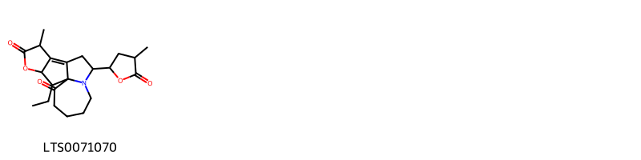
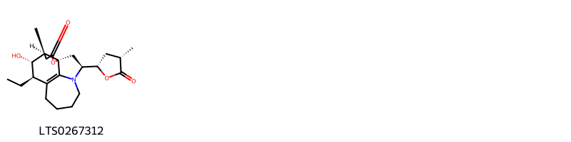
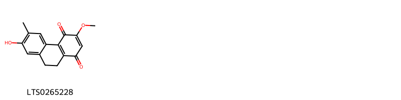
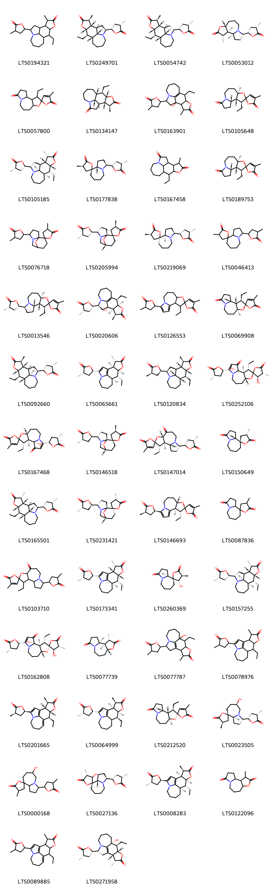

!!! abstract "Tóm tắt"

    Cây Bách bộ có tên khoa học là Stemona tuberosa Lour., thuộc họ Bách bộ (Stemonaceae). Cây mọc hoang ở khắp nơi trong Việt Nam tại Hà Tây, Hòa Bình, Bắc Kạn, Thái Nguyên,... Ngoài ra, cây còn phân bố ở vùng khác như Assam, Bangladesh, Campuchia, Nam Trung Trung Quốc, Đông Nam Trung Quốc, Hainan, Ấn Độ, Lào, Lesser Sunda Is., Maluku, Myanmar, New Guinea, Philippines, Sri Lanka, Đài Loan, Thái Lan. Trong Y học cổ truyền, dược liệu có tác dụng ôn phế, nhuận phế, chỉ ho, sát trùng, được dùng trong các trường hợp ho mới hoặc ho lâu ngày, ho gà, ho lao, viêm phế quản mạn tính; bên cạnh đó, còn được dùng ngoài để trị chấy, rận, ghẻ lở, giun kim, ngứa âm hộ. Thành phần hóa học của dược liệu bao gồm pyridoazepine alkaloid, pyrroloazepine alkaloid, stilbenoid. Các tác dụng dược lý của dược liệu từ đó được nghiên cứu chứng minh bao gồm chống viêm, chống ho, chống ung thư, kháng khuẩn, kháng virus, chống oxy hóa, diệt côn trùng.

## Thông tin về thực vật

Dược liệu **Bách Bộ (Rễ)** từ bộ phận **Rễ** từ loài *Stemona tuberosa*.

**Mô tả thực vật:** Bách bộ là một thứ cây leo, dài 6-8m, có khi hơn. Thân nhỏ nhẵn. Lá thường mọc đối có cuống, hình trái tim. Trên mặt lá, ngoài gân chính có 6-8 gân phụ chạy dọc từ cuống lá đến đầu lá, có những gân ngang nhỏ và rõ. Cụm hoa mọc ở kẽ lá gồm 1-2 hoa, lớn, màu vàng đỏ. Bao hoa gồm bốn phiến, 2 phiến ngoài dài 4 cm, rộng 5 mm, 2 phiến trong rộng hơn. Nhị 4, có tua ngắn. Quả nang có 4 hạt.
Rễ củ gồm 10 đến 20 hoặc 30 củ, có khi tới 100 củ dài 15-20 cm, đường kính 1,5-2 cm. Màu trắng vàng, vị ngọt, sau rất đắng.

*Tài liệu tham khảo:* "Những cây thuốc và vị thuốc Việt Nam" - Đỗ Tất Lợi 
Trong dược điển Việt nam, một loài được sử dụng làm dược liệu là *Stemona tuberosa*.

!!! info "Phân loại thực vật của *Stemona tuberosa*"
    - **Kingdom:** Plantae
    - **Phylum:** Tracheophyta
    - **Order:** Pandanales
    - **Family:** Stemonaceae
    - **Genus:** Stemona
    - **Species:** *Stemona tuberosa*

**Phân bố trên thế giới:** Myanmar, Chinese Taipei, China, Malaysia, India, Sri Lanka, Viet Nam

**Phân bố tại Việt nam:** Không có ghi nhận ở Việt Nam

## Thông tin về dược liệu 

### Định danh

!!! info "Thông tin về tên gọi"

    - Dược liệu tiếng Việt: bách bộ
    - Dược liệu tiếng Trung: 百部 (Bai Bu)
    - Dược liệu tiếng Anh: Root of Japanese Stemona
    - Dược liệu latin thông dụng: Radix Stemonae tuberosaenStemonae Radix
    - Dược liệu latin kiểu DĐVN: *radix stemonae tuberosae*
    - Dược liệu latin kiểu DĐVN: *Stemonae Radix*
    - Dược liệu latin kiểu thông tư: *Radix Stemonae tuberosae*
    - Bộ phận dùng: Rễ (Radix)

### Mô tả dược liệu 

- **Theo dược điển Việt nam V:** Rễ củ hình trụ cong queo, dài 10 cm đến 20 cm, đường kính 1 cm đến 2 cm. Thường để nguyên cả rễ củ hoặc cắt đôi theo chiều ngang hay bổ đôi theo chiều dọc. Đầu trên đôi khi còn vết tích của cồ rễ, đầu dưới thuôn nhỏ. Mặt ngoài màu vàng nâu nhạt, có nhiều nếp nhăn dọc. Mặt cắt ngang thấy mô mềm vỏ khá dày, màu vàng nâu; lõi giữa màu trắng ngà.

- **Mô tả dược liệu theo thông tư chế biến dược liệu theo phương pháp cổ truyền:** 

### Chế biến 

- **Chế biến theo dược điển việt nam V**: Đào lấy rễ củ lúc trời khô ráo, tốt nhất là vào mùa thu khi lá bắt đầu chuyển sang màu vàng, rửa sạch đất cát, cắt bỏ rễ ờ hai đầu, đem đồ vừa chín hoặc nhúng nước sôi. Loại nhỏ để nguyên, loại to bổ đôi rồi phơi nắng hoặc sấy ở 50 °C đến 60 °C đến khô. Bào chế bách bộ Lấy Bách bộ khô, rửa sạch, ủ mềm, thái lát dày, phơi khô. Bách bộ tẩm mật: Lấy lát Bách bộ khô, trộn đều với mật ong luyện và một ít nước sôi, ủ 30 min cho ngấm đều, sao nhỏ lửa cho tới không dính tay, lấy ra để nguội. Cứ 100 kg Bách bộ thái lát dùng 12,5 kg mật ong.

- **Chế biến theo thông tư:** 

--- 

## Thành phần hóa học

- Theo tài liệu của GS. Đỗ Tất Lợi:  (1) Nhóm hóa học: Pyridoazepine alkaloid, pyrroloazepine alkaloid, stilbenoid
(2) Dược điển Việt Nam: tuberostemonin LG; Dược điển Hong Kong: tuberostemonine trifluoroacetate CRS; Dược điển Trung Quốc: Không có; Dược điển Đài Loan: Không có
    

**Thành phần hóa học từ loài **Stemona tuberosa**

Theo cơ sở dữ liệu lotus, loài *Stemona tuberosa* đã phân lập và xác định được **82** hoạt chất thuộc về các nhóm Azepanes, Indoles and derivatives, Stemona alkaloids, Neoflavonoids, Lactams, Carboxylic acids and derivatives, Stilbenes, Prenol lipids trong bảng dưới đây. Danh sách các hoạt chất như sau 4-methyl-4'-(4-methyl-5-oxooxolan-2-yl)-11'-oxa-5'-azaspiro[oxolane-2,10'-tricyclo[5.3.1.0¹,⁵]undecan]-5-one [(LTS0076718)](https://lotus.naturalproducts.net/compound/lotus_id/LTS0076718), (2r,2's,3'r,6's)-3'-ethyl-4-methyl-11'-[(2r,4r)-4-methyl-5-oxooxolan-2-yl]-5'-oxa-10'-azaspiro[furan-2,4'-tricyclo[8.3.0.0²,⁶]tridecane]-1'(13'),11'-dien-5-one [(LTS0146693)](https://lotus.naturalproducts.net/compound/lotus_id/LTS0146693), dihydropinosylvin [(LTS0256887)](https://lotus.naturalproducts.net/compound/lotus_id/LTS0256887), (1'r,2r,4s,4'r,7's)-4-methyl-4'-[(2s,4s)-4-methyl-5-oxooxolan-2-yl]-11'-oxa-5'-azaspiro[oxolane-2,10'-tricyclo[5.3.1.0¹,⁵]undecan]-5-one [(LTS0106250)](https://lotus.naturalproducts.net/compound/lotus_id/LTS0106250), (2r,3r,4s,5s,6r)-2-[(1r,2r)-1-(3,5-dimethoxyphenyl)-2-hydroxy-2-phenylethoxy]-6-(hydroxymethyl)oxane-3,4,5-triol [(LTS0273083)](https://lotus.naturalproducts.net/compound/lotus_id/LTS0273083), (2s,3's,4r,6'r,9'as)-6'-hydroxy-4-methyl-3'-[(2s,4s)-4-methyl-5-oxooxolan-2-yl]-octahydrospiro[oxolane-2,9'-pyrrolo[1,2-a]azepin]-5-one [(LTS0023505)](https://lotus.naturalproducts.net/compound/lotus_id/LTS0023505), 2-methyl-5-(2-phenylethyl)benzene-1,3-diol [(LTS0263685)](https://lotus.naturalproducts.net/compound/lotus_id/LTS0263685), croomine [(LTS0177838)](https://lotus.naturalproducts.net/compound/lotus_id/LTS0177838), 10-ethyl-14-methyl-3-(4-methyl-5-oxooxolan-2-yl)-12-oxa-4-azatetracyclo[7.6.1.0⁴,¹⁶.0¹¹,¹⁵]hexadecan-13-one [(LTS0194321)](https://lotus.naturalproducts.net/compound/lotus_id/LTS0194321), 2-ethyl-6-methyl-10-(4-methyl-5-oxooxolan-2-yl)-4-oxa-11-azatricyclo[9.4.1.0³,⁷]hexadecane-5,8,16-trione [(LTS0054507)](https://lotus.naturalproducts.net/compound/lotus_id/LTS0054507), (1r,9r,10r,11s,14s,15s,16r)-10-ethyl-14-methyl-12-oxa-4-azatetracyclo[7.6.1.0⁴,¹⁶.0¹¹,¹⁵]hexadecane-3,13-dione [(LTS0134147)](https://lotus.naturalproducts.net/compound/lotus_id/LTS0134147), (1s,2r,3s,6r,11s)-3-methyl-11-[(2s,4s)-4-methyl-5-oxooxolan-2-yl]-5-oxa-10-azatricyclo[8.3.0.0²,⁶]tridecan-4-one [(LTS0053012)](https://lotus.naturalproducts.net/compound/lotus_id/LTS0053012), (1's,2r,2'r,3's,6'r)-3'-ethyl-4-methyl-5'-oxa-10'-azaspiro[furan-2,4'-tricyclo[8.3.0.0²,⁶]tridecane]-5,11'-dione [(LTS0189753)](https://lotus.naturalproducts.net/compound/lotus_id/LTS0189753), 2-[1-(3,5-dimethoxyphenyl)-2-hydroxy-2-phenylethoxy]-6-(hydroxymethyl)oxane-3,4,5-triol [(LTS0151046)](https://lotus.naturalproducts.net/compound/lotus_id/LTS0151046), 2-[3-hydroxy-2-methyl-5-(2-phenylethyl)phenoxy]-6-(hydroxymethyl)oxane-3,4,5-triol [(LTS0238354)](https://lotus.naturalproducts.net/compound/lotus_id/LTS0238354), (1r,3s,9r,10r,11r,14s,15r,16r)-10-ethyl-14-methyl-3-[(2s,4s)-4-methyl-5-oxooxolan-2-yl]-12-oxa-4-azatetracyclo[7.6.1.0⁴,¹⁶.0¹¹,¹⁵]hexadecan-13-one [(LTS0157255)](https://lotus.naturalproducts.net/compound/lotus_id/LTS0157255), 3'-ethyl-4-methyl-11'-(4-methyl-5-oxooxolan-2-yl)-5'-oxa-10'-azaspiro[furan-2,4'-tricyclo[8.3.0.0²,⁶]tridecane]-5,7'-dione [(LTS0103710)](https://lotus.naturalproducts.net/compound/lotus_id/LTS0103710), (1's,2s,4r,4's,7'r)-4-methyl-4'-[(2r,4s)-4-methyl-5-oxooxolan-2-yl]-11'-oxa-5'-azaspiro[oxolane-2,10'-tricyclo[5.3.1.0¹,⁵]undecan]-5-one [(LTS0146518)](https://lotus.naturalproducts.net/compound/lotus_id/LTS0146518), 4-methyl-hexahydro-1'h-spiro[oxolane-2,9'-pyrrolo[1,2-a]azepine]-3',5-dione [(LTS0087836)](https://lotus.naturalproducts.net/compound/lotus_id/LTS0087836), (1r,2r,3r,6r,7r,8s,10s)-2-ethyl-8-hydroxy-6-methyl-10-[(2s,4s)-4-methyl-5-oxooxolan-2-yl]-4-oxa-11-azatetracyclo[9.4.1.0¹,⁸.0³,⁷]hexadecane-5,16-dione [(LTS0237991)](https://lotus.naturalproducts.net/compound/lotus_id/LTS0237991), 10-ethyl-14-methyl-3-(4-methyl-5-oxooxolan-2-yl)-12-oxa-4-azatetracyclo[7.6.1.0⁴,¹⁶.0¹¹,¹⁵]hexadeca-1(16),2-dien-13-one [(LTS0078976)](https://lotus.naturalproducts.net/compound/lotus_id/LTS0078976), (1s,3s,10r,11s,12s,13s)-10-ethyl-11-hydroxy-13-methyl-3-[(2s,4s)-4-methyl-5-oxooxolan-2-yl]-15-oxa-4-azatetracyclo[7.6.1.0¹,¹².0⁴,¹⁶]hexadec-9(16)-en-14-one [(LTS0267312)](https://lotus.naturalproducts.net/compound/lotus_id/LTS0267312), (1r,3r,9r,10r,11s,14s,15s,16r)-10-ethyl-14-methyl-3-[(2s,4s)-4-methyl-5-oxooxolan-2-yl]-12-oxa-4-azatetracyclo[7.6.1.0⁴,¹⁶.0¹¹,¹⁵]hexadecan-13-one [(LTS0054742)](https://lotus.naturalproducts.net/compound/lotus_id/LTS0054742), 7-hydroxy-3-methoxy-6-methyl-9,10-dihydrophenanthrene-1,4-dione [(LTS0265228)](https://lotus.naturalproducts.net/compound/lotus_id/LTS0265228), 2-ethyl-8-hydroxy-6-methyl-10-(4-methyl-5-oxooxolan-2-yl)-4-oxa-11-azatetracyclo[9.4.1.0¹,⁸.0³,⁷]hexadecane-5,16-dione [(LTS0037602)](https://lotus.naturalproducts.net/compound/lotus_id/LTS0037602), (2r,3's,4r,9'ar)-4-methyl-3'-[(2s,4s)-4-methyl-5-oxooxolan-2-yl]-octahydrospiro[oxolane-2,9'-pyrrolo[1,2-a]azepin]-5-one [(LTS0219069)](https://lotus.naturalproducts.net/compound/lotus_id/LTS0219069), (2s,4s,9'ar)-4-methyl-hexahydro-1'h-spiro[oxolane-2,9'-pyrrolo[1,2-a]azepine]-3',5-dione [(LTS0150649)](https://lotus.naturalproducts.net/compound/lotus_id/LTS0150649), 5-methoxy-3-[2-(2-methoxyphenyl)ethyl]-2-methylphenol [(LTS0160317)](https://lotus.naturalproducts.net/compound/lotus_id/LTS0160317), (9r,10r,11r,14s,15s)-10-ethyl-14-methyl-3-[(2s,4s)-4-methyl-5-oxooxolan-2-yl]-12-oxa-4-azatetracyclo[7.6.1.0⁴,¹⁶.0¹¹,¹⁵]hexadeca-1(16),2-dien-13-one [(LTS0173341)](https://lotus.naturalproducts.net/compound/lotus_id/LTS0173341), 10-ethyl-9-hydroxy-14-methyl-3-(4-methyl-5-oxooxolan-2-yl)-12-oxa-4-azatetracyclo[7.6.1.0⁴,¹⁶.0¹¹,¹⁵]hexadec-1(16)-en-13-one [(LTS0077787)](https://lotus.naturalproducts.net/compound/lotus_id/LTS0077787), (1'r,2s,2's,3'r,6's)-3'-ethyl-4-methyl-5'-oxa-10'-azaspiro[furan-2,4'-tricyclo[8.3.0.0²,⁶]tridecane]-5,11'-dione [(LTS0212520)](https://lotus.naturalproducts.net/compound/lotus_id/LTS0212520), tuberostemonine [(LTS0249701)](https://lotus.naturalproducts.net/compound/lotus_id/LTS0249701), (2s,3r,3's,4r,9'as)-3-hydroxy-4-methyl-3'-[(2s,4s)-4-methyl-5-oxooxolan-2-yl]-octahydrospiro[oxolane-2,9'-pyrrolo[1,2-a]azepin]-5-one [(LTS0027136)](https://lotus.naturalproducts.net/compound/lotus_id/LTS0027136), (3r,9r,10s,11r,14r,15r)-10-ethyl-9-hydroxy-14-methyl-3-[(2s,4s)-4-methyl-5-oxooxolan-2-yl]-12-oxa-4-azatetracyclo[7.6.1.0⁴,¹⁶.0¹¹,¹⁵]hexadec-1(16)-en-13-one [(LTS0271958)](https://lotus.naturalproducts.net/compound/lotus_id/LTS0271958), (1's,2r,2's,3's,6'r)-3'-ethyl-1'-methoxy-4-methyl-11'-[(2s,4s)-4-methyl-5-oxooxolan-2-yl]-5'-oxa-10'-azaspiro[furan-2,4'-tricyclo[8.3.0.0²,⁶]tridecan]-11'-ene-5,13'-dione [(LTS0117852)](https://lotus.naturalproducts.net/compound/lotus_id/LTS0117852), 2-{3-hydroxy-5-[2-(4-methoxyphenyl)ethyl]-2-methylphenoxy}-6-(hydroxymethyl)oxane-3,4,5-triol [(LTS0111370)](https://lotus.naturalproducts.net/compound/lotus_id/LTS0111370), tuberostemonine n [(LTS0165501)](https://lotus.naturalproducts.net/compound/lotus_id/LTS0165501), (2r,3r,4s,5s,6r)-2-[1-(3,5-dimethoxyphenyl)-2-hydroxy-2-phenylethoxy]-6-(hydroxymethyl)oxane-3,4,5-triol [(LTS0257680)](https://lotus.naturalproducts.net/compound/lotus_id/LTS0257680), (2s)-2,8-dimethyl-2-[(4r,8r)-4,8,12-trimethyltridecyl]chromen-6-ol [(LTS0227322)](https://lotus.naturalproducts.net/compound/lotus_id/LTS0227322), 3-hydroxy-4-methyl-3'-(4-methyl-5-oxooxolan-2-yl)-octahydrospiro[oxolane-2,9'-pyrrolo[1,2-a]azepin]-5-one [(LTS0253785)](https://lotus.naturalproducts.net/compound/lotus_id/LTS0253785), 10-ethyl-14-methyl-12-oxa-4-azatetracyclo[7.6.1.0⁴,¹⁶.0¹¹,¹⁵]hexadecane-3,13-dione [(LTS0167458)](https://lotus.naturalproducts.net/compound/lotus_id/LTS0167458), 10-ethyl-14-methyl-3-(4-methyl-5-oxooxolan-2-yl)-12-oxa-4-azatetracyclo[7.6.1.0⁴,¹⁶.0¹¹,¹⁵]hexadeca-1(16),2,8-trien-13-one [(LTS0089885)](https://lotus.naturalproducts.net/compound/lotus_id/LTS0089885), (2z)-3-[(2r,3's,3'as,8'ar)-3'-ethyl-4-methyl-4',5-dioxo-3',3'a,6',7',8',8'a-hexahydrospiro[furan-2,2'-furo[3,2-c]azepin]-5'-yl]-3-[(2s,4s)-4-methyl-5-oxooxolan-2-yl]prop-2-enoic acid [(LTS0058353)](https://lotus.naturalproducts.net/compound/lotus_id/LTS0058353), (1r,2r,3s,6s,7s,10s)-2-ethyl-6-methyl-10-[(2s,4s)-4-methyl-5-oxooxolan-2-yl]-4-oxa-11-azatricyclo[9.4.1.0³,⁷]hexadecane-5,8,16-trione [(LTS0025985)](https://lotus.naturalproducts.net/compound/lotus_id/LTS0025985), (1r,2r,3s,6r,7s,8r,10r)-2-ethyl-8-hydroxy-6-methyl-10-[(2r,4s)-4-methyl-5-oxooxolan-2-yl]-4-oxa-11-azatetracyclo[9.4.1.0¹,⁸.0³,⁷]hexadecane-5,16-dione [(LTS0081219)](https://lotus.naturalproducts.net/compound/lotus_id/LTS0081219), (1's,2r,2's,3's,6'r)-3'-ethyl-1'-hydroxy-4-methyl-11'-[(2s,4s)-4-methyl-5-oxooxolan-2-yl]-5'-oxa-10'-azaspiro[furan-2,4'-tricyclo[8.3.0.0²,⁶]tridecan]-11'-ene-5,13'-dione [(LTS0167468)](https://lotus.naturalproducts.net/compound/lotus_id/LTS0167468), 4-methyl-3'-(4-methyl-5-oxooxolan-2-yl)-octahydrospiro[oxolane-2,9'-pyrrolo[1,2-a]azepin]-5-one [(LTS0046413)](https://lotus.naturalproducts.net/compound/lotus_id/LTS0046413), (1'r,2r,2's,3'r,6's)-3'-ethyl-4-methyl-5'-oxa-10'-azaspiro[furan-2,4'-tricyclo[8.3.0.0²,⁶]tridecane]-5,11'-dione [(LTS0069908)](https://lotus.naturalproducts.net/compound/lotus_id/LTS0069908), (2s,3r,4s,5s,6r)-2-{3-hydroxy-5-[2-(4-methoxyphenyl)ethyl]-2-methylphenoxy}-6-(hydroxymethyl)oxane-3,4,5-triol [(LTS0265598)](https://lotus.naturalproducts.net/compound/lotus_id/LTS0265598), 10-ethyl-1-hydroxy-14-methyl-3-(4-methyl-5-oxooxolan-2-yl)-12-oxa-4-azatetracyclo[7.6.1.0⁴,¹⁶.0¹¹,¹⁵]hexadec-9(16)-en-13-one [(LTS0163901)](https://lotus.naturalproducts.net/compound/lotus_id/LTS0163901), (1's,2r,2's,3r,3's,4r,6'r)-3'-ethyl-1',3-dihydroxy-4-methyl-11'-[(2s,4s)-4-methyl-5-oxooxolan-2-yl]-5'-oxa-10'-azaspiro[oxolane-2,4'-tricyclo[8.3.0.0²,⁶]tridecan]-11'-ene-5,13'-dione [(LTS0162808)](https://lotus.naturalproducts.net/compound/lotus_id/LTS0162808), (1's,2s,2's,3r,3's,4r,6'r)-3'-ethyl-1',3-dihydroxy-4-methyl-11'-[(2s,4s)-4-methyl-5-oxooxolan-2-yl]-5'-oxa-10'-azaspiro[oxolane-2,4'-tricyclo[8.3.0.0²,⁶]tridecan]-11'-ene-5,13'-dione [(LTS0252106)](https://lotus.naturalproducts.net/compound/lotus_id/LTS0252106), (10s,11s,14r,15r)-10-ethyl-14-methyl-3-[(2s,4s)-4-methyl-5-oxooxolan-2-yl]-12-oxa-4-azatetracyclo[7.6.1.0⁴,¹⁶.0¹¹,¹⁵]hexadeca-1(16),2-dien-13-one [(LTS0064999)](https://lotus.naturalproducts.net/compound/lotus_id/LTS0064999), (1s,3s,9r,10r,11r,14r,15r,16s)-10-ethyl-14-methyl-3-[(2s,4s)-4-methyl-5-oxooxolan-2-yl]-12-oxa-4-azatetracyclo[7.6.1.0⁴,¹⁶.0¹¹,¹⁵]hexadecan-13-one [(LTS0259431)](https://lotus.naturalproducts.net/compound/lotus_id/LTS0259431), (1's,2'r,3's,6'r)-3'-ethyl-4-methyl-5'-oxa-10'-azaspiro[furan-2,4'-tricyclo[8.3.0.0²,⁶]tridecane]-5,11'-dione [(LTS0105648)](https://lotus.naturalproducts.net/compound/lotus_id/LTS0105648), 2,8-dimethyl-2-(4,8,12-trimethyltridecyl)chromen-6-ol [(LTS0069577)](https://lotus.naturalproducts.net/compound/lotus_id/LTS0069577), 5-[2-(2-methoxyphenyl)ethyl]-2-methylbenzene-1,3-diol [(LTS0191580)](https://lotus.naturalproducts.net/compound/lotus_id/LTS0191580), 3'-ethyl-4-methyl-5'-oxa-10'-azaspiro[furan-2,4'-tricyclo[8.3.0.0²,⁶]tridecane]-5,11'-dione [(LTS0057800)](https://lotus.naturalproducts.net/compound/lotus_id/LTS0057800), (1r,2r,3r,6r,7r,10r)-2-ethyl-1-hydroxy-6-methyl-10-[(2r,4r)-4-methyl-5-oxooxolan-2-yl]-4-oxa-11-azatricyclo[9.4.1.0³,⁷]hexadecane-5,8,16-trione [(LTS0259172)](https://lotus.naturalproducts.net/compound/lotus_id/LTS0259172), (9r,10r,11s,14r,15r)-10-ethyl-14-methyl-3-[(2r,4s)-4-methyl-5-oxooxolan-2-yl]-12-oxa-4-azatetracyclo[7.6.1.0⁴,¹⁶.0¹¹,¹⁵]hexadeca-1(16),2-dien-13-one [(LTS0008283)](https://lotus.naturalproducts.net/compound/lotus_id/LTS0008283), (9r,10r,11s,14s,15r)-10-ethyl-14-methyl-3-[(2s,4s)-4-methyl-5-oxooxolan-2-yl]-12-oxa-4-azatetracyclo[7.6.1.0⁴,¹⁶.0¹¹,¹⁵]hexadeca-1(16),2-dien-13-one [(LTS0065661)](https://lotus.naturalproducts.net/compound/lotus_id/LTS0065661), (1s,3r,9s,10s,11r,14r,15r,16s)-10-ethyl-14-methyl-3-[(2r,4r)-4-methyl-5-oxooxolan-2-yl]-12-oxa-4-azatetracyclo[7.6.1.0⁴,¹⁶.0¹¹,¹⁵]hexadecan-13-one [(LTS0120834)](https://lotus.naturalproducts.net/compound/lotus_id/LTS0120834), (1s,2r,3s,6s,7r,10s)-2-ethyl-6-methyl-10-[(2s,4s)-4-methyl-5-oxooxolan-2-yl]-4-oxa-11-azatricyclo[9.4.1.0³,⁷]hexadecane-5,8,16-trione [(LTS0168944)](https://lotus.naturalproducts.net/compound/lotus_id/LTS0168944), neotuberostemonine [(LTS0105185)](https://lotus.naturalproducts.net/compound/lotus_id/LTS0105185), 16-ethyl-12-methyl-8-(4-methyl-5-oxooxolan-2-yl)-14-oxa-7-azatetracyclo[8.6.0.0¹,⁷.0¹¹,¹⁵]hexadec-10-ene-2,13-dione [(LTS0071070)](https://lotus.naturalproducts.net/compound/lotus_id/LTS0071070), (1s,3r,9s,10s,11s,14r,15s,16s)-10-ethyl-14-methyl-3-[(2r,4r)-4-methyl-5-oxooxolan-2-yl]-12-oxa-4-azatetracyclo[7.6.1.0⁴,¹⁶.0¹¹,¹⁵]hexadecan-13-one [(LTS0254146)](https://lotus.naturalproducts.net/compound/lotus_id/LTS0254146), (1r,2r,3s,6r,7s,8s,10s)-2-ethyl-8-hydroxy-6-methyl-10-[(2s,4s)-4-methyl-5-oxooxolan-2-yl]-4-oxa-11-azatetracyclo[9.4.1.0¹,⁸.0³,⁷]hexadecane-5,16-dione [(LTS0046062)](https://lotus.naturalproducts.net/compound/lotus_id/LTS0046062), (1s,2r,3s,6r)-3-methyl-5-oxa-10-azatricyclo[8.3.0.0²,⁶]tridecane-4,11-dione [(LTS0077739)](https://lotus.naturalproducts.net/compound/lotus_id/LTS0077739), (1's,2r,4s,4's,7'r)-4-methyl-4'-[(2r,4s)-4-methyl-5-oxooxolan-2-yl]-11'-oxa-5'-azaspiro[oxolane-2,10'-tricyclo[5.3.1.0¹,⁵]undecan]-5-one [(LTS0231421)](https://lotus.naturalproducts.net/compound/lotus_id/LTS0231421), 3-methyl-5-oxa-10-azatricyclo[8.3.0.0²,⁶]tridecane-4,11-dione [(LTS0122096)](https://lotus.naturalproducts.net/compound/lotus_id/LTS0122096), (1r,3s,9r,10r,11s,14s,15s,16s)-10-ethyl-14-methyl-3-[(2s,4s)-4-methyl-5-oxooxolan-2-yl]-12-oxa-4-azatetracyclo[7.6.1.0⁴,¹⁶.0¹¹,¹⁵]hexadecan-13-one [(LTS0092660)](https://lotus.naturalproducts.net/compound/lotus_id/LTS0092660), 6'-hydroxy-4-methyl-3'-(4-methyl-5-oxooxolan-2-yl)-octahydrospiro[oxolane-2,9'-pyrrolo[1,2-a]azepin]-5-one [(LTS0000168)](https://lotus.naturalproducts.net/compound/lotus_id/LTS0000168), (1r,2s,3s,6r,10s)-2-ethyl-6-methyl-10-[(2s,4s)-4-methyl-5-oxooxolan-2-yl]-4-oxa-11-azatricyclo[9.4.1.0³,⁷]hexadecane-5,8,16-trione [(LTS0093110)](https://lotus.naturalproducts.net/compound/lotus_id/LTS0093110), (1's,2r,2'r,3's,6'r,11's)-3'-ethyl-4-methyl-11'-[(2s,4s)-4-methyl-5-oxooxolan-2-yl]-5'-oxa-10'-azaspiro[furan-2,4'-tricyclo[8.3.0.0²,⁶]tridecan]-5-one [(LTS0013546)](https://lotus.naturalproducts.net/compound/lotus_id/LTS0013546), (1s,3s,10r,11r,14s,15r)-10-ethyl-1-hydroxy-14-methyl-3-[(2s,4s)-4-methyl-5-oxooxolan-2-yl]-12-oxa-4-azatetracyclo[7.6.1.0⁴,¹⁶.0¹¹,¹⁵]hexadec-9(16)-en-13-one [(LTS0020606)](https://lotus.naturalproducts.net/compound/lotus_id/LTS0020606), 2-ethyl-1-hydroxy-6-methyl-10-(4-methyl-5-oxooxolan-2-yl)-4-oxa-11-azatricyclo[9.4.1.0³,⁷]hexadecane-5,8,16-trione [(LTS0040404)](https://lotus.naturalproducts.net/compound/lotus_id/LTS0040404), 3'-ethyl-4-methyl-11'-(4-methyl-5-oxooxolan-2-yl)-5'-oxa-10'-azaspiro[furan-2,4'-tricyclo[8.3.0.0²,⁶]tridecane]-1'(13'),11'-dien-5-one [(LTS0126553)](https://lotus.naturalproducts.net/compound/lotus_id/LTS0126553), (2s,3r,4s,5s,6r)-2-[3-hydroxy-2-methyl-5-(2-phenylethyl)phenoxy]-6-(hydroxymethyl)oxane-3,4,5-triol [(LTS0274930)](https://lotus.naturalproducts.net/compound/lotus_id/LTS0274930), (2s,3s,4s,9'as)-3-hydroxy-4-methyl-hexahydro-1'h-spiro[oxolane-2,9'-pyrrolo[1,2-a]azepine]-3',5-dione [(LTS0260369)](https://lotus.naturalproducts.net/compound/lotus_id/LTS0260369), (1's,2s,4r,4's,7'r)-4-methyl-4'-[(2s,4s)-4-methyl-5-oxooxolan-2-yl]-11'-oxa-5'-azaspiro[oxolane-2,10'-tricyclo[5.3.1.0¹,⁵]undecan]-5-one [(LTS0205994)](https://lotus.naturalproducts.net/compound/lotus_id/LTS0205994), (10s,11r,14r,15s)-10-ethyl-14-methyl-3-[(2r,4r)-4-methyl-5-oxooxolan-2-yl]-12-oxa-4-azatetracyclo[7.6.1.0⁴,¹⁶.0¹¹,¹⁵]hexadeca-1(16),2,8-trien-13-one [(LTS0201665)](https://lotus.naturalproducts.net/compound/lotus_id/LTS0201665), (1'r,2r,2'r,3's,6's,11's)-3'-ethyl-4-methyl-11'-[(2s,4s)-4-methyl-5-oxooxolan-2-yl]-5'-oxa-10'-azaspiro[furan-2,4'-tricyclo[8.3.0.0²,⁶]tridecane]-5,7'-dione [(LTS0147014)](https://lotus.naturalproducts.net/compound/lotus_id/LTS0147014). 
        
| chemicalTaxonomyClassyfireClass   |   smiles_count |
|:----------------------------------|---------------:|
| Azepanes                          |             54 |
| Carboxylic acids and derivatives  |             88 |
| Indoles and derivatives           |             88 |
| Lactams                           |            798 |
| Neoflavonoids                     |             38 |
| Prenol lipids                     |            104 |
| Stemona alkaloids                 |           3804 |
| Stilbenes                         |            546 |

            
### Nhóm Azepanes
<figure markdown="span">
    { width=100% }
<figcaption>Hình ảnh cấu trúc hóa học của hoạt chất thuộc nhóm *Azepanes*. Tên thường gọi của các hoạt chất tương ứng là 16-ethyl-12-methyl-8-(4-methyl-5-oxooxolan-2-yl)-14-oxa-7-azatetracyclo[8.6.0.0¹,⁷.0¹¹,¹⁵]hexadec-10-ene-2,13-dione [(LTS0071070)](https://lotus.naturalproducts.net/compound/lotus_id/LTS0071070).</figcaption>
</figure>

            
            
### Nhóm Azepanes
<figure markdown="span">
    { width=100% }
<figcaption>Hình ảnh cấu trúc hóa học của hoạt chất thuộc nhóm *Azepanes*. Tên thường gọi của các hoạt chất tương ứng là 16-ethyl-12-methyl-8-(4-methyl-5-oxooxolan-2-yl)-14-oxa-7-azatetracyclo[8.6.0.0¹,⁷.0¹¹,¹⁵]hexadec-10-ene-2,13-dione [(LTS0071070)](https://lotus.naturalproducts.net/compound/lotus_id/LTS0071070).</figcaption>
</figure>

### Nhóm Carboxylic acids and derivatives
<figure markdown="span">
    { width=100% }
<figcaption>Hình ảnh cấu trúc hóa học của hoạt chất thuộc nhóm *Carboxylic acids and derivatives*. Tên thường gọi của các hoạt chất tương ứng là (2z)-3-[(2r,3's,3'as,8'ar)-3'-ethyl-4-methyl-4',5-dioxo-3',3'a,6',7',8',8'a-hexahydrospiro[furan-2,2'-furo[3,2-c]azepin]-5'-yl]-3-[(2s,4s)-4-methyl-5-oxooxolan-2-yl]prop-2-enoic acid [(LTS0058353)](https://lotus.naturalproducts.net/compound/lotus_id/LTS0058353).</figcaption>
</figure>

            
            
### Nhóm Azepanes
<figure markdown="span">
    { width=100% }
<figcaption>Hình ảnh cấu trúc hóa học của hoạt chất thuộc nhóm *Azepanes*. Tên thường gọi của các hoạt chất tương ứng là 16-ethyl-12-methyl-8-(4-methyl-5-oxooxolan-2-yl)-14-oxa-7-azatetracyclo[8.6.0.0¹,⁷.0¹¹,¹⁵]hexadec-10-ene-2,13-dione [(LTS0071070)](https://lotus.naturalproducts.net/compound/lotus_id/LTS0071070).</figcaption>
</figure>

### Nhóm Carboxylic acids and derivatives
<figure markdown="span">
    { width=100% }
<figcaption>Hình ảnh cấu trúc hóa học của hoạt chất thuộc nhóm *Carboxylic acids and derivatives*. Tên thường gọi của các hoạt chất tương ứng là (2z)-3-[(2r,3's,3'as,8'ar)-3'-ethyl-4-methyl-4',5-dioxo-3',3'a,6',7',8',8'a-hexahydrospiro[furan-2,2'-furo[3,2-c]azepin]-5'-yl]-3-[(2s,4s)-4-methyl-5-oxooxolan-2-yl]prop-2-enoic acid [(LTS0058353)](https://lotus.naturalproducts.net/compound/lotus_id/LTS0058353).</figcaption>
</figure>

### Nhóm Indoles and derivatives
<figure markdown="span">
    { width=100% }
<figcaption>Hình ảnh cấu trúc hóa học của hoạt chất thuộc nhóm *Indoles and derivatives*. Tên thường gọi của các hoạt chất tương ứng là (1s,3s,10r,11s,12s,13s)-10-ethyl-11-hydroxy-13-methyl-3-[(2s,4s)-4-methyl-5-oxooxolan-2-yl]-15-oxa-4-azatetracyclo[7.6.1.0¹,¹².0⁴,¹⁶]hexadec-9(16)-en-14-one [(LTS0267312)](https://lotus.naturalproducts.net/compound/lotus_id/LTS0267312).</figcaption>
</figure>

            
            
### Nhóm Azepanes
<figure markdown="span">
    { width=100% }
<figcaption>Hình ảnh cấu trúc hóa học của hoạt chất thuộc nhóm *Azepanes*. Tên thường gọi của các hoạt chất tương ứng là 16-ethyl-12-methyl-8-(4-methyl-5-oxooxolan-2-yl)-14-oxa-7-azatetracyclo[8.6.0.0¹,⁷.0¹¹,¹⁵]hexadec-10-ene-2,13-dione [(LTS0071070)](https://lotus.naturalproducts.net/compound/lotus_id/LTS0071070).</figcaption>
</figure>

### Nhóm Carboxylic acids and derivatives
<figure markdown="span">
    { width=100% }
<figcaption>Hình ảnh cấu trúc hóa học của hoạt chất thuộc nhóm *Carboxylic acids and derivatives*. Tên thường gọi của các hoạt chất tương ứng là (2z)-3-[(2r,3's,3'as,8'ar)-3'-ethyl-4-methyl-4',5-dioxo-3',3'a,6',7',8',8'a-hexahydrospiro[furan-2,2'-furo[3,2-c]azepin]-5'-yl]-3-[(2s,4s)-4-methyl-5-oxooxolan-2-yl]prop-2-enoic acid [(LTS0058353)](https://lotus.naturalproducts.net/compound/lotus_id/LTS0058353).</figcaption>
</figure>

### Nhóm Indoles and derivatives
<figure markdown="span">
    { width=100% }
<figcaption>Hình ảnh cấu trúc hóa học của hoạt chất thuộc nhóm *Indoles and derivatives*. Tên thường gọi của các hoạt chất tương ứng là (1s,3s,10r,11s,12s,13s)-10-ethyl-11-hydroxy-13-methyl-3-[(2s,4s)-4-methyl-5-oxooxolan-2-yl]-15-oxa-4-azatetracyclo[7.6.1.0¹,¹².0⁴,¹⁶]hexadec-9(16)-en-14-one [(LTS0267312)](https://lotus.naturalproducts.net/compound/lotus_id/LTS0267312).</figcaption>
</figure>

### Nhóm Lactams
<figure markdown="span">
    { width=100% }
<figcaption>Hình ảnh cấu trúc hóa học của hoạt chất thuộc nhóm *Lactams*. Tên thường gọi của các hoạt chất tương ứng là 2-ethyl-8-hydroxy-6-methyl-10-(4-methyl-5-oxooxolan-2-yl)-4-oxa-11-azatetracyclo[9.4.1.0¹,⁸.0³,⁷]hexadecane-5,16-dione [(LTS0037602)](https://lotus.naturalproducts.net/compound/lotus_id/LTS0037602), 2-ethyl-6-methyl-10-(4-methyl-5-oxooxolan-2-yl)-4-oxa-11-azatricyclo[9.4.1.0³,⁷]hexadecane-5,8,16-trione [(LTS0054507)](https://lotus.naturalproducts.net/compound/lotus_id/LTS0054507), 2-ethyl-1-hydroxy-6-methyl-10-(4-methyl-5-oxooxolan-2-yl)-4-oxa-11-azatricyclo[9.4.1.0³,⁷]hexadecane-5,8,16-trione [(LTS0040404)](https://lotus.naturalproducts.net/compound/lotus_id/LTS0040404), (1s,2r,3s,6s,7r,10s)-2-ethyl-6-methyl-10-[(2s,4s)-4-methyl-5-oxooxolan-2-yl]-4-oxa-11-azatricyclo[9.4.1.0³,⁷]hexadecane-5,8,16-trione [(LTS0168944)](https://lotus.naturalproducts.net/compound/lotus_id/LTS0168944), (1r,2s,3s,6r,10s)-2-ethyl-6-methyl-10-[(2s,4s)-4-methyl-5-oxooxolan-2-yl]-4-oxa-11-azatricyclo[9.4.1.0³,⁷]hexadecane-5,8,16-trione [(LTS0093110)](https://lotus.naturalproducts.net/compound/lotus_id/LTS0093110), (1r,2r,3s,6r,7s,8r,10r)-2-ethyl-8-hydroxy-6-methyl-10-[(2r,4s)-4-methyl-5-oxooxolan-2-yl]-4-oxa-11-azatetracyclo[9.4.1.0¹,⁸.0³,⁷]hexadecane-5,16-dione [(LTS0081219)](https://lotus.naturalproducts.net/compound/lotus_id/LTS0081219), (1r,2r,3s,6r,7s,8s,10s)-2-ethyl-8-hydroxy-6-methyl-10-[(2s,4s)-4-methyl-5-oxooxolan-2-yl]-4-oxa-11-azatetracyclo[9.4.1.0¹,⁸.0³,⁷]hexadecane-5,16-dione [(LTS0046062)](https://lotus.naturalproducts.net/compound/lotus_id/LTS0046062), (1r,2r,3r,6r,7r,8s,10s)-2-ethyl-8-hydroxy-6-methyl-10-[(2s,4s)-4-methyl-5-oxooxolan-2-yl]-4-oxa-11-azatetracyclo[9.4.1.0¹,⁸.0³,⁷]hexadecane-5,16-dione [(LTS0237991)](https://lotus.naturalproducts.net/compound/lotus_id/LTS0237991), (1r,2r,3r,6r,7r,10r)-2-ethyl-1-hydroxy-6-methyl-10-[(2r,4r)-4-methyl-5-oxooxolan-2-yl]-4-oxa-11-azatricyclo[9.4.1.0³,⁷]hexadecane-5,8,16-trione [(LTS0259172)](https://lotus.naturalproducts.net/compound/lotus_id/LTS0259172), (1r,2r,3s,6s,7s,10s)-2-ethyl-6-methyl-10-[(2s,4s)-4-methyl-5-oxooxolan-2-yl]-4-oxa-11-azatricyclo[9.4.1.0³,⁷]hexadecane-5,8,16-trione [(LTS0025985)](https://lotus.naturalproducts.net/compound/lotus_id/LTS0025985).</figcaption>
</figure>

            
            
### Nhóm Azepanes
<figure markdown="span">
    { width=100% }
<figcaption>Hình ảnh cấu trúc hóa học của hoạt chất thuộc nhóm *Azepanes*. Tên thường gọi của các hoạt chất tương ứng là 16-ethyl-12-methyl-8-(4-methyl-5-oxooxolan-2-yl)-14-oxa-7-azatetracyclo[8.6.0.0¹,⁷.0¹¹,¹⁵]hexadec-10-ene-2,13-dione [(LTS0071070)](https://lotus.naturalproducts.net/compound/lotus_id/LTS0071070).</figcaption>
</figure>

### Nhóm Carboxylic acids and derivatives
<figure markdown="span">
    { width=100% }
<figcaption>Hình ảnh cấu trúc hóa học của hoạt chất thuộc nhóm *Carboxylic acids and derivatives*. Tên thường gọi của các hoạt chất tương ứng là (2z)-3-[(2r,3's,3'as,8'ar)-3'-ethyl-4-methyl-4',5-dioxo-3',3'a,6',7',8',8'a-hexahydrospiro[furan-2,2'-furo[3,2-c]azepin]-5'-yl]-3-[(2s,4s)-4-methyl-5-oxooxolan-2-yl]prop-2-enoic acid [(LTS0058353)](https://lotus.naturalproducts.net/compound/lotus_id/LTS0058353).</figcaption>
</figure>

### Nhóm Indoles and derivatives
<figure markdown="span">
    { width=100% }
<figcaption>Hình ảnh cấu trúc hóa học của hoạt chất thuộc nhóm *Indoles and derivatives*. Tên thường gọi của các hoạt chất tương ứng là (1s,3s,10r,11s,12s,13s)-10-ethyl-11-hydroxy-13-methyl-3-[(2s,4s)-4-methyl-5-oxooxolan-2-yl]-15-oxa-4-azatetracyclo[7.6.1.0¹,¹².0⁴,¹⁶]hexadec-9(16)-en-14-one [(LTS0267312)](https://lotus.naturalproducts.net/compound/lotus_id/LTS0267312).</figcaption>
</figure>

### Nhóm Lactams
<figure markdown="span">
    { width=100% }
<figcaption>Hình ảnh cấu trúc hóa học của hoạt chất thuộc nhóm *Lactams*. Tên thường gọi của các hoạt chất tương ứng là 2-ethyl-8-hydroxy-6-methyl-10-(4-methyl-5-oxooxolan-2-yl)-4-oxa-11-azatetracyclo[9.4.1.0¹,⁸.0³,⁷]hexadecane-5,16-dione [(LTS0037602)](https://lotus.naturalproducts.net/compound/lotus_id/LTS0037602), 2-ethyl-6-methyl-10-(4-methyl-5-oxooxolan-2-yl)-4-oxa-11-azatricyclo[9.4.1.0³,⁷]hexadecane-5,8,16-trione [(LTS0054507)](https://lotus.naturalproducts.net/compound/lotus_id/LTS0054507), 2-ethyl-1-hydroxy-6-methyl-10-(4-methyl-5-oxooxolan-2-yl)-4-oxa-11-azatricyclo[9.4.1.0³,⁷]hexadecane-5,8,16-trione [(LTS0040404)](https://lotus.naturalproducts.net/compound/lotus_id/LTS0040404), (1s,2r,3s,6s,7r,10s)-2-ethyl-6-methyl-10-[(2s,4s)-4-methyl-5-oxooxolan-2-yl]-4-oxa-11-azatricyclo[9.4.1.0³,⁷]hexadecane-5,8,16-trione [(LTS0168944)](https://lotus.naturalproducts.net/compound/lotus_id/LTS0168944), (1r,2s,3s,6r,10s)-2-ethyl-6-methyl-10-[(2s,4s)-4-methyl-5-oxooxolan-2-yl]-4-oxa-11-azatricyclo[9.4.1.0³,⁷]hexadecane-5,8,16-trione [(LTS0093110)](https://lotus.naturalproducts.net/compound/lotus_id/LTS0093110), (1r,2r,3s,6r,7s,8r,10r)-2-ethyl-8-hydroxy-6-methyl-10-[(2r,4s)-4-methyl-5-oxooxolan-2-yl]-4-oxa-11-azatetracyclo[9.4.1.0¹,⁸.0³,⁷]hexadecane-5,16-dione [(LTS0081219)](https://lotus.naturalproducts.net/compound/lotus_id/LTS0081219), (1r,2r,3s,6r,7s,8s,10s)-2-ethyl-8-hydroxy-6-methyl-10-[(2s,4s)-4-methyl-5-oxooxolan-2-yl]-4-oxa-11-azatetracyclo[9.4.1.0¹,⁸.0³,⁷]hexadecane-5,16-dione [(LTS0046062)](https://lotus.naturalproducts.net/compound/lotus_id/LTS0046062), (1r,2r,3r,6r,7r,8s,10s)-2-ethyl-8-hydroxy-6-methyl-10-[(2s,4s)-4-methyl-5-oxooxolan-2-yl]-4-oxa-11-azatetracyclo[9.4.1.0¹,⁸.0³,⁷]hexadecane-5,16-dione [(LTS0237991)](https://lotus.naturalproducts.net/compound/lotus_id/LTS0237991), (1r,2r,3r,6r,7r,10r)-2-ethyl-1-hydroxy-6-methyl-10-[(2r,4r)-4-methyl-5-oxooxolan-2-yl]-4-oxa-11-azatricyclo[9.4.1.0³,⁷]hexadecane-5,8,16-trione [(LTS0259172)](https://lotus.naturalproducts.net/compound/lotus_id/LTS0259172), (1r,2r,3s,6s,7s,10s)-2-ethyl-6-methyl-10-[(2s,4s)-4-methyl-5-oxooxolan-2-yl]-4-oxa-11-azatricyclo[9.4.1.0³,⁷]hexadecane-5,8,16-trione [(LTS0025985)](https://lotus.naturalproducts.net/compound/lotus_id/LTS0025985).</figcaption>
</figure>

### Nhóm Neoflavonoids
<figure markdown="span">
    { width=100% }
<figcaption>Hình ảnh cấu trúc hóa học của hoạt chất thuộc nhóm *Neoflavonoids*. Tên thường gọi của các hoạt chất tương ứng là 7-hydroxy-3-methoxy-6-methyl-9,10-dihydrophenanthrene-1,4-dione [(LTS0265228)](https://lotus.naturalproducts.net/compound/lotus_id/LTS0265228).</figcaption>
</figure>

            
            
### Nhóm Azepanes
<figure markdown="span">
    { width=100% }
<figcaption>Hình ảnh cấu trúc hóa học của hoạt chất thuộc nhóm *Azepanes*. Tên thường gọi của các hoạt chất tương ứng là 16-ethyl-12-methyl-8-(4-methyl-5-oxooxolan-2-yl)-14-oxa-7-azatetracyclo[8.6.0.0¹,⁷.0¹¹,¹⁵]hexadec-10-ene-2,13-dione [(LTS0071070)](https://lotus.naturalproducts.net/compound/lotus_id/LTS0071070).</figcaption>
</figure>

### Nhóm Carboxylic acids and derivatives
<figure markdown="span">
    { width=100% }
<figcaption>Hình ảnh cấu trúc hóa học của hoạt chất thuộc nhóm *Carboxylic acids and derivatives*. Tên thường gọi của các hoạt chất tương ứng là (2z)-3-[(2r,3's,3'as,8'ar)-3'-ethyl-4-methyl-4',5-dioxo-3',3'a,6',7',8',8'a-hexahydrospiro[furan-2,2'-furo[3,2-c]azepin]-5'-yl]-3-[(2s,4s)-4-methyl-5-oxooxolan-2-yl]prop-2-enoic acid [(LTS0058353)](https://lotus.naturalproducts.net/compound/lotus_id/LTS0058353).</figcaption>
</figure>

### Nhóm Indoles and derivatives
<figure markdown="span">
    { width=100% }
<figcaption>Hình ảnh cấu trúc hóa học của hoạt chất thuộc nhóm *Indoles and derivatives*. Tên thường gọi của các hoạt chất tương ứng là (1s,3s,10r,11s,12s,13s)-10-ethyl-11-hydroxy-13-methyl-3-[(2s,4s)-4-methyl-5-oxooxolan-2-yl]-15-oxa-4-azatetracyclo[7.6.1.0¹,¹².0⁴,¹⁶]hexadec-9(16)-en-14-one [(LTS0267312)](https://lotus.naturalproducts.net/compound/lotus_id/LTS0267312).</figcaption>
</figure>

### Nhóm Lactams
<figure markdown="span">
    { width=100% }
<figcaption>Hình ảnh cấu trúc hóa học của hoạt chất thuộc nhóm *Lactams*. Tên thường gọi của các hoạt chất tương ứng là 2-ethyl-8-hydroxy-6-methyl-10-(4-methyl-5-oxooxolan-2-yl)-4-oxa-11-azatetracyclo[9.4.1.0¹,⁸.0³,⁷]hexadecane-5,16-dione [(LTS0037602)](https://lotus.naturalproducts.net/compound/lotus_id/LTS0037602), 2-ethyl-6-methyl-10-(4-methyl-5-oxooxolan-2-yl)-4-oxa-11-azatricyclo[9.4.1.0³,⁷]hexadecane-5,8,16-trione [(LTS0054507)](https://lotus.naturalproducts.net/compound/lotus_id/LTS0054507), 2-ethyl-1-hydroxy-6-methyl-10-(4-methyl-5-oxooxolan-2-yl)-4-oxa-11-azatricyclo[9.4.1.0³,⁷]hexadecane-5,8,16-trione [(LTS0040404)](https://lotus.naturalproducts.net/compound/lotus_id/LTS0040404), (1s,2r,3s,6s,7r,10s)-2-ethyl-6-methyl-10-[(2s,4s)-4-methyl-5-oxooxolan-2-yl]-4-oxa-11-azatricyclo[9.4.1.0³,⁷]hexadecane-5,8,16-trione [(LTS0168944)](https://lotus.naturalproducts.net/compound/lotus_id/LTS0168944), (1r,2s,3s,6r,10s)-2-ethyl-6-methyl-10-[(2s,4s)-4-methyl-5-oxooxolan-2-yl]-4-oxa-11-azatricyclo[9.4.1.0³,⁷]hexadecane-5,8,16-trione [(LTS0093110)](https://lotus.naturalproducts.net/compound/lotus_id/LTS0093110), (1r,2r,3s,6r,7s,8r,10r)-2-ethyl-8-hydroxy-6-methyl-10-[(2r,4s)-4-methyl-5-oxooxolan-2-yl]-4-oxa-11-azatetracyclo[9.4.1.0¹,⁸.0³,⁷]hexadecane-5,16-dione [(LTS0081219)](https://lotus.naturalproducts.net/compound/lotus_id/LTS0081219), (1r,2r,3s,6r,7s,8s,10s)-2-ethyl-8-hydroxy-6-methyl-10-[(2s,4s)-4-methyl-5-oxooxolan-2-yl]-4-oxa-11-azatetracyclo[9.4.1.0¹,⁸.0³,⁷]hexadecane-5,16-dione [(LTS0046062)](https://lotus.naturalproducts.net/compound/lotus_id/LTS0046062), (1r,2r,3r,6r,7r,8s,10s)-2-ethyl-8-hydroxy-6-methyl-10-[(2s,4s)-4-methyl-5-oxooxolan-2-yl]-4-oxa-11-azatetracyclo[9.4.1.0¹,⁸.0³,⁷]hexadecane-5,16-dione [(LTS0237991)](https://lotus.naturalproducts.net/compound/lotus_id/LTS0237991), (1r,2r,3r,6r,7r,10r)-2-ethyl-1-hydroxy-6-methyl-10-[(2r,4r)-4-methyl-5-oxooxolan-2-yl]-4-oxa-11-azatricyclo[9.4.1.0³,⁷]hexadecane-5,8,16-trione [(LTS0259172)](https://lotus.naturalproducts.net/compound/lotus_id/LTS0259172), (1r,2r,3s,6s,7s,10s)-2-ethyl-6-methyl-10-[(2s,4s)-4-methyl-5-oxooxolan-2-yl]-4-oxa-11-azatricyclo[9.4.1.0³,⁷]hexadecane-5,8,16-trione [(LTS0025985)](https://lotus.naturalproducts.net/compound/lotus_id/LTS0025985).</figcaption>
</figure>

### Nhóm Neoflavonoids
<figure markdown="span">
    { width=100% }
<figcaption>Hình ảnh cấu trúc hóa học của hoạt chất thuộc nhóm *Neoflavonoids*. Tên thường gọi của các hoạt chất tương ứng là 7-hydroxy-3-methoxy-6-methyl-9,10-dihydrophenanthrene-1,4-dione [(LTS0265228)](https://lotus.naturalproducts.net/compound/lotus_id/LTS0265228).</figcaption>
</figure>

### Nhóm Prenol lipids
<figure markdown="span">
    { width=100% }
<figcaption>Hình ảnh cấu trúc hóa học của hoạt chất thuộc nhóm *Prenol lipids*. Tên thường gọi của các hoạt chất tương ứng là 2,8-dimethyl-2-(4,8,12-trimethyltridecyl)chromen-6-ol [(LTS0069577)](https://lotus.naturalproducts.net/compound/lotus_id/LTS0069577), (2s)-2,8-dimethyl-2-[(4r,8r)-4,8,12-trimethyltridecyl]chromen-6-ol [(LTS0227322)](https://lotus.naturalproducts.net/compound/lotus_id/LTS0227322).</figcaption>
</figure>

            
            
### Nhóm Azepanes
<figure markdown="span">
    { width=100% }
<figcaption>Hình ảnh cấu trúc hóa học của hoạt chất thuộc nhóm *Azepanes*. Tên thường gọi của các hoạt chất tương ứng là 16-ethyl-12-methyl-8-(4-methyl-5-oxooxolan-2-yl)-14-oxa-7-azatetracyclo[8.6.0.0¹,⁷.0¹¹,¹⁵]hexadec-10-ene-2,13-dione [(LTS0071070)](https://lotus.naturalproducts.net/compound/lotus_id/LTS0071070).</figcaption>
</figure>

### Nhóm Carboxylic acids and derivatives
<figure markdown="span">
    { width=100% }
<figcaption>Hình ảnh cấu trúc hóa học của hoạt chất thuộc nhóm *Carboxylic acids and derivatives*. Tên thường gọi của các hoạt chất tương ứng là (2z)-3-[(2r,3's,3'as,8'ar)-3'-ethyl-4-methyl-4',5-dioxo-3',3'a,6',7',8',8'a-hexahydrospiro[furan-2,2'-furo[3,2-c]azepin]-5'-yl]-3-[(2s,4s)-4-methyl-5-oxooxolan-2-yl]prop-2-enoic acid [(LTS0058353)](https://lotus.naturalproducts.net/compound/lotus_id/LTS0058353).</figcaption>
</figure>

### Nhóm Indoles and derivatives
<figure markdown="span">
    { width=100% }
<figcaption>Hình ảnh cấu trúc hóa học của hoạt chất thuộc nhóm *Indoles and derivatives*. Tên thường gọi của các hoạt chất tương ứng là (1s,3s,10r,11s,12s,13s)-10-ethyl-11-hydroxy-13-methyl-3-[(2s,4s)-4-methyl-5-oxooxolan-2-yl]-15-oxa-4-azatetracyclo[7.6.1.0¹,¹².0⁴,¹⁶]hexadec-9(16)-en-14-one [(LTS0267312)](https://lotus.naturalproducts.net/compound/lotus_id/LTS0267312).</figcaption>
</figure>

### Nhóm Lactams
<figure markdown="span">
    { width=100% }
<figcaption>Hình ảnh cấu trúc hóa học của hoạt chất thuộc nhóm *Lactams*. Tên thường gọi của các hoạt chất tương ứng là 2-ethyl-8-hydroxy-6-methyl-10-(4-methyl-5-oxooxolan-2-yl)-4-oxa-11-azatetracyclo[9.4.1.0¹,⁸.0³,⁷]hexadecane-5,16-dione [(LTS0037602)](https://lotus.naturalproducts.net/compound/lotus_id/LTS0037602), 2-ethyl-6-methyl-10-(4-methyl-5-oxooxolan-2-yl)-4-oxa-11-azatricyclo[9.4.1.0³,⁷]hexadecane-5,8,16-trione [(LTS0054507)](https://lotus.naturalproducts.net/compound/lotus_id/LTS0054507), 2-ethyl-1-hydroxy-6-methyl-10-(4-methyl-5-oxooxolan-2-yl)-4-oxa-11-azatricyclo[9.4.1.0³,⁷]hexadecane-5,8,16-trione [(LTS0040404)](https://lotus.naturalproducts.net/compound/lotus_id/LTS0040404), (1s,2r,3s,6s,7r,10s)-2-ethyl-6-methyl-10-[(2s,4s)-4-methyl-5-oxooxolan-2-yl]-4-oxa-11-azatricyclo[9.4.1.0³,⁷]hexadecane-5,8,16-trione [(LTS0168944)](https://lotus.naturalproducts.net/compound/lotus_id/LTS0168944), (1r,2s,3s,6r,10s)-2-ethyl-6-methyl-10-[(2s,4s)-4-methyl-5-oxooxolan-2-yl]-4-oxa-11-azatricyclo[9.4.1.0³,⁷]hexadecane-5,8,16-trione [(LTS0093110)](https://lotus.naturalproducts.net/compound/lotus_id/LTS0093110), (1r,2r,3s,6r,7s,8r,10r)-2-ethyl-8-hydroxy-6-methyl-10-[(2r,4s)-4-methyl-5-oxooxolan-2-yl]-4-oxa-11-azatetracyclo[9.4.1.0¹,⁸.0³,⁷]hexadecane-5,16-dione [(LTS0081219)](https://lotus.naturalproducts.net/compound/lotus_id/LTS0081219), (1r,2r,3s,6r,7s,8s,10s)-2-ethyl-8-hydroxy-6-methyl-10-[(2s,4s)-4-methyl-5-oxooxolan-2-yl]-4-oxa-11-azatetracyclo[9.4.1.0¹,⁸.0³,⁷]hexadecane-5,16-dione [(LTS0046062)](https://lotus.naturalproducts.net/compound/lotus_id/LTS0046062), (1r,2r,3r,6r,7r,8s,10s)-2-ethyl-8-hydroxy-6-methyl-10-[(2s,4s)-4-methyl-5-oxooxolan-2-yl]-4-oxa-11-azatetracyclo[9.4.1.0¹,⁸.0³,⁷]hexadecane-5,16-dione [(LTS0237991)](https://lotus.naturalproducts.net/compound/lotus_id/LTS0237991), (1r,2r,3r,6r,7r,10r)-2-ethyl-1-hydroxy-6-methyl-10-[(2r,4r)-4-methyl-5-oxooxolan-2-yl]-4-oxa-11-azatricyclo[9.4.1.0³,⁷]hexadecane-5,8,16-trione [(LTS0259172)](https://lotus.naturalproducts.net/compound/lotus_id/LTS0259172), (1r,2r,3s,6s,7s,10s)-2-ethyl-6-methyl-10-[(2s,4s)-4-methyl-5-oxooxolan-2-yl]-4-oxa-11-azatricyclo[9.4.1.0³,⁷]hexadecane-5,8,16-trione [(LTS0025985)](https://lotus.naturalproducts.net/compound/lotus_id/LTS0025985).</figcaption>
</figure>

### Nhóm Neoflavonoids
<figure markdown="span">
    { width=100% }
<figcaption>Hình ảnh cấu trúc hóa học của hoạt chất thuộc nhóm *Neoflavonoids*. Tên thường gọi của các hoạt chất tương ứng là 7-hydroxy-3-methoxy-6-methyl-9,10-dihydrophenanthrene-1,4-dione [(LTS0265228)](https://lotus.naturalproducts.net/compound/lotus_id/LTS0265228).</figcaption>
</figure>

### Nhóm Prenol lipids
<figure markdown="span">
    { width=100% }
<figcaption>Hình ảnh cấu trúc hóa học của hoạt chất thuộc nhóm *Prenol lipids*. Tên thường gọi của các hoạt chất tương ứng là 2,8-dimethyl-2-(4,8,12-trimethyltridecyl)chromen-6-ol [(LTS0069577)](https://lotus.naturalproducts.net/compound/lotus_id/LTS0069577), (2s)-2,8-dimethyl-2-[(4r,8r)-4,8,12-trimethyltridecyl]chromen-6-ol [(LTS0227322)](https://lotus.naturalproducts.net/compound/lotus_id/LTS0227322).</figcaption>
</figure>

### Nhóm Stemona alkaloids
<figure markdown="span">
    { width=100% }
<figcaption>Hình ảnh cấu trúc hóa học của hoạt chất thuộc nhóm *Stemona alkaloids*. Tên thường gọi của các hoạt chất tương ứng là 10-ethyl-14-methyl-3-(4-methyl-5-oxooxolan-2-yl)-12-oxa-4-azatetracyclo[7.6.1.0⁴,¹⁶.0¹¹,¹⁵]hexadecan-13-one [(LTS0194321)](https://lotus.naturalproducts.net/compound/lotus_id/LTS0194321), tuberostemonine [(LTS0249701)](https://lotus.naturalproducts.net/compound/lotus_id/LTS0249701), (1r,3r,9r,10r,11s,14s,15s,16r)-10-ethyl-14-methyl-3-[(2s,4s)-4-methyl-5-oxooxolan-2-yl]-12-oxa-4-azatetracyclo[7.6.1.0⁴,¹⁶.0¹¹,¹⁵]hexadecan-13-one [(LTS0054742)](https://lotus.naturalproducts.net/compound/lotus_id/LTS0054742), (1s,2r,3s,6r,11s)-3-methyl-11-[(2s,4s)-4-methyl-5-oxooxolan-2-yl]-5-oxa-10-azatricyclo[8.3.0.0²,⁶]tridecan-4-one [(LTS0053012)](https://lotus.naturalproducts.net/compound/lotus_id/LTS0053012), 3'-ethyl-4-methyl-5'-oxa-10'-azaspiro[furan-2,4'-tricyclo[8.3.0.0²,⁶]tridecane]-5,11'-dione [(LTS0057800)](https://lotus.naturalproducts.net/compound/lotus_id/LTS0057800), (1r,9r,10r,11s,14s,15s,16r)-10-ethyl-14-methyl-12-oxa-4-azatetracyclo[7.6.1.0⁴,¹⁶.0¹¹,¹⁵]hexadecane-3,13-dione [(LTS0134147)](https://lotus.naturalproducts.net/compound/lotus_id/LTS0134147), 10-ethyl-1-hydroxy-14-methyl-3-(4-methyl-5-oxooxolan-2-yl)-12-oxa-4-azatetracyclo[7.6.1.0⁴,¹⁶.0¹¹,¹⁵]hexadec-9(16)-en-13-one [(LTS0163901)](https://lotus.naturalproducts.net/compound/lotus_id/LTS0163901), (1's,2'r,3's,6'r)-3'-ethyl-4-methyl-5'-oxa-10'-azaspiro[furan-2,4'-tricyclo[8.3.0.0²,⁶]tridecane]-5,11'-dione [(LTS0105648)](https://lotus.naturalproducts.net/compound/lotus_id/LTS0105648), neotuberostemonine [(LTS0105185)](https://lotus.naturalproducts.net/compound/lotus_id/LTS0105185), croomine [(LTS0177838)](https://lotus.naturalproducts.net/compound/lotus_id/LTS0177838), 10-ethyl-14-methyl-12-oxa-4-azatetracyclo[7.6.1.0⁴,¹⁶.0¹¹,¹⁵]hexadecane-3,13-dione [(LTS0167458)](https://lotus.naturalproducts.net/compound/lotus_id/LTS0167458), (1's,2r,2'r,3's,6'r)-3'-ethyl-4-methyl-5'-oxa-10'-azaspiro[furan-2,4'-tricyclo[8.3.0.0²,⁶]tridecane]-5,11'-dione [(LTS0189753)](https://lotus.naturalproducts.net/compound/lotus_id/LTS0189753), 4-methyl-4'-(4-methyl-5-oxooxolan-2-yl)-11'-oxa-5'-azaspiro[oxolane-2,10'-tricyclo[5.3.1.0¹,⁵]undecan]-5-one [(LTS0076718)](https://lotus.naturalproducts.net/compound/lotus_id/LTS0076718), (1's,2s,4r,4's,7'r)-4-methyl-4'-[(2s,4s)-4-methyl-5-oxooxolan-2-yl]-11'-oxa-5'-azaspiro[oxolane-2,10'-tricyclo[5.3.1.0¹,⁵]undecan]-5-one [(LTS0205994)](https://lotus.naturalproducts.net/compound/lotus_id/LTS0205994), (2r,3's,4r,9'ar)-4-methyl-3'-[(2s,4s)-4-methyl-5-oxooxolan-2-yl]-octahydrospiro[oxolane-2,9'-pyrrolo[1,2-a]azepin]-5-one [(LTS0219069)](https://lotus.naturalproducts.net/compound/lotus_id/LTS0219069), 4-methyl-3'-(4-methyl-5-oxooxolan-2-yl)-octahydrospiro[oxolane-2,9'-pyrrolo[1,2-a]azepin]-5-one [(LTS0046413)](https://lotus.naturalproducts.net/compound/lotus_id/LTS0046413), (1's,2r,2'r,3's,6'r,11's)-3'-ethyl-4-methyl-11'-[(2s,4s)-4-methyl-5-oxooxolan-2-yl]-5'-oxa-10'-azaspiro[furan-2,4'-tricyclo[8.3.0.0²,⁶]tridecan]-5-one [(LTS0013546)](https://lotus.naturalproducts.net/compound/lotus_id/LTS0013546), (1s,3s,10r,11r,14s,15r)-10-ethyl-1-hydroxy-14-methyl-3-[(2s,4s)-4-methyl-5-oxooxolan-2-yl]-12-oxa-4-azatetracyclo[7.6.1.0⁴,¹⁶.0¹¹,¹⁵]hexadec-9(16)-en-13-one [(LTS0020606)](https://lotus.naturalproducts.net/compound/lotus_id/LTS0020606), 3'-ethyl-4-methyl-11'-(4-methyl-5-oxooxolan-2-yl)-5'-oxa-10'-azaspiro[furan-2,4'-tricyclo[8.3.0.0²,⁶]tridecane]-1'(13'),11'-dien-5-one [(LTS0126553)](https://lotus.naturalproducts.net/compound/lotus_id/LTS0126553), (1'r,2r,2's,3'r,6's)-3'-ethyl-4-methyl-5'-oxa-10'-azaspiro[furan-2,4'-tricyclo[8.3.0.0²,⁶]tridecane]-5,11'-dione [(LTS0069908)](https://lotus.naturalproducts.net/compound/lotus_id/LTS0069908), (1r,3s,9r,10r,11s,14s,15s,16s)-10-ethyl-14-methyl-3-[(2s,4s)-4-methyl-5-oxooxolan-2-yl]-12-oxa-4-azatetracyclo[7.6.1.0⁴,¹⁶.0¹¹,¹⁵]hexadecan-13-one [(LTS0092660)](https://lotus.naturalproducts.net/compound/lotus_id/LTS0092660), (9r,10r,11s,14s,15r)-10-ethyl-14-methyl-3-[(2s,4s)-4-methyl-5-oxooxolan-2-yl]-12-oxa-4-azatetracyclo[7.6.1.0⁴,¹⁶.0¹¹,¹⁵]hexadeca-1(16),2-dien-13-one [(LTS0065661)](https://lotus.naturalproducts.net/compound/lotus_id/LTS0065661), (1s,3r,9s,10s,11r,14r,15r,16s)-10-ethyl-14-methyl-3-[(2r,4r)-4-methyl-5-oxooxolan-2-yl]-12-oxa-4-azatetracyclo[7.6.1.0⁴,¹⁶.0¹¹,¹⁵]hexadecan-13-one [(LTS0120834)](https://lotus.naturalproducts.net/compound/lotus_id/LTS0120834), (1's,2s,2's,3r,3's,4r,6'r)-3'-ethyl-1',3-dihydroxy-4-methyl-11'-[(2s,4s)-4-methyl-5-oxooxolan-2-yl]-5'-oxa-10'-azaspiro[oxolane-2,4'-tricyclo[8.3.0.0²,⁶]tridecan]-11'-ene-5,13'-dione [(LTS0252106)](https://lotus.naturalproducts.net/compound/lotus_id/LTS0252106), (1's,2r,2's,3's,6'r)-3'-ethyl-1'-hydroxy-4-methyl-11'-[(2s,4s)-4-methyl-5-oxooxolan-2-yl]-5'-oxa-10'-azaspiro[furan-2,4'-tricyclo[8.3.0.0²,⁶]tridecan]-11'-ene-5,13'-dione [(LTS0167468)](https://lotus.naturalproducts.net/compound/lotus_id/LTS0167468), (1's,2s,4r,4's,7'r)-4-methyl-4'-[(2r,4s)-4-methyl-5-oxooxolan-2-yl]-11'-oxa-5'-azaspiro[oxolane-2,10'-tricyclo[5.3.1.0¹,⁵]undecan]-5-one [(LTS0146518)](https://lotus.naturalproducts.net/compound/lotus_id/LTS0146518), (1'r,2r,2'r,3's,6's,11's)-3'-ethyl-4-methyl-11'-[(2s,4s)-4-methyl-5-oxooxolan-2-yl]-5'-oxa-10'-azaspiro[furan-2,4'-tricyclo[8.3.0.0²,⁶]tridecane]-5,7'-dione [(LTS0147014)](https://lotus.naturalproducts.net/compound/lotus_id/LTS0147014), (2s,4s,9'ar)-4-methyl-hexahydro-1'h-spiro[oxolane-2,9'-pyrrolo[1,2-a]azepine]-3',5-dione [(LTS0150649)](https://lotus.naturalproducts.net/compound/lotus_id/LTS0150649), tuberostemonine n [(LTS0165501)](https://lotus.naturalproducts.net/compound/lotus_id/LTS0165501), (1's,2r,4s,4's,7'r)-4-methyl-4'-[(2r,4s)-4-methyl-5-oxooxolan-2-yl]-11'-oxa-5'-azaspiro[oxolane-2,10'-tricyclo[5.3.1.0¹,⁵]undecan]-5-one [(LTS0231421)](https://lotus.naturalproducts.net/compound/lotus_id/LTS0231421), (2r,2's,3'r,6's)-3'-ethyl-4-methyl-11'-[(2r,4r)-4-methyl-5-oxooxolan-2-yl]-5'-oxa-10'-azaspiro[furan-2,4'-tricyclo[8.3.0.0²,⁶]tridecane]-1'(13'),11'-dien-5-one [(LTS0146693)](https://lotus.naturalproducts.net/compound/lotus_id/LTS0146693), 4-methyl-hexahydro-1'h-spiro[oxolane-2,9'-pyrrolo[1,2-a]azepine]-3',5-dione [(LTS0087836)](https://lotus.naturalproducts.net/compound/lotus_id/LTS0087836), 3'-ethyl-4-methyl-11'-(4-methyl-5-oxooxolan-2-yl)-5'-oxa-10'-azaspiro[furan-2,4'-tricyclo[8.3.0.0²,⁶]tridecane]-5,7'-dione [(LTS0103710)](https://lotus.naturalproducts.net/compound/lotus_id/LTS0103710), (9r,10r,11r,14s,15s)-10-ethyl-14-methyl-3-[(2s,4s)-4-methyl-5-oxooxolan-2-yl]-12-oxa-4-azatetracyclo[7.6.1.0⁴,¹⁶.0¹¹,¹⁵]hexadeca-1(16),2-dien-13-one [(LTS0173341)](https://lotus.naturalproducts.net/compound/lotus_id/LTS0173341), (2s,3s,4s,9'as)-3-hydroxy-4-methyl-hexahydro-1'h-spiro[oxolane-2,9'-pyrrolo[1,2-a]azepine]-3',5-dione [(LTS0260369)](https://lotus.naturalproducts.net/compound/lotus_id/LTS0260369), (1r,3s,9r,10r,11r,14s,15r,16r)-10-ethyl-14-methyl-3-[(2s,4s)-4-methyl-5-oxooxolan-2-yl]-12-oxa-4-azatetracyclo[7.6.1.0⁴,¹⁶.0¹¹,¹⁵]hexadecan-13-one [(LTS0157255)](https://lotus.naturalproducts.net/compound/lotus_id/LTS0157255), (1's,2r,2's,3r,3's,4r,6'r)-3'-ethyl-1',3-dihydroxy-4-methyl-11'-[(2s,4s)-4-methyl-5-oxooxolan-2-yl]-5'-oxa-10'-azaspiro[oxolane-2,4'-tricyclo[8.3.0.0²,⁶]tridecan]-11'-ene-5,13'-dione [(LTS0162808)](https://lotus.naturalproducts.net/compound/lotus_id/LTS0162808), (1s,2r,3s,6r)-3-methyl-5-oxa-10-azatricyclo[8.3.0.0²,⁶]tridecane-4,11-dione [(LTS0077739)](https://lotus.naturalproducts.net/compound/lotus_id/LTS0077739), 10-ethyl-9-hydroxy-14-methyl-3-(4-methyl-5-oxooxolan-2-yl)-12-oxa-4-azatetracyclo[7.6.1.0⁴,¹⁶.0¹¹,¹⁵]hexadec-1(16)-en-13-one [(LTS0077787)](https://lotus.naturalproducts.net/compound/lotus_id/LTS0077787), 10-ethyl-14-methyl-3-(4-methyl-5-oxooxolan-2-yl)-12-oxa-4-azatetracyclo[7.6.1.0⁴,¹⁶.0¹¹,¹⁵]hexadeca-1(16),2-dien-13-one [(LTS0078976)](https://lotus.naturalproducts.net/compound/lotus_id/LTS0078976), (10s,11r,14r,15s)-10-ethyl-14-methyl-3-[(2r,4r)-4-methyl-5-oxooxolan-2-yl]-12-oxa-4-azatetracyclo[7.6.1.0⁴,¹⁶.0¹¹,¹⁵]hexadeca-1(16),2,8-trien-13-one [(LTS0201665)](https://lotus.naturalproducts.net/compound/lotus_id/LTS0201665), (10s,11s,14r,15r)-10-ethyl-14-methyl-3-[(2s,4s)-4-methyl-5-oxooxolan-2-yl]-12-oxa-4-azatetracyclo[7.6.1.0⁴,¹⁶.0¹¹,¹⁵]hexadeca-1(16),2-dien-13-one [(LTS0064999)](https://lotus.naturalproducts.net/compound/lotus_id/LTS0064999), (1'r,2s,2's,3'r,6's)-3'-ethyl-4-methyl-5'-oxa-10'-azaspiro[furan-2,4'-tricyclo[8.3.0.0²,⁶]tridecane]-5,11'-dione [(LTS0212520)](https://lotus.naturalproducts.net/compound/lotus_id/LTS0212520), (2s,3's,4r,6'r,9'as)-6'-hydroxy-4-methyl-3'-[(2s,4s)-4-methyl-5-oxooxolan-2-yl]-octahydrospiro[oxolane-2,9'-pyrrolo[1,2-a]azepin]-5-one [(LTS0023505)](https://lotus.naturalproducts.net/compound/lotus_id/LTS0023505), 6'-hydroxy-4-methyl-3'-(4-methyl-5-oxooxolan-2-yl)-octahydrospiro[oxolane-2,9'-pyrrolo[1,2-a]azepin]-5-one [(LTS0000168)](https://lotus.naturalproducts.net/compound/lotus_id/LTS0000168), (2s,3r,3's,4r,9'as)-3-hydroxy-4-methyl-3'-[(2s,4s)-4-methyl-5-oxooxolan-2-yl]-octahydrospiro[oxolane-2,9'-pyrrolo[1,2-a]azepin]-5-one [(LTS0027136)](https://lotus.naturalproducts.net/compound/lotus_id/LTS0027136), (9r,10r,11s,14r,15r)-10-ethyl-14-methyl-3-[(2r,4s)-4-methyl-5-oxooxolan-2-yl]-12-oxa-4-azatetracyclo[7.6.1.0⁴,¹⁶.0¹¹,¹⁵]hexadeca-1(16),2-dien-13-one [(LTS0008283)](https://lotus.naturalproducts.net/compound/lotus_id/LTS0008283), 3-methyl-5-oxa-10-azatricyclo[8.3.0.0²,⁶]tridecane-4,11-dione [(LTS0122096)](https://lotus.naturalproducts.net/compound/lotus_id/LTS0122096), 10-ethyl-14-methyl-3-(4-methyl-5-oxooxolan-2-yl)-12-oxa-4-azatetracyclo[7.6.1.0⁴,¹⁶.0¹¹,¹⁵]hexadeca-1(16),2,8-trien-13-one [(LTS0089885)](https://lotus.naturalproducts.net/compound/lotus_id/LTS0089885), (3r,9r,10s,11r,14r,15r)-10-ethyl-9-hydroxy-14-methyl-3-[(2s,4s)-4-methyl-5-oxooxolan-2-yl]-12-oxa-4-azatetracyclo[7.6.1.0⁴,¹⁶.0¹¹,¹⁵]hexadec-1(16)-en-13-one [(LTS0271958)](https://lotus.naturalproducts.net/compound/lotus_id/LTS0271958), (1's,2r,2's,3's,6'r)-3'-ethyl-1'-methoxy-4-methyl-11'-[(2s,4s)-4-methyl-5-oxooxolan-2-yl]-5'-oxa-10'-azaspiro[furan-2,4'-tricyclo[8.3.0.0²,⁶]tridecan]-11'-ene-5,13'-dione [(LTS0117852)](https://lotus.naturalproducts.net/compound/lotus_id/LTS0117852), (1'r,2r,4s,4'r,7's)-4-methyl-4'-[(2s,4s)-4-methyl-5-oxooxolan-2-yl]-11'-oxa-5'-azaspiro[oxolane-2,10'-tricyclo[5.3.1.0¹,⁵]undecan]-5-one [(LTS0106250)](https://lotus.naturalproducts.net/compound/lotus_id/LTS0106250), (1s,3r,9s,10s,11s,14r,15s,16s)-10-ethyl-14-methyl-3-[(2r,4r)-4-methyl-5-oxooxolan-2-yl]-12-oxa-4-azatetracyclo[7.6.1.0⁴,¹⁶.0¹¹,¹⁵]hexadecan-13-one [(LTS0254146)](https://lotus.naturalproducts.net/compound/lotus_id/LTS0254146), (1s,3s,9r,10r,11r,14r,15r,16s)-10-ethyl-14-methyl-3-[(2s,4s)-4-methyl-5-oxooxolan-2-yl]-12-oxa-4-azatetracyclo[7.6.1.0⁴,¹⁶.0¹¹,¹⁵]hexadecan-13-one [(LTS0259431)](https://lotus.naturalproducts.net/compound/lotus_id/LTS0259431), 3-hydroxy-4-methyl-3'-(4-methyl-5-oxooxolan-2-yl)-octahydrospiro[oxolane-2,9'-pyrrolo[1,2-a]azepin]-5-one [(LTS0253785)](https://lotus.naturalproducts.net/compound/lotus_id/LTS0253785).</figcaption>
</figure>

            
            
### Nhóm Azepanes
<figure markdown="span">
    { width=100% }
<figcaption>Hình ảnh cấu trúc hóa học của hoạt chất thuộc nhóm *Azepanes*. Tên thường gọi của các hoạt chất tương ứng là 16-ethyl-12-methyl-8-(4-methyl-5-oxooxolan-2-yl)-14-oxa-7-azatetracyclo[8.6.0.0¹,⁷.0¹¹,¹⁵]hexadec-10-ene-2,13-dione [(LTS0071070)](https://lotus.naturalproducts.net/compound/lotus_id/LTS0071070).</figcaption>
</figure>

### Nhóm Carboxylic acids and derivatives
<figure markdown="span">
    { width=100% }
<figcaption>Hình ảnh cấu trúc hóa học của hoạt chất thuộc nhóm *Carboxylic acids and derivatives*. Tên thường gọi của các hoạt chất tương ứng là (2z)-3-[(2r,3's,3'as,8'ar)-3'-ethyl-4-methyl-4',5-dioxo-3',3'a,6',7',8',8'a-hexahydrospiro[furan-2,2'-furo[3,2-c]azepin]-5'-yl]-3-[(2s,4s)-4-methyl-5-oxooxolan-2-yl]prop-2-enoic acid [(LTS0058353)](https://lotus.naturalproducts.net/compound/lotus_id/LTS0058353).</figcaption>
</figure>

### Nhóm Indoles and derivatives
<figure markdown="span">
    { width=100% }
<figcaption>Hình ảnh cấu trúc hóa học của hoạt chất thuộc nhóm *Indoles and derivatives*. Tên thường gọi của các hoạt chất tương ứng là (1s,3s,10r,11s,12s,13s)-10-ethyl-11-hydroxy-13-methyl-3-[(2s,4s)-4-methyl-5-oxooxolan-2-yl]-15-oxa-4-azatetracyclo[7.6.1.0¹,¹².0⁴,¹⁶]hexadec-9(16)-en-14-one [(LTS0267312)](https://lotus.naturalproducts.net/compound/lotus_id/LTS0267312).</figcaption>
</figure>

### Nhóm Lactams
<figure markdown="span">
    { width=100% }
<figcaption>Hình ảnh cấu trúc hóa học của hoạt chất thuộc nhóm *Lactams*. Tên thường gọi của các hoạt chất tương ứng là 2-ethyl-8-hydroxy-6-methyl-10-(4-methyl-5-oxooxolan-2-yl)-4-oxa-11-azatetracyclo[9.4.1.0¹,⁸.0³,⁷]hexadecane-5,16-dione [(LTS0037602)](https://lotus.naturalproducts.net/compound/lotus_id/LTS0037602), 2-ethyl-6-methyl-10-(4-methyl-5-oxooxolan-2-yl)-4-oxa-11-azatricyclo[9.4.1.0³,⁷]hexadecane-5,8,16-trione [(LTS0054507)](https://lotus.naturalproducts.net/compound/lotus_id/LTS0054507), 2-ethyl-1-hydroxy-6-methyl-10-(4-methyl-5-oxooxolan-2-yl)-4-oxa-11-azatricyclo[9.4.1.0³,⁷]hexadecane-5,8,16-trione [(LTS0040404)](https://lotus.naturalproducts.net/compound/lotus_id/LTS0040404), (1s,2r,3s,6s,7r,10s)-2-ethyl-6-methyl-10-[(2s,4s)-4-methyl-5-oxooxolan-2-yl]-4-oxa-11-azatricyclo[9.4.1.0³,⁷]hexadecane-5,8,16-trione [(LTS0168944)](https://lotus.naturalproducts.net/compound/lotus_id/LTS0168944), (1r,2s,3s,6r,10s)-2-ethyl-6-methyl-10-[(2s,4s)-4-methyl-5-oxooxolan-2-yl]-4-oxa-11-azatricyclo[9.4.1.0³,⁷]hexadecane-5,8,16-trione [(LTS0093110)](https://lotus.naturalproducts.net/compound/lotus_id/LTS0093110), (1r,2r,3s,6r,7s,8r,10r)-2-ethyl-8-hydroxy-6-methyl-10-[(2r,4s)-4-methyl-5-oxooxolan-2-yl]-4-oxa-11-azatetracyclo[9.4.1.0¹,⁸.0³,⁷]hexadecane-5,16-dione [(LTS0081219)](https://lotus.naturalproducts.net/compound/lotus_id/LTS0081219), (1r,2r,3s,6r,7s,8s,10s)-2-ethyl-8-hydroxy-6-methyl-10-[(2s,4s)-4-methyl-5-oxooxolan-2-yl]-4-oxa-11-azatetracyclo[9.4.1.0¹,⁸.0³,⁷]hexadecane-5,16-dione [(LTS0046062)](https://lotus.naturalproducts.net/compound/lotus_id/LTS0046062), (1r,2r,3r,6r,7r,8s,10s)-2-ethyl-8-hydroxy-6-methyl-10-[(2s,4s)-4-methyl-5-oxooxolan-2-yl]-4-oxa-11-azatetracyclo[9.4.1.0¹,⁸.0³,⁷]hexadecane-5,16-dione [(LTS0237991)](https://lotus.naturalproducts.net/compound/lotus_id/LTS0237991), (1r,2r,3r,6r,7r,10r)-2-ethyl-1-hydroxy-6-methyl-10-[(2r,4r)-4-methyl-5-oxooxolan-2-yl]-4-oxa-11-azatricyclo[9.4.1.0³,⁷]hexadecane-5,8,16-trione [(LTS0259172)](https://lotus.naturalproducts.net/compound/lotus_id/LTS0259172), (1r,2r,3s,6s,7s,10s)-2-ethyl-6-methyl-10-[(2s,4s)-4-methyl-5-oxooxolan-2-yl]-4-oxa-11-azatricyclo[9.4.1.0³,⁷]hexadecane-5,8,16-trione [(LTS0025985)](https://lotus.naturalproducts.net/compound/lotus_id/LTS0025985).</figcaption>
</figure>

### Nhóm Neoflavonoids
<figure markdown="span">
    { width=100% }
<figcaption>Hình ảnh cấu trúc hóa học của hoạt chất thuộc nhóm *Neoflavonoids*. Tên thường gọi của các hoạt chất tương ứng là 7-hydroxy-3-methoxy-6-methyl-9,10-dihydrophenanthrene-1,4-dione [(LTS0265228)](https://lotus.naturalproducts.net/compound/lotus_id/LTS0265228).</figcaption>
</figure>

### Nhóm Prenol lipids
<figure markdown="span">
    { width=100% }
<figcaption>Hình ảnh cấu trúc hóa học của hoạt chất thuộc nhóm *Prenol lipids*. Tên thường gọi của các hoạt chất tương ứng là 2,8-dimethyl-2-(4,8,12-trimethyltridecyl)chromen-6-ol [(LTS0069577)](https://lotus.naturalproducts.net/compound/lotus_id/LTS0069577), (2s)-2,8-dimethyl-2-[(4r,8r)-4,8,12-trimethyltridecyl]chromen-6-ol [(LTS0227322)](https://lotus.naturalproducts.net/compound/lotus_id/LTS0227322).</figcaption>
</figure>

### Nhóm Stemona alkaloids
<figure markdown="span">
    { width=100% }
<figcaption>Hình ảnh cấu trúc hóa học của hoạt chất thuộc nhóm *Stemona alkaloids*. Tên thường gọi của các hoạt chất tương ứng là 10-ethyl-14-methyl-3-(4-methyl-5-oxooxolan-2-yl)-12-oxa-4-azatetracyclo[7.6.1.0⁴,¹⁶.0¹¹,¹⁵]hexadecan-13-one [(LTS0194321)](https://lotus.naturalproducts.net/compound/lotus_id/LTS0194321), tuberostemonine [(LTS0249701)](https://lotus.naturalproducts.net/compound/lotus_id/LTS0249701), (1r,3r,9r,10r,11s,14s,15s,16r)-10-ethyl-14-methyl-3-[(2s,4s)-4-methyl-5-oxooxolan-2-yl]-12-oxa-4-azatetracyclo[7.6.1.0⁴,¹⁶.0¹¹,¹⁵]hexadecan-13-one [(LTS0054742)](https://lotus.naturalproducts.net/compound/lotus_id/LTS0054742), (1s,2r,3s,6r,11s)-3-methyl-11-[(2s,4s)-4-methyl-5-oxooxolan-2-yl]-5-oxa-10-azatricyclo[8.3.0.0²,⁶]tridecan-4-one [(LTS0053012)](https://lotus.naturalproducts.net/compound/lotus_id/LTS0053012), 3'-ethyl-4-methyl-5'-oxa-10'-azaspiro[furan-2,4'-tricyclo[8.3.0.0²,⁶]tridecane]-5,11'-dione [(LTS0057800)](https://lotus.naturalproducts.net/compound/lotus_id/LTS0057800), (1r,9r,10r,11s,14s,15s,16r)-10-ethyl-14-methyl-12-oxa-4-azatetracyclo[7.6.1.0⁴,¹⁶.0¹¹,¹⁵]hexadecane-3,13-dione [(LTS0134147)](https://lotus.naturalproducts.net/compound/lotus_id/LTS0134147), 10-ethyl-1-hydroxy-14-methyl-3-(4-methyl-5-oxooxolan-2-yl)-12-oxa-4-azatetracyclo[7.6.1.0⁴,¹⁶.0¹¹,¹⁵]hexadec-9(16)-en-13-one [(LTS0163901)](https://lotus.naturalproducts.net/compound/lotus_id/LTS0163901), (1's,2'r,3's,6'r)-3'-ethyl-4-methyl-5'-oxa-10'-azaspiro[furan-2,4'-tricyclo[8.3.0.0²,⁶]tridecane]-5,11'-dione [(LTS0105648)](https://lotus.naturalproducts.net/compound/lotus_id/LTS0105648), neotuberostemonine [(LTS0105185)](https://lotus.naturalproducts.net/compound/lotus_id/LTS0105185), croomine [(LTS0177838)](https://lotus.naturalproducts.net/compound/lotus_id/LTS0177838), 10-ethyl-14-methyl-12-oxa-4-azatetracyclo[7.6.1.0⁴,¹⁶.0¹¹,¹⁵]hexadecane-3,13-dione [(LTS0167458)](https://lotus.naturalproducts.net/compound/lotus_id/LTS0167458), (1's,2r,2'r,3's,6'r)-3'-ethyl-4-methyl-5'-oxa-10'-azaspiro[furan-2,4'-tricyclo[8.3.0.0²,⁶]tridecane]-5,11'-dione [(LTS0189753)](https://lotus.naturalproducts.net/compound/lotus_id/LTS0189753), 4-methyl-4'-(4-methyl-5-oxooxolan-2-yl)-11'-oxa-5'-azaspiro[oxolane-2,10'-tricyclo[5.3.1.0¹,⁵]undecan]-5-one [(LTS0076718)](https://lotus.naturalproducts.net/compound/lotus_id/LTS0076718), (1's,2s,4r,4's,7'r)-4-methyl-4'-[(2s,4s)-4-methyl-5-oxooxolan-2-yl]-11'-oxa-5'-azaspiro[oxolane-2,10'-tricyclo[5.3.1.0¹,⁵]undecan]-5-one [(LTS0205994)](https://lotus.naturalproducts.net/compound/lotus_id/LTS0205994), (2r,3's,4r,9'ar)-4-methyl-3'-[(2s,4s)-4-methyl-5-oxooxolan-2-yl]-octahydrospiro[oxolane-2,9'-pyrrolo[1,2-a]azepin]-5-one [(LTS0219069)](https://lotus.naturalproducts.net/compound/lotus_id/LTS0219069), 4-methyl-3'-(4-methyl-5-oxooxolan-2-yl)-octahydrospiro[oxolane-2,9'-pyrrolo[1,2-a]azepin]-5-one [(LTS0046413)](https://lotus.naturalproducts.net/compound/lotus_id/LTS0046413), (1's,2r,2'r,3's,6'r,11's)-3'-ethyl-4-methyl-11'-[(2s,4s)-4-methyl-5-oxooxolan-2-yl]-5'-oxa-10'-azaspiro[furan-2,4'-tricyclo[8.3.0.0²,⁶]tridecan]-5-one [(LTS0013546)](https://lotus.naturalproducts.net/compound/lotus_id/LTS0013546), (1s,3s,10r,11r,14s,15r)-10-ethyl-1-hydroxy-14-methyl-3-[(2s,4s)-4-methyl-5-oxooxolan-2-yl]-12-oxa-4-azatetracyclo[7.6.1.0⁴,¹⁶.0¹¹,¹⁵]hexadec-9(16)-en-13-one [(LTS0020606)](https://lotus.naturalproducts.net/compound/lotus_id/LTS0020606), 3'-ethyl-4-methyl-11'-(4-methyl-5-oxooxolan-2-yl)-5'-oxa-10'-azaspiro[furan-2,4'-tricyclo[8.3.0.0²,⁶]tridecane]-1'(13'),11'-dien-5-one [(LTS0126553)](https://lotus.naturalproducts.net/compound/lotus_id/LTS0126553), (1'r,2r,2's,3'r,6's)-3'-ethyl-4-methyl-5'-oxa-10'-azaspiro[furan-2,4'-tricyclo[8.3.0.0²,⁶]tridecane]-5,11'-dione [(LTS0069908)](https://lotus.naturalproducts.net/compound/lotus_id/LTS0069908), (1r,3s,9r,10r,11s,14s,15s,16s)-10-ethyl-14-methyl-3-[(2s,4s)-4-methyl-5-oxooxolan-2-yl]-12-oxa-4-azatetracyclo[7.6.1.0⁴,¹⁶.0¹¹,¹⁵]hexadecan-13-one [(LTS0092660)](https://lotus.naturalproducts.net/compound/lotus_id/LTS0092660), (9r,10r,11s,14s,15r)-10-ethyl-14-methyl-3-[(2s,4s)-4-methyl-5-oxooxolan-2-yl]-12-oxa-4-azatetracyclo[7.6.1.0⁴,¹⁶.0¹¹,¹⁵]hexadeca-1(16),2-dien-13-one [(LTS0065661)](https://lotus.naturalproducts.net/compound/lotus_id/LTS0065661), (1s,3r,9s,10s,11r,14r,15r,16s)-10-ethyl-14-methyl-3-[(2r,4r)-4-methyl-5-oxooxolan-2-yl]-12-oxa-4-azatetracyclo[7.6.1.0⁴,¹⁶.0¹¹,¹⁵]hexadecan-13-one [(LTS0120834)](https://lotus.naturalproducts.net/compound/lotus_id/LTS0120834), (1's,2s,2's,3r,3's,4r,6'r)-3'-ethyl-1',3-dihydroxy-4-methyl-11'-[(2s,4s)-4-methyl-5-oxooxolan-2-yl]-5'-oxa-10'-azaspiro[oxolane-2,4'-tricyclo[8.3.0.0²,⁶]tridecan]-11'-ene-5,13'-dione [(LTS0252106)](https://lotus.naturalproducts.net/compound/lotus_id/LTS0252106), (1's,2r,2's,3's,6'r)-3'-ethyl-1'-hydroxy-4-methyl-11'-[(2s,4s)-4-methyl-5-oxooxolan-2-yl]-5'-oxa-10'-azaspiro[furan-2,4'-tricyclo[8.3.0.0²,⁶]tridecan]-11'-ene-5,13'-dione [(LTS0167468)](https://lotus.naturalproducts.net/compound/lotus_id/LTS0167468), (1's,2s,4r,4's,7'r)-4-methyl-4'-[(2r,4s)-4-methyl-5-oxooxolan-2-yl]-11'-oxa-5'-azaspiro[oxolane-2,10'-tricyclo[5.3.1.0¹,⁵]undecan]-5-one [(LTS0146518)](https://lotus.naturalproducts.net/compound/lotus_id/LTS0146518), (1'r,2r,2'r,3's,6's,11's)-3'-ethyl-4-methyl-11'-[(2s,4s)-4-methyl-5-oxooxolan-2-yl]-5'-oxa-10'-azaspiro[furan-2,4'-tricyclo[8.3.0.0²,⁶]tridecane]-5,7'-dione [(LTS0147014)](https://lotus.naturalproducts.net/compound/lotus_id/LTS0147014), (2s,4s,9'ar)-4-methyl-hexahydro-1'h-spiro[oxolane-2,9'-pyrrolo[1,2-a]azepine]-3',5-dione [(LTS0150649)](https://lotus.naturalproducts.net/compound/lotus_id/LTS0150649), tuberostemonine n [(LTS0165501)](https://lotus.naturalproducts.net/compound/lotus_id/LTS0165501), (1's,2r,4s,4's,7'r)-4-methyl-4'-[(2r,4s)-4-methyl-5-oxooxolan-2-yl]-11'-oxa-5'-azaspiro[oxolane-2,10'-tricyclo[5.3.1.0¹,⁵]undecan]-5-one [(LTS0231421)](https://lotus.naturalproducts.net/compound/lotus_id/LTS0231421), (2r,2's,3'r,6's)-3'-ethyl-4-methyl-11'-[(2r,4r)-4-methyl-5-oxooxolan-2-yl]-5'-oxa-10'-azaspiro[furan-2,4'-tricyclo[8.3.0.0²,⁶]tridecane]-1'(13'),11'-dien-5-one [(LTS0146693)](https://lotus.naturalproducts.net/compound/lotus_id/LTS0146693), 4-methyl-hexahydro-1'h-spiro[oxolane-2,9'-pyrrolo[1,2-a]azepine]-3',5-dione [(LTS0087836)](https://lotus.naturalproducts.net/compound/lotus_id/LTS0087836), 3'-ethyl-4-methyl-11'-(4-methyl-5-oxooxolan-2-yl)-5'-oxa-10'-azaspiro[furan-2,4'-tricyclo[8.3.0.0²,⁶]tridecane]-5,7'-dione [(LTS0103710)](https://lotus.naturalproducts.net/compound/lotus_id/LTS0103710), (9r,10r,11r,14s,15s)-10-ethyl-14-methyl-3-[(2s,4s)-4-methyl-5-oxooxolan-2-yl]-12-oxa-4-azatetracyclo[7.6.1.0⁴,¹⁶.0¹¹,¹⁵]hexadeca-1(16),2-dien-13-one [(LTS0173341)](https://lotus.naturalproducts.net/compound/lotus_id/LTS0173341), (2s,3s,4s,9'as)-3-hydroxy-4-methyl-hexahydro-1'h-spiro[oxolane-2,9'-pyrrolo[1,2-a]azepine]-3',5-dione [(LTS0260369)](https://lotus.naturalproducts.net/compound/lotus_id/LTS0260369), (1r,3s,9r,10r,11r,14s,15r,16r)-10-ethyl-14-methyl-3-[(2s,4s)-4-methyl-5-oxooxolan-2-yl]-12-oxa-4-azatetracyclo[7.6.1.0⁴,¹⁶.0¹¹,¹⁵]hexadecan-13-one [(LTS0157255)](https://lotus.naturalproducts.net/compound/lotus_id/LTS0157255), (1's,2r,2's,3r,3's,4r,6'r)-3'-ethyl-1',3-dihydroxy-4-methyl-11'-[(2s,4s)-4-methyl-5-oxooxolan-2-yl]-5'-oxa-10'-azaspiro[oxolane-2,4'-tricyclo[8.3.0.0²,⁶]tridecan]-11'-ene-5,13'-dione [(LTS0162808)](https://lotus.naturalproducts.net/compound/lotus_id/LTS0162808), (1s,2r,3s,6r)-3-methyl-5-oxa-10-azatricyclo[8.3.0.0²,⁶]tridecane-4,11-dione [(LTS0077739)](https://lotus.naturalproducts.net/compound/lotus_id/LTS0077739), 10-ethyl-9-hydroxy-14-methyl-3-(4-methyl-5-oxooxolan-2-yl)-12-oxa-4-azatetracyclo[7.6.1.0⁴,¹⁶.0¹¹,¹⁵]hexadec-1(16)-en-13-one [(LTS0077787)](https://lotus.naturalproducts.net/compound/lotus_id/LTS0077787), 10-ethyl-14-methyl-3-(4-methyl-5-oxooxolan-2-yl)-12-oxa-4-azatetracyclo[7.6.1.0⁴,¹⁶.0¹¹,¹⁵]hexadeca-1(16),2-dien-13-one [(LTS0078976)](https://lotus.naturalproducts.net/compound/lotus_id/LTS0078976), (10s,11r,14r,15s)-10-ethyl-14-methyl-3-[(2r,4r)-4-methyl-5-oxooxolan-2-yl]-12-oxa-4-azatetracyclo[7.6.1.0⁴,¹⁶.0¹¹,¹⁵]hexadeca-1(16),2,8-trien-13-one [(LTS0201665)](https://lotus.naturalproducts.net/compound/lotus_id/LTS0201665), (10s,11s,14r,15r)-10-ethyl-14-methyl-3-[(2s,4s)-4-methyl-5-oxooxolan-2-yl]-12-oxa-4-azatetracyclo[7.6.1.0⁴,¹⁶.0¹¹,¹⁵]hexadeca-1(16),2-dien-13-one [(LTS0064999)](https://lotus.naturalproducts.net/compound/lotus_id/LTS0064999), (1'r,2s,2's,3'r,6's)-3'-ethyl-4-methyl-5'-oxa-10'-azaspiro[furan-2,4'-tricyclo[8.3.0.0²,⁶]tridecane]-5,11'-dione [(LTS0212520)](https://lotus.naturalproducts.net/compound/lotus_id/LTS0212520), (2s,3's,4r,6'r,9'as)-6'-hydroxy-4-methyl-3'-[(2s,4s)-4-methyl-5-oxooxolan-2-yl]-octahydrospiro[oxolane-2,9'-pyrrolo[1,2-a]azepin]-5-one [(LTS0023505)](https://lotus.naturalproducts.net/compound/lotus_id/LTS0023505), 6'-hydroxy-4-methyl-3'-(4-methyl-5-oxooxolan-2-yl)-octahydrospiro[oxolane-2,9'-pyrrolo[1,2-a]azepin]-5-one [(LTS0000168)](https://lotus.naturalproducts.net/compound/lotus_id/LTS0000168), (2s,3r,3's,4r,9'as)-3-hydroxy-4-methyl-3'-[(2s,4s)-4-methyl-5-oxooxolan-2-yl]-octahydrospiro[oxolane-2,9'-pyrrolo[1,2-a]azepin]-5-one [(LTS0027136)](https://lotus.naturalproducts.net/compound/lotus_id/LTS0027136), (9r,10r,11s,14r,15r)-10-ethyl-14-methyl-3-[(2r,4s)-4-methyl-5-oxooxolan-2-yl]-12-oxa-4-azatetracyclo[7.6.1.0⁴,¹⁶.0¹¹,¹⁵]hexadeca-1(16),2-dien-13-one [(LTS0008283)](https://lotus.naturalproducts.net/compound/lotus_id/LTS0008283), 3-methyl-5-oxa-10-azatricyclo[8.3.0.0²,⁶]tridecane-4,11-dione [(LTS0122096)](https://lotus.naturalproducts.net/compound/lotus_id/LTS0122096), 10-ethyl-14-methyl-3-(4-methyl-5-oxooxolan-2-yl)-12-oxa-4-azatetracyclo[7.6.1.0⁴,¹⁶.0¹¹,¹⁵]hexadeca-1(16),2,8-trien-13-one [(LTS0089885)](https://lotus.naturalproducts.net/compound/lotus_id/LTS0089885), (3r,9r,10s,11r,14r,15r)-10-ethyl-9-hydroxy-14-methyl-3-[(2s,4s)-4-methyl-5-oxooxolan-2-yl]-12-oxa-4-azatetracyclo[7.6.1.0⁴,¹⁶.0¹¹,¹⁵]hexadec-1(16)-en-13-one [(LTS0271958)](https://lotus.naturalproducts.net/compound/lotus_id/LTS0271958), (1's,2r,2's,3's,6'r)-3'-ethyl-1'-methoxy-4-methyl-11'-[(2s,4s)-4-methyl-5-oxooxolan-2-yl]-5'-oxa-10'-azaspiro[furan-2,4'-tricyclo[8.3.0.0²,⁶]tridecan]-11'-ene-5,13'-dione [(LTS0117852)](https://lotus.naturalproducts.net/compound/lotus_id/LTS0117852), (1'r,2r,4s,4'r,7's)-4-methyl-4'-[(2s,4s)-4-methyl-5-oxooxolan-2-yl]-11'-oxa-5'-azaspiro[oxolane-2,10'-tricyclo[5.3.1.0¹,⁵]undecan]-5-one [(LTS0106250)](https://lotus.naturalproducts.net/compound/lotus_id/LTS0106250), (1s,3r,9s,10s,11s,14r,15s,16s)-10-ethyl-14-methyl-3-[(2r,4r)-4-methyl-5-oxooxolan-2-yl]-12-oxa-4-azatetracyclo[7.6.1.0⁴,¹⁶.0¹¹,¹⁵]hexadecan-13-one [(LTS0254146)](https://lotus.naturalproducts.net/compound/lotus_id/LTS0254146), (1s,3s,9r,10r,11r,14r,15r,16s)-10-ethyl-14-methyl-3-[(2s,4s)-4-methyl-5-oxooxolan-2-yl]-12-oxa-4-azatetracyclo[7.6.1.0⁴,¹⁶.0¹¹,¹⁵]hexadecan-13-one [(LTS0259431)](https://lotus.naturalproducts.net/compound/lotus_id/LTS0259431), 3-hydroxy-4-methyl-3'-(4-methyl-5-oxooxolan-2-yl)-octahydrospiro[oxolane-2,9'-pyrrolo[1,2-a]azepin]-5-one [(LTS0253785)](https://lotus.naturalproducts.net/compound/lotus_id/LTS0253785).</figcaption>
</figure>

### Nhóm Stilbenes
<figure markdown="span">
    { width=100% }
<figcaption>Hình ảnh cấu trúc hóa học của hoạt chất thuộc nhóm *Stilbenes*. Tên thường gọi của các hoạt chất tương ứng là 5-[2-(2-methoxyphenyl)ethyl]-2-methylbenzene-1,3-diol [(LTS0191580)](https://lotus.naturalproducts.net/compound/lotus_id/LTS0191580), dihydropinosylvin [(LTS0256887)](https://lotus.naturalproducts.net/compound/lotus_id/LTS0256887), 2-methyl-5-(2-phenylethyl)benzene-1,3-diol [(LTS0263685)](https://lotus.naturalproducts.net/compound/lotus_id/LTS0263685), (2r,3r,4s,5s,6r)-2-[(1r,2r)-1-(3,5-dimethoxyphenyl)-2-hydroxy-2-phenylethoxy]-6-(hydroxymethyl)oxane-3,4,5-triol [(LTS0273083)](https://lotus.naturalproducts.net/compound/lotus_id/LTS0273083), 2-{3-hydroxy-5-[2-(4-methoxyphenyl)ethyl]-2-methylphenoxy}-6-(hydroxymethyl)oxane-3,4,5-triol [(LTS0111370)](https://lotus.naturalproducts.net/compound/lotus_id/LTS0111370), 2-[1-(3,5-dimethoxyphenyl)-2-hydroxy-2-phenylethoxy]-6-(hydroxymethyl)oxane-3,4,5-triol [(LTS0151046)](https://lotus.naturalproducts.net/compound/lotus_id/LTS0151046), 5-methoxy-3-[2-(2-methoxyphenyl)ethyl]-2-methylphenol [(LTS0160317)](https://lotus.naturalproducts.net/compound/lotus_id/LTS0160317), 2-[3-hydroxy-2-methyl-5-(2-phenylethyl)phenoxy]-6-(hydroxymethyl)oxane-3,4,5-triol [(LTS0238354)](https://lotus.naturalproducts.net/compound/lotus_id/LTS0238354), (2r,3r,4s,5s,6r)-2-[1-(3,5-dimethoxyphenyl)-2-hydroxy-2-phenylethoxy]-6-(hydroxymethyl)oxane-3,4,5-triol [(LTS0257680)](https://lotus.naturalproducts.net/compound/lotus_id/LTS0257680), (2s,3r,4s,5s,6r)-2-[3-hydroxy-2-methyl-5-(2-phenylethyl)phenoxy]-6-(hydroxymethyl)oxane-3,4,5-triol [(LTS0274930)](https://lotus.naturalproducts.net/compound/lotus_id/LTS0274930), (2s,3r,4s,5s,6r)-2-{3-hydroxy-5-[2-(4-methoxyphenyl)ethyl]-2-methylphenoxy}-6-(hydroxymethyl)oxane-3,4,5-triol [(LTS0265598)](https://lotus.naturalproducts.net/compound/lotus_id/LTS0265598).</figcaption>
</figure>

            

---

## Tác dụng dược lý

Theo tài liệu "Những cây thuốc và vị thuốc Việt Nam" - Đỗ Tất Lợi:- Chống viêm
- Chống ho
- Chống ung thư
- Kháng khuẩn, kháng virus
- Chống oxy hóa
- Diệt côn trùng

Theo tài liệu quốc tế: 1. To moisten the lungs and stop cough; 2. To kill lice and parasites

---

## Dược điển Việt Nam V

### Soi bột:

Mảnh bần màu vàng gồm tế bào hình nhiều cạnh, thành dày. Mảnh mô mềm tế bào hình tròn, hình chữ nhật, thành mỏng, rải rác có tế bào chứa hạt tinh bột hình trái xoan. Hạt tinh bột có rốn và vân khá rô, rốn lệch tâm, vân đồng tâm. Sợi dài có thành dày, khoang rộng. Mảnh mạch điểm. Rải rác có tinh thể calci oxalat hình cầu gai, hình khối.nn

<!-- Hình ảnh soi bột sẽ được tự động chèn vào đây sau -->

### Vi phẫu:

Ngoài cùng là lớp bần có chỗ bị rách. Ở rễ củ non vẫn còn biểu bì gồm những tế bào xếp đều đặn, phía ngoài phủ lớp cutin. Lớp mô mềm vỏ rất dày, chiếm phần lớn vi phẫu gồm các tế bào gần tròn tương đối đều nhau, có thành mỏng, Các tế bào mô mềm xếp lộn xộn tạo ra những khoảng gian bào nhỏ. Nội bì cấu tạo bởi một lớp tế bào có thành dày hình chữ nhật, xếp đều đặn. Libe-gỗ cấu tạo cấp 1, phân hóa hướng tâm. Bó libe xếp xen kẽ bó gỗ và nằm sát nhau nên giữa chúng không tạo thành những tia một. Mô mềm tủy cấu tạo bởi những tế bào to nhỏ không đều, thành mỏng, xếp lộn xộn.

<!-- Hình ảnh vi phẫu sẽ được tự động chèn vào đây sau -->

### Định tính

A. Cân khoảng 2 g bột dược liệu, thấm ẩm bằng amoniac đậm đặc (TT), để yên 20 min. Thêm 15 ml cloroform (TT), đun trong cách thủy 5 min. Lọc, bốc hơi dịch lọc trên cách thủy đến khô. Hòa tan can trong 6 mi dung dịch acid hydrocloric 0,1 M (TT). Lọc, dùng dịch lọc làm các phản ứng sau: Lấy 1 ml dịch lọc, thêm 1 giọt thuốc thử Mayer (TT), xuất hiện tủa trắng. Lấy 1 ml dịch lọc, thêm 1 giọt thuốc thử Bouchardat (TT), xuất hiện tủa đỏ nâu. Lẩy 1 ml dịch lọc, thêm 1 giọt thuốc thử Dragendorff (TT), xuất hiện tủa đỏ gạch. Lấy 1 ml dịch lọc, thêm 1 giọt dung dịch bão hòa acid picric (TT) sẽ xuất hiện tủa vàng. B. Cân 1 g bột dược liệu, thêm 5 ml nước, đun sôi, lọc. Lấy 1 ml dịch lọc, thêm 1 ml thuốc thử Fehling (TT), đun sôi sẽ xuất hiện tủa đỏ gạch. C. Phương pháp sắc ký lớp mỏng (Phụ lục 5.4). Bản mỏng: Silica gel G. Dung môi khai triển: Cloroform – methanol – amoniac đậm đặc (50 : 9 : 1), Dung dịch thử: Cân 2 g bột dược liệu đã sấy khô, thấm ẩm bằng amoniac đậm đặc (TT), để yên 20 min, rồi chiết lần 1 với 15 ml methanol (TT) trên cách thủy trong 10 min. Sau đó chiết lần 2 với 10 ml methanol (TT). Gộp dịch chiết, để nguội, lọc. Bốc hơi dịch lọc tới khô. Hòa tan cắn bằng 2 ml methanol (TT). Dung dịch chất đối chiếu: Hòa tan tuberostemonin LG trong methanol (TT) để được dung dịch có nồng độ 1 mg/ml. Dung dịch dược liệu đối chiếu: Nếu không có tuberostcmonin LG có thể dùng 2 g bột Bách bộ (mẫu chuẩn) và tiến hành chiết như mô tả ờ phần Dung dịch thử. Cách tiến hành: Chấm riêng biệt lên bản mỏng khoảng 30 pl mỗi dung dịch trên. Sau khi triển khai, lấy bản mỏng ra, để bay hết hơi dung môi ờ nhiệt độ phòng. Phun thuốc thử Dragendorff (TT). sắc ký đồ của dung dịch thử phải có ít nhất 6 vết, trong đó phải có vết màu hồng có giá trị Rf khoảng 0,80 tương đương với vết tuberostemonin LG trên sắc ký đồ của dung dịch chất đối chiếu. Hoặc trên sắc ký đồ của dung dịch thử phải có các vết cùng màu và giá trị Rf với các vết trên sắc ký đồ của dung dịch dược liệu đối chiếu.

### Định lượng

Cân chính xác khoảng 2 g bột dược liệu (qua rây số 355) cho vào bình Soxhlet rồi chiết bằng methanol (TT) hoặc ethanol 96 % (TT) cho đến khi hết alcaloid (chiết khoảng 2 h, xác định theo Phụ lục 12.3, dùng 1 giọt thuốc thử Mayer (TT). Cất thu hồi dung môi. Hòa tan cân bằng 10 ml dung dịch acid hydrocloric 1 % (TT). Lọc lấy dịch acid. Tráng cẩn và giấy lọc với khoảng 5 ml dung dịch acid hydrocloric 1% (TT) và gộp chung với dịch lọc trên. Kiềm hóa dịch lọc bằng amoniac đậm đặc (TT) tới pH 10, chiết với ether (TT) 5 lần, 2 lần đầu mỗi lần 15 ml và 3 lần sau mỗi lần 10 ml. Sau đó chiết tiếp bằng cloroform (TT) 4 lần, mỗi lần 10 ml. Gộp dịch chiết ether và cloroíbrm. Làm bay hơi trên cách thủy tới khô. Hòa tan cắn với 10,0 ml dung dịch acid hydroclorie 0,1 N (CĐ), thêm 5 ml nước và 2 giọt dung dịch đỏ methyl (TT), chuẩn độ acid thừa bằng dung dịch natri hydroxyd 0,1 N (CĐ). Hàm lượng alcaloid toàn phần (X %) được tính theo công thức: Trong đó: n là thể tích dung dịch natri hydroxyd 0,1 N (CĐ) đã dùng, tính bằng ml; a là khối lượng bột dược liệu đem định lượng đã trừ độ ẩm, tính bằng gam. Dược liệu phải chứa ít nhất 0,50 % alcaloid toàn phần tính theo tuberostemonin LG (C22H33NO4), tính theo dược liệu khô kiệt.

### Thông tin khác 

- ** Độ ẩm: ** 
- ** Bảo quản:** Để nơi khô, ráo, tránh ẩm, mốc.nn

## Dược điển Hồng kong

<!-- PDF sẽ được tự động chèn vào đây sau -->

---

## Y dược học cổ truyền

- **Tên vị thuốc:** 
- **Tính vị quy kinh:** Cam, khổ, vi ôn. Vào kinh phế.
- **Công năng chủ trị:** Ôn phế, nhuận phế, chỉ ho, sát trùng. Chủ trị: Ho mới hoặc ho lâu ngày, ho gà, ho lao, viêm phế quản mạn tính. Dùng ngoài trị chấy, rận, ghẻ lở, giun kim, ngứa âm hộ.
- **Chú ý:** 
- **Kiêng kỵ:** 

## Bình luận

