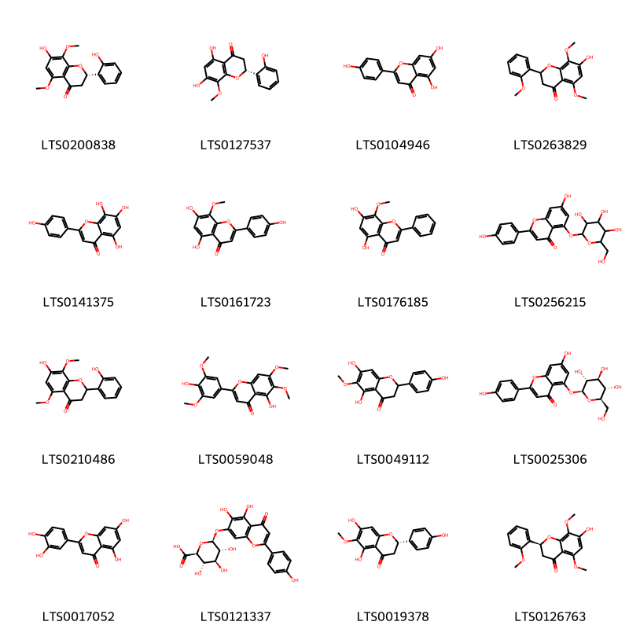
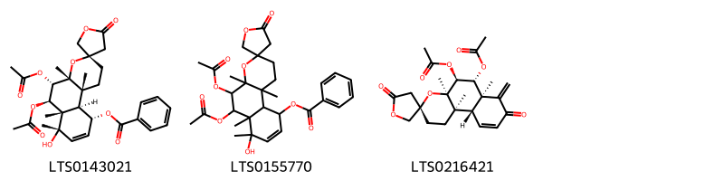
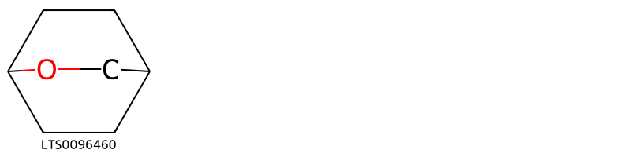
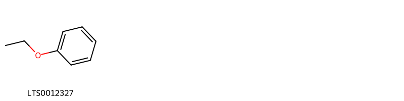
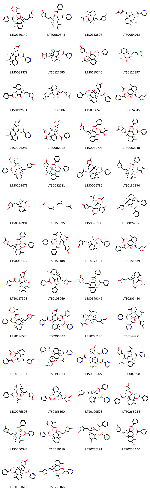

!!! abstract "Tóm tắt"

    Dược liệu bán chi liên (Herba Scutellariae barbatae) là toàn cây phơi khô hoặc sấy của cây bán chi liên (Scutellaria barbata D. Don), thuộc họ bạc hà (Lamiaceae). Cây được mô tả trong "Từ điển cây thuốc Việt Nam" - Võ Văn Chi, bán chi liên là cây thân thảo mọc đứng hay bò, cao 0,2-0,5m. Trên thế giới, cây phân bố ở Ấn Độ, Nhật Bản,Hàn Quốc, Việt Nam và một số nước khác. Còn tại Việt Nam, Bán chi liên phân bố ở Thái Nguyên, Bắc Giang, Bắc Ninh, Phú Thọ, Hà Nội, Hòa Bình, Hải Dương, Ninh Bình, Thanh Hóa, Quảng Trị. Các chất hóa học được phân lập trong cây thuộc các nhóm: Flavonoid (scutellarein; scutellarin; carthamidin; isocarthamidin;...), Diterpenoid (barbatin; scutebarbatin; scutelinquanin;...), Polysaccharide (Rhamnose; Arabinose; Xylose; Mannose; Galactose; Glucose), tinh dầu,... Theo dược điển Hồng Kông, biomaker là hoạt chất: Scutellarin. Bán chi liên có tác dụng dược lý: Bảo vệ tim mạch, Chống khối u, Kháng khuẩn và kháng virus, Chống viêm và chống oxy hóa.

## Thông tin về thực vật

Dược liệu **Bán Chi Liên (Phơi Hoặc Sấy Khô Toàn Cây)** từ bộ phận **nan** từ loài *Scutellaria barbata*.

**Mô tả thực vật:** Bán chi liên là cây thân thảo mọc đứng hay bò, cao 0,2-0,5m. Thân có tiết diện vuông, thường không có lông. Lá hình trứng đến mũi mác, kích thước 1,5-3 x 0,5-1,2cm, chóp lá tù hay nhọn, gốc cụt hay hình tim, mép xẻ răng cưa thưa, 2 mặt gần như nhẵn; gân bên 3-4 đôi; cuống lá dài 3-6mm. 
Cụm hoa hình chùm ở nách lá phía đỉnh cành, dài 3-5cm. Hoa mọc đối, thường hướng về một phía. Lá bắc giống lá thân, càng lên ngọn càng thon hẹp lại. Cuống hoa dài 1-2mm. Đài hình chuông, dài 1,5-2mm, có lông rải rác phía ngoài, 2 môi; tràng màu trắng hay tím, dài 8-10mm, ống tràng trắng, thường nhẵn ở phía ngoài, 2 môi: môi trên dạng mũ, đỉnh có khuyết, môi dưới chia 3 thùy, thùy giữa lớn hơn 2 thùy bên. Nhị 4, hướng lên phía môi trên của tràng, thụt vào trong ống tràng, chỉ nhị có lông ở dưới. Bầu nhẵn, vòi nhụy chia 2 thùy ở đỉnh. Quả bế, có hình thận, kích thước 08-2cm, màu nâu đen, vỏ ngoài sần.

*Tài liệu tham khảo:* "Từ điển cây thuốc Việt Nam" - Võ Văn Chi 
Trong dược điển Việt nam, một loài được sử dụng làm dược liệu là *Scutellaria barbata*.

!!! info "Phân loại thực vật của *Scutellaria barbata*"
    - **Kingdom:** Plantae
    - **Phylum:** Tracheophyta
    - **Order:** Lamiales
    - **Family:** Lamiaceae
    - **Genus:** Scutellaria
    - **Species:** *Scutellaria barbata*

**Phân bố trên thế giới:** Chinese Taipei, United States of America, China

**Phân bố tại Việt nam:** Không có ghi nhận ở Việt Nam

## Thông tin về dược liệu 

### Định danh

!!! info "Thông tin về tên gọi"

    - Dược liệu tiếng Việt: nan
    - Dược liệu tiếng Trung: nan (nan)
    - Dược liệu tiếng Anh: nan
    - Dược liệu latin thông dụng: nan
    - Dược liệu latin kiểu DĐVN: *herba scutellariae barbatae*
    - Dược liệu latin kiểu DĐVN: *nan*
    - Dược liệu latin kiểu thông tư: *nan*
    - Bộ phận dùng: nan (nan)

### Mô tả dược liệu 

- **Theo dược điển Việt nam V:** nan

- **Mô tả dược liệu theo thông tư chế biến dược liệu theo phương pháp cổ truyền:** nan

### Chế biến 

- **Chế biến theo dược điển việt nam V**: nan

- **Chế biến theo thông tư:** nan

--- 

## Thành phần hóa học

- Theo tài liệu của GS. Đỗ Tất Lợi:  (1)Nhóm hóa học: Flavonoid, Diterpenoid, Polysaccharide, Tinh dầu,...
(2)Trong dược điển Hồng Kông, tên hoạt chất biomaker là: Scutellarin
    

**Thành phần hóa học từ loài **Scutellaria barbata**

Theo cơ sở dữ liệu lotus, loài *Scutellaria barbata* đã phân lập và xác định được **129** hoạt chất thuộc về các nhóm Pyrans, Organooxygen compounds, Fatty Acyls, Flavonoids, Cinnamic acids and derivatives, Benzopyrans, Phenol ethers, Phenols, Naphthopyrans, Pyridines and derivatives, Tetrapyrroles and derivatives, Linear 1,3-diarylpropanoids, Prenol lipids, Oxanes trong bảng dưới đây. Danh sách các hoạt chất như sau 2-(benzoyloxy)-3,8-dihydroxy-3,4,8,8a-tetramethyl-4-[2-(5-oxo-2h-furan-3-yl)ethenyl]-1,2,4a,5-tetrahydronaphthalen-1-yl pyridine-3-carboxylate [(LTS0129576)](https://lotus.naturalproducts.net/compound/lotus_id/LTS0129576), (1r,3r,4as,5r,6s,6as,10ar,10br)-1,5-bis(acetyloxy)-4a,6a,7,10b-tetramethyl-5'-oxo-2,5,6,9,10,10a-hexahydro-1h-spiro[naphtho[2,1-b]pyran-3,3'-oxolan]-6-yl pyridine-3-carboxylate [(LTS0026124)](https://lotus.naturalproducts.net/compound/lotus_id/LTS0026124), 6,10,14-trimethylpentadecan-2-one [(LTS0258077)](https://lotus.naturalproducts.net/compound/lotus_id/LTS0258077), 2-(acetyloxy)-3-hydroxy-3,4,8,8a-tetramethyl-4-[2-(5-oxo-2h-furan-3-yl)ethenyl]-2,4a,5,6-tetrahydro-1h-naphthalen-1-yl pyridine-3-carboxylate [(LTS0127167)](https://lotus.naturalproducts.net/compound/lotus_id/LTS0127167), (1r,2s,3r,4s,4as,8ar)-1-(acetyloxy)-4-[(1s)-1-(acetyloxy)-2-(5-oxo-2h-furan-3-yl)ethyl]-3-hydroxy-3,4,8,8a-tetramethyl-2,4a,5,6-tetrahydro-1h-naphthalen-2-yl 2-methylpropanoate [(LTS0090138)](https://lotus.naturalproducts.net/compound/lotus_id/LTS0090138), scutellarin [(LTS0121337)](https://lotus.naturalproducts.net/compound/lotus_id/LTS0121337), (1r,2s,3r,4r,4as,8ar)-1-(benzoyloxy)-3-hydroxy-3,4,8,8a-tetramethyl-4-[(1e)-2-(5-oxo-2h-furan-3-yl)ethenyl]-2,4a,5,6-tetrahydro-1h-naphthalen-2-yl pyridine-3-carboxylate [(LTS0213430)](https://lotus.naturalproducts.net/compound/lotus_id/LTS0213430), eugenol [(LTS0052342)](https://lotus.naturalproducts.net/compound/lotus_id/LTS0052342), (3s,4ar,5s,6r,6ar,10r,10as,10br)-5,6-bis(acetyloxy)-4a,6a,7,10b-tetramethyl-5'-oxo-2,5,6,9,10,10a-hexahydro-1h-spiro[naphtho[2,1-b]pyran-3,3'-oxolan]-10-yl pyridine-3-carboxylate [(LTS0082932)](https://lotus.naturalproducts.net/compound/lotus_id/LTS0082932), (1r,2s,3r,4r,4as,8ar)-2-(acetyloxy)-3-hydroxy-3,4,8,8a-tetramethyl-4-[(1e)-2-(5-oxo-2h-furan-3-yl)ethenyl]-2,4a,5,6-tetrahydro-1h-naphthalen-1-yl acetate [(LTS0203410)](https://lotus.naturalproducts.net/compound/lotus_id/LTS0203410), scutebata d [(LTS0240511)](https://lotus.naturalproducts.net/compound/lotus_id/LTS0240511), 2-(benzoyloxy)-3-hydroxy-3,4,8a-trimethyl-8-methylidene-7-oxo-4-[2-(5-oxo-2h-furan-3-yl)ethenyl]-tetrahydro-1h-naphthalen-1-yl pyridine-3-carboxylate [(LTS0079575)](https://lotus.naturalproducts.net/compound/lotus_id/LTS0079575), wogonin [(LTS0176185)](https://lotus.naturalproducts.net/compound/lotus_id/LTS0176185), (1s,3r,4's,4ar,5s,6r,6ar,10as,10bs)-6-(benzoyloxy)-4',5-dihydroxy-4a,6a,7,10b-tetramethyl-5'-oxo-2,5,6,9,10,10a-hexahydro-1h-spiro[naphtho[2,1-b]pyran-3,3'-oxolan]-1-yl pyridine-3-carboxylate [(LTS0267919)](https://lotus.naturalproducts.net/compound/lotus_id/LTS0267919), 2-oxabicyclo[2.2.2]octane [(LTS0096460)](https://lotus.naturalproducts.net/compound/lotus_id/LTS0096460), (1r,2s,3r,4r,4as,8ar)-3-hydroxy-3,4,8,8a-tetramethyl-4-[(1e)-2-(5-oxo-2h-furan-3-yl)ethenyl]-2-(pyridine-3-carbonyloxy)-2,4a,5,6-tetrahydro-1h-naphthalen-1-yl pyridine-3-carboxylate [(LTS0149349)](https://lotus.naturalproducts.net/compound/lotus_id/LTS0149349), 2-(benzoyloxy)-3-hydroxy-3,4,8,8a-tetramethyl-4-{6-oxo-2h,3h,4h-furo[2,3-c]furan-2-yl}-2,4a,5,6-tetrahydro-1h-naphthalen-1-yl pyridine-3-carboxylate [(LTS0107421)](https://lotus.naturalproducts.net/compound/lotus_id/LTS0107421), methanone, dicyclohexyl- [(LTS0069653)](https://lotus.naturalproducts.net/compound/lotus_id/LTS0069653), 3-hydroxy-3,4,8,8a-tetramethyl-1-[(3-methyl-2-oxobutanoyl)oxy]-4-[2-(5-oxo-2h-furan-3-yl)ethenyl]-2,4a,5,6-tetrahydro-1h-naphthalen-2-yl pyridine-3-carboxylate [(LTS0082793)](https://lotus.naturalproducts.net/compound/lotus_id/LTS0082793), (1r,2s,3r,4r,4as,8ar)-3-hydroxy-3,4,8,8a-tetramethyl-2-[(2-methylpropanoyl)oxy]-4-[(1e)-2-(5-oxo-2h-furan-3-yl)ethenyl]-2,4a,5,6-tetrahydro-1h-naphthalen-1-yl benzoate [(LTS0275808)](https://lotus.naturalproducts.net/compound/lotus_id/LTS0275808), 7-hydroxy-5,8-dimethoxy-2-(2-methoxyphenyl)-2,3-dihydro-1-benzopyran-4-one [(LTS0263829)](https://lotus.naturalproducts.net/compound/lotus_id/LTS0263829), (1r,2s,3r,4r,4as,8ar)-2,3-dihydroxy-3,4,8,8a-tetramethyl-4-[(1e)-2-(5-oxo-2h-furan-3-yl)ethenyl]-2,4a,5,6-tetrahydro-1h-naphthalen-1-yl acetate [(LTS0000123)](https://lotus.naturalproducts.net/compound/lotus_id/LTS0000123), (1s,3r,4ar,5s,6r,6ar,10as,10bs)-6-(benzoyloxy)-5-hydroxy-4a,6a,7,10b-tetramethyl-5'-oxo-2,5,6,9,10,10a-hexahydro-1h-spiro[naphtho[2,1-b]pyran-3,3'-oxolan]-1-yl benzoate [(LTS0171558)](https://lotus.naturalproducts.net/compound/lotus_id/LTS0171558), (1r,2s,3r,4r,4as,8ar)-3-hydroxy-3,4,8,8a-tetramethyl-1-[(3-methyl-2-oxobutanoyl)oxy]-4-[(1e)-2-(5-oxo-2h-furan-3-yl)ethenyl]-2,4a,5,6-tetrahydro-1h-naphthalen-2-yl pyridine-3-carboxylate [(LTS0182334)](https://lotus.naturalproducts.net/compound/lotus_id/LTS0182334), (1s,3r,4ar,5s,6r,6ar,10as,10bs)-5,6-dihydroxy-4a,6a,7,10b-tetramethyl-5'-oxo-2,5,6,9,10,10a-hexahydro-1h-spiro[naphtho[2,1-b]pyran-3,3'-oxolan]-1-yl pyridine-3-carboxylate [(LTS0039379)](https://lotus.naturalproducts.net/compound/lotus_id/LTS0039379), scutebarbatine g [(LTS0096246)](https://lotus.naturalproducts.net/compound/lotus_id/LTS0096246), 4-(2-{2,3-dihydroxy-4-[(2-isopropyloxiran-2-yl)methoxy]-1,2,4a,5-tetramethyl-4,7,8,8a-tetrahydro-3h-naphthalen-1-yl}ethenyl)-5h-furan-2-one [(LTS0133906)](https://lotus.naturalproducts.net/compound/lotus_id/LTS0133906), scutebarbatine h [(LTS0127585)](https://lotus.naturalproducts.net/compound/lotus_id/LTS0127585), 3-hydroxy-3,4,8,8a-tetramethyl-4-[2-(5-oxo-2h-furan-3-yl)ethenyl]-2-(pyridine-3-carbonyloxy)-2,4a,5,6-tetrahydro-1h-naphthalen-1-yl pyridine-3-carboxylate [(LTS0054172)](https://lotus.naturalproducts.net/compound/lotus_id/LTS0054172), (1s)-1-[(1s,2r,3s,4r,4ar,8as)-3,4-bis(acetyloxy)-2-hydroxy-1,2,4a,5-tetramethyl-4,7,8,8a-tetrahydro-3h-naphthalen-1-yl]-2-(5-oxo-2h-furan-3-yl)ethyl acetate [(LTS0186862)](https://lotus.naturalproducts.net/compound/lotus_id/LTS0186862), (2s)-5,7-dihydroxy-2-(4-hydroxyphenyl)-6-methoxy-2,3-dihydro-1-benzopyran-4-one [(LTS0019378)](https://lotus.naturalproducts.net/compound/lotus_id/LTS0019378), (1s,3s,4ar,5s,6r,6ar,10as,10bs)-6-(benzoyloxy)-5-hydroxy-4a,6a,7,10b-tetramethyl-5'-oxo-2,5,6,9,10,10a-hexahydro-1h-spiro[naphtho[2,1-b]pyran-3,3'-oxolan]-1-yl benzoate [(LTS0196526)](https://lotus.naturalproducts.net/compound/lotus_id/LTS0196526), (2e)-1-(2,4-dihydroxy-3,6-dimethoxyphenyl)-3-(2-methoxyphenyl)prop-2-en-1-one [(LTS0259132)](https://lotus.naturalproducts.net/compound/lotus_id/LTS0259132), luteolin [(LTS0017052)](https://lotus.naturalproducts.net/compound/lotus_id/LTS0017052), 5-(acetyloxy)-4a,6a,7,10b-tetramethyl-5'-oxo-1-(pyridine-3-carbonyloxy)-2,5,6,9,10,10a-hexahydro-1h-spiro[naphtho[2,1-b]pyran-3,3'-oxolan]-6-yl pyridine-3-carboxylate [(LTS0003543)](https://lotus.naturalproducts.net/compound/lotus_id/LTS0003543), (1r,2s,3r,4s,4as,8ar)-4-[(1s)-1-(acetyloxy)-2-(5-oxo-2h-furan-3-yl)ethyl]-3-hydroxy-3,4,8,8a-tetramethyl-2-(pyridine-3-carbonyloxy)-2,4a,5,6-tetrahydro-1h-naphthalen-1-yl pyridine-3-carboxylate [(LTS0144921)](https://lotus.naturalproducts.net/compound/lotus_id/LTS0144921), 2-(benzoyloxy)-3,7-dihydroxy-3,4,8a-trimethyl-8-methylidene-4-[2-(5-oxo-2h-furan-3-yl)ethenyl]-hexahydronaphthalen-1-yl pyridine-3-carboxylate [(LTS0185100)](https://lotus.naturalproducts.net/compound/lotus_id/LTS0185100), 6-(benzoyloxy)-5-hydroxy-4a,6a,10b-trimethyl-7-methylidene-5'-oxo-octahydrospiro[naphtho[2,1-b]pyran-3,3'-oxolan]-1-yl pyridine-3-carboxylate [(LTS0186803)](https://lotus.naturalproducts.net/compound/lotus_id/LTS0186803), 2,3-dihydroxy-3,4,8,8a-tetramethyl-4-[2-(5-oxo-2h-furan-3-yl)ethenyl]-2,4a,5,6-tetrahydro-1h-naphthalen-1-yl acetate [(LTS0133808)](https://lotus.naturalproducts.net/compound/lotus_id/LTS0133808), 3-hydroxy-3,4,8,8a-tetramethyl-4-{6-oxo-2h,3h,4h-furo[2,3-c]furan-2-yl}-2-(pyridine-3-carbonyloxy)-2,4a,5,6-tetrahydro-1h-naphthalen-1-yl pyridine-3-carboxylate [(LTS0062918)](https://lotus.naturalproducts.net/compound/lotus_id/LTS0062918), (1s,3r,4ar,5s,6r,6ar,10as,10bs)-4a,6a,7,10b-tetramethyl-5'-oxo-5,6-bis(pyridine-3-carbonyloxy)-2,5,6,9,10,10a-hexahydro-1h-spiro[naphtho[2,1-b]pyran-3,3'-oxolan]-1-yl pyridine-3-carboxylate [(LTS0215376)](https://lotus.naturalproducts.net/compound/lotus_id/LTS0215376), 6,10,14-trimethylpentadeca-5,9,13-trien-2-one [(LTS0158635)](https://lotus.naturalproducts.net/compound/lotus_id/LTS0158635), 4-[(1e)-2-[(1s,2r,3s,4r,4ar,8as)-2,3,4-trihydroxy-1,2,4a,5-tetramethyl-4,7,8,8a-tetrahydro-3h-naphthalen-1-yl]ethenyl]-5h-furan-2-one [(LTS0148931)](https://lotus.naturalproducts.net/compound/lotus_id/LTS0148931), (3s,4ar,5s,6r,6ar,10r,10as,10br)-5-(acetyloxy)-4a,6a,7,10b-tetramethyl-5'-oxo-10-(pyridine-3-carbonyloxy)-2,5,6,9,10,10a-hexahydro-1h-spiro[naphtho[2,1-b]pyran-3,3'-oxolan]-6-yl pyridine-3-carboxylate [(LTS0193613)](https://lotus.naturalproducts.net/compound/lotus_id/LTS0193613), (1r,2s,3r,4s,4as,8ar)-1,3-dihydroxy-3,4,8,8a-tetramethyl-4-[(1e)-2-(5-oxo-2h-furan-3-yl)ethenyl]-2,4a,5,6-tetrahydro-1h-naphthalen-2-yl pyridine-3-carboxylate [(LTS0064012)](https://lotus.naturalproducts.net/compound/lotus_id/LTS0064012), perillylalcohol [(LTS0009128)](https://lotus.naturalproducts.net/compound/lotus_id/LTS0009128), scutebarbatine k(rel) [(LTS0251166)](https://lotus.naturalproducts.net/compound/lotus_id/LTS0251166), (1r,2s,3r,4r,4as,8ar)-2-{[(2r)-2-(acetyloxy)-3-methylbutanoyl]oxy}-3-hydroxy-3,4,8,8a-tetramethyl-4-[(1e)-2-(5-oxo-2h-furan-3-yl)ethenyl]-2,4a,5,6-tetrahydro-1h-naphthalen-1-yl pyridine-3-carboxylate [(LTS0196576)](https://lotus.naturalproducts.net/compound/lotus_id/LTS0196576), 5,7-dihydroxy-2-(4-hydroxyphenyl)-6-methoxy-2,3-dihydro-1-benzopyran-4-one [(LTS0049112)](https://lotus.naturalproducts.net/compound/lotus_id/LTS0049112), (3s,4ar,5s,6r,6as,7s,10r,10ar,10br)-5,6-bis(acetyloxy)-7-hydroxy-4a,6a,7,10b-tetramethyl-5'-oxo-1,2,5,6,10,10a-hexahydrospiro[naphtho[2,1-b]pyran-3,3'-oxolan]-10-yl benzoate [(LTS0143021)](https://lotus.naturalproducts.net/compound/lotus_id/LTS0143021), 4-[2-(2,3,4-trihydroxy-1,2,4a,5-tetramethyl-4,7,8,8a-tetrahydro-3h-naphthalen-1-yl)ethenyl]-5h-furan-2-one [(LTS0219759)](https://lotus.naturalproducts.net/compound/lotus_id/LTS0219759), (1r,2s,3r,4r,4as,7s,8ar)-2-(benzoyloxy)-3,7-dihydroxy-3,4,8a-trimethyl-8-methylidene-4-[(1e)-2-(5-oxo-2h-furan-3-yl)ethenyl]-hexahydronaphthalen-1-yl benzoate [(LTS0053818)](https://lotus.naturalproducts.net/compound/lotus_id/LTS0053818), (1r,2s,3r,4s,4as,8ar)-2-{[(2r)-2-(acetyloxy)-3-methylbutanoyl]oxy}-3-hydroxy-3,4,8,8a-tetramethyl-4-[(1e)-2-(5-oxo-2h-furan-3-yl)ethenyl]-2,4a,5,6-tetrahydro-1h-naphthalen-1-yl pyridine-3-carboxylate [(LTS0050116)](https://lotus.naturalproducts.net/compound/lotus_id/LTS0050116), 2-(benzoyloxy)-3-hydroxy-3,4,8,8a-tetramethyl-4-[2-(5-oxo-2h-furan-3-yl)ethenyl]-2,4a,5,6-tetrahydro-1h-naphthalen-1-yl pyridine-3-carboxylate [(LTS0008474)](https://lotus.naturalproducts.net/compound/lotus_id/LTS0008474), 4-[1-(acetyloxy)-2-(5-oxo-2h-furan-3-yl)ethyl]-2-(benzoyloxy)-3-hydroxy-3,4,8,8a-tetramethyl-2,4a,5,6-tetrahydro-1h-naphthalen-1-yl pyridine-3-carboxylate [(LTS0165658)](https://lotus.naturalproducts.net/compound/lotus_id/LTS0165658), scutebarbatine l(rel) [(LTS0209671)](https://lotus.naturalproducts.net/compound/lotus_id/LTS0209671), (1r,2s,3r,4s,4as,8ar)-2-(benzoyloxy)-3-hydroxy-3,4,8,8a-tetramethyl-4-[(2r)-6-oxo-2h,3h,4h-furo[2,3-c]furan-2-yl]-2,4a,5,6-tetrahydro-1h-naphthalen-1-yl pyridine-3-carboxylate [(LTS0063669)](https://lotus.naturalproducts.net/compound/lotus_id/LTS0063669), 6-(benzoyloxy)-4',5-dihydroxy-4a,6a,7,10b-tetramethyl-5'-oxo-2,5,6,9,10,10a-hexahydro-1h-spiro[naphtho[2,1-b]pyran-3,3'-oxolan]-1-yl pyridine-3-carboxylate [(LTS0201545)](https://lotus.naturalproducts.net/compound/lotus_id/LTS0201545), (1r,2r,3s,4r,4ar,8ar)-2-hydroxy-3,4,8,8a-tetramethyl-4-[2-(5-oxo-2h-furan-3-yl)ethyl]-1,2,3,4a,5,6-hexahydronaphthalen-1-yl pyridine-3-carboxylate [(LTS0173191)](https://lotus.naturalproducts.net/compound/lotus_id/LTS0173191), (1r,2s,3r,4r,4as,8ar)-2-(acetyloxy)-3-hydroxy-3,4,8,8a-tetramethyl-4-[2-(5-oxo-2h-furan-3-yl)ethenyl]-2,4a,5,6-tetrahydro-1h-naphthalen-1-yl acetate [(LTS0073312)](https://lotus.naturalproducts.net/compound/lotus_id/LTS0073312), 7-hydroxy-2-(4-hydroxyphenyl)-5-{[(2s,3r,4s,5s,6r)-3,4,5-trihydroxy-6-(hydroxymethyl)oxan-2-yl]oxy}chromen-4-one [(LTS0025306)](https://lotus.naturalproducts.net/compound/lotus_id/LTS0025306), 4a,6a,7,10b-tetramethyl-5'-oxo-1,5-bis(pyridine-3-carbonyloxy)-2,5,6,9,10,10a-hexahydro-1h-spiro[naphtho[2,1-b]pyran-3,3'-oxolan]-6-yl pyridine-3-carboxylate [(LTS0205647)](https://lotus.naturalproducts.net/compound/lotus_id/LTS0205647), 4-[1-(acetyloxy)-2-(4-hydroxy-5-oxo-2h-furan-3-yl)ethyl]-2-(benzoyloxy)-3-hydroxy-3,4,8,8a-tetramethyl-2,4a,5,6-tetrahydro-1h-naphthalen-1-yl benzoate [(LTS0186417)](https://lotus.naturalproducts.net/compound/lotus_id/LTS0186417), (1s,2r,3s,4r,4ar,8as)-2,3-dihydroxy-3,4,8,8a-tetramethyl-4-[(2s)-6-oxo-2h,3h,4h-furo[2,3-c]furan-2-yl]-2,4a,5,6-tetrahydro-1h-naphthalen-1-yl pyridine-3-carboxylate [(LTS0265018)](https://lotus.naturalproducts.net/compound/lotus_id/LTS0265018), (1r,2s,3r,4s,4as,8ar)-2-(benzoyloxy)-3-hydroxy-3,4,8a-trimethyl-8-methylidene-7-oxo-4-[(1e)-2-(5-oxo-2h-furan-3-yl)ethenyl]-tetrahydro-1h-naphthalen-1-yl pyridine-3-carboxylate [(LTS0276191)](https://lotus.naturalproducts.net/compound/lotus_id/LTS0276191), 1,5-bis(acetyloxy)-4a,6a,7,10b-tetramethyl-5'-oxo-2,5,6,9,10,10a-hexahydro-1h-spiro[naphtho[2,1-b]pyran-3,3'-oxolan]-6-yl pyridine-3-carboxylate [(LTS0061318)](https://lotus.naturalproducts.net/compound/lotus_id/LTS0061318), 2h-1-benzopyran [(LTS0192070)](https://lotus.naturalproducts.net/compound/lotus_id/LTS0192070), (1r,2s,3r,4s,4as,8ar)-3-hydroxy-3,4,8,8a-tetramethyl-4-[(2r)-6-oxo-2h,3h,4h-furo[2,3-c]furan-2-yl]-1-(pyridine-3-carbonyloxy)-2,4a,5,6-tetrahydro-1h-naphthalen-2-yl pyridine-3-carboxylate [(LTS0208961)](https://lotus.naturalproducts.net/compound/lotus_id/LTS0208961), (1r,2s,3r,4r,4as,8ar)-1-(acetyloxy)-3-hydroxy-3,4,8,8a-tetramethyl-4-[(1e)-2-(5-oxo-2h-furan-3-yl)ethenyl]-2,4a,5,6-tetrahydro-1h-naphthalen-2-yl benzoate [(LTS0188639)](https://lotus.naturalproducts.net/compound/lotus_id/LTS0188639), isoscutellarein [(LTS0141375)](https://lotus.naturalproducts.net/compound/lotus_id/LTS0141375), 4'-hydroxywogonin [(LTS0161723)](https://lotus.naturalproducts.net/compound/lotus_id/LTS0161723), 2,3-dihydroxy-3,4,8,8a-tetramethyl-4-{6-oxo-2h,3h,4h-furo[2,3-c]furan-2-yl}-2,4a,5,6-tetrahydro-1h-naphthalen-1-yl pyridine-3-carboxylate [(LTS0166160)](https://lotus.naturalproducts.net/compound/lotus_id/LTS0166160), (1r,2s,3r,4s,4as,8ar)-1-(acetyloxy)-3-hydroxy-3,4,8,8a-tetramethyl-4-[(1e)-2-(5-oxo-2h-furan-3-yl)ethenyl]-2,4a,5,6-tetrahydro-1h-naphthalen-2-yl pyridine-3-carboxylate [(LTS0256335)](https://lotus.naturalproducts.net/compound/lotus_id/LTS0256335), 5,6-dihydroxy-4a,6a,7,10b-tetramethyl-5'-oxo-2,5,6,9,10,10a-hexahydro-1h-spiro[naphtho[2,1-b]pyran-3,3'-oxolan]-1-yl pyridine-3-carboxylate [(LTS0117908)](https://lotus.naturalproducts.net/compound/lotus_id/LTS0117908), (1r,2s,3r,4r,4as,8ar)-2,3-dihydroxy-3,4,8,8a-tetramethyl-4-[(1e)-2-(5-oxo-2h-furan-3-yl)ethenyl]-2,4a,5,6-tetrahydro-1h-naphthalen-1-yl benzoate [(LTS0192504)](https://lotus.naturalproducts.net/compound/lotus_id/LTS0192504), 7-hydroxy-2-(2-hydroxyphenyl)-5,8-dimethoxy-2,3-dihydro-1-benzopyran-4-one [(LTS0210486)](https://lotus.naturalproducts.net/compound/lotus_id/LTS0210486), (2s)-2-(4-hydroxyphenyl)-6-methyl-2,3-dihydropyran-4-one [(LTS0255806)](https://lotus.naturalproducts.net/compound/lotus_id/LTS0255806), scutebarbatine j(rel) [(LTS0241703)](https://lotus.naturalproducts.net/compound/lotus_id/LTS0241703), 8a-[(acetyloxy)methyl]-5-{5-ethoxy-hexahydrofuro[2,3-b]furan-2-yl}-5,6-dimethyl-hexahydro-2h-spiro[naphthalene-1,2'-oxiran]-8-yl pyridine-3-carboxylate [(LTS0018525)](https://lotus.naturalproducts.net/compound/lotus_id/LTS0018525), (2r)-5,7-dihydroxy-2-(2-hydroxyphenyl)-8-methoxy-2,3-dihydro-1-benzopyran-4-one [(LTS0127537)](https://lotus.naturalproducts.net/compound/lotus_id/LTS0127537), 1-(2,4-dihydroxy-3,6-dimethoxyphenyl)-3-(2-methoxyphenyl)prop-2-en-1-one [(LTS0027542)](https://lotus.naturalproducts.net/compound/lotus_id/LTS0027542), (1r,2s,3r,4s,4as,8ar)-4-[(1s)-1-(acetyloxy)-2-(5-oxo-2h-furan-3-yl)ethyl]-3-hydroxy-3,4,8,8a-tetramethyl-2-[(2-methylpropanoyl)oxy]-2,4a,5,6-tetrahydro-1h-naphthalen-1-yl pyridine-3-carboxylate [(LTS0087698)](https://lotus.naturalproducts.net/compound/lotus_id/LTS0087698), (1s,3s,4ar,5s,6r,6ar,10as,10bs)-5-(acetyloxy)-4a,6a,7,10b-tetramethyl-5'-oxo-1-(pyridine-3-carbonyloxy)-2,5,6,9,10,10a-hexahydro-1h-spiro[naphtho[2,1-b]pyran-3,3'-oxolan]-6-yl pyridine-3-carboxylate [(LTS0007886)](https://lotus.naturalproducts.net/compound/lotus_id/LTS0007886), (1r,2s,3r,4s,4as,8ar)-2-(acetyloxy)-3-hydroxy-3,4,8,8a-tetramethyl-4-[(1e)-2-(5-oxo-2h-furan-3-yl)ethenyl]-2,4a,5,6-tetrahydro-1h-naphthalen-1-yl pyridine-3-carboxylate [(LTS0082463)](https://lotus.naturalproducts.net/compound/lotus_id/LTS0082463), 3-[(3r,21s,22s)-16-ethenyl-11-ethyl-3-(methoxycarbonyl)-12,17,21,26-tetramethyl-4-oxo-7,23,24,25-tetraazahexacyclo[18.2.1.1⁵,⁸.1¹⁰,¹³.1¹⁵,¹⁸.0²,⁶]hexacosa-1(23),2(6),5(26),7,9,11,13,15,17,19-decaen-22-yl]propanoic acid [(LTS0031695)](https://lotus.naturalproducts.net/compound/lotus_id/LTS0031695), chamomile [(LTS0104946)](https://lotus.naturalproducts.net/compound/lotus_id/LTS0104946), 5-(benzoyloxy)-1-hydroxy-4a,6a,10b-trimethyl-7-methylidene-5'-oxo-octahydrospiro[naphtho[2,1-b]pyran-3,3'-oxolan]-6-yl benzoate [(LTS0082181)](https://lotus.naturalproducts.net/compound/lotus_id/LTS0082181), (1s,3s,4ar,5s,6r,6ar,10as,10bs)-6-(benzoyloxy)-5-hydroxy-4a,6a,10b-trimethyl-7-methylidene-5'-oxo-octahydrospiro[naphtho[2,1-b]pyran-3,3'-oxolan]-1-yl pyridine-3-carboxylate [(LTS0181612)](https://lotus.naturalproducts.net/compound/lotus_id/LTS0181612), phenyl ethyl alcohol [(LTS0012327)](https://lotus.naturalproducts.net/compound/lotus_id/LTS0012327), (1s,3s,4ar,5s,6r,6ar,10as,10bs)-6-(benzoyloxy)-1-hydroxy-4a,6a,10b-trimethyl-7-methylidene-5'-oxo-octahydrospiro[naphtho[2,1-b]pyran-3,3'-oxolan]-5-yl benzoate [(LTS0024396)](https://lotus.naturalproducts.net/compound/lotus_id/LTS0024396), (1r,2s,3r,4s,4ar,8s,8as)-2-(benzoyloxy)-3,8-dihydroxy-3,4,8,8a-tetramethyl-4-[(1e)-2-(5-oxo-2h-furan-3-yl)ethenyl]-1,2,4a,5-tetrahydronaphthalen-1-yl pyridine-3-carboxylate [(LTS0108269)](https://lotus.naturalproducts.net/compound/lotus_id/LTS0108269), (1s,3s,4ar,5s,6r,6ar,10as,10bs)-6-(benzoyloxy)-5-hydroxy-4a,6a,7,10b-tetramethyl-5'-oxo-2,5,6,9,10,10a-hexahydro-1h-spiro[naphtho[2,1-b]pyran-3,3'-oxolan]-1-yl pyridine-3-carboxylate [(LTS0058230)](https://lotus.naturalproducts.net/compound/lotus_id/LTS0058230), (1r,2s,3r,4s,4as,8ar)-4-[(1s)-1-(acetyloxy)-2-(5-oxo-2h-furan-3-yl)ethyl]-2,3-dihydroxy-3,4,8,8a-tetramethyl-2,4a,5,6-tetrahydro-1h-naphthalen-1-yl benzoate [(LTS0110740)](https://lotus.naturalproducts.net/compound/lotus_id/LTS0110740), 1-(benzoyloxy)-5-hydroxy-4a,6a,7,10b-tetramethyl-5'-oxo-2,5,6,9,10,10a-hexahydro-1h-spiro[naphtho[2,1-b]pyran-3,3'-oxolan]-6-yl benzoate [(LTS0266984)](https://lotus.naturalproducts.net/compound/lotus_id/LTS0266984), (1s,3s,4'r,4ar,5s,6r,6ar,10as,10bs)-6-(benzoyloxy)-4',5-dihydroxy-4a,6a,7,10b-tetramethyl-5'-oxo-2,5,6,9,10,10a-hexahydro-1h-spiro[naphtho[2,1-b]pyran-3,3'-oxolan]-1-yl benzoate [(LTS0175075)](https://lotus.naturalproducts.net/compound/lotus_id/LTS0175075), scutebarbatine e [(LTS0080545)](https://lotus.naturalproducts.net/compound/lotus_id/LTS0080545), peg-2 laurate [(LTS0207826)](https://lotus.naturalproducts.net/compound/lotus_id/LTS0207826), 1,3-dihydroxy-3,4,8,8a-tetramethyl-4-[2-(5-oxo-2h-furan-3-yl)ethenyl]-2,4a,5,6-tetrahydro-1h-naphthalen-2-yl pyridine-3-carboxylate [(LTS0021064)](https://lotus.naturalproducts.net/compound/lotus_id/LTS0021064), (1r,3r,4as,5r,6s,6as,10ar,10br)-4a,6a,7,10b-tetramethyl-5'-oxo-1,5-bis(pyridine-3-carbonyloxy)-2,5,6,9,10,10a-hexahydro-1h-spiro[naphtho[2,1-b]pyran-3,3'-oxolan]-6-yl pyridine-3-carboxylate [(LTS0099322)](https://lotus.naturalproducts.net/compound/lotus_id/LTS0099322), 2-{[2-(acetyloxy)-3-methylbutanoyl]oxy}-3-hydroxy-3,4,8,8a-tetramethyl-4-[2-(5-oxo-2h-furan-3-yl)ethenyl]-2,4a,5,6-tetrahydro-1h-naphthalen-1-yl pyridine-3-carboxylate [(LTS0189140)](https://lotus.naturalproducts.net/compound/lotus_id/LTS0189140), scutebarbatine d [(LTS0250440)](https://lotus.naturalproducts.net/compound/lotus_id/LTS0250440), scutebarbatine c [(LTS0000576)](https://lotus.naturalproducts.net/compound/lotus_id/LTS0000576), 5,6-bis(acetyloxy)-7-hydroxy-4a,6a,7,10b-tetramethyl-5'-oxo-1,2,5,6,10,10a-hexahydrospiro[naphtho[2,1-b]pyran-3,3'-oxolan]-10-yl benzoate [(LTS0155770)](https://lotus.naturalproducts.net/compound/lotus_id/LTS0155770), (1r,2s,3r,4s,4as,8ar)-4-[(1s)-1-(acetyloxy)-2-(5-oxo-2h-furan-3-yl)ethyl]-2-(benzoyloxy)-3-hydroxy-3,4,8,8a-tetramethyl-2,4a,5,6-tetrahydro-1h-naphthalen-1-yl pyridine-3-carboxylate [(LTS0156108)](https://lotus.naturalproducts.net/compound/lotus_id/LTS0156108), (1r,2s,3r,4s,4as,7s,8ar)-2-(benzoyloxy)-3,7-dihydroxy-3,4,8a-trimethyl-8-methylidene-4-[(1e)-2-(5-oxo-2h-furan-3-yl)ethenyl]-hexahydronaphthalen-1-yl pyridine-3-carboxylate [(LTS0225071)](https://lotus.naturalproducts.net/compound/lotus_id/LTS0225071), 6-(benzoyloxy)-5-hydroxy-4a,6a,7,10b-tetramethyl-5'-oxo-2,5,6,9,10,10a-hexahydro-1h-spiro[naphtho[2,1-b]pyran-3,3'-oxolan]-1-yl pyridine-3-carboxylate [(LTS0026785)](https://lotus.naturalproducts.net/compound/lotus_id/LTS0026785), 4-[(1e)-2-[(1r,2r,3s,4r,4ar,8as)-2,3,4-trihydroxy-1,2,4a,5-tetramethyl-4,7,8,8a-tetrahydro-3h-naphthalen-1-yl]ethenyl]-5h-furan-2-one [(LTS0122397)](https://lotus.naturalproducts.net/compound/lotus_id/LTS0122397), (2s)-7-hydroxy-2-(2-hydroxyphenyl)-5,8-dimethoxy-2,3-dihydro-1-benzopyran-4-one [(LTS0200838)](https://lotus.naturalproducts.net/compound/lotus_id/LTS0200838), (1r,2s,3r,4r,4as,8ar)-1-(acetyloxy)-3-hydroxy-3,4,8,8a-tetramethyl-4-[(1e)-2-(5-oxo-2h-furan-3-yl)ethenyl]-2,4a,5,6-tetrahydro-1h-naphthalen-2-yl 2-methylpropanoate [(LTS0273125)](https://lotus.naturalproducts.net/compound/lotus_id/LTS0273125), (1s,3r,4ar,5s,6r,6ar,10as,10bs)-5-(acetyloxy)-4a,6a,7,10b-tetramethyl-5'-oxo-1-(pyridine-3-carbonyloxy)-2,5,6,9,10,10a-hexahydro-1h-spiro[naphtho[2,1-b]pyran-3,3'-oxolan]-6-yl pyridine-3-carboxylate [(LTS0235671)](https://lotus.naturalproducts.net/compound/lotus_id/LTS0235671), 5-hydroxy-2-(4-hydroxy-3,5-dimethoxyphenyl)-6,7-dimethoxychromen-4-one [(LTS0059048)](https://lotus.naturalproducts.net/compound/lotus_id/LTS0059048), 4-hydroxycinnamoylmethane [(LTS0224221)](https://lotus.naturalproducts.net/compound/lotus_id/LTS0224221), 1-heptadecanol [(LTS0166925)](https://lotus.naturalproducts.net/compound/lotus_id/LTS0166925), scutebarbatine f [(LTS0013269)](https://lotus.naturalproducts.net/compound/lotus_id/LTS0013269), trans-2-hydroxycinnamic acid [(LTS0142397)](https://lotus.naturalproducts.net/compound/lotus_id/LTS0142397), 2-(4-hydroxyphenyl)-6-methyl-2,3-dihydropyran-4-one [(LTS0140635)](https://lotus.naturalproducts.net/compound/lotus_id/LTS0140635), (1r,2s,3r,4r,4as,8ar)-2-(benzoyloxy)-3-hydroxy-3,4,8,8a-tetramethyl-4-[(1e)-2-(5-oxo-2h-furan-3-yl)ethenyl]-2,4a,5,6-tetrahydro-1h-naphthalen-1-yl benzoate [(LTS0250343)](https://lotus.naturalproducts.net/compound/lotus_id/LTS0250343), 7-hydroxy-2-(4-hydroxyphenyl)-5-{[3,4,5-trihydroxy-6-(hydroxymethyl)oxan-2-yl]oxy}chromen-4-one [(LTS0256215)](https://lotus.naturalproducts.net/compound/lotus_id/LTS0256215), (2s)-7-hydroxy-5,8-dimethoxy-2-(2-methoxyphenyl)-2,3-dihydro-1-benzopyran-4-one [(LTS0126763)](https://lotus.naturalproducts.net/compound/lotus_id/LTS0126763), (1r,2s,3r,4r,4as,8ar)-3-hydroxy-3,4,8,8a-tetramethyl-2-[(2-methylpropanoyl)oxy]-4-[(1e)-2-(5-oxo-2h-furan-3-yl)ethenyl]-2,4a,5,6-tetrahydro-1h-naphthalen-1-yl pyridine-3-carboxylate [(LTS0180451)](https://lotus.naturalproducts.net/compound/lotus_id/LTS0180451), 4-[(1e)-2-[(1r,2r,3s,4r,4ar,8as)-2,3-dihydroxy-4-{[(2s)-2-isopropyloxiran-2-yl]methoxy}-1,2,4a,5-tetramethyl-4,7,8,8a-tetrahydro-3h-naphthalen-1-yl]ethenyl]-5h-furan-2-one [(LTS0050832)](https://lotus.naturalproducts.net/compound/lotus_id/LTS0050832), scutebarbatine i(rel) [(LTS0217309)](https://lotus.naturalproducts.net/compound/lotus_id/LTS0217309), p-hydroxybenzalacetone [(LTS0200625)](https://lotus.naturalproducts.net/compound/lotus_id/LTS0200625), (3s,4ar,5s,6r,6ar,10as,10br)-5-(acetyloxy)-4a,6a,10b-trimethyl-7-methylidene-5',8-dioxo-2,5,6,10a-tetrahydro-1h-spiro[naphtho[2,1-b]pyran-3,3'-oxolan]-6-yl acetate [(LTS0216421)](https://lotus.naturalproducts.net/compound/lotus_id/LTS0216421), (1r,2s,3r,4r,4as,8ar)-1,3-dihydroxy-3,4,8,8a-tetramethyl-4-[(1e)-2-(5-oxo-2h-furan-3-yl)ethenyl]-2,4a,5,6-tetrahydro-1h-naphthalen-2-yl pyridine-3-carboxylate [(LTS0272597)](https://lotus.naturalproducts.net/compound/lotus_id/LTS0272597), (1r,2s,3r,4r,4as,8ar)-2-{[2-(acetyloxy)-3-methylbutanoyl]oxy}-3-hydroxy-3,4,8,8a-tetramethyl-4-[(1e)-2-(5-oxo-2h-furan-3-yl)ethenyl]-2,4a,5,6-tetrahydro-1h-naphthalen-1-yl benzoate [(LTS0111535)](https://lotus.naturalproducts.net/compound/lotus_id/LTS0111535), (1r,2s,3r,4r,4as,8ar)-1-(acetyloxy)-3-hydroxy-3,4,8,8a-tetramethyl-4-[(1e)-2-(5-oxo-2h-furan-3-yl)ethenyl]-2,4a,5,6-tetrahydro-1h-naphthalen-2-yl pyridine-3-carboxylate [(LTS0074815)](https://lotus.naturalproducts.net/compound/lotus_id/LTS0074815), 1-(acetyloxy)-3-hydroxy-3,4,8,8a-tetramethyl-4-[2-(5-oxo-2h-furan-3-yl)ethenyl]-2,4a,5,6-tetrahydro-1h-naphthalen-2-yl pyridine-3-carboxylate [(LTS0152151)](https://lotus.naturalproducts.net/compound/lotus_id/LTS0152151), (1r,2s,3r,4r,4as,8ar)-2-(benzoyloxy)-3-hydroxy-3,4,8,8a-tetramethyl-4-[(1e)-2-(5-oxo-2h-furan-3-yl)ethenyl]-2,4a,5,6-tetrahydro-1h-naphthalen-1-yl pyridine-3-carboxylate [(LTS0137971)](https://lotus.naturalproducts.net/compound/lotus_id/LTS0137971). 
        
| chemicalTaxonomyClassyfireClass   |   smiles_count |
|:----------------------------------|---------------:|
| Benzopyrans                       |             15 |
| Cinnamic acids and derivatives    |             62 |
| Fatty Acyls                       |             41 |
| Flavonoids                        |            740 |
| Linear 1,3-diarylpropanoids       |             78 |
| Naphthopyrans                     |            279 |
| Organooxygen compounds            |             21 |
| Oxanes                            |             12 |
| Phenol ethers                     |             11 |
| Phenols                           |             19 |
| Prenol lipids                     |           8384 |
| Pyrans                            |             59 |
| Pyridines and derivatives         |            286 |
| Tetrapyrroles and derivatives     |            102 |

            
### Nhóm Benzopyrans
<figure markdown="span">
    { width=100% }
<figcaption>Hình ảnh cấu trúc hóa học của hoạt chất thuộc nhóm *Benzopyrans*. Tên thường gọi của các hoạt chất tương ứng là 2h-1-benzopyran [(LTS0192070)](https://lotus.naturalproducts.net/compound/lotus_id/LTS0192070).</figcaption>
</figure>

            
            
### Nhóm Benzopyrans
<figure markdown="span">
    { width=100% }
<figcaption>Hình ảnh cấu trúc hóa học của hoạt chất thuộc nhóm *Benzopyrans*. Tên thường gọi của các hoạt chất tương ứng là 2h-1-benzopyran [(LTS0192070)](https://lotus.naturalproducts.net/compound/lotus_id/LTS0192070).</figcaption>
</figure>

### Nhóm Cinnamic acids and derivatives
<figure markdown="span">
    { width=100% }
<figcaption>Hình ảnh cấu trúc hóa học của hoạt chất thuộc nhóm *Cinnamic acids and derivatives*. Tên thường gọi của các hoạt chất tương ứng là trans-2-hydroxycinnamic acid [(LTS0142397)](https://lotus.naturalproducts.net/compound/lotus_id/LTS0142397), p-hydroxybenzalacetone [(LTS0200625)](https://lotus.naturalproducts.net/compound/lotus_id/LTS0200625), 4-hydroxycinnamoylmethane [(LTS0224221)](https://lotus.naturalproducts.net/compound/lotus_id/LTS0224221).</figcaption>
</figure>

            
            
### Nhóm Benzopyrans
<figure markdown="span">
    { width=100% }
<figcaption>Hình ảnh cấu trúc hóa học của hoạt chất thuộc nhóm *Benzopyrans*. Tên thường gọi của các hoạt chất tương ứng là 2h-1-benzopyran [(LTS0192070)](https://lotus.naturalproducts.net/compound/lotus_id/LTS0192070).</figcaption>
</figure>

### Nhóm Cinnamic acids and derivatives
<figure markdown="span">
    { width=100% }
<figcaption>Hình ảnh cấu trúc hóa học của hoạt chất thuộc nhóm *Cinnamic acids and derivatives*. Tên thường gọi của các hoạt chất tương ứng là trans-2-hydroxycinnamic acid [(LTS0142397)](https://lotus.naturalproducts.net/compound/lotus_id/LTS0142397), p-hydroxybenzalacetone [(LTS0200625)](https://lotus.naturalproducts.net/compound/lotus_id/LTS0200625), 4-hydroxycinnamoylmethane [(LTS0224221)](https://lotus.naturalproducts.net/compound/lotus_id/LTS0224221).</figcaption>
</figure>

### Nhóm Fatty Acyls
<figure markdown="span">
    { width=100% }
<figcaption>Hình ảnh cấu trúc hóa học của hoạt chất thuộc nhóm *Fatty Acyls*. Tên thường gọi của các hoạt chất tương ứng là 1-heptadecanol [(LTS0166925)](https://lotus.naturalproducts.net/compound/lotus_id/LTS0166925), peg-2 laurate [(LTS0207826)](https://lotus.naturalproducts.net/compound/lotus_id/LTS0207826).</figcaption>
</figure>

            
            
### Nhóm Benzopyrans
<figure markdown="span">
    { width=100% }
<figcaption>Hình ảnh cấu trúc hóa học của hoạt chất thuộc nhóm *Benzopyrans*. Tên thường gọi của các hoạt chất tương ứng là 2h-1-benzopyran [(LTS0192070)](https://lotus.naturalproducts.net/compound/lotus_id/LTS0192070).</figcaption>
</figure>

### Nhóm Cinnamic acids and derivatives
<figure markdown="span">
    { width=100% }
<figcaption>Hình ảnh cấu trúc hóa học của hoạt chất thuộc nhóm *Cinnamic acids and derivatives*. Tên thường gọi của các hoạt chất tương ứng là trans-2-hydroxycinnamic acid [(LTS0142397)](https://lotus.naturalproducts.net/compound/lotus_id/LTS0142397), p-hydroxybenzalacetone [(LTS0200625)](https://lotus.naturalproducts.net/compound/lotus_id/LTS0200625), 4-hydroxycinnamoylmethane [(LTS0224221)](https://lotus.naturalproducts.net/compound/lotus_id/LTS0224221).</figcaption>
</figure>

### Nhóm Fatty Acyls
<figure markdown="span">
    { width=100% }
<figcaption>Hình ảnh cấu trúc hóa học của hoạt chất thuộc nhóm *Fatty Acyls*. Tên thường gọi của các hoạt chất tương ứng là 1-heptadecanol [(LTS0166925)](https://lotus.naturalproducts.net/compound/lotus_id/LTS0166925), peg-2 laurate [(LTS0207826)](https://lotus.naturalproducts.net/compound/lotus_id/LTS0207826).</figcaption>
</figure>

### Nhóm Flavonoids
<figure markdown="span">
    { width=100% }
<figcaption>Hình ảnh cấu trúc hóa học của hoạt chất thuộc nhóm *Flavonoids*. Tên thường gọi của các hoạt chất tương ứng là (2s)-7-hydroxy-2-(2-hydroxyphenyl)-5,8-dimethoxy-2,3-dihydro-1-benzopyran-4-one [(LTS0200838)](https://lotus.naturalproducts.net/compound/lotus_id/LTS0200838), (2r)-5,7-dihydroxy-2-(2-hydroxyphenyl)-8-methoxy-2,3-dihydro-1-benzopyran-4-one [(LTS0127537)](https://lotus.naturalproducts.net/compound/lotus_id/LTS0127537), chamomile [(LTS0104946)](https://lotus.naturalproducts.net/compound/lotus_id/LTS0104946), 7-hydroxy-5,8-dimethoxy-2-(2-methoxyphenyl)-2,3-dihydro-1-benzopyran-4-one [(LTS0263829)](https://lotus.naturalproducts.net/compound/lotus_id/LTS0263829), isoscutellarein [(LTS0141375)](https://lotus.naturalproducts.net/compound/lotus_id/LTS0141375), 4'-hydroxywogonin [(LTS0161723)](https://lotus.naturalproducts.net/compound/lotus_id/LTS0161723), wogonin [(LTS0176185)](https://lotus.naturalproducts.net/compound/lotus_id/LTS0176185), 7-hydroxy-2-(4-hydroxyphenyl)-5-{[3,4,5-trihydroxy-6-(hydroxymethyl)oxan-2-yl]oxy}chromen-4-one [(LTS0256215)](https://lotus.naturalproducts.net/compound/lotus_id/LTS0256215), 7-hydroxy-2-(2-hydroxyphenyl)-5,8-dimethoxy-2,3-dihydro-1-benzopyran-4-one [(LTS0210486)](https://lotus.naturalproducts.net/compound/lotus_id/LTS0210486), 5-hydroxy-2-(4-hydroxy-3,5-dimethoxyphenyl)-6,7-dimethoxychromen-4-one [(LTS0059048)](https://lotus.naturalproducts.net/compound/lotus_id/LTS0059048), 5,7-dihydroxy-2-(4-hydroxyphenyl)-6-methoxy-2,3-dihydro-1-benzopyran-4-one [(LTS0049112)](https://lotus.naturalproducts.net/compound/lotus_id/LTS0049112), 7-hydroxy-2-(4-hydroxyphenyl)-5-{[(2s,3r,4s,5s,6r)-3,4,5-trihydroxy-6-(hydroxymethyl)oxan-2-yl]oxy}chromen-4-one [(LTS0025306)](https://lotus.naturalproducts.net/compound/lotus_id/LTS0025306), luteolin [(LTS0017052)](https://lotus.naturalproducts.net/compound/lotus_id/LTS0017052), scutellarin [(LTS0121337)](https://lotus.naturalproducts.net/compound/lotus_id/LTS0121337), (2s)-5,7-dihydroxy-2-(4-hydroxyphenyl)-6-methoxy-2,3-dihydro-1-benzopyran-4-one [(LTS0019378)](https://lotus.naturalproducts.net/compound/lotus_id/LTS0019378), (2s)-7-hydroxy-5,8-dimethoxy-2-(2-methoxyphenyl)-2,3-dihydro-1-benzopyran-4-one [(LTS0126763)](https://lotus.naturalproducts.net/compound/lotus_id/LTS0126763).</figcaption>
</figure>

            
            
### Nhóm Benzopyrans
<figure markdown="span">
    { width=100% }
<figcaption>Hình ảnh cấu trúc hóa học của hoạt chất thuộc nhóm *Benzopyrans*. Tên thường gọi của các hoạt chất tương ứng là 2h-1-benzopyran [(LTS0192070)](https://lotus.naturalproducts.net/compound/lotus_id/LTS0192070).</figcaption>
</figure>

### Nhóm Cinnamic acids and derivatives
<figure markdown="span">
    { width=100% }
<figcaption>Hình ảnh cấu trúc hóa học của hoạt chất thuộc nhóm *Cinnamic acids and derivatives*. Tên thường gọi của các hoạt chất tương ứng là trans-2-hydroxycinnamic acid [(LTS0142397)](https://lotus.naturalproducts.net/compound/lotus_id/LTS0142397), p-hydroxybenzalacetone [(LTS0200625)](https://lotus.naturalproducts.net/compound/lotus_id/LTS0200625), 4-hydroxycinnamoylmethane [(LTS0224221)](https://lotus.naturalproducts.net/compound/lotus_id/LTS0224221).</figcaption>
</figure>

### Nhóm Fatty Acyls
<figure markdown="span">
    { width=100% }
<figcaption>Hình ảnh cấu trúc hóa học của hoạt chất thuộc nhóm *Fatty Acyls*. Tên thường gọi của các hoạt chất tương ứng là 1-heptadecanol [(LTS0166925)](https://lotus.naturalproducts.net/compound/lotus_id/LTS0166925), peg-2 laurate [(LTS0207826)](https://lotus.naturalproducts.net/compound/lotus_id/LTS0207826).</figcaption>
</figure>

### Nhóm Flavonoids
<figure markdown="span">
    { width=100% }
<figcaption>Hình ảnh cấu trúc hóa học của hoạt chất thuộc nhóm *Flavonoids*. Tên thường gọi của các hoạt chất tương ứng là (2s)-7-hydroxy-2-(2-hydroxyphenyl)-5,8-dimethoxy-2,3-dihydro-1-benzopyran-4-one [(LTS0200838)](https://lotus.naturalproducts.net/compound/lotus_id/LTS0200838), (2r)-5,7-dihydroxy-2-(2-hydroxyphenyl)-8-methoxy-2,3-dihydro-1-benzopyran-4-one [(LTS0127537)](https://lotus.naturalproducts.net/compound/lotus_id/LTS0127537), chamomile [(LTS0104946)](https://lotus.naturalproducts.net/compound/lotus_id/LTS0104946), 7-hydroxy-5,8-dimethoxy-2-(2-methoxyphenyl)-2,3-dihydro-1-benzopyran-4-one [(LTS0263829)](https://lotus.naturalproducts.net/compound/lotus_id/LTS0263829), isoscutellarein [(LTS0141375)](https://lotus.naturalproducts.net/compound/lotus_id/LTS0141375), 4'-hydroxywogonin [(LTS0161723)](https://lotus.naturalproducts.net/compound/lotus_id/LTS0161723), wogonin [(LTS0176185)](https://lotus.naturalproducts.net/compound/lotus_id/LTS0176185), 7-hydroxy-2-(4-hydroxyphenyl)-5-{[3,4,5-trihydroxy-6-(hydroxymethyl)oxan-2-yl]oxy}chromen-4-one [(LTS0256215)](https://lotus.naturalproducts.net/compound/lotus_id/LTS0256215), 7-hydroxy-2-(2-hydroxyphenyl)-5,8-dimethoxy-2,3-dihydro-1-benzopyran-4-one [(LTS0210486)](https://lotus.naturalproducts.net/compound/lotus_id/LTS0210486), 5-hydroxy-2-(4-hydroxy-3,5-dimethoxyphenyl)-6,7-dimethoxychromen-4-one [(LTS0059048)](https://lotus.naturalproducts.net/compound/lotus_id/LTS0059048), 5,7-dihydroxy-2-(4-hydroxyphenyl)-6-methoxy-2,3-dihydro-1-benzopyran-4-one [(LTS0049112)](https://lotus.naturalproducts.net/compound/lotus_id/LTS0049112), 7-hydroxy-2-(4-hydroxyphenyl)-5-{[(2s,3r,4s,5s,6r)-3,4,5-trihydroxy-6-(hydroxymethyl)oxan-2-yl]oxy}chromen-4-one [(LTS0025306)](https://lotus.naturalproducts.net/compound/lotus_id/LTS0025306), luteolin [(LTS0017052)](https://lotus.naturalproducts.net/compound/lotus_id/LTS0017052), scutellarin [(LTS0121337)](https://lotus.naturalproducts.net/compound/lotus_id/LTS0121337), (2s)-5,7-dihydroxy-2-(4-hydroxyphenyl)-6-methoxy-2,3-dihydro-1-benzopyran-4-one [(LTS0019378)](https://lotus.naturalproducts.net/compound/lotus_id/LTS0019378), (2s)-7-hydroxy-5,8-dimethoxy-2-(2-methoxyphenyl)-2,3-dihydro-1-benzopyran-4-one [(LTS0126763)](https://lotus.naturalproducts.net/compound/lotus_id/LTS0126763).</figcaption>
</figure>

### Nhóm Linear 1,3-diarylpropanoids
<figure markdown="span">
    { width=100% }
<figcaption>Hình ảnh cấu trúc hóa học của hoạt chất thuộc nhóm *Linear 1,3-diarylpropanoids*. Tên thường gọi của các hoạt chất tương ứng là 1-(2,4-dihydroxy-3,6-dimethoxyphenyl)-3-(2-methoxyphenyl)prop-2-en-1-one [(LTS0027542)](https://lotus.naturalproducts.net/compound/lotus_id/LTS0027542), (2e)-1-(2,4-dihydroxy-3,6-dimethoxyphenyl)-3-(2-methoxyphenyl)prop-2-en-1-one [(LTS0259132)](https://lotus.naturalproducts.net/compound/lotus_id/LTS0259132).</figcaption>
</figure>

            
            
### Nhóm Benzopyrans
<figure markdown="span">
    { width=100% }
<figcaption>Hình ảnh cấu trúc hóa học của hoạt chất thuộc nhóm *Benzopyrans*. Tên thường gọi của các hoạt chất tương ứng là 2h-1-benzopyran [(LTS0192070)](https://lotus.naturalproducts.net/compound/lotus_id/LTS0192070).</figcaption>
</figure>

### Nhóm Cinnamic acids and derivatives
<figure markdown="span">
    { width=100% }
<figcaption>Hình ảnh cấu trúc hóa học của hoạt chất thuộc nhóm *Cinnamic acids and derivatives*. Tên thường gọi của các hoạt chất tương ứng là trans-2-hydroxycinnamic acid [(LTS0142397)](https://lotus.naturalproducts.net/compound/lotus_id/LTS0142397), p-hydroxybenzalacetone [(LTS0200625)](https://lotus.naturalproducts.net/compound/lotus_id/LTS0200625), 4-hydroxycinnamoylmethane [(LTS0224221)](https://lotus.naturalproducts.net/compound/lotus_id/LTS0224221).</figcaption>
</figure>

### Nhóm Fatty Acyls
<figure markdown="span">
    { width=100% }
<figcaption>Hình ảnh cấu trúc hóa học của hoạt chất thuộc nhóm *Fatty Acyls*. Tên thường gọi của các hoạt chất tương ứng là 1-heptadecanol [(LTS0166925)](https://lotus.naturalproducts.net/compound/lotus_id/LTS0166925), peg-2 laurate [(LTS0207826)](https://lotus.naturalproducts.net/compound/lotus_id/LTS0207826).</figcaption>
</figure>

### Nhóm Flavonoids
<figure markdown="span">
    { width=100% }
<figcaption>Hình ảnh cấu trúc hóa học của hoạt chất thuộc nhóm *Flavonoids*. Tên thường gọi của các hoạt chất tương ứng là (2s)-7-hydroxy-2-(2-hydroxyphenyl)-5,8-dimethoxy-2,3-dihydro-1-benzopyran-4-one [(LTS0200838)](https://lotus.naturalproducts.net/compound/lotus_id/LTS0200838), (2r)-5,7-dihydroxy-2-(2-hydroxyphenyl)-8-methoxy-2,3-dihydro-1-benzopyran-4-one [(LTS0127537)](https://lotus.naturalproducts.net/compound/lotus_id/LTS0127537), chamomile [(LTS0104946)](https://lotus.naturalproducts.net/compound/lotus_id/LTS0104946), 7-hydroxy-5,8-dimethoxy-2-(2-methoxyphenyl)-2,3-dihydro-1-benzopyran-4-one [(LTS0263829)](https://lotus.naturalproducts.net/compound/lotus_id/LTS0263829), isoscutellarein [(LTS0141375)](https://lotus.naturalproducts.net/compound/lotus_id/LTS0141375), 4'-hydroxywogonin [(LTS0161723)](https://lotus.naturalproducts.net/compound/lotus_id/LTS0161723), wogonin [(LTS0176185)](https://lotus.naturalproducts.net/compound/lotus_id/LTS0176185), 7-hydroxy-2-(4-hydroxyphenyl)-5-{[3,4,5-trihydroxy-6-(hydroxymethyl)oxan-2-yl]oxy}chromen-4-one [(LTS0256215)](https://lotus.naturalproducts.net/compound/lotus_id/LTS0256215), 7-hydroxy-2-(2-hydroxyphenyl)-5,8-dimethoxy-2,3-dihydro-1-benzopyran-4-one [(LTS0210486)](https://lotus.naturalproducts.net/compound/lotus_id/LTS0210486), 5-hydroxy-2-(4-hydroxy-3,5-dimethoxyphenyl)-6,7-dimethoxychromen-4-one [(LTS0059048)](https://lotus.naturalproducts.net/compound/lotus_id/LTS0059048), 5,7-dihydroxy-2-(4-hydroxyphenyl)-6-methoxy-2,3-dihydro-1-benzopyran-4-one [(LTS0049112)](https://lotus.naturalproducts.net/compound/lotus_id/LTS0049112), 7-hydroxy-2-(4-hydroxyphenyl)-5-{[(2s,3r,4s,5s,6r)-3,4,5-trihydroxy-6-(hydroxymethyl)oxan-2-yl]oxy}chromen-4-one [(LTS0025306)](https://lotus.naturalproducts.net/compound/lotus_id/LTS0025306), luteolin [(LTS0017052)](https://lotus.naturalproducts.net/compound/lotus_id/LTS0017052), scutellarin [(LTS0121337)](https://lotus.naturalproducts.net/compound/lotus_id/LTS0121337), (2s)-5,7-dihydroxy-2-(4-hydroxyphenyl)-6-methoxy-2,3-dihydro-1-benzopyran-4-one [(LTS0019378)](https://lotus.naturalproducts.net/compound/lotus_id/LTS0019378), (2s)-7-hydroxy-5,8-dimethoxy-2-(2-methoxyphenyl)-2,3-dihydro-1-benzopyran-4-one [(LTS0126763)](https://lotus.naturalproducts.net/compound/lotus_id/LTS0126763).</figcaption>
</figure>

### Nhóm Linear 1,3-diarylpropanoids
<figure markdown="span">
    { width=100% }
<figcaption>Hình ảnh cấu trúc hóa học của hoạt chất thuộc nhóm *Linear 1,3-diarylpropanoids*. Tên thường gọi của các hoạt chất tương ứng là 1-(2,4-dihydroxy-3,6-dimethoxyphenyl)-3-(2-methoxyphenyl)prop-2-en-1-one [(LTS0027542)](https://lotus.naturalproducts.net/compound/lotus_id/LTS0027542), (2e)-1-(2,4-dihydroxy-3,6-dimethoxyphenyl)-3-(2-methoxyphenyl)prop-2-en-1-one [(LTS0259132)](https://lotus.naturalproducts.net/compound/lotus_id/LTS0259132).</figcaption>
</figure>

### Nhóm Naphthopyrans
<figure markdown="span">
    { width=100% }
<figcaption>Hình ảnh cấu trúc hóa học của hoạt chất thuộc nhóm *Naphthopyrans*. Tên thường gọi của các hoạt chất tương ứng là (3s,4ar,5s,6r,6as,7s,10r,10ar,10br)-5,6-bis(acetyloxy)-7-hydroxy-4a,6a,7,10b-tetramethyl-5'-oxo-1,2,5,6,10,10a-hexahydrospiro[naphtho[2,1-b]pyran-3,3'-oxolan]-10-yl benzoate [(LTS0143021)](https://lotus.naturalproducts.net/compound/lotus_id/LTS0143021), 5,6-bis(acetyloxy)-7-hydroxy-4a,6a,7,10b-tetramethyl-5'-oxo-1,2,5,6,10,10a-hexahydrospiro[naphtho[2,1-b]pyran-3,3'-oxolan]-10-yl benzoate [(LTS0155770)](https://lotus.naturalproducts.net/compound/lotus_id/LTS0155770), (3s,4ar,5s,6r,6ar,10as,10br)-5-(acetyloxy)-4a,6a,10b-trimethyl-7-methylidene-5',8-dioxo-2,5,6,10a-tetrahydro-1h-spiro[naphtho[2,1-b]pyran-3,3'-oxolan]-6-yl acetate [(LTS0216421)](https://lotus.naturalproducts.net/compound/lotus_id/LTS0216421).</figcaption>
</figure>

            
            
### Nhóm Benzopyrans
<figure markdown="span">
    { width=100% }
<figcaption>Hình ảnh cấu trúc hóa học của hoạt chất thuộc nhóm *Benzopyrans*. Tên thường gọi của các hoạt chất tương ứng là 2h-1-benzopyran [(LTS0192070)](https://lotus.naturalproducts.net/compound/lotus_id/LTS0192070).</figcaption>
</figure>

### Nhóm Cinnamic acids and derivatives
<figure markdown="span">
    { width=100% }
<figcaption>Hình ảnh cấu trúc hóa học của hoạt chất thuộc nhóm *Cinnamic acids and derivatives*. Tên thường gọi của các hoạt chất tương ứng là trans-2-hydroxycinnamic acid [(LTS0142397)](https://lotus.naturalproducts.net/compound/lotus_id/LTS0142397), p-hydroxybenzalacetone [(LTS0200625)](https://lotus.naturalproducts.net/compound/lotus_id/LTS0200625), 4-hydroxycinnamoylmethane [(LTS0224221)](https://lotus.naturalproducts.net/compound/lotus_id/LTS0224221).</figcaption>
</figure>

### Nhóm Fatty Acyls
<figure markdown="span">
    { width=100% }
<figcaption>Hình ảnh cấu trúc hóa học của hoạt chất thuộc nhóm *Fatty Acyls*. Tên thường gọi của các hoạt chất tương ứng là 1-heptadecanol [(LTS0166925)](https://lotus.naturalproducts.net/compound/lotus_id/LTS0166925), peg-2 laurate [(LTS0207826)](https://lotus.naturalproducts.net/compound/lotus_id/LTS0207826).</figcaption>
</figure>

### Nhóm Flavonoids
<figure markdown="span">
    { width=100% }
<figcaption>Hình ảnh cấu trúc hóa học của hoạt chất thuộc nhóm *Flavonoids*. Tên thường gọi của các hoạt chất tương ứng là (2s)-7-hydroxy-2-(2-hydroxyphenyl)-5,8-dimethoxy-2,3-dihydro-1-benzopyran-4-one [(LTS0200838)](https://lotus.naturalproducts.net/compound/lotus_id/LTS0200838), (2r)-5,7-dihydroxy-2-(2-hydroxyphenyl)-8-methoxy-2,3-dihydro-1-benzopyran-4-one [(LTS0127537)](https://lotus.naturalproducts.net/compound/lotus_id/LTS0127537), chamomile [(LTS0104946)](https://lotus.naturalproducts.net/compound/lotus_id/LTS0104946), 7-hydroxy-5,8-dimethoxy-2-(2-methoxyphenyl)-2,3-dihydro-1-benzopyran-4-one [(LTS0263829)](https://lotus.naturalproducts.net/compound/lotus_id/LTS0263829), isoscutellarein [(LTS0141375)](https://lotus.naturalproducts.net/compound/lotus_id/LTS0141375), 4'-hydroxywogonin [(LTS0161723)](https://lotus.naturalproducts.net/compound/lotus_id/LTS0161723), wogonin [(LTS0176185)](https://lotus.naturalproducts.net/compound/lotus_id/LTS0176185), 7-hydroxy-2-(4-hydroxyphenyl)-5-{[3,4,5-trihydroxy-6-(hydroxymethyl)oxan-2-yl]oxy}chromen-4-one [(LTS0256215)](https://lotus.naturalproducts.net/compound/lotus_id/LTS0256215), 7-hydroxy-2-(2-hydroxyphenyl)-5,8-dimethoxy-2,3-dihydro-1-benzopyran-4-one [(LTS0210486)](https://lotus.naturalproducts.net/compound/lotus_id/LTS0210486), 5-hydroxy-2-(4-hydroxy-3,5-dimethoxyphenyl)-6,7-dimethoxychromen-4-one [(LTS0059048)](https://lotus.naturalproducts.net/compound/lotus_id/LTS0059048), 5,7-dihydroxy-2-(4-hydroxyphenyl)-6-methoxy-2,3-dihydro-1-benzopyran-4-one [(LTS0049112)](https://lotus.naturalproducts.net/compound/lotus_id/LTS0049112), 7-hydroxy-2-(4-hydroxyphenyl)-5-{[(2s,3r,4s,5s,6r)-3,4,5-trihydroxy-6-(hydroxymethyl)oxan-2-yl]oxy}chromen-4-one [(LTS0025306)](https://lotus.naturalproducts.net/compound/lotus_id/LTS0025306), luteolin [(LTS0017052)](https://lotus.naturalproducts.net/compound/lotus_id/LTS0017052), scutellarin [(LTS0121337)](https://lotus.naturalproducts.net/compound/lotus_id/LTS0121337), (2s)-5,7-dihydroxy-2-(4-hydroxyphenyl)-6-methoxy-2,3-dihydro-1-benzopyran-4-one [(LTS0019378)](https://lotus.naturalproducts.net/compound/lotus_id/LTS0019378), (2s)-7-hydroxy-5,8-dimethoxy-2-(2-methoxyphenyl)-2,3-dihydro-1-benzopyran-4-one [(LTS0126763)](https://lotus.naturalproducts.net/compound/lotus_id/LTS0126763).</figcaption>
</figure>

### Nhóm Linear 1,3-diarylpropanoids
<figure markdown="span">
    { width=100% }
<figcaption>Hình ảnh cấu trúc hóa học của hoạt chất thuộc nhóm *Linear 1,3-diarylpropanoids*. Tên thường gọi của các hoạt chất tương ứng là 1-(2,4-dihydroxy-3,6-dimethoxyphenyl)-3-(2-methoxyphenyl)prop-2-en-1-one [(LTS0027542)](https://lotus.naturalproducts.net/compound/lotus_id/LTS0027542), (2e)-1-(2,4-dihydroxy-3,6-dimethoxyphenyl)-3-(2-methoxyphenyl)prop-2-en-1-one [(LTS0259132)](https://lotus.naturalproducts.net/compound/lotus_id/LTS0259132).</figcaption>
</figure>

### Nhóm Naphthopyrans
<figure markdown="span">
    { width=100% }
<figcaption>Hình ảnh cấu trúc hóa học của hoạt chất thuộc nhóm *Naphthopyrans*. Tên thường gọi của các hoạt chất tương ứng là (3s,4ar,5s,6r,6as,7s,10r,10ar,10br)-5,6-bis(acetyloxy)-7-hydroxy-4a,6a,7,10b-tetramethyl-5'-oxo-1,2,5,6,10,10a-hexahydrospiro[naphtho[2,1-b]pyran-3,3'-oxolan]-10-yl benzoate [(LTS0143021)](https://lotus.naturalproducts.net/compound/lotus_id/LTS0143021), 5,6-bis(acetyloxy)-7-hydroxy-4a,6a,7,10b-tetramethyl-5'-oxo-1,2,5,6,10,10a-hexahydrospiro[naphtho[2,1-b]pyran-3,3'-oxolan]-10-yl benzoate [(LTS0155770)](https://lotus.naturalproducts.net/compound/lotus_id/LTS0155770), (3s,4ar,5s,6r,6ar,10as,10br)-5-(acetyloxy)-4a,6a,10b-trimethyl-7-methylidene-5',8-dioxo-2,5,6,10a-tetrahydro-1h-spiro[naphtho[2,1-b]pyran-3,3'-oxolan]-6-yl acetate [(LTS0216421)](https://lotus.naturalproducts.net/compound/lotus_id/LTS0216421).</figcaption>
</figure>

### Nhóm Organooxygen compounds
<figure markdown="span">
    { width=100% }
<figcaption>Hình ảnh cấu trúc hóa học của hoạt chất thuộc nhóm *Organooxygen compounds*. Tên thường gọi của các hoạt chất tương ứng là methanone, dicyclohexyl- [(LTS0069653)](https://lotus.naturalproducts.net/compound/lotus_id/LTS0069653).</figcaption>
</figure>

            
            
### Nhóm Benzopyrans
<figure markdown="span">
    { width=100% }
<figcaption>Hình ảnh cấu trúc hóa học của hoạt chất thuộc nhóm *Benzopyrans*. Tên thường gọi của các hoạt chất tương ứng là 2h-1-benzopyran [(LTS0192070)](https://lotus.naturalproducts.net/compound/lotus_id/LTS0192070).</figcaption>
</figure>

### Nhóm Cinnamic acids and derivatives
<figure markdown="span">
    { width=100% }
<figcaption>Hình ảnh cấu trúc hóa học của hoạt chất thuộc nhóm *Cinnamic acids and derivatives*. Tên thường gọi của các hoạt chất tương ứng là trans-2-hydroxycinnamic acid [(LTS0142397)](https://lotus.naturalproducts.net/compound/lotus_id/LTS0142397), p-hydroxybenzalacetone [(LTS0200625)](https://lotus.naturalproducts.net/compound/lotus_id/LTS0200625), 4-hydroxycinnamoylmethane [(LTS0224221)](https://lotus.naturalproducts.net/compound/lotus_id/LTS0224221).</figcaption>
</figure>

### Nhóm Fatty Acyls
<figure markdown="span">
    { width=100% }
<figcaption>Hình ảnh cấu trúc hóa học của hoạt chất thuộc nhóm *Fatty Acyls*. Tên thường gọi của các hoạt chất tương ứng là 1-heptadecanol [(LTS0166925)](https://lotus.naturalproducts.net/compound/lotus_id/LTS0166925), peg-2 laurate [(LTS0207826)](https://lotus.naturalproducts.net/compound/lotus_id/LTS0207826).</figcaption>
</figure>

### Nhóm Flavonoids
<figure markdown="span">
    { width=100% }
<figcaption>Hình ảnh cấu trúc hóa học của hoạt chất thuộc nhóm *Flavonoids*. Tên thường gọi của các hoạt chất tương ứng là (2s)-7-hydroxy-2-(2-hydroxyphenyl)-5,8-dimethoxy-2,3-dihydro-1-benzopyran-4-one [(LTS0200838)](https://lotus.naturalproducts.net/compound/lotus_id/LTS0200838), (2r)-5,7-dihydroxy-2-(2-hydroxyphenyl)-8-methoxy-2,3-dihydro-1-benzopyran-4-one [(LTS0127537)](https://lotus.naturalproducts.net/compound/lotus_id/LTS0127537), chamomile [(LTS0104946)](https://lotus.naturalproducts.net/compound/lotus_id/LTS0104946), 7-hydroxy-5,8-dimethoxy-2-(2-methoxyphenyl)-2,3-dihydro-1-benzopyran-4-one [(LTS0263829)](https://lotus.naturalproducts.net/compound/lotus_id/LTS0263829), isoscutellarein [(LTS0141375)](https://lotus.naturalproducts.net/compound/lotus_id/LTS0141375), 4'-hydroxywogonin [(LTS0161723)](https://lotus.naturalproducts.net/compound/lotus_id/LTS0161723), wogonin [(LTS0176185)](https://lotus.naturalproducts.net/compound/lotus_id/LTS0176185), 7-hydroxy-2-(4-hydroxyphenyl)-5-{[3,4,5-trihydroxy-6-(hydroxymethyl)oxan-2-yl]oxy}chromen-4-one [(LTS0256215)](https://lotus.naturalproducts.net/compound/lotus_id/LTS0256215), 7-hydroxy-2-(2-hydroxyphenyl)-5,8-dimethoxy-2,3-dihydro-1-benzopyran-4-one [(LTS0210486)](https://lotus.naturalproducts.net/compound/lotus_id/LTS0210486), 5-hydroxy-2-(4-hydroxy-3,5-dimethoxyphenyl)-6,7-dimethoxychromen-4-one [(LTS0059048)](https://lotus.naturalproducts.net/compound/lotus_id/LTS0059048), 5,7-dihydroxy-2-(4-hydroxyphenyl)-6-methoxy-2,3-dihydro-1-benzopyran-4-one [(LTS0049112)](https://lotus.naturalproducts.net/compound/lotus_id/LTS0049112), 7-hydroxy-2-(4-hydroxyphenyl)-5-{[(2s,3r,4s,5s,6r)-3,4,5-trihydroxy-6-(hydroxymethyl)oxan-2-yl]oxy}chromen-4-one [(LTS0025306)](https://lotus.naturalproducts.net/compound/lotus_id/LTS0025306), luteolin [(LTS0017052)](https://lotus.naturalproducts.net/compound/lotus_id/LTS0017052), scutellarin [(LTS0121337)](https://lotus.naturalproducts.net/compound/lotus_id/LTS0121337), (2s)-5,7-dihydroxy-2-(4-hydroxyphenyl)-6-methoxy-2,3-dihydro-1-benzopyran-4-one [(LTS0019378)](https://lotus.naturalproducts.net/compound/lotus_id/LTS0019378), (2s)-7-hydroxy-5,8-dimethoxy-2-(2-methoxyphenyl)-2,3-dihydro-1-benzopyran-4-one [(LTS0126763)](https://lotus.naturalproducts.net/compound/lotus_id/LTS0126763).</figcaption>
</figure>

### Nhóm Linear 1,3-diarylpropanoids
<figure markdown="span">
    { width=100% }
<figcaption>Hình ảnh cấu trúc hóa học của hoạt chất thuộc nhóm *Linear 1,3-diarylpropanoids*. Tên thường gọi của các hoạt chất tương ứng là 1-(2,4-dihydroxy-3,6-dimethoxyphenyl)-3-(2-methoxyphenyl)prop-2-en-1-one [(LTS0027542)](https://lotus.naturalproducts.net/compound/lotus_id/LTS0027542), (2e)-1-(2,4-dihydroxy-3,6-dimethoxyphenyl)-3-(2-methoxyphenyl)prop-2-en-1-one [(LTS0259132)](https://lotus.naturalproducts.net/compound/lotus_id/LTS0259132).</figcaption>
</figure>

### Nhóm Naphthopyrans
<figure markdown="span">
    { width=100% }
<figcaption>Hình ảnh cấu trúc hóa học của hoạt chất thuộc nhóm *Naphthopyrans*. Tên thường gọi của các hoạt chất tương ứng là (3s,4ar,5s,6r,6as,7s,10r,10ar,10br)-5,6-bis(acetyloxy)-7-hydroxy-4a,6a,7,10b-tetramethyl-5'-oxo-1,2,5,6,10,10a-hexahydrospiro[naphtho[2,1-b]pyran-3,3'-oxolan]-10-yl benzoate [(LTS0143021)](https://lotus.naturalproducts.net/compound/lotus_id/LTS0143021), 5,6-bis(acetyloxy)-7-hydroxy-4a,6a,7,10b-tetramethyl-5'-oxo-1,2,5,6,10,10a-hexahydrospiro[naphtho[2,1-b]pyran-3,3'-oxolan]-10-yl benzoate [(LTS0155770)](https://lotus.naturalproducts.net/compound/lotus_id/LTS0155770), (3s,4ar,5s,6r,6ar,10as,10br)-5-(acetyloxy)-4a,6a,10b-trimethyl-7-methylidene-5',8-dioxo-2,5,6,10a-tetrahydro-1h-spiro[naphtho[2,1-b]pyran-3,3'-oxolan]-6-yl acetate [(LTS0216421)](https://lotus.naturalproducts.net/compound/lotus_id/LTS0216421).</figcaption>
</figure>

### Nhóm Organooxygen compounds
<figure markdown="span">
    { width=100% }
<figcaption>Hình ảnh cấu trúc hóa học của hoạt chất thuộc nhóm *Organooxygen compounds*. Tên thường gọi của các hoạt chất tương ứng là methanone, dicyclohexyl- [(LTS0069653)](https://lotus.naturalproducts.net/compound/lotus_id/LTS0069653).</figcaption>
</figure>

### Nhóm Oxanes
<figure markdown="span">
    { width=100% }
<figcaption>Hình ảnh cấu trúc hóa học của hoạt chất thuộc nhóm *Oxanes*. Tên thường gọi của các hoạt chất tương ứng là 2-oxabicyclo[2.2.2]octane [(LTS0096460)](https://lotus.naturalproducts.net/compound/lotus_id/LTS0096460).</figcaption>
</figure>

            
            
### Nhóm Benzopyrans
<figure markdown="span">
    { width=100% }
<figcaption>Hình ảnh cấu trúc hóa học của hoạt chất thuộc nhóm *Benzopyrans*. Tên thường gọi của các hoạt chất tương ứng là 2h-1-benzopyran [(LTS0192070)](https://lotus.naturalproducts.net/compound/lotus_id/LTS0192070).</figcaption>
</figure>

### Nhóm Cinnamic acids and derivatives
<figure markdown="span">
    { width=100% }
<figcaption>Hình ảnh cấu trúc hóa học của hoạt chất thuộc nhóm *Cinnamic acids and derivatives*. Tên thường gọi của các hoạt chất tương ứng là trans-2-hydroxycinnamic acid [(LTS0142397)](https://lotus.naturalproducts.net/compound/lotus_id/LTS0142397), p-hydroxybenzalacetone [(LTS0200625)](https://lotus.naturalproducts.net/compound/lotus_id/LTS0200625), 4-hydroxycinnamoylmethane [(LTS0224221)](https://lotus.naturalproducts.net/compound/lotus_id/LTS0224221).</figcaption>
</figure>

### Nhóm Fatty Acyls
<figure markdown="span">
    { width=100% }
<figcaption>Hình ảnh cấu trúc hóa học của hoạt chất thuộc nhóm *Fatty Acyls*. Tên thường gọi của các hoạt chất tương ứng là 1-heptadecanol [(LTS0166925)](https://lotus.naturalproducts.net/compound/lotus_id/LTS0166925), peg-2 laurate [(LTS0207826)](https://lotus.naturalproducts.net/compound/lotus_id/LTS0207826).</figcaption>
</figure>

### Nhóm Flavonoids
<figure markdown="span">
    { width=100% }
<figcaption>Hình ảnh cấu trúc hóa học của hoạt chất thuộc nhóm *Flavonoids*. Tên thường gọi của các hoạt chất tương ứng là (2s)-7-hydroxy-2-(2-hydroxyphenyl)-5,8-dimethoxy-2,3-dihydro-1-benzopyran-4-one [(LTS0200838)](https://lotus.naturalproducts.net/compound/lotus_id/LTS0200838), (2r)-5,7-dihydroxy-2-(2-hydroxyphenyl)-8-methoxy-2,3-dihydro-1-benzopyran-4-one [(LTS0127537)](https://lotus.naturalproducts.net/compound/lotus_id/LTS0127537), chamomile [(LTS0104946)](https://lotus.naturalproducts.net/compound/lotus_id/LTS0104946), 7-hydroxy-5,8-dimethoxy-2-(2-methoxyphenyl)-2,3-dihydro-1-benzopyran-4-one [(LTS0263829)](https://lotus.naturalproducts.net/compound/lotus_id/LTS0263829), isoscutellarein [(LTS0141375)](https://lotus.naturalproducts.net/compound/lotus_id/LTS0141375), 4'-hydroxywogonin [(LTS0161723)](https://lotus.naturalproducts.net/compound/lotus_id/LTS0161723), wogonin [(LTS0176185)](https://lotus.naturalproducts.net/compound/lotus_id/LTS0176185), 7-hydroxy-2-(4-hydroxyphenyl)-5-{[3,4,5-trihydroxy-6-(hydroxymethyl)oxan-2-yl]oxy}chromen-4-one [(LTS0256215)](https://lotus.naturalproducts.net/compound/lotus_id/LTS0256215), 7-hydroxy-2-(2-hydroxyphenyl)-5,8-dimethoxy-2,3-dihydro-1-benzopyran-4-one [(LTS0210486)](https://lotus.naturalproducts.net/compound/lotus_id/LTS0210486), 5-hydroxy-2-(4-hydroxy-3,5-dimethoxyphenyl)-6,7-dimethoxychromen-4-one [(LTS0059048)](https://lotus.naturalproducts.net/compound/lotus_id/LTS0059048), 5,7-dihydroxy-2-(4-hydroxyphenyl)-6-methoxy-2,3-dihydro-1-benzopyran-4-one [(LTS0049112)](https://lotus.naturalproducts.net/compound/lotus_id/LTS0049112), 7-hydroxy-2-(4-hydroxyphenyl)-5-{[(2s,3r,4s,5s,6r)-3,4,5-trihydroxy-6-(hydroxymethyl)oxan-2-yl]oxy}chromen-4-one [(LTS0025306)](https://lotus.naturalproducts.net/compound/lotus_id/LTS0025306), luteolin [(LTS0017052)](https://lotus.naturalproducts.net/compound/lotus_id/LTS0017052), scutellarin [(LTS0121337)](https://lotus.naturalproducts.net/compound/lotus_id/LTS0121337), (2s)-5,7-dihydroxy-2-(4-hydroxyphenyl)-6-methoxy-2,3-dihydro-1-benzopyran-4-one [(LTS0019378)](https://lotus.naturalproducts.net/compound/lotus_id/LTS0019378), (2s)-7-hydroxy-5,8-dimethoxy-2-(2-methoxyphenyl)-2,3-dihydro-1-benzopyran-4-one [(LTS0126763)](https://lotus.naturalproducts.net/compound/lotus_id/LTS0126763).</figcaption>
</figure>

### Nhóm Linear 1,3-diarylpropanoids
<figure markdown="span">
    { width=100% }
<figcaption>Hình ảnh cấu trúc hóa học của hoạt chất thuộc nhóm *Linear 1,3-diarylpropanoids*. Tên thường gọi của các hoạt chất tương ứng là 1-(2,4-dihydroxy-3,6-dimethoxyphenyl)-3-(2-methoxyphenyl)prop-2-en-1-one [(LTS0027542)](https://lotus.naturalproducts.net/compound/lotus_id/LTS0027542), (2e)-1-(2,4-dihydroxy-3,6-dimethoxyphenyl)-3-(2-methoxyphenyl)prop-2-en-1-one [(LTS0259132)](https://lotus.naturalproducts.net/compound/lotus_id/LTS0259132).</figcaption>
</figure>

### Nhóm Naphthopyrans
<figure markdown="span">
    { width=100% }
<figcaption>Hình ảnh cấu trúc hóa học của hoạt chất thuộc nhóm *Naphthopyrans*. Tên thường gọi của các hoạt chất tương ứng là (3s,4ar,5s,6r,6as,7s,10r,10ar,10br)-5,6-bis(acetyloxy)-7-hydroxy-4a,6a,7,10b-tetramethyl-5'-oxo-1,2,5,6,10,10a-hexahydrospiro[naphtho[2,1-b]pyran-3,3'-oxolan]-10-yl benzoate [(LTS0143021)](https://lotus.naturalproducts.net/compound/lotus_id/LTS0143021), 5,6-bis(acetyloxy)-7-hydroxy-4a,6a,7,10b-tetramethyl-5'-oxo-1,2,5,6,10,10a-hexahydrospiro[naphtho[2,1-b]pyran-3,3'-oxolan]-10-yl benzoate [(LTS0155770)](https://lotus.naturalproducts.net/compound/lotus_id/LTS0155770), (3s,4ar,5s,6r,6ar,10as,10br)-5-(acetyloxy)-4a,6a,10b-trimethyl-7-methylidene-5',8-dioxo-2,5,6,10a-tetrahydro-1h-spiro[naphtho[2,1-b]pyran-3,3'-oxolan]-6-yl acetate [(LTS0216421)](https://lotus.naturalproducts.net/compound/lotus_id/LTS0216421).</figcaption>
</figure>

### Nhóm Organooxygen compounds
<figure markdown="span">
    { width=100% }
<figcaption>Hình ảnh cấu trúc hóa học của hoạt chất thuộc nhóm *Organooxygen compounds*. Tên thường gọi của các hoạt chất tương ứng là methanone, dicyclohexyl- [(LTS0069653)](https://lotus.naturalproducts.net/compound/lotus_id/LTS0069653).</figcaption>
</figure>

### Nhóm Oxanes
<figure markdown="span">
    { width=100% }
<figcaption>Hình ảnh cấu trúc hóa học của hoạt chất thuộc nhóm *Oxanes*. Tên thường gọi của các hoạt chất tương ứng là 2-oxabicyclo[2.2.2]octane [(LTS0096460)](https://lotus.naturalproducts.net/compound/lotus_id/LTS0096460).</figcaption>
</figure>

### Nhóm Phenol ethers
<figure markdown="span">
    { width=100% }
<figcaption>Hình ảnh cấu trúc hóa học của hoạt chất thuộc nhóm *Phenol ethers*. Tên thường gọi của các hoạt chất tương ứng là phenyl ethyl alcohol [(LTS0012327)](https://lotus.naturalproducts.net/compound/lotus_id/LTS0012327).</figcaption>
</figure>

            
            
### Nhóm Benzopyrans
<figure markdown="span">
    { width=100% }
<figcaption>Hình ảnh cấu trúc hóa học của hoạt chất thuộc nhóm *Benzopyrans*. Tên thường gọi của các hoạt chất tương ứng là 2h-1-benzopyran [(LTS0192070)](https://lotus.naturalproducts.net/compound/lotus_id/LTS0192070).</figcaption>
</figure>

### Nhóm Cinnamic acids and derivatives
<figure markdown="span">
    { width=100% }
<figcaption>Hình ảnh cấu trúc hóa học của hoạt chất thuộc nhóm *Cinnamic acids and derivatives*. Tên thường gọi của các hoạt chất tương ứng là trans-2-hydroxycinnamic acid [(LTS0142397)](https://lotus.naturalproducts.net/compound/lotus_id/LTS0142397), p-hydroxybenzalacetone [(LTS0200625)](https://lotus.naturalproducts.net/compound/lotus_id/LTS0200625), 4-hydroxycinnamoylmethane [(LTS0224221)](https://lotus.naturalproducts.net/compound/lotus_id/LTS0224221).</figcaption>
</figure>

### Nhóm Fatty Acyls
<figure markdown="span">
    { width=100% }
<figcaption>Hình ảnh cấu trúc hóa học của hoạt chất thuộc nhóm *Fatty Acyls*. Tên thường gọi của các hoạt chất tương ứng là 1-heptadecanol [(LTS0166925)](https://lotus.naturalproducts.net/compound/lotus_id/LTS0166925), peg-2 laurate [(LTS0207826)](https://lotus.naturalproducts.net/compound/lotus_id/LTS0207826).</figcaption>
</figure>

### Nhóm Flavonoids
<figure markdown="span">
    { width=100% }
<figcaption>Hình ảnh cấu trúc hóa học của hoạt chất thuộc nhóm *Flavonoids*. Tên thường gọi của các hoạt chất tương ứng là (2s)-7-hydroxy-2-(2-hydroxyphenyl)-5,8-dimethoxy-2,3-dihydro-1-benzopyran-4-one [(LTS0200838)](https://lotus.naturalproducts.net/compound/lotus_id/LTS0200838), (2r)-5,7-dihydroxy-2-(2-hydroxyphenyl)-8-methoxy-2,3-dihydro-1-benzopyran-4-one [(LTS0127537)](https://lotus.naturalproducts.net/compound/lotus_id/LTS0127537), chamomile [(LTS0104946)](https://lotus.naturalproducts.net/compound/lotus_id/LTS0104946), 7-hydroxy-5,8-dimethoxy-2-(2-methoxyphenyl)-2,3-dihydro-1-benzopyran-4-one [(LTS0263829)](https://lotus.naturalproducts.net/compound/lotus_id/LTS0263829), isoscutellarein [(LTS0141375)](https://lotus.naturalproducts.net/compound/lotus_id/LTS0141375), 4'-hydroxywogonin [(LTS0161723)](https://lotus.naturalproducts.net/compound/lotus_id/LTS0161723), wogonin [(LTS0176185)](https://lotus.naturalproducts.net/compound/lotus_id/LTS0176185), 7-hydroxy-2-(4-hydroxyphenyl)-5-{[3,4,5-trihydroxy-6-(hydroxymethyl)oxan-2-yl]oxy}chromen-4-one [(LTS0256215)](https://lotus.naturalproducts.net/compound/lotus_id/LTS0256215), 7-hydroxy-2-(2-hydroxyphenyl)-5,8-dimethoxy-2,3-dihydro-1-benzopyran-4-one [(LTS0210486)](https://lotus.naturalproducts.net/compound/lotus_id/LTS0210486), 5-hydroxy-2-(4-hydroxy-3,5-dimethoxyphenyl)-6,7-dimethoxychromen-4-one [(LTS0059048)](https://lotus.naturalproducts.net/compound/lotus_id/LTS0059048), 5,7-dihydroxy-2-(4-hydroxyphenyl)-6-methoxy-2,3-dihydro-1-benzopyran-4-one [(LTS0049112)](https://lotus.naturalproducts.net/compound/lotus_id/LTS0049112), 7-hydroxy-2-(4-hydroxyphenyl)-5-{[(2s,3r,4s,5s,6r)-3,4,5-trihydroxy-6-(hydroxymethyl)oxan-2-yl]oxy}chromen-4-one [(LTS0025306)](https://lotus.naturalproducts.net/compound/lotus_id/LTS0025306), luteolin [(LTS0017052)](https://lotus.naturalproducts.net/compound/lotus_id/LTS0017052), scutellarin [(LTS0121337)](https://lotus.naturalproducts.net/compound/lotus_id/LTS0121337), (2s)-5,7-dihydroxy-2-(4-hydroxyphenyl)-6-methoxy-2,3-dihydro-1-benzopyran-4-one [(LTS0019378)](https://lotus.naturalproducts.net/compound/lotus_id/LTS0019378), (2s)-7-hydroxy-5,8-dimethoxy-2-(2-methoxyphenyl)-2,3-dihydro-1-benzopyran-4-one [(LTS0126763)](https://lotus.naturalproducts.net/compound/lotus_id/LTS0126763).</figcaption>
</figure>

### Nhóm Linear 1,3-diarylpropanoids
<figure markdown="span">
    { width=100% }
<figcaption>Hình ảnh cấu trúc hóa học của hoạt chất thuộc nhóm *Linear 1,3-diarylpropanoids*. Tên thường gọi của các hoạt chất tương ứng là 1-(2,4-dihydroxy-3,6-dimethoxyphenyl)-3-(2-methoxyphenyl)prop-2-en-1-one [(LTS0027542)](https://lotus.naturalproducts.net/compound/lotus_id/LTS0027542), (2e)-1-(2,4-dihydroxy-3,6-dimethoxyphenyl)-3-(2-methoxyphenyl)prop-2-en-1-one [(LTS0259132)](https://lotus.naturalproducts.net/compound/lotus_id/LTS0259132).</figcaption>
</figure>

### Nhóm Naphthopyrans
<figure markdown="span">
    { width=100% }
<figcaption>Hình ảnh cấu trúc hóa học của hoạt chất thuộc nhóm *Naphthopyrans*. Tên thường gọi của các hoạt chất tương ứng là (3s,4ar,5s,6r,6as,7s,10r,10ar,10br)-5,6-bis(acetyloxy)-7-hydroxy-4a,6a,7,10b-tetramethyl-5'-oxo-1,2,5,6,10,10a-hexahydrospiro[naphtho[2,1-b]pyran-3,3'-oxolan]-10-yl benzoate [(LTS0143021)](https://lotus.naturalproducts.net/compound/lotus_id/LTS0143021), 5,6-bis(acetyloxy)-7-hydroxy-4a,6a,7,10b-tetramethyl-5'-oxo-1,2,5,6,10,10a-hexahydrospiro[naphtho[2,1-b]pyran-3,3'-oxolan]-10-yl benzoate [(LTS0155770)](https://lotus.naturalproducts.net/compound/lotus_id/LTS0155770), (3s,4ar,5s,6r,6ar,10as,10br)-5-(acetyloxy)-4a,6a,10b-trimethyl-7-methylidene-5',8-dioxo-2,5,6,10a-tetrahydro-1h-spiro[naphtho[2,1-b]pyran-3,3'-oxolan]-6-yl acetate [(LTS0216421)](https://lotus.naturalproducts.net/compound/lotus_id/LTS0216421).</figcaption>
</figure>

### Nhóm Organooxygen compounds
<figure markdown="span">
    { width=100% }
<figcaption>Hình ảnh cấu trúc hóa học của hoạt chất thuộc nhóm *Organooxygen compounds*. Tên thường gọi của các hoạt chất tương ứng là methanone, dicyclohexyl- [(LTS0069653)](https://lotus.naturalproducts.net/compound/lotus_id/LTS0069653).</figcaption>
</figure>

### Nhóm Oxanes
<figure markdown="span">
    { width=100% }
<figcaption>Hình ảnh cấu trúc hóa học của hoạt chất thuộc nhóm *Oxanes*. Tên thường gọi của các hoạt chất tương ứng là 2-oxabicyclo[2.2.2]octane [(LTS0096460)](https://lotus.naturalproducts.net/compound/lotus_id/LTS0096460).</figcaption>
</figure>

### Nhóm Phenol ethers
<figure markdown="span">
    { width=100% }
<figcaption>Hình ảnh cấu trúc hóa học của hoạt chất thuộc nhóm *Phenol ethers*. Tên thường gọi của các hoạt chất tương ứng là phenyl ethyl alcohol [(LTS0012327)](https://lotus.naturalproducts.net/compound/lotus_id/LTS0012327).</figcaption>
</figure>

### Nhóm Phenols
<figure markdown="span">
    { width=100% }
<figcaption>Hình ảnh cấu trúc hóa học của hoạt chất thuộc nhóm *Phenols*. Tên thường gọi của các hoạt chất tương ứng là eugenol [(LTS0052342)](https://lotus.naturalproducts.net/compound/lotus_id/LTS0052342).</figcaption>
</figure>

            
            
### Nhóm Benzopyrans
<figure markdown="span">
    { width=100% }
<figcaption>Hình ảnh cấu trúc hóa học của hoạt chất thuộc nhóm *Benzopyrans*. Tên thường gọi của các hoạt chất tương ứng là 2h-1-benzopyran [(LTS0192070)](https://lotus.naturalproducts.net/compound/lotus_id/LTS0192070).</figcaption>
</figure>

### Nhóm Cinnamic acids and derivatives
<figure markdown="span">
    { width=100% }
<figcaption>Hình ảnh cấu trúc hóa học của hoạt chất thuộc nhóm *Cinnamic acids and derivatives*. Tên thường gọi của các hoạt chất tương ứng là trans-2-hydroxycinnamic acid [(LTS0142397)](https://lotus.naturalproducts.net/compound/lotus_id/LTS0142397), p-hydroxybenzalacetone [(LTS0200625)](https://lotus.naturalproducts.net/compound/lotus_id/LTS0200625), 4-hydroxycinnamoylmethane [(LTS0224221)](https://lotus.naturalproducts.net/compound/lotus_id/LTS0224221).</figcaption>
</figure>

### Nhóm Fatty Acyls
<figure markdown="span">
    { width=100% }
<figcaption>Hình ảnh cấu trúc hóa học của hoạt chất thuộc nhóm *Fatty Acyls*. Tên thường gọi của các hoạt chất tương ứng là 1-heptadecanol [(LTS0166925)](https://lotus.naturalproducts.net/compound/lotus_id/LTS0166925), peg-2 laurate [(LTS0207826)](https://lotus.naturalproducts.net/compound/lotus_id/LTS0207826).</figcaption>
</figure>

### Nhóm Flavonoids
<figure markdown="span">
    { width=100% }
<figcaption>Hình ảnh cấu trúc hóa học của hoạt chất thuộc nhóm *Flavonoids*. Tên thường gọi của các hoạt chất tương ứng là (2s)-7-hydroxy-2-(2-hydroxyphenyl)-5,8-dimethoxy-2,3-dihydro-1-benzopyran-4-one [(LTS0200838)](https://lotus.naturalproducts.net/compound/lotus_id/LTS0200838), (2r)-5,7-dihydroxy-2-(2-hydroxyphenyl)-8-methoxy-2,3-dihydro-1-benzopyran-4-one [(LTS0127537)](https://lotus.naturalproducts.net/compound/lotus_id/LTS0127537), chamomile [(LTS0104946)](https://lotus.naturalproducts.net/compound/lotus_id/LTS0104946), 7-hydroxy-5,8-dimethoxy-2-(2-methoxyphenyl)-2,3-dihydro-1-benzopyran-4-one [(LTS0263829)](https://lotus.naturalproducts.net/compound/lotus_id/LTS0263829), isoscutellarein [(LTS0141375)](https://lotus.naturalproducts.net/compound/lotus_id/LTS0141375), 4'-hydroxywogonin [(LTS0161723)](https://lotus.naturalproducts.net/compound/lotus_id/LTS0161723), wogonin [(LTS0176185)](https://lotus.naturalproducts.net/compound/lotus_id/LTS0176185), 7-hydroxy-2-(4-hydroxyphenyl)-5-{[3,4,5-trihydroxy-6-(hydroxymethyl)oxan-2-yl]oxy}chromen-4-one [(LTS0256215)](https://lotus.naturalproducts.net/compound/lotus_id/LTS0256215), 7-hydroxy-2-(2-hydroxyphenyl)-5,8-dimethoxy-2,3-dihydro-1-benzopyran-4-one [(LTS0210486)](https://lotus.naturalproducts.net/compound/lotus_id/LTS0210486), 5-hydroxy-2-(4-hydroxy-3,5-dimethoxyphenyl)-6,7-dimethoxychromen-4-one [(LTS0059048)](https://lotus.naturalproducts.net/compound/lotus_id/LTS0059048), 5,7-dihydroxy-2-(4-hydroxyphenyl)-6-methoxy-2,3-dihydro-1-benzopyran-4-one [(LTS0049112)](https://lotus.naturalproducts.net/compound/lotus_id/LTS0049112), 7-hydroxy-2-(4-hydroxyphenyl)-5-{[(2s,3r,4s,5s,6r)-3,4,5-trihydroxy-6-(hydroxymethyl)oxan-2-yl]oxy}chromen-4-one [(LTS0025306)](https://lotus.naturalproducts.net/compound/lotus_id/LTS0025306), luteolin [(LTS0017052)](https://lotus.naturalproducts.net/compound/lotus_id/LTS0017052), scutellarin [(LTS0121337)](https://lotus.naturalproducts.net/compound/lotus_id/LTS0121337), (2s)-5,7-dihydroxy-2-(4-hydroxyphenyl)-6-methoxy-2,3-dihydro-1-benzopyran-4-one [(LTS0019378)](https://lotus.naturalproducts.net/compound/lotus_id/LTS0019378), (2s)-7-hydroxy-5,8-dimethoxy-2-(2-methoxyphenyl)-2,3-dihydro-1-benzopyran-4-one [(LTS0126763)](https://lotus.naturalproducts.net/compound/lotus_id/LTS0126763).</figcaption>
</figure>

### Nhóm Linear 1,3-diarylpropanoids
<figure markdown="span">
    { width=100% }
<figcaption>Hình ảnh cấu trúc hóa học của hoạt chất thuộc nhóm *Linear 1,3-diarylpropanoids*. Tên thường gọi của các hoạt chất tương ứng là 1-(2,4-dihydroxy-3,6-dimethoxyphenyl)-3-(2-methoxyphenyl)prop-2-en-1-one [(LTS0027542)](https://lotus.naturalproducts.net/compound/lotus_id/LTS0027542), (2e)-1-(2,4-dihydroxy-3,6-dimethoxyphenyl)-3-(2-methoxyphenyl)prop-2-en-1-one [(LTS0259132)](https://lotus.naturalproducts.net/compound/lotus_id/LTS0259132).</figcaption>
</figure>

### Nhóm Naphthopyrans
<figure markdown="span">
    { width=100% }
<figcaption>Hình ảnh cấu trúc hóa học của hoạt chất thuộc nhóm *Naphthopyrans*. Tên thường gọi của các hoạt chất tương ứng là (3s,4ar,5s,6r,6as,7s,10r,10ar,10br)-5,6-bis(acetyloxy)-7-hydroxy-4a,6a,7,10b-tetramethyl-5'-oxo-1,2,5,6,10,10a-hexahydrospiro[naphtho[2,1-b]pyran-3,3'-oxolan]-10-yl benzoate [(LTS0143021)](https://lotus.naturalproducts.net/compound/lotus_id/LTS0143021), 5,6-bis(acetyloxy)-7-hydroxy-4a,6a,7,10b-tetramethyl-5'-oxo-1,2,5,6,10,10a-hexahydrospiro[naphtho[2,1-b]pyran-3,3'-oxolan]-10-yl benzoate [(LTS0155770)](https://lotus.naturalproducts.net/compound/lotus_id/LTS0155770), (3s,4ar,5s,6r,6ar,10as,10br)-5-(acetyloxy)-4a,6a,10b-trimethyl-7-methylidene-5',8-dioxo-2,5,6,10a-tetrahydro-1h-spiro[naphtho[2,1-b]pyran-3,3'-oxolan]-6-yl acetate [(LTS0216421)](https://lotus.naturalproducts.net/compound/lotus_id/LTS0216421).</figcaption>
</figure>

### Nhóm Organooxygen compounds
<figure markdown="span">
    { width=100% }
<figcaption>Hình ảnh cấu trúc hóa học của hoạt chất thuộc nhóm *Organooxygen compounds*. Tên thường gọi của các hoạt chất tương ứng là methanone, dicyclohexyl- [(LTS0069653)](https://lotus.naturalproducts.net/compound/lotus_id/LTS0069653).</figcaption>
</figure>

### Nhóm Oxanes
<figure markdown="span">
    { width=100% }
<figcaption>Hình ảnh cấu trúc hóa học của hoạt chất thuộc nhóm *Oxanes*. Tên thường gọi của các hoạt chất tương ứng là 2-oxabicyclo[2.2.2]octane [(LTS0096460)](https://lotus.naturalproducts.net/compound/lotus_id/LTS0096460).</figcaption>
</figure>

### Nhóm Phenol ethers
<figure markdown="span">
    { width=100% }
<figcaption>Hình ảnh cấu trúc hóa học của hoạt chất thuộc nhóm *Phenol ethers*. Tên thường gọi của các hoạt chất tương ứng là phenyl ethyl alcohol [(LTS0012327)](https://lotus.naturalproducts.net/compound/lotus_id/LTS0012327).</figcaption>
</figure>

### Nhóm Phenols
<figure markdown="span">
    { width=100% }
<figcaption>Hình ảnh cấu trúc hóa học của hoạt chất thuộc nhóm *Phenols*. Tên thường gọi của các hoạt chất tương ứng là eugenol [(LTS0052342)](https://lotus.naturalproducts.net/compound/lotus_id/LTS0052342).</figcaption>
</figure>

### Nhóm Prenol lipids
<figure markdown="span">
    { width=100% }
<figcaption>Hình ảnh cấu trúc hóa học của hoạt chất thuộc nhóm *Prenol lipids*. Tên thường gọi của các hoạt chất tương ứng là 2-{[2-(acetyloxy)-3-methylbutanoyl]oxy}-3-hydroxy-3,4,8,8a-tetramethyl-4-[2-(5-oxo-2h-furan-3-yl)ethenyl]-2,4a,5,6-tetrahydro-1h-naphthalen-1-yl pyridine-3-carboxylate [(LTS0189140)](https://lotus.naturalproducts.net/compound/lotus_id/LTS0189140), scutebarbatine e [(LTS0080545)](https://lotus.naturalproducts.net/compound/lotus_id/LTS0080545), 2,3-dihydroxy-3,4,8,8a-tetramethyl-4-[2-(5-oxo-2h-furan-3-yl)ethenyl]-2,4a,5,6-tetrahydro-1h-naphthalen-1-yl acetate [(LTS0133808)](https://lotus.naturalproducts.net/compound/lotus_id/LTS0133808), (1r,2s,3r,4s,4as,8ar)-1,3-dihydroxy-3,4,8,8a-tetramethyl-4-[(1e)-2-(5-oxo-2h-furan-3-yl)ethenyl]-2,4a,5,6-tetrahydro-1h-naphthalen-2-yl pyridine-3-carboxylate [(LTS0064012)](https://lotus.naturalproducts.net/compound/lotus_id/LTS0064012), (1s,3r,4ar,5s,6r,6ar,10as,10bs)-5,6-dihydroxy-4a,6a,7,10b-tetramethyl-5'-oxo-2,5,6,9,10,10a-hexahydro-1h-spiro[naphtho[2,1-b]pyran-3,3'-oxolan]-1-yl pyridine-3-carboxylate [(LTS0039379)](https://lotus.naturalproducts.net/compound/lotus_id/LTS0039379), scutebarbatine h [(LTS0127585)](https://lotus.naturalproducts.net/compound/lotus_id/LTS0127585), (1r,2s,3r,4s,4as,8ar)-4-[(1s)-1-(acetyloxy)-2-(5-oxo-2h-furan-3-yl)ethyl]-2,3-dihydroxy-3,4,8,8a-tetramethyl-2,4a,5,6-tetrahydro-1h-naphthalen-1-yl benzoate [(LTS0110740)](https://lotus.naturalproducts.net/compound/lotus_id/LTS0110740), 4-[(1e)-2-[(1r,2r,3s,4r,4ar,8as)-2,3,4-trihydroxy-1,2,4a,5-tetramethyl-4,7,8,8a-tetrahydro-3h-naphthalen-1-yl]ethenyl]-5h-furan-2-one [(LTS0122397)](https://lotus.naturalproducts.net/compound/lotus_id/LTS0122397), (1r,2s,3r,4r,4as,8ar)-2,3-dihydroxy-3,4,8,8a-tetramethyl-4-[(1e)-2-(5-oxo-2h-furan-3-yl)ethenyl]-2,4a,5,6-tetrahydro-1h-naphthalen-1-yl benzoate [(LTS0192504)](https://lotus.naturalproducts.net/compound/lotus_id/LTS0192504), 4-(2-{2,3-dihydroxy-4-[(2-isopropyloxiran-2-yl)methoxy]-1,2,4a,5-tetramethyl-4,7,8,8a-tetrahydro-3h-naphthalen-1-yl}ethenyl)-5h-furan-2-one [(LTS0133906)](https://lotus.naturalproducts.net/compound/lotus_id/LTS0133906), (1s,3s,4ar,5s,6r,6ar,10as,10bs)-6-(benzoyloxy)-5-hydroxy-4a,6a,7,10b-tetramethyl-5'-oxo-2,5,6,9,10,10a-hexahydro-1h-spiro[naphtho[2,1-b]pyran-3,3'-oxolan]-1-yl benzoate [(LTS0196526)](https://lotus.naturalproducts.net/compound/lotus_id/LTS0196526), (1r,2s,3r,4r,4as,8ar)-1-(acetyloxy)-3-hydroxy-3,4,8,8a-tetramethyl-4-[(1e)-2-(5-oxo-2h-furan-3-yl)ethenyl]-2,4a,5,6-tetrahydro-1h-naphthalen-2-yl pyridine-3-carboxylate [(LTS0074815)](https://lotus.naturalproducts.net/compound/lotus_id/LTS0074815), scutebarbatine g [(LTS0096246)](https://lotus.naturalproducts.net/compound/lotus_id/LTS0096246), (3s,4ar,5s,6r,6ar,10r,10as,10br)-5,6-bis(acetyloxy)-4a,6a,7,10b-tetramethyl-5'-oxo-2,5,6,9,10,10a-hexahydro-1h-spiro[naphtho[2,1-b]pyran-3,3'-oxolan]-10-yl pyridine-3-carboxylate [(LTS0082932)](https://lotus.naturalproducts.net/compound/lotus_id/LTS0082932), 3-hydroxy-3,4,8,8a-tetramethyl-1-[(3-methyl-2-oxobutanoyl)oxy]-4-[2-(5-oxo-2h-furan-3-yl)ethenyl]-2,4a,5,6-tetrahydro-1h-naphthalen-2-yl pyridine-3-carboxylate [(LTS0082793)](https://lotus.naturalproducts.net/compound/lotus_id/LTS0082793), 3-hydroxy-3,4,8,8a-tetramethyl-4-{6-oxo-2h,3h,4h-furo[2,3-c]furan-2-yl}-2-(pyridine-3-carbonyloxy)-2,4a,5,6-tetrahydro-1h-naphthalen-1-yl pyridine-3-carboxylate [(LTS0062918)](https://lotus.naturalproducts.net/compound/lotus_id/LTS0062918), scutebarbatine l(rel) [(LTS0209671)](https://lotus.naturalproducts.net/compound/lotus_id/LTS0209671), 5-(benzoyloxy)-1-hydroxy-4a,6a,10b-trimethyl-7-methylidene-5'-oxo-octahydrospiro[naphtho[2,1-b]pyran-3,3'-oxolan]-6-yl benzoate [(LTS0082181)](https://lotus.naturalproducts.net/compound/lotus_id/LTS0082181), 6-(benzoyloxy)-5-hydroxy-4a,6a,7,10b-tetramethyl-5'-oxo-2,5,6,9,10,10a-hexahydro-1h-spiro[naphtho[2,1-b]pyran-3,3'-oxolan]-1-yl pyridine-3-carboxylate [(LTS0026785)](https://lotus.naturalproducts.net/compound/lotus_id/LTS0026785), (1r,2s,3r,4r,4as,8ar)-3-hydroxy-3,4,8,8a-tetramethyl-1-[(3-methyl-2-oxobutanoyl)oxy]-4-[(1e)-2-(5-oxo-2h-furan-3-yl)ethenyl]-2,4a,5,6-tetrahydro-1h-naphthalen-2-yl pyridine-3-carboxylate [(LTS0182334)](https://lotus.naturalproducts.net/compound/lotus_id/LTS0182334), 4-[(1e)-2-[(1s,2r,3s,4r,4ar,8as)-2,3,4-trihydroxy-1,2,4a,5-tetramethyl-4,7,8,8a-tetrahydro-3h-naphthalen-1-yl]ethenyl]-5h-furan-2-one [(LTS0148931)](https://lotus.naturalproducts.net/compound/lotus_id/LTS0148931), 6,10,14-trimethylpentadeca-5,9,13-trien-2-one [(LTS0158635)](https://lotus.naturalproducts.net/compound/lotus_id/LTS0158635), (1r,2s,3r,4s,4as,8ar)-1-(acetyloxy)-4-[(1s)-1-(acetyloxy)-2-(5-oxo-2h-furan-3-yl)ethyl]-3-hydroxy-3,4,8,8a-tetramethyl-2,4a,5,6-tetrahydro-1h-naphthalen-2-yl 2-methylpropanoate [(LTS0090138)](https://lotus.naturalproducts.net/compound/lotus_id/LTS0090138), (1s,3s,4ar,5s,6r,6ar,10as,10bs)-6-(benzoyloxy)-1-hydroxy-4a,6a,10b-trimethyl-7-methylidene-5'-oxo-octahydrospiro[naphtho[2,1-b]pyran-3,3'-oxolan]-5-yl benzoate [(LTS0024396)](https://lotus.naturalproducts.net/compound/lotus_id/LTS0024396), 3-hydroxy-3,4,8,8a-tetramethyl-4-[2-(5-oxo-2h-furan-3-yl)ethenyl]-2-(pyridine-3-carbonyloxy)-2,4a,5,6-tetrahydro-1h-naphthalen-1-yl pyridine-3-carboxylate [(LTS0054172)](https://lotus.naturalproducts.net/compound/lotus_id/LTS0054172), (1r,2s,3r,4s,4as,8ar)-4-[(1s)-1-(acetyloxy)-2-(5-oxo-2h-furan-3-yl)ethyl]-2-(benzoyloxy)-3-hydroxy-3,4,8,8a-tetramethyl-2,4a,5,6-tetrahydro-1h-naphthalen-1-yl pyridine-3-carboxylate [(LTS0156108)](https://lotus.naturalproducts.net/compound/lotus_id/LTS0156108), (1r,2r,3s,4r,4ar,8ar)-2-hydroxy-3,4,8,8a-tetramethyl-4-[2-(5-oxo-2h-furan-3-yl)ethyl]-1,2,3,4a,5,6-hexahydronaphthalen-1-yl pyridine-3-carboxylate [(LTS0173191)](https://lotus.naturalproducts.net/compound/lotus_id/LTS0173191), (1r,2s,3r,4r,4as,8ar)-1-(acetyloxy)-3-hydroxy-3,4,8,8a-tetramethyl-4-[(1e)-2-(5-oxo-2h-furan-3-yl)ethenyl]-2,4a,5,6-tetrahydro-1h-naphthalen-2-yl benzoate [(LTS0188639)](https://lotus.naturalproducts.net/compound/lotus_id/LTS0188639), 5,6-dihydroxy-4a,6a,7,10b-tetramethyl-5'-oxo-2,5,6,9,10,10a-hexahydro-1h-spiro[naphtho[2,1-b]pyran-3,3'-oxolan]-1-yl pyridine-3-carboxylate [(LTS0117908)](https://lotus.naturalproducts.net/compound/lotus_id/LTS0117908), (1r,2s,3r,4s,4ar,8s,8as)-2-(benzoyloxy)-3,8-dihydroxy-3,4,8,8a-tetramethyl-4-[(1e)-2-(5-oxo-2h-furan-3-yl)ethenyl]-1,2,4a,5-tetrahydronaphthalen-1-yl pyridine-3-carboxylate [(LTS0108269)](https://lotus.naturalproducts.net/compound/lotus_id/LTS0108269), (1r,2s,3r,4r,4as,8ar)-3-hydroxy-3,4,8,8a-tetramethyl-4-[(1e)-2-(5-oxo-2h-furan-3-yl)ethenyl]-2-(pyridine-3-carbonyloxy)-2,4a,5,6-tetrahydro-1h-naphthalen-1-yl pyridine-3-carboxylate [(LTS0149349)](https://lotus.naturalproducts.net/compound/lotus_id/LTS0149349), (1r,2s,3r,4r,4as,8ar)-2-(acetyloxy)-3-hydroxy-3,4,8,8a-tetramethyl-4-[(1e)-2-(5-oxo-2h-furan-3-yl)ethenyl]-2,4a,5,6-tetrahydro-1h-naphthalen-1-yl acetate [(LTS0203410)](https://lotus.naturalproducts.net/compound/lotus_id/LTS0203410), (1r,2s,3r,4r,4as,8ar)-2-{[(2r)-2-(acetyloxy)-3-methylbutanoyl]oxy}-3-hydroxy-3,4,8,8a-tetramethyl-4-[(1e)-2-(5-oxo-2h-furan-3-yl)ethenyl]-2,4a,5,6-tetrahydro-1h-naphthalen-1-yl pyridine-3-carboxylate [(LTS0196576)](https://lotus.naturalproducts.net/compound/lotus_id/LTS0196576), 4a,6a,7,10b-tetramethyl-5'-oxo-1,5-bis(pyridine-3-carbonyloxy)-2,5,6,9,10,10a-hexahydro-1h-spiro[naphtho[2,1-b]pyran-3,3'-oxolan]-6-yl pyridine-3-carboxylate [(LTS0205647)](https://lotus.naturalproducts.net/compound/lotus_id/LTS0205647), (1r,2s,3r,4r,4as,8ar)-1-(acetyloxy)-3-hydroxy-3,4,8,8a-tetramethyl-4-[(1e)-2-(5-oxo-2h-furan-3-yl)ethenyl]-2,4a,5,6-tetrahydro-1h-naphthalen-2-yl 2-methylpropanoate [(LTS0273125)](https://lotus.naturalproducts.net/compound/lotus_id/LTS0273125), (1r,2s,3r,4s,4as,8ar)-4-[(1s)-1-(acetyloxy)-2-(5-oxo-2h-furan-3-yl)ethyl]-3-hydroxy-3,4,8,8a-tetramethyl-2-(pyridine-3-carbonyloxy)-2,4a,5,6-tetrahydro-1h-naphthalen-1-yl pyridine-3-carboxylate [(LTS0144921)](https://lotus.naturalproducts.net/compound/lotus_id/LTS0144921), 1-(acetyloxy)-3-hydroxy-3,4,8,8a-tetramethyl-4-[2-(5-oxo-2h-furan-3-yl)ethenyl]-2,4a,5,6-tetrahydro-1h-naphthalen-2-yl pyridine-3-carboxylate [(LTS0152151)](https://lotus.naturalproducts.net/compound/lotus_id/LTS0152151), (3s,4ar,5s,6r,6ar,10r,10as,10br)-5-(acetyloxy)-4a,6a,7,10b-tetramethyl-5'-oxo-10-(pyridine-3-carbonyloxy)-2,5,6,9,10,10a-hexahydro-1h-spiro[naphtho[2,1-b]pyran-3,3'-oxolan]-6-yl pyridine-3-carboxylate [(LTS0193613)](https://lotus.naturalproducts.net/compound/lotus_id/LTS0193613), (1r,3r,4as,5r,6s,6as,10ar,10br)-4a,6a,7,10b-tetramethyl-5'-oxo-1,5-bis(pyridine-3-carbonyloxy)-2,5,6,9,10,10a-hexahydro-1h-spiro[naphtho[2,1-b]pyran-3,3'-oxolan]-6-yl pyridine-3-carboxylate [(LTS0099322)](https://lotus.naturalproducts.net/compound/lotus_id/LTS0099322), (1r,2s,3r,4s,4as,8ar)-4-[(1s)-1-(acetyloxy)-2-(5-oxo-2h-furan-3-yl)ethyl]-3-hydroxy-3,4,8,8a-tetramethyl-2-[(2-methylpropanoyl)oxy]-2,4a,5,6-tetrahydro-1h-naphthalen-1-yl pyridine-3-carboxylate [(LTS0087698)](https://lotus.naturalproducts.net/compound/lotus_id/LTS0087698), (1r,2s,3r,4r,4as,8ar)-3-hydroxy-3,4,8,8a-tetramethyl-2-[(2-methylpropanoyl)oxy]-4-[(1e)-2-(5-oxo-2h-furan-3-yl)ethenyl]-2,4a,5,6-tetrahydro-1h-naphthalen-1-yl benzoate [(LTS0275808)](https://lotus.naturalproducts.net/compound/lotus_id/LTS0275808), 2,3-dihydroxy-3,4,8,8a-tetramethyl-4-{6-oxo-2h,3h,4h-furo[2,3-c]furan-2-yl}-2,4a,5,6-tetrahydro-1h-naphthalen-1-yl pyridine-3-carboxylate [(LTS0166160)](https://lotus.naturalproducts.net/compound/lotus_id/LTS0166160), 2-(benzoyloxy)-3,8-dihydroxy-3,4,8,8a-tetramethyl-4-[2-(5-oxo-2h-furan-3-yl)ethenyl]-1,2,4a,5-tetrahydronaphthalen-1-yl pyridine-3-carboxylate [(LTS0129576)](https://lotus.naturalproducts.net/compound/lotus_id/LTS0129576), 1-(benzoyloxy)-5-hydroxy-4a,6a,7,10b-tetramethyl-5'-oxo-2,5,6,9,10,10a-hexahydro-1h-spiro[naphtho[2,1-b]pyran-3,3'-oxolan]-6-yl benzoate [(LTS0266984)](https://lotus.naturalproducts.net/compound/lotus_id/LTS0266984), (1r,2s,3r,4r,4as,8ar)-2-(benzoyloxy)-3-hydroxy-3,4,8,8a-tetramethyl-4-[(1e)-2-(5-oxo-2h-furan-3-yl)ethenyl]-2,4a,5,6-tetrahydro-1h-naphthalen-1-yl benzoate [(LTS0250343)](https://lotus.naturalproducts.net/compound/lotus_id/LTS0250343), (1r,2s,3r,4s,4as,8ar)-2-{[(2r)-2-(acetyloxy)-3-methylbutanoyl]oxy}-3-hydroxy-3,4,8,8a-tetramethyl-4-[(1e)-2-(5-oxo-2h-furan-3-yl)ethenyl]-2,4a,5,6-tetrahydro-1h-naphthalen-1-yl pyridine-3-carboxylate [(LTS0050116)](https://lotus.naturalproducts.net/compound/lotus_id/LTS0050116), (1r,2s,3r,4s,4as,8ar)-2-(benzoyloxy)-3-hydroxy-3,4,8a-trimethyl-8-methylidene-7-oxo-4-[(1e)-2-(5-oxo-2h-furan-3-yl)ethenyl]-tetrahydro-1h-naphthalen-1-yl pyridine-3-carboxylate [(LTS0276191)](https://lotus.naturalproducts.net/compound/lotus_id/LTS0276191), scutebarbatine d [(LTS0250440)](https://lotus.naturalproducts.net/compound/lotus_id/LTS0250440), (1s,3s,4ar,5s,6r,6ar,10as,10bs)-6-(benzoyloxy)-5-hydroxy-4a,6a,10b-trimethyl-7-methylidene-5'-oxo-octahydrospiro[naphtho[2,1-b]pyran-3,3'-oxolan]-1-yl pyridine-3-carboxylate [(LTS0181612)](https://lotus.naturalproducts.net/compound/lotus_id/LTS0181612), scutebarbatine k(rel) [(LTS0251166)](https://lotus.naturalproducts.net/compound/lotus_id/LTS0251166), (1r,2s,3r,4s,4as,8ar)-2-(acetyloxy)-3-hydroxy-3,4,8,8a-tetramethyl-4-[(1e)-2-(5-oxo-2h-furan-3-yl)ethenyl]-2,4a,5,6-tetrahydro-1h-naphthalen-1-yl pyridine-3-carboxylate [(LTS0082463)](https://lotus.naturalproducts.net/compound/lotus_id/LTS0082463), (1r,2s,3r,4r,4as,8ar)-3-hydroxy-3,4,8,8a-tetramethyl-2-[(2-methylpropanoyl)oxy]-4-[(1e)-2-(5-oxo-2h-furan-3-yl)ethenyl]-2,4a,5,6-tetrahydro-1h-naphthalen-1-yl pyridine-3-carboxylate [(LTS0180451)](https://lotus.naturalproducts.net/compound/lotus_id/LTS0180451), (1s,3s,4'r,4ar,5s,6r,6ar,10as,10bs)-6-(benzoyloxy)-4',5-dihydroxy-4a,6a,7,10b-tetramethyl-5'-oxo-2,5,6,9,10,10a-hexahydro-1h-spiro[naphtho[2,1-b]pyran-3,3'-oxolan]-1-yl benzoate [(LTS0175075)](https://lotus.naturalproducts.net/compound/lotus_id/LTS0175075), 1,5-bis(acetyloxy)-4a,6a,7,10b-tetramethyl-5'-oxo-2,5,6,9,10,10a-hexahydro-1h-spiro[naphtho[2,1-b]pyran-3,3'-oxolan]-6-yl pyridine-3-carboxylate [(LTS0061318)](https://lotus.naturalproducts.net/compound/lotus_id/LTS0061318), 2-(benzoyloxy)-3-hydroxy-3,4,8a-trimethyl-8-methylidene-7-oxo-4-[2-(5-oxo-2h-furan-3-yl)ethenyl]-tetrahydro-1h-naphthalen-1-yl pyridine-3-carboxylate [(LTS0079575)](https://lotus.naturalproducts.net/compound/lotus_id/LTS0079575), (1r,2s,3r,4r,4as,8ar)-1-(benzoyloxy)-3-hydroxy-3,4,8,8a-tetramethyl-4-[(1e)-2-(5-oxo-2h-furan-3-yl)ethenyl]-2,4a,5,6-tetrahydro-1h-naphthalen-2-yl pyridine-3-carboxylate [(LTS0213430)](https://lotus.naturalproducts.net/compound/lotus_id/LTS0213430), (1s,3r,4ar,5s,6r,6ar,10as,10bs)-4a,6a,7,10b-tetramethyl-5'-oxo-5,6-bis(pyridine-3-carbonyloxy)-2,5,6,9,10,10a-hexahydro-1h-spiro[naphtho[2,1-b]pyran-3,3'-oxolan]-1-yl pyridine-3-carboxylate [(LTS0215376)](https://lotus.naturalproducts.net/compound/lotus_id/LTS0215376), 4-[2-(2,3,4-trihydroxy-1,2,4a,5-tetramethyl-4,7,8,8a-tetrahydro-3h-naphthalen-1-yl)ethenyl]-5h-furan-2-one [(LTS0219759)](https://lotus.naturalproducts.net/compound/lotus_id/LTS0219759), (1r,2s,3r,4r,4as,8ar)-2-(acetyloxy)-3-hydroxy-3,4,8,8a-tetramethyl-4-[2-(5-oxo-2h-furan-3-yl)ethenyl]-2,4a,5,6-tetrahydro-1h-naphthalen-1-yl acetate [(LTS0073312)](https://lotus.naturalproducts.net/compound/lotus_id/LTS0073312), (1s,3r,4ar,5s,6r,6ar,10as,10bs)-5-(acetyloxy)-4a,6a,7,10b-tetramethyl-5'-oxo-1-(pyridine-3-carbonyloxy)-2,5,6,9,10,10a-hexahydro-1h-spiro[naphtho[2,1-b]pyran-3,3'-oxolan]-6-yl pyridine-3-carboxylate [(LTS0235671)](https://lotus.naturalproducts.net/compound/lotus_id/LTS0235671), 4-[1-(acetyloxy)-2-(4-hydroxy-5-oxo-2h-furan-3-yl)ethyl]-2-(benzoyloxy)-3-hydroxy-3,4,8,8a-tetramethyl-2,4a,5,6-tetrahydro-1h-naphthalen-1-yl benzoate [(LTS0186417)](https://lotus.naturalproducts.net/compound/lotus_id/LTS0186417), scutebata d [(LTS0240511)](https://lotus.naturalproducts.net/compound/lotus_id/LTS0240511), (1r,2s,3r,4s,4as,8ar)-3-hydroxy-3,4,8,8a-tetramethyl-4-[(2r)-6-oxo-2h,3h,4h-furo[2,3-c]furan-2-yl]-1-(pyridine-3-carbonyloxy)-2,4a,5,6-tetrahydro-1h-naphthalen-2-yl pyridine-3-carboxylate [(LTS0208961)](https://lotus.naturalproducts.net/compound/lotus_id/LTS0208961), 2-(benzoyloxy)-3-hydroxy-3,4,8,8a-tetramethyl-4-[2-(5-oxo-2h-furan-3-yl)ethenyl]-2,4a,5,6-tetrahydro-1h-naphthalen-1-yl pyridine-3-carboxylate [(LTS0008474)](https://lotus.naturalproducts.net/compound/lotus_id/LTS0008474), 2-(benzoyloxy)-3,7-dihydroxy-3,4,8a-trimethyl-8-methylidene-4-[2-(5-oxo-2h-furan-3-yl)ethenyl]-hexahydronaphthalen-1-yl pyridine-3-carboxylate [(LTS0185100)](https://lotus.naturalproducts.net/compound/lotus_id/LTS0185100), 4-[1-(acetyloxy)-2-(5-oxo-2h-furan-3-yl)ethyl]-2-(benzoyloxy)-3-hydroxy-3,4,8,8a-tetramethyl-2,4a,5,6-tetrahydro-1h-naphthalen-1-yl pyridine-3-carboxylate [(LTS0165658)](https://lotus.naturalproducts.net/compound/lotus_id/LTS0165658), 6-(benzoyloxy)-4',5-dihydroxy-4a,6a,7,10b-tetramethyl-5'-oxo-2,5,6,9,10,10a-hexahydro-1h-spiro[naphtho[2,1-b]pyran-3,3'-oxolan]-1-yl pyridine-3-carboxylate [(LTS0201545)](https://lotus.naturalproducts.net/compound/lotus_id/LTS0201545), (1s,3r,4ar,5s,6r,6ar,10as,10bs)-6-(benzoyloxy)-5-hydroxy-4a,6a,7,10b-tetramethyl-5'-oxo-2,5,6,9,10,10a-hexahydro-1h-spiro[naphtho[2,1-b]pyran-3,3'-oxolan]-1-yl benzoate [(LTS0171558)](https://lotus.naturalproducts.net/compound/lotus_id/LTS0171558), 6,10,14-trimethylpentadecan-2-one [(LTS0258077)](https://lotus.naturalproducts.net/compound/lotus_id/LTS0258077), (1r,2s,3r,4s,4as,8ar)-1-(acetyloxy)-3-hydroxy-3,4,8,8a-tetramethyl-4-[(1e)-2-(5-oxo-2h-furan-3-yl)ethenyl]-2,4a,5,6-tetrahydro-1h-naphthalen-2-yl pyridine-3-carboxylate [(LTS0256335)](https://lotus.naturalproducts.net/compound/lotus_id/LTS0256335), (1s)-1-[(1s,2r,3s,4r,4ar,8as)-3,4-bis(acetyloxy)-2-hydroxy-1,2,4a,5-tetramethyl-4,7,8,8a-tetrahydro-3h-naphthalen-1-yl]-2-(5-oxo-2h-furan-3-yl)ethyl acetate [(LTS0186862)](https://lotus.naturalproducts.net/compound/lotus_id/LTS0186862), 6-(benzoyloxy)-5-hydroxy-4a,6a,10b-trimethyl-7-methylidene-5'-oxo-octahydrospiro[naphtho[2,1-b]pyran-3,3'-oxolan]-1-yl pyridine-3-carboxylate [(LTS0186803)](https://lotus.naturalproducts.net/compound/lotus_id/LTS0186803), (1s,3r,4's,4ar,5s,6r,6ar,10as,10bs)-6-(benzoyloxy)-4',5-dihydroxy-4a,6a,7,10b-tetramethyl-5'-oxo-2,5,6,9,10,10a-hexahydro-1h-spiro[naphtho[2,1-b]pyran-3,3'-oxolan]-1-yl pyridine-3-carboxylate [(LTS0267919)](https://lotus.naturalproducts.net/compound/lotus_id/LTS0267919), (1r,2s,3r,4r,4as,8ar)-2-(benzoyloxy)-3-hydroxy-3,4,8,8a-tetramethyl-4-[(1e)-2-(5-oxo-2h-furan-3-yl)ethenyl]-2,4a,5,6-tetrahydro-1h-naphthalen-1-yl pyridine-3-carboxylate [(LTS0137971)](https://lotus.naturalproducts.net/compound/lotus_id/LTS0137971), 2-(acetyloxy)-3-hydroxy-3,4,8,8a-tetramethyl-4-[2-(5-oxo-2h-furan-3-yl)ethenyl]-2,4a,5,6-tetrahydro-1h-naphthalen-1-yl pyridine-3-carboxylate [(LTS0127167)](https://lotus.naturalproducts.net/compound/lotus_id/LTS0127167), (1r,2s,3r,4r,4as,7s,8ar)-2-(benzoyloxy)-3,7-dihydroxy-3,4,8a-trimethyl-8-methylidene-4-[(1e)-2-(5-oxo-2h-furan-3-yl)ethenyl]-hexahydronaphthalen-1-yl benzoate [(LTS0053818)](https://lotus.naturalproducts.net/compound/lotus_id/LTS0053818), 5-(acetyloxy)-4a,6a,7,10b-tetramethyl-5'-oxo-1-(pyridine-3-carbonyloxy)-2,5,6,9,10,10a-hexahydro-1h-spiro[naphtho[2,1-b]pyran-3,3'-oxolan]-6-yl pyridine-3-carboxylate [(LTS0003543)](https://lotus.naturalproducts.net/compound/lotus_id/LTS0003543), (1r,2s,3r,4s,4as,8ar)-2-(benzoyloxy)-3-hydroxy-3,4,8,8a-tetramethyl-4-[(2r)-6-oxo-2h,3h,4h-furo[2,3-c]furan-2-yl]-2,4a,5,6-tetrahydro-1h-naphthalen-1-yl pyridine-3-carboxylate [(LTS0063669)](https://lotus.naturalproducts.net/compound/lotus_id/LTS0063669), (1s,3s,4ar,5s,6r,6ar,10as,10bs)-5-(acetyloxy)-4a,6a,7,10b-tetramethyl-5'-oxo-1-(pyridine-3-carbonyloxy)-2,5,6,9,10,10a-hexahydro-1h-spiro[naphtho[2,1-b]pyran-3,3'-oxolan]-6-yl pyridine-3-carboxylate [(LTS0007886)](https://lotus.naturalproducts.net/compound/lotus_id/LTS0007886), scutebarbatine c [(LTS0000576)](https://lotus.naturalproducts.net/compound/lotus_id/LTS0000576), (1r,3r,4as,5r,6s,6as,10ar,10br)-1,5-bis(acetyloxy)-4a,6a,7,10b-tetramethyl-5'-oxo-2,5,6,9,10,10a-hexahydro-1h-spiro[naphtho[2,1-b]pyran-3,3'-oxolan]-6-yl pyridine-3-carboxylate [(LTS0026124)](https://lotus.naturalproducts.net/compound/lotus_id/LTS0026124), scutebarbatine f [(LTS0013269)](https://lotus.naturalproducts.net/compound/lotus_id/LTS0013269), (1r,2s,3r,4r,4as,8ar)-2,3-dihydroxy-3,4,8,8a-tetramethyl-4-[(1e)-2-(5-oxo-2h-furan-3-yl)ethenyl]-2,4a,5,6-tetrahydro-1h-naphthalen-1-yl acetate [(LTS0000123)](https://lotus.naturalproducts.net/compound/lotus_id/LTS0000123), 1,3-dihydroxy-3,4,8,8a-tetramethyl-4-[2-(5-oxo-2h-furan-3-yl)ethenyl]-2,4a,5,6-tetrahydro-1h-naphthalen-2-yl pyridine-3-carboxylate [(LTS0021064)](https://lotus.naturalproducts.net/compound/lotus_id/LTS0021064), (1s,3s,4ar,5s,6r,6ar,10as,10bs)-6-(benzoyloxy)-5-hydroxy-4a,6a,7,10b-tetramethyl-5'-oxo-2,5,6,9,10,10a-hexahydro-1h-spiro[naphtho[2,1-b]pyran-3,3'-oxolan]-1-yl pyridine-3-carboxylate [(LTS0058230)](https://lotus.naturalproducts.net/compound/lotus_id/LTS0058230), perillylalcohol [(LTS0009128)](https://lotus.naturalproducts.net/compound/lotus_id/LTS0009128), 2-(benzoyloxy)-3-hydroxy-3,4,8,8a-tetramethyl-4-{6-oxo-2h,3h,4h-furo[2,3-c]furan-2-yl}-2,4a,5,6-tetrahydro-1h-naphthalen-1-yl pyridine-3-carboxylate [(LTS0107421)](https://lotus.naturalproducts.net/compound/lotus_id/LTS0107421), (1r,2s,3r,4r,4as,8ar)-1,3-dihydroxy-3,4,8,8a-tetramethyl-4-[(1e)-2-(5-oxo-2h-furan-3-yl)ethenyl]-2,4a,5,6-tetrahydro-1h-naphthalen-2-yl pyridine-3-carboxylate [(LTS0272597)](https://lotus.naturalproducts.net/compound/lotus_id/LTS0272597), (1r,2s,3r,4r,4as,8ar)-2-{[2-(acetyloxy)-3-methylbutanoyl]oxy}-3-hydroxy-3,4,8,8a-tetramethyl-4-[(1e)-2-(5-oxo-2h-furan-3-yl)ethenyl]-2,4a,5,6-tetrahydro-1h-naphthalen-1-yl benzoate [(LTS0111535)](https://lotus.naturalproducts.net/compound/lotus_id/LTS0111535), (1s,2r,3s,4r,4ar,8as)-2,3-dihydroxy-3,4,8,8a-tetramethyl-4-[(2s)-6-oxo-2h,3h,4h-furo[2,3-c]furan-2-yl]-2,4a,5,6-tetrahydro-1h-naphthalen-1-yl pyridine-3-carboxylate [(LTS0265018)](https://lotus.naturalproducts.net/compound/lotus_id/LTS0265018), 4-[(1e)-2-[(1r,2r,3s,4r,4ar,8as)-2,3-dihydroxy-4-{[(2s)-2-isopropyloxiran-2-yl]methoxy}-1,2,4a,5-tetramethyl-4,7,8,8a-tetrahydro-3h-naphthalen-1-yl]ethenyl]-5h-furan-2-one [(LTS0050832)](https://lotus.naturalproducts.net/compound/lotus_id/LTS0050832), (1r,2s,3r,4s,4as,7s,8ar)-2-(benzoyloxy)-3,7-dihydroxy-3,4,8a-trimethyl-8-methylidene-4-[(1e)-2-(5-oxo-2h-furan-3-yl)ethenyl]-hexahydronaphthalen-1-yl pyridine-3-carboxylate [(LTS0225071)](https://lotus.naturalproducts.net/compound/lotus_id/LTS0225071).</figcaption>
</figure>

            
            
### Nhóm Benzopyrans
<figure markdown="span">
    { width=100% }
<figcaption>Hình ảnh cấu trúc hóa học của hoạt chất thuộc nhóm *Benzopyrans*. Tên thường gọi của các hoạt chất tương ứng là 2h-1-benzopyran [(LTS0192070)](https://lotus.naturalproducts.net/compound/lotus_id/LTS0192070).</figcaption>
</figure>

### Nhóm Cinnamic acids and derivatives
<figure markdown="span">
    { width=100% }
<figcaption>Hình ảnh cấu trúc hóa học của hoạt chất thuộc nhóm *Cinnamic acids and derivatives*. Tên thường gọi của các hoạt chất tương ứng là trans-2-hydroxycinnamic acid [(LTS0142397)](https://lotus.naturalproducts.net/compound/lotus_id/LTS0142397), p-hydroxybenzalacetone [(LTS0200625)](https://lotus.naturalproducts.net/compound/lotus_id/LTS0200625), 4-hydroxycinnamoylmethane [(LTS0224221)](https://lotus.naturalproducts.net/compound/lotus_id/LTS0224221).</figcaption>
</figure>

### Nhóm Fatty Acyls
<figure markdown="span">
    { width=100% }
<figcaption>Hình ảnh cấu trúc hóa học của hoạt chất thuộc nhóm *Fatty Acyls*. Tên thường gọi của các hoạt chất tương ứng là 1-heptadecanol [(LTS0166925)](https://lotus.naturalproducts.net/compound/lotus_id/LTS0166925), peg-2 laurate [(LTS0207826)](https://lotus.naturalproducts.net/compound/lotus_id/LTS0207826).</figcaption>
</figure>

### Nhóm Flavonoids
<figure markdown="span">
    { width=100% }
<figcaption>Hình ảnh cấu trúc hóa học của hoạt chất thuộc nhóm *Flavonoids*. Tên thường gọi của các hoạt chất tương ứng là (2s)-7-hydroxy-2-(2-hydroxyphenyl)-5,8-dimethoxy-2,3-dihydro-1-benzopyran-4-one [(LTS0200838)](https://lotus.naturalproducts.net/compound/lotus_id/LTS0200838), (2r)-5,7-dihydroxy-2-(2-hydroxyphenyl)-8-methoxy-2,3-dihydro-1-benzopyran-4-one [(LTS0127537)](https://lotus.naturalproducts.net/compound/lotus_id/LTS0127537), chamomile [(LTS0104946)](https://lotus.naturalproducts.net/compound/lotus_id/LTS0104946), 7-hydroxy-5,8-dimethoxy-2-(2-methoxyphenyl)-2,3-dihydro-1-benzopyran-4-one [(LTS0263829)](https://lotus.naturalproducts.net/compound/lotus_id/LTS0263829), isoscutellarein [(LTS0141375)](https://lotus.naturalproducts.net/compound/lotus_id/LTS0141375), 4'-hydroxywogonin [(LTS0161723)](https://lotus.naturalproducts.net/compound/lotus_id/LTS0161723), wogonin [(LTS0176185)](https://lotus.naturalproducts.net/compound/lotus_id/LTS0176185), 7-hydroxy-2-(4-hydroxyphenyl)-5-{[3,4,5-trihydroxy-6-(hydroxymethyl)oxan-2-yl]oxy}chromen-4-one [(LTS0256215)](https://lotus.naturalproducts.net/compound/lotus_id/LTS0256215), 7-hydroxy-2-(2-hydroxyphenyl)-5,8-dimethoxy-2,3-dihydro-1-benzopyran-4-one [(LTS0210486)](https://lotus.naturalproducts.net/compound/lotus_id/LTS0210486), 5-hydroxy-2-(4-hydroxy-3,5-dimethoxyphenyl)-6,7-dimethoxychromen-4-one [(LTS0059048)](https://lotus.naturalproducts.net/compound/lotus_id/LTS0059048), 5,7-dihydroxy-2-(4-hydroxyphenyl)-6-methoxy-2,3-dihydro-1-benzopyran-4-one [(LTS0049112)](https://lotus.naturalproducts.net/compound/lotus_id/LTS0049112), 7-hydroxy-2-(4-hydroxyphenyl)-5-{[(2s,3r,4s,5s,6r)-3,4,5-trihydroxy-6-(hydroxymethyl)oxan-2-yl]oxy}chromen-4-one [(LTS0025306)](https://lotus.naturalproducts.net/compound/lotus_id/LTS0025306), luteolin [(LTS0017052)](https://lotus.naturalproducts.net/compound/lotus_id/LTS0017052), scutellarin [(LTS0121337)](https://lotus.naturalproducts.net/compound/lotus_id/LTS0121337), (2s)-5,7-dihydroxy-2-(4-hydroxyphenyl)-6-methoxy-2,3-dihydro-1-benzopyran-4-one [(LTS0019378)](https://lotus.naturalproducts.net/compound/lotus_id/LTS0019378), (2s)-7-hydroxy-5,8-dimethoxy-2-(2-methoxyphenyl)-2,3-dihydro-1-benzopyran-4-one [(LTS0126763)](https://lotus.naturalproducts.net/compound/lotus_id/LTS0126763).</figcaption>
</figure>

### Nhóm Linear 1,3-diarylpropanoids
<figure markdown="span">
    { width=100% }
<figcaption>Hình ảnh cấu trúc hóa học của hoạt chất thuộc nhóm *Linear 1,3-diarylpropanoids*. Tên thường gọi của các hoạt chất tương ứng là 1-(2,4-dihydroxy-3,6-dimethoxyphenyl)-3-(2-methoxyphenyl)prop-2-en-1-one [(LTS0027542)](https://lotus.naturalproducts.net/compound/lotus_id/LTS0027542), (2e)-1-(2,4-dihydroxy-3,6-dimethoxyphenyl)-3-(2-methoxyphenyl)prop-2-en-1-one [(LTS0259132)](https://lotus.naturalproducts.net/compound/lotus_id/LTS0259132).</figcaption>
</figure>

### Nhóm Naphthopyrans
<figure markdown="span">
    { width=100% }
<figcaption>Hình ảnh cấu trúc hóa học của hoạt chất thuộc nhóm *Naphthopyrans*. Tên thường gọi của các hoạt chất tương ứng là (3s,4ar,5s,6r,6as,7s,10r,10ar,10br)-5,6-bis(acetyloxy)-7-hydroxy-4a,6a,7,10b-tetramethyl-5'-oxo-1,2,5,6,10,10a-hexahydrospiro[naphtho[2,1-b]pyran-3,3'-oxolan]-10-yl benzoate [(LTS0143021)](https://lotus.naturalproducts.net/compound/lotus_id/LTS0143021), 5,6-bis(acetyloxy)-7-hydroxy-4a,6a,7,10b-tetramethyl-5'-oxo-1,2,5,6,10,10a-hexahydrospiro[naphtho[2,1-b]pyran-3,3'-oxolan]-10-yl benzoate [(LTS0155770)](https://lotus.naturalproducts.net/compound/lotus_id/LTS0155770), (3s,4ar,5s,6r,6ar,10as,10br)-5-(acetyloxy)-4a,6a,10b-trimethyl-7-methylidene-5',8-dioxo-2,5,6,10a-tetrahydro-1h-spiro[naphtho[2,1-b]pyran-3,3'-oxolan]-6-yl acetate [(LTS0216421)](https://lotus.naturalproducts.net/compound/lotus_id/LTS0216421).</figcaption>
</figure>

### Nhóm Organooxygen compounds
<figure markdown="span">
    { width=100% }
<figcaption>Hình ảnh cấu trúc hóa học của hoạt chất thuộc nhóm *Organooxygen compounds*. Tên thường gọi của các hoạt chất tương ứng là methanone, dicyclohexyl- [(LTS0069653)](https://lotus.naturalproducts.net/compound/lotus_id/LTS0069653).</figcaption>
</figure>

### Nhóm Oxanes
<figure markdown="span">
    { width=100% }
<figcaption>Hình ảnh cấu trúc hóa học của hoạt chất thuộc nhóm *Oxanes*. Tên thường gọi của các hoạt chất tương ứng là 2-oxabicyclo[2.2.2]octane [(LTS0096460)](https://lotus.naturalproducts.net/compound/lotus_id/LTS0096460).</figcaption>
</figure>

### Nhóm Phenol ethers
<figure markdown="span">
    { width=100% }
<figcaption>Hình ảnh cấu trúc hóa học của hoạt chất thuộc nhóm *Phenol ethers*. Tên thường gọi của các hoạt chất tương ứng là phenyl ethyl alcohol [(LTS0012327)](https://lotus.naturalproducts.net/compound/lotus_id/LTS0012327).</figcaption>
</figure>

### Nhóm Phenols
<figure markdown="span">
    { width=100% }
<figcaption>Hình ảnh cấu trúc hóa học của hoạt chất thuộc nhóm *Phenols*. Tên thường gọi của các hoạt chất tương ứng là eugenol [(LTS0052342)](https://lotus.naturalproducts.net/compound/lotus_id/LTS0052342).</figcaption>
</figure>

### Nhóm Prenol lipids
<figure markdown="span">
    { width=100% }
<figcaption>Hình ảnh cấu trúc hóa học của hoạt chất thuộc nhóm *Prenol lipids*. Tên thường gọi của các hoạt chất tương ứng là 2-{[2-(acetyloxy)-3-methylbutanoyl]oxy}-3-hydroxy-3,4,8,8a-tetramethyl-4-[2-(5-oxo-2h-furan-3-yl)ethenyl]-2,4a,5,6-tetrahydro-1h-naphthalen-1-yl pyridine-3-carboxylate [(LTS0189140)](https://lotus.naturalproducts.net/compound/lotus_id/LTS0189140), scutebarbatine e [(LTS0080545)](https://lotus.naturalproducts.net/compound/lotus_id/LTS0080545), 2,3-dihydroxy-3,4,8,8a-tetramethyl-4-[2-(5-oxo-2h-furan-3-yl)ethenyl]-2,4a,5,6-tetrahydro-1h-naphthalen-1-yl acetate [(LTS0133808)](https://lotus.naturalproducts.net/compound/lotus_id/LTS0133808), (1r,2s,3r,4s,4as,8ar)-1,3-dihydroxy-3,4,8,8a-tetramethyl-4-[(1e)-2-(5-oxo-2h-furan-3-yl)ethenyl]-2,4a,5,6-tetrahydro-1h-naphthalen-2-yl pyridine-3-carboxylate [(LTS0064012)](https://lotus.naturalproducts.net/compound/lotus_id/LTS0064012), (1s,3r,4ar,5s,6r,6ar,10as,10bs)-5,6-dihydroxy-4a,6a,7,10b-tetramethyl-5'-oxo-2,5,6,9,10,10a-hexahydro-1h-spiro[naphtho[2,1-b]pyran-3,3'-oxolan]-1-yl pyridine-3-carboxylate [(LTS0039379)](https://lotus.naturalproducts.net/compound/lotus_id/LTS0039379), scutebarbatine h [(LTS0127585)](https://lotus.naturalproducts.net/compound/lotus_id/LTS0127585), (1r,2s,3r,4s,4as,8ar)-4-[(1s)-1-(acetyloxy)-2-(5-oxo-2h-furan-3-yl)ethyl]-2,3-dihydroxy-3,4,8,8a-tetramethyl-2,4a,5,6-tetrahydro-1h-naphthalen-1-yl benzoate [(LTS0110740)](https://lotus.naturalproducts.net/compound/lotus_id/LTS0110740), 4-[(1e)-2-[(1r,2r,3s,4r,4ar,8as)-2,3,4-trihydroxy-1,2,4a,5-tetramethyl-4,7,8,8a-tetrahydro-3h-naphthalen-1-yl]ethenyl]-5h-furan-2-one [(LTS0122397)](https://lotus.naturalproducts.net/compound/lotus_id/LTS0122397), (1r,2s,3r,4r,4as,8ar)-2,3-dihydroxy-3,4,8,8a-tetramethyl-4-[(1e)-2-(5-oxo-2h-furan-3-yl)ethenyl]-2,4a,5,6-tetrahydro-1h-naphthalen-1-yl benzoate [(LTS0192504)](https://lotus.naturalproducts.net/compound/lotus_id/LTS0192504), 4-(2-{2,3-dihydroxy-4-[(2-isopropyloxiran-2-yl)methoxy]-1,2,4a,5-tetramethyl-4,7,8,8a-tetrahydro-3h-naphthalen-1-yl}ethenyl)-5h-furan-2-one [(LTS0133906)](https://lotus.naturalproducts.net/compound/lotus_id/LTS0133906), (1s,3s,4ar,5s,6r,6ar,10as,10bs)-6-(benzoyloxy)-5-hydroxy-4a,6a,7,10b-tetramethyl-5'-oxo-2,5,6,9,10,10a-hexahydro-1h-spiro[naphtho[2,1-b]pyran-3,3'-oxolan]-1-yl benzoate [(LTS0196526)](https://lotus.naturalproducts.net/compound/lotus_id/LTS0196526), (1r,2s,3r,4r,4as,8ar)-1-(acetyloxy)-3-hydroxy-3,4,8,8a-tetramethyl-4-[(1e)-2-(5-oxo-2h-furan-3-yl)ethenyl]-2,4a,5,6-tetrahydro-1h-naphthalen-2-yl pyridine-3-carboxylate [(LTS0074815)](https://lotus.naturalproducts.net/compound/lotus_id/LTS0074815), scutebarbatine g [(LTS0096246)](https://lotus.naturalproducts.net/compound/lotus_id/LTS0096246), (3s,4ar,5s,6r,6ar,10r,10as,10br)-5,6-bis(acetyloxy)-4a,6a,7,10b-tetramethyl-5'-oxo-2,5,6,9,10,10a-hexahydro-1h-spiro[naphtho[2,1-b]pyran-3,3'-oxolan]-10-yl pyridine-3-carboxylate [(LTS0082932)](https://lotus.naturalproducts.net/compound/lotus_id/LTS0082932), 3-hydroxy-3,4,8,8a-tetramethyl-1-[(3-methyl-2-oxobutanoyl)oxy]-4-[2-(5-oxo-2h-furan-3-yl)ethenyl]-2,4a,5,6-tetrahydro-1h-naphthalen-2-yl pyridine-3-carboxylate [(LTS0082793)](https://lotus.naturalproducts.net/compound/lotus_id/LTS0082793), 3-hydroxy-3,4,8,8a-tetramethyl-4-{6-oxo-2h,3h,4h-furo[2,3-c]furan-2-yl}-2-(pyridine-3-carbonyloxy)-2,4a,5,6-tetrahydro-1h-naphthalen-1-yl pyridine-3-carboxylate [(LTS0062918)](https://lotus.naturalproducts.net/compound/lotus_id/LTS0062918), scutebarbatine l(rel) [(LTS0209671)](https://lotus.naturalproducts.net/compound/lotus_id/LTS0209671), 5-(benzoyloxy)-1-hydroxy-4a,6a,10b-trimethyl-7-methylidene-5'-oxo-octahydrospiro[naphtho[2,1-b]pyran-3,3'-oxolan]-6-yl benzoate [(LTS0082181)](https://lotus.naturalproducts.net/compound/lotus_id/LTS0082181), 6-(benzoyloxy)-5-hydroxy-4a,6a,7,10b-tetramethyl-5'-oxo-2,5,6,9,10,10a-hexahydro-1h-spiro[naphtho[2,1-b]pyran-3,3'-oxolan]-1-yl pyridine-3-carboxylate [(LTS0026785)](https://lotus.naturalproducts.net/compound/lotus_id/LTS0026785), (1r,2s,3r,4r,4as,8ar)-3-hydroxy-3,4,8,8a-tetramethyl-1-[(3-methyl-2-oxobutanoyl)oxy]-4-[(1e)-2-(5-oxo-2h-furan-3-yl)ethenyl]-2,4a,5,6-tetrahydro-1h-naphthalen-2-yl pyridine-3-carboxylate [(LTS0182334)](https://lotus.naturalproducts.net/compound/lotus_id/LTS0182334), 4-[(1e)-2-[(1s,2r,3s,4r,4ar,8as)-2,3,4-trihydroxy-1,2,4a,5-tetramethyl-4,7,8,8a-tetrahydro-3h-naphthalen-1-yl]ethenyl]-5h-furan-2-one [(LTS0148931)](https://lotus.naturalproducts.net/compound/lotus_id/LTS0148931), 6,10,14-trimethylpentadeca-5,9,13-trien-2-one [(LTS0158635)](https://lotus.naturalproducts.net/compound/lotus_id/LTS0158635), (1r,2s,3r,4s,4as,8ar)-1-(acetyloxy)-4-[(1s)-1-(acetyloxy)-2-(5-oxo-2h-furan-3-yl)ethyl]-3-hydroxy-3,4,8,8a-tetramethyl-2,4a,5,6-tetrahydro-1h-naphthalen-2-yl 2-methylpropanoate [(LTS0090138)](https://lotus.naturalproducts.net/compound/lotus_id/LTS0090138), (1s,3s,4ar,5s,6r,6ar,10as,10bs)-6-(benzoyloxy)-1-hydroxy-4a,6a,10b-trimethyl-7-methylidene-5'-oxo-octahydrospiro[naphtho[2,1-b]pyran-3,3'-oxolan]-5-yl benzoate [(LTS0024396)](https://lotus.naturalproducts.net/compound/lotus_id/LTS0024396), 3-hydroxy-3,4,8,8a-tetramethyl-4-[2-(5-oxo-2h-furan-3-yl)ethenyl]-2-(pyridine-3-carbonyloxy)-2,4a,5,6-tetrahydro-1h-naphthalen-1-yl pyridine-3-carboxylate [(LTS0054172)](https://lotus.naturalproducts.net/compound/lotus_id/LTS0054172), (1r,2s,3r,4s,4as,8ar)-4-[(1s)-1-(acetyloxy)-2-(5-oxo-2h-furan-3-yl)ethyl]-2-(benzoyloxy)-3-hydroxy-3,4,8,8a-tetramethyl-2,4a,5,6-tetrahydro-1h-naphthalen-1-yl pyridine-3-carboxylate [(LTS0156108)](https://lotus.naturalproducts.net/compound/lotus_id/LTS0156108), (1r,2r,3s,4r,4ar,8ar)-2-hydroxy-3,4,8,8a-tetramethyl-4-[2-(5-oxo-2h-furan-3-yl)ethyl]-1,2,3,4a,5,6-hexahydronaphthalen-1-yl pyridine-3-carboxylate [(LTS0173191)](https://lotus.naturalproducts.net/compound/lotus_id/LTS0173191), (1r,2s,3r,4r,4as,8ar)-1-(acetyloxy)-3-hydroxy-3,4,8,8a-tetramethyl-4-[(1e)-2-(5-oxo-2h-furan-3-yl)ethenyl]-2,4a,5,6-tetrahydro-1h-naphthalen-2-yl benzoate [(LTS0188639)](https://lotus.naturalproducts.net/compound/lotus_id/LTS0188639), 5,6-dihydroxy-4a,6a,7,10b-tetramethyl-5'-oxo-2,5,6,9,10,10a-hexahydro-1h-spiro[naphtho[2,1-b]pyran-3,3'-oxolan]-1-yl pyridine-3-carboxylate [(LTS0117908)](https://lotus.naturalproducts.net/compound/lotus_id/LTS0117908), (1r,2s,3r,4s,4ar,8s,8as)-2-(benzoyloxy)-3,8-dihydroxy-3,4,8,8a-tetramethyl-4-[(1e)-2-(5-oxo-2h-furan-3-yl)ethenyl]-1,2,4a,5-tetrahydronaphthalen-1-yl pyridine-3-carboxylate [(LTS0108269)](https://lotus.naturalproducts.net/compound/lotus_id/LTS0108269), (1r,2s,3r,4r,4as,8ar)-3-hydroxy-3,4,8,8a-tetramethyl-4-[(1e)-2-(5-oxo-2h-furan-3-yl)ethenyl]-2-(pyridine-3-carbonyloxy)-2,4a,5,6-tetrahydro-1h-naphthalen-1-yl pyridine-3-carboxylate [(LTS0149349)](https://lotus.naturalproducts.net/compound/lotus_id/LTS0149349), (1r,2s,3r,4r,4as,8ar)-2-(acetyloxy)-3-hydroxy-3,4,8,8a-tetramethyl-4-[(1e)-2-(5-oxo-2h-furan-3-yl)ethenyl]-2,4a,5,6-tetrahydro-1h-naphthalen-1-yl acetate [(LTS0203410)](https://lotus.naturalproducts.net/compound/lotus_id/LTS0203410), (1r,2s,3r,4r,4as,8ar)-2-{[(2r)-2-(acetyloxy)-3-methylbutanoyl]oxy}-3-hydroxy-3,4,8,8a-tetramethyl-4-[(1e)-2-(5-oxo-2h-furan-3-yl)ethenyl]-2,4a,5,6-tetrahydro-1h-naphthalen-1-yl pyridine-3-carboxylate [(LTS0196576)](https://lotus.naturalproducts.net/compound/lotus_id/LTS0196576), 4a,6a,7,10b-tetramethyl-5'-oxo-1,5-bis(pyridine-3-carbonyloxy)-2,5,6,9,10,10a-hexahydro-1h-spiro[naphtho[2,1-b]pyran-3,3'-oxolan]-6-yl pyridine-3-carboxylate [(LTS0205647)](https://lotus.naturalproducts.net/compound/lotus_id/LTS0205647), (1r,2s,3r,4r,4as,8ar)-1-(acetyloxy)-3-hydroxy-3,4,8,8a-tetramethyl-4-[(1e)-2-(5-oxo-2h-furan-3-yl)ethenyl]-2,4a,5,6-tetrahydro-1h-naphthalen-2-yl 2-methylpropanoate [(LTS0273125)](https://lotus.naturalproducts.net/compound/lotus_id/LTS0273125), (1r,2s,3r,4s,4as,8ar)-4-[(1s)-1-(acetyloxy)-2-(5-oxo-2h-furan-3-yl)ethyl]-3-hydroxy-3,4,8,8a-tetramethyl-2-(pyridine-3-carbonyloxy)-2,4a,5,6-tetrahydro-1h-naphthalen-1-yl pyridine-3-carboxylate [(LTS0144921)](https://lotus.naturalproducts.net/compound/lotus_id/LTS0144921), 1-(acetyloxy)-3-hydroxy-3,4,8,8a-tetramethyl-4-[2-(5-oxo-2h-furan-3-yl)ethenyl]-2,4a,5,6-tetrahydro-1h-naphthalen-2-yl pyridine-3-carboxylate [(LTS0152151)](https://lotus.naturalproducts.net/compound/lotus_id/LTS0152151), (3s,4ar,5s,6r,6ar,10r,10as,10br)-5-(acetyloxy)-4a,6a,7,10b-tetramethyl-5'-oxo-10-(pyridine-3-carbonyloxy)-2,5,6,9,10,10a-hexahydro-1h-spiro[naphtho[2,1-b]pyran-3,3'-oxolan]-6-yl pyridine-3-carboxylate [(LTS0193613)](https://lotus.naturalproducts.net/compound/lotus_id/LTS0193613), (1r,3r,4as,5r,6s,6as,10ar,10br)-4a,6a,7,10b-tetramethyl-5'-oxo-1,5-bis(pyridine-3-carbonyloxy)-2,5,6,9,10,10a-hexahydro-1h-spiro[naphtho[2,1-b]pyran-3,3'-oxolan]-6-yl pyridine-3-carboxylate [(LTS0099322)](https://lotus.naturalproducts.net/compound/lotus_id/LTS0099322), (1r,2s,3r,4s,4as,8ar)-4-[(1s)-1-(acetyloxy)-2-(5-oxo-2h-furan-3-yl)ethyl]-3-hydroxy-3,4,8,8a-tetramethyl-2-[(2-methylpropanoyl)oxy]-2,4a,5,6-tetrahydro-1h-naphthalen-1-yl pyridine-3-carboxylate [(LTS0087698)](https://lotus.naturalproducts.net/compound/lotus_id/LTS0087698), (1r,2s,3r,4r,4as,8ar)-3-hydroxy-3,4,8,8a-tetramethyl-2-[(2-methylpropanoyl)oxy]-4-[(1e)-2-(5-oxo-2h-furan-3-yl)ethenyl]-2,4a,5,6-tetrahydro-1h-naphthalen-1-yl benzoate [(LTS0275808)](https://lotus.naturalproducts.net/compound/lotus_id/LTS0275808), 2,3-dihydroxy-3,4,8,8a-tetramethyl-4-{6-oxo-2h,3h,4h-furo[2,3-c]furan-2-yl}-2,4a,5,6-tetrahydro-1h-naphthalen-1-yl pyridine-3-carboxylate [(LTS0166160)](https://lotus.naturalproducts.net/compound/lotus_id/LTS0166160), 2-(benzoyloxy)-3,8-dihydroxy-3,4,8,8a-tetramethyl-4-[2-(5-oxo-2h-furan-3-yl)ethenyl]-1,2,4a,5-tetrahydronaphthalen-1-yl pyridine-3-carboxylate [(LTS0129576)](https://lotus.naturalproducts.net/compound/lotus_id/LTS0129576), 1-(benzoyloxy)-5-hydroxy-4a,6a,7,10b-tetramethyl-5'-oxo-2,5,6,9,10,10a-hexahydro-1h-spiro[naphtho[2,1-b]pyran-3,3'-oxolan]-6-yl benzoate [(LTS0266984)](https://lotus.naturalproducts.net/compound/lotus_id/LTS0266984), (1r,2s,3r,4r,4as,8ar)-2-(benzoyloxy)-3-hydroxy-3,4,8,8a-tetramethyl-4-[(1e)-2-(5-oxo-2h-furan-3-yl)ethenyl]-2,4a,5,6-tetrahydro-1h-naphthalen-1-yl benzoate [(LTS0250343)](https://lotus.naturalproducts.net/compound/lotus_id/LTS0250343), (1r,2s,3r,4s,4as,8ar)-2-{[(2r)-2-(acetyloxy)-3-methylbutanoyl]oxy}-3-hydroxy-3,4,8,8a-tetramethyl-4-[(1e)-2-(5-oxo-2h-furan-3-yl)ethenyl]-2,4a,5,6-tetrahydro-1h-naphthalen-1-yl pyridine-3-carboxylate [(LTS0050116)](https://lotus.naturalproducts.net/compound/lotus_id/LTS0050116), (1r,2s,3r,4s,4as,8ar)-2-(benzoyloxy)-3-hydroxy-3,4,8a-trimethyl-8-methylidene-7-oxo-4-[(1e)-2-(5-oxo-2h-furan-3-yl)ethenyl]-tetrahydro-1h-naphthalen-1-yl pyridine-3-carboxylate [(LTS0276191)](https://lotus.naturalproducts.net/compound/lotus_id/LTS0276191), scutebarbatine d [(LTS0250440)](https://lotus.naturalproducts.net/compound/lotus_id/LTS0250440), (1s,3s,4ar,5s,6r,6ar,10as,10bs)-6-(benzoyloxy)-5-hydroxy-4a,6a,10b-trimethyl-7-methylidene-5'-oxo-octahydrospiro[naphtho[2,1-b]pyran-3,3'-oxolan]-1-yl pyridine-3-carboxylate [(LTS0181612)](https://lotus.naturalproducts.net/compound/lotus_id/LTS0181612), scutebarbatine k(rel) [(LTS0251166)](https://lotus.naturalproducts.net/compound/lotus_id/LTS0251166), (1r,2s,3r,4s,4as,8ar)-2-(acetyloxy)-3-hydroxy-3,4,8,8a-tetramethyl-4-[(1e)-2-(5-oxo-2h-furan-3-yl)ethenyl]-2,4a,5,6-tetrahydro-1h-naphthalen-1-yl pyridine-3-carboxylate [(LTS0082463)](https://lotus.naturalproducts.net/compound/lotus_id/LTS0082463), (1r,2s,3r,4r,4as,8ar)-3-hydroxy-3,4,8,8a-tetramethyl-2-[(2-methylpropanoyl)oxy]-4-[(1e)-2-(5-oxo-2h-furan-3-yl)ethenyl]-2,4a,5,6-tetrahydro-1h-naphthalen-1-yl pyridine-3-carboxylate [(LTS0180451)](https://lotus.naturalproducts.net/compound/lotus_id/LTS0180451), (1s,3s,4'r,4ar,5s,6r,6ar,10as,10bs)-6-(benzoyloxy)-4',5-dihydroxy-4a,6a,7,10b-tetramethyl-5'-oxo-2,5,6,9,10,10a-hexahydro-1h-spiro[naphtho[2,1-b]pyran-3,3'-oxolan]-1-yl benzoate [(LTS0175075)](https://lotus.naturalproducts.net/compound/lotus_id/LTS0175075), 1,5-bis(acetyloxy)-4a,6a,7,10b-tetramethyl-5'-oxo-2,5,6,9,10,10a-hexahydro-1h-spiro[naphtho[2,1-b]pyran-3,3'-oxolan]-6-yl pyridine-3-carboxylate [(LTS0061318)](https://lotus.naturalproducts.net/compound/lotus_id/LTS0061318), 2-(benzoyloxy)-3-hydroxy-3,4,8a-trimethyl-8-methylidene-7-oxo-4-[2-(5-oxo-2h-furan-3-yl)ethenyl]-tetrahydro-1h-naphthalen-1-yl pyridine-3-carboxylate [(LTS0079575)](https://lotus.naturalproducts.net/compound/lotus_id/LTS0079575), (1r,2s,3r,4r,4as,8ar)-1-(benzoyloxy)-3-hydroxy-3,4,8,8a-tetramethyl-4-[(1e)-2-(5-oxo-2h-furan-3-yl)ethenyl]-2,4a,5,6-tetrahydro-1h-naphthalen-2-yl pyridine-3-carboxylate [(LTS0213430)](https://lotus.naturalproducts.net/compound/lotus_id/LTS0213430), (1s,3r,4ar,5s,6r,6ar,10as,10bs)-4a,6a,7,10b-tetramethyl-5'-oxo-5,6-bis(pyridine-3-carbonyloxy)-2,5,6,9,10,10a-hexahydro-1h-spiro[naphtho[2,1-b]pyran-3,3'-oxolan]-1-yl pyridine-3-carboxylate [(LTS0215376)](https://lotus.naturalproducts.net/compound/lotus_id/LTS0215376), 4-[2-(2,3,4-trihydroxy-1,2,4a,5-tetramethyl-4,7,8,8a-tetrahydro-3h-naphthalen-1-yl)ethenyl]-5h-furan-2-one [(LTS0219759)](https://lotus.naturalproducts.net/compound/lotus_id/LTS0219759), (1r,2s,3r,4r,4as,8ar)-2-(acetyloxy)-3-hydroxy-3,4,8,8a-tetramethyl-4-[2-(5-oxo-2h-furan-3-yl)ethenyl]-2,4a,5,6-tetrahydro-1h-naphthalen-1-yl acetate [(LTS0073312)](https://lotus.naturalproducts.net/compound/lotus_id/LTS0073312), (1s,3r,4ar,5s,6r,6ar,10as,10bs)-5-(acetyloxy)-4a,6a,7,10b-tetramethyl-5'-oxo-1-(pyridine-3-carbonyloxy)-2,5,6,9,10,10a-hexahydro-1h-spiro[naphtho[2,1-b]pyran-3,3'-oxolan]-6-yl pyridine-3-carboxylate [(LTS0235671)](https://lotus.naturalproducts.net/compound/lotus_id/LTS0235671), 4-[1-(acetyloxy)-2-(4-hydroxy-5-oxo-2h-furan-3-yl)ethyl]-2-(benzoyloxy)-3-hydroxy-3,4,8,8a-tetramethyl-2,4a,5,6-tetrahydro-1h-naphthalen-1-yl benzoate [(LTS0186417)](https://lotus.naturalproducts.net/compound/lotus_id/LTS0186417), scutebata d [(LTS0240511)](https://lotus.naturalproducts.net/compound/lotus_id/LTS0240511), (1r,2s,3r,4s,4as,8ar)-3-hydroxy-3,4,8,8a-tetramethyl-4-[(2r)-6-oxo-2h,3h,4h-furo[2,3-c]furan-2-yl]-1-(pyridine-3-carbonyloxy)-2,4a,5,6-tetrahydro-1h-naphthalen-2-yl pyridine-3-carboxylate [(LTS0208961)](https://lotus.naturalproducts.net/compound/lotus_id/LTS0208961), 2-(benzoyloxy)-3-hydroxy-3,4,8,8a-tetramethyl-4-[2-(5-oxo-2h-furan-3-yl)ethenyl]-2,4a,5,6-tetrahydro-1h-naphthalen-1-yl pyridine-3-carboxylate [(LTS0008474)](https://lotus.naturalproducts.net/compound/lotus_id/LTS0008474), 2-(benzoyloxy)-3,7-dihydroxy-3,4,8a-trimethyl-8-methylidene-4-[2-(5-oxo-2h-furan-3-yl)ethenyl]-hexahydronaphthalen-1-yl pyridine-3-carboxylate [(LTS0185100)](https://lotus.naturalproducts.net/compound/lotus_id/LTS0185100), 4-[1-(acetyloxy)-2-(5-oxo-2h-furan-3-yl)ethyl]-2-(benzoyloxy)-3-hydroxy-3,4,8,8a-tetramethyl-2,4a,5,6-tetrahydro-1h-naphthalen-1-yl pyridine-3-carboxylate [(LTS0165658)](https://lotus.naturalproducts.net/compound/lotus_id/LTS0165658), 6-(benzoyloxy)-4',5-dihydroxy-4a,6a,7,10b-tetramethyl-5'-oxo-2,5,6,9,10,10a-hexahydro-1h-spiro[naphtho[2,1-b]pyran-3,3'-oxolan]-1-yl pyridine-3-carboxylate [(LTS0201545)](https://lotus.naturalproducts.net/compound/lotus_id/LTS0201545), (1s,3r,4ar,5s,6r,6ar,10as,10bs)-6-(benzoyloxy)-5-hydroxy-4a,6a,7,10b-tetramethyl-5'-oxo-2,5,6,9,10,10a-hexahydro-1h-spiro[naphtho[2,1-b]pyran-3,3'-oxolan]-1-yl benzoate [(LTS0171558)](https://lotus.naturalproducts.net/compound/lotus_id/LTS0171558), 6,10,14-trimethylpentadecan-2-one [(LTS0258077)](https://lotus.naturalproducts.net/compound/lotus_id/LTS0258077), (1r,2s,3r,4s,4as,8ar)-1-(acetyloxy)-3-hydroxy-3,4,8,8a-tetramethyl-4-[(1e)-2-(5-oxo-2h-furan-3-yl)ethenyl]-2,4a,5,6-tetrahydro-1h-naphthalen-2-yl pyridine-3-carboxylate [(LTS0256335)](https://lotus.naturalproducts.net/compound/lotus_id/LTS0256335), (1s)-1-[(1s,2r,3s,4r,4ar,8as)-3,4-bis(acetyloxy)-2-hydroxy-1,2,4a,5-tetramethyl-4,7,8,8a-tetrahydro-3h-naphthalen-1-yl]-2-(5-oxo-2h-furan-3-yl)ethyl acetate [(LTS0186862)](https://lotus.naturalproducts.net/compound/lotus_id/LTS0186862), 6-(benzoyloxy)-5-hydroxy-4a,6a,10b-trimethyl-7-methylidene-5'-oxo-octahydrospiro[naphtho[2,1-b]pyran-3,3'-oxolan]-1-yl pyridine-3-carboxylate [(LTS0186803)](https://lotus.naturalproducts.net/compound/lotus_id/LTS0186803), (1s,3r,4's,4ar,5s,6r,6ar,10as,10bs)-6-(benzoyloxy)-4',5-dihydroxy-4a,6a,7,10b-tetramethyl-5'-oxo-2,5,6,9,10,10a-hexahydro-1h-spiro[naphtho[2,1-b]pyran-3,3'-oxolan]-1-yl pyridine-3-carboxylate [(LTS0267919)](https://lotus.naturalproducts.net/compound/lotus_id/LTS0267919), (1r,2s,3r,4r,4as,8ar)-2-(benzoyloxy)-3-hydroxy-3,4,8,8a-tetramethyl-4-[(1e)-2-(5-oxo-2h-furan-3-yl)ethenyl]-2,4a,5,6-tetrahydro-1h-naphthalen-1-yl pyridine-3-carboxylate [(LTS0137971)](https://lotus.naturalproducts.net/compound/lotus_id/LTS0137971), 2-(acetyloxy)-3-hydroxy-3,4,8,8a-tetramethyl-4-[2-(5-oxo-2h-furan-3-yl)ethenyl]-2,4a,5,6-tetrahydro-1h-naphthalen-1-yl pyridine-3-carboxylate [(LTS0127167)](https://lotus.naturalproducts.net/compound/lotus_id/LTS0127167), (1r,2s,3r,4r,4as,7s,8ar)-2-(benzoyloxy)-3,7-dihydroxy-3,4,8a-trimethyl-8-methylidene-4-[(1e)-2-(5-oxo-2h-furan-3-yl)ethenyl]-hexahydronaphthalen-1-yl benzoate [(LTS0053818)](https://lotus.naturalproducts.net/compound/lotus_id/LTS0053818), 5-(acetyloxy)-4a,6a,7,10b-tetramethyl-5'-oxo-1-(pyridine-3-carbonyloxy)-2,5,6,9,10,10a-hexahydro-1h-spiro[naphtho[2,1-b]pyran-3,3'-oxolan]-6-yl pyridine-3-carboxylate [(LTS0003543)](https://lotus.naturalproducts.net/compound/lotus_id/LTS0003543), (1r,2s,3r,4s,4as,8ar)-2-(benzoyloxy)-3-hydroxy-3,4,8,8a-tetramethyl-4-[(2r)-6-oxo-2h,3h,4h-furo[2,3-c]furan-2-yl]-2,4a,5,6-tetrahydro-1h-naphthalen-1-yl pyridine-3-carboxylate [(LTS0063669)](https://lotus.naturalproducts.net/compound/lotus_id/LTS0063669), (1s,3s,4ar,5s,6r,6ar,10as,10bs)-5-(acetyloxy)-4a,6a,7,10b-tetramethyl-5'-oxo-1-(pyridine-3-carbonyloxy)-2,5,6,9,10,10a-hexahydro-1h-spiro[naphtho[2,1-b]pyran-3,3'-oxolan]-6-yl pyridine-3-carboxylate [(LTS0007886)](https://lotus.naturalproducts.net/compound/lotus_id/LTS0007886), scutebarbatine c [(LTS0000576)](https://lotus.naturalproducts.net/compound/lotus_id/LTS0000576), (1r,3r,4as,5r,6s,6as,10ar,10br)-1,5-bis(acetyloxy)-4a,6a,7,10b-tetramethyl-5'-oxo-2,5,6,9,10,10a-hexahydro-1h-spiro[naphtho[2,1-b]pyran-3,3'-oxolan]-6-yl pyridine-3-carboxylate [(LTS0026124)](https://lotus.naturalproducts.net/compound/lotus_id/LTS0026124), scutebarbatine f [(LTS0013269)](https://lotus.naturalproducts.net/compound/lotus_id/LTS0013269), (1r,2s,3r,4r,4as,8ar)-2,3-dihydroxy-3,4,8,8a-tetramethyl-4-[(1e)-2-(5-oxo-2h-furan-3-yl)ethenyl]-2,4a,5,6-tetrahydro-1h-naphthalen-1-yl acetate [(LTS0000123)](https://lotus.naturalproducts.net/compound/lotus_id/LTS0000123), 1,3-dihydroxy-3,4,8,8a-tetramethyl-4-[2-(5-oxo-2h-furan-3-yl)ethenyl]-2,4a,5,6-tetrahydro-1h-naphthalen-2-yl pyridine-3-carboxylate [(LTS0021064)](https://lotus.naturalproducts.net/compound/lotus_id/LTS0021064), (1s,3s,4ar,5s,6r,6ar,10as,10bs)-6-(benzoyloxy)-5-hydroxy-4a,6a,7,10b-tetramethyl-5'-oxo-2,5,6,9,10,10a-hexahydro-1h-spiro[naphtho[2,1-b]pyran-3,3'-oxolan]-1-yl pyridine-3-carboxylate [(LTS0058230)](https://lotus.naturalproducts.net/compound/lotus_id/LTS0058230), perillylalcohol [(LTS0009128)](https://lotus.naturalproducts.net/compound/lotus_id/LTS0009128), 2-(benzoyloxy)-3-hydroxy-3,4,8,8a-tetramethyl-4-{6-oxo-2h,3h,4h-furo[2,3-c]furan-2-yl}-2,4a,5,6-tetrahydro-1h-naphthalen-1-yl pyridine-3-carboxylate [(LTS0107421)](https://lotus.naturalproducts.net/compound/lotus_id/LTS0107421), (1r,2s,3r,4r,4as,8ar)-1,3-dihydroxy-3,4,8,8a-tetramethyl-4-[(1e)-2-(5-oxo-2h-furan-3-yl)ethenyl]-2,4a,5,6-tetrahydro-1h-naphthalen-2-yl pyridine-3-carboxylate [(LTS0272597)](https://lotus.naturalproducts.net/compound/lotus_id/LTS0272597), (1r,2s,3r,4r,4as,8ar)-2-{[2-(acetyloxy)-3-methylbutanoyl]oxy}-3-hydroxy-3,4,8,8a-tetramethyl-4-[(1e)-2-(5-oxo-2h-furan-3-yl)ethenyl]-2,4a,5,6-tetrahydro-1h-naphthalen-1-yl benzoate [(LTS0111535)](https://lotus.naturalproducts.net/compound/lotus_id/LTS0111535), (1s,2r,3s,4r,4ar,8as)-2,3-dihydroxy-3,4,8,8a-tetramethyl-4-[(2s)-6-oxo-2h,3h,4h-furo[2,3-c]furan-2-yl]-2,4a,5,6-tetrahydro-1h-naphthalen-1-yl pyridine-3-carboxylate [(LTS0265018)](https://lotus.naturalproducts.net/compound/lotus_id/LTS0265018), 4-[(1e)-2-[(1r,2r,3s,4r,4ar,8as)-2,3-dihydroxy-4-{[(2s)-2-isopropyloxiran-2-yl]methoxy}-1,2,4a,5-tetramethyl-4,7,8,8a-tetrahydro-3h-naphthalen-1-yl]ethenyl]-5h-furan-2-one [(LTS0050832)](https://lotus.naturalproducts.net/compound/lotus_id/LTS0050832), (1r,2s,3r,4s,4as,7s,8ar)-2-(benzoyloxy)-3,7-dihydroxy-3,4,8a-trimethyl-8-methylidene-4-[(1e)-2-(5-oxo-2h-furan-3-yl)ethenyl]-hexahydronaphthalen-1-yl pyridine-3-carboxylate [(LTS0225071)](https://lotus.naturalproducts.net/compound/lotus_id/LTS0225071).</figcaption>
</figure>

### Nhóm Pyrans
<figure markdown="span">
    { width=100% }
<figcaption>Hình ảnh cấu trúc hóa học của hoạt chất thuộc nhóm *Pyrans*. Tên thường gọi của các hoạt chất tương ứng là (2s)-2-(4-hydroxyphenyl)-6-methyl-2,3-dihydropyran-4-one [(LTS0255806)](https://lotus.naturalproducts.net/compound/lotus_id/LTS0255806), 2-(4-hydroxyphenyl)-6-methyl-2,3-dihydropyran-4-one [(LTS0140635)](https://lotus.naturalproducts.net/compound/lotus_id/LTS0140635).</figcaption>
</figure>

            
            
### Nhóm Benzopyrans
<figure markdown="span">
    { width=100% }
<figcaption>Hình ảnh cấu trúc hóa học của hoạt chất thuộc nhóm *Benzopyrans*. Tên thường gọi của các hoạt chất tương ứng là 2h-1-benzopyran [(LTS0192070)](https://lotus.naturalproducts.net/compound/lotus_id/LTS0192070).</figcaption>
</figure>

### Nhóm Cinnamic acids and derivatives
<figure markdown="span">
    { width=100% }
<figcaption>Hình ảnh cấu trúc hóa học của hoạt chất thuộc nhóm *Cinnamic acids and derivatives*. Tên thường gọi của các hoạt chất tương ứng là trans-2-hydroxycinnamic acid [(LTS0142397)](https://lotus.naturalproducts.net/compound/lotus_id/LTS0142397), p-hydroxybenzalacetone [(LTS0200625)](https://lotus.naturalproducts.net/compound/lotus_id/LTS0200625), 4-hydroxycinnamoylmethane [(LTS0224221)](https://lotus.naturalproducts.net/compound/lotus_id/LTS0224221).</figcaption>
</figure>

### Nhóm Fatty Acyls
<figure markdown="span">
    { width=100% }
<figcaption>Hình ảnh cấu trúc hóa học của hoạt chất thuộc nhóm *Fatty Acyls*. Tên thường gọi của các hoạt chất tương ứng là 1-heptadecanol [(LTS0166925)](https://lotus.naturalproducts.net/compound/lotus_id/LTS0166925), peg-2 laurate [(LTS0207826)](https://lotus.naturalproducts.net/compound/lotus_id/LTS0207826).</figcaption>
</figure>

### Nhóm Flavonoids
<figure markdown="span">
    { width=100% }
<figcaption>Hình ảnh cấu trúc hóa học của hoạt chất thuộc nhóm *Flavonoids*. Tên thường gọi của các hoạt chất tương ứng là (2s)-7-hydroxy-2-(2-hydroxyphenyl)-5,8-dimethoxy-2,3-dihydro-1-benzopyran-4-one [(LTS0200838)](https://lotus.naturalproducts.net/compound/lotus_id/LTS0200838), (2r)-5,7-dihydroxy-2-(2-hydroxyphenyl)-8-methoxy-2,3-dihydro-1-benzopyran-4-one [(LTS0127537)](https://lotus.naturalproducts.net/compound/lotus_id/LTS0127537), chamomile [(LTS0104946)](https://lotus.naturalproducts.net/compound/lotus_id/LTS0104946), 7-hydroxy-5,8-dimethoxy-2-(2-methoxyphenyl)-2,3-dihydro-1-benzopyran-4-one [(LTS0263829)](https://lotus.naturalproducts.net/compound/lotus_id/LTS0263829), isoscutellarein [(LTS0141375)](https://lotus.naturalproducts.net/compound/lotus_id/LTS0141375), 4'-hydroxywogonin [(LTS0161723)](https://lotus.naturalproducts.net/compound/lotus_id/LTS0161723), wogonin [(LTS0176185)](https://lotus.naturalproducts.net/compound/lotus_id/LTS0176185), 7-hydroxy-2-(4-hydroxyphenyl)-5-{[3,4,5-trihydroxy-6-(hydroxymethyl)oxan-2-yl]oxy}chromen-4-one [(LTS0256215)](https://lotus.naturalproducts.net/compound/lotus_id/LTS0256215), 7-hydroxy-2-(2-hydroxyphenyl)-5,8-dimethoxy-2,3-dihydro-1-benzopyran-4-one [(LTS0210486)](https://lotus.naturalproducts.net/compound/lotus_id/LTS0210486), 5-hydroxy-2-(4-hydroxy-3,5-dimethoxyphenyl)-6,7-dimethoxychromen-4-one [(LTS0059048)](https://lotus.naturalproducts.net/compound/lotus_id/LTS0059048), 5,7-dihydroxy-2-(4-hydroxyphenyl)-6-methoxy-2,3-dihydro-1-benzopyran-4-one [(LTS0049112)](https://lotus.naturalproducts.net/compound/lotus_id/LTS0049112), 7-hydroxy-2-(4-hydroxyphenyl)-5-{[(2s,3r,4s,5s,6r)-3,4,5-trihydroxy-6-(hydroxymethyl)oxan-2-yl]oxy}chromen-4-one [(LTS0025306)](https://lotus.naturalproducts.net/compound/lotus_id/LTS0025306), luteolin [(LTS0017052)](https://lotus.naturalproducts.net/compound/lotus_id/LTS0017052), scutellarin [(LTS0121337)](https://lotus.naturalproducts.net/compound/lotus_id/LTS0121337), (2s)-5,7-dihydroxy-2-(4-hydroxyphenyl)-6-methoxy-2,3-dihydro-1-benzopyran-4-one [(LTS0019378)](https://lotus.naturalproducts.net/compound/lotus_id/LTS0019378), (2s)-7-hydroxy-5,8-dimethoxy-2-(2-methoxyphenyl)-2,3-dihydro-1-benzopyran-4-one [(LTS0126763)](https://lotus.naturalproducts.net/compound/lotus_id/LTS0126763).</figcaption>
</figure>

### Nhóm Linear 1,3-diarylpropanoids
<figure markdown="span">
    { width=100% }
<figcaption>Hình ảnh cấu trúc hóa học của hoạt chất thuộc nhóm *Linear 1,3-diarylpropanoids*. Tên thường gọi của các hoạt chất tương ứng là 1-(2,4-dihydroxy-3,6-dimethoxyphenyl)-3-(2-methoxyphenyl)prop-2-en-1-one [(LTS0027542)](https://lotus.naturalproducts.net/compound/lotus_id/LTS0027542), (2e)-1-(2,4-dihydroxy-3,6-dimethoxyphenyl)-3-(2-methoxyphenyl)prop-2-en-1-one [(LTS0259132)](https://lotus.naturalproducts.net/compound/lotus_id/LTS0259132).</figcaption>
</figure>

### Nhóm Naphthopyrans
<figure markdown="span">
    { width=100% }
<figcaption>Hình ảnh cấu trúc hóa học của hoạt chất thuộc nhóm *Naphthopyrans*. Tên thường gọi của các hoạt chất tương ứng là (3s,4ar,5s,6r,6as,7s,10r,10ar,10br)-5,6-bis(acetyloxy)-7-hydroxy-4a,6a,7,10b-tetramethyl-5'-oxo-1,2,5,6,10,10a-hexahydrospiro[naphtho[2,1-b]pyran-3,3'-oxolan]-10-yl benzoate [(LTS0143021)](https://lotus.naturalproducts.net/compound/lotus_id/LTS0143021), 5,6-bis(acetyloxy)-7-hydroxy-4a,6a,7,10b-tetramethyl-5'-oxo-1,2,5,6,10,10a-hexahydrospiro[naphtho[2,1-b]pyran-3,3'-oxolan]-10-yl benzoate [(LTS0155770)](https://lotus.naturalproducts.net/compound/lotus_id/LTS0155770), (3s,4ar,5s,6r,6ar,10as,10br)-5-(acetyloxy)-4a,6a,10b-trimethyl-7-methylidene-5',8-dioxo-2,5,6,10a-tetrahydro-1h-spiro[naphtho[2,1-b]pyran-3,3'-oxolan]-6-yl acetate [(LTS0216421)](https://lotus.naturalproducts.net/compound/lotus_id/LTS0216421).</figcaption>
</figure>

### Nhóm Organooxygen compounds
<figure markdown="span">
    { width=100% }
<figcaption>Hình ảnh cấu trúc hóa học của hoạt chất thuộc nhóm *Organooxygen compounds*. Tên thường gọi của các hoạt chất tương ứng là methanone, dicyclohexyl- [(LTS0069653)](https://lotus.naturalproducts.net/compound/lotus_id/LTS0069653).</figcaption>
</figure>

### Nhóm Oxanes
<figure markdown="span">
    { width=100% }
<figcaption>Hình ảnh cấu trúc hóa học của hoạt chất thuộc nhóm *Oxanes*. Tên thường gọi của các hoạt chất tương ứng là 2-oxabicyclo[2.2.2]octane [(LTS0096460)](https://lotus.naturalproducts.net/compound/lotus_id/LTS0096460).</figcaption>
</figure>

### Nhóm Phenol ethers
<figure markdown="span">
    { width=100% }
<figcaption>Hình ảnh cấu trúc hóa học của hoạt chất thuộc nhóm *Phenol ethers*. Tên thường gọi của các hoạt chất tương ứng là phenyl ethyl alcohol [(LTS0012327)](https://lotus.naturalproducts.net/compound/lotus_id/LTS0012327).</figcaption>
</figure>

### Nhóm Phenols
<figure markdown="span">
    { width=100% }
<figcaption>Hình ảnh cấu trúc hóa học của hoạt chất thuộc nhóm *Phenols*. Tên thường gọi của các hoạt chất tương ứng là eugenol [(LTS0052342)](https://lotus.naturalproducts.net/compound/lotus_id/LTS0052342).</figcaption>
</figure>

### Nhóm Prenol lipids
<figure markdown="span">
    { width=100% }
<figcaption>Hình ảnh cấu trúc hóa học của hoạt chất thuộc nhóm *Prenol lipids*. Tên thường gọi của các hoạt chất tương ứng là 2-{[2-(acetyloxy)-3-methylbutanoyl]oxy}-3-hydroxy-3,4,8,8a-tetramethyl-4-[2-(5-oxo-2h-furan-3-yl)ethenyl]-2,4a,5,6-tetrahydro-1h-naphthalen-1-yl pyridine-3-carboxylate [(LTS0189140)](https://lotus.naturalproducts.net/compound/lotus_id/LTS0189140), scutebarbatine e [(LTS0080545)](https://lotus.naturalproducts.net/compound/lotus_id/LTS0080545), 2,3-dihydroxy-3,4,8,8a-tetramethyl-4-[2-(5-oxo-2h-furan-3-yl)ethenyl]-2,4a,5,6-tetrahydro-1h-naphthalen-1-yl acetate [(LTS0133808)](https://lotus.naturalproducts.net/compound/lotus_id/LTS0133808), (1r,2s,3r,4s,4as,8ar)-1,3-dihydroxy-3,4,8,8a-tetramethyl-4-[(1e)-2-(5-oxo-2h-furan-3-yl)ethenyl]-2,4a,5,6-tetrahydro-1h-naphthalen-2-yl pyridine-3-carboxylate [(LTS0064012)](https://lotus.naturalproducts.net/compound/lotus_id/LTS0064012), (1s,3r,4ar,5s,6r,6ar,10as,10bs)-5,6-dihydroxy-4a,6a,7,10b-tetramethyl-5'-oxo-2,5,6,9,10,10a-hexahydro-1h-spiro[naphtho[2,1-b]pyran-3,3'-oxolan]-1-yl pyridine-3-carboxylate [(LTS0039379)](https://lotus.naturalproducts.net/compound/lotus_id/LTS0039379), scutebarbatine h [(LTS0127585)](https://lotus.naturalproducts.net/compound/lotus_id/LTS0127585), (1r,2s,3r,4s,4as,8ar)-4-[(1s)-1-(acetyloxy)-2-(5-oxo-2h-furan-3-yl)ethyl]-2,3-dihydroxy-3,4,8,8a-tetramethyl-2,4a,5,6-tetrahydro-1h-naphthalen-1-yl benzoate [(LTS0110740)](https://lotus.naturalproducts.net/compound/lotus_id/LTS0110740), 4-[(1e)-2-[(1r,2r,3s,4r,4ar,8as)-2,3,4-trihydroxy-1,2,4a,5-tetramethyl-4,7,8,8a-tetrahydro-3h-naphthalen-1-yl]ethenyl]-5h-furan-2-one [(LTS0122397)](https://lotus.naturalproducts.net/compound/lotus_id/LTS0122397), (1r,2s,3r,4r,4as,8ar)-2,3-dihydroxy-3,4,8,8a-tetramethyl-4-[(1e)-2-(5-oxo-2h-furan-3-yl)ethenyl]-2,4a,5,6-tetrahydro-1h-naphthalen-1-yl benzoate [(LTS0192504)](https://lotus.naturalproducts.net/compound/lotus_id/LTS0192504), 4-(2-{2,3-dihydroxy-4-[(2-isopropyloxiran-2-yl)methoxy]-1,2,4a,5-tetramethyl-4,7,8,8a-tetrahydro-3h-naphthalen-1-yl}ethenyl)-5h-furan-2-one [(LTS0133906)](https://lotus.naturalproducts.net/compound/lotus_id/LTS0133906), (1s,3s,4ar,5s,6r,6ar,10as,10bs)-6-(benzoyloxy)-5-hydroxy-4a,6a,7,10b-tetramethyl-5'-oxo-2,5,6,9,10,10a-hexahydro-1h-spiro[naphtho[2,1-b]pyran-3,3'-oxolan]-1-yl benzoate [(LTS0196526)](https://lotus.naturalproducts.net/compound/lotus_id/LTS0196526), (1r,2s,3r,4r,4as,8ar)-1-(acetyloxy)-3-hydroxy-3,4,8,8a-tetramethyl-4-[(1e)-2-(5-oxo-2h-furan-3-yl)ethenyl]-2,4a,5,6-tetrahydro-1h-naphthalen-2-yl pyridine-3-carboxylate [(LTS0074815)](https://lotus.naturalproducts.net/compound/lotus_id/LTS0074815), scutebarbatine g [(LTS0096246)](https://lotus.naturalproducts.net/compound/lotus_id/LTS0096246), (3s,4ar,5s,6r,6ar,10r,10as,10br)-5,6-bis(acetyloxy)-4a,6a,7,10b-tetramethyl-5'-oxo-2,5,6,9,10,10a-hexahydro-1h-spiro[naphtho[2,1-b]pyran-3,3'-oxolan]-10-yl pyridine-3-carboxylate [(LTS0082932)](https://lotus.naturalproducts.net/compound/lotus_id/LTS0082932), 3-hydroxy-3,4,8,8a-tetramethyl-1-[(3-methyl-2-oxobutanoyl)oxy]-4-[2-(5-oxo-2h-furan-3-yl)ethenyl]-2,4a,5,6-tetrahydro-1h-naphthalen-2-yl pyridine-3-carboxylate [(LTS0082793)](https://lotus.naturalproducts.net/compound/lotus_id/LTS0082793), 3-hydroxy-3,4,8,8a-tetramethyl-4-{6-oxo-2h,3h,4h-furo[2,3-c]furan-2-yl}-2-(pyridine-3-carbonyloxy)-2,4a,5,6-tetrahydro-1h-naphthalen-1-yl pyridine-3-carboxylate [(LTS0062918)](https://lotus.naturalproducts.net/compound/lotus_id/LTS0062918), scutebarbatine l(rel) [(LTS0209671)](https://lotus.naturalproducts.net/compound/lotus_id/LTS0209671), 5-(benzoyloxy)-1-hydroxy-4a,6a,10b-trimethyl-7-methylidene-5'-oxo-octahydrospiro[naphtho[2,1-b]pyran-3,3'-oxolan]-6-yl benzoate [(LTS0082181)](https://lotus.naturalproducts.net/compound/lotus_id/LTS0082181), 6-(benzoyloxy)-5-hydroxy-4a,6a,7,10b-tetramethyl-5'-oxo-2,5,6,9,10,10a-hexahydro-1h-spiro[naphtho[2,1-b]pyran-3,3'-oxolan]-1-yl pyridine-3-carboxylate [(LTS0026785)](https://lotus.naturalproducts.net/compound/lotus_id/LTS0026785), (1r,2s,3r,4r,4as,8ar)-3-hydroxy-3,4,8,8a-tetramethyl-1-[(3-methyl-2-oxobutanoyl)oxy]-4-[(1e)-2-(5-oxo-2h-furan-3-yl)ethenyl]-2,4a,5,6-tetrahydro-1h-naphthalen-2-yl pyridine-3-carboxylate [(LTS0182334)](https://lotus.naturalproducts.net/compound/lotus_id/LTS0182334), 4-[(1e)-2-[(1s,2r,3s,4r,4ar,8as)-2,3,4-trihydroxy-1,2,4a,5-tetramethyl-4,7,8,8a-tetrahydro-3h-naphthalen-1-yl]ethenyl]-5h-furan-2-one [(LTS0148931)](https://lotus.naturalproducts.net/compound/lotus_id/LTS0148931), 6,10,14-trimethylpentadeca-5,9,13-trien-2-one [(LTS0158635)](https://lotus.naturalproducts.net/compound/lotus_id/LTS0158635), (1r,2s,3r,4s,4as,8ar)-1-(acetyloxy)-4-[(1s)-1-(acetyloxy)-2-(5-oxo-2h-furan-3-yl)ethyl]-3-hydroxy-3,4,8,8a-tetramethyl-2,4a,5,6-tetrahydro-1h-naphthalen-2-yl 2-methylpropanoate [(LTS0090138)](https://lotus.naturalproducts.net/compound/lotus_id/LTS0090138), (1s,3s,4ar,5s,6r,6ar,10as,10bs)-6-(benzoyloxy)-1-hydroxy-4a,6a,10b-trimethyl-7-methylidene-5'-oxo-octahydrospiro[naphtho[2,1-b]pyran-3,3'-oxolan]-5-yl benzoate [(LTS0024396)](https://lotus.naturalproducts.net/compound/lotus_id/LTS0024396), 3-hydroxy-3,4,8,8a-tetramethyl-4-[2-(5-oxo-2h-furan-3-yl)ethenyl]-2-(pyridine-3-carbonyloxy)-2,4a,5,6-tetrahydro-1h-naphthalen-1-yl pyridine-3-carboxylate [(LTS0054172)](https://lotus.naturalproducts.net/compound/lotus_id/LTS0054172), (1r,2s,3r,4s,4as,8ar)-4-[(1s)-1-(acetyloxy)-2-(5-oxo-2h-furan-3-yl)ethyl]-2-(benzoyloxy)-3-hydroxy-3,4,8,8a-tetramethyl-2,4a,5,6-tetrahydro-1h-naphthalen-1-yl pyridine-3-carboxylate [(LTS0156108)](https://lotus.naturalproducts.net/compound/lotus_id/LTS0156108), (1r,2r,3s,4r,4ar,8ar)-2-hydroxy-3,4,8,8a-tetramethyl-4-[2-(5-oxo-2h-furan-3-yl)ethyl]-1,2,3,4a,5,6-hexahydronaphthalen-1-yl pyridine-3-carboxylate [(LTS0173191)](https://lotus.naturalproducts.net/compound/lotus_id/LTS0173191), (1r,2s,3r,4r,4as,8ar)-1-(acetyloxy)-3-hydroxy-3,4,8,8a-tetramethyl-4-[(1e)-2-(5-oxo-2h-furan-3-yl)ethenyl]-2,4a,5,6-tetrahydro-1h-naphthalen-2-yl benzoate [(LTS0188639)](https://lotus.naturalproducts.net/compound/lotus_id/LTS0188639), 5,6-dihydroxy-4a,6a,7,10b-tetramethyl-5'-oxo-2,5,6,9,10,10a-hexahydro-1h-spiro[naphtho[2,1-b]pyran-3,3'-oxolan]-1-yl pyridine-3-carboxylate [(LTS0117908)](https://lotus.naturalproducts.net/compound/lotus_id/LTS0117908), (1r,2s,3r,4s,4ar,8s,8as)-2-(benzoyloxy)-3,8-dihydroxy-3,4,8,8a-tetramethyl-4-[(1e)-2-(5-oxo-2h-furan-3-yl)ethenyl]-1,2,4a,5-tetrahydronaphthalen-1-yl pyridine-3-carboxylate [(LTS0108269)](https://lotus.naturalproducts.net/compound/lotus_id/LTS0108269), (1r,2s,3r,4r,4as,8ar)-3-hydroxy-3,4,8,8a-tetramethyl-4-[(1e)-2-(5-oxo-2h-furan-3-yl)ethenyl]-2-(pyridine-3-carbonyloxy)-2,4a,5,6-tetrahydro-1h-naphthalen-1-yl pyridine-3-carboxylate [(LTS0149349)](https://lotus.naturalproducts.net/compound/lotus_id/LTS0149349), (1r,2s,3r,4r,4as,8ar)-2-(acetyloxy)-3-hydroxy-3,4,8,8a-tetramethyl-4-[(1e)-2-(5-oxo-2h-furan-3-yl)ethenyl]-2,4a,5,6-tetrahydro-1h-naphthalen-1-yl acetate [(LTS0203410)](https://lotus.naturalproducts.net/compound/lotus_id/LTS0203410), (1r,2s,3r,4r,4as,8ar)-2-{[(2r)-2-(acetyloxy)-3-methylbutanoyl]oxy}-3-hydroxy-3,4,8,8a-tetramethyl-4-[(1e)-2-(5-oxo-2h-furan-3-yl)ethenyl]-2,4a,5,6-tetrahydro-1h-naphthalen-1-yl pyridine-3-carboxylate [(LTS0196576)](https://lotus.naturalproducts.net/compound/lotus_id/LTS0196576), 4a,6a,7,10b-tetramethyl-5'-oxo-1,5-bis(pyridine-3-carbonyloxy)-2,5,6,9,10,10a-hexahydro-1h-spiro[naphtho[2,1-b]pyran-3,3'-oxolan]-6-yl pyridine-3-carboxylate [(LTS0205647)](https://lotus.naturalproducts.net/compound/lotus_id/LTS0205647), (1r,2s,3r,4r,4as,8ar)-1-(acetyloxy)-3-hydroxy-3,4,8,8a-tetramethyl-4-[(1e)-2-(5-oxo-2h-furan-3-yl)ethenyl]-2,4a,5,6-tetrahydro-1h-naphthalen-2-yl 2-methylpropanoate [(LTS0273125)](https://lotus.naturalproducts.net/compound/lotus_id/LTS0273125), (1r,2s,3r,4s,4as,8ar)-4-[(1s)-1-(acetyloxy)-2-(5-oxo-2h-furan-3-yl)ethyl]-3-hydroxy-3,4,8,8a-tetramethyl-2-(pyridine-3-carbonyloxy)-2,4a,5,6-tetrahydro-1h-naphthalen-1-yl pyridine-3-carboxylate [(LTS0144921)](https://lotus.naturalproducts.net/compound/lotus_id/LTS0144921), 1-(acetyloxy)-3-hydroxy-3,4,8,8a-tetramethyl-4-[2-(5-oxo-2h-furan-3-yl)ethenyl]-2,4a,5,6-tetrahydro-1h-naphthalen-2-yl pyridine-3-carboxylate [(LTS0152151)](https://lotus.naturalproducts.net/compound/lotus_id/LTS0152151), (3s,4ar,5s,6r,6ar,10r,10as,10br)-5-(acetyloxy)-4a,6a,7,10b-tetramethyl-5'-oxo-10-(pyridine-3-carbonyloxy)-2,5,6,9,10,10a-hexahydro-1h-spiro[naphtho[2,1-b]pyran-3,3'-oxolan]-6-yl pyridine-3-carboxylate [(LTS0193613)](https://lotus.naturalproducts.net/compound/lotus_id/LTS0193613), (1r,3r,4as,5r,6s,6as,10ar,10br)-4a,6a,7,10b-tetramethyl-5'-oxo-1,5-bis(pyridine-3-carbonyloxy)-2,5,6,9,10,10a-hexahydro-1h-spiro[naphtho[2,1-b]pyran-3,3'-oxolan]-6-yl pyridine-3-carboxylate [(LTS0099322)](https://lotus.naturalproducts.net/compound/lotus_id/LTS0099322), (1r,2s,3r,4s,4as,8ar)-4-[(1s)-1-(acetyloxy)-2-(5-oxo-2h-furan-3-yl)ethyl]-3-hydroxy-3,4,8,8a-tetramethyl-2-[(2-methylpropanoyl)oxy]-2,4a,5,6-tetrahydro-1h-naphthalen-1-yl pyridine-3-carboxylate [(LTS0087698)](https://lotus.naturalproducts.net/compound/lotus_id/LTS0087698), (1r,2s,3r,4r,4as,8ar)-3-hydroxy-3,4,8,8a-tetramethyl-2-[(2-methylpropanoyl)oxy]-4-[(1e)-2-(5-oxo-2h-furan-3-yl)ethenyl]-2,4a,5,6-tetrahydro-1h-naphthalen-1-yl benzoate [(LTS0275808)](https://lotus.naturalproducts.net/compound/lotus_id/LTS0275808), 2,3-dihydroxy-3,4,8,8a-tetramethyl-4-{6-oxo-2h,3h,4h-furo[2,3-c]furan-2-yl}-2,4a,5,6-tetrahydro-1h-naphthalen-1-yl pyridine-3-carboxylate [(LTS0166160)](https://lotus.naturalproducts.net/compound/lotus_id/LTS0166160), 2-(benzoyloxy)-3,8-dihydroxy-3,4,8,8a-tetramethyl-4-[2-(5-oxo-2h-furan-3-yl)ethenyl]-1,2,4a,5-tetrahydronaphthalen-1-yl pyridine-3-carboxylate [(LTS0129576)](https://lotus.naturalproducts.net/compound/lotus_id/LTS0129576), 1-(benzoyloxy)-5-hydroxy-4a,6a,7,10b-tetramethyl-5'-oxo-2,5,6,9,10,10a-hexahydro-1h-spiro[naphtho[2,1-b]pyran-3,3'-oxolan]-6-yl benzoate [(LTS0266984)](https://lotus.naturalproducts.net/compound/lotus_id/LTS0266984), (1r,2s,3r,4r,4as,8ar)-2-(benzoyloxy)-3-hydroxy-3,4,8,8a-tetramethyl-4-[(1e)-2-(5-oxo-2h-furan-3-yl)ethenyl]-2,4a,5,6-tetrahydro-1h-naphthalen-1-yl benzoate [(LTS0250343)](https://lotus.naturalproducts.net/compound/lotus_id/LTS0250343), (1r,2s,3r,4s,4as,8ar)-2-{[(2r)-2-(acetyloxy)-3-methylbutanoyl]oxy}-3-hydroxy-3,4,8,8a-tetramethyl-4-[(1e)-2-(5-oxo-2h-furan-3-yl)ethenyl]-2,4a,5,6-tetrahydro-1h-naphthalen-1-yl pyridine-3-carboxylate [(LTS0050116)](https://lotus.naturalproducts.net/compound/lotus_id/LTS0050116), (1r,2s,3r,4s,4as,8ar)-2-(benzoyloxy)-3-hydroxy-3,4,8a-trimethyl-8-methylidene-7-oxo-4-[(1e)-2-(5-oxo-2h-furan-3-yl)ethenyl]-tetrahydro-1h-naphthalen-1-yl pyridine-3-carboxylate [(LTS0276191)](https://lotus.naturalproducts.net/compound/lotus_id/LTS0276191), scutebarbatine d [(LTS0250440)](https://lotus.naturalproducts.net/compound/lotus_id/LTS0250440), (1s,3s,4ar,5s,6r,6ar,10as,10bs)-6-(benzoyloxy)-5-hydroxy-4a,6a,10b-trimethyl-7-methylidene-5'-oxo-octahydrospiro[naphtho[2,1-b]pyran-3,3'-oxolan]-1-yl pyridine-3-carboxylate [(LTS0181612)](https://lotus.naturalproducts.net/compound/lotus_id/LTS0181612), scutebarbatine k(rel) [(LTS0251166)](https://lotus.naturalproducts.net/compound/lotus_id/LTS0251166), (1r,2s,3r,4s,4as,8ar)-2-(acetyloxy)-3-hydroxy-3,4,8,8a-tetramethyl-4-[(1e)-2-(5-oxo-2h-furan-3-yl)ethenyl]-2,4a,5,6-tetrahydro-1h-naphthalen-1-yl pyridine-3-carboxylate [(LTS0082463)](https://lotus.naturalproducts.net/compound/lotus_id/LTS0082463), (1r,2s,3r,4r,4as,8ar)-3-hydroxy-3,4,8,8a-tetramethyl-2-[(2-methylpropanoyl)oxy]-4-[(1e)-2-(5-oxo-2h-furan-3-yl)ethenyl]-2,4a,5,6-tetrahydro-1h-naphthalen-1-yl pyridine-3-carboxylate [(LTS0180451)](https://lotus.naturalproducts.net/compound/lotus_id/LTS0180451), (1s,3s,4'r,4ar,5s,6r,6ar,10as,10bs)-6-(benzoyloxy)-4',5-dihydroxy-4a,6a,7,10b-tetramethyl-5'-oxo-2,5,6,9,10,10a-hexahydro-1h-spiro[naphtho[2,1-b]pyran-3,3'-oxolan]-1-yl benzoate [(LTS0175075)](https://lotus.naturalproducts.net/compound/lotus_id/LTS0175075), 1,5-bis(acetyloxy)-4a,6a,7,10b-tetramethyl-5'-oxo-2,5,6,9,10,10a-hexahydro-1h-spiro[naphtho[2,1-b]pyran-3,3'-oxolan]-6-yl pyridine-3-carboxylate [(LTS0061318)](https://lotus.naturalproducts.net/compound/lotus_id/LTS0061318), 2-(benzoyloxy)-3-hydroxy-3,4,8a-trimethyl-8-methylidene-7-oxo-4-[2-(5-oxo-2h-furan-3-yl)ethenyl]-tetrahydro-1h-naphthalen-1-yl pyridine-3-carboxylate [(LTS0079575)](https://lotus.naturalproducts.net/compound/lotus_id/LTS0079575), (1r,2s,3r,4r,4as,8ar)-1-(benzoyloxy)-3-hydroxy-3,4,8,8a-tetramethyl-4-[(1e)-2-(5-oxo-2h-furan-3-yl)ethenyl]-2,4a,5,6-tetrahydro-1h-naphthalen-2-yl pyridine-3-carboxylate [(LTS0213430)](https://lotus.naturalproducts.net/compound/lotus_id/LTS0213430), (1s,3r,4ar,5s,6r,6ar,10as,10bs)-4a,6a,7,10b-tetramethyl-5'-oxo-5,6-bis(pyridine-3-carbonyloxy)-2,5,6,9,10,10a-hexahydro-1h-spiro[naphtho[2,1-b]pyran-3,3'-oxolan]-1-yl pyridine-3-carboxylate [(LTS0215376)](https://lotus.naturalproducts.net/compound/lotus_id/LTS0215376), 4-[2-(2,3,4-trihydroxy-1,2,4a,5-tetramethyl-4,7,8,8a-tetrahydro-3h-naphthalen-1-yl)ethenyl]-5h-furan-2-one [(LTS0219759)](https://lotus.naturalproducts.net/compound/lotus_id/LTS0219759), (1r,2s,3r,4r,4as,8ar)-2-(acetyloxy)-3-hydroxy-3,4,8,8a-tetramethyl-4-[2-(5-oxo-2h-furan-3-yl)ethenyl]-2,4a,5,6-tetrahydro-1h-naphthalen-1-yl acetate [(LTS0073312)](https://lotus.naturalproducts.net/compound/lotus_id/LTS0073312), (1s,3r,4ar,5s,6r,6ar,10as,10bs)-5-(acetyloxy)-4a,6a,7,10b-tetramethyl-5'-oxo-1-(pyridine-3-carbonyloxy)-2,5,6,9,10,10a-hexahydro-1h-spiro[naphtho[2,1-b]pyran-3,3'-oxolan]-6-yl pyridine-3-carboxylate [(LTS0235671)](https://lotus.naturalproducts.net/compound/lotus_id/LTS0235671), 4-[1-(acetyloxy)-2-(4-hydroxy-5-oxo-2h-furan-3-yl)ethyl]-2-(benzoyloxy)-3-hydroxy-3,4,8,8a-tetramethyl-2,4a,5,6-tetrahydro-1h-naphthalen-1-yl benzoate [(LTS0186417)](https://lotus.naturalproducts.net/compound/lotus_id/LTS0186417), scutebata d [(LTS0240511)](https://lotus.naturalproducts.net/compound/lotus_id/LTS0240511), (1r,2s,3r,4s,4as,8ar)-3-hydroxy-3,4,8,8a-tetramethyl-4-[(2r)-6-oxo-2h,3h,4h-furo[2,3-c]furan-2-yl]-1-(pyridine-3-carbonyloxy)-2,4a,5,6-tetrahydro-1h-naphthalen-2-yl pyridine-3-carboxylate [(LTS0208961)](https://lotus.naturalproducts.net/compound/lotus_id/LTS0208961), 2-(benzoyloxy)-3-hydroxy-3,4,8,8a-tetramethyl-4-[2-(5-oxo-2h-furan-3-yl)ethenyl]-2,4a,5,6-tetrahydro-1h-naphthalen-1-yl pyridine-3-carboxylate [(LTS0008474)](https://lotus.naturalproducts.net/compound/lotus_id/LTS0008474), 2-(benzoyloxy)-3,7-dihydroxy-3,4,8a-trimethyl-8-methylidene-4-[2-(5-oxo-2h-furan-3-yl)ethenyl]-hexahydronaphthalen-1-yl pyridine-3-carboxylate [(LTS0185100)](https://lotus.naturalproducts.net/compound/lotus_id/LTS0185100), 4-[1-(acetyloxy)-2-(5-oxo-2h-furan-3-yl)ethyl]-2-(benzoyloxy)-3-hydroxy-3,4,8,8a-tetramethyl-2,4a,5,6-tetrahydro-1h-naphthalen-1-yl pyridine-3-carboxylate [(LTS0165658)](https://lotus.naturalproducts.net/compound/lotus_id/LTS0165658), 6-(benzoyloxy)-4',5-dihydroxy-4a,6a,7,10b-tetramethyl-5'-oxo-2,5,6,9,10,10a-hexahydro-1h-spiro[naphtho[2,1-b]pyran-3,3'-oxolan]-1-yl pyridine-3-carboxylate [(LTS0201545)](https://lotus.naturalproducts.net/compound/lotus_id/LTS0201545), (1s,3r,4ar,5s,6r,6ar,10as,10bs)-6-(benzoyloxy)-5-hydroxy-4a,6a,7,10b-tetramethyl-5'-oxo-2,5,6,9,10,10a-hexahydro-1h-spiro[naphtho[2,1-b]pyran-3,3'-oxolan]-1-yl benzoate [(LTS0171558)](https://lotus.naturalproducts.net/compound/lotus_id/LTS0171558), 6,10,14-trimethylpentadecan-2-one [(LTS0258077)](https://lotus.naturalproducts.net/compound/lotus_id/LTS0258077), (1r,2s,3r,4s,4as,8ar)-1-(acetyloxy)-3-hydroxy-3,4,8,8a-tetramethyl-4-[(1e)-2-(5-oxo-2h-furan-3-yl)ethenyl]-2,4a,5,6-tetrahydro-1h-naphthalen-2-yl pyridine-3-carboxylate [(LTS0256335)](https://lotus.naturalproducts.net/compound/lotus_id/LTS0256335), (1s)-1-[(1s,2r,3s,4r,4ar,8as)-3,4-bis(acetyloxy)-2-hydroxy-1,2,4a,5-tetramethyl-4,7,8,8a-tetrahydro-3h-naphthalen-1-yl]-2-(5-oxo-2h-furan-3-yl)ethyl acetate [(LTS0186862)](https://lotus.naturalproducts.net/compound/lotus_id/LTS0186862), 6-(benzoyloxy)-5-hydroxy-4a,6a,10b-trimethyl-7-methylidene-5'-oxo-octahydrospiro[naphtho[2,1-b]pyran-3,3'-oxolan]-1-yl pyridine-3-carboxylate [(LTS0186803)](https://lotus.naturalproducts.net/compound/lotus_id/LTS0186803), (1s,3r,4's,4ar,5s,6r,6ar,10as,10bs)-6-(benzoyloxy)-4',5-dihydroxy-4a,6a,7,10b-tetramethyl-5'-oxo-2,5,6,9,10,10a-hexahydro-1h-spiro[naphtho[2,1-b]pyran-3,3'-oxolan]-1-yl pyridine-3-carboxylate [(LTS0267919)](https://lotus.naturalproducts.net/compound/lotus_id/LTS0267919), (1r,2s,3r,4r,4as,8ar)-2-(benzoyloxy)-3-hydroxy-3,4,8,8a-tetramethyl-4-[(1e)-2-(5-oxo-2h-furan-3-yl)ethenyl]-2,4a,5,6-tetrahydro-1h-naphthalen-1-yl pyridine-3-carboxylate [(LTS0137971)](https://lotus.naturalproducts.net/compound/lotus_id/LTS0137971), 2-(acetyloxy)-3-hydroxy-3,4,8,8a-tetramethyl-4-[2-(5-oxo-2h-furan-3-yl)ethenyl]-2,4a,5,6-tetrahydro-1h-naphthalen-1-yl pyridine-3-carboxylate [(LTS0127167)](https://lotus.naturalproducts.net/compound/lotus_id/LTS0127167), (1r,2s,3r,4r,4as,7s,8ar)-2-(benzoyloxy)-3,7-dihydroxy-3,4,8a-trimethyl-8-methylidene-4-[(1e)-2-(5-oxo-2h-furan-3-yl)ethenyl]-hexahydronaphthalen-1-yl benzoate [(LTS0053818)](https://lotus.naturalproducts.net/compound/lotus_id/LTS0053818), 5-(acetyloxy)-4a,6a,7,10b-tetramethyl-5'-oxo-1-(pyridine-3-carbonyloxy)-2,5,6,9,10,10a-hexahydro-1h-spiro[naphtho[2,1-b]pyran-3,3'-oxolan]-6-yl pyridine-3-carboxylate [(LTS0003543)](https://lotus.naturalproducts.net/compound/lotus_id/LTS0003543), (1r,2s,3r,4s,4as,8ar)-2-(benzoyloxy)-3-hydroxy-3,4,8,8a-tetramethyl-4-[(2r)-6-oxo-2h,3h,4h-furo[2,3-c]furan-2-yl]-2,4a,5,6-tetrahydro-1h-naphthalen-1-yl pyridine-3-carboxylate [(LTS0063669)](https://lotus.naturalproducts.net/compound/lotus_id/LTS0063669), (1s,3s,4ar,5s,6r,6ar,10as,10bs)-5-(acetyloxy)-4a,6a,7,10b-tetramethyl-5'-oxo-1-(pyridine-3-carbonyloxy)-2,5,6,9,10,10a-hexahydro-1h-spiro[naphtho[2,1-b]pyran-3,3'-oxolan]-6-yl pyridine-3-carboxylate [(LTS0007886)](https://lotus.naturalproducts.net/compound/lotus_id/LTS0007886), scutebarbatine c [(LTS0000576)](https://lotus.naturalproducts.net/compound/lotus_id/LTS0000576), (1r,3r,4as,5r,6s,6as,10ar,10br)-1,5-bis(acetyloxy)-4a,6a,7,10b-tetramethyl-5'-oxo-2,5,6,9,10,10a-hexahydro-1h-spiro[naphtho[2,1-b]pyran-3,3'-oxolan]-6-yl pyridine-3-carboxylate [(LTS0026124)](https://lotus.naturalproducts.net/compound/lotus_id/LTS0026124), scutebarbatine f [(LTS0013269)](https://lotus.naturalproducts.net/compound/lotus_id/LTS0013269), (1r,2s,3r,4r,4as,8ar)-2,3-dihydroxy-3,4,8,8a-tetramethyl-4-[(1e)-2-(5-oxo-2h-furan-3-yl)ethenyl]-2,4a,5,6-tetrahydro-1h-naphthalen-1-yl acetate [(LTS0000123)](https://lotus.naturalproducts.net/compound/lotus_id/LTS0000123), 1,3-dihydroxy-3,4,8,8a-tetramethyl-4-[2-(5-oxo-2h-furan-3-yl)ethenyl]-2,4a,5,6-tetrahydro-1h-naphthalen-2-yl pyridine-3-carboxylate [(LTS0021064)](https://lotus.naturalproducts.net/compound/lotus_id/LTS0021064), (1s,3s,4ar,5s,6r,6ar,10as,10bs)-6-(benzoyloxy)-5-hydroxy-4a,6a,7,10b-tetramethyl-5'-oxo-2,5,6,9,10,10a-hexahydro-1h-spiro[naphtho[2,1-b]pyran-3,3'-oxolan]-1-yl pyridine-3-carboxylate [(LTS0058230)](https://lotus.naturalproducts.net/compound/lotus_id/LTS0058230), perillylalcohol [(LTS0009128)](https://lotus.naturalproducts.net/compound/lotus_id/LTS0009128), 2-(benzoyloxy)-3-hydroxy-3,4,8,8a-tetramethyl-4-{6-oxo-2h,3h,4h-furo[2,3-c]furan-2-yl}-2,4a,5,6-tetrahydro-1h-naphthalen-1-yl pyridine-3-carboxylate [(LTS0107421)](https://lotus.naturalproducts.net/compound/lotus_id/LTS0107421), (1r,2s,3r,4r,4as,8ar)-1,3-dihydroxy-3,4,8,8a-tetramethyl-4-[(1e)-2-(5-oxo-2h-furan-3-yl)ethenyl]-2,4a,5,6-tetrahydro-1h-naphthalen-2-yl pyridine-3-carboxylate [(LTS0272597)](https://lotus.naturalproducts.net/compound/lotus_id/LTS0272597), (1r,2s,3r,4r,4as,8ar)-2-{[2-(acetyloxy)-3-methylbutanoyl]oxy}-3-hydroxy-3,4,8,8a-tetramethyl-4-[(1e)-2-(5-oxo-2h-furan-3-yl)ethenyl]-2,4a,5,6-tetrahydro-1h-naphthalen-1-yl benzoate [(LTS0111535)](https://lotus.naturalproducts.net/compound/lotus_id/LTS0111535), (1s,2r,3s,4r,4ar,8as)-2,3-dihydroxy-3,4,8,8a-tetramethyl-4-[(2s)-6-oxo-2h,3h,4h-furo[2,3-c]furan-2-yl]-2,4a,5,6-tetrahydro-1h-naphthalen-1-yl pyridine-3-carboxylate [(LTS0265018)](https://lotus.naturalproducts.net/compound/lotus_id/LTS0265018), 4-[(1e)-2-[(1r,2r,3s,4r,4ar,8as)-2,3-dihydroxy-4-{[(2s)-2-isopropyloxiran-2-yl]methoxy}-1,2,4a,5-tetramethyl-4,7,8,8a-tetrahydro-3h-naphthalen-1-yl]ethenyl]-5h-furan-2-one [(LTS0050832)](https://lotus.naturalproducts.net/compound/lotus_id/LTS0050832), (1r,2s,3r,4s,4as,7s,8ar)-2-(benzoyloxy)-3,7-dihydroxy-3,4,8a-trimethyl-8-methylidene-4-[(1e)-2-(5-oxo-2h-furan-3-yl)ethenyl]-hexahydronaphthalen-1-yl pyridine-3-carboxylate [(LTS0225071)](https://lotus.naturalproducts.net/compound/lotus_id/LTS0225071).</figcaption>
</figure>

### Nhóm Pyrans
<figure markdown="span">
    { width=100% }
<figcaption>Hình ảnh cấu trúc hóa học của hoạt chất thuộc nhóm *Pyrans*. Tên thường gọi của các hoạt chất tương ứng là (2s)-2-(4-hydroxyphenyl)-6-methyl-2,3-dihydropyran-4-one [(LTS0255806)](https://lotus.naturalproducts.net/compound/lotus_id/LTS0255806), 2-(4-hydroxyphenyl)-6-methyl-2,3-dihydropyran-4-one [(LTS0140635)](https://lotus.naturalproducts.net/compound/lotus_id/LTS0140635).</figcaption>
</figure>

### Nhóm Pyridines and derivatives
<figure markdown="span">
    { width=100% }
<figcaption>Hình ảnh cấu trúc hóa học của hoạt chất thuộc nhóm *Pyridines and derivatives*. Tên thường gọi của các hoạt chất tương ứng là scutebarbatine i(rel) [(LTS0217309)](https://lotus.naturalproducts.net/compound/lotus_id/LTS0217309), 8a-[(acetyloxy)methyl]-5-{5-ethoxy-hexahydrofuro[2,3-b]furan-2-yl}-5,6-dimethyl-hexahydro-2h-spiro[naphthalene-1,2'-oxiran]-8-yl pyridine-3-carboxylate [(LTS0018525)](https://lotus.naturalproducts.net/compound/lotus_id/LTS0018525), scutebarbatine j(rel) [(LTS0241703)](https://lotus.naturalproducts.net/compound/lotus_id/LTS0241703).</figcaption>
</figure>

            
            
### Nhóm Benzopyrans
<figure markdown="span">
    { width=100% }
<figcaption>Hình ảnh cấu trúc hóa học của hoạt chất thuộc nhóm *Benzopyrans*. Tên thường gọi của các hoạt chất tương ứng là 2h-1-benzopyran [(LTS0192070)](https://lotus.naturalproducts.net/compound/lotus_id/LTS0192070).</figcaption>
</figure>

### Nhóm Cinnamic acids and derivatives
<figure markdown="span">
    { width=100% }
<figcaption>Hình ảnh cấu trúc hóa học của hoạt chất thuộc nhóm *Cinnamic acids and derivatives*. Tên thường gọi của các hoạt chất tương ứng là trans-2-hydroxycinnamic acid [(LTS0142397)](https://lotus.naturalproducts.net/compound/lotus_id/LTS0142397), p-hydroxybenzalacetone [(LTS0200625)](https://lotus.naturalproducts.net/compound/lotus_id/LTS0200625), 4-hydroxycinnamoylmethane [(LTS0224221)](https://lotus.naturalproducts.net/compound/lotus_id/LTS0224221).</figcaption>
</figure>

### Nhóm Fatty Acyls
<figure markdown="span">
    { width=100% }
<figcaption>Hình ảnh cấu trúc hóa học của hoạt chất thuộc nhóm *Fatty Acyls*. Tên thường gọi của các hoạt chất tương ứng là 1-heptadecanol [(LTS0166925)](https://lotus.naturalproducts.net/compound/lotus_id/LTS0166925), peg-2 laurate [(LTS0207826)](https://lotus.naturalproducts.net/compound/lotus_id/LTS0207826).</figcaption>
</figure>

### Nhóm Flavonoids
<figure markdown="span">
    { width=100% }
<figcaption>Hình ảnh cấu trúc hóa học của hoạt chất thuộc nhóm *Flavonoids*. Tên thường gọi của các hoạt chất tương ứng là (2s)-7-hydroxy-2-(2-hydroxyphenyl)-5,8-dimethoxy-2,3-dihydro-1-benzopyran-4-one [(LTS0200838)](https://lotus.naturalproducts.net/compound/lotus_id/LTS0200838), (2r)-5,7-dihydroxy-2-(2-hydroxyphenyl)-8-methoxy-2,3-dihydro-1-benzopyran-4-one [(LTS0127537)](https://lotus.naturalproducts.net/compound/lotus_id/LTS0127537), chamomile [(LTS0104946)](https://lotus.naturalproducts.net/compound/lotus_id/LTS0104946), 7-hydroxy-5,8-dimethoxy-2-(2-methoxyphenyl)-2,3-dihydro-1-benzopyran-4-one [(LTS0263829)](https://lotus.naturalproducts.net/compound/lotus_id/LTS0263829), isoscutellarein [(LTS0141375)](https://lotus.naturalproducts.net/compound/lotus_id/LTS0141375), 4'-hydroxywogonin [(LTS0161723)](https://lotus.naturalproducts.net/compound/lotus_id/LTS0161723), wogonin [(LTS0176185)](https://lotus.naturalproducts.net/compound/lotus_id/LTS0176185), 7-hydroxy-2-(4-hydroxyphenyl)-5-{[3,4,5-trihydroxy-6-(hydroxymethyl)oxan-2-yl]oxy}chromen-4-one [(LTS0256215)](https://lotus.naturalproducts.net/compound/lotus_id/LTS0256215), 7-hydroxy-2-(2-hydroxyphenyl)-5,8-dimethoxy-2,3-dihydro-1-benzopyran-4-one [(LTS0210486)](https://lotus.naturalproducts.net/compound/lotus_id/LTS0210486), 5-hydroxy-2-(4-hydroxy-3,5-dimethoxyphenyl)-6,7-dimethoxychromen-4-one [(LTS0059048)](https://lotus.naturalproducts.net/compound/lotus_id/LTS0059048), 5,7-dihydroxy-2-(4-hydroxyphenyl)-6-methoxy-2,3-dihydro-1-benzopyran-4-one [(LTS0049112)](https://lotus.naturalproducts.net/compound/lotus_id/LTS0049112), 7-hydroxy-2-(4-hydroxyphenyl)-5-{[(2s,3r,4s,5s,6r)-3,4,5-trihydroxy-6-(hydroxymethyl)oxan-2-yl]oxy}chromen-4-one [(LTS0025306)](https://lotus.naturalproducts.net/compound/lotus_id/LTS0025306), luteolin [(LTS0017052)](https://lotus.naturalproducts.net/compound/lotus_id/LTS0017052), scutellarin [(LTS0121337)](https://lotus.naturalproducts.net/compound/lotus_id/LTS0121337), (2s)-5,7-dihydroxy-2-(4-hydroxyphenyl)-6-methoxy-2,3-dihydro-1-benzopyran-4-one [(LTS0019378)](https://lotus.naturalproducts.net/compound/lotus_id/LTS0019378), (2s)-7-hydroxy-5,8-dimethoxy-2-(2-methoxyphenyl)-2,3-dihydro-1-benzopyran-4-one [(LTS0126763)](https://lotus.naturalproducts.net/compound/lotus_id/LTS0126763).</figcaption>
</figure>

### Nhóm Linear 1,3-diarylpropanoids
<figure markdown="span">
    { width=100% }
<figcaption>Hình ảnh cấu trúc hóa học của hoạt chất thuộc nhóm *Linear 1,3-diarylpropanoids*. Tên thường gọi của các hoạt chất tương ứng là 1-(2,4-dihydroxy-3,6-dimethoxyphenyl)-3-(2-methoxyphenyl)prop-2-en-1-one [(LTS0027542)](https://lotus.naturalproducts.net/compound/lotus_id/LTS0027542), (2e)-1-(2,4-dihydroxy-3,6-dimethoxyphenyl)-3-(2-methoxyphenyl)prop-2-en-1-one [(LTS0259132)](https://lotus.naturalproducts.net/compound/lotus_id/LTS0259132).</figcaption>
</figure>

### Nhóm Naphthopyrans
<figure markdown="span">
    { width=100% }
<figcaption>Hình ảnh cấu trúc hóa học của hoạt chất thuộc nhóm *Naphthopyrans*. Tên thường gọi của các hoạt chất tương ứng là (3s,4ar,5s,6r,6as,7s,10r,10ar,10br)-5,6-bis(acetyloxy)-7-hydroxy-4a,6a,7,10b-tetramethyl-5'-oxo-1,2,5,6,10,10a-hexahydrospiro[naphtho[2,1-b]pyran-3,3'-oxolan]-10-yl benzoate [(LTS0143021)](https://lotus.naturalproducts.net/compound/lotus_id/LTS0143021), 5,6-bis(acetyloxy)-7-hydroxy-4a,6a,7,10b-tetramethyl-5'-oxo-1,2,5,6,10,10a-hexahydrospiro[naphtho[2,1-b]pyran-3,3'-oxolan]-10-yl benzoate [(LTS0155770)](https://lotus.naturalproducts.net/compound/lotus_id/LTS0155770), (3s,4ar,5s,6r,6ar,10as,10br)-5-(acetyloxy)-4a,6a,10b-trimethyl-7-methylidene-5',8-dioxo-2,5,6,10a-tetrahydro-1h-spiro[naphtho[2,1-b]pyran-3,3'-oxolan]-6-yl acetate [(LTS0216421)](https://lotus.naturalproducts.net/compound/lotus_id/LTS0216421).</figcaption>
</figure>

### Nhóm Organooxygen compounds
<figure markdown="span">
    { width=100% }
<figcaption>Hình ảnh cấu trúc hóa học của hoạt chất thuộc nhóm *Organooxygen compounds*. Tên thường gọi của các hoạt chất tương ứng là methanone, dicyclohexyl- [(LTS0069653)](https://lotus.naturalproducts.net/compound/lotus_id/LTS0069653).</figcaption>
</figure>

### Nhóm Oxanes
<figure markdown="span">
    { width=100% }
<figcaption>Hình ảnh cấu trúc hóa học của hoạt chất thuộc nhóm *Oxanes*. Tên thường gọi của các hoạt chất tương ứng là 2-oxabicyclo[2.2.2]octane [(LTS0096460)](https://lotus.naturalproducts.net/compound/lotus_id/LTS0096460).</figcaption>
</figure>

### Nhóm Phenol ethers
<figure markdown="span">
    { width=100% }
<figcaption>Hình ảnh cấu trúc hóa học của hoạt chất thuộc nhóm *Phenol ethers*. Tên thường gọi của các hoạt chất tương ứng là phenyl ethyl alcohol [(LTS0012327)](https://lotus.naturalproducts.net/compound/lotus_id/LTS0012327).</figcaption>
</figure>

### Nhóm Phenols
<figure markdown="span">
    { width=100% }
<figcaption>Hình ảnh cấu trúc hóa học của hoạt chất thuộc nhóm *Phenols*. Tên thường gọi của các hoạt chất tương ứng là eugenol [(LTS0052342)](https://lotus.naturalproducts.net/compound/lotus_id/LTS0052342).</figcaption>
</figure>

### Nhóm Prenol lipids
<figure markdown="span">
    { width=100% }
<figcaption>Hình ảnh cấu trúc hóa học của hoạt chất thuộc nhóm *Prenol lipids*. Tên thường gọi của các hoạt chất tương ứng là 2-{[2-(acetyloxy)-3-methylbutanoyl]oxy}-3-hydroxy-3,4,8,8a-tetramethyl-4-[2-(5-oxo-2h-furan-3-yl)ethenyl]-2,4a,5,6-tetrahydro-1h-naphthalen-1-yl pyridine-3-carboxylate [(LTS0189140)](https://lotus.naturalproducts.net/compound/lotus_id/LTS0189140), scutebarbatine e [(LTS0080545)](https://lotus.naturalproducts.net/compound/lotus_id/LTS0080545), 2,3-dihydroxy-3,4,8,8a-tetramethyl-4-[2-(5-oxo-2h-furan-3-yl)ethenyl]-2,4a,5,6-tetrahydro-1h-naphthalen-1-yl acetate [(LTS0133808)](https://lotus.naturalproducts.net/compound/lotus_id/LTS0133808), (1r,2s,3r,4s,4as,8ar)-1,3-dihydroxy-3,4,8,8a-tetramethyl-4-[(1e)-2-(5-oxo-2h-furan-3-yl)ethenyl]-2,4a,5,6-tetrahydro-1h-naphthalen-2-yl pyridine-3-carboxylate [(LTS0064012)](https://lotus.naturalproducts.net/compound/lotus_id/LTS0064012), (1s,3r,4ar,5s,6r,6ar,10as,10bs)-5,6-dihydroxy-4a,6a,7,10b-tetramethyl-5'-oxo-2,5,6,9,10,10a-hexahydro-1h-spiro[naphtho[2,1-b]pyran-3,3'-oxolan]-1-yl pyridine-3-carboxylate [(LTS0039379)](https://lotus.naturalproducts.net/compound/lotus_id/LTS0039379), scutebarbatine h [(LTS0127585)](https://lotus.naturalproducts.net/compound/lotus_id/LTS0127585), (1r,2s,3r,4s,4as,8ar)-4-[(1s)-1-(acetyloxy)-2-(5-oxo-2h-furan-3-yl)ethyl]-2,3-dihydroxy-3,4,8,8a-tetramethyl-2,4a,5,6-tetrahydro-1h-naphthalen-1-yl benzoate [(LTS0110740)](https://lotus.naturalproducts.net/compound/lotus_id/LTS0110740), 4-[(1e)-2-[(1r,2r,3s,4r,4ar,8as)-2,3,4-trihydroxy-1,2,4a,5-tetramethyl-4,7,8,8a-tetrahydro-3h-naphthalen-1-yl]ethenyl]-5h-furan-2-one [(LTS0122397)](https://lotus.naturalproducts.net/compound/lotus_id/LTS0122397), (1r,2s,3r,4r,4as,8ar)-2,3-dihydroxy-3,4,8,8a-tetramethyl-4-[(1e)-2-(5-oxo-2h-furan-3-yl)ethenyl]-2,4a,5,6-tetrahydro-1h-naphthalen-1-yl benzoate [(LTS0192504)](https://lotus.naturalproducts.net/compound/lotus_id/LTS0192504), 4-(2-{2,3-dihydroxy-4-[(2-isopropyloxiran-2-yl)methoxy]-1,2,4a,5-tetramethyl-4,7,8,8a-tetrahydro-3h-naphthalen-1-yl}ethenyl)-5h-furan-2-one [(LTS0133906)](https://lotus.naturalproducts.net/compound/lotus_id/LTS0133906), (1s,3s,4ar,5s,6r,6ar,10as,10bs)-6-(benzoyloxy)-5-hydroxy-4a,6a,7,10b-tetramethyl-5'-oxo-2,5,6,9,10,10a-hexahydro-1h-spiro[naphtho[2,1-b]pyran-3,3'-oxolan]-1-yl benzoate [(LTS0196526)](https://lotus.naturalproducts.net/compound/lotus_id/LTS0196526), (1r,2s,3r,4r,4as,8ar)-1-(acetyloxy)-3-hydroxy-3,4,8,8a-tetramethyl-4-[(1e)-2-(5-oxo-2h-furan-3-yl)ethenyl]-2,4a,5,6-tetrahydro-1h-naphthalen-2-yl pyridine-3-carboxylate [(LTS0074815)](https://lotus.naturalproducts.net/compound/lotus_id/LTS0074815), scutebarbatine g [(LTS0096246)](https://lotus.naturalproducts.net/compound/lotus_id/LTS0096246), (3s,4ar,5s,6r,6ar,10r,10as,10br)-5,6-bis(acetyloxy)-4a,6a,7,10b-tetramethyl-5'-oxo-2,5,6,9,10,10a-hexahydro-1h-spiro[naphtho[2,1-b]pyran-3,3'-oxolan]-10-yl pyridine-3-carboxylate [(LTS0082932)](https://lotus.naturalproducts.net/compound/lotus_id/LTS0082932), 3-hydroxy-3,4,8,8a-tetramethyl-1-[(3-methyl-2-oxobutanoyl)oxy]-4-[2-(5-oxo-2h-furan-3-yl)ethenyl]-2,4a,5,6-tetrahydro-1h-naphthalen-2-yl pyridine-3-carboxylate [(LTS0082793)](https://lotus.naturalproducts.net/compound/lotus_id/LTS0082793), 3-hydroxy-3,4,8,8a-tetramethyl-4-{6-oxo-2h,3h,4h-furo[2,3-c]furan-2-yl}-2-(pyridine-3-carbonyloxy)-2,4a,5,6-tetrahydro-1h-naphthalen-1-yl pyridine-3-carboxylate [(LTS0062918)](https://lotus.naturalproducts.net/compound/lotus_id/LTS0062918), scutebarbatine l(rel) [(LTS0209671)](https://lotus.naturalproducts.net/compound/lotus_id/LTS0209671), 5-(benzoyloxy)-1-hydroxy-4a,6a,10b-trimethyl-7-methylidene-5'-oxo-octahydrospiro[naphtho[2,1-b]pyran-3,3'-oxolan]-6-yl benzoate [(LTS0082181)](https://lotus.naturalproducts.net/compound/lotus_id/LTS0082181), 6-(benzoyloxy)-5-hydroxy-4a,6a,7,10b-tetramethyl-5'-oxo-2,5,6,9,10,10a-hexahydro-1h-spiro[naphtho[2,1-b]pyran-3,3'-oxolan]-1-yl pyridine-3-carboxylate [(LTS0026785)](https://lotus.naturalproducts.net/compound/lotus_id/LTS0026785), (1r,2s,3r,4r,4as,8ar)-3-hydroxy-3,4,8,8a-tetramethyl-1-[(3-methyl-2-oxobutanoyl)oxy]-4-[(1e)-2-(5-oxo-2h-furan-3-yl)ethenyl]-2,4a,5,6-tetrahydro-1h-naphthalen-2-yl pyridine-3-carboxylate [(LTS0182334)](https://lotus.naturalproducts.net/compound/lotus_id/LTS0182334), 4-[(1e)-2-[(1s,2r,3s,4r,4ar,8as)-2,3,4-trihydroxy-1,2,4a,5-tetramethyl-4,7,8,8a-tetrahydro-3h-naphthalen-1-yl]ethenyl]-5h-furan-2-one [(LTS0148931)](https://lotus.naturalproducts.net/compound/lotus_id/LTS0148931), 6,10,14-trimethylpentadeca-5,9,13-trien-2-one [(LTS0158635)](https://lotus.naturalproducts.net/compound/lotus_id/LTS0158635), (1r,2s,3r,4s,4as,8ar)-1-(acetyloxy)-4-[(1s)-1-(acetyloxy)-2-(5-oxo-2h-furan-3-yl)ethyl]-3-hydroxy-3,4,8,8a-tetramethyl-2,4a,5,6-tetrahydro-1h-naphthalen-2-yl 2-methylpropanoate [(LTS0090138)](https://lotus.naturalproducts.net/compound/lotus_id/LTS0090138), (1s,3s,4ar,5s,6r,6ar,10as,10bs)-6-(benzoyloxy)-1-hydroxy-4a,6a,10b-trimethyl-7-methylidene-5'-oxo-octahydrospiro[naphtho[2,1-b]pyran-3,3'-oxolan]-5-yl benzoate [(LTS0024396)](https://lotus.naturalproducts.net/compound/lotus_id/LTS0024396), 3-hydroxy-3,4,8,8a-tetramethyl-4-[2-(5-oxo-2h-furan-3-yl)ethenyl]-2-(pyridine-3-carbonyloxy)-2,4a,5,6-tetrahydro-1h-naphthalen-1-yl pyridine-3-carboxylate [(LTS0054172)](https://lotus.naturalproducts.net/compound/lotus_id/LTS0054172), (1r,2s,3r,4s,4as,8ar)-4-[(1s)-1-(acetyloxy)-2-(5-oxo-2h-furan-3-yl)ethyl]-2-(benzoyloxy)-3-hydroxy-3,4,8,8a-tetramethyl-2,4a,5,6-tetrahydro-1h-naphthalen-1-yl pyridine-3-carboxylate [(LTS0156108)](https://lotus.naturalproducts.net/compound/lotus_id/LTS0156108), (1r,2r,3s,4r,4ar,8ar)-2-hydroxy-3,4,8,8a-tetramethyl-4-[2-(5-oxo-2h-furan-3-yl)ethyl]-1,2,3,4a,5,6-hexahydronaphthalen-1-yl pyridine-3-carboxylate [(LTS0173191)](https://lotus.naturalproducts.net/compound/lotus_id/LTS0173191), (1r,2s,3r,4r,4as,8ar)-1-(acetyloxy)-3-hydroxy-3,4,8,8a-tetramethyl-4-[(1e)-2-(5-oxo-2h-furan-3-yl)ethenyl]-2,4a,5,6-tetrahydro-1h-naphthalen-2-yl benzoate [(LTS0188639)](https://lotus.naturalproducts.net/compound/lotus_id/LTS0188639), 5,6-dihydroxy-4a,6a,7,10b-tetramethyl-5'-oxo-2,5,6,9,10,10a-hexahydro-1h-spiro[naphtho[2,1-b]pyran-3,3'-oxolan]-1-yl pyridine-3-carboxylate [(LTS0117908)](https://lotus.naturalproducts.net/compound/lotus_id/LTS0117908), (1r,2s,3r,4s,4ar,8s,8as)-2-(benzoyloxy)-3,8-dihydroxy-3,4,8,8a-tetramethyl-4-[(1e)-2-(5-oxo-2h-furan-3-yl)ethenyl]-1,2,4a,5-tetrahydronaphthalen-1-yl pyridine-3-carboxylate [(LTS0108269)](https://lotus.naturalproducts.net/compound/lotus_id/LTS0108269), (1r,2s,3r,4r,4as,8ar)-3-hydroxy-3,4,8,8a-tetramethyl-4-[(1e)-2-(5-oxo-2h-furan-3-yl)ethenyl]-2-(pyridine-3-carbonyloxy)-2,4a,5,6-tetrahydro-1h-naphthalen-1-yl pyridine-3-carboxylate [(LTS0149349)](https://lotus.naturalproducts.net/compound/lotus_id/LTS0149349), (1r,2s,3r,4r,4as,8ar)-2-(acetyloxy)-3-hydroxy-3,4,8,8a-tetramethyl-4-[(1e)-2-(5-oxo-2h-furan-3-yl)ethenyl]-2,4a,5,6-tetrahydro-1h-naphthalen-1-yl acetate [(LTS0203410)](https://lotus.naturalproducts.net/compound/lotus_id/LTS0203410), (1r,2s,3r,4r,4as,8ar)-2-{[(2r)-2-(acetyloxy)-3-methylbutanoyl]oxy}-3-hydroxy-3,4,8,8a-tetramethyl-4-[(1e)-2-(5-oxo-2h-furan-3-yl)ethenyl]-2,4a,5,6-tetrahydro-1h-naphthalen-1-yl pyridine-3-carboxylate [(LTS0196576)](https://lotus.naturalproducts.net/compound/lotus_id/LTS0196576), 4a,6a,7,10b-tetramethyl-5'-oxo-1,5-bis(pyridine-3-carbonyloxy)-2,5,6,9,10,10a-hexahydro-1h-spiro[naphtho[2,1-b]pyran-3,3'-oxolan]-6-yl pyridine-3-carboxylate [(LTS0205647)](https://lotus.naturalproducts.net/compound/lotus_id/LTS0205647), (1r,2s,3r,4r,4as,8ar)-1-(acetyloxy)-3-hydroxy-3,4,8,8a-tetramethyl-4-[(1e)-2-(5-oxo-2h-furan-3-yl)ethenyl]-2,4a,5,6-tetrahydro-1h-naphthalen-2-yl 2-methylpropanoate [(LTS0273125)](https://lotus.naturalproducts.net/compound/lotus_id/LTS0273125), (1r,2s,3r,4s,4as,8ar)-4-[(1s)-1-(acetyloxy)-2-(5-oxo-2h-furan-3-yl)ethyl]-3-hydroxy-3,4,8,8a-tetramethyl-2-(pyridine-3-carbonyloxy)-2,4a,5,6-tetrahydro-1h-naphthalen-1-yl pyridine-3-carboxylate [(LTS0144921)](https://lotus.naturalproducts.net/compound/lotus_id/LTS0144921), 1-(acetyloxy)-3-hydroxy-3,4,8,8a-tetramethyl-4-[2-(5-oxo-2h-furan-3-yl)ethenyl]-2,4a,5,6-tetrahydro-1h-naphthalen-2-yl pyridine-3-carboxylate [(LTS0152151)](https://lotus.naturalproducts.net/compound/lotus_id/LTS0152151), (3s,4ar,5s,6r,6ar,10r,10as,10br)-5-(acetyloxy)-4a,6a,7,10b-tetramethyl-5'-oxo-10-(pyridine-3-carbonyloxy)-2,5,6,9,10,10a-hexahydro-1h-spiro[naphtho[2,1-b]pyran-3,3'-oxolan]-6-yl pyridine-3-carboxylate [(LTS0193613)](https://lotus.naturalproducts.net/compound/lotus_id/LTS0193613), (1r,3r,4as,5r,6s,6as,10ar,10br)-4a,6a,7,10b-tetramethyl-5'-oxo-1,5-bis(pyridine-3-carbonyloxy)-2,5,6,9,10,10a-hexahydro-1h-spiro[naphtho[2,1-b]pyran-3,3'-oxolan]-6-yl pyridine-3-carboxylate [(LTS0099322)](https://lotus.naturalproducts.net/compound/lotus_id/LTS0099322), (1r,2s,3r,4s,4as,8ar)-4-[(1s)-1-(acetyloxy)-2-(5-oxo-2h-furan-3-yl)ethyl]-3-hydroxy-3,4,8,8a-tetramethyl-2-[(2-methylpropanoyl)oxy]-2,4a,5,6-tetrahydro-1h-naphthalen-1-yl pyridine-3-carboxylate [(LTS0087698)](https://lotus.naturalproducts.net/compound/lotus_id/LTS0087698), (1r,2s,3r,4r,4as,8ar)-3-hydroxy-3,4,8,8a-tetramethyl-2-[(2-methylpropanoyl)oxy]-4-[(1e)-2-(5-oxo-2h-furan-3-yl)ethenyl]-2,4a,5,6-tetrahydro-1h-naphthalen-1-yl benzoate [(LTS0275808)](https://lotus.naturalproducts.net/compound/lotus_id/LTS0275808), 2,3-dihydroxy-3,4,8,8a-tetramethyl-4-{6-oxo-2h,3h,4h-furo[2,3-c]furan-2-yl}-2,4a,5,6-tetrahydro-1h-naphthalen-1-yl pyridine-3-carboxylate [(LTS0166160)](https://lotus.naturalproducts.net/compound/lotus_id/LTS0166160), 2-(benzoyloxy)-3,8-dihydroxy-3,4,8,8a-tetramethyl-4-[2-(5-oxo-2h-furan-3-yl)ethenyl]-1,2,4a,5-tetrahydronaphthalen-1-yl pyridine-3-carboxylate [(LTS0129576)](https://lotus.naturalproducts.net/compound/lotus_id/LTS0129576), 1-(benzoyloxy)-5-hydroxy-4a,6a,7,10b-tetramethyl-5'-oxo-2,5,6,9,10,10a-hexahydro-1h-spiro[naphtho[2,1-b]pyran-3,3'-oxolan]-6-yl benzoate [(LTS0266984)](https://lotus.naturalproducts.net/compound/lotus_id/LTS0266984), (1r,2s,3r,4r,4as,8ar)-2-(benzoyloxy)-3-hydroxy-3,4,8,8a-tetramethyl-4-[(1e)-2-(5-oxo-2h-furan-3-yl)ethenyl]-2,4a,5,6-tetrahydro-1h-naphthalen-1-yl benzoate [(LTS0250343)](https://lotus.naturalproducts.net/compound/lotus_id/LTS0250343), (1r,2s,3r,4s,4as,8ar)-2-{[(2r)-2-(acetyloxy)-3-methylbutanoyl]oxy}-3-hydroxy-3,4,8,8a-tetramethyl-4-[(1e)-2-(5-oxo-2h-furan-3-yl)ethenyl]-2,4a,5,6-tetrahydro-1h-naphthalen-1-yl pyridine-3-carboxylate [(LTS0050116)](https://lotus.naturalproducts.net/compound/lotus_id/LTS0050116), (1r,2s,3r,4s,4as,8ar)-2-(benzoyloxy)-3-hydroxy-3,4,8a-trimethyl-8-methylidene-7-oxo-4-[(1e)-2-(5-oxo-2h-furan-3-yl)ethenyl]-tetrahydro-1h-naphthalen-1-yl pyridine-3-carboxylate [(LTS0276191)](https://lotus.naturalproducts.net/compound/lotus_id/LTS0276191), scutebarbatine d [(LTS0250440)](https://lotus.naturalproducts.net/compound/lotus_id/LTS0250440), (1s,3s,4ar,5s,6r,6ar,10as,10bs)-6-(benzoyloxy)-5-hydroxy-4a,6a,10b-trimethyl-7-methylidene-5'-oxo-octahydrospiro[naphtho[2,1-b]pyran-3,3'-oxolan]-1-yl pyridine-3-carboxylate [(LTS0181612)](https://lotus.naturalproducts.net/compound/lotus_id/LTS0181612), scutebarbatine k(rel) [(LTS0251166)](https://lotus.naturalproducts.net/compound/lotus_id/LTS0251166), (1r,2s,3r,4s,4as,8ar)-2-(acetyloxy)-3-hydroxy-3,4,8,8a-tetramethyl-4-[(1e)-2-(5-oxo-2h-furan-3-yl)ethenyl]-2,4a,5,6-tetrahydro-1h-naphthalen-1-yl pyridine-3-carboxylate [(LTS0082463)](https://lotus.naturalproducts.net/compound/lotus_id/LTS0082463), (1r,2s,3r,4r,4as,8ar)-3-hydroxy-3,4,8,8a-tetramethyl-2-[(2-methylpropanoyl)oxy]-4-[(1e)-2-(5-oxo-2h-furan-3-yl)ethenyl]-2,4a,5,6-tetrahydro-1h-naphthalen-1-yl pyridine-3-carboxylate [(LTS0180451)](https://lotus.naturalproducts.net/compound/lotus_id/LTS0180451), (1s,3s,4'r,4ar,5s,6r,6ar,10as,10bs)-6-(benzoyloxy)-4',5-dihydroxy-4a,6a,7,10b-tetramethyl-5'-oxo-2,5,6,9,10,10a-hexahydro-1h-spiro[naphtho[2,1-b]pyran-3,3'-oxolan]-1-yl benzoate [(LTS0175075)](https://lotus.naturalproducts.net/compound/lotus_id/LTS0175075), 1,5-bis(acetyloxy)-4a,6a,7,10b-tetramethyl-5'-oxo-2,5,6,9,10,10a-hexahydro-1h-spiro[naphtho[2,1-b]pyran-3,3'-oxolan]-6-yl pyridine-3-carboxylate [(LTS0061318)](https://lotus.naturalproducts.net/compound/lotus_id/LTS0061318), 2-(benzoyloxy)-3-hydroxy-3,4,8a-trimethyl-8-methylidene-7-oxo-4-[2-(5-oxo-2h-furan-3-yl)ethenyl]-tetrahydro-1h-naphthalen-1-yl pyridine-3-carboxylate [(LTS0079575)](https://lotus.naturalproducts.net/compound/lotus_id/LTS0079575), (1r,2s,3r,4r,4as,8ar)-1-(benzoyloxy)-3-hydroxy-3,4,8,8a-tetramethyl-4-[(1e)-2-(5-oxo-2h-furan-3-yl)ethenyl]-2,4a,5,6-tetrahydro-1h-naphthalen-2-yl pyridine-3-carboxylate [(LTS0213430)](https://lotus.naturalproducts.net/compound/lotus_id/LTS0213430), (1s,3r,4ar,5s,6r,6ar,10as,10bs)-4a,6a,7,10b-tetramethyl-5'-oxo-5,6-bis(pyridine-3-carbonyloxy)-2,5,6,9,10,10a-hexahydro-1h-spiro[naphtho[2,1-b]pyran-3,3'-oxolan]-1-yl pyridine-3-carboxylate [(LTS0215376)](https://lotus.naturalproducts.net/compound/lotus_id/LTS0215376), 4-[2-(2,3,4-trihydroxy-1,2,4a,5-tetramethyl-4,7,8,8a-tetrahydro-3h-naphthalen-1-yl)ethenyl]-5h-furan-2-one [(LTS0219759)](https://lotus.naturalproducts.net/compound/lotus_id/LTS0219759), (1r,2s,3r,4r,4as,8ar)-2-(acetyloxy)-3-hydroxy-3,4,8,8a-tetramethyl-4-[2-(5-oxo-2h-furan-3-yl)ethenyl]-2,4a,5,6-tetrahydro-1h-naphthalen-1-yl acetate [(LTS0073312)](https://lotus.naturalproducts.net/compound/lotus_id/LTS0073312), (1s,3r,4ar,5s,6r,6ar,10as,10bs)-5-(acetyloxy)-4a,6a,7,10b-tetramethyl-5'-oxo-1-(pyridine-3-carbonyloxy)-2,5,6,9,10,10a-hexahydro-1h-spiro[naphtho[2,1-b]pyran-3,3'-oxolan]-6-yl pyridine-3-carboxylate [(LTS0235671)](https://lotus.naturalproducts.net/compound/lotus_id/LTS0235671), 4-[1-(acetyloxy)-2-(4-hydroxy-5-oxo-2h-furan-3-yl)ethyl]-2-(benzoyloxy)-3-hydroxy-3,4,8,8a-tetramethyl-2,4a,5,6-tetrahydro-1h-naphthalen-1-yl benzoate [(LTS0186417)](https://lotus.naturalproducts.net/compound/lotus_id/LTS0186417), scutebata d [(LTS0240511)](https://lotus.naturalproducts.net/compound/lotus_id/LTS0240511), (1r,2s,3r,4s,4as,8ar)-3-hydroxy-3,4,8,8a-tetramethyl-4-[(2r)-6-oxo-2h,3h,4h-furo[2,3-c]furan-2-yl]-1-(pyridine-3-carbonyloxy)-2,4a,5,6-tetrahydro-1h-naphthalen-2-yl pyridine-3-carboxylate [(LTS0208961)](https://lotus.naturalproducts.net/compound/lotus_id/LTS0208961), 2-(benzoyloxy)-3-hydroxy-3,4,8,8a-tetramethyl-4-[2-(5-oxo-2h-furan-3-yl)ethenyl]-2,4a,5,6-tetrahydro-1h-naphthalen-1-yl pyridine-3-carboxylate [(LTS0008474)](https://lotus.naturalproducts.net/compound/lotus_id/LTS0008474), 2-(benzoyloxy)-3,7-dihydroxy-3,4,8a-trimethyl-8-methylidene-4-[2-(5-oxo-2h-furan-3-yl)ethenyl]-hexahydronaphthalen-1-yl pyridine-3-carboxylate [(LTS0185100)](https://lotus.naturalproducts.net/compound/lotus_id/LTS0185100), 4-[1-(acetyloxy)-2-(5-oxo-2h-furan-3-yl)ethyl]-2-(benzoyloxy)-3-hydroxy-3,4,8,8a-tetramethyl-2,4a,5,6-tetrahydro-1h-naphthalen-1-yl pyridine-3-carboxylate [(LTS0165658)](https://lotus.naturalproducts.net/compound/lotus_id/LTS0165658), 6-(benzoyloxy)-4',5-dihydroxy-4a,6a,7,10b-tetramethyl-5'-oxo-2,5,6,9,10,10a-hexahydro-1h-spiro[naphtho[2,1-b]pyran-3,3'-oxolan]-1-yl pyridine-3-carboxylate [(LTS0201545)](https://lotus.naturalproducts.net/compound/lotus_id/LTS0201545), (1s,3r,4ar,5s,6r,6ar,10as,10bs)-6-(benzoyloxy)-5-hydroxy-4a,6a,7,10b-tetramethyl-5'-oxo-2,5,6,9,10,10a-hexahydro-1h-spiro[naphtho[2,1-b]pyran-3,3'-oxolan]-1-yl benzoate [(LTS0171558)](https://lotus.naturalproducts.net/compound/lotus_id/LTS0171558), 6,10,14-trimethylpentadecan-2-one [(LTS0258077)](https://lotus.naturalproducts.net/compound/lotus_id/LTS0258077), (1r,2s,3r,4s,4as,8ar)-1-(acetyloxy)-3-hydroxy-3,4,8,8a-tetramethyl-4-[(1e)-2-(5-oxo-2h-furan-3-yl)ethenyl]-2,4a,5,6-tetrahydro-1h-naphthalen-2-yl pyridine-3-carboxylate [(LTS0256335)](https://lotus.naturalproducts.net/compound/lotus_id/LTS0256335), (1s)-1-[(1s,2r,3s,4r,4ar,8as)-3,4-bis(acetyloxy)-2-hydroxy-1,2,4a,5-tetramethyl-4,7,8,8a-tetrahydro-3h-naphthalen-1-yl]-2-(5-oxo-2h-furan-3-yl)ethyl acetate [(LTS0186862)](https://lotus.naturalproducts.net/compound/lotus_id/LTS0186862), 6-(benzoyloxy)-5-hydroxy-4a,6a,10b-trimethyl-7-methylidene-5'-oxo-octahydrospiro[naphtho[2,1-b]pyran-3,3'-oxolan]-1-yl pyridine-3-carboxylate [(LTS0186803)](https://lotus.naturalproducts.net/compound/lotus_id/LTS0186803), (1s,3r,4's,4ar,5s,6r,6ar,10as,10bs)-6-(benzoyloxy)-4',5-dihydroxy-4a,6a,7,10b-tetramethyl-5'-oxo-2,5,6,9,10,10a-hexahydro-1h-spiro[naphtho[2,1-b]pyran-3,3'-oxolan]-1-yl pyridine-3-carboxylate [(LTS0267919)](https://lotus.naturalproducts.net/compound/lotus_id/LTS0267919), (1r,2s,3r,4r,4as,8ar)-2-(benzoyloxy)-3-hydroxy-3,4,8,8a-tetramethyl-4-[(1e)-2-(5-oxo-2h-furan-3-yl)ethenyl]-2,4a,5,6-tetrahydro-1h-naphthalen-1-yl pyridine-3-carboxylate [(LTS0137971)](https://lotus.naturalproducts.net/compound/lotus_id/LTS0137971), 2-(acetyloxy)-3-hydroxy-3,4,8,8a-tetramethyl-4-[2-(5-oxo-2h-furan-3-yl)ethenyl]-2,4a,5,6-tetrahydro-1h-naphthalen-1-yl pyridine-3-carboxylate [(LTS0127167)](https://lotus.naturalproducts.net/compound/lotus_id/LTS0127167), (1r,2s,3r,4r,4as,7s,8ar)-2-(benzoyloxy)-3,7-dihydroxy-3,4,8a-trimethyl-8-methylidene-4-[(1e)-2-(5-oxo-2h-furan-3-yl)ethenyl]-hexahydronaphthalen-1-yl benzoate [(LTS0053818)](https://lotus.naturalproducts.net/compound/lotus_id/LTS0053818), 5-(acetyloxy)-4a,6a,7,10b-tetramethyl-5'-oxo-1-(pyridine-3-carbonyloxy)-2,5,6,9,10,10a-hexahydro-1h-spiro[naphtho[2,1-b]pyran-3,3'-oxolan]-6-yl pyridine-3-carboxylate [(LTS0003543)](https://lotus.naturalproducts.net/compound/lotus_id/LTS0003543), (1r,2s,3r,4s,4as,8ar)-2-(benzoyloxy)-3-hydroxy-3,4,8,8a-tetramethyl-4-[(2r)-6-oxo-2h,3h,4h-furo[2,3-c]furan-2-yl]-2,4a,5,6-tetrahydro-1h-naphthalen-1-yl pyridine-3-carboxylate [(LTS0063669)](https://lotus.naturalproducts.net/compound/lotus_id/LTS0063669), (1s,3s,4ar,5s,6r,6ar,10as,10bs)-5-(acetyloxy)-4a,6a,7,10b-tetramethyl-5'-oxo-1-(pyridine-3-carbonyloxy)-2,5,6,9,10,10a-hexahydro-1h-spiro[naphtho[2,1-b]pyran-3,3'-oxolan]-6-yl pyridine-3-carboxylate [(LTS0007886)](https://lotus.naturalproducts.net/compound/lotus_id/LTS0007886), scutebarbatine c [(LTS0000576)](https://lotus.naturalproducts.net/compound/lotus_id/LTS0000576), (1r,3r,4as,5r,6s,6as,10ar,10br)-1,5-bis(acetyloxy)-4a,6a,7,10b-tetramethyl-5'-oxo-2,5,6,9,10,10a-hexahydro-1h-spiro[naphtho[2,1-b]pyran-3,3'-oxolan]-6-yl pyridine-3-carboxylate [(LTS0026124)](https://lotus.naturalproducts.net/compound/lotus_id/LTS0026124), scutebarbatine f [(LTS0013269)](https://lotus.naturalproducts.net/compound/lotus_id/LTS0013269), (1r,2s,3r,4r,4as,8ar)-2,3-dihydroxy-3,4,8,8a-tetramethyl-4-[(1e)-2-(5-oxo-2h-furan-3-yl)ethenyl]-2,4a,5,6-tetrahydro-1h-naphthalen-1-yl acetate [(LTS0000123)](https://lotus.naturalproducts.net/compound/lotus_id/LTS0000123), 1,3-dihydroxy-3,4,8,8a-tetramethyl-4-[2-(5-oxo-2h-furan-3-yl)ethenyl]-2,4a,5,6-tetrahydro-1h-naphthalen-2-yl pyridine-3-carboxylate [(LTS0021064)](https://lotus.naturalproducts.net/compound/lotus_id/LTS0021064), (1s,3s,4ar,5s,6r,6ar,10as,10bs)-6-(benzoyloxy)-5-hydroxy-4a,6a,7,10b-tetramethyl-5'-oxo-2,5,6,9,10,10a-hexahydro-1h-spiro[naphtho[2,1-b]pyran-3,3'-oxolan]-1-yl pyridine-3-carboxylate [(LTS0058230)](https://lotus.naturalproducts.net/compound/lotus_id/LTS0058230), perillylalcohol [(LTS0009128)](https://lotus.naturalproducts.net/compound/lotus_id/LTS0009128), 2-(benzoyloxy)-3-hydroxy-3,4,8,8a-tetramethyl-4-{6-oxo-2h,3h,4h-furo[2,3-c]furan-2-yl}-2,4a,5,6-tetrahydro-1h-naphthalen-1-yl pyridine-3-carboxylate [(LTS0107421)](https://lotus.naturalproducts.net/compound/lotus_id/LTS0107421), (1r,2s,3r,4r,4as,8ar)-1,3-dihydroxy-3,4,8,8a-tetramethyl-4-[(1e)-2-(5-oxo-2h-furan-3-yl)ethenyl]-2,4a,5,6-tetrahydro-1h-naphthalen-2-yl pyridine-3-carboxylate [(LTS0272597)](https://lotus.naturalproducts.net/compound/lotus_id/LTS0272597), (1r,2s,3r,4r,4as,8ar)-2-{[2-(acetyloxy)-3-methylbutanoyl]oxy}-3-hydroxy-3,4,8,8a-tetramethyl-4-[(1e)-2-(5-oxo-2h-furan-3-yl)ethenyl]-2,4a,5,6-tetrahydro-1h-naphthalen-1-yl benzoate [(LTS0111535)](https://lotus.naturalproducts.net/compound/lotus_id/LTS0111535), (1s,2r,3s,4r,4ar,8as)-2,3-dihydroxy-3,4,8,8a-tetramethyl-4-[(2s)-6-oxo-2h,3h,4h-furo[2,3-c]furan-2-yl]-2,4a,5,6-tetrahydro-1h-naphthalen-1-yl pyridine-3-carboxylate [(LTS0265018)](https://lotus.naturalproducts.net/compound/lotus_id/LTS0265018), 4-[(1e)-2-[(1r,2r,3s,4r,4ar,8as)-2,3-dihydroxy-4-{[(2s)-2-isopropyloxiran-2-yl]methoxy}-1,2,4a,5-tetramethyl-4,7,8,8a-tetrahydro-3h-naphthalen-1-yl]ethenyl]-5h-furan-2-one [(LTS0050832)](https://lotus.naturalproducts.net/compound/lotus_id/LTS0050832), (1r,2s,3r,4s,4as,7s,8ar)-2-(benzoyloxy)-3,7-dihydroxy-3,4,8a-trimethyl-8-methylidene-4-[(1e)-2-(5-oxo-2h-furan-3-yl)ethenyl]-hexahydronaphthalen-1-yl pyridine-3-carboxylate [(LTS0225071)](https://lotus.naturalproducts.net/compound/lotus_id/LTS0225071).</figcaption>
</figure>

### Nhóm Pyrans
<figure markdown="span">
    { width=100% }
<figcaption>Hình ảnh cấu trúc hóa học của hoạt chất thuộc nhóm *Pyrans*. Tên thường gọi của các hoạt chất tương ứng là (2s)-2-(4-hydroxyphenyl)-6-methyl-2,3-dihydropyran-4-one [(LTS0255806)](https://lotus.naturalproducts.net/compound/lotus_id/LTS0255806), 2-(4-hydroxyphenyl)-6-methyl-2,3-dihydropyran-4-one [(LTS0140635)](https://lotus.naturalproducts.net/compound/lotus_id/LTS0140635).</figcaption>
</figure>

### Nhóm Pyridines and derivatives
<figure markdown="span">
    { width=100% }
<figcaption>Hình ảnh cấu trúc hóa học của hoạt chất thuộc nhóm *Pyridines and derivatives*. Tên thường gọi của các hoạt chất tương ứng là scutebarbatine i(rel) [(LTS0217309)](https://lotus.naturalproducts.net/compound/lotus_id/LTS0217309), 8a-[(acetyloxy)methyl]-5-{5-ethoxy-hexahydrofuro[2,3-b]furan-2-yl}-5,6-dimethyl-hexahydro-2h-spiro[naphthalene-1,2'-oxiran]-8-yl pyridine-3-carboxylate [(LTS0018525)](https://lotus.naturalproducts.net/compound/lotus_id/LTS0018525), scutebarbatine j(rel) [(LTS0241703)](https://lotus.naturalproducts.net/compound/lotus_id/LTS0241703).</figcaption>
</figure>

### Nhóm Tetrapyrroles and derivatives
<figure markdown="span">
    { width=100% }
<figcaption>Hình ảnh cấu trúc hóa học của hoạt chất thuộc nhóm *Tetrapyrroles and derivatives*. Tên thường gọi của các hoạt chất tương ứng là 3-[(3r,21s,22s)-16-ethenyl-11-ethyl-3-(methoxycarbonyl)-12,17,21,26-tetramethyl-4-oxo-7,23,24,25-tetraazahexacyclo[18.2.1.1⁵,⁸.1¹⁰,¹³.1¹⁵,¹⁸.0²,⁶]hexacosa-1(23),2(6),5(26),7,9,11,13,15,17,19-decaen-22-yl]propanoic acid [(LTS0031695)](https://lotus.naturalproducts.net/compound/lotus_id/LTS0031695).</figcaption>
</figure>

            

---

## Tác dụng dược lý

Theo tài liệu "Từ điển cây thuốc Việt Nam" - Võ Văn Chi:- Bảo vệ tim mạch
- Chống khối u
- Kháng khuẩn và kháng virus
- Chống viêm và chống oxy hóa

Theo tài liệu quốc tế: nan

---

## Dược điển Việt Nam V

### Soi bột:

nan

<!-- Hình ảnh soi bột sẽ được tự động chèn vào đây sau -->

### Vi phẫu:

nan

<!-- Hình ảnh vi phẫu sẽ được tự động chèn vào đây sau -->

### Định tính

nan

### Định lượng

nan

### Thông tin khác 

- ** Độ ẩm: ** nan
- ** Bảo quản:** nan

## Dược điển Hồng kong

<!-- PDF sẽ được tự động chèn vào đây sau -->

---

## Y dược học cổ truyền

- **Tên vị thuốc:** nan
- **Tính vị quy kinh:** Tân, khô, hàn. Vào kinh phế, can, thận.
- **Công năng chủ trị:** Thanh nhiệt giải độc, hóa ứ, lợi tiểu.
Chủ trị: Hỗ trợ điều trị ung thư phổi, ung thư trực tràng, ung thư dạ dày, thực quản, chửa trứng, gan bị cứng hóa, bụng báng, viêm tuyến vú, nhọt sưng thũng.
Dùng ngoài trị rắn độc cắn, té ngã chấn thương. Lấy cây tươi giã nát, đắp bó nơi đau.
- **Chú ý:** nan
- **Kiêng kỵ:** nan

## Bình luận

