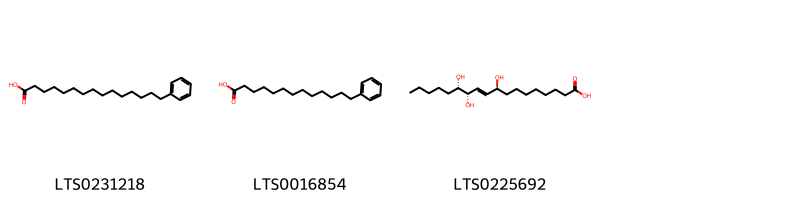
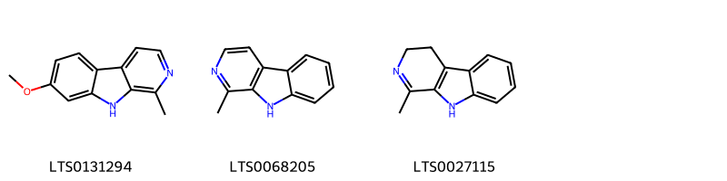

!!! abstract "Tóm tắt"

    Bán hạ (Thân rễ) (Rhizoma Pinelliae) là thân rễ của cây Bán hạ, thuộc họ Ráy (Araceae). Cây phân bố ở các vùng đất ẩm tại Việt Nam từ Bắc vào Nam, và trên thế giới tại Trung Quốc, Ấn Độ, và Nhật Bản. Theo kinh nghiệm dân gian, Bán hạ có tác dụng giáng nghịch cầm nôn, tiêu đờm hóa thấp, tán kết tiêu bĩ. Bán hạ thường được dùng để chủ trị các chứng ho có đờm, nôn mửa, chóng mặt, đau đầu do đờm thấp, đờm hạch, và các trường hợp đờm kết với khí gây mai hạch khí.Tác dụng dược lý của Bán hạ bao gồm tác dụng chữa ho, chống nôn, và hỗ trợ làm tiêu đờm. Thành phần hóa học của Bán hạ bao gồm một ít tinh dầu, alkaloid, một ancol, chất cay, phytosterol, cùng với dầu béo, tinh bột và chất nhầy, mang lại hiệu quả trong điều trị các bệnh liên quan đến hô hấp và tiêu hóa.

## Thông tin về thực vật

Dược liệu **Bán Hạ** từ bộ phận **nan** từ loài *Pinellia ternata*.

**Mô tả thực vật:** Là 1 loại cỏ không có thân, có củ hình cầu đường kính tới 2 cm. Lá hình tim, hay hình mác, hoặc chia 3 thuỳ dài 4-15cm, rộng 3,5-9 cm. Bông mo với phần hoa đực dài 5-9mm, phần trần dài 17-27mm. Quả mọng hình trứng dài 6mm.

*Tài liệu tham khảo:* "Những cây thuốc và vị thuốc Việt Nam" - Đỗ Tất Lợi 
Trong dược điển Việt nam, một loài được sử dụng làm dược liệu là *Pinellia ternata*.

!!! info "Phân loại thực vật của *Pinellia ternata*"
    - **Kingdom:** Plantae
    - **Phylum:** Tracheophyta
    - **Order:** Alismatales
    - **Family:** Araceae
    - **Genus:** Pinellia
    - **Species:** *Pinellia ternata*

**Phân bố trên thế giới:** Germany, United States of America, Chinese Taipei, China, Japan, Korea, Republic of, Netherlands

**Phân bố tại Việt nam:** Không có ghi nhận ở Việt Nam

## Thông tin về dược liệu 

### Định danh

!!! info "Thông tin về tên gọi"

    - Dược liệu tiếng Việt: nan
    - Dược liệu tiếng Trung: nan (nan)
    - Dược liệu tiếng Anh: nan
    - Dược liệu latin thông dụng: nan
    - Dược liệu latin kiểu DĐVN: *rhizoma pinelliae*
    - Dược liệu latin kiểu DĐVN: *nan*
    - Dược liệu latin kiểu thông tư: *nan*
    - Bộ phận dùng: nan (nan)

### Mô tả dược liệu 

- **Theo dược điển Việt nam V:** nan

- **Mô tả dược liệu theo thông tư chế biến dược liệu theo phương pháp cổ truyền:** nan

### Chế biến 

- **Chế biến theo dược điển việt nam V**: nan

- **Chế biến theo thông tư:** nan

--- 

## Thành phần hóa học

- Theo tài liệu của GS. Đỗ Tất Lợi:  (1) Bán hạ Trung Quốc có 1 ít tinh dầu, 1 ít ancaloit, 1 ancol, 1 chất cay, phytosterol, ngoài ra còn dầu béo, tinh bột, chất nhầy
    

**Thành phần hóa học từ loài **Pinellia ternata**

Theo cơ sở dữ liệu lotus, loài *Pinellia ternata* đã phân lập và xác định được **17** hoạt chất thuộc về các nhóm Steroids and steroid derivatives, 5'-deoxyribonucleosides, Fatty Acyls, Indoles and derivatives, Sphingolipids, Cinnamyl alcohols, 2-arylbenzofuran flavonoids, Benzene and substituted derivatives, Harmala alkaloids trong bảng dưới đây. Danh sách các hoạt chất như sau 13-phenyltridecanoic acid [(LTS0016854)](https://lotus.naturalproducts.net/compound/lotus_id/LTS0016854), 2-hydroxy-n-(3-hydroxy-1-{[3,4,5-trihydroxy-6-(hydroxymethyl)oxan-2-yl]oxy}octadeca-4,11-dien-2-yl)hexadecanimidic acid [(LTS0105591)](https://lotus.naturalproducts.net/compound/lotus_id/LTS0105591), 2-{[1-(5-ethyl-6-methylheptan-2-yl)-9a,11a-dimethyl-1h,2h,3h,3ah,3bh,4h,6h,7h,8h,9h,9bh,10h,11h-cyclopenta[a]phenanthren-7-yl]oxy}-6-(hydroxymethyl)oxane-3,4,5-triol [(LTS0158828)](https://lotus.naturalproducts.net/compound/lotus_id/LTS0158828), 1-methyl-3h,4h,9h-pyrido[3,4-b]indole [(LTS0027115)](https://lotus.naturalproducts.net/compound/lotus_id/LTS0027115), harmane [(LTS0068205)](https://lotus.naturalproducts.net/compound/lotus_id/LTS0068205), stigmast-5-en-3-ol, (3β)- [(LTS0204616)](https://lotus.naturalproducts.net/compound/lotus_id/LTS0204616), (2r)-2-hydroxy-n-[(2s,3r,4e,11e)-3-hydroxy-1-{[(2r,3r,4s,5s,6r)-3,4,5-trihydroxy-6-(hydroxymethyl)oxan-2-yl]oxy}octadeca-4,11-dien-2-yl]hexadecanimidic acid [(LTS0186194)](https://lotus.naturalproducts.net/compound/lotus_id/LTS0186194), pinellic acid [(LTS0225692)](https://lotus.naturalproducts.net/compound/lotus_id/LTS0225692), (2r,3s,4s,5s,6s)-2-{[(1r,3ar,3br,7s,9ar,9br,11ar)-1-[(2r,5r)-5-ethyl-6-methylheptan-2-yl]-9a,11a-dimethyl-1h,2h,3h,3ah,3bh,4h,6h,7h,8h,9h,9bh,10h,11h-cyclopenta[a]phenanthren-7-yl]oxy}-6-(hydroxymethyl)oxane-3,4,5-triol [(LTS0074621)](https://lotus.naturalproducts.net/compound/lotus_id/LTS0074621), dehydrodiconiferyl alcohol [(LTS0152779)](https://lotus.naturalproducts.net/compound/lotus_id/LTS0152779), β-carboline [(LTS0263207)](https://lotus.naturalproducts.net/compound/lotus_id/LTS0263207), ephedrine [(LTS0276367)](https://lotus.naturalproducts.net/compound/lotus_id/LTS0276367), p-coumaryl alcohol [(LTS0058896)](https://lotus.naturalproducts.net/compound/lotus_id/LTS0058896), (1s,3as,3br,7s,9as,9bs,11ar)-1-[(2r,5r)-5-ethyl-6-methylheptan-2-yl]-9a,11a-dimethyl-1h,2h,3h,3ah,3bh,4h,6h,7h,8h,9h,9bh,10h,11h-cyclopenta[a]phenanthren-7-ol [(LTS0248311)](https://lotus.naturalproducts.net/compound/lotus_id/LTS0248311), harmine [(LTS0131294)](https://lotus.naturalproducts.net/compound/lotus_id/LTS0131294), methylthioadenosine [(LTS0023576)](https://lotus.naturalproducts.net/compound/lotus_id/LTS0023576), 15-phenylpentadecanoic acid [(LTS0231218)](https://lotus.naturalproducts.net/compound/lotus_id/LTS0231218). 
        
| chemicalTaxonomyClassyfireClass     |   smiles_count |
|:------------------------------------|---------------:|
| 2-arylbenzofuran flavonoids         |             41 |
| 5'-deoxyribonucleosides             |             32 |
| Benzene and substituted derivatives |             27 |
| Cinnamyl alcohols                   |             18 |
| Fatty Acyls                         |            103 |
| Harmala alkaloids                   |             76 |
| Indoles and derivatives             |             24 |
| Sphingolipids                       |            177 |
| Steroids and steroid derivatives    |            334 |

            
### Nhóm 2-arylbenzofuran flavonoids
<figure markdown="span">
    { width=100% }
<figcaption>Hình ảnh cấu trúc hóa học của hoạt chất thuộc nhóm *2-arylbenzofuran flavonoids*. Tên thường gọi của các hoạt chất tương ứng là dehydrodiconiferyl alcohol [(LTS0152779)](https://lotus.naturalproducts.net/compound/lotus_id/LTS0152779).</figcaption>
</figure>

            
            
### Nhóm 2-arylbenzofuran flavonoids
<figure markdown="span">
    { width=100% }
<figcaption>Hình ảnh cấu trúc hóa học của hoạt chất thuộc nhóm *2-arylbenzofuran flavonoids*. Tên thường gọi của các hoạt chất tương ứng là dehydrodiconiferyl alcohol [(LTS0152779)](https://lotus.naturalproducts.net/compound/lotus_id/LTS0152779).</figcaption>
</figure>

### Nhóm 5'-deoxyribonucleosides
<figure markdown="span">
    { width=100% }
<figcaption>Hình ảnh cấu trúc hóa học của hoạt chất thuộc nhóm *5'-deoxyribonucleosides*. Tên thường gọi của các hoạt chất tương ứng là methylthioadenosine [(LTS0023576)](https://lotus.naturalproducts.net/compound/lotus_id/LTS0023576).</figcaption>
</figure>

            
            
### Nhóm 2-arylbenzofuran flavonoids
<figure markdown="span">
    { width=100% }
<figcaption>Hình ảnh cấu trúc hóa học của hoạt chất thuộc nhóm *2-arylbenzofuran flavonoids*. Tên thường gọi của các hoạt chất tương ứng là dehydrodiconiferyl alcohol [(LTS0152779)](https://lotus.naturalproducts.net/compound/lotus_id/LTS0152779).</figcaption>
</figure>

### Nhóm 5'-deoxyribonucleosides
<figure markdown="span">
    { width=100% }
<figcaption>Hình ảnh cấu trúc hóa học của hoạt chất thuộc nhóm *5'-deoxyribonucleosides*. Tên thường gọi của các hoạt chất tương ứng là methylthioadenosine [(LTS0023576)](https://lotus.naturalproducts.net/compound/lotus_id/LTS0023576).</figcaption>
</figure>

### Nhóm Benzene and substituted derivatives
<figure markdown="span">
    { width=100% }
<figcaption>Hình ảnh cấu trúc hóa học của hoạt chất thuộc nhóm *Benzene and substituted derivatives*. Tên thường gọi của các hoạt chất tương ứng là ephedrine [(LTS0276367)](https://lotus.naturalproducts.net/compound/lotus_id/LTS0276367).</figcaption>
</figure>

            
            
### Nhóm 2-arylbenzofuran flavonoids
<figure markdown="span">
    { width=100% }
<figcaption>Hình ảnh cấu trúc hóa học của hoạt chất thuộc nhóm *2-arylbenzofuran flavonoids*. Tên thường gọi của các hoạt chất tương ứng là dehydrodiconiferyl alcohol [(LTS0152779)](https://lotus.naturalproducts.net/compound/lotus_id/LTS0152779).</figcaption>
</figure>

### Nhóm 5'-deoxyribonucleosides
<figure markdown="span">
    { width=100% }
<figcaption>Hình ảnh cấu trúc hóa học của hoạt chất thuộc nhóm *5'-deoxyribonucleosides*. Tên thường gọi của các hoạt chất tương ứng là methylthioadenosine [(LTS0023576)](https://lotus.naturalproducts.net/compound/lotus_id/LTS0023576).</figcaption>
</figure>

### Nhóm Benzene and substituted derivatives
<figure markdown="span">
    { width=100% }
<figcaption>Hình ảnh cấu trúc hóa học của hoạt chất thuộc nhóm *Benzene and substituted derivatives*. Tên thường gọi của các hoạt chất tương ứng là ephedrine [(LTS0276367)](https://lotus.naturalproducts.net/compound/lotus_id/LTS0276367).</figcaption>
</figure>

### Nhóm Cinnamyl alcohols
<figure markdown="span">
    { width=100% }
<figcaption>Hình ảnh cấu trúc hóa học của hoạt chất thuộc nhóm *Cinnamyl alcohols*. Tên thường gọi của các hoạt chất tương ứng là p-coumaryl alcohol [(LTS0058896)](https://lotus.naturalproducts.net/compound/lotus_id/LTS0058896).</figcaption>
</figure>

            
            
### Nhóm 2-arylbenzofuran flavonoids
<figure markdown="span">
    { width=100% }
<figcaption>Hình ảnh cấu trúc hóa học của hoạt chất thuộc nhóm *2-arylbenzofuran flavonoids*. Tên thường gọi của các hoạt chất tương ứng là dehydrodiconiferyl alcohol [(LTS0152779)](https://lotus.naturalproducts.net/compound/lotus_id/LTS0152779).</figcaption>
</figure>

### Nhóm 5'-deoxyribonucleosides
<figure markdown="span">
    { width=100% }
<figcaption>Hình ảnh cấu trúc hóa học của hoạt chất thuộc nhóm *5'-deoxyribonucleosides*. Tên thường gọi của các hoạt chất tương ứng là methylthioadenosine [(LTS0023576)](https://lotus.naturalproducts.net/compound/lotus_id/LTS0023576).</figcaption>
</figure>

### Nhóm Benzene and substituted derivatives
<figure markdown="span">
    { width=100% }
<figcaption>Hình ảnh cấu trúc hóa học của hoạt chất thuộc nhóm *Benzene and substituted derivatives*. Tên thường gọi của các hoạt chất tương ứng là ephedrine [(LTS0276367)](https://lotus.naturalproducts.net/compound/lotus_id/LTS0276367).</figcaption>
</figure>

### Nhóm Cinnamyl alcohols
<figure markdown="span">
    { width=100% }
<figcaption>Hình ảnh cấu trúc hóa học của hoạt chất thuộc nhóm *Cinnamyl alcohols*. Tên thường gọi của các hoạt chất tương ứng là p-coumaryl alcohol [(LTS0058896)](https://lotus.naturalproducts.net/compound/lotus_id/LTS0058896).</figcaption>
</figure>

### Nhóm Fatty Acyls
<figure markdown="span">
    { width=100% }
<figcaption>Hình ảnh cấu trúc hóa học của hoạt chất thuộc nhóm *Fatty Acyls*. Tên thường gọi của các hoạt chất tương ứng là 15-phenylpentadecanoic acid [(LTS0231218)](https://lotus.naturalproducts.net/compound/lotus_id/LTS0231218), 13-phenyltridecanoic acid [(LTS0016854)](https://lotus.naturalproducts.net/compound/lotus_id/LTS0016854), pinellic acid [(LTS0225692)](https://lotus.naturalproducts.net/compound/lotus_id/LTS0225692).</figcaption>
</figure>

            
            
### Nhóm 2-arylbenzofuran flavonoids
<figure markdown="span">
    { width=100% }
<figcaption>Hình ảnh cấu trúc hóa học của hoạt chất thuộc nhóm *2-arylbenzofuran flavonoids*. Tên thường gọi của các hoạt chất tương ứng là dehydrodiconiferyl alcohol [(LTS0152779)](https://lotus.naturalproducts.net/compound/lotus_id/LTS0152779).</figcaption>
</figure>

### Nhóm 5'-deoxyribonucleosides
<figure markdown="span">
    { width=100% }
<figcaption>Hình ảnh cấu trúc hóa học của hoạt chất thuộc nhóm *5'-deoxyribonucleosides*. Tên thường gọi của các hoạt chất tương ứng là methylthioadenosine [(LTS0023576)](https://lotus.naturalproducts.net/compound/lotus_id/LTS0023576).</figcaption>
</figure>

### Nhóm Benzene and substituted derivatives
<figure markdown="span">
    { width=100% }
<figcaption>Hình ảnh cấu trúc hóa học của hoạt chất thuộc nhóm *Benzene and substituted derivatives*. Tên thường gọi của các hoạt chất tương ứng là ephedrine [(LTS0276367)](https://lotus.naturalproducts.net/compound/lotus_id/LTS0276367).</figcaption>
</figure>

### Nhóm Cinnamyl alcohols
<figure markdown="span">
    { width=100% }
<figcaption>Hình ảnh cấu trúc hóa học của hoạt chất thuộc nhóm *Cinnamyl alcohols*. Tên thường gọi của các hoạt chất tương ứng là p-coumaryl alcohol [(LTS0058896)](https://lotus.naturalproducts.net/compound/lotus_id/LTS0058896).</figcaption>
</figure>

### Nhóm Fatty Acyls
<figure markdown="span">
    { width=100% }
<figcaption>Hình ảnh cấu trúc hóa học của hoạt chất thuộc nhóm *Fatty Acyls*. Tên thường gọi của các hoạt chất tương ứng là 15-phenylpentadecanoic acid [(LTS0231218)](https://lotus.naturalproducts.net/compound/lotus_id/LTS0231218), 13-phenyltridecanoic acid [(LTS0016854)](https://lotus.naturalproducts.net/compound/lotus_id/LTS0016854), pinellic acid [(LTS0225692)](https://lotus.naturalproducts.net/compound/lotus_id/LTS0225692).</figcaption>
</figure>

### Nhóm Harmala alkaloids
<figure markdown="span">
    { width=100% }
<figcaption>Hình ảnh cấu trúc hóa học của hoạt chất thuộc nhóm *Harmala alkaloids*. Tên thường gọi của các hoạt chất tương ứng là harmine [(LTS0131294)](https://lotus.naturalproducts.net/compound/lotus_id/LTS0131294), harmane [(LTS0068205)](https://lotus.naturalproducts.net/compound/lotus_id/LTS0068205), 1-methyl-3h,4h,9h-pyrido[3,4-b]indole [(LTS0027115)](https://lotus.naturalproducts.net/compound/lotus_id/LTS0027115).</figcaption>
</figure>

            
            
### Nhóm 2-arylbenzofuran flavonoids
<figure markdown="span">
    { width=100% }
<figcaption>Hình ảnh cấu trúc hóa học của hoạt chất thuộc nhóm *2-arylbenzofuran flavonoids*. Tên thường gọi của các hoạt chất tương ứng là dehydrodiconiferyl alcohol [(LTS0152779)](https://lotus.naturalproducts.net/compound/lotus_id/LTS0152779).</figcaption>
</figure>

### Nhóm 5'-deoxyribonucleosides
<figure markdown="span">
    { width=100% }
<figcaption>Hình ảnh cấu trúc hóa học của hoạt chất thuộc nhóm *5'-deoxyribonucleosides*. Tên thường gọi của các hoạt chất tương ứng là methylthioadenosine [(LTS0023576)](https://lotus.naturalproducts.net/compound/lotus_id/LTS0023576).</figcaption>
</figure>

### Nhóm Benzene and substituted derivatives
<figure markdown="span">
    { width=100% }
<figcaption>Hình ảnh cấu trúc hóa học của hoạt chất thuộc nhóm *Benzene and substituted derivatives*. Tên thường gọi của các hoạt chất tương ứng là ephedrine [(LTS0276367)](https://lotus.naturalproducts.net/compound/lotus_id/LTS0276367).</figcaption>
</figure>

### Nhóm Cinnamyl alcohols
<figure markdown="span">
    { width=100% }
<figcaption>Hình ảnh cấu trúc hóa học của hoạt chất thuộc nhóm *Cinnamyl alcohols*. Tên thường gọi của các hoạt chất tương ứng là p-coumaryl alcohol [(LTS0058896)](https://lotus.naturalproducts.net/compound/lotus_id/LTS0058896).</figcaption>
</figure>

### Nhóm Fatty Acyls
<figure markdown="span">
    { width=100% }
<figcaption>Hình ảnh cấu trúc hóa học của hoạt chất thuộc nhóm *Fatty Acyls*. Tên thường gọi của các hoạt chất tương ứng là 15-phenylpentadecanoic acid [(LTS0231218)](https://lotus.naturalproducts.net/compound/lotus_id/LTS0231218), 13-phenyltridecanoic acid [(LTS0016854)](https://lotus.naturalproducts.net/compound/lotus_id/LTS0016854), pinellic acid [(LTS0225692)](https://lotus.naturalproducts.net/compound/lotus_id/LTS0225692).</figcaption>
</figure>

### Nhóm Harmala alkaloids
<figure markdown="span">
    { width=100% }
<figcaption>Hình ảnh cấu trúc hóa học của hoạt chất thuộc nhóm *Harmala alkaloids*. Tên thường gọi của các hoạt chất tương ứng là harmine [(LTS0131294)](https://lotus.naturalproducts.net/compound/lotus_id/LTS0131294), harmane [(LTS0068205)](https://lotus.naturalproducts.net/compound/lotus_id/LTS0068205), 1-methyl-3h,4h,9h-pyrido[3,4-b]indole [(LTS0027115)](https://lotus.naturalproducts.net/compound/lotus_id/LTS0027115).</figcaption>
</figure>

### Nhóm Indoles and derivatives
<figure markdown="span">
    { width=100% }
<figcaption>Hình ảnh cấu trúc hóa học của hoạt chất thuộc nhóm *Indoles and derivatives*. Tên thường gọi của các hoạt chất tương ứng là β-carboline [(LTS0263207)](https://lotus.naturalproducts.net/compound/lotus_id/LTS0263207).</figcaption>
</figure>

            
            
### Nhóm 2-arylbenzofuran flavonoids
<figure markdown="span">
    { width=100% }
<figcaption>Hình ảnh cấu trúc hóa học của hoạt chất thuộc nhóm *2-arylbenzofuran flavonoids*. Tên thường gọi của các hoạt chất tương ứng là dehydrodiconiferyl alcohol [(LTS0152779)](https://lotus.naturalproducts.net/compound/lotus_id/LTS0152779).</figcaption>
</figure>

### Nhóm 5'-deoxyribonucleosides
<figure markdown="span">
    { width=100% }
<figcaption>Hình ảnh cấu trúc hóa học của hoạt chất thuộc nhóm *5'-deoxyribonucleosides*. Tên thường gọi của các hoạt chất tương ứng là methylthioadenosine [(LTS0023576)](https://lotus.naturalproducts.net/compound/lotus_id/LTS0023576).</figcaption>
</figure>

### Nhóm Benzene and substituted derivatives
<figure markdown="span">
    { width=100% }
<figcaption>Hình ảnh cấu trúc hóa học của hoạt chất thuộc nhóm *Benzene and substituted derivatives*. Tên thường gọi của các hoạt chất tương ứng là ephedrine [(LTS0276367)](https://lotus.naturalproducts.net/compound/lotus_id/LTS0276367).</figcaption>
</figure>

### Nhóm Cinnamyl alcohols
<figure markdown="span">
    { width=100% }
<figcaption>Hình ảnh cấu trúc hóa học của hoạt chất thuộc nhóm *Cinnamyl alcohols*. Tên thường gọi của các hoạt chất tương ứng là p-coumaryl alcohol [(LTS0058896)](https://lotus.naturalproducts.net/compound/lotus_id/LTS0058896).</figcaption>
</figure>

### Nhóm Fatty Acyls
<figure markdown="span">
    { width=100% }
<figcaption>Hình ảnh cấu trúc hóa học của hoạt chất thuộc nhóm *Fatty Acyls*. Tên thường gọi của các hoạt chất tương ứng là 15-phenylpentadecanoic acid [(LTS0231218)](https://lotus.naturalproducts.net/compound/lotus_id/LTS0231218), 13-phenyltridecanoic acid [(LTS0016854)](https://lotus.naturalproducts.net/compound/lotus_id/LTS0016854), pinellic acid [(LTS0225692)](https://lotus.naturalproducts.net/compound/lotus_id/LTS0225692).</figcaption>
</figure>

### Nhóm Harmala alkaloids
<figure markdown="span">
    { width=100% }
<figcaption>Hình ảnh cấu trúc hóa học của hoạt chất thuộc nhóm *Harmala alkaloids*. Tên thường gọi của các hoạt chất tương ứng là harmine [(LTS0131294)](https://lotus.naturalproducts.net/compound/lotus_id/LTS0131294), harmane [(LTS0068205)](https://lotus.naturalproducts.net/compound/lotus_id/LTS0068205), 1-methyl-3h,4h,9h-pyrido[3,4-b]indole [(LTS0027115)](https://lotus.naturalproducts.net/compound/lotus_id/LTS0027115).</figcaption>
</figure>

### Nhóm Indoles and derivatives
<figure markdown="span">
    { width=100% }
<figcaption>Hình ảnh cấu trúc hóa học của hoạt chất thuộc nhóm *Indoles and derivatives*. Tên thường gọi của các hoạt chất tương ứng là β-carboline [(LTS0263207)](https://lotus.naturalproducts.net/compound/lotus_id/LTS0263207).</figcaption>
</figure>

### Nhóm Sphingolipids
<figure markdown="span">
    { width=100% }
<figcaption>Hình ảnh cấu trúc hóa học của hoạt chất thuộc nhóm *Sphingolipids*. Tên thường gọi của các hoạt chất tương ứng là 2-hydroxy-n-(3-hydroxy-1-{[3,4,5-trihydroxy-6-(hydroxymethyl)oxan-2-yl]oxy}octadeca-4,11-dien-2-yl)hexadecanimidic acid [(LTS0105591)](https://lotus.naturalproducts.net/compound/lotus_id/LTS0105591), (2r)-2-hydroxy-n-[(2s,3r,4e,11e)-3-hydroxy-1-{[(2r,3r,4s,5s,6r)-3,4,5-trihydroxy-6-(hydroxymethyl)oxan-2-yl]oxy}octadeca-4,11-dien-2-yl]hexadecanimidic acid [(LTS0186194)](https://lotus.naturalproducts.net/compound/lotus_id/LTS0186194).</figcaption>
</figure>

            
            
### Nhóm 2-arylbenzofuran flavonoids
<figure markdown="span">
    { width=100% }
<figcaption>Hình ảnh cấu trúc hóa học của hoạt chất thuộc nhóm *2-arylbenzofuran flavonoids*. Tên thường gọi của các hoạt chất tương ứng là dehydrodiconiferyl alcohol [(LTS0152779)](https://lotus.naturalproducts.net/compound/lotus_id/LTS0152779).</figcaption>
</figure>

### Nhóm 5'-deoxyribonucleosides
<figure markdown="span">
    { width=100% }
<figcaption>Hình ảnh cấu trúc hóa học của hoạt chất thuộc nhóm *5'-deoxyribonucleosides*. Tên thường gọi của các hoạt chất tương ứng là methylthioadenosine [(LTS0023576)](https://lotus.naturalproducts.net/compound/lotus_id/LTS0023576).</figcaption>
</figure>

### Nhóm Benzene and substituted derivatives
<figure markdown="span">
    { width=100% }
<figcaption>Hình ảnh cấu trúc hóa học của hoạt chất thuộc nhóm *Benzene and substituted derivatives*. Tên thường gọi của các hoạt chất tương ứng là ephedrine [(LTS0276367)](https://lotus.naturalproducts.net/compound/lotus_id/LTS0276367).</figcaption>
</figure>

### Nhóm Cinnamyl alcohols
<figure markdown="span">
    { width=100% }
<figcaption>Hình ảnh cấu trúc hóa học của hoạt chất thuộc nhóm *Cinnamyl alcohols*. Tên thường gọi của các hoạt chất tương ứng là p-coumaryl alcohol [(LTS0058896)](https://lotus.naturalproducts.net/compound/lotus_id/LTS0058896).</figcaption>
</figure>

### Nhóm Fatty Acyls
<figure markdown="span">
    { width=100% }
<figcaption>Hình ảnh cấu trúc hóa học của hoạt chất thuộc nhóm *Fatty Acyls*. Tên thường gọi của các hoạt chất tương ứng là 15-phenylpentadecanoic acid [(LTS0231218)](https://lotus.naturalproducts.net/compound/lotus_id/LTS0231218), 13-phenyltridecanoic acid [(LTS0016854)](https://lotus.naturalproducts.net/compound/lotus_id/LTS0016854), pinellic acid [(LTS0225692)](https://lotus.naturalproducts.net/compound/lotus_id/LTS0225692).</figcaption>
</figure>

### Nhóm Harmala alkaloids
<figure markdown="span">
    { width=100% }
<figcaption>Hình ảnh cấu trúc hóa học của hoạt chất thuộc nhóm *Harmala alkaloids*. Tên thường gọi của các hoạt chất tương ứng là harmine [(LTS0131294)](https://lotus.naturalproducts.net/compound/lotus_id/LTS0131294), harmane [(LTS0068205)](https://lotus.naturalproducts.net/compound/lotus_id/LTS0068205), 1-methyl-3h,4h,9h-pyrido[3,4-b]indole [(LTS0027115)](https://lotus.naturalproducts.net/compound/lotus_id/LTS0027115).</figcaption>
</figure>

### Nhóm Indoles and derivatives
<figure markdown="span">
    { width=100% }
<figcaption>Hình ảnh cấu trúc hóa học của hoạt chất thuộc nhóm *Indoles and derivatives*. Tên thường gọi của các hoạt chất tương ứng là β-carboline [(LTS0263207)](https://lotus.naturalproducts.net/compound/lotus_id/LTS0263207).</figcaption>
</figure>

### Nhóm Sphingolipids
<figure markdown="span">
    { width=100% }
<figcaption>Hình ảnh cấu trúc hóa học của hoạt chất thuộc nhóm *Sphingolipids*. Tên thường gọi của các hoạt chất tương ứng là 2-hydroxy-n-(3-hydroxy-1-{[3,4,5-trihydroxy-6-(hydroxymethyl)oxan-2-yl]oxy}octadeca-4,11-dien-2-yl)hexadecanimidic acid [(LTS0105591)](https://lotus.naturalproducts.net/compound/lotus_id/LTS0105591), (2r)-2-hydroxy-n-[(2s,3r,4e,11e)-3-hydroxy-1-{[(2r,3r,4s,5s,6r)-3,4,5-trihydroxy-6-(hydroxymethyl)oxan-2-yl]oxy}octadeca-4,11-dien-2-yl]hexadecanimidic acid [(LTS0186194)](https://lotus.naturalproducts.net/compound/lotus_id/LTS0186194).</figcaption>
</figure>

### Nhóm Steroids and steroid derivatives
<figure markdown="span">
    { width=100% }
<figcaption>Hình ảnh cấu trúc hóa học của hoạt chất thuộc nhóm *Steroids and steroid derivatives*. Tên thường gọi của các hoạt chất tương ứng là (2r,3s,4s,5s,6s)-2-{[(1r,3ar,3br,7s,9ar,9br,11ar)-1-[(2r,5r)-5-ethyl-6-methylheptan-2-yl]-9a,11a-dimethyl-1h,2h,3h,3ah,3bh,4h,6h,7h,8h,9h,9bh,10h,11h-cyclopenta[a]phenanthren-7-yl]oxy}-6-(hydroxymethyl)oxane-3,4,5-triol [(LTS0074621)](https://lotus.naturalproducts.net/compound/lotus_id/LTS0074621), stigmast-5-en-3-ol, (3β)- [(LTS0204616)](https://lotus.naturalproducts.net/compound/lotus_id/LTS0204616), 2-{[1-(5-ethyl-6-methylheptan-2-yl)-9a,11a-dimethyl-1h,2h,3h,3ah,3bh,4h,6h,7h,8h,9h,9bh,10h,11h-cyclopenta[a]phenanthren-7-yl]oxy}-6-(hydroxymethyl)oxane-3,4,5-triol [(LTS0158828)](https://lotus.naturalproducts.net/compound/lotus_id/LTS0158828), (1s,3as,3br,7s,9as,9bs,11ar)-1-[(2r,5r)-5-ethyl-6-methylheptan-2-yl]-9a,11a-dimethyl-1h,2h,3h,3ah,3bh,4h,6h,7h,8h,9h,9bh,10h,11h-cyclopenta[a]phenanthren-7-ol [(LTS0248311)](https://lotus.naturalproducts.net/compound/lotus_id/LTS0248311).</figcaption>
</figure>

            

---

## Tác dụng dược lý

Theo tài liệu "Những cây thuốc và vị thuốc Việt Nam" - Đỗ Tất Lợi:Tác dụng chữa ho
Tác dụng chống nôn

Theo tài liệu quốc tế: nan

---

## Dược điển Việt Nam V

### Soi bột:

nan

<!-- Hình ảnh soi bột sẽ được tự động chèn vào đây sau -->

### Vi phẫu:

nan

<!-- Hình ảnh vi phẫu sẽ được tự động chèn vào đây sau -->

### Định tính

nan

### Định lượng

nan

### Thông tin khác 

- ** Độ ẩm: ** nan
- ** Bảo quản:** nan

## Dược điển Hồng kong

<!-- PDF sẽ được tự động chèn vào đây sau -->

---

## Y dược học cổ truyền

- **Tên vị thuốc:** nan
- **Tính vị quy kinh:** Tính vị tân, ôn, có độc. Vào 2 kinh tỳ, vị.
- **Công năng chủ trị:** Giáng nghịch cầm nôn, tiêu đờm hóa thấp, tán kểt tiêu bĩ. 
Chủ trị: Ho có đờm, nôn mửa, chóng mặt đau đầu do đờm thấp, đờm hạch, đờm kết với khí gây mai hạch khí.
- **Chú ý:** nan
- **Kiêng kỵ:** nan

## Bình luận

