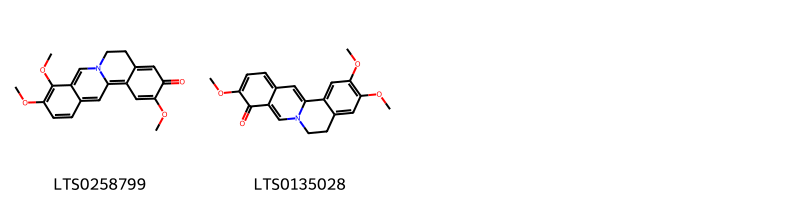
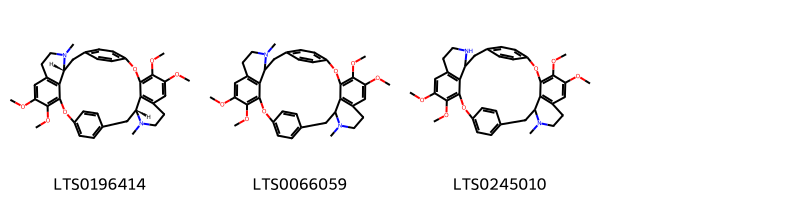

!!! abstract "Tóm tắt"

    Bình vôi [Stephania glabra (Roxb.) Miers] là một cây thuộc họ Tiết dê (Menispermaceae). Phân bố chủ yếu ở những vùng núi đá tại các tỉnh Hà Tây, Hòa Bình, Hà Giang, Tuyên Quang, Nam Định, Hà Nam, Ninh Bình,.... Trong nhân dân, củ bình vôi thái nhỏ, phơi khô được dùng dưới dạng sắc, ngâm rượu chữa hen, ho lao, lỵ, sốt, đau bụng, ngày uống 3 đến 6g. Có thể tán bột, ngâm rượu 40 độ với tỷ lệ 1 phần bột 5 phần rượu, rồi uống với liều 5 đến 15ml rượu một ngày. Có thể thêm đường cho dễ uống. Tác dụng dược lý có điều hòa tim, điều hòa hô hấp, an thần gây ngủ. Thành phần hóa học bao gồm alkaloid, glycosid,...

## Thông tin về thực vật

Dược liệu **Bình Vôi(Củ)** từ bộ phận **nan** từ loài *Stephania glabra*.

**Mô tả thực vật:** Cây củ bình vôi là một loại cây mọc leo, phần dưới thân phát triển thành củ to, bám vào núi đá, có củ rất to, nặng tới hơn 20kg. Da thân củ màu nâu đen, xù xì giống như hòn đá, hình dáng thay đổi tùy theo nơi củ phát triển. Nếu mọc ở đất thì củ nhỏ hơn. Từ thân củ mọc lên những thân màu xanh, nhỏ, mềm. Lá hình khiên, mọc so le, hình bầu dục hay hình tim hoặc tròn, đường kính 8-9cm, cuống lá dài 5-8cm. Hoa nhỏ mọc thành tán. Hoa đực cái khác gốc. Hoa cái có cuống tán ngắn, còn hoa đực có cuống tán dài. Quả chín hình cầu màu đỏ, tươi, trong chứa một hạt hình móng ngựa.

*Tài liệu tham khảo:* "Những cây thuốc và vị thuốc Việt Nam" - Đỗ Tất Lợi 
Trong dược điển Việt nam, một loài được sử dụng làm dược liệu là *Stephania glabra*.

!!! info "Phân loại thực vật của *Stephania rotunda*"
    - **Kingdom:** Plantae
    - **Phylum:** Tracheophyta
    - **Order:** Ranunculales
    - **Family:** Menispermaceae
    - **Genus:** Stephania
    - **Species:** *Stephania rotunda*

**Phân bố trên thế giới:** Myanmar, Thailand, nan, China, Cambodia, Bangladesh, India, Nepal, Bhutan, Viet Nam

**Phân bố tại Việt nam:** Không có ghi nhận ở Việt Nam

## Thông tin về dược liệu 

### Định danh

!!! info "Thông tin về tên gọi"

    - Dược liệu tiếng Việt: nan
    - Dược liệu tiếng Trung: nan (nan)
    - Dược liệu tiếng Anh: nan
    - Dược liệu latin thông dụng: nan
    - Dược liệu latin kiểu DĐVN: *tuber stephaniae*
    - Dược liệu latin kiểu DĐVN: *nan*
    - Dược liệu latin kiểu thông tư: *nan*
    - Bộ phận dùng: nan (nan)

### Mô tả dược liệu 

- **Theo dược điển Việt nam V:** nan

- **Mô tả dược liệu theo thông tư chế biến dược liệu theo phương pháp cổ truyền:** nan

### Chế biến 

- **Chế biến theo dược điển việt nam V**: nan

- **Chế biến theo thông tư:** nan

--- 

## Thành phần hóa học

- Theo tài liệu của GS. Đỗ Tất Lợi:  (1) Nhóm hóa học: Alkaloid, Glycosid
(2) Tên hoạt chất là biomaker: L-tetrahydropalmatin
    

**Thành phần hóa học từ loài **Stephania glabra**

Theo cơ sở dữ liệu lotus, loài *Stephania glabra* đã phân lập và xác định được **20** hoạt chất thuộc về các nhóm Proaporphines, Isoquinolines and derivatives, Protoberberine alkaloids and derivatives, Organooxygen compounds trong bảng dưới đây. Danh sách các hoạt chất như sau coreximine [(LTS0242646)](https://lotus.naturalproducts.net/compound/lotus_id/LTS0242646), stepholidine [(LTS0267492)](https://lotus.naturalproducts.net/compound/lotus_id/LTS0267492), (6s,12bs)-3,4,10,11-tetramethoxy-7,8,12b,13-tetrahydro-5h-6-azatetraphen-6-ium-6-olate [(LTS0093695)](https://lotus.naturalproducts.net/compound/lotus_id/LTS0093695), (6r,12bs)-3,4,10,11-tetramethoxy-7,8,12b,13-tetrahydro-5h-6-azatetraphen-6-ium-6-olate [(LTS0205856)](https://lotus.naturalproducts.net/compound/lotus_id/LTS0205856), (+)-tetrahydropalmatine [(LTS0175021)](https://lotus.naturalproducts.net/compound/lotus_id/LTS0175021), 3,4,11-trimethoxy-7,8-dihydro-6-azatetraphen-10-one [(LTS0258799)](https://lotus.naturalproducts.net/compound/lotus_id/LTS0258799), capaurine [(LTS0275656)](https://lotus.naturalproducts.net/compound/lotus_id/LTS0275656), palmatine [(LTS0253245)](https://lotus.naturalproducts.net/compound/lotus_id/LTS0253245), 3,11-dihydroxy-4,10-dimethoxy-7,8-dihydro-6λ⁵-azatetraphen-6-ylium [(LTS0159859)](https://lotus.naturalproducts.net/compound/lotus_id/LTS0159859), 3,10,11-trimethoxy-7,8-dihydro-6-azatetraphen-4-one [(LTS0135028)](https://lotus.naturalproducts.net/compound/lotus_id/LTS0135028), 4,5,19,20-tetramethoxy-10-methyl-2,17-dioxa-10,25-diazaheptacyclo[26.2.2.2¹³,¹⁶.1³,⁷.1¹⁸,²².0¹¹,³⁶.0²⁶,³³]hexatriaconta-1(30),3,5,7(36),13,15,18,20,22(33),28,31,34-dodecaene [(LTS0245010)](https://lotus.naturalproducts.net/compound/lotus_id/LTS0245010), cycleanine [(LTS0196414)](https://lotus.naturalproducts.net/compound/lotus_id/LTS0196414), 4,10,11-trimethoxy-7,8,12b,13-tetrahydro-5h-6-azatetraphen-3-ol [(LTS0220031)](https://lotus.naturalproducts.net/compound/lotus_id/LTS0220031), 4,5,19,20-tetramethoxy-10,25-dimethyl-2,17-dioxa-10,25-diazaheptacyclo[26.2.2.2¹³,¹⁶.1³,⁷.1¹⁸,²².0¹¹,³⁶.0²⁶,³³]hexatriaconta-1(30),3,5,7(36),13,15,18,20,22(33),28,31,34-dodecaene [(LTS0066059)](https://lotus.naturalproducts.net/compound/lotus_id/LTS0066059), (12br)-4,10,11-trimethoxy-7,8,12b,13-tetrahydro-5h-6-azatetraphen-3-ol [(LTS0046202)](https://lotus.naturalproducts.net/compound/lotus_id/LTS0046202), 10',11'-dimethoxy-5'-azaspiro[cyclohexane-1,2'-tricyclo[6.3.1.0⁴,¹²]dodecane]-1'(11'),2,5,8'(12'),9'-pentaen-4-one [(LTS0014482)](https://lotus.naturalproducts.net/compound/lotus_id/LTS0014482), (12bs)-3,4,10,11-tetramethoxy-7,8,12b,13-tetrahydro-5h-6-azatetraphen-6-ium-6-olate [(LTS0230406)](https://lotus.naturalproducts.net/compound/lotus_id/LTS0230406), dehydrocorydalmine [(LTS0256374)](https://lotus.naturalproducts.net/compound/lotus_id/LTS0256374), pronuciferine [(LTS0129107)](https://lotus.naturalproducts.net/compound/lotus_id/LTS0129107), (12bs)-4,10,11-trimethoxy-7,8,12b,13-tetrahydro-5h-6-azatetraphen-3-ol [(LTS0074838)](https://lotus.naturalproducts.net/compound/lotus_id/LTS0074838). 
        
| chemicalTaxonomyClassyfireClass          |   smiles_count |
|:-----------------------------------------|---------------:|
| Isoquinolines and derivatives            |             85 |
| Organooxygen compounds                   |            228 |
| Proaporphines                            |             85 |
| Protoberberine alkaloids and derivatives |            593 |

            
### Nhóm Isoquinolines and derivatives
<figure markdown="span">
    { width=100% }
<figcaption>Hình ảnh cấu trúc hóa học của hoạt chất thuộc nhóm *Isoquinolines and derivatives*. Tên thường gọi của các hoạt chất tương ứng là 3,4,11-trimethoxy-7,8-dihydro-6-azatetraphen-10-one [(LTS0258799)](https://lotus.naturalproducts.net/compound/lotus_id/LTS0258799), 3,10,11-trimethoxy-7,8-dihydro-6-azatetraphen-4-one [(LTS0135028)](https://lotus.naturalproducts.net/compound/lotus_id/LTS0135028).</figcaption>
</figure>

            
            
### Nhóm Isoquinolines and derivatives
<figure markdown="span">
    { width=100% }
<figcaption>Hình ảnh cấu trúc hóa học của hoạt chất thuộc nhóm *Isoquinolines and derivatives*. Tên thường gọi của các hoạt chất tương ứng là 3,4,11-trimethoxy-7,8-dihydro-6-azatetraphen-10-one [(LTS0258799)](https://lotus.naturalproducts.net/compound/lotus_id/LTS0258799), 3,10,11-trimethoxy-7,8-dihydro-6-azatetraphen-4-one [(LTS0135028)](https://lotus.naturalproducts.net/compound/lotus_id/LTS0135028).</figcaption>
</figure>

### Nhóm Organooxygen compounds
<figure markdown="span">
    { width=100% }
<figcaption>Hình ảnh cấu trúc hóa học của hoạt chất thuộc nhóm *Organooxygen compounds*. Tên thường gọi của các hoạt chất tương ứng là cycleanine [(LTS0196414)](https://lotus.naturalproducts.net/compound/lotus_id/LTS0196414), 4,5,19,20-tetramethoxy-10,25-dimethyl-2,17-dioxa-10,25-diazaheptacyclo[26.2.2.2¹³,¹⁶.1³,⁷.1¹⁸,²².0¹¹,³⁶.0²⁶,³³]hexatriaconta-1(30),3,5,7(36),13,15,18,20,22(33),28,31,34-dodecaene [(LTS0066059)](https://lotus.naturalproducts.net/compound/lotus_id/LTS0066059), 4,5,19,20-tetramethoxy-10-methyl-2,17-dioxa-10,25-diazaheptacyclo[26.2.2.2¹³,¹⁶.1³,⁷.1¹⁸,²².0¹¹,³⁶.0²⁶,³³]hexatriaconta-1(30),3,5,7(36),13,15,18,20,22(33),28,31,34-dodecaene [(LTS0245010)](https://lotus.naturalproducts.net/compound/lotus_id/LTS0245010).</figcaption>
</figure>

            
            
### Nhóm Isoquinolines and derivatives
<figure markdown="span">
    { width=100% }
<figcaption>Hình ảnh cấu trúc hóa học của hoạt chất thuộc nhóm *Isoquinolines and derivatives*. Tên thường gọi của các hoạt chất tương ứng là 3,4,11-trimethoxy-7,8-dihydro-6-azatetraphen-10-one [(LTS0258799)](https://lotus.naturalproducts.net/compound/lotus_id/LTS0258799), 3,10,11-trimethoxy-7,8-dihydro-6-azatetraphen-4-one [(LTS0135028)](https://lotus.naturalproducts.net/compound/lotus_id/LTS0135028).</figcaption>
</figure>

### Nhóm Organooxygen compounds
<figure markdown="span">
    { width=100% }
<figcaption>Hình ảnh cấu trúc hóa học của hoạt chất thuộc nhóm *Organooxygen compounds*. Tên thường gọi của các hoạt chất tương ứng là cycleanine [(LTS0196414)](https://lotus.naturalproducts.net/compound/lotus_id/LTS0196414), 4,5,19,20-tetramethoxy-10,25-dimethyl-2,17-dioxa-10,25-diazaheptacyclo[26.2.2.2¹³,¹⁶.1³,⁷.1¹⁸,²².0¹¹,³⁶.0²⁶,³³]hexatriaconta-1(30),3,5,7(36),13,15,18,20,22(33),28,31,34-dodecaene [(LTS0066059)](https://lotus.naturalproducts.net/compound/lotus_id/LTS0066059), 4,5,19,20-tetramethoxy-10-methyl-2,17-dioxa-10,25-diazaheptacyclo[26.2.2.2¹³,¹⁶.1³,⁷.1¹⁸,²².0¹¹,³⁶.0²⁶,³³]hexatriaconta-1(30),3,5,7(36),13,15,18,20,22(33),28,31,34-dodecaene [(LTS0245010)](https://lotus.naturalproducts.net/compound/lotus_id/LTS0245010).</figcaption>
</figure>

### Nhóm Proaporphines
<figure markdown="span">
    { width=100% }
<figcaption>Hình ảnh cấu trúc hóa học của hoạt chất thuộc nhóm *Proaporphines*. Tên thường gọi của các hoạt chất tương ứng là 10',11'-dimethoxy-5'-azaspiro[cyclohexane-1,2'-tricyclo[6.3.1.0⁴,¹²]dodecane]-1'(11'),2,5,8'(12'),9'-pentaen-4-one [(LTS0014482)](https://lotus.naturalproducts.net/compound/lotus_id/LTS0014482), pronuciferine [(LTS0129107)](https://lotus.naturalproducts.net/compound/lotus_id/LTS0129107).</figcaption>
</figure>

            
            
### Nhóm Isoquinolines and derivatives
<figure markdown="span">
    { width=100% }
<figcaption>Hình ảnh cấu trúc hóa học của hoạt chất thuộc nhóm *Isoquinolines and derivatives*. Tên thường gọi của các hoạt chất tương ứng là 3,4,11-trimethoxy-7,8-dihydro-6-azatetraphen-10-one [(LTS0258799)](https://lotus.naturalproducts.net/compound/lotus_id/LTS0258799), 3,10,11-trimethoxy-7,8-dihydro-6-azatetraphen-4-one [(LTS0135028)](https://lotus.naturalproducts.net/compound/lotus_id/LTS0135028).</figcaption>
</figure>

### Nhóm Organooxygen compounds
<figure markdown="span">
    { width=100% }
<figcaption>Hình ảnh cấu trúc hóa học của hoạt chất thuộc nhóm *Organooxygen compounds*. Tên thường gọi của các hoạt chất tương ứng là cycleanine [(LTS0196414)](https://lotus.naturalproducts.net/compound/lotus_id/LTS0196414), 4,5,19,20-tetramethoxy-10,25-dimethyl-2,17-dioxa-10,25-diazaheptacyclo[26.2.2.2¹³,¹⁶.1³,⁷.1¹⁸,²².0¹¹,³⁶.0²⁶,³³]hexatriaconta-1(30),3,5,7(36),13,15,18,20,22(33),28,31,34-dodecaene [(LTS0066059)](https://lotus.naturalproducts.net/compound/lotus_id/LTS0066059), 4,5,19,20-tetramethoxy-10-methyl-2,17-dioxa-10,25-diazaheptacyclo[26.2.2.2¹³,¹⁶.1³,⁷.1¹⁸,²².0¹¹,³⁶.0²⁶,³³]hexatriaconta-1(30),3,5,7(36),13,15,18,20,22(33),28,31,34-dodecaene [(LTS0245010)](https://lotus.naturalproducts.net/compound/lotus_id/LTS0245010).</figcaption>
</figure>

### Nhóm Proaporphines
<figure markdown="span">
    { width=100% }
<figcaption>Hình ảnh cấu trúc hóa học của hoạt chất thuộc nhóm *Proaporphines*. Tên thường gọi của các hoạt chất tương ứng là 10',11'-dimethoxy-5'-azaspiro[cyclohexane-1,2'-tricyclo[6.3.1.0⁴,¹²]dodecane]-1'(11'),2,5,8'(12'),9'-pentaen-4-one [(LTS0014482)](https://lotus.naturalproducts.net/compound/lotus_id/LTS0014482), pronuciferine [(LTS0129107)](https://lotus.naturalproducts.net/compound/lotus_id/LTS0129107).</figcaption>
</figure>

### Nhóm Protoberberine alkaloids and derivatives
<figure markdown="span">
    { width=100% }
<figcaption>Hình ảnh cấu trúc hóa học của hoạt chất thuộc nhóm *Protoberberine alkaloids and derivatives*. Tên thường gọi của các hoạt chất tương ứng là palmatine [(LTS0253245)](https://lotus.naturalproducts.net/compound/lotus_id/LTS0253245), coreximine [(LTS0242646)](https://lotus.naturalproducts.net/compound/lotus_id/LTS0242646), dehydrocorydalmine [(LTS0256374)](https://lotus.naturalproducts.net/compound/lotus_id/LTS0256374), stepholidine [(LTS0267492)](https://lotus.naturalproducts.net/compound/lotus_id/LTS0267492), (12bs)-4,10,11-trimethoxy-7,8,12b,13-tetrahydro-5h-6-azatetraphen-3-ol [(LTS0074838)](https://lotus.naturalproducts.net/compound/lotus_id/LTS0074838), (+)-tetrahydropalmatine [(LTS0175021)](https://lotus.naturalproducts.net/compound/lotus_id/LTS0175021), (6s,12bs)-3,4,10,11-tetramethoxy-7,8,12b,13-tetrahydro-5h-6-azatetraphen-6-ium-6-olate [(LTS0093695)](https://lotus.naturalproducts.net/compound/lotus_id/LTS0093695), 4,10,11-trimethoxy-7,8,12b,13-tetrahydro-5h-6-azatetraphen-3-ol [(LTS0220031)](https://lotus.naturalproducts.net/compound/lotus_id/LTS0220031), (12br)-4,10,11-trimethoxy-7,8,12b,13-tetrahydro-5h-6-azatetraphen-3-ol [(LTS0046202)](https://lotus.naturalproducts.net/compound/lotus_id/LTS0046202), 3,11-dihydroxy-4,10-dimethoxy-7,8-dihydro-6λ⁵-azatetraphen-6-ylium [(LTS0159859)](https://lotus.naturalproducts.net/compound/lotus_id/LTS0159859), (12bs)-3,4,10,11-tetramethoxy-7,8,12b,13-tetrahydro-5h-6-azatetraphen-6-ium-6-olate [(LTS0230406)](https://lotus.naturalproducts.net/compound/lotus_id/LTS0230406), (6r,12bs)-3,4,10,11-tetramethoxy-7,8,12b,13-tetrahydro-5h-6-azatetraphen-6-ium-6-olate [(LTS0205856)](https://lotus.naturalproducts.net/compound/lotus_id/LTS0205856), capaurine [(LTS0275656)](https://lotus.naturalproducts.net/compound/lotus_id/LTS0275656).</figcaption>
</figure>

            

---

## Tác dụng dược lý

Theo tài liệu "Những cây thuốc và vị thuốc Việt Nam" - Đỗ Tất Lợi:- Tác dụng trấn kinh rõ rệt trên nhu động vị tràng
- Tác dụng điều hòa đối với tim và bổ tim nhẹ
- Tác dụng điều hòa hô hấp
- Tác dụng an thần, gây ngủ, chống co quắp và hạ huyết áp

Theo tài liệu quốc tế: nan

---

## Dược điển Việt Nam V

### Soi bột:

nan

<!-- Hình ảnh soi bột sẽ được tự động chèn vào đây sau -->

### Vi phẫu:

nan

<!-- Hình ảnh vi phẫu sẽ được tự động chèn vào đây sau -->

### Định tính

nan

### Định lượng

nan

### Thông tin khác 

- ** Độ ẩm: ** nan
- ** Bảo quản:** nan

## Dược điển Hồng kong

<!-- PDF sẽ được tự động chèn vào đây sau -->

---

## Y dược học cổ truyền

- **Tên vị thuốc:** nan
- **Tính vị quy kinh:** Khổ, cam, lương. Vào hai kinh can, tỳ.
- **Công năng chủ trị:** An thần, tuyên phế.

Chủ trị: Mất ngủ, sốt nóng, nhức đầu, đau dạ dày, ho nhiều đờm, hen suyễn khó thở.
- **Chú ý:** nan
- **Kiêng kỵ:** nan

## Bình luận

