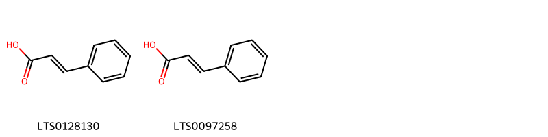
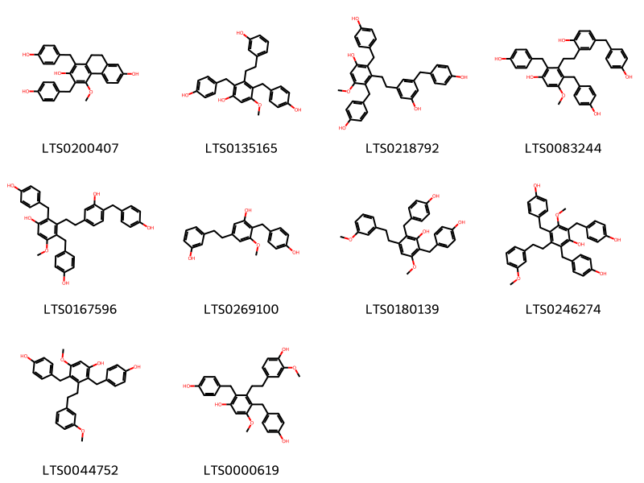
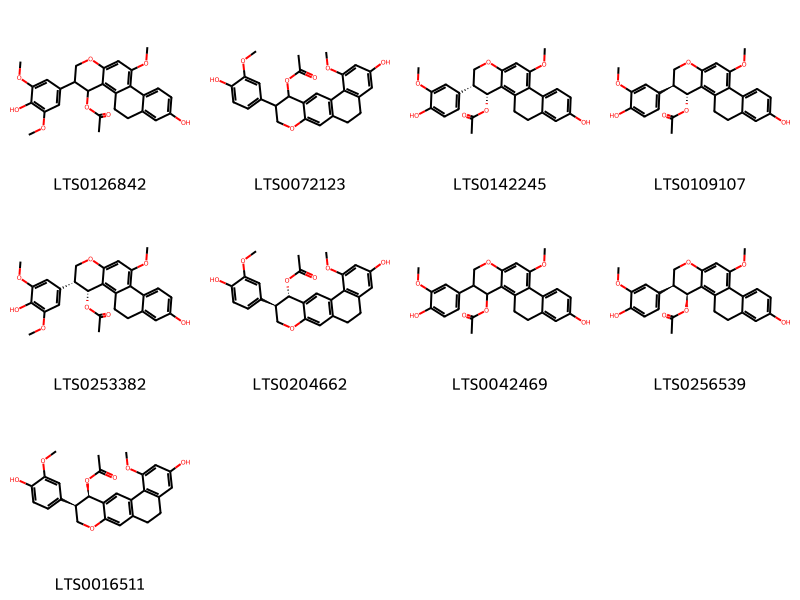
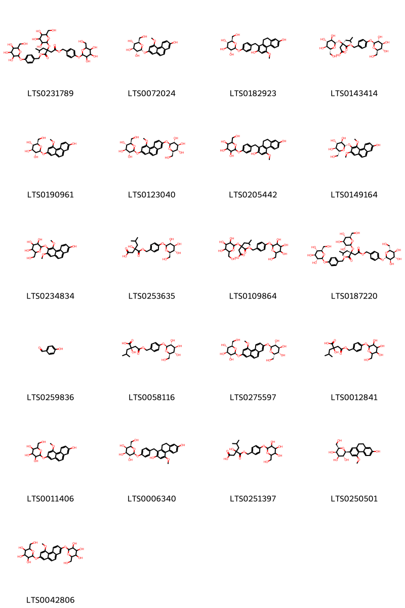
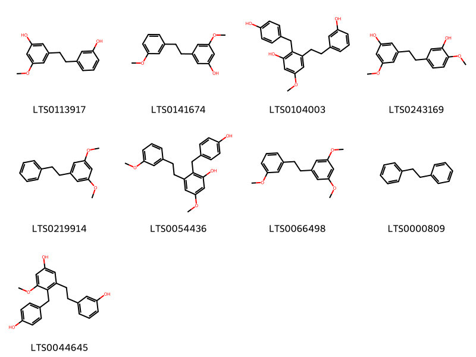

!!! abstract "Tóm tắt"

    Bạch cập có tên khoa học là Bletilla striata (Thunb.) Reichb. f, thuộc họ Orchidaceae - Lan. Theo các nhà thực vật hiện nay đã thay đổi tên khoa học mới thành Bletilla formosana (Hayata) Schltr. Cây được phân bố ở China North-Central, China South-Central, China Southeast, Japan, Korea, Myanmar, Nansei-shoto; Taiwan, Tibet. Còn tại Việt Nam mọc hoang dại ở nhiều vùng cao mát ở nước ta như Cao Bằng, Lạng Sơn, Lào Cai, Yên Bái, Hà Giang, Tuyên Quang… Trong y học dân gian thì cây được sử dụng điều trị một số triệu chứng và bệnh như là thu liễm chỉ huyết, sinh cơ tiêu sưng. Các nhà nghiên cứu đã phát hiện ra thành phần hóa học trong cây chứa tinh dầu, tinh bột 30,48% trong củ tươi và chất nhầy. Chất nhầy là polysaccarid (bletilamanan) bao gồm manose và glucose theo tỷ lệ 4:1. Ngoài ra, còn có batatasin và methylbatatasin, glycogen. Và hoạt chất là biomaker đặc trưng cho cây là Biphenanthren. Về tác dụng dược lý, biphenanthren phân lập được từ cây có tác dụng kháng khuẩn trên một số vi khuẩn gây bệnh thông thường, xuất huyết đường tiêu hóa. Chất nhầy (polysaccharides) trong cây có khả năng tạo màng bảo vệ tại vết thương và kích thích đông máu nên có tác dụng cầm máu, bảo vệ dạ dày.  Polysaccharides kích thích tái tạo mô và thúc đẩy quá trình lành vết thương.
.

## Thông tin về thực vật

Dược liệu **Bạch Cập (Thân Rễ)** từ bộ phận **nan** từ loài *Bletilla striata*.

**Mô tả thực vật:** Bạch cập là một loại cây thảo, sống lâu năm, mọc hoang và được trồng ở những vùng đất ẩm, mát, có thân rễ, có vẩy. Lá mọc từ rễ lên, chừng 3 đến 5 lá hình mác dài từ 18-40cm, rộng 2,5- 5cm, trên có nhiều nếp nhăn dọc. Vào đầu mùa hạ, ở đầu cành nở hoa rất đẹp màu đỏ tía. Quả hình thoi 6 cạnh.

*Tài liệu tham khảo:* "Những cây thuốc và vị thuốc Việt Nam" - Đỗ Tất Lợi 
Trong dược điển Việt nam, một loài được sử dụng làm dược liệu là *Bletilla striata*.

!!! info "Phân loại thực vật của *Bletilla striata*"
    - **Kingdom:** Plantae
    - **Phylum:** Tracheophyta
    - **Order:** Asparagales
    - **Family:** Orchidaceae
    - **Genus:** Bletilla
    - **Species:** *Bletilla striata*

**Phân bố trên thế giới:** nan, France, United States of America, China, Chinese Taipei, New Zealand, Japan, Korea, Republic of, Netherlands, Austria, Belgium

**Phân bố tại Việt nam:** Không có ghi nhận ở Việt Nam

## Thông tin về dược liệu 

### Định danh

!!! info "Thông tin về tên gọi"

    - Dược liệu tiếng Việt: nan
    - Dược liệu tiếng Trung: nan (nan)
    - Dược liệu tiếng Anh: nan
    - Dược liệu latin thông dụng: nan
    - Dược liệu latin kiểu DĐVN: *rhizoma bletillae striatae*
    - Dược liệu latin kiểu DĐVN: *nan*
    - Dược liệu latin kiểu thông tư: *nan*
    - Bộ phận dùng: nan (nan)

### Mô tả dược liệu 

- **Theo dược điển Việt nam V:** nan

- **Mô tả dược liệu theo thông tư chế biến dược liệu theo phương pháp cổ truyền:** nan

### Chế biến 

- **Chế biến theo dược điển việt nam V**: nan

- **Chế biến theo thông tư:** nan

--- 

## Thành phần hóa học

- Theo tài liệu của GS. Đỗ Tất Lợi:  (1) Bạch cập chứa tinh dầu, tinh bột 30, 48% trong củ tươi và chất nhầy. Chất nhầy là polysaccarid (bletilamanan) bao gồm manose và glucose theo tỷ lệ 4:1. Ngoài ra, còn có batatasin và methylbatatasin, glycogen
(2) Biphenanthren
    

**Thành phần hóa học từ loài **Bletilla striata**

Theo cơ sở dữ liệu lotus, loài *Bletilla striata* đã phân lập và xác định được **98** hoạt chất thuộc về các nhóm Diarylheptanoids, Anthracenes, Organooxygen compounds, Flavonoids, Cinnamic acids and derivatives, Isoflavonoids, Tannins, Carboxylic acids and derivatives, Benzene and substituted derivatives, Stilbenes, Phenanthrenes and derivatives trong bảng dưới đây. Danh sách các hoạt chất như sau 3-[2-(3-hydroxy-4-methoxyphenyl)ethyl]-5-methoxyphenol [(LTS0243169)](https://lotus.naturalproducts.net/compound/lotus_id/LTS0243169), (3r)-5-methyl-3-{[(2s,3r,4s,5s,6r)-3,4,5-trihydroxy-6-(hydroxymethyl)oxan-2-yl]oxy}-3-{[(4-{[(2s,3r,4s,5s,6r)-3,4,5-trihydroxy-6-(hydroxymethyl)oxan-2-yl]oxy}phenyl)methoxy]carbonyl}hexanoic acid [(LTS0143414)](https://lotus.naturalproducts.net/compound/lotus_id/LTS0143414), glycol dimethacrylate [(LTS0019260)](https://lotus.naturalproducts.net/compound/lotus_id/LTS0019260), 1,6-bis[(4-hydroxyphenyl)methyl]-4-methoxy-9,10-dihydrophenanthrene-2,7-diol [(LTS0032806)](https://lotus.naturalproducts.net/compound/lotus_id/LTS0032806), 1-[(7-hydroxy-5-methoxyphenanthren-2-yl)oxy]-4-methoxyphenanthrene-2,7-diol [(LTS0143824)](https://lotus.naturalproducts.net/compound/lotus_id/LTS0143824), 4,4',7'-trimethoxy-9,10-dihydro-[1,1'-biphenanthrene]-2,2',7-triol [(LTS0138392)](https://lotus.naturalproducts.net/compound/lotus_id/LTS0138392), 3-[2-(4-hydroxy-3-methoxyphenyl)ethyl]-2,4-bis[(4-hydroxyphenyl)methyl]-5-methoxyphenol [(LTS0000619)](https://lotus.naturalproducts.net/compound/lotus_id/LTS0000619), 1-[(7-hydroxy-5-methoxy-9,10-dihydrophenanthren-2-yl)oxy]-4-methoxyphenanthrene-2,7-diol [(LTS0130301)](https://lotus.naturalproducts.net/compound/lotus_id/LTS0130301), 5,7-dimethoxyphenanthrene-2,6-diol [(LTS0157195)](https://lotus.naturalproducts.net/compound/lotus_id/LTS0157195), 4',5,7'-trimethoxy-9,10-dihydro-[1,1'-biphenanthrene]-2,2',7-triol [(LTS0087745)](https://lotus.naturalproducts.net/compound/lotus_id/LTS0087745), 2,4,7-trimethoxyphenanthrene [(LTS0159928)](https://lotus.naturalproducts.net/compound/lotus_id/LTS0159928), 4,4'-dimethoxy-9h,9'h,10h,10'h-[1,1'-biphenanthrene]-2,2',7,7'-tetrol [(LTS0248172)](https://lotus.naturalproducts.net/compound/lotus_id/LTS0248172), 4,4'-dimethoxy-[1,1'-biphenanthrene]-2,2',7,7'-tetrol [(LTS0100038)](https://lotus.naturalproducts.net/compound/lotus_id/LTS0100038), (3r,4r)-8-hydroxy-3-(4-hydroxy-3-methoxyphenyl)-11-methoxy-2h,3h,4h,5h,6h-phenanthro[2,1-b]pyran-4-yl acetate [(LTS0142245)](https://lotus.naturalproducts.net/compound/lotus_id/LTS0142245), (3r,4r)-8-hydroxy-3-(4-hydroxy-3,5-dimethoxyphenyl)-11-methoxy-2h,3h,4h,5h,6h-phenanthro[2,1-b]pyran-4-yl acetate [(LTS0253382)](https://lotus.naturalproducts.net/compound/lotus_id/LTS0253382), 4-methoxy-9,10-dihydrophenanthrene-2,7-diol [(LTS0272507)](https://lotus.naturalproducts.net/compound/lotus_id/LTS0272507), 3,4-dihydroxybenzoic acid [(LTS0018765)](https://lotus.naturalproducts.net/compound/lotus_id/LTS0018765), 1-(4-hydroxybenzoyl)-4-methoxy-9,10-dihydrophenanthrene-2,7-diol [(LTS0099189)](https://lotus.naturalproducts.net/compound/lotus_id/LTS0099189), 3',4,5',7-tetramethoxy-9',10'-dihydro-[1,2'-biphenanthrene]-2,7'-diol [(LTS0080522)](https://lotus.naturalproducts.net/compound/lotus_id/LTS0080522), 1-benzylphenanthrene [(LTS0252672)](https://lotus.naturalproducts.net/compound/lotus_id/LTS0252672), 8-hydroxy-3-(4-hydroxy-3-methoxyphenyl)-6-methoxy-3,4,10,11-tetrahydro-2h-1-oxatetraphen-4-yl acetate [(LTS0072123)](https://lotus.naturalproducts.net/compound/lotus_id/LTS0072123), 3-[2-(3-hydroxyphenyl)ethyl]-2,4-bis[(4-hydroxyphenyl)methyl]-5-methoxyphenol [(LTS0135165)](https://lotus.naturalproducts.net/compound/lotus_id/LTS0135165), (2r,3r,4s,5s,6r)-2-[(7-hydroxy-4-methoxyphenanthren-2-yl)oxy]-6-(hydroxymethyl)oxane-3,4,5-triol [(LTS0072024)](https://lotus.naturalproducts.net/compound/lotus_id/LTS0072024), 3-(2-{3-hydroxy-4-[(4-hydroxyphenyl)methyl]phenyl}ethyl)-2,4-bis[(4-hydroxyphenyl)methyl]-5-methoxyphenol [(LTS0167596)](https://lotus.naturalproducts.net/compound/lotus_id/LTS0167596), dibenzyl [(LTS0000809)](https://lotus.naturalproducts.net/compound/lotus_id/LTS0000809), 5,7'-dihydroxy-10'-methoxy-2,3-dihydrospiro[indene-1,3'-phenanthro[2,1-b]furan]-2'-one [(LTS0071036)](https://lotus.naturalproducts.net/compound/lotus_id/LTS0071036), phenylacrylic acid [(LTS0097258)](https://lotus.naturalproducts.net/compound/lotus_id/LTS0097258), gastrodigenin [(LTS0094565)](https://lotus.naturalproducts.net/compound/lotus_id/LTS0094565), 1-[(7-hydroxy-4-methoxy-9,10-dihydrophenanthren-2-yl)oxy]-4-methoxy-9,10-dihydrophenanthrene-2,7-diol [(LTS0026060)](https://lotus.naturalproducts.net/compound/lotus_id/LTS0026060), 2,4,6-tris[(4-hydroxyphenyl)methyl]-3-methoxy-5-[2-(3-methoxyphenyl)ethyl]phenol [(LTS0246274)](https://lotus.naturalproducts.net/compound/lotus_id/LTS0246274), (2s,3r,4r,5r,6r)-2-(7-hydroxy-4-methoxy-9,10-dihydrophenanthren-2-yl)-6-(hydroxymethyl)oxane-3,4,5-triol [(LTS0250501)](https://lotus.naturalproducts.net/compound/lotus_id/LTS0250501), 2-[(7-hydroxy-4-methoxyphenanthren-2-yl)oxy]-6-(hydroxymethyl)oxane-3,4,5-triol [(LTS0011406)](https://lotus.naturalproducts.net/compound/lotus_id/LTS0011406), 2-hydroxy-4-methyl-2-{2-oxo-2-[(4-{[3,4,5-trihydroxy-6-(hydroxymethyl)oxan-2-yl]oxy}phenyl)methoxy]ethyl}pentanoic acid [(LTS0012841)](https://lotus.naturalproducts.net/compound/lotus_id/LTS0012841), 3-[2-(3-hydroxyphenyl)ethyl]-4-[(4-hydroxyphenyl)methyl]-5-methoxyphenol [(LTS0044645)](https://lotus.naturalproducts.net/compound/lotus_id/LTS0044645), 3-[2-(3-hydroxyphenyl)ethyl]-2-[(4-hydroxyphenyl)methyl]-5-methoxyphenol [(LTS0104003)](https://lotus.naturalproducts.net/compound/lotus_id/LTS0104003), anthracene [(LTS0044698)](https://lotus.naturalproducts.net/compound/lotus_id/LTS0044698), (3r,4r)-8-hydroxy-3-(4-hydroxy-3-methoxyphenyl)-6-methoxy-3,4,10,11-tetrahydro-2h-1-oxatetraphen-4-yl acetate [(LTS0016511)](https://lotus.naturalproducts.net/compound/lotus_id/LTS0016511), 1,3-dimethoxy-5-(2-phenylethyl)benzene [(LTS0219914)](https://lotus.naturalproducts.net/compound/lotus_id/LTS0219914), (2r,3s,4s,5r,6s)-2-(hydroxymethyl)-6-[(4-methoxy-7-{[(2s,3r,4s,5s,6s)-3,4,5-trihydroxy-6-(hydroxymethyl)oxan-2-yl]oxy}phenanthren-2-yl)oxy]oxane-3,4,5-triol [(LTS0275597)](https://lotus.naturalproducts.net/compound/lotus_id/LTS0275597), 1,8-bis[(4-hydroxyphenyl)methyl]-4-methoxyphenanthrene-2,7-diol [(LTS0034213)](https://lotus.naturalproducts.net/compound/lotus_id/LTS0034213), 2-[(7-hydroxy-2,4-dimethoxyphenanthren-3-yl)oxy]-6-(hydroxymethyl)oxane-3,4,5-triol [(LTS0234834)](https://lotus.naturalproducts.net/compound/lotus_id/LTS0234834), 2-{4-[(2,7-dihydroxy-4-methoxy-9,10-dihydrophenanthren-1-yl)methyl]phenoxy}-6-(hydroxymethyl)oxane-3,4,5-triol [(LTS0205442)](https://lotus.naturalproducts.net/compound/lotus_id/LTS0205442), 8'-[(4-hydroxyphenyl)methyl]-4,5'-dimethoxy-9',10'-dihydro-[1,3'-biphenanthrene]-2,2',7,7'-tetrol [(LTS0114261)](https://lotus.naturalproducts.net/compound/lotus_id/LTS0114261), 1,3-bis[(4-hydroxyphenyl)methyl]-4-methoxy-9,10-dihydrophenanthrene-2,7-diol [(LTS0200407)](https://lotus.naturalproducts.net/compound/lotus_id/LTS0200407), (2s,3r,4s,5r,6r)-2-{4-[(2,7-dihydroxy-4-methoxy-9,10-dihydrophenanthren-1-yl)methyl]phenoxy}-6-(hydroxymethyl)oxane-3,4,5-triol [(LTS0006340)](https://lotus.naturalproducts.net/compound/lotus_id/LTS0006340), 8-hydroxy-3-(4-hydroxy-3,5-dimethoxyphenyl)-11-methoxy-2h,3h,4h,5h,6h-phenanthro[2,1-b]pyran-4-yl acetate [(LTS0126842)](https://lotus.naturalproducts.net/compound/lotus_id/LTS0126842), 1,4-bis[(4-{[(2s,3r,4s,5s,6r)-3,4,5-trihydroxy-6-(hydroxymethyl)oxan-2-yl]oxy}phenyl)methyl] (2r)-2-(2-methylpropyl)-2-{[(2s,3r,4s,5s,6r)-3,4,5-trihydroxy-6-(hydroxymethyl)oxan-2-yl]oxy}butanedioate [(LTS0187220)](https://lotus.naturalproducts.net/compound/lotus_id/LTS0187220), 1-[(5-hydroxy-7-methoxy-9,10-dihydrophenanthren-2-yl)oxy]-4-methoxy-9,10-dihydrophenanthrene-2,7-diol [(LTS0059191)](https://lotus.naturalproducts.net/compound/lotus_id/LTS0059191), 4-methoxyphenanthrene-2,7-diol [(LTS0027244)](https://lotus.naturalproducts.net/compound/lotus_id/LTS0027244), (3s,4s)-8-hydroxy-3-(4-hydroxy-3-methoxyphenyl)-11-methoxy-2h,3h,4h,5h,6h-phenanthro[2,1-b]pyran-4-yl acetate [(LTS0256539)](https://lotus.naturalproducts.net/compound/lotus_id/LTS0256539), 1,1'-biphenanthrene [(LTS0011276)](https://lotus.naturalproducts.net/compound/lotus_id/LTS0011276), (1r)-5,7'-dihydroxy-10'-methoxy-2,3-dihydrospiro[indene-1,3'-phenanthro[2,1-b]furan]-2'-one [(LTS0112343)](https://lotus.naturalproducts.net/compound/lotus_id/LTS0112343), (2s,3r,4s,5s,6r)-2-[(7-hydroxy-4-methoxyphenanthren-2-yl)oxy]-6-(hydroxymethyl)oxane-3,4,5-triol [(LTS0190961)](https://lotus.naturalproducts.net/compound/lotus_id/LTS0190961), (2r)-2-hydroxy-4-methyl-2-{2-oxo-2-[(4-{[(2s,3r,4s,5s,6r)-3,4,5-trihydroxy-6-(hydroxymethyl)oxan-2-yl]oxy}phenyl)methoxy]ethyl}pentanoic acid [(LTS0058116)](https://lotus.naturalproducts.net/compound/lotus_id/LTS0058116), p-hydroxybenzaldehyde [(LTS0259836)](https://lotus.naturalproducts.net/compound/lotus_id/LTS0259836), 3-hydroxy-5-methyl-3-{[(4-{[3,4,5-trihydroxy-6-(hydroxymethyl)oxan-2-yl]oxy}phenyl)methoxy]carbonyl}hexanoic acid [(LTS0251397)](https://lotus.naturalproducts.net/compound/lotus_id/LTS0251397), 4,4',8,8'-tetramethoxy-[1,1'-biphenanthrene]-2,2',7,7'-tetrol [(LTS0189581)](https://lotus.naturalproducts.net/compound/lotus_id/LTS0189581), (3-{[(2s,3s,4r,5s,6r)-6-{[(2-carboxyacetyl)oxy]methyl}-3,4,5-trihydroxyoxan-2-yl]oxy}-5-hydroxy-2-(4-hydroxy-3-{[(2s,3r,4s,5s,6r)-3,4,5-trihydroxy-6-({[(2e)-3-(3-hydroxy-4-{[(2s,3r,4s,5s,6r)-3,4,5-trihydroxy-6-({[(2e)-3-(3-hydroxy-4-{[(2s,3s,4s,5s,6r)-3,4,5-trihydroxy-6-(hydroxymethyl)oxan-2-yl]oxy}phenyl)prop-2-enoyl]oxy}methyl)oxan-2-yl]oxy}phenyl)prop-2-enoyl]oxy}methyl)oxan-2-yl]oxy}phenyl)chromen-7-ylidene)[(2s,3s,4s,5s,6r)-3,4,5-trihydroxy-6-({[1-hydroxy-3-(3-hydroxy-4-oxocyclohexa-2,5-dien-1-ylidene)prop-1-en-1-yl]oxy}methyl)oxan-2-yl]oxidanium [(LTS0149525)](https://lotus.naturalproducts.net/compound/lotus_id/LTS0149525), blestriarene b [(LTS0059355)](https://lotus.naturalproducts.net/compound/lotus_id/LTS0059355), 2,6-bis[(4-hydroxyphenyl)methyl]-3-methoxy-5-[2-(3-methoxyphenyl)ethyl]phenol [(LTS0180139)](https://lotus.naturalproducts.net/compound/lotus_id/LTS0180139), 7-methoxy-9,10-dihydrophenanthrene-2,5-diol [(LTS0274638)](https://lotus.naturalproducts.net/compound/lotus_id/LTS0274638), 3-[2-(3-hydroxyphenyl)ethyl]-5-methoxyphenol [(LTS0113917)](https://lotus.naturalproducts.net/compound/lotus_id/LTS0113917), 4,7,7'-trimethoxy-9',10'-dihydro-[1,3'-biphenanthrene]-2,2',5'-triol [(LTS0133178)](https://lotus.naturalproducts.net/compound/lotus_id/LTS0133178), nudol [(LTS0087708)](https://lotus.naturalproducts.net/compound/lotus_id/LTS0087708), (3r)-3-hydroxy-5-methyl-3-{[(4-{[(2s,3r,4s,5s,6r)-3,4,5-trihydroxy-6-(hydroxymethyl)oxan-2-yl]oxy}phenyl)methoxy]carbonyl}hexanoic acid [(LTS0253635)](https://lotus.naturalproducts.net/compound/lotus_id/LTS0253635), 1,4-bis[(4-{[3,4,5-trihydroxy-6-(hydroxymethyl)oxan-2-yl]oxy}phenyl)methyl] 2-(2-methylpropyl)-2-{[3,4,5-trihydroxy-6-(hydroxymethyl)oxan-2-yl]oxy}butanedioate [(LTS0231789)](https://lotus.naturalproducts.net/compound/lotus_id/LTS0231789), (3-{[(2s,3r,4r,5s,6r)-6-{[(2-carboxyacetyl)oxy]methyl}-3,4,5-trihydroxyoxan-2-yl]oxy}-5-hydroxy-2-(4-hydroxy-3-{[(2s,3s,4r,5s,6r)-3,4,5-trihydroxy-6-({[(2e)-3-(4-{[(2s,3r,4s,5s,6r)-3,4,5-trihydroxy-6-({[(2e)-3-(4-{[(2s,3r,4s,5s,6r)-3,4,5-trihydroxy-6-(hydroxymethyl)oxan-2-yl]oxy}phenyl)prop-2-enoyl]oxy}methyl)oxan-2-yl]oxy}phenyl)prop-2-enoyl]oxy}methyl)oxan-2-yl]oxy}phenyl)chromen-7-ylidene)[(2s,3r,4s,5s,6r)-3,4,5-trihydroxy-6-({[1-hydroxy-3-(4-oxocyclohexa-2,5-dien-1-ylidene)prop-1-en-1-yl]oxy}methyl)oxan-2-yl]oxidanium [(LTS0005855)](https://lotus.naturalproducts.net/compound/lotus_id/LTS0005855), 2-[(4-hydroxyphenyl)methyl]-5-methoxy-3-[2-(3-methoxyphenyl)ethyl]phenol [(LTS0054436)](https://lotus.naturalproducts.net/compound/lotus_id/LTS0054436), cinnamic acid [(LTS0128130)](https://lotus.naturalproducts.net/compound/lotus_id/LTS0128130), 2,4-bis[(4-hydroxyphenyl)methyl]-5-methoxy-3-[2-(3-methoxyphenyl)ethyl]phenol [(LTS0044752)](https://lotus.naturalproducts.net/compound/lotus_id/LTS0044752), 1-[(4-hydroxyphenyl)methyl]-4,8-dimethoxyphenanthrene-2,7-diol [(LTS0028719)](https://lotus.naturalproducts.net/compound/lotus_id/LTS0028719), 5-methyl-3-{[3,4,5-trihydroxy-6-(hydroxymethyl)oxan-2-yl]oxy}-3-{[(4-{[3,4,5-trihydroxy-6-(hydroxymethyl)oxan-2-yl]oxy}phenyl)methoxy]carbonyl}hexanoic acid [(LTS0109864)](https://lotus.naturalproducts.net/compound/lotus_id/LTS0109864), (2r,3s,4s,5r,6s)-2-(hydroxymethyl)-6-[(4-methoxy-7-{[(2s,3r,4s,5s,6r)-3,4,5-trihydroxy-6-(hydroxymethyl)oxan-2-yl]oxy}phenanthren-2-yl)oxy]oxane-3,4,5-triol [(LTS0123040)](https://lotus.naturalproducts.net/compound/lotus_id/LTS0123040), (3s,4r)-8-hydroxy-3-(4-hydroxy-3-methoxyphenyl)-11-methoxy-2h,3h,4h,5h,6h-phenanthro[2,1-b]pyran-4-yl acetate [(LTS0109107)](https://lotus.naturalproducts.net/compound/lotus_id/LTS0109107), 2',7-dimethoxy-9h,9'h,10h,10'h-[1,1'-biphenanthrene]-2,4,4',7'-tetrol [(LTS0225349)](https://lotus.naturalproducts.net/compound/lotus_id/LTS0225349), 4,4'-dimethoxy-[1,2'-biphenanthrene]-2,7,7'-triol [(LTS0240356)](https://lotus.naturalproducts.net/compound/lotus_id/LTS0240356), 1,2-dihydrophenanthrene [(LTS0106482)](https://lotus.naturalproducts.net/compound/lotus_id/LTS0106482), 8-hydroxy-3-(4-hydroxy-3-methoxyphenyl)-11-methoxy-2h,3h,4h,5h,6h-phenanthro[2,1-b]pyran-4-yl acetate [(LTS0042469)](https://lotus.naturalproducts.net/compound/lotus_id/LTS0042469), 2,4,7-trimethoxy-9,10-dihydrophenanthrene [(LTS0040675)](https://lotus.naturalproducts.net/compound/lotus_id/LTS0040675), (2s,3r,4s,5s,6r)-2-{4-[(2,7-dihydroxy-4-methoxy-9,10-dihydrophenanthren-1-yl)methyl]phenoxy}-6-(hydroxymethyl)oxane-3,4,5-triol [(LTS0182923)](https://lotus.naturalproducts.net/compound/lotus_id/LTS0182923), (2s,3r,4s,5s,6r)-2-[(7-hydroxy-2,4-dimethoxyphenanthren-3-yl)oxy]-6-(hydroxymethyl)oxane-3,4,5-triol [(LTS0149164)](https://lotus.naturalproducts.net/compound/lotus_id/LTS0149164), 3,4,5,14,15,16-hexamethoxy-9,10-dimethyltricyclo[10.4.0.0²,⁷]hexadeca-1(12),2(7),3,5,13,15-hexaen-9-ol [(LTS0077106)](https://lotus.naturalproducts.net/compound/lotus_id/LTS0077106), 3-(2-{2-hydroxy-5-[(4-hydroxyphenyl)methyl]phenyl}ethyl)-2,4-bis[(4-hydroxyphenyl)methyl]-5-methoxyphenol [(LTS0083244)](https://lotus.naturalproducts.net/compound/lotus_id/LTS0083244), 3'-o-methylbatatasin iii [(LTS0141674)](https://lotus.naturalproducts.net/compound/lotus_id/LTS0141674), p-hydroxybenzoic acid [(LTS0263634)](https://lotus.naturalproducts.net/compound/lotus_id/LTS0263634), 2-(hydroxymethyl)-6-[(4-methoxy-7-{[3,4,5-trihydroxy-6-(hydroxymethyl)oxan-2-yl]oxy}phenanthren-2-yl)oxy]oxane-3,4,5-triol [(LTS0042806)](https://lotus.naturalproducts.net/compound/lotus_id/LTS0042806), 1-[(4-hydroxyphenyl)methyl]-4-methoxyphenanthrene-2,7-diol [(LTS0271237)](https://lotus.naturalproducts.net/compound/lotus_id/LTS0271237), 4,4'-dimethoxy-9h,9'h,10h,10'h-[1,3'-biphenanthrene]-2,2',7,7'-tetrol [(LTS0025954)](https://lotus.naturalproducts.net/compound/lotus_id/LTS0025954), physcion [(LTS0052688)](https://lotus.naturalproducts.net/compound/lotus_id/LTS0052688), 3-(2-{3-hydroxy-5-[(4-hydroxyphenyl)methyl]phenyl}ethyl)-2,4-bis[(4-hydroxyphenyl)methyl]-5-methoxyphenol [(LTS0218792)](https://lotus.naturalproducts.net/compound/lotus_id/LTS0218792), 3-[(4-hydroxyphenyl)methyl]-4-methoxy-9,10-dihydrophenanthrene-2,7-diol [(LTS0071549)](https://lotus.naturalproducts.net/compound/lotus_id/LTS0071549), 1-[(7-hydroxy-4-methoxy-9,10-dihydrophenanthren-2-yl)oxy]-4-methoxyphenanthrene-2,7-diol [(LTS0087951)](https://lotus.naturalproducts.net/compound/lotus_id/LTS0087951), 2,3,4,7-tetramethoxyphenanthrene [(LTS0230190)](https://lotus.naturalproducts.net/compound/lotus_id/LTS0230190), (3r,4s)-8-hydroxy-3-(4-hydroxy-3-methoxyphenyl)-6-methoxy-3,4,10,11-tetrahydro-2h-1-oxatetraphen-4-yl acetate [(LTS0204662)](https://lotus.naturalproducts.net/compound/lotus_id/LTS0204662), 8'-[(4-hydroxyphenyl)methyl]-4,5'-dimethoxy-9h,9'h,10h,10'h-[1,3'-biphenanthrene]-2,2',7,7'-tetrol [(LTS0030757)](https://lotus.naturalproducts.net/compound/lotus_id/LTS0030757), 8-[(4-hydroxyphenyl)methyl]-7-methoxy-9,10-dihydrophenanthrene-2,5-diol [(LTS0089163)](https://lotus.naturalproducts.net/compound/lotus_id/LTS0089163), 1,3-dimethoxy-5-[2-(3-methoxyphenyl)ethyl]benzene [(LTS0066498)](https://lotus.naturalproducts.net/compound/lotus_id/LTS0066498), 5-[2-(3-hydroxyphenyl)ethyl]-2-[(4-hydroxyphenyl)methyl]-3-methoxyphenol [(LTS0269100)](https://lotus.naturalproducts.net/compound/lotus_id/LTS0269100). 
        
| chemicalTaxonomyClassyfireClass     |   smiles_count |
|:------------------------------------|---------------:|
| Anthracenes                         |             59 |
| Benzene and substituted derivatives |             50 |
| Carboxylic acids and derivatives    |             26 |
| Cinnamic acids and derivatives      |             36 |
| Diarylheptanoids                    |            588 |
| Flavonoids                          |            666 |
| Isoflavonoids                       |            568 |
| Organooxygen compounds              |           1656 |
| Phenanthrenes and derivatives       |           1911 |
| Stilbenes                           |            288 |
| Tannins                             |             54 |

            
### Nhóm Anthracenes
<figure markdown="span">
    { width=100% }
<figcaption>Hình ảnh cấu trúc hóa học của hoạt chất thuộc nhóm *Anthracenes*. Tên thường gọi của các hoạt chất tương ứng là anthracene [(LTS0044698)](https://lotus.naturalproducts.net/compound/lotus_id/LTS0044698), physcion [(LTS0052688)](https://lotus.naturalproducts.net/compound/lotus_id/LTS0052688).</figcaption>
</figure>

            
            
### Nhóm Anthracenes
<figure markdown="span">
    { width=100% }
<figcaption>Hình ảnh cấu trúc hóa học của hoạt chất thuộc nhóm *Anthracenes*. Tên thường gọi của các hoạt chất tương ứng là anthracene [(LTS0044698)](https://lotus.naturalproducts.net/compound/lotus_id/LTS0044698), physcion [(LTS0052688)](https://lotus.naturalproducts.net/compound/lotus_id/LTS0052688).</figcaption>
</figure>

### Nhóm Benzene and substituted derivatives
<figure markdown="span">
    { width=100% }
<figcaption>Hình ảnh cấu trúc hóa học của hoạt chất thuộc nhóm *Benzene and substituted derivatives*. Tên thường gọi của các hoạt chất tương ứng là 3,4-dihydroxybenzoic acid [(LTS0018765)](https://lotus.naturalproducts.net/compound/lotus_id/LTS0018765), gastrodigenin [(LTS0094565)](https://lotus.naturalproducts.net/compound/lotus_id/LTS0094565), p-hydroxybenzoic acid [(LTS0263634)](https://lotus.naturalproducts.net/compound/lotus_id/LTS0263634).</figcaption>
</figure>

            
            
### Nhóm Anthracenes
<figure markdown="span">
    { width=100% }
<figcaption>Hình ảnh cấu trúc hóa học của hoạt chất thuộc nhóm *Anthracenes*. Tên thường gọi của các hoạt chất tương ứng là anthracene [(LTS0044698)](https://lotus.naturalproducts.net/compound/lotus_id/LTS0044698), physcion [(LTS0052688)](https://lotus.naturalproducts.net/compound/lotus_id/LTS0052688).</figcaption>
</figure>

### Nhóm Benzene and substituted derivatives
<figure markdown="span">
    { width=100% }
<figcaption>Hình ảnh cấu trúc hóa học của hoạt chất thuộc nhóm *Benzene and substituted derivatives*. Tên thường gọi của các hoạt chất tương ứng là 3,4-dihydroxybenzoic acid [(LTS0018765)](https://lotus.naturalproducts.net/compound/lotus_id/LTS0018765), gastrodigenin [(LTS0094565)](https://lotus.naturalproducts.net/compound/lotus_id/LTS0094565), p-hydroxybenzoic acid [(LTS0263634)](https://lotus.naturalproducts.net/compound/lotus_id/LTS0263634).</figcaption>
</figure>

### Nhóm Carboxylic acids and derivatives
<figure markdown="span">
    { width=100% }
<figcaption>Hình ảnh cấu trúc hóa học của hoạt chất thuộc nhóm *Carboxylic acids and derivatives*. Tên thường gọi của các hoạt chất tương ứng là glycol dimethacrylate [(LTS0019260)](https://lotus.naturalproducts.net/compound/lotus_id/LTS0019260).</figcaption>
</figure>

            
            
### Nhóm Anthracenes
<figure markdown="span">
    { width=100% }
<figcaption>Hình ảnh cấu trúc hóa học của hoạt chất thuộc nhóm *Anthracenes*. Tên thường gọi của các hoạt chất tương ứng là anthracene [(LTS0044698)](https://lotus.naturalproducts.net/compound/lotus_id/LTS0044698), physcion [(LTS0052688)](https://lotus.naturalproducts.net/compound/lotus_id/LTS0052688).</figcaption>
</figure>

### Nhóm Benzene and substituted derivatives
<figure markdown="span">
    { width=100% }
<figcaption>Hình ảnh cấu trúc hóa học của hoạt chất thuộc nhóm *Benzene and substituted derivatives*. Tên thường gọi của các hoạt chất tương ứng là 3,4-dihydroxybenzoic acid [(LTS0018765)](https://lotus.naturalproducts.net/compound/lotus_id/LTS0018765), gastrodigenin [(LTS0094565)](https://lotus.naturalproducts.net/compound/lotus_id/LTS0094565), p-hydroxybenzoic acid [(LTS0263634)](https://lotus.naturalproducts.net/compound/lotus_id/LTS0263634).</figcaption>
</figure>

### Nhóm Carboxylic acids and derivatives
<figure markdown="span">
    { width=100% }
<figcaption>Hình ảnh cấu trúc hóa học của hoạt chất thuộc nhóm *Carboxylic acids and derivatives*. Tên thường gọi của các hoạt chất tương ứng là glycol dimethacrylate [(LTS0019260)](https://lotus.naturalproducts.net/compound/lotus_id/LTS0019260).</figcaption>
</figure>

### Nhóm Cinnamic acids and derivatives
<figure markdown="span">
    { width=100% }
<figcaption>Hình ảnh cấu trúc hóa học của hoạt chất thuộc nhóm *Cinnamic acids and derivatives*. Tên thường gọi của các hoạt chất tương ứng là cinnamic acid [(LTS0128130)](https://lotus.naturalproducts.net/compound/lotus_id/LTS0128130), phenylacrylic acid [(LTS0097258)](https://lotus.naturalproducts.net/compound/lotus_id/LTS0097258).</figcaption>
</figure>

            
            
### Nhóm Anthracenes
<figure markdown="span">
    { width=100% }
<figcaption>Hình ảnh cấu trúc hóa học của hoạt chất thuộc nhóm *Anthracenes*. Tên thường gọi của các hoạt chất tương ứng là anthracene [(LTS0044698)](https://lotus.naturalproducts.net/compound/lotus_id/LTS0044698), physcion [(LTS0052688)](https://lotus.naturalproducts.net/compound/lotus_id/LTS0052688).</figcaption>
</figure>

### Nhóm Benzene and substituted derivatives
<figure markdown="span">
    { width=100% }
<figcaption>Hình ảnh cấu trúc hóa học của hoạt chất thuộc nhóm *Benzene and substituted derivatives*. Tên thường gọi của các hoạt chất tương ứng là 3,4-dihydroxybenzoic acid [(LTS0018765)](https://lotus.naturalproducts.net/compound/lotus_id/LTS0018765), gastrodigenin [(LTS0094565)](https://lotus.naturalproducts.net/compound/lotus_id/LTS0094565), p-hydroxybenzoic acid [(LTS0263634)](https://lotus.naturalproducts.net/compound/lotus_id/LTS0263634).</figcaption>
</figure>

### Nhóm Carboxylic acids and derivatives
<figure markdown="span">
    { width=100% }
<figcaption>Hình ảnh cấu trúc hóa học của hoạt chất thuộc nhóm *Carboxylic acids and derivatives*. Tên thường gọi của các hoạt chất tương ứng là glycol dimethacrylate [(LTS0019260)](https://lotus.naturalproducts.net/compound/lotus_id/LTS0019260).</figcaption>
</figure>

### Nhóm Cinnamic acids and derivatives
<figure markdown="span">
    { width=100% }
<figcaption>Hình ảnh cấu trúc hóa học của hoạt chất thuộc nhóm *Cinnamic acids and derivatives*. Tên thường gọi của các hoạt chất tương ứng là cinnamic acid [(LTS0128130)](https://lotus.naturalproducts.net/compound/lotus_id/LTS0128130), phenylacrylic acid [(LTS0097258)](https://lotus.naturalproducts.net/compound/lotus_id/LTS0097258).</figcaption>
</figure>

### Nhóm Diarylheptanoids
<figure markdown="span">
    { width=100% }
<figcaption>Hình ảnh cấu trúc hóa học của hoạt chất thuộc nhóm *Diarylheptanoids*. Tên thường gọi của các hoạt chất tương ứng là 1,3-bis[(4-hydroxyphenyl)methyl]-4-methoxy-9,10-dihydrophenanthrene-2,7-diol [(LTS0200407)](https://lotus.naturalproducts.net/compound/lotus_id/LTS0200407), 3-[2-(3-hydroxyphenyl)ethyl]-2,4-bis[(4-hydroxyphenyl)methyl]-5-methoxyphenol [(LTS0135165)](https://lotus.naturalproducts.net/compound/lotus_id/LTS0135165), 3-(2-{3-hydroxy-5-[(4-hydroxyphenyl)methyl]phenyl}ethyl)-2,4-bis[(4-hydroxyphenyl)methyl]-5-methoxyphenol [(LTS0218792)](https://lotus.naturalproducts.net/compound/lotus_id/LTS0218792), 3-(2-{2-hydroxy-5-[(4-hydroxyphenyl)methyl]phenyl}ethyl)-2,4-bis[(4-hydroxyphenyl)methyl]-5-methoxyphenol [(LTS0083244)](https://lotus.naturalproducts.net/compound/lotus_id/LTS0083244), 3-(2-{3-hydroxy-4-[(4-hydroxyphenyl)methyl]phenyl}ethyl)-2,4-bis[(4-hydroxyphenyl)methyl]-5-methoxyphenol [(LTS0167596)](https://lotus.naturalproducts.net/compound/lotus_id/LTS0167596), 5-[2-(3-hydroxyphenyl)ethyl]-2-[(4-hydroxyphenyl)methyl]-3-methoxyphenol [(LTS0269100)](https://lotus.naturalproducts.net/compound/lotus_id/LTS0269100), 2,6-bis[(4-hydroxyphenyl)methyl]-3-methoxy-5-[2-(3-methoxyphenyl)ethyl]phenol [(LTS0180139)](https://lotus.naturalproducts.net/compound/lotus_id/LTS0180139), 2,4,6-tris[(4-hydroxyphenyl)methyl]-3-methoxy-5-[2-(3-methoxyphenyl)ethyl]phenol [(LTS0246274)](https://lotus.naturalproducts.net/compound/lotus_id/LTS0246274), 2,4-bis[(4-hydroxyphenyl)methyl]-5-methoxy-3-[2-(3-methoxyphenyl)ethyl]phenol [(LTS0044752)](https://lotus.naturalproducts.net/compound/lotus_id/LTS0044752), 3-[2-(4-hydroxy-3-methoxyphenyl)ethyl]-2,4-bis[(4-hydroxyphenyl)methyl]-5-methoxyphenol [(LTS0000619)](https://lotus.naturalproducts.net/compound/lotus_id/LTS0000619).</figcaption>
</figure>

            
            
### Nhóm Anthracenes
<figure markdown="span">
    { width=100% }
<figcaption>Hình ảnh cấu trúc hóa học của hoạt chất thuộc nhóm *Anthracenes*. Tên thường gọi của các hoạt chất tương ứng là anthracene [(LTS0044698)](https://lotus.naturalproducts.net/compound/lotus_id/LTS0044698), physcion [(LTS0052688)](https://lotus.naturalproducts.net/compound/lotus_id/LTS0052688).</figcaption>
</figure>

### Nhóm Benzene and substituted derivatives
<figure markdown="span">
    { width=100% }
<figcaption>Hình ảnh cấu trúc hóa học của hoạt chất thuộc nhóm *Benzene and substituted derivatives*. Tên thường gọi của các hoạt chất tương ứng là 3,4-dihydroxybenzoic acid [(LTS0018765)](https://lotus.naturalproducts.net/compound/lotus_id/LTS0018765), gastrodigenin [(LTS0094565)](https://lotus.naturalproducts.net/compound/lotus_id/LTS0094565), p-hydroxybenzoic acid [(LTS0263634)](https://lotus.naturalproducts.net/compound/lotus_id/LTS0263634).</figcaption>
</figure>

### Nhóm Carboxylic acids and derivatives
<figure markdown="span">
    { width=100% }
<figcaption>Hình ảnh cấu trúc hóa học của hoạt chất thuộc nhóm *Carboxylic acids and derivatives*. Tên thường gọi của các hoạt chất tương ứng là glycol dimethacrylate [(LTS0019260)](https://lotus.naturalproducts.net/compound/lotus_id/LTS0019260).</figcaption>
</figure>

### Nhóm Cinnamic acids and derivatives
<figure markdown="span">
    { width=100% }
<figcaption>Hình ảnh cấu trúc hóa học của hoạt chất thuộc nhóm *Cinnamic acids and derivatives*. Tên thường gọi của các hoạt chất tương ứng là cinnamic acid [(LTS0128130)](https://lotus.naturalproducts.net/compound/lotus_id/LTS0128130), phenylacrylic acid [(LTS0097258)](https://lotus.naturalproducts.net/compound/lotus_id/LTS0097258).</figcaption>
</figure>

### Nhóm Diarylheptanoids
<figure markdown="span">
    { width=100% }
<figcaption>Hình ảnh cấu trúc hóa học của hoạt chất thuộc nhóm *Diarylheptanoids*. Tên thường gọi của các hoạt chất tương ứng là 1,3-bis[(4-hydroxyphenyl)methyl]-4-methoxy-9,10-dihydrophenanthrene-2,7-diol [(LTS0200407)](https://lotus.naturalproducts.net/compound/lotus_id/LTS0200407), 3-[2-(3-hydroxyphenyl)ethyl]-2,4-bis[(4-hydroxyphenyl)methyl]-5-methoxyphenol [(LTS0135165)](https://lotus.naturalproducts.net/compound/lotus_id/LTS0135165), 3-(2-{3-hydroxy-5-[(4-hydroxyphenyl)methyl]phenyl}ethyl)-2,4-bis[(4-hydroxyphenyl)methyl]-5-methoxyphenol [(LTS0218792)](https://lotus.naturalproducts.net/compound/lotus_id/LTS0218792), 3-(2-{2-hydroxy-5-[(4-hydroxyphenyl)methyl]phenyl}ethyl)-2,4-bis[(4-hydroxyphenyl)methyl]-5-methoxyphenol [(LTS0083244)](https://lotus.naturalproducts.net/compound/lotus_id/LTS0083244), 3-(2-{3-hydroxy-4-[(4-hydroxyphenyl)methyl]phenyl}ethyl)-2,4-bis[(4-hydroxyphenyl)methyl]-5-methoxyphenol [(LTS0167596)](https://lotus.naturalproducts.net/compound/lotus_id/LTS0167596), 5-[2-(3-hydroxyphenyl)ethyl]-2-[(4-hydroxyphenyl)methyl]-3-methoxyphenol [(LTS0269100)](https://lotus.naturalproducts.net/compound/lotus_id/LTS0269100), 2,6-bis[(4-hydroxyphenyl)methyl]-3-methoxy-5-[2-(3-methoxyphenyl)ethyl]phenol [(LTS0180139)](https://lotus.naturalproducts.net/compound/lotus_id/LTS0180139), 2,4,6-tris[(4-hydroxyphenyl)methyl]-3-methoxy-5-[2-(3-methoxyphenyl)ethyl]phenol [(LTS0246274)](https://lotus.naturalproducts.net/compound/lotus_id/LTS0246274), 2,4-bis[(4-hydroxyphenyl)methyl]-5-methoxy-3-[2-(3-methoxyphenyl)ethyl]phenol [(LTS0044752)](https://lotus.naturalproducts.net/compound/lotus_id/LTS0044752), 3-[2-(4-hydroxy-3-methoxyphenyl)ethyl]-2,4-bis[(4-hydroxyphenyl)methyl]-5-methoxyphenol [(LTS0000619)](https://lotus.naturalproducts.net/compound/lotus_id/LTS0000619).</figcaption>
</figure>

### Nhóm Flavonoids
<figure markdown="span">
    { width=100% }
<figcaption>Hình ảnh cấu trúc hóa học của hoạt chất thuộc nhóm *Flavonoids*. Tên thường gọi của các hoạt chất tương ứng là (3-{[(2s,3s,4r,5s,6r)-6-{[(2-carboxyacetyl)oxy]methyl}-3,4,5-trihydroxyoxan-2-yl]oxy}-5-hydroxy-2-(4-hydroxy-3-{[(2s,3r,4s,5s,6r)-3,4,5-trihydroxy-6-({[(2e)-3-(3-hydroxy-4-{[(2s,3r,4s,5s,6r)-3,4,5-trihydroxy-6-({[(2e)-3-(3-hydroxy-4-{[(2s,3s,4s,5s,6r)-3,4,5-trihydroxy-6-(hydroxymethyl)oxan-2-yl]oxy}phenyl)prop-2-enoyl]oxy}methyl)oxan-2-yl]oxy}phenyl)prop-2-enoyl]oxy}methyl)oxan-2-yl]oxy}phenyl)chromen-7-ylidene)[(2s,3s,4s,5s,6r)-3,4,5-trihydroxy-6-({[1-hydroxy-3-(3-hydroxy-4-oxocyclohexa-2,5-dien-1-ylidene)prop-1-en-1-yl]oxy}methyl)oxan-2-yl]oxidanium [(LTS0149525)](https://lotus.naturalproducts.net/compound/lotus_id/LTS0149525), (3-{[(2s,3r,4r,5s,6r)-6-{[(2-carboxyacetyl)oxy]methyl}-3,4,5-trihydroxyoxan-2-yl]oxy}-5-hydroxy-2-(4-hydroxy-3-{[(2s,3s,4r,5s,6r)-3,4,5-trihydroxy-6-({[(2e)-3-(4-{[(2s,3r,4s,5s,6r)-3,4,5-trihydroxy-6-({[(2e)-3-(4-{[(2s,3r,4s,5s,6r)-3,4,5-trihydroxy-6-(hydroxymethyl)oxan-2-yl]oxy}phenyl)prop-2-enoyl]oxy}methyl)oxan-2-yl]oxy}phenyl)prop-2-enoyl]oxy}methyl)oxan-2-yl]oxy}phenyl)chromen-7-ylidene)[(2s,3r,4s,5s,6r)-3,4,5-trihydroxy-6-({[1-hydroxy-3-(4-oxocyclohexa-2,5-dien-1-ylidene)prop-1-en-1-yl]oxy}methyl)oxan-2-yl]oxidanium [(LTS0005855)](https://lotus.naturalproducts.net/compound/lotus_id/LTS0005855).</figcaption>
</figure>

            
            
### Nhóm Anthracenes
<figure markdown="span">
    { width=100% }
<figcaption>Hình ảnh cấu trúc hóa học của hoạt chất thuộc nhóm *Anthracenes*. Tên thường gọi của các hoạt chất tương ứng là anthracene [(LTS0044698)](https://lotus.naturalproducts.net/compound/lotus_id/LTS0044698), physcion [(LTS0052688)](https://lotus.naturalproducts.net/compound/lotus_id/LTS0052688).</figcaption>
</figure>

### Nhóm Benzene and substituted derivatives
<figure markdown="span">
    { width=100% }
<figcaption>Hình ảnh cấu trúc hóa học của hoạt chất thuộc nhóm *Benzene and substituted derivatives*. Tên thường gọi của các hoạt chất tương ứng là 3,4-dihydroxybenzoic acid [(LTS0018765)](https://lotus.naturalproducts.net/compound/lotus_id/LTS0018765), gastrodigenin [(LTS0094565)](https://lotus.naturalproducts.net/compound/lotus_id/LTS0094565), p-hydroxybenzoic acid [(LTS0263634)](https://lotus.naturalproducts.net/compound/lotus_id/LTS0263634).</figcaption>
</figure>

### Nhóm Carboxylic acids and derivatives
<figure markdown="span">
    { width=100% }
<figcaption>Hình ảnh cấu trúc hóa học của hoạt chất thuộc nhóm *Carboxylic acids and derivatives*. Tên thường gọi của các hoạt chất tương ứng là glycol dimethacrylate [(LTS0019260)](https://lotus.naturalproducts.net/compound/lotus_id/LTS0019260).</figcaption>
</figure>

### Nhóm Cinnamic acids and derivatives
<figure markdown="span">
    { width=100% }
<figcaption>Hình ảnh cấu trúc hóa học của hoạt chất thuộc nhóm *Cinnamic acids and derivatives*. Tên thường gọi của các hoạt chất tương ứng là cinnamic acid [(LTS0128130)](https://lotus.naturalproducts.net/compound/lotus_id/LTS0128130), phenylacrylic acid [(LTS0097258)](https://lotus.naturalproducts.net/compound/lotus_id/LTS0097258).</figcaption>
</figure>

### Nhóm Diarylheptanoids
<figure markdown="span">
    { width=100% }
<figcaption>Hình ảnh cấu trúc hóa học của hoạt chất thuộc nhóm *Diarylheptanoids*. Tên thường gọi của các hoạt chất tương ứng là 1,3-bis[(4-hydroxyphenyl)methyl]-4-methoxy-9,10-dihydrophenanthrene-2,7-diol [(LTS0200407)](https://lotus.naturalproducts.net/compound/lotus_id/LTS0200407), 3-[2-(3-hydroxyphenyl)ethyl]-2,4-bis[(4-hydroxyphenyl)methyl]-5-methoxyphenol [(LTS0135165)](https://lotus.naturalproducts.net/compound/lotus_id/LTS0135165), 3-(2-{3-hydroxy-5-[(4-hydroxyphenyl)methyl]phenyl}ethyl)-2,4-bis[(4-hydroxyphenyl)methyl]-5-methoxyphenol [(LTS0218792)](https://lotus.naturalproducts.net/compound/lotus_id/LTS0218792), 3-(2-{2-hydroxy-5-[(4-hydroxyphenyl)methyl]phenyl}ethyl)-2,4-bis[(4-hydroxyphenyl)methyl]-5-methoxyphenol [(LTS0083244)](https://lotus.naturalproducts.net/compound/lotus_id/LTS0083244), 3-(2-{3-hydroxy-4-[(4-hydroxyphenyl)methyl]phenyl}ethyl)-2,4-bis[(4-hydroxyphenyl)methyl]-5-methoxyphenol [(LTS0167596)](https://lotus.naturalproducts.net/compound/lotus_id/LTS0167596), 5-[2-(3-hydroxyphenyl)ethyl]-2-[(4-hydroxyphenyl)methyl]-3-methoxyphenol [(LTS0269100)](https://lotus.naturalproducts.net/compound/lotus_id/LTS0269100), 2,6-bis[(4-hydroxyphenyl)methyl]-3-methoxy-5-[2-(3-methoxyphenyl)ethyl]phenol [(LTS0180139)](https://lotus.naturalproducts.net/compound/lotus_id/LTS0180139), 2,4,6-tris[(4-hydroxyphenyl)methyl]-3-methoxy-5-[2-(3-methoxyphenyl)ethyl]phenol [(LTS0246274)](https://lotus.naturalproducts.net/compound/lotus_id/LTS0246274), 2,4-bis[(4-hydroxyphenyl)methyl]-5-methoxy-3-[2-(3-methoxyphenyl)ethyl]phenol [(LTS0044752)](https://lotus.naturalproducts.net/compound/lotus_id/LTS0044752), 3-[2-(4-hydroxy-3-methoxyphenyl)ethyl]-2,4-bis[(4-hydroxyphenyl)methyl]-5-methoxyphenol [(LTS0000619)](https://lotus.naturalproducts.net/compound/lotus_id/LTS0000619).</figcaption>
</figure>

### Nhóm Flavonoids
<figure markdown="span">
    { width=100% }
<figcaption>Hình ảnh cấu trúc hóa học của hoạt chất thuộc nhóm *Flavonoids*. Tên thường gọi của các hoạt chất tương ứng là (3-{[(2s,3s,4r,5s,6r)-6-{[(2-carboxyacetyl)oxy]methyl}-3,4,5-trihydroxyoxan-2-yl]oxy}-5-hydroxy-2-(4-hydroxy-3-{[(2s,3r,4s,5s,6r)-3,4,5-trihydroxy-6-({[(2e)-3-(3-hydroxy-4-{[(2s,3r,4s,5s,6r)-3,4,5-trihydroxy-6-({[(2e)-3-(3-hydroxy-4-{[(2s,3s,4s,5s,6r)-3,4,5-trihydroxy-6-(hydroxymethyl)oxan-2-yl]oxy}phenyl)prop-2-enoyl]oxy}methyl)oxan-2-yl]oxy}phenyl)prop-2-enoyl]oxy}methyl)oxan-2-yl]oxy}phenyl)chromen-7-ylidene)[(2s,3s,4s,5s,6r)-3,4,5-trihydroxy-6-({[1-hydroxy-3-(3-hydroxy-4-oxocyclohexa-2,5-dien-1-ylidene)prop-1-en-1-yl]oxy}methyl)oxan-2-yl]oxidanium [(LTS0149525)](https://lotus.naturalproducts.net/compound/lotus_id/LTS0149525), (3-{[(2s,3r,4r,5s,6r)-6-{[(2-carboxyacetyl)oxy]methyl}-3,4,5-trihydroxyoxan-2-yl]oxy}-5-hydroxy-2-(4-hydroxy-3-{[(2s,3s,4r,5s,6r)-3,4,5-trihydroxy-6-({[(2e)-3-(4-{[(2s,3r,4s,5s,6r)-3,4,5-trihydroxy-6-({[(2e)-3-(4-{[(2s,3r,4s,5s,6r)-3,4,5-trihydroxy-6-(hydroxymethyl)oxan-2-yl]oxy}phenyl)prop-2-enoyl]oxy}methyl)oxan-2-yl]oxy}phenyl)prop-2-enoyl]oxy}methyl)oxan-2-yl]oxy}phenyl)chromen-7-ylidene)[(2s,3r,4s,5s,6r)-3,4,5-trihydroxy-6-({[1-hydroxy-3-(4-oxocyclohexa-2,5-dien-1-ylidene)prop-1-en-1-yl]oxy}methyl)oxan-2-yl]oxidanium [(LTS0005855)](https://lotus.naturalproducts.net/compound/lotus_id/LTS0005855).</figcaption>
</figure>

### Nhóm Isoflavonoids
<figure markdown="span">
    { width=100% }
<figcaption>Hình ảnh cấu trúc hóa học của hoạt chất thuộc nhóm *Isoflavonoids*. Tên thường gọi của các hoạt chất tương ứng là 8-hydroxy-3-(4-hydroxy-3,5-dimethoxyphenyl)-11-methoxy-2h,3h,4h,5h,6h-phenanthro[2,1-b]pyran-4-yl acetate [(LTS0126842)](https://lotus.naturalproducts.net/compound/lotus_id/LTS0126842), 8-hydroxy-3-(4-hydroxy-3-methoxyphenyl)-6-methoxy-3,4,10,11-tetrahydro-2h-1-oxatetraphen-4-yl acetate [(LTS0072123)](https://lotus.naturalproducts.net/compound/lotus_id/LTS0072123), (3r,4r)-8-hydroxy-3-(4-hydroxy-3-methoxyphenyl)-11-methoxy-2h,3h,4h,5h,6h-phenanthro[2,1-b]pyran-4-yl acetate [(LTS0142245)](https://lotus.naturalproducts.net/compound/lotus_id/LTS0142245), (3s,4r)-8-hydroxy-3-(4-hydroxy-3-methoxyphenyl)-11-methoxy-2h,3h,4h,5h,6h-phenanthro[2,1-b]pyran-4-yl acetate [(LTS0109107)](https://lotus.naturalproducts.net/compound/lotus_id/LTS0109107), (3r,4r)-8-hydroxy-3-(4-hydroxy-3,5-dimethoxyphenyl)-11-methoxy-2h,3h,4h,5h,6h-phenanthro[2,1-b]pyran-4-yl acetate [(LTS0253382)](https://lotus.naturalproducts.net/compound/lotus_id/LTS0253382), (3r,4s)-8-hydroxy-3-(4-hydroxy-3-methoxyphenyl)-6-methoxy-3,4,10,11-tetrahydro-2h-1-oxatetraphen-4-yl acetate [(LTS0204662)](https://lotus.naturalproducts.net/compound/lotus_id/LTS0204662), 8-hydroxy-3-(4-hydroxy-3-methoxyphenyl)-11-methoxy-2h,3h,4h,5h,6h-phenanthro[2,1-b]pyran-4-yl acetate [(LTS0042469)](https://lotus.naturalproducts.net/compound/lotus_id/LTS0042469), (3s,4s)-8-hydroxy-3-(4-hydroxy-3-methoxyphenyl)-11-methoxy-2h,3h,4h,5h,6h-phenanthro[2,1-b]pyran-4-yl acetate [(LTS0256539)](https://lotus.naturalproducts.net/compound/lotus_id/LTS0256539), (3r,4r)-8-hydroxy-3-(4-hydroxy-3-methoxyphenyl)-6-methoxy-3,4,10,11-tetrahydro-2h-1-oxatetraphen-4-yl acetate [(LTS0016511)](https://lotus.naturalproducts.net/compound/lotus_id/LTS0016511).</figcaption>
</figure>

            
            
### Nhóm Anthracenes
<figure markdown="span">
    { width=100% }
<figcaption>Hình ảnh cấu trúc hóa học của hoạt chất thuộc nhóm *Anthracenes*. Tên thường gọi của các hoạt chất tương ứng là anthracene [(LTS0044698)](https://lotus.naturalproducts.net/compound/lotus_id/LTS0044698), physcion [(LTS0052688)](https://lotus.naturalproducts.net/compound/lotus_id/LTS0052688).</figcaption>
</figure>

### Nhóm Benzene and substituted derivatives
<figure markdown="span">
    { width=100% }
<figcaption>Hình ảnh cấu trúc hóa học của hoạt chất thuộc nhóm *Benzene and substituted derivatives*. Tên thường gọi của các hoạt chất tương ứng là 3,4-dihydroxybenzoic acid [(LTS0018765)](https://lotus.naturalproducts.net/compound/lotus_id/LTS0018765), gastrodigenin [(LTS0094565)](https://lotus.naturalproducts.net/compound/lotus_id/LTS0094565), p-hydroxybenzoic acid [(LTS0263634)](https://lotus.naturalproducts.net/compound/lotus_id/LTS0263634).</figcaption>
</figure>

### Nhóm Carboxylic acids and derivatives
<figure markdown="span">
    { width=100% }
<figcaption>Hình ảnh cấu trúc hóa học của hoạt chất thuộc nhóm *Carboxylic acids and derivatives*. Tên thường gọi của các hoạt chất tương ứng là glycol dimethacrylate [(LTS0019260)](https://lotus.naturalproducts.net/compound/lotus_id/LTS0019260).</figcaption>
</figure>

### Nhóm Cinnamic acids and derivatives
<figure markdown="span">
    { width=100% }
<figcaption>Hình ảnh cấu trúc hóa học của hoạt chất thuộc nhóm *Cinnamic acids and derivatives*. Tên thường gọi của các hoạt chất tương ứng là cinnamic acid [(LTS0128130)](https://lotus.naturalproducts.net/compound/lotus_id/LTS0128130), phenylacrylic acid [(LTS0097258)](https://lotus.naturalproducts.net/compound/lotus_id/LTS0097258).</figcaption>
</figure>

### Nhóm Diarylheptanoids
<figure markdown="span">
    { width=100% }
<figcaption>Hình ảnh cấu trúc hóa học của hoạt chất thuộc nhóm *Diarylheptanoids*. Tên thường gọi của các hoạt chất tương ứng là 1,3-bis[(4-hydroxyphenyl)methyl]-4-methoxy-9,10-dihydrophenanthrene-2,7-diol [(LTS0200407)](https://lotus.naturalproducts.net/compound/lotus_id/LTS0200407), 3-[2-(3-hydroxyphenyl)ethyl]-2,4-bis[(4-hydroxyphenyl)methyl]-5-methoxyphenol [(LTS0135165)](https://lotus.naturalproducts.net/compound/lotus_id/LTS0135165), 3-(2-{3-hydroxy-5-[(4-hydroxyphenyl)methyl]phenyl}ethyl)-2,4-bis[(4-hydroxyphenyl)methyl]-5-methoxyphenol [(LTS0218792)](https://lotus.naturalproducts.net/compound/lotus_id/LTS0218792), 3-(2-{2-hydroxy-5-[(4-hydroxyphenyl)methyl]phenyl}ethyl)-2,4-bis[(4-hydroxyphenyl)methyl]-5-methoxyphenol [(LTS0083244)](https://lotus.naturalproducts.net/compound/lotus_id/LTS0083244), 3-(2-{3-hydroxy-4-[(4-hydroxyphenyl)methyl]phenyl}ethyl)-2,4-bis[(4-hydroxyphenyl)methyl]-5-methoxyphenol [(LTS0167596)](https://lotus.naturalproducts.net/compound/lotus_id/LTS0167596), 5-[2-(3-hydroxyphenyl)ethyl]-2-[(4-hydroxyphenyl)methyl]-3-methoxyphenol [(LTS0269100)](https://lotus.naturalproducts.net/compound/lotus_id/LTS0269100), 2,6-bis[(4-hydroxyphenyl)methyl]-3-methoxy-5-[2-(3-methoxyphenyl)ethyl]phenol [(LTS0180139)](https://lotus.naturalproducts.net/compound/lotus_id/LTS0180139), 2,4,6-tris[(4-hydroxyphenyl)methyl]-3-methoxy-5-[2-(3-methoxyphenyl)ethyl]phenol [(LTS0246274)](https://lotus.naturalproducts.net/compound/lotus_id/LTS0246274), 2,4-bis[(4-hydroxyphenyl)methyl]-5-methoxy-3-[2-(3-methoxyphenyl)ethyl]phenol [(LTS0044752)](https://lotus.naturalproducts.net/compound/lotus_id/LTS0044752), 3-[2-(4-hydroxy-3-methoxyphenyl)ethyl]-2,4-bis[(4-hydroxyphenyl)methyl]-5-methoxyphenol [(LTS0000619)](https://lotus.naturalproducts.net/compound/lotus_id/LTS0000619).</figcaption>
</figure>

### Nhóm Flavonoids
<figure markdown="span">
    { width=100% }
<figcaption>Hình ảnh cấu trúc hóa học của hoạt chất thuộc nhóm *Flavonoids*. Tên thường gọi của các hoạt chất tương ứng là (3-{[(2s,3s,4r,5s,6r)-6-{[(2-carboxyacetyl)oxy]methyl}-3,4,5-trihydroxyoxan-2-yl]oxy}-5-hydroxy-2-(4-hydroxy-3-{[(2s,3r,4s,5s,6r)-3,4,5-trihydroxy-6-({[(2e)-3-(3-hydroxy-4-{[(2s,3r,4s,5s,6r)-3,4,5-trihydroxy-6-({[(2e)-3-(3-hydroxy-4-{[(2s,3s,4s,5s,6r)-3,4,5-trihydroxy-6-(hydroxymethyl)oxan-2-yl]oxy}phenyl)prop-2-enoyl]oxy}methyl)oxan-2-yl]oxy}phenyl)prop-2-enoyl]oxy}methyl)oxan-2-yl]oxy}phenyl)chromen-7-ylidene)[(2s,3s,4s,5s,6r)-3,4,5-trihydroxy-6-({[1-hydroxy-3-(3-hydroxy-4-oxocyclohexa-2,5-dien-1-ylidene)prop-1-en-1-yl]oxy}methyl)oxan-2-yl]oxidanium [(LTS0149525)](https://lotus.naturalproducts.net/compound/lotus_id/LTS0149525), (3-{[(2s,3r,4r,5s,6r)-6-{[(2-carboxyacetyl)oxy]methyl}-3,4,5-trihydroxyoxan-2-yl]oxy}-5-hydroxy-2-(4-hydroxy-3-{[(2s,3s,4r,5s,6r)-3,4,5-trihydroxy-6-({[(2e)-3-(4-{[(2s,3r,4s,5s,6r)-3,4,5-trihydroxy-6-({[(2e)-3-(4-{[(2s,3r,4s,5s,6r)-3,4,5-trihydroxy-6-(hydroxymethyl)oxan-2-yl]oxy}phenyl)prop-2-enoyl]oxy}methyl)oxan-2-yl]oxy}phenyl)prop-2-enoyl]oxy}methyl)oxan-2-yl]oxy}phenyl)chromen-7-ylidene)[(2s,3r,4s,5s,6r)-3,4,5-trihydroxy-6-({[1-hydroxy-3-(4-oxocyclohexa-2,5-dien-1-ylidene)prop-1-en-1-yl]oxy}methyl)oxan-2-yl]oxidanium [(LTS0005855)](https://lotus.naturalproducts.net/compound/lotus_id/LTS0005855).</figcaption>
</figure>

### Nhóm Isoflavonoids
<figure markdown="span">
    { width=100% }
<figcaption>Hình ảnh cấu trúc hóa học của hoạt chất thuộc nhóm *Isoflavonoids*. Tên thường gọi của các hoạt chất tương ứng là 8-hydroxy-3-(4-hydroxy-3,5-dimethoxyphenyl)-11-methoxy-2h,3h,4h,5h,6h-phenanthro[2,1-b]pyran-4-yl acetate [(LTS0126842)](https://lotus.naturalproducts.net/compound/lotus_id/LTS0126842), 8-hydroxy-3-(4-hydroxy-3-methoxyphenyl)-6-methoxy-3,4,10,11-tetrahydro-2h-1-oxatetraphen-4-yl acetate [(LTS0072123)](https://lotus.naturalproducts.net/compound/lotus_id/LTS0072123), (3r,4r)-8-hydroxy-3-(4-hydroxy-3-methoxyphenyl)-11-methoxy-2h,3h,4h,5h,6h-phenanthro[2,1-b]pyran-4-yl acetate [(LTS0142245)](https://lotus.naturalproducts.net/compound/lotus_id/LTS0142245), (3s,4r)-8-hydroxy-3-(4-hydroxy-3-methoxyphenyl)-11-methoxy-2h,3h,4h,5h,6h-phenanthro[2,1-b]pyran-4-yl acetate [(LTS0109107)](https://lotus.naturalproducts.net/compound/lotus_id/LTS0109107), (3r,4r)-8-hydroxy-3-(4-hydroxy-3,5-dimethoxyphenyl)-11-methoxy-2h,3h,4h,5h,6h-phenanthro[2,1-b]pyran-4-yl acetate [(LTS0253382)](https://lotus.naturalproducts.net/compound/lotus_id/LTS0253382), (3r,4s)-8-hydroxy-3-(4-hydroxy-3-methoxyphenyl)-6-methoxy-3,4,10,11-tetrahydro-2h-1-oxatetraphen-4-yl acetate [(LTS0204662)](https://lotus.naturalproducts.net/compound/lotus_id/LTS0204662), 8-hydroxy-3-(4-hydroxy-3-methoxyphenyl)-11-methoxy-2h,3h,4h,5h,6h-phenanthro[2,1-b]pyran-4-yl acetate [(LTS0042469)](https://lotus.naturalproducts.net/compound/lotus_id/LTS0042469), (3s,4s)-8-hydroxy-3-(4-hydroxy-3-methoxyphenyl)-11-methoxy-2h,3h,4h,5h,6h-phenanthro[2,1-b]pyran-4-yl acetate [(LTS0256539)](https://lotus.naturalproducts.net/compound/lotus_id/LTS0256539), (3r,4r)-8-hydroxy-3-(4-hydroxy-3-methoxyphenyl)-6-methoxy-3,4,10,11-tetrahydro-2h-1-oxatetraphen-4-yl acetate [(LTS0016511)](https://lotus.naturalproducts.net/compound/lotus_id/LTS0016511).</figcaption>
</figure>

### Nhóm Organooxygen compounds
<figure markdown="span">
    { width=100% }
<figcaption>Hình ảnh cấu trúc hóa học của hoạt chất thuộc nhóm *Organooxygen compounds*. Tên thường gọi của các hoạt chất tương ứng là 1,4-bis[(4-{[3,4,5-trihydroxy-6-(hydroxymethyl)oxan-2-yl]oxy}phenyl)methyl] 2-(2-methylpropyl)-2-{[3,4,5-trihydroxy-6-(hydroxymethyl)oxan-2-yl]oxy}butanedioate [(LTS0231789)](https://lotus.naturalproducts.net/compound/lotus_id/LTS0231789), (2r,3r,4s,5s,6r)-2-[(7-hydroxy-4-methoxyphenanthren-2-yl)oxy]-6-(hydroxymethyl)oxane-3,4,5-triol [(LTS0072024)](https://lotus.naturalproducts.net/compound/lotus_id/LTS0072024), (2s,3r,4s,5s,6r)-2-{4-[(2,7-dihydroxy-4-methoxy-9,10-dihydrophenanthren-1-yl)methyl]phenoxy}-6-(hydroxymethyl)oxane-3,4,5-triol [(LTS0182923)](https://lotus.naturalproducts.net/compound/lotus_id/LTS0182923), (3r)-5-methyl-3-{[(2s,3r,4s,5s,6r)-3,4,5-trihydroxy-6-(hydroxymethyl)oxan-2-yl]oxy}-3-{[(4-{[(2s,3r,4s,5s,6r)-3,4,5-trihydroxy-6-(hydroxymethyl)oxan-2-yl]oxy}phenyl)methoxy]carbonyl}hexanoic acid [(LTS0143414)](https://lotus.naturalproducts.net/compound/lotus_id/LTS0143414), (2s,3r,4s,5s,6r)-2-[(7-hydroxy-4-methoxyphenanthren-2-yl)oxy]-6-(hydroxymethyl)oxane-3,4,5-triol [(LTS0190961)](https://lotus.naturalproducts.net/compound/lotus_id/LTS0190961), (2r,3s,4s,5r,6s)-2-(hydroxymethyl)-6-[(4-methoxy-7-{[(2s,3r,4s,5s,6r)-3,4,5-trihydroxy-6-(hydroxymethyl)oxan-2-yl]oxy}phenanthren-2-yl)oxy]oxane-3,4,5-triol [(LTS0123040)](https://lotus.naturalproducts.net/compound/lotus_id/LTS0123040), 2-{4-[(2,7-dihydroxy-4-methoxy-9,10-dihydrophenanthren-1-yl)methyl]phenoxy}-6-(hydroxymethyl)oxane-3,4,5-triol [(LTS0205442)](https://lotus.naturalproducts.net/compound/lotus_id/LTS0205442), (2s,3r,4s,5s,6r)-2-[(7-hydroxy-2,4-dimethoxyphenanthren-3-yl)oxy]-6-(hydroxymethyl)oxane-3,4,5-triol [(LTS0149164)](https://lotus.naturalproducts.net/compound/lotus_id/LTS0149164), 2-[(7-hydroxy-2,4-dimethoxyphenanthren-3-yl)oxy]-6-(hydroxymethyl)oxane-3,4,5-triol [(LTS0234834)](https://lotus.naturalproducts.net/compound/lotus_id/LTS0234834), (3r)-3-hydroxy-5-methyl-3-{[(4-{[(2s,3r,4s,5s,6r)-3,4,5-trihydroxy-6-(hydroxymethyl)oxan-2-yl]oxy}phenyl)methoxy]carbonyl}hexanoic acid [(LTS0253635)](https://lotus.naturalproducts.net/compound/lotus_id/LTS0253635), 5-methyl-3-{[3,4,5-trihydroxy-6-(hydroxymethyl)oxan-2-yl]oxy}-3-{[(4-{[3,4,5-trihydroxy-6-(hydroxymethyl)oxan-2-yl]oxy}phenyl)methoxy]carbonyl}hexanoic acid [(LTS0109864)](https://lotus.naturalproducts.net/compound/lotus_id/LTS0109864), 1,4-bis[(4-{[(2s,3r,4s,5s,6r)-3,4,5-trihydroxy-6-(hydroxymethyl)oxan-2-yl]oxy}phenyl)methyl] (2r)-2-(2-methylpropyl)-2-{[(2s,3r,4s,5s,6r)-3,4,5-trihydroxy-6-(hydroxymethyl)oxan-2-yl]oxy}butanedioate [(LTS0187220)](https://lotus.naturalproducts.net/compound/lotus_id/LTS0187220), p-hydroxybenzaldehyde [(LTS0259836)](https://lotus.naturalproducts.net/compound/lotus_id/LTS0259836), (2r)-2-hydroxy-4-methyl-2-{2-oxo-2-[(4-{[(2s,3r,4s,5s,6r)-3,4,5-trihydroxy-6-(hydroxymethyl)oxan-2-yl]oxy}phenyl)methoxy]ethyl}pentanoic acid [(LTS0058116)](https://lotus.naturalproducts.net/compound/lotus_id/LTS0058116), (2r,3s,4s,5r,6s)-2-(hydroxymethyl)-6-[(4-methoxy-7-{[(2s,3r,4s,5s,6s)-3,4,5-trihydroxy-6-(hydroxymethyl)oxan-2-yl]oxy}phenanthren-2-yl)oxy]oxane-3,4,5-triol [(LTS0275597)](https://lotus.naturalproducts.net/compound/lotus_id/LTS0275597), 2-hydroxy-4-methyl-2-{2-oxo-2-[(4-{[3,4,5-trihydroxy-6-(hydroxymethyl)oxan-2-yl]oxy}phenyl)methoxy]ethyl}pentanoic acid [(LTS0012841)](https://lotus.naturalproducts.net/compound/lotus_id/LTS0012841), 2-[(7-hydroxy-4-methoxyphenanthren-2-yl)oxy]-6-(hydroxymethyl)oxane-3,4,5-triol [(LTS0011406)](https://lotus.naturalproducts.net/compound/lotus_id/LTS0011406), (2s,3r,4s,5r,6r)-2-{4-[(2,7-dihydroxy-4-methoxy-9,10-dihydrophenanthren-1-yl)methyl]phenoxy}-6-(hydroxymethyl)oxane-3,4,5-triol [(LTS0006340)](https://lotus.naturalproducts.net/compound/lotus_id/LTS0006340), 3-hydroxy-5-methyl-3-{[(4-{[3,4,5-trihydroxy-6-(hydroxymethyl)oxan-2-yl]oxy}phenyl)methoxy]carbonyl}hexanoic acid [(LTS0251397)](https://lotus.naturalproducts.net/compound/lotus_id/LTS0251397), (2s,3r,4r,5r,6r)-2-(7-hydroxy-4-methoxy-9,10-dihydrophenanthren-2-yl)-6-(hydroxymethyl)oxane-3,4,5-triol [(LTS0250501)](https://lotus.naturalproducts.net/compound/lotus_id/LTS0250501), 2-(hydroxymethyl)-6-[(4-methoxy-7-{[3,4,5-trihydroxy-6-(hydroxymethyl)oxan-2-yl]oxy}phenanthren-2-yl)oxy]oxane-3,4,5-triol [(LTS0042806)](https://lotus.naturalproducts.net/compound/lotus_id/LTS0042806).</figcaption>
</figure>

            
            
### Nhóm Anthracenes
<figure markdown="span">
    { width=100% }
<figcaption>Hình ảnh cấu trúc hóa học của hoạt chất thuộc nhóm *Anthracenes*. Tên thường gọi của các hoạt chất tương ứng là anthracene [(LTS0044698)](https://lotus.naturalproducts.net/compound/lotus_id/LTS0044698), physcion [(LTS0052688)](https://lotus.naturalproducts.net/compound/lotus_id/LTS0052688).</figcaption>
</figure>

### Nhóm Benzene and substituted derivatives
<figure markdown="span">
    { width=100% }
<figcaption>Hình ảnh cấu trúc hóa học của hoạt chất thuộc nhóm *Benzene and substituted derivatives*. Tên thường gọi của các hoạt chất tương ứng là 3,4-dihydroxybenzoic acid [(LTS0018765)](https://lotus.naturalproducts.net/compound/lotus_id/LTS0018765), gastrodigenin [(LTS0094565)](https://lotus.naturalproducts.net/compound/lotus_id/LTS0094565), p-hydroxybenzoic acid [(LTS0263634)](https://lotus.naturalproducts.net/compound/lotus_id/LTS0263634).</figcaption>
</figure>

### Nhóm Carboxylic acids and derivatives
<figure markdown="span">
    { width=100% }
<figcaption>Hình ảnh cấu trúc hóa học của hoạt chất thuộc nhóm *Carboxylic acids and derivatives*. Tên thường gọi của các hoạt chất tương ứng là glycol dimethacrylate [(LTS0019260)](https://lotus.naturalproducts.net/compound/lotus_id/LTS0019260).</figcaption>
</figure>

### Nhóm Cinnamic acids and derivatives
<figure markdown="span">
    { width=100% }
<figcaption>Hình ảnh cấu trúc hóa học của hoạt chất thuộc nhóm *Cinnamic acids and derivatives*. Tên thường gọi của các hoạt chất tương ứng là cinnamic acid [(LTS0128130)](https://lotus.naturalproducts.net/compound/lotus_id/LTS0128130), phenylacrylic acid [(LTS0097258)](https://lotus.naturalproducts.net/compound/lotus_id/LTS0097258).</figcaption>
</figure>

### Nhóm Diarylheptanoids
<figure markdown="span">
    { width=100% }
<figcaption>Hình ảnh cấu trúc hóa học của hoạt chất thuộc nhóm *Diarylheptanoids*. Tên thường gọi của các hoạt chất tương ứng là 1,3-bis[(4-hydroxyphenyl)methyl]-4-methoxy-9,10-dihydrophenanthrene-2,7-diol [(LTS0200407)](https://lotus.naturalproducts.net/compound/lotus_id/LTS0200407), 3-[2-(3-hydroxyphenyl)ethyl]-2,4-bis[(4-hydroxyphenyl)methyl]-5-methoxyphenol [(LTS0135165)](https://lotus.naturalproducts.net/compound/lotus_id/LTS0135165), 3-(2-{3-hydroxy-5-[(4-hydroxyphenyl)methyl]phenyl}ethyl)-2,4-bis[(4-hydroxyphenyl)methyl]-5-methoxyphenol [(LTS0218792)](https://lotus.naturalproducts.net/compound/lotus_id/LTS0218792), 3-(2-{2-hydroxy-5-[(4-hydroxyphenyl)methyl]phenyl}ethyl)-2,4-bis[(4-hydroxyphenyl)methyl]-5-methoxyphenol [(LTS0083244)](https://lotus.naturalproducts.net/compound/lotus_id/LTS0083244), 3-(2-{3-hydroxy-4-[(4-hydroxyphenyl)methyl]phenyl}ethyl)-2,4-bis[(4-hydroxyphenyl)methyl]-5-methoxyphenol [(LTS0167596)](https://lotus.naturalproducts.net/compound/lotus_id/LTS0167596), 5-[2-(3-hydroxyphenyl)ethyl]-2-[(4-hydroxyphenyl)methyl]-3-methoxyphenol [(LTS0269100)](https://lotus.naturalproducts.net/compound/lotus_id/LTS0269100), 2,6-bis[(4-hydroxyphenyl)methyl]-3-methoxy-5-[2-(3-methoxyphenyl)ethyl]phenol [(LTS0180139)](https://lotus.naturalproducts.net/compound/lotus_id/LTS0180139), 2,4,6-tris[(4-hydroxyphenyl)methyl]-3-methoxy-5-[2-(3-methoxyphenyl)ethyl]phenol [(LTS0246274)](https://lotus.naturalproducts.net/compound/lotus_id/LTS0246274), 2,4-bis[(4-hydroxyphenyl)methyl]-5-methoxy-3-[2-(3-methoxyphenyl)ethyl]phenol [(LTS0044752)](https://lotus.naturalproducts.net/compound/lotus_id/LTS0044752), 3-[2-(4-hydroxy-3-methoxyphenyl)ethyl]-2,4-bis[(4-hydroxyphenyl)methyl]-5-methoxyphenol [(LTS0000619)](https://lotus.naturalproducts.net/compound/lotus_id/LTS0000619).</figcaption>
</figure>

### Nhóm Flavonoids
<figure markdown="span">
    { width=100% }
<figcaption>Hình ảnh cấu trúc hóa học của hoạt chất thuộc nhóm *Flavonoids*. Tên thường gọi của các hoạt chất tương ứng là (3-{[(2s,3s,4r,5s,6r)-6-{[(2-carboxyacetyl)oxy]methyl}-3,4,5-trihydroxyoxan-2-yl]oxy}-5-hydroxy-2-(4-hydroxy-3-{[(2s,3r,4s,5s,6r)-3,4,5-trihydroxy-6-({[(2e)-3-(3-hydroxy-4-{[(2s,3r,4s,5s,6r)-3,4,5-trihydroxy-6-({[(2e)-3-(3-hydroxy-4-{[(2s,3s,4s,5s,6r)-3,4,5-trihydroxy-6-(hydroxymethyl)oxan-2-yl]oxy}phenyl)prop-2-enoyl]oxy}methyl)oxan-2-yl]oxy}phenyl)prop-2-enoyl]oxy}methyl)oxan-2-yl]oxy}phenyl)chromen-7-ylidene)[(2s,3s,4s,5s,6r)-3,4,5-trihydroxy-6-({[1-hydroxy-3-(3-hydroxy-4-oxocyclohexa-2,5-dien-1-ylidene)prop-1-en-1-yl]oxy}methyl)oxan-2-yl]oxidanium [(LTS0149525)](https://lotus.naturalproducts.net/compound/lotus_id/LTS0149525), (3-{[(2s,3r,4r,5s,6r)-6-{[(2-carboxyacetyl)oxy]methyl}-3,4,5-trihydroxyoxan-2-yl]oxy}-5-hydroxy-2-(4-hydroxy-3-{[(2s,3s,4r,5s,6r)-3,4,5-trihydroxy-6-({[(2e)-3-(4-{[(2s,3r,4s,5s,6r)-3,4,5-trihydroxy-6-({[(2e)-3-(4-{[(2s,3r,4s,5s,6r)-3,4,5-trihydroxy-6-(hydroxymethyl)oxan-2-yl]oxy}phenyl)prop-2-enoyl]oxy}methyl)oxan-2-yl]oxy}phenyl)prop-2-enoyl]oxy}methyl)oxan-2-yl]oxy}phenyl)chromen-7-ylidene)[(2s,3r,4s,5s,6r)-3,4,5-trihydroxy-6-({[1-hydroxy-3-(4-oxocyclohexa-2,5-dien-1-ylidene)prop-1-en-1-yl]oxy}methyl)oxan-2-yl]oxidanium [(LTS0005855)](https://lotus.naturalproducts.net/compound/lotus_id/LTS0005855).</figcaption>
</figure>

### Nhóm Isoflavonoids
<figure markdown="span">
    { width=100% }
<figcaption>Hình ảnh cấu trúc hóa học của hoạt chất thuộc nhóm *Isoflavonoids*. Tên thường gọi của các hoạt chất tương ứng là 8-hydroxy-3-(4-hydroxy-3,5-dimethoxyphenyl)-11-methoxy-2h,3h,4h,5h,6h-phenanthro[2,1-b]pyran-4-yl acetate [(LTS0126842)](https://lotus.naturalproducts.net/compound/lotus_id/LTS0126842), 8-hydroxy-3-(4-hydroxy-3-methoxyphenyl)-6-methoxy-3,4,10,11-tetrahydro-2h-1-oxatetraphen-4-yl acetate [(LTS0072123)](https://lotus.naturalproducts.net/compound/lotus_id/LTS0072123), (3r,4r)-8-hydroxy-3-(4-hydroxy-3-methoxyphenyl)-11-methoxy-2h,3h,4h,5h,6h-phenanthro[2,1-b]pyran-4-yl acetate [(LTS0142245)](https://lotus.naturalproducts.net/compound/lotus_id/LTS0142245), (3s,4r)-8-hydroxy-3-(4-hydroxy-3-methoxyphenyl)-11-methoxy-2h,3h,4h,5h,6h-phenanthro[2,1-b]pyran-4-yl acetate [(LTS0109107)](https://lotus.naturalproducts.net/compound/lotus_id/LTS0109107), (3r,4r)-8-hydroxy-3-(4-hydroxy-3,5-dimethoxyphenyl)-11-methoxy-2h,3h,4h,5h,6h-phenanthro[2,1-b]pyran-4-yl acetate [(LTS0253382)](https://lotus.naturalproducts.net/compound/lotus_id/LTS0253382), (3r,4s)-8-hydroxy-3-(4-hydroxy-3-methoxyphenyl)-6-methoxy-3,4,10,11-tetrahydro-2h-1-oxatetraphen-4-yl acetate [(LTS0204662)](https://lotus.naturalproducts.net/compound/lotus_id/LTS0204662), 8-hydroxy-3-(4-hydroxy-3-methoxyphenyl)-11-methoxy-2h,3h,4h,5h,6h-phenanthro[2,1-b]pyran-4-yl acetate [(LTS0042469)](https://lotus.naturalproducts.net/compound/lotus_id/LTS0042469), (3s,4s)-8-hydroxy-3-(4-hydroxy-3-methoxyphenyl)-11-methoxy-2h,3h,4h,5h,6h-phenanthro[2,1-b]pyran-4-yl acetate [(LTS0256539)](https://lotus.naturalproducts.net/compound/lotus_id/LTS0256539), (3r,4r)-8-hydroxy-3-(4-hydroxy-3-methoxyphenyl)-6-methoxy-3,4,10,11-tetrahydro-2h-1-oxatetraphen-4-yl acetate [(LTS0016511)](https://lotus.naturalproducts.net/compound/lotus_id/LTS0016511).</figcaption>
</figure>

### Nhóm Organooxygen compounds
<figure markdown="span">
    { width=100% }
<figcaption>Hình ảnh cấu trúc hóa học của hoạt chất thuộc nhóm *Organooxygen compounds*. Tên thường gọi của các hoạt chất tương ứng là 1,4-bis[(4-{[3,4,5-trihydroxy-6-(hydroxymethyl)oxan-2-yl]oxy}phenyl)methyl] 2-(2-methylpropyl)-2-{[3,4,5-trihydroxy-6-(hydroxymethyl)oxan-2-yl]oxy}butanedioate [(LTS0231789)](https://lotus.naturalproducts.net/compound/lotus_id/LTS0231789), (2r,3r,4s,5s,6r)-2-[(7-hydroxy-4-methoxyphenanthren-2-yl)oxy]-6-(hydroxymethyl)oxane-3,4,5-triol [(LTS0072024)](https://lotus.naturalproducts.net/compound/lotus_id/LTS0072024), (2s,3r,4s,5s,6r)-2-{4-[(2,7-dihydroxy-4-methoxy-9,10-dihydrophenanthren-1-yl)methyl]phenoxy}-6-(hydroxymethyl)oxane-3,4,5-triol [(LTS0182923)](https://lotus.naturalproducts.net/compound/lotus_id/LTS0182923), (3r)-5-methyl-3-{[(2s,3r,4s,5s,6r)-3,4,5-trihydroxy-6-(hydroxymethyl)oxan-2-yl]oxy}-3-{[(4-{[(2s,3r,4s,5s,6r)-3,4,5-trihydroxy-6-(hydroxymethyl)oxan-2-yl]oxy}phenyl)methoxy]carbonyl}hexanoic acid [(LTS0143414)](https://lotus.naturalproducts.net/compound/lotus_id/LTS0143414), (2s,3r,4s,5s,6r)-2-[(7-hydroxy-4-methoxyphenanthren-2-yl)oxy]-6-(hydroxymethyl)oxane-3,4,5-triol [(LTS0190961)](https://lotus.naturalproducts.net/compound/lotus_id/LTS0190961), (2r,3s,4s,5r,6s)-2-(hydroxymethyl)-6-[(4-methoxy-7-{[(2s,3r,4s,5s,6r)-3,4,5-trihydroxy-6-(hydroxymethyl)oxan-2-yl]oxy}phenanthren-2-yl)oxy]oxane-3,4,5-triol [(LTS0123040)](https://lotus.naturalproducts.net/compound/lotus_id/LTS0123040), 2-{4-[(2,7-dihydroxy-4-methoxy-9,10-dihydrophenanthren-1-yl)methyl]phenoxy}-6-(hydroxymethyl)oxane-3,4,5-triol [(LTS0205442)](https://lotus.naturalproducts.net/compound/lotus_id/LTS0205442), (2s,3r,4s,5s,6r)-2-[(7-hydroxy-2,4-dimethoxyphenanthren-3-yl)oxy]-6-(hydroxymethyl)oxane-3,4,5-triol [(LTS0149164)](https://lotus.naturalproducts.net/compound/lotus_id/LTS0149164), 2-[(7-hydroxy-2,4-dimethoxyphenanthren-3-yl)oxy]-6-(hydroxymethyl)oxane-3,4,5-triol [(LTS0234834)](https://lotus.naturalproducts.net/compound/lotus_id/LTS0234834), (3r)-3-hydroxy-5-methyl-3-{[(4-{[(2s,3r,4s,5s,6r)-3,4,5-trihydroxy-6-(hydroxymethyl)oxan-2-yl]oxy}phenyl)methoxy]carbonyl}hexanoic acid [(LTS0253635)](https://lotus.naturalproducts.net/compound/lotus_id/LTS0253635), 5-methyl-3-{[3,4,5-trihydroxy-6-(hydroxymethyl)oxan-2-yl]oxy}-3-{[(4-{[3,4,5-trihydroxy-6-(hydroxymethyl)oxan-2-yl]oxy}phenyl)methoxy]carbonyl}hexanoic acid [(LTS0109864)](https://lotus.naturalproducts.net/compound/lotus_id/LTS0109864), 1,4-bis[(4-{[(2s,3r,4s,5s,6r)-3,4,5-trihydroxy-6-(hydroxymethyl)oxan-2-yl]oxy}phenyl)methyl] (2r)-2-(2-methylpropyl)-2-{[(2s,3r,4s,5s,6r)-3,4,5-trihydroxy-6-(hydroxymethyl)oxan-2-yl]oxy}butanedioate [(LTS0187220)](https://lotus.naturalproducts.net/compound/lotus_id/LTS0187220), p-hydroxybenzaldehyde [(LTS0259836)](https://lotus.naturalproducts.net/compound/lotus_id/LTS0259836), (2r)-2-hydroxy-4-methyl-2-{2-oxo-2-[(4-{[(2s,3r,4s,5s,6r)-3,4,5-trihydroxy-6-(hydroxymethyl)oxan-2-yl]oxy}phenyl)methoxy]ethyl}pentanoic acid [(LTS0058116)](https://lotus.naturalproducts.net/compound/lotus_id/LTS0058116), (2r,3s,4s,5r,6s)-2-(hydroxymethyl)-6-[(4-methoxy-7-{[(2s,3r,4s,5s,6s)-3,4,5-trihydroxy-6-(hydroxymethyl)oxan-2-yl]oxy}phenanthren-2-yl)oxy]oxane-3,4,5-triol [(LTS0275597)](https://lotus.naturalproducts.net/compound/lotus_id/LTS0275597), 2-hydroxy-4-methyl-2-{2-oxo-2-[(4-{[3,4,5-trihydroxy-6-(hydroxymethyl)oxan-2-yl]oxy}phenyl)methoxy]ethyl}pentanoic acid [(LTS0012841)](https://lotus.naturalproducts.net/compound/lotus_id/LTS0012841), 2-[(7-hydroxy-4-methoxyphenanthren-2-yl)oxy]-6-(hydroxymethyl)oxane-3,4,5-triol [(LTS0011406)](https://lotus.naturalproducts.net/compound/lotus_id/LTS0011406), (2s,3r,4s,5r,6r)-2-{4-[(2,7-dihydroxy-4-methoxy-9,10-dihydrophenanthren-1-yl)methyl]phenoxy}-6-(hydroxymethyl)oxane-3,4,5-triol [(LTS0006340)](https://lotus.naturalproducts.net/compound/lotus_id/LTS0006340), 3-hydroxy-5-methyl-3-{[(4-{[3,4,5-trihydroxy-6-(hydroxymethyl)oxan-2-yl]oxy}phenyl)methoxy]carbonyl}hexanoic acid [(LTS0251397)](https://lotus.naturalproducts.net/compound/lotus_id/LTS0251397), (2s,3r,4r,5r,6r)-2-(7-hydroxy-4-methoxy-9,10-dihydrophenanthren-2-yl)-6-(hydroxymethyl)oxane-3,4,5-triol [(LTS0250501)](https://lotus.naturalproducts.net/compound/lotus_id/LTS0250501), 2-(hydroxymethyl)-6-[(4-methoxy-7-{[3,4,5-trihydroxy-6-(hydroxymethyl)oxan-2-yl]oxy}phenanthren-2-yl)oxy]oxane-3,4,5-triol [(LTS0042806)](https://lotus.naturalproducts.net/compound/lotus_id/LTS0042806).</figcaption>
</figure>

### Nhóm Phenanthrenes and derivatives
<figure markdown="span">
    { width=100% }
<figcaption>Hình ảnh cấu trúc hóa học của hoạt chất thuộc nhóm *Phenanthrenes and derivatives*. Tên thường gọi của các hoạt chất tương ứng là blestriarene b [(LTS0059355)](https://lotus.naturalproducts.net/compound/lotus_id/LTS0059355), 1,6-bis[(4-hydroxyphenyl)methyl]-4-methoxy-9,10-dihydrophenanthrene-2,7-diol [(LTS0032806)](https://lotus.naturalproducts.net/compound/lotus_id/LTS0032806), 1-[(4-hydroxyphenyl)methyl]-4-methoxyphenanthrene-2,7-diol [(LTS0271237)](https://lotus.naturalproducts.net/compound/lotus_id/LTS0271237), 1-[(4-hydroxyphenyl)methyl]-4,8-dimethoxyphenanthrene-2,7-diol [(LTS0028719)](https://lotus.naturalproducts.net/compound/lotus_id/LTS0028719), 1,8-bis[(4-hydroxyphenyl)methyl]-4-methoxyphenanthrene-2,7-diol [(LTS0034213)](https://lotus.naturalproducts.net/compound/lotus_id/LTS0034213), 4,7,7'-trimethoxy-9',10'-dihydro-[1,3'-biphenanthrene]-2,2',5'-triol [(LTS0133178)](https://lotus.naturalproducts.net/compound/lotus_id/LTS0133178), 4,4'-dimethoxy-[1,2'-biphenanthrene]-2,7,7'-triol [(LTS0240356)](https://lotus.naturalproducts.net/compound/lotus_id/LTS0240356), 1-(4-hydroxybenzoyl)-4-methoxy-9,10-dihydrophenanthrene-2,7-diol [(LTS0099189)](https://lotus.naturalproducts.net/compound/lotus_id/LTS0099189), 1-[(7-hydroxy-4-methoxy-9,10-dihydrophenanthren-2-yl)oxy]-4-methoxy-9,10-dihydrophenanthrene-2,7-diol [(LTS0026060)](https://lotus.naturalproducts.net/compound/lotus_id/LTS0026060), 4,4'-dimethoxy-[1,1'-biphenanthrene]-2,2',7,7'-tetrol [(LTS0100038)](https://lotus.naturalproducts.net/compound/lotus_id/LTS0100038), 1-[(7-hydroxy-4-methoxy-9,10-dihydrophenanthren-2-yl)oxy]-4-methoxyphenanthrene-2,7-diol [(LTS0087951)](https://lotus.naturalproducts.net/compound/lotus_id/LTS0087951), 8-[(4-hydroxyphenyl)methyl]-7-methoxy-9,10-dihydrophenanthrene-2,5-diol [(LTS0089163)](https://lotus.naturalproducts.net/compound/lotus_id/LTS0089163), 4',5,7'-trimethoxy-9,10-dihydro-[1,1'-biphenanthrene]-2,2',7-triol [(LTS0087745)](https://lotus.naturalproducts.net/compound/lotus_id/LTS0087745), 5,7-dimethoxyphenanthrene-2,6-diol [(LTS0157195)](https://lotus.naturalproducts.net/compound/lotus_id/LTS0157195), 4,4',7'-trimethoxy-9,10-dihydro-[1,1'-biphenanthrene]-2,2',7-triol [(LTS0138392)](https://lotus.naturalproducts.net/compound/lotus_id/LTS0138392), 2,4,7-trimethoxyphenanthrene [(LTS0159928)](https://lotus.naturalproducts.net/compound/lotus_id/LTS0159928), 1-[(7-hydroxy-5-methoxyphenanthren-2-yl)oxy]-4-methoxyphenanthrene-2,7-diol [(LTS0143824)](https://lotus.naturalproducts.net/compound/lotus_id/LTS0143824), 5,7'-dihydroxy-10'-methoxy-2,3-dihydrospiro[indene-1,3'-phenanthro[2,1-b]furan]-2'-one [(LTS0071036)](https://lotus.naturalproducts.net/compound/lotus_id/LTS0071036), nudol [(LTS0087708)](https://lotus.naturalproducts.net/compound/lotus_id/LTS0087708), 4-methoxy-9,10-dihydrophenanthrene-2,7-diol [(LTS0272507)](https://lotus.naturalproducts.net/compound/lotus_id/LTS0272507), 4,4'-dimethoxy-9h,9'h,10h,10'h-[1,1'-biphenanthrene]-2,2',7,7'-tetrol [(LTS0248172)](https://lotus.naturalproducts.net/compound/lotus_id/LTS0248172), 3',4,5',7-tetramethoxy-9',10'-dihydro-[1,2'-biphenanthrene]-2,7'-diol [(LTS0080522)](https://lotus.naturalproducts.net/compound/lotus_id/LTS0080522), 3-[(4-hydroxyphenyl)methyl]-4-methoxy-9,10-dihydrophenanthrene-2,7-diol [(LTS0071549)](https://lotus.naturalproducts.net/compound/lotus_id/LTS0071549), 4,4',8,8'-tetramethoxy-[1,1'-biphenanthrene]-2,2',7,7'-tetrol [(LTS0189581)](https://lotus.naturalproducts.net/compound/lotus_id/LTS0189581), 2,4,7-trimethoxy-9,10-dihydrophenanthrene [(LTS0040675)](https://lotus.naturalproducts.net/compound/lotus_id/LTS0040675), 1-[(5-hydroxy-7-methoxy-9,10-dihydrophenanthren-2-yl)oxy]-4-methoxy-9,10-dihydrophenanthrene-2,7-diol [(LTS0059191)](https://lotus.naturalproducts.net/compound/lotus_id/LTS0059191), 7-methoxy-9,10-dihydrophenanthrene-2,5-diol [(LTS0274638)](https://lotus.naturalproducts.net/compound/lotus_id/LTS0274638), 4-methoxyphenanthrene-2,7-diol [(LTS0027244)](https://lotus.naturalproducts.net/compound/lotus_id/LTS0027244), 1-[(7-hydroxy-5-methoxy-9,10-dihydrophenanthren-2-yl)oxy]-4-methoxyphenanthrene-2,7-diol [(LTS0130301)](https://lotus.naturalproducts.net/compound/lotus_id/LTS0130301), 1,1'-biphenanthrene [(LTS0011276)](https://lotus.naturalproducts.net/compound/lotus_id/LTS0011276), 4,4'-dimethoxy-9h,9'h,10h,10'h-[1,3'-biphenanthrene]-2,2',7,7'-tetrol [(LTS0025954)](https://lotus.naturalproducts.net/compound/lotus_id/LTS0025954), (1r)-5,7'-dihydroxy-10'-methoxy-2,3-dihydrospiro[indene-1,3'-phenanthro[2,1-b]furan]-2'-one [(LTS0112343)](https://lotus.naturalproducts.net/compound/lotus_id/LTS0112343), 8'-[(4-hydroxyphenyl)methyl]-4,5'-dimethoxy-9',10'-dihydro-[1,3'-biphenanthrene]-2,2',7,7'-tetrol [(LTS0114261)](https://lotus.naturalproducts.net/compound/lotus_id/LTS0114261), 1,2-dihydrophenanthrene [(LTS0106482)](https://lotus.naturalproducts.net/compound/lotus_id/LTS0106482), 2',7-dimethoxy-9h,9'h,10h,10'h-[1,1'-biphenanthrene]-2,4,4',7'-tetrol [(LTS0225349)](https://lotus.naturalproducts.net/compound/lotus_id/LTS0225349), 8'-[(4-hydroxyphenyl)methyl]-4,5'-dimethoxy-9h,9'h,10h,10'h-[1,3'-biphenanthrene]-2,2',7,7'-tetrol [(LTS0030757)](https://lotus.naturalproducts.net/compound/lotus_id/LTS0030757), 2,3,4,7-tetramethoxyphenanthrene [(LTS0230190)](https://lotus.naturalproducts.net/compound/lotus_id/LTS0230190).</figcaption>
</figure>

            
            
### Nhóm Anthracenes
<figure markdown="span">
    { width=100% }
<figcaption>Hình ảnh cấu trúc hóa học của hoạt chất thuộc nhóm *Anthracenes*. Tên thường gọi của các hoạt chất tương ứng là anthracene [(LTS0044698)](https://lotus.naturalproducts.net/compound/lotus_id/LTS0044698), physcion [(LTS0052688)](https://lotus.naturalproducts.net/compound/lotus_id/LTS0052688).</figcaption>
</figure>

### Nhóm Benzene and substituted derivatives
<figure markdown="span">
    { width=100% }
<figcaption>Hình ảnh cấu trúc hóa học của hoạt chất thuộc nhóm *Benzene and substituted derivatives*. Tên thường gọi của các hoạt chất tương ứng là 3,4-dihydroxybenzoic acid [(LTS0018765)](https://lotus.naturalproducts.net/compound/lotus_id/LTS0018765), gastrodigenin [(LTS0094565)](https://lotus.naturalproducts.net/compound/lotus_id/LTS0094565), p-hydroxybenzoic acid [(LTS0263634)](https://lotus.naturalproducts.net/compound/lotus_id/LTS0263634).</figcaption>
</figure>

### Nhóm Carboxylic acids and derivatives
<figure markdown="span">
    { width=100% }
<figcaption>Hình ảnh cấu trúc hóa học của hoạt chất thuộc nhóm *Carboxylic acids and derivatives*. Tên thường gọi của các hoạt chất tương ứng là glycol dimethacrylate [(LTS0019260)](https://lotus.naturalproducts.net/compound/lotus_id/LTS0019260).</figcaption>
</figure>

### Nhóm Cinnamic acids and derivatives
<figure markdown="span">
    { width=100% }
<figcaption>Hình ảnh cấu trúc hóa học của hoạt chất thuộc nhóm *Cinnamic acids and derivatives*. Tên thường gọi của các hoạt chất tương ứng là cinnamic acid [(LTS0128130)](https://lotus.naturalproducts.net/compound/lotus_id/LTS0128130), phenylacrylic acid [(LTS0097258)](https://lotus.naturalproducts.net/compound/lotus_id/LTS0097258).</figcaption>
</figure>

### Nhóm Diarylheptanoids
<figure markdown="span">
    { width=100% }
<figcaption>Hình ảnh cấu trúc hóa học của hoạt chất thuộc nhóm *Diarylheptanoids*. Tên thường gọi của các hoạt chất tương ứng là 1,3-bis[(4-hydroxyphenyl)methyl]-4-methoxy-9,10-dihydrophenanthrene-2,7-diol [(LTS0200407)](https://lotus.naturalproducts.net/compound/lotus_id/LTS0200407), 3-[2-(3-hydroxyphenyl)ethyl]-2,4-bis[(4-hydroxyphenyl)methyl]-5-methoxyphenol [(LTS0135165)](https://lotus.naturalproducts.net/compound/lotus_id/LTS0135165), 3-(2-{3-hydroxy-5-[(4-hydroxyphenyl)methyl]phenyl}ethyl)-2,4-bis[(4-hydroxyphenyl)methyl]-5-methoxyphenol [(LTS0218792)](https://lotus.naturalproducts.net/compound/lotus_id/LTS0218792), 3-(2-{2-hydroxy-5-[(4-hydroxyphenyl)methyl]phenyl}ethyl)-2,4-bis[(4-hydroxyphenyl)methyl]-5-methoxyphenol [(LTS0083244)](https://lotus.naturalproducts.net/compound/lotus_id/LTS0083244), 3-(2-{3-hydroxy-4-[(4-hydroxyphenyl)methyl]phenyl}ethyl)-2,4-bis[(4-hydroxyphenyl)methyl]-5-methoxyphenol [(LTS0167596)](https://lotus.naturalproducts.net/compound/lotus_id/LTS0167596), 5-[2-(3-hydroxyphenyl)ethyl]-2-[(4-hydroxyphenyl)methyl]-3-methoxyphenol [(LTS0269100)](https://lotus.naturalproducts.net/compound/lotus_id/LTS0269100), 2,6-bis[(4-hydroxyphenyl)methyl]-3-methoxy-5-[2-(3-methoxyphenyl)ethyl]phenol [(LTS0180139)](https://lotus.naturalproducts.net/compound/lotus_id/LTS0180139), 2,4,6-tris[(4-hydroxyphenyl)methyl]-3-methoxy-5-[2-(3-methoxyphenyl)ethyl]phenol [(LTS0246274)](https://lotus.naturalproducts.net/compound/lotus_id/LTS0246274), 2,4-bis[(4-hydroxyphenyl)methyl]-5-methoxy-3-[2-(3-methoxyphenyl)ethyl]phenol [(LTS0044752)](https://lotus.naturalproducts.net/compound/lotus_id/LTS0044752), 3-[2-(4-hydroxy-3-methoxyphenyl)ethyl]-2,4-bis[(4-hydroxyphenyl)methyl]-5-methoxyphenol [(LTS0000619)](https://lotus.naturalproducts.net/compound/lotus_id/LTS0000619).</figcaption>
</figure>

### Nhóm Flavonoids
<figure markdown="span">
    { width=100% }
<figcaption>Hình ảnh cấu trúc hóa học của hoạt chất thuộc nhóm *Flavonoids*. Tên thường gọi của các hoạt chất tương ứng là (3-{[(2s,3s,4r,5s,6r)-6-{[(2-carboxyacetyl)oxy]methyl}-3,4,5-trihydroxyoxan-2-yl]oxy}-5-hydroxy-2-(4-hydroxy-3-{[(2s,3r,4s,5s,6r)-3,4,5-trihydroxy-6-({[(2e)-3-(3-hydroxy-4-{[(2s,3r,4s,5s,6r)-3,4,5-trihydroxy-6-({[(2e)-3-(3-hydroxy-4-{[(2s,3s,4s,5s,6r)-3,4,5-trihydroxy-6-(hydroxymethyl)oxan-2-yl]oxy}phenyl)prop-2-enoyl]oxy}methyl)oxan-2-yl]oxy}phenyl)prop-2-enoyl]oxy}methyl)oxan-2-yl]oxy}phenyl)chromen-7-ylidene)[(2s,3s,4s,5s,6r)-3,4,5-trihydroxy-6-({[1-hydroxy-3-(3-hydroxy-4-oxocyclohexa-2,5-dien-1-ylidene)prop-1-en-1-yl]oxy}methyl)oxan-2-yl]oxidanium [(LTS0149525)](https://lotus.naturalproducts.net/compound/lotus_id/LTS0149525), (3-{[(2s,3r,4r,5s,6r)-6-{[(2-carboxyacetyl)oxy]methyl}-3,4,5-trihydroxyoxan-2-yl]oxy}-5-hydroxy-2-(4-hydroxy-3-{[(2s,3s,4r,5s,6r)-3,4,5-trihydroxy-6-({[(2e)-3-(4-{[(2s,3r,4s,5s,6r)-3,4,5-trihydroxy-6-({[(2e)-3-(4-{[(2s,3r,4s,5s,6r)-3,4,5-trihydroxy-6-(hydroxymethyl)oxan-2-yl]oxy}phenyl)prop-2-enoyl]oxy}methyl)oxan-2-yl]oxy}phenyl)prop-2-enoyl]oxy}methyl)oxan-2-yl]oxy}phenyl)chromen-7-ylidene)[(2s,3r,4s,5s,6r)-3,4,5-trihydroxy-6-({[1-hydroxy-3-(4-oxocyclohexa-2,5-dien-1-ylidene)prop-1-en-1-yl]oxy}methyl)oxan-2-yl]oxidanium [(LTS0005855)](https://lotus.naturalproducts.net/compound/lotus_id/LTS0005855).</figcaption>
</figure>

### Nhóm Isoflavonoids
<figure markdown="span">
    { width=100% }
<figcaption>Hình ảnh cấu trúc hóa học của hoạt chất thuộc nhóm *Isoflavonoids*. Tên thường gọi của các hoạt chất tương ứng là 8-hydroxy-3-(4-hydroxy-3,5-dimethoxyphenyl)-11-methoxy-2h,3h,4h,5h,6h-phenanthro[2,1-b]pyran-4-yl acetate [(LTS0126842)](https://lotus.naturalproducts.net/compound/lotus_id/LTS0126842), 8-hydroxy-3-(4-hydroxy-3-methoxyphenyl)-6-methoxy-3,4,10,11-tetrahydro-2h-1-oxatetraphen-4-yl acetate [(LTS0072123)](https://lotus.naturalproducts.net/compound/lotus_id/LTS0072123), (3r,4r)-8-hydroxy-3-(4-hydroxy-3-methoxyphenyl)-11-methoxy-2h,3h,4h,5h,6h-phenanthro[2,1-b]pyran-4-yl acetate [(LTS0142245)](https://lotus.naturalproducts.net/compound/lotus_id/LTS0142245), (3s,4r)-8-hydroxy-3-(4-hydroxy-3-methoxyphenyl)-11-methoxy-2h,3h,4h,5h,6h-phenanthro[2,1-b]pyran-4-yl acetate [(LTS0109107)](https://lotus.naturalproducts.net/compound/lotus_id/LTS0109107), (3r,4r)-8-hydroxy-3-(4-hydroxy-3,5-dimethoxyphenyl)-11-methoxy-2h,3h,4h,5h,6h-phenanthro[2,1-b]pyran-4-yl acetate [(LTS0253382)](https://lotus.naturalproducts.net/compound/lotus_id/LTS0253382), (3r,4s)-8-hydroxy-3-(4-hydroxy-3-methoxyphenyl)-6-methoxy-3,4,10,11-tetrahydro-2h-1-oxatetraphen-4-yl acetate [(LTS0204662)](https://lotus.naturalproducts.net/compound/lotus_id/LTS0204662), 8-hydroxy-3-(4-hydroxy-3-methoxyphenyl)-11-methoxy-2h,3h,4h,5h,6h-phenanthro[2,1-b]pyran-4-yl acetate [(LTS0042469)](https://lotus.naturalproducts.net/compound/lotus_id/LTS0042469), (3s,4s)-8-hydroxy-3-(4-hydroxy-3-methoxyphenyl)-11-methoxy-2h,3h,4h,5h,6h-phenanthro[2,1-b]pyran-4-yl acetate [(LTS0256539)](https://lotus.naturalproducts.net/compound/lotus_id/LTS0256539), (3r,4r)-8-hydroxy-3-(4-hydroxy-3-methoxyphenyl)-6-methoxy-3,4,10,11-tetrahydro-2h-1-oxatetraphen-4-yl acetate [(LTS0016511)](https://lotus.naturalproducts.net/compound/lotus_id/LTS0016511).</figcaption>
</figure>

### Nhóm Organooxygen compounds
<figure markdown="span">
    { width=100% }
<figcaption>Hình ảnh cấu trúc hóa học của hoạt chất thuộc nhóm *Organooxygen compounds*. Tên thường gọi của các hoạt chất tương ứng là 1,4-bis[(4-{[3,4,5-trihydroxy-6-(hydroxymethyl)oxan-2-yl]oxy}phenyl)methyl] 2-(2-methylpropyl)-2-{[3,4,5-trihydroxy-6-(hydroxymethyl)oxan-2-yl]oxy}butanedioate [(LTS0231789)](https://lotus.naturalproducts.net/compound/lotus_id/LTS0231789), (2r,3r,4s,5s,6r)-2-[(7-hydroxy-4-methoxyphenanthren-2-yl)oxy]-6-(hydroxymethyl)oxane-3,4,5-triol [(LTS0072024)](https://lotus.naturalproducts.net/compound/lotus_id/LTS0072024), (2s,3r,4s,5s,6r)-2-{4-[(2,7-dihydroxy-4-methoxy-9,10-dihydrophenanthren-1-yl)methyl]phenoxy}-6-(hydroxymethyl)oxane-3,4,5-triol [(LTS0182923)](https://lotus.naturalproducts.net/compound/lotus_id/LTS0182923), (3r)-5-methyl-3-{[(2s,3r,4s,5s,6r)-3,4,5-trihydroxy-6-(hydroxymethyl)oxan-2-yl]oxy}-3-{[(4-{[(2s,3r,4s,5s,6r)-3,4,5-trihydroxy-6-(hydroxymethyl)oxan-2-yl]oxy}phenyl)methoxy]carbonyl}hexanoic acid [(LTS0143414)](https://lotus.naturalproducts.net/compound/lotus_id/LTS0143414), (2s,3r,4s,5s,6r)-2-[(7-hydroxy-4-methoxyphenanthren-2-yl)oxy]-6-(hydroxymethyl)oxane-3,4,5-triol [(LTS0190961)](https://lotus.naturalproducts.net/compound/lotus_id/LTS0190961), (2r,3s,4s,5r,6s)-2-(hydroxymethyl)-6-[(4-methoxy-7-{[(2s,3r,4s,5s,6r)-3,4,5-trihydroxy-6-(hydroxymethyl)oxan-2-yl]oxy}phenanthren-2-yl)oxy]oxane-3,4,5-triol [(LTS0123040)](https://lotus.naturalproducts.net/compound/lotus_id/LTS0123040), 2-{4-[(2,7-dihydroxy-4-methoxy-9,10-dihydrophenanthren-1-yl)methyl]phenoxy}-6-(hydroxymethyl)oxane-3,4,5-triol [(LTS0205442)](https://lotus.naturalproducts.net/compound/lotus_id/LTS0205442), (2s,3r,4s,5s,6r)-2-[(7-hydroxy-2,4-dimethoxyphenanthren-3-yl)oxy]-6-(hydroxymethyl)oxane-3,4,5-triol [(LTS0149164)](https://lotus.naturalproducts.net/compound/lotus_id/LTS0149164), 2-[(7-hydroxy-2,4-dimethoxyphenanthren-3-yl)oxy]-6-(hydroxymethyl)oxane-3,4,5-triol [(LTS0234834)](https://lotus.naturalproducts.net/compound/lotus_id/LTS0234834), (3r)-3-hydroxy-5-methyl-3-{[(4-{[(2s,3r,4s,5s,6r)-3,4,5-trihydroxy-6-(hydroxymethyl)oxan-2-yl]oxy}phenyl)methoxy]carbonyl}hexanoic acid [(LTS0253635)](https://lotus.naturalproducts.net/compound/lotus_id/LTS0253635), 5-methyl-3-{[3,4,5-trihydroxy-6-(hydroxymethyl)oxan-2-yl]oxy}-3-{[(4-{[3,4,5-trihydroxy-6-(hydroxymethyl)oxan-2-yl]oxy}phenyl)methoxy]carbonyl}hexanoic acid [(LTS0109864)](https://lotus.naturalproducts.net/compound/lotus_id/LTS0109864), 1,4-bis[(4-{[(2s,3r,4s,5s,6r)-3,4,5-trihydroxy-6-(hydroxymethyl)oxan-2-yl]oxy}phenyl)methyl] (2r)-2-(2-methylpropyl)-2-{[(2s,3r,4s,5s,6r)-3,4,5-trihydroxy-6-(hydroxymethyl)oxan-2-yl]oxy}butanedioate [(LTS0187220)](https://lotus.naturalproducts.net/compound/lotus_id/LTS0187220), p-hydroxybenzaldehyde [(LTS0259836)](https://lotus.naturalproducts.net/compound/lotus_id/LTS0259836), (2r)-2-hydroxy-4-methyl-2-{2-oxo-2-[(4-{[(2s,3r,4s,5s,6r)-3,4,5-trihydroxy-6-(hydroxymethyl)oxan-2-yl]oxy}phenyl)methoxy]ethyl}pentanoic acid [(LTS0058116)](https://lotus.naturalproducts.net/compound/lotus_id/LTS0058116), (2r,3s,4s,5r,6s)-2-(hydroxymethyl)-6-[(4-methoxy-7-{[(2s,3r,4s,5s,6s)-3,4,5-trihydroxy-6-(hydroxymethyl)oxan-2-yl]oxy}phenanthren-2-yl)oxy]oxane-3,4,5-triol [(LTS0275597)](https://lotus.naturalproducts.net/compound/lotus_id/LTS0275597), 2-hydroxy-4-methyl-2-{2-oxo-2-[(4-{[3,4,5-trihydroxy-6-(hydroxymethyl)oxan-2-yl]oxy}phenyl)methoxy]ethyl}pentanoic acid [(LTS0012841)](https://lotus.naturalproducts.net/compound/lotus_id/LTS0012841), 2-[(7-hydroxy-4-methoxyphenanthren-2-yl)oxy]-6-(hydroxymethyl)oxane-3,4,5-triol [(LTS0011406)](https://lotus.naturalproducts.net/compound/lotus_id/LTS0011406), (2s,3r,4s,5r,6r)-2-{4-[(2,7-dihydroxy-4-methoxy-9,10-dihydrophenanthren-1-yl)methyl]phenoxy}-6-(hydroxymethyl)oxane-3,4,5-triol [(LTS0006340)](https://lotus.naturalproducts.net/compound/lotus_id/LTS0006340), 3-hydroxy-5-methyl-3-{[(4-{[3,4,5-trihydroxy-6-(hydroxymethyl)oxan-2-yl]oxy}phenyl)methoxy]carbonyl}hexanoic acid [(LTS0251397)](https://lotus.naturalproducts.net/compound/lotus_id/LTS0251397), (2s,3r,4r,5r,6r)-2-(7-hydroxy-4-methoxy-9,10-dihydrophenanthren-2-yl)-6-(hydroxymethyl)oxane-3,4,5-triol [(LTS0250501)](https://lotus.naturalproducts.net/compound/lotus_id/LTS0250501), 2-(hydroxymethyl)-6-[(4-methoxy-7-{[3,4,5-trihydroxy-6-(hydroxymethyl)oxan-2-yl]oxy}phenanthren-2-yl)oxy]oxane-3,4,5-triol [(LTS0042806)](https://lotus.naturalproducts.net/compound/lotus_id/LTS0042806).</figcaption>
</figure>

### Nhóm Phenanthrenes and derivatives
<figure markdown="span">
    { width=100% }
<figcaption>Hình ảnh cấu trúc hóa học của hoạt chất thuộc nhóm *Phenanthrenes and derivatives*. Tên thường gọi của các hoạt chất tương ứng là blestriarene b [(LTS0059355)](https://lotus.naturalproducts.net/compound/lotus_id/LTS0059355), 1,6-bis[(4-hydroxyphenyl)methyl]-4-methoxy-9,10-dihydrophenanthrene-2,7-diol [(LTS0032806)](https://lotus.naturalproducts.net/compound/lotus_id/LTS0032806), 1-[(4-hydroxyphenyl)methyl]-4-methoxyphenanthrene-2,7-diol [(LTS0271237)](https://lotus.naturalproducts.net/compound/lotus_id/LTS0271237), 1-[(4-hydroxyphenyl)methyl]-4,8-dimethoxyphenanthrene-2,7-diol [(LTS0028719)](https://lotus.naturalproducts.net/compound/lotus_id/LTS0028719), 1,8-bis[(4-hydroxyphenyl)methyl]-4-methoxyphenanthrene-2,7-diol [(LTS0034213)](https://lotus.naturalproducts.net/compound/lotus_id/LTS0034213), 4,7,7'-trimethoxy-9',10'-dihydro-[1,3'-biphenanthrene]-2,2',5'-triol [(LTS0133178)](https://lotus.naturalproducts.net/compound/lotus_id/LTS0133178), 4,4'-dimethoxy-[1,2'-biphenanthrene]-2,7,7'-triol [(LTS0240356)](https://lotus.naturalproducts.net/compound/lotus_id/LTS0240356), 1-(4-hydroxybenzoyl)-4-methoxy-9,10-dihydrophenanthrene-2,7-diol [(LTS0099189)](https://lotus.naturalproducts.net/compound/lotus_id/LTS0099189), 1-[(7-hydroxy-4-methoxy-9,10-dihydrophenanthren-2-yl)oxy]-4-methoxy-9,10-dihydrophenanthrene-2,7-diol [(LTS0026060)](https://lotus.naturalproducts.net/compound/lotus_id/LTS0026060), 4,4'-dimethoxy-[1,1'-biphenanthrene]-2,2',7,7'-tetrol [(LTS0100038)](https://lotus.naturalproducts.net/compound/lotus_id/LTS0100038), 1-[(7-hydroxy-4-methoxy-9,10-dihydrophenanthren-2-yl)oxy]-4-methoxyphenanthrene-2,7-diol [(LTS0087951)](https://lotus.naturalproducts.net/compound/lotus_id/LTS0087951), 8-[(4-hydroxyphenyl)methyl]-7-methoxy-9,10-dihydrophenanthrene-2,5-diol [(LTS0089163)](https://lotus.naturalproducts.net/compound/lotus_id/LTS0089163), 4',5,7'-trimethoxy-9,10-dihydro-[1,1'-biphenanthrene]-2,2',7-triol [(LTS0087745)](https://lotus.naturalproducts.net/compound/lotus_id/LTS0087745), 5,7-dimethoxyphenanthrene-2,6-diol [(LTS0157195)](https://lotus.naturalproducts.net/compound/lotus_id/LTS0157195), 4,4',7'-trimethoxy-9,10-dihydro-[1,1'-biphenanthrene]-2,2',7-triol [(LTS0138392)](https://lotus.naturalproducts.net/compound/lotus_id/LTS0138392), 2,4,7-trimethoxyphenanthrene [(LTS0159928)](https://lotus.naturalproducts.net/compound/lotus_id/LTS0159928), 1-[(7-hydroxy-5-methoxyphenanthren-2-yl)oxy]-4-methoxyphenanthrene-2,7-diol [(LTS0143824)](https://lotus.naturalproducts.net/compound/lotus_id/LTS0143824), 5,7'-dihydroxy-10'-methoxy-2,3-dihydrospiro[indene-1,3'-phenanthro[2,1-b]furan]-2'-one [(LTS0071036)](https://lotus.naturalproducts.net/compound/lotus_id/LTS0071036), nudol [(LTS0087708)](https://lotus.naturalproducts.net/compound/lotus_id/LTS0087708), 4-methoxy-9,10-dihydrophenanthrene-2,7-diol [(LTS0272507)](https://lotus.naturalproducts.net/compound/lotus_id/LTS0272507), 4,4'-dimethoxy-9h,9'h,10h,10'h-[1,1'-biphenanthrene]-2,2',7,7'-tetrol [(LTS0248172)](https://lotus.naturalproducts.net/compound/lotus_id/LTS0248172), 3',4,5',7-tetramethoxy-9',10'-dihydro-[1,2'-biphenanthrene]-2,7'-diol [(LTS0080522)](https://lotus.naturalproducts.net/compound/lotus_id/LTS0080522), 3-[(4-hydroxyphenyl)methyl]-4-methoxy-9,10-dihydrophenanthrene-2,7-diol [(LTS0071549)](https://lotus.naturalproducts.net/compound/lotus_id/LTS0071549), 4,4',8,8'-tetramethoxy-[1,1'-biphenanthrene]-2,2',7,7'-tetrol [(LTS0189581)](https://lotus.naturalproducts.net/compound/lotus_id/LTS0189581), 2,4,7-trimethoxy-9,10-dihydrophenanthrene [(LTS0040675)](https://lotus.naturalproducts.net/compound/lotus_id/LTS0040675), 1-[(5-hydroxy-7-methoxy-9,10-dihydrophenanthren-2-yl)oxy]-4-methoxy-9,10-dihydrophenanthrene-2,7-diol [(LTS0059191)](https://lotus.naturalproducts.net/compound/lotus_id/LTS0059191), 7-methoxy-9,10-dihydrophenanthrene-2,5-diol [(LTS0274638)](https://lotus.naturalproducts.net/compound/lotus_id/LTS0274638), 4-methoxyphenanthrene-2,7-diol [(LTS0027244)](https://lotus.naturalproducts.net/compound/lotus_id/LTS0027244), 1-[(7-hydroxy-5-methoxy-9,10-dihydrophenanthren-2-yl)oxy]-4-methoxyphenanthrene-2,7-diol [(LTS0130301)](https://lotus.naturalproducts.net/compound/lotus_id/LTS0130301), 1,1'-biphenanthrene [(LTS0011276)](https://lotus.naturalproducts.net/compound/lotus_id/LTS0011276), 4,4'-dimethoxy-9h,9'h,10h,10'h-[1,3'-biphenanthrene]-2,2',7,7'-tetrol [(LTS0025954)](https://lotus.naturalproducts.net/compound/lotus_id/LTS0025954), (1r)-5,7'-dihydroxy-10'-methoxy-2,3-dihydrospiro[indene-1,3'-phenanthro[2,1-b]furan]-2'-one [(LTS0112343)](https://lotus.naturalproducts.net/compound/lotus_id/LTS0112343), 8'-[(4-hydroxyphenyl)methyl]-4,5'-dimethoxy-9',10'-dihydro-[1,3'-biphenanthrene]-2,2',7,7'-tetrol [(LTS0114261)](https://lotus.naturalproducts.net/compound/lotus_id/LTS0114261), 1,2-dihydrophenanthrene [(LTS0106482)](https://lotus.naturalproducts.net/compound/lotus_id/LTS0106482), 2',7-dimethoxy-9h,9'h,10h,10'h-[1,1'-biphenanthrene]-2,4,4',7'-tetrol [(LTS0225349)](https://lotus.naturalproducts.net/compound/lotus_id/LTS0225349), 8'-[(4-hydroxyphenyl)methyl]-4,5'-dimethoxy-9h,9'h,10h,10'h-[1,3'-biphenanthrene]-2,2',7,7'-tetrol [(LTS0030757)](https://lotus.naturalproducts.net/compound/lotus_id/LTS0030757), 2,3,4,7-tetramethoxyphenanthrene [(LTS0230190)](https://lotus.naturalproducts.net/compound/lotus_id/LTS0230190).</figcaption>
</figure>

### Nhóm Stilbenes
<figure markdown="span">
    { width=100% }
<figcaption>Hình ảnh cấu trúc hóa học của hoạt chất thuộc nhóm *Stilbenes*. Tên thường gọi của các hoạt chất tương ứng là 3-[2-(3-hydroxyphenyl)ethyl]-5-methoxyphenol [(LTS0113917)](https://lotus.naturalproducts.net/compound/lotus_id/LTS0113917), 3'-o-methylbatatasin iii [(LTS0141674)](https://lotus.naturalproducts.net/compound/lotus_id/LTS0141674), 3-[2-(3-hydroxyphenyl)ethyl]-2-[(4-hydroxyphenyl)methyl]-5-methoxyphenol [(LTS0104003)](https://lotus.naturalproducts.net/compound/lotus_id/LTS0104003), 3-[2-(3-hydroxy-4-methoxyphenyl)ethyl]-5-methoxyphenol [(LTS0243169)](https://lotus.naturalproducts.net/compound/lotus_id/LTS0243169), 1,3-dimethoxy-5-(2-phenylethyl)benzene [(LTS0219914)](https://lotus.naturalproducts.net/compound/lotus_id/LTS0219914), 2-[(4-hydroxyphenyl)methyl]-5-methoxy-3-[2-(3-methoxyphenyl)ethyl]phenol [(LTS0054436)](https://lotus.naturalproducts.net/compound/lotus_id/LTS0054436), 1,3-dimethoxy-5-[2-(3-methoxyphenyl)ethyl]benzene [(LTS0066498)](https://lotus.naturalproducts.net/compound/lotus_id/LTS0066498), dibenzyl [(LTS0000809)](https://lotus.naturalproducts.net/compound/lotus_id/LTS0000809), 3-[2-(3-hydroxyphenyl)ethyl]-4-[(4-hydroxyphenyl)methyl]-5-methoxyphenol [(LTS0044645)](https://lotus.naturalproducts.net/compound/lotus_id/LTS0044645).</figcaption>
</figure>

            
            
### Nhóm Anthracenes
<figure markdown="span">
    { width=100% }
<figcaption>Hình ảnh cấu trúc hóa học của hoạt chất thuộc nhóm *Anthracenes*. Tên thường gọi của các hoạt chất tương ứng là anthracene [(LTS0044698)](https://lotus.naturalproducts.net/compound/lotus_id/LTS0044698), physcion [(LTS0052688)](https://lotus.naturalproducts.net/compound/lotus_id/LTS0052688).</figcaption>
</figure>

### Nhóm Benzene and substituted derivatives
<figure markdown="span">
    { width=100% }
<figcaption>Hình ảnh cấu trúc hóa học của hoạt chất thuộc nhóm *Benzene and substituted derivatives*. Tên thường gọi của các hoạt chất tương ứng là 3,4-dihydroxybenzoic acid [(LTS0018765)](https://lotus.naturalproducts.net/compound/lotus_id/LTS0018765), gastrodigenin [(LTS0094565)](https://lotus.naturalproducts.net/compound/lotus_id/LTS0094565), p-hydroxybenzoic acid [(LTS0263634)](https://lotus.naturalproducts.net/compound/lotus_id/LTS0263634).</figcaption>
</figure>

### Nhóm Carboxylic acids and derivatives
<figure markdown="span">
    { width=100% }
<figcaption>Hình ảnh cấu trúc hóa học của hoạt chất thuộc nhóm *Carboxylic acids and derivatives*. Tên thường gọi của các hoạt chất tương ứng là glycol dimethacrylate [(LTS0019260)](https://lotus.naturalproducts.net/compound/lotus_id/LTS0019260).</figcaption>
</figure>

### Nhóm Cinnamic acids and derivatives
<figure markdown="span">
    { width=100% }
<figcaption>Hình ảnh cấu trúc hóa học của hoạt chất thuộc nhóm *Cinnamic acids and derivatives*. Tên thường gọi của các hoạt chất tương ứng là cinnamic acid [(LTS0128130)](https://lotus.naturalproducts.net/compound/lotus_id/LTS0128130), phenylacrylic acid [(LTS0097258)](https://lotus.naturalproducts.net/compound/lotus_id/LTS0097258).</figcaption>
</figure>

### Nhóm Diarylheptanoids
<figure markdown="span">
    { width=100% }
<figcaption>Hình ảnh cấu trúc hóa học của hoạt chất thuộc nhóm *Diarylheptanoids*. Tên thường gọi của các hoạt chất tương ứng là 1,3-bis[(4-hydroxyphenyl)methyl]-4-methoxy-9,10-dihydrophenanthrene-2,7-diol [(LTS0200407)](https://lotus.naturalproducts.net/compound/lotus_id/LTS0200407), 3-[2-(3-hydroxyphenyl)ethyl]-2,4-bis[(4-hydroxyphenyl)methyl]-5-methoxyphenol [(LTS0135165)](https://lotus.naturalproducts.net/compound/lotus_id/LTS0135165), 3-(2-{3-hydroxy-5-[(4-hydroxyphenyl)methyl]phenyl}ethyl)-2,4-bis[(4-hydroxyphenyl)methyl]-5-methoxyphenol [(LTS0218792)](https://lotus.naturalproducts.net/compound/lotus_id/LTS0218792), 3-(2-{2-hydroxy-5-[(4-hydroxyphenyl)methyl]phenyl}ethyl)-2,4-bis[(4-hydroxyphenyl)methyl]-5-methoxyphenol [(LTS0083244)](https://lotus.naturalproducts.net/compound/lotus_id/LTS0083244), 3-(2-{3-hydroxy-4-[(4-hydroxyphenyl)methyl]phenyl}ethyl)-2,4-bis[(4-hydroxyphenyl)methyl]-5-methoxyphenol [(LTS0167596)](https://lotus.naturalproducts.net/compound/lotus_id/LTS0167596), 5-[2-(3-hydroxyphenyl)ethyl]-2-[(4-hydroxyphenyl)methyl]-3-methoxyphenol [(LTS0269100)](https://lotus.naturalproducts.net/compound/lotus_id/LTS0269100), 2,6-bis[(4-hydroxyphenyl)methyl]-3-methoxy-5-[2-(3-methoxyphenyl)ethyl]phenol [(LTS0180139)](https://lotus.naturalproducts.net/compound/lotus_id/LTS0180139), 2,4,6-tris[(4-hydroxyphenyl)methyl]-3-methoxy-5-[2-(3-methoxyphenyl)ethyl]phenol [(LTS0246274)](https://lotus.naturalproducts.net/compound/lotus_id/LTS0246274), 2,4-bis[(4-hydroxyphenyl)methyl]-5-methoxy-3-[2-(3-methoxyphenyl)ethyl]phenol [(LTS0044752)](https://lotus.naturalproducts.net/compound/lotus_id/LTS0044752), 3-[2-(4-hydroxy-3-methoxyphenyl)ethyl]-2,4-bis[(4-hydroxyphenyl)methyl]-5-methoxyphenol [(LTS0000619)](https://lotus.naturalproducts.net/compound/lotus_id/LTS0000619).</figcaption>
</figure>

### Nhóm Flavonoids
<figure markdown="span">
    { width=100% }
<figcaption>Hình ảnh cấu trúc hóa học của hoạt chất thuộc nhóm *Flavonoids*. Tên thường gọi của các hoạt chất tương ứng là (3-{[(2s,3s,4r,5s,6r)-6-{[(2-carboxyacetyl)oxy]methyl}-3,4,5-trihydroxyoxan-2-yl]oxy}-5-hydroxy-2-(4-hydroxy-3-{[(2s,3r,4s,5s,6r)-3,4,5-trihydroxy-6-({[(2e)-3-(3-hydroxy-4-{[(2s,3r,4s,5s,6r)-3,4,5-trihydroxy-6-({[(2e)-3-(3-hydroxy-4-{[(2s,3s,4s,5s,6r)-3,4,5-trihydroxy-6-(hydroxymethyl)oxan-2-yl]oxy}phenyl)prop-2-enoyl]oxy}methyl)oxan-2-yl]oxy}phenyl)prop-2-enoyl]oxy}methyl)oxan-2-yl]oxy}phenyl)chromen-7-ylidene)[(2s,3s,4s,5s,6r)-3,4,5-trihydroxy-6-({[1-hydroxy-3-(3-hydroxy-4-oxocyclohexa-2,5-dien-1-ylidene)prop-1-en-1-yl]oxy}methyl)oxan-2-yl]oxidanium [(LTS0149525)](https://lotus.naturalproducts.net/compound/lotus_id/LTS0149525), (3-{[(2s,3r,4r,5s,6r)-6-{[(2-carboxyacetyl)oxy]methyl}-3,4,5-trihydroxyoxan-2-yl]oxy}-5-hydroxy-2-(4-hydroxy-3-{[(2s,3s,4r,5s,6r)-3,4,5-trihydroxy-6-({[(2e)-3-(4-{[(2s,3r,4s,5s,6r)-3,4,5-trihydroxy-6-({[(2e)-3-(4-{[(2s,3r,4s,5s,6r)-3,4,5-trihydroxy-6-(hydroxymethyl)oxan-2-yl]oxy}phenyl)prop-2-enoyl]oxy}methyl)oxan-2-yl]oxy}phenyl)prop-2-enoyl]oxy}methyl)oxan-2-yl]oxy}phenyl)chromen-7-ylidene)[(2s,3r,4s,5s,6r)-3,4,5-trihydroxy-6-({[1-hydroxy-3-(4-oxocyclohexa-2,5-dien-1-ylidene)prop-1-en-1-yl]oxy}methyl)oxan-2-yl]oxidanium [(LTS0005855)](https://lotus.naturalproducts.net/compound/lotus_id/LTS0005855).</figcaption>
</figure>

### Nhóm Isoflavonoids
<figure markdown="span">
    { width=100% }
<figcaption>Hình ảnh cấu trúc hóa học của hoạt chất thuộc nhóm *Isoflavonoids*. Tên thường gọi của các hoạt chất tương ứng là 8-hydroxy-3-(4-hydroxy-3,5-dimethoxyphenyl)-11-methoxy-2h,3h,4h,5h,6h-phenanthro[2,1-b]pyran-4-yl acetate [(LTS0126842)](https://lotus.naturalproducts.net/compound/lotus_id/LTS0126842), 8-hydroxy-3-(4-hydroxy-3-methoxyphenyl)-6-methoxy-3,4,10,11-tetrahydro-2h-1-oxatetraphen-4-yl acetate [(LTS0072123)](https://lotus.naturalproducts.net/compound/lotus_id/LTS0072123), (3r,4r)-8-hydroxy-3-(4-hydroxy-3-methoxyphenyl)-11-methoxy-2h,3h,4h,5h,6h-phenanthro[2,1-b]pyran-4-yl acetate [(LTS0142245)](https://lotus.naturalproducts.net/compound/lotus_id/LTS0142245), (3s,4r)-8-hydroxy-3-(4-hydroxy-3-methoxyphenyl)-11-methoxy-2h,3h,4h,5h,6h-phenanthro[2,1-b]pyran-4-yl acetate [(LTS0109107)](https://lotus.naturalproducts.net/compound/lotus_id/LTS0109107), (3r,4r)-8-hydroxy-3-(4-hydroxy-3,5-dimethoxyphenyl)-11-methoxy-2h,3h,4h,5h,6h-phenanthro[2,1-b]pyran-4-yl acetate [(LTS0253382)](https://lotus.naturalproducts.net/compound/lotus_id/LTS0253382), (3r,4s)-8-hydroxy-3-(4-hydroxy-3-methoxyphenyl)-6-methoxy-3,4,10,11-tetrahydro-2h-1-oxatetraphen-4-yl acetate [(LTS0204662)](https://lotus.naturalproducts.net/compound/lotus_id/LTS0204662), 8-hydroxy-3-(4-hydroxy-3-methoxyphenyl)-11-methoxy-2h,3h,4h,5h,6h-phenanthro[2,1-b]pyran-4-yl acetate [(LTS0042469)](https://lotus.naturalproducts.net/compound/lotus_id/LTS0042469), (3s,4s)-8-hydroxy-3-(4-hydroxy-3-methoxyphenyl)-11-methoxy-2h,3h,4h,5h,6h-phenanthro[2,1-b]pyran-4-yl acetate [(LTS0256539)](https://lotus.naturalproducts.net/compound/lotus_id/LTS0256539), (3r,4r)-8-hydroxy-3-(4-hydroxy-3-methoxyphenyl)-6-methoxy-3,4,10,11-tetrahydro-2h-1-oxatetraphen-4-yl acetate [(LTS0016511)](https://lotus.naturalproducts.net/compound/lotus_id/LTS0016511).</figcaption>
</figure>

### Nhóm Organooxygen compounds
<figure markdown="span">
    { width=100% }
<figcaption>Hình ảnh cấu trúc hóa học của hoạt chất thuộc nhóm *Organooxygen compounds*. Tên thường gọi của các hoạt chất tương ứng là 1,4-bis[(4-{[3,4,5-trihydroxy-6-(hydroxymethyl)oxan-2-yl]oxy}phenyl)methyl] 2-(2-methylpropyl)-2-{[3,4,5-trihydroxy-6-(hydroxymethyl)oxan-2-yl]oxy}butanedioate [(LTS0231789)](https://lotus.naturalproducts.net/compound/lotus_id/LTS0231789), (2r,3r,4s,5s,6r)-2-[(7-hydroxy-4-methoxyphenanthren-2-yl)oxy]-6-(hydroxymethyl)oxane-3,4,5-triol [(LTS0072024)](https://lotus.naturalproducts.net/compound/lotus_id/LTS0072024), (2s,3r,4s,5s,6r)-2-{4-[(2,7-dihydroxy-4-methoxy-9,10-dihydrophenanthren-1-yl)methyl]phenoxy}-6-(hydroxymethyl)oxane-3,4,5-triol [(LTS0182923)](https://lotus.naturalproducts.net/compound/lotus_id/LTS0182923), (3r)-5-methyl-3-{[(2s,3r,4s,5s,6r)-3,4,5-trihydroxy-6-(hydroxymethyl)oxan-2-yl]oxy}-3-{[(4-{[(2s,3r,4s,5s,6r)-3,4,5-trihydroxy-6-(hydroxymethyl)oxan-2-yl]oxy}phenyl)methoxy]carbonyl}hexanoic acid [(LTS0143414)](https://lotus.naturalproducts.net/compound/lotus_id/LTS0143414), (2s,3r,4s,5s,6r)-2-[(7-hydroxy-4-methoxyphenanthren-2-yl)oxy]-6-(hydroxymethyl)oxane-3,4,5-triol [(LTS0190961)](https://lotus.naturalproducts.net/compound/lotus_id/LTS0190961), (2r,3s,4s,5r,6s)-2-(hydroxymethyl)-6-[(4-methoxy-7-{[(2s,3r,4s,5s,6r)-3,4,5-trihydroxy-6-(hydroxymethyl)oxan-2-yl]oxy}phenanthren-2-yl)oxy]oxane-3,4,5-triol [(LTS0123040)](https://lotus.naturalproducts.net/compound/lotus_id/LTS0123040), 2-{4-[(2,7-dihydroxy-4-methoxy-9,10-dihydrophenanthren-1-yl)methyl]phenoxy}-6-(hydroxymethyl)oxane-3,4,5-triol [(LTS0205442)](https://lotus.naturalproducts.net/compound/lotus_id/LTS0205442), (2s,3r,4s,5s,6r)-2-[(7-hydroxy-2,4-dimethoxyphenanthren-3-yl)oxy]-6-(hydroxymethyl)oxane-3,4,5-triol [(LTS0149164)](https://lotus.naturalproducts.net/compound/lotus_id/LTS0149164), 2-[(7-hydroxy-2,4-dimethoxyphenanthren-3-yl)oxy]-6-(hydroxymethyl)oxane-3,4,5-triol [(LTS0234834)](https://lotus.naturalproducts.net/compound/lotus_id/LTS0234834), (3r)-3-hydroxy-5-methyl-3-{[(4-{[(2s,3r,4s,5s,6r)-3,4,5-trihydroxy-6-(hydroxymethyl)oxan-2-yl]oxy}phenyl)methoxy]carbonyl}hexanoic acid [(LTS0253635)](https://lotus.naturalproducts.net/compound/lotus_id/LTS0253635), 5-methyl-3-{[3,4,5-trihydroxy-6-(hydroxymethyl)oxan-2-yl]oxy}-3-{[(4-{[3,4,5-trihydroxy-6-(hydroxymethyl)oxan-2-yl]oxy}phenyl)methoxy]carbonyl}hexanoic acid [(LTS0109864)](https://lotus.naturalproducts.net/compound/lotus_id/LTS0109864), 1,4-bis[(4-{[(2s,3r,4s,5s,6r)-3,4,5-trihydroxy-6-(hydroxymethyl)oxan-2-yl]oxy}phenyl)methyl] (2r)-2-(2-methylpropyl)-2-{[(2s,3r,4s,5s,6r)-3,4,5-trihydroxy-6-(hydroxymethyl)oxan-2-yl]oxy}butanedioate [(LTS0187220)](https://lotus.naturalproducts.net/compound/lotus_id/LTS0187220), p-hydroxybenzaldehyde [(LTS0259836)](https://lotus.naturalproducts.net/compound/lotus_id/LTS0259836), (2r)-2-hydroxy-4-methyl-2-{2-oxo-2-[(4-{[(2s,3r,4s,5s,6r)-3,4,5-trihydroxy-6-(hydroxymethyl)oxan-2-yl]oxy}phenyl)methoxy]ethyl}pentanoic acid [(LTS0058116)](https://lotus.naturalproducts.net/compound/lotus_id/LTS0058116), (2r,3s,4s,5r,6s)-2-(hydroxymethyl)-6-[(4-methoxy-7-{[(2s,3r,4s,5s,6s)-3,4,5-trihydroxy-6-(hydroxymethyl)oxan-2-yl]oxy}phenanthren-2-yl)oxy]oxane-3,4,5-triol [(LTS0275597)](https://lotus.naturalproducts.net/compound/lotus_id/LTS0275597), 2-hydroxy-4-methyl-2-{2-oxo-2-[(4-{[3,4,5-trihydroxy-6-(hydroxymethyl)oxan-2-yl]oxy}phenyl)methoxy]ethyl}pentanoic acid [(LTS0012841)](https://lotus.naturalproducts.net/compound/lotus_id/LTS0012841), 2-[(7-hydroxy-4-methoxyphenanthren-2-yl)oxy]-6-(hydroxymethyl)oxane-3,4,5-triol [(LTS0011406)](https://lotus.naturalproducts.net/compound/lotus_id/LTS0011406), (2s,3r,4s,5r,6r)-2-{4-[(2,7-dihydroxy-4-methoxy-9,10-dihydrophenanthren-1-yl)methyl]phenoxy}-6-(hydroxymethyl)oxane-3,4,5-triol [(LTS0006340)](https://lotus.naturalproducts.net/compound/lotus_id/LTS0006340), 3-hydroxy-5-methyl-3-{[(4-{[3,4,5-trihydroxy-6-(hydroxymethyl)oxan-2-yl]oxy}phenyl)methoxy]carbonyl}hexanoic acid [(LTS0251397)](https://lotus.naturalproducts.net/compound/lotus_id/LTS0251397), (2s,3r,4r,5r,6r)-2-(7-hydroxy-4-methoxy-9,10-dihydrophenanthren-2-yl)-6-(hydroxymethyl)oxane-3,4,5-triol [(LTS0250501)](https://lotus.naturalproducts.net/compound/lotus_id/LTS0250501), 2-(hydroxymethyl)-6-[(4-methoxy-7-{[3,4,5-trihydroxy-6-(hydroxymethyl)oxan-2-yl]oxy}phenanthren-2-yl)oxy]oxane-3,4,5-triol [(LTS0042806)](https://lotus.naturalproducts.net/compound/lotus_id/LTS0042806).</figcaption>
</figure>

### Nhóm Phenanthrenes and derivatives
<figure markdown="span">
    { width=100% }
<figcaption>Hình ảnh cấu trúc hóa học của hoạt chất thuộc nhóm *Phenanthrenes and derivatives*. Tên thường gọi của các hoạt chất tương ứng là blestriarene b [(LTS0059355)](https://lotus.naturalproducts.net/compound/lotus_id/LTS0059355), 1,6-bis[(4-hydroxyphenyl)methyl]-4-methoxy-9,10-dihydrophenanthrene-2,7-diol [(LTS0032806)](https://lotus.naturalproducts.net/compound/lotus_id/LTS0032806), 1-[(4-hydroxyphenyl)methyl]-4-methoxyphenanthrene-2,7-diol [(LTS0271237)](https://lotus.naturalproducts.net/compound/lotus_id/LTS0271237), 1-[(4-hydroxyphenyl)methyl]-4,8-dimethoxyphenanthrene-2,7-diol [(LTS0028719)](https://lotus.naturalproducts.net/compound/lotus_id/LTS0028719), 1,8-bis[(4-hydroxyphenyl)methyl]-4-methoxyphenanthrene-2,7-diol [(LTS0034213)](https://lotus.naturalproducts.net/compound/lotus_id/LTS0034213), 4,7,7'-trimethoxy-9',10'-dihydro-[1,3'-biphenanthrene]-2,2',5'-triol [(LTS0133178)](https://lotus.naturalproducts.net/compound/lotus_id/LTS0133178), 4,4'-dimethoxy-[1,2'-biphenanthrene]-2,7,7'-triol [(LTS0240356)](https://lotus.naturalproducts.net/compound/lotus_id/LTS0240356), 1-(4-hydroxybenzoyl)-4-methoxy-9,10-dihydrophenanthrene-2,7-diol [(LTS0099189)](https://lotus.naturalproducts.net/compound/lotus_id/LTS0099189), 1-[(7-hydroxy-4-methoxy-9,10-dihydrophenanthren-2-yl)oxy]-4-methoxy-9,10-dihydrophenanthrene-2,7-diol [(LTS0026060)](https://lotus.naturalproducts.net/compound/lotus_id/LTS0026060), 4,4'-dimethoxy-[1,1'-biphenanthrene]-2,2',7,7'-tetrol [(LTS0100038)](https://lotus.naturalproducts.net/compound/lotus_id/LTS0100038), 1-[(7-hydroxy-4-methoxy-9,10-dihydrophenanthren-2-yl)oxy]-4-methoxyphenanthrene-2,7-diol [(LTS0087951)](https://lotus.naturalproducts.net/compound/lotus_id/LTS0087951), 8-[(4-hydroxyphenyl)methyl]-7-methoxy-9,10-dihydrophenanthrene-2,5-diol [(LTS0089163)](https://lotus.naturalproducts.net/compound/lotus_id/LTS0089163), 4',5,7'-trimethoxy-9,10-dihydro-[1,1'-biphenanthrene]-2,2',7-triol [(LTS0087745)](https://lotus.naturalproducts.net/compound/lotus_id/LTS0087745), 5,7-dimethoxyphenanthrene-2,6-diol [(LTS0157195)](https://lotus.naturalproducts.net/compound/lotus_id/LTS0157195), 4,4',7'-trimethoxy-9,10-dihydro-[1,1'-biphenanthrene]-2,2',7-triol [(LTS0138392)](https://lotus.naturalproducts.net/compound/lotus_id/LTS0138392), 2,4,7-trimethoxyphenanthrene [(LTS0159928)](https://lotus.naturalproducts.net/compound/lotus_id/LTS0159928), 1-[(7-hydroxy-5-methoxyphenanthren-2-yl)oxy]-4-methoxyphenanthrene-2,7-diol [(LTS0143824)](https://lotus.naturalproducts.net/compound/lotus_id/LTS0143824), 5,7'-dihydroxy-10'-methoxy-2,3-dihydrospiro[indene-1,3'-phenanthro[2,1-b]furan]-2'-one [(LTS0071036)](https://lotus.naturalproducts.net/compound/lotus_id/LTS0071036), nudol [(LTS0087708)](https://lotus.naturalproducts.net/compound/lotus_id/LTS0087708), 4-methoxy-9,10-dihydrophenanthrene-2,7-diol [(LTS0272507)](https://lotus.naturalproducts.net/compound/lotus_id/LTS0272507), 4,4'-dimethoxy-9h,9'h,10h,10'h-[1,1'-biphenanthrene]-2,2',7,7'-tetrol [(LTS0248172)](https://lotus.naturalproducts.net/compound/lotus_id/LTS0248172), 3',4,5',7-tetramethoxy-9',10'-dihydro-[1,2'-biphenanthrene]-2,7'-diol [(LTS0080522)](https://lotus.naturalproducts.net/compound/lotus_id/LTS0080522), 3-[(4-hydroxyphenyl)methyl]-4-methoxy-9,10-dihydrophenanthrene-2,7-diol [(LTS0071549)](https://lotus.naturalproducts.net/compound/lotus_id/LTS0071549), 4,4',8,8'-tetramethoxy-[1,1'-biphenanthrene]-2,2',7,7'-tetrol [(LTS0189581)](https://lotus.naturalproducts.net/compound/lotus_id/LTS0189581), 2,4,7-trimethoxy-9,10-dihydrophenanthrene [(LTS0040675)](https://lotus.naturalproducts.net/compound/lotus_id/LTS0040675), 1-[(5-hydroxy-7-methoxy-9,10-dihydrophenanthren-2-yl)oxy]-4-methoxy-9,10-dihydrophenanthrene-2,7-diol [(LTS0059191)](https://lotus.naturalproducts.net/compound/lotus_id/LTS0059191), 7-methoxy-9,10-dihydrophenanthrene-2,5-diol [(LTS0274638)](https://lotus.naturalproducts.net/compound/lotus_id/LTS0274638), 4-methoxyphenanthrene-2,7-diol [(LTS0027244)](https://lotus.naturalproducts.net/compound/lotus_id/LTS0027244), 1-[(7-hydroxy-5-methoxy-9,10-dihydrophenanthren-2-yl)oxy]-4-methoxyphenanthrene-2,7-diol [(LTS0130301)](https://lotus.naturalproducts.net/compound/lotus_id/LTS0130301), 1,1'-biphenanthrene [(LTS0011276)](https://lotus.naturalproducts.net/compound/lotus_id/LTS0011276), 4,4'-dimethoxy-9h,9'h,10h,10'h-[1,3'-biphenanthrene]-2,2',7,7'-tetrol [(LTS0025954)](https://lotus.naturalproducts.net/compound/lotus_id/LTS0025954), (1r)-5,7'-dihydroxy-10'-methoxy-2,3-dihydrospiro[indene-1,3'-phenanthro[2,1-b]furan]-2'-one [(LTS0112343)](https://lotus.naturalproducts.net/compound/lotus_id/LTS0112343), 8'-[(4-hydroxyphenyl)methyl]-4,5'-dimethoxy-9',10'-dihydro-[1,3'-biphenanthrene]-2,2',7,7'-tetrol [(LTS0114261)](https://lotus.naturalproducts.net/compound/lotus_id/LTS0114261), 1,2-dihydrophenanthrene [(LTS0106482)](https://lotus.naturalproducts.net/compound/lotus_id/LTS0106482), 2',7-dimethoxy-9h,9'h,10h,10'h-[1,1'-biphenanthrene]-2,4,4',7'-tetrol [(LTS0225349)](https://lotus.naturalproducts.net/compound/lotus_id/LTS0225349), 8'-[(4-hydroxyphenyl)methyl]-4,5'-dimethoxy-9h,9'h,10h,10'h-[1,3'-biphenanthrene]-2,2',7,7'-tetrol [(LTS0030757)](https://lotus.naturalproducts.net/compound/lotus_id/LTS0030757), 2,3,4,7-tetramethoxyphenanthrene [(LTS0230190)](https://lotus.naturalproducts.net/compound/lotus_id/LTS0230190).</figcaption>
</figure>

### Nhóm Stilbenes
<figure markdown="span">
    { width=100% }
<figcaption>Hình ảnh cấu trúc hóa học của hoạt chất thuộc nhóm *Stilbenes*. Tên thường gọi của các hoạt chất tương ứng là 3-[2-(3-hydroxyphenyl)ethyl]-5-methoxyphenol [(LTS0113917)](https://lotus.naturalproducts.net/compound/lotus_id/LTS0113917), 3'-o-methylbatatasin iii [(LTS0141674)](https://lotus.naturalproducts.net/compound/lotus_id/LTS0141674), 3-[2-(3-hydroxyphenyl)ethyl]-2-[(4-hydroxyphenyl)methyl]-5-methoxyphenol [(LTS0104003)](https://lotus.naturalproducts.net/compound/lotus_id/LTS0104003), 3-[2-(3-hydroxy-4-methoxyphenyl)ethyl]-5-methoxyphenol [(LTS0243169)](https://lotus.naturalproducts.net/compound/lotus_id/LTS0243169), 1,3-dimethoxy-5-(2-phenylethyl)benzene [(LTS0219914)](https://lotus.naturalproducts.net/compound/lotus_id/LTS0219914), 2-[(4-hydroxyphenyl)methyl]-5-methoxy-3-[2-(3-methoxyphenyl)ethyl]phenol [(LTS0054436)](https://lotus.naturalproducts.net/compound/lotus_id/LTS0054436), 1,3-dimethoxy-5-[2-(3-methoxyphenyl)ethyl]benzene [(LTS0066498)](https://lotus.naturalproducts.net/compound/lotus_id/LTS0066498), dibenzyl [(LTS0000809)](https://lotus.naturalproducts.net/compound/lotus_id/LTS0000809), 3-[2-(3-hydroxyphenyl)ethyl]-4-[(4-hydroxyphenyl)methyl]-5-methoxyphenol [(LTS0044645)](https://lotus.naturalproducts.net/compound/lotus_id/LTS0044645).</figcaption>
</figure>

### Nhóm Tannins
<figure markdown="span">
    { width=100% }
<figcaption>Hình ảnh cấu trúc hóa học của hoạt chất thuộc nhóm *Tannins*. Tên thường gọi của các hoạt chất tương ứng là 3,4,5,14,15,16-hexamethoxy-9,10-dimethyltricyclo[10.4.0.0²,⁷]hexadeca-1(12),2(7),3,5,13,15-hexaen-9-ol [(LTS0077106)](https://lotus.naturalproducts.net/compound/lotus_id/LTS0077106).</figcaption>
</figure>

            

---

## Tác dụng dược lý

Theo tài liệu "Những cây thuốc và vị thuốc Việt Nam" - Đỗ Tất Lợi:- Biphenanthren phân lập được từ bạch cập có tác dụng kháng khuẩn trên một số vi khuẩn gây bệnh thông thường 
- Điều trị xuất huyết đường tiêu hóa
Theo nguồn tài liệu của dr Duke:
+ Ở Nhật Bản có dùng để chữa nôn ra máu, khối u
+ Ở Trung Quốc có thể dùng áp xe, sốt rét, đau dạ dày, xuất huyết ruột và dạ dày, ho ra máu, xuất huyết, cầm máu, viêm, sưng tấy, tổn thương, bệnh lao, vết thương

Theo tài liệu quốc tế: nan

---

## Dược điển Việt Nam V

### Soi bột:

nan

<!-- Hình ảnh soi bột sẽ được tự động chèn vào đây sau -->

### Vi phẫu:

nan

<!-- Hình ảnh vi phẫu sẽ được tự động chèn vào đây sau -->

### Định tính

nan

### Định lượng

nan

### Thông tin khác 

- ** Độ ẩm: ** nan
- ** Bảo quản:** nan

## Dược điển Hồng kong

<!-- PDF sẽ được tự động chèn vào đây sau -->

---

## Y dược học cổ truyền

- **Tên vị thuốc:** nan
- **Tính vị quy kinh:** Khổ, cam, sáp, vi hàn. Vào kinh phế, vị.
- **Công năng chủ trị:** Thu liễm chỉ huyết, sinh cơ tiêu sưng. Chủ trị: Lao phổi ho ra máu, nôn ra máu, chấn thương chảy máu, da nứt nẻ, nhọt độc viêm tấy.
- **Chú ý:** nan
- **Kiêng kỵ:** nan

## Bình luận

