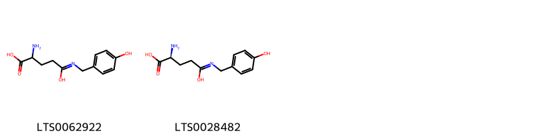
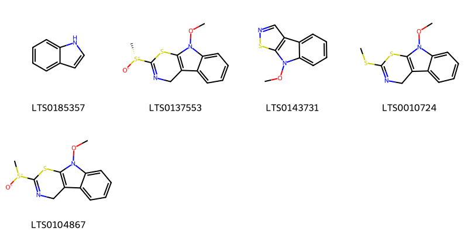
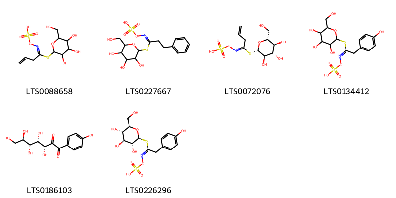
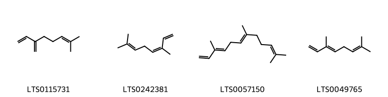
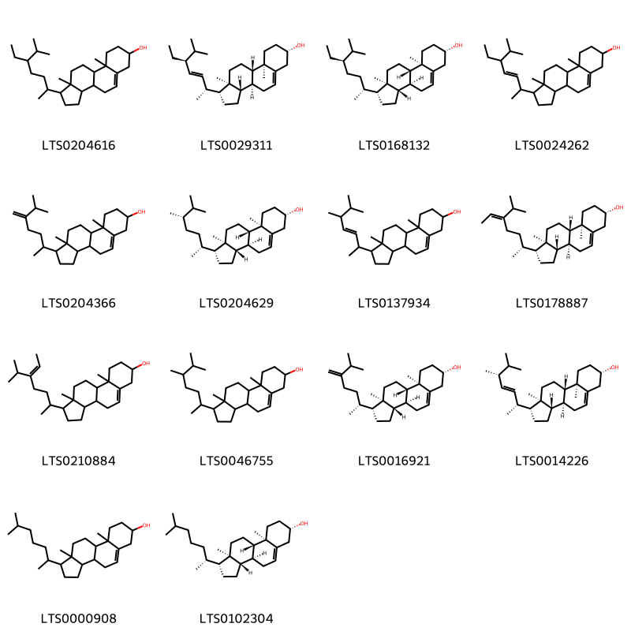

!!! abstract "Tóm tắt"

    Bạch giới tử (Semen Sinapis albae) là hạt của quả chín đã phơi hay sấy khô của cây Cải trắng (Sinapis alba L.), họ Cải (Brassicaccae). Cây được trồng ở nước ta để lấy rau ăn, hiện nay ta chưa thu hoạch hạt để dùng làm thuốc hoặc ép dầu, cho đến nay ta vẫn còn phải nhập giới tử của Trung Quốc. Nhân dân sử dụng giới tử làm thuốc chữa ho, viêm khí quản, ra mồ hôi, dùng ngoài dưới dạng cao dán để gây đỏ da và kích thích da tại chỗ, trị đau dây thần kinh, dùng lâu ngày có thể gây da mọng nước. Ngày uống 3-6g, dưới dạng thuốc sắc, thuốc bột. Dược liệu có tác dụng dược lý là giảm dị ứng đường thở và ức chế ho. Dược liệu có thành phần hóa học thuộc nhóm sinapine, sinalbin, myrosin,... Tên hoạt chất là sinapine cyanide sulfonate.

## Thông tin về thực vật

Dược liệu **Bạch Giới Tử** từ bộ phận **nan** từ loài *Sinapis alba*.

**Mô tả thực vật:** Cải canh là một loài cỏ mọc một năm hay hai năm có thể cao tới 1m hoặc 1,50m. Lá phía dưới có rãnh sâu, phiến lá lượn sóng, mép có răng cưa to thô. Hoa mọc ở đầu cành hoặc kẽ lá, màu vàng. Quả hình trụ có mỏ ngắn. Hạt hình cầu, đường kính 1-1,6mm, 100 hạt chỉ nặng chừng 0,20g. Vỏ ngoài màu vàng hay vàng nâu, một số ít có màu nâu đỏ. Nhìn qua kính lúp sẽ thấy mặt hạt có những vân hình mạng, tễ là một chấm rất rõ, ngâm nước sẽ phồng to, sau khi loại bỏ vỏ, hạt sẽ lộ ra hai lá mầm. Hạt khô không có mùi, vị như có dầu lúc đầu, nhưng sau có vị cay nóng. Tán nhỏ với nước sẽ có tinh dầu mùi hắc xông lên.

*Tài liệu tham khảo:* "Những cây thuốc và vị thuốc Việt Nam" - Đỗ Tất Lợi 
Trong dược điển Việt nam, một loài được sử dụng làm dược liệu là *Sinapis alba*.

!!! info "Phân loại thực vật của *Sinapis alba*"
    - **Kingdom:** Plantae
    - **Phylum:** Tracheophyta
    - **Order:** Brassicales
    - **Family:** Brassicaceae
    - **Genus:** Sinapis
    - **Species:** *Sinapis alba*

**Phân bố trên thế giới:** nan, France, Israel, Switzerland, Czechia, Netherlands, Cyprus, Spain, Palestine, State of, Russian Federation, Portugal, United Kingdom of Great Britain and Northern Ireland, Iraq, Türkiye, Luxembourg, Malta, Algeria, Italy, Greece, Austria, Belgium

**Phân bố tại Việt nam:** Không có ghi nhận ở Việt Nam

## Thông tin về dược liệu 

### Định danh

!!! info "Thông tin về tên gọi"

    - Dược liệu tiếng Việt: nan
    - Dược liệu tiếng Trung: nan (nan)
    - Dược liệu tiếng Anh: nan
    - Dược liệu latin thông dụng: nan
    - Dược liệu latin kiểu DĐVN: *semen sinapis albae*
    - Dược liệu latin kiểu DĐVN: *nan*
    - Dược liệu latin kiểu thông tư: *nan*
    - Bộ phận dùng: nan (nan)

### Mô tả dược liệu 

- **Theo dược điển Việt nam V:** nan

- **Mô tả dược liệu theo thông tư chế biến dược liệu theo phương pháp cổ truyền:** nan

### Chế biến 

- **Chế biến theo dược điển việt nam V**: nan

- **Chế biến theo thông tư:** nan

--- 

## Thành phần hóa học

- Theo tài liệu của GS. Đỗ Tất Lợi:  (1) Nhóm hóa học: sinapine, sinalbin, myrosin,...
(2) Tên hoạt chất: sinapine cyanide sulfonate
    

**Thành phần hóa học từ loài **Sinapis alba**

Theo cơ sở dữ liệu lotus, loài *Sinapis alba* đã phân lập và xác định được **64** hoạt chất thuộc về các nhóm Steroids and steroid derivatives, Organooxygen compounds, Flavonoids, Fatty Acyls, Cinnamic acids and derivatives, Isothiocyanates, Indoles and derivatives, Phenols, Carboxylic acids and derivatives, Benzene and substituted derivatives, Linear 1,3-diarylpropanoids, Prenol lipids trong bảng dưới đây. Danh sách các hoạt chất như sau 2-methanesulfinyl-9-methoxy-4h-[1,3]thiazino[6,5-b]indole [(LTS0104867)](https://lotus.naturalproducts.net/compound/lotus_id/LTS0104867), 2-[(r)-methanesulfinyl]-9-methoxy-4h-[1,3]thiazino[6,5-b]indole [(LTS0137553)](https://lotus.naturalproducts.net/compound/lotus_id/LTS0137553), (2e)-1-(2,3,4,5,6-pentahydroxyphenyl)-3-phenylprop-2-en-1-one [(LTS0054250)](https://lotus.naturalproducts.net/compound/lotus_id/LTS0054250), (2s)-2-amino-4-{[(4-hydroxyphenyl)methyl]-c-hydroxycarbonimidoyl}butanoic acid [(LTS0028482)](https://lotus.naturalproducts.net/compound/lotus_id/LTS0028482), phytosterol [(LTS0029311)](https://lotus.naturalproducts.net/compound/lotus_id/LTS0029311), stigmast-5-en-3-ol, (3β)- [(LTS0204616)](https://lotus.naturalproducts.net/compound/lotus_id/LTS0204616), β-ocimene [(LTS0242381)](https://lotus.naturalproducts.net/compound/lotus_id/LTS0242381), 4-hydroxybenzylamine [(LTS0243287)](https://lotus.naturalproducts.net/compound/lotus_id/LTS0243287), 3,5,6,7,8-pentahydroxy-2-(4-methoxyphenyl)chromen-4-one [(LTS0196509)](https://lotus.naturalproducts.net/compound/lotus_id/LTS0196509), [(e)-(1-{[(2s,3r,4s,5s,6r)-3,4,5-trihydroxy-6-(hydroxymethyl)oxan-2-yl]sulfanyl}but-3-en-1-ylidene)amino]oxysulfonic acid [(LTS0072076)](https://lotus.naturalproducts.net/compound/lotus_id/LTS0072076), 3-butenyl isothiocyanate [(LTS0097937)](https://lotus.naturalproducts.net/compound/lotus_id/LTS0097937), isoplatanin [(LTS0066290)](https://lotus.naturalproducts.net/compound/lotus_id/LTS0066290), benzyl isothiocyanate [(LTS0228692)](https://lotus.naturalproducts.net/compound/lotus_id/LTS0228692), 8-methoxy-[1,2]thiazolo[5,4-b]indole [(LTS0143731)](https://lotus.naturalproducts.net/compound/lotus_id/LTS0143731), [(e)-[2-(4-hydroxyphenyl)-1-{[3,4,5-trihydroxy-6-(hydroxymethyl)oxan-2-yl]sulfanyl}ethylidene]amino]oxysulfonic acid; sinapoylcholine [(LTS0199453)](https://lotus.naturalproducts.net/compound/lotus_id/LTS0199453), (3r,4s,5r,6r)-3,4,5,6,7-pentahydroxy-1-(4-hydroxyphenyl)heptane-1,2-dione [(LTS0186103)](https://lotus.naturalproducts.net/compound/lotus_id/LTS0186103), ferulic acid [(LTS0077328)](https://lotus.naturalproducts.net/compound/lotus_id/LTS0077328), 3,5,6,7,8-pentahydroxy-2-phenylchromen-4-one [(LTS0154580)](https://lotus.naturalproducts.net/compound/lotus_id/LTS0154580), anisaldehyde [(LTS0054560)](https://lotus.naturalproducts.net/compound/lotus_id/LTS0054560), erucic acid [(LTS0252257)](https://lotus.naturalproducts.net/compound/lotus_id/LTS0252257), campesterol [(LTS0046755)](https://lotus.naturalproducts.net/compound/lotus_id/LTS0046755), 9a,11a-dimethyl-1-(6-methyl-5-methylideneheptan-2-yl)-1h,2h,3h,3ah,3bh,4h,6h,7h,8h,9h,9bh,10h,11h-cyclopenta[a]phenanthren-7-ol [(LTS0204366)](https://lotus.naturalproducts.net/compound/lotus_id/LTS0204366), 1-(2,3,4,5,6-pentahydroxyphenyl)-3-phenylprop-2-en-1-one [(LTS0047567)](https://lotus.naturalproducts.net/compound/lotus_id/LTS0047567), syringic acid [(LTS0210036)](https://lotus.naturalproducts.net/compound/lotus_id/LTS0210036), (4-hydroxy-3-nitrophenyl)acetic acid [(LTS0193299)](https://lotus.naturalproducts.net/compound/lotus_id/LTS0193299), para-coumaric acid [(LTS0266252)](https://lotus.naturalproducts.net/compound/lotus_id/LTS0266252), [(e)-[2-(4-hydroxyphenyl)-1-{[3,4,5-trihydroxy-6-(hydroxymethyl)oxan-2-yl]sulfanyl}ethylidene]amino]oxysulfonic acid [(LTS0134412)](https://lotus.naturalproducts.net/compound/lotus_id/LTS0134412), benzaldehyde [(LTS0094193)](https://lotus.naturalproducts.net/compound/lotus_id/LTS0094193), (z)-sinapic acid [(LTS0163988)](https://lotus.naturalproducts.net/compound/lotus_id/LTS0163988), p-hydroxybenzoic acid [(LTS0263634)](https://lotus.naturalproducts.net/compound/lotus_id/LTS0263634), epicholestrol [(LTS0000908)](https://lotus.naturalproducts.net/compound/lotus_id/LTS0000908), [(3-phenyl-1-{[3,4,5-trihydroxy-6-(hydroxymethyl)oxan-2-yl]sulfanyl}propylidene)amino]oxysulfonic acid [(LTS0227667)](https://lotus.naturalproducts.net/compound/lotus_id/LTS0227667), fucosterol [(LTS0178887)](https://lotus.naturalproducts.net/compound/lotus_id/LTS0178887), 9-methoxy-2-(methylsulfanyl)-4h-[1,3]thiazino[6,5-b]indole [(LTS0010724)](https://lotus.naturalproducts.net/compound/lotus_id/LTS0010724), salicyclic acid [(LTS0116548)](https://lotus.naturalproducts.net/compound/lotus_id/LTS0116548), 2,5-dihydroxybenzoic acid [(LTS0170793)](https://lotus.naturalproducts.net/compound/lotus_id/LTS0170793), farnesene [(LTS0057150)](https://lotus.naturalproducts.net/compound/lotus_id/LTS0057150), indole [(LTS0185357)](https://lotus.naturalproducts.net/compound/lotus_id/LTS0185357), trans-β-ocimene [(LTS0049765)](https://lotus.naturalproducts.net/compound/lotus_id/LTS0049765), 22,23-dihydrobrassicasterol [(LTS0204629)](https://lotus.naturalproducts.net/compound/lotus_id/LTS0204629), sinapinate [(LTS0173482)](https://lotus.naturalproducts.net/compound/lotus_id/LTS0173482), 3,5,6,7-tetrahydroxy-2-(4-methoxyphenyl)-8-methylchromen-4-one [(LTS0269964)](https://lotus.naturalproducts.net/compound/lotus_id/LTS0269964), trans-2-hydroxycinnamic acid [(LTS0142397)](https://lotus.naturalproducts.net/compound/lotus_id/LTS0142397), 1-(5-isopropylhept-5-en-2-yl)-9a,11a-dimethyl-1h,2h,3h,3ah,3bh,4h,6h,7h,8h,9h,9bh,10h,11h-cyclopenta[a]phenanthren-7-ol [(LTS0210884)](https://lotus.naturalproducts.net/compound/lotus_id/LTS0210884), 3,4-dihydroxybenzoic acid [(LTS0018765)](https://lotus.naturalproducts.net/compound/lotus_id/LTS0018765), cholesterol [(LTS0102304)](https://lotus.naturalproducts.net/compound/lotus_id/LTS0102304), sitosterol [(LTS0168132)](https://lotus.naturalproducts.net/compound/lotus_id/LTS0168132), 1-(5,6-dimethylhept-3-en-2-yl)-9a,11a-dimethyl-1h,2h,3h,3ah,3bh,4h,6h,7h,8h,9h,9bh,10h,11h-cyclopenta[a]phenanthren-7-ol [(LTS0137934)](https://lotus.naturalproducts.net/compound/lotus_id/LTS0137934), phenylacrylic acid [(LTS0097258)](https://lotus.naturalproducts.net/compound/lotus_id/LTS0097258), phenylacetonitrile [(LTS0082558)](https://lotus.naturalproducts.net/compound/lotus_id/LTS0082558), 3,4-dihydroxycinnamic acid [(LTS0128050)](https://lotus.naturalproducts.net/compound/lotus_id/LTS0128050), cinnamic acid [(LTS0128130)](https://lotus.naturalproducts.net/compound/lotus_id/LTS0128130), α-myrcene [(LTS0115731)](https://lotus.naturalproducts.net/compound/lotus_id/LTS0115731), brassicasterol [(LTS0014226)](https://lotus.naturalproducts.net/compound/lotus_id/LTS0014226), gluconasturtiin [(LTS0104293)](https://lotus.naturalproducts.net/compound/lotus_id/LTS0104293), allyl isothiocyanate [(LTS0233763)](https://lotus.naturalproducts.net/compound/lotus_id/LTS0233763), [(1-{[3,4,5-trihydroxy-6-(hydroxymethyl)oxan-2-yl]sulfanyl}but-3-en-1-ylidene)amino]oxysulfonic acid [(LTS0088658)](https://lotus.naturalproducts.net/compound/lotus_id/LTS0088658), vanillic acid [(LTS0229113)](https://lotus.naturalproducts.net/compound/lotus_id/LTS0229113), sinalbin [(LTS0226296)](https://lotus.naturalproducts.net/compound/lotus_id/LTS0226296), stigmasterol [(LTS0024262)](https://lotus.naturalproducts.net/compound/lotus_id/LTS0024262), 24-methylenecholesterol [(LTS0016921)](https://lotus.naturalproducts.net/compound/lotus_id/LTS0016921), chamomile [(LTS0104946)](https://lotus.naturalproducts.net/compound/lotus_id/LTS0104946), 2-amino-4-{[(4-hydroxyphenyl)methyl]-c-hydroxycarbonimidoyl}butanoic acid [(LTS0062922)](https://lotus.naturalproducts.net/compound/lotus_id/LTS0062922), sinapoylcholine [(LTS0049545)](https://lotus.naturalproducts.net/compound/lotus_id/LTS0049545). 
        
| chemicalTaxonomyClassyfireClass     |   smiles_count |
|:------------------------------------|---------------:|
| Benzene and substituted derivatives |            177 |
| Carboxylic acids and derivatives    |             65 |
| Cinnamic acids and derivatives      |            222 |
| Fatty Acyls                         |             30 |
| Flavonoids                          |            208 |
| Indoles and derivatives             |            140 |
| Isothiocyanates                     |             19 |
| Linear 1,3-diarylpropanoids         |             76 |
| Organooxygen compounds              |            328 |
| Phenols                             |             32 |
| Prenol lipids                       |             84 |
| Steroids and steroid derivatives    |            942 |

            
### Nhóm Benzene and substituted derivatives
<figure markdown="span">
    { width=100% }
<figcaption>Hình ảnh cấu trúc hóa học của hoạt chất thuộc nhóm *Benzene and substituted derivatives*. Tên thường gọi của các hoạt chất tương ứng là salicyclic acid [(LTS0116548)](https://lotus.naturalproducts.net/compound/lotus_id/LTS0116548), p-hydroxybenzoic acid [(LTS0263634)](https://lotus.naturalproducts.net/compound/lotus_id/LTS0263634), anisaldehyde [(LTS0054560)](https://lotus.naturalproducts.net/compound/lotus_id/LTS0054560), 3,4-dihydroxybenzoic acid [(LTS0018765)](https://lotus.naturalproducts.net/compound/lotus_id/LTS0018765), vanillic acid [(LTS0229113)](https://lotus.naturalproducts.net/compound/lotus_id/LTS0229113), phenylacetonitrile [(LTS0082558)](https://lotus.naturalproducts.net/compound/lotus_id/LTS0082558), syringic acid [(LTS0210036)](https://lotus.naturalproducts.net/compound/lotus_id/LTS0210036), 2,5-dihydroxybenzoic acid [(LTS0170793)](https://lotus.naturalproducts.net/compound/lotus_id/LTS0170793), benzaldehyde [(LTS0094193)](https://lotus.naturalproducts.net/compound/lotus_id/LTS0094193), 4-hydroxybenzylamine [(LTS0243287)](https://lotus.naturalproducts.net/compound/lotus_id/LTS0243287), benzyl isothiocyanate [(LTS0228692)](https://lotus.naturalproducts.net/compound/lotus_id/LTS0228692).</figcaption>
</figure>

            
            
### Nhóm Benzene and substituted derivatives
<figure markdown="span">
    { width=100% }
<figcaption>Hình ảnh cấu trúc hóa học của hoạt chất thuộc nhóm *Benzene and substituted derivatives*. Tên thường gọi của các hoạt chất tương ứng là salicyclic acid [(LTS0116548)](https://lotus.naturalproducts.net/compound/lotus_id/LTS0116548), p-hydroxybenzoic acid [(LTS0263634)](https://lotus.naturalproducts.net/compound/lotus_id/LTS0263634), anisaldehyde [(LTS0054560)](https://lotus.naturalproducts.net/compound/lotus_id/LTS0054560), 3,4-dihydroxybenzoic acid [(LTS0018765)](https://lotus.naturalproducts.net/compound/lotus_id/LTS0018765), vanillic acid [(LTS0229113)](https://lotus.naturalproducts.net/compound/lotus_id/LTS0229113), phenylacetonitrile [(LTS0082558)](https://lotus.naturalproducts.net/compound/lotus_id/LTS0082558), syringic acid [(LTS0210036)](https://lotus.naturalproducts.net/compound/lotus_id/LTS0210036), 2,5-dihydroxybenzoic acid [(LTS0170793)](https://lotus.naturalproducts.net/compound/lotus_id/LTS0170793), benzaldehyde [(LTS0094193)](https://lotus.naturalproducts.net/compound/lotus_id/LTS0094193), 4-hydroxybenzylamine [(LTS0243287)](https://lotus.naturalproducts.net/compound/lotus_id/LTS0243287), benzyl isothiocyanate [(LTS0228692)](https://lotus.naturalproducts.net/compound/lotus_id/LTS0228692).</figcaption>
</figure>

### Nhóm Carboxylic acids and derivatives
<figure markdown="span">
    { width=100% }
<figcaption>Hình ảnh cấu trúc hóa học của hoạt chất thuộc nhóm *Carboxylic acids and derivatives*. Tên thường gọi của các hoạt chất tương ứng là 2-amino-4-{[(4-hydroxyphenyl)methyl]-c-hydroxycarbonimidoyl}butanoic acid [(LTS0062922)](https://lotus.naturalproducts.net/compound/lotus_id/LTS0062922), (2s)-2-amino-4-{[(4-hydroxyphenyl)methyl]-c-hydroxycarbonimidoyl}butanoic acid [(LTS0028482)](https://lotus.naturalproducts.net/compound/lotus_id/LTS0028482).</figcaption>
</figure>

            
            
### Nhóm Benzene and substituted derivatives
<figure markdown="span">
    { width=100% }
<figcaption>Hình ảnh cấu trúc hóa học của hoạt chất thuộc nhóm *Benzene and substituted derivatives*. Tên thường gọi của các hoạt chất tương ứng là salicyclic acid [(LTS0116548)](https://lotus.naturalproducts.net/compound/lotus_id/LTS0116548), p-hydroxybenzoic acid [(LTS0263634)](https://lotus.naturalproducts.net/compound/lotus_id/LTS0263634), anisaldehyde [(LTS0054560)](https://lotus.naturalproducts.net/compound/lotus_id/LTS0054560), 3,4-dihydroxybenzoic acid [(LTS0018765)](https://lotus.naturalproducts.net/compound/lotus_id/LTS0018765), vanillic acid [(LTS0229113)](https://lotus.naturalproducts.net/compound/lotus_id/LTS0229113), phenylacetonitrile [(LTS0082558)](https://lotus.naturalproducts.net/compound/lotus_id/LTS0082558), syringic acid [(LTS0210036)](https://lotus.naturalproducts.net/compound/lotus_id/LTS0210036), 2,5-dihydroxybenzoic acid [(LTS0170793)](https://lotus.naturalproducts.net/compound/lotus_id/LTS0170793), benzaldehyde [(LTS0094193)](https://lotus.naturalproducts.net/compound/lotus_id/LTS0094193), 4-hydroxybenzylamine [(LTS0243287)](https://lotus.naturalproducts.net/compound/lotus_id/LTS0243287), benzyl isothiocyanate [(LTS0228692)](https://lotus.naturalproducts.net/compound/lotus_id/LTS0228692).</figcaption>
</figure>

### Nhóm Carboxylic acids and derivatives
<figure markdown="span">
    { width=100% }
<figcaption>Hình ảnh cấu trúc hóa học của hoạt chất thuộc nhóm *Carboxylic acids and derivatives*. Tên thường gọi của các hoạt chất tương ứng là 2-amino-4-{[(4-hydroxyphenyl)methyl]-c-hydroxycarbonimidoyl}butanoic acid [(LTS0062922)](https://lotus.naturalproducts.net/compound/lotus_id/LTS0062922), (2s)-2-amino-4-{[(4-hydroxyphenyl)methyl]-c-hydroxycarbonimidoyl}butanoic acid [(LTS0028482)](https://lotus.naturalproducts.net/compound/lotus_id/LTS0028482).</figcaption>
</figure>

### Nhóm Cinnamic acids and derivatives
<figure markdown="span">
    { width=100% }
<figcaption>Hình ảnh cấu trúc hóa học của hoạt chất thuộc nhóm *Cinnamic acids and derivatives*. Tên thường gọi của các hoạt chất tương ứng là para-coumaric acid [(LTS0266252)](https://lotus.naturalproducts.net/compound/lotus_id/LTS0266252), ferulic acid [(LTS0077328)](https://lotus.naturalproducts.net/compound/lotus_id/LTS0077328), 3,4-dihydroxycinnamic acid [(LTS0128050)](https://lotus.naturalproducts.net/compound/lotus_id/LTS0128050), sinapinate [(LTS0173482)](https://lotus.naturalproducts.net/compound/lotus_id/LTS0173482), sinapoylcholine [(LTS0049545)](https://lotus.naturalproducts.net/compound/lotus_id/LTS0049545), cinnamic acid [(LTS0128130)](https://lotus.naturalproducts.net/compound/lotus_id/LTS0128130), trans-2-hydroxycinnamic acid [(LTS0142397)](https://lotus.naturalproducts.net/compound/lotus_id/LTS0142397), phenylacrylic acid [(LTS0097258)](https://lotus.naturalproducts.net/compound/lotus_id/LTS0097258), (z)-sinapic acid [(LTS0163988)](https://lotus.naturalproducts.net/compound/lotus_id/LTS0163988).</figcaption>
</figure>

            
            
### Nhóm Benzene and substituted derivatives
<figure markdown="span">
    { width=100% }
<figcaption>Hình ảnh cấu trúc hóa học của hoạt chất thuộc nhóm *Benzene and substituted derivatives*. Tên thường gọi của các hoạt chất tương ứng là salicyclic acid [(LTS0116548)](https://lotus.naturalproducts.net/compound/lotus_id/LTS0116548), p-hydroxybenzoic acid [(LTS0263634)](https://lotus.naturalproducts.net/compound/lotus_id/LTS0263634), anisaldehyde [(LTS0054560)](https://lotus.naturalproducts.net/compound/lotus_id/LTS0054560), 3,4-dihydroxybenzoic acid [(LTS0018765)](https://lotus.naturalproducts.net/compound/lotus_id/LTS0018765), vanillic acid [(LTS0229113)](https://lotus.naturalproducts.net/compound/lotus_id/LTS0229113), phenylacetonitrile [(LTS0082558)](https://lotus.naturalproducts.net/compound/lotus_id/LTS0082558), syringic acid [(LTS0210036)](https://lotus.naturalproducts.net/compound/lotus_id/LTS0210036), 2,5-dihydroxybenzoic acid [(LTS0170793)](https://lotus.naturalproducts.net/compound/lotus_id/LTS0170793), benzaldehyde [(LTS0094193)](https://lotus.naturalproducts.net/compound/lotus_id/LTS0094193), 4-hydroxybenzylamine [(LTS0243287)](https://lotus.naturalproducts.net/compound/lotus_id/LTS0243287), benzyl isothiocyanate [(LTS0228692)](https://lotus.naturalproducts.net/compound/lotus_id/LTS0228692).</figcaption>
</figure>

### Nhóm Carboxylic acids and derivatives
<figure markdown="span">
    { width=100% }
<figcaption>Hình ảnh cấu trúc hóa học của hoạt chất thuộc nhóm *Carboxylic acids and derivatives*. Tên thường gọi của các hoạt chất tương ứng là 2-amino-4-{[(4-hydroxyphenyl)methyl]-c-hydroxycarbonimidoyl}butanoic acid [(LTS0062922)](https://lotus.naturalproducts.net/compound/lotus_id/LTS0062922), (2s)-2-amino-4-{[(4-hydroxyphenyl)methyl]-c-hydroxycarbonimidoyl}butanoic acid [(LTS0028482)](https://lotus.naturalproducts.net/compound/lotus_id/LTS0028482).</figcaption>
</figure>

### Nhóm Cinnamic acids and derivatives
<figure markdown="span">
    { width=100% }
<figcaption>Hình ảnh cấu trúc hóa học của hoạt chất thuộc nhóm *Cinnamic acids and derivatives*. Tên thường gọi của các hoạt chất tương ứng là para-coumaric acid [(LTS0266252)](https://lotus.naturalproducts.net/compound/lotus_id/LTS0266252), ferulic acid [(LTS0077328)](https://lotus.naturalproducts.net/compound/lotus_id/LTS0077328), 3,4-dihydroxycinnamic acid [(LTS0128050)](https://lotus.naturalproducts.net/compound/lotus_id/LTS0128050), sinapinate [(LTS0173482)](https://lotus.naturalproducts.net/compound/lotus_id/LTS0173482), sinapoylcholine [(LTS0049545)](https://lotus.naturalproducts.net/compound/lotus_id/LTS0049545), cinnamic acid [(LTS0128130)](https://lotus.naturalproducts.net/compound/lotus_id/LTS0128130), trans-2-hydroxycinnamic acid [(LTS0142397)](https://lotus.naturalproducts.net/compound/lotus_id/LTS0142397), phenylacrylic acid [(LTS0097258)](https://lotus.naturalproducts.net/compound/lotus_id/LTS0097258), (z)-sinapic acid [(LTS0163988)](https://lotus.naturalproducts.net/compound/lotus_id/LTS0163988).</figcaption>
</figure>

### Nhóm Fatty Acyls
<figure markdown="span">
    { width=100% }
<figcaption>Hình ảnh cấu trúc hóa học của hoạt chất thuộc nhóm *Fatty Acyls*. Tên thường gọi của các hoạt chất tương ứng là erucic acid [(LTS0252257)](https://lotus.naturalproducts.net/compound/lotus_id/LTS0252257).</figcaption>
</figure>

            
            
### Nhóm Benzene and substituted derivatives
<figure markdown="span">
    { width=100% }
<figcaption>Hình ảnh cấu trúc hóa học của hoạt chất thuộc nhóm *Benzene and substituted derivatives*. Tên thường gọi của các hoạt chất tương ứng là salicyclic acid [(LTS0116548)](https://lotus.naturalproducts.net/compound/lotus_id/LTS0116548), p-hydroxybenzoic acid [(LTS0263634)](https://lotus.naturalproducts.net/compound/lotus_id/LTS0263634), anisaldehyde [(LTS0054560)](https://lotus.naturalproducts.net/compound/lotus_id/LTS0054560), 3,4-dihydroxybenzoic acid [(LTS0018765)](https://lotus.naturalproducts.net/compound/lotus_id/LTS0018765), vanillic acid [(LTS0229113)](https://lotus.naturalproducts.net/compound/lotus_id/LTS0229113), phenylacetonitrile [(LTS0082558)](https://lotus.naturalproducts.net/compound/lotus_id/LTS0082558), syringic acid [(LTS0210036)](https://lotus.naturalproducts.net/compound/lotus_id/LTS0210036), 2,5-dihydroxybenzoic acid [(LTS0170793)](https://lotus.naturalproducts.net/compound/lotus_id/LTS0170793), benzaldehyde [(LTS0094193)](https://lotus.naturalproducts.net/compound/lotus_id/LTS0094193), 4-hydroxybenzylamine [(LTS0243287)](https://lotus.naturalproducts.net/compound/lotus_id/LTS0243287), benzyl isothiocyanate [(LTS0228692)](https://lotus.naturalproducts.net/compound/lotus_id/LTS0228692).</figcaption>
</figure>

### Nhóm Carboxylic acids and derivatives
<figure markdown="span">
    { width=100% }
<figcaption>Hình ảnh cấu trúc hóa học của hoạt chất thuộc nhóm *Carboxylic acids and derivatives*. Tên thường gọi của các hoạt chất tương ứng là 2-amino-4-{[(4-hydroxyphenyl)methyl]-c-hydroxycarbonimidoyl}butanoic acid [(LTS0062922)](https://lotus.naturalproducts.net/compound/lotus_id/LTS0062922), (2s)-2-amino-4-{[(4-hydroxyphenyl)methyl]-c-hydroxycarbonimidoyl}butanoic acid [(LTS0028482)](https://lotus.naturalproducts.net/compound/lotus_id/LTS0028482).</figcaption>
</figure>

### Nhóm Cinnamic acids and derivatives
<figure markdown="span">
    { width=100% }
<figcaption>Hình ảnh cấu trúc hóa học của hoạt chất thuộc nhóm *Cinnamic acids and derivatives*. Tên thường gọi của các hoạt chất tương ứng là para-coumaric acid [(LTS0266252)](https://lotus.naturalproducts.net/compound/lotus_id/LTS0266252), ferulic acid [(LTS0077328)](https://lotus.naturalproducts.net/compound/lotus_id/LTS0077328), 3,4-dihydroxycinnamic acid [(LTS0128050)](https://lotus.naturalproducts.net/compound/lotus_id/LTS0128050), sinapinate [(LTS0173482)](https://lotus.naturalproducts.net/compound/lotus_id/LTS0173482), sinapoylcholine [(LTS0049545)](https://lotus.naturalproducts.net/compound/lotus_id/LTS0049545), cinnamic acid [(LTS0128130)](https://lotus.naturalproducts.net/compound/lotus_id/LTS0128130), trans-2-hydroxycinnamic acid [(LTS0142397)](https://lotus.naturalproducts.net/compound/lotus_id/LTS0142397), phenylacrylic acid [(LTS0097258)](https://lotus.naturalproducts.net/compound/lotus_id/LTS0097258), (z)-sinapic acid [(LTS0163988)](https://lotus.naturalproducts.net/compound/lotus_id/LTS0163988).</figcaption>
</figure>

### Nhóm Fatty Acyls
<figure markdown="span">
    { width=100% }
<figcaption>Hình ảnh cấu trúc hóa học của hoạt chất thuộc nhóm *Fatty Acyls*. Tên thường gọi của các hoạt chất tương ứng là erucic acid [(LTS0252257)](https://lotus.naturalproducts.net/compound/lotus_id/LTS0252257).</figcaption>
</figure>

### Nhóm Flavonoids
<figure markdown="span">
    { width=100% }
<figcaption>Hình ảnh cấu trúc hóa học của hoạt chất thuộc nhóm *Flavonoids*. Tên thường gọi của các hoạt chất tương ứng là chamomile [(LTS0104946)](https://lotus.naturalproducts.net/compound/lotus_id/LTS0104946), 3,5,6,7,8-pentahydroxy-2-(4-methoxyphenyl)chromen-4-one [(LTS0196509)](https://lotus.naturalproducts.net/compound/lotus_id/LTS0196509), 3,5,6,7,8-pentahydroxy-2-phenylchromen-4-one [(LTS0154580)](https://lotus.naturalproducts.net/compound/lotus_id/LTS0154580), 3,5,6,7-tetrahydroxy-2-(4-methoxyphenyl)-8-methylchromen-4-one [(LTS0269964)](https://lotus.naturalproducts.net/compound/lotus_id/LTS0269964), isoplatanin [(LTS0066290)](https://lotus.naturalproducts.net/compound/lotus_id/LTS0066290).</figcaption>
</figure>

            
            
### Nhóm Benzene and substituted derivatives
<figure markdown="span">
    { width=100% }
<figcaption>Hình ảnh cấu trúc hóa học của hoạt chất thuộc nhóm *Benzene and substituted derivatives*. Tên thường gọi của các hoạt chất tương ứng là salicyclic acid [(LTS0116548)](https://lotus.naturalproducts.net/compound/lotus_id/LTS0116548), p-hydroxybenzoic acid [(LTS0263634)](https://lotus.naturalproducts.net/compound/lotus_id/LTS0263634), anisaldehyde [(LTS0054560)](https://lotus.naturalproducts.net/compound/lotus_id/LTS0054560), 3,4-dihydroxybenzoic acid [(LTS0018765)](https://lotus.naturalproducts.net/compound/lotus_id/LTS0018765), vanillic acid [(LTS0229113)](https://lotus.naturalproducts.net/compound/lotus_id/LTS0229113), phenylacetonitrile [(LTS0082558)](https://lotus.naturalproducts.net/compound/lotus_id/LTS0082558), syringic acid [(LTS0210036)](https://lotus.naturalproducts.net/compound/lotus_id/LTS0210036), 2,5-dihydroxybenzoic acid [(LTS0170793)](https://lotus.naturalproducts.net/compound/lotus_id/LTS0170793), benzaldehyde [(LTS0094193)](https://lotus.naturalproducts.net/compound/lotus_id/LTS0094193), 4-hydroxybenzylamine [(LTS0243287)](https://lotus.naturalproducts.net/compound/lotus_id/LTS0243287), benzyl isothiocyanate [(LTS0228692)](https://lotus.naturalproducts.net/compound/lotus_id/LTS0228692).</figcaption>
</figure>

### Nhóm Carboxylic acids and derivatives
<figure markdown="span">
    { width=100% }
<figcaption>Hình ảnh cấu trúc hóa học của hoạt chất thuộc nhóm *Carboxylic acids and derivatives*. Tên thường gọi của các hoạt chất tương ứng là 2-amino-4-{[(4-hydroxyphenyl)methyl]-c-hydroxycarbonimidoyl}butanoic acid [(LTS0062922)](https://lotus.naturalproducts.net/compound/lotus_id/LTS0062922), (2s)-2-amino-4-{[(4-hydroxyphenyl)methyl]-c-hydroxycarbonimidoyl}butanoic acid [(LTS0028482)](https://lotus.naturalproducts.net/compound/lotus_id/LTS0028482).</figcaption>
</figure>

### Nhóm Cinnamic acids and derivatives
<figure markdown="span">
    { width=100% }
<figcaption>Hình ảnh cấu trúc hóa học của hoạt chất thuộc nhóm *Cinnamic acids and derivatives*. Tên thường gọi của các hoạt chất tương ứng là para-coumaric acid [(LTS0266252)](https://lotus.naturalproducts.net/compound/lotus_id/LTS0266252), ferulic acid [(LTS0077328)](https://lotus.naturalproducts.net/compound/lotus_id/LTS0077328), 3,4-dihydroxycinnamic acid [(LTS0128050)](https://lotus.naturalproducts.net/compound/lotus_id/LTS0128050), sinapinate [(LTS0173482)](https://lotus.naturalproducts.net/compound/lotus_id/LTS0173482), sinapoylcholine [(LTS0049545)](https://lotus.naturalproducts.net/compound/lotus_id/LTS0049545), cinnamic acid [(LTS0128130)](https://lotus.naturalproducts.net/compound/lotus_id/LTS0128130), trans-2-hydroxycinnamic acid [(LTS0142397)](https://lotus.naturalproducts.net/compound/lotus_id/LTS0142397), phenylacrylic acid [(LTS0097258)](https://lotus.naturalproducts.net/compound/lotus_id/LTS0097258), (z)-sinapic acid [(LTS0163988)](https://lotus.naturalproducts.net/compound/lotus_id/LTS0163988).</figcaption>
</figure>

### Nhóm Fatty Acyls
<figure markdown="span">
    { width=100% }
<figcaption>Hình ảnh cấu trúc hóa học của hoạt chất thuộc nhóm *Fatty Acyls*. Tên thường gọi của các hoạt chất tương ứng là erucic acid [(LTS0252257)](https://lotus.naturalproducts.net/compound/lotus_id/LTS0252257).</figcaption>
</figure>

### Nhóm Flavonoids
<figure markdown="span">
    { width=100% }
<figcaption>Hình ảnh cấu trúc hóa học của hoạt chất thuộc nhóm *Flavonoids*. Tên thường gọi của các hoạt chất tương ứng là chamomile [(LTS0104946)](https://lotus.naturalproducts.net/compound/lotus_id/LTS0104946), 3,5,6,7,8-pentahydroxy-2-(4-methoxyphenyl)chromen-4-one [(LTS0196509)](https://lotus.naturalproducts.net/compound/lotus_id/LTS0196509), 3,5,6,7,8-pentahydroxy-2-phenylchromen-4-one [(LTS0154580)](https://lotus.naturalproducts.net/compound/lotus_id/LTS0154580), 3,5,6,7-tetrahydroxy-2-(4-methoxyphenyl)-8-methylchromen-4-one [(LTS0269964)](https://lotus.naturalproducts.net/compound/lotus_id/LTS0269964), isoplatanin [(LTS0066290)](https://lotus.naturalproducts.net/compound/lotus_id/LTS0066290).</figcaption>
</figure>

### Nhóm Indoles and derivatives
<figure markdown="span">
    { width=100% }
<figcaption>Hình ảnh cấu trúc hóa học của hoạt chất thuộc nhóm *Indoles and derivatives*. Tên thường gọi của các hoạt chất tương ứng là indole [(LTS0185357)](https://lotus.naturalproducts.net/compound/lotus_id/LTS0185357), 2-[(r)-methanesulfinyl]-9-methoxy-4h-[1,3]thiazino[6,5-b]indole [(LTS0137553)](https://lotus.naturalproducts.net/compound/lotus_id/LTS0137553), 8-methoxy-[1,2]thiazolo[5,4-b]indole [(LTS0143731)](https://lotus.naturalproducts.net/compound/lotus_id/LTS0143731), 9-methoxy-2-(methylsulfanyl)-4h-[1,3]thiazino[6,5-b]indole [(LTS0010724)](https://lotus.naturalproducts.net/compound/lotus_id/LTS0010724), 2-methanesulfinyl-9-methoxy-4h-[1,3]thiazino[6,5-b]indole [(LTS0104867)](https://lotus.naturalproducts.net/compound/lotus_id/LTS0104867).</figcaption>
</figure>

            
            
### Nhóm Benzene and substituted derivatives
<figure markdown="span">
    { width=100% }
<figcaption>Hình ảnh cấu trúc hóa học của hoạt chất thuộc nhóm *Benzene and substituted derivatives*. Tên thường gọi của các hoạt chất tương ứng là salicyclic acid [(LTS0116548)](https://lotus.naturalproducts.net/compound/lotus_id/LTS0116548), p-hydroxybenzoic acid [(LTS0263634)](https://lotus.naturalproducts.net/compound/lotus_id/LTS0263634), anisaldehyde [(LTS0054560)](https://lotus.naturalproducts.net/compound/lotus_id/LTS0054560), 3,4-dihydroxybenzoic acid [(LTS0018765)](https://lotus.naturalproducts.net/compound/lotus_id/LTS0018765), vanillic acid [(LTS0229113)](https://lotus.naturalproducts.net/compound/lotus_id/LTS0229113), phenylacetonitrile [(LTS0082558)](https://lotus.naturalproducts.net/compound/lotus_id/LTS0082558), syringic acid [(LTS0210036)](https://lotus.naturalproducts.net/compound/lotus_id/LTS0210036), 2,5-dihydroxybenzoic acid [(LTS0170793)](https://lotus.naturalproducts.net/compound/lotus_id/LTS0170793), benzaldehyde [(LTS0094193)](https://lotus.naturalproducts.net/compound/lotus_id/LTS0094193), 4-hydroxybenzylamine [(LTS0243287)](https://lotus.naturalproducts.net/compound/lotus_id/LTS0243287), benzyl isothiocyanate [(LTS0228692)](https://lotus.naturalproducts.net/compound/lotus_id/LTS0228692).</figcaption>
</figure>

### Nhóm Carboxylic acids and derivatives
<figure markdown="span">
    { width=100% }
<figcaption>Hình ảnh cấu trúc hóa học của hoạt chất thuộc nhóm *Carboxylic acids and derivatives*. Tên thường gọi của các hoạt chất tương ứng là 2-amino-4-{[(4-hydroxyphenyl)methyl]-c-hydroxycarbonimidoyl}butanoic acid [(LTS0062922)](https://lotus.naturalproducts.net/compound/lotus_id/LTS0062922), (2s)-2-amino-4-{[(4-hydroxyphenyl)methyl]-c-hydroxycarbonimidoyl}butanoic acid [(LTS0028482)](https://lotus.naturalproducts.net/compound/lotus_id/LTS0028482).</figcaption>
</figure>

### Nhóm Cinnamic acids and derivatives
<figure markdown="span">
    { width=100% }
<figcaption>Hình ảnh cấu trúc hóa học của hoạt chất thuộc nhóm *Cinnamic acids and derivatives*. Tên thường gọi của các hoạt chất tương ứng là para-coumaric acid [(LTS0266252)](https://lotus.naturalproducts.net/compound/lotus_id/LTS0266252), ferulic acid [(LTS0077328)](https://lotus.naturalproducts.net/compound/lotus_id/LTS0077328), 3,4-dihydroxycinnamic acid [(LTS0128050)](https://lotus.naturalproducts.net/compound/lotus_id/LTS0128050), sinapinate [(LTS0173482)](https://lotus.naturalproducts.net/compound/lotus_id/LTS0173482), sinapoylcholine [(LTS0049545)](https://lotus.naturalproducts.net/compound/lotus_id/LTS0049545), cinnamic acid [(LTS0128130)](https://lotus.naturalproducts.net/compound/lotus_id/LTS0128130), trans-2-hydroxycinnamic acid [(LTS0142397)](https://lotus.naturalproducts.net/compound/lotus_id/LTS0142397), phenylacrylic acid [(LTS0097258)](https://lotus.naturalproducts.net/compound/lotus_id/LTS0097258), (z)-sinapic acid [(LTS0163988)](https://lotus.naturalproducts.net/compound/lotus_id/LTS0163988).</figcaption>
</figure>

### Nhóm Fatty Acyls
<figure markdown="span">
    { width=100% }
<figcaption>Hình ảnh cấu trúc hóa học của hoạt chất thuộc nhóm *Fatty Acyls*. Tên thường gọi của các hoạt chất tương ứng là erucic acid [(LTS0252257)](https://lotus.naturalproducts.net/compound/lotus_id/LTS0252257).</figcaption>
</figure>

### Nhóm Flavonoids
<figure markdown="span">
    { width=100% }
<figcaption>Hình ảnh cấu trúc hóa học của hoạt chất thuộc nhóm *Flavonoids*. Tên thường gọi của các hoạt chất tương ứng là chamomile [(LTS0104946)](https://lotus.naturalproducts.net/compound/lotus_id/LTS0104946), 3,5,6,7,8-pentahydroxy-2-(4-methoxyphenyl)chromen-4-one [(LTS0196509)](https://lotus.naturalproducts.net/compound/lotus_id/LTS0196509), 3,5,6,7,8-pentahydroxy-2-phenylchromen-4-one [(LTS0154580)](https://lotus.naturalproducts.net/compound/lotus_id/LTS0154580), 3,5,6,7-tetrahydroxy-2-(4-methoxyphenyl)-8-methylchromen-4-one [(LTS0269964)](https://lotus.naturalproducts.net/compound/lotus_id/LTS0269964), isoplatanin [(LTS0066290)](https://lotus.naturalproducts.net/compound/lotus_id/LTS0066290).</figcaption>
</figure>

### Nhóm Indoles and derivatives
<figure markdown="span">
    { width=100% }
<figcaption>Hình ảnh cấu trúc hóa học của hoạt chất thuộc nhóm *Indoles and derivatives*. Tên thường gọi của các hoạt chất tương ứng là indole [(LTS0185357)](https://lotus.naturalproducts.net/compound/lotus_id/LTS0185357), 2-[(r)-methanesulfinyl]-9-methoxy-4h-[1,3]thiazino[6,5-b]indole [(LTS0137553)](https://lotus.naturalproducts.net/compound/lotus_id/LTS0137553), 8-methoxy-[1,2]thiazolo[5,4-b]indole [(LTS0143731)](https://lotus.naturalproducts.net/compound/lotus_id/LTS0143731), 9-methoxy-2-(methylsulfanyl)-4h-[1,3]thiazino[6,5-b]indole [(LTS0010724)](https://lotus.naturalproducts.net/compound/lotus_id/LTS0010724), 2-methanesulfinyl-9-methoxy-4h-[1,3]thiazino[6,5-b]indole [(LTS0104867)](https://lotus.naturalproducts.net/compound/lotus_id/LTS0104867).</figcaption>
</figure>

### Nhóm Isothiocyanates
<figure markdown="span">
    { width=100% }
<figcaption>Hình ảnh cấu trúc hóa học của hoạt chất thuộc nhóm *Isothiocyanates*. Tên thường gọi của các hoạt chất tương ứng là 3-butenyl isothiocyanate [(LTS0097937)](https://lotus.naturalproducts.net/compound/lotus_id/LTS0097937), allyl isothiocyanate [(LTS0233763)](https://lotus.naturalproducts.net/compound/lotus_id/LTS0233763).</figcaption>
</figure>

            
            
### Nhóm Benzene and substituted derivatives
<figure markdown="span">
    { width=100% }
<figcaption>Hình ảnh cấu trúc hóa học của hoạt chất thuộc nhóm *Benzene and substituted derivatives*. Tên thường gọi của các hoạt chất tương ứng là salicyclic acid [(LTS0116548)](https://lotus.naturalproducts.net/compound/lotus_id/LTS0116548), p-hydroxybenzoic acid [(LTS0263634)](https://lotus.naturalproducts.net/compound/lotus_id/LTS0263634), anisaldehyde [(LTS0054560)](https://lotus.naturalproducts.net/compound/lotus_id/LTS0054560), 3,4-dihydroxybenzoic acid [(LTS0018765)](https://lotus.naturalproducts.net/compound/lotus_id/LTS0018765), vanillic acid [(LTS0229113)](https://lotus.naturalproducts.net/compound/lotus_id/LTS0229113), phenylacetonitrile [(LTS0082558)](https://lotus.naturalproducts.net/compound/lotus_id/LTS0082558), syringic acid [(LTS0210036)](https://lotus.naturalproducts.net/compound/lotus_id/LTS0210036), 2,5-dihydroxybenzoic acid [(LTS0170793)](https://lotus.naturalproducts.net/compound/lotus_id/LTS0170793), benzaldehyde [(LTS0094193)](https://lotus.naturalproducts.net/compound/lotus_id/LTS0094193), 4-hydroxybenzylamine [(LTS0243287)](https://lotus.naturalproducts.net/compound/lotus_id/LTS0243287), benzyl isothiocyanate [(LTS0228692)](https://lotus.naturalproducts.net/compound/lotus_id/LTS0228692).</figcaption>
</figure>

### Nhóm Carboxylic acids and derivatives
<figure markdown="span">
    { width=100% }
<figcaption>Hình ảnh cấu trúc hóa học của hoạt chất thuộc nhóm *Carboxylic acids and derivatives*. Tên thường gọi của các hoạt chất tương ứng là 2-amino-4-{[(4-hydroxyphenyl)methyl]-c-hydroxycarbonimidoyl}butanoic acid [(LTS0062922)](https://lotus.naturalproducts.net/compound/lotus_id/LTS0062922), (2s)-2-amino-4-{[(4-hydroxyphenyl)methyl]-c-hydroxycarbonimidoyl}butanoic acid [(LTS0028482)](https://lotus.naturalproducts.net/compound/lotus_id/LTS0028482).</figcaption>
</figure>

### Nhóm Cinnamic acids and derivatives
<figure markdown="span">
    { width=100% }
<figcaption>Hình ảnh cấu trúc hóa học của hoạt chất thuộc nhóm *Cinnamic acids and derivatives*. Tên thường gọi của các hoạt chất tương ứng là para-coumaric acid [(LTS0266252)](https://lotus.naturalproducts.net/compound/lotus_id/LTS0266252), ferulic acid [(LTS0077328)](https://lotus.naturalproducts.net/compound/lotus_id/LTS0077328), 3,4-dihydroxycinnamic acid [(LTS0128050)](https://lotus.naturalproducts.net/compound/lotus_id/LTS0128050), sinapinate [(LTS0173482)](https://lotus.naturalproducts.net/compound/lotus_id/LTS0173482), sinapoylcholine [(LTS0049545)](https://lotus.naturalproducts.net/compound/lotus_id/LTS0049545), cinnamic acid [(LTS0128130)](https://lotus.naturalproducts.net/compound/lotus_id/LTS0128130), trans-2-hydroxycinnamic acid [(LTS0142397)](https://lotus.naturalproducts.net/compound/lotus_id/LTS0142397), phenylacrylic acid [(LTS0097258)](https://lotus.naturalproducts.net/compound/lotus_id/LTS0097258), (z)-sinapic acid [(LTS0163988)](https://lotus.naturalproducts.net/compound/lotus_id/LTS0163988).</figcaption>
</figure>

### Nhóm Fatty Acyls
<figure markdown="span">
    { width=100% }
<figcaption>Hình ảnh cấu trúc hóa học của hoạt chất thuộc nhóm *Fatty Acyls*. Tên thường gọi của các hoạt chất tương ứng là erucic acid [(LTS0252257)](https://lotus.naturalproducts.net/compound/lotus_id/LTS0252257).</figcaption>
</figure>

### Nhóm Flavonoids
<figure markdown="span">
    { width=100% }
<figcaption>Hình ảnh cấu trúc hóa học của hoạt chất thuộc nhóm *Flavonoids*. Tên thường gọi của các hoạt chất tương ứng là chamomile [(LTS0104946)](https://lotus.naturalproducts.net/compound/lotus_id/LTS0104946), 3,5,6,7,8-pentahydroxy-2-(4-methoxyphenyl)chromen-4-one [(LTS0196509)](https://lotus.naturalproducts.net/compound/lotus_id/LTS0196509), 3,5,6,7,8-pentahydroxy-2-phenylchromen-4-one [(LTS0154580)](https://lotus.naturalproducts.net/compound/lotus_id/LTS0154580), 3,5,6,7-tetrahydroxy-2-(4-methoxyphenyl)-8-methylchromen-4-one [(LTS0269964)](https://lotus.naturalproducts.net/compound/lotus_id/LTS0269964), isoplatanin [(LTS0066290)](https://lotus.naturalproducts.net/compound/lotus_id/LTS0066290).</figcaption>
</figure>

### Nhóm Indoles and derivatives
<figure markdown="span">
    { width=100% }
<figcaption>Hình ảnh cấu trúc hóa học của hoạt chất thuộc nhóm *Indoles and derivatives*. Tên thường gọi của các hoạt chất tương ứng là indole [(LTS0185357)](https://lotus.naturalproducts.net/compound/lotus_id/LTS0185357), 2-[(r)-methanesulfinyl]-9-methoxy-4h-[1,3]thiazino[6,5-b]indole [(LTS0137553)](https://lotus.naturalproducts.net/compound/lotus_id/LTS0137553), 8-methoxy-[1,2]thiazolo[5,4-b]indole [(LTS0143731)](https://lotus.naturalproducts.net/compound/lotus_id/LTS0143731), 9-methoxy-2-(methylsulfanyl)-4h-[1,3]thiazino[6,5-b]indole [(LTS0010724)](https://lotus.naturalproducts.net/compound/lotus_id/LTS0010724), 2-methanesulfinyl-9-methoxy-4h-[1,3]thiazino[6,5-b]indole [(LTS0104867)](https://lotus.naturalproducts.net/compound/lotus_id/LTS0104867).</figcaption>
</figure>

### Nhóm Isothiocyanates
<figure markdown="span">
    { width=100% }
<figcaption>Hình ảnh cấu trúc hóa học của hoạt chất thuộc nhóm *Isothiocyanates*. Tên thường gọi của các hoạt chất tương ứng là 3-butenyl isothiocyanate [(LTS0097937)](https://lotus.naturalproducts.net/compound/lotus_id/LTS0097937), allyl isothiocyanate [(LTS0233763)](https://lotus.naturalproducts.net/compound/lotus_id/LTS0233763).</figcaption>
</figure>

### Nhóm Linear 1,3-diarylpropanoids
<figure markdown="span">
    { width=100% }
<figcaption>Hình ảnh cấu trúc hóa học của hoạt chất thuộc nhóm *Linear 1,3-diarylpropanoids*. Tên thường gọi của các hoạt chất tương ứng là (2e)-1-(2,3,4,5,6-pentahydroxyphenyl)-3-phenylprop-2-en-1-one [(LTS0054250)](https://lotus.naturalproducts.net/compound/lotus_id/LTS0054250), 1-(2,3,4,5,6-pentahydroxyphenyl)-3-phenylprop-2-en-1-one [(LTS0047567)](https://lotus.naturalproducts.net/compound/lotus_id/LTS0047567).</figcaption>
</figure>

            
            
### Nhóm Benzene and substituted derivatives
<figure markdown="span">
    { width=100% }
<figcaption>Hình ảnh cấu trúc hóa học của hoạt chất thuộc nhóm *Benzene and substituted derivatives*. Tên thường gọi của các hoạt chất tương ứng là salicyclic acid [(LTS0116548)](https://lotus.naturalproducts.net/compound/lotus_id/LTS0116548), p-hydroxybenzoic acid [(LTS0263634)](https://lotus.naturalproducts.net/compound/lotus_id/LTS0263634), anisaldehyde [(LTS0054560)](https://lotus.naturalproducts.net/compound/lotus_id/LTS0054560), 3,4-dihydroxybenzoic acid [(LTS0018765)](https://lotus.naturalproducts.net/compound/lotus_id/LTS0018765), vanillic acid [(LTS0229113)](https://lotus.naturalproducts.net/compound/lotus_id/LTS0229113), phenylacetonitrile [(LTS0082558)](https://lotus.naturalproducts.net/compound/lotus_id/LTS0082558), syringic acid [(LTS0210036)](https://lotus.naturalproducts.net/compound/lotus_id/LTS0210036), 2,5-dihydroxybenzoic acid [(LTS0170793)](https://lotus.naturalproducts.net/compound/lotus_id/LTS0170793), benzaldehyde [(LTS0094193)](https://lotus.naturalproducts.net/compound/lotus_id/LTS0094193), 4-hydroxybenzylamine [(LTS0243287)](https://lotus.naturalproducts.net/compound/lotus_id/LTS0243287), benzyl isothiocyanate [(LTS0228692)](https://lotus.naturalproducts.net/compound/lotus_id/LTS0228692).</figcaption>
</figure>

### Nhóm Carboxylic acids and derivatives
<figure markdown="span">
    { width=100% }
<figcaption>Hình ảnh cấu trúc hóa học của hoạt chất thuộc nhóm *Carboxylic acids and derivatives*. Tên thường gọi của các hoạt chất tương ứng là 2-amino-4-{[(4-hydroxyphenyl)methyl]-c-hydroxycarbonimidoyl}butanoic acid [(LTS0062922)](https://lotus.naturalproducts.net/compound/lotus_id/LTS0062922), (2s)-2-amino-4-{[(4-hydroxyphenyl)methyl]-c-hydroxycarbonimidoyl}butanoic acid [(LTS0028482)](https://lotus.naturalproducts.net/compound/lotus_id/LTS0028482).</figcaption>
</figure>

### Nhóm Cinnamic acids and derivatives
<figure markdown="span">
    { width=100% }
<figcaption>Hình ảnh cấu trúc hóa học của hoạt chất thuộc nhóm *Cinnamic acids and derivatives*. Tên thường gọi của các hoạt chất tương ứng là para-coumaric acid [(LTS0266252)](https://lotus.naturalproducts.net/compound/lotus_id/LTS0266252), ferulic acid [(LTS0077328)](https://lotus.naturalproducts.net/compound/lotus_id/LTS0077328), 3,4-dihydroxycinnamic acid [(LTS0128050)](https://lotus.naturalproducts.net/compound/lotus_id/LTS0128050), sinapinate [(LTS0173482)](https://lotus.naturalproducts.net/compound/lotus_id/LTS0173482), sinapoylcholine [(LTS0049545)](https://lotus.naturalproducts.net/compound/lotus_id/LTS0049545), cinnamic acid [(LTS0128130)](https://lotus.naturalproducts.net/compound/lotus_id/LTS0128130), trans-2-hydroxycinnamic acid [(LTS0142397)](https://lotus.naturalproducts.net/compound/lotus_id/LTS0142397), phenylacrylic acid [(LTS0097258)](https://lotus.naturalproducts.net/compound/lotus_id/LTS0097258), (z)-sinapic acid [(LTS0163988)](https://lotus.naturalproducts.net/compound/lotus_id/LTS0163988).</figcaption>
</figure>

### Nhóm Fatty Acyls
<figure markdown="span">
    { width=100% }
<figcaption>Hình ảnh cấu trúc hóa học của hoạt chất thuộc nhóm *Fatty Acyls*. Tên thường gọi của các hoạt chất tương ứng là erucic acid [(LTS0252257)](https://lotus.naturalproducts.net/compound/lotus_id/LTS0252257).</figcaption>
</figure>

### Nhóm Flavonoids
<figure markdown="span">
    { width=100% }
<figcaption>Hình ảnh cấu trúc hóa học của hoạt chất thuộc nhóm *Flavonoids*. Tên thường gọi của các hoạt chất tương ứng là chamomile [(LTS0104946)](https://lotus.naturalproducts.net/compound/lotus_id/LTS0104946), 3,5,6,7,8-pentahydroxy-2-(4-methoxyphenyl)chromen-4-one [(LTS0196509)](https://lotus.naturalproducts.net/compound/lotus_id/LTS0196509), 3,5,6,7,8-pentahydroxy-2-phenylchromen-4-one [(LTS0154580)](https://lotus.naturalproducts.net/compound/lotus_id/LTS0154580), 3,5,6,7-tetrahydroxy-2-(4-methoxyphenyl)-8-methylchromen-4-one [(LTS0269964)](https://lotus.naturalproducts.net/compound/lotus_id/LTS0269964), isoplatanin [(LTS0066290)](https://lotus.naturalproducts.net/compound/lotus_id/LTS0066290).</figcaption>
</figure>

### Nhóm Indoles and derivatives
<figure markdown="span">
    { width=100% }
<figcaption>Hình ảnh cấu trúc hóa học của hoạt chất thuộc nhóm *Indoles and derivatives*. Tên thường gọi của các hoạt chất tương ứng là indole [(LTS0185357)](https://lotus.naturalproducts.net/compound/lotus_id/LTS0185357), 2-[(r)-methanesulfinyl]-9-methoxy-4h-[1,3]thiazino[6,5-b]indole [(LTS0137553)](https://lotus.naturalproducts.net/compound/lotus_id/LTS0137553), 8-methoxy-[1,2]thiazolo[5,4-b]indole [(LTS0143731)](https://lotus.naturalproducts.net/compound/lotus_id/LTS0143731), 9-methoxy-2-(methylsulfanyl)-4h-[1,3]thiazino[6,5-b]indole [(LTS0010724)](https://lotus.naturalproducts.net/compound/lotus_id/LTS0010724), 2-methanesulfinyl-9-methoxy-4h-[1,3]thiazino[6,5-b]indole [(LTS0104867)](https://lotus.naturalproducts.net/compound/lotus_id/LTS0104867).</figcaption>
</figure>

### Nhóm Isothiocyanates
<figure markdown="span">
    { width=100% }
<figcaption>Hình ảnh cấu trúc hóa học của hoạt chất thuộc nhóm *Isothiocyanates*. Tên thường gọi của các hoạt chất tương ứng là 3-butenyl isothiocyanate [(LTS0097937)](https://lotus.naturalproducts.net/compound/lotus_id/LTS0097937), allyl isothiocyanate [(LTS0233763)](https://lotus.naturalproducts.net/compound/lotus_id/LTS0233763).</figcaption>
</figure>

### Nhóm Linear 1,3-diarylpropanoids
<figure markdown="span">
    { width=100% }
<figcaption>Hình ảnh cấu trúc hóa học của hoạt chất thuộc nhóm *Linear 1,3-diarylpropanoids*. Tên thường gọi của các hoạt chất tương ứng là (2e)-1-(2,3,4,5,6-pentahydroxyphenyl)-3-phenylprop-2-en-1-one [(LTS0054250)](https://lotus.naturalproducts.net/compound/lotus_id/LTS0054250), 1-(2,3,4,5,6-pentahydroxyphenyl)-3-phenylprop-2-en-1-one [(LTS0047567)](https://lotus.naturalproducts.net/compound/lotus_id/LTS0047567).</figcaption>
</figure>

### Nhóm Organooxygen compounds
<figure markdown="span">
    { width=100% }
<figcaption>Hình ảnh cấu trúc hóa học của hoạt chất thuộc nhóm *Organooxygen compounds*. Tên thường gọi của các hoạt chất tương ứng là [(1-{[3,4,5-trihydroxy-6-(hydroxymethyl)oxan-2-yl]sulfanyl}but-3-en-1-ylidene)amino]oxysulfonic acid [(LTS0088658)](https://lotus.naturalproducts.net/compound/lotus_id/LTS0088658), [(3-phenyl-1-{[3,4,5-trihydroxy-6-(hydroxymethyl)oxan-2-yl]sulfanyl}propylidene)amino]oxysulfonic acid [(LTS0227667)](https://lotus.naturalproducts.net/compound/lotus_id/LTS0227667), [(e)-(1-{[(2s,3r,4s,5s,6r)-3,4,5-trihydroxy-6-(hydroxymethyl)oxan-2-yl]sulfanyl}but-3-en-1-ylidene)amino]oxysulfonic acid [(LTS0072076)](https://lotus.naturalproducts.net/compound/lotus_id/LTS0072076), [(e)-[2-(4-hydroxyphenyl)-1-{[3,4,5-trihydroxy-6-(hydroxymethyl)oxan-2-yl]sulfanyl}ethylidene]amino]oxysulfonic acid [(LTS0134412)](https://lotus.naturalproducts.net/compound/lotus_id/LTS0134412), (3r,4s,5r,6r)-3,4,5,6,7-pentahydroxy-1-(4-hydroxyphenyl)heptane-1,2-dione [(LTS0186103)](https://lotus.naturalproducts.net/compound/lotus_id/LTS0186103), sinalbin [(LTS0226296)](https://lotus.naturalproducts.net/compound/lotus_id/LTS0226296).</figcaption>
</figure>

            
            
### Nhóm Benzene and substituted derivatives
<figure markdown="span">
    { width=100% }
<figcaption>Hình ảnh cấu trúc hóa học của hoạt chất thuộc nhóm *Benzene and substituted derivatives*. Tên thường gọi của các hoạt chất tương ứng là salicyclic acid [(LTS0116548)](https://lotus.naturalproducts.net/compound/lotus_id/LTS0116548), p-hydroxybenzoic acid [(LTS0263634)](https://lotus.naturalproducts.net/compound/lotus_id/LTS0263634), anisaldehyde [(LTS0054560)](https://lotus.naturalproducts.net/compound/lotus_id/LTS0054560), 3,4-dihydroxybenzoic acid [(LTS0018765)](https://lotus.naturalproducts.net/compound/lotus_id/LTS0018765), vanillic acid [(LTS0229113)](https://lotus.naturalproducts.net/compound/lotus_id/LTS0229113), phenylacetonitrile [(LTS0082558)](https://lotus.naturalproducts.net/compound/lotus_id/LTS0082558), syringic acid [(LTS0210036)](https://lotus.naturalproducts.net/compound/lotus_id/LTS0210036), 2,5-dihydroxybenzoic acid [(LTS0170793)](https://lotus.naturalproducts.net/compound/lotus_id/LTS0170793), benzaldehyde [(LTS0094193)](https://lotus.naturalproducts.net/compound/lotus_id/LTS0094193), 4-hydroxybenzylamine [(LTS0243287)](https://lotus.naturalproducts.net/compound/lotus_id/LTS0243287), benzyl isothiocyanate [(LTS0228692)](https://lotus.naturalproducts.net/compound/lotus_id/LTS0228692).</figcaption>
</figure>

### Nhóm Carboxylic acids and derivatives
<figure markdown="span">
    { width=100% }
<figcaption>Hình ảnh cấu trúc hóa học của hoạt chất thuộc nhóm *Carboxylic acids and derivatives*. Tên thường gọi của các hoạt chất tương ứng là 2-amino-4-{[(4-hydroxyphenyl)methyl]-c-hydroxycarbonimidoyl}butanoic acid [(LTS0062922)](https://lotus.naturalproducts.net/compound/lotus_id/LTS0062922), (2s)-2-amino-4-{[(4-hydroxyphenyl)methyl]-c-hydroxycarbonimidoyl}butanoic acid [(LTS0028482)](https://lotus.naturalproducts.net/compound/lotus_id/LTS0028482).</figcaption>
</figure>

### Nhóm Cinnamic acids and derivatives
<figure markdown="span">
    { width=100% }
<figcaption>Hình ảnh cấu trúc hóa học của hoạt chất thuộc nhóm *Cinnamic acids and derivatives*. Tên thường gọi của các hoạt chất tương ứng là para-coumaric acid [(LTS0266252)](https://lotus.naturalproducts.net/compound/lotus_id/LTS0266252), ferulic acid [(LTS0077328)](https://lotus.naturalproducts.net/compound/lotus_id/LTS0077328), 3,4-dihydroxycinnamic acid [(LTS0128050)](https://lotus.naturalproducts.net/compound/lotus_id/LTS0128050), sinapinate [(LTS0173482)](https://lotus.naturalproducts.net/compound/lotus_id/LTS0173482), sinapoylcholine [(LTS0049545)](https://lotus.naturalproducts.net/compound/lotus_id/LTS0049545), cinnamic acid [(LTS0128130)](https://lotus.naturalproducts.net/compound/lotus_id/LTS0128130), trans-2-hydroxycinnamic acid [(LTS0142397)](https://lotus.naturalproducts.net/compound/lotus_id/LTS0142397), phenylacrylic acid [(LTS0097258)](https://lotus.naturalproducts.net/compound/lotus_id/LTS0097258), (z)-sinapic acid [(LTS0163988)](https://lotus.naturalproducts.net/compound/lotus_id/LTS0163988).</figcaption>
</figure>

### Nhóm Fatty Acyls
<figure markdown="span">
    { width=100% }
<figcaption>Hình ảnh cấu trúc hóa học của hoạt chất thuộc nhóm *Fatty Acyls*. Tên thường gọi của các hoạt chất tương ứng là erucic acid [(LTS0252257)](https://lotus.naturalproducts.net/compound/lotus_id/LTS0252257).</figcaption>
</figure>

### Nhóm Flavonoids
<figure markdown="span">
    { width=100% }
<figcaption>Hình ảnh cấu trúc hóa học của hoạt chất thuộc nhóm *Flavonoids*. Tên thường gọi của các hoạt chất tương ứng là chamomile [(LTS0104946)](https://lotus.naturalproducts.net/compound/lotus_id/LTS0104946), 3,5,6,7,8-pentahydroxy-2-(4-methoxyphenyl)chromen-4-one [(LTS0196509)](https://lotus.naturalproducts.net/compound/lotus_id/LTS0196509), 3,5,6,7,8-pentahydroxy-2-phenylchromen-4-one [(LTS0154580)](https://lotus.naturalproducts.net/compound/lotus_id/LTS0154580), 3,5,6,7-tetrahydroxy-2-(4-methoxyphenyl)-8-methylchromen-4-one [(LTS0269964)](https://lotus.naturalproducts.net/compound/lotus_id/LTS0269964), isoplatanin [(LTS0066290)](https://lotus.naturalproducts.net/compound/lotus_id/LTS0066290).</figcaption>
</figure>

### Nhóm Indoles and derivatives
<figure markdown="span">
    { width=100% }
<figcaption>Hình ảnh cấu trúc hóa học của hoạt chất thuộc nhóm *Indoles and derivatives*. Tên thường gọi của các hoạt chất tương ứng là indole [(LTS0185357)](https://lotus.naturalproducts.net/compound/lotus_id/LTS0185357), 2-[(r)-methanesulfinyl]-9-methoxy-4h-[1,3]thiazino[6,5-b]indole [(LTS0137553)](https://lotus.naturalproducts.net/compound/lotus_id/LTS0137553), 8-methoxy-[1,2]thiazolo[5,4-b]indole [(LTS0143731)](https://lotus.naturalproducts.net/compound/lotus_id/LTS0143731), 9-methoxy-2-(methylsulfanyl)-4h-[1,3]thiazino[6,5-b]indole [(LTS0010724)](https://lotus.naturalproducts.net/compound/lotus_id/LTS0010724), 2-methanesulfinyl-9-methoxy-4h-[1,3]thiazino[6,5-b]indole [(LTS0104867)](https://lotus.naturalproducts.net/compound/lotus_id/LTS0104867).</figcaption>
</figure>

### Nhóm Isothiocyanates
<figure markdown="span">
    { width=100% }
<figcaption>Hình ảnh cấu trúc hóa học của hoạt chất thuộc nhóm *Isothiocyanates*. Tên thường gọi của các hoạt chất tương ứng là 3-butenyl isothiocyanate [(LTS0097937)](https://lotus.naturalproducts.net/compound/lotus_id/LTS0097937), allyl isothiocyanate [(LTS0233763)](https://lotus.naturalproducts.net/compound/lotus_id/LTS0233763).</figcaption>
</figure>

### Nhóm Linear 1,3-diarylpropanoids
<figure markdown="span">
    { width=100% }
<figcaption>Hình ảnh cấu trúc hóa học của hoạt chất thuộc nhóm *Linear 1,3-diarylpropanoids*. Tên thường gọi của các hoạt chất tương ứng là (2e)-1-(2,3,4,5,6-pentahydroxyphenyl)-3-phenylprop-2-en-1-one [(LTS0054250)](https://lotus.naturalproducts.net/compound/lotus_id/LTS0054250), 1-(2,3,4,5,6-pentahydroxyphenyl)-3-phenylprop-2-en-1-one [(LTS0047567)](https://lotus.naturalproducts.net/compound/lotus_id/LTS0047567).</figcaption>
</figure>

### Nhóm Organooxygen compounds
<figure markdown="span">
    { width=100% }
<figcaption>Hình ảnh cấu trúc hóa học của hoạt chất thuộc nhóm *Organooxygen compounds*. Tên thường gọi của các hoạt chất tương ứng là [(1-{[3,4,5-trihydroxy-6-(hydroxymethyl)oxan-2-yl]sulfanyl}but-3-en-1-ylidene)amino]oxysulfonic acid [(LTS0088658)](https://lotus.naturalproducts.net/compound/lotus_id/LTS0088658), [(3-phenyl-1-{[3,4,5-trihydroxy-6-(hydroxymethyl)oxan-2-yl]sulfanyl}propylidene)amino]oxysulfonic acid [(LTS0227667)](https://lotus.naturalproducts.net/compound/lotus_id/LTS0227667), [(e)-(1-{[(2s,3r,4s,5s,6r)-3,4,5-trihydroxy-6-(hydroxymethyl)oxan-2-yl]sulfanyl}but-3-en-1-ylidene)amino]oxysulfonic acid [(LTS0072076)](https://lotus.naturalproducts.net/compound/lotus_id/LTS0072076), [(e)-[2-(4-hydroxyphenyl)-1-{[3,4,5-trihydroxy-6-(hydroxymethyl)oxan-2-yl]sulfanyl}ethylidene]amino]oxysulfonic acid [(LTS0134412)](https://lotus.naturalproducts.net/compound/lotus_id/LTS0134412), (3r,4s,5r,6r)-3,4,5,6,7-pentahydroxy-1-(4-hydroxyphenyl)heptane-1,2-dione [(LTS0186103)](https://lotus.naturalproducts.net/compound/lotus_id/LTS0186103), sinalbin [(LTS0226296)](https://lotus.naturalproducts.net/compound/lotus_id/LTS0226296).</figcaption>
</figure>

### Nhóm Phenols
<figure markdown="span">
    { width=100% }
<figcaption>Hình ảnh cấu trúc hóa học của hoạt chất thuộc nhóm *Phenols*. Tên thường gọi của các hoạt chất tương ứng là (4-hydroxy-3-nitrophenyl)acetic acid [(LTS0193299)](https://lotus.naturalproducts.net/compound/lotus_id/LTS0193299).</figcaption>
</figure>

            
            
### Nhóm Benzene and substituted derivatives
<figure markdown="span">
    { width=100% }
<figcaption>Hình ảnh cấu trúc hóa học của hoạt chất thuộc nhóm *Benzene and substituted derivatives*. Tên thường gọi của các hoạt chất tương ứng là salicyclic acid [(LTS0116548)](https://lotus.naturalproducts.net/compound/lotus_id/LTS0116548), p-hydroxybenzoic acid [(LTS0263634)](https://lotus.naturalproducts.net/compound/lotus_id/LTS0263634), anisaldehyde [(LTS0054560)](https://lotus.naturalproducts.net/compound/lotus_id/LTS0054560), 3,4-dihydroxybenzoic acid [(LTS0018765)](https://lotus.naturalproducts.net/compound/lotus_id/LTS0018765), vanillic acid [(LTS0229113)](https://lotus.naturalproducts.net/compound/lotus_id/LTS0229113), phenylacetonitrile [(LTS0082558)](https://lotus.naturalproducts.net/compound/lotus_id/LTS0082558), syringic acid [(LTS0210036)](https://lotus.naturalproducts.net/compound/lotus_id/LTS0210036), 2,5-dihydroxybenzoic acid [(LTS0170793)](https://lotus.naturalproducts.net/compound/lotus_id/LTS0170793), benzaldehyde [(LTS0094193)](https://lotus.naturalproducts.net/compound/lotus_id/LTS0094193), 4-hydroxybenzylamine [(LTS0243287)](https://lotus.naturalproducts.net/compound/lotus_id/LTS0243287), benzyl isothiocyanate [(LTS0228692)](https://lotus.naturalproducts.net/compound/lotus_id/LTS0228692).</figcaption>
</figure>

### Nhóm Carboxylic acids and derivatives
<figure markdown="span">
    { width=100% }
<figcaption>Hình ảnh cấu trúc hóa học của hoạt chất thuộc nhóm *Carboxylic acids and derivatives*. Tên thường gọi của các hoạt chất tương ứng là 2-amino-4-{[(4-hydroxyphenyl)methyl]-c-hydroxycarbonimidoyl}butanoic acid [(LTS0062922)](https://lotus.naturalproducts.net/compound/lotus_id/LTS0062922), (2s)-2-amino-4-{[(4-hydroxyphenyl)methyl]-c-hydroxycarbonimidoyl}butanoic acid [(LTS0028482)](https://lotus.naturalproducts.net/compound/lotus_id/LTS0028482).</figcaption>
</figure>

### Nhóm Cinnamic acids and derivatives
<figure markdown="span">
    { width=100% }
<figcaption>Hình ảnh cấu trúc hóa học của hoạt chất thuộc nhóm *Cinnamic acids and derivatives*. Tên thường gọi của các hoạt chất tương ứng là para-coumaric acid [(LTS0266252)](https://lotus.naturalproducts.net/compound/lotus_id/LTS0266252), ferulic acid [(LTS0077328)](https://lotus.naturalproducts.net/compound/lotus_id/LTS0077328), 3,4-dihydroxycinnamic acid [(LTS0128050)](https://lotus.naturalproducts.net/compound/lotus_id/LTS0128050), sinapinate [(LTS0173482)](https://lotus.naturalproducts.net/compound/lotus_id/LTS0173482), sinapoylcholine [(LTS0049545)](https://lotus.naturalproducts.net/compound/lotus_id/LTS0049545), cinnamic acid [(LTS0128130)](https://lotus.naturalproducts.net/compound/lotus_id/LTS0128130), trans-2-hydroxycinnamic acid [(LTS0142397)](https://lotus.naturalproducts.net/compound/lotus_id/LTS0142397), phenylacrylic acid [(LTS0097258)](https://lotus.naturalproducts.net/compound/lotus_id/LTS0097258), (z)-sinapic acid [(LTS0163988)](https://lotus.naturalproducts.net/compound/lotus_id/LTS0163988).</figcaption>
</figure>

### Nhóm Fatty Acyls
<figure markdown="span">
    { width=100% }
<figcaption>Hình ảnh cấu trúc hóa học của hoạt chất thuộc nhóm *Fatty Acyls*. Tên thường gọi của các hoạt chất tương ứng là erucic acid [(LTS0252257)](https://lotus.naturalproducts.net/compound/lotus_id/LTS0252257).</figcaption>
</figure>

### Nhóm Flavonoids
<figure markdown="span">
    { width=100% }
<figcaption>Hình ảnh cấu trúc hóa học của hoạt chất thuộc nhóm *Flavonoids*. Tên thường gọi của các hoạt chất tương ứng là chamomile [(LTS0104946)](https://lotus.naturalproducts.net/compound/lotus_id/LTS0104946), 3,5,6,7,8-pentahydroxy-2-(4-methoxyphenyl)chromen-4-one [(LTS0196509)](https://lotus.naturalproducts.net/compound/lotus_id/LTS0196509), 3,5,6,7,8-pentahydroxy-2-phenylchromen-4-one [(LTS0154580)](https://lotus.naturalproducts.net/compound/lotus_id/LTS0154580), 3,5,6,7-tetrahydroxy-2-(4-methoxyphenyl)-8-methylchromen-4-one [(LTS0269964)](https://lotus.naturalproducts.net/compound/lotus_id/LTS0269964), isoplatanin [(LTS0066290)](https://lotus.naturalproducts.net/compound/lotus_id/LTS0066290).</figcaption>
</figure>

### Nhóm Indoles and derivatives
<figure markdown="span">
    { width=100% }
<figcaption>Hình ảnh cấu trúc hóa học của hoạt chất thuộc nhóm *Indoles and derivatives*. Tên thường gọi của các hoạt chất tương ứng là indole [(LTS0185357)](https://lotus.naturalproducts.net/compound/lotus_id/LTS0185357), 2-[(r)-methanesulfinyl]-9-methoxy-4h-[1,3]thiazino[6,5-b]indole [(LTS0137553)](https://lotus.naturalproducts.net/compound/lotus_id/LTS0137553), 8-methoxy-[1,2]thiazolo[5,4-b]indole [(LTS0143731)](https://lotus.naturalproducts.net/compound/lotus_id/LTS0143731), 9-methoxy-2-(methylsulfanyl)-4h-[1,3]thiazino[6,5-b]indole [(LTS0010724)](https://lotus.naturalproducts.net/compound/lotus_id/LTS0010724), 2-methanesulfinyl-9-methoxy-4h-[1,3]thiazino[6,5-b]indole [(LTS0104867)](https://lotus.naturalproducts.net/compound/lotus_id/LTS0104867).</figcaption>
</figure>

### Nhóm Isothiocyanates
<figure markdown="span">
    { width=100% }
<figcaption>Hình ảnh cấu trúc hóa học của hoạt chất thuộc nhóm *Isothiocyanates*. Tên thường gọi của các hoạt chất tương ứng là 3-butenyl isothiocyanate [(LTS0097937)](https://lotus.naturalproducts.net/compound/lotus_id/LTS0097937), allyl isothiocyanate [(LTS0233763)](https://lotus.naturalproducts.net/compound/lotus_id/LTS0233763).</figcaption>
</figure>

### Nhóm Linear 1,3-diarylpropanoids
<figure markdown="span">
    { width=100% }
<figcaption>Hình ảnh cấu trúc hóa học của hoạt chất thuộc nhóm *Linear 1,3-diarylpropanoids*. Tên thường gọi của các hoạt chất tương ứng là (2e)-1-(2,3,4,5,6-pentahydroxyphenyl)-3-phenylprop-2-en-1-one [(LTS0054250)](https://lotus.naturalproducts.net/compound/lotus_id/LTS0054250), 1-(2,3,4,5,6-pentahydroxyphenyl)-3-phenylprop-2-en-1-one [(LTS0047567)](https://lotus.naturalproducts.net/compound/lotus_id/LTS0047567).</figcaption>
</figure>

### Nhóm Organooxygen compounds
<figure markdown="span">
    { width=100% }
<figcaption>Hình ảnh cấu trúc hóa học của hoạt chất thuộc nhóm *Organooxygen compounds*. Tên thường gọi của các hoạt chất tương ứng là [(1-{[3,4,5-trihydroxy-6-(hydroxymethyl)oxan-2-yl]sulfanyl}but-3-en-1-ylidene)amino]oxysulfonic acid [(LTS0088658)](https://lotus.naturalproducts.net/compound/lotus_id/LTS0088658), [(3-phenyl-1-{[3,4,5-trihydroxy-6-(hydroxymethyl)oxan-2-yl]sulfanyl}propylidene)amino]oxysulfonic acid [(LTS0227667)](https://lotus.naturalproducts.net/compound/lotus_id/LTS0227667), [(e)-(1-{[(2s,3r,4s,5s,6r)-3,4,5-trihydroxy-6-(hydroxymethyl)oxan-2-yl]sulfanyl}but-3-en-1-ylidene)amino]oxysulfonic acid [(LTS0072076)](https://lotus.naturalproducts.net/compound/lotus_id/LTS0072076), [(e)-[2-(4-hydroxyphenyl)-1-{[3,4,5-trihydroxy-6-(hydroxymethyl)oxan-2-yl]sulfanyl}ethylidene]amino]oxysulfonic acid [(LTS0134412)](https://lotus.naturalproducts.net/compound/lotus_id/LTS0134412), (3r,4s,5r,6r)-3,4,5,6,7-pentahydroxy-1-(4-hydroxyphenyl)heptane-1,2-dione [(LTS0186103)](https://lotus.naturalproducts.net/compound/lotus_id/LTS0186103), sinalbin [(LTS0226296)](https://lotus.naturalproducts.net/compound/lotus_id/LTS0226296).</figcaption>
</figure>

### Nhóm Phenols
<figure markdown="span">
    { width=100% }
<figcaption>Hình ảnh cấu trúc hóa học của hoạt chất thuộc nhóm *Phenols*. Tên thường gọi của các hoạt chất tương ứng là (4-hydroxy-3-nitrophenyl)acetic acid [(LTS0193299)](https://lotus.naturalproducts.net/compound/lotus_id/LTS0193299).</figcaption>
</figure>

### Nhóm Prenol lipids
<figure markdown="span">
    { width=100% }
<figcaption>Hình ảnh cấu trúc hóa học của hoạt chất thuộc nhóm *Prenol lipids*. Tên thường gọi của các hoạt chất tương ứng là α-myrcene [(LTS0115731)](https://lotus.naturalproducts.net/compound/lotus_id/LTS0115731), β-ocimene [(LTS0242381)](https://lotus.naturalproducts.net/compound/lotus_id/LTS0242381), farnesene [(LTS0057150)](https://lotus.naturalproducts.net/compound/lotus_id/LTS0057150), trans-β-ocimene [(LTS0049765)](https://lotus.naturalproducts.net/compound/lotus_id/LTS0049765).</figcaption>
</figure>

            
            
### Nhóm Benzene and substituted derivatives
<figure markdown="span">
    { width=100% }
<figcaption>Hình ảnh cấu trúc hóa học của hoạt chất thuộc nhóm *Benzene and substituted derivatives*. Tên thường gọi của các hoạt chất tương ứng là salicyclic acid [(LTS0116548)](https://lotus.naturalproducts.net/compound/lotus_id/LTS0116548), p-hydroxybenzoic acid [(LTS0263634)](https://lotus.naturalproducts.net/compound/lotus_id/LTS0263634), anisaldehyde [(LTS0054560)](https://lotus.naturalproducts.net/compound/lotus_id/LTS0054560), 3,4-dihydroxybenzoic acid [(LTS0018765)](https://lotus.naturalproducts.net/compound/lotus_id/LTS0018765), vanillic acid [(LTS0229113)](https://lotus.naturalproducts.net/compound/lotus_id/LTS0229113), phenylacetonitrile [(LTS0082558)](https://lotus.naturalproducts.net/compound/lotus_id/LTS0082558), syringic acid [(LTS0210036)](https://lotus.naturalproducts.net/compound/lotus_id/LTS0210036), 2,5-dihydroxybenzoic acid [(LTS0170793)](https://lotus.naturalproducts.net/compound/lotus_id/LTS0170793), benzaldehyde [(LTS0094193)](https://lotus.naturalproducts.net/compound/lotus_id/LTS0094193), 4-hydroxybenzylamine [(LTS0243287)](https://lotus.naturalproducts.net/compound/lotus_id/LTS0243287), benzyl isothiocyanate [(LTS0228692)](https://lotus.naturalproducts.net/compound/lotus_id/LTS0228692).</figcaption>
</figure>

### Nhóm Carboxylic acids and derivatives
<figure markdown="span">
    { width=100% }
<figcaption>Hình ảnh cấu trúc hóa học của hoạt chất thuộc nhóm *Carboxylic acids and derivatives*. Tên thường gọi của các hoạt chất tương ứng là 2-amino-4-{[(4-hydroxyphenyl)methyl]-c-hydroxycarbonimidoyl}butanoic acid [(LTS0062922)](https://lotus.naturalproducts.net/compound/lotus_id/LTS0062922), (2s)-2-amino-4-{[(4-hydroxyphenyl)methyl]-c-hydroxycarbonimidoyl}butanoic acid [(LTS0028482)](https://lotus.naturalproducts.net/compound/lotus_id/LTS0028482).</figcaption>
</figure>

### Nhóm Cinnamic acids and derivatives
<figure markdown="span">
    { width=100% }
<figcaption>Hình ảnh cấu trúc hóa học của hoạt chất thuộc nhóm *Cinnamic acids and derivatives*. Tên thường gọi của các hoạt chất tương ứng là para-coumaric acid [(LTS0266252)](https://lotus.naturalproducts.net/compound/lotus_id/LTS0266252), ferulic acid [(LTS0077328)](https://lotus.naturalproducts.net/compound/lotus_id/LTS0077328), 3,4-dihydroxycinnamic acid [(LTS0128050)](https://lotus.naturalproducts.net/compound/lotus_id/LTS0128050), sinapinate [(LTS0173482)](https://lotus.naturalproducts.net/compound/lotus_id/LTS0173482), sinapoylcholine [(LTS0049545)](https://lotus.naturalproducts.net/compound/lotus_id/LTS0049545), cinnamic acid [(LTS0128130)](https://lotus.naturalproducts.net/compound/lotus_id/LTS0128130), trans-2-hydroxycinnamic acid [(LTS0142397)](https://lotus.naturalproducts.net/compound/lotus_id/LTS0142397), phenylacrylic acid [(LTS0097258)](https://lotus.naturalproducts.net/compound/lotus_id/LTS0097258), (z)-sinapic acid [(LTS0163988)](https://lotus.naturalproducts.net/compound/lotus_id/LTS0163988).</figcaption>
</figure>

### Nhóm Fatty Acyls
<figure markdown="span">
    { width=100% }
<figcaption>Hình ảnh cấu trúc hóa học của hoạt chất thuộc nhóm *Fatty Acyls*. Tên thường gọi của các hoạt chất tương ứng là erucic acid [(LTS0252257)](https://lotus.naturalproducts.net/compound/lotus_id/LTS0252257).</figcaption>
</figure>

### Nhóm Flavonoids
<figure markdown="span">
    { width=100% }
<figcaption>Hình ảnh cấu trúc hóa học của hoạt chất thuộc nhóm *Flavonoids*. Tên thường gọi của các hoạt chất tương ứng là chamomile [(LTS0104946)](https://lotus.naturalproducts.net/compound/lotus_id/LTS0104946), 3,5,6,7,8-pentahydroxy-2-(4-methoxyphenyl)chromen-4-one [(LTS0196509)](https://lotus.naturalproducts.net/compound/lotus_id/LTS0196509), 3,5,6,7,8-pentahydroxy-2-phenylchromen-4-one [(LTS0154580)](https://lotus.naturalproducts.net/compound/lotus_id/LTS0154580), 3,5,6,7-tetrahydroxy-2-(4-methoxyphenyl)-8-methylchromen-4-one [(LTS0269964)](https://lotus.naturalproducts.net/compound/lotus_id/LTS0269964), isoplatanin [(LTS0066290)](https://lotus.naturalproducts.net/compound/lotus_id/LTS0066290).</figcaption>
</figure>

### Nhóm Indoles and derivatives
<figure markdown="span">
    { width=100% }
<figcaption>Hình ảnh cấu trúc hóa học của hoạt chất thuộc nhóm *Indoles and derivatives*. Tên thường gọi của các hoạt chất tương ứng là indole [(LTS0185357)](https://lotus.naturalproducts.net/compound/lotus_id/LTS0185357), 2-[(r)-methanesulfinyl]-9-methoxy-4h-[1,3]thiazino[6,5-b]indole [(LTS0137553)](https://lotus.naturalproducts.net/compound/lotus_id/LTS0137553), 8-methoxy-[1,2]thiazolo[5,4-b]indole [(LTS0143731)](https://lotus.naturalproducts.net/compound/lotus_id/LTS0143731), 9-methoxy-2-(methylsulfanyl)-4h-[1,3]thiazino[6,5-b]indole [(LTS0010724)](https://lotus.naturalproducts.net/compound/lotus_id/LTS0010724), 2-methanesulfinyl-9-methoxy-4h-[1,3]thiazino[6,5-b]indole [(LTS0104867)](https://lotus.naturalproducts.net/compound/lotus_id/LTS0104867).</figcaption>
</figure>

### Nhóm Isothiocyanates
<figure markdown="span">
    { width=100% }
<figcaption>Hình ảnh cấu trúc hóa học của hoạt chất thuộc nhóm *Isothiocyanates*. Tên thường gọi của các hoạt chất tương ứng là 3-butenyl isothiocyanate [(LTS0097937)](https://lotus.naturalproducts.net/compound/lotus_id/LTS0097937), allyl isothiocyanate [(LTS0233763)](https://lotus.naturalproducts.net/compound/lotus_id/LTS0233763).</figcaption>
</figure>

### Nhóm Linear 1,3-diarylpropanoids
<figure markdown="span">
    { width=100% }
<figcaption>Hình ảnh cấu trúc hóa học của hoạt chất thuộc nhóm *Linear 1,3-diarylpropanoids*. Tên thường gọi của các hoạt chất tương ứng là (2e)-1-(2,3,4,5,6-pentahydroxyphenyl)-3-phenylprop-2-en-1-one [(LTS0054250)](https://lotus.naturalproducts.net/compound/lotus_id/LTS0054250), 1-(2,3,4,5,6-pentahydroxyphenyl)-3-phenylprop-2-en-1-one [(LTS0047567)](https://lotus.naturalproducts.net/compound/lotus_id/LTS0047567).</figcaption>
</figure>

### Nhóm Organooxygen compounds
<figure markdown="span">
    { width=100% }
<figcaption>Hình ảnh cấu trúc hóa học của hoạt chất thuộc nhóm *Organooxygen compounds*. Tên thường gọi của các hoạt chất tương ứng là [(1-{[3,4,5-trihydroxy-6-(hydroxymethyl)oxan-2-yl]sulfanyl}but-3-en-1-ylidene)amino]oxysulfonic acid [(LTS0088658)](https://lotus.naturalproducts.net/compound/lotus_id/LTS0088658), [(3-phenyl-1-{[3,4,5-trihydroxy-6-(hydroxymethyl)oxan-2-yl]sulfanyl}propylidene)amino]oxysulfonic acid [(LTS0227667)](https://lotus.naturalproducts.net/compound/lotus_id/LTS0227667), [(e)-(1-{[(2s,3r,4s,5s,6r)-3,4,5-trihydroxy-6-(hydroxymethyl)oxan-2-yl]sulfanyl}but-3-en-1-ylidene)amino]oxysulfonic acid [(LTS0072076)](https://lotus.naturalproducts.net/compound/lotus_id/LTS0072076), [(e)-[2-(4-hydroxyphenyl)-1-{[3,4,5-trihydroxy-6-(hydroxymethyl)oxan-2-yl]sulfanyl}ethylidene]amino]oxysulfonic acid [(LTS0134412)](https://lotus.naturalproducts.net/compound/lotus_id/LTS0134412), (3r,4s,5r,6r)-3,4,5,6,7-pentahydroxy-1-(4-hydroxyphenyl)heptane-1,2-dione [(LTS0186103)](https://lotus.naturalproducts.net/compound/lotus_id/LTS0186103), sinalbin [(LTS0226296)](https://lotus.naturalproducts.net/compound/lotus_id/LTS0226296).</figcaption>
</figure>

### Nhóm Phenols
<figure markdown="span">
    { width=100% }
<figcaption>Hình ảnh cấu trúc hóa học của hoạt chất thuộc nhóm *Phenols*. Tên thường gọi của các hoạt chất tương ứng là (4-hydroxy-3-nitrophenyl)acetic acid [(LTS0193299)](https://lotus.naturalproducts.net/compound/lotus_id/LTS0193299).</figcaption>
</figure>

### Nhóm Prenol lipids
<figure markdown="span">
    { width=100% }
<figcaption>Hình ảnh cấu trúc hóa học của hoạt chất thuộc nhóm *Prenol lipids*. Tên thường gọi của các hoạt chất tương ứng là α-myrcene [(LTS0115731)](https://lotus.naturalproducts.net/compound/lotus_id/LTS0115731), β-ocimene [(LTS0242381)](https://lotus.naturalproducts.net/compound/lotus_id/LTS0242381), farnesene [(LTS0057150)](https://lotus.naturalproducts.net/compound/lotus_id/LTS0057150), trans-β-ocimene [(LTS0049765)](https://lotus.naturalproducts.net/compound/lotus_id/LTS0049765).</figcaption>
</figure>

### Nhóm Steroids and steroid derivatives
<figure markdown="span">
    { width=100% }
<figcaption>Hình ảnh cấu trúc hóa học của hoạt chất thuộc nhóm *Steroids and steroid derivatives*. Tên thường gọi của các hoạt chất tương ứng là stigmast-5-en-3-ol, (3β)- [(LTS0204616)](https://lotus.naturalproducts.net/compound/lotus_id/LTS0204616), phytosterol [(LTS0029311)](https://lotus.naturalproducts.net/compound/lotus_id/LTS0029311), sitosterol [(LTS0168132)](https://lotus.naturalproducts.net/compound/lotus_id/LTS0168132), stigmasterol [(LTS0024262)](https://lotus.naturalproducts.net/compound/lotus_id/LTS0024262), 9a,11a-dimethyl-1-(6-methyl-5-methylideneheptan-2-yl)-1h,2h,3h,3ah,3bh,4h,6h,7h,8h,9h,9bh,10h,11h-cyclopenta[a]phenanthren-7-ol [(LTS0204366)](https://lotus.naturalproducts.net/compound/lotus_id/LTS0204366), 22,23-dihydrobrassicasterol [(LTS0204629)](https://lotus.naturalproducts.net/compound/lotus_id/LTS0204629), 1-(5,6-dimethylhept-3-en-2-yl)-9a,11a-dimethyl-1h,2h,3h,3ah,3bh,4h,6h,7h,8h,9h,9bh,10h,11h-cyclopenta[a]phenanthren-7-ol [(LTS0137934)](https://lotus.naturalproducts.net/compound/lotus_id/LTS0137934), fucosterol [(LTS0178887)](https://lotus.naturalproducts.net/compound/lotus_id/LTS0178887), 1-(5-isopropylhept-5-en-2-yl)-9a,11a-dimethyl-1h,2h,3h,3ah,3bh,4h,6h,7h,8h,9h,9bh,10h,11h-cyclopenta[a]phenanthren-7-ol [(LTS0210884)](https://lotus.naturalproducts.net/compound/lotus_id/LTS0210884), campesterol [(LTS0046755)](https://lotus.naturalproducts.net/compound/lotus_id/LTS0046755), 24-methylenecholesterol [(LTS0016921)](https://lotus.naturalproducts.net/compound/lotus_id/LTS0016921), brassicasterol [(LTS0014226)](https://lotus.naturalproducts.net/compound/lotus_id/LTS0014226), epicholestrol [(LTS0000908)](https://lotus.naturalproducts.net/compound/lotus_id/LTS0000908), cholesterol [(LTS0102304)](https://lotus.naturalproducts.net/compound/lotus_id/LTS0102304).</figcaption>
</figure>

            

---

## Tác dụng dược lý

Theo tài liệu "Những cây thuốc và vị thuốc Việt Nam" - Đỗ Tất Lợi:- Giảm dị ứng đường thở
- Ức chế ho

Theo tài liệu quốc tế: nan

---

## Dược điển Việt Nam V

### Soi bột:

nan

<!-- Hình ảnh soi bột sẽ được tự động chèn vào đây sau -->

### Vi phẫu:

nan

<!-- Hình ảnh vi phẫu sẽ được tự động chèn vào đây sau -->

### Định tính

nan

### Định lượng

nan

### Thông tin khác 

- ** Độ ẩm: ** nan
- ** Bảo quản:** nan

## Dược điển Hồng kong

<!-- PDF sẽ được tự động chèn vào đây sau -->

---

## Y dược học cổ truyền

- **Tên vị thuốc:** nan
- **Tính vị quy kinh:** Tân, ôn. Vào kinh phế.
- **Công năng chủ trị:** Lý khí trừ đờm, thông kinh lạc chỉ thống.
Chủ trị: Ho suyễn, đau tức ngực do hàn đờm. Khớp xương tê đau do đàm thấp lưu trú, âm thư, thũng độc.
- **Chú ý:** nan
- **Kiêng kỵ:** nan

## Bình luận

