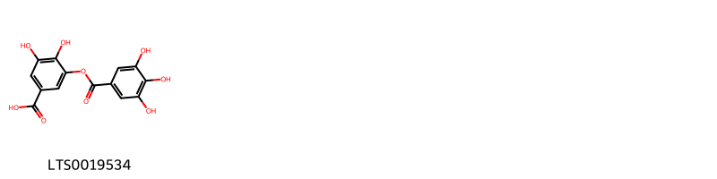
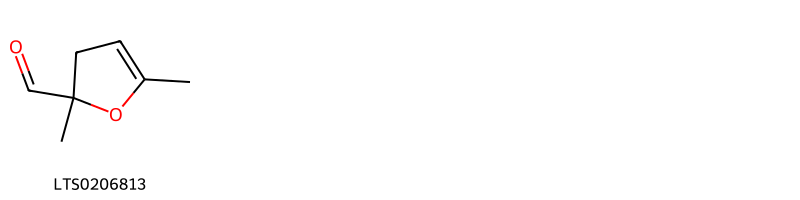
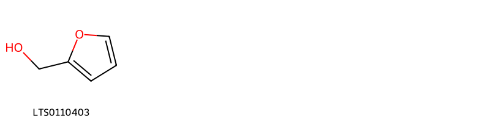
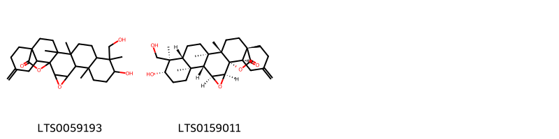
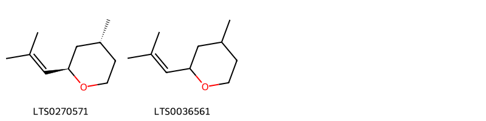
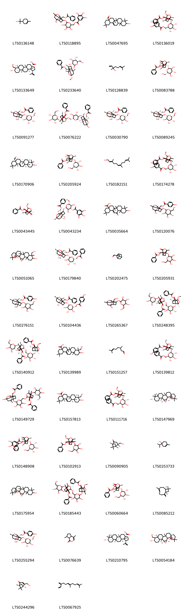

!!! abstract "Tóm tắt"

    Bạch thược (Paeonia lactiflora Pall.), thuộc họ Paeoniaceae (họ Mẫu đơn), là dược liệu quý trong y học cổ truyền. Phân bố chủ yếu ở các vùng bản địa như Amur, Mãn Châu, Nội Mông, và được di thực vào các quốc gia như Anh, Hàn Quốc và Mỹ. Tại Việt Nam, dược liệu này chủ yếu được nhập khẩu từ Trung Quốc, với một số vùng đã trồng thử nghiệm ở Sa Pa (Lào Cai) từ năm 1960. Trong y học cổ truyền, bạch thược được sử dụng để bổ huyết, dưỡng âm, thư cân, bình can và chỉ thống. Dược liệu này chủ trị các bệnh như huyết hư, kinh nguyệt không đều, mồ hôi trộm, đau bụng, đau đầu và co rút chân tay. Về thành phần hóa học, bạch thược chứa các glycosides như paeoniflorin (biomarker), albiflorin, polyphenols, tannin, saponin và flavonoid, với paeoniflorin là tiêu chuẩn định lượng trong nhiều dược điển quốc tế. Tác dụng dược lý của bạch thược bao gồm kháng viêm, giảm đau, an thần, trừ đờm và tác dụng kháng khuẩn đối với nhiều loại vi trùng. Dược liệu này được ứng dụng rộng rãi trong các bài thuốc truyền thống và hiện đại, đáp ứng nhiều nhu cầu điều trị bệnh lý về khí huyết, đau nhức và rối loạn kinh nguyệt.

## Thông tin về thực vật

Dược liệu **Bạch Thược (Rễ)** từ bộ phận **Rễ** từ loài *Paeonia lactiflora*.

**Mô tả thực vật:** Bạch thược hay thược dược là một cây sống lâu năm, cao 50 - 80 cm, rễ củ to, thân mọc thẳng đứng, không có lông. Lá mọc so le, xẻ sâu thành 3 - 7 thùy hình trứng dài 8 - 12 cm, rộng 2 - 4 cm, mép nguyên, phía cuống hơi hồng. Hoa rất to mọc đơn độc, cánh hoa màu trắng. Mùa hoa ở Trung Quốc vào các tháng 5 - 7, mùa quả vào các tháng 6 - 7.

*Tài liệu tham khảo:* "Những cây thuốc và vị thuốc Việt Nam" - Đỗ Tất Lợi 
Trong dược điển Việt nam, một loài được sử dụng làm dược liệu là *Paeonia lactiflora*.

!!! info "Phân loại thực vật của *Paeonia lactiflora*"
    - **Kingdom:** Plantae
    - **Phylum:** Tracheophyta
    - **Order:** Saxifragales
    - **Family:** Paeoniaceae
    - **Genus:** Paeonia
    - **Species:** *Paeonia lactiflora*

**Phân bố trên thế giới:** Germany, Switzerland, Czechia, Korea, Republic of, Netherlands, Hungary, Poland, Sweden, Mongolia, Belarus, Russian Federation, Estonia, United Kingdom of Great Britain and Northern Ireland, Slovakia, United States of America, China, Norway, Canada, Armenia, Austria, Belgium

**Phân bố tại Việt nam:** Không có ghi nhận ở Việt Nam

## Thông tin về dược liệu 

### Định danh

!!! info "Thông tin về tên gọi"

    - Dược liệu tiếng Việt: bạch thược
    - Dược liệu tiếng Trung:  (Bai Shao Yao)
    - Dược liệu tiếng Anh: Radix Paeoniae
    - Dược liệu latin thông dụng: Radix Paeoniae lactifloraenRadix Paeoniae Alba
    - Dược liệu latin kiểu DĐVN: *radix paeoniae lactiflorae*
    - Dược liệu latin kiểu DĐVN: *Radix Paeoniae Alba*
    - Dược liệu latin kiểu thông tư: *Radix Paeoniae lactiflorae*
    - Bộ phận dùng: Rễ (Radix)

### Mô tả dược liệu 

- **Theo dược điển Việt nam V:** Rễ hình trụ tròn, thẳng hoặc đôi khi hơi uốn cong, hai đầu phẳng; đều nhau hoặc một đầu to hơn, dài 5 cm đến 18 cm, đường kính 1 cm đến 2,5 cm. Mặt ngoài hơi trắng hoặc hồng nhạt, đôi khi có màu nâu thẫm, nhẵn hoặc có nếp nhăn dọc và vết tích của rễ nhỏ. Chất rắn chắc, nặng, khó bẻ gãy. Mặt cắt phẳng màu trắng ngà hoặc hơi phớt hồng, vỏ hẹp, gỗ thành tia rõ đôi khi có khe nứt. Không mùi. Vị hơi đắng và chua Dược liệu thái lát: Lát mỏng gần tròn, bên ngoài nhẵn mịn, màu trắng hoặc hơi phớt hồng. Vị hơi đắng và chua.

- **Mô tả dược liệu theo thông tư chế biến dược liệu theo phương pháp cổ truyền:** 

### Chế biến 

- **Chế biến theo dược điển việt nam V**: Đào lấy rễ, rửa sạch đất cát, cắt bỏ đầu đuôi và rễ con, cạo sạch vỏ ngoài sau đổ luộc chín hoặc luộc chín rồi bỏ vỏ, phơi khô hoặc thái lát phơi khô. Dược liệu thái lát: Lấy rễ chưa thái lát, làm ẩm, ủ mềm, thái lát mỏng, phơi khô.nn

- **Chế biến theo thông tư:** 

--- 

## Thành phần hóa học

- Theo tài liệu của GS. Đỗ Tất Lợi:  (1) Nhóm hóa học: Glycosides (Paeoniflorin, Albiflorin...), Polyphenols, Tannin, Saponin, Flavonoid.
(2) Biomarker trong dược điển Việt Nam: Paeoniflorin
Biomarker trong dược điển Hồng Kông: Paeoniflorin
Biomarker trong dược điển Trung Quốc: Paeoniflorin
Biomarker trong dược điển Đài Loan: Paeoniflorin và Albiflorin.
    

**Thành phần hóa học từ loài **Paeonia lactiflora**

Theo cơ sở dữ liệu lotus, loài *Paeonia lactiflora* đã phân lập và xác định được **256** hoạt chất thuộc về các nhóm Diarylheptanoids, Fatty Acyls, Phenols, Tannins, Carboxylic acids and derivatives, Saturated hydrocarbons, Steroids and steroid derivatives, Flavonoids, Pyridines and derivatives, Heteroaromatic compounds, 2-arylbenzofuran flavonoids, Dihydrofurans, Benzene and substituted derivatives, Stilbenes, Prenol lipids, Depsides and depsidones, Oxanes, Organooxygen compounds, Cinnamic acids and derivatives, Lactones, Benzofurans, Phenol ethers, Dibenzylbutane lignans trong bảng dưới đây. Danh sách các hoạt chất như sau (1r,2s,19r,20r,22r)-7,8,9,12,13,14,20,28,29,30,33,34,35-tridecahydroxy-3,18,21,24,39-pentaoxaheptacyclo[20.17.0.0²,¹⁹.0⁵,¹⁰.0¹¹,¹⁶.0²⁶,³¹.0³²,³⁷]nonatriaconta-5(10),6,8,11,13,15,26(31),27,29,32,34,36-dodecaene-4,17,25,38-tetrone [(LTS0092963)](https://lotus.naturalproducts.net/compound/lotus_id/LTS0092963), 3,4,5-trihydroxy-6-(hydroxymethyl)oxan-2-yl 3,4,5-trihydroxybenzoate [(LTS0274683)](https://lotus.naturalproducts.net/compound/lotus_id/LTS0274683), 1,3,4-trihydroxy-5-(3,4,5-trihydroxybenzoyloxy)cyclohexane-1-carboxylic acid [(LTS0109045)](https://lotus.naturalproducts.net/compound/lotus_id/LTS0109045), 4-terpineol [(LTS0253733)](https://lotus.naturalproducts.net/compound/lotus_id/LTS0253733), (z)-ε-viniferin [(LTS0193672)](https://lotus.naturalproducts.net/compound/lotus_id/LTS0193672), (6-hydroxy-8-methyl-3-{[3,4,5-trihydroxy-6-(hydroxymethyl)oxan-2-yl]oxy}-9,10-dioxatetracyclo[4.3.1.0²,⁵.0³,⁸]decan-2-yl)methyl 4-hydroxybenzoate [(LTS0120076)](https://lotus.naturalproducts.net/compound/lotus_id/LTS0120076), hexanol [(LTS0217299)](https://lotus.naturalproducts.net/compound/lotus_id/LTS0217299), (1-{[(2s,3r,4s,5s,6r)-6-[(benzoyloxy)methyl]-3,4,5-trihydroxyoxan-2-yl]oxy}-8-methoxy-6-methyl-4-oxo-7-oxatricyclo[4.3.0.0³,⁹]nonan-9-yl)methyl 4-hydroxybenzoate [(LTS0184760)](https://lotus.naturalproducts.net/compound/lotus_id/LTS0184760), (2r,3s,4s,5s)-2,3,4,5,6-pentahydroxy-7-oxo-2,3,4,5,6-pentakis(3,4,5-trihydroxybenzoyl)-7-(3,4,5-trihydroxyphenyl)heptanal [(LTS0099392)](https://lotus.naturalproducts.net/compound/lotus_id/LTS0099392), 10-hydroxy-2,2,6a,6b,9,9,12a-heptamethyl-13-oxo-3,4,5,6,7,8,8a,10,11,12,12b,14b-dodecahydro-1h-picene-4a-carboxylic acid [(LTS0035664)](https://lotus.naturalproducts.net/compound/lotus_id/LTS0035664), (2s,3r,4s,5s,6r)-4,5-dihydroxy-3-(3,4,5-trihydroxybenzoyloxy)-6-[(3,4,5-trihydroxybenzoyloxy)methyl]oxan-2-yl 3,4,5-trihydroxybenzoate [(LTS0243221)](https://lotus.naturalproducts.net/compound/lotus_id/LTS0243221), (2s,3r,4s,5s,6r)-2-{2-methoxy-5-[(1e)-prop-1-en-1-yl]phenoxy}-6-({[(2s,3r,4s,5s)-3,4,5-trihydroxyoxan-2-yl]oxy}methyl)oxane-3,4,5-triol [(LTS0152732)](https://lotus.naturalproducts.net/compound/lotus_id/LTS0152732), digallic acid [(LTS0019534)](https://lotus.naturalproducts.net/compound/lotus_id/LTS0019534), (1s,2s,4s,5r,6s,9s,10r,11r,14r,15s,18s,23r)-9-hydroxy-10-(hydroxymethyl)-6,10,14,15-tetramethyl-21-methylidene-3,24-dioxaheptacyclo[16.5.2.0¹,¹⁵.0²,⁴.0⁵,¹⁴.0⁶,¹¹.0¹⁸,²³]pentacosan-25-one [(LTS0159011)](https://lotus.naturalproducts.net/compound/lotus_id/LTS0159011), (5ar,7s,9as,9br)-1,7-dihydroxy-3a,3b,6,6,9a-pentamethyl-4h,5h,5ah,7h,8h,9h,9bh-cyclopenta[a]phenanthrene-2,3-dione [(LTS0088293)](https://lotus.naturalproducts.net/compound/lotus_id/LTS0088293), (3s,4s,5r)-5-[(1r)-1,2-dihydroxyethyl]-3,4,5-trihydroxy-3,4-bis(3,4,5-trihydroxybenzoyl)-1,6-bis(3,4,5-trihydroxyphenyl)hexane-1,2,6-trione [(LTS0078623)](https://lotus.naturalproducts.net/compound/lotus_id/LTS0078623), [(2r,3s,4s,5r,6s)-6-({9-[(benzoyloxy)methyl]-8-methoxy-6-methyl-4-oxo-7-oxatricyclo[4.3.0.0³,⁹]nonan-1-yl}oxy)-3,4,5-trihydroxyoxan-2-yl]methyl benzoate [(LTS0213875)](https://lotus.naturalproducts.net/compound/lotus_id/LTS0213875), (8-methoxy-6-methyl-4-oxo-1-{[3,4,5-trihydroxy-6-(hydroxymethyl)oxan-2-yl]oxy}-7-oxatricyclo[4.3.0.0³,⁹]nonan-9-yl)methyl benzoate [(LTS0102913)](https://lotus.naturalproducts.net/compound/lotus_id/LTS0102913), [(1r,2s,3s,5s,6r,8s)-6-methoxy-8-methyl-3-{[(2s,3r,4s,5s,6r)-3,4,5-trihydroxy-6-(hydroxymethyl)oxan-2-yl]oxy}-9,10-dioxatetracyclo[4.3.1.0²,⁵.0³,⁸]decan-2-yl]methyl benzoate [(LTS0233640)](https://lotus.naturalproducts.net/compound/lotus_id/LTS0233640), 2-[2-methoxy-5-(prop-1-en-1-yl)phenoxy]-6-{[(3,4,5-trihydroxyoxan-2-yl)oxy]methyl}oxane-3,4,5-triol [(LTS0265195)](https://lotus.naturalproducts.net/compound/lotus_id/LTS0265195), eugenol [(LTS0052342)](https://lotus.naturalproducts.net/compound/lotus_id/LTS0052342), galop [(LTS0222857)](https://lotus.naturalproducts.net/compound/lotus_id/LTS0222857), 5-hydroxy-2-(4-hydroxyphenyl)-3,7-bis({[3,4,5-trihydroxy-6-(hydroxymethyl)oxan-2-yl]oxy})chromen-4-one [(LTS0033278)](https://lotus.naturalproducts.net/compound/lotus_id/LTS0033278), 2-phenyl-ethanol [(LTS0206341)](https://lotus.naturalproducts.net/compound/lotus_id/LTS0206341), 6-methyl-5-hepten-2-one [(LTS0241073)](https://lotus.naturalproducts.net/compound/lotus_id/LTS0241073), [(2r,3r,4s,5r,6s)-6-{[(1r,3r,6s,8s,9s)-9-[(benzoyloxy)methyl]-8-methoxy-6-methyl-4-oxo-7-oxatricyclo[4.3.0.0³,⁹]nonan-1-yl]oxy}-3,4,5-trihydroxyoxan-2-yl]methyl benzoate [(LTS0111716)](https://lotus.naturalproducts.net/compound/lotus_id/LTS0111716), 9-hydroxy-5a,5b,8,8,11a-pentamethyl-1-(prop-1-en-2-yl)-hexadecahydrocyclopenta[a]chrysene-3a-carboxylic acid [(LTS0214300)](https://lotus.naturalproducts.net/compound/lotus_id/LTS0214300), (2r,3r,4r,5s,6r)-4,5,6-tris(3,4,5-trihydroxybenzoyloxy)-2-[(3,4,5-trihydroxybenzoyloxy)methyl]oxan-3-yl 2-[(14r,15r,19s)-14-[(10s,11s)-3,4,5,11,17,18,19-heptahydroxy-8,14-dioxo-9,13-dioxatricyclo[13.4.0.0²,⁷]nonadeca-1(15),2,4,6,16,18-hexaen-10-yl]-2,3,4,7,8,9-hexahydroxy-12,17-dioxo-13,16-dioxatetracyclo[13.3.1.0⁵,¹⁸.0⁶,¹¹]nonadeca-1,3,5(18),6,8,10-hexaen-19-yl]-3,4,5-trihydroxybenzoate [(LTS0069476)](https://lotus.naturalproducts.net/compound/lotus_id/LTS0069476), [(3r,4s,5s,6r)-4,5-dihydroxy-6-(hydroxymethyl)-12-methyl-14-oxo-2,7,9,13-tetraoxapentacyclo[8.7.0.0¹,¹⁵.0³,⁸.0¹²,¹⁶]heptadecan-15-yl]methyl benzoate [(LTS0239959)](https://lotus.naturalproducts.net/compound/lotus_id/LTS0239959), [(2s,3r,4r,5s,6r)-3,4,5,6-tetrakis(3,4,5-trihydroxybenzoyloxy)oxan-2-yl]methyl 2-[(14s,15r,19r)-14-[(10s,11s)-3,4,5,11,17,18,19-heptahydroxy-8,14-dioxo-9,13-dioxatricyclo[13.4.0.0²,⁷]nonadeca-1(15),2,4,6,16,18-hexaen-10-yl]-2,3,4,7,8,9-hexahydroxy-12,17-dioxo-13,16-dioxatetracyclo[13.3.1.0⁵,¹⁸.0⁶,¹¹]nonadeca-1,3,5(18),6,8,10-hexaen-19-yl]-3,4,5-trihydroxybenzoate [(LTS0044918)](https://lotus.naturalproducts.net/compound/lotus_id/LTS0044918), 2-pyridone [(LTS0067108)](https://lotus.naturalproducts.net/compound/lotus_id/LTS0067108), m-cresol [(LTS0167800)](https://lotus.naturalproducts.net/compound/lotus_id/LTS0167800), benzyl alcohol [(LTS0125638)](https://lotus.naturalproducts.net/compound/lotus_id/LTS0125638), β-glucogallin [(LTS0193705)](https://lotus.naturalproducts.net/compound/lotus_id/LTS0193705), (14s,15r,19r)-14-[(10r,11s)-3,4,5,11,17,18,19-heptahydroxy-8,14-dioxo-9,13-dioxatricyclo[13.4.0.0²,⁷]nonadeca-1(15),2,4,6,16,18-hexaen-10-yl]-2,3,4,7,8,9,19-heptahydroxy-13,16-dioxatetracyclo[13.3.1.0⁵,¹⁸.0⁶,¹¹]nonadeca-1(18),2,4,6,8,10-hexaene-12,17-dione [(LTS0195171)](https://lotus.naturalproducts.net/compound/lotus_id/LTS0195171), (1s,2s,4s,5r,6s,9s,10r,11r,14r,15s,18s,23r)-9-hydroxy-10-(hydroxymethyl)-6,10,14,15,21,21-hexamethyl-3,24-dioxaheptacyclo[16.5.2.0¹,¹⁵.0²,⁴.0⁵,¹⁴.0⁶,¹¹.0¹⁸,²³]pentacosan-25-one [(LTS0054184)](https://lotus.naturalproducts.net/compound/lotus_id/LTS0054184), [(2s,3r,5r,6r,8s)-3-{[(2s,3r,4s,5r,6r)-6-[(benzoyloxy)methyl]-3,4,5-trihydroxyoxan-2-yl]oxy}-6-hydroxy-8-methyl-9,10-dioxatetracyclo[4.3.1.0²,⁵.0³,⁸]decan-2-yl]methyl benzoate [(LTS0158357)](https://lotus.naturalproducts.net/compound/lotus_id/LTS0158357), astragalin [(LTS0249588)](https://lotus.naturalproducts.net/compound/lotus_id/LTS0249588), [(1r,3r,4r,6s,9s)-4-hydroxy-6-methyl-8-oxo-1-{[(2s,3r,4s,5s,6r)-3,4,5-trihydroxy-6-(hydroxymethyl)oxan-2-yl]oxy}-7-oxatricyclo[4.3.0.0³,⁹]nonan-9-yl]methyl benzoate [(LTS0060664)](https://lotus.naturalproducts.net/compound/lotus_id/LTS0060664), paeonin a [(LTS0179840)](https://lotus.naturalproducts.net/compound/lotus_id/LTS0179840), decanal [(LTS0128361)](https://lotus.naturalproducts.net/compound/lotus_id/LTS0128361), thymol [(LTS0168527)](https://lotus.naturalproducts.net/compound/lotus_id/LTS0168527), [(1r,3r,6r,8s,9s)-1-hydroxy-8-methoxy-6-methyl-4-oxo-7-oxatricyclo[4.3.0.0³,⁹]nonan-9-yl]methyl benzoate [(LTS0043445)](https://lotus.naturalproducts.net/compound/lotus_id/LTS0043445), salicylaldehyde [(LTS0188793)](https://lotus.naturalproducts.net/compound/lotus_id/LTS0188793), (2r,3r,4s,5r,6s)-4,5,6-tris(3,4,5-trihydroxybenzoyloxy)-2-[(3,4,5-trihydroxybenzoyloxy)methyl]oxan-3-yl 2-[(14s,15s,19r)-14-[(10r)-3,4,5,11,17,18,19-heptahydroxy-8,14-dioxo-9,13-dioxatricyclo[13.4.0.0²,⁷]nonadeca-1(15),2,4,6,16,18-hexaen-10-yl]-2,3,4,7,8,9-hexahydroxy-12,17-dioxo-13,16-dioxatetracyclo[13.3.1.0⁵,¹⁸.0⁶,¹¹]nonadeca-1,3,5(18),6,8,10-hexaen-19-yl]-3,4,5-trihydroxybenzoate [(LTS0054494)](https://lotus.naturalproducts.net/compound/lotus_id/LTS0054494), amyl alcohol [(LTS0193146)](https://lotus.naturalproducts.net/compound/lotus_id/LTS0193146), casuarictin [(LTS0241644)](https://lotus.naturalproducts.net/compound/lotus_id/LTS0241644), (10r,11s,12r,15r)-3,4,5,13,21,22,23-heptahydroxy-8,18-dioxo-11-(3,4,5-trihydroxybenzoyloxy)-9,14,17-trioxatetracyclo[17.4.0.0²,⁷.0¹⁰,¹⁵]tricosa-1(23),2(7),3,5,19,21-hexaen-12-yl 3,4,5-trihydroxybenzoate [(LTS0087023)](https://lotus.naturalproducts.net/compound/lotus_id/LTS0087023), (1s,2r,4s,10r,11r,18s)-4-(3,5-dihydroxyphenyl)-2,10,18-tris(4-hydroxyphenyl)-1,10,11,18-tetramethyl-9-oxahexacyclo[9.7.2.0²,⁴.0⁵,¹⁹.0⁸,²⁰.0¹²,¹⁷]icosa-5(19),6,8(20),12,14,16-hexaene-6,14,16-triol [(LTS0181985)](https://lotus.naturalproducts.net/compound/lotus_id/LTS0181985), apocynin [(LTS0211279)](https://lotus.naturalproducts.net/compound/lotus_id/LTS0211279), (10r,11s,12r,13r,15r)-3,4,5,13,21,22,23-heptahydroxy-8,18-dioxo-11-(3,4,5-trihydroxybenzoyloxy)-9,14,17-trioxatetracyclo[17.4.0.0²,⁷.0¹⁰,¹⁵]tricosa-1(23),2(7),3,5,19,21-hexaen-12-yl 3,4,5-trihydroxybenzoate [(LTS0229223)](https://lotus.naturalproducts.net/compound/lotus_id/LTS0229223), paeoniflorone [(LTS0057218)](https://lotus.naturalproducts.net/compound/lotus_id/LTS0057218), (6-{[(1r,2s,3r,5s,6r,8s)-2-[(benzoyloxy)methyl]-6-hydroxy-8-methyl-9,10-dioxatetracyclo[4.3.1.0²,⁵.0³,⁸]decan-3-yl]oxy}-3,4,5-trihydroxyoxan-2-yl)methyl 3,4,5-trihydroxybenzoate [(LTS0061316)](https://lotus.naturalproducts.net/compound/lotus_id/LTS0061316), bran oil [(LTS0143969)](https://lotus.naturalproducts.net/compound/lotus_id/LTS0143969), methyl o-anisate [(LTS0074014)](https://lotus.naturalproducts.net/compound/lotus_id/LTS0074014), (2r,3r,4s,5s)-2-hydroxy-2-(hydroxymethyl)-1,6,7-trioxo-3,4,5-tris(3,4,5-trihydroxybenzoyl)-3,5-bis(3,4,5-trihydroxybenzoyloxy)-1,7-bis(3,4,5-trihydroxyphenyl)heptan-4-yl 3,4,5-trihydroxybenzoate [(LTS0093130)](https://lotus.naturalproducts.net/compound/lotus_id/LTS0093130), (2r,3r,4s,5r,6r)-2,4,5-tris(3,4,5-trihydroxybenzoyloxy)-6-[(3,4,5-trihydroxybenzoyloxy)methyl]oxan-3-yl 2-[(14s,15r,19s)-14-[(10r,11r)-3,4,5,11,17,18,19-heptahydroxy-8,14-dioxo-9,13-dioxatricyclo[13.4.0.0²,⁷]nonadeca-1(15),2,4,6,16,18-hexaen-10-yl]-2,3,4,7,8,9-hexahydroxy-12,17-dioxo-13,16-dioxatetracyclo[13.3.1.0⁵,¹⁸.0⁶,¹¹]nonadeca-1,3,5(18),6,8,10-hexaen-19-yl]-3,4,5-trihydroxybenzoate [(LTS0124940)](https://lotus.naturalproducts.net/compound/lotus_id/LTS0124940), isoamyl alcohol [(LTS0112297)](https://lotus.naturalproducts.net/compound/lotus_id/LTS0112297), 9-hydroxy-10-(hydroxymethyl)-6,10,14,15,21,21-hexamethyl-3,24-dioxaheptacyclo[16.5.2.0¹,¹⁵.0²,⁴.0⁵,¹⁴.0⁶,¹¹.0¹⁸,²³]pentacosan-25-one [(LTS0051065)](https://lotus.naturalproducts.net/compound/lotus_id/LTS0051065), (2s,3r,4s,5r,6r)-4,5,6-tris(3,4,5-trihydroxybenzoyloxy)-2-[(3,4,5-trihydroxybenzoyloxy)methyl]oxan-3-yl 2-[(14s,15r,19r)-14-[(10r,11s)-3,4,5,11,17,18,19-heptahydroxy-8,14-dioxo-9,13-dioxatricyclo[13.4.0.0²,⁷]nonadeca-1(15),2,4,6,16,18-hexaen-10-yl]-2,3,4,7,8,9-hexahydroxy-12,17-dioxo-13,16-dioxatetracyclo[13.3.1.0⁵,¹⁸.0⁶,¹¹]nonadeca-1,3,5(18),6,8,10-hexaen-19-yl]-3,4,5-trihydroxybenzoate [(LTS0226944)](https://lotus.naturalproducts.net/compound/lotus_id/LTS0226944), citronellyl acetate [(LTS0049511)](https://lotus.naturalproducts.net/compound/lotus_id/LTS0049511), gnetin h [(LTS0015265)](https://lotus.naturalproducts.net/compound/lotus_id/LTS0015265), [(1r,3r,6s,8s,9s)-1-{[(2s,3r,4s,5s,6r)-6-[(benzoyloxy)methyl]-3,4,5-trihydroxyoxan-2-yl]oxy}-8-methoxy-6-methyl-4-oxo-7-oxatricyclo[4.3.0.0³,⁹]nonan-9-yl]methyl 4-hydroxybenzoate [(LTS0139812)](https://lotus.naturalproducts.net/compound/lotus_id/LTS0139812), (8-{[6-({9-[(benzoyloxy)methyl]-8-methoxy-6-methyl-4-oxo-7-oxatricyclo[4.3.0.0³,⁹]nonan-1-yl}oxy)-3,4,5-trihydroxyoxan-2-yl]methoxy}-6-methyl-4-oxo-1-{[3,4,5-trihydroxy-6-(hydroxymethyl)oxan-2-yl]oxy}-7-oxatricyclo[4.3.0.0³,⁹]nonan-9-yl)methyl benzoate [(LTS0185443)](https://lotus.naturalproducts.net/compound/lotus_id/LTS0185443), [(2r,3s,4s,5r,6s)-6-{[(2s,3r,5r,6r,8s)-2-[(benzoyloxy)methyl]-6-hydroxy-8-methyl-9,10-dioxatetracyclo[4.3.1.0²,⁵.0³,⁸]decan-3-yl]oxy}-3,4,5-trihydroxyoxan-2-yl]methyl 3,4,5-trihydroxybenzoate [(LTS0049577)](https://lotus.naturalproducts.net/compound/lotus_id/LTS0049577), oct-4-en-3-one [(LTS0112346)](https://lotus.naturalproducts.net/compound/lotus_id/LTS0112346), methyl eugenol [(LTS0098881)](https://lotus.naturalproducts.net/compound/lotus_id/LTS0098881), acetophenone [(LTS0155971)](https://lotus.naturalproducts.net/compound/lotus_id/LTS0155971), p-cresol [(LTS0208715)](https://lotus.naturalproducts.net/compound/lotus_id/LTS0208715), (2r,3r,4s,5r,6s)-2,3,5-tris(3,4,5-trihydroxybenzoyloxy)-6-[(3,4,5-trihydroxybenzoyloxy)methyl]oxan-4-yl 2-[(14s,15s,19s)-14-[(10s,11r)-3,4,5,11,17,18,19-heptahydroxy-8,14-dioxo-9,13-dioxatricyclo[13.4.0.0²,⁷]nonadeca-1(15),2,4,6,16,18-hexaen-10-yl]-2,3,4,7,8,9-hexahydroxy-12,17-dioxo-13,16-dioxatetracyclo[13.3.1.0⁵,¹⁸.0⁶,¹¹]nonadeca-1,3,5(18),6,8,10-hexaen-19-yl]-3,4,5-trihydroxybenzoate [(LTS0197464)](https://lotus.naturalproducts.net/compound/lotus_id/LTS0197464), 3-methoxy-8-methyl-4-methylidene-1-{[3,4,5-trihydroxy-6-(hydroxymethyl)oxan-2-yl]oxy}-2-oxabicyclo[3.3.1]non-7-en-6-one [(LTS0184653)](https://lotus.naturalproducts.net/compound/lotus_id/LTS0184653), betulinic acid [(LTS0210795)](https://lotus.naturalproducts.net/compound/lotus_id/LTS0210795), (10s,11r,12r,13s,15r)-3,4,5,11,12,21,22,23-octahydroxy-8,18-dioxo-9,14,17-trioxatetracyclo[17.4.0.0²,⁷.0¹⁰,¹⁵]tricosa-1(23),2(7),3,5,19,21-hexaen-13-yl 3,4,5-trihydroxybenzoate [(LTS0233186)](https://lotus.naturalproducts.net/compound/lotus_id/LTS0233186), [(1r,3r,4r,6s)-4-hydroxy-4,6-dimethyl-8-oxo-1-{[(2s,3r,4s,5s,6r)-3,4,5-trihydroxy-6-(hydroxymethyl)oxan-2-yl]oxy}-7-oxatricyclo[4.3.0.0³,⁹]nonan-9-yl]methyl benzoate [(LTS0205924)](https://lotus.naturalproducts.net/compound/lotus_id/LTS0205924), [(1s,2r,5r)-6,6-dimethylbicyclo[3.1.1]heptan-2-yl]methanol [(LTS0208686)](https://lotus.naturalproducts.net/compound/lotus_id/LTS0208686), terpineol [(LTS0136148)](https://lotus.naturalproducts.net/compound/lotus_id/LTS0136148), (+)-ε-viniferin [(LTS0061551)](https://lotus.naturalproducts.net/compound/lotus_id/LTS0061551), (2r,3r,4r,5r,6s)-2,3,5-tris(3,4,5-trihydroxybenzoyloxy)-6-[(3,4,5-trihydroxybenzoyloxy)methyl]oxan-4-yl 2-[(14s,15r,19r)-14-[(10s,11s)-3,4,5,11,17,18,19-heptahydroxy-8,14-dioxo-9,13-dioxatricyclo[13.4.0.0²,⁷]nonadeca-1(15),2,4,6,16,18-hexaen-10-yl]-2,3,4,7,8,9-hexahydroxy-12,17-dioxo-13,16-dioxatetracyclo[13.3.1.0⁵,¹⁸.0⁶,¹¹]nonadeca-1,3,5(18),6,8,10-hexaen-19-yl]-3,4,5-trihydroxybenzoate [(LTS0088361)](https://lotus.naturalproducts.net/compound/lotus_id/LTS0088361), (2s,3r,4s,5r,6r)-2,3,5-tris(3,4,5-trihydroxybenzoyloxy)-6-[(3,4,5-trihydroxybenzoyloxy)methyl]oxan-4-yl 2-[(14s,15s,19r)-14-[(10r)-3,4,5,11,17,18,19-heptahydroxy-8,14-dioxo-9,13-dioxatricyclo[13.4.0.0²,⁷]nonadeca-1(15),2,4,6,16,18-hexaen-10-yl]-2,3,4,7,8,9-hexahydroxy-12,17-dioxo-13,16-dioxatetracyclo[13.3.1.0⁵,¹⁸.0⁶,¹¹]nonadeca-1,3,5(18),6,8,10-hexaen-19-yl]-3,4,5-trihydroxybenzoate [(LTS0020493)](https://lotus.naturalproducts.net/compound/lotus_id/LTS0020493), carvacrol [(LTS0012882)](https://lotus.naturalproducts.net/compound/lotus_id/LTS0012882), (2s,3r,4s,5r,6r)-2-{[(1r,2s,3r,5r,6r,8s)-2-[(benzoyloxy)methyl]-6-hydroxy-8-methyl-9,10-dioxatetracyclo[4.3.1.0²,⁵.0³,⁸]decan-3-yl]oxy}-3,5-dihydroxy-6-(hydroxymethyl)oxan-4-yl 3,4,5-trihydroxybenzoate [(LTS0043234)](https://lotus.naturalproducts.net/compound/lotus_id/LTS0043234), geraniol [(LTS0258838)](https://lotus.naturalproducts.net/compound/lotus_id/LTS0258838), [(1s,3s,6r,8r)-8-hydroxy-3-methyl-5-oxo-2,9-dioxatricyclo[4.3.1.0³,⁸]decan-10-yl]methyl benzoate [(LTS0015209)](https://lotus.naturalproducts.net/compound/lotus_id/LTS0015209), benzaldehyde [(LTS0094193)](https://lotus.naturalproducts.net/compound/lotus_id/LTS0094193), 2-decenal [(LTS0199073)](https://lotus.naturalproducts.net/compound/lotus_id/LTS0199073), furfuryl alcohol [(LTS0110403)](https://lotus.naturalproducts.net/compound/lotus_id/LTS0110403), hexane [(LTS0209095)](https://lotus.naturalproducts.net/compound/lotus_id/LTS0209095), methyl 2-[(14r,15r,19r)-14-[(10r,11s)-3,4,5,11,17,18,19-heptahydroxy-8,14-dioxo-9,13-dioxatricyclo[13.4.0.0²,⁷]nonadeca-1(15),2,4,6,16,18-hexaen-10-yl]-2,3,4,7,8,9-hexahydroxy-12,17-dioxo-13,16-dioxatetracyclo[13.3.1.0⁵,¹⁸.0⁶,¹¹]nonadeca-1,3,5(18),6,8,10-hexaen-19-yl]-3,4,5-trihydroxybenzoate [(LTS0085561)](https://lotus.naturalproducts.net/compound/lotus_id/LTS0085561), 3,5-dihydroxy-4-(3,4,5-trihydroxybenzoyloxy)-6-[(3,4,5-trihydroxybenzoyloxy)methyl]oxan-2-yl 3,4,5-trihydroxybenzoate [(LTS0104575)](https://lotus.naturalproducts.net/compound/lotus_id/LTS0104575), (3s,4s,5r,6s)-3,4,5,6,7-pentahydroxy-3,4,5,6,7-pentakis(3,4,5-trihydroxybenzoyl)-1,8-bis(3,4,5-trihydroxyphenyl)octane-1,2,8-trione [(LTS0238934)](https://lotus.naturalproducts.net/compound/lotus_id/LTS0238934), nerol [(LTS0244289)](https://lotus.naturalproducts.net/compound/lotus_id/LTS0244289), o-acetylphenol [(LTS0137584)](https://lotus.naturalproducts.net/compound/lotus_id/LTS0137584), p-methoxyacetophenone [(LTS0040648)](https://lotus.naturalproducts.net/compound/lotus_id/LTS0040648), 2-acetylpyrrole [(LTS0001423)](https://lotus.naturalproducts.net/compound/lotus_id/LTS0001423), nepetalactone [(LTS0076639)](https://lotus.naturalproducts.net/compound/lotus_id/LTS0076639), 3-tert-butylphenol [(LTS0079480)](https://lotus.naturalproducts.net/compound/lotus_id/LTS0079480), elemicin [(LTS0188875)](https://lotus.naturalproducts.net/compound/lotus_id/LTS0188875), rose oxide [(LTS0036561)](https://lotus.naturalproducts.net/compound/lotus_id/LTS0036561), nonylphenol [(LTS0254950)](https://lotus.naturalproducts.net/compound/lotus_id/LTS0254950), gallocatechin gallate [(LTS0215651)](https://lotus.naturalproducts.net/compound/lotus_id/LTS0215651), 23-hydroxybetulinic acid [(LTS0133649)](https://lotus.naturalproducts.net/compound/lotus_id/LTS0133649), (1r,3r,4r,6s,9s)-9-[(benzoyloxy)methyl]-6-methyl-8-oxo-1-{[(2s,3r,4s,5s,6r)-3,4,5-trihydroxy-6-(hydroxymethyl)oxan-2-yl]oxy}-7-oxatricyclo[4.3.0.0³,⁹]nonan-4-yl 3,4,5-trihydroxybenzoate [(LTS0148908)](https://lotus.naturalproducts.net/compound/lotus_id/LTS0148908), 13-methyltetradecanoic acid [(LTS0011393)](https://lotus.naturalproducts.net/compound/lotus_id/LTS0011393), (2r,4r)-rose oxide [(LTS0270571)](https://lotus.naturalproducts.net/compound/lotus_id/LTS0270571), (6-hydroxy-8-methyl-3-{[3,4,5-trihydroxy-6-(hydroxymethyl)oxan-2-yl]oxy}-9,10-dioxatetracyclo[4.3.1.0²,⁵.0³,⁸]decan-2-yl)methyl benzoate [(LTS0025083)](https://lotus.naturalproducts.net/compound/lotus_id/LTS0025083), oleanolic aldehyde [(LTS0170906)](https://lotus.naturalproducts.net/compound/lotus_id/LTS0170906), (1r,5r)-4-(hydroxymethyl)-6,6-dimethylbicyclo[3.1.1]hept-3-en-2-one [(LTS0244296)](https://lotus.naturalproducts.net/compound/lotus_id/LTS0244296), hexanal [(LTS0238624)](https://lotus.naturalproducts.net/compound/lotus_id/LTS0238624), (2r,3s,4s,5s,6r)-2,4,5-tris(3,4,5-trihydroxybenzoyloxy)-6-[(3,4,5-trihydroxybenzoyloxy)methyl]oxan-3-yl 2-[(14s,15r,19s)-14-[(10r,11s)-3,4,5,11,17,18,19-heptahydroxy-8,14-dioxo-9,13-dioxatricyclo[13.4.0.0²,⁷]nonadeca-1(15),2,4,6,16,18-hexaen-10-yl]-2,3,4,7,8,9-hexahydroxy-12,17-dioxo-13,16-dioxatetracyclo[13.3.1.0⁵,¹⁸.0⁶,¹¹]nonadeca-1,3,5(18),6,8,10-hexaen-19-yl]-3,4,5-trihydroxybenzoate [(LTS0107030)](https://lotus.naturalproducts.net/compound/lotus_id/LTS0107030), 10-hydroxy-9-(hydroxymethyl)-6a,6b,9,12a-tetramethyl-2-methylidene-1,3,4,5,6,7,8,8a,10,11,12,12b,13,14b-tetradecahydropicene-4a-carboxylic acid [(LTS0208965)](https://lotus.naturalproducts.net/compound/lotus_id/LTS0208965), (1s,3r,5r)-3-methoxy-8-methyl-4-methylidene-1-{[(2s,3r,4s,5s,6r)-3,4,5-trihydroxy-6-(hydroxymethyl)oxan-2-yl]oxy}-2-oxabicyclo[3.3.1]non-7-en-6-one [(LTS0034757)](https://lotus.naturalproducts.net/compound/lotus_id/LTS0034757), paeonilactone a [(LTS0164953)](https://lotus.naturalproducts.net/compound/lotus_id/LTS0164953), guaiacol [(LTS0179228)](https://lotus.naturalproducts.net/compound/lotus_id/LTS0179228), [(1s,2s,3r,5r,6r,8s)-3-({6-[(benzoyloxy)methyl]-3,4,5-trihydroxyoxan-2-yl}oxy)-6-hydroxy-8-methyl-9,10-dioxatetracyclo[4.3.1.0²,⁵.0³,⁸]decan-2-yl]methyl benzoate [(LTS0269298)](https://lotus.naturalproducts.net/compound/lotus_id/LTS0269298), methyl anisate [(LTS0113372)](https://lotus.naturalproducts.net/compound/lotus_id/LTS0113372), myrtenal [(LTS0202475)](https://lotus.naturalproducts.net/compound/lotus_id/LTS0202475), (14s,15s,19s)-14-[(10r,11s)-3,4,5,11,17,18,19-heptahydroxy-8,14-dioxo-9,13-dioxatricyclo[13.4.0.0²,⁷]nonadeca-1(15),2,4,6,16,18-hexaen-10-yl]-2,3,4,7,8,9,19-heptahydroxy-13,16-dioxatetracyclo[13.3.1.0⁵,¹⁸.0⁶,¹¹]nonadeca-1(18),2,4,6,8,10-hexaene-12,17-dione [(LTS0273104)](https://lotus.naturalproducts.net/compound/lotus_id/LTS0273104), 7,8,9,12,13,14,28,29,30,33,34,35-dodecahydroxy-4,17,25,38-tetraoxo-3,18,21,24,39-pentaoxaheptacyclo[20.17.0.0²,¹⁹.0⁵,¹⁰.0¹¹,¹⁶.0²⁶,³¹.0³²,³⁷]nonatriaconta-5,7,9,11(16),12,14,26,28,30,32(37),33,35-dodecaen-20-yl 3,4,5-trihydroxybenzoate [(LTS0009009)](https://lotus.naturalproducts.net/compound/lotus_id/LTS0009009), 2,4,5-tris(3,4,5-trihydroxybenzoyloxy)-6-[(3,4,5-trihydroxybenzoyloxy)methyl]oxan-3-yl 2-(14-{3,4,5,11,17,18,19-heptahydroxy-8,14-dioxo-9,13-dioxatricyclo[13.4.0.0²,⁷]nonadeca-1(15),2,4,6,16,18-hexaen-10-yl}-2,3,4,7,8,9-hexahydroxy-12,17-dioxo-13,16-dioxatetracyclo[13.3.1.0⁵,¹⁸.0⁶,¹¹]nonadeca-1,3,5(18),6,8,10-hexaen-19-yl)-3,4,5-trihydroxybenzoate [(LTS0011205)](https://lotus.naturalproducts.net/compound/lotus_id/LTS0011205), 4-(methoxymethyl)-8-methyl-1-{[3,4,5-trihydroxy-6-(hydroxymethyl)oxan-2-yl]oxy}-2-oxabicyclo[3.3.1]nona-3,7-dien-6-one [(LTS0133077)](https://lotus.naturalproducts.net/compound/lotus_id/LTS0133077), phenylacetaldehyde [(LTS0245512)](https://lotus.naturalproducts.net/compound/lotus_id/LTS0245512), hexyl acetate [(LTS0202355)](https://lotus.naturalproducts.net/compound/lotus_id/LTS0202355), [(2s,3r,5r,6r,8s)-6-hydroxy-8-methyl-3-{[(2s,3r,4s,5s,6r)-3,4,5-trihydroxy-6-(hydroxymethyl)oxan-2-yl]oxy}-9,10-dioxatetracyclo[4.3.1.0²,⁵.0³,⁸]decan-2-yl]methyl 4-hydroxybenzoate [(LTS0255294)](https://lotus.naturalproducts.net/compound/lotus_id/LTS0255294), paeonin b [(LTS0091277)](https://lotus.naturalproducts.net/compound/lotus_id/LTS0091277), α-citral [(LTS0246122)](https://lotus.naturalproducts.net/compound/lotus_id/LTS0246122), (1s,3r,4s,5r)-1,3,5-trihydroxy-4-(3,4,5-trihydroxybenzoyloxy)cyclohexane-1-carboxylic acid [(LTS0026827)](https://lotus.naturalproducts.net/compound/lotus_id/LTS0026827), {1-[(4,5-dihydroxycyclohex-2-ene-1-carbonyloxy)methyl]-3-{5,7-dioxatricyclo[4.2.1.0³,⁹]nona-3,6(9)-dien-1-yloxy}-5,6-dihydroxy-4-methyl-2-oxabicyclo[2.2.1]heptan-3-yl}methyl benzoate [(LTS0032117)](https://lotus.naturalproducts.net/compound/lotus_id/LTS0032117), 2,3-dimethylhydroquinone [(LTS0139221)](https://lotus.naturalproducts.net/compound/lotus_id/LTS0139221), [3-({6-[(benzoyloxy)methyl]-3,4,5-trihydroxyoxan-2-yl}oxy)-6-hydroxy-8-methyl-9,10-dioxatetracyclo[4.3.1.0²,⁵.0³,⁸]decan-2-yl]methyl benzoate [(LTS0032285)](https://lotus.naturalproducts.net/compound/lotus_id/LTS0032285), [(1r,2r,5s)-6,6-dimethylbicyclo[3.1.1]heptan-2-yl]methanol [(LTS0104092)](https://lotus.naturalproducts.net/compound/lotus_id/LTS0104092), (19s)-14-{3,4,5,11,17,18,19-heptahydroxy-8,14-dioxo-9,13-dioxatricyclo[13.4.0.0²,⁷]nonadeca-1(15),2,4,6,16,18-hexaen-10-yl}-2,3,4,7,8,9,19-heptahydroxy-13,16-dioxatetracyclo[13.3.1.0⁵,¹⁸.0⁶,¹¹]nonadeca-1(18),2,4,6,8,10-hexaene-12,17-dione [(LTS0122912)](https://lotus.naturalproducts.net/compound/lotus_id/LTS0122912), (2s,3r,4s,5s,6r)-2-{[(1r,2s,3r,5r,6r,8s)-6-hydroxy-2-(hydroxymethyl)-8-methyl-9,10-dioxatetracyclo[4.3.1.0²,⁵.0³,⁸]decan-3-yl]oxy}-6-(hydroxymethyl)oxane-3,4,5-triol [(LTS0000719)](https://lotus.naturalproducts.net/compound/lotus_id/LTS0000719), ethyl salicylate [(LTS0192103)](https://lotus.naturalproducts.net/compound/lotus_id/LTS0192103), 2-{[6-hydroxy-2-(hydroxymethyl)-8-methyl-9,10-dioxatetracyclo[4.3.1.0²,⁵.0³,⁸]decan-3-yl]oxy}-6-(hydroxymethyl)oxane-3,4,5-triol [(LTS0265367)](https://lotus.naturalproducts.net/compound/lotus_id/LTS0265367), (1r,3as,5ar,5br,7ar,9s,11ar,11br,13ar,13bs)-9-hydroxy-5a,5b,8,8,11a-pentamethyl-1-(prop-1-en-2-yl)-hexadecahydrocyclopenta[a]chrysene-3a-carboxylic acid [(LTS0161903)](https://lotus.naturalproducts.net/compound/lotus_id/LTS0161903), [(2r,3s,4s,5r,6s)-6-{[(1r,3r,6s,8s,9s)-9-[(benzoyloxy)methyl]-8-methoxy-6-methyl-4-oxo-7-oxatricyclo[4.3.0.0³,⁹]nonan-1-yl]oxy}-3,4,5-trihydroxyoxan-2-yl]methyl 3,4,5-trihydroxybenzoate [(LTS0136019)](https://lotus.naturalproducts.net/compound/lotus_id/LTS0136019), palmitic acid [(LTS0079439)](https://lotus.naturalproducts.net/compound/lotus_id/LTS0079439), jasmone [(LTS0205512)](https://lotus.naturalproducts.net/compound/lotus_id/LTS0205512), phenol [(LTS0092642)](https://lotus.naturalproducts.net/compound/lotus_id/LTS0092642), {1-hydroxy-2,6-dimethyl-4-oxobicyclo[3.1.1]heptan-6-yl}methyl 3,4,5-trihydroxybenzoate [(LTS0200576)](https://lotus.naturalproducts.net/compound/lotus_id/LTS0200576), palbinone [(LTS0231493)](https://lotus.naturalproducts.net/compound/lotus_id/LTS0231493), methyl 2-[(14r,15s,19s)-14-[(10s,11r)-3,4,5,11,17,18,19-heptahydroxy-8,14-dioxo-9,13-dioxatricyclo[13.4.0.0²,⁷]nonadeca-1(15),2,4,6,16,18-hexaen-10-yl]-2,3,4,7,8,9-hexahydroxy-12,17-dioxo-13,16-dioxatetracyclo[13.3.1.0⁵,¹⁸.0⁶,¹¹]nonadeca-1,3,5(18),6,8,10-hexaen-19-yl]-3,4,5-trihydroxybenzoate [(LTS0136801)](https://lotus.naturalproducts.net/compound/lotus_id/LTS0136801), (6s)-6-hydroxy-3,6-dimethyl-tetrahydro-3h-1-benzofuran-2,5-dione [(LTS0075400)](https://lotus.naturalproducts.net/compound/lotus_id/LTS0075400), farnesol [(LTS0059667)](https://lotus.naturalproducts.net/compound/lotus_id/LTS0059667), 5-hydroxy-3,4-bis(3,4,5-trihydroxybenzoyloxy)-6-[(3,4,5-trihydroxybenzoyloxy)methyl]oxan-2-yl 3,4,5-trihydroxybenzoate [(LTS0023424)](https://lotus.naturalproducts.net/compound/lotus_id/LTS0023424), myrtanol [(LTS0126998)](https://lotus.naturalproducts.net/compound/lotus_id/LTS0126998), o-cresol [(LTS0108586)](https://lotus.naturalproducts.net/compound/lotus_id/LTS0108586), 3,4,5,13,21,22,23-heptahydroxy-8,18-dioxo-12-(3,4,5-trihydroxybenzoyloxy)-9,14,17-trioxatetracyclo[17.4.0.0²,⁷.0¹⁰,¹⁵]tricosa-1(23),2(7),3,5,19,21-hexaen-11-yl 3,4,5-trihydroxybenzoate [(LTS0159314)](https://lotus.naturalproducts.net/compound/lotus_id/LTS0159314), 5-hydroxy-2-(4-hydroxyphenyl)-3,7-bis({[(2s,3r,4s,5s,6r)-3,4,5-trihydroxy-6-(hydroxymethyl)oxan-2-yl]oxy})chromen-4-one [(LTS0215496)](https://lotus.naturalproducts.net/compound/lotus_id/LTS0215496), [(1r,2s,3r,5r,6r,8s)-6-hydroxy-8-methyl-3-{[(2s,3r,4s,5r,6r)-3,4,5-trihydroxy-6-(hydroxymethyl)oxan-2-yl]oxy}-9,10-dioxatetracyclo[4.3.1.0²,⁵.0³,⁸]decan-2-yl]methyl benzoate [(LTS0089245)](https://lotus.naturalproducts.net/compound/lotus_id/LTS0089245), (1s,5r)-4-(hydroxymethyl)-8-methyl-1-{[(2s,3r,4s,5s,6r)-3,4,5-trihydroxy-6-(hydroxymethyl)oxan-2-yl]oxy}-2-oxabicyclo[3.3.1]nona-3,7-dien-6-one [(LTS0228934)](https://lotus.naturalproducts.net/compound/lotus_id/LTS0228934), (1r,4s)-1,3,4-trihydroxy-5-(3,4,5-trihydroxybenzoyloxy)cyclohexane-1-carboxylic acid [(LTS0180055)](https://lotus.naturalproducts.net/compound/lotus_id/LTS0180055), 30-norhederagenin [(LTS0177801)](https://lotus.naturalproducts.net/compound/lotus_id/LTS0177801), 10-hydroxy-2,2,6a,6b,9,9,12a-heptamethyl-1,3,4,5,6,7,8,8a,10,11,12,12b,13,14b-tetradecahydropicene-4a-carbaldehyde [(LTS0047695)](https://lotus.naturalproducts.net/compound/lotus_id/LTS0047695), (3r,5r)-1,3,5-trihydroxy-4-(3,4,5-trihydroxybenzoyloxy)cyclohexane-1-carboxylic acid [(LTS0172864)](https://lotus.naturalproducts.net/compound/lotus_id/LTS0172864), (2s,3r,4s,5r,6r)-3,4,5-tris(3,4,5-trihydroxybenzoyloxy)-6-[(3,4,5-trihydroxybenzoyloxy)methyl]oxan-2-yl 3,4,5-trihydroxybenzoate [(LTS0216134)](https://lotus.naturalproducts.net/compound/lotus_id/LTS0216134), (2r,3r,4s,5s)-2-(hydroxymethyl)-1,6,7-trioxo-3,4,5-tris(3,4,5-trihydroxybenzoyl)-2,3,5-tris(3,4,5-trihydroxybenzoyloxy)-1,7-bis(3,4,5-trihydroxyphenyl)heptan-4-yl 3,4,5-trihydroxybenzoate [(LTS0221105)](https://lotus.naturalproducts.net/compound/lotus_id/LTS0221105), [(2s,3r,4s,5r,6s)-3,4,5,6-tetrakis(3,4,5-trihydroxybenzoyloxy)oxan-2-yl]methyl 2-[(14r,15r,19s)-14-[(10s,11s)-3,4,5,11,17,18,19-heptahydroxy-8,14-dioxo-9,13-dioxatricyclo[13.4.0.0²,⁷]nonadeca-1(15),2,4,6,16,18-hexaen-10-yl]-2,3,4,7,8,9-hexahydroxy-12,17-dioxo-13,16-dioxatetracyclo[13.3.1.0⁵,¹⁸.0⁶,¹¹]nonadeca-1,3,5(18),6,8,10-hexaen-19-yl]-3,4,5-trihydroxybenzoate [(LTS0142422)](https://lotus.naturalproducts.net/compound/lotus_id/LTS0142422), theogallin [(LTS0007361)](https://lotus.naturalproducts.net/compound/lotus_id/LTS0007361), hederagenin [(LTS0157813)](https://lotus.naturalproducts.net/compound/lotus_id/LTS0157813), 14-{3,4,5,11,17,18,19-heptahydroxy-8,14-dioxo-9,13-dioxatricyclo[13.4.0.0²,⁷]nonadeca-1(15),2,4,6,16,18-hexaen-10-yl}-2,3,4,7,8,9,19-heptahydroxy-13,16-dioxatetracyclo[13.3.1.0⁵,¹⁸.0⁶,¹¹]nonadeca-1(18),2,4,6,8,10-hexaene-12,17-dione [(LTS0090883)](https://lotus.naturalproducts.net/compound/lotus_id/LTS0090883), (10r,11r,13r,14r,15s)-3,4,5,11,14,20,21,22-octahydroxy-13-(hydroxymethyl)-9,12,16-trioxatetracyclo[16.4.0.0²,⁷.0¹⁰,¹⁵]docosa-1(18),2,4,6,19,21-hexaene-8,17-dione [(LTS0033259)](https://lotus.naturalproducts.net/compound/lotus_id/LTS0033259), (1s,2s,4s,5r,6s,9s,11r,14r,15s,18s,23r)-9-hydroxy-6,10,10,14,15,21,21-heptamethyl-3,24-dioxaheptacyclo[16.5.2.0¹,¹⁵.0²,⁴.0⁵,¹⁴.0⁶,¹¹.0¹⁸,²³]pentacosan-25-one [(LTS0147969)](https://lotus.naturalproducts.net/compound/lotus_id/LTS0147969), methyl benzoate [(LTS0225398)](https://lotus.naturalproducts.net/compound/lotus_id/LTS0225398), 9-hydroxy-6,10,10,14,15,21,21-heptamethyl-3,24-dioxaheptacyclo[16.5.2.0¹,¹⁵.0²,⁴.0⁵,¹⁴.0⁶,¹¹.0¹⁸,²³]pentacosan-25-one [(LTS0175954)](https://lotus.naturalproducts.net/compound/lotus_id/LTS0175954), phlorizin chalcone [(LTS0160338)](https://lotus.naturalproducts.net/compound/lotus_id/LTS0160338), {8-hydroxy-3-methyl-5-oxo-2,9-dioxatricyclo[4.3.1.0³,⁸]decan-10-yl}methyl benzoate [(LTS0151792)](https://lotus.naturalproducts.net/compound/lotus_id/LTS0151792), (3r,3ar,5s,6s,7ar)-5,6-dihydroxy-3,6-dimethyl-hexahydro-1-benzofuran-2-one [(LTS0041729)](https://lotus.naturalproducts.net/compound/lotus_id/LTS0041729), [(1s,3s,6s,8s,9s)-1-hydroxy-8-methoxy-6-methyl-4-oxo-7-oxatricyclo[4.3.0.0³,⁹]nonan-9-yl]methyl benzoate [(LTS0002749)](https://lotus.naturalproducts.net/compound/lotus_id/LTS0002749), (3r,4r,5s,6s)-2-hydroxy-1,7,8-trioxo-2,3,4,5,6-pentakis(3,4,5-trihydroxybenzoyl)-3,5,6-tris(3,4,5-trihydroxybenzoyloxy)-1,8-bis(3,4,5-trihydroxyphenyl)octan-4-yl 3,4,5-trihydroxybenzoate [(LTS0014468)](https://lotus.naturalproducts.net/compound/lotus_id/LTS0014468), (3-hydroxy-4-methyl-8-oxo-4-{[(2s,3r,4s,5s,6r)-3,4,5-trihydroxy-6-(hydroxymethyl)oxan-2-yl]oxy}-5-oxatricyclo[4.2.1.0³,⁹]nonan-9-yl)methyl benzoate [(LTS0141782)](https://lotus.naturalproducts.net/compound/lotus_id/LTS0141782), paeonol [(LTS0014950)](https://lotus.naturalproducts.net/compound/lotus_id/LTS0014950), 2,3,5-tris(3,4,5-trihydroxybenzoyloxy)-6-[(3,4,5-trihydroxybenzoyloxy)methyl]oxan-4-yl 2-(14-{3,4,5,11,17,18,19-heptahydroxy-8,14-dioxo-9,13-dioxatricyclo[13.4.0.0²,⁷]nonadeca-1(15),2,4,6,16,18-hexaen-10-yl}-2,3,4,7,8,9-hexahydroxy-12,17-dioxo-13,16-dioxatetracyclo[13.3.1.0⁵,¹⁸.0⁶,¹¹]nonadeca-1,3,5(18),6,8,10-hexaen-19-yl)-3,4,5-trihydroxybenzoate [(LTS0237199)](https://lotus.naturalproducts.net/compound/lotus_id/LTS0237199), 3-hydroxy-2-(hydroxymethyl)-5,6-bis(3,4,5-trihydroxybenzoyloxy)oxan-4-yl 3,4,5-trihydroxybenzoate [(LTS0232193)](https://lotus.naturalproducts.net/compound/lotus_id/LTS0232193), [(1r,3r,4r,6s,9s)-4-hydroxy-6-methyl-8-oxo-1-{[(2r,3s,4r,5r,6s)-3,4,5-trihydroxy-6-(hydroxymethyl)oxan-2-yl]oxy}-7-oxatricyclo[4.3.0.0³,⁹]nonan-9-yl]methyl benzoate [(LTS0083788)](https://lotus.naturalproducts.net/compound/lotus_id/LTS0083788), caryophyllene [(LTS0085212)](https://lotus.naturalproducts.net/compound/lotus_id/LTS0085212), [(1r,3s,6r,8r)-8-hydroxy-3-methyl-5-oxo-2,9-dioxatricyclo[4.3.1.0³,⁸]decan-10-yl]methyl benzoate [(LTS0041046)](https://lotus.naturalproducts.net/compound/lotus_id/LTS0041046), 3,4,5,11,14,20,21,22-octahydroxy-13-(hydroxymethyl)-9,12,16-trioxatetracyclo[16.4.0.0²,⁷.0¹⁰,¹⁵]docosa-1(22),2(7),3,5,18,20-hexaene-8,17-dione [(LTS0149934)](https://lotus.naturalproducts.net/compound/lotus_id/LTS0149934), (1s,2r,4s,10r,11r,18r)-4-(3,5-dihydroxyphenyl)-2,10,18-tris(4-hydroxyphenyl)-1,10,11,18-tetramethyl-9-oxahexacyclo[9.7.2.0²,⁴.0⁵,¹⁹.0⁸,²⁰.0¹²,¹⁷]icosa-5(19),6,8(20),12,14,16-hexaene-6,14,16-triol [(LTS0089196)](https://lotus.naturalproducts.net/compound/lotus_id/LTS0089196), oleanolic acid [(LTS0141130)](https://lotus.naturalproducts.net/compound/lotus_id/LTS0141130), (2s,3r,4s,5r,6r)-5-hydroxy-3,4-bis(3,4,5-trihydroxybenzoyloxy)-6-[(3,4,5-trihydroxybenzoyloxy)methyl]oxan-2-yl 3,4,5-trihydroxybenzoate [(LTS0130248)](https://lotus.naturalproducts.net/compound/lotus_id/LTS0130248), [(2r,3s,4s,5r,6s)-6-({9-[(benzoyloxy)methyl]-8-methoxy-6-methyl-4-oxo-7-oxatricyclo[4.3.0.0³,⁹]nonan-1-yl}oxy)-3,4,5-trihydroxyoxan-2-yl]methyl 3,4,5-trihydroxybenzoate [(LTS0174278)](https://lotus.naturalproducts.net/compound/lotus_id/LTS0174278), resveratroloside [(LTS0230853)](https://lotus.naturalproducts.net/compound/lotus_id/LTS0230853), (3s)-9-[(benzoyloxy)methyl]-6-methyl-8-oxo-1-{[3,4,5-trihydroxy-6-(hydroxymethyl)oxan-2-yl]oxy}-7-oxatricyclo[4.3.0.0³,⁹]nonan-4-yl 3,4,5-trihydroxybenzoate [(LTS0063103)](https://lotus.naturalproducts.net/compound/lotus_id/LTS0063103), paeonilactinone [(LTS0090905)](https://lotus.naturalproducts.net/compound/lotus_id/LTS0090905), [(1s,3r,5r,6r,8s)-6-hydroxy-8-methyl-3-{[(2s,3r,4s,5s,6r)-3,4,5-trihydroxy-6-(hydroxymethyl)oxan-2-yl]oxy}-9,10-dioxatetracyclo[4.3.1.0²,⁵.0³,⁸]decan-2-yl]methyl 4-hydroxybenzoate [(LTS0032132)](https://lotus.naturalproducts.net/compound/lotus_id/LTS0032132), (4-hydroxy-6-methyl-8-oxo-1-{[3,4,5-trihydroxy-6-(hydroxymethyl)oxan-2-yl]oxy}-7-oxatricyclo[4.3.0.0³,⁹]nonan-9-yl)methyl benzoate [(LTS0205931)](https://lotus.naturalproducts.net/compound/lotus_id/LTS0205931), resveratrol [(LTS0256677)](https://lotus.naturalproducts.net/compound/lotus_id/LTS0256677), 2-ethoxybenzoic acid [(LTS0047887)](https://lotus.naturalproducts.net/compound/lotus_id/LTS0047887), [6-({2-[(benzoyloxy)methyl]-6-hydroxy-8-methyl-9,10-dioxatetracyclo[4.3.1.0²,⁵.0³,⁸]decan-3-yl}oxy)-3,4,5-trihydroxyoxan-2-yl]methyl 3,4,5-trihydroxybenzoate [(LTS0118895)](https://lotus.naturalproducts.net/compound/lotus_id/LTS0118895), phenyl 2-[6,7-dihydroxy-5-(hydroxymethyl)-6'-methyl-4'-oxo-tetrahydro-3ah-7'-oxaspiro[[1,3]dioxolo[4,5-b]pyran-2,9'-tricyclo[4.2.1.0³,⁸]nonan]-1'-yl]acetate [(LTS0105733)](https://lotus.naturalproducts.net/compound/lotus_id/LTS0105733), nerolidol isomers [(LTS0007569)](https://lotus.naturalproducts.net/compound/lotus_id/LTS0007569), 3,4,5,21,22,23-hexahydroxy-8,18-dioxo-12,13-bis(3,4,5-trihydroxybenzoyloxy)-9,14,17-trioxatetracyclo[17.4.0.0²,⁷.0¹⁰,¹⁵]tricosa-1(23),2(7),3,5,19,21-hexaen-11-yl 3,4,5-trihydroxybenzoate [(LTS0007322)](https://lotus.naturalproducts.net/compound/lotus_id/LTS0007322), [3,4,5,6-tetrakis(3,4,5-trihydroxybenzoyloxy)oxan-2-yl]methyl 2-(14-{3,4,5,11,17,18,19-heptahydroxy-8,14-dioxo-9,13-dioxatricyclo[13.4.0.0²,⁷]nonadeca-1(15),2,4,6,16,18-hexaen-10-yl}-2,3,4,7,8,9-hexahydroxy-12,17-dioxo-13,16-dioxatetracyclo[13.3.1.0⁵,¹⁸.0⁶,¹¹]nonadeca-1,3,5(18),6,8,10-hexaen-19-yl)-3,4,5-trihydroxybenzoate [(LTS0035858)](https://lotus.naturalproducts.net/compound/lotus_id/LTS0035858), (4as,6as,6br,8ar,10s,12as,12br,14bs)-10-hydroxy-2,2,6a,6b,9,9,12a-heptamethyl-13-oxo-3,4,5,6,7,8,8a,10,11,12,12b,14b-dodecahydro-1h-picene-4a-carboxylic acid [(LTS0041176)](https://lotus.naturalproducts.net/compound/lotus_id/LTS0041176), methyl gallate [(LTS0043810)](https://lotus.naturalproducts.net/compound/lotus_id/LTS0043810), 9-[(benzoyloxy)methyl]-6-methyl-8-oxo-1-{[3,4,5-trihydroxy-6-(hydroxymethyl)oxan-2-yl]oxy}-7-oxatricyclo[4.3.0.0³,⁹]nonan-4-yl 3,4,5-trihydroxybenzoate [(LTS0088878)](https://lotus.naturalproducts.net/compound/lotus_id/LTS0088878), neral [(LTS0165243)](https://lotus.naturalproducts.net/compound/lotus_id/LTS0165243), (e,z)-farnesol [(LTS0182151)](https://lotus.naturalproducts.net/compound/lotus_id/LTS0182151), 4,5-dihydroxy-3-(3,4,5-trihydroxybenzoyloxy)-6-[(3,4,5-trihydroxybenzoyloxy)methyl]oxan-2-yl 3,4,5-trihydroxybenzoate [(LTS0063924)](https://lotus.naturalproducts.net/compound/lotus_id/LTS0063924), [(1s,6r,8s,9r)-8-{[(2r,3r,4s,5r,6s)-6-{[(1r,3r,6r,8s,9s)-9-[(benzoyloxy)methyl]-8-methoxy-6-methyl-4-oxo-7-oxatricyclo[4.3.0.0³,⁹]nonan-1-yl]oxy}-3,4,5-trihydroxyoxan-2-yl]methoxy}-6-methyl-4-oxo-1-{[(2s,3r,4s,5r,6r)-3,4,5-trihydroxy-6-(hydroxymethyl)oxan-2-yl]oxy}-7-oxatricyclo[4.3.0.0³,⁹]nonan-9-yl]methyl benzoate [(LTS0248395)](https://lotus.naturalproducts.net/compound/lotus_id/LTS0248395), trifolin [(LTS0267055)](https://lotus.naturalproducts.net/compound/lotus_id/LTS0267055), p-hydroxybenzoic acid [(LTS0263634)](https://lotus.naturalproducts.net/compound/lotus_id/LTS0263634), (10r,11s,12r,13s,15r)-3,4,5,21,22,23-hexahydroxy-8,18-dioxo-12,13-bis(3,4,5-trihydroxybenzoyloxy)-9,14,17-trioxatetracyclo[17.4.0.0²,⁷.0¹⁰,¹⁵]tricosa-1(23),2(7),3,5,19,21-hexaen-11-yl 3,4,5-trihydroxybenzoate [(LTS0067445)](https://lotus.naturalproducts.net/compound/lotus_id/LTS0067445), (10r,11s,12s,13r,15s)-3,4,5,11,12,21,22,23-octahydroxy-8,18-dioxo-9,14,17-trioxatetracyclo[17.4.0.0²,⁷.0¹⁰,¹⁵]tricosa-1(23),2(7),3,5,19,21-hexaen-13-yl 3,4,5-trihydroxybenzoate [(LTS0251367)](https://lotus.naturalproducts.net/compound/lotus_id/LTS0251367), [(1r,3r,6s,8s,9s)-8-{[(2r,3s,4s,5r,6s)-6-{[(1r,2s,3r,5r,6r,8s)-2-[(benzoyloxy)methyl]-6-hydroxy-8-methyl-9,10-dioxatetracyclo[4.3.1.0²,⁵.0³,⁸]decan-3-yl]oxy}-3,4,5-trihydroxyoxan-2-yl]methoxy}-6-methyl-4-oxo-1-{[(2s,3r,4s,5s,6r)-3,4,5-trihydroxy-6-(hydroxymethyl)oxan-2-yl]oxy}-7-oxatricyclo[4.3.0.0³,⁹]nonan-9-yl]methyl benzoate [(LTS0076222)](https://lotus.naturalproducts.net/compound/lotus_id/LTS0076222), oleanolic acid [(LTS0117717)](https://lotus.naturalproducts.net/compound/lotus_id/LTS0117717), [(1s,3r,6r,8s,9r)-8-{[(2r,3r,4s,5r,6s)-6-{[(1r,3r,6r,8s,9s)-9-[(benzoyloxy)methyl]-8-methoxy-6-methyl-4-oxo-7-oxatricyclo[4.3.0.0³,⁹]nonan-1-yl]oxy}-3,4,5-trihydroxyoxan-2-yl]methoxy}-6-methyl-4-oxo-1-{[(2s,3r,4s,5r,6r)-3,4,5-trihydroxy-6-(hydroxymethyl)oxan-2-yl]oxy}-7-oxatricyclo[4.3.0.0³,⁹]nonan-9-yl]methyl benzoate [(LTS0140912)](https://lotus.naturalproducts.net/compound/lotus_id/LTS0140912), methyl salicylate [(LTS0128373)](https://lotus.naturalproducts.net/compound/lotus_id/LTS0128373), [(2r,3s,4s,5r,6s)-6-{[(1s,3s,4r,6s,9s)-9-[(benzoyloxy)methyl]-4-hydroxy-6-methyl-8-oxo-7-oxatricyclo[4.3.0.0³,⁹]nonan-1-yl]oxy}-3,4,5-trihydroxyoxan-2-yl]methyl benzoate [(LTS0068451)](https://lotus.naturalproducts.net/compound/lotus_id/LTS0068451), 9-hydroxy-10-(hydroxymethyl)-6,10,14,15-tetramethyl-21-methylidene-3,24-dioxaheptacyclo[16.5.2.0¹,¹⁵.0²,⁴.0⁵,¹⁴.0⁶,¹¹.0¹⁸,²³]pentacosan-25-one [(LTS0059193)](https://lotus.naturalproducts.net/compound/lotus_id/LTS0059193), (1r,2r,3r,9s,10r,17r)-3,9-bis(3,5-dihydroxyphenyl)-2,17-bis(4-hydroxyphenyl)-8-oxapentacyclo[8.7.2.0⁴,¹⁸.0⁷,¹⁹.0¹¹,¹⁶]nonadeca-4(18),5,7(19),11,13,15-hexaene-5,14-diol [(LTS0153338)](https://lotus.naturalproducts.net/compound/lotus_id/LTS0153338), (3s,4s,5r,6r)-3,4,5,6-tetrahydroxy-6-(hydroxymethyl)-3,4,5-tris(3,4,5-trihydroxybenzoyl)-1,7-bis(3,4,5-trihydroxyphenyl)heptane-1,2,7-trione [(LTS0104615)](https://lotus.naturalproducts.net/compound/lotus_id/LTS0104615), 2-methyl-1-butanol [(LTS0029080)](https://lotus.naturalproducts.net/compound/lotus_id/LTS0029080), (4-methoxy-6-methyl-8-oxo-1-{[(2s,3r,4s,5s,6r)-3,4,5-trihydroxy-6-(hydroxymethyl)oxan-2-yl]oxy}-7-oxatricyclo[4.3.0.0³,⁹]nonan-9-yl)methyl benzoate [(LTS0216234)](https://lotus.naturalproducts.net/compound/lotus_id/LTS0216234), (2r,3s,4r,5r,6s)-6-{[(1r,2s,3r,5r,6r,8s)-2-[(benzoyloxy)methyl]-6-hydroxy-8-methyl-9,10-dioxatetracyclo[4.3.1.0²,⁵.0³,⁸]decan-3-yl]oxy}-4,5-dihydroxy-2-(hydroxymethyl)oxan-3-yl 3,4,5-trihydroxybenzoate [(LTS0218228)](https://lotus.naturalproducts.net/compound/lotus_id/LTS0218228), mudanpioside e [(LTS0024857)](https://lotus.naturalproducts.net/compound/lotus_id/LTS0024857), methyl cinnamate [(LTS0083574)](https://lotus.naturalproducts.net/compound/lotus_id/LTS0083574), methyl 2-(14-{3,4,5,11,17,18,19-heptahydroxy-8,14-dioxo-9,13-dioxatricyclo[13.4.0.0²,⁷]nonadeca-1(15),2,4,6,16,18-hexaen-10-yl}-2,3,4,7,8,9-hexahydroxy-12,17-dioxo-13,16-dioxatetracyclo[13.3.1.0⁵,¹⁸.0⁶,¹¹]nonadeca-1,3,5(18),6,8,10-hexaen-19-yl)-3,4,5-trihydroxybenzoate [(LTS0053442)](https://lotus.naturalproducts.net/compound/lotus_id/LTS0053442), paeoniflorin [(LTS0030790)](https://lotus.naturalproducts.net/compound/lotus_id/LTS0030790), 1-(2,5-dihydroxy-4-methylphenyl)ethanone [(LTS0055876)](https://lotus.naturalproducts.net/compound/lotus_id/LTS0055876), (2s,3r,4s,5r,6r)-2,4,5-tris(3,4,5-trihydroxybenzoyloxy)-6-[(3,4,5-trihydroxybenzoyloxy)methyl]oxan-3-yl 2-[(14s,15s,19r)-14-[(10r)-3,4,5,11,17,18,19-heptahydroxy-8,14-dioxo-9,13-dioxatricyclo[13.4.0.0²,⁷]nonadeca-1(15),2,4,6,16,18-hexaen-10-yl]-2,3,4,7,8,9-hexahydroxy-12,17-dioxo-13,16-dioxatetracyclo[13.3.1.0⁵,¹⁸.0⁶,¹¹]nonadeca-1,3,5(18),6,8,10-hexaen-19-yl]-3,4,5-trihydroxybenzoate [(LTS0195224)](https://lotus.naturalproducts.net/compound/lotus_id/LTS0195224), 2,5-dimethyl-3h-furan-2-carbaldehyde [(LTS0206813)](https://lotus.naturalproducts.net/compound/lotus_id/LTS0206813), decane [(LTS0045828)](https://lotus.naturalproducts.net/compound/lotus_id/LTS0045828), (14r,15s,19r)-14-[(10r,11r)-3,4,5,11,17,18,19-heptahydroxy-8,14-dioxo-9,13-dioxatricyclo[13.4.0.0²,⁷]nonadeca-1(15),2,4,6,16,18-hexaen-10-yl]-2,3,4,7,8,9,19-heptahydroxy-13,16-dioxatetracyclo[13.3.1.0⁵,¹⁸.0⁶,¹¹]nonadeca-1(18),2,4,6,8,10-hexaene-12,17-dione [(LTS0041901)](https://lotus.naturalproducts.net/compound/lotus_id/LTS0041901), (3s,4s,5r,6r)-7-hydroxy-1,2,8-trioxo-3,4,5,6-tetrakis(3,4,5-trihydroxybenzoyl)-3,5,6-tris(3,4,5-trihydroxybenzoyloxy)-1,8-bis(3,4,5-trihydroxyphenyl)octan-4-yl 3,4,5-trihydroxybenzoate [(LTS0145048)](https://lotus.naturalproducts.net/compound/lotus_id/LTS0145048), (8-{[6-({2-[(benzoyloxy)methyl]-6-hydroxy-8-methyl-9,10-dioxatetracyclo[4.3.1.0²,⁵.0³,⁸]decan-3-yl}oxy)-3,4,5-trihydroxyoxan-2-yl]methoxy}-6-methyl-4-oxo-1-{[3,4,5-trihydroxy-6-(hydroxymethyl)oxan-2-yl]oxy}-7-oxatricyclo[4.3.0.0³,⁹]nonan-9-yl)methyl benzoate [(LTS0149729)](https://lotus.naturalproducts.net/compound/lotus_id/LTS0149729), benzoic acid [(LTS0145871)](https://lotus.naturalproducts.net/compound/lotus_id/LTS0145871), (1s,5r)-4-(methoxymethyl)-8-methyl-1-{[(2s,3r,4s,5s,6r)-3,4,5-trihydroxy-6-(hydroxymethyl)oxan-2-yl]oxy}-2-oxabicyclo[3.3.1]nona-3,7-dien-6-one [(LTS0098190)](https://lotus.naturalproducts.net/compound/lotus_id/LTS0098190), methyl 2-[(14s,15s,19r)-14-[(10r)-3,4,5,11,17,18,19-heptahydroxy-8,14-dioxo-9,13-dioxatricyclo[13.4.0.0²,⁷]nonadeca-1(15),2,4,6,16,18-hexaen-10-yl]-2,3,4,7,8,9-hexahydroxy-12,17-dioxo-13,16-dioxatetracyclo[13.3.1.0⁵,¹⁸.0⁶,¹¹]nonadeca-1,3,5(18),6,8,10-hexaen-19-yl]-3,4,5-trihydroxybenzoate [(LTS0168547)](https://lotus.naturalproducts.net/compound/lotus_id/LTS0168547), paeonilactone b [(LTS0077303)](https://lotus.naturalproducts.net/compound/lotus_id/LTS0077303), oleic acid [(LTS0256910)](https://lotus.naturalproducts.net/compound/lotus_id/LTS0256910), β-farnesene [(LTS0067925)](https://lotus.naturalproducts.net/compound/lotus_id/LTS0067925), [(2r,3s,4s,5r,6s)-6-{[(1s,2r,3r,6r,8s)-2-[(benzoyloxy)methyl]-6-hydroxy-8-methyl-9,10-dioxatetracyclo[4.3.1.0²,⁵.0³,⁸]decan-3-yl]oxy}-3,4,5-trihydroxyoxan-2-yl]methyl 4-hydroxybenzoate [(LTS0104436)](https://lotus.naturalproducts.net/compound/lotus_id/LTS0104436), 3,4,5-tris(3,4,5-trihydroxybenzoyloxy)-6-[(3,4,5-trihydroxybenzoyloxy)methyl]oxan-2-yl 3,4,5-trihydroxybenzoate [(LTS0226232)](https://lotus.naturalproducts.net/compound/lotus_id/LTS0226232), benzyl benzoate [(LTS0097515)](https://lotus.naturalproducts.net/compound/lotus_id/LTS0097515), [(2r,3s,4s,5r,6s)-6-{[(1r,4r)-9-[(benzoyloxy)methyl]-4-hydroxy-6-methyl-8-oxo-7-oxatricyclo[4.3.0.0³,⁹]nonan-1-yl]oxy}-3,4,5-trihydroxyoxan-2-yl]methyl benzoate [(LTS0011224)](https://lotus.naturalproducts.net/compound/lotus_id/LTS0011224), [(1r,2s,3r,5r,6r,8s)-6-hydroxy-8-methyl-3-{[(2s,3r,4s,5r,6r)-3,4,5-trihydroxy-6-(hydroxymethyl)oxan-2-yl]oxy}-9,10-dioxatetracyclo[4.3.1.0²,⁵.0³,⁸]decan-2-yl]methyl 4-hydroxybenzoate [(LTS0164286)](https://lotus.naturalproducts.net/compound/lotus_id/LTS0164286), (2r,3s,4r,5s,6s)-3,5-dihydroxy-4-(3,4,5-trihydroxybenzoyloxy)-6-[(3,4,5-trihydroxybenzoyloxy)methyl]oxan-2-yl 3,4,5-trihydroxybenzoate [(LTS0117581)](https://lotus.naturalproducts.net/compound/lotus_id/LTS0117581), citronella [(LTS0151257)](https://lotus.naturalproducts.net/compound/lotus_id/LTS0151257), 1,7-dihydroxy-3a,3b,6,6,9a-pentamethyl-4h,5h,5ah,7h,8h,9h,9bh-cyclopenta[a]phenanthrene-2,3-dione [(LTS0154968)](https://lotus.naturalproducts.net/compound/lotus_id/LTS0154968), 1,3,5-trihydroxy-4-(3,4,5-trihydroxybenzoyloxy)cyclohexane-1-carboxylic acid [(LTS0194563)](https://lotus.naturalproducts.net/compound/lotus_id/LTS0194563), (1r,2s,19r,22r)-7,8,9,12,13,14,20,28,29,30,33,34,35-tridecahydroxy-3,18,21,24,39-pentaoxaheptacyclo[20.17.0.0²,¹⁹.0⁵,¹⁰.0¹¹,¹⁶.0²⁶,³¹.0³²,³⁷]nonatriaconta-5(10),6,8,11,13,15,26(31),27,29,32,34,36-dodecaene-4,17,25,38-tetrone [(LTS0137167)](https://lotus.naturalproducts.net/compound/lotus_id/LTS0137167), paeonilactone c [(LTS0229310)](https://lotus.naturalproducts.net/compound/lotus_id/LTS0229310), 10-hydroxy-9-(hydroxymethyl)-2,2,6a,6b,9,12a-hexamethyl-1,3,4,5,6,7,8,8a,10,11,12,12b,13,14b-tetradecahydropicene-4a-carboxylic acid [(LTS0139989)](https://lotus.naturalproducts.net/compound/lotus_id/LTS0139989), methyl cinnamate [(LTS0222336)](https://lotus.naturalproducts.net/compound/lotus_id/LTS0222336), [(2r,3s,4s,5r,6s)-6-{[(1r,3r,4r,6s,9s)-9-[(benzoyloxy)methyl]-4-hydroxy-6-methyl-8-oxo-7-oxatricyclo[4.3.0.0³,⁹]nonan-1-yl]oxy}-3,4,5-trihydroxyoxan-2-yl]methyl 3,4,5-trihydroxybenzoate [(LTS0211032)](https://lotus.naturalproducts.net/compound/lotus_id/LTS0211032), (2r,3s,4r,5s,6s)-5-hydroxy-6-(hydroxymethyl)-3,4-bis(3,4,5-trihydroxybenzoyloxy)oxan-2-yl 3,4,5-trihydroxybenzoate [(LTS0164547)](https://lotus.naturalproducts.net/compound/lotus_id/LTS0164547), 4-(hydroxymethyl)-8-methyl-1-{[3,4,5-trihydroxy-6-(hydroxymethyl)oxan-2-yl]oxy}-2-oxabicyclo[3.3.1]nona-3,7-dien-6-one [(LTS0029550)](https://lotus.naturalproducts.net/compound/lotus_id/LTS0029550), 4,5,6-tris(3,4,5-trihydroxybenzoyloxy)-2-[(3,4,5-trihydroxybenzoyloxy)methyl]oxan-3-yl 2-(14-{3,4,5,11,17,18,19-heptahydroxy-8,14-dioxo-9,13-dioxatricyclo[13.4.0.0²,⁷]nonadeca-1(15),2,4,6,16,18-hexaen-10-yl}-2,3,4,7,8,9-hexahydroxy-12,17-dioxo-13,16-dioxatetracyclo[13.3.1.0⁵,¹⁸.0⁶,¹¹]nonadeca-1,3,5(18),6,8,10-hexaen-19-yl)-3,4,5-trihydroxybenzoate [(LTS0074383)](https://lotus.naturalproducts.net/compound/lotus_id/LTS0074383), linalool, (+-)- [(LTS0128839)](https://lotus.naturalproducts.net/compound/lotus_id/LTS0128839), [(2r,3r,4s,5r,6s)-3,4,5,6-tetrakis(3,4,5-trihydroxybenzoyloxy)oxan-2-yl]methyl 2-[(14s,15s,19r)-14-[(10r)-3,4,5,11,17,18,19-heptahydroxy-8,14-dioxo-9,13-dioxatricyclo[13.4.0.0²,⁷]nonadeca-1(15),2,4,6,16,18-hexaen-10-yl]-2,3,4,7,8,9-hexahydroxy-12,17-dioxo-13,16-dioxatetracyclo[13.3.1.0⁵,¹⁸.0⁶,¹¹]nonadeca-1,3,5(18),6,8,10-hexaen-19-yl]-3,4,5-trihydroxybenzoate [(LTS0055793)](https://lotus.naturalproducts.net/compound/lotus_id/LTS0055793), citronellol, (+-)- [(LTS0090925)](https://lotus.naturalproducts.net/compound/lotus_id/LTS0090925), [(1s,2s,3r,5s,6r,8s)-6-hydroxy-8-methyl-3-{[(2r)-3,4,5-trihydroxy-6-(hydroxymethyl)oxan-2-yl]oxy}-9,10-dioxatetracyclo[4.3.1.0²,⁵.0³,⁸]decan-2-yl]methyl 4-hydroxybenzoate [(LTS0276151)](https://lotus.naturalproducts.net/compound/lotus_id/LTS0276151), [(3s,5r,6s)-3-[(1r)-5,7-dioxatricyclo[4.2.1.0³,⁹]nona-3,6(9)-dien-1-yloxy]-5,6-dihydroxy-4-methyl-1-[(3,4,5-trihydroxycyclohex-2-ene-1-carbonyloxy)methyl]-2-oxabicyclo[2.2.1]heptan-3-yl]methyl 2,3,4-trihydroxybenzoate [(LTS0157905)](https://lotus.naturalproducts.net/compound/lotus_id/LTS0157905), ethyl benzoate [(LTS0211245)](https://lotus.naturalproducts.net/compound/lotus_id/LTS0211245). 
        
| chemicalTaxonomyClassyfireClass     |   smiles_count |
|:------------------------------------|---------------:|
| 2-arylbenzofuran flavonoids         |            618 |
| Benzene and substituted derivatives |            803 |
| Benzofurans                         |            166 |
| Carboxylic acids and derivatives    |             13 |
| Cinnamic acids and derivatives      |             38 |
| Depsides and depsidones             |             45 |
| Diarylheptanoids                    |           1560 |
| Dibenzylbutane lignans              |            132 |
| Dihydrofurans                       |             17 |
| Fatty Acyls                         |            159 |
| Flavonoids                          |            482 |
| Heteroaromatic compounds            |              9 |
| Lactones                            |            176 |
| Organooxygen compounds              |           1169 |
| Oxanes                              |             44 |
| Phenol ethers                       |             24 |
| Phenols                             |            107 |
| Prenol lipids                       |           6836 |
| Pyridines and derivatives           |              9 |
| Saturated hydrocarbons              |             16 |
| Steroids and steroid derivatives    |            288 |
| Stilbenes                           |            102 |
| Tannins                             |           8444 |

            
### Nhóm 2-arylbenzofuran flavonoids
<figure markdown="span">
    { width=100% }
<figcaption>Hình ảnh cấu trúc hóa học của hoạt chất thuộc nhóm *2-arylbenzofuran flavonoids*. Tên thường gọi của các hoạt chất tương ứng là (z)-ε-viniferin [(LTS0193672)](https://lotus.naturalproducts.net/compound/lotus_id/LTS0193672), (1s,2r,4s,10r,11r,18r)-4-(3,5-dihydroxyphenyl)-2,10,18-tris(4-hydroxyphenyl)-1,10,11,18-tetramethyl-9-oxahexacyclo[9.7.2.0²,⁴.0⁵,¹⁹.0⁸,²⁰.0¹²,¹⁷]icosa-5(19),6,8(20),12,14,16-hexaene-6,14,16-triol [(LTS0089196)](https://lotus.naturalproducts.net/compound/lotus_id/LTS0089196), (1r,2r,3r,9s,10r,17r)-3,9-bis(3,5-dihydroxyphenyl)-2,17-bis(4-hydroxyphenyl)-8-oxapentacyclo[8.7.2.0⁴,¹⁸.0⁷,¹⁹.0¹¹,¹⁶]nonadeca-4(18),5,7(19),11,13,15-hexaene-5,14-diol [(LTS0153338)](https://lotus.naturalproducts.net/compound/lotus_id/LTS0153338), (1s,2r,4s,10r,11r,18s)-4-(3,5-dihydroxyphenyl)-2,10,18-tris(4-hydroxyphenyl)-1,10,11,18-tetramethyl-9-oxahexacyclo[9.7.2.0²,⁴.0⁵,¹⁹.0⁸,²⁰.0¹²,¹⁷]icosa-5(19),6,8(20),12,14,16-hexaene-6,14,16-triol [(LTS0181985)](https://lotus.naturalproducts.net/compound/lotus_id/LTS0181985), gnetin h [(LTS0015265)](https://lotus.naturalproducts.net/compound/lotus_id/LTS0015265), (+)-ε-viniferin [(LTS0061551)](https://lotus.naturalproducts.net/compound/lotus_id/LTS0061551).</figcaption>
</figure>

            
            
### Nhóm 2-arylbenzofuran flavonoids
<figure markdown="span">
    { width=100% }
<figcaption>Hình ảnh cấu trúc hóa học của hoạt chất thuộc nhóm *2-arylbenzofuran flavonoids*. Tên thường gọi của các hoạt chất tương ứng là (z)-ε-viniferin [(LTS0193672)](https://lotus.naturalproducts.net/compound/lotus_id/LTS0193672), (1s,2r,4s,10r,11r,18r)-4-(3,5-dihydroxyphenyl)-2,10,18-tris(4-hydroxyphenyl)-1,10,11,18-tetramethyl-9-oxahexacyclo[9.7.2.0²,⁴.0⁵,¹⁹.0⁸,²⁰.0¹²,¹⁷]icosa-5(19),6,8(20),12,14,16-hexaene-6,14,16-triol [(LTS0089196)](https://lotus.naturalproducts.net/compound/lotus_id/LTS0089196), (1r,2r,3r,9s,10r,17r)-3,9-bis(3,5-dihydroxyphenyl)-2,17-bis(4-hydroxyphenyl)-8-oxapentacyclo[8.7.2.0⁴,¹⁸.0⁷,¹⁹.0¹¹,¹⁶]nonadeca-4(18),5,7(19),11,13,15-hexaene-5,14-diol [(LTS0153338)](https://lotus.naturalproducts.net/compound/lotus_id/LTS0153338), (1s,2r,4s,10r,11r,18s)-4-(3,5-dihydroxyphenyl)-2,10,18-tris(4-hydroxyphenyl)-1,10,11,18-tetramethyl-9-oxahexacyclo[9.7.2.0²,⁴.0⁵,¹⁹.0⁸,²⁰.0¹²,¹⁷]icosa-5(19),6,8(20),12,14,16-hexaene-6,14,16-triol [(LTS0181985)](https://lotus.naturalproducts.net/compound/lotus_id/LTS0181985), gnetin h [(LTS0015265)](https://lotus.naturalproducts.net/compound/lotus_id/LTS0015265), (+)-ε-viniferin [(LTS0061551)](https://lotus.naturalproducts.net/compound/lotus_id/LTS0061551).</figcaption>
</figure>

### Nhóm Benzene and substituted derivatives
<figure markdown="span">
    { width=100% }
<figcaption>Hình ảnh cấu trúc hóa học của hoạt chất thuộc nhóm *Benzene and substituted derivatives*. Tên thường gọi của các hoạt chất tương ứng là p-hydroxybenzoic acid [(LTS0263634)](https://lotus.naturalproducts.net/compound/lotus_id/LTS0263634), 3-tert-butylphenol [(LTS0079480)](https://lotus.naturalproducts.net/compound/lotus_id/LTS0079480), [(1r,3s,6r,8r)-8-hydroxy-3-methyl-5-oxo-2,9-dioxatricyclo[4.3.1.0³,⁸]decan-10-yl]methyl benzoate [(LTS0041046)](https://lotus.naturalproducts.net/compound/lotus_id/LTS0041046), methyl eugenol [(LTS0098881)](https://lotus.naturalproducts.net/compound/lotus_id/LTS0098881), methyl anisate [(LTS0113372)](https://lotus.naturalproducts.net/compound/lotus_id/LTS0113372), 2-phenyl-ethanol [(LTS0206341)](https://lotus.naturalproducts.net/compound/lotus_id/LTS0206341), ethyl salicylate [(LTS0192103)](https://lotus.naturalproducts.net/compound/lotus_id/LTS0192103), {8-hydroxy-3-methyl-5-oxo-2,9-dioxatricyclo[4.3.1.0³,⁸]decan-10-yl}methyl benzoate [(LTS0151792)](https://lotus.naturalproducts.net/compound/lotus_id/LTS0151792), benzoic acid [(LTS0145871)](https://lotus.naturalproducts.net/compound/lotus_id/LTS0145871), benzyl benzoate [(LTS0097515)](https://lotus.naturalproducts.net/compound/lotus_id/LTS0097515), benzaldehyde [(LTS0094193)](https://lotus.naturalproducts.net/compound/lotus_id/LTS0094193), methyl o-anisate [(LTS0074014)](https://lotus.naturalproducts.net/compound/lotus_id/LTS0074014), {1-hydroxy-2,6-dimethyl-4-oxobicyclo[3.1.1]heptan-6-yl}methyl 3,4,5-trihydroxybenzoate [(LTS0200576)](https://lotus.naturalproducts.net/compound/lotus_id/LTS0200576), galop [(LTS0222857)](https://lotus.naturalproducts.net/compound/lotus_id/LTS0222857), ethyl benzoate [(LTS0211245)](https://lotus.naturalproducts.net/compound/lotus_id/LTS0211245), methyl gallate [(LTS0043810)](https://lotus.naturalproducts.net/compound/lotus_id/LTS0043810), {1-[(4,5-dihydroxycyclohex-2-ene-1-carbonyloxy)methyl]-3-{5,7-dioxatricyclo[4.2.1.0³,⁹]nona-3,6(9)-dien-1-yloxy}-5,6-dihydroxy-4-methyl-2-oxabicyclo[2.2.1]heptan-3-yl}methyl benzoate [(LTS0032117)](https://lotus.naturalproducts.net/compound/lotus_id/LTS0032117), methyl benzoate [(LTS0225398)](https://lotus.naturalproducts.net/compound/lotus_id/LTS0225398), [(3s,5r,6s)-3-[(1r)-5,7-dioxatricyclo[4.2.1.0³,⁹]nona-3,6(9)-dien-1-yloxy]-5,6-dihydroxy-4-methyl-1-[(3,4,5-trihydroxycyclohex-2-ene-1-carbonyloxy)methyl]-2-oxabicyclo[2.2.1]heptan-3-yl]methyl 2,3,4-trihydroxybenzoate [(LTS0157905)](https://lotus.naturalproducts.net/compound/lotus_id/LTS0157905), 2-ethoxybenzoic acid [(LTS0047887)](https://lotus.naturalproducts.net/compound/lotus_id/LTS0047887), phenylacetaldehyde [(LTS0245512)](https://lotus.naturalproducts.net/compound/lotus_id/LTS0245512), methyl salicylate [(LTS0128373)](https://lotus.naturalproducts.net/compound/lotus_id/LTS0128373), [(1s,3s,6r,8r)-8-hydroxy-3-methyl-5-oxo-2,9-dioxatricyclo[4.3.1.0³,⁸]decan-10-yl]methyl benzoate [(LTS0015209)](https://lotus.naturalproducts.net/compound/lotus_id/LTS0015209), paeoniflorone [(LTS0057218)](https://lotus.naturalproducts.net/compound/lotus_id/LTS0057218), paeonilactone c [(LTS0229310)](https://lotus.naturalproducts.net/compound/lotus_id/LTS0229310), benzyl alcohol [(LTS0125638)](https://lotus.naturalproducts.net/compound/lotus_id/LTS0125638).</figcaption>
</figure>

            
            
### Nhóm 2-arylbenzofuran flavonoids
<figure markdown="span">
    { width=100% }
<figcaption>Hình ảnh cấu trúc hóa học của hoạt chất thuộc nhóm *2-arylbenzofuran flavonoids*. Tên thường gọi của các hoạt chất tương ứng là (z)-ε-viniferin [(LTS0193672)](https://lotus.naturalproducts.net/compound/lotus_id/LTS0193672), (1s,2r,4s,10r,11r,18r)-4-(3,5-dihydroxyphenyl)-2,10,18-tris(4-hydroxyphenyl)-1,10,11,18-tetramethyl-9-oxahexacyclo[9.7.2.0²,⁴.0⁵,¹⁹.0⁸,²⁰.0¹²,¹⁷]icosa-5(19),6,8(20),12,14,16-hexaene-6,14,16-triol [(LTS0089196)](https://lotus.naturalproducts.net/compound/lotus_id/LTS0089196), (1r,2r,3r,9s,10r,17r)-3,9-bis(3,5-dihydroxyphenyl)-2,17-bis(4-hydroxyphenyl)-8-oxapentacyclo[8.7.2.0⁴,¹⁸.0⁷,¹⁹.0¹¹,¹⁶]nonadeca-4(18),5,7(19),11,13,15-hexaene-5,14-diol [(LTS0153338)](https://lotus.naturalproducts.net/compound/lotus_id/LTS0153338), (1s,2r,4s,10r,11r,18s)-4-(3,5-dihydroxyphenyl)-2,10,18-tris(4-hydroxyphenyl)-1,10,11,18-tetramethyl-9-oxahexacyclo[9.7.2.0²,⁴.0⁵,¹⁹.0⁸,²⁰.0¹²,¹⁷]icosa-5(19),6,8(20),12,14,16-hexaene-6,14,16-triol [(LTS0181985)](https://lotus.naturalproducts.net/compound/lotus_id/LTS0181985), gnetin h [(LTS0015265)](https://lotus.naturalproducts.net/compound/lotus_id/LTS0015265), (+)-ε-viniferin [(LTS0061551)](https://lotus.naturalproducts.net/compound/lotus_id/LTS0061551).</figcaption>
</figure>

### Nhóm Benzene and substituted derivatives
<figure markdown="span">
    { width=100% }
<figcaption>Hình ảnh cấu trúc hóa học của hoạt chất thuộc nhóm *Benzene and substituted derivatives*. Tên thường gọi của các hoạt chất tương ứng là p-hydroxybenzoic acid [(LTS0263634)](https://lotus.naturalproducts.net/compound/lotus_id/LTS0263634), 3-tert-butylphenol [(LTS0079480)](https://lotus.naturalproducts.net/compound/lotus_id/LTS0079480), [(1r,3s,6r,8r)-8-hydroxy-3-methyl-5-oxo-2,9-dioxatricyclo[4.3.1.0³,⁸]decan-10-yl]methyl benzoate [(LTS0041046)](https://lotus.naturalproducts.net/compound/lotus_id/LTS0041046), methyl eugenol [(LTS0098881)](https://lotus.naturalproducts.net/compound/lotus_id/LTS0098881), methyl anisate [(LTS0113372)](https://lotus.naturalproducts.net/compound/lotus_id/LTS0113372), 2-phenyl-ethanol [(LTS0206341)](https://lotus.naturalproducts.net/compound/lotus_id/LTS0206341), ethyl salicylate [(LTS0192103)](https://lotus.naturalproducts.net/compound/lotus_id/LTS0192103), {8-hydroxy-3-methyl-5-oxo-2,9-dioxatricyclo[4.3.1.0³,⁸]decan-10-yl}methyl benzoate [(LTS0151792)](https://lotus.naturalproducts.net/compound/lotus_id/LTS0151792), benzoic acid [(LTS0145871)](https://lotus.naturalproducts.net/compound/lotus_id/LTS0145871), benzyl benzoate [(LTS0097515)](https://lotus.naturalproducts.net/compound/lotus_id/LTS0097515), benzaldehyde [(LTS0094193)](https://lotus.naturalproducts.net/compound/lotus_id/LTS0094193), methyl o-anisate [(LTS0074014)](https://lotus.naturalproducts.net/compound/lotus_id/LTS0074014), {1-hydroxy-2,6-dimethyl-4-oxobicyclo[3.1.1]heptan-6-yl}methyl 3,4,5-trihydroxybenzoate [(LTS0200576)](https://lotus.naturalproducts.net/compound/lotus_id/LTS0200576), galop [(LTS0222857)](https://lotus.naturalproducts.net/compound/lotus_id/LTS0222857), ethyl benzoate [(LTS0211245)](https://lotus.naturalproducts.net/compound/lotus_id/LTS0211245), methyl gallate [(LTS0043810)](https://lotus.naturalproducts.net/compound/lotus_id/LTS0043810), {1-[(4,5-dihydroxycyclohex-2-ene-1-carbonyloxy)methyl]-3-{5,7-dioxatricyclo[4.2.1.0³,⁹]nona-3,6(9)-dien-1-yloxy}-5,6-dihydroxy-4-methyl-2-oxabicyclo[2.2.1]heptan-3-yl}methyl benzoate [(LTS0032117)](https://lotus.naturalproducts.net/compound/lotus_id/LTS0032117), methyl benzoate [(LTS0225398)](https://lotus.naturalproducts.net/compound/lotus_id/LTS0225398), [(3s,5r,6s)-3-[(1r)-5,7-dioxatricyclo[4.2.1.0³,⁹]nona-3,6(9)-dien-1-yloxy]-5,6-dihydroxy-4-methyl-1-[(3,4,5-trihydroxycyclohex-2-ene-1-carbonyloxy)methyl]-2-oxabicyclo[2.2.1]heptan-3-yl]methyl 2,3,4-trihydroxybenzoate [(LTS0157905)](https://lotus.naturalproducts.net/compound/lotus_id/LTS0157905), 2-ethoxybenzoic acid [(LTS0047887)](https://lotus.naturalproducts.net/compound/lotus_id/LTS0047887), phenylacetaldehyde [(LTS0245512)](https://lotus.naturalproducts.net/compound/lotus_id/LTS0245512), methyl salicylate [(LTS0128373)](https://lotus.naturalproducts.net/compound/lotus_id/LTS0128373), [(1s,3s,6r,8r)-8-hydroxy-3-methyl-5-oxo-2,9-dioxatricyclo[4.3.1.0³,⁸]decan-10-yl]methyl benzoate [(LTS0015209)](https://lotus.naturalproducts.net/compound/lotus_id/LTS0015209), paeoniflorone [(LTS0057218)](https://lotus.naturalproducts.net/compound/lotus_id/LTS0057218), paeonilactone c [(LTS0229310)](https://lotus.naturalproducts.net/compound/lotus_id/LTS0229310), benzyl alcohol [(LTS0125638)](https://lotus.naturalproducts.net/compound/lotus_id/LTS0125638).</figcaption>
</figure>

### Nhóm Benzofurans
<figure markdown="span">
    { width=100% }
<figcaption>Hình ảnh cấu trúc hóa học của hoạt chất thuộc nhóm *Benzofurans*. Tên thường gọi của các hoạt chất tương ứng là (6s)-6-hydroxy-3,6-dimethyl-tetrahydro-3h-1-benzofuran-2,5-dione [(LTS0075400)](https://lotus.naturalproducts.net/compound/lotus_id/LTS0075400), paeonilactone b [(LTS0077303)](https://lotus.naturalproducts.net/compound/lotus_id/LTS0077303), paeonilactone a [(LTS0164953)](https://lotus.naturalproducts.net/compound/lotus_id/LTS0164953), (3r,3ar,5s,6s,7ar)-5,6-dihydroxy-3,6-dimethyl-hexahydro-1-benzofuran-2-one [(LTS0041729)](https://lotus.naturalproducts.net/compound/lotus_id/LTS0041729).</figcaption>
</figure>

            
            
### Nhóm 2-arylbenzofuran flavonoids
<figure markdown="span">
    { width=100% }
<figcaption>Hình ảnh cấu trúc hóa học của hoạt chất thuộc nhóm *2-arylbenzofuran flavonoids*. Tên thường gọi của các hoạt chất tương ứng là (z)-ε-viniferin [(LTS0193672)](https://lotus.naturalproducts.net/compound/lotus_id/LTS0193672), (1s,2r,4s,10r,11r,18r)-4-(3,5-dihydroxyphenyl)-2,10,18-tris(4-hydroxyphenyl)-1,10,11,18-tetramethyl-9-oxahexacyclo[9.7.2.0²,⁴.0⁵,¹⁹.0⁸,²⁰.0¹²,¹⁷]icosa-5(19),6,8(20),12,14,16-hexaene-6,14,16-triol [(LTS0089196)](https://lotus.naturalproducts.net/compound/lotus_id/LTS0089196), (1r,2r,3r,9s,10r,17r)-3,9-bis(3,5-dihydroxyphenyl)-2,17-bis(4-hydroxyphenyl)-8-oxapentacyclo[8.7.2.0⁴,¹⁸.0⁷,¹⁹.0¹¹,¹⁶]nonadeca-4(18),5,7(19),11,13,15-hexaene-5,14-diol [(LTS0153338)](https://lotus.naturalproducts.net/compound/lotus_id/LTS0153338), (1s,2r,4s,10r,11r,18s)-4-(3,5-dihydroxyphenyl)-2,10,18-tris(4-hydroxyphenyl)-1,10,11,18-tetramethyl-9-oxahexacyclo[9.7.2.0²,⁴.0⁵,¹⁹.0⁸,²⁰.0¹²,¹⁷]icosa-5(19),6,8(20),12,14,16-hexaene-6,14,16-triol [(LTS0181985)](https://lotus.naturalproducts.net/compound/lotus_id/LTS0181985), gnetin h [(LTS0015265)](https://lotus.naturalproducts.net/compound/lotus_id/LTS0015265), (+)-ε-viniferin [(LTS0061551)](https://lotus.naturalproducts.net/compound/lotus_id/LTS0061551).</figcaption>
</figure>

### Nhóm Benzene and substituted derivatives
<figure markdown="span">
    { width=100% }
<figcaption>Hình ảnh cấu trúc hóa học của hoạt chất thuộc nhóm *Benzene and substituted derivatives*. Tên thường gọi của các hoạt chất tương ứng là p-hydroxybenzoic acid [(LTS0263634)](https://lotus.naturalproducts.net/compound/lotus_id/LTS0263634), 3-tert-butylphenol [(LTS0079480)](https://lotus.naturalproducts.net/compound/lotus_id/LTS0079480), [(1r,3s,6r,8r)-8-hydroxy-3-methyl-5-oxo-2,9-dioxatricyclo[4.3.1.0³,⁸]decan-10-yl]methyl benzoate [(LTS0041046)](https://lotus.naturalproducts.net/compound/lotus_id/LTS0041046), methyl eugenol [(LTS0098881)](https://lotus.naturalproducts.net/compound/lotus_id/LTS0098881), methyl anisate [(LTS0113372)](https://lotus.naturalproducts.net/compound/lotus_id/LTS0113372), 2-phenyl-ethanol [(LTS0206341)](https://lotus.naturalproducts.net/compound/lotus_id/LTS0206341), ethyl salicylate [(LTS0192103)](https://lotus.naturalproducts.net/compound/lotus_id/LTS0192103), {8-hydroxy-3-methyl-5-oxo-2,9-dioxatricyclo[4.3.1.0³,⁸]decan-10-yl}methyl benzoate [(LTS0151792)](https://lotus.naturalproducts.net/compound/lotus_id/LTS0151792), benzoic acid [(LTS0145871)](https://lotus.naturalproducts.net/compound/lotus_id/LTS0145871), benzyl benzoate [(LTS0097515)](https://lotus.naturalproducts.net/compound/lotus_id/LTS0097515), benzaldehyde [(LTS0094193)](https://lotus.naturalproducts.net/compound/lotus_id/LTS0094193), methyl o-anisate [(LTS0074014)](https://lotus.naturalproducts.net/compound/lotus_id/LTS0074014), {1-hydroxy-2,6-dimethyl-4-oxobicyclo[3.1.1]heptan-6-yl}methyl 3,4,5-trihydroxybenzoate [(LTS0200576)](https://lotus.naturalproducts.net/compound/lotus_id/LTS0200576), galop [(LTS0222857)](https://lotus.naturalproducts.net/compound/lotus_id/LTS0222857), ethyl benzoate [(LTS0211245)](https://lotus.naturalproducts.net/compound/lotus_id/LTS0211245), methyl gallate [(LTS0043810)](https://lotus.naturalproducts.net/compound/lotus_id/LTS0043810), {1-[(4,5-dihydroxycyclohex-2-ene-1-carbonyloxy)methyl]-3-{5,7-dioxatricyclo[4.2.1.0³,⁹]nona-3,6(9)-dien-1-yloxy}-5,6-dihydroxy-4-methyl-2-oxabicyclo[2.2.1]heptan-3-yl}methyl benzoate [(LTS0032117)](https://lotus.naturalproducts.net/compound/lotus_id/LTS0032117), methyl benzoate [(LTS0225398)](https://lotus.naturalproducts.net/compound/lotus_id/LTS0225398), [(3s,5r,6s)-3-[(1r)-5,7-dioxatricyclo[4.2.1.0³,⁹]nona-3,6(9)-dien-1-yloxy]-5,6-dihydroxy-4-methyl-1-[(3,4,5-trihydroxycyclohex-2-ene-1-carbonyloxy)methyl]-2-oxabicyclo[2.2.1]heptan-3-yl]methyl 2,3,4-trihydroxybenzoate [(LTS0157905)](https://lotus.naturalproducts.net/compound/lotus_id/LTS0157905), 2-ethoxybenzoic acid [(LTS0047887)](https://lotus.naturalproducts.net/compound/lotus_id/LTS0047887), phenylacetaldehyde [(LTS0245512)](https://lotus.naturalproducts.net/compound/lotus_id/LTS0245512), methyl salicylate [(LTS0128373)](https://lotus.naturalproducts.net/compound/lotus_id/LTS0128373), [(1s,3s,6r,8r)-8-hydroxy-3-methyl-5-oxo-2,9-dioxatricyclo[4.3.1.0³,⁸]decan-10-yl]methyl benzoate [(LTS0015209)](https://lotus.naturalproducts.net/compound/lotus_id/LTS0015209), paeoniflorone [(LTS0057218)](https://lotus.naturalproducts.net/compound/lotus_id/LTS0057218), paeonilactone c [(LTS0229310)](https://lotus.naturalproducts.net/compound/lotus_id/LTS0229310), benzyl alcohol [(LTS0125638)](https://lotus.naturalproducts.net/compound/lotus_id/LTS0125638).</figcaption>
</figure>

### Nhóm Benzofurans
<figure markdown="span">
    { width=100% }
<figcaption>Hình ảnh cấu trúc hóa học của hoạt chất thuộc nhóm *Benzofurans*. Tên thường gọi của các hoạt chất tương ứng là (6s)-6-hydroxy-3,6-dimethyl-tetrahydro-3h-1-benzofuran-2,5-dione [(LTS0075400)](https://lotus.naturalproducts.net/compound/lotus_id/LTS0075400), paeonilactone b [(LTS0077303)](https://lotus.naturalproducts.net/compound/lotus_id/LTS0077303), paeonilactone a [(LTS0164953)](https://lotus.naturalproducts.net/compound/lotus_id/LTS0164953), (3r,3ar,5s,6s,7ar)-5,6-dihydroxy-3,6-dimethyl-hexahydro-1-benzofuran-2-one [(LTS0041729)](https://lotus.naturalproducts.net/compound/lotus_id/LTS0041729).</figcaption>
</figure>

### Nhóm Carboxylic acids and derivatives
<figure markdown="span">
    { width=100% }
<figcaption>Hình ảnh cấu trúc hóa học của hoạt chất thuộc nhóm *Carboxylic acids and derivatives*. Tên thường gọi của các hoạt chất tương ứng là hexyl acetate [(LTS0202355)](https://lotus.naturalproducts.net/compound/lotus_id/LTS0202355).</figcaption>
</figure>

            
            
### Nhóm 2-arylbenzofuran flavonoids
<figure markdown="span">
    { width=100% }
<figcaption>Hình ảnh cấu trúc hóa học của hoạt chất thuộc nhóm *2-arylbenzofuran flavonoids*. Tên thường gọi của các hoạt chất tương ứng là (z)-ε-viniferin [(LTS0193672)](https://lotus.naturalproducts.net/compound/lotus_id/LTS0193672), (1s,2r,4s,10r,11r,18r)-4-(3,5-dihydroxyphenyl)-2,10,18-tris(4-hydroxyphenyl)-1,10,11,18-tetramethyl-9-oxahexacyclo[9.7.2.0²,⁴.0⁵,¹⁹.0⁸,²⁰.0¹²,¹⁷]icosa-5(19),6,8(20),12,14,16-hexaene-6,14,16-triol [(LTS0089196)](https://lotus.naturalproducts.net/compound/lotus_id/LTS0089196), (1r,2r,3r,9s,10r,17r)-3,9-bis(3,5-dihydroxyphenyl)-2,17-bis(4-hydroxyphenyl)-8-oxapentacyclo[8.7.2.0⁴,¹⁸.0⁷,¹⁹.0¹¹,¹⁶]nonadeca-4(18),5,7(19),11,13,15-hexaene-5,14-diol [(LTS0153338)](https://lotus.naturalproducts.net/compound/lotus_id/LTS0153338), (1s,2r,4s,10r,11r,18s)-4-(3,5-dihydroxyphenyl)-2,10,18-tris(4-hydroxyphenyl)-1,10,11,18-tetramethyl-9-oxahexacyclo[9.7.2.0²,⁴.0⁵,¹⁹.0⁸,²⁰.0¹²,¹⁷]icosa-5(19),6,8(20),12,14,16-hexaene-6,14,16-triol [(LTS0181985)](https://lotus.naturalproducts.net/compound/lotus_id/LTS0181985), gnetin h [(LTS0015265)](https://lotus.naturalproducts.net/compound/lotus_id/LTS0015265), (+)-ε-viniferin [(LTS0061551)](https://lotus.naturalproducts.net/compound/lotus_id/LTS0061551).</figcaption>
</figure>

### Nhóm Benzene and substituted derivatives
<figure markdown="span">
    { width=100% }
<figcaption>Hình ảnh cấu trúc hóa học của hoạt chất thuộc nhóm *Benzene and substituted derivatives*. Tên thường gọi của các hoạt chất tương ứng là p-hydroxybenzoic acid [(LTS0263634)](https://lotus.naturalproducts.net/compound/lotus_id/LTS0263634), 3-tert-butylphenol [(LTS0079480)](https://lotus.naturalproducts.net/compound/lotus_id/LTS0079480), [(1r,3s,6r,8r)-8-hydroxy-3-methyl-5-oxo-2,9-dioxatricyclo[4.3.1.0³,⁸]decan-10-yl]methyl benzoate [(LTS0041046)](https://lotus.naturalproducts.net/compound/lotus_id/LTS0041046), methyl eugenol [(LTS0098881)](https://lotus.naturalproducts.net/compound/lotus_id/LTS0098881), methyl anisate [(LTS0113372)](https://lotus.naturalproducts.net/compound/lotus_id/LTS0113372), 2-phenyl-ethanol [(LTS0206341)](https://lotus.naturalproducts.net/compound/lotus_id/LTS0206341), ethyl salicylate [(LTS0192103)](https://lotus.naturalproducts.net/compound/lotus_id/LTS0192103), {8-hydroxy-3-methyl-5-oxo-2,9-dioxatricyclo[4.3.1.0³,⁸]decan-10-yl}methyl benzoate [(LTS0151792)](https://lotus.naturalproducts.net/compound/lotus_id/LTS0151792), benzoic acid [(LTS0145871)](https://lotus.naturalproducts.net/compound/lotus_id/LTS0145871), benzyl benzoate [(LTS0097515)](https://lotus.naturalproducts.net/compound/lotus_id/LTS0097515), benzaldehyde [(LTS0094193)](https://lotus.naturalproducts.net/compound/lotus_id/LTS0094193), methyl o-anisate [(LTS0074014)](https://lotus.naturalproducts.net/compound/lotus_id/LTS0074014), {1-hydroxy-2,6-dimethyl-4-oxobicyclo[3.1.1]heptan-6-yl}methyl 3,4,5-trihydroxybenzoate [(LTS0200576)](https://lotus.naturalproducts.net/compound/lotus_id/LTS0200576), galop [(LTS0222857)](https://lotus.naturalproducts.net/compound/lotus_id/LTS0222857), ethyl benzoate [(LTS0211245)](https://lotus.naturalproducts.net/compound/lotus_id/LTS0211245), methyl gallate [(LTS0043810)](https://lotus.naturalproducts.net/compound/lotus_id/LTS0043810), {1-[(4,5-dihydroxycyclohex-2-ene-1-carbonyloxy)methyl]-3-{5,7-dioxatricyclo[4.2.1.0³,⁹]nona-3,6(9)-dien-1-yloxy}-5,6-dihydroxy-4-methyl-2-oxabicyclo[2.2.1]heptan-3-yl}methyl benzoate [(LTS0032117)](https://lotus.naturalproducts.net/compound/lotus_id/LTS0032117), methyl benzoate [(LTS0225398)](https://lotus.naturalproducts.net/compound/lotus_id/LTS0225398), [(3s,5r,6s)-3-[(1r)-5,7-dioxatricyclo[4.2.1.0³,⁹]nona-3,6(9)-dien-1-yloxy]-5,6-dihydroxy-4-methyl-1-[(3,4,5-trihydroxycyclohex-2-ene-1-carbonyloxy)methyl]-2-oxabicyclo[2.2.1]heptan-3-yl]methyl 2,3,4-trihydroxybenzoate [(LTS0157905)](https://lotus.naturalproducts.net/compound/lotus_id/LTS0157905), 2-ethoxybenzoic acid [(LTS0047887)](https://lotus.naturalproducts.net/compound/lotus_id/LTS0047887), phenylacetaldehyde [(LTS0245512)](https://lotus.naturalproducts.net/compound/lotus_id/LTS0245512), methyl salicylate [(LTS0128373)](https://lotus.naturalproducts.net/compound/lotus_id/LTS0128373), [(1s,3s,6r,8r)-8-hydroxy-3-methyl-5-oxo-2,9-dioxatricyclo[4.3.1.0³,⁸]decan-10-yl]methyl benzoate [(LTS0015209)](https://lotus.naturalproducts.net/compound/lotus_id/LTS0015209), paeoniflorone [(LTS0057218)](https://lotus.naturalproducts.net/compound/lotus_id/LTS0057218), paeonilactone c [(LTS0229310)](https://lotus.naturalproducts.net/compound/lotus_id/LTS0229310), benzyl alcohol [(LTS0125638)](https://lotus.naturalproducts.net/compound/lotus_id/LTS0125638).</figcaption>
</figure>

### Nhóm Benzofurans
<figure markdown="span">
    { width=100% }
<figcaption>Hình ảnh cấu trúc hóa học của hoạt chất thuộc nhóm *Benzofurans*. Tên thường gọi của các hoạt chất tương ứng là (6s)-6-hydroxy-3,6-dimethyl-tetrahydro-3h-1-benzofuran-2,5-dione [(LTS0075400)](https://lotus.naturalproducts.net/compound/lotus_id/LTS0075400), paeonilactone b [(LTS0077303)](https://lotus.naturalproducts.net/compound/lotus_id/LTS0077303), paeonilactone a [(LTS0164953)](https://lotus.naturalproducts.net/compound/lotus_id/LTS0164953), (3r,3ar,5s,6s,7ar)-5,6-dihydroxy-3,6-dimethyl-hexahydro-1-benzofuran-2-one [(LTS0041729)](https://lotus.naturalproducts.net/compound/lotus_id/LTS0041729).</figcaption>
</figure>

### Nhóm Carboxylic acids and derivatives
<figure markdown="span">
    { width=100% }
<figcaption>Hình ảnh cấu trúc hóa học của hoạt chất thuộc nhóm *Carboxylic acids and derivatives*. Tên thường gọi của các hoạt chất tương ứng là hexyl acetate [(LTS0202355)](https://lotus.naturalproducts.net/compound/lotus_id/LTS0202355).</figcaption>
</figure>

### Nhóm Cinnamic acids and derivatives
<figure markdown="span">
    { width=100% }
<figcaption>Hình ảnh cấu trúc hóa học của hoạt chất thuộc nhóm *Cinnamic acids and derivatives*. Tên thường gọi của các hoạt chất tương ứng là methyl cinnamate [(LTS0083574)](https://lotus.naturalproducts.net/compound/lotus_id/LTS0083574), methyl cinnamate [(LTS0222336)](https://lotus.naturalproducts.net/compound/lotus_id/LTS0222336).</figcaption>
</figure>

            
            
### Nhóm 2-arylbenzofuran flavonoids
<figure markdown="span">
    { width=100% }
<figcaption>Hình ảnh cấu trúc hóa học của hoạt chất thuộc nhóm *2-arylbenzofuran flavonoids*. Tên thường gọi của các hoạt chất tương ứng là (z)-ε-viniferin [(LTS0193672)](https://lotus.naturalproducts.net/compound/lotus_id/LTS0193672), (1s,2r,4s,10r,11r,18r)-4-(3,5-dihydroxyphenyl)-2,10,18-tris(4-hydroxyphenyl)-1,10,11,18-tetramethyl-9-oxahexacyclo[9.7.2.0²,⁴.0⁵,¹⁹.0⁸,²⁰.0¹²,¹⁷]icosa-5(19),6,8(20),12,14,16-hexaene-6,14,16-triol [(LTS0089196)](https://lotus.naturalproducts.net/compound/lotus_id/LTS0089196), (1r,2r,3r,9s,10r,17r)-3,9-bis(3,5-dihydroxyphenyl)-2,17-bis(4-hydroxyphenyl)-8-oxapentacyclo[8.7.2.0⁴,¹⁸.0⁷,¹⁹.0¹¹,¹⁶]nonadeca-4(18),5,7(19),11,13,15-hexaene-5,14-diol [(LTS0153338)](https://lotus.naturalproducts.net/compound/lotus_id/LTS0153338), (1s,2r,4s,10r,11r,18s)-4-(3,5-dihydroxyphenyl)-2,10,18-tris(4-hydroxyphenyl)-1,10,11,18-tetramethyl-9-oxahexacyclo[9.7.2.0²,⁴.0⁵,¹⁹.0⁸,²⁰.0¹²,¹⁷]icosa-5(19),6,8(20),12,14,16-hexaene-6,14,16-triol [(LTS0181985)](https://lotus.naturalproducts.net/compound/lotus_id/LTS0181985), gnetin h [(LTS0015265)](https://lotus.naturalproducts.net/compound/lotus_id/LTS0015265), (+)-ε-viniferin [(LTS0061551)](https://lotus.naturalproducts.net/compound/lotus_id/LTS0061551).</figcaption>
</figure>

### Nhóm Benzene and substituted derivatives
<figure markdown="span">
    { width=100% }
<figcaption>Hình ảnh cấu trúc hóa học của hoạt chất thuộc nhóm *Benzene and substituted derivatives*. Tên thường gọi của các hoạt chất tương ứng là p-hydroxybenzoic acid [(LTS0263634)](https://lotus.naturalproducts.net/compound/lotus_id/LTS0263634), 3-tert-butylphenol [(LTS0079480)](https://lotus.naturalproducts.net/compound/lotus_id/LTS0079480), [(1r,3s,6r,8r)-8-hydroxy-3-methyl-5-oxo-2,9-dioxatricyclo[4.3.1.0³,⁸]decan-10-yl]methyl benzoate [(LTS0041046)](https://lotus.naturalproducts.net/compound/lotus_id/LTS0041046), methyl eugenol [(LTS0098881)](https://lotus.naturalproducts.net/compound/lotus_id/LTS0098881), methyl anisate [(LTS0113372)](https://lotus.naturalproducts.net/compound/lotus_id/LTS0113372), 2-phenyl-ethanol [(LTS0206341)](https://lotus.naturalproducts.net/compound/lotus_id/LTS0206341), ethyl salicylate [(LTS0192103)](https://lotus.naturalproducts.net/compound/lotus_id/LTS0192103), {8-hydroxy-3-methyl-5-oxo-2,9-dioxatricyclo[4.3.1.0³,⁸]decan-10-yl}methyl benzoate [(LTS0151792)](https://lotus.naturalproducts.net/compound/lotus_id/LTS0151792), benzoic acid [(LTS0145871)](https://lotus.naturalproducts.net/compound/lotus_id/LTS0145871), benzyl benzoate [(LTS0097515)](https://lotus.naturalproducts.net/compound/lotus_id/LTS0097515), benzaldehyde [(LTS0094193)](https://lotus.naturalproducts.net/compound/lotus_id/LTS0094193), methyl o-anisate [(LTS0074014)](https://lotus.naturalproducts.net/compound/lotus_id/LTS0074014), {1-hydroxy-2,6-dimethyl-4-oxobicyclo[3.1.1]heptan-6-yl}methyl 3,4,5-trihydroxybenzoate [(LTS0200576)](https://lotus.naturalproducts.net/compound/lotus_id/LTS0200576), galop [(LTS0222857)](https://lotus.naturalproducts.net/compound/lotus_id/LTS0222857), ethyl benzoate [(LTS0211245)](https://lotus.naturalproducts.net/compound/lotus_id/LTS0211245), methyl gallate [(LTS0043810)](https://lotus.naturalproducts.net/compound/lotus_id/LTS0043810), {1-[(4,5-dihydroxycyclohex-2-ene-1-carbonyloxy)methyl]-3-{5,7-dioxatricyclo[4.2.1.0³,⁹]nona-3,6(9)-dien-1-yloxy}-5,6-dihydroxy-4-methyl-2-oxabicyclo[2.2.1]heptan-3-yl}methyl benzoate [(LTS0032117)](https://lotus.naturalproducts.net/compound/lotus_id/LTS0032117), methyl benzoate [(LTS0225398)](https://lotus.naturalproducts.net/compound/lotus_id/LTS0225398), [(3s,5r,6s)-3-[(1r)-5,7-dioxatricyclo[4.2.1.0³,⁹]nona-3,6(9)-dien-1-yloxy]-5,6-dihydroxy-4-methyl-1-[(3,4,5-trihydroxycyclohex-2-ene-1-carbonyloxy)methyl]-2-oxabicyclo[2.2.1]heptan-3-yl]methyl 2,3,4-trihydroxybenzoate [(LTS0157905)](https://lotus.naturalproducts.net/compound/lotus_id/LTS0157905), 2-ethoxybenzoic acid [(LTS0047887)](https://lotus.naturalproducts.net/compound/lotus_id/LTS0047887), phenylacetaldehyde [(LTS0245512)](https://lotus.naturalproducts.net/compound/lotus_id/LTS0245512), methyl salicylate [(LTS0128373)](https://lotus.naturalproducts.net/compound/lotus_id/LTS0128373), [(1s,3s,6r,8r)-8-hydroxy-3-methyl-5-oxo-2,9-dioxatricyclo[4.3.1.0³,⁸]decan-10-yl]methyl benzoate [(LTS0015209)](https://lotus.naturalproducts.net/compound/lotus_id/LTS0015209), paeoniflorone [(LTS0057218)](https://lotus.naturalproducts.net/compound/lotus_id/LTS0057218), paeonilactone c [(LTS0229310)](https://lotus.naturalproducts.net/compound/lotus_id/LTS0229310), benzyl alcohol [(LTS0125638)](https://lotus.naturalproducts.net/compound/lotus_id/LTS0125638).</figcaption>
</figure>

### Nhóm Benzofurans
<figure markdown="span">
    { width=100% }
<figcaption>Hình ảnh cấu trúc hóa học của hoạt chất thuộc nhóm *Benzofurans*. Tên thường gọi của các hoạt chất tương ứng là (6s)-6-hydroxy-3,6-dimethyl-tetrahydro-3h-1-benzofuran-2,5-dione [(LTS0075400)](https://lotus.naturalproducts.net/compound/lotus_id/LTS0075400), paeonilactone b [(LTS0077303)](https://lotus.naturalproducts.net/compound/lotus_id/LTS0077303), paeonilactone a [(LTS0164953)](https://lotus.naturalproducts.net/compound/lotus_id/LTS0164953), (3r,3ar,5s,6s,7ar)-5,6-dihydroxy-3,6-dimethyl-hexahydro-1-benzofuran-2-one [(LTS0041729)](https://lotus.naturalproducts.net/compound/lotus_id/LTS0041729).</figcaption>
</figure>

### Nhóm Carboxylic acids and derivatives
<figure markdown="span">
    { width=100% }
<figcaption>Hình ảnh cấu trúc hóa học của hoạt chất thuộc nhóm *Carboxylic acids and derivatives*. Tên thường gọi của các hoạt chất tương ứng là hexyl acetate [(LTS0202355)](https://lotus.naturalproducts.net/compound/lotus_id/LTS0202355).</figcaption>
</figure>

### Nhóm Cinnamic acids and derivatives
<figure markdown="span">
    { width=100% }
<figcaption>Hình ảnh cấu trúc hóa học của hoạt chất thuộc nhóm *Cinnamic acids and derivatives*. Tên thường gọi của các hoạt chất tương ứng là methyl cinnamate [(LTS0083574)](https://lotus.naturalproducts.net/compound/lotus_id/LTS0083574), methyl cinnamate [(LTS0222336)](https://lotus.naturalproducts.net/compound/lotus_id/LTS0222336).</figcaption>
</figure>

### Nhóm Depsides and depsidones
<figure markdown="span">
    { width=100% }
<figcaption>Hình ảnh cấu trúc hóa học của hoạt chất thuộc nhóm *Depsides and depsidones*. Tên thường gọi của các hoạt chất tương ứng là digallic acid [(LTS0019534)](https://lotus.naturalproducts.net/compound/lotus_id/LTS0019534).</figcaption>
</figure>

            
            
### Nhóm 2-arylbenzofuran flavonoids
<figure markdown="span">
    { width=100% }
<figcaption>Hình ảnh cấu trúc hóa học của hoạt chất thuộc nhóm *2-arylbenzofuran flavonoids*. Tên thường gọi của các hoạt chất tương ứng là (z)-ε-viniferin [(LTS0193672)](https://lotus.naturalproducts.net/compound/lotus_id/LTS0193672), (1s,2r,4s,10r,11r,18r)-4-(3,5-dihydroxyphenyl)-2,10,18-tris(4-hydroxyphenyl)-1,10,11,18-tetramethyl-9-oxahexacyclo[9.7.2.0²,⁴.0⁵,¹⁹.0⁸,²⁰.0¹²,¹⁷]icosa-5(19),6,8(20),12,14,16-hexaene-6,14,16-triol [(LTS0089196)](https://lotus.naturalproducts.net/compound/lotus_id/LTS0089196), (1r,2r,3r,9s,10r,17r)-3,9-bis(3,5-dihydroxyphenyl)-2,17-bis(4-hydroxyphenyl)-8-oxapentacyclo[8.7.2.0⁴,¹⁸.0⁷,¹⁹.0¹¹,¹⁶]nonadeca-4(18),5,7(19),11,13,15-hexaene-5,14-diol [(LTS0153338)](https://lotus.naturalproducts.net/compound/lotus_id/LTS0153338), (1s,2r,4s,10r,11r,18s)-4-(3,5-dihydroxyphenyl)-2,10,18-tris(4-hydroxyphenyl)-1,10,11,18-tetramethyl-9-oxahexacyclo[9.7.2.0²,⁴.0⁵,¹⁹.0⁸,²⁰.0¹²,¹⁷]icosa-5(19),6,8(20),12,14,16-hexaene-6,14,16-triol [(LTS0181985)](https://lotus.naturalproducts.net/compound/lotus_id/LTS0181985), gnetin h [(LTS0015265)](https://lotus.naturalproducts.net/compound/lotus_id/LTS0015265), (+)-ε-viniferin [(LTS0061551)](https://lotus.naturalproducts.net/compound/lotus_id/LTS0061551).</figcaption>
</figure>

### Nhóm Benzene and substituted derivatives
<figure markdown="span">
    { width=100% }
<figcaption>Hình ảnh cấu trúc hóa học của hoạt chất thuộc nhóm *Benzene and substituted derivatives*. Tên thường gọi của các hoạt chất tương ứng là p-hydroxybenzoic acid [(LTS0263634)](https://lotus.naturalproducts.net/compound/lotus_id/LTS0263634), 3-tert-butylphenol [(LTS0079480)](https://lotus.naturalproducts.net/compound/lotus_id/LTS0079480), [(1r,3s,6r,8r)-8-hydroxy-3-methyl-5-oxo-2,9-dioxatricyclo[4.3.1.0³,⁸]decan-10-yl]methyl benzoate [(LTS0041046)](https://lotus.naturalproducts.net/compound/lotus_id/LTS0041046), methyl eugenol [(LTS0098881)](https://lotus.naturalproducts.net/compound/lotus_id/LTS0098881), methyl anisate [(LTS0113372)](https://lotus.naturalproducts.net/compound/lotus_id/LTS0113372), 2-phenyl-ethanol [(LTS0206341)](https://lotus.naturalproducts.net/compound/lotus_id/LTS0206341), ethyl salicylate [(LTS0192103)](https://lotus.naturalproducts.net/compound/lotus_id/LTS0192103), {8-hydroxy-3-methyl-5-oxo-2,9-dioxatricyclo[4.3.1.0³,⁸]decan-10-yl}methyl benzoate [(LTS0151792)](https://lotus.naturalproducts.net/compound/lotus_id/LTS0151792), benzoic acid [(LTS0145871)](https://lotus.naturalproducts.net/compound/lotus_id/LTS0145871), benzyl benzoate [(LTS0097515)](https://lotus.naturalproducts.net/compound/lotus_id/LTS0097515), benzaldehyde [(LTS0094193)](https://lotus.naturalproducts.net/compound/lotus_id/LTS0094193), methyl o-anisate [(LTS0074014)](https://lotus.naturalproducts.net/compound/lotus_id/LTS0074014), {1-hydroxy-2,6-dimethyl-4-oxobicyclo[3.1.1]heptan-6-yl}methyl 3,4,5-trihydroxybenzoate [(LTS0200576)](https://lotus.naturalproducts.net/compound/lotus_id/LTS0200576), galop [(LTS0222857)](https://lotus.naturalproducts.net/compound/lotus_id/LTS0222857), ethyl benzoate [(LTS0211245)](https://lotus.naturalproducts.net/compound/lotus_id/LTS0211245), methyl gallate [(LTS0043810)](https://lotus.naturalproducts.net/compound/lotus_id/LTS0043810), {1-[(4,5-dihydroxycyclohex-2-ene-1-carbonyloxy)methyl]-3-{5,7-dioxatricyclo[4.2.1.0³,⁹]nona-3,6(9)-dien-1-yloxy}-5,6-dihydroxy-4-methyl-2-oxabicyclo[2.2.1]heptan-3-yl}methyl benzoate [(LTS0032117)](https://lotus.naturalproducts.net/compound/lotus_id/LTS0032117), methyl benzoate [(LTS0225398)](https://lotus.naturalproducts.net/compound/lotus_id/LTS0225398), [(3s,5r,6s)-3-[(1r)-5,7-dioxatricyclo[4.2.1.0³,⁹]nona-3,6(9)-dien-1-yloxy]-5,6-dihydroxy-4-methyl-1-[(3,4,5-trihydroxycyclohex-2-ene-1-carbonyloxy)methyl]-2-oxabicyclo[2.2.1]heptan-3-yl]methyl 2,3,4-trihydroxybenzoate [(LTS0157905)](https://lotus.naturalproducts.net/compound/lotus_id/LTS0157905), 2-ethoxybenzoic acid [(LTS0047887)](https://lotus.naturalproducts.net/compound/lotus_id/LTS0047887), phenylacetaldehyde [(LTS0245512)](https://lotus.naturalproducts.net/compound/lotus_id/LTS0245512), methyl salicylate [(LTS0128373)](https://lotus.naturalproducts.net/compound/lotus_id/LTS0128373), [(1s,3s,6r,8r)-8-hydroxy-3-methyl-5-oxo-2,9-dioxatricyclo[4.3.1.0³,⁸]decan-10-yl]methyl benzoate [(LTS0015209)](https://lotus.naturalproducts.net/compound/lotus_id/LTS0015209), paeoniflorone [(LTS0057218)](https://lotus.naturalproducts.net/compound/lotus_id/LTS0057218), paeonilactone c [(LTS0229310)](https://lotus.naturalproducts.net/compound/lotus_id/LTS0229310), benzyl alcohol [(LTS0125638)](https://lotus.naturalproducts.net/compound/lotus_id/LTS0125638).</figcaption>
</figure>

### Nhóm Benzofurans
<figure markdown="span">
    { width=100% }
<figcaption>Hình ảnh cấu trúc hóa học của hoạt chất thuộc nhóm *Benzofurans*. Tên thường gọi của các hoạt chất tương ứng là (6s)-6-hydroxy-3,6-dimethyl-tetrahydro-3h-1-benzofuran-2,5-dione [(LTS0075400)](https://lotus.naturalproducts.net/compound/lotus_id/LTS0075400), paeonilactone b [(LTS0077303)](https://lotus.naturalproducts.net/compound/lotus_id/LTS0077303), paeonilactone a [(LTS0164953)](https://lotus.naturalproducts.net/compound/lotus_id/LTS0164953), (3r,3ar,5s,6s,7ar)-5,6-dihydroxy-3,6-dimethyl-hexahydro-1-benzofuran-2-one [(LTS0041729)](https://lotus.naturalproducts.net/compound/lotus_id/LTS0041729).</figcaption>
</figure>

### Nhóm Carboxylic acids and derivatives
<figure markdown="span">
    { width=100% }
<figcaption>Hình ảnh cấu trúc hóa học của hoạt chất thuộc nhóm *Carboxylic acids and derivatives*. Tên thường gọi của các hoạt chất tương ứng là hexyl acetate [(LTS0202355)](https://lotus.naturalproducts.net/compound/lotus_id/LTS0202355).</figcaption>
</figure>

### Nhóm Cinnamic acids and derivatives
<figure markdown="span">
    { width=100% }
<figcaption>Hình ảnh cấu trúc hóa học của hoạt chất thuộc nhóm *Cinnamic acids and derivatives*. Tên thường gọi của các hoạt chất tương ứng là methyl cinnamate [(LTS0083574)](https://lotus.naturalproducts.net/compound/lotus_id/LTS0083574), methyl cinnamate [(LTS0222336)](https://lotus.naturalproducts.net/compound/lotus_id/LTS0222336).</figcaption>
</figure>

### Nhóm Depsides and depsidones
<figure markdown="span">
    { width=100% }
<figcaption>Hình ảnh cấu trúc hóa học của hoạt chất thuộc nhóm *Depsides and depsidones*. Tên thường gọi của các hoạt chất tương ứng là digallic acid [(LTS0019534)](https://lotus.naturalproducts.net/compound/lotus_id/LTS0019534).</figcaption>
</figure>

### Nhóm Diarylheptanoids
<figure markdown="span">
    { width=100% }
<figcaption>Hình ảnh cấu trúc hóa học của hoạt chất thuộc nhóm *Diarylheptanoids*. Tên thường gọi của các hoạt chất tương ứng là (2r,3r,4s,5s)-2-(hydroxymethyl)-1,6,7-trioxo-3,4,5-tris(3,4,5-trihydroxybenzoyl)-2,3,5-tris(3,4,5-trihydroxybenzoyloxy)-1,7-bis(3,4,5-trihydroxyphenyl)heptan-4-yl 3,4,5-trihydroxybenzoate [(LTS0221105)](https://lotus.naturalproducts.net/compound/lotus_id/LTS0221105), (3s,4s,5r,6r)-7-hydroxy-1,2,8-trioxo-3,4,5,6-tetrakis(3,4,5-trihydroxybenzoyl)-3,5,6-tris(3,4,5-trihydroxybenzoyloxy)-1,8-bis(3,4,5-trihydroxyphenyl)octan-4-yl 3,4,5-trihydroxybenzoate [(LTS0145048)](https://lotus.naturalproducts.net/compound/lotus_id/LTS0145048), (3s,4s,5r,6r)-3,4,5,6-tetrahydroxy-6-(hydroxymethyl)-3,4,5-tris(3,4,5-trihydroxybenzoyl)-1,7-bis(3,4,5-trihydroxyphenyl)heptane-1,2,7-trione [(LTS0104615)](https://lotus.naturalproducts.net/compound/lotus_id/LTS0104615), (2r,3r,4s,5s)-2-hydroxy-2-(hydroxymethyl)-1,6,7-trioxo-3,4,5-tris(3,4,5-trihydroxybenzoyl)-3,5-bis(3,4,5-trihydroxybenzoyloxy)-1,7-bis(3,4,5-trihydroxyphenyl)heptan-4-yl 3,4,5-trihydroxybenzoate [(LTS0093130)](https://lotus.naturalproducts.net/compound/lotus_id/LTS0093130), (3s,4s,5r,6s)-3,4,5,6,7-pentahydroxy-3,4,5,6,7-pentakis(3,4,5-trihydroxybenzoyl)-1,8-bis(3,4,5-trihydroxyphenyl)octane-1,2,8-trione [(LTS0238934)](https://lotus.naturalproducts.net/compound/lotus_id/LTS0238934), (3r,4r,5s,6s)-2-hydroxy-1,7,8-trioxo-2,3,4,5,6-pentakis(3,4,5-trihydroxybenzoyl)-3,5,6-tris(3,4,5-trihydroxybenzoyloxy)-1,8-bis(3,4,5-trihydroxyphenyl)octan-4-yl 3,4,5-trihydroxybenzoate [(LTS0014468)](https://lotus.naturalproducts.net/compound/lotus_id/LTS0014468), (2r,3s,4s,5s)-2,3,4,5,6-pentahydroxy-7-oxo-2,3,4,5,6-pentakis(3,4,5-trihydroxybenzoyl)-7-(3,4,5-trihydroxyphenyl)heptanal [(LTS0099392)](https://lotus.naturalproducts.net/compound/lotus_id/LTS0099392).</figcaption>
</figure>

            
            
### Nhóm 2-arylbenzofuran flavonoids
<figure markdown="span">
    { width=100% }
<figcaption>Hình ảnh cấu trúc hóa học của hoạt chất thuộc nhóm *2-arylbenzofuran flavonoids*. Tên thường gọi của các hoạt chất tương ứng là (z)-ε-viniferin [(LTS0193672)](https://lotus.naturalproducts.net/compound/lotus_id/LTS0193672), (1s,2r,4s,10r,11r,18r)-4-(3,5-dihydroxyphenyl)-2,10,18-tris(4-hydroxyphenyl)-1,10,11,18-tetramethyl-9-oxahexacyclo[9.7.2.0²,⁴.0⁵,¹⁹.0⁸,²⁰.0¹²,¹⁷]icosa-5(19),6,8(20),12,14,16-hexaene-6,14,16-triol [(LTS0089196)](https://lotus.naturalproducts.net/compound/lotus_id/LTS0089196), (1r,2r,3r,9s,10r,17r)-3,9-bis(3,5-dihydroxyphenyl)-2,17-bis(4-hydroxyphenyl)-8-oxapentacyclo[8.7.2.0⁴,¹⁸.0⁷,¹⁹.0¹¹,¹⁶]nonadeca-4(18),5,7(19),11,13,15-hexaene-5,14-diol [(LTS0153338)](https://lotus.naturalproducts.net/compound/lotus_id/LTS0153338), (1s,2r,4s,10r,11r,18s)-4-(3,5-dihydroxyphenyl)-2,10,18-tris(4-hydroxyphenyl)-1,10,11,18-tetramethyl-9-oxahexacyclo[9.7.2.0²,⁴.0⁵,¹⁹.0⁸,²⁰.0¹²,¹⁷]icosa-5(19),6,8(20),12,14,16-hexaene-6,14,16-triol [(LTS0181985)](https://lotus.naturalproducts.net/compound/lotus_id/LTS0181985), gnetin h [(LTS0015265)](https://lotus.naturalproducts.net/compound/lotus_id/LTS0015265), (+)-ε-viniferin [(LTS0061551)](https://lotus.naturalproducts.net/compound/lotus_id/LTS0061551).</figcaption>
</figure>

### Nhóm Benzene and substituted derivatives
<figure markdown="span">
    { width=100% }
<figcaption>Hình ảnh cấu trúc hóa học của hoạt chất thuộc nhóm *Benzene and substituted derivatives*. Tên thường gọi của các hoạt chất tương ứng là p-hydroxybenzoic acid [(LTS0263634)](https://lotus.naturalproducts.net/compound/lotus_id/LTS0263634), 3-tert-butylphenol [(LTS0079480)](https://lotus.naturalproducts.net/compound/lotus_id/LTS0079480), [(1r,3s,6r,8r)-8-hydroxy-3-methyl-5-oxo-2,9-dioxatricyclo[4.3.1.0³,⁸]decan-10-yl]methyl benzoate [(LTS0041046)](https://lotus.naturalproducts.net/compound/lotus_id/LTS0041046), methyl eugenol [(LTS0098881)](https://lotus.naturalproducts.net/compound/lotus_id/LTS0098881), methyl anisate [(LTS0113372)](https://lotus.naturalproducts.net/compound/lotus_id/LTS0113372), 2-phenyl-ethanol [(LTS0206341)](https://lotus.naturalproducts.net/compound/lotus_id/LTS0206341), ethyl salicylate [(LTS0192103)](https://lotus.naturalproducts.net/compound/lotus_id/LTS0192103), {8-hydroxy-3-methyl-5-oxo-2,9-dioxatricyclo[4.3.1.0³,⁸]decan-10-yl}methyl benzoate [(LTS0151792)](https://lotus.naturalproducts.net/compound/lotus_id/LTS0151792), benzoic acid [(LTS0145871)](https://lotus.naturalproducts.net/compound/lotus_id/LTS0145871), benzyl benzoate [(LTS0097515)](https://lotus.naturalproducts.net/compound/lotus_id/LTS0097515), benzaldehyde [(LTS0094193)](https://lotus.naturalproducts.net/compound/lotus_id/LTS0094193), methyl o-anisate [(LTS0074014)](https://lotus.naturalproducts.net/compound/lotus_id/LTS0074014), {1-hydroxy-2,6-dimethyl-4-oxobicyclo[3.1.1]heptan-6-yl}methyl 3,4,5-trihydroxybenzoate [(LTS0200576)](https://lotus.naturalproducts.net/compound/lotus_id/LTS0200576), galop [(LTS0222857)](https://lotus.naturalproducts.net/compound/lotus_id/LTS0222857), ethyl benzoate [(LTS0211245)](https://lotus.naturalproducts.net/compound/lotus_id/LTS0211245), methyl gallate [(LTS0043810)](https://lotus.naturalproducts.net/compound/lotus_id/LTS0043810), {1-[(4,5-dihydroxycyclohex-2-ene-1-carbonyloxy)methyl]-3-{5,7-dioxatricyclo[4.2.1.0³,⁹]nona-3,6(9)-dien-1-yloxy}-5,6-dihydroxy-4-methyl-2-oxabicyclo[2.2.1]heptan-3-yl}methyl benzoate [(LTS0032117)](https://lotus.naturalproducts.net/compound/lotus_id/LTS0032117), methyl benzoate [(LTS0225398)](https://lotus.naturalproducts.net/compound/lotus_id/LTS0225398), [(3s,5r,6s)-3-[(1r)-5,7-dioxatricyclo[4.2.1.0³,⁹]nona-3,6(9)-dien-1-yloxy]-5,6-dihydroxy-4-methyl-1-[(3,4,5-trihydroxycyclohex-2-ene-1-carbonyloxy)methyl]-2-oxabicyclo[2.2.1]heptan-3-yl]methyl 2,3,4-trihydroxybenzoate [(LTS0157905)](https://lotus.naturalproducts.net/compound/lotus_id/LTS0157905), 2-ethoxybenzoic acid [(LTS0047887)](https://lotus.naturalproducts.net/compound/lotus_id/LTS0047887), phenylacetaldehyde [(LTS0245512)](https://lotus.naturalproducts.net/compound/lotus_id/LTS0245512), methyl salicylate [(LTS0128373)](https://lotus.naturalproducts.net/compound/lotus_id/LTS0128373), [(1s,3s,6r,8r)-8-hydroxy-3-methyl-5-oxo-2,9-dioxatricyclo[4.3.1.0³,⁸]decan-10-yl]methyl benzoate [(LTS0015209)](https://lotus.naturalproducts.net/compound/lotus_id/LTS0015209), paeoniflorone [(LTS0057218)](https://lotus.naturalproducts.net/compound/lotus_id/LTS0057218), paeonilactone c [(LTS0229310)](https://lotus.naturalproducts.net/compound/lotus_id/LTS0229310), benzyl alcohol [(LTS0125638)](https://lotus.naturalproducts.net/compound/lotus_id/LTS0125638).</figcaption>
</figure>

### Nhóm Benzofurans
<figure markdown="span">
    { width=100% }
<figcaption>Hình ảnh cấu trúc hóa học của hoạt chất thuộc nhóm *Benzofurans*. Tên thường gọi của các hoạt chất tương ứng là (6s)-6-hydroxy-3,6-dimethyl-tetrahydro-3h-1-benzofuran-2,5-dione [(LTS0075400)](https://lotus.naturalproducts.net/compound/lotus_id/LTS0075400), paeonilactone b [(LTS0077303)](https://lotus.naturalproducts.net/compound/lotus_id/LTS0077303), paeonilactone a [(LTS0164953)](https://lotus.naturalproducts.net/compound/lotus_id/LTS0164953), (3r,3ar,5s,6s,7ar)-5,6-dihydroxy-3,6-dimethyl-hexahydro-1-benzofuran-2-one [(LTS0041729)](https://lotus.naturalproducts.net/compound/lotus_id/LTS0041729).</figcaption>
</figure>

### Nhóm Carboxylic acids and derivatives
<figure markdown="span">
    { width=100% }
<figcaption>Hình ảnh cấu trúc hóa học của hoạt chất thuộc nhóm *Carboxylic acids and derivatives*. Tên thường gọi của các hoạt chất tương ứng là hexyl acetate [(LTS0202355)](https://lotus.naturalproducts.net/compound/lotus_id/LTS0202355).</figcaption>
</figure>

### Nhóm Cinnamic acids and derivatives
<figure markdown="span">
    { width=100% }
<figcaption>Hình ảnh cấu trúc hóa học của hoạt chất thuộc nhóm *Cinnamic acids and derivatives*. Tên thường gọi của các hoạt chất tương ứng là methyl cinnamate [(LTS0083574)](https://lotus.naturalproducts.net/compound/lotus_id/LTS0083574), methyl cinnamate [(LTS0222336)](https://lotus.naturalproducts.net/compound/lotus_id/LTS0222336).</figcaption>
</figure>

### Nhóm Depsides and depsidones
<figure markdown="span">
    { width=100% }
<figcaption>Hình ảnh cấu trúc hóa học của hoạt chất thuộc nhóm *Depsides and depsidones*. Tên thường gọi của các hoạt chất tương ứng là digallic acid [(LTS0019534)](https://lotus.naturalproducts.net/compound/lotus_id/LTS0019534).</figcaption>
</figure>

### Nhóm Diarylheptanoids
<figure markdown="span">
    { width=100% }
<figcaption>Hình ảnh cấu trúc hóa học của hoạt chất thuộc nhóm *Diarylheptanoids*. Tên thường gọi của các hoạt chất tương ứng là (2r,3r,4s,5s)-2-(hydroxymethyl)-1,6,7-trioxo-3,4,5-tris(3,4,5-trihydroxybenzoyl)-2,3,5-tris(3,4,5-trihydroxybenzoyloxy)-1,7-bis(3,4,5-trihydroxyphenyl)heptan-4-yl 3,4,5-trihydroxybenzoate [(LTS0221105)](https://lotus.naturalproducts.net/compound/lotus_id/LTS0221105), (3s,4s,5r,6r)-7-hydroxy-1,2,8-trioxo-3,4,5,6-tetrakis(3,4,5-trihydroxybenzoyl)-3,5,6-tris(3,4,5-trihydroxybenzoyloxy)-1,8-bis(3,4,5-trihydroxyphenyl)octan-4-yl 3,4,5-trihydroxybenzoate [(LTS0145048)](https://lotus.naturalproducts.net/compound/lotus_id/LTS0145048), (3s,4s,5r,6r)-3,4,5,6-tetrahydroxy-6-(hydroxymethyl)-3,4,5-tris(3,4,5-trihydroxybenzoyl)-1,7-bis(3,4,5-trihydroxyphenyl)heptane-1,2,7-trione [(LTS0104615)](https://lotus.naturalproducts.net/compound/lotus_id/LTS0104615), (2r,3r,4s,5s)-2-hydroxy-2-(hydroxymethyl)-1,6,7-trioxo-3,4,5-tris(3,4,5-trihydroxybenzoyl)-3,5-bis(3,4,5-trihydroxybenzoyloxy)-1,7-bis(3,4,5-trihydroxyphenyl)heptan-4-yl 3,4,5-trihydroxybenzoate [(LTS0093130)](https://lotus.naturalproducts.net/compound/lotus_id/LTS0093130), (3s,4s,5r,6s)-3,4,5,6,7-pentahydroxy-3,4,5,6,7-pentakis(3,4,5-trihydroxybenzoyl)-1,8-bis(3,4,5-trihydroxyphenyl)octane-1,2,8-trione [(LTS0238934)](https://lotus.naturalproducts.net/compound/lotus_id/LTS0238934), (3r,4r,5s,6s)-2-hydroxy-1,7,8-trioxo-2,3,4,5,6-pentakis(3,4,5-trihydroxybenzoyl)-3,5,6-tris(3,4,5-trihydroxybenzoyloxy)-1,8-bis(3,4,5-trihydroxyphenyl)octan-4-yl 3,4,5-trihydroxybenzoate [(LTS0014468)](https://lotus.naturalproducts.net/compound/lotus_id/LTS0014468), (2r,3s,4s,5s)-2,3,4,5,6-pentahydroxy-7-oxo-2,3,4,5,6-pentakis(3,4,5-trihydroxybenzoyl)-7-(3,4,5-trihydroxyphenyl)heptanal [(LTS0099392)](https://lotus.naturalproducts.net/compound/lotus_id/LTS0099392).</figcaption>
</figure>

### Nhóm Dibenzylbutane lignans
<figure markdown="span">
    { width=100% }
<figcaption>Hình ảnh cấu trúc hóa học của hoạt chất thuộc nhóm *Dibenzylbutane lignans*. Tên thường gọi của các hoạt chất tương ứng là (3s,4s,5r)-5-[(1r)-1,2-dihydroxyethyl]-3,4,5-trihydroxy-3,4-bis(3,4,5-trihydroxybenzoyl)-1,6-bis(3,4,5-trihydroxyphenyl)hexane-1,2,6-trione [(LTS0078623)](https://lotus.naturalproducts.net/compound/lotus_id/LTS0078623).</figcaption>
</figure>

            
            
### Nhóm 2-arylbenzofuran flavonoids
<figure markdown="span">
    { width=100% }
<figcaption>Hình ảnh cấu trúc hóa học của hoạt chất thuộc nhóm *2-arylbenzofuran flavonoids*. Tên thường gọi của các hoạt chất tương ứng là (z)-ε-viniferin [(LTS0193672)](https://lotus.naturalproducts.net/compound/lotus_id/LTS0193672), (1s,2r,4s,10r,11r,18r)-4-(3,5-dihydroxyphenyl)-2,10,18-tris(4-hydroxyphenyl)-1,10,11,18-tetramethyl-9-oxahexacyclo[9.7.2.0²,⁴.0⁵,¹⁹.0⁸,²⁰.0¹²,¹⁷]icosa-5(19),6,8(20),12,14,16-hexaene-6,14,16-triol [(LTS0089196)](https://lotus.naturalproducts.net/compound/lotus_id/LTS0089196), (1r,2r,3r,9s,10r,17r)-3,9-bis(3,5-dihydroxyphenyl)-2,17-bis(4-hydroxyphenyl)-8-oxapentacyclo[8.7.2.0⁴,¹⁸.0⁷,¹⁹.0¹¹,¹⁶]nonadeca-4(18),5,7(19),11,13,15-hexaene-5,14-diol [(LTS0153338)](https://lotus.naturalproducts.net/compound/lotus_id/LTS0153338), (1s,2r,4s,10r,11r,18s)-4-(3,5-dihydroxyphenyl)-2,10,18-tris(4-hydroxyphenyl)-1,10,11,18-tetramethyl-9-oxahexacyclo[9.7.2.0²,⁴.0⁵,¹⁹.0⁸,²⁰.0¹²,¹⁷]icosa-5(19),6,8(20),12,14,16-hexaene-6,14,16-triol [(LTS0181985)](https://lotus.naturalproducts.net/compound/lotus_id/LTS0181985), gnetin h [(LTS0015265)](https://lotus.naturalproducts.net/compound/lotus_id/LTS0015265), (+)-ε-viniferin [(LTS0061551)](https://lotus.naturalproducts.net/compound/lotus_id/LTS0061551).</figcaption>
</figure>

### Nhóm Benzene and substituted derivatives
<figure markdown="span">
    { width=100% }
<figcaption>Hình ảnh cấu trúc hóa học của hoạt chất thuộc nhóm *Benzene and substituted derivatives*. Tên thường gọi của các hoạt chất tương ứng là p-hydroxybenzoic acid [(LTS0263634)](https://lotus.naturalproducts.net/compound/lotus_id/LTS0263634), 3-tert-butylphenol [(LTS0079480)](https://lotus.naturalproducts.net/compound/lotus_id/LTS0079480), [(1r,3s,6r,8r)-8-hydroxy-3-methyl-5-oxo-2,9-dioxatricyclo[4.3.1.0³,⁸]decan-10-yl]methyl benzoate [(LTS0041046)](https://lotus.naturalproducts.net/compound/lotus_id/LTS0041046), methyl eugenol [(LTS0098881)](https://lotus.naturalproducts.net/compound/lotus_id/LTS0098881), methyl anisate [(LTS0113372)](https://lotus.naturalproducts.net/compound/lotus_id/LTS0113372), 2-phenyl-ethanol [(LTS0206341)](https://lotus.naturalproducts.net/compound/lotus_id/LTS0206341), ethyl salicylate [(LTS0192103)](https://lotus.naturalproducts.net/compound/lotus_id/LTS0192103), {8-hydroxy-3-methyl-5-oxo-2,9-dioxatricyclo[4.3.1.0³,⁸]decan-10-yl}methyl benzoate [(LTS0151792)](https://lotus.naturalproducts.net/compound/lotus_id/LTS0151792), benzoic acid [(LTS0145871)](https://lotus.naturalproducts.net/compound/lotus_id/LTS0145871), benzyl benzoate [(LTS0097515)](https://lotus.naturalproducts.net/compound/lotus_id/LTS0097515), benzaldehyde [(LTS0094193)](https://lotus.naturalproducts.net/compound/lotus_id/LTS0094193), methyl o-anisate [(LTS0074014)](https://lotus.naturalproducts.net/compound/lotus_id/LTS0074014), {1-hydroxy-2,6-dimethyl-4-oxobicyclo[3.1.1]heptan-6-yl}methyl 3,4,5-trihydroxybenzoate [(LTS0200576)](https://lotus.naturalproducts.net/compound/lotus_id/LTS0200576), galop [(LTS0222857)](https://lotus.naturalproducts.net/compound/lotus_id/LTS0222857), ethyl benzoate [(LTS0211245)](https://lotus.naturalproducts.net/compound/lotus_id/LTS0211245), methyl gallate [(LTS0043810)](https://lotus.naturalproducts.net/compound/lotus_id/LTS0043810), {1-[(4,5-dihydroxycyclohex-2-ene-1-carbonyloxy)methyl]-3-{5,7-dioxatricyclo[4.2.1.0³,⁹]nona-3,6(9)-dien-1-yloxy}-5,6-dihydroxy-4-methyl-2-oxabicyclo[2.2.1]heptan-3-yl}methyl benzoate [(LTS0032117)](https://lotus.naturalproducts.net/compound/lotus_id/LTS0032117), methyl benzoate [(LTS0225398)](https://lotus.naturalproducts.net/compound/lotus_id/LTS0225398), [(3s,5r,6s)-3-[(1r)-5,7-dioxatricyclo[4.2.1.0³,⁹]nona-3,6(9)-dien-1-yloxy]-5,6-dihydroxy-4-methyl-1-[(3,4,5-trihydroxycyclohex-2-ene-1-carbonyloxy)methyl]-2-oxabicyclo[2.2.1]heptan-3-yl]methyl 2,3,4-trihydroxybenzoate [(LTS0157905)](https://lotus.naturalproducts.net/compound/lotus_id/LTS0157905), 2-ethoxybenzoic acid [(LTS0047887)](https://lotus.naturalproducts.net/compound/lotus_id/LTS0047887), phenylacetaldehyde [(LTS0245512)](https://lotus.naturalproducts.net/compound/lotus_id/LTS0245512), methyl salicylate [(LTS0128373)](https://lotus.naturalproducts.net/compound/lotus_id/LTS0128373), [(1s,3s,6r,8r)-8-hydroxy-3-methyl-5-oxo-2,9-dioxatricyclo[4.3.1.0³,⁸]decan-10-yl]methyl benzoate [(LTS0015209)](https://lotus.naturalproducts.net/compound/lotus_id/LTS0015209), paeoniflorone [(LTS0057218)](https://lotus.naturalproducts.net/compound/lotus_id/LTS0057218), paeonilactone c [(LTS0229310)](https://lotus.naturalproducts.net/compound/lotus_id/LTS0229310), benzyl alcohol [(LTS0125638)](https://lotus.naturalproducts.net/compound/lotus_id/LTS0125638).</figcaption>
</figure>

### Nhóm Benzofurans
<figure markdown="span">
    { width=100% }
<figcaption>Hình ảnh cấu trúc hóa học của hoạt chất thuộc nhóm *Benzofurans*. Tên thường gọi của các hoạt chất tương ứng là (6s)-6-hydroxy-3,6-dimethyl-tetrahydro-3h-1-benzofuran-2,5-dione [(LTS0075400)](https://lotus.naturalproducts.net/compound/lotus_id/LTS0075400), paeonilactone b [(LTS0077303)](https://lotus.naturalproducts.net/compound/lotus_id/LTS0077303), paeonilactone a [(LTS0164953)](https://lotus.naturalproducts.net/compound/lotus_id/LTS0164953), (3r,3ar,5s,6s,7ar)-5,6-dihydroxy-3,6-dimethyl-hexahydro-1-benzofuran-2-one [(LTS0041729)](https://lotus.naturalproducts.net/compound/lotus_id/LTS0041729).</figcaption>
</figure>

### Nhóm Carboxylic acids and derivatives
<figure markdown="span">
    { width=100% }
<figcaption>Hình ảnh cấu trúc hóa học của hoạt chất thuộc nhóm *Carboxylic acids and derivatives*. Tên thường gọi của các hoạt chất tương ứng là hexyl acetate [(LTS0202355)](https://lotus.naturalproducts.net/compound/lotus_id/LTS0202355).</figcaption>
</figure>

### Nhóm Cinnamic acids and derivatives
<figure markdown="span">
    { width=100% }
<figcaption>Hình ảnh cấu trúc hóa học của hoạt chất thuộc nhóm *Cinnamic acids and derivatives*. Tên thường gọi của các hoạt chất tương ứng là methyl cinnamate [(LTS0083574)](https://lotus.naturalproducts.net/compound/lotus_id/LTS0083574), methyl cinnamate [(LTS0222336)](https://lotus.naturalproducts.net/compound/lotus_id/LTS0222336).</figcaption>
</figure>

### Nhóm Depsides and depsidones
<figure markdown="span">
    { width=100% }
<figcaption>Hình ảnh cấu trúc hóa học của hoạt chất thuộc nhóm *Depsides and depsidones*. Tên thường gọi của các hoạt chất tương ứng là digallic acid [(LTS0019534)](https://lotus.naturalproducts.net/compound/lotus_id/LTS0019534).</figcaption>
</figure>

### Nhóm Diarylheptanoids
<figure markdown="span">
    { width=100% }
<figcaption>Hình ảnh cấu trúc hóa học của hoạt chất thuộc nhóm *Diarylheptanoids*. Tên thường gọi của các hoạt chất tương ứng là (2r,3r,4s,5s)-2-(hydroxymethyl)-1,6,7-trioxo-3,4,5-tris(3,4,5-trihydroxybenzoyl)-2,3,5-tris(3,4,5-trihydroxybenzoyloxy)-1,7-bis(3,4,5-trihydroxyphenyl)heptan-4-yl 3,4,5-trihydroxybenzoate [(LTS0221105)](https://lotus.naturalproducts.net/compound/lotus_id/LTS0221105), (3s,4s,5r,6r)-7-hydroxy-1,2,8-trioxo-3,4,5,6-tetrakis(3,4,5-trihydroxybenzoyl)-3,5,6-tris(3,4,5-trihydroxybenzoyloxy)-1,8-bis(3,4,5-trihydroxyphenyl)octan-4-yl 3,4,5-trihydroxybenzoate [(LTS0145048)](https://lotus.naturalproducts.net/compound/lotus_id/LTS0145048), (3s,4s,5r,6r)-3,4,5,6-tetrahydroxy-6-(hydroxymethyl)-3,4,5-tris(3,4,5-trihydroxybenzoyl)-1,7-bis(3,4,5-trihydroxyphenyl)heptane-1,2,7-trione [(LTS0104615)](https://lotus.naturalproducts.net/compound/lotus_id/LTS0104615), (2r,3r,4s,5s)-2-hydroxy-2-(hydroxymethyl)-1,6,7-trioxo-3,4,5-tris(3,4,5-trihydroxybenzoyl)-3,5-bis(3,4,5-trihydroxybenzoyloxy)-1,7-bis(3,4,5-trihydroxyphenyl)heptan-4-yl 3,4,5-trihydroxybenzoate [(LTS0093130)](https://lotus.naturalproducts.net/compound/lotus_id/LTS0093130), (3s,4s,5r,6s)-3,4,5,6,7-pentahydroxy-3,4,5,6,7-pentakis(3,4,5-trihydroxybenzoyl)-1,8-bis(3,4,5-trihydroxyphenyl)octane-1,2,8-trione [(LTS0238934)](https://lotus.naturalproducts.net/compound/lotus_id/LTS0238934), (3r,4r,5s,6s)-2-hydroxy-1,7,8-trioxo-2,3,4,5,6-pentakis(3,4,5-trihydroxybenzoyl)-3,5,6-tris(3,4,5-trihydroxybenzoyloxy)-1,8-bis(3,4,5-trihydroxyphenyl)octan-4-yl 3,4,5-trihydroxybenzoate [(LTS0014468)](https://lotus.naturalproducts.net/compound/lotus_id/LTS0014468), (2r,3s,4s,5s)-2,3,4,5,6-pentahydroxy-7-oxo-2,3,4,5,6-pentakis(3,4,5-trihydroxybenzoyl)-7-(3,4,5-trihydroxyphenyl)heptanal [(LTS0099392)](https://lotus.naturalproducts.net/compound/lotus_id/LTS0099392).</figcaption>
</figure>

### Nhóm Dibenzylbutane lignans
<figure markdown="span">
    { width=100% }
<figcaption>Hình ảnh cấu trúc hóa học của hoạt chất thuộc nhóm *Dibenzylbutane lignans*. Tên thường gọi của các hoạt chất tương ứng là (3s,4s,5r)-5-[(1r)-1,2-dihydroxyethyl]-3,4,5-trihydroxy-3,4-bis(3,4,5-trihydroxybenzoyl)-1,6-bis(3,4,5-trihydroxyphenyl)hexane-1,2,6-trione [(LTS0078623)](https://lotus.naturalproducts.net/compound/lotus_id/LTS0078623).</figcaption>
</figure>

### Nhóm Dihydrofurans
<figure markdown="span">
    { width=100% }
<figcaption>Hình ảnh cấu trúc hóa học của hoạt chất thuộc nhóm *Dihydrofurans*. Tên thường gọi của các hoạt chất tương ứng là 2,5-dimethyl-3h-furan-2-carbaldehyde [(LTS0206813)](https://lotus.naturalproducts.net/compound/lotus_id/LTS0206813).</figcaption>
</figure>

            
            
### Nhóm 2-arylbenzofuran flavonoids
<figure markdown="span">
    { width=100% }
<figcaption>Hình ảnh cấu trúc hóa học của hoạt chất thuộc nhóm *2-arylbenzofuran flavonoids*. Tên thường gọi của các hoạt chất tương ứng là (z)-ε-viniferin [(LTS0193672)](https://lotus.naturalproducts.net/compound/lotus_id/LTS0193672), (1s,2r,4s,10r,11r,18r)-4-(3,5-dihydroxyphenyl)-2,10,18-tris(4-hydroxyphenyl)-1,10,11,18-tetramethyl-9-oxahexacyclo[9.7.2.0²,⁴.0⁵,¹⁹.0⁸,²⁰.0¹²,¹⁷]icosa-5(19),6,8(20),12,14,16-hexaene-6,14,16-triol [(LTS0089196)](https://lotus.naturalproducts.net/compound/lotus_id/LTS0089196), (1r,2r,3r,9s,10r,17r)-3,9-bis(3,5-dihydroxyphenyl)-2,17-bis(4-hydroxyphenyl)-8-oxapentacyclo[8.7.2.0⁴,¹⁸.0⁷,¹⁹.0¹¹,¹⁶]nonadeca-4(18),5,7(19),11,13,15-hexaene-5,14-diol [(LTS0153338)](https://lotus.naturalproducts.net/compound/lotus_id/LTS0153338), (1s,2r,4s,10r,11r,18s)-4-(3,5-dihydroxyphenyl)-2,10,18-tris(4-hydroxyphenyl)-1,10,11,18-tetramethyl-9-oxahexacyclo[9.7.2.0²,⁴.0⁵,¹⁹.0⁸,²⁰.0¹²,¹⁷]icosa-5(19),6,8(20),12,14,16-hexaene-6,14,16-triol [(LTS0181985)](https://lotus.naturalproducts.net/compound/lotus_id/LTS0181985), gnetin h [(LTS0015265)](https://lotus.naturalproducts.net/compound/lotus_id/LTS0015265), (+)-ε-viniferin [(LTS0061551)](https://lotus.naturalproducts.net/compound/lotus_id/LTS0061551).</figcaption>
</figure>

### Nhóm Benzene and substituted derivatives
<figure markdown="span">
    { width=100% }
<figcaption>Hình ảnh cấu trúc hóa học của hoạt chất thuộc nhóm *Benzene and substituted derivatives*. Tên thường gọi của các hoạt chất tương ứng là p-hydroxybenzoic acid [(LTS0263634)](https://lotus.naturalproducts.net/compound/lotus_id/LTS0263634), 3-tert-butylphenol [(LTS0079480)](https://lotus.naturalproducts.net/compound/lotus_id/LTS0079480), [(1r,3s,6r,8r)-8-hydroxy-3-methyl-5-oxo-2,9-dioxatricyclo[4.3.1.0³,⁸]decan-10-yl]methyl benzoate [(LTS0041046)](https://lotus.naturalproducts.net/compound/lotus_id/LTS0041046), methyl eugenol [(LTS0098881)](https://lotus.naturalproducts.net/compound/lotus_id/LTS0098881), methyl anisate [(LTS0113372)](https://lotus.naturalproducts.net/compound/lotus_id/LTS0113372), 2-phenyl-ethanol [(LTS0206341)](https://lotus.naturalproducts.net/compound/lotus_id/LTS0206341), ethyl salicylate [(LTS0192103)](https://lotus.naturalproducts.net/compound/lotus_id/LTS0192103), {8-hydroxy-3-methyl-5-oxo-2,9-dioxatricyclo[4.3.1.0³,⁸]decan-10-yl}methyl benzoate [(LTS0151792)](https://lotus.naturalproducts.net/compound/lotus_id/LTS0151792), benzoic acid [(LTS0145871)](https://lotus.naturalproducts.net/compound/lotus_id/LTS0145871), benzyl benzoate [(LTS0097515)](https://lotus.naturalproducts.net/compound/lotus_id/LTS0097515), benzaldehyde [(LTS0094193)](https://lotus.naturalproducts.net/compound/lotus_id/LTS0094193), methyl o-anisate [(LTS0074014)](https://lotus.naturalproducts.net/compound/lotus_id/LTS0074014), {1-hydroxy-2,6-dimethyl-4-oxobicyclo[3.1.1]heptan-6-yl}methyl 3,4,5-trihydroxybenzoate [(LTS0200576)](https://lotus.naturalproducts.net/compound/lotus_id/LTS0200576), galop [(LTS0222857)](https://lotus.naturalproducts.net/compound/lotus_id/LTS0222857), ethyl benzoate [(LTS0211245)](https://lotus.naturalproducts.net/compound/lotus_id/LTS0211245), methyl gallate [(LTS0043810)](https://lotus.naturalproducts.net/compound/lotus_id/LTS0043810), {1-[(4,5-dihydroxycyclohex-2-ene-1-carbonyloxy)methyl]-3-{5,7-dioxatricyclo[4.2.1.0³,⁹]nona-3,6(9)-dien-1-yloxy}-5,6-dihydroxy-4-methyl-2-oxabicyclo[2.2.1]heptan-3-yl}methyl benzoate [(LTS0032117)](https://lotus.naturalproducts.net/compound/lotus_id/LTS0032117), methyl benzoate [(LTS0225398)](https://lotus.naturalproducts.net/compound/lotus_id/LTS0225398), [(3s,5r,6s)-3-[(1r)-5,7-dioxatricyclo[4.2.1.0³,⁹]nona-3,6(9)-dien-1-yloxy]-5,6-dihydroxy-4-methyl-1-[(3,4,5-trihydroxycyclohex-2-ene-1-carbonyloxy)methyl]-2-oxabicyclo[2.2.1]heptan-3-yl]methyl 2,3,4-trihydroxybenzoate [(LTS0157905)](https://lotus.naturalproducts.net/compound/lotus_id/LTS0157905), 2-ethoxybenzoic acid [(LTS0047887)](https://lotus.naturalproducts.net/compound/lotus_id/LTS0047887), phenylacetaldehyde [(LTS0245512)](https://lotus.naturalproducts.net/compound/lotus_id/LTS0245512), methyl salicylate [(LTS0128373)](https://lotus.naturalproducts.net/compound/lotus_id/LTS0128373), [(1s,3s,6r,8r)-8-hydroxy-3-methyl-5-oxo-2,9-dioxatricyclo[4.3.1.0³,⁸]decan-10-yl]methyl benzoate [(LTS0015209)](https://lotus.naturalproducts.net/compound/lotus_id/LTS0015209), paeoniflorone [(LTS0057218)](https://lotus.naturalproducts.net/compound/lotus_id/LTS0057218), paeonilactone c [(LTS0229310)](https://lotus.naturalproducts.net/compound/lotus_id/LTS0229310), benzyl alcohol [(LTS0125638)](https://lotus.naturalproducts.net/compound/lotus_id/LTS0125638).</figcaption>
</figure>

### Nhóm Benzofurans
<figure markdown="span">
    { width=100% }
<figcaption>Hình ảnh cấu trúc hóa học của hoạt chất thuộc nhóm *Benzofurans*. Tên thường gọi của các hoạt chất tương ứng là (6s)-6-hydroxy-3,6-dimethyl-tetrahydro-3h-1-benzofuran-2,5-dione [(LTS0075400)](https://lotus.naturalproducts.net/compound/lotus_id/LTS0075400), paeonilactone b [(LTS0077303)](https://lotus.naturalproducts.net/compound/lotus_id/LTS0077303), paeonilactone a [(LTS0164953)](https://lotus.naturalproducts.net/compound/lotus_id/LTS0164953), (3r,3ar,5s,6s,7ar)-5,6-dihydroxy-3,6-dimethyl-hexahydro-1-benzofuran-2-one [(LTS0041729)](https://lotus.naturalproducts.net/compound/lotus_id/LTS0041729).</figcaption>
</figure>

### Nhóm Carboxylic acids and derivatives
<figure markdown="span">
    { width=100% }
<figcaption>Hình ảnh cấu trúc hóa học của hoạt chất thuộc nhóm *Carboxylic acids and derivatives*. Tên thường gọi của các hoạt chất tương ứng là hexyl acetate [(LTS0202355)](https://lotus.naturalproducts.net/compound/lotus_id/LTS0202355).</figcaption>
</figure>

### Nhóm Cinnamic acids and derivatives
<figure markdown="span">
    { width=100% }
<figcaption>Hình ảnh cấu trúc hóa học của hoạt chất thuộc nhóm *Cinnamic acids and derivatives*. Tên thường gọi của các hoạt chất tương ứng là methyl cinnamate [(LTS0083574)](https://lotus.naturalproducts.net/compound/lotus_id/LTS0083574), methyl cinnamate [(LTS0222336)](https://lotus.naturalproducts.net/compound/lotus_id/LTS0222336).</figcaption>
</figure>

### Nhóm Depsides and depsidones
<figure markdown="span">
    { width=100% }
<figcaption>Hình ảnh cấu trúc hóa học của hoạt chất thuộc nhóm *Depsides and depsidones*. Tên thường gọi của các hoạt chất tương ứng là digallic acid [(LTS0019534)](https://lotus.naturalproducts.net/compound/lotus_id/LTS0019534).</figcaption>
</figure>

### Nhóm Diarylheptanoids
<figure markdown="span">
    { width=100% }
<figcaption>Hình ảnh cấu trúc hóa học của hoạt chất thuộc nhóm *Diarylheptanoids*. Tên thường gọi của các hoạt chất tương ứng là (2r,3r,4s,5s)-2-(hydroxymethyl)-1,6,7-trioxo-3,4,5-tris(3,4,5-trihydroxybenzoyl)-2,3,5-tris(3,4,5-trihydroxybenzoyloxy)-1,7-bis(3,4,5-trihydroxyphenyl)heptan-4-yl 3,4,5-trihydroxybenzoate [(LTS0221105)](https://lotus.naturalproducts.net/compound/lotus_id/LTS0221105), (3s,4s,5r,6r)-7-hydroxy-1,2,8-trioxo-3,4,5,6-tetrakis(3,4,5-trihydroxybenzoyl)-3,5,6-tris(3,4,5-trihydroxybenzoyloxy)-1,8-bis(3,4,5-trihydroxyphenyl)octan-4-yl 3,4,5-trihydroxybenzoate [(LTS0145048)](https://lotus.naturalproducts.net/compound/lotus_id/LTS0145048), (3s,4s,5r,6r)-3,4,5,6-tetrahydroxy-6-(hydroxymethyl)-3,4,5-tris(3,4,5-trihydroxybenzoyl)-1,7-bis(3,4,5-trihydroxyphenyl)heptane-1,2,7-trione [(LTS0104615)](https://lotus.naturalproducts.net/compound/lotus_id/LTS0104615), (2r,3r,4s,5s)-2-hydroxy-2-(hydroxymethyl)-1,6,7-trioxo-3,4,5-tris(3,4,5-trihydroxybenzoyl)-3,5-bis(3,4,5-trihydroxybenzoyloxy)-1,7-bis(3,4,5-trihydroxyphenyl)heptan-4-yl 3,4,5-trihydroxybenzoate [(LTS0093130)](https://lotus.naturalproducts.net/compound/lotus_id/LTS0093130), (3s,4s,5r,6s)-3,4,5,6,7-pentahydroxy-3,4,5,6,7-pentakis(3,4,5-trihydroxybenzoyl)-1,8-bis(3,4,5-trihydroxyphenyl)octane-1,2,8-trione [(LTS0238934)](https://lotus.naturalproducts.net/compound/lotus_id/LTS0238934), (3r,4r,5s,6s)-2-hydroxy-1,7,8-trioxo-2,3,4,5,6-pentakis(3,4,5-trihydroxybenzoyl)-3,5,6-tris(3,4,5-trihydroxybenzoyloxy)-1,8-bis(3,4,5-trihydroxyphenyl)octan-4-yl 3,4,5-trihydroxybenzoate [(LTS0014468)](https://lotus.naturalproducts.net/compound/lotus_id/LTS0014468), (2r,3s,4s,5s)-2,3,4,5,6-pentahydroxy-7-oxo-2,3,4,5,6-pentakis(3,4,5-trihydroxybenzoyl)-7-(3,4,5-trihydroxyphenyl)heptanal [(LTS0099392)](https://lotus.naturalproducts.net/compound/lotus_id/LTS0099392).</figcaption>
</figure>

### Nhóm Dibenzylbutane lignans
<figure markdown="span">
    { width=100% }
<figcaption>Hình ảnh cấu trúc hóa học của hoạt chất thuộc nhóm *Dibenzylbutane lignans*. Tên thường gọi của các hoạt chất tương ứng là (3s,4s,5r)-5-[(1r)-1,2-dihydroxyethyl]-3,4,5-trihydroxy-3,4-bis(3,4,5-trihydroxybenzoyl)-1,6-bis(3,4,5-trihydroxyphenyl)hexane-1,2,6-trione [(LTS0078623)](https://lotus.naturalproducts.net/compound/lotus_id/LTS0078623).</figcaption>
</figure>

### Nhóm Dihydrofurans
<figure markdown="span">
    { width=100% }
<figcaption>Hình ảnh cấu trúc hóa học của hoạt chất thuộc nhóm *Dihydrofurans*. Tên thường gọi của các hoạt chất tương ứng là 2,5-dimethyl-3h-furan-2-carbaldehyde [(LTS0206813)](https://lotus.naturalproducts.net/compound/lotus_id/LTS0206813).</figcaption>
</figure>

### Nhóm Fatty Acyls
<figure markdown="span">
    { width=100% }
<figcaption>Hình ảnh cấu trúc hóa học của hoạt chất thuộc nhóm *Fatty Acyls*. Tên thường gọi của các hoạt chất tương ứng là palmitic acid [(LTS0079439)](https://lotus.naturalproducts.net/compound/lotus_id/LTS0079439), phenyl 2-[6,7-dihydroxy-5-(hydroxymethyl)-6'-methyl-4'-oxo-tetrahydro-3ah-7'-oxaspiro[[1,3]dioxolo[4,5-b]pyran-2,9'-tricyclo[4.2.1.0³,⁸]nonan]-1'-yl]acetate [(LTS0105733)](https://lotus.naturalproducts.net/compound/lotus_id/LTS0105733), oleic acid [(LTS0256910)](https://lotus.naturalproducts.net/compound/lotus_id/LTS0256910), citronellyl acetate [(LTS0049511)](https://lotus.naturalproducts.net/compound/lotus_id/LTS0049511), hexanol [(LTS0217299)](https://lotus.naturalproducts.net/compound/lotus_id/LTS0217299), 13-methyltetradecanoic acid [(LTS0011393)](https://lotus.naturalproducts.net/compound/lotus_id/LTS0011393).</figcaption>
</figure>

            
            
### Nhóm 2-arylbenzofuran flavonoids
<figure markdown="span">
    { width=100% }
<figcaption>Hình ảnh cấu trúc hóa học của hoạt chất thuộc nhóm *2-arylbenzofuran flavonoids*. Tên thường gọi của các hoạt chất tương ứng là (z)-ε-viniferin [(LTS0193672)](https://lotus.naturalproducts.net/compound/lotus_id/LTS0193672), (1s,2r,4s,10r,11r,18r)-4-(3,5-dihydroxyphenyl)-2,10,18-tris(4-hydroxyphenyl)-1,10,11,18-tetramethyl-9-oxahexacyclo[9.7.2.0²,⁴.0⁵,¹⁹.0⁸,²⁰.0¹²,¹⁷]icosa-5(19),6,8(20),12,14,16-hexaene-6,14,16-triol [(LTS0089196)](https://lotus.naturalproducts.net/compound/lotus_id/LTS0089196), (1r,2r,3r,9s,10r,17r)-3,9-bis(3,5-dihydroxyphenyl)-2,17-bis(4-hydroxyphenyl)-8-oxapentacyclo[8.7.2.0⁴,¹⁸.0⁷,¹⁹.0¹¹,¹⁶]nonadeca-4(18),5,7(19),11,13,15-hexaene-5,14-diol [(LTS0153338)](https://lotus.naturalproducts.net/compound/lotus_id/LTS0153338), (1s,2r,4s,10r,11r,18s)-4-(3,5-dihydroxyphenyl)-2,10,18-tris(4-hydroxyphenyl)-1,10,11,18-tetramethyl-9-oxahexacyclo[9.7.2.0²,⁴.0⁵,¹⁹.0⁸,²⁰.0¹²,¹⁷]icosa-5(19),6,8(20),12,14,16-hexaene-6,14,16-triol [(LTS0181985)](https://lotus.naturalproducts.net/compound/lotus_id/LTS0181985), gnetin h [(LTS0015265)](https://lotus.naturalproducts.net/compound/lotus_id/LTS0015265), (+)-ε-viniferin [(LTS0061551)](https://lotus.naturalproducts.net/compound/lotus_id/LTS0061551).</figcaption>
</figure>

### Nhóm Benzene and substituted derivatives
<figure markdown="span">
    { width=100% }
<figcaption>Hình ảnh cấu trúc hóa học của hoạt chất thuộc nhóm *Benzene and substituted derivatives*. Tên thường gọi của các hoạt chất tương ứng là p-hydroxybenzoic acid [(LTS0263634)](https://lotus.naturalproducts.net/compound/lotus_id/LTS0263634), 3-tert-butylphenol [(LTS0079480)](https://lotus.naturalproducts.net/compound/lotus_id/LTS0079480), [(1r,3s,6r,8r)-8-hydroxy-3-methyl-5-oxo-2,9-dioxatricyclo[4.3.1.0³,⁸]decan-10-yl]methyl benzoate [(LTS0041046)](https://lotus.naturalproducts.net/compound/lotus_id/LTS0041046), methyl eugenol [(LTS0098881)](https://lotus.naturalproducts.net/compound/lotus_id/LTS0098881), methyl anisate [(LTS0113372)](https://lotus.naturalproducts.net/compound/lotus_id/LTS0113372), 2-phenyl-ethanol [(LTS0206341)](https://lotus.naturalproducts.net/compound/lotus_id/LTS0206341), ethyl salicylate [(LTS0192103)](https://lotus.naturalproducts.net/compound/lotus_id/LTS0192103), {8-hydroxy-3-methyl-5-oxo-2,9-dioxatricyclo[4.3.1.0³,⁸]decan-10-yl}methyl benzoate [(LTS0151792)](https://lotus.naturalproducts.net/compound/lotus_id/LTS0151792), benzoic acid [(LTS0145871)](https://lotus.naturalproducts.net/compound/lotus_id/LTS0145871), benzyl benzoate [(LTS0097515)](https://lotus.naturalproducts.net/compound/lotus_id/LTS0097515), benzaldehyde [(LTS0094193)](https://lotus.naturalproducts.net/compound/lotus_id/LTS0094193), methyl o-anisate [(LTS0074014)](https://lotus.naturalproducts.net/compound/lotus_id/LTS0074014), {1-hydroxy-2,6-dimethyl-4-oxobicyclo[3.1.1]heptan-6-yl}methyl 3,4,5-trihydroxybenzoate [(LTS0200576)](https://lotus.naturalproducts.net/compound/lotus_id/LTS0200576), galop [(LTS0222857)](https://lotus.naturalproducts.net/compound/lotus_id/LTS0222857), ethyl benzoate [(LTS0211245)](https://lotus.naturalproducts.net/compound/lotus_id/LTS0211245), methyl gallate [(LTS0043810)](https://lotus.naturalproducts.net/compound/lotus_id/LTS0043810), {1-[(4,5-dihydroxycyclohex-2-ene-1-carbonyloxy)methyl]-3-{5,7-dioxatricyclo[4.2.1.0³,⁹]nona-3,6(9)-dien-1-yloxy}-5,6-dihydroxy-4-methyl-2-oxabicyclo[2.2.1]heptan-3-yl}methyl benzoate [(LTS0032117)](https://lotus.naturalproducts.net/compound/lotus_id/LTS0032117), methyl benzoate [(LTS0225398)](https://lotus.naturalproducts.net/compound/lotus_id/LTS0225398), [(3s,5r,6s)-3-[(1r)-5,7-dioxatricyclo[4.2.1.0³,⁹]nona-3,6(9)-dien-1-yloxy]-5,6-dihydroxy-4-methyl-1-[(3,4,5-trihydroxycyclohex-2-ene-1-carbonyloxy)methyl]-2-oxabicyclo[2.2.1]heptan-3-yl]methyl 2,3,4-trihydroxybenzoate [(LTS0157905)](https://lotus.naturalproducts.net/compound/lotus_id/LTS0157905), 2-ethoxybenzoic acid [(LTS0047887)](https://lotus.naturalproducts.net/compound/lotus_id/LTS0047887), phenylacetaldehyde [(LTS0245512)](https://lotus.naturalproducts.net/compound/lotus_id/LTS0245512), methyl salicylate [(LTS0128373)](https://lotus.naturalproducts.net/compound/lotus_id/LTS0128373), [(1s,3s,6r,8r)-8-hydroxy-3-methyl-5-oxo-2,9-dioxatricyclo[4.3.1.0³,⁸]decan-10-yl]methyl benzoate [(LTS0015209)](https://lotus.naturalproducts.net/compound/lotus_id/LTS0015209), paeoniflorone [(LTS0057218)](https://lotus.naturalproducts.net/compound/lotus_id/LTS0057218), paeonilactone c [(LTS0229310)](https://lotus.naturalproducts.net/compound/lotus_id/LTS0229310), benzyl alcohol [(LTS0125638)](https://lotus.naturalproducts.net/compound/lotus_id/LTS0125638).</figcaption>
</figure>

### Nhóm Benzofurans
<figure markdown="span">
    { width=100% }
<figcaption>Hình ảnh cấu trúc hóa học của hoạt chất thuộc nhóm *Benzofurans*. Tên thường gọi của các hoạt chất tương ứng là (6s)-6-hydroxy-3,6-dimethyl-tetrahydro-3h-1-benzofuran-2,5-dione [(LTS0075400)](https://lotus.naturalproducts.net/compound/lotus_id/LTS0075400), paeonilactone b [(LTS0077303)](https://lotus.naturalproducts.net/compound/lotus_id/LTS0077303), paeonilactone a [(LTS0164953)](https://lotus.naturalproducts.net/compound/lotus_id/LTS0164953), (3r,3ar,5s,6s,7ar)-5,6-dihydroxy-3,6-dimethyl-hexahydro-1-benzofuran-2-one [(LTS0041729)](https://lotus.naturalproducts.net/compound/lotus_id/LTS0041729).</figcaption>
</figure>

### Nhóm Carboxylic acids and derivatives
<figure markdown="span">
    { width=100% }
<figcaption>Hình ảnh cấu trúc hóa học của hoạt chất thuộc nhóm *Carboxylic acids and derivatives*. Tên thường gọi của các hoạt chất tương ứng là hexyl acetate [(LTS0202355)](https://lotus.naturalproducts.net/compound/lotus_id/LTS0202355).</figcaption>
</figure>

### Nhóm Cinnamic acids and derivatives
<figure markdown="span">
    { width=100% }
<figcaption>Hình ảnh cấu trúc hóa học của hoạt chất thuộc nhóm *Cinnamic acids and derivatives*. Tên thường gọi của các hoạt chất tương ứng là methyl cinnamate [(LTS0083574)](https://lotus.naturalproducts.net/compound/lotus_id/LTS0083574), methyl cinnamate [(LTS0222336)](https://lotus.naturalproducts.net/compound/lotus_id/LTS0222336).</figcaption>
</figure>

### Nhóm Depsides and depsidones
<figure markdown="span">
    { width=100% }
<figcaption>Hình ảnh cấu trúc hóa học của hoạt chất thuộc nhóm *Depsides and depsidones*. Tên thường gọi của các hoạt chất tương ứng là digallic acid [(LTS0019534)](https://lotus.naturalproducts.net/compound/lotus_id/LTS0019534).</figcaption>
</figure>

### Nhóm Diarylheptanoids
<figure markdown="span">
    { width=100% }
<figcaption>Hình ảnh cấu trúc hóa học của hoạt chất thuộc nhóm *Diarylheptanoids*. Tên thường gọi của các hoạt chất tương ứng là (2r,3r,4s,5s)-2-(hydroxymethyl)-1,6,7-trioxo-3,4,5-tris(3,4,5-trihydroxybenzoyl)-2,3,5-tris(3,4,5-trihydroxybenzoyloxy)-1,7-bis(3,4,5-trihydroxyphenyl)heptan-4-yl 3,4,5-trihydroxybenzoate [(LTS0221105)](https://lotus.naturalproducts.net/compound/lotus_id/LTS0221105), (3s,4s,5r,6r)-7-hydroxy-1,2,8-trioxo-3,4,5,6-tetrakis(3,4,5-trihydroxybenzoyl)-3,5,6-tris(3,4,5-trihydroxybenzoyloxy)-1,8-bis(3,4,5-trihydroxyphenyl)octan-4-yl 3,4,5-trihydroxybenzoate [(LTS0145048)](https://lotus.naturalproducts.net/compound/lotus_id/LTS0145048), (3s,4s,5r,6r)-3,4,5,6-tetrahydroxy-6-(hydroxymethyl)-3,4,5-tris(3,4,5-trihydroxybenzoyl)-1,7-bis(3,4,5-trihydroxyphenyl)heptane-1,2,7-trione [(LTS0104615)](https://lotus.naturalproducts.net/compound/lotus_id/LTS0104615), (2r,3r,4s,5s)-2-hydroxy-2-(hydroxymethyl)-1,6,7-trioxo-3,4,5-tris(3,4,5-trihydroxybenzoyl)-3,5-bis(3,4,5-trihydroxybenzoyloxy)-1,7-bis(3,4,5-trihydroxyphenyl)heptan-4-yl 3,4,5-trihydroxybenzoate [(LTS0093130)](https://lotus.naturalproducts.net/compound/lotus_id/LTS0093130), (3s,4s,5r,6s)-3,4,5,6,7-pentahydroxy-3,4,5,6,7-pentakis(3,4,5-trihydroxybenzoyl)-1,8-bis(3,4,5-trihydroxyphenyl)octane-1,2,8-trione [(LTS0238934)](https://lotus.naturalproducts.net/compound/lotus_id/LTS0238934), (3r,4r,5s,6s)-2-hydroxy-1,7,8-trioxo-2,3,4,5,6-pentakis(3,4,5-trihydroxybenzoyl)-3,5,6-tris(3,4,5-trihydroxybenzoyloxy)-1,8-bis(3,4,5-trihydroxyphenyl)octan-4-yl 3,4,5-trihydroxybenzoate [(LTS0014468)](https://lotus.naturalproducts.net/compound/lotus_id/LTS0014468), (2r,3s,4s,5s)-2,3,4,5,6-pentahydroxy-7-oxo-2,3,4,5,6-pentakis(3,4,5-trihydroxybenzoyl)-7-(3,4,5-trihydroxyphenyl)heptanal [(LTS0099392)](https://lotus.naturalproducts.net/compound/lotus_id/LTS0099392).</figcaption>
</figure>

### Nhóm Dibenzylbutane lignans
<figure markdown="span">
    { width=100% }
<figcaption>Hình ảnh cấu trúc hóa học của hoạt chất thuộc nhóm *Dibenzylbutane lignans*. Tên thường gọi của các hoạt chất tương ứng là (3s,4s,5r)-5-[(1r)-1,2-dihydroxyethyl]-3,4,5-trihydroxy-3,4-bis(3,4,5-trihydroxybenzoyl)-1,6-bis(3,4,5-trihydroxyphenyl)hexane-1,2,6-trione [(LTS0078623)](https://lotus.naturalproducts.net/compound/lotus_id/LTS0078623).</figcaption>
</figure>

### Nhóm Dihydrofurans
<figure markdown="span">
    { width=100% }
<figcaption>Hình ảnh cấu trúc hóa học của hoạt chất thuộc nhóm *Dihydrofurans*. Tên thường gọi của các hoạt chất tương ứng là 2,5-dimethyl-3h-furan-2-carbaldehyde [(LTS0206813)](https://lotus.naturalproducts.net/compound/lotus_id/LTS0206813).</figcaption>
</figure>

### Nhóm Fatty Acyls
<figure markdown="span">
    { width=100% }
<figcaption>Hình ảnh cấu trúc hóa học của hoạt chất thuộc nhóm *Fatty Acyls*. Tên thường gọi của các hoạt chất tương ứng là palmitic acid [(LTS0079439)](https://lotus.naturalproducts.net/compound/lotus_id/LTS0079439), phenyl 2-[6,7-dihydroxy-5-(hydroxymethyl)-6'-methyl-4'-oxo-tetrahydro-3ah-7'-oxaspiro[[1,3]dioxolo[4,5-b]pyran-2,9'-tricyclo[4.2.1.0³,⁸]nonan]-1'-yl]acetate [(LTS0105733)](https://lotus.naturalproducts.net/compound/lotus_id/LTS0105733), oleic acid [(LTS0256910)](https://lotus.naturalproducts.net/compound/lotus_id/LTS0256910), citronellyl acetate [(LTS0049511)](https://lotus.naturalproducts.net/compound/lotus_id/LTS0049511), hexanol [(LTS0217299)](https://lotus.naturalproducts.net/compound/lotus_id/LTS0217299), 13-methyltetradecanoic acid [(LTS0011393)](https://lotus.naturalproducts.net/compound/lotus_id/LTS0011393).</figcaption>
</figure>

### Nhóm Flavonoids
<figure markdown="span">
    { width=100% }
<figcaption>Hình ảnh cấu trúc hóa học của hoạt chất thuộc nhóm *Flavonoids*. Tên thường gọi của các hoạt chất tương ứng là phlorizin chalcone [(LTS0160338)](https://lotus.naturalproducts.net/compound/lotus_id/LTS0160338), trifolin [(LTS0267055)](https://lotus.naturalproducts.net/compound/lotus_id/LTS0267055), gallocatechin gallate [(LTS0215651)](https://lotus.naturalproducts.net/compound/lotus_id/LTS0215651), 5-hydroxy-2-(4-hydroxyphenyl)-3,7-bis({[(2s,3r,4s,5s,6r)-3,4,5-trihydroxy-6-(hydroxymethyl)oxan-2-yl]oxy})chromen-4-one [(LTS0215496)](https://lotus.naturalproducts.net/compound/lotus_id/LTS0215496), 5-hydroxy-2-(4-hydroxyphenyl)-3,7-bis({[3,4,5-trihydroxy-6-(hydroxymethyl)oxan-2-yl]oxy})chromen-4-one [(LTS0033278)](https://lotus.naturalproducts.net/compound/lotus_id/LTS0033278), astragalin [(LTS0249588)](https://lotus.naturalproducts.net/compound/lotus_id/LTS0249588).</figcaption>
</figure>

            
            
### Nhóm 2-arylbenzofuran flavonoids
<figure markdown="span">
    { width=100% }
<figcaption>Hình ảnh cấu trúc hóa học của hoạt chất thuộc nhóm *2-arylbenzofuran flavonoids*. Tên thường gọi của các hoạt chất tương ứng là (z)-ε-viniferin [(LTS0193672)](https://lotus.naturalproducts.net/compound/lotus_id/LTS0193672), (1s,2r,4s,10r,11r,18r)-4-(3,5-dihydroxyphenyl)-2,10,18-tris(4-hydroxyphenyl)-1,10,11,18-tetramethyl-9-oxahexacyclo[9.7.2.0²,⁴.0⁵,¹⁹.0⁸,²⁰.0¹²,¹⁷]icosa-5(19),6,8(20),12,14,16-hexaene-6,14,16-triol [(LTS0089196)](https://lotus.naturalproducts.net/compound/lotus_id/LTS0089196), (1r,2r,3r,9s,10r,17r)-3,9-bis(3,5-dihydroxyphenyl)-2,17-bis(4-hydroxyphenyl)-8-oxapentacyclo[8.7.2.0⁴,¹⁸.0⁷,¹⁹.0¹¹,¹⁶]nonadeca-4(18),5,7(19),11,13,15-hexaene-5,14-diol [(LTS0153338)](https://lotus.naturalproducts.net/compound/lotus_id/LTS0153338), (1s,2r,4s,10r,11r,18s)-4-(3,5-dihydroxyphenyl)-2,10,18-tris(4-hydroxyphenyl)-1,10,11,18-tetramethyl-9-oxahexacyclo[9.7.2.0²,⁴.0⁵,¹⁹.0⁸,²⁰.0¹²,¹⁷]icosa-5(19),6,8(20),12,14,16-hexaene-6,14,16-triol [(LTS0181985)](https://lotus.naturalproducts.net/compound/lotus_id/LTS0181985), gnetin h [(LTS0015265)](https://lotus.naturalproducts.net/compound/lotus_id/LTS0015265), (+)-ε-viniferin [(LTS0061551)](https://lotus.naturalproducts.net/compound/lotus_id/LTS0061551).</figcaption>
</figure>

### Nhóm Benzene and substituted derivatives
<figure markdown="span">
    { width=100% }
<figcaption>Hình ảnh cấu trúc hóa học của hoạt chất thuộc nhóm *Benzene and substituted derivatives*. Tên thường gọi của các hoạt chất tương ứng là p-hydroxybenzoic acid [(LTS0263634)](https://lotus.naturalproducts.net/compound/lotus_id/LTS0263634), 3-tert-butylphenol [(LTS0079480)](https://lotus.naturalproducts.net/compound/lotus_id/LTS0079480), [(1r,3s,6r,8r)-8-hydroxy-3-methyl-5-oxo-2,9-dioxatricyclo[4.3.1.0³,⁸]decan-10-yl]methyl benzoate [(LTS0041046)](https://lotus.naturalproducts.net/compound/lotus_id/LTS0041046), methyl eugenol [(LTS0098881)](https://lotus.naturalproducts.net/compound/lotus_id/LTS0098881), methyl anisate [(LTS0113372)](https://lotus.naturalproducts.net/compound/lotus_id/LTS0113372), 2-phenyl-ethanol [(LTS0206341)](https://lotus.naturalproducts.net/compound/lotus_id/LTS0206341), ethyl salicylate [(LTS0192103)](https://lotus.naturalproducts.net/compound/lotus_id/LTS0192103), {8-hydroxy-3-methyl-5-oxo-2,9-dioxatricyclo[4.3.1.0³,⁸]decan-10-yl}methyl benzoate [(LTS0151792)](https://lotus.naturalproducts.net/compound/lotus_id/LTS0151792), benzoic acid [(LTS0145871)](https://lotus.naturalproducts.net/compound/lotus_id/LTS0145871), benzyl benzoate [(LTS0097515)](https://lotus.naturalproducts.net/compound/lotus_id/LTS0097515), benzaldehyde [(LTS0094193)](https://lotus.naturalproducts.net/compound/lotus_id/LTS0094193), methyl o-anisate [(LTS0074014)](https://lotus.naturalproducts.net/compound/lotus_id/LTS0074014), {1-hydroxy-2,6-dimethyl-4-oxobicyclo[3.1.1]heptan-6-yl}methyl 3,4,5-trihydroxybenzoate [(LTS0200576)](https://lotus.naturalproducts.net/compound/lotus_id/LTS0200576), galop [(LTS0222857)](https://lotus.naturalproducts.net/compound/lotus_id/LTS0222857), ethyl benzoate [(LTS0211245)](https://lotus.naturalproducts.net/compound/lotus_id/LTS0211245), methyl gallate [(LTS0043810)](https://lotus.naturalproducts.net/compound/lotus_id/LTS0043810), {1-[(4,5-dihydroxycyclohex-2-ene-1-carbonyloxy)methyl]-3-{5,7-dioxatricyclo[4.2.1.0³,⁹]nona-3,6(9)-dien-1-yloxy}-5,6-dihydroxy-4-methyl-2-oxabicyclo[2.2.1]heptan-3-yl}methyl benzoate [(LTS0032117)](https://lotus.naturalproducts.net/compound/lotus_id/LTS0032117), methyl benzoate [(LTS0225398)](https://lotus.naturalproducts.net/compound/lotus_id/LTS0225398), [(3s,5r,6s)-3-[(1r)-5,7-dioxatricyclo[4.2.1.0³,⁹]nona-3,6(9)-dien-1-yloxy]-5,6-dihydroxy-4-methyl-1-[(3,4,5-trihydroxycyclohex-2-ene-1-carbonyloxy)methyl]-2-oxabicyclo[2.2.1]heptan-3-yl]methyl 2,3,4-trihydroxybenzoate [(LTS0157905)](https://lotus.naturalproducts.net/compound/lotus_id/LTS0157905), 2-ethoxybenzoic acid [(LTS0047887)](https://lotus.naturalproducts.net/compound/lotus_id/LTS0047887), phenylacetaldehyde [(LTS0245512)](https://lotus.naturalproducts.net/compound/lotus_id/LTS0245512), methyl salicylate [(LTS0128373)](https://lotus.naturalproducts.net/compound/lotus_id/LTS0128373), [(1s,3s,6r,8r)-8-hydroxy-3-methyl-5-oxo-2,9-dioxatricyclo[4.3.1.0³,⁸]decan-10-yl]methyl benzoate [(LTS0015209)](https://lotus.naturalproducts.net/compound/lotus_id/LTS0015209), paeoniflorone [(LTS0057218)](https://lotus.naturalproducts.net/compound/lotus_id/LTS0057218), paeonilactone c [(LTS0229310)](https://lotus.naturalproducts.net/compound/lotus_id/LTS0229310), benzyl alcohol [(LTS0125638)](https://lotus.naturalproducts.net/compound/lotus_id/LTS0125638).</figcaption>
</figure>

### Nhóm Benzofurans
<figure markdown="span">
    { width=100% }
<figcaption>Hình ảnh cấu trúc hóa học của hoạt chất thuộc nhóm *Benzofurans*. Tên thường gọi của các hoạt chất tương ứng là (6s)-6-hydroxy-3,6-dimethyl-tetrahydro-3h-1-benzofuran-2,5-dione [(LTS0075400)](https://lotus.naturalproducts.net/compound/lotus_id/LTS0075400), paeonilactone b [(LTS0077303)](https://lotus.naturalproducts.net/compound/lotus_id/LTS0077303), paeonilactone a [(LTS0164953)](https://lotus.naturalproducts.net/compound/lotus_id/LTS0164953), (3r,3ar,5s,6s,7ar)-5,6-dihydroxy-3,6-dimethyl-hexahydro-1-benzofuran-2-one [(LTS0041729)](https://lotus.naturalproducts.net/compound/lotus_id/LTS0041729).</figcaption>
</figure>

### Nhóm Carboxylic acids and derivatives
<figure markdown="span">
    { width=100% }
<figcaption>Hình ảnh cấu trúc hóa học của hoạt chất thuộc nhóm *Carboxylic acids and derivatives*. Tên thường gọi của các hoạt chất tương ứng là hexyl acetate [(LTS0202355)](https://lotus.naturalproducts.net/compound/lotus_id/LTS0202355).</figcaption>
</figure>

### Nhóm Cinnamic acids and derivatives
<figure markdown="span">
    { width=100% }
<figcaption>Hình ảnh cấu trúc hóa học của hoạt chất thuộc nhóm *Cinnamic acids and derivatives*. Tên thường gọi của các hoạt chất tương ứng là methyl cinnamate [(LTS0083574)](https://lotus.naturalproducts.net/compound/lotus_id/LTS0083574), methyl cinnamate [(LTS0222336)](https://lotus.naturalproducts.net/compound/lotus_id/LTS0222336).</figcaption>
</figure>

### Nhóm Depsides and depsidones
<figure markdown="span">
    { width=100% }
<figcaption>Hình ảnh cấu trúc hóa học của hoạt chất thuộc nhóm *Depsides and depsidones*. Tên thường gọi của các hoạt chất tương ứng là digallic acid [(LTS0019534)](https://lotus.naturalproducts.net/compound/lotus_id/LTS0019534).</figcaption>
</figure>

### Nhóm Diarylheptanoids
<figure markdown="span">
    { width=100% }
<figcaption>Hình ảnh cấu trúc hóa học của hoạt chất thuộc nhóm *Diarylheptanoids*. Tên thường gọi của các hoạt chất tương ứng là (2r,3r,4s,5s)-2-(hydroxymethyl)-1,6,7-trioxo-3,4,5-tris(3,4,5-trihydroxybenzoyl)-2,3,5-tris(3,4,5-trihydroxybenzoyloxy)-1,7-bis(3,4,5-trihydroxyphenyl)heptan-4-yl 3,4,5-trihydroxybenzoate [(LTS0221105)](https://lotus.naturalproducts.net/compound/lotus_id/LTS0221105), (3s,4s,5r,6r)-7-hydroxy-1,2,8-trioxo-3,4,5,6-tetrakis(3,4,5-trihydroxybenzoyl)-3,5,6-tris(3,4,5-trihydroxybenzoyloxy)-1,8-bis(3,4,5-trihydroxyphenyl)octan-4-yl 3,4,5-trihydroxybenzoate [(LTS0145048)](https://lotus.naturalproducts.net/compound/lotus_id/LTS0145048), (3s,4s,5r,6r)-3,4,5,6-tetrahydroxy-6-(hydroxymethyl)-3,4,5-tris(3,4,5-trihydroxybenzoyl)-1,7-bis(3,4,5-trihydroxyphenyl)heptane-1,2,7-trione [(LTS0104615)](https://lotus.naturalproducts.net/compound/lotus_id/LTS0104615), (2r,3r,4s,5s)-2-hydroxy-2-(hydroxymethyl)-1,6,7-trioxo-3,4,5-tris(3,4,5-trihydroxybenzoyl)-3,5-bis(3,4,5-trihydroxybenzoyloxy)-1,7-bis(3,4,5-trihydroxyphenyl)heptan-4-yl 3,4,5-trihydroxybenzoate [(LTS0093130)](https://lotus.naturalproducts.net/compound/lotus_id/LTS0093130), (3s,4s,5r,6s)-3,4,5,6,7-pentahydroxy-3,4,5,6,7-pentakis(3,4,5-trihydroxybenzoyl)-1,8-bis(3,4,5-trihydroxyphenyl)octane-1,2,8-trione [(LTS0238934)](https://lotus.naturalproducts.net/compound/lotus_id/LTS0238934), (3r,4r,5s,6s)-2-hydroxy-1,7,8-trioxo-2,3,4,5,6-pentakis(3,4,5-trihydroxybenzoyl)-3,5,6-tris(3,4,5-trihydroxybenzoyloxy)-1,8-bis(3,4,5-trihydroxyphenyl)octan-4-yl 3,4,5-trihydroxybenzoate [(LTS0014468)](https://lotus.naturalproducts.net/compound/lotus_id/LTS0014468), (2r,3s,4s,5s)-2,3,4,5,6-pentahydroxy-7-oxo-2,3,4,5,6-pentakis(3,4,5-trihydroxybenzoyl)-7-(3,4,5-trihydroxyphenyl)heptanal [(LTS0099392)](https://lotus.naturalproducts.net/compound/lotus_id/LTS0099392).</figcaption>
</figure>

### Nhóm Dibenzylbutane lignans
<figure markdown="span">
    { width=100% }
<figcaption>Hình ảnh cấu trúc hóa học của hoạt chất thuộc nhóm *Dibenzylbutane lignans*. Tên thường gọi của các hoạt chất tương ứng là (3s,4s,5r)-5-[(1r)-1,2-dihydroxyethyl]-3,4,5-trihydroxy-3,4-bis(3,4,5-trihydroxybenzoyl)-1,6-bis(3,4,5-trihydroxyphenyl)hexane-1,2,6-trione [(LTS0078623)](https://lotus.naturalproducts.net/compound/lotus_id/LTS0078623).</figcaption>
</figure>

### Nhóm Dihydrofurans
<figure markdown="span">
    { width=100% }
<figcaption>Hình ảnh cấu trúc hóa học của hoạt chất thuộc nhóm *Dihydrofurans*. Tên thường gọi của các hoạt chất tương ứng là 2,5-dimethyl-3h-furan-2-carbaldehyde [(LTS0206813)](https://lotus.naturalproducts.net/compound/lotus_id/LTS0206813).</figcaption>
</figure>

### Nhóm Fatty Acyls
<figure markdown="span">
    { width=100% }
<figcaption>Hình ảnh cấu trúc hóa học của hoạt chất thuộc nhóm *Fatty Acyls*. Tên thường gọi của các hoạt chất tương ứng là palmitic acid [(LTS0079439)](https://lotus.naturalproducts.net/compound/lotus_id/LTS0079439), phenyl 2-[6,7-dihydroxy-5-(hydroxymethyl)-6'-methyl-4'-oxo-tetrahydro-3ah-7'-oxaspiro[[1,3]dioxolo[4,5-b]pyran-2,9'-tricyclo[4.2.1.0³,⁸]nonan]-1'-yl]acetate [(LTS0105733)](https://lotus.naturalproducts.net/compound/lotus_id/LTS0105733), oleic acid [(LTS0256910)](https://lotus.naturalproducts.net/compound/lotus_id/LTS0256910), citronellyl acetate [(LTS0049511)](https://lotus.naturalproducts.net/compound/lotus_id/LTS0049511), hexanol [(LTS0217299)](https://lotus.naturalproducts.net/compound/lotus_id/LTS0217299), 13-methyltetradecanoic acid [(LTS0011393)](https://lotus.naturalproducts.net/compound/lotus_id/LTS0011393).</figcaption>
</figure>

### Nhóm Flavonoids
<figure markdown="span">
    { width=100% }
<figcaption>Hình ảnh cấu trúc hóa học của hoạt chất thuộc nhóm *Flavonoids*. Tên thường gọi của các hoạt chất tương ứng là phlorizin chalcone [(LTS0160338)](https://lotus.naturalproducts.net/compound/lotus_id/LTS0160338), trifolin [(LTS0267055)](https://lotus.naturalproducts.net/compound/lotus_id/LTS0267055), gallocatechin gallate [(LTS0215651)](https://lotus.naturalproducts.net/compound/lotus_id/LTS0215651), 5-hydroxy-2-(4-hydroxyphenyl)-3,7-bis({[(2s,3r,4s,5s,6r)-3,4,5-trihydroxy-6-(hydroxymethyl)oxan-2-yl]oxy})chromen-4-one [(LTS0215496)](https://lotus.naturalproducts.net/compound/lotus_id/LTS0215496), 5-hydroxy-2-(4-hydroxyphenyl)-3,7-bis({[3,4,5-trihydroxy-6-(hydroxymethyl)oxan-2-yl]oxy})chromen-4-one [(LTS0033278)](https://lotus.naturalproducts.net/compound/lotus_id/LTS0033278), astragalin [(LTS0249588)](https://lotus.naturalproducts.net/compound/lotus_id/LTS0249588).</figcaption>
</figure>

### Nhóm Heteroaromatic compounds
<figure markdown="span">
    { width=100% }
<figcaption>Hình ảnh cấu trúc hóa học của hoạt chất thuộc nhóm *Heteroaromatic compounds*. Tên thường gọi của các hoạt chất tương ứng là furfuryl alcohol [(LTS0110403)](https://lotus.naturalproducts.net/compound/lotus_id/LTS0110403).</figcaption>
</figure>

            
            
### Nhóm 2-arylbenzofuran flavonoids
<figure markdown="span">
    { width=100% }
<figcaption>Hình ảnh cấu trúc hóa học của hoạt chất thuộc nhóm *2-arylbenzofuran flavonoids*. Tên thường gọi của các hoạt chất tương ứng là (z)-ε-viniferin [(LTS0193672)](https://lotus.naturalproducts.net/compound/lotus_id/LTS0193672), (1s,2r,4s,10r,11r,18r)-4-(3,5-dihydroxyphenyl)-2,10,18-tris(4-hydroxyphenyl)-1,10,11,18-tetramethyl-9-oxahexacyclo[9.7.2.0²,⁴.0⁵,¹⁹.0⁸,²⁰.0¹²,¹⁷]icosa-5(19),6,8(20),12,14,16-hexaene-6,14,16-triol [(LTS0089196)](https://lotus.naturalproducts.net/compound/lotus_id/LTS0089196), (1r,2r,3r,9s,10r,17r)-3,9-bis(3,5-dihydroxyphenyl)-2,17-bis(4-hydroxyphenyl)-8-oxapentacyclo[8.7.2.0⁴,¹⁸.0⁷,¹⁹.0¹¹,¹⁶]nonadeca-4(18),5,7(19),11,13,15-hexaene-5,14-diol [(LTS0153338)](https://lotus.naturalproducts.net/compound/lotus_id/LTS0153338), (1s,2r,4s,10r,11r,18s)-4-(3,5-dihydroxyphenyl)-2,10,18-tris(4-hydroxyphenyl)-1,10,11,18-tetramethyl-9-oxahexacyclo[9.7.2.0²,⁴.0⁵,¹⁹.0⁸,²⁰.0¹²,¹⁷]icosa-5(19),6,8(20),12,14,16-hexaene-6,14,16-triol [(LTS0181985)](https://lotus.naturalproducts.net/compound/lotus_id/LTS0181985), gnetin h [(LTS0015265)](https://lotus.naturalproducts.net/compound/lotus_id/LTS0015265), (+)-ε-viniferin [(LTS0061551)](https://lotus.naturalproducts.net/compound/lotus_id/LTS0061551).</figcaption>
</figure>

### Nhóm Benzene and substituted derivatives
<figure markdown="span">
    { width=100% }
<figcaption>Hình ảnh cấu trúc hóa học của hoạt chất thuộc nhóm *Benzene and substituted derivatives*. Tên thường gọi của các hoạt chất tương ứng là p-hydroxybenzoic acid [(LTS0263634)](https://lotus.naturalproducts.net/compound/lotus_id/LTS0263634), 3-tert-butylphenol [(LTS0079480)](https://lotus.naturalproducts.net/compound/lotus_id/LTS0079480), [(1r,3s,6r,8r)-8-hydroxy-3-methyl-5-oxo-2,9-dioxatricyclo[4.3.1.0³,⁸]decan-10-yl]methyl benzoate [(LTS0041046)](https://lotus.naturalproducts.net/compound/lotus_id/LTS0041046), methyl eugenol [(LTS0098881)](https://lotus.naturalproducts.net/compound/lotus_id/LTS0098881), methyl anisate [(LTS0113372)](https://lotus.naturalproducts.net/compound/lotus_id/LTS0113372), 2-phenyl-ethanol [(LTS0206341)](https://lotus.naturalproducts.net/compound/lotus_id/LTS0206341), ethyl salicylate [(LTS0192103)](https://lotus.naturalproducts.net/compound/lotus_id/LTS0192103), {8-hydroxy-3-methyl-5-oxo-2,9-dioxatricyclo[4.3.1.0³,⁸]decan-10-yl}methyl benzoate [(LTS0151792)](https://lotus.naturalproducts.net/compound/lotus_id/LTS0151792), benzoic acid [(LTS0145871)](https://lotus.naturalproducts.net/compound/lotus_id/LTS0145871), benzyl benzoate [(LTS0097515)](https://lotus.naturalproducts.net/compound/lotus_id/LTS0097515), benzaldehyde [(LTS0094193)](https://lotus.naturalproducts.net/compound/lotus_id/LTS0094193), methyl o-anisate [(LTS0074014)](https://lotus.naturalproducts.net/compound/lotus_id/LTS0074014), {1-hydroxy-2,6-dimethyl-4-oxobicyclo[3.1.1]heptan-6-yl}methyl 3,4,5-trihydroxybenzoate [(LTS0200576)](https://lotus.naturalproducts.net/compound/lotus_id/LTS0200576), galop [(LTS0222857)](https://lotus.naturalproducts.net/compound/lotus_id/LTS0222857), ethyl benzoate [(LTS0211245)](https://lotus.naturalproducts.net/compound/lotus_id/LTS0211245), methyl gallate [(LTS0043810)](https://lotus.naturalproducts.net/compound/lotus_id/LTS0043810), {1-[(4,5-dihydroxycyclohex-2-ene-1-carbonyloxy)methyl]-3-{5,7-dioxatricyclo[4.2.1.0³,⁹]nona-3,6(9)-dien-1-yloxy}-5,6-dihydroxy-4-methyl-2-oxabicyclo[2.2.1]heptan-3-yl}methyl benzoate [(LTS0032117)](https://lotus.naturalproducts.net/compound/lotus_id/LTS0032117), methyl benzoate [(LTS0225398)](https://lotus.naturalproducts.net/compound/lotus_id/LTS0225398), [(3s,5r,6s)-3-[(1r)-5,7-dioxatricyclo[4.2.1.0³,⁹]nona-3,6(9)-dien-1-yloxy]-5,6-dihydroxy-4-methyl-1-[(3,4,5-trihydroxycyclohex-2-ene-1-carbonyloxy)methyl]-2-oxabicyclo[2.2.1]heptan-3-yl]methyl 2,3,4-trihydroxybenzoate [(LTS0157905)](https://lotus.naturalproducts.net/compound/lotus_id/LTS0157905), 2-ethoxybenzoic acid [(LTS0047887)](https://lotus.naturalproducts.net/compound/lotus_id/LTS0047887), phenylacetaldehyde [(LTS0245512)](https://lotus.naturalproducts.net/compound/lotus_id/LTS0245512), methyl salicylate [(LTS0128373)](https://lotus.naturalproducts.net/compound/lotus_id/LTS0128373), [(1s,3s,6r,8r)-8-hydroxy-3-methyl-5-oxo-2,9-dioxatricyclo[4.3.1.0³,⁸]decan-10-yl]methyl benzoate [(LTS0015209)](https://lotus.naturalproducts.net/compound/lotus_id/LTS0015209), paeoniflorone [(LTS0057218)](https://lotus.naturalproducts.net/compound/lotus_id/LTS0057218), paeonilactone c [(LTS0229310)](https://lotus.naturalproducts.net/compound/lotus_id/LTS0229310), benzyl alcohol [(LTS0125638)](https://lotus.naturalproducts.net/compound/lotus_id/LTS0125638).</figcaption>
</figure>

### Nhóm Benzofurans
<figure markdown="span">
    { width=100% }
<figcaption>Hình ảnh cấu trúc hóa học của hoạt chất thuộc nhóm *Benzofurans*. Tên thường gọi của các hoạt chất tương ứng là (6s)-6-hydroxy-3,6-dimethyl-tetrahydro-3h-1-benzofuran-2,5-dione [(LTS0075400)](https://lotus.naturalproducts.net/compound/lotus_id/LTS0075400), paeonilactone b [(LTS0077303)](https://lotus.naturalproducts.net/compound/lotus_id/LTS0077303), paeonilactone a [(LTS0164953)](https://lotus.naturalproducts.net/compound/lotus_id/LTS0164953), (3r,3ar,5s,6s,7ar)-5,6-dihydroxy-3,6-dimethyl-hexahydro-1-benzofuran-2-one [(LTS0041729)](https://lotus.naturalproducts.net/compound/lotus_id/LTS0041729).</figcaption>
</figure>

### Nhóm Carboxylic acids and derivatives
<figure markdown="span">
    { width=100% }
<figcaption>Hình ảnh cấu trúc hóa học của hoạt chất thuộc nhóm *Carboxylic acids and derivatives*. Tên thường gọi của các hoạt chất tương ứng là hexyl acetate [(LTS0202355)](https://lotus.naturalproducts.net/compound/lotus_id/LTS0202355).</figcaption>
</figure>

### Nhóm Cinnamic acids and derivatives
<figure markdown="span">
    { width=100% }
<figcaption>Hình ảnh cấu trúc hóa học của hoạt chất thuộc nhóm *Cinnamic acids and derivatives*. Tên thường gọi của các hoạt chất tương ứng là methyl cinnamate [(LTS0083574)](https://lotus.naturalproducts.net/compound/lotus_id/LTS0083574), methyl cinnamate [(LTS0222336)](https://lotus.naturalproducts.net/compound/lotus_id/LTS0222336).</figcaption>
</figure>

### Nhóm Depsides and depsidones
<figure markdown="span">
    { width=100% }
<figcaption>Hình ảnh cấu trúc hóa học của hoạt chất thuộc nhóm *Depsides and depsidones*. Tên thường gọi của các hoạt chất tương ứng là digallic acid [(LTS0019534)](https://lotus.naturalproducts.net/compound/lotus_id/LTS0019534).</figcaption>
</figure>

### Nhóm Diarylheptanoids
<figure markdown="span">
    { width=100% }
<figcaption>Hình ảnh cấu trúc hóa học của hoạt chất thuộc nhóm *Diarylheptanoids*. Tên thường gọi của các hoạt chất tương ứng là (2r,3r,4s,5s)-2-(hydroxymethyl)-1,6,7-trioxo-3,4,5-tris(3,4,5-trihydroxybenzoyl)-2,3,5-tris(3,4,5-trihydroxybenzoyloxy)-1,7-bis(3,4,5-trihydroxyphenyl)heptan-4-yl 3,4,5-trihydroxybenzoate [(LTS0221105)](https://lotus.naturalproducts.net/compound/lotus_id/LTS0221105), (3s,4s,5r,6r)-7-hydroxy-1,2,8-trioxo-3,4,5,6-tetrakis(3,4,5-trihydroxybenzoyl)-3,5,6-tris(3,4,5-trihydroxybenzoyloxy)-1,8-bis(3,4,5-trihydroxyphenyl)octan-4-yl 3,4,5-trihydroxybenzoate [(LTS0145048)](https://lotus.naturalproducts.net/compound/lotus_id/LTS0145048), (3s,4s,5r,6r)-3,4,5,6-tetrahydroxy-6-(hydroxymethyl)-3,4,5-tris(3,4,5-trihydroxybenzoyl)-1,7-bis(3,4,5-trihydroxyphenyl)heptane-1,2,7-trione [(LTS0104615)](https://lotus.naturalproducts.net/compound/lotus_id/LTS0104615), (2r,3r,4s,5s)-2-hydroxy-2-(hydroxymethyl)-1,6,7-trioxo-3,4,5-tris(3,4,5-trihydroxybenzoyl)-3,5-bis(3,4,5-trihydroxybenzoyloxy)-1,7-bis(3,4,5-trihydroxyphenyl)heptan-4-yl 3,4,5-trihydroxybenzoate [(LTS0093130)](https://lotus.naturalproducts.net/compound/lotus_id/LTS0093130), (3s,4s,5r,6s)-3,4,5,6,7-pentahydroxy-3,4,5,6,7-pentakis(3,4,5-trihydroxybenzoyl)-1,8-bis(3,4,5-trihydroxyphenyl)octane-1,2,8-trione [(LTS0238934)](https://lotus.naturalproducts.net/compound/lotus_id/LTS0238934), (3r,4r,5s,6s)-2-hydroxy-1,7,8-trioxo-2,3,4,5,6-pentakis(3,4,5-trihydroxybenzoyl)-3,5,6-tris(3,4,5-trihydroxybenzoyloxy)-1,8-bis(3,4,5-trihydroxyphenyl)octan-4-yl 3,4,5-trihydroxybenzoate [(LTS0014468)](https://lotus.naturalproducts.net/compound/lotus_id/LTS0014468), (2r,3s,4s,5s)-2,3,4,5,6-pentahydroxy-7-oxo-2,3,4,5,6-pentakis(3,4,5-trihydroxybenzoyl)-7-(3,4,5-trihydroxyphenyl)heptanal [(LTS0099392)](https://lotus.naturalproducts.net/compound/lotus_id/LTS0099392).</figcaption>
</figure>

### Nhóm Dibenzylbutane lignans
<figure markdown="span">
    { width=100% }
<figcaption>Hình ảnh cấu trúc hóa học của hoạt chất thuộc nhóm *Dibenzylbutane lignans*. Tên thường gọi của các hoạt chất tương ứng là (3s,4s,5r)-5-[(1r)-1,2-dihydroxyethyl]-3,4,5-trihydroxy-3,4-bis(3,4,5-trihydroxybenzoyl)-1,6-bis(3,4,5-trihydroxyphenyl)hexane-1,2,6-trione [(LTS0078623)](https://lotus.naturalproducts.net/compound/lotus_id/LTS0078623).</figcaption>
</figure>

### Nhóm Dihydrofurans
<figure markdown="span">
    { width=100% }
<figcaption>Hình ảnh cấu trúc hóa học của hoạt chất thuộc nhóm *Dihydrofurans*. Tên thường gọi của các hoạt chất tương ứng là 2,5-dimethyl-3h-furan-2-carbaldehyde [(LTS0206813)](https://lotus.naturalproducts.net/compound/lotus_id/LTS0206813).</figcaption>
</figure>

### Nhóm Fatty Acyls
<figure markdown="span">
    { width=100% }
<figcaption>Hình ảnh cấu trúc hóa học của hoạt chất thuộc nhóm *Fatty Acyls*. Tên thường gọi của các hoạt chất tương ứng là palmitic acid [(LTS0079439)](https://lotus.naturalproducts.net/compound/lotus_id/LTS0079439), phenyl 2-[6,7-dihydroxy-5-(hydroxymethyl)-6'-methyl-4'-oxo-tetrahydro-3ah-7'-oxaspiro[[1,3]dioxolo[4,5-b]pyran-2,9'-tricyclo[4.2.1.0³,⁸]nonan]-1'-yl]acetate [(LTS0105733)](https://lotus.naturalproducts.net/compound/lotus_id/LTS0105733), oleic acid [(LTS0256910)](https://lotus.naturalproducts.net/compound/lotus_id/LTS0256910), citronellyl acetate [(LTS0049511)](https://lotus.naturalproducts.net/compound/lotus_id/LTS0049511), hexanol [(LTS0217299)](https://lotus.naturalproducts.net/compound/lotus_id/LTS0217299), 13-methyltetradecanoic acid [(LTS0011393)](https://lotus.naturalproducts.net/compound/lotus_id/LTS0011393).</figcaption>
</figure>

### Nhóm Flavonoids
<figure markdown="span">
    { width=100% }
<figcaption>Hình ảnh cấu trúc hóa học của hoạt chất thuộc nhóm *Flavonoids*. Tên thường gọi của các hoạt chất tương ứng là phlorizin chalcone [(LTS0160338)](https://lotus.naturalproducts.net/compound/lotus_id/LTS0160338), trifolin [(LTS0267055)](https://lotus.naturalproducts.net/compound/lotus_id/LTS0267055), gallocatechin gallate [(LTS0215651)](https://lotus.naturalproducts.net/compound/lotus_id/LTS0215651), 5-hydroxy-2-(4-hydroxyphenyl)-3,7-bis({[(2s,3r,4s,5s,6r)-3,4,5-trihydroxy-6-(hydroxymethyl)oxan-2-yl]oxy})chromen-4-one [(LTS0215496)](https://lotus.naturalproducts.net/compound/lotus_id/LTS0215496), 5-hydroxy-2-(4-hydroxyphenyl)-3,7-bis({[3,4,5-trihydroxy-6-(hydroxymethyl)oxan-2-yl]oxy})chromen-4-one [(LTS0033278)](https://lotus.naturalproducts.net/compound/lotus_id/LTS0033278), astragalin [(LTS0249588)](https://lotus.naturalproducts.net/compound/lotus_id/LTS0249588).</figcaption>
</figure>

### Nhóm Heteroaromatic compounds
<figure markdown="span">
    { width=100% }
<figcaption>Hình ảnh cấu trúc hóa học của hoạt chất thuộc nhóm *Heteroaromatic compounds*. Tên thường gọi của các hoạt chất tương ứng là furfuryl alcohol [(LTS0110403)](https://lotus.naturalproducts.net/compound/lotus_id/LTS0110403).</figcaption>
</figure>

### Nhóm Lactones
<figure markdown="span">
    { width=100% }
<figcaption>Hình ảnh cấu trúc hóa học của hoạt chất thuộc nhóm *Lactones*. Tên thường gọi của các hoạt chất tương ứng là 9-hydroxy-10-(hydroxymethyl)-6,10,14,15-tetramethyl-21-methylidene-3,24-dioxaheptacyclo[16.5.2.0¹,¹⁵.0²,⁴.0⁵,¹⁴.0⁶,¹¹.0¹⁸,²³]pentacosan-25-one [(LTS0059193)](https://lotus.naturalproducts.net/compound/lotus_id/LTS0059193), (1s,2s,4s,5r,6s,9s,10r,11r,14r,15s,18s,23r)-9-hydroxy-10-(hydroxymethyl)-6,10,14,15-tetramethyl-21-methylidene-3,24-dioxaheptacyclo[16.5.2.0¹,¹⁵.0²,⁴.0⁵,¹⁴.0⁶,¹¹.0¹⁸,²³]pentacosan-25-one [(LTS0159011)](https://lotus.naturalproducts.net/compound/lotus_id/LTS0159011).</figcaption>
</figure>

            
            
### Nhóm 2-arylbenzofuran flavonoids
<figure markdown="span">
    { width=100% }
<figcaption>Hình ảnh cấu trúc hóa học của hoạt chất thuộc nhóm *2-arylbenzofuran flavonoids*. Tên thường gọi của các hoạt chất tương ứng là (z)-ε-viniferin [(LTS0193672)](https://lotus.naturalproducts.net/compound/lotus_id/LTS0193672), (1s,2r,4s,10r,11r,18r)-4-(3,5-dihydroxyphenyl)-2,10,18-tris(4-hydroxyphenyl)-1,10,11,18-tetramethyl-9-oxahexacyclo[9.7.2.0²,⁴.0⁵,¹⁹.0⁸,²⁰.0¹²,¹⁷]icosa-5(19),6,8(20),12,14,16-hexaene-6,14,16-triol [(LTS0089196)](https://lotus.naturalproducts.net/compound/lotus_id/LTS0089196), (1r,2r,3r,9s,10r,17r)-3,9-bis(3,5-dihydroxyphenyl)-2,17-bis(4-hydroxyphenyl)-8-oxapentacyclo[8.7.2.0⁴,¹⁸.0⁷,¹⁹.0¹¹,¹⁶]nonadeca-4(18),5,7(19),11,13,15-hexaene-5,14-diol [(LTS0153338)](https://lotus.naturalproducts.net/compound/lotus_id/LTS0153338), (1s,2r,4s,10r,11r,18s)-4-(3,5-dihydroxyphenyl)-2,10,18-tris(4-hydroxyphenyl)-1,10,11,18-tetramethyl-9-oxahexacyclo[9.7.2.0²,⁴.0⁵,¹⁹.0⁸,²⁰.0¹²,¹⁷]icosa-5(19),6,8(20),12,14,16-hexaene-6,14,16-triol [(LTS0181985)](https://lotus.naturalproducts.net/compound/lotus_id/LTS0181985), gnetin h [(LTS0015265)](https://lotus.naturalproducts.net/compound/lotus_id/LTS0015265), (+)-ε-viniferin [(LTS0061551)](https://lotus.naturalproducts.net/compound/lotus_id/LTS0061551).</figcaption>
</figure>

### Nhóm Benzene and substituted derivatives
<figure markdown="span">
    { width=100% }
<figcaption>Hình ảnh cấu trúc hóa học của hoạt chất thuộc nhóm *Benzene and substituted derivatives*. Tên thường gọi của các hoạt chất tương ứng là p-hydroxybenzoic acid [(LTS0263634)](https://lotus.naturalproducts.net/compound/lotus_id/LTS0263634), 3-tert-butylphenol [(LTS0079480)](https://lotus.naturalproducts.net/compound/lotus_id/LTS0079480), [(1r,3s,6r,8r)-8-hydroxy-3-methyl-5-oxo-2,9-dioxatricyclo[4.3.1.0³,⁸]decan-10-yl]methyl benzoate [(LTS0041046)](https://lotus.naturalproducts.net/compound/lotus_id/LTS0041046), methyl eugenol [(LTS0098881)](https://lotus.naturalproducts.net/compound/lotus_id/LTS0098881), methyl anisate [(LTS0113372)](https://lotus.naturalproducts.net/compound/lotus_id/LTS0113372), 2-phenyl-ethanol [(LTS0206341)](https://lotus.naturalproducts.net/compound/lotus_id/LTS0206341), ethyl salicylate [(LTS0192103)](https://lotus.naturalproducts.net/compound/lotus_id/LTS0192103), {8-hydroxy-3-methyl-5-oxo-2,9-dioxatricyclo[4.3.1.0³,⁸]decan-10-yl}methyl benzoate [(LTS0151792)](https://lotus.naturalproducts.net/compound/lotus_id/LTS0151792), benzoic acid [(LTS0145871)](https://lotus.naturalproducts.net/compound/lotus_id/LTS0145871), benzyl benzoate [(LTS0097515)](https://lotus.naturalproducts.net/compound/lotus_id/LTS0097515), benzaldehyde [(LTS0094193)](https://lotus.naturalproducts.net/compound/lotus_id/LTS0094193), methyl o-anisate [(LTS0074014)](https://lotus.naturalproducts.net/compound/lotus_id/LTS0074014), {1-hydroxy-2,6-dimethyl-4-oxobicyclo[3.1.1]heptan-6-yl}methyl 3,4,5-trihydroxybenzoate [(LTS0200576)](https://lotus.naturalproducts.net/compound/lotus_id/LTS0200576), galop [(LTS0222857)](https://lotus.naturalproducts.net/compound/lotus_id/LTS0222857), ethyl benzoate [(LTS0211245)](https://lotus.naturalproducts.net/compound/lotus_id/LTS0211245), methyl gallate [(LTS0043810)](https://lotus.naturalproducts.net/compound/lotus_id/LTS0043810), {1-[(4,5-dihydroxycyclohex-2-ene-1-carbonyloxy)methyl]-3-{5,7-dioxatricyclo[4.2.1.0³,⁹]nona-3,6(9)-dien-1-yloxy}-5,6-dihydroxy-4-methyl-2-oxabicyclo[2.2.1]heptan-3-yl}methyl benzoate [(LTS0032117)](https://lotus.naturalproducts.net/compound/lotus_id/LTS0032117), methyl benzoate [(LTS0225398)](https://lotus.naturalproducts.net/compound/lotus_id/LTS0225398), [(3s,5r,6s)-3-[(1r)-5,7-dioxatricyclo[4.2.1.0³,⁹]nona-3,6(9)-dien-1-yloxy]-5,6-dihydroxy-4-methyl-1-[(3,4,5-trihydroxycyclohex-2-ene-1-carbonyloxy)methyl]-2-oxabicyclo[2.2.1]heptan-3-yl]methyl 2,3,4-trihydroxybenzoate [(LTS0157905)](https://lotus.naturalproducts.net/compound/lotus_id/LTS0157905), 2-ethoxybenzoic acid [(LTS0047887)](https://lotus.naturalproducts.net/compound/lotus_id/LTS0047887), phenylacetaldehyde [(LTS0245512)](https://lotus.naturalproducts.net/compound/lotus_id/LTS0245512), methyl salicylate [(LTS0128373)](https://lotus.naturalproducts.net/compound/lotus_id/LTS0128373), [(1s,3s,6r,8r)-8-hydroxy-3-methyl-5-oxo-2,9-dioxatricyclo[4.3.1.0³,⁸]decan-10-yl]methyl benzoate [(LTS0015209)](https://lotus.naturalproducts.net/compound/lotus_id/LTS0015209), paeoniflorone [(LTS0057218)](https://lotus.naturalproducts.net/compound/lotus_id/LTS0057218), paeonilactone c [(LTS0229310)](https://lotus.naturalproducts.net/compound/lotus_id/LTS0229310), benzyl alcohol [(LTS0125638)](https://lotus.naturalproducts.net/compound/lotus_id/LTS0125638).</figcaption>
</figure>

### Nhóm Benzofurans
<figure markdown="span">
    { width=100% }
<figcaption>Hình ảnh cấu trúc hóa học của hoạt chất thuộc nhóm *Benzofurans*. Tên thường gọi của các hoạt chất tương ứng là (6s)-6-hydroxy-3,6-dimethyl-tetrahydro-3h-1-benzofuran-2,5-dione [(LTS0075400)](https://lotus.naturalproducts.net/compound/lotus_id/LTS0075400), paeonilactone b [(LTS0077303)](https://lotus.naturalproducts.net/compound/lotus_id/LTS0077303), paeonilactone a [(LTS0164953)](https://lotus.naturalproducts.net/compound/lotus_id/LTS0164953), (3r,3ar,5s,6s,7ar)-5,6-dihydroxy-3,6-dimethyl-hexahydro-1-benzofuran-2-one [(LTS0041729)](https://lotus.naturalproducts.net/compound/lotus_id/LTS0041729).</figcaption>
</figure>

### Nhóm Carboxylic acids and derivatives
<figure markdown="span">
    { width=100% }
<figcaption>Hình ảnh cấu trúc hóa học của hoạt chất thuộc nhóm *Carboxylic acids and derivatives*. Tên thường gọi của các hoạt chất tương ứng là hexyl acetate [(LTS0202355)](https://lotus.naturalproducts.net/compound/lotus_id/LTS0202355).</figcaption>
</figure>

### Nhóm Cinnamic acids and derivatives
<figure markdown="span">
    { width=100% }
<figcaption>Hình ảnh cấu trúc hóa học của hoạt chất thuộc nhóm *Cinnamic acids and derivatives*. Tên thường gọi của các hoạt chất tương ứng là methyl cinnamate [(LTS0083574)](https://lotus.naturalproducts.net/compound/lotus_id/LTS0083574), methyl cinnamate [(LTS0222336)](https://lotus.naturalproducts.net/compound/lotus_id/LTS0222336).</figcaption>
</figure>

### Nhóm Depsides and depsidones
<figure markdown="span">
    { width=100% }
<figcaption>Hình ảnh cấu trúc hóa học của hoạt chất thuộc nhóm *Depsides and depsidones*. Tên thường gọi của các hoạt chất tương ứng là digallic acid [(LTS0019534)](https://lotus.naturalproducts.net/compound/lotus_id/LTS0019534).</figcaption>
</figure>

### Nhóm Diarylheptanoids
<figure markdown="span">
    { width=100% }
<figcaption>Hình ảnh cấu trúc hóa học của hoạt chất thuộc nhóm *Diarylheptanoids*. Tên thường gọi của các hoạt chất tương ứng là (2r,3r,4s,5s)-2-(hydroxymethyl)-1,6,7-trioxo-3,4,5-tris(3,4,5-trihydroxybenzoyl)-2,3,5-tris(3,4,5-trihydroxybenzoyloxy)-1,7-bis(3,4,5-trihydroxyphenyl)heptan-4-yl 3,4,5-trihydroxybenzoate [(LTS0221105)](https://lotus.naturalproducts.net/compound/lotus_id/LTS0221105), (3s,4s,5r,6r)-7-hydroxy-1,2,8-trioxo-3,4,5,6-tetrakis(3,4,5-trihydroxybenzoyl)-3,5,6-tris(3,4,5-trihydroxybenzoyloxy)-1,8-bis(3,4,5-trihydroxyphenyl)octan-4-yl 3,4,5-trihydroxybenzoate [(LTS0145048)](https://lotus.naturalproducts.net/compound/lotus_id/LTS0145048), (3s,4s,5r,6r)-3,4,5,6-tetrahydroxy-6-(hydroxymethyl)-3,4,5-tris(3,4,5-trihydroxybenzoyl)-1,7-bis(3,4,5-trihydroxyphenyl)heptane-1,2,7-trione [(LTS0104615)](https://lotus.naturalproducts.net/compound/lotus_id/LTS0104615), (2r,3r,4s,5s)-2-hydroxy-2-(hydroxymethyl)-1,6,7-trioxo-3,4,5-tris(3,4,5-trihydroxybenzoyl)-3,5-bis(3,4,5-trihydroxybenzoyloxy)-1,7-bis(3,4,5-trihydroxyphenyl)heptan-4-yl 3,4,5-trihydroxybenzoate [(LTS0093130)](https://lotus.naturalproducts.net/compound/lotus_id/LTS0093130), (3s,4s,5r,6s)-3,4,5,6,7-pentahydroxy-3,4,5,6,7-pentakis(3,4,5-trihydroxybenzoyl)-1,8-bis(3,4,5-trihydroxyphenyl)octane-1,2,8-trione [(LTS0238934)](https://lotus.naturalproducts.net/compound/lotus_id/LTS0238934), (3r,4r,5s,6s)-2-hydroxy-1,7,8-trioxo-2,3,4,5,6-pentakis(3,4,5-trihydroxybenzoyl)-3,5,6-tris(3,4,5-trihydroxybenzoyloxy)-1,8-bis(3,4,5-trihydroxyphenyl)octan-4-yl 3,4,5-trihydroxybenzoate [(LTS0014468)](https://lotus.naturalproducts.net/compound/lotus_id/LTS0014468), (2r,3s,4s,5s)-2,3,4,5,6-pentahydroxy-7-oxo-2,3,4,5,6-pentakis(3,4,5-trihydroxybenzoyl)-7-(3,4,5-trihydroxyphenyl)heptanal [(LTS0099392)](https://lotus.naturalproducts.net/compound/lotus_id/LTS0099392).</figcaption>
</figure>

### Nhóm Dibenzylbutane lignans
<figure markdown="span">
    { width=100% }
<figcaption>Hình ảnh cấu trúc hóa học của hoạt chất thuộc nhóm *Dibenzylbutane lignans*. Tên thường gọi của các hoạt chất tương ứng là (3s,4s,5r)-5-[(1r)-1,2-dihydroxyethyl]-3,4,5-trihydroxy-3,4-bis(3,4,5-trihydroxybenzoyl)-1,6-bis(3,4,5-trihydroxyphenyl)hexane-1,2,6-trione [(LTS0078623)](https://lotus.naturalproducts.net/compound/lotus_id/LTS0078623).</figcaption>
</figure>

### Nhóm Dihydrofurans
<figure markdown="span">
    { width=100% }
<figcaption>Hình ảnh cấu trúc hóa học của hoạt chất thuộc nhóm *Dihydrofurans*. Tên thường gọi của các hoạt chất tương ứng là 2,5-dimethyl-3h-furan-2-carbaldehyde [(LTS0206813)](https://lotus.naturalproducts.net/compound/lotus_id/LTS0206813).</figcaption>
</figure>

### Nhóm Fatty Acyls
<figure markdown="span">
    { width=100% }
<figcaption>Hình ảnh cấu trúc hóa học của hoạt chất thuộc nhóm *Fatty Acyls*. Tên thường gọi của các hoạt chất tương ứng là palmitic acid [(LTS0079439)](https://lotus.naturalproducts.net/compound/lotus_id/LTS0079439), phenyl 2-[6,7-dihydroxy-5-(hydroxymethyl)-6'-methyl-4'-oxo-tetrahydro-3ah-7'-oxaspiro[[1,3]dioxolo[4,5-b]pyran-2,9'-tricyclo[4.2.1.0³,⁸]nonan]-1'-yl]acetate [(LTS0105733)](https://lotus.naturalproducts.net/compound/lotus_id/LTS0105733), oleic acid [(LTS0256910)](https://lotus.naturalproducts.net/compound/lotus_id/LTS0256910), citronellyl acetate [(LTS0049511)](https://lotus.naturalproducts.net/compound/lotus_id/LTS0049511), hexanol [(LTS0217299)](https://lotus.naturalproducts.net/compound/lotus_id/LTS0217299), 13-methyltetradecanoic acid [(LTS0011393)](https://lotus.naturalproducts.net/compound/lotus_id/LTS0011393).</figcaption>
</figure>

### Nhóm Flavonoids
<figure markdown="span">
    { width=100% }
<figcaption>Hình ảnh cấu trúc hóa học của hoạt chất thuộc nhóm *Flavonoids*. Tên thường gọi của các hoạt chất tương ứng là phlorizin chalcone [(LTS0160338)](https://lotus.naturalproducts.net/compound/lotus_id/LTS0160338), trifolin [(LTS0267055)](https://lotus.naturalproducts.net/compound/lotus_id/LTS0267055), gallocatechin gallate [(LTS0215651)](https://lotus.naturalproducts.net/compound/lotus_id/LTS0215651), 5-hydroxy-2-(4-hydroxyphenyl)-3,7-bis({[(2s,3r,4s,5s,6r)-3,4,5-trihydroxy-6-(hydroxymethyl)oxan-2-yl]oxy})chromen-4-one [(LTS0215496)](https://lotus.naturalproducts.net/compound/lotus_id/LTS0215496), 5-hydroxy-2-(4-hydroxyphenyl)-3,7-bis({[3,4,5-trihydroxy-6-(hydroxymethyl)oxan-2-yl]oxy})chromen-4-one [(LTS0033278)](https://lotus.naturalproducts.net/compound/lotus_id/LTS0033278), astragalin [(LTS0249588)](https://lotus.naturalproducts.net/compound/lotus_id/LTS0249588).</figcaption>
</figure>

### Nhóm Heteroaromatic compounds
<figure markdown="span">
    { width=100% }
<figcaption>Hình ảnh cấu trúc hóa học của hoạt chất thuộc nhóm *Heteroaromatic compounds*. Tên thường gọi của các hoạt chất tương ứng là furfuryl alcohol [(LTS0110403)](https://lotus.naturalproducts.net/compound/lotus_id/LTS0110403).</figcaption>
</figure>

### Nhóm Lactones
<figure markdown="span">
    { width=100% }
<figcaption>Hình ảnh cấu trúc hóa học của hoạt chất thuộc nhóm *Lactones*. Tên thường gọi của các hoạt chất tương ứng là 9-hydroxy-10-(hydroxymethyl)-6,10,14,15-tetramethyl-21-methylidene-3,24-dioxaheptacyclo[16.5.2.0¹,¹⁵.0²,⁴.0⁵,¹⁴.0⁶,¹¹.0¹⁸,²³]pentacosan-25-one [(LTS0059193)](https://lotus.naturalproducts.net/compound/lotus_id/LTS0059193), (1s,2s,4s,5r,6s,9s,10r,11r,14r,15s,18s,23r)-9-hydroxy-10-(hydroxymethyl)-6,10,14,15-tetramethyl-21-methylidene-3,24-dioxaheptacyclo[16.5.2.0¹,¹⁵.0²,⁴.0⁵,¹⁴.0⁶,¹¹.0¹⁸,²³]pentacosan-25-one [(LTS0159011)](https://lotus.naturalproducts.net/compound/lotus_id/LTS0159011).</figcaption>
</figure>

### Nhóm Organooxygen compounds
<figure markdown="span">
    { width=100% }
<figcaption>Hình ảnh cấu trúc hóa học của hoạt chất thuộc nhóm *Organooxygen compounds*. Tên thường gọi của các hoạt chất tương ứng là decanal [(LTS0128361)](https://lotus.naturalproducts.net/compound/lotus_id/LTS0128361), o-acetylphenol [(LTS0137584)](https://lotus.naturalproducts.net/compound/lotus_id/LTS0137584), amyl alcohol [(LTS0193146)](https://lotus.naturalproducts.net/compound/lotus_id/LTS0193146), 4-(methoxymethyl)-8-methyl-1-{[3,4,5-trihydroxy-6-(hydroxymethyl)oxan-2-yl]oxy}-2-oxabicyclo[3.3.1]nona-3,7-dien-6-one [(LTS0133077)](https://lotus.naturalproducts.net/compound/lotus_id/LTS0133077), 6-methyl-5-hepten-2-one [(LTS0241073)](https://lotus.naturalproducts.net/compound/lotus_id/LTS0241073), (1s,5r)-4-(methoxymethyl)-8-methyl-1-{[(2s,3r,4s,5s,6r)-3,4,5-trihydroxy-6-(hydroxymethyl)oxan-2-yl]oxy}-2-oxabicyclo[3.3.1]nona-3,7-dien-6-one [(LTS0098190)](https://lotus.naturalproducts.net/compound/lotus_id/LTS0098190), acetophenone [(LTS0155971)](https://lotus.naturalproducts.net/compound/lotus_id/LTS0155971), oct-4-en-3-one [(LTS0112346)](https://lotus.naturalproducts.net/compound/lotus_id/LTS0112346), 1-(2,5-dihydroxy-4-methylphenyl)ethanone [(LTS0055876)](https://lotus.naturalproducts.net/compound/lotus_id/LTS0055876), bran oil [(LTS0143969)](https://lotus.naturalproducts.net/compound/lotus_id/LTS0143969), 1,3,5-trihydroxy-4-(3,4,5-trihydroxybenzoyloxy)cyclohexane-1-carboxylic acid [(LTS0194563)](https://lotus.naturalproducts.net/compound/lotus_id/LTS0194563), 1,3,4-trihydroxy-5-(3,4,5-trihydroxybenzoyloxy)cyclohexane-1-carboxylic acid [(LTS0109045)](https://lotus.naturalproducts.net/compound/lotus_id/LTS0109045), (3r,5r)-1,3,5-trihydroxy-4-(3,4,5-trihydroxybenzoyloxy)cyclohexane-1-carboxylic acid [(LTS0172864)](https://lotus.naturalproducts.net/compound/lotus_id/LTS0172864), 2-decenal [(LTS0199073)](https://lotus.naturalproducts.net/compound/lotus_id/LTS0199073), (3-hydroxy-4-methyl-8-oxo-4-{[(2s,3r,4s,5s,6r)-3,4,5-trihydroxy-6-(hydroxymethyl)oxan-2-yl]oxy}-5-oxatricyclo[4.2.1.0³,⁹]nonan-9-yl)methyl benzoate [(LTS0141782)](https://lotus.naturalproducts.net/compound/lotus_id/LTS0141782), (2s,3r,4s,5s,6r)-2-{2-methoxy-5-[(1e)-prop-1-en-1-yl]phenoxy}-6-({[(2s,3r,4s,5s)-3,4,5-trihydroxyoxan-2-yl]oxy}methyl)oxane-3,4,5-triol [(LTS0152732)](https://lotus.naturalproducts.net/compound/lotus_id/LTS0152732), (1s,5r)-4-(hydroxymethyl)-8-methyl-1-{[(2s,3r,4s,5s,6r)-3,4,5-trihydroxy-6-(hydroxymethyl)oxan-2-yl]oxy}-2-oxabicyclo[3.3.1]nona-3,7-dien-6-one [(LTS0228934)](https://lotus.naturalproducts.net/compound/lotus_id/LTS0228934), (1r,4s)-1,3,4-trihydroxy-5-(3,4,5-trihydroxybenzoyloxy)cyclohexane-1-carboxylic acid [(LTS0180055)](https://lotus.naturalproducts.net/compound/lotus_id/LTS0180055), 3-methoxy-8-methyl-4-methylidene-1-{[3,4,5-trihydroxy-6-(hydroxymethyl)oxan-2-yl]oxy}-2-oxabicyclo[3.3.1]non-7-en-6-one [(LTS0184653)](https://lotus.naturalproducts.net/compound/lotus_id/LTS0184653), jasmone [(LTS0205512)](https://lotus.naturalproducts.net/compound/lotus_id/LTS0205512), 2-[2-methoxy-5-(prop-1-en-1-yl)phenoxy]-6-{[(3,4,5-trihydroxyoxan-2-yl)oxy]methyl}oxane-3,4,5-triol [(LTS0265195)](https://lotus.naturalproducts.net/compound/lotus_id/LTS0265195), (1s,3r,5r)-3-methoxy-8-methyl-4-methylidene-1-{[(2s,3r,4s,5s,6r)-3,4,5-trihydroxy-6-(hydroxymethyl)oxan-2-yl]oxy}-2-oxabicyclo[3.3.1]non-7-en-6-one [(LTS0034757)](https://lotus.naturalproducts.net/compound/lotus_id/LTS0034757), p-methoxyacetophenone [(LTS0040648)](https://lotus.naturalproducts.net/compound/lotus_id/LTS0040648), hexanal [(LTS0238624)](https://lotus.naturalproducts.net/compound/lotus_id/LTS0238624), apocynin [(LTS0211279)](https://lotus.naturalproducts.net/compound/lotus_id/LTS0211279), 4-(hydroxymethyl)-8-methyl-1-{[3,4,5-trihydroxy-6-(hydroxymethyl)oxan-2-yl]oxy}-2-oxabicyclo[3.3.1]nona-3,7-dien-6-one [(LTS0029550)](https://lotus.naturalproducts.net/compound/lotus_id/LTS0029550), salicylaldehyde [(LTS0188793)](https://lotus.naturalproducts.net/compound/lotus_id/LTS0188793), theogallin [(LTS0007361)](https://lotus.naturalproducts.net/compound/lotus_id/LTS0007361), 2-acetylpyrrole [(LTS0001423)](https://lotus.naturalproducts.net/compound/lotus_id/LTS0001423), 2-methyl-1-butanol [(LTS0029080)](https://lotus.naturalproducts.net/compound/lotus_id/LTS0029080), paeonol [(LTS0014950)](https://lotus.naturalproducts.net/compound/lotus_id/LTS0014950), (1s,3r,4s,5r)-1,3,5-trihydroxy-4-(3,4,5-trihydroxybenzoyloxy)cyclohexane-1-carboxylic acid [(LTS0026827)](https://lotus.naturalproducts.net/compound/lotus_id/LTS0026827), isoamyl alcohol [(LTS0112297)](https://lotus.naturalproducts.net/compound/lotus_id/LTS0112297).</figcaption>
</figure>

            
            
### Nhóm 2-arylbenzofuran flavonoids
<figure markdown="span">
    { width=100% }
<figcaption>Hình ảnh cấu trúc hóa học của hoạt chất thuộc nhóm *2-arylbenzofuran flavonoids*. Tên thường gọi của các hoạt chất tương ứng là (z)-ε-viniferin [(LTS0193672)](https://lotus.naturalproducts.net/compound/lotus_id/LTS0193672), (1s,2r,4s,10r,11r,18r)-4-(3,5-dihydroxyphenyl)-2,10,18-tris(4-hydroxyphenyl)-1,10,11,18-tetramethyl-9-oxahexacyclo[9.7.2.0²,⁴.0⁵,¹⁹.0⁸,²⁰.0¹²,¹⁷]icosa-5(19),6,8(20),12,14,16-hexaene-6,14,16-triol [(LTS0089196)](https://lotus.naturalproducts.net/compound/lotus_id/LTS0089196), (1r,2r,3r,9s,10r,17r)-3,9-bis(3,5-dihydroxyphenyl)-2,17-bis(4-hydroxyphenyl)-8-oxapentacyclo[8.7.2.0⁴,¹⁸.0⁷,¹⁹.0¹¹,¹⁶]nonadeca-4(18),5,7(19),11,13,15-hexaene-5,14-diol [(LTS0153338)](https://lotus.naturalproducts.net/compound/lotus_id/LTS0153338), (1s,2r,4s,10r,11r,18s)-4-(3,5-dihydroxyphenyl)-2,10,18-tris(4-hydroxyphenyl)-1,10,11,18-tetramethyl-9-oxahexacyclo[9.7.2.0²,⁴.0⁵,¹⁹.0⁸,²⁰.0¹²,¹⁷]icosa-5(19),6,8(20),12,14,16-hexaene-6,14,16-triol [(LTS0181985)](https://lotus.naturalproducts.net/compound/lotus_id/LTS0181985), gnetin h [(LTS0015265)](https://lotus.naturalproducts.net/compound/lotus_id/LTS0015265), (+)-ε-viniferin [(LTS0061551)](https://lotus.naturalproducts.net/compound/lotus_id/LTS0061551).</figcaption>
</figure>

### Nhóm Benzene and substituted derivatives
<figure markdown="span">
    { width=100% }
<figcaption>Hình ảnh cấu trúc hóa học của hoạt chất thuộc nhóm *Benzene and substituted derivatives*. Tên thường gọi của các hoạt chất tương ứng là p-hydroxybenzoic acid [(LTS0263634)](https://lotus.naturalproducts.net/compound/lotus_id/LTS0263634), 3-tert-butylphenol [(LTS0079480)](https://lotus.naturalproducts.net/compound/lotus_id/LTS0079480), [(1r,3s,6r,8r)-8-hydroxy-3-methyl-5-oxo-2,9-dioxatricyclo[4.3.1.0³,⁸]decan-10-yl]methyl benzoate [(LTS0041046)](https://lotus.naturalproducts.net/compound/lotus_id/LTS0041046), methyl eugenol [(LTS0098881)](https://lotus.naturalproducts.net/compound/lotus_id/LTS0098881), methyl anisate [(LTS0113372)](https://lotus.naturalproducts.net/compound/lotus_id/LTS0113372), 2-phenyl-ethanol [(LTS0206341)](https://lotus.naturalproducts.net/compound/lotus_id/LTS0206341), ethyl salicylate [(LTS0192103)](https://lotus.naturalproducts.net/compound/lotus_id/LTS0192103), {8-hydroxy-3-methyl-5-oxo-2,9-dioxatricyclo[4.3.1.0³,⁸]decan-10-yl}methyl benzoate [(LTS0151792)](https://lotus.naturalproducts.net/compound/lotus_id/LTS0151792), benzoic acid [(LTS0145871)](https://lotus.naturalproducts.net/compound/lotus_id/LTS0145871), benzyl benzoate [(LTS0097515)](https://lotus.naturalproducts.net/compound/lotus_id/LTS0097515), benzaldehyde [(LTS0094193)](https://lotus.naturalproducts.net/compound/lotus_id/LTS0094193), methyl o-anisate [(LTS0074014)](https://lotus.naturalproducts.net/compound/lotus_id/LTS0074014), {1-hydroxy-2,6-dimethyl-4-oxobicyclo[3.1.1]heptan-6-yl}methyl 3,4,5-trihydroxybenzoate [(LTS0200576)](https://lotus.naturalproducts.net/compound/lotus_id/LTS0200576), galop [(LTS0222857)](https://lotus.naturalproducts.net/compound/lotus_id/LTS0222857), ethyl benzoate [(LTS0211245)](https://lotus.naturalproducts.net/compound/lotus_id/LTS0211245), methyl gallate [(LTS0043810)](https://lotus.naturalproducts.net/compound/lotus_id/LTS0043810), {1-[(4,5-dihydroxycyclohex-2-ene-1-carbonyloxy)methyl]-3-{5,7-dioxatricyclo[4.2.1.0³,⁹]nona-3,6(9)-dien-1-yloxy}-5,6-dihydroxy-4-methyl-2-oxabicyclo[2.2.1]heptan-3-yl}methyl benzoate [(LTS0032117)](https://lotus.naturalproducts.net/compound/lotus_id/LTS0032117), methyl benzoate [(LTS0225398)](https://lotus.naturalproducts.net/compound/lotus_id/LTS0225398), [(3s,5r,6s)-3-[(1r)-5,7-dioxatricyclo[4.2.1.0³,⁹]nona-3,6(9)-dien-1-yloxy]-5,6-dihydroxy-4-methyl-1-[(3,4,5-trihydroxycyclohex-2-ene-1-carbonyloxy)methyl]-2-oxabicyclo[2.2.1]heptan-3-yl]methyl 2,3,4-trihydroxybenzoate [(LTS0157905)](https://lotus.naturalproducts.net/compound/lotus_id/LTS0157905), 2-ethoxybenzoic acid [(LTS0047887)](https://lotus.naturalproducts.net/compound/lotus_id/LTS0047887), phenylacetaldehyde [(LTS0245512)](https://lotus.naturalproducts.net/compound/lotus_id/LTS0245512), methyl salicylate [(LTS0128373)](https://lotus.naturalproducts.net/compound/lotus_id/LTS0128373), [(1s,3s,6r,8r)-8-hydroxy-3-methyl-5-oxo-2,9-dioxatricyclo[4.3.1.0³,⁸]decan-10-yl]methyl benzoate [(LTS0015209)](https://lotus.naturalproducts.net/compound/lotus_id/LTS0015209), paeoniflorone [(LTS0057218)](https://lotus.naturalproducts.net/compound/lotus_id/LTS0057218), paeonilactone c [(LTS0229310)](https://lotus.naturalproducts.net/compound/lotus_id/LTS0229310), benzyl alcohol [(LTS0125638)](https://lotus.naturalproducts.net/compound/lotus_id/LTS0125638).</figcaption>
</figure>

### Nhóm Benzofurans
<figure markdown="span">
    { width=100% }
<figcaption>Hình ảnh cấu trúc hóa học của hoạt chất thuộc nhóm *Benzofurans*. Tên thường gọi của các hoạt chất tương ứng là (6s)-6-hydroxy-3,6-dimethyl-tetrahydro-3h-1-benzofuran-2,5-dione [(LTS0075400)](https://lotus.naturalproducts.net/compound/lotus_id/LTS0075400), paeonilactone b [(LTS0077303)](https://lotus.naturalproducts.net/compound/lotus_id/LTS0077303), paeonilactone a [(LTS0164953)](https://lotus.naturalproducts.net/compound/lotus_id/LTS0164953), (3r,3ar,5s,6s,7ar)-5,6-dihydroxy-3,6-dimethyl-hexahydro-1-benzofuran-2-one [(LTS0041729)](https://lotus.naturalproducts.net/compound/lotus_id/LTS0041729).</figcaption>
</figure>

### Nhóm Carboxylic acids and derivatives
<figure markdown="span">
    { width=100% }
<figcaption>Hình ảnh cấu trúc hóa học của hoạt chất thuộc nhóm *Carboxylic acids and derivatives*. Tên thường gọi của các hoạt chất tương ứng là hexyl acetate [(LTS0202355)](https://lotus.naturalproducts.net/compound/lotus_id/LTS0202355).</figcaption>
</figure>

### Nhóm Cinnamic acids and derivatives
<figure markdown="span">
    { width=100% }
<figcaption>Hình ảnh cấu trúc hóa học của hoạt chất thuộc nhóm *Cinnamic acids and derivatives*. Tên thường gọi của các hoạt chất tương ứng là methyl cinnamate [(LTS0083574)](https://lotus.naturalproducts.net/compound/lotus_id/LTS0083574), methyl cinnamate [(LTS0222336)](https://lotus.naturalproducts.net/compound/lotus_id/LTS0222336).</figcaption>
</figure>

### Nhóm Depsides and depsidones
<figure markdown="span">
    { width=100% }
<figcaption>Hình ảnh cấu trúc hóa học của hoạt chất thuộc nhóm *Depsides and depsidones*. Tên thường gọi của các hoạt chất tương ứng là digallic acid [(LTS0019534)](https://lotus.naturalproducts.net/compound/lotus_id/LTS0019534).</figcaption>
</figure>

### Nhóm Diarylheptanoids
<figure markdown="span">
    { width=100% }
<figcaption>Hình ảnh cấu trúc hóa học của hoạt chất thuộc nhóm *Diarylheptanoids*. Tên thường gọi của các hoạt chất tương ứng là (2r,3r,4s,5s)-2-(hydroxymethyl)-1,6,7-trioxo-3,4,5-tris(3,4,5-trihydroxybenzoyl)-2,3,5-tris(3,4,5-trihydroxybenzoyloxy)-1,7-bis(3,4,5-trihydroxyphenyl)heptan-4-yl 3,4,5-trihydroxybenzoate [(LTS0221105)](https://lotus.naturalproducts.net/compound/lotus_id/LTS0221105), (3s,4s,5r,6r)-7-hydroxy-1,2,8-trioxo-3,4,5,6-tetrakis(3,4,5-trihydroxybenzoyl)-3,5,6-tris(3,4,5-trihydroxybenzoyloxy)-1,8-bis(3,4,5-trihydroxyphenyl)octan-4-yl 3,4,5-trihydroxybenzoate [(LTS0145048)](https://lotus.naturalproducts.net/compound/lotus_id/LTS0145048), (3s,4s,5r,6r)-3,4,5,6-tetrahydroxy-6-(hydroxymethyl)-3,4,5-tris(3,4,5-trihydroxybenzoyl)-1,7-bis(3,4,5-trihydroxyphenyl)heptane-1,2,7-trione [(LTS0104615)](https://lotus.naturalproducts.net/compound/lotus_id/LTS0104615), (2r,3r,4s,5s)-2-hydroxy-2-(hydroxymethyl)-1,6,7-trioxo-3,4,5-tris(3,4,5-trihydroxybenzoyl)-3,5-bis(3,4,5-trihydroxybenzoyloxy)-1,7-bis(3,4,5-trihydroxyphenyl)heptan-4-yl 3,4,5-trihydroxybenzoate [(LTS0093130)](https://lotus.naturalproducts.net/compound/lotus_id/LTS0093130), (3s,4s,5r,6s)-3,4,5,6,7-pentahydroxy-3,4,5,6,7-pentakis(3,4,5-trihydroxybenzoyl)-1,8-bis(3,4,5-trihydroxyphenyl)octane-1,2,8-trione [(LTS0238934)](https://lotus.naturalproducts.net/compound/lotus_id/LTS0238934), (3r,4r,5s,6s)-2-hydroxy-1,7,8-trioxo-2,3,4,5,6-pentakis(3,4,5-trihydroxybenzoyl)-3,5,6-tris(3,4,5-trihydroxybenzoyloxy)-1,8-bis(3,4,5-trihydroxyphenyl)octan-4-yl 3,4,5-trihydroxybenzoate [(LTS0014468)](https://lotus.naturalproducts.net/compound/lotus_id/LTS0014468), (2r,3s,4s,5s)-2,3,4,5,6-pentahydroxy-7-oxo-2,3,4,5,6-pentakis(3,4,5-trihydroxybenzoyl)-7-(3,4,5-trihydroxyphenyl)heptanal [(LTS0099392)](https://lotus.naturalproducts.net/compound/lotus_id/LTS0099392).</figcaption>
</figure>

### Nhóm Dibenzylbutane lignans
<figure markdown="span">
    { width=100% }
<figcaption>Hình ảnh cấu trúc hóa học của hoạt chất thuộc nhóm *Dibenzylbutane lignans*. Tên thường gọi của các hoạt chất tương ứng là (3s,4s,5r)-5-[(1r)-1,2-dihydroxyethyl]-3,4,5-trihydroxy-3,4-bis(3,4,5-trihydroxybenzoyl)-1,6-bis(3,4,5-trihydroxyphenyl)hexane-1,2,6-trione [(LTS0078623)](https://lotus.naturalproducts.net/compound/lotus_id/LTS0078623).</figcaption>
</figure>

### Nhóm Dihydrofurans
<figure markdown="span">
    { width=100% }
<figcaption>Hình ảnh cấu trúc hóa học của hoạt chất thuộc nhóm *Dihydrofurans*. Tên thường gọi của các hoạt chất tương ứng là 2,5-dimethyl-3h-furan-2-carbaldehyde [(LTS0206813)](https://lotus.naturalproducts.net/compound/lotus_id/LTS0206813).</figcaption>
</figure>

### Nhóm Fatty Acyls
<figure markdown="span">
    { width=100% }
<figcaption>Hình ảnh cấu trúc hóa học của hoạt chất thuộc nhóm *Fatty Acyls*. Tên thường gọi của các hoạt chất tương ứng là palmitic acid [(LTS0079439)](https://lotus.naturalproducts.net/compound/lotus_id/LTS0079439), phenyl 2-[6,7-dihydroxy-5-(hydroxymethyl)-6'-methyl-4'-oxo-tetrahydro-3ah-7'-oxaspiro[[1,3]dioxolo[4,5-b]pyran-2,9'-tricyclo[4.2.1.0³,⁸]nonan]-1'-yl]acetate [(LTS0105733)](https://lotus.naturalproducts.net/compound/lotus_id/LTS0105733), oleic acid [(LTS0256910)](https://lotus.naturalproducts.net/compound/lotus_id/LTS0256910), citronellyl acetate [(LTS0049511)](https://lotus.naturalproducts.net/compound/lotus_id/LTS0049511), hexanol [(LTS0217299)](https://lotus.naturalproducts.net/compound/lotus_id/LTS0217299), 13-methyltetradecanoic acid [(LTS0011393)](https://lotus.naturalproducts.net/compound/lotus_id/LTS0011393).</figcaption>
</figure>

### Nhóm Flavonoids
<figure markdown="span">
    { width=100% }
<figcaption>Hình ảnh cấu trúc hóa học của hoạt chất thuộc nhóm *Flavonoids*. Tên thường gọi của các hoạt chất tương ứng là phlorizin chalcone [(LTS0160338)](https://lotus.naturalproducts.net/compound/lotus_id/LTS0160338), trifolin [(LTS0267055)](https://lotus.naturalproducts.net/compound/lotus_id/LTS0267055), gallocatechin gallate [(LTS0215651)](https://lotus.naturalproducts.net/compound/lotus_id/LTS0215651), 5-hydroxy-2-(4-hydroxyphenyl)-3,7-bis({[(2s,3r,4s,5s,6r)-3,4,5-trihydroxy-6-(hydroxymethyl)oxan-2-yl]oxy})chromen-4-one [(LTS0215496)](https://lotus.naturalproducts.net/compound/lotus_id/LTS0215496), 5-hydroxy-2-(4-hydroxyphenyl)-3,7-bis({[3,4,5-trihydroxy-6-(hydroxymethyl)oxan-2-yl]oxy})chromen-4-one [(LTS0033278)](https://lotus.naturalproducts.net/compound/lotus_id/LTS0033278), astragalin [(LTS0249588)](https://lotus.naturalproducts.net/compound/lotus_id/LTS0249588).</figcaption>
</figure>

### Nhóm Heteroaromatic compounds
<figure markdown="span">
    { width=100% }
<figcaption>Hình ảnh cấu trúc hóa học của hoạt chất thuộc nhóm *Heteroaromatic compounds*. Tên thường gọi của các hoạt chất tương ứng là furfuryl alcohol [(LTS0110403)](https://lotus.naturalproducts.net/compound/lotus_id/LTS0110403).</figcaption>
</figure>

### Nhóm Lactones
<figure markdown="span">
    { width=100% }
<figcaption>Hình ảnh cấu trúc hóa học của hoạt chất thuộc nhóm *Lactones*. Tên thường gọi của các hoạt chất tương ứng là 9-hydroxy-10-(hydroxymethyl)-6,10,14,15-tetramethyl-21-methylidene-3,24-dioxaheptacyclo[16.5.2.0¹,¹⁵.0²,⁴.0⁵,¹⁴.0⁶,¹¹.0¹⁸,²³]pentacosan-25-one [(LTS0059193)](https://lotus.naturalproducts.net/compound/lotus_id/LTS0059193), (1s,2s,4s,5r,6s,9s,10r,11r,14r,15s,18s,23r)-9-hydroxy-10-(hydroxymethyl)-6,10,14,15-tetramethyl-21-methylidene-3,24-dioxaheptacyclo[16.5.2.0¹,¹⁵.0²,⁴.0⁵,¹⁴.0⁶,¹¹.0¹⁸,²³]pentacosan-25-one [(LTS0159011)](https://lotus.naturalproducts.net/compound/lotus_id/LTS0159011).</figcaption>
</figure>

### Nhóm Organooxygen compounds
<figure markdown="span">
    { width=100% }
<figcaption>Hình ảnh cấu trúc hóa học của hoạt chất thuộc nhóm *Organooxygen compounds*. Tên thường gọi của các hoạt chất tương ứng là decanal [(LTS0128361)](https://lotus.naturalproducts.net/compound/lotus_id/LTS0128361), o-acetylphenol [(LTS0137584)](https://lotus.naturalproducts.net/compound/lotus_id/LTS0137584), amyl alcohol [(LTS0193146)](https://lotus.naturalproducts.net/compound/lotus_id/LTS0193146), 4-(methoxymethyl)-8-methyl-1-{[3,4,5-trihydroxy-6-(hydroxymethyl)oxan-2-yl]oxy}-2-oxabicyclo[3.3.1]nona-3,7-dien-6-one [(LTS0133077)](https://lotus.naturalproducts.net/compound/lotus_id/LTS0133077), 6-methyl-5-hepten-2-one [(LTS0241073)](https://lotus.naturalproducts.net/compound/lotus_id/LTS0241073), (1s,5r)-4-(methoxymethyl)-8-methyl-1-{[(2s,3r,4s,5s,6r)-3,4,5-trihydroxy-6-(hydroxymethyl)oxan-2-yl]oxy}-2-oxabicyclo[3.3.1]nona-3,7-dien-6-one [(LTS0098190)](https://lotus.naturalproducts.net/compound/lotus_id/LTS0098190), acetophenone [(LTS0155971)](https://lotus.naturalproducts.net/compound/lotus_id/LTS0155971), oct-4-en-3-one [(LTS0112346)](https://lotus.naturalproducts.net/compound/lotus_id/LTS0112346), 1-(2,5-dihydroxy-4-methylphenyl)ethanone [(LTS0055876)](https://lotus.naturalproducts.net/compound/lotus_id/LTS0055876), bran oil [(LTS0143969)](https://lotus.naturalproducts.net/compound/lotus_id/LTS0143969), 1,3,5-trihydroxy-4-(3,4,5-trihydroxybenzoyloxy)cyclohexane-1-carboxylic acid [(LTS0194563)](https://lotus.naturalproducts.net/compound/lotus_id/LTS0194563), 1,3,4-trihydroxy-5-(3,4,5-trihydroxybenzoyloxy)cyclohexane-1-carboxylic acid [(LTS0109045)](https://lotus.naturalproducts.net/compound/lotus_id/LTS0109045), (3r,5r)-1,3,5-trihydroxy-4-(3,4,5-trihydroxybenzoyloxy)cyclohexane-1-carboxylic acid [(LTS0172864)](https://lotus.naturalproducts.net/compound/lotus_id/LTS0172864), 2-decenal [(LTS0199073)](https://lotus.naturalproducts.net/compound/lotus_id/LTS0199073), (3-hydroxy-4-methyl-8-oxo-4-{[(2s,3r,4s,5s,6r)-3,4,5-trihydroxy-6-(hydroxymethyl)oxan-2-yl]oxy}-5-oxatricyclo[4.2.1.0³,⁹]nonan-9-yl)methyl benzoate [(LTS0141782)](https://lotus.naturalproducts.net/compound/lotus_id/LTS0141782), (2s,3r,4s,5s,6r)-2-{2-methoxy-5-[(1e)-prop-1-en-1-yl]phenoxy}-6-({[(2s,3r,4s,5s)-3,4,5-trihydroxyoxan-2-yl]oxy}methyl)oxane-3,4,5-triol [(LTS0152732)](https://lotus.naturalproducts.net/compound/lotus_id/LTS0152732), (1s,5r)-4-(hydroxymethyl)-8-methyl-1-{[(2s,3r,4s,5s,6r)-3,4,5-trihydroxy-6-(hydroxymethyl)oxan-2-yl]oxy}-2-oxabicyclo[3.3.1]nona-3,7-dien-6-one [(LTS0228934)](https://lotus.naturalproducts.net/compound/lotus_id/LTS0228934), (1r,4s)-1,3,4-trihydroxy-5-(3,4,5-trihydroxybenzoyloxy)cyclohexane-1-carboxylic acid [(LTS0180055)](https://lotus.naturalproducts.net/compound/lotus_id/LTS0180055), 3-methoxy-8-methyl-4-methylidene-1-{[3,4,5-trihydroxy-6-(hydroxymethyl)oxan-2-yl]oxy}-2-oxabicyclo[3.3.1]non-7-en-6-one [(LTS0184653)](https://lotus.naturalproducts.net/compound/lotus_id/LTS0184653), jasmone [(LTS0205512)](https://lotus.naturalproducts.net/compound/lotus_id/LTS0205512), 2-[2-methoxy-5-(prop-1-en-1-yl)phenoxy]-6-{[(3,4,5-trihydroxyoxan-2-yl)oxy]methyl}oxane-3,4,5-triol [(LTS0265195)](https://lotus.naturalproducts.net/compound/lotus_id/LTS0265195), (1s,3r,5r)-3-methoxy-8-methyl-4-methylidene-1-{[(2s,3r,4s,5s,6r)-3,4,5-trihydroxy-6-(hydroxymethyl)oxan-2-yl]oxy}-2-oxabicyclo[3.3.1]non-7-en-6-one [(LTS0034757)](https://lotus.naturalproducts.net/compound/lotus_id/LTS0034757), p-methoxyacetophenone [(LTS0040648)](https://lotus.naturalproducts.net/compound/lotus_id/LTS0040648), hexanal [(LTS0238624)](https://lotus.naturalproducts.net/compound/lotus_id/LTS0238624), apocynin [(LTS0211279)](https://lotus.naturalproducts.net/compound/lotus_id/LTS0211279), 4-(hydroxymethyl)-8-methyl-1-{[3,4,5-trihydroxy-6-(hydroxymethyl)oxan-2-yl]oxy}-2-oxabicyclo[3.3.1]nona-3,7-dien-6-one [(LTS0029550)](https://lotus.naturalproducts.net/compound/lotus_id/LTS0029550), salicylaldehyde [(LTS0188793)](https://lotus.naturalproducts.net/compound/lotus_id/LTS0188793), theogallin [(LTS0007361)](https://lotus.naturalproducts.net/compound/lotus_id/LTS0007361), 2-acetylpyrrole [(LTS0001423)](https://lotus.naturalproducts.net/compound/lotus_id/LTS0001423), 2-methyl-1-butanol [(LTS0029080)](https://lotus.naturalproducts.net/compound/lotus_id/LTS0029080), paeonol [(LTS0014950)](https://lotus.naturalproducts.net/compound/lotus_id/LTS0014950), (1s,3r,4s,5r)-1,3,5-trihydroxy-4-(3,4,5-trihydroxybenzoyloxy)cyclohexane-1-carboxylic acid [(LTS0026827)](https://lotus.naturalproducts.net/compound/lotus_id/LTS0026827), isoamyl alcohol [(LTS0112297)](https://lotus.naturalproducts.net/compound/lotus_id/LTS0112297).</figcaption>
</figure>

### Nhóm Oxanes
<figure markdown="span">
    { width=100% }
<figcaption>Hình ảnh cấu trúc hóa học của hoạt chất thuộc nhóm *Oxanes*. Tên thường gọi của các hoạt chất tương ứng là (2r,4r)-rose oxide [(LTS0270571)](https://lotus.naturalproducts.net/compound/lotus_id/LTS0270571), rose oxide [(LTS0036561)](https://lotus.naturalproducts.net/compound/lotus_id/LTS0036561).</figcaption>
</figure>

            
            
### Nhóm 2-arylbenzofuran flavonoids
<figure markdown="span">
    { width=100% }
<figcaption>Hình ảnh cấu trúc hóa học của hoạt chất thuộc nhóm *2-arylbenzofuran flavonoids*. Tên thường gọi của các hoạt chất tương ứng là (z)-ε-viniferin [(LTS0193672)](https://lotus.naturalproducts.net/compound/lotus_id/LTS0193672), (1s,2r,4s,10r,11r,18r)-4-(3,5-dihydroxyphenyl)-2,10,18-tris(4-hydroxyphenyl)-1,10,11,18-tetramethyl-9-oxahexacyclo[9.7.2.0²,⁴.0⁵,¹⁹.0⁸,²⁰.0¹²,¹⁷]icosa-5(19),6,8(20),12,14,16-hexaene-6,14,16-triol [(LTS0089196)](https://lotus.naturalproducts.net/compound/lotus_id/LTS0089196), (1r,2r,3r,9s,10r,17r)-3,9-bis(3,5-dihydroxyphenyl)-2,17-bis(4-hydroxyphenyl)-8-oxapentacyclo[8.7.2.0⁴,¹⁸.0⁷,¹⁹.0¹¹,¹⁶]nonadeca-4(18),5,7(19),11,13,15-hexaene-5,14-diol [(LTS0153338)](https://lotus.naturalproducts.net/compound/lotus_id/LTS0153338), (1s,2r,4s,10r,11r,18s)-4-(3,5-dihydroxyphenyl)-2,10,18-tris(4-hydroxyphenyl)-1,10,11,18-tetramethyl-9-oxahexacyclo[9.7.2.0²,⁴.0⁵,¹⁹.0⁸,²⁰.0¹²,¹⁷]icosa-5(19),6,8(20),12,14,16-hexaene-6,14,16-triol [(LTS0181985)](https://lotus.naturalproducts.net/compound/lotus_id/LTS0181985), gnetin h [(LTS0015265)](https://lotus.naturalproducts.net/compound/lotus_id/LTS0015265), (+)-ε-viniferin [(LTS0061551)](https://lotus.naturalproducts.net/compound/lotus_id/LTS0061551).</figcaption>
</figure>

### Nhóm Benzene and substituted derivatives
<figure markdown="span">
    { width=100% }
<figcaption>Hình ảnh cấu trúc hóa học của hoạt chất thuộc nhóm *Benzene and substituted derivatives*. Tên thường gọi của các hoạt chất tương ứng là p-hydroxybenzoic acid [(LTS0263634)](https://lotus.naturalproducts.net/compound/lotus_id/LTS0263634), 3-tert-butylphenol [(LTS0079480)](https://lotus.naturalproducts.net/compound/lotus_id/LTS0079480), [(1r,3s,6r,8r)-8-hydroxy-3-methyl-5-oxo-2,9-dioxatricyclo[4.3.1.0³,⁸]decan-10-yl]methyl benzoate [(LTS0041046)](https://lotus.naturalproducts.net/compound/lotus_id/LTS0041046), methyl eugenol [(LTS0098881)](https://lotus.naturalproducts.net/compound/lotus_id/LTS0098881), methyl anisate [(LTS0113372)](https://lotus.naturalproducts.net/compound/lotus_id/LTS0113372), 2-phenyl-ethanol [(LTS0206341)](https://lotus.naturalproducts.net/compound/lotus_id/LTS0206341), ethyl salicylate [(LTS0192103)](https://lotus.naturalproducts.net/compound/lotus_id/LTS0192103), {8-hydroxy-3-methyl-5-oxo-2,9-dioxatricyclo[4.3.1.0³,⁸]decan-10-yl}methyl benzoate [(LTS0151792)](https://lotus.naturalproducts.net/compound/lotus_id/LTS0151792), benzoic acid [(LTS0145871)](https://lotus.naturalproducts.net/compound/lotus_id/LTS0145871), benzyl benzoate [(LTS0097515)](https://lotus.naturalproducts.net/compound/lotus_id/LTS0097515), benzaldehyde [(LTS0094193)](https://lotus.naturalproducts.net/compound/lotus_id/LTS0094193), methyl o-anisate [(LTS0074014)](https://lotus.naturalproducts.net/compound/lotus_id/LTS0074014), {1-hydroxy-2,6-dimethyl-4-oxobicyclo[3.1.1]heptan-6-yl}methyl 3,4,5-trihydroxybenzoate [(LTS0200576)](https://lotus.naturalproducts.net/compound/lotus_id/LTS0200576), galop [(LTS0222857)](https://lotus.naturalproducts.net/compound/lotus_id/LTS0222857), ethyl benzoate [(LTS0211245)](https://lotus.naturalproducts.net/compound/lotus_id/LTS0211245), methyl gallate [(LTS0043810)](https://lotus.naturalproducts.net/compound/lotus_id/LTS0043810), {1-[(4,5-dihydroxycyclohex-2-ene-1-carbonyloxy)methyl]-3-{5,7-dioxatricyclo[4.2.1.0³,⁹]nona-3,6(9)-dien-1-yloxy}-5,6-dihydroxy-4-methyl-2-oxabicyclo[2.2.1]heptan-3-yl}methyl benzoate [(LTS0032117)](https://lotus.naturalproducts.net/compound/lotus_id/LTS0032117), methyl benzoate [(LTS0225398)](https://lotus.naturalproducts.net/compound/lotus_id/LTS0225398), [(3s,5r,6s)-3-[(1r)-5,7-dioxatricyclo[4.2.1.0³,⁹]nona-3,6(9)-dien-1-yloxy]-5,6-dihydroxy-4-methyl-1-[(3,4,5-trihydroxycyclohex-2-ene-1-carbonyloxy)methyl]-2-oxabicyclo[2.2.1]heptan-3-yl]methyl 2,3,4-trihydroxybenzoate [(LTS0157905)](https://lotus.naturalproducts.net/compound/lotus_id/LTS0157905), 2-ethoxybenzoic acid [(LTS0047887)](https://lotus.naturalproducts.net/compound/lotus_id/LTS0047887), phenylacetaldehyde [(LTS0245512)](https://lotus.naturalproducts.net/compound/lotus_id/LTS0245512), methyl salicylate [(LTS0128373)](https://lotus.naturalproducts.net/compound/lotus_id/LTS0128373), [(1s,3s,6r,8r)-8-hydroxy-3-methyl-5-oxo-2,9-dioxatricyclo[4.3.1.0³,⁸]decan-10-yl]methyl benzoate [(LTS0015209)](https://lotus.naturalproducts.net/compound/lotus_id/LTS0015209), paeoniflorone [(LTS0057218)](https://lotus.naturalproducts.net/compound/lotus_id/LTS0057218), paeonilactone c [(LTS0229310)](https://lotus.naturalproducts.net/compound/lotus_id/LTS0229310), benzyl alcohol [(LTS0125638)](https://lotus.naturalproducts.net/compound/lotus_id/LTS0125638).</figcaption>
</figure>

### Nhóm Benzofurans
<figure markdown="span">
    { width=100% }
<figcaption>Hình ảnh cấu trúc hóa học của hoạt chất thuộc nhóm *Benzofurans*. Tên thường gọi của các hoạt chất tương ứng là (6s)-6-hydroxy-3,6-dimethyl-tetrahydro-3h-1-benzofuran-2,5-dione [(LTS0075400)](https://lotus.naturalproducts.net/compound/lotus_id/LTS0075400), paeonilactone b [(LTS0077303)](https://lotus.naturalproducts.net/compound/lotus_id/LTS0077303), paeonilactone a [(LTS0164953)](https://lotus.naturalproducts.net/compound/lotus_id/LTS0164953), (3r,3ar,5s,6s,7ar)-5,6-dihydroxy-3,6-dimethyl-hexahydro-1-benzofuran-2-one [(LTS0041729)](https://lotus.naturalproducts.net/compound/lotus_id/LTS0041729).</figcaption>
</figure>

### Nhóm Carboxylic acids and derivatives
<figure markdown="span">
    { width=100% }
<figcaption>Hình ảnh cấu trúc hóa học của hoạt chất thuộc nhóm *Carboxylic acids and derivatives*. Tên thường gọi của các hoạt chất tương ứng là hexyl acetate [(LTS0202355)](https://lotus.naturalproducts.net/compound/lotus_id/LTS0202355).</figcaption>
</figure>

### Nhóm Cinnamic acids and derivatives
<figure markdown="span">
    { width=100% }
<figcaption>Hình ảnh cấu trúc hóa học của hoạt chất thuộc nhóm *Cinnamic acids and derivatives*. Tên thường gọi của các hoạt chất tương ứng là methyl cinnamate [(LTS0083574)](https://lotus.naturalproducts.net/compound/lotus_id/LTS0083574), methyl cinnamate [(LTS0222336)](https://lotus.naturalproducts.net/compound/lotus_id/LTS0222336).</figcaption>
</figure>

### Nhóm Depsides and depsidones
<figure markdown="span">
    { width=100% }
<figcaption>Hình ảnh cấu trúc hóa học của hoạt chất thuộc nhóm *Depsides and depsidones*. Tên thường gọi của các hoạt chất tương ứng là digallic acid [(LTS0019534)](https://lotus.naturalproducts.net/compound/lotus_id/LTS0019534).</figcaption>
</figure>

### Nhóm Diarylheptanoids
<figure markdown="span">
    { width=100% }
<figcaption>Hình ảnh cấu trúc hóa học của hoạt chất thuộc nhóm *Diarylheptanoids*. Tên thường gọi của các hoạt chất tương ứng là (2r,3r,4s,5s)-2-(hydroxymethyl)-1,6,7-trioxo-3,4,5-tris(3,4,5-trihydroxybenzoyl)-2,3,5-tris(3,4,5-trihydroxybenzoyloxy)-1,7-bis(3,4,5-trihydroxyphenyl)heptan-4-yl 3,4,5-trihydroxybenzoate [(LTS0221105)](https://lotus.naturalproducts.net/compound/lotus_id/LTS0221105), (3s,4s,5r,6r)-7-hydroxy-1,2,8-trioxo-3,4,5,6-tetrakis(3,4,5-trihydroxybenzoyl)-3,5,6-tris(3,4,5-trihydroxybenzoyloxy)-1,8-bis(3,4,5-trihydroxyphenyl)octan-4-yl 3,4,5-trihydroxybenzoate [(LTS0145048)](https://lotus.naturalproducts.net/compound/lotus_id/LTS0145048), (3s,4s,5r,6r)-3,4,5,6-tetrahydroxy-6-(hydroxymethyl)-3,4,5-tris(3,4,5-trihydroxybenzoyl)-1,7-bis(3,4,5-trihydroxyphenyl)heptane-1,2,7-trione [(LTS0104615)](https://lotus.naturalproducts.net/compound/lotus_id/LTS0104615), (2r,3r,4s,5s)-2-hydroxy-2-(hydroxymethyl)-1,6,7-trioxo-3,4,5-tris(3,4,5-trihydroxybenzoyl)-3,5-bis(3,4,5-trihydroxybenzoyloxy)-1,7-bis(3,4,5-trihydroxyphenyl)heptan-4-yl 3,4,5-trihydroxybenzoate [(LTS0093130)](https://lotus.naturalproducts.net/compound/lotus_id/LTS0093130), (3s,4s,5r,6s)-3,4,5,6,7-pentahydroxy-3,4,5,6,7-pentakis(3,4,5-trihydroxybenzoyl)-1,8-bis(3,4,5-trihydroxyphenyl)octane-1,2,8-trione [(LTS0238934)](https://lotus.naturalproducts.net/compound/lotus_id/LTS0238934), (3r,4r,5s,6s)-2-hydroxy-1,7,8-trioxo-2,3,4,5,6-pentakis(3,4,5-trihydroxybenzoyl)-3,5,6-tris(3,4,5-trihydroxybenzoyloxy)-1,8-bis(3,4,5-trihydroxyphenyl)octan-4-yl 3,4,5-trihydroxybenzoate [(LTS0014468)](https://lotus.naturalproducts.net/compound/lotus_id/LTS0014468), (2r,3s,4s,5s)-2,3,4,5,6-pentahydroxy-7-oxo-2,3,4,5,6-pentakis(3,4,5-trihydroxybenzoyl)-7-(3,4,5-trihydroxyphenyl)heptanal [(LTS0099392)](https://lotus.naturalproducts.net/compound/lotus_id/LTS0099392).</figcaption>
</figure>

### Nhóm Dibenzylbutane lignans
<figure markdown="span">
    { width=100% }
<figcaption>Hình ảnh cấu trúc hóa học của hoạt chất thuộc nhóm *Dibenzylbutane lignans*. Tên thường gọi của các hoạt chất tương ứng là (3s,4s,5r)-5-[(1r)-1,2-dihydroxyethyl]-3,4,5-trihydroxy-3,4-bis(3,4,5-trihydroxybenzoyl)-1,6-bis(3,4,5-trihydroxyphenyl)hexane-1,2,6-trione [(LTS0078623)](https://lotus.naturalproducts.net/compound/lotus_id/LTS0078623).</figcaption>
</figure>

### Nhóm Dihydrofurans
<figure markdown="span">
    { width=100% }
<figcaption>Hình ảnh cấu trúc hóa học của hoạt chất thuộc nhóm *Dihydrofurans*. Tên thường gọi của các hoạt chất tương ứng là 2,5-dimethyl-3h-furan-2-carbaldehyde [(LTS0206813)](https://lotus.naturalproducts.net/compound/lotus_id/LTS0206813).</figcaption>
</figure>

### Nhóm Fatty Acyls
<figure markdown="span">
    { width=100% }
<figcaption>Hình ảnh cấu trúc hóa học của hoạt chất thuộc nhóm *Fatty Acyls*. Tên thường gọi của các hoạt chất tương ứng là palmitic acid [(LTS0079439)](https://lotus.naturalproducts.net/compound/lotus_id/LTS0079439), phenyl 2-[6,7-dihydroxy-5-(hydroxymethyl)-6'-methyl-4'-oxo-tetrahydro-3ah-7'-oxaspiro[[1,3]dioxolo[4,5-b]pyran-2,9'-tricyclo[4.2.1.0³,⁸]nonan]-1'-yl]acetate [(LTS0105733)](https://lotus.naturalproducts.net/compound/lotus_id/LTS0105733), oleic acid [(LTS0256910)](https://lotus.naturalproducts.net/compound/lotus_id/LTS0256910), citronellyl acetate [(LTS0049511)](https://lotus.naturalproducts.net/compound/lotus_id/LTS0049511), hexanol [(LTS0217299)](https://lotus.naturalproducts.net/compound/lotus_id/LTS0217299), 13-methyltetradecanoic acid [(LTS0011393)](https://lotus.naturalproducts.net/compound/lotus_id/LTS0011393).</figcaption>
</figure>

### Nhóm Flavonoids
<figure markdown="span">
    { width=100% }
<figcaption>Hình ảnh cấu trúc hóa học của hoạt chất thuộc nhóm *Flavonoids*. Tên thường gọi của các hoạt chất tương ứng là phlorizin chalcone [(LTS0160338)](https://lotus.naturalproducts.net/compound/lotus_id/LTS0160338), trifolin [(LTS0267055)](https://lotus.naturalproducts.net/compound/lotus_id/LTS0267055), gallocatechin gallate [(LTS0215651)](https://lotus.naturalproducts.net/compound/lotus_id/LTS0215651), 5-hydroxy-2-(4-hydroxyphenyl)-3,7-bis({[(2s,3r,4s,5s,6r)-3,4,5-trihydroxy-6-(hydroxymethyl)oxan-2-yl]oxy})chromen-4-one [(LTS0215496)](https://lotus.naturalproducts.net/compound/lotus_id/LTS0215496), 5-hydroxy-2-(4-hydroxyphenyl)-3,7-bis({[3,4,5-trihydroxy-6-(hydroxymethyl)oxan-2-yl]oxy})chromen-4-one [(LTS0033278)](https://lotus.naturalproducts.net/compound/lotus_id/LTS0033278), astragalin [(LTS0249588)](https://lotus.naturalproducts.net/compound/lotus_id/LTS0249588).</figcaption>
</figure>

### Nhóm Heteroaromatic compounds
<figure markdown="span">
    { width=100% }
<figcaption>Hình ảnh cấu trúc hóa học của hoạt chất thuộc nhóm *Heteroaromatic compounds*. Tên thường gọi của các hoạt chất tương ứng là furfuryl alcohol [(LTS0110403)](https://lotus.naturalproducts.net/compound/lotus_id/LTS0110403).</figcaption>
</figure>

### Nhóm Lactones
<figure markdown="span">
    { width=100% }
<figcaption>Hình ảnh cấu trúc hóa học của hoạt chất thuộc nhóm *Lactones*. Tên thường gọi của các hoạt chất tương ứng là 9-hydroxy-10-(hydroxymethyl)-6,10,14,15-tetramethyl-21-methylidene-3,24-dioxaheptacyclo[16.5.2.0¹,¹⁵.0²,⁴.0⁵,¹⁴.0⁶,¹¹.0¹⁸,²³]pentacosan-25-one [(LTS0059193)](https://lotus.naturalproducts.net/compound/lotus_id/LTS0059193), (1s,2s,4s,5r,6s,9s,10r,11r,14r,15s,18s,23r)-9-hydroxy-10-(hydroxymethyl)-6,10,14,15-tetramethyl-21-methylidene-3,24-dioxaheptacyclo[16.5.2.0¹,¹⁵.0²,⁴.0⁵,¹⁴.0⁶,¹¹.0¹⁸,²³]pentacosan-25-one [(LTS0159011)](https://lotus.naturalproducts.net/compound/lotus_id/LTS0159011).</figcaption>
</figure>

### Nhóm Organooxygen compounds
<figure markdown="span">
    { width=100% }
<figcaption>Hình ảnh cấu trúc hóa học của hoạt chất thuộc nhóm *Organooxygen compounds*. Tên thường gọi của các hoạt chất tương ứng là decanal [(LTS0128361)](https://lotus.naturalproducts.net/compound/lotus_id/LTS0128361), o-acetylphenol [(LTS0137584)](https://lotus.naturalproducts.net/compound/lotus_id/LTS0137584), amyl alcohol [(LTS0193146)](https://lotus.naturalproducts.net/compound/lotus_id/LTS0193146), 4-(methoxymethyl)-8-methyl-1-{[3,4,5-trihydroxy-6-(hydroxymethyl)oxan-2-yl]oxy}-2-oxabicyclo[3.3.1]nona-3,7-dien-6-one [(LTS0133077)](https://lotus.naturalproducts.net/compound/lotus_id/LTS0133077), 6-methyl-5-hepten-2-one [(LTS0241073)](https://lotus.naturalproducts.net/compound/lotus_id/LTS0241073), (1s,5r)-4-(methoxymethyl)-8-methyl-1-{[(2s,3r,4s,5s,6r)-3,4,5-trihydroxy-6-(hydroxymethyl)oxan-2-yl]oxy}-2-oxabicyclo[3.3.1]nona-3,7-dien-6-one [(LTS0098190)](https://lotus.naturalproducts.net/compound/lotus_id/LTS0098190), acetophenone [(LTS0155971)](https://lotus.naturalproducts.net/compound/lotus_id/LTS0155971), oct-4-en-3-one [(LTS0112346)](https://lotus.naturalproducts.net/compound/lotus_id/LTS0112346), 1-(2,5-dihydroxy-4-methylphenyl)ethanone [(LTS0055876)](https://lotus.naturalproducts.net/compound/lotus_id/LTS0055876), bran oil [(LTS0143969)](https://lotus.naturalproducts.net/compound/lotus_id/LTS0143969), 1,3,5-trihydroxy-4-(3,4,5-trihydroxybenzoyloxy)cyclohexane-1-carboxylic acid [(LTS0194563)](https://lotus.naturalproducts.net/compound/lotus_id/LTS0194563), 1,3,4-trihydroxy-5-(3,4,5-trihydroxybenzoyloxy)cyclohexane-1-carboxylic acid [(LTS0109045)](https://lotus.naturalproducts.net/compound/lotus_id/LTS0109045), (3r,5r)-1,3,5-trihydroxy-4-(3,4,5-trihydroxybenzoyloxy)cyclohexane-1-carboxylic acid [(LTS0172864)](https://lotus.naturalproducts.net/compound/lotus_id/LTS0172864), 2-decenal [(LTS0199073)](https://lotus.naturalproducts.net/compound/lotus_id/LTS0199073), (3-hydroxy-4-methyl-8-oxo-4-{[(2s,3r,4s,5s,6r)-3,4,5-trihydroxy-6-(hydroxymethyl)oxan-2-yl]oxy}-5-oxatricyclo[4.2.1.0³,⁹]nonan-9-yl)methyl benzoate [(LTS0141782)](https://lotus.naturalproducts.net/compound/lotus_id/LTS0141782), (2s,3r,4s,5s,6r)-2-{2-methoxy-5-[(1e)-prop-1-en-1-yl]phenoxy}-6-({[(2s,3r,4s,5s)-3,4,5-trihydroxyoxan-2-yl]oxy}methyl)oxane-3,4,5-triol [(LTS0152732)](https://lotus.naturalproducts.net/compound/lotus_id/LTS0152732), (1s,5r)-4-(hydroxymethyl)-8-methyl-1-{[(2s,3r,4s,5s,6r)-3,4,5-trihydroxy-6-(hydroxymethyl)oxan-2-yl]oxy}-2-oxabicyclo[3.3.1]nona-3,7-dien-6-one [(LTS0228934)](https://lotus.naturalproducts.net/compound/lotus_id/LTS0228934), (1r,4s)-1,3,4-trihydroxy-5-(3,4,5-trihydroxybenzoyloxy)cyclohexane-1-carboxylic acid [(LTS0180055)](https://lotus.naturalproducts.net/compound/lotus_id/LTS0180055), 3-methoxy-8-methyl-4-methylidene-1-{[3,4,5-trihydroxy-6-(hydroxymethyl)oxan-2-yl]oxy}-2-oxabicyclo[3.3.1]non-7-en-6-one [(LTS0184653)](https://lotus.naturalproducts.net/compound/lotus_id/LTS0184653), jasmone [(LTS0205512)](https://lotus.naturalproducts.net/compound/lotus_id/LTS0205512), 2-[2-methoxy-5-(prop-1-en-1-yl)phenoxy]-6-{[(3,4,5-trihydroxyoxan-2-yl)oxy]methyl}oxane-3,4,5-triol [(LTS0265195)](https://lotus.naturalproducts.net/compound/lotus_id/LTS0265195), (1s,3r,5r)-3-methoxy-8-methyl-4-methylidene-1-{[(2s,3r,4s,5s,6r)-3,4,5-trihydroxy-6-(hydroxymethyl)oxan-2-yl]oxy}-2-oxabicyclo[3.3.1]non-7-en-6-one [(LTS0034757)](https://lotus.naturalproducts.net/compound/lotus_id/LTS0034757), p-methoxyacetophenone [(LTS0040648)](https://lotus.naturalproducts.net/compound/lotus_id/LTS0040648), hexanal [(LTS0238624)](https://lotus.naturalproducts.net/compound/lotus_id/LTS0238624), apocynin [(LTS0211279)](https://lotus.naturalproducts.net/compound/lotus_id/LTS0211279), 4-(hydroxymethyl)-8-methyl-1-{[3,4,5-trihydroxy-6-(hydroxymethyl)oxan-2-yl]oxy}-2-oxabicyclo[3.3.1]nona-3,7-dien-6-one [(LTS0029550)](https://lotus.naturalproducts.net/compound/lotus_id/LTS0029550), salicylaldehyde [(LTS0188793)](https://lotus.naturalproducts.net/compound/lotus_id/LTS0188793), theogallin [(LTS0007361)](https://lotus.naturalproducts.net/compound/lotus_id/LTS0007361), 2-acetylpyrrole [(LTS0001423)](https://lotus.naturalproducts.net/compound/lotus_id/LTS0001423), 2-methyl-1-butanol [(LTS0029080)](https://lotus.naturalproducts.net/compound/lotus_id/LTS0029080), paeonol [(LTS0014950)](https://lotus.naturalproducts.net/compound/lotus_id/LTS0014950), (1s,3r,4s,5r)-1,3,5-trihydroxy-4-(3,4,5-trihydroxybenzoyloxy)cyclohexane-1-carboxylic acid [(LTS0026827)](https://lotus.naturalproducts.net/compound/lotus_id/LTS0026827), isoamyl alcohol [(LTS0112297)](https://lotus.naturalproducts.net/compound/lotus_id/LTS0112297).</figcaption>
</figure>

### Nhóm Oxanes
<figure markdown="span">
    { width=100% }
<figcaption>Hình ảnh cấu trúc hóa học của hoạt chất thuộc nhóm *Oxanes*. Tên thường gọi của các hoạt chất tương ứng là (2r,4r)-rose oxide [(LTS0270571)](https://lotus.naturalproducts.net/compound/lotus_id/LTS0270571), rose oxide [(LTS0036561)](https://lotus.naturalproducts.net/compound/lotus_id/LTS0036561).</figcaption>
</figure>

### Nhóm Phenol ethers
<figure markdown="span">
    { width=100% }
<figcaption>Hình ảnh cấu trúc hóa học của hoạt chất thuộc nhóm *Phenol ethers*. Tên thường gọi của các hoạt chất tương ứng là elemicin [(LTS0188875)](https://lotus.naturalproducts.net/compound/lotus_id/LTS0188875).</figcaption>
</figure>

            
            
### Nhóm 2-arylbenzofuran flavonoids
<figure markdown="span">
    { width=100% }
<figcaption>Hình ảnh cấu trúc hóa học của hoạt chất thuộc nhóm *2-arylbenzofuran flavonoids*. Tên thường gọi của các hoạt chất tương ứng là (z)-ε-viniferin [(LTS0193672)](https://lotus.naturalproducts.net/compound/lotus_id/LTS0193672), (1s,2r,4s,10r,11r,18r)-4-(3,5-dihydroxyphenyl)-2,10,18-tris(4-hydroxyphenyl)-1,10,11,18-tetramethyl-9-oxahexacyclo[9.7.2.0²,⁴.0⁵,¹⁹.0⁸,²⁰.0¹²,¹⁷]icosa-5(19),6,8(20),12,14,16-hexaene-6,14,16-triol [(LTS0089196)](https://lotus.naturalproducts.net/compound/lotus_id/LTS0089196), (1r,2r,3r,9s,10r,17r)-3,9-bis(3,5-dihydroxyphenyl)-2,17-bis(4-hydroxyphenyl)-8-oxapentacyclo[8.7.2.0⁴,¹⁸.0⁷,¹⁹.0¹¹,¹⁶]nonadeca-4(18),5,7(19),11,13,15-hexaene-5,14-diol [(LTS0153338)](https://lotus.naturalproducts.net/compound/lotus_id/LTS0153338), (1s,2r,4s,10r,11r,18s)-4-(3,5-dihydroxyphenyl)-2,10,18-tris(4-hydroxyphenyl)-1,10,11,18-tetramethyl-9-oxahexacyclo[9.7.2.0²,⁴.0⁵,¹⁹.0⁸,²⁰.0¹²,¹⁷]icosa-5(19),6,8(20),12,14,16-hexaene-6,14,16-triol [(LTS0181985)](https://lotus.naturalproducts.net/compound/lotus_id/LTS0181985), gnetin h [(LTS0015265)](https://lotus.naturalproducts.net/compound/lotus_id/LTS0015265), (+)-ε-viniferin [(LTS0061551)](https://lotus.naturalproducts.net/compound/lotus_id/LTS0061551).</figcaption>
</figure>

### Nhóm Benzene and substituted derivatives
<figure markdown="span">
    { width=100% }
<figcaption>Hình ảnh cấu trúc hóa học của hoạt chất thuộc nhóm *Benzene and substituted derivatives*. Tên thường gọi của các hoạt chất tương ứng là p-hydroxybenzoic acid [(LTS0263634)](https://lotus.naturalproducts.net/compound/lotus_id/LTS0263634), 3-tert-butylphenol [(LTS0079480)](https://lotus.naturalproducts.net/compound/lotus_id/LTS0079480), [(1r,3s,6r,8r)-8-hydroxy-3-methyl-5-oxo-2,9-dioxatricyclo[4.3.1.0³,⁸]decan-10-yl]methyl benzoate [(LTS0041046)](https://lotus.naturalproducts.net/compound/lotus_id/LTS0041046), methyl eugenol [(LTS0098881)](https://lotus.naturalproducts.net/compound/lotus_id/LTS0098881), methyl anisate [(LTS0113372)](https://lotus.naturalproducts.net/compound/lotus_id/LTS0113372), 2-phenyl-ethanol [(LTS0206341)](https://lotus.naturalproducts.net/compound/lotus_id/LTS0206341), ethyl salicylate [(LTS0192103)](https://lotus.naturalproducts.net/compound/lotus_id/LTS0192103), {8-hydroxy-3-methyl-5-oxo-2,9-dioxatricyclo[4.3.1.0³,⁸]decan-10-yl}methyl benzoate [(LTS0151792)](https://lotus.naturalproducts.net/compound/lotus_id/LTS0151792), benzoic acid [(LTS0145871)](https://lotus.naturalproducts.net/compound/lotus_id/LTS0145871), benzyl benzoate [(LTS0097515)](https://lotus.naturalproducts.net/compound/lotus_id/LTS0097515), benzaldehyde [(LTS0094193)](https://lotus.naturalproducts.net/compound/lotus_id/LTS0094193), methyl o-anisate [(LTS0074014)](https://lotus.naturalproducts.net/compound/lotus_id/LTS0074014), {1-hydroxy-2,6-dimethyl-4-oxobicyclo[3.1.1]heptan-6-yl}methyl 3,4,5-trihydroxybenzoate [(LTS0200576)](https://lotus.naturalproducts.net/compound/lotus_id/LTS0200576), galop [(LTS0222857)](https://lotus.naturalproducts.net/compound/lotus_id/LTS0222857), ethyl benzoate [(LTS0211245)](https://lotus.naturalproducts.net/compound/lotus_id/LTS0211245), methyl gallate [(LTS0043810)](https://lotus.naturalproducts.net/compound/lotus_id/LTS0043810), {1-[(4,5-dihydroxycyclohex-2-ene-1-carbonyloxy)methyl]-3-{5,7-dioxatricyclo[4.2.1.0³,⁹]nona-3,6(9)-dien-1-yloxy}-5,6-dihydroxy-4-methyl-2-oxabicyclo[2.2.1]heptan-3-yl}methyl benzoate [(LTS0032117)](https://lotus.naturalproducts.net/compound/lotus_id/LTS0032117), methyl benzoate [(LTS0225398)](https://lotus.naturalproducts.net/compound/lotus_id/LTS0225398), [(3s,5r,6s)-3-[(1r)-5,7-dioxatricyclo[4.2.1.0³,⁹]nona-3,6(9)-dien-1-yloxy]-5,6-dihydroxy-4-methyl-1-[(3,4,5-trihydroxycyclohex-2-ene-1-carbonyloxy)methyl]-2-oxabicyclo[2.2.1]heptan-3-yl]methyl 2,3,4-trihydroxybenzoate [(LTS0157905)](https://lotus.naturalproducts.net/compound/lotus_id/LTS0157905), 2-ethoxybenzoic acid [(LTS0047887)](https://lotus.naturalproducts.net/compound/lotus_id/LTS0047887), phenylacetaldehyde [(LTS0245512)](https://lotus.naturalproducts.net/compound/lotus_id/LTS0245512), methyl salicylate [(LTS0128373)](https://lotus.naturalproducts.net/compound/lotus_id/LTS0128373), [(1s,3s,6r,8r)-8-hydroxy-3-methyl-5-oxo-2,9-dioxatricyclo[4.3.1.0³,⁸]decan-10-yl]methyl benzoate [(LTS0015209)](https://lotus.naturalproducts.net/compound/lotus_id/LTS0015209), paeoniflorone [(LTS0057218)](https://lotus.naturalproducts.net/compound/lotus_id/LTS0057218), paeonilactone c [(LTS0229310)](https://lotus.naturalproducts.net/compound/lotus_id/LTS0229310), benzyl alcohol [(LTS0125638)](https://lotus.naturalproducts.net/compound/lotus_id/LTS0125638).</figcaption>
</figure>

### Nhóm Benzofurans
<figure markdown="span">
    { width=100% }
<figcaption>Hình ảnh cấu trúc hóa học của hoạt chất thuộc nhóm *Benzofurans*. Tên thường gọi của các hoạt chất tương ứng là (6s)-6-hydroxy-3,6-dimethyl-tetrahydro-3h-1-benzofuran-2,5-dione [(LTS0075400)](https://lotus.naturalproducts.net/compound/lotus_id/LTS0075400), paeonilactone b [(LTS0077303)](https://lotus.naturalproducts.net/compound/lotus_id/LTS0077303), paeonilactone a [(LTS0164953)](https://lotus.naturalproducts.net/compound/lotus_id/LTS0164953), (3r,3ar,5s,6s,7ar)-5,6-dihydroxy-3,6-dimethyl-hexahydro-1-benzofuran-2-one [(LTS0041729)](https://lotus.naturalproducts.net/compound/lotus_id/LTS0041729).</figcaption>
</figure>

### Nhóm Carboxylic acids and derivatives
<figure markdown="span">
    { width=100% }
<figcaption>Hình ảnh cấu trúc hóa học của hoạt chất thuộc nhóm *Carboxylic acids and derivatives*. Tên thường gọi của các hoạt chất tương ứng là hexyl acetate [(LTS0202355)](https://lotus.naturalproducts.net/compound/lotus_id/LTS0202355).</figcaption>
</figure>

### Nhóm Cinnamic acids and derivatives
<figure markdown="span">
    { width=100% }
<figcaption>Hình ảnh cấu trúc hóa học của hoạt chất thuộc nhóm *Cinnamic acids and derivatives*. Tên thường gọi của các hoạt chất tương ứng là methyl cinnamate [(LTS0083574)](https://lotus.naturalproducts.net/compound/lotus_id/LTS0083574), methyl cinnamate [(LTS0222336)](https://lotus.naturalproducts.net/compound/lotus_id/LTS0222336).</figcaption>
</figure>

### Nhóm Depsides and depsidones
<figure markdown="span">
    { width=100% }
<figcaption>Hình ảnh cấu trúc hóa học của hoạt chất thuộc nhóm *Depsides and depsidones*. Tên thường gọi của các hoạt chất tương ứng là digallic acid [(LTS0019534)](https://lotus.naturalproducts.net/compound/lotus_id/LTS0019534).</figcaption>
</figure>

### Nhóm Diarylheptanoids
<figure markdown="span">
    { width=100% }
<figcaption>Hình ảnh cấu trúc hóa học của hoạt chất thuộc nhóm *Diarylheptanoids*. Tên thường gọi của các hoạt chất tương ứng là (2r,3r,4s,5s)-2-(hydroxymethyl)-1,6,7-trioxo-3,4,5-tris(3,4,5-trihydroxybenzoyl)-2,3,5-tris(3,4,5-trihydroxybenzoyloxy)-1,7-bis(3,4,5-trihydroxyphenyl)heptan-4-yl 3,4,5-trihydroxybenzoate [(LTS0221105)](https://lotus.naturalproducts.net/compound/lotus_id/LTS0221105), (3s,4s,5r,6r)-7-hydroxy-1,2,8-trioxo-3,4,5,6-tetrakis(3,4,5-trihydroxybenzoyl)-3,5,6-tris(3,4,5-trihydroxybenzoyloxy)-1,8-bis(3,4,5-trihydroxyphenyl)octan-4-yl 3,4,5-trihydroxybenzoate [(LTS0145048)](https://lotus.naturalproducts.net/compound/lotus_id/LTS0145048), (3s,4s,5r,6r)-3,4,5,6-tetrahydroxy-6-(hydroxymethyl)-3,4,5-tris(3,4,5-trihydroxybenzoyl)-1,7-bis(3,4,5-trihydroxyphenyl)heptane-1,2,7-trione [(LTS0104615)](https://lotus.naturalproducts.net/compound/lotus_id/LTS0104615), (2r,3r,4s,5s)-2-hydroxy-2-(hydroxymethyl)-1,6,7-trioxo-3,4,5-tris(3,4,5-trihydroxybenzoyl)-3,5-bis(3,4,5-trihydroxybenzoyloxy)-1,7-bis(3,4,5-trihydroxyphenyl)heptan-4-yl 3,4,5-trihydroxybenzoate [(LTS0093130)](https://lotus.naturalproducts.net/compound/lotus_id/LTS0093130), (3s,4s,5r,6s)-3,4,5,6,7-pentahydroxy-3,4,5,6,7-pentakis(3,4,5-trihydroxybenzoyl)-1,8-bis(3,4,5-trihydroxyphenyl)octane-1,2,8-trione [(LTS0238934)](https://lotus.naturalproducts.net/compound/lotus_id/LTS0238934), (3r,4r,5s,6s)-2-hydroxy-1,7,8-trioxo-2,3,4,5,6-pentakis(3,4,5-trihydroxybenzoyl)-3,5,6-tris(3,4,5-trihydroxybenzoyloxy)-1,8-bis(3,4,5-trihydroxyphenyl)octan-4-yl 3,4,5-trihydroxybenzoate [(LTS0014468)](https://lotus.naturalproducts.net/compound/lotus_id/LTS0014468), (2r,3s,4s,5s)-2,3,4,5,6-pentahydroxy-7-oxo-2,3,4,5,6-pentakis(3,4,5-trihydroxybenzoyl)-7-(3,4,5-trihydroxyphenyl)heptanal [(LTS0099392)](https://lotus.naturalproducts.net/compound/lotus_id/LTS0099392).</figcaption>
</figure>

### Nhóm Dibenzylbutane lignans
<figure markdown="span">
    { width=100% }
<figcaption>Hình ảnh cấu trúc hóa học của hoạt chất thuộc nhóm *Dibenzylbutane lignans*. Tên thường gọi của các hoạt chất tương ứng là (3s,4s,5r)-5-[(1r)-1,2-dihydroxyethyl]-3,4,5-trihydroxy-3,4-bis(3,4,5-trihydroxybenzoyl)-1,6-bis(3,4,5-trihydroxyphenyl)hexane-1,2,6-trione [(LTS0078623)](https://lotus.naturalproducts.net/compound/lotus_id/LTS0078623).</figcaption>
</figure>

### Nhóm Dihydrofurans
<figure markdown="span">
    { width=100% }
<figcaption>Hình ảnh cấu trúc hóa học của hoạt chất thuộc nhóm *Dihydrofurans*. Tên thường gọi của các hoạt chất tương ứng là 2,5-dimethyl-3h-furan-2-carbaldehyde [(LTS0206813)](https://lotus.naturalproducts.net/compound/lotus_id/LTS0206813).</figcaption>
</figure>

### Nhóm Fatty Acyls
<figure markdown="span">
    { width=100% }
<figcaption>Hình ảnh cấu trúc hóa học của hoạt chất thuộc nhóm *Fatty Acyls*. Tên thường gọi của các hoạt chất tương ứng là palmitic acid [(LTS0079439)](https://lotus.naturalproducts.net/compound/lotus_id/LTS0079439), phenyl 2-[6,7-dihydroxy-5-(hydroxymethyl)-6'-methyl-4'-oxo-tetrahydro-3ah-7'-oxaspiro[[1,3]dioxolo[4,5-b]pyran-2,9'-tricyclo[4.2.1.0³,⁸]nonan]-1'-yl]acetate [(LTS0105733)](https://lotus.naturalproducts.net/compound/lotus_id/LTS0105733), oleic acid [(LTS0256910)](https://lotus.naturalproducts.net/compound/lotus_id/LTS0256910), citronellyl acetate [(LTS0049511)](https://lotus.naturalproducts.net/compound/lotus_id/LTS0049511), hexanol [(LTS0217299)](https://lotus.naturalproducts.net/compound/lotus_id/LTS0217299), 13-methyltetradecanoic acid [(LTS0011393)](https://lotus.naturalproducts.net/compound/lotus_id/LTS0011393).</figcaption>
</figure>

### Nhóm Flavonoids
<figure markdown="span">
    { width=100% }
<figcaption>Hình ảnh cấu trúc hóa học của hoạt chất thuộc nhóm *Flavonoids*. Tên thường gọi của các hoạt chất tương ứng là phlorizin chalcone [(LTS0160338)](https://lotus.naturalproducts.net/compound/lotus_id/LTS0160338), trifolin [(LTS0267055)](https://lotus.naturalproducts.net/compound/lotus_id/LTS0267055), gallocatechin gallate [(LTS0215651)](https://lotus.naturalproducts.net/compound/lotus_id/LTS0215651), 5-hydroxy-2-(4-hydroxyphenyl)-3,7-bis({[(2s,3r,4s,5s,6r)-3,4,5-trihydroxy-6-(hydroxymethyl)oxan-2-yl]oxy})chromen-4-one [(LTS0215496)](https://lotus.naturalproducts.net/compound/lotus_id/LTS0215496), 5-hydroxy-2-(4-hydroxyphenyl)-3,7-bis({[3,4,5-trihydroxy-6-(hydroxymethyl)oxan-2-yl]oxy})chromen-4-one [(LTS0033278)](https://lotus.naturalproducts.net/compound/lotus_id/LTS0033278), astragalin [(LTS0249588)](https://lotus.naturalproducts.net/compound/lotus_id/LTS0249588).</figcaption>
</figure>

### Nhóm Heteroaromatic compounds
<figure markdown="span">
    { width=100% }
<figcaption>Hình ảnh cấu trúc hóa học của hoạt chất thuộc nhóm *Heteroaromatic compounds*. Tên thường gọi của các hoạt chất tương ứng là furfuryl alcohol [(LTS0110403)](https://lotus.naturalproducts.net/compound/lotus_id/LTS0110403).</figcaption>
</figure>

### Nhóm Lactones
<figure markdown="span">
    { width=100% }
<figcaption>Hình ảnh cấu trúc hóa học của hoạt chất thuộc nhóm *Lactones*. Tên thường gọi của các hoạt chất tương ứng là 9-hydroxy-10-(hydroxymethyl)-6,10,14,15-tetramethyl-21-methylidene-3,24-dioxaheptacyclo[16.5.2.0¹,¹⁵.0²,⁴.0⁵,¹⁴.0⁶,¹¹.0¹⁸,²³]pentacosan-25-one [(LTS0059193)](https://lotus.naturalproducts.net/compound/lotus_id/LTS0059193), (1s,2s,4s,5r,6s,9s,10r,11r,14r,15s,18s,23r)-9-hydroxy-10-(hydroxymethyl)-6,10,14,15-tetramethyl-21-methylidene-3,24-dioxaheptacyclo[16.5.2.0¹,¹⁵.0²,⁴.0⁵,¹⁴.0⁶,¹¹.0¹⁸,²³]pentacosan-25-one [(LTS0159011)](https://lotus.naturalproducts.net/compound/lotus_id/LTS0159011).</figcaption>
</figure>

### Nhóm Organooxygen compounds
<figure markdown="span">
    { width=100% }
<figcaption>Hình ảnh cấu trúc hóa học của hoạt chất thuộc nhóm *Organooxygen compounds*. Tên thường gọi của các hoạt chất tương ứng là decanal [(LTS0128361)](https://lotus.naturalproducts.net/compound/lotus_id/LTS0128361), o-acetylphenol [(LTS0137584)](https://lotus.naturalproducts.net/compound/lotus_id/LTS0137584), amyl alcohol [(LTS0193146)](https://lotus.naturalproducts.net/compound/lotus_id/LTS0193146), 4-(methoxymethyl)-8-methyl-1-{[3,4,5-trihydroxy-6-(hydroxymethyl)oxan-2-yl]oxy}-2-oxabicyclo[3.3.1]nona-3,7-dien-6-one [(LTS0133077)](https://lotus.naturalproducts.net/compound/lotus_id/LTS0133077), 6-methyl-5-hepten-2-one [(LTS0241073)](https://lotus.naturalproducts.net/compound/lotus_id/LTS0241073), (1s,5r)-4-(methoxymethyl)-8-methyl-1-{[(2s,3r,4s,5s,6r)-3,4,5-trihydroxy-6-(hydroxymethyl)oxan-2-yl]oxy}-2-oxabicyclo[3.3.1]nona-3,7-dien-6-one [(LTS0098190)](https://lotus.naturalproducts.net/compound/lotus_id/LTS0098190), acetophenone [(LTS0155971)](https://lotus.naturalproducts.net/compound/lotus_id/LTS0155971), oct-4-en-3-one [(LTS0112346)](https://lotus.naturalproducts.net/compound/lotus_id/LTS0112346), 1-(2,5-dihydroxy-4-methylphenyl)ethanone [(LTS0055876)](https://lotus.naturalproducts.net/compound/lotus_id/LTS0055876), bran oil [(LTS0143969)](https://lotus.naturalproducts.net/compound/lotus_id/LTS0143969), 1,3,5-trihydroxy-4-(3,4,5-trihydroxybenzoyloxy)cyclohexane-1-carboxylic acid [(LTS0194563)](https://lotus.naturalproducts.net/compound/lotus_id/LTS0194563), 1,3,4-trihydroxy-5-(3,4,5-trihydroxybenzoyloxy)cyclohexane-1-carboxylic acid [(LTS0109045)](https://lotus.naturalproducts.net/compound/lotus_id/LTS0109045), (3r,5r)-1,3,5-trihydroxy-4-(3,4,5-trihydroxybenzoyloxy)cyclohexane-1-carboxylic acid [(LTS0172864)](https://lotus.naturalproducts.net/compound/lotus_id/LTS0172864), 2-decenal [(LTS0199073)](https://lotus.naturalproducts.net/compound/lotus_id/LTS0199073), (3-hydroxy-4-methyl-8-oxo-4-{[(2s,3r,4s,5s,6r)-3,4,5-trihydroxy-6-(hydroxymethyl)oxan-2-yl]oxy}-5-oxatricyclo[4.2.1.0³,⁹]nonan-9-yl)methyl benzoate [(LTS0141782)](https://lotus.naturalproducts.net/compound/lotus_id/LTS0141782), (2s,3r,4s,5s,6r)-2-{2-methoxy-5-[(1e)-prop-1-en-1-yl]phenoxy}-6-({[(2s,3r,4s,5s)-3,4,5-trihydroxyoxan-2-yl]oxy}methyl)oxane-3,4,5-triol [(LTS0152732)](https://lotus.naturalproducts.net/compound/lotus_id/LTS0152732), (1s,5r)-4-(hydroxymethyl)-8-methyl-1-{[(2s,3r,4s,5s,6r)-3,4,5-trihydroxy-6-(hydroxymethyl)oxan-2-yl]oxy}-2-oxabicyclo[3.3.1]nona-3,7-dien-6-one [(LTS0228934)](https://lotus.naturalproducts.net/compound/lotus_id/LTS0228934), (1r,4s)-1,3,4-trihydroxy-5-(3,4,5-trihydroxybenzoyloxy)cyclohexane-1-carboxylic acid [(LTS0180055)](https://lotus.naturalproducts.net/compound/lotus_id/LTS0180055), 3-methoxy-8-methyl-4-methylidene-1-{[3,4,5-trihydroxy-6-(hydroxymethyl)oxan-2-yl]oxy}-2-oxabicyclo[3.3.1]non-7-en-6-one [(LTS0184653)](https://lotus.naturalproducts.net/compound/lotus_id/LTS0184653), jasmone [(LTS0205512)](https://lotus.naturalproducts.net/compound/lotus_id/LTS0205512), 2-[2-methoxy-5-(prop-1-en-1-yl)phenoxy]-6-{[(3,4,5-trihydroxyoxan-2-yl)oxy]methyl}oxane-3,4,5-triol [(LTS0265195)](https://lotus.naturalproducts.net/compound/lotus_id/LTS0265195), (1s,3r,5r)-3-methoxy-8-methyl-4-methylidene-1-{[(2s,3r,4s,5s,6r)-3,4,5-trihydroxy-6-(hydroxymethyl)oxan-2-yl]oxy}-2-oxabicyclo[3.3.1]non-7-en-6-one [(LTS0034757)](https://lotus.naturalproducts.net/compound/lotus_id/LTS0034757), p-methoxyacetophenone [(LTS0040648)](https://lotus.naturalproducts.net/compound/lotus_id/LTS0040648), hexanal [(LTS0238624)](https://lotus.naturalproducts.net/compound/lotus_id/LTS0238624), apocynin [(LTS0211279)](https://lotus.naturalproducts.net/compound/lotus_id/LTS0211279), 4-(hydroxymethyl)-8-methyl-1-{[3,4,5-trihydroxy-6-(hydroxymethyl)oxan-2-yl]oxy}-2-oxabicyclo[3.3.1]nona-3,7-dien-6-one [(LTS0029550)](https://lotus.naturalproducts.net/compound/lotus_id/LTS0029550), salicylaldehyde [(LTS0188793)](https://lotus.naturalproducts.net/compound/lotus_id/LTS0188793), theogallin [(LTS0007361)](https://lotus.naturalproducts.net/compound/lotus_id/LTS0007361), 2-acetylpyrrole [(LTS0001423)](https://lotus.naturalproducts.net/compound/lotus_id/LTS0001423), 2-methyl-1-butanol [(LTS0029080)](https://lotus.naturalproducts.net/compound/lotus_id/LTS0029080), paeonol [(LTS0014950)](https://lotus.naturalproducts.net/compound/lotus_id/LTS0014950), (1s,3r,4s,5r)-1,3,5-trihydroxy-4-(3,4,5-trihydroxybenzoyloxy)cyclohexane-1-carboxylic acid [(LTS0026827)](https://lotus.naturalproducts.net/compound/lotus_id/LTS0026827), isoamyl alcohol [(LTS0112297)](https://lotus.naturalproducts.net/compound/lotus_id/LTS0112297).</figcaption>
</figure>

### Nhóm Oxanes
<figure markdown="span">
    { width=100% }
<figcaption>Hình ảnh cấu trúc hóa học của hoạt chất thuộc nhóm *Oxanes*. Tên thường gọi của các hoạt chất tương ứng là (2r,4r)-rose oxide [(LTS0270571)](https://lotus.naturalproducts.net/compound/lotus_id/LTS0270571), rose oxide [(LTS0036561)](https://lotus.naturalproducts.net/compound/lotus_id/LTS0036561).</figcaption>
</figure>

### Nhóm Phenol ethers
<figure markdown="span">
    { width=100% }
<figcaption>Hình ảnh cấu trúc hóa học của hoạt chất thuộc nhóm *Phenol ethers*. Tên thường gọi của các hoạt chất tương ứng là elemicin [(LTS0188875)](https://lotus.naturalproducts.net/compound/lotus_id/LTS0188875).</figcaption>
</figure>

### Nhóm Phenols
<figure markdown="span">
    { width=100% }
<figcaption>Hình ảnh cấu trúc hóa học của hoạt chất thuộc nhóm *Phenols*. Tên thường gọi của các hoạt chất tương ứng là eugenol [(LTS0052342)](https://lotus.naturalproducts.net/compound/lotus_id/LTS0052342), o-cresol [(LTS0108586)](https://lotus.naturalproducts.net/compound/lotus_id/LTS0108586), 2,3-dimethylhydroquinone [(LTS0139221)](https://lotus.naturalproducts.net/compound/lotus_id/LTS0139221), m-cresol [(LTS0167800)](https://lotus.naturalproducts.net/compound/lotus_id/LTS0167800), p-cresol [(LTS0208715)](https://lotus.naturalproducts.net/compound/lotus_id/LTS0208715), guaiacol [(LTS0179228)](https://lotus.naturalproducts.net/compound/lotus_id/LTS0179228), phenol [(LTS0092642)](https://lotus.naturalproducts.net/compound/lotus_id/LTS0092642), nonylphenol [(LTS0254950)](https://lotus.naturalproducts.net/compound/lotus_id/LTS0254950).</figcaption>
</figure>

            
            
### Nhóm 2-arylbenzofuran flavonoids
<figure markdown="span">
    { width=100% }
<figcaption>Hình ảnh cấu trúc hóa học của hoạt chất thuộc nhóm *2-arylbenzofuran flavonoids*. Tên thường gọi của các hoạt chất tương ứng là (z)-ε-viniferin [(LTS0193672)](https://lotus.naturalproducts.net/compound/lotus_id/LTS0193672), (1s,2r,4s,10r,11r,18r)-4-(3,5-dihydroxyphenyl)-2,10,18-tris(4-hydroxyphenyl)-1,10,11,18-tetramethyl-9-oxahexacyclo[9.7.2.0²,⁴.0⁵,¹⁹.0⁸,²⁰.0¹²,¹⁷]icosa-5(19),6,8(20),12,14,16-hexaene-6,14,16-triol [(LTS0089196)](https://lotus.naturalproducts.net/compound/lotus_id/LTS0089196), (1r,2r,3r,9s,10r,17r)-3,9-bis(3,5-dihydroxyphenyl)-2,17-bis(4-hydroxyphenyl)-8-oxapentacyclo[8.7.2.0⁴,¹⁸.0⁷,¹⁹.0¹¹,¹⁶]nonadeca-4(18),5,7(19),11,13,15-hexaene-5,14-diol [(LTS0153338)](https://lotus.naturalproducts.net/compound/lotus_id/LTS0153338), (1s,2r,4s,10r,11r,18s)-4-(3,5-dihydroxyphenyl)-2,10,18-tris(4-hydroxyphenyl)-1,10,11,18-tetramethyl-9-oxahexacyclo[9.7.2.0²,⁴.0⁵,¹⁹.0⁸,²⁰.0¹²,¹⁷]icosa-5(19),6,8(20),12,14,16-hexaene-6,14,16-triol [(LTS0181985)](https://lotus.naturalproducts.net/compound/lotus_id/LTS0181985), gnetin h [(LTS0015265)](https://lotus.naturalproducts.net/compound/lotus_id/LTS0015265), (+)-ε-viniferin [(LTS0061551)](https://lotus.naturalproducts.net/compound/lotus_id/LTS0061551).</figcaption>
</figure>

### Nhóm Benzene and substituted derivatives
<figure markdown="span">
    { width=100% }
<figcaption>Hình ảnh cấu trúc hóa học của hoạt chất thuộc nhóm *Benzene and substituted derivatives*. Tên thường gọi của các hoạt chất tương ứng là p-hydroxybenzoic acid [(LTS0263634)](https://lotus.naturalproducts.net/compound/lotus_id/LTS0263634), 3-tert-butylphenol [(LTS0079480)](https://lotus.naturalproducts.net/compound/lotus_id/LTS0079480), [(1r,3s,6r,8r)-8-hydroxy-3-methyl-5-oxo-2,9-dioxatricyclo[4.3.1.0³,⁸]decan-10-yl]methyl benzoate [(LTS0041046)](https://lotus.naturalproducts.net/compound/lotus_id/LTS0041046), methyl eugenol [(LTS0098881)](https://lotus.naturalproducts.net/compound/lotus_id/LTS0098881), methyl anisate [(LTS0113372)](https://lotus.naturalproducts.net/compound/lotus_id/LTS0113372), 2-phenyl-ethanol [(LTS0206341)](https://lotus.naturalproducts.net/compound/lotus_id/LTS0206341), ethyl salicylate [(LTS0192103)](https://lotus.naturalproducts.net/compound/lotus_id/LTS0192103), {8-hydroxy-3-methyl-5-oxo-2,9-dioxatricyclo[4.3.1.0³,⁸]decan-10-yl}methyl benzoate [(LTS0151792)](https://lotus.naturalproducts.net/compound/lotus_id/LTS0151792), benzoic acid [(LTS0145871)](https://lotus.naturalproducts.net/compound/lotus_id/LTS0145871), benzyl benzoate [(LTS0097515)](https://lotus.naturalproducts.net/compound/lotus_id/LTS0097515), benzaldehyde [(LTS0094193)](https://lotus.naturalproducts.net/compound/lotus_id/LTS0094193), methyl o-anisate [(LTS0074014)](https://lotus.naturalproducts.net/compound/lotus_id/LTS0074014), {1-hydroxy-2,6-dimethyl-4-oxobicyclo[3.1.1]heptan-6-yl}methyl 3,4,5-trihydroxybenzoate [(LTS0200576)](https://lotus.naturalproducts.net/compound/lotus_id/LTS0200576), galop [(LTS0222857)](https://lotus.naturalproducts.net/compound/lotus_id/LTS0222857), ethyl benzoate [(LTS0211245)](https://lotus.naturalproducts.net/compound/lotus_id/LTS0211245), methyl gallate [(LTS0043810)](https://lotus.naturalproducts.net/compound/lotus_id/LTS0043810), {1-[(4,5-dihydroxycyclohex-2-ene-1-carbonyloxy)methyl]-3-{5,7-dioxatricyclo[4.2.1.0³,⁹]nona-3,6(9)-dien-1-yloxy}-5,6-dihydroxy-4-methyl-2-oxabicyclo[2.2.1]heptan-3-yl}methyl benzoate [(LTS0032117)](https://lotus.naturalproducts.net/compound/lotus_id/LTS0032117), methyl benzoate [(LTS0225398)](https://lotus.naturalproducts.net/compound/lotus_id/LTS0225398), [(3s,5r,6s)-3-[(1r)-5,7-dioxatricyclo[4.2.1.0³,⁹]nona-3,6(9)-dien-1-yloxy]-5,6-dihydroxy-4-methyl-1-[(3,4,5-trihydroxycyclohex-2-ene-1-carbonyloxy)methyl]-2-oxabicyclo[2.2.1]heptan-3-yl]methyl 2,3,4-trihydroxybenzoate [(LTS0157905)](https://lotus.naturalproducts.net/compound/lotus_id/LTS0157905), 2-ethoxybenzoic acid [(LTS0047887)](https://lotus.naturalproducts.net/compound/lotus_id/LTS0047887), phenylacetaldehyde [(LTS0245512)](https://lotus.naturalproducts.net/compound/lotus_id/LTS0245512), methyl salicylate [(LTS0128373)](https://lotus.naturalproducts.net/compound/lotus_id/LTS0128373), [(1s,3s,6r,8r)-8-hydroxy-3-methyl-5-oxo-2,9-dioxatricyclo[4.3.1.0³,⁸]decan-10-yl]methyl benzoate [(LTS0015209)](https://lotus.naturalproducts.net/compound/lotus_id/LTS0015209), paeoniflorone [(LTS0057218)](https://lotus.naturalproducts.net/compound/lotus_id/LTS0057218), paeonilactone c [(LTS0229310)](https://lotus.naturalproducts.net/compound/lotus_id/LTS0229310), benzyl alcohol [(LTS0125638)](https://lotus.naturalproducts.net/compound/lotus_id/LTS0125638).</figcaption>
</figure>

### Nhóm Benzofurans
<figure markdown="span">
    { width=100% }
<figcaption>Hình ảnh cấu trúc hóa học của hoạt chất thuộc nhóm *Benzofurans*. Tên thường gọi của các hoạt chất tương ứng là (6s)-6-hydroxy-3,6-dimethyl-tetrahydro-3h-1-benzofuran-2,5-dione [(LTS0075400)](https://lotus.naturalproducts.net/compound/lotus_id/LTS0075400), paeonilactone b [(LTS0077303)](https://lotus.naturalproducts.net/compound/lotus_id/LTS0077303), paeonilactone a [(LTS0164953)](https://lotus.naturalproducts.net/compound/lotus_id/LTS0164953), (3r,3ar,5s,6s,7ar)-5,6-dihydroxy-3,6-dimethyl-hexahydro-1-benzofuran-2-one [(LTS0041729)](https://lotus.naturalproducts.net/compound/lotus_id/LTS0041729).</figcaption>
</figure>

### Nhóm Carboxylic acids and derivatives
<figure markdown="span">
    { width=100% }
<figcaption>Hình ảnh cấu trúc hóa học của hoạt chất thuộc nhóm *Carboxylic acids and derivatives*. Tên thường gọi của các hoạt chất tương ứng là hexyl acetate [(LTS0202355)](https://lotus.naturalproducts.net/compound/lotus_id/LTS0202355).</figcaption>
</figure>

### Nhóm Cinnamic acids and derivatives
<figure markdown="span">
    { width=100% }
<figcaption>Hình ảnh cấu trúc hóa học của hoạt chất thuộc nhóm *Cinnamic acids and derivatives*. Tên thường gọi của các hoạt chất tương ứng là methyl cinnamate [(LTS0083574)](https://lotus.naturalproducts.net/compound/lotus_id/LTS0083574), methyl cinnamate [(LTS0222336)](https://lotus.naturalproducts.net/compound/lotus_id/LTS0222336).</figcaption>
</figure>

### Nhóm Depsides and depsidones
<figure markdown="span">
    { width=100% }
<figcaption>Hình ảnh cấu trúc hóa học của hoạt chất thuộc nhóm *Depsides and depsidones*. Tên thường gọi của các hoạt chất tương ứng là digallic acid [(LTS0019534)](https://lotus.naturalproducts.net/compound/lotus_id/LTS0019534).</figcaption>
</figure>

### Nhóm Diarylheptanoids
<figure markdown="span">
    { width=100% }
<figcaption>Hình ảnh cấu trúc hóa học của hoạt chất thuộc nhóm *Diarylheptanoids*. Tên thường gọi của các hoạt chất tương ứng là (2r,3r,4s,5s)-2-(hydroxymethyl)-1,6,7-trioxo-3,4,5-tris(3,4,5-trihydroxybenzoyl)-2,3,5-tris(3,4,5-trihydroxybenzoyloxy)-1,7-bis(3,4,5-trihydroxyphenyl)heptan-4-yl 3,4,5-trihydroxybenzoate [(LTS0221105)](https://lotus.naturalproducts.net/compound/lotus_id/LTS0221105), (3s,4s,5r,6r)-7-hydroxy-1,2,8-trioxo-3,4,5,6-tetrakis(3,4,5-trihydroxybenzoyl)-3,5,6-tris(3,4,5-trihydroxybenzoyloxy)-1,8-bis(3,4,5-trihydroxyphenyl)octan-4-yl 3,4,5-trihydroxybenzoate [(LTS0145048)](https://lotus.naturalproducts.net/compound/lotus_id/LTS0145048), (3s,4s,5r,6r)-3,4,5,6-tetrahydroxy-6-(hydroxymethyl)-3,4,5-tris(3,4,5-trihydroxybenzoyl)-1,7-bis(3,4,5-trihydroxyphenyl)heptane-1,2,7-trione [(LTS0104615)](https://lotus.naturalproducts.net/compound/lotus_id/LTS0104615), (2r,3r,4s,5s)-2-hydroxy-2-(hydroxymethyl)-1,6,7-trioxo-3,4,5-tris(3,4,5-trihydroxybenzoyl)-3,5-bis(3,4,5-trihydroxybenzoyloxy)-1,7-bis(3,4,5-trihydroxyphenyl)heptan-4-yl 3,4,5-trihydroxybenzoate [(LTS0093130)](https://lotus.naturalproducts.net/compound/lotus_id/LTS0093130), (3s,4s,5r,6s)-3,4,5,6,7-pentahydroxy-3,4,5,6,7-pentakis(3,4,5-trihydroxybenzoyl)-1,8-bis(3,4,5-trihydroxyphenyl)octane-1,2,8-trione [(LTS0238934)](https://lotus.naturalproducts.net/compound/lotus_id/LTS0238934), (3r,4r,5s,6s)-2-hydroxy-1,7,8-trioxo-2,3,4,5,6-pentakis(3,4,5-trihydroxybenzoyl)-3,5,6-tris(3,4,5-trihydroxybenzoyloxy)-1,8-bis(3,4,5-trihydroxyphenyl)octan-4-yl 3,4,5-trihydroxybenzoate [(LTS0014468)](https://lotus.naturalproducts.net/compound/lotus_id/LTS0014468), (2r,3s,4s,5s)-2,3,4,5,6-pentahydroxy-7-oxo-2,3,4,5,6-pentakis(3,4,5-trihydroxybenzoyl)-7-(3,4,5-trihydroxyphenyl)heptanal [(LTS0099392)](https://lotus.naturalproducts.net/compound/lotus_id/LTS0099392).</figcaption>
</figure>

### Nhóm Dibenzylbutane lignans
<figure markdown="span">
    { width=100% }
<figcaption>Hình ảnh cấu trúc hóa học của hoạt chất thuộc nhóm *Dibenzylbutane lignans*. Tên thường gọi của các hoạt chất tương ứng là (3s,4s,5r)-5-[(1r)-1,2-dihydroxyethyl]-3,4,5-trihydroxy-3,4-bis(3,4,5-trihydroxybenzoyl)-1,6-bis(3,4,5-trihydroxyphenyl)hexane-1,2,6-trione [(LTS0078623)](https://lotus.naturalproducts.net/compound/lotus_id/LTS0078623).</figcaption>
</figure>

### Nhóm Dihydrofurans
<figure markdown="span">
    { width=100% }
<figcaption>Hình ảnh cấu trúc hóa học của hoạt chất thuộc nhóm *Dihydrofurans*. Tên thường gọi của các hoạt chất tương ứng là 2,5-dimethyl-3h-furan-2-carbaldehyde [(LTS0206813)](https://lotus.naturalproducts.net/compound/lotus_id/LTS0206813).</figcaption>
</figure>

### Nhóm Fatty Acyls
<figure markdown="span">
    { width=100% }
<figcaption>Hình ảnh cấu trúc hóa học của hoạt chất thuộc nhóm *Fatty Acyls*. Tên thường gọi của các hoạt chất tương ứng là palmitic acid [(LTS0079439)](https://lotus.naturalproducts.net/compound/lotus_id/LTS0079439), phenyl 2-[6,7-dihydroxy-5-(hydroxymethyl)-6'-methyl-4'-oxo-tetrahydro-3ah-7'-oxaspiro[[1,3]dioxolo[4,5-b]pyran-2,9'-tricyclo[4.2.1.0³,⁸]nonan]-1'-yl]acetate [(LTS0105733)](https://lotus.naturalproducts.net/compound/lotus_id/LTS0105733), oleic acid [(LTS0256910)](https://lotus.naturalproducts.net/compound/lotus_id/LTS0256910), citronellyl acetate [(LTS0049511)](https://lotus.naturalproducts.net/compound/lotus_id/LTS0049511), hexanol [(LTS0217299)](https://lotus.naturalproducts.net/compound/lotus_id/LTS0217299), 13-methyltetradecanoic acid [(LTS0011393)](https://lotus.naturalproducts.net/compound/lotus_id/LTS0011393).</figcaption>
</figure>

### Nhóm Flavonoids
<figure markdown="span">
    { width=100% }
<figcaption>Hình ảnh cấu trúc hóa học của hoạt chất thuộc nhóm *Flavonoids*. Tên thường gọi của các hoạt chất tương ứng là phlorizin chalcone [(LTS0160338)](https://lotus.naturalproducts.net/compound/lotus_id/LTS0160338), trifolin [(LTS0267055)](https://lotus.naturalproducts.net/compound/lotus_id/LTS0267055), gallocatechin gallate [(LTS0215651)](https://lotus.naturalproducts.net/compound/lotus_id/LTS0215651), 5-hydroxy-2-(4-hydroxyphenyl)-3,7-bis({[(2s,3r,4s,5s,6r)-3,4,5-trihydroxy-6-(hydroxymethyl)oxan-2-yl]oxy})chromen-4-one [(LTS0215496)](https://lotus.naturalproducts.net/compound/lotus_id/LTS0215496), 5-hydroxy-2-(4-hydroxyphenyl)-3,7-bis({[3,4,5-trihydroxy-6-(hydroxymethyl)oxan-2-yl]oxy})chromen-4-one [(LTS0033278)](https://lotus.naturalproducts.net/compound/lotus_id/LTS0033278), astragalin [(LTS0249588)](https://lotus.naturalproducts.net/compound/lotus_id/LTS0249588).</figcaption>
</figure>

### Nhóm Heteroaromatic compounds
<figure markdown="span">
    { width=100% }
<figcaption>Hình ảnh cấu trúc hóa học của hoạt chất thuộc nhóm *Heteroaromatic compounds*. Tên thường gọi của các hoạt chất tương ứng là furfuryl alcohol [(LTS0110403)](https://lotus.naturalproducts.net/compound/lotus_id/LTS0110403).</figcaption>
</figure>

### Nhóm Lactones
<figure markdown="span">
    { width=100% }
<figcaption>Hình ảnh cấu trúc hóa học của hoạt chất thuộc nhóm *Lactones*. Tên thường gọi của các hoạt chất tương ứng là 9-hydroxy-10-(hydroxymethyl)-6,10,14,15-tetramethyl-21-methylidene-3,24-dioxaheptacyclo[16.5.2.0¹,¹⁵.0²,⁴.0⁵,¹⁴.0⁶,¹¹.0¹⁸,²³]pentacosan-25-one [(LTS0059193)](https://lotus.naturalproducts.net/compound/lotus_id/LTS0059193), (1s,2s,4s,5r,6s,9s,10r,11r,14r,15s,18s,23r)-9-hydroxy-10-(hydroxymethyl)-6,10,14,15-tetramethyl-21-methylidene-3,24-dioxaheptacyclo[16.5.2.0¹,¹⁵.0²,⁴.0⁵,¹⁴.0⁶,¹¹.0¹⁸,²³]pentacosan-25-one [(LTS0159011)](https://lotus.naturalproducts.net/compound/lotus_id/LTS0159011).</figcaption>
</figure>

### Nhóm Organooxygen compounds
<figure markdown="span">
    { width=100% }
<figcaption>Hình ảnh cấu trúc hóa học của hoạt chất thuộc nhóm *Organooxygen compounds*. Tên thường gọi của các hoạt chất tương ứng là decanal [(LTS0128361)](https://lotus.naturalproducts.net/compound/lotus_id/LTS0128361), o-acetylphenol [(LTS0137584)](https://lotus.naturalproducts.net/compound/lotus_id/LTS0137584), amyl alcohol [(LTS0193146)](https://lotus.naturalproducts.net/compound/lotus_id/LTS0193146), 4-(methoxymethyl)-8-methyl-1-{[3,4,5-trihydroxy-6-(hydroxymethyl)oxan-2-yl]oxy}-2-oxabicyclo[3.3.1]nona-3,7-dien-6-one [(LTS0133077)](https://lotus.naturalproducts.net/compound/lotus_id/LTS0133077), 6-methyl-5-hepten-2-one [(LTS0241073)](https://lotus.naturalproducts.net/compound/lotus_id/LTS0241073), (1s,5r)-4-(methoxymethyl)-8-methyl-1-{[(2s,3r,4s,5s,6r)-3,4,5-trihydroxy-6-(hydroxymethyl)oxan-2-yl]oxy}-2-oxabicyclo[3.3.1]nona-3,7-dien-6-one [(LTS0098190)](https://lotus.naturalproducts.net/compound/lotus_id/LTS0098190), acetophenone [(LTS0155971)](https://lotus.naturalproducts.net/compound/lotus_id/LTS0155971), oct-4-en-3-one [(LTS0112346)](https://lotus.naturalproducts.net/compound/lotus_id/LTS0112346), 1-(2,5-dihydroxy-4-methylphenyl)ethanone [(LTS0055876)](https://lotus.naturalproducts.net/compound/lotus_id/LTS0055876), bran oil [(LTS0143969)](https://lotus.naturalproducts.net/compound/lotus_id/LTS0143969), 1,3,5-trihydroxy-4-(3,4,5-trihydroxybenzoyloxy)cyclohexane-1-carboxylic acid [(LTS0194563)](https://lotus.naturalproducts.net/compound/lotus_id/LTS0194563), 1,3,4-trihydroxy-5-(3,4,5-trihydroxybenzoyloxy)cyclohexane-1-carboxylic acid [(LTS0109045)](https://lotus.naturalproducts.net/compound/lotus_id/LTS0109045), (3r,5r)-1,3,5-trihydroxy-4-(3,4,5-trihydroxybenzoyloxy)cyclohexane-1-carboxylic acid [(LTS0172864)](https://lotus.naturalproducts.net/compound/lotus_id/LTS0172864), 2-decenal [(LTS0199073)](https://lotus.naturalproducts.net/compound/lotus_id/LTS0199073), (3-hydroxy-4-methyl-8-oxo-4-{[(2s,3r,4s,5s,6r)-3,4,5-trihydroxy-6-(hydroxymethyl)oxan-2-yl]oxy}-5-oxatricyclo[4.2.1.0³,⁹]nonan-9-yl)methyl benzoate [(LTS0141782)](https://lotus.naturalproducts.net/compound/lotus_id/LTS0141782), (2s,3r,4s,5s,6r)-2-{2-methoxy-5-[(1e)-prop-1-en-1-yl]phenoxy}-6-({[(2s,3r,4s,5s)-3,4,5-trihydroxyoxan-2-yl]oxy}methyl)oxane-3,4,5-triol [(LTS0152732)](https://lotus.naturalproducts.net/compound/lotus_id/LTS0152732), (1s,5r)-4-(hydroxymethyl)-8-methyl-1-{[(2s,3r,4s,5s,6r)-3,4,5-trihydroxy-6-(hydroxymethyl)oxan-2-yl]oxy}-2-oxabicyclo[3.3.1]nona-3,7-dien-6-one [(LTS0228934)](https://lotus.naturalproducts.net/compound/lotus_id/LTS0228934), (1r,4s)-1,3,4-trihydroxy-5-(3,4,5-trihydroxybenzoyloxy)cyclohexane-1-carboxylic acid [(LTS0180055)](https://lotus.naturalproducts.net/compound/lotus_id/LTS0180055), 3-methoxy-8-methyl-4-methylidene-1-{[3,4,5-trihydroxy-6-(hydroxymethyl)oxan-2-yl]oxy}-2-oxabicyclo[3.3.1]non-7-en-6-one [(LTS0184653)](https://lotus.naturalproducts.net/compound/lotus_id/LTS0184653), jasmone [(LTS0205512)](https://lotus.naturalproducts.net/compound/lotus_id/LTS0205512), 2-[2-methoxy-5-(prop-1-en-1-yl)phenoxy]-6-{[(3,4,5-trihydroxyoxan-2-yl)oxy]methyl}oxane-3,4,5-triol [(LTS0265195)](https://lotus.naturalproducts.net/compound/lotus_id/LTS0265195), (1s,3r,5r)-3-methoxy-8-methyl-4-methylidene-1-{[(2s,3r,4s,5s,6r)-3,4,5-trihydroxy-6-(hydroxymethyl)oxan-2-yl]oxy}-2-oxabicyclo[3.3.1]non-7-en-6-one [(LTS0034757)](https://lotus.naturalproducts.net/compound/lotus_id/LTS0034757), p-methoxyacetophenone [(LTS0040648)](https://lotus.naturalproducts.net/compound/lotus_id/LTS0040648), hexanal [(LTS0238624)](https://lotus.naturalproducts.net/compound/lotus_id/LTS0238624), apocynin [(LTS0211279)](https://lotus.naturalproducts.net/compound/lotus_id/LTS0211279), 4-(hydroxymethyl)-8-methyl-1-{[3,4,5-trihydroxy-6-(hydroxymethyl)oxan-2-yl]oxy}-2-oxabicyclo[3.3.1]nona-3,7-dien-6-one [(LTS0029550)](https://lotus.naturalproducts.net/compound/lotus_id/LTS0029550), salicylaldehyde [(LTS0188793)](https://lotus.naturalproducts.net/compound/lotus_id/LTS0188793), theogallin [(LTS0007361)](https://lotus.naturalproducts.net/compound/lotus_id/LTS0007361), 2-acetylpyrrole [(LTS0001423)](https://lotus.naturalproducts.net/compound/lotus_id/LTS0001423), 2-methyl-1-butanol [(LTS0029080)](https://lotus.naturalproducts.net/compound/lotus_id/LTS0029080), paeonol [(LTS0014950)](https://lotus.naturalproducts.net/compound/lotus_id/LTS0014950), (1s,3r,4s,5r)-1,3,5-trihydroxy-4-(3,4,5-trihydroxybenzoyloxy)cyclohexane-1-carboxylic acid [(LTS0026827)](https://lotus.naturalproducts.net/compound/lotus_id/LTS0026827), isoamyl alcohol [(LTS0112297)](https://lotus.naturalproducts.net/compound/lotus_id/LTS0112297).</figcaption>
</figure>

### Nhóm Oxanes
<figure markdown="span">
    { width=100% }
<figcaption>Hình ảnh cấu trúc hóa học của hoạt chất thuộc nhóm *Oxanes*. Tên thường gọi của các hoạt chất tương ứng là (2r,4r)-rose oxide [(LTS0270571)](https://lotus.naturalproducts.net/compound/lotus_id/LTS0270571), rose oxide [(LTS0036561)](https://lotus.naturalproducts.net/compound/lotus_id/LTS0036561).</figcaption>
</figure>

### Nhóm Phenol ethers
<figure markdown="span">
    { width=100% }
<figcaption>Hình ảnh cấu trúc hóa học của hoạt chất thuộc nhóm *Phenol ethers*. Tên thường gọi của các hoạt chất tương ứng là elemicin [(LTS0188875)](https://lotus.naturalproducts.net/compound/lotus_id/LTS0188875).</figcaption>
</figure>

### Nhóm Phenols
<figure markdown="span">
    { width=100% }
<figcaption>Hình ảnh cấu trúc hóa học của hoạt chất thuộc nhóm *Phenols*. Tên thường gọi của các hoạt chất tương ứng là eugenol [(LTS0052342)](https://lotus.naturalproducts.net/compound/lotus_id/LTS0052342), o-cresol [(LTS0108586)](https://lotus.naturalproducts.net/compound/lotus_id/LTS0108586), 2,3-dimethylhydroquinone [(LTS0139221)](https://lotus.naturalproducts.net/compound/lotus_id/LTS0139221), m-cresol [(LTS0167800)](https://lotus.naturalproducts.net/compound/lotus_id/LTS0167800), p-cresol [(LTS0208715)](https://lotus.naturalproducts.net/compound/lotus_id/LTS0208715), guaiacol [(LTS0179228)](https://lotus.naturalproducts.net/compound/lotus_id/LTS0179228), phenol [(LTS0092642)](https://lotus.naturalproducts.net/compound/lotus_id/LTS0092642), nonylphenol [(LTS0254950)](https://lotus.naturalproducts.net/compound/lotus_id/LTS0254950).</figcaption>
</figure>

### Nhóm Prenol lipids
<figure markdown="span">
    { width=100% }
<figcaption>Hình ảnh cấu trúc hóa học của hoạt chất thuộc nhóm *Prenol lipids*. Tên thường gọi của các hoạt chất tương ứng là terpineol [(LTS0136148)](https://lotus.naturalproducts.net/compound/lotus_id/LTS0136148), [6-({2-[(benzoyloxy)methyl]-6-hydroxy-8-methyl-9,10-dioxatetracyclo[4.3.1.0²,⁵.0³,⁸]decan-3-yl}oxy)-3,4,5-trihydroxyoxan-2-yl]methyl 3,4,5-trihydroxybenzoate [(LTS0118895)](https://lotus.naturalproducts.net/compound/lotus_id/LTS0118895), 10-hydroxy-2,2,6a,6b,9,9,12a-heptamethyl-1,3,4,5,6,7,8,8a,10,11,12,12b,13,14b-tetradecahydropicene-4a-carbaldehyde [(LTS0047695)](https://lotus.naturalproducts.net/compound/lotus_id/LTS0047695), [(2r,3s,4s,5r,6s)-6-{[(1r,3r,6s,8s,9s)-9-[(benzoyloxy)methyl]-8-methoxy-6-methyl-4-oxo-7-oxatricyclo[4.3.0.0³,⁹]nonan-1-yl]oxy}-3,4,5-trihydroxyoxan-2-yl]methyl 3,4,5-trihydroxybenzoate [(LTS0136019)](https://lotus.naturalproducts.net/compound/lotus_id/LTS0136019), 23-hydroxybetulinic acid [(LTS0133649)](https://lotus.naturalproducts.net/compound/lotus_id/LTS0133649), [(1r,2s,3s,5s,6r,8s)-6-methoxy-8-methyl-3-{[(2s,3r,4s,5s,6r)-3,4,5-trihydroxy-6-(hydroxymethyl)oxan-2-yl]oxy}-9,10-dioxatetracyclo[4.3.1.0²,⁵.0³,⁸]decan-2-yl]methyl benzoate [(LTS0233640)](https://lotus.naturalproducts.net/compound/lotus_id/LTS0233640), linalool, (+-)- [(LTS0128839)](https://lotus.naturalproducts.net/compound/lotus_id/LTS0128839), [(1r,3r,4r,6s,9s)-4-hydroxy-6-methyl-8-oxo-1-{[(2r,3s,4r,5r,6s)-3,4,5-trihydroxy-6-(hydroxymethyl)oxan-2-yl]oxy}-7-oxatricyclo[4.3.0.0³,⁹]nonan-9-yl]methyl benzoate [(LTS0083788)](https://lotus.naturalproducts.net/compound/lotus_id/LTS0083788), paeonin b [(LTS0091277)](https://lotus.naturalproducts.net/compound/lotus_id/LTS0091277), [(1r,3r,6s,8s,9s)-8-{[(2r,3s,4s,5r,6s)-6-{[(1r,2s,3r,5r,6r,8s)-2-[(benzoyloxy)methyl]-6-hydroxy-8-methyl-9,10-dioxatetracyclo[4.3.1.0²,⁵.0³,⁸]decan-3-yl]oxy}-3,4,5-trihydroxyoxan-2-yl]methoxy}-6-methyl-4-oxo-1-{[(2s,3r,4s,5s,6r)-3,4,5-trihydroxy-6-(hydroxymethyl)oxan-2-yl]oxy}-7-oxatricyclo[4.3.0.0³,⁹]nonan-9-yl]methyl benzoate [(LTS0076222)](https://lotus.naturalproducts.net/compound/lotus_id/LTS0076222), paeoniflorin [(LTS0030790)](https://lotus.naturalproducts.net/compound/lotus_id/LTS0030790), [(1r,2s,3r,5r,6r,8s)-6-hydroxy-8-methyl-3-{[(2s,3r,4s,5r,6r)-3,4,5-trihydroxy-6-(hydroxymethyl)oxan-2-yl]oxy}-9,10-dioxatetracyclo[4.3.1.0²,⁵.0³,⁸]decan-2-yl]methyl benzoate [(LTS0089245)](https://lotus.naturalproducts.net/compound/lotus_id/LTS0089245), oleanolic aldehyde [(LTS0170906)](https://lotus.naturalproducts.net/compound/lotus_id/LTS0170906), [(1r,3r,4r,6s)-4-hydroxy-4,6-dimethyl-8-oxo-1-{[(2s,3r,4s,5s,6r)-3,4,5-trihydroxy-6-(hydroxymethyl)oxan-2-yl]oxy}-7-oxatricyclo[4.3.0.0³,⁹]nonan-9-yl]methyl benzoate [(LTS0205924)](https://lotus.naturalproducts.net/compound/lotus_id/LTS0205924), (e,z)-farnesol [(LTS0182151)](https://lotus.naturalproducts.net/compound/lotus_id/LTS0182151), [(2r,3s,4s,5r,6s)-6-({9-[(benzoyloxy)methyl]-8-methoxy-6-methyl-4-oxo-7-oxatricyclo[4.3.0.0³,⁹]nonan-1-yl}oxy)-3,4,5-trihydroxyoxan-2-yl]methyl 3,4,5-trihydroxybenzoate [(LTS0174278)](https://lotus.naturalproducts.net/compound/lotus_id/LTS0174278), [(1r,3r,6r,8s,9s)-1-hydroxy-8-methoxy-6-methyl-4-oxo-7-oxatricyclo[4.3.0.0³,⁹]nonan-9-yl]methyl benzoate [(LTS0043445)](https://lotus.naturalproducts.net/compound/lotus_id/LTS0043445), (2s,3r,4s,5r,6r)-2-{[(1r,2s,3r,5r,6r,8s)-2-[(benzoyloxy)methyl]-6-hydroxy-8-methyl-9,10-dioxatetracyclo[4.3.1.0²,⁵.0³,⁸]decan-3-yl]oxy}-3,5-dihydroxy-6-(hydroxymethyl)oxan-4-yl 3,4,5-trihydroxybenzoate [(LTS0043234)](https://lotus.naturalproducts.net/compound/lotus_id/LTS0043234), 10-hydroxy-2,2,6a,6b,9,9,12a-heptamethyl-13-oxo-3,4,5,6,7,8,8a,10,11,12,12b,14b-dodecahydro-1h-picene-4a-carboxylic acid [(LTS0035664)](https://lotus.naturalproducts.net/compound/lotus_id/LTS0035664), (6-hydroxy-8-methyl-3-{[3,4,5-trihydroxy-6-(hydroxymethyl)oxan-2-yl]oxy}-9,10-dioxatetracyclo[4.3.1.0²,⁵.0³,⁸]decan-2-yl)methyl 4-hydroxybenzoate [(LTS0120076)](https://lotus.naturalproducts.net/compound/lotus_id/LTS0120076), 9-hydroxy-10-(hydroxymethyl)-6,10,14,15,21,21-hexamethyl-3,24-dioxaheptacyclo[16.5.2.0¹,¹⁵.0²,⁴.0⁵,¹⁴.0⁶,¹¹.0¹⁸,²³]pentacosan-25-one [(LTS0051065)](https://lotus.naturalproducts.net/compound/lotus_id/LTS0051065), paeonin a [(LTS0179840)](https://lotus.naturalproducts.net/compound/lotus_id/LTS0179840), myrtenal [(LTS0202475)](https://lotus.naturalproducts.net/compound/lotus_id/LTS0202475), (4-hydroxy-6-methyl-8-oxo-1-{[3,4,5-trihydroxy-6-(hydroxymethyl)oxan-2-yl]oxy}-7-oxatricyclo[4.3.0.0³,⁹]nonan-9-yl)methyl benzoate [(LTS0205931)](https://lotus.naturalproducts.net/compound/lotus_id/LTS0205931), [(1s,2s,3r,5s,6r,8s)-6-hydroxy-8-methyl-3-{[(2r)-3,4,5-trihydroxy-6-(hydroxymethyl)oxan-2-yl]oxy}-9,10-dioxatetracyclo[4.3.1.0²,⁵.0³,⁸]decan-2-yl]methyl 4-hydroxybenzoate [(LTS0276151)](https://lotus.naturalproducts.net/compound/lotus_id/LTS0276151), [(2r,3s,4s,5r,6s)-6-{[(1s,2r,3r,6r,8s)-2-[(benzoyloxy)methyl]-6-hydroxy-8-methyl-9,10-dioxatetracyclo[4.3.1.0²,⁵.0³,⁸]decan-3-yl]oxy}-3,4,5-trihydroxyoxan-2-yl]methyl 4-hydroxybenzoate [(LTS0104436)](https://lotus.naturalproducts.net/compound/lotus_id/LTS0104436), 2-{[6-hydroxy-2-(hydroxymethyl)-8-methyl-9,10-dioxatetracyclo[4.3.1.0²,⁵.0³,⁸]decan-3-yl]oxy}-6-(hydroxymethyl)oxane-3,4,5-triol [(LTS0265367)](https://lotus.naturalproducts.net/compound/lotus_id/LTS0265367), [(1s,6r,8s,9r)-8-{[(2r,3r,4s,5r,6s)-6-{[(1r,3r,6r,8s,9s)-9-[(benzoyloxy)methyl]-8-methoxy-6-methyl-4-oxo-7-oxatricyclo[4.3.0.0³,⁹]nonan-1-yl]oxy}-3,4,5-trihydroxyoxan-2-yl]methoxy}-6-methyl-4-oxo-1-{[(2s,3r,4s,5r,6r)-3,4,5-trihydroxy-6-(hydroxymethyl)oxan-2-yl]oxy}-7-oxatricyclo[4.3.0.0³,⁹]nonan-9-yl]methyl benzoate [(LTS0248395)](https://lotus.naturalproducts.net/compound/lotus_id/LTS0248395), [(1s,3r,6r,8s,9r)-8-{[(2r,3r,4s,5r,6s)-6-{[(1r,3r,6r,8s,9s)-9-[(benzoyloxy)methyl]-8-methoxy-6-methyl-4-oxo-7-oxatricyclo[4.3.0.0³,⁹]nonan-1-yl]oxy}-3,4,5-trihydroxyoxan-2-yl]methoxy}-6-methyl-4-oxo-1-{[(2s,3r,4s,5r,6r)-3,4,5-trihydroxy-6-(hydroxymethyl)oxan-2-yl]oxy}-7-oxatricyclo[4.3.0.0³,⁹]nonan-9-yl]methyl benzoate [(LTS0140912)](https://lotus.naturalproducts.net/compound/lotus_id/LTS0140912), 10-hydroxy-9-(hydroxymethyl)-2,2,6a,6b,9,12a-hexamethyl-1,3,4,5,6,7,8,8a,10,11,12,12b,13,14b-tetradecahydropicene-4a-carboxylic acid [(LTS0139989)](https://lotus.naturalproducts.net/compound/lotus_id/LTS0139989), citronella [(LTS0151257)](https://lotus.naturalproducts.net/compound/lotus_id/LTS0151257), [(1r,3r,6s,8s,9s)-1-{[(2s,3r,4s,5s,6r)-6-[(benzoyloxy)methyl]-3,4,5-trihydroxyoxan-2-yl]oxy}-8-methoxy-6-methyl-4-oxo-7-oxatricyclo[4.3.0.0³,⁹]nonan-9-yl]methyl 4-hydroxybenzoate [(LTS0139812)](https://lotus.naturalproducts.net/compound/lotus_id/LTS0139812), (8-{[6-({2-[(benzoyloxy)methyl]-6-hydroxy-8-methyl-9,10-dioxatetracyclo[4.3.1.0²,⁵.0³,⁸]decan-3-yl}oxy)-3,4,5-trihydroxyoxan-2-yl]methoxy}-6-methyl-4-oxo-1-{[3,4,5-trihydroxy-6-(hydroxymethyl)oxan-2-yl]oxy}-7-oxatricyclo[4.3.0.0³,⁹]nonan-9-yl)methyl benzoate [(LTS0149729)](https://lotus.naturalproducts.net/compound/lotus_id/LTS0149729), hederagenin [(LTS0157813)](https://lotus.naturalproducts.net/compound/lotus_id/LTS0157813), [(2r,3r,4s,5r,6s)-6-{[(1r,3r,6s,8s,9s)-9-[(benzoyloxy)methyl]-8-methoxy-6-methyl-4-oxo-7-oxatricyclo[4.3.0.0³,⁹]nonan-1-yl]oxy}-3,4,5-trihydroxyoxan-2-yl]methyl benzoate [(LTS0111716)](https://lotus.naturalproducts.net/compound/lotus_id/LTS0111716), (1s,2s,4s,5r,6s,9s,11r,14r,15s,18s,23r)-9-hydroxy-6,10,10,14,15,21,21-heptamethyl-3,24-dioxaheptacyclo[16.5.2.0¹,¹⁵.0²,⁴.0⁵,¹⁴.0⁶,¹¹.0¹⁸,²³]pentacosan-25-one [(LTS0147969)](https://lotus.naturalproducts.net/compound/lotus_id/LTS0147969), (1r,3r,4r,6s,9s)-9-[(benzoyloxy)methyl]-6-methyl-8-oxo-1-{[(2s,3r,4s,5s,6r)-3,4,5-trihydroxy-6-(hydroxymethyl)oxan-2-yl]oxy}-7-oxatricyclo[4.3.0.0³,⁹]nonan-4-yl 3,4,5-trihydroxybenzoate [(LTS0148908)](https://lotus.naturalproducts.net/compound/lotus_id/LTS0148908), (8-methoxy-6-methyl-4-oxo-1-{[3,4,5-trihydroxy-6-(hydroxymethyl)oxan-2-yl]oxy}-7-oxatricyclo[4.3.0.0³,⁹]nonan-9-yl)methyl benzoate [(LTS0102913)](https://lotus.naturalproducts.net/compound/lotus_id/LTS0102913), paeonilactinone [(LTS0090905)](https://lotus.naturalproducts.net/compound/lotus_id/LTS0090905), 4-terpineol [(LTS0253733)](https://lotus.naturalproducts.net/compound/lotus_id/LTS0253733), 9-hydroxy-6,10,10,14,15,21,21-heptamethyl-3,24-dioxaheptacyclo[16.5.2.0¹,¹⁵.0²,⁴.0⁵,¹⁴.0⁶,¹¹.0¹⁸,²³]pentacosan-25-one [(LTS0175954)](https://lotus.naturalproducts.net/compound/lotus_id/LTS0175954), (8-{[6-({9-[(benzoyloxy)methyl]-8-methoxy-6-methyl-4-oxo-7-oxatricyclo[4.3.0.0³,⁹]nonan-1-yl}oxy)-3,4,5-trihydroxyoxan-2-yl]methoxy}-6-methyl-4-oxo-1-{[3,4,5-trihydroxy-6-(hydroxymethyl)oxan-2-yl]oxy}-7-oxatricyclo[4.3.0.0³,⁹]nonan-9-yl)methyl benzoate [(LTS0185443)](https://lotus.naturalproducts.net/compound/lotus_id/LTS0185443), [(1r,3r,4r,6s,9s)-4-hydroxy-6-methyl-8-oxo-1-{[(2s,3r,4s,5s,6r)-3,4,5-trihydroxy-6-(hydroxymethyl)oxan-2-yl]oxy}-7-oxatricyclo[4.3.0.0³,⁹]nonan-9-yl]methyl benzoate [(LTS0060664)](https://lotus.naturalproducts.net/compound/lotus_id/LTS0060664), caryophyllene [(LTS0085212)](https://lotus.naturalproducts.net/compound/lotus_id/LTS0085212), [(2s,3r,5r,6r,8s)-6-hydroxy-8-methyl-3-{[(2s,3r,4s,5s,6r)-3,4,5-trihydroxy-6-(hydroxymethyl)oxan-2-yl]oxy}-9,10-dioxatetracyclo[4.3.1.0²,⁵.0³,⁸]decan-2-yl]methyl 4-hydroxybenzoate [(LTS0255294)](https://lotus.naturalproducts.net/compound/lotus_id/LTS0255294), nepetalactone [(LTS0076639)](https://lotus.naturalproducts.net/compound/lotus_id/LTS0076639), betulinic acid [(LTS0210795)](https://lotus.naturalproducts.net/compound/lotus_id/LTS0210795), (1s,2s,4s,5r,6s,9s,10r,11r,14r,15s,18s,23r)-9-hydroxy-10-(hydroxymethyl)-6,10,14,15,21,21-hexamethyl-3,24-dioxaheptacyclo[16.5.2.0¹,¹⁵.0²,⁴.0⁵,¹⁴.0⁶,¹¹.0¹⁸,²³]pentacosan-25-one [(LTS0054184)](https://lotus.naturalproducts.net/compound/lotus_id/LTS0054184), (1r,5r)-4-(hydroxymethyl)-6,6-dimethylbicyclo[3.1.1]hept-3-en-2-one [(LTS0244296)](https://lotus.naturalproducts.net/compound/lotus_id/LTS0244296), β-farnesene [(LTS0067925)](https://lotus.naturalproducts.net/compound/lotus_id/LTS0067925), [(2r,3s,4s,5r,6s)-6-({9-[(benzoyloxy)methyl]-8-methoxy-6-methyl-4-oxo-7-oxatricyclo[4.3.0.0³,⁹]nonan-1-yl}oxy)-3,4,5-trihydroxyoxan-2-yl]methyl benzoate [(LTS0213875)](https://lotus.naturalproducts.net/compound/lotus_id/LTS0213875), 9-hydroxy-5a,5b,8,8,11a-pentamethyl-1-(prop-1-en-2-yl)-hexadecahydrocyclopenta[a]chrysene-3a-carboxylic acid [(LTS0214300)](https://lotus.naturalproducts.net/compound/lotus_id/LTS0214300), (4-methoxy-6-methyl-8-oxo-1-{[(2s,3r,4s,5s,6r)-3,4,5-trihydroxy-6-(hydroxymethyl)oxan-2-yl]oxy}-7-oxatricyclo[4.3.0.0³,⁹]nonan-9-yl)methyl benzoate [(LTS0216234)](https://lotus.naturalproducts.net/compound/lotus_id/LTS0216234), (3s)-9-[(benzoyloxy)methyl]-6-methyl-8-oxo-1-{[3,4,5-trihydroxy-6-(hydroxymethyl)oxan-2-yl]oxy}-7-oxatricyclo[4.3.0.0³,⁹]nonan-4-yl 3,4,5-trihydroxybenzoate [(LTS0063103)](https://lotus.naturalproducts.net/compound/lotus_id/LTS0063103), 9-[(benzoyloxy)methyl]-6-methyl-8-oxo-1-{[3,4,5-trihydroxy-6-(hydroxymethyl)oxan-2-yl]oxy}-7-oxatricyclo[4.3.0.0³,⁹]nonan-4-yl 3,4,5-trihydroxybenzoate [(LTS0088878)](https://lotus.naturalproducts.net/compound/lotus_id/LTS0088878), (1r,3as,5ar,5br,7ar,9s,11ar,11br,13ar,13bs)-9-hydroxy-5a,5b,8,8,11a-pentamethyl-1-(prop-1-en-2-yl)-hexadecahydrocyclopenta[a]chrysene-3a-carboxylic acid [(LTS0161903)](https://lotus.naturalproducts.net/compound/lotus_id/LTS0161903), (4as,6as,6br,8ar,10s,12as,12br,14bs)-10-hydroxy-2,2,6a,6b,9,9,12a-heptamethyl-13-oxo-3,4,5,6,7,8,8a,10,11,12,12b,14b-dodecahydro-1h-picene-4a-carboxylic acid [(LTS0041176)](https://lotus.naturalproducts.net/compound/lotus_id/LTS0041176), thymol [(LTS0168527)](https://lotus.naturalproducts.net/compound/lotus_id/LTS0168527), [(2r,3s,4s,5r,6s)-6-{[(1r,3r,4r,6s,9s)-9-[(benzoyloxy)methyl]-4-hydroxy-6-methyl-8-oxo-7-oxatricyclo[4.3.0.0³,⁹]nonan-1-yl]oxy}-3,4,5-trihydroxyoxan-2-yl]methyl 3,4,5-trihydroxybenzoate [(LTS0211032)](https://lotus.naturalproducts.net/compound/lotus_id/LTS0211032), (1-{[(2s,3r,4s,5s,6r)-6-[(benzoyloxy)methyl]-3,4,5-trihydroxyoxan-2-yl]oxy}-8-methoxy-6-methyl-4-oxo-7-oxatricyclo[4.3.0.0³,⁹]nonan-9-yl)methyl 4-hydroxybenzoate [(LTS0184760)](https://lotus.naturalproducts.net/compound/lotus_id/LTS0184760), [(1r,2s,3r,5r,6r,8s)-6-hydroxy-8-methyl-3-{[(2s,3r,4s,5r,6r)-3,4,5-trihydroxy-6-(hydroxymethyl)oxan-2-yl]oxy}-9,10-dioxatetracyclo[4.3.1.0²,⁵.0³,⁸]decan-2-yl]methyl 4-hydroxybenzoate [(LTS0164286)](https://lotus.naturalproducts.net/compound/lotus_id/LTS0164286), [3-({6-[(benzoyloxy)methyl]-3,4,5-trihydroxyoxan-2-yl}oxy)-6-hydroxy-8-methyl-9,10-dioxatetracyclo[4.3.1.0²,⁵.0³,⁸]decan-2-yl]methyl benzoate [(LTS0032285)](https://lotus.naturalproducts.net/compound/lotus_id/LTS0032285), oleanolic acid [(LTS0141130)](https://lotus.naturalproducts.net/compound/lotus_id/LTS0141130), [(1s,2r,5r)-6,6-dimethylbicyclo[3.1.1]heptan-2-yl]methanol [(LTS0208686)](https://lotus.naturalproducts.net/compound/lotus_id/LTS0208686), [(2s,3r,5r,6r,8s)-3-{[(2s,3r,4s,5r,6r)-6-[(benzoyloxy)methyl]-3,4,5-trihydroxyoxan-2-yl]oxy}-6-hydroxy-8-methyl-9,10-dioxatetracyclo[4.3.1.0²,⁵.0³,⁸]decan-2-yl]methyl benzoate [(LTS0158357)](https://lotus.naturalproducts.net/compound/lotus_id/LTS0158357), neral [(LTS0165243)](https://lotus.naturalproducts.net/compound/lotus_id/LTS0165243), geraniol [(LTS0258838)](https://lotus.naturalproducts.net/compound/lotus_id/LTS0258838), nerolidol isomers [(LTS0007569)](https://lotus.naturalproducts.net/compound/lotus_id/LTS0007569), farnesol [(LTS0059667)](https://lotus.naturalproducts.net/compound/lotus_id/LTS0059667), myrtanol [(LTS0126998)](https://lotus.naturalproducts.net/compound/lotus_id/LTS0126998), (2s,3r,4s,5s,6r)-2-{[(1r,2s,3r,5r,6r,8s)-6-hydroxy-2-(hydroxymethyl)-8-methyl-9,10-dioxatetracyclo[4.3.1.0²,⁵.0³,⁸]decan-3-yl]oxy}-6-(hydroxymethyl)oxane-3,4,5-triol [(LTS0000719)](https://lotus.naturalproducts.net/compound/lotus_id/LTS0000719), [(2r,3s,4s,5r,6s)-6-{[(1s,3s,4r,6s,9s)-9-[(benzoyloxy)methyl]-4-hydroxy-6-methyl-8-oxo-7-oxatricyclo[4.3.0.0³,⁹]nonan-1-yl]oxy}-3,4,5-trihydroxyoxan-2-yl]methyl benzoate [(LTS0068451)](https://lotus.naturalproducts.net/compound/lotus_id/LTS0068451), (6-{[(1r,2s,3r,5s,6r,8s)-2-[(benzoyloxy)methyl]-6-hydroxy-8-methyl-9,10-dioxatetracyclo[4.3.1.0²,⁵.0³,⁸]decan-3-yl]oxy}-3,4,5-trihydroxyoxan-2-yl)methyl 3,4,5-trihydroxybenzoate [(LTS0061316)](https://lotus.naturalproducts.net/compound/lotus_id/LTS0061316), [(1s,3s,6s,8s,9s)-1-hydroxy-8-methoxy-6-methyl-4-oxo-7-oxatricyclo[4.3.0.0³,⁹]nonan-9-yl]methyl benzoate [(LTS0002749)](https://lotus.naturalproducts.net/compound/lotus_id/LTS0002749), carvacrol [(LTS0012882)](https://lotus.naturalproducts.net/compound/lotus_id/LTS0012882), [(2r,3s,4s,5r,6s)-6-{[(1r,4r)-9-[(benzoyloxy)methyl]-4-hydroxy-6-methyl-8-oxo-7-oxatricyclo[4.3.0.0³,⁹]nonan-1-yl]oxy}-3,4,5-trihydroxyoxan-2-yl]methyl benzoate [(LTS0011224)](https://lotus.naturalproducts.net/compound/lotus_id/LTS0011224), nerol [(LTS0244289)](https://lotus.naturalproducts.net/compound/lotus_id/LTS0244289), [(3r,4s,5s,6r)-4,5-dihydroxy-6-(hydroxymethyl)-12-methyl-14-oxo-2,7,9,13-tetraoxapentacyclo[8.7.0.0¹,¹⁵.0³,⁸.0¹²,¹⁶]heptadecan-15-yl]methyl benzoate [(LTS0239959)](https://lotus.naturalproducts.net/compound/lotus_id/LTS0239959), citronellol, (+-)- [(LTS0090925)](https://lotus.naturalproducts.net/compound/lotus_id/LTS0090925), (6-hydroxy-8-methyl-3-{[3,4,5-trihydroxy-6-(hydroxymethyl)oxan-2-yl]oxy}-9,10-dioxatetracyclo[4.3.1.0²,⁵.0³,⁸]decan-2-yl)methyl benzoate [(LTS0025083)](https://lotus.naturalproducts.net/compound/lotus_id/LTS0025083), [(1s,3r,5r,6r,8s)-6-hydroxy-8-methyl-3-{[(2s,3r,4s,5s,6r)-3,4,5-trihydroxy-6-(hydroxymethyl)oxan-2-yl]oxy}-9,10-dioxatetracyclo[4.3.1.0²,⁵.0³,⁸]decan-2-yl]methyl 4-hydroxybenzoate [(LTS0032132)](https://lotus.naturalproducts.net/compound/lotus_id/LTS0032132), [(2r,3s,4s,5r,6s)-6-{[(2s,3r,5r,6r,8s)-2-[(benzoyloxy)methyl]-6-hydroxy-8-methyl-9,10-dioxatetracyclo[4.3.1.0²,⁵.0³,⁸]decan-3-yl]oxy}-3,4,5-trihydroxyoxan-2-yl]methyl 3,4,5-trihydroxybenzoate [(LTS0049577)](https://lotus.naturalproducts.net/compound/lotus_id/LTS0049577), [(1s,2s,3r,5r,6r,8s)-3-({6-[(benzoyloxy)methyl]-3,4,5-trihydroxyoxan-2-yl}oxy)-6-hydroxy-8-methyl-9,10-dioxatetracyclo[4.3.1.0²,⁵.0³,⁸]decan-2-yl]methyl benzoate [(LTS0269298)](https://lotus.naturalproducts.net/compound/lotus_id/LTS0269298), α-citral [(LTS0246122)](https://lotus.naturalproducts.net/compound/lotus_id/LTS0246122), [(1r,2r,5s)-6,6-dimethylbicyclo[3.1.1]heptan-2-yl]methanol [(LTS0104092)](https://lotus.naturalproducts.net/compound/lotus_id/LTS0104092), oleanolic acid [(LTS0117717)](https://lotus.naturalproducts.net/compound/lotus_id/LTS0117717).</figcaption>
</figure>

            
            
### Nhóm 2-arylbenzofuran flavonoids
<figure markdown="span">
    { width=100% }
<figcaption>Hình ảnh cấu trúc hóa học của hoạt chất thuộc nhóm *2-arylbenzofuran flavonoids*. Tên thường gọi của các hoạt chất tương ứng là (z)-ε-viniferin [(LTS0193672)](https://lotus.naturalproducts.net/compound/lotus_id/LTS0193672), (1s,2r,4s,10r,11r,18r)-4-(3,5-dihydroxyphenyl)-2,10,18-tris(4-hydroxyphenyl)-1,10,11,18-tetramethyl-9-oxahexacyclo[9.7.2.0²,⁴.0⁵,¹⁹.0⁸,²⁰.0¹²,¹⁷]icosa-5(19),6,8(20),12,14,16-hexaene-6,14,16-triol [(LTS0089196)](https://lotus.naturalproducts.net/compound/lotus_id/LTS0089196), (1r,2r,3r,9s,10r,17r)-3,9-bis(3,5-dihydroxyphenyl)-2,17-bis(4-hydroxyphenyl)-8-oxapentacyclo[8.7.2.0⁴,¹⁸.0⁷,¹⁹.0¹¹,¹⁶]nonadeca-4(18),5,7(19),11,13,15-hexaene-5,14-diol [(LTS0153338)](https://lotus.naturalproducts.net/compound/lotus_id/LTS0153338), (1s,2r,4s,10r,11r,18s)-4-(3,5-dihydroxyphenyl)-2,10,18-tris(4-hydroxyphenyl)-1,10,11,18-tetramethyl-9-oxahexacyclo[9.7.2.0²,⁴.0⁵,¹⁹.0⁸,²⁰.0¹²,¹⁷]icosa-5(19),6,8(20),12,14,16-hexaene-6,14,16-triol [(LTS0181985)](https://lotus.naturalproducts.net/compound/lotus_id/LTS0181985), gnetin h [(LTS0015265)](https://lotus.naturalproducts.net/compound/lotus_id/LTS0015265), (+)-ε-viniferin [(LTS0061551)](https://lotus.naturalproducts.net/compound/lotus_id/LTS0061551).</figcaption>
</figure>

### Nhóm Benzene and substituted derivatives
<figure markdown="span">
    { width=100% }
<figcaption>Hình ảnh cấu trúc hóa học của hoạt chất thuộc nhóm *Benzene and substituted derivatives*. Tên thường gọi của các hoạt chất tương ứng là p-hydroxybenzoic acid [(LTS0263634)](https://lotus.naturalproducts.net/compound/lotus_id/LTS0263634), 3-tert-butylphenol [(LTS0079480)](https://lotus.naturalproducts.net/compound/lotus_id/LTS0079480), [(1r,3s,6r,8r)-8-hydroxy-3-methyl-5-oxo-2,9-dioxatricyclo[4.3.1.0³,⁸]decan-10-yl]methyl benzoate [(LTS0041046)](https://lotus.naturalproducts.net/compound/lotus_id/LTS0041046), methyl eugenol [(LTS0098881)](https://lotus.naturalproducts.net/compound/lotus_id/LTS0098881), methyl anisate [(LTS0113372)](https://lotus.naturalproducts.net/compound/lotus_id/LTS0113372), 2-phenyl-ethanol [(LTS0206341)](https://lotus.naturalproducts.net/compound/lotus_id/LTS0206341), ethyl salicylate [(LTS0192103)](https://lotus.naturalproducts.net/compound/lotus_id/LTS0192103), {8-hydroxy-3-methyl-5-oxo-2,9-dioxatricyclo[4.3.1.0³,⁸]decan-10-yl}methyl benzoate [(LTS0151792)](https://lotus.naturalproducts.net/compound/lotus_id/LTS0151792), benzoic acid [(LTS0145871)](https://lotus.naturalproducts.net/compound/lotus_id/LTS0145871), benzyl benzoate [(LTS0097515)](https://lotus.naturalproducts.net/compound/lotus_id/LTS0097515), benzaldehyde [(LTS0094193)](https://lotus.naturalproducts.net/compound/lotus_id/LTS0094193), methyl o-anisate [(LTS0074014)](https://lotus.naturalproducts.net/compound/lotus_id/LTS0074014), {1-hydroxy-2,6-dimethyl-4-oxobicyclo[3.1.1]heptan-6-yl}methyl 3,4,5-trihydroxybenzoate [(LTS0200576)](https://lotus.naturalproducts.net/compound/lotus_id/LTS0200576), galop [(LTS0222857)](https://lotus.naturalproducts.net/compound/lotus_id/LTS0222857), ethyl benzoate [(LTS0211245)](https://lotus.naturalproducts.net/compound/lotus_id/LTS0211245), methyl gallate [(LTS0043810)](https://lotus.naturalproducts.net/compound/lotus_id/LTS0043810), {1-[(4,5-dihydroxycyclohex-2-ene-1-carbonyloxy)methyl]-3-{5,7-dioxatricyclo[4.2.1.0³,⁹]nona-3,6(9)-dien-1-yloxy}-5,6-dihydroxy-4-methyl-2-oxabicyclo[2.2.1]heptan-3-yl}methyl benzoate [(LTS0032117)](https://lotus.naturalproducts.net/compound/lotus_id/LTS0032117), methyl benzoate [(LTS0225398)](https://lotus.naturalproducts.net/compound/lotus_id/LTS0225398), [(3s,5r,6s)-3-[(1r)-5,7-dioxatricyclo[4.2.1.0³,⁹]nona-3,6(9)-dien-1-yloxy]-5,6-dihydroxy-4-methyl-1-[(3,4,5-trihydroxycyclohex-2-ene-1-carbonyloxy)methyl]-2-oxabicyclo[2.2.1]heptan-3-yl]methyl 2,3,4-trihydroxybenzoate [(LTS0157905)](https://lotus.naturalproducts.net/compound/lotus_id/LTS0157905), 2-ethoxybenzoic acid [(LTS0047887)](https://lotus.naturalproducts.net/compound/lotus_id/LTS0047887), phenylacetaldehyde [(LTS0245512)](https://lotus.naturalproducts.net/compound/lotus_id/LTS0245512), methyl salicylate [(LTS0128373)](https://lotus.naturalproducts.net/compound/lotus_id/LTS0128373), [(1s,3s,6r,8r)-8-hydroxy-3-methyl-5-oxo-2,9-dioxatricyclo[4.3.1.0³,⁸]decan-10-yl]methyl benzoate [(LTS0015209)](https://lotus.naturalproducts.net/compound/lotus_id/LTS0015209), paeoniflorone [(LTS0057218)](https://lotus.naturalproducts.net/compound/lotus_id/LTS0057218), paeonilactone c [(LTS0229310)](https://lotus.naturalproducts.net/compound/lotus_id/LTS0229310), benzyl alcohol [(LTS0125638)](https://lotus.naturalproducts.net/compound/lotus_id/LTS0125638).</figcaption>
</figure>

### Nhóm Benzofurans
<figure markdown="span">
    { width=100% }
<figcaption>Hình ảnh cấu trúc hóa học của hoạt chất thuộc nhóm *Benzofurans*. Tên thường gọi của các hoạt chất tương ứng là (6s)-6-hydroxy-3,6-dimethyl-tetrahydro-3h-1-benzofuran-2,5-dione [(LTS0075400)](https://lotus.naturalproducts.net/compound/lotus_id/LTS0075400), paeonilactone b [(LTS0077303)](https://lotus.naturalproducts.net/compound/lotus_id/LTS0077303), paeonilactone a [(LTS0164953)](https://lotus.naturalproducts.net/compound/lotus_id/LTS0164953), (3r,3ar,5s,6s,7ar)-5,6-dihydroxy-3,6-dimethyl-hexahydro-1-benzofuran-2-one [(LTS0041729)](https://lotus.naturalproducts.net/compound/lotus_id/LTS0041729).</figcaption>
</figure>

### Nhóm Carboxylic acids and derivatives
<figure markdown="span">
    { width=100% }
<figcaption>Hình ảnh cấu trúc hóa học của hoạt chất thuộc nhóm *Carboxylic acids and derivatives*. Tên thường gọi của các hoạt chất tương ứng là hexyl acetate [(LTS0202355)](https://lotus.naturalproducts.net/compound/lotus_id/LTS0202355).</figcaption>
</figure>

### Nhóm Cinnamic acids and derivatives
<figure markdown="span">
    { width=100% }
<figcaption>Hình ảnh cấu trúc hóa học của hoạt chất thuộc nhóm *Cinnamic acids and derivatives*. Tên thường gọi của các hoạt chất tương ứng là methyl cinnamate [(LTS0083574)](https://lotus.naturalproducts.net/compound/lotus_id/LTS0083574), methyl cinnamate [(LTS0222336)](https://lotus.naturalproducts.net/compound/lotus_id/LTS0222336).</figcaption>
</figure>

### Nhóm Depsides and depsidones
<figure markdown="span">
    { width=100% }
<figcaption>Hình ảnh cấu trúc hóa học của hoạt chất thuộc nhóm *Depsides and depsidones*. Tên thường gọi của các hoạt chất tương ứng là digallic acid [(LTS0019534)](https://lotus.naturalproducts.net/compound/lotus_id/LTS0019534).</figcaption>
</figure>

### Nhóm Diarylheptanoids
<figure markdown="span">
    { width=100% }
<figcaption>Hình ảnh cấu trúc hóa học của hoạt chất thuộc nhóm *Diarylheptanoids*. Tên thường gọi của các hoạt chất tương ứng là (2r,3r,4s,5s)-2-(hydroxymethyl)-1,6,7-trioxo-3,4,5-tris(3,4,5-trihydroxybenzoyl)-2,3,5-tris(3,4,5-trihydroxybenzoyloxy)-1,7-bis(3,4,5-trihydroxyphenyl)heptan-4-yl 3,4,5-trihydroxybenzoate [(LTS0221105)](https://lotus.naturalproducts.net/compound/lotus_id/LTS0221105), (3s,4s,5r,6r)-7-hydroxy-1,2,8-trioxo-3,4,5,6-tetrakis(3,4,5-trihydroxybenzoyl)-3,5,6-tris(3,4,5-trihydroxybenzoyloxy)-1,8-bis(3,4,5-trihydroxyphenyl)octan-4-yl 3,4,5-trihydroxybenzoate [(LTS0145048)](https://lotus.naturalproducts.net/compound/lotus_id/LTS0145048), (3s,4s,5r,6r)-3,4,5,6-tetrahydroxy-6-(hydroxymethyl)-3,4,5-tris(3,4,5-trihydroxybenzoyl)-1,7-bis(3,4,5-trihydroxyphenyl)heptane-1,2,7-trione [(LTS0104615)](https://lotus.naturalproducts.net/compound/lotus_id/LTS0104615), (2r,3r,4s,5s)-2-hydroxy-2-(hydroxymethyl)-1,6,7-trioxo-3,4,5-tris(3,4,5-trihydroxybenzoyl)-3,5-bis(3,4,5-trihydroxybenzoyloxy)-1,7-bis(3,4,5-trihydroxyphenyl)heptan-4-yl 3,4,5-trihydroxybenzoate [(LTS0093130)](https://lotus.naturalproducts.net/compound/lotus_id/LTS0093130), (3s,4s,5r,6s)-3,4,5,6,7-pentahydroxy-3,4,5,6,7-pentakis(3,4,5-trihydroxybenzoyl)-1,8-bis(3,4,5-trihydroxyphenyl)octane-1,2,8-trione [(LTS0238934)](https://lotus.naturalproducts.net/compound/lotus_id/LTS0238934), (3r,4r,5s,6s)-2-hydroxy-1,7,8-trioxo-2,3,4,5,6-pentakis(3,4,5-trihydroxybenzoyl)-3,5,6-tris(3,4,5-trihydroxybenzoyloxy)-1,8-bis(3,4,5-trihydroxyphenyl)octan-4-yl 3,4,5-trihydroxybenzoate [(LTS0014468)](https://lotus.naturalproducts.net/compound/lotus_id/LTS0014468), (2r,3s,4s,5s)-2,3,4,5,6-pentahydroxy-7-oxo-2,3,4,5,6-pentakis(3,4,5-trihydroxybenzoyl)-7-(3,4,5-trihydroxyphenyl)heptanal [(LTS0099392)](https://lotus.naturalproducts.net/compound/lotus_id/LTS0099392).</figcaption>
</figure>

### Nhóm Dibenzylbutane lignans
<figure markdown="span">
    { width=100% }
<figcaption>Hình ảnh cấu trúc hóa học của hoạt chất thuộc nhóm *Dibenzylbutane lignans*. Tên thường gọi của các hoạt chất tương ứng là (3s,4s,5r)-5-[(1r)-1,2-dihydroxyethyl]-3,4,5-trihydroxy-3,4-bis(3,4,5-trihydroxybenzoyl)-1,6-bis(3,4,5-trihydroxyphenyl)hexane-1,2,6-trione [(LTS0078623)](https://lotus.naturalproducts.net/compound/lotus_id/LTS0078623).</figcaption>
</figure>

### Nhóm Dihydrofurans
<figure markdown="span">
    { width=100% }
<figcaption>Hình ảnh cấu trúc hóa học của hoạt chất thuộc nhóm *Dihydrofurans*. Tên thường gọi của các hoạt chất tương ứng là 2,5-dimethyl-3h-furan-2-carbaldehyde [(LTS0206813)](https://lotus.naturalproducts.net/compound/lotus_id/LTS0206813).</figcaption>
</figure>

### Nhóm Fatty Acyls
<figure markdown="span">
    { width=100% }
<figcaption>Hình ảnh cấu trúc hóa học của hoạt chất thuộc nhóm *Fatty Acyls*. Tên thường gọi của các hoạt chất tương ứng là palmitic acid [(LTS0079439)](https://lotus.naturalproducts.net/compound/lotus_id/LTS0079439), phenyl 2-[6,7-dihydroxy-5-(hydroxymethyl)-6'-methyl-4'-oxo-tetrahydro-3ah-7'-oxaspiro[[1,3]dioxolo[4,5-b]pyran-2,9'-tricyclo[4.2.1.0³,⁸]nonan]-1'-yl]acetate [(LTS0105733)](https://lotus.naturalproducts.net/compound/lotus_id/LTS0105733), oleic acid [(LTS0256910)](https://lotus.naturalproducts.net/compound/lotus_id/LTS0256910), citronellyl acetate [(LTS0049511)](https://lotus.naturalproducts.net/compound/lotus_id/LTS0049511), hexanol [(LTS0217299)](https://lotus.naturalproducts.net/compound/lotus_id/LTS0217299), 13-methyltetradecanoic acid [(LTS0011393)](https://lotus.naturalproducts.net/compound/lotus_id/LTS0011393).</figcaption>
</figure>

### Nhóm Flavonoids
<figure markdown="span">
    { width=100% }
<figcaption>Hình ảnh cấu trúc hóa học của hoạt chất thuộc nhóm *Flavonoids*. Tên thường gọi của các hoạt chất tương ứng là phlorizin chalcone [(LTS0160338)](https://lotus.naturalproducts.net/compound/lotus_id/LTS0160338), trifolin [(LTS0267055)](https://lotus.naturalproducts.net/compound/lotus_id/LTS0267055), gallocatechin gallate [(LTS0215651)](https://lotus.naturalproducts.net/compound/lotus_id/LTS0215651), 5-hydroxy-2-(4-hydroxyphenyl)-3,7-bis({[(2s,3r,4s,5s,6r)-3,4,5-trihydroxy-6-(hydroxymethyl)oxan-2-yl]oxy})chromen-4-one [(LTS0215496)](https://lotus.naturalproducts.net/compound/lotus_id/LTS0215496), 5-hydroxy-2-(4-hydroxyphenyl)-3,7-bis({[3,4,5-trihydroxy-6-(hydroxymethyl)oxan-2-yl]oxy})chromen-4-one [(LTS0033278)](https://lotus.naturalproducts.net/compound/lotus_id/LTS0033278), astragalin [(LTS0249588)](https://lotus.naturalproducts.net/compound/lotus_id/LTS0249588).</figcaption>
</figure>

### Nhóm Heteroaromatic compounds
<figure markdown="span">
    { width=100% }
<figcaption>Hình ảnh cấu trúc hóa học của hoạt chất thuộc nhóm *Heteroaromatic compounds*. Tên thường gọi của các hoạt chất tương ứng là furfuryl alcohol [(LTS0110403)](https://lotus.naturalproducts.net/compound/lotus_id/LTS0110403).</figcaption>
</figure>

### Nhóm Lactones
<figure markdown="span">
    { width=100% }
<figcaption>Hình ảnh cấu trúc hóa học của hoạt chất thuộc nhóm *Lactones*. Tên thường gọi của các hoạt chất tương ứng là 9-hydroxy-10-(hydroxymethyl)-6,10,14,15-tetramethyl-21-methylidene-3,24-dioxaheptacyclo[16.5.2.0¹,¹⁵.0²,⁴.0⁵,¹⁴.0⁶,¹¹.0¹⁸,²³]pentacosan-25-one [(LTS0059193)](https://lotus.naturalproducts.net/compound/lotus_id/LTS0059193), (1s,2s,4s,5r,6s,9s,10r,11r,14r,15s,18s,23r)-9-hydroxy-10-(hydroxymethyl)-6,10,14,15-tetramethyl-21-methylidene-3,24-dioxaheptacyclo[16.5.2.0¹,¹⁵.0²,⁴.0⁵,¹⁴.0⁶,¹¹.0¹⁸,²³]pentacosan-25-one [(LTS0159011)](https://lotus.naturalproducts.net/compound/lotus_id/LTS0159011).</figcaption>
</figure>

### Nhóm Organooxygen compounds
<figure markdown="span">
    { width=100% }
<figcaption>Hình ảnh cấu trúc hóa học của hoạt chất thuộc nhóm *Organooxygen compounds*. Tên thường gọi của các hoạt chất tương ứng là decanal [(LTS0128361)](https://lotus.naturalproducts.net/compound/lotus_id/LTS0128361), o-acetylphenol [(LTS0137584)](https://lotus.naturalproducts.net/compound/lotus_id/LTS0137584), amyl alcohol [(LTS0193146)](https://lotus.naturalproducts.net/compound/lotus_id/LTS0193146), 4-(methoxymethyl)-8-methyl-1-{[3,4,5-trihydroxy-6-(hydroxymethyl)oxan-2-yl]oxy}-2-oxabicyclo[3.3.1]nona-3,7-dien-6-one [(LTS0133077)](https://lotus.naturalproducts.net/compound/lotus_id/LTS0133077), 6-methyl-5-hepten-2-one [(LTS0241073)](https://lotus.naturalproducts.net/compound/lotus_id/LTS0241073), (1s,5r)-4-(methoxymethyl)-8-methyl-1-{[(2s,3r,4s,5s,6r)-3,4,5-trihydroxy-6-(hydroxymethyl)oxan-2-yl]oxy}-2-oxabicyclo[3.3.1]nona-3,7-dien-6-one [(LTS0098190)](https://lotus.naturalproducts.net/compound/lotus_id/LTS0098190), acetophenone [(LTS0155971)](https://lotus.naturalproducts.net/compound/lotus_id/LTS0155971), oct-4-en-3-one [(LTS0112346)](https://lotus.naturalproducts.net/compound/lotus_id/LTS0112346), 1-(2,5-dihydroxy-4-methylphenyl)ethanone [(LTS0055876)](https://lotus.naturalproducts.net/compound/lotus_id/LTS0055876), bran oil [(LTS0143969)](https://lotus.naturalproducts.net/compound/lotus_id/LTS0143969), 1,3,5-trihydroxy-4-(3,4,5-trihydroxybenzoyloxy)cyclohexane-1-carboxylic acid [(LTS0194563)](https://lotus.naturalproducts.net/compound/lotus_id/LTS0194563), 1,3,4-trihydroxy-5-(3,4,5-trihydroxybenzoyloxy)cyclohexane-1-carboxylic acid [(LTS0109045)](https://lotus.naturalproducts.net/compound/lotus_id/LTS0109045), (3r,5r)-1,3,5-trihydroxy-4-(3,4,5-trihydroxybenzoyloxy)cyclohexane-1-carboxylic acid [(LTS0172864)](https://lotus.naturalproducts.net/compound/lotus_id/LTS0172864), 2-decenal [(LTS0199073)](https://lotus.naturalproducts.net/compound/lotus_id/LTS0199073), (3-hydroxy-4-methyl-8-oxo-4-{[(2s,3r,4s,5s,6r)-3,4,5-trihydroxy-6-(hydroxymethyl)oxan-2-yl]oxy}-5-oxatricyclo[4.2.1.0³,⁹]nonan-9-yl)methyl benzoate [(LTS0141782)](https://lotus.naturalproducts.net/compound/lotus_id/LTS0141782), (2s,3r,4s,5s,6r)-2-{2-methoxy-5-[(1e)-prop-1-en-1-yl]phenoxy}-6-({[(2s,3r,4s,5s)-3,4,5-trihydroxyoxan-2-yl]oxy}methyl)oxane-3,4,5-triol [(LTS0152732)](https://lotus.naturalproducts.net/compound/lotus_id/LTS0152732), (1s,5r)-4-(hydroxymethyl)-8-methyl-1-{[(2s,3r,4s,5s,6r)-3,4,5-trihydroxy-6-(hydroxymethyl)oxan-2-yl]oxy}-2-oxabicyclo[3.3.1]nona-3,7-dien-6-one [(LTS0228934)](https://lotus.naturalproducts.net/compound/lotus_id/LTS0228934), (1r,4s)-1,3,4-trihydroxy-5-(3,4,5-trihydroxybenzoyloxy)cyclohexane-1-carboxylic acid [(LTS0180055)](https://lotus.naturalproducts.net/compound/lotus_id/LTS0180055), 3-methoxy-8-methyl-4-methylidene-1-{[3,4,5-trihydroxy-6-(hydroxymethyl)oxan-2-yl]oxy}-2-oxabicyclo[3.3.1]non-7-en-6-one [(LTS0184653)](https://lotus.naturalproducts.net/compound/lotus_id/LTS0184653), jasmone [(LTS0205512)](https://lotus.naturalproducts.net/compound/lotus_id/LTS0205512), 2-[2-methoxy-5-(prop-1-en-1-yl)phenoxy]-6-{[(3,4,5-trihydroxyoxan-2-yl)oxy]methyl}oxane-3,4,5-triol [(LTS0265195)](https://lotus.naturalproducts.net/compound/lotus_id/LTS0265195), (1s,3r,5r)-3-methoxy-8-methyl-4-methylidene-1-{[(2s,3r,4s,5s,6r)-3,4,5-trihydroxy-6-(hydroxymethyl)oxan-2-yl]oxy}-2-oxabicyclo[3.3.1]non-7-en-6-one [(LTS0034757)](https://lotus.naturalproducts.net/compound/lotus_id/LTS0034757), p-methoxyacetophenone [(LTS0040648)](https://lotus.naturalproducts.net/compound/lotus_id/LTS0040648), hexanal [(LTS0238624)](https://lotus.naturalproducts.net/compound/lotus_id/LTS0238624), apocynin [(LTS0211279)](https://lotus.naturalproducts.net/compound/lotus_id/LTS0211279), 4-(hydroxymethyl)-8-methyl-1-{[3,4,5-trihydroxy-6-(hydroxymethyl)oxan-2-yl]oxy}-2-oxabicyclo[3.3.1]nona-3,7-dien-6-one [(LTS0029550)](https://lotus.naturalproducts.net/compound/lotus_id/LTS0029550), salicylaldehyde [(LTS0188793)](https://lotus.naturalproducts.net/compound/lotus_id/LTS0188793), theogallin [(LTS0007361)](https://lotus.naturalproducts.net/compound/lotus_id/LTS0007361), 2-acetylpyrrole [(LTS0001423)](https://lotus.naturalproducts.net/compound/lotus_id/LTS0001423), 2-methyl-1-butanol [(LTS0029080)](https://lotus.naturalproducts.net/compound/lotus_id/LTS0029080), paeonol [(LTS0014950)](https://lotus.naturalproducts.net/compound/lotus_id/LTS0014950), (1s,3r,4s,5r)-1,3,5-trihydroxy-4-(3,4,5-trihydroxybenzoyloxy)cyclohexane-1-carboxylic acid [(LTS0026827)](https://lotus.naturalproducts.net/compound/lotus_id/LTS0026827), isoamyl alcohol [(LTS0112297)](https://lotus.naturalproducts.net/compound/lotus_id/LTS0112297).</figcaption>
</figure>

### Nhóm Oxanes
<figure markdown="span">
    { width=100% }
<figcaption>Hình ảnh cấu trúc hóa học của hoạt chất thuộc nhóm *Oxanes*. Tên thường gọi của các hoạt chất tương ứng là (2r,4r)-rose oxide [(LTS0270571)](https://lotus.naturalproducts.net/compound/lotus_id/LTS0270571), rose oxide [(LTS0036561)](https://lotus.naturalproducts.net/compound/lotus_id/LTS0036561).</figcaption>
</figure>

### Nhóm Phenol ethers
<figure markdown="span">
    { width=100% }
<figcaption>Hình ảnh cấu trúc hóa học của hoạt chất thuộc nhóm *Phenol ethers*. Tên thường gọi của các hoạt chất tương ứng là elemicin [(LTS0188875)](https://lotus.naturalproducts.net/compound/lotus_id/LTS0188875).</figcaption>
</figure>

### Nhóm Phenols
<figure markdown="span">
    { width=100% }
<figcaption>Hình ảnh cấu trúc hóa học của hoạt chất thuộc nhóm *Phenols*. Tên thường gọi của các hoạt chất tương ứng là eugenol [(LTS0052342)](https://lotus.naturalproducts.net/compound/lotus_id/LTS0052342), o-cresol [(LTS0108586)](https://lotus.naturalproducts.net/compound/lotus_id/LTS0108586), 2,3-dimethylhydroquinone [(LTS0139221)](https://lotus.naturalproducts.net/compound/lotus_id/LTS0139221), m-cresol [(LTS0167800)](https://lotus.naturalproducts.net/compound/lotus_id/LTS0167800), p-cresol [(LTS0208715)](https://lotus.naturalproducts.net/compound/lotus_id/LTS0208715), guaiacol [(LTS0179228)](https://lotus.naturalproducts.net/compound/lotus_id/LTS0179228), phenol [(LTS0092642)](https://lotus.naturalproducts.net/compound/lotus_id/LTS0092642), nonylphenol [(LTS0254950)](https://lotus.naturalproducts.net/compound/lotus_id/LTS0254950).</figcaption>
</figure>

### Nhóm Prenol lipids
<figure markdown="span">
    { width=100% }
<figcaption>Hình ảnh cấu trúc hóa học của hoạt chất thuộc nhóm *Prenol lipids*. Tên thường gọi của các hoạt chất tương ứng là terpineol [(LTS0136148)](https://lotus.naturalproducts.net/compound/lotus_id/LTS0136148), [6-({2-[(benzoyloxy)methyl]-6-hydroxy-8-methyl-9,10-dioxatetracyclo[4.3.1.0²,⁵.0³,⁸]decan-3-yl}oxy)-3,4,5-trihydroxyoxan-2-yl]methyl 3,4,5-trihydroxybenzoate [(LTS0118895)](https://lotus.naturalproducts.net/compound/lotus_id/LTS0118895), 10-hydroxy-2,2,6a,6b,9,9,12a-heptamethyl-1,3,4,5,6,7,8,8a,10,11,12,12b,13,14b-tetradecahydropicene-4a-carbaldehyde [(LTS0047695)](https://lotus.naturalproducts.net/compound/lotus_id/LTS0047695), [(2r,3s,4s,5r,6s)-6-{[(1r,3r,6s,8s,9s)-9-[(benzoyloxy)methyl]-8-methoxy-6-methyl-4-oxo-7-oxatricyclo[4.3.0.0³,⁹]nonan-1-yl]oxy}-3,4,5-trihydroxyoxan-2-yl]methyl 3,4,5-trihydroxybenzoate [(LTS0136019)](https://lotus.naturalproducts.net/compound/lotus_id/LTS0136019), 23-hydroxybetulinic acid [(LTS0133649)](https://lotus.naturalproducts.net/compound/lotus_id/LTS0133649), [(1r,2s,3s,5s,6r,8s)-6-methoxy-8-methyl-3-{[(2s,3r,4s,5s,6r)-3,4,5-trihydroxy-6-(hydroxymethyl)oxan-2-yl]oxy}-9,10-dioxatetracyclo[4.3.1.0²,⁵.0³,⁸]decan-2-yl]methyl benzoate [(LTS0233640)](https://lotus.naturalproducts.net/compound/lotus_id/LTS0233640), linalool, (+-)- [(LTS0128839)](https://lotus.naturalproducts.net/compound/lotus_id/LTS0128839), [(1r,3r,4r,6s,9s)-4-hydroxy-6-methyl-8-oxo-1-{[(2r,3s,4r,5r,6s)-3,4,5-trihydroxy-6-(hydroxymethyl)oxan-2-yl]oxy}-7-oxatricyclo[4.3.0.0³,⁹]nonan-9-yl]methyl benzoate [(LTS0083788)](https://lotus.naturalproducts.net/compound/lotus_id/LTS0083788), paeonin b [(LTS0091277)](https://lotus.naturalproducts.net/compound/lotus_id/LTS0091277), [(1r,3r,6s,8s,9s)-8-{[(2r,3s,4s,5r,6s)-6-{[(1r,2s,3r,5r,6r,8s)-2-[(benzoyloxy)methyl]-6-hydroxy-8-methyl-9,10-dioxatetracyclo[4.3.1.0²,⁵.0³,⁸]decan-3-yl]oxy}-3,4,5-trihydroxyoxan-2-yl]methoxy}-6-methyl-4-oxo-1-{[(2s,3r,4s,5s,6r)-3,4,5-trihydroxy-6-(hydroxymethyl)oxan-2-yl]oxy}-7-oxatricyclo[4.3.0.0³,⁹]nonan-9-yl]methyl benzoate [(LTS0076222)](https://lotus.naturalproducts.net/compound/lotus_id/LTS0076222), paeoniflorin [(LTS0030790)](https://lotus.naturalproducts.net/compound/lotus_id/LTS0030790), [(1r,2s,3r,5r,6r,8s)-6-hydroxy-8-methyl-3-{[(2s,3r,4s,5r,6r)-3,4,5-trihydroxy-6-(hydroxymethyl)oxan-2-yl]oxy}-9,10-dioxatetracyclo[4.3.1.0²,⁵.0³,⁸]decan-2-yl]methyl benzoate [(LTS0089245)](https://lotus.naturalproducts.net/compound/lotus_id/LTS0089245), oleanolic aldehyde [(LTS0170906)](https://lotus.naturalproducts.net/compound/lotus_id/LTS0170906), [(1r,3r,4r,6s)-4-hydroxy-4,6-dimethyl-8-oxo-1-{[(2s,3r,4s,5s,6r)-3,4,5-trihydroxy-6-(hydroxymethyl)oxan-2-yl]oxy}-7-oxatricyclo[4.3.0.0³,⁹]nonan-9-yl]methyl benzoate [(LTS0205924)](https://lotus.naturalproducts.net/compound/lotus_id/LTS0205924), (e,z)-farnesol [(LTS0182151)](https://lotus.naturalproducts.net/compound/lotus_id/LTS0182151), [(2r,3s,4s,5r,6s)-6-({9-[(benzoyloxy)methyl]-8-methoxy-6-methyl-4-oxo-7-oxatricyclo[4.3.0.0³,⁹]nonan-1-yl}oxy)-3,4,5-trihydroxyoxan-2-yl]methyl 3,4,5-trihydroxybenzoate [(LTS0174278)](https://lotus.naturalproducts.net/compound/lotus_id/LTS0174278), [(1r,3r,6r,8s,9s)-1-hydroxy-8-methoxy-6-methyl-4-oxo-7-oxatricyclo[4.3.0.0³,⁹]nonan-9-yl]methyl benzoate [(LTS0043445)](https://lotus.naturalproducts.net/compound/lotus_id/LTS0043445), (2s,3r,4s,5r,6r)-2-{[(1r,2s,3r,5r,6r,8s)-2-[(benzoyloxy)methyl]-6-hydroxy-8-methyl-9,10-dioxatetracyclo[4.3.1.0²,⁵.0³,⁸]decan-3-yl]oxy}-3,5-dihydroxy-6-(hydroxymethyl)oxan-4-yl 3,4,5-trihydroxybenzoate [(LTS0043234)](https://lotus.naturalproducts.net/compound/lotus_id/LTS0043234), 10-hydroxy-2,2,6a,6b,9,9,12a-heptamethyl-13-oxo-3,4,5,6,7,8,8a,10,11,12,12b,14b-dodecahydro-1h-picene-4a-carboxylic acid [(LTS0035664)](https://lotus.naturalproducts.net/compound/lotus_id/LTS0035664), (6-hydroxy-8-methyl-3-{[3,4,5-trihydroxy-6-(hydroxymethyl)oxan-2-yl]oxy}-9,10-dioxatetracyclo[4.3.1.0²,⁵.0³,⁸]decan-2-yl)methyl 4-hydroxybenzoate [(LTS0120076)](https://lotus.naturalproducts.net/compound/lotus_id/LTS0120076), 9-hydroxy-10-(hydroxymethyl)-6,10,14,15,21,21-hexamethyl-3,24-dioxaheptacyclo[16.5.2.0¹,¹⁵.0²,⁴.0⁵,¹⁴.0⁶,¹¹.0¹⁸,²³]pentacosan-25-one [(LTS0051065)](https://lotus.naturalproducts.net/compound/lotus_id/LTS0051065), paeonin a [(LTS0179840)](https://lotus.naturalproducts.net/compound/lotus_id/LTS0179840), myrtenal [(LTS0202475)](https://lotus.naturalproducts.net/compound/lotus_id/LTS0202475), (4-hydroxy-6-methyl-8-oxo-1-{[3,4,5-trihydroxy-6-(hydroxymethyl)oxan-2-yl]oxy}-7-oxatricyclo[4.3.0.0³,⁹]nonan-9-yl)methyl benzoate [(LTS0205931)](https://lotus.naturalproducts.net/compound/lotus_id/LTS0205931), [(1s,2s,3r,5s,6r,8s)-6-hydroxy-8-methyl-3-{[(2r)-3,4,5-trihydroxy-6-(hydroxymethyl)oxan-2-yl]oxy}-9,10-dioxatetracyclo[4.3.1.0²,⁵.0³,⁸]decan-2-yl]methyl 4-hydroxybenzoate [(LTS0276151)](https://lotus.naturalproducts.net/compound/lotus_id/LTS0276151), [(2r,3s,4s,5r,6s)-6-{[(1s,2r,3r,6r,8s)-2-[(benzoyloxy)methyl]-6-hydroxy-8-methyl-9,10-dioxatetracyclo[4.3.1.0²,⁵.0³,⁸]decan-3-yl]oxy}-3,4,5-trihydroxyoxan-2-yl]methyl 4-hydroxybenzoate [(LTS0104436)](https://lotus.naturalproducts.net/compound/lotus_id/LTS0104436), 2-{[6-hydroxy-2-(hydroxymethyl)-8-methyl-9,10-dioxatetracyclo[4.3.1.0²,⁵.0³,⁸]decan-3-yl]oxy}-6-(hydroxymethyl)oxane-3,4,5-triol [(LTS0265367)](https://lotus.naturalproducts.net/compound/lotus_id/LTS0265367), [(1s,6r,8s,9r)-8-{[(2r,3r,4s,5r,6s)-6-{[(1r,3r,6r,8s,9s)-9-[(benzoyloxy)methyl]-8-methoxy-6-methyl-4-oxo-7-oxatricyclo[4.3.0.0³,⁹]nonan-1-yl]oxy}-3,4,5-trihydroxyoxan-2-yl]methoxy}-6-methyl-4-oxo-1-{[(2s,3r,4s,5r,6r)-3,4,5-trihydroxy-6-(hydroxymethyl)oxan-2-yl]oxy}-7-oxatricyclo[4.3.0.0³,⁹]nonan-9-yl]methyl benzoate [(LTS0248395)](https://lotus.naturalproducts.net/compound/lotus_id/LTS0248395), [(1s,3r,6r,8s,9r)-8-{[(2r,3r,4s,5r,6s)-6-{[(1r,3r,6r,8s,9s)-9-[(benzoyloxy)methyl]-8-methoxy-6-methyl-4-oxo-7-oxatricyclo[4.3.0.0³,⁹]nonan-1-yl]oxy}-3,4,5-trihydroxyoxan-2-yl]methoxy}-6-methyl-4-oxo-1-{[(2s,3r,4s,5r,6r)-3,4,5-trihydroxy-6-(hydroxymethyl)oxan-2-yl]oxy}-7-oxatricyclo[4.3.0.0³,⁹]nonan-9-yl]methyl benzoate [(LTS0140912)](https://lotus.naturalproducts.net/compound/lotus_id/LTS0140912), 10-hydroxy-9-(hydroxymethyl)-2,2,6a,6b,9,12a-hexamethyl-1,3,4,5,6,7,8,8a,10,11,12,12b,13,14b-tetradecahydropicene-4a-carboxylic acid [(LTS0139989)](https://lotus.naturalproducts.net/compound/lotus_id/LTS0139989), citronella [(LTS0151257)](https://lotus.naturalproducts.net/compound/lotus_id/LTS0151257), [(1r,3r,6s,8s,9s)-1-{[(2s,3r,4s,5s,6r)-6-[(benzoyloxy)methyl]-3,4,5-trihydroxyoxan-2-yl]oxy}-8-methoxy-6-methyl-4-oxo-7-oxatricyclo[4.3.0.0³,⁹]nonan-9-yl]methyl 4-hydroxybenzoate [(LTS0139812)](https://lotus.naturalproducts.net/compound/lotus_id/LTS0139812), (8-{[6-({2-[(benzoyloxy)methyl]-6-hydroxy-8-methyl-9,10-dioxatetracyclo[4.3.1.0²,⁵.0³,⁸]decan-3-yl}oxy)-3,4,5-trihydroxyoxan-2-yl]methoxy}-6-methyl-4-oxo-1-{[3,4,5-trihydroxy-6-(hydroxymethyl)oxan-2-yl]oxy}-7-oxatricyclo[4.3.0.0³,⁹]nonan-9-yl)methyl benzoate [(LTS0149729)](https://lotus.naturalproducts.net/compound/lotus_id/LTS0149729), hederagenin [(LTS0157813)](https://lotus.naturalproducts.net/compound/lotus_id/LTS0157813), [(2r,3r,4s,5r,6s)-6-{[(1r,3r,6s,8s,9s)-9-[(benzoyloxy)methyl]-8-methoxy-6-methyl-4-oxo-7-oxatricyclo[4.3.0.0³,⁹]nonan-1-yl]oxy}-3,4,5-trihydroxyoxan-2-yl]methyl benzoate [(LTS0111716)](https://lotus.naturalproducts.net/compound/lotus_id/LTS0111716), (1s,2s,4s,5r,6s,9s,11r,14r,15s,18s,23r)-9-hydroxy-6,10,10,14,15,21,21-heptamethyl-3,24-dioxaheptacyclo[16.5.2.0¹,¹⁵.0²,⁴.0⁵,¹⁴.0⁶,¹¹.0¹⁸,²³]pentacosan-25-one [(LTS0147969)](https://lotus.naturalproducts.net/compound/lotus_id/LTS0147969), (1r,3r,4r,6s,9s)-9-[(benzoyloxy)methyl]-6-methyl-8-oxo-1-{[(2s,3r,4s,5s,6r)-3,4,5-trihydroxy-6-(hydroxymethyl)oxan-2-yl]oxy}-7-oxatricyclo[4.3.0.0³,⁹]nonan-4-yl 3,4,5-trihydroxybenzoate [(LTS0148908)](https://lotus.naturalproducts.net/compound/lotus_id/LTS0148908), (8-methoxy-6-methyl-4-oxo-1-{[3,4,5-trihydroxy-6-(hydroxymethyl)oxan-2-yl]oxy}-7-oxatricyclo[4.3.0.0³,⁹]nonan-9-yl)methyl benzoate [(LTS0102913)](https://lotus.naturalproducts.net/compound/lotus_id/LTS0102913), paeonilactinone [(LTS0090905)](https://lotus.naturalproducts.net/compound/lotus_id/LTS0090905), 4-terpineol [(LTS0253733)](https://lotus.naturalproducts.net/compound/lotus_id/LTS0253733), 9-hydroxy-6,10,10,14,15,21,21-heptamethyl-3,24-dioxaheptacyclo[16.5.2.0¹,¹⁵.0²,⁴.0⁵,¹⁴.0⁶,¹¹.0¹⁸,²³]pentacosan-25-one [(LTS0175954)](https://lotus.naturalproducts.net/compound/lotus_id/LTS0175954), (8-{[6-({9-[(benzoyloxy)methyl]-8-methoxy-6-methyl-4-oxo-7-oxatricyclo[4.3.0.0³,⁹]nonan-1-yl}oxy)-3,4,5-trihydroxyoxan-2-yl]methoxy}-6-methyl-4-oxo-1-{[3,4,5-trihydroxy-6-(hydroxymethyl)oxan-2-yl]oxy}-7-oxatricyclo[4.3.0.0³,⁹]nonan-9-yl)methyl benzoate [(LTS0185443)](https://lotus.naturalproducts.net/compound/lotus_id/LTS0185443), [(1r,3r,4r,6s,9s)-4-hydroxy-6-methyl-8-oxo-1-{[(2s,3r,4s,5s,6r)-3,4,5-trihydroxy-6-(hydroxymethyl)oxan-2-yl]oxy}-7-oxatricyclo[4.3.0.0³,⁹]nonan-9-yl]methyl benzoate [(LTS0060664)](https://lotus.naturalproducts.net/compound/lotus_id/LTS0060664), caryophyllene [(LTS0085212)](https://lotus.naturalproducts.net/compound/lotus_id/LTS0085212), [(2s,3r,5r,6r,8s)-6-hydroxy-8-methyl-3-{[(2s,3r,4s,5s,6r)-3,4,5-trihydroxy-6-(hydroxymethyl)oxan-2-yl]oxy}-9,10-dioxatetracyclo[4.3.1.0²,⁵.0³,⁸]decan-2-yl]methyl 4-hydroxybenzoate [(LTS0255294)](https://lotus.naturalproducts.net/compound/lotus_id/LTS0255294), nepetalactone [(LTS0076639)](https://lotus.naturalproducts.net/compound/lotus_id/LTS0076639), betulinic acid [(LTS0210795)](https://lotus.naturalproducts.net/compound/lotus_id/LTS0210795), (1s,2s,4s,5r,6s,9s,10r,11r,14r,15s,18s,23r)-9-hydroxy-10-(hydroxymethyl)-6,10,14,15,21,21-hexamethyl-3,24-dioxaheptacyclo[16.5.2.0¹,¹⁵.0²,⁴.0⁵,¹⁴.0⁶,¹¹.0¹⁸,²³]pentacosan-25-one [(LTS0054184)](https://lotus.naturalproducts.net/compound/lotus_id/LTS0054184), (1r,5r)-4-(hydroxymethyl)-6,6-dimethylbicyclo[3.1.1]hept-3-en-2-one [(LTS0244296)](https://lotus.naturalproducts.net/compound/lotus_id/LTS0244296), β-farnesene [(LTS0067925)](https://lotus.naturalproducts.net/compound/lotus_id/LTS0067925), [(2r,3s,4s,5r,6s)-6-({9-[(benzoyloxy)methyl]-8-methoxy-6-methyl-4-oxo-7-oxatricyclo[4.3.0.0³,⁹]nonan-1-yl}oxy)-3,4,5-trihydroxyoxan-2-yl]methyl benzoate [(LTS0213875)](https://lotus.naturalproducts.net/compound/lotus_id/LTS0213875), 9-hydroxy-5a,5b,8,8,11a-pentamethyl-1-(prop-1-en-2-yl)-hexadecahydrocyclopenta[a]chrysene-3a-carboxylic acid [(LTS0214300)](https://lotus.naturalproducts.net/compound/lotus_id/LTS0214300), (4-methoxy-6-methyl-8-oxo-1-{[(2s,3r,4s,5s,6r)-3,4,5-trihydroxy-6-(hydroxymethyl)oxan-2-yl]oxy}-7-oxatricyclo[4.3.0.0³,⁹]nonan-9-yl)methyl benzoate [(LTS0216234)](https://lotus.naturalproducts.net/compound/lotus_id/LTS0216234), (3s)-9-[(benzoyloxy)methyl]-6-methyl-8-oxo-1-{[3,4,5-trihydroxy-6-(hydroxymethyl)oxan-2-yl]oxy}-7-oxatricyclo[4.3.0.0³,⁹]nonan-4-yl 3,4,5-trihydroxybenzoate [(LTS0063103)](https://lotus.naturalproducts.net/compound/lotus_id/LTS0063103), 9-[(benzoyloxy)methyl]-6-methyl-8-oxo-1-{[3,4,5-trihydroxy-6-(hydroxymethyl)oxan-2-yl]oxy}-7-oxatricyclo[4.3.0.0³,⁹]nonan-4-yl 3,4,5-trihydroxybenzoate [(LTS0088878)](https://lotus.naturalproducts.net/compound/lotus_id/LTS0088878), (1r,3as,5ar,5br,7ar,9s,11ar,11br,13ar,13bs)-9-hydroxy-5a,5b,8,8,11a-pentamethyl-1-(prop-1-en-2-yl)-hexadecahydrocyclopenta[a]chrysene-3a-carboxylic acid [(LTS0161903)](https://lotus.naturalproducts.net/compound/lotus_id/LTS0161903), (4as,6as,6br,8ar,10s,12as,12br,14bs)-10-hydroxy-2,2,6a,6b,9,9,12a-heptamethyl-13-oxo-3,4,5,6,7,8,8a,10,11,12,12b,14b-dodecahydro-1h-picene-4a-carboxylic acid [(LTS0041176)](https://lotus.naturalproducts.net/compound/lotus_id/LTS0041176), thymol [(LTS0168527)](https://lotus.naturalproducts.net/compound/lotus_id/LTS0168527), [(2r,3s,4s,5r,6s)-6-{[(1r,3r,4r,6s,9s)-9-[(benzoyloxy)methyl]-4-hydroxy-6-methyl-8-oxo-7-oxatricyclo[4.3.0.0³,⁹]nonan-1-yl]oxy}-3,4,5-trihydroxyoxan-2-yl]methyl 3,4,5-trihydroxybenzoate [(LTS0211032)](https://lotus.naturalproducts.net/compound/lotus_id/LTS0211032), (1-{[(2s,3r,4s,5s,6r)-6-[(benzoyloxy)methyl]-3,4,5-trihydroxyoxan-2-yl]oxy}-8-methoxy-6-methyl-4-oxo-7-oxatricyclo[4.3.0.0³,⁹]nonan-9-yl)methyl 4-hydroxybenzoate [(LTS0184760)](https://lotus.naturalproducts.net/compound/lotus_id/LTS0184760), [(1r,2s,3r,5r,6r,8s)-6-hydroxy-8-methyl-3-{[(2s,3r,4s,5r,6r)-3,4,5-trihydroxy-6-(hydroxymethyl)oxan-2-yl]oxy}-9,10-dioxatetracyclo[4.3.1.0²,⁵.0³,⁸]decan-2-yl]methyl 4-hydroxybenzoate [(LTS0164286)](https://lotus.naturalproducts.net/compound/lotus_id/LTS0164286), [3-({6-[(benzoyloxy)methyl]-3,4,5-trihydroxyoxan-2-yl}oxy)-6-hydroxy-8-methyl-9,10-dioxatetracyclo[4.3.1.0²,⁵.0³,⁸]decan-2-yl]methyl benzoate [(LTS0032285)](https://lotus.naturalproducts.net/compound/lotus_id/LTS0032285), oleanolic acid [(LTS0141130)](https://lotus.naturalproducts.net/compound/lotus_id/LTS0141130), [(1s,2r,5r)-6,6-dimethylbicyclo[3.1.1]heptan-2-yl]methanol [(LTS0208686)](https://lotus.naturalproducts.net/compound/lotus_id/LTS0208686), [(2s,3r,5r,6r,8s)-3-{[(2s,3r,4s,5r,6r)-6-[(benzoyloxy)methyl]-3,4,5-trihydroxyoxan-2-yl]oxy}-6-hydroxy-8-methyl-9,10-dioxatetracyclo[4.3.1.0²,⁵.0³,⁸]decan-2-yl]methyl benzoate [(LTS0158357)](https://lotus.naturalproducts.net/compound/lotus_id/LTS0158357), neral [(LTS0165243)](https://lotus.naturalproducts.net/compound/lotus_id/LTS0165243), geraniol [(LTS0258838)](https://lotus.naturalproducts.net/compound/lotus_id/LTS0258838), nerolidol isomers [(LTS0007569)](https://lotus.naturalproducts.net/compound/lotus_id/LTS0007569), farnesol [(LTS0059667)](https://lotus.naturalproducts.net/compound/lotus_id/LTS0059667), myrtanol [(LTS0126998)](https://lotus.naturalproducts.net/compound/lotus_id/LTS0126998), (2s,3r,4s,5s,6r)-2-{[(1r,2s,3r,5r,6r,8s)-6-hydroxy-2-(hydroxymethyl)-8-methyl-9,10-dioxatetracyclo[4.3.1.0²,⁵.0³,⁸]decan-3-yl]oxy}-6-(hydroxymethyl)oxane-3,4,5-triol [(LTS0000719)](https://lotus.naturalproducts.net/compound/lotus_id/LTS0000719), [(2r,3s,4s,5r,6s)-6-{[(1s,3s,4r,6s,9s)-9-[(benzoyloxy)methyl]-4-hydroxy-6-methyl-8-oxo-7-oxatricyclo[4.3.0.0³,⁹]nonan-1-yl]oxy}-3,4,5-trihydroxyoxan-2-yl]methyl benzoate [(LTS0068451)](https://lotus.naturalproducts.net/compound/lotus_id/LTS0068451), (6-{[(1r,2s,3r,5s,6r,8s)-2-[(benzoyloxy)methyl]-6-hydroxy-8-methyl-9,10-dioxatetracyclo[4.3.1.0²,⁵.0³,⁸]decan-3-yl]oxy}-3,4,5-trihydroxyoxan-2-yl)methyl 3,4,5-trihydroxybenzoate [(LTS0061316)](https://lotus.naturalproducts.net/compound/lotus_id/LTS0061316), [(1s,3s,6s,8s,9s)-1-hydroxy-8-methoxy-6-methyl-4-oxo-7-oxatricyclo[4.3.0.0³,⁹]nonan-9-yl]methyl benzoate [(LTS0002749)](https://lotus.naturalproducts.net/compound/lotus_id/LTS0002749), carvacrol [(LTS0012882)](https://lotus.naturalproducts.net/compound/lotus_id/LTS0012882), [(2r,3s,4s,5r,6s)-6-{[(1r,4r)-9-[(benzoyloxy)methyl]-4-hydroxy-6-methyl-8-oxo-7-oxatricyclo[4.3.0.0³,⁹]nonan-1-yl]oxy}-3,4,5-trihydroxyoxan-2-yl]methyl benzoate [(LTS0011224)](https://lotus.naturalproducts.net/compound/lotus_id/LTS0011224), nerol [(LTS0244289)](https://lotus.naturalproducts.net/compound/lotus_id/LTS0244289), [(3r,4s,5s,6r)-4,5-dihydroxy-6-(hydroxymethyl)-12-methyl-14-oxo-2,7,9,13-tetraoxapentacyclo[8.7.0.0¹,¹⁵.0³,⁸.0¹²,¹⁶]heptadecan-15-yl]methyl benzoate [(LTS0239959)](https://lotus.naturalproducts.net/compound/lotus_id/LTS0239959), citronellol, (+-)- [(LTS0090925)](https://lotus.naturalproducts.net/compound/lotus_id/LTS0090925), (6-hydroxy-8-methyl-3-{[3,4,5-trihydroxy-6-(hydroxymethyl)oxan-2-yl]oxy}-9,10-dioxatetracyclo[4.3.1.0²,⁵.0³,⁸]decan-2-yl)methyl benzoate [(LTS0025083)](https://lotus.naturalproducts.net/compound/lotus_id/LTS0025083), [(1s,3r,5r,6r,8s)-6-hydroxy-8-methyl-3-{[(2s,3r,4s,5s,6r)-3,4,5-trihydroxy-6-(hydroxymethyl)oxan-2-yl]oxy}-9,10-dioxatetracyclo[4.3.1.0²,⁵.0³,⁸]decan-2-yl]methyl 4-hydroxybenzoate [(LTS0032132)](https://lotus.naturalproducts.net/compound/lotus_id/LTS0032132), [(2r,3s,4s,5r,6s)-6-{[(2s,3r,5r,6r,8s)-2-[(benzoyloxy)methyl]-6-hydroxy-8-methyl-9,10-dioxatetracyclo[4.3.1.0²,⁵.0³,⁸]decan-3-yl]oxy}-3,4,5-trihydroxyoxan-2-yl]methyl 3,4,5-trihydroxybenzoate [(LTS0049577)](https://lotus.naturalproducts.net/compound/lotus_id/LTS0049577), [(1s,2s,3r,5r,6r,8s)-3-({6-[(benzoyloxy)methyl]-3,4,5-trihydroxyoxan-2-yl}oxy)-6-hydroxy-8-methyl-9,10-dioxatetracyclo[4.3.1.0²,⁵.0³,⁸]decan-2-yl]methyl benzoate [(LTS0269298)](https://lotus.naturalproducts.net/compound/lotus_id/LTS0269298), α-citral [(LTS0246122)](https://lotus.naturalproducts.net/compound/lotus_id/LTS0246122), [(1r,2r,5s)-6,6-dimethylbicyclo[3.1.1]heptan-2-yl]methanol [(LTS0104092)](https://lotus.naturalproducts.net/compound/lotus_id/LTS0104092), oleanolic acid [(LTS0117717)](https://lotus.naturalproducts.net/compound/lotus_id/LTS0117717).</figcaption>
</figure>

### Nhóm Pyridines and derivatives
<figure markdown="span">
    { width=100% }
<figcaption>Hình ảnh cấu trúc hóa học của hoạt chất thuộc nhóm *Pyridines and derivatives*. Tên thường gọi của các hoạt chất tương ứng là 2-pyridone [(LTS0067108)](https://lotus.naturalproducts.net/compound/lotus_id/LTS0067108).</figcaption>
</figure>

            
            
### Nhóm 2-arylbenzofuran flavonoids
<figure markdown="span">
    { width=100% }
<figcaption>Hình ảnh cấu trúc hóa học của hoạt chất thuộc nhóm *2-arylbenzofuran flavonoids*. Tên thường gọi của các hoạt chất tương ứng là (z)-ε-viniferin [(LTS0193672)](https://lotus.naturalproducts.net/compound/lotus_id/LTS0193672), (1s,2r,4s,10r,11r,18r)-4-(3,5-dihydroxyphenyl)-2,10,18-tris(4-hydroxyphenyl)-1,10,11,18-tetramethyl-9-oxahexacyclo[9.7.2.0²,⁴.0⁵,¹⁹.0⁸,²⁰.0¹²,¹⁷]icosa-5(19),6,8(20),12,14,16-hexaene-6,14,16-triol [(LTS0089196)](https://lotus.naturalproducts.net/compound/lotus_id/LTS0089196), (1r,2r,3r,9s,10r,17r)-3,9-bis(3,5-dihydroxyphenyl)-2,17-bis(4-hydroxyphenyl)-8-oxapentacyclo[8.7.2.0⁴,¹⁸.0⁷,¹⁹.0¹¹,¹⁶]nonadeca-4(18),5,7(19),11,13,15-hexaene-5,14-diol [(LTS0153338)](https://lotus.naturalproducts.net/compound/lotus_id/LTS0153338), (1s,2r,4s,10r,11r,18s)-4-(3,5-dihydroxyphenyl)-2,10,18-tris(4-hydroxyphenyl)-1,10,11,18-tetramethyl-9-oxahexacyclo[9.7.2.0²,⁴.0⁵,¹⁹.0⁸,²⁰.0¹²,¹⁷]icosa-5(19),6,8(20),12,14,16-hexaene-6,14,16-triol [(LTS0181985)](https://lotus.naturalproducts.net/compound/lotus_id/LTS0181985), gnetin h [(LTS0015265)](https://lotus.naturalproducts.net/compound/lotus_id/LTS0015265), (+)-ε-viniferin [(LTS0061551)](https://lotus.naturalproducts.net/compound/lotus_id/LTS0061551).</figcaption>
</figure>

### Nhóm Benzene and substituted derivatives
<figure markdown="span">
    { width=100% }
<figcaption>Hình ảnh cấu trúc hóa học của hoạt chất thuộc nhóm *Benzene and substituted derivatives*. Tên thường gọi của các hoạt chất tương ứng là p-hydroxybenzoic acid [(LTS0263634)](https://lotus.naturalproducts.net/compound/lotus_id/LTS0263634), 3-tert-butylphenol [(LTS0079480)](https://lotus.naturalproducts.net/compound/lotus_id/LTS0079480), [(1r,3s,6r,8r)-8-hydroxy-3-methyl-5-oxo-2,9-dioxatricyclo[4.3.1.0³,⁸]decan-10-yl]methyl benzoate [(LTS0041046)](https://lotus.naturalproducts.net/compound/lotus_id/LTS0041046), methyl eugenol [(LTS0098881)](https://lotus.naturalproducts.net/compound/lotus_id/LTS0098881), methyl anisate [(LTS0113372)](https://lotus.naturalproducts.net/compound/lotus_id/LTS0113372), 2-phenyl-ethanol [(LTS0206341)](https://lotus.naturalproducts.net/compound/lotus_id/LTS0206341), ethyl salicylate [(LTS0192103)](https://lotus.naturalproducts.net/compound/lotus_id/LTS0192103), {8-hydroxy-3-methyl-5-oxo-2,9-dioxatricyclo[4.3.1.0³,⁸]decan-10-yl}methyl benzoate [(LTS0151792)](https://lotus.naturalproducts.net/compound/lotus_id/LTS0151792), benzoic acid [(LTS0145871)](https://lotus.naturalproducts.net/compound/lotus_id/LTS0145871), benzyl benzoate [(LTS0097515)](https://lotus.naturalproducts.net/compound/lotus_id/LTS0097515), benzaldehyde [(LTS0094193)](https://lotus.naturalproducts.net/compound/lotus_id/LTS0094193), methyl o-anisate [(LTS0074014)](https://lotus.naturalproducts.net/compound/lotus_id/LTS0074014), {1-hydroxy-2,6-dimethyl-4-oxobicyclo[3.1.1]heptan-6-yl}methyl 3,4,5-trihydroxybenzoate [(LTS0200576)](https://lotus.naturalproducts.net/compound/lotus_id/LTS0200576), galop [(LTS0222857)](https://lotus.naturalproducts.net/compound/lotus_id/LTS0222857), ethyl benzoate [(LTS0211245)](https://lotus.naturalproducts.net/compound/lotus_id/LTS0211245), methyl gallate [(LTS0043810)](https://lotus.naturalproducts.net/compound/lotus_id/LTS0043810), {1-[(4,5-dihydroxycyclohex-2-ene-1-carbonyloxy)methyl]-3-{5,7-dioxatricyclo[4.2.1.0³,⁹]nona-3,6(9)-dien-1-yloxy}-5,6-dihydroxy-4-methyl-2-oxabicyclo[2.2.1]heptan-3-yl}methyl benzoate [(LTS0032117)](https://lotus.naturalproducts.net/compound/lotus_id/LTS0032117), methyl benzoate [(LTS0225398)](https://lotus.naturalproducts.net/compound/lotus_id/LTS0225398), [(3s,5r,6s)-3-[(1r)-5,7-dioxatricyclo[4.2.1.0³,⁹]nona-3,6(9)-dien-1-yloxy]-5,6-dihydroxy-4-methyl-1-[(3,4,5-trihydroxycyclohex-2-ene-1-carbonyloxy)methyl]-2-oxabicyclo[2.2.1]heptan-3-yl]methyl 2,3,4-trihydroxybenzoate [(LTS0157905)](https://lotus.naturalproducts.net/compound/lotus_id/LTS0157905), 2-ethoxybenzoic acid [(LTS0047887)](https://lotus.naturalproducts.net/compound/lotus_id/LTS0047887), phenylacetaldehyde [(LTS0245512)](https://lotus.naturalproducts.net/compound/lotus_id/LTS0245512), methyl salicylate [(LTS0128373)](https://lotus.naturalproducts.net/compound/lotus_id/LTS0128373), [(1s,3s,6r,8r)-8-hydroxy-3-methyl-5-oxo-2,9-dioxatricyclo[4.3.1.0³,⁸]decan-10-yl]methyl benzoate [(LTS0015209)](https://lotus.naturalproducts.net/compound/lotus_id/LTS0015209), paeoniflorone [(LTS0057218)](https://lotus.naturalproducts.net/compound/lotus_id/LTS0057218), paeonilactone c [(LTS0229310)](https://lotus.naturalproducts.net/compound/lotus_id/LTS0229310), benzyl alcohol [(LTS0125638)](https://lotus.naturalproducts.net/compound/lotus_id/LTS0125638).</figcaption>
</figure>

### Nhóm Benzofurans
<figure markdown="span">
    { width=100% }
<figcaption>Hình ảnh cấu trúc hóa học của hoạt chất thuộc nhóm *Benzofurans*. Tên thường gọi của các hoạt chất tương ứng là (6s)-6-hydroxy-3,6-dimethyl-tetrahydro-3h-1-benzofuran-2,5-dione [(LTS0075400)](https://lotus.naturalproducts.net/compound/lotus_id/LTS0075400), paeonilactone b [(LTS0077303)](https://lotus.naturalproducts.net/compound/lotus_id/LTS0077303), paeonilactone a [(LTS0164953)](https://lotus.naturalproducts.net/compound/lotus_id/LTS0164953), (3r,3ar,5s,6s,7ar)-5,6-dihydroxy-3,6-dimethyl-hexahydro-1-benzofuran-2-one [(LTS0041729)](https://lotus.naturalproducts.net/compound/lotus_id/LTS0041729).</figcaption>
</figure>

### Nhóm Carboxylic acids and derivatives
<figure markdown="span">
    { width=100% }
<figcaption>Hình ảnh cấu trúc hóa học của hoạt chất thuộc nhóm *Carboxylic acids and derivatives*. Tên thường gọi của các hoạt chất tương ứng là hexyl acetate [(LTS0202355)](https://lotus.naturalproducts.net/compound/lotus_id/LTS0202355).</figcaption>
</figure>

### Nhóm Cinnamic acids and derivatives
<figure markdown="span">
    { width=100% }
<figcaption>Hình ảnh cấu trúc hóa học của hoạt chất thuộc nhóm *Cinnamic acids and derivatives*. Tên thường gọi của các hoạt chất tương ứng là methyl cinnamate [(LTS0083574)](https://lotus.naturalproducts.net/compound/lotus_id/LTS0083574), methyl cinnamate [(LTS0222336)](https://lotus.naturalproducts.net/compound/lotus_id/LTS0222336).</figcaption>
</figure>

### Nhóm Depsides and depsidones
<figure markdown="span">
    { width=100% }
<figcaption>Hình ảnh cấu trúc hóa học của hoạt chất thuộc nhóm *Depsides and depsidones*. Tên thường gọi của các hoạt chất tương ứng là digallic acid [(LTS0019534)](https://lotus.naturalproducts.net/compound/lotus_id/LTS0019534).</figcaption>
</figure>

### Nhóm Diarylheptanoids
<figure markdown="span">
    { width=100% }
<figcaption>Hình ảnh cấu trúc hóa học của hoạt chất thuộc nhóm *Diarylheptanoids*. Tên thường gọi của các hoạt chất tương ứng là (2r,3r,4s,5s)-2-(hydroxymethyl)-1,6,7-trioxo-3,4,5-tris(3,4,5-trihydroxybenzoyl)-2,3,5-tris(3,4,5-trihydroxybenzoyloxy)-1,7-bis(3,4,5-trihydroxyphenyl)heptan-4-yl 3,4,5-trihydroxybenzoate [(LTS0221105)](https://lotus.naturalproducts.net/compound/lotus_id/LTS0221105), (3s,4s,5r,6r)-7-hydroxy-1,2,8-trioxo-3,4,5,6-tetrakis(3,4,5-trihydroxybenzoyl)-3,5,6-tris(3,4,5-trihydroxybenzoyloxy)-1,8-bis(3,4,5-trihydroxyphenyl)octan-4-yl 3,4,5-trihydroxybenzoate [(LTS0145048)](https://lotus.naturalproducts.net/compound/lotus_id/LTS0145048), (3s,4s,5r,6r)-3,4,5,6-tetrahydroxy-6-(hydroxymethyl)-3,4,5-tris(3,4,5-trihydroxybenzoyl)-1,7-bis(3,4,5-trihydroxyphenyl)heptane-1,2,7-trione [(LTS0104615)](https://lotus.naturalproducts.net/compound/lotus_id/LTS0104615), (2r,3r,4s,5s)-2-hydroxy-2-(hydroxymethyl)-1,6,7-trioxo-3,4,5-tris(3,4,5-trihydroxybenzoyl)-3,5-bis(3,4,5-trihydroxybenzoyloxy)-1,7-bis(3,4,5-trihydroxyphenyl)heptan-4-yl 3,4,5-trihydroxybenzoate [(LTS0093130)](https://lotus.naturalproducts.net/compound/lotus_id/LTS0093130), (3s,4s,5r,6s)-3,4,5,6,7-pentahydroxy-3,4,5,6,7-pentakis(3,4,5-trihydroxybenzoyl)-1,8-bis(3,4,5-trihydroxyphenyl)octane-1,2,8-trione [(LTS0238934)](https://lotus.naturalproducts.net/compound/lotus_id/LTS0238934), (3r,4r,5s,6s)-2-hydroxy-1,7,8-trioxo-2,3,4,5,6-pentakis(3,4,5-trihydroxybenzoyl)-3,5,6-tris(3,4,5-trihydroxybenzoyloxy)-1,8-bis(3,4,5-trihydroxyphenyl)octan-4-yl 3,4,5-trihydroxybenzoate [(LTS0014468)](https://lotus.naturalproducts.net/compound/lotus_id/LTS0014468), (2r,3s,4s,5s)-2,3,4,5,6-pentahydroxy-7-oxo-2,3,4,5,6-pentakis(3,4,5-trihydroxybenzoyl)-7-(3,4,5-trihydroxyphenyl)heptanal [(LTS0099392)](https://lotus.naturalproducts.net/compound/lotus_id/LTS0099392).</figcaption>
</figure>

### Nhóm Dibenzylbutane lignans
<figure markdown="span">
    { width=100% }
<figcaption>Hình ảnh cấu trúc hóa học của hoạt chất thuộc nhóm *Dibenzylbutane lignans*. Tên thường gọi của các hoạt chất tương ứng là (3s,4s,5r)-5-[(1r)-1,2-dihydroxyethyl]-3,4,5-trihydroxy-3,4-bis(3,4,5-trihydroxybenzoyl)-1,6-bis(3,4,5-trihydroxyphenyl)hexane-1,2,6-trione [(LTS0078623)](https://lotus.naturalproducts.net/compound/lotus_id/LTS0078623).</figcaption>
</figure>

### Nhóm Dihydrofurans
<figure markdown="span">
    { width=100% }
<figcaption>Hình ảnh cấu trúc hóa học của hoạt chất thuộc nhóm *Dihydrofurans*. Tên thường gọi của các hoạt chất tương ứng là 2,5-dimethyl-3h-furan-2-carbaldehyde [(LTS0206813)](https://lotus.naturalproducts.net/compound/lotus_id/LTS0206813).</figcaption>
</figure>

### Nhóm Fatty Acyls
<figure markdown="span">
    { width=100% }
<figcaption>Hình ảnh cấu trúc hóa học của hoạt chất thuộc nhóm *Fatty Acyls*. Tên thường gọi của các hoạt chất tương ứng là palmitic acid [(LTS0079439)](https://lotus.naturalproducts.net/compound/lotus_id/LTS0079439), phenyl 2-[6,7-dihydroxy-5-(hydroxymethyl)-6'-methyl-4'-oxo-tetrahydro-3ah-7'-oxaspiro[[1,3]dioxolo[4,5-b]pyran-2,9'-tricyclo[4.2.1.0³,⁸]nonan]-1'-yl]acetate [(LTS0105733)](https://lotus.naturalproducts.net/compound/lotus_id/LTS0105733), oleic acid [(LTS0256910)](https://lotus.naturalproducts.net/compound/lotus_id/LTS0256910), citronellyl acetate [(LTS0049511)](https://lotus.naturalproducts.net/compound/lotus_id/LTS0049511), hexanol [(LTS0217299)](https://lotus.naturalproducts.net/compound/lotus_id/LTS0217299), 13-methyltetradecanoic acid [(LTS0011393)](https://lotus.naturalproducts.net/compound/lotus_id/LTS0011393).</figcaption>
</figure>

### Nhóm Flavonoids
<figure markdown="span">
    { width=100% }
<figcaption>Hình ảnh cấu trúc hóa học của hoạt chất thuộc nhóm *Flavonoids*. Tên thường gọi của các hoạt chất tương ứng là phlorizin chalcone [(LTS0160338)](https://lotus.naturalproducts.net/compound/lotus_id/LTS0160338), trifolin [(LTS0267055)](https://lotus.naturalproducts.net/compound/lotus_id/LTS0267055), gallocatechin gallate [(LTS0215651)](https://lotus.naturalproducts.net/compound/lotus_id/LTS0215651), 5-hydroxy-2-(4-hydroxyphenyl)-3,7-bis({[(2s,3r,4s,5s,6r)-3,4,5-trihydroxy-6-(hydroxymethyl)oxan-2-yl]oxy})chromen-4-one [(LTS0215496)](https://lotus.naturalproducts.net/compound/lotus_id/LTS0215496), 5-hydroxy-2-(4-hydroxyphenyl)-3,7-bis({[3,4,5-trihydroxy-6-(hydroxymethyl)oxan-2-yl]oxy})chromen-4-one [(LTS0033278)](https://lotus.naturalproducts.net/compound/lotus_id/LTS0033278), astragalin [(LTS0249588)](https://lotus.naturalproducts.net/compound/lotus_id/LTS0249588).</figcaption>
</figure>

### Nhóm Heteroaromatic compounds
<figure markdown="span">
    { width=100% }
<figcaption>Hình ảnh cấu trúc hóa học của hoạt chất thuộc nhóm *Heteroaromatic compounds*. Tên thường gọi của các hoạt chất tương ứng là furfuryl alcohol [(LTS0110403)](https://lotus.naturalproducts.net/compound/lotus_id/LTS0110403).</figcaption>
</figure>

### Nhóm Lactones
<figure markdown="span">
    { width=100% }
<figcaption>Hình ảnh cấu trúc hóa học của hoạt chất thuộc nhóm *Lactones*. Tên thường gọi của các hoạt chất tương ứng là 9-hydroxy-10-(hydroxymethyl)-6,10,14,15-tetramethyl-21-methylidene-3,24-dioxaheptacyclo[16.5.2.0¹,¹⁵.0²,⁴.0⁵,¹⁴.0⁶,¹¹.0¹⁸,²³]pentacosan-25-one [(LTS0059193)](https://lotus.naturalproducts.net/compound/lotus_id/LTS0059193), (1s,2s,4s,5r,6s,9s,10r,11r,14r,15s,18s,23r)-9-hydroxy-10-(hydroxymethyl)-6,10,14,15-tetramethyl-21-methylidene-3,24-dioxaheptacyclo[16.5.2.0¹,¹⁵.0²,⁴.0⁵,¹⁴.0⁶,¹¹.0¹⁸,²³]pentacosan-25-one [(LTS0159011)](https://lotus.naturalproducts.net/compound/lotus_id/LTS0159011).</figcaption>
</figure>

### Nhóm Organooxygen compounds
<figure markdown="span">
    { width=100% }
<figcaption>Hình ảnh cấu trúc hóa học của hoạt chất thuộc nhóm *Organooxygen compounds*. Tên thường gọi của các hoạt chất tương ứng là decanal [(LTS0128361)](https://lotus.naturalproducts.net/compound/lotus_id/LTS0128361), o-acetylphenol [(LTS0137584)](https://lotus.naturalproducts.net/compound/lotus_id/LTS0137584), amyl alcohol [(LTS0193146)](https://lotus.naturalproducts.net/compound/lotus_id/LTS0193146), 4-(methoxymethyl)-8-methyl-1-{[3,4,5-trihydroxy-6-(hydroxymethyl)oxan-2-yl]oxy}-2-oxabicyclo[3.3.1]nona-3,7-dien-6-one [(LTS0133077)](https://lotus.naturalproducts.net/compound/lotus_id/LTS0133077), 6-methyl-5-hepten-2-one [(LTS0241073)](https://lotus.naturalproducts.net/compound/lotus_id/LTS0241073), (1s,5r)-4-(methoxymethyl)-8-methyl-1-{[(2s,3r,4s,5s,6r)-3,4,5-trihydroxy-6-(hydroxymethyl)oxan-2-yl]oxy}-2-oxabicyclo[3.3.1]nona-3,7-dien-6-one [(LTS0098190)](https://lotus.naturalproducts.net/compound/lotus_id/LTS0098190), acetophenone [(LTS0155971)](https://lotus.naturalproducts.net/compound/lotus_id/LTS0155971), oct-4-en-3-one [(LTS0112346)](https://lotus.naturalproducts.net/compound/lotus_id/LTS0112346), 1-(2,5-dihydroxy-4-methylphenyl)ethanone [(LTS0055876)](https://lotus.naturalproducts.net/compound/lotus_id/LTS0055876), bran oil [(LTS0143969)](https://lotus.naturalproducts.net/compound/lotus_id/LTS0143969), 1,3,5-trihydroxy-4-(3,4,5-trihydroxybenzoyloxy)cyclohexane-1-carboxylic acid [(LTS0194563)](https://lotus.naturalproducts.net/compound/lotus_id/LTS0194563), 1,3,4-trihydroxy-5-(3,4,5-trihydroxybenzoyloxy)cyclohexane-1-carboxylic acid [(LTS0109045)](https://lotus.naturalproducts.net/compound/lotus_id/LTS0109045), (3r,5r)-1,3,5-trihydroxy-4-(3,4,5-trihydroxybenzoyloxy)cyclohexane-1-carboxylic acid [(LTS0172864)](https://lotus.naturalproducts.net/compound/lotus_id/LTS0172864), 2-decenal [(LTS0199073)](https://lotus.naturalproducts.net/compound/lotus_id/LTS0199073), (3-hydroxy-4-methyl-8-oxo-4-{[(2s,3r,4s,5s,6r)-3,4,5-trihydroxy-6-(hydroxymethyl)oxan-2-yl]oxy}-5-oxatricyclo[4.2.1.0³,⁹]nonan-9-yl)methyl benzoate [(LTS0141782)](https://lotus.naturalproducts.net/compound/lotus_id/LTS0141782), (2s,3r,4s,5s,6r)-2-{2-methoxy-5-[(1e)-prop-1-en-1-yl]phenoxy}-6-({[(2s,3r,4s,5s)-3,4,5-trihydroxyoxan-2-yl]oxy}methyl)oxane-3,4,5-triol [(LTS0152732)](https://lotus.naturalproducts.net/compound/lotus_id/LTS0152732), (1s,5r)-4-(hydroxymethyl)-8-methyl-1-{[(2s,3r,4s,5s,6r)-3,4,5-trihydroxy-6-(hydroxymethyl)oxan-2-yl]oxy}-2-oxabicyclo[3.3.1]nona-3,7-dien-6-one [(LTS0228934)](https://lotus.naturalproducts.net/compound/lotus_id/LTS0228934), (1r,4s)-1,3,4-trihydroxy-5-(3,4,5-trihydroxybenzoyloxy)cyclohexane-1-carboxylic acid [(LTS0180055)](https://lotus.naturalproducts.net/compound/lotus_id/LTS0180055), 3-methoxy-8-methyl-4-methylidene-1-{[3,4,5-trihydroxy-6-(hydroxymethyl)oxan-2-yl]oxy}-2-oxabicyclo[3.3.1]non-7-en-6-one [(LTS0184653)](https://lotus.naturalproducts.net/compound/lotus_id/LTS0184653), jasmone [(LTS0205512)](https://lotus.naturalproducts.net/compound/lotus_id/LTS0205512), 2-[2-methoxy-5-(prop-1-en-1-yl)phenoxy]-6-{[(3,4,5-trihydroxyoxan-2-yl)oxy]methyl}oxane-3,4,5-triol [(LTS0265195)](https://lotus.naturalproducts.net/compound/lotus_id/LTS0265195), (1s,3r,5r)-3-methoxy-8-methyl-4-methylidene-1-{[(2s,3r,4s,5s,6r)-3,4,5-trihydroxy-6-(hydroxymethyl)oxan-2-yl]oxy}-2-oxabicyclo[3.3.1]non-7-en-6-one [(LTS0034757)](https://lotus.naturalproducts.net/compound/lotus_id/LTS0034757), p-methoxyacetophenone [(LTS0040648)](https://lotus.naturalproducts.net/compound/lotus_id/LTS0040648), hexanal [(LTS0238624)](https://lotus.naturalproducts.net/compound/lotus_id/LTS0238624), apocynin [(LTS0211279)](https://lotus.naturalproducts.net/compound/lotus_id/LTS0211279), 4-(hydroxymethyl)-8-methyl-1-{[3,4,5-trihydroxy-6-(hydroxymethyl)oxan-2-yl]oxy}-2-oxabicyclo[3.3.1]nona-3,7-dien-6-one [(LTS0029550)](https://lotus.naturalproducts.net/compound/lotus_id/LTS0029550), salicylaldehyde [(LTS0188793)](https://lotus.naturalproducts.net/compound/lotus_id/LTS0188793), theogallin [(LTS0007361)](https://lotus.naturalproducts.net/compound/lotus_id/LTS0007361), 2-acetylpyrrole [(LTS0001423)](https://lotus.naturalproducts.net/compound/lotus_id/LTS0001423), 2-methyl-1-butanol [(LTS0029080)](https://lotus.naturalproducts.net/compound/lotus_id/LTS0029080), paeonol [(LTS0014950)](https://lotus.naturalproducts.net/compound/lotus_id/LTS0014950), (1s,3r,4s,5r)-1,3,5-trihydroxy-4-(3,4,5-trihydroxybenzoyloxy)cyclohexane-1-carboxylic acid [(LTS0026827)](https://lotus.naturalproducts.net/compound/lotus_id/LTS0026827), isoamyl alcohol [(LTS0112297)](https://lotus.naturalproducts.net/compound/lotus_id/LTS0112297).</figcaption>
</figure>

### Nhóm Oxanes
<figure markdown="span">
    { width=100% }
<figcaption>Hình ảnh cấu trúc hóa học của hoạt chất thuộc nhóm *Oxanes*. Tên thường gọi của các hoạt chất tương ứng là (2r,4r)-rose oxide [(LTS0270571)](https://lotus.naturalproducts.net/compound/lotus_id/LTS0270571), rose oxide [(LTS0036561)](https://lotus.naturalproducts.net/compound/lotus_id/LTS0036561).</figcaption>
</figure>

### Nhóm Phenol ethers
<figure markdown="span">
    { width=100% }
<figcaption>Hình ảnh cấu trúc hóa học của hoạt chất thuộc nhóm *Phenol ethers*. Tên thường gọi của các hoạt chất tương ứng là elemicin [(LTS0188875)](https://lotus.naturalproducts.net/compound/lotus_id/LTS0188875).</figcaption>
</figure>

### Nhóm Phenols
<figure markdown="span">
    { width=100% }
<figcaption>Hình ảnh cấu trúc hóa học của hoạt chất thuộc nhóm *Phenols*. Tên thường gọi của các hoạt chất tương ứng là eugenol [(LTS0052342)](https://lotus.naturalproducts.net/compound/lotus_id/LTS0052342), o-cresol [(LTS0108586)](https://lotus.naturalproducts.net/compound/lotus_id/LTS0108586), 2,3-dimethylhydroquinone [(LTS0139221)](https://lotus.naturalproducts.net/compound/lotus_id/LTS0139221), m-cresol [(LTS0167800)](https://lotus.naturalproducts.net/compound/lotus_id/LTS0167800), p-cresol [(LTS0208715)](https://lotus.naturalproducts.net/compound/lotus_id/LTS0208715), guaiacol [(LTS0179228)](https://lotus.naturalproducts.net/compound/lotus_id/LTS0179228), phenol [(LTS0092642)](https://lotus.naturalproducts.net/compound/lotus_id/LTS0092642), nonylphenol [(LTS0254950)](https://lotus.naturalproducts.net/compound/lotus_id/LTS0254950).</figcaption>
</figure>

### Nhóm Prenol lipids
<figure markdown="span">
    { width=100% }
<figcaption>Hình ảnh cấu trúc hóa học của hoạt chất thuộc nhóm *Prenol lipids*. Tên thường gọi của các hoạt chất tương ứng là terpineol [(LTS0136148)](https://lotus.naturalproducts.net/compound/lotus_id/LTS0136148), [6-({2-[(benzoyloxy)methyl]-6-hydroxy-8-methyl-9,10-dioxatetracyclo[4.3.1.0²,⁵.0³,⁸]decan-3-yl}oxy)-3,4,5-trihydroxyoxan-2-yl]methyl 3,4,5-trihydroxybenzoate [(LTS0118895)](https://lotus.naturalproducts.net/compound/lotus_id/LTS0118895), 10-hydroxy-2,2,6a,6b,9,9,12a-heptamethyl-1,3,4,5,6,7,8,8a,10,11,12,12b,13,14b-tetradecahydropicene-4a-carbaldehyde [(LTS0047695)](https://lotus.naturalproducts.net/compound/lotus_id/LTS0047695), [(2r,3s,4s,5r,6s)-6-{[(1r,3r,6s,8s,9s)-9-[(benzoyloxy)methyl]-8-methoxy-6-methyl-4-oxo-7-oxatricyclo[4.3.0.0³,⁹]nonan-1-yl]oxy}-3,4,5-trihydroxyoxan-2-yl]methyl 3,4,5-trihydroxybenzoate [(LTS0136019)](https://lotus.naturalproducts.net/compound/lotus_id/LTS0136019), 23-hydroxybetulinic acid [(LTS0133649)](https://lotus.naturalproducts.net/compound/lotus_id/LTS0133649), [(1r,2s,3s,5s,6r,8s)-6-methoxy-8-methyl-3-{[(2s,3r,4s,5s,6r)-3,4,5-trihydroxy-6-(hydroxymethyl)oxan-2-yl]oxy}-9,10-dioxatetracyclo[4.3.1.0²,⁵.0³,⁸]decan-2-yl]methyl benzoate [(LTS0233640)](https://lotus.naturalproducts.net/compound/lotus_id/LTS0233640), linalool, (+-)- [(LTS0128839)](https://lotus.naturalproducts.net/compound/lotus_id/LTS0128839), [(1r,3r,4r,6s,9s)-4-hydroxy-6-methyl-8-oxo-1-{[(2r,3s,4r,5r,6s)-3,4,5-trihydroxy-6-(hydroxymethyl)oxan-2-yl]oxy}-7-oxatricyclo[4.3.0.0³,⁹]nonan-9-yl]methyl benzoate [(LTS0083788)](https://lotus.naturalproducts.net/compound/lotus_id/LTS0083788), paeonin b [(LTS0091277)](https://lotus.naturalproducts.net/compound/lotus_id/LTS0091277), [(1r,3r,6s,8s,9s)-8-{[(2r,3s,4s,5r,6s)-6-{[(1r,2s,3r,5r,6r,8s)-2-[(benzoyloxy)methyl]-6-hydroxy-8-methyl-9,10-dioxatetracyclo[4.3.1.0²,⁵.0³,⁸]decan-3-yl]oxy}-3,4,5-trihydroxyoxan-2-yl]methoxy}-6-methyl-4-oxo-1-{[(2s,3r,4s,5s,6r)-3,4,5-trihydroxy-6-(hydroxymethyl)oxan-2-yl]oxy}-7-oxatricyclo[4.3.0.0³,⁹]nonan-9-yl]methyl benzoate [(LTS0076222)](https://lotus.naturalproducts.net/compound/lotus_id/LTS0076222), paeoniflorin [(LTS0030790)](https://lotus.naturalproducts.net/compound/lotus_id/LTS0030790), [(1r,2s,3r,5r,6r,8s)-6-hydroxy-8-methyl-3-{[(2s,3r,4s,5r,6r)-3,4,5-trihydroxy-6-(hydroxymethyl)oxan-2-yl]oxy}-9,10-dioxatetracyclo[4.3.1.0²,⁵.0³,⁸]decan-2-yl]methyl benzoate [(LTS0089245)](https://lotus.naturalproducts.net/compound/lotus_id/LTS0089245), oleanolic aldehyde [(LTS0170906)](https://lotus.naturalproducts.net/compound/lotus_id/LTS0170906), [(1r,3r,4r,6s)-4-hydroxy-4,6-dimethyl-8-oxo-1-{[(2s,3r,4s,5s,6r)-3,4,5-trihydroxy-6-(hydroxymethyl)oxan-2-yl]oxy}-7-oxatricyclo[4.3.0.0³,⁹]nonan-9-yl]methyl benzoate [(LTS0205924)](https://lotus.naturalproducts.net/compound/lotus_id/LTS0205924), (e,z)-farnesol [(LTS0182151)](https://lotus.naturalproducts.net/compound/lotus_id/LTS0182151), [(2r,3s,4s,5r,6s)-6-({9-[(benzoyloxy)methyl]-8-methoxy-6-methyl-4-oxo-7-oxatricyclo[4.3.0.0³,⁹]nonan-1-yl}oxy)-3,4,5-trihydroxyoxan-2-yl]methyl 3,4,5-trihydroxybenzoate [(LTS0174278)](https://lotus.naturalproducts.net/compound/lotus_id/LTS0174278), [(1r,3r,6r,8s,9s)-1-hydroxy-8-methoxy-6-methyl-4-oxo-7-oxatricyclo[4.3.0.0³,⁹]nonan-9-yl]methyl benzoate [(LTS0043445)](https://lotus.naturalproducts.net/compound/lotus_id/LTS0043445), (2s,3r,4s,5r,6r)-2-{[(1r,2s,3r,5r,6r,8s)-2-[(benzoyloxy)methyl]-6-hydroxy-8-methyl-9,10-dioxatetracyclo[4.3.1.0²,⁵.0³,⁸]decan-3-yl]oxy}-3,5-dihydroxy-6-(hydroxymethyl)oxan-4-yl 3,4,5-trihydroxybenzoate [(LTS0043234)](https://lotus.naturalproducts.net/compound/lotus_id/LTS0043234), 10-hydroxy-2,2,6a,6b,9,9,12a-heptamethyl-13-oxo-3,4,5,6,7,8,8a,10,11,12,12b,14b-dodecahydro-1h-picene-4a-carboxylic acid [(LTS0035664)](https://lotus.naturalproducts.net/compound/lotus_id/LTS0035664), (6-hydroxy-8-methyl-3-{[3,4,5-trihydroxy-6-(hydroxymethyl)oxan-2-yl]oxy}-9,10-dioxatetracyclo[4.3.1.0²,⁵.0³,⁸]decan-2-yl)methyl 4-hydroxybenzoate [(LTS0120076)](https://lotus.naturalproducts.net/compound/lotus_id/LTS0120076), 9-hydroxy-10-(hydroxymethyl)-6,10,14,15,21,21-hexamethyl-3,24-dioxaheptacyclo[16.5.2.0¹,¹⁵.0²,⁴.0⁵,¹⁴.0⁶,¹¹.0¹⁸,²³]pentacosan-25-one [(LTS0051065)](https://lotus.naturalproducts.net/compound/lotus_id/LTS0051065), paeonin a [(LTS0179840)](https://lotus.naturalproducts.net/compound/lotus_id/LTS0179840), myrtenal [(LTS0202475)](https://lotus.naturalproducts.net/compound/lotus_id/LTS0202475), (4-hydroxy-6-methyl-8-oxo-1-{[3,4,5-trihydroxy-6-(hydroxymethyl)oxan-2-yl]oxy}-7-oxatricyclo[4.3.0.0³,⁹]nonan-9-yl)methyl benzoate [(LTS0205931)](https://lotus.naturalproducts.net/compound/lotus_id/LTS0205931), [(1s,2s,3r,5s,6r,8s)-6-hydroxy-8-methyl-3-{[(2r)-3,4,5-trihydroxy-6-(hydroxymethyl)oxan-2-yl]oxy}-9,10-dioxatetracyclo[4.3.1.0²,⁵.0³,⁸]decan-2-yl]methyl 4-hydroxybenzoate [(LTS0276151)](https://lotus.naturalproducts.net/compound/lotus_id/LTS0276151), [(2r,3s,4s,5r,6s)-6-{[(1s,2r,3r,6r,8s)-2-[(benzoyloxy)methyl]-6-hydroxy-8-methyl-9,10-dioxatetracyclo[4.3.1.0²,⁵.0³,⁸]decan-3-yl]oxy}-3,4,5-trihydroxyoxan-2-yl]methyl 4-hydroxybenzoate [(LTS0104436)](https://lotus.naturalproducts.net/compound/lotus_id/LTS0104436), 2-{[6-hydroxy-2-(hydroxymethyl)-8-methyl-9,10-dioxatetracyclo[4.3.1.0²,⁵.0³,⁸]decan-3-yl]oxy}-6-(hydroxymethyl)oxane-3,4,5-triol [(LTS0265367)](https://lotus.naturalproducts.net/compound/lotus_id/LTS0265367), [(1s,6r,8s,9r)-8-{[(2r,3r,4s,5r,6s)-6-{[(1r,3r,6r,8s,9s)-9-[(benzoyloxy)methyl]-8-methoxy-6-methyl-4-oxo-7-oxatricyclo[4.3.0.0³,⁹]nonan-1-yl]oxy}-3,4,5-trihydroxyoxan-2-yl]methoxy}-6-methyl-4-oxo-1-{[(2s,3r,4s,5r,6r)-3,4,5-trihydroxy-6-(hydroxymethyl)oxan-2-yl]oxy}-7-oxatricyclo[4.3.0.0³,⁹]nonan-9-yl]methyl benzoate [(LTS0248395)](https://lotus.naturalproducts.net/compound/lotus_id/LTS0248395), [(1s,3r,6r,8s,9r)-8-{[(2r,3r,4s,5r,6s)-6-{[(1r,3r,6r,8s,9s)-9-[(benzoyloxy)methyl]-8-methoxy-6-methyl-4-oxo-7-oxatricyclo[4.3.0.0³,⁹]nonan-1-yl]oxy}-3,4,5-trihydroxyoxan-2-yl]methoxy}-6-methyl-4-oxo-1-{[(2s,3r,4s,5r,6r)-3,4,5-trihydroxy-6-(hydroxymethyl)oxan-2-yl]oxy}-7-oxatricyclo[4.3.0.0³,⁹]nonan-9-yl]methyl benzoate [(LTS0140912)](https://lotus.naturalproducts.net/compound/lotus_id/LTS0140912), 10-hydroxy-9-(hydroxymethyl)-2,2,6a,6b,9,12a-hexamethyl-1,3,4,5,6,7,8,8a,10,11,12,12b,13,14b-tetradecahydropicene-4a-carboxylic acid [(LTS0139989)](https://lotus.naturalproducts.net/compound/lotus_id/LTS0139989), citronella [(LTS0151257)](https://lotus.naturalproducts.net/compound/lotus_id/LTS0151257), [(1r,3r,6s,8s,9s)-1-{[(2s,3r,4s,5s,6r)-6-[(benzoyloxy)methyl]-3,4,5-trihydroxyoxan-2-yl]oxy}-8-methoxy-6-methyl-4-oxo-7-oxatricyclo[4.3.0.0³,⁹]nonan-9-yl]methyl 4-hydroxybenzoate [(LTS0139812)](https://lotus.naturalproducts.net/compound/lotus_id/LTS0139812), (8-{[6-({2-[(benzoyloxy)methyl]-6-hydroxy-8-methyl-9,10-dioxatetracyclo[4.3.1.0²,⁵.0³,⁸]decan-3-yl}oxy)-3,4,5-trihydroxyoxan-2-yl]methoxy}-6-methyl-4-oxo-1-{[3,4,5-trihydroxy-6-(hydroxymethyl)oxan-2-yl]oxy}-7-oxatricyclo[4.3.0.0³,⁹]nonan-9-yl)methyl benzoate [(LTS0149729)](https://lotus.naturalproducts.net/compound/lotus_id/LTS0149729), hederagenin [(LTS0157813)](https://lotus.naturalproducts.net/compound/lotus_id/LTS0157813), [(2r,3r,4s,5r,6s)-6-{[(1r,3r,6s,8s,9s)-9-[(benzoyloxy)methyl]-8-methoxy-6-methyl-4-oxo-7-oxatricyclo[4.3.0.0³,⁹]nonan-1-yl]oxy}-3,4,5-trihydroxyoxan-2-yl]methyl benzoate [(LTS0111716)](https://lotus.naturalproducts.net/compound/lotus_id/LTS0111716), (1s,2s,4s,5r,6s,9s,11r,14r,15s,18s,23r)-9-hydroxy-6,10,10,14,15,21,21-heptamethyl-3,24-dioxaheptacyclo[16.5.2.0¹,¹⁵.0²,⁴.0⁵,¹⁴.0⁶,¹¹.0¹⁸,²³]pentacosan-25-one [(LTS0147969)](https://lotus.naturalproducts.net/compound/lotus_id/LTS0147969), (1r,3r,4r,6s,9s)-9-[(benzoyloxy)methyl]-6-methyl-8-oxo-1-{[(2s,3r,4s,5s,6r)-3,4,5-trihydroxy-6-(hydroxymethyl)oxan-2-yl]oxy}-7-oxatricyclo[4.3.0.0³,⁹]nonan-4-yl 3,4,5-trihydroxybenzoate [(LTS0148908)](https://lotus.naturalproducts.net/compound/lotus_id/LTS0148908), (8-methoxy-6-methyl-4-oxo-1-{[3,4,5-trihydroxy-6-(hydroxymethyl)oxan-2-yl]oxy}-7-oxatricyclo[4.3.0.0³,⁹]nonan-9-yl)methyl benzoate [(LTS0102913)](https://lotus.naturalproducts.net/compound/lotus_id/LTS0102913), paeonilactinone [(LTS0090905)](https://lotus.naturalproducts.net/compound/lotus_id/LTS0090905), 4-terpineol [(LTS0253733)](https://lotus.naturalproducts.net/compound/lotus_id/LTS0253733), 9-hydroxy-6,10,10,14,15,21,21-heptamethyl-3,24-dioxaheptacyclo[16.5.2.0¹,¹⁵.0²,⁴.0⁵,¹⁴.0⁶,¹¹.0¹⁸,²³]pentacosan-25-one [(LTS0175954)](https://lotus.naturalproducts.net/compound/lotus_id/LTS0175954), (8-{[6-({9-[(benzoyloxy)methyl]-8-methoxy-6-methyl-4-oxo-7-oxatricyclo[4.3.0.0³,⁹]nonan-1-yl}oxy)-3,4,5-trihydroxyoxan-2-yl]methoxy}-6-methyl-4-oxo-1-{[3,4,5-trihydroxy-6-(hydroxymethyl)oxan-2-yl]oxy}-7-oxatricyclo[4.3.0.0³,⁹]nonan-9-yl)methyl benzoate [(LTS0185443)](https://lotus.naturalproducts.net/compound/lotus_id/LTS0185443), [(1r,3r,4r,6s,9s)-4-hydroxy-6-methyl-8-oxo-1-{[(2s,3r,4s,5s,6r)-3,4,5-trihydroxy-6-(hydroxymethyl)oxan-2-yl]oxy}-7-oxatricyclo[4.3.0.0³,⁹]nonan-9-yl]methyl benzoate [(LTS0060664)](https://lotus.naturalproducts.net/compound/lotus_id/LTS0060664), caryophyllene [(LTS0085212)](https://lotus.naturalproducts.net/compound/lotus_id/LTS0085212), [(2s,3r,5r,6r,8s)-6-hydroxy-8-methyl-3-{[(2s,3r,4s,5s,6r)-3,4,5-trihydroxy-6-(hydroxymethyl)oxan-2-yl]oxy}-9,10-dioxatetracyclo[4.3.1.0²,⁵.0³,⁸]decan-2-yl]methyl 4-hydroxybenzoate [(LTS0255294)](https://lotus.naturalproducts.net/compound/lotus_id/LTS0255294), nepetalactone [(LTS0076639)](https://lotus.naturalproducts.net/compound/lotus_id/LTS0076639), betulinic acid [(LTS0210795)](https://lotus.naturalproducts.net/compound/lotus_id/LTS0210795), (1s,2s,4s,5r,6s,9s,10r,11r,14r,15s,18s,23r)-9-hydroxy-10-(hydroxymethyl)-6,10,14,15,21,21-hexamethyl-3,24-dioxaheptacyclo[16.5.2.0¹,¹⁵.0²,⁴.0⁵,¹⁴.0⁶,¹¹.0¹⁸,²³]pentacosan-25-one [(LTS0054184)](https://lotus.naturalproducts.net/compound/lotus_id/LTS0054184), (1r,5r)-4-(hydroxymethyl)-6,6-dimethylbicyclo[3.1.1]hept-3-en-2-one [(LTS0244296)](https://lotus.naturalproducts.net/compound/lotus_id/LTS0244296), β-farnesene [(LTS0067925)](https://lotus.naturalproducts.net/compound/lotus_id/LTS0067925), [(2r,3s,4s,5r,6s)-6-({9-[(benzoyloxy)methyl]-8-methoxy-6-methyl-4-oxo-7-oxatricyclo[4.3.0.0³,⁹]nonan-1-yl}oxy)-3,4,5-trihydroxyoxan-2-yl]methyl benzoate [(LTS0213875)](https://lotus.naturalproducts.net/compound/lotus_id/LTS0213875), 9-hydroxy-5a,5b,8,8,11a-pentamethyl-1-(prop-1-en-2-yl)-hexadecahydrocyclopenta[a]chrysene-3a-carboxylic acid [(LTS0214300)](https://lotus.naturalproducts.net/compound/lotus_id/LTS0214300), (4-methoxy-6-methyl-8-oxo-1-{[(2s,3r,4s,5s,6r)-3,4,5-trihydroxy-6-(hydroxymethyl)oxan-2-yl]oxy}-7-oxatricyclo[4.3.0.0³,⁹]nonan-9-yl)methyl benzoate [(LTS0216234)](https://lotus.naturalproducts.net/compound/lotus_id/LTS0216234), (3s)-9-[(benzoyloxy)methyl]-6-methyl-8-oxo-1-{[3,4,5-trihydroxy-6-(hydroxymethyl)oxan-2-yl]oxy}-7-oxatricyclo[4.3.0.0³,⁹]nonan-4-yl 3,4,5-trihydroxybenzoate [(LTS0063103)](https://lotus.naturalproducts.net/compound/lotus_id/LTS0063103), 9-[(benzoyloxy)methyl]-6-methyl-8-oxo-1-{[3,4,5-trihydroxy-6-(hydroxymethyl)oxan-2-yl]oxy}-7-oxatricyclo[4.3.0.0³,⁹]nonan-4-yl 3,4,5-trihydroxybenzoate [(LTS0088878)](https://lotus.naturalproducts.net/compound/lotus_id/LTS0088878), (1r,3as,5ar,5br,7ar,9s,11ar,11br,13ar,13bs)-9-hydroxy-5a,5b,8,8,11a-pentamethyl-1-(prop-1-en-2-yl)-hexadecahydrocyclopenta[a]chrysene-3a-carboxylic acid [(LTS0161903)](https://lotus.naturalproducts.net/compound/lotus_id/LTS0161903), (4as,6as,6br,8ar,10s,12as,12br,14bs)-10-hydroxy-2,2,6a,6b,9,9,12a-heptamethyl-13-oxo-3,4,5,6,7,8,8a,10,11,12,12b,14b-dodecahydro-1h-picene-4a-carboxylic acid [(LTS0041176)](https://lotus.naturalproducts.net/compound/lotus_id/LTS0041176), thymol [(LTS0168527)](https://lotus.naturalproducts.net/compound/lotus_id/LTS0168527), [(2r,3s,4s,5r,6s)-6-{[(1r,3r,4r,6s,9s)-9-[(benzoyloxy)methyl]-4-hydroxy-6-methyl-8-oxo-7-oxatricyclo[4.3.0.0³,⁹]nonan-1-yl]oxy}-3,4,5-trihydroxyoxan-2-yl]methyl 3,4,5-trihydroxybenzoate [(LTS0211032)](https://lotus.naturalproducts.net/compound/lotus_id/LTS0211032), (1-{[(2s,3r,4s,5s,6r)-6-[(benzoyloxy)methyl]-3,4,5-trihydroxyoxan-2-yl]oxy}-8-methoxy-6-methyl-4-oxo-7-oxatricyclo[4.3.0.0³,⁹]nonan-9-yl)methyl 4-hydroxybenzoate [(LTS0184760)](https://lotus.naturalproducts.net/compound/lotus_id/LTS0184760), [(1r,2s,3r,5r,6r,8s)-6-hydroxy-8-methyl-3-{[(2s,3r,4s,5r,6r)-3,4,5-trihydroxy-6-(hydroxymethyl)oxan-2-yl]oxy}-9,10-dioxatetracyclo[4.3.1.0²,⁵.0³,⁸]decan-2-yl]methyl 4-hydroxybenzoate [(LTS0164286)](https://lotus.naturalproducts.net/compound/lotus_id/LTS0164286), [3-({6-[(benzoyloxy)methyl]-3,4,5-trihydroxyoxan-2-yl}oxy)-6-hydroxy-8-methyl-9,10-dioxatetracyclo[4.3.1.0²,⁵.0³,⁸]decan-2-yl]methyl benzoate [(LTS0032285)](https://lotus.naturalproducts.net/compound/lotus_id/LTS0032285), oleanolic acid [(LTS0141130)](https://lotus.naturalproducts.net/compound/lotus_id/LTS0141130), [(1s,2r,5r)-6,6-dimethylbicyclo[3.1.1]heptan-2-yl]methanol [(LTS0208686)](https://lotus.naturalproducts.net/compound/lotus_id/LTS0208686), [(2s,3r,5r,6r,8s)-3-{[(2s,3r,4s,5r,6r)-6-[(benzoyloxy)methyl]-3,4,5-trihydroxyoxan-2-yl]oxy}-6-hydroxy-8-methyl-9,10-dioxatetracyclo[4.3.1.0²,⁵.0³,⁸]decan-2-yl]methyl benzoate [(LTS0158357)](https://lotus.naturalproducts.net/compound/lotus_id/LTS0158357), neral [(LTS0165243)](https://lotus.naturalproducts.net/compound/lotus_id/LTS0165243), geraniol [(LTS0258838)](https://lotus.naturalproducts.net/compound/lotus_id/LTS0258838), nerolidol isomers [(LTS0007569)](https://lotus.naturalproducts.net/compound/lotus_id/LTS0007569), farnesol [(LTS0059667)](https://lotus.naturalproducts.net/compound/lotus_id/LTS0059667), myrtanol [(LTS0126998)](https://lotus.naturalproducts.net/compound/lotus_id/LTS0126998), (2s,3r,4s,5s,6r)-2-{[(1r,2s,3r,5r,6r,8s)-6-hydroxy-2-(hydroxymethyl)-8-methyl-9,10-dioxatetracyclo[4.3.1.0²,⁵.0³,⁸]decan-3-yl]oxy}-6-(hydroxymethyl)oxane-3,4,5-triol [(LTS0000719)](https://lotus.naturalproducts.net/compound/lotus_id/LTS0000719), [(2r,3s,4s,5r,6s)-6-{[(1s,3s,4r,6s,9s)-9-[(benzoyloxy)methyl]-4-hydroxy-6-methyl-8-oxo-7-oxatricyclo[4.3.0.0³,⁹]nonan-1-yl]oxy}-3,4,5-trihydroxyoxan-2-yl]methyl benzoate [(LTS0068451)](https://lotus.naturalproducts.net/compound/lotus_id/LTS0068451), (6-{[(1r,2s,3r,5s,6r,8s)-2-[(benzoyloxy)methyl]-6-hydroxy-8-methyl-9,10-dioxatetracyclo[4.3.1.0²,⁵.0³,⁸]decan-3-yl]oxy}-3,4,5-trihydroxyoxan-2-yl)methyl 3,4,5-trihydroxybenzoate [(LTS0061316)](https://lotus.naturalproducts.net/compound/lotus_id/LTS0061316), [(1s,3s,6s,8s,9s)-1-hydroxy-8-methoxy-6-methyl-4-oxo-7-oxatricyclo[4.3.0.0³,⁹]nonan-9-yl]methyl benzoate [(LTS0002749)](https://lotus.naturalproducts.net/compound/lotus_id/LTS0002749), carvacrol [(LTS0012882)](https://lotus.naturalproducts.net/compound/lotus_id/LTS0012882), [(2r,3s,4s,5r,6s)-6-{[(1r,4r)-9-[(benzoyloxy)methyl]-4-hydroxy-6-methyl-8-oxo-7-oxatricyclo[4.3.0.0³,⁹]nonan-1-yl]oxy}-3,4,5-trihydroxyoxan-2-yl]methyl benzoate [(LTS0011224)](https://lotus.naturalproducts.net/compound/lotus_id/LTS0011224), nerol [(LTS0244289)](https://lotus.naturalproducts.net/compound/lotus_id/LTS0244289), [(3r,4s,5s,6r)-4,5-dihydroxy-6-(hydroxymethyl)-12-methyl-14-oxo-2,7,9,13-tetraoxapentacyclo[8.7.0.0¹,¹⁵.0³,⁸.0¹²,¹⁶]heptadecan-15-yl]methyl benzoate [(LTS0239959)](https://lotus.naturalproducts.net/compound/lotus_id/LTS0239959), citronellol, (+-)- [(LTS0090925)](https://lotus.naturalproducts.net/compound/lotus_id/LTS0090925), (6-hydroxy-8-methyl-3-{[3,4,5-trihydroxy-6-(hydroxymethyl)oxan-2-yl]oxy}-9,10-dioxatetracyclo[4.3.1.0²,⁵.0³,⁸]decan-2-yl)methyl benzoate [(LTS0025083)](https://lotus.naturalproducts.net/compound/lotus_id/LTS0025083), [(1s,3r,5r,6r,8s)-6-hydroxy-8-methyl-3-{[(2s,3r,4s,5s,6r)-3,4,5-trihydroxy-6-(hydroxymethyl)oxan-2-yl]oxy}-9,10-dioxatetracyclo[4.3.1.0²,⁵.0³,⁸]decan-2-yl]methyl 4-hydroxybenzoate [(LTS0032132)](https://lotus.naturalproducts.net/compound/lotus_id/LTS0032132), [(2r,3s,4s,5r,6s)-6-{[(2s,3r,5r,6r,8s)-2-[(benzoyloxy)methyl]-6-hydroxy-8-methyl-9,10-dioxatetracyclo[4.3.1.0²,⁵.0³,⁸]decan-3-yl]oxy}-3,4,5-trihydroxyoxan-2-yl]methyl 3,4,5-trihydroxybenzoate [(LTS0049577)](https://lotus.naturalproducts.net/compound/lotus_id/LTS0049577), [(1s,2s,3r,5r,6r,8s)-3-({6-[(benzoyloxy)methyl]-3,4,5-trihydroxyoxan-2-yl}oxy)-6-hydroxy-8-methyl-9,10-dioxatetracyclo[4.3.1.0²,⁵.0³,⁸]decan-2-yl]methyl benzoate [(LTS0269298)](https://lotus.naturalproducts.net/compound/lotus_id/LTS0269298), α-citral [(LTS0246122)](https://lotus.naturalproducts.net/compound/lotus_id/LTS0246122), [(1r,2r,5s)-6,6-dimethylbicyclo[3.1.1]heptan-2-yl]methanol [(LTS0104092)](https://lotus.naturalproducts.net/compound/lotus_id/LTS0104092), oleanolic acid [(LTS0117717)](https://lotus.naturalproducts.net/compound/lotus_id/LTS0117717).</figcaption>
</figure>

### Nhóm Pyridines and derivatives
<figure markdown="span">
    { width=100% }
<figcaption>Hình ảnh cấu trúc hóa học của hoạt chất thuộc nhóm *Pyridines and derivatives*. Tên thường gọi của các hoạt chất tương ứng là 2-pyridone [(LTS0067108)](https://lotus.naturalproducts.net/compound/lotus_id/LTS0067108).</figcaption>
</figure>

### Nhóm Saturated hydrocarbons
<figure markdown="span">
    { width=100% }
<figcaption>Hình ảnh cấu trúc hóa học của hoạt chất thuộc nhóm *Saturated hydrocarbons*. Tên thường gọi của các hoạt chất tương ứng là decane [(LTS0045828)](https://lotus.naturalproducts.net/compound/lotus_id/LTS0045828), hexane [(LTS0209095)](https://lotus.naturalproducts.net/compound/lotus_id/LTS0209095).</figcaption>
</figure>

            
            
### Nhóm 2-arylbenzofuran flavonoids
<figure markdown="span">
    { width=100% }
<figcaption>Hình ảnh cấu trúc hóa học của hoạt chất thuộc nhóm *2-arylbenzofuran flavonoids*. Tên thường gọi của các hoạt chất tương ứng là (z)-ε-viniferin [(LTS0193672)](https://lotus.naturalproducts.net/compound/lotus_id/LTS0193672), (1s,2r,4s,10r,11r,18r)-4-(3,5-dihydroxyphenyl)-2,10,18-tris(4-hydroxyphenyl)-1,10,11,18-tetramethyl-9-oxahexacyclo[9.7.2.0²,⁴.0⁵,¹⁹.0⁸,²⁰.0¹²,¹⁷]icosa-5(19),6,8(20),12,14,16-hexaene-6,14,16-triol [(LTS0089196)](https://lotus.naturalproducts.net/compound/lotus_id/LTS0089196), (1r,2r,3r,9s,10r,17r)-3,9-bis(3,5-dihydroxyphenyl)-2,17-bis(4-hydroxyphenyl)-8-oxapentacyclo[8.7.2.0⁴,¹⁸.0⁷,¹⁹.0¹¹,¹⁶]nonadeca-4(18),5,7(19),11,13,15-hexaene-5,14-diol [(LTS0153338)](https://lotus.naturalproducts.net/compound/lotus_id/LTS0153338), (1s,2r,4s,10r,11r,18s)-4-(3,5-dihydroxyphenyl)-2,10,18-tris(4-hydroxyphenyl)-1,10,11,18-tetramethyl-9-oxahexacyclo[9.7.2.0²,⁴.0⁵,¹⁹.0⁸,²⁰.0¹²,¹⁷]icosa-5(19),6,8(20),12,14,16-hexaene-6,14,16-triol [(LTS0181985)](https://lotus.naturalproducts.net/compound/lotus_id/LTS0181985), gnetin h [(LTS0015265)](https://lotus.naturalproducts.net/compound/lotus_id/LTS0015265), (+)-ε-viniferin [(LTS0061551)](https://lotus.naturalproducts.net/compound/lotus_id/LTS0061551).</figcaption>
</figure>

### Nhóm Benzene and substituted derivatives
<figure markdown="span">
    { width=100% }
<figcaption>Hình ảnh cấu trúc hóa học của hoạt chất thuộc nhóm *Benzene and substituted derivatives*. Tên thường gọi của các hoạt chất tương ứng là p-hydroxybenzoic acid [(LTS0263634)](https://lotus.naturalproducts.net/compound/lotus_id/LTS0263634), 3-tert-butylphenol [(LTS0079480)](https://lotus.naturalproducts.net/compound/lotus_id/LTS0079480), [(1r,3s,6r,8r)-8-hydroxy-3-methyl-5-oxo-2,9-dioxatricyclo[4.3.1.0³,⁸]decan-10-yl]methyl benzoate [(LTS0041046)](https://lotus.naturalproducts.net/compound/lotus_id/LTS0041046), methyl eugenol [(LTS0098881)](https://lotus.naturalproducts.net/compound/lotus_id/LTS0098881), methyl anisate [(LTS0113372)](https://lotus.naturalproducts.net/compound/lotus_id/LTS0113372), 2-phenyl-ethanol [(LTS0206341)](https://lotus.naturalproducts.net/compound/lotus_id/LTS0206341), ethyl salicylate [(LTS0192103)](https://lotus.naturalproducts.net/compound/lotus_id/LTS0192103), {8-hydroxy-3-methyl-5-oxo-2,9-dioxatricyclo[4.3.1.0³,⁸]decan-10-yl}methyl benzoate [(LTS0151792)](https://lotus.naturalproducts.net/compound/lotus_id/LTS0151792), benzoic acid [(LTS0145871)](https://lotus.naturalproducts.net/compound/lotus_id/LTS0145871), benzyl benzoate [(LTS0097515)](https://lotus.naturalproducts.net/compound/lotus_id/LTS0097515), benzaldehyde [(LTS0094193)](https://lotus.naturalproducts.net/compound/lotus_id/LTS0094193), methyl o-anisate [(LTS0074014)](https://lotus.naturalproducts.net/compound/lotus_id/LTS0074014), {1-hydroxy-2,6-dimethyl-4-oxobicyclo[3.1.1]heptan-6-yl}methyl 3,4,5-trihydroxybenzoate [(LTS0200576)](https://lotus.naturalproducts.net/compound/lotus_id/LTS0200576), galop [(LTS0222857)](https://lotus.naturalproducts.net/compound/lotus_id/LTS0222857), ethyl benzoate [(LTS0211245)](https://lotus.naturalproducts.net/compound/lotus_id/LTS0211245), methyl gallate [(LTS0043810)](https://lotus.naturalproducts.net/compound/lotus_id/LTS0043810), {1-[(4,5-dihydroxycyclohex-2-ene-1-carbonyloxy)methyl]-3-{5,7-dioxatricyclo[4.2.1.0³,⁹]nona-3,6(9)-dien-1-yloxy}-5,6-dihydroxy-4-methyl-2-oxabicyclo[2.2.1]heptan-3-yl}methyl benzoate [(LTS0032117)](https://lotus.naturalproducts.net/compound/lotus_id/LTS0032117), methyl benzoate [(LTS0225398)](https://lotus.naturalproducts.net/compound/lotus_id/LTS0225398), [(3s,5r,6s)-3-[(1r)-5,7-dioxatricyclo[4.2.1.0³,⁹]nona-3,6(9)-dien-1-yloxy]-5,6-dihydroxy-4-methyl-1-[(3,4,5-trihydroxycyclohex-2-ene-1-carbonyloxy)methyl]-2-oxabicyclo[2.2.1]heptan-3-yl]methyl 2,3,4-trihydroxybenzoate [(LTS0157905)](https://lotus.naturalproducts.net/compound/lotus_id/LTS0157905), 2-ethoxybenzoic acid [(LTS0047887)](https://lotus.naturalproducts.net/compound/lotus_id/LTS0047887), phenylacetaldehyde [(LTS0245512)](https://lotus.naturalproducts.net/compound/lotus_id/LTS0245512), methyl salicylate [(LTS0128373)](https://lotus.naturalproducts.net/compound/lotus_id/LTS0128373), [(1s,3s,6r,8r)-8-hydroxy-3-methyl-5-oxo-2,9-dioxatricyclo[4.3.1.0³,⁸]decan-10-yl]methyl benzoate [(LTS0015209)](https://lotus.naturalproducts.net/compound/lotus_id/LTS0015209), paeoniflorone [(LTS0057218)](https://lotus.naturalproducts.net/compound/lotus_id/LTS0057218), paeonilactone c [(LTS0229310)](https://lotus.naturalproducts.net/compound/lotus_id/LTS0229310), benzyl alcohol [(LTS0125638)](https://lotus.naturalproducts.net/compound/lotus_id/LTS0125638).</figcaption>
</figure>

### Nhóm Benzofurans
<figure markdown="span">
    { width=100% }
<figcaption>Hình ảnh cấu trúc hóa học của hoạt chất thuộc nhóm *Benzofurans*. Tên thường gọi của các hoạt chất tương ứng là (6s)-6-hydroxy-3,6-dimethyl-tetrahydro-3h-1-benzofuran-2,5-dione [(LTS0075400)](https://lotus.naturalproducts.net/compound/lotus_id/LTS0075400), paeonilactone b [(LTS0077303)](https://lotus.naturalproducts.net/compound/lotus_id/LTS0077303), paeonilactone a [(LTS0164953)](https://lotus.naturalproducts.net/compound/lotus_id/LTS0164953), (3r,3ar,5s,6s,7ar)-5,6-dihydroxy-3,6-dimethyl-hexahydro-1-benzofuran-2-one [(LTS0041729)](https://lotus.naturalproducts.net/compound/lotus_id/LTS0041729).</figcaption>
</figure>

### Nhóm Carboxylic acids and derivatives
<figure markdown="span">
    { width=100% }
<figcaption>Hình ảnh cấu trúc hóa học của hoạt chất thuộc nhóm *Carboxylic acids and derivatives*. Tên thường gọi của các hoạt chất tương ứng là hexyl acetate [(LTS0202355)](https://lotus.naturalproducts.net/compound/lotus_id/LTS0202355).</figcaption>
</figure>

### Nhóm Cinnamic acids and derivatives
<figure markdown="span">
    { width=100% }
<figcaption>Hình ảnh cấu trúc hóa học của hoạt chất thuộc nhóm *Cinnamic acids and derivatives*. Tên thường gọi của các hoạt chất tương ứng là methyl cinnamate [(LTS0083574)](https://lotus.naturalproducts.net/compound/lotus_id/LTS0083574), methyl cinnamate [(LTS0222336)](https://lotus.naturalproducts.net/compound/lotus_id/LTS0222336).</figcaption>
</figure>

### Nhóm Depsides and depsidones
<figure markdown="span">
    { width=100% }
<figcaption>Hình ảnh cấu trúc hóa học của hoạt chất thuộc nhóm *Depsides and depsidones*. Tên thường gọi của các hoạt chất tương ứng là digallic acid [(LTS0019534)](https://lotus.naturalproducts.net/compound/lotus_id/LTS0019534).</figcaption>
</figure>

### Nhóm Diarylheptanoids
<figure markdown="span">
    { width=100% }
<figcaption>Hình ảnh cấu trúc hóa học của hoạt chất thuộc nhóm *Diarylheptanoids*. Tên thường gọi của các hoạt chất tương ứng là (2r,3r,4s,5s)-2-(hydroxymethyl)-1,6,7-trioxo-3,4,5-tris(3,4,5-trihydroxybenzoyl)-2,3,5-tris(3,4,5-trihydroxybenzoyloxy)-1,7-bis(3,4,5-trihydroxyphenyl)heptan-4-yl 3,4,5-trihydroxybenzoate [(LTS0221105)](https://lotus.naturalproducts.net/compound/lotus_id/LTS0221105), (3s,4s,5r,6r)-7-hydroxy-1,2,8-trioxo-3,4,5,6-tetrakis(3,4,5-trihydroxybenzoyl)-3,5,6-tris(3,4,5-trihydroxybenzoyloxy)-1,8-bis(3,4,5-trihydroxyphenyl)octan-4-yl 3,4,5-trihydroxybenzoate [(LTS0145048)](https://lotus.naturalproducts.net/compound/lotus_id/LTS0145048), (3s,4s,5r,6r)-3,4,5,6-tetrahydroxy-6-(hydroxymethyl)-3,4,5-tris(3,4,5-trihydroxybenzoyl)-1,7-bis(3,4,5-trihydroxyphenyl)heptane-1,2,7-trione [(LTS0104615)](https://lotus.naturalproducts.net/compound/lotus_id/LTS0104615), (2r,3r,4s,5s)-2-hydroxy-2-(hydroxymethyl)-1,6,7-trioxo-3,4,5-tris(3,4,5-trihydroxybenzoyl)-3,5-bis(3,4,5-trihydroxybenzoyloxy)-1,7-bis(3,4,5-trihydroxyphenyl)heptan-4-yl 3,4,5-trihydroxybenzoate [(LTS0093130)](https://lotus.naturalproducts.net/compound/lotus_id/LTS0093130), (3s,4s,5r,6s)-3,4,5,6,7-pentahydroxy-3,4,5,6,7-pentakis(3,4,5-trihydroxybenzoyl)-1,8-bis(3,4,5-trihydroxyphenyl)octane-1,2,8-trione [(LTS0238934)](https://lotus.naturalproducts.net/compound/lotus_id/LTS0238934), (3r,4r,5s,6s)-2-hydroxy-1,7,8-trioxo-2,3,4,5,6-pentakis(3,4,5-trihydroxybenzoyl)-3,5,6-tris(3,4,5-trihydroxybenzoyloxy)-1,8-bis(3,4,5-trihydroxyphenyl)octan-4-yl 3,4,5-trihydroxybenzoate [(LTS0014468)](https://lotus.naturalproducts.net/compound/lotus_id/LTS0014468), (2r,3s,4s,5s)-2,3,4,5,6-pentahydroxy-7-oxo-2,3,4,5,6-pentakis(3,4,5-trihydroxybenzoyl)-7-(3,4,5-trihydroxyphenyl)heptanal [(LTS0099392)](https://lotus.naturalproducts.net/compound/lotus_id/LTS0099392).</figcaption>
</figure>

### Nhóm Dibenzylbutane lignans
<figure markdown="span">
    { width=100% }
<figcaption>Hình ảnh cấu trúc hóa học của hoạt chất thuộc nhóm *Dibenzylbutane lignans*. Tên thường gọi của các hoạt chất tương ứng là (3s,4s,5r)-5-[(1r)-1,2-dihydroxyethyl]-3,4,5-trihydroxy-3,4-bis(3,4,5-trihydroxybenzoyl)-1,6-bis(3,4,5-trihydroxyphenyl)hexane-1,2,6-trione [(LTS0078623)](https://lotus.naturalproducts.net/compound/lotus_id/LTS0078623).</figcaption>
</figure>

### Nhóm Dihydrofurans
<figure markdown="span">
    { width=100% }
<figcaption>Hình ảnh cấu trúc hóa học của hoạt chất thuộc nhóm *Dihydrofurans*. Tên thường gọi của các hoạt chất tương ứng là 2,5-dimethyl-3h-furan-2-carbaldehyde [(LTS0206813)](https://lotus.naturalproducts.net/compound/lotus_id/LTS0206813).</figcaption>
</figure>

### Nhóm Fatty Acyls
<figure markdown="span">
    { width=100% }
<figcaption>Hình ảnh cấu trúc hóa học của hoạt chất thuộc nhóm *Fatty Acyls*. Tên thường gọi của các hoạt chất tương ứng là palmitic acid [(LTS0079439)](https://lotus.naturalproducts.net/compound/lotus_id/LTS0079439), phenyl 2-[6,7-dihydroxy-5-(hydroxymethyl)-6'-methyl-4'-oxo-tetrahydro-3ah-7'-oxaspiro[[1,3]dioxolo[4,5-b]pyran-2,9'-tricyclo[4.2.1.0³,⁸]nonan]-1'-yl]acetate [(LTS0105733)](https://lotus.naturalproducts.net/compound/lotus_id/LTS0105733), oleic acid [(LTS0256910)](https://lotus.naturalproducts.net/compound/lotus_id/LTS0256910), citronellyl acetate [(LTS0049511)](https://lotus.naturalproducts.net/compound/lotus_id/LTS0049511), hexanol [(LTS0217299)](https://lotus.naturalproducts.net/compound/lotus_id/LTS0217299), 13-methyltetradecanoic acid [(LTS0011393)](https://lotus.naturalproducts.net/compound/lotus_id/LTS0011393).</figcaption>
</figure>

### Nhóm Flavonoids
<figure markdown="span">
    { width=100% }
<figcaption>Hình ảnh cấu trúc hóa học của hoạt chất thuộc nhóm *Flavonoids*. Tên thường gọi của các hoạt chất tương ứng là phlorizin chalcone [(LTS0160338)](https://lotus.naturalproducts.net/compound/lotus_id/LTS0160338), trifolin [(LTS0267055)](https://lotus.naturalproducts.net/compound/lotus_id/LTS0267055), gallocatechin gallate [(LTS0215651)](https://lotus.naturalproducts.net/compound/lotus_id/LTS0215651), 5-hydroxy-2-(4-hydroxyphenyl)-3,7-bis({[(2s,3r,4s,5s,6r)-3,4,5-trihydroxy-6-(hydroxymethyl)oxan-2-yl]oxy})chromen-4-one [(LTS0215496)](https://lotus.naturalproducts.net/compound/lotus_id/LTS0215496), 5-hydroxy-2-(4-hydroxyphenyl)-3,7-bis({[3,4,5-trihydroxy-6-(hydroxymethyl)oxan-2-yl]oxy})chromen-4-one [(LTS0033278)](https://lotus.naturalproducts.net/compound/lotus_id/LTS0033278), astragalin [(LTS0249588)](https://lotus.naturalproducts.net/compound/lotus_id/LTS0249588).</figcaption>
</figure>

### Nhóm Heteroaromatic compounds
<figure markdown="span">
    { width=100% }
<figcaption>Hình ảnh cấu trúc hóa học của hoạt chất thuộc nhóm *Heteroaromatic compounds*. Tên thường gọi của các hoạt chất tương ứng là furfuryl alcohol [(LTS0110403)](https://lotus.naturalproducts.net/compound/lotus_id/LTS0110403).</figcaption>
</figure>

### Nhóm Lactones
<figure markdown="span">
    { width=100% }
<figcaption>Hình ảnh cấu trúc hóa học của hoạt chất thuộc nhóm *Lactones*. Tên thường gọi của các hoạt chất tương ứng là 9-hydroxy-10-(hydroxymethyl)-6,10,14,15-tetramethyl-21-methylidene-3,24-dioxaheptacyclo[16.5.2.0¹,¹⁵.0²,⁴.0⁵,¹⁴.0⁶,¹¹.0¹⁸,²³]pentacosan-25-one [(LTS0059193)](https://lotus.naturalproducts.net/compound/lotus_id/LTS0059193), (1s,2s,4s,5r,6s,9s,10r,11r,14r,15s,18s,23r)-9-hydroxy-10-(hydroxymethyl)-6,10,14,15-tetramethyl-21-methylidene-3,24-dioxaheptacyclo[16.5.2.0¹,¹⁵.0²,⁴.0⁵,¹⁴.0⁶,¹¹.0¹⁸,²³]pentacosan-25-one [(LTS0159011)](https://lotus.naturalproducts.net/compound/lotus_id/LTS0159011).</figcaption>
</figure>

### Nhóm Organooxygen compounds
<figure markdown="span">
    { width=100% }
<figcaption>Hình ảnh cấu trúc hóa học của hoạt chất thuộc nhóm *Organooxygen compounds*. Tên thường gọi của các hoạt chất tương ứng là decanal [(LTS0128361)](https://lotus.naturalproducts.net/compound/lotus_id/LTS0128361), o-acetylphenol [(LTS0137584)](https://lotus.naturalproducts.net/compound/lotus_id/LTS0137584), amyl alcohol [(LTS0193146)](https://lotus.naturalproducts.net/compound/lotus_id/LTS0193146), 4-(methoxymethyl)-8-methyl-1-{[3,4,5-trihydroxy-6-(hydroxymethyl)oxan-2-yl]oxy}-2-oxabicyclo[3.3.1]nona-3,7-dien-6-one [(LTS0133077)](https://lotus.naturalproducts.net/compound/lotus_id/LTS0133077), 6-methyl-5-hepten-2-one [(LTS0241073)](https://lotus.naturalproducts.net/compound/lotus_id/LTS0241073), (1s,5r)-4-(methoxymethyl)-8-methyl-1-{[(2s,3r,4s,5s,6r)-3,4,5-trihydroxy-6-(hydroxymethyl)oxan-2-yl]oxy}-2-oxabicyclo[3.3.1]nona-3,7-dien-6-one [(LTS0098190)](https://lotus.naturalproducts.net/compound/lotus_id/LTS0098190), acetophenone [(LTS0155971)](https://lotus.naturalproducts.net/compound/lotus_id/LTS0155971), oct-4-en-3-one [(LTS0112346)](https://lotus.naturalproducts.net/compound/lotus_id/LTS0112346), 1-(2,5-dihydroxy-4-methylphenyl)ethanone [(LTS0055876)](https://lotus.naturalproducts.net/compound/lotus_id/LTS0055876), bran oil [(LTS0143969)](https://lotus.naturalproducts.net/compound/lotus_id/LTS0143969), 1,3,5-trihydroxy-4-(3,4,5-trihydroxybenzoyloxy)cyclohexane-1-carboxylic acid [(LTS0194563)](https://lotus.naturalproducts.net/compound/lotus_id/LTS0194563), 1,3,4-trihydroxy-5-(3,4,5-trihydroxybenzoyloxy)cyclohexane-1-carboxylic acid [(LTS0109045)](https://lotus.naturalproducts.net/compound/lotus_id/LTS0109045), (3r,5r)-1,3,5-trihydroxy-4-(3,4,5-trihydroxybenzoyloxy)cyclohexane-1-carboxylic acid [(LTS0172864)](https://lotus.naturalproducts.net/compound/lotus_id/LTS0172864), 2-decenal [(LTS0199073)](https://lotus.naturalproducts.net/compound/lotus_id/LTS0199073), (3-hydroxy-4-methyl-8-oxo-4-{[(2s,3r,4s,5s,6r)-3,4,5-trihydroxy-6-(hydroxymethyl)oxan-2-yl]oxy}-5-oxatricyclo[4.2.1.0³,⁹]nonan-9-yl)methyl benzoate [(LTS0141782)](https://lotus.naturalproducts.net/compound/lotus_id/LTS0141782), (2s,3r,4s,5s,6r)-2-{2-methoxy-5-[(1e)-prop-1-en-1-yl]phenoxy}-6-({[(2s,3r,4s,5s)-3,4,5-trihydroxyoxan-2-yl]oxy}methyl)oxane-3,4,5-triol [(LTS0152732)](https://lotus.naturalproducts.net/compound/lotus_id/LTS0152732), (1s,5r)-4-(hydroxymethyl)-8-methyl-1-{[(2s,3r,4s,5s,6r)-3,4,5-trihydroxy-6-(hydroxymethyl)oxan-2-yl]oxy}-2-oxabicyclo[3.3.1]nona-3,7-dien-6-one [(LTS0228934)](https://lotus.naturalproducts.net/compound/lotus_id/LTS0228934), (1r,4s)-1,3,4-trihydroxy-5-(3,4,5-trihydroxybenzoyloxy)cyclohexane-1-carboxylic acid [(LTS0180055)](https://lotus.naturalproducts.net/compound/lotus_id/LTS0180055), 3-methoxy-8-methyl-4-methylidene-1-{[3,4,5-trihydroxy-6-(hydroxymethyl)oxan-2-yl]oxy}-2-oxabicyclo[3.3.1]non-7-en-6-one [(LTS0184653)](https://lotus.naturalproducts.net/compound/lotus_id/LTS0184653), jasmone [(LTS0205512)](https://lotus.naturalproducts.net/compound/lotus_id/LTS0205512), 2-[2-methoxy-5-(prop-1-en-1-yl)phenoxy]-6-{[(3,4,5-trihydroxyoxan-2-yl)oxy]methyl}oxane-3,4,5-triol [(LTS0265195)](https://lotus.naturalproducts.net/compound/lotus_id/LTS0265195), (1s,3r,5r)-3-methoxy-8-methyl-4-methylidene-1-{[(2s,3r,4s,5s,6r)-3,4,5-trihydroxy-6-(hydroxymethyl)oxan-2-yl]oxy}-2-oxabicyclo[3.3.1]non-7-en-6-one [(LTS0034757)](https://lotus.naturalproducts.net/compound/lotus_id/LTS0034757), p-methoxyacetophenone [(LTS0040648)](https://lotus.naturalproducts.net/compound/lotus_id/LTS0040648), hexanal [(LTS0238624)](https://lotus.naturalproducts.net/compound/lotus_id/LTS0238624), apocynin [(LTS0211279)](https://lotus.naturalproducts.net/compound/lotus_id/LTS0211279), 4-(hydroxymethyl)-8-methyl-1-{[3,4,5-trihydroxy-6-(hydroxymethyl)oxan-2-yl]oxy}-2-oxabicyclo[3.3.1]nona-3,7-dien-6-one [(LTS0029550)](https://lotus.naturalproducts.net/compound/lotus_id/LTS0029550), salicylaldehyde [(LTS0188793)](https://lotus.naturalproducts.net/compound/lotus_id/LTS0188793), theogallin [(LTS0007361)](https://lotus.naturalproducts.net/compound/lotus_id/LTS0007361), 2-acetylpyrrole [(LTS0001423)](https://lotus.naturalproducts.net/compound/lotus_id/LTS0001423), 2-methyl-1-butanol [(LTS0029080)](https://lotus.naturalproducts.net/compound/lotus_id/LTS0029080), paeonol [(LTS0014950)](https://lotus.naturalproducts.net/compound/lotus_id/LTS0014950), (1s,3r,4s,5r)-1,3,5-trihydroxy-4-(3,4,5-trihydroxybenzoyloxy)cyclohexane-1-carboxylic acid [(LTS0026827)](https://lotus.naturalproducts.net/compound/lotus_id/LTS0026827), isoamyl alcohol [(LTS0112297)](https://lotus.naturalproducts.net/compound/lotus_id/LTS0112297).</figcaption>
</figure>

### Nhóm Oxanes
<figure markdown="span">
    { width=100% }
<figcaption>Hình ảnh cấu trúc hóa học của hoạt chất thuộc nhóm *Oxanes*. Tên thường gọi của các hoạt chất tương ứng là (2r,4r)-rose oxide [(LTS0270571)](https://lotus.naturalproducts.net/compound/lotus_id/LTS0270571), rose oxide [(LTS0036561)](https://lotus.naturalproducts.net/compound/lotus_id/LTS0036561).</figcaption>
</figure>

### Nhóm Phenol ethers
<figure markdown="span">
    { width=100% }
<figcaption>Hình ảnh cấu trúc hóa học của hoạt chất thuộc nhóm *Phenol ethers*. Tên thường gọi của các hoạt chất tương ứng là elemicin [(LTS0188875)](https://lotus.naturalproducts.net/compound/lotus_id/LTS0188875).</figcaption>
</figure>

### Nhóm Phenols
<figure markdown="span">
    { width=100% }
<figcaption>Hình ảnh cấu trúc hóa học của hoạt chất thuộc nhóm *Phenols*. Tên thường gọi của các hoạt chất tương ứng là eugenol [(LTS0052342)](https://lotus.naturalproducts.net/compound/lotus_id/LTS0052342), o-cresol [(LTS0108586)](https://lotus.naturalproducts.net/compound/lotus_id/LTS0108586), 2,3-dimethylhydroquinone [(LTS0139221)](https://lotus.naturalproducts.net/compound/lotus_id/LTS0139221), m-cresol [(LTS0167800)](https://lotus.naturalproducts.net/compound/lotus_id/LTS0167800), p-cresol [(LTS0208715)](https://lotus.naturalproducts.net/compound/lotus_id/LTS0208715), guaiacol [(LTS0179228)](https://lotus.naturalproducts.net/compound/lotus_id/LTS0179228), phenol [(LTS0092642)](https://lotus.naturalproducts.net/compound/lotus_id/LTS0092642), nonylphenol [(LTS0254950)](https://lotus.naturalproducts.net/compound/lotus_id/LTS0254950).</figcaption>
</figure>

### Nhóm Prenol lipids
<figure markdown="span">
    { width=100% }
<figcaption>Hình ảnh cấu trúc hóa học của hoạt chất thuộc nhóm *Prenol lipids*. Tên thường gọi của các hoạt chất tương ứng là terpineol [(LTS0136148)](https://lotus.naturalproducts.net/compound/lotus_id/LTS0136148), [6-({2-[(benzoyloxy)methyl]-6-hydroxy-8-methyl-9,10-dioxatetracyclo[4.3.1.0²,⁵.0³,⁸]decan-3-yl}oxy)-3,4,5-trihydroxyoxan-2-yl]methyl 3,4,5-trihydroxybenzoate [(LTS0118895)](https://lotus.naturalproducts.net/compound/lotus_id/LTS0118895), 10-hydroxy-2,2,6a,6b,9,9,12a-heptamethyl-1,3,4,5,6,7,8,8a,10,11,12,12b,13,14b-tetradecahydropicene-4a-carbaldehyde [(LTS0047695)](https://lotus.naturalproducts.net/compound/lotus_id/LTS0047695), [(2r,3s,4s,5r,6s)-6-{[(1r,3r,6s,8s,9s)-9-[(benzoyloxy)methyl]-8-methoxy-6-methyl-4-oxo-7-oxatricyclo[4.3.0.0³,⁹]nonan-1-yl]oxy}-3,4,5-trihydroxyoxan-2-yl]methyl 3,4,5-trihydroxybenzoate [(LTS0136019)](https://lotus.naturalproducts.net/compound/lotus_id/LTS0136019), 23-hydroxybetulinic acid [(LTS0133649)](https://lotus.naturalproducts.net/compound/lotus_id/LTS0133649), [(1r,2s,3s,5s,6r,8s)-6-methoxy-8-methyl-3-{[(2s,3r,4s,5s,6r)-3,4,5-trihydroxy-6-(hydroxymethyl)oxan-2-yl]oxy}-9,10-dioxatetracyclo[4.3.1.0²,⁵.0³,⁸]decan-2-yl]methyl benzoate [(LTS0233640)](https://lotus.naturalproducts.net/compound/lotus_id/LTS0233640), linalool, (+-)- [(LTS0128839)](https://lotus.naturalproducts.net/compound/lotus_id/LTS0128839), [(1r,3r,4r,6s,9s)-4-hydroxy-6-methyl-8-oxo-1-{[(2r,3s,4r,5r,6s)-3,4,5-trihydroxy-6-(hydroxymethyl)oxan-2-yl]oxy}-7-oxatricyclo[4.3.0.0³,⁹]nonan-9-yl]methyl benzoate [(LTS0083788)](https://lotus.naturalproducts.net/compound/lotus_id/LTS0083788), paeonin b [(LTS0091277)](https://lotus.naturalproducts.net/compound/lotus_id/LTS0091277), [(1r,3r,6s,8s,9s)-8-{[(2r,3s,4s,5r,6s)-6-{[(1r,2s,3r,5r,6r,8s)-2-[(benzoyloxy)methyl]-6-hydroxy-8-methyl-9,10-dioxatetracyclo[4.3.1.0²,⁵.0³,⁸]decan-3-yl]oxy}-3,4,5-trihydroxyoxan-2-yl]methoxy}-6-methyl-4-oxo-1-{[(2s,3r,4s,5s,6r)-3,4,5-trihydroxy-6-(hydroxymethyl)oxan-2-yl]oxy}-7-oxatricyclo[4.3.0.0³,⁹]nonan-9-yl]methyl benzoate [(LTS0076222)](https://lotus.naturalproducts.net/compound/lotus_id/LTS0076222), paeoniflorin [(LTS0030790)](https://lotus.naturalproducts.net/compound/lotus_id/LTS0030790), [(1r,2s,3r,5r,6r,8s)-6-hydroxy-8-methyl-3-{[(2s,3r,4s,5r,6r)-3,4,5-trihydroxy-6-(hydroxymethyl)oxan-2-yl]oxy}-9,10-dioxatetracyclo[4.3.1.0²,⁵.0³,⁸]decan-2-yl]methyl benzoate [(LTS0089245)](https://lotus.naturalproducts.net/compound/lotus_id/LTS0089245), oleanolic aldehyde [(LTS0170906)](https://lotus.naturalproducts.net/compound/lotus_id/LTS0170906), [(1r,3r,4r,6s)-4-hydroxy-4,6-dimethyl-8-oxo-1-{[(2s,3r,4s,5s,6r)-3,4,5-trihydroxy-6-(hydroxymethyl)oxan-2-yl]oxy}-7-oxatricyclo[4.3.0.0³,⁹]nonan-9-yl]methyl benzoate [(LTS0205924)](https://lotus.naturalproducts.net/compound/lotus_id/LTS0205924), (e,z)-farnesol [(LTS0182151)](https://lotus.naturalproducts.net/compound/lotus_id/LTS0182151), [(2r,3s,4s,5r,6s)-6-({9-[(benzoyloxy)methyl]-8-methoxy-6-methyl-4-oxo-7-oxatricyclo[4.3.0.0³,⁹]nonan-1-yl}oxy)-3,4,5-trihydroxyoxan-2-yl]methyl 3,4,5-trihydroxybenzoate [(LTS0174278)](https://lotus.naturalproducts.net/compound/lotus_id/LTS0174278), [(1r,3r,6r,8s,9s)-1-hydroxy-8-methoxy-6-methyl-4-oxo-7-oxatricyclo[4.3.0.0³,⁹]nonan-9-yl]methyl benzoate [(LTS0043445)](https://lotus.naturalproducts.net/compound/lotus_id/LTS0043445), (2s,3r,4s,5r,6r)-2-{[(1r,2s,3r,5r,6r,8s)-2-[(benzoyloxy)methyl]-6-hydroxy-8-methyl-9,10-dioxatetracyclo[4.3.1.0²,⁵.0³,⁸]decan-3-yl]oxy}-3,5-dihydroxy-6-(hydroxymethyl)oxan-4-yl 3,4,5-trihydroxybenzoate [(LTS0043234)](https://lotus.naturalproducts.net/compound/lotus_id/LTS0043234), 10-hydroxy-2,2,6a,6b,9,9,12a-heptamethyl-13-oxo-3,4,5,6,7,8,8a,10,11,12,12b,14b-dodecahydro-1h-picene-4a-carboxylic acid [(LTS0035664)](https://lotus.naturalproducts.net/compound/lotus_id/LTS0035664), (6-hydroxy-8-methyl-3-{[3,4,5-trihydroxy-6-(hydroxymethyl)oxan-2-yl]oxy}-9,10-dioxatetracyclo[4.3.1.0²,⁵.0³,⁸]decan-2-yl)methyl 4-hydroxybenzoate [(LTS0120076)](https://lotus.naturalproducts.net/compound/lotus_id/LTS0120076), 9-hydroxy-10-(hydroxymethyl)-6,10,14,15,21,21-hexamethyl-3,24-dioxaheptacyclo[16.5.2.0¹,¹⁵.0²,⁴.0⁵,¹⁴.0⁶,¹¹.0¹⁸,²³]pentacosan-25-one [(LTS0051065)](https://lotus.naturalproducts.net/compound/lotus_id/LTS0051065), paeonin a [(LTS0179840)](https://lotus.naturalproducts.net/compound/lotus_id/LTS0179840), myrtenal [(LTS0202475)](https://lotus.naturalproducts.net/compound/lotus_id/LTS0202475), (4-hydroxy-6-methyl-8-oxo-1-{[3,4,5-trihydroxy-6-(hydroxymethyl)oxan-2-yl]oxy}-7-oxatricyclo[4.3.0.0³,⁹]nonan-9-yl)methyl benzoate [(LTS0205931)](https://lotus.naturalproducts.net/compound/lotus_id/LTS0205931), [(1s,2s,3r,5s,6r,8s)-6-hydroxy-8-methyl-3-{[(2r)-3,4,5-trihydroxy-6-(hydroxymethyl)oxan-2-yl]oxy}-9,10-dioxatetracyclo[4.3.1.0²,⁵.0³,⁸]decan-2-yl]methyl 4-hydroxybenzoate [(LTS0276151)](https://lotus.naturalproducts.net/compound/lotus_id/LTS0276151), [(2r,3s,4s,5r,6s)-6-{[(1s,2r,3r,6r,8s)-2-[(benzoyloxy)methyl]-6-hydroxy-8-methyl-9,10-dioxatetracyclo[4.3.1.0²,⁵.0³,⁸]decan-3-yl]oxy}-3,4,5-trihydroxyoxan-2-yl]methyl 4-hydroxybenzoate [(LTS0104436)](https://lotus.naturalproducts.net/compound/lotus_id/LTS0104436), 2-{[6-hydroxy-2-(hydroxymethyl)-8-methyl-9,10-dioxatetracyclo[4.3.1.0²,⁵.0³,⁸]decan-3-yl]oxy}-6-(hydroxymethyl)oxane-3,4,5-triol [(LTS0265367)](https://lotus.naturalproducts.net/compound/lotus_id/LTS0265367), [(1s,6r,8s,9r)-8-{[(2r,3r,4s,5r,6s)-6-{[(1r,3r,6r,8s,9s)-9-[(benzoyloxy)methyl]-8-methoxy-6-methyl-4-oxo-7-oxatricyclo[4.3.0.0³,⁹]nonan-1-yl]oxy}-3,4,5-trihydroxyoxan-2-yl]methoxy}-6-methyl-4-oxo-1-{[(2s,3r,4s,5r,6r)-3,4,5-trihydroxy-6-(hydroxymethyl)oxan-2-yl]oxy}-7-oxatricyclo[4.3.0.0³,⁹]nonan-9-yl]methyl benzoate [(LTS0248395)](https://lotus.naturalproducts.net/compound/lotus_id/LTS0248395), [(1s,3r,6r,8s,9r)-8-{[(2r,3r,4s,5r,6s)-6-{[(1r,3r,6r,8s,9s)-9-[(benzoyloxy)methyl]-8-methoxy-6-methyl-4-oxo-7-oxatricyclo[4.3.0.0³,⁹]nonan-1-yl]oxy}-3,4,5-trihydroxyoxan-2-yl]methoxy}-6-methyl-4-oxo-1-{[(2s,3r,4s,5r,6r)-3,4,5-trihydroxy-6-(hydroxymethyl)oxan-2-yl]oxy}-7-oxatricyclo[4.3.0.0³,⁹]nonan-9-yl]methyl benzoate [(LTS0140912)](https://lotus.naturalproducts.net/compound/lotus_id/LTS0140912), 10-hydroxy-9-(hydroxymethyl)-2,2,6a,6b,9,12a-hexamethyl-1,3,4,5,6,7,8,8a,10,11,12,12b,13,14b-tetradecahydropicene-4a-carboxylic acid [(LTS0139989)](https://lotus.naturalproducts.net/compound/lotus_id/LTS0139989), citronella [(LTS0151257)](https://lotus.naturalproducts.net/compound/lotus_id/LTS0151257), [(1r,3r,6s,8s,9s)-1-{[(2s,3r,4s,5s,6r)-6-[(benzoyloxy)methyl]-3,4,5-trihydroxyoxan-2-yl]oxy}-8-methoxy-6-methyl-4-oxo-7-oxatricyclo[4.3.0.0³,⁹]nonan-9-yl]methyl 4-hydroxybenzoate [(LTS0139812)](https://lotus.naturalproducts.net/compound/lotus_id/LTS0139812), (8-{[6-({2-[(benzoyloxy)methyl]-6-hydroxy-8-methyl-9,10-dioxatetracyclo[4.3.1.0²,⁵.0³,⁸]decan-3-yl}oxy)-3,4,5-trihydroxyoxan-2-yl]methoxy}-6-methyl-4-oxo-1-{[3,4,5-trihydroxy-6-(hydroxymethyl)oxan-2-yl]oxy}-7-oxatricyclo[4.3.0.0³,⁹]nonan-9-yl)methyl benzoate [(LTS0149729)](https://lotus.naturalproducts.net/compound/lotus_id/LTS0149729), hederagenin [(LTS0157813)](https://lotus.naturalproducts.net/compound/lotus_id/LTS0157813), [(2r,3r,4s,5r,6s)-6-{[(1r,3r,6s,8s,9s)-9-[(benzoyloxy)methyl]-8-methoxy-6-methyl-4-oxo-7-oxatricyclo[4.3.0.0³,⁹]nonan-1-yl]oxy}-3,4,5-trihydroxyoxan-2-yl]methyl benzoate [(LTS0111716)](https://lotus.naturalproducts.net/compound/lotus_id/LTS0111716), (1s,2s,4s,5r,6s,9s,11r,14r,15s,18s,23r)-9-hydroxy-6,10,10,14,15,21,21-heptamethyl-3,24-dioxaheptacyclo[16.5.2.0¹,¹⁵.0²,⁴.0⁵,¹⁴.0⁶,¹¹.0¹⁸,²³]pentacosan-25-one [(LTS0147969)](https://lotus.naturalproducts.net/compound/lotus_id/LTS0147969), (1r,3r,4r,6s,9s)-9-[(benzoyloxy)methyl]-6-methyl-8-oxo-1-{[(2s,3r,4s,5s,6r)-3,4,5-trihydroxy-6-(hydroxymethyl)oxan-2-yl]oxy}-7-oxatricyclo[4.3.0.0³,⁹]nonan-4-yl 3,4,5-trihydroxybenzoate [(LTS0148908)](https://lotus.naturalproducts.net/compound/lotus_id/LTS0148908), (8-methoxy-6-methyl-4-oxo-1-{[3,4,5-trihydroxy-6-(hydroxymethyl)oxan-2-yl]oxy}-7-oxatricyclo[4.3.0.0³,⁹]nonan-9-yl)methyl benzoate [(LTS0102913)](https://lotus.naturalproducts.net/compound/lotus_id/LTS0102913), paeonilactinone [(LTS0090905)](https://lotus.naturalproducts.net/compound/lotus_id/LTS0090905), 4-terpineol [(LTS0253733)](https://lotus.naturalproducts.net/compound/lotus_id/LTS0253733), 9-hydroxy-6,10,10,14,15,21,21-heptamethyl-3,24-dioxaheptacyclo[16.5.2.0¹,¹⁵.0²,⁴.0⁵,¹⁴.0⁶,¹¹.0¹⁸,²³]pentacosan-25-one [(LTS0175954)](https://lotus.naturalproducts.net/compound/lotus_id/LTS0175954), (8-{[6-({9-[(benzoyloxy)methyl]-8-methoxy-6-methyl-4-oxo-7-oxatricyclo[4.3.0.0³,⁹]nonan-1-yl}oxy)-3,4,5-trihydroxyoxan-2-yl]methoxy}-6-methyl-4-oxo-1-{[3,4,5-trihydroxy-6-(hydroxymethyl)oxan-2-yl]oxy}-7-oxatricyclo[4.3.0.0³,⁹]nonan-9-yl)methyl benzoate [(LTS0185443)](https://lotus.naturalproducts.net/compound/lotus_id/LTS0185443), [(1r,3r,4r,6s,9s)-4-hydroxy-6-methyl-8-oxo-1-{[(2s,3r,4s,5s,6r)-3,4,5-trihydroxy-6-(hydroxymethyl)oxan-2-yl]oxy}-7-oxatricyclo[4.3.0.0³,⁹]nonan-9-yl]methyl benzoate [(LTS0060664)](https://lotus.naturalproducts.net/compound/lotus_id/LTS0060664), caryophyllene [(LTS0085212)](https://lotus.naturalproducts.net/compound/lotus_id/LTS0085212), [(2s,3r,5r,6r,8s)-6-hydroxy-8-methyl-3-{[(2s,3r,4s,5s,6r)-3,4,5-trihydroxy-6-(hydroxymethyl)oxan-2-yl]oxy}-9,10-dioxatetracyclo[4.3.1.0²,⁵.0³,⁸]decan-2-yl]methyl 4-hydroxybenzoate [(LTS0255294)](https://lotus.naturalproducts.net/compound/lotus_id/LTS0255294), nepetalactone [(LTS0076639)](https://lotus.naturalproducts.net/compound/lotus_id/LTS0076639), betulinic acid [(LTS0210795)](https://lotus.naturalproducts.net/compound/lotus_id/LTS0210795), (1s,2s,4s,5r,6s,9s,10r,11r,14r,15s,18s,23r)-9-hydroxy-10-(hydroxymethyl)-6,10,14,15,21,21-hexamethyl-3,24-dioxaheptacyclo[16.5.2.0¹,¹⁵.0²,⁴.0⁵,¹⁴.0⁶,¹¹.0¹⁸,²³]pentacosan-25-one [(LTS0054184)](https://lotus.naturalproducts.net/compound/lotus_id/LTS0054184), (1r,5r)-4-(hydroxymethyl)-6,6-dimethylbicyclo[3.1.1]hept-3-en-2-one [(LTS0244296)](https://lotus.naturalproducts.net/compound/lotus_id/LTS0244296), β-farnesene [(LTS0067925)](https://lotus.naturalproducts.net/compound/lotus_id/LTS0067925), [(2r,3s,4s,5r,6s)-6-({9-[(benzoyloxy)methyl]-8-methoxy-6-methyl-4-oxo-7-oxatricyclo[4.3.0.0³,⁹]nonan-1-yl}oxy)-3,4,5-trihydroxyoxan-2-yl]methyl benzoate [(LTS0213875)](https://lotus.naturalproducts.net/compound/lotus_id/LTS0213875), 9-hydroxy-5a,5b,8,8,11a-pentamethyl-1-(prop-1-en-2-yl)-hexadecahydrocyclopenta[a]chrysene-3a-carboxylic acid [(LTS0214300)](https://lotus.naturalproducts.net/compound/lotus_id/LTS0214300), (4-methoxy-6-methyl-8-oxo-1-{[(2s,3r,4s,5s,6r)-3,4,5-trihydroxy-6-(hydroxymethyl)oxan-2-yl]oxy}-7-oxatricyclo[4.3.0.0³,⁹]nonan-9-yl)methyl benzoate [(LTS0216234)](https://lotus.naturalproducts.net/compound/lotus_id/LTS0216234), (3s)-9-[(benzoyloxy)methyl]-6-methyl-8-oxo-1-{[3,4,5-trihydroxy-6-(hydroxymethyl)oxan-2-yl]oxy}-7-oxatricyclo[4.3.0.0³,⁹]nonan-4-yl 3,4,5-trihydroxybenzoate [(LTS0063103)](https://lotus.naturalproducts.net/compound/lotus_id/LTS0063103), 9-[(benzoyloxy)methyl]-6-methyl-8-oxo-1-{[3,4,5-trihydroxy-6-(hydroxymethyl)oxan-2-yl]oxy}-7-oxatricyclo[4.3.0.0³,⁹]nonan-4-yl 3,4,5-trihydroxybenzoate [(LTS0088878)](https://lotus.naturalproducts.net/compound/lotus_id/LTS0088878), (1r,3as,5ar,5br,7ar,9s,11ar,11br,13ar,13bs)-9-hydroxy-5a,5b,8,8,11a-pentamethyl-1-(prop-1-en-2-yl)-hexadecahydrocyclopenta[a]chrysene-3a-carboxylic acid [(LTS0161903)](https://lotus.naturalproducts.net/compound/lotus_id/LTS0161903), (4as,6as,6br,8ar,10s,12as,12br,14bs)-10-hydroxy-2,2,6a,6b,9,9,12a-heptamethyl-13-oxo-3,4,5,6,7,8,8a,10,11,12,12b,14b-dodecahydro-1h-picene-4a-carboxylic acid [(LTS0041176)](https://lotus.naturalproducts.net/compound/lotus_id/LTS0041176), thymol [(LTS0168527)](https://lotus.naturalproducts.net/compound/lotus_id/LTS0168527), [(2r,3s,4s,5r,6s)-6-{[(1r,3r,4r,6s,9s)-9-[(benzoyloxy)methyl]-4-hydroxy-6-methyl-8-oxo-7-oxatricyclo[4.3.0.0³,⁹]nonan-1-yl]oxy}-3,4,5-trihydroxyoxan-2-yl]methyl 3,4,5-trihydroxybenzoate [(LTS0211032)](https://lotus.naturalproducts.net/compound/lotus_id/LTS0211032), (1-{[(2s,3r,4s,5s,6r)-6-[(benzoyloxy)methyl]-3,4,5-trihydroxyoxan-2-yl]oxy}-8-methoxy-6-methyl-4-oxo-7-oxatricyclo[4.3.0.0³,⁹]nonan-9-yl)methyl 4-hydroxybenzoate [(LTS0184760)](https://lotus.naturalproducts.net/compound/lotus_id/LTS0184760), [(1r,2s,3r,5r,6r,8s)-6-hydroxy-8-methyl-3-{[(2s,3r,4s,5r,6r)-3,4,5-trihydroxy-6-(hydroxymethyl)oxan-2-yl]oxy}-9,10-dioxatetracyclo[4.3.1.0²,⁵.0³,⁸]decan-2-yl]methyl 4-hydroxybenzoate [(LTS0164286)](https://lotus.naturalproducts.net/compound/lotus_id/LTS0164286), [3-({6-[(benzoyloxy)methyl]-3,4,5-trihydroxyoxan-2-yl}oxy)-6-hydroxy-8-methyl-9,10-dioxatetracyclo[4.3.1.0²,⁵.0³,⁸]decan-2-yl]methyl benzoate [(LTS0032285)](https://lotus.naturalproducts.net/compound/lotus_id/LTS0032285), oleanolic acid [(LTS0141130)](https://lotus.naturalproducts.net/compound/lotus_id/LTS0141130), [(1s,2r,5r)-6,6-dimethylbicyclo[3.1.1]heptan-2-yl]methanol [(LTS0208686)](https://lotus.naturalproducts.net/compound/lotus_id/LTS0208686), [(2s,3r,5r,6r,8s)-3-{[(2s,3r,4s,5r,6r)-6-[(benzoyloxy)methyl]-3,4,5-trihydroxyoxan-2-yl]oxy}-6-hydroxy-8-methyl-9,10-dioxatetracyclo[4.3.1.0²,⁵.0³,⁸]decan-2-yl]methyl benzoate [(LTS0158357)](https://lotus.naturalproducts.net/compound/lotus_id/LTS0158357), neral [(LTS0165243)](https://lotus.naturalproducts.net/compound/lotus_id/LTS0165243), geraniol [(LTS0258838)](https://lotus.naturalproducts.net/compound/lotus_id/LTS0258838), nerolidol isomers [(LTS0007569)](https://lotus.naturalproducts.net/compound/lotus_id/LTS0007569), farnesol [(LTS0059667)](https://lotus.naturalproducts.net/compound/lotus_id/LTS0059667), myrtanol [(LTS0126998)](https://lotus.naturalproducts.net/compound/lotus_id/LTS0126998), (2s,3r,4s,5s,6r)-2-{[(1r,2s,3r,5r,6r,8s)-6-hydroxy-2-(hydroxymethyl)-8-methyl-9,10-dioxatetracyclo[4.3.1.0²,⁵.0³,⁸]decan-3-yl]oxy}-6-(hydroxymethyl)oxane-3,4,5-triol [(LTS0000719)](https://lotus.naturalproducts.net/compound/lotus_id/LTS0000719), [(2r,3s,4s,5r,6s)-6-{[(1s,3s,4r,6s,9s)-9-[(benzoyloxy)methyl]-4-hydroxy-6-methyl-8-oxo-7-oxatricyclo[4.3.0.0³,⁹]nonan-1-yl]oxy}-3,4,5-trihydroxyoxan-2-yl]methyl benzoate [(LTS0068451)](https://lotus.naturalproducts.net/compound/lotus_id/LTS0068451), (6-{[(1r,2s,3r,5s,6r,8s)-2-[(benzoyloxy)methyl]-6-hydroxy-8-methyl-9,10-dioxatetracyclo[4.3.1.0²,⁵.0³,⁸]decan-3-yl]oxy}-3,4,5-trihydroxyoxan-2-yl)methyl 3,4,5-trihydroxybenzoate [(LTS0061316)](https://lotus.naturalproducts.net/compound/lotus_id/LTS0061316), [(1s,3s,6s,8s,9s)-1-hydroxy-8-methoxy-6-methyl-4-oxo-7-oxatricyclo[4.3.0.0³,⁹]nonan-9-yl]methyl benzoate [(LTS0002749)](https://lotus.naturalproducts.net/compound/lotus_id/LTS0002749), carvacrol [(LTS0012882)](https://lotus.naturalproducts.net/compound/lotus_id/LTS0012882), [(2r,3s,4s,5r,6s)-6-{[(1r,4r)-9-[(benzoyloxy)methyl]-4-hydroxy-6-methyl-8-oxo-7-oxatricyclo[4.3.0.0³,⁹]nonan-1-yl]oxy}-3,4,5-trihydroxyoxan-2-yl]methyl benzoate [(LTS0011224)](https://lotus.naturalproducts.net/compound/lotus_id/LTS0011224), nerol [(LTS0244289)](https://lotus.naturalproducts.net/compound/lotus_id/LTS0244289), [(3r,4s,5s,6r)-4,5-dihydroxy-6-(hydroxymethyl)-12-methyl-14-oxo-2,7,9,13-tetraoxapentacyclo[8.7.0.0¹,¹⁵.0³,⁸.0¹²,¹⁶]heptadecan-15-yl]methyl benzoate [(LTS0239959)](https://lotus.naturalproducts.net/compound/lotus_id/LTS0239959), citronellol, (+-)- [(LTS0090925)](https://lotus.naturalproducts.net/compound/lotus_id/LTS0090925), (6-hydroxy-8-methyl-3-{[3,4,5-trihydroxy-6-(hydroxymethyl)oxan-2-yl]oxy}-9,10-dioxatetracyclo[4.3.1.0²,⁵.0³,⁸]decan-2-yl)methyl benzoate [(LTS0025083)](https://lotus.naturalproducts.net/compound/lotus_id/LTS0025083), [(1s,3r,5r,6r,8s)-6-hydroxy-8-methyl-3-{[(2s,3r,4s,5s,6r)-3,4,5-trihydroxy-6-(hydroxymethyl)oxan-2-yl]oxy}-9,10-dioxatetracyclo[4.3.1.0²,⁵.0³,⁸]decan-2-yl]methyl 4-hydroxybenzoate [(LTS0032132)](https://lotus.naturalproducts.net/compound/lotus_id/LTS0032132), [(2r,3s,4s,5r,6s)-6-{[(2s,3r,5r,6r,8s)-2-[(benzoyloxy)methyl]-6-hydroxy-8-methyl-9,10-dioxatetracyclo[4.3.1.0²,⁵.0³,⁸]decan-3-yl]oxy}-3,4,5-trihydroxyoxan-2-yl]methyl 3,4,5-trihydroxybenzoate [(LTS0049577)](https://lotus.naturalproducts.net/compound/lotus_id/LTS0049577), [(1s,2s,3r,5r,6r,8s)-3-({6-[(benzoyloxy)methyl]-3,4,5-trihydroxyoxan-2-yl}oxy)-6-hydroxy-8-methyl-9,10-dioxatetracyclo[4.3.1.0²,⁵.0³,⁸]decan-2-yl]methyl benzoate [(LTS0269298)](https://lotus.naturalproducts.net/compound/lotus_id/LTS0269298), α-citral [(LTS0246122)](https://lotus.naturalproducts.net/compound/lotus_id/LTS0246122), [(1r,2r,5s)-6,6-dimethylbicyclo[3.1.1]heptan-2-yl]methanol [(LTS0104092)](https://lotus.naturalproducts.net/compound/lotus_id/LTS0104092), oleanolic acid [(LTS0117717)](https://lotus.naturalproducts.net/compound/lotus_id/LTS0117717).</figcaption>
</figure>

### Nhóm Pyridines and derivatives
<figure markdown="span">
    { width=100% }
<figcaption>Hình ảnh cấu trúc hóa học của hoạt chất thuộc nhóm *Pyridines and derivatives*. Tên thường gọi của các hoạt chất tương ứng là 2-pyridone [(LTS0067108)](https://lotus.naturalproducts.net/compound/lotus_id/LTS0067108).</figcaption>
</figure>

### Nhóm Saturated hydrocarbons
<figure markdown="span">
    { width=100% }
<figcaption>Hình ảnh cấu trúc hóa học của hoạt chất thuộc nhóm *Saturated hydrocarbons*. Tên thường gọi của các hoạt chất tương ứng là decane [(LTS0045828)](https://lotus.naturalproducts.net/compound/lotus_id/LTS0045828), hexane [(LTS0209095)](https://lotus.naturalproducts.net/compound/lotus_id/LTS0209095).</figcaption>
</figure>

### Nhóm Steroids and steroid derivatives
<figure markdown="span">
    { width=100% }
<figcaption>Hình ảnh cấu trúc hóa học của hoạt chất thuộc nhóm *Steroids and steroid derivatives*. Tên thường gọi của các hoạt chất tương ứng là 1,7-dihydroxy-3a,3b,6,6,9a-pentamethyl-4h,5h,5ah,7h,8h,9h,9bh-cyclopenta[a]phenanthrene-2,3-dione [(LTS0154968)](https://lotus.naturalproducts.net/compound/lotus_id/LTS0154968), palbinone [(LTS0231493)](https://lotus.naturalproducts.net/compound/lotus_id/LTS0231493), 30-norhederagenin [(LTS0177801)](https://lotus.naturalproducts.net/compound/lotus_id/LTS0177801), 10-hydroxy-9-(hydroxymethyl)-6a,6b,9,12a-tetramethyl-2-methylidene-1,3,4,5,6,7,8,8a,10,11,12,12b,13,14b-tetradecahydropicene-4a-carboxylic acid [(LTS0208965)](https://lotus.naturalproducts.net/compound/lotus_id/LTS0208965).</figcaption>
</figure>

            
            
### Nhóm 2-arylbenzofuran flavonoids
<figure markdown="span">
    { width=100% }
<figcaption>Hình ảnh cấu trúc hóa học của hoạt chất thuộc nhóm *2-arylbenzofuran flavonoids*. Tên thường gọi của các hoạt chất tương ứng là (z)-ε-viniferin [(LTS0193672)](https://lotus.naturalproducts.net/compound/lotus_id/LTS0193672), (1s,2r,4s,10r,11r,18r)-4-(3,5-dihydroxyphenyl)-2,10,18-tris(4-hydroxyphenyl)-1,10,11,18-tetramethyl-9-oxahexacyclo[9.7.2.0²,⁴.0⁵,¹⁹.0⁸,²⁰.0¹²,¹⁷]icosa-5(19),6,8(20),12,14,16-hexaene-6,14,16-triol [(LTS0089196)](https://lotus.naturalproducts.net/compound/lotus_id/LTS0089196), (1r,2r,3r,9s,10r,17r)-3,9-bis(3,5-dihydroxyphenyl)-2,17-bis(4-hydroxyphenyl)-8-oxapentacyclo[8.7.2.0⁴,¹⁸.0⁷,¹⁹.0¹¹,¹⁶]nonadeca-4(18),5,7(19),11,13,15-hexaene-5,14-diol [(LTS0153338)](https://lotus.naturalproducts.net/compound/lotus_id/LTS0153338), (1s,2r,4s,10r,11r,18s)-4-(3,5-dihydroxyphenyl)-2,10,18-tris(4-hydroxyphenyl)-1,10,11,18-tetramethyl-9-oxahexacyclo[9.7.2.0²,⁴.0⁵,¹⁹.0⁸,²⁰.0¹²,¹⁷]icosa-5(19),6,8(20),12,14,16-hexaene-6,14,16-triol [(LTS0181985)](https://lotus.naturalproducts.net/compound/lotus_id/LTS0181985), gnetin h [(LTS0015265)](https://lotus.naturalproducts.net/compound/lotus_id/LTS0015265), (+)-ε-viniferin [(LTS0061551)](https://lotus.naturalproducts.net/compound/lotus_id/LTS0061551).</figcaption>
</figure>

### Nhóm Benzene and substituted derivatives
<figure markdown="span">
    { width=100% }
<figcaption>Hình ảnh cấu trúc hóa học của hoạt chất thuộc nhóm *Benzene and substituted derivatives*. Tên thường gọi của các hoạt chất tương ứng là p-hydroxybenzoic acid [(LTS0263634)](https://lotus.naturalproducts.net/compound/lotus_id/LTS0263634), 3-tert-butylphenol [(LTS0079480)](https://lotus.naturalproducts.net/compound/lotus_id/LTS0079480), [(1r,3s,6r,8r)-8-hydroxy-3-methyl-5-oxo-2,9-dioxatricyclo[4.3.1.0³,⁸]decan-10-yl]methyl benzoate [(LTS0041046)](https://lotus.naturalproducts.net/compound/lotus_id/LTS0041046), methyl eugenol [(LTS0098881)](https://lotus.naturalproducts.net/compound/lotus_id/LTS0098881), methyl anisate [(LTS0113372)](https://lotus.naturalproducts.net/compound/lotus_id/LTS0113372), 2-phenyl-ethanol [(LTS0206341)](https://lotus.naturalproducts.net/compound/lotus_id/LTS0206341), ethyl salicylate [(LTS0192103)](https://lotus.naturalproducts.net/compound/lotus_id/LTS0192103), {8-hydroxy-3-methyl-5-oxo-2,9-dioxatricyclo[4.3.1.0³,⁸]decan-10-yl}methyl benzoate [(LTS0151792)](https://lotus.naturalproducts.net/compound/lotus_id/LTS0151792), benzoic acid [(LTS0145871)](https://lotus.naturalproducts.net/compound/lotus_id/LTS0145871), benzyl benzoate [(LTS0097515)](https://lotus.naturalproducts.net/compound/lotus_id/LTS0097515), benzaldehyde [(LTS0094193)](https://lotus.naturalproducts.net/compound/lotus_id/LTS0094193), methyl o-anisate [(LTS0074014)](https://lotus.naturalproducts.net/compound/lotus_id/LTS0074014), {1-hydroxy-2,6-dimethyl-4-oxobicyclo[3.1.1]heptan-6-yl}methyl 3,4,5-trihydroxybenzoate [(LTS0200576)](https://lotus.naturalproducts.net/compound/lotus_id/LTS0200576), galop [(LTS0222857)](https://lotus.naturalproducts.net/compound/lotus_id/LTS0222857), ethyl benzoate [(LTS0211245)](https://lotus.naturalproducts.net/compound/lotus_id/LTS0211245), methyl gallate [(LTS0043810)](https://lotus.naturalproducts.net/compound/lotus_id/LTS0043810), {1-[(4,5-dihydroxycyclohex-2-ene-1-carbonyloxy)methyl]-3-{5,7-dioxatricyclo[4.2.1.0³,⁹]nona-3,6(9)-dien-1-yloxy}-5,6-dihydroxy-4-methyl-2-oxabicyclo[2.2.1]heptan-3-yl}methyl benzoate [(LTS0032117)](https://lotus.naturalproducts.net/compound/lotus_id/LTS0032117), methyl benzoate [(LTS0225398)](https://lotus.naturalproducts.net/compound/lotus_id/LTS0225398), [(3s,5r,6s)-3-[(1r)-5,7-dioxatricyclo[4.2.1.0³,⁹]nona-3,6(9)-dien-1-yloxy]-5,6-dihydroxy-4-methyl-1-[(3,4,5-trihydroxycyclohex-2-ene-1-carbonyloxy)methyl]-2-oxabicyclo[2.2.1]heptan-3-yl]methyl 2,3,4-trihydroxybenzoate [(LTS0157905)](https://lotus.naturalproducts.net/compound/lotus_id/LTS0157905), 2-ethoxybenzoic acid [(LTS0047887)](https://lotus.naturalproducts.net/compound/lotus_id/LTS0047887), phenylacetaldehyde [(LTS0245512)](https://lotus.naturalproducts.net/compound/lotus_id/LTS0245512), methyl salicylate [(LTS0128373)](https://lotus.naturalproducts.net/compound/lotus_id/LTS0128373), [(1s,3s,6r,8r)-8-hydroxy-3-methyl-5-oxo-2,9-dioxatricyclo[4.3.1.0³,⁸]decan-10-yl]methyl benzoate [(LTS0015209)](https://lotus.naturalproducts.net/compound/lotus_id/LTS0015209), paeoniflorone [(LTS0057218)](https://lotus.naturalproducts.net/compound/lotus_id/LTS0057218), paeonilactone c [(LTS0229310)](https://lotus.naturalproducts.net/compound/lotus_id/LTS0229310), benzyl alcohol [(LTS0125638)](https://lotus.naturalproducts.net/compound/lotus_id/LTS0125638).</figcaption>
</figure>

### Nhóm Benzofurans
<figure markdown="span">
    { width=100% }
<figcaption>Hình ảnh cấu trúc hóa học của hoạt chất thuộc nhóm *Benzofurans*. Tên thường gọi của các hoạt chất tương ứng là (6s)-6-hydroxy-3,6-dimethyl-tetrahydro-3h-1-benzofuran-2,5-dione [(LTS0075400)](https://lotus.naturalproducts.net/compound/lotus_id/LTS0075400), paeonilactone b [(LTS0077303)](https://lotus.naturalproducts.net/compound/lotus_id/LTS0077303), paeonilactone a [(LTS0164953)](https://lotus.naturalproducts.net/compound/lotus_id/LTS0164953), (3r,3ar,5s,6s,7ar)-5,6-dihydroxy-3,6-dimethyl-hexahydro-1-benzofuran-2-one [(LTS0041729)](https://lotus.naturalproducts.net/compound/lotus_id/LTS0041729).</figcaption>
</figure>

### Nhóm Carboxylic acids and derivatives
<figure markdown="span">
    { width=100% }
<figcaption>Hình ảnh cấu trúc hóa học của hoạt chất thuộc nhóm *Carboxylic acids and derivatives*. Tên thường gọi của các hoạt chất tương ứng là hexyl acetate [(LTS0202355)](https://lotus.naturalproducts.net/compound/lotus_id/LTS0202355).</figcaption>
</figure>

### Nhóm Cinnamic acids and derivatives
<figure markdown="span">
    { width=100% }
<figcaption>Hình ảnh cấu trúc hóa học của hoạt chất thuộc nhóm *Cinnamic acids and derivatives*. Tên thường gọi của các hoạt chất tương ứng là methyl cinnamate [(LTS0083574)](https://lotus.naturalproducts.net/compound/lotus_id/LTS0083574), methyl cinnamate [(LTS0222336)](https://lotus.naturalproducts.net/compound/lotus_id/LTS0222336).</figcaption>
</figure>

### Nhóm Depsides and depsidones
<figure markdown="span">
    { width=100% }
<figcaption>Hình ảnh cấu trúc hóa học của hoạt chất thuộc nhóm *Depsides and depsidones*. Tên thường gọi của các hoạt chất tương ứng là digallic acid [(LTS0019534)](https://lotus.naturalproducts.net/compound/lotus_id/LTS0019534).</figcaption>
</figure>

### Nhóm Diarylheptanoids
<figure markdown="span">
    { width=100% }
<figcaption>Hình ảnh cấu trúc hóa học của hoạt chất thuộc nhóm *Diarylheptanoids*. Tên thường gọi của các hoạt chất tương ứng là (2r,3r,4s,5s)-2-(hydroxymethyl)-1,6,7-trioxo-3,4,5-tris(3,4,5-trihydroxybenzoyl)-2,3,5-tris(3,4,5-trihydroxybenzoyloxy)-1,7-bis(3,4,5-trihydroxyphenyl)heptan-4-yl 3,4,5-trihydroxybenzoate [(LTS0221105)](https://lotus.naturalproducts.net/compound/lotus_id/LTS0221105), (3s,4s,5r,6r)-7-hydroxy-1,2,8-trioxo-3,4,5,6-tetrakis(3,4,5-trihydroxybenzoyl)-3,5,6-tris(3,4,5-trihydroxybenzoyloxy)-1,8-bis(3,4,5-trihydroxyphenyl)octan-4-yl 3,4,5-trihydroxybenzoate [(LTS0145048)](https://lotus.naturalproducts.net/compound/lotus_id/LTS0145048), (3s,4s,5r,6r)-3,4,5,6-tetrahydroxy-6-(hydroxymethyl)-3,4,5-tris(3,4,5-trihydroxybenzoyl)-1,7-bis(3,4,5-trihydroxyphenyl)heptane-1,2,7-trione [(LTS0104615)](https://lotus.naturalproducts.net/compound/lotus_id/LTS0104615), (2r,3r,4s,5s)-2-hydroxy-2-(hydroxymethyl)-1,6,7-trioxo-3,4,5-tris(3,4,5-trihydroxybenzoyl)-3,5-bis(3,4,5-trihydroxybenzoyloxy)-1,7-bis(3,4,5-trihydroxyphenyl)heptan-4-yl 3,4,5-trihydroxybenzoate [(LTS0093130)](https://lotus.naturalproducts.net/compound/lotus_id/LTS0093130), (3s,4s,5r,6s)-3,4,5,6,7-pentahydroxy-3,4,5,6,7-pentakis(3,4,5-trihydroxybenzoyl)-1,8-bis(3,4,5-trihydroxyphenyl)octane-1,2,8-trione [(LTS0238934)](https://lotus.naturalproducts.net/compound/lotus_id/LTS0238934), (3r,4r,5s,6s)-2-hydroxy-1,7,8-trioxo-2,3,4,5,6-pentakis(3,4,5-trihydroxybenzoyl)-3,5,6-tris(3,4,5-trihydroxybenzoyloxy)-1,8-bis(3,4,5-trihydroxyphenyl)octan-4-yl 3,4,5-trihydroxybenzoate [(LTS0014468)](https://lotus.naturalproducts.net/compound/lotus_id/LTS0014468), (2r,3s,4s,5s)-2,3,4,5,6-pentahydroxy-7-oxo-2,3,4,5,6-pentakis(3,4,5-trihydroxybenzoyl)-7-(3,4,5-trihydroxyphenyl)heptanal [(LTS0099392)](https://lotus.naturalproducts.net/compound/lotus_id/LTS0099392).</figcaption>
</figure>

### Nhóm Dibenzylbutane lignans
<figure markdown="span">
    { width=100% }
<figcaption>Hình ảnh cấu trúc hóa học của hoạt chất thuộc nhóm *Dibenzylbutane lignans*. Tên thường gọi của các hoạt chất tương ứng là (3s,4s,5r)-5-[(1r)-1,2-dihydroxyethyl]-3,4,5-trihydroxy-3,4-bis(3,4,5-trihydroxybenzoyl)-1,6-bis(3,4,5-trihydroxyphenyl)hexane-1,2,6-trione [(LTS0078623)](https://lotus.naturalproducts.net/compound/lotus_id/LTS0078623).</figcaption>
</figure>

### Nhóm Dihydrofurans
<figure markdown="span">
    { width=100% }
<figcaption>Hình ảnh cấu trúc hóa học của hoạt chất thuộc nhóm *Dihydrofurans*. Tên thường gọi của các hoạt chất tương ứng là 2,5-dimethyl-3h-furan-2-carbaldehyde [(LTS0206813)](https://lotus.naturalproducts.net/compound/lotus_id/LTS0206813).</figcaption>
</figure>

### Nhóm Fatty Acyls
<figure markdown="span">
    { width=100% }
<figcaption>Hình ảnh cấu trúc hóa học của hoạt chất thuộc nhóm *Fatty Acyls*. Tên thường gọi của các hoạt chất tương ứng là palmitic acid [(LTS0079439)](https://lotus.naturalproducts.net/compound/lotus_id/LTS0079439), phenyl 2-[6,7-dihydroxy-5-(hydroxymethyl)-6'-methyl-4'-oxo-tetrahydro-3ah-7'-oxaspiro[[1,3]dioxolo[4,5-b]pyran-2,9'-tricyclo[4.2.1.0³,⁸]nonan]-1'-yl]acetate [(LTS0105733)](https://lotus.naturalproducts.net/compound/lotus_id/LTS0105733), oleic acid [(LTS0256910)](https://lotus.naturalproducts.net/compound/lotus_id/LTS0256910), citronellyl acetate [(LTS0049511)](https://lotus.naturalproducts.net/compound/lotus_id/LTS0049511), hexanol [(LTS0217299)](https://lotus.naturalproducts.net/compound/lotus_id/LTS0217299), 13-methyltetradecanoic acid [(LTS0011393)](https://lotus.naturalproducts.net/compound/lotus_id/LTS0011393).</figcaption>
</figure>

### Nhóm Flavonoids
<figure markdown="span">
    { width=100% }
<figcaption>Hình ảnh cấu trúc hóa học của hoạt chất thuộc nhóm *Flavonoids*. Tên thường gọi của các hoạt chất tương ứng là phlorizin chalcone [(LTS0160338)](https://lotus.naturalproducts.net/compound/lotus_id/LTS0160338), trifolin [(LTS0267055)](https://lotus.naturalproducts.net/compound/lotus_id/LTS0267055), gallocatechin gallate [(LTS0215651)](https://lotus.naturalproducts.net/compound/lotus_id/LTS0215651), 5-hydroxy-2-(4-hydroxyphenyl)-3,7-bis({[(2s,3r,4s,5s,6r)-3,4,5-trihydroxy-6-(hydroxymethyl)oxan-2-yl]oxy})chromen-4-one [(LTS0215496)](https://lotus.naturalproducts.net/compound/lotus_id/LTS0215496), 5-hydroxy-2-(4-hydroxyphenyl)-3,7-bis({[3,4,5-trihydroxy-6-(hydroxymethyl)oxan-2-yl]oxy})chromen-4-one [(LTS0033278)](https://lotus.naturalproducts.net/compound/lotus_id/LTS0033278), astragalin [(LTS0249588)](https://lotus.naturalproducts.net/compound/lotus_id/LTS0249588).</figcaption>
</figure>

### Nhóm Heteroaromatic compounds
<figure markdown="span">
    { width=100% }
<figcaption>Hình ảnh cấu trúc hóa học của hoạt chất thuộc nhóm *Heteroaromatic compounds*. Tên thường gọi của các hoạt chất tương ứng là furfuryl alcohol [(LTS0110403)](https://lotus.naturalproducts.net/compound/lotus_id/LTS0110403).</figcaption>
</figure>

### Nhóm Lactones
<figure markdown="span">
    { width=100% }
<figcaption>Hình ảnh cấu trúc hóa học của hoạt chất thuộc nhóm *Lactones*. Tên thường gọi của các hoạt chất tương ứng là 9-hydroxy-10-(hydroxymethyl)-6,10,14,15-tetramethyl-21-methylidene-3,24-dioxaheptacyclo[16.5.2.0¹,¹⁵.0²,⁴.0⁵,¹⁴.0⁶,¹¹.0¹⁸,²³]pentacosan-25-one [(LTS0059193)](https://lotus.naturalproducts.net/compound/lotus_id/LTS0059193), (1s,2s,4s,5r,6s,9s,10r,11r,14r,15s,18s,23r)-9-hydroxy-10-(hydroxymethyl)-6,10,14,15-tetramethyl-21-methylidene-3,24-dioxaheptacyclo[16.5.2.0¹,¹⁵.0²,⁴.0⁵,¹⁴.0⁶,¹¹.0¹⁸,²³]pentacosan-25-one [(LTS0159011)](https://lotus.naturalproducts.net/compound/lotus_id/LTS0159011).</figcaption>
</figure>

### Nhóm Organooxygen compounds
<figure markdown="span">
    { width=100% }
<figcaption>Hình ảnh cấu trúc hóa học của hoạt chất thuộc nhóm *Organooxygen compounds*. Tên thường gọi của các hoạt chất tương ứng là decanal [(LTS0128361)](https://lotus.naturalproducts.net/compound/lotus_id/LTS0128361), o-acetylphenol [(LTS0137584)](https://lotus.naturalproducts.net/compound/lotus_id/LTS0137584), amyl alcohol [(LTS0193146)](https://lotus.naturalproducts.net/compound/lotus_id/LTS0193146), 4-(methoxymethyl)-8-methyl-1-{[3,4,5-trihydroxy-6-(hydroxymethyl)oxan-2-yl]oxy}-2-oxabicyclo[3.3.1]nona-3,7-dien-6-one [(LTS0133077)](https://lotus.naturalproducts.net/compound/lotus_id/LTS0133077), 6-methyl-5-hepten-2-one [(LTS0241073)](https://lotus.naturalproducts.net/compound/lotus_id/LTS0241073), (1s,5r)-4-(methoxymethyl)-8-methyl-1-{[(2s,3r,4s,5s,6r)-3,4,5-trihydroxy-6-(hydroxymethyl)oxan-2-yl]oxy}-2-oxabicyclo[3.3.1]nona-3,7-dien-6-one [(LTS0098190)](https://lotus.naturalproducts.net/compound/lotus_id/LTS0098190), acetophenone [(LTS0155971)](https://lotus.naturalproducts.net/compound/lotus_id/LTS0155971), oct-4-en-3-one [(LTS0112346)](https://lotus.naturalproducts.net/compound/lotus_id/LTS0112346), 1-(2,5-dihydroxy-4-methylphenyl)ethanone [(LTS0055876)](https://lotus.naturalproducts.net/compound/lotus_id/LTS0055876), bran oil [(LTS0143969)](https://lotus.naturalproducts.net/compound/lotus_id/LTS0143969), 1,3,5-trihydroxy-4-(3,4,5-trihydroxybenzoyloxy)cyclohexane-1-carboxylic acid [(LTS0194563)](https://lotus.naturalproducts.net/compound/lotus_id/LTS0194563), 1,3,4-trihydroxy-5-(3,4,5-trihydroxybenzoyloxy)cyclohexane-1-carboxylic acid [(LTS0109045)](https://lotus.naturalproducts.net/compound/lotus_id/LTS0109045), (3r,5r)-1,3,5-trihydroxy-4-(3,4,5-trihydroxybenzoyloxy)cyclohexane-1-carboxylic acid [(LTS0172864)](https://lotus.naturalproducts.net/compound/lotus_id/LTS0172864), 2-decenal [(LTS0199073)](https://lotus.naturalproducts.net/compound/lotus_id/LTS0199073), (3-hydroxy-4-methyl-8-oxo-4-{[(2s,3r,4s,5s,6r)-3,4,5-trihydroxy-6-(hydroxymethyl)oxan-2-yl]oxy}-5-oxatricyclo[4.2.1.0³,⁹]nonan-9-yl)methyl benzoate [(LTS0141782)](https://lotus.naturalproducts.net/compound/lotus_id/LTS0141782), (2s,3r,4s,5s,6r)-2-{2-methoxy-5-[(1e)-prop-1-en-1-yl]phenoxy}-6-({[(2s,3r,4s,5s)-3,4,5-trihydroxyoxan-2-yl]oxy}methyl)oxane-3,4,5-triol [(LTS0152732)](https://lotus.naturalproducts.net/compound/lotus_id/LTS0152732), (1s,5r)-4-(hydroxymethyl)-8-methyl-1-{[(2s,3r,4s,5s,6r)-3,4,5-trihydroxy-6-(hydroxymethyl)oxan-2-yl]oxy}-2-oxabicyclo[3.3.1]nona-3,7-dien-6-one [(LTS0228934)](https://lotus.naturalproducts.net/compound/lotus_id/LTS0228934), (1r,4s)-1,3,4-trihydroxy-5-(3,4,5-trihydroxybenzoyloxy)cyclohexane-1-carboxylic acid [(LTS0180055)](https://lotus.naturalproducts.net/compound/lotus_id/LTS0180055), 3-methoxy-8-methyl-4-methylidene-1-{[3,4,5-trihydroxy-6-(hydroxymethyl)oxan-2-yl]oxy}-2-oxabicyclo[3.3.1]non-7-en-6-one [(LTS0184653)](https://lotus.naturalproducts.net/compound/lotus_id/LTS0184653), jasmone [(LTS0205512)](https://lotus.naturalproducts.net/compound/lotus_id/LTS0205512), 2-[2-methoxy-5-(prop-1-en-1-yl)phenoxy]-6-{[(3,4,5-trihydroxyoxan-2-yl)oxy]methyl}oxane-3,4,5-triol [(LTS0265195)](https://lotus.naturalproducts.net/compound/lotus_id/LTS0265195), (1s,3r,5r)-3-methoxy-8-methyl-4-methylidene-1-{[(2s,3r,4s,5s,6r)-3,4,5-trihydroxy-6-(hydroxymethyl)oxan-2-yl]oxy}-2-oxabicyclo[3.3.1]non-7-en-6-one [(LTS0034757)](https://lotus.naturalproducts.net/compound/lotus_id/LTS0034757), p-methoxyacetophenone [(LTS0040648)](https://lotus.naturalproducts.net/compound/lotus_id/LTS0040648), hexanal [(LTS0238624)](https://lotus.naturalproducts.net/compound/lotus_id/LTS0238624), apocynin [(LTS0211279)](https://lotus.naturalproducts.net/compound/lotus_id/LTS0211279), 4-(hydroxymethyl)-8-methyl-1-{[3,4,5-trihydroxy-6-(hydroxymethyl)oxan-2-yl]oxy}-2-oxabicyclo[3.3.1]nona-3,7-dien-6-one [(LTS0029550)](https://lotus.naturalproducts.net/compound/lotus_id/LTS0029550), salicylaldehyde [(LTS0188793)](https://lotus.naturalproducts.net/compound/lotus_id/LTS0188793), theogallin [(LTS0007361)](https://lotus.naturalproducts.net/compound/lotus_id/LTS0007361), 2-acetylpyrrole [(LTS0001423)](https://lotus.naturalproducts.net/compound/lotus_id/LTS0001423), 2-methyl-1-butanol [(LTS0029080)](https://lotus.naturalproducts.net/compound/lotus_id/LTS0029080), paeonol [(LTS0014950)](https://lotus.naturalproducts.net/compound/lotus_id/LTS0014950), (1s,3r,4s,5r)-1,3,5-trihydroxy-4-(3,4,5-trihydroxybenzoyloxy)cyclohexane-1-carboxylic acid [(LTS0026827)](https://lotus.naturalproducts.net/compound/lotus_id/LTS0026827), isoamyl alcohol [(LTS0112297)](https://lotus.naturalproducts.net/compound/lotus_id/LTS0112297).</figcaption>
</figure>

### Nhóm Oxanes
<figure markdown="span">
    { width=100% }
<figcaption>Hình ảnh cấu trúc hóa học của hoạt chất thuộc nhóm *Oxanes*. Tên thường gọi của các hoạt chất tương ứng là (2r,4r)-rose oxide [(LTS0270571)](https://lotus.naturalproducts.net/compound/lotus_id/LTS0270571), rose oxide [(LTS0036561)](https://lotus.naturalproducts.net/compound/lotus_id/LTS0036561).</figcaption>
</figure>

### Nhóm Phenol ethers
<figure markdown="span">
    { width=100% }
<figcaption>Hình ảnh cấu trúc hóa học của hoạt chất thuộc nhóm *Phenol ethers*. Tên thường gọi của các hoạt chất tương ứng là elemicin [(LTS0188875)](https://lotus.naturalproducts.net/compound/lotus_id/LTS0188875).</figcaption>
</figure>

### Nhóm Phenols
<figure markdown="span">
    { width=100% }
<figcaption>Hình ảnh cấu trúc hóa học của hoạt chất thuộc nhóm *Phenols*. Tên thường gọi của các hoạt chất tương ứng là eugenol [(LTS0052342)](https://lotus.naturalproducts.net/compound/lotus_id/LTS0052342), o-cresol [(LTS0108586)](https://lotus.naturalproducts.net/compound/lotus_id/LTS0108586), 2,3-dimethylhydroquinone [(LTS0139221)](https://lotus.naturalproducts.net/compound/lotus_id/LTS0139221), m-cresol [(LTS0167800)](https://lotus.naturalproducts.net/compound/lotus_id/LTS0167800), p-cresol [(LTS0208715)](https://lotus.naturalproducts.net/compound/lotus_id/LTS0208715), guaiacol [(LTS0179228)](https://lotus.naturalproducts.net/compound/lotus_id/LTS0179228), phenol [(LTS0092642)](https://lotus.naturalproducts.net/compound/lotus_id/LTS0092642), nonylphenol [(LTS0254950)](https://lotus.naturalproducts.net/compound/lotus_id/LTS0254950).</figcaption>
</figure>

### Nhóm Prenol lipids
<figure markdown="span">
    { width=100% }
<figcaption>Hình ảnh cấu trúc hóa học của hoạt chất thuộc nhóm *Prenol lipids*. Tên thường gọi của các hoạt chất tương ứng là terpineol [(LTS0136148)](https://lotus.naturalproducts.net/compound/lotus_id/LTS0136148), [6-({2-[(benzoyloxy)methyl]-6-hydroxy-8-methyl-9,10-dioxatetracyclo[4.3.1.0²,⁵.0³,⁸]decan-3-yl}oxy)-3,4,5-trihydroxyoxan-2-yl]methyl 3,4,5-trihydroxybenzoate [(LTS0118895)](https://lotus.naturalproducts.net/compound/lotus_id/LTS0118895), 10-hydroxy-2,2,6a,6b,9,9,12a-heptamethyl-1,3,4,5,6,7,8,8a,10,11,12,12b,13,14b-tetradecahydropicene-4a-carbaldehyde [(LTS0047695)](https://lotus.naturalproducts.net/compound/lotus_id/LTS0047695), [(2r,3s,4s,5r,6s)-6-{[(1r,3r,6s,8s,9s)-9-[(benzoyloxy)methyl]-8-methoxy-6-methyl-4-oxo-7-oxatricyclo[4.3.0.0³,⁹]nonan-1-yl]oxy}-3,4,5-trihydroxyoxan-2-yl]methyl 3,4,5-trihydroxybenzoate [(LTS0136019)](https://lotus.naturalproducts.net/compound/lotus_id/LTS0136019), 23-hydroxybetulinic acid [(LTS0133649)](https://lotus.naturalproducts.net/compound/lotus_id/LTS0133649), [(1r,2s,3s,5s,6r,8s)-6-methoxy-8-methyl-3-{[(2s,3r,4s,5s,6r)-3,4,5-trihydroxy-6-(hydroxymethyl)oxan-2-yl]oxy}-9,10-dioxatetracyclo[4.3.1.0²,⁵.0³,⁸]decan-2-yl]methyl benzoate [(LTS0233640)](https://lotus.naturalproducts.net/compound/lotus_id/LTS0233640), linalool, (+-)- [(LTS0128839)](https://lotus.naturalproducts.net/compound/lotus_id/LTS0128839), [(1r,3r,4r,6s,9s)-4-hydroxy-6-methyl-8-oxo-1-{[(2r,3s,4r,5r,6s)-3,4,5-trihydroxy-6-(hydroxymethyl)oxan-2-yl]oxy}-7-oxatricyclo[4.3.0.0³,⁹]nonan-9-yl]methyl benzoate [(LTS0083788)](https://lotus.naturalproducts.net/compound/lotus_id/LTS0083788), paeonin b [(LTS0091277)](https://lotus.naturalproducts.net/compound/lotus_id/LTS0091277), [(1r,3r,6s,8s,9s)-8-{[(2r,3s,4s,5r,6s)-6-{[(1r,2s,3r,5r,6r,8s)-2-[(benzoyloxy)methyl]-6-hydroxy-8-methyl-9,10-dioxatetracyclo[4.3.1.0²,⁵.0³,⁸]decan-3-yl]oxy}-3,4,5-trihydroxyoxan-2-yl]methoxy}-6-methyl-4-oxo-1-{[(2s,3r,4s,5s,6r)-3,4,5-trihydroxy-6-(hydroxymethyl)oxan-2-yl]oxy}-7-oxatricyclo[4.3.0.0³,⁹]nonan-9-yl]methyl benzoate [(LTS0076222)](https://lotus.naturalproducts.net/compound/lotus_id/LTS0076222), paeoniflorin [(LTS0030790)](https://lotus.naturalproducts.net/compound/lotus_id/LTS0030790), [(1r,2s,3r,5r,6r,8s)-6-hydroxy-8-methyl-3-{[(2s,3r,4s,5r,6r)-3,4,5-trihydroxy-6-(hydroxymethyl)oxan-2-yl]oxy}-9,10-dioxatetracyclo[4.3.1.0²,⁵.0³,⁸]decan-2-yl]methyl benzoate [(LTS0089245)](https://lotus.naturalproducts.net/compound/lotus_id/LTS0089245), oleanolic aldehyde [(LTS0170906)](https://lotus.naturalproducts.net/compound/lotus_id/LTS0170906), [(1r,3r,4r,6s)-4-hydroxy-4,6-dimethyl-8-oxo-1-{[(2s,3r,4s,5s,6r)-3,4,5-trihydroxy-6-(hydroxymethyl)oxan-2-yl]oxy}-7-oxatricyclo[4.3.0.0³,⁹]nonan-9-yl]methyl benzoate [(LTS0205924)](https://lotus.naturalproducts.net/compound/lotus_id/LTS0205924), (e,z)-farnesol [(LTS0182151)](https://lotus.naturalproducts.net/compound/lotus_id/LTS0182151), [(2r,3s,4s,5r,6s)-6-({9-[(benzoyloxy)methyl]-8-methoxy-6-methyl-4-oxo-7-oxatricyclo[4.3.0.0³,⁹]nonan-1-yl}oxy)-3,4,5-trihydroxyoxan-2-yl]methyl 3,4,5-trihydroxybenzoate [(LTS0174278)](https://lotus.naturalproducts.net/compound/lotus_id/LTS0174278), [(1r,3r,6r,8s,9s)-1-hydroxy-8-methoxy-6-methyl-4-oxo-7-oxatricyclo[4.3.0.0³,⁹]nonan-9-yl]methyl benzoate [(LTS0043445)](https://lotus.naturalproducts.net/compound/lotus_id/LTS0043445), (2s,3r,4s,5r,6r)-2-{[(1r,2s,3r,5r,6r,8s)-2-[(benzoyloxy)methyl]-6-hydroxy-8-methyl-9,10-dioxatetracyclo[4.3.1.0²,⁵.0³,⁸]decan-3-yl]oxy}-3,5-dihydroxy-6-(hydroxymethyl)oxan-4-yl 3,4,5-trihydroxybenzoate [(LTS0043234)](https://lotus.naturalproducts.net/compound/lotus_id/LTS0043234), 10-hydroxy-2,2,6a,6b,9,9,12a-heptamethyl-13-oxo-3,4,5,6,7,8,8a,10,11,12,12b,14b-dodecahydro-1h-picene-4a-carboxylic acid [(LTS0035664)](https://lotus.naturalproducts.net/compound/lotus_id/LTS0035664), (6-hydroxy-8-methyl-3-{[3,4,5-trihydroxy-6-(hydroxymethyl)oxan-2-yl]oxy}-9,10-dioxatetracyclo[4.3.1.0²,⁵.0³,⁸]decan-2-yl)methyl 4-hydroxybenzoate [(LTS0120076)](https://lotus.naturalproducts.net/compound/lotus_id/LTS0120076), 9-hydroxy-10-(hydroxymethyl)-6,10,14,15,21,21-hexamethyl-3,24-dioxaheptacyclo[16.5.2.0¹,¹⁵.0²,⁴.0⁵,¹⁴.0⁶,¹¹.0¹⁸,²³]pentacosan-25-one [(LTS0051065)](https://lotus.naturalproducts.net/compound/lotus_id/LTS0051065), paeonin a [(LTS0179840)](https://lotus.naturalproducts.net/compound/lotus_id/LTS0179840), myrtenal [(LTS0202475)](https://lotus.naturalproducts.net/compound/lotus_id/LTS0202475), (4-hydroxy-6-methyl-8-oxo-1-{[3,4,5-trihydroxy-6-(hydroxymethyl)oxan-2-yl]oxy}-7-oxatricyclo[4.3.0.0³,⁹]nonan-9-yl)methyl benzoate [(LTS0205931)](https://lotus.naturalproducts.net/compound/lotus_id/LTS0205931), [(1s,2s,3r,5s,6r,8s)-6-hydroxy-8-methyl-3-{[(2r)-3,4,5-trihydroxy-6-(hydroxymethyl)oxan-2-yl]oxy}-9,10-dioxatetracyclo[4.3.1.0²,⁵.0³,⁸]decan-2-yl]methyl 4-hydroxybenzoate [(LTS0276151)](https://lotus.naturalproducts.net/compound/lotus_id/LTS0276151), [(2r,3s,4s,5r,6s)-6-{[(1s,2r,3r,6r,8s)-2-[(benzoyloxy)methyl]-6-hydroxy-8-methyl-9,10-dioxatetracyclo[4.3.1.0²,⁵.0³,⁸]decan-3-yl]oxy}-3,4,5-trihydroxyoxan-2-yl]methyl 4-hydroxybenzoate [(LTS0104436)](https://lotus.naturalproducts.net/compound/lotus_id/LTS0104436), 2-{[6-hydroxy-2-(hydroxymethyl)-8-methyl-9,10-dioxatetracyclo[4.3.1.0²,⁵.0³,⁸]decan-3-yl]oxy}-6-(hydroxymethyl)oxane-3,4,5-triol [(LTS0265367)](https://lotus.naturalproducts.net/compound/lotus_id/LTS0265367), [(1s,6r,8s,9r)-8-{[(2r,3r,4s,5r,6s)-6-{[(1r,3r,6r,8s,9s)-9-[(benzoyloxy)methyl]-8-methoxy-6-methyl-4-oxo-7-oxatricyclo[4.3.0.0³,⁹]nonan-1-yl]oxy}-3,4,5-trihydroxyoxan-2-yl]methoxy}-6-methyl-4-oxo-1-{[(2s,3r,4s,5r,6r)-3,4,5-trihydroxy-6-(hydroxymethyl)oxan-2-yl]oxy}-7-oxatricyclo[4.3.0.0³,⁹]nonan-9-yl]methyl benzoate [(LTS0248395)](https://lotus.naturalproducts.net/compound/lotus_id/LTS0248395), [(1s,3r,6r,8s,9r)-8-{[(2r,3r,4s,5r,6s)-6-{[(1r,3r,6r,8s,9s)-9-[(benzoyloxy)methyl]-8-methoxy-6-methyl-4-oxo-7-oxatricyclo[4.3.0.0³,⁹]nonan-1-yl]oxy}-3,4,5-trihydroxyoxan-2-yl]methoxy}-6-methyl-4-oxo-1-{[(2s,3r,4s,5r,6r)-3,4,5-trihydroxy-6-(hydroxymethyl)oxan-2-yl]oxy}-7-oxatricyclo[4.3.0.0³,⁹]nonan-9-yl]methyl benzoate [(LTS0140912)](https://lotus.naturalproducts.net/compound/lotus_id/LTS0140912), 10-hydroxy-9-(hydroxymethyl)-2,2,6a,6b,9,12a-hexamethyl-1,3,4,5,6,7,8,8a,10,11,12,12b,13,14b-tetradecahydropicene-4a-carboxylic acid [(LTS0139989)](https://lotus.naturalproducts.net/compound/lotus_id/LTS0139989), citronella [(LTS0151257)](https://lotus.naturalproducts.net/compound/lotus_id/LTS0151257), [(1r,3r,6s,8s,9s)-1-{[(2s,3r,4s,5s,6r)-6-[(benzoyloxy)methyl]-3,4,5-trihydroxyoxan-2-yl]oxy}-8-methoxy-6-methyl-4-oxo-7-oxatricyclo[4.3.0.0³,⁹]nonan-9-yl]methyl 4-hydroxybenzoate [(LTS0139812)](https://lotus.naturalproducts.net/compound/lotus_id/LTS0139812), (8-{[6-({2-[(benzoyloxy)methyl]-6-hydroxy-8-methyl-9,10-dioxatetracyclo[4.3.1.0²,⁵.0³,⁸]decan-3-yl}oxy)-3,4,5-trihydroxyoxan-2-yl]methoxy}-6-methyl-4-oxo-1-{[3,4,5-trihydroxy-6-(hydroxymethyl)oxan-2-yl]oxy}-7-oxatricyclo[4.3.0.0³,⁹]nonan-9-yl)methyl benzoate [(LTS0149729)](https://lotus.naturalproducts.net/compound/lotus_id/LTS0149729), hederagenin [(LTS0157813)](https://lotus.naturalproducts.net/compound/lotus_id/LTS0157813), [(2r,3r,4s,5r,6s)-6-{[(1r,3r,6s,8s,9s)-9-[(benzoyloxy)methyl]-8-methoxy-6-methyl-4-oxo-7-oxatricyclo[4.3.0.0³,⁹]nonan-1-yl]oxy}-3,4,5-trihydroxyoxan-2-yl]methyl benzoate [(LTS0111716)](https://lotus.naturalproducts.net/compound/lotus_id/LTS0111716), (1s,2s,4s,5r,6s,9s,11r,14r,15s,18s,23r)-9-hydroxy-6,10,10,14,15,21,21-heptamethyl-3,24-dioxaheptacyclo[16.5.2.0¹,¹⁵.0²,⁴.0⁵,¹⁴.0⁶,¹¹.0¹⁸,²³]pentacosan-25-one [(LTS0147969)](https://lotus.naturalproducts.net/compound/lotus_id/LTS0147969), (1r,3r,4r,6s,9s)-9-[(benzoyloxy)methyl]-6-methyl-8-oxo-1-{[(2s,3r,4s,5s,6r)-3,4,5-trihydroxy-6-(hydroxymethyl)oxan-2-yl]oxy}-7-oxatricyclo[4.3.0.0³,⁹]nonan-4-yl 3,4,5-trihydroxybenzoate [(LTS0148908)](https://lotus.naturalproducts.net/compound/lotus_id/LTS0148908), (8-methoxy-6-methyl-4-oxo-1-{[3,4,5-trihydroxy-6-(hydroxymethyl)oxan-2-yl]oxy}-7-oxatricyclo[4.3.0.0³,⁹]nonan-9-yl)methyl benzoate [(LTS0102913)](https://lotus.naturalproducts.net/compound/lotus_id/LTS0102913), paeonilactinone [(LTS0090905)](https://lotus.naturalproducts.net/compound/lotus_id/LTS0090905), 4-terpineol [(LTS0253733)](https://lotus.naturalproducts.net/compound/lotus_id/LTS0253733), 9-hydroxy-6,10,10,14,15,21,21-heptamethyl-3,24-dioxaheptacyclo[16.5.2.0¹,¹⁵.0²,⁴.0⁵,¹⁴.0⁶,¹¹.0¹⁸,²³]pentacosan-25-one [(LTS0175954)](https://lotus.naturalproducts.net/compound/lotus_id/LTS0175954), (8-{[6-({9-[(benzoyloxy)methyl]-8-methoxy-6-methyl-4-oxo-7-oxatricyclo[4.3.0.0³,⁹]nonan-1-yl}oxy)-3,4,5-trihydroxyoxan-2-yl]methoxy}-6-methyl-4-oxo-1-{[3,4,5-trihydroxy-6-(hydroxymethyl)oxan-2-yl]oxy}-7-oxatricyclo[4.3.0.0³,⁹]nonan-9-yl)methyl benzoate [(LTS0185443)](https://lotus.naturalproducts.net/compound/lotus_id/LTS0185443), [(1r,3r,4r,6s,9s)-4-hydroxy-6-methyl-8-oxo-1-{[(2s,3r,4s,5s,6r)-3,4,5-trihydroxy-6-(hydroxymethyl)oxan-2-yl]oxy}-7-oxatricyclo[4.3.0.0³,⁹]nonan-9-yl]methyl benzoate [(LTS0060664)](https://lotus.naturalproducts.net/compound/lotus_id/LTS0060664), caryophyllene [(LTS0085212)](https://lotus.naturalproducts.net/compound/lotus_id/LTS0085212), [(2s,3r,5r,6r,8s)-6-hydroxy-8-methyl-3-{[(2s,3r,4s,5s,6r)-3,4,5-trihydroxy-6-(hydroxymethyl)oxan-2-yl]oxy}-9,10-dioxatetracyclo[4.3.1.0²,⁵.0³,⁸]decan-2-yl]methyl 4-hydroxybenzoate [(LTS0255294)](https://lotus.naturalproducts.net/compound/lotus_id/LTS0255294), nepetalactone [(LTS0076639)](https://lotus.naturalproducts.net/compound/lotus_id/LTS0076639), betulinic acid [(LTS0210795)](https://lotus.naturalproducts.net/compound/lotus_id/LTS0210795), (1s,2s,4s,5r,6s,9s,10r,11r,14r,15s,18s,23r)-9-hydroxy-10-(hydroxymethyl)-6,10,14,15,21,21-hexamethyl-3,24-dioxaheptacyclo[16.5.2.0¹,¹⁵.0²,⁴.0⁵,¹⁴.0⁶,¹¹.0¹⁸,²³]pentacosan-25-one [(LTS0054184)](https://lotus.naturalproducts.net/compound/lotus_id/LTS0054184), (1r,5r)-4-(hydroxymethyl)-6,6-dimethylbicyclo[3.1.1]hept-3-en-2-one [(LTS0244296)](https://lotus.naturalproducts.net/compound/lotus_id/LTS0244296), β-farnesene [(LTS0067925)](https://lotus.naturalproducts.net/compound/lotus_id/LTS0067925), [(2r,3s,4s,5r,6s)-6-({9-[(benzoyloxy)methyl]-8-methoxy-6-methyl-4-oxo-7-oxatricyclo[4.3.0.0³,⁹]nonan-1-yl}oxy)-3,4,5-trihydroxyoxan-2-yl]methyl benzoate [(LTS0213875)](https://lotus.naturalproducts.net/compound/lotus_id/LTS0213875), 9-hydroxy-5a,5b,8,8,11a-pentamethyl-1-(prop-1-en-2-yl)-hexadecahydrocyclopenta[a]chrysene-3a-carboxylic acid [(LTS0214300)](https://lotus.naturalproducts.net/compound/lotus_id/LTS0214300), (4-methoxy-6-methyl-8-oxo-1-{[(2s,3r,4s,5s,6r)-3,4,5-trihydroxy-6-(hydroxymethyl)oxan-2-yl]oxy}-7-oxatricyclo[4.3.0.0³,⁹]nonan-9-yl)methyl benzoate [(LTS0216234)](https://lotus.naturalproducts.net/compound/lotus_id/LTS0216234), (3s)-9-[(benzoyloxy)methyl]-6-methyl-8-oxo-1-{[3,4,5-trihydroxy-6-(hydroxymethyl)oxan-2-yl]oxy}-7-oxatricyclo[4.3.0.0³,⁹]nonan-4-yl 3,4,5-trihydroxybenzoate [(LTS0063103)](https://lotus.naturalproducts.net/compound/lotus_id/LTS0063103), 9-[(benzoyloxy)methyl]-6-methyl-8-oxo-1-{[3,4,5-trihydroxy-6-(hydroxymethyl)oxan-2-yl]oxy}-7-oxatricyclo[4.3.0.0³,⁹]nonan-4-yl 3,4,5-trihydroxybenzoate [(LTS0088878)](https://lotus.naturalproducts.net/compound/lotus_id/LTS0088878), (1r,3as,5ar,5br,7ar,9s,11ar,11br,13ar,13bs)-9-hydroxy-5a,5b,8,8,11a-pentamethyl-1-(prop-1-en-2-yl)-hexadecahydrocyclopenta[a]chrysene-3a-carboxylic acid [(LTS0161903)](https://lotus.naturalproducts.net/compound/lotus_id/LTS0161903), (4as,6as,6br,8ar,10s,12as,12br,14bs)-10-hydroxy-2,2,6a,6b,9,9,12a-heptamethyl-13-oxo-3,4,5,6,7,8,8a,10,11,12,12b,14b-dodecahydro-1h-picene-4a-carboxylic acid [(LTS0041176)](https://lotus.naturalproducts.net/compound/lotus_id/LTS0041176), thymol [(LTS0168527)](https://lotus.naturalproducts.net/compound/lotus_id/LTS0168527), [(2r,3s,4s,5r,6s)-6-{[(1r,3r,4r,6s,9s)-9-[(benzoyloxy)methyl]-4-hydroxy-6-methyl-8-oxo-7-oxatricyclo[4.3.0.0³,⁹]nonan-1-yl]oxy}-3,4,5-trihydroxyoxan-2-yl]methyl 3,4,5-trihydroxybenzoate [(LTS0211032)](https://lotus.naturalproducts.net/compound/lotus_id/LTS0211032), (1-{[(2s,3r,4s,5s,6r)-6-[(benzoyloxy)methyl]-3,4,5-trihydroxyoxan-2-yl]oxy}-8-methoxy-6-methyl-4-oxo-7-oxatricyclo[4.3.0.0³,⁹]nonan-9-yl)methyl 4-hydroxybenzoate [(LTS0184760)](https://lotus.naturalproducts.net/compound/lotus_id/LTS0184760), [(1r,2s,3r,5r,6r,8s)-6-hydroxy-8-methyl-3-{[(2s,3r,4s,5r,6r)-3,4,5-trihydroxy-6-(hydroxymethyl)oxan-2-yl]oxy}-9,10-dioxatetracyclo[4.3.1.0²,⁵.0³,⁸]decan-2-yl]methyl 4-hydroxybenzoate [(LTS0164286)](https://lotus.naturalproducts.net/compound/lotus_id/LTS0164286), [3-({6-[(benzoyloxy)methyl]-3,4,5-trihydroxyoxan-2-yl}oxy)-6-hydroxy-8-methyl-9,10-dioxatetracyclo[4.3.1.0²,⁵.0³,⁸]decan-2-yl]methyl benzoate [(LTS0032285)](https://lotus.naturalproducts.net/compound/lotus_id/LTS0032285), oleanolic acid [(LTS0141130)](https://lotus.naturalproducts.net/compound/lotus_id/LTS0141130), [(1s,2r,5r)-6,6-dimethylbicyclo[3.1.1]heptan-2-yl]methanol [(LTS0208686)](https://lotus.naturalproducts.net/compound/lotus_id/LTS0208686), [(2s,3r,5r,6r,8s)-3-{[(2s,3r,4s,5r,6r)-6-[(benzoyloxy)methyl]-3,4,5-trihydroxyoxan-2-yl]oxy}-6-hydroxy-8-methyl-9,10-dioxatetracyclo[4.3.1.0²,⁵.0³,⁸]decan-2-yl]methyl benzoate [(LTS0158357)](https://lotus.naturalproducts.net/compound/lotus_id/LTS0158357), neral [(LTS0165243)](https://lotus.naturalproducts.net/compound/lotus_id/LTS0165243), geraniol [(LTS0258838)](https://lotus.naturalproducts.net/compound/lotus_id/LTS0258838), nerolidol isomers [(LTS0007569)](https://lotus.naturalproducts.net/compound/lotus_id/LTS0007569), farnesol [(LTS0059667)](https://lotus.naturalproducts.net/compound/lotus_id/LTS0059667), myrtanol [(LTS0126998)](https://lotus.naturalproducts.net/compound/lotus_id/LTS0126998), (2s,3r,4s,5s,6r)-2-{[(1r,2s,3r,5r,6r,8s)-6-hydroxy-2-(hydroxymethyl)-8-methyl-9,10-dioxatetracyclo[4.3.1.0²,⁵.0³,⁸]decan-3-yl]oxy}-6-(hydroxymethyl)oxane-3,4,5-triol [(LTS0000719)](https://lotus.naturalproducts.net/compound/lotus_id/LTS0000719), [(2r,3s,4s,5r,6s)-6-{[(1s,3s,4r,6s,9s)-9-[(benzoyloxy)methyl]-4-hydroxy-6-methyl-8-oxo-7-oxatricyclo[4.3.0.0³,⁹]nonan-1-yl]oxy}-3,4,5-trihydroxyoxan-2-yl]methyl benzoate [(LTS0068451)](https://lotus.naturalproducts.net/compound/lotus_id/LTS0068451), (6-{[(1r,2s,3r,5s,6r,8s)-2-[(benzoyloxy)methyl]-6-hydroxy-8-methyl-9,10-dioxatetracyclo[4.3.1.0²,⁵.0³,⁸]decan-3-yl]oxy}-3,4,5-trihydroxyoxan-2-yl)methyl 3,4,5-trihydroxybenzoate [(LTS0061316)](https://lotus.naturalproducts.net/compound/lotus_id/LTS0061316), [(1s,3s,6s,8s,9s)-1-hydroxy-8-methoxy-6-methyl-4-oxo-7-oxatricyclo[4.3.0.0³,⁹]nonan-9-yl]methyl benzoate [(LTS0002749)](https://lotus.naturalproducts.net/compound/lotus_id/LTS0002749), carvacrol [(LTS0012882)](https://lotus.naturalproducts.net/compound/lotus_id/LTS0012882), [(2r,3s,4s,5r,6s)-6-{[(1r,4r)-9-[(benzoyloxy)methyl]-4-hydroxy-6-methyl-8-oxo-7-oxatricyclo[4.3.0.0³,⁹]nonan-1-yl]oxy}-3,4,5-trihydroxyoxan-2-yl]methyl benzoate [(LTS0011224)](https://lotus.naturalproducts.net/compound/lotus_id/LTS0011224), nerol [(LTS0244289)](https://lotus.naturalproducts.net/compound/lotus_id/LTS0244289), [(3r,4s,5s,6r)-4,5-dihydroxy-6-(hydroxymethyl)-12-methyl-14-oxo-2,7,9,13-tetraoxapentacyclo[8.7.0.0¹,¹⁵.0³,⁸.0¹²,¹⁶]heptadecan-15-yl]methyl benzoate [(LTS0239959)](https://lotus.naturalproducts.net/compound/lotus_id/LTS0239959), citronellol, (+-)- [(LTS0090925)](https://lotus.naturalproducts.net/compound/lotus_id/LTS0090925), (6-hydroxy-8-methyl-3-{[3,4,5-trihydroxy-6-(hydroxymethyl)oxan-2-yl]oxy}-9,10-dioxatetracyclo[4.3.1.0²,⁵.0³,⁸]decan-2-yl)methyl benzoate [(LTS0025083)](https://lotus.naturalproducts.net/compound/lotus_id/LTS0025083), [(1s,3r,5r,6r,8s)-6-hydroxy-8-methyl-3-{[(2s,3r,4s,5s,6r)-3,4,5-trihydroxy-6-(hydroxymethyl)oxan-2-yl]oxy}-9,10-dioxatetracyclo[4.3.1.0²,⁵.0³,⁸]decan-2-yl]methyl 4-hydroxybenzoate [(LTS0032132)](https://lotus.naturalproducts.net/compound/lotus_id/LTS0032132), [(2r,3s,4s,5r,6s)-6-{[(2s,3r,5r,6r,8s)-2-[(benzoyloxy)methyl]-6-hydroxy-8-methyl-9,10-dioxatetracyclo[4.3.1.0²,⁵.0³,⁸]decan-3-yl]oxy}-3,4,5-trihydroxyoxan-2-yl]methyl 3,4,5-trihydroxybenzoate [(LTS0049577)](https://lotus.naturalproducts.net/compound/lotus_id/LTS0049577), [(1s,2s,3r,5r,6r,8s)-3-({6-[(benzoyloxy)methyl]-3,4,5-trihydroxyoxan-2-yl}oxy)-6-hydroxy-8-methyl-9,10-dioxatetracyclo[4.3.1.0²,⁵.0³,⁸]decan-2-yl]methyl benzoate [(LTS0269298)](https://lotus.naturalproducts.net/compound/lotus_id/LTS0269298), α-citral [(LTS0246122)](https://lotus.naturalproducts.net/compound/lotus_id/LTS0246122), [(1r,2r,5s)-6,6-dimethylbicyclo[3.1.1]heptan-2-yl]methanol [(LTS0104092)](https://lotus.naturalproducts.net/compound/lotus_id/LTS0104092), oleanolic acid [(LTS0117717)](https://lotus.naturalproducts.net/compound/lotus_id/LTS0117717).</figcaption>
</figure>

### Nhóm Pyridines and derivatives
<figure markdown="span">
    { width=100% }
<figcaption>Hình ảnh cấu trúc hóa học của hoạt chất thuộc nhóm *Pyridines and derivatives*. Tên thường gọi của các hoạt chất tương ứng là 2-pyridone [(LTS0067108)](https://lotus.naturalproducts.net/compound/lotus_id/LTS0067108).</figcaption>
</figure>

### Nhóm Saturated hydrocarbons
<figure markdown="span">
    { width=100% }
<figcaption>Hình ảnh cấu trúc hóa học của hoạt chất thuộc nhóm *Saturated hydrocarbons*. Tên thường gọi của các hoạt chất tương ứng là decane [(LTS0045828)](https://lotus.naturalproducts.net/compound/lotus_id/LTS0045828), hexane [(LTS0209095)](https://lotus.naturalproducts.net/compound/lotus_id/LTS0209095).</figcaption>
</figure>

### Nhóm Steroids and steroid derivatives
<figure markdown="span">
    { width=100% }
<figcaption>Hình ảnh cấu trúc hóa học của hoạt chất thuộc nhóm *Steroids and steroid derivatives*. Tên thường gọi của các hoạt chất tương ứng là 1,7-dihydroxy-3a,3b,6,6,9a-pentamethyl-4h,5h,5ah,7h,8h,9h,9bh-cyclopenta[a]phenanthrene-2,3-dione [(LTS0154968)](https://lotus.naturalproducts.net/compound/lotus_id/LTS0154968), palbinone [(LTS0231493)](https://lotus.naturalproducts.net/compound/lotus_id/LTS0231493), 30-norhederagenin [(LTS0177801)](https://lotus.naturalproducts.net/compound/lotus_id/LTS0177801), 10-hydroxy-9-(hydroxymethyl)-6a,6b,9,12a-tetramethyl-2-methylidene-1,3,4,5,6,7,8,8a,10,11,12,12b,13,14b-tetradecahydropicene-4a-carboxylic acid [(LTS0208965)](https://lotus.naturalproducts.net/compound/lotus_id/LTS0208965).</figcaption>
</figure>

### Nhóm Stilbenes
<figure markdown="span">
    { width=100% }
<figcaption>Hình ảnh cấu trúc hóa học của hoạt chất thuộc nhóm *Stilbenes*. Tên thường gọi của các hoạt chất tương ứng là resveratroloside [(LTS0230853)](https://lotus.naturalproducts.net/compound/lotus_id/LTS0230853), resveratrol [(LTS0256677)](https://lotus.naturalproducts.net/compound/lotus_id/LTS0256677).</figcaption>
</figure>

            
            
### Nhóm 2-arylbenzofuran flavonoids
<figure markdown="span">
    { width=100% }
<figcaption>Hình ảnh cấu trúc hóa học của hoạt chất thuộc nhóm *2-arylbenzofuran flavonoids*. Tên thường gọi của các hoạt chất tương ứng là (z)-ε-viniferin [(LTS0193672)](https://lotus.naturalproducts.net/compound/lotus_id/LTS0193672), (1s,2r,4s,10r,11r,18r)-4-(3,5-dihydroxyphenyl)-2,10,18-tris(4-hydroxyphenyl)-1,10,11,18-tetramethyl-9-oxahexacyclo[9.7.2.0²,⁴.0⁵,¹⁹.0⁸,²⁰.0¹²,¹⁷]icosa-5(19),6,8(20),12,14,16-hexaene-6,14,16-triol [(LTS0089196)](https://lotus.naturalproducts.net/compound/lotus_id/LTS0089196), (1r,2r,3r,9s,10r,17r)-3,9-bis(3,5-dihydroxyphenyl)-2,17-bis(4-hydroxyphenyl)-8-oxapentacyclo[8.7.2.0⁴,¹⁸.0⁷,¹⁹.0¹¹,¹⁶]nonadeca-4(18),5,7(19),11,13,15-hexaene-5,14-diol [(LTS0153338)](https://lotus.naturalproducts.net/compound/lotus_id/LTS0153338), (1s,2r,4s,10r,11r,18s)-4-(3,5-dihydroxyphenyl)-2,10,18-tris(4-hydroxyphenyl)-1,10,11,18-tetramethyl-9-oxahexacyclo[9.7.2.0²,⁴.0⁵,¹⁹.0⁸,²⁰.0¹²,¹⁷]icosa-5(19),6,8(20),12,14,16-hexaene-6,14,16-triol [(LTS0181985)](https://lotus.naturalproducts.net/compound/lotus_id/LTS0181985), gnetin h [(LTS0015265)](https://lotus.naturalproducts.net/compound/lotus_id/LTS0015265), (+)-ε-viniferin [(LTS0061551)](https://lotus.naturalproducts.net/compound/lotus_id/LTS0061551).</figcaption>
</figure>

### Nhóm Benzene and substituted derivatives
<figure markdown="span">
    { width=100% }
<figcaption>Hình ảnh cấu trúc hóa học của hoạt chất thuộc nhóm *Benzene and substituted derivatives*. Tên thường gọi của các hoạt chất tương ứng là p-hydroxybenzoic acid [(LTS0263634)](https://lotus.naturalproducts.net/compound/lotus_id/LTS0263634), 3-tert-butylphenol [(LTS0079480)](https://lotus.naturalproducts.net/compound/lotus_id/LTS0079480), [(1r,3s,6r,8r)-8-hydroxy-3-methyl-5-oxo-2,9-dioxatricyclo[4.3.1.0³,⁸]decan-10-yl]methyl benzoate [(LTS0041046)](https://lotus.naturalproducts.net/compound/lotus_id/LTS0041046), methyl eugenol [(LTS0098881)](https://lotus.naturalproducts.net/compound/lotus_id/LTS0098881), methyl anisate [(LTS0113372)](https://lotus.naturalproducts.net/compound/lotus_id/LTS0113372), 2-phenyl-ethanol [(LTS0206341)](https://lotus.naturalproducts.net/compound/lotus_id/LTS0206341), ethyl salicylate [(LTS0192103)](https://lotus.naturalproducts.net/compound/lotus_id/LTS0192103), {8-hydroxy-3-methyl-5-oxo-2,9-dioxatricyclo[4.3.1.0³,⁸]decan-10-yl}methyl benzoate [(LTS0151792)](https://lotus.naturalproducts.net/compound/lotus_id/LTS0151792), benzoic acid [(LTS0145871)](https://lotus.naturalproducts.net/compound/lotus_id/LTS0145871), benzyl benzoate [(LTS0097515)](https://lotus.naturalproducts.net/compound/lotus_id/LTS0097515), benzaldehyde [(LTS0094193)](https://lotus.naturalproducts.net/compound/lotus_id/LTS0094193), methyl o-anisate [(LTS0074014)](https://lotus.naturalproducts.net/compound/lotus_id/LTS0074014), {1-hydroxy-2,6-dimethyl-4-oxobicyclo[3.1.1]heptan-6-yl}methyl 3,4,5-trihydroxybenzoate [(LTS0200576)](https://lotus.naturalproducts.net/compound/lotus_id/LTS0200576), galop [(LTS0222857)](https://lotus.naturalproducts.net/compound/lotus_id/LTS0222857), ethyl benzoate [(LTS0211245)](https://lotus.naturalproducts.net/compound/lotus_id/LTS0211245), methyl gallate [(LTS0043810)](https://lotus.naturalproducts.net/compound/lotus_id/LTS0043810), {1-[(4,5-dihydroxycyclohex-2-ene-1-carbonyloxy)methyl]-3-{5,7-dioxatricyclo[4.2.1.0³,⁹]nona-3,6(9)-dien-1-yloxy}-5,6-dihydroxy-4-methyl-2-oxabicyclo[2.2.1]heptan-3-yl}methyl benzoate [(LTS0032117)](https://lotus.naturalproducts.net/compound/lotus_id/LTS0032117), methyl benzoate [(LTS0225398)](https://lotus.naturalproducts.net/compound/lotus_id/LTS0225398), [(3s,5r,6s)-3-[(1r)-5,7-dioxatricyclo[4.2.1.0³,⁹]nona-3,6(9)-dien-1-yloxy]-5,6-dihydroxy-4-methyl-1-[(3,4,5-trihydroxycyclohex-2-ene-1-carbonyloxy)methyl]-2-oxabicyclo[2.2.1]heptan-3-yl]methyl 2,3,4-trihydroxybenzoate [(LTS0157905)](https://lotus.naturalproducts.net/compound/lotus_id/LTS0157905), 2-ethoxybenzoic acid [(LTS0047887)](https://lotus.naturalproducts.net/compound/lotus_id/LTS0047887), phenylacetaldehyde [(LTS0245512)](https://lotus.naturalproducts.net/compound/lotus_id/LTS0245512), methyl salicylate [(LTS0128373)](https://lotus.naturalproducts.net/compound/lotus_id/LTS0128373), [(1s,3s,6r,8r)-8-hydroxy-3-methyl-5-oxo-2,9-dioxatricyclo[4.3.1.0³,⁸]decan-10-yl]methyl benzoate [(LTS0015209)](https://lotus.naturalproducts.net/compound/lotus_id/LTS0015209), paeoniflorone [(LTS0057218)](https://lotus.naturalproducts.net/compound/lotus_id/LTS0057218), paeonilactone c [(LTS0229310)](https://lotus.naturalproducts.net/compound/lotus_id/LTS0229310), benzyl alcohol [(LTS0125638)](https://lotus.naturalproducts.net/compound/lotus_id/LTS0125638).</figcaption>
</figure>

### Nhóm Benzofurans
<figure markdown="span">
    { width=100% }
<figcaption>Hình ảnh cấu trúc hóa học của hoạt chất thuộc nhóm *Benzofurans*. Tên thường gọi của các hoạt chất tương ứng là (6s)-6-hydroxy-3,6-dimethyl-tetrahydro-3h-1-benzofuran-2,5-dione [(LTS0075400)](https://lotus.naturalproducts.net/compound/lotus_id/LTS0075400), paeonilactone b [(LTS0077303)](https://lotus.naturalproducts.net/compound/lotus_id/LTS0077303), paeonilactone a [(LTS0164953)](https://lotus.naturalproducts.net/compound/lotus_id/LTS0164953), (3r,3ar,5s,6s,7ar)-5,6-dihydroxy-3,6-dimethyl-hexahydro-1-benzofuran-2-one [(LTS0041729)](https://lotus.naturalproducts.net/compound/lotus_id/LTS0041729).</figcaption>
</figure>

### Nhóm Carboxylic acids and derivatives
<figure markdown="span">
    { width=100% }
<figcaption>Hình ảnh cấu trúc hóa học của hoạt chất thuộc nhóm *Carboxylic acids and derivatives*. Tên thường gọi của các hoạt chất tương ứng là hexyl acetate [(LTS0202355)](https://lotus.naturalproducts.net/compound/lotus_id/LTS0202355).</figcaption>
</figure>

### Nhóm Cinnamic acids and derivatives
<figure markdown="span">
    { width=100% }
<figcaption>Hình ảnh cấu trúc hóa học của hoạt chất thuộc nhóm *Cinnamic acids and derivatives*. Tên thường gọi của các hoạt chất tương ứng là methyl cinnamate [(LTS0083574)](https://lotus.naturalproducts.net/compound/lotus_id/LTS0083574), methyl cinnamate [(LTS0222336)](https://lotus.naturalproducts.net/compound/lotus_id/LTS0222336).</figcaption>
</figure>

### Nhóm Depsides and depsidones
<figure markdown="span">
    { width=100% }
<figcaption>Hình ảnh cấu trúc hóa học của hoạt chất thuộc nhóm *Depsides and depsidones*. Tên thường gọi của các hoạt chất tương ứng là digallic acid [(LTS0019534)](https://lotus.naturalproducts.net/compound/lotus_id/LTS0019534).</figcaption>
</figure>

### Nhóm Diarylheptanoids
<figure markdown="span">
    { width=100% }
<figcaption>Hình ảnh cấu trúc hóa học của hoạt chất thuộc nhóm *Diarylheptanoids*. Tên thường gọi của các hoạt chất tương ứng là (2r,3r,4s,5s)-2-(hydroxymethyl)-1,6,7-trioxo-3,4,5-tris(3,4,5-trihydroxybenzoyl)-2,3,5-tris(3,4,5-trihydroxybenzoyloxy)-1,7-bis(3,4,5-trihydroxyphenyl)heptan-4-yl 3,4,5-trihydroxybenzoate [(LTS0221105)](https://lotus.naturalproducts.net/compound/lotus_id/LTS0221105), (3s,4s,5r,6r)-7-hydroxy-1,2,8-trioxo-3,4,5,6-tetrakis(3,4,5-trihydroxybenzoyl)-3,5,6-tris(3,4,5-trihydroxybenzoyloxy)-1,8-bis(3,4,5-trihydroxyphenyl)octan-4-yl 3,4,5-trihydroxybenzoate [(LTS0145048)](https://lotus.naturalproducts.net/compound/lotus_id/LTS0145048), (3s,4s,5r,6r)-3,4,5,6-tetrahydroxy-6-(hydroxymethyl)-3,4,5-tris(3,4,5-trihydroxybenzoyl)-1,7-bis(3,4,5-trihydroxyphenyl)heptane-1,2,7-trione [(LTS0104615)](https://lotus.naturalproducts.net/compound/lotus_id/LTS0104615), (2r,3r,4s,5s)-2-hydroxy-2-(hydroxymethyl)-1,6,7-trioxo-3,4,5-tris(3,4,5-trihydroxybenzoyl)-3,5-bis(3,4,5-trihydroxybenzoyloxy)-1,7-bis(3,4,5-trihydroxyphenyl)heptan-4-yl 3,4,5-trihydroxybenzoate [(LTS0093130)](https://lotus.naturalproducts.net/compound/lotus_id/LTS0093130), (3s,4s,5r,6s)-3,4,5,6,7-pentahydroxy-3,4,5,6,7-pentakis(3,4,5-trihydroxybenzoyl)-1,8-bis(3,4,5-trihydroxyphenyl)octane-1,2,8-trione [(LTS0238934)](https://lotus.naturalproducts.net/compound/lotus_id/LTS0238934), (3r,4r,5s,6s)-2-hydroxy-1,7,8-trioxo-2,3,4,5,6-pentakis(3,4,5-trihydroxybenzoyl)-3,5,6-tris(3,4,5-trihydroxybenzoyloxy)-1,8-bis(3,4,5-trihydroxyphenyl)octan-4-yl 3,4,5-trihydroxybenzoate [(LTS0014468)](https://lotus.naturalproducts.net/compound/lotus_id/LTS0014468), (2r,3s,4s,5s)-2,3,4,5,6-pentahydroxy-7-oxo-2,3,4,5,6-pentakis(3,4,5-trihydroxybenzoyl)-7-(3,4,5-trihydroxyphenyl)heptanal [(LTS0099392)](https://lotus.naturalproducts.net/compound/lotus_id/LTS0099392).</figcaption>
</figure>

### Nhóm Dibenzylbutane lignans
<figure markdown="span">
    { width=100% }
<figcaption>Hình ảnh cấu trúc hóa học của hoạt chất thuộc nhóm *Dibenzylbutane lignans*. Tên thường gọi của các hoạt chất tương ứng là (3s,4s,5r)-5-[(1r)-1,2-dihydroxyethyl]-3,4,5-trihydroxy-3,4-bis(3,4,5-trihydroxybenzoyl)-1,6-bis(3,4,5-trihydroxyphenyl)hexane-1,2,6-trione [(LTS0078623)](https://lotus.naturalproducts.net/compound/lotus_id/LTS0078623).</figcaption>
</figure>

### Nhóm Dihydrofurans
<figure markdown="span">
    { width=100% }
<figcaption>Hình ảnh cấu trúc hóa học của hoạt chất thuộc nhóm *Dihydrofurans*. Tên thường gọi của các hoạt chất tương ứng là 2,5-dimethyl-3h-furan-2-carbaldehyde [(LTS0206813)](https://lotus.naturalproducts.net/compound/lotus_id/LTS0206813).</figcaption>
</figure>

### Nhóm Fatty Acyls
<figure markdown="span">
    { width=100% }
<figcaption>Hình ảnh cấu trúc hóa học của hoạt chất thuộc nhóm *Fatty Acyls*. Tên thường gọi của các hoạt chất tương ứng là palmitic acid [(LTS0079439)](https://lotus.naturalproducts.net/compound/lotus_id/LTS0079439), phenyl 2-[6,7-dihydroxy-5-(hydroxymethyl)-6'-methyl-4'-oxo-tetrahydro-3ah-7'-oxaspiro[[1,3]dioxolo[4,5-b]pyran-2,9'-tricyclo[4.2.1.0³,⁸]nonan]-1'-yl]acetate [(LTS0105733)](https://lotus.naturalproducts.net/compound/lotus_id/LTS0105733), oleic acid [(LTS0256910)](https://lotus.naturalproducts.net/compound/lotus_id/LTS0256910), citronellyl acetate [(LTS0049511)](https://lotus.naturalproducts.net/compound/lotus_id/LTS0049511), hexanol [(LTS0217299)](https://lotus.naturalproducts.net/compound/lotus_id/LTS0217299), 13-methyltetradecanoic acid [(LTS0011393)](https://lotus.naturalproducts.net/compound/lotus_id/LTS0011393).</figcaption>
</figure>

### Nhóm Flavonoids
<figure markdown="span">
    { width=100% }
<figcaption>Hình ảnh cấu trúc hóa học của hoạt chất thuộc nhóm *Flavonoids*. Tên thường gọi của các hoạt chất tương ứng là phlorizin chalcone [(LTS0160338)](https://lotus.naturalproducts.net/compound/lotus_id/LTS0160338), trifolin [(LTS0267055)](https://lotus.naturalproducts.net/compound/lotus_id/LTS0267055), gallocatechin gallate [(LTS0215651)](https://lotus.naturalproducts.net/compound/lotus_id/LTS0215651), 5-hydroxy-2-(4-hydroxyphenyl)-3,7-bis({[(2s,3r,4s,5s,6r)-3,4,5-trihydroxy-6-(hydroxymethyl)oxan-2-yl]oxy})chromen-4-one [(LTS0215496)](https://lotus.naturalproducts.net/compound/lotus_id/LTS0215496), 5-hydroxy-2-(4-hydroxyphenyl)-3,7-bis({[3,4,5-trihydroxy-6-(hydroxymethyl)oxan-2-yl]oxy})chromen-4-one [(LTS0033278)](https://lotus.naturalproducts.net/compound/lotus_id/LTS0033278), astragalin [(LTS0249588)](https://lotus.naturalproducts.net/compound/lotus_id/LTS0249588).</figcaption>
</figure>

### Nhóm Heteroaromatic compounds
<figure markdown="span">
    { width=100% }
<figcaption>Hình ảnh cấu trúc hóa học của hoạt chất thuộc nhóm *Heteroaromatic compounds*. Tên thường gọi của các hoạt chất tương ứng là furfuryl alcohol [(LTS0110403)](https://lotus.naturalproducts.net/compound/lotus_id/LTS0110403).</figcaption>
</figure>

### Nhóm Lactones
<figure markdown="span">
    { width=100% }
<figcaption>Hình ảnh cấu trúc hóa học của hoạt chất thuộc nhóm *Lactones*. Tên thường gọi của các hoạt chất tương ứng là 9-hydroxy-10-(hydroxymethyl)-6,10,14,15-tetramethyl-21-methylidene-3,24-dioxaheptacyclo[16.5.2.0¹,¹⁵.0²,⁴.0⁵,¹⁴.0⁶,¹¹.0¹⁸,²³]pentacosan-25-one [(LTS0059193)](https://lotus.naturalproducts.net/compound/lotus_id/LTS0059193), (1s,2s,4s,5r,6s,9s,10r,11r,14r,15s,18s,23r)-9-hydroxy-10-(hydroxymethyl)-6,10,14,15-tetramethyl-21-methylidene-3,24-dioxaheptacyclo[16.5.2.0¹,¹⁵.0²,⁴.0⁵,¹⁴.0⁶,¹¹.0¹⁸,²³]pentacosan-25-one [(LTS0159011)](https://lotus.naturalproducts.net/compound/lotus_id/LTS0159011).</figcaption>
</figure>

### Nhóm Organooxygen compounds
<figure markdown="span">
    { width=100% }
<figcaption>Hình ảnh cấu trúc hóa học của hoạt chất thuộc nhóm *Organooxygen compounds*. Tên thường gọi của các hoạt chất tương ứng là decanal [(LTS0128361)](https://lotus.naturalproducts.net/compound/lotus_id/LTS0128361), o-acetylphenol [(LTS0137584)](https://lotus.naturalproducts.net/compound/lotus_id/LTS0137584), amyl alcohol [(LTS0193146)](https://lotus.naturalproducts.net/compound/lotus_id/LTS0193146), 4-(methoxymethyl)-8-methyl-1-{[3,4,5-trihydroxy-6-(hydroxymethyl)oxan-2-yl]oxy}-2-oxabicyclo[3.3.1]nona-3,7-dien-6-one [(LTS0133077)](https://lotus.naturalproducts.net/compound/lotus_id/LTS0133077), 6-methyl-5-hepten-2-one [(LTS0241073)](https://lotus.naturalproducts.net/compound/lotus_id/LTS0241073), (1s,5r)-4-(methoxymethyl)-8-methyl-1-{[(2s,3r,4s,5s,6r)-3,4,5-trihydroxy-6-(hydroxymethyl)oxan-2-yl]oxy}-2-oxabicyclo[3.3.1]nona-3,7-dien-6-one [(LTS0098190)](https://lotus.naturalproducts.net/compound/lotus_id/LTS0098190), acetophenone [(LTS0155971)](https://lotus.naturalproducts.net/compound/lotus_id/LTS0155971), oct-4-en-3-one [(LTS0112346)](https://lotus.naturalproducts.net/compound/lotus_id/LTS0112346), 1-(2,5-dihydroxy-4-methylphenyl)ethanone [(LTS0055876)](https://lotus.naturalproducts.net/compound/lotus_id/LTS0055876), bran oil [(LTS0143969)](https://lotus.naturalproducts.net/compound/lotus_id/LTS0143969), 1,3,5-trihydroxy-4-(3,4,5-trihydroxybenzoyloxy)cyclohexane-1-carboxylic acid [(LTS0194563)](https://lotus.naturalproducts.net/compound/lotus_id/LTS0194563), 1,3,4-trihydroxy-5-(3,4,5-trihydroxybenzoyloxy)cyclohexane-1-carboxylic acid [(LTS0109045)](https://lotus.naturalproducts.net/compound/lotus_id/LTS0109045), (3r,5r)-1,3,5-trihydroxy-4-(3,4,5-trihydroxybenzoyloxy)cyclohexane-1-carboxylic acid [(LTS0172864)](https://lotus.naturalproducts.net/compound/lotus_id/LTS0172864), 2-decenal [(LTS0199073)](https://lotus.naturalproducts.net/compound/lotus_id/LTS0199073), (3-hydroxy-4-methyl-8-oxo-4-{[(2s,3r,4s,5s,6r)-3,4,5-trihydroxy-6-(hydroxymethyl)oxan-2-yl]oxy}-5-oxatricyclo[4.2.1.0³,⁹]nonan-9-yl)methyl benzoate [(LTS0141782)](https://lotus.naturalproducts.net/compound/lotus_id/LTS0141782), (2s,3r,4s,5s,6r)-2-{2-methoxy-5-[(1e)-prop-1-en-1-yl]phenoxy}-6-({[(2s,3r,4s,5s)-3,4,5-trihydroxyoxan-2-yl]oxy}methyl)oxane-3,4,5-triol [(LTS0152732)](https://lotus.naturalproducts.net/compound/lotus_id/LTS0152732), (1s,5r)-4-(hydroxymethyl)-8-methyl-1-{[(2s,3r,4s,5s,6r)-3,4,5-trihydroxy-6-(hydroxymethyl)oxan-2-yl]oxy}-2-oxabicyclo[3.3.1]nona-3,7-dien-6-one [(LTS0228934)](https://lotus.naturalproducts.net/compound/lotus_id/LTS0228934), (1r,4s)-1,3,4-trihydroxy-5-(3,4,5-trihydroxybenzoyloxy)cyclohexane-1-carboxylic acid [(LTS0180055)](https://lotus.naturalproducts.net/compound/lotus_id/LTS0180055), 3-methoxy-8-methyl-4-methylidene-1-{[3,4,5-trihydroxy-6-(hydroxymethyl)oxan-2-yl]oxy}-2-oxabicyclo[3.3.1]non-7-en-6-one [(LTS0184653)](https://lotus.naturalproducts.net/compound/lotus_id/LTS0184653), jasmone [(LTS0205512)](https://lotus.naturalproducts.net/compound/lotus_id/LTS0205512), 2-[2-methoxy-5-(prop-1-en-1-yl)phenoxy]-6-{[(3,4,5-trihydroxyoxan-2-yl)oxy]methyl}oxane-3,4,5-triol [(LTS0265195)](https://lotus.naturalproducts.net/compound/lotus_id/LTS0265195), (1s,3r,5r)-3-methoxy-8-methyl-4-methylidene-1-{[(2s,3r,4s,5s,6r)-3,4,5-trihydroxy-6-(hydroxymethyl)oxan-2-yl]oxy}-2-oxabicyclo[3.3.1]non-7-en-6-one [(LTS0034757)](https://lotus.naturalproducts.net/compound/lotus_id/LTS0034757), p-methoxyacetophenone [(LTS0040648)](https://lotus.naturalproducts.net/compound/lotus_id/LTS0040648), hexanal [(LTS0238624)](https://lotus.naturalproducts.net/compound/lotus_id/LTS0238624), apocynin [(LTS0211279)](https://lotus.naturalproducts.net/compound/lotus_id/LTS0211279), 4-(hydroxymethyl)-8-methyl-1-{[3,4,5-trihydroxy-6-(hydroxymethyl)oxan-2-yl]oxy}-2-oxabicyclo[3.3.1]nona-3,7-dien-6-one [(LTS0029550)](https://lotus.naturalproducts.net/compound/lotus_id/LTS0029550), salicylaldehyde [(LTS0188793)](https://lotus.naturalproducts.net/compound/lotus_id/LTS0188793), theogallin [(LTS0007361)](https://lotus.naturalproducts.net/compound/lotus_id/LTS0007361), 2-acetylpyrrole [(LTS0001423)](https://lotus.naturalproducts.net/compound/lotus_id/LTS0001423), 2-methyl-1-butanol [(LTS0029080)](https://lotus.naturalproducts.net/compound/lotus_id/LTS0029080), paeonol [(LTS0014950)](https://lotus.naturalproducts.net/compound/lotus_id/LTS0014950), (1s,3r,4s,5r)-1,3,5-trihydroxy-4-(3,4,5-trihydroxybenzoyloxy)cyclohexane-1-carboxylic acid [(LTS0026827)](https://lotus.naturalproducts.net/compound/lotus_id/LTS0026827), isoamyl alcohol [(LTS0112297)](https://lotus.naturalproducts.net/compound/lotus_id/LTS0112297).</figcaption>
</figure>

### Nhóm Oxanes
<figure markdown="span">
    { width=100% }
<figcaption>Hình ảnh cấu trúc hóa học của hoạt chất thuộc nhóm *Oxanes*. Tên thường gọi của các hoạt chất tương ứng là (2r,4r)-rose oxide [(LTS0270571)](https://lotus.naturalproducts.net/compound/lotus_id/LTS0270571), rose oxide [(LTS0036561)](https://lotus.naturalproducts.net/compound/lotus_id/LTS0036561).</figcaption>
</figure>

### Nhóm Phenol ethers
<figure markdown="span">
    { width=100% }
<figcaption>Hình ảnh cấu trúc hóa học của hoạt chất thuộc nhóm *Phenol ethers*. Tên thường gọi của các hoạt chất tương ứng là elemicin [(LTS0188875)](https://lotus.naturalproducts.net/compound/lotus_id/LTS0188875).</figcaption>
</figure>

### Nhóm Phenols
<figure markdown="span">
    { width=100% }
<figcaption>Hình ảnh cấu trúc hóa học của hoạt chất thuộc nhóm *Phenols*. Tên thường gọi của các hoạt chất tương ứng là eugenol [(LTS0052342)](https://lotus.naturalproducts.net/compound/lotus_id/LTS0052342), o-cresol [(LTS0108586)](https://lotus.naturalproducts.net/compound/lotus_id/LTS0108586), 2,3-dimethylhydroquinone [(LTS0139221)](https://lotus.naturalproducts.net/compound/lotus_id/LTS0139221), m-cresol [(LTS0167800)](https://lotus.naturalproducts.net/compound/lotus_id/LTS0167800), p-cresol [(LTS0208715)](https://lotus.naturalproducts.net/compound/lotus_id/LTS0208715), guaiacol [(LTS0179228)](https://lotus.naturalproducts.net/compound/lotus_id/LTS0179228), phenol [(LTS0092642)](https://lotus.naturalproducts.net/compound/lotus_id/LTS0092642), nonylphenol [(LTS0254950)](https://lotus.naturalproducts.net/compound/lotus_id/LTS0254950).</figcaption>
</figure>

### Nhóm Prenol lipids
<figure markdown="span">
    { width=100% }
<figcaption>Hình ảnh cấu trúc hóa học của hoạt chất thuộc nhóm *Prenol lipids*. Tên thường gọi của các hoạt chất tương ứng là terpineol [(LTS0136148)](https://lotus.naturalproducts.net/compound/lotus_id/LTS0136148), [6-({2-[(benzoyloxy)methyl]-6-hydroxy-8-methyl-9,10-dioxatetracyclo[4.3.1.0²,⁵.0³,⁸]decan-3-yl}oxy)-3,4,5-trihydroxyoxan-2-yl]methyl 3,4,5-trihydroxybenzoate [(LTS0118895)](https://lotus.naturalproducts.net/compound/lotus_id/LTS0118895), 10-hydroxy-2,2,6a,6b,9,9,12a-heptamethyl-1,3,4,5,6,7,8,8a,10,11,12,12b,13,14b-tetradecahydropicene-4a-carbaldehyde [(LTS0047695)](https://lotus.naturalproducts.net/compound/lotus_id/LTS0047695), [(2r,3s,4s,5r,6s)-6-{[(1r,3r,6s,8s,9s)-9-[(benzoyloxy)methyl]-8-methoxy-6-methyl-4-oxo-7-oxatricyclo[4.3.0.0³,⁹]nonan-1-yl]oxy}-3,4,5-trihydroxyoxan-2-yl]methyl 3,4,5-trihydroxybenzoate [(LTS0136019)](https://lotus.naturalproducts.net/compound/lotus_id/LTS0136019), 23-hydroxybetulinic acid [(LTS0133649)](https://lotus.naturalproducts.net/compound/lotus_id/LTS0133649), [(1r,2s,3s,5s,6r,8s)-6-methoxy-8-methyl-3-{[(2s,3r,4s,5s,6r)-3,4,5-trihydroxy-6-(hydroxymethyl)oxan-2-yl]oxy}-9,10-dioxatetracyclo[4.3.1.0²,⁵.0³,⁸]decan-2-yl]methyl benzoate [(LTS0233640)](https://lotus.naturalproducts.net/compound/lotus_id/LTS0233640), linalool, (+-)- [(LTS0128839)](https://lotus.naturalproducts.net/compound/lotus_id/LTS0128839), [(1r,3r,4r,6s,9s)-4-hydroxy-6-methyl-8-oxo-1-{[(2r,3s,4r,5r,6s)-3,4,5-trihydroxy-6-(hydroxymethyl)oxan-2-yl]oxy}-7-oxatricyclo[4.3.0.0³,⁹]nonan-9-yl]methyl benzoate [(LTS0083788)](https://lotus.naturalproducts.net/compound/lotus_id/LTS0083788), paeonin b [(LTS0091277)](https://lotus.naturalproducts.net/compound/lotus_id/LTS0091277), [(1r,3r,6s,8s,9s)-8-{[(2r,3s,4s,5r,6s)-6-{[(1r,2s,3r,5r,6r,8s)-2-[(benzoyloxy)methyl]-6-hydroxy-8-methyl-9,10-dioxatetracyclo[4.3.1.0²,⁵.0³,⁸]decan-3-yl]oxy}-3,4,5-trihydroxyoxan-2-yl]methoxy}-6-methyl-4-oxo-1-{[(2s,3r,4s,5s,6r)-3,4,5-trihydroxy-6-(hydroxymethyl)oxan-2-yl]oxy}-7-oxatricyclo[4.3.0.0³,⁹]nonan-9-yl]methyl benzoate [(LTS0076222)](https://lotus.naturalproducts.net/compound/lotus_id/LTS0076222), paeoniflorin [(LTS0030790)](https://lotus.naturalproducts.net/compound/lotus_id/LTS0030790), [(1r,2s,3r,5r,6r,8s)-6-hydroxy-8-methyl-3-{[(2s,3r,4s,5r,6r)-3,4,5-trihydroxy-6-(hydroxymethyl)oxan-2-yl]oxy}-9,10-dioxatetracyclo[4.3.1.0²,⁵.0³,⁸]decan-2-yl]methyl benzoate [(LTS0089245)](https://lotus.naturalproducts.net/compound/lotus_id/LTS0089245), oleanolic aldehyde [(LTS0170906)](https://lotus.naturalproducts.net/compound/lotus_id/LTS0170906), [(1r,3r,4r,6s)-4-hydroxy-4,6-dimethyl-8-oxo-1-{[(2s,3r,4s,5s,6r)-3,4,5-trihydroxy-6-(hydroxymethyl)oxan-2-yl]oxy}-7-oxatricyclo[4.3.0.0³,⁹]nonan-9-yl]methyl benzoate [(LTS0205924)](https://lotus.naturalproducts.net/compound/lotus_id/LTS0205924), (e,z)-farnesol [(LTS0182151)](https://lotus.naturalproducts.net/compound/lotus_id/LTS0182151), [(2r,3s,4s,5r,6s)-6-({9-[(benzoyloxy)methyl]-8-methoxy-6-methyl-4-oxo-7-oxatricyclo[4.3.0.0³,⁹]nonan-1-yl}oxy)-3,4,5-trihydroxyoxan-2-yl]methyl 3,4,5-trihydroxybenzoate [(LTS0174278)](https://lotus.naturalproducts.net/compound/lotus_id/LTS0174278), [(1r,3r,6r,8s,9s)-1-hydroxy-8-methoxy-6-methyl-4-oxo-7-oxatricyclo[4.3.0.0³,⁹]nonan-9-yl]methyl benzoate [(LTS0043445)](https://lotus.naturalproducts.net/compound/lotus_id/LTS0043445), (2s,3r,4s,5r,6r)-2-{[(1r,2s,3r,5r,6r,8s)-2-[(benzoyloxy)methyl]-6-hydroxy-8-methyl-9,10-dioxatetracyclo[4.3.1.0²,⁵.0³,⁸]decan-3-yl]oxy}-3,5-dihydroxy-6-(hydroxymethyl)oxan-4-yl 3,4,5-trihydroxybenzoate [(LTS0043234)](https://lotus.naturalproducts.net/compound/lotus_id/LTS0043234), 10-hydroxy-2,2,6a,6b,9,9,12a-heptamethyl-13-oxo-3,4,5,6,7,8,8a,10,11,12,12b,14b-dodecahydro-1h-picene-4a-carboxylic acid [(LTS0035664)](https://lotus.naturalproducts.net/compound/lotus_id/LTS0035664), (6-hydroxy-8-methyl-3-{[3,4,5-trihydroxy-6-(hydroxymethyl)oxan-2-yl]oxy}-9,10-dioxatetracyclo[4.3.1.0²,⁵.0³,⁸]decan-2-yl)methyl 4-hydroxybenzoate [(LTS0120076)](https://lotus.naturalproducts.net/compound/lotus_id/LTS0120076), 9-hydroxy-10-(hydroxymethyl)-6,10,14,15,21,21-hexamethyl-3,24-dioxaheptacyclo[16.5.2.0¹,¹⁵.0²,⁴.0⁵,¹⁴.0⁶,¹¹.0¹⁸,²³]pentacosan-25-one [(LTS0051065)](https://lotus.naturalproducts.net/compound/lotus_id/LTS0051065), paeonin a [(LTS0179840)](https://lotus.naturalproducts.net/compound/lotus_id/LTS0179840), myrtenal [(LTS0202475)](https://lotus.naturalproducts.net/compound/lotus_id/LTS0202475), (4-hydroxy-6-methyl-8-oxo-1-{[3,4,5-trihydroxy-6-(hydroxymethyl)oxan-2-yl]oxy}-7-oxatricyclo[4.3.0.0³,⁹]nonan-9-yl)methyl benzoate [(LTS0205931)](https://lotus.naturalproducts.net/compound/lotus_id/LTS0205931), [(1s,2s,3r,5s,6r,8s)-6-hydroxy-8-methyl-3-{[(2r)-3,4,5-trihydroxy-6-(hydroxymethyl)oxan-2-yl]oxy}-9,10-dioxatetracyclo[4.3.1.0²,⁵.0³,⁸]decan-2-yl]methyl 4-hydroxybenzoate [(LTS0276151)](https://lotus.naturalproducts.net/compound/lotus_id/LTS0276151), [(2r,3s,4s,5r,6s)-6-{[(1s,2r,3r,6r,8s)-2-[(benzoyloxy)methyl]-6-hydroxy-8-methyl-9,10-dioxatetracyclo[4.3.1.0²,⁵.0³,⁸]decan-3-yl]oxy}-3,4,5-trihydroxyoxan-2-yl]methyl 4-hydroxybenzoate [(LTS0104436)](https://lotus.naturalproducts.net/compound/lotus_id/LTS0104436), 2-{[6-hydroxy-2-(hydroxymethyl)-8-methyl-9,10-dioxatetracyclo[4.3.1.0²,⁵.0³,⁸]decan-3-yl]oxy}-6-(hydroxymethyl)oxane-3,4,5-triol [(LTS0265367)](https://lotus.naturalproducts.net/compound/lotus_id/LTS0265367), [(1s,6r,8s,9r)-8-{[(2r,3r,4s,5r,6s)-6-{[(1r,3r,6r,8s,9s)-9-[(benzoyloxy)methyl]-8-methoxy-6-methyl-4-oxo-7-oxatricyclo[4.3.0.0³,⁹]nonan-1-yl]oxy}-3,4,5-trihydroxyoxan-2-yl]methoxy}-6-methyl-4-oxo-1-{[(2s,3r,4s,5r,6r)-3,4,5-trihydroxy-6-(hydroxymethyl)oxan-2-yl]oxy}-7-oxatricyclo[4.3.0.0³,⁹]nonan-9-yl]methyl benzoate [(LTS0248395)](https://lotus.naturalproducts.net/compound/lotus_id/LTS0248395), [(1s,3r,6r,8s,9r)-8-{[(2r,3r,4s,5r,6s)-6-{[(1r,3r,6r,8s,9s)-9-[(benzoyloxy)methyl]-8-methoxy-6-methyl-4-oxo-7-oxatricyclo[4.3.0.0³,⁹]nonan-1-yl]oxy}-3,4,5-trihydroxyoxan-2-yl]methoxy}-6-methyl-4-oxo-1-{[(2s,3r,4s,5r,6r)-3,4,5-trihydroxy-6-(hydroxymethyl)oxan-2-yl]oxy}-7-oxatricyclo[4.3.0.0³,⁹]nonan-9-yl]methyl benzoate [(LTS0140912)](https://lotus.naturalproducts.net/compound/lotus_id/LTS0140912), 10-hydroxy-9-(hydroxymethyl)-2,2,6a,6b,9,12a-hexamethyl-1,3,4,5,6,7,8,8a,10,11,12,12b,13,14b-tetradecahydropicene-4a-carboxylic acid [(LTS0139989)](https://lotus.naturalproducts.net/compound/lotus_id/LTS0139989), citronella [(LTS0151257)](https://lotus.naturalproducts.net/compound/lotus_id/LTS0151257), [(1r,3r,6s,8s,9s)-1-{[(2s,3r,4s,5s,6r)-6-[(benzoyloxy)methyl]-3,4,5-trihydroxyoxan-2-yl]oxy}-8-methoxy-6-methyl-4-oxo-7-oxatricyclo[4.3.0.0³,⁹]nonan-9-yl]methyl 4-hydroxybenzoate [(LTS0139812)](https://lotus.naturalproducts.net/compound/lotus_id/LTS0139812), (8-{[6-({2-[(benzoyloxy)methyl]-6-hydroxy-8-methyl-9,10-dioxatetracyclo[4.3.1.0²,⁵.0³,⁸]decan-3-yl}oxy)-3,4,5-trihydroxyoxan-2-yl]methoxy}-6-methyl-4-oxo-1-{[3,4,5-trihydroxy-6-(hydroxymethyl)oxan-2-yl]oxy}-7-oxatricyclo[4.3.0.0³,⁹]nonan-9-yl)methyl benzoate [(LTS0149729)](https://lotus.naturalproducts.net/compound/lotus_id/LTS0149729), hederagenin [(LTS0157813)](https://lotus.naturalproducts.net/compound/lotus_id/LTS0157813), [(2r,3r,4s,5r,6s)-6-{[(1r,3r,6s,8s,9s)-9-[(benzoyloxy)methyl]-8-methoxy-6-methyl-4-oxo-7-oxatricyclo[4.3.0.0³,⁹]nonan-1-yl]oxy}-3,4,5-trihydroxyoxan-2-yl]methyl benzoate [(LTS0111716)](https://lotus.naturalproducts.net/compound/lotus_id/LTS0111716), (1s,2s,4s,5r,6s,9s,11r,14r,15s,18s,23r)-9-hydroxy-6,10,10,14,15,21,21-heptamethyl-3,24-dioxaheptacyclo[16.5.2.0¹,¹⁵.0²,⁴.0⁵,¹⁴.0⁶,¹¹.0¹⁸,²³]pentacosan-25-one [(LTS0147969)](https://lotus.naturalproducts.net/compound/lotus_id/LTS0147969), (1r,3r,4r,6s,9s)-9-[(benzoyloxy)methyl]-6-methyl-8-oxo-1-{[(2s,3r,4s,5s,6r)-3,4,5-trihydroxy-6-(hydroxymethyl)oxan-2-yl]oxy}-7-oxatricyclo[4.3.0.0³,⁹]nonan-4-yl 3,4,5-trihydroxybenzoate [(LTS0148908)](https://lotus.naturalproducts.net/compound/lotus_id/LTS0148908), (8-methoxy-6-methyl-4-oxo-1-{[3,4,5-trihydroxy-6-(hydroxymethyl)oxan-2-yl]oxy}-7-oxatricyclo[4.3.0.0³,⁹]nonan-9-yl)methyl benzoate [(LTS0102913)](https://lotus.naturalproducts.net/compound/lotus_id/LTS0102913), paeonilactinone [(LTS0090905)](https://lotus.naturalproducts.net/compound/lotus_id/LTS0090905), 4-terpineol [(LTS0253733)](https://lotus.naturalproducts.net/compound/lotus_id/LTS0253733), 9-hydroxy-6,10,10,14,15,21,21-heptamethyl-3,24-dioxaheptacyclo[16.5.2.0¹,¹⁵.0²,⁴.0⁵,¹⁴.0⁶,¹¹.0¹⁸,²³]pentacosan-25-one [(LTS0175954)](https://lotus.naturalproducts.net/compound/lotus_id/LTS0175954), (8-{[6-({9-[(benzoyloxy)methyl]-8-methoxy-6-methyl-4-oxo-7-oxatricyclo[4.3.0.0³,⁹]nonan-1-yl}oxy)-3,4,5-trihydroxyoxan-2-yl]methoxy}-6-methyl-4-oxo-1-{[3,4,5-trihydroxy-6-(hydroxymethyl)oxan-2-yl]oxy}-7-oxatricyclo[4.3.0.0³,⁹]nonan-9-yl)methyl benzoate [(LTS0185443)](https://lotus.naturalproducts.net/compound/lotus_id/LTS0185443), [(1r,3r,4r,6s,9s)-4-hydroxy-6-methyl-8-oxo-1-{[(2s,3r,4s,5s,6r)-3,4,5-trihydroxy-6-(hydroxymethyl)oxan-2-yl]oxy}-7-oxatricyclo[4.3.0.0³,⁹]nonan-9-yl]methyl benzoate [(LTS0060664)](https://lotus.naturalproducts.net/compound/lotus_id/LTS0060664), caryophyllene [(LTS0085212)](https://lotus.naturalproducts.net/compound/lotus_id/LTS0085212), [(2s,3r,5r,6r,8s)-6-hydroxy-8-methyl-3-{[(2s,3r,4s,5s,6r)-3,4,5-trihydroxy-6-(hydroxymethyl)oxan-2-yl]oxy}-9,10-dioxatetracyclo[4.3.1.0²,⁵.0³,⁸]decan-2-yl]methyl 4-hydroxybenzoate [(LTS0255294)](https://lotus.naturalproducts.net/compound/lotus_id/LTS0255294), nepetalactone [(LTS0076639)](https://lotus.naturalproducts.net/compound/lotus_id/LTS0076639), betulinic acid [(LTS0210795)](https://lotus.naturalproducts.net/compound/lotus_id/LTS0210795), (1s,2s,4s,5r,6s,9s,10r,11r,14r,15s,18s,23r)-9-hydroxy-10-(hydroxymethyl)-6,10,14,15,21,21-hexamethyl-3,24-dioxaheptacyclo[16.5.2.0¹,¹⁵.0²,⁴.0⁵,¹⁴.0⁶,¹¹.0¹⁸,²³]pentacosan-25-one [(LTS0054184)](https://lotus.naturalproducts.net/compound/lotus_id/LTS0054184), (1r,5r)-4-(hydroxymethyl)-6,6-dimethylbicyclo[3.1.1]hept-3-en-2-one [(LTS0244296)](https://lotus.naturalproducts.net/compound/lotus_id/LTS0244296), β-farnesene [(LTS0067925)](https://lotus.naturalproducts.net/compound/lotus_id/LTS0067925), [(2r,3s,4s,5r,6s)-6-({9-[(benzoyloxy)methyl]-8-methoxy-6-methyl-4-oxo-7-oxatricyclo[4.3.0.0³,⁹]nonan-1-yl}oxy)-3,4,5-trihydroxyoxan-2-yl]methyl benzoate [(LTS0213875)](https://lotus.naturalproducts.net/compound/lotus_id/LTS0213875), 9-hydroxy-5a,5b,8,8,11a-pentamethyl-1-(prop-1-en-2-yl)-hexadecahydrocyclopenta[a]chrysene-3a-carboxylic acid [(LTS0214300)](https://lotus.naturalproducts.net/compound/lotus_id/LTS0214300), (4-methoxy-6-methyl-8-oxo-1-{[(2s,3r,4s,5s,6r)-3,4,5-trihydroxy-6-(hydroxymethyl)oxan-2-yl]oxy}-7-oxatricyclo[4.3.0.0³,⁹]nonan-9-yl)methyl benzoate [(LTS0216234)](https://lotus.naturalproducts.net/compound/lotus_id/LTS0216234), (3s)-9-[(benzoyloxy)methyl]-6-methyl-8-oxo-1-{[3,4,5-trihydroxy-6-(hydroxymethyl)oxan-2-yl]oxy}-7-oxatricyclo[4.3.0.0³,⁹]nonan-4-yl 3,4,5-trihydroxybenzoate [(LTS0063103)](https://lotus.naturalproducts.net/compound/lotus_id/LTS0063103), 9-[(benzoyloxy)methyl]-6-methyl-8-oxo-1-{[3,4,5-trihydroxy-6-(hydroxymethyl)oxan-2-yl]oxy}-7-oxatricyclo[4.3.0.0³,⁹]nonan-4-yl 3,4,5-trihydroxybenzoate [(LTS0088878)](https://lotus.naturalproducts.net/compound/lotus_id/LTS0088878), (1r,3as,5ar,5br,7ar,9s,11ar,11br,13ar,13bs)-9-hydroxy-5a,5b,8,8,11a-pentamethyl-1-(prop-1-en-2-yl)-hexadecahydrocyclopenta[a]chrysene-3a-carboxylic acid [(LTS0161903)](https://lotus.naturalproducts.net/compound/lotus_id/LTS0161903), (4as,6as,6br,8ar,10s,12as,12br,14bs)-10-hydroxy-2,2,6a,6b,9,9,12a-heptamethyl-13-oxo-3,4,5,6,7,8,8a,10,11,12,12b,14b-dodecahydro-1h-picene-4a-carboxylic acid [(LTS0041176)](https://lotus.naturalproducts.net/compound/lotus_id/LTS0041176), thymol [(LTS0168527)](https://lotus.naturalproducts.net/compound/lotus_id/LTS0168527), [(2r,3s,4s,5r,6s)-6-{[(1r,3r,4r,6s,9s)-9-[(benzoyloxy)methyl]-4-hydroxy-6-methyl-8-oxo-7-oxatricyclo[4.3.0.0³,⁹]nonan-1-yl]oxy}-3,4,5-trihydroxyoxan-2-yl]methyl 3,4,5-trihydroxybenzoate [(LTS0211032)](https://lotus.naturalproducts.net/compound/lotus_id/LTS0211032), (1-{[(2s,3r,4s,5s,6r)-6-[(benzoyloxy)methyl]-3,4,5-trihydroxyoxan-2-yl]oxy}-8-methoxy-6-methyl-4-oxo-7-oxatricyclo[4.3.0.0³,⁹]nonan-9-yl)methyl 4-hydroxybenzoate [(LTS0184760)](https://lotus.naturalproducts.net/compound/lotus_id/LTS0184760), [(1r,2s,3r,5r,6r,8s)-6-hydroxy-8-methyl-3-{[(2s,3r,4s,5r,6r)-3,4,5-trihydroxy-6-(hydroxymethyl)oxan-2-yl]oxy}-9,10-dioxatetracyclo[4.3.1.0²,⁵.0³,⁸]decan-2-yl]methyl 4-hydroxybenzoate [(LTS0164286)](https://lotus.naturalproducts.net/compound/lotus_id/LTS0164286), [3-({6-[(benzoyloxy)methyl]-3,4,5-trihydroxyoxan-2-yl}oxy)-6-hydroxy-8-methyl-9,10-dioxatetracyclo[4.3.1.0²,⁵.0³,⁸]decan-2-yl]methyl benzoate [(LTS0032285)](https://lotus.naturalproducts.net/compound/lotus_id/LTS0032285), oleanolic acid [(LTS0141130)](https://lotus.naturalproducts.net/compound/lotus_id/LTS0141130), [(1s,2r,5r)-6,6-dimethylbicyclo[3.1.1]heptan-2-yl]methanol [(LTS0208686)](https://lotus.naturalproducts.net/compound/lotus_id/LTS0208686), [(2s,3r,5r,6r,8s)-3-{[(2s,3r,4s,5r,6r)-6-[(benzoyloxy)methyl]-3,4,5-trihydroxyoxan-2-yl]oxy}-6-hydroxy-8-methyl-9,10-dioxatetracyclo[4.3.1.0²,⁵.0³,⁸]decan-2-yl]methyl benzoate [(LTS0158357)](https://lotus.naturalproducts.net/compound/lotus_id/LTS0158357), neral [(LTS0165243)](https://lotus.naturalproducts.net/compound/lotus_id/LTS0165243), geraniol [(LTS0258838)](https://lotus.naturalproducts.net/compound/lotus_id/LTS0258838), nerolidol isomers [(LTS0007569)](https://lotus.naturalproducts.net/compound/lotus_id/LTS0007569), farnesol [(LTS0059667)](https://lotus.naturalproducts.net/compound/lotus_id/LTS0059667), myrtanol [(LTS0126998)](https://lotus.naturalproducts.net/compound/lotus_id/LTS0126998), (2s,3r,4s,5s,6r)-2-{[(1r,2s,3r,5r,6r,8s)-6-hydroxy-2-(hydroxymethyl)-8-methyl-9,10-dioxatetracyclo[4.3.1.0²,⁵.0³,⁸]decan-3-yl]oxy}-6-(hydroxymethyl)oxane-3,4,5-triol [(LTS0000719)](https://lotus.naturalproducts.net/compound/lotus_id/LTS0000719), [(2r,3s,4s,5r,6s)-6-{[(1s,3s,4r,6s,9s)-9-[(benzoyloxy)methyl]-4-hydroxy-6-methyl-8-oxo-7-oxatricyclo[4.3.0.0³,⁹]nonan-1-yl]oxy}-3,4,5-trihydroxyoxan-2-yl]methyl benzoate [(LTS0068451)](https://lotus.naturalproducts.net/compound/lotus_id/LTS0068451), (6-{[(1r,2s,3r,5s,6r,8s)-2-[(benzoyloxy)methyl]-6-hydroxy-8-methyl-9,10-dioxatetracyclo[4.3.1.0²,⁵.0³,⁸]decan-3-yl]oxy}-3,4,5-trihydroxyoxan-2-yl)methyl 3,4,5-trihydroxybenzoate [(LTS0061316)](https://lotus.naturalproducts.net/compound/lotus_id/LTS0061316), [(1s,3s,6s,8s,9s)-1-hydroxy-8-methoxy-6-methyl-4-oxo-7-oxatricyclo[4.3.0.0³,⁹]nonan-9-yl]methyl benzoate [(LTS0002749)](https://lotus.naturalproducts.net/compound/lotus_id/LTS0002749), carvacrol [(LTS0012882)](https://lotus.naturalproducts.net/compound/lotus_id/LTS0012882), [(2r,3s,4s,5r,6s)-6-{[(1r,4r)-9-[(benzoyloxy)methyl]-4-hydroxy-6-methyl-8-oxo-7-oxatricyclo[4.3.0.0³,⁹]nonan-1-yl]oxy}-3,4,5-trihydroxyoxan-2-yl]methyl benzoate [(LTS0011224)](https://lotus.naturalproducts.net/compound/lotus_id/LTS0011224), nerol [(LTS0244289)](https://lotus.naturalproducts.net/compound/lotus_id/LTS0244289), [(3r,4s,5s,6r)-4,5-dihydroxy-6-(hydroxymethyl)-12-methyl-14-oxo-2,7,9,13-tetraoxapentacyclo[8.7.0.0¹,¹⁵.0³,⁸.0¹²,¹⁶]heptadecan-15-yl]methyl benzoate [(LTS0239959)](https://lotus.naturalproducts.net/compound/lotus_id/LTS0239959), citronellol, (+-)- [(LTS0090925)](https://lotus.naturalproducts.net/compound/lotus_id/LTS0090925), (6-hydroxy-8-methyl-3-{[3,4,5-trihydroxy-6-(hydroxymethyl)oxan-2-yl]oxy}-9,10-dioxatetracyclo[4.3.1.0²,⁵.0³,⁸]decan-2-yl)methyl benzoate [(LTS0025083)](https://lotus.naturalproducts.net/compound/lotus_id/LTS0025083), [(1s,3r,5r,6r,8s)-6-hydroxy-8-methyl-3-{[(2s,3r,4s,5s,6r)-3,4,5-trihydroxy-6-(hydroxymethyl)oxan-2-yl]oxy}-9,10-dioxatetracyclo[4.3.1.0²,⁵.0³,⁸]decan-2-yl]methyl 4-hydroxybenzoate [(LTS0032132)](https://lotus.naturalproducts.net/compound/lotus_id/LTS0032132), [(2r,3s,4s,5r,6s)-6-{[(2s,3r,5r,6r,8s)-2-[(benzoyloxy)methyl]-6-hydroxy-8-methyl-9,10-dioxatetracyclo[4.3.1.0²,⁵.0³,⁸]decan-3-yl]oxy}-3,4,5-trihydroxyoxan-2-yl]methyl 3,4,5-trihydroxybenzoate [(LTS0049577)](https://lotus.naturalproducts.net/compound/lotus_id/LTS0049577), [(1s,2s,3r,5r,6r,8s)-3-({6-[(benzoyloxy)methyl]-3,4,5-trihydroxyoxan-2-yl}oxy)-6-hydroxy-8-methyl-9,10-dioxatetracyclo[4.3.1.0²,⁵.0³,⁸]decan-2-yl]methyl benzoate [(LTS0269298)](https://lotus.naturalproducts.net/compound/lotus_id/LTS0269298), α-citral [(LTS0246122)](https://lotus.naturalproducts.net/compound/lotus_id/LTS0246122), [(1r,2r,5s)-6,6-dimethylbicyclo[3.1.1]heptan-2-yl]methanol [(LTS0104092)](https://lotus.naturalproducts.net/compound/lotus_id/LTS0104092), oleanolic acid [(LTS0117717)](https://lotus.naturalproducts.net/compound/lotus_id/LTS0117717).</figcaption>
</figure>

### Nhóm Pyridines and derivatives
<figure markdown="span">
    { width=100% }
<figcaption>Hình ảnh cấu trúc hóa học của hoạt chất thuộc nhóm *Pyridines and derivatives*. Tên thường gọi của các hoạt chất tương ứng là 2-pyridone [(LTS0067108)](https://lotus.naturalproducts.net/compound/lotus_id/LTS0067108).</figcaption>
</figure>

### Nhóm Saturated hydrocarbons
<figure markdown="span">
    { width=100% }
<figcaption>Hình ảnh cấu trúc hóa học của hoạt chất thuộc nhóm *Saturated hydrocarbons*. Tên thường gọi của các hoạt chất tương ứng là decane [(LTS0045828)](https://lotus.naturalproducts.net/compound/lotus_id/LTS0045828), hexane [(LTS0209095)](https://lotus.naturalproducts.net/compound/lotus_id/LTS0209095).</figcaption>
</figure>

### Nhóm Steroids and steroid derivatives
<figure markdown="span">
    { width=100% }
<figcaption>Hình ảnh cấu trúc hóa học của hoạt chất thuộc nhóm *Steroids and steroid derivatives*. Tên thường gọi của các hoạt chất tương ứng là 1,7-dihydroxy-3a,3b,6,6,9a-pentamethyl-4h,5h,5ah,7h,8h,9h,9bh-cyclopenta[a]phenanthrene-2,3-dione [(LTS0154968)](https://lotus.naturalproducts.net/compound/lotus_id/LTS0154968), palbinone [(LTS0231493)](https://lotus.naturalproducts.net/compound/lotus_id/LTS0231493), 30-norhederagenin [(LTS0177801)](https://lotus.naturalproducts.net/compound/lotus_id/LTS0177801), 10-hydroxy-9-(hydroxymethyl)-6a,6b,9,12a-tetramethyl-2-methylidene-1,3,4,5,6,7,8,8a,10,11,12,12b,13,14b-tetradecahydropicene-4a-carboxylic acid [(LTS0208965)](https://lotus.naturalproducts.net/compound/lotus_id/LTS0208965).</figcaption>
</figure>

### Nhóm Stilbenes
<figure markdown="span">
    { width=100% }
<figcaption>Hình ảnh cấu trúc hóa học của hoạt chất thuộc nhóm *Stilbenes*. Tên thường gọi của các hoạt chất tương ứng là resveratroloside [(LTS0230853)](https://lotus.naturalproducts.net/compound/lotus_id/LTS0230853), resveratrol [(LTS0256677)](https://lotus.naturalproducts.net/compound/lotus_id/LTS0256677).</figcaption>
</figure>

### Nhóm Tannins
<figure markdown="span">
    { width=100% }
<figcaption>Hình ảnh cấu trúc hóa học của hoạt chất thuộc nhóm *Tannins*. Tên thường gọi của các hoạt chất tương ứng là (2r,3r,4s,5r,6s)-2,3,5-tris(3,4,5-trihydroxybenzoyloxy)-6-[(3,4,5-trihydroxybenzoyloxy)methyl]oxan-4-yl 2-[(14s,15s,19s)-14-[(10s,11r)-3,4,5,11,17,18,19-heptahydroxy-8,14-dioxo-9,13-dioxatricyclo[13.4.0.0²,⁷]nonadeca-1(15),2,4,6,16,18-hexaen-10-yl]-2,3,4,7,8,9-hexahydroxy-12,17-dioxo-13,16-dioxatetracyclo[13.3.1.0⁵,¹⁸.0⁶,¹¹]nonadeca-1,3,5(18),6,8,10-hexaen-19-yl]-3,4,5-trihydroxybenzoate [(LTS0197464)](https://lotus.naturalproducts.net/compound/lotus_id/LTS0197464), (14s,15r,19r)-14-[(10r,11s)-3,4,5,11,17,18,19-heptahydroxy-8,14-dioxo-9,13-dioxatricyclo[13.4.0.0²,⁷]nonadeca-1(15),2,4,6,16,18-hexaen-10-yl]-2,3,4,7,8,9,19-heptahydroxy-13,16-dioxatetracyclo[13.3.1.0⁵,¹⁸.0⁶,¹¹]nonadeca-1(18),2,4,6,8,10-hexaene-12,17-dione [(LTS0195171)](https://lotus.naturalproducts.net/compound/lotus_id/LTS0195171), (2r,3s,4r,5r,6s)-6-{[(1r,2s,3r,5r,6r,8s)-2-[(benzoyloxy)methyl]-6-hydroxy-8-methyl-9,10-dioxatetracyclo[4.3.1.0²,⁵.0³,⁸]decan-3-yl]oxy}-4,5-dihydroxy-2-(hydroxymethyl)oxan-3-yl 3,4,5-trihydroxybenzoate [(LTS0218228)](https://lotus.naturalproducts.net/compound/lotus_id/LTS0218228), methyl 2-[(14r,15s,19s)-14-[(10s,11r)-3,4,5,11,17,18,19-heptahydroxy-8,14-dioxo-9,13-dioxatricyclo[13.4.0.0²,⁷]nonadeca-1(15),2,4,6,16,18-hexaen-10-yl]-2,3,4,7,8,9-hexahydroxy-12,17-dioxo-13,16-dioxatetracyclo[13.3.1.0⁵,¹⁸.0⁶,¹¹]nonadeca-1,3,5(18),6,8,10-hexaen-19-yl]-3,4,5-trihydroxybenzoate [(LTS0136801)](https://lotus.naturalproducts.net/compound/lotus_id/LTS0136801), β-glucogallin [(LTS0193705)](https://lotus.naturalproducts.net/compound/lotus_id/LTS0193705), methyl 2-[(14r,15r,19r)-14-[(10r,11s)-3,4,5,11,17,18,19-heptahydroxy-8,14-dioxo-9,13-dioxatricyclo[13.4.0.0²,⁷]nonadeca-1(15),2,4,6,16,18-hexaen-10-yl]-2,3,4,7,8,9-hexahydroxy-12,17-dioxo-13,16-dioxatetracyclo[13.3.1.0⁵,¹⁸.0⁶,¹¹]nonadeca-1,3,5(18),6,8,10-hexaen-19-yl]-3,4,5-trihydroxybenzoate [(LTS0085561)](https://lotus.naturalproducts.net/compound/lotus_id/LTS0085561), 4,5,6-tris(3,4,5-trihydroxybenzoyloxy)-2-[(3,4,5-trihydroxybenzoyloxy)methyl]oxan-3-yl 2-(14-{3,4,5,11,17,18,19-heptahydroxy-8,14-dioxo-9,13-dioxatricyclo[13.4.0.0²,⁷]nonadeca-1(15),2,4,6,16,18-hexaen-10-yl}-2,3,4,7,8,9-hexahydroxy-12,17-dioxo-13,16-dioxatetracyclo[13.3.1.0⁵,¹⁸.0⁶,¹¹]nonadeca-1,3,5(18),6,8,10-hexaen-19-yl)-3,4,5-trihydroxybenzoate [(LTS0074383)](https://lotus.naturalproducts.net/compound/lotus_id/LTS0074383), (2r,3r,4r,5s,6r)-4,5,6-tris(3,4,5-trihydroxybenzoyloxy)-2-[(3,4,5-trihydroxybenzoyloxy)methyl]oxan-3-yl 2-[(14r,15r,19s)-14-[(10s,11s)-3,4,5,11,17,18,19-heptahydroxy-8,14-dioxo-9,13-dioxatricyclo[13.4.0.0²,⁷]nonadeca-1(15),2,4,6,16,18-hexaen-10-yl]-2,3,4,7,8,9-hexahydroxy-12,17-dioxo-13,16-dioxatetracyclo[13.3.1.0⁵,¹⁸.0⁶,¹¹]nonadeca-1,3,5(18),6,8,10-hexaen-19-yl]-3,4,5-trihydroxybenzoate [(LTS0069476)](https://lotus.naturalproducts.net/compound/lotus_id/LTS0069476), (2r,3r,4r,5r,6s)-2,3,5-tris(3,4,5-trihydroxybenzoyloxy)-6-[(3,4,5-trihydroxybenzoyloxy)methyl]oxan-4-yl 2-[(14s,15r,19r)-14-[(10s,11s)-3,4,5,11,17,18,19-heptahydroxy-8,14-dioxo-9,13-dioxatricyclo[13.4.0.0²,⁷]nonadeca-1(15),2,4,6,16,18-hexaen-10-yl]-2,3,4,7,8,9-hexahydroxy-12,17-dioxo-13,16-dioxatetracyclo[13.3.1.0⁵,¹⁸.0⁶,¹¹]nonadeca-1,3,5(18),6,8,10-hexaen-19-yl]-3,4,5-trihydroxybenzoate [(LTS0088361)](https://lotus.naturalproducts.net/compound/lotus_id/LTS0088361), 14-{3,4,5,11,17,18,19-heptahydroxy-8,14-dioxo-9,13-dioxatricyclo[13.4.0.0²,⁷]nonadeca-1(15),2,4,6,16,18-hexaen-10-yl}-2,3,4,7,8,9,19-heptahydroxy-13,16-dioxatetracyclo[13.3.1.0⁵,¹⁸.0⁶,¹¹]nonadeca-1(18),2,4,6,8,10-hexaene-12,17-dione [(LTS0090883)](https://lotus.naturalproducts.net/compound/lotus_id/LTS0090883), [3,4,5,6-tetrakis(3,4,5-trihydroxybenzoyloxy)oxan-2-yl]methyl 2-(14-{3,4,5,11,17,18,19-heptahydroxy-8,14-dioxo-9,13-dioxatricyclo[13.4.0.0²,⁷]nonadeca-1(15),2,4,6,16,18-hexaen-10-yl}-2,3,4,7,8,9-hexahydroxy-12,17-dioxo-13,16-dioxatetracyclo[13.3.1.0⁵,¹⁸.0⁶,¹¹]nonadeca-1,3,5(18),6,8,10-hexaen-19-yl)-3,4,5-trihydroxybenzoate [(LTS0035858)](https://lotus.naturalproducts.net/compound/lotus_id/LTS0035858), (2r,3s,4r,5s,6s)-3,5-dihydroxy-4-(3,4,5-trihydroxybenzoyloxy)-6-[(3,4,5-trihydroxybenzoyloxy)methyl]oxan-2-yl 3,4,5-trihydroxybenzoate [(LTS0117581)](https://lotus.naturalproducts.net/compound/lotus_id/LTS0117581), (14s,15s,19s)-14-[(10r,11s)-3,4,5,11,17,18,19-heptahydroxy-8,14-dioxo-9,13-dioxatricyclo[13.4.0.0²,⁷]nonadeca-1(15),2,4,6,16,18-hexaen-10-yl]-2,3,4,7,8,9,19-heptahydroxy-13,16-dioxatetracyclo[13.3.1.0⁵,¹⁸.0⁶,¹¹]nonadeca-1(18),2,4,6,8,10-hexaene-12,17-dione [(LTS0273104)](https://lotus.naturalproducts.net/compound/lotus_id/LTS0273104), 3,4,5-trihydroxy-6-(hydroxymethyl)oxan-2-yl 3,4,5-trihydroxybenzoate [(LTS0274683)](https://lotus.naturalproducts.net/compound/lotus_id/LTS0274683), 3,4,5,13,21,22,23-heptahydroxy-8,18-dioxo-12-(3,4,5-trihydroxybenzoyloxy)-9,14,17-trioxatetracyclo[17.4.0.0²,⁷.0¹⁰,¹⁵]tricosa-1(23),2(7),3,5,19,21-hexaen-11-yl 3,4,5-trihydroxybenzoate [(LTS0159314)](https://lotus.naturalproducts.net/compound/lotus_id/LTS0159314), 3,4,5,11,14,20,21,22-octahydroxy-13-(hydroxymethyl)-9,12,16-trioxatetracyclo[16.4.0.0²,⁷.0¹⁰,¹⁵]docosa-1(22),2(7),3,5,18,20-hexaene-8,17-dione [(LTS0149934)](https://lotus.naturalproducts.net/compound/lotus_id/LTS0149934), [(2s,3r,4s,5r,6s)-3,4,5,6-tetrakis(3,4,5-trihydroxybenzoyloxy)oxan-2-yl]methyl 2-[(14r,15r,19s)-14-[(10s,11s)-3,4,5,11,17,18,19-heptahydroxy-8,14-dioxo-9,13-dioxatricyclo[13.4.0.0²,⁷]nonadeca-1(15),2,4,6,16,18-hexaen-10-yl]-2,3,4,7,8,9-hexahydroxy-12,17-dioxo-13,16-dioxatetracyclo[13.3.1.0⁵,¹⁸.0⁶,¹¹]nonadeca-1,3,5(18),6,8,10-hexaen-19-yl]-3,4,5-trihydroxybenzoate [(LTS0142422)](https://lotus.naturalproducts.net/compound/lotus_id/LTS0142422), (2r,3s,4r,5s,6s)-5-hydroxy-6-(hydroxymethyl)-3,4-bis(3,4,5-trihydroxybenzoyloxy)oxan-2-yl 3,4,5-trihydroxybenzoate [(LTS0164547)](https://lotus.naturalproducts.net/compound/lotus_id/LTS0164547), (10s,11r,12r,13s,15r)-3,4,5,11,12,21,22,23-octahydroxy-8,18-dioxo-9,14,17-trioxatetracyclo[17.4.0.0²,⁷.0¹⁰,¹⁵]tricosa-1(23),2(7),3,5,19,21-hexaen-13-yl 3,4,5-trihydroxybenzoate [(LTS0233186)](https://lotus.naturalproducts.net/compound/lotus_id/LTS0233186), (10r,11s,12r,13r,15r)-3,4,5,13,21,22,23-heptahydroxy-8,18-dioxo-11-(3,4,5-trihydroxybenzoyloxy)-9,14,17-trioxatetracyclo[17.4.0.0²,⁷.0¹⁰,¹⁵]tricosa-1(23),2(7),3,5,19,21-hexaen-12-yl 3,4,5-trihydroxybenzoate [(LTS0229223)](https://lotus.naturalproducts.net/compound/lotus_id/LTS0229223), methyl 2-[(14s,15s,19r)-14-[(10r)-3,4,5,11,17,18,19-heptahydroxy-8,14-dioxo-9,13-dioxatricyclo[13.4.0.0²,⁷]nonadeca-1(15),2,4,6,16,18-hexaen-10-yl]-2,3,4,7,8,9-hexahydroxy-12,17-dioxo-13,16-dioxatetracyclo[13.3.1.0⁵,¹⁸.0⁶,¹¹]nonadeca-1,3,5(18),6,8,10-hexaen-19-yl]-3,4,5-trihydroxybenzoate [(LTS0168547)](https://lotus.naturalproducts.net/compound/lotus_id/LTS0168547), 3,5-dihydroxy-4-(3,4,5-trihydroxybenzoyloxy)-6-[(3,4,5-trihydroxybenzoyloxy)methyl]oxan-2-yl 3,4,5-trihydroxybenzoate [(LTS0104575)](https://lotus.naturalproducts.net/compound/lotus_id/LTS0104575), (10r,11s,12r,15r)-3,4,5,13,21,22,23-heptahydroxy-8,18-dioxo-11-(3,4,5-trihydroxybenzoyloxy)-9,14,17-trioxatetracyclo[17.4.0.0²,⁷.0¹⁰,¹⁵]tricosa-1(23),2(7),3,5,19,21-hexaen-12-yl 3,4,5-trihydroxybenzoate [(LTS0087023)](https://lotus.naturalproducts.net/compound/lotus_id/LTS0087023), (10r,11s,12r,13s,15r)-3,4,5,21,22,23-hexahydroxy-8,18-dioxo-12,13-bis(3,4,5-trihydroxybenzoyloxy)-9,14,17-trioxatetracyclo[17.4.0.0²,⁷.0¹⁰,¹⁵]tricosa-1(23),2(7),3,5,19,21-hexaen-11-yl 3,4,5-trihydroxybenzoate [(LTS0067445)](https://lotus.naturalproducts.net/compound/lotus_id/LTS0067445), 3-hydroxy-2-(hydroxymethyl)-5,6-bis(3,4,5-trihydroxybenzoyloxy)oxan-4-yl 3,4,5-trihydroxybenzoate [(LTS0232193)](https://lotus.naturalproducts.net/compound/lotus_id/LTS0232193), (2s,3r,4s,5r,6r)-3,4,5-tris(3,4,5-trihydroxybenzoyloxy)-6-[(3,4,5-trihydroxybenzoyloxy)methyl]oxan-2-yl 3,4,5-trihydroxybenzoate [(LTS0216134)](https://lotus.naturalproducts.net/compound/lotus_id/LTS0216134), casuarictin [(LTS0241644)](https://lotus.naturalproducts.net/compound/lotus_id/LTS0241644), 3,4,5,21,22,23-hexahydroxy-8,18-dioxo-12,13-bis(3,4,5-trihydroxybenzoyloxy)-9,14,17-trioxatetracyclo[17.4.0.0²,⁷.0¹⁰,¹⁵]tricosa-1(23),2(7),3,5,19,21-hexaen-11-yl 3,4,5-trihydroxybenzoate [(LTS0007322)](https://lotus.naturalproducts.net/compound/lotus_id/LTS0007322), 3,4,5-tris(3,4,5-trihydroxybenzoyloxy)-6-[(3,4,5-trihydroxybenzoyloxy)methyl]oxan-2-yl 3,4,5-trihydroxybenzoate [(LTS0226232)](https://lotus.naturalproducts.net/compound/lotus_id/LTS0226232), 4,5-dihydroxy-3-(3,4,5-trihydroxybenzoyloxy)-6-[(3,4,5-trihydroxybenzoyloxy)methyl]oxan-2-yl 3,4,5-trihydroxybenzoate [(LTS0063924)](https://lotus.naturalproducts.net/compound/lotus_id/LTS0063924), (2s,3r,4s,5r,6r)-2,4,5-tris(3,4,5-trihydroxybenzoyloxy)-6-[(3,4,5-trihydroxybenzoyloxy)methyl]oxan-3-yl 2-[(14s,15s,19r)-14-[(10r)-3,4,5,11,17,18,19-heptahydroxy-8,14-dioxo-9,13-dioxatricyclo[13.4.0.0²,⁷]nonadeca-1(15),2,4,6,16,18-hexaen-10-yl]-2,3,4,7,8,9-hexahydroxy-12,17-dioxo-13,16-dioxatetracyclo[13.3.1.0⁵,¹⁸.0⁶,¹¹]nonadeca-1,3,5(18),6,8,10-hexaen-19-yl]-3,4,5-trihydroxybenzoate [(LTS0195224)](https://lotus.naturalproducts.net/compound/lotus_id/LTS0195224), methyl 2-(14-{3,4,5,11,17,18,19-heptahydroxy-8,14-dioxo-9,13-dioxatricyclo[13.4.0.0²,⁷]nonadeca-1(15),2,4,6,16,18-hexaen-10-yl}-2,3,4,7,8,9-hexahydroxy-12,17-dioxo-13,16-dioxatetracyclo[13.3.1.0⁵,¹⁸.0⁶,¹¹]nonadeca-1,3,5(18),6,8,10-hexaen-19-yl)-3,4,5-trihydroxybenzoate [(LTS0053442)](https://lotus.naturalproducts.net/compound/lotus_id/LTS0053442), (2r,3r,4s,5r,6s)-4,5,6-tris(3,4,5-trihydroxybenzoyloxy)-2-[(3,4,5-trihydroxybenzoyloxy)methyl]oxan-3-yl 2-[(14s,15s,19r)-14-[(10r)-3,4,5,11,17,18,19-heptahydroxy-8,14-dioxo-9,13-dioxatricyclo[13.4.0.0²,⁷]nonadeca-1(15),2,4,6,16,18-hexaen-10-yl]-2,3,4,7,8,9-hexahydroxy-12,17-dioxo-13,16-dioxatetracyclo[13.3.1.0⁵,¹⁸.0⁶,¹¹]nonadeca-1,3,5(18),6,8,10-hexaen-19-yl]-3,4,5-trihydroxybenzoate [(LTS0054494)](https://lotus.naturalproducts.net/compound/lotus_id/LTS0054494), (10r,11s,12s,13r,15s)-3,4,5,11,12,21,22,23-octahydroxy-8,18-dioxo-9,14,17-trioxatetracyclo[17.4.0.0²,⁷.0¹⁰,¹⁵]tricosa-1(23),2(7),3,5,19,21-hexaen-13-yl 3,4,5-trihydroxybenzoate [(LTS0251367)](https://lotus.naturalproducts.net/compound/lotus_id/LTS0251367), [(2r,3r,4s,5r,6s)-3,4,5,6-tetrakis(3,4,5-trihydroxybenzoyloxy)oxan-2-yl]methyl 2-[(14s,15s,19r)-14-[(10r)-3,4,5,11,17,18,19-heptahydroxy-8,14-dioxo-9,13-dioxatricyclo[13.4.0.0²,⁷]nonadeca-1(15),2,4,6,16,18-hexaen-10-yl]-2,3,4,7,8,9-hexahydroxy-12,17-dioxo-13,16-dioxatetracyclo[13.3.1.0⁵,¹⁸.0⁶,¹¹]nonadeca-1,3,5(18),6,8,10-hexaen-19-yl]-3,4,5-trihydroxybenzoate [(LTS0055793)](https://lotus.naturalproducts.net/compound/lotus_id/LTS0055793), (1r,2s,19r,22r)-7,8,9,12,13,14,20,28,29,30,33,34,35-tridecahydroxy-3,18,21,24,39-pentaoxaheptacyclo[20.17.0.0²,¹⁹.0⁵,¹⁰.0¹¹,¹⁶.0²⁶,³¹.0³²,³⁷]nonatriaconta-5(10),6,8,11,13,15,26(31),27,29,32,34,36-dodecaene-4,17,25,38-tetrone [(LTS0137167)](https://lotus.naturalproducts.net/compound/lotus_id/LTS0137167), 7,8,9,12,13,14,28,29,30,33,34,35-dodecahydroxy-4,17,25,38-tetraoxo-3,18,21,24,39-pentaoxaheptacyclo[20.17.0.0²,¹⁹.0⁵,¹⁰.0¹¹,¹⁶.0²⁶,³¹.0³²,³⁷]nonatriaconta-5,7,9,11(16),12,14,26,28,30,32(37),33,35-dodecaen-20-yl 3,4,5-trihydroxybenzoate [(LTS0009009)](https://lotus.naturalproducts.net/compound/lotus_id/LTS0009009), mudanpioside e [(LTS0024857)](https://lotus.naturalproducts.net/compound/lotus_id/LTS0024857), (2r,3r,4s,5r,6r)-2,4,5-tris(3,4,5-trihydroxybenzoyloxy)-6-[(3,4,5-trihydroxybenzoyloxy)methyl]oxan-3-yl 2-[(14s,15r,19s)-14-[(10r,11r)-3,4,5,11,17,18,19-heptahydroxy-8,14-dioxo-9,13-dioxatricyclo[13.4.0.0²,⁷]nonadeca-1(15),2,4,6,16,18-hexaen-10-yl]-2,3,4,7,8,9-hexahydroxy-12,17-dioxo-13,16-dioxatetracyclo[13.3.1.0⁵,¹⁸.0⁶,¹¹]nonadeca-1,3,5(18),6,8,10-hexaen-19-yl]-3,4,5-trihydroxybenzoate [(LTS0124940)](https://lotus.naturalproducts.net/compound/lotus_id/LTS0124940), 2,4,5-tris(3,4,5-trihydroxybenzoyloxy)-6-[(3,4,5-trihydroxybenzoyloxy)methyl]oxan-3-yl 2-(14-{3,4,5,11,17,18,19-heptahydroxy-8,14-dioxo-9,13-dioxatricyclo[13.4.0.0²,⁷]nonadeca-1(15),2,4,6,16,18-hexaen-10-yl}-2,3,4,7,8,9-hexahydroxy-12,17-dioxo-13,16-dioxatetracyclo[13.3.1.0⁵,¹⁸.0⁶,¹¹]nonadeca-1,3,5(18),6,8,10-hexaen-19-yl)-3,4,5-trihydroxybenzoate [(LTS0011205)](https://lotus.naturalproducts.net/compound/lotus_id/LTS0011205), (2s,3r,4s,5r,6r)-2,3,5-tris(3,4,5-trihydroxybenzoyloxy)-6-[(3,4,5-trihydroxybenzoyloxy)methyl]oxan-4-yl 2-[(14s,15s,19r)-14-[(10r)-3,4,5,11,17,18,19-heptahydroxy-8,14-dioxo-9,13-dioxatricyclo[13.4.0.0²,⁷]nonadeca-1(15),2,4,6,16,18-hexaen-10-yl]-2,3,4,7,8,9-hexahydroxy-12,17-dioxo-13,16-dioxatetracyclo[13.3.1.0⁵,¹⁸.0⁶,¹¹]nonadeca-1,3,5(18),6,8,10-hexaen-19-yl]-3,4,5-trihydroxybenzoate [(LTS0020493)](https://lotus.naturalproducts.net/compound/lotus_id/LTS0020493), (1r,2s,19r,20r,22r)-7,8,9,12,13,14,20,28,29,30,33,34,35-tridecahydroxy-3,18,21,24,39-pentaoxaheptacyclo[20.17.0.0²,¹⁹.0⁵,¹⁰.0¹¹,¹⁶.0²⁶,³¹.0³²,³⁷]nonatriaconta-5(10),6,8,11,13,15,26(31),27,29,32,34,36-dodecaene-4,17,25,38-tetrone [(LTS0092963)](https://lotus.naturalproducts.net/compound/lotus_id/LTS0092963), 2,3,5-tris(3,4,5-trihydroxybenzoyloxy)-6-[(3,4,5-trihydroxybenzoyloxy)methyl]oxan-4-yl 2-(14-{3,4,5,11,17,18,19-heptahydroxy-8,14-dioxo-9,13-dioxatricyclo[13.4.0.0²,⁷]nonadeca-1(15),2,4,6,16,18-hexaen-10-yl}-2,3,4,7,8,9-hexahydroxy-12,17-dioxo-13,16-dioxatetracyclo[13.3.1.0⁵,¹⁸.0⁶,¹¹]nonadeca-1,3,5(18),6,8,10-hexaen-19-yl)-3,4,5-trihydroxybenzoate [(LTS0237199)](https://lotus.naturalproducts.net/compound/lotus_id/LTS0237199), 5-hydroxy-3,4-bis(3,4,5-trihydroxybenzoyloxy)-6-[(3,4,5-trihydroxybenzoyloxy)methyl]oxan-2-yl 3,4,5-trihydroxybenzoate [(LTS0023424)](https://lotus.naturalproducts.net/compound/lotus_id/LTS0023424), (2s,3r,4s,5r,6r)-4,5,6-tris(3,4,5-trihydroxybenzoyloxy)-2-[(3,4,5-trihydroxybenzoyloxy)methyl]oxan-3-yl 2-[(14s,15r,19r)-14-[(10r,11s)-3,4,5,11,17,18,19-heptahydroxy-8,14-dioxo-9,13-dioxatricyclo[13.4.0.0²,⁷]nonadeca-1(15),2,4,6,16,18-hexaen-10-yl]-2,3,4,7,8,9-hexahydroxy-12,17-dioxo-13,16-dioxatetracyclo[13.3.1.0⁵,¹⁸.0⁶,¹¹]nonadeca-1,3,5(18),6,8,10-hexaen-19-yl]-3,4,5-trihydroxybenzoate [(LTS0226944)](https://lotus.naturalproducts.net/compound/lotus_id/LTS0226944), (10r,11r,13r,14r,15s)-3,4,5,11,14,20,21,22-octahydroxy-13-(hydroxymethyl)-9,12,16-trioxatetracyclo[16.4.0.0²,⁷.0¹⁰,¹⁵]docosa-1(18),2,4,6,19,21-hexaene-8,17-dione [(LTS0033259)](https://lotus.naturalproducts.net/compound/lotus_id/LTS0033259), (2s,3r,4s,5r,6r)-5-hydroxy-3,4-bis(3,4,5-trihydroxybenzoyloxy)-6-[(3,4,5-trihydroxybenzoyloxy)methyl]oxan-2-yl 3,4,5-trihydroxybenzoate [(LTS0130248)](https://lotus.naturalproducts.net/compound/lotus_id/LTS0130248), (2r,3s,4s,5s,6r)-2,4,5-tris(3,4,5-trihydroxybenzoyloxy)-6-[(3,4,5-trihydroxybenzoyloxy)methyl]oxan-3-yl 2-[(14s,15r,19s)-14-[(10r,11s)-3,4,5,11,17,18,19-heptahydroxy-8,14-dioxo-9,13-dioxatricyclo[13.4.0.0²,⁷]nonadeca-1(15),2,4,6,16,18-hexaen-10-yl]-2,3,4,7,8,9-hexahydroxy-12,17-dioxo-13,16-dioxatetracyclo[13.3.1.0⁵,¹⁸.0⁶,¹¹]nonadeca-1,3,5(18),6,8,10-hexaen-19-yl]-3,4,5-trihydroxybenzoate [(LTS0107030)](https://lotus.naturalproducts.net/compound/lotus_id/LTS0107030), (14r,15s,19r)-14-[(10r,11r)-3,4,5,11,17,18,19-heptahydroxy-8,14-dioxo-9,13-dioxatricyclo[13.4.0.0²,⁷]nonadeca-1(15),2,4,6,16,18-hexaen-10-yl]-2,3,4,7,8,9,19-heptahydroxy-13,16-dioxatetracyclo[13.3.1.0⁵,¹⁸.0⁶,¹¹]nonadeca-1(18),2,4,6,8,10-hexaene-12,17-dione [(LTS0041901)](https://lotus.naturalproducts.net/compound/lotus_id/LTS0041901), (2s,3r,4s,5s,6r)-4,5-dihydroxy-3-(3,4,5-trihydroxybenzoyloxy)-6-[(3,4,5-trihydroxybenzoyloxy)methyl]oxan-2-yl 3,4,5-trihydroxybenzoate [(LTS0243221)](https://lotus.naturalproducts.net/compound/lotus_id/LTS0243221), [(2s,3r,4r,5s,6r)-3,4,5,6-tetrakis(3,4,5-trihydroxybenzoyloxy)oxan-2-yl]methyl 2-[(14s,15r,19r)-14-[(10s,11s)-3,4,5,11,17,18,19-heptahydroxy-8,14-dioxo-9,13-dioxatricyclo[13.4.0.0²,⁷]nonadeca-1(15),2,4,6,16,18-hexaen-10-yl]-2,3,4,7,8,9-hexahydroxy-12,17-dioxo-13,16-dioxatetracyclo[13.3.1.0⁵,¹⁸.0⁶,¹¹]nonadeca-1,3,5(18),6,8,10-hexaen-19-yl]-3,4,5-trihydroxybenzoate [(LTS0044918)](https://lotus.naturalproducts.net/compound/lotus_id/LTS0044918).</figcaption>
</figure>

            

---

## Tác dụng dược lý

Theo tài liệu "Những cây thuốc và vị thuốc Việt Nam" - Đỗ Tất Lợi:- Trừ đờm, chữa ho
- Tác dụng kháng sinh đối với vi trùng lỵ, thổ mô, tụ cầu, trực khuẩn, thương hàn, thu cầu, trực bạch hầu.
- Tác dụng lên sự co bóp của ống tiêu

Theo tài liệu quốc tế: 

---

## Dược điển Việt Nam V

### Soi bột:

Bột màu trắng. Soi kính hiển vi thấy: Các khối tinh bột bị hồ hóa. Tinh thể calxi oxalat đường kính 11 µm đến 35 µm xếp thành hàng hay rải rác trong tế bào mô mềm; mạch mạng có đường kính 20 µm đến 65 µm. Sợi gỗ dài, đường kính 15 µm đến 40 µm, thành dày hơi hóa gỗ.

<!-- Hình ảnh soi bột sẽ được tự động chèn vào đây sau -->

### Vi phẫu:

<!-- Hình ảnh vi phẫu sẽ được tự động chèn vào đây sau -->

### Định tính

Phương pháp sắc ký lớp mỏng (Phụ lục 5.4). Bản mỏng: Silica gel G. Dung môi khai triển: Cloroform – ethyl acetat- methanol – acid formic(40 : 5:10: 0,2). Dung dịch thử: Lấy 0,5 g bột dược liệu, thêm 10 ml ethanol 96 % (TT), lắc kỹ trong 5 min, lọc. Bốc hơi dịch lọc đến khô, hòa tan cắn trong 2 ml ethanol 96 % (TT) được dung dịch thử. Dung dịch đối chiếu: Hòa tan paeoniflorin chuẩn trong ethanol 96 % (TT) được dung dịch có chứa 1 mg/ml. Nếu không có paeoniflorin chuẩn thì lấy 0,5 g bột Bạch thược (mẫu chuẩn), tiến hành chiết như mô tả ở phần Dung dịch thử. Cách tiến hành: Chấm riêng rẽ lên bản mỏng 10 pl mỗi dung dịch trên. Triển khai sắc ký xong, lấy bản mỏng ra để khô ở nhiệt độ phòng. Phun dung dịch vanilin 5 % trong acid sulfuric (TT), sấy ở 105 °c đến khi xuất hiện rõ vết. Trên sắc ký đồ, dung dịch thử phải có vết cùng giá trị Rf và màu sắc với vệt của paeoniflorin hoặc phải có các vệt cùng giá trị Rf và màu sắc với các vết trên sắc ký đồ của dung dịch đối chiếu.

### Định lượng

Không được ít hơn 22,0 % tính theo dược liệu khô kiệt. Tiến hành theo phương pháp chiết nóng (Phụ lục 12.10), dùng nước làm dung môi.nPhương pháp sắc ký lòng (Phụ lục 5.3). Pha động: Acetoniíriỉ- dung dịch acid phosphoric 0.1 % (14:86)7 Dung dịch chuẩn: Cân chính xác một lượng paeoniflorin chuẩn và hòa tan trong methanol (TT) để được dung dịch có nồng độ khoảng 60 µ/ml Dung dịch thử: Cân chính xác khoảng 0,1 g bột dược liệu vào bình định mức 50 ml, thêm 35 ml ethanol 50 % (TT), lắc siêu âm trong 30 min, để nguội, thêm ethanol 50 % (TT) đến vạch, lắc đều, lọc qua giấy lọc thường, bỏ 10 ml dịch lọc đầu, lọc dịch lọc sau qua màng lọc 0,45 pm được dung dịch thử. Điều kiện sắc ký: Cột kích thước (25 cm X 4,6 mm) được nhồi pha tĩnh C (5 pm). Detector quang phổ tử ngoại đặt ờ bước sóng 230 nm Tốc độ dòng: 1 ml/min. Thể tích tiêm: 10 pl. Cách tiến hành: Tiến hành sắc ký dung dịch chuẩn theo điều kiện đã mô tả, tính số đĩa lý thuyết của cột. số đĩa lý thuyết tính theo pic paeoniflorin không được dưới 2000. Tiến hành sắc ký dung dịch chuẩn và dung dịch thử theo điều kiện đã mô tả, ghi sắc ký đồ. Căn cứ vào diện tích pic thu được từ dung dịch thử, dung dịch chuẩn và hàm lượng C23H 28O 11 của paeoniflorin chuẩn, tính hàm lượng paeonidorin trong dược liệu. Dược liệu phải chứa ít nhất 1,6 % paeoniflorin (C23H 28O 11) tính theo dược liệu khô kiệt.

### Thông tin khác 

- ** Độ ẩm: ** Không quá 12,0 % (Phụ lục 9.6, 1 g, 100 °c, 5 h).
- ** Bảo quản:** Để nơi khô, mát, tránh mốc, mọt.nn

## Dược điển Hồng kong

<!-- PDF sẽ được tự động chèn vào đây sau -->

---

## Y dược học cổ truyền

- **Tên vị thuốc:** 
- **Tính vị quy kinh:** Khổ, toan, vi hàn. Vào các kinh tỳ, can, phế.
- **Công năng chủ trị:** Bổ huyết, dưỡng ẩm, thư cân, bình can, chỉ thống.

Chủ trị: Huyết hư, da xanh xao, đau sườn ngực, mồ hôi trộm, kinh nguyệt không đều, âm hư phát sốt, chóng mặt đau đầu, chân tay co rút, đau bụng do can khắc tỳ.
- **Chú ý:** 
- **Kiêng kỵ:** Đầy bụng không nên dùng. Không dùng cùng Lê lônn

## Bình luận

