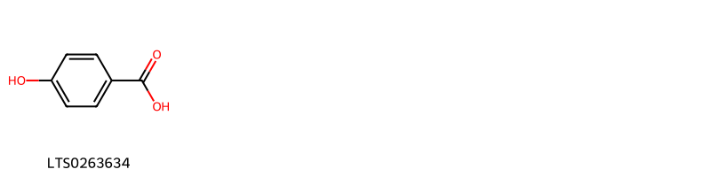
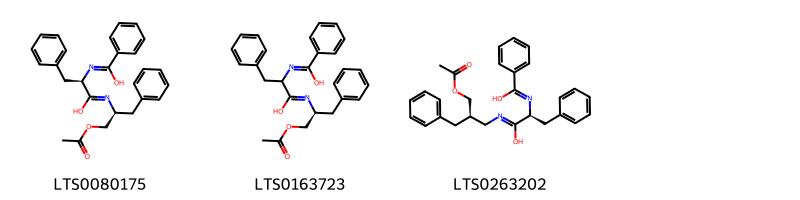
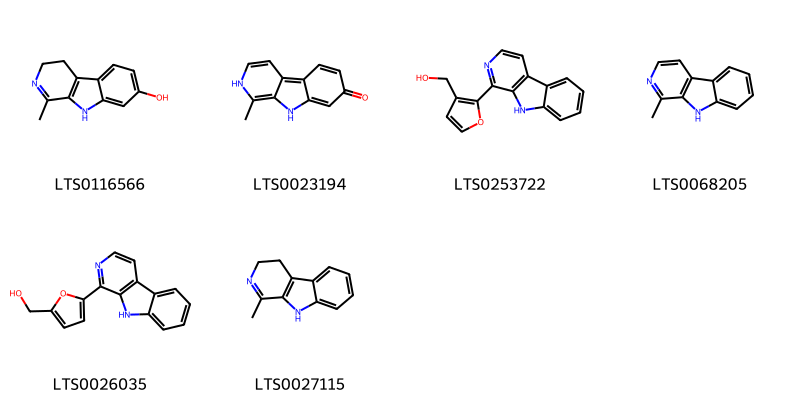
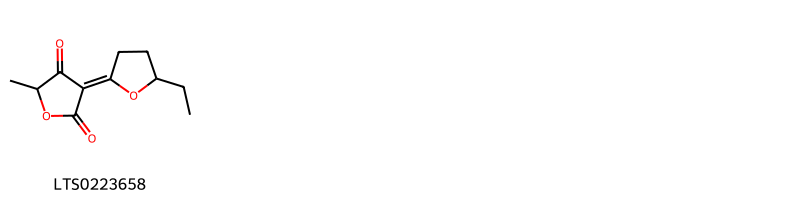
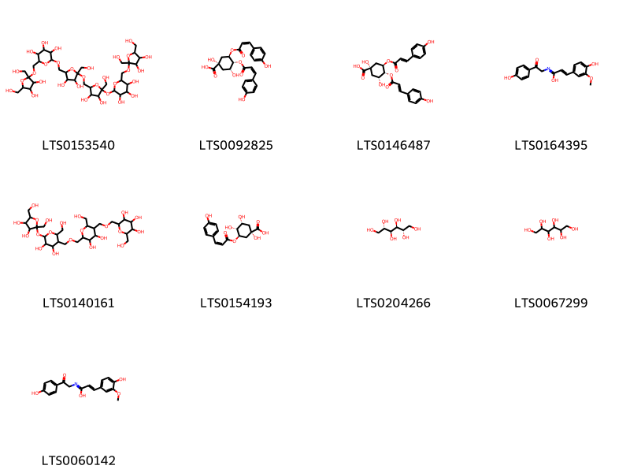
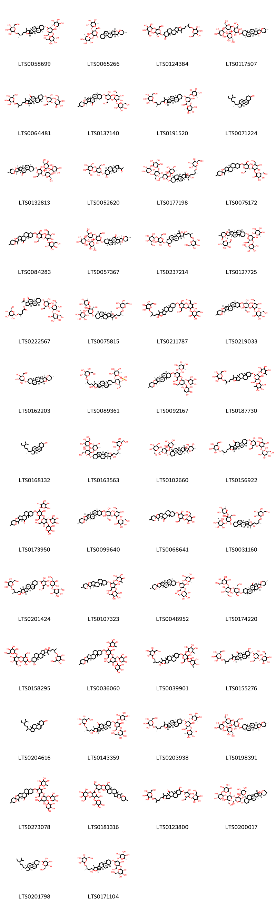

!!! abstract "Tóm tắt"

    Bạch tật lê (Quả) (Fructus Tribuli terrestris) là quả chín phơi khô của cây Bạch tật lê {Tribulus terrestris L.), họ Tật lê (Zygophyllaceae). Cây mọc hoang ở ven biển, ven sông các tỉnh Quảng Bình, Quảng Trị, Thừa Thiên và các tỉnh miền Nam nước ta. Quả bạch tật lê có tính tân, khổ, vi ôn, hơi độc, vào kinh can, phế. Dược liệu dùng tri nhức đầu, chóng mặt; ngực sườn đau trướng, tắc sữa, viêm (nhọt) vú; đau mắt đỏ kéo màng mắt; phong chẩn, ngứa.. Thành phần hóa học chính của quả bạch tât lê gồm có saponin steroid (protodioscin là marker trong Dược điển Hồng Kông và Trung Quốc), flavonoid, alkaloid, axit phenolic, tanin.

## Thông tin về thực vật

Dược liệu **Bạch Tật Lê (Quả)** từ bộ phận **nan** từ loài *Tribulus terrestris*.

**Mô tả thực vật:** Loại cỏ bò lan trên mặt đất, nhiều cành dài 30-60 cm. Lá mọc đối dài 2-3 cm, kép lông chim lẻ, 5 đến 6 đôi lá chét đều, phủ lông trắng mịn ở mặt dưới. Hoa màu vàng, mọc riêng lẻ ở kẽ lá, cuống ngắn. 5 lá đài 5 cánh hoa, 10 nhị, bầu 5 6. Hoa nở vào mùa hè. Quả nhỏ, khô, gồm 5 vỏ cứng trên có gai hình 3 cạnh, dưới lớp vỏ dày là hạt có phôi không nội nhũ.

*Tài liệu tham khảo:* "Những cây thuốc và vị thuốc Việt Nam" - Đỗ Tất Lợi 
Trong dược điển Việt nam, một loài được sử dụng làm dược liệu là *Tribulus terrestris*.

!!! info "Phân loại thực vật của *Tribulus terrestris*"
    - **Kingdom:** Plantae
    - **Phylum:** Tracheophyta
    - **Order:** Zygophyllales
    - **Family:** Zygophyllaceae
    - **Genus:** Tribulus
    - **Species:** *Tribulus terrestris*

**Phân bố trên thế giới:** nan, Israel, Kenya, Chile, Oman, Spain, Mexico, Chinese Taipei, South Africa, Angola, United Arab Emirates, Australia, Indonesia, Uruguay, Saudi Arabia, Mozambique, Uzbekistan, India, Brazil, Peru, Argentina, Zimbabwe, Namibia, Thailand, United States of America, Bolivia (Plurinational State of), Algeria, Botswana, Greece, Ecuador, Qatar, Cyprus

**Phân bố tại Việt nam:** Không có ghi nhận ở Việt Nam

## Thông tin về dược liệu 

### Định danh

!!! info "Thông tin về tên gọi"

    - Dược liệu tiếng Việt: nan
    - Dược liệu tiếng Trung: nan (nan)
    - Dược liệu tiếng Anh: nan
    - Dược liệu latin thông dụng: nan
    - Dược liệu latin kiểu DĐVN: *fructus tribuli terrestris*
    - Dược liệu latin kiểu DĐVN: *nan*
    - Dược liệu latin kiểu thông tư: *nan*
    - Bộ phận dùng: nan (nan)

### Mô tả dược liệu 

- **Theo dược điển Việt nam V:** nan

- **Mô tả dược liệu theo thông tư chế biến dược liệu theo phương pháp cổ truyền:** nan

### Chế biến 

- **Chế biến theo dược điển việt nam V**: nan

- **Chế biến theo thông tư:** nan

--- 

## Thành phần hóa học

- Theo tài liệu của GS. Đỗ Tất Lợi:  (1) Nhóm hóa học: saponin steroid, ngoài ra còn có flavonoid, alkaloid, axit phenolic, tanin.
(2) Tên hoạt chất là biomaker trong dược điển Hồng Kông, Trung Quốc: Protodioscin.
    

**Thành phần hóa học từ loài **Tribulus terrestris**

Theo cơ sở dữ liệu lotus, loài *Tribulus terrestris* đã phân lập và xác định được **232** hoạt chất thuộc về các nhóm Anthracenes, Steroids and steroid derivatives, Organooxygen compounds, Flavonoids, Lactones, Cinnamic acids and derivatives, Indoles and derivatives, Purine nucleosides, Phenols, 2-arylbenzofuran flavonoids, Carboxylic acids and derivatives, Benzene and substituted derivatives, Prenol lipids, Harmala alkaloids trong bảng dưới đây. Danh sách các hoạt chất như sau (2r,3r,4s,5s,6r)-2-[(2s)-4-[(1r,2s,4s,8s,9s,12s,13s,15r,16r,18s)-16-{[(2r,3r,4r,5r,6r)-3,4-dihydroxy-6-(hydroxymethyl)-5-{[(2s,3r,4s,5s,6r)-3,4,5-trihydroxy-6-(hydroxymethyl)oxan-2-yl]oxy}oxan-2-yl]oxy}-15-hydroxy-7,9,13-trimethyl-5-oxapentacyclo[10.8.0.0²,⁹.0⁴,⁸.0¹³,¹⁸]icos-6-en-6-yl]-2-methylbutoxy]-6-(hydroxymethyl)oxane-3,4,5-triol [(LTS0152256)](https://lotus.naturalproducts.net/compound/lotus_id/LTS0152256), diosgenin [(LTS0035986)](https://lotus.naturalproducts.net/compound/lotus_id/LTS0035986), (2r,3s,4r,5r,6s)-2-{[(2r,3s,4r,5s,6s)-2-{[(2s,3r,4s,5s,6s)-4,5-dihydroxy-2-(hydroxymethyl)-6-[(1'r,2r,2's,4'r,5r,7'r,8's,9'r,12's,13'r,16'r,18's)-5,7',9',13'-tetramethyl-5'-oxaspiro[oxane-2,6'-pentacyclo[10.8.0.0²,⁹.0⁴,⁸.0¹³,¹⁸]icosane]oxy]oxan-3-yl]oxy}-5-hydroxy-6-(hydroxymethyl)-4-{[(2r,3s,4r,5s)-3,4,5-trihydroxyoxan-2-yl]oxy}oxan-3-yl]oxy}-6-(hydroxymethyl)oxane-3,4,5-triol [(LTS0109056)](https://lotus.naturalproducts.net/compound/lotus_id/LTS0109056), harmane [(LTS0068205)](https://lotus.naturalproducts.net/compound/lotus_id/LTS0068205), (2s,3r,4r,5r,6s)-2-{[(2r,3r,4r,5s,6r)-4,5-dihydroxy-2-{[(1s,2s,4s,6r,7s,8r,9s,12s,13s,16s,18s)-6-hydroxy-7,9,13-trimethyl-6-[(3r)-3-methyl-4-{[(2r,3r,4s,5s,6r)-3,4,5-trihydroxy-6-(hydroxymethyl)oxan-2-yl]oxy}butyl]-5-oxapentacyclo[10.8.0.0²,⁹.0⁴,⁸.0¹³,¹⁸]icosan-16-yl]oxy}-6-(hydroxymethyl)-5-{[(2s,3r,4r,5r,6s)-3,4,5-trihydroxy-6-methyloxan-2-yl]oxy}oxan-3-yl]oxy}-6-methyloxane-3,4,5-triol [(LTS0075815)](https://lotus.naturalproducts.net/compound/lotus_id/LTS0075815), 2-(4-{16-[(4-hydroxy-5-{[5-hydroxy-6-(hydroxymethyl)-3,4-bis[(3,4,5-trihydroxyoxan-2-yl)oxy]oxan-2-yl]oxy}-6-(hydroxymethyl)-3-[(3,4,5-trihydroxy-6-methyloxan-2-yl)oxy]oxan-2-yl)oxy]-6-methoxy-7,9,13-trimethyl-5-oxapentacyclo[10.8.0.0²,⁹.0⁴,⁸.0¹³,¹⁸]icosan-6-yl}-2-methylbutoxy)-6-(hydroxymethyl)oxane-3,4,5-triol [(LTS0096781)](https://lotus.naturalproducts.net/compound/lotus_id/LTS0096781), (1r,2s,4s,8r,9s,12s,13s,16s,18s)-16-{[(2r,3r,4r,5r,6r)-5-{[(2s,3r,4s,5s,6r)-4,5-dihydroxy-6-(hydroxymethyl)-3-{[(2s,3r,4s,5r,6r)-3,4,5-trihydroxy-6-(hydroxymethyl)oxan-2-yl]oxy}oxan-2-yl]oxy}-3,4-dihydroxy-6-(hydroxymethyl)oxan-2-yl]oxy}-7,9,13-trimethyl-6-[(3s)-3-methyl-4-{[(2r,3r,4s,5s,6r)-3,4,5-trihydroxy-6-(hydroxymethyl)oxan-2-yl]oxy}butyl]-5-oxapentacyclo[10.8.0.0²,⁹.0⁴,⁸.0¹³,¹⁸]icos-6-en-10-one [(LTS0156922)](https://lotus.naturalproducts.net/compound/lotus_id/LTS0156922), (2s,3r,4s,5r,6r)-2-{[(2s,3r,4s,5s,6r)-2-{[(2r,3r,4r,5r,6r)-4,5-dihydroxy-2-(hydroxymethyl)-6-[(1'r,2r,2's,4's,5r,7's,8'r,9's,12's,13's,16's,18's)-5,7',9',13'-tetramethyl-5'-oxaspiro[oxane-2,6'-pentacyclo[10.8.0.0²,⁹.0⁴,⁸.0¹³,¹⁸]icosane]oxy]oxan-3-yl]oxy}-4-hydroxy-6-(hydroxymethyl)-5-{[(2s,3r,4s,5r)-3,4,5-trihydroxyoxan-2-yl]oxy}oxan-3-yl]oxy}-6-(hydroxymethyl)oxane-3,4,5-triol [(LTS0064288)](https://lotus.naturalproducts.net/compound/lotus_id/LTS0064288), 2-({[3,4-dihydroxy-2,5-bis(hydroxymethyl)oxolan-2-yl]oxy}methyl)-6-({5-[(5-{[6-({[3,4-dihydroxy-2,5-bis(hydroxymethyl)oxolan-2-yl]oxy}methyl)-3,4,5-trihydroxyoxan-2-yl]oxy}-3,4-dihydroxy-5-(hydroxymethyl)oxolan-2-yl)methoxy]-3,4-dihydroxy-5-(hydroxymethyl)oxolan-2-yl}methoxy)oxane-3,4,5-triol [(LTS0153540)](https://lotus.naturalproducts.net/compound/lotus_id/LTS0153540), 2-[(3,4-dihydroxy-6-{[6-hydroxy-7,9,13-trimethyl-6-(3-methyl-4-{[3,4,5-trihydroxy-6-(hydroxymethyl)oxan-2-yl]oxy}butyl)-5-oxapentacyclo[10.8.0.0²,⁹.0⁴,⁸.0¹³,¹⁸]icosan-16-yl]oxy}-2-(hydroxymethyl)-5-[(3,4,5-trihydroxy-6-methyloxan-2-yl)oxy]oxan-3-yl)oxy]-6-methyloxane-3,4,5-triol [(LTS0039901)](https://lotus.naturalproducts.net/compound/lotus_id/LTS0039901), ferulic acid [(LTS0077328)](https://lotus.naturalproducts.net/compound/lotus_id/LTS0077328), (1's,2r,2's,4's,5r,7's,8'r,9's,12's,13's,18's)-5,7',9',13'-tetramethyl-5'-oxaspiro[oxane-2,6'-pentacyclo[10.8.0.0²,⁹.0⁴,⁸.0¹³,¹⁸]icosane]-10',16'-dione [(LTS0182104)](https://lotus.naturalproducts.net/compound/lotus_id/LTS0182104), (1'r,2r,2's,4's,5r,7's,8'r,9's,12's,13's,16's,18's)-16'-{[(2r,3r,4r,5r,6r)-3,4-dihydroxy-6-(hydroxymethyl)-5-{[(2s,3r,4s,5s,6r)-3,4,5-trihydroxy-6-(hydroxymethyl)oxan-2-yl]oxy}oxan-2-yl]oxy}-5,7',9',13'-tetramethyl-5'-oxaspiro[oxane-2,6'-pentacyclo[10.8.0.0²,⁹.0⁴,⁸.0¹³,¹⁸]icosan]-10'-one [(LTS0210797)](https://lotus.naturalproducts.net/compound/lotus_id/LTS0210797), 16-[(5-{[4,5-dihydroxy-6-(hydroxymethyl)-3-{[3,4,5-trihydroxy-6-(hydroxymethyl)oxan-2-yl]oxy}oxan-2-yl]oxy}-3,4-dihydroxy-6-(hydroxymethyl)oxan-2-yl)oxy]-6-hydroxy-7,9,13-trimethyl-6-(3-methyl-4-{[3,4,5-trihydroxy-6-(hydroxymethyl)oxan-2-yl]oxy}butyl)-5-oxapentacyclo[10.8.0.0²,⁹.0⁴,⁸.0¹³,¹⁸]icosan-10-one [(LTS0112281)](https://lotus.naturalproducts.net/compound/lotus_id/LTS0112281), 2-[(6-{[4,5-dihydroxy-6-(hydroxymethyl)-2-{5,7',9',13'-tetramethyl-5'-oxaspiro[oxane-2,6'-pentacyclo[10.8.0.0²,⁹.0⁴,⁸.0¹³,¹⁸]icosane]oxy}oxan-3-yl]oxy}-4,5-dihydroxy-2-methyloxan-3-yl)oxy]-6-(hydroxymethyl)oxane-3,4,5-triol [(LTS0105013)](https://lotus.naturalproducts.net/compound/lotus_id/LTS0105013), (1r,2s,4s,6r,7s,8r,9s,12s,13s,16s,18s)-6-hydroxy-16-{[(2r,3r,4s,5r,6r)-4-hydroxy-6-(hydroxymethyl)-5-{[(2s,3r,4s,5s,6r)-3,4,5-trihydroxy-6-(hydroxymethyl)oxan-2-yl]oxy}-3-{[(2s,3r,4r,5r,6s)-3,4,5-trihydroxy-6-methyloxan-2-yl]oxy}oxan-2-yl]oxy}-7,9,13-trimethyl-6-[(3s)-3-methyl-4-{[(2r,3r,4s,5s,6r)-3,4,5-trihydroxy-6-(hydroxymethyl)oxan-2-yl]oxy}butyl]-5-oxapentacyclo[10.8.0.0²,⁹.0⁴,⁸.0¹³,¹⁸]icosan-10-one [(LTS0143359)](https://lotus.naturalproducts.net/compound/lotus_id/LTS0143359), (2s,3r,4s,5s,6r)-2-{[(2r,3r,4r,5r,6r)-4,5-dihydroxy-2-(hydroxymethyl)-6-[(1'r,2r,2's,4's,5r,7's,8'r,9's,12's,13's,16's,18's)-5,7',9',13'-tetramethyl-5'-oxaspiro[oxane-2,6'-pentacyclo[10.8.0.0²,⁹.0⁴,⁸.0¹³,¹⁸]icosane]oxy]oxan-3-yl]oxy}-6-(hydroxymethyl)oxane-3,4,5-triol [(LTS0066871)](https://lotus.naturalproducts.net/compound/lotus_id/LTS0066871), tigogenin [(LTS0131508)](https://lotus.naturalproducts.net/compound/lotus_id/LTS0131508), (2s,3r,4s,5s,6r)-2-[(1'r,2s,2's,4's,5s,7's,8'r,9's,12's,13's,16's,18'r)-16'-{[(2r,3r,4s,5r,6r)-4-hydroxy-6-(hydroxymethyl)-5-{[(2s,3r,4s,5s,6r)-3,4,5-trihydroxy-6-(hydroxymethyl)oxan-2-yl]oxy}-3-{[(2s,3r,4r,5r,6s)-3,4,5-trihydroxy-6-methyloxan-2-yl]oxy}oxan-2-yl]oxy}-5,7',9',13'-tetramethyl-5'-oxaspiro[oxane-2,6'-pentacyclo[10.8.0.0²,⁹.0⁴,⁸.0¹³,¹⁸]icosane]oxy]-6-(hydroxymethyl)oxane-3,4,5-triol [(LTS0127725)](https://lotus.naturalproducts.net/compound/lotus_id/LTS0127725), 2-(4-{16-[(5-{[4,5-dihydroxy-6-(hydroxymethyl)-3-{[3,4,5-trihydroxy-6-(hydroxymethyl)oxan-2-yl]oxy}oxan-2-yl]oxy}-3,4-dihydroxy-6-(hydroxymethyl)oxan-2-yl)oxy]-7,9,13-trimethyl-5-oxapentacyclo[10.8.0.0²,⁹.0⁴,⁸.0¹³,¹⁸]icos-6-en-6-yl}-2-methylbutoxy)-6-(hydroxymethyl)oxane-3,4,5-triol [(LTS0120064)](https://lotus.naturalproducts.net/compound/lotus_id/LTS0120064), 1-(7-{[3,4-dihydroxy-6-(hydroxymethyl)-5-{[3,4,5-trihydroxy-6-(hydroxymethyl)oxan-2-yl]oxy}oxan-2-yl]oxy}-8-hydroxy-9a,11a-dimethyl-3h,3ah,3bh,4h,5h,5ah,6h,7h,8h,9h,9bh,10h,11h-cyclopenta[a]phenanthren-1-yl)ethanone [(LTS0026416)](https://lotus.naturalproducts.net/compound/lotus_id/LTS0026416), 2-[(3,4-dihydroxy-6-{[6-hydroxy-7,9,13-trimethyl-6-(3-methyl-4-{[3,4,5-trihydroxy-6-(hydroxymethyl)oxan-2-yl]oxy}butyl)-5-oxapentacyclo[10.8.0.0²,⁹.0⁴,⁸.0¹³,¹⁸]icos-18-en-16-yl]oxy}-2-(hydroxymethyl)-5-[(3,4,5-trihydroxy-6-methyloxan-2-yl)oxy]oxan-3-yl)oxy]-6-methyloxane-3,4,5-triol [(LTS0252589)](https://lotus.naturalproducts.net/compound/lotus_id/LTS0252589), (1'r,2r,2's,4's,5s,7's,8'r,9's,12's,13's,16's,18's)-16'-{[(2r,3r,4s,5r,6r)-4-hydroxy-5-{[(2s,3r,4s,5r,6r)-5-hydroxy-6-(hydroxymethyl)-3,4-bis({[(2s,3r,4s,5r)-3,4,5-trihydroxyoxan-2-yl]oxy})oxan-2-yl]oxy}-6-(hydroxymethyl)-3-{[(2s,3r,4r,5r,6s)-3,4,5-trihydroxy-6-methyloxan-2-yl]oxy}oxan-2-yl]oxy}-5,7',9',13'-tetramethyl-5'-oxaspiro[oxane-2,6'-pentacyclo[10.8.0.0²,⁹.0⁴,⁸.0¹³,¹⁸]icosan]-10'-one [(LTS0213297)](https://lotus.naturalproducts.net/compound/lotus_id/LTS0213297), protodioscin [(LTS0262288)](https://lotus.naturalproducts.net/compound/lotus_id/LTS0262288), (2s,3r,4s,5s,6r)-2-{[(2s,3r,4s,5s,6r)-2-{[(2r,3r,4r,5r,6r)-4,5-dihydroxy-2-(hydroxymethyl)-6-[(1'r,2r,2's,4's,5r,7's,8'r,9's,12's,13's,16's,18's)-5,7',9',13'-tetramethyl-5'-oxaspiro[oxane-2,6'-pentacyclo[10.8.0.0²,⁹.0⁴,⁸.0¹³,¹⁸]icosane]oxy]oxan-3-yl]oxy}-4-hydroxy-6-(hydroxymethyl)-5-{[(2s,3r,4s,5r)-3,4,5-trihydroxyoxan-2-yl]oxy}oxan-3-yl]oxy}-6-(hydroxymethyl)oxane-3,4,5-triol [(LTS0055315)](https://lotus.naturalproducts.net/compound/lotus_id/LTS0055315), (2r,3r,4s,5s,6r)-2-[(2r)-4-[(1r,2s,4s,6r,7s,8r,9s,12s,13s,16s,18s)-16-{[(2r,3r,4s,5r,6r)-4-hydroxy-5-{[(2s,3r,4s,5r,6r)-5-hydroxy-6-(hydroxymethyl)-3,4-bis({[(2s,3r,4s,5r)-3,4,5-trihydroxyoxan-2-yl]oxy})oxan-2-yl]oxy}-6-(hydroxymethyl)-3-{[(2s,3r,4r,5r,6s)-3,4,5-trihydroxy-6-methyloxan-2-yl]oxy}oxan-2-yl]oxy}-6-methoxy-7,9,13-trimethyl-5-oxapentacyclo[10.8.0.0²,⁹.0⁴,⁸.0¹³,¹⁸]icosan-6-yl]-2-methylbutoxy]-6-(hydroxymethyl)oxane-3,4,5-triol [(LTS0206810)](https://lotus.naturalproducts.net/compound/lotus_id/LTS0206810), 2-[(4-hydroxy-6-{[6-hydroxy-7,9,13-trimethyl-6-(3-methyl-4-{[3,4,5-trihydroxy-6-(hydroxymethyl)oxan-2-yl]oxy}butyl)-5-oxapentacyclo[10.8.0.0²,⁹.0⁴,⁸.0¹³,¹⁸]icosan-16-yl]oxy}-2-(hydroxymethyl)-5-[(3,4,5-trihydroxy-6-methyloxan-2-yl)oxy]oxan-3-yl)oxy]-6-(hydroxymethyl)oxane-3,4,5-triol [(LTS0101335)](https://lotus.naturalproducts.net/compound/lotus_id/LTS0101335), (2s,3r,4s,5s,6r)-2-{[(2s,3r,4s,5s,6r)-2-{[(2r,3r,4r,5r,6r)-4,5-dihydroxy-2-(hydroxymethyl)-6-[(1'r,2r,2's,4's,5r,7's,8'r,9's,12's,13's,15'r,16'r,18's)-5,7',9',13'-tetramethyl-5'-oxaspiro[oxane-2,6'-pentacyclo[10.8.0.0²,⁹.0⁴,⁸.0¹³,¹⁸]icosan]-15'-oloxy]oxan-3-yl]oxy}-4-hydroxy-6-(hydroxymethyl)-5-{[(2s,3r,4s,5r)-3,4,5-trihydroxyoxan-2-yl]oxy}oxan-3-yl]oxy}-6-(hydroxymethyl)oxane-3,4,5-triol [(LTS0065187)](https://lotus.naturalproducts.net/compound/lotus_id/LTS0065187), (2s,3r,5s)-2-{[(2r,3r,4s)-4-hydroxy-2-(hydroxymethyl)-6-[(1'r,2r,9's,13's,16's)-5,7',9',13'-tetramethyl-5'-oxaspiro[oxane-2,6'-pentacyclo[10.8.0.0²,⁹.0⁴,⁸.0¹³,¹⁸]icosane]oxy]-5-{[(2s,3r,4r,6s)-3,4,5-trihydroxy-6-methyloxan-2-yl]oxy}oxan-3-yl]oxy}-6-(hydroxymethyl)oxane-3,4,5-triol [(LTS0237006)](https://lotus.naturalproducts.net/compound/lotus_id/LTS0237006), ruscogenin [(LTS0093415)](https://lotus.naturalproducts.net/compound/lotus_id/LTS0093415), 2-[(2-{[4,5-dihydroxy-2-(hydroxymethyl)-6-{5,7',9',13'-tetramethyl-5'-oxaspiro[oxane-2,6'-pentacyclo[10.8.0.0²,⁹.0⁴,⁸.0¹³,¹⁸]icosane]oxy}oxan-3-yl]oxy}-4-hydroxy-6-(hydroxymethyl)-5-[(3,4,5-trihydroxyoxan-2-yl)oxy]oxan-3-yl)oxy]-6-(hydroxymethyl)oxane-3,4,5-triol [(LTS0167121)](https://lotus.naturalproducts.net/compound/lotus_id/LTS0167121), 16'-[(4-hydroxy-5-{[5-hydroxy-6-(hydroxymethyl)-3-[(3,4,5-trihydroxyoxan-2-yl)oxy]-4-[(4,5,6-trihydroxyoxan-3-yl)oxy]oxan-2-yl]oxy}-6-(hydroxymethyl)-3-[(3,4,5,6-tetrahydroxyoxan-2-yl)oxy]oxan-2-yl)oxy]-5,7',9',13'-tetramethyl-5'-oxaspiro[oxane-2,6'-pentacyclo[10.8.0.0²,⁹.0⁴,⁸.0¹³,¹⁸]icosan]-10'-one [(LTS0173950)](https://lotus.naturalproducts.net/compound/lotus_id/LTS0173950), 1-acetyl-7-[(5-{[4,5-dihydroxy-6-(hydroxymethyl)-3-{[3,4,5-trihydroxy-6-(hydroxymethyl)oxan-2-yl]oxy}oxan-2-yl]oxy}-3,4-dihydroxy-6-(hydroxymethyl)oxan-2-yl)oxy]-9a,11a-dimethyl-11-oxo-tetradecahydrocyclopenta[a]phenanthren-2-yl 4-methyl-5-{[3,4,5-trihydroxy-6-(hydroxymethyl)oxan-2-yl]oxy}pentanoate [(LTS0103518)](https://lotus.naturalproducts.net/compound/lotus_id/LTS0103518), (2s,3r,4r,5r,6s)-2-{[(2r,3r,4r,5s,6r)-4,5-dihydroxy-2-{[(1r,2s,4s,6r,7s,8r,9s,12s,13r,16s)-6-hydroxy-7,9,13-trimethyl-6-[(3r)-3-methyl-4-{[(2r,3r,4s,5s,6r)-3,4,5-trihydroxy-6-(hydroxymethyl)oxan-2-yl]oxy}butyl]-5-oxapentacyclo[10.8.0.0²,⁹.0⁴,⁸.0¹³,¹⁸]icos-18-en-16-yl]oxy}-6-(hydroxymethyl)-5-{[(2s,3r,4r,5r,6s)-3,4,5-trihydroxy-6-methyloxan-2-yl]oxy}oxan-3-yl]oxy}-6-methyloxane-3,4,5-triol [(LTS0031160)](https://lotus.naturalproducts.net/compound/lotus_id/LTS0031160), 5,7',9',13'-tetramethyl-5'-oxaspiro[oxane-2,6'-pentacyclo[10.8.0.0²,⁹.0⁴,⁸.0¹³,¹⁸]icosane]-10',16'-dione [(LTS0132497)](https://lotus.naturalproducts.net/compound/lotus_id/LTS0132497), 16-[(4-hydroxy-5-{[5-hydroxy-6-(hydroxymethyl)-3,4-bis[(3,4,5-trihydroxyoxan-2-yl)oxy]oxan-2-yl]oxy}-6-(hydroxymethyl)-3-[(3,4,5-trihydroxy-6-methyloxan-2-yl)oxy]oxan-2-yl)oxy]-6-methoxy-7,9,13-trimethyl-6-(3-methyl-4-{[3,4,5-trihydroxy-6-(hydroxymethyl)oxan-2-yl]oxy}butyl)-5-oxapentacyclo[10.8.0.0²,⁹.0⁴,⁸.0¹³,¹⁸]icosan-10-one [(LTS0093253)](https://lotus.naturalproducts.net/compound/lotus_id/LTS0093253), 16-[(5-{[4,5-dihydroxy-6-(hydroxymethyl)-3-{[3,4,5-trihydroxy-6-(hydroxymethyl)oxan-2-yl]oxy}oxan-2-yl]oxy}-3,4-dihydroxy-6-(hydroxymethyl)oxan-2-yl)oxy]-6,15-dihydroxy-7,9,13-trimethyl-6-(3-methyl-4-{[3,4,5-trihydroxy-6-(hydroxymethyl)oxan-2-yl]oxy}butyl)-5-oxapentacyclo[10.8.0.0²,⁹.0⁴,⁸.0¹³,¹⁸]icosan-10-one [(LTS0257786)](https://lotus.naturalproducts.net/compound/lotus_id/LTS0257786), (1r,2s,4s,8r,9s,12s,13s,16s,18r)-16-{[(2r,3r,4r,5s,6r)-5-{[(2s,3r,4s,5r,6r)-4-{[(2s,3r,4s,5r)-4,5-dihydroxy-3-{[(2s,3r,4s,5r,6r)-3,4,5-trihydroxy-6-(hydroxymethyl)oxan-2-yl]oxy}oxan-2-yl]oxy}-3,5-dihydroxy-6-(hydroxymethyl)oxan-2-yl]oxy}-3,4-dihydroxy-6-(hydroxymethyl)oxan-2-yl]oxy}-7,9,13-trimethyl-6-[(3r)-3-methyl-4-{[(2r,3r,4s,5s,6r)-3,4,5-trihydroxy-6-(hydroxymethyl)oxan-2-yl]oxy}butyl]-5-oxapentacyclo[10.8.0.0²,⁹.0⁴,⁸.0¹³,¹⁸]icos-6-en-10-one [(LTS0159342)](https://lotus.naturalproducts.net/compound/lotus_id/LTS0159342), 3-(4-hydroxyphenyl)-n-[2-(4-hydroxyphenyl)ethyl]prop-2-enimidic acid [(LTS0104591)](https://lotus.naturalproducts.net/compound/lotus_id/LTS0104591), 2-{[4,5-dihydroxy-2-(hydroxymethyl)-6-{5,7',9',13'-tetramethyl-5'-oxaspiro[oxane-2,6'-pentacyclo[10.8.0.0²,⁹.0⁴,⁸.0¹³,¹⁸]icosane]oxy}oxan-3-yl]oxy}-6-(hydroxymethyl)oxane-3,4,5-triol [(LTS0102111)](https://lotus.naturalproducts.net/compound/lotus_id/LTS0102111), 2-(4-hydroxy-3-methoxyphenyl)-n-[2-(4-hydroxyphenyl)-2-oxoethyl]-5-[(1e)-2-{[2-(4-hydroxyphenyl)ethyl]-c-hydroxycarbonimidoyl}eth-1-en-1-yl]-7-methoxy-2,3-dihydro-1-benzofuran-3-carboximidic acid [(LTS0225110)](https://lotus.naturalproducts.net/compound/lotus_id/LTS0225110), 5,7-dihydroxy-2-(4-hydroxyphenyl)-3-{[(2s,3r,4s,5s,6r)-3,4,5-trihydroxy-6-({[(2r,3r,4s,5s,6r)-3,4,5-trihydroxy-6-(hydroxymethyl)oxan-2-yl]oxy}methyl)oxan-2-yl]oxy}chromen-4-one [(LTS0258979)](https://lotus.naturalproducts.net/compound/lotus_id/LTS0258979), 2-(3,4-dihydroxyphenyl)-5-hydroxy-7-{[3,4,5-trihydroxy-6-(hydroxymethyl)oxan-2-yl]oxy}-3-{[3,4,5-trihydroxy-6-({[3,4,5-trihydroxy-6-(hydroxymethyl)oxan-2-yl]oxy}methyl)oxan-2-yl]oxy}chromen-4-one [(LTS0065318)](https://lotus.naturalproducts.net/compound/lotus_id/LTS0065318), (2s,3r,4s,5r,6r)-2-{[(2s,3r,4s,5s,6r)-2-{[(2r,3r,4r,5r,6r)-4,5-dihydroxy-2-(hydroxymethyl)-6-[(1'r,2r,2's,4's,5r,7's,8'r,9's,12's,13's,15'r,16'r,18's)-5,7',9',13'-tetramethyl-5'-oxaspiro[oxane-2,6'-pentacyclo[10.8.0.0²,⁹.0⁴,⁸.0¹³,¹⁸]icosan]-15'-oloxy]oxan-3-yl]oxy}-4-hydroxy-6-(hydroxymethyl)-5-{[(2s,3r,4s,5r)-3,4,5-trihydroxyoxan-2-yl]oxy}oxan-3-yl]oxy}-6-(hydroxymethyl)oxane-3,4,5-triol [(LTS0197602)](https://lotus.naturalproducts.net/compound/lotus_id/LTS0197602), (2r)-n-[(2s)-1-(acetyloxy)-3-phenylpropan-2-yl]-2-{[hydroxy(phenyl)methylidene]amino}-3-phenylpropanimidic acid [(LTS0080175)](https://lotus.naturalproducts.net/compound/lotus_id/LTS0080175), 16'-[(5-{[4,5-dihydroxy-6-(hydroxymethyl)-3-{[3,4,5-trihydroxy-6-(hydroxymethyl)oxan-2-yl]oxy}oxan-2-yl]oxy}-4-hydroxy-6-(hydroxymethyl)-3-[(3,4,5-trihydroxyoxan-2-yl)oxy]oxan-2-yl)oxy]-5,7',9',13'-tetramethyl-5'-oxaspiro[oxane-2,6'-pentacyclo[10.8.0.0²,⁹.0⁴,⁸.0¹³,¹⁸]icosan]-10'-one [(LTS0232035)](https://lotus.naturalproducts.net/compound/lotus_id/LTS0232035), (1'r,2r,2's,4's,5s,7's,8'r,9's,12's,13's,16's,18's)-5,7',9',13'-tetramethyl-16'-{[(2r,3r,4s,5s,6r)-3,4,5-trihydroxy-6-(hydroxymethyl)oxan-2-yl]oxy}-5'-oxaspiro[oxane-2,6'-pentacyclo[10.8.0.0²,⁹.0⁴,⁸.0¹³,¹⁸]icosan]-10'-one [(LTS0026316)](https://lotus.naturalproducts.net/compound/lotus_id/LTS0026316), (2r,3r,4s,5s,6r)-2-{[(1r,3as,3bs,7r,9ar,9bs,11ar)-1-[(2r,5r)-5-ethyl-6-methylheptan-2-yl]-9a,11a-dimethyl-1h,2h,3h,3ah,3bh,4h,6h,7h,8h,9h,9bh,10h,11h-cyclopenta[a]phenanthren-7-yl]oxy}-6-(hydroxymethyl)oxane-3,4,5-triol [(LTS0004973)](https://lotus.naturalproducts.net/compound/lotus_id/LTS0004973), 2-(4-hydroxy-3-methoxyphenyl)-n-[2-(4-hydroxyphenyl)ethyl]-5-(2-{[2-(4-hydroxyphenyl)ethyl]-c-hydroxycarbonimidoyl}eth-1-en-1-yl)-7-methoxy-2,3-dihydro-1-benzofuran-3-carboximidic acid [(LTS0087037)](https://lotus.naturalproducts.net/compound/lotus_id/LTS0087037), 2-{[(6-{[(6-{[3,4-dihydroxy-2,5-bis(hydroxymethyl)oxolan-2-yl]oxy}-4,5-dihydroxy-2-(hydroxymethyl)oxan-3-yl)methoxy]methyl}-4,5-dihydroxy-2-(hydroxymethyl)oxan-3-yl)methoxy]methyl}-6-(hydroxymethyl)oxane-3,4,5-triol [(LTS0140161)](https://lotus.naturalproducts.net/compound/lotus_id/LTS0140161), n-(4-{[1-hydroxy-3-(3-methoxy-4-methylphenyl)prop-2-en-1-ylidene]amino}butyl)-3-(4-hydroxy-3-methoxyphenyl)prop-2-enimidic acid [(LTS0001383)](https://lotus.naturalproducts.net/compound/lotus_id/LTS0001383), 5-hydroxy-2-(4-hydroxy-3-methoxyphenyl)-7-{[3,4,5-trihydroxy-6-(hydroxymethyl)oxan-2-yl]oxy}-3-{[3,4,5-trihydroxy-6-({[3,4,5-trihydroxy-6-(hydroxymethyl)oxan-2-yl]oxy}methyl)oxan-2-yl]oxy}chromen-4-one [(LTS0080743)](https://lotus.naturalproducts.net/compound/lotus_id/LTS0080743), (4s,5r,6r)-2-{[(2s,3r,5s)-2-{[(2r,3r,4r)-4,5-dihydroxy-2-(hydroxymethyl)-6-[(1'r,2r,9's,13's,16's)-5,7',9',13'-tetramethyl-5'-oxaspiro[oxane-2,6'-pentacyclo[10.8.0.0²,⁹.0⁴,⁸.0¹³,¹⁸]icosane]oxy]oxan-3-yl]oxy}-4,5-dihydroxy-6-(hydroxymethyl)oxan-3-yl]oxy}-6-(hydroxymethyl)oxane-3,4,5-triol [(LTS0075172)](https://lotus.naturalproducts.net/compound/lotus_id/LTS0075172), 2-(4-hydroxy-3-methoxyphenyl)-n-[2-(4-hydroxyphenyl)-2-oxoethyl]-5-(2-{[2-(4-hydroxyphenyl)ethyl]-c-hydroxycarbonimidoyl}eth-1-en-1-yl)-7-methoxy-2,3-dihydro-1-benzofuran-3-carboximidic acid [(LTS0232495)](https://lotus.naturalproducts.net/compound/lotus_id/LTS0232495), 5,7',9',13'-tetramethyl-5'-oxaspiro[oxane-2,6'-pentacyclo[10.8.0.0²,⁹.0⁴,⁸.0¹³,¹⁸]icosane]-15',16'-diol [(LTS0193084)](https://lotus.naturalproducts.net/compound/lotus_id/LTS0193084), (2s,3r,4s,5s,6r)-2-{[(2r,3r,4r,5r,6r)-6-{[(1r,2s,4s,6r,7s,8r,9s,12s,13s,15r,16r,18s)-6,15-dihydroxy-7,9,13-trimethyl-6-[(3s)-3-methyl-4-{[(2r,3r,4s,5s,6r)-3,4,5-trihydroxy-6-(hydroxymethyl)oxan-2-yl]oxy}butyl]-5-oxapentacyclo[10.8.0.0²,⁹.0⁴,⁸.0¹³,¹⁸]icosan-16-yl]oxy}-4,5-dihydroxy-2-(hydroxymethyl)oxan-3-yl]oxy}-6-(hydroxymethyl)oxane-3,4,5-triol [(LTS0005231)](https://lotus.naturalproducts.net/compound/lotus_id/LTS0005231), β-carboline [(LTS0263207)](https://lotus.naturalproducts.net/compound/lotus_id/LTS0263207), (2e)-3-(4-hydroxyphenyl)-n-[2-(4-hydroxyphenyl)ethyl]prop-2-enimidic acid [(LTS0067822)](https://lotus.naturalproducts.net/compound/lotus_id/LTS0067822), 16'-[(4-hydroxy-5-{[5-hydroxy-6-(hydroxymethyl)-3,4-bis[(3,4,5-trihydroxyoxan-2-yl)oxy]oxan-2-yl]oxy}-6-(hydroxymethyl)-3-[(3,4,5-trihydroxy-6-methyloxan-2-yl)oxy]oxan-2-yl)oxy]-5,7',9',13'-tetramethyl-5'-oxaspiro[oxane-2,6'-pentacyclo[10.8.0.0²,⁹.0⁴,⁸.0¹³,¹⁸]icosan]-10'-one [(LTS0273078)](https://lotus.naturalproducts.net/compound/lotus_id/LTS0273078), (1r,2s,4s,8r,9s,12s,13s,16s,18s)-16-{[(2r,3r,4r,5r,6r)-5-{[(2s,3r,4s,5s,6r)-4,5-dihydroxy-6-(hydroxymethyl)-3-{[(2s,3r,4s,5r,6r)-3,4,5-trihydroxy-6-(hydroxymethyl)oxan-2-yl]oxy}oxan-2-yl]oxy}-3,4-dihydroxy-6-(hydroxymethyl)oxan-2-yl]oxy}-7,9,13-trimethyl-6-[(3r)-3-methyl-4-{[(2r,3r,4s,5s,6r)-3,4,5-trihydroxy-6-(hydroxymethyl)oxan-2-yl]oxy}butyl]-5-oxapentacyclo[10.8.0.0²,⁹.0⁴,⁸.0¹³,¹⁸]icos-6-en-10-one [(LTS0164779)](https://lotus.naturalproducts.net/compound/lotus_id/LTS0164779), (2r,3s)-2-(4-hydroxy-3-methoxyphenyl)-n-[2-(4-hydroxyphenyl)ethyl]-5-[(1e)-2-{[2-(4-hydroxyphenyl)ethyl]-c-hydroxycarbonimidoyl}eth-1-en-1-yl]-7-methoxy-2,3-dihydro-1-benzofuran-3-carboximidic acid [(LTS0134542)](https://lotus.naturalproducts.net/compound/lotus_id/LTS0134542), (3s,4r,6s)-6-{[5,7-dihydroxy-2-(4-hydroxyphenyl)-4-oxochromen-3-yl]oxy}-4,5-dihydroxy-2-(hydroxymethyl)oxan-3-yl 3-(4-hydroxyphenyl)prop-2-enoate [(LTS0015705)](https://lotus.naturalproducts.net/compound/lotus_id/LTS0015705), gitogenin [(LTS0000023)](https://lotus.naturalproducts.net/compound/lotus_id/LTS0000023), (2r,3s)-2-(4-hydroxy-3-methoxyphenyl)-n-[2-(4-hydroxyphenyl)-2-oxoethyl]-5-[(1e)-2-{[2-(4-hydroxyphenyl)ethyl]-c-hydroxycarbonimidoyl}eth-1-en-1-yl]-7-methoxy-2,3-dihydro-1-benzofuran-3-carboximidic acid [(LTS0096885)](https://lotus.naturalproducts.net/compound/lotus_id/LTS0096885), (2s,3r,4r,5r,6s)-2-{[(2r,3s,4s,5r,6r)-4-hydroxy-6-{[(1s,2s,4s,6s,7s,8r,9s,12s,13r,16s)-4-hydroxy-6-[(3s)-4-hydroxy-3-methylbutyl]-7,9,13-trimethyl-5-oxapentacyclo[10.8.0.0²,⁹.0⁴,⁸.0¹³,¹⁸]icos-18-en-16-yl]oxy}-2-(hydroxymethyl)-5-{[(2s,3r,4r,5r,6s)-3,4,5-trihydroxy-6-methyloxan-2-yl]oxy}oxan-3-yl]oxy}-6-methyloxane-3,4,5-triol [(LTS0043592)](https://lotus.naturalproducts.net/compound/lotus_id/LTS0043592), (1's,2r,2's,4's,5r,7's,8'r,9's,12's,13'r)-5,7',9',13'-tetramethyl-5'-oxaspiro[oxane-2,6'-pentacyclo[10.8.0.0²,⁹.0⁴,⁸.0¹³,¹⁸]icosan]-17'-ene-10',16',19'-trione [(LTS0259413)](https://lotus.naturalproducts.net/compound/lotus_id/LTS0259413), 2-(3,4-dihydroxyphenyl)-5,7-dihydroxy-3-{[(2s,3r,4s,5s,6r)-3,4,5-trihydroxy-6-({[(2r,3r,4s,5s,6r)-3,4,5-trihydroxy-6-({[(2r,3r,4s,5s,6r)-3,4,5-trihydroxy-6-(hydroxymethyl)oxan-2-yl]oxy}methyl)oxan-2-yl]oxy}methyl)oxan-2-yl]oxy}chromen-4-one [(LTS0050258)](https://lotus.naturalproducts.net/compound/lotus_id/LTS0050258), (2s,3r,4s,5s,6r)-2-{[(2s,3r,4s,5r,6r)-2-{[(2r,3r,4r,5r,6r)-4,5-dihydroxy-2-(hydroxymethyl)-6-[(1'r,2r,2's,4's,5r,7's,8'r,9's,12's,13's,16's,18's)-5,7',9',13'-tetramethyl-5'-oxaspiro[oxane-2,6'-pentacyclo[10.8.0.0²,⁹.0⁴,⁸.0¹³,¹⁸]icosane]oxy]oxan-3-yl]oxy}-5-hydroxy-6-(hydroxymethyl)-4-{[(2s,3r,4s,5r)-3,4,5-trihydroxyoxan-2-yl]oxy}oxan-3-yl]oxy}-6-(hydroxymethyl)oxane-3,4,5-triol [(LTS0198391)](https://lotus.naturalproducts.net/compound/lotus_id/LTS0198391), 3-(4-hydroxy-3-methoxyphenyl)-n-[2-(4-hydroxyphenyl)ethyl]prop-2-enimidic acid [(LTS0240896)](https://lotus.naturalproducts.net/compound/lotus_id/LTS0240896), 2-[(4-hydroxy-5-{[5-hydroxy-6-(hydroxymethyl)-3,4-bis[(3,4,5-trihydroxyoxan-2-yl)oxy]oxan-2-yl]oxy}-6-(hydroxymethyl)-2-{5,7',9',13'-tetramethyl-5'-oxaspiro[oxane-2,6'-pentacyclo[10.8.0.0²,⁹.0⁴,⁸.0¹³,¹⁸]icosane]oxy}oxan-3-yl)oxy]-6-methyloxane-3,4,5-triol [(LTS0036060)](https://lotus.naturalproducts.net/compound/lotus_id/LTS0036060), 5,7-dihydroxy-2-(4-hydroxy-3-methoxyphenyl)-3-{[(2s,3r,4s,5s,6r)-3,4,5-trihydroxy-6-({[(2r,3r,4s,5s,6r)-3,4,5-trihydroxy-6-(hydroxymethyl)oxan-2-yl]oxy}methyl)oxan-2-yl]oxy}chromen-4-one [(LTS0017885)](https://lotus.naturalproducts.net/compound/lotus_id/LTS0017885), hecogenin [(LTS0221000)](https://lotus.naturalproducts.net/compound/lotus_id/LTS0221000), (1'r,2r,2's,4's,5r,7's,8'r,9's,12's,13's,16's,18's)-16'-{[(2r,3r,4s,5r,6r)-5-{[(2s,3r,4s,5s,6r)-4,5-dihydroxy-6-(hydroxymethyl)-3-{[(2s,3r,4s,5r,6r)-3,4,5-trihydroxy-6-(hydroxymethyl)oxan-2-yl]oxy}oxan-2-yl]oxy}-4-hydroxy-6-(hydroxymethyl)-3-{[(2s,3r,4s,5r)-3,4,5-trihydroxyoxan-2-yl]oxy}oxan-2-yl]oxy}-5,7',9',13'-tetramethyl-5'-oxaspiro[oxane-2,6'-pentacyclo[10.8.0.0²,⁹.0⁴,⁸.0¹³,¹⁸]icosan]-10'-one [(LTS0038852)](https://lotus.naturalproducts.net/compound/lotus_id/LTS0038852), (1'r,2r,2's,4's,5r,7's,8'r,9's,12's,13's,16's,18's)-16'-{[(2r,3r,4r,5r,6r)-3,4-dihydroxy-5-{[(2s,3r,4s,5r,6r)-5-hydroxy-6-(hydroxymethyl)-3-{[(2s,3r,4s,5s,6r)-3,4,5-trihydroxy-6-(hydroxymethyl)oxan-2-yl]oxy}-4-{[(2s,3r,4s,5r)-3,4,5-trihydroxyoxan-2-yl]oxy}oxan-2-yl]oxy}-6-(hydroxymethyl)oxan-2-yl]oxy}-5,7',9',13'-tetramethyl-5'-oxaspiro[oxane-2,6'-pentacyclo[10.8.0.0²,⁹.0⁴,⁸.0¹³,¹⁸]icosan]-10'-one [(LTS0057367)](https://lotus.naturalproducts.net/compound/lotus_id/LTS0057367), (1'r,2r,2's,4's,5r,7's,8'r,9's,12's,13's,16's,18's)-16'-{[(2r,3r,4s,5r,6r)-4-hydroxy-5-{[(2s,3r,4s,5r,6r)-5-hydroxy-6-(hydroxymethyl)-3-{[(2s,3r,4s,5r)-3,4,5-trihydroxyoxan-2-yl]oxy}-4-{[(3r,4r,5r,6r)-4,5,6-trihydroxyoxan-3-yl]oxy}oxan-2-yl]oxy}-6-(hydroxymethyl)-3-{[(2r,3r,4r,5r,6r)-3,4,5,6-tetrahydroxyoxan-2-yl]oxy}oxan-2-yl]oxy}-5,7',9',13'-tetramethyl-5'-oxaspiro[oxane-2,6'-pentacyclo[10.8.0.0²,⁹.0⁴,⁸.0¹³,¹⁸]icosan]-10'-one [(LTS0058517)](https://lotus.naturalproducts.net/compound/lotus_id/LTS0058517), 16-[(5-{[4,5-dihydroxy-6-(hydroxymethyl)-3-{[3,4,5-trihydroxy-6-(hydroxymethyl)oxan-2-yl]oxy}oxan-2-yl]oxy}-3,4-dihydroxy-6-(hydroxymethyl)oxan-2-yl)oxy]-7,9,13-trimethyl-6-(3-methyl-4-{[3,4,5-trihydroxy-6-(hydroxymethyl)oxan-2-yl]oxy}butyl)-5-oxapentacyclo[10.8.0.0²,⁹.0⁴,⁸.0¹³,¹⁸]icos-6-en-10-one [(LTS0102215)](https://lotus.naturalproducts.net/compound/lotus_id/LTS0102215), (2r,3r,4s,5s,6r)-2-[(9's,13'r,16's)-5,7',9',13'-tetramethyl-5'-oxaspiro[oxane-2,6'-pentacyclo[10.8.0.0²,⁹.0⁴,⁸.0¹³,¹⁸]icosan]-18'-eneoxy]-6-({[(2r,3r,4s,5s,6r)-3,4,5-trihydroxy-6-(hydroxymethyl)oxan-2-yl]oxy}methyl)oxane-3,4,5-triol [(LTS0030613)](https://lotus.naturalproducts.net/compound/lotus_id/LTS0030613), disogluside [(LTS0162203)](https://lotus.naturalproducts.net/compound/lotus_id/LTS0162203), 16'-{[3,4-dihydroxy-6-(hydroxymethyl)-5-{[3,4,5-trihydroxy-6-(hydroxymethyl)oxan-2-yl]oxy}oxan-2-yl]oxy}-5,7',9',13'-tetramethyl-5'-oxaspiro[oxane-2,6'-pentacyclo[10.8.0.0²,⁹.0⁴,⁸.0¹³,¹⁸]icosan]-10'-one [(LTS0068641)](https://lotus.naturalproducts.net/compound/lotus_id/LTS0068641), 2-[4-(16-{[4-hydroxy-6-(hydroxymethyl)-3,5-bis[(3,4,5-trihydroxy-6-methyloxan-2-yl)oxy]oxan-2-yl]oxy}-7,9,13-trimethyl-5-oxapentacyclo[10.8.0.0²,⁹.0⁴,⁸.0¹³,¹⁸]icosa-6,18-dien-6-yl)-2-methylbutoxy]-6-(hydroxymethyl)oxane-3,4,5-triol [(LTS0245585)](https://lotus.naturalproducts.net/compound/lotus_id/LTS0245585), (2-{9h-pyrido[3,4-b]indol-1-yl}furan-3-yl)methanol [(LTS0253722)](https://lotus.naturalproducts.net/compound/lotus_id/LTS0253722), 16-{[5-({4-[(4,5-dihydroxy-3-{[3,4,5-trihydroxy-6-(hydroxymethyl)oxan-2-yl]oxy}oxan-2-yl)oxy]-3,5-dihydroxy-6-(hydroxymethyl)oxan-2-yl}oxy)-3,4-dihydroxy-6-(hydroxymethyl)oxan-2-yl]oxy}-6-hydroxy-7,9,13-trimethyl-6-(3-methyl-4-{[3,4,5-trihydroxy-6-(hydroxymethyl)oxan-2-yl]oxy}butyl)-5-oxapentacyclo[10.8.0.0²,⁹.0⁴,⁸.0¹³,¹⁸]icosan-10-one [(LTS0037172)](https://lotus.naturalproducts.net/compound/lotus_id/LTS0037172), 2-(3,4-dihydroxyphenyl)-5,7-dihydroxy-3-{[(2s,3r,4s,5s,6r)-3,4,5-trihydroxy-6-({[(2r,3r,4s,5s,6r)-3,4,5-trihydroxy-6-(hydroxymethyl)oxan-2-yl]oxy}methyl)oxan-2-yl]oxy}chromen-4-one [(LTS0183115)](https://lotus.naturalproducts.net/compound/lotus_id/LTS0183115), 1-[(3as,3br,5as,7r,8r,9as,9bs,11as)-7-{[(2r,3r,4r,5r,6r)-3,4-dihydroxy-6-(hydroxymethyl)-5-{[(2s,3r,4s,5s,6r)-3,4,5-trihydroxy-6-(hydroxymethyl)oxan-2-yl]oxy}oxan-2-yl]oxy}-8-hydroxy-9a,11a-dimethyl-3h,3ah,3bh,4h,5h,5ah,6h,7h,8h,9h,9bh,10h,11h-cyclopenta[a]phenanthren-1-yl]ethanone [(LTS0052620)](https://lotus.naturalproducts.net/compound/lotus_id/LTS0052620), (2s,3r,4r,5r,6s)-2-{[(2r,3r,4s,5r,6r)-5-hydroxy-6-(hydroxymethyl)-2-[(1's,2r,2's,4's,5r,7's,8'r,9's,12's,13'r,16's)-5,7',9',13'-tetramethyl-5'-oxaspiro[oxane-2,6'-pentacyclo[10.8.0.0²,⁹.0⁴,⁸.0¹³,¹⁸]icosan]-18'-eneoxy]-4-{[(2s,3r,4s,5s,6r)-3,4,5-trihydroxy-6-(hydroxymethyl)oxan-2-yl]oxy}oxan-3-yl]oxy}-6-methyloxane-3,4,5-triol [(LTS0264846)](https://lotus.naturalproducts.net/compound/lotus_id/LTS0264846), (2s,3r,4r,5r,6s)-2-{[(2r,3r,4s,5s,6r)-4-hydroxy-5-{[(2s,3r,4s,5r,6r)-5-hydroxy-6-(hydroxymethyl)-3,4-bis({[(2s,3r,4s,5r)-3,4,5-trihydroxyoxan-2-yl]oxy})oxan-2-yl]oxy}-6-(hydroxymethyl)-2-[(1'r,2r,2's,4's,5r,7's,8'r,9's,12's,13's,16's,18's)-5,7',9',13'-tetramethyl-5'-oxaspiro[oxane-2,6'-pentacyclo[10.8.0.0²,⁹.0⁴,⁸.0¹³,¹⁸]icosane]oxy]oxan-3-yl]oxy}-6-methyloxane-3,4,5-triol [(LTS0200017)](https://lotus.naturalproducts.net/compound/lotus_id/LTS0200017), (1's,2s,2'r,4'r,5s,7'r,8's,9's,12'r,13'r,16'r,18's)-16'-{[(2s,3s,4s,5r,6r)-3,4-dihydroxy-5-{[(2r,3r,4r,5s,6r)-5-hydroxy-6-(hydroxymethyl)-3-{[(2r,3s,4s,5s,6s)-3,4,5-trihydroxy-6-(hydroxymethyl)oxan-2-yl]oxy}-4-{[(2r,3s,4s,5r)-3,4,5-trihydroxyoxan-2-yl]oxy}oxan-2-yl]oxy}-6-(hydroxymethyl)oxan-2-yl]oxy}-5,7',9',13'-tetramethyl-5'-oxaspiro[oxane-2,6'-pentacyclo[10.8.0.0²,⁹.0⁴,⁸.0¹³,¹⁸]icosan]-10'-one [(LTS0132813)](https://lotus.naturalproducts.net/compound/lotus_id/LTS0132813), 2-(3,4-dihydroxyphenyl)-5,7-dihydroxy-3-{[3,4,5-trihydroxy-6-({[3,4,5-trihydroxy-6-({[3,4,5-trihydroxy-6-(hydroxymethyl)oxan-2-yl]oxy}methyl)oxan-2-yl]oxy}methyl)oxan-2-yl]oxy}chromen-4-one [(LTS0204880)](https://lotus.naturalproducts.net/compound/lotus_id/LTS0204880), (2r,3r,4s,5s,6r)-2-[(2r)-4-[(1s,2s,4s,8s,9s,12s,13r,16s)-16-{[(2r,3r,4s,5s,6r)-4-hydroxy-6-(hydroxymethyl)-3,5-bis({[(2s,3r,4r,5r,6s)-3,4,5-trihydroxy-6-methyloxan-2-yl]oxy})oxan-2-yl]oxy}-7,9,13-trimethyl-5-oxapentacyclo[10.8.0.0²,⁹.0⁴,⁸.0¹³,¹⁸]icosa-6,18-dien-6-yl]-2-methylbutoxy]-6-(hydroxymethyl)oxane-3,4,5-triol [(LTS0191520)](https://lotus.naturalproducts.net/compound/lotus_id/LTS0191520), 2-[4-(16-{[4-hydroxy-6-(hydroxymethyl)-3,5-bis[(3,4,5-trihydroxy-6-methyloxan-2-yl)oxy]oxan-2-yl]oxy}-7,9,13-trimethyl-5-oxapentacyclo[10.8.0.0²,⁹.0⁴,⁸.0¹³,¹⁸]icos-6-en-6-yl)-2-methylbutoxy]-6-(hydroxymethyl)oxane-3,4,5-triol [(LTS0187730)](https://lotus.naturalproducts.net/compound/lotus_id/LTS0187730), (1s,3r,4r,5r)-1,3-dihydroxy-4,5-bis({[(2e)-3-(4-hydroxyphenyl)prop-2-enoyl]oxy})cyclohexane-1-carboxylic acid [(LTS0146487)](https://lotus.naturalproducts.net/compound/lotus_id/LTS0146487), 2-{[4-hydroxy-2-(hydroxymethyl)-6-{5,7',9',13'-tetramethyl-5'-oxaspiro[oxane-2,6'-pentacyclo[10.8.0.0²,⁹.0⁴,⁸.0¹³,¹⁸]icosan]-18'-eneoxy}-5-[(3,4,5-trihydroxy-6-methyloxan-2-yl)oxy]oxan-3-yl]oxy}-6-methyloxane-3,4,5-triol [(LTS0044633)](https://lotus.naturalproducts.net/compound/lotus_id/LTS0044633), (2s,3r,4r,5r,6s)-2-{[(2s,3s,4s,5r,6s)-4-hydroxy-2-(hydroxymethyl)-6-[(1's,2r,2's,4's,5r,7's,8'r,9's,12's,13'r,16's)-5,7',9',13'-tetramethyl-5'-oxaspiro[oxane-2,6'-pentacyclo[10.8.0.0²,⁹.0⁴,⁸.0¹³,¹⁸]icosan]-18'-eneoxy]-5-{[(2s,3r,4r,5r,6s)-3,4,5-trihydroxy-6-methyloxan-2-yl]oxy}oxan-3-yl]oxy}-6-methyloxane-3,4,5-triol [(LTS0233003)](https://lotus.naturalproducts.net/compound/lotus_id/LTS0233003), (1r,2s,4s,6r,7s,8r,9s,12s,13s,16s,18s)-16-{[(2r,3r,4r,5r,6r)-5-{[(2s,3r,4s,5s,6r)-4,5-dihydroxy-6-(hydroxymethyl)-3-{[(2s,3r,4s,5r,6r)-3,4,5-trihydroxy-6-(hydroxymethyl)oxan-2-yl]oxy}oxan-2-yl]oxy}-3,4-dihydroxy-6-(hydroxymethyl)oxan-2-yl]oxy}-6-hydroxy-7,9,13-trimethyl-6-[(3r)-3-methyl-4-{[(2r,3r,4s,5s,6r)-3,4,5-trihydroxy-6-(hydroxymethyl)oxan-2-yl]oxy}butyl]-5-oxapentacyclo[10.8.0.0²,⁹.0⁴,⁸.0¹³,¹⁸]icosan-10-one [(LTS0144404)](https://lotus.naturalproducts.net/compound/lotus_id/LTS0144404), (2s,3r,4s,5s,6r)-2-{[(2r,3r,4r,5r,6r)-6-{[(1r,2s,4s,6r,7s,8r,9s,12s,13s,15r,16r,18s)-6,15-dihydroxy-7,9,13-trimethyl-6-[(3r)-3-methyl-4-{[(2r,3r,4s,5s,6r)-3,4,5-trihydroxy-6-(hydroxymethyl)oxan-2-yl]oxy}butyl]-5-oxapentacyclo[10.8.0.0²,⁹.0⁴,⁸.0¹³,¹⁸]icosan-16-yl]oxy}-4,5-dihydroxy-2-(hydroxymethyl)oxan-3-yl]oxy}-6-(hydroxymethyl)oxane-3,4,5-triol [(LTS0237214)](https://lotus.naturalproducts.net/compound/lotus_id/LTS0237214), (2s)-n-[(2r)-3-(acetyloxy)-2-benzylpropyl]-2-{[hydroxy(phenyl)methylidene]amino}-3-phenylpropanimidic acid [(LTS0263202)](https://lotus.naturalproducts.net/compound/lotus_id/LTS0263202), 6-hydroxy-16-[(4-hydroxy-5-{[5-hydroxy-6-(hydroxymethyl)-3,4-bis[(3,4,5-trihydroxyoxan-2-yl)oxy]oxan-2-yl]oxy}-6-(hydroxymethyl)-3-[(3,4,5-trihydroxy-6-methyloxan-2-yl)oxy]oxan-2-yl)oxy]-7,9,13-trimethyl-6-(3-methyl-4-{[3,4,5-trihydroxy-6-(hydroxymethyl)oxan-2-yl]oxy}butyl)-5-oxapentacyclo[10.8.0.0²,⁹.0⁴,⁸.0¹³,¹⁸]icosan-10-one [(LTS0239401)](https://lotus.naturalproducts.net/compound/lotus_id/LTS0239401), [(2r,3s,4s,5r,6r)-4-hydroxy-6-{[(1s,2s,4s,6r,7s,8r,9s,12s,13r,16s)-6-hydroxy-7,9,13-trimethyl-6-[(3r)-3-methyl-4-{[(2r,3r,4s,5s,6r)-3,4,5-trihydroxy-6-(hydroxymethyl)oxan-2-yl]oxy}butyl]-5-oxapentacyclo[10.8.0.0²,⁹.0⁴,⁸.0¹³,¹⁸]icos-18-en-16-yl]oxy}-2-(hydroxymethyl)-5-{[(2s,3r,4r,5r,6s)-3,4,5-trihydroxy-6-methyloxan-2-yl]oxy}oxan-3-yl]oxidanesulfonic acid [(LTS0030866)](https://lotus.naturalproducts.net/compound/lotus_id/LTS0030866), terrestric acid [(LTS0223658)](https://lotus.naturalproducts.net/compound/lotus_id/LTS0223658), (1s,3r,4r,5r)-1,3-dihydroxy-4,5-bis({[(2z)-3-(4-hydroxyphenyl)prop-2-enoyl]oxy})cyclohexane-1-carboxylic acid [(LTS0092825)](https://lotus.naturalproducts.net/compound/lotus_id/LTS0092825), 16-{[4,5-dihydroxy-6-(hydroxymethyl)-3-{[3,4,5-trihydroxy-6-(hydroxymethyl)oxan-2-yl]oxy}oxan-2-yl]oxy}-6-hydroxy-7,9,13-trimethyl-6-(3-methyl-4-{[3,4,5-trihydroxy-6-(hydroxymethyl)oxan-2-yl]oxy}butyl)-5-oxapentacyclo[10.8.0.0²,⁹.0⁴,⁸.0¹³,¹⁸]icosan-10-one [(LTS0121264)](https://lotus.naturalproducts.net/compound/lotus_id/LTS0121264), (2s,3r,4s,5s,6r)-2-{[(2r,3r,4s,5r,6r)-4-hydroxy-6-{[(1r,2s,4s,6r,7s,8r,9s,12s,13s,16s,18s)-6-hydroxy-7,9,13-trimethyl-6-[(3s)-3-methyl-4-{[(2r,3s,4r,5r,6s)-3,4,5-trihydroxy-6-(hydroxymethyl)oxan-2-yl]oxy}butyl]-5-oxapentacyclo[10.8.0.0²,⁹.0⁴,⁸.0¹³,¹⁸]icosan-16-yl]oxy}-2-(hydroxymethyl)-5-{[(2s,3r,4r,5r,6s)-3,4,5-trihydroxy-6-methyloxan-2-yl]oxy}oxan-3-yl]oxy}-6-(hydroxymethyl)oxane-3,4,5-triol [(LTS0171104)](https://lotus.naturalproducts.net/compound/lotus_id/LTS0171104), (1'r,2r,2's,4's,5r,7's,8'r,9's,12's,13's,16's,18's)-16'-{[(2r,3r,4r,5r,6r)-5-{[(2s,3r,4s,5s,6r)-4,5-dihydroxy-6-(hydroxymethyl)-3-{[(2s,3r,4s,5r,6r)-3,4,5-trihydroxy-6-(hydroxymethyl)oxan-2-yl]oxy}oxan-2-yl]oxy}-3,4-dihydroxy-6-(hydroxymethyl)oxan-2-yl]oxy}-5,7',9',13'-tetramethyl-5'-oxaspiro[oxane-2,6'-pentacyclo[10.8.0.0²,⁹.0⁴,⁸.0¹³,¹⁸]icosan]-10'-one [(LTS0181439)](https://lotus.naturalproducts.net/compound/lotus_id/LTS0181439), (2r,3s,4r,5r,6s)-2-[(2s)-4-[(1r,2s,4s,8s,9s,12s,13s,16s,18s)-16-{[(2r,3r,4r,5r,6r)-5-{[(2s,3r,4s,5s,6r)-4,5-dihydroxy-6-(hydroxymethyl)-3-{[(2s,3r,4s,5s,6r)-3,4,5-trihydroxy-6-(hydroxymethyl)oxan-2-yl]oxy}oxan-2-yl]oxy}-3,4-dihydroxy-6-(hydroxymethyl)oxan-2-yl]oxy}-7,9,13-trimethyl-5-oxapentacyclo[10.8.0.0²,⁹.0⁴,⁸.0¹³,¹⁸]icos-6-en-6-yl]-2-methylbutoxy]-6-(hydroxymethyl)oxane-3,4,5-triol [(LTS0153105)](https://lotus.naturalproducts.net/compound/lotus_id/LTS0153105), (1r,2s,4s,8r,9s,12s,13s,16s,18s)-16-{[(2r,3r,4s,5r,6r)-4-hydroxy-6-(hydroxymethyl)-5-{[(2s,3r,4s,5s,6r)-3,4,5-trihydroxy-6-(hydroxymethyl)oxan-2-yl]oxy}-3-{[(2s,3r,4r,5r,6s)-3,4,5-trihydroxy-6-methyloxan-2-yl]oxy}oxan-2-yl]oxy}-7,9,13-trimethyl-6-[(3s)-3-methyl-4-{[(2r,3r,4s,5s,6r)-3,4,5-trihydroxy-6-(hydroxymethyl)oxan-2-yl]oxy}butyl]-5-oxapentacyclo[10.8.0.0²,⁹.0⁴,⁸.0¹³,¹⁸]icos-6-en-10-one [(LTS0168043)](https://lotus.naturalproducts.net/compound/lotus_id/LTS0168043), tigogenin [(LTS0097310)](https://lotus.naturalproducts.net/compound/lotus_id/LTS0097310), 2-(3,4-dihydroxyphenyl)-5,7-dihydroxy-3-{[(3r,4r,5r,6r)-4,5,6-trihydroxy-3-{[(5s)-3,4,5-trihydroxy-6-({[(2r,4s,5s)-3,4,5-trihydroxy-6-(hydroxymethyl)oxan-2-yl]oxy}methyl)oxan-2-yl]oxy}oxan-2-yl]oxy}chromen-4-one [(LTS0259278)](https://lotus.naturalproducts.net/compound/lotus_id/LTS0259278), (2s,3r,4r,5r,6s)-2-{[(2r,3s,4s,5r,6r)-4-hydroxy-2-(hydroxymethyl)-6-[(1's,2r,2's,4's,5r,7's,8'r,9's,12's,13'r,16's)-5,7',9',13'-tetramethyl-5'-oxaspiro[oxane-2,6'-pentacyclo[10.8.0.0²,⁹.0⁴,⁸.0¹³,¹⁸]icosan]-18'-eneoxy]-5-{[(2s,3r,4r,5r,6s)-3,4,5-trihydroxy-6-methyloxan-2-yl]oxy}oxan-3-yl]oxy}-6-methyloxane-3,4,5-triol [(LTS0065266)](https://lotus.naturalproducts.net/compound/lotus_id/LTS0065266), stigmast-5-en-3-ol, (3β)- [(LTS0204616)](https://lotus.naturalproducts.net/compound/lotus_id/LTS0204616), harmalol [(LTS0116566)](https://lotus.naturalproducts.net/compound/lotus_id/LTS0116566), (1's,2s,2'r,4's,5r,7's,8'r,9's,12's,13's,16'r,18'r)-16'-{[(2s,3s,4s,5r,6s)-5-{[(2r,3s,4r,5r,6s)-4,5-dihydroxy-6-(hydroxymethyl)-3-{[(2r,3s,4r,5r,6s)-3,4,5-trihydroxy-6-(hydroxymethyl)oxan-2-yl]oxy}oxan-2-yl]oxy}-3,4-dihydroxy-6-(hydroxymethyl)oxan-2-yl]oxy}-5,7',9',13'-tetramethyl-5'-oxaspiro[oxane-2,6'-pentacyclo[10.8.0.0²,⁹.0⁴,⁸.0¹³,¹⁸]icosan]-10'-one [(LTS0174220)](https://lotus.naturalproducts.net/compound/lotus_id/LTS0174220), (z)-5-p-coumaroylquinic acid [(LTS0154193)](https://lotus.naturalproducts.net/compound/lotus_id/LTS0154193), 2-({2-[(4,5-dihydroxy-6-{[6-hydroxy-7,9,13-trimethyl-6-(3-methyl-4-{[3,4,5-trihydroxy-6-(hydroxymethyl)oxan-2-yl]oxy}butyl)-5-oxapentacyclo[10.8.0.0²,⁹.0⁴,⁸.0¹³,¹⁸]icosan-16-yl]oxy}-2-(hydroxymethyl)oxan-3-yl)oxy]-4,5-dihydroxy-6-(hydroxymethyl)oxan-3-yl}oxy)-6-(hydroxymethyl)oxane-3,4,5-triol [(LTS0211787)](https://lotus.naturalproducts.net/compound/lotus_id/LTS0211787), (2r,3r,4s,5s,6r)-2-[(2s)-4-[(1r,2s,4s,8s,9s,12s,13s,16s,18r)-16-{[(2r,3r,4s,5r,6r)-4-hydroxy-6-(hydroxymethyl)-5-{[(2s,3r,4s,5s,6r)-3,4,5-trihydroxy-6-(hydroxymethyl)oxan-2-yl]oxy}-3-{[(2s,3r,4r,5r,6s)-3,4,5-trihydroxy-6-methyloxan-2-yl]oxy}oxan-2-yl]oxy}-7,9,13-trimethyl-5-oxapentacyclo[10.8.0.0²,⁹.0⁴,⁸.0¹³,¹⁸]icos-6-en-6-yl]-2-methylbutoxy]-6-(hydroxymethyl)oxane-3,4,5-triol [(LTS0235758)](https://lotus.naturalproducts.net/compound/lotus_id/LTS0235758), 2-[(2-{[4,5-dihydroxy-2-(hydroxymethyl)-6-{5,7',9',13'-tetramethyl-5'-oxaspiro[oxane-2,6'-pentacyclo[10.8.0.0²,⁹.0⁴,⁸.0¹³,¹⁸]icosan]-15'-oloxy}oxan-3-yl]oxy}-4,5-dihydroxy-6-(hydroxymethyl)oxan-3-yl)oxy]-6-(hydroxymethyl)oxane-3,4,5-triol [(LTS0052021)](https://lotus.naturalproducts.net/compound/lotus_id/LTS0052021), (1r,2s,4s,6r,7s,8r,9s,12s,13s,15r,16r,18s)-16-{[(2r,3r,4r,5r,6r)-5-{[(2s,3r,4s,5s,6r)-4,5-dihydroxy-6-(hydroxymethyl)-3-{[(2s,3r,4s,5s,6r)-3,4,5-trihydroxy-6-(hydroxymethyl)oxan-2-yl]oxy}oxan-2-yl]oxy}-3,4-dihydroxy-6-(hydroxymethyl)oxan-2-yl]oxy}-6,15-dihydroxy-7,9,13-trimethyl-6-[(3s)-3-methyl-4-{[(2r,3r,4s,5s,6r)-3,4,5-trihydroxy-6-(hydroxymethyl)oxan-2-yl]oxy}butyl]-5-oxapentacyclo[10.8.0.0²,⁹.0⁴,⁸.0¹³,¹⁸]icosan-10-one [(LTS0110391)](https://lotus.naturalproducts.net/compound/lotus_id/LTS0110391), 2-{4-[(1r,2r,4r,6r,8s,9s,12r,13r)-16-{[(2s)-4-hydroxy-6-(hydroxymethyl)-3,5-bis({[(2r)-3,4,5-trihydroxy-6-methyloxan-2-yl]oxy})oxan-2-yl]oxy}-6-methoxy-7,9,13-trimethyl-5-oxapentacyclo[10.8.0.0²,⁹.0⁴,⁸.0¹³,¹⁸]icos-18-en-6-yl]-2-methylbutoxy}-6-(hydroxymethyl)oxane-3,4,5-triol [(LTS0133912)](https://lotus.naturalproducts.net/compound/lotus_id/LTS0133912), n-[(2s)-1-(acetyloxy)-3-phenylpropan-2-yl]-2-{[hydroxy(phenyl)methylidene]amino}-3-phenylpropanimidic acid [(LTS0163723)](https://lotus.naturalproducts.net/compound/lotus_id/LTS0163723), (1'r,2r,2's,4's,5r,7's,8'r,9's,12's,13's,18's)-5,7',9',13'-tetramethyl-5'-oxaspiro[oxane-2,6'-pentacyclo[10.8.0.0²,⁹.0⁴,⁸.0¹³,¹⁸]icosane]-10',16'-dione [(LTS0060138)](https://lotus.naturalproducts.net/compound/lotus_id/LTS0060138), 2-[(2-{[4,5-dihydroxy-2-(hydroxymethyl)-6-{5,7',9',13'-tetramethyl-5'-oxaspiro[oxane-2,6'-pentacyclo[10.8.0.0²,⁹.0⁴,⁸.0¹³,¹⁸]icosane]oxy}oxan-3-yl]oxy}-4,5-dihydroxy-6-(hydroxymethyl)oxan-3-yl)oxy]-6-(hydroxymethyl)oxane-3,4,5-triol [(LTS0196420)](https://lotus.naturalproducts.net/compound/lotus_id/LTS0196420), (2r,3s,4r,5r,6s)-2-{[(2r,3s,4r,5r,6s)-2-{[(2s,3r,4s,5s,6s)-4,5-dihydroxy-2-(hydroxymethyl)-6-[(1'r,2r,2's,4'r,5r,7'r,8's,9'r,12's,13'r,16'r,18's)-5,7',9',13'-tetramethyl-5'-oxaspiro[oxane-2,6'-pentacyclo[10.8.0.0²,⁹.0⁴,⁸.0¹³,¹⁸]icosane]oxy]oxan-3-yl]oxy}-4,5-dihydroxy-6-(hydroxymethyl)oxan-3-yl]oxy}-6-(hydroxymethyl)oxane-3,4,5-triol [(LTS0210120)](https://lotus.naturalproducts.net/compound/lotus_id/LTS0210120), 2-[(2-{[4,5-dihydroxy-2-(hydroxymethyl)-6-{5,7',9',13'-tetramethyl-5'-oxaspiro[oxane-2,6'-pentacyclo[10.8.0.0²,⁹.0⁴,⁸.0¹³,¹⁸]icosane]oxy}oxan-3-yl]oxy}-5-hydroxy-6-(hydroxymethyl)-4-[(3,4,5-trihydroxyoxan-2-yl)oxy]oxan-3-yl)oxy]-6-(hydroxymethyl)oxane-3,4,5-triol [(LTS0224340)](https://lotus.naturalproducts.net/compound/lotus_id/LTS0224340), (2s,3r,4r,5r,6s)-2-{[(2r,3r,4s,5r,6r)-4-hydroxy-5-{[(2s,3r,4s,5r,6r)-5-hydroxy-6-(hydroxymethyl)-3,4-bis({[(2s,3r,4s,5r)-3,4,5-trihydroxyoxan-2-yl]oxy})oxan-2-yl]oxy}-2-{[(1r,2s,4s,6s,7s,8r,9s,12s,13s,16s,18s)-6-hydroxy-7,9,13-trimethyl-6-[(3r)-3-methyl-4-{[(2r,3r,4s,5s,6r)-3,4,5-trihydroxy-6-(hydroxymethyl)oxan-2-yl]oxy}butyl]-5-oxapentacyclo[10.8.0.0²,⁹.0⁴,⁸.0¹³,¹⁸]icosan-16-yl]oxy}-6-(hydroxymethyl)oxan-3-yl]oxy}-6-methyloxane-3,4,5-triol [(LTS0177198)](https://lotus.naturalproducts.net/compound/lotus_id/LTS0177198), sitogluside [(LTS0201798)](https://lotus.naturalproducts.net/compound/lotus_id/LTS0201798), (1's,2r,2's,4's,5r,7's,8'r,9's,12's,13's,16's,18's)-16'-hydroxy-5,7',9',13'-tetramethyl-5'-oxaspiro[oxane-2,6'-pentacyclo[10.8.0.0²,⁹.0⁴,⁸.0¹³,¹⁸]icosan]-10'-one [(LTS0123784)](https://lotus.naturalproducts.net/compound/lotus_id/LTS0123784), 2-[(4-hydroxy-5-{[5-hydroxy-6-(hydroxymethyl)-3,4-bis[(3,4,5-trihydroxyoxan-2-yl)oxy]oxan-2-yl]oxy}-2-{[6-hydroxy-7,9,13-trimethyl-6-(3-methyl-4-{[3,4,5-trihydroxy-6-(hydroxymethyl)oxan-2-yl]oxy}butyl)-5-oxapentacyclo[10.8.0.0²,⁹.0⁴,⁸.0¹³,¹⁸]icosan-16-yl]oxy}-6-(hydroxymethyl)oxan-3-yl)oxy]-6-methyloxane-3,4,5-triol [(LTS0265351)](https://lotus.naturalproducts.net/compound/lotus_id/LTS0265351), 2-({2-[(4,5-dihydroxy-6-{[6-hydroxy-7,9,13-trimethyl-6-(3-methyl-4-{[3,4,5-trihydroxy-6-(hydroxymethyl)oxan-2-yl]oxy}butyl)-5-oxapentacyclo[10.8.0.0²,⁹.0⁴,⁸.0¹³,¹⁸]icos-18-en-16-yl]oxy}-2-(hydroxymethyl)oxan-3-yl)oxy]-4,5-dihydroxy-6-(hydroxymethyl)oxan-3-yl}oxy)-6-(hydroxymethyl)oxane-3,4,5-triol [(LTS0125766)](https://lotus.naturalproducts.net/compound/lotus_id/LTS0125766), vanillin [(LTS0136163)](https://lotus.naturalproducts.net/compound/lotus_id/LTS0136163), (2s,3r,4r,5r,6s)-2-{[(2r,3r,4s,5r,6r)-4-hydroxy-5-{[(2s,3r,4s,5r,6r)-5-hydroxy-6-(hydroxymethyl)-3,4-bis({[(2s,3r,4s,5r)-3,4,5-trihydroxyoxan-2-yl]oxy})oxan-2-yl]oxy}-6-(hydroxymethyl)-2-[(1'r,2r,2's,4's,5s,7's,8'r,9's,12's,13's,16's,18's)-5,7',9',13'-tetramethyl-5'-oxaspiro[oxane-2,6'-pentacyclo[10.8.0.0²,⁹.0⁴,⁸.0¹³,¹⁸]icosane]oxy]oxan-3-yl]oxy}-6-methyloxane-3,4,5-triol [(LTS0092167)](https://lotus.naturalproducts.net/compound/lotus_id/LTS0092167), 3-rutinosyl quercetin [(LTS0032845)](https://lotus.naturalproducts.net/compound/lotus_id/LTS0032845), 5,7',9',13'-tetramethyl-16'-{[3,4,5-trihydroxy-6-(hydroxymethyl)oxan-2-yl]oxy}-5'-oxaspiro[oxane-2,6'-pentacyclo[10.8.0.0²,⁹.0⁴,⁸.0¹³,¹⁸]icosan]-10'-one [(LTS0214855)](https://lotus.naturalproducts.net/compound/lotus_id/LTS0214855), gitonin [(LTS0117507)](https://lotus.naturalproducts.net/compound/lotus_id/LTS0117507), [(2r,3s,4s,5r,6s)-6-{[5,7-dihydroxy-2-(4-hydroxy-3-methoxyphenyl)-4-oxochromen-3-yl]oxy}-3,4,5-trihydroxyoxan-2-yl]methyl (2e)-3-(4-hydroxyphenyl)prop-2-enoate [(LTS0203966)](https://lotus.naturalproducts.net/compound/lotus_id/LTS0203966), 5,7',9',13'-tetramethyl-5'-oxaspiro[oxane-2,6'-pentacyclo[10.8.0.0²,⁹.0⁴,⁸.0¹³,¹⁸]icosan]-17'-ene-10',16'-dione [(LTS0267449)](https://lotus.naturalproducts.net/compound/lotus_id/LTS0267449), 2-(4-{16-[(4-hydroxy-5-{[5-hydroxy-6-(hydroxymethyl)-3,4-bis[(3,4,5-trihydroxyoxan-2-yl)oxy]oxan-2-yl]oxy}-6-(hydroxymethyl)-3-[(3,4,5-trihydroxy-6-methyloxan-2-yl)oxy]oxan-2-yl)oxy]-7,9,13-trimethyl-5-oxapentacyclo[10.8.0.0²,⁹.0⁴,⁸.0¹³,¹⁸]icos-6-en-6-yl}-2-methylbutoxy)-6-(hydroxymethyl)oxane-3,4,5-triol [(LTS0179987)](https://lotus.naturalproducts.net/compound/lotus_id/LTS0179987), (2r,3r,4s,5s,6r)-2-[(2s)-4-[(1r,2s,4s,8s,9s,12s,13s,16s,18s)-16-{[(2r,3r,4s,5r,6r)-4-hydroxy-6-(hydroxymethyl)-5-{[(2s,3r,4s,5s,6r)-3,4,5-trihydroxy-6-(hydroxymethyl)oxan-2-yl]oxy}-3-{[(2s,3r,4r,5r,6s)-3,4,5-trihydroxy-6-methyloxan-2-yl]oxy}oxan-2-yl]oxy}-7,9,13-trimethyl-5-oxapentacyclo[10.8.0.0²,⁹.0⁴,⁸.0¹³,¹⁸]icos-6-en-6-yl]-2-methylbutoxy]-6-(hydroxymethyl)oxane-3,4,5-triol [(LTS0058699)](https://lotus.naturalproducts.net/compound/lotus_id/LTS0058699), xanthosine [(LTS0192214)](https://lotus.naturalproducts.net/compound/lotus_id/LTS0192214), stigmast-5-en-3-ol [(LTS0071224)](https://lotus.naturalproducts.net/compound/lotus_id/LTS0071224), (2s,3r,4s,5r,6r)-2-{[(2s,3r,4s,5s,6r)-2-{[(2r,3r,4r,5r,6r)-6-{[(1r,2s,4s,6r,7s,8r,9s,12s,13s,15r,16r,18s)-6,15-dihydroxy-7,9,13-trimethyl-6-[(3r)-3-methyl-4-{[(2r,3r,4s,5s,6r)-3,4,5-trihydroxy-6-(hydroxymethyl)oxan-2-yl]oxy}butyl]-5-oxapentacyclo[10.8.0.0²,⁹.0⁴,⁸.0¹³,¹⁸]icosan-16-yl]oxy}-4,5-dihydroxy-2-(hydroxymethyl)oxan-3-yl]oxy}-4,5-dihydroxy-6-(hydroxymethyl)oxan-3-yl]oxy}-6-(hydroxymethyl)oxane-3,4,5-triol [(LTS0256501)](https://lotus.naturalproducts.net/compound/lotus_id/LTS0256501), [(2r,3s,4r,5r,6s)-4-hydroxy-6-[(1s,2s,6r,7s,8r,9s,12s,13r,16s)-6-hydroxy-7,9,13-trimethyl-6-[(3s)-3-methyl-4-{[(2r,3r,4s,5s,6r)-3,4,5-trihydroxy-6-(hydroxymethyl)oxan-2-yl]oxy}butyl]-5-oxapentacyclo[10.8.0.0²,⁹.0⁴,⁸.0¹³,¹⁸]icos-18-en-16-yl]-2-(hydroxymethyl)-5-{[(2s,3r,4r,5r,6s)-3,4,5-trihydroxy-6-methyloxan-2-yl]oxy}oxan-3-yl]oxidanesulfonic acid [(LTS0089361)](https://lotus.naturalproducts.net/compound/lotus_id/LTS0089361), 2-({2-[(6-{[6,15-dihydroxy-7,9,13-trimethyl-6-(3-methyl-4-{[3,4,5-trihydroxy-6-(hydroxymethyl)oxan-2-yl]oxy}butyl)-5-oxapentacyclo[10.8.0.0²,⁹.0⁴,⁸.0¹³,¹⁸]icosan-16-yl]oxy}-4,5-dihydroxy-2-(hydroxymethyl)oxan-3-yl)oxy]-4,5-dihydroxy-6-(hydroxymethyl)oxan-3-yl}oxy)-6-(hydroxymethyl)oxane-3,4,5-triol [(LTS0158295)](https://lotus.naturalproducts.net/compound/lotus_id/LTS0158295), (2s,3r,4s,5r,6r)-2-{[(2s,3r,4s,5s,6r)-2-{[(2r,3r,4r,5r,6r)-4,5-dihydroxy-6-{[(1r,2s,4s,6r,7s,8r,9s,12s,13s,16s,18s)-6-hydroxy-7,9,13-trimethyl-6-[(3r)-3-methyl-4-{[(2r,3r,4s,5s,6r)-3,4,5-trihydroxy-6-(hydroxymethyl)oxan-2-yl]oxy}butyl]-5-oxapentacyclo[10.8.0.0²,⁹.0⁴,⁸.0¹³,¹⁸]icosan-16-yl]oxy}-2-(hydroxymethyl)oxan-3-yl]oxy}-4,5-dihydroxy-6-(hydroxymethyl)oxan-3-yl]oxy}-6-(hydroxymethyl)oxane-3,4,5-triol [(LTS0160010)](https://lotus.naturalproducts.net/compound/lotus_id/LTS0160010), (2r,3r,4s,5s,6r)-2-[(2r)-4-[(1r,2s,4s,8s,9s,12s,13s,16s,18s)-16-{[(2r,3r,4s,5r,6r)-4-hydroxy-5-{[(2s,3r,4s,5r,6r)-5-hydroxy-6-(hydroxymethyl)-3,4-bis({[(2s,3r,4s,5r)-3,4,5-trihydroxyoxan-2-yl]oxy})oxan-2-yl]oxy}-6-(hydroxymethyl)-3-{[(2s,3r,4r,5r,6s)-3,4,5-trihydroxy-6-methyloxan-2-yl]oxy}oxan-2-yl]oxy}-7,9,13-trimethyl-5-oxapentacyclo[10.8.0.0²,⁹.0⁴,⁸.0¹³,¹⁸]icos-6-en-6-yl]-2-methylbutoxy]-6-(hydroxymethyl)oxane-3,4,5-triol [(LTS0167817)](https://lotus.naturalproducts.net/compound/lotus_id/LTS0167817), 16-{[5-({4-[(4,5-dihydroxy-3-{[3,4,5-trihydroxy-6-(hydroxymethyl)oxan-2-yl]oxy}oxan-2-yl)oxy]-3,5-dihydroxy-6-(hydroxymethyl)oxan-2-yl}oxy)-3,4-dihydroxy-6-(hydroxymethyl)oxan-2-yl]oxy}-7,9,13-trimethyl-6-(3-methyl-4-{[3,4,5-trihydroxy-6-(hydroxymethyl)oxan-2-yl]oxy}butyl)-5-oxapentacyclo[10.8.0.0²,⁹.0⁴,⁸.0¹³,¹⁸]icos-6-en-10-one [(LTS0211534)](https://lotus.naturalproducts.net/compound/lotus_id/LTS0211534), (6-{[5,7-dihydroxy-2-(4-hydroxy-3-methoxyphenyl)-4-oxochromen-3-yl]oxy}-3,4,5-trihydroxyoxan-2-yl)methyl 3-(4-hydroxyphenyl)prop-2-enoate [(LTS0171936)](https://lotus.naturalproducts.net/compound/lotus_id/LTS0171936), (1r,2s,4s,6r,7s,8r,9s,12s,13s,16s,18s)-16-{[(2r,3r,4s,5r,6r)-4,5-dihydroxy-6-(hydroxymethyl)-3-{[(2s,3r,4s,5s,6r)-3,4,5-trihydroxy-6-(hydroxymethyl)oxan-2-yl]oxy}oxan-2-yl]oxy}-6-hydroxy-7,9,13-trimethyl-6-[(3s)-3-methyl-4-{[(2r,3r,4s,5s,6r)-3,4,5-trihydroxy-6-(hydroxymethyl)oxan-2-yl]oxy}butyl]-5-oxapentacyclo[10.8.0.0²,⁹.0⁴,⁸.0¹³,¹⁸]icosan-10-one [(LTS0159081)](https://lotus.naturalproducts.net/compound/lotus_id/LTS0159081), (1'r,2r,2's,4's,7's,8'r,9's,12's,13's,16's,18's)-16'-{[(2r,3r,4r,5r,6r)-3,4-dihydroxy-5-{[(2s,3r,4s,5r,6r)-5-hydroxy-6-(hydroxymethyl)-3-{[(2s,3r,4s,5r,6r)-3,4,5-trihydroxy-6-(hydroxymethyl)oxan-2-yl]oxy}-4-{[(2s,3r,5r)-3,4,5-trihydroxyoxan-2-yl]oxy}oxan-2-yl]oxy}-6-(hydroxymethyl)oxan-2-yl]oxy}-5,7',9',13'-tetramethyl-5'-oxaspiro[oxane-2,6'-pentacyclo[10.8.0.0²,⁹.0⁴,⁸.0¹³,¹⁸]icosan]-10'-one [(LTS0035686)](https://lotus.naturalproducts.net/compound/lotus_id/LTS0035686), (2s,3r,4s,5r,6r)-2-{[(2s,3r,4s,5s,6r)-2-{[(2r,3r,4r,5r,6r)-4,5-dihydroxy-2-(hydroxymethyl)-6-[(1'r,2r,2's,4's,5s,7's,8'r,9's,12's,13's,15'r,16'r,18's)-5,7',9',13'-tetramethyl-5'-oxaspiro[oxane-2,6'-pentacyclo[10.8.0.0²,⁹.0⁴,⁸.0¹³,¹⁸]icosan]-15'-oloxy]oxan-3-yl]oxy}-4,5-dihydroxy-6-(hydroxymethyl)oxan-3-yl]oxy}-6-(hydroxymethyl)oxane-3,4,5-triol [(LTS0099640)](https://lotus.naturalproducts.net/compound/lotus_id/LTS0099640), 3-(4-hydroxy-3-methoxyphenyl)-n-[2-(4-hydroxyphenyl)-2-oxoethyl]prop-2-enimidic acid [(LTS0164395)](https://lotus.naturalproducts.net/compound/lotus_id/LTS0164395), 2-[4-(16-{[4-hydroxy-6-(hydroxymethyl)-5-{[3,4,5-trihydroxy-6-(hydroxymethyl)oxan-2-yl]oxy}-3-[(3,4,5-trihydroxy-6-methyloxan-2-yl)oxy]oxan-2-yl]oxy}-7,9,13-trimethyl-5-oxapentacyclo[10.8.0.0²,⁹.0⁴,⁸.0¹³,¹⁸]icos-6-en-6-yl)-2-methylbutoxy]-6-(hydroxymethyl)oxane-3,4,5-triol [(LTS0249477)](https://lotus.naturalproducts.net/compound/lotus_id/LTS0249477), (2s,3r,4s,5r,6r)-2-{[(2s,3r,4s,5s,6r)-2-{[(2r,3r,4r,5r,6r)-4,5-dihydroxy-6-{[(1s,2s,4s,6r,7s,8r,9s,12s,13r,16s)-6-hydroxy-7,9,13-trimethyl-6-[(3r)-3-methyl-4-{[(2r,3r,4s,5s,6r)-3,4,5-trihydroxy-6-(hydroxymethyl)oxan-2-yl]oxy}butyl]-5-oxapentacyclo[10.8.0.0²,⁹.0⁴,⁸.0¹³,¹⁸]icos-18-en-16-yl]oxy}-2-(hydroxymethyl)oxan-3-yl]oxy}-4,5-dihydroxy-6-(hydroxymethyl)oxan-3-yl]oxy}-6-(hydroxymethyl)oxane-3,4,5-triol [(LTS0201424)](https://lotus.naturalproducts.net/compound/lotus_id/LTS0201424), hecogenin [(LTS0149297)](https://lotus.naturalproducts.net/compound/lotus_id/LTS0149297), (2r)-2-{[(6s)-3-hydroxy-2-(hydroxymethyl)-6-[(1'r,2r,2'r,4'r,8's,9's,12'r,13'r)-5,7',9',13'-tetramethyl-5'-oxaspiro[oxane-2,6'-pentacyclo[10.8.0.0²,⁹.0⁴,⁸.0¹³,¹⁸]icosan]-18'-eneoxy]-5-{[(2r)-3,4,5-trihydroxy-6-methyloxan-2-yl]oxy}oxan-4-yl]oxy}-6-(hydroxymethyl)oxane-3,4,5-triol [(LTS0062831)](https://lotus.naturalproducts.net/compound/lotus_id/LTS0062831), (1r,2s,4s,6s,7s,8r,9s,12s,13s,16s,18s)-16-{[(2r,3r,4r,5s,6r)-5-{[(2s,3r,4s,5r,6r)-4-{[(2s,3r,4s,5r)-4,5-dihydroxy-3-{[(2s,3r,4s,5r,6r)-3,4,5-trihydroxy-6-(hydroxymethyl)oxan-2-yl]oxy}oxan-2-yl]oxy}-3,5-dihydroxy-6-(hydroxymethyl)oxan-2-yl]oxy}-3,4-dihydroxy-6-(hydroxymethyl)oxan-2-yl]oxy}-6-hydroxy-7,9,13-trimethyl-6-[(3r)-3-methyl-4-{[(2r,3r,4s,5s,6r)-3,4,5-trihydroxy-6-(hydroxymethyl)oxan-2-yl]oxy}butyl]-5-oxapentacyclo[10.8.0.0²,⁹.0⁴,⁸.0¹³,¹⁸]icosan-10-one [(LTS0276284)](https://lotus.naturalproducts.net/compound/lotus_id/LTS0276284), 16'-[(3,4-dihydroxy-5-{[5-hydroxy-6-(hydroxymethyl)-3-{[3,4,5-trihydroxy-6-(hydroxymethyl)oxan-2-yl]oxy}-4-[(3,4,5-trihydroxyoxan-2-yl)oxy]oxan-2-yl]oxy}-6-(hydroxymethyl)oxan-2-yl)oxy]-5,7',9',13'-tetramethyl-5'-oxaspiro[oxane-2,6'-pentacyclo[10.8.0.0²,⁹.0⁴,⁸.0¹³,¹⁸]icosan]-10'-one [(LTS0196529)](https://lotus.naturalproducts.net/compound/lotus_id/LTS0196529), (2e)-3-(3,4-dihydroxyphenyl)-n-[2-(4-hydroxyphenyl)ethyl]prop-2-enimidic acid [(LTS0092682)](https://lotus.naturalproducts.net/compound/lotus_id/LTS0092682), 2-{[4-hydroxy-2-(hydroxymethyl)-6-{5,7',9',13'-tetramethyl-5'-oxaspiro[oxane-2,6'-pentacyclo[10.8.0.0²,⁹.0⁴,⁸.0¹³,¹⁸]icosane]oxy}-5-[(3,4,5-trihydroxy-6-methyloxan-2-yl)oxy]oxan-3-yl]oxy}-6-(hydroxymethyl)oxane-3,4,5-triol [(LTS0107323)](https://lotus.naturalproducts.net/compound/lotus_id/LTS0107323), (1r,2s,4s,6s,7s,8r,9s,12s,13s,16s,18s)-6-hydroxy-16-{[(2r,3r,4s,5r,6r)-4-hydroxy-5-{[(2s,3r,4s,5r,6r)-5-hydroxy-6-(hydroxymethyl)-3,4-bis({[(2s,3r,4s,5r)-3,4,5-trihydroxyoxan-2-yl]oxy})oxan-2-yl]oxy}-6-(hydroxymethyl)-3-{[(2s,3r,4r,5r,6s)-3,4,5-trihydroxy-6-methyloxan-2-yl]oxy}oxan-2-yl]oxy}-7,9,13-trimethyl-6-[(3r)-3-methyl-4-{[(2r,3r,4s,5s,6r)-3,4,5-trihydroxy-6-(hydroxymethyl)oxan-2-yl]oxy}butyl]-5-oxapentacyclo[10.8.0.0²,⁹.0⁴,⁸.0¹³,¹⁸]icosan-10-one [(LTS0019151)](https://lotus.naturalproducts.net/compound/lotus_id/LTS0019151), 16-{[3,4-dihydroxy-6-(hydroxymethyl)-5-{[3,4,5-trihydroxy-6-(hydroxymethyl)oxan-2-yl]oxy}oxan-2-yl]oxy}-7,9,13-trimethyl-6-(3-methyl-4-{[3,4,5-trihydroxy-6-(hydroxymethyl)oxan-2-yl]oxy}butyl)-5-oxapentacyclo[10.8.0.0²,⁹.0⁴,⁸.0¹³,¹⁸]icos-6-en-10-one [(LTS0229864)](https://lotus.naturalproducts.net/compound/lotus_id/LTS0229864), (2r,3s,4r,5r,6s)-2-{[(2s,3r,4s,5s,6r)-6-{[(2s,3s,4r,5r,6s)-4,5-dihydroxy-6-(hydroxymethyl)-2-[(1'r,2r,2's,4'r,5r,7'r,8's,9'r,12's,13'r,16'r,18's)-5,7',9',13'-tetramethyl-5'-oxaspiro[oxane-2,6'-pentacyclo[10.8.0.0²,⁹.0⁴,⁸.0¹³,¹⁸]icosane]oxy]oxan-3-yl]oxy}-4,5-dihydroxy-2-methyloxan-3-yl]oxy}-6-(hydroxymethyl)oxane-3,4,5-triol [(LTS0147173)](https://lotus.naturalproducts.net/compound/lotus_id/LTS0147173), (2r,3s,4r,5r,6s)-2-{[(2r,3s,4r,5r,6s)-2-{[(2s,3r,4s,5s,6s)-4,5-dihydroxy-2-(hydroxymethyl)-6-[(1'r,2s,2's,4's,5s,7's,8'r,9'r,12's,13'r,15's,16's,18's)-5,7',9',13'-tetramethyl-5'-oxaspiro[oxane-2,6'-pentacyclo[10.8.0.0²,⁹.0⁴,⁸.0¹³,¹⁸]icosan]-15'-oloxy]oxan-3-yl]oxy}-4,5-dihydroxy-6-(hydroxymethyl)oxan-3-yl]oxy}-6-(hydroxymethyl)oxane-3,4,5-triol [(LTS0046765)](https://lotus.naturalproducts.net/compound/lotus_id/LTS0046765), (1'r,2r,2's,4's,5r,7's,8'r,9's,12's,13'r,18's)-5,7',9',13'-tetramethyl-5'-oxaspiro[oxane-2,6'-pentacyclo[10.8.0.0²,⁹.0⁴,⁸.0¹³,¹⁸]icosane]-10',16',19'-trione [(LTS0099632)](https://lotus.naturalproducts.net/compound/lotus_id/LTS0099632), (2s,3r,4s,5s,6r)-2-{[(2r,3r,4s,5r,6r)-4-hydroxy-2-(hydroxymethyl)-6-[(1'r,2s,2's,3s,4r,4's,5s,7's,8'r,9's,12's,13's,16's,18's)-5,7',9',13'-tetramethyl-5'-oxaspiro[oxane-2,6'-pentacyclo[10.8.0.0²,⁹.0⁴,⁸.0¹³,¹⁸]icosane]-3,4-dioloxy]-5-{[(2s,3r,4r,5r,6s)-3,4,5-trihydroxy-6-methyloxan-2-yl]oxy}oxan-3-yl]oxy}-6-(hydroxymethyl)oxane-3,4,5-triol [(LTS0020441)](https://lotus.naturalproducts.net/compound/lotus_id/LTS0020441), (2r,3s,4r,5r,6s)-2-{[(2r,3s,4r,5s,6s)-2-{[(2s,3r,4s,5s,6s)-4,5-dihydroxy-2-(hydroxymethyl)-6-[(1'r,2s,2's,4's,5s,7's,8'r,9'r,12's,13'r,15's,16's,18's)-5,7',9',13'-tetramethyl-5'-oxaspiro[oxane-2,6'-pentacyclo[10.8.0.0²,⁹.0⁴,⁸.0¹³,¹⁸]icosan]-15'-oloxy]oxan-3-yl]oxy}-5-hydroxy-6-(hydroxymethyl)-4-{[(2r,3s,4r,5s)-3,4,5-trihydroxyoxan-2-yl]oxy}oxan-3-yl]oxy}-6-(hydroxymethyl)oxane-3,4,5-triol [(LTS0069093)](https://lotus.naturalproducts.net/compound/lotus_id/LTS0069093), 2-[(6-{[6,15-dihydroxy-7,9,13-trimethyl-6-(3-methyl-4-{[3,4,5-trihydroxy-6-(hydroxymethyl)oxan-2-yl]oxy}butyl)-5-oxapentacyclo[10.8.0.0²,⁹.0⁴,⁸.0¹³,¹⁸]icosan-16-yl]oxy}-4,5-dihydroxy-2-(hydroxymethyl)oxan-3-yl)oxy]-6-(hydroxymethyl)oxane-3,4,5-triol [(LTS0172375)](https://lotus.naturalproducts.net/compound/lotus_id/LTS0172375), 2-{[1-(5-ethyl-6-methylheptan-2-yl)-9a,11a-dimethyl-1h,2h,3h,3ah,3bh,4h,6h,7h,8h,9h,9bh,10h,11h-cyclopenta[a]phenanthren-7-yl]oxy}-6-(hydroxymethyl)oxane-3,4,5-triol [(LTS0158828)](https://lotus.naturalproducts.net/compound/lotus_id/LTS0158828), 2-[(2-{[4,5-dihydroxy-2-(hydroxymethyl)-6-{5,7',9',13'-tetramethyl-5'-oxaspiro[oxane-2,6'-pentacyclo[10.8.0.0²,⁹.0⁴,⁸.0¹³,¹⁸]icosan]-15'-oloxy}oxan-3-yl]oxy}-4-hydroxy-6-(hydroxymethyl)-5-[(3,4,5-trihydroxyoxan-2-yl)oxy]oxan-3-yl)oxy]-6-(hydroxymethyl)oxane-3,4,5-triol [(LTS0181316)](https://lotus.naturalproducts.net/compound/lotus_id/LTS0181316), mannite [(LTS0204266)](https://lotus.naturalproducts.net/compound/lotus_id/LTS0204266), phytosterol [(LTS0029311)](https://lotus.naturalproducts.net/compound/lotus_id/LTS0029311), 2-[(2-{[4,5-dihydroxy-2-(hydroxymethyl)-6-{5,7',9',13'-tetramethyl-5'-oxaspiro[oxane-2,6'-pentacyclo[10.8.0.0²,⁹.0⁴,⁸.0¹³,¹⁸]icosan]-15'-oloxy}oxan-3-yl]oxy}-5-hydroxy-6-(hydroxymethyl)-4-[(3,4,5-trihydroxyoxan-2-yl)oxy]oxan-3-yl)oxy]-6-(hydroxymethyl)oxane-3,4,5-triol [(LTS0246709)](https://lotus.naturalproducts.net/compound/lotus_id/LTS0246709), (1r,2s,4s,6r,7s,8r,9s,12s,13s,16s,18s)-16-{[(2r,3r,4s,5r,6r)-4-hydroxy-5-{[(2s,3r,4s,5r,6r)-5-hydroxy-6-(hydroxymethyl)-3,4-bis({[(2s,3r,4s,5r)-3,4,5-trihydroxyoxan-2-yl]oxy})oxan-2-yl]oxy}-6-(hydroxymethyl)-3-{[(2s,3r,4r,5r,6s)-3,4,5-trihydroxy-6-methyloxan-2-yl]oxy}oxan-2-yl]oxy}-6-methoxy-7,9,13-trimethyl-6-[(3r)-3-methyl-4-{[(2r,3r,4s,5s,6r)-3,4,5-trihydroxy-6-(hydroxymethyl)oxan-2-yl]oxy}butyl]-5-oxapentacyclo[10.8.0.0²,⁹.0⁴,⁸.0¹³,¹⁸]icosan-10-one [(LTS0014601)](https://lotus.naturalproducts.net/compound/lotus_id/LTS0014601), (2e)-n-(4-{[(2e)-1-hydroxy-3-(3-methoxy-4-methylphenyl)prop-2-en-1-ylidene]amino}butyl)-3-(4-hydroxy-3-methoxyphenyl)prop-2-enimidic acid [(LTS0103764)](https://lotus.naturalproducts.net/compound/lotus_id/LTS0103764), (2s,3r,4r,5r,6s)-2-{[(2r,3r,4s,5r,6r)-4-hydroxy-6-(hydroxymethyl)-2-[(1'r,2s,2's,3s,4r,4's,5r,7's,8'r,9's,12's,13's,16's,18's)-5,7',9',13'-tetramethyl-5'-oxaspiro[oxane-2,6'-pentacyclo[10.8.0.0²,⁹.0⁴,⁸.0¹³,¹⁸]icosane]-3,4-dioloxy]-5-{[(2s,3r,4s,5s,6r)-3,4,5-trihydroxy-6-(hydroxymethyl)oxan-2-yl]oxy}oxan-3-yl]oxy}-6-methyloxane-3,4,5-triol [(LTS0102660)](https://lotus.naturalproducts.net/compound/lotus_id/LTS0102660), 16-{[4-hydroxy-6-(hydroxymethyl)-5-{[3,4,5-trihydroxy-6-(hydroxymethyl)oxan-2-yl]oxy}-3-[(3,4,5-trihydroxy-6-methyloxan-2-yl)oxy]oxan-2-yl]oxy}-7,9,13-trimethyl-6-(3-methyl-4-{[3,4,5-trihydroxy-6-(hydroxymethyl)oxan-2-yl]oxy}butyl)-5-oxapentacyclo[10.8.0.0²,⁹.0⁴,⁸.0¹³,¹⁸]icos-6-en-10-one [(LTS0031702)](https://lotus.naturalproducts.net/compound/lotus_id/LTS0031702), tiliroside [(LTS0222327)](https://lotus.naturalproducts.net/compound/lotus_id/LTS0222327), 2-[(4-hydroxy-6-{[6-hydroxy-7,9,13-trimethyl-6-(3-methyl-4-{[3,4,5-trihydroxy-6-(hydroxymethyl)oxan-2-yl]oxy}butyl)-5-oxapentacyclo[10.8.0.0²,⁹.0⁴,⁸.0¹³,¹⁸]icos-18-en-16-yl]oxy}-2-(hydroxymethyl)-5-[(3,4,5-trihydroxy-6-methyloxan-2-yl)oxy]oxan-3-yl)oxy]-6-methyloxane-3,4,5-triol [(LTS0160471)](https://lotus.naturalproducts.net/compound/lotus_id/LTS0160471), 2-(3,4-dihydroxyphenyl)-5-hydroxy-7-{[(2s,3r,4s,5s,6r)-3,4,5-trihydroxy-6-(hydroxymethyl)oxan-2-yl]oxy}-3-{[(2s,3r,4s,5s,6r)-3,4,5-trihydroxy-6-({[(2r,3r,4s,5s,6r)-3,4,5-trihydroxy-6-(hydroxymethyl)oxan-2-yl]oxy}methyl)oxan-2-yl]oxy}chromen-4-one [(LTS0192003)](https://lotus.naturalproducts.net/compound/lotus_id/LTS0192003), 2-[(4-hydroxy-6-{[4-hydroxy-6-(4-hydroxy-3-methylbutyl)-7,9,13-trimethyl-5-oxapentacyclo[10.8.0.0²,⁹.0⁴,⁸.0¹³,¹⁸]icos-18-en-16-yl]oxy}-2-(hydroxymethyl)-5-[(3,4,5-trihydroxy-6-methyloxan-2-yl)oxy]oxan-3-yl)oxy]-6-methyloxane-3,4,5-triol [(LTS0213627)](https://lotus.naturalproducts.net/compound/lotus_id/LTS0213627), 5,7-dihydroxy-2-(4-hydroxy-3-methoxyphenyl)-3-{[3,4,5-trihydroxy-6-({[3,4,5-trihydroxy-6-(hydroxymethyl)oxan-2-yl]oxy}methyl)oxan-2-yl]oxy}chromen-4-one [(LTS0125151)](https://lotus.naturalproducts.net/compound/lotus_id/LTS0125151), 1-methyl-3h,4h,9h-pyrido[3,4-b]indole [(LTS0027115)](https://lotus.naturalproducts.net/compound/lotus_id/LTS0027115), (2r,3r,4s,5s,6r)-2-[(2s)-4-[(1r,2s,4s,8s,9s,12s,13s,16s,18r)-16-{[(2r,3r,4s,5s,6r)-4-hydroxy-6-(hydroxymethyl)-3,5-bis({[(2s,3r,4r,5r,6s)-3,4,5-trihydroxy-6-methyloxan-2-yl]oxy})oxan-2-yl]oxy}-7,9,13-trimethyl-5-oxapentacyclo[10.8.0.0²,⁹.0⁴,⁸.0¹³,¹⁸]icos-6-en-6-yl]-2-methylbutoxy]-6-(hydroxymethyl)oxane-3,4,5-triol [(LTS0270977)](https://lotus.naturalproducts.net/compound/lotus_id/LTS0270977), diosgenin [(LTS0149188)](https://lotus.naturalproducts.net/compound/lotus_id/LTS0149188), (2s,3r,4r,5r,6s)-2-{[(2r,3r,4s,5s,6r)-5-hydroxy-2-{[(1s,2s,4s,6r,7s,8r,9s,12s,13r,16s)-6-hydroxy-7,9,13-trimethyl-6-[(3r)-3-methyl-4-{[(2r,3r,4s,5s,6r)-3,4,5-trihydroxy-6-(hydroxymethyl)oxan-2-yl]oxy}butyl]-5-oxapentacyclo[10.8.0.0²,⁹.0⁴,⁸.0¹³,¹⁸]icos-18-en-16-yl]oxy}-6-(hydroxymethyl)-4-{[(2s,3r,4s,5s,6r)-3,4,5-trihydroxy-6-(hydroxymethyl)oxan-2-yl]oxy}oxan-3-yl]oxy}-6-methyloxane-3,4,5-triol [(LTS0163563)](https://lotus.naturalproducts.net/compound/lotus_id/LTS0163563), (1'r,2r,2's,4's,7's,8'r,9's,12's,13's,16's,18's)-16'-{[(2r,3r,4r,5r,6r)-5-{[(2s,3r,4s,5s,6r)-4,5-dihydroxy-6-(hydroxymethyl)-3-{[(2s,3r,4s,5r,6r)-3,4,5-trihydroxy-6-(hydroxymethyl)oxan-2-yl]oxy}oxan-2-yl]oxy}-3,4-dihydroxy-6-(hydroxymethyl)oxan-2-yl]oxy}-5,7',9',13'-tetramethyl-5'-oxaspiro[oxane-2,6'-pentacyclo[10.8.0.0²,⁹.0⁴,⁸.0¹³,¹⁸]icosan]-10'-one [(LTS0137140)](https://lotus.naturalproducts.net/compound/lotus_id/LTS0137140), 2-(3,4-dihydroxyphenyl)-5,7-dihydroxy-3-{[(2s,3r,4s,5s,6r)-3,4,5-trihydroxy-6-({[(2r,3s,4s,5r,6s)-3,4,5-trihydroxy-6-methyloxan-2-yl]oxy}methyl)oxan-2-yl]oxy}chromen-4-one [(LTS0218865)](https://lotus.naturalproducts.net/compound/lotus_id/LTS0218865), 2-[(2r)-4-[(1s,2s,4s,7s,8r,9s,12s,13r,16s)-16-{[5-hydroxy-6-(hydroxymethyl)-4-{[3,4,5-trihydroxy-6-(hydroxymethyl)oxan-2-yl]oxy}-3-[(3,4,5-trihydroxy-6-methyloxan-2-yl)oxy]oxan-2-yl]oxy}-6-methoxy-7,9,13-trimethyl-5-oxapentacyclo[10.8.0.0²,⁹.0⁴,⁸.0¹³,¹⁸]icos-18-en-6-yl]-2-methylbutoxy]-6-(hydroxymethyl)oxane-3,4,5-triol [(LTS0035411)](https://lotus.naturalproducts.net/compound/lotus_id/LTS0035411), 2-[4-(16-{[3,4-dihydroxy-6-(hydroxymethyl)-5-{[3,4,5-trihydroxy-6-(hydroxymethyl)oxan-2-yl]oxy}oxan-2-yl]oxy}-15-hydroxy-7,9,13-trimethyl-5-oxapentacyclo[10.8.0.0²,⁹.0⁴,⁸.0¹³,¹⁸]icos-6-en-6-yl)-2-methylbutoxy]-6-(hydroxymethyl)oxane-3,4,5-triol [(LTS0124384)](https://lotus.naturalproducts.net/compound/lotus_id/LTS0124384), (1'r,2r,2's,4's,5r,7's,8'r,9's,12's,13's,16's,18's)-16'-{[(2r,3r,4r,5r,6r)-5-{[(2s,3r,4s,5s,6r)-4,5-dihydroxy-6-(hydroxymethyl)-3-{[(2s,3r,4s,5s,6r)-3,4,5-trihydroxy-6-(hydroxymethyl)oxan-2-yl]oxy}oxan-2-yl]oxy}-3,4-dihydroxy-6-(hydroxymethyl)oxan-2-yl]oxy}-5,7',9',13'-tetramethyl-5'-oxaspiro[oxane-2,6'-pentacyclo[10.8.0.0²,⁹.0⁴,⁸.0¹³,¹⁸]icosan]-10'-one [(LTS0189120)](https://lotus.naturalproducts.net/compound/lotus_id/LTS0189120), (1's,2r,2'r,4's,5r,7's,8'r,9's,12'r,13'r)-5,7',9',13'-tetramethyl-5'-oxaspiro[oxane-2,6'-pentacyclo[10.8.0.0²,⁹.0⁴,⁸.0¹³,¹⁸]icosan]-17'-ene-10',16'-dione [(LTS0081644)](https://lotus.naturalproducts.net/compound/lotus_id/LTS0081644), (2s,3r,4r,5r,6s)-2-{[(2r,3r,4s,5r,6r)-4-hydroxy-6-(hydroxymethyl)-2-[(1'r,2r,2's,4's,5r,7's,8'r,9's,12's,13's,16's,18's)-5,7',9',13'-tetramethyl-5'-oxaspiro[oxane-2,6'-pentacyclo[10.8.0.0²,⁹.0⁴,⁸.0¹³,¹⁸]icosane]oxy]-5-{[(2s,3r,4s,5s,6r)-3,4,5-trihydroxy-6-(hydroxymethyl)oxan-2-yl]oxy}oxan-3-yl]oxy}-6-methyloxane-3,4,5-triol [(LTS0269196)](https://lotus.naturalproducts.net/compound/lotus_id/LTS0269196), (2e)-3-(4-hydroxy-3-methoxyphenyl)-n-[2-(4-hydroxyphenyl)-2-oxoethyl]prop-2-enimidic acid [(LTS0060142)](https://lotus.naturalproducts.net/compound/lotus_id/LTS0060142), p-hydroxybenzoic acid [(LTS0263634)](https://lotus.naturalproducts.net/compound/lotus_id/LTS0263634), 2-{[4-hydroxy-2-(hydroxymethyl)-6-{5,7',9',13'-tetramethyl-5'-oxaspiro[oxane-2,6'-pentacyclo[10.8.0.0²,⁹.0⁴,⁸.0¹³,¹⁸]icosane]-3,4-dioloxy}-5-[(3,4,5-trihydroxy-6-methyloxan-2-yl)oxy]oxan-3-yl]oxy}-6-(hydroxymethyl)oxane-3,4,5-triol [(LTS0167396)](https://lotus.naturalproducts.net/compound/lotus_id/LTS0167396), (6-{[5,7-dihydroxy-2-(4-hydroxyphenyl)-4-oxochromen-3-yl]oxy}-3,4,5-trihydroxyoxan-2-yl)methyl 3-(4-hydroxyphenyl)prop-2-enoate [(LTS0145952)](https://lotus.naturalproducts.net/compound/lotus_id/LTS0145952), (1'r,2r,2's,4's,5r,7's,8'r,9's,12's,13's,16's,18's)-16'-{[(2r,3r,4r,5r,6r)-3,4-dihydroxy-5-{[(2s,3r,4s,5r,6r)-5-hydroxy-6-(hydroxymethyl)-3-{[(2s,3r,4s,5r,6r)-3,4,5-trihydroxy-6-(hydroxymethyl)oxan-2-yl]oxy}-4-{[(2s,3r,4s,5r)-3,4,5-trihydroxyoxan-2-yl]oxy}oxan-2-yl]oxy}-6-(hydroxymethyl)oxan-2-yl]oxy}-5,7',9',13'-tetramethyl-5'-oxaspiro[oxane-2,6'-pentacyclo[10.8.0.0²,⁹.0⁴,⁸.0¹³,¹⁸]icosan]-10'-one [(LTS0054242)](https://lotus.naturalproducts.net/compound/lotus_id/LTS0054242), (1r,3as,3bs,7s,9bs)-1-[(2r,5r)-5,6-dimethylheptan-2-yl]-9a,11a-dimethyl-1h,2h,3h,3ah,3bh,4h,6h,7h,8h,9h,9bh,10h,11h-cyclopenta[a]phenanthren-7-ol [(LTS0057877)](https://lotus.naturalproducts.net/compound/lotus_id/LTS0057877), 5,7-dihydroxy-2-(4-hydroxyphenyl)-3-{[3,4,5-trihydroxy-6-({[3,4,5-trihydroxy-6-(hydroxymethyl)oxan-2-yl]oxy}methyl)oxan-2-yl]oxy}chromen-4-one [(LTS0113556)](https://lotus.naturalproducts.net/compound/lotus_id/LTS0113556), [(2r,3s,4s,5r,6r)-4-hydroxy-2-(hydroxymethyl)-6-[(1's,2r,2's,4's,5r,7's,8'r,9's,12's,13'r,16's)-5,7',9',13'-tetramethyl-5'-oxaspiro[oxane-2,6'-pentacyclo[10.8.0.0²,⁹.0⁴,⁸.0¹³,¹⁸]icosan]-18'-eneoxy]-5-{[(2s,3r,4r,5r,6s)-3,4,5-trihydroxy-6-methyloxan-2-yl]oxy}oxan-3-yl]oxidanesulfonic acid [(LTS0256017)](https://lotus.naturalproducts.net/compound/lotus_id/LTS0256017), 2-(4-hydroxy-3-methoxyphenyl)-n-[2-(4-hydroxyphenyl)ethyl]-5-[(1e)-2-{[2-(4-hydroxyphenyl)ethyl]-c-hydroxycarbonimidoyl}eth-1-en-1-yl]-7-methoxy-2,3-dihydro-1-benzofuran-3-carboximidic acid [(LTS0237225)](https://lotus.naturalproducts.net/compound/lotus_id/LTS0237225), (2s,3r,4s,5r,6s)-2-{[(2r,3s,4s,5r,6s)-4-hydroxy-6-{[(1s,2s,4s,6r,7s,8r,9s,12s,13r,16s)-6-hydroxy-7,9,13-trimethyl-6-[(3r)-3-methyl-4-{[(2r,3s,4r,5s,6s)-3,4,5-trihydroxy-6-(hydroxymethyl)oxan-2-yl]oxy}butyl]-5-oxapentacyclo[10.8.0.0²,⁹.0⁴,⁸.0¹³,¹⁸]icos-18-en-16-yl]oxy}-2-(hydroxymethyl)-5-{[(2s,3r,4s,5r,6r)-3,4,5-trihydroxy-6-methyloxan-2-yl]oxy}oxan-3-yl]oxy}-6-methyloxane-3,4,5-triol [(LTS0141001)](https://lotus.naturalproducts.net/compound/lotus_id/LTS0141001), (2s,3r,4s,5r,6r)-2-{[(2s,3r,4s,5s,6r)-2-{[(2r,3r,4r,5r,6r)-4,5-dihydroxy-2-(hydroxymethyl)-6-[(1'r,2r,2's,4's,5r,7's,8'r,9's,12's,13's,16's,18's)-5,7',9',13'-tetramethyl-5'-oxaspiro[oxane-2,6'-pentacyclo[10.8.0.0²,⁹.0⁴,⁸.0¹³,¹⁸]icosane]oxy]oxan-3-yl]oxy}-4,5-dihydroxy-6-(hydroxymethyl)oxan-3-yl]oxy}-6-(hydroxymethyl)oxane-3,4,5-triol [(LTS0257486)](https://lotus.naturalproducts.net/compound/lotus_id/LTS0257486), (2e)-n-(4-{[(2e)-1-hydroxy-3-(4-hydroxy-3-methoxyphenyl)prop-2-en-1-ylidene]amino}butyl)-3-(4-hydroxy-3-methoxyphenyl)prop-2-enimidic acid [(LTS0239296)](https://lotus.naturalproducts.net/compound/lotus_id/LTS0239296), (2s,3r,4s,5s,6r)-2-{[(2r,3r,4s,5r,6r)-4-hydroxy-2-(hydroxymethyl)-6-[(1'r,2r,2's,4's,5s,7's,8'r,9's,12's,13's,16's,18'r)-5,7',9',13'-tetramethyl-5'-oxaspiro[oxane-2,6'-pentacyclo[10.8.0.0²,⁹.0⁴,⁸.0¹³,¹⁸]icosane]oxy]-5-{[(2s,3r,4r,5r,6s)-3,4,5-trihydroxy-6-methyloxan-2-yl]oxy}oxan-3-yl]oxy}-6-(hydroxymethyl)oxane-3,4,5-triol [(LTS0048952)](https://lotus.naturalproducts.net/compound/lotus_id/LTS0048952), (4s,6r)-2-{[(2s,3r,5r)-2-{[(2r,3r,4r)-4,5-dihydroxy-2-(hydroxymethyl)-6-[(1'r,2r,5r,9's,13's,16'r)-5,7',9',13'-tetramethyl-5'-oxaspiro[oxane-2,6'-pentacyclo[10.8.0.0²,⁹.0⁴,⁸.0¹³,¹⁸]icosan]-15'-oloxy]oxan-3-yl]oxy}-5-hydroxy-6-(hydroxymethyl)-4-{[(2s,3r,5r)-3,4,5-trihydroxyoxan-2-yl]oxy}oxan-3-yl]oxy}-6-(hydroxymethyl)oxane-3,4,5-triol [(LTS0162290)](https://lotus.naturalproducts.net/compound/lotus_id/LTS0162290), (1'r,2r,2's,4's,5s,7's,8'r,9's,12's,13's,16's,18's)-16'-{[(2r,3r,4r,5r,6r)-3,4-dihydroxy-5-{[(2s,3r,4s,5r,6r)-5-hydroxy-6-(hydroxymethyl)-3-{[(2s,3r,4s,5s,6r)-3,4,5-trihydroxy-6-(hydroxymethyl)oxan-2-yl]oxy}-4-{[(2s,3r,4s,5r)-3,4,5-trihydroxyoxan-2-yl]oxy}oxan-2-yl]oxy}-6-(hydroxymethyl)oxan-2-yl]oxy}-5,7',9',13'-tetramethyl-5'-oxaspiro[oxane-2,6'-pentacyclo[10.8.0.0²,⁹.0⁴,⁸.0¹³,¹⁸]icosan]-10'-one [(LTS0260240)](https://lotus.naturalproducts.net/compound/lotus_id/LTS0260240), physcion [(LTS0052688)](https://lotus.naturalproducts.net/compound/lotus_id/LTS0052688), emodin [(LTS0163480)](https://lotus.naturalproducts.net/compound/lotus_id/LTS0163480), 2-[4-(16-{[4-hydroxy-6-(hydroxymethyl)-3,5-bis[(3,4,5-trihydroxy-6-methyloxan-2-yl)oxy]oxan-2-yl]oxy}-6-methoxy-7,9,13-trimethyl-5-oxapentacyclo[10.8.0.0²,⁹.0⁴,⁸.0¹³,¹⁸]icos-18-en-6-yl)-2-methylbutoxy]-6-(hydroxymethyl)oxane-3,4,5-triol [(LTS0267851)](https://lotus.naturalproducts.net/compound/lotus_id/LTS0267851), isorhamnetin 3-gentiobioside [(LTS0076429)](https://lotus.naturalproducts.net/compound/lotus_id/LTS0076429), sitosterol [(LTS0168132)](https://lotus.naturalproducts.net/compound/lotus_id/LTS0168132), sorbo [(LTS0067299)](https://lotus.naturalproducts.net/compound/lotus_id/LTS0067299), (1r,2s,4s,8r,9s,12s,13s,15r,16r,18s)-16-{[(2r,3r,4r,5r,6r)-3,4-dihydroxy-6-(hydroxymethyl)-5-{[(2s,3r,4s,5s,6r)-3,4,5-trihydroxy-6-(hydroxymethyl)oxan-2-yl]oxy}oxan-2-yl]oxy}-15-hydroxy-7,9,13-trimethyl-6-[(3r)-3-methyl-4-{[(2r,3r,4s,5s,6r)-3,4,5-trihydroxy-6-(hydroxymethyl)oxan-2-yl]oxy}butyl]-5-oxapentacyclo[10.8.0.0²,⁹.0⁴,⁸.0¹³,¹⁸]icos-6-en-10-one [(LTS0155276)](https://lotus.naturalproducts.net/compound/lotus_id/LTS0155276), (1r,2s,4s,8r,9s,12s,13s,16s,18s)-16-{[(2r,3r,4r,5r,6r)-3,4-dihydroxy-6-(hydroxymethyl)-5-{[(2s,3r,4s,5s,6r)-3,4,5-trihydroxy-6-(hydroxymethyl)oxan-2-yl]oxy}oxan-2-yl]oxy}-7,9,13-trimethyl-6-[(3r)-3-methyl-4-{[(2r,3r,4s,5s,6r)-3,4,5-trihydroxy-6-(hydroxymethyl)oxan-2-yl]oxy}butyl]-5-oxapentacyclo[10.8.0.0²,⁹.0⁴,⁸.0¹³,¹⁸]icos-6-en-10-one [(LTS0064481)](https://lotus.naturalproducts.net/compound/lotus_id/LTS0064481), (2s,3r,4r,5r,6s)-2-{[(2r,3r,4s,5r,6r)-4-hydroxy-5-{[(2s,3r,4s,5r,6r)-5-hydroxy-6-(hydroxymethyl)-3,4-bis({[(2s,3r,4s,5r)-3,4,5-trihydroxyoxan-2-yl]oxy})oxan-2-yl]oxy}-6-(hydroxymethyl)-2-[(1'r,2r,2's,4's,5r,7's,8'r,9's,12's,13's,16's,18's)-5,7',9',13'-tetramethyl-5'-oxaspiro[oxane-2,6'-pentacyclo[10.8.0.0²,⁹.0⁴,⁸.0¹³,¹⁸]icosane]oxy]oxan-3-yl]oxy}-6-methyloxane-3,4,5-triol [(LTS0066403)](https://lotus.naturalproducts.net/compound/lotus_id/LTS0066403), perlolyrine [(LTS0026035)](https://lotus.naturalproducts.net/compound/lotus_id/LTS0026035), 6-hydroxy-16-{[4-hydroxy-6-(hydroxymethyl)-5-{[3,4,5-trihydroxy-6-(hydroxymethyl)oxan-2-yl]oxy}-3-[(3,4,5-trihydroxy-6-methyloxan-2-yl)oxy]oxan-2-yl]oxy}-7,9,13-trimethyl-6-(3-methyl-4-{[3,4,5-trihydroxy-6-(hydroxymethyl)oxan-2-yl]oxy}butyl)-5-oxapentacyclo[10.8.0.0²,⁹.0⁴,⁸.0¹³,¹⁸]icosan-10-one [(LTS0026392)](https://lotus.naturalproducts.net/compound/lotus_id/LTS0026392), 16'-[(5-{[4,5-dihydroxy-6-(hydroxymethyl)-3-{[3,4,5-trihydroxy-6-(hydroxymethyl)oxan-2-yl]oxy}oxan-2-yl]oxy}-3,4-dihydroxy-6-(hydroxymethyl)oxan-2-yl)oxy]-5,7',9',13'-tetramethyl-5'-oxaspiro[oxane-2,6'-pentacyclo[10.8.0.0²,⁹.0⁴,⁸.0¹³,¹⁸]icosan]-10'-one [(LTS0084283)](https://lotus.naturalproducts.net/compound/lotus_id/LTS0084283), 5-hydroxy-2-(4-hydroxy-3-methoxyphenyl)-7-{[(2s,3r,4s,5s,6r)-3,4,5-trihydroxy-6-(hydroxymethyl)oxan-2-yl]oxy}-3-{[(2s,3r,4s,5s,6r)-3,4,5-trihydroxy-6-({[(2r,3r,4s,5s,6r)-3,4,5-trihydroxy-6-(hydroxymethyl)oxan-2-yl]oxy}methyl)oxan-2-yl]oxy}chromen-4-one [(LTS0216213)](https://lotus.naturalproducts.net/compound/lotus_id/LTS0216213), 16-{[3,4-dihydroxy-6-(hydroxymethyl)-5-{[3,4,5-trihydroxy-6-(hydroxymethyl)oxan-2-yl]oxy}oxan-2-yl]oxy}-15-hydroxy-7,9,13-trimethyl-6-(3-methyl-4-{[3,4,5-trihydroxy-6-(hydroxymethyl)oxan-2-yl]oxy}butyl)-5-oxapentacyclo[10.8.0.0²,⁹.0⁴,⁸.0¹³,¹⁸]icos-6-en-10-one [(LTS0123800)](https://lotus.naturalproducts.net/compound/lotus_id/LTS0123800), (2r,3r,4s,5s,6r)-2-[(2s)-4-[(1s,2s,4s,8s,9s,12s,13r,16s)-16-{[(2r,3r,4s,5s,6r)-4-hydroxy-6-(hydroxymethyl)-3,5-bis({[(2r,3r,4r,5r,6s)-3,4,5-trihydroxy-6-methyloxan-2-yl]oxy})oxan-2-yl]oxy}-7,9,13-trimethyl-5-oxapentacyclo[10.8.0.0²,⁹.0⁴,⁸.0¹³,¹⁸]icosa-6,18-dien-6-yl]-2-methylbutoxy]-6-(hydroxymethyl)oxane-3,4,5-triol [(LTS0203938)](https://lotus.naturalproducts.net/compound/lotus_id/LTS0203938), 16'-[(5-{[3,5-dihydroxy-6-(hydroxymethyl)-4-[(3,4,5-trihydroxyoxan-2-yl)oxy]oxan-2-yl]oxy}-3,4-dihydroxy-6-(hydroxymethyl)oxan-2-yl)oxy]-5,7',9',13'-tetramethyl-5'-oxaspiro[oxane-2,6'-pentacyclo[10.8.0.0²,⁹.0⁴,⁸.0¹³,¹⁸]icosan]-10'-one [(LTS0271253)](https://lotus.naturalproducts.net/compound/lotus_id/LTS0271253), (1'r,2r,2's,4's,5r,7's,8'r,9's,12's,13's,16's,18's)-16'-{[(2r,3r,4r,5r,6r)-5-{[(2s,3r,4s,5r,6r)-3,5-dihydroxy-6-(hydroxymethyl)-4-{[(2s,3r,4s,5r)-3,4,5-trihydroxyoxan-2-yl]oxy}oxan-2-yl]oxy}-3,4-dihydroxy-6-(hydroxymethyl)oxan-2-yl]oxy}-5,7',9',13'-tetramethyl-5'-oxaspiro[oxane-2,6'-pentacyclo[10.8.0.0²,⁹.0⁴,⁸.0¹³,¹⁸]icosan]-10'-one [(LTS0154160)](https://lotus.naturalproducts.net/compound/lotus_id/LTS0154160), harmol [(LTS0023194)](https://lotus.naturalproducts.net/compound/lotus_id/LTS0023194), (2s,3r,4s,5r,6r)-2-{[(2s,3r,4s,5s,6r)-2-{[(2r,3r,4r,5r,6r)-4,5-dihydroxy-2-(hydroxymethyl)-6-[(1'r,2r,2's,4's,7's,8'r,9's,12's,13's,16'r,18's)-5,7',9',13'-tetramethyl-5'-oxaspiro[oxane-2,6'-pentacyclo[10.8.0.0²,⁹.0⁴,⁸.0¹³,¹⁸]icosan]-15'-oloxy]oxan-3-yl]oxy}-4,5-dihydroxy-6-(hydroxymethyl)oxan-3-yl]oxy}-6-(hydroxymethyl)oxane-3,4,5-triol [(LTS0219033)](https://lotus.naturalproducts.net/compound/lotus_id/LTS0219033), (1r,2s,3as,3br,5as,7s,9as,9bs,11as)-1-acetyl-7-{[(2r,3r,4r,5r,6r)-5-{[(2s,3r,4s,5s,6r)-4,5-dihydroxy-6-(hydroxymethyl)-3-{[(2s,3r,4s,5s,6r)-3,4,5-trihydroxy-6-(hydroxymethyl)oxan-2-yl]oxy}oxan-2-yl]oxy}-3,4-dihydroxy-6-(hydroxymethyl)oxan-2-yl]oxy}-9a,11a-dimethyl-11-oxo-tetradecahydrocyclopenta[a]phenanthren-2-yl (4r)-4-methyl-5-{[(2r,3r,4s,5s,6r)-3,4,5-trihydroxy-6-(hydroxymethyl)oxan-2-yl]oxy}pentanoate [(LTS0222567)](https://lotus.naturalproducts.net/compound/lotus_id/LTS0222567), (2s,3s,4r,5r,6s)-6-{[5,7-dihydroxy-2-(4-hydroxy-3-methoxyphenyl)-4-oxochromen-3-yl]oxy}-4,5-dihydroxy-2-(hydroxymethyl)oxan-3-yl (2e)-3-(4-hydroxyphenyl)prop-2-enoate [(LTS0226622)](https://lotus.naturalproducts.net/compound/lotus_id/LTS0226622), f-gitonin [(LTS0178831)](https://lotus.naturalproducts.net/compound/lotus_id/LTS0178831), 2-[(2-{[4,5-dihydroxy-2-(hydroxymethyl)-6-[(1'r,2r,2's,4's,8's,9's,12'r,13's,18's)-5,7',9',13'-tetramethyl-5'-oxaspiro[oxane-2,6'-pentacyclo[10.8.0.0²,⁹.0⁴,⁸.0¹³,¹⁸]icosane]oxy]oxan-3-yl]oxy}-5-hydroxy-6-(hydroxymethyl)-4-[(3,4,5-trihydroxyoxan-2-yl)oxy]oxan-3-yl)oxy]-6-(hydroxymethyl)oxane-3,4,5-triol [(LTS0108173)](https://lotus.naturalproducts.net/compound/lotus_id/LTS0108173), 2-(3,4-dihydroxyphenyl)-5,7-dihydroxy-3-{[3,4,5-trihydroxy-6-({[3,4,5-trihydroxy-6-(hydroxymethyl)oxan-2-yl]oxy}methyl)oxan-2-yl]oxy}chromen-4-one [(LTS0118434)](https://lotus.naturalproducts.net/compound/lotus_id/LTS0118434), (1r,2s,4s,6r,7s,8r,9s,12s,13s,16s,18s)-16-{[(2r,3r,4s,5r,6r)-4,5-dihydroxy-6-(hydroxymethyl)-3-{[(2s,3r,4s,5s,6r)-3,4,5-trihydroxy-6-(hydroxymethyl)oxan-2-yl]oxy}oxan-2-yl]oxy}-6-hydroxy-7,9,13-trimethyl-6-[(3r)-3-methyl-4-{[(2r,3r,4s,5s,6r)-3,4,5-trihydroxy-6-(hydroxymethyl)oxan-2-yl]oxy}butyl]-5-oxapentacyclo[10.8.0.0²,⁹.0⁴,⁸.0¹³,¹⁸]icosan-10-one [(LTS0258129)](https://lotus.naturalproducts.net/compound/lotus_id/LTS0258129), (1'r,2r,2's,4's,5r,7's,8'r,9's,12's,13'r)-5,7',9',13'-tetramethyl-5'-oxaspiro[oxane-2,6'-pentacyclo[10.8.0.0²,⁹.0⁴,⁸.0¹³,¹⁸]icosan]-17'-ene-10',16'-dione [(LTS0041792)](https://lotus.naturalproducts.net/compound/lotus_id/LTS0041792), (2e)-3-(4-hydroxy-3-methoxyphenyl)-n-[2-(4-hydroxyphenyl)ethyl]prop-2-enimidic acid [(LTS0187051)](https://lotus.naturalproducts.net/compound/lotus_id/LTS0187051). 
        
| chemicalTaxonomyClassyfireClass     |   smiles_count |
|:------------------------------------|---------------:|
| 2-arylbenzofuran flavonoids         |            478 |
| Anthracenes                         |             77 |
| Benzene and substituted derivatives |             17 |
| Carboxylic acids and derivatives    |            179 |
| Cinnamic acids and derivatives      |            219 |
| Flavonoids                          |           2411 |
| Harmala alkaloids                   |            170 |
| Indoles and derivatives             |             24 |
| Lactones                            |             28 |
| Organooxygen compounds              |            562 |
| Phenols                             |            157 |
| Prenol lipids                       |           1521 |
| Purine nucleosides                  |             52 |
| Steroids and steroid derivatives    |          29261 |

            
### Nhóm 2-arylbenzofuran flavonoids
<figure markdown="span">
    { width=100% }
<figcaption>Hình ảnh cấu trúc hóa học của hoạt chất thuộc nhóm *2-arylbenzofuran flavonoids*. Tên thường gọi của các hoạt chất tương ứng là 2-(4-hydroxy-3-methoxyphenyl)-n-[2-(4-hydroxyphenyl)ethyl]-5-[(1e)-2-{[2-(4-hydroxyphenyl)ethyl]-c-hydroxycarbonimidoyl}eth-1-en-1-yl]-7-methoxy-2,3-dihydro-1-benzofuran-3-carboximidic acid [(LTS0237225)](https://lotus.naturalproducts.net/compound/lotus_id/LTS0237225), (2r,3s)-2-(4-hydroxy-3-methoxyphenyl)-n-[2-(4-hydroxyphenyl)-2-oxoethyl]-5-[(1e)-2-{[2-(4-hydroxyphenyl)ethyl]-c-hydroxycarbonimidoyl}eth-1-en-1-yl]-7-methoxy-2,3-dihydro-1-benzofuran-3-carboximidic acid [(LTS0096885)](https://lotus.naturalproducts.net/compound/lotus_id/LTS0096885), 2-(4-hydroxy-3-methoxyphenyl)-n-[2-(4-hydroxyphenyl)ethyl]-5-(2-{[2-(4-hydroxyphenyl)ethyl]-c-hydroxycarbonimidoyl}eth-1-en-1-yl)-7-methoxy-2,3-dihydro-1-benzofuran-3-carboximidic acid [(LTS0087037)](https://lotus.naturalproducts.net/compound/lotus_id/LTS0087037), (2r,3s)-2-(4-hydroxy-3-methoxyphenyl)-n-[2-(4-hydroxyphenyl)ethyl]-5-[(1e)-2-{[2-(4-hydroxyphenyl)ethyl]-c-hydroxycarbonimidoyl}eth-1-en-1-yl]-7-methoxy-2,3-dihydro-1-benzofuran-3-carboximidic acid [(LTS0134542)](https://lotus.naturalproducts.net/compound/lotus_id/LTS0134542), 2-(4-hydroxy-3-methoxyphenyl)-n-[2-(4-hydroxyphenyl)-2-oxoethyl]-5-(2-{[2-(4-hydroxyphenyl)ethyl]-c-hydroxycarbonimidoyl}eth-1-en-1-yl)-7-methoxy-2,3-dihydro-1-benzofuran-3-carboximidic acid [(LTS0232495)](https://lotus.naturalproducts.net/compound/lotus_id/LTS0232495), 2-(4-hydroxy-3-methoxyphenyl)-n-[2-(4-hydroxyphenyl)-2-oxoethyl]-5-[(1e)-2-{[2-(4-hydroxyphenyl)ethyl]-c-hydroxycarbonimidoyl}eth-1-en-1-yl]-7-methoxy-2,3-dihydro-1-benzofuran-3-carboximidic acid [(LTS0225110)](https://lotus.naturalproducts.net/compound/lotus_id/LTS0225110).</figcaption>
</figure>

            
            
### Nhóm 2-arylbenzofuran flavonoids
<figure markdown="span">
    { width=100% }
<figcaption>Hình ảnh cấu trúc hóa học của hoạt chất thuộc nhóm *2-arylbenzofuran flavonoids*. Tên thường gọi của các hoạt chất tương ứng là 2-(4-hydroxy-3-methoxyphenyl)-n-[2-(4-hydroxyphenyl)ethyl]-5-[(1e)-2-{[2-(4-hydroxyphenyl)ethyl]-c-hydroxycarbonimidoyl}eth-1-en-1-yl]-7-methoxy-2,3-dihydro-1-benzofuran-3-carboximidic acid [(LTS0237225)](https://lotus.naturalproducts.net/compound/lotus_id/LTS0237225), (2r,3s)-2-(4-hydroxy-3-methoxyphenyl)-n-[2-(4-hydroxyphenyl)-2-oxoethyl]-5-[(1e)-2-{[2-(4-hydroxyphenyl)ethyl]-c-hydroxycarbonimidoyl}eth-1-en-1-yl]-7-methoxy-2,3-dihydro-1-benzofuran-3-carboximidic acid [(LTS0096885)](https://lotus.naturalproducts.net/compound/lotus_id/LTS0096885), 2-(4-hydroxy-3-methoxyphenyl)-n-[2-(4-hydroxyphenyl)ethyl]-5-(2-{[2-(4-hydroxyphenyl)ethyl]-c-hydroxycarbonimidoyl}eth-1-en-1-yl)-7-methoxy-2,3-dihydro-1-benzofuran-3-carboximidic acid [(LTS0087037)](https://lotus.naturalproducts.net/compound/lotus_id/LTS0087037), (2r,3s)-2-(4-hydroxy-3-methoxyphenyl)-n-[2-(4-hydroxyphenyl)ethyl]-5-[(1e)-2-{[2-(4-hydroxyphenyl)ethyl]-c-hydroxycarbonimidoyl}eth-1-en-1-yl]-7-methoxy-2,3-dihydro-1-benzofuran-3-carboximidic acid [(LTS0134542)](https://lotus.naturalproducts.net/compound/lotus_id/LTS0134542), 2-(4-hydroxy-3-methoxyphenyl)-n-[2-(4-hydroxyphenyl)-2-oxoethyl]-5-(2-{[2-(4-hydroxyphenyl)ethyl]-c-hydroxycarbonimidoyl}eth-1-en-1-yl)-7-methoxy-2,3-dihydro-1-benzofuran-3-carboximidic acid [(LTS0232495)](https://lotus.naturalproducts.net/compound/lotus_id/LTS0232495), 2-(4-hydroxy-3-methoxyphenyl)-n-[2-(4-hydroxyphenyl)-2-oxoethyl]-5-[(1e)-2-{[2-(4-hydroxyphenyl)ethyl]-c-hydroxycarbonimidoyl}eth-1-en-1-yl]-7-methoxy-2,3-dihydro-1-benzofuran-3-carboximidic acid [(LTS0225110)](https://lotus.naturalproducts.net/compound/lotus_id/LTS0225110).</figcaption>
</figure>

### Nhóm Anthracenes
<figure markdown="span">
    { width=100% }
<figcaption>Hình ảnh cấu trúc hóa học của hoạt chất thuộc nhóm *Anthracenes*. Tên thường gọi của các hoạt chất tương ứng là emodin [(LTS0163480)](https://lotus.naturalproducts.net/compound/lotus_id/LTS0163480), physcion [(LTS0052688)](https://lotus.naturalproducts.net/compound/lotus_id/LTS0052688).</figcaption>
</figure>

            
            
### Nhóm 2-arylbenzofuran flavonoids
<figure markdown="span">
    { width=100% }
<figcaption>Hình ảnh cấu trúc hóa học của hoạt chất thuộc nhóm *2-arylbenzofuran flavonoids*. Tên thường gọi của các hoạt chất tương ứng là 2-(4-hydroxy-3-methoxyphenyl)-n-[2-(4-hydroxyphenyl)ethyl]-5-[(1e)-2-{[2-(4-hydroxyphenyl)ethyl]-c-hydroxycarbonimidoyl}eth-1-en-1-yl]-7-methoxy-2,3-dihydro-1-benzofuran-3-carboximidic acid [(LTS0237225)](https://lotus.naturalproducts.net/compound/lotus_id/LTS0237225), (2r,3s)-2-(4-hydroxy-3-methoxyphenyl)-n-[2-(4-hydroxyphenyl)-2-oxoethyl]-5-[(1e)-2-{[2-(4-hydroxyphenyl)ethyl]-c-hydroxycarbonimidoyl}eth-1-en-1-yl]-7-methoxy-2,3-dihydro-1-benzofuran-3-carboximidic acid [(LTS0096885)](https://lotus.naturalproducts.net/compound/lotus_id/LTS0096885), 2-(4-hydroxy-3-methoxyphenyl)-n-[2-(4-hydroxyphenyl)ethyl]-5-(2-{[2-(4-hydroxyphenyl)ethyl]-c-hydroxycarbonimidoyl}eth-1-en-1-yl)-7-methoxy-2,3-dihydro-1-benzofuran-3-carboximidic acid [(LTS0087037)](https://lotus.naturalproducts.net/compound/lotus_id/LTS0087037), (2r,3s)-2-(4-hydroxy-3-methoxyphenyl)-n-[2-(4-hydroxyphenyl)ethyl]-5-[(1e)-2-{[2-(4-hydroxyphenyl)ethyl]-c-hydroxycarbonimidoyl}eth-1-en-1-yl]-7-methoxy-2,3-dihydro-1-benzofuran-3-carboximidic acid [(LTS0134542)](https://lotus.naturalproducts.net/compound/lotus_id/LTS0134542), 2-(4-hydroxy-3-methoxyphenyl)-n-[2-(4-hydroxyphenyl)-2-oxoethyl]-5-(2-{[2-(4-hydroxyphenyl)ethyl]-c-hydroxycarbonimidoyl}eth-1-en-1-yl)-7-methoxy-2,3-dihydro-1-benzofuran-3-carboximidic acid [(LTS0232495)](https://lotus.naturalproducts.net/compound/lotus_id/LTS0232495), 2-(4-hydroxy-3-methoxyphenyl)-n-[2-(4-hydroxyphenyl)-2-oxoethyl]-5-[(1e)-2-{[2-(4-hydroxyphenyl)ethyl]-c-hydroxycarbonimidoyl}eth-1-en-1-yl]-7-methoxy-2,3-dihydro-1-benzofuran-3-carboximidic acid [(LTS0225110)](https://lotus.naturalproducts.net/compound/lotus_id/LTS0225110).</figcaption>
</figure>

### Nhóm Anthracenes
<figure markdown="span">
    { width=100% }
<figcaption>Hình ảnh cấu trúc hóa học của hoạt chất thuộc nhóm *Anthracenes*. Tên thường gọi của các hoạt chất tương ứng là emodin [(LTS0163480)](https://lotus.naturalproducts.net/compound/lotus_id/LTS0163480), physcion [(LTS0052688)](https://lotus.naturalproducts.net/compound/lotus_id/LTS0052688).</figcaption>
</figure>

### Nhóm Benzene and substituted derivatives
<figure markdown="span">
    { width=100% }
<figcaption>Hình ảnh cấu trúc hóa học của hoạt chất thuộc nhóm *Benzene and substituted derivatives*. Tên thường gọi của các hoạt chất tương ứng là p-hydroxybenzoic acid [(LTS0263634)](https://lotus.naturalproducts.net/compound/lotus_id/LTS0263634).</figcaption>
</figure>

            
            
### Nhóm 2-arylbenzofuran flavonoids
<figure markdown="span">
    { width=100% }
<figcaption>Hình ảnh cấu trúc hóa học của hoạt chất thuộc nhóm *2-arylbenzofuran flavonoids*. Tên thường gọi của các hoạt chất tương ứng là 2-(4-hydroxy-3-methoxyphenyl)-n-[2-(4-hydroxyphenyl)ethyl]-5-[(1e)-2-{[2-(4-hydroxyphenyl)ethyl]-c-hydroxycarbonimidoyl}eth-1-en-1-yl]-7-methoxy-2,3-dihydro-1-benzofuran-3-carboximidic acid [(LTS0237225)](https://lotus.naturalproducts.net/compound/lotus_id/LTS0237225), (2r,3s)-2-(4-hydroxy-3-methoxyphenyl)-n-[2-(4-hydroxyphenyl)-2-oxoethyl]-5-[(1e)-2-{[2-(4-hydroxyphenyl)ethyl]-c-hydroxycarbonimidoyl}eth-1-en-1-yl]-7-methoxy-2,3-dihydro-1-benzofuran-3-carboximidic acid [(LTS0096885)](https://lotus.naturalproducts.net/compound/lotus_id/LTS0096885), 2-(4-hydroxy-3-methoxyphenyl)-n-[2-(4-hydroxyphenyl)ethyl]-5-(2-{[2-(4-hydroxyphenyl)ethyl]-c-hydroxycarbonimidoyl}eth-1-en-1-yl)-7-methoxy-2,3-dihydro-1-benzofuran-3-carboximidic acid [(LTS0087037)](https://lotus.naturalproducts.net/compound/lotus_id/LTS0087037), (2r,3s)-2-(4-hydroxy-3-methoxyphenyl)-n-[2-(4-hydroxyphenyl)ethyl]-5-[(1e)-2-{[2-(4-hydroxyphenyl)ethyl]-c-hydroxycarbonimidoyl}eth-1-en-1-yl]-7-methoxy-2,3-dihydro-1-benzofuran-3-carboximidic acid [(LTS0134542)](https://lotus.naturalproducts.net/compound/lotus_id/LTS0134542), 2-(4-hydroxy-3-methoxyphenyl)-n-[2-(4-hydroxyphenyl)-2-oxoethyl]-5-(2-{[2-(4-hydroxyphenyl)ethyl]-c-hydroxycarbonimidoyl}eth-1-en-1-yl)-7-methoxy-2,3-dihydro-1-benzofuran-3-carboximidic acid [(LTS0232495)](https://lotus.naturalproducts.net/compound/lotus_id/LTS0232495), 2-(4-hydroxy-3-methoxyphenyl)-n-[2-(4-hydroxyphenyl)-2-oxoethyl]-5-[(1e)-2-{[2-(4-hydroxyphenyl)ethyl]-c-hydroxycarbonimidoyl}eth-1-en-1-yl]-7-methoxy-2,3-dihydro-1-benzofuran-3-carboximidic acid [(LTS0225110)](https://lotus.naturalproducts.net/compound/lotus_id/LTS0225110).</figcaption>
</figure>

### Nhóm Anthracenes
<figure markdown="span">
    { width=100% }
<figcaption>Hình ảnh cấu trúc hóa học của hoạt chất thuộc nhóm *Anthracenes*. Tên thường gọi của các hoạt chất tương ứng là emodin [(LTS0163480)](https://lotus.naturalproducts.net/compound/lotus_id/LTS0163480), physcion [(LTS0052688)](https://lotus.naturalproducts.net/compound/lotus_id/LTS0052688).</figcaption>
</figure>

### Nhóm Benzene and substituted derivatives
<figure markdown="span">
    { width=100% }
<figcaption>Hình ảnh cấu trúc hóa học của hoạt chất thuộc nhóm *Benzene and substituted derivatives*. Tên thường gọi của các hoạt chất tương ứng là p-hydroxybenzoic acid [(LTS0263634)](https://lotus.naturalproducts.net/compound/lotus_id/LTS0263634).</figcaption>
</figure>

### Nhóm Carboxylic acids and derivatives
<figure markdown="span">
    { width=100% }
<figcaption>Hình ảnh cấu trúc hóa học của hoạt chất thuộc nhóm *Carboxylic acids and derivatives*. Tên thường gọi của các hoạt chất tương ứng là (2r)-n-[(2s)-1-(acetyloxy)-3-phenylpropan-2-yl]-2-{[hydroxy(phenyl)methylidene]amino}-3-phenylpropanimidic acid [(LTS0080175)](https://lotus.naturalproducts.net/compound/lotus_id/LTS0080175), n-[(2s)-1-(acetyloxy)-3-phenylpropan-2-yl]-2-{[hydroxy(phenyl)methylidene]amino}-3-phenylpropanimidic acid [(LTS0163723)](https://lotus.naturalproducts.net/compound/lotus_id/LTS0163723), (2s)-n-[(2r)-3-(acetyloxy)-2-benzylpropyl]-2-{[hydroxy(phenyl)methylidene]amino}-3-phenylpropanimidic acid [(LTS0263202)](https://lotus.naturalproducts.net/compound/lotus_id/LTS0263202).</figcaption>
</figure>

            
            
### Nhóm 2-arylbenzofuran flavonoids
<figure markdown="span">
    { width=100% }
<figcaption>Hình ảnh cấu trúc hóa học của hoạt chất thuộc nhóm *2-arylbenzofuran flavonoids*. Tên thường gọi của các hoạt chất tương ứng là 2-(4-hydroxy-3-methoxyphenyl)-n-[2-(4-hydroxyphenyl)ethyl]-5-[(1e)-2-{[2-(4-hydroxyphenyl)ethyl]-c-hydroxycarbonimidoyl}eth-1-en-1-yl]-7-methoxy-2,3-dihydro-1-benzofuran-3-carboximidic acid [(LTS0237225)](https://lotus.naturalproducts.net/compound/lotus_id/LTS0237225), (2r,3s)-2-(4-hydroxy-3-methoxyphenyl)-n-[2-(4-hydroxyphenyl)-2-oxoethyl]-5-[(1e)-2-{[2-(4-hydroxyphenyl)ethyl]-c-hydroxycarbonimidoyl}eth-1-en-1-yl]-7-methoxy-2,3-dihydro-1-benzofuran-3-carboximidic acid [(LTS0096885)](https://lotus.naturalproducts.net/compound/lotus_id/LTS0096885), 2-(4-hydroxy-3-methoxyphenyl)-n-[2-(4-hydroxyphenyl)ethyl]-5-(2-{[2-(4-hydroxyphenyl)ethyl]-c-hydroxycarbonimidoyl}eth-1-en-1-yl)-7-methoxy-2,3-dihydro-1-benzofuran-3-carboximidic acid [(LTS0087037)](https://lotus.naturalproducts.net/compound/lotus_id/LTS0087037), (2r,3s)-2-(4-hydroxy-3-methoxyphenyl)-n-[2-(4-hydroxyphenyl)ethyl]-5-[(1e)-2-{[2-(4-hydroxyphenyl)ethyl]-c-hydroxycarbonimidoyl}eth-1-en-1-yl]-7-methoxy-2,3-dihydro-1-benzofuran-3-carboximidic acid [(LTS0134542)](https://lotus.naturalproducts.net/compound/lotus_id/LTS0134542), 2-(4-hydroxy-3-methoxyphenyl)-n-[2-(4-hydroxyphenyl)-2-oxoethyl]-5-(2-{[2-(4-hydroxyphenyl)ethyl]-c-hydroxycarbonimidoyl}eth-1-en-1-yl)-7-methoxy-2,3-dihydro-1-benzofuran-3-carboximidic acid [(LTS0232495)](https://lotus.naturalproducts.net/compound/lotus_id/LTS0232495), 2-(4-hydroxy-3-methoxyphenyl)-n-[2-(4-hydroxyphenyl)-2-oxoethyl]-5-[(1e)-2-{[2-(4-hydroxyphenyl)ethyl]-c-hydroxycarbonimidoyl}eth-1-en-1-yl]-7-methoxy-2,3-dihydro-1-benzofuran-3-carboximidic acid [(LTS0225110)](https://lotus.naturalproducts.net/compound/lotus_id/LTS0225110).</figcaption>
</figure>

### Nhóm Anthracenes
<figure markdown="span">
    { width=100% }
<figcaption>Hình ảnh cấu trúc hóa học của hoạt chất thuộc nhóm *Anthracenes*. Tên thường gọi của các hoạt chất tương ứng là emodin [(LTS0163480)](https://lotus.naturalproducts.net/compound/lotus_id/LTS0163480), physcion [(LTS0052688)](https://lotus.naturalproducts.net/compound/lotus_id/LTS0052688).</figcaption>
</figure>

### Nhóm Benzene and substituted derivatives
<figure markdown="span">
    { width=100% }
<figcaption>Hình ảnh cấu trúc hóa học của hoạt chất thuộc nhóm *Benzene and substituted derivatives*. Tên thường gọi của các hoạt chất tương ứng là p-hydroxybenzoic acid [(LTS0263634)](https://lotus.naturalproducts.net/compound/lotus_id/LTS0263634).</figcaption>
</figure>

### Nhóm Carboxylic acids and derivatives
<figure markdown="span">
    { width=100% }
<figcaption>Hình ảnh cấu trúc hóa học của hoạt chất thuộc nhóm *Carboxylic acids and derivatives*. Tên thường gọi của các hoạt chất tương ứng là (2r)-n-[(2s)-1-(acetyloxy)-3-phenylpropan-2-yl]-2-{[hydroxy(phenyl)methylidene]amino}-3-phenylpropanimidic acid [(LTS0080175)](https://lotus.naturalproducts.net/compound/lotus_id/LTS0080175), n-[(2s)-1-(acetyloxy)-3-phenylpropan-2-yl]-2-{[hydroxy(phenyl)methylidene]amino}-3-phenylpropanimidic acid [(LTS0163723)](https://lotus.naturalproducts.net/compound/lotus_id/LTS0163723), (2s)-n-[(2r)-3-(acetyloxy)-2-benzylpropyl]-2-{[hydroxy(phenyl)methylidene]amino}-3-phenylpropanimidic acid [(LTS0263202)](https://lotus.naturalproducts.net/compound/lotus_id/LTS0263202).</figcaption>
</figure>

### Nhóm Cinnamic acids and derivatives
<figure markdown="span">
    { width=100% }
<figcaption>Hình ảnh cấu trúc hóa học của hoạt chất thuộc nhóm *Cinnamic acids and derivatives*. Tên thường gọi của các hoạt chất tương ứng là ferulic acid [(LTS0077328)](https://lotus.naturalproducts.net/compound/lotus_id/LTS0077328), 3-(4-hydroxy-3-methoxyphenyl)-n-[2-(4-hydroxyphenyl)ethyl]prop-2-enimidic acid [(LTS0240896)](https://lotus.naturalproducts.net/compound/lotus_id/LTS0240896), (2e)-3-(3,4-dihydroxyphenyl)-n-[2-(4-hydroxyphenyl)ethyl]prop-2-enimidic acid [(LTS0092682)](https://lotus.naturalproducts.net/compound/lotus_id/LTS0092682), 3-(4-hydroxyphenyl)-n-[2-(4-hydroxyphenyl)ethyl]prop-2-enimidic acid [(LTS0104591)](https://lotus.naturalproducts.net/compound/lotus_id/LTS0104591), (2e)-n-(4-{[(2e)-1-hydroxy-3-(4-hydroxy-3-methoxyphenyl)prop-2-en-1-ylidene]amino}butyl)-3-(4-hydroxy-3-methoxyphenyl)prop-2-enimidic acid [(LTS0239296)](https://lotus.naturalproducts.net/compound/lotus_id/LTS0239296), (2e)-3-(4-hydroxyphenyl)-n-[2-(4-hydroxyphenyl)ethyl]prop-2-enimidic acid [(LTS0067822)](https://lotus.naturalproducts.net/compound/lotus_id/LTS0067822).</figcaption>
</figure>

            
            
### Nhóm 2-arylbenzofuran flavonoids
<figure markdown="span">
    { width=100% }
<figcaption>Hình ảnh cấu trúc hóa học của hoạt chất thuộc nhóm *2-arylbenzofuran flavonoids*. Tên thường gọi của các hoạt chất tương ứng là 2-(4-hydroxy-3-methoxyphenyl)-n-[2-(4-hydroxyphenyl)ethyl]-5-[(1e)-2-{[2-(4-hydroxyphenyl)ethyl]-c-hydroxycarbonimidoyl}eth-1-en-1-yl]-7-methoxy-2,3-dihydro-1-benzofuran-3-carboximidic acid [(LTS0237225)](https://lotus.naturalproducts.net/compound/lotus_id/LTS0237225), (2r,3s)-2-(4-hydroxy-3-methoxyphenyl)-n-[2-(4-hydroxyphenyl)-2-oxoethyl]-5-[(1e)-2-{[2-(4-hydroxyphenyl)ethyl]-c-hydroxycarbonimidoyl}eth-1-en-1-yl]-7-methoxy-2,3-dihydro-1-benzofuran-3-carboximidic acid [(LTS0096885)](https://lotus.naturalproducts.net/compound/lotus_id/LTS0096885), 2-(4-hydroxy-3-methoxyphenyl)-n-[2-(4-hydroxyphenyl)ethyl]-5-(2-{[2-(4-hydroxyphenyl)ethyl]-c-hydroxycarbonimidoyl}eth-1-en-1-yl)-7-methoxy-2,3-dihydro-1-benzofuran-3-carboximidic acid [(LTS0087037)](https://lotus.naturalproducts.net/compound/lotus_id/LTS0087037), (2r,3s)-2-(4-hydroxy-3-methoxyphenyl)-n-[2-(4-hydroxyphenyl)ethyl]-5-[(1e)-2-{[2-(4-hydroxyphenyl)ethyl]-c-hydroxycarbonimidoyl}eth-1-en-1-yl]-7-methoxy-2,3-dihydro-1-benzofuran-3-carboximidic acid [(LTS0134542)](https://lotus.naturalproducts.net/compound/lotus_id/LTS0134542), 2-(4-hydroxy-3-methoxyphenyl)-n-[2-(4-hydroxyphenyl)-2-oxoethyl]-5-(2-{[2-(4-hydroxyphenyl)ethyl]-c-hydroxycarbonimidoyl}eth-1-en-1-yl)-7-methoxy-2,3-dihydro-1-benzofuran-3-carboximidic acid [(LTS0232495)](https://lotus.naturalproducts.net/compound/lotus_id/LTS0232495), 2-(4-hydroxy-3-methoxyphenyl)-n-[2-(4-hydroxyphenyl)-2-oxoethyl]-5-[(1e)-2-{[2-(4-hydroxyphenyl)ethyl]-c-hydroxycarbonimidoyl}eth-1-en-1-yl]-7-methoxy-2,3-dihydro-1-benzofuran-3-carboximidic acid [(LTS0225110)](https://lotus.naturalproducts.net/compound/lotus_id/LTS0225110).</figcaption>
</figure>

### Nhóm Anthracenes
<figure markdown="span">
    { width=100% }
<figcaption>Hình ảnh cấu trúc hóa học của hoạt chất thuộc nhóm *Anthracenes*. Tên thường gọi của các hoạt chất tương ứng là emodin [(LTS0163480)](https://lotus.naturalproducts.net/compound/lotus_id/LTS0163480), physcion [(LTS0052688)](https://lotus.naturalproducts.net/compound/lotus_id/LTS0052688).</figcaption>
</figure>

### Nhóm Benzene and substituted derivatives
<figure markdown="span">
    { width=100% }
<figcaption>Hình ảnh cấu trúc hóa học của hoạt chất thuộc nhóm *Benzene and substituted derivatives*. Tên thường gọi của các hoạt chất tương ứng là p-hydroxybenzoic acid [(LTS0263634)](https://lotus.naturalproducts.net/compound/lotus_id/LTS0263634).</figcaption>
</figure>

### Nhóm Carboxylic acids and derivatives
<figure markdown="span">
    { width=100% }
<figcaption>Hình ảnh cấu trúc hóa học của hoạt chất thuộc nhóm *Carboxylic acids and derivatives*. Tên thường gọi của các hoạt chất tương ứng là (2r)-n-[(2s)-1-(acetyloxy)-3-phenylpropan-2-yl]-2-{[hydroxy(phenyl)methylidene]amino}-3-phenylpropanimidic acid [(LTS0080175)](https://lotus.naturalproducts.net/compound/lotus_id/LTS0080175), n-[(2s)-1-(acetyloxy)-3-phenylpropan-2-yl]-2-{[hydroxy(phenyl)methylidene]amino}-3-phenylpropanimidic acid [(LTS0163723)](https://lotus.naturalproducts.net/compound/lotus_id/LTS0163723), (2s)-n-[(2r)-3-(acetyloxy)-2-benzylpropyl]-2-{[hydroxy(phenyl)methylidene]amino}-3-phenylpropanimidic acid [(LTS0263202)](https://lotus.naturalproducts.net/compound/lotus_id/LTS0263202).</figcaption>
</figure>

### Nhóm Cinnamic acids and derivatives
<figure markdown="span">
    { width=100% }
<figcaption>Hình ảnh cấu trúc hóa học của hoạt chất thuộc nhóm *Cinnamic acids and derivatives*. Tên thường gọi của các hoạt chất tương ứng là ferulic acid [(LTS0077328)](https://lotus.naturalproducts.net/compound/lotus_id/LTS0077328), 3-(4-hydroxy-3-methoxyphenyl)-n-[2-(4-hydroxyphenyl)ethyl]prop-2-enimidic acid [(LTS0240896)](https://lotus.naturalproducts.net/compound/lotus_id/LTS0240896), (2e)-3-(3,4-dihydroxyphenyl)-n-[2-(4-hydroxyphenyl)ethyl]prop-2-enimidic acid [(LTS0092682)](https://lotus.naturalproducts.net/compound/lotus_id/LTS0092682), 3-(4-hydroxyphenyl)-n-[2-(4-hydroxyphenyl)ethyl]prop-2-enimidic acid [(LTS0104591)](https://lotus.naturalproducts.net/compound/lotus_id/LTS0104591), (2e)-n-(4-{[(2e)-1-hydroxy-3-(4-hydroxy-3-methoxyphenyl)prop-2-en-1-ylidene]amino}butyl)-3-(4-hydroxy-3-methoxyphenyl)prop-2-enimidic acid [(LTS0239296)](https://lotus.naturalproducts.net/compound/lotus_id/LTS0239296), (2e)-3-(4-hydroxyphenyl)-n-[2-(4-hydroxyphenyl)ethyl]prop-2-enimidic acid [(LTS0067822)](https://lotus.naturalproducts.net/compound/lotus_id/LTS0067822).</figcaption>
</figure>

### Nhóm Flavonoids
<figure markdown="span">
    { width=100% }
<figcaption>Hình ảnh cấu trúc hóa học của hoạt chất thuộc nhóm *Flavonoids*. Tên thường gọi của các hoạt chất tương ứng là isorhamnetin 3-gentiobioside [(LTS0076429)](https://lotus.naturalproducts.net/compound/lotus_id/LTS0076429), 2-(3,4-dihydroxyphenyl)-5,7-dihydroxy-3-{[(2s,3r,4s,5s,6r)-3,4,5-trihydroxy-6-({[(2r,3s,4s,5r,6s)-3,4,5-trihydroxy-6-methyloxan-2-yl]oxy}methyl)oxan-2-yl]oxy}chromen-4-one [(LTS0218865)](https://lotus.naturalproducts.net/compound/lotus_id/LTS0218865), 5,7-dihydroxy-2-(4-hydroxyphenyl)-3-{[(2s,3r,4s,5s,6r)-3,4,5-trihydroxy-6-({[(2r,3r,4s,5s,6r)-3,4,5-trihydroxy-6-(hydroxymethyl)oxan-2-yl]oxy}methyl)oxan-2-yl]oxy}chromen-4-one [(LTS0258979)](https://lotus.naturalproducts.net/compound/lotus_id/LTS0258979), [(2r,3s,4s,5r,6s)-6-{[5,7-dihydroxy-2-(4-hydroxy-3-methoxyphenyl)-4-oxochromen-3-yl]oxy}-3,4,5-trihydroxyoxan-2-yl]methyl (2e)-3-(4-hydroxyphenyl)prop-2-enoate [(LTS0203966)](https://lotus.naturalproducts.net/compound/lotus_id/LTS0203966), 2-(3,4-dihydroxyphenyl)-5,7-dihydroxy-3-{[3,4,5-trihydroxy-6-({[3,4,5-trihydroxy-6-({[3,4,5-trihydroxy-6-(hydroxymethyl)oxan-2-yl]oxy}methyl)oxan-2-yl]oxy}methyl)oxan-2-yl]oxy}chromen-4-one [(LTS0204880)](https://lotus.naturalproducts.net/compound/lotus_id/LTS0204880), (6-{[5,7-dihydroxy-2-(4-hydroxyphenyl)-4-oxochromen-3-yl]oxy}-3,4,5-trihydroxyoxan-2-yl)methyl 3-(4-hydroxyphenyl)prop-2-enoate [(LTS0145952)](https://lotus.naturalproducts.net/compound/lotus_id/LTS0145952), (6-{[5,7-dihydroxy-2-(4-hydroxy-3-methoxyphenyl)-4-oxochromen-3-yl]oxy}-3,4,5-trihydroxyoxan-2-yl)methyl 3-(4-hydroxyphenyl)prop-2-enoate [(LTS0171936)](https://lotus.naturalproducts.net/compound/lotus_id/LTS0171936), 5,7-dihydroxy-2-(4-hydroxyphenyl)-3-{[3,4,5-trihydroxy-6-({[3,4,5-trihydroxy-6-(hydroxymethyl)oxan-2-yl]oxy}methyl)oxan-2-yl]oxy}chromen-4-one [(LTS0113556)](https://lotus.naturalproducts.net/compound/lotus_id/LTS0113556), 2-(3,4-dihydroxyphenyl)-5,7-dihydroxy-3-{[(3r,4r,5r,6r)-4,5,6-trihydroxy-3-{[(5s)-3,4,5-trihydroxy-6-({[(2r,4s,5s)-3,4,5-trihydroxy-6-(hydroxymethyl)oxan-2-yl]oxy}methyl)oxan-2-yl]oxy}oxan-2-yl]oxy}chromen-4-one [(LTS0259278)](https://lotus.naturalproducts.net/compound/lotus_id/LTS0259278), 2-(3,4-dihydroxyphenyl)-5,7-dihydroxy-3-{[(2s,3r,4s,5s,6r)-3,4,5-trihydroxy-6-({[(2r,3r,4s,5s,6r)-3,4,5-trihydroxy-6-(hydroxymethyl)oxan-2-yl]oxy}methyl)oxan-2-yl]oxy}chromen-4-one [(LTS0183115)](https://lotus.naturalproducts.net/compound/lotus_id/LTS0183115), 5-hydroxy-2-(4-hydroxy-3-methoxyphenyl)-7-{[3,4,5-trihydroxy-6-(hydroxymethyl)oxan-2-yl]oxy}-3-{[3,4,5-trihydroxy-6-({[3,4,5-trihydroxy-6-(hydroxymethyl)oxan-2-yl]oxy}methyl)oxan-2-yl]oxy}chromen-4-one [(LTS0080743)](https://lotus.naturalproducts.net/compound/lotus_id/LTS0080743), tiliroside [(LTS0222327)](https://lotus.naturalproducts.net/compound/lotus_id/LTS0222327), 5-hydroxy-2-(4-hydroxy-3-methoxyphenyl)-7-{[(2s,3r,4s,5s,6r)-3,4,5-trihydroxy-6-(hydroxymethyl)oxan-2-yl]oxy}-3-{[(2s,3r,4s,5s,6r)-3,4,5-trihydroxy-6-({[(2r,3r,4s,5s,6r)-3,4,5-trihydroxy-6-(hydroxymethyl)oxan-2-yl]oxy}methyl)oxan-2-yl]oxy}chromen-4-one [(LTS0216213)](https://lotus.naturalproducts.net/compound/lotus_id/LTS0216213), 2-(3,4-dihydroxyphenyl)-5-hydroxy-7-{[(2s,3r,4s,5s,6r)-3,4,5-trihydroxy-6-(hydroxymethyl)oxan-2-yl]oxy}-3-{[(2s,3r,4s,5s,6r)-3,4,5-trihydroxy-6-({[(2r,3r,4s,5s,6r)-3,4,5-trihydroxy-6-(hydroxymethyl)oxan-2-yl]oxy}methyl)oxan-2-yl]oxy}chromen-4-one [(LTS0192003)](https://lotus.naturalproducts.net/compound/lotus_id/LTS0192003), 2-(3,4-dihydroxyphenyl)-5-hydroxy-7-{[3,4,5-trihydroxy-6-(hydroxymethyl)oxan-2-yl]oxy}-3-{[3,4,5-trihydroxy-6-({[3,4,5-trihydroxy-6-(hydroxymethyl)oxan-2-yl]oxy}methyl)oxan-2-yl]oxy}chromen-4-one [(LTS0065318)](https://lotus.naturalproducts.net/compound/lotus_id/LTS0065318), (3s,4r,6s)-6-{[5,7-dihydroxy-2-(4-hydroxyphenyl)-4-oxochromen-3-yl]oxy}-4,5-dihydroxy-2-(hydroxymethyl)oxan-3-yl 3-(4-hydroxyphenyl)prop-2-enoate [(LTS0015705)](https://lotus.naturalproducts.net/compound/lotus_id/LTS0015705), 5,7-dihydroxy-2-(4-hydroxy-3-methoxyphenyl)-3-{[3,4,5-trihydroxy-6-({[3,4,5-trihydroxy-6-(hydroxymethyl)oxan-2-yl]oxy}methyl)oxan-2-yl]oxy}chromen-4-one [(LTS0125151)](https://lotus.naturalproducts.net/compound/lotus_id/LTS0125151), 3-rutinosyl quercetin [(LTS0032845)](https://lotus.naturalproducts.net/compound/lotus_id/LTS0032845), 5,7-dihydroxy-2-(4-hydroxy-3-methoxyphenyl)-3-{[(2s,3r,4s,5s,6r)-3,4,5-trihydroxy-6-({[(2r,3r,4s,5s,6r)-3,4,5-trihydroxy-6-(hydroxymethyl)oxan-2-yl]oxy}methyl)oxan-2-yl]oxy}chromen-4-one [(LTS0017885)](https://lotus.naturalproducts.net/compound/lotus_id/LTS0017885), 2-(3,4-dihydroxyphenyl)-5,7-dihydroxy-3-{[(2s,3r,4s,5s,6r)-3,4,5-trihydroxy-6-({[(2r,3r,4s,5s,6r)-3,4,5-trihydroxy-6-({[(2r,3r,4s,5s,6r)-3,4,5-trihydroxy-6-(hydroxymethyl)oxan-2-yl]oxy}methyl)oxan-2-yl]oxy}methyl)oxan-2-yl]oxy}chromen-4-one [(LTS0050258)](https://lotus.naturalproducts.net/compound/lotus_id/LTS0050258), (2s,3s,4r,5r,6s)-6-{[5,7-dihydroxy-2-(4-hydroxy-3-methoxyphenyl)-4-oxochromen-3-yl]oxy}-4,5-dihydroxy-2-(hydroxymethyl)oxan-3-yl (2e)-3-(4-hydroxyphenyl)prop-2-enoate [(LTS0226622)](https://lotus.naturalproducts.net/compound/lotus_id/LTS0226622), 2-(3,4-dihydroxyphenyl)-5,7-dihydroxy-3-{[3,4,5-trihydroxy-6-({[3,4,5-trihydroxy-6-(hydroxymethyl)oxan-2-yl]oxy}methyl)oxan-2-yl]oxy}chromen-4-one [(LTS0118434)](https://lotus.naturalproducts.net/compound/lotus_id/LTS0118434).</figcaption>
</figure>

            
            
### Nhóm 2-arylbenzofuran flavonoids
<figure markdown="span">
    { width=100% }
<figcaption>Hình ảnh cấu trúc hóa học của hoạt chất thuộc nhóm *2-arylbenzofuran flavonoids*. Tên thường gọi của các hoạt chất tương ứng là 2-(4-hydroxy-3-methoxyphenyl)-n-[2-(4-hydroxyphenyl)ethyl]-5-[(1e)-2-{[2-(4-hydroxyphenyl)ethyl]-c-hydroxycarbonimidoyl}eth-1-en-1-yl]-7-methoxy-2,3-dihydro-1-benzofuran-3-carboximidic acid [(LTS0237225)](https://lotus.naturalproducts.net/compound/lotus_id/LTS0237225), (2r,3s)-2-(4-hydroxy-3-methoxyphenyl)-n-[2-(4-hydroxyphenyl)-2-oxoethyl]-5-[(1e)-2-{[2-(4-hydroxyphenyl)ethyl]-c-hydroxycarbonimidoyl}eth-1-en-1-yl]-7-methoxy-2,3-dihydro-1-benzofuran-3-carboximidic acid [(LTS0096885)](https://lotus.naturalproducts.net/compound/lotus_id/LTS0096885), 2-(4-hydroxy-3-methoxyphenyl)-n-[2-(4-hydroxyphenyl)ethyl]-5-(2-{[2-(4-hydroxyphenyl)ethyl]-c-hydroxycarbonimidoyl}eth-1-en-1-yl)-7-methoxy-2,3-dihydro-1-benzofuran-3-carboximidic acid [(LTS0087037)](https://lotus.naturalproducts.net/compound/lotus_id/LTS0087037), (2r,3s)-2-(4-hydroxy-3-methoxyphenyl)-n-[2-(4-hydroxyphenyl)ethyl]-5-[(1e)-2-{[2-(4-hydroxyphenyl)ethyl]-c-hydroxycarbonimidoyl}eth-1-en-1-yl]-7-methoxy-2,3-dihydro-1-benzofuran-3-carboximidic acid [(LTS0134542)](https://lotus.naturalproducts.net/compound/lotus_id/LTS0134542), 2-(4-hydroxy-3-methoxyphenyl)-n-[2-(4-hydroxyphenyl)-2-oxoethyl]-5-(2-{[2-(4-hydroxyphenyl)ethyl]-c-hydroxycarbonimidoyl}eth-1-en-1-yl)-7-methoxy-2,3-dihydro-1-benzofuran-3-carboximidic acid [(LTS0232495)](https://lotus.naturalproducts.net/compound/lotus_id/LTS0232495), 2-(4-hydroxy-3-methoxyphenyl)-n-[2-(4-hydroxyphenyl)-2-oxoethyl]-5-[(1e)-2-{[2-(4-hydroxyphenyl)ethyl]-c-hydroxycarbonimidoyl}eth-1-en-1-yl]-7-methoxy-2,3-dihydro-1-benzofuran-3-carboximidic acid [(LTS0225110)](https://lotus.naturalproducts.net/compound/lotus_id/LTS0225110).</figcaption>
</figure>

### Nhóm Anthracenes
<figure markdown="span">
    { width=100% }
<figcaption>Hình ảnh cấu trúc hóa học của hoạt chất thuộc nhóm *Anthracenes*. Tên thường gọi của các hoạt chất tương ứng là emodin [(LTS0163480)](https://lotus.naturalproducts.net/compound/lotus_id/LTS0163480), physcion [(LTS0052688)](https://lotus.naturalproducts.net/compound/lotus_id/LTS0052688).</figcaption>
</figure>

### Nhóm Benzene and substituted derivatives
<figure markdown="span">
    { width=100% }
<figcaption>Hình ảnh cấu trúc hóa học của hoạt chất thuộc nhóm *Benzene and substituted derivatives*. Tên thường gọi của các hoạt chất tương ứng là p-hydroxybenzoic acid [(LTS0263634)](https://lotus.naturalproducts.net/compound/lotus_id/LTS0263634).</figcaption>
</figure>

### Nhóm Carboxylic acids and derivatives
<figure markdown="span">
    { width=100% }
<figcaption>Hình ảnh cấu trúc hóa học của hoạt chất thuộc nhóm *Carboxylic acids and derivatives*. Tên thường gọi của các hoạt chất tương ứng là (2r)-n-[(2s)-1-(acetyloxy)-3-phenylpropan-2-yl]-2-{[hydroxy(phenyl)methylidene]amino}-3-phenylpropanimidic acid [(LTS0080175)](https://lotus.naturalproducts.net/compound/lotus_id/LTS0080175), n-[(2s)-1-(acetyloxy)-3-phenylpropan-2-yl]-2-{[hydroxy(phenyl)methylidene]amino}-3-phenylpropanimidic acid [(LTS0163723)](https://lotus.naturalproducts.net/compound/lotus_id/LTS0163723), (2s)-n-[(2r)-3-(acetyloxy)-2-benzylpropyl]-2-{[hydroxy(phenyl)methylidene]amino}-3-phenylpropanimidic acid [(LTS0263202)](https://lotus.naturalproducts.net/compound/lotus_id/LTS0263202).</figcaption>
</figure>

### Nhóm Cinnamic acids and derivatives
<figure markdown="span">
    { width=100% }
<figcaption>Hình ảnh cấu trúc hóa học của hoạt chất thuộc nhóm *Cinnamic acids and derivatives*. Tên thường gọi của các hoạt chất tương ứng là ferulic acid [(LTS0077328)](https://lotus.naturalproducts.net/compound/lotus_id/LTS0077328), 3-(4-hydroxy-3-methoxyphenyl)-n-[2-(4-hydroxyphenyl)ethyl]prop-2-enimidic acid [(LTS0240896)](https://lotus.naturalproducts.net/compound/lotus_id/LTS0240896), (2e)-3-(3,4-dihydroxyphenyl)-n-[2-(4-hydroxyphenyl)ethyl]prop-2-enimidic acid [(LTS0092682)](https://lotus.naturalproducts.net/compound/lotus_id/LTS0092682), 3-(4-hydroxyphenyl)-n-[2-(4-hydroxyphenyl)ethyl]prop-2-enimidic acid [(LTS0104591)](https://lotus.naturalproducts.net/compound/lotus_id/LTS0104591), (2e)-n-(4-{[(2e)-1-hydroxy-3-(4-hydroxy-3-methoxyphenyl)prop-2-en-1-ylidene]amino}butyl)-3-(4-hydroxy-3-methoxyphenyl)prop-2-enimidic acid [(LTS0239296)](https://lotus.naturalproducts.net/compound/lotus_id/LTS0239296), (2e)-3-(4-hydroxyphenyl)-n-[2-(4-hydroxyphenyl)ethyl]prop-2-enimidic acid [(LTS0067822)](https://lotus.naturalproducts.net/compound/lotus_id/LTS0067822).</figcaption>
</figure>

### Nhóm Flavonoids
<figure markdown="span">
    { width=100% }
<figcaption>Hình ảnh cấu trúc hóa học của hoạt chất thuộc nhóm *Flavonoids*. Tên thường gọi của các hoạt chất tương ứng là isorhamnetin 3-gentiobioside [(LTS0076429)](https://lotus.naturalproducts.net/compound/lotus_id/LTS0076429), 2-(3,4-dihydroxyphenyl)-5,7-dihydroxy-3-{[(2s,3r,4s,5s,6r)-3,4,5-trihydroxy-6-({[(2r,3s,4s,5r,6s)-3,4,5-trihydroxy-6-methyloxan-2-yl]oxy}methyl)oxan-2-yl]oxy}chromen-4-one [(LTS0218865)](https://lotus.naturalproducts.net/compound/lotus_id/LTS0218865), 5,7-dihydroxy-2-(4-hydroxyphenyl)-3-{[(2s,3r,4s,5s,6r)-3,4,5-trihydroxy-6-({[(2r,3r,4s,5s,6r)-3,4,5-trihydroxy-6-(hydroxymethyl)oxan-2-yl]oxy}methyl)oxan-2-yl]oxy}chromen-4-one [(LTS0258979)](https://lotus.naturalproducts.net/compound/lotus_id/LTS0258979), [(2r,3s,4s,5r,6s)-6-{[5,7-dihydroxy-2-(4-hydroxy-3-methoxyphenyl)-4-oxochromen-3-yl]oxy}-3,4,5-trihydroxyoxan-2-yl]methyl (2e)-3-(4-hydroxyphenyl)prop-2-enoate [(LTS0203966)](https://lotus.naturalproducts.net/compound/lotus_id/LTS0203966), 2-(3,4-dihydroxyphenyl)-5,7-dihydroxy-3-{[3,4,5-trihydroxy-6-({[3,4,5-trihydroxy-6-({[3,4,5-trihydroxy-6-(hydroxymethyl)oxan-2-yl]oxy}methyl)oxan-2-yl]oxy}methyl)oxan-2-yl]oxy}chromen-4-one [(LTS0204880)](https://lotus.naturalproducts.net/compound/lotus_id/LTS0204880), (6-{[5,7-dihydroxy-2-(4-hydroxyphenyl)-4-oxochromen-3-yl]oxy}-3,4,5-trihydroxyoxan-2-yl)methyl 3-(4-hydroxyphenyl)prop-2-enoate [(LTS0145952)](https://lotus.naturalproducts.net/compound/lotus_id/LTS0145952), (6-{[5,7-dihydroxy-2-(4-hydroxy-3-methoxyphenyl)-4-oxochromen-3-yl]oxy}-3,4,5-trihydroxyoxan-2-yl)methyl 3-(4-hydroxyphenyl)prop-2-enoate [(LTS0171936)](https://lotus.naturalproducts.net/compound/lotus_id/LTS0171936), 5,7-dihydroxy-2-(4-hydroxyphenyl)-3-{[3,4,5-trihydroxy-6-({[3,4,5-trihydroxy-6-(hydroxymethyl)oxan-2-yl]oxy}methyl)oxan-2-yl]oxy}chromen-4-one [(LTS0113556)](https://lotus.naturalproducts.net/compound/lotus_id/LTS0113556), 2-(3,4-dihydroxyphenyl)-5,7-dihydroxy-3-{[(3r,4r,5r,6r)-4,5,6-trihydroxy-3-{[(5s)-3,4,5-trihydroxy-6-({[(2r,4s,5s)-3,4,5-trihydroxy-6-(hydroxymethyl)oxan-2-yl]oxy}methyl)oxan-2-yl]oxy}oxan-2-yl]oxy}chromen-4-one [(LTS0259278)](https://lotus.naturalproducts.net/compound/lotus_id/LTS0259278), 2-(3,4-dihydroxyphenyl)-5,7-dihydroxy-3-{[(2s,3r,4s,5s,6r)-3,4,5-trihydroxy-6-({[(2r,3r,4s,5s,6r)-3,4,5-trihydroxy-6-(hydroxymethyl)oxan-2-yl]oxy}methyl)oxan-2-yl]oxy}chromen-4-one [(LTS0183115)](https://lotus.naturalproducts.net/compound/lotus_id/LTS0183115), 5-hydroxy-2-(4-hydroxy-3-methoxyphenyl)-7-{[3,4,5-trihydroxy-6-(hydroxymethyl)oxan-2-yl]oxy}-3-{[3,4,5-trihydroxy-6-({[3,4,5-trihydroxy-6-(hydroxymethyl)oxan-2-yl]oxy}methyl)oxan-2-yl]oxy}chromen-4-one [(LTS0080743)](https://lotus.naturalproducts.net/compound/lotus_id/LTS0080743), tiliroside [(LTS0222327)](https://lotus.naturalproducts.net/compound/lotus_id/LTS0222327), 5-hydroxy-2-(4-hydroxy-3-methoxyphenyl)-7-{[(2s,3r,4s,5s,6r)-3,4,5-trihydroxy-6-(hydroxymethyl)oxan-2-yl]oxy}-3-{[(2s,3r,4s,5s,6r)-3,4,5-trihydroxy-6-({[(2r,3r,4s,5s,6r)-3,4,5-trihydroxy-6-(hydroxymethyl)oxan-2-yl]oxy}methyl)oxan-2-yl]oxy}chromen-4-one [(LTS0216213)](https://lotus.naturalproducts.net/compound/lotus_id/LTS0216213), 2-(3,4-dihydroxyphenyl)-5-hydroxy-7-{[(2s,3r,4s,5s,6r)-3,4,5-trihydroxy-6-(hydroxymethyl)oxan-2-yl]oxy}-3-{[(2s,3r,4s,5s,6r)-3,4,5-trihydroxy-6-({[(2r,3r,4s,5s,6r)-3,4,5-trihydroxy-6-(hydroxymethyl)oxan-2-yl]oxy}methyl)oxan-2-yl]oxy}chromen-4-one [(LTS0192003)](https://lotus.naturalproducts.net/compound/lotus_id/LTS0192003), 2-(3,4-dihydroxyphenyl)-5-hydroxy-7-{[3,4,5-trihydroxy-6-(hydroxymethyl)oxan-2-yl]oxy}-3-{[3,4,5-trihydroxy-6-({[3,4,5-trihydroxy-6-(hydroxymethyl)oxan-2-yl]oxy}methyl)oxan-2-yl]oxy}chromen-4-one [(LTS0065318)](https://lotus.naturalproducts.net/compound/lotus_id/LTS0065318), (3s,4r,6s)-6-{[5,7-dihydroxy-2-(4-hydroxyphenyl)-4-oxochromen-3-yl]oxy}-4,5-dihydroxy-2-(hydroxymethyl)oxan-3-yl 3-(4-hydroxyphenyl)prop-2-enoate [(LTS0015705)](https://lotus.naturalproducts.net/compound/lotus_id/LTS0015705), 5,7-dihydroxy-2-(4-hydroxy-3-methoxyphenyl)-3-{[3,4,5-trihydroxy-6-({[3,4,5-trihydroxy-6-(hydroxymethyl)oxan-2-yl]oxy}methyl)oxan-2-yl]oxy}chromen-4-one [(LTS0125151)](https://lotus.naturalproducts.net/compound/lotus_id/LTS0125151), 3-rutinosyl quercetin [(LTS0032845)](https://lotus.naturalproducts.net/compound/lotus_id/LTS0032845), 5,7-dihydroxy-2-(4-hydroxy-3-methoxyphenyl)-3-{[(2s,3r,4s,5s,6r)-3,4,5-trihydroxy-6-({[(2r,3r,4s,5s,6r)-3,4,5-trihydroxy-6-(hydroxymethyl)oxan-2-yl]oxy}methyl)oxan-2-yl]oxy}chromen-4-one [(LTS0017885)](https://lotus.naturalproducts.net/compound/lotus_id/LTS0017885), 2-(3,4-dihydroxyphenyl)-5,7-dihydroxy-3-{[(2s,3r,4s,5s,6r)-3,4,5-trihydroxy-6-({[(2r,3r,4s,5s,6r)-3,4,5-trihydroxy-6-({[(2r,3r,4s,5s,6r)-3,4,5-trihydroxy-6-(hydroxymethyl)oxan-2-yl]oxy}methyl)oxan-2-yl]oxy}methyl)oxan-2-yl]oxy}chromen-4-one [(LTS0050258)](https://lotus.naturalproducts.net/compound/lotus_id/LTS0050258), (2s,3s,4r,5r,6s)-6-{[5,7-dihydroxy-2-(4-hydroxy-3-methoxyphenyl)-4-oxochromen-3-yl]oxy}-4,5-dihydroxy-2-(hydroxymethyl)oxan-3-yl (2e)-3-(4-hydroxyphenyl)prop-2-enoate [(LTS0226622)](https://lotus.naturalproducts.net/compound/lotus_id/LTS0226622), 2-(3,4-dihydroxyphenyl)-5,7-dihydroxy-3-{[3,4,5-trihydroxy-6-({[3,4,5-trihydroxy-6-(hydroxymethyl)oxan-2-yl]oxy}methyl)oxan-2-yl]oxy}chromen-4-one [(LTS0118434)](https://lotus.naturalproducts.net/compound/lotus_id/LTS0118434).</figcaption>
</figure>

### Nhóm Harmala alkaloids
<figure markdown="span">
    { width=100% }
<figcaption>Hình ảnh cấu trúc hóa học của hoạt chất thuộc nhóm *Harmala alkaloids*. Tên thường gọi của các hoạt chất tương ứng là harmalol [(LTS0116566)](https://lotus.naturalproducts.net/compound/lotus_id/LTS0116566), harmol [(LTS0023194)](https://lotus.naturalproducts.net/compound/lotus_id/LTS0023194), (2-{9h-pyrido[3,4-b]indol-1-yl}furan-3-yl)methanol [(LTS0253722)](https://lotus.naturalproducts.net/compound/lotus_id/LTS0253722), harmane [(LTS0068205)](https://lotus.naturalproducts.net/compound/lotus_id/LTS0068205), perlolyrine [(LTS0026035)](https://lotus.naturalproducts.net/compound/lotus_id/LTS0026035), 1-methyl-3h,4h,9h-pyrido[3,4-b]indole [(LTS0027115)](https://lotus.naturalproducts.net/compound/lotus_id/LTS0027115).</figcaption>
</figure>

            
            
### Nhóm 2-arylbenzofuran flavonoids
<figure markdown="span">
    { width=100% }
<figcaption>Hình ảnh cấu trúc hóa học của hoạt chất thuộc nhóm *2-arylbenzofuran flavonoids*. Tên thường gọi của các hoạt chất tương ứng là 2-(4-hydroxy-3-methoxyphenyl)-n-[2-(4-hydroxyphenyl)ethyl]-5-[(1e)-2-{[2-(4-hydroxyphenyl)ethyl]-c-hydroxycarbonimidoyl}eth-1-en-1-yl]-7-methoxy-2,3-dihydro-1-benzofuran-3-carboximidic acid [(LTS0237225)](https://lotus.naturalproducts.net/compound/lotus_id/LTS0237225), (2r,3s)-2-(4-hydroxy-3-methoxyphenyl)-n-[2-(4-hydroxyphenyl)-2-oxoethyl]-5-[(1e)-2-{[2-(4-hydroxyphenyl)ethyl]-c-hydroxycarbonimidoyl}eth-1-en-1-yl]-7-methoxy-2,3-dihydro-1-benzofuran-3-carboximidic acid [(LTS0096885)](https://lotus.naturalproducts.net/compound/lotus_id/LTS0096885), 2-(4-hydroxy-3-methoxyphenyl)-n-[2-(4-hydroxyphenyl)ethyl]-5-(2-{[2-(4-hydroxyphenyl)ethyl]-c-hydroxycarbonimidoyl}eth-1-en-1-yl)-7-methoxy-2,3-dihydro-1-benzofuran-3-carboximidic acid [(LTS0087037)](https://lotus.naturalproducts.net/compound/lotus_id/LTS0087037), (2r,3s)-2-(4-hydroxy-3-methoxyphenyl)-n-[2-(4-hydroxyphenyl)ethyl]-5-[(1e)-2-{[2-(4-hydroxyphenyl)ethyl]-c-hydroxycarbonimidoyl}eth-1-en-1-yl]-7-methoxy-2,3-dihydro-1-benzofuran-3-carboximidic acid [(LTS0134542)](https://lotus.naturalproducts.net/compound/lotus_id/LTS0134542), 2-(4-hydroxy-3-methoxyphenyl)-n-[2-(4-hydroxyphenyl)-2-oxoethyl]-5-(2-{[2-(4-hydroxyphenyl)ethyl]-c-hydroxycarbonimidoyl}eth-1-en-1-yl)-7-methoxy-2,3-dihydro-1-benzofuran-3-carboximidic acid [(LTS0232495)](https://lotus.naturalproducts.net/compound/lotus_id/LTS0232495), 2-(4-hydroxy-3-methoxyphenyl)-n-[2-(4-hydroxyphenyl)-2-oxoethyl]-5-[(1e)-2-{[2-(4-hydroxyphenyl)ethyl]-c-hydroxycarbonimidoyl}eth-1-en-1-yl]-7-methoxy-2,3-dihydro-1-benzofuran-3-carboximidic acid [(LTS0225110)](https://lotus.naturalproducts.net/compound/lotus_id/LTS0225110).</figcaption>
</figure>

### Nhóm Anthracenes
<figure markdown="span">
    { width=100% }
<figcaption>Hình ảnh cấu trúc hóa học của hoạt chất thuộc nhóm *Anthracenes*. Tên thường gọi của các hoạt chất tương ứng là emodin [(LTS0163480)](https://lotus.naturalproducts.net/compound/lotus_id/LTS0163480), physcion [(LTS0052688)](https://lotus.naturalproducts.net/compound/lotus_id/LTS0052688).</figcaption>
</figure>

### Nhóm Benzene and substituted derivatives
<figure markdown="span">
    { width=100% }
<figcaption>Hình ảnh cấu trúc hóa học của hoạt chất thuộc nhóm *Benzene and substituted derivatives*. Tên thường gọi của các hoạt chất tương ứng là p-hydroxybenzoic acid [(LTS0263634)](https://lotus.naturalproducts.net/compound/lotus_id/LTS0263634).</figcaption>
</figure>

### Nhóm Carboxylic acids and derivatives
<figure markdown="span">
    { width=100% }
<figcaption>Hình ảnh cấu trúc hóa học của hoạt chất thuộc nhóm *Carboxylic acids and derivatives*. Tên thường gọi của các hoạt chất tương ứng là (2r)-n-[(2s)-1-(acetyloxy)-3-phenylpropan-2-yl]-2-{[hydroxy(phenyl)methylidene]amino}-3-phenylpropanimidic acid [(LTS0080175)](https://lotus.naturalproducts.net/compound/lotus_id/LTS0080175), n-[(2s)-1-(acetyloxy)-3-phenylpropan-2-yl]-2-{[hydroxy(phenyl)methylidene]amino}-3-phenylpropanimidic acid [(LTS0163723)](https://lotus.naturalproducts.net/compound/lotus_id/LTS0163723), (2s)-n-[(2r)-3-(acetyloxy)-2-benzylpropyl]-2-{[hydroxy(phenyl)methylidene]amino}-3-phenylpropanimidic acid [(LTS0263202)](https://lotus.naturalproducts.net/compound/lotus_id/LTS0263202).</figcaption>
</figure>

### Nhóm Cinnamic acids and derivatives
<figure markdown="span">
    { width=100% }
<figcaption>Hình ảnh cấu trúc hóa học của hoạt chất thuộc nhóm *Cinnamic acids and derivatives*. Tên thường gọi của các hoạt chất tương ứng là ferulic acid [(LTS0077328)](https://lotus.naturalproducts.net/compound/lotus_id/LTS0077328), 3-(4-hydroxy-3-methoxyphenyl)-n-[2-(4-hydroxyphenyl)ethyl]prop-2-enimidic acid [(LTS0240896)](https://lotus.naturalproducts.net/compound/lotus_id/LTS0240896), (2e)-3-(3,4-dihydroxyphenyl)-n-[2-(4-hydroxyphenyl)ethyl]prop-2-enimidic acid [(LTS0092682)](https://lotus.naturalproducts.net/compound/lotus_id/LTS0092682), 3-(4-hydroxyphenyl)-n-[2-(4-hydroxyphenyl)ethyl]prop-2-enimidic acid [(LTS0104591)](https://lotus.naturalproducts.net/compound/lotus_id/LTS0104591), (2e)-n-(4-{[(2e)-1-hydroxy-3-(4-hydroxy-3-methoxyphenyl)prop-2-en-1-ylidene]amino}butyl)-3-(4-hydroxy-3-methoxyphenyl)prop-2-enimidic acid [(LTS0239296)](https://lotus.naturalproducts.net/compound/lotus_id/LTS0239296), (2e)-3-(4-hydroxyphenyl)-n-[2-(4-hydroxyphenyl)ethyl]prop-2-enimidic acid [(LTS0067822)](https://lotus.naturalproducts.net/compound/lotus_id/LTS0067822).</figcaption>
</figure>

### Nhóm Flavonoids
<figure markdown="span">
    { width=100% }
<figcaption>Hình ảnh cấu trúc hóa học của hoạt chất thuộc nhóm *Flavonoids*. Tên thường gọi của các hoạt chất tương ứng là isorhamnetin 3-gentiobioside [(LTS0076429)](https://lotus.naturalproducts.net/compound/lotus_id/LTS0076429), 2-(3,4-dihydroxyphenyl)-5,7-dihydroxy-3-{[(2s,3r,4s,5s,6r)-3,4,5-trihydroxy-6-({[(2r,3s,4s,5r,6s)-3,4,5-trihydroxy-6-methyloxan-2-yl]oxy}methyl)oxan-2-yl]oxy}chromen-4-one [(LTS0218865)](https://lotus.naturalproducts.net/compound/lotus_id/LTS0218865), 5,7-dihydroxy-2-(4-hydroxyphenyl)-3-{[(2s,3r,4s,5s,6r)-3,4,5-trihydroxy-6-({[(2r,3r,4s,5s,6r)-3,4,5-trihydroxy-6-(hydroxymethyl)oxan-2-yl]oxy}methyl)oxan-2-yl]oxy}chromen-4-one [(LTS0258979)](https://lotus.naturalproducts.net/compound/lotus_id/LTS0258979), [(2r,3s,4s,5r,6s)-6-{[5,7-dihydroxy-2-(4-hydroxy-3-methoxyphenyl)-4-oxochromen-3-yl]oxy}-3,4,5-trihydroxyoxan-2-yl]methyl (2e)-3-(4-hydroxyphenyl)prop-2-enoate [(LTS0203966)](https://lotus.naturalproducts.net/compound/lotus_id/LTS0203966), 2-(3,4-dihydroxyphenyl)-5,7-dihydroxy-3-{[3,4,5-trihydroxy-6-({[3,4,5-trihydroxy-6-({[3,4,5-trihydroxy-6-(hydroxymethyl)oxan-2-yl]oxy}methyl)oxan-2-yl]oxy}methyl)oxan-2-yl]oxy}chromen-4-one [(LTS0204880)](https://lotus.naturalproducts.net/compound/lotus_id/LTS0204880), (6-{[5,7-dihydroxy-2-(4-hydroxyphenyl)-4-oxochromen-3-yl]oxy}-3,4,5-trihydroxyoxan-2-yl)methyl 3-(4-hydroxyphenyl)prop-2-enoate [(LTS0145952)](https://lotus.naturalproducts.net/compound/lotus_id/LTS0145952), (6-{[5,7-dihydroxy-2-(4-hydroxy-3-methoxyphenyl)-4-oxochromen-3-yl]oxy}-3,4,5-trihydroxyoxan-2-yl)methyl 3-(4-hydroxyphenyl)prop-2-enoate [(LTS0171936)](https://lotus.naturalproducts.net/compound/lotus_id/LTS0171936), 5,7-dihydroxy-2-(4-hydroxyphenyl)-3-{[3,4,5-trihydroxy-6-({[3,4,5-trihydroxy-6-(hydroxymethyl)oxan-2-yl]oxy}methyl)oxan-2-yl]oxy}chromen-4-one [(LTS0113556)](https://lotus.naturalproducts.net/compound/lotus_id/LTS0113556), 2-(3,4-dihydroxyphenyl)-5,7-dihydroxy-3-{[(3r,4r,5r,6r)-4,5,6-trihydroxy-3-{[(5s)-3,4,5-trihydroxy-6-({[(2r,4s,5s)-3,4,5-trihydroxy-6-(hydroxymethyl)oxan-2-yl]oxy}methyl)oxan-2-yl]oxy}oxan-2-yl]oxy}chromen-4-one [(LTS0259278)](https://lotus.naturalproducts.net/compound/lotus_id/LTS0259278), 2-(3,4-dihydroxyphenyl)-5,7-dihydroxy-3-{[(2s,3r,4s,5s,6r)-3,4,5-trihydroxy-6-({[(2r,3r,4s,5s,6r)-3,4,5-trihydroxy-6-(hydroxymethyl)oxan-2-yl]oxy}methyl)oxan-2-yl]oxy}chromen-4-one [(LTS0183115)](https://lotus.naturalproducts.net/compound/lotus_id/LTS0183115), 5-hydroxy-2-(4-hydroxy-3-methoxyphenyl)-7-{[3,4,5-trihydroxy-6-(hydroxymethyl)oxan-2-yl]oxy}-3-{[3,4,5-trihydroxy-6-({[3,4,5-trihydroxy-6-(hydroxymethyl)oxan-2-yl]oxy}methyl)oxan-2-yl]oxy}chromen-4-one [(LTS0080743)](https://lotus.naturalproducts.net/compound/lotus_id/LTS0080743), tiliroside [(LTS0222327)](https://lotus.naturalproducts.net/compound/lotus_id/LTS0222327), 5-hydroxy-2-(4-hydroxy-3-methoxyphenyl)-7-{[(2s,3r,4s,5s,6r)-3,4,5-trihydroxy-6-(hydroxymethyl)oxan-2-yl]oxy}-3-{[(2s,3r,4s,5s,6r)-3,4,5-trihydroxy-6-({[(2r,3r,4s,5s,6r)-3,4,5-trihydroxy-6-(hydroxymethyl)oxan-2-yl]oxy}methyl)oxan-2-yl]oxy}chromen-4-one [(LTS0216213)](https://lotus.naturalproducts.net/compound/lotus_id/LTS0216213), 2-(3,4-dihydroxyphenyl)-5-hydroxy-7-{[(2s,3r,4s,5s,6r)-3,4,5-trihydroxy-6-(hydroxymethyl)oxan-2-yl]oxy}-3-{[(2s,3r,4s,5s,6r)-3,4,5-trihydroxy-6-({[(2r,3r,4s,5s,6r)-3,4,5-trihydroxy-6-(hydroxymethyl)oxan-2-yl]oxy}methyl)oxan-2-yl]oxy}chromen-4-one [(LTS0192003)](https://lotus.naturalproducts.net/compound/lotus_id/LTS0192003), 2-(3,4-dihydroxyphenyl)-5-hydroxy-7-{[3,4,5-trihydroxy-6-(hydroxymethyl)oxan-2-yl]oxy}-3-{[3,4,5-trihydroxy-6-({[3,4,5-trihydroxy-6-(hydroxymethyl)oxan-2-yl]oxy}methyl)oxan-2-yl]oxy}chromen-4-one [(LTS0065318)](https://lotus.naturalproducts.net/compound/lotus_id/LTS0065318), (3s,4r,6s)-6-{[5,7-dihydroxy-2-(4-hydroxyphenyl)-4-oxochromen-3-yl]oxy}-4,5-dihydroxy-2-(hydroxymethyl)oxan-3-yl 3-(4-hydroxyphenyl)prop-2-enoate [(LTS0015705)](https://lotus.naturalproducts.net/compound/lotus_id/LTS0015705), 5,7-dihydroxy-2-(4-hydroxy-3-methoxyphenyl)-3-{[3,4,5-trihydroxy-6-({[3,4,5-trihydroxy-6-(hydroxymethyl)oxan-2-yl]oxy}methyl)oxan-2-yl]oxy}chromen-4-one [(LTS0125151)](https://lotus.naturalproducts.net/compound/lotus_id/LTS0125151), 3-rutinosyl quercetin [(LTS0032845)](https://lotus.naturalproducts.net/compound/lotus_id/LTS0032845), 5,7-dihydroxy-2-(4-hydroxy-3-methoxyphenyl)-3-{[(2s,3r,4s,5s,6r)-3,4,5-trihydroxy-6-({[(2r,3r,4s,5s,6r)-3,4,5-trihydroxy-6-(hydroxymethyl)oxan-2-yl]oxy}methyl)oxan-2-yl]oxy}chromen-4-one [(LTS0017885)](https://lotus.naturalproducts.net/compound/lotus_id/LTS0017885), 2-(3,4-dihydroxyphenyl)-5,7-dihydroxy-3-{[(2s,3r,4s,5s,6r)-3,4,5-trihydroxy-6-({[(2r,3r,4s,5s,6r)-3,4,5-trihydroxy-6-({[(2r,3r,4s,5s,6r)-3,4,5-trihydroxy-6-(hydroxymethyl)oxan-2-yl]oxy}methyl)oxan-2-yl]oxy}methyl)oxan-2-yl]oxy}chromen-4-one [(LTS0050258)](https://lotus.naturalproducts.net/compound/lotus_id/LTS0050258), (2s,3s,4r,5r,6s)-6-{[5,7-dihydroxy-2-(4-hydroxy-3-methoxyphenyl)-4-oxochromen-3-yl]oxy}-4,5-dihydroxy-2-(hydroxymethyl)oxan-3-yl (2e)-3-(4-hydroxyphenyl)prop-2-enoate [(LTS0226622)](https://lotus.naturalproducts.net/compound/lotus_id/LTS0226622), 2-(3,4-dihydroxyphenyl)-5,7-dihydroxy-3-{[3,4,5-trihydroxy-6-({[3,4,5-trihydroxy-6-(hydroxymethyl)oxan-2-yl]oxy}methyl)oxan-2-yl]oxy}chromen-4-one [(LTS0118434)](https://lotus.naturalproducts.net/compound/lotus_id/LTS0118434).</figcaption>
</figure>

### Nhóm Harmala alkaloids
<figure markdown="span">
    { width=100% }
<figcaption>Hình ảnh cấu trúc hóa học của hoạt chất thuộc nhóm *Harmala alkaloids*. Tên thường gọi của các hoạt chất tương ứng là harmalol [(LTS0116566)](https://lotus.naturalproducts.net/compound/lotus_id/LTS0116566), harmol [(LTS0023194)](https://lotus.naturalproducts.net/compound/lotus_id/LTS0023194), (2-{9h-pyrido[3,4-b]indol-1-yl}furan-3-yl)methanol [(LTS0253722)](https://lotus.naturalproducts.net/compound/lotus_id/LTS0253722), harmane [(LTS0068205)](https://lotus.naturalproducts.net/compound/lotus_id/LTS0068205), perlolyrine [(LTS0026035)](https://lotus.naturalproducts.net/compound/lotus_id/LTS0026035), 1-methyl-3h,4h,9h-pyrido[3,4-b]indole [(LTS0027115)](https://lotus.naturalproducts.net/compound/lotus_id/LTS0027115).</figcaption>
</figure>

### Nhóm Indoles and derivatives
<figure markdown="span">
    { width=100% }
<figcaption>Hình ảnh cấu trúc hóa học của hoạt chất thuộc nhóm *Indoles and derivatives*. Tên thường gọi của các hoạt chất tương ứng là β-carboline [(LTS0263207)](https://lotus.naturalproducts.net/compound/lotus_id/LTS0263207).</figcaption>
</figure>

            
            
### Nhóm 2-arylbenzofuran flavonoids
<figure markdown="span">
    { width=100% }
<figcaption>Hình ảnh cấu trúc hóa học của hoạt chất thuộc nhóm *2-arylbenzofuran flavonoids*. Tên thường gọi của các hoạt chất tương ứng là 2-(4-hydroxy-3-methoxyphenyl)-n-[2-(4-hydroxyphenyl)ethyl]-5-[(1e)-2-{[2-(4-hydroxyphenyl)ethyl]-c-hydroxycarbonimidoyl}eth-1-en-1-yl]-7-methoxy-2,3-dihydro-1-benzofuran-3-carboximidic acid [(LTS0237225)](https://lotus.naturalproducts.net/compound/lotus_id/LTS0237225), (2r,3s)-2-(4-hydroxy-3-methoxyphenyl)-n-[2-(4-hydroxyphenyl)-2-oxoethyl]-5-[(1e)-2-{[2-(4-hydroxyphenyl)ethyl]-c-hydroxycarbonimidoyl}eth-1-en-1-yl]-7-methoxy-2,3-dihydro-1-benzofuran-3-carboximidic acid [(LTS0096885)](https://lotus.naturalproducts.net/compound/lotus_id/LTS0096885), 2-(4-hydroxy-3-methoxyphenyl)-n-[2-(4-hydroxyphenyl)ethyl]-5-(2-{[2-(4-hydroxyphenyl)ethyl]-c-hydroxycarbonimidoyl}eth-1-en-1-yl)-7-methoxy-2,3-dihydro-1-benzofuran-3-carboximidic acid [(LTS0087037)](https://lotus.naturalproducts.net/compound/lotus_id/LTS0087037), (2r,3s)-2-(4-hydroxy-3-methoxyphenyl)-n-[2-(4-hydroxyphenyl)ethyl]-5-[(1e)-2-{[2-(4-hydroxyphenyl)ethyl]-c-hydroxycarbonimidoyl}eth-1-en-1-yl]-7-methoxy-2,3-dihydro-1-benzofuran-3-carboximidic acid [(LTS0134542)](https://lotus.naturalproducts.net/compound/lotus_id/LTS0134542), 2-(4-hydroxy-3-methoxyphenyl)-n-[2-(4-hydroxyphenyl)-2-oxoethyl]-5-(2-{[2-(4-hydroxyphenyl)ethyl]-c-hydroxycarbonimidoyl}eth-1-en-1-yl)-7-methoxy-2,3-dihydro-1-benzofuran-3-carboximidic acid [(LTS0232495)](https://lotus.naturalproducts.net/compound/lotus_id/LTS0232495), 2-(4-hydroxy-3-methoxyphenyl)-n-[2-(4-hydroxyphenyl)-2-oxoethyl]-5-[(1e)-2-{[2-(4-hydroxyphenyl)ethyl]-c-hydroxycarbonimidoyl}eth-1-en-1-yl]-7-methoxy-2,3-dihydro-1-benzofuran-3-carboximidic acid [(LTS0225110)](https://lotus.naturalproducts.net/compound/lotus_id/LTS0225110).</figcaption>
</figure>

### Nhóm Anthracenes
<figure markdown="span">
    { width=100% }
<figcaption>Hình ảnh cấu trúc hóa học của hoạt chất thuộc nhóm *Anthracenes*. Tên thường gọi của các hoạt chất tương ứng là emodin [(LTS0163480)](https://lotus.naturalproducts.net/compound/lotus_id/LTS0163480), physcion [(LTS0052688)](https://lotus.naturalproducts.net/compound/lotus_id/LTS0052688).</figcaption>
</figure>

### Nhóm Benzene and substituted derivatives
<figure markdown="span">
    { width=100% }
<figcaption>Hình ảnh cấu trúc hóa học của hoạt chất thuộc nhóm *Benzene and substituted derivatives*. Tên thường gọi của các hoạt chất tương ứng là p-hydroxybenzoic acid [(LTS0263634)](https://lotus.naturalproducts.net/compound/lotus_id/LTS0263634).</figcaption>
</figure>

### Nhóm Carboxylic acids and derivatives
<figure markdown="span">
    { width=100% }
<figcaption>Hình ảnh cấu trúc hóa học của hoạt chất thuộc nhóm *Carboxylic acids and derivatives*. Tên thường gọi của các hoạt chất tương ứng là (2r)-n-[(2s)-1-(acetyloxy)-3-phenylpropan-2-yl]-2-{[hydroxy(phenyl)methylidene]amino}-3-phenylpropanimidic acid [(LTS0080175)](https://lotus.naturalproducts.net/compound/lotus_id/LTS0080175), n-[(2s)-1-(acetyloxy)-3-phenylpropan-2-yl]-2-{[hydroxy(phenyl)methylidene]amino}-3-phenylpropanimidic acid [(LTS0163723)](https://lotus.naturalproducts.net/compound/lotus_id/LTS0163723), (2s)-n-[(2r)-3-(acetyloxy)-2-benzylpropyl]-2-{[hydroxy(phenyl)methylidene]amino}-3-phenylpropanimidic acid [(LTS0263202)](https://lotus.naturalproducts.net/compound/lotus_id/LTS0263202).</figcaption>
</figure>

### Nhóm Cinnamic acids and derivatives
<figure markdown="span">
    { width=100% }
<figcaption>Hình ảnh cấu trúc hóa học của hoạt chất thuộc nhóm *Cinnamic acids and derivatives*. Tên thường gọi của các hoạt chất tương ứng là ferulic acid [(LTS0077328)](https://lotus.naturalproducts.net/compound/lotus_id/LTS0077328), 3-(4-hydroxy-3-methoxyphenyl)-n-[2-(4-hydroxyphenyl)ethyl]prop-2-enimidic acid [(LTS0240896)](https://lotus.naturalproducts.net/compound/lotus_id/LTS0240896), (2e)-3-(3,4-dihydroxyphenyl)-n-[2-(4-hydroxyphenyl)ethyl]prop-2-enimidic acid [(LTS0092682)](https://lotus.naturalproducts.net/compound/lotus_id/LTS0092682), 3-(4-hydroxyphenyl)-n-[2-(4-hydroxyphenyl)ethyl]prop-2-enimidic acid [(LTS0104591)](https://lotus.naturalproducts.net/compound/lotus_id/LTS0104591), (2e)-n-(4-{[(2e)-1-hydroxy-3-(4-hydroxy-3-methoxyphenyl)prop-2-en-1-ylidene]amino}butyl)-3-(4-hydroxy-3-methoxyphenyl)prop-2-enimidic acid [(LTS0239296)](https://lotus.naturalproducts.net/compound/lotus_id/LTS0239296), (2e)-3-(4-hydroxyphenyl)-n-[2-(4-hydroxyphenyl)ethyl]prop-2-enimidic acid [(LTS0067822)](https://lotus.naturalproducts.net/compound/lotus_id/LTS0067822).</figcaption>
</figure>

### Nhóm Flavonoids
<figure markdown="span">
    { width=100% }
<figcaption>Hình ảnh cấu trúc hóa học của hoạt chất thuộc nhóm *Flavonoids*. Tên thường gọi của các hoạt chất tương ứng là isorhamnetin 3-gentiobioside [(LTS0076429)](https://lotus.naturalproducts.net/compound/lotus_id/LTS0076429), 2-(3,4-dihydroxyphenyl)-5,7-dihydroxy-3-{[(2s,3r,4s,5s,6r)-3,4,5-trihydroxy-6-({[(2r,3s,4s,5r,6s)-3,4,5-trihydroxy-6-methyloxan-2-yl]oxy}methyl)oxan-2-yl]oxy}chromen-4-one [(LTS0218865)](https://lotus.naturalproducts.net/compound/lotus_id/LTS0218865), 5,7-dihydroxy-2-(4-hydroxyphenyl)-3-{[(2s,3r,4s,5s,6r)-3,4,5-trihydroxy-6-({[(2r,3r,4s,5s,6r)-3,4,5-trihydroxy-6-(hydroxymethyl)oxan-2-yl]oxy}methyl)oxan-2-yl]oxy}chromen-4-one [(LTS0258979)](https://lotus.naturalproducts.net/compound/lotus_id/LTS0258979), [(2r,3s,4s,5r,6s)-6-{[5,7-dihydroxy-2-(4-hydroxy-3-methoxyphenyl)-4-oxochromen-3-yl]oxy}-3,4,5-trihydroxyoxan-2-yl]methyl (2e)-3-(4-hydroxyphenyl)prop-2-enoate [(LTS0203966)](https://lotus.naturalproducts.net/compound/lotus_id/LTS0203966), 2-(3,4-dihydroxyphenyl)-5,7-dihydroxy-3-{[3,4,5-trihydroxy-6-({[3,4,5-trihydroxy-6-({[3,4,5-trihydroxy-6-(hydroxymethyl)oxan-2-yl]oxy}methyl)oxan-2-yl]oxy}methyl)oxan-2-yl]oxy}chromen-4-one [(LTS0204880)](https://lotus.naturalproducts.net/compound/lotus_id/LTS0204880), (6-{[5,7-dihydroxy-2-(4-hydroxyphenyl)-4-oxochromen-3-yl]oxy}-3,4,5-trihydroxyoxan-2-yl)methyl 3-(4-hydroxyphenyl)prop-2-enoate [(LTS0145952)](https://lotus.naturalproducts.net/compound/lotus_id/LTS0145952), (6-{[5,7-dihydroxy-2-(4-hydroxy-3-methoxyphenyl)-4-oxochromen-3-yl]oxy}-3,4,5-trihydroxyoxan-2-yl)methyl 3-(4-hydroxyphenyl)prop-2-enoate [(LTS0171936)](https://lotus.naturalproducts.net/compound/lotus_id/LTS0171936), 5,7-dihydroxy-2-(4-hydroxyphenyl)-3-{[3,4,5-trihydroxy-6-({[3,4,5-trihydroxy-6-(hydroxymethyl)oxan-2-yl]oxy}methyl)oxan-2-yl]oxy}chromen-4-one [(LTS0113556)](https://lotus.naturalproducts.net/compound/lotus_id/LTS0113556), 2-(3,4-dihydroxyphenyl)-5,7-dihydroxy-3-{[(3r,4r,5r,6r)-4,5,6-trihydroxy-3-{[(5s)-3,4,5-trihydroxy-6-({[(2r,4s,5s)-3,4,5-trihydroxy-6-(hydroxymethyl)oxan-2-yl]oxy}methyl)oxan-2-yl]oxy}oxan-2-yl]oxy}chromen-4-one [(LTS0259278)](https://lotus.naturalproducts.net/compound/lotus_id/LTS0259278), 2-(3,4-dihydroxyphenyl)-5,7-dihydroxy-3-{[(2s,3r,4s,5s,6r)-3,4,5-trihydroxy-6-({[(2r,3r,4s,5s,6r)-3,4,5-trihydroxy-6-(hydroxymethyl)oxan-2-yl]oxy}methyl)oxan-2-yl]oxy}chromen-4-one [(LTS0183115)](https://lotus.naturalproducts.net/compound/lotus_id/LTS0183115), 5-hydroxy-2-(4-hydroxy-3-methoxyphenyl)-7-{[3,4,5-trihydroxy-6-(hydroxymethyl)oxan-2-yl]oxy}-3-{[3,4,5-trihydroxy-6-({[3,4,5-trihydroxy-6-(hydroxymethyl)oxan-2-yl]oxy}methyl)oxan-2-yl]oxy}chromen-4-one [(LTS0080743)](https://lotus.naturalproducts.net/compound/lotus_id/LTS0080743), tiliroside [(LTS0222327)](https://lotus.naturalproducts.net/compound/lotus_id/LTS0222327), 5-hydroxy-2-(4-hydroxy-3-methoxyphenyl)-7-{[(2s,3r,4s,5s,6r)-3,4,5-trihydroxy-6-(hydroxymethyl)oxan-2-yl]oxy}-3-{[(2s,3r,4s,5s,6r)-3,4,5-trihydroxy-6-({[(2r,3r,4s,5s,6r)-3,4,5-trihydroxy-6-(hydroxymethyl)oxan-2-yl]oxy}methyl)oxan-2-yl]oxy}chromen-4-one [(LTS0216213)](https://lotus.naturalproducts.net/compound/lotus_id/LTS0216213), 2-(3,4-dihydroxyphenyl)-5-hydroxy-7-{[(2s,3r,4s,5s,6r)-3,4,5-trihydroxy-6-(hydroxymethyl)oxan-2-yl]oxy}-3-{[(2s,3r,4s,5s,6r)-3,4,5-trihydroxy-6-({[(2r,3r,4s,5s,6r)-3,4,5-trihydroxy-6-(hydroxymethyl)oxan-2-yl]oxy}methyl)oxan-2-yl]oxy}chromen-4-one [(LTS0192003)](https://lotus.naturalproducts.net/compound/lotus_id/LTS0192003), 2-(3,4-dihydroxyphenyl)-5-hydroxy-7-{[3,4,5-trihydroxy-6-(hydroxymethyl)oxan-2-yl]oxy}-3-{[3,4,5-trihydroxy-6-({[3,4,5-trihydroxy-6-(hydroxymethyl)oxan-2-yl]oxy}methyl)oxan-2-yl]oxy}chromen-4-one [(LTS0065318)](https://lotus.naturalproducts.net/compound/lotus_id/LTS0065318), (3s,4r,6s)-6-{[5,7-dihydroxy-2-(4-hydroxyphenyl)-4-oxochromen-3-yl]oxy}-4,5-dihydroxy-2-(hydroxymethyl)oxan-3-yl 3-(4-hydroxyphenyl)prop-2-enoate [(LTS0015705)](https://lotus.naturalproducts.net/compound/lotus_id/LTS0015705), 5,7-dihydroxy-2-(4-hydroxy-3-methoxyphenyl)-3-{[3,4,5-trihydroxy-6-({[3,4,5-trihydroxy-6-(hydroxymethyl)oxan-2-yl]oxy}methyl)oxan-2-yl]oxy}chromen-4-one [(LTS0125151)](https://lotus.naturalproducts.net/compound/lotus_id/LTS0125151), 3-rutinosyl quercetin [(LTS0032845)](https://lotus.naturalproducts.net/compound/lotus_id/LTS0032845), 5,7-dihydroxy-2-(4-hydroxy-3-methoxyphenyl)-3-{[(2s,3r,4s,5s,6r)-3,4,5-trihydroxy-6-({[(2r,3r,4s,5s,6r)-3,4,5-trihydroxy-6-(hydroxymethyl)oxan-2-yl]oxy}methyl)oxan-2-yl]oxy}chromen-4-one [(LTS0017885)](https://lotus.naturalproducts.net/compound/lotus_id/LTS0017885), 2-(3,4-dihydroxyphenyl)-5,7-dihydroxy-3-{[(2s,3r,4s,5s,6r)-3,4,5-trihydroxy-6-({[(2r,3r,4s,5s,6r)-3,4,5-trihydroxy-6-({[(2r,3r,4s,5s,6r)-3,4,5-trihydroxy-6-(hydroxymethyl)oxan-2-yl]oxy}methyl)oxan-2-yl]oxy}methyl)oxan-2-yl]oxy}chromen-4-one [(LTS0050258)](https://lotus.naturalproducts.net/compound/lotus_id/LTS0050258), (2s,3s,4r,5r,6s)-6-{[5,7-dihydroxy-2-(4-hydroxy-3-methoxyphenyl)-4-oxochromen-3-yl]oxy}-4,5-dihydroxy-2-(hydroxymethyl)oxan-3-yl (2e)-3-(4-hydroxyphenyl)prop-2-enoate [(LTS0226622)](https://lotus.naturalproducts.net/compound/lotus_id/LTS0226622), 2-(3,4-dihydroxyphenyl)-5,7-dihydroxy-3-{[3,4,5-trihydroxy-6-({[3,4,5-trihydroxy-6-(hydroxymethyl)oxan-2-yl]oxy}methyl)oxan-2-yl]oxy}chromen-4-one [(LTS0118434)](https://lotus.naturalproducts.net/compound/lotus_id/LTS0118434).</figcaption>
</figure>

### Nhóm Harmala alkaloids
<figure markdown="span">
    { width=100% }
<figcaption>Hình ảnh cấu trúc hóa học của hoạt chất thuộc nhóm *Harmala alkaloids*. Tên thường gọi của các hoạt chất tương ứng là harmalol [(LTS0116566)](https://lotus.naturalproducts.net/compound/lotus_id/LTS0116566), harmol [(LTS0023194)](https://lotus.naturalproducts.net/compound/lotus_id/LTS0023194), (2-{9h-pyrido[3,4-b]indol-1-yl}furan-3-yl)methanol [(LTS0253722)](https://lotus.naturalproducts.net/compound/lotus_id/LTS0253722), harmane [(LTS0068205)](https://lotus.naturalproducts.net/compound/lotus_id/LTS0068205), perlolyrine [(LTS0026035)](https://lotus.naturalproducts.net/compound/lotus_id/LTS0026035), 1-methyl-3h,4h,9h-pyrido[3,4-b]indole [(LTS0027115)](https://lotus.naturalproducts.net/compound/lotus_id/LTS0027115).</figcaption>
</figure>

### Nhóm Indoles and derivatives
<figure markdown="span">
    { width=100% }
<figcaption>Hình ảnh cấu trúc hóa học của hoạt chất thuộc nhóm *Indoles and derivatives*. Tên thường gọi của các hoạt chất tương ứng là β-carboline [(LTS0263207)](https://lotus.naturalproducts.net/compound/lotus_id/LTS0263207).</figcaption>
</figure>

### Nhóm Lactones
<figure markdown="span">
    { width=100% }
<figcaption>Hình ảnh cấu trúc hóa học của hoạt chất thuộc nhóm *Lactones*. Tên thường gọi của các hoạt chất tương ứng là terrestric acid [(LTS0223658)](https://lotus.naturalproducts.net/compound/lotus_id/LTS0223658).</figcaption>
</figure>

            
            
### Nhóm 2-arylbenzofuran flavonoids
<figure markdown="span">
    { width=100% }
<figcaption>Hình ảnh cấu trúc hóa học của hoạt chất thuộc nhóm *2-arylbenzofuran flavonoids*. Tên thường gọi của các hoạt chất tương ứng là 2-(4-hydroxy-3-methoxyphenyl)-n-[2-(4-hydroxyphenyl)ethyl]-5-[(1e)-2-{[2-(4-hydroxyphenyl)ethyl]-c-hydroxycarbonimidoyl}eth-1-en-1-yl]-7-methoxy-2,3-dihydro-1-benzofuran-3-carboximidic acid [(LTS0237225)](https://lotus.naturalproducts.net/compound/lotus_id/LTS0237225), (2r,3s)-2-(4-hydroxy-3-methoxyphenyl)-n-[2-(4-hydroxyphenyl)-2-oxoethyl]-5-[(1e)-2-{[2-(4-hydroxyphenyl)ethyl]-c-hydroxycarbonimidoyl}eth-1-en-1-yl]-7-methoxy-2,3-dihydro-1-benzofuran-3-carboximidic acid [(LTS0096885)](https://lotus.naturalproducts.net/compound/lotus_id/LTS0096885), 2-(4-hydroxy-3-methoxyphenyl)-n-[2-(4-hydroxyphenyl)ethyl]-5-(2-{[2-(4-hydroxyphenyl)ethyl]-c-hydroxycarbonimidoyl}eth-1-en-1-yl)-7-methoxy-2,3-dihydro-1-benzofuran-3-carboximidic acid [(LTS0087037)](https://lotus.naturalproducts.net/compound/lotus_id/LTS0087037), (2r,3s)-2-(4-hydroxy-3-methoxyphenyl)-n-[2-(4-hydroxyphenyl)ethyl]-5-[(1e)-2-{[2-(4-hydroxyphenyl)ethyl]-c-hydroxycarbonimidoyl}eth-1-en-1-yl]-7-methoxy-2,3-dihydro-1-benzofuran-3-carboximidic acid [(LTS0134542)](https://lotus.naturalproducts.net/compound/lotus_id/LTS0134542), 2-(4-hydroxy-3-methoxyphenyl)-n-[2-(4-hydroxyphenyl)-2-oxoethyl]-5-(2-{[2-(4-hydroxyphenyl)ethyl]-c-hydroxycarbonimidoyl}eth-1-en-1-yl)-7-methoxy-2,3-dihydro-1-benzofuran-3-carboximidic acid [(LTS0232495)](https://lotus.naturalproducts.net/compound/lotus_id/LTS0232495), 2-(4-hydroxy-3-methoxyphenyl)-n-[2-(4-hydroxyphenyl)-2-oxoethyl]-5-[(1e)-2-{[2-(4-hydroxyphenyl)ethyl]-c-hydroxycarbonimidoyl}eth-1-en-1-yl]-7-methoxy-2,3-dihydro-1-benzofuran-3-carboximidic acid [(LTS0225110)](https://lotus.naturalproducts.net/compound/lotus_id/LTS0225110).</figcaption>
</figure>

### Nhóm Anthracenes
<figure markdown="span">
    { width=100% }
<figcaption>Hình ảnh cấu trúc hóa học của hoạt chất thuộc nhóm *Anthracenes*. Tên thường gọi của các hoạt chất tương ứng là emodin [(LTS0163480)](https://lotus.naturalproducts.net/compound/lotus_id/LTS0163480), physcion [(LTS0052688)](https://lotus.naturalproducts.net/compound/lotus_id/LTS0052688).</figcaption>
</figure>

### Nhóm Benzene and substituted derivatives
<figure markdown="span">
    { width=100% }
<figcaption>Hình ảnh cấu trúc hóa học của hoạt chất thuộc nhóm *Benzene and substituted derivatives*. Tên thường gọi của các hoạt chất tương ứng là p-hydroxybenzoic acid [(LTS0263634)](https://lotus.naturalproducts.net/compound/lotus_id/LTS0263634).</figcaption>
</figure>

### Nhóm Carboxylic acids and derivatives
<figure markdown="span">
    { width=100% }
<figcaption>Hình ảnh cấu trúc hóa học của hoạt chất thuộc nhóm *Carboxylic acids and derivatives*. Tên thường gọi của các hoạt chất tương ứng là (2r)-n-[(2s)-1-(acetyloxy)-3-phenylpropan-2-yl]-2-{[hydroxy(phenyl)methylidene]amino}-3-phenylpropanimidic acid [(LTS0080175)](https://lotus.naturalproducts.net/compound/lotus_id/LTS0080175), n-[(2s)-1-(acetyloxy)-3-phenylpropan-2-yl]-2-{[hydroxy(phenyl)methylidene]amino}-3-phenylpropanimidic acid [(LTS0163723)](https://lotus.naturalproducts.net/compound/lotus_id/LTS0163723), (2s)-n-[(2r)-3-(acetyloxy)-2-benzylpropyl]-2-{[hydroxy(phenyl)methylidene]amino}-3-phenylpropanimidic acid [(LTS0263202)](https://lotus.naturalproducts.net/compound/lotus_id/LTS0263202).</figcaption>
</figure>

### Nhóm Cinnamic acids and derivatives
<figure markdown="span">
    { width=100% }
<figcaption>Hình ảnh cấu trúc hóa học của hoạt chất thuộc nhóm *Cinnamic acids and derivatives*. Tên thường gọi của các hoạt chất tương ứng là ferulic acid [(LTS0077328)](https://lotus.naturalproducts.net/compound/lotus_id/LTS0077328), 3-(4-hydroxy-3-methoxyphenyl)-n-[2-(4-hydroxyphenyl)ethyl]prop-2-enimidic acid [(LTS0240896)](https://lotus.naturalproducts.net/compound/lotus_id/LTS0240896), (2e)-3-(3,4-dihydroxyphenyl)-n-[2-(4-hydroxyphenyl)ethyl]prop-2-enimidic acid [(LTS0092682)](https://lotus.naturalproducts.net/compound/lotus_id/LTS0092682), 3-(4-hydroxyphenyl)-n-[2-(4-hydroxyphenyl)ethyl]prop-2-enimidic acid [(LTS0104591)](https://lotus.naturalproducts.net/compound/lotus_id/LTS0104591), (2e)-n-(4-{[(2e)-1-hydroxy-3-(4-hydroxy-3-methoxyphenyl)prop-2-en-1-ylidene]amino}butyl)-3-(4-hydroxy-3-methoxyphenyl)prop-2-enimidic acid [(LTS0239296)](https://lotus.naturalproducts.net/compound/lotus_id/LTS0239296), (2e)-3-(4-hydroxyphenyl)-n-[2-(4-hydroxyphenyl)ethyl]prop-2-enimidic acid [(LTS0067822)](https://lotus.naturalproducts.net/compound/lotus_id/LTS0067822).</figcaption>
</figure>

### Nhóm Flavonoids
<figure markdown="span">
    { width=100% }
<figcaption>Hình ảnh cấu trúc hóa học của hoạt chất thuộc nhóm *Flavonoids*. Tên thường gọi của các hoạt chất tương ứng là isorhamnetin 3-gentiobioside [(LTS0076429)](https://lotus.naturalproducts.net/compound/lotus_id/LTS0076429), 2-(3,4-dihydroxyphenyl)-5,7-dihydroxy-3-{[(2s,3r,4s,5s,6r)-3,4,5-trihydroxy-6-({[(2r,3s,4s,5r,6s)-3,4,5-trihydroxy-6-methyloxan-2-yl]oxy}methyl)oxan-2-yl]oxy}chromen-4-one [(LTS0218865)](https://lotus.naturalproducts.net/compound/lotus_id/LTS0218865), 5,7-dihydroxy-2-(4-hydroxyphenyl)-3-{[(2s,3r,4s,5s,6r)-3,4,5-trihydroxy-6-({[(2r,3r,4s,5s,6r)-3,4,5-trihydroxy-6-(hydroxymethyl)oxan-2-yl]oxy}methyl)oxan-2-yl]oxy}chromen-4-one [(LTS0258979)](https://lotus.naturalproducts.net/compound/lotus_id/LTS0258979), [(2r,3s,4s,5r,6s)-6-{[5,7-dihydroxy-2-(4-hydroxy-3-methoxyphenyl)-4-oxochromen-3-yl]oxy}-3,4,5-trihydroxyoxan-2-yl]methyl (2e)-3-(4-hydroxyphenyl)prop-2-enoate [(LTS0203966)](https://lotus.naturalproducts.net/compound/lotus_id/LTS0203966), 2-(3,4-dihydroxyphenyl)-5,7-dihydroxy-3-{[3,4,5-trihydroxy-6-({[3,4,5-trihydroxy-6-({[3,4,5-trihydroxy-6-(hydroxymethyl)oxan-2-yl]oxy}methyl)oxan-2-yl]oxy}methyl)oxan-2-yl]oxy}chromen-4-one [(LTS0204880)](https://lotus.naturalproducts.net/compound/lotus_id/LTS0204880), (6-{[5,7-dihydroxy-2-(4-hydroxyphenyl)-4-oxochromen-3-yl]oxy}-3,4,5-trihydroxyoxan-2-yl)methyl 3-(4-hydroxyphenyl)prop-2-enoate [(LTS0145952)](https://lotus.naturalproducts.net/compound/lotus_id/LTS0145952), (6-{[5,7-dihydroxy-2-(4-hydroxy-3-methoxyphenyl)-4-oxochromen-3-yl]oxy}-3,4,5-trihydroxyoxan-2-yl)methyl 3-(4-hydroxyphenyl)prop-2-enoate [(LTS0171936)](https://lotus.naturalproducts.net/compound/lotus_id/LTS0171936), 5,7-dihydroxy-2-(4-hydroxyphenyl)-3-{[3,4,5-trihydroxy-6-({[3,4,5-trihydroxy-6-(hydroxymethyl)oxan-2-yl]oxy}methyl)oxan-2-yl]oxy}chromen-4-one [(LTS0113556)](https://lotus.naturalproducts.net/compound/lotus_id/LTS0113556), 2-(3,4-dihydroxyphenyl)-5,7-dihydroxy-3-{[(3r,4r,5r,6r)-4,5,6-trihydroxy-3-{[(5s)-3,4,5-trihydroxy-6-({[(2r,4s,5s)-3,4,5-trihydroxy-6-(hydroxymethyl)oxan-2-yl]oxy}methyl)oxan-2-yl]oxy}oxan-2-yl]oxy}chromen-4-one [(LTS0259278)](https://lotus.naturalproducts.net/compound/lotus_id/LTS0259278), 2-(3,4-dihydroxyphenyl)-5,7-dihydroxy-3-{[(2s,3r,4s,5s,6r)-3,4,5-trihydroxy-6-({[(2r,3r,4s,5s,6r)-3,4,5-trihydroxy-6-(hydroxymethyl)oxan-2-yl]oxy}methyl)oxan-2-yl]oxy}chromen-4-one [(LTS0183115)](https://lotus.naturalproducts.net/compound/lotus_id/LTS0183115), 5-hydroxy-2-(4-hydroxy-3-methoxyphenyl)-7-{[3,4,5-trihydroxy-6-(hydroxymethyl)oxan-2-yl]oxy}-3-{[3,4,5-trihydroxy-6-({[3,4,5-trihydroxy-6-(hydroxymethyl)oxan-2-yl]oxy}methyl)oxan-2-yl]oxy}chromen-4-one [(LTS0080743)](https://lotus.naturalproducts.net/compound/lotus_id/LTS0080743), tiliroside [(LTS0222327)](https://lotus.naturalproducts.net/compound/lotus_id/LTS0222327), 5-hydroxy-2-(4-hydroxy-3-methoxyphenyl)-7-{[(2s,3r,4s,5s,6r)-3,4,5-trihydroxy-6-(hydroxymethyl)oxan-2-yl]oxy}-3-{[(2s,3r,4s,5s,6r)-3,4,5-trihydroxy-6-({[(2r,3r,4s,5s,6r)-3,4,5-trihydroxy-6-(hydroxymethyl)oxan-2-yl]oxy}methyl)oxan-2-yl]oxy}chromen-4-one [(LTS0216213)](https://lotus.naturalproducts.net/compound/lotus_id/LTS0216213), 2-(3,4-dihydroxyphenyl)-5-hydroxy-7-{[(2s,3r,4s,5s,6r)-3,4,5-trihydroxy-6-(hydroxymethyl)oxan-2-yl]oxy}-3-{[(2s,3r,4s,5s,6r)-3,4,5-trihydroxy-6-({[(2r,3r,4s,5s,6r)-3,4,5-trihydroxy-6-(hydroxymethyl)oxan-2-yl]oxy}methyl)oxan-2-yl]oxy}chromen-4-one [(LTS0192003)](https://lotus.naturalproducts.net/compound/lotus_id/LTS0192003), 2-(3,4-dihydroxyphenyl)-5-hydroxy-7-{[3,4,5-trihydroxy-6-(hydroxymethyl)oxan-2-yl]oxy}-3-{[3,4,5-trihydroxy-6-({[3,4,5-trihydroxy-6-(hydroxymethyl)oxan-2-yl]oxy}methyl)oxan-2-yl]oxy}chromen-4-one [(LTS0065318)](https://lotus.naturalproducts.net/compound/lotus_id/LTS0065318), (3s,4r,6s)-6-{[5,7-dihydroxy-2-(4-hydroxyphenyl)-4-oxochromen-3-yl]oxy}-4,5-dihydroxy-2-(hydroxymethyl)oxan-3-yl 3-(4-hydroxyphenyl)prop-2-enoate [(LTS0015705)](https://lotus.naturalproducts.net/compound/lotus_id/LTS0015705), 5,7-dihydroxy-2-(4-hydroxy-3-methoxyphenyl)-3-{[3,4,5-trihydroxy-6-({[3,4,5-trihydroxy-6-(hydroxymethyl)oxan-2-yl]oxy}methyl)oxan-2-yl]oxy}chromen-4-one [(LTS0125151)](https://lotus.naturalproducts.net/compound/lotus_id/LTS0125151), 3-rutinosyl quercetin [(LTS0032845)](https://lotus.naturalproducts.net/compound/lotus_id/LTS0032845), 5,7-dihydroxy-2-(4-hydroxy-3-methoxyphenyl)-3-{[(2s,3r,4s,5s,6r)-3,4,5-trihydroxy-6-({[(2r,3r,4s,5s,6r)-3,4,5-trihydroxy-6-(hydroxymethyl)oxan-2-yl]oxy}methyl)oxan-2-yl]oxy}chromen-4-one [(LTS0017885)](https://lotus.naturalproducts.net/compound/lotus_id/LTS0017885), 2-(3,4-dihydroxyphenyl)-5,7-dihydroxy-3-{[(2s,3r,4s,5s,6r)-3,4,5-trihydroxy-6-({[(2r,3r,4s,5s,6r)-3,4,5-trihydroxy-6-({[(2r,3r,4s,5s,6r)-3,4,5-trihydroxy-6-(hydroxymethyl)oxan-2-yl]oxy}methyl)oxan-2-yl]oxy}methyl)oxan-2-yl]oxy}chromen-4-one [(LTS0050258)](https://lotus.naturalproducts.net/compound/lotus_id/LTS0050258), (2s,3s,4r,5r,6s)-6-{[5,7-dihydroxy-2-(4-hydroxy-3-methoxyphenyl)-4-oxochromen-3-yl]oxy}-4,5-dihydroxy-2-(hydroxymethyl)oxan-3-yl (2e)-3-(4-hydroxyphenyl)prop-2-enoate [(LTS0226622)](https://lotus.naturalproducts.net/compound/lotus_id/LTS0226622), 2-(3,4-dihydroxyphenyl)-5,7-dihydroxy-3-{[3,4,5-trihydroxy-6-({[3,4,5-trihydroxy-6-(hydroxymethyl)oxan-2-yl]oxy}methyl)oxan-2-yl]oxy}chromen-4-one [(LTS0118434)](https://lotus.naturalproducts.net/compound/lotus_id/LTS0118434).</figcaption>
</figure>

### Nhóm Harmala alkaloids
<figure markdown="span">
    { width=100% }
<figcaption>Hình ảnh cấu trúc hóa học của hoạt chất thuộc nhóm *Harmala alkaloids*. Tên thường gọi của các hoạt chất tương ứng là harmalol [(LTS0116566)](https://lotus.naturalproducts.net/compound/lotus_id/LTS0116566), harmol [(LTS0023194)](https://lotus.naturalproducts.net/compound/lotus_id/LTS0023194), (2-{9h-pyrido[3,4-b]indol-1-yl}furan-3-yl)methanol [(LTS0253722)](https://lotus.naturalproducts.net/compound/lotus_id/LTS0253722), harmane [(LTS0068205)](https://lotus.naturalproducts.net/compound/lotus_id/LTS0068205), perlolyrine [(LTS0026035)](https://lotus.naturalproducts.net/compound/lotus_id/LTS0026035), 1-methyl-3h,4h,9h-pyrido[3,4-b]indole [(LTS0027115)](https://lotus.naturalproducts.net/compound/lotus_id/LTS0027115).</figcaption>
</figure>

### Nhóm Indoles and derivatives
<figure markdown="span">
    { width=100% }
<figcaption>Hình ảnh cấu trúc hóa học của hoạt chất thuộc nhóm *Indoles and derivatives*. Tên thường gọi của các hoạt chất tương ứng là β-carboline [(LTS0263207)](https://lotus.naturalproducts.net/compound/lotus_id/LTS0263207).</figcaption>
</figure>

### Nhóm Lactones
<figure markdown="span">
    { width=100% }
<figcaption>Hình ảnh cấu trúc hóa học của hoạt chất thuộc nhóm *Lactones*. Tên thường gọi của các hoạt chất tương ứng là terrestric acid [(LTS0223658)](https://lotus.naturalproducts.net/compound/lotus_id/LTS0223658).</figcaption>
</figure>

### Nhóm Organooxygen compounds
<figure markdown="span">
    { width=100% }
<figcaption>Hình ảnh cấu trúc hóa học của hoạt chất thuộc nhóm *Organooxygen compounds*. Tên thường gọi của các hoạt chất tương ứng là 2-({[3,4-dihydroxy-2,5-bis(hydroxymethyl)oxolan-2-yl]oxy}methyl)-6-({5-[(5-{[6-({[3,4-dihydroxy-2,5-bis(hydroxymethyl)oxolan-2-yl]oxy}methyl)-3,4,5-trihydroxyoxan-2-yl]oxy}-3,4-dihydroxy-5-(hydroxymethyl)oxolan-2-yl)methoxy]-3,4-dihydroxy-5-(hydroxymethyl)oxolan-2-yl}methoxy)oxane-3,4,5-triol [(LTS0153540)](https://lotus.naturalproducts.net/compound/lotus_id/LTS0153540), (1s,3r,4r,5r)-1,3-dihydroxy-4,5-bis({[(2z)-3-(4-hydroxyphenyl)prop-2-enoyl]oxy})cyclohexane-1-carboxylic acid [(LTS0092825)](https://lotus.naturalproducts.net/compound/lotus_id/LTS0092825), (1s,3r,4r,5r)-1,3-dihydroxy-4,5-bis({[(2e)-3-(4-hydroxyphenyl)prop-2-enoyl]oxy})cyclohexane-1-carboxylic acid [(LTS0146487)](https://lotus.naturalproducts.net/compound/lotus_id/LTS0146487), 3-(4-hydroxy-3-methoxyphenyl)-n-[2-(4-hydroxyphenyl)-2-oxoethyl]prop-2-enimidic acid [(LTS0164395)](https://lotus.naturalproducts.net/compound/lotus_id/LTS0164395), 2-{[(6-{[(6-{[3,4-dihydroxy-2,5-bis(hydroxymethyl)oxolan-2-yl]oxy}-4,5-dihydroxy-2-(hydroxymethyl)oxan-3-yl)methoxy]methyl}-4,5-dihydroxy-2-(hydroxymethyl)oxan-3-yl)methoxy]methyl}-6-(hydroxymethyl)oxane-3,4,5-triol [(LTS0140161)](https://lotus.naturalproducts.net/compound/lotus_id/LTS0140161), (z)-5-p-coumaroylquinic acid [(LTS0154193)](https://lotus.naturalproducts.net/compound/lotus_id/LTS0154193), mannite [(LTS0204266)](https://lotus.naturalproducts.net/compound/lotus_id/LTS0204266), sorbo [(LTS0067299)](https://lotus.naturalproducts.net/compound/lotus_id/LTS0067299), (2e)-3-(4-hydroxy-3-methoxyphenyl)-n-[2-(4-hydroxyphenyl)-2-oxoethyl]prop-2-enimidic acid [(LTS0060142)](https://lotus.naturalproducts.net/compound/lotus_id/LTS0060142).</figcaption>
</figure>

            
            
### Nhóm 2-arylbenzofuran flavonoids
<figure markdown="span">
    { width=100% }
<figcaption>Hình ảnh cấu trúc hóa học của hoạt chất thuộc nhóm *2-arylbenzofuran flavonoids*. Tên thường gọi của các hoạt chất tương ứng là 2-(4-hydroxy-3-methoxyphenyl)-n-[2-(4-hydroxyphenyl)ethyl]-5-[(1e)-2-{[2-(4-hydroxyphenyl)ethyl]-c-hydroxycarbonimidoyl}eth-1-en-1-yl]-7-methoxy-2,3-dihydro-1-benzofuran-3-carboximidic acid [(LTS0237225)](https://lotus.naturalproducts.net/compound/lotus_id/LTS0237225), (2r,3s)-2-(4-hydroxy-3-methoxyphenyl)-n-[2-(4-hydroxyphenyl)-2-oxoethyl]-5-[(1e)-2-{[2-(4-hydroxyphenyl)ethyl]-c-hydroxycarbonimidoyl}eth-1-en-1-yl]-7-methoxy-2,3-dihydro-1-benzofuran-3-carboximidic acid [(LTS0096885)](https://lotus.naturalproducts.net/compound/lotus_id/LTS0096885), 2-(4-hydroxy-3-methoxyphenyl)-n-[2-(4-hydroxyphenyl)ethyl]-5-(2-{[2-(4-hydroxyphenyl)ethyl]-c-hydroxycarbonimidoyl}eth-1-en-1-yl)-7-methoxy-2,3-dihydro-1-benzofuran-3-carboximidic acid [(LTS0087037)](https://lotus.naturalproducts.net/compound/lotus_id/LTS0087037), (2r,3s)-2-(4-hydroxy-3-methoxyphenyl)-n-[2-(4-hydroxyphenyl)ethyl]-5-[(1e)-2-{[2-(4-hydroxyphenyl)ethyl]-c-hydroxycarbonimidoyl}eth-1-en-1-yl]-7-methoxy-2,3-dihydro-1-benzofuran-3-carboximidic acid [(LTS0134542)](https://lotus.naturalproducts.net/compound/lotus_id/LTS0134542), 2-(4-hydroxy-3-methoxyphenyl)-n-[2-(4-hydroxyphenyl)-2-oxoethyl]-5-(2-{[2-(4-hydroxyphenyl)ethyl]-c-hydroxycarbonimidoyl}eth-1-en-1-yl)-7-methoxy-2,3-dihydro-1-benzofuran-3-carboximidic acid [(LTS0232495)](https://lotus.naturalproducts.net/compound/lotus_id/LTS0232495), 2-(4-hydroxy-3-methoxyphenyl)-n-[2-(4-hydroxyphenyl)-2-oxoethyl]-5-[(1e)-2-{[2-(4-hydroxyphenyl)ethyl]-c-hydroxycarbonimidoyl}eth-1-en-1-yl]-7-methoxy-2,3-dihydro-1-benzofuran-3-carboximidic acid [(LTS0225110)](https://lotus.naturalproducts.net/compound/lotus_id/LTS0225110).</figcaption>
</figure>

### Nhóm Anthracenes
<figure markdown="span">
    { width=100% }
<figcaption>Hình ảnh cấu trúc hóa học của hoạt chất thuộc nhóm *Anthracenes*. Tên thường gọi của các hoạt chất tương ứng là emodin [(LTS0163480)](https://lotus.naturalproducts.net/compound/lotus_id/LTS0163480), physcion [(LTS0052688)](https://lotus.naturalproducts.net/compound/lotus_id/LTS0052688).</figcaption>
</figure>

### Nhóm Benzene and substituted derivatives
<figure markdown="span">
    { width=100% }
<figcaption>Hình ảnh cấu trúc hóa học của hoạt chất thuộc nhóm *Benzene and substituted derivatives*. Tên thường gọi của các hoạt chất tương ứng là p-hydroxybenzoic acid [(LTS0263634)](https://lotus.naturalproducts.net/compound/lotus_id/LTS0263634).</figcaption>
</figure>

### Nhóm Carboxylic acids and derivatives
<figure markdown="span">
    { width=100% }
<figcaption>Hình ảnh cấu trúc hóa học của hoạt chất thuộc nhóm *Carboxylic acids and derivatives*. Tên thường gọi của các hoạt chất tương ứng là (2r)-n-[(2s)-1-(acetyloxy)-3-phenylpropan-2-yl]-2-{[hydroxy(phenyl)methylidene]amino}-3-phenylpropanimidic acid [(LTS0080175)](https://lotus.naturalproducts.net/compound/lotus_id/LTS0080175), n-[(2s)-1-(acetyloxy)-3-phenylpropan-2-yl]-2-{[hydroxy(phenyl)methylidene]amino}-3-phenylpropanimidic acid [(LTS0163723)](https://lotus.naturalproducts.net/compound/lotus_id/LTS0163723), (2s)-n-[(2r)-3-(acetyloxy)-2-benzylpropyl]-2-{[hydroxy(phenyl)methylidene]amino}-3-phenylpropanimidic acid [(LTS0263202)](https://lotus.naturalproducts.net/compound/lotus_id/LTS0263202).</figcaption>
</figure>

### Nhóm Cinnamic acids and derivatives
<figure markdown="span">
    { width=100% }
<figcaption>Hình ảnh cấu trúc hóa học của hoạt chất thuộc nhóm *Cinnamic acids and derivatives*. Tên thường gọi của các hoạt chất tương ứng là ferulic acid [(LTS0077328)](https://lotus.naturalproducts.net/compound/lotus_id/LTS0077328), 3-(4-hydroxy-3-methoxyphenyl)-n-[2-(4-hydroxyphenyl)ethyl]prop-2-enimidic acid [(LTS0240896)](https://lotus.naturalproducts.net/compound/lotus_id/LTS0240896), (2e)-3-(3,4-dihydroxyphenyl)-n-[2-(4-hydroxyphenyl)ethyl]prop-2-enimidic acid [(LTS0092682)](https://lotus.naturalproducts.net/compound/lotus_id/LTS0092682), 3-(4-hydroxyphenyl)-n-[2-(4-hydroxyphenyl)ethyl]prop-2-enimidic acid [(LTS0104591)](https://lotus.naturalproducts.net/compound/lotus_id/LTS0104591), (2e)-n-(4-{[(2e)-1-hydroxy-3-(4-hydroxy-3-methoxyphenyl)prop-2-en-1-ylidene]amino}butyl)-3-(4-hydroxy-3-methoxyphenyl)prop-2-enimidic acid [(LTS0239296)](https://lotus.naturalproducts.net/compound/lotus_id/LTS0239296), (2e)-3-(4-hydroxyphenyl)-n-[2-(4-hydroxyphenyl)ethyl]prop-2-enimidic acid [(LTS0067822)](https://lotus.naturalproducts.net/compound/lotus_id/LTS0067822).</figcaption>
</figure>

### Nhóm Flavonoids
<figure markdown="span">
    { width=100% }
<figcaption>Hình ảnh cấu trúc hóa học của hoạt chất thuộc nhóm *Flavonoids*. Tên thường gọi của các hoạt chất tương ứng là isorhamnetin 3-gentiobioside [(LTS0076429)](https://lotus.naturalproducts.net/compound/lotus_id/LTS0076429), 2-(3,4-dihydroxyphenyl)-5,7-dihydroxy-3-{[(2s,3r,4s,5s,6r)-3,4,5-trihydroxy-6-({[(2r,3s,4s,5r,6s)-3,4,5-trihydroxy-6-methyloxan-2-yl]oxy}methyl)oxan-2-yl]oxy}chromen-4-one [(LTS0218865)](https://lotus.naturalproducts.net/compound/lotus_id/LTS0218865), 5,7-dihydroxy-2-(4-hydroxyphenyl)-3-{[(2s,3r,4s,5s,6r)-3,4,5-trihydroxy-6-({[(2r,3r,4s,5s,6r)-3,4,5-trihydroxy-6-(hydroxymethyl)oxan-2-yl]oxy}methyl)oxan-2-yl]oxy}chromen-4-one [(LTS0258979)](https://lotus.naturalproducts.net/compound/lotus_id/LTS0258979), [(2r,3s,4s,5r,6s)-6-{[5,7-dihydroxy-2-(4-hydroxy-3-methoxyphenyl)-4-oxochromen-3-yl]oxy}-3,4,5-trihydroxyoxan-2-yl]methyl (2e)-3-(4-hydroxyphenyl)prop-2-enoate [(LTS0203966)](https://lotus.naturalproducts.net/compound/lotus_id/LTS0203966), 2-(3,4-dihydroxyphenyl)-5,7-dihydroxy-3-{[3,4,5-trihydroxy-6-({[3,4,5-trihydroxy-6-({[3,4,5-trihydroxy-6-(hydroxymethyl)oxan-2-yl]oxy}methyl)oxan-2-yl]oxy}methyl)oxan-2-yl]oxy}chromen-4-one [(LTS0204880)](https://lotus.naturalproducts.net/compound/lotus_id/LTS0204880), (6-{[5,7-dihydroxy-2-(4-hydroxyphenyl)-4-oxochromen-3-yl]oxy}-3,4,5-trihydroxyoxan-2-yl)methyl 3-(4-hydroxyphenyl)prop-2-enoate [(LTS0145952)](https://lotus.naturalproducts.net/compound/lotus_id/LTS0145952), (6-{[5,7-dihydroxy-2-(4-hydroxy-3-methoxyphenyl)-4-oxochromen-3-yl]oxy}-3,4,5-trihydroxyoxan-2-yl)methyl 3-(4-hydroxyphenyl)prop-2-enoate [(LTS0171936)](https://lotus.naturalproducts.net/compound/lotus_id/LTS0171936), 5,7-dihydroxy-2-(4-hydroxyphenyl)-3-{[3,4,5-trihydroxy-6-({[3,4,5-trihydroxy-6-(hydroxymethyl)oxan-2-yl]oxy}methyl)oxan-2-yl]oxy}chromen-4-one [(LTS0113556)](https://lotus.naturalproducts.net/compound/lotus_id/LTS0113556), 2-(3,4-dihydroxyphenyl)-5,7-dihydroxy-3-{[(3r,4r,5r,6r)-4,5,6-trihydroxy-3-{[(5s)-3,4,5-trihydroxy-6-({[(2r,4s,5s)-3,4,5-trihydroxy-6-(hydroxymethyl)oxan-2-yl]oxy}methyl)oxan-2-yl]oxy}oxan-2-yl]oxy}chromen-4-one [(LTS0259278)](https://lotus.naturalproducts.net/compound/lotus_id/LTS0259278), 2-(3,4-dihydroxyphenyl)-5,7-dihydroxy-3-{[(2s,3r,4s,5s,6r)-3,4,5-trihydroxy-6-({[(2r,3r,4s,5s,6r)-3,4,5-trihydroxy-6-(hydroxymethyl)oxan-2-yl]oxy}methyl)oxan-2-yl]oxy}chromen-4-one [(LTS0183115)](https://lotus.naturalproducts.net/compound/lotus_id/LTS0183115), 5-hydroxy-2-(4-hydroxy-3-methoxyphenyl)-7-{[3,4,5-trihydroxy-6-(hydroxymethyl)oxan-2-yl]oxy}-3-{[3,4,5-trihydroxy-6-({[3,4,5-trihydroxy-6-(hydroxymethyl)oxan-2-yl]oxy}methyl)oxan-2-yl]oxy}chromen-4-one [(LTS0080743)](https://lotus.naturalproducts.net/compound/lotus_id/LTS0080743), tiliroside [(LTS0222327)](https://lotus.naturalproducts.net/compound/lotus_id/LTS0222327), 5-hydroxy-2-(4-hydroxy-3-methoxyphenyl)-7-{[(2s,3r,4s,5s,6r)-3,4,5-trihydroxy-6-(hydroxymethyl)oxan-2-yl]oxy}-3-{[(2s,3r,4s,5s,6r)-3,4,5-trihydroxy-6-({[(2r,3r,4s,5s,6r)-3,4,5-trihydroxy-6-(hydroxymethyl)oxan-2-yl]oxy}methyl)oxan-2-yl]oxy}chromen-4-one [(LTS0216213)](https://lotus.naturalproducts.net/compound/lotus_id/LTS0216213), 2-(3,4-dihydroxyphenyl)-5-hydroxy-7-{[(2s,3r,4s,5s,6r)-3,4,5-trihydroxy-6-(hydroxymethyl)oxan-2-yl]oxy}-3-{[(2s,3r,4s,5s,6r)-3,4,5-trihydroxy-6-({[(2r,3r,4s,5s,6r)-3,4,5-trihydroxy-6-(hydroxymethyl)oxan-2-yl]oxy}methyl)oxan-2-yl]oxy}chromen-4-one [(LTS0192003)](https://lotus.naturalproducts.net/compound/lotus_id/LTS0192003), 2-(3,4-dihydroxyphenyl)-5-hydroxy-7-{[3,4,5-trihydroxy-6-(hydroxymethyl)oxan-2-yl]oxy}-3-{[3,4,5-trihydroxy-6-({[3,4,5-trihydroxy-6-(hydroxymethyl)oxan-2-yl]oxy}methyl)oxan-2-yl]oxy}chromen-4-one [(LTS0065318)](https://lotus.naturalproducts.net/compound/lotus_id/LTS0065318), (3s,4r,6s)-6-{[5,7-dihydroxy-2-(4-hydroxyphenyl)-4-oxochromen-3-yl]oxy}-4,5-dihydroxy-2-(hydroxymethyl)oxan-3-yl 3-(4-hydroxyphenyl)prop-2-enoate [(LTS0015705)](https://lotus.naturalproducts.net/compound/lotus_id/LTS0015705), 5,7-dihydroxy-2-(4-hydroxy-3-methoxyphenyl)-3-{[3,4,5-trihydroxy-6-({[3,4,5-trihydroxy-6-(hydroxymethyl)oxan-2-yl]oxy}methyl)oxan-2-yl]oxy}chromen-4-one [(LTS0125151)](https://lotus.naturalproducts.net/compound/lotus_id/LTS0125151), 3-rutinosyl quercetin [(LTS0032845)](https://lotus.naturalproducts.net/compound/lotus_id/LTS0032845), 5,7-dihydroxy-2-(4-hydroxy-3-methoxyphenyl)-3-{[(2s,3r,4s,5s,6r)-3,4,5-trihydroxy-6-({[(2r,3r,4s,5s,6r)-3,4,5-trihydroxy-6-(hydroxymethyl)oxan-2-yl]oxy}methyl)oxan-2-yl]oxy}chromen-4-one [(LTS0017885)](https://lotus.naturalproducts.net/compound/lotus_id/LTS0017885), 2-(3,4-dihydroxyphenyl)-5,7-dihydroxy-3-{[(2s,3r,4s,5s,6r)-3,4,5-trihydroxy-6-({[(2r,3r,4s,5s,6r)-3,4,5-trihydroxy-6-({[(2r,3r,4s,5s,6r)-3,4,5-trihydroxy-6-(hydroxymethyl)oxan-2-yl]oxy}methyl)oxan-2-yl]oxy}methyl)oxan-2-yl]oxy}chromen-4-one [(LTS0050258)](https://lotus.naturalproducts.net/compound/lotus_id/LTS0050258), (2s,3s,4r,5r,6s)-6-{[5,7-dihydroxy-2-(4-hydroxy-3-methoxyphenyl)-4-oxochromen-3-yl]oxy}-4,5-dihydroxy-2-(hydroxymethyl)oxan-3-yl (2e)-3-(4-hydroxyphenyl)prop-2-enoate [(LTS0226622)](https://lotus.naturalproducts.net/compound/lotus_id/LTS0226622), 2-(3,4-dihydroxyphenyl)-5,7-dihydroxy-3-{[3,4,5-trihydroxy-6-({[3,4,5-trihydroxy-6-(hydroxymethyl)oxan-2-yl]oxy}methyl)oxan-2-yl]oxy}chromen-4-one [(LTS0118434)](https://lotus.naturalproducts.net/compound/lotus_id/LTS0118434).</figcaption>
</figure>

### Nhóm Harmala alkaloids
<figure markdown="span">
    { width=100% }
<figcaption>Hình ảnh cấu trúc hóa học của hoạt chất thuộc nhóm *Harmala alkaloids*. Tên thường gọi của các hoạt chất tương ứng là harmalol [(LTS0116566)](https://lotus.naturalproducts.net/compound/lotus_id/LTS0116566), harmol [(LTS0023194)](https://lotus.naturalproducts.net/compound/lotus_id/LTS0023194), (2-{9h-pyrido[3,4-b]indol-1-yl}furan-3-yl)methanol [(LTS0253722)](https://lotus.naturalproducts.net/compound/lotus_id/LTS0253722), harmane [(LTS0068205)](https://lotus.naturalproducts.net/compound/lotus_id/LTS0068205), perlolyrine [(LTS0026035)](https://lotus.naturalproducts.net/compound/lotus_id/LTS0026035), 1-methyl-3h,4h,9h-pyrido[3,4-b]indole [(LTS0027115)](https://lotus.naturalproducts.net/compound/lotus_id/LTS0027115).</figcaption>
</figure>

### Nhóm Indoles and derivatives
<figure markdown="span">
    { width=100% }
<figcaption>Hình ảnh cấu trúc hóa học của hoạt chất thuộc nhóm *Indoles and derivatives*. Tên thường gọi của các hoạt chất tương ứng là β-carboline [(LTS0263207)](https://lotus.naturalproducts.net/compound/lotus_id/LTS0263207).</figcaption>
</figure>

### Nhóm Lactones
<figure markdown="span">
    { width=100% }
<figcaption>Hình ảnh cấu trúc hóa học của hoạt chất thuộc nhóm *Lactones*. Tên thường gọi của các hoạt chất tương ứng là terrestric acid [(LTS0223658)](https://lotus.naturalproducts.net/compound/lotus_id/LTS0223658).</figcaption>
</figure>

### Nhóm Organooxygen compounds
<figure markdown="span">
    { width=100% }
<figcaption>Hình ảnh cấu trúc hóa học của hoạt chất thuộc nhóm *Organooxygen compounds*. Tên thường gọi của các hoạt chất tương ứng là 2-({[3,4-dihydroxy-2,5-bis(hydroxymethyl)oxolan-2-yl]oxy}methyl)-6-({5-[(5-{[6-({[3,4-dihydroxy-2,5-bis(hydroxymethyl)oxolan-2-yl]oxy}methyl)-3,4,5-trihydroxyoxan-2-yl]oxy}-3,4-dihydroxy-5-(hydroxymethyl)oxolan-2-yl)methoxy]-3,4-dihydroxy-5-(hydroxymethyl)oxolan-2-yl}methoxy)oxane-3,4,5-triol [(LTS0153540)](https://lotus.naturalproducts.net/compound/lotus_id/LTS0153540), (1s,3r,4r,5r)-1,3-dihydroxy-4,5-bis({[(2z)-3-(4-hydroxyphenyl)prop-2-enoyl]oxy})cyclohexane-1-carboxylic acid [(LTS0092825)](https://lotus.naturalproducts.net/compound/lotus_id/LTS0092825), (1s,3r,4r,5r)-1,3-dihydroxy-4,5-bis({[(2e)-3-(4-hydroxyphenyl)prop-2-enoyl]oxy})cyclohexane-1-carboxylic acid [(LTS0146487)](https://lotus.naturalproducts.net/compound/lotus_id/LTS0146487), 3-(4-hydroxy-3-methoxyphenyl)-n-[2-(4-hydroxyphenyl)-2-oxoethyl]prop-2-enimidic acid [(LTS0164395)](https://lotus.naturalproducts.net/compound/lotus_id/LTS0164395), 2-{[(6-{[(6-{[3,4-dihydroxy-2,5-bis(hydroxymethyl)oxolan-2-yl]oxy}-4,5-dihydroxy-2-(hydroxymethyl)oxan-3-yl)methoxy]methyl}-4,5-dihydroxy-2-(hydroxymethyl)oxan-3-yl)methoxy]methyl}-6-(hydroxymethyl)oxane-3,4,5-triol [(LTS0140161)](https://lotus.naturalproducts.net/compound/lotus_id/LTS0140161), (z)-5-p-coumaroylquinic acid [(LTS0154193)](https://lotus.naturalproducts.net/compound/lotus_id/LTS0154193), mannite [(LTS0204266)](https://lotus.naturalproducts.net/compound/lotus_id/LTS0204266), sorbo [(LTS0067299)](https://lotus.naturalproducts.net/compound/lotus_id/LTS0067299), (2e)-3-(4-hydroxy-3-methoxyphenyl)-n-[2-(4-hydroxyphenyl)-2-oxoethyl]prop-2-enimidic acid [(LTS0060142)](https://lotus.naturalproducts.net/compound/lotus_id/LTS0060142).</figcaption>
</figure>

### Nhóm Phenols
<figure markdown="span">
    { width=100% }
<figcaption>Hình ảnh cấu trúc hóa học của hoạt chất thuộc nhóm *Phenols*. Tên thường gọi của các hoạt chất tương ứng là vanillin [(LTS0136163)](https://lotus.naturalproducts.net/compound/lotus_id/LTS0136163), (2e)-n-(4-{[(2e)-1-hydroxy-3-(3-methoxy-4-methylphenyl)prop-2-en-1-ylidene]amino}butyl)-3-(4-hydroxy-3-methoxyphenyl)prop-2-enimidic acid [(LTS0103764)](https://lotus.naturalproducts.net/compound/lotus_id/LTS0103764), (2e)-3-(4-hydroxy-3-methoxyphenyl)-n-[2-(4-hydroxyphenyl)ethyl]prop-2-enimidic acid [(LTS0187051)](https://lotus.naturalproducts.net/compound/lotus_id/LTS0187051), n-(4-{[1-hydroxy-3-(3-methoxy-4-methylphenyl)prop-2-en-1-ylidene]amino}butyl)-3-(4-hydroxy-3-methoxyphenyl)prop-2-enimidic acid [(LTS0001383)](https://lotus.naturalproducts.net/compound/lotus_id/LTS0001383).</figcaption>
</figure>

            
            
### Nhóm 2-arylbenzofuran flavonoids
<figure markdown="span">
    { width=100% }
<figcaption>Hình ảnh cấu trúc hóa học của hoạt chất thuộc nhóm *2-arylbenzofuran flavonoids*. Tên thường gọi của các hoạt chất tương ứng là 2-(4-hydroxy-3-methoxyphenyl)-n-[2-(4-hydroxyphenyl)ethyl]-5-[(1e)-2-{[2-(4-hydroxyphenyl)ethyl]-c-hydroxycarbonimidoyl}eth-1-en-1-yl]-7-methoxy-2,3-dihydro-1-benzofuran-3-carboximidic acid [(LTS0237225)](https://lotus.naturalproducts.net/compound/lotus_id/LTS0237225), (2r,3s)-2-(4-hydroxy-3-methoxyphenyl)-n-[2-(4-hydroxyphenyl)-2-oxoethyl]-5-[(1e)-2-{[2-(4-hydroxyphenyl)ethyl]-c-hydroxycarbonimidoyl}eth-1-en-1-yl]-7-methoxy-2,3-dihydro-1-benzofuran-3-carboximidic acid [(LTS0096885)](https://lotus.naturalproducts.net/compound/lotus_id/LTS0096885), 2-(4-hydroxy-3-methoxyphenyl)-n-[2-(4-hydroxyphenyl)ethyl]-5-(2-{[2-(4-hydroxyphenyl)ethyl]-c-hydroxycarbonimidoyl}eth-1-en-1-yl)-7-methoxy-2,3-dihydro-1-benzofuran-3-carboximidic acid [(LTS0087037)](https://lotus.naturalproducts.net/compound/lotus_id/LTS0087037), (2r,3s)-2-(4-hydroxy-3-methoxyphenyl)-n-[2-(4-hydroxyphenyl)ethyl]-5-[(1e)-2-{[2-(4-hydroxyphenyl)ethyl]-c-hydroxycarbonimidoyl}eth-1-en-1-yl]-7-methoxy-2,3-dihydro-1-benzofuran-3-carboximidic acid [(LTS0134542)](https://lotus.naturalproducts.net/compound/lotus_id/LTS0134542), 2-(4-hydroxy-3-methoxyphenyl)-n-[2-(4-hydroxyphenyl)-2-oxoethyl]-5-(2-{[2-(4-hydroxyphenyl)ethyl]-c-hydroxycarbonimidoyl}eth-1-en-1-yl)-7-methoxy-2,3-dihydro-1-benzofuran-3-carboximidic acid [(LTS0232495)](https://lotus.naturalproducts.net/compound/lotus_id/LTS0232495), 2-(4-hydroxy-3-methoxyphenyl)-n-[2-(4-hydroxyphenyl)-2-oxoethyl]-5-[(1e)-2-{[2-(4-hydroxyphenyl)ethyl]-c-hydroxycarbonimidoyl}eth-1-en-1-yl]-7-methoxy-2,3-dihydro-1-benzofuran-3-carboximidic acid [(LTS0225110)](https://lotus.naturalproducts.net/compound/lotus_id/LTS0225110).</figcaption>
</figure>

### Nhóm Anthracenes
<figure markdown="span">
    { width=100% }
<figcaption>Hình ảnh cấu trúc hóa học của hoạt chất thuộc nhóm *Anthracenes*. Tên thường gọi của các hoạt chất tương ứng là emodin [(LTS0163480)](https://lotus.naturalproducts.net/compound/lotus_id/LTS0163480), physcion [(LTS0052688)](https://lotus.naturalproducts.net/compound/lotus_id/LTS0052688).</figcaption>
</figure>

### Nhóm Benzene and substituted derivatives
<figure markdown="span">
    { width=100% }
<figcaption>Hình ảnh cấu trúc hóa học của hoạt chất thuộc nhóm *Benzene and substituted derivatives*. Tên thường gọi của các hoạt chất tương ứng là p-hydroxybenzoic acid [(LTS0263634)](https://lotus.naturalproducts.net/compound/lotus_id/LTS0263634).</figcaption>
</figure>

### Nhóm Carboxylic acids and derivatives
<figure markdown="span">
    { width=100% }
<figcaption>Hình ảnh cấu trúc hóa học của hoạt chất thuộc nhóm *Carboxylic acids and derivatives*. Tên thường gọi của các hoạt chất tương ứng là (2r)-n-[(2s)-1-(acetyloxy)-3-phenylpropan-2-yl]-2-{[hydroxy(phenyl)methylidene]amino}-3-phenylpropanimidic acid [(LTS0080175)](https://lotus.naturalproducts.net/compound/lotus_id/LTS0080175), n-[(2s)-1-(acetyloxy)-3-phenylpropan-2-yl]-2-{[hydroxy(phenyl)methylidene]amino}-3-phenylpropanimidic acid [(LTS0163723)](https://lotus.naturalproducts.net/compound/lotus_id/LTS0163723), (2s)-n-[(2r)-3-(acetyloxy)-2-benzylpropyl]-2-{[hydroxy(phenyl)methylidene]amino}-3-phenylpropanimidic acid [(LTS0263202)](https://lotus.naturalproducts.net/compound/lotus_id/LTS0263202).</figcaption>
</figure>

### Nhóm Cinnamic acids and derivatives
<figure markdown="span">
    { width=100% }
<figcaption>Hình ảnh cấu trúc hóa học của hoạt chất thuộc nhóm *Cinnamic acids and derivatives*. Tên thường gọi của các hoạt chất tương ứng là ferulic acid [(LTS0077328)](https://lotus.naturalproducts.net/compound/lotus_id/LTS0077328), 3-(4-hydroxy-3-methoxyphenyl)-n-[2-(4-hydroxyphenyl)ethyl]prop-2-enimidic acid [(LTS0240896)](https://lotus.naturalproducts.net/compound/lotus_id/LTS0240896), (2e)-3-(3,4-dihydroxyphenyl)-n-[2-(4-hydroxyphenyl)ethyl]prop-2-enimidic acid [(LTS0092682)](https://lotus.naturalproducts.net/compound/lotus_id/LTS0092682), 3-(4-hydroxyphenyl)-n-[2-(4-hydroxyphenyl)ethyl]prop-2-enimidic acid [(LTS0104591)](https://lotus.naturalproducts.net/compound/lotus_id/LTS0104591), (2e)-n-(4-{[(2e)-1-hydroxy-3-(4-hydroxy-3-methoxyphenyl)prop-2-en-1-ylidene]amino}butyl)-3-(4-hydroxy-3-methoxyphenyl)prop-2-enimidic acid [(LTS0239296)](https://lotus.naturalproducts.net/compound/lotus_id/LTS0239296), (2e)-3-(4-hydroxyphenyl)-n-[2-(4-hydroxyphenyl)ethyl]prop-2-enimidic acid [(LTS0067822)](https://lotus.naturalproducts.net/compound/lotus_id/LTS0067822).</figcaption>
</figure>

### Nhóm Flavonoids
<figure markdown="span">
    { width=100% }
<figcaption>Hình ảnh cấu trúc hóa học của hoạt chất thuộc nhóm *Flavonoids*. Tên thường gọi của các hoạt chất tương ứng là isorhamnetin 3-gentiobioside [(LTS0076429)](https://lotus.naturalproducts.net/compound/lotus_id/LTS0076429), 2-(3,4-dihydroxyphenyl)-5,7-dihydroxy-3-{[(2s,3r,4s,5s,6r)-3,4,5-trihydroxy-6-({[(2r,3s,4s,5r,6s)-3,4,5-trihydroxy-6-methyloxan-2-yl]oxy}methyl)oxan-2-yl]oxy}chromen-4-one [(LTS0218865)](https://lotus.naturalproducts.net/compound/lotus_id/LTS0218865), 5,7-dihydroxy-2-(4-hydroxyphenyl)-3-{[(2s,3r,4s,5s,6r)-3,4,5-trihydroxy-6-({[(2r,3r,4s,5s,6r)-3,4,5-trihydroxy-6-(hydroxymethyl)oxan-2-yl]oxy}methyl)oxan-2-yl]oxy}chromen-4-one [(LTS0258979)](https://lotus.naturalproducts.net/compound/lotus_id/LTS0258979), [(2r,3s,4s,5r,6s)-6-{[5,7-dihydroxy-2-(4-hydroxy-3-methoxyphenyl)-4-oxochromen-3-yl]oxy}-3,4,5-trihydroxyoxan-2-yl]methyl (2e)-3-(4-hydroxyphenyl)prop-2-enoate [(LTS0203966)](https://lotus.naturalproducts.net/compound/lotus_id/LTS0203966), 2-(3,4-dihydroxyphenyl)-5,7-dihydroxy-3-{[3,4,5-trihydroxy-6-({[3,4,5-trihydroxy-6-({[3,4,5-trihydroxy-6-(hydroxymethyl)oxan-2-yl]oxy}methyl)oxan-2-yl]oxy}methyl)oxan-2-yl]oxy}chromen-4-one [(LTS0204880)](https://lotus.naturalproducts.net/compound/lotus_id/LTS0204880), (6-{[5,7-dihydroxy-2-(4-hydroxyphenyl)-4-oxochromen-3-yl]oxy}-3,4,5-trihydroxyoxan-2-yl)methyl 3-(4-hydroxyphenyl)prop-2-enoate [(LTS0145952)](https://lotus.naturalproducts.net/compound/lotus_id/LTS0145952), (6-{[5,7-dihydroxy-2-(4-hydroxy-3-methoxyphenyl)-4-oxochromen-3-yl]oxy}-3,4,5-trihydroxyoxan-2-yl)methyl 3-(4-hydroxyphenyl)prop-2-enoate [(LTS0171936)](https://lotus.naturalproducts.net/compound/lotus_id/LTS0171936), 5,7-dihydroxy-2-(4-hydroxyphenyl)-3-{[3,4,5-trihydroxy-6-({[3,4,5-trihydroxy-6-(hydroxymethyl)oxan-2-yl]oxy}methyl)oxan-2-yl]oxy}chromen-4-one [(LTS0113556)](https://lotus.naturalproducts.net/compound/lotus_id/LTS0113556), 2-(3,4-dihydroxyphenyl)-5,7-dihydroxy-3-{[(3r,4r,5r,6r)-4,5,6-trihydroxy-3-{[(5s)-3,4,5-trihydroxy-6-({[(2r,4s,5s)-3,4,5-trihydroxy-6-(hydroxymethyl)oxan-2-yl]oxy}methyl)oxan-2-yl]oxy}oxan-2-yl]oxy}chromen-4-one [(LTS0259278)](https://lotus.naturalproducts.net/compound/lotus_id/LTS0259278), 2-(3,4-dihydroxyphenyl)-5,7-dihydroxy-3-{[(2s,3r,4s,5s,6r)-3,4,5-trihydroxy-6-({[(2r,3r,4s,5s,6r)-3,4,5-trihydroxy-6-(hydroxymethyl)oxan-2-yl]oxy}methyl)oxan-2-yl]oxy}chromen-4-one [(LTS0183115)](https://lotus.naturalproducts.net/compound/lotus_id/LTS0183115), 5-hydroxy-2-(4-hydroxy-3-methoxyphenyl)-7-{[3,4,5-trihydroxy-6-(hydroxymethyl)oxan-2-yl]oxy}-3-{[3,4,5-trihydroxy-6-({[3,4,5-trihydroxy-6-(hydroxymethyl)oxan-2-yl]oxy}methyl)oxan-2-yl]oxy}chromen-4-one [(LTS0080743)](https://lotus.naturalproducts.net/compound/lotus_id/LTS0080743), tiliroside [(LTS0222327)](https://lotus.naturalproducts.net/compound/lotus_id/LTS0222327), 5-hydroxy-2-(4-hydroxy-3-methoxyphenyl)-7-{[(2s,3r,4s,5s,6r)-3,4,5-trihydroxy-6-(hydroxymethyl)oxan-2-yl]oxy}-3-{[(2s,3r,4s,5s,6r)-3,4,5-trihydroxy-6-({[(2r,3r,4s,5s,6r)-3,4,5-trihydroxy-6-(hydroxymethyl)oxan-2-yl]oxy}methyl)oxan-2-yl]oxy}chromen-4-one [(LTS0216213)](https://lotus.naturalproducts.net/compound/lotus_id/LTS0216213), 2-(3,4-dihydroxyphenyl)-5-hydroxy-7-{[(2s,3r,4s,5s,6r)-3,4,5-trihydroxy-6-(hydroxymethyl)oxan-2-yl]oxy}-3-{[(2s,3r,4s,5s,6r)-3,4,5-trihydroxy-6-({[(2r,3r,4s,5s,6r)-3,4,5-trihydroxy-6-(hydroxymethyl)oxan-2-yl]oxy}methyl)oxan-2-yl]oxy}chromen-4-one [(LTS0192003)](https://lotus.naturalproducts.net/compound/lotus_id/LTS0192003), 2-(3,4-dihydroxyphenyl)-5-hydroxy-7-{[3,4,5-trihydroxy-6-(hydroxymethyl)oxan-2-yl]oxy}-3-{[3,4,5-trihydroxy-6-({[3,4,5-trihydroxy-6-(hydroxymethyl)oxan-2-yl]oxy}methyl)oxan-2-yl]oxy}chromen-4-one [(LTS0065318)](https://lotus.naturalproducts.net/compound/lotus_id/LTS0065318), (3s,4r,6s)-6-{[5,7-dihydroxy-2-(4-hydroxyphenyl)-4-oxochromen-3-yl]oxy}-4,5-dihydroxy-2-(hydroxymethyl)oxan-3-yl 3-(4-hydroxyphenyl)prop-2-enoate [(LTS0015705)](https://lotus.naturalproducts.net/compound/lotus_id/LTS0015705), 5,7-dihydroxy-2-(4-hydroxy-3-methoxyphenyl)-3-{[3,4,5-trihydroxy-6-({[3,4,5-trihydroxy-6-(hydroxymethyl)oxan-2-yl]oxy}methyl)oxan-2-yl]oxy}chromen-4-one [(LTS0125151)](https://lotus.naturalproducts.net/compound/lotus_id/LTS0125151), 3-rutinosyl quercetin [(LTS0032845)](https://lotus.naturalproducts.net/compound/lotus_id/LTS0032845), 5,7-dihydroxy-2-(4-hydroxy-3-methoxyphenyl)-3-{[(2s,3r,4s,5s,6r)-3,4,5-trihydroxy-6-({[(2r,3r,4s,5s,6r)-3,4,5-trihydroxy-6-(hydroxymethyl)oxan-2-yl]oxy}methyl)oxan-2-yl]oxy}chromen-4-one [(LTS0017885)](https://lotus.naturalproducts.net/compound/lotus_id/LTS0017885), 2-(3,4-dihydroxyphenyl)-5,7-dihydroxy-3-{[(2s,3r,4s,5s,6r)-3,4,5-trihydroxy-6-({[(2r,3r,4s,5s,6r)-3,4,5-trihydroxy-6-({[(2r,3r,4s,5s,6r)-3,4,5-trihydroxy-6-(hydroxymethyl)oxan-2-yl]oxy}methyl)oxan-2-yl]oxy}methyl)oxan-2-yl]oxy}chromen-4-one [(LTS0050258)](https://lotus.naturalproducts.net/compound/lotus_id/LTS0050258), (2s,3s,4r,5r,6s)-6-{[5,7-dihydroxy-2-(4-hydroxy-3-methoxyphenyl)-4-oxochromen-3-yl]oxy}-4,5-dihydroxy-2-(hydroxymethyl)oxan-3-yl (2e)-3-(4-hydroxyphenyl)prop-2-enoate [(LTS0226622)](https://lotus.naturalproducts.net/compound/lotus_id/LTS0226622), 2-(3,4-dihydroxyphenyl)-5,7-dihydroxy-3-{[3,4,5-trihydroxy-6-({[3,4,5-trihydroxy-6-(hydroxymethyl)oxan-2-yl]oxy}methyl)oxan-2-yl]oxy}chromen-4-one [(LTS0118434)](https://lotus.naturalproducts.net/compound/lotus_id/LTS0118434).</figcaption>
</figure>

### Nhóm Harmala alkaloids
<figure markdown="span">
    { width=100% }
<figcaption>Hình ảnh cấu trúc hóa học của hoạt chất thuộc nhóm *Harmala alkaloids*. Tên thường gọi của các hoạt chất tương ứng là harmalol [(LTS0116566)](https://lotus.naturalproducts.net/compound/lotus_id/LTS0116566), harmol [(LTS0023194)](https://lotus.naturalproducts.net/compound/lotus_id/LTS0023194), (2-{9h-pyrido[3,4-b]indol-1-yl}furan-3-yl)methanol [(LTS0253722)](https://lotus.naturalproducts.net/compound/lotus_id/LTS0253722), harmane [(LTS0068205)](https://lotus.naturalproducts.net/compound/lotus_id/LTS0068205), perlolyrine [(LTS0026035)](https://lotus.naturalproducts.net/compound/lotus_id/LTS0026035), 1-methyl-3h,4h,9h-pyrido[3,4-b]indole [(LTS0027115)](https://lotus.naturalproducts.net/compound/lotus_id/LTS0027115).</figcaption>
</figure>

### Nhóm Indoles and derivatives
<figure markdown="span">
    { width=100% }
<figcaption>Hình ảnh cấu trúc hóa học của hoạt chất thuộc nhóm *Indoles and derivatives*. Tên thường gọi của các hoạt chất tương ứng là β-carboline [(LTS0263207)](https://lotus.naturalproducts.net/compound/lotus_id/LTS0263207).</figcaption>
</figure>

### Nhóm Lactones
<figure markdown="span">
    { width=100% }
<figcaption>Hình ảnh cấu trúc hóa học của hoạt chất thuộc nhóm *Lactones*. Tên thường gọi của các hoạt chất tương ứng là terrestric acid [(LTS0223658)](https://lotus.naturalproducts.net/compound/lotus_id/LTS0223658).</figcaption>
</figure>

### Nhóm Organooxygen compounds
<figure markdown="span">
    { width=100% }
<figcaption>Hình ảnh cấu trúc hóa học của hoạt chất thuộc nhóm *Organooxygen compounds*. Tên thường gọi của các hoạt chất tương ứng là 2-({[3,4-dihydroxy-2,5-bis(hydroxymethyl)oxolan-2-yl]oxy}methyl)-6-({5-[(5-{[6-({[3,4-dihydroxy-2,5-bis(hydroxymethyl)oxolan-2-yl]oxy}methyl)-3,4,5-trihydroxyoxan-2-yl]oxy}-3,4-dihydroxy-5-(hydroxymethyl)oxolan-2-yl)methoxy]-3,4-dihydroxy-5-(hydroxymethyl)oxolan-2-yl}methoxy)oxane-3,4,5-triol [(LTS0153540)](https://lotus.naturalproducts.net/compound/lotus_id/LTS0153540), (1s,3r,4r,5r)-1,3-dihydroxy-4,5-bis({[(2z)-3-(4-hydroxyphenyl)prop-2-enoyl]oxy})cyclohexane-1-carboxylic acid [(LTS0092825)](https://lotus.naturalproducts.net/compound/lotus_id/LTS0092825), (1s,3r,4r,5r)-1,3-dihydroxy-4,5-bis({[(2e)-3-(4-hydroxyphenyl)prop-2-enoyl]oxy})cyclohexane-1-carboxylic acid [(LTS0146487)](https://lotus.naturalproducts.net/compound/lotus_id/LTS0146487), 3-(4-hydroxy-3-methoxyphenyl)-n-[2-(4-hydroxyphenyl)-2-oxoethyl]prop-2-enimidic acid [(LTS0164395)](https://lotus.naturalproducts.net/compound/lotus_id/LTS0164395), 2-{[(6-{[(6-{[3,4-dihydroxy-2,5-bis(hydroxymethyl)oxolan-2-yl]oxy}-4,5-dihydroxy-2-(hydroxymethyl)oxan-3-yl)methoxy]methyl}-4,5-dihydroxy-2-(hydroxymethyl)oxan-3-yl)methoxy]methyl}-6-(hydroxymethyl)oxane-3,4,5-triol [(LTS0140161)](https://lotus.naturalproducts.net/compound/lotus_id/LTS0140161), (z)-5-p-coumaroylquinic acid [(LTS0154193)](https://lotus.naturalproducts.net/compound/lotus_id/LTS0154193), mannite [(LTS0204266)](https://lotus.naturalproducts.net/compound/lotus_id/LTS0204266), sorbo [(LTS0067299)](https://lotus.naturalproducts.net/compound/lotus_id/LTS0067299), (2e)-3-(4-hydroxy-3-methoxyphenyl)-n-[2-(4-hydroxyphenyl)-2-oxoethyl]prop-2-enimidic acid [(LTS0060142)](https://lotus.naturalproducts.net/compound/lotus_id/LTS0060142).</figcaption>
</figure>

### Nhóm Phenols
<figure markdown="span">
    { width=100% }
<figcaption>Hình ảnh cấu trúc hóa học của hoạt chất thuộc nhóm *Phenols*. Tên thường gọi của các hoạt chất tương ứng là vanillin [(LTS0136163)](https://lotus.naturalproducts.net/compound/lotus_id/LTS0136163), (2e)-n-(4-{[(2e)-1-hydroxy-3-(3-methoxy-4-methylphenyl)prop-2-en-1-ylidene]amino}butyl)-3-(4-hydroxy-3-methoxyphenyl)prop-2-enimidic acid [(LTS0103764)](https://lotus.naturalproducts.net/compound/lotus_id/LTS0103764), (2e)-3-(4-hydroxy-3-methoxyphenyl)-n-[2-(4-hydroxyphenyl)ethyl]prop-2-enimidic acid [(LTS0187051)](https://lotus.naturalproducts.net/compound/lotus_id/LTS0187051), n-(4-{[1-hydroxy-3-(3-methoxy-4-methylphenyl)prop-2-en-1-ylidene]amino}butyl)-3-(4-hydroxy-3-methoxyphenyl)prop-2-enimidic acid [(LTS0001383)](https://lotus.naturalproducts.net/compound/lotus_id/LTS0001383).</figcaption>
</figure>

### Nhóm Prenol lipids
<figure markdown="span">
    { width=100% }
<figcaption>Hình ảnh cấu trúc hóa học của hoạt chất thuộc nhóm *Prenol lipids*. Tên thường gọi của các hoạt chất tương ứng là (1'r,2r,2's,4's,5r,7's,8'r,9's,12's,13's,18's)-5,7',9',13'-tetramethyl-5'-oxaspiro[oxane-2,6'-pentacyclo[10.8.0.0²,⁹.0⁴,⁸.0¹³,¹⁸]icosane]-10',16'-dione [(LTS0060138)](https://lotus.naturalproducts.net/compound/lotus_id/LTS0060138), hecogenin [(LTS0221000)](https://lotus.naturalproducts.net/compound/lotus_id/LTS0221000), ruscogenin [(LTS0093415)](https://lotus.naturalproducts.net/compound/lotus_id/LTS0093415), tigogenin [(LTS0097310)](https://lotus.naturalproducts.net/compound/lotus_id/LTS0097310), diosgenin [(LTS0035986)](https://lotus.naturalproducts.net/compound/lotus_id/LTS0035986), 5,7',9',13'-tetramethyl-5'-oxaspiro[oxane-2,6'-pentacyclo[10.8.0.0²,⁹.0⁴,⁸.0¹³,¹⁸]icosane]-15',16'-diol [(LTS0193084)](https://lotus.naturalproducts.net/compound/lotus_id/LTS0193084), hecogenin [(LTS0149297)](https://lotus.naturalproducts.net/compound/lotus_id/LTS0149297), (1's,2r,2's,4's,5r,7's,8'r,9's,12's,13's,18's)-5,7',9',13'-tetramethyl-5'-oxaspiro[oxane-2,6'-pentacyclo[10.8.0.0²,⁹.0⁴,⁸.0¹³,¹⁸]icosane]-10',16'-dione [(LTS0182104)](https://lotus.naturalproducts.net/compound/lotus_id/LTS0182104), 5,7',9',13'-tetramethyl-5'-oxaspiro[oxane-2,6'-pentacyclo[10.8.0.0²,⁹.0⁴,⁸.0¹³,¹⁸]icosane]-10',16'-dione [(LTS0132497)](https://lotus.naturalproducts.net/compound/lotus_id/LTS0132497), diosgenin [(LTS0149188)](https://lotus.naturalproducts.net/compound/lotus_id/LTS0149188), (1'r,2r,2's,4's,5r,7's,8'r,9's,12's,13'r,18's)-5,7',9',13'-tetramethyl-5'-oxaspiro[oxane-2,6'-pentacyclo[10.8.0.0²,⁹.0⁴,⁸.0¹³,¹⁸]icosane]-10',16',19'-trione [(LTS0099632)](https://lotus.naturalproducts.net/compound/lotus_id/LTS0099632), tigogenin [(LTS0131508)](https://lotus.naturalproducts.net/compound/lotus_id/LTS0131508), 5,7',9',13'-tetramethyl-5'-oxaspiro[oxane-2,6'-pentacyclo[10.8.0.0²,⁹.0⁴,⁸.0¹³,¹⁸]icosan]-17'-ene-10',16'-dione [(LTS0267449)](https://lotus.naturalproducts.net/compound/lotus_id/LTS0267449), (1's,2r,2'r,4's,5r,7's,8'r,9's,12'r,13'r)-5,7',9',13'-tetramethyl-5'-oxaspiro[oxane-2,6'-pentacyclo[10.8.0.0²,⁹.0⁴,⁸.0¹³,¹⁸]icosan]-17'-ene-10',16'-dione [(LTS0081644)](https://lotus.naturalproducts.net/compound/lotus_id/LTS0081644), (1'r,2r,2's,4's,5r,7's,8'r,9's,12's,13'r)-5,7',9',13'-tetramethyl-5'-oxaspiro[oxane-2,6'-pentacyclo[10.8.0.0²,⁹.0⁴,⁸.0¹³,¹⁸]icosan]-17'-ene-10',16'-dione [(LTS0041792)](https://lotus.naturalproducts.net/compound/lotus_id/LTS0041792), gitogenin [(LTS0000023)](https://lotus.naturalproducts.net/compound/lotus_id/LTS0000023), (1's,2r,2's,4's,5r,7's,8'r,9's,12's,13's,16's,18's)-16'-hydroxy-5,7',9',13'-tetramethyl-5'-oxaspiro[oxane-2,6'-pentacyclo[10.8.0.0²,⁹.0⁴,⁸.0¹³,¹⁸]icosan]-10'-one [(LTS0123784)](https://lotus.naturalproducts.net/compound/lotus_id/LTS0123784), (1's,2r,2's,4's,5r,7's,8'r,9's,12's,13'r)-5,7',9',13'-tetramethyl-5'-oxaspiro[oxane-2,6'-pentacyclo[10.8.0.0²,⁹.0⁴,⁸.0¹³,¹⁸]icosan]-17'-ene-10',16',19'-trione [(LTS0259413)](https://lotus.naturalproducts.net/compound/lotus_id/LTS0259413).</figcaption>
</figure>

            
            
### Nhóm 2-arylbenzofuran flavonoids
<figure markdown="span">
    { width=100% }
<figcaption>Hình ảnh cấu trúc hóa học của hoạt chất thuộc nhóm *2-arylbenzofuran flavonoids*. Tên thường gọi của các hoạt chất tương ứng là 2-(4-hydroxy-3-methoxyphenyl)-n-[2-(4-hydroxyphenyl)ethyl]-5-[(1e)-2-{[2-(4-hydroxyphenyl)ethyl]-c-hydroxycarbonimidoyl}eth-1-en-1-yl]-7-methoxy-2,3-dihydro-1-benzofuran-3-carboximidic acid [(LTS0237225)](https://lotus.naturalproducts.net/compound/lotus_id/LTS0237225), (2r,3s)-2-(4-hydroxy-3-methoxyphenyl)-n-[2-(4-hydroxyphenyl)-2-oxoethyl]-5-[(1e)-2-{[2-(4-hydroxyphenyl)ethyl]-c-hydroxycarbonimidoyl}eth-1-en-1-yl]-7-methoxy-2,3-dihydro-1-benzofuran-3-carboximidic acid [(LTS0096885)](https://lotus.naturalproducts.net/compound/lotus_id/LTS0096885), 2-(4-hydroxy-3-methoxyphenyl)-n-[2-(4-hydroxyphenyl)ethyl]-5-(2-{[2-(4-hydroxyphenyl)ethyl]-c-hydroxycarbonimidoyl}eth-1-en-1-yl)-7-methoxy-2,3-dihydro-1-benzofuran-3-carboximidic acid [(LTS0087037)](https://lotus.naturalproducts.net/compound/lotus_id/LTS0087037), (2r,3s)-2-(4-hydroxy-3-methoxyphenyl)-n-[2-(4-hydroxyphenyl)ethyl]-5-[(1e)-2-{[2-(4-hydroxyphenyl)ethyl]-c-hydroxycarbonimidoyl}eth-1-en-1-yl]-7-methoxy-2,3-dihydro-1-benzofuran-3-carboximidic acid [(LTS0134542)](https://lotus.naturalproducts.net/compound/lotus_id/LTS0134542), 2-(4-hydroxy-3-methoxyphenyl)-n-[2-(4-hydroxyphenyl)-2-oxoethyl]-5-(2-{[2-(4-hydroxyphenyl)ethyl]-c-hydroxycarbonimidoyl}eth-1-en-1-yl)-7-methoxy-2,3-dihydro-1-benzofuran-3-carboximidic acid [(LTS0232495)](https://lotus.naturalproducts.net/compound/lotus_id/LTS0232495), 2-(4-hydroxy-3-methoxyphenyl)-n-[2-(4-hydroxyphenyl)-2-oxoethyl]-5-[(1e)-2-{[2-(4-hydroxyphenyl)ethyl]-c-hydroxycarbonimidoyl}eth-1-en-1-yl]-7-methoxy-2,3-dihydro-1-benzofuran-3-carboximidic acid [(LTS0225110)](https://lotus.naturalproducts.net/compound/lotus_id/LTS0225110).</figcaption>
</figure>

### Nhóm Anthracenes
<figure markdown="span">
    { width=100% }
<figcaption>Hình ảnh cấu trúc hóa học của hoạt chất thuộc nhóm *Anthracenes*. Tên thường gọi của các hoạt chất tương ứng là emodin [(LTS0163480)](https://lotus.naturalproducts.net/compound/lotus_id/LTS0163480), physcion [(LTS0052688)](https://lotus.naturalproducts.net/compound/lotus_id/LTS0052688).</figcaption>
</figure>

### Nhóm Benzene and substituted derivatives
<figure markdown="span">
    { width=100% }
<figcaption>Hình ảnh cấu trúc hóa học của hoạt chất thuộc nhóm *Benzene and substituted derivatives*. Tên thường gọi của các hoạt chất tương ứng là p-hydroxybenzoic acid [(LTS0263634)](https://lotus.naturalproducts.net/compound/lotus_id/LTS0263634).</figcaption>
</figure>

### Nhóm Carboxylic acids and derivatives
<figure markdown="span">
    { width=100% }
<figcaption>Hình ảnh cấu trúc hóa học của hoạt chất thuộc nhóm *Carboxylic acids and derivatives*. Tên thường gọi của các hoạt chất tương ứng là (2r)-n-[(2s)-1-(acetyloxy)-3-phenylpropan-2-yl]-2-{[hydroxy(phenyl)methylidene]amino}-3-phenylpropanimidic acid [(LTS0080175)](https://lotus.naturalproducts.net/compound/lotus_id/LTS0080175), n-[(2s)-1-(acetyloxy)-3-phenylpropan-2-yl]-2-{[hydroxy(phenyl)methylidene]amino}-3-phenylpropanimidic acid [(LTS0163723)](https://lotus.naturalproducts.net/compound/lotus_id/LTS0163723), (2s)-n-[(2r)-3-(acetyloxy)-2-benzylpropyl]-2-{[hydroxy(phenyl)methylidene]amino}-3-phenylpropanimidic acid [(LTS0263202)](https://lotus.naturalproducts.net/compound/lotus_id/LTS0263202).</figcaption>
</figure>

### Nhóm Cinnamic acids and derivatives
<figure markdown="span">
    { width=100% }
<figcaption>Hình ảnh cấu trúc hóa học của hoạt chất thuộc nhóm *Cinnamic acids and derivatives*. Tên thường gọi của các hoạt chất tương ứng là ferulic acid [(LTS0077328)](https://lotus.naturalproducts.net/compound/lotus_id/LTS0077328), 3-(4-hydroxy-3-methoxyphenyl)-n-[2-(4-hydroxyphenyl)ethyl]prop-2-enimidic acid [(LTS0240896)](https://lotus.naturalproducts.net/compound/lotus_id/LTS0240896), (2e)-3-(3,4-dihydroxyphenyl)-n-[2-(4-hydroxyphenyl)ethyl]prop-2-enimidic acid [(LTS0092682)](https://lotus.naturalproducts.net/compound/lotus_id/LTS0092682), 3-(4-hydroxyphenyl)-n-[2-(4-hydroxyphenyl)ethyl]prop-2-enimidic acid [(LTS0104591)](https://lotus.naturalproducts.net/compound/lotus_id/LTS0104591), (2e)-n-(4-{[(2e)-1-hydroxy-3-(4-hydroxy-3-methoxyphenyl)prop-2-en-1-ylidene]amino}butyl)-3-(4-hydroxy-3-methoxyphenyl)prop-2-enimidic acid [(LTS0239296)](https://lotus.naturalproducts.net/compound/lotus_id/LTS0239296), (2e)-3-(4-hydroxyphenyl)-n-[2-(4-hydroxyphenyl)ethyl]prop-2-enimidic acid [(LTS0067822)](https://lotus.naturalproducts.net/compound/lotus_id/LTS0067822).</figcaption>
</figure>

### Nhóm Flavonoids
<figure markdown="span">
    { width=100% }
<figcaption>Hình ảnh cấu trúc hóa học của hoạt chất thuộc nhóm *Flavonoids*. Tên thường gọi của các hoạt chất tương ứng là isorhamnetin 3-gentiobioside [(LTS0076429)](https://lotus.naturalproducts.net/compound/lotus_id/LTS0076429), 2-(3,4-dihydroxyphenyl)-5,7-dihydroxy-3-{[(2s,3r,4s,5s,6r)-3,4,5-trihydroxy-6-({[(2r,3s,4s,5r,6s)-3,4,5-trihydroxy-6-methyloxan-2-yl]oxy}methyl)oxan-2-yl]oxy}chromen-4-one [(LTS0218865)](https://lotus.naturalproducts.net/compound/lotus_id/LTS0218865), 5,7-dihydroxy-2-(4-hydroxyphenyl)-3-{[(2s,3r,4s,5s,6r)-3,4,5-trihydroxy-6-({[(2r,3r,4s,5s,6r)-3,4,5-trihydroxy-6-(hydroxymethyl)oxan-2-yl]oxy}methyl)oxan-2-yl]oxy}chromen-4-one [(LTS0258979)](https://lotus.naturalproducts.net/compound/lotus_id/LTS0258979), [(2r,3s,4s,5r,6s)-6-{[5,7-dihydroxy-2-(4-hydroxy-3-methoxyphenyl)-4-oxochromen-3-yl]oxy}-3,4,5-trihydroxyoxan-2-yl]methyl (2e)-3-(4-hydroxyphenyl)prop-2-enoate [(LTS0203966)](https://lotus.naturalproducts.net/compound/lotus_id/LTS0203966), 2-(3,4-dihydroxyphenyl)-5,7-dihydroxy-3-{[3,4,5-trihydroxy-6-({[3,4,5-trihydroxy-6-({[3,4,5-trihydroxy-6-(hydroxymethyl)oxan-2-yl]oxy}methyl)oxan-2-yl]oxy}methyl)oxan-2-yl]oxy}chromen-4-one [(LTS0204880)](https://lotus.naturalproducts.net/compound/lotus_id/LTS0204880), (6-{[5,7-dihydroxy-2-(4-hydroxyphenyl)-4-oxochromen-3-yl]oxy}-3,4,5-trihydroxyoxan-2-yl)methyl 3-(4-hydroxyphenyl)prop-2-enoate [(LTS0145952)](https://lotus.naturalproducts.net/compound/lotus_id/LTS0145952), (6-{[5,7-dihydroxy-2-(4-hydroxy-3-methoxyphenyl)-4-oxochromen-3-yl]oxy}-3,4,5-trihydroxyoxan-2-yl)methyl 3-(4-hydroxyphenyl)prop-2-enoate [(LTS0171936)](https://lotus.naturalproducts.net/compound/lotus_id/LTS0171936), 5,7-dihydroxy-2-(4-hydroxyphenyl)-3-{[3,4,5-trihydroxy-6-({[3,4,5-trihydroxy-6-(hydroxymethyl)oxan-2-yl]oxy}methyl)oxan-2-yl]oxy}chromen-4-one [(LTS0113556)](https://lotus.naturalproducts.net/compound/lotus_id/LTS0113556), 2-(3,4-dihydroxyphenyl)-5,7-dihydroxy-3-{[(3r,4r,5r,6r)-4,5,6-trihydroxy-3-{[(5s)-3,4,5-trihydroxy-6-({[(2r,4s,5s)-3,4,5-trihydroxy-6-(hydroxymethyl)oxan-2-yl]oxy}methyl)oxan-2-yl]oxy}oxan-2-yl]oxy}chromen-4-one [(LTS0259278)](https://lotus.naturalproducts.net/compound/lotus_id/LTS0259278), 2-(3,4-dihydroxyphenyl)-5,7-dihydroxy-3-{[(2s,3r,4s,5s,6r)-3,4,5-trihydroxy-6-({[(2r,3r,4s,5s,6r)-3,4,5-trihydroxy-6-(hydroxymethyl)oxan-2-yl]oxy}methyl)oxan-2-yl]oxy}chromen-4-one [(LTS0183115)](https://lotus.naturalproducts.net/compound/lotus_id/LTS0183115), 5-hydroxy-2-(4-hydroxy-3-methoxyphenyl)-7-{[3,4,5-trihydroxy-6-(hydroxymethyl)oxan-2-yl]oxy}-3-{[3,4,5-trihydroxy-6-({[3,4,5-trihydroxy-6-(hydroxymethyl)oxan-2-yl]oxy}methyl)oxan-2-yl]oxy}chromen-4-one [(LTS0080743)](https://lotus.naturalproducts.net/compound/lotus_id/LTS0080743), tiliroside [(LTS0222327)](https://lotus.naturalproducts.net/compound/lotus_id/LTS0222327), 5-hydroxy-2-(4-hydroxy-3-methoxyphenyl)-7-{[(2s,3r,4s,5s,6r)-3,4,5-trihydroxy-6-(hydroxymethyl)oxan-2-yl]oxy}-3-{[(2s,3r,4s,5s,6r)-3,4,5-trihydroxy-6-({[(2r,3r,4s,5s,6r)-3,4,5-trihydroxy-6-(hydroxymethyl)oxan-2-yl]oxy}methyl)oxan-2-yl]oxy}chromen-4-one [(LTS0216213)](https://lotus.naturalproducts.net/compound/lotus_id/LTS0216213), 2-(3,4-dihydroxyphenyl)-5-hydroxy-7-{[(2s,3r,4s,5s,6r)-3,4,5-trihydroxy-6-(hydroxymethyl)oxan-2-yl]oxy}-3-{[(2s,3r,4s,5s,6r)-3,4,5-trihydroxy-6-({[(2r,3r,4s,5s,6r)-3,4,5-trihydroxy-6-(hydroxymethyl)oxan-2-yl]oxy}methyl)oxan-2-yl]oxy}chromen-4-one [(LTS0192003)](https://lotus.naturalproducts.net/compound/lotus_id/LTS0192003), 2-(3,4-dihydroxyphenyl)-5-hydroxy-7-{[3,4,5-trihydroxy-6-(hydroxymethyl)oxan-2-yl]oxy}-3-{[3,4,5-trihydroxy-6-({[3,4,5-trihydroxy-6-(hydroxymethyl)oxan-2-yl]oxy}methyl)oxan-2-yl]oxy}chromen-4-one [(LTS0065318)](https://lotus.naturalproducts.net/compound/lotus_id/LTS0065318), (3s,4r,6s)-6-{[5,7-dihydroxy-2-(4-hydroxyphenyl)-4-oxochromen-3-yl]oxy}-4,5-dihydroxy-2-(hydroxymethyl)oxan-3-yl 3-(4-hydroxyphenyl)prop-2-enoate [(LTS0015705)](https://lotus.naturalproducts.net/compound/lotus_id/LTS0015705), 5,7-dihydroxy-2-(4-hydroxy-3-methoxyphenyl)-3-{[3,4,5-trihydroxy-6-({[3,4,5-trihydroxy-6-(hydroxymethyl)oxan-2-yl]oxy}methyl)oxan-2-yl]oxy}chromen-4-one [(LTS0125151)](https://lotus.naturalproducts.net/compound/lotus_id/LTS0125151), 3-rutinosyl quercetin [(LTS0032845)](https://lotus.naturalproducts.net/compound/lotus_id/LTS0032845), 5,7-dihydroxy-2-(4-hydroxy-3-methoxyphenyl)-3-{[(2s,3r,4s,5s,6r)-3,4,5-trihydroxy-6-({[(2r,3r,4s,5s,6r)-3,4,5-trihydroxy-6-(hydroxymethyl)oxan-2-yl]oxy}methyl)oxan-2-yl]oxy}chromen-4-one [(LTS0017885)](https://lotus.naturalproducts.net/compound/lotus_id/LTS0017885), 2-(3,4-dihydroxyphenyl)-5,7-dihydroxy-3-{[(2s,3r,4s,5s,6r)-3,4,5-trihydroxy-6-({[(2r,3r,4s,5s,6r)-3,4,5-trihydroxy-6-({[(2r,3r,4s,5s,6r)-3,4,5-trihydroxy-6-(hydroxymethyl)oxan-2-yl]oxy}methyl)oxan-2-yl]oxy}methyl)oxan-2-yl]oxy}chromen-4-one [(LTS0050258)](https://lotus.naturalproducts.net/compound/lotus_id/LTS0050258), (2s,3s,4r,5r,6s)-6-{[5,7-dihydroxy-2-(4-hydroxy-3-methoxyphenyl)-4-oxochromen-3-yl]oxy}-4,5-dihydroxy-2-(hydroxymethyl)oxan-3-yl (2e)-3-(4-hydroxyphenyl)prop-2-enoate [(LTS0226622)](https://lotus.naturalproducts.net/compound/lotus_id/LTS0226622), 2-(3,4-dihydroxyphenyl)-5,7-dihydroxy-3-{[3,4,5-trihydroxy-6-({[3,4,5-trihydroxy-6-(hydroxymethyl)oxan-2-yl]oxy}methyl)oxan-2-yl]oxy}chromen-4-one [(LTS0118434)](https://lotus.naturalproducts.net/compound/lotus_id/LTS0118434).</figcaption>
</figure>

### Nhóm Harmala alkaloids
<figure markdown="span">
    { width=100% }
<figcaption>Hình ảnh cấu trúc hóa học của hoạt chất thuộc nhóm *Harmala alkaloids*. Tên thường gọi của các hoạt chất tương ứng là harmalol [(LTS0116566)](https://lotus.naturalproducts.net/compound/lotus_id/LTS0116566), harmol [(LTS0023194)](https://lotus.naturalproducts.net/compound/lotus_id/LTS0023194), (2-{9h-pyrido[3,4-b]indol-1-yl}furan-3-yl)methanol [(LTS0253722)](https://lotus.naturalproducts.net/compound/lotus_id/LTS0253722), harmane [(LTS0068205)](https://lotus.naturalproducts.net/compound/lotus_id/LTS0068205), perlolyrine [(LTS0026035)](https://lotus.naturalproducts.net/compound/lotus_id/LTS0026035), 1-methyl-3h,4h,9h-pyrido[3,4-b]indole [(LTS0027115)](https://lotus.naturalproducts.net/compound/lotus_id/LTS0027115).</figcaption>
</figure>

### Nhóm Indoles and derivatives
<figure markdown="span">
    { width=100% }
<figcaption>Hình ảnh cấu trúc hóa học của hoạt chất thuộc nhóm *Indoles and derivatives*. Tên thường gọi của các hoạt chất tương ứng là β-carboline [(LTS0263207)](https://lotus.naturalproducts.net/compound/lotus_id/LTS0263207).</figcaption>
</figure>

### Nhóm Lactones
<figure markdown="span">
    { width=100% }
<figcaption>Hình ảnh cấu trúc hóa học của hoạt chất thuộc nhóm *Lactones*. Tên thường gọi của các hoạt chất tương ứng là terrestric acid [(LTS0223658)](https://lotus.naturalproducts.net/compound/lotus_id/LTS0223658).</figcaption>
</figure>

### Nhóm Organooxygen compounds
<figure markdown="span">
    { width=100% }
<figcaption>Hình ảnh cấu trúc hóa học của hoạt chất thuộc nhóm *Organooxygen compounds*. Tên thường gọi của các hoạt chất tương ứng là 2-({[3,4-dihydroxy-2,5-bis(hydroxymethyl)oxolan-2-yl]oxy}methyl)-6-({5-[(5-{[6-({[3,4-dihydroxy-2,5-bis(hydroxymethyl)oxolan-2-yl]oxy}methyl)-3,4,5-trihydroxyoxan-2-yl]oxy}-3,4-dihydroxy-5-(hydroxymethyl)oxolan-2-yl)methoxy]-3,4-dihydroxy-5-(hydroxymethyl)oxolan-2-yl}methoxy)oxane-3,4,5-triol [(LTS0153540)](https://lotus.naturalproducts.net/compound/lotus_id/LTS0153540), (1s,3r,4r,5r)-1,3-dihydroxy-4,5-bis({[(2z)-3-(4-hydroxyphenyl)prop-2-enoyl]oxy})cyclohexane-1-carboxylic acid [(LTS0092825)](https://lotus.naturalproducts.net/compound/lotus_id/LTS0092825), (1s,3r,4r,5r)-1,3-dihydroxy-4,5-bis({[(2e)-3-(4-hydroxyphenyl)prop-2-enoyl]oxy})cyclohexane-1-carboxylic acid [(LTS0146487)](https://lotus.naturalproducts.net/compound/lotus_id/LTS0146487), 3-(4-hydroxy-3-methoxyphenyl)-n-[2-(4-hydroxyphenyl)-2-oxoethyl]prop-2-enimidic acid [(LTS0164395)](https://lotus.naturalproducts.net/compound/lotus_id/LTS0164395), 2-{[(6-{[(6-{[3,4-dihydroxy-2,5-bis(hydroxymethyl)oxolan-2-yl]oxy}-4,5-dihydroxy-2-(hydroxymethyl)oxan-3-yl)methoxy]methyl}-4,5-dihydroxy-2-(hydroxymethyl)oxan-3-yl)methoxy]methyl}-6-(hydroxymethyl)oxane-3,4,5-triol [(LTS0140161)](https://lotus.naturalproducts.net/compound/lotus_id/LTS0140161), (z)-5-p-coumaroylquinic acid [(LTS0154193)](https://lotus.naturalproducts.net/compound/lotus_id/LTS0154193), mannite [(LTS0204266)](https://lotus.naturalproducts.net/compound/lotus_id/LTS0204266), sorbo [(LTS0067299)](https://lotus.naturalproducts.net/compound/lotus_id/LTS0067299), (2e)-3-(4-hydroxy-3-methoxyphenyl)-n-[2-(4-hydroxyphenyl)-2-oxoethyl]prop-2-enimidic acid [(LTS0060142)](https://lotus.naturalproducts.net/compound/lotus_id/LTS0060142).</figcaption>
</figure>

### Nhóm Phenols
<figure markdown="span">
    { width=100% }
<figcaption>Hình ảnh cấu trúc hóa học của hoạt chất thuộc nhóm *Phenols*. Tên thường gọi của các hoạt chất tương ứng là vanillin [(LTS0136163)](https://lotus.naturalproducts.net/compound/lotus_id/LTS0136163), (2e)-n-(4-{[(2e)-1-hydroxy-3-(3-methoxy-4-methylphenyl)prop-2-en-1-ylidene]amino}butyl)-3-(4-hydroxy-3-methoxyphenyl)prop-2-enimidic acid [(LTS0103764)](https://lotus.naturalproducts.net/compound/lotus_id/LTS0103764), (2e)-3-(4-hydroxy-3-methoxyphenyl)-n-[2-(4-hydroxyphenyl)ethyl]prop-2-enimidic acid [(LTS0187051)](https://lotus.naturalproducts.net/compound/lotus_id/LTS0187051), n-(4-{[1-hydroxy-3-(3-methoxy-4-methylphenyl)prop-2-en-1-ylidene]amino}butyl)-3-(4-hydroxy-3-methoxyphenyl)prop-2-enimidic acid [(LTS0001383)](https://lotus.naturalproducts.net/compound/lotus_id/LTS0001383).</figcaption>
</figure>

### Nhóm Prenol lipids
<figure markdown="span">
    { width=100% }
<figcaption>Hình ảnh cấu trúc hóa học của hoạt chất thuộc nhóm *Prenol lipids*. Tên thường gọi của các hoạt chất tương ứng là (1'r,2r,2's,4's,5r,7's,8'r,9's,12's,13's,18's)-5,7',9',13'-tetramethyl-5'-oxaspiro[oxane-2,6'-pentacyclo[10.8.0.0²,⁹.0⁴,⁸.0¹³,¹⁸]icosane]-10',16'-dione [(LTS0060138)](https://lotus.naturalproducts.net/compound/lotus_id/LTS0060138), hecogenin [(LTS0221000)](https://lotus.naturalproducts.net/compound/lotus_id/LTS0221000), ruscogenin [(LTS0093415)](https://lotus.naturalproducts.net/compound/lotus_id/LTS0093415), tigogenin [(LTS0097310)](https://lotus.naturalproducts.net/compound/lotus_id/LTS0097310), diosgenin [(LTS0035986)](https://lotus.naturalproducts.net/compound/lotus_id/LTS0035986), 5,7',9',13'-tetramethyl-5'-oxaspiro[oxane-2,6'-pentacyclo[10.8.0.0²,⁹.0⁴,⁸.0¹³,¹⁸]icosane]-15',16'-diol [(LTS0193084)](https://lotus.naturalproducts.net/compound/lotus_id/LTS0193084), hecogenin [(LTS0149297)](https://lotus.naturalproducts.net/compound/lotus_id/LTS0149297), (1's,2r,2's,4's,5r,7's,8'r,9's,12's,13's,18's)-5,7',9',13'-tetramethyl-5'-oxaspiro[oxane-2,6'-pentacyclo[10.8.0.0²,⁹.0⁴,⁸.0¹³,¹⁸]icosane]-10',16'-dione [(LTS0182104)](https://lotus.naturalproducts.net/compound/lotus_id/LTS0182104), 5,7',9',13'-tetramethyl-5'-oxaspiro[oxane-2,6'-pentacyclo[10.8.0.0²,⁹.0⁴,⁸.0¹³,¹⁸]icosane]-10',16'-dione [(LTS0132497)](https://lotus.naturalproducts.net/compound/lotus_id/LTS0132497), diosgenin [(LTS0149188)](https://lotus.naturalproducts.net/compound/lotus_id/LTS0149188), (1'r,2r,2's,4's,5r,7's,8'r,9's,12's,13'r,18's)-5,7',9',13'-tetramethyl-5'-oxaspiro[oxane-2,6'-pentacyclo[10.8.0.0²,⁹.0⁴,⁸.0¹³,¹⁸]icosane]-10',16',19'-trione [(LTS0099632)](https://lotus.naturalproducts.net/compound/lotus_id/LTS0099632), tigogenin [(LTS0131508)](https://lotus.naturalproducts.net/compound/lotus_id/LTS0131508), 5,7',9',13'-tetramethyl-5'-oxaspiro[oxane-2,6'-pentacyclo[10.8.0.0²,⁹.0⁴,⁸.0¹³,¹⁸]icosan]-17'-ene-10',16'-dione [(LTS0267449)](https://lotus.naturalproducts.net/compound/lotus_id/LTS0267449), (1's,2r,2'r,4's,5r,7's,8'r,9's,12'r,13'r)-5,7',9',13'-tetramethyl-5'-oxaspiro[oxane-2,6'-pentacyclo[10.8.0.0²,⁹.0⁴,⁸.0¹³,¹⁸]icosan]-17'-ene-10',16'-dione [(LTS0081644)](https://lotus.naturalproducts.net/compound/lotus_id/LTS0081644), (1'r,2r,2's,4's,5r,7's,8'r,9's,12's,13'r)-5,7',9',13'-tetramethyl-5'-oxaspiro[oxane-2,6'-pentacyclo[10.8.0.0²,⁹.0⁴,⁸.0¹³,¹⁸]icosan]-17'-ene-10',16'-dione [(LTS0041792)](https://lotus.naturalproducts.net/compound/lotus_id/LTS0041792), gitogenin [(LTS0000023)](https://lotus.naturalproducts.net/compound/lotus_id/LTS0000023), (1's,2r,2's,4's,5r,7's,8'r,9's,12's,13's,16's,18's)-16'-hydroxy-5,7',9',13'-tetramethyl-5'-oxaspiro[oxane-2,6'-pentacyclo[10.8.0.0²,⁹.0⁴,⁸.0¹³,¹⁸]icosan]-10'-one [(LTS0123784)](https://lotus.naturalproducts.net/compound/lotus_id/LTS0123784), (1's,2r,2's,4's,5r,7's,8'r,9's,12's,13'r)-5,7',9',13'-tetramethyl-5'-oxaspiro[oxane-2,6'-pentacyclo[10.8.0.0²,⁹.0⁴,⁸.0¹³,¹⁸]icosan]-17'-ene-10',16',19'-trione [(LTS0259413)](https://lotus.naturalproducts.net/compound/lotus_id/LTS0259413).</figcaption>
</figure>

### Nhóm Purine nucleosides
<figure markdown="span">
    { width=100% }
<figcaption>Hình ảnh cấu trúc hóa học của hoạt chất thuộc nhóm *Purine nucleosides*. Tên thường gọi của các hoạt chất tương ứng là xanthosine [(LTS0192214)](https://lotus.naturalproducts.net/compound/lotus_id/LTS0192214).</figcaption>
</figure>

            
            
### Nhóm 2-arylbenzofuran flavonoids
<figure markdown="span">
    { width=100% }
<figcaption>Hình ảnh cấu trúc hóa học của hoạt chất thuộc nhóm *2-arylbenzofuran flavonoids*. Tên thường gọi của các hoạt chất tương ứng là 2-(4-hydroxy-3-methoxyphenyl)-n-[2-(4-hydroxyphenyl)ethyl]-5-[(1e)-2-{[2-(4-hydroxyphenyl)ethyl]-c-hydroxycarbonimidoyl}eth-1-en-1-yl]-7-methoxy-2,3-dihydro-1-benzofuran-3-carboximidic acid [(LTS0237225)](https://lotus.naturalproducts.net/compound/lotus_id/LTS0237225), (2r,3s)-2-(4-hydroxy-3-methoxyphenyl)-n-[2-(4-hydroxyphenyl)-2-oxoethyl]-5-[(1e)-2-{[2-(4-hydroxyphenyl)ethyl]-c-hydroxycarbonimidoyl}eth-1-en-1-yl]-7-methoxy-2,3-dihydro-1-benzofuran-3-carboximidic acid [(LTS0096885)](https://lotus.naturalproducts.net/compound/lotus_id/LTS0096885), 2-(4-hydroxy-3-methoxyphenyl)-n-[2-(4-hydroxyphenyl)ethyl]-5-(2-{[2-(4-hydroxyphenyl)ethyl]-c-hydroxycarbonimidoyl}eth-1-en-1-yl)-7-methoxy-2,3-dihydro-1-benzofuran-3-carboximidic acid [(LTS0087037)](https://lotus.naturalproducts.net/compound/lotus_id/LTS0087037), (2r,3s)-2-(4-hydroxy-3-methoxyphenyl)-n-[2-(4-hydroxyphenyl)ethyl]-5-[(1e)-2-{[2-(4-hydroxyphenyl)ethyl]-c-hydroxycarbonimidoyl}eth-1-en-1-yl]-7-methoxy-2,3-dihydro-1-benzofuran-3-carboximidic acid [(LTS0134542)](https://lotus.naturalproducts.net/compound/lotus_id/LTS0134542), 2-(4-hydroxy-3-methoxyphenyl)-n-[2-(4-hydroxyphenyl)-2-oxoethyl]-5-(2-{[2-(4-hydroxyphenyl)ethyl]-c-hydroxycarbonimidoyl}eth-1-en-1-yl)-7-methoxy-2,3-dihydro-1-benzofuran-3-carboximidic acid [(LTS0232495)](https://lotus.naturalproducts.net/compound/lotus_id/LTS0232495), 2-(4-hydroxy-3-methoxyphenyl)-n-[2-(4-hydroxyphenyl)-2-oxoethyl]-5-[(1e)-2-{[2-(4-hydroxyphenyl)ethyl]-c-hydroxycarbonimidoyl}eth-1-en-1-yl]-7-methoxy-2,3-dihydro-1-benzofuran-3-carboximidic acid [(LTS0225110)](https://lotus.naturalproducts.net/compound/lotus_id/LTS0225110).</figcaption>
</figure>

### Nhóm Anthracenes
<figure markdown="span">
    { width=100% }
<figcaption>Hình ảnh cấu trúc hóa học của hoạt chất thuộc nhóm *Anthracenes*. Tên thường gọi của các hoạt chất tương ứng là emodin [(LTS0163480)](https://lotus.naturalproducts.net/compound/lotus_id/LTS0163480), physcion [(LTS0052688)](https://lotus.naturalproducts.net/compound/lotus_id/LTS0052688).</figcaption>
</figure>

### Nhóm Benzene and substituted derivatives
<figure markdown="span">
    { width=100% }
<figcaption>Hình ảnh cấu trúc hóa học của hoạt chất thuộc nhóm *Benzene and substituted derivatives*. Tên thường gọi của các hoạt chất tương ứng là p-hydroxybenzoic acid [(LTS0263634)](https://lotus.naturalproducts.net/compound/lotus_id/LTS0263634).</figcaption>
</figure>

### Nhóm Carboxylic acids and derivatives
<figure markdown="span">
    { width=100% }
<figcaption>Hình ảnh cấu trúc hóa học của hoạt chất thuộc nhóm *Carboxylic acids and derivatives*. Tên thường gọi của các hoạt chất tương ứng là (2r)-n-[(2s)-1-(acetyloxy)-3-phenylpropan-2-yl]-2-{[hydroxy(phenyl)methylidene]amino}-3-phenylpropanimidic acid [(LTS0080175)](https://lotus.naturalproducts.net/compound/lotus_id/LTS0080175), n-[(2s)-1-(acetyloxy)-3-phenylpropan-2-yl]-2-{[hydroxy(phenyl)methylidene]amino}-3-phenylpropanimidic acid [(LTS0163723)](https://lotus.naturalproducts.net/compound/lotus_id/LTS0163723), (2s)-n-[(2r)-3-(acetyloxy)-2-benzylpropyl]-2-{[hydroxy(phenyl)methylidene]amino}-3-phenylpropanimidic acid [(LTS0263202)](https://lotus.naturalproducts.net/compound/lotus_id/LTS0263202).</figcaption>
</figure>

### Nhóm Cinnamic acids and derivatives
<figure markdown="span">
    { width=100% }
<figcaption>Hình ảnh cấu trúc hóa học của hoạt chất thuộc nhóm *Cinnamic acids and derivatives*. Tên thường gọi của các hoạt chất tương ứng là ferulic acid [(LTS0077328)](https://lotus.naturalproducts.net/compound/lotus_id/LTS0077328), 3-(4-hydroxy-3-methoxyphenyl)-n-[2-(4-hydroxyphenyl)ethyl]prop-2-enimidic acid [(LTS0240896)](https://lotus.naturalproducts.net/compound/lotus_id/LTS0240896), (2e)-3-(3,4-dihydroxyphenyl)-n-[2-(4-hydroxyphenyl)ethyl]prop-2-enimidic acid [(LTS0092682)](https://lotus.naturalproducts.net/compound/lotus_id/LTS0092682), 3-(4-hydroxyphenyl)-n-[2-(4-hydroxyphenyl)ethyl]prop-2-enimidic acid [(LTS0104591)](https://lotus.naturalproducts.net/compound/lotus_id/LTS0104591), (2e)-n-(4-{[(2e)-1-hydroxy-3-(4-hydroxy-3-methoxyphenyl)prop-2-en-1-ylidene]amino}butyl)-3-(4-hydroxy-3-methoxyphenyl)prop-2-enimidic acid [(LTS0239296)](https://lotus.naturalproducts.net/compound/lotus_id/LTS0239296), (2e)-3-(4-hydroxyphenyl)-n-[2-(4-hydroxyphenyl)ethyl]prop-2-enimidic acid [(LTS0067822)](https://lotus.naturalproducts.net/compound/lotus_id/LTS0067822).</figcaption>
</figure>

### Nhóm Flavonoids
<figure markdown="span">
    { width=100% }
<figcaption>Hình ảnh cấu trúc hóa học của hoạt chất thuộc nhóm *Flavonoids*. Tên thường gọi của các hoạt chất tương ứng là isorhamnetin 3-gentiobioside [(LTS0076429)](https://lotus.naturalproducts.net/compound/lotus_id/LTS0076429), 2-(3,4-dihydroxyphenyl)-5,7-dihydroxy-3-{[(2s,3r,4s,5s,6r)-3,4,5-trihydroxy-6-({[(2r,3s,4s,5r,6s)-3,4,5-trihydroxy-6-methyloxan-2-yl]oxy}methyl)oxan-2-yl]oxy}chromen-4-one [(LTS0218865)](https://lotus.naturalproducts.net/compound/lotus_id/LTS0218865), 5,7-dihydroxy-2-(4-hydroxyphenyl)-3-{[(2s,3r,4s,5s,6r)-3,4,5-trihydroxy-6-({[(2r,3r,4s,5s,6r)-3,4,5-trihydroxy-6-(hydroxymethyl)oxan-2-yl]oxy}methyl)oxan-2-yl]oxy}chromen-4-one [(LTS0258979)](https://lotus.naturalproducts.net/compound/lotus_id/LTS0258979), [(2r,3s,4s,5r,6s)-6-{[5,7-dihydroxy-2-(4-hydroxy-3-methoxyphenyl)-4-oxochromen-3-yl]oxy}-3,4,5-trihydroxyoxan-2-yl]methyl (2e)-3-(4-hydroxyphenyl)prop-2-enoate [(LTS0203966)](https://lotus.naturalproducts.net/compound/lotus_id/LTS0203966), 2-(3,4-dihydroxyphenyl)-5,7-dihydroxy-3-{[3,4,5-trihydroxy-6-({[3,4,5-trihydroxy-6-({[3,4,5-trihydroxy-6-(hydroxymethyl)oxan-2-yl]oxy}methyl)oxan-2-yl]oxy}methyl)oxan-2-yl]oxy}chromen-4-one [(LTS0204880)](https://lotus.naturalproducts.net/compound/lotus_id/LTS0204880), (6-{[5,7-dihydroxy-2-(4-hydroxyphenyl)-4-oxochromen-3-yl]oxy}-3,4,5-trihydroxyoxan-2-yl)methyl 3-(4-hydroxyphenyl)prop-2-enoate [(LTS0145952)](https://lotus.naturalproducts.net/compound/lotus_id/LTS0145952), (6-{[5,7-dihydroxy-2-(4-hydroxy-3-methoxyphenyl)-4-oxochromen-3-yl]oxy}-3,4,5-trihydroxyoxan-2-yl)methyl 3-(4-hydroxyphenyl)prop-2-enoate [(LTS0171936)](https://lotus.naturalproducts.net/compound/lotus_id/LTS0171936), 5,7-dihydroxy-2-(4-hydroxyphenyl)-3-{[3,4,5-trihydroxy-6-({[3,4,5-trihydroxy-6-(hydroxymethyl)oxan-2-yl]oxy}methyl)oxan-2-yl]oxy}chromen-4-one [(LTS0113556)](https://lotus.naturalproducts.net/compound/lotus_id/LTS0113556), 2-(3,4-dihydroxyphenyl)-5,7-dihydroxy-3-{[(3r,4r,5r,6r)-4,5,6-trihydroxy-3-{[(5s)-3,4,5-trihydroxy-6-({[(2r,4s,5s)-3,4,5-trihydroxy-6-(hydroxymethyl)oxan-2-yl]oxy}methyl)oxan-2-yl]oxy}oxan-2-yl]oxy}chromen-4-one [(LTS0259278)](https://lotus.naturalproducts.net/compound/lotus_id/LTS0259278), 2-(3,4-dihydroxyphenyl)-5,7-dihydroxy-3-{[(2s,3r,4s,5s,6r)-3,4,5-trihydroxy-6-({[(2r,3r,4s,5s,6r)-3,4,5-trihydroxy-6-(hydroxymethyl)oxan-2-yl]oxy}methyl)oxan-2-yl]oxy}chromen-4-one [(LTS0183115)](https://lotus.naturalproducts.net/compound/lotus_id/LTS0183115), 5-hydroxy-2-(4-hydroxy-3-methoxyphenyl)-7-{[3,4,5-trihydroxy-6-(hydroxymethyl)oxan-2-yl]oxy}-3-{[3,4,5-trihydroxy-6-({[3,4,5-trihydroxy-6-(hydroxymethyl)oxan-2-yl]oxy}methyl)oxan-2-yl]oxy}chromen-4-one [(LTS0080743)](https://lotus.naturalproducts.net/compound/lotus_id/LTS0080743), tiliroside [(LTS0222327)](https://lotus.naturalproducts.net/compound/lotus_id/LTS0222327), 5-hydroxy-2-(4-hydroxy-3-methoxyphenyl)-7-{[(2s,3r,4s,5s,6r)-3,4,5-trihydroxy-6-(hydroxymethyl)oxan-2-yl]oxy}-3-{[(2s,3r,4s,5s,6r)-3,4,5-trihydroxy-6-({[(2r,3r,4s,5s,6r)-3,4,5-trihydroxy-6-(hydroxymethyl)oxan-2-yl]oxy}methyl)oxan-2-yl]oxy}chromen-4-one [(LTS0216213)](https://lotus.naturalproducts.net/compound/lotus_id/LTS0216213), 2-(3,4-dihydroxyphenyl)-5-hydroxy-7-{[(2s,3r,4s,5s,6r)-3,4,5-trihydroxy-6-(hydroxymethyl)oxan-2-yl]oxy}-3-{[(2s,3r,4s,5s,6r)-3,4,5-trihydroxy-6-({[(2r,3r,4s,5s,6r)-3,4,5-trihydroxy-6-(hydroxymethyl)oxan-2-yl]oxy}methyl)oxan-2-yl]oxy}chromen-4-one [(LTS0192003)](https://lotus.naturalproducts.net/compound/lotus_id/LTS0192003), 2-(3,4-dihydroxyphenyl)-5-hydroxy-7-{[3,4,5-trihydroxy-6-(hydroxymethyl)oxan-2-yl]oxy}-3-{[3,4,5-trihydroxy-6-({[3,4,5-trihydroxy-6-(hydroxymethyl)oxan-2-yl]oxy}methyl)oxan-2-yl]oxy}chromen-4-one [(LTS0065318)](https://lotus.naturalproducts.net/compound/lotus_id/LTS0065318), (3s,4r,6s)-6-{[5,7-dihydroxy-2-(4-hydroxyphenyl)-4-oxochromen-3-yl]oxy}-4,5-dihydroxy-2-(hydroxymethyl)oxan-3-yl 3-(4-hydroxyphenyl)prop-2-enoate [(LTS0015705)](https://lotus.naturalproducts.net/compound/lotus_id/LTS0015705), 5,7-dihydroxy-2-(4-hydroxy-3-methoxyphenyl)-3-{[3,4,5-trihydroxy-6-({[3,4,5-trihydroxy-6-(hydroxymethyl)oxan-2-yl]oxy}methyl)oxan-2-yl]oxy}chromen-4-one [(LTS0125151)](https://lotus.naturalproducts.net/compound/lotus_id/LTS0125151), 3-rutinosyl quercetin [(LTS0032845)](https://lotus.naturalproducts.net/compound/lotus_id/LTS0032845), 5,7-dihydroxy-2-(4-hydroxy-3-methoxyphenyl)-3-{[(2s,3r,4s,5s,6r)-3,4,5-trihydroxy-6-({[(2r,3r,4s,5s,6r)-3,4,5-trihydroxy-6-(hydroxymethyl)oxan-2-yl]oxy}methyl)oxan-2-yl]oxy}chromen-4-one [(LTS0017885)](https://lotus.naturalproducts.net/compound/lotus_id/LTS0017885), 2-(3,4-dihydroxyphenyl)-5,7-dihydroxy-3-{[(2s,3r,4s,5s,6r)-3,4,5-trihydroxy-6-({[(2r,3r,4s,5s,6r)-3,4,5-trihydroxy-6-({[(2r,3r,4s,5s,6r)-3,4,5-trihydroxy-6-(hydroxymethyl)oxan-2-yl]oxy}methyl)oxan-2-yl]oxy}methyl)oxan-2-yl]oxy}chromen-4-one [(LTS0050258)](https://lotus.naturalproducts.net/compound/lotus_id/LTS0050258), (2s,3s,4r,5r,6s)-6-{[5,7-dihydroxy-2-(4-hydroxy-3-methoxyphenyl)-4-oxochromen-3-yl]oxy}-4,5-dihydroxy-2-(hydroxymethyl)oxan-3-yl (2e)-3-(4-hydroxyphenyl)prop-2-enoate [(LTS0226622)](https://lotus.naturalproducts.net/compound/lotus_id/LTS0226622), 2-(3,4-dihydroxyphenyl)-5,7-dihydroxy-3-{[3,4,5-trihydroxy-6-({[3,4,5-trihydroxy-6-(hydroxymethyl)oxan-2-yl]oxy}methyl)oxan-2-yl]oxy}chromen-4-one [(LTS0118434)](https://lotus.naturalproducts.net/compound/lotus_id/LTS0118434).</figcaption>
</figure>

### Nhóm Harmala alkaloids
<figure markdown="span">
    { width=100% }
<figcaption>Hình ảnh cấu trúc hóa học của hoạt chất thuộc nhóm *Harmala alkaloids*. Tên thường gọi của các hoạt chất tương ứng là harmalol [(LTS0116566)](https://lotus.naturalproducts.net/compound/lotus_id/LTS0116566), harmol [(LTS0023194)](https://lotus.naturalproducts.net/compound/lotus_id/LTS0023194), (2-{9h-pyrido[3,4-b]indol-1-yl}furan-3-yl)methanol [(LTS0253722)](https://lotus.naturalproducts.net/compound/lotus_id/LTS0253722), harmane [(LTS0068205)](https://lotus.naturalproducts.net/compound/lotus_id/LTS0068205), perlolyrine [(LTS0026035)](https://lotus.naturalproducts.net/compound/lotus_id/LTS0026035), 1-methyl-3h,4h,9h-pyrido[3,4-b]indole [(LTS0027115)](https://lotus.naturalproducts.net/compound/lotus_id/LTS0027115).</figcaption>
</figure>

### Nhóm Indoles and derivatives
<figure markdown="span">
    { width=100% }
<figcaption>Hình ảnh cấu trúc hóa học của hoạt chất thuộc nhóm *Indoles and derivatives*. Tên thường gọi của các hoạt chất tương ứng là β-carboline [(LTS0263207)](https://lotus.naturalproducts.net/compound/lotus_id/LTS0263207).</figcaption>
</figure>

### Nhóm Lactones
<figure markdown="span">
    { width=100% }
<figcaption>Hình ảnh cấu trúc hóa học của hoạt chất thuộc nhóm *Lactones*. Tên thường gọi của các hoạt chất tương ứng là terrestric acid [(LTS0223658)](https://lotus.naturalproducts.net/compound/lotus_id/LTS0223658).</figcaption>
</figure>

### Nhóm Organooxygen compounds
<figure markdown="span">
    { width=100% }
<figcaption>Hình ảnh cấu trúc hóa học của hoạt chất thuộc nhóm *Organooxygen compounds*. Tên thường gọi của các hoạt chất tương ứng là 2-({[3,4-dihydroxy-2,5-bis(hydroxymethyl)oxolan-2-yl]oxy}methyl)-6-({5-[(5-{[6-({[3,4-dihydroxy-2,5-bis(hydroxymethyl)oxolan-2-yl]oxy}methyl)-3,4,5-trihydroxyoxan-2-yl]oxy}-3,4-dihydroxy-5-(hydroxymethyl)oxolan-2-yl)methoxy]-3,4-dihydroxy-5-(hydroxymethyl)oxolan-2-yl}methoxy)oxane-3,4,5-triol [(LTS0153540)](https://lotus.naturalproducts.net/compound/lotus_id/LTS0153540), (1s,3r,4r,5r)-1,3-dihydroxy-4,5-bis({[(2z)-3-(4-hydroxyphenyl)prop-2-enoyl]oxy})cyclohexane-1-carboxylic acid [(LTS0092825)](https://lotus.naturalproducts.net/compound/lotus_id/LTS0092825), (1s,3r,4r,5r)-1,3-dihydroxy-4,5-bis({[(2e)-3-(4-hydroxyphenyl)prop-2-enoyl]oxy})cyclohexane-1-carboxylic acid [(LTS0146487)](https://lotus.naturalproducts.net/compound/lotus_id/LTS0146487), 3-(4-hydroxy-3-methoxyphenyl)-n-[2-(4-hydroxyphenyl)-2-oxoethyl]prop-2-enimidic acid [(LTS0164395)](https://lotus.naturalproducts.net/compound/lotus_id/LTS0164395), 2-{[(6-{[(6-{[3,4-dihydroxy-2,5-bis(hydroxymethyl)oxolan-2-yl]oxy}-4,5-dihydroxy-2-(hydroxymethyl)oxan-3-yl)methoxy]methyl}-4,5-dihydroxy-2-(hydroxymethyl)oxan-3-yl)methoxy]methyl}-6-(hydroxymethyl)oxane-3,4,5-triol [(LTS0140161)](https://lotus.naturalproducts.net/compound/lotus_id/LTS0140161), (z)-5-p-coumaroylquinic acid [(LTS0154193)](https://lotus.naturalproducts.net/compound/lotus_id/LTS0154193), mannite [(LTS0204266)](https://lotus.naturalproducts.net/compound/lotus_id/LTS0204266), sorbo [(LTS0067299)](https://lotus.naturalproducts.net/compound/lotus_id/LTS0067299), (2e)-3-(4-hydroxy-3-methoxyphenyl)-n-[2-(4-hydroxyphenyl)-2-oxoethyl]prop-2-enimidic acid [(LTS0060142)](https://lotus.naturalproducts.net/compound/lotus_id/LTS0060142).</figcaption>
</figure>

### Nhóm Phenols
<figure markdown="span">
    { width=100% }
<figcaption>Hình ảnh cấu trúc hóa học của hoạt chất thuộc nhóm *Phenols*. Tên thường gọi của các hoạt chất tương ứng là vanillin [(LTS0136163)](https://lotus.naturalproducts.net/compound/lotus_id/LTS0136163), (2e)-n-(4-{[(2e)-1-hydroxy-3-(3-methoxy-4-methylphenyl)prop-2-en-1-ylidene]amino}butyl)-3-(4-hydroxy-3-methoxyphenyl)prop-2-enimidic acid [(LTS0103764)](https://lotus.naturalproducts.net/compound/lotus_id/LTS0103764), (2e)-3-(4-hydroxy-3-methoxyphenyl)-n-[2-(4-hydroxyphenyl)ethyl]prop-2-enimidic acid [(LTS0187051)](https://lotus.naturalproducts.net/compound/lotus_id/LTS0187051), n-(4-{[1-hydroxy-3-(3-methoxy-4-methylphenyl)prop-2-en-1-ylidene]amino}butyl)-3-(4-hydroxy-3-methoxyphenyl)prop-2-enimidic acid [(LTS0001383)](https://lotus.naturalproducts.net/compound/lotus_id/LTS0001383).</figcaption>
</figure>

### Nhóm Prenol lipids
<figure markdown="span">
    { width=100% }
<figcaption>Hình ảnh cấu trúc hóa học của hoạt chất thuộc nhóm *Prenol lipids*. Tên thường gọi của các hoạt chất tương ứng là (1'r,2r,2's,4's,5r,7's,8'r,9's,12's,13's,18's)-5,7',9',13'-tetramethyl-5'-oxaspiro[oxane-2,6'-pentacyclo[10.8.0.0²,⁹.0⁴,⁸.0¹³,¹⁸]icosane]-10',16'-dione [(LTS0060138)](https://lotus.naturalproducts.net/compound/lotus_id/LTS0060138), hecogenin [(LTS0221000)](https://lotus.naturalproducts.net/compound/lotus_id/LTS0221000), ruscogenin [(LTS0093415)](https://lotus.naturalproducts.net/compound/lotus_id/LTS0093415), tigogenin [(LTS0097310)](https://lotus.naturalproducts.net/compound/lotus_id/LTS0097310), diosgenin [(LTS0035986)](https://lotus.naturalproducts.net/compound/lotus_id/LTS0035986), 5,7',9',13'-tetramethyl-5'-oxaspiro[oxane-2,6'-pentacyclo[10.8.0.0²,⁹.0⁴,⁸.0¹³,¹⁸]icosane]-15',16'-diol [(LTS0193084)](https://lotus.naturalproducts.net/compound/lotus_id/LTS0193084), hecogenin [(LTS0149297)](https://lotus.naturalproducts.net/compound/lotus_id/LTS0149297), (1's,2r,2's,4's,5r,7's,8'r,9's,12's,13's,18's)-5,7',9',13'-tetramethyl-5'-oxaspiro[oxane-2,6'-pentacyclo[10.8.0.0²,⁹.0⁴,⁸.0¹³,¹⁸]icosane]-10',16'-dione [(LTS0182104)](https://lotus.naturalproducts.net/compound/lotus_id/LTS0182104), 5,7',9',13'-tetramethyl-5'-oxaspiro[oxane-2,6'-pentacyclo[10.8.0.0²,⁹.0⁴,⁸.0¹³,¹⁸]icosane]-10',16'-dione [(LTS0132497)](https://lotus.naturalproducts.net/compound/lotus_id/LTS0132497), diosgenin [(LTS0149188)](https://lotus.naturalproducts.net/compound/lotus_id/LTS0149188), (1'r,2r,2's,4's,5r,7's,8'r,9's,12's,13'r,18's)-5,7',9',13'-tetramethyl-5'-oxaspiro[oxane-2,6'-pentacyclo[10.8.0.0²,⁹.0⁴,⁸.0¹³,¹⁸]icosane]-10',16',19'-trione [(LTS0099632)](https://lotus.naturalproducts.net/compound/lotus_id/LTS0099632), tigogenin [(LTS0131508)](https://lotus.naturalproducts.net/compound/lotus_id/LTS0131508), 5,7',9',13'-tetramethyl-5'-oxaspiro[oxane-2,6'-pentacyclo[10.8.0.0²,⁹.0⁴,⁸.0¹³,¹⁸]icosan]-17'-ene-10',16'-dione [(LTS0267449)](https://lotus.naturalproducts.net/compound/lotus_id/LTS0267449), (1's,2r,2'r,4's,5r,7's,8'r,9's,12'r,13'r)-5,7',9',13'-tetramethyl-5'-oxaspiro[oxane-2,6'-pentacyclo[10.8.0.0²,⁹.0⁴,⁸.0¹³,¹⁸]icosan]-17'-ene-10',16'-dione [(LTS0081644)](https://lotus.naturalproducts.net/compound/lotus_id/LTS0081644), (1'r,2r,2's,4's,5r,7's,8'r,9's,12's,13'r)-5,7',9',13'-tetramethyl-5'-oxaspiro[oxane-2,6'-pentacyclo[10.8.0.0²,⁹.0⁴,⁸.0¹³,¹⁸]icosan]-17'-ene-10',16'-dione [(LTS0041792)](https://lotus.naturalproducts.net/compound/lotus_id/LTS0041792), gitogenin [(LTS0000023)](https://lotus.naturalproducts.net/compound/lotus_id/LTS0000023), (1's,2r,2's,4's,5r,7's,8'r,9's,12's,13's,16's,18's)-16'-hydroxy-5,7',9',13'-tetramethyl-5'-oxaspiro[oxane-2,6'-pentacyclo[10.8.0.0²,⁹.0⁴,⁸.0¹³,¹⁸]icosan]-10'-one [(LTS0123784)](https://lotus.naturalproducts.net/compound/lotus_id/LTS0123784), (1's,2r,2's,4's,5r,7's,8'r,9's,12's,13'r)-5,7',9',13'-tetramethyl-5'-oxaspiro[oxane-2,6'-pentacyclo[10.8.0.0²,⁹.0⁴,⁸.0¹³,¹⁸]icosan]-17'-ene-10',16',19'-trione [(LTS0259413)](https://lotus.naturalproducts.net/compound/lotus_id/LTS0259413).</figcaption>
</figure>

### Nhóm Purine nucleosides
<figure markdown="span">
    { width=100% }
<figcaption>Hình ảnh cấu trúc hóa học của hoạt chất thuộc nhóm *Purine nucleosides*. Tên thường gọi của các hoạt chất tương ứng là xanthosine [(LTS0192214)](https://lotus.naturalproducts.net/compound/lotus_id/LTS0192214).</figcaption>
</figure>

### Nhóm Steroids and steroid derivatives
<figure markdown="span">
    { width=100% }
<figcaption>Hình ảnh cấu trúc hóa học của hoạt chất thuộc nhóm *Steroids and steroid derivatives*. Tên thường gọi của các hoạt chất tương ứng là (2r,3r,4s,5s,6r)-2-[(2s)-4-[(1r,2s,4s,8s,9s,12s,13s,16s,18s)-16-{[(2r,3r,4s,5r,6r)-4-hydroxy-6-(hydroxymethyl)-5-{[(2s,3r,4s,5s,6r)-3,4,5-trihydroxy-6-(hydroxymethyl)oxan-2-yl]oxy}-3-{[(2s,3r,4r,5r,6s)-3,4,5-trihydroxy-6-methyloxan-2-yl]oxy}oxan-2-yl]oxy}-7,9,13-trimethyl-5-oxapentacyclo[10.8.0.0²,⁹.0⁴,⁸.0¹³,¹⁸]icos-6-en-6-yl]-2-methylbutoxy]-6-(hydroxymethyl)oxane-3,4,5-triol [(LTS0058699)](https://lotus.naturalproducts.net/compound/lotus_id/LTS0058699), (2s,3r,4r,5r,6s)-2-{[(2r,3s,4s,5r,6r)-4-hydroxy-2-(hydroxymethyl)-6-[(1's,2r,2's,4's,5r,7's,8'r,9's,12's,13'r,16's)-5,7',9',13'-tetramethyl-5'-oxaspiro[oxane-2,6'-pentacyclo[10.8.0.0²,⁹.0⁴,⁸.0¹³,¹⁸]icosan]-18'-eneoxy]-5-{[(2s,3r,4r,5r,6s)-3,4,5-trihydroxy-6-methyloxan-2-yl]oxy}oxan-3-yl]oxy}-6-methyloxane-3,4,5-triol [(LTS0065266)](https://lotus.naturalproducts.net/compound/lotus_id/LTS0065266), 2-[4-(16-{[3,4-dihydroxy-6-(hydroxymethyl)-5-{[3,4,5-trihydroxy-6-(hydroxymethyl)oxan-2-yl]oxy}oxan-2-yl]oxy}-15-hydroxy-7,9,13-trimethyl-5-oxapentacyclo[10.8.0.0²,⁹.0⁴,⁸.0¹³,¹⁸]icos-6-en-6-yl)-2-methylbutoxy]-6-(hydroxymethyl)oxane-3,4,5-triol [(LTS0124384)](https://lotus.naturalproducts.net/compound/lotus_id/LTS0124384), gitonin [(LTS0117507)](https://lotus.naturalproducts.net/compound/lotus_id/LTS0117507), (1r,2s,4s,8r,9s,12s,13s,16s,18s)-16-{[(2r,3r,4r,5r,6r)-3,4-dihydroxy-6-(hydroxymethyl)-5-{[(2s,3r,4s,5s,6r)-3,4,5-trihydroxy-6-(hydroxymethyl)oxan-2-yl]oxy}oxan-2-yl]oxy}-7,9,13-trimethyl-6-[(3r)-3-methyl-4-{[(2r,3r,4s,5s,6r)-3,4,5-trihydroxy-6-(hydroxymethyl)oxan-2-yl]oxy}butyl]-5-oxapentacyclo[10.8.0.0²,⁹.0⁴,⁸.0¹³,¹⁸]icos-6-en-10-one [(LTS0064481)](https://lotus.naturalproducts.net/compound/lotus_id/LTS0064481), (1'r,2r,2's,4's,7's,8'r,9's,12's,13's,16's,18's)-16'-{[(2r,3r,4r,5r,6r)-5-{[(2s,3r,4s,5s,6r)-4,5-dihydroxy-6-(hydroxymethyl)-3-{[(2s,3r,4s,5r,6r)-3,4,5-trihydroxy-6-(hydroxymethyl)oxan-2-yl]oxy}oxan-2-yl]oxy}-3,4-dihydroxy-6-(hydroxymethyl)oxan-2-yl]oxy}-5,7',9',13'-tetramethyl-5'-oxaspiro[oxane-2,6'-pentacyclo[10.8.0.0²,⁹.0⁴,⁸.0¹³,¹⁸]icosan]-10'-one [(LTS0137140)](https://lotus.naturalproducts.net/compound/lotus_id/LTS0137140), (2r,3r,4s,5s,6r)-2-[(2r)-4-[(1s,2s,4s,8s,9s,12s,13r,16s)-16-{[(2r,3r,4s,5s,6r)-4-hydroxy-6-(hydroxymethyl)-3,5-bis({[(2s,3r,4r,5r,6s)-3,4,5-trihydroxy-6-methyloxan-2-yl]oxy})oxan-2-yl]oxy}-7,9,13-trimethyl-5-oxapentacyclo[10.8.0.0²,⁹.0⁴,⁸.0¹³,¹⁸]icosa-6,18-dien-6-yl]-2-methylbutoxy]-6-(hydroxymethyl)oxane-3,4,5-triol [(LTS0191520)](https://lotus.naturalproducts.net/compound/lotus_id/LTS0191520), stigmast-5-en-3-ol [(LTS0071224)](https://lotus.naturalproducts.net/compound/lotus_id/LTS0071224), (1's,2s,2'r,4'r,5s,7'r,8's,9's,12'r,13'r,16'r,18's)-16'-{[(2s,3s,4s,5r,6r)-3,4-dihydroxy-5-{[(2r,3r,4r,5s,6r)-5-hydroxy-6-(hydroxymethyl)-3-{[(2r,3s,4s,5s,6s)-3,4,5-trihydroxy-6-(hydroxymethyl)oxan-2-yl]oxy}-4-{[(2r,3s,4s,5r)-3,4,5-trihydroxyoxan-2-yl]oxy}oxan-2-yl]oxy}-6-(hydroxymethyl)oxan-2-yl]oxy}-5,7',9',13'-tetramethyl-5'-oxaspiro[oxane-2,6'-pentacyclo[10.8.0.0²,⁹.0⁴,⁸.0¹³,¹⁸]icosan]-10'-one [(LTS0132813)](https://lotus.naturalproducts.net/compound/lotus_id/LTS0132813), 1-[(3as,3br,5as,7r,8r,9as,9bs,11as)-7-{[(2r,3r,4r,5r,6r)-3,4-dihydroxy-6-(hydroxymethyl)-5-{[(2s,3r,4s,5s,6r)-3,4,5-trihydroxy-6-(hydroxymethyl)oxan-2-yl]oxy}oxan-2-yl]oxy}-8-hydroxy-9a,11a-dimethyl-3h,3ah,3bh,4h,5h,5ah,6h,7h,8h,9h,9bh,10h,11h-cyclopenta[a]phenanthren-1-yl]ethanone [(LTS0052620)](https://lotus.naturalproducts.net/compound/lotus_id/LTS0052620), (2s,3r,4r,5r,6s)-2-{[(2r,3r,4s,5r,6r)-4-hydroxy-5-{[(2s,3r,4s,5r,6r)-5-hydroxy-6-(hydroxymethyl)-3,4-bis({[(2s,3r,4s,5r)-3,4,5-trihydroxyoxan-2-yl]oxy})oxan-2-yl]oxy}-2-{[(1r,2s,4s,6s,7s,8r,9s,12s,13s,16s,18s)-6-hydroxy-7,9,13-trimethyl-6-[(3r)-3-methyl-4-{[(2r,3r,4s,5s,6r)-3,4,5-trihydroxy-6-(hydroxymethyl)oxan-2-yl]oxy}butyl]-5-oxapentacyclo[10.8.0.0²,⁹.0⁴,⁸.0¹³,¹⁸]icosan-16-yl]oxy}-6-(hydroxymethyl)oxan-3-yl]oxy}-6-methyloxane-3,4,5-triol [(LTS0177198)](https://lotus.naturalproducts.net/compound/lotus_id/LTS0177198), (4s,5r,6r)-2-{[(2s,3r,5s)-2-{[(2r,3r,4r)-4,5-dihydroxy-2-(hydroxymethyl)-6-[(1'r,2r,9's,13's,16's)-5,7',9',13'-tetramethyl-5'-oxaspiro[oxane-2,6'-pentacyclo[10.8.0.0²,⁹.0⁴,⁸.0¹³,¹⁸]icosane]oxy]oxan-3-yl]oxy}-4,5-dihydroxy-6-(hydroxymethyl)oxan-3-yl]oxy}-6-(hydroxymethyl)oxane-3,4,5-triol [(LTS0075172)](https://lotus.naturalproducts.net/compound/lotus_id/LTS0075172), 16'-[(5-{[4,5-dihydroxy-6-(hydroxymethyl)-3-{[3,4,5-trihydroxy-6-(hydroxymethyl)oxan-2-yl]oxy}oxan-2-yl]oxy}-3,4-dihydroxy-6-(hydroxymethyl)oxan-2-yl)oxy]-5,7',9',13'-tetramethyl-5'-oxaspiro[oxane-2,6'-pentacyclo[10.8.0.0²,⁹.0⁴,⁸.0¹³,¹⁸]icosan]-10'-one [(LTS0084283)](https://lotus.naturalproducts.net/compound/lotus_id/LTS0084283), (1'r,2r,2's,4's,5r,7's,8'r,9's,12's,13's,16's,18's)-16'-{[(2r,3r,4r,5r,6r)-3,4-dihydroxy-5-{[(2s,3r,4s,5r,6r)-5-hydroxy-6-(hydroxymethyl)-3-{[(2s,3r,4s,5s,6r)-3,4,5-trihydroxy-6-(hydroxymethyl)oxan-2-yl]oxy}-4-{[(2s,3r,4s,5r)-3,4,5-trihydroxyoxan-2-yl]oxy}oxan-2-yl]oxy}-6-(hydroxymethyl)oxan-2-yl]oxy}-5,7',9',13'-tetramethyl-5'-oxaspiro[oxane-2,6'-pentacyclo[10.8.0.0²,⁹.0⁴,⁸.0¹³,¹⁸]icosan]-10'-one [(LTS0057367)](https://lotus.naturalproducts.net/compound/lotus_id/LTS0057367), (2s,3r,4s,5s,6r)-2-{[(2r,3r,4r,5r,6r)-6-{[(1r,2s,4s,6r,7s,8r,9s,12s,13s,15r,16r,18s)-6,15-dihydroxy-7,9,13-trimethyl-6-[(3r)-3-methyl-4-{[(2r,3r,4s,5s,6r)-3,4,5-trihydroxy-6-(hydroxymethyl)oxan-2-yl]oxy}butyl]-5-oxapentacyclo[10.8.0.0²,⁹.0⁴,⁸.0¹³,¹⁸]icosan-16-yl]oxy}-4,5-dihydroxy-2-(hydroxymethyl)oxan-3-yl]oxy}-6-(hydroxymethyl)oxane-3,4,5-triol [(LTS0237214)](https://lotus.naturalproducts.net/compound/lotus_id/LTS0237214), (2s,3r,4s,5s,6r)-2-[(1'r,2s,2's,4's,5s,7's,8'r,9's,12's,13's,16's,18'r)-16'-{[(2r,3r,4s,5r,6r)-4-hydroxy-6-(hydroxymethyl)-5-{[(2s,3r,4s,5s,6r)-3,4,5-trihydroxy-6-(hydroxymethyl)oxan-2-yl]oxy}-3-{[(2s,3r,4r,5r,6s)-3,4,5-trihydroxy-6-methyloxan-2-yl]oxy}oxan-2-yl]oxy}-5,7',9',13'-tetramethyl-5'-oxaspiro[oxane-2,6'-pentacyclo[10.8.0.0²,⁹.0⁴,⁸.0¹³,¹⁸]icosane]oxy]-6-(hydroxymethyl)oxane-3,4,5-triol [(LTS0127725)](https://lotus.naturalproducts.net/compound/lotus_id/LTS0127725), (1r,2s,3as,3br,5as,7s,9as,9bs,11as)-1-acetyl-7-{[(2r,3r,4r,5r,6r)-5-{[(2s,3r,4s,5s,6r)-4,5-dihydroxy-6-(hydroxymethyl)-3-{[(2s,3r,4s,5s,6r)-3,4,5-trihydroxy-6-(hydroxymethyl)oxan-2-yl]oxy}oxan-2-yl]oxy}-3,4-dihydroxy-6-(hydroxymethyl)oxan-2-yl]oxy}-9a,11a-dimethyl-11-oxo-tetradecahydrocyclopenta[a]phenanthren-2-yl (4r)-4-methyl-5-{[(2r,3r,4s,5s,6r)-3,4,5-trihydroxy-6-(hydroxymethyl)oxan-2-yl]oxy}pentanoate [(LTS0222567)](https://lotus.naturalproducts.net/compound/lotus_id/LTS0222567), (2s,3r,4r,5r,6s)-2-{[(2r,3r,4r,5s,6r)-4,5-dihydroxy-2-{[(1s,2s,4s,6r,7s,8r,9s,12s,13s,16s,18s)-6-hydroxy-7,9,13-trimethyl-6-[(3r)-3-methyl-4-{[(2r,3r,4s,5s,6r)-3,4,5-trihydroxy-6-(hydroxymethyl)oxan-2-yl]oxy}butyl]-5-oxapentacyclo[10.8.0.0²,⁹.0⁴,⁸.0¹³,¹⁸]icosan-16-yl]oxy}-6-(hydroxymethyl)-5-{[(2s,3r,4r,5r,6s)-3,4,5-trihydroxy-6-methyloxan-2-yl]oxy}oxan-3-yl]oxy}-6-methyloxane-3,4,5-triol [(LTS0075815)](https://lotus.naturalproducts.net/compound/lotus_id/LTS0075815), 2-({2-[(4,5-dihydroxy-6-{[6-hydroxy-7,9,13-trimethyl-6-(3-methyl-4-{[3,4,5-trihydroxy-6-(hydroxymethyl)oxan-2-yl]oxy}butyl)-5-oxapentacyclo[10.8.0.0²,⁹.0⁴,⁸.0¹³,¹⁸]icosan-16-yl]oxy}-2-(hydroxymethyl)oxan-3-yl)oxy]-4,5-dihydroxy-6-(hydroxymethyl)oxan-3-yl}oxy)-6-(hydroxymethyl)oxane-3,4,5-triol [(LTS0211787)](https://lotus.naturalproducts.net/compound/lotus_id/LTS0211787), (2s,3r,4s,5r,6r)-2-{[(2s,3r,4s,5s,6r)-2-{[(2r,3r,4r,5r,6r)-4,5-dihydroxy-2-(hydroxymethyl)-6-[(1'r,2r,2's,4's,7's,8'r,9's,12's,13's,16'r,18's)-5,7',9',13'-tetramethyl-5'-oxaspiro[oxane-2,6'-pentacyclo[10.8.0.0²,⁹.0⁴,⁸.0¹³,¹⁸]icosan]-15'-oloxy]oxan-3-yl]oxy}-4,5-dihydroxy-6-(hydroxymethyl)oxan-3-yl]oxy}-6-(hydroxymethyl)oxane-3,4,5-triol [(LTS0219033)](https://lotus.naturalproducts.net/compound/lotus_id/LTS0219033), disogluside [(LTS0162203)](https://lotus.naturalproducts.net/compound/lotus_id/LTS0162203), [(2r,3s,4r,5r,6s)-4-hydroxy-6-[(1s,2s,6r,7s,8r,9s,12s,13r,16s)-6-hydroxy-7,9,13-trimethyl-6-[(3s)-3-methyl-4-{[(2r,3r,4s,5s,6r)-3,4,5-trihydroxy-6-(hydroxymethyl)oxan-2-yl]oxy}butyl]-5-oxapentacyclo[10.8.0.0²,⁹.0⁴,⁸.0¹³,¹⁸]icos-18-en-16-yl]-2-(hydroxymethyl)-5-{[(2s,3r,4r,5r,6s)-3,4,5-trihydroxy-6-methyloxan-2-yl]oxy}oxan-3-yl]oxidanesulfonic acid [(LTS0089361)](https://lotus.naturalproducts.net/compound/lotus_id/LTS0089361), (2s,3r,4r,5r,6s)-2-{[(2r,3r,4s,5r,6r)-4-hydroxy-5-{[(2s,3r,4s,5r,6r)-5-hydroxy-6-(hydroxymethyl)-3,4-bis({[(2s,3r,4s,5r)-3,4,5-trihydroxyoxan-2-yl]oxy})oxan-2-yl]oxy}-6-(hydroxymethyl)-2-[(1'r,2r,2's,4's,5s,7's,8'r,9's,12's,13's,16's,18's)-5,7',9',13'-tetramethyl-5'-oxaspiro[oxane-2,6'-pentacyclo[10.8.0.0²,⁹.0⁴,⁸.0¹³,¹⁸]icosane]oxy]oxan-3-yl]oxy}-6-methyloxane-3,4,5-triol [(LTS0092167)](https://lotus.naturalproducts.net/compound/lotus_id/LTS0092167), 2-[4-(16-{[4-hydroxy-6-(hydroxymethyl)-3,5-bis[(3,4,5-trihydroxy-6-methyloxan-2-yl)oxy]oxan-2-yl]oxy}-7,9,13-trimethyl-5-oxapentacyclo[10.8.0.0²,⁹.0⁴,⁸.0¹³,¹⁸]icos-6-en-6-yl)-2-methylbutoxy]-6-(hydroxymethyl)oxane-3,4,5-triol [(LTS0187730)](https://lotus.naturalproducts.net/compound/lotus_id/LTS0187730), sitosterol [(LTS0168132)](https://lotus.naturalproducts.net/compound/lotus_id/LTS0168132), (2s,3r,4r,5r,6s)-2-{[(2r,3r,4s,5s,6r)-5-hydroxy-2-{[(1s,2s,4s,6r,7s,8r,9s,12s,13r,16s)-6-hydroxy-7,9,13-trimethyl-6-[(3r)-3-methyl-4-{[(2r,3r,4s,5s,6r)-3,4,5-trihydroxy-6-(hydroxymethyl)oxan-2-yl]oxy}butyl]-5-oxapentacyclo[10.8.0.0²,⁹.0⁴,⁸.0¹³,¹⁸]icos-18-en-16-yl]oxy}-6-(hydroxymethyl)-4-{[(2s,3r,4s,5s,6r)-3,4,5-trihydroxy-6-(hydroxymethyl)oxan-2-yl]oxy}oxan-3-yl]oxy}-6-methyloxane-3,4,5-triol [(LTS0163563)](https://lotus.naturalproducts.net/compound/lotus_id/LTS0163563), (2s,3r,4r,5r,6s)-2-{[(2r,3r,4s,5r,6r)-4-hydroxy-6-(hydroxymethyl)-2-[(1'r,2s,2's,3s,4r,4's,5r,7's,8'r,9's,12's,13's,16's,18's)-5,7',9',13'-tetramethyl-5'-oxaspiro[oxane-2,6'-pentacyclo[10.8.0.0²,⁹.0⁴,⁸.0¹³,¹⁸]icosane]-3,4-dioloxy]-5-{[(2s,3r,4s,5s,6r)-3,4,5-trihydroxy-6-(hydroxymethyl)oxan-2-yl]oxy}oxan-3-yl]oxy}-6-methyloxane-3,4,5-triol [(LTS0102660)](https://lotus.naturalproducts.net/compound/lotus_id/LTS0102660), (1r,2s,4s,8r,9s,12s,13s,16s,18s)-16-{[(2r,3r,4r,5r,6r)-5-{[(2s,3r,4s,5s,6r)-4,5-dihydroxy-6-(hydroxymethyl)-3-{[(2s,3r,4s,5r,6r)-3,4,5-trihydroxy-6-(hydroxymethyl)oxan-2-yl]oxy}oxan-2-yl]oxy}-3,4-dihydroxy-6-(hydroxymethyl)oxan-2-yl]oxy}-7,9,13-trimethyl-6-[(3s)-3-methyl-4-{[(2r,3r,4s,5s,6r)-3,4,5-trihydroxy-6-(hydroxymethyl)oxan-2-yl]oxy}butyl]-5-oxapentacyclo[10.8.0.0²,⁹.0⁴,⁸.0¹³,¹⁸]icos-6-en-10-one [(LTS0156922)](https://lotus.naturalproducts.net/compound/lotus_id/LTS0156922), 16'-[(4-hydroxy-5-{[5-hydroxy-6-(hydroxymethyl)-3-[(3,4,5-trihydroxyoxan-2-yl)oxy]-4-[(4,5,6-trihydroxyoxan-3-yl)oxy]oxan-2-yl]oxy}-6-(hydroxymethyl)-3-[(3,4,5,6-tetrahydroxyoxan-2-yl)oxy]oxan-2-yl)oxy]-5,7',9',13'-tetramethyl-5'-oxaspiro[oxane-2,6'-pentacyclo[10.8.0.0²,⁹.0⁴,⁸.0¹³,¹⁸]icosan]-10'-one [(LTS0173950)](https://lotus.naturalproducts.net/compound/lotus_id/LTS0173950), (2s,3r,4s,5r,6r)-2-{[(2s,3r,4s,5s,6r)-2-{[(2r,3r,4r,5r,6r)-4,5-dihydroxy-2-(hydroxymethyl)-6-[(1'r,2r,2's,4's,5s,7's,8'r,9's,12's,13's,15'r,16'r,18's)-5,7',9',13'-tetramethyl-5'-oxaspiro[oxane-2,6'-pentacyclo[10.8.0.0²,⁹.0⁴,⁸.0¹³,¹⁸]icosan]-15'-oloxy]oxan-3-yl]oxy}-4,5-dihydroxy-6-(hydroxymethyl)oxan-3-yl]oxy}-6-(hydroxymethyl)oxane-3,4,5-triol [(LTS0099640)](https://lotus.naturalproducts.net/compound/lotus_id/LTS0099640), 16'-{[3,4-dihydroxy-6-(hydroxymethyl)-5-{[3,4,5-trihydroxy-6-(hydroxymethyl)oxan-2-yl]oxy}oxan-2-yl]oxy}-5,7',9',13'-tetramethyl-5'-oxaspiro[oxane-2,6'-pentacyclo[10.8.0.0²,⁹.0⁴,⁸.0¹³,¹⁸]icosan]-10'-one [(LTS0068641)](https://lotus.naturalproducts.net/compound/lotus_id/LTS0068641), (2s,3r,4r,5r,6s)-2-{[(2r,3r,4r,5s,6r)-4,5-dihydroxy-2-{[(1r,2s,4s,6r,7s,8r,9s,12s,13r,16s)-6-hydroxy-7,9,13-trimethyl-6-[(3r)-3-methyl-4-{[(2r,3r,4s,5s,6r)-3,4,5-trihydroxy-6-(hydroxymethyl)oxan-2-yl]oxy}butyl]-5-oxapentacyclo[10.8.0.0²,⁹.0⁴,⁸.0¹³,¹⁸]icos-18-en-16-yl]oxy}-6-(hydroxymethyl)-5-{[(2s,3r,4r,5r,6s)-3,4,5-trihydroxy-6-methyloxan-2-yl]oxy}oxan-3-yl]oxy}-6-methyloxane-3,4,5-triol [(LTS0031160)](https://lotus.naturalproducts.net/compound/lotus_id/LTS0031160), (2s,3r,4s,5r,6r)-2-{[(2s,3r,4s,5s,6r)-2-{[(2r,3r,4r,5r,6r)-4,5-dihydroxy-6-{[(1s,2s,4s,6r,7s,8r,9s,12s,13r,16s)-6-hydroxy-7,9,13-trimethyl-6-[(3r)-3-methyl-4-{[(2r,3r,4s,5s,6r)-3,4,5-trihydroxy-6-(hydroxymethyl)oxan-2-yl]oxy}butyl]-5-oxapentacyclo[10.8.0.0²,⁹.0⁴,⁸.0¹³,¹⁸]icos-18-en-16-yl]oxy}-2-(hydroxymethyl)oxan-3-yl]oxy}-4,5-dihydroxy-6-(hydroxymethyl)oxan-3-yl]oxy}-6-(hydroxymethyl)oxane-3,4,5-triol [(LTS0201424)](https://lotus.naturalproducts.net/compound/lotus_id/LTS0201424), 2-{[4-hydroxy-2-(hydroxymethyl)-6-{5,7',9',13'-tetramethyl-5'-oxaspiro[oxane-2,6'-pentacyclo[10.8.0.0²,⁹.0⁴,⁸.0¹³,¹⁸]icosane]oxy}-5-[(3,4,5-trihydroxy-6-methyloxan-2-yl)oxy]oxan-3-yl]oxy}-6-(hydroxymethyl)oxane-3,4,5-triol [(LTS0107323)](https://lotus.naturalproducts.net/compound/lotus_id/LTS0107323), (2s,3r,4s,5s,6r)-2-{[(2r,3r,4s,5r,6r)-4-hydroxy-2-(hydroxymethyl)-6-[(1'r,2r,2's,4's,5s,7's,8'r,9's,12's,13's,16's,18'r)-5,7',9',13'-tetramethyl-5'-oxaspiro[oxane-2,6'-pentacyclo[10.8.0.0²,⁹.0⁴,⁸.0¹³,¹⁸]icosane]oxy]-5-{[(2s,3r,4r,5r,6s)-3,4,5-trihydroxy-6-methyloxan-2-yl]oxy}oxan-3-yl]oxy}-6-(hydroxymethyl)oxane-3,4,5-triol [(LTS0048952)](https://lotus.naturalproducts.net/compound/lotus_id/LTS0048952), (1's,2s,2'r,4's,5r,7's,8'r,9's,12's,13's,16'r,18'r)-16'-{[(2s,3s,4s,5r,6s)-5-{[(2r,3s,4r,5r,6s)-4,5-dihydroxy-6-(hydroxymethyl)-3-{[(2r,3s,4r,5r,6s)-3,4,5-trihydroxy-6-(hydroxymethyl)oxan-2-yl]oxy}oxan-2-yl]oxy}-3,4-dihydroxy-6-(hydroxymethyl)oxan-2-yl]oxy}-5,7',9',13'-tetramethyl-5'-oxaspiro[oxane-2,6'-pentacyclo[10.8.0.0²,⁹.0⁴,⁸.0¹³,¹⁸]icosan]-10'-one [(LTS0174220)](https://lotus.naturalproducts.net/compound/lotus_id/LTS0174220), 2-({2-[(6-{[6,15-dihydroxy-7,9,13-trimethyl-6-(3-methyl-4-{[3,4,5-trihydroxy-6-(hydroxymethyl)oxan-2-yl]oxy}butyl)-5-oxapentacyclo[10.8.0.0²,⁹.0⁴,⁸.0¹³,¹⁸]icosan-16-yl]oxy}-4,5-dihydroxy-2-(hydroxymethyl)oxan-3-yl)oxy]-4,5-dihydroxy-6-(hydroxymethyl)oxan-3-yl}oxy)-6-(hydroxymethyl)oxane-3,4,5-triol [(LTS0158295)](https://lotus.naturalproducts.net/compound/lotus_id/LTS0158295), 2-[(4-hydroxy-5-{[5-hydroxy-6-(hydroxymethyl)-3,4-bis[(3,4,5-trihydroxyoxan-2-yl)oxy]oxan-2-yl]oxy}-6-(hydroxymethyl)-2-{5,7',9',13'-tetramethyl-5'-oxaspiro[oxane-2,6'-pentacyclo[10.8.0.0²,⁹.0⁴,⁸.0¹³,¹⁸]icosane]oxy}oxan-3-yl)oxy]-6-methyloxane-3,4,5-triol [(LTS0036060)](https://lotus.naturalproducts.net/compound/lotus_id/LTS0036060), 2-[(3,4-dihydroxy-6-{[6-hydroxy-7,9,13-trimethyl-6-(3-methyl-4-{[3,4,5-trihydroxy-6-(hydroxymethyl)oxan-2-yl]oxy}butyl)-5-oxapentacyclo[10.8.0.0²,⁹.0⁴,⁸.0¹³,¹⁸]icosan-16-yl]oxy}-2-(hydroxymethyl)-5-[(3,4,5-trihydroxy-6-methyloxan-2-yl)oxy]oxan-3-yl)oxy]-6-methyloxane-3,4,5-triol [(LTS0039901)](https://lotus.naturalproducts.net/compound/lotus_id/LTS0039901), (1r,2s,4s,8r,9s,12s,13s,15r,16r,18s)-16-{[(2r,3r,4r,5r,6r)-3,4-dihydroxy-6-(hydroxymethyl)-5-{[(2s,3r,4s,5s,6r)-3,4,5-trihydroxy-6-(hydroxymethyl)oxan-2-yl]oxy}oxan-2-yl]oxy}-15-hydroxy-7,9,13-trimethyl-6-[(3r)-3-methyl-4-{[(2r,3r,4s,5s,6r)-3,4,5-trihydroxy-6-(hydroxymethyl)oxan-2-yl]oxy}butyl]-5-oxapentacyclo[10.8.0.0²,⁹.0⁴,⁸.0¹³,¹⁸]icos-6-en-10-one [(LTS0155276)](https://lotus.naturalproducts.net/compound/lotus_id/LTS0155276), stigmast-5-en-3-ol, (3β)- [(LTS0204616)](https://lotus.naturalproducts.net/compound/lotus_id/LTS0204616), (1r,2s,4s,6r,7s,8r,9s,12s,13s,16s,18s)-6-hydroxy-16-{[(2r,3r,4s,5r,6r)-4-hydroxy-6-(hydroxymethyl)-5-{[(2s,3r,4s,5s,6r)-3,4,5-trihydroxy-6-(hydroxymethyl)oxan-2-yl]oxy}-3-{[(2s,3r,4r,5r,6s)-3,4,5-trihydroxy-6-methyloxan-2-yl]oxy}oxan-2-yl]oxy}-7,9,13-trimethyl-6-[(3s)-3-methyl-4-{[(2r,3r,4s,5s,6r)-3,4,5-trihydroxy-6-(hydroxymethyl)oxan-2-yl]oxy}butyl]-5-oxapentacyclo[10.8.0.0²,⁹.0⁴,⁸.0¹³,¹⁸]icosan-10-one [(LTS0143359)](https://lotus.naturalproducts.net/compound/lotus_id/LTS0143359), (2r,3r,4s,5s,6r)-2-[(2s)-4-[(1s,2s,4s,8s,9s,12s,13r,16s)-16-{[(2r,3r,4s,5s,6r)-4-hydroxy-6-(hydroxymethyl)-3,5-bis({[(2r,3r,4r,5r,6s)-3,4,5-trihydroxy-6-methyloxan-2-yl]oxy})oxan-2-yl]oxy}-7,9,13-trimethyl-5-oxapentacyclo[10.8.0.0²,⁹.0⁴,⁸.0¹³,¹⁸]icosa-6,18-dien-6-yl]-2-methylbutoxy]-6-(hydroxymethyl)oxane-3,4,5-triol [(LTS0203938)](https://lotus.naturalproducts.net/compound/lotus_id/LTS0203938), (2s,3r,4s,5s,6r)-2-{[(2s,3r,4s,5r,6r)-2-{[(2r,3r,4r,5r,6r)-4,5-dihydroxy-2-(hydroxymethyl)-6-[(1'r,2r,2's,4's,5r,7's,8'r,9's,12's,13's,16's,18's)-5,7',9',13'-tetramethyl-5'-oxaspiro[oxane-2,6'-pentacyclo[10.8.0.0²,⁹.0⁴,⁸.0¹³,¹⁸]icosane]oxy]oxan-3-yl]oxy}-5-hydroxy-6-(hydroxymethyl)-4-{[(2s,3r,4s,5r)-3,4,5-trihydroxyoxan-2-yl]oxy}oxan-3-yl]oxy}-6-(hydroxymethyl)oxane-3,4,5-triol [(LTS0198391)](https://lotus.naturalproducts.net/compound/lotus_id/LTS0198391), 16'-[(4-hydroxy-5-{[5-hydroxy-6-(hydroxymethyl)-3,4-bis[(3,4,5-trihydroxyoxan-2-yl)oxy]oxan-2-yl]oxy}-6-(hydroxymethyl)-3-[(3,4,5-trihydroxy-6-methyloxan-2-yl)oxy]oxan-2-yl)oxy]-5,7',9',13'-tetramethyl-5'-oxaspiro[oxane-2,6'-pentacyclo[10.8.0.0²,⁹.0⁴,⁸.0¹³,¹⁸]icosan]-10'-one [(LTS0273078)](https://lotus.naturalproducts.net/compound/lotus_id/LTS0273078), 2-[(2-{[4,5-dihydroxy-2-(hydroxymethyl)-6-{5,7',9',13'-tetramethyl-5'-oxaspiro[oxane-2,6'-pentacyclo[10.8.0.0²,⁹.0⁴,⁸.0¹³,¹⁸]icosan]-15'-oloxy}oxan-3-yl]oxy}-4-hydroxy-6-(hydroxymethyl)-5-[(3,4,5-trihydroxyoxan-2-yl)oxy]oxan-3-yl)oxy]-6-(hydroxymethyl)oxane-3,4,5-triol [(LTS0181316)](https://lotus.naturalproducts.net/compound/lotus_id/LTS0181316), 16-{[3,4-dihydroxy-6-(hydroxymethyl)-5-{[3,4,5-trihydroxy-6-(hydroxymethyl)oxan-2-yl]oxy}oxan-2-yl]oxy}-15-hydroxy-7,9,13-trimethyl-6-(3-methyl-4-{[3,4,5-trihydroxy-6-(hydroxymethyl)oxan-2-yl]oxy}butyl)-5-oxapentacyclo[10.8.0.0²,⁹.0⁴,⁸.0¹³,¹⁸]icos-6-en-10-one [(LTS0123800)](https://lotus.naturalproducts.net/compound/lotus_id/LTS0123800), (2s,3r,4r,5r,6s)-2-{[(2r,3r,4s,5s,6r)-4-hydroxy-5-{[(2s,3r,4s,5r,6r)-5-hydroxy-6-(hydroxymethyl)-3,4-bis({[(2s,3r,4s,5r)-3,4,5-trihydroxyoxan-2-yl]oxy})oxan-2-yl]oxy}-6-(hydroxymethyl)-2-[(1'r,2r,2's,4's,5r,7's,8'r,9's,12's,13's,16's,18's)-5,7',9',13'-tetramethyl-5'-oxaspiro[oxane-2,6'-pentacyclo[10.8.0.0²,⁹.0⁴,⁸.0¹³,¹⁸]icosane]oxy]oxan-3-yl]oxy}-6-methyloxane-3,4,5-triol [(LTS0200017)](https://lotus.naturalproducts.net/compound/lotus_id/LTS0200017), sitogluside [(LTS0201798)](https://lotus.naturalproducts.net/compound/lotus_id/LTS0201798), (2s,3r,4s,5s,6r)-2-{[(2r,3r,4s,5r,6r)-4-hydroxy-6-{[(1r,2s,4s,6r,7s,8r,9s,12s,13s,16s,18s)-6-hydroxy-7,9,13-trimethyl-6-[(3s)-3-methyl-4-{[(2r,3s,4r,5r,6s)-3,4,5-trihydroxy-6-(hydroxymethyl)oxan-2-yl]oxy}butyl]-5-oxapentacyclo[10.8.0.0²,⁹.0⁴,⁸.0¹³,¹⁸]icosan-16-yl]oxy}-2-(hydroxymethyl)-5-{[(2s,3r,4r,5r,6s)-3,4,5-trihydroxy-6-methyloxan-2-yl]oxy}oxan-3-yl]oxy}-6-(hydroxymethyl)oxane-3,4,5-triol [(LTS0171104)](https://lotus.naturalproducts.net/compound/lotus_id/LTS0171104), (2r,3r,4s,5s,6r)-2-[(2r)-4-[(1r,2s,4s,8s,9s,12s,13s,16s,18s)-16-{[(2r,3r,4s,5r,6r)-4-hydroxy-5-{[(2s,3r,4s,5r,6r)-5-hydroxy-6-(hydroxymethyl)-3,4-bis({[(2s,3r,4s,5r)-3,4,5-trihydroxyoxan-2-yl]oxy})oxan-2-yl]oxy}-6-(hydroxymethyl)-3-{[(2s,3r,4r,5r,6s)-3,4,5-trihydroxy-6-methyloxan-2-yl]oxy}oxan-2-yl]oxy}-7,9,13-trimethyl-5-oxapentacyclo[10.8.0.0²,⁹.0⁴,⁸.0¹³,¹⁸]icos-6-en-6-yl]-2-methylbutoxy]-6-(hydroxymethyl)oxane-3,4,5-triol [(LTS0167817)](https://lotus.naturalproducts.net/compound/lotus_id/LTS0167817), (2r,3r,4s,5s,6r)-2-[(2s)-4-[(1r,2s,4s,8s,9s,12s,13s,15r,16r,18s)-16-{[(2r,3r,4r,5r,6r)-3,4-dihydroxy-6-(hydroxymethyl)-5-{[(2s,3r,4s,5s,6r)-3,4,5-trihydroxy-6-(hydroxymethyl)oxan-2-yl]oxy}oxan-2-yl]oxy}-15-hydroxy-7,9,13-trimethyl-5-oxapentacyclo[10.8.0.0²,⁹.0⁴,⁸.0¹³,¹⁸]icos-6-en-6-yl]-2-methylbutoxy]-6-(hydroxymethyl)oxane-3,4,5-triol [(LTS0152256)](https://lotus.naturalproducts.net/compound/lotus_id/LTS0152256), (2s,3r,4s,5r,6s)-2-{[(2r,3s,4s,5r,6s)-4-hydroxy-6-{[(1s,2s,4s,6r,7s,8r,9s,12s,13r,16s)-6-hydroxy-7,9,13-trimethyl-6-[(3r)-3-methyl-4-{[(2r,3s,4r,5s,6s)-3,4,5-trihydroxy-6-(hydroxymethyl)oxan-2-yl]oxy}butyl]-5-oxapentacyclo[10.8.0.0²,⁹.0⁴,⁸.0¹³,¹⁸]icos-18-en-16-yl]oxy}-2-(hydroxymethyl)-5-{[(2s,3r,4s,5r,6r)-3,4,5-trihydroxy-6-methyloxan-2-yl]oxy}oxan-3-yl]oxy}-6-methyloxane-3,4,5-triol [(LTS0141001)](https://lotus.naturalproducts.net/compound/lotus_id/LTS0141001), (1r,2s,4s,6r,7s,8r,9s,12s,13s,16s,18s)-16-{[(2r,3r,4r,5r,6r)-5-{[(2s,3r,4s,5s,6r)-4,5-dihydroxy-6-(hydroxymethyl)-3-{[(2s,3r,4s,5r,6r)-3,4,5-trihydroxy-6-(hydroxymethyl)oxan-2-yl]oxy}oxan-2-yl]oxy}-3,4-dihydroxy-6-(hydroxymethyl)oxan-2-yl]oxy}-6-hydroxy-7,9,13-trimethyl-6-[(3r)-3-methyl-4-{[(2r,3r,4s,5s,6r)-3,4,5-trihydroxy-6-(hydroxymethyl)oxan-2-yl]oxy}butyl]-5-oxapentacyclo[10.8.0.0²,⁹.0⁴,⁸.0¹³,¹⁸]icosan-10-one [(LTS0144404)](https://lotus.naturalproducts.net/compound/lotus_id/LTS0144404), (1r,2s,4s,6s,7s,8r,9s,12s,13s,16s,18s)-16-{[(2r,3r,4r,5s,6r)-5-{[(2s,3r,4s,5r,6r)-4-{[(2s,3r,4s,5r)-4,5-dihydroxy-3-{[(2s,3r,4s,5r,6r)-3,4,5-trihydroxy-6-(hydroxymethyl)oxan-2-yl]oxy}oxan-2-yl]oxy}-3,5-dihydroxy-6-(hydroxymethyl)oxan-2-yl]oxy}-3,4-dihydroxy-6-(hydroxymethyl)oxan-2-yl]oxy}-6-hydroxy-7,9,13-trimethyl-6-[(3r)-3-methyl-4-{[(2r,3r,4s,5s,6r)-3,4,5-trihydroxy-6-(hydroxymethyl)oxan-2-yl]oxy}butyl]-5-oxapentacyclo[10.8.0.0²,⁹.0⁴,⁸.0¹³,¹⁸]icosan-10-one [(LTS0276284)](https://lotus.naturalproducts.net/compound/lotus_id/LTS0276284), (2s,3r,4s,5r,6r)-2-{[(2s,3r,4s,5s,6r)-2-{[(2r,3r,4r,5r,6r)-4,5-dihydroxy-2-(hydroxymethyl)-6-[(1'r,2r,2's,4's,5r,7's,8'r,9's,12's,13's,15'r,16'r,18's)-5,7',9',13'-tetramethyl-5'-oxaspiro[oxane-2,6'-pentacyclo[10.8.0.0²,⁹.0⁴,⁸.0¹³,¹⁸]icosan]-15'-oloxy]oxan-3-yl]oxy}-4-hydroxy-6-(hydroxymethyl)-5-{[(2s,3r,4s,5r)-3,4,5-trihydroxyoxan-2-yl]oxy}oxan-3-yl]oxy}-6-(hydroxymethyl)oxane-3,4,5-triol [(LTS0197602)](https://lotus.naturalproducts.net/compound/lotus_id/LTS0197602), 16-{[4,5-dihydroxy-6-(hydroxymethyl)-3-{[3,4,5-trihydroxy-6-(hydroxymethyl)oxan-2-yl]oxy}oxan-2-yl]oxy}-6-hydroxy-7,9,13-trimethyl-6-(3-methyl-4-{[3,4,5-trihydroxy-6-(hydroxymethyl)oxan-2-yl]oxy}butyl)-5-oxapentacyclo[10.8.0.0²,⁹.0⁴,⁸.0¹³,¹⁸]icosan-10-one [(LTS0121264)](https://lotus.naturalproducts.net/compound/lotus_id/LTS0121264), (2r,3s,4r,5r,6s)-2-[(2s)-4-[(1r,2s,4s,8s,9s,12s,13s,16s,18s)-16-{[(2r,3r,4r,5r,6r)-5-{[(2s,3r,4s,5s,6r)-4,5-dihydroxy-6-(hydroxymethyl)-3-{[(2s,3r,4s,5s,6r)-3,4,5-trihydroxy-6-(hydroxymethyl)oxan-2-yl]oxy}oxan-2-yl]oxy}-3,4-dihydroxy-6-(hydroxymethyl)oxan-2-yl]oxy}-7,9,13-trimethyl-5-oxapentacyclo[10.8.0.0²,⁹.0⁴,⁸.0¹³,¹⁸]icos-6-en-6-yl]-2-methylbutoxy]-6-(hydroxymethyl)oxane-3,4,5-triol [(LTS0153105)](https://lotus.naturalproducts.net/compound/lotus_id/LTS0153105), (2r,3s,4r,5r,6s)-2-{[(2s,3r,4s,5s,6r)-6-{[(2s,3s,4r,5r,6s)-4,5-dihydroxy-6-(hydroxymethyl)-2-[(1'r,2r,2's,4'r,5r,7'r,8's,9'r,12's,13'r,16'r,18's)-5,7',9',13'-tetramethyl-5'-oxaspiro[oxane-2,6'-pentacyclo[10.8.0.0²,⁹.0⁴,⁸.0¹³,¹⁸]icosane]oxy]oxan-3-yl]oxy}-4,5-dihydroxy-2-methyloxan-3-yl]oxy}-6-(hydroxymethyl)oxane-3,4,5-triol [(LTS0147173)](https://lotus.naturalproducts.net/compound/lotus_id/LTS0147173), 16-[(5-{[4,5-dihydroxy-6-(hydroxymethyl)-3-{[3,4,5-trihydroxy-6-(hydroxymethyl)oxan-2-yl]oxy}oxan-2-yl]oxy}-3,4-dihydroxy-6-(hydroxymethyl)oxan-2-yl)oxy]-7,9,13-trimethyl-6-(3-methyl-4-{[3,4,5-trihydroxy-6-(hydroxymethyl)oxan-2-yl]oxy}butyl)-5-oxapentacyclo[10.8.0.0²,⁹.0⁴,⁸.0¹³,¹⁸]icos-6-en-10-one [(LTS0102215)](https://lotus.naturalproducts.net/compound/lotus_id/LTS0102215), 16-[(4-hydroxy-5-{[5-hydroxy-6-(hydroxymethyl)-3,4-bis[(3,4,5-trihydroxyoxan-2-yl)oxy]oxan-2-yl]oxy}-6-(hydroxymethyl)-3-[(3,4,5-trihydroxy-6-methyloxan-2-yl)oxy]oxan-2-yl)oxy]-6-methoxy-7,9,13-trimethyl-6-(3-methyl-4-{[3,4,5-trihydroxy-6-(hydroxymethyl)oxan-2-yl]oxy}butyl)-5-oxapentacyclo[10.8.0.0²,⁹.0⁴,⁸.0¹³,¹⁸]icosan-10-one [(LTS0093253)](https://lotus.naturalproducts.net/compound/lotus_id/LTS0093253), 2-[(6-{[6,15-dihydroxy-7,9,13-trimethyl-6-(3-methyl-4-{[3,4,5-trihydroxy-6-(hydroxymethyl)oxan-2-yl]oxy}butyl)-5-oxapentacyclo[10.8.0.0²,⁹.0⁴,⁸.0¹³,¹⁸]icosan-16-yl]oxy}-4,5-dihydroxy-2-(hydroxymethyl)oxan-3-yl)oxy]-6-(hydroxymethyl)oxane-3,4,5-triol [(LTS0172375)](https://lotus.naturalproducts.net/compound/lotus_id/LTS0172375), 2-{[4,5-dihydroxy-2-(hydroxymethyl)-6-{5,7',9',13'-tetramethyl-5'-oxaspiro[oxane-2,6'-pentacyclo[10.8.0.0²,⁹.0⁴,⁸.0¹³,¹⁸]icosane]oxy}oxan-3-yl]oxy}-6-(hydroxymethyl)oxane-3,4,5-triol [(LTS0102111)](https://lotus.naturalproducts.net/compound/lotus_id/LTS0102111), 2-[(2-{[4,5-dihydroxy-2-(hydroxymethyl)-6-{5,7',9',13'-tetramethyl-5'-oxaspiro[oxane-2,6'-pentacyclo[10.8.0.0²,⁹.0⁴,⁸.0¹³,¹⁸]icosane]oxy}oxan-3-yl]oxy}-4-hydroxy-6-(hydroxymethyl)-5-[(3,4,5-trihydroxyoxan-2-yl)oxy]oxan-3-yl)oxy]-6-(hydroxymethyl)oxane-3,4,5-triol [(LTS0167121)](https://lotus.naturalproducts.net/compound/lotus_id/LTS0167121), 2-(4-{16-[(4-hydroxy-5-{[5-hydroxy-6-(hydroxymethyl)-3,4-bis[(3,4,5-trihydroxyoxan-2-yl)oxy]oxan-2-yl]oxy}-6-(hydroxymethyl)-3-[(3,4,5-trihydroxy-6-methyloxan-2-yl)oxy]oxan-2-yl)oxy]-6-methoxy-7,9,13-trimethyl-5-oxapentacyclo[10.8.0.0²,⁹.0⁴,⁸.0¹³,¹⁸]icosan-6-yl}-2-methylbutoxy)-6-(hydroxymethyl)oxane-3,4,5-triol [(LTS0096781)](https://lotus.naturalproducts.net/compound/lotus_id/LTS0096781), 2-{[4-hydroxy-2-(hydroxymethyl)-6-{5,7',9',13'-tetramethyl-5'-oxaspiro[oxane-2,6'-pentacyclo[10.8.0.0²,⁹.0⁴,⁸.0¹³,¹⁸]icosane]-3,4-dioloxy}-5-[(3,4,5-trihydroxy-6-methyloxan-2-yl)oxy]oxan-3-yl]oxy}-6-(hydroxymethyl)oxane-3,4,5-triol [(LTS0167396)](https://lotus.naturalproducts.net/compound/lotus_id/LTS0167396), 2-[(4-hydroxy-6-{[6-hydroxy-7,9,13-trimethyl-6-(3-methyl-4-{[3,4,5-trihydroxy-6-(hydroxymethyl)oxan-2-yl]oxy}butyl)-5-oxapentacyclo[10.8.0.0²,⁹.0⁴,⁸.0¹³,¹⁸]icos-18-en-16-yl]oxy}-2-(hydroxymethyl)-5-[(3,4,5-trihydroxy-6-methyloxan-2-yl)oxy]oxan-3-yl)oxy]-6-methyloxane-3,4,5-triol [(LTS0160471)](https://lotus.naturalproducts.net/compound/lotus_id/LTS0160471), (2s,3r,4s,5r,6r)-2-{[(2s,3r,4s,5s,6r)-2-{[(2r,3r,4r,5r,6r)-4,5-dihydroxy-6-{[(1r,2s,4s,6r,7s,8r,9s,12s,13s,16s,18s)-6-hydroxy-7,9,13-trimethyl-6-[(3r)-3-methyl-4-{[(2r,3r,4s,5s,6r)-3,4,5-trihydroxy-6-(hydroxymethyl)oxan-2-yl]oxy}butyl]-5-oxapentacyclo[10.8.0.0²,⁹.0⁴,⁸.0¹³,¹⁸]icosan-16-yl]oxy}-2-(hydroxymethyl)oxan-3-yl]oxy}-4,5-dihydroxy-6-(hydroxymethyl)oxan-3-yl]oxy}-6-(hydroxymethyl)oxane-3,4,5-triol [(LTS0160010)](https://lotus.naturalproducts.net/compound/lotus_id/LTS0160010), (1r,2s,4s,8r,9s,12s,13s,16s,18s)-16-{[(2r,3r,4r,5r,6r)-5-{[(2s,3r,4s,5s,6r)-4,5-dihydroxy-6-(hydroxymethyl)-3-{[(2s,3r,4s,5r,6r)-3,4,5-trihydroxy-6-(hydroxymethyl)oxan-2-yl]oxy}oxan-2-yl]oxy}-3,4-dihydroxy-6-(hydroxymethyl)oxan-2-yl]oxy}-7,9,13-trimethyl-6-[(3r)-3-methyl-4-{[(2r,3r,4s,5s,6r)-3,4,5-trihydroxy-6-(hydroxymethyl)oxan-2-yl]oxy}butyl]-5-oxapentacyclo[10.8.0.0²,⁹.0⁴,⁸.0¹³,¹⁸]icos-6-en-10-one [(LTS0164779)](https://lotus.naturalproducts.net/compound/lotus_id/LTS0164779), (2r,3s,4r,5r,6s)-2-{[(2r,3s,4r,5s,6s)-2-{[(2s,3r,4s,5s,6s)-4,5-dihydroxy-2-(hydroxymethyl)-6-[(1'r,2r,2's,4'r,5r,7'r,8's,9'r,12's,13'r,16'r,18's)-5,7',9',13'-tetramethyl-5'-oxaspiro[oxane-2,6'-pentacyclo[10.8.0.0²,⁹.0⁴,⁸.0¹³,¹⁸]icosane]oxy]oxan-3-yl]oxy}-5-hydroxy-6-(hydroxymethyl)-4-{[(2r,3s,4r,5s)-3,4,5-trihydroxyoxan-2-yl]oxy}oxan-3-yl]oxy}-6-(hydroxymethyl)oxane-3,4,5-triol [(LTS0109056)](https://lotus.naturalproducts.net/compound/lotus_id/LTS0109056), 16'-[(5-{[4,5-dihydroxy-6-(hydroxymethyl)-3-{[3,4,5-trihydroxy-6-(hydroxymethyl)oxan-2-yl]oxy}oxan-2-yl]oxy}-4-hydroxy-6-(hydroxymethyl)-3-[(3,4,5-trihydroxyoxan-2-yl)oxy]oxan-2-yl)oxy]-5,7',9',13'-tetramethyl-5'-oxaspiro[oxane-2,6'-pentacyclo[10.8.0.0²,⁹.0⁴,⁸.0¹³,¹⁸]icosan]-10'-one [(LTS0232035)](https://lotus.naturalproducts.net/compound/lotus_id/LTS0232035), 2-{[1-(5-ethyl-6-methylheptan-2-yl)-9a,11a-dimethyl-1h,2h,3h,3ah,3bh,4h,6h,7h,8h,9h,9bh,10h,11h-cyclopenta[a]phenanthren-7-yl]oxy}-6-(hydroxymethyl)oxane-3,4,5-triol [(LTS0158828)](https://lotus.naturalproducts.net/compound/lotus_id/LTS0158828), 16-{[5-({4-[(4,5-dihydroxy-3-{[3,4,5-trihydroxy-6-(hydroxymethyl)oxan-2-yl]oxy}oxan-2-yl)oxy]-3,5-dihydroxy-6-(hydroxymethyl)oxan-2-yl}oxy)-3,4-dihydroxy-6-(hydroxymethyl)oxan-2-yl]oxy}-7,9,13-trimethyl-6-(3-methyl-4-{[3,4,5-trihydroxy-6-(hydroxymethyl)oxan-2-yl]oxy}butyl)-5-oxapentacyclo[10.8.0.0²,⁹.0⁴,⁸.0¹³,¹⁸]icos-6-en-10-one [(LTS0211534)](https://lotus.naturalproducts.net/compound/lotus_id/LTS0211534), (1r,2s,4s,8r,9s,12s,13s,16s,18s)-16-{[(2r,3r,4s,5r,6r)-4-hydroxy-6-(hydroxymethyl)-5-{[(2s,3r,4s,5s,6r)-3,4,5-trihydroxy-6-(hydroxymethyl)oxan-2-yl]oxy}-3-{[(2s,3r,4r,5r,6s)-3,4,5-trihydroxy-6-methyloxan-2-yl]oxy}oxan-2-yl]oxy}-7,9,13-trimethyl-6-[(3s)-3-methyl-4-{[(2r,3r,4s,5s,6r)-3,4,5-trihydroxy-6-(hydroxymethyl)oxan-2-yl]oxy}butyl]-5-oxapentacyclo[10.8.0.0²,⁹.0⁴,⁸.0¹³,¹⁸]icos-6-en-10-one [(LTS0168043)](https://lotus.naturalproducts.net/compound/lotus_id/LTS0168043), (2s,3r,4s,5r,6r)-2-{[(2s,3r,4s,5s,6r)-2-{[(2r,3r,4r,5r,6r)-4,5-dihydroxy-2-(hydroxymethyl)-6-[(1'r,2r,2's,4's,5r,7's,8'r,9's,12's,13's,16's,18's)-5,7',9',13'-tetramethyl-5'-oxaspiro[oxane-2,6'-pentacyclo[10.8.0.0²,⁹.0⁴,⁸.0¹³,¹⁸]icosane]oxy]oxan-3-yl]oxy}-4,5-dihydroxy-6-(hydroxymethyl)oxan-3-yl]oxy}-6-(hydroxymethyl)oxane-3,4,5-triol [(LTS0257486)](https://lotus.naturalproducts.net/compound/lotus_id/LTS0257486), (1'r,2r,2's,4's,5r,7's,8'r,9's,12's,13's,16's,18's)-16'-{[(2r,3r,4r,5r,6r)-5-{[(2s,3r,4s,5s,6r)-4,5-dihydroxy-6-(hydroxymethyl)-3-{[(2s,3r,4s,5r,6r)-3,4,5-trihydroxy-6-(hydroxymethyl)oxan-2-yl]oxy}oxan-2-yl]oxy}-3,4-dihydroxy-6-(hydroxymethyl)oxan-2-yl]oxy}-5,7',9',13'-tetramethyl-5'-oxaspiro[oxane-2,6'-pentacyclo[10.8.0.0²,⁹.0⁴,⁸.0¹³,¹⁸]icosan]-10'-one [(LTS0181439)](https://lotus.naturalproducts.net/compound/lotus_id/LTS0181439), 2-[4-(16-{[4-hydroxy-6-(hydroxymethyl)-3,5-bis[(3,4,5-trihydroxy-6-methyloxan-2-yl)oxy]oxan-2-yl]oxy}-7,9,13-trimethyl-5-oxapentacyclo[10.8.0.0²,⁹.0⁴,⁸.0¹³,¹⁸]icosa-6,18-dien-6-yl)-2-methylbutoxy]-6-(hydroxymethyl)oxane-3,4,5-triol [(LTS0245585)](https://lotus.naturalproducts.net/compound/lotus_id/LTS0245585), (2s,3r,4r,5r,6s)-2-{[(2s,3s,4s,5r,6s)-4-hydroxy-2-(hydroxymethyl)-6-[(1's,2r,2's,4's,5r,7's,8'r,9's,12's,13'r,16's)-5,7',9',13'-tetramethyl-5'-oxaspiro[oxane-2,6'-pentacyclo[10.8.0.0²,⁹.0⁴,⁸.0¹³,¹⁸]icosan]-18'-eneoxy]-5-{[(2s,3r,4r,5r,6s)-3,4,5-trihydroxy-6-methyloxan-2-yl]oxy}oxan-3-yl]oxy}-6-methyloxane-3,4,5-triol [(LTS0233003)](https://lotus.naturalproducts.net/compound/lotus_id/LTS0233003), (1'r,2r,2's,4's,5r,7's,8'r,9's,12's,13's,16's,18's)-16'-{[(2r,3r,4r,5r,6r)-5-{[(2s,3r,4s,5s,6r)-4,5-dihydroxy-6-(hydroxymethyl)-3-{[(2s,3r,4s,5s,6r)-3,4,5-trihydroxy-6-(hydroxymethyl)oxan-2-yl]oxy}oxan-2-yl]oxy}-3,4-dihydroxy-6-(hydroxymethyl)oxan-2-yl]oxy}-5,7',9',13'-tetramethyl-5'-oxaspiro[oxane-2,6'-pentacyclo[10.8.0.0²,⁹.0⁴,⁸.0¹³,¹⁸]icosan]-10'-one [(LTS0189120)](https://lotus.naturalproducts.net/compound/lotus_id/LTS0189120), 2-({2-[(4,5-dihydroxy-6-{[6-hydroxy-7,9,13-trimethyl-6-(3-methyl-4-{[3,4,5-trihydroxy-6-(hydroxymethyl)oxan-2-yl]oxy}butyl)-5-oxapentacyclo[10.8.0.0²,⁹.0⁴,⁸.0¹³,¹⁸]icos-18-en-16-yl]oxy}-2-(hydroxymethyl)oxan-3-yl)oxy]-4,5-dihydroxy-6-(hydroxymethyl)oxan-3-yl}oxy)-6-(hydroxymethyl)oxane-3,4,5-triol [(LTS0125766)](https://lotus.naturalproducts.net/compound/lotus_id/LTS0125766), 2-[4-(16-{[4-hydroxy-6-(hydroxymethyl)-5-{[3,4,5-trihydroxy-6-(hydroxymethyl)oxan-2-yl]oxy}-3-[(3,4,5-trihydroxy-6-methyloxan-2-yl)oxy]oxan-2-yl]oxy}-7,9,13-trimethyl-5-oxapentacyclo[10.8.0.0²,⁹.0⁴,⁸.0¹³,¹⁸]icos-6-en-6-yl)-2-methylbutoxy]-6-(hydroxymethyl)oxane-3,4,5-triol [(LTS0249477)](https://lotus.naturalproducts.net/compound/lotus_id/LTS0249477), (1r,2s,4s,8r,9s,12s,13s,16s,18r)-16-{[(2r,3r,4r,5s,6r)-5-{[(2s,3r,4s,5r,6r)-4-{[(2s,3r,4s,5r)-4,5-dihydroxy-3-{[(2s,3r,4s,5r,6r)-3,4,5-trihydroxy-6-(hydroxymethyl)oxan-2-yl]oxy}oxan-2-yl]oxy}-3,5-dihydroxy-6-(hydroxymethyl)oxan-2-yl]oxy}-3,4-dihydroxy-6-(hydroxymethyl)oxan-2-yl]oxy}-7,9,13-trimethyl-6-[(3r)-3-methyl-4-{[(2r,3r,4s,5s,6r)-3,4,5-trihydroxy-6-(hydroxymethyl)oxan-2-yl]oxy}butyl]-5-oxapentacyclo[10.8.0.0²,⁹.0⁴,⁸.0¹³,¹⁸]icos-6-en-10-one [(LTS0159342)](https://lotus.naturalproducts.net/compound/lotus_id/LTS0159342), 16-[(5-{[4,5-dihydroxy-6-(hydroxymethyl)-3-{[3,4,5-trihydroxy-6-(hydroxymethyl)oxan-2-yl]oxy}oxan-2-yl]oxy}-3,4-dihydroxy-6-(hydroxymethyl)oxan-2-yl)oxy]-6-hydroxy-7,9,13-trimethyl-6-(3-methyl-4-{[3,4,5-trihydroxy-6-(hydroxymethyl)oxan-2-yl]oxy}butyl)-5-oxapentacyclo[10.8.0.0²,⁹.0⁴,⁸.0¹³,¹⁸]icosan-10-one [(LTS0112281)](https://lotus.naturalproducts.net/compound/lotus_id/LTS0112281), (2s,3r,4s,5r,6r)-2-{[(2s,3r,4s,5s,6r)-2-{[(2r,3r,4r,5r,6r)-4,5-dihydroxy-2-(hydroxymethyl)-6-[(1'r,2r,2's,4's,5r,7's,8'r,9's,12's,13's,16's,18's)-5,7',9',13'-tetramethyl-5'-oxaspiro[oxane-2,6'-pentacyclo[10.8.0.0²,⁹.0⁴,⁸.0¹³,¹⁸]icosane]oxy]oxan-3-yl]oxy}-4-hydroxy-6-(hydroxymethyl)-5-{[(2s,3r,4s,5r)-3,4,5-trihydroxyoxan-2-yl]oxy}oxan-3-yl]oxy}-6-(hydroxymethyl)oxane-3,4,5-triol [(LTS0064288)](https://lotus.naturalproducts.net/compound/lotus_id/LTS0064288), (1'r,2r,2's,4's,5s,7's,8'r,9's,12's,13's,16's,18's)-16'-{[(2r,3r,4r,5r,6r)-3,4-dihydroxy-5-{[(2s,3r,4s,5r,6r)-5-hydroxy-6-(hydroxymethyl)-3-{[(2s,3r,4s,5s,6r)-3,4,5-trihydroxy-6-(hydroxymethyl)oxan-2-yl]oxy}-4-{[(2s,3r,4s,5r)-3,4,5-trihydroxyoxan-2-yl]oxy}oxan-2-yl]oxy}-6-(hydroxymethyl)oxan-2-yl]oxy}-5,7',9',13'-tetramethyl-5'-oxaspiro[oxane-2,6'-pentacyclo[10.8.0.0²,⁹.0⁴,⁸.0¹³,¹⁸]icosan]-10'-one [(LTS0260240)](https://lotus.naturalproducts.net/compound/lotus_id/LTS0260240), (1'r,2r,2's,4's,5r,7's,8'r,9's,12's,13's,16's,18's)-16'-{[(2r,3r,4s,5r,6r)-4-hydroxy-5-{[(2s,3r,4s,5r,6r)-5-hydroxy-6-(hydroxymethyl)-3-{[(2s,3r,4s,5r)-3,4,5-trihydroxyoxan-2-yl]oxy}-4-{[(3r,4r,5r,6r)-4,5,6-trihydroxyoxan-3-yl]oxy}oxan-2-yl]oxy}-6-(hydroxymethyl)-3-{[(2r,3r,4r,5r,6r)-3,4,5,6-tetrahydroxyoxan-2-yl]oxy}oxan-2-yl]oxy}-5,7',9',13'-tetramethyl-5'-oxaspiro[oxane-2,6'-pentacyclo[10.8.0.0²,⁹.0⁴,⁸.0¹³,¹⁸]icosan]-10'-one [(LTS0058517)](https://lotus.naturalproducts.net/compound/lotus_id/LTS0058517), 2-[(4-hydroxy-5-{[5-hydroxy-6-(hydroxymethyl)-3,4-bis[(3,4,5-trihydroxyoxan-2-yl)oxy]oxan-2-yl]oxy}-2-{[6-hydroxy-7,9,13-trimethyl-6-(3-methyl-4-{[3,4,5-trihydroxy-6-(hydroxymethyl)oxan-2-yl]oxy}butyl)-5-oxapentacyclo[10.8.0.0²,⁹.0⁴,⁸.0¹³,¹⁸]icosan-16-yl]oxy}-6-(hydroxymethyl)oxan-3-yl)oxy]-6-methyloxane-3,4,5-triol [(LTS0265351)](https://lotus.naturalproducts.net/compound/lotus_id/LTS0265351), 16'-[(3,4-dihydroxy-5-{[5-hydroxy-6-(hydroxymethyl)-3-{[3,4,5-trihydroxy-6-(hydroxymethyl)oxan-2-yl]oxy}-4-[(3,4,5-trihydroxyoxan-2-yl)oxy]oxan-2-yl]oxy}-6-(hydroxymethyl)oxan-2-yl)oxy]-5,7',9',13'-tetramethyl-5'-oxaspiro[oxane-2,6'-pentacyclo[10.8.0.0²,⁹.0⁴,⁸.0¹³,¹⁸]icosan]-10'-one [(LTS0196529)](https://lotus.naturalproducts.net/compound/lotus_id/LTS0196529), (2r,3r,4s,5s,6r)-2-[(2s)-4-[(1r,2s,4s,8s,9s,12s,13s,16s,18r)-16-{[(2r,3r,4s,5s,6r)-4-hydroxy-6-(hydroxymethyl)-3,5-bis({[(2s,3r,4r,5r,6s)-3,4,5-trihydroxy-6-methyloxan-2-yl]oxy})oxan-2-yl]oxy}-7,9,13-trimethyl-5-oxapentacyclo[10.8.0.0²,⁹.0⁴,⁸.0¹³,¹⁸]icos-6-en-6-yl]-2-methylbutoxy]-6-(hydroxymethyl)oxane-3,4,5-triol [(LTS0270977)](https://lotus.naturalproducts.net/compound/lotus_id/LTS0270977), (2r)-2-{[(6s)-3-hydroxy-2-(hydroxymethyl)-6-[(1'r,2r,2'r,4'r,8's,9's,12'r,13'r)-5,7',9',13'-tetramethyl-5'-oxaspiro[oxane-2,6'-pentacyclo[10.8.0.0²,⁹.0⁴,⁸.0¹³,¹⁸]icosan]-18'-eneoxy]-5-{[(2r)-3,4,5-trihydroxy-6-methyloxan-2-yl]oxy}oxan-4-yl]oxy}-6-(hydroxymethyl)oxane-3,4,5-triol [(LTS0062831)](https://lotus.naturalproducts.net/compound/lotus_id/LTS0062831), 2-[(2-{[4,5-dihydroxy-2-(hydroxymethyl)-6-{5,7',9',13'-tetramethyl-5'-oxaspiro[oxane-2,6'-pentacyclo[10.8.0.0²,⁹.0⁴,⁸.0¹³,¹⁸]icosane]oxy}oxan-3-yl]oxy}-4,5-dihydroxy-6-(hydroxymethyl)oxan-3-yl)oxy]-6-(hydroxymethyl)oxane-3,4,5-triol [(LTS0196420)](https://lotus.naturalproducts.net/compound/lotus_id/LTS0196420), (2s,3r,4r,5r,6s)-2-{[(2r,3r,4s,5r,6r)-5-hydroxy-6-(hydroxymethyl)-2-[(1's,2r,2's,4's,5r,7's,8'r,9's,12's,13'r,16's)-5,7',9',13'-tetramethyl-5'-oxaspiro[oxane-2,6'-pentacyclo[10.8.0.0²,⁹.0⁴,⁸.0¹³,¹⁸]icosan]-18'-eneoxy]-4-{[(2s,3r,4s,5s,6r)-3,4,5-trihydroxy-6-(hydroxymethyl)oxan-2-yl]oxy}oxan-3-yl]oxy}-6-methyloxane-3,4,5-triol [(LTS0264846)](https://lotus.naturalproducts.net/compound/lotus_id/LTS0264846), (2r,3r,4s,5s,6r)-2-[(2r)-4-[(1r,2s,4s,6r,7s,8r,9s,12s,13s,16s,18s)-16-{[(2r,3r,4s,5r,6r)-4-hydroxy-5-{[(2s,3r,4s,5r,6r)-5-hydroxy-6-(hydroxymethyl)-3,4-bis({[(2s,3r,4s,5r)-3,4,5-trihydroxyoxan-2-yl]oxy})oxan-2-yl]oxy}-6-(hydroxymethyl)-3-{[(2s,3r,4r,5r,6s)-3,4,5-trihydroxy-6-methyloxan-2-yl]oxy}oxan-2-yl]oxy}-6-methoxy-7,9,13-trimethyl-5-oxapentacyclo[10.8.0.0²,⁹.0⁴,⁸.0¹³,¹⁸]icosan-6-yl]-2-methylbutoxy]-6-(hydroxymethyl)oxane-3,4,5-triol [(LTS0206810)](https://lotus.naturalproducts.net/compound/lotus_id/LTS0206810), 6-hydroxy-16-[(4-hydroxy-5-{[5-hydroxy-6-(hydroxymethyl)-3,4-bis[(3,4,5-trihydroxyoxan-2-yl)oxy]oxan-2-yl]oxy}-6-(hydroxymethyl)-3-[(3,4,5-trihydroxy-6-methyloxan-2-yl)oxy]oxan-2-yl)oxy]-7,9,13-trimethyl-6-(3-methyl-4-{[3,4,5-trihydroxy-6-(hydroxymethyl)oxan-2-yl]oxy}butyl)-5-oxapentacyclo[10.8.0.0²,⁹.0⁴,⁸.0¹³,¹⁸]icosan-10-one [(LTS0239401)](https://lotus.naturalproducts.net/compound/lotus_id/LTS0239401), 5,7',9',13'-tetramethyl-16'-{[3,4,5-trihydroxy-6-(hydroxymethyl)oxan-2-yl]oxy}-5'-oxaspiro[oxane-2,6'-pentacyclo[10.8.0.0²,⁹.0⁴,⁸.0¹³,¹⁸]icosan]-10'-one [(LTS0214855)](https://lotus.naturalproducts.net/compound/lotus_id/LTS0214855), (1'r,2r,2's,4's,5s,7's,8'r,9's,12's,13's,16's,18's)-16'-{[(2r,3r,4s,5r,6r)-4-hydroxy-5-{[(2s,3r,4s,5r,6r)-5-hydroxy-6-(hydroxymethyl)-3,4-bis({[(2s,3r,4s,5r)-3,4,5-trihydroxyoxan-2-yl]oxy})oxan-2-yl]oxy}-6-(hydroxymethyl)-3-{[(2s,3r,4r,5r,6s)-3,4,5-trihydroxy-6-methyloxan-2-yl]oxy}oxan-2-yl]oxy}-5,7',9',13'-tetramethyl-5'-oxaspiro[oxane-2,6'-pentacyclo[10.8.0.0²,⁹.0⁴,⁸.0¹³,¹⁸]icosan]-10'-one [(LTS0213297)](https://lotus.naturalproducts.net/compound/lotus_id/LTS0213297), (2r,3s,4r,5r,6s)-2-{[(2r,3s,4r,5s,6s)-2-{[(2s,3r,4s,5s,6s)-4,5-dihydroxy-2-(hydroxymethyl)-6-[(1'r,2s,2's,4's,5s,7's,8'r,9'r,12's,13'r,15's,16's,18's)-5,7',9',13'-tetramethyl-5'-oxaspiro[oxane-2,6'-pentacyclo[10.8.0.0²,⁹.0⁴,⁸.0¹³,¹⁸]icosan]-15'-oloxy]oxan-3-yl]oxy}-5-hydroxy-6-(hydroxymethyl)-4-{[(2r,3s,4r,5s)-3,4,5-trihydroxyoxan-2-yl]oxy}oxan-3-yl]oxy}-6-(hydroxymethyl)oxane-3,4,5-triol [(LTS0069093)](https://lotus.naturalproducts.net/compound/lotus_id/LTS0069093), (2r,3s,4r,5r,6s)-2-{[(2r,3s,4r,5r,6s)-2-{[(2s,3r,4s,5s,6s)-4,5-dihydroxy-2-(hydroxymethyl)-6-[(1'r,2r,2's,4'r,5r,7'r,8's,9'r,12's,13'r,16'r,18's)-5,7',9',13'-tetramethyl-5'-oxaspiro[oxane-2,6'-pentacyclo[10.8.0.0²,⁹.0⁴,⁸.0¹³,¹⁸]icosane]oxy]oxan-3-yl]oxy}-4,5-dihydroxy-6-(hydroxymethyl)oxan-3-yl]oxy}-6-(hydroxymethyl)oxane-3,4,5-triol [(LTS0210120)](https://lotus.naturalproducts.net/compound/lotus_id/LTS0210120), (1'r,2r,2's,4's,5r,7's,8'r,9's,12's,13's,16's,18's)-16'-{[(2r,3r,4r,5r,6r)-3,4-dihydroxy-6-(hydroxymethyl)-5-{[(2s,3r,4s,5s,6r)-3,4,5-trihydroxy-6-(hydroxymethyl)oxan-2-yl]oxy}oxan-2-yl]oxy}-5,7',9',13'-tetramethyl-5'-oxaspiro[oxane-2,6'-pentacyclo[10.8.0.0²,⁹.0⁴,⁸.0¹³,¹⁸]icosan]-10'-one [(LTS0210797)](https://lotus.naturalproducts.net/compound/lotus_id/LTS0210797), (1'r,2r,2's,4's,5r,7's,8'r,9's,12's,13's,16's,18's)-16'-{[(2r,3r,4r,5r,6r)-5-{[(2s,3r,4s,5r,6r)-3,5-dihydroxy-6-(hydroxymethyl)-4-{[(2s,3r,4s,5r)-3,4,5-trihydroxyoxan-2-yl]oxy}oxan-2-yl]oxy}-3,4-dihydroxy-6-(hydroxymethyl)oxan-2-yl]oxy}-5,7',9',13'-tetramethyl-5'-oxaspiro[oxane-2,6'-pentacyclo[10.8.0.0²,⁹.0⁴,⁸.0¹³,¹⁸]icosan]-10'-one [(LTS0154160)](https://lotus.naturalproducts.net/compound/lotus_id/LTS0154160), (2r,3r,4s,5s,6r)-2-[(2s)-4-[(1r,2s,4s,8s,9s,12s,13s,16s,18r)-16-{[(2r,3r,4s,5r,6r)-4-hydroxy-6-(hydroxymethyl)-5-{[(2s,3r,4s,5s,6r)-3,4,5-trihydroxy-6-(hydroxymethyl)oxan-2-yl]oxy}-3-{[(2s,3r,4r,5r,6s)-3,4,5-trihydroxy-6-methyloxan-2-yl]oxy}oxan-2-yl]oxy}-7,9,13-trimethyl-5-oxapentacyclo[10.8.0.0²,⁹.0⁴,⁸.0¹³,¹⁸]icos-6-en-6-yl]-2-methylbutoxy]-6-(hydroxymethyl)oxane-3,4,5-triol [(LTS0235758)](https://lotus.naturalproducts.net/compound/lotus_id/LTS0235758), (2r,3r,4s,5s,6r)-2-[(9's,13'r,16's)-5,7',9',13'-tetramethyl-5'-oxaspiro[oxane-2,6'-pentacyclo[10.8.0.0²,⁹.0⁴,⁸.0¹³,¹⁸]icosan]-18'-eneoxy]-6-({[(2r,3r,4s,5s,6r)-3,4,5-trihydroxy-6-(hydroxymethyl)oxan-2-yl]oxy}methyl)oxane-3,4,5-triol [(LTS0030613)](https://lotus.naturalproducts.net/compound/lotus_id/LTS0030613), 16-{[3,4-dihydroxy-6-(hydroxymethyl)-5-{[3,4,5-trihydroxy-6-(hydroxymethyl)oxan-2-yl]oxy}oxan-2-yl]oxy}-7,9,13-trimethyl-6-(3-methyl-4-{[3,4,5-trihydroxy-6-(hydroxymethyl)oxan-2-yl]oxy}butyl)-5-oxapentacyclo[10.8.0.0²,⁹.0⁴,⁸.0¹³,¹⁸]icos-6-en-10-one [(LTS0229864)](https://lotus.naturalproducts.net/compound/lotus_id/LTS0229864), (1'r,2r,2's,4's,5r,7's,8'r,9's,12's,13's,16's,18's)-16'-{[(2r,3r,4s,5r,6r)-5-{[(2s,3r,4s,5s,6r)-4,5-dihydroxy-6-(hydroxymethyl)-3-{[(2s,3r,4s,5r,6r)-3,4,5-trihydroxy-6-(hydroxymethyl)oxan-2-yl]oxy}oxan-2-yl]oxy}-4-hydroxy-6-(hydroxymethyl)-3-{[(2s,3r,4s,5r)-3,4,5-trihydroxyoxan-2-yl]oxy}oxan-2-yl]oxy}-5,7',9',13'-tetramethyl-5'-oxaspiro[oxane-2,6'-pentacyclo[10.8.0.0²,⁹.0⁴,⁸.0¹³,¹⁸]icosan]-10'-one [(LTS0038852)](https://lotus.naturalproducts.net/compound/lotus_id/LTS0038852), (1'r,2r,2's,4's,7's,8'r,9's,12's,13's,16's,18's)-16'-{[(2r,3r,4r,5r,6r)-3,4-dihydroxy-5-{[(2s,3r,4s,5r,6r)-5-hydroxy-6-(hydroxymethyl)-3-{[(2s,3r,4s,5r,6r)-3,4,5-trihydroxy-6-(hydroxymethyl)oxan-2-yl]oxy}-4-{[(2s,3r,5r)-3,4,5-trihydroxyoxan-2-yl]oxy}oxan-2-yl]oxy}-6-(hydroxymethyl)oxan-2-yl]oxy}-5,7',9',13'-tetramethyl-5'-oxaspiro[oxane-2,6'-pentacyclo[10.8.0.0²,⁹.0⁴,⁸.0¹³,¹⁸]icosan]-10'-one [(LTS0035686)](https://lotus.naturalproducts.net/compound/lotus_id/LTS0035686), (1r,2s,4s,6r,7s,8r,9s,12s,13s,16s,18s)-16-{[(2r,3r,4s,5r,6r)-4,5-dihydroxy-6-(hydroxymethyl)-3-{[(2s,3r,4s,5s,6r)-3,4,5-trihydroxy-6-(hydroxymethyl)oxan-2-yl]oxy}oxan-2-yl]oxy}-6-hydroxy-7,9,13-trimethyl-6-[(3s)-3-methyl-4-{[(2r,3r,4s,5s,6r)-3,4,5-trihydroxy-6-(hydroxymethyl)oxan-2-yl]oxy}butyl]-5-oxapentacyclo[10.8.0.0²,⁹.0⁴,⁸.0¹³,¹⁸]icosan-10-one [(LTS0159081)](https://lotus.naturalproducts.net/compound/lotus_id/LTS0159081), (1'r,2r,2's,4's,5s,7's,8'r,9's,12's,13's,16's,18's)-5,7',9',13'-tetramethyl-16'-{[(2r,3r,4s,5s,6r)-3,4,5-trihydroxy-6-(hydroxymethyl)oxan-2-yl]oxy}-5'-oxaspiro[oxane-2,6'-pentacyclo[10.8.0.0²,⁹.0⁴,⁸.0¹³,¹⁸]icosan]-10'-one [(LTS0026316)](https://lotus.naturalproducts.net/compound/lotus_id/LTS0026316), 2-(4-{16-[(4-hydroxy-5-{[5-hydroxy-6-(hydroxymethyl)-3,4-bis[(3,4,5-trihydroxyoxan-2-yl)oxy]oxan-2-yl]oxy}-6-(hydroxymethyl)-3-[(3,4,5-trihydroxy-6-methyloxan-2-yl)oxy]oxan-2-yl)oxy]-7,9,13-trimethyl-5-oxapentacyclo[10.8.0.0²,⁹.0⁴,⁸.0¹³,¹⁸]icos-6-en-6-yl}-2-methylbutoxy)-6-(hydroxymethyl)oxane-3,4,5-triol [(LTS0179987)](https://lotus.naturalproducts.net/compound/lotus_id/LTS0179987), (2s,3r,4r,5r,6s)-2-{[(2r,3s,4s,5r,6r)-4-hydroxy-6-{[(1s,2s,4s,6s,7s,8r,9s,12s,13r,16s)-4-hydroxy-6-[(3s)-4-hydroxy-3-methylbutyl]-7,9,13-trimethyl-5-oxapentacyclo[10.8.0.0²,⁹.0⁴,⁸.0¹³,¹⁸]icos-18-en-16-yl]oxy}-2-(hydroxymethyl)-5-{[(2s,3r,4r,5r,6s)-3,4,5-trihydroxy-6-methyloxan-2-yl]oxy}oxan-3-yl]oxy}-6-methyloxane-3,4,5-triol [(LTS0043592)](https://lotus.naturalproducts.net/compound/lotus_id/LTS0043592), 16-[(5-{[4,5-dihydroxy-6-(hydroxymethyl)-3-{[3,4,5-trihydroxy-6-(hydroxymethyl)oxan-2-yl]oxy}oxan-2-yl]oxy}-3,4-dihydroxy-6-(hydroxymethyl)oxan-2-yl)oxy]-6,15-dihydroxy-7,9,13-trimethyl-6-(3-methyl-4-{[3,4,5-trihydroxy-6-(hydroxymethyl)oxan-2-yl]oxy}butyl)-5-oxapentacyclo[10.8.0.0²,⁹.0⁴,⁸.0¹³,¹⁸]icosan-10-one [(LTS0257786)](https://lotus.naturalproducts.net/compound/lotus_id/LTS0257786), phytosterol [(LTS0029311)](https://lotus.naturalproducts.net/compound/lotus_id/LTS0029311), f-gitonin [(LTS0178831)](https://lotus.naturalproducts.net/compound/lotus_id/LTS0178831), (1r,2s,4s,6r,7s,8r,9s,12s,13s,16s,18s)-16-{[(2r,3r,4s,5r,6r)-4,5-dihydroxy-6-(hydroxymethyl)-3-{[(2s,3r,4s,5s,6r)-3,4,5-trihydroxy-6-(hydroxymethyl)oxan-2-yl]oxy}oxan-2-yl]oxy}-6-hydroxy-7,9,13-trimethyl-6-[(3r)-3-methyl-4-{[(2r,3r,4s,5s,6r)-3,4,5-trihydroxy-6-(hydroxymethyl)oxan-2-yl]oxy}butyl]-5-oxapentacyclo[10.8.0.0²,⁹.0⁴,⁸.0¹³,¹⁸]icosan-10-one [(LTS0258129)](https://lotus.naturalproducts.net/compound/lotus_id/LTS0258129), (2s,3r,4s,5s,6r)-2-{[(2r,3r,4s,5r,6r)-4-hydroxy-2-(hydroxymethyl)-6-[(1'r,2s,2's,3s,4r,4's,5s,7's,8'r,9's,12's,13's,16's,18's)-5,7',9',13'-tetramethyl-5'-oxaspiro[oxane-2,6'-pentacyclo[10.8.0.0²,⁹.0⁴,⁸.0¹³,¹⁸]icosane]-3,4-dioloxy]-5-{[(2s,3r,4r,5r,6s)-3,4,5-trihydroxy-6-methyloxan-2-yl]oxy}oxan-3-yl]oxy}-6-(hydroxymethyl)oxane-3,4,5-triol [(LTS0020441)](https://lotus.naturalproducts.net/compound/lotus_id/LTS0020441), (1r,2s,4s,6s,7s,8r,9s,12s,13s,16s,18s)-6-hydroxy-16-{[(2r,3r,4s,5r,6r)-4-hydroxy-5-{[(2s,3r,4s,5r,6r)-5-hydroxy-6-(hydroxymethyl)-3,4-bis({[(2s,3r,4s,5r)-3,4,5-trihydroxyoxan-2-yl]oxy})oxan-2-yl]oxy}-6-(hydroxymethyl)-3-{[(2s,3r,4r,5r,6s)-3,4,5-trihydroxy-6-methyloxan-2-yl]oxy}oxan-2-yl]oxy}-7,9,13-trimethyl-6-[(3r)-3-methyl-4-{[(2r,3r,4s,5s,6r)-3,4,5-trihydroxy-6-(hydroxymethyl)oxan-2-yl]oxy}butyl]-5-oxapentacyclo[10.8.0.0²,⁹.0⁴,⁸.0¹³,¹⁸]icosan-10-one [(LTS0019151)](https://lotus.naturalproducts.net/compound/lotus_id/LTS0019151), (1r,3as,3bs,7s,9bs)-1-[(2r,5r)-5,6-dimethylheptan-2-yl]-9a,11a-dimethyl-1h,2h,3h,3ah,3bh,4h,6h,7h,8h,9h,9bh,10h,11h-cyclopenta[a]phenanthren-7-ol [(LTS0057877)](https://lotus.naturalproducts.net/compound/lotus_id/LTS0057877), (2s,3r,4s,5s,6r)-2-{[(2r,3r,4r,5r,6r)-4,5-dihydroxy-2-(hydroxymethyl)-6-[(1'r,2r,2's,4's,5r,7's,8'r,9's,12's,13's,16's,18's)-5,7',9',13'-tetramethyl-5'-oxaspiro[oxane-2,6'-pentacyclo[10.8.0.0²,⁹.0⁴,⁸.0¹³,¹⁸]icosane]oxy]oxan-3-yl]oxy}-6-(hydroxymethyl)oxane-3,4,5-triol [(LTS0066871)](https://lotus.naturalproducts.net/compound/lotus_id/LTS0066871), 16'-[(5-{[3,5-dihydroxy-6-(hydroxymethyl)-4-[(3,4,5-trihydroxyoxan-2-yl)oxy]oxan-2-yl]oxy}-3,4-dihydroxy-6-(hydroxymethyl)oxan-2-yl)oxy]-5,7',9',13'-tetramethyl-5'-oxaspiro[oxane-2,6'-pentacyclo[10.8.0.0²,⁹.0⁴,⁸.0¹³,¹⁸]icosan]-10'-one [(LTS0271253)](https://lotus.naturalproducts.net/compound/lotus_id/LTS0271253), protodioscin [(LTS0262288)](https://lotus.naturalproducts.net/compound/lotus_id/LTS0262288), 2-[(2-{[4,5-dihydroxy-2-(hydroxymethyl)-6-{5,7',9',13'-tetramethyl-5'-oxaspiro[oxane-2,6'-pentacyclo[10.8.0.0²,⁹.0⁴,⁸.0¹³,¹⁸]icosan]-15'-oloxy}oxan-3-yl]oxy}-4,5-dihydroxy-6-(hydroxymethyl)oxan-3-yl)oxy]-6-(hydroxymethyl)oxane-3,4,5-triol [(LTS0052021)](https://lotus.naturalproducts.net/compound/lotus_id/LTS0052021), 2-[(2-{[4,5-dihydroxy-2-(hydroxymethyl)-6-[(1'r,2r,2's,4's,8's,9's,12'r,13's,18's)-5,7',9',13'-tetramethyl-5'-oxaspiro[oxane-2,6'-pentacyclo[10.8.0.0²,⁹.0⁴,⁸.0¹³,¹⁸]icosane]oxy]oxan-3-yl]oxy}-5-hydroxy-6-(hydroxymethyl)-4-[(3,4,5-trihydroxyoxan-2-yl)oxy]oxan-3-yl)oxy]-6-(hydroxymethyl)oxane-3,4,5-triol [(LTS0108173)](https://lotus.naturalproducts.net/compound/lotus_id/LTS0108173), (2s,3r,4s,5s,6r)-2-{[(2s,3r,4s,5s,6r)-2-{[(2r,3r,4r,5r,6r)-4,5-dihydroxy-2-(hydroxymethyl)-6-[(1'r,2r,2's,4's,5r,7's,8'r,9's,12's,13's,15'r,16'r,18's)-5,7',9',13'-tetramethyl-5'-oxaspiro[oxane-2,6'-pentacyclo[10.8.0.0²,⁹.0⁴,⁸.0¹³,¹⁸]icosan]-15'-oloxy]oxan-3-yl]oxy}-4-hydroxy-6-(hydroxymethyl)-5-{[(2s,3r,4s,5r)-3,4,5-trihydroxyoxan-2-yl]oxy}oxan-3-yl]oxy}-6-(hydroxymethyl)oxane-3,4,5-triol [(LTS0065187)](https://lotus.naturalproducts.net/compound/lotus_id/LTS0065187), (2s,3r,4s,5s,6r)-2-{[(2s,3r,4s,5s,6r)-2-{[(2r,3r,4r,5r,6r)-4,5-dihydroxy-2-(hydroxymethyl)-6-[(1'r,2r,2's,4's,5r,7's,8'r,9's,12's,13's,16's,18's)-5,7',9',13'-tetramethyl-5'-oxaspiro[oxane-2,6'-pentacyclo[10.8.0.0²,⁹.0⁴,⁸.0¹³,¹⁸]icosane]oxy]oxan-3-yl]oxy}-4-hydroxy-6-(hydroxymethyl)-5-{[(2s,3r,4s,5r)-3,4,5-trihydroxyoxan-2-yl]oxy}oxan-3-yl]oxy}-6-(hydroxymethyl)oxane-3,4,5-triol [(LTS0055315)](https://lotus.naturalproducts.net/compound/lotus_id/LTS0055315), [(2r,3s,4s,5r,6r)-4-hydroxy-6-{[(1s,2s,4s,6r,7s,8r,9s,12s,13r,16s)-6-hydroxy-7,9,13-trimethyl-6-[(3r)-3-methyl-4-{[(2r,3r,4s,5s,6r)-3,4,5-trihydroxy-6-(hydroxymethyl)oxan-2-yl]oxy}butyl]-5-oxapentacyclo[10.8.0.0²,⁹.0⁴,⁸.0¹³,¹⁸]icos-18-en-16-yl]oxy}-2-(hydroxymethyl)-5-{[(2s,3r,4r,5r,6s)-3,4,5-trihydroxy-6-methyloxan-2-yl]oxy}oxan-3-yl]oxidanesulfonic acid [(LTS0030866)](https://lotus.naturalproducts.net/compound/lotus_id/LTS0030866), (2s,3r,4r,5r,6s)-2-{[(2r,3r,4s,5r,6r)-4-hydroxy-5-{[(2s,3r,4s,5r,6r)-5-hydroxy-6-(hydroxymethyl)-3,4-bis({[(2s,3r,4s,5r)-3,4,5-trihydroxyoxan-2-yl]oxy})oxan-2-yl]oxy}-6-(hydroxymethyl)-2-[(1'r,2r,2's,4's,5r,7's,8'r,9's,12's,13's,16's,18's)-5,7',9',13'-tetramethyl-5'-oxaspiro[oxane-2,6'-pentacyclo[10.8.0.0²,⁹.0⁴,⁸.0¹³,¹⁸]icosane]oxy]oxan-3-yl]oxy}-6-methyloxane-3,4,5-triol [(LTS0066403)](https://lotus.naturalproducts.net/compound/lotus_id/LTS0066403), (2r,3r,4s,5s,6r)-2-{[(1r,3as,3bs,7r,9ar,9bs,11ar)-1-[(2r,5r)-5-ethyl-6-methylheptan-2-yl]-9a,11a-dimethyl-1h,2h,3h,3ah,3bh,4h,6h,7h,8h,9h,9bh,10h,11h-cyclopenta[a]phenanthren-7-yl]oxy}-6-(hydroxymethyl)oxane-3,4,5-triol [(LTS0004973)](https://lotus.naturalproducts.net/compound/lotus_id/LTS0004973), (2s,3r,4s,5s,6r)-2-{[(2r,3r,4r,5r,6r)-6-{[(1r,2s,4s,6r,7s,8r,9s,12s,13s,15r,16r,18s)-6,15-dihydroxy-7,9,13-trimethyl-6-[(3s)-3-methyl-4-{[(2r,3r,4s,5s,6r)-3,4,5-trihydroxy-6-(hydroxymethyl)oxan-2-yl]oxy}butyl]-5-oxapentacyclo[10.8.0.0²,⁹.0⁴,⁸.0¹³,¹⁸]icosan-16-yl]oxy}-4,5-dihydroxy-2-(hydroxymethyl)oxan-3-yl]oxy}-6-(hydroxymethyl)oxane-3,4,5-triol [(LTS0005231)](https://lotus.naturalproducts.net/compound/lotus_id/LTS0005231), (1r,2s,4s,6r,7s,8r,9s,12s,13s,16s,18s)-16-{[(2r,3r,4s,5r,6r)-4-hydroxy-5-{[(2s,3r,4s,5r,6r)-5-hydroxy-6-(hydroxymethyl)-3,4-bis({[(2s,3r,4s,5r)-3,4,5-trihydroxyoxan-2-yl]oxy})oxan-2-yl]oxy}-6-(hydroxymethyl)-3-{[(2s,3r,4r,5r,6s)-3,4,5-trihydroxy-6-methyloxan-2-yl]oxy}oxan-2-yl]oxy}-6-methoxy-7,9,13-trimethyl-6-[(3r)-3-methyl-4-{[(2r,3r,4s,5s,6r)-3,4,5-trihydroxy-6-(hydroxymethyl)oxan-2-yl]oxy}butyl]-5-oxapentacyclo[10.8.0.0²,⁹.0⁴,⁸.0¹³,¹⁸]icosan-10-one [(LTS0014601)](https://lotus.naturalproducts.net/compound/lotus_id/LTS0014601), (1'r,2r,2's,4's,5r,7's,8'r,9's,12's,13's,16's,18's)-16'-{[(2r,3r,4r,5r,6r)-3,4-dihydroxy-5-{[(2s,3r,4s,5r,6r)-5-hydroxy-6-(hydroxymethyl)-3-{[(2s,3r,4s,5r,6r)-3,4,5-trihydroxy-6-(hydroxymethyl)oxan-2-yl]oxy}-4-{[(2s,3r,4s,5r)-3,4,5-trihydroxyoxan-2-yl]oxy}oxan-2-yl]oxy}-6-(hydroxymethyl)oxan-2-yl]oxy}-5,7',9',13'-tetramethyl-5'-oxaspiro[oxane-2,6'-pentacyclo[10.8.0.0²,⁹.0⁴,⁸.0¹³,¹⁸]icosan]-10'-one [(LTS0054242)](https://lotus.naturalproducts.net/compound/lotus_id/LTS0054242), (1r,2s,4s,6r,7s,8r,9s,12s,13s,15r,16r,18s)-16-{[(2r,3r,4r,5r,6r)-5-{[(2s,3r,4s,5s,6r)-4,5-dihydroxy-6-(hydroxymethyl)-3-{[(2s,3r,4s,5s,6r)-3,4,5-trihydroxy-6-(hydroxymethyl)oxan-2-yl]oxy}oxan-2-yl]oxy}-3,4-dihydroxy-6-(hydroxymethyl)oxan-2-yl]oxy}-6,15-dihydroxy-7,9,13-trimethyl-6-[(3s)-3-methyl-4-{[(2r,3r,4s,5s,6r)-3,4,5-trihydroxy-6-(hydroxymethyl)oxan-2-yl]oxy}butyl]-5-oxapentacyclo[10.8.0.0²,⁹.0⁴,⁸.0¹³,¹⁸]icosan-10-one [(LTS0110391)](https://lotus.naturalproducts.net/compound/lotus_id/LTS0110391), 2-[(2-{[4,5-dihydroxy-2-(hydroxymethyl)-6-{5,7',9',13'-tetramethyl-5'-oxaspiro[oxane-2,6'-pentacyclo[10.8.0.0²,⁹.0⁴,⁸.0¹³,¹⁸]icosane]oxy}oxan-3-yl]oxy}-5-hydroxy-6-(hydroxymethyl)-4-[(3,4,5-trihydroxyoxan-2-yl)oxy]oxan-3-yl)oxy]-6-(hydroxymethyl)oxane-3,4,5-triol [(LTS0224340)](https://lotus.naturalproducts.net/compound/lotus_id/LTS0224340), 1-(7-{[3,4-dihydroxy-6-(hydroxymethyl)-5-{[3,4,5-trihydroxy-6-(hydroxymethyl)oxan-2-yl]oxy}oxan-2-yl]oxy}-8-hydroxy-9a,11a-dimethyl-3h,3ah,3bh,4h,5h,5ah,6h,7h,8h,9h,9bh,10h,11h-cyclopenta[a]phenanthren-1-yl)ethanone [(LTS0026416)](https://lotus.naturalproducts.net/compound/lotus_id/LTS0026416), (2s,3r,5s)-2-{[(2r,3r,4s)-4-hydroxy-2-(hydroxymethyl)-6-[(1'r,2r,9's,13's,16's)-5,7',9',13'-tetramethyl-5'-oxaspiro[oxane-2,6'-pentacyclo[10.8.0.0²,⁹.0⁴,⁸.0¹³,¹⁸]icosane]oxy]-5-{[(2s,3r,4r,6s)-3,4,5-trihydroxy-6-methyloxan-2-yl]oxy}oxan-3-yl]oxy}-6-(hydroxymethyl)oxane-3,4,5-triol [(LTS0237006)](https://lotus.naturalproducts.net/compound/lotus_id/LTS0237006), 16-{[4-hydroxy-6-(hydroxymethyl)-5-{[3,4,5-trihydroxy-6-(hydroxymethyl)oxan-2-yl]oxy}-3-[(3,4,5-trihydroxy-6-methyloxan-2-yl)oxy]oxan-2-yl]oxy}-7,9,13-trimethyl-6-(3-methyl-4-{[3,4,5-trihydroxy-6-(hydroxymethyl)oxan-2-yl]oxy}butyl)-5-oxapentacyclo[10.8.0.0²,⁹.0⁴,⁸.0¹³,¹⁸]icos-6-en-10-one [(LTS0031702)](https://lotus.naturalproducts.net/compound/lotus_id/LTS0031702), 2-[(4-hydroxy-6-{[6-hydroxy-7,9,13-trimethyl-6-(3-methyl-4-{[3,4,5-trihydroxy-6-(hydroxymethyl)oxan-2-yl]oxy}butyl)-5-oxapentacyclo[10.8.0.0²,⁹.0⁴,⁸.0¹³,¹⁸]icosan-16-yl]oxy}-2-(hydroxymethyl)-5-[(3,4,5-trihydroxy-6-methyloxan-2-yl)oxy]oxan-3-yl)oxy]-6-(hydroxymethyl)oxane-3,4,5-triol [(LTS0101335)](https://lotus.naturalproducts.net/compound/lotus_id/LTS0101335), 1-acetyl-7-[(5-{[4,5-dihydroxy-6-(hydroxymethyl)-3-{[3,4,5-trihydroxy-6-(hydroxymethyl)oxan-2-yl]oxy}oxan-2-yl]oxy}-3,4-dihydroxy-6-(hydroxymethyl)oxan-2-yl)oxy]-9a,11a-dimethyl-11-oxo-tetradecahydrocyclopenta[a]phenanthren-2-yl 4-methyl-5-{[3,4,5-trihydroxy-6-(hydroxymethyl)oxan-2-yl]oxy}pentanoate [(LTS0103518)](https://lotus.naturalproducts.net/compound/lotus_id/LTS0103518), 6-hydroxy-16-{[4-hydroxy-6-(hydroxymethyl)-5-{[3,4,5-trihydroxy-6-(hydroxymethyl)oxan-2-yl]oxy}-3-[(3,4,5-trihydroxy-6-methyloxan-2-yl)oxy]oxan-2-yl]oxy}-7,9,13-trimethyl-6-(3-methyl-4-{[3,4,5-trihydroxy-6-(hydroxymethyl)oxan-2-yl]oxy}butyl)-5-oxapentacyclo[10.8.0.0²,⁹.0⁴,⁸.0¹³,¹⁸]icosan-10-one [(LTS0026392)](https://lotus.naturalproducts.net/compound/lotus_id/LTS0026392), 2-[(4-hydroxy-6-{[4-hydroxy-6-(4-hydroxy-3-methylbutyl)-7,9,13-trimethyl-5-oxapentacyclo[10.8.0.0²,⁹.0⁴,⁸.0¹³,¹⁸]icos-18-en-16-yl]oxy}-2-(hydroxymethyl)-5-[(3,4,5-trihydroxy-6-methyloxan-2-yl)oxy]oxan-3-yl)oxy]-6-methyloxane-3,4,5-triol [(LTS0213627)](https://lotus.naturalproducts.net/compound/lotus_id/LTS0213627), (2s,3r,4r,5r,6s)-2-{[(2r,3r,4s,5r,6r)-4-hydroxy-6-(hydroxymethyl)-2-[(1'r,2r,2's,4's,5r,7's,8'r,9's,12's,13's,16's,18's)-5,7',9',13'-tetramethyl-5'-oxaspiro[oxane-2,6'-pentacyclo[10.8.0.0²,⁹.0⁴,⁸.0¹³,¹⁸]icosane]oxy]-5-{[(2s,3r,4s,5s,6r)-3,4,5-trihydroxy-6-(hydroxymethyl)oxan-2-yl]oxy}oxan-3-yl]oxy}-6-methyloxane-3,4,5-triol [(LTS0269196)](https://lotus.naturalproducts.net/compound/lotus_id/LTS0269196), 2-{[4-hydroxy-2-(hydroxymethyl)-6-{5,7',9',13'-tetramethyl-5'-oxaspiro[oxane-2,6'-pentacyclo[10.8.0.0²,⁹.0⁴,⁸.0¹³,¹⁸]icosan]-18'-eneoxy}-5-[(3,4,5-trihydroxy-6-methyloxan-2-yl)oxy]oxan-3-yl]oxy}-6-methyloxane-3,4,5-triol [(LTS0044633)](https://lotus.naturalproducts.net/compound/lotus_id/LTS0044633), 2-[(3,4-dihydroxy-6-{[6-hydroxy-7,9,13-trimethyl-6-(3-methyl-4-{[3,4,5-trihydroxy-6-(hydroxymethyl)oxan-2-yl]oxy}butyl)-5-oxapentacyclo[10.8.0.0²,⁹.0⁴,⁸.0¹³,¹⁸]icos-18-en-16-yl]oxy}-2-(hydroxymethyl)-5-[(3,4,5-trihydroxy-6-methyloxan-2-yl)oxy]oxan-3-yl)oxy]-6-methyloxane-3,4,5-triol [(LTS0252589)](https://lotus.naturalproducts.net/compound/lotus_id/LTS0252589), 2-(4-{16-[(5-{[4,5-dihydroxy-6-(hydroxymethyl)-3-{[3,4,5-trihydroxy-6-(hydroxymethyl)oxan-2-yl]oxy}oxan-2-yl]oxy}-3,4-dihydroxy-6-(hydroxymethyl)oxan-2-yl)oxy]-7,9,13-trimethyl-5-oxapentacyclo[10.8.0.0²,⁹.0⁴,⁸.0¹³,¹⁸]icos-6-en-6-yl}-2-methylbutoxy)-6-(hydroxymethyl)oxane-3,4,5-triol [(LTS0120064)](https://lotus.naturalproducts.net/compound/lotus_id/LTS0120064), 2-{4-[(1r,2r,4r,6r,8s,9s,12r,13r)-16-{[(2s)-4-hydroxy-6-(hydroxymethyl)-3,5-bis({[(2r)-3,4,5-trihydroxy-6-methyloxan-2-yl]oxy})oxan-2-yl]oxy}-6-methoxy-7,9,13-trimethyl-5-oxapentacyclo[10.8.0.0²,⁹.0⁴,⁸.0¹³,¹⁸]icos-18-en-6-yl]-2-methylbutoxy}-6-(hydroxymethyl)oxane-3,4,5-triol [(LTS0133912)](https://lotus.naturalproducts.net/compound/lotus_id/LTS0133912), 2-[(6-{[4,5-dihydroxy-6-(hydroxymethyl)-2-{5,7',9',13'-tetramethyl-5'-oxaspiro[oxane-2,6'-pentacyclo[10.8.0.0²,⁹.0⁴,⁸.0¹³,¹⁸]icosane]oxy}oxan-3-yl]oxy}-4,5-dihydroxy-2-methyloxan-3-yl)oxy]-6-(hydroxymethyl)oxane-3,4,5-triol [(LTS0105013)](https://lotus.naturalproducts.net/compound/lotus_id/LTS0105013), 2-[(2r)-4-[(1s,2s,4s,7s,8r,9s,12s,13r,16s)-16-{[5-hydroxy-6-(hydroxymethyl)-4-{[3,4,5-trihydroxy-6-(hydroxymethyl)oxan-2-yl]oxy}-3-[(3,4,5-trihydroxy-6-methyloxan-2-yl)oxy]oxan-2-yl]oxy}-6-methoxy-7,9,13-trimethyl-5-oxapentacyclo[10.8.0.0²,⁹.0⁴,⁸.0¹³,¹⁸]icos-18-en-6-yl]-2-methylbutoxy]-6-(hydroxymethyl)oxane-3,4,5-triol [(LTS0035411)](https://lotus.naturalproducts.net/compound/lotus_id/LTS0035411), 16-{[5-({4-[(4,5-dihydroxy-3-{[3,4,5-trihydroxy-6-(hydroxymethyl)oxan-2-yl]oxy}oxan-2-yl)oxy]-3,5-dihydroxy-6-(hydroxymethyl)oxan-2-yl}oxy)-3,4-dihydroxy-6-(hydroxymethyl)oxan-2-yl]oxy}-6-hydroxy-7,9,13-trimethyl-6-(3-methyl-4-{[3,4,5-trihydroxy-6-(hydroxymethyl)oxan-2-yl]oxy}butyl)-5-oxapentacyclo[10.8.0.0²,⁹.0⁴,⁸.0¹³,¹⁸]icosan-10-one [(LTS0037172)](https://lotus.naturalproducts.net/compound/lotus_id/LTS0037172), [(2r,3s,4s,5r,6r)-4-hydroxy-2-(hydroxymethyl)-6-[(1's,2r,2's,4's,5r,7's,8'r,9's,12's,13'r,16's)-5,7',9',13'-tetramethyl-5'-oxaspiro[oxane-2,6'-pentacyclo[10.8.0.0²,⁹.0⁴,⁸.0¹³,¹⁸]icosan]-18'-eneoxy]-5-{[(2s,3r,4r,5r,6s)-3,4,5-trihydroxy-6-methyloxan-2-yl]oxy}oxan-3-yl]oxidanesulfonic acid [(LTS0256017)](https://lotus.naturalproducts.net/compound/lotus_id/LTS0256017), 2-[4-(16-{[4-hydroxy-6-(hydroxymethyl)-3,5-bis[(3,4,5-trihydroxy-6-methyloxan-2-yl)oxy]oxan-2-yl]oxy}-6-methoxy-7,9,13-trimethyl-5-oxapentacyclo[10.8.0.0²,⁹.0⁴,⁸.0¹³,¹⁸]icos-18-en-6-yl)-2-methylbutoxy]-6-(hydroxymethyl)oxane-3,4,5-triol [(LTS0267851)](https://lotus.naturalproducts.net/compound/lotus_id/LTS0267851), (2r,3s,4r,5r,6s)-2-{[(2r,3s,4r,5r,6s)-2-{[(2s,3r,4s,5s,6s)-4,5-dihydroxy-2-(hydroxymethyl)-6-[(1'r,2s,2's,4's,5s,7's,8'r,9'r,12's,13'r,15's,16's,18's)-5,7',9',13'-tetramethyl-5'-oxaspiro[oxane-2,6'-pentacyclo[10.8.0.0²,⁹.0⁴,⁸.0¹³,¹⁸]icosan]-15'-oloxy]oxan-3-yl]oxy}-4,5-dihydroxy-6-(hydroxymethyl)oxan-3-yl]oxy}-6-(hydroxymethyl)oxane-3,4,5-triol [(LTS0046765)](https://lotus.naturalproducts.net/compound/lotus_id/LTS0046765), (2s,3r,4s,5r,6r)-2-{[(2s,3r,4s,5s,6r)-2-{[(2r,3r,4r,5r,6r)-6-{[(1r,2s,4s,6r,7s,8r,9s,12s,13s,15r,16r,18s)-6,15-dihydroxy-7,9,13-trimethyl-6-[(3r)-3-methyl-4-{[(2r,3r,4s,5s,6r)-3,4,5-trihydroxy-6-(hydroxymethyl)oxan-2-yl]oxy}butyl]-5-oxapentacyclo[10.8.0.0²,⁹.0⁴,⁸.0¹³,¹⁸]icosan-16-yl]oxy}-4,5-dihydroxy-2-(hydroxymethyl)oxan-3-yl]oxy}-4,5-dihydroxy-6-(hydroxymethyl)oxan-3-yl]oxy}-6-(hydroxymethyl)oxane-3,4,5-triol [(LTS0256501)](https://lotus.naturalproducts.net/compound/lotus_id/LTS0256501), 2-[(2-{[4,5-dihydroxy-2-(hydroxymethyl)-6-{5,7',9',13'-tetramethyl-5'-oxaspiro[oxane-2,6'-pentacyclo[10.8.0.0²,⁹.0⁴,⁸.0¹³,¹⁸]icosan]-15'-oloxy}oxan-3-yl]oxy}-5-hydroxy-6-(hydroxymethyl)-4-[(3,4,5-trihydroxyoxan-2-yl)oxy]oxan-3-yl)oxy]-6-(hydroxymethyl)oxane-3,4,5-triol [(LTS0246709)](https://lotus.naturalproducts.net/compound/lotus_id/LTS0246709).</figcaption>
</figure>

            

---

## Tác dụng dược lý

Theo tài liệu "Những cây thuốc và vị thuốc Việt Nam" - Đỗ Tất Lợi:- Theo tài liệu cổ, dược liệu dùng chữa các bệnh đầu nhức, mắt đỏ, nhiều nước mắt, phong ngứa, tích tụ, tắc sữa.
- Hiện nay, bạch tật lê thường dùng chữa đau mắt, nhức vùng mắt, chảy nước mắt. Ngoài ra còn dùng làm thuốc bổ thận, trị đau lưng, tinh dịch không bền, gầy yếu, chảy máu cam, ly, súc miệng chữa loét miệng.

Theo tài liệu quốc tế: nan

---

## Dược điển Việt Nam V

### Soi bột:

nan

<!-- Hình ảnh soi bột sẽ được tự động chèn vào đây sau -->

### Vi phẫu:

nan

<!-- Hình ảnh vi phẫu sẽ được tự động chèn vào đây sau -->

### Định tính

nan

### Định lượng

nan

### Thông tin khác 

- ** Độ ẩm: ** nan
- ** Bảo quản:** nan

## Dược điển Hồng kong

<!-- PDF sẽ được tự động chèn vào đây sau -->

---

## Y dược học cổ truyền

- **Tên vị thuốc:** nan
- **Tính vị quy kinh:** Tân, khổ, vi ôn, hơi độc. Vào kinh can, phế.
- **Công năng chủ trị:** Bình can giải uất, hoạt huyết, khu phong, sáng mắt, ngừng ngứa.
Chủ trị: Nhức đầu, chóng mặt; ngực sườn đau trướng, tắc sữa, viêm (nhọt) vú; đau mắt đỏ kéo màng mắt; phong chẩn, ngứa.
- **Chú ý:** nan
- **Kiêng kỵ:** nan

## Bình luận

