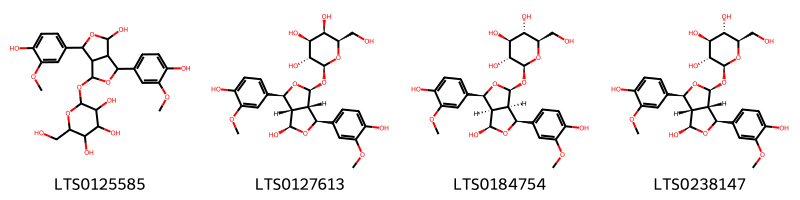
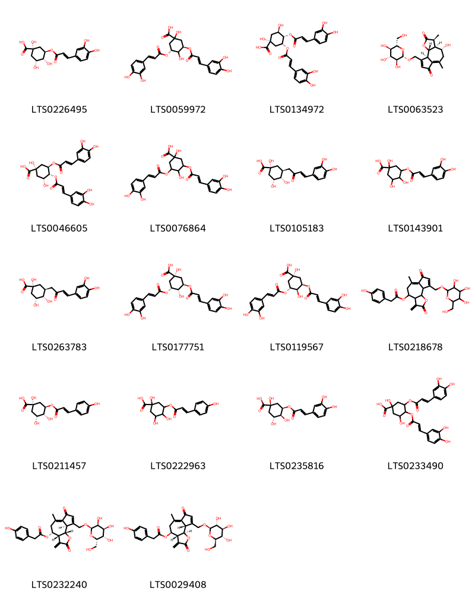

!!! abstract "Tóm tắt"

    Bồ Công Anh (Lactuca indica L.), thuộc họ Cúc (Asteraceae), là loài cây mọc hoang và được trồng rộng rãi ở các vùng nhiệt đới và ôn đới, đặc biệt ở Đông Á và Đông Nam Á, trong đó có Việt Nam. Trong y học cổ truyền, Bồ công anh được nhân dân sử dụng để chữa bệnh sưng vú, tắc tia sữa, mụn nhọt đang sưng mủ, hay bị mụn nhọt, đinh râu, chữa bệnh đau dạ dày, ăn uống kém tiêu. Theo sự nghiên cứu của nước ngoài, cây có tính chất gây ngủ nhẹ (chất nhựa mủ phơi khô đen lại dùng làm thuốc chữa ho trẻ con và dùng chữa cho trẻ con mất ngủ). Thành phần hóa học của Lactuca indica bao gồm các hợp chất hoạt tính như alkaloid, flavonoid, terpenoid, saponin, trong đó đặc biệt là luteolin˗7˗O˗β˗D˗glucoside, một hợp chất có tác dụng chống viêm mạnh.

## Thông tin về thực vật

Dược liệu **Bồ Công Anh (Lá, Toàn Cây Trừ Rễ)** từ bộ phận **nan** từ loài *Lactuca indica*.

**Mô tả thực vật:** Bồ công anh là một cây nhỏ, cao 0,60m đến 1m, có thể cao tới 3m. Thân mọc thẳng, nhẵn, không cành hoặc rất ít cành. Lá có nhiều hình dạng; lá phía dưới dài 30cm, rộng 5-6cm. gần như không cuống, chia thành nhiều thùy hay răng cưa to thô, lá phía trên ngắn hơn, nguyên chứ không chia thùy, mép có răng cưa thưa. Bấm lá và thân đều thấy tiết ra nhũ dịch màu trắng đục như sữa, vị hơi đắng. Cụm hoa hình đầu, màu vàng, có loại tím.

*Tài liệu tham khảo:* "Những cây thuốc và vị thuốc Việt Nam" - Đỗ Tất Lợi 
Trong dược điển Việt nam, một loài được sử dụng làm dược liệu là *Lactuca indica*.

!!! info "Phân loại thực vật của *Lactuca indica*"
    - **Kingdom:** Plantae
    - **Phylum:** Tracheophyta
    - **Order:** Asterales
    - **Family:** Asteraceae
    - **Genus:** Lactuca
    - **Species:** *Lactuca indica*

**Phân bố trên thế giới:** Russian Federation, Chinese Taipei, China, Réunion, South Africa, Korea, Republic of, Japan, Brazil

**Phân bố tại Việt nam:** Không có ghi nhận ở Việt Nam

## Thông tin về dược liệu 

### Định danh

!!! info "Thông tin về tên gọi"

    - Dược liệu tiếng Việt: nan
    - Dược liệu tiếng Trung: nan (nan)
    - Dược liệu tiếng Anh: nan
    - Dược liệu latin thông dụng: nan
    - Dược liệu latin kiểu DĐVN: *lactuca indica l.*
    - Dược liệu latin kiểu DĐVN: *nan*
    - Dược liệu latin kiểu thông tư: *nan*
    - Bộ phận dùng: nan (nan)

### Mô tả dược liệu 

- **Theo dược điển Việt nam V:** nan

- **Mô tả dược liệu theo thông tư chế biến dược liệu theo phương pháp cổ truyền:** nan

### Chế biến 

- **Chế biến theo dược điển việt nam V**: nan

- **Chế biến theo thông tư:** nan

--- 

## Thành phần hóa học

- Theo tài liệu của GS. Đỗ Tất Lợi:  (1) Nhóm hóa học: Alkaloids, Flavonoids, Phenolic compounds,  Triterpenoids, Saponins , Essential oils (Tinh dầu) và Tannin
(2) luteolin˗7˗O˗β˗D˗glucoside
    

**Thành phần hóa học từ loài **Lactuca indica**

Theo cơ sở dữ liệu lotus, loài *Lactuca indica* đã phân lập và xác định được **96** hoạt chất thuộc về các nhóm Organooxygen compounds, Lignan glycosides, Flavonoids, Lactones, Carboxylic acids and derivatives, Benzene and substituted derivatives, Prenol lipids trong bảng dưới đây. Danh sách các hoạt chất như sau paraben [(LTS0224398)](https://lotus.naturalproducts.net/compound/lotus_id/LTS0224398), 2-(3,4-dihydroxyphenyl)-5,7-dihydroxy-3-{[4,5,6-trihydroxy-3-(hydroxymethyl)oxan-2-yl]oxy}chromen-4-one [(LTS0172516)](https://lotus.naturalproducts.net/compound/lotus_id/LTS0172516), α-amyrin acetate [(LTS0224810)](https://lotus.naturalproducts.net/compound/lotus_id/LTS0224810), β-amyrin [(LTS0075776)](https://lotus.naturalproducts.net/compound/lotus_id/LTS0075776), 3,4,5-trihydroxy-6-{[5-hydroxy-2-(2-hydroxyphenyl)-4-oxochromen-7-yl]oxy}oxane-2-carboxylic acid [(LTS0171838)](https://lotus.naturalproducts.net/compound/lotus_id/LTS0171838), 3,4-bis({[3-(3,4-dihydroxyphenyl)prop-2-enoyl]oxy})-1,5-dihydroxycyclohexane-1-carboxylic acid [(LTS0233490)](https://lotus.naturalproducts.net/compound/lotus_id/LTS0233490), 2-{[4-hydroxy-3,6-bis(4-hydroxy-3-methoxyphenyl)-hexahydrofuro[3,4-c]furan-1-yl]oxy}-6-(hydroxymethyl)oxane-3,4,5-triol [(LTS0125585)](https://lotus.naturalproducts.net/compound/lotus_id/LTS0125585), 4,4,6b,8a,11,12,12b,14b-octamethyl-2,3,4a,5,7,8,9,10,11,12,12a,13,14,14a-tetradecahydro-1h-picen-3-yl acetate [(LTS0218301)](https://lotus.naturalproducts.net/compound/lotus_id/LTS0218301), (3s,4ar,6ar,6bs,8ar,12as,14ar,14br)-4,4,6a,6b,8a,11,11,14b-octamethyl-1,2,3,4a,5,6,7,8,9,10,12,12a,14,14a-tetradecahydropicen-3-ol [(LTS0055441)](https://lotus.naturalproducts.net/compound/lotus_id/LTS0055441), 4,4,6a,6b,8a,11,11,14b-octamethyl-1,2,3,4a,5,6,7,8,9,10,12b,13,14,14a-tetradecahydropicen-3-yl acetate [(LTS0157595)](https://lotus.naturalproducts.net/compound/lotus_id/LTS0157595), chlorogenic acid [(LTS0226495)](https://lotus.naturalproducts.net/compound/lotus_id/LTS0226495), (3s,4ar,6ar,6bs,8ar,12as,14ar,14br)-4,4,6a,6b,8a,11,11,14b-octamethyl-1,2,3,4a,5,6,7,8,9,10,12,12a,14,14a-tetradecahydropicen-3-yl acetate [(LTS0085387)](https://lotus.naturalproducts.net/compound/lotus_id/LTS0085387), (1r,3r,4r,5r)-3,5-bis({[(2e)-3-(3,4-dihydroxyphenyl)prop-2-enoyl]oxy})-1,4-dihydroxycyclohexane-1-carboxylic acid [(LTS0119567)](https://lotus.naturalproducts.net/compound/lotus_id/LTS0119567), luteolin 7-o-glucoside [(LTS0227450)](https://lotus.naturalproducts.net/compound/lotus_id/LTS0227450), 6-(hydroxymethyl)-3,10-dimethyl-9-{[3,4,5-trihydroxy-6-(hydroxymethyl)oxan-2-yl]oxy}-3h,3ah,4h,5h,8h,9h,11ah-cyclodeca[b]furan-2-one [(LTS0060549)](https://lotus.naturalproducts.net/compound/lotus_id/LTS0060549), 3,4-dihydroxybenzoic acid [(LTS0018765)](https://lotus.naturalproducts.net/compound/lotus_id/LTS0018765), (2s,3r,4s,5s,6r)-2-{[(1s,3s,3as,4r,6s,6as)-4-hydroxy-3,6-bis(4-hydroxy-3-methoxyphenyl)-hexahydrofuro[3,4-c]furan-1-yl]oxy}-6-(hydroxymethyl)oxane-3,4,5-triol [(LTS0238147)](https://lotus.naturalproducts.net/compound/lotus_id/LTS0238147), (2s,3s,4s,5r,6r)-6-{[2-(3,4-dihydroxyphenyl)-5-hydroxy-4-oxochromen-7-yl]oxy}-3,4,5-trihydroxyoxane-2-carboxylic acid [(LTS0135773)](https://lotus.naturalproducts.net/compound/lotus_id/LTS0135773), (3s,3as,9r,11as)-3,10-dimethyl-2-oxo-9-{[(2r,3r,4s,5s,6r)-3,4,5-trihydroxy-6-(hydroxymethyl)oxan-2-yl]oxy}-3h,3ah,4h,5h,8h,9h,11ah-cyclodeca[b]furan-6-carbaldehyde [(LTS0015228)](https://lotus.naturalproducts.net/compound/lotus_id/LTS0015228), vernoflexuoside [(LTS0127107)](https://lotus.naturalproducts.net/compound/lotus_id/LTS0127107), 2-(3,4-dihydroxyphenyl)-5,7-dihydroxy-3-{[(2s,3s,4r,5r,6s)-3,4,5-trihydroxy-6-methyloxan-2-yl]oxy}chromen-4-one [(LTS0083664)](https://lotus.naturalproducts.net/compound/lotus_id/LTS0083664), (3as,5r,6ar,8s,9ar,9bs)-5,8-dihydroxy-3,6,9-trimethylidene-octahydroazuleno[4,5-b]furan-2-one [(LTS0064728)](https://lotus.naturalproducts.net/compound/lotus_id/LTS0064728), (3s,3as,5r,6ar,8s,9ar,9bs)-5,8-dihydroxy-3-methyl-6,9-dimethylidene-octahydro-3h-azuleno[4,5-b]furan-2-one [(LTS0157918)](https://lotus.naturalproducts.net/compound/lotus_id/LTS0157918), luteolin [(LTS0017052)](https://lotus.naturalproducts.net/compound/lotus_id/LTS0017052), (3s,3ar,4s,9ar,9br)-4-hydroxy-9-(hydroxymethyl)-3,6-dimethyl-3h,3ah,4h,5h,9ah,9bh-azuleno[4,5-b]furan-2,7-dione [(LTS0181022)](https://lotus.naturalproducts.net/compound/lotus_id/LTS0181022), 2-(3,4-dihydroxyphenyl)-5,7-dihydroxy-3-{[3,4,5-trihydroxy-6-(hydroxymethyl)oxan-2-yl]oxy}chromen-4-one [(LTS0195312)](https://lotus.naturalproducts.net/compound/lotus_id/LTS0195312), 2-(3,4-dihydroxyphenyl)-5,7-dihydroxy-3-{[(2s,3r,4r,5s,6r)-3,4,5-trihydroxy-6-(hydroxymethyl)oxan-2-yl]oxy}chromen-4-one [(LTS0220665)](https://lotus.naturalproducts.net/compound/lotus_id/LTS0220665), (3s,3as,4r,9ar,9bs)-4-hydroxy-3,6-dimethyl-9-({[(2s,3s,4r,5r,6s)-3,4,5-trihydroxy-6-(hydroxymethyl)oxan-2-yl]oxy}methyl)-3h,3ah,4h,5h,9ah,9bh-azuleno[4,5-b]furan-2,7-dione [(LTS0063523)](https://lotus.naturalproducts.net/compound/lotus_id/LTS0063523), (3ar,4r,9ar,9bs)-6-methyl-3-methylidene-2,7-dioxo-9-({[(2r,3s,4s,5s,6s)-3,4,5-trihydroxy-6-(hydroxymethyl)oxan-2-yl]oxy}methyl)-3ah,4h,5h,9ah,9bh-azuleno[4,5-b]furan-4-yl 2-(4-hydroxyphenyl)acetate [(LTS0232240)](https://lotus.naturalproducts.net/compound/lotus_id/LTS0232240), 3,5-dicaffeoylquinic acid [(LTS0177751)](https://lotus.naturalproducts.net/compound/lotus_id/LTS0177751), 2-(3,4-dihydroxyphenyl)-3,7-dihydroxy-5-{[3,4,5-trihydroxy-6-(hydroxymethyl)oxan-2-yl]oxy}chromen-4-one [(LTS0261519)](https://lotus.naturalproducts.net/compound/lotus_id/LTS0261519), (3ar,4s,9as,9br)-4-{[(3s,3ar,4s,9as,9br)-3,6,9-trimethyl-2,7-dioxo-3h,3ah,4h,5h,9ah,9bh-azuleno[4,5-b]furan-4-yl]oxy}-6,9-dimethyl-3-methylidene-3ah,4h,5h,9ah,9bh-azuleno[4,5-b]furan-2,7-dione [(LTS0125854)](https://lotus.naturalproducts.net/compound/lotus_id/LTS0125854), 9-hydroxy-3,10-dimethyl-2-oxo-3h,3ah,4h,5h,8h,9h,11ah-cyclodeca[b]furan-6-carbaldehyde [(LTS0238785)](https://lotus.naturalproducts.net/compound/lotus_id/LTS0238785), (1s,3r,4r,5r)-1,3,4-trihydroxy-5-{[(2e)-3-(4-hydroxyphenyl)prop-2-enoyl]oxy}cyclohexane-1-carboxylic acid [(LTS0211457)](https://lotus.naturalproducts.net/compound/lotus_id/LTS0211457), 4,4,6a,6b,8a,11,12,14b-octamethyl-2,3,4a,5,6,7,8,9,10,11,12,12a,14,14a-tetradecahydro-1h-picen-3-yl acetate [(LTS0185406)](https://lotus.naturalproducts.net/compound/lotus_id/LTS0185406), [(3ar,4s,9as,9br)-4-{[(3s,3ar,4s,9as,9br)-9-({[2-(4-hydroxyphenyl)acetyl]oxy}methyl)-3,6-dimethyl-2,7-dioxo-3h,3ah,4h,5h,9ah,9bh-azuleno[4,5-b]furan-4-yl]oxy}-6-methyl-3-methylidene-2,7-dioxo-3ah,4h,5h,9ah,9bh-azuleno[4,5-b]furan-9-yl]methyl 2-(4-hydroxyphenyl)acetate [(LTS0031999)](https://lotus.naturalproducts.net/compound/lotus_id/LTS0031999), 2-(3,4-dihydroxyphenyl)-5,7-dihydroxy-3-{[(2s,3r,4r,5r,6s)-3,4,5-trihydroxy-6-(hydroxymethyl)oxan-2-yl]oxy}chromen-4-one [(LTS0241372)](https://lotus.naturalproducts.net/compound/lotus_id/LTS0241372), 4-hydroxy-9-(hydroxymethyl)-3,6-dimethyl-3h,3ah,4h,5h,9ah,9bh-azuleno[4,5-b]furan-2,7-dione [(LTS0266256)](https://lotus.naturalproducts.net/compound/lotus_id/LTS0266256), (3as,6ar,8s,9ar,9bs)-3,6,9-trimethylidene-8-{[(2s,3r,4s,5r,6r)-3,4,5-trihydroxy-6-(hydroxymethyl)oxan-2-yl]oxy}-octahydroazuleno[4,5-b]furan-2-one [(LTS0102937)](https://lotus.naturalproducts.net/compound/lotus_id/LTS0102937), (3s,3as,9s,11as)-6-(hydroxymethyl)-3,10-dimethyl-9-{[(2r,3r,4s,5s,6r)-3,4,5-trihydroxy-6-(hydroxymethyl)oxan-2-yl]oxy}-3h,3ah,4h,5h,8h,9h,11ah-cyclodeca[b]furan-2-one [(LTS0106757)](https://lotus.naturalproducts.net/compound/lotus_id/LTS0106757), (3s,4ar,6bs,8ar,11r,12s,12ar,12bs,14ar,14br)-4,4,6b,8a,11,12,12b,14b-octamethyl-2,3,4a,5,7,8,9,10,11,12,12a,13,14,14a-tetradecahydro-1h-picen-3-yl acetate [(LTS0163139)](https://lotus.naturalproducts.net/compound/lotus_id/LTS0163139), isoquercetin [(LTS0254337)](https://lotus.naturalproducts.net/compound/lotus_id/LTS0254337), 1-isopropyl-3a,5b,8,8,11a,13a-hexamethyl-1h,2h,3h,4h,6h,7h,7ah,9h,10h,11h,11bh,12h,13h,13bh-cyclopenta[a]chrysen-9-yl acetate [(LTS0088370)](https://lotus.naturalproducts.net/compound/lotus_id/LTS0088370), 4,4,6a,6b,8a,12,14b-heptamethyl-11-methylidene-hexadecahydropicen-3-yl acetate [(LTS0026037)](https://lotus.naturalproducts.net/compound/lotus_id/LTS0026037), neochlorogenic acid [(LTS0235816)](https://lotus.naturalproducts.net/compound/lotus_id/LTS0235816), (2s,3r,4s,5s,6r)-2-{[(1s,3s,3ar,4r,6s,6ar)-4-hydroxy-3,6-bis(4-hydroxy-3-methoxyphenyl)-hexahydrofuro[3,4-c]furan-1-yl]oxy}-6-(hydroxymethyl)oxane-3,4,5-triol [(LTS0184754)](https://lotus.naturalproducts.net/compound/lotus_id/LTS0184754), 4,4,6a,6b,8a,11,11,14b-octamethyl-1,2,3,4a,5,6,7,8,9,10,12,12a,14,14a-tetradecahydropicen-3-yl acetate [(LTS0153642)](https://lotus.naturalproducts.net/compound/lotus_id/LTS0153642), quercitrin [(LTS0186298)](https://lotus.naturalproducts.net/compound/lotus_id/LTS0186298), (1r,3s,4s,5r)-3-[4-(3,4-dihydroxyphenyl)-2-oxobut-3-en-1-yl]-1,4,5-trihydroxycyclohexane-1-carboxylic acid [(LTS0263783)](https://lotus.naturalproducts.net/compound/lotus_id/LTS0263783), lupeol acetate [(LTS0077599)](https://lotus.naturalproducts.net/compound/lotus_id/LTS0077599), (3ar,4s,9as,9br)-4-{[(3s,3ar,4s,9as,9br)-9-(hydroxymethyl)-3,6-dimethyl-2,7-dioxo-3h,3ah,4h,5h,9ah,9bh-azuleno[4,5-b]furan-4-yl]oxy}-9-(hydroxymethyl)-6-methyl-3-methylidene-3ah,4h,5h,9ah,9bh-azuleno[4,5-b]furan-2,7-dione [(LTS0113745)](https://lotus.naturalproducts.net/compound/lotus_id/LTS0113745), 2-(3,4-dihydroxyphenyl)-5,7-dihydroxy-3-{[(2s,3r,4r,5s,6s)-4,5,6-trihydroxy-3-(hydroxymethyl)oxan-2-yl]oxy}chromen-4-one [(LTS0209800)](https://lotus.naturalproducts.net/compound/lotus_id/LTS0209800), taraxasterol acetate [(LTS0190545)](https://lotus.naturalproducts.net/compound/lotus_id/LTS0190545), (1r,3s,4s,5r)-3-[(3e)-4-(3,4-dihydroxyphenyl)-2-oxobut-3-en-1-yl]-1,4,5-trihydroxycyclohexane-1-carboxylic acid [(LTS0105183)](https://lotus.naturalproducts.net/compound/lotus_id/LTS0105183), 9-(hydroxymethyl)-4-{[9-(hydroxymethyl)-3,6-dimethyl-2,7-dioxo-3h,3ah,4h,5h,9ah,9bh-azuleno[4,5-b]furan-4-yl]oxy}-6-methyl-3-methylidene-3ah,4h,5h,9ah,9bh-azuleno[4,5-b]furan-2,7-dione [(LTS0182485)](https://lotus.naturalproducts.net/compound/lotus_id/LTS0182485), 1,3,4-trihydroxy-5-{[3-(4-hydroxyphenyl)prop-2-enoyl]oxy}cyclohexane-1-carboxylic acid [(LTS0222963)](https://lotus.naturalproducts.net/compound/lotus_id/LTS0222963), (3s,3as,9s,11ar)-3,10-dimethyl-2-oxo-9-{[(2r,3r,4s,5s,6r)-3,4,5-trihydroxy-6-(hydroxymethyl)oxan-2-yl]oxy}-3h,3ah,4h,5h,8h,9h,11ah-cyclodeca[b]furan-6-carbaldehyde [(LTS0164758)](https://lotus.naturalproducts.net/compound/lotus_id/LTS0164758), (3r,3as,5ar,6r,9as,9bs)-6-hydroxy-3,5a,9-trimethyl-3h,3ah,4h,5h,6h,7h,9ah,9bh-naphtho[1,2-b]furan-2-one [(LTS0140972)](https://lotus.naturalproducts.net/compound/lotus_id/LTS0140972), 4,4,6a,6b,8a,12,14b-heptamethyl-11-methylidene-hexadecahydropicen-3-ol [(LTS0256994)](https://lotus.naturalproducts.net/compound/lotus_id/LTS0256994), 3-methyl-6,9-dimethylidene-8-{[3,4,5-trihydroxy-6-(hydroxymethyl)oxan-2-yl]oxy}-octahydro-3h-azuleno[4,5-b]furan-2-one [(LTS0023778)](https://lotus.naturalproducts.net/compound/lotus_id/LTS0023778), 2-(3,4-dihydroxyphenyl)-3,7-dihydroxy-5-{[(2s,3r,4s,5s,6r)-3,4,5-trihydroxy-6-(hydroxymethyl)oxan-2-yl]oxy}chromen-4-one [(LTS0079602)](https://lotus.naturalproducts.net/compound/lotus_id/LTS0079602), 3-rutinosyl quercetin [(LTS0032845)](https://lotus.naturalproducts.net/compound/lotus_id/LTS0032845), quercetin [(LTS0004651)](https://lotus.naturalproducts.net/compound/lotus_id/LTS0004651), 3-{[3-(3,4-dihydroxyphenyl)prop-2-enoyl]oxy}-1,4,5-trihydroxycyclohexane-1-carboxylic acid [(LTS0143901)](https://lotus.naturalproducts.net/compound/lotus_id/LTS0143901), (2s,3s,4s,5r,6s)-3,4,5-trihydroxy-6-{[5-hydroxy-2-(2-hydroxyphenyl)-4-oxochromen-7-yl]oxy}oxane-2-carboxylic acid [(LTS0000129)](https://lotus.naturalproducts.net/compound/lotus_id/LTS0000129), (3ar,4s,9as,9br)-6-methyl-3-methylidene-2,7-dioxo-9-({[(2r,3r,4s,5s,6r)-3,4,5-trihydroxy-6-(hydroxymethyl)oxan-2-yl]oxy}methyl)-3ah,4h,5h,9ah,9bh-azuleno[4,5-b]furan-4-yl 2-(4-hydroxyphenyl)acetate [(LTS0029408)](https://lotus.naturalproducts.net/compound/lotus_id/LTS0029408), (3s,3as,9s,11as)-3,10-dimethyl-2-oxo-9-{[(2r,3r,4s,5s,6r)-3,4,5-trihydroxy-6-(hydroxymethyl)oxan-2-yl]oxy}-3h,3ah,4h,5h,8h,9h,11ah-cyclodeca[b]furan-6-carbaldehyde [(LTS0062716)](https://lotus.naturalproducts.net/compound/lotus_id/LTS0062716), (3s,3as,6ar,8s,9ar,9bs)-3-methyl-6,9-dimethylidene-8-{[(2s,3r,4s,5s,6r)-3,4,5-trihydroxy-6-(hydroxymethyl)oxan-2-yl]oxy}-octahydro-3h-azuleno[4,5-b]furan-2-one [(LTS0064397)](https://lotus.naturalproducts.net/compound/lotus_id/LTS0064397), (3s,3as,9s,11ar)-6-(hydroxymethyl)-3,10-dimethyl-9-{[(2r,3r,4s,5s,6r)-3,4,5-trihydroxy-6-(hydroxymethyl)oxan-2-yl]oxy}-3h,3ah,4h,5h,8h,9h,11ah-cyclodeca[b]furan-2-one [(LTS0130289)](https://lotus.naturalproducts.net/compound/lotus_id/LTS0130289), (3s,3as,9r,11as)-6-(hydroxymethyl)-3,10-dimethyl-9-{[(2r,3r,4s,5s,6r)-3,4,5-trihydroxy-6-(hydroxymethyl)oxan-2-yl]oxy}-3h,3ah,4h,5h,8h,9h,11ah-cyclodeca[b]furan-2-one [(LTS0258675)](https://lotus.naturalproducts.net/compound/lotus_id/LTS0258675), chamomile [(LTS0104946)](https://lotus.naturalproducts.net/compound/lotus_id/LTS0104946), (2s,3r,4s,5r,6r)-2-{[(1s,3s,3as,4r,6s,6as)-4-hydroxy-3,6-bis(4-hydroxy-3-methoxyphenyl)-hexahydrofuro[3,4-c]furan-1-yl]oxy}-6-(hydroxymethyl)oxane-3,4,5-triol [(LTS0127613)](https://lotus.naturalproducts.net/compound/lotus_id/LTS0127613), (3r,5r)-3,5-bis({[(2e)-3-(3,4-dihydroxyphenyl)prop-2-enoyl]oxy})-1,4-dihydroxycyclohexane-1-carboxylic acid [(LTS0059972)](https://lotus.naturalproducts.net/compound/lotus_id/LTS0059972), (3s,3as,9s,11as)-9-hydroxy-3,10-dimethyl-2-oxo-3h,3ah,4h,5h,8h,9h,11ah-cyclodeca[b]furan-6-carbaldehyde [(LTS0201023)](https://lotus.naturalproducts.net/compound/lotus_id/LTS0201023), luteolin 7-o-glucuronide [(LTS0081420)](https://lotus.naturalproducts.net/compound/lotus_id/LTS0081420), (3as,5r,6ar,8s,9ar,9bs)-5-hydroxy-3,6,9-trimethylidene-8-{[(2r,3r,4s,5s,6r)-3,4,5-trihydroxy-6-(hydroxymethyl)oxan-2-yl]oxy}-octahydroazuleno[4,5-b]furan-2-one [(LTS0266397)](https://lotus.naturalproducts.net/compound/lotus_id/LTS0266397), taraxasterol [(LTS0210066)](https://lotus.naturalproducts.net/compound/lotus_id/LTS0210066), 2-(3,4-dihydroxyphenyl)-5,7-dihydroxy-3-{[(2s,3r,4s,5s,6r)-3,4,5-trihydroxy-6-({[(2r,3s,4s,5r,6s)-3,4,5-trihydroxy-6-methyloxan-2-yl]oxy}methyl)oxan-2-yl]oxy}chromen-4-one [(LTS0218865)](https://lotus.naturalproducts.net/compound/lotus_id/LTS0218865), (3s,4ar,6ar,6br,8ar,12bs,14ar,14br)-4,4,6a,6b,8a,11,11,14b-octamethyl-1,2,3,4a,5,6,7,8,9,10,12b,13,14,14a-tetradecahydropicen-3-yl acetate [(LTS0111657)](https://lotus.naturalproducts.net/compound/lotus_id/LTS0111657), (3s,3as,9s,11ar)-9-hydroxy-3,10-dimethyl-2-oxo-3h,3ah,4h,5h,8h,9h,11ah-cyclodeca[b]furan-6-carbaldehyde [(LTS0101081)](https://lotus.naturalproducts.net/compound/lotus_id/LTS0101081), 6,9-dimethyl-3-methylidene-4-({3,6,9-trimethyl-2,7-dioxo-3h,3ah,4h,5h,9ah,9bh-azuleno[4,5-b]furan-4-yl}oxy)-3ah,4h,5h,9ah,9bh-azuleno[4,5-b]furan-2,7-dione [(LTS0233514)](https://lotus.naturalproducts.net/compound/lotus_id/LTS0233514), (3s,3as,5ar,6r,9as,9bs)-6-hydroxy-3,5a,9-trimethyl-3h,3ah,4h,5h,6h,7h,9ah,9bh-naphtho[1,2-b]furan-2-one [(LTS0264280)](https://lotus.naturalproducts.net/compound/lotus_id/LTS0264280), 4,5-dicaffeoylquinic acid [(LTS0046605)](https://lotus.naturalproducts.net/compound/lotus_id/LTS0046605), (1r,3ar,5br,7ar,9s,11ar,11br,13as,13br)-1-isopropyl-3a,5b,8,8,11a,13a-hexamethyl-1h,2h,3h,4h,6h,7h,7ah,9h,10h,11h,11bh,12h,13h,13bh-cyclopenta[a]chrysen-9-yl acetate [(LTS0142260)](https://lotus.naturalproducts.net/compound/lotus_id/LTS0142260), (4-{[9-({[2-(4-hydroxyphenyl)acetyl]oxy}methyl)-3,6-dimethyl-2,7-dioxo-3h,3ah,4h,5h,9ah,9bh-azuleno[4,5-b]furan-4-yl]oxy}-6-methyl-3-methylidene-2,7-dioxo-3ah,4h,5h,9ah,9bh-azuleno[4,5-b]furan-9-yl)methyl 2-(4-hydroxyphenyl)acetate [(LTS0021330)](https://lotus.naturalproducts.net/compound/lotus_id/LTS0021330), 3a,5a,5b,8,8,11a-hexamethyl-1-(prop-1-en-2-yl)-hexadecahydrocyclopenta[a]chrysen-9-yl acetate [(LTS0081577)](https://lotus.naturalproducts.net/compound/lotus_id/LTS0081577), 3,10-dimethyl-2-oxo-9-{[3,4,5-trihydroxy-6-(hydroxymethyl)oxan-2-yl]oxy}-3h,3ah,4h,5h,8h,9h,11ah-cyclodeca[b]furan-6-carbaldehyde [(LTS0225406)](https://lotus.naturalproducts.net/compound/lotus_id/LTS0225406), 3,5-bis({[3-(3,4-dihydroxyphenyl)prop-2-enoyl]oxy})-1,4-dihydroxycyclohexane-1-carboxylic acid [(LTS0076864)](https://lotus.naturalproducts.net/compound/lotus_id/LTS0076864), 6-{[2-(3,4-dihydroxyphenyl)-5-hydroxy-4-oxochromen-7-yl]oxy}-3,4,5-trihydroxyoxane-2-carboxylic acid [(LTS0175049)](https://lotus.naturalproducts.net/compound/lotus_id/LTS0175049), 6-methyl-3-methylidene-2,7-dioxo-9-({[3,4,5-trihydroxy-6-(hydroxymethyl)oxan-2-yl]oxy}methyl)-3ah,4h,5h,9ah,9bh-azuleno[4,5-b]furan-4-yl 2-(4-hydroxyphenyl)acetate [(LTS0218678)](https://lotus.naturalproducts.net/compound/lotus_id/LTS0218678), 5,8-dihydroxy-3,6,9-trimethylidene-octahydroazuleno[4,5-b]furan-2-one [(LTS0226448)](https://lotus.naturalproducts.net/compound/lotus_id/LTS0226448), 3,4-dicaffeoylquinic acid [(LTS0134972)](https://lotus.naturalproducts.net/compound/lotus_id/LTS0134972), β-amyrin acetate [(LTS0137234)](https://lotus.naturalproducts.net/compound/lotus_id/LTS0137234), 11β,13-dihydrolactucin [(LTS0097019)](https://lotus.naturalproducts.net/compound/lotus_id/LTS0097019), 5,8-dihydroxy-3-methyl-6,9-dimethylidene-octahydro-3h-azuleno[4,5-b]furan-2-one [(LTS0213242)](https://lotus.naturalproducts.net/compound/lotus_id/LTS0213242), rutin [(LTS0042292)](https://lotus.naturalproducts.net/compound/lotus_id/LTS0042292). 
        
| chemicalTaxonomyClassyfireClass     |   smiles_count |
|:------------------------------------|---------------:|
| Benzene and substituted derivatives |             38 |
| Carboxylic acids and derivatives    |            268 |
| Flavonoids                          |           1626 |
| Lactones                            |            563 |
| Lignan glycosides                   |            417 |
| Organooxygen compounds              |           1402 |
| Prenol lipids                       |           3146 |

            
### Nhóm Benzene and substituted derivatives
<figure markdown="span">
    { width=100% }
<figcaption>Hình ảnh cấu trúc hóa học của hoạt chất thuộc nhóm *Benzene and substituted derivatives*. Tên thường gọi của các hoạt chất tương ứng là 3,4-dihydroxybenzoic acid [(LTS0018765)](https://lotus.naturalproducts.net/compound/lotus_id/LTS0018765), paraben [(LTS0224398)](https://lotus.naturalproducts.net/compound/lotus_id/LTS0224398).</figcaption>
</figure>

            
            
### Nhóm Benzene and substituted derivatives
<figure markdown="span">
    { width=100% }
<figcaption>Hình ảnh cấu trúc hóa học của hoạt chất thuộc nhóm *Benzene and substituted derivatives*. Tên thường gọi của các hoạt chất tương ứng là 3,4-dihydroxybenzoic acid [(LTS0018765)](https://lotus.naturalproducts.net/compound/lotus_id/LTS0018765), paraben [(LTS0224398)](https://lotus.naturalproducts.net/compound/lotus_id/LTS0224398).</figcaption>
</figure>

### Nhóm Carboxylic acids and derivatives
<figure markdown="span">
    { width=100% }
<figcaption>Hình ảnh cấu trúc hóa học của hoạt chất thuộc nhóm *Carboxylic acids and derivatives*. Tên thường gọi của các hoạt chất tương ứng là [(3ar,4s,9as,9br)-4-{[(3s,3ar,4s,9as,9br)-9-({[2-(4-hydroxyphenyl)acetyl]oxy}methyl)-3,6-dimethyl-2,7-dioxo-3h,3ah,4h,5h,9ah,9bh-azuleno[4,5-b]furan-4-yl]oxy}-6-methyl-3-methylidene-2,7-dioxo-3ah,4h,5h,9ah,9bh-azuleno[4,5-b]furan-9-yl]methyl 2-(4-hydroxyphenyl)acetate [(LTS0031999)](https://lotus.naturalproducts.net/compound/lotus_id/LTS0031999), (4-{[9-({[2-(4-hydroxyphenyl)acetyl]oxy}methyl)-3,6-dimethyl-2,7-dioxo-3h,3ah,4h,5h,9ah,9bh-azuleno[4,5-b]furan-4-yl]oxy}-6-methyl-3-methylidene-2,7-dioxo-3ah,4h,5h,9ah,9bh-azuleno[4,5-b]furan-9-yl)methyl 2-(4-hydroxyphenyl)acetate [(LTS0021330)](https://lotus.naturalproducts.net/compound/lotus_id/LTS0021330).</figcaption>
</figure>

            
            
### Nhóm Benzene and substituted derivatives
<figure markdown="span">
    { width=100% }
<figcaption>Hình ảnh cấu trúc hóa học của hoạt chất thuộc nhóm *Benzene and substituted derivatives*. Tên thường gọi của các hoạt chất tương ứng là 3,4-dihydroxybenzoic acid [(LTS0018765)](https://lotus.naturalproducts.net/compound/lotus_id/LTS0018765), paraben [(LTS0224398)](https://lotus.naturalproducts.net/compound/lotus_id/LTS0224398).</figcaption>
</figure>

### Nhóm Carboxylic acids and derivatives
<figure markdown="span">
    { width=100% }
<figcaption>Hình ảnh cấu trúc hóa học của hoạt chất thuộc nhóm *Carboxylic acids and derivatives*. Tên thường gọi của các hoạt chất tương ứng là [(3ar,4s,9as,9br)-4-{[(3s,3ar,4s,9as,9br)-9-({[2-(4-hydroxyphenyl)acetyl]oxy}methyl)-3,6-dimethyl-2,7-dioxo-3h,3ah,4h,5h,9ah,9bh-azuleno[4,5-b]furan-4-yl]oxy}-6-methyl-3-methylidene-2,7-dioxo-3ah,4h,5h,9ah,9bh-azuleno[4,5-b]furan-9-yl]methyl 2-(4-hydroxyphenyl)acetate [(LTS0031999)](https://lotus.naturalproducts.net/compound/lotus_id/LTS0031999), (4-{[9-({[2-(4-hydroxyphenyl)acetyl]oxy}methyl)-3,6-dimethyl-2,7-dioxo-3h,3ah,4h,5h,9ah,9bh-azuleno[4,5-b]furan-4-yl]oxy}-6-methyl-3-methylidene-2,7-dioxo-3ah,4h,5h,9ah,9bh-azuleno[4,5-b]furan-9-yl)methyl 2-(4-hydroxyphenyl)acetate [(LTS0021330)](https://lotus.naturalproducts.net/compound/lotus_id/LTS0021330).</figcaption>
</figure>

### Nhóm Flavonoids
<figure markdown="span">
    { width=100% }
<figcaption>Hình ảnh cấu trúc hóa học của hoạt chất thuộc nhóm *Flavonoids*. Tên thường gọi của các hoạt chất tương ứng là quercetin [(LTS0004651)](https://lotus.naturalproducts.net/compound/lotus_id/LTS0004651), 3-rutinosyl quercetin [(LTS0032845)](https://lotus.naturalproducts.net/compound/lotus_id/LTS0032845), chamomile [(LTS0104946)](https://lotus.naturalproducts.net/compound/lotus_id/LTS0104946), 2-(3,4-dihydroxyphenyl)-5,7-dihydroxy-3-{[(2s,3r,4r,5r,6s)-3,4,5-trihydroxy-6-(hydroxymethyl)oxan-2-yl]oxy}chromen-4-one [(LTS0241372)](https://lotus.naturalproducts.net/compound/lotus_id/LTS0241372), isoquercetin [(LTS0254337)](https://lotus.naturalproducts.net/compound/lotus_id/LTS0254337), 2-(3,4-dihydroxyphenyl)-5,7-dihydroxy-3-{[3,4,5-trihydroxy-6-(hydroxymethyl)oxan-2-yl]oxy}chromen-4-one [(LTS0195312)](https://lotus.naturalproducts.net/compound/lotus_id/LTS0195312), luteolin [(LTS0017052)](https://lotus.naturalproducts.net/compound/lotus_id/LTS0017052), rutin [(LTS0042292)](https://lotus.naturalproducts.net/compound/lotus_id/LTS0042292), quercitrin [(LTS0186298)](https://lotus.naturalproducts.net/compound/lotus_id/LTS0186298), 2-(3,4-dihydroxyphenyl)-5,7-dihydroxy-3-{[(2s,3r,4r,5s,6r)-3,4,5-trihydroxy-6-(hydroxymethyl)oxan-2-yl]oxy}chromen-4-one [(LTS0220665)](https://lotus.naturalproducts.net/compound/lotus_id/LTS0220665), (2s,3s,4s,5r,6r)-6-{[2-(3,4-dihydroxyphenyl)-5-hydroxy-4-oxochromen-7-yl]oxy}-3,4,5-trihydroxyoxane-2-carboxylic acid [(LTS0135773)](https://lotus.naturalproducts.net/compound/lotus_id/LTS0135773), 2-(3,4-dihydroxyphenyl)-3,7-dihydroxy-5-{[(2s,3r,4s,5s,6r)-3,4,5-trihydroxy-6-(hydroxymethyl)oxan-2-yl]oxy}chromen-4-one [(LTS0079602)](https://lotus.naturalproducts.net/compound/lotus_id/LTS0079602), 2-(3,4-dihydroxyphenyl)-5,7-dihydroxy-3-{[(2s,3r,4s,5s,6r)-3,4,5-trihydroxy-6-({[(2r,3s,4s,5r,6s)-3,4,5-trihydroxy-6-methyloxan-2-yl]oxy}methyl)oxan-2-yl]oxy}chromen-4-one [(LTS0218865)](https://lotus.naturalproducts.net/compound/lotus_id/LTS0218865), 2-(3,4-dihydroxyphenyl)-5,7-dihydroxy-3-{[(2s,3s,4r,5r,6s)-3,4,5-trihydroxy-6-methyloxan-2-yl]oxy}chromen-4-one [(LTS0083664)](https://lotus.naturalproducts.net/compound/lotus_id/LTS0083664), luteolin 7-o-glucuronide [(LTS0081420)](https://lotus.naturalproducts.net/compound/lotus_id/LTS0081420), 2-(3,4-dihydroxyphenyl)-5,7-dihydroxy-3-{[4,5,6-trihydroxy-3-(hydroxymethyl)oxan-2-yl]oxy}chromen-4-one [(LTS0172516)](https://lotus.naturalproducts.net/compound/lotus_id/LTS0172516), 3,4,5-trihydroxy-6-{[5-hydroxy-2-(2-hydroxyphenyl)-4-oxochromen-7-yl]oxy}oxane-2-carboxylic acid [(LTS0171838)](https://lotus.naturalproducts.net/compound/lotus_id/LTS0171838), 2-(3,4-dihydroxyphenyl)-3,7-dihydroxy-5-{[3,4,5-trihydroxy-6-(hydroxymethyl)oxan-2-yl]oxy}chromen-4-one [(LTS0261519)](https://lotus.naturalproducts.net/compound/lotus_id/LTS0261519), 2-(3,4-dihydroxyphenyl)-5,7-dihydroxy-3-{[(2s,3r,4r,5s,6s)-4,5,6-trihydroxy-3-(hydroxymethyl)oxan-2-yl]oxy}chromen-4-one [(LTS0209800)](https://lotus.naturalproducts.net/compound/lotus_id/LTS0209800), 6-{[2-(3,4-dihydroxyphenyl)-5-hydroxy-4-oxochromen-7-yl]oxy}-3,4,5-trihydroxyoxane-2-carboxylic acid [(LTS0175049)](https://lotus.naturalproducts.net/compound/lotus_id/LTS0175049), luteolin 7-o-glucoside [(LTS0227450)](https://lotus.naturalproducts.net/compound/lotus_id/LTS0227450), (2s,3s,4s,5r,6s)-3,4,5-trihydroxy-6-{[5-hydroxy-2-(2-hydroxyphenyl)-4-oxochromen-7-yl]oxy}oxane-2-carboxylic acid [(LTS0000129)](https://lotus.naturalproducts.net/compound/lotus_id/LTS0000129).</figcaption>
</figure>

            
            
### Nhóm Benzene and substituted derivatives
<figure markdown="span">
    { width=100% }
<figcaption>Hình ảnh cấu trúc hóa học của hoạt chất thuộc nhóm *Benzene and substituted derivatives*. Tên thường gọi của các hoạt chất tương ứng là 3,4-dihydroxybenzoic acid [(LTS0018765)](https://lotus.naturalproducts.net/compound/lotus_id/LTS0018765), paraben [(LTS0224398)](https://lotus.naturalproducts.net/compound/lotus_id/LTS0224398).</figcaption>
</figure>

### Nhóm Carboxylic acids and derivatives
<figure markdown="span">
    { width=100% }
<figcaption>Hình ảnh cấu trúc hóa học của hoạt chất thuộc nhóm *Carboxylic acids and derivatives*. Tên thường gọi của các hoạt chất tương ứng là [(3ar,4s,9as,9br)-4-{[(3s,3ar,4s,9as,9br)-9-({[2-(4-hydroxyphenyl)acetyl]oxy}methyl)-3,6-dimethyl-2,7-dioxo-3h,3ah,4h,5h,9ah,9bh-azuleno[4,5-b]furan-4-yl]oxy}-6-methyl-3-methylidene-2,7-dioxo-3ah,4h,5h,9ah,9bh-azuleno[4,5-b]furan-9-yl]methyl 2-(4-hydroxyphenyl)acetate [(LTS0031999)](https://lotus.naturalproducts.net/compound/lotus_id/LTS0031999), (4-{[9-({[2-(4-hydroxyphenyl)acetyl]oxy}methyl)-3,6-dimethyl-2,7-dioxo-3h,3ah,4h,5h,9ah,9bh-azuleno[4,5-b]furan-4-yl]oxy}-6-methyl-3-methylidene-2,7-dioxo-3ah,4h,5h,9ah,9bh-azuleno[4,5-b]furan-9-yl)methyl 2-(4-hydroxyphenyl)acetate [(LTS0021330)](https://lotus.naturalproducts.net/compound/lotus_id/LTS0021330).</figcaption>
</figure>

### Nhóm Flavonoids
<figure markdown="span">
    { width=100% }
<figcaption>Hình ảnh cấu trúc hóa học của hoạt chất thuộc nhóm *Flavonoids*. Tên thường gọi của các hoạt chất tương ứng là quercetin [(LTS0004651)](https://lotus.naturalproducts.net/compound/lotus_id/LTS0004651), 3-rutinosyl quercetin [(LTS0032845)](https://lotus.naturalproducts.net/compound/lotus_id/LTS0032845), chamomile [(LTS0104946)](https://lotus.naturalproducts.net/compound/lotus_id/LTS0104946), 2-(3,4-dihydroxyphenyl)-5,7-dihydroxy-3-{[(2s,3r,4r,5r,6s)-3,4,5-trihydroxy-6-(hydroxymethyl)oxan-2-yl]oxy}chromen-4-one [(LTS0241372)](https://lotus.naturalproducts.net/compound/lotus_id/LTS0241372), isoquercetin [(LTS0254337)](https://lotus.naturalproducts.net/compound/lotus_id/LTS0254337), 2-(3,4-dihydroxyphenyl)-5,7-dihydroxy-3-{[3,4,5-trihydroxy-6-(hydroxymethyl)oxan-2-yl]oxy}chromen-4-one [(LTS0195312)](https://lotus.naturalproducts.net/compound/lotus_id/LTS0195312), luteolin [(LTS0017052)](https://lotus.naturalproducts.net/compound/lotus_id/LTS0017052), rutin [(LTS0042292)](https://lotus.naturalproducts.net/compound/lotus_id/LTS0042292), quercitrin [(LTS0186298)](https://lotus.naturalproducts.net/compound/lotus_id/LTS0186298), 2-(3,4-dihydroxyphenyl)-5,7-dihydroxy-3-{[(2s,3r,4r,5s,6r)-3,4,5-trihydroxy-6-(hydroxymethyl)oxan-2-yl]oxy}chromen-4-one [(LTS0220665)](https://lotus.naturalproducts.net/compound/lotus_id/LTS0220665), (2s,3s,4s,5r,6r)-6-{[2-(3,4-dihydroxyphenyl)-5-hydroxy-4-oxochromen-7-yl]oxy}-3,4,5-trihydroxyoxane-2-carboxylic acid [(LTS0135773)](https://lotus.naturalproducts.net/compound/lotus_id/LTS0135773), 2-(3,4-dihydroxyphenyl)-3,7-dihydroxy-5-{[(2s,3r,4s,5s,6r)-3,4,5-trihydroxy-6-(hydroxymethyl)oxan-2-yl]oxy}chromen-4-one [(LTS0079602)](https://lotus.naturalproducts.net/compound/lotus_id/LTS0079602), 2-(3,4-dihydroxyphenyl)-5,7-dihydroxy-3-{[(2s,3r,4s,5s,6r)-3,4,5-trihydroxy-6-({[(2r,3s,4s,5r,6s)-3,4,5-trihydroxy-6-methyloxan-2-yl]oxy}methyl)oxan-2-yl]oxy}chromen-4-one [(LTS0218865)](https://lotus.naturalproducts.net/compound/lotus_id/LTS0218865), 2-(3,4-dihydroxyphenyl)-5,7-dihydroxy-3-{[(2s,3s,4r,5r,6s)-3,4,5-trihydroxy-6-methyloxan-2-yl]oxy}chromen-4-one [(LTS0083664)](https://lotus.naturalproducts.net/compound/lotus_id/LTS0083664), luteolin 7-o-glucuronide [(LTS0081420)](https://lotus.naturalproducts.net/compound/lotus_id/LTS0081420), 2-(3,4-dihydroxyphenyl)-5,7-dihydroxy-3-{[4,5,6-trihydroxy-3-(hydroxymethyl)oxan-2-yl]oxy}chromen-4-one [(LTS0172516)](https://lotus.naturalproducts.net/compound/lotus_id/LTS0172516), 3,4,5-trihydroxy-6-{[5-hydroxy-2-(2-hydroxyphenyl)-4-oxochromen-7-yl]oxy}oxane-2-carboxylic acid [(LTS0171838)](https://lotus.naturalproducts.net/compound/lotus_id/LTS0171838), 2-(3,4-dihydroxyphenyl)-3,7-dihydroxy-5-{[3,4,5-trihydroxy-6-(hydroxymethyl)oxan-2-yl]oxy}chromen-4-one [(LTS0261519)](https://lotus.naturalproducts.net/compound/lotus_id/LTS0261519), 2-(3,4-dihydroxyphenyl)-5,7-dihydroxy-3-{[(2s,3r,4r,5s,6s)-4,5,6-trihydroxy-3-(hydroxymethyl)oxan-2-yl]oxy}chromen-4-one [(LTS0209800)](https://lotus.naturalproducts.net/compound/lotus_id/LTS0209800), 6-{[2-(3,4-dihydroxyphenyl)-5-hydroxy-4-oxochromen-7-yl]oxy}-3,4,5-trihydroxyoxane-2-carboxylic acid [(LTS0175049)](https://lotus.naturalproducts.net/compound/lotus_id/LTS0175049), luteolin 7-o-glucoside [(LTS0227450)](https://lotus.naturalproducts.net/compound/lotus_id/LTS0227450), (2s,3s,4s,5r,6s)-3,4,5-trihydroxy-6-{[5-hydroxy-2-(2-hydroxyphenyl)-4-oxochromen-7-yl]oxy}oxane-2-carboxylic acid [(LTS0000129)](https://lotus.naturalproducts.net/compound/lotus_id/LTS0000129).</figcaption>
</figure>

### Nhóm Lactones
<figure markdown="span">
    { width=100% }
<figcaption>Hình ảnh cấu trúc hóa học của hoạt chất thuộc nhóm *Lactones*. Tên thường gọi của các hoạt chất tương ứng là 9-(hydroxymethyl)-4-{[9-(hydroxymethyl)-3,6-dimethyl-2,7-dioxo-3h,3ah,4h,5h,9ah,9bh-azuleno[4,5-b]furan-4-yl]oxy}-6-methyl-3-methylidene-3ah,4h,5h,9ah,9bh-azuleno[4,5-b]furan-2,7-dione [(LTS0182485)](https://lotus.naturalproducts.net/compound/lotus_id/LTS0182485), (3ar,4s,9as,9br)-4-{[(3s,3ar,4s,9as,9br)-3,6,9-trimethyl-2,7-dioxo-3h,3ah,4h,5h,9ah,9bh-azuleno[4,5-b]furan-4-yl]oxy}-6,9-dimethyl-3-methylidene-3ah,4h,5h,9ah,9bh-azuleno[4,5-b]furan-2,7-dione [(LTS0125854)](https://lotus.naturalproducts.net/compound/lotus_id/LTS0125854), (3s,3ar,4s,9ar,9br)-4-hydroxy-9-(hydroxymethyl)-3,6-dimethyl-3h,3ah,4h,5h,9ah,9bh-azuleno[4,5-b]furan-2,7-dione [(LTS0181022)](https://lotus.naturalproducts.net/compound/lotus_id/LTS0181022), 11β,13-dihydrolactucin [(LTS0097019)](https://lotus.naturalproducts.net/compound/lotus_id/LTS0097019), 6,9-dimethyl-3-methylidene-4-({3,6,9-trimethyl-2,7-dioxo-3h,3ah,4h,5h,9ah,9bh-azuleno[4,5-b]furan-4-yl}oxy)-3ah,4h,5h,9ah,9bh-azuleno[4,5-b]furan-2,7-dione [(LTS0233514)](https://lotus.naturalproducts.net/compound/lotus_id/LTS0233514), 4-hydroxy-9-(hydroxymethyl)-3,6-dimethyl-3h,3ah,4h,5h,9ah,9bh-azuleno[4,5-b]furan-2,7-dione [(LTS0266256)](https://lotus.naturalproducts.net/compound/lotus_id/LTS0266256), (3ar,4s,9as,9br)-4-{[(3s,3ar,4s,9as,9br)-9-(hydroxymethyl)-3,6-dimethyl-2,7-dioxo-3h,3ah,4h,5h,9ah,9bh-azuleno[4,5-b]furan-4-yl]oxy}-9-(hydroxymethyl)-6-methyl-3-methylidene-3ah,4h,5h,9ah,9bh-azuleno[4,5-b]furan-2,7-dione [(LTS0113745)](https://lotus.naturalproducts.net/compound/lotus_id/LTS0113745).</figcaption>
</figure>

            
            
### Nhóm Benzene and substituted derivatives
<figure markdown="span">
    { width=100% }
<figcaption>Hình ảnh cấu trúc hóa học của hoạt chất thuộc nhóm *Benzene and substituted derivatives*. Tên thường gọi của các hoạt chất tương ứng là 3,4-dihydroxybenzoic acid [(LTS0018765)](https://lotus.naturalproducts.net/compound/lotus_id/LTS0018765), paraben [(LTS0224398)](https://lotus.naturalproducts.net/compound/lotus_id/LTS0224398).</figcaption>
</figure>

### Nhóm Carboxylic acids and derivatives
<figure markdown="span">
    { width=100% }
<figcaption>Hình ảnh cấu trúc hóa học của hoạt chất thuộc nhóm *Carboxylic acids and derivatives*. Tên thường gọi của các hoạt chất tương ứng là [(3ar,4s,9as,9br)-4-{[(3s,3ar,4s,9as,9br)-9-({[2-(4-hydroxyphenyl)acetyl]oxy}methyl)-3,6-dimethyl-2,7-dioxo-3h,3ah,4h,5h,9ah,9bh-azuleno[4,5-b]furan-4-yl]oxy}-6-methyl-3-methylidene-2,7-dioxo-3ah,4h,5h,9ah,9bh-azuleno[4,5-b]furan-9-yl]methyl 2-(4-hydroxyphenyl)acetate [(LTS0031999)](https://lotus.naturalproducts.net/compound/lotus_id/LTS0031999), (4-{[9-({[2-(4-hydroxyphenyl)acetyl]oxy}methyl)-3,6-dimethyl-2,7-dioxo-3h,3ah,4h,5h,9ah,9bh-azuleno[4,5-b]furan-4-yl]oxy}-6-methyl-3-methylidene-2,7-dioxo-3ah,4h,5h,9ah,9bh-azuleno[4,5-b]furan-9-yl)methyl 2-(4-hydroxyphenyl)acetate [(LTS0021330)](https://lotus.naturalproducts.net/compound/lotus_id/LTS0021330).</figcaption>
</figure>

### Nhóm Flavonoids
<figure markdown="span">
    { width=100% }
<figcaption>Hình ảnh cấu trúc hóa học của hoạt chất thuộc nhóm *Flavonoids*. Tên thường gọi của các hoạt chất tương ứng là quercetin [(LTS0004651)](https://lotus.naturalproducts.net/compound/lotus_id/LTS0004651), 3-rutinosyl quercetin [(LTS0032845)](https://lotus.naturalproducts.net/compound/lotus_id/LTS0032845), chamomile [(LTS0104946)](https://lotus.naturalproducts.net/compound/lotus_id/LTS0104946), 2-(3,4-dihydroxyphenyl)-5,7-dihydroxy-3-{[(2s,3r,4r,5r,6s)-3,4,5-trihydroxy-6-(hydroxymethyl)oxan-2-yl]oxy}chromen-4-one [(LTS0241372)](https://lotus.naturalproducts.net/compound/lotus_id/LTS0241372), isoquercetin [(LTS0254337)](https://lotus.naturalproducts.net/compound/lotus_id/LTS0254337), 2-(3,4-dihydroxyphenyl)-5,7-dihydroxy-3-{[3,4,5-trihydroxy-6-(hydroxymethyl)oxan-2-yl]oxy}chromen-4-one [(LTS0195312)](https://lotus.naturalproducts.net/compound/lotus_id/LTS0195312), luteolin [(LTS0017052)](https://lotus.naturalproducts.net/compound/lotus_id/LTS0017052), rutin [(LTS0042292)](https://lotus.naturalproducts.net/compound/lotus_id/LTS0042292), quercitrin [(LTS0186298)](https://lotus.naturalproducts.net/compound/lotus_id/LTS0186298), 2-(3,4-dihydroxyphenyl)-5,7-dihydroxy-3-{[(2s,3r,4r,5s,6r)-3,4,5-trihydroxy-6-(hydroxymethyl)oxan-2-yl]oxy}chromen-4-one [(LTS0220665)](https://lotus.naturalproducts.net/compound/lotus_id/LTS0220665), (2s,3s,4s,5r,6r)-6-{[2-(3,4-dihydroxyphenyl)-5-hydroxy-4-oxochromen-7-yl]oxy}-3,4,5-trihydroxyoxane-2-carboxylic acid [(LTS0135773)](https://lotus.naturalproducts.net/compound/lotus_id/LTS0135773), 2-(3,4-dihydroxyphenyl)-3,7-dihydroxy-5-{[(2s,3r,4s,5s,6r)-3,4,5-trihydroxy-6-(hydroxymethyl)oxan-2-yl]oxy}chromen-4-one [(LTS0079602)](https://lotus.naturalproducts.net/compound/lotus_id/LTS0079602), 2-(3,4-dihydroxyphenyl)-5,7-dihydroxy-3-{[(2s,3r,4s,5s,6r)-3,4,5-trihydroxy-6-({[(2r,3s,4s,5r,6s)-3,4,5-trihydroxy-6-methyloxan-2-yl]oxy}methyl)oxan-2-yl]oxy}chromen-4-one [(LTS0218865)](https://lotus.naturalproducts.net/compound/lotus_id/LTS0218865), 2-(3,4-dihydroxyphenyl)-5,7-dihydroxy-3-{[(2s,3s,4r,5r,6s)-3,4,5-trihydroxy-6-methyloxan-2-yl]oxy}chromen-4-one [(LTS0083664)](https://lotus.naturalproducts.net/compound/lotus_id/LTS0083664), luteolin 7-o-glucuronide [(LTS0081420)](https://lotus.naturalproducts.net/compound/lotus_id/LTS0081420), 2-(3,4-dihydroxyphenyl)-5,7-dihydroxy-3-{[4,5,6-trihydroxy-3-(hydroxymethyl)oxan-2-yl]oxy}chromen-4-one [(LTS0172516)](https://lotus.naturalproducts.net/compound/lotus_id/LTS0172516), 3,4,5-trihydroxy-6-{[5-hydroxy-2-(2-hydroxyphenyl)-4-oxochromen-7-yl]oxy}oxane-2-carboxylic acid [(LTS0171838)](https://lotus.naturalproducts.net/compound/lotus_id/LTS0171838), 2-(3,4-dihydroxyphenyl)-3,7-dihydroxy-5-{[3,4,5-trihydroxy-6-(hydroxymethyl)oxan-2-yl]oxy}chromen-4-one [(LTS0261519)](https://lotus.naturalproducts.net/compound/lotus_id/LTS0261519), 2-(3,4-dihydroxyphenyl)-5,7-dihydroxy-3-{[(2s,3r,4r,5s,6s)-4,5,6-trihydroxy-3-(hydroxymethyl)oxan-2-yl]oxy}chromen-4-one [(LTS0209800)](https://lotus.naturalproducts.net/compound/lotus_id/LTS0209800), 6-{[2-(3,4-dihydroxyphenyl)-5-hydroxy-4-oxochromen-7-yl]oxy}-3,4,5-trihydroxyoxane-2-carboxylic acid [(LTS0175049)](https://lotus.naturalproducts.net/compound/lotus_id/LTS0175049), luteolin 7-o-glucoside [(LTS0227450)](https://lotus.naturalproducts.net/compound/lotus_id/LTS0227450), (2s,3s,4s,5r,6s)-3,4,5-trihydroxy-6-{[5-hydroxy-2-(2-hydroxyphenyl)-4-oxochromen-7-yl]oxy}oxane-2-carboxylic acid [(LTS0000129)](https://lotus.naturalproducts.net/compound/lotus_id/LTS0000129).</figcaption>
</figure>

### Nhóm Lactones
<figure markdown="span">
    { width=100% }
<figcaption>Hình ảnh cấu trúc hóa học của hoạt chất thuộc nhóm *Lactones*. Tên thường gọi của các hoạt chất tương ứng là 9-(hydroxymethyl)-4-{[9-(hydroxymethyl)-3,6-dimethyl-2,7-dioxo-3h,3ah,4h,5h,9ah,9bh-azuleno[4,5-b]furan-4-yl]oxy}-6-methyl-3-methylidene-3ah,4h,5h,9ah,9bh-azuleno[4,5-b]furan-2,7-dione [(LTS0182485)](https://lotus.naturalproducts.net/compound/lotus_id/LTS0182485), (3ar,4s,9as,9br)-4-{[(3s,3ar,4s,9as,9br)-3,6,9-trimethyl-2,7-dioxo-3h,3ah,4h,5h,9ah,9bh-azuleno[4,5-b]furan-4-yl]oxy}-6,9-dimethyl-3-methylidene-3ah,4h,5h,9ah,9bh-azuleno[4,5-b]furan-2,7-dione [(LTS0125854)](https://lotus.naturalproducts.net/compound/lotus_id/LTS0125854), (3s,3ar,4s,9ar,9br)-4-hydroxy-9-(hydroxymethyl)-3,6-dimethyl-3h,3ah,4h,5h,9ah,9bh-azuleno[4,5-b]furan-2,7-dione [(LTS0181022)](https://lotus.naturalproducts.net/compound/lotus_id/LTS0181022), 11β,13-dihydrolactucin [(LTS0097019)](https://lotus.naturalproducts.net/compound/lotus_id/LTS0097019), 6,9-dimethyl-3-methylidene-4-({3,6,9-trimethyl-2,7-dioxo-3h,3ah,4h,5h,9ah,9bh-azuleno[4,5-b]furan-4-yl}oxy)-3ah,4h,5h,9ah,9bh-azuleno[4,5-b]furan-2,7-dione [(LTS0233514)](https://lotus.naturalproducts.net/compound/lotus_id/LTS0233514), 4-hydroxy-9-(hydroxymethyl)-3,6-dimethyl-3h,3ah,4h,5h,9ah,9bh-azuleno[4,5-b]furan-2,7-dione [(LTS0266256)](https://lotus.naturalproducts.net/compound/lotus_id/LTS0266256), (3ar,4s,9as,9br)-4-{[(3s,3ar,4s,9as,9br)-9-(hydroxymethyl)-3,6-dimethyl-2,7-dioxo-3h,3ah,4h,5h,9ah,9bh-azuleno[4,5-b]furan-4-yl]oxy}-9-(hydroxymethyl)-6-methyl-3-methylidene-3ah,4h,5h,9ah,9bh-azuleno[4,5-b]furan-2,7-dione [(LTS0113745)](https://lotus.naturalproducts.net/compound/lotus_id/LTS0113745).</figcaption>
</figure>

### Nhóm Lignan glycosides
<figure markdown="span">
    { width=100% }
<figcaption>Hình ảnh cấu trúc hóa học của hoạt chất thuộc nhóm *Lignan glycosides*. Tên thường gọi của các hoạt chất tương ứng là 2-{[4-hydroxy-3,6-bis(4-hydroxy-3-methoxyphenyl)-hexahydrofuro[3,4-c]furan-1-yl]oxy}-6-(hydroxymethyl)oxane-3,4,5-triol [(LTS0125585)](https://lotus.naturalproducts.net/compound/lotus_id/LTS0125585), (2s,3r,4s,5r,6r)-2-{[(1s,3s,3as,4r,6s,6as)-4-hydroxy-3,6-bis(4-hydroxy-3-methoxyphenyl)-hexahydrofuro[3,4-c]furan-1-yl]oxy}-6-(hydroxymethyl)oxane-3,4,5-triol [(LTS0127613)](https://lotus.naturalproducts.net/compound/lotus_id/LTS0127613), (2s,3r,4s,5s,6r)-2-{[(1s,3s,3ar,4r,6s,6ar)-4-hydroxy-3,6-bis(4-hydroxy-3-methoxyphenyl)-hexahydrofuro[3,4-c]furan-1-yl]oxy}-6-(hydroxymethyl)oxane-3,4,5-triol [(LTS0184754)](https://lotus.naturalproducts.net/compound/lotus_id/LTS0184754), (2s,3r,4s,5s,6r)-2-{[(1s,3s,3as,4r,6s,6as)-4-hydroxy-3,6-bis(4-hydroxy-3-methoxyphenyl)-hexahydrofuro[3,4-c]furan-1-yl]oxy}-6-(hydroxymethyl)oxane-3,4,5-triol [(LTS0238147)](https://lotus.naturalproducts.net/compound/lotus_id/LTS0238147).</figcaption>
</figure>

            
            
### Nhóm Benzene and substituted derivatives
<figure markdown="span">
    { width=100% }
<figcaption>Hình ảnh cấu trúc hóa học của hoạt chất thuộc nhóm *Benzene and substituted derivatives*. Tên thường gọi của các hoạt chất tương ứng là 3,4-dihydroxybenzoic acid [(LTS0018765)](https://lotus.naturalproducts.net/compound/lotus_id/LTS0018765), paraben [(LTS0224398)](https://lotus.naturalproducts.net/compound/lotus_id/LTS0224398).</figcaption>
</figure>

### Nhóm Carboxylic acids and derivatives
<figure markdown="span">
    { width=100% }
<figcaption>Hình ảnh cấu trúc hóa học của hoạt chất thuộc nhóm *Carboxylic acids and derivatives*. Tên thường gọi của các hoạt chất tương ứng là [(3ar,4s,9as,9br)-4-{[(3s,3ar,4s,9as,9br)-9-({[2-(4-hydroxyphenyl)acetyl]oxy}methyl)-3,6-dimethyl-2,7-dioxo-3h,3ah,4h,5h,9ah,9bh-azuleno[4,5-b]furan-4-yl]oxy}-6-methyl-3-methylidene-2,7-dioxo-3ah,4h,5h,9ah,9bh-azuleno[4,5-b]furan-9-yl]methyl 2-(4-hydroxyphenyl)acetate [(LTS0031999)](https://lotus.naturalproducts.net/compound/lotus_id/LTS0031999), (4-{[9-({[2-(4-hydroxyphenyl)acetyl]oxy}methyl)-3,6-dimethyl-2,7-dioxo-3h,3ah,4h,5h,9ah,9bh-azuleno[4,5-b]furan-4-yl]oxy}-6-methyl-3-methylidene-2,7-dioxo-3ah,4h,5h,9ah,9bh-azuleno[4,5-b]furan-9-yl)methyl 2-(4-hydroxyphenyl)acetate [(LTS0021330)](https://lotus.naturalproducts.net/compound/lotus_id/LTS0021330).</figcaption>
</figure>

### Nhóm Flavonoids
<figure markdown="span">
    { width=100% }
<figcaption>Hình ảnh cấu trúc hóa học của hoạt chất thuộc nhóm *Flavonoids*. Tên thường gọi của các hoạt chất tương ứng là quercetin [(LTS0004651)](https://lotus.naturalproducts.net/compound/lotus_id/LTS0004651), 3-rutinosyl quercetin [(LTS0032845)](https://lotus.naturalproducts.net/compound/lotus_id/LTS0032845), chamomile [(LTS0104946)](https://lotus.naturalproducts.net/compound/lotus_id/LTS0104946), 2-(3,4-dihydroxyphenyl)-5,7-dihydroxy-3-{[(2s,3r,4r,5r,6s)-3,4,5-trihydroxy-6-(hydroxymethyl)oxan-2-yl]oxy}chromen-4-one [(LTS0241372)](https://lotus.naturalproducts.net/compound/lotus_id/LTS0241372), isoquercetin [(LTS0254337)](https://lotus.naturalproducts.net/compound/lotus_id/LTS0254337), 2-(3,4-dihydroxyphenyl)-5,7-dihydroxy-3-{[3,4,5-trihydroxy-6-(hydroxymethyl)oxan-2-yl]oxy}chromen-4-one [(LTS0195312)](https://lotus.naturalproducts.net/compound/lotus_id/LTS0195312), luteolin [(LTS0017052)](https://lotus.naturalproducts.net/compound/lotus_id/LTS0017052), rutin [(LTS0042292)](https://lotus.naturalproducts.net/compound/lotus_id/LTS0042292), quercitrin [(LTS0186298)](https://lotus.naturalproducts.net/compound/lotus_id/LTS0186298), 2-(3,4-dihydroxyphenyl)-5,7-dihydroxy-3-{[(2s,3r,4r,5s,6r)-3,4,5-trihydroxy-6-(hydroxymethyl)oxan-2-yl]oxy}chromen-4-one [(LTS0220665)](https://lotus.naturalproducts.net/compound/lotus_id/LTS0220665), (2s,3s,4s,5r,6r)-6-{[2-(3,4-dihydroxyphenyl)-5-hydroxy-4-oxochromen-7-yl]oxy}-3,4,5-trihydroxyoxane-2-carboxylic acid [(LTS0135773)](https://lotus.naturalproducts.net/compound/lotus_id/LTS0135773), 2-(3,4-dihydroxyphenyl)-3,7-dihydroxy-5-{[(2s,3r,4s,5s,6r)-3,4,5-trihydroxy-6-(hydroxymethyl)oxan-2-yl]oxy}chromen-4-one [(LTS0079602)](https://lotus.naturalproducts.net/compound/lotus_id/LTS0079602), 2-(3,4-dihydroxyphenyl)-5,7-dihydroxy-3-{[(2s,3r,4s,5s,6r)-3,4,5-trihydroxy-6-({[(2r,3s,4s,5r,6s)-3,4,5-trihydroxy-6-methyloxan-2-yl]oxy}methyl)oxan-2-yl]oxy}chromen-4-one [(LTS0218865)](https://lotus.naturalproducts.net/compound/lotus_id/LTS0218865), 2-(3,4-dihydroxyphenyl)-5,7-dihydroxy-3-{[(2s,3s,4r,5r,6s)-3,4,5-trihydroxy-6-methyloxan-2-yl]oxy}chromen-4-one [(LTS0083664)](https://lotus.naturalproducts.net/compound/lotus_id/LTS0083664), luteolin 7-o-glucuronide [(LTS0081420)](https://lotus.naturalproducts.net/compound/lotus_id/LTS0081420), 2-(3,4-dihydroxyphenyl)-5,7-dihydroxy-3-{[4,5,6-trihydroxy-3-(hydroxymethyl)oxan-2-yl]oxy}chromen-4-one [(LTS0172516)](https://lotus.naturalproducts.net/compound/lotus_id/LTS0172516), 3,4,5-trihydroxy-6-{[5-hydroxy-2-(2-hydroxyphenyl)-4-oxochromen-7-yl]oxy}oxane-2-carboxylic acid [(LTS0171838)](https://lotus.naturalproducts.net/compound/lotus_id/LTS0171838), 2-(3,4-dihydroxyphenyl)-3,7-dihydroxy-5-{[3,4,5-trihydroxy-6-(hydroxymethyl)oxan-2-yl]oxy}chromen-4-one [(LTS0261519)](https://lotus.naturalproducts.net/compound/lotus_id/LTS0261519), 2-(3,4-dihydroxyphenyl)-5,7-dihydroxy-3-{[(2s,3r,4r,5s,6s)-4,5,6-trihydroxy-3-(hydroxymethyl)oxan-2-yl]oxy}chromen-4-one [(LTS0209800)](https://lotus.naturalproducts.net/compound/lotus_id/LTS0209800), 6-{[2-(3,4-dihydroxyphenyl)-5-hydroxy-4-oxochromen-7-yl]oxy}-3,4,5-trihydroxyoxane-2-carboxylic acid [(LTS0175049)](https://lotus.naturalproducts.net/compound/lotus_id/LTS0175049), luteolin 7-o-glucoside [(LTS0227450)](https://lotus.naturalproducts.net/compound/lotus_id/LTS0227450), (2s,3s,4s,5r,6s)-3,4,5-trihydroxy-6-{[5-hydroxy-2-(2-hydroxyphenyl)-4-oxochromen-7-yl]oxy}oxane-2-carboxylic acid [(LTS0000129)](https://lotus.naturalproducts.net/compound/lotus_id/LTS0000129).</figcaption>
</figure>

### Nhóm Lactones
<figure markdown="span">
    { width=100% }
<figcaption>Hình ảnh cấu trúc hóa học của hoạt chất thuộc nhóm *Lactones*. Tên thường gọi của các hoạt chất tương ứng là 9-(hydroxymethyl)-4-{[9-(hydroxymethyl)-3,6-dimethyl-2,7-dioxo-3h,3ah,4h,5h,9ah,9bh-azuleno[4,5-b]furan-4-yl]oxy}-6-methyl-3-methylidene-3ah,4h,5h,9ah,9bh-azuleno[4,5-b]furan-2,7-dione [(LTS0182485)](https://lotus.naturalproducts.net/compound/lotus_id/LTS0182485), (3ar,4s,9as,9br)-4-{[(3s,3ar,4s,9as,9br)-3,6,9-trimethyl-2,7-dioxo-3h,3ah,4h,5h,9ah,9bh-azuleno[4,5-b]furan-4-yl]oxy}-6,9-dimethyl-3-methylidene-3ah,4h,5h,9ah,9bh-azuleno[4,5-b]furan-2,7-dione [(LTS0125854)](https://lotus.naturalproducts.net/compound/lotus_id/LTS0125854), (3s,3ar,4s,9ar,9br)-4-hydroxy-9-(hydroxymethyl)-3,6-dimethyl-3h,3ah,4h,5h,9ah,9bh-azuleno[4,5-b]furan-2,7-dione [(LTS0181022)](https://lotus.naturalproducts.net/compound/lotus_id/LTS0181022), 11β,13-dihydrolactucin [(LTS0097019)](https://lotus.naturalproducts.net/compound/lotus_id/LTS0097019), 6,9-dimethyl-3-methylidene-4-({3,6,9-trimethyl-2,7-dioxo-3h,3ah,4h,5h,9ah,9bh-azuleno[4,5-b]furan-4-yl}oxy)-3ah,4h,5h,9ah,9bh-azuleno[4,5-b]furan-2,7-dione [(LTS0233514)](https://lotus.naturalproducts.net/compound/lotus_id/LTS0233514), 4-hydroxy-9-(hydroxymethyl)-3,6-dimethyl-3h,3ah,4h,5h,9ah,9bh-azuleno[4,5-b]furan-2,7-dione [(LTS0266256)](https://lotus.naturalproducts.net/compound/lotus_id/LTS0266256), (3ar,4s,9as,9br)-4-{[(3s,3ar,4s,9as,9br)-9-(hydroxymethyl)-3,6-dimethyl-2,7-dioxo-3h,3ah,4h,5h,9ah,9bh-azuleno[4,5-b]furan-4-yl]oxy}-9-(hydroxymethyl)-6-methyl-3-methylidene-3ah,4h,5h,9ah,9bh-azuleno[4,5-b]furan-2,7-dione [(LTS0113745)](https://lotus.naturalproducts.net/compound/lotus_id/LTS0113745).</figcaption>
</figure>

### Nhóm Lignan glycosides
<figure markdown="span">
    { width=100% }
<figcaption>Hình ảnh cấu trúc hóa học của hoạt chất thuộc nhóm *Lignan glycosides*. Tên thường gọi của các hoạt chất tương ứng là 2-{[4-hydroxy-3,6-bis(4-hydroxy-3-methoxyphenyl)-hexahydrofuro[3,4-c]furan-1-yl]oxy}-6-(hydroxymethyl)oxane-3,4,5-triol [(LTS0125585)](https://lotus.naturalproducts.net/compound/lotus_id/LTS0125585), (2s,3r,4s,5r,6r)-2-{[(1s,3s,3as,4r,6s,6as)-4-hydroxy-3,6-bis(4-hydroxy-3-methoxyphenyl)-hexahydrofuro[3,4-c]furan-1-yl]oxy}-6-(hydroxymethyl)oxane-3,4,5-triol [(LTS0127613)](https://lotus.naturalproducts.net/compound/lotus_id/LTS0127613), (2s,3r,4s,5s,6r)-2-{[(1s,3s,3ar,4r,6s,6ar)-4-hydroxy-3,6-bis(4-hydroxy-3-methoxyphenyl)-hexahydrofuro[3,4-c]furan-1-yl]oxy}-6-(hydroxymethyl)oxane-3,4,5-triol [(LTS0184754)](https://lotus.naturalproducts.net/compound/lotus_id/LTS0184754), (2s,3r,4s,5s,6r)-2-{[(1s,3s,3as,4r,6s,6as)-4-hydroxy-3,6-bis(4-hydroxy-3-methoxyphenyl)-hexahydrofuro[3,4-c]furan-1-yl]oxy}-6-(hydroxymethyl)oxane-3,4,5-triol [(LTS0238147)](https://lotus.naturalproducts.net/compound/lotus_id/LTS0238147).</figcaption>
</figure>

### Nhóm Organooxygen compounds
<figure markdown="span">
    { width=100% }
<figcaption>Hình ảnh cấu trúc hóa học của hoạt chất thuộc nhóm *Organooxygen compounds*. Tên thường gọi của các hoạt chất tương ứng là chlorogenic acid [(LTS0226495)](https://lotus.naturalproducts.net/compound/lotus_id/LTS0226495), (3r,5r)-3,5-bis({[(2e)-3-(3,4-dihydroxyphenyl)prop-2-enoyl]oxy})-1,4-dihydroxycyclohexane-1-carboxylic acid [(LTS0059972)](https://lotus.naturalproducts.net/compound/lotus_id/LTS0059972), 3,4-dicaffeoylquinic acid [(LTS0134972)](https://lotus.naturalproducts.net/compound/lotus_id/LTS0134972), (3s,3as,4r,9ar,9bs)-4-hydroxy-3,6-dimethyl-9-({[(2s,3s,4r,5r,6s)-3,4,5-trihydroxy-6-(hydroxymethyl)oxan-2-yl]oxy}methyl)-3h,3ah,4h,5h,9ah,9bh-azuleno[4,5-b]furan-2,7-dione [(LTS0063523)](https://lotus.naturalproducts.net/compound/lotus_id/LTS0063523), 4,5-dicaffeoylquinic acid [(LTS0046605)](https://lotus.naturalproducts.net/compound/lotus_id/LTS0046605), 3,5-bis({[3-(3,4-dihydroxyphenyl)prop-2-enoyl]oxy})-1,4-dihydroxycyclohexane-1-carboxylic acid [(LTS0076864)](https://lotus.naturalproducts.net/compound/lotus_id/LTS0076864), (1r,3s,4s,5r)-3-[(3e)-4-(3,4-dihydroxyphenyl)-2-oxobut-3-en-1-yl]-1,4,5-trihydroxycyclohexane-1-carboxylic acid [(LTS0105183)](https://lotus.naturalproducts.net/compound/lotus_id/LTS0105183), 3-{[3-(3,4-dihydroxyphenyl)prop-2-enoyl]oxy}-1,4,5-trihydroxycyclohexane-1-carboxylic acid [(LTS0143901)](https://lotus.naturalproducts.net/compound/lotus_id/LTS0143901), (1r,3s,4s,5r)-3-[4-(3,4-dihydroxyphenyl)-2-oxobut-3-en-1-yl]-1,4,5-trihydroxycyclohexane-1-carboxylic acid [(LTS0263783)](https://lotus.naturalproducts.net/compound/lotus_id/LTS0263783), 3,5-dicaffeoylquinic acid [(LTS0177751)](https://lotus.naturalproducts.net/compound/lotus_id/LTS0177751), (1r,3r,4r,5r)-3,5-bis({[(2e)-3-(3,4-dihydroxyphenyl)prop-2-enoyl]oxy})-1,4-dihydroxycyclohexane-1-carboxylic acid [(LTS0119567)](https://lotus.naturalproducts.net/compound/lotus_id/LTS0119567), 6-methyl-3-methylidene-2,7-dioxo-9-({[3,4,5-trihydroxy-6-(hydroxymethyl)oxan-2-yl]oxy}methyl)-3ah,4h,5h,9ah,9bh-azuleno[4,5-b]furan-4-yl 2-(4-hydroxyphenyl)acetate [(LTS0218678)](https://lotus.naturalproducts.net/compound/lotus_id/LTS0218678), (1s,3r,4r,5r)-1,3,4-trihydroxy-5-{[(2e)-3-(4-hydroxyphenyl)prop-2-enoyl]oxy}cyclohexane-1-carboxylic acid [(LTS0211457)](https://lotus.naturalproducts.net/compound/lotus_id/LTS0211457), 1,3,4-trihydroxy-5-{[3-(4-hydroxyphenyl)prop-2-enoyl]oxy}cyclohexane-1-carboxylic acid [(LTS0222963)](https://lotus.naturalproducts.net/compound/lotus_id/LTS0222963), neochlorogenic acid [(LTS0235816)](https://lotus.naturalproducts.net/compound/lotus_id/LTS0235816), 3,4-bis({[3-(3,4-dihydroxyphenyl)prop-2-enoyl]oxy})-1,5-dihydroxycyclohexane-1-carboxylic acid [(LTS0233490)](https://lotus.naturalproducts.net/compound/lotus_id/LTS0233490), (3ar,4r,9ar,9bs)-6-methyl-3-methylidene-2,7-dioxo-9-({[(2r,3s,4s,5s,6s)-3,4,5-trihydroxy-6-(hydroxymethyl)oxan-2-yl]oxy}methyl)-3ah,4h,5h,9ah,9bh-azuleno[4,5-b]furan-4-yl 2-(4-hydroxyphenyl)acetate [(LTS0232240)](https://lotus.naturalproducts.net/compound/lotus_id/LTS0232240), (3ar,4s,9as,9br)-6-methyl-3-methylidene-2,7-dioxo-9-({[(2r,3r,4s,5s,6r)-3,4,5-trihydroxy-6-(hydroxymethyl)oxan-2-yl]oxy}methyl)-3ah,4h,5h,9ah,9bh-azuleno[4,5-b]furan-4-yl 2-(4-hydroxyphenyl)acetate [(LTS0029408)](https://lotus.naturalproducts.net/compound/lotus_id/LTS0029408).</figcaption>
</figure>

            
            
### Nhóm Benzene and substituted derivatives
<figure markdown="span">
    { width=100% }
<figcaption>Hình ảnh cấu trúc hóa học của hoạt chất thuộc nhóm *Benzene and substituted derivatives*. Tên thường gọi của các hoạt chất tương ứng là 3,4-dihydroxybenzoic acid [(LTS0018765)](https://lotus.naturalproducts.net/compound/lotus_id/LTS0018765), paraben [(LTS0224398)](https://lotus.naturalproducts.net/compound/lotus_id/LTS0224398).</figcaption>
</figure>

### Nhóm Carboxylic acids and derivatives
<figure markdown="span">
    { width=100% }
<figcaption>Hình ảnh cấu trúc hóa học của hoạt chất thuộc nhóm *Carboxylic acids and derivatives*. Tên thường gọi của các hoạt chất tương ứng là [(3ar,4s,9as,9br)-4-{[(3s,3ar,4s,9as,9br)-9-({[2-(4-hydroxyphenyl)acetyl]oxy}methyl)-3,6-dimethyl-2,7-dioxo-3h,3ah,4h,5h,9ah,9bh-azuleno[4,5-b]furan-4-yl]oxy}-6-methyl-3-methylidene-2,7-dioxo-3ah,4h,5h,9ah,9bh-azuleno[4,5-b]furan-9-yl]methyl 2-(4-hydroxyphenyl)acetate [(LTS0031999)](https://lotus.naturalproducts.net/compound/lotus_id/LTS0031999), (4-{[9-({[2-(4-hydroxyphenyl)acetyl]oxy}methyl)-3,6-dimethyl-2,7-dioxo-3h,3ah,4h,5h,9ah,9bh-azuleno[4,5-b]furan-4-yl]oxy}-6-methyl-3-methylidene-2,7-dioxo-3ah,4h,5h,9ah,9bh-azuleno[4,5-b]furan-9-yl)methyl 2-(4-hydroxyphenyl)acetate [(LTS0021330)](https://lotus.naturalproducts.net/compound/lotus_id/LTS0021330).</figcaption>
</figure>

### Nhóm Flavonoids
<figure markdown="span">
    { width=100% }
<figcaption>Hình ảnh cấu trúc hóa học của hoạt chất thuộc nhóm *Flavonoids*. Tên thường gọi của các hoạt chất tương ứng là quercetin [(LTS0004651)](https://lotus.naturalproducts.net/compound/lotus_id/LTS0004651), 3-rutinosyl quercetin [(LTS0032845)](https://lotus.naturalproducts.net/compound/lotus_id/LTS0032845), chamomile [(LTS0104946)](https://lotus.naturalproducts.net/compound/lotus_id/LTS0104946), 2-(3,4-dihydroxyphenyl)-5,7-dihydroxy-3-{[(2s,3r,4r,5r,6s)-3,4,5-trihydroxy-6-(hydroxymethyl)oxan-2-yl]oxy}chromen-4-one [(LTS0241372)](https://lotus.naturalproducts.net/compound/lotus_id/LTS0241372), isoquercetin [(LTS0254337)](https://lotus.naturalproducts.net/compound/lotus_id/LTS0254337), 2-(3,4-dihydroxyphenyl)-5,7-dihydroxy-3-{[3,4,5-trihydroxy-6-(hydroxymethyl)oxan-2-yl]oxy}chromen-4-one [(LTS0195312)](https://lotus.naturalproducts.net/compound/lotus_id/LTS0195312), luteolin [(LTS0017052)](https://lotus.naturalproducts.net/compound/lotus_id/LTS0017052), rutin [(LTS0042292)](https://lotus.naturalproducts.net/compound/lotus_id/LTS0042292), quercitrin [(LTS0186298)](https://lotus.naturalproducts.net/compound/lotus_id/LTS0186298), 2-(3,4-dihydroxyphenyl)-5,7-dihydroxy-3-{[(2s,3r,4r,5s,6r)-3,4,5-trihydroxy-6-(hydroxymethyl)oxan-2-yl]oxy}chromen-4-one [(LTS0220665)](https://lotus.naturalproducts.net/compound/lotus_id/LTS0220665), (2s,3s,4s,5r,6r)-6-{[2-(3,4-dihydroxyphenyl)-5-hydroxy-4-oxochromen-7-yl]oxy}-3,4,5-trihydroxyoxane-2-carboxylic acid [(LTS0135773)](https://lotus.naturalproducts.net/compound/lotus_id/LTS0135773), 2-(3,4-dihydroxyphenyl)-3,7-dihydroxy-5-{[(2s,3r,4s,5s,6r)-3,4,5-trihydroxy-6-(hydroxymethyl)oxan-2-yl]oxy}chromen-4-one [(LTS0079602)](https://lotus.naturalproducts.net/compound/lotus_id/LTS0079602), 2-(3,4-dihydroxyphenyl)-5,7-dihydroxy-3-{[(2s,3r,4s,5s,6r)-3,4,5-trihydroxy-6-({[(2r,3s,4s,5r,6s)-3,4,5-trihydroxy-6-methyloxan-2-yl]oxy}methyl)oxan-2-yl]oxy}chromen-4-one [(LTS0218865)](https://lotus.naturalproducts.net/compound/lotus_id/LTS0218865), 2-(3,4-dihydroxyphenyl)-5,7-dihydroxy-3-{[(2s,3s,4r,5r,6s)-3,4,5-trihydroxy-6-methyloxan-2-yl]oxy}chromen-4-one [(LTS0083664)](https://lotus.naturalproducts.net/compound/lotus_id/LTS0083664), luteolin 7-o-glucuronide [(LTS0081420)](https://lotus.naturalproducts.net/compound/lotus_id/LTS0081420), 2-(3,4-dihydroxyphenyl)-5,7-dihydroxy-3-{[4,5,6-trihydroxy-3-(hydroxymethyl)oxan-2-yl]oxy}chromen-4-one [(LTS0172516)](https://lotus.naturalproducts.net/compound/lotus_id/LTS0172516), 3,4,5-trihydroxy-6-{[5-hydroxy-2-(2-hydroxyphenyl)-4-oxochromen-7-yl]oxy}oxane-2-carboxylic acid [(LTS0171838)](https://lotus.naturalproducts.net/compound/lotus_id/LTS0171838), 2-(3,4-dihydroxyphenyl)-3,7-dihydroxy-5-{[3,4,5-trihydroxy-6-(hydroxymethyl)oxan-2-yl]oxy}chromen-4-one [(LTS0261519)](https://lotus.naturalproducts.net/compound/lotus_id/LTS0261519), 2-(3,4-dihydroxyphenyl)-5,7-dihydroxy-3-{[(2s,3r,4r,5s,6s)-4,5,6-trihydroxy-3-(hydroxymethyl)oxan-2-yl]oxy}chromen-4-one [(LTS0209800)](https://lotus.naturalproducts.net/compound/lotus_id/LTS0209800), 6-{[2-(3,4-dihydroxyphenyl)-5-hydroxy-4-oxochromen-7-yl]oxy}-3,4,5-trihydroxyoxane-2-carboxylic acid [(LTS0175049)](https://lotus.naturalproducts.net/compound/lotus_id/LTS0175049), luteolin 7-o-glucoside [(LTS0227450)](https://lotus.naturalproducts.net/compound/lotus_id/LTS0227450), (2s,3s,4s,5r,6s)-3,4,5-trihydroxy-6-{[5-hydroxy-2-(2-hydroxyphenyl)-4-oxochromen-7-yl]oxy}oxane-2-carboxylic acid [(LTS0000129)](https://lotus.naturalproducts.net/compound/lotus_id/LTS0000129).</figcaption>
</figure>

### Nhóm Lactones
<figure markdown="span">
    { width=100% }
<figcaption>Hình ảnh cấu trúc hóa học của hoạt chất thuộc nhóm *Lactones*. Tên thường gọi của các hoạt chất tương ứng là 9-(hydroxymethyl)-4-{[9-(hydroxymethyl)-3,6-dimethyl-2,7-dioxo-3h,3ah,4h,5h,9ah,9bh-azuleno[4,5-b]furan-4-yl]oxy}-6-methyl-3-methylidene-3ah,4h,5h,9ah,9bh-azuleno[4,5-b]furan-2,7-dione [(LTS0182485)](https://lotus.naturalproducts.net/compound/lotus_id/LTS0182485), (3ar,4s,9as,9br)-4-{[(3s,3ar,4s,9as,9br)-3,6,9-trimethyl-2,7-dioxo-3h,3ah,4h,5h,9ah,9bh-azuleno[4,5-b]furan-4-yl]oxy}-6,9-dimethyl-3-methylidene-3ah,4h,5h,9ah,9bh-azuleno[4,5-b]furan-2,7-dione [(LTS0125854)](https://lotus.naturalproducts.net/compound/lotus_id/LTS0125854), (3s,3ar,4s,9ar,9br)-4-hydroxy-9-(hydroxymethyl)-3,6-dimethyl-3h,3ah,4h,5h,9ah,9bh-azuleno[4,5-b]furan-2,7-dione [(LTS0181022)](https://lotus.naturalproducts.net/compound/lotus_id/LTS0181022), 11β,13-dihydrolactucin [(LTS0097019)](https://lotus.naturalproducts.net/compound/lotus_id/LTS0097019), 6,9-dimethyl-3-methylidene-4-({3,6,9-trimethyl-2,7-dioxo-3h,3ah,4h,5h,9ah,9bh-azuleno[4,5-b]furan-4-yl}oxy)-3ah,4h,5h,9ah,9bh-azuleno[4,5-b]furan-2,7-dione [(LTS0233514)](https://lotus.naturalproducts.net/compound/lotus_id/LTS0233514), 4-hydroxy-9-(hydroxymethyl)-3,6-dimethyl-3h,3ah,4h,5h,9ah,9bh-azuleno[4,5-b]furan-2,7-dione [(LTS0266256)](https://lotus.naturalproducts.net/compound/lotus_id/LTS0266256), (3ar,4s,9as,9br)-4-{[(3s,3ar,4s,9as,9br)-9-(hydroxymethyl)-3,6-dimethyl-2,7-dioxo-3h,3ah,4h,5h,9ah,9bh-azuleno[4,5-b]furan-4-yl]oxy}-9-(hydroxymethyl)-6-methyl-3-methylidene-3ah,4h,5h,9ah,9bh-azuleno[4,5-b]furan-2,7-dione [(LTS0113745)](https://lotus.naturalproducts.net/compound/lotus_id/LTS0113745).</figcaption>
</figure>

### Nhóm Lignan glycosides
<figure markdown="span">
    { width=100% }
<figcaption>Hình ảnh cấu trúc hóa học của hoạt chất thuộc nhóm *Lignan glycosides*. Tên thường gọi của các hoạt chất tương ứng là 2-{[4-hydroxy-3,6-bis(4-hydroxy-3-methoxyphenyl)-hexahydrofuro[3,4-c]furan-1-yl]oxy}-6-(hydroxymethyl)oxane-3,4,5-triol [(LTS0125585)](https://lotus.naturalproducts.net/compound/lotus_id/LTS0125585), (2s,3r,4s,5r,6r)-2-{[(1s,3s,3as,4r,6s,6as)-4-hydroxy-3,6-bis(4-hydroxy-3-methoxyphenyl)-hexahydrofuro[3,4-c]furan-1-yl]oxy}-6-(hydroxymethyl)oxane-3,4,5-triol [(LTS0127613)](https://lotus.naturalproducts.net/compound/lotus_id/LTS0127613), (2s,3r,4s,5s,6r)-2-{[(1s,3s,3ar,4r,6s,6ar)-4-hydroxy-3,6-bis(4-hydroxy-3-methoxyphenyl)-hexahydrofuro[3,4-c]furan-1-yl]oxy}-6-(hydroxymethyl)oxane-3,4,5-triol [(LTS0184754)](https://lotus.naturalproducts.net/compound/lotus_id/LTS0184754), (2s,3r,4s,5s,6r)-2-{[(1s,3s,3as,4r,6s,6as)-4-hydroxy-3,6-bis(4-hydroxy-3-methoxyphenyl)-hexahydrofuro[3,4-c]furan-1-yl]oxy}-6-(hydroxymethyl)oxane-3,4,5-triol [(LTS0238147)](https://lotus.naturalproducts.net/compound/lotus_id/LTS0238147).</figcaption>
</figure>

### Nhóm Organooxygen compounds
<figure markdown="span">
    { width=100% }
<figcaption>Hình ảnh cấu trúc hóa học của hoạt chất thuộc nhóm *Organooxygen compounds*. Tên thường gọi của các hoạt chất tương ứng là chlorogenic acid [(LTS0226495)](https://lotus.naturalproducts.net/compound/lotus_id/LTS0226495), (3r,5r)-3,5-bis({[(2e)-3-(3,4-dihydroxyphenyl)prop-2-enoyl]oxy})-1,4-dihydroxycyclohexane-1-carboxylic acid [(LTS0059972)](https://lotus.naturalproducts.net/compound/lotus_id/LTS0059972), 3,4-dicaffeoylquinic acid [(LTS0134972)](https://lotus.naturalproducts.net/compound/lotus_id/LTS0134972), (3s,3as,4r,9ar,9bs)-4-hydroxy-3,6-dimethyl-9-({[(2s,3s,4r,5r,6s)-3,4,5-trihydroxy-6-(hydroxymethyl)oxan-2-yl]oxy}methyl)-3h,3ah,4h,5h,9ah,9bh-azuleno[4,5-b]furan-2,7-dione [(LTS0063523)](https://lotus.naturalproducts.net/compound/lotus_id/LTS0063523), 4,5-dicaffeoylquinic acid [(LTS0046605)](https://lotus.naturalproducts.net/compound/lotus_id/LTS0046605), 3,5-bis({[3-(3,4-dihydroxyphenyl)prop-2-enoyl]oxy})-1,4-dihydroxycyclohexane-1-carboxylic acid [(LTS0076864)](https://lotus.naturalproducts.net/compound/lotus_id/LTS0076864), (1r,3s,4s,5r)-3-[(3e)-4-(3,4-dihydroxyphenyl)-2-oxobut-3-en-1-yl]-1,4,5-trihydroxycyclohexane-1-carboxylic acid [(LTS0105183)](https://lotus.naturalproducts.net/compound/lotus_id/LTS0105183), 3-{[3-(3,4-dihydroxyphenyl)prop-2-enoyl]oxy}-1,4,5-trihydroxycyclohexane-1-carboxylic acid [(LTS0143901)](https://lotus.naturalproducts.net/compound/lotus_id/LTS0143901), (1r,3s,4s,5r)-3-[4-(3,4-dihydroxyphenyl)-2-oxobut-3-en-1-yl]-1,4,5-trihydroxycyclohexane-1-carboxylic acid [(LTS0263783)](https://lotus.naturalproducts.net/compound/lotus_id/LTS0263783), 3,5-dicaffeoylquinic acid [(LTS0177751)](https://lotus.naturalproducts.net/compound/lotus_id/LTS0177751), (1r,3r,4r,5r)-3,5-bis({[(2e)-3-(3,4-dihydroxyphenyl)prop-2-enoyl]oxy})-1,4-dihydroxycyclohexane-1-carboxylic acid [(LTS0119567)](https://lotus.naturalproducts.net/compound/lotus_id/LTS0119567), 6-methyl-3-methylidene-2,7-dioxo-9-({[3,4,5-trihydroxy-6-(hydroxymethyl)oxan-2-yl]oxy}methyl)-3ah,4h,5h,9ah,9bh-azuleno[4,5-b]furan-4-yl 2-(4-hydroxyphenyl)acetate [(LTS0218678)](https://lotus.naturalproducts.net/compound/lotus_id/LTS0218678), (1s,3r,4r,5r)-1,3,4-trihydroxy-5-{[(2e)-3-(4-hydroxyphenyl)prop-2-enoyl]oxy}cyclohexane-1-carboxylic acid [(LTS0211457)](https://lotus.naturalproducts.net/compound/lotus_id/LTS0211457), 1,3,4-trihydroxy-5-{[3-(4-hydroxyphenyl)prop-2-enoyl]oxy}cyclohexane-1-carboxylic acid [(LTS0222963)](https://lotus.naturalproducts.net/compound/lotus_id/LTS0222963), neochlorogenic acid [(LTS0235816)](https://lotus.naturalproducts.net/compound/lotus_id/LTS0235816), 3,4-bis({[3-(3,4-dihydroxyphenyl)prop-2-enoyl]oxy})-1,5-dihydroxycyclohexane-1-carboxylic acid [(LTS0233490)](https://lotus.naturalproducts.net/compound/lotus_id/LTS0233490), (3ar,4r,9ar,9bs)-6-methyl-3-methylidene-2,7-dioxo-9-({[(2r,3s,4s,5s,6s)-3,4,5-trihydroxy-6-(hydroxymethyl)oxan-2-yl]oxy}methyl)-3ah,4h,5h,9ah,9bh-azuleno[4,5-b]furan-4-yl 2-(4-hydroxyphenyl)acetate [(LTS0232240)](https://lotus.naturalproducts.net/compound/lotus_id/LTS0232240), (3ar,4s,9as,9br)-6-methyl-3-methylidene-2,7-dioxo-9-({[(2r,3r,4s,5s,6r)-3,4,5-trihydroxy-6-(hydroxymethyl)oxan-2-yl]oxy}methyl)-3ah,4h,5h,9ah,9bh-azuleno[4,5-b]furan-4-yl 2-(4-hydroxyphenyl)acetate [(LTS0029408)](https://lotus.naturalproducts.net/compound/lotus_id/LTS0029408).</figcaption>
</figure>

### Nhóm Prenol lipids
<figure markdown="span">
    { width=100% }
<figcaption>Hình ảnh cấu trúc hóa học của hoạt chất thuộc nhóm *Prenol lipids*. Tên thường gọi của các hoạt chất tương ứng là β-amyrin [(LTS0075776)](https://lotus.naturalproducts.net/compound/lotus_id/LTS0075776), lupeol acetate [(LTS0077599)](https://lotus.naturalproducts.net/compound/lotus_id/LTS0077599), (3s,4ar,6ar,6bs,8ar,12as,14ar,14br)-4,4,6a,6b,8a,11,11,14b-octamethyl-1,2,3,4a,5,6,7,8,9,10,12,12a,14,14a-tetradecahydropicen-3-ol [(LTS0055441)](https://lotus.naturalproducts.net/compound/lotus_id/LTS0055441), (3s,4ar,6ar,6bs,8ar,12as,14ar,14br)-4,4,6a,6b,8a,11,11,14b-octamethyl-1,2,3,4a,5,6,7,8,9,10,12,12a,14,14a-tetradecahydropicen-3-yl acetate [(LTS0085387)](https://lotus.naturalproducts.net/compound/lotus_id/LTS0085387), 3a,5a,5b,8,8,11a-hexamethyl-1-(prop-1-en-2-yl)-hexadecahydrocyclopenta[a]chrysen-9-yl acetate [(LTS0081577)](https://lotus.naturalproducts.net/compound/lotus_id/LTS0081577), (3as,6ar,8s,9ar,9bs)-3,6,9-trimethylidene-8-{[(2s,3r,4s,5r,6r)-3,4,5-trihydroxy-6-(hydroxymethyl)oxan-2-yl]oxy}-octahydroazuleno[4,5-b]furan-2-one [(LTS0102937)](https://lotus.naturalproducts.net/compound/lotus_id/LTS0102937), 1-isopropyl-3a,5b,8,8,11a,13a-hexamethyl-1h,2h,3h,4h,6h,7h,7ah,9h,10h,11h,11bh,12h,13h,13bh-cyclopenta[a]chrysen-9-yl acetate [(LTS0088370)](https://lotus.naturalproducts.net/compound/lotus_id/LTS0088370), 4,4,6a,6b,8a,11,11,14b-octamethyl-1,2,3,4a,5,6,7,8,9,10,12b,13,14,14a-tetradecahydropicen-3-yl acetate [(LTS0157595)](https://lotus.naturalproducts.net/compound/lotus_id/LTS0157595), (3s,3as,5r,6ar,8s,9ar,9bs)-5,8-dihydroxy-3-methyl-6,9-dimethylidene-octahydro-3h-azuleno[4,5-b]furan-2-one [(LTS0157918)](https://lotus.naturalproducts.net/compound/lotus_id/LTS0157918), taraxasterol acetate [(LTS0190545)](https://lotus.naturalproducts.net/compound/lotus_id/LTS0190545), β-amyrin acetate [(LTS0137234)](https://lotus.naturalproducts.net/compound/lotus_id/LTS0137234), (3s,3as,9s,11as)-9-hydroxy-3,10-dimethyl-2-oxo-3h,3ah,4h,5h,8h,9h,11ah-cyclodeca[b]furan-6-carbaldehyde [(LTS0201023)](https://lotus.naturalproducts.net/compound/lotus_id/LTS0201023), (3r,3as,5ar,6r,9as,9bs)-6-hydroxy-3,5a,9-trimethyl-3h,3ah,4h,5h,6h,7h,9ah,9bh-naphtho[1,2-b]furan-2-one [(LTS0140972)](https://lotus.naturalproducts.net/compound/lotus_id/LTS0140972), (3s,4ar,6bs,8ar,11r,12s,12ar,12bs,14ar,14br)-4,4,6b,8a,11,12,12b,14b-octamethyl-2,3,4a,5,7,8,9,10,11,12,12a,13,14,14a-tetradecahydro-1h-picen-3-yl acetate [(LTS0163139)](https://lotus.naturalproducts.net/compound/lotus_id/LTS0163139), (1r,3ar,5br,7ar,9s,11ar,11br,13as,13br)-1-isopropyl-3a,5b,8,8,11a,13a-hexamethyl-1h,2h,3h,4h,6h,7h,7ah,9h,10h,11h,11bh,12h,13h,13bh-cyclopenta[a]chrysen-9-yl acetate [(LTS0142260)](https://lotus.naturalproducts.net/compound/lotus_id/LTS0142260), vernoflexuoside [(LTS0127107)](https://lotus.naturalproducts.net/compound/lotus_id/LTS0127107), (3as,5r,6ar,8s,9ar,9bs)-5-hydroxy-3,6,9-trimethylidene-8-{[(2r,3r,4s,5s,6r)-3,4,5-trihydroxy-6-(hydroxymethyl)oxan-2-yl]oxy}-octahydroazuleno[4,5-b]furan-2-one [(LTS0266397)](https://lotus.naturalproducts.net/compound/lotus_id/LTS0266397), (3s,4ar,6ar,6br,8ar,12bs,14ar,14br)-4,4,6a,6b,8a,11,11,14b-octamethyl-1,2,3,4a,5,6,7,8,9,10,12b,13,14,14a-tetradecahydropicen-3-yl acetate [(LTS0111657)](https://lotus.naturalproducts.net/compound/lotus_id/LTS0111657), 4,4,6a,6b,8a,11,12,14b-octamethyl-2,3,4a,5,6,7,8,9,10,11,12,12a,14,14a-tetradecahydro-1h-picen-3-yl acetate [(LTS0185406)](https://lotus.naturalproducts.net/compound/lotus_id/LTS0185406), (3s,3as,9s,11ar)-9-hydroxy-3,10-dimethyl-2-oxo-3h,3ah,4h,5h,8h,9h,11ah-cyclodeca[b]furan-6-carbaldehyde [(LTS0101081)](https://lotus.naturalproducts.net/compound/lotus_id/LTS0101081), 4,4,6b,8a,11,12,12b,14b-octamethyl-2,3,4a,5,7,8,9,10,11,12,12a,13,14,14a-tetradecahydro-1h-picen-3-yl acetate [(LTS0218301)](https://lotus.naturalproducts.net/compound/lotus_id/LTS0218301), taraxasterol [(LTS0210066)](https://lotus.naturalproducts.net/compound/lotus_id/LTS0210066), 5,8-dihydroxy-3-methyl-6,9-dimethylidene-octahydro-3h-azuleno[4,5-b]furan-2-one [(LTS0213242)](https://lotus.naturalproducts.net/compound/lotus_id/LTS0213242), 4,4,6a,6b,8a,12,14b-heptamethyl-11-methylidene-hexadecahydropicen-3-yl acetate [(LTS0026037)](https://lotus.naturalproducts.net/compound/lotus_id/LTS0026037), 4,4,6a,6b,8a,11,11,14b-octamethyl-1,2,3,4a,5,6,7,8,9,10,12,12a,14,14a-tetradecahydropicen-3-yl acetate [(LTS0153642)](https://lotus.naturalproducts.net/compound/lotus_id/LTS0153642), 5,8-dihydroxy-3,6,9-trimethylidene-octahydroazuleno[4,5-b]furan-2-one [(LTS0226448)](https://lotus.naturalproducts.net/compound/lotus_id/LTS0226448), 9-hydroxy-3,10-dimethyl-2-oxo-3h,3ah,4h,5h,8h,9h,11ah-cyclodeca[b]furan-6-carbaldehyde [(LTS0238785)](https://lotus.naturalproducts.net/compound/lotus_id/LTS0238785), (3s,3as,9s,11ar)-3,10-dimethyl-2-oxo-9-{[(2r,3r,4s,5s,6r)-3,4,5-trihydroxy-6-(hydroxymethyl)oxan-2-yl]oxy}-3h,3ah,4h,5h,8h,9h,11ah-cyclodeca[b]furan-6-carbaldehyde [(LTS0164758)](https://lotus.naturalproducts.net/compound/lotus_id/LTS0164758), 4,4,6a,6b,8a,12,14b-heptamethyl-11-methylidene-hexadecahydropicen-3-ol [(LTS0256994)](https://lotus.naturalproducts.net/compound/lotus_id/LTS0256994), (3s,3as,6ar,8s,9ar,9bs)-3-methyl-6,9-dimethylidene-8-{[(2s,3r,4s,5s,6r)-3,4,5-trihydroxy-6-(hydroxymethyl)oxan-2-yl]oxy}-octahydro-3h-azuleno[4,5-b]furan-2-one [(LTS0064397)](https://lotus.naturalproducts.net/compound/lotus_id/LTS0064397), (3s,3as,9s,11as)-3,10-dimethyl-2-oxo-9-{[(2r,3r,4s,5s,6r)-3,4,5-trihydroxy-6-(hydroxymethyl)oxan-2-yl]oxy}-3h,3ah,4h,5h,8h,9h,11ah-cyclodeca[b]furan-6-carbaldehyde [(LTS0062716)](https://lotus.naturalproducts.net/compound/lotus_id/LTS0062716), (3as,5r,6ar,8s,9ar,9bs)-5,8-dihydroxy-3,6,9-trimethylidene-octahydroazuleno[4,5-b]furan-2-one [(LTS0064728)](https://lotus.naturalproducts.net/compound/lotus_id/LTS0064728), 6-(hydroxymethyl)-3,10-dimethyl-9-{[3,4,5-trihydroxy-6-(hydroxymethyl)oxan-2-yl]oxy}-3h,3ah,4h,5h,8h,9h,11ah-cyclodeca[b]furan-2-one [(LTS0060549)](https://lotus.naturalproducts.net/compound/lotus_id/LTS0060549), (3s,3as,5ar,6r,9as,9bs)-6-hydroxy-3,5a,9-trimethyl-3h,3ah,4h,5h,6h,7h,9ah,9bh-naphtho[1,2-b]furan-2-one [(LTS0264280)](https://lotus.naturalproducts.net/compound/lotus_id/LTS0264280), 3-methyl-6,9-dimethylidene-8-{[3,4,5-trihydroxy-6-(hydroxymethyl)oxan-2-yl]oxy}-octahydro-3h-azuleno[4,5-b]furan-2-one [(LTS0023778)](https://lotus.naturalproducts.net/compound/lotus_id/LTS0023778), (3s,3as,9r,11as)-3,10-dimethyl-2-oxo-9-{[(2r,3r,4s,5s,6r)-3,4,5-trihydroxy-6-(hydroxymethyl)oxan-2-yl]oxy}-3h,3ah,4h,5h,8h,9h,11ah-cyclodeca[b]furan-6-carbaldehyde [(LTS0015228)](https://lotus.naturalproducts.net/compound/lotus_id/LTS0015228), (3s,3as,9s,11as)-6-(hydroxymethyl)-3,10-dimethyl-9-{[(2r,3r,4s,5s,6r)-3,4,5-trihydroxy-6-(hydroxymethyl)oxan-2-yl]oxy}-3h,3ah,4h,5h,8h,9h,11ah-cyclodeca[b]furan-2-one [(LTS0106757)](https://lotus.naturalproducts.net/compound/lotus_id/LTS0106757), α-amyrin acetate [(LTS0224810)](https://lotus.naturalproducts.net/compound/lotus_id/LTS0224810), (3s,3as,9s,11ar)-6-(hydroxymethyl)-3,10-dimethyl-9-{[(2r,3r,4s,5s,6r)-3,4,5-trihydroxy-6-(hydroxymethyl)oxan-2-yl]oxy}-3h,3ah,4h,5h,8h,9h,11ah-cyclodeca[b]furan-2-one [(LTS0130289)](https://lotus.naturalproducts.net/compound/lotus_id/LTS0130289), (3s,3as,9r,11as)-6-(hydroxymethyl)-3,10-dimethyl-9-{[(2r,3r,4s,5s,6r)-3,4,5-trihydroxy-6-(hydroxymethyl)oxan-2-yl]oxy}-3h,3ah,4h,5h,8h,9h,11ah-cyclodeca[b]furan-2-one [(LTS0258675)](https://lotus.naturalproducts.net/compound/lotus_id/LTS0258675), 3,10-dimethyl-2-oxo-9-{[3,4,5-trihydroxy-6-(hydroxymethyl)oxan-2-yl]oxy}-3h,3ah,4h,5h,8h,9h,11ah-cyclodeca[b]furan-6-carbaldehyde [(LTS0225406)](https://lotus.naturalproducts.net/compound/lotus_id/LTS0225406).</figcaption>
</figure>

            

---

## Tác dụng dược lý

Theo tài liệu "Những cây thuốc và vị thuốc Việt Nam" - Đỗ Tất Lợi:- Không có độc, có tính chất gây ngủ nhẹ
- Tác dụng chống oxy hóa
- Tác dụng chống viêm
- Tác dụng lợi tiểu và hỗ trợ tiêu hóa

Theo tài liệu quốc tế: nan

---

## Dược điển Việt Nam V

### Soi bột:

nan

<!-- Hình ảnh soi bột sẽ được tự động chèn vào đây sau -->

### Vi phẫu:

nan

<!-- Hình ảnh vi phẫu sẽ được tự động chèn vào đây sau -->

### Định tính

nan

### Định lượng

nan

### Thông tin khác 

- ** Độ ẩm: ** nan
- ** Bảo quản:** nan

## Dược điển Hồng kong

<!-- PDF sẽ được tự động chèn vào đây sau -->

---

## Y dược học cổ truyền

- **Tên vị thuốc:** nan
- **Tính vị quy kinh:** Cam, vi khổ, hàn. Vào các kinh can, vị
- **Công năng chủ trị:** Thanh nhiệt giải độc, tiêu viêm tán kết.
Chủ trị: Mụn nhọt sang lở, tắc tia sữa, viêm tuyến vú, nhiễm trùng đường tiết niệu.
- **Chú ý:** nan
- **Kiêng kỵ:** nan

## Bình luận

