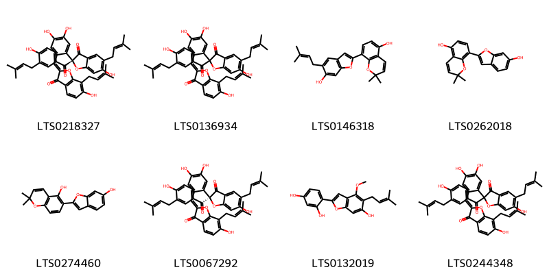
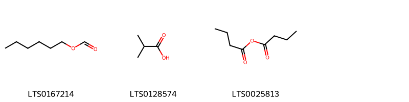
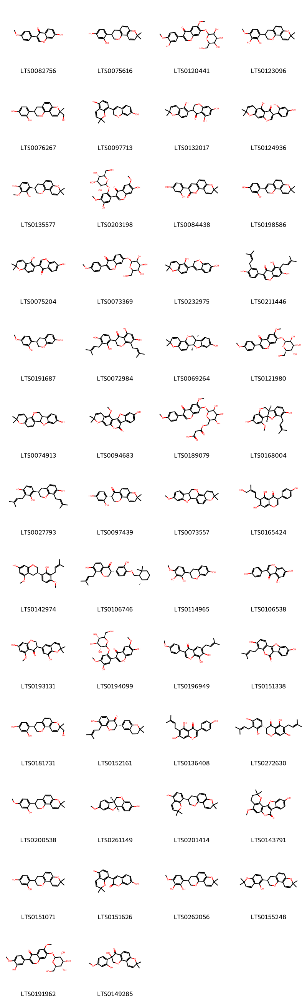
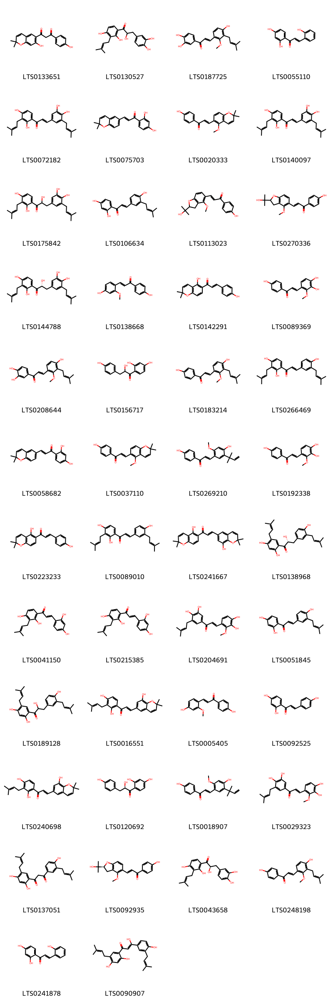
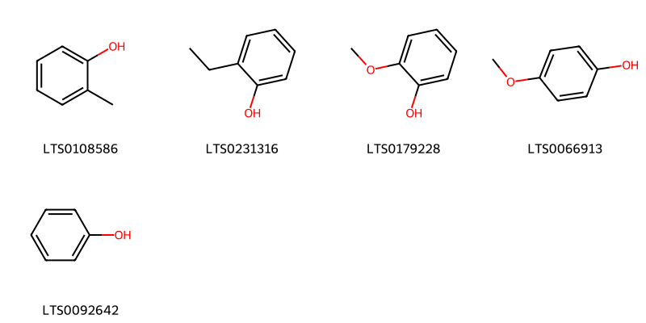
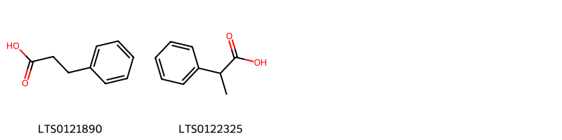
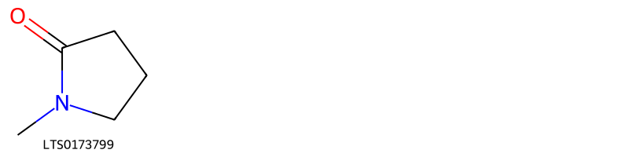
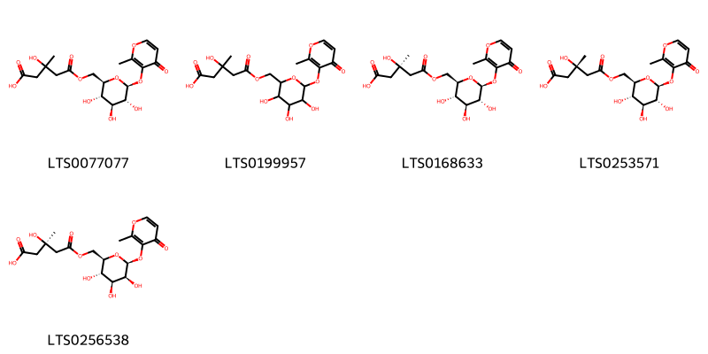
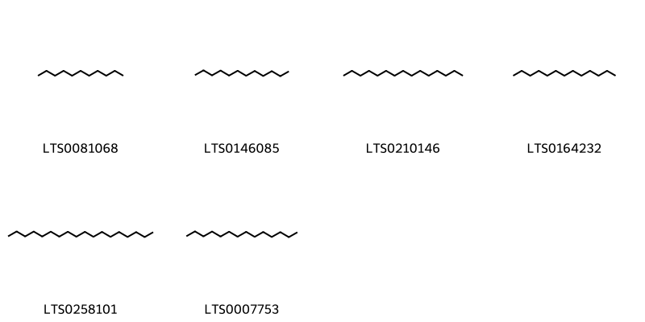
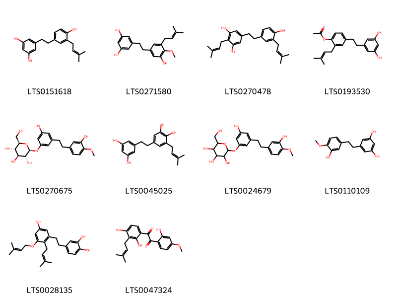

!!! abstract "Tóm tắt"

    Cam Thảo (Radix et Rhizoma Glycyrrhizae) là rễ và thân rễ còn vỏ hoặc đã cạo lớp bần, được phơi hay sấy khô của ba loài Cam thảo Glycyrrhizae uralensis Fisch., Glycyrrhiza inflata Bat. hoặc Giycyrrhiza glabra L., thuộc họ  Đậu (Fabaceae). Cây có nguồn gốc ở vùng ôn đới Âu Á, phân bố chủ yếu ở Liên Bang Nga, Trung Quốc, Mông Cổ, Afghanistan…Theo kinh nghiệm sử dụng dân gian, cam thảo sống được dùng để chữa cảm, ho mất tiếng, viêm họng, mụn nhọt, đau dạ dày, ngộ độc. Hoạt chất chính trong cam thảo là chất glycyrrhizin với tỷ lệ từ 6-14%, có khi tới 23%, thuộc nhóm saponosid. Nhóm flavonoid trong dược liệu này bao gồm các hợp chất liquiritin, liquiritigenin, isoliquiritin, isoliquiritigenin, neoliquiritin,...

## Thông tin về thực vật

Dược liệu **Cam Thảo (Rễ Và Thân Rễ)** từ bộ phận **nan** từ loài *Glycyrrhiza uralensis*.

**Mô tả thực vật:** - Cây cam thảo (Glycyrrhiza uralensis) là một cây sống lâu năm thân có thể cao tới 1m hay 1,5m. Toàn thân cây có lông rất nhỏ. Lá kép lông chim lẻ, lá chét 9-17, hình trứng, đầu nhọn, mép nguyên, dài 2-5,5cm, rộng 1,5-3cm. Vào mùa hạ và mùa thu nở hoa màu tím nhạt, hình cánh bướm dài 14-22mm (cây trồng ở Việt nam sau 3 năm chưa thấy ra hoa). Quả giáp cong hình lưỡi liềm dài 3-4cm, rộng 6-8cm, màu nâu đen, mặt quả có nhiều lông. Trong quả có 2-8 hạt nhỏ dẹt, đường kính 1,5-2mm màu xám nâu, hoặc xanh đen nhạt, mặt bóng. Tại Trung Quốc mùa hoa tháng 6- 7, mùa quả tháng 7-9.
- Cây cam thảo (Glycyrrhiza glabra) rất giống loài cam thảo G. Uralensis, nhưng khác ở chỗ lá chét thuôn dài hơn, dài 1,5-4cm, rộng 0,8- 2,3mm, quả giáp thẳng hoặc hơi cong, dài 2- 3cm, rộng 4-4mm, mặt quả gần như bóng hoặc có lông ngắn, số hạt ít hơn loài trên. Mùa hoa tháng 6-8, mùa quả tháng 7-9.
- Glycyrrhiza inflata Bat. : Cây thảo, sống lâu năm. Rễ và thân rễ khỏe. Thân cao 50-150cm, hóa gỗ ở gốc. Lá 4-20 cm, 3-7 (hoặc 9) lá chét. Chùm hoa có trục ngắn hơn hoặc dài bằng lá, có đốm tuyến dày, có lông tơ dày khi còn non. Đài hoa hình chuông, 5-7 mm, có tuyến dày đặc, có lông tơ và có lông. Tràng hoa màu tím hoặc tím nhạt; chuẩn hình elip hẹp, gốc có vuốt ngắn, đỉnh tròn. Hạt màu xanh lục, hình cầu, đường kính 2-3 mm. Mùa xuân. Tháng 5-7, tháng 6-10.

*Tài liệu tham khảo:* "Những cây thuốc và vị thuốc Việt Nam" - Đỗ Tất Lợi 
Trong dược điển Việt nam, một số loài có thể dùng thay thế cho nhau làm dược liệu bao gồm *Glycyrrhiza uralensis, Glycyrrhiza inflata, Glycyrrhiza glabra*

!!! info "Phân loại thực vật của *N/A*"
    - **Kingdom:** N/A
    - **Phylum:** N/A
    - **Order:** N/A
    - **Family:** N/A
    - **Genus:** N/A
    - **Species:** *N/A*

**Phân bố trên thế giới:** N/A

**Phân bố tại Việt nam:** N/A

 
Chưa có thông tin về loài này trên gibf

!!! info "Phân loại thực vật của *N/A*"
    - **Kingdom:** N/A
    - **Phylum:** N/A
    - **Order:** N/A
    - **Family:** N/A
    - **Genus:** N/A
    - **Species:** *N/A*

**Phân bố trên thế giới:** N/A

**Phân bố tại Việt nam:** N/A

## Thông tin về dược liệu 

### Định danh

!!! info "Thông tin về tên gọi"

    - Dược liệu tiếng Việt: nan
    - Dược liệu tiếng Trung: nan (nan)
    - Dược liệu tiếng Anh: nan
    - Dược liệu latin thông dụng: nan
    - Dược liệu latin kiểu DĐVN: *radix et rhizoma glycyrrhizae*
    - Dược liệu latin kiểu DĐVN: *nan*
    - Dược liệu latin kiểu thông tư: *nan*
    - Bộ phận dùng: nan (nan)

### Mô tả dược liệu 

- **Theo dược điển Việt nam V:** nan

- **Mô tả dược liệu theo thông tư chế biến dược liệu theo phương pháp cổ truyền:** nan

### Chế biến 

- **Chế biến theo dược điển việt nam V**: nan

- **Chế biến theo thông tư:** nan

--- 

## Thành phần hóa học

- Theo tài liệu của GS. Đỗ Tất Lợi:  (1) Nhóm hóa học
Trong cam thảo người ta đã phân tích thấy 3- 8% glucoza, 2,4-6,5% sacaroza, 25-30% tinh bột, 0,3-0,35% tinh dầu, 2-4% asparagin, 11- 30mg% vitamin C, các chất anbuyminoit, gôm, nhựa...
- Rễ của Cam thảo - G. uralensis chứa: glucid 4,7-10,97%, tinh bột 4,17-5,92%. 
+ Hoạt chất thuộc nhóm saponosid là glycyrrhizin.
+ Nhóm flavonoid là liquiritin, liquiritigenin, isoliquiritin, isoliquiritigenin, neoliquiritin, neoiso-liquiritin, licurazid.
- Rễ Cam thảo nhẵn - G. glabra chứa: 20-25% tinh bột, 3-10% glucose và saccharose, các coumarin, triterpen và các sterol. 
+ Dược liệu chứa các hoạt chất saponosid và flavonoid
+ Nhóm saponosid, có hoạt chất ngọt là glycyrrhizin, acid liquiritic… 
+ Nhóm các flavonoid có liquiritin, isoliquirtin, liquiritigentin, isoliquiritigenin, licurasid, và các hợp chất oestrogen có nhân sterol.
(2) Biomarker trong dược điển: Glycyrrhizin
    

**Thành phần hóa học từ loài **Glycyrrhiza glabra**

Theo cơ sở dữ liệu lotus, loài *Glycyrrhiza glabra* đã phân lập và xác định được **450** hoạt chất thuộc về các nhóm Fatty Acyls, Phenols, Carboxylic acids and derivatives, Saturated hydrocarbons, Unsaturated hydrocarbons, Steroids and steroid derivatives, Flavonoids, Phenylpropanoic acids, Saccharolipids, Pyridines and derivatives, Heteroaromatic compounds, Diazines, Benzopyrans, Pyrrolidines, Keto acids and derivatives, 2-arylbenzofuran flavonoids, Benzene and substituted derivatives, Stilbenes, Prenol lipids, Pyrans, Organooxygen compounds, Lactones, Isoflavonoids, Cinnamic acids and derivatives, Indoles and derivatives, Phenol ethers, Aurone flavonoids, Linear 1,3-diarylpropanoids trong bảng dưới đây. Danh sách các hoạt chất như sau n-valeric acid [(LTS0025746)](https://lotus.naturalproducts.net/compound/lotus_id/LTS0025746), hexanol [(LTS0217299)](https://lotus.naturalproducts.net/compound/lotus_id/LTS0217299), aspirin [(LTS0114097)](https://lotus.naturalproducts.net/compound/lotus_id/LTS0114097), glabrocoumarone b [(LTS0274460)](https://lotus.naturalproducts.net/compound/lotus_id/LTS0274460), 1-(4-hydroxyphenyl)-3-(5-methoxy-2,2-dimethylchromen-6-yl)prop-2-en-1-one [(LTS0037110)](https://lotus.naturalproducts.net/compound/lotus_id/LTS0037110), methyl (1r,3s,4r,7s,9s,12s,13r,17s,19r,20r,22s)-9-hydroxy-3,4,8,8,12,19,22-heptamethyl-14-oxo-23-oxahexacyclo[18.2.1.0³,¹⁶.0⁴,¹³.0⁷,¹².0¹⁷,²²]tricos-15-ene-19-carboxylate [(LTS0136217)](https://lotus.naturalproducts.net/compound/lotus_id/LTS0136217), (-)-naringenin [(LTS0072900)](https://lotus.naturalproducts.net/compound/lotus_id/LTS0072900), (2s)-2-(2,2-dimethylchromen-6-yl)-7-hydroxy-8-(3-methylbut-2-en-1-yl)-2,3-dihydro-1-benzopyran-4-one [(LTS0183508)](https://lotus.naturalproducts.net/compound/lotus_id/LTS0183508), glucuronic acid [(LTS0216665)](https://lotus.naturalproducts.net/compound/lotus_id/LTS0216665), capric acid [(LTS0039856)](https://lotus.naturalproducts.net/compound/lotus_id/LTS0039856), 6-methoxy-17,17-dimethyl-3,12,18-trioxapentacyclo[11.8.0.0²,¹⁰.0⁴,⁹.0¹⁴,¹⁹]henicosa-1(21),4,6,8,13,15,19-heptaene [(LTS0073557)](https://lotus.naturalproducts.net/compound/lotus_id/LTS0073557), aldehyde c-18 [(LTS0034678)](https://lotus.naturalproducts.net/compound/lotus_id/LTS0034678), furfuryl formate [(LTS0127012)](https://lotus.naturalproducts.net/compound/lotus_id/LTS0127012), (e)-anethole [(LTS0009997)](https://lotus.naturalproducts.net/compound/lotus_id/LTS0009997), 5-methylundec-2-ene [(LTS0091443)](https://lotus.naturalproducts.net/compound/lotus_id/LTS0091443), 3-hydroxyglabrol [(LTS0231039)](https://lotus.naturalproducts.net/compound/lotus_id/LTS0231039), 1-(5-hydroxy-2,2-dimethylchromen-6-yl)-3-(4-hydroxyphenyl)prop-2-en-1-one [(LTS0142291)](https://lotus.naturalproducts.net/compound/lotus_id/LTS0142291), 8,8-dimethyl-2h,3h,4h-pyrano[2,3-f]chromen-3-ol [(LTS0071518)](https://lotus.naturalproducts.net/compound/lotus_id/LTS0071518), methyl palmitate [(LTS0139222)](https://lotus.naturalproducts.net/compound/lotus_id/LTS0139222), (2r,3r,4s,5s,6r)-2-[(3-methylbut-2-en-1-yl)oxy]-6-({[(2r,3r,4r,5r)-3,4,5-trihydroxyoxan-2-yl]oxy}methyl)oxane-3,4,5-triol [(LTS0216892)](https://lotus.naturalproducts.net/compound/lotus_id/LTS0216892), 5,7-dihydroxy-2-(4-hydroxy-3-methoxyphenyl)-3-[(3,4,5-trihydroxy-6-methyloxan-2-yl)oxy]chromen-4-one [(LTS0119649)](https://lotus.naturalproducts.net/compound/lotus_id/LTS0119649), (2r)-2-phenyl-2-{[(2s,3s,4s,5s,6r)-3,4,5-trihydroxy-6-(hydroxymethyl)oxan-2-yl]oxy}acetonitrile [(LTS0274248)](https://lotus.naturalproducts.net/compound/lotus_id/LTS0274248), 1-(2,4-dihydroxyphenyl)-2-hydroxy-3-(4-hydroxyphenyl)propan-1-one [(LTS0156717)](https://lotus.naturalproducts.net/compound/lotus_id/LTS0156717), acetoin [(LTS0220819)](https://lotus.naturalproducts.net/compound/lotus_id/LTS0220819), 2-acetyl-5-methylfuran [(LTS0240114)](https://lotus.naturalproducts.net/compound/lotus_id/LTS0240114), medicarpin, (-)- [(LTS0261149)](https://lotus.naturalproducts.net/compound/lotus_id/LTS0261149), 5-isopropyl-2-methylcyclohex-2-en-1-one [(LTS0076097)](https://lotus.naturalproducts.net/compound/lotus_id/LTS0076097), (2s)-2-(2,2-dimethylchromen-6-yl)-8,8-dimethyl-2h,3h-pyrano[2,3-f]chromen-4-one [(LTS0082702)](https://lotus.naturalproducts.net/compound/lotus_id/LTS0082702), (2e)-3-(3,4-dihydroxy-2-methoxyphenyl)-1-[3,4-dihydroxy-5-(3-methylbut-2-en-1-yl)phenyl]prop-2-en-1-one [(LTS0204691)](https://lotus.naturalproducts.net/compound/lotus_id/LTS0204691), euchrestaflavanone a [(LTS0048628)](https://lotus.naturalproducts.net/compound/lotus_id/LTS0048628), 5-[2-(3-hydroxy-4-methoxyphenyl)ethyl]benzene-1,3-diol [(LTS0110109)](https://lotus.naturalproducts.net/compound/lotus_id/LTS0110109), ononin [(LTS0235553)](https://lotus.naturalproducts.net/compound/lotus_id/LTS0235553), o-tolunitrile [(LTS0164681)](https://lotus.naturalproducts.net/compound/lotus_id/LTS0164681), butyric anhydride [(LTS0025813)](https://lotus.naturalproducts.net/compound/lotus_id/LTS0025813), terpineol [(LTS0136148)](https://lotus.naturalproducts.net/compound/lotus_id/LTS0136148), licoisoflavanone [(LTS0132017)](https://lotus.naturalproducts.net/compound/lotus_id/LTS0132017), docos-11-enoic acid [(LTS0076402)](https://lotus.naturalproducts.net/compound/lotus_id/LTS0076402), 5-{8,8-dimethyl-2h,3h,4h-pyrano[2,3-f]chromen-3-yl}-2,4-dihydroxybenzaldehyde [(LTS0058805)](https://lotus.naturalproducts.net/compound/lotus_id/LTS0058805), 2-(3,4-dihydroxyphenyl)-5,7-dihydroxy-3-{[(2s,3r,4r,5r,6s)-3,4,5-trihydroxy-6-(hydroxymethyl)oxan-2-yl]oxy}chromen-4-one [(LTS0241372)](https://lotus.naturalproducts.net/compound/lotus_id/LTS0241372), gancaonin l [(LTS0072777)](https://lotus.naturalproducts.net/compound/lotus_id/LTS0072777), 6-methoxy-3-(4-methoxyphenyl)-7-{[(2s,3r,4s,5s,6r)-3,4,5-trihydroxy-6-(hydroxymethyl)oxan-2-yl]oxy}chromen-4-one [(LTS0035338)](https://lotus.naturalproducts.net/compound/lotus_id/LTS0035338), isobavachromene [(LTS0223233)](https://lotus.naturalproducts.net/compound/lotus_id/LTS0223233), (2s)-5,7-dihydroxy-8-[(1e)-3-methylbut-1-en-1-yl]-2-phenyl-2,3-dihydro-1-benzopyran-4-one [(LTS0007447)](https://lotus.naturalproducts.net/compound/lotus_id/LTS0007447), furfuryl alcohol [(LTS0110403)](https://lotus.naturalproducts.net/compound/lotus_id/LTS0110403), (3s)-3-[2,4-dihydroxy-3-(3-methylbut-2-en-1-yl)phenyl]-5,7-dihydroxy-8-(3-methylbut-2-en-1-yl)-2,3-dihydro-1-benzopyran-4-one [(LTS0064499)](https://lotus.naturalproducts.net/compound/lotus_id/LTS0064499), kanzonol y [(LTS0138968)](https://lotus.naturalproducts.net/compound/lotus_id/LTS0138968), 3-methylhept-3-en-2-one [(LTS0260693)](https://lotus.naturalproducts.net/compound/lotus_id/LTS0260693), 5,5',7-trihydroxy-6-(3-hydroxy-3-methylbutyl)-2',2'-dimethyl-[3,6'-bichromen]-4-one [(LTS0260065)](https://lotus.naturalproducts.net/compound/lotus_id/LTS0260065), licochalcone c [(LTS0183214)](https://lotus.naturalproducts.net/compound/lotus_id/LTS0183214), isoglycyrol [(LTS0143791)](https://lotus.naturalproducts.net/compound/lotus_id/LTS0143791), (2r,3r,4r,5s,6s)-6-(hydroxymethyl)-5-{[(2r,3r,4s,5r,6r)-3,4,5-trihydroxy-6-(hydroxymethyl)oxan-2-yl]oxy}oxane-2,3,4-triol [(LTS0220516)](https://lotus.naturalproducts.net/compound/lotus_id/LTS0220516), 3-(3-hydroxy-4-methoxyphenyl)-6-methoxy-7-{[(2s,3r,4s,5s,6r)-3,4,5-trihydroxy-6-(hydroxymethyl)oxan-2-yl]oxy}chromen-4-one [(LTS0191962)](https://lotus.naturalproducts.net/compound/lotus_id/LTS0191962), 3-[2,4-dihydroxy-3-(3-methylbut-2-en-1-yl)phenyl]-7-hydroxy-8-(3-methylbut-2-en-1-yl)chromen-2-one [(LTS0071139)](https://lotus.naturalproducts.net/compound/lotus_id/LTS0071139), 6-methylundec-3-ene [(LTS0096773)](https://lotus.naturalproducts.net/compound/lotus_id/LTS0096773), (2r,4ar,6ar,6bs,10r,12ar,14bs)-10-hydroxy-2,4a,6a,6b,9,9,12a-heptamethyl-13-oxo-3,4,5,6,7,8,8a,10,11,12,12b,14b-dodecahydro-1h-picene-2-carboxylic acid [(LTS0038115)](https://lotus.naturalproducts.net/compound/lotus_id/LTS0038115), 3-(3-hydroxy-4-methoxyphenyl)-7-{[(2s,3s,4s,5s,6r)-3,4,5-trihydroxy-6-(hydroxymethyl)oxan-2-yl]oxy}chromen-4-one [(LTS0262976)](https://lotus.naturalproducts.net/compound/lotus_id/LTS0262976), 5,7-dihydroxy-2-(4-hydroxyphenyl)-6,8-bis[3,4,5-trihydroxy-6-(hydroxymethyl)oxan-2-yl]chromen-4-one [(LTS0255367)](https://lotus.naturalproducts.net/compound/lotus_id/LTS0255367), 7,4'-dihydroxyflavanone [(LTS0155090)](https://lotus.naturalproducts.net/compound/lotus_id/LTS0155090), 3-oxo-3-{[(2r,3s,4s,5r,6s)-3,4,5-trihydroxy-6-{[6-methoxy-3-(4-methoxyphenyl)-4-oxochromen-7-yl]oxy}oxan-2-yl]methoxy}propanoic acid [(LTS0247865)](https://lotus.naturalproducts.net/compound/lotus_id/LTS0247865), 5-methylfurfural [(LTS0186625)](https://lotus.naturalproducts.net/compound/lotus_id/LTS0186625), 8-{8,8-dimethyl-2h,3h,4h-pyrano[2,3-f]chromen-3-yl}-2,2-dimethylchromen-5-ol [(LTS0230700)](https://lotus.naturalproducts.net/compound/lotus_id/LTS0230700), 5,7-dihydroxy-8-(3-methylbut-1-en-1-yl)-2-phenyl-2,3-dihydro-1-benzopyran-4-one [(LTS0135526)](https://lotus.naturalproducts.net/compound/lotus_id/LTS0135526), 2-(4-hydroxy-3-methoxyphenoxy)-6-(hydroxymethyl)oxane-3,4,5-triol [(LTS0085094)](https://lotus.naturalproducts.net/compound/lotus_id/LTS0085094), n-tridecanoic acid [(LTS0032717)](https://lotus.naturalproducts.net/compound/lotus_id/LTS0032717), kanzonol c [(LTS0266469)](https://lotus.naturalproducts.net/compound/lotus_id/LTS0266469), m-cresol, 6-propyl- [(LTS0118684)](https://lotus.naturalproducts.net/compound/lotus_id/LTS0118684), 2',4,4'-trihydroxychalcone [(LTS0092525)](https://lotus.naturalproducts.net/compound/lotus_id/LTS0092525), wighteone [(LTS0136408)](https://lotus.naturalproducts.net/compound/lotus_id/LTS0136408), asahina [(LTS0068303)](https://lotus.naturalproducts.net/compound/lotus_id/LTS0068303), pinocembrine [(LTS0141508)](https://lotus.naturalproducts.net/compound/lotus_id/LTS0141508), keto-d-fructose [(LTS0241114)](https://lotus.naturalproducts.net/compound/lotus_id/LTS0241114), gamma-nonalactone [(LTS0096823)](https://lotus.naturalproducts.net/compound/lotus_id/LTS0096823), lavandulol [(LTS0111607)](https://lotus.naturalproducts.net/compound/lotus_id/LTS0111607), glyinflanin a [(LTS0090907)](https://lotus.naturalproducts.net/compound/lotus_id/LTS0090907), 4-[2-(3,5-dihydroxyphenyl)ethyl]-2-(3-methylbut-2-en-1-yl)phenyl acetate [(LTS0193530)](https://lotus.naturalproducts.net/compound/lotus_id/LTS0193530), isorhamnetin 3-o-glucoside [(LTS0137002)](https://lotus.naturalproducts.net/compound/lotus_id/LTS0137002), niacin [(LTS0216673)](https://lotus.naturalproducts.net/compound/lotus_id/LTS0216673), gancaonin h [(LTS0077774)](https://lotus.naturalproducts.net/compound/lotus_id/LTS0077774), 3-hydroxy-3-methyl-5-oxo-5-({3,4,5-trihydroxy-6-[(2-methyl-4-oxopyran-3-yl)oxy]oxan-2-yl}methoxy)pentanoic acid [(LTS0199957)](https://lotus.naturalproducts.net/compound/lotus_id/LTS0199957), methyl caproate [(LTS0235403)](https://lotus.naturalproducts.net/compound/lotus_id/LTS0235403), 5-hydroxy-2-phenyl-7-{[3,4,5-trihydroxy-6-(hydroxymethyl)oxan-2-yl]oxy}-2,3-dihydro-1-benzopyran-4-one [(LTS0004763)](https://lotus.naturalproducts.net/compound/lotus_id/LTS0004763), isobutyric acid [(LTS0128574)](https://lotus.naturalproducts.net/compound/lotus_id/LTS0128574), (2r,10r)-6-methoxy-17,17-dimethyl-3,12,18-trioxapentacyclo[11.8.0.0²,¹⁰.0⁴,⁹.0¹⁴,¹⁹]henicosa-1(21),4,6,8,13,15,19-heptaene [(LTS0072907)](https://lotus.naturalproducts.net/compound/lotus_id/LTS0072907), isorhamnetin 3-galactoside [(LTS0087575)](https://lotus.naturalproducts.net/compound/lotus_id/LTS0087575), (3r)-3-hydroxy-3-(2-hydroxy-4-methoxyphenyl)-8,8-dimethyl-2h-pyrano[2,3-f]chromen-4-one [(LTS0257210)](https://lotus.naturalproducts.net/compound/lotus_id/LTS0257210), morachalcone a [(LTS0215385)](https://lotus.naturalproducts.net/compound/lotus_id/LTS0215385), 3'-dimethylallylkievitone [(LTS0072984)](https://lotus.naturalproducts.net/compound/lotus_id/LTS0072984), 3-[(3r)-8,8-dimethyl-2h,3h,4h-pyrano[2,3-f]chromen-3-yl]-6-methoxybenzene-1,2-diol [(LTS0262056)](https://lotus.naturalproducts.net/compound/lotus_id/LTS0262056), glyinflanin b [(LTS0133651)](https://lotus.naturalproducts.net/compound/lotus_id/LTS0133651), 1-isopropyl-4-methoxycyclohexane [(LTS0002748)](https://lotus.naturalproducts.net/compound/lotus_id/LTS0002748), methyl 9-hydroxy-3,4,8,8,12,19,22-heptamethyl-14-oxo-23-oxahexacyclo[18.2.1.0³,¹⁶.0⁴,¹³.0⁷,¹².0¹⁷,²²]tricos-15-ene-19-carboxylate [(LTS0165472)](https://lotus.naturalproducts.net/compound/lotus_id/LTS0165472), caprylic acid [(LTS0254176)](https://lotus.naturalproducts.net/compound/lotus_id/LTS0254176), 8-[6-hydroxy-5-(3-methylbut-2-en-1-yl)-1-benzofuran-2-yl]-2,2-dimethylchromen-5-ol [(LTS0146318)](https://lotus.naturalproducts.net/compound/lotus_id/LTS0146318), 1-[1-(furan-2-ylmethyl)pyrrol-2-yl]ethanone [(LTS0268729)](https://lotus.naturalproducts.net/compound/lotus_id/LTS0268729), 7-hydroxy-2-(4-{[3,4,5-trihydroxy-6-(hydroxymethyl)oxan-2-yl]oxy}phenyl)-2,3-dihydro-1-benzopyran-4-one [(LTS0216345)](https://lotus.naturalproducts.net/compound/lotus_id/LTS0216345), 3-(2,2-dimethyl-3,4-dihydro-1-benzopyran-6-yl)-7-hydroxy-8-(3-methylbut-2-en-1-yl)-2,3-dihydro-1-benzopyran-4-one [(LTS0130428)](https://lotus.naturalproducts.net/compound/lotus_id/LTS0130428), β-amyrin [(LTS0251864)](https://lotus.naturalproducts.net/compound/lotus_id/LTS0251864), licoflavone a [(LTS0004664)](https://lotus.naturalproducts.net/compound/lotus_id/LTS0004664), 2-hydroxy-5-methylcyclopent-2-en-1-one [(LTS0226274)](https://lotus.naturalproducts.net/compound/lotus_id/LTS0226274), tetradecane [(LTS0007753)](https://lotus.naturalproducts.net/compound/lotus_id/LTS0007753), 2-(3,4-dihydroxyphenyl)-5-hydroxy-7-{[3,4,5-trihydroxy-6-(hydroxymethyl)oxan-2-yl]oxy}chromen-4-one [(LTS0158292)](https://lotus.naturalproducts.net/compound/lotus_id/LTS0158292), hexanoic acid [(LTS0031054)](https://lotus.naturalproducts.net/compound/lotus_id/LTS0031054), docosyl 3-(3,4-dihydroxyphenyl)prop-2-enoate [(LTS0211386)](https://lotus.naturalproducts.net/compound/lotus_id/LTS0211386), 3-isothujone [(LTS0158119)](https://lotus.naturalproducts.net/compound/lotus_id/LTS0158119), (3s)-3-[2,4-dihydroxy-3-(3-methylbut-2-en-1-yl)phenyl]-5,7-dihydroxy-6-(3-methylbut-2-en-1-yl)-2,3-dihydro-1-benzopyran-4-one [(LTS0272630)](https://lotus.naturalproducts.net/compound/lotus_id/LTS0272630), 2-methyl-2-phenylpropan-1-ol [(LTS0178647)](https://lotus.naturalproducts.net/compound/lotus_id/LTS0178647), 3-(2,4-dihydroxyphenyl)-8,8-dimethylpyrano[2,3-f]chromen-2-one [(LTS0084438)](https://lotus.naturalproducts.net/compound/lotus_id/LTS0084438), hispaglabridin a [(LTS0267683)](https://lotus.naturalproducts.net/compound/lotus_id/LTS0267683), (2r,3r,4s,5s,6r)-2-[(3-methylbut-2-en-1-yl)oxy]-6-({[(2s,3r,4s,5s)-3,4,5-trihydroxyoxan-2-yl]oxy}methyl)oxane-3,4,5-triol [(LTS0138819)](https://lotus.naturalproducts.net/compound/lotus_id/LTS0138819), hispaglabridin b [(LTS0155248)](https://lotus.naturalproducts.net/compound/lotus_id/LTS0155248), isoglycycoumarin [(LTS0066952)](https://lotus.naturalproducts.net/compound/lotus_id/LTS0066952), 3-[4-hydroxy-2-methoxy-3-(3-methylbut-2-en-1-yl)phenyl]-1-(4-hydroxyphenyl)prop-2-en-1-one [(LTS0248198)](https://lotus.naturalproducts.net/compound/lotus_id/LTS0248198), 1-[2,4-dihydroxy-5-(3-methylbut-2-en-1-yl)phenyl]-3-[4-hydroxy-3-(3-methylbut-2-en-1-yl)phenyl]propane-1,3-dione [(LTS0137051)](https://lotus.naturalproducts.net/compound/lotus_id/LTS0137051), 3-(3-hydroxy-4-methoxyphenyl)-6-methoxy-7-{[3,4,5-trihydroxy-6-(hydroxymethyl)oxan-2-yl]oxy}chromen-4-one [(LTS0120441)](https://lotus.naturalproducts.net/compound/lotus_id/LTS0120441), 3'-methoxyglabradin [(LTS0135577)](https://lotus.naturalproducts.net/compound/lotus_id/LTS0135577), (2s,3r,4s,5s,6r)-2-{3-hydroxy-5-[2-(3-hydroxy-4-methoxyphenyl)ethyl]phenoxy}-6-(hydroxymethyl)oxane-3,4,5-triol [(LTS0270675)](https://lotus.naturalproducts.net/compound/lotus_id/LTS0270675), (1r,9r,17s,18r,27s)-5,13,23-trihydroxy-27-[4-hydroxy-3-(3-methylbut-2-en-1-yl)phenyl]-6,22-bis(3-methylbut-2-en-1-yl)-8,10,26,28-tetraoxaheptacyclo[15.11.0.0¹,⁹.0²,⁷.0¹¹,¹⁶.0¹⁸,²⁷.0²⁰,²⁵]octacosa-2(7),3,5,11,13,15,20,22,24-nonaen-19-one [(LTS0067434)](https://lotus.naturalproducts.net/compound/lotus_id/LTS0067434), furan-2-ylmethyl butanoate [(LTS0238944)](https://lotus.naturalproducts.net/compound/lotus_id/LTS0238944), (+)-glucose [(LTS0262158)](https://lotus.naturalproducts.net/compound/lotus_id/LTS0262158), ethyl palmitate [(LTS0111042)](https://lotus.naturalproducts.net/compound/lotus_id/LTS0111042), pinocembrin [(LTS0155292)](https://lotus.naturalproducts.net/compound/lotus_id/LTS0155292), (2z)-2-[(3,4-dihydroxyphenyl)methylidene]-6-hydroxy-7-(3-methylbut-2-en-1-yl)-1-benzofuran-3-one [(LTS0054967)](https://lotus.naturalproducts.net/compound/lotus_id/LTS0054967), 3-(3,4-dihydroxy-2-methoxyphenyl)-1-(4-hydroxyphenyl)prop-2-en-1-one [(LTS0089369)](https://lotus.naturalproducts.net/compound/lotus_id/LTS0089369), 2-phenyl-ethanol [(LTS0206341)](https://lotus.naturalproducts.net/compound/lotus_id/LTS0206341), tephrinone [(LTS0027534)](https://lotus.naturalproducts.net/compound/lotus_id/LTS0027534), formononetin 7-o-glucoside [(LTS0073369)](https://lotus.naturalproducts.net/compound/lotus_id/LTS0073369), licoagrochalcone b [(LTS0020333)](https://lotus.naturalproducts.net/compound/lotus_id/LTS0020333), tridecane [(LTS0164232)](https://lotus.naturalproducts.net/compound/lotus_id/LTS0164232), (2s,3r,4s,5s,6r)-2-(4-hydroxy-2-methoxyphenoxy)-6-(hydroxymethyl)oxane-3,4,5-triol [(LTS0209679)](https://lotus.naturalproducts.net/compound/lotus_id/LTS0209679), benzyl alcohol [(LTS0125638)](https://lotus.naturalproducts.net/compound/lotus_id/LTS0125638), 3-[2,4-dihydroxy-3-(3-methylbut-2-en-1-yl)phenyl]-5,7-dihydroxy-6-(3-methylbut-2-en-1-yl)-2,3-dihydro-1-benzopyran-4-one [(LTS0061449)](https://lotus.naturalproducts.net/compound/lotus_id/LTS0061449), thymol [(LTS0168527)](https://lotus.naturalproducts.net/compound/lotus_id/LTS0168527), (2s,4s,5r,6r)-5-{[(2s,3r,4s,5r,6r)-3-{[(2s,3r,5r,6s)-3,5-dihydroxy-6-methyloxan-2-yl]oxy}-4,5-dihydroxy-6-(hydroxymethyl)oxan-2-yl]oxy}-3,4-dihydroxy-6-{[9-hydroxy-4-(hydroxymethyl)-4,6a,6b,8a,11,11,14b-heptamethyl-1,2,3,4a,5,6,7,8,9,10,12,12a,14,14a-tetradecahydropicen-2-yl]oxy}oxane-2-carboxylic acid [(LTS0158663)](https://lotus.naturalproducts.net/compound/lotus_id/LTS0158663), monoisobutyl adipate [(LTS0036329)](https://lotus.naturalproducts.net/compound/lotus_id/LTS0036329), glabranin [(LTS0250433)](https://lotus.naturalproducts.net/compound/lotus_id/LTS0250433), 1-(3,4-dihydroxyphenyl)-3-[4-hydroxy-2-methoxy-3-(3-methylbut-2-en-1-yl)phenyl]prop-2-en-1-one [(LTS0208644)](https://lotus.naturalproducts.net/compound/lotus_id/LTS0208644), lupiwighteone [(LTS0229079)](https://lotus.naturalproducts.net/compound/lotus_id/LTS0229079), (2s)-5-hydroxy-7-methoxy-8-(3-methylbut-2-en-1-yl)-2-phenyl-2,3-dihydro-1-benzopyran-4-one [(LTS0130440)](https://lotus.naturalproducts.net/compound/lotus_id/LTS0130440), (3s,8s)-8-(hydroxymethyl)-8-methyl-2h,3h,4h-pyrano[2,3-f]chromen-3-ol [(LTS0146230)](https://lotus.naturalproducts.net/compound/lotus_id/LTS0146230), p-propenylanisole [(LTS0177188)](https://lotus.naturalproducts.net/compound/lotus_id/LTS0177188), 3-phenylpropionic acid [(LTS0121890)](https://lotus.naturalproducts.net/compound/lotus_id/LTS0121890), sophoraflavanone b [(LTS0058527)](https://lotus.naturalproducts.net/compound/lotus_id/LTS0058527), (3s)-8,8-dimethyl-2h,3h,4h-pyrano[2,3-f]chromen-3-ol [(LTS0116780)](https://lotus.naturalproducts.net/compound/lotus_id/LTS0116780), linalool dihydroepoxide [(LTS0088799)](https://lotus.naturalproducts.net/compound/lotus_id/LTS0088799), betulinic acid [(LTS0210795)](https://lotus.naturalproducts.net/compound/lotus_id/LTS0210795), (2r)-1-(2,4-dihydroxyphenyl)-2-hydroxy-3-(4-hydroxyphenyl)propan-1-one [(LTS0120692)](https://lotus.naturalproducts.net/compound/lotus_id/LTS0120692), heptanoic acid [(LTS0126063)](https://lotus.naturalproducts.net/compound/lotus_id/LTS0126063), 5,7-dihydroxy-2-(4-hydroxyphenyl)-6-(3-methylbut-2-en-1-yl)-2,3-dihydro-1-benzopyran-4-one [(LTS0025037)](https://lotus.naturalproducts.net/compound/lotus_id/LTS0025037), 1-propanone, 1-(2-furanyl)- [(LTS0065972)](https://lotus.naturalproducts.net/compound/lotus_id/LTS0065972), licopyranocoumarin [(LTS0048734)](https://lotus.naturalproducts.net/compound/lotus_id/LTS0048734), phaseol [(LTS0151338)](https://lotus.naturalproducts.net/compound/lotus_id/LTS0151338), xambioona [(LTS0139725)](https://lotus.naturalproducts.net/compound/lotus_id/LTS0139725), dibutyl-phthalate [(LTS0274156)](https://lotus.naturalproducts.net/compound/lotus_id/LTS0274156), abyssinone ii [(LTS0225956)](https://lotus.naturalproducts.net/compound/lotus_id/LTS0225956), (-)-lavandulol [(LTS0182567)](https://lotus.naturalproducts.net/compound/lotus_id/LTS0182567), 5,7-dihydroxy-2-(4-hydroxyphenyl)-8-{[(2s,3r,4s,5s,6r)-3,4,5-trihydroxy-6-(hydroxymethyl)oxan-2-yl]oxy}-6-{[(2s,3r,4s,5s)-3,4,5-trihydroxyoxan-2-yl]oxy}chromen-4-one [(LTS0200968)](https://lotus.naturalproducts.net/compound/lotus_id/LTS0200968), 14-methoxy-6-(3-methylbut-2-en-1-yl)-8,17-dioxatetracyclo[8.7.0.0²,⁷.0¹¹,¹⁶]heptadeca-2,4,6,11,13,15-hexaen-5-ol [(LTS0246095)](https://lotus.naturalproducts.net/compound/lotus_id/LTS0246095), 3-[2-hydroxy-4-methoxy-3-(3-methylbut-2-en-1-yl)phenyl]-5-methoxy-3,4-dihydro-2h-1-benzopyran-7-ol [(LTS0255305)](https://lotus.naturalproducts.net/compound/lotus_id/LTS0255305), (2s,3s,4s,5r,6s)-6-{[(3s,4ar,6ar,6bs,8as,11s,12as,14ar,14bs)-11-carboxy-4,4,6a,6b,8a,11,14b-heptamethyl-14-oxo-2,3,4a,5,6,7,8,9,10,12,12a,14a-dodecahydro-1h-picen-3-yl]oxy}-5-{[(2r,3r,4s,5s,6s)-6-carboxy-3,4,5-trihydroxyoxan-2-yl]oxy}-3,4-dihydroxyoxane-2-carboxylic acid [(LTS0017051)](https://lotus.naturalproducts.net/compound/lotus_id/LTS0017051), genistein [(LTS0106538)](https://lotus.naturalproducts.net/compound/lotus_id/LTS0106538), kumatakenin [(LTS0018267)](https://lotus.naturalproducts.net/compound/lotus_id/LTS0018267), undecane [(LTS0081068)](https://lotus.naturalproducts.net/compound/lotus_id/LTS0081068), schaftoside [(LTS0104338)](https://lotus.naturalproducts.net/compound/lotus_id/LTS0104338), vicenin 2 [(LTS0181160)](https://lotus.naturalproducts.net/compound/lotus_id/LTS0181160), 3-(4-methoxyphenyl)-7-{[(2s,3s,4s,5s,6s)-3,4,5-trihydroxy-6-(hydroxymethyl)oxan-2-yl]oxy}chromen-4-one [(LTS0042622)](https://lotus.naturalproducts.net/compound/lotus_id/LTS0042622), licoricidin [(LTS0274337)](https://lotus.naturalproducts.net/compound/lotus_id/LTS0274337), kanzonol b [(LTS0075703)](https://lotus.naturalproducts.net/compound/lotus_id/LTS0075703), 3-oxo-3-{[(2s,3s,4s,5r,6s)-3,4,5-trihydroxy-6-{[6-methoxy-3-(4-methoxyphenyl)-4-oxochromen-7-yl]oxy}oxan-2-yl]methoxy}propanoic acid [(LTS0211389)](https://lotus.naturalproducts.net/compound/lotus_id/LTS0211389), icosyl 3-(3,4-dihydroxyphenyl)prop-2-enoate [(LTS0177140)](https://lotus.naturalproducts.net/compound/lotus_id/LTS0177140), 1-[2,4-dihydroxy-3-(3-methylbut-2-en-1-yl)phenyl]-3-(8-hydroxy-2,2-dimethylchromen-6-yl)prop-2-en-1-one [(LTS0240698)](https://lotus.naturalproducts.net/compound/lotus_id/LTS0240698), isoquercetin [(LTS0254337)](https://lotus.naturalproducts.net/compound/lotus_id/LTS0254337), guaiacol [(LTS0179228)](https://lotus.naturalproducts.net/compound/lotus_id/LTS0179228), myrtenal [(LTS0202475)](https://lotus.naturalproducts.net/compound/lotus_id/LTS0202475), licoagrochalcone a [(LTS0106634)](https://lotus.naturalproducts.net/compound/lotus_id/LTS0106634), 1-[2,4-dihydroxy-3-(3-methylbut-2-en-1-yl)phenyl]-3-[4-hydroxy-3-(3-methylbut-2-en-1-yl)phenyl]prop-2-en-1-one [(LTS0089010)](https://lotus.naturalproducts.net/compound/lotus_id/LTS0089010), phenylacetaldehyde [(LTS0245512)](https://lotus.naturalproducts.net/compound/lotus_id/LTS0245512), hexanone [(LTS0108749)](https://lotus.naturalproducts.net/compound/lotus_id/LTS0108749), 3-(7-hydroxy-3,4-dihydro-2h-1-benzopyran-3-yl)-6-methoxybenzene-1,2-diol [(LTS0114965)](https://lotus.naturalproducts.net/compound/lotus_id/LTS0114965), 2-[4-hydroxy-3-(3-methylbut-2-en-1-yl)phenyl]-8,8-dimethyl-2h,3h-pyrano[2,3-f]chromen-4-one [(LTS0114552)](https://lotus.naturalproducts.net/compound/lotus_id/LTS0114552), quercitrin [(LTS0186298)](https://lotus.naturalproducts.net/compound/lotus_id/LTS0186298), lespedezaflavanone b [(LTS0216836)](https://lotus.naturalproducts.net/compound/lotus_id/LTS0216836), (2s,3r,4s,5r,6r)-2-(4-hydroxy-2-methoxyphenoxy)-6-(hydroxymethyl)oxane-3,4,5-triol [(LTS0074148)](https://lotus.naturalproducts.net/compound/lotus_id/LTS0074148), 1-[2,4-dihydroxy-3-(3-methylbut-2-en-1-yl)phenyl]-3-(2,4-dihydroxyphenyl)prop-2-en-1-one [(LTS0041150)](https://lotus.naturalproducts.net/compound/lotus_id/LTS0041150), 1-methylpyrrole-2-carbaldehyde [(LTS0242796)](https://lotus.naturalproducts.net/compound/lotus_id/LTS0242796), 8-(hydroxymethyl)-8-methyl-2h,3h,4h-pyrano[2,3-f]chromen-3-ol [(LTS0176159)](https://lotus.naturalproducts.net/compound/lotus_id/LTS0176159), stigmast-5-en-3-ol, (3β)- [(LTS0204616)](https://lotus.naturalproducts.net/compound/lotus_id/LTS0204616), glycycoumarin [(LTS0186848)](https://lotus.naturalproducts.net/compound/lotus_id/LTS0186848), octadecane [(LTS0258101)](https://lotus.naturalproducts.net/compound/lotus_id/LTS0258101), palmitic acid [(LTS0079439)](https://lotus.naturalproducts.net/compound/lotus_id/LTS0079439), glabrene [(LTS0232975)](https://lotus.naturalproducts.net/compound/lotus_id/LTS0232975), (2r)-2-(4,5-dihydroxy-2-{[(2z)-6-hydroxy-7-(3-methylbut-2-en-1-yl)-3-oxo-1-benzofuran-2-ylidene]methyl}phenyl)-6-hydroxy-2-[4-hydroxy-3-(3-methylbut-2-en-1-yl)benzoyl]-5-(3-methylbut-2-en-1-yl)-1-benzofuran-3-one [(LTS0067292)](https://lotus.naturalproducts.net/compound/lotus_id/LTS0067292), hispaglabridin b [(LTS0267211)](https://lotus.naturalproducts.net/compound/lotus_id/LTS0267211), 1-[2,4-dihydroxy-3-(3-methylbut-2-en-1-yl)phenyl]-2-(2-hydroxy-4-methoxyphenyl)ethane-1,2-dione [(LTS0047324)](https://lotus.naturalproducts.net/compound/lotus_id/LTS0047324), 2-(4,5-dihydroxy-2-{[6-hydroxy-7-(3-methylbut-2-en-1-yl)-3-oxo-1-benzofuran-2-ylidene]methyl}phenyl)-6-hydroxy-2-[4-hydroxy-3-(3-methylbut-2-en-1-yl)benzoyl]-5-(3-methylbut-2-en-1-yl)-1-benzofuran-3-one [(LTS0136934)](https://lotus.naturalproducts.net/compound/lotus_id/LTS0136934), 8-[(3r)-8,8-dimethyl-2h,3h,4h-pyrano[2,3-f]chromen-3-yl]-2,2-dimethylchromen-5-ol [(LTS0201414)](https://lotus.naturalproducts.net/compound/lotus_id/LTS0201414), 2-hydroxy-4-methylbenzaldehyde [(LTS0097980)](https://lotus.naturalproducts.net/compound/lotus_id/LTS0097980), lupalbigenin [(LTS0211446)](https://lotus.naturalproducts.net/compound/lotus_id/LTS0211446), formononetin [(LTS0082756)](https://lotus.naturalproducts.net/compound/lotus_id/LTS0082756), (2s,3s,4s,5r,6r)-6-{[(1r,3as,3br,7s,9ar,9bs,11ar)-3a,6,6,9a,11a-pentamethyl-1-[(2r)-6-methylhept-5-en-2-yl]-1h,2h,3h,3bh,4h,7h,8h,9h,9bh,10h,11h-cyclopenta[a]phenanthren-7-yl]oxy}-3,4,5-trihydroxyoxane-2-carboxylic acid [(LTS0275591)](https://lotus.naturalproducts.net/compound/lotus_id/LTS0275591), γ-heptalactone [(LTS0176406)](https://lotus.naturalproducts.net/compound/lotus_id/LTS0176406), 1-pentadecanol [(LTS0216633)](https://lotus.naturalproducts.net/compound/lotus_id/LTS0216633), (3s)-3-(2,4-dihydroxyphenyl)-8,8-dimethyl-2h,3h-pyrano[2,3-f]chromen-4-one [(LTS0097439)](https://lotus.naturalproducts.net/compound/lotus_id/LTS0097439), α-phenylbutyric acid [(LTS0194202)](https://lotus.naturalproducts.net/compound/lotus_id/LTS0194202), naringenin [(LTS0031098)](https://lotus.naturalproducts.net/compound/lotus_id/LTS0031098), 6-methoxy-3-(4-methoxyphenyl)-7-{[(2s,3s,4s,5s,6r)-3,4,5-trihydroxy-6-(hydroxymethyl)oxan-2-yl]oxy}chromen-4-one [(LTS0121980)](https://lotus.naturalproducts.net/compound/lotus_id/LTS0121980), soyasaponin ii [(LTS0184048)](https://lotus.naturalproducts.net/compound/lotus_id/LTS0184048), (3r)-5,7-dihydroxy-3-(5-hydroxy-2,2-dimethylchromen-6-yl)-2,3-dihydro-1-benzopyran-4-one [(LTS0241823)](https://lotus.naturalproducts.net/compound/lotus_id/LTS0241823), pseudoionone [(LTS0119297)](https://lotus.naturalproducts.net/compound/lotus_id/LTS0119297), 4-{8,8-dimethyl-2h,3h,4h-pyrano[2,3-f]chromen-3-yl}-2-(3-methylbut-2-en-1-yl)benzene-1,3-diol [(LTS0188522)](https://lotus.naturalproducts.net/compound/lotus_id/LTS0188522), licocoumarone [(LTS0132019)](https://lotus.naturalproducts.net/compound/lotus_id/LTS0132019), furfuryl propionate [(LTS0162329)](https://lotus.naturalproducts.net/compound/lotus_id/LTS0162329), parvisoflavone b [(LTS0124936)](https://lotus.naturalproducts.net/compound/lotus_id/LTS0124936), (2r)-1-[2,4-dihydroxy-3-(3-methylbut-2-en-1-yl)phenyl]-3-[3,4-dihydroxy-5-(3-methylbut-2-en-1-yl)phenyl]-2-hydroxypropan-1-one [(LTS0144788)](https://lotus.naturalproducts.net/compound/lotus_id/LTS0144788), acetylfuran [(LTS0186281)](https://lotus.naturalproducts.net/compound/lotus_id/LTS0186281), myristic acid [(LTS0102566)](https://lotus.naturalproducts.net/compound/lotus_id/LTS0102566), (1r,10r)-14-methoxy-6-(3-methylbut-2-en-1-yl)-8,17-dioxatetracyclo[8.7.0.0²,⁷.0¹¹,¹⁶]heptadeca-2,4,6,11,13,15-hexaen-5-ol [(LTS0080282)](https://lotus.naturalproducts.net/compound/lotus_id/LTS0080282), 5-[2-(3,5-dihydroxyphenyl)ethyl]-3-(3-methylbut-2-en-1-yl)benzene-1,2-diol [(LTS0045025)](https://lotus.naturalproducts.net/compound/lotus_id/LTS0045025), licoagrochalcone d [(LTS0270336)](https://lotus.naturalproducts.net/compound/lotus_id/LTS0270336), glycyrrhetinic acid [(LTS0198644)](https://lotus.naturalproducts.net/compound/lotus_id/LTS0198644), (2s)-2-(4-{[(2s,3r,4s,5s,6s)-3-{[(2s,3s,4r)-3,4-dihydroxy-4-(hydroxymethyl)oxolan-2-yl]oxy}-4,5-dihydroxy-6-(hydroxymethyl)oxan-2-yl]oxy}phenyl)-7-hydroxy-2,3-dihydro-1-benzopyran-4-one [(LTS0036288)](https://lotus.naturalproducts.net/compound/lotus_id/LTS0036288), (2r,4ar,6as,6br,8ar,10s,12ar,12bs,14bs)-10-methoxy-2,4a,6a,6b,9,9,12a-heptamethyl-13-oxo-3,4,5,6,7,8,8a,10,11,12,12b,14b-dodecahydro-1h-picene-2-carboxylic acid [(LTS0093492)](https://lotus.naturalproducts.net/compound/lotus_id/LTS0093492), glycyrrhizin [(LTS0121878)](https://lotus.naturalproducts.net/compound/lotus_id/LTS0121878), neoliquiritin [(LTS0089772)](https://lotus.naturalproducts.net/compound/lotus_id/LTS0089772), pinit [(LTS0010732)](https://lotus.naturalproducts.net/compound/lotus_id/LTS0010732), sitosterol [(LTS0168132)](https://lotus.naturalproducts.net/compound/lotus_id/LTS0168132), 5,7-dihydroxy-6-(4-hydroxy-3-methylbut-2-en-1-yl)-3-(4-hydroxyphenyl)chromen-4-one [(LTS0165424)](https://lotus.naturalproducts.net/compound/lotus_id/LTS0165424), (3r)-3-[2-hydroxy-4-methoxy-3-(3-methylbut-2-en-1-yl)phenyl]-5-methoxy-3,4-dihydro-2h-1-benzopyran-7-ol [(LTS0142974)](https://lotus.naturalproducts.net/compound/lotus_id/LTS0142974), talmon [(LTS0152081)](https://lotus.naturalproducts.net/compound/lotus_id/LTS0152081), 1-(furan-2-ylmethyl)pyrrole-2-carbaldehyde [(LTS0185094)](https://lotus.naturalproducts.net/compound/lotus_id/LTS0185094), pinitol [(LTS0194724)](https://lotus.naturalproducts.net/compound/lotus_id/LTS0194724), (2s,3s,4s,5r,6s)-6-{[(3s,4ar,6ar,6bs,8as,11s,12ar,14ar,14bs)-11-carboxy-4,4,6a,6b,8a,11,14b-heptamethyl-14-oxo-2,3,4a,5,6,7,8,9,10,12,12a,14a-dodecahydro-1h-picen-3-yl]oxy}-5-{[(2s,3r,4r)-3,4-dihydroxy-4-(hydroxymethyl)oxolan-2-yl]oxy}-3,4-dihydroxyoxane-2-carboxylic acid [(LTS0269568)](https://lotus.naturalproducts.net/compound/lotus_id/LTS0269568), (2e)-1-[2,4-dihydroxy-3-(3-methylbut-2-en-1-yl)phenyl]-3-(8-hydroxy-2,2-dimethylchromen-6-yl)prop-2-en-1-one [(LTS0016551)](https://lotus.naturalproducts.net/compound/lotus_id/LTS0016551), 5,7-dihydroxy-2-(4-hydroxy-3-methoxyphenyl)-3-{[(2s,3r,4r,5r,6s)-3,4,5-trihydroxy-6-methyloxan-2-yl]oxy}chromen-4-one [(LTS0088005)](https://lotus.naturalproducts.net/compound/lotus_id/LTS0088005), stigmasterol [(LTS0024262)](https://lotus.naturalproducts.net/compound/lotus_id/LTS0024262), (2s,4as,6as,6br,8ar,10s,12as,12br,14bs)-10-hydroxy-2,4a,6a,6b,9,9,12a-heptamethyl-13-oxo-3,4,5,6,7,8,8a,10,11,12,12b,14b-dodecahydro-1h-picene-2-carboxylic acid [(LTS0062944)](https://lotus.naturalproducts.net/compound/lotus_id/LTS0062944), glycyrol [(LTS0024924)](https://lotus.naturalproducts.net/compound/lotus_id/LTS0024924), hexyl formate [(LTS0167214)](https://lotus.naturalproducts.net/compound/lotus_id/LTS0167214), enoxolone [(LTS0222995)](https://lotus.naturalproducts.net/compound/lotus_id/LTS0222995), glucose [(LTS0013597)](https://lotus.naturalproducts.net/compound/lotus_id/LTS0013597), vicenin-2 [(LTS0103522)](https://lotus.naturalproducts.net/compound/lotus_id/LTS0103522), liquiritin [(LTS0103894)](https://lotus.naturalproducts.net/compound/lotus_id/LTS0103894), 6-methyl-5-hepten-2-one [(LTS0241073)](https://lotus.naturalproducts.net/compound/lotus_id/LTS0241073), γ-octalactone [(LTS0055875)](https://lotus.naturalproducts.net/compound/lotus_id/LTS0055875), glabrone [(LTS0075204)](https://lotus.naturalproducts.net/compound/lotus_id/LTS0075204), 4-{2-[5-hydroxy-2-(3-methylbut-2-en-1-yl)-3-[(3-methylbut-2-en-1-yl)oxy]phenyl]ethyl}benzene-1,2-diol [(LTS0028135)](https://lotus.naturalproducts.net/compound/lotus_id/LTS0028135), lauric acid [(LTS0051907)](https://lotus.naturalproducts.net/compound/lotus_id/LTS0051907), methylpyrrolidone [(LTS0173799)](https://lotus.naturalproducts.net/compound/lotus_id/LTS0173799), yinyanghuo d [(LTS0063487)](https://lotus.naturalproducts.net/compound/lotus_id/LTS0063487), mono-n-butylphthalate [(LTS0020034)](https://lotus.naturalproducts.net/compound/lotus_id/LTS0020034), quercitrin [(LTS0093095)](https://lotus.naturalproducts.net/compound/lotus_id/LTS0093095), glyinflanin g [(LTS0241667)](https://lotus.naturalproducts.net/compound/lotus_id/LTS0241667), icosyl (2e)-3-(3,4-dihydroxyphenyl)prop-2-enoate [(LTS0029072)](https://lotus.naturalproducts.net/compound/lotus_id/LTS0029072), 5,7-dihydroxy-2-(4-hydroxyphenyl)-6-[(3r,4r,5s,6r)-3,4,5-trihydroxy-6-(hydroxymethyl)oxan-2-yl]-8-[(2s,3r,4s,5s)-3,4,5-trihydroxyoxan-2-yl]chromen-4-one [(LTS0158548)](https://lotus.naturalproducts.net/compound/lotus_id/LTS0158548), 5,7-dihydroxy-2-(4-hydroxyphenyl)-6-[(2r,3r,4r,5s,6r)-3,4,5-trihydroxy-6-(hydroxymethyl)oxan-2-yl]chromen-4-one [(LTS0174203)](https://lotus.naturalproducts.net/compound/lotus_id/LTS0174203), glabrocoumarone a [(LTS0262018)](https://lotus.naturalproducts.net/compound/lotus_id/LTS0262018), (2r,10r)-17,17-dimethyl-3,12,18-trioxapentacyclo[11.8.0.0²,¹⁰.0⁴,⁹.0¹⁴,¹⁹]henicosa-1(13),4,6,8,14(19),15,20-heptaen-6-ol [(LTS0069264)](https://lotus.naturalproducts.net/compound/lotus_id/LTS0069264), pentadecanoic acid [(LTS0227120)](https://lotus.naturalproducts.net/compound/lotus_id/LTS0227120), 10-methoxy-2,4a,6a,6b,9,9,12a-heptamethyl-13-oxo-3,4,5,6,7,8,8a,10,11,12,12b,14b-dodecahydro-1h-picene-2-carboxylic acid [(LTS0224313)](https://lotus.naturalproducts.net/compound/lotus_id/LTS0224313), 4-[(3r)-7-hydroxy-8-(3-methylbut-2-en-1-yl)-3,4-dihydro-2h-1-benzopyran-3-yl]-2-(3-methylbut-2-en-1-yl)benzene-1,3-diol [(LTS0027793)](https://lotus.naturalproducts.net/compound/lotus_id/LTS0027793), 2-(3,4-dihydroxyphenyl)-5,7-dihydroxy-3-{[(2s,3r,4r,5s,6r)-3,4,5-trihydroxy-6-(hydroxymethyl)oxan-2-yl]oxy}chromen-4-one [(LTS0220665)](https://lotus.naturalproducts.net/compound/lotus_id/LTS0220665), 2-(4-hydroxy-2-methoxyphenoxy)-6-(hydroxymethyl)oxane-3,4,5-triol [(LTS0150683)](https://lotus.naturalproducts.net/compound/lotus_id/LTS0150683), cymene [(LTS0181568)](https://lotus.naturalproducts.net/compound/lotus_id/LTS0181568), 1-[2,4-dihydroxy-5-(3-methylbut-2-en-1-yl)phenyl]-2-hydroxy-3-[4-hydroxy-3-(3-methylbut-2-en-1-yl)phenyl]propan-1-one [(LTS0189128)](https://lotus.naturalproducts.net/compound/lotus_id/LTS0189128), 5-pentylpyran-2-one [(LTS0251866)](https://lotus.naturalproducts.net/compound/lotus_id/LTS0251866), carvacrol [(LTS0012882)](https://lotus.naturalproducts.net/compound/lotus_id/LTS0012882), 1-(2,4-dihydroxyphenyl)-3-(2-hydroxyphenyl)prop-2-en-1-one [(LTS0055110)](https://lotus.naturalproducts.net/compound/lotus_id/LTS0055110), 3-(4-hydroxy-2-methoxyphenyl)-1-(4-hydroxyphenyl)prop-2-en-1-one [(LTS0005405)](https://lotus.naturalproducts.net/compound/lotus_id/LTS0005405), salicyclic acid [(LTS0116548)](https://lotus.naturalproducts.net/compound/lotus_id/LTS0116548), 2-[(3r)-8,8-dimethyl-2h,3h,4h-pyrano[2,3-f]chromen-3-yl]-5-methoxyphenol [(LTS0211997)](https://lotus.naturalproducts.net/compound/lotus_id/LTS0211997), fenchone [(LTS0126716)](https://lotus.naturalproducts.net/compound/lotus_id/LTS0126716), (2s)-2-(4,5-dihydroxy-2-{[(2z)-6-hydroxy-7-(3-methylbut-2-en-1-yl)-3-oxo-1-benzofuran-2-ylidene]methyl}phenyl)-6-hydroxy-2-[4-hydroxy-3-(3-methylbut-2-en-1-yl)benzoyl]-5-(3-methylbut-2-en-1-yl)-1-benzofuran-3-one [(LTS0218327)](https://lotus.naturalproducts.net/compound/lotus_id/LTS0218327), licuroside [(LTS0132318)](https://lotus.naturalproducts.net/compound/lotus_id/LTS0132318), dodecane [(LTS0146085)](https://lotus.naturalproducts.net/compound/lotus_id/LTS0146085), licoflavonol [(LTS0219719)](https://lotus.naturalproducts.net/compound/lotus_id/LTS0219719), 2-ethyl-6-methylpyrazine [(LTS0271588)](https://lotus.naturalproducts.net/compound/lotus_id/LTS0271588), galangin [(LTS0210648)](https://lotus.naturalproducts.net/compound/lotus_id/LTS0210648), 7-hydroxy-3-(5-hydroxy-4-methoxy-2-{[(3r,4s,5s,6r)-3,4,5-trihydroxy-6-(hydroxymethyl)oxan-2-yl]oxy}phenyl)-6-methoxychromen-4-one [(LTS0194099)](https://lotus.naturalproducts.net/compound/lotus_id/LTS0194099), 4-{8,8-dimethyl-2h-pyrano[2,3-f]chromen-3-yl}benzene-1,3-diol [(LTS0198586)](https://lotus.naturalproducts.net/compound/lotus_id/LTS0198586), myrcenol [(LTS0248003)](https://lotus.naturalproducts.net/compound/lotus_id/LTS0248003), nonanoic acid [(LTS0269947)](https://lotus.naturalproducts.net/compound/lotus_id/LTS0269947), 6-[7-hydroxy-8-(3-methylbut-2-en-1-yl)-3,4-dihydro-2h-1-benzopyran-3-yl]-2,2-dimethylchromen-5-ol [(LTS0237734)](https://lotus.naturalproducts.net/compound/lotus_id/LTS0237734), prunetin [(LTS0261766)](https://lotus.naturalproducts.net/compound/lotus_id/LTS0261766), 3-(2,4-dihydroxyphenyl)-8,8-dimethyl-2h,3h-pyrano[2,3-f]chromen-4-one [(LTS0084911)](https://lotus.naturalproducts.net/compound/lotus_id/LTS0084911), 7-methoxy-2-methyl-3-phenylchromen-4-one [(LTS0220080)](https://lotus.naturalproducts.net/compound/lotus_id/LTS0220080), (3r)-3-(2,2-dimethyl-3,4-dihydro-1-benzopyran-6-yl)-7-hydroxy-8-(3-methylbut-2-en-1-yl)-2,3-dihydro-1-benzopyran-4-one [(LTS0152161)](https://lotus.naturalproducts.net/compound/lotus_id/LTS0152161), shinflavanone [(LTS0128805)](https://lotus.naturalproducts.net/compound/lotus_id/LTS0128805), (3s)-7-hydroxy-3-(5-hydroxy-2,2-dimethylchromen-6-yl)-5-methoxy-2,3-dihydro-1-benzopyran-4-one [(LTS0238621)](https://lotus.naturalproducts.net/compound/lotus_id/LTS0238621), 3-hydroxy-3-(2-hydroxy-4-methoxyphenyl)-8,8-dimethyl-2h-pyrano[2,3-f]chromen-4-one [(LTS0149285)](https://lotus.naturalproducts.net/compound/lotus_id/LTS0149285), (-)-vestitol [(LTS0191687)](https://lotus.naturalproducts.net/compound/lotus_id/LTS0191687), docosyl (2e)-3-(3,4-dihydroxyphenyl)prop-2-enoate [(LTS0020812)](https://lotus.naturalproducts.net/compound/lotus_id/LTS0020812), 2-(4,5-dihydroxy-2-{[(2z)-6-hydroxy-7-(3-methylbut-2-en-1-yl)-3-oxo-1-benzofuran-2-ylidene]methyl}phenyl)-6-hydroxy-2-[4-hydroxy-3-(3-methylbut-2-en-1-yl)benzoyl]-5-(3-methylbut-2-en-1-yl)-1-benzofuran-3-one [(LTS0244348)](https://lotus.naturalproducts.net/compound/lotus_id/LTS0244348), 7-hydroxy-3-{3-hydroxy-4-[(2,2,6-trimethylcyclohexyl)methoxy]phenyl}-8-(3-methylbut-2-en-1-yl)-2,3-dihydro-1-benzopyran-4-one [(LTS0159552)](https://lotus.naturalproducts.net/compound/lotus_id/LTS0159552), glabrol [(LTS0164961)](https://lotus.naturalproducts.net/compound/lotus_id/LTS0164961), licoflavone b [(LTS0122155)](https://lotus.naturalproducts.net/compound/lotus_id/LTS0122155), glycyrrhisoflavanone [(LTS0193131)](https://lotus.naturalproducts.net/compound/lotus_id/LTS0193131), furfuryl methyl ketone [(LTS0085535)](https://lotus.naturalproducts.net/compound/lotus_id/LTS0085535), (2r)-5,7-dihydroxy-2-[4-hydroxy-3-(3-methylbut-2-en-1-yl)phenyl]-2,3-dihydro-1-benzopyran-4-one [(LTS0027473)](https://lotus.naturalproducts.net/compound/lotus_id/LTS0027473), isoliquiritin [(LTS0051422)](https://lotus.naturalproducts.net/compound/lotus_id/LTS0051422), o-cresol [(LTS0108586)](https://lotus.naturalproducts.net/compound/lotus_id/LTS0108586), 3-hydroxy-3-methyl-5-oxo-5-{[(2r,3s,4s,5r,6s)-3,4,5-trihydroxy-6-[(2-methyl-4-oxopyran-3-yl)oxy]oxan-2-yl]methoxy}pentanoic acid [(LTS0077077)](https://lotus.naturalproducts.net/compound/lotus_id/LTS0077077), 6-[(3s)-7-hydroxy-8-(3-methylbut-2-en-1-yl)-3,4-dihydro-2h-1-benzopyran-3-yl]-2,2-dimethylchromen-5-ol [(LTS0128806)](https://lotus.naturalproducts.net/compound/lotus_id/LTS0128806), 6-{[3a,6,6,9a,11a-pentamethyl-1-(6-methylhept-5-en-2-yl)-1h,2h,3h,3bh,4h,7h,8h,9h,9bh,10h,11h-cyclopenta[a]phenanthren-7-yl]oxy}-3,4,5-trihydroxyoxane-2-carboxylic acid [(LTS0049495)](https://lotus.naturalproducts.net/compound/lotus_id/LTS0049495), ononin [(LTS0065177)](https://lotus.naturalproducts.net/compound/lotus_id/LTS0065177), 5,7-dihydroxy-6-[(2z)-4-hydroxy-3-methylbut-2-en-1-yl]-3-(4-hydroxyphenyl)chromen-4-one [(LTS0164690)](https://lotus.naturalproducts.net/compound/lotus_id/LTS0164690), 5,7-dihydroxy-8-(3-methylbut-2-en-1-yl)-2-phenyl-2,3-dihydro-1-benzopyran-4-one [(LTS0113104)](https://lotus.naturalproducts.net/compound/lotus_id/LTS0113104), calycosin 7-o-β-d-glucoside [(LTS0240351)](https://lotus.naturalproducts.net/compound/lotus_id/LTS0240351), 5-{2-[4-hydroxy-3-(3-methylbut-2-en-1-yl)phenyl]ethyl}-2-(3-methylbut-2-en-1-yl)benzene-1,3-diol [(LTS0270478)](https://lotus.naturalproducts.net/compound/lotus_id/LTS0270478), paeonol [(LTS0014950)](https://lotus.naturalproducts.net/compound/lotus_id/LTS0014950), 2-ethylphenol [(LTS0231316)](https://lotus.naturalproducts.net/compound/lotus_id/LTS0231316), galacturonic acid [(LTS0178981)](https://lotus.naturalproducts.net/compound/lotus_id/LTS0178981), methoxyphenol [(LTS0066913)](https://lotus.naturalproducts.net/compound/lotus_id/LTS0066913), butanoic acid [(LTS0175510)](https://lotus.naturalproducts.net/compound/lotus_id/LTS0175510), glabrol [(LTS0021358)](https://lotus.naturalproducts.net/compound/lotus_id/LTS0021358), licochalcone a [(LTS0018907)](https://lotus.naturalproducts.net/compound/lotus_id/LTS0018907), liquiritin [(LTS0213422)](https://lotus.naturalproducts.net/compound/lotus_id/LTS0213422), starch [(LTS0210079)](https://lotus.naturalproducts.net/compound/lotus_id/LTS0210079), (1r,4r,5s)-thujan-3-one [(LTS0258679)](https://lotus.naturalproducts.net/compound/lotus_id/LTS0258679), (1s,10s)-3-methoxy-15-(3-methylbut-2-en-1-yl)-8,17-dioxatetracyclo[8.7.0.0²,⁷.0¹¹,¹⁶]heptadeca-2(7),3,5,11(16),12,14-hexaene-5,14-diol [(LTS0168004)](https://lotus.naturalproducts.net/compound/lotus_id/LTS0168004), (3s)-3-hydroxy-3-methyl-5-oxo-5-{[(2r,3s,4s,5r,6s)-3,4,5-trihydroxy-6-[(2-methyl-4-oxopyran-3-yl)oxy]oxan-2-yl]methoxy}pentanoic acid [(LTS0253571)](https://lotus.naturalproducts.net/compound/lotus_id/LTS0253571), 5-[(3r)-8,8-dimethyl-2h,3h,4h-pyrano[2,3-f]chromen-3-yl]-2,4-dihydroxybenzaldehyde [(LTS0006437)](https://lotus.naturalproducts.net/compound/lotus_id/LTS0006437), licoagrochalcone c [(LTS0187725)](https://lotus.naturalproducts.net/compound/lotus_id/LTS0187725), ethyl phenylacetate [(LTS0196222)](https://lotus.naturalproducts.net/compound/lotus_id/LTS0196222), pentadecane [(LTS0210146)](https://lotus.naturalproducts.net/compound/lotus_id/LTS0210146), 3,7-dihydroxy-2-[4-hydroxy-3-(3-methylbut-2-en-1-yl)phenyl]-2,3-dihydro-1-benzopyran-4-one [(LTS0164903)](https://lotus.naturalproducts.net/compound/lotus_id/LTS0164903), 3-[(3r)-7-hydroxy-3,4-dihydro-2h-1-benzopyran-3-yl]-6-methoxybenzene-1,2-diol [(LTS0162008)](https://lotus.naturalproducts.net/compound/lotus_id/LTS0162008), 5-deoxyflavanone [(LTS0251224)](https://lotus.naturalproducts.net/compound/lotus_id/LTS0251224), isovitexin [(LTS0035187)](https://lotus.naturalproducts.net/compound/lotus_id/LTS0035187), lupeol [(LTS0256952)](https://lotus.naturalproducts.net/compound/lotus_id/LTS0256952), ethyl linolenate [(LTS0134186)](https://lotus.naturalproducts.net/compound/lotus_id/LTS0134186), glabrocoumarin [(LTS0151626)](https://lotus.naturalproducts.net/compound/lotus_id/LTS0151626), 1-methyl-4-(prop-1-en-1-yl)benzene [(LTS0010002)](https://lotus.naturalproducts.net/compound/lotus_id/LTS0010002), echinatin [(LTS0138668)](https://lotus.naturalproducts.net/compound/lotus_id/LTS0138668), methyl isobutyl ether [(LTS0056664)](https://lotus.naturalproducts.net/compound/lotus_id/LTS0056664), trimethylpyrazine [(LTS0218795)](https://lotus.naturalproducts.net/compound/lotus_id/LTS0218795), (2s)-5-hydroxy-2-phenyl-7-{[(2s,3r,4s,5s,6r)-3,4,5-trihydroxy-6-(hydroxymethyl)oxan-2-yl]oxy}-2,3-dihydro-1-benzopyran-4-one [(LTS0097344)](https://lotus.naturalproducts.net/compound/lotus_id/LTS0097344), trans-2-methyl-2-butenal [(LTS0261557)](https://lotus.naturalproducts.net/compound/lotus_id/LTS0261557), (2r)-1-[2,4-dihydroxy-3-(3-methylbut-2-en-1-yl)phenyl]-3-(3,4-dihydroxyphenyl)-2-hydroxypropan-1-one [(LTS0043658)](https://lotus.naturalproducts.net/compound/lotus_id/LTS0043658), (1s,9s,17r,18s,27r)-5,13,23-trihydroxy-27-[4-hydroxy-3-(3-methylbut-2-en-1-yl)phenyl]-6,22-bis(3-methylbut-2-en-1-yl)-8,10,26,28-tetraoxaheptacyclo[15.11.0.0¹,⁹.0²,⁷.0¹¹,¹⁶.0¹⁸,²⁷.0²⁰,²⁵]octacosa-2(7),3,5,11,13,15,20,22,24-nonaen-19-one [(LTS0196470)](https://lotus.naturalproducts.net/compound/lotus_id/LTS0196470), (1r,17s,18r,27s)-5,13,23-trihydroxy-27-[4-hydroxy-3-(3-methylbut-2-en-1-yl)phenyl]-6,22-bis(3-methylbut-2-en-1-yl)-8,10,26,28-tetraoxaheptacyclo[15.11.0.0¹,⁹.0²,⁷.0¹¹,¹⁶.0¹⁸,²⁷.0²⁰,²⁵]octacosa-2(7),3,5,11,13,15,20,22,24-nonaen-19-one [(LTS0181081)](https://lotus.naturalproducts.net/compound/lotus_id/LTS0181081), 2-[(3-methylbut-2-en-1-yl)oxy]-6-{[(3,4,5-trihydroxyoxan-2-yl)oxy]methyl}oxane-3,4,5-triol [(LTS0015369)](https://lotus.naturalproducts.net/compound/lotus_id/LTS0015369), 5,7-dihydroxy-2-(4-hydroxyphenyl)-6,8-bis({[(2s,3r,4s,5s,6r)-3,4,5-trihydroxy-6-(hydroxymethyl)oxan-2-yl]oxy})chromen-4-one [(LTS0203509)](https://lotus.naturalproducts.net/compound/lotus_id/LTS0203509), linalool, (+-)- [(LTS0128839)](https://lotus.naturalproducts.net/compound/lotus_id/LTS0128839), 1-[2,4-dihydroxy-3-(3-methylbut-2-en-1-yl)phenyl]-3-[3,4-dihydroxy-5-(3-methylbut-2-en-1-yl)phenyl]-2-hydroxypropan-1-one [(LTS0175842)](https://lotus.naturalproducts.net/compound/lotus_id/LTS0175842), 4-terpineol [(LTS0253733)](https://lotus.naturalproducts.net/compound/lotus_id/LTS0253733), euchrenone a5 [(LTS0180128)](https://lotus.naturalproducts.net/compound/lotus_id/LTS0180128), odoratin [(LTS0237730)](https://lotus.naturalproducts.net/compound/lotus_id/LTS0237730), (2e)-1-[2,4-dihydroxy-3-(3-methylbut-2-en-1-yl)phenyl]-3-[3,4-dihydroxy-5-(3-methylbut-2-en-1-yl)phenyl]prop-2-en-1-one [(LTS0072182)](https://lotus.naturalproducts.net/compound/lotus_id/LTS0072182), isoschaftoside [(LTS0157117)](https://lotus.naturalproducts.net/compound/lotus_id/LTS0157117), (+/-)-vestitol [(LTS0195438)](https://lotus.naturalproducts.net/compound/lotus_id/LTS0195438), 5,7-dihydroxy-2-(4-hydroxyphenyl)-8-{[3,4,5-trihydroxy-6-(hydroxymethyl)oxan-2-yl]oxy}-6-[(3,4,5-trihydroxyoxan-2-yl)oxy]chromen-4-one [(LTS0064793)](https://lotus.naturalproducts.net/compound/lotus_id/LTS0064793), 5-methyl-2-formylpyrrole [(LTS0247513)](https://lotus.naturalproducts.net/compound/lotus_id/LTS0247513), 1-(4-hydroxyphenyl)-3-[2-(2-hydroxypropan-2-yl)-4-methoxy-2,3-dihydro-1-benzofuran-5-yl]prop-2-en-1-one [(LTS0113023)](https://lotus.naturalproducts.net/compound/lotus_id/LTS0113023), d-fructopyranose [(LTS0259277)](https://lotus.naturalproducts.net/compound/lotus_id/LTS0259277), 4-hydroxy-2-butanone [(LTS0225713)](https://lotus.naturalproducts.net/compound/lotus_id/LTS0225713), indole [(LTS0185357)](https://lotus.naturalproducts.net/compound/lotus_id/LTS0185357), (4as)-5,6-dihydroxy-4a,8-dimethyl-3-methylidene-octahydro-3ah-azuleno[6,5-b]furan-2-one [(LTS0131041)](https://lotus.naturalproducts.net/compound/lotus_id/LTS0131041), hydroxywighteone [(LTS0257369)](https://lotus.naturalproducts.net/compound/lotus_id/LTS0257369), glycyrin [(LTS0087818)](https://lotus.naturalproducts.net/compound/lotus_id/LTS0087818), 1-hydroxy-2-butanone [(LTS0119822)](https://lotus.naturalproducts.net/compound/lotus_id/LTS0119822), (3r)-3-hydroxy-3-methyl-5-oxo-5-{[(2r,3s,4s,5s,6s)-3,4,5-trihydroxy-6-[(2-methyl-4-oxopyran-3-yl)oxy]oxan-2-yl]methoxy}pentanoic acid [(LTS0256538)](https://lotus.naturalproducts.net/compound/lotus_id/LTS0256538), astragalin [(LTS0249588)](https://lotus.naturalproducts.net/compound/lotus_id/LTS0249588), 7-hydroxy-3-(5-hydroxy-4-methoxy-2-{[3,4,5-trihydroxy-6-(hydroxymethyl)oxan-2-yl]oxy}phenyl)-6-methoxychromen-4-one [(LTS0106078)](https://lotus.naturalproducts.net/compound/lotus_id/LTS0106078), soyasaponin i [(LTS0182499)](https://lotus.naturalproducts.net/compound/lotus_id/LTS0182499), 1-isopropyl-4-methoxybenzene [(LTS0211556)](https://lotus.naturalproducts.net/compound/lotus_id/LTS0211556), (2s,3s,4s,5r,6r)-2-(4-hydroxy-3-methoxyphenoxy)-6-(hydroxymethyl)oxane-3,4,5-triol [(LTS0006349)](https://lotus.naturalproducts.net/compound/lotus_id/LTS0006349), bran oil [(LTS0143969)](https://lotus.naturalproducts.net/compound/lotus_id/LTS0143969), sophoraflavanone b [(LTS0099349)](https://lotus.naturalproducts.net/compound/lotus_id/LTS0099349), 2-(3,4-dihydroxyphenyl)-5,7-dihydroxy-3-{[3,4,5-trihydroxy-6-(hydroxymethyl)oxan-2-yl]oxy}chromen-4-one [(LTS0195312)](https://lotus.naturalproducts.net/compound/lotus_id/LTS0195312), afrormosin [(LTS0275427)](https://lotus.naturalproducts.net/compound/lotus_id/LTS0275427), 1-(2,4-dihydroxyphenyl)-3-[4-hydroxy-3-(3-methylbut-2-en-1-yl)phenyl]prop-2-en-1-one [(LTS0051845)](https://lotus.naturalproducts.net/compound/lotus_id/LTS0051845), amylfuran [(LTS0044471)](https://lotus.naturalproducts.net/compound/lotus_id/LTS0044471), (2s,3s,4s,5r,6s)-6-{[(3s,4ar,6ar,6bs,8as,11s,12ar,14ar,14bs)-11-carboxy-4,4,6a,6b,8a,11,14b-heptamethyl-14-oxo-2,3,4a,5,6,7,8,9,10,12,12a,14a-dodecahydro-1h-picen-3-yl]oxy}-3,4-dihydroxy-5-{[(2s,3r,4s,5s)-3,4,5-trihydroxyoxan-2-yl]oxy}oxane-2-carboxylic acid [(LTS0148155)](https://lotus.naturalproducts.net/compound/lotus_id/LTS0148155), kanzonol d [(LTS0012990)](https://lotus.naturalproducts.net/compound/lotus_id/LTS0012990), 4-{8,8-dimethyl-2h,3h,4h-pyrano[2,3-f]chromen-3-yl}benzene-1,3-diol [(LTS0151071)](https://lotus.naturalproducts.net/compound/lotus_id/LTS0151071), 3-{8,8-dimethyl-2h,3h,4h-pyrano[2,3-f]chromen-3-yl}-6-methoxybenzene-1,2-diol [(LTS0123096)](https://lotus.naturalproducts.net/compound/lotus_id/LTS0123096), licochalcone b [(LTS0192338)](https://lotus.naturalproducts.net/compound/lotus_id/LTS0192338), (2r,3r)-3,7-dihydroxy-2-[4-hydroxy-3-(3-methylbut-2-en-1-yl)phenyl]-2,3-dihydro-1-benzopyran-4-one [(LTS0193174)](https://lotus.naturalproducts.net/compound/lotus_id/LTS0193174), benzaldehyde [(LTS0094193)](https://lotus.naturalproducts.net/compound/lotus_id/LTS0094193), (2s)-5,7-dihydroxy-6-(3-methylbut-2-en-1-yl)-2-phenyl-2,3-dihydro-1-benzopyran-4-one [(LTS0028207)](https://lotus.naturalproducts.net/compound/lotus_id/LTS0028207), 5,13,23-trihydroxy-27-[4-hydroxy-3-(3-methylbut-2-en-1-yl)phenyl]-6,22-bis(3-methylbut-2-en-1-yl)-8,10,26,28-tetraoxaheptacyclo[15.11.0.0¹,⁹.0²,⁷.0¹¹,¹⁶.0¹⁸,²⁷.0²⁰,²⁵]octacosa-2(7),3,5,11,13,15,20,22,24-nonaen-19-one [(LTS0180349)](https://lotus.naturalproducts.net/compound/lotus_id/LTS0180349), 2-acetylpyrrole [(LTS0001423)](https://lotus.naturalproducts.net/compound/lotus_id/LTS0001423), 3-(3,4-dihydroxy-2-methoxyphenyl)-1-[3,4-dihydroxy-5-(3-methylbut-2-en-1-yl)phenyl]prop-2-en-1-one [(LTS0029323)](https://lotus.naturalproducts.net/compound/lotus_id/LTS0029323), 9-methylundec-3-ene [(LTS0140564)](https://lotus.naturalproducts.net/compound/lotus_id/LTS0140564), cetoleic acid [(LTS0221761)](https://lotus.naturalproducts.net/compound/lotus_id/LTS0221761), licoisoflavone b [(LTS0055944)](https://lotus.naturalproducts.net/compound/lotus_id/LTS0055944), 5,7-dihydroxy-2-(4-hydroxyphenyl)-6-[(2s,3r,4r,5s,6s)-3,4,5-trihydroxy-6-(hydroxymethyl)oxan-2-yl]-8-[(2s,3s,4r,5s,6s)-3,4,5-trihydroxy-6-(hydroxymethyl)oxan-2-yl]chromen-4-one [(LTS0027343)](https://lotus.naturalproducts.net/compound/lotus_id/LTS0027343), 4-butyrolactone [(LTS0099429)](https://lotus.naturalproducts.net/compound/lotus_id/LTS0099429), (2s)-7-hydroxy-2-[4-hydroxy-3-(3-methylbut-2-en-1-yl)phenyl]-2,3-dihydro-1-benzopyran-4-one [(LTS0094039)](https://lotus.naturalproducts.net/compound/lotus_id/LTS0094039), ethyl linoleate [(LTS0262009)](https://lotus.naturalproducts.net/compound/lotus_id/LTS0262009), (3r)-3-hydroxy-3-methyl-5-oxo-5-{[(2r,3s,4s,5r,6s)-3,4,5-trihydroxy-6-[(2-methyl-4-oxopyran-3-yl)oxy]oxan-2-yl]methoxy}pentanoic acid [(LTS0168633)](https://lotus.naturalproducts.net/compound/lotus_id/LTS0168633), (2s,3s,4s,5r,6s)-6-{[(3s,6ar,6bs,8as,11s,12ar,14ar,14bs)-11-carboxy-4,4,6a,6b,8a,11,14b-heptamethyl-14-oxo-2,3,4a,5,6,7,8,9,10,12,12a,14a-dodecahydro-1h-picen-3-yl]oxy}-5-{[(2r,3r,4s,5s,6s)-6-carboxy-3,4,5-trihydroxyoxan-2-yl]oxy}-3,4-dihydroxyoxane-2-carboxylic acid [(LTS0228554)](https://lotus.naturalproducts.net/compound/lotus_id/LTS0228554), gancaonin f [(LTS0094683)](https://lotus.naturalproducts.net/compound/lotus_id/LTS0094683), 6-methoxy-3-(4-methoxyphenyl)-7-{[3,4,5-trihydroxy-6-(hydroxymethyl)oxan-2-yl]oxy}chromen-4-one [(LTS0249660)](https://lotus.naturalproducts.net/compound/lotus_id/LTS0249660), cetyl acetate [(LTS0028510)](https://lotus.naturalproducts.net/compound/lotus_id/LTS0028510), 5-{2-[3-hydroxy-4-methoxy-5-(3-methylbut-2-en-1-yl)phenyl]ethyl}benzene-1,3-diol [(LTS0271580)](https://lotus.naturalproducts.net/compound/lotus_id/LTS0271580), 5,7-dihydroxy-2-(4-hydroxyphenyl)-8-[(2s,3r,4r,5s,6r)-3,4,5-trihydroxy-6-(hydroxymethyl)oxan-2-yl]-6-[(2s,3s,4s,5s)-3,4,5-trihydroxyoxan-2-yl]chromen-4-one [(LTS0179589)](https://lotus.naturalproducts.net/compound/lotus_id/LTS0179589), 3-oxo-3-[(3,4,5-trihydroxy-6-{[6-methoxy-3-(4-methoxyphenyl)-4-oxochromen-7-yl]oxy}oxan-2-yl)methoxy]propanoic acid [(LTS0189079)](https://lotus.naturalproducts.net/compound/lotus_id/LTS0189079), sucrose [(LTS0272557)](https://lotus.naturalproducts.net/compound/lotus_id/LTS0272557), 6-prenylnaringenin [(LTS0163748)](https://lotus.naturalproducts.net/compound/lotus_id/LTS0163748), 4-[7-hydroxy-8-(3-methylbut-2-en-1-yl)-3,4-dihydro-2h-1-benzopyran-3-yl]-2-(3-methylbut-2-en-1-yl)benzene-1,3-diol [(LTS0034412)](https://lotus.naturalproducts.net/compound/lotus_id/LTS0034412), phenol [(LTS0092642)](https://lotus.naturalproducts.net/compound/lotus_id/LTS0092642), 6-acetyl-6-hydroxycyclohexa-2,4-diene-1-carboxylic acid [(LTS0244734)](https://lotus.naturalproducts.net/compound/lotus_id/LTS0244734), 2-methyldec-3-en-5-one [(LTS0121026)](https://lotus.naturalproducts.net/compound/lotus_id/LTS0121026), glabrene [(LTS0097713)](https://lotus.naturalproducts.net/compound/lotus_id/LTS0097713), 4-[8-(hydroxymethyl)-8-methyl-2h,3h,4h-pyrano[2,3-f]chromen-3-yl]benzene-1,3-diol [(LTS0181731)](https://lotus.naturalproducts.net/compound/lotus_id/LTS0181731), 5,7-dihydroxy-6-(3-methylbut-2-en-1-yl)-2-phenyl-2,3-dihydro-1-benzopyran-4-one [(LTS0035757)](https://lotus.naturalproducts.net/compound/lotus_id/LTS0035757), 3-rutinosyl quercetin [(LTS0032845)](https://lotus.naturalproducts.net/compound/lotus_id/LTS0032845), 7,8-dihydroxy-3-(4-methoxyphenyl)-6-(3-methylbut-2-en-1-yl)chromen-4-one [(LTS0196949)](https://lotus.naturalproducts.net/compound/lotus_id/LTS0196949), 3-(3-hydroxy-4-methoxyphenyl)-7-{[3,4,5-trihydroxy-6-(hydroxymethyl)oxan-2-yl]oxy}chromen-4-one [(LTS0180911)](https://lotus.naturalproducts.net/compound/lotus_id/LTS0180911), 6-hydroxy-21-methoxy-17,17-dimethyl-3,12,16-trioxapentacyclo[11.8.0.0²,¹⁰.0⁴,⁹.0¹⁵,²⁰]henicosa-1(13),2(10),4(9),5,7,14,20-heptaen-11-one [(LTS0007245)](https://lotus.naturalproducts.net/compound/lotus_id/LTS0007245), (2s,3s)-3-hydroxy-2-[4-hydroxy-3-(3-methylbut-2-en-1-yl)phenyl]-8,8-dimethyl-2h,3h-pyrano[2,3-f]chromen-4-one [(LTS0135332)](https://lotus.naturalproducts.net/compound/lotus_id/LTS0135332), 2-furanmethanol, acetate [(LTS0167683)](https://lotus.naturalproducts.net/compound/lotus_id/LTS0167683), 2-phenylpropionic acid [(LTS0122325)](https://lotus.naturalproducts.net/compound/lotus_id/LTS0122325), 3,7-dihydroxy-2-[4-hydroxy-3-(3-methylbut-2-en-1-yl)phenyl]-8-(3-methylbut-2-en-1-yl)-2,3-dihydro-1-benzopyran-4-one [(LTS0211811)](https://lotus.naturalproducts.net/compound/lotus_id/LTS0211811), 4'-o-methylglabridin [(LTS0200538)](https://lotus.naturalproducts.net/compound/lotus_id/LTS0200538), licoisoflavone a [(LTS0263391)](https://lotus.naturalproducts.net/compound/lotus_id/LTS0263391), licoflavanone [(LTS0244117)](https://lotus.naturalproducts.net/compound/lotus_id/LTS0244117), liquorice [(LTS0142270)](https://lotus.naturalproducts.net/compound/lotus_id/LTS0142270), glabridin [(LTS0075616)](https://lotus.naturalproducts.net/compound/lotus_id/LTS0075616), (2s)-5-hydroxy-7,8-dimethoxy-2-phenyl-2,3-dihydro-1-benzopyran-4-one [(LTS0258683)](https://lotus.naturalproducts.net/compound/lotus_id/LTS0258683), (2s,3r,4s,5s,6r)-2-(4-hydroxy-3-methoxyphenoxy)-6-(hydroxymethyl)oxane-3,4,5-triol [(LTS0029144)](https://lotus.naturalproducts.net/compound/lotus_id/LTS0029144), 1-[2,4-dihydroxy-3-(3-methylbut-2-en-1-yl)phenyl]-3-[3,4-dihydroxy-5-(3-methylbut-2-en-1-yl)phenyl]prop-2-en-1-one [(LTS0140097)](https://lotus.naturalproducts.net/compound/lotus_id/LTS0140097), 2-[(3,4-dihydroxyphenyl)methylidene]-6-hydroxy-7-(3-methylbut-2-en-1-yl)-1-benzofuran-3-one [(LTS0137066)](https://lotus.naturalproducts.net/compound/lotus_id/LTS0137066), 7-hydroxy-3-(5-hydroxy-4-methoxy-2-{[(2s,3r,4s,5s,6r)-3,4,5-trihydroxy-6-(hydroxymethyl)oxan-2-yl]oxy}phenyl)-6-methoxychromen-4-one [(LTS0203198)](https://lotus.naturalproducts.net/compound/lotus_id/LTS0203198), 5,7-dihydroxy-2-(4-hydroxyphenyl)-6,8-bis({[3,4,5-trihydroxy-6-(hydroxymethyl)oxan-2-yl]oxy})chromen-4-one [(LTS0113442)](https://lotus.naturalproducts.net/compound/lotus_id/LTS0113442), undecanoic acid [(LTS0069302)](https://lotus.naturalproducts.net/compound/lotus_id/LTS0069302), liquiritin apioside [(LTS0188438)](https://lotus.naturalproducts.net/compound/lotus_id/LTS0188438), 4-[(3r,8s)-8-(hydroxymethyl)-8-methyl-2h,3h,4h-pyrano[2,3-f]chromen-3-yl]benzene-1,3-diol [(LTS0076267)](https://lotus.naturalproducts.net/compound/lotus_id/LTS0076267), (2e)-1-(4-hydroxyphenyl)-3-[(2s)-2-(2-hydroxypropan-2-yl)-4-methoxy-2,3-dihydro-1-benzofuran-5-yl]prop-2-en-1-one [(LTS0092935)](https://lotus.naturalproducts.net/compound/lotus_id/LTS0092935), phytosterol [(LTS0029311)](https://lotus.naturalproducts.net/compound/lotus_id/LTS0029311), isolicoflavonol [(LTS0264727)](https://lotus.naturalproducts.net/compound/lotus_id/LTS0264727), (3r)-7-hydroxy-3-(3-hydroxy-4-{[(1r,6s)-2,2,6-trimethylcyclohexyl]methoxy}phenyl)-8-(3-methylbut-2-en-1-yl)-2,3-dihydro-1-benzopyran-4-one [(LTS0106746)](https://lotus.naturalproducts.net/compound/lotus_id/LTS0106746), 3-[4-hydroxy-2-methoxy-5-(2-methylbut-3-en-2-yl)phenyl]-1-(4-hydroxyphenyl)prop-2-en-1-one [(LTS0269210)](https://lotus.naturalproducts.net/compound/lotus_id/LTS0269210), 1-(2,4-dihydroxyphenyl)-3-(4-{[3,4,5-trihydroxy-6-(hydroxymethyl)oxan-2-yl]oxy}phenyl)prop-2-en-1-one [(LTS0113391)](https://lotus.naturalproducts.net/compound/lotus_id/LTS0113391), gamma-hexalactone [(LTS0135228)](https://lotus.naturalproducts.net/compound/lotus_id/LTS0135228), 2-(3,4-dihydroxyphenyl)-5,7-dihydroxy-3-{[(2s,3r,4s,5s,6r)-3,4,5-trihydroxy-6-({[(2r,3s,4s,5r,6s)-3,4,5-trihydroxy-6-methyloxan-2-yl]oxy}methyl)oxan-2-yl]oxy}chromen-4-one [(LTS0218865)](https://lotus.naturalproducts.net/compound/lotus_id/LTS0218865), 2-{3-hydroxy-5-[2-(3-hydroxy-4-methoxyphenyl)ethyl]phenoxy}-6-(hydroxymethyl)oxane-3,4,5-triol [(LTS0024679)](https://lotus.naturalproducts.net/compound/lotus_id/LTS0024679), diacetone alcohol [(LTS0034046)](https://lotus.naturalproducts.net/compound/lotus_id/LTS0034046), trifolin [(LTS0267055)](https://lotus.naturalproducts.net/compound/lotus_id/LTS0267055), gancaonin g [(LTS0003159)](https://lotus.naturalproducts.net/compound/lotus_id/LTS0003159), 1-(2,4-dihydroxyphenyl)-3-(2,2-dimethylchromen-6-yl)prop-2-en-1-one [(LTS0058682)](https://lotus.naturalproducts.net/compound/lotus_id/LTS0058682), 5-{2-[4-hydroxy-3-(3-methylbut-2-en-1-yl)phenyl]ethyl}benzene-1,3-diol [(LTS0151618)](https://lotus.naturalproducts.net/compound/lotus_id/LTS0151618), benzoic acid [(LTS0145871)](https://lotus.naturalproducts.net/compound/lotus_id/LTS0145871), 6,8-diprenylgenistein [(LTS0014786)](https://lotus.naturalproducts.net/compound/lotus_id/LTS0014786), 1-[2,4-dihydroxy-3-(3-methylbut-2-en-1-yl)phenyl]-3-(3,4-dihydroxyphenyl)-2-hydroxypropan-1-one [(LTS0130527)](https://lotus.naturalproducts.net/compound/lotus_id/LTS0130527), (2e)-1-(2,4-dihydroxyphenyl)-3-(2-hydroxyphenyl)prop-2-en-1-one [(LTS0241878)](https://lotus.naturalproducts.net/compound/lotus_id/LTS0241878), 17,17-dimethyl-3,12,18-trioxapentacyclo[11.8.0.0²,¹⁰.0⁴,⁹.0¹⁴,¹⁹]henicosa-1(13),4,6,8,14(19),15,20-heptaen-6-ol [(LTS0074913)](https://lotus.naturalproducts.net/compound/lotus_id/LTS0074913), 7-hydroxy-2-methyl-4-oxo-3-phenylchromen-8-yl acetate [(LTS0038796)](https://lotus.naturalproducts.net/compound/lotus_id/LTS0038796), (3s)-3-(2-hydroxy-4-methoxyphenyl)-8,8-dimethyl-2h,3h-pyrano[2,3-f]chromen-4-one [(LTS0169481)](https://lotus.naturalproducts.net/compound/lotus_id/LTS0169481), cynaroside [(LTS0069837)](https://lotus.naturalproducts.net/compound/lotus_id/LTS0069837). 
        
| chemicalTaxonomyClassyfireClass     |   smiles_count |
|:------------------------------------|---------------:|
| 2-arylbenzofuran flavonoids         |            579 |
| Aurone flavonoids                   |             90 |
| Benzene and substituted derivatives |            258 |
| Benzopyrans                         |            136 |
| Carboxylic acids and derivatives    |             38 |
| Cinnamic acids and derivatives      |            180 |
| Diazines                            |             28 |
| Fatty Acyls                         |            668 |
| Flavonoids                          |           6050 |
| Heteroaromatic compounds            |             78 |
| Indoles and derivatives             |             16 |
| Isoflavonoids                       |           5617 |
| Keto acids and derivatives          |             25 |
| Lactones                            |             87 |
| Linear 1,3-diarylpropanoids         |           2090 |
| Organooxygen compounds              |           1212 |
| Phenol ethers                       |             34 |
| Phenols                             |             54 |
| Phenylpropanoic acids               |             34 |
| Prenol lipids                       |           2763 |
| Pyrans                              |             31 |
| Pyridines and derivatives           |             14 |
| Pyrrolidines                        |             10 |
| Saccharolipids                      |            364 |
| Saturated hydrocarbons              |             83 |
| Steroids and steroid derivatives    |            487 |
| Stilbenes                           |            438 |
| Unsaturated hydrocarbons            |             45 |

            
### Nhóm 2-arylbenzofuran flavonoids
<figure markdown="span">
    { width=100% }
<figcaption>Hình ảnh cấu trúc hóa học của hoạt chất thuộc nhóm *2-arylbenzofuran flavonoids*. Tên thường gọi của các hoạt chất tương ứng là (2s)-2-(4,5-dihydroxy-2-{[(2z)-6-hydroxy-7-(3-methylbut-2-en-1-yl)-3-oxo-1-benzofuran-2-ylidene]methyl}phenyl)-6-hydroxy-2-[4-hydroxy-3-(3-methylbut-2-en-1-yl)benzoyl]-5-(3-methylbut-2-en-1-yl)-1-benzofuran-3-one [(LTS0218327)](https://lotus.naturalproducts.net/compound/lotus_id/LTS0218327), 2-(4,5-dihydroxy-2-{[6-hydroxy-7-(3-methylbut-2-en-1-yl)-3-oxo-1-benzofuran-2-ylidene]methyl}phenyl)-6-hydroxy-2-[4-hydroxy-3-(3-methylbut-2-en-1-yl)benzoyl]-5-(3-methylbut-2-en-1-yl)-1-benzofuran-3-one [(LTS0136934)](https://lotus.naturalproducts.net/compound/lotus_id/LTS0136934), 8-[6-hydroxy-5-(3-methylbut-2-en-1-yl)-1-benzofuran-2-yl]-2,2-dimethylchromen-5-ol [(LTS0146318)](https://lotus.naturalproducts.net/compound/lotus_id/LTS0146318), glabrocoumarone a [(LTS0262018)](https://lotus.naturalproducts.net/compound/lotus_id/LTS0262018), glabrocoumarone b [(LTS0274460)](https://lotus.naturalproducts.net/compound/lotus_id/LTS0274460), (2r)-2-(4,5-dihydroxy-2-{[(2z)-6-hydroxy-7-(3-methylbut-2-en-1-yl)-3-oxo-1-benzofuran-2-ylidene]methyl}phenyl)-6-hydroxy-2-[4-hydroxy-3-(3-methylbut-2-en-1-yl)benzoyl]-5-(3-methylbut-2-en-1-yl)-1-benzofuran-3-one [(LTS0067292)](https://lotus.naturalproducts.net/compound/lotus_id/LTS0067292), licocoumarone [(LTS0132019)](https://lotus.naturalproducts.net/compound/lotus_id/LTS0132019), 2-(4,5-dihydroxy-2-{[(2z)-6-hydroxy-7-(3-methylbut-2-en-1-yl)-3-oxo-1-benzofuran-2-ylidene]methyl}phenyl)-6-hydroxy-2-[4-hydroxy-3-(3-methylbut-2-en-1-yl)benzoyl]-5-(3-methylbut-2-en-1-yl)-1-benzofuran-3-one [(LTS0244348)](https://lotus.naturalproducts.net/compound/lotus_id/LTS0244348).</figcaption>
</figure>

            
            
### Nhóm 2-arylbenzofuran flavonoids
<figure markdown="span">
    { width=100% }
<figcaption>Hình ảnh cấu trúc hóa học của hoạt chất thuộc nhóm *2-arylbenzofuran flavonoids*. Tên thường gọi của các hoạt chất tương ứng là (2s)-2-(4,5-dihydroxy-2-{[(2z)-6-hydroxy-7-(3-methylbut-2-en-1-yl)-3-oxo-1-benzofuran-2-ylidene]methyl}phenyl)-6-hydroxy-2-[4-hydroxy-3-(3-methylbut-2-en-1-yl)benzoyl]-5-(3-methylbut-2-en-1-yl)-1-benzofuran-3-one [(LTS0218327)](https://lotus.naturalproducts.net/compound/lotus_id/LTS0218327), 2-(4,5-dihydroxy-2-{[6-hydroxy-7-(3-methylbut-2-en-1-yl)-3-oxo-1-benzofuran-2-ylidene]methyl}phenyl)-6-hydroxy-2-[4-hydroxy-3-(3-methylbut-2-en-1-yl)benzoyl]-5-(3-methylbut-2-en-1-yl)-1-benzofuran-3-one [(LTS0136934)](https://lotus.naturalproducts.net/compound/lotus_id/LTS0136934), 8-[6-hydroxy-5-(3-methylbut-2-en-1-yl)-1-benzofuran-2-yl]-2,2-dimethylchromen-5-ol [(LTS0146318)](https://lotus.naturalproducts.net/compound/lotus_id/LTS0146318), glabrocoumarone a [(LTS0262018)](https://lotus.naturalproducts.net/compound/lotus_id/LTS0262018), glabrocoumarone b [(LTS0274460)](https://lotus.naturalproducts.net/compound/lotus_id/LTS0274460), (2r)-2-(4,5-dihydroxy-2-{[(2z)-6-hydroxy-7-(3-methylbut-2-en-1-yl)-3-oxo-1-benzofuran-2-ylidene]methyl}phenyl)-6-hydroxy-2-[4-hydroxy-3-(3-methylbut-2-en-1-yl)benzoyl]-5-(3-methylbut-2-en-1-yl)-1-benzofuran-3-one [(LTS0067292)](https://lotus.naturalproducts.net/compound/lotus_id/LTS0067292), licocoumarone [(LTS0132019)](https://lotus.naturalproducts.net/compound/lotus_id/LTS0132019), 2-(4,5-dihydroxy-2-{[(2z)-6-hydroxy-7-(3-methylbut-2-en-1-yl)-3-oxo-1-benzofuran-2-ylidene]methyl}phenyl)-6-hydroxy-2-[4-hydroxy-3-(3-methylbut-2-en-1-yl)benzoyl]-5-(3-methylbut-2-en-1-yl)-1-benzofuran-3-one [(LTS0244348)](https://lotus.naturalproducts.net/compound/lotus_id/LTS0244348).</figcaption>
</figure>

### Nhóm Aurone flavonoids
<figure markdown="span">
    { width=100% }
<figcaption>Hình ảnh cấu trúc hóa học của hoạt chất thuộc nhóm *Aurone flavonoids*. Tên thường gọi của các hoạt chất tương ứng là 2-[(3,4-dihydroxyphenyl)methylidene]-6-hydroxy-7-(3-methylbut-2-en-1-yl)-1-benzofuran-3-one [(LTS0137066)](https://lotus.naturalproducts.net/compound/lotus_id/LTS0137066), (2z)-2-[(3,4-dihydroxyphenyl)methylidene]-6-hydroxy-7-(3-methylbut-2-en-1-yl)-1-benzofuran-3-one [(LTS0054967)](https://lotus.naturalproducts.net/compound/lotus_id/LTS0054967).</figcaption>
</figure>

            
            
### Nhóm 2-arylbenzofuran flavonoids
<figure markdown="span">
    { width=100% }
<figcaption>Hình ảnh cấu trúc hóa học của hoạt chất thuộc nhóm *2-arylbenzofuran flavonoids*. Tên thường gọi của các hoạt chất tương ứng là (2s)-2-(4,5-dihydroxy-2-{[(2z)-6-hydroxy-7-(3-methylbut-2-en-1-yl)-3-oxo-1-benzofuran-2-ylidene]methyl}phenyl)-6-hydroxy-2-[4-hydroxy-3-(3-methylbut-2-en-1-yl)benzoyl]-5-(3-methylbut-2-en-1-yl)-1-benzofuran-3-one [(LTS0218327)](https://lotus.naturalproducts.net/compound/lotus_id/LTS0218327), 2-(4,5-dihydroxy-2-{[6-hydroxy-7-(3-methylbut-2-en-1-yl)-3-oxo-1-benzofuran-2-ylidene]methyl}phenyl)-6-hydroxy-2-[4-hydroxy-3-(3-methylbut-2-en-1-yl)benzoyl]-5-(3-methylbut-2-en-1-yl)-1-benzofuran-3-one [(LTS0136934)](https://lotus.naturalproducts.net/compound/lotus_id/LTS0136934), 8-[6-hydroxy-5-(3-methylbut-2-en-1-yl)-1-benzofuran-2-yl]-2,2-dimethylchromen-5-ol [(LTS0146318)](https://lotus.naturalproducts.net/compound/lotus_id/LTS0146318), glabrocoumarone a [(LTS0262018)](https://lotus.naturalproducts.net/compound/lotus_id/LTS0262018), glabrocoumarone b [(LTS0274460)](https://lotus.naturalproducts.net/compound/lotus_id/LTS0274460), (2r)-2-(4,5-dihydroxy-2-{[(2z)-6-hydroxy-7-(3-methylbut-2-en-1-yl)-3-oxo-1-benzofuran-2-ylidene]methyl}phenyl)-6-hydroxy-2-[4-hydroxy-3-(3-methylbut-2-en-1-yl)benzoyl]-5-(3-methylbut-2-en-1-yl)-1-benzofuran-3-one [(LTS0067292)](https://lotus.naturalproducts.net/compound/lotus_id/LTS0067292), licocoumarone [(LTS0132019)](https://lotus.naturalproducts.net/compound/lotus_id/LTS0132019), 2-(4,5-dihydroxy-2-{[(2z)-6-hydroxy-7-(3-methylbut-2-en-1-yl)-3-oxo-1-benzofuran-2-ylidene]methyl}phenyl)-6-hydroxy-2-[4-hydroxy-3-(3-methylbut-2-en-1-yl)benzoyl]-5-(3-methylbut-2-en-1-yl)-1-benzofuran-3-one [(LTS0244348)](https://lotus.naturalproducts.net/compound/lotus_id/LTS0244348).</figcaption>
</figure>

### Nhóm Aurone flavonoids
<figure markdown="span">
    { width=100% }
<figcaption>Hình ảnh cấu trúc hóa học của hoạt chất thuộc nhóm *Aurone flavonoids*. Tên thường gọi của các hoạt chất tương ứng là 2-[(3,4-dihydroxyphenyl)methylidene]-6-hydroxy-7-(3-methylbut-2-en-1-yl)-1-benzofuran-3-one [(LTS0137066)](https://lotus.naturalproducts.net/compound/lotus_id/LTS0137066), (2z)-2-[(3,4-dihydroxyphenyl)methylidene]-6-hydroxy-7-(3-methylbut-2-en-1-yl)-1-benzofuran-3-one [(LTS0054967)](https://lotus.naturalproducts.net/compound/lotus_id/LTS0054967).</figcaption>
</figure>

### Nhóm Benzene and substituted derivatives
<figure markdown="span">
    { width=100% }
<figcaption>Hình ảnh cấu trúc hóa học của hoạt chất thuộc nhóm *Benzene and substituted derivatives*. Tên thường gọi của các hoạt chất tương ứng là m-cresol, 6-propyl- [(LTS0118684)](https://lotus.naturalproducts.net/compound/lotus_id/LTS0118684), α-phenylbutyric acid [(LTS0194202)](https://lotus.naturalproducts.net/compound/lotus_id/LTS0194202), aspirin [(LTS0114097)](https://lotus.naturalproducts.net/compound/lotus_id/LTS0114097), 2-phenyl-ethanol [(LTS0206341)](https://lotus.naturalproducts.net/compound/lotus_id/LTS0206341), dibutyl-phthalate [(LTS0274156)](https://lotus.naturalproducts.net/compound/lotus_id/LTS0274156), benzoic acid [(LTS0145871)](https://lotus.naturalproducts.net/compound/lotus_id/LTS0145871), benzaldehyde [(LTS0094193)](https://lotus.naturalproducts.net/compound/lotus_id/LTS0094193), o-tolunitrile [(LTS0164681)](https://lotus.naturalproducts.net/compound/lotus_id/LTS0164681), 2-methyl-2-phenylpropan-1-ol [(LTS0178647)](https://lotus.naturalproducts.net/compound/lotus_id/LTS0178647), 1-isopropyl-4-methoxybenzene [(LTS0211556)](https://lotus.naturalproducts.net/compound/lotus_id/LTS0211556), ethyl phenylacetate [(LTS0196222)](https://lotus.naturalproducts.net/compound/lotus_id/LTS0196222), phenylacetaldehyde [(LTS0245512)](https://lotus.naturalproducts.net/compound/lotus_id/LTS0245512), 1-methyl-4-(prop-1-en-1-yl)benzene [(LTS0010002)](https://lotus.naturalproducts.net/compound/lotus_id/LTS0010002), mono-n-butylphthalate [(LTS0020034)](https://lotus.naturalproducts.net/compound/lotus_id/LTS0020034), benzyl alcohol [(LTS0125638)](https://lotus.naturalproducts.net/compound/lotus_id/LTS0125638), salicyclic acid [(LTS0116548)](https://lotus.naturalproducts.net/compound/lotus_id/LTS0116548).</figcaption>
</figure>

            
            
### Nhóm 2-arylbenzofuran flavonoids
<figure markdown="span">
    { width=100% }
<figcaption>Hình ảnh cấu trúc hóa học của hoạt chất thuộc nhóm *2-arylbenzofuran flavonoids*. Tên thường gọi của các hoạt chất tương ứng là (2s)-2-(4,5-dihydroxy-2-{[(2z)-6-hydroxy-7-(3-methylbut-2-en-1-yl)-3-oxo-1-benzofuran-2-ylidene]methyl}phenyl)-6-hydroxy-2-[4-hydroxy-3-(3-methylbut-2-en-1-yl)benzoyl]-5-(3-methylbut-2-en-1-yl)-1-benzofuran-3-one [(LTS0218327)](https://lotus.naturalproducts.net/compound/lotus_id/LTS0218327), 2-(4,5-dihydroxy-2-{[6-hydroxy-7-(3-methylbut-2-en-1-yl)-3-oxo-1-benzofuran-2-ylidene]methyl}phenyl)-6-hydroxy-2-[4-hydroxy-3-(3-methylbut-2-en-1-yl)benzoyl]-5-(3-methylbut-2-en-1-yl)-1-benzofuran-3-one [(LTS0136934)](https://lotus.naturalproducts.net/compound/lotus_id/LTS0136934), 8-[6-hydroxy-5-(3-methylbut-2-en-1-yl)-1-benzofuran-2-yl]-2,2-dimethylchromen-5-ol [(LTS0146318)](https://lotus.naturalproducts.net/compound/lotus_id/LTS0146318), glabrocoumarone a [(LTS0262018)](https://lotus.naturalproducts.net/compound/lotus_id/LTS0262018), glabrocoumarone b [(LTS0274460)](https://lotus.naturalproducts.net/compound/lotus_id/LTS0274460), (2r)-2-(4,5-dihydroxy-2-{[(2z)-6-hydroxy-7-(3-methylbut-2-en-1-yl)-3-oxo-1-benzofuran-2-ylidene]methyl}phenyl)-6-hydroxy-2-[4-hydroxy-3-(3-methylbut-2-en-1-yl)benzoyl]-5-(3-methylbut-2-en-1-yl)-1-benzofuran-3-one [(LTS0067292)](https://lotus.naturalproducts.net/compound/lotus_id/LTS0067292), licocoumarone [(LTS0132019)](https://lotus.naturalproducts.net/compound/lotus_id/LTS0132019), 2-(4,5-dihydroxy-2-{[(2z)-6-hydroxy-7-(3-methylbut-2-en-1-yl)-3-oxo-1-benzofuran-2-ylidene]methyl}phenyl)-6-hydroxy-2-[4-hydroxy-3-(3-methylbut-2-en-1-yl)benzoyl]-5-(3-methylbut-2-en-1-yl)-1-benzofuran-3-one [(LTS0244348)](https://lotus.naturalproducts.net/compound/lotus_id/LTS0244348).</figcaption>
</figure>

### Nhóm Aurone flavonoids
<figure markdown="span">
    { width=100% }
<figcaption>Hình ảnh cấu trúc hóa học của hoạt chất thuộc nhóm *Aurone flavonoids*. Tên thường gọi của các hoạt chất tương ứng là 2-[(3,4-dihydroxyphenyl)methylidene]-6-hydroxy-7-(3-methylbut-2-en-1-yl)-1-benzofuran-3-one [(LTS0137066)](https://lotus.naturalproducts.net/compound/lotus_id/LTS0137066), (2z)-2-[(3,4-dihydroxyphenyl)methylidene]-6-hydroxy-7-(3-methylbut-2-en-1-yl)-1-benzofuran-3-one [(LTS0054967)](https://lotus.naturalproducts.net/compound/lotus_id/LTS0054967).</figcaption>
</figure>

### Nhóm Benzene and substituted derivatives
<figure markdown="span">
    { width=100% }
<figcaption>Hình ảnh cấu trúc hóa học của hoạt chất thuộc nhóm *Benzene and substituted derivatives*. Tên thường gọi của các hoạt chất tương ứng là m-cresol, 6-propyl- [(LTS0118684)](https://lotus.naturalproducts.net/compound/lotus_id/LTS0118684), α-phenylbutyric acid [(LTS0194202)](https://lotus.naturalproducts.net/compound/lotus_id/LTS0194202), aspirin [(LTS0114097)](https://lotus.naturalproducts.net/compound/lotus_id/LTS0114097), 2-phenyl-ethanol [(LTS0206341)](https://lotus.naturalproducts.net/compound/lotus_id/LTS0206341), dibutyl-phthalate [(LTS0274156)](https://lotus.naturalproducts.net/compound/lotus_id/LTS0274156), benzoic acid [(LTS0145871)](https://lotus.naturalproducts.net/compound/lotus_id/LTS0145871), benzaldehyde [(LTS0094193)](https://lotus.naturalproducts.net/compound/lotus_id/LTS0094193), o-tolunitrile [(LTS0164681)](https://lotus.naturalproducts.net/compound/lotus_id/LTS0164681), 2-methyl-2-phenylpropan-1-ol [(LTS0178647)](https://lotus.naturalproducts.net/compound/lotus_id/LTS0178647), 1-isopropyl-4-methoxybenzene [(LTS0211556)](https://lotus.naturalproducts.net/compound/lotus_id/LTS0211556), ethyl phenylacetate [(LTS0196222)](https://lotus.naturalproducts.net/compound/lotus_id/LTS0196222), phenylacetaldehyde [(LTS0245512)](https://lotus.naturalproducts.net/compound/lotus_id/LTS0245512), 1-methyl-4-(prop-1-en-1-yl)benzene [(LTS0010002)](https://lotus.naturalproducts.net/compound/lotus_id/LTS0010002), mono-n-butylphthalate [(LTS0020034)](https://lotus.naturalproducts.net/compound/lotus_id/LTS0020034), benzyl alcohol [(LTS0125638)](https://lotus.naturalproducts.net/compound/lotus_id/LTS0125638), salicyclic acid [(LTS0116548)](https://lotus.naturalproducts.net/compound/lotus_id/LTS0116548).</figcaption>
</figure>

### Nhóm Benzopyrans
<figure markdown="span">
    { width=100% }
<figcaption>Hình ảnh cấu trúc hóa học của hoạt chất thuộc nhóm *Benzopyrans*. Tên thường gọi của các hoạt chất tương ứng là 8,8-dimethyl-2h,3h,4h-pyrano[2,3-f]chromen-3-ol [(LTS0071518)](https://lotus.naturalproducts.net/compound/lotus_id/LTS0071518), (3s)-8,8-dimethyl-2h,3h,4h-pyrano[2,3-f]chromen-3-ol [(LTS0116780)](https://lotus.naturalproducts.net/compound/lotus_id/LTS0116780), (3s,8s)-8-(hydroxymethyl)-8-methyl-2h,3h,4h-pyrano[2,3-f]chromen-3-ol [(LTS0146230)](https://lotus.naturalproducts.net/compound/lotus_id/LTS0146230), 8-(hydroxymethyl)-8-methyl-2h,3h,4h-pyrano[2,3-f]chromen-3-ol [(LTS0176159)](https://lotus.naturalproducts.net/compound/lotus_id/LTS0176159).</figcaption>
</figure>

            
            
### Nhóm 2-arylbenzofuran flavonoids
<figure markdown="span">
    { width=100% }
<figcaption>Hình ảnh cấu trúc hóa học của hoạt chất thuộc nhóm *2-arylbenzofuran flavonoids*. Tên thường gọi của các hoạt chất tương ứng là (2s)-2-(4,5-dihydroxy-2-{[(2z)-6-hydroxy-7-(3-methylbut-2-en-1-yl)-3-oxo-1-benzofuran-2-ylidene]methyl}phenyl)-6-hydroxy-2-[4-hydroxy-3-(3-methylbut-2-en-1-yl)benzoyl]-5-(3-methylbut-2-en-1-yl)-1-benzofuran-3-one [(LTS0218327)](https://lotus.naturalproducts.net/compound/lotus_id/LTS0218327), 2-(4,5-dihydroxy-2-{[6-hydroxy-7-(3-methylbut-2-en-1-yl)-3-oxo-1-benzofuran-2-ylidene]methyl}phenyl)-6-hydroxy-2-[4-hydroxy-3-(3-methylbut-2-en-1-yl)benzoyl]-5-(3-methylbut-2-en-1-yl)-1-benzofuran-3-one [(LTS0136934)](https://lotus.naturalproducts.net/compound/lotus_id/LTS0136934), 8-[6-hydroxy-5-(3-methylbut-2-en-1-yl)-1-benzofuran-2-yl]-2,2-dimethylchromen-5-ol [(LTS0146318)](https://lotus.naturalproducts.net/compound/lotus_id/LTS0146318), glabrocoumarone a [(LTS0262018)](https://lotus.naturalproducts.net/compound/lotus_id/LTS0262018), glabrocoumarone b [(LTS0274460)](https://lotus.naturalproducts.net/compound/lotus_id/LTS0274460), (2r)-2-(4,5-dihydroxy-2-{[(2z)-6-hydroxy-7-(3-methylbut-2-en-1-yl)-3-oxo-1-benzofuran-2-ylidene]methyl}phenyl)-6-hydroxy-2-[4-hydroxy-3-(3-methylbut-2-en-1-yl)benzoyl]-5-(3-methylbut-2-en-1-yl)-1-benzofuran-3-one [(LTS0067292)](https://lotus.naturalproducts.net/compound/lotus_id/LTS0067292), licocoumarone [(LTS0132019)](https://lotus.naturalproducts.net/compound/lotus_id/LTS0132019), 2-(4,5-dihydroxy-2-{[(2z)-6-hydroxy-7-(3-methylbut-2-en-1-yl)-3-oxo-1-benzofuran-2-ylidene]methyl}phenyl)-6-hydroxy-2-[4-hydroxy-3-(3-methylbut-2-en-1-yl)benzoyl]-5-(3-methylbut-2-en-1-yl)-1-benzofuran-3-one [(LTS0244348)](https://lotus.naturalproducts.net/compound/lotus_id/LTS0244348).</figcaption>
</figure>

### Nhóm Aurone flavonoids
<figure markdown="span">
    { width=100% }
<figcaption>Hình ảnh cấu trúc hóa học của hoạt chất thuộc nhóm *Aurone flavonoids*. Tên thường gọi của các hoạt chất tương ứng là 2-[(3,4-dihydroxyphenyl)methylidene]-6-hydroxy-7-(3-methylbut-2-en-1-yl)-1-benzofuran-3-one [(LTS0137066)](https://lotus.naturalproducts.net/compound/lotus_id/LTS0137066), (2z)-2-[(3,4-dihydroxyphenyl)methylidene]-6-hydroxy-7-(3-methylbut-2-en-1-yl)-1-benzofuran-3-one [(LTS0054967)](https://lotus.naturalproducts.net/compound/lotus_id/LTS0054967).</figcaption>
</figure>

### Nhóm Benzene and substituted derivatives
<figure markdown="span">
    { width=100% }
<figcaption>Hình ảnh cấu trúc hóa học của hoạt chất thuộc nhóm *Benzene and substituted derivatives*. Tên thường gọi của các hoạt chất tương ứng là m-cresol, 6-propyl- [(LTS0118684)](https://lotus.naturalproducts.net/compound/lotus_id/LTS0118684), α-phenylbutyric acid [(LTS0194202)](https://lotus.naturalproducts.net/compound/lotus_id/LTS0194202), aspirin [(LTS0114097)](https://lotus.naturalproducts.net/compound/lotus_id/LTS0114097), 2-phenyl-ethanol [(LTS0206341)](https://lotus.naturalproducts.net/compound/lotus_id/LTS0206341), dibutyl-phthalate [(LTS0274156)](https://lotus.naturalproducts.net/compound/lotus_id/LTS0274156), benzoic acid [(LTS0145871)](https://lotus.naturalproducts.net/compound/lotus_id/LTS0145871), benzaldehyde [(LTS0094193)](https://lotus.naturalproducts.net/compound/lotus_id/LTS0094193), o-tolunitrile [(LTS0164681)](https://lotus.naturalproducts.net/compound/lotus_id/LTS0164681), 2-methyl-2-phenylpropan-1-ol [(LTS0178647)](https://lotus.naturalproducts.net/compound/lotus_id/LTS0178647), 1-isopropyl-4-methoxybenzene [(LTS0211556)](https://lotus.naturalproducts.net/compound/lotus_id/LTS0211556), ethyl phenylacetate [(LTS0196222)](https://lotus.naturalproducts.net/compound/lotus_id/LTS0196222), phenylacetaldehyde [(LTS0245512)](https://lotus.naturalproducts.net/compound/lotus_id/LTS0245512), 1-methyl-4-(prop-1-en-1-yl)benzene [(LTS0010002)](https://lotus.naturalproducts.net/compound/lotus_id/LTS0010002), mono-n-butylphthalate [(LTS0020034)](https://lotus.naturalproducts.net/compound/lotus_id/LTS0020034), benzyl alcohol [(LTS0125638)](https://lotus.naturalproducts.net/compound/lotus_id/LTS0125638), salicyclic acid [(LTS0116548)](https://lotus.naturalproducts.net/compound/lotus_id/LTS0116548).</figcaption>
</figure>

### Nhóm Benzopyrans
<figure markdown="span">
    { width=100% }
<figcaption>Hình ảnh cấu trúc hóa học của hoạt chất thuộc nhóm *Benzopyrans*. Tên thường gọi của các hoạt chất tương ứng là 8,8-dimethyl-2h,3h,4h-pyrano[2,3-f]chromen-3-ol [(LTS0071518)](https://lotus.naturalproducts.net/compound/lotus_id/LTS0071518), (3s)-8,8-dimethyl-2h,3h,4h-pyrano[2,3-f]chromen-3-ol [(LTS0116780)](https://lotus.naturalproducts.net/compound/lotus_id/LTS0116780), (3s,8s)-8-(hydroxymethyl)-8-methyl-2h,3h,4h-pyrano[2,3-f]chromen-3-ol [(LTS0146230)](https://lotus.naturalproducts.net/compound/lotus_id/LTS0146230), 8-(hydroxymethyl)-8-methyl-2h,3h,4h-pyrano[2,3-f]chromen-3-ol [(LTS0176159)](https://lotus.naturalproducts.net/compound/lotus_id/LTS0176159).</figcaption>
</figure>

### Nhóm Carboxylic acids and derivatives
<figure markdown="span">
    { width=100% }
<figcaption>Hình ảnh cấu trúc hóa học của hoạt chất thuộc nhóm *Carboxylic acids and derivatives*. Tên thường gọi của các hoạt chất tương ứng là hexyl formate [(LTS0167214)](https://lotus.naturalproducts.net/compound/lotus_id/LTS0167214), isobutyric acid [(LTS0128574)](https://lotus.naturalproducts.net/compound/lotus_id/LTS0128574), butyric anhydride [(LTS0025813)](https://lotus.naturalproducts.net/compound/lotus_id/LTS0025813).</figcaption>
</figure>

            
            
### Nhóm 2-arylbenzofuran flavonoids
<figure markdown="span">
    { width=100% }
<figcaption>Hình ảnh cấu trúc hóa học của hoạt chất thuộc nhóm *2-arylbenzofuran flavonoids*. Tên thường gọi của các hoạt chất tương ứng là (2s)-2-(4,5-dihydroxy-2-{[(2z)-6-hydroxy-7-(3-methylbut-2-en-1-yl)-3-oxo-1-benzofuran-2-ylidene]methyl}phenyl)-6-hydroxy-2-[4-hydroxy-3-(3-methylbut-2-en-1-yl)benzoyl]-5-(3-methylbut-2-en-1-yl)-1-benzofuran-3-one [(LTS0218327)](https://lotus.naturalproducts.net/compound/lotus_id/LTS0218327), 2-(4,5-dihydroxy-2-{[6-hydroxy-7-(3-methylbut-2-en-1-yl)-3-oxo-1-benzofuran-2-ylidene]methyl}phenyl)-6-hydroxy-2-[4-hydroxy-3-(3-methylbut-2-en-1-yl)benzoyl]-5-(3-methylbut-2-en-1-yl)-1-benzofuran-3-one [(LTS0136934)](https://lotus.naturalproducts.net/compound/lotus_id/LTS0136934), 8-[6-hydroxy-5-(3-methylbut-2-en-1-yl)-1-benzofuran-2-yl]-2,2-dimethylchromen-5-ol [(LTS0146318)](https://lotus.naturalproducts.net/compound/lotus_id/LTS0146318), glabrocoumarone a [(LTS0262018)](https://lotus.naturalproducts.net/compound/lotus_id/LTS0262018), glabrocoumarone b [(LTS0274460)](https://lotus.naturalproducts.net/compound/lotus_id/LTS0274460), (2r)-2-(4,5-dihydroxy-2-{[(2z)-6-hydroxy-7-(3-methylbut-2-en-1-yl)-3-oxo-1-benzofuran-2-ylidene]methyl}phenyl)-6-hydroxy-2-[4-hydroxy-3-(3-methylbut-2-en-1-yl)benzoyl]-5-(3-methylbut-2-en-1-yl)-1-benzofuran-3-one [(LTS0067292)](https://lotus.naturalproducts.net/compound/lotus_id/LTS0067292), licocoumarone [(LTS0132019)](https://lotus.naturalproducts.net/compound/lotus_id/LTS0132019), 2-(4,5-dihydroxy-2-{[(2z)-6-hydroxy-7-(3-methylbut-2-en-1-yl)-3-oxo-1-benzofuran-2-ylidene]methyl}phenyl)-6-hydroxy-2-[4-hydroxy-3-(3-methylbut-2-en-1-yl)benzoyl]-5-(3-methylbut-2-en-1-yl)-1-benzofuran-3-one [(LTS0244348)](https://lotus.naturalproducts.net/compound/lotus_id/LTS0244348).</figcaption>
</figure>

### Nhóm Aurone flavonoids
<figure markdown="span">
    { width=100% }
<figcaption>Hình ảnh cấu trúc hóa học của hoạt chất thuộc nhóm *Aurone flavonoids*. Tên thường gọi của các hoạt chất tương ứng là 2-[(3,4-dihydroxyphenyl)methylidene]-6-hydroxy-7-(3-methylbut-2-en-1-yl)-1-benzofuran-3-one [(LTS0137066)](https://lotus.naturalproducts.net/compound/lotus_id/LTS0137066), (2z)-2-[(3,4-dihydroxyphenyl)methylidene]-6-hydroxy-7-(3-methylbut-2-en-1-yl)-1-benzofuran-3-one [(LTS0054967)](https://lotus.naturalproducts.net/compound/lotus_id/LTS0054967).</figcaption>
</figure>

### Nhóm Benzene and substituted derivatives
<figure markdown="span">
    { width=100% }
<figcaption>Hình ảnh cấu trúc hóa học của hoạt chất thuộc nhóm *Benzene and substituted derivatives*. Tên thường gọi của các hoạt chất tương ứng là m-cresol, 6-propyl- [(LTS0118684)](https://lotus.naturalproducts.net/compound/lotus_id/LTS0118684), α-phenylbutyric acid [(LTS0194202)](https://lotus.naturalproducts.net/compound/lotus_id/LTS0194202), aspirin [(LTS0114097)](https://lotus.naturalproducts.net/compound/lotus_id/LTS0114097), 2-phenyl-ethanol [(LTS0206341)](https://lotus.naturalproducts.net/compound/lotus_id/LTS0206341), dibutyl-phthalate [(LTS0274156)](https://lotus.naturalproducts.net/compound/lotus_id/LTS0274156), benzoic acid [(LTS0145871)](https://lotus.naturalproducts.net/compound/lotus_id/LTS0145871), benzaldehyde [(LTS0094193)](https://lotus.naturalproducts.net/compound/lotus_id/LTS0094193), o-tolunitrile [(LTS0164681)](https://lotus.naturalproducts.net/compound/lotus_id/LTS0164681), 2-methyl-2-phenylpropan-1-ol [(LTS0178647)](https://lotus.naturalproducts.net/compound/lotus_id/LTS0178647), 1-isopropyl-4-methoxybenzene [(LTS0211556)](https://lotus.naturalproducts.net/compound/lotus_id/LTS0211556), ethyl phenylacetate [(LTS0196222)](https://lotus.naturalproducts.net/compound/lotus_id/LTS0196222), phenylacetaldehyde [(LTS0245512)](https://lotus.naturalproducts.net/compound/lotus_id/LTS0245512), 1-methyl-4-(prop-1-en-1-yl)benzene [(LTS0010002)](https://lotus.naturalproducts.net/compound/lotus_id/LTS0010002), mono-n-butylphthalate [(LTS0020034)](https://lotus.naturalproducts.net/compound/lotus_id/LTS0020034), benzyl alcohol [(LTS0125638)](https://lotus.naturalproducts.net/compound/lotus_id/LTS0125638), salicyclic acid [(LTS0116548)](https://lotus.naturalproducts.net/compound/lotus_id/LTS0116548).</figcaption>
</figure>

### Nhóm Benzopyrans
<figure markdown="span">
    { width=100% }
<figcaption>Hình ảnh cấu trúc hóa học của hoạt chất thuộc nhóm *Benzopyrans*. Tên thường gọi của các hoạt chất tương ứng là 8,8-dimethyl-2h,3h,4h-pyrano[2,3-f]chromen-3-ol [(LTS0071518)](https://lotus.naturalproducts.net/compound/lotus_id/LTS0071518), (3s)-8,8-dimethyl-2h,3h,4h-pyrano[2,3-f]chromen-3-ol [(LTS0116780)](https://lotus.naturalproducts.net/compound/lotus_id/LTS0116780), (3s,8s)-8-(hydroxymethyl)-8-methyl-2h,3h,4h-pyrano[2,3-f]chromen-3-ol [(LTS0146230)](https://lotus.naturalproducts.net/compound/lotus_id/LTS0146230), 8-(hydroxymethyl)-8-methyl-2h,3h,4h-pyrano[2,3-f]chromen-3-ol [(LTS0176159)](https://lotus.naturalproducts.net/compound/lotus_id/LTS0176159).</figcaption>
</figure>

### Nhóm Carboxylic acids and derivatives
<figure markdown="span">
    { width=100% }
<figcaption>Hình ảnh cấu trúc hóa học của hoạt chất thuộc nhóm *Carboxylic acids and derivatives*. Tên thường gọi của các hoạt chất tương ứng là hexyl formate [(LTS0167214)](https://lotus.naturalproducts.net/compound/lotus_id/LTS0167214), isobutyric acid [(LTS0128574)](https://lotus.naturalproducts.net/compound/lotus_id/LTS0128574), butyric anhydride [(LTS0025813)](https://lotus.naturalproducts.net/compound/lotus_id/LTS0025813).</figcaption>
</figure>

### Nhóm Cinnamic acids and derivatives
<figure markdown="span">
    { width=100% }
<figcaption>Hình ảnh cấu trúc hóa học của hoạt chất thuộc nhóm *Cinnamic acids and derivatives*. Tên thường gọi của các hoạt chất tương ứng là icosyl (2e)-3-(3,4-dihydroxyphenyl)prop-2-enoate [(LTS0029072)](https://lotus.naturalproducts.net/compound/lotus_id/LTS0029072), icosyl 3-(3,4-dihydroxyphenyl)prop-2-enoate [(LTS0177140)](https://lotus.naturalproducts.net/compound/lotus_id/LTS0177140), docosyl (2e)-3-(3,4-dihydroxyphenyl)prop-2-enoate [(LTS0020812)](https://lotus.naturalproducts.net/compound/lotus_id/LTS0020812), docosyl 3-(3,4-dihydroxyphenyl)prop-2-enoate [(LTS0211386)](https://lotus.naturalproducts.net/compound/lotus_id/LTS0211386).</figcaption>
</figure>

            
            
### Nhóm 2-arylbenzofuran flavonoids
<figure markdown="span">
    { width=100% }
<figcaption>Hình ảnh cấu trúc hóa học của hoạt chất thuộc nhóm *2-arylbenzofuran flavonoids*. Tên thường gọi của các hoạt chất tương ứng là (2s)-2-(4,5-dihydroxy-2-{[(2z)-6-hydroxy-7-(3-methylbut-2-en-1-yl)-3-oxo-1-benzofuran-2-ylidene]methyl}phenyl)-6-hydroxy-2-[4-hydroxy-3-(3-methylbut-2-en-1-yl)benzoyl]-5-(3-methylbut-2-en-1-yl)-1-benzofuran-3-one [(LTS0218327)](https://lotus.naturalproducts.net/compound/lotus_id/LTS0218327), 2-(4,5-dihydroxy-2-{[6-hydroxy-7-(3-methylbut-2-en-1-yl)-3-oxo-1-benzofuran-2-ylidene]methyl}phenyl)-6-hydroxy-2-[4-hydroxy-3-(3-methylbut-2-en-1-yl)benzoyl]-5-(3-methylbut-2-en-1-yl)-1-benzofuran-3-one [(LTS0136934)](https://lotus.naturalproducts.net/compound/lotus_id/LTS0136934), 8-[6-hydroxy-5-(3-methylbut-2-en-1-yl)-1-benzofuran-2-yl]-2,2-dimethylchromen-5-ol [(LTS0146318)](https://lotus.naturalproducts.net/compound/lotus_id/LTS0146318), glabrocoumarone a [(LTS0262018)](https://lotus.naturalproducts.net/compound/lotus_id/LTS0262018), glabrocoumarone b [(LTS0274460)](https://lotus.naturalproducts.net/compound/lotus_id/LTS0274460), (2r)-2-(4,5-dihydroxy-2-{[(2z)-6-hydroxy-7-(3-methylbut-2-en-1-yl)-3-oxo-1-benzofuran-2-ylidene]methyl}phenyl)-6-hydroxy-2-[4-hydroxy-3-(3-methylbut-2-en-1-yl)benzoyl]-5-(3-methylbut-2-en-1-yl)-1-benzofuran-3-one [(LTS0067292)](https://lotus.naturalproducts.net/compound/lotus_id/LTS0067292), licocoumarone [(LTS0132019)](https://lotus.naturalproducts.net/compound/lotus_id/LTS0132019), 2-(4,5-dihydroxy-2-{[(2z)-6-hydroxy-7-(3-methylbut-2-en-1-yl)-3-oxo-1-benzofuran-2-ylidene]methyl}phenyl)-6-hydroxy-2-[4-hydroxy-3-(3-methylbut-2-en-1-yl)benzoyl]-5-(3-methylbut-2-en-1-yl)-1-benzofuran-3-one [(LTS0244348)](https://lotus.naturalproducts.net/compound/lotus_id/LTS0244348).</figcaption>
</figure>

### Nhóm Aurone flavonoids
<figure markdown="span">
    { width=100% }
<figcaption>Hình ảnh cấu trúc hóa học của hoạt chất thuộc nhóm *Aurone flavonoids*. Tên thường gọi của các hoạt chất tương ứng là 2-[(3,4-dihydroxyphenyl)methylidene]-6-hydroxy-7-(3-methylbut-2-en-1-yl)-1-benzofuran-3-one [(LTS0137066)](https://lotus.naturalproducts.net/compound/lotus_id/LTS0137066), (2z)-2-[(3,4-dihydroxyphenyl)methylidene]-6-hydroxy-7-(3-methylbut-2-en-1-yl)-1-benzofuran-3-one [(LTS0054967)](https://lotus.naturalproducts.net/compound/lotus_id/LTS0054967).</figcaption>
</figure>

### Nhóm Benzene and substituted derivatives
<figure markdown="span">
    { width=100% }
<figcaption>Hình ảnh cấu trúc hóa học của hoạt chất thuộc nhóm *Benzene and substituted derivatives*. Tên thường gọi của các hoạt chất tương ứng là m-cresol, 6-propyl- [(LTS0118684)](https://lotus.naturalproducts.net/compound/lotus_id/LTS0118684), α-phenylbutyric acid [(LTS0194202)](https://lotus.naturalproducts.net/compound/lotus_id/LTS0194202), aspirin [(LTS0114097)](https://lotus.naturalproducts.net/compound/lotus_id/LTS0114097), 2-phenyl-ethanol [(LTS0206341)](https://lotus.naturalproducts.net/compound/lotus_id/LTS0206341), dibutyl-phthalate [(LTS0274156)](https://lotus.naturalproducts.net/compound/lotus_id/LTS0274156), benzoic acid [(LTS0145871)](https://lotus.naturalproducts.net/compound/lotus_id/LTS0145871), benzaldehyde [(LTS0094193)](https://lotus.naturalproducts.net/compound/lotus_id/LTS0094193), o-tolunitrile [(LTS0164681)](https://lotus.naturalproducts.net/compound/lotus_id/LTS0164681), 2-methyl-2-phenylpropan-1-ol [(LTS0178647)](https://lotus.naturalproducts.net/compound/lotus_id/LTS0178647), 1-isopropyl-4-methoxybenzene [(LTS0211556)](https://lotus.naturalproducts.net/compound/lotus_id/LTS0211556), ethyl phenylacetate [(LTS0196222)](https://lotus.naturalproducts.net/compound/lotus_id/LTS0196222), phenylacetaldehyde [(LTS0245512)](https://lotus.naturalproducts.net/compound/lotus_id/LTS0245512), 1-methyl-4-(prop-1-en-1-yl)benzene [(LTS0010002)](https://lotus.naturalproducts.net/compound/lotus_id/LTS0010002), mono-n-butylphthalate [(LTS0020034)](https://lotus.naturalproducts.net/compound/lotus_id/LTS0020034), benzyl alcohol [(LTS0125638)](https://lotus.naturalproducts.net/compound/lotus_id/LTS0125638), salicyclic acid [(LTS0116548)](https://lotus.naturalproducts.net/compound/lotus_id/LTS0116548).</figcaption>
</figure>

### Nhóm Benzopyrans
<figure markdown="span">
    { width=100% }
<figcaption>Hình ảnh cấu trúc hóa học của hoạt chất thuộc nhóm *Benzopyrans*. Tên thường gọi của các hoạt chất tương ứng là 8,8-dimethyl-2h,3h,4h-pyrano[2,3-f]chromen-3-ol [(LTS0071518)](https://lotus.naturalproducts.net/compound/lotus_id/LTS0071518), (3s)-8,8-dimethyl-2h,3h,4h-pyrano[2,3-f]chromen-3-ol [(LTS0116780)](https://lotus.naturalproducts.net/compound/lotus_id/LTS0116780), (3s,8s)-8-(hydroxymethyl)-8-methyl-2h,3h,4h-pyrano[2,3-f]chromen-3-ol [(LTS0146230)](https://lotus.naturalproducts.net/compound/lotus_id/LTS0146230), 8-(hydroxymethyl)-8-methyl-2h,3h,4h-pyrano[2,3-f]chromen-3-ol [(LTS0176159)](https://lotus.naturalproducts.net/compound/lotus_id/LTS0176159).</figcaption>
</figure>

### Nhóm Carboxylic acids and derivatives
<figure markdown="span">
    { width=100% }
<figcaption>Hình ảnh cấu trúc hóa học của hoạt chất thuộc nhóm *Carboxylic acids and derivatives*. Tên thường gọi của các hoạt chất tương ứng là hexyl formate [(LTS0167214)](https://lotus.naturalproducts.net/compound/lotus_id/LTS0167214), isobutyric acid [(LTS0128574)](https://lotus.naturalproducts.net/compound/lotus_id/LTS0128574), butyric anhydride [(LTS0025813)](https://lotus.naturalproducts.net/compound/lotus_id/LTS0025813).</figcaption>
</figure>

### Nhóm Cinnamic acids and derivatives
<figure markdown="span">
    { width=100% }
<figcaption>Hình ảnh cấu trúc hóa học của hoạt chất thuộc nhóm *Cinnamic acids and derivatives*. Tên thường gọi của các hoạt chất tương ứng là icosyl (2e)-3-(3,4-dihydroxyphenyl)prop-2-enoate [(LTS0029072)](https://lotus.naturalproducts.net/compound/lotus_id/LTS0029072), icosyl 3-(3,4-dihydroxyphenyl)prop-2-enoate [(LTS0177140)](https://lotus.naturalproducts.net/compound/lotus_id/LTS0177140), docosyl (2e)-3-(3,4-dihydroxyphenyl)prop-2-enoate [(LTS0020812)](https://lotus.naturalproducts.net/compound/lotus_id/LTS0020812), docosyl 3-(3,4-dihydroxyphenyl)prop-2-enoate [(LTS0211386)](https://lotus.naturalproducts.net/compound/lotus_id/LTS0211386).</figcaption>
</figure>

### Nhóm Diazines
<figure markdown="span">
    { width=100% }
<figcaption>Hình ảnh cấu trúc hóa học của hoạt chất thuộc nhóm *Diazines*. Tên thường gọi của các hoạt chất tương ứng là 2-ethyl-6-methylpyrazine [(LTS0271588)](https://lotus.naturalproducts.net/compound/lotus_id/LTS0271588), trimethylpyrazine [(LTS0218795)](https://lotus.naturalproducts.net/compound/lotus_id/LTS0218795).</figcaption>
</figure>

            
            
### Nhóm 2-arylbenzofuran flavonoids
<figure markdown="span">
    { width=100% }
<figcaption>Hình ảnh cấu trúc hóa học của hoạt chất thuộc nhóm *2-arylbenzofuran flavonoids*. Tên thường gọi của các hoạt chất tương ứng là (2s)-2-(4,5-dihydroxy-2-{[(2z)-6-hydroxy-7-(3-methylbut-2-en-1-yl)-3-oxo-1-benzofuran-2-ylidene]methyl}phenyl)-6-hydroxy-2-[4-hydroxy-3-(3-methylbut-2-en-1-yl)benzoyl]-5-(3-methylbut-2-en-1-yl)-1-benzofuran-3-one [(LTS0218327)](https://lotus.naturalproducts.net/compound/lotus_id/LTS0218327), 2-(4,5-dihydroxy-2-{[6-hydroxy-7-(3-methylbut-2-en-1-yl)-3-oxo-1-benzofuran-2-ylidene]methyl}phenyl)-6-hydroxy-2-[4-hydroxy-3-(3-methylbut-2-en-1-yl)benzoyl]-5-(3-methylbut-2-en-1-yl)-1-benzofuran-3-one [(LTS0136934)](https://lotus.naturalproducts.net/compound/lotus_id/LTS0136934), 8-[6-hydroxy-5-(3-methylbut-2-en-1-yl)-1-benzofuran-2-yl]-2,2-dimethylchromen-5-ol [(LTS0146318)](https://lotus.naturalproducts.net/compound/lotus_id/LTS0146318), glabrocoumarone a [(LTS0262018)](https://lotus.naturalproducts.net/compound/lotus_id/LTS0262018), glabrocoumarone b [(LTS0274460)](https://lotus.naturalproducts.net/compound/lotus_id/LTS0274460), (2r)-2-(4,5-dihydroxy-2-{[(2z)-6-hydroxy-7-(3-methylbut-2-en-1-yl)-3-oxo-1-benzofuran-2-ylidene]methyl}phenyl)-6-hydroxy-2-[4-hydroxy-3-(3-methylbut-2-en-1-yl)benzoyl]-5-(3-methylbut-2-en-1-yl)-1-benzofuran-3-one [(LTS0067292)](https://lotus.naturalproducts.net/compound/lotus_id/LTS0067292), licocoumarone [(LTS0132019)](https://lotus.naturalproducts.net/compound/lotus_id/LTS0132019), 2-(4,5-dihydroxy-2-{[(2z)-6-hydroxy-7-(3-methylbut-2-en-1-yl)-3-oxo-1-benzofuran-2-ylidene]methyl}phenyl)-6-hydroxy-2-[4-hydroxy-3-(3-methylbut-2-en-1-yl)benzoyl]-5-(3-methylbut-2-en-1-yl)-1-benzofuran-3-one [(LTS0244348)](https://lotus.naturalproducts.net/compound/lotus_id/LTS0244348).</figcaption>
</figure>

### Nhóm Aurone flavonoids
<figure markdown="span">
    { width=100% }
<figcaption>Hình ảnh cấu trúc hóa học của hoạt chất thuộc nhóm *Aurone flavonoids*. Tên thường gọi của các hoạt chất tương ứng là 2-[(3,4-dihydroxyphenyl)methylidene]-6-hydroxy-7-(3-methylbut-2-en-1-yl)-1-benzofuran-3-one [(LTS0137066)](https://lotus.naturalproducts.net/compound/lotus_id/LTS0137066), (2z)-2-[(3,4-dihydroxyphenyl)methylidene]-6-hydroxy-7-(3-methylbut-2-en-1-yl)-1-benzofuran-3-one [(LTS0054967)](https://lotus.naturalproducts.net/compound/lotus_id/LTS0054967).</figcaption>
</figure>

### Nhóm Benzene and substituted derivatives
<figure markdown="span">
    { width=100% }
<figcaption>Hình ảnh cấu trúc hóa học của hoạt chất thuộc nhóm *Benzene and substituted derivatives*. Tên thường gọi của các hoạt chất tương ứng là m-cresol, 6-propyl- [(LTS0118684)](https://lotus.naturalproducts.net/compound/lotus_id/LTS0118684), α-phenylbutyric acid [(LTS0194202)](https://lotus.naturalproducts.net/compound/lotus_id/LTS0194202), aspirin [(LTS0114097)](https://lotus.naturalproducts.net/compound/lotus_id/LTS0114097), 2-phenyl-ethanol [(LTS0206341)](https://lotus.naturalproducts.net/compound/lotus_id/LTS0206341), dibutyl-phthalate [(LTS0274156)](https://lotus.naturalproducts.net/compound/lotus_id/LTS0274156), benzoic acid [(LTS0145871)](https://lotus.naturalproducts.net/compound/lotus_id/LTS0145871), benzaldehyde [(LTS0094193)](https://lotus.naturalproducts.net/compound/lotus_id/LTS0094193), o-tolunitrile [(LTS0164681)](https://lotus.naturalproducts.net/compound/lotus_id/LTS0164681), 2-methyl-2-phenylpropan-1-ol [(LTS0178647)](https://lotus.naturalproducts.net/compound/lotus_id/LTS0178647), 1-isopropyl-4-methoxybenzene [(LTS0211556)](https://lotus.naturalproducts.net/compound/lotus_id/LTS0211556), ethyl phenylacetate [(LTS0196222)](https://lotus.naturalproducts.net/compound/lotus_id/LTS0196222), phenylacetaldehyde [(LTS0245512)](https://lotus.naturalproducts.net/compound/lotus_id/LTS0245512), 1-methyl-4-(prop-1-en-1-yl)benzene [(LTS0010002)](https://lotus.naturalproducts.net/compound/lotus_id/LTS0010002), mono-n-butylphthalate [(LTS0020034)](https://lotus.naturalproducts.net/compound/lotus_id/LTS0020034), benzyl alcohol [(LTS0125638)](https://lotus.naturalproducts.net/compound/lotus_id/LTS0125638), salicyclic acid [(LTS0116548)](https://lotus.naturalproducts.net/compound/lotus_id/LTS0116548).</figcaption>
</figure>

### Nhóm Benzopyrans
<figure markdown="span">
    { width=100% }
<figcaption>Hình ảnh cấu trúc hóa học của hoạt chất thuộc nhóm *Benzopyrans*. Tên thường gọi của các hoạt chất tương ứng là 8,8-dimethyl-2h,3h,4h-pyrano[2,3-f]chromen-3-ol [(LTS0071518)](https://lotus.naturalproducts.net/compound/lotus_id/LTS0071518), (3s)-8,8-dimethyl-2h,3h,4h-pyrano[2,3-f]chromen-3-ol [(LTS0116780)](https://lotus.naturalproducts.net/compound/lotus_id/LTS0116780), (3s,8s)-8-(hydroxymethyl)-8-methyl-2h,3h,4h-pyrano[2,3-f]chromen-3-ol [(LTS0146230)](https://lotus.naturalproducts.net/compound/lotus_id/LTS0146230), 8-(hydroxymethyl)-8-methyl-2h,3h,4h-pyrano[2,3-f]chromen-3-ol [(LTS0176159)](https://lotus.naturalproducts.net/compound/lotus_id/LTS0176159).</figcaption>
</figure>

### Nhóm Carboxylic acids and derivatives
<figure markdown="span">
    { width=100% }
<figcaption>Hình ảnh cấu trúc hóa học của hoạt chất thuộc nhóm *Carboxylic acids and derivatives*. Tên thường gọi của các hoạt chất tương ứng là hexyl formate [(LTS0167214)](https://lotus.naturalproducts.net/compound/lotus_id/LTS0167214), isobutyric acid [(LTS0128574)](https://lotus.naturalproducts.net/compound/lotus_id/LTS0128574), butyric anhydride [(LTS0025813)](https://lotus.naturalproducts.net/compound/lotus_id/LTS0025813).</figcaption>
</figure>

### Nhóm Cinnamic acids and derivatives
<figure markdown="span">
    { width=100% }
<figcaption>Hình ảnh cấu trúc hóa học của hoạt chất thuộc nhóm *Cinnamic acids and derivatives*. Tên thường gọi của các hoạt chất tương ứng là icosyl (2e)-3-(3,4-dihydroxyphenyl)prop-2-enoate [(LTS0029072)](https://lotus.naturalproducts.net/compound/lotus_id/LTS0029072), icosyl 3-(3,4-dihydroxyphenyl)prop-2-enoate [(LTS0177140)](https://lotus.naturalproducts.net/compound/lotus_id/LTS0177140), docosyl (2e)-3-(3,4-dihydroxyphenyl)prop-2-enoate [(LTS0020812)](https://lotus.naturalproducts.net/compound/lotus_id/LTS0020812), docosyl 3-(3,4-dihydroxyphenyl)prop-2-enoate [(LTS0211386)](https://lotus.naturalproducts.net/compound/lotus_id/LTS0211386).</figcaption>
</figure>

### Nhóm Diazines
<figure markdown="span">
    { width=100% }
<figcaption>Hình ảnh cấu trúc hóa học của hoạt chất thuộc nhóm *Diazines*. Tên thường gọi của các hoạt chất tương ứng là 2-ethyl-6-methylpyrazine [(LTS0271588)](https://lotus.naturalproducts.net/compound/lotus_id/LTS0271588), trimethylpyrazine [(LTS0218795)](https://lotus.naturalproducts.net/compound/lotus_id/LTS0218795).</figcaption>
</figure>

### Nhóm Fatty Acyls
<figure markdown="span">
    { width=100% }
<figcaption>Hình ảnh cấu trúc hóa học của hoạt chất thuộc nhóm *Fatty Acyls*. Tên thường gọi của các hoạt chất tương ứng là methyl caproate [(LTS0235403)](https://lotus.naturalproducts.net/compound/lotus_id/LTS0235403), lauric acid [(LTS0051907)](https://lotus.naturalproducts.net/compound/lotus_id/LTS0051907), palmitic acid [(LTS0079439)](https://lotus.naturalproducts.net/compound/lotus_id/LTS0079439), 1-pentadecanol [(LTS0216633)](https://lotus.naturalproducts.net/compound/lotus_id/LTS0216633), cetoleic acid [(LTS0221761)](https://lotus.naturalproducts.net/compound/lotus_id/LTS0221761), undecanoic acid [(LTS0069302)](https://lotus.naturalproducts.net/compound/lotus_id/LTS0069302), pentadecanoic acid [(LTS0227120)](https://lotus.naturalproducts.net/compound/lotus_id/LTS0227120), docos-11-enoic acid [(LTS0076402)](https://lotus.naturalproducts.net/compound/lotus_id/LTS0076402), ethyl linolenate [(LTS0134186)](https://lotus.naturalproducts.net/compound/lotus_id/LTS0134186), (2r,3r,4s,5s,6r)-2-[(3-methylbut-2-en-1-yl)oxy]-6-({[(2s,3r,4s,5s)-3,4,5-trihydroxyoxan-2-yl]oxy}methyl)oxane-3,4,5-triol [(LTS0138819)](https://lotus.naturalproducts.net/compound/lotus_id/LTS0138819), methyl palmitate [(LTS0139222)](https://lotus.naturalproducts.net/compound/lotus_id/LTS0139222), ethyl palmitate [(LTS0111042)](https://lotus.naturalproducts.net/compound/lotus_id/LTS0111042), ethyl linoleate [(LTS0262009)](https://lotus.naturalproducts.net/compound/lotus_id/LTS0262009), myristic acid [(LTS0102566)](https://lotus.naturalproducts.net/compound/lotus_id/LTS0102566), butanoic acid [(LTS0175510)](https://lotus.naturalproducts.net/compound/lotus_id/LTS0175510), hexanol [(LTS0217299)](https://lotus.naturalproducts.net/compound/lotus_id/LTS0217299), furan-2-ylmethyl butanoate [(LTS0238944)](https://lotus.naturalproducts.net/compound/lotus_id/LTS0238944), 2-[(3-methylbut-2-en-1-yl)oxy]-6-{[(3,4,5-trihydroxyoxan-2-yl)oxy]methyl}oxane-3,4,5-triol [(LTS0015369)](https://lotus.naturalproducts.net/compound/lotus_id/LTS0015369), heptanoic acid [(LTS0126063)](https://lotus.naturalproducts.net/compound/lotus_id/LTS0126063), hexanoic acid [(LTS0031054)](https://lotus.naturalproducts.net/compound/lotus_id/LTS0031054), nonanoic acid [(LTS0269947)](https://lotus.naturalproducts.net/compound/lotus_id/LTS0269947), n-valeric acid [(LTS0025746)](https://lotus.naturalproducts.net/compound/lotus_id/LTS0025746), n-tridecanoic acid [(LTS0032717)](https://lotus.naturalproducts.net/compound/lotus_id/LTS0032717), caprylic acid [(LTS0254176)](https://lotus.naturalproducts.net/compound/lotus_id/LTS0254176), cetyl acetate [(LTS0028510)](https://lotus.naturalproducts.net/compound/lotus_id/LTS0028510), (2r,3r,4s,5s,6r)-2-[(3-methylbut-2-en-1-yl)oxy]-6-({[(2r,3r,4r,5r)-3,4,5-trihydroxyoxan-2-yl]oxy}methyl)oxane-3,4,5-triol [(LTS0216892)](https://lotus.naturalproducts.net/compound/lotus_id/LTS0216892), capric acid [(LTS0039856)](https://lotus.naturalproducts.net/compound/lotus_id/LTS0039856), monoisobutyl adipate [(LTS0036329)](https://lotus.naturalproducts.net/compound/lotus_id/LTS0036329).</figcaption>
</figure>

            
            
### Nhóm 2-arylbenzofuran flavonoids
<figure markdown="span">
    { width=100% }
<figcaption>Hình ảnh cấu trúc hóa học của hoạt chất thuộc nhóm *2-arylbenzofuran flavonoids*. Tên thường gọi của các hoạt chất tương ứng là (2s)-2-(4,5-dihydroxy-2-{[(2z)-6-hydroxy-7-(3-methylbut-2-en-1-yl)-3-oxo-1-benzofuran-2-ylidene]methyl}phenyl)-6-hydroxy-2-[4-hydroxy-3-(3-methylbut-2-en-1-yl)benzoyl]-5-(3-methylbut-2-en-1-yl)-1-benzofuran-3-one [(LTS0218327)](https://lotus.naturalproducts.net/compound/lotus_id/LTS0218327), 2-(4,5-dihydroxy-2-{[6-hydroxy-7-(3-methylbut-2-en-1-yl)-3-oxo-1-benzofuran-2-ylidene]methyl}phenyl)-6-hydroxy-2-[4-hydroxy-3-(3-methylbut-2-en-1-yl)benzoyl]-5-(3-methylbut-2-en-1-yl)-1-benzofuran-3-one [(LTS0136934)](https://lotus.naturalproducts.net/compound/lotus_id/LTS0136934), 8-[6-hydroxy-5-(3-methylbut-2-en-1-yl)-1-benzofuran-2-yl]-2,2-dimethylchromen-5-ol [(LTS0146318)](https://lotus.naturalproducts.net/compound/lotus_id/LTS0146318), glabrocoumarone a [(LTS0262018)](https://lotus.naturalproducts.net/compound/lotus_id/LTS0262018), glabrocoumarone b [(LTS0274460)](https://lotus.naturalproducts.net/compound/lotus_id/LTS0274460), (2r)-2-(4,5-dihydroxy-2-{[(2z)-6-hydroxy-7-(3-methylbut-2-en-1-yl)-3-oxo-1-benzofuran-2-ylidene]methyl}phenyl)-6-hydroxy-2-[4-hydroxy-3-(3-methylbut-2-en-1-yl)benzoyl]-5-(3-methylbut-2-en-1-yl)-1-benzofuran-3-one [(LTS0067292)](https://lotus.naturalproducts.net/compound/lotus_id/LTS0067292), licocoumarone [(LTS0132019)](https://lotus.naturalproducts.net/compound/lotus_id/LTS0132019), 2-(4,5-dihydroxy-2-{[(2z)-6-hydroxy-7-(3-methylbut-2-en-1-yl)-3-oxo-1-benzofuran-2-ylidene]methyl}phenyl)-6-hydroxy-2-[4-hydroxy-3-(3-methylbut-2-en-1-yl)benzoyl]-5-(3-methylbut-2-en-1-yl)-1-benzofuran-3-one [(LTS0244348)](https://lotus.naturalproducts.net/compound/lotus_id/LTS0244348).</figcaption>
</figure>

### Nhóm Aurone flavonoids
<figure markdown="span">
    { width=100% }
<figcaption>Hình ảnh cấu trúc hóa học của hoạt chất thuộc nhóm *Aurone flavonoids*. Tên thường gọi của các hoạt chất tương ứng là 2-[(3,4-dihydroxyphenyl)methylidene]-6-hydroxy-7-(3-methylbut-2-en-1-yl)-1-benzofuran-3-one [(LTS0137066)](https://lotus.naturalproducts.net/compound/lotus_id/LTS0137066), (2z)-2-[(3,4-dihydroxyphenyl)methylidene]-6-hydroxy-7-(3-methylbut-2-en-1-yl)-1-benzofuran-3-one [(LTS0054967)](https://lotus.naturalproducts.net/compound/lotus_id/LTS0054967).</figcaption>
</figure>

### Nhóm Benzene and substituted derivatives
<figure markdown="span">
    { width=100% }
<figcaption>Hình ảnh cấu trúc hóa học của hoạt chất thuộc nhóm *Benzene and substituted derivatives*. Tên thường gọi của các hoạt chất tương ứng là m-cresol, 6-propyl- [(LTS0118684)](https://lotus.naturalproducts.net/compound/lotus_id/LTS0118684), α-phenylbutyric acid [(LTS0194202)](https://lotus.naturalproducts.net/compound/lotus_id/LTS0194202), aspirin [(LTS0114097)](https://lotus.naturalproducts.net/compound/lotus_id/LTS0114097), 2-phenyl-ethanol [(LTS0206341)](https://lotus.naturalproducts.net/compound/lotus_id/LTS0206341), dibutyl-phthalate [(LTS0274156)](https://lotus.naturalproducts.net/compound/lotus_id/LTS0274156), benzoic acid [(LTS0145871)](https://lotus.naturalproducts.net/compound/lotus_id/LTS0145871), benzaldehyde [(LTS0094193)](https://lotus.naturalproducts.net/compound/lotus_id/LTS0094193), o-tolunitrile [(LTS0164681)](https://lotus.naturalproducts.net/compound/lotus_id/LTS0164681), 2-methyl-2-phenylpropan-1-ol [(LTS0178647)](https://lotus.naturalproducts.net/compound/lotus_id/LTS0178647), 1-isopropyl-4-methoxybenzene [(LTS0211556)](https://lotus.naturalproducts.net/compound/lotus_id/LTS0211556), ethyl phenylacetate [(LTS0196222)](https://lotus.naturalproducts.net/compound/lotus_id/LTS0196222), phenylacetaldehyde [(LTS0245512)](https://lotus.naturalproducts.net/compound/lotus_id/LTS0245512), 1-methyl-4-(prop-1-en-1-yl)benzene [(LTS0010002)](https://lotus.naturalproducts.net/compound/lotus_id/LTS0010002), mono-n-butylphthalate [(LTS0020034)](https://lotus.naturalproducts.net/compound/lotus_id/LTS0020034), benzyl alcohol [(LTS0125638)](https://lotus.naturalproducts.net/compound/lotus_id/LTS0125638), salicyclic acid [(LTS0116548)](https://lotus.naturalproducts.net/compound/lotus_id/LTS0116548).</figcaption>
</figure>

### Nhóm Benzopyrans
<figure markdown="span">
    { width=100% }
<figcaption>Hình ảnh cấu trúc hóa học của hoạt chất thuộc nhóm *Benzopyrans*. Tên thường gọi của các hoạt chất tương ứng là 8,8-dimethyl-2h,3h,4h-pyrano[2,3-f]chromen-3-ol [(LTS0071518)](https://lotus.naturalproducts.net/compound/lotus_id/LTS0071518), (3s)-8,8-dimethyl-2h,3h,4h-pyrano[2,3-f]chromen-3-ol [(LTS0116780)](https://lotus.naturalproducts.net/compound/lotus_id/LTS0116780), (3s,8s)-8-(hydroxymethyl)-8-methyl-2h,3h,4h-pyrano[2,3-f]chromen-3-ol [(LTS0146230)](https://lotus.naturalproducts.net/compound/lotus_id/LTS0146230), 8-(hydroxymethyl)-8-methyl-2h,3h,4h-pyrano[2,3-f]chromen-3-ol [(LTS0176159)](https://lotus.naturalproducts.net/compound/lotus_id/LTS0176159).</figcaption>
</figure>

### Nhóm Carboxylic acids and derivatives
<figure markdown="span">
    { width=100% }
<figcaption>Hình ảnh cấu trúc hóa học của hoạt chất thuộc nhóm *Carboxylic acids and derivatives*. Tên thường gọi của các hoạt chất tương ứng là hexyl formate [(LTS0167214)](https://lotus.naturalproducts.net/compound/lotus_id/LTS0167214), isobutyric acid [(LTS0128574)](https://lotus.naturalproducts.net/compound/lotus_id/LTS0128574), butyric anhydride [(LTS0025813)](https://lotus.naturalproducts.net/compound/lotus_id/LTS0025813).</figcaption>
</figure>

### Nhóm Cinnamic acids and derivatives
<figure markdown="span">
    { width=100% }
<figcaption>Hình ảnh cấu trúc hóa học của hoạt chất thuộc nhóm *Cinnamic acids and derivatives*. Tên thường gọi của các hoạt chất tương ứng là icosyl (2e)-3-(3,4-dihydroxyphenyl)prop-2-enoate [(LTS0029072)](https://lotus.naturalproducts.net/compound/lotus_id/LTS0029072), icosyl 3-(3,4-dihydroxyphenyl)prop-2-enoate [(LTS0177140)](https://lotus.naturalproducts.net/compound/lotus_id/LTS0177140), docosyl (2e)-3-(3,4-dihydroxyphenyl)prop-2-enoate [(LTS0020812)](https://lotus.naturalproducts.net/compound/lotus_id/LTS0020812), docosyl 3-(3,4-dihydroxyphenyl)prop-2-enoate [(LTS0211386)](https://lotus.naturalproducts.net/compound/lotus_id/LTS0211386).</figcaption>
</figure>

### Nhóm Diazines
<figure markdown="span">
    { width=100% }
<figcaption>Hình ảnh cấu trúc hóa học của hoạt chất thuộc nhóm *Diazines*. Tên thường gọi của các hoạt chất tương ứng là 2-ethyl-6-methylpyrazine [(LTS0271588)](https://lotus.naturalproducts.net/compound/lotus_id/LTS0271588), trimethylpyrazine [(LTS0218795)](https://lotus.naturalproducts.net/compound/lotus_id/LTS0218795).</figcaption>
</figure>

### Nhóm Fatty Acyls
<figure markdown="span">
    { width=100% }
<figcaption>Hình ảnh cấu trúc hóa học của hoạt chất thuộc nhóm *Fatty Acyls*. Tên thường gọi của các hoạt chất tương ứng là methyl caproate [(LTS0235403)](https://lotus.naturalproducts.net/compound/lotus_id/LTS0235403), lauric acid [(LTS0051907)](https://lotus.naturalproducts.net/compound/lotus_id/LTS0051907), palmitic acid [(LTS0079439)](https://lotus.naturalproducts.net/compound/lotus_id/LTS0079439), 1-pentadecanol [(LTS0216633)](https://lotus.naturalproducts.net/compound/lotus_id/LTS0216633), cetoleic acid [(LTS0221761)](https://lotus.naturalproducts.net/compound/lotus_id/LTS0221761), undecanoic acid [(LTS0069302)](https://lotus.naturalproducts.net/compound/lotus_id/LTS0069302), pentadecanoic acid [(LTS0227120)](https://lotus.naturalproducts.net/compound/lotus_id/LTS0227120), docos-11-enoic acid [(LTS0076402)](https://lotus.naturalproducts.net/compound/lotus_id/LTS0076402), ethyl linolenate [(LTS0134186)](https://lotus.naturalproducts.net/compound/lotus_id/LTS0134186), (2r,3r,4s,5s,6r)-2-[(3-methylbut-2-en-1-yl)oxy]-6-({[(2s,3r,4s,5s)-3,4,5-trihydroxyoxan-2-yl]oxy}methyl)oxane-3,4,5-triol [(LTS0138819)](https://lotus.naturalproducts.net/compound/lotus_id/LTS0138819), methyl palmitate [(LTS0139222)](https://lotus.naturalproducts.net/compound/lotus_id/LTS0139222), ethyl palmitate [(LTS0111042)](https://lotus.naturalproducts.net/compound/lotus_id/LTS0111042), ethyl linoleate [(LTS0262009)](https://lotus.naturalproducts.net/compound/lotus_id/LTS0262009), myristic acid [(LTS0102566)](https://lotus.naturalproducts.net/compound/lotus_id/LTS0102566), butanoic acid [(LTS0175510)](https://lotus.naturalproducts.net/compound/lotus_id/LTS0175510), hexanol [(LTS0217299)](https://lotus.naturalproducts.net/compound/lotus_id/LTS0217299), furan-2-ylmethyl butanoate [(LTS0238944)](https://lotus.naturalproducts.net/compound/lotus_id/LTS0238944), 2-[(3-methylbut-2-en-1-yl)oxy]-6-{[(3,4,5-trihydroxyoxan-2-yl)oxy]methyl}oxane-3,4,5-triol [(LTS0015369)](https://lotus.naturalproducts.net/compound/lotus_id/LTS0015369), heptanoic acid [(LTS0126063)](https://lotus.naturalproducts.net/compound/lotus_id/LTS0126063), hexanoic acid [(LTS0031054)](https://lotus.naturalproducts.net/compound/lotus_id/LTS0031054), nonanoic acid [(LTS0269947)](https://lotus.naturalproducts.net/compound/lotus_id/LTS0269947), n-valeric acid [(LTS0025746)](https://lotus.naturalproducts.net/compound/lotus_id/LTS0025746), n-tridecanoic acid [(LTS0032717)](https://lotus.naturalproducts.net/compound/lotus_id/LTS0032717), caprylic acid [(LTS0254176)](https://lotus.naturalproducts.net/compound/lotus_id/LTS0254176), cetyl acetate [(LTS0028510)](https://lotus.naturalproducts.net/compound/lotus_id/LTS0028510), (2r,3r,4s,5s,6r)-2-[(3-methylbut-2-en-1-yl)oxy]-6-({[(2r,3r,4r,5r)-3,4,5-trihydroxyoxan-2-yl]oxy}methyl)oxane-3,4,5-triol [(LTS0216892)](https://lotus.naturalproducts.net/compound/lotus_id/LTS0216892), capric acid [(LTS0039856)](https://lotus.naturalproducts.net/compound/lotus_id/LTS0039856), monoisobutyl adipate [(LTS0036329)](https://lotus.naturalproducts.net/compound/lotus_id/LTS0036329).</figcaption>
</figure>

### Nhóm Flavonoids
<figure markdown="span">
    { width=100% }
<figcaption>Hình ảnh cấu trúc hóa học của hoạt chất thuộc nhóm *Flavonoids*. Tên thường gọi của các hoạt chất tương ứng là 6-prenylnaringenin [(LTS0163748)](https://lotus.naturalproducts.net/compound/lotus_id/LTS0163748), sophoraflavanone b [(LTS0099349)](https://lotus.naturalproducts.net/compound/lotus_id/LTS0099349), 2-(3,4-dihydroxyphenyl)-5,7-dihydroxy-3-{[(2s,3r,4r,5r,6s)-3,4,5-trihydroxy-6-(hydroxymethyl)oxan-2-yl]oxy}chromen-4-one [(LTS0241372)](https://lotus.naturalproducts.net/compound/lotus_id/LTS0241372), 5,7-dihydroxy-2-(4-hydroxyphenyl)-6-(3-methylbut-2-en-1-yl)-2,3-dihydro-1-benzopyran-4-one [(LTS0025037)](https://lotus.naturalproducts.net/compound/lotus_id/LTS0025037), astragalin [(LTS0249588)](https://lotus.naturalproducts.net/compound/lotus_id/LTS0249588), glabranin [(LTS0250433)](https://lotus.naturalproducts.net/compound/lotus_id/LTS0250433), sophoraflavanone b [(LTS0058527)](https://lotus.naturalproducts.net/compound/lotus_id/LTS0058527), 3-rutinosyl quercetin [(LTS0032845)](https://lotus.naturalproducts.net/compound/lotus_id/LTS0032845), 5,7-dihydroxy-8-(3-methylbut-2-en-1-yl)-2-phenyl-2,3-dihydro-1-benzopyran-4-one [(LTS0113104)](https://lotus.naturalproducts.net/compound/lotus_id/LTS0113104), licuroside [(LTS0132318)](https://lotus.naturalproducts.net/compound/lotus_id/LTS0132318), (2s)-5-hydroxy-7-methoxy-8-(3-methylbut-2-en-1-yl)-2-phenyl-2,3-dihydro-1-benzopyran-4-one [(LTS0130440)](https://lotus.naturalproducts.net/compound/lotus_id/LTS0130440), schaftoside [(LTS0104338)](https://lotus.naturalproducts.net/compound/lotus_id/LTS0104338), vicenin-2 [(LTS0103522)](https://lotus.naturalproducts.net/compound/lotus_id/LTS0103522), quercitrin [(LTS0093095)](https://lotus.naturalproducts.net/compound/lotus_id/LTS0093095), (2s)-2-(2,2-dimethylchromen-6-yl)-8,8-dimethyl-2h,3h-pyrano[2,3-f]chromen-4-one [(LTS0082702)](https://lotus.naturalproducts.net/compound/lotus_id/LTS0082702), 2-(3,4-dihydroxyphenyl)-5,7-dihydroxy-3-{[(2s,3r,4s,5s,6r)-3,4,5-trihydroxy-6-({[(2r,3s,4s,5r,6s)-3,4,5-trihydroxy-6-methyloxan-2-yl]oxy}methyl)oxan-2-yl]oxy}chromen-4-one [(LTS0218865)](https://lotus.naturalproducts.net/compound/lotus_id/LTS0218865), (2r)-5,7-dihydroxy-2-[4-hydroxy-3-(3-methylbut-2-en-1-yl)phenyl]-2,3-dihydro-1-benzopyran-4-one [(LTS0027473)](https://lotus.naturalproducts.net/compound/lotus_id/LTS0027473), isorhamnetin 3-galactoside [(LTS0087575)](https://lotus.naturalproducts.net/compound/lotus_id/LTS0087575), tephrinone [(LTS0027534)](https://lotus.naturalproducts.net/compound/lotus_id/LTS0027534), neoliquiritin [(LTS0089772)](https://lotus.naturalproducts.net/compound/lotus_id/LTS0089772), 5,7-dihydroxy-2-(4-hydroxyphenyl)-8-{[3,4,5-trihydroxy-6-(hydroxymethyl)oxan-2-yl]oxy}-6-[(3,4,5-trihydroxyoxan-2-yl)oxy]chromen-4-one [(LTS0064793)](https://lotus.naturalproducts.net/compound/lotus_id/LTS0064793), 5,7-dihydroxy-2-(4-hydroxyphenyl)-6-[(2s,3r,4r,5s,6s)-3,4,5-trihydroxy-6-(hydroxymethyl)oxan-2-yl]-8-[(2s,3s,4r,5s,6s)-3,4,5-trihydroxy-6-(hydroxymethyl)oxan-2-yl]chromen-4-one [(LTS0027343)](https://lotus.naturalproducts.net/compound/lotus_id/LTS0027343), (2s)-2-(4-{[(2s,3r,4s,5s,6s)-3-{[(2s,3s,4r)-3,4-dihydroxy-4-(hydroxymethyl)oxolan-2-yl]oxy}-4,5-dihydroxy-6-(hydroxymethyl)oxan-2-yl]oxy}phenyl)-7-hydroxy-2,3-dihydro-1-benzopyran-4-one [(LTS0036288)](https://lotus.naturalproducts.net/compound/lotus_id/LTS0036288), (2s)-5-hydroxy-2-phenyl-7-{[(2s,3r,4s,5s,6r)-3,4,5-trihydroxy-6-(hydroxymethyl)oxan-2-yl]oxy}-2,3-dihydro-1-benzopyran-4-one [(LTS0097344)](https://lotus.naturalproducts.net/compound/lotus_id/LTS0097344), 5,13,23-trihydroxy-27-[4-hydroxy-3-(3-methylbut-2-en-1-yl)phenyl]-6,22-bis(3-methylbut-2-en-1-yl)-8,10,26,28-tetraoxaheptacyclo[15.11.0.0¹,⁹.0²,⁷.0¹¹,¹⁶.0¹⁸,²⁷.0²⁰,²⁵]octacosa-2(7),3,5,11,13,15,20,22,24-nonaen-19-one [(LTS0180349)](https://lotus.naturalproducts.net/compound/lotus_id/LTS0180349), 2-(3,4-dihydroxyphenyl)-5,7-dihydroxy-3-{[3,4,5-trihydroxy-6-(hydroxymethyl)oxan-2-yl]oxy}chromen-4-one [(LTS0195312)](https://lotus.naturalproducts.net/compound/lotus_id/LTS0195312), liquiritin [(LTS0103894)](https://lotus.naturalproducts.net/compound/lotus_id/LTS0103894), 5,7-dihydroxy-2-(4-hydroxyphenyl)-8-{[(2s,3r,4s,5s,6r)-3,4,5-trihydroxy-6-(hydroxymethyl)oxan-2-yl]oxy}-6-{[(2s,3r,4s,5s)-3,4,5-trihydroxyoxan-2-yl]oxy}chromen-4-one [(LTS0200968)](https://lotus.naturalproducts.net/compound/lotus_id/LTS0200968), 7,4'-dihydroxyflavanone [(LTS0155090)](https://lotus.naturalproducts.net/compound/lotus_id/LTS0155090), shinflavanone [(LTS0128805)](https://lotus.naturalproducts.net/compound/lotus_id/LTS0128805), (2r,3r)-3,7-dihydroxy-2-[4-hydroxy-3-(3-methylbut-2-en-1-yl)phenyl]-2,3-dihydro-1-benzopyran-4-one [(LTS0193174)](https://lotus.naturalproducts.net/compound/lotus_id/LTS0193174), 5,7-dihydroxy-2-(4-hydroxyphenyl)-6,8-bis({[(2s,3r,4s,5s,6r)-3,4,5-trihydroxy-6-(hydroxymethyl)oxan-2-yl]oxy})chromen-4-one [(LTS0203509)](https://lotus.naturalproducts.net/compound/lotus_id/LTS0203509), euchrenone a5 [(LTS0180128)](https://lotus.naturalproducts.net/compound/lotus_id/LTS0180128), (1s,9s,17r,18s,27r)-5,13,23-trihydroxy-27-[4-hydroxy-3-(3-methylbut-2-en-1-yl)phenyl]-6,22-bis(3-methylbut-2-en-1-yl)-8,10,26,28-tetraoxaheptacyclo[15.11.0.0¹,⁹.0²,⁷.0¹¹,¹⁶.0¹⁸,²⁷.0²⁰,²⁵]octacosa-2(7),3,5,11,13,15,20,22,24-nonaen-19-one [(LTS0196470)](https://lotus.naturalproducts.net/compound/lotus_id/LTS0196470), xambioona [(LTS0139725)](https://lotus.naturalproducts.net/compound/lotus_id/LTS0139725), pinocembrine [(LTS0141508)](https://lotus.naturalproducts.net/compound/lotus_id/LTS0141508), isoschaftoside [(LTS0157117)](https://lotus.naturalproducts.net/compound/lotus_id/LTS0157117), 2-(3,4-dihydroxyphenyl)-5-hydroxy-7-{[3,4,5-trihydroxy-6-(hydroxymethyl)oxan-2-yl]oxy}chromen-4-one [(LTS0158292)](https://lotus.naturalproducts.net/compound/lotus_id/LTS0158292), pinocembrin [(LTS0155292)](https://lotus.naturalproducts.net/compound/lotus_id/LTS0155292), 3,7-dihydroxy-2-[4-hydroxy-3-(3-methylbut-2-en-1-yl)phenyl]-2,3-dihydro-1-benzopyran-4-one [(LTS0164903)](https://lotus.naturalproducts.net/compound/lotus_id/LTS0164903), (2s)-7-hydroxy-2-[4-hydroxy-3-(3-methylbut-2-en-1-yl)phenyl]-2,3-dihydro-1-benzopyran-4-one [(LTS0094039)](https://lotus.naturalproducts.net/compound/lotus_id/LTS0094039), (2s)-2-(2,2-dimethylchromen-6-yl)-7-hydroxy-8-(3-methylbut-2-en-1-yl)-2,3-dihydro-1-benzopyran-4-one [(LTS0183508)](https://lotus.naturalproducts.net/compound/lotus_id/LTS0183508), glabrol [(LTS0164961)](https://lotus.naturalproducts.net/compound/lotus_id/LTS0164961), 5,7-dihydroxy-2-(4-hydroxyphenyl)-8-[(2s,3r,4r,5s,6r)-3,4,5-trihydroxy-6-(hydroxymethyl)oxan-2-yl]-6-[(2s,3s,4s,5s)-3,4,5-trihydroxyoxan-2-yl]chromen-4-one [(LTS0179589)](https://lotus.naturalproducts.net/compound/lotus_id/LTS0179589), 5,7-dihydroxy-2-(4-hydroxy-3-methoxyphenyl)-3-[(3,4,5-trihydroxy-6-methyloxan-2-yl)oxy]chromen-4-one [(LTS0119649)](https://lotus.naturalproducts.net/compound/lotus_id/LTS0119649), quercitrin [(LTS0186298)](https://lotus.naturalproducts.net/compound/lotus_id/LTS0186298), 2-[4-hydroxy-3-(3-methylbut-2-en-1-yl)phenyl]-8,8-dimethyl-2h,3h-pyrano[2,3-f]chromen-4-one [(LTS0114552)](https://lotus.naturalproducts.net/compound/lotus_id/LTS0114552), isoquercetin [(LTS0254337)](https://lotus.naturalproducts.net/compound/lotus_id/LTS0254337), trifolin [(LTS0267055)](https://lotus.naturalproducts.net/compound/lotus_id/LTS0267055), licoflavonol [(LTS0219719)](https://lotus.naturalproducts.net/compound/lotus_id/LTS0219719), (-)-naringenin [(LTS0072900)](https://lotus.naturalproducts.net/compound/lotus_id/LTS0072900), lespedezaflavanone b [(LTS0216836)](https://lotus.naturalproducts.net/compound/lotus_id/LTS0216836), galangin [(LTS0210648)](https://lotus.naturalproducts.net/compound/lotus_id/LTS0210648), cynaroside [(LTS0069837)](https://lotus.naturalproducts.net/compound/lotus_id/LTS0069837), 5,7-dihydroxy-2-(4-hydroxy-3-methoxyphenyl)-3-{[(2s,3r,4r,5r,6s)-3,4,5-trihydroxy-6-methyloxan-2-yl]oxy}chromen-4-one [(LTS0088005)](https://lotus.naturalproducts.net/compound/lotus_id/LTS0088005), isolicoflavonol [(LTS0264727)](https://lotus.naturalproducts.net/compound/lotus_id/LTS0264727), 2-(3,4-dihydroxyphenyl)-5,7-dihydroxy-3-{[(2s,3r,4r,5s,6r)-3,4,5-trihydroxy-6-(hydroxymethyl)oxan-2-yl]oxy}chromen-4-one [(LTS0220665)](https://lotus.naturalproducts.net/compound/lotus_id/LTS0220665), liquiritin [(LTS0213422)](https://lotus.naturalproducts.net/compound/lotus_id/LTS0213422), 7-hydroxy-2-(4-{[3,4,5-trihydroxy-6-(hydroxymethyl)oxan-2-yl]oxy}phenyl)-2,3-dihydro-1-benzopyran-4-one [(LTS0216345)](https://lotus.naturalproducts.net/compound/lotus_id/LTS0216345), 3-hydroxyglabrol [(LTS0231039)](https://lotus.naturalproducts.net/compound/lotus_id/LTS0231039), 3,7-dihydroxy-2-[4-hydroxy-3-(3-methylbut-2-en-1-yl)phenyl]-8-(3-methylbut-2-en-1-yl)-2,3-dihydro-1-benzopyran-4-one [(LTS0211811)](https://lotus.naturalproducts.net/compound/lotus_id/LTS0211811), 5-hydroxy-2-phenyl-7-{[3,4,5-trihydroxy-6-(hydroxymethyl)oxan-2-yl]oxy}-2,3-dihydro-1-benzopyran-4-one [(LTS0004763)](https://lotus.naturalproducts.net/compound/lotus_id/LTS0004763), abyssinone ii [(LTS0225956)](https://lotus.naturalproducts.net/compound/lotus_id/LTS0225956), vicenin 2 [(LTS0181160)](https://lotus.naturalproducts.net/compound/lotus_id/LTS0181160), kumatakenin [(LTS0018267)](https://lotus.naturalproducts.net/compound/lotus_id/LTS0018267), (1r,17s,18r,27s)-5,13,23-trihydroxy-27-[4-hydroxy-3-(3-methylbut-2-en-1-yl)phenyl]-6,22-bis(3-methylbut-2-en-1-yl)-8,10,26,28-tetraoxaheptacyclo[15.11.0.0¹,⁹.0²,⁷.0¹¹,¹⁶.0¹⁸,²⁷.0²⁰,²⁵]octacosa-2(7),3,5,11,13,15,20,22,24-nonaen-19-one [(LTS0181081)](https://lotus.naturalproducts.net/compound/lotus_id/LTS0181081), (2s)-5-hydroxy-7,8-dimethoxy-2-phenyl-2,3-dihydro-1-benzopyran-4-one [(LTS0258683)](https://lotus.naturalproducts.net/compound/lotus_id/LTS0258683), liquiritin apioside [(LTS0188438)](https://lotus.naturalproducts.net/compound/lotus_id/LTS0188438), 5,7-dihydroxy-2-(4-hydroxyphenyl)-6,8-bis[3,4,5-trihydroxy-6-(hydroxymethyl)oxan-2-yl]chromen-4-one [(LTS0255367)](https://lotus.naturalproducts.net/compound/lotus_id/LTS0255367), isoliquiritin [(LTS0051422)](https://lotus.naturalproducts.net/compound/lotus_id/LTS0051422), 5,7-dihydroxy-2-(4-hydroxyphenyl)-6-[(2r,3r,4r,5s,6r)-3,4,5-trihydroxy-6-(hydroxymethyl)oxan-2-yl]chromen-4-one [(LTS0174203)](https://lotus.naturalproducts.net/compound/lotus_id/LTS0174203), isovitexin [(LTS0035187)](https://lotus.naturalproducts.net/compound/lotus_id/LTS0035187), 5,7-dihydroxy-6-(3-methylbut-2-en-1-yl)-2-phenyl-2,3-dihydro-1-benzopyran-4-one [(LTS0035757)](https://lotus.naturalproducts.net/compound/lotus_id/LTS0035757), 5,7-dihydroxy-2-(4-hydroxyphenyl)-6-[(3r,4r,5s,6r)-3,4,5-trihydroxy-6-(hydroxymethyl)oxan-2-yl]-8-[(2s,3r,4s,5s)-3,4,5-trihydroxyoxan-2-yl]chromen-4-one [(LTS0158548)](https://lotus.naturalproducts.net/compound/lotus_id/LTS0158548), licoflavanone [(LTS0244117)](https://lotus.naturalproducts.net/compound/lotus_id/LTS0244117), (2s,3s)-3-hydroxy-2-[4-hydroxy-3-(3-methylbut-2-en-1-yl)phenyl]-8,8-dimethyl-2h,3h-pyrano[2,3-f]chromen-4-one [(LTS0135332)](https://lotus.naturalproducts.net/compound/lotus_id/LTS0135332), yinyanghuo d [(LTS0063487)](https://lotus.naturalproducts.net/compound/lotus_id/LTS0063487), 1-(2,4-dihydroxyphenyl)-3-(4-{[3,4,5-trihydroxy-6-(hydroxymethyl)oxan-2-yl]oxy}phenyl)prop-2-en-1-one [(LTS0113391)](https://lotus.naturalproducts.net/compound/lotus_id/LTS0113391), licoflavone a [(LTS0004664)](https://lotus.naturalproducts.net/compound/lotus_id/LTS0004664), (1r,9r,17s,18r,27s)-5,13,23-trihydroxy-27-[4-hydroxy-3-(3-methylbut-2-en-1-yl)phenyl]-6,22-bis(3-methylbut-2-en-1-yl)-8,10,26,28-tetraoxaheptacyclo[15.11.0.0¹,⁹.0²,⁷.0¹¹,¹⁶.0¹⁸,²⁷.0²⁰,²⁵]octacosa-2(7),3,5,11,13,15,20,22,24-nonaen-19-one [(LTS0067434)](https://lotus.naturalproducts.net/compound/lotus_id/LTS0067434), isorhamnetin 3-o-glucoside [(LTS0137002)](https://lotus.naturalproducts.net/compound/lotus_id/LTS0137002), asahina [(LTS0068303)](https://lotus.naturalproducts.net/compound/lotus_id/LTS0068303), (2s)-5,7-dihydroxy-8-[(1e)-3-methylbut-1-en-1-yl]-2-phenyl-2,3-dihydro-1-benzopyran-4-one [(LTS0007447)](https://lotus.naturalproducts.net/compound/lotus_id/LTS0007447), naringenin [(LTS0031098)](https://lotus.naturalproducts.net/compound/lotus_id/LTS0031098), (2s)-5,7-dihydroxy-6-(3-methylbut-2-en-1-yl)-2-phenyl-2,3-dihydro-1-benzopyran-4-one [(LTS0028207)](https://lotus.naturalproducts.net/compound/lotus_id/LTS0028207), kanzonol d [(LTS0012990)](https://lotus.naturalproducts.net/compound/lotus_id/LTS0012990), glabrol [(LTS0021358)](https://lotus.naturalproducts.net/compound/lotus_id/LTS0021358), 5-deoxyflavanone [(LTS0251224)](https://lotus.naturalproducts.net/compound/lotus_id/LTS0251224), 5,7-dihydroxy-2-(4-hydroxyphenyl)-6,8-bis({[3,4,5-trihydroxy-6-(hydroxymethyl)oxan-2-yl]oxy})chromen-4-one [(LTS0113442)](https://lotus.naturalproducts.net/compound/lotus_id/LTS0113442), euchrestaflavanone a [(LTS0048628)](https://lotus.naturalproducts.net/compound/lotus_id/LTS0048628), 5,7-dihydroxy-8-(3-methylbut-1-en-1-yl)-2-phenyl-2,3-dihydro-1-benzopyran-4-one [(LTS0135526)](https://lotus.naturalproducts.net/compound/lotus_id/LTS0135526), licoflavone b [(LTS0122155)](https://lotus.naturalproducts.net/compound/lotus_id/LTS0122155).</figcaption>
</figure>

            
            
### Nhóm 2-arylbenzofuran flavonoids
<figure markdown="span">
    { width=100% }
<figcaption>Hình ảnh cấu trúc hóa học của hoạt chất thuộc nhóm *2-arylbenzofuran flavonoids*. Tên thường gọi của các hoạt chất tương ứng là (2s)-2-(4,5-dihydroxy-2-{[(2z)-6-hydroxy-7-(3-methylbut-2-en-1-yl)-3-oxo-1-benzofuran-2-ylidene]methyl}phenyl)-6-hydroxy-2-[4-hydroxy-3-(3-methylbut-2-en-1-yl)benzoyl]-5-(3-methylbut-2-en-1-yl)-1-benzofuran-3-one [(LTS0218327)](https://lotus.naturalproducts.net/compound/lotus_id/LTS0218327), 2-(4,5-dihydroxy-2-{[6-hydroxy-7-(3-methylbut-2-en-1-yl)-3-oxo-1-benzofuran-2-ylidene]methyl}phenyl)-6-hydroxy-2-[4-hydroxy-3-(3-methylbut-2-en-1-yl)benzoyl]-5-(3-methylbut-2-en-1-yl)-1-benzofuran-3-one [(LTS0136934)](https://lotus.naturalproducts.net/compound/lotus_id/LTS0136934), 8-[6-hydroxy-5-(3-methylbut-2-en-1-yl)-1-benzofuran-2-yl]-2,2-dimethylchromen-5-ol [(LTS0146318)](https://lotus.naturalproducts.net/compound/lotus_id/LTS0146318), glabrocoumarone a [(LTS0262018)](https://lotus.naturalproducts.net/compound/lotus_id/LTS0262018), glabrocoumarone b [(LTS0274460)](https://lotus.naturalproducts.net/compound/lotus_id/LTS0274460), (2r)-2-(4,5-dihydroxy-2-{[(2z)-6-hydroxy-7-(3-methylbut-2-en-1-yl)-3-oxo-1-benzofuran-2-ylidene]methyl}phenyl)-6-hydroxy-2-[4-hydroxy-3-(3-methylbut-2-en-1-yl)benzoyl]-5-(3-methylbut-2-en-1-yl)-1-benzofuran-3-one [(LTS0067292)](https://lotus.naturalproducts.net/compound/lotus_id/LTS0067292), licocoumarone [(LTS0132019)](https://lotus.naturalproducts.net/compound/lotus_id/LTS0132019), 2-(4,5-dihydroxy-2-{[(2z)-6-hydroxy-7-(3-methylbut-2-en-1-yl)-3-oxo-1-benzofuran-2-ylidene]methyl}phenyl)-6-hydroxy-2-[4-hydroxy-3-(3-methylbut-2-en-1-yl)benzoyl]-5-(3-methylbut-2-en-1-yl)-1-benzofuran-3-one [(LTS0244348)](https://lotus.naturalproducts.net/compound/lotus_id/LTS0244348).</figcaption>
</figure>

### Nhóm Aurone flavonoids
<figure markdown="span">
    { width=100% }
<figcaption>Hình ảnh cấu trúc hóa học của hoạt chất thuộc nhóm *Aurone flavonoids*. Tên thường gọi của các hoạt chất tương ứng là 2-[(3,4-dihydroxyphenyl)methylidene]-6-hydroxy-7-(3-methylbut-2-en-1-yl)-1-benzofuran-3-one [(LTS0137066)](https://lotus.naturalproducts.net/compound/lotus_id/LTS0137066), (2z)-2-[(3,4-dihydroxyphenyl)methylidene]-6-hydroxy-7-(3-methylbut-2-en-1-yl)-1-benzofuran-3-one [(LTS0054967)](https://lotus.naturalproducts.net/compound/lotus_id/LTS0054967).</figcaption>
</figure>

### Nhóm Benzene and substituted derivatives
<figure markdown="span">
    { width=100% }
<figcaption>Hình ảnh cấu trúc hóa học của hoạt chất thuộc nhóm *Benzene and substituted derivatives*. Tên thường gọi của các hoạt chất tương ứng là m-cresol, 6-propyl- [(LTS0118684)](https://lotus.naturalproducts.net/compound/lotus_id/LTS0118684), α-phenylbutyric acid [(LTS0194202)](https://lotus.naturalproducts.net/compound/lotus_id/LTS0194202), aspirin [(LTS0114097)](https://lotus.naturalproducts.net/compound/lotus_id/LTS0114097), 2-phenyl-ethanol [(LTS0206341)](https://lotus.naturalproducts.net/compound/lotus_id/LTS0206341), dibutyl-phthalate [(LTS0274156)](https://lotus.naturalproducts.net/compound/lotus_id/LTS0274156), benzoic acid [(LTS0145871)](https://lotus.naturalproducts.net/compound/lotus_id/LTS0145871), benzaldehyde [(LTS0094193)](https://lotus.naturalproducts.net/compound/lotus_id/LTS0094193), o-tolunitrile [(LTS0164681)](https://lotus.naturalproducts.net/compound/lotus_id/LTS0164681), 2-methyl-2-phenylpropan-1-ol [(LTS0178647)](https://lotus.naturalproducts.net/compound/lotus_id/LTS0178647), 1-isopropyl-4-methoxybenzene [(LTS0211556)](https://lotus.naturalproducts.net/compound/lotus_id/LTS0211556), ethyl phenylacetate [(LTS0196222)](https://lotus.naturalproducts.net/compound/lotus_id/LTS0196222), phenylacetaldehyde [(LTS0245512)](https://lotus.naturalproducts.net/compound/lotus_id/LTS0245512), 1-methyl-4-(prop-1-en-1-yl)benzene [(LTS0010002)](https://lotus.naturalproducts.net/compound/lotus_id/LTS0010002), mono-n-butylphthalate [(LTS0020034)](https://lotus.naturalproducts.net/compound/lotus_id/LTS0020034), benzyl alcohol [(LTS0125638)](https://lotus.naturalproducts.net/compound/lotus_id/LTS0125638), salicyclic acid [(LTS0116548)](https://lotus.naturalproducts.net/compound/lotus_id/LTS0116548).</figcaption>
</figure>

### Nhóm Benzopyrans
<figure markdown="span">
    { width=100% }
<figcaption>Hình ảnh cấu trúc hóa học của hoạt chất thuộc nhóm *Benzopyrans*. Tên thường gọi của các hoạt chất tương ứng là 8,8-dimethyl-2h,3h,4h-pyrano[2,3-f]chromen-3-ol [(LTS0071518)](https://lotus.naturalproducts.net/compound/lotus_id/LTS0071518), (3s)-8,8-dimethyl-2h,3h,4h-pyrano[2,3-f]chromen-3-ol [(LTS0116780)](https://lotus.naturalproducts.net/compound/lotus_id/LTS0116780), (3s,8s)-8-(hydroxymethyl)-8-methyl-2h,3h,4h-pyrano[2,3-f]chromen-3-ol [(LTS0146230)](https://lotus.naturalproducts.net/compound/lotus_id/LTS0146230), 8-(hydroxymethyl)-8-methyl-2h,3h,4h-pyrano[2,3-f]chromen-3-ol [(LTS0176159)](https://lotus.naturalproducts.net/compound/lotus_id/LTS0176159).</figcaption>
</figure>

### Nhóm Carboxylic acids and derivatives
<figure markdown="span">
    { width=100% }
<figcaption>Hình ảnh cấu trúc hóa học của hoạt chất thuộc nhóm *Carboxylic acids and derivatives*. Tên thường gọi của các hoạt chất tương ứng là hexyl formate [(LTS0167214)](https://lotus.naturalproducts.net/compound/lotus_id/LTS0167214), isobutyric acid [(LTS0128574)](https://lotus.naturalproducts.net/compound/lotus_id/LTS0128574), butyric anhydride [(LTS0025813)](https://lotus.naturalproducts.net/compound/lotus_id/LTS0025813).</figcaption>
</figure>

### Nhóm Cinnamic acids and derivatives
<figure markdown="span">
    { width=100% }
<figcaption>Hình ảnh cấu trúc hóa học của hoạt chất thuộc nhóm *Cinnamic acids and derivatives*. Tên thường gọi của các hoạt chất tương ứng là icosyl (2e)-3-(3,4-dihydroxyphenyl)prop-2-enoate [(LTS0029072)](https://lotus.naturalproducts.net/compound/lotus_id/LTS0029072), icosyl 3-(3,4-dihydroxyphenyl)prop-2-enoate [(LTS0177140)](https://lotus.naturalproducts.net/compound/lotus_id/LTS0177140), docosyl (2e)-3-(3,4-dihydroxyphenyl)prop-2-enoate [(LTS0020812)](https://lotus.naturalproducts.net/compound/lotus_id/LTS0020812), docosyl 3-(3,4-dihydroxyphenyl)prop-2-enoate [(LTS0211386)](https://lotus.naturalproducts.net/compound/lotus_id/LTS0211386).</figcaption>
</figure>

### Nhóm Diazines
<figure markdown="span">
    { width=100% }
<figcaption>Hình ảnh cấu trúc hóa học của hoạt chất thuộc nhóm *Diazines*. Tên thường gọi của các hoạt chất tương ứng là 2-ethyl-6-methylpyrazine [(LTS0271588)](https://lotus.naturalproducts.net/compound/lotus_id/LTS0271588), trimethylpyrazine [(LTS0218795)](https://lotus.naturalproducts.net/compound/lotus_id/LTS0218795).</figcaption>
</figure>

### Nhóm Fatty Acyls
<figure markdown="span">
    { width=100% }
<figcaption>Hình ảnh cấu trúc hóa học của hoạt chất thuộc nhóm *Fatty Acyls*. Tên thường gọi của các hoạt chất tương ứng là methyl caproate [(LTS0235403)](https://lotus.naturalproducts.net/compound/lotus_id/LTS0235403), lauric acid [(LTS0051907)](https://lotus.naturalproducts.net/compound/lotus_id/LTS0051907), palmitic acid [(LTS0079439)](https://lotus.naturalproducts.net/compound/lotus_id/LTS0079439), 1-pentadecanol [(LTS0216633)](https://lotus.naturalproducts.net/compound/lotus_id/LTS0216633), cetoleic acid [(LTS0221761)](https://lotus.naturalproducts.net/compound/lotus_id/LTS0221761), undecanoic acid [(LTS0069302)](https://lotus.naturalproducts.net/compound/lotus_id/LTS0069302), pentadecanoic acid [(LTS0227120)](https://lotus.naturalproducts.net/compound/lotus_id/LTS0227120), docos-11-enoic acid [(LTS0076402)](https://lotus.naturalproducts.net/compound/lotus_id/LTS0076402), ethyl linolenate [(LTS0134186)](https://lotus.naturalproducts.net/compound/lotus_id/LTS0134186), (2r,3r,4s,5s,6r)-2-[(3-methylbut-2-en-1-yl)oxy]-6-({[(2s,3r,4s,5s)-3,4,5-trihydroxyoxan-2-yl]oxy}methyl)oxane-3,4,5-triol [(LTS0138819)](https://lotus.naturalproducts.net/compound/lotus_id/LTS0138819), methyl palmitate [(LTS0139222)](https://lotus.naturalproducts.net/compound/lotus_id/LTS0139222), ethyl palmitate [(LTS0111042)](https://lotus.naturalproducts.net/compound/lotus_id/LTS0111042), ethyl linoleate [(LTS0262009)](https://lotus.naturalproducts.net/compound/lotus_id/LTS0262009), myristic acid [(LTS0102566)](https://lotus.naturalproducts.net/compound/lotus_id/LTS0102566), butanoic acid [(LTS0175510)](https://lotus.naturalproducts.net/compound/lotus_id/LTS0175510), hexanol [(LTS0217299)](https://lotus.naturalproducts.net/compound/lotus_id/LTS0217299), furan-2-ylmethyl butanoate [(LTS0238944)](https://lotus.naturalproducts.net/compound/lotus_id/LTS0238944), 2-[(3-methylbut-2-en-1-yl)oxy]-6-{[(3,4,5-trihydroxyoxan-2-yl)oxy]methyl}oxane-3,4,5-triol [(LTS0015369)](https://lotus.naturalproducts.net/compound/lotus_id/LTS0015369), heptanoic acid [(LTS0126063)](https://lotus.naturalproducts.net/compound/lotus_id/LTS0126063), hexanoic acid [(LTS0031054)](https://lotus.naturalproducts.net/compound/lotus_id/LTS0031054), nonanoic acid [(LTS0269947)](https://lotus.naturalproducts.net/compound/lotus_id/LTS0269947), n-valeric acid [(LTS0025746)](https://lotus.naturalproducts.net/compound/lotus_id/LTS0025746), n-tridecanoic acid [(LTS0032717)](https://lotus.naturalproducts.net/compound/lotus_id/LTS0032717), caprylic acid [(LTS0254176)](https://lotus.naturalproducts.net/compound/lotus_id/LTS0254176), cetyl acetate [(LTS0028510)](https://lotus.naturalproducts.net/compound/lotus_id/LTS0028510), (2r,3r,4s,5s,6r)-2-[(3-methylbut-2-en-1-yl)oxy]-6-({[(2r,3r,4r,5r)-3,4,5-trihydroxyoxan-2-yl]oxy}methyl)oxane-3,4,5-triol [(LTS0216892)](https://lotus.naturalproducts.net/compound/lotus_id/LTS0216892), capric acid [(LTS0039856)](https://lotus.naturalproducts.net/compound/lotus_id/LTS0039856), monoisobutyl adipate [(LTS0036329)](https://lotus.naturalproducts.net/compound/lotus_id/LTS0036329).</figcaption>
</figure>

### Nhóm Flavonoids
<figure markdown="span">
    { width=100% }
<figcaption>Hình ảnh cấu trúc hóa học của hoạt chất thuộc nhóm *Flavonoids*. Tên thường gọi của các hoạt chất tương ứng là 6-prenylnaringenin [(LTS0163748)](https://lotus.naturalproducts.net/compound/lotus_id/LTS0163748), sophoraflavanone b [(LTS0099349)](https://lotus.naturalproducts.net/compound/lotus_id/LTS0099349), 2-(3,4-dihydroxyphenyl)-5,7-dihydroxy-3-{[(2s,3r,4r,5r,6s)-3,4,5-trihydroxy-6-(hydroxymethyl)oxan-2-yl]oxy}chromen-4-one [(LTS0241372)](https://lotus.naturalproducts.net/compound/lotus_id/LTS0241372), 5,7-dihydroxy-2-(4-hydroxyphenyl)-6-(3-methylbut-2-en-1-yl)-2,3-dihydro-1-benzopyran-4-one [(LTS0025037)](https://lotus.naturalproducts.net/compound/lotus_id/LTS0025037), astragalin [(LTS0249588)](https://lotus.naturalproducts.net/compound/lotus_id/LTS0249588), glabranin [(LTS0250433)](https://lotus.naturalproducts.net/compound/lotus_id/LTS0250433), sophoraflavanone b [(LTS0058527)](https://lotus.naturalproducts.net/compound/lotus_id/LTS0058527), 3-rutinosyl quercetin [(LTS0032845)](https://lotus.naturalproducts.net/compound/lotus_id/LTS0032845), 5,7-dihydroxy-8-(3-methylbut-2-en-1-yl)-2-phenyl-2,3-dihydro-1-benzopyran-4-one [(LTS0113104)](https://lotus.naturalproducts.net/compound/lotus_id/LTS0113104), licuroside [(LTS0132318)](https://lotus.naturalproducts.net/compound/lotus_id/LTS0132318), (2s)-5-hydroxy-7-methoxy-8-(3-methylbut-2-en-1-yl)-2-phenyl-2,3-dihydro-1-benzopyran-4-one [(LTS0130440)](https://lotus.naturalproducts.net/compound/lotus_id/LTS0130440), schaftoside [(LTS0104338)](https://lotus.naturalproducts.net/compound/lotus_id/LTS0104338), vicenin-2 [(LTS0103522)](https://lotus.naturalproducts.net/compound/lotus_id/LTS0103522), quercitrin [(LTS0093095)](https://lotus.naturalproducts.net/compound/lotus_id/LTS0093095), (2s)-2-(2,2-dimethylchromen-6-yl)-8,8-dimethyl-2h,3h-pyrano[2,3-f]chromen-4-one [(LTS0082702)](https://lotus.naturalproducts.net/compound/lotus_id/LTS0082702), 2-(3,4-dihydroxyphenyl)-5,7-dihydroxy-3-{[(2s,3r,4s,5s,6r)-3,4,5-trihydroxy-6-({[(2r,3s,4s,5r,6s)-3,4,5-trihydroxy-6-methyloxan-2-yl]oxy}methyl)oxan-2-yl]oxy}chromen-4-one [(LTS0218865)](https://lotus.naturalproducts.net/compound/lotus_id/LTS0218865), (2r)-5,7-dihydroxy-2-[4-hydroxy-3-(3-methylbut-2-en-1-yl)phenyl]-2,3-dihydro-1-benzopyran-4-one [(LTS0027473)](https://lotus.naturalproducts.net/compound/lotus_id/LTS0027473), isorhamnetin 3-galactoside [(LTS0087575)](https://lotus.naturalproducts.net/compound/lotus_id/LTS0087575), tephrinone [(LTS0027534)](https://lotus.naturalproducts.net/compound/lotus_id/LTS0027534), neoliquiritin [(LTS0089772)](https://lotus.naturalproducts.net/compound/lotus_id/LTS0089772), 5,7-dihydroxy-2-(4-hydroxyphenyl)-8-{[3,4,5-trihydroxy-6-(hydroxymethyl)oxan-2-yl]oxy}-6-[(3,4,5-trihydroxyoxan-2-yl)oxy]chromen-4-one [(LTS0064793)](https://lotus.naturalproducts.net/compound/lotus_id/LTS0064793), 5,7-dihydroxy-2-(4-hydroxyphenyl)-6-[(2s,3r,4r,5s,6s)-3,4,5-trihydroxy-6-(hydroxymethyl)oxan-2-yl]-8-[(2s,3s,4r,5s,6s)-3,4,5-trihydroxy-6-(hydroxymethyl)oxan-2-yl]chromen-4-one [(LTS0027343)](https://lotus.naturalproducts.net/compound/lotus_id/LTS0027343), (2s)-2-(4-{[(2s,3r,4s,5s,6s)-3-{[(2s,3s,4r)-3,4-dihydroxy-4-(hydroxymethyl)oxolan-2-yl]oxy}-4,5-dihydroxy-6-(hydroxymethyl)oxan-2-yl]oxy}phenyl)-7-hydroxy-2,3-dihydro-1-benzopyran-4-one [(LTS0036288)](https://lotus.naturalproducts.net/compound/lotus_id/LTS0036288), (2s)-5-hydroxy-2-phenyl-7-{[(2s,3r,4s,5s,6r)-3,4,5-trihydroxy-6-(hydroxymethyl)oxan-2-yl]oxy}-2,3-dihydro-1-benzopyran-4-one [(LTS0097344)](https://lotus.naturalproducts.net/compound/lotus_id/LTS0097344), 5,13,23-trihydroxy-27-[4-hydroxy-3-(3-methylbut-2-en-1-yl)phenyl]-6,22-bis(3-methylbut-2-en-1-yl)-8,10,26,28-tetraoxaheptacyclo[15.11.0.0¹,⁹.0²,⁷.0¹¹,¹⁶.0¹⁸,²⁷.0²⁰,²⁵]octacosa-2(7),3,5,11,13,15,20,22,24-nonaen-19-one [(LTS0180349)](https://lotus.naturalproducts.net/compound/lotus_id/LTS0180349), 2-(3,4-dihydroxyphenyl)-5,7-dihydroxy-3-{[3,4,5-trihydroxy-6-(hydroxymethyl)oxan-2-yl]oxy}chromen-4-one [(LTS0195312)](https://lotus.naturalproducts.net/compound/lotus_id/LTS0195312), liquiritin [(LTS0103894)](https://lotus.naturalproducts.net/compound/lotus_id/LTS0103894), 5,7-dihydroxy-2-(4-hydroxyphenyl)-8-{[(2s,3r,4s,5s,6r)-3,4,5-trihydroxy-6-(hydroxymethyl)oxan-2-yl]oxy}-6-{[(2s,3r,4s,5s)-3,4,5-trihydroxyoxan-2-yl]oxy}chromen-4-one [(LTS0200968)](https://lotus.naturalproducts.net/compound/lotus_id/LTS0200968), 7,4'-dihydroxyflavanone [(LTS0155090)](https://lotus.naturalproducts.net/compound/lotus_id/LTS0155090), shinflavanone [(LTS0128805)](https://lotus.naturalproducts.net/compound/lotus_id/LTS0128805), (2r,3r)-3,7-dihydroxy-2-[4-hydroxy-3-(3-methylbut-2-en-1-yl)phenyl]-2,3-dihydro-1-benzopyran-4-one [(LTS0193174)](https://lotus.naturalproducts.net/compound/lotus_id/LTS0193174), 5,7-dihydroxy-2-(4-hydroxyphenyl)-6,8-bis({[(2s,3r,4s,5s,6r)-3,4,5-trihydroxy-6-(hydroxymethyl)oxan-2-yl]oxy})chromen-4-one [(LTS0203509)](https://lotus.naturalproducts.net/compound/lotus_id/LTS0203509), euchrenone a5 [(LTS0180128)](https://lotus.naturalproducts.net/compound/lotus_id/LTS0180128), (1s,9s,17r,18s,27r)-5,13,23-trihydroxy-27-[4-hydroxy-3-(3-methylbut-2-en-1-yl)phenyl]-6,22-bis(3-methylbut-2-en-1-yl)-8,10,26,28-tetraoxaheptacyclo[15.11.0.0¹,⁹.0²,⁷.0¹¹,¹⁶.0¹⁸,²⁷.0²⁰,²⁵]octacosa-2(7),3,5,11,13,15,20,22,24-nonaen-19-one [(LTS0196470)](https://lotus.naturalproducts.net/compound/lotus_id/LTS0196470), xambioona [(LTS0139725)](https://lotus.naturalproducts.net/compound/lotus_id/LTS0139725), pinocembrine [(LTS0141508)](https://lotus.naturalproducts.net/compound/lotus_id/LTS0141508), isoschaftoside [(LTS0157117)](https://lotus.naturalproducts.net/compound/lotus_id/LTS0157117), 2-(3,4-dihydroxyphenyl)-5-hydroxy-7-{[3,4,5-trihydroxy-6-(hydroxymethyl)oxan-2-yl]oxy}chromen-4-one [(LTS0158292)](https://lotus.naturalproducts.net/compound/lotus_id/LTS0158292), pinocembrin [(LTS0155292)](https://lotus.naturalproducts.net/compound/lotus_id/LTS0155292), 3,7-dihydroxy-2-[4-hydroxy-3-(3-methylbut-2-en-1-yl)phenyl]-2,3-dihydro-1-benzopyran-4-one [(LTS0164903)](https://lotus.naturalproducts.net/compound/lotus_id/LTS0164903), (2s)-7-hydroxy-2-[4-hydroxy-3-(3-methylbut-2-en-1-yl)phenyl]-2,3-dihydro-1-benzopyran-4-one [(LTS0094039)](https://lotus.naturalproducts.net/compound/lotus_id/LTS0094039), (2s)-2-(2,2-dimethylchromen-6-yl)-7-hydroxy-8-(3-methylbut-2-en-1-yl)-2,3-dihydro-1-benzopyran-4-one [(LTS0183508)](https://lotus.naturalproducts.net/compound/lotus_id/LTS0183508), glabrol [(LTS0164961)](https://lotus.naturalproducts.net/compound/lotus_id/LTS0164961), 5,7-dihydroxy-2-(4-hydroxyphenyl)-8-[(2s,3r,4r,5s,6r)-3,4,5-trihydroxy-6-(hydroxymethyl)oxan-2-yl]-6-[(2s,3s,4s,5s)-3,4,5-trihydroxyoxan-2-yl]chromen-4-one [(LTS0179589)](https://lotus.naturalproducts.net/compound/lotus_id/LTS0179589), 5,7-dihydroxy-2-(4-hydroxy-3-methoxyphenyl)-3-[(3,4,5-trihydroxy-6-methyloxan-2-yl)oxy]chromen-4-one [(LTS0119649)](https://lotus.naturalproducts.net/compound/lotus_id/LTS0119649), quercitrin [(LTS0186298)](https://lotus.naturalproducts.net/compound/lotus_id/LTS0186298), 2-[4-hydroxy-3-(3-methylbut-2-en-1-yl)phenyl]-8,8-dimethyl-2h,3h-pyrano[2,3-f]chromen-4-one [(LTS0114552)](https://lotus.naturalproducts.net/compound/lotus_id/LTS0114552), isoquercetin [(LTS0254337)](https://lotus.naturalproducts.net/compound/lotus_id/LTS0254337), trifolin [(LTS0267055)](https://lotus.naturalproducts.net/compound/lotus_id/LTS0267055), licoflavonol [(LTS0219719)](https://lotus.naturalproducts.net/compound/lotus_id/LTS0219719), (-)-naringenin [(LTS0072900)](https://lotus.naturalproducts.net/compound/lotus_id/LTS0072900), lespedezaflavanone b [(LTS0216836)](https://lotus.naturalproducts.net/compound/lotus_id/LTS0216836), galangin [(LTS0210648)](https://lotus.naturalproducts.net/compound/lotus_id/LTS0210648), cynaroside [(LTS0069837)](https://lotus.naturalproducts.net/compound/lotus_id/LTS0069837), 5,7-dihydroxy-2-(4-hydroxy-3-methoxyphenyl)-3-{[(2s,3r,4r,5r,6s)-3,4,5-trihydroxy-6-methyloxan-2-yl]oxy}chromen-4-one [(LTS0088005)](https://lotus.naturalproducts.net/compound/lotus_id/LTS0088005), isolicoflavonol [(LTS0264727)](https://lotus.naturalproducts.net/compound/lotus_id/LTS0264727), 2-(3,4-dihydroxyphenyl)-5,7-dihydroxy-3-{[(2s,3r,4r,5s,6r)-3,4,5-trihydroxy-6-(hydroxymethyl)oxan-2-yl]oxy}chromen-4-one [(LTS0220665)](https://lotus.naturalproducts.net/compound/lotus_id/LTS0220665), liquiritin [(LTS0213422)](https://lotus.naturalproducts.net/compound/lotus_id/LTS0213422), 7-hydroxy-2-(4-{[3,4,5-trihydroxy-6-(hydroxymethyl)oxan-2-yl]oxy}phenyl)-2,3-dihydro-1-benzopyran-4-one [(LTS0216345)](https://lotus.naturalproducts.net/compound/lotus_id/LTS0216345), 3-hydroxyglabrol [(LTS0231039)](https://lotus.naturalproducts.net/compound/lotus_id/LTS0231039), 3,7-dihydroxy-2-[4-hydroxy-3-(3-methylbut-2-en-1-yl)phenyl]-8-(3-methylbut-2-en-1-yl)-2,3-dihydro-1-benzopyran-4-one [(LTS0211811)](https://lotus.naturalproducts.net/compound/lotus_id/LTS0211811), 5-hydroxy-2-phenyl-7-{[3,4,5-trihydroxy-6-(hydroxymethyl)oxan-2-yl]oxy}-2,3-dihydro-1-benzopyran-4-one [(LTS0004763)](https://lotus.naturalproducts.net/compound/lotus_id/LTS0004763), abyssinone ii [(LTS0225956)](https://lotus.naturalproducts.net/compound/lotus_id/LTS0225956), vicenin 2 [(LTS0181160)](https://lotus.naturalproducts.net/compound/lotus_id/LTS0181160), kumatakenin [(LTS0018267)](https://lotus.naturalproducts.net/compound/lotus_id/LTS0018267), (1r,17s,18r,27s)-5,13,23-trihydroxy-27-[4-hydroxy-3-(3-methylbut-2-en-1-yl)phenyl]-6,22-bis(3-methylbut-2-en-1-yl)-8,10,26,28-tetraoxaheptacyclo[15.11.0.0¹,⁹.0²,⁷.0¹¹,¹⁶.0¹⁸,²⁷.0²⁰,²⁵]octacosa-2(7),3,5,11,13,15,20,22,24-nonaen-19-one [(LTS0181081)](https://lotus.naturalproducts.net/compound/lotus_id/LTS0181081), (2s)-5-hydroxy-7,8-dimethoxy-2-phenyl-2,3-dihydro-1-benzopyran-4-one [(LTS0258683)](https://lotus.naturalproducts.net/compound/lotus_id/LTS0258683), liquiritin apioside [(LTS0188438)](https://lotus.naturalproducts.net/compound/lotus_id/LTS0188438), 5,7-dihydroxy-2-(4-hydroxyphenyl)-6,8-bis[3,4,5-trihydroxy-6-(hydroxymethyl)oxan-2-yl]chromen-4-one [(LTS0255367)](https://lotus.naturalproducts.net/compound/lotus_id/LTS0255367), isoliquiritin [(LTS0051422)](https://lotus.naturalproducts.net/compound/lotus_id/LTS0051422), 5,7-dihydroxy-2-(4-hydroxyphenyl)-6-[(2r,3r,4r,5s,6r)-3,4,5-trihydroxy-6-(hydroxymethyl)oxan-2-yl]chromen-4-one [(LTS0174203)](https://lotus.naturalproducts.net/compound/lotus_id/LTS0174203), isovitexin [(LTS0035187)](https://lotus.naturalproducts.net/compound/lotus_id/LTS0035187), 5,7-dihydroxy-6-(3-methylbut-2-en-1-yl)-2-phenyl-2,3-dihydro-1-benzopyran-4-one [(LTS0035757)](https://lotus.naturalproducts.net/compound/lotus_id/LTS0035757), 5,7-dihydroxy-2-(4-hydroxyphenyl)-6-[(3r,4r,5s,6r)-3,4,5-trihydroxy-6-(hydroxymethyl)oxan-2-yl]-8-[(2s,3r,4s,5s)-3,4,5-trihydroxyoxan-2-yl]chromen-4-one [(LTS0158548)](https://lotus.naturalproducts.net/compound/lotus_id/LTS0158548), licoflavanone [(LTS0244117)](https://lotus.naturalproducts.net/compound/lotus_id/LTS0244117), (2s,3s)-3-hydroxy-2-[4-hydroxy-3-(3-methylbut-2-en-1-yl)phenyl]-8,8-dimethyl-2h,3h-pyrano[2,3-f]chromen-4-one [(LTS0135332)](https://lotus.naturalproducts.net/compound/lotus_id/LTS0135332), yinyanghuo d [(LTS0063487)](https://lotus.naturalproducts.net/compound/lotus_id/LTS0063487), 1-(2,4-dihydroxyphenyl)-3-(4-{[3,4,5-trihydroxy-6-(hydroxymethyl)oxan-2-yl]oxy}phenyl)prop-2-en-1-one [(LTS0113391)](https://lotus.naturalproducts.net/compound/lotus_id/LTS0113391), licoflavone a [(LTS0004664)](https://lotus.naturalproducts.net/compound/lotus_id/LTS0004664), (1r,9r,17s,18r,27s)-5,13,23-trihydroxy-27-[4-hydroxy-3-(3-methylbut-2-en-1-yl)phenyl]-6,22-bis(3-methylbut-2-en-1-yl)-8,10,26,28-tetraoxaheptacyclo[15.11.0.0¹,⁹.0²,⁷.0¹¹,¹⁶.0¹⁸,²⁷.0²⁰,²⁵]octacosa-2(7),3,5,11,13,15,20,22,24-nonaen-19-one [(LTS0067434)](https://lotus.naturalproducts.net/compound/lotus_id/LTS0067434), isorhamnetin 3-o-glucoside [(LTS0137002)](https://lotus.naturalproducts.net/compound/lotus_id/LTS0137002), asahina [(LTS0068303)](https://lotus.naturalproducts.net/compound/lotus_id/LTS0068303), (2s)-5,7-dihydroxy-8-[(1e)-3-methylbut-1-en-1-yl]-2-phenyl-2,3-dihydro-1-benzopyran-4-one [(LTS0007447)](https://lotus.naturalproducts.net/compound/lotus_id/LTS0007447), naringenin [(LTS0031098)](https://lotus.naturalproducts.net/compound/lotus_id/LTS0031098), (2s)-5,7-dihydroxy-6-(3-methylbut-2-en-1-yl)-2-phenyl-2,3-dihydro-1-benzopyran-4-one [(LTS0028207)](https://lotus.naturalproducts.net/compound/lotus_id/LTS0028207), kanzonol d [(LTS0012990)](https://lotus.naturalproducts.net/compound/lotus_id/LTS0012990), glabrol [(LTS0021358)](https://lotus.naturalproducts.net/compound/lotus_id/LTS0021358), 5-deoxyflavanone [(LTS0251224)](https://lotus.naturalproducts.net/compound/lotus_id/LTS0251224), 5,7-dihydroxy-2-(4-hydroxyphenyl)-6,8-bis({[3,4,5-trihydroxy-6-(hydroxymethyl)oxan-2-yl]oxy})chromen-4-one [(LTS0113442)](https://lotus.naturalproducts.net/compound/lotus_id/LTS0113442), euchrestaflavanone a [(LTS0048628)](https://lotus.naturalproducts.net/compound/lotus_id/LTS0048628), 5,7-dihydroxy-8-(3-methylbut-1-en-1-yl)-2-phenyl-2,3-dihydro-1-benzopyran-4-one [(LTS0135526)](https://lotus.naturalproducts.net/compound/lotus_id/LTS0135526), licoflavone b [(LTS0122155)](https://lotus.naturalproducts.net/compound/lotus_id/LTS0122155).</figcaption>
</figure>

### Nhóm Heteroaromatic compounds
<figure markdown="span">
    { width=100% }
<figcaption>Hình ảnh cấu trúc hóa học của hoạt chất thuộc nhóm *Heteroaromatic compounds*. Tên thường gọi của các hoạt chất tương ứng là furfuryl propionate [(LTS0162329)](https://lotus.naturalproducts.net/compound/lotus_id/LTS0162329), furfuryl alcohol [(LTS0110403)](https://lotus.naturalproducts.net/compound/lotus_id/LTS0110403), 2-furanmethanol, acetate [(LTS0167683)](https://lotus.naturalproducts.net/compound/lotus_id/LTS0167683), furfuryl methyl ketone [(LTS0085535)](https://lotus.naturalproducts.net/compound/lotus_id/LTS0085535), amylfuran [(LTS0044471)](https://lotus.naturalproducts.net/compound/lotus_id/LTS0044471), furfuryl formate [(LTS0127012)](https://lotus.naturalproducts.net/compound/lotus_id/LTS0127012).</figcaption>
</figure>

            
            
### Nhóm 2-arylbenzofuran flavonoids
<figure markdown="span">
    { width=100% }
<figcaption>Hình ảnh cấu trúc hóa học của hoạt chất thuộc nhóm *2-arylbenzofuran flavonoids*. Tên thường gọi của các hoạt chất tương ứng là (2s)-2-(4,5-dihydroxy-2-{[(2z)-6-hydroxy-7-(3-methylbut-2-en-1-yl)-3-oxo-1-benzofuran-2-ylidene]methyl}phenyl)-6-hydroxy-2-[4-hydroxy-3-(3-methylbut-2-en-1-yl)benzoyl]-5-(3-methylbut-2-en-1-yl)-1-benzofuran-3-one [(LTS0218327)](https://lotus.naturalproducts.net/compound/lotus_id/LTS0218327), 2-(4,5-dihydroxy-2-{[6-hydroxy-7-(3-methylbut-2-en-1-yl)-3-oxo-1-benzofuran-2-ylidene]methyl}phenyl)-6-hydroxy-2-[4-hydroxy-3-(3-methylbut-2-en-1-yl)benzoyl]-5-(3-methylbut-2-en-1-yl)-1-benzofuran-3-one [(LTS0136934)](https://lotus.naturalproducts.net/compound/lotus_id/LTS0136934), 8-[6-hydroxy-5-(3-methylbut-2-en-1-yl)-1-benzofuran-2-yl]-2,2-dimethylchromen-5-ol [(LTS0146318)](https://lotus.naturalproducts.net/compound/lotus_id/LTS0146318), glabrocoumarone a [(LTS0262018)](https://lotus.naturalproducts.net/compound/lotus_id/LTS0262018), glabrocoumarone b [(LTS0274460)](https://lotus.naturalproducts.net/compound/lotus_id/LTS0274460), (2r)-2-(4,5-dihydroxy-2-{[(2z)-6-hydroxy-7-(3-methylbut-2-en-1-yl)-3-oxo-1-benzofuran-2-ylidene]methyl}phenyl)-6-hydroxy-2-[4-hydroxy-3-(3-methylbut-2-en-1-yl)benzoyl]-5-(3-methylbut-2-en-1-yl)-1-benzofuran-3-one [(LTS0067292)](https://lotus.naturalproducts.net/compound/lotus_id/LTS0067292), licocoumarone [(LTS0132019)](https://lotus.naturalproducts.net/compound/lotus_id/LTS0132019), 2-(4,5-dihydroxy-2-{[(2z)-6-hydroxy-7-(3-methylbut-2-en-1-yl)-3-oxo-1-benzofuran-2-ylidene]methyl}phenyl)-6-hydroxy-2-[4-hydroxy-3-(3-methylbut-2-en-1-yl)benzoyl]-5-(3-methylbut-2-en-1-yl)-1-benzofuran-3-one [(LTS0244348)](https://lotus.naturalproducts.net/compound/lotus_id/LTS0244348).</figcaption>
</figure>

### Nhóm Aurone flavonoids
<figure markdown="span">
    { width=100% }
<figcaption>Hình ảnh cấu trúc hóa học của hoạt chất thuộc nhóm *Aurone flavonoids*. Tên thường gọi của các hoạt chất tương ứng là 2-[(3,4-dihydroxyphenyl)methylidene]-6-hydroxy-7-(3-methylbut-2-en-1-yl)-1-benzofuran-3-one [(LTS0137066)](https://lotus.naturalproducts.net/compound/lotus_id/LTS0137066), (2z)-2-[(3,4-dihydroxyphenyl)methylidene]-6-hydroxy-7-(3-methylbut-2-en-1-yl)-1-benzofuran-3-one [(LTS0054967)](https://lotus.naturalproducts.net/compound/lotus_id/LTS0054967).</figcaption>
</figure>

### Nhóm Benzene and substituted derivatives
<figure markdown="span">
    { width=100% }
<figcaption>Hình ảnh cấu trúc hóa học của hoạt chất thuộc nhóm *Benzene and substituted derivatives*. Tên thường gọi của các hoạt chất tương ứng là m-cresol, 6-propyl- [(LTS0118684)](https://lotus.naturalproducts.net/compound/lotus_id/LTS0118684), α-phenylbutyric acid [(LTS0194202)](https://lotus.naturalproducts.net/compound/lotus_id/LTS0194202), aspirin [(LTS0114097)](https://lotus.naturalproducts.net/compound/lotus_id/LTS0114097), 2-phenyl-ethanol [(LTS0206341)](https://lotus.naturalproducts.net/compound/lotus_id/LTS0206341), dibutyl-phthalate [(LTS0274156)](https://lotus.naturalproducts.net/compound/lotus_id/LTS0274156), benzoic acid [(LTS0145871)](https://lotus.naturalproducts.net/compound/lotus_id/LTS0145871), benzaldehyde [(LTS0094193)](https://lotus.naturalproducts.net/compound/lotus_id/LTS0094193), o-tolunitrile [(LTS0164681)](https://lotus.naturalproducts.net/compound/lotus_id/LTS0164681), 2-methyl-2-phenylpropan-1-ol [(LTS0178647)](https://lotus.naturalproducts.net/compound/lotus_id/LTS0178647), 1-isopropyl-4-methoxybenzene [(LTS0211556)](https://lotus.naturalproducts.net/compound/lotus_id/LTS0211556), ethyl phenylacetate [(LTS0196222)](https://lotus.naturalproducts.net/compound/lotus_id/LTS0196222), phenylacetaldehyde [(LTS0245512)](https://lotus.naturalproducts.net/compound/lotus_id/LTS0245512), 1-methyl-4-(prop-1-en-1-yl)benzene [(LTS0010002)](https://lotus.naturalproducts.net/compound/lotus_id/LTS0010002), mono-n-butylphthalate [(LTS0020034)](https://lotus.naturalproducts.net/compound/lotus_id/LTS0020034), benzyl alcohol [(LTS0125638)](https://lotus.naturalproducts.net/compound/lotus_id/LTS0125638), salicyclic acid [(LTS0116548)](https://lotus.naturalproducts.net/compound/lotus_id/LTS0116548).</figcaption>
</figure>

### Nhóm Benzopyrans
<figure markdown="span">
    { width=100% }
<figcaption>Hình ảnh cấu trúc hóa học của hoạt chất thuộc nhóm *Benzopyrans*. Tên thường gọi của các hoạt chất tương ứng là 8,8-dimethyl-2h,3h,4h-pyrano[2,3-f]chromen-3-ol [(LTS0071518)](https://lotus.naturalproducts.net/compound/lotus_id/LTS0071518), (3s)-8,8-dimethyl-2h,3h,4h-pyrano[2,3-f]chromen-3-ol [(LTS0116780)](https://lotus.naturalproducts.net/compound/lotus_id/LTS0116780), (3s,8s)-8-(hydroxymethyl)-8-methyl-2h,3h,4h-pyrano[2,3-f]chromen-3-ol [(LTS0146230)](https://lotus.naturalproducts.net/compound/lotus_id/LTS0146230), 8-(hydroxymethyl)-8-methyl-2h,3h,4h-pyrano[2,3-f]chromen-3-ol [(LTS0176159)](https://lotus.naturalproducts.net/compound/lotus_id/LTS0176159).</figcaption>
</figure>

### Nhóm Carboxylic acids and derivatives
<figure markdown="span">
    { width=100% }
<figcaption>Hình ảnh cấu trúc hóa học của hoạt chất thuộc nhóm *Carboxylic acids and derivatives*. Tên thường gọi của các hoạt chất tương ứng là hexyl formate [(LTS0167214)](https://lotus.naturalproducts.net/compound/lotus_id/LTS0167214), isobutyric acid [(LTS0128574)](https://lotus.naturalproducts.net/compound/lotus_id/LTS0128574), butyric anhydride [(LTS0025813)](https://lotus.naturalproducts.net/compound/lotus_id/LTS0025813).</figcaption>
</figure>

### Nhóm Cinnamic acids and derivatives
<figure markdown="span">
    { width=100% }
<figcaption>Hình ảnh cấu trúc hóa học của hoạt chất thuộc nhóm *Cinnamic acids and derivatives*. Tên thường gọi của các hoạt chất tương ứng là icosyl (2e)-3-(3,4-dihydroxyphenyl)prop-2-enoate [(LTS0029072)](https://lotus.naturalproducts.net/compound/lotus_id/LTS0029072), icosyl 3-(3,4-dihydroxyphenyl)prop-2-enoate [(LTS0177140)](https://lotus.naturalproducts.net/compound/lotus_id/LTS0177140), docosyl (2e)-3-(3,4-dihydroxyphenyl)prop-2-enoate [(LTS0020812)](https://lotus.naturalproducts.net/compound/lotus_id/LTS0020812), docosyl 3-(3,4-dihydroxyphenyl)prop-2-enoate [(LTS0211386)](https://lotus.naturalproducts.net/compound/lotus_id/LTS0211386).</figcaption>
</figure>

### Nhóm Diazines
<figure markdown="span">
    { width=100% }
<figcaption>Hình ảnh cấu trúc hóa học của hoạt chất thuộc nhóm *Diazines*. Tên thường gọi của các hoạt chất tương ứng là 2-ethyl-6-methylpyrazine [(LTS0271588)](https://lotus.naturalproducts.net/compound/lotus_id/LTS0271588), trimethylpyrazine [(LTS0218795)](https://lotus.naturalproducts.net/compound/lotus_id/LTS0218795).</figcaption>
</figure>

### Nhóm Fatty Acyls
<figure markdown="span">
    { width=100% }
<figcaption>Hình ảnh cấu trúc hóa học của hoạt chất thuộc nhóm *Fatty Acyls*. Tên thường gọi của các hoạt chất tương ứng là methyl caproate [(LTS0235403)](https://lotus.naturalproducts.net/compound/lotus_id/LTS0235403), lauric acid [(LTS0051907)](https://lotus.naturalproducts.net/compound/lotus_id/LTS0051907), palmitic acid [(LTS0079439)](https://lotus.naturalproducts.net/compound/lotus_id/LTS0079439), 1-pentadecanol [(LTS0216633)](https://lotus.naturalproducts.net/compound/lotus_id/LTS0216633), cetoleic acid [(LTS0221761)](https://lotus.naturalproducts.net/compound/lotus_id/LTS0221761), undecanoic acid [(LTS0069302)](https://lotus.naturalproducts.net/compound/lotus_id/LTS0069302), pentadecanoic acid [(LTS0227120)](https://lotus.naturalproducts.net/compound/lotus_id/LTS0227120), docos-11-enoic acid [(LTS0076402)](https://lotus.naturalproducts.net/compound/lotus_id/LTS0076402), ethyl linolenate [(LTS0134186)](https://lotus.naturalproducts.net/compound/lotus_id/LTS0134186), (2r,3r,4s,5s,6r)-2-[(3-methylbut-2-en-1-yl)oxy]-6-({[(2s,3r,4s,5s)-3,4,5-trihydroxyoxan-2-yl]oxy}methyl)oxane-3,4,5-triol [(LTS0138819)](https://lotus.naturalproducts.net/compound/lotus_id/LTS0138819), methyl palmitate [(LTS0139222)](https://lotus.naturalproducts.net/compound/lotus_id/LTS0139222), ethyl palmitate [(LTS0111042)](https://lotus.naturalproducts.net/compound/lotus_id/LTS0111042), ethyl linoleate [(LTS0262009)](https://lotus.naturalproducts.net/compound/lotus_id/LTS0262009), myristic acid [(LTS0102566)](https://lotus.naturalproducts.net/compound/lotus_id/LTS0102566), butanoic acid [(LTS0175510)](https://lotus.naturalproducts.net/compound/lotus_id/LTS0175510), hexanol [(LTS0217299)](https://lotus.naturalproducts.net/compound/lotus_id/LTS0217299), furan-2-ylmethyl butanoate [(LTS0238944)](https://lotus.naturalproducts.net/compound/lotus_id/LTS0238944), 2-[(3-methylbut-2-en-1-yl)oxy]-6-{[(3,4,5-trihydroxyoxan-2-yl)oxy]methyl}oxane-3,4,5-triol [(LTS0015369)](https://lotus.naturalproducts.net/compound/lotus_id/LTS0015369), heptanoic acid [(LTS0126063)](https://lotus.naturalproducts.net/compound/lotus_id/LTS0126063), hexanoic acid [(LTS0031054)](https://lotus.naturalproducts.net/compound/lotus_id/LTS0031054), nonanoic acid [(LTS0269947)](https://lotus.naturalproducts.net/compound/lotus_id/LTS0269947), n-valeric acid [(LTS0025746)](https://lotus.naturalproducts.net/compound/lotus_id/LTS0025746), n-tridecanoic acid [(LTS0032717)](https://lotus.naturalproducts.net/compound/lotus_id/LTS0032717), caprylic acid [(LTS0254176)](https://lotus.naturalproducts.net/compound/lotus_id/LTS0254176), cetyl acetate [(LTS0028510)](https://lotus.naturalproducts.net/compound/lotus_id/LTS0028510), (2r,3r,4s,5s,6r)-2-[(3-methylbut-2-en-1-yl)oxy]-6-({[(2r,3r,4r,5r)-3,4,5-trihydroxyoxan-2-yl]oxy}methyl)oxane-3,4,5-triol [(LTS0216892)](https://lotus.naturalproducts.net/compound/lotus_id/LTS0216892), capric acid [(LTS0039856)](https://lotus.naturalproducts.net/compound/lotus_id/LTS0039856), monoisobutyl adipate [(LTS0036329)](https://lotus.naturalproducts.net/compound/lotus_id/LTS0036329).</figcaption>
</figure>

### Nhóm Flavonoids
<figure markdown="span">
    { width=100% }
<figcaption>Hình ảnh cấu trúc hóa học của hoạt chất thuộc nhóm *Flavonoids*. Tên thường gọi của các hoạt chất tương ứng là 6-prenylnaringenin [(LTS0163748)](https://lotus.naturalproducts.net/compound/lotus_id/LTS0163748), sophoraflavanone b [(LTS0099349)](https://lotus.naturalproducts.net/compound/lotus_id/LTS0099349), 2-(3,4-dihydroxyphenyl)-5,7-dihydroxy-3-{[(2s,3r,4r,5r,6s)-3,4,5-trihydroxy-6-(hydroxymethyl)oxan-2-yl]oxy}chromen-4-one [(LTS0241372)](https://lotus.naturalproducts.net/compound/lotus_id/LTS0241372), 5,7-dihydroxy-2-(4-hydroxyphenyl)-6-(3-methylbut-2-en-1-yl)-2,3-dihydro-1-benzopyran-4-one [(LTS0025037)](https://lotus.naturalproducts.net/compound/lotus_id/LTS0025037), astragalin [(LTS0249588)](https://lotus.naturalproducts.net/compound/lotus_id/LTS0249588), glabranin [(LTS0250433)](https://lotus.naturalproducts.net/compound/lotus_id/LTS0250433), sophoraflavanone b [(LTS0058527)](https://lotus.naturalproducts.net/compound/lotus_id/LTS0058527), 3-rutinosyl quercetin [(LTS0032845)](https://lotus.naturalproducts.net/compound/lotus_id/LTS0032845), 5,7-dihydroxy-8-(3-methylbut-2-en-1-yl)-2-phenyl-2,3-dihydro-1-benzopyran-4-one [(LTS0113104)](https://lotus.naturalproducts.net/compound/lotus_id/LTS0113104), licuroside [(LTS0132318)](https://lotus.naturalproducts.net/compound/lotus_id/LTS0132318), (2s)-5-hydroxy-7-methoxy-8-(3-methylbut-2-en-1-yl)-2-phenyl-2,3-dihydro-1-benzopyran-4-one [(LTS0130440)](https://lotus.naturalproducts.net/compound/lotus_id/LTS0130440), schaftoside [(LTS0104338)](https://lotus.naturalproducts.net/compound/lotus_id/LTS0104338), vicenin-2 [(LTS0103522)](https://lotus.naturalproducts.net/compound/lotus_id/LTS0103522), quercitrin [(LTS0093095)](https://lotus.naturalproducts.net/compound/lotus_id/LTS0093095), (2s)-2-(2,2-dimethylchromen-6-yl)-8,8-dimethyl-2h,3h-pyrano[2,3-f]chromen-4-one [(LTS0082702)](https://lotus.naturalproducts.net/compound/lotus_id/LTS0082702), 2-(3,4-dihydroxyphenyl)-5,7-dihydroxy-3-{[(2s,3r,4s,5s,6r)-3,4,5-trihydroxy-6-({[(2r,3s,4s,5r,6s)-3,4,5-trihydroxy-6-methyloxan-2-yl]oxy}methyl)oxan-2-yl]oxy}chromen-4-one [(LTS0218865)](https://lotus.naturalproducts.net/compound/lotus_id/LTS0218865), (2r)-5,7-dihydroxy-2-[4-hydroxy-3-(3-methylbut-2-en-1-yl)phenyl]-2,3-dihydro-1-benzopyran-4-one [(LTS0027473)](https://lotus.naturalproducts.net/compound/lotus_id/LTS0027473), isorhamnetin 3-galactoside [(LTS0087575)](https://lotus.naturalproducts.net/compound/lotus_id/LTS0087575), tephrinone [(LTS0027534)](https://lotus.naturalproducts.net/compound/lotus_id/LTS0027534), neoliquiritin [(LTS0089772)](https://lotus.naturalproducts.net/compound/lotus_id/LTS0089772), 5,7-dihydroxy-2-(4-hydroxyphenyl)-8-{[3,4,5-trihydroxy-6-(hydroxymethyl)oxan-2-yl]oxy}-6-[(3,4,5-trihydroxyoxan-2-yl)oxy]chromen-4-one [(LTS0064793)](https://lotus.naturalproducts.net/compound/lotus_id/LTS0064793), 5,7-dihydroxy-2-(4-hydroxyphenyl)-6-[(2s,3r,4r,5s,6s)-3,4,5-trihydroxy-6-(hydroxymethyl)oxan-2-yl]-8-[(2s,3s,4r,5s,6s)-3,4,5-trihydroxy-6-(hydroxymethyl)oxan-2-yl]chromen-4-one [(LTS0027343)](https://lotus.naturalproducts.net/compound/lotus_id/LTS0027343), (2s)-2-(4-{[(2s,3r,4s,5s,6s)-3-{[(2s,3s,4r)-3,4-dihydroxy-4-(hydroxymethyl)oxolan-2-yl]oxy}-4,5-dihydroxy-6-(hydroxymethyl)oxan-2-yl]oxy}phenyl)-7-hydroxy-2,3-dihydro-1-benzopyran-4-one [(LTS0036288)](https://lotus.naturalproducts.net/compound/lotus_id/LTS0036288), (2s)-5-hydroxy-2-phenyl-7-{[(2s,3r,4s,5s,6r)-3,4,5-trihydroxy-6-(hydroxymethyl)oxan-2-yl]oxy}-2,3-dihydro-1-benzopyran-4-one [(LTS0097344)](https://lotus.naturalproducts.net/compound/lotus_id/LTS0097344), 5,13,23-trihydroxy-27-[4-hydroxy-3-(3-methylbut-2-en-1-yl)phenyl]-6,22-bis(3-methylbut-2-en-1-yl)-8,10,26,28-tetraoxaheptacyclo[15.11.0.0¹,⁹.0²,⁷.0¹¹,¹⁶.0¹⁸,²⁷.0²⁰,²⁵]octacosa-2(7),3,5,11,13,15,20,22,24-nonaen-19-one [(LTS0180349)](https://lotus.naturalproducts.net/compound/lotus_id/LTS0180349), 2-(3,4-dihydroxyphenyl)-5,7-dihydroxy-3-{[3,4,5-trihydroxy-6-(hydroxymethyl)oxan-2-yl]oxy}chromen-4-one [(LTS0195312)](https://lotus.naturalproducts.net/compound/lotus_id/LTS0195312), liquiritin [(LTS0103894)](https://lotus.naturalproducts.net/compound/lotus_id/LTS0103894), 5,7-dihydroxy-2-(4-hydroxyphenyl)-8-{[(2s,3r,4s,5s,6r)-3,4,5-trihydroxy-6-(hydroxymethyl)oxan-2-yl]oxy}-6-{[(2s,3r,4s,5s)-3,4,5-trihydroxyoxan-2-yl]oxy}chromen-4-one [(LTS0200968)](https://lotus.naturalproducts.net/compound/lotus_id/LTS0200968), 7,4'-dihydroxyflavanone [(LTS0155090)](https://lotus.naturalproducts.net/compound/lotus_id/LTS0155090), shinflavanone [(LTS0128805)](https://lotus.naturalproducts.net/compound/lotus_id/LTS0128805), (2r,3r)-3,7-dihydroxy-2-[4-hydroxy-3-(3-methylbut-2-en-1-yl)phenyl]-2,3-dihydro-1-benzopyran-4-one [(LTS0193174)](https://lotus.naturalproducts.net/compound/lotus_id/LTS0193174), 5,7-dihydroxy-2-(4-hydroxyphenyl)-6,8-bis({[(2s,3r,4s,5s,6r)-3,4,5-trihydroxy-6-(hydroxymethyl)oxan-2-yl]oxy})chromen-4-one [(LTS0203509)](https://lotus.naturalproducts.net/compound/lotus_id/LTS0203509), euchrenone a5 [(LTS0180128)](https://lotus.naturalproducts.net/compound/lotus_id/LTS0180128), (1s,9s,17r,18s,27r)-5,13,23-trihydroxy-27-[4-hydroxy-3-(3-methylbut-2-en-1-yl)phenyl]-6,22-bis(3-methylbut-2-en-1-yl)-8,10,26,28-tetraoxaheptacyclo[15.11.0.0¹,⁹.0²,⁷.0¹¹,¹⁶.0¹⁸,²⁷.0²⁰,²⁵]octacosa-2(7),3,5,11,13,15,20,22,24-nonaen-19-one [(LTS0196470)](https://lotus.naturalproducts.net/compound/lotus_id/LTS0196470), xambioona [(LTS0139725)](https://lotus.naturalproducts.net/compound/lotus_id/LTS0139725), pinocembrine [(LTS0141508)](https://lotus.naturalproducts.net/compound/lotus_id/LTS0141508), isoschaftoside [(LTS0157117)](https://lotus.naturalproducts.net/compound/lotus_id/LTS0157117), 2-(3,4-dihydroxyphenyl)-5-hydroxy-7-{[3,4,5-trihydroxy-6-(hydroxymethyl)oxan-2-yl]oxy}chromen-4-one [(LTS0158292)](https://lotus.naturalproducts.net/compound/lotus_id/LTS0158292), pinocembrin [(LTS0155292)](https://lotus.naturalproducts.net/compound/lotus_id/LTS0155292), 3,7-dihydroxy-2-[4-hydroxy-3-(3-methylbut-2-en-1-yl)phenyl]-2,3-dihydro-1-benzopyran-4-one [(LTS0164903)](https://lotus.naturalproducts.net/compound/lotus_id/LTS0164903), (2s)-7-hydroxy-2-[4-hydroxy-3-(3-methylbut-2-en-1-yl)phenyl]-2,3-dihydro-1-benzopyran-4-one [(LTS0094039)](https://lotus.naturalproducts.net/compound/lotus_id/LTS0094039), (2s)-2-(2,2-dimethylchromen-6-yl)-7-hydroxy-8-(3-methylbut-2-en-1-yl)-2,3-dihydro-1-benzopyran-4-one [(LTS0183508)](https://lotus.naturalproducts.net/compound/lotus_id/LTS0183508), glabrol [(LTS0164961)](https://lotus.naturalproducts.net/compound/lotus_id/LTS0164961), 5,7-dihydroxy-2-(4-hydroxyphenyl)-8-[(2s,3r,4r,5s,6r)-3,4,5-trihydroxy-6-(hydroxymethyl)oxan-2-yl]-6-[(2s,3s,4s,5s)-3,4,5-trihydroxyoxan-2-yl]chromen-4-one [(LTS0179589)](https://lotus.naturalproducts.net/compound/lotus_id/LTS0179589), 5,7-dihydroxy-2-(4-hydroxy-3-methoxyphenyl)-3-[(3,4,5-trihydroxy-6-methyloxan-2-yl)oxy]chromen-4-one [(LTS0119649)](https://lotus.naturalproducts.net/compound/lotus_id/LTS0119649), quercitrin [(LTS0186298)](https://lotus.naturalproducts.net/compound/lotus_id/LTS0186298), 2-[4-hydroxy-3-(3-methylbut-2-en-1-yl)phenyl]-8,8-dimethyl-2h,3h-pyrano[2,3-f]chromen-4-one [(LTS0114552)](https://lotus.naturalproducts.net/compound/lotus_id/LTS0114552), isoquercetin [(LTS0254337)](https://lotus.naturalproducts.net/compound/lotus_id/LTS0254337), trifolin [(LTS0267055)](https://lotus.naturalproducts.net/compound/lotus_id/LTS0267055), licoflavonol [(LTS0219719)](https://lotus.naturalproducts.net/compound/lotus_id/LTS0219719), (-)-naringenin [(LTS0072900)](https://lotus.naturalproducts.net/compound/lotus_id/LTS0072900), lespedezaflavanone b [(LTS0216836)](https://lotus.naturalproducts.net/compound/lotus_id/LTS0216836), galangin [(LTS0210648)](https://lotus.naturalproducts.net/compound/lotus_id/LTS0210648), cynaroside [(LTS0069837)](https://lotus.naturalproducts.net/compound/lotus_id/LTS0069837), 5,7-dihydroxy-2-(4-hydroxy-3-methoxyphenyl)-3-{[(2s,3r,4r,5r,6s)-3,4,5-trihydroxy-6-methyloxan-2-yl]oxy}chromen-4-one [(LTS0088005)](https://lotus.naturalproducts.net/compound/lotus_id/LTS0088005), isolicoflavonol [(LTS0264727)](https://lotus.naturalproducts.net/compound/lotus_id/LTS0264727), 2-(3,4-dihydroxyphenyl)-5,7-dihydroxy-3-{[(2s,3r,4r,5s,6r)-3,4,5-trihydroxy-6-(hydroxymethyl)oxan-2-yl]oxy}chromen-4-one [(LTS0220665)](https://lotus.naturalproducts.net/compound/lotus_id/LTS0220665), liquiritin [(LTS0213422)](https://lotus.naturalproducts.net/compound/lotus_id/LTS0213422), 7-hydroxy-2-(4-{[3,4,5-trihydroxy-6-(hydroxymethyl)oxan-2-yl]oxy}phenyl)-2,3-dihydro-1-benzopyran-4-one [(LTS0216345)](https://lotus.naturalproducts.net/compound/lotus_id/LTS0216345), 3-hydroxyglabrol [(LTS0231039)](https://lotus.naturalproducts.net/compound/lotus_id/LTS0231039), 3,7-dihydroxy-2-[4-hydroxy-3-(3-methylbut-2-en-1-yl)phenyl]-8-(3-methylbut-2-en-1-yl)-2,3-dihydro-1-benzopyran-4-one [(LTS0211811)](https://lotus.naturalproducts.net/compound/lotus_id/LTS0211811), 5-hydroxy-2-phenyl-7-{[3,4,5-trihydroxy-6-(hydroxymethyl)oxan-2-yl]oxy}-2,3-dihydro-1-benzopyran-4-one [(LTS0004763)](https://lotus.naturalproducts.net/compound/lotus_id/LTS0004763), abyssinone ii [(LTS0225956)](https://lotus.naturalproducts.net/compound/lotus_id/LTS0225956), vicenin 2 [(LTS0181160)](https://lotus.naturalproducts.net/compound/lotus_id/LTS0181160), kumatakenin [(LTS0018267)](https://lotus.naturalproducts.net/compound/lotus_id/LTS0018267), (1r,17s,18r,27s)-5,13,23-trihydroxy-27-[4-hydroxy-3-(3-methylbut-2-en-1-yl)phenyl]-6,22-bis(3-methylbut-2-en-1-yl)-8,10,26,28-tetraoxaheptacyclo[15.11.0.0¹,⁹.0²,⁷.0¹¹,¹⁶.0¹⁸,²⁷.0²⁰,²⁵]octacosa-2(7),3,5,11,13,15,20,22,24-nonaen-19-one [(LTS0181081)](https://lotus.naturalproducts.net/compound/lotus_id/LTS0181081), (2s)-5-hydroxy-7,8-dimethoxy-2-phenyl-2,3-dihydro-1-benzopyran-4-one [(LTS0258683)](https://lotus.naturalproducts.net/compound/lotus_id/LTS0258683), liquiritin apioside [(LTS0188438)](https://lotus.naturalproducts.net/compound/lotus_id/LTS0188438), 5,7-dihydroxy-2-(4-hydroxyphenyl)-6,8-bis[3,4,5-trihydroxy-6-(hydroxymethyl)oxan-2-yl]chromen-4-one [(LTS0255367)](https://lotus.naturalproducts.net/compound/lotus_id/LTS0255367), isoliquiritin [(LTS0051422)](https://lotus.naturalproducts.net/compound/lotus_id/LTS0051422), 5,7-dihydroxy-2-(4-hydroxyphenyl)-6-[(2r,3r,4r,5s,6r)-3,4,5-trihydroxy-6-(hydroxymethyl)oxan-2-yl]chromen-4-one [(LTS0174203)](https://lotus.naturalproducts.net/compound/lotus_id/LTS0174203), isovitexin [(LTS0035187)](https://lotus.naturalproducts.net/compound/lotus_id/LTS0035187), 5,7-dihydroxy-6-(3-methylbut-2-en-1-yl)-2-phenyl-2,3-dihydro-1-benzopyran-4-one [(LTS0035757)](https://lotus.naturalproducts.net/compound/lotus_id/LTS0035757), 5,7-dihydroxy-2-(4-hydroxyphenyl)-6-[(3r,4r,5s,6r)-3,4,5-trihydroxy-6-(hydroxymethyl)oxan-2-yl]-8-[(2s,3r,4s,5s)-3,4,5-trihydroxyoxan-2-yl]chromen-4-one [(LTS0158548)](https://lotus.naturalproducts.net/compound/lotus_id/LTS0158548), licoflavanone [(LTS0244117)](https://lotus.naturalproducts.net/compound/lotus_id/LTS0244117), (2s,3s)-3-hydroxy-2-[4-hydroxy-3-(3-methylbut-2-en-1-yl)phenyl]-8,8-dimethyl-2h,3h-pyrano[2,3-f]chromen-4-one [(LTS0135332)](https://lotus.naturalproducts.net/compound/lotus_id/LTS0135332), yinyanghuo d [(LTS0063487)](https://lotus.naturalproducts.net/compound/lotus_id/LTS0063487), 1-(2,4-dihydroxyphenyl)-3-(4-{[3,4,5-trihydroxy-6-(hydroxymethyl)oxan-2-yl]oxy}phenyl)prop-2-en-1-one [(LTS0113391)](https://lotus.naturalproducts.net/compound/lotus_id/LTS0113391), licoflavone a [(LTS0004664)](https://lotus.naturalproducts.net/compound/lotus_id/LTS0004664), (1r,9r,17s,18r,27s)-5,13,23-trihydroxy-27-[4-hydroxy-3-(3-methylbut-2-en-1-yl)phenyl]-6,22-bis(3-methylbut-2-en-1-yl)-8,10,26,28-tetraoxaheptacyclo[15.11.0.0¹,⁹.0²,⁷.0¹¹,¹⁶.0¹⁸,²⁷.0²⁰,²⁵]octacosa-2(7),3,5,11,13,15,20,22,24-nonaen-19-one [(LTS0067434)](https://lotus.naturalproducts.net/compound/lotus_id/LTS0067434), isorhamnetin 3-o-glucoside [(LTS0137002)](https://lotus.naturalproducts.net/compound/lotus_id/LTS0137002), asahina [(LTS0068303)](https://lotus.naturalproducts.net/compound/lotus_id/LTS0068303), (2s)-5,7-dihydroxy-8-[(1e)-3-methylbut-1-en-1-yl]-2-phenyl-2,3-dihydro-1-benzopyran-4-one [(LTS0007447)](https://lotus.naturalproducts.net/compound/lotus_id/LTS0007447), naringenin [(LTS0031098)](https://lotus.naturalproducts.net/compound/lotus_id/LTS0031098), (2s)-5,7-dihydroxy-6-(3-methylbut-2-en-1-yl)-2-phenyl-2,3-dihydro-1-benzopyran-4-one [(LTS0028207)](https://lotus.naturalproducts.net/compound/lotus_id/LTS0028207), kanzonol d [(LTS0012990)](https://lotus.naturalproducts.net/compound/lotus_id/LTS0012990), glabrol [(LTS0021358)](https://lotus.naturalproducts.net/compound/lotus_id/LTS0021358), 5-deoxyflavanone [(LTS0251224)](https://lotus.naturalproducts.net/compound/lotus_id/LTS0251224), 5,7-dihydroxy-2-(4-hydroxyphenyl)-6,8-bis({[3,4,5-trihydroxy-6-(hydroxymethyl)oxan-2-yl]oxy})chromen-4-one [(LTS0113442)](https://lotus.naturalproducts.net/compound/lotus_id/LTS0113442), euchrestaflavanone a [(LTS0048628)](https://lotus.naturalproducts.net/compound/lotus_id/LTS0048628), 5,7-dihydroxy-8-(3-methylbut-1-en-1-yl)-2-phenyl-2,3-dihydro-1-benzopyran-4-one [(LTS0135526)](https://lotus.naturalproducts.net/compound/lotus_id/LTS0135526), licoflavone b [(LTS0122155)](https://lotus.naturalproducts.net/compound/lotus_id/LTS0122155).</figcaption>
</figure>

### Nhóm Heteroaromatic compounds
<figure markdown="span">
    { width=100% }
<figcaption>Hình ảnh cấu trúc hóa học của hoạt chất thuộc nhóm *Heteroaromatic compounds*. Tên thường gọi của các hoạt chất tương ứng là furfuryl propionate [(LTS0162329)](https://lotus.naturalproducts.net/compound/lotus_id/LTS0162329), furfuryl alcohol [(LTS0110403)](https://lotus.naturalproducts.net/compound/lotus_id/LTS0110403), 2-furanmethanol, acetate [(LTS0167683)](https://lotus.naturalproducts.net/compound/lotus_id/LTS0167683), furfuryl methyl ketone [(LTS0085535)](https://lotus.naturalproducts.net/compound/lotus_id/LTS0085535), amylfuran [(LTS0044471)](https://lotus.naturalproducts.net/compound/lotus_id/LTS0044471), furfuryl formate [(LTS0127012)](https://lotus.naturalproducts.net/compound/lotus_id/LTS0127012).</figcaption>
</figure>

### Nhóm Indoles and derivatives
<figure markdown="span">
    { width=100% }
<figcaption>Hình ảnh cấu trúc hóa học của hoạt chất thuộc nhóm *Indoles and derivatives*. Tên thường gọi của các hoạt chất tương ứng là indole [(LTS0185357)](https://lotus.naturalproducts.net/compound/lotus_id/LTS0185357).</figcaption>
</figure>

            
            
### Nhóm 2-arylbenzofuran flavonoids
<figure markdown="span">
    { width=100% }
<figcaption>Hình ảnh cấu trúc hóa học của hoạt chất thuộc nhóm *2-arylbenzofuran flavonoids*. Tên thường gọi của các hoạt chất tương ứng là (2s)-2-(4,5-dihydroxy-2-{[(2z)-6-hydroxy-7-(3-methylbut-2-en-1-yl)-3-oxo-1-benzofuran-2-ylidene]methyl}phenyl)-6-hydroxy-2-[4-hydroxy-3-(3-methylbut-2-en-1-yl)benzoyl]-5-(3-methylbut-2-en-1-yl)-1-benzofuran-3-one [(LTS0218327)](https://lotus.naturalproducts.net/compound/lotus_id/LTS0218327), 2-(4,5-dihydroxy-2-{[6-hydroxy-7-(3-methylbut-2-en-1-yl)-3-oxo-1-benzofuran-2-ylidene]methyl}phenyl)-6-hydroxy-2-[4-hydroxy-3-(3-methylbut-2-en-1-yl)benzoyl]-5-(3-methylbut-2-en-1-yl)-1-benzofuran-3-one [(LTS0136934)](https://lotus.naturalproducts.net/compound/lotus_id/LTS0136934), 8-[6-hydroxy-5-(3-methylbut-2-en-1-yl)-1-benzofuran-2-yl]-2,2-dimethylchromen-5-ol [(LTS0146318)](https://lotus.naturalproducts.net/compound/lotus_id/LTS0146318), glabrocoumarone a [(LTS0262018)](https://lotus.naturalproducts.net/compound/lotus_id/LTS0262018), glabrocoumarone b [(LTS0274460)](https://lotus.naturalproducts.net/compound/lotus_id/LTS0274460), (2r)-2-(4,5-dihydroxy-2-{[(2z)-6-hydroxy-7-(3-methylbut-2-en-1-yl)-3-oxo-1-benzofuran-2-ylidene]methyl}phenyl)-6-hydroxy-2-[4-hydroxy-3-(3-methylbut-2-en-1-yl)benzoyl]-5-(3-methylbut-2-en-1-yl)-1-benzofuran-3-one [(LTS0067292)](https://lotus.naturalproducts.net/compound/lotus_id/LTS0067292), licocoumarone [(LTS0132019)](https://lotus.naturalproducts.net/compound/lotus_id/LTS0132019), 2-(4,5-dihydroxy-2-{[(2z)-6-hydroxy-7-(3-methylbut-2-en-1-yl)-3-oxo-1-benzofuran-2-ylidene]methyl}phenyl)-6-hydroxy-2-[4-hydroxy-3-(3-methylbut-2-en-1-yl)benzoyl]-5-(3-methylbut-2-en-1-yl)-1-benzofuran-3-one [(LTS0244348)](https://lotus.naturalproducts.net/compound/lotus_id/LTS0244348).</figcaption>
</figure>

### Nhóm Aurone flavonoids
<figure markdown="span">
    { width=100% }
<figcaption>Hình ảnh cấu trúc hóa học của hoạt chất thuộc nhóm *Aurone flavonoids*. Tên thường gọi của các hoạt chất tương ứng là 2-[(3,4-dihydroxyphenyl)methylidene]-6-hydroxy-7-(3-methylbut-2-en-1-yl)-1-benzofuran-3-one [(LTS0137066)](https://lotus.naturalproducts.net/compound/lotus_id/LTS0137066), (2z)-2-[(3,4-dihydroxyphenyl)methylidene]-6-hydroxy-7-(3-methylbut-2-en-1-yl)-1-benzofuran-3-one [(LTS0054967)](https://lotus.naturalproducts.net/compound/lotus_id/LTS0054967).</figcaption>
</figure>

### Nhóm Benzene and substituted derivatives
<figure markdown="span">
    { width=100% }
<figcaption>Hình ảnh cấu trúc hóa học của hoạt chất thuộc nhóm *Benzene and substituted derivatives*. Tên thường gọi của các hoạt chất tương ứng là m-cresol, 6-propyl- [(LTS0118684)](https://lotus.naturalproducts.net/compound/lotus_id/LTS0118684), α-phenylbutyric acid [(LTS0194202)](https://lotus.naturalproducts.net/compound/lotus_id/LTS0194202), aspirin [(LTS0114097)](https://lotus.naturalproducts.net/compound/lotus_id/LTS0114097), 2-phenyl-ethanol [(LTS0206341)](https://lotus.naturalproducts.net/compound/lotus_id/LTS0206341), dibutyl-phthalate [(LTS0274156)](https://lotus.naturalproducts.net/compound/lotus_id/LTS0274156), benzoic acid [(LTS0145871)](https://lotus.naturalproducts.net/compound/lotus_id/LTS0145871), benzaldehyde [(LTS0094193)](https://lotus.naturalproducts.net/compound/lotus_id/LTS0094193), o-tolunitrile [(LTS0164681)](https://lotus.naturalproducts.net/compound/lotus_id/LTS0164681), 2-methyl-2-phenylpropan-1-ol [(LTS0178647)](https://lotus.naturalproducts.net/compound/lotus_id/LTS0178647), 1-isopropyl-4-methoxybenzene [(LTS0211556)](https://lotus.naturalproducts.net/compound/lotus_id/LTS0211556), ethyl phenylacetate [(LTS0196222)](https://lotus.naturalproducts.net/compound/lotus_id/LTS0196222), phenylacetaldehyde [(LTS0245512)](https://lotus.naturalproducts.net/compound/lotus_id/LTS0245512), 1-methyl-4-(prop-1-en-1-yl)benzene [(LTS0010002)](https://lotus.naturalproducts.net/compound/lotus_id/LTS0010002), mono-n-butylphthalate [(LTS0020034)](https://lotus.naturalproducts.net/compound/lotus_id/LTS0020034), benzyl alcohol [(LTS0125638)](https://lotus.naturalproducts.net/compound/lotus_id/LTS0125638), salicyclic acid [(LTS0116548)](https://lotus.naturalproducts.net/compound/lotus_id/LTS0116548).</figcaption>
</figure>

### Nhóm Benzopyrans
<figure markdown="span">
    { width=100% }
<figcaption>Hình ảnh cấu trúc hóa học của hoạt chất thuộc nhóm *Benzopyrans*. Tên thường gọi của các hoạt chất tương ứng là 8,8-dimethyl-2h,3h,4h-pyrano[2,3-f]chromen-3-ol [(LTS0071518)](https://lotus.naturalproducts.net/compound/lotus_id/LTS0071518), (3s)-8,8-dimethyl-2h,3h,4h-pyrano[2,3-f]chromen-3-ol [(LTS0116780)](https://lotus.naturalproducts.net/compound/lotus_id/LTS0116780), (3s,8s)-8-(hydroxymethyl)-8-methyl-2h,3h,4h-pyrano[2,3-f]chromen-3-ol [(LTS0146230)](https://lotus.naturalproducts.net/compound/lotus_id/LTS0146230), 8-(hydroxymethyl)-8-methyl-2h,3h,4h-pyrano[2,3-f]chromen-3-ol [(LTS0176159)](https://lotus.naturalproducts.net/compound/lotus_id/LTS0176159).</figcaption>
</figure>

### Nhóm Carboxylic acids and derivatives
<figure markdown="span">
    { width=100% }
<figcaption>Hình ảnh cấu trúc hóa học của hoạt chất thuộc nhóm *Carboxylic acids and derivatives*. Tên thường gọi của các hoạt chất tương ứng là hexyl formate [(LTS0167214)](https://lotus.naturalproducts.net/compound/lotus_id/LTS0167214), isobutyric acid [(LTS0128574)](https://lotus.naturalproducts.net/compound/lotus_id/LTS0128574), butyric anhydride [(LTS0025813)](https://lotus.naturalproducts.net/compound/lotus_id/LTS0025813).</figcaption>
</figure>

### Nhóm Cinnamic acids and derivatives
<figure markdown="span">
    { width=100% }
<figcaption>Hình ảnh cấu trúc hóa học của hoạt chất thuộc nhóm *Cinnamic acids and derivatives*. Tên thường gọi của các hoạt chất tương ứng là icosyl (2e)-3-(3,4-dihydroxyphenyl)prop-2-enoate [(LTS0029072)](https://lotus.naturalproducts.net/compound/lotus_id/LTS0029072), icosyl 3-(3,4-dihydroxyphenyl)prop-2-enoate [(LTS0177140)](https://lotus.naturalproducts.net/compound/lotus_id/LTS0177140), docosyl (2e)-3-(3,4-dihydroxyphenyl)prop-2-enoate [(LTS0020812)](https://lotus.naturalproducts.net/compound/lotus_id/LTS0020812), docosyl 3-(3,4-dihydroxyphenyl)prop-2-enoate [(LTS0211386)](https://lotus.naturalproducts.net/compound/lotus_id/LTS0211386).</figcaption>
</figure>

### Nhóm Diazines
<figure markdown="span">
    { width=100% }
<figcaption>Hình ảnh cấu trúc hóa học của hoạt chất thuộc nhóm *Diazines*. Tên thường gọi của các hoạt chất tương ứng là 2-ethyl-6-methylpyrazine [(LTS0271588)](https://lotus.naturalproducts.net/compound/lotus_id/LTS0271588), trimethylpyrazine [(LTS0218795)](https://lotus.naturalproducts.net/compound/lotus_id/LTS0218795).</figcaption>
</figure>

### Nhóm Fatty Acyls
<figure markdown="span">
    { width=100% }
<figcaption>Hình ảnh cấu trúc hóa học của hoạt chất thuộc nhóm *Fatty Acyls*. Tên thường gọi của các hoạt chất tương ứng là methyl caproate [(LTS0235403)](https://lotus.naturalproducts.net/compound/lotus_id/LTS0235403), lauric acid [(LTS0051907)](https://lotus.naturalproducts.net/compound/lotus_id/LTS0051907), palmitic acid [(LTS0079439)](https://lotus.naturalproducts.net/compound/lotus_id/LTS0079439), 1-pentadecanol [(LTS0216633)](https://lotus.naturalproducts.net/compound/lotus_id/LTS0216633), cetoleic acid [(LTS0221761)](https://lotus.naturalproducts.net/compound/lotus_id/LTS0221761), undecanoic acid [(LTS0069302)](https://lotus.naturalproducts.net/compound/lotus_id/LTS0069302), pentadecanoic acid [(LTS0227120)](https://lotus.naturalproducts.net/compound/lotus_id/LTS0227120), docos-11-enoic acid [(LTS0076402)](https://lotus.naturalproducts.net/compound/lotus_id/LTS0076402), ethyl linolenate [(LTS0134186)](https://lotus.naturalproducts.net/compound/lotus_id/LTS0134186), (2r,3r,4s,5s,6r)-2-[(3-methylbut-2-en-1-yl)oxy]-6-({[(2s,3r,4s,5s)-3,4,5-trihydroxyoxan-2-yl]oxy}methyl)oxane-3,4,5-triol [(LTS0138819)](https://lotus.naturalproducts.net/compound/lotus_id/LTS0138819), methyl palmitate [(LTS0139222)](https://lotus.naturalproducts.net/compound/lotus_id/LTS0139222), ethyl palmitate [(LTS0111042)](https://lotus.naturalproducts.net/compound/lotus_id/LTS0111042), ethyl linoleate [(LTS0262009)](https://lotus.naturalproducts.net/compound/lotus_id/LTS0262009), myristic acid [(LTS0102566)](https://lotus.naturalproducts.net/compound/lotus_id/LTS0102566), butanoic acid [(LTS0175510)](https://lotus.naturalproducts.net/compound/lotus_id/LTS0175510), hexanol [(LTS0217299)](https://lotus.naturalproducts.net/compound/lotus_id/LTS0217299), furan-2-ylmethyl butanoate [(LTS0238944)](https://lotus.naturalproducts.net/compound/lotus_id/LTS0238944), 2-[(3-methylbut-2-en-1-yl)oxy]-6-{[(3,4,5-trihydroxyoxan-2-yl)oxy]methyl}oxane-3,4,5-triol [(LTS0015369)](https://lotus.naturalproducts.net/compound/lotus_id/LTS0015369), heptanoic acid [(LTS0126063)](https://lotus.naturalproducts.net/compound/lotus_id/LTS0126063), hexanoic acid [(LTS0031054)](https://lotus.naturalproducts.net/compound/lotus_id/LTS0031054), nonanoic acid [(LTS0269947)](https://lotus.naturalproducts.net/compound/lotus_id/LTS0269947), n-valeric acid [(LTS0025746)](https://lotus.naturalproducts.net/compound/lotus_id/LTS0025746), n-tridecanoic acid [(LTS0032717)](https://lotus.naturalproducts.net/compound/lotus_id/LTS0032717), caprylic acid [(LTS0254176)](https://lotus.naturalproducts.net/compound/lotus_id/LTS0254176), cetyl acetate [(LTS0028510)](https://lotus.naturalproducts.net/compound/lotus_id/LTS0028510), (2r,3r,4s,5s,6r)-2-[(3-methylbut-2-en-1-yl)oxy]-6-({[(2r,3r,4r,5r)-3,4,5-trihydroxyoxan-2-yl]oxy}methyl)oxane-3,4,5-triol [(LTS0216892)](https://lotus.naturalproducts.net/compound/lotus_id/LTS0216892), capric acid [(LTS0039856)](https://lotus.naturalproducts.net/compound/lotus_id/LTS0039856), monoisobutyl adipate [(LTS0036329)](https://lotus.naturalproducts.net/compound/lotus_id/LTS0036329).</figcaption>
</figure>

### Nhóm Flavonoids
<figure markdown="span">
    { width=100% }
<figcaption>Hình ảnh cấu trúc hóa học của hoạt chất thuộc nhóm *Flavonoids*. Tên thường gọi của các hoạt chất tương ứng là 6-prenylnaringenin [(LTS0163748)](https://lotus.naturalproducts.net/compound/lotus_id/LTS0163748), sophoraflavanone b [(LTS0099349)](https://lotus.naturalproducts.net/compound/lotus_id/LTS0099349), 2-(3,4-dihydroxyphenyl)-5,7-dihydroxy-3-{[(2s,3r,4r,5r,6s)-3,4,5-trihydroxy-6-(hydroxymethyl)oxan-2-yl]oxy}chromen-4-one [(LTS0241372)](https://lotus.naturalproducts.net/compound/lotus_id/LTS0241372), 5,7-dihydroxy-2-(4-hydroxyphenyl)-6-(3-methylbut-2-en-1-yl)-2,3-dihydro-1-benzopyran-4-one [(LTS0025037)](https://lotus.naturalproducts.net/compound/lotus_id/LTS0025037), astragalin [(LTS0249588)](https://lotus.naturalproducts.net/compound/lotus_id/LTS0249588), glabranin [(LTS0250433)](https://lotus.naturalproducts.net/compound/lotus_id/LTS0250433), sophoraflavanone b [(LTS0058527)](https://lotus.naturalproducts.net/compound/lotus_id/LTS0058527), 3-rutinosyl quercetin [(LTS0032845)](https://lotus.naturalproducts.net/compound/lotus_id/LTS0032845), 5,7-dihydroxy-8-(3-methylbut-2-en-1-yl)-2-phenyl-2,3-dihydro-1-benzopyran-4-one [(LTS0113104)](https://lotus.naturalproducts.net/compound/lotus_id/LTS0113104), licuroside [(LTS0132318)](https://lotus.naturalproducts.net/compound/lotus_id/LTS0132318), (2s)-5-hydroxy-7-methoxy-8-(3-methylbut-2-en-1-yl)-2-phenyl-2,3-dihydro-1-benzopyran-4-one [(LTS0130440)](https://lotus.naturalproducts.net/compound/lotus_id/LTS0130440), schaftoside [(LTS0104338)](https://lotus.naturalproducts.net/compound/lotus_id/LTS0104338), vicenin-2 [(LTS0103522)](https://lotus.naturalproducts.net/compound/lotus_id/LTS0103522), quercitrin [(LTS0093095)](https://lotus.naturalproducts.net/compound/lotus_id/LTS0093095), (2s)-2-(2,2-dimethylchromen-6-yl)-8,8-dimethyl-2h,3h-pyrano[2,3-f]chromen-4-one [(LTS0082702)](https://lotus.naturalproducts.net/compound/lotus_id/LTS0082702), 2-(3,4-dihydroxyphenyl)-5,7-dihydroxy-3-{[(2s,3r,4s,5s,6r)-3,4,5-trihydroxy-6-({[(2r,3s,4s,5r,6s)-3,4,5-trihydroxy-6-methyloxan-2-yl]oxy}methyl)oxan-2-yl]oxy}chromen-4-one [(LTS0218865)](https://lotus.naturalproducts.net/compound/lotus_id/LTS0218865), (2r)-5,7-dihydroxy-2-[4-hydroxy-3-(3-methylbut-2-en-1-yl)phenyl]-2,3-dihydro-1-benzopyran-4-one [(LTS0027473)](https://lotus.naturalproducts.net/compound/lotus_id/LTS0027473), isorhamnetin 3-galactoside [(LTS0087575)](https://lotus.naturalproducts.net/compound/lotus_id/LTS0087575), tephrinone [(LTS0027534)](https://lotus.naturalproducts.net/compound/lotus_id/LTS0027534), neoliquiritin [(LTS0089772)](https://lotus.naturalproducts.net/compound/lotus_id/LTS0089772), 5,7-dihydroxy-2-(4-hydroxyphenyl)-8-{[3,4,5-trihydroxy-6-(hydroxymethyl)oxan-2-yl]oxy}-6-[(3,4,5-trihydroxyoxan-2-yl)oxy]chromen-4-one [(LTS0064793)](https://lotus.naturalproducts.net/compound/lotus_id/LTS0064793), 5,7-dihydroxy-2-(4-hydroxyphenyl)-6-[(2s,3r,4r,5s,6s)-3,4,5-trihydroxy-6-(hydroxymethyl)oxan-2-yl]-8-[(2s,3s,4r,5s,6s)-3,4,5-trihydroxy-6-(hydroxymethyl)oxan-2-yl]chromen-4-one [(LTS0027343)](https://lotus.naturalproducts.net/compound/lotus_id/LTS0027343), (2s)-2-(4-{[(2s,3r,4s,5s,6s)-3-{[(2s,3s,4r)-3,4-dihydroxy-4-(hydroxymethyl)oxolan-2-yl]oxy}-4,5-dihydroxy-6-(hydroxymethyl)oxan-2-yl]oxy}phenyl)-7-hydroxy-2,3-dihydro-1-benzopyran-4-one [(LTS0036288)](https://lotus.naturalproducts.net/compound/lotus_id/LTS0036288), (2s)-5-hydroxy-2-phenyl-7-{[(2s,3r,4s,5s,6r)-3,4,5-trihydroxy-6-(hydroxymethyl)oxan-2-yl]oxy}-2,3-dihydro-1-benzopyran-4-one [(LTS0097344)](https://lotus.naturalproducts.net/compound/lotus_id/LTS0097344), 5,13,23-trihydroxy-27-[4-hydroxy-3-(3-methylbut-2-en-1-yl)phenyl]-6,22-bis(3-methylbut-2-en-1-yl)-8,10,26,28-tetraoxaheptacyclo[15.11.0.0¹,⁹.0²,⁷.0¹¹,¹⁶.0¹⁸,²⁷.0²⁰,²⁵]octacosa-2(7),3,5,11,13,15,20,22,24-nonaen-19-one [(LTS0180349)](https://lotus.naturalproducts.net/compound/lotus_id/LTS0180349), 2-(3,4-dihydroxyphenyl)-5,7-dihydroxy-3-{[3,4,5-trihydroxy-6-(hydroxymethyl)oxan-2-yl]oxy}chromen-4-one [(LTS0195312)](https://lotus.naturalproducts.net/compound/lotus_id/LTS0195312), liquiritin [(LTS0103894)](https://lotus.naturalproducts.net/compound/lotus_id/LTS0103894), 5,7-dihydroxy-2-(4-hydroxyphenyl)-8-{[(2s,3r,4s,5s,6r)-3,4,5-trihydroxy-6-(hydroxymethyl)oxan-2-yl]oxy}-6-{[(2s,3r,4s,5s)-3,4,5-trihydroxyoxan-2-yl]oxy}chromen-4-one [(LTS0200968)](https://lotus.naturalproducts.net/compound/lotus_id/LTS0200968), 7,4'-dihydroxyflavanone [(LTS0155090)](https://lotus.naturalproducts.net/compound/lotus_id/LTS0155090), shinflavanone [(LTS0128805)](https://lotus.naturalproducts.net/compound/lotus_id/LTS0128805), (2r,3r)-3,7-dihydroxy-2-[4-hydroxy-3-(3-methylbut-2-en-1-yl)phenyl]-2,3-dihydro-1-benzopyran-4-one [(LTS0193174)](https://lotus.naturalproducts.net/compound/lotus_id/LTS0193174), 5,7-dihydroxy-2-(4-hydroxyphenyl)-6,8-bis({[(2s,3r,4s,5s,6r)-3,4,5-trihydroxy-6-(hydroxymethyl)oxan-2-yl]oxy})chromen-4-one [(LTS0203509)](https://lotus.naturalproducts.net/compound/lotus_id/LTS0203509), euchrenone a5 [(LTS0180128)](https://lotus.naturalproducts.net/compound/lotus_id/LTS0180128), (1s,9s,17r,18s,27r)-5,13,23-trihydroxy-27-[4-hydroxy-3-(3-methylbut-2-en-1-yl)phenyl]-6,22-bis(3-methylbut-2-en-1-yl)-8,10,26,28-tetraoxaheptacyclo[15.11.0.0¹,⁹.0²,⁷.0¹¹,¹⁶.0¹⁸,²⁷.0²⁰,²⁵]octacosa-2(7),3,5,11,13,15,20,22,24-nonaen-19-one [(LTS0196470)](https://lotus.naturalproducts.net/compound/lotus_id/LTS0196470), xambioona [(LTS0139725)](https://lotus.naturalproducts.net/compound/lotus_id/LTS0139725), pinocembrine [(LTS0141508)](https://lotus.naturalproducts.net/compound/lotus_id/LTS0141508), isoschaftoside [(LTS0157117)](https://lotus.naturalproducts.net/compound/lotus_id/LTS0157117), 2-(3,4-dihydroxyphenyl)-5-hydroxy-7-{[3,4,5-trihydroxy-6-(hydroxymethyl)oxan-2-yl]oxy}chromen-4-one [(LTS0158292)](https://lotus.naturalproducts.net/compound/lotus_id/LTS0158292), pinocembrin [(LTS0155292)](https://lotus.naturalproducts.net/compound/lotus_id/LTS0155292), 3,7-dihydroxy-2-[4-hydroxy-3-(3-methylbut-2-en-1-yl)phenyl]-2,3-dihydro-1-benzopyran-4-one [(LTS0164903)](https://lotus.naturalproducts.net/compound/lotus_id/LTS0164903), (2s)-7-hydroxy-2-[4-hydroxy-3-(3-methylbut-2-en-1-yl)phenyl]-2,3-dihydro-1-benzopyran-4-one [(LTS0094039)](https://lotus.naturalproducts.net/compound/lotus_id/LTS0094039), (2s)-2-(2,2-dimethylchromen-6-yl)-7-hydroxy-8-(3-methylbut-2-en-1-yl)-2,3-dihydro-1-benzopyran-4-one [(LTS0183508)](https://lotus.naturalproducts.net/compound/lotus_id/LTS0183508), glabrol [(LTS0164961)](https://lotus.naturalproducts.net/compound/lotus_id/LTS0164961), 5,7-dihydroxy-2-(4-hydroxyphenyl)-8-[(2s,3r,4r,5s,6r)-3,4,5-trihydroxy-6-(hydroxymethyl)oxan-2-yl]-6-[(2s,3s,4s,5s)-3,4,5-trihydroxyoxan-2-yl]chromen-4-one [(LTS0179589)](https://lotus.naturalproducts.net/compound/lotus_id/LTS0179589), 5,7-dihydroxy-2-(4-hydroxy-3-methoxyphenyl)-3-[(3,4,5-trihydroxy-6-methyloxan-2-yl)oxy]chromen-4-one [(LTS0119649)](https://lotus.naturalproducts.net/compound/lotus_id/LTS0119649), quercitrin [(LTS0186298)](https://lotus.naturalproducts.net/compound/lotus_id/LTS0186298), 2-[4-hydroxy-3-(3-methylbut-2-en-1-yl)phenyl]-8,8-dimethyl-2h,3h-pyrano[2,3-f]chromen-4-one [(LTS0114552)](https://lotus.naturalproducts.net/compound/lotus_id/LTS0114552), isoquercetin [(LTS0254337)](https://lotus.naturalproducts.net/compound/lotus_id/LTS0254337), trifolin [(LTS0267055)](https://lotus.naturalproducts.net/compound/lotus_id/LTS0267055), licoflavonol [(LTS0219719)](https://lotus.naturalproducts.net/compound/lotus_id/LTS0219719), (-)-naringenin [(LTS0072900)](https://lotus.naturalproducts.net/compound/lotus_id/LTS0072900), lespedezaflavanone b [(LTS0216836)](https://lotus.naturalproducts.net/compound/lotus_id/LTS0216836), galangin [(LTS0210648)](https://lotus.naturalproducts.net/compound/lotus_id/LTS0210648), cynaroside [(LTS0069837)](https://lotus.naturalproducts.net/compound/lotus_id/LTS0069837), 5,7-dihydroxy-2-(4-hydroxy-3-methoxyphenyl)-3-{[(2s,3r,4r,5r,6s)-3,4,5-trihydroxy-6-methyloxan-2-yl]oxy}chromen-4-one [(LTS0088005)](https://lotus.naturalproducts.net/compound/lotus_id/LTS0088005), isolicoflavonol [(LTS0264727)](https://lotus.naturalproducts.net/compound/lotus_id/LTS0264727), 2-(3,4-dihydroxyphenyl)-5,7-dihydroxy-3-{[(2s,3r,4r,5s,6r)-3,4,5-trihydroxy-6-(hydroxymethyl)oxan-2-yl]oxy}chromen-4-one [(LTS0220665)](https://lotus.naturalproducts.net/compound/lotus_id/LTS0220665), liquiritin [(LTS0213422)](https://lotus.naturalproducts.net/compound/lotus_id/LTS0213422), 7-hydroxy-2-(4-{[3,4,5-trihydroxy-6-(hydroxymethyl)oxan-2-yl]oxy}phenyl)-2,3-dihydro-1-benzopyran-4-one [(LTS0216345)](https://lotus.naturalproducts.net/compound/lotus_id/LTS0216345), 3-hydroxyglabrol [(LTS0231039)](https://lotus.naturalproducts.net/compound/lotus_id/LTS0231039), 3,7-dihydroxy-2-[4-hydroxy-3-(3-methylbut-2-en-1-yl)phenyl]-8-(3-methylbut-2-en-1-yl)-2,3-dihydro-1-benzopyran-4-one [(LTS0211811)](https://lotus.naturalproducts.net/compound/lotus_id/LTS0211811), 5-hydroxy-2-phenyl-7-{[3,4,5-trihydroxy-6-(hydroxymethyl)oxan-2-yl]oxy}-2,3-dihydro-1-benzopyran-4-one [(LTS0004763)](https://lotus.naturalproducts.net/compound/lotus_id/LTS0004763), abyssinone ii [(LTS0225956)](https://lotus.naturalproducts.net/compound/lotus_id/LTS0225956), vicenin 2 [(LTS0181160)](https://lotus.naturalproducts.net/compound/lotus_id/LTS0181160), kumatakenin [(LTS0018267)](https://lotus.naturalproducts.net/compound/lotus_id/LTS0018267), (1r,17s,18r,27s)-5,13,23-trihydroxy-27-[4-hydroxy-3-(3-methylbut-2-en-1-yl)phenyl]-6,22-bis(3-methylbut-2-en-1-yl)-8,10,26,28-tetraoxaheptacyclo[15.11.0.0¹,⁹.0²,⁷.0¹¹,¹⁶.0¹⁸,²⁷.0²⁰,²⁵]octacosa-2(7),3,5,11,13,15,20,22,24-nonaen-19-one [(LTS0181081)](https://lotus.naturalproducts.net/compound/lotus_id/LTS0181081), (2s)-5-hydroxy-7,8-dimethoxy-2-phenyl-2,3-dihydro-1-benzopyran-4-one [(LTS0258683)](https://lotus.naturalproducts.net/compound/lotus_id/LTS0258683), liquiritin apioside [(LTS0188438)](https://lotus.naturalproducts.net/compound/lotus_id/LTS0188438), 5,7-dihydroxy-2-(4-hydroxyphenyl)-6,8-bis[3,4,5-trihydroxy-6-(hydroxymethyl)oxan-2-yl]chromen-4-one [(LTS0255367)](https://lotus.naturalproducts.net/compound/lotus_id/LTS0255367), isoliquiritin [(LTS0051422)](https://lotus.naturalproducts.net/compound/lotus_id/LTS0051422), 5,7-dihydroxy-2-(4-hydroxyphenyl)-6-[(2r,3r,4r,5s,6r)-3,4,5-trihydroxy-6-(hydroxymethyl)oxan-2-yl]chromen-4-one [(LTS0174203)](https://lotus.naturalproducts.net/compound/lotus_id/LTS0174203), isovitexin [(LTS0035187)](https://lotus.naturalproducts.net/compound/lotus_id/LTS0035187), 5,7-dihydroxy-6-(3-methylbut-2-en-1-yl)-2-phenyl-2,3-dihydro-1-benzopyran-4-one [(LTS0035757)](https://lotus.naturalproducts.net/compound/lotus_id/LTS0035757), 5,7-dihydroxy-2-(4-hydroxyphenyl)-6-[(3r,4r,5s,6r)-3,4,5-trihydroxy-6-(hydroxymethyl)oxan-2-yl]-8-[(2s,3r,4s,5s)-3,4,5-trihydroxyoxan-2-yl]chromen-4-one [(LTS0158548)](https://lotus.naturalproducts.net/compound/lotus_id/LTS0158548), licoflavanone [(LTS0244117)](https://lotus.naturalproducts.net/compound/lotus_id/LTS0244117), (2s,3s)-3-hydroxy-2-[4-hydroxy-3-(3-methylbut-2-en-1-yl)phenyl]-8,8-dimethyl-2h,3h-pyrano[2,3-f]chromen-4-one [(LTS0135332)](https://lotus.naturalproducts.net/compound/lotus_id/LTS0135332), yinyanghuo d [(LTS0063487)](https://lotus.naturalproducts.net/compound/lotus_id/LTS0063487), 1-(2,4-dihydroxyphenyl)-3-(4-{[3,4,5-trihydroxy-6-(hydroxymethyl)oxan-2-yl]oxy}phenyl)prop-2-en-1-one [(LTS0113391)](https://lotus.naturalproducts.net/compound/lotus_id/LTS0113391), licoflavone a [(LTS0004664)](https://lotus.naturalproducts.net/compound/lotus_id/LTS0004664), (1r,9r,17s,18r,27s)-5,13,23-trihydroxy-27-[4-hydroxy-3-(3-methylbut-2-en-1-yl)phenyl]-6,22-bis(3-methylbut-2-en-1-yl)-8,10,26,28-tetraoxaheptacyclo[15.11.0.0¹,⁹.0²,⁷.0¹¹,¹⁶.0¹⁸,²⁷.0²⁰,²⁵]octacosa-2(7),3,5,11,13,15,20,22,24-nonaen-19-one [(LTS0067434)](https://lotus.naturalproducts.net/compound/lotus_id/LTS0067434), isorhamnetin 3-o-glucoside [(LTS0137002)](https://lotus.naturalproducts.net/compound/lotus_id/LTS0137002), asahina [(LTS0068303)](https://lotus.naturalproducts.net/compound/lotus_id/LTS0068303), (2s)-5,7-dihydroxy-8-[(1e)-3-methylbut-1-en-1-yl]-2-phenyl-2,3-dihydro-1-benzopyran-4-one [(LTS0007447)](https://lotus.naturalproducts.net/compound/lotus_id/LTS0007447), naringenin [(LTS0031098)](https://lotus.naturalproducts.net/compound/lotus_id/LTS0031098), (2s)-5,7-dihydroxy-6-(3-methylbut-2-en-1-yl)-2-phenyl-2,3-dihydro-1-benzopyran-4-one [(LTS0028207)](https://lotus.naturalproducts.net/compound/lotus_id/LTS0028207), kanzonol d [(LTS0012990)](https://lotus.naturalproducts.net/compound/lotus_id/LTS0012990), glabrol [(LTS0021358)](https://lotus.naturalproducts.net/compound/lotus_id/LTS0021358), 5-deoxyflavanone [(LTS0251224)](https://lotus.naturalproducts.net/compound/lotus_id/LTS0251224), 5,7-dihydroxy-2-(4-hydroxyphenyl)-6,8-bis({[3,4,5-trihydroxy-6-(hydroxymethyl)oxan-2-yl]oxy})chromen-4-one [(LTS0113442)](https://lotus.naturalproducts.net/compound/lotus_id/LTS0113442), euchrestaflavanone a [(LTS0048628)](https://lotus.naturalproducts.net/compound/lotus_id/LTS0048628), 5,7-dihydroxy-8-(3-methylbut-1-en-1-yl)-2-phenyl-2,3-dihydro-1-benzopyran-4-one [(LTS0135526)](https://lotus.naturalproducts.net/compound/lotus_id/LTS0135526), licoflavone b [(LTS0122155)](https://lotus.naturalproducts.net/compound/lotus_id/LTS0122155).</figcaption>
</figure>

### Nhóm Heteroaromatic compounds
<figure markdown="span">
    { width=100% }
<figcaption>Hình ảnh cấu trúc hóa học của hoạt chất thuộc nhóm *Heteroaromatic compounds*. Tên thường gọi của các hoạt chất tương ứng là furfuryl propionate [(LTS0162329)](https://lotus.naturalproducts.net/compound/lotus_id/LTS0162329), furfuryl alcohol [(LTS0110403)](https://lotus.naturalproducts.net/compound/lotus_id/LTS0110403), 2-furanmethanol, acetate [(LTS0167683)](https://lotus.naturalproducts.net/compound/lotus_id/LTS0167683), furfuryl methyl ketone [(LTS0085535)](https://lotus.naturalproducts.net/compound/lotus_id/LTS0085535), amylfuran [(LTS0044471)](https://lotus.naturalproducts.net/compound/lotus_id/LTS0044471), furfuryl formate [(LTS0127012)](https://lotus.naturalproducts.net/compound/lotus_id/LTS0127012).</figcaption>
</figure>

### Nhóm Indoles and derivatives
<figure markdown="span">
    { width=100% }
<figcaption>Hình ảnh cấu trúc hóa học của hoạt chất thuộc nhóm *Indoles and derivatives*. Tên thường gọi của các hoạt chất tương ứng là indole [(LTS0185357)](https://lotus.naturalproducts.net/compound/lotus_id/LTS0185357).</figcaption>
</figure>

### Nhóm Isoflavonoids
<figure markdown="span">
    { width=100% }
<figcaption>Hình ảnh cấu trúc hóa học của hoạt chất thuộc nhóm *Isoflavonoids*. Tên thường gọi của các hoạt chất tương ứng là formononetin [(LTS0082756)](https://lotus.naturalproducts.net/compound/lotus_id/LTS0082756), glabridin [(LTS0075616)](https://lotus.naturalproducts.net/compound/lotus_id/LTS0075616), 3-(3-hydroxy-4-methoxyphenyl)-6-methoxy-7-{[3,4,5-trihydroxy-6-(hydroxymethyl)oxan-2-yl]oxy}chromen-4-one [(LTS0120441)](https://lotus.naturalproducts.net/compound/lotus_id/LTS0120441), 3-{8,8-dimethyl-2h,3h,4h-pyrano[2,3-f]chromen-3-yl}-6-methoxybenzene-1,2-diol [(LTS0123096)](https://lotus.naturalproducts.net/compound/lotus_id/LTS0123096), 4-[(3r,8s)-8-(hydroxymethyl)-8-methyl-2h,3h,4h-pyrano[2,3-f]chromen-3-yl]benzene-1,3-diol [(LTS0076267)](https://lotus.naturalproducts.net/compound/lotus_id/LTS0076267), glabrene [(LTS0097713)](https://lotus.naturalproducts.net/compound/lotus_id/LTS0097713), licoisoflavanone [(LTS0132017)](https://lotus.naturalproducts.net/compound/lotus_id/LTS0132017), parvisoflavone b [(LTS0124936)](https://lotus.naturalproducts.net/compound/lotus_id/LTS0124936), 3'-methoxyglabradin [(LTS0135577)](https://lotus.naturalproducts.net/compound/lotus_id/LTS0135577), 7-hydroxy-3-(5-hydroxy-4-methoxy-2-{[(2s,3r,4s,5s,6r)-3,4,5-trihydroxy-6-(hydroxymethyl)oxan-2-yl]oxy}phenyl)-6-methoxychromen-4-one [(LTS0203198)](https://lotus.naturalproducts.net/compound/lotus_id/LTS0203198), 3-(2,4-dihydroxyphenyl)-8,8-dimethylpyrano[2,3-f]chromen-2-one [(LTS0084438)](https://lotus.naturalproducts.net/compound/lotus_id/LTS0084438), 4-{8,8-dimethyl-2h-pyrano[2,3-f]chromen-3-yl}benzene-1,3-diol [(LTS0198586)](https://lotus.naturalproducts.net/compound/lotus_id/LTS0198586), glabrone [(LTS0075204)](https://lotus.naturalproducts.net/compound/lotus_id/LTS0075204), formononetin 7-o-glucoside [(LTS0073369)](https://lotus.naturalproducts.net/compound/lotus_id/LTS0073369), glabrene [(LTS0232975)](https://lotus.naturalproducts.net/compound/lotus_id/LTS0232975), lupalbigenin [(LTS0211446)](https://lotus.naturalproducts.net/compound/lotus_id/LTS0211446), (-)-vestitol [(LTS0191687)](https://lotus.naturalproducts.net/compound/lotus_id/LTS0191687), 3'-dimethylallylkievitone [(LTS0072984)](https://lotus.naturalproducts.net/compound/lotus_id/LTS0072984), (2r,10r)-17,17-dimethyl-3,12,18-trioxapentacyclo[11.8.0.0²,¹⁰.0⁴,⁹.0¹⁴,¹⁹]henicosa-1(13),4,6,8,14(19),15,20-heptaen-6-ol [(LTS0069264)](https://lotus.naturalproducts.net/compound/lotus_id/LTS0069264), 6-methoxy-3-(4-methoxyphenyl)-7-{[(2s,3s,4s,5s,6r)-3,4,5-trihydroxy-6-(hydroxymethyl)oxan-2-yl]oxy}chromen-4-one [(LTS0121980)](https://lotus.naturalproducts.net/compound/lotus_id/LTS0121980), 17,17-dimethyl-3,12,18-trioxapentacyclo[11.8.0.0²,¹⁰.0⁴,⁹.0¹⁴,¹⁹]henicosa-1(13),4,6,8,14(19),15,20-heptaen-6-ol [(LTS0074913)](https://lotus.naturalproducts.net/compound/lotus_id/LTS0074913), gancaonin f [(LTS0094683)](https://lotus.naturalproducts.net/compound/lotus_id/LTS0094683), 3-oxo-3-[(3,4,5-trihydroxy-6-{[6-methoxy-3-(4-methoxyphenyl)-4-oxochromen-7-yl]oxy}oxan-2-yl)methoxy]propanoic acid [(LTS0189079)](https://lotus.naturalproducts.net/compound/lotus_id/LTS0189079), (1s,10s)-3-methoxy-15-(3-methylbut-2-en-1-yl)-8,17-dioxatetracyclo[8.7.0.0²,⁷.0¹¹,¹⁶]heptadeca-2(7),3,5,11(16),12,14-hexaene-5,14-diol [(LTS0168004)](https://lotus.naturalproducts.net/compound/lotus_id/LTS0168004), 4-[(3r)-7-hydroxy-8-(3-methylbut-2-en-1-yl)-3,4-dihydro-2h-1-benzopyran-3-yl]-2-(3-methylbut-2-en-1-yl)benzene-1,3-diol [(LTS0027793)](https://lotus.naturalproducts.net/compound/lotus_id/LTS0027793), (3s)-3-(2,4-dihydroxyphenyl)-8,8-dimethyl-2h,3h-pyrano[2,3-f]chromen-4-one [(LTS0097439)](https://lotus.naturalproducts.net/compound/lotus_id/LTS0097439), 6-methoxy-17,17-dimethyl-3,12,18-trioxapentacyclo[11.8.0.0²,¹⁰.0⁴,⁹.0¹⁴,¹⁹]henicosa-1(21),4,6,8,13,15,19-heptaene [(LTS0073557)](https://lotus.naturalproducts.net/compound/lotus_id/LTS0073557), 5,7-dihydroxy-6-(4-hydroxy-3-methylbut-2-en-1-yl)-3-(4-hydroxyphenyl)chromen-4-one [(LTS0165424)](https://lotus.naturalproducts.net/compound/lotus_id/LTS0165424), (3r)-3-[2-hydroxy-4-methoxy-3-(3-methylbut-2-en-1-yl)phenyl]-5-methoxy-3,4-dihydro-2h-1-benzopyran-7-ol [(LTS0142974)](https://lotus.naturalproducts.net/compound/lotus_id/LTS0142974), (3r)-7-hydroxy-3-(3-hydroxy-4-{[(1r,6s)-2,2,6-trimethylcyclohexyl]methoxy}phenyl)-8-(3-methylbut-2-en-1-yl)-2,3-dihydro-1-benzopyran-4-one [(LTS0106746)](https://lotus.naturalproducts.net/compound/lotus_id/LTS0106746), 3-(7-hydroxy-3,4-dihydro-2h-1-benzopyran-3-yl)-6-methoxybenzene-1,2-diol [(LTS0114965)](https://lotus.naturalproducts.net/compound/lotus_id/LTS0114965), genistein [(LTS0106538)](https://lotus.naturalproducts.net/compound/lotus_id/LTS0106538), glycyrrhisoflavanone [(LTS0193131)](https://lotus.naturalproducts.net/compound/lotus_id/LTS0193131), 7-hydroxy-3-(5-hydroxy-4-methoxy-2-{[(3r,4s,5s,6r)-3,4,5-trihydroxy-6-(hydroxymethyl)oxan-2-yl]oxy}phenyl)-6-methoxychromen-4-one [(LTS0194099)](https://lotus.naturalproducts.net/compound/lotus_id/LTS0194099), 7,8-dihydroxy-3-(4-methoxyphenyl)-6-(3-methylbut-2-en-1-yl)chromen-4-one [(LTS0196949)](https://lotus.naturalproducts.net/compound/lotus_id/LTS0196949), phaseol [(LTS0151338)](https://lotus.naturalproducts.net/compound/lotus_id/LTS0151338), 4-[8-(hydroxymethyl)-8-methyl-2h,3h,4h-pyrano[2,3-f]chromen-3-yl]benzene-1,3-diol [(LTS0181731)](https://lotus.naturalproducts.net/compound/lotus_id/LTS0181731), (3r)-3-(2,2-dimethyl-3,4-dihydro-1-benzopyran-6-yl)-7-hydroxy-8-(3-methylbut-2-en-1-yl)-2,3-dihydro-1-benzopyran-4-one [(LTS0152161)](https://lotus.naturalproducts.net/compound/lotus_id/LTS0152161), wighteone [(LTS0136408)](https://lotus.naturalproducts.net/compound/lotus_id/LTS0136408), (3s)-3-[2,4-dihydroxy-3-(3-methylbut-2-en-1-yl)phenyl]-5,7-dihydroxy-6-(3-methylbut-2-en-1-yl)-2,3-dihydro-1-benzopyran-4-one [(LTS0272630)](https://lotus.naturalproducts.net/compound/lotus_id/LTS0272630), 4'-o-methylglabridin [(LTS0200538)](https://lotus.naturalproducts.net/compound/lotus_id/LTS0200538), medicarpin, (-)- [(LTS0261149)](https://lotus.naturalproducts.net/compound/lotus_id/LTS0261149), 8-[(3r)-8,8-dimethyl-2h,3h,4h-pyrano[2,3-f]chromen-3-yl]-2,2-dimethylchromen-5-ol [(LTS0201414)](https://lotus.naturalproducts.net/compound/lotus_id/LTS0201414), isoglycyrol [(LTS0143791)](https://lotus.naturalproducts.net/compound/lotus_id/LTS0143791), 4-{8,8-dimethyl-2h,3h,4h-pyrano[2,3-f]chromen-3-yl}benzene-1,3-diol [(LTS0151071)](https://lotus.naturalproducts.net/compound/lotus_id/LTS0151071), glabrocoumarin [(LTS0151626)](https://lotus.naturalproducts.net/compound/lotus_id/LTS0151626), 3-[(3r)-8,8-dimethyl-2h,3h,4h-pyrano[2,3-f]chromen-3-yl]-6-methoxybenzene-1,2-diol [(LTS0262056)](https://lotus.naturalproducts.net/compound/lotus_id/LTS0262056), hispaglabridin b [(LTS0155248)](https://lotus.naturalproducts.net/compound/lotus_id/LTS0155248), 3-(3-hydroxy-4-methoxyphenyl)-6-methoxy-7-{[(2s,3r,4s,5s,6r)-3,4,5-trihydroxy-6-(hydroxymethyl)oxan-2-yl]oxy}chromen-4-one [(LTS0191962)](https://lotus.naturalproducts.net/compound/lotus_id/LTS0191962), 3-hydroxy-3-(2-hydroxy-4-methoxyphenyl)-8,8-dimethyl-2h-pyrano[2,3-f]chromen-4-one [(LTS0149285)](https://lotus.naturalproducts.net/compound/lotus_id/LTS0149285), glycyrin [(LTS0087818)](https://lotus.naturalproducts.net/compound/lotus_id/LTS0087818), 3-[(3r)-7-hydroxy-3,4-dihydro-2h-1-benzopyran-3-yl]-6-methoxybenzene-1,2-diol [(LTS0162008)](https://lotus.naturalproducts.net/compound/lotus_id/LTS0162008), 7-hydroxy-3-{3-hydroxy-4-[(2,2,6-trimethylcyclohexyl)methoxy]phenyl}-8-(3-methylbut-2-en-1-yl)-2,3-dihydro-1-benzopyran-4-one [(LTS0159552)](https://lotus.naturalproducts.net/compound/lotus_id/LTS0159552), (3s)-7-hydroxy-3-(5-hydroxy-2,2-dimethylchromen-6-yl)-5-methoxy-2,3-dihydro-1-benzopyran-4-one [(LTS0238621)](https://lotus.naturalproducts.net/compound/lotus_id/LTS0238621), 3-[2,4-dihydroxy-3-(3-methylbut-2-en-1-yl)phenyl]-7-hydroxy-8-(3-methylbut-2-en-1-yl)chromen-2-one [(LTS0071139)](https://lotus.naturalproducts.net/compound/lotus_id/LTS0071139), (3s)-3-(2-hydroxy-4-methoxyphenyl)-8,8-dimethyl-2h,3h-pyrano[2,3-f]chromen-4-one [(LTS0169481)](https://lotus.naturalproducts.net/compound/lotus_id/LTS0169481), 5,7-dihydroxy-6-[(2z)-4-hydroxy-3-methylbut-2-en-1-yl]-3-(4-hydroxyphenyl)chromen-4-one [(LTS0164690)](https://lotus.naturalproducts.net/compound/lotus_id/LTS0164690), prunetin [(LTS0261766)](https://lotus.naturalproducts.net/compound/lotus_id/LTS0261766), glycycoumarin [(LTS0186848)](https://lotus.naturalproducts.net/compound/lotus_id/LTS0186848), (3r)-3-hydroxy-3-(2-hydroxy-4-methoxyphenyl)-8,8-dimethyl-2h-pyrano[2,3-f]chromen-4-one [(LTS0257210)](https://lotus.naturalproducts.net/compound/lotus_id/LTS0257210), 3-[2-hydroxy-4-methoxy-3-(3-methylbut-2-en-1-yl)phenyl]-5-methoxy-3,4-dihydro-2h-1-benzopyran-7-ol [(LTS0255305)](https://lotus.naturalproducts.net/compound/lotus_id/LTS0255305), licoricidin [(LTS0274337)](https://lotus.naturalproducts.net/compound/lotus_id/LTS0274337), hispaglabridin a [(LTS0267683)](https://lotus.naturalproducts.net/compound/lotus_id/LTS0267683), 3-oxo-3-{[(2r,3s,4s,5r,6s)-3,4,5-trihydroxy-6-{[6-methoxy-3-(4-methoxyphenyl)-4-oxochromen-7-yl]oxy}oxan-2-yl]methoxy}propanoic acid [(LTS0247865)](https://lotus.naturalproducts.net/compound/lotus_id/LTS0247865), (+/-)-vestitol [(LTS0195438)](https://lotus.naturalproducts.net/compound/lotus_id/LTS0195438), 7-methoxy-2-methyl-3-phenylchromen-4-one [(LTS0220080)](https://lotus.naturalproducts.net/compound/lotus_id/LTS0220080), 3-(3-hydroxy-4-methoxyphenyl)-7-{[3,4,5-trihydroxy-6-(hydroxymethyl)oxan-2-yl]oxy}chromen-4-one [(LTS0180911)](https://lotus.naturalproducts.net/compound/lotus_id/LTS0180911), 3-(3-hydroxy-4-methoxyphenyl)-7-{[(2s,3s,4s,5s,6r)-3,4,5-trihydroxy-6-(hydroxymethyl)oxan-2-yl]oxy}chromen-4-one [(LTS0262976)](https://lotus.naturalproducts.net/compound/lotus_id/LTS0262976), gancaonin l [(LTS0072777)](https://lotus.naturalproducts.net/compound/lotus_id/LTS0072777), 2-[(3r)-8,8-dimethyl-2h,3h,4h-pyrano[2,3-f]chromen-3-yl]-5-methoxyphenol [(LTS0211997)](https://lotus.naturalproducts.net/compound/lotus_id/LTS0211997), (3s)-3-[2,4-dihydroxy-3-(3-methylbut-2-en-1-yl)phenyl]-5,7-dihydroxy-8-(3-methylbut-2-en-1-yl)-2,3-dihydro-1-benzopyran-4-one [(LTS0064499)](https://lotus.naturalproducts.net/compound/lotus_id/LTS0064499), gancaonin h [(LTS0077774)](https://lotus.naturalproducts.net/compound/lotus_id/LTS0077774), (1r,10r)-14-methoxy-6-(3-methylbut-2-en-1-yl)-8,17-dioxatetracyclo[8.7.0.0²,⁷.0¹¹,¹⁶]heptadeca-2,4,6,11,13,15-hexaen-5-ol [(LTS0080282)](https://lotus.naturalproducts.net/compound/lotus_id/LTS0080282), 8-{8,8-dimethyl-2h,3h,4h-pyrano[2,3-f]chromen-3-yl}-2,2-dimethylchromen-5-ol [(LTS0230700)](https://lotus.naturalproducts.net/compound/lotus_id/LTS0230700), licoisoflavone a [(LTS0263391)](https://lotus.naturalproducts.net/compound/lotus_id/LTS0263391), 3-(2,4-dihydroxyphenyl)-8,8-dimethyl-2h,3h-pyrano[2,3-f]chromen-4-one [(LTS0084911)](https://lotus.naturalproducts.net/compound/lotus_id/LTS0084911), 3-oxo-3-{[(2s,3s,4s,5r,6s)-3,4,5-trihydroxy-6-{[6-methoxy-3-(4-methoxyphenyl)-4-oxochromen-7-yl]oxy}oxan-2-yl]methoxy}propanoic acid [(LTS0211389)](https://lotus.naturalproducts.net/compound/lotus_id/LTS0211389), 6-[7-hydroxy-8-(3-methylbut-2-en-1-yl)-3,4-dihydro-2h-1-benzopyran-3-yl]-2,2-dimethylchromen-5-ol [(LTS0237734)](https://lotus.naturalproducts.net/compound/lotus_id/LTS0237734), 7-hydroxy-2-methyl-4-oxo-3-phenylchromen-8-yl acetate [(LTS0038796)](https://lotus.naturalproducts.net/compound/lotus_id/LTS0038796), isoglycycoumarin [(LTS0066952)](https://lotus.naturalproducts.net/compound/lotus_id/LTS0066952), 4-[7-hydroxy-8-(3-methylbut-2-en-1-yl)-3,4-dihydro-2h-1-benzopyran-3-yl]-2-(3-methylbut-2-en-1-yl)benzene-1,3-diol [(LTS0034412)](https://lotus.naturalproducts.net/compound/lotus_id/LTS0034412), ononin [(LTS0235553)](https://lotus.naturalproducts.net/compound/lotus_id/LTS0235553), 4-{8,8-dimethyl-2h,3h,4h-pyrano[2,3-f]chromen-3-yl}-2-(3-methylbut-2-en-1-yl)benzene-1,3-diol [(LTS0188522)](https://lotus.naturalproducts.net/compound/lotus_id/LTS0188522), 6-methoxy-3-(4-methoxyphenyl)-7-{[3,4,5-trihydroxy-6-(hydroxymethyl)oxan-2-yl]oxy}chromen-4-one [(LTS0249660)](https://lotus.naturalproducts.net/compound/lotus_id/LTS0249660), 6-methoxy-3-(4-methoxyphenyl)-7-{[(2s,3r,4s,5s,6r)-3,4,5-trihydroxy-6-(hydroxymethyl)oxan-2-yl]oxy}chromen-4-one [(LTS0035338)](https://lotus.naturalproducts.net/compound/lotus_id/LTS0035338), 14-methoxy-6-(3-methylbut-2-en-1-yl)-8,17-dioxatetracyclo[8.7.0.0²,⁷.0¹¹,¹⁶]heptadeca-2,4,6,11,13,15-hexaen-5-ol [(LTS0246095)](https://lotus.naturalproducts.net/compound/lotus_id/LTS0246095), lupiwighteone [(LTS0229079)](https://lotus.naturalproducts.net/compound/lotus_id/LTS0229079), licopyranocoumarin [(LTS0048734)](https://lotus.naturalproducts.net/compound/lotus_id/LTS0048734), licoisoflavone b [(LTS0055944)](https://lotus.naturalproducts.net/compound/lotus_id/LTS0055944), 5,5',7-trihydroxy-6-(3-hydroxy-3-methylbutyl)-2',2'-dimethyl-[3,6'-bichromen]-4-one [(LTS0260065)](https://lotus.naturalproducts.net/compound/lotus_id/LTS0260065), ononin [(LTS0065177)](https://lotus.naturalproducts.net/compound/lotus_id/LTS0065177), 3-[2,4-dihydroxy-3-(3-methylbut-2-en-1-yl)phenyl]-5,7-dihydroxy-6-(3-methylbut-2-en-1-yl)-2,3-dihydro-1-benzopyran-4-one [(LTS0061449)](https://lotus.naturalproducts.net/compound/lotus_id/LTS0061449), 3-(4-methoxyphenyl)-7-{[(2s,3s,4s,5s,6s)-3,4,5-trihydroxy-6-(hydroxymethyl)oxan-2-yl]oxy}chromen-4-one [(LTS0042622)](https://lotus.naturalproducts.net/compound/lotus_id/LTS0042622), afrormosin [(LTS0275427)](https://lotus.naturalproducts.net/compound/lotus_id/LTS0275427), glycyrol [(LTS0024924)](https://lotus.naturalproducts.net/compound/lotus_id/LTS0024924), 5-{8,8-dimethyl-2h,3h,4h-pyrano[2,3-f]chromen-3-yl}-2,4-dihydroxybenzaldehyde [(LTS0058805)](https://lotus.naturalproducts.net/compound/lotus_id/LTS0058805), gancaonin g [(LTS0003159)](https://lotus.naturalproducts.net/compound/lotus_id/LTS0003159), 6-hydroxy-21-methoxy-17,17-dimethyl-3,12,16-trioxapentacyclo[11.8.0.0²,¹⁰.0⁴,⁹.0¹⁵,²⁰]henicosa-1(13),2(10),4(9),5,7,14,20-heptaen-11-one [(LTS0007245)](https://lotus.naturalproducts.net/compound/lotus_id/LTS0007245), 6-[(3s)-7-hydroxy-8-(3-methylbut-2-en-1-yl)-3,4-dihydro-2h-1-benzopyran-3-yl]-2,2-dimethylchromen-5-ol [(LTS0128806)](https://lotus.naturalproducts.net/compound/lotus_id/LTS0128806), 6,8-diprenylgenistein [(LTS0014786)](https://lotus.naturalproducts.net/compound/lotus_id/LTS0014786), 5-[(3r)-8,8-dimethyl-2h,3h,4h-pyrano[2,3-f]chromen-3-yl]-2,4-dihydroxybenzaldehyde [(LTS0006437)](https://lotus.naturalproducts.net/compound/lotus_id/LTS0006437), hydroxywighteone [(LTS0257369)](https://lotus.naturalproducts.net/compound/lotus_id/LTS0257369), calycosin 7-o-β-d-glucoside [(LTS0240351)](https://lotus.naturalproducts.net/compound/lotus_id/LTS0240351), 7-hydroxy-3-(5-hydroxy-4-methoxy-2-{[3,4,5-trihydroxy-6-(hydroxymethyl)oxan-2-yl]oxy}phenyl)-6-methoxychromen-4-one [(LTS0106078)](https://lotus.naturalproducts.net/compound/lotus_id/LTS0106078), (2r,10r)-6-methoxy-17,17-dimethyl-3,12,18-trioxapentacyclo[11.8.0.0²,¹⁰.0⁴,⁹.0¹⁴,¹⁹]henicosa-1(21),4,6,8,13,15,19-heptaene [(LTS0072907)](https://lotus.naturalproducts.net/compound/lotus_id/LTS0072907), odoratin [(LTS0237730)](https://lotus.naturalproducts.net/compound/lotus_id/LTS0237730), 3-(2,2-dimethyl-3,4-dihydro-1-benzopyran-6-yl)-7-hydroxy-8-(3-methylbut-2-en-1-yl)-2,3-dihydro-1-benzopyran-4-one [(LTS0130428)](https://lotus.naturalproducts.net/compound/lotus_id/LTS0130428), (3r)-5,7-dihydroxy-3-(5-hydroxy-2,2-dimethylchromen-6-yl)-2,3-dihydro-1-benzopyran-4-one [(LTS0241823)](https://lotus.naturalproducts.net/compound/lotus_id/LTS0241823), hispaglabridin b [(LTS0267211)](https://lotus.naturalproducts.net/compound/lotus_id/LTS0267211).</figcaption>
</figure>

            
            
### Nhóm 2-arylbenzofuran flavonoids
<figure markdown="span">
    { width=100% }
<figcaption>Hình ảnh cấu trúc hóa học của hoạt chất thuộc nhóm *2-arylbenzofuran flavonoids*. Tên thường gọi của các hoạt chất tương ứng là (2s)-2-(4,5-dihydroxy-2-{[(2z)-6-hydroxy-7-(3-methylbut-2-en-1-yl)-3-oxo-1-benzofuran-2-ylidene]methyl}phenyl)-6-hydroxy-2-[4-hydroxy-3-(3-methylbut-2-en-1-yl)benzoyl]-5-(3-methylbut-2-en-1-yl)-1-benzofuran-3-one [(LTS0218327)](https://lotus.naturalproducts.net/compound/lotus_id/LTS0218327), 2-(4,5-dihydroxy-2-{[6-hydroxy-7-(3-methylbut-2-en-1-yl)-3-oxo-1-benzofuran-2-ylidene]methyl}phenyl)-6-hydroxy-2-[4-hydroxy-3-(3-methylbut-2-en-1-yl)benzoyl]-5-(3-methylbut-2-en-1-yl)-1-benzofuran-3-one [(LTS0136934)](https://lotus.naturalproducts.net/compound/lotus_id/LTS0136934), 8-[6-hydroxy-5-(3-methylbut-2-en-1-yl)-1-benzofuran-2-yl]-2,2-dimethylchromen-5-ol [(LTS0146318)](https://lotus.naturalproducts.net/compound/lotus_id/LTS0146318), glabrocoumarone a [(LTS0262018)](https://lotus.naturalproducts.net/compound/lotus_id/LTS0262018), glabrocoumarone b [(LTS0274460)](https://lotus.naturalproducts.net/compound/lotus_id/LTS0274460), (2r)-2-(4,5-dihydroxy-2-{[(2z)-6-hydroxy-7-(3-methylbut-2-en-1-yl)-3-oxo-1-benzofuran-2-ylidene]methyl}phenyl)-6-hydroxy-2-[4-hydroxy-3-(3-methylbut-2-en-1-yl)benzoyl]-5-(3-methylbut-2-en-1-yl)-1-benzofuran-3-one [(LTS0067292)](https://lotus.naturalproducts.net/compound/lotus_id/LTS0067292), licocoumarone [(LTS0132019)](https://lotus.naturalproducts.net/compound/lotus_id/LTS0132019), 2-(4,5-dihydroxy-2-{[(2z)-6-hydroxy-7-(3-methylbut-2-en-1-yl)-3-oxo-1-benzofuran-2-ylidene]methyl}phenyl)-6-hydroxy-2-[4-hydroxy-3-(3-methylbut-2-en-1-yl)benzoyl]-5-(3-methylbut-2-en-1-yl)-1-benzofuran-3-one [(LTS0244348)](https://lotus.naturalproducts.net/compound/lotus_id/LTS0244348).</figcaption>
</figure>

### Nhóm Aurone flavonoids
<figure markdown="span">
    { width=100% }
<figcaption>Hình ảnh cấu trúc hóa học của hoạt chất thuộc nhóm *Aurone flavonoids*. Tên thường gọi của các hoạt chất tương ứng là 2-[(3,4-dihydroxyphenyl)methylidene]-6-hydroxy-7-(3-methylbut-2-en-1-yl)-1-benzofuran-3-one [(LTS0137066)](https://lotus.naturalproducts.net/compound/lotus_id/LTS0137066), (2z)-2-[(3,4-dihydroxyphenyl)methylidene]-6-hydroxy-7-(3-methylbut-2-en-1-yl)-1-benzofuran-3-one [(LTS0054967)](https://lotus.naturalproducts.net/compound/lotus_id/LTS0054967).</figcaption>
</figure>

### Nhóm Benzene and substituted derivatives
<figure markdown="span">
    { width=100% }
<figcaption>Hình ảnh cấu trúc hóa học của hoạt chất thuộc nhóm *Benzene and substituted derivatives*. Tên thường gọi của các hoạt chất tương ứng là m-cresol, 6-propyl- [(LTS0118684)](https://lotus.naturalproducts.net/compound/lotus_id/LTS0118684), α-phenylbutyric acid [(LTS0194202)](https://lotus.naturalproducts.net/compound/lotus_id/LTS0194202), aspirin [(LTS0114097)](https://lotus.naturalproducts.net/compound/lotus_id/LTS0114097), 2-phenyl-ethanol [(LTS0206341)](https://lotus.naturalproducts.net/compound/lotus_id/LTS0206341), dibutyl-phthalate [(LTS0274156)](https://lotus.naturalproducts.net/compound/lotus_id/LTS0274156), benzoic acid [(LTS0145871)](https://lotus.naturalproducts.net/compound/lotus_id/LTS0145871), benzaldehyde [(LTS0094193)](https://lotus.naturalproducts.net/compound/lotus_id/LTS0094193), o-tolunitrile [(LTS0164681)](https://lotus.naturalproducts.net/compound/lotus_id/LTS0164681), 2-methyl-2-phenylpropan-1-ol [(LTS0178647)](https://lotus.naturalproducts.net/compound/lotus_id/LTS0178647), 1-isopropyl-4-methoxybenzene [(LTS0211556)](https://lotus.naturalproducts.net/compound/lotus_id/LTS0211556), ethyl phenylacetate [(LTS0196222)](https://lotus.naturalproducts.net/compound/lotus_id/LTS0196222), phenylacetaldehyde [(LTS0245512)](https://lotus.naturalproducts.net/compound/lotus_id/LTS0245512), 1-methyl-4-(prop-1-en-1-yl)benzene [(LTS0010002)](https://lotus.naturalproducts.net/compound/lotus_id/LTS0010002), mono-n-butylphthalate [(LTS0020034)](https://lotus.naturalproducts.net/compound/lotus_id/LTS0020034), benzyl alcohol [(LTS0125638)](https://lotus.naturalproducts.net/compound/lotus_id/LTS0125638), salicyclic acid [(LTS0116548)](https://lotus.naturalproducts.net/compound/lotus_id/LTS0116548).</figcaption>
</figure>

### Nhóm Benzopyrans
<figure markdown="span">
    { width=100% }
<figcaption>Hình ảnh cấu trúc hóa học của hoạt chất thuộc nhóm *Benzopyrans*. Tên thường gọi của các hoạt chất tương ứng là 8,8-dimethyl-2h,3h,4h-pyrano[2,3-f]chromen-3-ol [(LTS0071518)](https://lotus.naturalproducts.net/compound/lotus_id/LTS0071518), (3s)-8,8-dimethyl-2h,3h,4h-pyrano[2,3-f]chromen-3-ol [(LTS0116780)](https://lotus.naturalproducts.net/compound/lotus_id/LTS0116780), (3s,8s)-8-(hydroxymethyl)-8-methyl-2h,3h,4h-pyrano[2,3-f]chromen-3-ol [(LTS0146230)](https://lotus.naturalproducts.net/compound/lotus_id/LTS0146230), 8-(hydroxymethyl)-8-methyl-2h,3h,4h-pyrano[2,3-f]chromen-3-ol [(LTS0176159)](https://lotus.naturalproducts.net/compound/lotus_id/LTS0176159).</figcaption>
</figure>

### Nhóm Carboxylic acids and derivatives
<figure markdown="span">
    { width=100% }
<figcaption>Hình ảnh cấu trúc hóa học của hoạt chất thuộc nhóm *Carboxylic acids and derivatives*. Tên thường gọi của các hoạt chất tương ứng là hexyl formate [(LTS0167214)](https://lotus.naturalproducts.net/compound/lotus_id/LTS0167214), isobutyric acid [(LTS0128574)](https://lotus.naturalproducts.net/compound/lotus_id/LTS0128574), butyric anhydride [(LTS0025813)](https://lotus.naturalproducts.net/compound/lotus_id/LTS0025813).</figcaption>
</figure>

### Nhóm Cinnamic acids and derivatives
<figure markdown="span">
    { width=100% }
<figcaption>Hình ảnh cấu trúc hóa học của hoạt chất thuộc nhóm *Cinnamic acids and derivatives*. Tên thường gọi của các hoạt chất tương ứng là icosyl (2e)-3-(3,4-dihydroxyphenyl)prop-2-enoate [(LTS0029072)](https://lotus.naturalproducts.net/compound/lotus_id/LTS0029072), icosyl 3-(3,4-dihydroxyphenyl)prop-2-enoate [(LTS0177140)](https://lotus.naturalproducts.net/compound/lotus_id/LTS0177140), docosyl (2e)-3-(3,4-dihydroxyphenyl)prop-2-enoate [(LTS0020812)](https://lotus.naturalproducts.net/compound/lotus_id/LTS0020812), docosyl 3-(3,4-dihydroxyphenyl)prop-2-enoate [(LTS0211386)](https://lotus.naturalproducts.net/compound/lotus_id/LTS0211386).</figcaption>
</figure>

### Nhóm Diazines
<figure markdown="span">
    { width=100% }
<figcaption>Hình ảnh cấu trúc hóa học của hoạt chất thuộc nhóm *Diazines*. Tên thường gọi của các hoạt chất tương ứng là 2-ethyl-6-methylpyrazine [(LTS0271588)](https://lotus.naturalproducts.net/compound/lotus_id/LTS0271588), trimethylpyrazine [(LTS0218795)](https://lotus.naturalproducts.net/compound/lotus_id/LTS0218795).</figcaption>
</figure>

### Nhóm Fatty Acyls
<figure markdown="span">
    { width=100% }
<figcaption>Hình ảnh cấu trúc hóa học của hoạt chất thuộc nhóm *Fatty Acyls*. Tên thường gọi của các hoạt chất tương ứng là methyl caproate [(LTS0235403)](https://lotus.naturalproducts.net/compound/lotus_id/LTS0235403), lauric acid [(LTS0051907)](https://lotus.naturalproducts.net/compound/lotus_id/LTS0051907), palmitic acid [(LTS0079439)](https://lotus.naturalproducts.net/compound/lotus_id/LTS0079439), 1-pentadecanol [(LTS0216633)](https://lotus.naturalproducts.net/compound/lotus_id/LTS0216633), cetoleic acid [(LTS0221761)](https://lotus.naturalproducts.net/compound/lotus_id/LTS0221761), undecanoic acid [(LTS0069302)](https://lotus.naturalproducts.net/compound/lotus_id/LTS0069302), pentadecanoic acid [(LTS0227120)](https://lotus.naturalproducts.net/compound/lotus_id/LTS0227120), docos-11-enoic acid [(LTS0076402)](https://lotus.naturalproducts.net/compound/lotus_id/LTS0076402), ethyl linolenate [(LTS0134186)](https://lotus.naturalproducts.net/compound/lotus_id/LTS0134186), (2r,3r,4s,5s,6r)-2-[(3-methylbut-2-en-1-yl)oxy]-6-({[(2s,3r,4s,5s)-3,4,5-trihydroxyoxan-2-yl]oxy}methyl)oxane-3,4,5-triol [(LTS0138819)](https://lotus.naturalproducts.net/compound/lotus_id/LTS0138819), methyl palmitate [(LTS0139222)](https://lotus.naturalproducts.net/compound/lotus_id/LTS0139222), ethyl palmitate [(LTS0111042)](https://lotus.naturalproducts.net/compound/lotus_id/LTS0111042), ethyl linoleate [(LTS0262009)](https://lotus.naturalproducts.net/compound/lotus_id/LTS0262009), myristic acid [(LTS0102566)](https://lotus.naturalproducts.net/compound/lotus_id/LTS0102566), butanoic acid [(LTS0175510)](https://lotus.naturalproducts.net/compound/lotus_id/LTS0175510), hexanol [(LTS0217299)](https://lotus.naturalproducts.net/compound/lotus_id/LTS0217299), furan-2-ylmethyl butanoate [(LTS0238944)](https://lotus.naturalproducts.net/compound/lotus_id/LTS0238944), 2-[(3-methylbut-2-en-1-yl)oxy]-6-{[(3,4,5-trihydroxyoxan-2-yl)oxy]methyl}oxane-3,4,5-triol [(LTS0015369)](https://lotus.naturalproducts.net/compound/lotus_id/LTS0015369), heptanoic acid [(LTS0126063)](https://lotus.naturalproducts.net/compound/lotus_id/LTS0126063), hexanoic acid [(LTS0031054)](https://lotus.naturalproducts.net/compound/lotus_id/LTS0031054), nonanoic acid [(LTS0269947)](https://lotus.naturalproducts.net/compound/lotus_id/LTS0269947), n-valeric acid [(LTS0025746)](https://lotus.naturalproducts.net/compound/lotus_id/LTS0025746), n-tridecanoic acid [(LTS0032717)](https://lotus.naturalproducts.net/compound/lotus_id/LTS0032717), caprylic acid [(LTS0254176)](https://lotus.naturalproducts.net/compound/lotus_id/LTS0254176), cetyl acetate [(LTS0028510)](https://lotus.naturalproducts.net/compound/lotus_id/LTS0028510), (2r,3r,4s,5s,6r)-2-[(3-methylbut-2-en-1-yl)oxy]-6-({[(2r,3r,4r,5r)-3,4,5-trihydroxyoxan-2-yl]oxy}methyl)oxane-3,4,5-triol [(LTS0216892)](https://lotus.naturalproducts.net/compound/lotus_id/LTS0216892), capric acid [(LTS0039856)](https://lotus.naturalproducts.net/compound/lotus_id/LTS0039856), monoisobutyl adipate [(LTS0036329)](https://lotus.naturalproducts.net/compound/lotus_id/LTS0036329).</figcaption>
</figure>

### Nhóm Flavonoids
<figure markdown="span">
    { width=100% }
<figcaption>Hình ảnh cấu trúc hóa học của hoạt chất thuộc nhóm *Flavonoids*. Tên thường gọi của các hoạt chất tương ứng là 6-prenylnaringenin [(LTS0163748)](https://lotus.naturalproducts.net/compound/lotus_id/LTS0163748), sophoraflavanone b [(LTS0099349)](https://lotus.naturalproducts.net/compound/lotus_id/LTS0099349), 2-(3,4-dihydroxyphenyl)-5,7-dihydroxy-3-{[(2s,3r,4r,5r,6s)-3,4,5-trihydroxy-6-(hydroxymethyl)oxan-2-yl]oxy}chromen-4-one [(LTS0241372)](https://lotus.naturalproducts.net/compound/lotus_id/LTS0241372), 5,7-dihydroxy-2-(4-hydroxyphenyl)-6-(3-methylbut-2-en-1-yl)-2,3-dihydro-1-benzopyran-4-one [(LTS0025037)](https://lotus.naturalproducts.net/compound/lotus_id/LTS0025037), astragalin [(LTS0249588)](https://lotus.naturalproducts.net/compound/lotus_id/LTS0249588), glabranin [(LTS0250433)](https://lotus.naturalproducts.net/compound/lotus_id/LTS0250433), sophoraflavanone b [(LTS0058527)](https://lotus.naturalproducts.net/compound/lotus_id/LTS0058527), 3-rutinosyl quercetin [(LTS0032845)](https://lotus.naturalproducts.net/compound/lotus_id/LTS0032845), 5,7-dihydroxy-8-(3-methylbut-2-en-1-yl)-2-phenyl-2,3-dihydro-1-benzopyran-4-one [(LTS0113104)](https://lotus.naturalproducts.net/compound/lotus_id/LTS0113104), licuroside [(LTS0132318)](https://lotus.naturalproducts.net/compound/lotus_id/LTS0132318), (2s)-5-hydroxy-7-methoxy-8-(3-methylbut-2-en-1-yl)-2-phenyl-2,3-dihydro-1-benzopyran-4-one [(LTS0130440)](https://lotus.naturalproducts.net/compound/lotus_id/LTS0130440), schaftoside [(LTS0104338)](https://lotus.naturalproducts.net/compound/lotus_id/LTS0104338), vicenin-2 [(LTS0103522)](https://lotus.naturalproducts.net/compound/lotus_id/LTS0103522), quercitrin [(LTS0093095)](https://lotus.naturalproducts.net/compound/lotus_id/LTS0093095), (2s)-2-(2,2-dimethylchromen-6-yl)-8,8-dimethyl-2h,3h-pyrano[2,3-f]chromen-4-one [(LTS0082702)](https://lotus.naturalproducts.net/compound/lotus_id/LTS0082702), 2-(3,4-dihydroxyphenyl)-5,7-dihydroxy-3-{[(2s,3r,4s,5s,6r)-3,4,5-trihydroxy-6-({[(2r,3s,4s,5r,6s)-3,4,5-trihydroxy-6-methyloxan-2-yl]oxy}methyl)oxan-2-yl]oxy}chromen-4-one [(LTS0218865)](https://lotus.naturalproducts.net/compound/lotus_id/LTS0218865), (2r)-5,7-dihydroxy-2-[4-hydroxy-3-(3-methylbut-2-en-1-yl)phenyl]-2,3-dihydro-1-benzopyran-4-one [(LTS0027473)](https://lotus.naturalproducts.net/compound/lotus_id/LTS0027473), isorhamnetin 3-galactoside [(LTS0087575)](https://lotus.naturalproducts.net/compound/lotus_id/LTS0087575), tephrinone [(LTS0027534)](https://lotus.naturalproducts.net/compound/lotus_id/LTS0027534), neoliquiritin [(LTS0089772)](https://lotus.naturalproducts.net/compound/lotus_id/LTS0089772), 5,7-dihydroxy-2-(4-hydroxyphenyl)-8-{[3,4,5-trihydroxy-6-(hydroxymethyl)oxan-2-yl]oxy}-6-[(3,4,5-trihydroxyoxan-2-yl)oxy]chromen-4-one [(LTS0064793)](https://lotus.naturalproducts.net/compound/lotus_id/LTS0064793), 5,7-dihydroxy-2-(4-hydroxyphenyl)-6-[(2s,3r,4r,5s,6s)-3,4,5-trihydroxy-6-(hydroxymethyl)oxan-2-yl]-8-[(2s,3s,4r,5s,6s)-3,4,5-trihydroxy-6-(hydroxymethyl)oxan-2-yl]chromen-4-one [(LTS0027343)](https://lotus.naturalproducts.net/compound/lotus_id/LTS0027343), (2s)-2-(4-{[(2s,3r,4s,5s,6s)-3-{[(2s,3s,4r)-3,4-dihydroxy-4-(hydroxymethyl)oxolan-2-yl]oxy}-4,5-dihydroxy-6-(hydroxymethyl)oxan-2-yl]oxy}phenyl)-7-hydroxy-2,3-dihydro-1-benzopyran-4-one [(LTS0036288)](https://lotus.naturalproducts.net/compound/lotus_id/LTS0036288), (2s)-5-hydroxy-2-phenyl-7-{[(2s,3r,4s,5s,6r)-3,4,5-trihydroxy-6-(hydroxymethyl)oxan-2-yl]oxy}-2,3-dihydro-1-benzopyran-4-one [(LTS0097344)](https://lotus.naturalproducts.net/compound/lotus_id/LTS0097344), 5,13,23-trihydroxy-27-[4-hydroxy-3-(3-methylbut-2-en-1-yl)phenyl]-6,22-bis(3-methylbut-2-en-1-yl)-8,10,26,28-tetraoxaheptacyclo[15.11.0.0¹,⁹.0²,⁷.0¹¹,¹⁶.0¹⁸,²⁷.0²⁰,²⁵]octacosa-2(7),3,5,11,13,15,20,22,24-nonaen-19-one [(LTS0180349)](https://lotus.naturalproducts.net/compound/lotus_id/LTS0180349), 2-(3,4-dihydroxyphenyl)-5,7-dihydroxy-3-{[3,4,5-trihydroxy-6-(hydroxymethyl)oxan-2-yl]oxy}chromen-4-one [(LTS0195312)](https://lotus.naturalproducts.net/compound/lotus_id/LTS0195312), liquiritin [(LTS0103894)](https://lotus.naturalproducts.net/compound/lotus_id/LTS0103894), 5,7-dihydroxy-2-(4-hydroxyphenyl)-8-{[(2s,3r,4s,5s,6r)-3,4,5-trihydroxy-6-(hydroxymethyl)oxan-2-yl]oxy}-6-{[(2s,3r,4s,5s)-3,4,5-trihydroxyoxan-2-yl]oxy}chromen-4-one [(LTS0200968)](https://lotus.naturalproducts.net/compound/lotus_id/LTS0200968), 7,4'-dihydroxyflavanone [(LTS0155090)](https://lotus.naturalproducts.net/compound/lotus_id/LTS0155090), shinflavanone [(LTS0128805)](https://lotus.naturalproducts.net/compound/lotus_id/LTS0128805), (2r,3r)-3,7-dihydroxy-2-[4-hydroxy-3-(3-methylbut-2-en-1-yl)phenyl]-2,3-dihydro-1-benzopyran-4-one [(LTS0193174)](https://lotus.naturalproducts.net/compound/lotus_id/LTS0193174), 5,7-dihydroxy-2-(4-hydroxyphenyl)-6,8-bis({[(2s,3r,4s,5s,6r)-3,4,5-trihydroxy-6-(hydroxymethyl)oxan-2-yl]oxy})chromen-4-one [(LTS0203509)](https://lotus.naturalproducts.net/compound/lotus_id/LTS0203509), euchrenone a5 [(LTS0180128)](https://lotus.naturalproducts.net/compound/lotus_id/LTS0180128), (1s,9s,17r,18s,27r)-5,13,23-trihydroxy-27-[4-hydroxy-3-(3-methylbut-2-en-1-yl)phenyl]-6,22-bis(3-methylbut-2-en-1-yl)-8,10,26,28-tetraoxaheptacyclo[15.11.0.0¹,⁹.0²,⁷.0¹¹,¹⁶.0¹⁸,²⁷.0²⁰,²⁵]octacosa-2(7),3,5,11,13,15,20,22,24-nonaen-19-one [(LTS0196470)](https://lotus.naturalproducts.net/compound/lotus_id/LTS0196470), xambioona [(LTS0139725)](https://lotus.naturalproducts.net/compound/lotus_id/LTS0139725), pinocembrine [(LTS0141508)](https://lotus.naturalproducts.net/compound/lotus_id/LTS0141508), isoschaftoside [(LTS0157117)](https://lotus.naturalproducts.net/compound/lotus_id/LTS0157117), 2-(3,4-dihydroxyphenyl)-5-hydroxy-7-{[3,4,5-trihydroxy-6-(hydroxymethyl)oxan-2-yl]oxy}chromen-4-one [(LTS0158292)](https://lotus.naturalproducts.net/compound/lotus_id/LTS0158292), pinocembrin [(LTS0155292)](https://lotus.naturalproducts.net/compound/lotus_id/LTS0155292), 3,7-dihydroxy-2-[4-hydroxy-3-(3-methylbut-2-en-1-yl)phenyl]-2,3-dihydro-1-benzopyran-4-one [(LTS0164903)](https://lotus.naturalproducts.net/compound/lotus_id/LTS0164903), (2s)-7-hydroxy-2-[4-hydroxy-3-(3-methylbut-2-en-1-yl)phenyl]-2,3-dihydro-1-benzopyran-4-one [(LTS0094039)](https://lotus.naturalproducts.net/compound/lotus_id/LTS0094039), (2s)-2-(2,2-dimethylchromen-6-yl)-7-hydroxy-8-(3-methylbut-2-en-1-yl)-2,3-dihydro-1-benzopyran-4-one [(LTS0183508)](https://lotus.naturalproducts.net/compound/lotus_id/LTS0183508), glabrol [(LTS0164961)](https://lotus.naturalproducts.net/compound/lotus_id/LTS0164961), 5,7-dihydroxy-2-(4-hydroxyphenyl)-8-[(2s,3r,4r,5s,6r)-3,4,5-trihydroxy-6-(hydroxymethyl)oxan-2-yl]-6-[(2s,3s,4s,5s)-3,4,5-trihydroxyoxan-2-yl]chromen-4-one [(LTS0179589)](https://lotus.naturalproducts.net/compound/lotus_id/LTS0179589), 5,7-dihydroxy-2-(4-hydroxy-3-methoxyphenyl)-3-[(3,4,5-trihydroxy-6-methyloxan-2-yl)oxy]chromen-4-one [(LTS0119649)](https://lotus.naturalproducts.net/compound/lotus_id/LTS0119649), quercitrin [(LTS0186298)](https://lotus.naturalproducts.net/compound/lotus_id/LTS0186298), 2-[4-hydroxy-3-(3-methylbut-2-en-1-yl)phenyl]-8,8-dimethyl-2h,3h-pyrano[2,3-f]chromen-4-one [(LTS0114552)](https://lotus.naturalproducts.net/compound/lotus_id/LTS0114552), isoquercetin [(LTS0254337)](https://lotus.naturalproducts.net/compound/lotus_id/LTS0254337), trifolin [(LTS0267055)](https://lotus.naturalproducts.net/compound/lotus_id/LTS0267055), licoflavonol [(LTS0219719)](https://lotus.naturalproducts.net/compound/lotus_id/LTS0219719), (-)-naringenin [(LTS0072900)](https://lotus.naturalproducts.net/compound/lotus_id/LTS0072900), lespedezaflavanone b [(LTS0216836)](https://lotus.naturalproducts.net/compound/lotus_id/LTS0216836), galangin [(LTS0210648)](https://lotus.naturalproducts.net/compound/lotus_id/LTS0210648), cynaroside [(LTS0069837)](https://lotus.naturalproducts.net/compound/lotus_id/LTS0069837), 5,7-dihydroxy-2-(4-hydroxy-3-methoxyphenyl)-3-{[(2s,3r,4r,5r,6s)-3,4,5-trihydroxy-6-methyloxan-2-yl]oxy}chromen-4-one [(LTS0088005)](https://lotus.naturalproducts.net/compound/lotus_id/LTS0088005), isolicoflavonol [(LTS0264727)](https://lotus.naturalproducts.net/compound/lotus_id/LTS0264727), 2-(3,4-dihydroxyphenyl)-5,7-dihydroxy-3-{[(2s,3r,4r,5s,6r)-3,4,5-trihydroxy-6-(hydroxymethyl)oxan-2-yl]oxy}chromen-4-one [(LTS0220665)](https://lotus.naturalproducts.net/compound/lotus_id/LTS0220665), liquiritin [(LTS0213422)](https://lotus.naturalproducts.net/compound/lotus_id/LTS0213422), 7-hydroxy-2-(4-{[3,4,5-trihydroxy-6-(hydroxymethyl)oxan-2-yl]oxy}phenyl)-2,3-dihydro-1-benzopyran-4-one [(LTS0216345)](https://lotus.naturalproducts.net/compound/lotus_id/LTS0216345), 3-hydroxyglabrol [(LTS0231039)](https://lotus.naturalproducts.net/compound/lotus_id/LTS0231039), 3,7-dihydroxy-2-[4-hydroxy-3-(3-methylbut-2-en-1-yl)phenyl]-8-(3-methylbut-2-en-1-yl)-2,3-dihydro-1-benzopyran-4-one [(LTS0211811)](https://lotus.naturalproducts.net/compound/lotus_id/LTS0211811), 5-hydroxy-2-phenyl-7-{[3,4,5-trihydroxy-6-(hydroxymethyl)oxan-2-yl]oxy}-2,3-dihydro-1-benzopyran-4-one [(LTS0004763)](https://lotus.naturalproducts.net/compound/lotus_id/LTS0004763), abyssinone ii [(LTS0225956)](https://lotus.naturalproducts.net/compound/lotus_id/LTS0225956), vicenin 2 [(LTS0181160)](https://lotus.naturalproducts.net/compound/lotus_id/LTS0181160), kumatakenin [(LTS0018267)](https://lotus.naturalproducts.net/compound/lotus_id/LTS0018267), (1r,17s,18r,27s)-5,13,23-trihydroxy-27-[4-hydroxy-3-(3-methylbut-2-en-1-yl)phenyl]-6,22-bis(3-methylbut-2-en-1-yl)-8,10,26,28-tetraoxaheptacyclo[15.11.0.0¹,⁹.0²,⁷.0¹¹,¹⁶.0¹⁸,²⁷.0²⁰,²⁵]octacosa-2(7),3,5,11,13,15,20,22,24-nonaen-19-one [(LTS0181081)](https://lotus.naturalproducts.net/compound/lotus_id/LTS0181081), (2s)-5-hydroxy-7,8-dimethoxy-2-phenyl-2,3-dihydro-1-benzopyran-4-one [(LTS0258683)](https://lotus.naturalproducts.net/compound/lotus_id/LTS0258683), liquiritin apioside [(LTS0188438)](https://lotus.naturalproducts.net/compound/lotus_id/LTS0188438), 5,7-dihydroxy-2-(4-hydroxyphenyl)-6,8-bis[3,4,5-trihydroxy-6-(hydroxymethyl)oxan-2-yl]chromen-4-one [(LTS0255367)](https://lotus.naturalproducts.net/compound/lotus_id/LTS0255367), isoliquiritin [(LTS0051422)](https://lotus.naturalproducts.net/compound/lotus_id/LTS0051422), 5,7-dihydroxy-2-(4-hydroxyphenyl)-6-[(2r,3r,4r,5s,6r)-3,4,5-trihydroxy-6-(hydroxymethyl)oxan-2-yl]chromen-4-one [(LTS0174203)](https://lotus.naturalproducts.net/compound/lotus_id/LTS0174203), isovitexin [(LTS0035187)](https://lotus.naturalproducts.net/compound/lotus_id/LTS0035187), 5,7-dihydroxy-6-(3-methylbut-2-en-1-yl)-2-phenyl-2,3-dihydro-1-benzopyran-4-one [(LTS0035757)](https://lotus.naturalproducts.net/compound/lotus_id/LTS0035757), 5,7-dihydroxy-2-(4-hydroxyphenyl)-6-[(3r,4r,5s,6r)-3,4,5-trihydroxy-6-(hydroxymethyl)oxan-2-yl]-8-[(2s,3r,4s,5s)-3,4,5-trihydroxyoxan-2-yl]chromen-4-one [(LTS0158548)](https://lotus.naturalproducts.net/compound/lotus_id/LTS0158548), licoflavanone [(LTS0244117)](https://lotus.naturalproducts.net/compound/lotus_id/LTS0244117), (2s,3s)-3-hydroxy-2-[4-hydroxy-3-(3-methylbut-2-en-1-yl)phenyl]-8,8-dimethyl-2h,3h-pyrano[2,3-f]chromen-4-one [(LTS0135332)](https://lotus.naturalproducts.net/compound/lotus_id/LTS0135332), yinyanghuo d [(LTS0063487)](https://lotus.naturalproducts.net/compound/lotus_id/LTS0063487), 1-(2,4-dihydroxyphenyl)-3-(4-{[3,4,5-trihydroxy-6-(hydroxymethyl)oxan-2-yl]oxy}phenyl)prop-2-en-1-one [(LTS0113391)](https://lotus.naturalproducts.net/compound/lotus_id/LTS0113391), licoflavone a [(LTS0004664)](https://lotus.naturalproducts.net/compound/lotus_id/LTS0004664), (1r,9r,17s,18r,27s)-5,13,23-trihydroxy-27-[4-hydroxy-3-(3-methylbut-2-en-1-yl)phenyl]-6,22-bis(3-methylbut-2-en-1-yl)-8,10,26,28-tetraoxaheptacyclo[15.11.0.0¹,⁹.0²,⁷.0¹¹,¹⁶.0¹⁸,²⁷.0²⁰,²⁵]octacosa-2(7),3,5,11,13,15,20,22,24-nonaen-19-one [(LTS0067434)](https://lotus.naturalproducts.net/compound/lotus_id/LTS0067434), isorhamnetin 3-o-glucoside [(LTS0137002)](https://lotus.naturalproducts.net/compound/lotus_id/LTS0137002), asahina [(LTS0068303)](https://lotus.naturalproducts.net/compound/lotus_id/LTS0068303), (2s)-5,7-dihydroxy-8-[(1e)-3-methylbut-1-en-1-yl]-2-phenyl-2,3-dihydro-1-benzopyran-4-one [(LTS0007447)](https://lotus.naturalproducts.net/compound/lotus_id/LTS0007447), naringenin [(LTS0031098)](https://lotus.naturalproducts.net/compound/lotus_id/LTS0031098), (2s)-5,7-dihydroxy-6-(3-methylbut-2-en-1-yl)-2-phenyl-2,3-dihydro-1-benzopyran-4-one [(LTS0028207)](https://lotus.naturalproducts.net/compound/lotus_id/LTS0028207), kanzonol d [(LTS0012990)](https://lotus.naturalproducts.net/compound/lotus_id/LTS0012990), glabrol [(LTS0021358)](https://lotus.naturalproducts.net/compound/lotus_id/LTS0021358), 5-deoxyflavanone [(LTS0251224)](https://lotus.naturalproducts.net/compound/lotus_id/LTS0251224), 5,7-dihydroxy-2-(4-hydroxyphenyl)-6,8-bis({[3,4,5-trihydroxy-6-(hydroxymethyl)oxan-2-yl]oxy})chromen-4-one [(LTS0113442)](https://lotus.naturalproducts.net/compound/lotus_id/LTS0113442), euchrestaflavanone a [(LTS0048628)](https://lotus.naturalproducts.net/compound/lotus_id/LTS0048628), 5,7-dihydroxy-8-(3-methylbut-1-en-1-yl)-2-phenyl-2,3-dihydro-1-benzopyran-4-one [(LTS0135526)](https://lotus.naturalproducts.net/compound/lotus_id/LTS0135526), licoflavone b [(LTS0122155)](https://lotus.naturalproducts.net/compound/lotus_id/LTS0122155).</figcaption>
</figure>

### Nhóm Heteroaromatic compounds
<figure markdown="span">
    { width=100% }
<figcaption>Hình ảnh cấu trúc hóa học của hoạt chất thuộc nhóm *Heteroaromatic compounds*. Tên thường gọi của các hoạt chất tương ứng là furfuryl propionate [(LTS0162329)](https://lotus.naturalproducts.net/compound/lotus_id/LTS0162329), furfuryl alcohol [(LTS0110403)](https://lotus.naturalproducts.net/compound/lotus_id/LTS0110403), 2-furanmethanol, acetate [(LTS0167683)](https://lotus.naturalproducts.net/compound/lotus_id/LTS0167683), furfuryl methyl ketone [(LTS0085535)](https://lotus.naturalproducts.net/compound/lotus_id/LTS0085535), amylfuran [(LTS0044471)](https://lotus.naturalproducts.net/compound/lotus_id/LTS0044471), furfuryl formate [(LTS0127012)](https://lotus.naturalproducts.net/compound/lotus_id/LTS0127012).</figcaption>
</figure>

### Nhóm Indoles and derivatives
<figure markdown="span">
    { width=100% }
<figcaption>Hình ảnh cấu trúc hóa học của hoạt chất thuộc nhóm *Indoles and derivatives*. Tên thường gọi của các hoạt chất tương ứng là indole [(LTS0185357)](https://lotus.naturalproducts.net/compound/lotus_id/LTS0185357).</figcaption>
</figure>

### Nhóm Isoflavonoids
<figure markdown="span">
    { width=100% }
<figcaption>Hình ảnh cấu trúc hóa học của hoạt chất thuộc nhóm *Isoflavonoids*. Tên thường gọi của các hoạt chất tương ứng là formononetin [(LTS0082756)](https://lotus.naturalproducts.net/compound/lotus_id/LTS0082756), glabridin [(LTS0075616)](https://lotus.naturalproducts.net/compound/lotus_id/LTS0075616), 3-(3-hydroxy-4-methoxyphenyl)-6-methoxy-7-{[3,4,5-trihydroxy-6-(hydroxymethyl)oxan-2-yl]oxy}chromen-4-one [(LTS0120441)](https://lotus.naturalproducts.net/compound/lotus_id/LTS0120441), 3-{8,8-dimethyl-2h,3h,4h-pyrano[2,3-f]chromen-3-yl}-6-methoxybenzene-1,2-diol [(LTS0123096)](https://lotus.naturalproducts.net/compound/lotus_id/LTS0123096), 4-[(3r,8s)-8-(hydroxymethyl)-8-methyl-2h,3h,4h-pyrano[2,3-f]chromen-3-yl]benzene-1,3-diol [(LTS0076267)](https://lotus.naturalproducts.net/compound/lotus_id/LTS0076267), glabrene [(LTS0097713)](https://lotus.naturalproducts.net/compound/lotus_id/LTS0097713), licoisoflavanone [(LTS0132017)](https://lotus.naturalproducts.net/compound/lotus_id/LTS0132017), parvisoflavone b [(LTS0124936)](https://lotus.naturalproducts.net/compound/lotus_id/LTS0124936), 3'-methoxyglabradin [(LTS0135577)](https://lotus.naturalproducts.net/compound/lotus_id/LTS0135577), 7-hydroxy-3-(5-hydroxy-4-methoxy-2-{[(2s,3r,4s,5s,6r)-3,4,5-trihydroxy-6-(hydroxymethyl)oxan-2-yl]oxy}phenyl)-6-methoxychromen-4-one [(LTS0203198)](https://lotus.naturalproducts.net/compound/lotus_id/LTS0203198), 3-(2,4-dihydroxyphenyl)-8,8-dimethylpyrano[2,3-f]chromen-2-one [(LTS0084438)](https://lotus.naturalproducts.net/compound/lotus_id/LTS0084438), 4-{8,8-dimethyl-2h-pyrano[2,3-f]chromen-3-yl}benzene-1,3-diol [(LTS0198586)](https://lotus.naturalproducts.net/compound/lotus_id/LTS0198586), glabrone [(LTS0075204)](https://lotus.naturalproducts.net/compound/lotus_id/LTS0075204), formononetin 7-o-glucoside [(LTS0073369)](https://lotus.naturalproducts.net/compound/lotus_id/LTS0073369), glabrene [(LTS0232975)](https://lotus.naturalproducts.net/compound/lotus_id/LTS0232975), lupalbigenin [(LTS0211446)](https://lotus.naturalproducts.net/compound/lotus_id/LTS0211446), (-)-vestitol [(LTS0191687)](https://lotus.naturalproducts.net/compound/lotus_id/LTS0191687), 3'-dimethylallylkievitone [(LTS0072984)](https://lotus.naturalproducts.net/compound/lotus_id/LTS0072984), (2r,10r)-17,17-dimethyl-3,12,18-trioxapentacyclo[11.8.0.0²,¹⁰.0⁴,⁹.0¹⁴,¹⁹]henicosa-1(13),4,6,8,14(19),15,20-heptaen-6-ol [(LTS0069264)](https://lotus.naturalproducts.net/compound/lotus_id/LTS0069264), 6-methoxy-3-(4-methoxyphenyl)-7-{[(2s,3s,4s,5s,6r)-3,4,5-trihydroxy-6-(hydroxymethyl)oxan-2-yl]oxy}chromen-4-one [(LTS0121980)](https://lotus.naturalproducts.net/compound/lotus_id/LTS0121980), 17,17-dimethyl-3,12,18-trioxapentacyclo[11.8.0.0²,¹⁰.0⁴,⁹.0¹⁴,¹⁹]henicosa-1(13),4,6,8,14(19),15,20-heptaen-6-ol [(LTS0074913)](https://lotus.naturalproducts.net/compound/lotus_id/LTS0074913), gancaonin f [(LTS0094683)](https://lotus.naturalproducts.net/compound/lotus_id/LTS0094683), 3-oxo-3-[(3,4,5-trihydroxy-6-{[6-methoxy-3-(4-methoxyphenyl)-4-oxochromen-7-yl]oxy}oxan-2-yl)methoxy]propanoic acid [(LTS0189079)](https://lotus.naturalproducts.net/compound/lotus_id/LTS0189079), (1s,10s)-3-methoxy-15-(3-methylbut-2-en-1-yl)-8,17-dioxatetracyclo[8.7.0.0²,⁷.0¹¹,¹⁶]heptadeca-2(7),3,5,11(16),12,14-hexaene-5,14-diol [(LTS0168004)](https://lotus.naturalproducts.net/compound/lotus_id/LTS0168004), 4-[(3r)-7-hydroxy-8-(3-methylbut-2-en-1-yl)-3,4-dihydro-2h-1-benzopyran-3-yl]-2-(3-methylbut-2-en-1-yl)benzene-1,3-diol [(LTS0027793)](https://lotus.naturalproducts.net/compound/lotus_id/LTS0027793), (3s)-3-(2,4-dihydroxyphenyl)-8,8-dimethyl-2h,3h-pyrano[2,3-f]chromen-4-one [(LTS0097439)](https://lotus.naturalproducts.net/compound/lotus_id/LTS0097439), 6-methoxy-17,17-dimethyl-3,12,18-trioxapentacyclo[11.8.0.0²,¹⁰.0⁴,⁹.0¹⁴,¹⁹]henicosa-1(21),4,6,8,13,15,19-heptaene [(LTS0073557)](https://lotus.naturalproducts.net/compound/lotus_id/LTS0073557), 5,7-dihydroxy-6-(4-hydroxy-3-methylbut-2-en-1-yl)-3-(4-hydroxyphenyl)chromen-4-one [(LTS0165424)](https://lotus.naturalproducts.net/compound/lotus_id/LTS0165424), (3r)-3-[2-hydroxy-4-methoxy-3-(3-methylbut-2-en-1-yl)phenyl]-5-methoxy-3,4-dihydro-2h-1-benzopyran-7-ol [(LTS0142974)](https://lotus.naturalproducts.net/compound/lotus_id/LTS0142974), (3r)-7-hydroxy-3-(3-hydroxy-4-{[(1r,6s)-2,2,6-trimethylcyclohexyl]methoxy}phenyl)-8-(3-methylbut-2-en-1-yl)-2,3-dihydro-1-benzopyran-4-one [(LTS0106746)](https://lotus.naturalproducts.net/compound/lotus_id/LTS0106746), 3-(7-hydroxy-3,4-dihydro-2h-1-benzopyran-3-yl)-6-methoxybenzene-1,2-diol [(LTS0114965)](https://lotus.naturalproducts.net/compound/lotus_id/LTS0114965), genistein [(LTS0106538)](https://lotus.naturalproducts.net/compound/lotus_id/LTS0106538), glycyrrhisoflavanone [(LTS0193131)](https://lotus.naturalproducts.net/compound/lotus_id/LTS0193131), 7-hydroxy-3-(5-hydroxy-4-methoxy-2-{[(3r,4s,5s,6r)-3,4,5-trihydroxy-6-(hydroxymethyl)oxan-2-yl]oxy}phenyl)-6-methoxychromen-4-one [(LTS0194099)](https://lotus.naturalproducts.net/compound/lotus_id/LTS0194099), 7,8-dihydroxy-3-(4-methoxyphenyl)-6-(3-methylbut-2-en-1-yl)chromen-4-one [(LTS0196949)](https://lotus.naturalproducts.net/compound/lotus_id/LTS0196949), phaseol [(LTS0151338)](https://lotus.naturalproducts.net/compound/lotus_id/LTS0151338), 4-[8-(hydroxymethyl)-8-methyl-2h,3h,4h-pyrano[2,3-f]chromen-3-yl]benzene-1,3-diol [(LTS0181731)](https://lotus.naturalproducts.net/compound/lotus_id/LTS0181731), (3r)-3-(2,2-dimethyl-3,4-dihydro-1-benzopyran-6-yl)-7-hydroxy-8-(3-methylbut-2-en-1-yl)-2,3-dihydro-1-benzopyran-4-one [(LTS0152161)](https://lotus.naturalproducts.net/compound/lotus_id/LTS0152161), wighteone [(LTS0136408)](https://lotus.naturalproducts.net/compound/lotus_id/LTS0136408), (3s)-3-[2,4-dihydroxy-3-(3-methylbut-2-en-1-yl)phenyl]-5,7-dihydroxy-6-(3-methylbut-2-en-1-yl)-2,3-dihydro-1-benzopyran-4-one [(LTS0272630)](https://lotus.naturalproducts.net/compound/lotus_id/LTS0272630), 4'-o-methylglabridin [(LTS0200538)](https://lotus.naturalproducts.net/compound/lotus_id/LTS0200538), medicarpin, (-)- [(LTS0261149)](https://lotus.naturalproducts.net/compound/lotus_id/LTS0261149), 8-[(3r)-8,8-dimethyl-2h,3h,4h-pyrano[2,3-f]chromen-3-yl]-2,2-dimethylchromen-5-ol [(LTS0201414)](https://lotus.naturalproducts.net/compound/lotus_id/LTS0201414), isoglycyrol [(LTS0143791)](https://lotus.naturalproducts.net/compound/lotus_id/LTS0143791), 4-{8,8-dimethyl-2h,3h,4h-pyrano[2,3-f]chromen-3-yl}benzene-1,3-diol [(LTS0151071)](https://lotus.naturalproducts.net/compound/lotus_id/LTS0151071), glabrocoumarin [(LTS0151626)](https://lotus.naturalproducts.net/compound/lotus_id/LTS0151626), 3-[(3r)-8,8-dimethyl-2h,3h,4h-pyrano[2,3-f]chromen-3-yl]-6-methoxybenzene-1,2-diol [(LTS0262056)](https://lotus.naturalproducts.net/compound/lotus_id/LTS0262056), hispaglabridin b [(LTS0155248)](https://lotus.naturalproducts.net/compound/lotus_id/LTS0155248), 3-(3-hydroxy-4-methoxyphenyl)-6-methoxy-7-{[(2s,3r,4s,5s,6r)-3,4,5-trihydroxy-6-(hydroxymethyl)oxan-2-yl]oxy}chromen-4-one [(LTS0191962)](https://lotus.naturalproducts.net/compound/lotus_id/LTS0191962), 3-hydroxy-3-(2-hydroxy-4-methoxyphenyl)-8,8-dimethyl-2h-pyrano[2,3-f]chromen-4-one [(LTS0149285)](https://lotus.naturalproducts.net/compound/lotus_id/LTS0149285), glycyrin [(LTS0087818)](https://lotus.naturalproducts.net/compound/lotus_id/LTS0087818), 3-[(3r)-7-hydroxy-3,4-dihydro-2h-1-benzopyran-3-yl]-6-methoxybenzene-1,2-diol [(LTS0162008)](https://lotus.naturalproducts.net/compound/lotus_id/LTS0162008), 7-hydroxy-3-{3-hydroxy-4-[(2,2,6-trimethylcyclohexyl)methoxy]phenyl}-8-(3-methylbut-2-en-1-yl)-2,3-dihydro-1-benzopyran-4-one [(LTS0159552)](https://lotus.naturalproducts.net/compound/lotus_id/LTS0159552), (3s)-7-hydroxy-3-(5-hydroxy-2,2-dimethylchromen-6-yl)-5-methoxy-2,3-dihydro-1-benzopyran-4-one [(LTS0238621)](https://lotus.naturalproducts.net/compound/lotus_id/LTS0238621), 3-[2,4-dihydroxy-3-(3-methylbut-2-en-1-yl)phenyl]-7-hydroxy-8-(3-methylbut-2-en-1-yl)chromen-2-one [(LTS0071139)](https://lotus.naturalproducts.net/compound/lotus_id/LTS0071139), (3s)-3-(2-hydroxy-4-methoxyphenyl)-8,8-dimethyl-2h,3h-pyrano[2,3-f]chromen-4-one [(LTS0169481)](https://lotus.naturalproducts.net/compound/lotus_id/LTS0169481), 5,7-dihydroxy-6-[(2z)-4-hydroxy-3-methylbut-2-en-1-yl]-3-(4-hydroxyphenyl)chromen-4-one [(LTS0164690)](https://lotus.naturalproducts.net/compound/lotus_id/LTS0164690), prunetin [(LTS0261766)](https://lotus.naturalproducts.net/compound/lotus_id/LTS0261766), glycycoumarin [(LTS0186848)](https://lotus.naturalproducts.net/compound/lotus_id/LTS0186848), (3r)-3-hydroxy-3-(2-hydroxy-4-methoxyphenyl)-8,8-dimethyl-2h-pyrano[2,3-f]chromen-4-one [(LTS0257210)](https://lotus.naturalproducts.net/compound/lotus_id/LTS0257210), 3-[2-hydroxy-4-methoxy-3-(3-methylbut-2-en-1-yl)phenyl]-5-methoxy-3,4-dihydro-2h-1-benzopyran-7-ol [(LTS0255305)](https://lotus.naturalproducts.net/compound/lotus_id/LTS0255305), licoricidin [(LTS0274337)](https://lotus.naturalproducts.net/compound/lotus_id/LTS0274337), hispaglabridin a [(LTS0267683)](https://lotus.naturalproducts.net/compound/lotus_id/LTS0267683), 3-oxo-3-{[(2r,3s,4s,5r,6s)-3,4,5-trihydroxy-6-{[6-methoxy-3-(4-methoxyphenyl)-4-oxochromen-7-yl]oxy}oxan-2-yl]methoxy}propanoic acid [(LTS0247865)](https://lotus.naturalproducts.net/compound/lotus_id/LTS0247865), (+/-)-vestitol [(LTS0195438)](https://lotus.naturalproducts.net/compound/lotus_id/LTS0195438), 7-methoxy-2-methyl-3-phenylchromen-4-one [(LTS0220080)](https://lotus.naturalproducts.net/compound/lotus_id/LTS0220080), 3-(3-hydroxy-4-methoxyphenyl)-7-{[3,4,5-trihydroxy-6-(hydroxymethyl)oxan-2-yl]oxy}chromen-4-one [(LTS0180911)](https://lotus.naturalproducts.net/compound/lotus_id/LTS0180911), 3-(3-hydroxy-4-methoxyphenyl)-7-{[(2s,3s,4s,5s,6r)-3,4,5-trihydroxy-6-(hydroxymethyl)oxan-2-yl]oxy}chromen-4-one [(LTS0262976)](https://lotus.naturalproducts.net/compound/lotus_id/LTS0262976), gancaonin l [(LTS0072777)](https://lotus.naturalproducts.net/compound/lotus_id/LTS0072777), 2-[(3r)-8,8-dimethyl-2h,3h,4h-pyrano[2,3-f]chromen-3-yl]-5-methoxyphenol [(LTS0211997)](https://lotus.naturalproducts.net/compound/lotus_id/LTS0211997), (3s)-3-[2,4-dihydroxy-3-(3-methylbut-2-en-1-yl)phenyl]-5,7-dihydroxy-8-(3-methylbut-2-en-1-yl)-2,3-dihydro-1-benzopyran-4-one [(LTS0064499)](https://lotus.naturalproducts.net/compound/lotus_id/LTS0064499), gancaonin h [(LTS0077774)](https://lotus.naturalproducts.net/compound/lotus_id/LTS0077774), (1r,10r)-14-methoxy-6-(3-methylbut-2-en-1-yl)-8,17-dioxatetracyclo[8.7.0.0²,⁷.0¹¹,¹⁶]heptadeca-2,4,6,11,13,15-hexaen-5-ol [(LTS0080282)](https://lotus.naturalproducts.net/compound/lotus_id/LTS0080282), 8-{8,8-dimethyl-2h,3h,4h-pyrano[2,3-f]chromen-3-yl}-2,2-dimethylchromen-5-ol [(LTS0230700)](https://lotus.naturalproducts.net/compound/lotus_id/LTS0230700), licoisoflavone a [(LTS0263391)](https://lotus.naturalproducts.net/compound/lotus_id/LTS0263391), 3-(2,4-dihydroxyphenyl)-8,8-dimethyl-2h,3h-pyrano[2,3-f]chromen-4-one [(LTS0084911)](https://lotus.naturalproducts.net/compound/lotus_id/LTS0084911), 3-oxo-3-{[(2s,3s,4s,5r,6s)-3,4,5-trihydroxy-6-{[6-methoxy-3-(4-methoxyphenyl)-4-oxochromen-7-yl]oxy}oxan-2-yl]methoxy}propanoic acid [(LTS0211389)](https://lotus.naturalproducts.net/compound/lotus_id/LTS0211389), 6-[7-hydroxy-8-(3-methylbut-2-en-1-yl)-3,4-dihydro-2h-1-benzopyran-3-yl]-2,2-dimethylchromen-5-ol [(LTS0237734)](https://lotus.naturalproducts.net/compound/lotus_id/LTS0237734), 7-hydroxy-2-methyl-4-oxo-3-phenylchromen-8-yl acetate [(LTS0038796)](https://lotus.naturalproducts.net/compound/lotus_id/LTS0038796), isoglycycoumarin [(LTS0066952)](https://lotus.naturalproducts.net/compound/lotus_id/LTS0066952), 4-[7-hydroxy-8-(3-methylbut-2-en-1-yl)-3,4-dihydro-2h-1-benzopyran-3-yl]-2-(3-methylbut-2-en-1-yl)benzene-1,3-diol [(LTS0034412)](https://lotus.naturalproducts.net/compound/lotus_id/LTS0034412), ononin [(LTS0235553)](https://lotus.naturalproducts.net/compound/lotus_id/LTS0235553), 4-{8,8-dimethyl-2h,3h,4h-pyrano[2,3-f]chromen-3-yl}-2-(3-methylbut-2-en-1-yl)benzene-1,3-diol [(LTS0188522)](https://lotus.naturalproducts.net/compound/lotus_id/LTS0188522), 6-methoxy-3-(4-methoxyphenyl)-7-{[3,4,5-trihydroxy-6-(hydroxymethyl)oxan-2-yl]oxy}chromen-4-one [(LTS0249660)](https://lotus.naturalproducts.net/compound/lotus_id/LTS0249660), 6-methoxy-3-(4-methoxyphenyl)-7-{[(2s,3r,4s,5s,6r)-3,4,5-trihydroxy-6-(hydroxymethyl)oxan-2-yl]oxy}chromen-4-one [(LTS0035338)](https://lotus.naturalproducts.net/compound/lotus_id/LTS0035338), 14-methoxy-6-(3-methylbut-2-en-1-yl)-8,17-dioxatetracyclo[8.7.0.0²,⁷.0¹¹,¹⁶]heptadeca-2,4,6,11,13,15-hexaen-5-ol [(LTS0246095)](https://lotus.naturalproducts.net/compound/lotus_id/LTS0246095), lupiwighteone [(LTS0229079)](https://lotus.naturalproducts.net/compound/lotus_id/LTS0229079), licopyranocoumarin [(LTS0048734)](https://lotus.naturalproducts.net/compound/lotus_id/LTS0048734), licoisoflavone b [(LTS0055944)](https://lotus.naturalproducts.net/compound/lotus_id/LTS0055944), 5,5',7-trihydroxy-6-(3-hydroxy-3-methylbutyl)-2',2'-dimethyl-[3,6'-bichromen]-4-one [(LTS0260065)](https://lotus.naturalproducts.net/compound/lotus_id/LTS0260065), ononin [(LTS0065177)](https://lotus.naturalproducts.net/compound/lotus_id/LTS0065177), 3-[2,4-dihydroxy-3-(3-methylbut-2-en-1-yl)phenyl]-5,7-dihydroxy-6-(3-methylbut-2-en-1-yl)-2,3-dihydro-1-benzopyran-4-one [(LTS0061449)](https://lotus.naturalproducts.net/compound/lotus_id/LTS0061449), 3-(4-methoxyphenyl)-7-{[(2s,3s,4s,5s,6s)-3,4,5-trihydroxy-6-(hydroxymethyl)oxan-2-yl]oxy}chromen-4-one [(LTS0042622)](https://lotus.naturalproducts.net/compound/lotus_id/LTS0042622), afrormosin [(LTS0275427)](https://lotus.naturalproducts.net/compound/lotus_id/LTS0275427), glycyrol [(LTS0024924)](https://lotus.naturalproducts.net/compound/lotus_id/LTS0024924), 5-{8,8-dimethyl-2h,3h,4h-pyrano[2,3-f]chromen-3-yl}-2,4-dihydroxybenzaldehyde [(LTS0058805)](https://lotus.naturalproducts.net/compound/lotus_id/LTS0058805), gancaonin g [(LTS0003159)](https://lotus.naturalproducts.net/compound/lotus_id/LTS0003159), 6-hydroxy-21-methoxy-17,17-dimethyl-3,12,16-trioxapentacyclo[11.8.0.0²,¹⁰.0⁴,⁹.0¹⁵,²⁰]henicosa-1(13),2(10),4(9),5,7,14,20-heptaen-11-one [(LTS0007245)](https://lotus.naturalproducts.net/compound/lotus_id/LTS0007245), 6-[(3s)-7-hydroxy-8-(3-methylbut-2-en-1-yl)-3,4-dihydro-2h-1-benzopyran-3-yl]-2,2-dimethylchromen-5-ol [(LTS0128806)](https://lotus.naturalproducts.net/compound/lotus_id/LTS0128806), 6,8-diprenylgenistein [(LTS0014786)](https://lotus.naturalproducts.net/compound/lotus_id/LTS0014786), 5-[(3r)-8,8-dimethyl-2h,3h,4h-pyrano[2,3-f]chromen-3-yl]-2,4-dihydroxybenzaldehyde [(LTS0006437)](https://lotus.naturalproducts.net/compound/lotus_id/LTS0006437), hydroxywighteone [(LTS0257369)](https://lotus.naturalproducts.net/compound/lotus_id/LTS0257369), calycosin 7-o-β-d-glucoside [(LTS0240351)](https://lotus.naturalproducts.net/compound/lotus_id/LTS0240351), 7-hydroxy-3-(5-hydroxy-4-methoxy-2-{[3,4,5-trihydroxy-6-(hydroxymethyl)oxan-2-yl]oxy}phenyl)-6-methoxychromen-4-one [(LTS0106078)](https://lotus.naturalproducts.net/compound/lotus_id/LTS0106078), (2r,10r)-6-methoxy-17,17-dimethyl-3,12,18-trioxapentacyclo[11.8.0.0²,¹⁰.0⁴,⁹.0¹⁴,¹⁹]henicosa-1(21),4,6,8,13,15,19-heptaene [(LTS0072907)](https://lotus.naturalproducts.net/compound/lotus_id/LTS0072907), odoratin [(LTS0237730)](https://lotus.naturalproducts.net/compound/lotus_id/LTS0237730), 3-(2,2-dimethyl-3,4-dihydro-1-benzopyran-6-yl)-7-hydroxy-8-(3-methylbut-2-en-1-yl)-2,3-dihydro-1-benzopyran-4-one [(LTS0130428)](https://lotus.naturalproducts.net/compound/lotus_id/LTS0130428), (3r)-5,7-dihydroxy-3-(5-hydroxy-2,2-dimethylchromen-6-yl)-2,3-dihydro-1-benzopyran-4-one [(LTS0241823)](https://lotus.naturalproducts.net/compound/lotus_id/LTS0241823), hispaglabridin b [(LTS0267211)](https://lotus.naturalproducts.net/compound/lotus_id/LTS0267211).</figcaption>
</figure>

### Nhóm Keto acids and derivatives
<figure markdown="span">
    { width=100% }
<figcaption>Hình ảnh cấu trúc hóa học của hoạt chất thuộc nhóm *Keto acids and derivatives*. Tên thường gọi của các hoạt chất tương ứng là 6-acetyl-6-hydroxycyclohexa-2,4-diene-1-carboxylic acid [(LTS0244734)](https://lotus.naturalproducts.net/compound/lotus_id/LTS0244734).</figcaption>
</figure>

            
            
### Nhóm 2-arylbenzofuran flavonoids
<figure markdown="span">
    { width=100% }
<figcaption>Hình ảnh cấu trúc hóa học của hoạt chất thuộc nhóm *2-arylbenzofuran flavonoids*. Tên thường gọi của các hoạt chất tương ứng là (2s)-2-(4,5-dihydroxy-2-{[(2z)-6-hydroxy-7-(3-methylbut-2-en-1-yl)-3-oxo-1-benzofuran-2-ylidene]methyl}phenyl)-6-hydroxy-2-[4-hydroxy-3-(3-methylbut-2-en-1-yl)benzoyl]-5-(3-methylbut-2-en-1-yl)-1-benzofuran-3-one [(LTS0218327)](https://lotus.naturalproducts.net/compound/lotus_id/LTS0218327), 2-(4,5-dihydroxy-2-{[6-hydroxy-7-(3-methylbut-2-en-1-yl)-3-oxo-1-benzofuran-2-ylidene]methyl}phenyl)-6-hydroxy-2-[4-hydroxy-3-(3-methylbut-2-en-1-yl)benzoyl]-5-(3-methylbut-2-en-1-yl)-1-benzofuran-3-one [(LTS0136934)](https://lotus.naturalproducts.net/compound/lotus_id/LTS0136934), 8-[6-hydroxy-5-(3-methylbut-2-en-1-yl)-1-benzofuran-2-yl]-2,2-dimethylchromen-5-ol [(LTS0146318)](https://lotus.naturalproducts.net/compound/lotus_id/LTS0146318), glabrocoumarone a [(LTS0262018)](https://lotus.naturalproducts.net/compound/lotus_id/LTS0262018), glabrocoumarone b [(LTS0274460)](https://lotus.naturalproducts.net/compound/lotus_id/LTS0274460), (2r)-2-(4,5-dihydroxy-2-{[(2z)-6-hydroxy-7-(3-methylbut-2-en-1-yl)-3-oxo-1-benzofuran-2-ylidene]methyl}phenyl)-6-hydroxy-2-[4-hydroxy-3-(3-methylbut-2-en-1-yl)benzoyl]-5-(3-methylbut-2-en-1-yl)-1-benzofuran-3-one [(LTS0067292)](https://lotus.naturalproducts.net/compound/lotus_id/LTS0067292), licocoumarone [(LTS0132019)](https://lotus.naturalproducts.net/compound/lotus_id/LTS0132019), 2-(4,5-dihydroxy-2-{[(2z)-6-hydroxy-7-(3-methylbut-2-en-1-yl)-3-oxo-1-benzofuran-2-ylidene]methyl}phenyl)-6-hydroxy-2-[4-hydroxy-3-(3-methylbut-2-en-1-yl)benzoyl]-5-(3-methylbut-2-en-1-yl)-1-benzofuran-3-one [(LTS0244348)](https://lotus.naturalproducts.net/compound/lotus_id/LTS0244348).</figcaption>
</figure>

### Nhóm Aurone flavonoids
<figure markdown="span">
    { width=100% }
<figcaption>Hình ảnh cấu trúc hóa học của hoạt chất thuộc nhóm *Aurone flavonoids*. Tên thường gọi của các hoạt chất tương ứng là 2-[(3,4-dihydroxyphenyl)methylidene]-6-hydroxy-7-(3-methylbut-2-en-1-yl)-1-benzofuran-3-one [(LTS0137066)](https://lotus.naturalproducts.net/compound/lotus_id/LTS0137066), (2z)-2-[(3,4-dihydroxyphenyl)methylidene]-6-hydroxy-7-(3-methylbut-2-en-1-yl)-1-benzofuran-3-one [(LTS0054967)](https://lotus.naturalproducts.net/compound/lotus_id/LTS0054967).</figcaption>
</figure>

### Nhóm Benzene and substituted derivatives
<figure markdown="span">
    { width=100% }
<figcaption>Hình ảnh cấu trúc hóa học của hoạt chất thuộc nhóm *Benzene and substituted derivatives*. Tên thường gọi của các hoạt chất tương ứng là m-cresol, 6-propyl- [(LTS0118684)](https://lotus.naturalproducts.net/compound/lotus_id/LTS0118684), α-phenylbutyric acid [(LTS0194202)](https://lotus.naturalproducts.net/compound/lotus_id/LTS0194202), aspirin [(LTS0114097)](https://lotus.naturalproducts.net/compound/lotus_id/LTS0114097), 2-phenyl-ethanol [(LTS0206341)](https://lotus.naturalproducts.net/compound/lotus_id/LTS0206341), dibutyl-phthalate [(LTS0274156)](https://lotus.naturalproducts.net/compound/lotus_id/LTS0274156), benzoic acid [(LTS0145871)](https://lotus.naturalproducts.net/compound/lotus_id/LTS0145871), benzaldehyde [(LTS0094193)](https://lotus.naturalproducts.net/compound/lotus_id/LTS0094193), o-tolunitrile [(LTS0164681)](https://lotus.naturalproducts.net/compound/lotus_id/LTS0164681), 2-methyl-2-phenylpropan-1-ol [(LTS0178647)](https://lotus.naturalproducts.net/compound/lotus_id/LTS0178647), 1-isopropyl-4-methoxybenzene [(LTS0211556)](https://lotus.naturalproducts.net/compound/lotus_id/LTS0211556), ethyl phenylacetate [(LTS0196222)](https://lotus.naturalproducts.net/compound/lotus_id/LTS0196222), phenylacetaldehyde [(LTS0245512)](https://lotus.naturalproducts.net/compound/lotus_id/LTS0245512), 1-methyl-4-(prop-1-en-1-yl)benzene [(LTS0010002)](https://lotus.naturalproducts.net/compound/lotus_id/LTS0010002), mono-n-butylphthalate [(LTS0020034)](https://lotus.naturalproducts.net/compound/lotus_id/LTS0020034), benzyl alcohol [(LTS0125638)](https://lotus.naturalproducts.net/compound/lotus_id/LTS0125638), salicyclic acid [(LTS0116548)](https://lotus.naturalproducts.net/compound/lotus_id/LTS0116548).</figcaption>
</figure>

### Nhóm Benzopyrans
<figure markdown="span">
    { width=100% }
<figcaption>Hình ảnh cấu trúc hóa học của hoạt chất thuộc nhóm *Benzopyrans*. Tên thường gọi của các hoạt chất tương ứng là 8,8-dimethyl-2h,3h,4h-pyrano[2,3-f]chromen-3-ol [(LTS0071518)](https://lotus.naturalproducts.net/compound/lotus_id/LTS0071518), (3s)-8,8-dimethyl-2h,3h,4h-pyrano[2,3-f]chromen-3-ol [(LTS0116780)](https://lotus.naturalproducts.net/compound/lotus_id/LTS0116780), (3s,8s)-8-(hydroxymethyl)-8-methyl-2h,3h,4h-pyrano[2,3-f]chromen-3-ol [(LTS0146230)](https://lotus.naturalproducts.net/compound/lotus_id/LTS0146230), 8-(hydroxymethyl)-8-methyl-2h,3h,4h-pyrano[2,3-f]chromen-3-ol [(LTS0176159)](https://lotus.naturalproducts.net/compound/lotus_id/LTS0176159).</figcaption>
</figure>

### Nhóm Carboxylic acids and derivatives
<figure markdown="span">
    { width=100% }
<figcaption>Hình ảnh cấu trúc hóa học của hoạt chất thuộc nhóm *Carboxylic acids and derivatives*. Tên thường gọi của các hoạt chất tương ứng là hexyl formate [(LTS0167214)](https://lotus.naturalproducts.net/compound/lotus_id/LTS0167214), isobutyric acid [(LTS0128574)](https://lotus.naturalproducts.net/compound/lotus_id/LTS0128574), butyric anhydride [(LTS0025813)](https://lotus.naturalproducts.net/compound/lotus_id/LTS0025813).</figcaption>
</figure>

### Nhóm Cinnamic acids and derivatives
<figure markdown="span">
    { width=100% }
<figcaption>Hình ảnh cấu trúc hóa học của hoạt chất thuộc nhóm *Cinnamic acids and derivatives*. Tên thường gọi của các hoạt chất tương ứng là icosyl (2e)-3-(3,4-dihydroxyphenyl)prop-2-enoate [(LTS0029072)](https://lotus.naturalproducts.net/compound/lotus_id/LTS0029072), icosyl 3-(3,4-dihydroxyphenyl)prop-2-enoate [(LTS0177140)](https://lotus.naturalproducts.net/compound/lotus_id/LTS0177140), docosyl (2e)-3-(3,4-dihydroxyphenyl)prop-2-enoate [(LTS0020812)](https://lotus.naturalproducts.net/compound/lotus_id/LTS0020812), docosyl 3-(3,4-dihydroxyphenyl)prop-2-enoate [(LTS0211386)](https://lotus.naturalproducts.net/compound/lotus_id/LTS0211386).</figcaption>
</figure>

### Nhóm Diazines
<figure markdown="span">
    { width=100% }
<figcaption>Hình ảnh cấu trúc hóa học của hoạt chất thuộc nhóm *Diazines*. Tên thường gọi của các hoạt chất tương ứng là 2-ethyl-6-methylpyrazine [(LTS0271588)](https://lotus.naturalproducts.net/compound/lotus_id/LTS0271588), trimethylpyrazine [(LTS0218795)](https://lotus.naturalproducts.net/compound/lotus_id/LTS0218795).</figcaption>
</figure>

### Nhóm Fatty Acyls
<figure markdown="span">
    { width=100% }
<figcaption>Hình ảnh cấu trúc hóa học của hoạt chất thuộc nhóm *Fatty Acyls*. Tên thường gọi của các hoạt chất tương ứng là methyl caproate [(LTS0235403)](https://lotus.naturalproducts.net/compound/lotus_id/LTS0235403), lauric acid [(LTS0051907)](https://lotus.naturalproducts.net/compound/lotus_id/LTS0051907), palmitic acid [(LTS0079439)](https://lotus.naturalproducts.net/compound/lotus_id/LTS0079439), 1-pentadecanol [(LTS0216633)](https://lotus.naturalproducts.net/compound/lotus_id/LTS0216633), cetoleic acid [(LTS0221761)](https://lotus.naturalproducts.net/compound/lotus_id/LTS0221761), undecanoic acid [(LTS0069302)](https://lotus.naturalproducts.net/compound/lotus_id/LTS0069302), pentadecanoic acid [(LTS0227120)](https://lotus.naturalproducts.net/compound/lotus_id/LTS0227120), docos-11-enoic acid [(LTS0076402)](https://lotus.naturalproducts.net/compound/lotus_id/LTS0076402), ethyl linolenate [(LTS0134186)](https://lotus.naturalproducts.net/compound/lotus_id/LTS0134186), (2r,3r,4s,5s,6r)-2-[(3-methylbut-2-en-1-yl)oxy]-6-({[(2s,3r,4s,5s)-3,4,5-trihydroxyoxan-2-yl]oxy}methyl)oxane-3,4,5-triol [(LTS0138819)](https://lotus.naturalproducts.net/compound/lotus_id/LTS0138819), methyl palmitate [(LTS0139222)](https://lotus.naturalproducts.net/compound/lotus_id/LTS0139222), ethyl palmitate [(LTS0111042)](https://lotus.naturalproducts.net/compound/lotus_id/LTS0111042), ethyl linoleate [(LTS0262009)](https://lotus.naturalproducts.net/compound/lotus_id/LTS0262009), myristic acid [(LTS0102566)](https://lotus.naturalproducts.net/compound/lotus_id/LTS0102566), butanoic acid [(LTS0175510)](https://lotus.naturalproducts.net/compound/lotus_id/LTS0175510), hexanol [(LTS0217299)](https://lotus.naturalproducts.net/compound/lotus_id/LTS0217299), furan-2-ylmethyl butanoate [(LTS0238944)](https://lotus.naturalproducts.net/compound/lotus_id/LTS0238944), 2-[(3-methylbut-2-en-1-yl)oxy]-6-{[(3,4,5-trihydroxyoxan-2-yl)oxy]methyl}oxane-3,4,5-triol [(LTS0015369)](https://lotus.naturalproducts.net/compound/lotus_id/LTS0015369), heptanoic acid [(LTS0126063)](https://lotus.naturalproducts.net/compound/lotus_id/LTS0126063), hexanoic acid [(LTS0031054)](https://lotus.naturalproducts.net/compound/lotus_id/LTS0031054), nonanoic acid [(LTS0269947)](https://lotus.naturalproducts.net/compound/lotus_id/LTS0269947), n-valeric acid [(LTS0025746)](https://lotus.naturalproducts.net/compound/lotus_id/LTS0025746), n-tridecanoic acid [(LTS0032717)](https://lotus.naturalproducts.net/compound/lotus_id/LTS0032717), caprylic acid [(LTS0254176)](https://lotus.naturalproducts.net/compound/lotus_id/LTS0254176), cetyl acetate [(LTS0028510)](https://lotus.naturalproducts.net/compound/lotus_id/LTS0028510), (2r,3r,4s,5s,6r)-2-[(3-methylbut-2-en-1-yl)oxy]-6-({[(2r,3r,4r,5r)-3,4,5-trihydroxyoxan-2-yl]oxy}methyl)oxane-3,4,5-triol [(LTS0216892)](https://lotus.naturalproducts.net/compound/lotus_id/LTS0216892), capric acid [(LTS0039856)](https://lotus.naturalproducts.net/compound/lotus_id/LTS0039856), monoisobutyl adipate [(LTS0036329)](https://lotus.naturalproducts.net/compound/lotus_id/LTS0036329).</figcaption>
</figure>

### Nhóm Flavonoids
<figure markdown="span">
    { width=100% }
<figcaption>Hình ảnh cấu trúc hóa học của hoạt chất thuộc nhóm *Flavonoids*. Tên thường gọi của các hoạt chất tương ứng là 6-prenylnaringenin [(LTS0163748)](https://lotus.naturalproducts.net/compound/lotus_id/LTS0163748), sophoraflavanone b [(LTS0099349)](https://lotus.naturalproducts.net/compound/lotus_id/LTS0099349), 2-(3,4-dihydroxyphenyl)-5,7-dihydroxy-3-{[(2s,3r,4r,5r,6s)-3,4,5-trihydroxy-6-(hydroxymethyl)oxan-2-yl]oxy}chromen-4-one [(LTS0241372)](https://lotus.naturalproducts.net/compound/lotus_id/LTS0241372), 5,7-dihydroxy-2-(4-hydroxyphenyl)-6-(3-methylbut-2-en-1-yl)-2,3-dihydro-1-benzopyran-4-one [(LTS0025037)](https://lotus.naturalproducts.net/compound/lotus_id/LTS0025037), astragalin [(LTS0249588)](https://lotus.naturalproducts.net/compound/lotus_id/LTS0249588), glabranin [(LTS0250433)](https://lotus.naturalproducts.net/compound/lotus_id/LTS0250433), sophoraflavanone b [(LTS0058527)](https://lotus.naturalproducts.net/compound/lotus_id/LTS0058527), 3-rutinosyl quercetin [(LTS0032845)](https://lotus.naturalproducts.net/compound/lotus_id/LTS0032845), 5,7-dihydroxy-8-(3-methylbut-2-en-1-yl)-2-phenyl-2,3-dihydro-1-benzopyran-4-one [(LTS0113104)](https://lotus.naturalproducts.net/compound/lotus_id/LTS0113104), licuroside [(LTS0132318)](https://lotus.naturalproducts.net/compound/lotus_id/LTS0132318), (2s)-5-hydroxy-7-methoxy-8-(3-methylbut-2-en-1-yl)-2-phenyl-2,3-dihydro-1-benzopyran-4-one [(LTS0130440)](https://lotus.naturalproducts.net/compound/lotus_id/LTS0130440), schaftoside [(LTS0104338)](https://lotus.naturalproducts.net/compound/lotus_id/LTS0104338), vicenin-2 [(LTS0103522)](https://lotus.naturalproducts.net/compound/lotus_id/LTS0103522), quercitrin [(LTS0093095)](https://lotus.naturalproducts.net/compound/lotus_id/LTS0093095), (2s)-2-(2,2-dimethylchromen-6-yl)-8,8-dimethyl-2h,3h-pyrano[2,3-f]chromen-4-one [(LTS0082702)](https://lotus.naturalproducts.net/compound/lotus_id/LTS0082702), 2-(3,4-dihydroxyphenyl)-5,7-dihydroxy-3-{[(2s,3r,4s,5s,6r)-3,4,5-trihydroxy-6-({[(2r,3s,4s,5r,6s)-3,4,5-trihydroxy-6-methyloxan-2-yl]oxy}methyl)oxan-2-yl]oxy}chromen-4-one [(LTS0218865)](https://lotus.naturalproducts.net/compound/lotus_id/LTS0218865), (2r)-5,7-dihydroxy-2-[4-hydroxy-3-(3-methylbut-2-en-1-yl)phenyl]-2,3-dihydro-1-benzopyran-4-one [(LTS0027473)](https://lotus.naturalproducts.net/compound/lotus_id/LTS0027473), isorhamnetin 3-galactoside [(LTS0087575)](https://lotus.naturalproducts.net/compound/lotus_id/LTS0087575), tephrinone [(LTS0027534)](https://lotus.naturalproducts.net/compound/lotus_id/LTS0027534), neoliquiritin [(LTS0089772)](https://lotus.naturalproducts.net/compound/lotus_id/LTS0089772), 5,7-dihydroxy-2-(4-hydroxyphenyl)-8-{[3,4,5-trihydroxy-6-(hydroxymethyl)oxan-2-yl]oxy}-6-[(3,4,5-trihydroxyoxan-2-yl)oxy]chromen-4-one [(LTS0064793)](https://lotus.naturalproducts.net/compound/lotus_id/LTS0064793), 5,7-dihydroxy-2-(4-hydroxyphenyl)-6-[(2s,3r,4r,5s,6s)-3,4,5-trihydroxy-6-(hydroxymethyl)oxan-2-yl]-8-[(2s,3s,4r,5s,6s)-3,4,5-trihydroxy-6-(hydroxymethyl)oxan-2-yl]chromen-4-one [(LTS0027343)](https://lotus.naturalproducts.net/compound/lotus_id/LTS0027343), (2s)-2-(4-{[(2s,3r,4s,5s,6s)-3-{[(2s,3s,4r)-3,4-dihydroxy-4-(hydroxymethyl)oxolan-2-yl]oxy}-4,5-dihydroxy-6-(hydroxymethyl)oxan-2-yl]oxy}phenyl)-7-hydroxy-2,3-dihydro-1-benzopyran-4-one [(LTS0036288)](https://lotus.naturalproducts.net/compound/lotus_id/LTS0036288), (2s)-5-hydroxy-2-phenyl-7-{[(2s,3r,4s,5s,6r)-3,4,5-trihydroxy-6-(hydroxymethyl)oxan-2-yl]oxy}-2,3-dihydro-1-benzopyran-4-one [(LTS0097344)](https://lotus.naturalproducts.net/compound/lotus_id/LTS0097344), 5,13,23-trihydroxy-27-[4-hydroxy-3-(3-methylbut-2-en-1-yl)phenyl]-6,22-bis(3-methylbut-2-en-1-yl)-8,10,26,28-tetraoxaheptacyclo[15.11.0.0¹,⁹.0²,⁷.0¹¹,¹⁶.0¹⁸,²⁷.0²⁰,²⁵]octacosa-2(7),3,5,11,13,15,20,22,24-nonaen-19-one [(LTS0180349)](https://lotus.naturalproducts.net/compound/lotus_id/LTS0180349), 2-(3,4-dihydroxyphenyl)-5,7-dihydroxy-3-{[3,4,5-trihydroxy-6-(hydroxymethyl)oxan-2-yl]oxy}chromen-4-one [(LTS0195312)](https://lotus.naturalproducts.net/compound/lotus_id/LTS0195312), liquiritin [(LTS0103894)](https://lotus.naturalproducts.net/compound/lotus_id/LTS0103894), 5,7-dihydroxy-2-(4-hydroxyphenyl)-8-{[(2s,3r,4s,5s,6r)-3,4,5-trihydroxy-6-(hydroxymethyl)oxan-2-yl]oxy}-6-{[(2s,3r,4s,5s)-3,4,5-trihydroxyoxan-2-yl]oxy}chromen-4-one [(LTS0200968)](https://lotus.naturalproducts.net/compound/lotus_id/LTS0200968), 7,4'-dihydroxyflavanone [(LTS0155090)](https://lotus.naturalproducts.net/compound/lotus_id/LTS0155090), shinflavanone [(LTS0128805)](https://lotus.naturalproducts.net/compound/lotus_id/LTS0128805), (2r,3r)-3,7-dihydroxy-2-[4-hydroxy-3-(3-methylbut-2-en-1-yl)phenyl]-2,3-dihydro-1-benzopyran-4-one [(LTS0193174)](https://lotus.naturalproducts.net/compound/lotus_id/LTS0193174), 5,7-dihydroxy-2-(4-hydroxyphenyl)-6,8-bis({[(2s,3r,4s,5s,6r)-3,4,5-trihydroxy-6-(hydroxymethyl)oxan-2-yl]oxy})chromen-4-one [(LTS0203509)](https://lotus.naturalproducts.net/compound/lotus_id/LTS0203509), euchrenone a5 [(LTS0180128)](https://lotus.naturalproducts.net/compound/lotus_id/LTS0180128), (1s,9s,17r,18s,27r)-5,13,23-trihydroxy-27-[4-hydroxy-3-(3-methylbut-2-en-1-yl)phenyl]-6,22-bis(3-methylbut-2-en-1-yl)-8,10,26,28-tetraoxaheptacyclo[15.11.0.0¹,⁹.0²,⁷.0¹¹,¹⁶.0¹⁸,²⁷.0²⁰,²⁵]octacosa-2(7),3,5,11,13,15,20,22,24-nonaen-19-one [(LTS0196470)](https://lotus.naturalproducts.net/compound/lotus_id/LTS0196470), xambioona [(LTS0139725)](https://lotus.naturalproducts.net/compound/lotus_id/LTS0139725), pinocembrine [(LTS0141508)](https://lotus.naturalproducts.net/compound/lotus_id/LTS0141508), isoschaftoside [(LTS0157117)](https://lotus.naturalproducts.net/compound/lotus_id/LTS0157117), 2-(3,4-dihydroxyphenyl)-5-hydroxy-7-{[3,4,5-trihydroxy-6-(hydroxymethyl)oxan-2-yl]oxy}chromen-4-one [(LTS0158292)](https://lotus.naturalproducts.net/compound/lotus_id/LTS0158292), pinocembrin [(LTS0155292)](https://lotus.naturalproducts.net/compound/lotus_id/LTS0155292), 3,7-dihydroxy-2-[4-hydroxy-3-(3-methylbut-2-en-1-yl)phenyl]-2,3-dihydro-1-benzopyran-4-one [(LTS0164903)](https://lotus.naturalproducts.net/compound/lotus_id/LTS0164903), (2s)-7-hydroxy-2-[4-hydroxy-3-(3-methylbut-2-en-1-yl)phenyl]-2,3-dihydro-1-benzopyran-4-one [(LTS0094039)](https://lotus.naturalproducts.net/compound/lotus_id/LTS0094039), (2s)-2-(2,2-dimethylchromen-6-yl)-7-hydroxy-8-(3-methylbut-2-en-1-yl)-2,3-dihydro-1-benzopyran-4-one [(LTS0183508)](https://lotus.naturalproducts.net/compound/lotus_id/LTS0183508), glabrol [(LTS0164961)](https://lotus.naturalproducts.net/compound/lotus_id/LTS0164961), 5,7-dihydroxy-2-(4-hydroxyphenyl)-8-[(2s,3r,4r,5s,6r)-3,4,5-trihydroxy-6-(hydroxymethyl)oxan-2-yl]-6-[(2s,3s,4s,5s)-3,4,5-trihydroxyoxan-2-yl]chromen-4-one [(LTS0179589)](https://lotus.naturalproducts.net/compound/lotus_id/LTS0179589), 5,7-dihydroxy-2-(4-hydroxy-3-methoxyphenyl)-3-[(3,4,5-trihydroxy-6-methyloxan-2-yl)oxy]chromen-4-one [(LTS0119649)](https://lotus.naturalproducts.net/compound/lotus_id/LTS0119649), quercitrin [(LTS0186298)](https://lotus.naturalproducts.net/compound/lotus_id/LTS0186298), 2-[4-hydroxy-3-(3-methylbut-2-en-1-yl)phenyl]-8,8-dimethyl-2h,3h-pyrano[2,3-f]chromen-4-one [(LTS0114552)](https://lotus.naturalproducts.net/compound/lotus_id/LTS0114552), isoquercetin [(LTS0254337)](https://lotus.naturalproducts.net/compound/lotus_id/LTS0254337), trifolin [(LTS0267055)](https://lotus.naturalproducts.net/compound/lotus_id/LTS0267055), licoflavonol [(LTS0219719)](https://lotus.naturalproducts.net/compound/lotus_id/LTS0219719), (-)-naringenin [(LTS0072900)](https://lotus.naturalproducts.net/compound/lotus_id/LTS0072900), lespedezaflavanone b [(LTS0216836)](https://lotus.naturalproducts.net/compound/lotus_id/LTS0216836), galangin [(LTS0210648)](https://lotus.naturalproducts.net/compound/lotus_id/LTS0210648), cynaroside [(LTS0069837)](https://lotus.naturalproducts.net/compound/lotus_id/LTS0069837), 5,7-dihydroxy-2-(4-hydroxy-3-methoxyphenyl)-3-{[(2s,3r,4r,5r,6s)-3,4,5-trihydroxy-6-methyloxan-2-yl]oxy}chromen-4-one [(LTS0088005)](https://lotus.naturalproducts.net/compound/lotus_id/LTS0088005), isolicoflavonol [(LTS0264727)](https://lotus.naturalproducts.net/compound/lotus_id/LTS0264727), 2-(3,4-dihydroxyphenyl)-5,7-dihydroxy-3-{[(2s,3r,4r,5s,6r)-3,4,5-trihydroxy-6-(hydroxymethyl)oxan-2-yl]oxy}chromen-4-one [(LTS0220665)](https://lotus.naturalproducts.net/compound/lotus_id/LTS0220665), liquiritin [(LTS0213422)](https://lotus.naturalproducts.net/compound/lotus_id/LTS0213422), 7-hydroxy-2-(4-{[3,4,5-trihydroxy-6-(hydroxymethyl)oxan-2-yl]oxy}phenyl)-2,3-dihydro-1-benzopyran-4-one [(LTS0216345)](https://lotus.naturalproducts.net/compound/lotus_id/LTS0216345), 3-hydroxyglabrol [(LTS0231039)](https://lotus.naturalproducts.net/compound/lotus_id/LTS0231039), 3,7-dihydroxy-2-[4-hydroxy-3-(3-methylbut-2-en-1-yl)phenyl]-8-(3-methylbut-2-en-1-yl)-2,3-dihydro-1-benzopyran-4-one [(LTS0211811)](https://lotus.naturalproducts.net/compound/lotus_id/LTS0211811), 5-hydroxy-2-phenyl-7-{[3,4,5-trihydroxy-6-(hydroxymethyl)oxan-2-yl]oxy}-2,3-dihydro-1-benzopyran-4-one [(LTS0004763)](https://lotus.naturalproducts.net/compound/lotus_id/LTS0004763), abyssinone ii [(LTS0225956)](https://lotus.naturalproducts.net/compound/lotus_id/LTS0225956), vicenin 2 [(LTS0181160)](https://lotus.naturalproducts.net/compound/lotus_id/LTS0181160), kumatakenin [(LTS0018267)](https://lotus.naturalproducts.net/compound/lotus_id/LTS0018267), (1r,17s,18r,27s)-5,13,23-trihydroxy-27-[4-hydroxy-3-(3-methylbut-2-en-1-yl)phenyl]-6,22-bis(3-methylbut-2-en-1-yl)-8,10,26,28-tetraoxaheptacyclo[15.11.0.0¹,⁹.0²,⁷.0¹¹,¹⁶.0¹⁸,²⁷.0²⁰,²⁵]octacosa-2(7),3,5,11,13,15,20,22,24-nonaen-19-one [(LTS0181081)](https://lotus.naturalproducts.net/compound/lotus_id/LTS0181081), (2s)-5-hydroxy-7,8-dimethoxy-2-phenyl-2,3-dihydro-1-benzopyran-4-one [(LTS0258683)](https://lotus.naturalproducts.net/compound/lotus_id/LTS0258683), liquiritin apioside [(LTS0188438)](https://lotus.naturalproducts.net/compound/lotus_id/LTS0188438), 5,7-dihydroxy-2-(4-hydroxyphenyl)-6,8-bis[3,4,5-trihydroxy-6-(hydroxymethyl)oxan-2-yl]chromen-4-one [(LTS0255367)](https://lotus.naturalproducts.net/compound/lotus_id/LTS0255367), isoliquiritin [(LTS0051422)](https://lotus.naturalproducts.net/compound/lotus_id/LTS0051422), 5,7-dihydroxy-2-(4-hydroxyphenyl)-6-[(2r,3r,4r,5s,6r)-3,4,5-trihydroxy-6-(hydroxymethyl)oxan-2-yl]chromen-4-one [(LTS0174203)](https://lotus.naturalproducts.net/compound/lotus_id/LTS0174203), isovitexin [(LTS0035187)](https://lotus.naturalproducts.net/compound/lotus_id/LTS0035187), 5,7-dihydroxy-6-(3-methylbut-2-en-1-yl)-2-phenyl-2,3-dihydro-1-benzopyran-4-one [(LTS0035757)](https://lotus.naturalproducts.net/compound/lotus_id/LTS0035757), 5,7-dihydroxy-2-(4-hydroxyphenyl)-6-[(3r,4r,5s,6r)-3,4,5-trihydroxy-6-(hydroxymethyl)oxan-2-yl]-8-[(2s,3r,4s,5s)-3,4,5-trihydroxyoxan-2-yl]chromen-4-one [(LTS0158548)](https://lotus.naturalproducts.net/compound/lotus_id/LTS0158548), licoflavanone [(LTS0244117)](https://lotus.naturalproducts.net/compound/lotus_id/LTS0244117), (2s,3s)-3-hydroxy-2-[4-hydroxy-3-(3-methylbut-2-en-1-yl)phenyl]-8,8-dimethyl-2h,3h-pyrano[2,3-f]chromen-4-one [(LTS0135332)](https://lotus.naturalproducts.net/compound/lotus_id/LTS0135332), yinyanghuo d [(LTS0063487)](https://lotus.naturalproducts.net/compound/lotus_id/LTS0063487), 1-(2,4-dihydroxyphenyl)-3-(4-{[3,4,5-trihydroxy-6-(hydroxymethyl)oxan-2-yl]oxy}phenyl)prop-2-en-1-one [(LTS0113391)](https://lotus.naturalproducts.net/compound/lotus_id/LTS0113391), licoflavone a [(LTS0004664)](https://lotus.naturalproducts.net/compound/lotus_id/LTS0004664), (1r,9r,17s,18r,27s)-5,13,23-trihydroxy-27-[4-hydroxy-3-(3-methylbut-2-en-1-yl)phenyl]-6,22-bis(3-methylbut-2-en-1-yl)-8,10,26,28-tetraoxaheptacyclo[15.11.0.0¹,⁹.0²,⁷.0¹¹,¹⁶.0¹⁸,²⁷.0²⁰,²⁵]octacosa-2(7),3,5,11,13,15,20,22,24-nonaen-19-one [(LTS0067434)](https://lotus.naturalproducts.net/compound/lotus_id/LTS0067434), isorhamnetin 3-o-glucoside [(LTS0137002)](https://lotus.naturalproducts.net/compound/lotus_id/LTS0137002), asahina [(LTS0068303)](https://lotus.naturalproducts.net/compound/lotus_id/LTS0068303), (2s)-5,7-dihydroxy-8-[(1e)-3-methylbut-1-en-1-yl]-2-phenyl-2,3-dihydro-1-benzopyran-4-one [(LTS0007447)](https://lotus.naturalproducts.net/compound/lotus_id/LTS0007447), naringenin [(LTS0031098)](https://lotus.naturalproducts.net/compound/lotus_id/LTS0031098), (2s)-5,7-dihydroxy-6-(3-methylbut-2-en-1-yl)-2-phenyl-2,3-dihydro-1-benzopyran-4-one [(LTS0028207)](https://lotus.naturalproducts.net/compound/lotus_id/LTS0028207), kanzonol d [(LTS0012990)](https://lotus.naturalproducts.net/compound/lotus_id/LTS0012990), glabrol [(LTS0021358)](https://lotus.naturalproducts.net/compound/lotus_id/LTS0021358), 5-deoxyflavanone [(LTS0251224)](https://lotus.naturalproducts.net/compound/lotus_id/LTS0251224), 5,7-dihydroxy-2-(4-hydroxyphenyl)-6,8-bis({[3,4,5-trihydroxy-6-(hydroxymethyl)oxan-2-yl]oxy})chromen-4-one [(LTS0113442)](https://lotus.naturalproducts.net/compound/lotus_id/LTS0113442), euchrestaflavanone a [(LTS0048628)](https://lotus.naturalproducts.net/compound/lotus_id/LTS0048628), 5,7-dihydroxy-8-(3-methylbut-1-en-1-yl)-2-phenyl-2,3-dihydro-1-benzopyran-4-one [(LTS0135526)](https://lotus.naturalproducts.net/compound/lotus_id/LTS0135526), licoflavone b [(LTS0122155)](https://lotus.naturalproducts.net/compound/lotus_id/LTS0122155).</figcaption>
</figure>

### Nhóm Heteroaromatic compounds
<figure markdown="span">
    { width=100% }
<figcaption>Hình ảnh cấu trúc hóa học của hoạt chất thuộc nhóm *Heteroaromatic compounds*. Tên thường gọi của các hoạt chất tương ứng là furfuryl propionate [(LTS0162329)](https://lotus.naturalproducts.net/compound/lotus_id/LTS0162329), furfuryl alcohol [(LTS0110403)](https://lotus.naturalproducts.net/compound/lotus_id/LTS0110403), 2-furanmethanol, acetate [(LTS0167683)](https://lotus.naturalproducts.net/compound/lotus_id/LTS0167683), furfuryl methyl ketone [(LTS0085535)](https://lotus.naturalproducts.net/compound/lotus_id/LTS0085535), amylfuran [(LTS0044471)](https://lotus.naturalproducts.net/compound/lotus_id/LTS0044471), furfuryl formate [(LTS0127012)](https://lotus.naturalproducts.net/compound/lotus_id/LTS0127012).</figcaption>
</figure>

### Nhóm Indoles and derivatives
<figure markdown="span">
    { width=100% }
<figcaption>Hình ảnh cấu trúc hóa học của hoạt chất thuộc nhóm *Indoles and derivatives*. Tên thường gọi của các hoạt chất tương ứng là indole [(LTS0185357)](https://lotus.naturalproducts.net/compound/lotus_id/LTS0185357).</figcaption>
</figure>

### Nhóm Isoflavonoids
<figure markdown="span">
    { width=100% }
<figcaption>Hình ảnh cấu trúc hóa học của hoạt chất thuộc nhóm *Isoflavonoids*. Tên thường gọi của các hoạt chất tương ứng là formononetin [(LTS0082756)](https://lotus.naturalproducts.net/compound/lotus_id/LTS0082756), glabridin [(LTS0075616)](https://lotus.naturalproducts.net/compound/lotus_id/LTS0075616), 3-(3-hydroxy-4-methoxyphenyl)-6-methoxy-7-{[3,4,5-trihydroxy-6-(hydroxymethyl)oxan-2-yl]oxy}chromen-4-one [(LTS0120441)](https://lotus.naturalproducts.net/compound/lotus_id/LTS0120441), 3-{8,8-dimethyl-2h,3h,4h-pyrano[2,3-f]chromen-3-yl}-6-methoxybenzene-1,2-diol [(LTS0123096)](https://lotus.naturalproducts.net/compound/lotus_id/LTS0123096), 4-[(3r,8s)-8-(hydroxymethyl)-8-methyl-2h,3h,4h-pyrano[2,3-f]chromen-3-yl]benzene-1,3-diol [(LTS0076267)](https://lotus.naturalproducts.net/compound/lotus_id/LTS0076267), glabrene [(LTS0097713)](https://lotus.naturalproducts.net/compound/lotus_id/LTS0097713), licoisoflavanone [(LTS0132017)](https://lotus.naturalproducts.net/compound/lotus_id/LTS0132017), parvisoflavone b [(LTS0124936)](https://lotus.naturalproducts.net/compound/lotus_id/LTS0124936), 3'-methoxyglabradin [(LTS0135577)](https://lotus.naturalproducts.net/compound/lotus_id/LTS0135577), 7-hydroxy-3-(5-hydroxy-4-methoxy-2-{[(2s,3r,4s,5s,6r)-3,4,5-trihydroxy-6-(hydroxymethyl)oxan-2-yl]oxy}phenyl)-6-methoxychromen-4-one [(LTS0203198)](https://lotus.naturalproducts.net/compound/lotus_id/LTS0203198), 3-(2,4-dihydroxyphenyl)-8,8-dimethylpyrano[2,3-f]chromen-2-one [(LTS0084438)](https://lotus.naturalproducts.net/compound/lotus_id/LTS0084438), 4-{8,8-dimethyl-2h-pyrano[2,3-f]chromen-3-yl}benzene-1,3-diol [(LTS0198586)](https://lotus.naturalproducts.net/compound/lotus_id/LTS0198586), glabrone [(LTS0075204)](https://lotus.naturalproducts.net/compound/lotus_id/LTS0075204), formononetin 7-o-glucoside [(LTS0073369)](https://lotus.naturalproducts.net/compound/lotus_id/LTS0073369), glabrene [(LTS0232975)](https://lotus.naturalproducts.net/compound/lotus_id/LTS0232975), lupalbigenin [(LTS0211446)](https://lotus.naturalproducts.net/compound/lotus_id/LTS0211446), (-)-vestitol [(LTS0191687)](https://lotus.naturalproducts.net/compound/lotus_id/LTS0191687), 3'-dimethylallylkievitone [(LTS0072984)](https://lotus.naturalproducts.net/compound/lotus_id/LTS0072984), (2r,10r)-17,17-dimethyl-3,12,18-trioxapentacyclo[11.8.0.0²,¹⁰.0⁴,⁹.0¹⁴,¹⁹]henicosa-1(13),4,6,8,14(19),15,20-heptaen-6-ol [(LTS0069264)](https://lotus.naturalproducts.net/compound/lotus_id/LTS0069264), 6-methoxy-3-(4-methoxyphenyl)-7-{[(2s,3s,4s,5s,6r)-3,4,5-trihydroxy-6-(hydroxymethyl)oxan-2-yl]oxy}chromen-4-one [(LTS0121980)](https://lotus.naturalproducts.net/compound/lotus_id/LTS0121980), 17,17-dimethyl-3,12,18-trioxapentacyclo[11.8.0.0²,¹⁰.0⁴,⁹.0¹⁴,¹⁹]henicosa-1(13),4,6,8,14(19),15,20-heptaen-6-ol [(LTS0074913)](https://lotus.naturalproducts.net/compound/lotus_id/LTS0074913), gancaonin f [(LTS0094683)](https://lotus.naturalproducts.net/compound/lotus_id/LTS0094683), 3-oxo-3-[(3,4,5-trihydroxy-6-{[6-methoxy-3-(4-methoxyphenyl)-4-oxochromen-7-yl]oxy}oxan-2-yl)methoxy]propanoic acid [(LTS0189079)](https://lotus.naturalproducts.net/compound/lotus_id/LTS0189079), (1s,10s)-3-methoxy-15-(3-methylbut-2-en-1-yl)-8,17-dioxatetracyclo[8.7.0.0²,⁷.0¹¹,¹⁶]heptadeca-2(7),3,5,11(16),12,14-hexaene-5,14-diol [(LTS0168004)](https://lotus.naturalproducts.net/compound/lotus_id/LTS0168004), 4-[(3r)-7-hydroxy-8-(3-methylbut-2-en-1-yl)-3,4-dihydro-2h-1-benzopyran-3-yl]-2-(3-methylbut-2-en-1-yl)benzene-1,3-diol [(LTS0027793)](https://lotus.naturalproducts.net/compound/lotus_id/LTS0027793), (3s)-3-(2,4-dihydroxyphenyl)-8,8-dimethyl-2h,3h-pyrano[2,3-f]chromen-4-one [(LTS0097439)](https://lotus.naturalproducts.net/compound/lotus_id/LTS0097439), 6-methoxy-17,17-dimethyl-3,12,18-trioxapentacyclo[11.8.0.0²,¹⁰.0⁴,⁹.0¹⁴,¹⁹]henicosa-1(21),4,6,8,13,15,19-heptaene [(LTS0073557)](https://lotus.naturalproducts.net/compound/lotus_id/LTS0073557), 5,7-dihydroxy-6-(4-hydroxy-3-methylbut-2-en-1-yl)-3-(4-hydroxyphenyl)chromen-4-one [(LTS0165424)](https://lotus.naturalproducts.net/compound/lotus_id/LTS0165424), (3r)-3-[2-hydroxy-4-methoxy-3-(3-methylbut-2-en-1-yl)phenyl]-5-methoxy-3,4-dihydro-2h-1-benzopyran-7-ol [(LTS0142974)](https://lotus.naturalproducts.net/compound/lotus_id/LTS0142974), (3r)-7-hydroxy-3-(3-hydroxy-4-{[(1r,6s)-2,2,6-trimethylcyclohexyl]methoxy}phenyl)-8-(3-methylbut-2-en-1-yl)-2,3-dihydro-1-benzopyran-4-one [(LTS0106746)](https://lotus.naturalproducts.net/compound/lotus_id/LTS0106746), 3-(7-hydroxy-3,4-dihydro-2h-1-benzopyran-3-yl)-6-methoxybenzene-1,2-diol [(LTS0114965)](https://lotus.naturalproducts.net/compound/lotus_id/LTS0114965), genistein [(LTS0106538)](https://lotus.naturalproducts.net/compound/lotus_id/LTS0106538), glycyrrhisoflavanone [(LTS0193131)](https://lotus.naturalproducts.net/compound/lotus_id/LTS0193131), 7-hydroxy-3-(5-hydroxy-4-methoxy-2-{[(3r,4s,5s,6r)-3,4,5-trihydroxy-6-(hydroxymethyl)oxan-2-yl]oxy}phenyl)-6-methoxychromen-4-one [(LTS0194099)](https://lotus.naturalproducts.net/compound/lotus_id/LTS0194099), 7,8-dihydroxy-3-(4-methoxyphenyl)-6-(3-methylbut-2-en-1-yl)chromen-4-one [(LTS0196949)](https://lotus.naturalproducts.net/compound/lotus_id/LTS0196949), phaseol [(LTS0151338)](https://lotus.naturalproducts.net/compound/lotus_id/LTS0151338), 4-[8-(hydroxymethyl)-8-methyl-2h,3h,4h-pyrano[2,3-f]chromen-3-yl]benzene-1,3-diol [(LTS0181731)](https://lotus.naturalproducts.net/compound/lotus_id/LTS0181731), (3r)-3-(2,2-dimethyl-3,4-dihydro-1-benzopyran-6-yl)-7-hydroxy-8-(3-methylbut-2-en-1-yl)-2,3-dihydro-1-benzopyran-4-one [(LTS0152161)](https://lotus.naturalproducts.net/compound/lotus_id/LTS0152161), wighteone [(LTS0136408)](https://lotus.naturalproducts.net/compound/lotus_id/LTS0136408), (3s)-3-[2,4-dihydroxy-3-(3-methylbut-2-en-1-yl)phenyl]-5,7-dihydroxy-6-(3-methylbut-2-en-1-yl)-2,3-dihydro-1-benzopyran-4-one [(LTS0272630)](https://lotus.naturalproducts.net/compound/lotus_id/LTS0272630), 4'-o-methylglabridin [(LTS0200538)](https://lotus.naturalproducts.net/compound/lotus_id/LTS0200538), medicarpin, (-)- [(LTS0261149)](https://lotus.naturalproducts.net/compound/lotus_id/LTS0261149), 8-[(3r)-8,8-dimethyl-2h,3h,4h-pyrano[2,3-f]chromen-3-yl]-2,2-dimethylchromen-5-ol [(LTS0201414)](https://lotus.naturalproducts.net/compound/lotus_id/LTS0201414), isoglycyrol [(LTS0143791)](https://lotus.naturalproducts.net/compound/lotus_id/LTS0143791), 4-{8,8-dimethyl-2h,3h,4h-pyrano[2,3-f]chromen-3-yl}benzene-1,3-diol [(LTS0151071)](https://lotus.naturalproducts.net/compound/lotus_id/LTS0151071), glabrocoumarin [(LTS0151626)](https://lotus.naturalproducts.net/compound/lotus_id/LTS0151626), 3-[(3r)-8,8-dimethyl-2h,3h,4h-pyrano[2,3-f]chromen-3-yl]-6-methoxybenzene-1,2-diol [(LTS0262056)](https://lotus.naturalproducts.net/compound/lotus_id/LTS0262056), hispaglabridin b [(LTS0155248)](https://lotus.naturalproducts.net/compound/lotus_id/LTS0155248), 3-(3-hydroxy-4-methoxyphenyl)-6-methoxy-7-{[(2s,3r,4s,5s,6r)-3,4,5-trihydroxy-6-(hydroxymethyl)oxan-2-yl]oxy}chromen-4-one [(LTS0191962)](https://lotus.naturalproducts.net/compound/lotus_id/LTS0191962), 3-hydroxy-3-(2-hydroxy-4-methoxyphenyl)-8,8-dimethyl-2h-pyrano[2,3-f]chromen-4-one [(LTS0149285)](https://lotus.naturalproducts.net/compound/lotus_id/LTS0149285), glycyrin [(LTS0087818)](https://lotus.naturalproducts.net/compound/lotus_id/LTS0087818), 3-[(3r)-7-hydroxy-3,4-dihydro-2h-1-benzopyran-3-yl]-6-methoxybenzene-1,2-diol [(LTS0162008)](https://lotus.naturalproducts.net/compound/lotus_id/LTS0162008), 7-hydroxy-3-{3-hydroxy-4-[(2,2,6-trimethylcyclohexyl)methoxy]phenyl}-8-(3-methylbut-2-en-1-yl)-2,3-dihydro-1-benzopyran-4-one [(LTS0159552)](https://lotus.naturalproducts.net/compound/lotus_id/LTS0159552), (3s)-7-hydroxy-3-(5-hydroxy-2,2-dimethylchromen-6-yl)-5-methoxy-2,3-dihydro-1-benzopyran-4-one [(LTS0238621)](https://lotus.naturalproducts.net/compound/lotus_id/LTS0238621), 3-[2,4-dihydroxy-3-(3-methylbut-2-en-1-yl)phenyl]-7-hydroxy-8-(3-methylbut-2-en-1-yl)chromen-2-one [(LTS0071139)](https://lotus.naturalproducts.net/compound/lotus_id/LTS0071139), (3s)-3-(2-hydroxy-4-methoxyphenyl)-8,8-dimethyl-2h,3h-pyrano[2,3-f]chromen-4-one [(LTS0169481)](https://lotus.naturalproducts.net/compound/lotus_id/LTS0169481), 5,7-dihydroxy-6-[(2z)-4-hydroxy-3-methylbut-2-en-1-yl]-3-(4-hydroxyphenyl)chromen-4-one [(LTS0164690)](https://lotus.naturalproducts.net/compound/lotus_id/LTS0164690), prunetin [(LTS0261766)](https://lotus.naturalproducts.net/compound/lotus_id/LTS0261766), glycycoumarin [(LTS0186848)](https://lotus.naturalproducts.net/compound/lotus_id/LTS0186848), (3r)-3-hydroxy-3-(2-hydroxy-4-methoxyphenyl)-8,8-dimethyl-2h-pyrano[2,3-f]chromen-4-one [(LTS0257210)](https://lotus.naturalproducts.net/compound/lotus_id/LTS0257210), 3-[2-hydroxy-4-methoxy-3-(3-methylbut-2-en-1-yl)phenyl]-5-methoxy-3,4-dihydro-2h-1-benzopyran-7-ol [(LTS0255305)](https://lotus.naturalproducts.net/compound/lotus_id/LTS0255305), licoricidin [(LTS0274337)](https://lotus.naturalproducts.net/compound/lotus_id/LTS0274337), hispaglabridin a [(LTS0267683)](https://lotus.naturalproducts.net/compound/lotus_id/LTS0267683), 3-oxo-3-{[(2r,3s,4s,5r,6s)-3,4,5-trihydroxy-6-{[6-methoxy-3-(4-methoxyphenyl)-4-oxochromen-7-yl]oxy}oxan-2-yl]methoxy}propanoic acid [(LTS0247865)](https://lotus.naturalproducts.net/compound/lotus_id/LTS0247865), (+/-)-vestitol [(LTS0195438)](https://lotus.naturalproducts.net/compound/lotus_id/LTS0195438), 7-methoxy-2-methyl-3-phenylchromen-4-one [(LTS0220080)](https://lotus.naturalproducts.net/compound/lotus_id/LTS0220080), 3-(3-hydroxy-4-methoxyphenyl)-7-{[3,4,5-trihydroxy-6-(hydroxymethyl)oxan-2-yl]oxy}chromen-4-one [(LTS0180911)](https://lotus.naturalproducts.net/compound/lotus_id/LTS0180911), 3-(3-hydroxy-4-methoxyphenyl)-7-{[(2s,3s,4s,5s,6r)-3,4,5-trihydroxy-6-(hydroxymethyl)oxan-2-yl]oxy}chromen-4-one [(LTS0262976)](https://lotus.naturalproducts.net/compound/lotus_id/LTS0262976), gancaonin l [(LTS0072777)](https://lotus.naturalproducts.net/compound/lotus_id/LTS0072777), 2-[(3r)-8,8-dimethyl-2h,3h,4h-pyrano[2,3-f]chromen-3-yl]-5-methoxyphenol [(LTS0211997)](https://lotus.naturalproducts.net/compound/lotus_id/LTS0211997), (3s)-3-[2,4-dihydroxy-3-(3-methylbut-2-en-1-yl)phenyl]-5,7-dihydroxy-8-(3-methylbut-2-en-1-yl)-2,3-dihydro-1-benzopyran-4-one [(LTS0064499)](https://lotus.naturalproducts.net/compound/lotus_id/LTS0064499), gancaonin h [(LTS0077774)](https://lotus.naturalproducts.net/compound/lotus_id/LTS0077774), (1r,10r)-14-methoxy-6-(3-methylbut-2-en-1-yl)-8,17-dioxatetracyclo[8.7.0.0²,⁷.0¹¹,¹⁶]heptadeca-2,4,6,11,13,15-hexaen-5-ol [(LTS0080282)](https://lotus.naturalproducts.net/compound/lotus_id/LTS0080282), 8-{8,8-dimethyl-2h,3h,4h-pyrano[2,3-f]chromen-3-yl}-2,2-dimethylchromen-5-ol [(LTS0230700)](https://lotus.naturalproducts.net/compound/lotus_id/LTS0230700), licoisoflavone a [(LTS0263391)](https://lotus.naturalproducts.net/compound/lotus_id/LTS0263391), 3-(2,4-dihydroxyphenyl)-8,8-dimethyl-2h,3h-pyrano[2,3-f]chromen-4-one [(LTS0084911)](https://lotus.naturalproducts.net/compound/lotus_id/LTS0084911), 3-oxo-3-{[(2s,3s,4s,5r,6s)-3,4,5-trihydroxy-6-{[6-methoxy-3-(4-methoxyphenyl)-4-oxochromen-7-yl]oxy}oxan-2-yl]methoxy}propanoic acid [(LTS0211389)](https://lotus.naturalproducts.net/compound/lotus_id/LTS0211389), 6-[7-hydroxy-8-(3-methylbut-2-en-1-yl)-3,4-dihydro-2h-1-benzopyran-3-yl]-2,2-dimethylchromen-5-ol [(LTS0237734)](https://lotus.naturalproducts.net/compound/lotus_id/LTS0237734), 7-hydroxy-2-methyl-4-oxo-3-phenylchromen-8-yl acetate [(LTS0038796)](https://lotus.naturalproducts.net/compound/lotus_id/LTS0038796), isoglycycoumarin [(LTS0066952)](https://lotus.naturalproducts.net/compound/lotus_id/LTS0066952), 4-[7-hydroxy-8-(3-methylbut-2-en-1-yl)-3,4-dihydro-2h-1-benzopyran-3-yl]-2-(3-methylbut-2-en-1-yl)benzene-1,3-diol [(LTS0034412)](https://lotus.naturalproducts.net/compound/lotus_id/LTS0034412), ononin [(LTS0235553)](https://lotus.naturalproducts.net/compound/lotus_id/LTS0235553), 4-{8,8-dimethyl-2h,3h,4h-pyrano[2,3-f]chromen-3-yl}-2-(3-methylbut-2-en-1-yl)benzene-1,3-diol [(LTS0188522)](https://lotus.naturalproducts.net/compound/lotus_id/LTS0188522), 6-methoxy-3-(4-methoxyphenyl)-7-{[3,4,5-trihydroxy-6-(hydroxymethyl)oxan-2-yl]oxy}chromen-4-one [(LTS0249660)](https://lotus.naturalproducts.net/compound/lotus_id/LTS0249660), 6-methoxy-3-(4-methoxyphenyl)-7-{[(2s,3r,4s,5s,6r)-3,4,5-trihydroxy-6-(hydroxymethyl)oxan-2-yl]oxy}chromen-4-one [(LTS0035338)](https://lotus.naturalproducts.net/compound/lotus_id/LTS0035338), 14-methoxy-6-(3-methylbut-2-en-1-yl)-8,17-dioxatetracyclo[8.7.0.0²,⁷.0¹¹,¹⁶]heptadeca-2,4,6,11,13,15-hexaen-5-ol [(LTS0246095)](https://lotus.naturalproducts.net/compound/lotus_id/LTS0246095), lupiwighteone [(LTS0229079)](https://lotus.naturalproducts.net/compound/lotus_id/LTS0229079), licopyranocoumarin [(LTS0048734)](https://lotus.naturalproducts.net/compound/lotus_id/LTS0048734), licoisoflavone b [(LTS0055944)](https://lotus.naturalproducts.net/compound/lotus_id/LTS0055944), 5,5',7-trihydroxy-6-(3-hydroxy-3-methylbutyl)-2',2'-dimethyl-[3,6'-bichromen]-4-one [(LTS0260065)](https://lotus.naturalproducts.net/compound/lotus_id/LTS0260065), ononin [(LTS0065177)](https://lotus.naturalproducts.net/compound/lotus_id/LTS0065177), 3-[2,4-dihydroxy-3-(3-methylbut-2-en-1-yl)phenyl]-5,7-dihydroxy-6-(3-methylbut-2-en-1-yl)-2,3-dihydro-1-benzopyran-4-one [(LTS0061449)](https://lotus.naturalproducts.net/compound/lotus_id/LTS0061449), 3-(4-methoxyphenyl)-7-{[(2s,3s,4s,5s,6s)-3,4,5-trihydroxy-6-(hydroxymethyl)oxan-2-yl]oxy}chromen-4-one [(LTS0042622)](https://lotus.naturalproducts.net/compound/lotus_id/LTS0042622), afrormosin [(LTS0275427)](https://lotus.naturalproducts.net/compound/lotus_id/LTS0275427), glycyrol [(LTS0024924)](https://lotus.naturalproducts.net/compound/lotus_id/LTS0024924), 5-{8,8-dimethyl-2h,3h,4h-pyrano[2,3-f]chromen-3-yl}-2,4-dihydroxybenzaldehyde [(LTS0058805)](https://lotus.naturalproducts.net/compound/lotus_id/LTS0058805), gancaonin g [(LTS0003159)](https://lotus.naturalproducts.net/compound/lotus_id/LTS0003159), 6-hydroxy-21-methoxy-17,17-dimethyl-3,12,16-trioxapentacyclo[11.8.0.0²,¹⁰.0⁴,⁹.0¹⁵,²⁰]henicosa-1(13),2(10),4(9),5,7,14,20-heptaen-11-one [(LTS0007245)](https://lotus.naturalproducts.net/compound/lotus_id/LTS0007245), 6-[(3s)-7-hydroxy-8-(3-methylbut-2-en-1-yl)-3,4-dihydro-2h-1-benzopyran-3-yl]-2,2-dimethylchromen-5-ol [(LTS0128806)](https://lotus.naturalproducts.net/compound/lotus_id/LTS0128806), 6,8-diprenylgenistein [(LTS0014786)](https://lotus.naturalproducts.net/compound/lotus_id/LTS0014786), 5-[(3r)-8,8-dimethyl-2h,3h,4h-pyrano[2,3-f]chromen-3-yl]-2,4-dihydroxybenzaldehyde [(LTS0006437)](https://lotus.naturalproducts.net/compound/lotus_id/LTS0006437), hydroxywighteone [(LTS0257369)](https://lotus.naturalproducts.net/compound/lotus_id/LTS0257369), calycosin 7-o-β-d-glucoside [(LTS0240351)](https://lotus.naturalproducts.net/compound/lotus_id/LTS0240351), 7-hydroxy-3-(5-hydroxy-4-methoxy-2-{[3,4,5-trihydroxy-6-(hydroxymethyl)oxan-2-yl]oxy}phenyl)-6-methoxychromen-4-one [(LTS0106078)](https://lotus.naturalproducts.net/compound/lotus_id/LTS0106078), (2r,10r)-6-methoxy-17,17-dimethyl-3,12,18-trioxapentacyclo[11.8.0.0²,¹⁰.0⁴,⁹.0¹⁴,¹⁹]henicosa-1(21),4,6,8,13,15,19-heptaene [(LTS0072907)](https://lotus.naturalproducts.net/compound/lotus_id/LTS0072907), odoratin [(LTS0237730)](https://lotus.naturalproducts.net/compound/lotus_id/LTS0237730), 3-(2,2-dimethyl-3,4-dihydro-1-benzopyran-6-yl)-7-hydroxy-8-(3-methylbut-2-en-1-yl)-2,3-dihydro-1-benzopyran-4-one [(LTS0130428)](https://lotus.naturalproducts.net/compound/lotus_id/LTS0130428), (3r)-5,7-dihydroxy-3-(5-hydroxy-2,2-dimethylchromen-6-yl)-2,3-dihydro-1-benzopyran-4-one [(LTS0241823)](https://lotus.naturalproducts.net/compound/lotus_id/LTS0241823), hispaglabridin b [(LTS0267211)](https://lotus.naturalproducts.net/compound/lotus_id/LTS0267211).</figcaption>
</figure>

### Nhóm Keto acids and derivatives
<figure markdown="span">
    { width=100% }
<figcaption>Hình ảnh cấu trúc hóa học của hoạt chất thuộc nhóm *Keto acids and derivatives*. Tên thường gọi của các hoạt chất tương ứng là 6-acetyl-6-hydroxycyclohexa-2,4-diene-1-carboxylic acid [(LTS0244734)](https://lotus.naturalproducts.net/compound/lotus_id/LTS0244734).</figcaption>
</figure>

### Nhóm Lactones
<figure markdown="span">
    { width=100% }
<figcaption>Hình ảnh cấu trúc hóa học của hoạt chất thuộc nhóm *Lactones*. Tên thường gọi của các hoạt chất tương ứng là γ-octalactone [(LTS0055875)](https://lotus.naturalproducts.net/compound/lotus_id/LTS0055875), gamma-hexalactone [(LTS0135228)](https://lotus.naturalproducts.net/compound/lotus_id/LTS0135228), aldehyde c-18 [(LTS0034678)](https://lotus.naturalproducts.net/compound/lotus_id/LTS0034678), 4-butyrolactone [(LTS0099429)](https://lotus.naturalproducts.net/compound/lotus_id/LTS0099429), γ-heptalactone [(LTS0176406)](https://lotus.naturalproducts.net/compound/lotus_id/LTS0176406), gamma-nonalactone [(LTS0096823)](https://lotus.naturalproducts.net/compound/lotus_id/LTS0096823).</figcaption>
</figure>

            
            
### Nhóm 2-arylbenzofuran flavonoids
<figure markdown="span">
    { width=100% }
<figcaption>Hình ảnh cấu trúc hóa học của hoạt chất thuộc nhóm *2-arylbenzofuran flavonoids*. Tên thường gọi của các hoạt chất tương ứng là (2s)-2-(4,5-dihydroxy-2-{[(2z)-6-hydroxy-7-(3-methylbut-2-en-1-yl)-3-oxo-1-benzofuran-2-ylidene]methyl}phenyl)-6-hydroxy-2-[4-hydroxy-3-(3-methylbut-2-en-1-yl)benzoyl]-5-(3-methylbut-2-en-1-yl)-1-benzofuran-3-one [(LTS0218327)](https://lotus.naturalproducts.net/compound/lotus_id/LTS0218327), 2-(4,5-dihydroxy-2-{[6-hydroxy-7-(3-methylbut-2-en-1-yl)-3-oxo-1-benzofuran-2-ylidene]methyl}phenyl)-6-hydroxy-2-[4-hydroxy-3-(3-methylbut-2-en-1-yl)benzoyl]-5-(3-methylbut-2-en-1-yl)-1-benzofuran-3-one [(LTS0136934)](https://lotus.naturalproducts.net/compound/lotus_id/LTS0136934), 8-[6-hydroxy-5-(3-methylbut-2-en-1-yl)-1-benzofuran-2-yl]-2,2-dimethylchromen-5-ol [(LTS0146318)](https://lotus.naturalproducts.net/compound/lotus_id/LTS0146318), glabrocoumarone a [(LTS0262018)](https://lotus.naturalproducts.net/compound/lotus_id/LTS0262018), glabrocoumarone b [(LTS0274460)](https://lotus.naturalproducts.net/compound/lotus_id/LTS0274460), (2r)-2-(4,5-dihydroxy-2-{[(2z)-6-hydroxy-7-(3-methylbut-2-en-1-yl)-3-oxo-1-benzofuran-2-ylidene]methyl}phenyl)-6-hydroxy-2-[4-hydroxy-3-(3-methylbut-2-en-1-yl)benzoyl]-5-(3-methylbut-2-en-1-yl)-1-benzofuran-3-one [(LTS0067292)](https://lotus.naturalproducts.net/compound/lotus_id/LTS0067292), licocoumarone [(LTS0132019)](https://lotus.naturalproducts.net/compound/lotus_id/LTS0132019), 2-(4,5-dihydroxy-2-{[(2z)-6-hydroxy-7-(3-methylbut-2-en-1-yl)-3-oxo-1-benzofuran-2-ylidene]methyl}phenyl)-6-hydroxy-2-[4-hydroxy-3-(3-methylbut-2-en-1-yl)benzoyl]-5-(3-methylbut-2-en-1-yl)-1-benzofuran-3-one [(LTS0244348)](https://lotus.naturalproducts.net/compound/lotus_id/LTS0244348).</figcaption>
</figure>

### Nhóm Aurone flavonoids
<figure markdown="span">
    { width=100% }
<figcaption>Hình ảnh cấu trúc hóa học của hoạt chất thuộc nhóm *Aurone flavonoids*. Tên thường gọi của các hoạt chất tương ứng là 2-[(3,4-dihydroxyphenyl)methylidene]-6-hydroxy-7-(3-methylbut-2-en-1-yl)-1-benzofuran-3-one [(LTS0137066)](https://lotus.naturalproducts.net/compound/lotus_id/LTS0137066), (2z)-2-[(3,4-dihydroxyphenyl)methylidene]-6-hydroxy-7-(3-methylbut-2-en-1-yl)-1-benzofuran-3-one [(LTS0054967)](https://lotus.naturalproducts.net/compound/lotus_id/LTS0054967).</figcaption>
</figure>

### Nhóm Benzene and substituted derivatives
<figure markdown="span">
    { width=100% }
<figcaption>Hình ảnh cấu trúc hóa học của hoạt chất thuộc nhóm *Benzene and substituted derivatives*. Tên thường gọi của các hoạt chất tương ứng là m-cresol, 6-propyl- [(LTS0118684)](https://lotus.naturalproducts.net/compound/lotus_id/LTS0118684), α-phenylbutyric acid [(LTS0194202)](https://lotus.naturalproducts.net/compound/lotus_id/LTS0194202), aspirin [(LTS0114097)](https://lotus.naturalproducts.net/compound/lotus_id/LTS0114097), 2-phenyl-ethanol [(LTS0206341)](https://lotus.naturalproducts.net/compound/lotus_id/LTS0206341), dibutyl-phthalate [(LTS0274156)](https://lotus.naturalproducts.net/compound/lotus_id/LTS0274156), benzoic acid [(LTS0145871)](https://lotus.naturalproducts.net/compound/lotus_id/LTS0145871), benzaldehyde [(LTS0094193)](https://lotus.naturalproducts.net/compound/lotus_id/LTS0094193), o-tolunitrile [(LTS0164681)](https://lotus.naturalproducts.net/compound/lotus_id/LTS0164681), 2-methyl-2-phenylpropan-1-ol [(LTS0178647)](https://lotus.naturalproducts.net/compound/lotus_id/LTS0178647), 1-isopropyl-4-methoxybenzene [(LTS0211556)](https://lotus.naturalproducts.net/compound/lotus_id/LTS0211556), ethyl phenylacetate [(LTS0196222)](https://lotus.naturalproducts.net/compound/lotus_id/LTS0196222), phenylacetaldehyde [(LTS0245512)](https://lotus.naturalproducts.net/compound/lotus_id/LTS0245512), 1-methyl-4-(prop-1-en-1-yl)benzene [(LTS0010002)](https://lotus.naturalproducts.net/compound/lotus_id/LTS0010002), mono-n-butylphthalate [(LTS0020034)](https://lotus.naturalproducts.net/compound/lotus_id/LTS0020034), benzyl alcohol [(LTS0125638)](https://lotus.naturalproducts.net/compound/lotus_id/LTS0125638), salicyclic acid [(LTS0116548)](https://lotus.naturalproducts.net/compound/lotus_id/LTS0116548).</figcaption>
</figure>

### Nhóm Benzopyrans
<figure markdown="span">
    { width=100% }
<figcaption>Hình ảnh cấu trúc hóa học của hoạt chất thuộc nhóm *Benzopyrans*. Tên thường gọi của các hoạt chất tương ứng là 8,8-dimethyl-2h,3h,4h-pyrano[2,3-f]chromen-3-ol [(LTS0071518)](https://lotus.naturalproducts.net/compound/lotus_id/LTS0071518), (3s)-8,8-dimethyl-2h,3h,4h-pyrano[2,3-f]chromen-3-ol [(LTS0116780)](https://lotus.naturalproducts.net/compound/lotus_id/LTS0116780), (3s,8s)-8-(hydroxymethyl)-8-methyl-2h,3h,4h-pyrano[2,3-f]chromen-3-ol [(LTS0146230)](https://lotus.naturalproducts.net/compound/lotus_id/LTS0146230), 8-(hydroxymethyl)-8-methyl-2h,3h,4h-pyrano[2,3-f]chromen-3-ol [(LTS0176159)](https://lotus.naturalproducts.net/compound/lotus_id/LTS0176159).</figcaption>
</figure>

### Nhóm Carboxylic acids and derivatives
<figure markdown="span">
    { width=100% }
<figcaption>Hình ảnh cấu trúc hóa học của hoạt chất thuộc nhóm *Carboxylic acids and derivatives*. Tên thường gọi của các hoạt chất tương ứng là hexyl formate [(LTS0167214)](https://lotus.naturalproducts.net/compound/lotus_id/LTS0167214), isobutyric acid [(LTS0128574)](https://lotus.naturalproducts.net/compound/lotus_id/LTS0128574), butyric anhydride [(LTS0025813)](https://lotus.naturalproducts.net/compound/lotus_id/LTS0025813).</figcaption>
</figure>

### Nhóm Cinnamic acids and derivatives
<figure markdown="span">
    { width=100% }
<figcaption>Hình ảnh cấu trúc hóa học của hoạt chất thuộc nhóm *Cinnamic acids and derivatives*. Tên thường gọi của các hoạt chất tương ứng là icosyl (2e)-3-(3,4-dihydroxyphenyl)prop-2-enoate [(LTS0029072)](https://lotus.naturalproducts.net/compound/lotus_id/LTS0029072), icosyl 3-(3,4-dihydroxyphenyl)prop-2-enoate [(LTS0177140)](https://lotus.naturalproducts.net/compound/lotus_id/LTS0177140), docosyl (2e)-3-(3,4-dihydroxyphenyl)prop-2-enoate [(LTS0020812)](https://lotus.naturalproducts.net/compound/lotus_id/LTS0020812), docosyl 3-(3,4-dihydroxyphenyl)prop-2-enoate [(LTS0211386)](https://lotus.naturalproducts.net/compound/lotus_id/LTS0211386).</figcaption>
</figure>

### Nhóm Diazines
<figure markdown="span">
    { width=100% }
<figcaption>Hình ảnh cấu trúc hóa học của hoạt chất thuộc nhóm *Diazines*. Tên thường gọi của các hoạt chất tương ứng là 2-ethyl-6-methylpyrazine [(LTS0271588)](https://lotus.naturalproducts.net/compound/lotus_id/LTS0271588), trimethylpyrazine [(LTS0218795)](https://lotus.naturalproducts.net/compound/lotus_id/LTS0218795).</figcaption>
</figure>

### Nhóm Fatty Acyls
<figure markdown="span">
    { width=100% }
<figcaption>Hình ảnh cấu trúc hóa học của hoạt chất thuộc nhóm *Fatty Acyls*. Tên thường gọi của các hoạt chất tương ứng là methyl caproate [(LTS0235403)](https://lotus.naturalproducts.net/compound/lotus_id/LTS0235403), lauric acid [(LTS0051907)](https://lotus.naturalproducts.net/compound/lotus_id/LTS0051907), palmitic acid [(LTS0079439)](https://lotus.naturalproducts.net/compound/lotus_id/LTS0079439), 1-pentadecanol [(LTS0216633)](https://lotus.naturalproducts.net/compound/lotus_id/LTS0216633), cetoleic acid [(LTS0221761)](https://lotus.naturalproducts.net/compound/lotus_id/LTS0221761), undecanoic acid [(LTS0069302)](https://lotus.naturalproducts.net/compound/lotus_id/LTS0069302), pentadecanoic acid [(LTS0227120)](https://lotus.naturalproducts.net/compound/lotus_id/LTS0227120), docos-11-enoic acid [(LTS0076402)](https://lotus.naturalproducts.net/compound/lotus_id/LTS0076402), ethyl linolenate [(LTS0134186)](https://lotus.naturalproducts.net/compound/lotus_id/LTS0134186), (2r,3r,4s,5s,6r)-2-[(3-methylbut-2-en-1-yl)oxy]-6-({[(2s,3r,4s,5s)-3,4,5-trihydroxyoxan-2-yl]oxy}methyl)oxane-3,4,5-triol [(LTS0138819)](https://lotus.naturalproducts.net/compound/lotus_id/LTS0138819), methyl palmitate [(LTS0139222)](https://lotus.naturalproducts.net/compound/lotus_id/LTS0139222), ethyl palmitate [(LTS0111042)](https://lotus.naturalproducts.net/compound/lotus_id/LTS0111042), ethyl linoleate [(LTS0262009)](https://lotus.naturalproducts.net/compound/lotus_id/LTS0262009), myristic acid [(LTS0102566)](https://lotus.naturalproducts.net/compound/lotus_id/LTS0102566), butanoic acid [(LTS0175510)](https://lotus.naturalproducts.net/compound/lotus_id/LTS0175510), hexanol [(LTS0217299)](https://lotus.naturalproducts.net/compound/lotus_id/LTS0217299), furan-2-ylmethyl butanoate [(LTS0238944)](https://lotus.naturalproducts.net/compound/lotus_id/LTS0238944), 2-[(3-methylbut-2-en-1-yl)oxy]-6-{[(3,4,5-trihydroxyoxan-2-yl)oxy]methyl}oxane-3,4,5-triol [(LTS0015369)](https://lotus.naturalproducts.net/compound/lotus_id/LTS0015369), heptanoic acid [(LTS0126063)](https://lotus.naturalproducts.net/compound/lotus_id/LTS0126063), hexanoic acid [(LTS0031054)](https://lotus.naturalproducts.net/compound/lotus_id/LTS0031054), nonanoic acid [(LTS0269947)](https://lotus.naturalproducts.net/compound/lotus_id/LTS0269947), n-valeric acid [(LTS0025746)](https://lotus.naturalproducts.net/compound/lotus_id/LTS0025746), n-tridecanoic acid [(LTS0032717)](https://lotus.naturalproducts.net/compound/lotus_id/LTS0032717), caprylic acid [(LTS0254176)](https://lotus.naturalproducts.net/compound/lotus_id/LTS0254176), cetyl acetate [(LTS0028510)](https://lotus.naturalproducts.net/compound/lotus_id/LTS0028510), (2r,3r,4s,5s,6r)-2-[(3-methylbut-2-en-1-yl)oxy]-6-({[(2r,3r,4r,5r)-3,4,5-trihydroxyoxan-2-yl]oxy}methyl)oxane-3,4,5-triol [(LTS0216892)](https://lotus.naturalproducts.net/compound/lotus_id/LTS0216892), capric acid [(LTS0039856)](https://lotus.naturalproducts.net/compound/lotus_id/LTS0039856), monoisobutyl adipate [(LTS0036329)](https://lotus.naturalproducts.net/compound/lotus_id/LTS0036329).</figcaption>
</figure>

### Nhóm Flavonoids
<figure markdown="span">
    { width=100% }
<figcaption>Hình ảnh cấu trúc hóa học của hoạt chất thuộc nhóm *Flavonoids*. Tên thường gọi của các hoạt chất tương ứng là 6-prenylnaringenin [(LTS0163748)](https://lotus.naturalproducts.net/compound/lotus_id/LTS0163748), sophoraflavanone b [(LTS0099349)](https://lotus.naturalproducts.net/compound/lotus_id/LTS0099349), 2-(3,4-dihydroxyphenyl)-5,7-dihydroxy-3-{[(2s,3r,4r,5r,6s)-3,4,5-trihydroxy-6-(hydroxymethyl)oxan-2-yl]oxy}chromen-4-one [(LTS0241372)](https://lotus.naturalproducts.net/compound/lotus_id/LTS0241372), 5,7-dihydroxy-2-(4-hydroxyphenyl)-6-(3-methylbut-2-en-1-yl)-2,3-dihydro-1-benzopyran-4-one [(LTS0025037)](https://lotus.naturalproducts.net/compound/lotus_id/LTS0025037), astragalin [(LTS0249588)](https://lotus.naturalproducts.net/compound/lotus_id/LTS0249588), glabranin [(LTS0250433)](https://lotus.naturalproducts.net/compound/lotus_id/LTS0250433), sophoraflavanone b [(LTS0058527)](https://lotus.naturalproducts.net/compound/lotus_id/LTS0058527), 3-rutinosyl quercetin [(LTS0032845)](https://lotus.naturalproducts.net/compound/lotus_id/LTS0032845), 5,7-dihydroxy-8-(3-methylbut-2-en-1-yl)-2-phenyl-2,3-dihydro-1-benzopyran-4-one [(LTS0113104)](https://lotus.naturalproducts.net/compound/lotus_id/LTS0113104), licuroside [(LTS0132318)](https://lotus.naturalproducts.net/compound/lotus_id/LTS0132318), (2s)-5-hydroxy-7-methoxy-8-(3-methylbut-2-en-1-yl)-2-phenyl-2,3-dihydro-1-benzopyran-4-one [(LTS0130440)](https://lotus.naturalproducts.net/compound/lotus_id/LTS0130440), schaftoside [(LTS0104338)](https://lotus.naturalproducts.net/compound/lotus_id/LTS0104338), vicenin-2 [(LTS0103522)](https://lotus.naturalproducts.net/compound/lotus_id/LTS0103522), quercitrin [(LTS0093095)](https://lotus.naturalproducts.net/compound/lotus_id/LTS0093095), (2s)-2-(2,2-dimethylchromen-6-yl)-8,8-dimethyl-2h,3h-pyrano[2,3-f]chromen-4-one [(LTS0082702)](https://lotus.naturalproducts.net/compound/lotus_id/LTS0082702), 2-(3,4-dihydroxyphenyl)-5,7-dihydroxy-3-{[(2s,3r,4s,5s,6r)-3,4,5-trihydroxy-6-({[(2r,3s,4s,5r,6s)-3,4,5-trihydroxy-6-methyloxan-2-yl]oxy}methyl)oxan-2-yl]oxy}chromen-4-one [(LTS0218865)](https://lotus.naturalproducts.net/compound/lotus_id/LTS0218865), (2r)-5,7-dihydroxy-2-[4-hydroxy-3-(3-methylbut-2-en-1-yl)phenyl]-2,3-dihydro-1-benzopyran-4-one [(LTS0027473)](https://lotus.naturalproducts.net/compound/lotus_id/LTS0027473), isorhamnetin 3-galactoside [(LTS0087575)](https://lotus.naturalproducts.net/compound/lotus_id/LTS0087575), tephrinone [(LTS0027534)](https://lotus.naturalproducts.net/compound/lotus_id/LTS0027534), neoliquiritin [(LTS0089772)](https://lotus.naturalproducts.net/compound/lotus_id/LTS0089772), 5,7-dihydroxy-2-(4-hydroxyphenyl)-8-{[3,4,5-trihydroxy-6-(hydroxymethyl)oxan-2-yl]oxy}-6-[(3,4,5-trihydroxyoxan-2-yl)oxy]chromen-4-one [(LTS0064793)](https://lotus.naturalproducts.net/compound/lotus_id/LTS0064793), 5,7-dihydroxy-2-(4-hydroxyphenyl)-6-[(2s,3r,4r,5s,6s)-3,4,5-trihydroxy-6-(hydroxymethyl)oxan-2-yl]-8-[(2s,3s,4r,5s,6s)-3,4,5-trihydroxy-6-(hydroxymethyl)oxan-2-yl]chromen-4-one [(LTS0027343)](https://lotus.naturalproducts.net/compound/lotus_id/LTS0027343), (2s)-2-(4-{[(2s,3r,4s,5s,6s)-3-{[(2s,3s,4r)-3,4-dihydroxy-4-(hydroxymethyl)oxolan-2-yl]oxy}-4,5-dihydroxy-6-(hydroxymethyl)oxan-2-yl]oxy}phenyl)-7-hydroxy-2,3-dihydro-1-benzopyran-4-one [(LTS0036288)](https://lotus.naturalproducts.net/compound/lotus_id/LTS0036288), (2s)-5-hydroxy-2-phenyl-7-{[(2s,3r,4s,5s,6r)-3,4,5-trihydroxy-6-(hydroxymethyl)oxan-2-yl]oxy}-2,3-dihydro-1-benzopyran-4-one [(LTS0097344)](https://lotus.naturalproducts.net/compound/lotus_id/LTS0097344), 5,13,23-trihydroxy-27-[4-hydroxy-3-(3-methylbut-2-en-1-yl)phenyl]-6,22-bis(3-methylbut-2-en-1-yl)-8,10,26,28-tetraoxaheptacyclo[15.11.0.0¹,⁹.0²,⁷.0¹¹,¹⁶.0¹⁸,²⁷.0²⁰,²⁵]octacosa-2(7),3,5,11,13,15,20,22,24-nonaen-19-one [(LTS0180349)](https://lotus.naturalproducts.net/compound/lotus_id/LTS0180349), 2-(3,4-dihydroxyphenyl)-5,7-dihydroxy-3-{[3,4,5-trihydroxy-6-(hydroxymethyl)oxan-2-yl]oxy}chromen-4-one [(LTS0195312)](https://lotus.naturalproducts.net/compound/lotus_id/LTS0195312), liquiritin [(LTS0103894)](https://lotus.naturalproducts.net/compound/lotus_id/LTS0103894), 5,7-dihydroxy-2-(4-hydroxyphenyl)-8-{[(2s,3r,4s,5s,6r)-3,4,5-trihydroxy-6-(hydroxymethyl)oxan-2-yl]oxy}-6-{[(2s,3r,4s,5s)-3,4,5-trihydroxyoxan-2-yl]oxy}chromen-4-one [(LTS0200968)](https://lotus.naturalproducts.net/compound/lotus_id/LTS0200968), 7,4'-dihydroxyflavanone [(LTS0155090)](https://lotus.naturalproducts.net/compound/lotus_id/LTS0155090), shinflavanone [(LTS0128805)](https://lotus.naturalproducts.net/compound/lotus_id/LTS0128805), (2r,3r)-3,7-dihydroxy-2-[4-hydroxy-3-(3-methylbut-2-en-1-yl)phenyl]-2,3-dihydro-1-benzopyran-4-one [(LTS0193174)](https://lotus.naturalproducts.net/compound/lotus_id/LTS0193174), 5,7-dihydroxy-2-(4-hydroxyphenyl)-6,8-bis({[(2s,3r,4s,5s,6r)-3,4,5-trihydroxy-6-(hydroxymethyl)oxan-2-yl]oxy})chromen-4-one [(LTS0203509)](https://lotus.naturalproducts.net/compound/lotus_id/LTS0203509), euchrenone a5 [(LTS0180128)](https://lotus.naturalproducts.net/compound/lotus_id/LTS0180128), (1s,9s,17r,18s,27r)-5,13,23-trihydroxy-27-[4-hydroxy-3-(3-methylbut-2-en-1-yl)phenyl]-6,22-bis(3-methylbut-2-en-1-yl)-8,10,26,28-tetraoxaheptacyclo[15.11.0.0¹,⁹.0²,⁷.0¹¹,¹⁶.0¹⁸,²⁷.0²⁰,²⁵]octacosa-2(7),3,5,11,13,15,20,22,24-nonaen-19-one [(LTS0196470)](https://lotus.naturalproducts.net/compound/lotus_id/LTS0196470), xambioona [(LTS0139725)](https://lotus.naturalproducts.net/compound/lotus_id/LTS0139725), pinocembrine [(LTS0141508)](https://lotus.naturalproducts.net/compound/lotus_id/LTS0141508), isoschaftoside [(LTS0157117)](https://lotus.naturalproducts.net/compound/lotus_id/LTS0157117), 2-(3,4-dihydroxyphenyl)-5-hydroxy-7-{[3,4,5-trihydroxy-6-(hydroxymethyl)oxan-2-yl]oxy}chromen-4-one [(LTS0158292)](https://lotus.naturalproducts.net/compound/lotus_id/LTS0158292), pinocembrin [(LTS0155292)](https://lotus.naturalproducts.net/compound/lotus_id/LTS0155292), 3,7-dihydroxy-2-[4-hydroxy-3-(3-methylbut-2-en-1-yl)phenyl]-2,3-dihydro-1-benzopyran-4-one [(LTS0164903)](https://lotus.naturalproducts.net/compound/lotus_id/LTS0164903), (2s)-7-hydroxy-2-[4-hydroxy-3-(3-methylbut-2-en-1-yl)phenyl]-2,3-dihydro-1-benzopyran-4-one [(LTS0094039)](https://lotus.naturalproducts.net/compound/lotus_id/LTS0094039), (2s)-2-(2,2-dimethylchromen-6-yl)-7-hydroxy-8-(3-methylbut-2-en-1-yl)-2,3-dihydro-1-benzopyran-4-one [(LTS0183508)](https://lotus.naturalproducts.net/compound/lotus_id/LTS0183508), glabrol [(LTS0164961)](https://lotus.naturalproducts.net/compound/lotus_id/LTS0164961), 5,7-dihydroxy-2-(4-hydroxyphenyl)-8-[(2s,3r,4r,5s,6r)-3,4,5-trihydroxy-6-(hydroxymethyl)oxan-2-yl]-6-[(2s,3s,4s,5s)-3,4,5-trihydroxyoxan-2-yl]chromen-4-one [(LTS0179589)](https://lotus.naturalproducts.net/compound/lotus_id/LTS0179589), 5,7-dihydroxy-2-(4-hydroxy-3-methoxyphenyl)-3-[(3,4,5-trihydroxy-6-methyloxan-2-yl)oxy]chromen-4-one [(LTS0119649)](https://lotus.naturalproducts.net/compound/lotus_id/LTS0119649), quercitrin [(LTS0186298)](https://lotus.naturalproducts.net/compound/lotus_id/LTS0186298), 2-[4-hydroxy-3-(3-methylbut-2-en-1-yl)phenyl]-8,8-dimethyl-2h,3h-pyrano[2,3-f]chromen-4-one [(LTS0114552)](https://lotus.naturalproducts.net/compound/lotus_id/LTS0114552), isoquercetin [(LTS0254337)](https://lotus.naturalproducts.net/compound/lotus_id/LTS0254337), trifolin [(LTS0267055)](https://lotus.naturalproducts.net/compound/lotus_id/LTS0267055), licoflavonol [(LTS0219719)](https://lotus.naturalproducts.net/compound/lotus_id/LTS0219719), (-)-naringenin [(LTS0072900)](https://lotus.naturalproducts.net/compound/lotus_id/LTS0072900), lespedezaflavanone b [(LTS0216836)](https://lotus.naturalproducts.net/compound/lotus_id/LTS0216836), galangin [(LTS0210648)](https://lotus.naturalproducts.net/compound/lotus_id/LTS0210648), cynaroside [(LTS0069837)](https://lotus.naturalproducts.net/compound/lotus_id/LTS0069837), 5,7-dihydroxy-2-(4-hydroxy-3-methoxyphenyl)-3-{[(2s,3r,4r,5r,6s)-3,4,5-trihydroxy-6-methyloxan-2-yl]oxy}chromen-4-one [(LTS0088005)](https://lotus.naturalproducts.net/compound/lotus_id/LTS0088005), isolicoflavonol [(LTS0264727)](https://lotus.naturalproducts.net/compound/lotus_id/LTS0264727), 2-(3,4-dihydroxyphenyl)-5,7-dihydroxy-3-{[(2s,3r,4r,5s,6r)-3,4,5-trihydroxy-6-(hydroxymethyl)oxan-2-yl]oxy}chromen-4-one [(LTS0220665)](https://lotus.naturalproducts.net/compound/lotus_id/LTS0220665), liquiritin [(LTS0213422)](https://lotus.naturalproducts.net/compound/lotus_id/LTS0213422), 7-hydroxy-2-(4-{[3,4,5-trihydroxy-6-(hydroxymethyl)oxan-2-yl]oxy}phenyl)-2,3-dihydro-1-benzopyran-4-one [(LTS0216345)](https://lotus.naturalproducts.net/compound/lotus_id/LTS0216345), 3-hydroxyglabrol [(LTS0231039)](https://lotus.naturalproducts.net/compound/lotus_id/LTS0231039), 3,7-dihydroxy-2-[4-hydroxy-3-(3-methylbut-2-en-1-yl)phenyl]-8-(3-methylbut-2-en-1-yl)-2,3-dihydro-1-benzopyran-4-one [(LTS0211811)](https://lotus.naturalproducts.net/compound/lotus_id/LTS0211811), 5-hydroxy-2-phenyl-7-{[3,4,5-trihydroxy-6-(hydroxymethyl)oxan-2-yl]oxy}-2,3-dihydro-1-benzopyran-4-one [(LTS0004763)](https://lotus.naturalproducts.net/compound/lotus_id/LTS0004763), abyssinone ii [(LTS0225956)](https://lotus.naturalproducts.net/compound/lotus_id/LTS0225956), vicenin 2 [(LTS0181160)](https://lotus.naturalproducts.net/compound/lotus_id/LTS0181160), kumatakenin [(LTS0018267)](https://lotus.naturalproducts.net/compound/lotus_id/LTS0018267), (1r,17s,18r,27s)-5,13,23-trihydroxy-27-[4-hydroxy-3-(3-methylbut-2-en-1-yl)phenyl]-6,22-bis(3-methylbut-2-en-1-yl)-8,10,26,28-tetraoxaheptacyclo[15.11.0.0¹,⁹.0²,⁷.0¹¹,¹⁶.0¹⁸,²⁷.0²⁰,²⁵]octacosa-2(7),3,5,11,13,15,20,22,24-nonaen-19-one [(LTS0181081)](https://lotus.naturalproducts.net/compound/lotus_id/LTS0181081), (2s)-5-hydroxy-7,8-dimethoxy-2-phenyl-2,3-dihydro-1-benzopyran-4-one [(LTS0258683)](https://lotus.naturalproducts.net/compound/lotus_id/LTS0258683), liquiritin apioside [(LTS0188438)](https://lotus.naturalproducts.net/compound/lotus_id/LTS0188438), 5,7-dihydroxy-2-(4-hydroxyphenyl)-6,8-bis[3,4,5-trihydroxy-6-(hydroxymethyl)oxan-2-yl]chromen-4-one [(LTS0255367)](https://lotus.naturalproducts.net/compound/lotus_id/LTS0255367), isoliquiritin [(LTS0051422)](https://lotus.naturalproducts.net/compound/lotus_id/LTS0051422), 5,7-dihydroxy-2-(4-hydroxyphenyl)-6-[(2r,3r,4r,5s,6r)-3,4,5-trihydroxy-6-(hydroxymethyl)oxan-2-yl]chromen-4-one [(LTS0174203)](https://lotus.naturalproducts.net/compound/lotus_id/LTS0174203), isovitexin [(LTS0035187)](https://lotus.naturalproducts.net/compound/lotus_id/LTS0035187), 5,7-dihydroxy-6-(3-methylbut-2-en-1-yl)-2-phenyl-2,3-dihydro-1-benzopyran-4-one [(LTS0035757)](https://lotus.naturalproducts.net/compound/lotus_id/LTS0035757), 5,7-dihydroxy-2-(4-hydroxyphenyl)-6-[(3r,4r,5s,6r)-3,4,5-trihydroxy-6-(hydroxymethyl)oxan-2-yl]-8-[(2s,3r,4s,5s)-3,4,5-trihydroxyoxan-2-yl]chromen-4-one [(LTS0158548)](https://lotus.naturalproducts.net/compound/lotus_id/LTS0158548), licoflavanone [(LTS0244117)](https://lotus.naturalproducts.net/compound/lotus_id/LTS0244117), (2s,3s)-3-hydroxy-2-[4-hydroxy-3-(3-methylbut-2-en-1-yl)phenyl]-8,8-dimethyl-2h,3h-pyrano[2,3-f]chromen-4-one [(LTS0135332)](https://lotus.naturalproducts.net/compound/lotus_id/LTS0135332), yinyanghuo d [(LTS0063487)](https://lotus.naturalproducts.net/compound/lotus_id/LTS0063487), 1-(2,4-dihydroxyphenyl)-3-(4-{[3,4,5-trihydroxy-6-(hydroxymethyl)oxan-2-yl]oxy}phenyl)prop-2-en-1-one [(LTS0113391)](https://lotus.naturalproducts.net/compound/lotus_id/LTS0113391), licoflavone a [(LTS0004664)](https://lotus.naturalproducts.net/compound/lotus_id/LTS0004664), (1r,9r,17s,18r,27s)-5,13,23-trihydroxy-27-[4-hydroxy-3-(3-methylbut-2-en-1-yl)phenyl]-6,22-bis(3-methylbut-2-en-1-yl)-8,10,26,28-tetraoxaheptacyclo[15.11.0.0¹,⁹.0²,⁷.0¹¹,¹⁶.0¹⁸,²⁷.0²⁰,²⁵]octacosa-2(7),3,5,11,13,15,20,22,24-nonaen-19-one [(LTS0067434)](https://lotus.naturalproducts.net/compound/lotus_id/LTS0067434), isorhamnetin 3-o-glucoside [(LTS0137002)](https://lotus.naturalproducts.net/compound/lotus_id/LTS0137002), asahina [(LTS0068303)](https://lotus.naturalproducts.net/compound/lotus_id/LTS0068303), (2s)-5,7-dihydroxy-8-[(1e)-3-methylbut-1-en-1-yl]-2-phenyl-2,3-dihydro-1-benzopyran-4-one [(LTS0007447)](https://lotus.naturalproducts.net/compound/lotus_id/LTS0007447), naringenin [(LTS0031098)](https://lotus.naturalproducts.net/compound/lotus_id/LTS0031098), (2s)-5,7-dihydroxy-6-(3-methylbut-2-en-1-yl)-2-phenyl-2,3-dihydro-1-benzopyran-4-one [(LTS0028207)](https://lotus.naturalproducts.net/compound/lotus_id/LTS0028207), kanzonol d [(LTS0012990)](https://lotus.naturalproducts.net/compound/lotus_id/LTS0012990), glabrol [(LTS0021358)](https://lotus.naturalproducts.net/compound/lotus_id/LTS0021358), 5-deoxyflavanone [(LTS0251224)](https://lotus.naturalproducts.net/compound/lotus_id/LTS0251224), 5,7-dihydroxy-2-(4-hydroxyphenyl)-6,8-bis({[3,4,5-trihydroxy-6-(hydroxymethyl)oxan-2-yl]oxy})chromen-4-one [(LTS0113442)](https://lotus.naturalproducts.net/compound/lotus_id/LTS0113442), euchrestaflavanone a [(LTS0048628)](https://lotus.naturalproducts.net/compound/lotus_id/LTS0048628), 5,7-dihydroxy-8-(3-methylbut-1-en-1-yl)-2-phenyl-2,3-dihydro-1-benzopyran-4-one [(LTS0135526)](https://lotus.naturalproducts.net/compound/lotus_id/LTS0135526), licoflavone b [(LTS0122155)](https://lotus.naturalproducts.net/compound/lotus_id/LTS0122155).</figcaption>
</figure>

### Nhóm Heteroaromatic compounds
<figure markdown="span">
    { width=100% }
<figcaption>Hình ảnh cấu trúc hóa học của hoạt chất thuộc nhóm *Heteroaromatic compounds*. Tên thường gọi của các hoạt chất tương ứng là furfuryl propionate [(LTS0162329)](https://lotus.naturalproducts.net/compound/lotus_id/LTS0162329), furfuryl alcohol [(LTS0110403)](https://lotus.naturalproducts.net/compound/lotus_id/LTS0110403), 2-furanmethanol, acetate [(LTS0167683)](https://lotus.naturalproducts.net/compound/lotus_id/LTS0167683), furfuryl methyl ketone [(LTS0085535)](https://lotus.naturalproducts.net/compound/lotus_id/LTS0085535), amylfuran [(LTS0044471)](https://lotus.naturalproducts.net/compound/lotus_id/LTS0044471), furfuryl formate [(LTS0127012)](https://lotus.naturalproducts.net/compound/lotus_id/LTS0127012).</figcaption>
</figure>

### Nhóm Indoles and derivatives
<figure markdown="span">
    { width=100% }
<figcaption>Hình ảnh cấu trúc hóa học của hoạt chất thuộc nhóm *Indoles and derivatives*. Tên thường gọi của các hoạt chất tương ứng là indole [(LTS0185357)](https://lotus.naturalproducts.net/compound/lotus_id/LTS0185357).</figcaption>
</figure>

### Nhóm Isoflavonoids
<figure markdown="span">
    { width=100% }
<figcaption>Hình ảnh cấu trúc hóa học của hoạt chất thuộc nhóm *Isoflavonoids*. Tên thường gọi của các hoạt chất tương ứng là formononetin [(LTS0082756)](https://lotus.naturalproducts.net/compound/lotus_id/LTS0082756), glabridin [(LTS0075616)](https://lotus.naturalproducts.net/compound/lotus_id/LTS0075616), 3-(3-hydroxy-4-methoxyphenyl)-6-methoxy-7-{[3,4,5-trihydroxy-6-(hydroxymethyl)oxan-2-yl]oxy}chromen-4-one [(LTS0120441)](https://lotus.naturalproducts.net/compound/lotus_id/LTS0120441), 3-{8,8-dimethyl-2h,3h,4h-pyrano[2,3-f]chromen-3-yl}-6-methoxybenzene-1,2-diol [(LTS0123096)](https://lotus.naturalproducts.net/compound/lotus_id/LTS0123096), 4-[(3r,8s)-8-(hydroxymethyl)-8-methyl-2h,3h,4h-pyrano[2,3-f]chromen-3-yl]benzene-1,3-diol [(LTS0076267)](https://lotus.naturalproducts.net/compound/lotus_id/LTS0076267), glabrene [(LTS0097713)](https://lotus.naturalproducts.net/compound/lotus_id/LTS0097713), licoisoflavanone [(LTS0132017)](https://lotus.naturalproducts.net/compound/lotus_id/LTS0132017), parvisoflavone b [(LTS0124936)](https://lotus.naturalproducts.net/compound/lotus_id/LTS0124936), 3'-methoxyglabradin [(LTS0135577)](https://lotus.naturalproducts.net/compound/lotus_id/LTS0135577), 7-hydroxy-3-(5-hydroxy-4-methoxy-2-{[(2s,3r,4s,5s,6r)-3,4,5-trihydroxy-6-(hydroxymethyl)oxan-2-yl]oxy}phenyl)-6-methoxychromen-4-one [(LTS0203198)](https://lotus.naturalproducts.net/compound/lotus_id/LTS0203198), 3-(2,4-dihydroxyphenyl)-8,8-dimethylpyrano[2,3-f]chromen-2-one [(LTS0084438)](https://lotus.naturalproducts.net/compound/lotus_id/LTS0084438), 4-{8,8-dimethyl-2h-pyrano[2,3-f]chromen-3-yl}benzene-1,3-diol [(LTS0198586)](https://lotus.naturalproducts.net/compound/lotus_id/LTS0198586), glabrone [(LTS0075204)](https://lotus.naturalproducts.net/compound/lotus_id/LTS0075204), formononetin 7-o-glucoside [(LTS0073369)](https://lotus.naturalproducts.net/compound/lotus_id/LTS0073369), glabrene [(LTS0232975)](https://lotus.naturalproducts.net/compound/lotus_id/LTS0232975), lupalbigenin [(LTS0211446)](https://lotus.naturalproducts.net/compound/lotus_id/LTS0211446), (-)-vestitol [(LTS0191687)](https://lotus.naturalproducts.net/compound/lotus_id/LTS0191687), 3'-dimethylallylkievitone [(LTS0072984)](https://lotus.naturalproducts.net/compound/lotus_id/LTS0072984), (2r,10r)-17,17-dimethyl-3,12,18-trioxapentacyclo[11.8.0.0²,¹⁰.0⁴,⁹.0¹⁴,¹⁹]henicosa-1(13),4,6,8,14(19),15,20-heptaen-6-ol [(LTS0069264)](https://lotus.naturalproducts.net/compound/lotus_id/LTS0069264), 6-methoxy-3-(4-methoxyphenyl)-7-{[(2s,3s,4s,5s,6r)-3,4,5-trihydroxy-6-(hydroxymethyl)oxan-2-yl]oxy}chromen-4-one [(LTS0121980)](https://lotus.naturalproducts.net/compound/lotus_id/LTS0121980), 17,17-dimethyl-3,12,18-trioxapentacyclo[11.8.0.0²,¹⁰.0⁴,⁹.0¹⁴,¹⁹]henicosa-1(13),4,6,8,14(19),15,20-heptaen-6-ol [(LTS0074913)](https://lotus.naturalproducts.net/compound/lotus_id/LTS0074913), gancaonin f [(LTS0094683)](https://lotus.naturalproducts.net/compound/lotus_id/LTS0094683), 3-oxo-3-[(3,4,5-trihydroxy-6-{[6-methoxy-3-(4-methoxyphenyl)-4-oxochromen-7-yl]oxy}oxan-2-yl)methoxy]propanoic acid [(LTS0189079)](https://lotus.naturalproducts.net/compound/lotus_id/LTS0189079), (1s,10s)-3-methoxy-15-(3-methylbut-2-en-1-yl)-8,17-dioxatetracyclo[8.7.0.0²,⁷.0¹¹,¹⁶]heptadeca-2(7),3,5,11(16),12,14-hexaene-5,14-diol [(LTS0168004)](https://lotus.naturalproducts.net/compound/lotus_id/LTS0168004), 4-[(3r)-7-hydroxy-8-(3-methylbut-2-en-1-yl)-3,4-dihydro-2h-1-benzopyran-3-yl]-2-(3-methylbut-2-en-1-yl)benzene-1,3-diol [(LTS0027793)](https://lotus.naturalproducts.net/compound/lotus_id/LTS0027793), (3s)-3-(2,4-dihydroxyphenyl)-8,8-dimethyl-2h,3h-pyrano[2,3-f]chromen-4-one [(LTS0097439)](https://lotus.naturalproducts.net/compound/lotus_id/LTS0097439), 6-methoxy-17,17-dimethyl-3,12,18-trioxapentacyclo[11.8.0.0²,¹⁰.0⁴,⁹.0¹⁴,¹⁹]henicosa-1(21),4,6,8,13,15,19-heptaene [(LTS0073557)](https://lotus.naturalproducts.net/compound/lotus_id/LTS0073557), 5,7-dihydroxy-6-(4-hydroxy-3-methylbut-2-en-1-yl)-3-(4-hydroxyphenyl)chromen-4-one [(LTS0165424)](https://lotus.naturalproducts.net/compound/lotus_id/LTS0165424), (3r)-3-[2-hydroxy-4-methoxy-3-(3-methylbut-2-en-1-yl)phenyl]-5-methoxy-3,4-dihydro-2h-1-benzopyran-7-ol [(LTS0142974)](https://lotus.naturalproducts.net/compound/lotus_id/LTS0142974), (3r)-7-hydroxy-3-(3-hydroxy-4-{[(1r,6s)-2,2,6-trimethylcyclohexyl]methoxy}phenyl)-8-(3-methylbut-2-en-1-yl)-2,3-dihydro-1-benzopyran-4-one [(LTS0106746)](https://lotus.naturalproducts.net/compound/lotus_id/LTS0106746), 3-(7-hydroxy-3,4-dihydro-2h-1-benzopyran-3-yl)-6-methoxybenzene-1,2-diol [(LTS0114965)](https://lotus.naturalproducts.net/compound/lotus_id/LTS0114965), genistein [(LTS0106538)](https://lotus.naturalproducts.net/compound/lotus_id/LTS0106538), glycyrrhisoflavanone [(LTS0193131)](https://lotus.naturalproducts.net/compound/lotus_id/LTS0193131), 7-hydroxy-3-(5-hydroxy-4-methoxy-2-{[(3r,4s,5s,6r)-3,4,5-trihydroxy-6-(hydroxymethyl)oxan-2-yl]oxy}phenyl)-6-methoxychromen-4-one [(LTS0194099)](https://lotus.naturalproducts.net/compound/lotus_id/LTS0194099), 7,8-dihydroxy-3-(4-methoxyphenyl)-6-(3-methylbut-2-en-1-yl)chromen-4-one [(LTS0196949)](https://lotus.naturalproducts.net/compound/lotus_id/LTS0196949), phaseol [(LTS0151338)](https://lotus.naturalproducts.net/compound/lotus_id/LTS0151338), 4-[8-(hydroxymethyl)-8-methyl-2h,3h,4h-pyrano[2,3-f]chromen-3-yl]benzene-1,3-diol [(LTS0181731)](https://lotus.naturalproducts.net/compound/lotus_id/LTS0181731), (3r)-3-(2,2-dimethyl-3,4-dihydro-1-benzopyran-6-yl)-7-hydroxy-8-(3-methylbut-2-en-1-yl)-2,3-dihydro-1-benzopyran-4-one [(LTS0152161)](https://lotus.naturalproducts.net/compound/lotus_id/LTS0152161), wighteone [(LTS0136408)](https://lotus.naturalproducts.net/compound/lotus_id/LTS0136408), (3s)-3-[2,4-dihydroxy-3-(3-methylbut-2-en-1-yl)phenyl]-5,7-dihydroxy-6-(3-methylbut-2-en-1-yl)-2,3-dihydro-1-benzopyran-4-one [(LTS0272630)](https://lotus.naturalproducts.net/compound/lotus_id/LTS0272630), 4'-o-methylglabridin [(LTS0200538)](https://lotus.naturalproducts.net/compound/lotus_id/LTS0200538), medicarpin, (-)- [(LTS0261149)](https://lotus.naturalproducts.net/compound/lotus_id/LTS0261149), 8-[(3r)-8,8-dimethyl-2h,3h,4h-pyrano[2,3-f]chromen-3-yl]-2,2-dimethylchromen-5-ol [(LTS0201414)](https://lotus.naturalproducts.net/compound/lotus_id/LTS0201414), isoglycyrol [(LTS0143791)](https://lotus.naturalproducts.net/compound/lotus_id/LTS0143791), 4-{8,8-dimethyl-2h,3h,4h-pyrano[2,3-f]chromen-3-yl}benzene-1,3-diol [(LTS0151071)](https://lotus.naturalproducts.net/compound/lotus_id/LTS0151071), glabrocoumarin [(LTS0151626)](https://lotus.naturalproducts.net/compound/lotus_id/LTS0151626), 3-[(3r)-8,8-dimethyl-2h,3h,4h-pyrano[2,3-f]chromen-3-yl]-6-methoxybenzene-1,2-diol [(LTS0262056)](https://lotus.naturalproducts.net/compound/lotus_id/LTS0262056), hispaglabridin b [(LTS0155248)](https://lotus.naturalproducts.net/compound/lotus_id/LTS0155248), 3-(3-hydroxy-4-methoxyphenyl)-6-methoxy-7-{[(2s,3r,4s,5s,6r)-3,4,5-trihydroxy-6-(hydroxymethyl)oxan-2-yl]oxy}chromen-4-one [(LTS0191962)](https://lotus.naturalproducts.net/compound/lotus_id/LTS0191962), 3-hydroxy-3-(2-hydroxy-4-methoxyphenyl)-8,8-dimethyl-2h-pyrano[2,3-f]chromen-4-one [(LTS0149285)](https://lotus.naturalproducts.net/compound/lotus_id/LTS0149285), glycyrin [(LTS0087818)](https://lotus.naturalproducts.net/compound/lotus_id/LTS0087818), 3-[(3r)-7-hydroxy-3,4-dihydro-2h-1-benzopyran-3-yl]-6-methoxybenzene-1,2-diol [(LTS0162008)](https://lotus.naturalproducts.net/compound/lotus_id/LTS0162008), 7-hydroxy-3-{3-hydroxy-4-[(2,2,6-trimethylcyclohexyl)methoxy]phenyl}-8-(3-methylbut-2-en-1-yl)-2,3-dihydro-1-benzopyran-4-one [(LTS0159552)](https://lotus.naturalproducts.net/compound/lotus_id/LTS0159552), (3s)-7-hydroxy-3-(5-hydroxy-2,2-dimethylchromen-6-yl)-5-methoxy-2,3-dihydro-1-benzopyran-4-one [(LTS0238621)](https://lotus.naturalproducts.net/compound/lotus_id/LTS0238621), 3-[2,4-dihydroxy-3-(3-methylbut-2-en-1-yl)phenyl]-7-hydroxy-8-(3-methylbut-2-en-1-yl)chromen-2-one [(LTS0071139)](https://lotus.naturalproducts.net/compound/lotus_id/LTS0071139), (3s)-3-(2-hydroxy-4-methoxyphenyl)-8,8-dimethyl-2h,3h-pyrano[2,3-f]chromen-4-one [(LTS0169481)](https://lotus.naturalproducts.net/compound/lotus_id/LTS0169481), 5,7-dihydroxy-6-[(2z)-4-hydroxy-3-methylbut-2-en-1-yl]-3-(4-hydroxyphenyl)chromen-4-one [(LTS0164690)](https://lotus.naturalproducts.net/compound/lotus_id/LTS0164690), prunetin [(LTS0261766)](https://lotus.naturalproducts.net/compound/lotus_id/LTS0261766), glycycoumarin [(LTS0186848)](https://lotus.naturalproducts.net/compound/lotus_id/LTS0186848), (3r)-3-hydroxy-3-(2-hydroxy-4-methoxyphenyl)-8,8-dimethyl-2h-pyrano[2,3-f]chromen-4-one [(LTS0257210)](https://lotus.naturalproducts.net/compound/lotus_id/LTS0257210), 3-[2-hydroxy-4-methoxy-3-(3-methylbut-2-en-1-yl)phenyl]-5-methoxy-3,4-dihydro-2h-1-benzopyran-7-ol [(LTS0255305)](https://lotus.naturalproducts.net/compound/lotus_id/LTS0255305), licoricidin [(LTS0274337)](https://lotus.naturalproducts.net/compound/lotus_id/LTS0274337), hispaglabridin a [(LTS0267683)](https://lotus.naturalproducts.net/compound/lotus_id/LTS0267683), 3-oxo-3-{[(2r,3s,4s,5r,6s)-3,4,5-trihydroxy-6-{[6-methoxy-3-(4-methoxyphenyl)-4-oxochromen-7-yl]oxy}oxan-2-yl]methoxy}propanoic acid [(LTS0247865)](https://lotus.naturalproducts.net/compound/lotus_id/LTS0247865), (+/-)-vestitol [(LTS0195438)](https://lotus.naturalproducts.net/compound/lotus_id/LTS0195438), 7-methoxy-2-methyl-3-phenylchromen-4-one [(LTS0220080)](https://lotus.naturalproducts.net/compound/lotus_id/LTS0220080), 3-(3-hydroxy-4-methoxyphenyl)-7-{[3,4,5-trihydroxy-6-(hydroxymethyl)oxan-2-yl]oxy}chromen-4-one [(LTS0180911)](https://lotus.naturalproducts.net/compound/lotus_id/LTS0180911), 3-(3-hydroxy-4-methoxyphenyl)-7-{[(2s,3s,4s,5s,6r)-3,4,5-trihydroxy-6-(hydroxymethyl)oxan-2-yl]oxy}chromen-4-one [(LTS0262976)](https://lotus.naturalproducts.net/compound/lotus_id/LTS0262976), gancaonin l [(LTS0072777)](https://lotus.naturalproducts.net/compound/lotus_id/LTS0072777), 2-[(3r)-8,8-dimethyl-2h,3h,4h-pyrano[2,3-f]chromen-3-yl]-5-methoxyphenol [(LTS0211997)](https://lotus.naturalproducts.net/compound/lotus_id/LTS0211997), (3s)-3-[2,4-dihydroxy-3-(3-methylbut-2-en-1-yl)phenyl]-5,7-dihydroxy-8-(3-methylbut-2-en-1-yl)-2,3-dihydro-1-benzopyran-4-one [(LTS0064499)](https://lotus.naturalproducts.net/compound/lotus_id/LTS0064499), gancaonin h [(LTS0077774)](https://lotus.naturalproducts.net/compound/lotus_id/LTS0077774), (1r,10r)-14-methoxy-6-(3-methylbut-2-en-1-yl)-8,17-dioxatetracyclo[8.7.0.0²,⁷.0¹¹,¹⁶]heptadeca-2,4,6,11,13,15-hexaen-5-ol [(LTS0080282)](https://lotus.naturalproducts.net/compound/lotus_id/LTS0080282), 8-{8,8-dimethyl-2h,3h,4h-pyrano[2,3-f]chromen-3-yl}-2,2-dimethylchromen-5-ol [(LTS0230700)](https://lotus.naturalproducts.net/compound/lotus_id/LTS0230700), licoisoflavone a [(LTS0263391)](https://lotus.naturalproducts.net/compound/lotus_id/LTS0263391), 3-(2,4-dihydroxyphenyl)-8,8-dimethyl-2h,3h-pyrano[2,3-f]chromen-4-one [(LTS0084911)](https://lotus.naturalproducts.net/compound/lotus_id/LTS0084911), 3-oxo-3-{[(2s,3s,4s,5r,6s)-3,4,5-trihydroxy-6-{[6-methoxy-3-(4-methoxyphenyl)-4-oxochromen-7-yl]oxy}oxan-2-yl]methoxy}propanoic acid [(LTS0211389)](https://lotus.naturalproducts.net/compound/lotus_id/LTS0211389), 6-[7-hydroxy-8-(3-methylbut-2-en-1-yl)-3,4-dihydro-2h-1-benzopyran-3-yl]-2,2-dimethylchromen-5-ol [(LTS0237734)](https://lotus.naturalproducts.net/compound/lotus_id/LTS0237734), 7-hydroxy-2-methyl-4-oxo-3-phenylchromen-8-yl acetate [(LTS0038796)](https://lotus.naturalproducts.net/compound/lotus_id/LTS0038796), isoglycycoumarin [(LTS0066952)](https://lotus.naturalproducts.net/compound/lotus_id/LTS0066952), 4-[7-hydroxy-8-(3-methylbut-2-en-1-yl)-3,4-dihydro-2h-1-benzopyran-3-yl]-2-(3-methylbut-2-en-1-yl)benzene-1,3-diol [(LTS0034412)](https://lotus.naturalproducts.net/compound/lotus_id/LTS0034412), ononin [(LTS0235553)](https://lotus.naturalproducts.net/compound/lotus_id/LTS0235553), 4-{8,8-dimethyl-2h,3h,4h-pyrano[2,3-f]chromen-3-yl}-2-(3-methylbut-2-en-1-yl)benzene-1,3-diol [(LTS0188522)](https://lotus.naturalproducts.net/compound/lotus_id/LTS0188522), 6-methoxy-3-(4-methoxyphenyl)-7-{[3,4,5-trihydroxy-6-(hydroxymethyl)oxan-2-yl]oxy}chromen-4-one [(LTS0249660)](https://lotus.naturalproducts.net/compound/lotus_id/LTS0249660), 6-methoxy-3-(4-methoxyphenyl)-7-{[(2s,3r,4s,5s,6r)-3,4,5-trihydroxy-6-(hydroxymethyl)oxan-2-yl]oxy}chromen-4-one [(LTS0035338)](https://lotus.naturalproducts.net/compound/lotus_id/LTS0035338), 14-methoxy-6-(3-methylbut-2-en-1-yl)-8,17-dioxatetracyclo[8.7.0.0²,⁷.0¹¹,¹⁶]heptadeca-2,4,6,11,13,15-hexaen-5-ol [(LTS0246095)](https://lotus.naturalproducts.net/compound/lotus_id/LTS0246095), lupiwighteone [(LTS0229079)](https://lotus.naturalproducts.net/compound/lotus_id/LTS0229079), licopyranocoumarin [(LTS0048734)](https://lotus.naturalproducts.net/compound/lotus_id/LTS0048734), licoisoflavone b [(LTS0055944)](https://lotus.naturalproducts.net/compound/lotus_id/LTS0055944), 5,5',7-trihydroxy-6-(3-hydroxy-3-methylbutyl)-2',2'-dimethyl-[3,6'-bichromen]-4-one [(LTS0260065)](https://lotus.naturalproducts.net/compound/lotus_id/LTS0260065), ononin [(LTS0065177)](https://lotus.naturalproducts.net/compound/lotus_id/LTS0065177), 3-[2,4-dihydroxy-3-(3-methylbut-2-en-1-yl)phenyl]-5,7-dihydroxy-6-(3-methylbut-2-en-1-yl)-2,3-dihydro-1-benzopyran-4-one [(LTS0061449)](https://lotus.naturalproducts.net/compound/lotus_id/LTS0061449), 3-(4-methoxyphenyl)-7-{[(2s,3s,4s,5s,6s)-3,4,5-trihydroxy-6-(hydroxymethyl)oxan-2-yl]oxy}chromen-4-one [(LTS0042622)](https://lotus.naturalproducts.net/compound/lotus_id/LTS0042622), afrormosin [(LTS0275427)](https://lotus.naturalproducts.net/compound/lotus_id/LTS0275427), glycyrol [(LTS0024924)](https://lotus.naturalproducts.net/compound/lotus_id/LTS0024924), 5-{8,8-dimethyl-2h,3h,4h-pyrano[2,3-f]chromen-3-yl}-2,4-dihydroxybenzaldehyde [(LTS0058805)](https://lotus.naturalproducts.net/compound/lotus_id/LTS0058805), gancaonin g [(LTS0003159)](https://lotus.naturalproducts.net/compound/lotus_id/LTS0003159), 6-hydroxy-21-methoxy-17,17-dimethyl-3,12,16-trioxapentacyclo[11.8.0.0²,¹⁰.0⁴,⁹.0¹⁵,²⁰]henicosa-1(13),2(10),4(9),5,7,14,20-heptaen-11-one [(LTS0007245)](https://lotus.naturalproducts.net/compound/lotus_id/LTS0007245), 6-[(3s)-7-hydroxy-8-(3-methylbut-2-en-1-yl)-3,4-dihydro-2h-1-benzopyran-3-yl]-2,2-dimethylchromen-5-ol [(LTS0128806)](https://lotus.naturalproducts.net/compound/lotus_id/LTS0128806), 6,8-diprenylgenistein [(LTS0014786)](https://lotus.naturalproducts.net/compound/lotus_id/LTS0014786), 5-[(3r)-8,8-dimethyl-2h,3h,4h-pyrano[2,3-f]chromen-3-yl]-2,4-dihydroxybenzaldehyde [(LTS0006437)](https://lotus.naturalproducts.net/compound/lotus_id/LTS0006437), hydroxywighteone [(LTS0257369)](https://lotus.naturalproducts.net/compound/lotus_id/LTS0257369), calycosin 7-o-β-d-glucoside [(LTS0240351)](https://lotus.naturalproducts.net/compound/lotus_id/LTS0240351), 7-hydroxy-3-(5-hydroxy-4-methoxy-2-{[3,4,5-trihydroxy-6-(hydroxymethyl)oxan-2-yl]oxy}phenyl)-6-methoxychromen-4-one [(LTS0106078)](https://lotus.naturalproducts.net/compound/lotus_id/LTS0106078), (2r,10r)-6-methoxy-17,17-dimethyl-3,12,18-trioxapentacyclo[11.8.0.0²,¹⁰.0⁴,⁹.0¹⁴,¹⁹]henicosa-1(21),4,6,8,13,15,19-heptaene [(LTS0072907)](https://lotus.naturalproducts.net/compound/lotus_id/LTS0072907), odoratin [(LTS0237730)](https://lotus.naturalproducts.net/compound/lotus_id/LTS0237730), 3-(2,2-dimethyl-3,4-dihydro-1-benzopyran-6-yl)-7-hydroxy-8-(3-methylbut-2-en-1-yl)-2,3-dihydro-1-benzopyran-4-one [(LTS0130428)](https://lotus.naturalproducts.net/compound/lotus_id/LTS0130428), (3r)-5,7-dihydroxy-3-(5-hydroxy-2,2-dimethylchromen-6-yl)-2,3-dihydro-1-benzopyran-4-one [(LTS0241823)](https://lotus.naturalproducts.net/compound/lotus_id/LTS0241823), hispaglabridin b [(LTS0267211)](https://lotus.naturalproducts.net/compound/lotus_id/LTS0267211).</figcaption>
</figure>

### Nhóm Keto acids and derivatives
<figure markdown="span">
    { width=100% }
<figcaption>Hình ảnh cấu trúc hóa học của hoạt chất thuộc nhóm *Keto acids and derivatives*. Tên thường gọi của các hoạt chất tương ứng là 6-acetyl-6-hydroxycyclohexa-2,4-diene-1-carboxylic acid [(LTS0244734)](https://lotus.naturalproducts.net/compound/lotus_id/LTS0244734).</figcaption>
</figure>

### Nhóm Lactones
<figure markdown="span">
    { width=100% }
<figcaption>Hình ảnh cấu trúc hóa học của hoạt chất thuộc nhóm *Lactones*. Tên thường gọi của các hoạt chất tương ứng là γ-octalactone [(LTS0055875)](https://lotus.naturalproducts.net/compound/lotus_id/LTS0055875), gamma-hexalactone [(LTS0135228)](https://lotus.naturalproducts.net/compound/lotus_id/LTS0135228), aldehyde c-18 [(LTS0034678)](https://lotus.naturalproducts.net/compound/lotus_id/LTS0034678), 4-butyrolactone [(LTS0099429)](https://lotus.naturalproducts.net/compound/lotus_id/LTS0099429), γ-heptalactone [(LTS0176406)](https://lotus.naturalproducts.net/compound/lotus_id/LTS0176406), gamma-nonalactone [(LTS0096823)](https://lotus.naturalproducts.net/compound/lotus_id/LTS0096823).</figcaption>
</figure>

### Nhóm Linear 1,3-diarylpropanoids
<figure markdown="span">
    { width=100% }
<figcaption>Hình ảnh cấu trúc hóa học của hoạt chất thuộc nhóm *Linear 1,3-diarylpropanoids*. Tên thường gọi của các hoạt chất tương ứng là glyinflanin b [(LTS0133651)](https://lotus.naturalproducts.net/compound/lotus_id/LTS0133651), 1-[2,4-dihydroxy-3-(3-methylbut-2-en-1-yl)phenyl]-3-(3,4-dihydroxyphenyl)-2-hydroxypropan-1-one [(LTS0130527)](https://lotus.naturalproducts.net/compound/lotus_id/LTS0130527), licoagrochalcone c [(LTS0187725)](https://lotus.naturalproducts.net/compound/lotus_id/LTS0187725), 1-(2,4-dihydroxyphenyl)-3-(2-hydroxyphenyl)prop-2-en-1-one [(LTS0055110)](https://lotus.naturalproducts.net/compound/lotus_id/LTS0055110), (2e)-1-[2,4-dihydroxy-3-(3-methylbut-2-en-1-yl)phenyl]-3-[3,4-dihydroxy-5-(3-methylbut-2-en-1-yl)phenyl]prop-2-en-1-one [(LTS0072182)](https://lotus.naturalproducts.net/compound/lotus_id/LTS0072182), kanzonol b [(LTS0075703)](https://lotus.naturalproducts.net/compound/lotus_id/LTS0075703), licoagrochalcone b [(LTS0020333)](https://lotus.naturalproducts.net/compound/lotus_id/LTS0020333), 1-[2,4-dihydroxy-3-(3-methylbut-2-en-1-yl)phenyl]-3-[3,4-dihydroxy-5-(3-methylbut-2-en-1-yl)phenyl]prop-2-en-1-one [(LTS0140097)](https://lotus.naturalproducts.net/compound/lotus_id/LTS0140097), 1-[2,4-dihydroxy-3-(3-methylbut-2-en-1-yl)phenyl]-3-[3,4-dihydroxy-5-(3-methylbut-2-en-1-yl)phenyl]-2-hydroxypropan-1-one [(LTS0175842)](https://lotus.naturalproducts.net/compound/lotus_id/LTS0175842), licoagrochalcone a [(LTS0106634)](https://lotus.naturalproducts.net/compound/lotus_id/LTS0106634), 1-(4-hydroxyphenyl)-3-[2-(2-hydroxypropan-2-yl)-4-methoxy-2,3-dihydro-1-benzofuran-5-yl]prop-2-en-1-one [(LTS0113023)](https://lotus.naturalproducts.net/compound/lotus_id/LTS0113023), licoagrochalcone d [(LTS0270336)](https://lotus.naturalproducts.net/compound/lotus_id/LTS0270336), (2r)-1-[2,4-dihydroxy-3-(3-methylbut-2-en-1-yl)phenyl]-3-[3,4-dihydroxy-5-(3-methylbut-2-en-1-yl)phenyl]-2-hydroxypropan-1-one [(LTS0144788)](https://lotus.naturalproducts.net/compound/lotus_id/LTS0144788), echinatin [(LTS0138668)](https://lotus.naturalproducts.net/compound/lotus_id/LTS0138668), 1-(5-hydroxy-2,2-dimethylchromen-6-yl)-3-(4-hydroxyphenyl)prop-2-en-1-one [(LTS0142291)](https://lotus.naturalproducts.net/compound/lotus_id/LTS0142291), 3-(3,4-dihydroxy-2-methoxyphenyl)-1-(4-hydroxyphenyl)prop-2-en-1-one [(LTS0089369)](https://lotus.naturalproducts.net/compound/lotus_id/LTS0089369), 1-(3,4-dihydroxyphenyl)-3-[4-hydroxy-2-methoxy-3-(3-methylbut-2-en-1-yl)phenyl]prop-2-en-1-one [(LTS0208644)](https://lotus.naturalproducts.net/compound/lotus_id/LTS0208644), 1-(2,4-dihydroxyphenyl)-2-hydroxy-3-(4-hydroxyphenyl)propan-1-one [(LTS0156717)](https://lotus.naturalproducts.net/compound/lotus_id/LTS0156717), licochalcone c [(LTS0183214)](https://lotus.naturalproducts.net/compound/lotus_id/LTS0183214), kanzonol c [(LTS0266469)](https://lotus.naturalproducts.net/compound/lotus_id/LTS0266469), 1-(2,4-dihydroxyphenyl)-3-(2,2-dimethylchromen-6-yl)prop-2-en-1-one [(LTS0058682)](https://lotus.naturalproducts.net/compound/lotus_id/LTS0058682), 1-(4-hydroxyphenyl)-3-(5-methoxy-2,2-dimethylchromen-6-yl)prop-2-en-1-one [(LTS0037110)](https://lotus.naturalproducts.net/compound/lotus_id/LTS0037110), 3-[4-hydroxy-2-methoxy-5-(2-methylbut-3-en-2-yl)phenyl]-1-(4-hydroxyphenyl)prop-2-en-1-one [(LTS0269210)](https://lotus.naturalproducts.net/compound/lotus_id/LTS0269210), licochalcone b [(LTS0192338)](https://lotus.naturalproducts.net/compound/lotus_id/LTS0192338), isobavachromene [(LTS0223233)](https://lotus.naturalproducts.net/compound/lotus_id/LTS0223233), 1-[2,4-dihydroxy-3-(3-methylbut-2-en-1-yl)phenyl]-3-[4-hydroxy-3-(3-methylbut-2-en-1-yl)phenyl]prop-2-en-1-one [(LTS0089010)](https://lotus.naturalproducts.net/compound/lotus_id/LTS0089010), glyinflanin g [(LTS0241667)](https://lotus.naturalproducts.net/compound/lotus_id/LTS0241667), kanzonol y [(LTS0138968)](https://lotus.naturalproducts.net/compound/lotus_id/LTS0138968), 1-[2,4-dihydroxy-3-(3-methylbut-2-en-1-yl)phenyl]-3-(2,4-dihydroxyphenyl)prop-2-en-1-one [(LTS0041150)](https://lotus.naturalproducts.net/compound/lotus_id/LTS0041150), morachalcone a [(LTS0215385)](https://lotus.naturalproducts.net/compound/lotus_id/LTS0215385), (2e)-3-(3,4-dihydroxy-2-methoxyphenyl)-1-[3,4-dihydroxy-5-(3-methylbut-2-en-1-yl)phenyl]prop-2-en-1-one [(LTS0204691)](https://lotus.naturalproducts.net/compound/lotus_id/LTS0204691), 1-(2,4-dihydroxyphenyl)-3-[4-hydroxy-3-(3-methylbut-2-en-1-yl)phenyl]prop-2-en-1-one [(LTS0051845)](https://lotus.naturalproducts.net/compound/lotus_id/LTS0051845), 1-[2,4-dihydroxy-5-(3-methylbut-2-en-1-yl)phenyl]-2-hydroxy-3-[4-hydroxy-3-(3-methylbut-2-en-1-yl)phenyl]propan-1-one [(LTS0189128)](https://lotus.naturalproducts.net/compound/lotus_id/LTS0189128), (2e)-1-[2,4-dihydroxy-3-(3-methylbut-2-en-1-yl)phenyl]-3-(8-hydroxy-2,2-dimethylchromen-6-yl)prop-2-en-1-one [(LTS0016551)](https://lotus.naturalproducts.net/compound/lotus_id/LTS0016551), 3-(4-hydroxy-2-methoxyphenyl)-1-(4-hydroxyphenyl)prop-2-en-1-one [(LTS0005405)](https://lotus.naturalproducts.net/compound/lotus_id/LTS0005405), 2',4,4'-trihydroxychalcone [(LTS0092525)](https://lotus.naturalproducts.net/compound/lotus_id/LTS0092525), 1-[2,4-dihydroxy-3-(3-methylbut-2-en-1-yl)phenyl]-3-(8-hydroxy-2,2-dimethylchromen-6-yl)prop-2-en-1-one [(LTS0240698)](https://lotus.naturalproducts.net/compound/lotus_id/LTS0240698), (2r)-1-(2,4-dihydroxyphenyl)-2-hydroxy-3-(4-hydroxyphenyl)propan-1-one [(LTS0120692)](https://lotus.naturalproducts.net/compound/lotus_id/LTS0120692), licochalcone a [(LTS0018907)](https://lotus.naturalproducts.net/compound/lotus_id/LTS0018907), 3-(3,4-dihydroxy-2-methoxyphenyl)-1-[3,4-dihydroxy-5-(3-methylbut-2-en-1-yl)phenyl]prop-2-en-1-one [(LTS0029323)](https://lotus.naturalproducts.net/compound/lotus_id/LTS0029323), 1-[2,4-dihydroxy-5-(3-methylbut-2-en-1-yl)phenyl]-3-[4-hydroxy-3-(3-methylbut-2-en-1-yl)phenyl]propane-1,3-dione [(LTS0137051)](https://lotus.naturalproducts.net/compound/lotus_id/LTS0137051), (2e)-1-(4-hydroxyphenyl)-3-[(2s)-2-(2-hydroxypropan-2-yl)-4-methoxy-2,3-dihydro-1-benzofuran-5-yl]prop-2-en-1-one [(LTS0092935)](https://lotus.naturalproducts.net/compound/lotus_id/LTS0092935), (2r)-1-[2,4-dihydroxy-3-(3-methylbut-2-en-1-yl)phenyl]-3-(3,4-dihydroxyphenyl)-2-hydroxypropan-1-one [(LTS0043658)](https://lotus.naturalproducts.net/compound/lotus_id/LTS0043658), 3-[4-hydroxy-2-methoxy-3-(3-methylbut-2-en-1-yl)phenyl]-1-(4-hydroxyphenyl)prop-2-en-1-one [(LTS0248198)](https://lotus.naturalproducts.net/compound/lotus_id/LTS0248198), (2e)-1-(2,4-dihydroxyphenyl)-3-(2-hydroxyphenyl)prop-2-en-1-one [(LTS0241878)](https://lotus.naturalproducts.net/compound/lotus_id/LTS0241878), glyinflanin a [(LTS0090907)](https://lotus.naturalproducts.net/compound/lotus_id/LTS0090907).</figcaption>
</figure>

            
            
### Nhóm 2-arylbenzofuran flavonoids
<figure markdown="span">
    { width=100% }
<figcaption>Hình ảnh cấu trúc hóa học của hoạt chất thuộc nhóm *2-arylbenzofuran flavonoids*. Tên thường gọi của các hoạt chất tương ứng là (2s)-2-(4,5-dihydroxy-2-{[(2z)-6-hydroxy-7-(3-methylbut-2-en-1-yl)-3-oxo-1-benzofuran-2-ylidene]methyl}phenyl)-6-hydroxy-2-[4-hydroxy-3-(3-methylbut-2-en-1-yl)benzoyl]-5-(3-methylbut-2-en-1-yl)-1-benzofuran-3-one [(LTS0218327)](https://lotus.naturalproducts.net/compound/lotus_id/LTS0218327), 2-(4,5-dihydroxy-2-{[6-hydroxy-7-(3-methylbut-2-en-1-yl)-3-oxo-1-benzofuran-2-ylidene]methyl}phenyl)-6-hydroxy-2-[4-hydroxy-3-(3-methylbut-2-en-1-yl)benzoyl]-5-(3-methylbut-2-en-1-yl)-1-benzofuran-3-one [(LTS0136934)](https://lotus.naturalproducts.net/compound/lotus_id/LTS0136934), 8-[6-hydroxy-5-(3-methylbut-2-en-1-yl)-1-benzofuran-2-yl]-2,2-dimethylchromen-5-ol [(LTS0146318)](https://lotus.naturalproducts.net/compound/lotus_id/LTS0146318), glabrocoumarone a [(LTS0262018)](https://lotus.naturalproducts.net/compound/lotus_id/LTS0262018), glabrocoumarone b [(LTS0274460)](https://lotus.naturalproducts.net/compound/lotus_id/LTS0274460), (2r)-2-(4,5-dihydroxy-2-{[(2z)-6-hydroxy-7-(3-methylbut-2-en-1-yl)-3-oxo-1-benzofuran-2-ylidene]methyl}phenyl)-6-hydroxy-2-[4-hydroxy-3-(3-methylbut-2-en-1-yl)benzoyl]-5-(3-methylbut-2-en-1-yl)-1-benzofuran-3-one [(LTS0067292)](https://lotus.naturalproducts.net/compound/lotus_id/LTS0067292), licocoumarone [(LTS0132019)](https://lotus.naturalproducts.net/compound/lotus_id/LTS0132019), 2-(4,5-dihydroxy-2-{[(2z)-6-hydroxy-7-(3-methylbut-2-en-1-yl)-3-oxo-1-benzofuran-2-ylidene]methyl}phenyl)-6-hydroxy-2-[4-hydroxy-3-(3-methylbut-2-en-1-yl)benzoyl]-5-(3-methylbut-2-en-1-yl)-1-benzofuran-3-one [(LTS0244348)](https://lotus.naturalproducts.net/compound/lotus_id/LTS0244348).</figcaption>
</figure>

### Nhóm Aurone flavonoids
<figure markdown="span">
    { width=100% }
<figcaption>Hình ảnh cấu trúc hóa học của hoạt chất thuộc nhóm *Aurone flavonoids*. Tên thường gọi của các hoạt chất tương ứng là 2-[(3,4-dihydroxyphenyl)methylidene]-6-hydroxy-7-(3-methylbut-2-en-1-yl)-1-benzofuran-3-one [(LTS0137066)](https://lotus.naturalproducts.net/compound/lotus_id/LTS0137066), (2z)-2-[(3,4-dihydroxyphenyl)methylidene]-6-hydroxy-7-(3-methylbut-2-en-1-yl)-1-benzofuran-3-one [(LTS0054967)](https://lotus.naturalproducts.net/compound/lotus_id/LTS0054967).</figcaption>
</figure>

### Nhóm Benzene and substituted derivatives
<figure markdown="span">
    { width=100% }
<figcaption>Hình ảnh cấu trúc hóa học của hoạt chất thuộc nhóm *Benzene and substituted derivatives*. Tên thường gọi của các hoạt chất tương ứng là m-cresol, 6-propyl- [(LTS0118684)](https://lotus.naturalproducts.net/compound/lotus_id/LTS0118684), α-phenylbutyric acid [(LTS0194202)](https://lotus.naturalproducts.net/compound/lotus_id/LTS0194202), aspirin [(LTS0114097)](https://lotus.naturalproducts.net/compound/lotus_id/LTS0114097), 2-phenyl-ethanol [(LTS0206341)](https://lotus.naturalproducts.net/compound/lotus_id/LTS0206341), dibutyl-phthalate [(LTS0274156)](https://lotus.naturalproducts.net/compound/lotus_id/LTS0274156), benzoic acid [(LTS0145871)](https://lotus.naturalproducts.net/compound/lotus_id/LTS0145871), benzaldehyde [(LTS0094193)](https://lotus.naturalproducts.net/compound/lotus_id/LTS0094193), o-tolunitrile [(LTS0164681)](https://lotus.naturalproducts.net/compound/lotus_id/LTS0164681), 2-methyl-2-phenylpropan-1-ol [(LTS0178647)](https://lotus.naturalproducts.net/compound/lotus_id/LTS0178647), 1-isopropyl-4-methoxybenzene [(LTS0211556)](https://lotus.naturalproducts.net/compound/lotus_id/LTS0211556), ethyl phenylacetate [(LTS0196222)](https://lotus.naturalproducts.net/compound/lotus_id/LTS0196222), phenylacetaldehyde [(LTS0245512)](https://lotus.naturalproducts.net/compound/lotus_id/LTS0245512), 1-methyl-4-(prop-1-en-1-yl)benzene [(LTS0010002)](https://lotus.naturalproducts.net/compound/lotus_id/LTS0010002), mono-n-butylphthalate [(LTS0020034)](https://lotus.naturalproducts.net/compound/lotus_id/LTS0020034), benzyl alcohol [(LTS0125638)](https://lotus.naturalproducts.net/compound/lotus_id/LTS0125638), salicyclic acid [(LTS0116548)](https://lotus.naturalproducts.net/compound/lotus_id/LTS0116548).</figcaption>
</figure>

### Nhóm Benzopyrans
<figure markdown="span">
    { width=100% }
<figcaption>Hình ảnh cấu trúc hóa học của hoạt chất thuộc nhóm *Benzopyrans*. Tên thường gọi của các hoạt chất tương ứng là 8,8-dimethyl-2h,3h,4h-pyrano[2,3-f]chromen-3-ol [(LTS0071518)](https://lotus.naturalproducts.net/compound/lotus_id/LTS0071518), (3s)-8,8-dimethyl-2h,3h,4h-pyrano[2,3-f]chromen-3-ol [(LTS0116780)](https://lotus.naturalproducts.net/compound/lotus_id/LTS0116780), (3s,8s)-8-(hydroxymethyl)-8-methyl-2h,3h,4h-pyrano[2,3-f]chromen-3-ol [(LTS0146230)](https://lotus.naturalproducts.net/compound/lotus_id/LTS0146230), 8-(hydroxymethyl)-8-methyl-2h,3h,4h-pyrano[2,3-f]chromen-3-ol [(LTS0176159)](https://lotus.naturalproducts.net/compound/lotus_id/LTS0176159).</figcaption>
</figure>

### Nhóm Carboxylic acids and derivatives
<figure markdown="span">
    { width=100% }
<figcaption>Hình ảnh cấu trúc hóa học của hoạt chất thuộc nhóm *Carboxylic acids and derivatives*. Tên thường gọi của các hoạt chất tương ứng là hexyl formate [(LTS0167214)](https://lotus.naturalproducts.net/compound/lotus_id/LTS0167214), isobutyric acid [(LTS0128574)](https://lotus.naturalproducts.net/compound/lotus_id/LTS0128574), butyric anhydride [(LTS0025813)](https://lotus.naturalproducts.net/compound/lotus_id/LTS0025813).</figcaption>
</figure>

### Nhóm Cinnamic acids and derivatives
<figure markdown="span">
    { width=100% }
<figcaption>Hình ảnh cấu trúc hóa học của hoạt chất thuộc nhóm *Cinnamic acids and derivatives*. Tên thường gọi của các hoạt chất tương ứng là icosyl (2e)-3-(3,4-dihydroxyphenyl)prop-2-enoate [(LTS0029072)](https://lotus.naturalproducts.net/compound/lotus_id/LTS0029072), icosyl 3-(3,4-dihydroxyphenyl)prop-2-enoate [(LTS0177140)](https://lotus.naturalproducts.net/compound/lotus_id/LTS0177140), docosyl (2e)-3-(3,4-dihydroxyphenyl)prop-2-enoate [(LTS0020812)](https://lotus.naturalproducts.net/compound/lotus_id/LTS0020812), docosyl 3-(3,4-dihydroxyphenyl)prop-2-enoate [(LTS0211386)](https://lotus.naturalproducts.net/compound/lotus_id/LTS0211386).</figcaption>
</figure>

### Nhóm Diazines
<figure markdown="span">
    { width=100% }
<figcaption>Hình ảnh cấu trúc hóa học của hoạt chất thuộc nhóm *Diazines*. Tên thường gọi của các hoạt chất tương ứng là 2-ethyl-6-methylpyrazine [(LTS0271588)](https://lotus.naturalproducts.net/compound/lotus_id/LTS0271588), trimethylpyrazine [(LTS0218795)](https://lotus.naturalproducts.net/compound/lotus_id/LTS0218795).</figcaption>
</figure>

### Nhóm Fatty Acyls
<figure markdown="span">
    { width=100% }
<figcaption>Hình ảnh cấu trúc hóa học của hoạt chất thuộc nhóm *Fatty Acyls*. Tên thường gọi của các hoạt chất tương ứng là methyl caproate [(LTS0235403)](https://lotus.naturalproducts.net/compound/lotus_id/LTS0235403), lauric acid [(LTS0051907)](https://lotus.naturalproducts.net/compound/lotus_id/LTS0051907), palmitic acid [(LTS0079439)](https://lotus.naturalproducts.net/compound/lotus_id/LTS0079439), 1-pentadecanol [(LTS0216633)](https://lotus.naturalproducts.net/compound/lotus_id/LTS0216633), cetoleic acid [(LTS0221761)](https://lotus.naturalproducts.net/compound/lotus_id/LTS0221761), undecanoic acid [(LTS0069302)](https://lotus.naturalproducts.net/compound/lotus_id/LTS0069302), pentadecanoic acid [(LTS0227120)](https://lotus.naturalproducts.net/compound/lotus_id/LTS0227120), docos-11-enoic acid [(LTS0076402)](https://lotus.naturalproducts.net/compound/lotus_id/LTS0076402), ethyl linolenate [(LTS0134186)](https://lotus.naturalproducts.net/compound/lotus_id/LTS0134186), (2r,3r,4s,5s,6r)-2-[(3-methylbut-2-en-1-yl)oxy]-6-({[(2s,3r,4s,5s)-3,4,5-trihydroxyoxan-2-yl]oxy}methyl)oxane-3,4,5-triol [(LTS0138819)](https://lotus.naturalproducts.net/compound/lotus_id/LTS0138819), methyl palmitate [(LTS0139222)](https://lotus.naturalproducts.net/compound/lotus_id/LTS0139222), ethyl palmitate [(LTS0111042)](https://lotus.naturalproducts.net/compound/lotus_id/LTS0111042), ethyl linoleate [(LTS0262009)](https://lotus.naturalproducts.net/compound/lotus_id/LTS0262009), myristic acid [(LTS0102566)](https://lotus.naturalproducts.net/compound/lotus_id/LTS0102566), butanoic acid [(LTS0175510)](https://lotus.naturalproducts.net/compound/lotus_id/LTS0175510), hexanol [(LTS0217299)](https://lotus.naturalproducts.net/compound/lotus_id/LTS0217299), furan-2-ylmethyl butanoate [(LTS0238944)](https://lotus.naturalproducts.net/compound/lotus_id/LTS0238944), 2-[(3-methylbut-2-en-1-yl)oxy]-6-{[(3,4,5-trihydroxyoxan-2-yl)oxy]methyl}oxane-3,4,5-triol [(LTS0015369)](https://lotus.naturalproducts.net/compound/lotus_id/LTS0015369), heptanoic acid [(LTS0126063)](https://lotus.naturalproducts.net/compound/lotus_id/LTS0126063), hexanoic acid [(LTS0031054)](https://lotus.naturalproducts.net/compound/lotus_id/LTS0031054), nonanoic acid [(LTS0269947)](https://lotus.naturalproducts.net/compound/lotus_id/LTS0269947), n-valeric acid [(LTS0025746)](https://lotus.naturalproducts.net/compound/lotus_id/LTS0025746), n-tridecanoic acid [(LTS0032717)](https://lotus.naturalproducts.net/compound/lotus_id/LTS0032717), caprylic acid [(LTS0254176)](https://lotus.naturalproducts.net/compound/lotus_id/LTS0254176), cetyl acetate [(LTS0028510)](https://lotus.naturalproducts.net/compound/lotus_id/LTS0028510), (2r,3r,4s,5s,6r)-2-[(3-methylbut-2-en-1-yl)oxy]-6-({[(2r,3r,4r,5r)-3,4,5-trihydroxyoxan-2-yl]oxy}methyl)oxane-3,4,5-triol [(LTS0216892)](https://lotus.naturalproducts.net/compound/lotus_id/LTS0216892), capric acid [(LTS0039856)](https://lotus.naturalproducts.net/compound/lotus_id/LTS0039856), monoisobutyl adipate [(LTS0036329)](https://lotus.naturalproducts.net/compound/lotus_id/LTS0036329).</figcaption>
</figure>

### Nhóm Flavonoids
<figure markdown="span">
    { width=100% }
<figcaption>Hình ảnh cấu trúc hóa học của hoạt chất thuộc nhóm *Flavonoids*. Tên thường gọi của các hoạt chất tương ứng là 6-prenylnaringenin [(LTS0163748)](https://lotus.naturalproducts.net/compound/lotus_id/LTS0163748), sophoraflavanone b [(LTS0099349)](https://lotus.naturalproducts.net/compound/lotus_id/LTS0099349), 2-(3,4-dihydroxyphenyl)-5,7-dihydroxy-3-{[(2s,3r,4r,5r,6s)-3,4,5-trihydroxy-6-(hydroxymethyl)oxan-2-yl]oxy}chromen-4-one [(LTS0241372)](https://lotus.naturalproducts.net/compound/lotus_id/LTS0241372), 5,7-dihydroxy-2-(4-hydroxyphenyl)-6-(3-methylbut-2-en-1-yl)-2,3-dihydro-1-benzopyran-4-one [(LTS0025037)](https://lotus.naturalproducts.net/compound/lotus_id/LTS0025037), astragalin [(LTS0249588)](https://lotus.naturalproducts.net/compound/lotus_id/LTS0249588), glabranin [(LTS0250433)](https://lotus.naturalproducts.net/compound/lotus_id/LTS0250433), sophoraflavanone b [(LTS0058527)](https://lotus.naturalproducts.net/compound/lotus_id/LTS0058527), 3-rutinosyl quercetin [(LTS0032845)](https://lotus.naturalproducts.net/compound/lotus_id/LTS0032845), 5,7-dihydroxy-8-(3-methylbut-2-en-1-yl)-2-phenyl-2,3-dihydro-1-benzopyran-4-one [(LTS0113104)](https://lotus.naturalproducts.net/compound/lotus_id/LTS0113104), licuroside [(LTS0132318)](https://lotus.naturalproducts.net/compound/lotus_id/LTS0132318), (2s)-5-hydroxy-7-methoxy-8-(3-methylbut-2-en-1-yl)-2-phenyl-2,3-dihydro-1-benzopyran-4-one [(LTS0130440)](https://lotus.naturalproducts.net/compound/lotus_id/LTS0130440), schaftoside [(LTS0104338)](https://lotus.naturalproducts.net/compound/lotus_id/LTS0104338), vicenin-2 [(LTS0103522)](https://lotus.naturalproducts.net/compound/lotus_id/LTS0103522), quercitrin [(LTS0093095)](https://lotus.naturalproducts.net/compound/lotus_id/LTS0093095), (2s)-2-(2,2-dimethylchromen-6-yl)-8,8-dimethyl-2h,3h-pyrano[2,3-f]chromen-4-one [(LTS0082702)](https://lotus.naturalproducts.net/compound/lotus_id/LTS0082702), 2-(3,4-dihydroxyphenyl)-5,7-dihydroxy-3-{[(2s,3r,4s,5s,6r)-3,4,5-trihydroxy-6-({[(2r,3s,4s,5r,6s)-3,4,5-trihydroxy-6-methyloxan-2-yl]oxy}methyl)oxan-2-yl]oxy}chromen-4-one [(LTS0218865)](https://lotus.naturalproducts.net/compound/lotus_id/LTS0218865), (2r)-5,7-dihydroxy-2-[4-hydroxy-3-(3-methylbut-2-en-1-yl)phenyl]-2,3-dihydro-1-benzopyran-4-one [(LTS0027473)](https://lotus.naturalproducts.net/compound/lotus_id/LTS0027473), isorhamnetin 3-galactoside [(LTS0087575)](https://lotus.naturalproducts.net/compound/lotus_id/LTS0087575), tephrinone [(LTS0027534)](https://lotus.naturalproducts.net/compound/lotus_id/LTS0027534), neoliquiritin [(LTS0089772)](https://lotus.naturalproducts.net/compound/lotus_id/LTS0089772), 5,7-dihydroxy-2-(4-hydroxyphenyl)-8-{[3,4,5-trihydroxy-6-(hydroxymethyl)oxan-2-yl]oxy}-6-[(3,4,5-trihydroxyoxan-2-yl)oxy]chromen-4-one [(LTS0064793)](https://lotus.naturalproducts.net/compound/lotus_id/LTS0064793), 5,7-dihydroxy-2-(4-hydroxyphenyl)-6-[(2s,3r,4r,5s,6s)-3,4,5-trihydroxy-6-(hydroxymethyl)oxan-2-yl]-8-[(2s,3s,4r,5s,6s)-3,4,5-trihydroxy-6-(hydroxymethyl)oxan-2-yl]chromen-4-one [(LTS0027343)](https://lotus.naturalproducts.net/compound/lotus_id/LTS0027343), (2s)-2-(4-{[(2s,3r,4s,5s,6s)-3-{[(2s,3s,4r)-3,4-dihydroxy-4-(hydroxymethyl)oxolan-2-yl]oxy}-4,5-dihydroxy-6-(hydroxymethyl)oxan-2-yl]oxy}phenyl)-7-hydroxy-2,3-dihydro-1-benzopyran-4-one [(LTS0036288)](https://lotus.naturalproducts.net/compound/lotus_id/LTS0036288), (2s)-5-hydroxy-2-phenyl-7-{[(2s,3r,4s,5s,6r)-3,4,5-trihydroxy-6-(hydroxymethyl)oxan-2-yl]oxy}-2,3-dihydro-1-benzopyran-4-one [(LTS0097344)](https://lotus.naturalproducts.net/compound/lotus_id/LTS0097344), 5,13,23-trihydroxy-27-[4-hydroxy-3-(3-methylbut-2-en-1-yl)phenyl]-6,22-bis(3-methylbut-2-en-1-yl)-8,10,26,28-tetraoxaheptacyclo[15.11.0.0¹,⁹.0²,⁷.0¹¹,¹⁶.0¹⁸,²⁷.0²⁰,²⁵]octacosa-2(7),3,5,11,13,15,20,22,24-nonaen-19-one [(LTS0180349)](https://lotus.naturalproducts.net/compound/lotus_id/LTS0180349), 2-(3,4-dihydroxyphenyl)-5,7-dihydroxy-3-{[3,4,5-trihydroxy-6-(hydroxymethyl)oxan-2-yl]oxy}chromen-4-one [(LTS0195312)](https://lotus.naturalproducts.net/compound/lotus_id/LTS0195312), liquiritin [(LTS0103894)](https://lotus.naturalproducts.net/compound/lotus_id/LTS0103894), 5,7-dihydroxy-2-(4-hydroxyphenyl)-8-{[(2s,3r,4s,5s,6r)-3,4,5-trihydroxy-6-(hydroxymethyl)oxan-2-yl]oxy}-6-{[(2s,3r,4s,5s)-3,4,5-trihydroxyoxan-2-yl]oxy}chromen-4-one [(LTS0200968)](https://lotus.naturalproducts.net/compound/lotus_id/LTS0200968), 7,4'-dihydroxyflavanone [(LTS0155090)](https://lotus.naturalproducts.net/compound/lotus_id/LTS0155090), shinflavanone [(LTS0128805)](https://lotus.naturalproducts.net/compound/lotus_id/LTS0128805), (2r,3r)-3,7-dihydroxy-2-[4-hydroxy-3-(3-methylbut-2-en-1-yl)phenyl]-2,3-dihydro-1-benzopyran-4-one [(LTS0193174)](https://lotus.naturalproducts.net/compound/lotus_id/LTS0193174), 5,7-dihydroxy-2-(4-hydroxyphenyl)-6,8-bis({[(2s,3r,4s,5s,6r)-3,4,5-trihydroxy-6-(hydroxymethyl)oxan-2-yl]oxy})chromen-4-one [(LTS0203509)](https://lotus.naturalproducts.net/compound/lotus_id/LTS0203509), euchrenone a5 [(LTS0180128)](https://lotus.naturalproducts.net/compound/lotus_id/LTS0180128), (1s,9s,17r,18s,27r)-5,13,23-trihydroxy-27-[4-hydroxy-3-(3-methylbut-2-en-1-yl)phenyl]-6,22-bis(3-methylbut-2-en-1-yl)-8,10,26,28-tetraoxaheptacyclo[15.11.0.0¹,⁹.0²,⁷.0¹¹,¹⁶.0¹⁸,²⁷.0²⁰,²⁵]octacosa-2(7),3,5,11,13,15,20,22,24-nonaen-19-one [(LTS0196470)](https://lotus.naturalproducts.net/compound/lotus_id/LTS0196470), xambioona [(LTS0139725)](https://lotus.naturalproducts.net/compound/lotus_id/LTS0139725), pinocembrine [(LTS0141508)](https://lotus.naturalproducts.net/compound/lotus_id/LTS0141508), isoschaftoside [(LTS0157117)](https://lotus.naturalproducts.net/compound/lotus_id/LTS0157117), 2-(3,4-dihydroxyphenyl)-5-hydroxy-7-{[3,4,5-trihydroxy-6-(hydroxymethyl)oxan-2-yl]oxy}chromen-4-one [(LTS0158292)](https://lotus.naturalproducts.net/compound/lotus_id/LTS0158292), pinocembrin [(LTS0155292)](https://lotus.naturalproducts.net/compound/lotus_id/LTS0155292), 3,7-dihydroxy-2-[4-hydroxy-3-(3-methylbut-2-en-1-yl)phenyl]-2,3-dihydro-1-benzopyran-4-one [(LTS0164903)](https://lotus.naturalproducts.net/compound/lotus_id/LTS0164903), (2s)-7-hydroxy-2-[4-hydroxy-3-(3-methylbut-2-en-1-yl)phenyl]-2,3-dihydro-1-benzopyran-4-one [(LTS0094039)](https://lotus.naturalproducts.net/compound/lotus_id/LTS0094039), (2s)-2-(2,2-dimethylchromen-6-yl)-7-hydroxy-8-(3-methylbut-2-en-1-yl)-2,3-dihydro-1-benzopyran-4-one [(LTS0183508)](https://lotus.naturalproducts.net/compound/lotus_id/LTS0183508), glabrol [(LTS0164961)](https://lotus.naturalproducts.net/compound/lotus_id/LTS0164961), 5,7-dihydroxy-2-(4-hydroxyphenyl)-8-[(2s,3r,4r,5s,6r)-3,4,5-trihydroxy-6-(hydroxymethyl)oxan-2-yl]-6-[(2s,3s,4s,5s)-3,4,5-trihydroxyoxan-2-yl]chromen-4-one [(LTS0179589)](https://lotus.naturalproducts.net/compound/lotus_id/LTS0179589), 5,7-dihydroxy-2-(4-hydroxy-3-methoxyphenyl)-3-[(3,4,5-trihydroxy-6-methyloxan-2-yl)oxy]chromen-4-one [(LTS0119649)](https://lotus.naturalproducts.net/compound/lotus_id/LTS0119649), quercitrin [(LTS0186298)](https://lotus.naturalproducts.net/compound/lotus_id/LTS0186298), 2-[4-hydroxy-3-(3-methylbut-2-en-1-yl)phenyl]-8,8-dimethyl-2h,3h-pyrano[2,3-f]chromen-4-one [(LTS0114552)](https://lotus.naturalproducts.net/compound/lotus_id/LTS0114552), isoquercetin [(LTS0254337)](https://lotus.naturalproducts.net/compound/lotus_id/LTS0254337), trifolin [(LTS0267055)](https://lotus.naturalproducts.net/compound/lotus_id/LTS0267055), licoflavonol [(LTS0219719)](https://lotus.naturalproducts.net/compound/lotus_id/LTS0219719), (-)-naringenin [(LTS0072900)](https://lotus.naturalproducts.net/compound/lotus_id/LTS0072900), lespedezaflavanone b [(LTS0216836)](https://lotus.naturalproducts.net/compound/lotus_id/LTS0216836), galangin [(LTS0210648)](https://lotus.naturalproducts.net/compound/lotus_id/LTS0210648), cynaroside [(LTS0069837)](https://lotus.naturalproducts.net/compound/lotus_id/LTS0069837), 5,7-dihydroxy-2-(4-hydroxy-3-methoxyphenyl)-3-{[(2s,3r,4r,5r,6s)-3,4,5-trihydroxy-6-methyloxan-2-yl]oxy}chromen-4-one [(LTS0088005)](https://lotus.naturalproducts.net/compound/lotus_id/LTS0088005), isolicoflavonol [(LTS0264727)](https://lotus.naturalproducts.net/compound/lotus_id/LTS0264727), 2-(3,4-dihydroxyphenyl)-5,7-dihydroxy-3-{[(2s,3r,4r,5s,6r)-3,4,5-trihydroxy-6-(hydroxymethyl)oxan-2-yl]oxy}chromen-4-one [(LTS0220665)](https://lotus.naturalproducts.net/compound/lotus_id/LTS0220665), liquiritin [(LTS0213422)](https://lotus.naturalproducts.net/compound/lotus_id/LTS0213422), 7-hydroxy-2-(4-{[3,4,5-trihydroxy-6-(hydroxymethyl)oxan-2-yl]oxy}phenyl)-2,3-dihydro-1-benzopyran-4-one [(LTS0216345)](https://lotus.naturalproducts.net/compound/lotus_id/LTS0216345), 3-hydroxyglabrol [(LTS0231039)](https://lotus.naturalproducts.net/compound/lotus_id/LTS0231039), 3,7-dihydroxy-2-[4-hydroxy-3-(3-methylbut-2-en-1-yl)phenyl]-8-(3-methylbut-2-en-1-yl)-2,3-dihydro-1-benzopyran-4-one [(LTS0211811)](https://lotus.naturalproducts.net/compound/lotus_id/LTS0211811), 5-hydroxy-2-phenyl-7-{[3,4,5-trihydroxy-6-(hydroxymethyl)oxan-2-yl]oxy}-2,3-dihydro-1-benzopyran-4-one [(LTS0004763)](https://lotus.naturalproducts.net/compound/lotus_id/LTS0004763), abyssinone ii [(LTS0225956)](https://lotus.naturalproducts.net/compound/lotus_id/LTS0225956), vicenin 2 [(LTS0181160)](https://lotus.naturalproducts.net/compound/lotus_id/LTS0181160), kumatakenin [(LTS0018267)](https://lotus.naturalproducts.net/compound/lotus_id/LTS0018267), (1r,17s,18r,27s)-5,13,23-trihydroxy-27-[4-hydroxy-3-(3-methylbut-2-en-1-yl)phenyl]-6,22-bis(3-methylbut-2-en-1-yl)-8,10,26,28-tetraoxaheptacyclo[15.11.0.0¹,⁹.0²,⁷.0¹¹,¹⁶.0¹⁸,²⁷.0²⁰,²⁵]octacosa-2(7),3,5,11,13,15,20,22,24-nonaen-19-one [(LTS0181081)](https://lotus.naturalproducts.net/compound/lotus_id/LTS0181081), (2s)-5-hydroxy-7,8-dimethoxy-2-phenyl-2,3-dihydro-1-benzopyran-4-one [(LTS0258683)](https://lotus.naturalproducts.net/compound/lotus_id/LTS0258683), liquiritin apioside [(LTS0188438)](https://lotus.naturalproducts.net/compound/lotus_id/LTS0188438), 5,7-dihydroxy-2-(4-hydroxyphenyl)-6,8-bis[3,4,5-trihydroxy-6-(hydroxymethyl)oxan-2-yl]chromen-4-one [(LTS0255367)](https://lotus.naturalproducts.net/compound/lotus_id/LTS0255367), isoliquiritin [(LTS0051422)](https://lotus.naturalproducts.net/compound/lotus_id/LTS0051422), 5,7-dihydroxy-2-(4-hydroxyphenyl)-6-[(2r,3r,4r,5s,6r)-3,4,5-trihydroxy-6-(hydroxymethyl)oxan-2-yl]chromen-4-one [(LTS0174203)](https://lotus.naturalproducts.net/compound/lotus_id/LTS0174203), isovitexin [(LTS0035187)](https://lotus.naturalproducts.net/compound/lotus_id/LTS0035187), 5,7-dihydroxy-6-(3-methylbut-2-en-1-yl)-2-phenyl-2,3-dihydro-1-benzopyran-4-one [(LTS0035757)](https://lotus.naturalproducts.net/compound/lotus_id/LTS0035757), 5,7-dihydroxy-2-(4-hydroxyphenyl)-6-[(3r,4r,5s,6r)-3,4,5-trihydroxy-6-(hydroxymethyl)oxan-2-yl]-8-[(2s,3r,4s,5s)-3,4,5-trihydroxyoxan-2-yl]chromen-4-one [(LTS0158548)](https://lotus.naturalproducts.net/compound/lotus_id/LTS0158548), licoflavanone [(LTS0244117)](https://lotus.naturalproducts.net/compound/lotus_id/LTS0244117), (2s,3s)-3-hydroxy-2-[4-hydroxy-3-(3-methylbut-2-en-1-yl)phenyl]-8,8-dimethyl-2h,3h-pyrano[2,3-f]chromen-4-one [(LTS0135332)](https://lotus.naturalproducts.net/compound/lotus_id/LTS0135332), yinyanghuo d [(LTS0063487)](https://lotus.naturalproducts.net/compound/lotus_id/LTS0063487), 1-(2,4-dihydroxyphenyl)-3-(4-{[3,4,5-trihydroxy-6-(hydroxymethyl)oxan-2-yl]oxy}phenyl)prop-2-en-1-one [(LTS0113391)](https://lotus.naturalproducts.net/compound/lotus_id/LTS0113391), licoflavone a [(LTS0004664)](https://lotus.naturalproducts.net/compound/lotus_id/LTS0004664), (1r,9r,17s,18r,27s)-5,13,23-trihydroxy-27-[4-hydroxy-3-(3-methylbut-2-en-1-yl)phenyl]-6,22-bis(3-methylbut-2-en-1-yl)-8,10,26,28-tetraoxaheptacyclo[15.11.0.0¹,⁹.0²,⁷.0¹¹,¹⁶.0¹⁸,²⁷.0²⁰,²⁵]octacosa-2(7),3,5,11,13,15,20,22,24-nonaen-19-one [(LTS0067434)](https://lotus.naturalproducts.net/compound/lotus_id/LTS0067434), isorhamnetin 3-o-glucoside [(LTS0137002)](https://lotus.naturalproducts.net/compound/lotus_id/LTS0137002), asahina [(LTS0068303)](https://lotus.naturalproducts.net/compound/lotus_id/LTS0068303), (2s)-5,7-dihydroxy-8-[(1e)-3-methylbut-1-en-1-yl]-2-phenyl-2,3-dihydro-1-benzopyran-4-one [(LTS0007447)](https://lotus.naturalproducts.net/compound/lotus_id/LTS0007447), naringenin [(LTS0031098)](https://lotus.naturalproducts.net/compound/lotus_id/LTS0031098), (2s)-5,7-dihydroxy-6-(3-methylbut-2-en-1-yl)-2-phenyl-2,3-dihydro-1-benzopyran-4-one [(LTS0028207)](https://lotus.naturalproducts.net/compound/lotus_id/LTS0028207), kanzonol d [(LTS0012990)](https://lotus.naturalproducts.net/compound/lotus_id/LTS0012990), glabrol [(LTS0021358)](https://lotus.naturalproducts.net/compound/lotus_id/LTS0021358), 5-deoxyflavanone [(LTS0251224)](https://lotus.naturalproducts.net/compound/lotus_id/LTS0251224), 5,7-dihydroxy-2-(4-hydroxyphenyl)-6,8-bis({[3,4,5-trihydroxy-6-(hydroxymethyl)oxan-2-yl]oxy})chromen-4-one [(LTS0113442)](https://lotus.naturalproducts.net/compound/lotus_id/LTS0113442), euchrestaflavanone a [(LTS0048628)](https://lotus.naturalproducts.net/compound/lotus_id/LTS0048628), 5,7-dihydroxy-8-(3-methylbut-1-en-1-yl)-2-phenyl-2,3-dihydro-1-benzopyran-4-one [(LTS0135526)](https://lotus.naturalproducts.net/compound/lotus_id/LTS0135526), licoflavone b [(LTS0122155)](https://lotus.naturalproducts.net/compound/lotus_id/LTS0122155).</figcaption>
</figure>

### Nhóm Heteroaromatic compounds
<figure markdown="span">
    { width=100% }
<figcaption>Hình ảnh cấu trúc hóa học của hoạt chất thuộc nhóm *Heteroaromatic compounds*. Tên thường gọi của các hoạt chất tương ứng là furfuryl propionate [(LTS0162329)](https://lotus.naturalproducts.net/compound/lotus_id/LTS0162329), furfuryl alcohol [(LTS0110403)](https://lotus.naturalproducts.net/compound/lotus_id/LTS0110403), 2-furanmethanol, acetate [(LTS0167683)](https://lotus.naturalproducts.net/compound/lotus_id/LTS0167683), furfuryl methyl ketone [(LTS0085535)](https://lotus.naturalproducts.net/compound/lotus_id/LTS0085535), amylfuran [(LTS0044471)](https://lotus.naturalproducts.net/compound/lotus_id/LTS0044471), furfuryl formate [(LTS0127012)](https://lotus.naturalproducts.net/compound/lotus_id/LTS0127012).</figcaption>
</figure>

### Nhóm Indoles and derivatives
<figure markdown="span">
    { width=100% }
<figcaption>Hình ảnh cấu trúc hóa học của hoạt chất thuộc nhóm *Indoles and derivatives*. Tên thường gọi của các hoạt chất tương ứng là indole [(LTS0185357)](https://lotus.naturalproducts.net/compound/lotus_id/LTS0185357).</figcaption>
</figure>

### Nhóm Isoflavonoids
<figure markdown="span">
    { width=100% }
<figcaption>Hình ảnh cấu trúc hóa học của hoạt chất thuộc nhóm *Isoflavonoids*. Tên thường gọi của các hoạt chất tương ứng là formononetin [(LTS0082756)](https://lotus.naturalproducts.net/compound/lotus_id/LTS0082756), glabridin [(LTS0075616)](https://lotus.naturalproducts.net/compound/lotus_id/LTS0075616), 3-(3-hydroxy-4-methoxyphenyl)-6-methoxy-7-{[3,4,5-trihydroxy-6-(hydroxymethyl)oxan-2-yl]oxy}chromen-4-one [(LTS0120441)](https://lotus.naturalproducts.net/compound/lotus_id/LTS0120441), 3-{8,8-dimethyl-2h,3h,4h-pyrano[2,3-f]chromen-3-yl}-6-methoxybenzene-1,2-diol [(LTS0123096)](https://lotus.naturalproducts.net/compound/lotus_id/LTS0123096), 4-[(3r,8s)-8-(hydroxymethyl)-8-methyl-2h,3h,4h-pyrano[2,3-f]chromen-3-yl]benzene-1,3-diol [(LTS0076267)](https://lotus.naturalproducts.net/compound/lotus_id/LTS0076267), glabrene [(LTS0097713)](https://lotus.naturalproducts.net/compound/lotus_id/LTS0097713), licoisoflavanone [(LTS0132017)](https://lotus.naturalproducts.net/compound/lotus_id/LTS0132017), parvisoflavone b [(LTS0124936)](https://lotus.naturalproducts.net/compound/lotus_id/LTS0124936), 3'-methoxyglabradin [(LTS0135577)](https://lotus.naturalproducts.net/compound/lotus_id/LTS0135577), 7-hydroxy-3-(5-hydroxy-4-methoxy-2-{[(2s,3r,4s,5s,6r)-3,4,5-trihydroxy-6-(hydroxymethyl)oxan-2-yl]oxy}phenyl)-6-methoxychromen-4-one [(LTS0203198)](https://lotus.naturalproducts.net/compound/lotus_id/LTS0203198), 3-(2,4-dihydroxyphenyl)-8,8-dimethylpyrano[2,3-f]chromen-2-one [(LTS0084438)](https://lotus.naturalproducts.net/compound/lotus_id/LTS0084438), 4-{8,8-dimethyl-2h-pyrano[2,3-f]chromen-3-yl}benzene-1,3-diol [(LTS0198586)](https://lotus.naturalproducts.net/compound/lotus_id/LTS0198586), glabrone [(LTS0075204)](https://lotus.naturalproducts.net/compound/lotus_id/LTS0075204), formononetin 7-o-glucoside [(LTS0073369)](https://lotus.naturalproducts.net/compound/lotus_id/LTS0073369), glabrene [(LTS0232975)](https://lotus.naturalproducts.net/compound/lotus_id/LTS0232975), lupalbigenin [(LTS0211446)](https://lotus.naturalproducts.net/compound/lotus_id/LTS0211446), (-)-vestitol [(LTS0191687)](https://lotus.naturalproducts.net/compound/lotus_id/LTS0191687), 3'-dimethylallylkievitone [(LTS0072984)](https://lotus.naturalproducts.net/compound/lotus_id/LTS0072984), (2r,10r)-17,17-dimethyl-3,12,18-trioxapentacyclo[11.8.0.0²,¹⁰.0⁴,⁹.0¹⁴,¹⁹]henicosa-1(13),4,6,8,14(19),15,20-heptaen-6-ol [(LTS0069264)](https://lotus.naturalproducts.net/compound/lotus_id/LTS0069264), 6-methoxy-3-(4-methoxyphenyl)-7-{[(2s,3s,4s,5s,6r)-3,4,5-trihydroxy-6-(hydroxymethyl)oxan-2-yl]oxy}chromen-4-one [(LTS0121980)](https://lotus.naturalproducts.net/compound/lotus_id/LTS0121980), 17,17-dimethyl-3,12,18-trioxapentacyclo[11.8.0.0²,¹⁰.0⁴,⁹.0¹⁴,¹⁹]henicosa-1(13),4,6,8,14(19),15,20-heptaen-6-ol [(LTS0074913)](https://lotus.naturalproducts.net/compound/lotus_id/LTS0074913), gancaonin f [(LTS0094683)](https://lotus.naturalproducts.net/compound/lotus_id/LTS0094683), 3-oxo-3-[(3,4,5-trihydroxy-6-{[6-methoxy-3-(4-methoxyphenyl)-4-oxochromen-7-yl]oxy}oxan-2-yl)methoxy]propanoic acid [(LTS0189079)](https://lotus.naturalproducts.net/compound/lotus_id/LTS0189079), (1s,10s)-3-methoxy-15-(3-methylbut-2-en-1-yl)-8,17-dioxatetracyclo[8.7.0.0²,⁷.0¹¹,¹⁶]heptadeca-2(7),3,5,11(16),12,14-hexaene-5,14-diol [(LTS0168004)](https://lotus.naturalproducts.net/compound/lotus_id/LTS0168004), 4-[(3r)-7-hydroxy-8-(3-methylbut-2-en-1-yl)-3,4-dihydro-2h-1-benzopyran-3-yl]-2-(3-methylbut-2-en-1-yl)benzene-1,3-diol [(LTS0027793)](https://lotus.naturalproducts.net/compound/lotus_id/LTS0027793), (3s)-3-(2,4-dihydroxyphenyl)-8,8-dimethyl-2h,3h-pyrano[2,3-f]chromen-4-one [(LTS0097439)](https://lotus.naturalproducts.net/compound/lotus_id/LTS0097439), 6-methoxy-17,17-dimethyl-3,12,18-trioxapentacyclo[11.8.0.0²,¹⁰.0⁴,⁹.0¹⁴,¹⁹]henicosa-1(21),4,6,8,13,15,19-heptaene [(LTS0073557)](https://lotus.naturalproducts.net/compound/lotus_id/LTS0073557), 5,7-dihydroxy-6-(4-hydroxy-3-methylbut-2-en-1-yl)-3-(4-hydroxyphenyl)chromen-4-one [(LTS0165424)](https://lotus.naturalproducts.net/compound/lotus_id/LTS0165424), (3r)-3-[2-hydroxy-4-methoxy-3-(3-methylbut-2-en-1-yl)phenyl]-5-methoxy-3,4-dihydro-2h-1-benzopyran-7-ol [(LTS0142974)](https://lotus.naturalproducts.net/compound/lotus_id/LTS0142974), (3r)-7-hydroxy-3-(3-hydroxy-4-{[(1r,6s)-2,2,6-trimethylcyclohexyl]methoxy}phenyl)-8-(3-methylbut-2-en-1-yl)-2,3-dihydro-1-benzopyran-4-one [(LTS0106746)](https://lotus.naturalproducts.net/compound/lotus_id/LTS0106746), 3-(7-hydroxy-3,4-dihydro-2h-1-benzopyran-3-yl)-6-methoxybenzene-1,2-diol [(LTS0114965)](https://lotus.naturalproducts.net/compound/lotus_id/LTS0114965), genistein [(LTS0106538)](https://lotus.naturalproducts.net/compound/lotus_id/LTS0106538), glycyrrhisoflavanone [(LTS0193131)](https://lotus.naturalproducts.net/compound/lotus_id/LTS0193131), 7-hydroxy-3-(5-hydroxy-4-methoxy-2-{[(3r,4s,5s,6r)-3,4,5-trihydroxy-6-(hydroxymethyl)oxan-2-yl]oxy}phenyl)-6-methoxychromen-4-one [(LTS0194099)](https://lotus.naturalproducts.net/compound/lotus_id/LTS0194099), 7,8-dihydroxy-3-(4-methoxyphenyl)-6-(3-methylbut-2-en-1-yl)chromen-4-one [(LTS0196949)](https://lotus.naturalproducts.net/compound/lotus_id/LTS0196949), phaseol [(LTS0151338)](https://lotus.naturalproducts.net/compound/lotus_id/LTS0151338), 4-[8-(hydroxymethyl)-8-methyl-2h,3h,4h-pyrano[2,3-f]chromen-3-yl]benzene-1,3-diol [(LTS0181731)](https://lotus.naturalproducts.net/compound/lotus_id/LTS0181731), (3r)-3-(2,2-dimethyl-3,4-dihydro-1-benzopyran-6-yl)-7-hydroxy-8-(3-methylbut-2-en-1-yl)-2,3-dihydro-1-benzopyran-4-one [(LTS0152161)](https://lotus.naturalproducts.net/compound/lotus_id/LTS0152161), wighteone [(LTS0136408)](https://lotus.naturalproducts.net/compound/lotus_id/LTS0136408), (3s)-3-[2,4-dihydroxy-3-(3-methylbut-2-en-1-yl)phenyl]-5,7-dihydroxy-6-(3-methylbut-2-en-1-yl)-2,3-dihydro-1-benzopyran-4-one [(LTS0272630)](https://lotus.naturalproducts.net/compound/lotus_id/LTS0272630), 4'-o-methylglabridin [(LTS0200538)](https://lotus.naturalproducts.net/compound/lotus_id/LTS0200538), medicarpin, (-)- [(LTS0261149)](https://lotus.naturalproducts.net/compound/lotus_id/LTS0261149), 8-[(3r)-8,8-dimethyl-2h,3h,4h-pyrano[2,3-f]chromen-3-yl]-2,2-dimethylchromen-5-ol [(LTS0201414)](https://lotus.naturalproducts.net/compound/lotus_id/LTS0201414), isoglycyrol [(LTS0143791)](https://lotus.naturalproducts.net/compound/lotus_id/LTS0143791), 4-{8,8-dimethyl-2h,3h,4h-pyrano[2,3-f]chromen-3-yl}benzene-1,3-diol [(LTS0151071)](https://lotus.naturalproducts.net/compound/lotus_id/LTS0151071), glabrocoumarin [(LTS0151626)](https://lotus.naturalproducts.net/compound/lotus_id/LTS0151626), 3-[(3r)-8,8-dimethyl-2h,3h,4h-pyrano[2,3-f]chromen-3-yl]-6-methoxybenzene-1,2-diol [(LTS0262056)](https://lotus.naturalproducts.net/compound/lotus_id/LTS0262056), hispaglabridin b [(LTS0155248)](https://lotus.naturalproducts.net/compound/lotus_id/LTS0155248), 3-(3-hydroxy-4-methoxyphenyl)-6-methoxy-7-{[(2s,3r,4s,5s,6r)-3,4,5-trihydroxy-6-(hydroxymethyl)oxan-2-yl]oxy}chromen-4-one [(LTS0191962)](https://lotus.naturalproducts.net/compound/lotus_id/LTS0191962), 3-hydroxy-3-(2-hydroxy-4-methoxyphenyl)-8,8-dimethyl-2h-pyrano[2,3-f]chromen-4-one [(LTS0149285)](https://lotus.naturalproducts.net/compound/lotus_id/LTS0149285), glycyrin [(LTS0087818)](https://lotus.naturalproducts.net/compound/lotus_id/LTS0087818), 3-[(3r)-7-hydroxy-3,4-dihydro-2h-1-benzopyran-3-yl]-6-methoxybenzene-1,2-diol [(LTS0162008)](https://lotus.naturalproducts.net/compound/lotus_id/LTS0162008), 7-hydroxy-3-{3-hydroxy-4-[(2,2,6-trimethylcyclohexyl)methoxy]phenyl}-8-(3-methylbut-2-en-1-yl)-2,3-dihydro-1-benzopyran-4-one [(LTS0159552)](https://lotus.naturalproducts.net/compound/lotus_id/LTS0159552), (3s)-7-hydroxy-3-(5-hydroxy-2,2-dimethylchromen-6-yl)-5-methoxy-2,3-dihydro-1-benzopyran-4-one [(LTS0238621)](https://lotus.naturalproducts.net/compound/lotus_id/LTS0238621), 3-[2,4-dihydroxy-3-(3-methylbut-2-en-1-yl)phenyl]-7-hydroxy-8-(3-methylbut-2-en-1-yl)chromen-2-one [(LTS0071139)](https://lotus.naturalproducts.net/compound/lotus_id/LTS0071139), (3s)-3-(2-hydroxy-4-methoxyphenyl)-8,8-dimethyl-2h,3h-pyrano[2,3-f]chromen-4-one [(LTS0169481)](https://lotus.naturalproducts.net/compound/lotus_id/LTS0169481), 5,7-dihydroxy-6-[(2z)-4-hydroxy-3-methylbut-2-en-1-yl]-3-(4-hydroxyphenyl)chromen-4-one [(LTS0164690)](https://lotus.naturalproducts.net/compound/lotus_id/LTS0164690), prunetin [(LTS0261766)](https://lotus.naturalproducts.net/compound/lotus_id/LTS0261766), glycycoumarin [(LTS0186848)](https://lotus.naturalproducts.net/compound/lotus_id/LTS0186848), (3r)-3-hydroxy-3-(2-hydroxy-4-methoxyphenyl)-8,8-dimethyl-2h-pyrano[2,3-f]chromen-4-one [(LTS0257210)](https://lotus.naturalproducts.net/compound/lotus_id/LTS0257210), 3-[2-hydroxy-4-methoxy-3-(3-methylbut-2-en-1-yl)phenyl]-5-methoxy-3,4-dihydro-2h-1-benzopyran-7-ol [(LTS0255305)](https://lotus.naturalproducts.net/compound/lotus_id/LTS0255305), licoricidin [(LTS0274337)](https://lotus.naturalproducts.net/compound/lotus_id/LTS0274337), hispaglabridin a [(LTS0267683)](https://lotus.naturalproducts.net/compound/lotus_id/LTS0267683), 3-oxo-3-{[(2r,3s,4s,5r,6s)-3,4,5-trihydroxy-6-{[6-methoxy-3-(4-methoxyphenyl)-4-oxochromen-7-yl]oxy}oxan-2-yl]methoxy}propanoic acid [(LTS0247865)](https://lotus.naturalproducts.net/compound/lotus_id/LTS0247865), (+/-)-vestitol [(LTS0195438)](https://lotus.naturalproducts.net/compound/lotus_id/LTS0195438), 7-methoxy-2-methyl-3-phenylchromen-4-one [(LTS0220080)](https://lotus.naturalproducts.net/compound/lotus_id/LTS0220080), 3-(3-hydroxy-4-methoxyphenyl)-7-{[3,4,5-trihydroxy-6-(hydroxymethyl)oxan-2-yl]oxy}chromen-4-one [(LTS0180911)](https://lotus.naturalproducts.net/compound/lotus_id/LTS0180911), 3-(3-hydroxy-4-methoxyphenyl)-7-{[(2s,3s,4s,5s,6r)-3,4,5-trihydroxy-6-(hydroxymethyl)oxan-2-yl]oxy}chromen-4-one [(LTS0262976)](https://lotus.naturalproducts.net/compound/lotus_id/LTS0262976), gancaonin l [(LTS0072777)](https://lotus.naturalproducts.net/compound/lotus_id/LTS0072777), 2-[(3r)-8,8-dimethyl-2h,3h,4h-pyrano[2,3-f]chromen-3-yl]-5-methoxyphenol [(LTS0211997)](https://lotus.naturalproducts.net/compound/lotus_id/LTS0211997), (3s)-3-[2,4-dihydroxy-3-(3-methylbut-2-en-1-yl)phenyl]-5,7-dihydroxy-8-(3-methylbut-2-en-1-yl)-2,3-dihydro-1-benzopyran-4-one [(LTS0064499)](https://lotus.naturalproducts.net/compound/lotus_id/LTS0064499), gancaonin h [(LTS0077774)](https://lotus.naturalproducts.net/compound/lotus_id/LTS0077774), (1r,10r)-14-methoxy-6-(3-methylbut-2-en-1-yl)-8,17-dioxatetracyclo[8.7.0.0²,⁷.0¹¹,¹⁶]heptadeca-2,4,6,11,13,15-hexaen-5-ol [(LTS0080282)](https://lotus.naturalproducts.net/compound/lotus_id/LTS0080282), 8-{8,8-dimethyl-2h,3h,4h-pyrano[2,3-f]chromen-3-yl}-2,2-dimethylchromen-5-ol [(LTS0230700)](https://lotus.naturalproducts.net/compound/lotus_id/LTS0230700), licoisoflavone a [(LTS0263391)](https://lotus.naturalproducts.net/compound/lotus_id/LTS0263391), 3-(2,4-dihydroxyphenyl)-8,8-dimethyl-2h,3h-pyrano[2,3-f]chromen-4-one [(LTS0084911)](https://lotus.naturalproducts.net/compound/lotus_id/LTS0084911), 3-oxo-3-{[(2s,3s,4s,5r,6s)-3,4,5-trihydroxy-6-{[6-methoxy-3-(4-methoxyphenyl)-4-oxochromen-7-yl]oxy}oxan-2-yl]methoxy}propanoic acid [(LTS0211389)](https://lotus.naturalproducts.net/compound/lotus_id/LTS0211389), 6-[7-hydroxy-8-(3-methylbut-2-en-1-yl)-3,4-dihydro-2h-1-benzopyran-3-yl]-2,2-dimethylchromen-5-ol [(LTS0237734)](https://lotus.naturalproducts.net/compound/lotus_id/LTS0237734), 7-hydroxy-2-methyl-4-oxo-3-phenylchromen-8-yl acetate [(LTS0038796)](https://lotus.naturalproducts.net/compound/lotus_id/LTS0038796), isoglycycoumarin [(LTS0066952)](https://lotus.naturalproducts.net/compound/lotus_id/LTS0066952), 4-[7-hydroxy-8-(3-methylbut-2-en-1-yl)-3,4-dihydro-2h-1-benzopyran-3-yl]-2-(3-methylbut-2-en-1-yl)benzene-1,3-diol [(LTS0034412)](https://lotus.naturalproducts.net/compound/lotus_id/LTS0034412), ononin [(LTS0235553)](https://lotus.naturalproducts.net/compound/lotus_id/LTS0235553), 4-{8,8-dimethyl-2h,3h,4h-pyrano[2,3-f]chromen-3-yl}-2-(3-methylbut-2-en-1-yl)benzene-1,3-diol [(LTS0188522)](https://lotus.naturalproducts.net/compound/lotus_id/LTS0188522), 6-methoxy-3-(4-methoxyphenyl)-7-{[3,4,5-trihydroxy-6-(hydroxymethyl)oxan-2-yl]oxy}chromen-4-one [(LTS0249660)](https://lotus.naturalproducts.net/compound/lotus_id/LTS0249660), 6-methoxy-3-(4-methoxyphenyl)-7-{[(2s,3r,4s,5s,6r)-3,4,5-trihydroxy-6-(hydroxymethyl)oxan-2-yl]oxy}chromen-4-one [(LTS0035338)](https://lotus.naturalproducts.net/compound/lotus_id/LTS0035338), 14-methoxy-6-(3-methylbut-2-en-1-yl)-8,17-dioxatetracyclo[8.7.0.0²,⁷.0¹¹,¹⁶]heptadeca-2,4,6,11,13,15-hexaen-5-ol [(LTS0246095)](https://lotus.naturalproducts.net/compound/lotus_id/LTS0246095), lupiwighteone [(LTS0229079)](https://lotus.naturalproducts.net/compound/lotus_id/LTS0229079), licopyranocoumarin [(LTS0048734)](https://lotus.naturalproducts.net/compound/lotus_id/LTS0048734), licoisoflavone b [(LTS0055944)](https://lotus.naturalproducts.net/compound/lotus_id/LTS0055944), 5,5',7-trihydroxy-6-(3-hydroxy-3-methylbutyl)-2',2'-dimethyl-[3,6'-bichromen]-4-one [(LTS0260065)](https://lotus.naturalproducts.net/compound/lotus_id/LTS0260065), ononin [(LTS0065177)](https://lotus.naturalproducts.net/compound/lotus_id/LTS0065177), 3-[2,4-dihydroxy-3-(3-methylbut-2-en-1-yl)phenyl]-5,7-dihydroxy-6-(3-methylbut-2-en-1-yl)-2,3-dihydro-1-benzopyran-4-one [(LTS0061449)](https://lotus.naturalproducts.net/compound/lotus_id/LTS0061449), 3-(4-methoxyphenyl)-7-{[(2s,3s,4s,5s,6s)-3,4,5-trihydroxy-6-(hydroxymethyl)oxan-2-yl]oxy}chromen-4-one [(LTS0042622)](https://lotus.naturalproducts.net/compound/lotus_id/LTS0042622), afrormosin [(LTS0275427)](https://lotus.naturalproducts.net/compound/lotus_id/LTS0275427), glycyrol [(LTS0024924)](https://lotus.naturalproducts.net/compound/lotus_id/LTS0024924), 5-{8,8-dimethyl-2h,3h,4h-pyrano[2,3-f]chromen-3-yl}-2,4-dihydroxybenzaldehyde [(LTS0058805)](https://lotus.naturalproducts.net/compound/lotus_id/LTS0058805), gancaonin g [(LTS0003159)](https://lotus.naturalproducts.net/compound/lotus_id/LTS0003159), 6-hydroxy-21-methoxy-17,17-dimethyl-3,12,16-trioxapentacyclo[11.8.0.0²,¹⁰.0⁴,⁹.0¹⁵,²⁰]henicosa-1(13),2(10),4(9),5,7,14,20-heptaen-11-one [(LTS0007245)](https://lotus.naturalproducts.net/compound/lotus_id/LTS0007245), 6-[(3s)-7-hydroxy-8-(3-methylbut-2-en-1-yl)-3,4-dihydro-2h-1-benzopyran-3-yl]-2,2-dimethylchromen-5-ol [(LTS0128806)](https://lotus.naturalproducts.net/compound/lotus_id/LTS0128806), 6,8-diprenylgenistein [(LTS0014786)](https://lotus.naturalproducts.net/compound/lotus_id/LTS0014786), 5-[(3r)-8,8-dimethyl-2h,3h,4h-pyrano[2,3-f]chromen-3-yl]-2,4-dihydroxybenzaldehyde [(LTS0006437)](https://lotus.naturalproducts.net/compound/lotus_id/LTS0006437), hydroxywighteone [(LTS0257369)](https://lotus.naturalproducts.net/compound/lotus_id/LTS0257369), calycosin 7-o-β-d-glucoside [(LTS0240351)](https://lotus.naturalproducts.net/compound/lotus_id/LTS0240351), 7-hydroxy-3-(5-hydroxy-4-methoxy-2-{[3,4,5-trihydroxy-6-(hydroxymethyl)oxan-2-yl]oxy}phenyl)-6-methoxychromen-4-one [(LTS0106078)](https://lotus.naturalproducts.net/compound/lotus_id/LTS0106078), (2r,10r)-6-methoxy-17,17-dimethyl-3,12,18-trioxapentacyclo[11.8.0.0²,¹⁰.0⁴,⁹.0¹⁴,¹⁹]henicosa-1(21),4,6,8,13,15,19-heptaene [(LTS0072907)](https://lotus.naturalproducts.net/compound/lotus_id/LTS0072907), odoratin [(LTS0237730)](https://lotus.naturalproducts.net/compound/lotus_id/LTS0237730), 3-(2,2-dimethyl-3,4-dihydro-1-benzopyran-6-yl)-7-hydroxy-8-(3-methylbut-2-en-1-yl)-2,3-dihydro-1-benzopyran-4-one [(LTS0130428)](https://lotus.naturalproducts.net/compound/lotus_id/LTS0130428), (3r)-5,7-dihydroxy-3-(5-hydroxy-2,2-dimethylchromen-6-yl)-2,3-dihydro-1-benzopyran-4-one [(LTS0241823)](https://lotus.naturalproducts.net/compound/lotus_id/LTS0241823), hispaglabridin b [(LTS0267211)](https://lotus.naturalproducts.net/compound/lotus_id/LTS0267211).</figcaption>
</figure>

### Nhóm Keto acids and derivatives
<figure markdown="span">
    { width=100% }
<figcaption>Hình ảnh cấu trúc hóa học của hoạt chất thuộc nhóm *Keto acids and derivatives*. Tên thường gọi của các hoạt chất tương ứng là 6-acetyl-6-hydroxycyclohexa-2,4-diene-1-carboxylic acid [(LTS0244734)](https://lotus.naturalproducts.net/compound/lotus_id/LTS0244734).</figcaption>
</figure>

### Nhóm Lactones
<figure markdown="span">
    { width=100% }
<figcaption>Hình ảnh cấu trúc hóa học của hoạt chất thuộc nhóm *Lactones*. Tên thường gọi của các hoạt chất tương ứng là γ-octalactone [(LTS0055875)](https://lotus.naturalproducts.net/compound/lotus_id/LTS0055875), gamma-hexalactone [(LTS0135228)](https://lotus.naturalproducts.net/compound/lotus_id/LTS0135228), aldehyde c-18 [(LTS0034678)](https://lotus.naturalproducts.net/compound/lotus_id/LTS0034678), 4-butyrolactone [(LTS0099429)](https://lotus.naturalproducts.net/compound/lotus_id/LTS0099429), γ-heptalactone [(LTS0176406)](https://lotus.naturalproducts.net/compound/lotus_id/LTS0176406), gamma-nonalactone [(LTS0096823)](https://lotus.naturalproducts.net/compound/lotus_id/LTS0096823).</figcaption>
</figure>

### Nhóm Linear 1,3-diarylpropanoids
<figure markdown="span">
    { width=100% }
<figcaption>Hình ảnh cấu trúc hóa học của hoạt chất thuộc nhóm *Linear 1,3-diarylpropanoids*. Tên thường gọi của các hoạt chất tương ứng là glyinflanin b [(LTS0133651)](https://lotus.naturalproducts.net/compound/lotus_id/LTS0133651), 1-[2,4-dihydroxy-3-(3-methylbut-2-en-1-yl)phenyl]-3-(3,4-dihydroxyphenyl)-2-hydroxypropan-1-one [(LTS0130527)](https://lotus.naturalproducts.net/compound/lotus_id/LTS0130527), licoagrochalcone c [(LTS0187725)](https://lotus.naturalproducts.net/compound/lotus_id/LTS0187725), 1-(2,4-dihydroxyphenyl)-3-(2-hydroxyphenyl)prop-2-en-1-one [(LTS0055110)](https://lotus.naturalproducts.net/compound/lotus_id/LTS0055110), (2e)-1-[2,4-dihydroxy-3-(3-methylbut-2-en-1-yl)phenyl]-3-[3,4-dihydroxy-5-(3-methylbut-2-en-1-yl)phenyl]prop-2-en-1-one [(LTS0072182)](https://lotus.naturalproducts.net/compound/lotus_id/LTS0072182), kanzonol b [(LTS0075703)](https://lotus.naturalproducts.net/compound/lotus_id/LTS0075703), licoagrochalcone b [(LTS0020333)](https://lotus.naturalproducts.net/compound/lotus_id/LTS0020333), 1-[2,4-dihydroxy-3-(3-methylbut-2-en-1-yl)phenyl]-3-[3,4-dihydroxy-5-(3-methylbut-2-en-1-yl)phenyl]prop-2-en-1-one [(LTS0140097)](https://lotus.naturalproducts.net/compound/lotus_id/LTS0140097), 1-[2,4-dihydroxy-3-(3-methylbut-2-en-1-yl)phenyl]-3-[3,4-dihydroxy-5-(3-methylbut-2-en-1-yl)phenyl]-2-hydroxypropan-1-one [(LTS0175842)](https://lotus.naturalproducts.net/compound/lotus_id/LTS0175842), licoagrochalcone a [(LTS0106634)](https://lotus.naturalproducts.net/compound/lotus_id/LTS0106634), 1-(4-hydroxyphenyl)-3-[2-(2-hydroxypropan-2-yl)-4-methoxy-2,3-dihydro-1-benzofuran-5-yl]prop-2-en-1-one [(LTS0113023)](https://lotus.naturalproducts.net/compound/lotus_id/LTS0113023), licoagrochalcone d [(LTS0270336)](https://lotus.naturalproducts.net/compound/lotus_id/LTS0270336), (2r)-1-[2,4-dihydroxy-3-(3-methylbut-2-en-1-yl)phenyl]-3-[3,4-dihydroxy-5-(3-methylbut-2-en-1-yl)phenyl]-2-hydroxypropan-1-one [(LTS0144788)](https://lotus.naturalproducts.net/compound/lotus_id/LTS0144788), echinatin [(LTS0138668)](https://lotus.naturalproducts.net/compound/lotus_id/LTS0138668), 1-(5-hydroxy-2,2-dimethylchromen-6-yl)-3-(4-hydroxyphenyl)prop-2-en-1-one [(LTS0142291)](https://lotus.naturalproducts.net/compound/lotus_id/LTS0142291), 3-(3,4-dihydroxy-2-methoxyphenyl)-1-(4-hydroxyphenyl)prop-2-en-1-one [(LTS0089369)](https://lotus.naturalproducts.net/compound/lotus_id/LTS0089369), 1-(3,4-dihydroxyphenyl)-3-[4-hydroxy-2-methoxy-3-(3-methylbut-2-en-1-yl)phenyl]prop-2-en-1-one [(LTS0208644)](https://lotus.naturalproducts.net/compound/lotus_id/LTS0208644), 1-(2,4-dihydroxyphenyl)-2-hydroxy-3-(4-hydroxyphenyl)propan-1-one [(LTS0156717)](https://lotus.naturalproducts.net/compound/lotus_id/LTS0156717), licochalcone c [(LTS0183214)](https://lotus.naturalproducts.net/compound/lotus_id/LTS0183214), kanzonol c [(LTS0266469)](https://lotus.naturalproducts.net/compound/lotus_id/LTS0266469), 1-(2,4-dihydroxyphenyl)-3-(2,2-dimethylchromen-6-yl)prop-2-en-1-one [(LTS0058682)](https://lotus.naturalproducts.net/compound/lotus_id/LTS0058682), 1-(4-hydroxyphenyl)-3-(5-methoxy-2,2-dimethylchromen-6-yl)prop-2-en-1-one [(LTS0037110)](https://lotus.naturalproducts.net/compound/lotus_id/LTS0037110), 3-[4-hydroxy-2-methoxy-5-(2-methylbut-3-en-2-yl)phenyl]-1-(4-hydroxyphenyl)prop-2-en-1-one [(LTS0269210)](https://lotus.naturalproducts.net/compound/lotus_id/LTS0269210), licochalcone b [(LTS0192338)](https://lotus.naturalproducts.net/compound/lotus_id/LTS0192338), isobavachromene [(LTS0223233)](https://lotus.naturalproducts.net/compound/lotus_id/LTS0223233), 1-[2,4-dihydroxy-3-(3-methylbut-2-en-1-yl)phenyl]-3-[4-hydroxy-3-(3-methylbut-2-en-1-yl)phenyl]prop-2-en-1-one [(LTS0089010)](https://lotus.naturalproducts.net/compound/lotus_id/LTS0089010), glyinflanin g [(LTS0241667)](https://lotus.naturalproducts.net/compound/lotus_id/LTS0241667), kanzonol y [(LTS0138968)](https://lotus.naturalproducts.net/compound/lotus_id/LTS0138968), 1-[2,4-dihydroxy-3-(3-methylbut-2-en-1-yl)phenyl]-3-(2,4-dihydroxyphenyl)prop-2-en-1-one [(LTS0041150)](https://lotus.naturalproducts.net/compound/lotus_id/LTS0041150), morachalcone a [(LTS0215385)](https://lotus.naturalproducts.net/compound/lotus_id/LTS0215385), (2e)-3-(3,4-dihydroxy-2-methoxyphenyl)-1-[3,4-dihydroxy-5-(3-methylbut-2-en-1-yl)phenyl]prop-2-en-1-one [(LTS0204691)](https://lotus.naturalproducts.net/compound/lotus_id/LTS0204691), 1-(2,4-dihydroxyphenyl)-3-[4-hydroxy-3-(3-methylbut-2-en-1-yl)phenyl]prop-2-en-1-one [(LTS0051845)](https://lotus.naturalproducts.net/compound/lotus_id/LTS0051845), 1-[2,4-dihydroxy-5-(3-methylbut-2-en-1-yl)phenyl]-2-hydroxy-3-[4-hydroxy-3-(3-methylbut-2-en-1-yl)phenyl]propan-1-one [(LTS0189128)](https://lotus.naturalproducts.net/compound/lotus_id/LTS0189128), (2e)-1-[2,4-dihydroxy-3-(3-methylbut-2-en-1-yl)phenyl]-3-(8-hydroxy-2,2-dimethylchromen-6-yl)prop-2-en-1-one [(LTS0016551)](https://lotus.naturalproducts.net/compound/lotus_id/LTS0016551), 3-(4-hydroxy-2-methoxyphenyl)-1-(4-hydroxyphenyl)prop-2-en-1-one [(LTS0005405)](https://lotus.naturalproducts.net/compound/lotus_id/LTS0005405), 2',4,4'-trihydroxychalcone [(LTS0092525)](https://lotus.naturalproducts.net/compound/lotus_id/LTS0092525), 1-[2,4-dihydroxy-3-(3-methylbut-2-en-1-yl)phenyl]-3-(8-hydroxy-2,2-dimethylchromen-6-yl)prop-2-en-1-one [(LTS0240698)](https://lotus.naturalproducts.net/compound/lotus_id/LTS0240698), (2r)-1-(2,4-dihydroxyphenyl)-2-hydroxy-3-(4-hydroxyphenyl)propan-1-one [(LTS0120692)](https://lotus.naturalproducts.net/compound/lotus_id/LTS0120692), licochalcone a [(LTS0018907)](https://lotus.naturalproducts.net/compound/lotus_id/LTS0018907), 3-(3,4-dihydroxy-2-methoxyphenyl)-1-[3,4-dihydroxy-5-(3-methylbut-2-en-1-yl)phenyl]prop-2-en-1-one [(LTS0029323)](https://lotus.naturalproducts.net/compound/lotus_id/LTS0029323), 1-[2,4-dihydroxy-5-(3-methylbut-2-en-1-yl)phenyl]-3-[4-hydroxy-3-(3-methylbut-2-en-1-yl)phenyl]propane-1,3-dione [(LTS0137051)](https://lotus.naturalproducts.net/compound/lotus_id/LTS0137051), (2e)-1-(4-hydroxyphenyl)-3-[(2s)-2-(2-hydroxypropan-2-yl)-4-methoxy-2,3-dihydro-1-benzofuran-5-yl]prop-2-en-1-one [(LTS0092935)](https://lotus.naturalproducts.net/compound/lotus_id/LTS0092935), (2r)-1-[2,4-dihydroxy-3-(3-methylbut-2-en-1-yl)phenyl]-3-(3,4-dihydroxyphenyl)-2-hydroxypropan-1-one [(LTS0043658)](https://lotus.naturalproducts.net/compound/lotus_id/LTS0043658), 3-[4-hydroxy-2-methoxy-3-(3-methylbut-2-en-1-yl)phenyl]-1-(4-hydroxyphenyl)prop-2-en-1-one [(LTS0248198)](https://lotus.naturalproducts.net/compound/lotus_id/LTS0248198), (2e)-1-(2,4-dihydroxyphenyl)-3-(2-hydroxyphenyl)prop-2-en-1-one [(LTS0241878)](https://lotus.naturalproducts.net/compound/lotus_id/LTS0241878), glyinflanin a [(LTS0090907)](https://lotus.naturalproducts.net/compound/lotus_id/LTS0090907).</figcaption>
</figure>

### Nhóm Organooxygen compounds
<figure markdown="span">
    { width=100% }
<figcaption>Hình ảnh cấu trúc hóa học của hoạt chất thuộc nhóm *Organooxygen compounds*. Tên thường gọi của các hoạt chất tương ứng là 1-hydroxy-2-butanone [(LTS0119822)](https://lotus.naturalproducts.net/compound/lotus_id/LTS0119822), 2-methyldec-3-en-5-one [(LTS0121026)](https://lotus.naturalproducts.net/compound/lotus_id/LTS0121026), (2s,3r,4s,5r,6r)-2-(4-hydroxy-2-methoxyphenoxy)-6-(hydroxymethyl)oxane-3,4,5-triol [(LTS0074148)](https://lotus.naturalproducts.net/compound/lotus_id/LTS0074148), 6-methyl-5-hepten-2-one [(LTS0241073)](https://lotus.naturalproducts.net/compound/lotus_id/LTS0241073), linalool dihydroepoxide [(LTS0088799)](https://lotus.naturalproducts.net/compound/lotus_id/LTS0088799), 2-(4-hydroxy-3-methoxyphenoxy)-6-(hydroxymethyl)oxane-3,4,5-triol [(LTS0085094)](https://lotus.naturalproducts.net/compound/lotus_id/LTS0085094), 1-(furan-2-ylmethyl)pyrrole-2-carbaldehyde [(LTS0185094)](https://lotus.naturalproducts.net/compound/lotus_id/LTS0185094), bran oil [(LTS0143969)](https://lotus.naturalproducts.net/compound/lotus_id/LTS0143969), pinitol [(LTS0194724)](https://lotus.naturalproducts.net/compound/lotus_id/LTS0194724), (+)-glucose [(LTS0262158)](https://lotus.naturalproducts.net/compound/lotus_id/LTS0262158), sucrose [(LTS0272557)](https://lotus.naturalproducts.net/compound/lotus_id/LTS0272557), 2-(4-hydroxy-2-methoxyphenoxy)-6-(hydroxymethyl)oxane-3,4,5-triol [(LTS0150683)](https://lotus.naturalproducts.net/compound/lotus_id/LTS0150683), 5-methyl-2-formylpyrrole [(LTS0247513)](https://lotus.naturalproducts.net/compound/lotus_id/LTS0247513), 1-methylpyrrole-2-carbaldehyde [(LTS0242796)](https://lotus.naturalproducts.net/compound/lotus_id/LTS0242796), 1-[1-(furan-2-ylmethyl)pyrrol-2-yl]ethanone [(LTS0268729)](https://lotus.naturalproducts.net/compound/lotus_id/LTS0268729), (2r)-2-phenyl-2-{[(2s,3s,4s,5s,6r)-3,4,5-trihydroxy-6-(hydroxymethyl)oxan-2-yl]oxy}acetonitrile [(LTS0274248)](https://lotus.naturalproducts.net/compound/lotus_id/LTS0274248), trans-2-methyl-2-butenal [(LTS0261557)](https://lotus.naturalproducts.net/compound/lotus_id/LTS0261557), 1-propanone, 1-(2-furanyl)- [(LTS0065972)](https://lotus.naturalproducts.net/compound/lotus_id/LTS0065972), glucuronic acid [(LTS0216665)](https://lotus.naturalproducts.net/compound/lotus_id/LTS0216665), 2-acetyl-5-methylfuran [(LTS0240114)](https://lotus.naturalproducts.net/compound/lotus_id/LTS0240114), (2s,3r,4s,5s,6r)-2-(4-hydroxy-2-methoxyphenoxy)-6-(hydroxymethyl)oxane-3,4,5-triol [(LTS0209679)](https://lotus.naturalproducts.net/compound/lotus_id/LTS0209679), starch [(LTS0210079)](https://lotus.naturalproducts.net/compound/lotus_id/LTS0210079), (2r,3r,4r,5s,6s)-6-(hydroxymethyl)-5-{[(2r,3r,4s,5r,6r)-3,4,5-trihydroxy-6-(hydroxymethyl)oxan-2-yl]oxy}oxane-2,3,4-triol [(LTS0220516)](https://lotus.naturalproducts.net/compound/lotus_id/LTS0220516), 4-hydroxy-2-butanone [(LTS0225713)](https://lotus.naturalproducts.net/compound/lotus_id/LTS0225713), keto-d-fructose [(LTS0241114)](https://lotus.naturalproducts.net/compound/lotus_id/LTS0241114), acetoin [(LTS0220819)](https://lotus.naturalproducts.net/compound/lotus_id/LTS0220819), acetylfuran [(LTS0186281)](https://lotus.naturalproducts.net/compound/lotus_id/LTS0186281), 2-hydroxy-5-methylcyclopent-2-en-1-one [(LTS0226274)](https://lotus.naturalproducts.net/compound/lotus_id/LTS0226274), 5-methylfurfural [(LTS0186625)](https://lotus.naturalproducts.net/compound/lotus_id/LTS0186625), galacturonic acid [(LTS0178981)](https://lotus.naturalproducts.net/compound/lotus_id/LTS0178981), glucose [(LTS0013597)](https://lotus.naturalproducts.net/compound/lotus_id/LTS0013597), methyl isobutyl ether [(LTS0056664)](https://lotus.naturalproducts.net/compound/lotus_id/LTS0056664), 2-acetylpyrrole [(LTS0001423)](https://lotus.naturalproducts.net/compound/lotus_id/LTS0001423), 3-methylhept-3-en-2-one [(LTS0260693)](https://lotus.naturalproducts.net/compound/lotus_id/LTS0260693), (2s,3s,4s,5r,6r)-2-(4-hydroxy-3-methoxyphenoxy)-6-(hydroxymethyl)oxane-3,4,5-triol [(LTS0006349)](https://lotus.naturalproducts.net/compound/lotus_id/LTS0006349), diacetone alcohol [(LTS0034046)](https://lotus.naturalproducts.net/compound/lotus_id/LTS0034046), paeonol [(LTS0014950)](https://lotus.naturalproducts.net/compound/lotus_id/LTS0014950), 1-isopropyl-4-methoxycyclohexane [(LTS0002748)](https://lotus.naturalproducts.net/compound/lotus_id/LTS0002748), pinit [(LTS0010732)](https://lotus.naturalproducts.net/compound/lotus_id/LTS0010732), hexanone [(LTS0108749)](https://lotus.naturalproducts.net/compound/lotus_id/LTS0108749), (2s,3r,4s,5s,6r)-2-(4-hydroxy-3-methoxyphenoxy)-6-(hydroxymethyl)oxane-3,4,5-triol [(LTS0029144)](https://lotus.naturalproducts.net/compound/lotus_id/LTS0029144), 2-hydroxy-4-methylbenzaldehyde [(LTS0097980)](https://lotus.naturalproducts.net/compound/lotus_id/LTS0097980), d-fructopyranose [(LTS0259277)](https://lotus.naturalproducts.net/compound/lotus_id/LTS0259277), myrcenol [(LTS0248003)](https://lotus.naturalproducts.net/compound/lotus_id/LTS0248003).</figcaption>
</figure>

            
            
### Nhóm 2-arylbenzofuran flavonoids
<figure markdown="span">
    { width=100% }
<figcaption>Hình ảnh cấu trúc hóa học của hoạt chất thuộc nhóm *2-arylbenzofuran flavonoids*. Tên thường gọi của các hoạt chất tương ứng là (2s)-2-(4,5-dihydroxy-2-{[(2z)-6-hydroxy-7-(3-methylbut-2-en-1-yl)-3-oxo-1-benzofuran-2-ylidene]methyl}phenyl)-6-hydroxy-2-[4-hydroxy-3-(3-methylbut-2-en-1-yl)benzoyl]-5-(3-methylbut-2-en-1-yl)-1-benzofuran-3-one [(LTS0218327)](https://lotus.naturalproducts.net/compound/lotus_id/LTS0218327), 2-(4,5-dihydroxy-2-{[6-hydroxy-7-(3-methylbut-2-en-1-yl)-3-oxo-1-benzofuran-2-ylidene]methyl}phenyl)-6-hydroxy-2-[4-hydroxy-3-(3-methylbut-2-en-1-yl)benzoyl]-5-(3-methylbut-2-en-1-yl)-1-benzofuran-3-one [(LTS0136934)](https://lotus.naturalproducts.net/compound/lotus_id/LTS0136934), 8-[6-hydroxy-5-(3-methylbut-2-en-1-yl)-1-benzofuran-2-yl]-2,2-dimethylchromen-5-ol [(LTS0146318)](https://lotus.naturalproducts.net/compound/lotus_id/LTS0146318), glabrocoumarone a [(LTS0262018)](https://lotus.naturalproducts.net/compound/lotus_id/LTS0262018), glabrocoumarone b [(LTS0274460)](https://lotus.naturalproducts.net/compound/lotus_id/LTS0274460), (2r)-2-(4,5-dihydroxy-2-{[(2z)-6-hydroxy-7-(3-methylbut-2-en-1-yl)-3-oxo-1-benzofuran-2-ylidene]methyl}phenyl)-6-hydroxy-2-[4-hydroxy-3-(3-methylbut-2-en-1-yl)benzoyl]-5-(3-methylbut-2-en-1-yl)-1-benzofuran-3-one [(LTS0067292)](https://lotus.naturalproducts.net/compound/lotus_id/LTS0067292), licocoumarone [(LTS0132019)](https://lotus.naturalproducts.net/compound/lotus_id/LTS0132019), 2-(4,5-dihydroxy-2-{[(2z)-6-hydroxy-7-(3-methylbut-2-en-1-yl)-3-oxo-1-benzofuran-2-ylidene]methyl}phenyl)-6-hydroxy-2-[4-hydroxy-3-(3-methylbut-2-en-1-yl)benzoyl]-5-(3-methylbut-2-en-1-yl)-1-benzofuran-3-one [(LTS0244348)](https://lotus.naturalproducts.net/compound/lotus_id/LTS0244348).</figcaption>
</figure>

### Nhóm Aurone flavonoids
<figure markdown="span">
    { width=100% }
<figcaption>Hình ảnh cấu trúc hóa học của hoạt chất thuộc nhóm *Aurone flavonoids*. Tên thường gọi của các hoạt chất tương ứng là 2-[(3,4-dihydroxyphenyl)methylidene]-6-hydroxy-7-(3-methylbut-2-en-1-yl)-1-benzofuran-3-one [(LTS0137066)](https://lotus.naturalproducts.net/compound/lotus_id/LTS0137066), (2z)-2-[(3,4-dihydroxyphenyl)methylidene]-6-hydroxy-7-(3-methylbut-2-en-1-yl)-1-benzofuran-3-one [(LTS0054967)](https://lotus.naturalproducts.net/compound/lotus_id/LTS0054967).</figcaption>
</figure>

### Nhóm Benzene and substituted derivatives
<figure markdown="span">
    { width=100% }
<figcaption>Hình ảnh cấu trúc hóa học của hoạt chất thuộc nhóm *Benzene and substituted derivatives*. Tên thường gọi của các hoạt chất tương ứng là m-cresol, 6-propyl- [(LTS0118684)](https://lotus.naturalproducts.net/compound/lotus_id/LTS0118684), α-phenylbutyric acid [(LTS0194202)](https://lotus.naturalproducts.net/compound/lotus_id/LTS0194202), aspirin [(LTS0114097)](https://lotus.naturalproducts.net/compound/lotus_id/LTS0114097), 2-phenyl-ethanol [(LTS0206341)](https://lotus.naturalproducts.net/compound/lotus_id/LTS0206341), dibutyl-phthalate [(LTS0274156)](https://lotus.naturalproducts.net/compound/lotus_id/LTS0274156), benzoic acid [(LTS0145871)](https://lotus.naturalproducts.net/compound/lotus_id/LTS0145871), benzaldehyde [(LTS0094193)](https://lotus.naturalproducts.net/compound/lotus_id/LTS0094193), o-tolunitrile [(LTS0164681)](https://lotus.naturalproducts.net/compound/lotus_id/LTS0164681), 2-methyl-2-phenylpropan-1-ol [(LTS0178647)](https://lotus.naturalproducts.net/compound/lotus_id/LTS0178647), 1-isopropyl-4-methoxybenzene [(LTS0211556)](https://lotus.naturalproducts.net/compound/lotus_id/LTS0211556), ethyl phenylacetate [(LTS0196222)](https://lotus.naturalproducts.net/compound/lotus_id/LTS0196222), phenylacetaldehyde [(LTS0245512)](https://lotus.naturalproducts.net/compound/lotus_id/LTS0245512), 1-methyl-4-(prop-1-en-1-yl)benzene [(LTS0010002)](https://lotus.naturalproducts.net/compound/lotus_id/LTS0010002), mono-n-butylphthalate [(LTS0020034)](https://lotus.naturalproducts.net/compound/lotus_id/LTS0020034), benzyl alcohol [(LTS0125638)](https://lotus.naturalproducts.net/compound/lotus_id/LTS0125638), salicyclic acid [(LTS0116548)](https://lotus.naturalproducts.net/compound/lotus_id/LTS0116548).</figcaption>
</figure>

### Nhóm Benzopyrans
<figure markdown="span">
    { width=100% }
<figcaption>Hình ảnh cấu trúc hóa học của hoạt chất thuộc nhóm *Benzopyrans*. Tên thường gọi của các hoạt chất tương ứng là 8,8-dimethyl-2h,3h,4h-pyrano[2,3-f]chromen-3-ol [(LTS0071518)](https://lotus.naturalproducts.net/compound/lotus_id/LTS0071518), (3s)-8,8-dimethyl-2h,3h,4h-pyrano[2,3-f]chromen-3-ol [(LTS0116780)](https://lotus.naturalproducts.net/compound/lotus_id/LTS0116780), (3s,8s)-8-(hydroxymethyl)-8-methyl-2h,3h,4h-pyrano[2,3-f]chromen-3-ol [(LTS0146230)](https://lotus.naturalproducts.net/compound/lotus_id/LTS0146230), 8-(hydroxymethyl)-8-methyl-2h,3h,4h-pyrano[2,3-f]chromen-3-ol [(LTS0176159)](https://lotus.naturalproducts.net/compound/lotus_id/LTS0176159).</figcaption>
</figure>

### Nhóm Carboxylic acids and derivatives
<figure markdown="span">
    { width=100% }
<figcaption>Hình ảnh cấu trúc hóa học của hoạt chất thuộc nhóm *Carboxylic acids and derivatives*. Tên thường gọi của các hoạt chất tương ứng là hexyl formate [(LTS0167214)](https://lotus.naturalproducts.net/compound/lotus_id/LTS0167214), isobutyric acid [(LTS0128574)](https://lotus.naturalproducts.net/compound/lotus_id/LTS0128574), butyric anhydride [(LTS0025813)](https://lotus.naturalproducts.net/compound/lotus_id/LTS0025813).</figcaption>
</figure>

### Nhóm Cinnamic acids and derivatives
<figure markdown="span">
    { width=100% }
<figcaption>Hình ảnh cấu trúc hóa học của hoạt chất thuộc nhóm *Cinnamic acids and derivatives*. Tên thường gọi của các hoạt chất tương ứng là icosyl (2e)-3-(3,4-dihydroxyphenyl)prop-2-enoate [(LTS0029072)](https://lotus.naturalproducts.net/compound/lotus_id/LTS0029072), icosyl 3-(3,4-dihydroxyphenyl)prop-2-enoate [(LTS0177140)](https://lotus.naturalproducts.net/compound/lotus_id/LTS0177140), docosyl (2e)-3-(3,4-dihydroxyphenyl)prop-2-enoate [(LTS0020812)](https://lotus.naturalproducts.net/compound/lotus_id/LTS0020812), docosyl 3-(3,4-dihydroxyphenyl)prop-2-enoate [(LTS0211386)](https://lotus.naturalproducts.net/compound/lotus_id/LTS0211386).</figcaption>
</figure>

### Nhóm Diazines
<figure markdown="span">
    { width=100% }
<figcaption>Hình ảnh cấu trúc hóa học của hoạt chất thuộc nhóm *Diazines*. Tên thường gọi của các hoạt chất tương ứng là 2-ethyl-6-methylpyrazine [(LTS0271588)](https://lotus.naturalproducts.net/compound/lotus_id/LTS0271588), trimethylpyrazine [(LTS0218795)](https://lotus.naturalproducts.net/compound/lotus_id/LTS0218795).</figcaption>
</figure>

### Nhóm Fatty Acyls
<figure markdown="span">
    { width=100% }
<figcaption>Hình ảnh cấu trúc hóa học của hoạt chất thuộc nhóm *Fatty Acyls*. Tên thường gọi của các hoạt chất tương ứng là methyl caproate [(LTS0235403)](https://lotus.naturalproducts.net/compound/lotus_id/LTS0235403), lauric acid [(LTS0051907)](https://lotus.naturalproducts.net/compound/lotus_id/LTS0051907), palmitic acid [(LTS0079439)](https://lotus.naturalproducts.net/compound/lotus_id/LTS0079439), 1-pentadecanol [(LTS0216633)](https://lotus.naturalproducts.net/compound/lotus_id/LTS0216633), cetoleic acid [(LTS0221761)](https://lotus.naturalproducts.net/compound/lotus_id/LTS0221761), undecanoic acid [(LTS0069302)](https://lotus.naturalproducts.net/compound/lotus_id/LTS0069302), pentadecanoic acid [(LTS0227120)](https://lotus.naturalproducts.net/compound/lotus_id/LTS0227120), docos-11-enoic acid [(LTS0076402)](https://lotus.naturalproducts.net/compound/lotus_id/LTS0076402), ethyl linolenate [(LTS0134186)](https://lotus.naturalproducts.net/compound/lotus_id/LTS0134186), (2r,3r,4s,5s,6r)-2-[(3-methylbut-2-en-1-yl)oxy]-6-({[(2s,3r,4s,5s)-3,4,5-trihydroxyoxan-2-yl]oxy}methyl)oxane-3,4,5-triol [(LTS0138819)](https://lotus.naturalproducts.net/compound/lotus_id/LTS0138819), methyl palmitate [(LTS0139222)](https://lotus.naturalproducts.net/compound/lotus_id/LTS0139222), ethyl palmitate [(LTS0111042)](https://lotus.naturalproducts.net/compound/lotus_id/LTS0111042), ethyl linoleate [(LTS0262009)](https://lotus.naturalproducts.net/compound/lotus_id/LTS0262009), myristic acid [(LTS0102566)](https://lotus.naturalproducts.net/compound/lotus_id/LTS0102566), butanoic acid [(LTS0175510)](https://lotus.naturalproducts.net/compound/lotus_id/LTS0175510), hexanol [(LTS0217299)](https://lotus.naturalproducts.net/compound/lotus_id/LTS0217299), furan-2-ylmethyl butanoate [(LTS0238944)](https://lotus.naturalproducts.net/compound/lotus_id/LTS0238944), 2-[(3-methylbut-2-en-1-yl)oxy]-6-{[(3,4,5-trihydroxyoxan-2-yl)oxy]methyl}oxane-3,4,5-triol [(LTS0015369)](https://lotus.naturalproducts.net/compound/lotus_id/LTS0015369), heptanoic acid [(LTS0126063)](https://lotus.naturalproducts.net/compound/lotus_id/LTS0126063), hexanoic acid [(LTS0031054)](https://lotus.naturalproducts.net/compound/lotus_id/LTS0031054), nonanoic acid [(LTS0269947)](https://lotus.naturalproducts.net/compound/lotus_id/LTS0269947), n-valeric acid [(LTS0025746)](https://lotus.naturalproducts.net/compound/lotus_id/LTS0025746), n-tridecanoic acid [(LTS0032717)](https://lotus.naturalproducts.net/compound/lotus_id/LTS0032717), caprylic acid [(LTS0254176)](https://lotus.naturalproducts.net/compound/lotus_id/LTS0254176), cetyl acetate [(LTS0028510)](https://lotus.naturalproducts.net/compound/lotus_id/LTS0028510), (2r,3r,4s,5s,6r)-2-[(3-methylbut-2-en-1-yl)oxy]-6-({[(2r,3r,4r,5r)-3,4,5-trihydroxyoxan-2-yl]oxy}methyl)oxane-3,4,5-triol [(LTS0216892)](https://lotus.naturalproducts.net/compound/lotus_id/LTS0216892), capric acid [(LTS0039856)](https://lotus.naturalproducts.net/compound/lotus_id/LTS0039856), monoisobutyl adipate [(LTS0036329)](https://lotus.naturalproducts.net/compound/lotus_id/LTS0036329).</figcaption>
</figure>

### Nhóm Flavonoids
<figure markdown="span">
    { width=100% }
<figcaption>Hình ảnh cấu trúc hóa học của hoạt chất thuộc nhóm *Flavonoids*. Tên thường gọi của các hoạt chất tương ứng là 6-prenylnaringenin [(LTS0163748)](https://lotus.naturalproducts.net/compound/lotus_id/LTS0163748), sophoraflavanone b [(LTS0099349)](https://lotus.naturalproducts.net/compound/lotus_id/LTS0099349), 2-(3,4-dihydroxyphenyl)-5,7-dihydroxy-3-{[(2s,3r,4r,5r,6s)-3,4,5-trihydroxy-6-(hydroxymethyl)oxan-2-yl]oxy}chromen-4-one [(LTS0241372)](https://lotus.naturalproducts.net/compound/lotus_id/LTS0241372), 5,7-dihydroxy-2-(4-hydroxyphenyl)-6-(3-methylbut-2-en-1-yl)-2,3-dihydro-1-benzopyran-4-one [(LTS0025037)](https://lotus.naturalproducts.net/compound/lotus_id/LTS0025037), astragalin [(LTS0249588)](https://lotus.naturalproducts.net/compound/lotus_id/LTS0249588), glabranin [(LTS0250433)](https://lotus.naturalproducts.net/compound/lotus_id/LTS0250433), sophoraflavanone b [(LTS0058527)](https://lotus.naturalproducts.net/compound/lotus_id/LTS0058527), 3-rutinosyl quercetin [(LTS0032845)](https://lotus.naturalproducts.net/compound/lotus_id/LTS0032845), 5,7-dihydroxy-8-(3-methylbut-2-en-1-yl)-2-phenyl-2,3-dihydro-1-benzopyran-4-one [(LTS0113104)](https://lotus.naturalproducts.net/compound/lotus_id/LTS0113104), licuroside [(LTS0132318)](https://lotus.naturalproducts.net/compound/lotus_id/LTS0132318), (2s)-5-hydroxy-7-methoxy-8-(3-methylbut-2-en-1-yl)-2-phenyl-2,3-dihydro-1-benzopyran-4-one [(LTS0130440)](https://lotus.naturalproducts.net/compound/lotus_id/LTS0130440), schaftoside [(LTS0104338)](https://lotus.naturalproducts.net/compound/lotus_id/LTS0104338), vicenin-2 [(LTS0103522)](https://lotus.naturalproducts.net/compound/lotus_id/LTS0103522), quercitrin [(LTS0093095)](https://lotus.naturalproducts.net/compound/lotus_id/LTS0093095), (2s)-2-(2,2-dimethylchromen-6-yl)-8,8-dimethyl-2h,3h-pyrano[2,3-f]chromen-4-one [(LTS0082702)](https://lotus.naturalproducts.net/compound/lotus_id/LTS0082702), 2-(3,4-dihydroxyphenyl)-5,7-dihydroxy-3-{[(2s,3r,4s,5s,6r)-3,4,5-trihydroxy-6-({[(2r,3s,4s,5r,6s)-3,4,5-trihydroxy-6-methyloxan-2-yl]oxy}methyl)oxan-2-yl]oxy}chromen-4-one [(LTS0218865)](https://lotus.naturalproducts.net/compound/lotus_id/LTS0218865), (2r)-5,7-dihydroxy-2-[4-hydroxy-3-(3-methylbut-2-en-1-yl)phenyl]-2,3-dihydro-1-benzopyran-4-one [(LTS0027473)](https://lotus.naturalproducts.net/compound/lotus_id/LTS0027473), isorhamnetin 3-galactoside [(LTS0087575)](https://lotus.naturalproducts.net/compound/lotus_id/LTS0087575), tephrinone [(LTS0027534)](https://lotus.naturalproducts.net/compound/lotus_id/LTS0027534), neoliquiritin [(LTS0089772)](https://lotus.naturalproducts.net/compound/lotus_id/LTS0089772), 5,7-dihydroxy-2-(4-hydroxyphenyl)-8-{[3,4,5-trihydroxy-6-(hydroxymethyl)oxan-2-yl]oxy}-6-[(3,4,5-trihydroxyoxan-2-yl)oxy]chromen-4-one [(LTS0064793)](https://lotus.naturalproducts.net/compound/lotus_id/LTS0064793), 5,7-dihydroxy-2-(4-hydroxyphenyl)-6-[(2s,3r,4r,5s,6s)-3,4,5-trihydroxy-6-(hydroxymethyl)oxan-2-yl]-8-[(2s,3s,4r,5s,6s)-3,4,5-trihydroxy-6-(hydroxymethyl)oxan-2-yl]chromen-4-one [(LTS0027343)](https://lotus.naturalproducts.net/compound/lotus_id/LTS0027343), (2s)-2-(4-{[(2s,3r,4s,5s,6s)-3-{[(2s,3s,4r)-3,4-dihydroxy-4-(hydroxymethyl)oxolan-2-yl]oxy}-4,5-dihydroxy-6-(hydroxymethyl)oxan-2-yl]oxy}phenyl)-7-hydroxy-2,3-dihydro-1-benzopyran-4-one [(LTS0036288)](https://lotus.naturalproducts.net/compound/lotus_id/LTS0036288), (2s)-5-hydroxy-2-phenyl-7-{[(2s,3r,4s,5s,6r)-3,4,5-trihydroxy-6-(hydroxymethyl)oxan-2-yl]oxy}-2,3-dihydro-1-benzopyran-4-one [(LTS0097344)](https://lotus.naturalproducts.net/compound/lotus_id/LTS0097344), 5,13,23-trihydroxy-27-[4-hydroxy-3-(3-methylbut-2-en-1-yl)phenyl]-6,22-bis(3-methylbut-2-en-1-yl)-8,10,26,28-tetraoxaheptacyclo[15.11.0.0¹,⁹.0²,⁷.0¹¹,¹⁶.0¹⁸,²⁷.0²⁰,²⁵]octacosa-2(7),3,5,11,13,15,20,22,24-nonaen-19-one [(LTS0180349)](https://lotus.naturalproducts.net/compound/lotus_id/LTS0180349), 2-(3,4-dihydroxyphenyl)-5,7-dihydroxy-3-{[3,4,5-trihydroxy-6-(hydroxymethyl)oxan-2-yl]oxy}chromen-4-one [(LTS0195312)](https://lotus.naturalproducts.net/compound/lotus_id/LTS0195312), liquiritin [(LTS0103894)](https://lotus.naturalproducts.net/compound/lotus_id/LTS0103894), 5,7-dihydroxy-2-(4-hydroxyphenyl)-8-{[(2s,3r,4s,5s,6r)-3,4,5-trihydroxy-6-(hydroxymethyl)oxan-2-yl]oxy}-6-{[(2s,3r,4s,5s)-3,4,5-trihydroxyoxan-2-yl]oxy}chromen-4-one [(LTS0200968)](https://lotus.naturalproducts.net/compound/lotus_id/LTS0200968), 7,4'-dihydroxyflavanone [(LTS0155090)](https://lotus.naturalproducts.net/compound/lotus_id/LTS0155090), shinflavanone [(LTS0128805)](https://lotus.naturalproducts.net/compound/lotus_id/LTS0128805), (2r,3r)-3,7-dihydroxy-2-[4-hydroxy-3-(3-methylbut-2-en-1-yl)phenyl]-2,3-dihydro-1-benzopyran-4-one [(LTS0193174)](https://lotus.naturalproducts.net/compound/lotus_id/LTS0193174), 5,7-dihydroxy-2-(4-hydroxyphenyl)-6,8-bis({[(2s,3r,4s,5s,6r)-3,4,5-trihydroxy-6-(hydroxymethyl)oxan-2-yl]oxy})chromen-4-one [(LTS0203509)](https://lotus.naturalproducts.net/compound/lotus_id/LTS0203509), euchrenone a5 [(LTS0180128)](https://lotus.naturalproducts.net/compound/lotus_id/LTS0180128), (1s,9s,17r,18s,27r)-5,13,23-trihydroxy-27-[4-hydroxy-3-(3-methylbut-2-en-1-yl)phenyl]-6,22-bis(3-methylbut-2-en-1-yl)-8,10,26,28-tetraoxaheptacyclo[15.11.0.0¹,⁹.0²,⁷.0¹¹,¹⁶.0¹⁸,²⁷.0²⁰,²⁵]octacosa-2(7),3,5,11,13,15,20,22,24-nonaen-19-one [(LTS0196470)](https://lotus.naturalproducts.net/compound/lotus_id/LTS0196470), xambioona [(LTS0139725)](https://lotus.naturalproducts.net/compound/lotus_id/LTS0139725), pinocembrine [(LTS0141508)](https://lotus.naturalproducts.net/compound/lotus_id/LTS0141508), isoschaftoside [(LTS0157117)](https://lotus.naturalproducts.net/compound/lotus_id/LTS0157117), 2-(3,4-dihydroxyphenyl)-5-hydroxy-7-{[3,4,5-trihydroxy-6-(hydroxymethyl)oxan-2-yl]oxy}chromen-4-one [(LTS0158292)](https://lotus.naturalproducts.net/compound/lotus_id/LTS0158292), pinocembrin [(LTS0155292)](https://lotus.naturalproducts.net/compound/lotus_id/LTS0155292), 3,7-dihydroxy-2-[4-hydroxy-3-(3-methylbut-2-en-1-yl)phenyl]-2,3-dihydro-1-benzopyran-4-one [(LTS0164903)](https://lotus.naturalproducts.net/compound/lotus_id/LTS0164903), (2s)-7-hydroxy-2-[4-hydroxy-3-(3-methylbut-2-en-1-yl)phenyl]-2,3-dihydro-1-benzopyran-4-one [(LTS0094039)](https://lotus.naturalproducts.net/compound/lotus_id/LTS0094039), (2s)-2-(2,2-dimethylchromen-6-yl)-7-hydroxy-8-(3-methylbut-2-en-1-yl)-2,3-dihydro-1-benzopyran-4-one [(LTS0183508)](https://lotus.naturalproducts.net/compound/lotus_id/LTS0183508), glabrol [(LTS0164961)](https://lotus.naturalproducts.net/compound/lotus_id/LTS0164961), 5,7-dihydroxy-2-(4-hydroxyphenyl)-8-[(2s,3r,4r,5s,6r)-3,4,5-trihydroxy-6-(hydroxymethyl)oxan-2-yl]-6-[(2s,3s,4s,5s)-3,4,5-trihydroxyoxan-2-yl]chromen-4-one [(LTS0179589)](https://lotus.naturalproducts.net/compound/lotus_id/LTS0179589), 5,7-dihydroxy-2-(4-hydroxy-3-methoxyphenyl)-3-[(3,4,5-trihydroxy-6-methyloxan-2-yl)oxy]chromen-4-one [(LTS0119649)](https://lotus.naturalproducts.net/compound/lotus_id/LTS0119649), quercitrin [(LTS0186298)](https://lotus.naturalproducts.net/compound/lotus_id/LTS0186298), 2-[4-hydroxy-3-(3-methylbut-2-en-1-yl)phenyl]-8,8-dimethyl-2h,3h-pyrano[2,3-f]chromen-4-one [(LTS0114552)](https://lotus.naturalproducts.net/compound/lotus_id/LTS0114552), isoquercetin [(LTS0254337)](https://lotus.naturalproducts.net/compound/lotus_id/LTS0254337), trifolin [(LTS0267055)](https://lotus.naturalproducts.net/compound/lotus_id/LTS0267055), licoflavonol [(LTS0219719)](https://lotus.naturalproducts.net/compound/lotus_id/LTS0219719), (-)-naringenin [(LTS0072900)](https://lotus.naturalproducts.net/compound/lotus_id/LTS0072900), lespedezaflavanone b [(LTS0216836)](https://lotus.naturalproducts.net/compound/lotus_id/LTS0216836), galangin [(LTS0210648)](https://lotus.naturalproducts.net/compound/lotus_id/LTS0210648), cynaroside [(LTS0069837)](https://lotus.naturalproducts.net/compound/lotus_id/LTS0069837), 5,7-dihydroxy-2-(4-hydroxy-3-methoxyphenyl)-3-{[(2s,3r,4r,5r,6s)-3,4,5-trihydroxy-6-methyloxan-2-yl]oxy}chromen-4-one [(LTS0088005)](https://lotus.naturalproducts.net/compound/lotus_id/LTS0088005), isolicoflavonol [(LTS0264727)](https://lotus.naturalproducts.net/compound/lotus_id/LTS0264727), 2-(3,4-dihydroxyphenyl)-5,7-dihydroxy-3-{[(2s,3r,4r,5s,6r)-3,4,5-trihydroxy-6-(hydroxymethyl)oxan-2-yl]oxy}chromen-4-one [(LTS0220665)](https://lotus.naturalproducts.net/compound/lotus_id/LTS0220665), liquiritin [(LTS0213422)](https://lotus.naturalproducts.net/compound/lotus_id/LTS0213422), 7-hydroxy-2-(4-{[3,4,5-trihydroxy-6-(hydroxymethyl)oxan-2-yl]oxy}phenyl)-2,3-dihydro-1-benzopyran-4-one [(LTS0216345)](https://lotus.naturalproducts.net/compound/lotus_id/LTS0216345), 3-hydroxyglabrol [(LTS0231039)](https://lotus.naturalproducts.net/compound/lotus_id/LTS0231039), 3,7-dihydroxy-2-[4-hydroxy-3-(3-methylbut-2-en-1-yl)phenyl]-8-(3-methylbut-2-en-1-yl)-2,3-dihydro-1-benzopyran-4-one [(LTS0211811)](https://lotus.naturalproducts.net/compound/lotus_id/LTS0211811), 5-hydroxy-2-phenyl-7-{[3,4,5-trihydroxy-6-(hydroxymethyl)oxan-2-yl]oxy}-2,3-dihydro-1-benzopyran-4-one [(LTS0004763)](https://lotus.naturalproducts.net/compound/lotus_id/LTS0004763), abyssinone ii [(LTS0225956)](https://lotus.naturalproducts.net/compound/lotus_id/LTS0225956), vicenin 2 [(LTS0181160)](https://lotus.naturalproducts.net/compound/lotus_id/LTS0181160), kumatakenin [(LTS0018267)](https://lotus.naturalproducts.net/compound/lotus_id/LTS0018267), (1r,17s,18r,27s)-5,13,23-trihydroxy-27-[4-hydroxy-3-(3-methylbut-2-en-1-yl)phenyl]-6,22-bis(3-methylbut-2-en-1-yl)-8,10,26,28-tetraoxaheptacyclo[15.11.0.0¹,⁹.0²,⁷.0¹¹,¹⁶.0¹⁸,²⁷.0²⁰,²⁵]octacosa-2(7),3,5,11,13,15,20,22,24-nonaen-19-one [(LTS0181081)](https://lotus.naturalproducts.net/compound/lotus_id/LTS0181081), (2s)-5-hydroxy-7,8-dimethoxy-2-phenyl-2,3-dihydro-1-benzopyran-4-one [(LTS0258683)](https://lotus.naturalproducts.net/compound/lotus_id/LTS0258683), liquiritin apioside [(LTS0188438)](https://lotus.naturalproducts.net/compound/lotus_id/LTS0188438), 5,7-dihydroxy-2-(4-hydroxyphenyl)-6,8-bis[3,4,5-trihydroxy-6-(hydroxymethyl)oxan-2-yl]chromen-4-one [(LTS0255367)](https://lotus.naturalproducts.net/compound/lotus_id/LTS0255367), isoliquiritin [(LTS0051422)](https://lotus.naturalproducts.net/compound/lotus_id/LTS0051422), 5,7-dihydroxy-2-(4-hydroxyphenyl)-6-[(2r,3r,4r,5s,6r)-3,4,5-trihydroxy-6-(hydroxymethyl)oxan-2-yl]chromen-4-one [(LTS0174203)](https://lotus.naturalproducts.net/compound/lotus_id/LTS0174203), isovitexin [(LTS0035187)](https://lotus.naturalproducts.net/compound/lotus_id/LTS0035187), 5,7-dihydroxy-6-(3-methylbut-2-en-1-yl)-2-phenyl-2,3-dihydro-1-benzopyran-4-one [(LTS0035757)](https://lotus.naturalproducts.net/compound/lotus_id/LTS0035757), 5,7-dihydroxy-2-(4-hydroxyphenyl)-6-[(3r,4r,5s,6r)-3,4,5-trihydroxy-6-(hydroxymethyl)oxan-2-yl]-8-[(2s,3r,4s,5s)-3,4,5-trihydroxyoxan-2-yl]chromen-4-one [(LTS0158548)](https://lotus.naturalproducts.net/compound/lotus_id/LTS0158548), licoflavanone [(LTS0244117)](https://lotus.naturalproducts.net/compound/lotus_id/LTS0244117), (2s,3s)-3-hydroxy-2-[4-hydroxy-3-(3-methylbut-2-en-1-yl)phenyl]-8,8-dimethyl-2h,3h-pyrano[2,3-f]chromen-4-one [(LTS0135332)](https://lotus.naturalproducts.net/compound/lotus_id/LTS0135332), yinyanghuo d [(LTS0063487)](https://lotus.naturalproducts.net/compound/lotus_id/LTS0063487), 1-(2,4-dihydroxyphenyl)-3-(4-{[3,4,5-trihydroxy-6-(hydroxymethyl)oxan-2-yl]oxy}phenyl)prop-2-en-1-one [(LTS0113391)](https://lotus.naturalproducts.net/compound/lotus_id/LTS0113391), licoflavone a [(LTS0004664)](https://lotus.naturalproducts.net/compound/lotus_id/LTS0004664), (1r,9r,17s,18r,27s)-5,13,23-trihydroxy-27-[4-hydroxy-3-(3-methylbut-2-en-1-yl)phenyl]-6,22-bis(3-methylbut-2-en-1-yl)-8,10,26,28-tetraoxaheptacyclo[15.11.0.0¹,⁹.0²,⁷.0¹¹,¹⁶.0¹⁸,²⁷.0²⁰,²⁵]octacosa-2(7),3,5,11,13,15,20,22,24-nonaen-19-one [(LTS0067434)](https://lotus.naturalproducts.net/compound/lotus_id/LTS0067434), isorhamnetin 3-o-glucoside [(LTS0137002)](https://lotus.naturalproducts.net/compound/lotus_id/LTS0137002), asahina [(LTS0068303)](https://lotus.naturalproducts.net/compound/lotus_id/LTS0068303), (2s)-5,7-dihydroxy-8-[(1e)-3-methylbut-1-en-1-yl]-2-phenyl-2,3-dihydro-1-benzopyran-4-one [(LTS0007447)](https://lotus.naturalproducts.net/compound/lotus_id/LTS0007447), naringenin [(LTS0031098)](https://lotus.naturalproducts.net/compound/lotus_id/LTS0031098), (2s)-5,7-dihydroxy-6-(3-methylbut-2-en-1-yl)-2-phenyl-2,3-dihydro-1-benzopyran-4-one [(LTS0028207)](https://lotus.naturalproducts.net/compound/lotus_id/LTS0028207), kanzonol d [(LTS0012990)](https://lotus.naturalproducts.net/compound/lotus_id/LTS0012990), glabrol [(LTS0021358)](https://lotus.naturalproducts.net/compound/lotus_id/LTS0021358), 5-deoxyflavanone [(LTS0251224)](https://lotus.naturalproducts.net/compound/lotus_id/LTS0251224), 5,7-dihydroxy-2-(4-hydroxyphenyl)-6,8-bis({[3,4,5-trihydroxy-6-(hydroxymethyl)oxan-2-yl]oxy})chromen-4-one [(LTS0113442)](https://lotus.naturalproducts.net/compound/lotus_id/LTS0113442), euchrestaflavanone a [(LTS0048628)](https://lotus.naturalproducts.net/compound/lotus_id/LTS0048628), 5,7-dihydroxy-8-(3-methylbut-1-en-1-yl)-2-phenyl-2,3-dihydro-1-benzopyran-4-one [(LTS0135526)](https://lotus.naturalproducts.net/compound/lotus_id/LTS0135526), licoflavone b [(LTS0122155)](https://lotus.naturalproducts.net/compound/lotus_id/LTS0122155).</figcaption>
</figure>

### Nhóm Heteroaromatic compounds
<figure markdown="span">
    { width=100% }
<figcaption>Hình ảnh cấu trúc hóa học của hoạt chất thuộc nhóm *Heteroaromatic compounds*. Tên thường gọi của các hoạt chất tương ứng là furfuryl propionate [(LTS0162329)](https://lotus.naturalproducts.net/compound/lotus_id/LTS0162329), furfuryl alcohol [(LTS0110403)](https://lotus.naturalproducts.net/compound/lotus_id/LTS0110403), 2-furanmethanol, acetate [(LTS0167683)](https://lotus.naturalproducts.net/compound/lotus_id/LTS0167683), furfuryl methyl ketone [(LTS0085535)](https://lotus.naturalproducts.net/compound/lotus_id/LTS0085535), amylfuran [(LTS0044471)](https://lotus.naturalproducts.net/compound/lotus_id/LTS0044471), furfuryl formate [(LTS0127012)](https://lotus.naturalproducts.net/compound/lotus_id/LTS0127012).</figcaption>
</figure>

### Nhóm Indoles and derivatives
<figure markdown="span">
    { width=100% }
<figcaption>Hình ảnh cấu trúc hóa học của hoạt chất thuộc nhóm *Indoles and derivatives*. Tên thường gọi của các hoạt chất tương ứng là indole [(LTS0185357)](https://lotus.naturalproducts.net/compound/lotus_id/LTS0185357).</figcaption>
</figure>

### Nhóm Isoflavonoids
<figure markdown="span">
    { width=100% }
<figcaption>Hình ảnh cấu trúc hóa học của hoạt chất thuộc nhóm *Isoflavonoids*. Tên thường gọi của các hoạt chất tương ứng là formononetin [(LTS0082756)](https://lotus.naturalproducts.net/compound/lotus_id/LTS0082756), glabridin [(LTS0075616)](https://lotus.naturalproducts.net/compound/lotus_id/LTS0075616), 3-(3-hydroxy-4-methoxyphenyl)-6-methoxy-7-{[3,4,5-trihydroxy-6-(hydroxymethyl)oxan-2-yl]oxy}chromen-4-one [(LTS0120441)](https://lotus.naturalproducts.net/compound/lotus_id/LTS0120441), 3-{8,8-dimethyl-2h,3h,4h-pyrano[2,3-f]chromen-3-yl}-6-methoxybenzene-1,2-diol [(LTS0123096)](https://lotus.naturalproducts.net/compound/lotus_id/LTS0123096), 4-[(3r,8s)-8-(hydroxymethyl)-8-methyl-2h,3h,4h-pyrano[2,3-f]chromen-3-yl]benzene-1,3-diol [(LTS0076267)](https://lotus.naturalproducts.net/compound/lotus_id/LTS0076267), glabrene [(LTS0097713)](https://lotus.naturalproducts.net/compound/lotus_id/LTS0097713), licoisoflavanone [(LTS0132017)](https://lotus.naturalproducts.net/compound/lotus_id/LTS0132017), parvisoflavone b [(LTS0124936)](https://lotus.naturalproducts.net/compound/lotus_id/LTS0124936), 3'-methoxyglabradin [(LTS0135577)](https://lotus.naturalproducts.net/compound/lotus_id/LTS0135577), 7-hydroxy-3-(5-hydroxy-4-methoxy-2-{[(2s,3r,4s,5s,6r)-3,4,5-trihydroxy-6-(hydroxymethyl)oxan-2-yl]oxy}phenyl)-6-methoxychromen-4-one [(LTS0203198)](https://lotus.naturalproducts.net/compound/lotus_id/LTS0203198), 3-(2,4-dihydroxyphenyl)-8,8-dimethylpyrano[2,3-f]chromen-2-one [(LTS0084438)](https://lotus.naturalproducts.net/compound/lotus_id/LTS0084438), 4-{8,8-dimethyl-2h-pyrano[2,3-f]chromen-3-yl}benzene-1,3-diol [(LTS0198586)](https://lotus.naturalproducts.net/compound/lotus_id/LTS0198586), glabrone [(LTS0075204)](https://lotus.naturalproducts.net/compound/lotus_id/LTS0075204), formononetin 7-o-glucoside [(LTS0073369)](https://lotus.naturalproducts.net/compound/lotus_id/LTS0073369), glabrene [(LTS0232975)](https://lotus.naturalproducts.net/compound/lotus_id/LTS0232975), lupalbigenin [(LTS0211446)](https://lotus.naturalproducts.net/compound/lotus_id/LTS0211446), (-)-vestitol [(LTS0191687)](https://lotus.naturalproducts.net/compound/lotus_id/LTS0191687), 3'-dimethylallylkievitone [(LTS0072984)](https://lotus.naturalproducts.net/compound/lotus_id/LTS0072984), (2r,10r)-17,17-dimethyl-3,12,18-trioxapentacyclo[11.8.0.0²,¹⁰.0⁴,⁹.0¹⁴,¹⁹]henicosa-1(13),4,6,8,14(19),15,20-heptaen-6-ol [(LTS0069264)](https://lotus.naturalproducts.net/compound/lotus_id/LTS0069264), 6-methoxy-3-(4-methoxyphenyl)-7-{[(2s,3s,4s,5s,6r)-3,4,5-trihydroxy-6-(hydroxymethyl)oxan-2-yl]oxy}chromen-4-one [(LTS0121980)](https://lotus.naturalproducts.net/compound/lotus_id/LTS0121980), 17,17-dimethyl-3,12,18-trioxapentacyclo[11.8.0.0²,¹⁰.0⁴,⁹.0¹⁴,¹⁹]henicosa-1(13),4,6,8,14(19),15,20-heptaen-6-ol [(LTS0074913)](https://lotus.naturalproducts.net/compound/lotus_id/LTS0074913), gancaonin f [(LTS0094683)](https://lotus.naturalproducts.net/compound/lotus_id/LTS0094683), 3-oxo-3-[(3,4,5-trihydroxy-6-{[6-methoxy-3-(4-methoxyphenyl)-4-oxochromen-7-yl]oxy}oxan-2-yl)methoxy]propanoic acid [(LTS0189079)](https://lotus.naturalproducts.net/compound/lotus_id/LTS0189079), (1s,10s)-3-methoxy-15-(3-methylbut-2-en-1-yl)-8,17-dioxatetracyclo[8.7.0.0²,⁷.0¹¹,¹⁶]heptadeca-2(7),3,5,11(16),12,14-hexaene-5,14-diol [(LTS0168004)](https://lotus.naturalproducts.net/compound/lotus_id/LTS0168004), 4-[(3r)-7-hydroxy-8-(3-methylbut-2-en-1-yl)-3,4-dihydro-2h-1-benzopyran-3-yl]-2-(3-methylbut-2-en-1-yl)benzene-1,3-diol [(LTS0027793)](https://lotus.naturalproducts.net/compound/lotus_id/LTS0027793), (3s)-3-(2,4-dihydroxyphenyl)-8,8-dimethyl-2h,3h-pyrano[2,3-f]chromen-4-one [(LTS0097439)](https://lotus.naturalproducts.net/compound/lotus_id/LTS0097439), 6-methoxy-17,17-dimethyl-3,12,18-trioxapentacyclo[11.8.0.0²,¹⁰.0⁴,⁹.0¹⁴,¹⁹]henicosa-1(21),4,6,8,13,15,19-heptaene [(LTS0073557)](https://lotus.naturalproducts.net/compound/lotus_id/LTS0073557), 5,7-dihydroxy-6-(4-hydroxy-3-methylbut-2-en-1-yl)-3-(4-hydroxyphenyl)chromen-4-one [(LTS0165424)](https://lotus.naturalproducts.net/compound/lotus_id/LTS0165424), (3r)-3-[2-hydroxy-4-methoxy-3-(3-methylbut-2-en-1-yl)phenyl]-5-methoxy-3,4-dihydro-2h-1-benzopyran-7-ol [(LTS0142974)](https://lotus.naturalproducts.net/compound/lotus_id/LTS0142974), (3r)-7-hydroxy-3-(3-hydroxy-4-{[(1r,6s)-2,2,6-trimethylcyclohexyl]methoxy}phenyl)-8-(3-methylbut-2-en-1-yl)-2,3-dihydro-1-benzopyran-4-one [(LTS0106746)](https://lotus.naturalproducts.net/compound/lotus_id/LTS0106746), 3-(7-hydroxy-3,4-dihydro-2h-1-benzopyran-3-yl)-6-methoxybenzene-1,2-diol [(LTS0114965)](https://lotus.naturalproducts.net/compound/lotus_id/LTS0114965), genistein [(LTS0106538)](https://lotus.naturalproducts.net/compound/lotus_id/LTS0106538), glycyrrhisoflavanone [(LTS0193131)](https://lotus.naturalproducts.net/compound/lotus_id/LTS0193131), 7-hydroxy-3-(5-hydroxy-4-methoxy-2-{[(3r,4s,5s,6r)-3,4,5-trihydroxy-6-(hydroxymethyl)oxan-2-yl]oxy}phenyl)-6-methoxychromen-4-one [(LTS0194099)](https://lotus.naturalproducts.net/compound/lotus_id/LTS0194099), 7,8-dihydroxy-3-(4-methoxyphenyl)-6-(3-methylbut-2-en-1-yl)chromen-4-one [(LTS0196949)](https://lotus.naturalproducts.net/compound/lotus_id/LTS0196949), phaseol [(LTS0151338)](https://lotus.naturalproducts.net/compound/lotus_id/LTS0151338), 4-[8-(hydroxymethyl)-8-methyl-2h,3h,4h-pyrano[2,3-f]chromen-3-yl]benzene-1,3-diol [(LTS0181731)](https://lotus.naturalproducts.net/compound/lotus_id/LTS0181731), (3r)-3-(2,2-dimethyl-3,4-dihydro-1-benzopyran-6-yl)-7-hydroxy-8-(3-methylbut-2-en-1-yl)-2,3-dihydro-1-benzopyran-4-one [(LTS0152161)](https://lotus.naturalproducts.net/compound/lotus_id/LTS0152161), wighteone [(LTS0136408)](https://lotus.naturalproducts.net/compound/lotus_id/LTS0136408), (3s)-3-[2,4-dihydroxy-3-(3-methylbut-2-en-1-yl)phenyl]-5,7-dihydroxy-6-(3-methylbut-2-en-1-yl)-2,3-dihydro-1-benzopyran-4-one [(LTS0272630)](https://lotus.naturalproducts.net/compound/lotus_id/LTS0272630), 4'-o-methylglabridin [(LTS0200538)](https://lotus.naturalproducts.net/compound/lotus_id/LTS0200538), medicarpin, (-)- [(LTS0261149)](https://lotus.naturalproducts.net/compound/lotus_id/LTS0261149), 8-[(3r)-8,8-dimethyl-2h,3h,4h-pyrano[2,3-f]chromen-3-yl]-2,2-dimethylchromen-5-ol [(LTS0201414)](https://lotus.naturalproducts.net/compound/lotus_id/LTS0201414), isoglycyrol [(LTS0143791)](https://lotus.naturalproducts.net/compound/lotus_id/LTS0143791), 4-{8,8-dimethyl-2h,3h,4h-pyrano[2,3-f]chromen-3-yl}benzene-1,3-diol [(LTS0151071)](https://lotus.naturalproducts.net/compound/lotus_id/LTS0151071), glabrocoumarin [(LTS0151626)](https://lotus.naturalproducts.net/compound/lotus_id/LTS0151626), 3-[(3r)-8,8-dimethyl-2h,3h,4h-pyrano[2,3-f]chromen-3-yl]-6-methoxybenzene-1,2-diol [(LTS0262056)](https://lotus.naturalproducts.net/compound/lotus_id/LTS0262056), hispaglabridin b [(LTS0155248)](https://lotus.naturalproducts.net/compound/lotus_id/LTS0155248), 3-(3-hydroxy-4-methoxyphenyl)-6-methoxy-7-{[(2s,3r,4s,5s,6r)-3,4,5-trihydroxy-6-(hydroxymethyl)oxan-2-yl]oxy}chromen-4-one [(LTS0191962)](https://lotus.naturalproducts.net/compound/lotus_id/LTS0191962), 3-hydroxy-3-(2-hydroxy-4-methoxyphenyl)-8,8-dimethyl-2h-pyrano[2,3-f]chromen-4-one [(LTS0149285)](https://lotus.naturalproducts.net/compound/lotus_id/LTS0149285), glycyrin [(LTS0087818)](https://lotus.naturalproducts.net/compound/lotus_id/LTS0087818), 3-[(3r)-7-hydroxy-3,4-dihydro-2h-1-benzopyran-3-yl]-6-methoxybenzene-1,2-diol [(LTS0162008)](https://lotus.naturalproducts.net/compound/lotus_id/LTS0162008), 7-hydroxy-3-{3-hydroxy-4-[(2,2,6-trimethylcyclohexyl)methoxy]phenyl}-8-(3-methylbut-2-en-1-yl)-2,3-dihydro-1-benzopyran-4-one [(LTS0159552)](https://lotus.naturalproducts.net/compound/lotus_id/LTS0159552), (3s)-7-hydroxy-3-(5-hydroxy-2,2-dimethylchromen-6-yl)-5-methoxy-2,3-dihydro-1-benzopyran-4-one [(LTS0238621)](https://lotus.naturalproducts.net/compound/lotus_id/LTS0238621), 3-[2,4-dihydroxy-3-(3-methylbut-2-en-1-yl)phenyl]-7-hydroxy-8-(3-methylbut-2-en-1-yl)chromen-2-one [(LTS0071139)](https://lotus.naturalproducts.net/compound/lotus_id/LTS0071139), (3s)-3-(2-hydroxy-4-methoxyphenyl)-8,8-dimethyl-2h,3h-pyrano[2,3-f]chromen-4-one [(LTS0169481)](https://lotus.naturalproducts.net/compound/lotus_id/LTS0169481), 5,7-dihydroxy-6-[(2z)-4-hydroxy-3-methylbut-2-en-1-yl]-3-(4-hydroxyphenyl)chromen-4-one [(LTS0164690)](https://lotus.naturalproducts.net/compound/lotus_id/LTS0164690), prunetin [(LTS0261766)](https://lotus.naturalproducts.net/compound/lotus_id/LTS0261766), glycycoumarin [(LTS0186848)](https://lotus.naturalproducts.net/compound/lotus_id/LTS0186848), (3r)-3-hydroxy-3-(2-hydroxy-4-methoxyphenyl)-8,8-dimethyl-2h-pyrano[2,3-f]chromen-4-one [(LTS0257210)](https://lotus.naturalproducts.net/compound/lotus_id/LTS0257210), 3-[2-hydroxy-4-methoxy-3-(3-methylbut-2-en-1-yl)phenyl]-5-methoxy-3,4-dihydro-2h-1-benzopyran-7-ol [(LTS0255305)](https://lotus.naturalproducts.net/compound/lotus_id/LTS0255305), licoricidin [(LTS0274337)](https://lotus.naturalproducts.net/compound/lotus_id/LTS0274337), hispaglabridin a [(LTS0267683)](https://lotus.naturalproducts.net/compound/lotus_id/LTS0267683), 3-oxo-3-{[(2r,3s,4s,5r,6s)-3,4,5-trihydroxy-6-{[6-methoxy-3-(4-methoxyphenyl)-4-oxochromen-7-yl]oxy}oxan-2-yl]methoxy}propanoic acid [(LTS0247865)](https://lotus.naturalproducts.net/compound/lotus_id/LTS0247865), (+/-)-vestitol [(LTS0195438)](https://lotus.naturalproducts.net/compound/lotus_id/LTS0195438), 7-methoxy-2-methyl-3-phenylchromen-4-one [(LTS0220080)](https://lotus.naturalproducts.net/compound/lotus_id/LTS0220080), 3-(3-hydroxy-4-methoxyphenyl)-7-{[3,4,5-trihydroxy-6-(hydroxymethyl)oxan-2-yl]oxy}chromen-4-one [(LTS0180911)](https://lotus.naturalproducts.net/compound/lotus_id/LTS0180911), 3-(3-hydroxy-4-methoxyphenyl)-7-{[(2s,3s,4s,5s,6r)-3,4,5-trihydroxy-6-(hydroxymethyl)oxan-2-yl]oxy}chromen-4-one [(LTS0262976)](https://lotus.naturalproducts.net/compound/lotus_id/LTS0262976), gancaonin l [(LTS0072777)](https://lotus.naturalproducts.net/compound/lotus_id/LTS0072777), 2-[(3r)-8,8-dimethyl-2h,3h,4h-pyrano[2,3-f]chromen-3-yl]-5-methoxyphenol [(LTS0211997)](https://lotus.naturalproducts.net/compound/lotus_id/LTS0211997), (3s)-3-[2,4-dihydroxy-3-(3-methylbut-2-en-1-yl)phenyl]-5,7-dihydroxy-8-(3-methylbut-2-en-1-yl)-2,3-dihydro-1-benzopyran-4-one [(LTS0064499)](https://lotus.naturalproducts.net/compound/lotus_id/LTS0064499), gancaonin h [(LTS0077774)](https://lotus.naturalproducts.net/compound/lotus_id/LTS0077774), (1r,10r)-14-methoxy-6-(3-methylbut-2-en-1-yl)-8,17-dioxatetracyclo[8.7.0.0²,⁷.0¹¹,¹⁶]heptadeca-2,4,6,11,13,15-hexaen-5-ol [(LTS0080282)](https://lotus.naturalproducts.net/compound/lotus_id/LTS0080282), 8-{8,8-dimethyl-2h,3h,4h-pyrano[2,3-f]chromen-3-yl}-2,2-dimethylchromen-5-ol [(LTS0230700)](https://lotus.naturalproducts.net/compound/lotus_id/LTS0230700), licoisoflavone a [(LTS0263391)](https://lotus.naturalproducts.net/compound/lotus_id/LTS0263391), 3-(2,4-dihydroxyphenyl)-8,8-dimethyl-2h,3h-pyrano[2,3-f]chromen-4-one [(LTS0084911)](https://lotus.naturalproducts.net/compound/lotus_id/LTS0084911), 3-oxo-3-{[(2s,3s,4s,5r,6s)-3,4,5-trihydroxy-6-{[6-methoxy-3-(4-methoxyphenyl)-4-oxochromen-7-yl]oxy}oxan-2-yl]methoxy}propanoic acid [(LTS0211389)](https://lotus.naturalproducts.net/compound/lotus_id/LTS0211389), 6-[7-hydroxy-8-(3-methylbut-2-en-1-yl)-3,4-dihydro-2h-1-benzopyran-3-yl]-2,2-dimethylchromen-5-ol [(LTS0237734)](https://lotus.naturalproducts.net/compound/lotus_id/LTS0237734), 7-hydroxy-2-methyl-4-oxo-3-phenylchromen-8-yl acetate [(LTS0038796)](https://lotus.naturalproducts.net/compound/lotus_id/LTS0038796), isoglycycoumarin [(LTS0066952)](https://lotus.naturalproducts.net/compound/lotus_id/LTS0066952), 4-[7-hydroxy-8-(3-methylbut-2-en-1-yl)-3,4-dihydro-2h-1-benzopyran-3-yl]-2-(3-methylbut-2-en-1-yl)benzene-1,3-diol [(LTS0034412)](https://lotus.naturalproducts.net/compound/lotus_id/LTS0034412), ononin [(LTS0235553)](https://lotus.naturalproducts.net/compound/lotus_id/LTS0235553), 4-{8,8-dimethyl-2h,3h,4h-pyrano[2,3-f]chromen-3-yl}-2-(3-methylbut-2-en-1-yl)benzene-1,3-diol [(LTS0188522)](https://lotus.naturalproducts.net/compound/lotus_id/LTS0188522), 6-methoxy-3-(4-methoxyphenyl)-7-{[3,4,5-trihydroxy-6-(hydroxymethyl)oxan-2-yl]oxy}chromen-4-one [(LTS0249660)](https://lotus.naturalproducts.net/compound/lotus_id/LTS0249660), 6-methoxy-3-(4-methoxyphenyl)-7-{[(2s,3r,4s,5s,6r)-3,4,5-trihydroxy-6-(hydroxymethyl)oxan-2-yl]oxy}chromen-4-one [(LTS0035338)](https://lotus.naturalproducts.net/compound/lotus_id/LTS0035338), 14-methoxy-6-(3-methylbut-2-en-1-yl)-8,17-dioxatetracyclo[8.7.0.0²,⁷.0¹¹,¹⁶]heptadeca-2,4,6,11,13,15-hexaen-5-ol [(LTS0246095)](https://lotus.naturalproducts.net/compound/lotus_id/LTS0246095), lupiwighteone [(LTS0229079)](https://lotus.naturalproducts.net/compound/lotus_id/LTS0229079), licopyranocoumarin [(LTS0048734)](https://lotus.naturalproducts.net/compound/lotus_id/LTS0048734), licoisoflavone b [(LTS0055944)](https://lotus.naturalproducts.net/compound/lotus_id/LTS0055944), 5,5',7-trihydroxy-6-(3-hydroxy-3-methylbutyl)-2',2'-dimethyl-[3,6'-bichromen]-4-one [(LTS0260065)](https://lotus.naturalproducts.net/compound/lotus_id/LTS0260065), ononin [(LTS0065177)](https://lotus.naturalproducts.net/compound/lotus_id/LTS0065177), 3-[2,4-dihydroxy-3-(3-methylbut-2-en-1-yl)phenyl]-5,7-dihydroxy-6-(3-methylbut-2-en-1-yl)-2,3-dihydro-1-benzopyran-4-one [(LTS0061449)](https://lotus.naturalproducts.net/compound/lotus_id/LTS0061449), 3-(4-methoxyphenyl)-7-{[(2s,3s,4s,5s,6s)-3,4,5-trihydroxy-6-(hydroxymethyl)oxan-2-yl]oxy}chromen-4-one [(LTS0042622)](https://lotus.naturalproducts.net/compound/lotus_id/LTS0042622), afrormosin [(LTS0275427)](https://lotus.naturalproducts.net/compound/lotus_id/LTS0275427), glycyrol [(LTS0024924)](https://lotus.naturalproducts.net/compound/lotus_id/LTS0024924), 5-{8,8-dimethyl-2h,3h,4h-pyrano[2,3-f]chromen-3-yl}-2,4-dihydroxybenzaldehyde [(LTS0058805)](https://lotus.naturalproducts.net/compound/lotus_id/LTS0058805), gancaonin g [(LTS0003159)](https://lotus.naturalproducts.net/compound/lotus_id/LTS0003159), 6-hydroxy-21-methoxy-17,17-dimethyl-3,12,16-trioxapentacyclo[11.8.0.0²,¹⁰.0⁴,⁹.0¹⁵,²⁰]henicosa-1(13),2(10),4(9),5,7,14,20-heptaen-11-one [(LTS0007245)](https://lotus.naturalproducts.net/compound/lotus_id/LTS0007245), 6-[(3s)-7-hydroxy-8-(3-methylbut-2-en-1-yl)-3,4-dihydro-2h-1-benzopyran-3-yl]-2,2-dimethylchromen-5-ol [(LTS0128806)](https://lotus.naturalproducts.net/compound/lotus_id/LTS0128806), 6,8-diprenylgenistein [(LTS0014786)](https://lotus.naturalproducts.net/compound/lotus_id/LTS0014786), 5-[(3r)-8,8-dimethyl-2h,3h,4h-pyrano[2,3-f]chromen-3-yl]-2,4-dihydroxybenzaldehyde [(LTS0006437)](https://lotus.naturalproducts.net/compound/lotus_id/LTS0006437), hydroxywighteone [(LTS0257369)](https://lotus.naturalproducts.net/compound/lotus_id/LTS0257369), calycosin 7-o-β-d-glucoside [(LTS0240351)](https://lotus.naturalproducts.net/compound/lotus_id/LTS0240351), 7-hydroxy-3-(5-hydroxy-4-methoxy-2-{[3,4,5-trihydroxy-6-(hydroxymethyl)oxan-2-yl]oxy}phenyl)-6-methoxychromen-4-one [(LTS0106078)](https://lotus.naturalproducts.net/compound/lotus_id/LTS0106078), (2r,10r)-6-methoxy-17,17-dimethyl-3,12,18-trioxapentacyclo[11.8.0.0²,¹⁰.0⁴,⁹.0¹⁴,¹⁹]henicosa-1(21),4,6,8,13,15,19-heptaene [(LTS0072907)](https://lotus.naturalproducts.net/compound/lotus_id/LTS0072907), odoratin [(LTS0237730)](https://lotus.naturalproducts.net/compound/lotus_id/LTS0237730), 3-(2,2-dimethyl-3,4-dihydro-1-benzopyran-6-yl)-7-hydroxy-8-(3-methylbut-2-en-1-yl)-2,3-dihydro-1-benzopyran-4-one [(LTS0130428)](https://lotus.naturalproducts.net/compound/lotus_id/LTS0130428), (3r)-5,7-dihydroxy-3-(5-hydroxy-2,2-dimethylchromen-6-yl)-2,3-dihydro-1-benzopyran-4-one [(LTS0241823)](https://lotus.naturalproducts.net/compound/lotus_id/LTS0241823), hispaglabridin b [(LTS0267211)](https://lotus.naturalproducts.net/compound/lotus_id/LTS0267211).</figcaption>
</figure>

### Nhóm Keto acids and derivatives
<figure markdown="span">
    { width=100% }
<figcaption>Hình ảnh cấu trúc hóa học của hoạt chất thuộc nhóm *Keto acids and derivatives*. Tên thường gọi của các hoạt chất tương ứng là 6-acetyl-6-hydroxycyclohexa-2,4-diene-1-carboxylic acid [(LTS0244734)](https://lotus.naturalproducts.net/compound/lotus_id/LTS0244734).</figcaption>
</figure>

### Nhóm Lactones
<figure markdown="span">
    { width=100% }
<figcaption>Hình ảnh cấu trúc hóa học của hoạt chất thuộc nhóm *Lactones*. Tên thường gọi của các hoạt chất tương ứng là γ-octalactone [(LTS0055875)](https://lotus.naturalproducts.net/compound/lotus_id/LTS0055875), gamma-hexalactone [(LTS0135228)](https://lotus.naturalproducts.net/compound/lotus_id/LTS0135228), aldehyde c-18 [(LTS0034678)](https://lotus.naturalproducts.net/compound/lotus_id/LTS0034678), 4-butyrolactone [(LTS0099429)](https://lotus.naturalproducts.net/compound/lotus_id/LTS0099429), γ-heptalactone [(LTS0176406)](https://lotus.naturalproducts.net/compound/lotus_id/LTS0176406), gamma-nonalactone [(LTS0096823)](https://lotus.naturalproducts.net/compound/lotus_id/LTS0096823).</figcaption>
</figure>

### Nhóm Linear 1,3-diarylpropanoids
<figure markdown="span">
    { width=100% }
<figcaption>Hình ảnh cấu trúc hóa học của hoạt chất thuộc nhóm *Linear 1,3-diarylpropanoids*. Tên thường gọi của các hoạt chất tương ứng là glyinflanin b [(LTS0133651)](https://lotus.naturalproducts.net/compound/lotus_id/LTS0133651), 1-[2,4-dihydroxy-3-(3-methylbut-2-en-1-yl)phenyl]-3-(3,4-dihydroxyphenyl)-2-hydroxypropan-1-one [(LTS0130527)](https://lotus.naturalproducts.net/compound/lotus_id/LTS0130527), licoagrochalcone c [(LTS0187725)](https://lotus.naturalproducts.net/compound/lotus_id/LTS0187725), 1-(2,4-dihydroxyphenyl)-3-(2-hydroxyphenyl)prop-2-en-1-one [(LTS0055110)](https://lotus.naturalproducts.net/compound/lotus_id/LTS0055110), (2e)-1-[2,4-dihydroxy-3-(3-methylbut-2-en-1-yl)phenyl]-3-[3,4-dihydroxy-5-(3-methylbut-2-en-1-yl)phenyl]prop-2-en-1-one [(LTS0072182)](https://lotus.naturalproducts.net/compound/lotus_id/LTS0072182), kanzonol b [(LTS0075703)](https://lotus.naturalproducts.net/compound/lotus_id/LTS0075703), licoagrochalcone b [(LTS0020333)](https://lotus.naturalproducts.net/compound/lotus_id/LTS0020333), 1-[2,4-dihydroxy-3-(3-methylbut-2-en-1-yl)phenyl]-3-[3,4-dihydroxy-5-(3-methylbut-2-en-1-yl)phenyl]prop-2-en-1-one [(LTS0140097)](https://lotus.naturalproducts.net/compound/lotus_id/LTS0140097), 1-[2,4-dihydroxy-3-(3-methylbut-2-en-1-yl)phenyl]-3-[3,4-dihydroxy-5-(3-methylbut-2-en-1-yl)phenyl]-2-hydroxypropan-1-one [(LTS0175842)](https://lotus.naturalproducts.net/compound/lotus_id/LTS0175842), licoagrochalcone a [(LTS0106634)](https://lotus.naturalproducts.net/compound/lotus_id/LTS0106634), 1-(4-hydroxyphenyl)-3-[2-(2-hydroxypropan-2-yl)-4-methoxy-2,3-dihydro-1-benzofuran-5-yl]prop-2-en-1-one [(LTS0113023)](https://lotus.naturalproducts.net/compound/lotus_id/LTS0113023), licoagrochalcone d [(LTS0270336)](https://lotus.naturalproducts.net/compound/lotus_id/LTS0270336), (2r)-1-[2,4-dihydroxy-3-(3-methylbut-2-en-1-yl)phenyl]-3-[3,4-dihydroxy-5-(3-methylbut-2-en-1-yl)phenyl]-2-hydroxypropan-1-one [(LTS0144788)](https://lotus.naturalproducts.net/compound/lotus_id/LTS0144788), echinatin [(LTS0138668)](https://lotus.naturalproducts.net/compound/lotus_id/LTS0138668), 1-(5-hydroxy-2,2-dimethylchromen-6-yl)-3-(4-hydroxyphenyl)prop-2-en-1-one [(LTS0142291)](https://lotus.naturalproducts.net/compound/lotus_id/LTS0142291), 3-(3,4-dihydroxy-2-methoxyphenyl)-1-(4-hydroxyphenyl)prop-2-en-1-one [(LTS0089369)](https://lotus.naturalproducts.net/compound/lotus_id/LTS0089369), 1-(3,4-dihydroxyphenyl)-3-[4-hydroxy-2-methoxy-3-(3-methylbut-2-en-1-yl)phenyl]prop-2-en-1-one [(LTS0208644)](https://lotus.naturalproducts.net/compound/lotus_id/LTS0208644), 1-(2,4-dihydroxyphenyl)-2-hydroxy-3-(4-hydroxyphenyl)propan-1-one [(LTS0156717)](https://lotus.naturalproducts.net/compound/lotus_id/LTS0156717), licochalcone c [(LTS0183214)](https://lotus.naturalproducts.net/compound/lotus_id/LTS0183214), kanzonol c [(LTS0266469)](https://lotus.naturalproducts.net/compound/lotus_id/LTS0266469), 1-(2,4-dihydroxyphenyl)-3-(2,2-dimethylchromen-6-yl)prop-2-en-1-one [(LTS0058682)](https://lotus.naturalproducts.net/compound/lotus_id/LTS0058682), 1-(4-hydroxyphenyl)-3-(5-methoxy-2,2-dimethylchromen-6-yl)prop-2-en-1-one [(LTS0037110)](https://lotus.naturalproducts.net/compound/lotus_id/LTS0037110), 3-[4-hydroxy-2-methoxy-5-(2-methylbut-3-en-2-yl)phenyl]-1-(4-hydroxyphenyl)prop-2-en-1-one [(LTS0269210)](https://lotus.naturalproducts.net/compound/lotus_id/LTS0269210), licochalcone b [(LTS0192338)](https://lotus.naturalproducts.net/compound/lotus_id/LTS0192338), isobavachromene [(LTS0223233)](https://lotus.naturalproducts.net/compound/lotus_id/LTS0223233), 1-[2,4-dihydroxy-3-(3-methylbut-2-en-1-yl)phenyl]-3-[4-hydroxy-3-(3-methylbut-2-en-1-yl)phenyl]prop-2-en-1-one [(LTS0089010)](https://lotus.naturalproducts.net/compound/lotus_id/LTS0089010), glyinflanin g [(LTS0241667)](https://lotus.naturalproducts.net/compound/lotus_id/LTS0241667), kanzonol y [(LTS0138968)](https://lotus.naturalproducts.net/compound/lotus_id/LTS0138968), 1-[2,4-dihydroxy-3-(3-methylbut-2-en-1-yl)phenyl]-3-(2,4-dihydroxyphenyl)prop-2-en-1-one [(LTS0041150)](https://lotus.naturalproducts.net/compound/lotus_id/LTS0041150), morachalcone a [(LTS0215385)](https://lotus.naturalproducts.net/compound/lotus_id/LTS0215385), (2e)-3-(3,4-dihydroxy-2-methoxyphenyl)-1-[3,4-dihydroxy-5-(3-methylbut-2-en-1-yl)phenyl]prop-2-en-1-one [(LTS0204691)](https://lotus.naturalproducts.net/compound/lotus_id/LTS0204691), 1-(2,4-dihydroxyphenyl)-3-[4-hydroxy-3-(3-methylbut-2-en-1-yl)phenyl]prop-2-en-1-one [(LTS0051845)](https://lotus.naturalproducts.net/compound/lotus_id/LTS0051845), 1-[2,4-dihydroxy-5-(3-methylbut-2-en-1-yl)phenyl]-2-hydroxy-3-[4-hydroxy-3-(3-methylbut-2-en-1-yl)phenyl]propan-1-one [(LTS0189128)](https://lotus.naturalproducts.net/compound/lotus_id/LTS0189128), (2e)-1-[2,4-dihydroxy-3-(3-methylbut-2-en-1-yl)phenyl]-3-(8-hydroxy-2,2-dimethylchromen-6-yl)prop-2-en-1-one [(LTS0016551)](https://lotus.naturalproducts.net/compound/lotus_id/LTS0016551), 3-(4-hydroxy-2-methoxyphenyl)-1-(4-hydroxyphenyl)prop-2-en-1-one [(LTS0005405)](https://lotus.naturalproducts.net/compound/lotus_id/LTS0005405), 2',4,4'-trihydroxychalcone [(LTS0092525)](https://lotus.naturalproducts.net/compound/lotus_id/LTS0092525), 1-[2,4-dihydroxy-3-(3-methylbut-2-en-1-yl)phenyl]-3-(8-hydroxy-2,2-dimethylchromen-6-yl)prop-2-en-1-one [(LTS0240698)](https://lotus.naturalproducts.net/compound/lotus_id/LTS0240698), (2r)-1-(2,4-dihydroxyphenyl)-2-hydroxy-3-(4-hydroxyphenyl)propan-1-one [(LTS0120692)](https://lotus.naturalproducts.net/compound/lotus_id/LTS0120692), licochalcone a [(LTS0018907)](https://lotus.naturalproducts.net/compound/lotus_id/LTS0018907), 3-(3,4-dihydroxy-2-methoxyphenyl)-1-[3,4-dihydroxy-5-(3-methylbut-2-en-1-yl)phenyl]prop-2-en-1-one [(LTS0029323)](https://lotus.naturalproducts.net/compound/lotus_id/LTS0029323), 1-[2,4-dihydroxy-5-(3-methylbut-2-en-1-yl)phenyl]-3-[4-hydroxy-3-(3-methylbut-2-en-1-yl)phenyl]propane-1,3-dione [(LTS0137051)](https://lotus.naturalproducts.net/compound/lotus_id/LTS0137051), (2e)-1-(4-hydroxyphenyl)-3-[(2s)-2-(2-hydroxypropan-2-yl)-4-methoxy-2,3-dihydro-1-benzofuran-5-yl]prop-2-en-1-one [(LTS0092935)](https://lotus.naturalproducts.net/compound/lotus_id/LTS0092935), (2r)-1-[2,4-dihydroxy-3-(3-methylbut-2-en-1-yl)phenyl]-3-(3,4-dihydroxyphenyl)-2-hydroxypropan-1-one [(LTS0043658)](https://lotus.naturalproducts.net/compound/lotus_id/LTS0043658), 3-[4-hydroxy-2-methoxy-3-(3-methylbut-2-en-1-yl)phenyl]-1-(4-hydroxyphenyl)prop-2-en-1-one [(LTS0248198)](https://lotus.naturalproducts.net/compound/lotus_id/LTS0248198), (2e)-1-(2,4-dihydroxyphenyl)-3-(2-hydroxyphenyl)prop-2-en-1-one [(LTS0241878)](https://lotus.naturalproducts.net/compound/lotus_id/LTS0241878), glyinflanin a [(LTS0090907)](https://lotus.naturalproducts.net/compound/lotus_id/LTS0090907).</figcaption>
</figure>

### Nhóm Organooxygen compounds
<figure markdown="span">
    { width=100% }
<figcaption>Hình ảnh cấu trúc hóa học của hoạt chất thuộc nhóm *Organooxygen compounds*. Tên thường gọi của các hoạt chất tương ứng là 1-hydroxy-2-butanone [(LTS0119822)](https://lotus.naturalproducts.net/compound/lotus_id/LTS0119822), 2-methyldec-3-en-5-one [(LTS0121026)](https://lotus.naturalproducts.net/compound/lotus_id/LTS0121026), (2s,3r,4s,5r,6r)-2-(4-hydroxy-2-methoxyphenoxy)-6-(hydroxymethyl)oxane-3,4,5-triol [(LTS0074148)](https://lotus.naturalproducts.net/compound/lotus_id/LTS0074148), 6-methyl-5-hepten-2-one [(LTS0241073)](https://lotus.naturalproducts.net/compound/lotus_id/LTS0241073), linalool dihydroepoxide [(LTS0088799)](https://lotus.naturalproducts.net/compound/lotus_id/LTS0088799), 2-(4-hydroxy-3-methoxyphenoxy)-6-(hydroxymethyl)oxane-3,4,5-triol [(LTS0085094)](https://lotus.naturalproducts.net/compound/lotus_id/LTS0085094), 1-(furan-2-ylmethyl)pyrrole-2-carbaldehyde [(LTS0185094)](https://lotus.naturalproducts.net/compound/lotus_id/LTS0185094), bran oil [(LTS0143969)](https://lotus.naturalproducts.net/compound/lotus_id/LTS0143969), pinitol [(LTS0194724)](https://lotus.naturalproducts.net/compound/lotus_id/LTS0194724), (+)-glucose [(LTS0262158)](https://lotus.naturalproducts.net/compound/lotus_id/LTS0262158), sucrose [(LTS0272557)](https://lotus.naturalproducts.net/compound/lotus_id/LTS0272557), 2-(4-hydroxy-2-methoxyphenoxy)-6-(hydroxymethyl)oxane-3,4,5-triol [(LTS0150683)](https://lotus.naturalproducts.net/compound/lotus_id/LTS0150683), 5-methyl-2-formylpyrrole [(LTS0247513)](https://lotus.naturalproducts.net/compound/lotus_id/LTS0247513), 1-methylpyrrole-2-carbaldehyde [(LTS0242796)](https://lotus.naturalproducts.net/compound/lotus_id/LTS0242796), 1-[1-(furan-2-ylmethyl)pyrrol-2-yl]ethanone [(LTS0268729)](https://lotus.naturalproducts.net/compound/lotus_id/LTS0268729), (2r)-2-phenyl-2-{[(2s,3s,4s,5s,6r)-3,4,5-trihydroxy-6-(hydroxymethyl)oxan-2-yl]oxy}acetonitrile [(LTS0274248)](https://lotus.naturalproducts.net/compound/lotus_id/LTS0274248), trans-2-methyl-2-butenal [(LTS0261557)](https://lotus.naturalproducts.net/compound/lotus_id/LTS0261557), 1-propanone, 1-(2-furanyl)- [(LTS0065972)](https://lotus.naturalproducts.net/compound/lotus_id/LTS0065972), glucuronic acid [(LTS0216665)](https://lotus.naturalproducts.net/compound/lotus_id/LTS0216665), 2-acetyl-5-methylfuran [(LTS0240114)](https://lotus.naturalproducts.net/compound/lotus_id/LTS0240114), (2s,3r,4s,5s,6r)-2-(4-hydroxy-2-methoxyphenoxy)-6-(hydroxymethyl)oxane-3,4,5-triol [(LTS0209679)](https://lotus.naturalproducts.net/compound/lotus_id/LTS0209679), starch [(LTS0210079)](https://lotus.naturalproducts.net/compound/lotus_id/LTS0210079), (2r,3r,4r,5s,6s)-6-(hydroxymethyl)-5-{[(2r,3r,4s,5r,6r)-3,4,5-trihydroxy-6-(hydroxymethyl)oxan-2-yl]oxy}oxane-2,3,4-triol [(LTS0220516)](https://lotus.naturalproducts.net/compound/lotus_id/LTS0220516), 4-hydroxy-2-butanone [(LTS0225713)](https://lotus.naturalproducts.net/compound/lotus_id/LTS0225713), keto-d-fructose [(LTS0241114)](https://lotus.naturalproducts.net/compound/lotus_id/LTS0241114), acetoin [(LTS0220819)](https://lotus.naturalproducts.net/compound/lotus_id/LTS0220819), acetylfuran [(LTS0186281)](https://lotus.naturalproducts.net/compound/lotus_id/LTS0186281), 2-hydroxy-5-methylcyclopent-2-en-1-one [(LTS0226274)](https://lotus.naturalproducts.net/compound/lotus_id/LTS0226274), 5-methylfurfural [(LTS0186625)](https://lotus.naturalproducts.net/compound/lotus_id/LTS0186625), galacturonic acid [(LTS0178981)](https://lotus.naturalproducts.net/compound/lotus_id/LTS0178981), glucose [(LTS0013597)](https://lotus.naturalproducts.net/compound/lotus_id/LTS0013597), methyl isobutyl ether [(LTS0056664)](https://lotus.naturalproducts.net/compound/lotus_id/LTS0056664), 2-acetylpyrrole [(LTS0001423)](https://lotus.naturalproducts.net/compound/lotus_id/LTS0001423), 3-methylhept-3-en-2-one [(LTS0260693)](https://lotus.naturalproducts.net/compound/lotus_id/LTS0260693), (2s,3s,4s,5r,6r)-2-(4-hydroxy-3-methoxyphenoxy)-6-(hydroxymethyl)oxane-3,4,5-triol [(LTS0006349)](https://lotus.naturalproducts.net/compound/lotus_id/LTS0006349), diacetone alcohol [(LTS0034046)](https://lotus.naturalproducts.net/compound/lotus_id/LTS0034046), paeonol [(LTS0014950)](https://lotus.naturalproducts.net/compound/lotus_id/LTS0014950), 1-isopropyl-4-methoxycyclohexane [(LTS0002748)](https://lotus.naturalproducts.net/compound/lotus_id/LTS0002748), pinit [(LTS0010732)](https://lotus.naturalproducts.net/compound/lotus_id/LTS0010732), hexanone [(LTS0108749)](https://lotus.naturalproducts.net/compound/lotus_id/LTS0108749), (2s,3r,4s,5s,6r)-2-(4-hydroxy-3-methoxyphenoxy)-6-(hydroxymethyl)oxane-3,4,5-triol [(LTS0029144)](https://lotus.naturalproducts.net/compound/lotus_id/LTS0029144), 2-hydroxy-4-methylbenzaldehyde [(LTS0097980)](https://lotus.naturalproducts.net/compound/lotus_id/LTS0097980), d-fructopyranose [(LTS0259277)](https://lotus.naturalproducts.net/compound/lotus_id/LTS0259277), myrcenol [(LTS0248003)](https://lotus.naturalproducts.net/compound/lotus_id/LTS0248003).</figcaption>
</figure>

### Nhóm Phenol ethers
<figure markdown="span">
    { width=100% }
<figcaption>Hình ảnh cấu trúc hóa học của hoạt chất thuộc nhóm *Phenol ethers*. Tên thường gọi của các hoạt chất tương ứng là p-propenylanisole [(LTS0177188)](https://lotus.naturalproducts.net/compound/lotus_id/LTS0177188), (e)-anethole [(LTS0009997)](https://lotus.naturalproducts.net/compound/lotus_id/LTS0009997).</figcaption>
</figure>

            
            
### Nhóm 2-arylbenzofuran flavonoids
<figure markdown="span">
    { width=100% }
<figcaption>Hình ảnh cấu trúc hóa học của hoạt chất thuộc nhóm *2-arylbenzofuran flavonoids*. Tên thường gọi của các hoạt chất tương ứng là (2s)-2-(4,5-dihydroxy-2-{[(2z)-6-hydroxy-7-(3-methylbut-2-en-1-yl)-3-oxo-1-benzofuran-2-ylidene]methyl}phenyl)-6-hydroxy-2-[4-hydroxy-3-(3-methylbut-2-en-1-yl)benzoyl]-5-(3-methylbut-2-en-1-yl)-1-benzofuran-3-one [(LTS0218327)](https://lotus.naturalproducts.net/compound/lotus_id/LTS0218327), 2-(4,5-dihydroxy-2-{[6-hydroxy-7-(3-methylbut-2-en-1-yl)-3-oxo-1-benzofuran-2-ylidene]methyl}phenyl)-6-hydroxy-2-[4-hydroxy-3-(3-methylbut-2-en-1-yl)benzoyl]-5-(3-methylbut-2-en-1-yl)-1-benzofuran-3-one [(LTS0136934)](https://lotus.naturalproducts.net/compound/lotus_id/LTS0136934), 8-[6-hydroxy-5-(3-methylbut-2-en-1-yl)-1-benzofuran-2-yl]-2,2-dimethylchromen-5-ol [(LTS0146318)](https://lotus.naturalproducts.net/compound/lotus_id/LTS0146318), glabrocoumarone a [(LTS0262018)](https://lotus.naturalproducts.net/compound/lotus_id/LTS0262018), glabrocoumarone b [(LTS0274460)](https://lotus.naturalproducts.net/compound/lotus_id/LTS0274460), (2r)-2-(4,5-dihydroxy-2-{[(2z)-6-hydroxy-7-(3-methylbut-2-en-1-yl)-3-oxo-1-benzofuran-2-ylidene]methyl}phenyl)-6-hydroxy-2-[4-hydroxy-3-(3-methylbut-2-en-1-yl)benzoyl]-5-(3-methylbut-2-en-1-yl)-1-benzofuran-3-one [(LTS0067292)](https://lotus.naturalproducts.net/compound/lotus_id/LTS0067292), licocoumarone [(LTS0132019)](https://lotus.naturalproducts.net/compound/lotus_id/LTS0132019), 2-(4,5-dihydroxy-2-{[(2z)-6-hydroxy-7-(3-methylbut-2-en-1-yl)-3-oxo-1-benzofuran-2-ylidene]methyl}phenyl)-6-hydroxy-2-[4-hydroxy-3-(3-methylbut-2-en-1-yl)benzoyl]-5-(3-methylbut-2-en-1-yl)-1-benzofuran-3-one [(LTS0244348)](https://lotus.naturalproducts.net/compound/lotus_id/LTS0244348).</figcaption>
</figure>

### Nhóm Aurone flavonoids
<figure markdown="span">
    { width=100% }
<figcaption>Hình ảnh cấu trúc hóa học của hoạt chất thuộc nhóm *Aurone flavonoids*. Tên thường gọi của các hoạt chất tương ứng là 2-[(3,4-dihydroxyphenyl)methylidene]-6-hydroxy-7-(3-methylbut-2-en-1-yl)-1-benzofuran-3-one [(LTS0137066)](https://lotus.naturalproducts.net/compound/lotus_id/LTS0137066), (2z)-2-[(3,4-dihydroxyphenyl)methylidene]-6-hydroxy-7-(3-methylbut-2-en-1-yl)-1-benzofuran-3-one [(LTS0054967)](https://lotus.naturalproducts.net/compound/lotus_id/LTS0054967).</figcaption>
</figure>

### Nhóm Benzene and substituted derivatives
<figure markdown="span">
    { width=100% }
<figcaption>Hình ảnh cấu trúc hóa học của hoạt chất thuộc nhóm *Benzene and substituted derivatives*. Tên thường gọi của các hoạt chất tương ứng là m-cresol, 6-propyl- [(LTS0118684)](https://lotus.naturalproducts.net/compound/lotus_id/LTS0118684), α-phenylbutyric acid [(LTS0194202)](https://lotus.naturalproducts.net/compound/lotus_id/LTS0194202), aspirin [(LTS0114097)](https://lotus.naturalproducts.net/compound/lotus_id/LTS0114097), 2-phenyl-ethanol [(LTS0206341)](https://lotus.naturalproducts.net/compound/lotus_id/LTS0206341), dibutyl-phthalate [(LTS0274156)](https://lotus.naturalproducts.net/compound/lotus_id/LTS0274156), benzoic acid [(LTS0145871)](https://lotus.naturalproducts.net/compound/lotus_id/LTS0145871), benzaldehyde [(LTS0094193)](https://lotus.naturalproducts.net/compound/lotus_id/LTS0094193), o-tolunitrile [(LTS0164681)](https://lotus.naturalproducts.net/compound/lotus_id/LTS0164681), 2-methyl-2-phenylpropan-1-ol [(LTS0178647)](https://lotus.naturalproducts.net/compound/lotus_id/LTS0178647), 1-isopropyl-4-methoxybenzene [(LTS0211556)](https://lotus.naturalproducts.net/compound/lotus_id/LTS0211556), ethyl phenylacetate [(LTS0196222)](https://lotus.naturalproducts.net/compound/lotus_id/LTS0196222), phenylacetaldehyde [(LTS0245512)](https://lotus.naturalproducts.net/compound/lotus_id/LTS0245512), 1-methyl-4-(prop-1-en-1-yl)benzene [(LTS0010002)](https://lotus.naturalproducts.net/compound/lotus_id/LTS0010002), mono-n-butylphthalate [(LTS0020034)](https://lotus.naturalproducts.net/compound/lotus_id/LTS0020034), benzyl alcohol [(LTS0125638)](https://lotus.naturalproducts.net/compound/lotus_id/LTS0125638), salicyclic acid [(LTS0116548)](https://lotus.naturalproducts.net/compound/lotus_id/LTS0116548).</figcaption>
</figure>

### Nhóm Benzopyrans
<figure markdown="span">
    { width=100% }
<figcaption>Hình ảnh cấu trúc hóa học của hoạt chất thuộc nhóm *Benzopyrans*. Tên thường gọi của các hoạt chất tương ứng là 8,8-dimethyl-2h,3h,4h-pyrano[2,3-f]chromen-3-ol [(LTS0071518)](https://lotus.naturalproducts.net/compound/lotus_id/LTS0071518), (3s)-8,8-dimethyl-2h,3h,4h-pyrano[2,3-f]chromen-3-ol [(LTS0116780)](https://lotus.naturalproducts.net/compound/lotus_id/LTS0116780), (3s,8s)-8-(hydroxymethyl)-8-methyl-2h,3h,4h-pyrano[2,3-f]chromen-3-ol [(LTS0146230)](https://lotus.naturalproducts.net/compound/lotus_id/LTS0146230), 8-(hydroxymethyl)-8-methyl-2h,3h,4h-pyrano[2,3-f]chromen-3-ol [(LTS0176159)](https://lotus.naturalproducts.net/compound/lotus_id/LTS0176159).</figcaption>
</figure>

### Nhóm Carboxylic acids and derivatives
<figure markdown="span">
    { width=100% }
<figcaption>Hình ảnh cấu trúc hóa học của hoạt chất thuộc nhóm *Carboxylic acids and derivatives*. Tên thường gọi của các hoạt chất tương ứng là hexyl formate [(LTS0167214)](https://lotus.naturalproducts.net/compound/lotus_id/LTS0167214), isobutyric acid [(LTS0128574)](https://lotus.naturalproducts.net/compound/lotus_id/LTS0128574), butyric anhydride [(LTS0025813)](https://lotus.naturalproducts.net/compound/lotus_id/LTS0025813).</figcaption>
</figure>

### Nhóm Cinnamic acids and derivatives
<figure markdown="span">
    { width=100% }
<figcaption>Hình ảnh cấu trúc hóa học của hoạt chất thuộc nhóm *Cinnamic acids and derivatives*. Tên thường gọi của các hoạt chất tương ứng là icosyl (2e)-3-(3,4-dihydroxyphenyl)prop-2-enoate [(LTS0029072)](https://lotus.naturalproducts.net/compound/lotus_id/LTS0029072), icosyl 3-(3,4-dihydroxyphenyl)prop-2-enoate [(LTS0177140)](https://lotus.naturalproducts.net/compound/lotus_id/LTS0177140), docosyl (2e)-3-(3,4-dihydroxyphenyl)prop-2-enoate [(LTS0020812)](https://lotus.naturalproducts.net/compound/lotus_id/LTS0020812), docosyl 3-(3,4-dihydroxyphenyl)prop-2-enoate [(LTS0211386)](https://lotus.naturalproducts.net/compound/lotus_id/LTS0211386).</figcaption>
</figure>

### Nhóm Diazines
<figure markdown="span">
    { width=100% }
<figcaption>Hình ảnh cấu trúc hóa học của hoạt chất thuộc nhóm *Diazines*. Tên thường gọi của các hoạt chất tương ứng là 2-ethyl-6-methylpyrazine [(LTS0271588)](https://lotus.naturalproducts.net/compound/lotus_id/LTS0271588), trimethylpyrazine [(LTS0218795)](https://lotus.naturalproducts.net/compound/lotus_id/LTS0218795).</figcaption>
</figure>

### Nhóm Fatty Acyls
<figure markdown="span">
    { width=100% }
<figcaption>Hình ảnh cấu trúc hóa học của hoạt chất thuộc nhóm *Fatty Acyls*. Tên thường gọi của các hoạt chất tương ứng là methyl caproate [(LTS0235403)](https://lotus.naturalproducts.net/compound/lotus_id/LTS0235403), lauric acid [(LTS0051907)](https://lotus.naturalproducts.net/compound/lotus_id/LTS0051907), palmitic acid [(LTS0079439)](https://lotus.naturalproducts.net/compound/lotus_id/LTS0079439), 1-pentadecanol [(LTS0216633)](https://lotus.naturalproducts.net/compound/lotus_id/LTS0216633), cetoleic acid [(LTS0221761)](https://lotus.naturalproducts.net/compound/lotus_id/LTS0221761), undecanoic acid [(LTS0069302)](https://lotus.naturalproducts.net/compound/lotus_id/LTS0069302), pentadecanoic acid [(LTS0227120)](https://lotus.naturalproducts.net/compound/lotus_id/LTS0227120), docos-11-enoic acid [(LTS0076402)](https://lotus.naturalproducts.net/compound/lotus_id/LTS0076402), ethyl linolenate [(LTS0134186)](https://lotus.naturalproducts.net/compound/lotus_id/LTS0134186), (2r,3r,4s,5s,6r)-2-[(3-methylbut-2-en-1-yl)oxy]-6-({[(2s,3r,4s,5s)-3,4,5-trihydroxyoxan-2-yl]oxy}methyl)oxane-3,4,5-triol [(LTS0138819)](https://lotus.naturalproducts.net/compound/lotus_id/LTS0138819), methyl palmitate [(LTS0139222)](https://lotus.naturalproducts.net/compound/lotus_id/LTS0139222), ethyl palmitate [(LTS0111042)](https://lotus.naturalproducts.net/compound/lotus_id/LTS0111042), ethyl linoleate [(LTS0262009)](https://lotus.naturalproducts.net/compound/lotus_id/LTS0262009), myristic acid [(LTS0102566)](https://lotus.naturalproducts.net/compound/lotus_id/LTS0102566), butanoic acid [(LTS0175510)](https://lotus.naturalproducts.net/compound/lotus_id/LTS0175510), hexanol [(LTS0217299)](https://lotus.naturalproducts.net/compound/lotus_id/LTS0217299), furan-2-ylmethyl butanoate [(LTS0238944)](https://lotus.naturalproducts.net/compound/lotus_id/LTS0238944), 2-[(3-methylbut-2-en-1-yl)oxy]-6-{[(3,4,5-trihydroxyoxan-2-yl)oxy]methyl}oxane-3,4,5-triol [(LTS0015369)](https://lotus.naturalproducts.net/compound/lotus_id/LTS0015369), heptanoic acid [(LTS0126063)](https://lotus.naturalproducts.net/compound/lotus_id/LTS0126063), hexanoic acid [(LTS0031054)](https://lotus.naturalproducts.net/compound/lotus_id/LTS0031054), nonanoic acid [(LTS0269947)](https://lotus.naturalproducts.net/compound/lotus_id/LTS0269947), n-valeric acid [(LTS0025746)](https://lotus.naturalproducts.net/compound/lotus_id/LTS0025746), n-tridecanoic acid [(LTS0032717)](https://lotus.naturalproducts.net/compound/lotus_id/LTS0032717), caprylic acid [(LTS0254176)](https://lotus.naturalproducts.net/compound/lotus_id/LTS0254176), cetyl acetate [(LTS0028510)](https://lotus.naturalproducts.net/compound/lotus_id/LTS0028510), (2r,3r,4s,5s,6r)-2-[(3-methylbut-2-en-1-yl)oxy]-6-({[(2r,3r,4r,5r)-3,4,5-trihydroxyoxan-2-yl]oxy}methyl)oxane-3,4,5-triol [(LTS0216892)](https://lotus.naturalproducts.net/compound/lotus_id/LTS0216892), capric acid [(LTS0039856)](https://lotus.naturalproducts.net/compound/lotus_id/LTS0039856), monoisobutyl adipate [(LTS0036329)](https://lotus.naturalproducts.net/compound/lotus_id/LTS0036329).</figcaption>
</figure>

### Nhóm Flavonoids
<figure markdown="span">
    { width=100% }
<figcaption>Hình ảnh cấu trúc hóa học của hoạt chất thuộc nhóm *Flavonoids*. Tên thường gọi của các hoạt chất tương ứng là 6-prenylnaringenin [(LTS0163748)](https://lotus.naturalproducts.net/compound/lotus_id/LTS0163748), sophoraflavanone b [(LTS0099349)](https://lotus.naturalproducts.net/compound/lotus_id/LTS0099349), 2-(3,4-dihydroxyphenyl)-5,7-dihydroxy-3-{[(2s,3r,4r,5r,6s)-3,4,5-trihydroxy-6-(hydroxymethyl)oxan-2-yl]oxy}chromen-4-one [(LTS0241372)](https://lotus.naturalproducts.net/compound/lotus_id/LTS0241372), 5,7-dihydroxy-2-(4-hydroxyphenyl)-6-(3-methylbut-2-en-1-yl)-2,3-dihydro-1-benzopyran-4-one [(LTS0025037)](https://lotus.naturalproducts.net/compound/lotus_id/LTS0025037), astragalin [(LTS0249588)](https://lotus.naturalproducts.net/compound/lotus_id/LTS0249588), glabranin [(LTS0250433)](https://lotus.naturalproducts.net/compound/lotus_id/LTS0250433), sophoraflavanone b [(LTS0058527)](https://lotus.naturalproducts.net/compound/lotus_id/LTS0058527), 3-rutinosyl quercetin [(LTS0032845)](https://lotus.naturalproducts.net/compound/lotus_id/LTS0032845), 5,7-dihydroxy-8-(3-methylbut-2-en-1-yl)-2-phenyl-2,3-dihydro-1-benzopyran-4-one [(LTS0113104)](https://lotus.naturalproducts.net/compound/lotus_id/LTS0113104), licuroside [(LTS0132318)](https://lotus.naturalproducts.net/compound/lotus_id/LTS0132318), (2s)-5-hydroxy-7-methoxy-8-(3-methylbut-2-en-1-yl)-2-phenyl-2,3-dihydro-1-benzopyran-4-one [(LTS0130440)](https://lotus.naturalproducts.net/compound/lotus_id/LTS0130440), schaftoside [(LTS0104338)](https://lotus.naturalproducts.net/compound/lotus_id/LTS0104338), vicenin-2 [(LTS0103522)](https://lotus.naturalproducts.net/compound/lotus_id/LTS0103522), quercitrin [(LTS0093095)](https://lotus.naturalproducts.net/compound/lotus_id/LTS0093095), (2s)-2-(2,2-dimethylchromen-6-yl)-8,8-dimethyl-2h,3h-pyrano[2,3-f]chromen-4-one [(LTS0082702)](https://lotus.naturalproducts.net/compound/lotus_id/LTS0082702), 2-(3,4-dihydroxyphenyl)-5,7-dihydroxy-3-{[(2s,3r,4s,5s,6r)-3,4,5-trihydroxy-6-({[(2r,3s,4s,5r,6s)-3,4,5-trihydroxy-6-methyloxan-2-yl]oxy}methyl)oxan-2-yl]oxy}chromen-4-one [(LTS0218865)](https://lotus.naturalproducts.net/compound/lotus_id/LTS0218865), (2r)-5,7-dihydroxy-2-[4-hydroxy-3-(3-methylbut-2-en-1-yl)phenyl]-2,3-dihydro-1-benzopyran-4-one [(LTS0027473)](https://lotus.naturalproducts.net/compound/lotus_id/LTS0027473), isorhamnetin 3-galactoside [(LTS0087575)](https://lotus.naturalproducts.net/compound/lotus_id/LTS0087575), tephrinone [(LTS0027534)](https://lotus.naturalproducts.net/compound/lotus_id/LTS0027534), neoliquiritin [(LTS0089772)](https://lotus.naturalproducts.net/compound/lotus_id/LTS0089772), 5,7-dihydroxy-2-(4-hydroxyphenyl)-8-{[3,4,5-trihydroxy-6-(hydroxymethyl)oxan-2-yl]oxy}-6-[(3,4,5-trihydroxyoxan-2-yl)oxy]chromen-4-one [(LTS0064793)](https://lotus.naturalproducts.net/compound/lotus_id/LTS0064793), 5,7-dihydroxy-2-(4-hydroxyphenyl)-6-[(2s,3r,4r,5s,6s)-3,4,5-trihydroxy-6-(hydroxymethyl)oxan-2-yl]-8-[(2s,3s,4r,5s,6s)-3,4,5-trihydroxy-6-(hydroxymethyl)oxan-2-yl]chromen-4-one [(LTS0027343)](https://lotus.naturalproducts.net/compound/lotus_id/LTS0027343), (2s)-2-(4-{[(2s,3r,4s,5s,6s)-3-{[(2s,3s,4r)-3,4-dihydroxy-4-(hydroxymethyl)oxolan-2-yl]oxy}-4,5-dihydroxy-6-(hydroxymethyl)oxan-2-yl]oxy}phenyl)-7-hydroxy-2,3-dihydro-1-benzopyran-4-one [(LTS0036288)](https://lotus.naturalproducts.net/compound/lotus_id/LTS0036288), (2s)-5-hydroxy-2-phenyl-7-{[(2s,3r,4s,5s,6r)-3,4,5-trihydroxy-6-(hydroxymethyl)oxan-2-yl]oxy}-2,3-dihydro-1-benzopyran-4-one [(LTS0097344)](https://lotus.naturalproducts.net/compound/lotus_id/LTS0097344), 5,13,23-trihydroxy-27-[4-hydroxy-3-(3-methylbut-2-en-1-yl)phenyl]-6,22-bis(3-methylbut-2-en-1-yl)-8,10,26,28-tetraoxaheptacyclo[15.11.0.0¹,⁹.0²,⁷.0¹¹,¹⁶.0¹⁸,²⁷.0²⁰,²⁵]octacosa-2(7),3,5,11,13,15,20,22,24-nonaen-19-one [(LTS0180349)](https://lotus.naturalproducts.net/compound/lotus_id/LTS0180349), 2-(3,4-dihydroxyphenyl)-5,7-dihydroxy-3-{[3,4,5-trihydroxy-6-(hydroxymethyl)oxan-2-yl]oxy}chromen-4-one [(LTS0195312)](https://lotus.naturalproducts.net/compound/lotus_id/LTS0195312), liquiritin [(LTS0103894)](https://lotus.naturalproducts.net/compound/lotus_id/LTS0103894), 5,7-dihydroxy-2-(4-hydroxyphenyl)-8-{[(2s,3r,4s,5s,6r)-3,4,5-trihydroxy-6-(hydroxymethyl)oxan-2-yl]oxy}-6-{[(2s,3r,4s,5s)-3,4,5-trihydroxyoxan-2-yl]oxy}chromen-4-one [(LTS0200968)](https://lotus.naturalproducts.net/compound/lotus_id/LTS0200968), 7,4'-dihydroxyflavanone [(LTS0155090)](https://lotus.naturalproducts.net/compound/lotus_id/LTS0155090), shinflavanone [(LTS0128805)](https://lotus.naturalproducts.net/compound/lotus_id/LTS0128805), (2r,3r)-3,7-dihydroxy-2-[4-hydroxy-3-(3-methylbut-2-en-1-yl)phenyl]-2,3-dihydro-1-benzopyran-4-one [(LTS0193174)](https://lotus.naturalproducts.net/compound/lotus_id/LTS0193174), 5,7-dihydroxy-2-(4-hydroxyphenyl)-6,8-bis({[(2s,3r,4s,5s,6r)-3,4,5-trihydroxy-6-(hydroxymethyl)oxan-2-yl]oxy})chromen-4-one [(LTS0203509)](https://lotus.naturalproducts.net/compound/lotus_id/LTS0203509), euchrenone a5 [(LTS0180128)](https://lotus.naturalproducts.net/compound/lotus_id/LTS0180128), (1s,9s,17r,18s,27r)-5,13,23-trihydroxy-27-[4-hydroxy-3-(3-methylbut-2-en-1-yl)phenyl]-6,22-bis(3-methylbut-2-en-1-yl)-8,10,26,28-tetraoxaheptacyclo[15.11.0.0¹,⁹.0²,⁷.0¹¹,¹⁶.0¹⁸,²⁷.0²⁰,²⁵]octacosa-2(7),3,5,11,13,15,20,22,24-nonaen-19-one [(LTS0196470)](https://lotus.naturalproducts.net/compound/lotus_id/LTS0196470), xambioona [(LTS0139725)](https://lotus.naturalproducts.net/compound/lotus_id/LTS0139725), pinocembrine [(LTS0141508)](https://lotus.naturalproducts.net/compound/lotus_id/LTS0141508), isoschaftoside [(LTS0157117)](https://lotus.naturalproducts.net/compound/lotus_id/LTS0157117), 2-(3,4-dihydroxyphenyl)-5-hydroxy-7-{[3,4,5-trihydroxy-6-(hydroxymethyl)oxan-2-yl]oxy}chromen-4-one [(LTS0158292)](https://lotus.naturalproducts.net/compound/lotus_id/LTS0158292), pinocembrin [(LTS0155292)](https://lotus.naturalproducts.net/compound/lotus_id/LTS0155292), 3,7-dihydroxy-2-[4-hydroxy-3-(3-methylbut-2-en-1-yl)phenyl]-2,3-dihydro-1-benzopyran-4-one [(LTS0164903)](https://lotus.naturalproducts.net/compound/lotus_id/LTS0164903), (2s)-7-hydroxy-2-[4-hydroxy-3-(3-methylbut-2-en-1-yl)phenyl]-2,3-dihydro-1-benzopyran-4-one [(LTS0094039)](https://lotus.naturalproducts.net/compound/lotus_id/LTS0094039), (2s)-2-(2,2-dimethylchromen-6-yl)-7-hydroxy-8-(3-methylbut-2-en-1-yl)-2,3-dihydro-1-benzopyran-4-one [(LTS0183508)](https://lotus.naturalproducts.net/compound/lotus_id/LTS0183508), glabrol [(LTS0164961)](https://lotus.naturalproducts.net/compound/lotus_id/LTS0164961), 5,7-dihydroxy-2-(4-hydroxyphenyl)-8-[(2s,3r,4r,5s,6r)-3,4,5-trihydroxy-6-(hydroxymethyl)oxan-2-yl]-6-[(2s,3s,4s,5s)-3,4,5-trihydroxyoxan-2-yl]chromen-4-one [(LTS0179589)](https://lotus.naturalproducts.net/compound/lotus_id/LTS0179589), 5,7-dihydroxy-2-(4-hydroxy-3-methoxyphenyl)-3-[(3,4,5-trihydroxy-6-methyloxan-2-yl)oxy]chromen-4-one [(LTS0119649)](https://lotus.naturalproducts.net/compound/lotus_id/LTS0119649), quercitrin [(LTS0186298)](https://lotus.naturalproducts.net/compound/lotus_id/LTS0186298), 2-[4-hydroxy-3-(3-methylbut-2-en-1-yl)phenyl]-8,8-dimethyl-2h,3h-pyrano[2,3-f]chromen-4-one [(LTS0114552)](https://lotus.naturalproducts.net/compound/lotus_id/LTS0114552), isoquercetin [(LTS0254337)](https://lotus.naturalproducts.net/compound/lotus_id/LTS0254337), trifolin [(LTS0267055)](https://lotus.naturalproducts.net/compound/lotus_id/LTS0267055), licoflavonol [(LTS0219719)](https://lotus.naturalproducts.net/compound/lotus_id/LTS0219719), (-)-naringenin [(LTS0072900)](https://lotus.naturalproducts.net/compound/lotus_id/LTS0072900), lespedezaflavanone b [(LTS0216836)](https://lotus.naturalproducts.net/compound/lotus_id/LTS0216836), galangin [(LTS0210648)](https://lotus.naturalproducts.net/compound/lotus_id/LTS0210648), cynaroside [(LTS0069837)](https://lotus.naturalproducts.net/compound/lotus_id/LTS0069837), 5,7-dihydroxy-2-(4-hydroxy-3-methoxyphenyl)-3-{[(2s,3r,4r,5r,6s)-3,4,5-trihydroxy-6-methyloxan-2-yl]oxy}chromen-4-one [(LTS0088005)](https://lotus.naturalproducts.net/compound/lotus_id/LTS0088005), isolicoflavonol [(LTS0264727)](https://lotus.naturalproducts.net/compound/lotus_id/LTS0264727), 2-(3,4-dihydroxyphenyl)-5,7-dihydroxy-3-{[(2s,3r,4r,5s,6r)-3,4,5-trihydroxy-6-(hydroxymethyl)oxan-2-yl]oxy}chromen-4-one [(LTS0220665)](https://lotus.naturalproducts.net/compound/lotus_id/LTS0220665), liquiritin [(LTS0213422)](https://lotus.naturalproducts.net/compound/lotus_id/LTS0213422), 7-hydroxy-2-(4-{[3,4,5-trihydroxy-6-(hydroxymethyl)oxan-2-yl]oxy}phenyl)-2,3-dihydro-1-benzopyran-4-one [(LTS0216345)](https://lotus.naturalproducts.net/compound/lotus_id/LTS0216345), 3-hydroxyglabrol [(LTS0231039)](https://lotus.naturalproducts.net/compound/lotus_id/LTS0231039), 3,7-dihydroxy-2-[4-hydroxy-3-(3-methylbut-2-en-1-yl)phenyl]-8-(3-methylbut-2-en-1-yl)-2,3-dihydro-1-benzopyran-4-one [(LTS0211811)](https://lotus.naturalproducts.net/compound/lotus_id/LTS0211811), 5-hydroxy-2-phenyl-7-{[3,4,5-trihydroxy-6-(hydroxymethyl)oxan-2-yl]oxy}-2,3-dihydro-1-benzopyran-4-one [(LTS0004763)](https://lotus.naturalproducts.net/compound/lotus_id/LTS0004763), abyssinone ii [(LTS0225956)](https://lotus.naturalproducts.net/compound/lotus_id/LTS0225956), vicenin 2 [(LTS0181160)](https://lotus.naturalproducts.net/compound/lotus_id/LTS0181160), kumatakenin [(LTS0018267)](https://lotus.naturalproducts.net/compound/lotus_id/LTS0018267), (1r,17s,18r,27s)-5,13,23-trihydroxy-27-[4-hydroxy-3-(3-methylbut-2-en-1-yl)phenyl]-6,22-bis(3-methylbut-2-en-1-yl)-8,10,26,28-tetraoxaheptacyclo[15.11.0.0¹,⁹.0²,⁷.0¹¹,¹⁶.0¹⁸,²⁷.0²⁰,²⁵]octacosa-2(7),3,5,11,13,15,20,22,24-nonaen-19-one [(LTS0181081)](https://lotus.naturalproducts.net/compound/lotus_id/LTS0181081), (2s)-5-hydroxy-7,8-dimethoxy-2-phenyl-2,3-dihydro-1-benzopyran-4-one [(LTS0258683)](https://lotus.naturalproducts.net/compound/lotus_id/LTS0258683), liquiritin apioside [(LTS0188438)](https://lotus.naturalproducts.net/compound/lotus_id/LTS0188438), 5,7-dihydroxy-2-(4-hydroxyphenyl)-6,8-bis[3,4,5-trihydroxy-6-(hydroxymethyl)oxan-2-yl]chromen-4-one [(LTS0255367)](https://lotus.naturalproducts.net/compound/lotus_id/LTS0255367), isoliquiritin [(LTS0051422)](https://lotus.naturalproducts.net/compound/lotus_id/LTS0051422), 5,7-dihydroxy-2-(4-hydroxyphenyl)-6-[(2r,3r,4r,5s,6r)-3,4,5-trihydroxy-6-(hydroxymethyl)oxan-2-yl]chromen-4-one [(LTS0174203)](https://lotus.naturalproducts.net/compound/lotus_id/LTS0174203), isovitexin [(LTS0035187)](https://lotus.naturalproducts.net/compound/lotus_id/LTS0035187), 5,7-dihydroxy-6-(3-methylbut-2-en-1-yl)-2-phenyl-2,3-dihydro-1-benzopyran-4-one [(LTS0035757)](https://lotus.naturalproducts.net/compound/lotus_id/LTS0035757), 5,7-dihydroxy-2-(4-hydroxyphenyl)-6-[(3r,4r,5s,6r)-3,4,5-trihydroxy-6-(hydroxymethyl)oxan-2-yl]-8-[(2s,3r,4s,5s)-3,4,5-trihydroxyoxan-2-yl]chromen-4-one [(LTS0158548)](https://lotus.naturalproducts.net/compound/lotus_id/LTS0158548), licoflavanone [(LTS0244117)](https://lotus.naturalproducts.net/compound/lotus_id/LTS0244117), (2s,3s)-3-hydroxy-2-[4-hydroxy-3-(3-methylbut-2-en-1-yl)phenyl]-8,8-dimethyl-2h,3h-pyrano[2,3-f]chromen-4-one [(LTS0135332)](https://lotus.naturalproducts.net/compound/lotus_id/LTS0135332), yinyanghuo d [(LTS0063487)](https://lotus.naturalproducts.net/compound/lotus_id/LTS0063487), 1-(2,4-dihydroxyphenyl)-3-(4-{[3,4,5-trihydroxy-6-(hydroxymethyl)oxan-2-yl]oxy}phenyl)prop-2-en-1-one [(LTS0113391)](https://lotus.naturalproducts.net/compound/lotus_id/LTS0113391), licoflavone a [(LTS0004664)](https://lotus.naturalproducts.net/compound/lotus_id/LTS0004664), (1r,9r,17s,18r,27s)-5,13,23-trihydroxy-27-[4-hydroxy-3-(3-methylbut-2-en-1-yl)phenyl]-6,22-bis(3-methylbut-2-en-1-yl)-8,10,26,28-tetraoxaheptacyclo[15.11.0.0¹,⁹.0²,⁷.0¹¹,¹⁶.0¹⁸,²⁷.0²⁰,²⁵]octacosa-2(7),3,5,11,13,15,20,22,24-nonaen-19-one [(LTS0067434)](https://lotus.naturalproducts.net/compound/lotus_id/LTS0067434), isorhamnetin 3-o-glucoside [(LTS0137002)](https://lotus.naturalproducts.net/compound/lotus_id/LTS0137002), asahina [(LTS0068303)](https://lotus.naturalproducts.net/compound/lotus_id/LTS0068303), (2s)-5,7-dihydroxy-8-[(1e)-3-methylbut-1-en-1-yl]-2-phenyl-2,3-dihydro-1-benzopyran-4-one [(LTS0007447)](https://lotus.naturalproducts.net/compound/lotus_id/LTS0007447), naringenin [(LTS0031098)](https://lotus.naturalproducts.net/compound/lotus_id/LTS0031098), (2s)-5,7-dihydroxy-6-(3-methylbut-2-en-1-yl)-2-phenyl-2,3-dihydro-1-benzopyran-4-one [(LTS0028207)](https://lotus.naturalproducts.net/compound/lotus_id/LTS0028207), kanzonol d [(LTS0012990)](https://lotus.naturalproducts.net/compound/lotus_id/LTS0012990), glabrol [(LTS0021358)](https://lotus.naturalproducts.net/compound/lotus_id/LTS0021358), 5-deoxyflavanone [(LTS0251224)](https://lotus.naturalproducts.net/compound/lotus_id/LTS0251224), 5,7-dihydroxy-2-(4-hydroxyphenyl)-6,8-bis({[3,4,5-trihydroxy-6-(hydroxymethyl)oxan-2-yl]oxy})chromen-4-one [(LTS0113442)](https://lotus.naturalproducts.net/compound/lotus_id/LTS0113442), euchrestaflavanone a [(LTS0048628)](https://lotus.naturalproducts.net/compound/lotus_id/LTS0048628), 5,7-dihydroxy-8-(3-methylbut-1-en-1-yl)-2-phenyl-2,3-dihydro-1-benzopyran-4-one [(LTS0135526)](https://lotus.naturalproducts.net/compound/lotus_id/LTS0135526), licoflavone b [(LTS0122155)](https://lotus.naturalproducts.net/compound/lotus_id/LTS0122155).</figcaption>
</figure>

### Nhóm Heteroaromatic compounds
<figure markdown="span">
    { width=100% }
<figcaption>Hình ảnh cấu trúc hóa học của hoạt chất thuộc nhóm *Heteroaromatic compounds*. Tên thường gọi của các hoạt chất tương ứng là furfuryl propionate [(LTS0162329)](https://lotus.naturalproducts.net/compound/lotus_id/LTS0162329), furfuryl alcohol [(LTS0110403)](https://lotus.naturalproducts.net/compound/lotus_id/LTS0110403), 2-furanmethanol, acetate [(LTS0167683)](https://lotus.naturalproducts.net/compound/lotus_id/LTS0167683), furfuryl methyl ketone [(LTS0085535)](https://lotus.naturalproducts.net/compound/lotus_id/LTS0085535), amylfuran [(LTS0044471)](https://lotus.naturalproducts.net/compound/lotus_id/LTS0044471), furfuryl formate [(LTS0127012)](https://lotus.naturalproducts.net/compound/lotus_id/LTS0127012).</figcaption>
</figure>

### Nhóm Indoles and derivatives
<figure markdown="span">
    { width=100% }
<figcaption>Hình ảnh cấu trúc hóa học của hoạt chất thuộc nhóm *Indoles and derivatives*. Tên thường gọi của các hoạt chất tương ứng là indole [(LTS0185357)](https://lotus.naturalproducts.net/compound/lotus_id/LTS0185357).</figcaption>
</figure>

### Nhóm Isoflavonoids
<figure markdown="span">
    { width=100% }
<figcaption>Hình ảnh cấu trúc hóa học của hoạt chất thuộc nhóm *Isoflavonoids*. Tên thường gọi của các hoạt chất tương ứng là formononetin [(LTS0082756)](https://lotus.naturalproducts.net/compound/lotus_id/LTS0082756), glabridin [(LTS0075616)](https://lotus.naturalproducts.net/compound/lotus_id/LTS0075616), 3-(3-hydroxy-4-methoxyphenyl)-6-methoxy-7-{[3,4,5-trihydroxy-6-(hydroxymethyl)oxan-2-yl]oxy}chromen-4-one [(LTS0120441)](https://lotus.naturalproducts.net/compound/lotus_id/LTS0120441), 3-{8,8-dimethyl-2h,3h,4h-pyrano[2,3-f]chromen-3-yl}-6-methoxybenzene-1,2-diol [(LTS0123096)](https://lotus.naturalproducts.net/compound/lotus_id/LTS0123096), 4-[(3r,8s)-8-(hydroxymethyl)-8-methyl-2h,3h,4h-pyrano[2,3-f]chromen-3-yl]benzene-1,3-diol [(LTS0076267)](https://lotus.naturalproducts.net/compound/lotus_id/LTS0076267), glabrene [(LTS0097713)](https://lotus.naturalproducts.net/compound/lotus_id/LTS0097713), licoisoflavanone [(LTS0132017)](https://lotus.naturalproducts.net/compound/lotus_id/LTS0132017), parvisoflavone b [(LTS0124936)](https://lotus.naturalproducts.net/compound/lotus_id/LTS0124936), 3'-methoxyglabradin [(LTS0135577)](https://lotus.naturalproducts.net/compound/lotus_id/LTS0135577), 7-hydroxy-3-(5-hydroxy-4-methoxy-2-{[(2s,3r,4s,5s,6r)-3,4,5-trihydroxy-6-(hydroxymethyl)oxan-2-yl]oxy}phenyl)-6-methoxychromen-4-one [(LTS0203198)](https://lotus.naturalproducts.net/compound/lotus_id/LTS0203198), 3-(2,4-dihydroxyphenyl)-8,8-dimethylpyrano[2,3-f]chromen-2-one [(LTS0084438)](https://lotus.naturalproducts.net/compound/lotus_id/LTS0084438), 4-{8,8-dimethyl-2h-pyrano[2,3-f]chromen-3-yl}benzene-1,3-diol [(LTS0198586)](https://lotus.naturalproducts.net/compound/lotus_id/LTS0198586), glabrone [(LTS0075204)](https://lotus.naturalproducts.net/compound/lotus_id/LTS0075204), formononetin 7-o-glucoside [(LTS0073369)](https://lotus.naturalproducts.net/compound/lotus_id/LTS0073369), glabrene [(LTS0232975)](https://lotus.naturalproducts.net/compound/lotus_id/LTS0232975), lupalbigenin [(LTS0211446)](https://lotus.naturalproducts.net/compound/lotus_id/LTS0211446), (-)-vestitol [(LTS0191687)](https://lotus.naturalproducts.net/compound/lotus_id/LTS0191687), 3'-dimethylallylkievitone [(LTS0072984)](https://lotus.naturalproducts.net/compound/lotus_id/LTS0072984), (2r,10r)-17,17-dimethyl-3,12,18-trioxapentacyclo[11.8.0.0²,¹⁰.0⁴,⁹.0¹⁴,¹⁹]henicosa-1(13),4,6,8,14(19),15,20-heptaen-6-ol [(LTS0069264)](https://lotus.naturalproducts.net/compound/lotus_id/LTS0069264), 6-methoxy-3-(4-methoxyphenyl)-7-{[(2s,3s,4s,5s,6r)-3,4,5-trihydroxy-6-(hydroxymethyl)oxan-2-yl]oxy}chromen-4-one [(LTS0121980)](https://lotus.naturalproducts.net/compound/lotus_id/LTS0121980), 17,17-dimethyl-3,12,18-trioxapentacyclo[11.8.0.0²,¹⁰.0⁴,⁹.0¹⁴,¹⁹]henicosa-1(13),4,6,8,14(19),15,20-heptaen-6-ol [(LTS0074913)](https://lotus.naturalproducts.net/compound/lotus_id/LTS0074913), gancaonin f [(LTS0094683)](https://lotus.naturalproducts.net/compound/lotus_id/LTS0094683), 3-oxo-3-[(3,4,5-trihydroxy-6-{[6-methoxy-3-(4-methoxyphenyl)-4-oxochromen-7-yl]oxy}oxan-2-yl)methoxy]propanoic acid [(LTS0189079)](https://lotus.naturalproducts.net/compound/lotus_id/LTS0189079), (1s,10s)-3-methoxy-15-(3-methylbut-2-en-1-yl)-8,17-dioxatetracyclo[8.7.0.0²,⁷.0¹¹,¹⁶]heptadeca-2(7),3,5,11(16),12,14-hexaene-5,14-diol [(LTS0168004)](https://lotus.naturalproducts.net/compound/lotus_id/LTS0168004), 4-[(3r)-7-hydroxy-8-(3-methylbut-2-en-1-yl)-3,4-dihydro-2h-1-benzopyran-3-yl]-2-(3-methylbut-2-en-1-yl)benzene-1,3-diol [(LTS0027793)](https://lotus.naturalproducts.net/compound/lotus_id/LTS0027793), (3s)-3-(2,4-dihydroxyphenyl)-8,8-dimethyl-2h,3h-pyrano[2,3-f]chromen-4-one [(LTS0097439)](https://lotus.naturalproducts.net/compound/lotus_id/LTS0097439), 6-methoxy-17,17-dimethyl-3,12,18-trioxapentacyclo[11.8.0.0²,¹⁰.0⁴,⁹.0¹⁴,¹⁹]henicosa-1(21),4,6,8,13,15,19-heptaene [(LTS0073557)](https://lotus.naturalproducts.net/compound/lotus_id/LTS0073557), 5,7-dihydroxy-6-(4-hydroxy-3-methylbut-2-en-1-yl)-3-(4-hydroxyphenyl)chromen-4-one [(LTS0165424)](https://lotus.naturalproducts.net/compound/lotus_id/LTS0165424), (3r)-3-[2-hydroxy-4-methoxy-3-(3-methylbut-2-en-1-yl)phenyl]-5-methoxy-3,4-dihydro-2h-1-benzopyran-7-ol [(LTS0142974)](https://lotus.naturalproducts.net/compound/lotus_id/LTS0142974), (3r)-7-hydroxy-3-(3-hydroxy-4-{[(1r,6s)-2,2,6-trimethylcyclohexyl]methoxy}phenyl)-8-(3-methylbut-2-en-1-yl)-2,3-dihydro-1-benzopyran-4-one [(LTS0106746)](https://lotus.naturalproducts.net/compound/lotus_id/LTS0106746), 3-(7-hydroxy-3,4-dihydro-2h-1-benzopyran-3-yl)-6-methoxybenzene-1,2-diol [(LTS0114965)](https://lotus.naturalproducts.net/compound/lotus_id/LTS0114965), genistein [(LTS0106538)](https://lotus.naturalproducts.net/compound/lotus_id/LTS0106538), glycyrrhisoflavanone [(LTS0193131)](https://lotus.naturalproducts.net/compound/lotus_id/LTS0193131), 7-hydroxy-3-(5-hydroxy-4-methoxy-2-{[(3r,4s,5s,6r)-3,4,5-trihydroxy-6-(hydroxymethyl)oxan-2-yl]oxy}phenyl)-6-methoxychromen-4-one [(LTS0194099)](https://lotus.naturalproducts.net/compound/lotus_id/LTS0194099), 7,8-dihydroxy-3-(4-methoxyphenyl)-6-(3-methylbut-2-en-1-yl)chromen-4-one [(LTS0196949)](https://lotus.naturalproducts.net/compound/lotus_id/LTS0196949), phaseol [(LTS0151338)](https://lotus.naturalproducts.net/compound/lotus_id/LTS0151338), 4-[8-(hydroxymethyl)-8-methyl-2h,3h,4h-pyrano[2,3-f]chromen-3-yl]benzene-1,3-diol [(LTS0181731)](https://lotus.naturalproducts.net/compound/lotus_id/LTS0181731), (3r)-3-(2,2-dimethyl-3,4-dihydro-1-benzopyran-6-yl)-7-hydroxy-8-(3-methylbut-2-en-1-yl)-2,3-dihydro-1-benzopyran-4-one [(LTS0152161)](https://lotus.naturalproducts.net/compound/lotus_id/LTS0152161), wighteone [(LTS0136408)](https://lotus.naturalproducts.net/compound/lotus_id/LTS0136408), (3s)-3-[2,4-dihydroxy-3-(3-methylbut-2-en-1-yl)phenyl]-5,7-dihydroxy-6-(3-methylbut-2-en-1-yl)-2,3-dihydro-1-benzopyran-4-one [(LTS0272630)](https://lotus.naturalproducts.net/compound/lotus_id/LTS0272630), 4'-o-methylglabridin [(LTS0200538)](https://lotus.naturalproducts.net/compound/lotus_id/LTS0200538), medicarpin, (-)- [(LTS0261149)](https://lotus.naturalproducts.net/compound/lotus_id/LTS0261149), 8-[(3r)-8,8-dimethyl-2h,3h,4h-pyrano[2,3-f]chromen-3-yl]-2,2-dimethylchromen-5-ol [(LTS0201414)](https://lotus.naturalproducts.net/compound/lotus_id/LTS0201414), isoglycyrol [(LTS0143791)](https://lotus.naturalproducts.net/compound/lotus_id/LTS0143791), 4-{8,8-dimethyl-2h,3h,4h-pyrano[2,3-f]chromen-3-yl}benzene-1,3-diol [(LTS0151071)](https://lotus.naturalproducts.net/compound/lotus_id/LTS0151071), glabrocoumarin [(LTS0151626)](https://lotus.naturalproducts.net/compound/lotus_id/LTS0151626), 3-[(3r)-8,8-dimethyl-2h,3h,4h-pyrano[2,3-f]chromen-3-yl]-6-methoxybenzene-1,2-diol [(LTS0262056)](https://lotus.naturalproducts.net/compound/lotus_id/LTS0262056), hispaglabridin b [(LTS0155248)](https://lotus.naturalproducts.net/compound/lotus_id/LTS0155248), 3-(3-hydroxy-4-methoxyphenyl)-6-methoxy-7-{[(2s,3r,4s,5s,6r)-3,4,5-trihydroxy-6-(hydroxymethyl)oxan-2-yl]oxy}chromen-4-one [(LTS0191962)](https://lotus.naturalproducts.net/compound/lotus_id/LTS0191962), 3-hydroxy-3-(2-hydroxy-4-methoxyphenyl)-8,8-dimethyl-2h-pyrano[2,3-f]chromen-4-one [(LTS0149285)](https://lotus.naturalproducts.net/compound/lotus_id/LTS0149285), glycyrin [(LTS0087818)](https://lotus.naturalproducts.net/compound/lotus_id/LTS0087818), 3-[(3r)-7-hydroxy-3,4-dihydro-2h-1-benzopyran-3-yl]-6-methoxybenzene-1,2-diol [(LTS0162008)](https://lotus.naturalproducts.net/compound/lotus_id/LTS0162008), 7-hydroxy-3-{3-hydroxy-4-[(2,2,6-trimethylcyclohexyl)methoxy]phenyl}-8-(3-methylbut-2-en-1-yl)-2,3-dihydro-1-benzopyran-4-one [(LTS0159552)](https://lotus.naturalproducts.net/compound/lotus_id/LTS0159552), (3s)-7-hydroxy-3-(5-hydroxy-2,2-dimethylchromen-6-yl)-5-methoxy-2,3-dihydro-1-benzopyran-4-one [(LTS0238621)](https://lotus.naturalproducts.net/compound/lotus_id/LTS0238621), 3-[2,4-dihydroxy-3-(3-methylbut-2-en-1-yl)phenyl]-7-hydroxy-8-(3-methylbut-2-en-1-yl)chromen-2-one [(LTS0071139)](https://lotus.naturalproducts.net/compound/lotus_id/LTS0071139), (3s)-3-(2-hydroxy-4-methoxyphenyl)-8,8-dimethyl-2h,3h-pyrano[2,3-f]chromen-4-one [(LTS0169481)](https://lotus.naturalproducts.net/compound/lotus_id/LTS0169481), 5,7-dihydroxy-6-[(2z)-4-hydroxy-3-methylbut-2-en-1-yl]-3-(4-hydroxyphenyl)chromen-4-one [(LTS0164690)](https://lotus.naturalproducts.net/compound/lotus_id/LTS0164690), prunetin [(LTS0261766)](https://lotus.naturalproducts.net/compound/lotus_id/LTS0261766), glycycoumarin [(LTS0186848)](https://lotus.naturalproducts.net/compound/lotus_id/LTS0186848), (3r)-3-hydroxy-3-(2-hydroxy-4-methoxyphenyl)-8,8-dimethyl-2h-pyrano[2,3-f]chromen-4-one [(LTS0257210)](https://lotus.naturalproducts.net/compound/lotus_id/LTS0257210), 3-[2-hydroxy-4-methoxy-3-(3-methylbut-2-en-1-yl)phenyl]-5-methoxy-3,4-dihydro-2h-1-benzopyran-7-ol [(LTS0255305)](https://lotus.naturalproducts.net/compound/lotus_id/LTS0255305), licoricidin [(LTS0274337)](https://lotus.naturalproducts.net/compound/lotus_id/LTS0274337), hispaglabridin a [(LTS0267683)](https://lotus.naturalproducts.net/compound/lotus_id/LTS0267683), 3-oxo-3-{[(2r,3s,4s,5r,6s)-3,4,5-trihydroxy-6-{[6-methoxy-3-(4-methoxyphenyl)-4-oxochromen-7-yl]oxy}oxan-2-yl]methoxy}propanoic acid [(LTS0247865)](https://lotus.naturalproducts.net/compound/lotus_id/LTS0247865), (+/-)-vestitol [(LTS0195438)](https://lotus.naturalproducts.net/compound/lotus_id/LTS0195438), 7-methoxy-2-methyl-3-phenylchromen-4-one [(LTS0220080)](https://lotus.naturalproducts.net/compound/lotus_id/LTS0220080), 3-(3-hydroxy-4-methoxyphenyl)-7-{[3,4,5-trihydroxy-6-(hydroxymethyl)oxan-2-yl]oxy}chromen-4-one [(LTS0180911)](https://lotus.naturalproducts.net/compound/lotus_id/LTS0180911), 3-(3-hydroxy-4-methoxyphenyl)-7-{[(2s,3s,4s,5s,6r)-3,4,5-trihydroxy-6-(hydroxymethyl)oxan-2-yl]oxy}chromen-4-one [(LTS0262976)](https://lotus.naturalproducts.net/compound/lotus_id/LTS0262976), gancaonin l [(LTS0072777)](https://lotus.naturalproducts.net/compound/lotus_id/LTS0072777), 2-[(3r)-8,8-dimethyl-2h,3h,4h-pyrano[2,3-f]chromen-3-yl]-5-methoxyphenol [(LTS0211997)](https://lotus.naturalproducts.net/compound/lotus_id/LTS0211997), (3s)-3-[2,4-dihydroxy-3-(3-methylbut-2-en-1-yl)phenyl]-5,7-dihydroxy-8-(3-methylbut-2-en-1-yl)-2,3-dihydro-1-benzopyran-4-one [(LTS0064499)](https://lotus.naturalproducts.net/compound/lotus_id/LTS0064499), gancaonin h [(LTS0077774)](https://lotus.naturalproducts.net/compound/lotus_id/LTS0077774), (1r,10r)-14-methoxy-6-(3-methylbut-2-en-1-yl)-8,17-dioxatetracyclo[8.7.0.0²,⁷.0¹¹,¹⁶]heptadeca-2,4,6,11,13,15-hexaen-5-ol [(LTS0080282)](https://lotus.naturalproducts.net/compound/lotus_id/LTS0080282), 8-{8,8-dimethyl-2h,3h,4h-pyrano[2,3-f]chromen-3-yl}-2,2-dimethylchromen-5-ol [(LTS0230700)](https://lotus.naturalproducts.net/compound/lotus_id/LTS0230700), licoisoflavone a [(LTS0263391)](https://lotus.naturalproducts.net/compound/lotus_id/LTS0263391), 3-(2,4-dihydroxyphenyl)-8,8-dimethyl-2h,3h-pyrano[2,3-f]chromen-4-one [(LTS0084911)](https://lotus.naturalproducts.net/compound/lotus_id/LTS0084911), 3-oxo-3-{[(2s,3s,4s,5r,6s)-3,4,5-trihydroxy-6-{[6-methoxy-3-(4-methoxyphenyl)-4-oxochromen-7-yl]oxy}oxan-2-yl]methoxy}propanoic acid [(LTS0211389)](https://lotus.naturalproducts.net/compound/lotus_id/LTS0211389), 6-[7-hydroxy-8-(3-methylbut-2-en-1-yl)-3,4-dihydro-2h-1-benzopyran-3-yl]-2,2-dimethylchromen-5-ol [(LTS0237734)](https://lotus.naturalproducts.net/compound/lotus_id/LTS0237734), 7-hydroxy-2-methyl-4-oxo-3-phenylchromen-8-yl acetate [(LTS0038796)](https://lotus.naturalproducts.net/compound/lotus_id/LTS0038796), isoglycycoumarin [(LTS0066952)](https://lotus.naturalproducts.net/compound/lotus_id/LTS0066952), 4-[7-hydroxy-8-(3-methylbut-2-en-1-yl)-3,4-dihydro-2h-1-benzopyran-3-yl]-2-(3-methylbut-2-en-1-yl)benzene-1,3-diol [(LTS0034412)](https://lotus.naturalproducts.net/compound/lotus_id/LTS0034412), ononin [(LTS0235553)](https://lotus.naturalproducts.net/compound/lotus_id/LTS0235553), 4-{8,8-dimethyl-2h,3h,4h-pyrano[2,3-f]chromen-3-yl}-2-(3-methylbut-2-en-1-yl)benzene-1,3-diol [(LTS0188522)](https://lotus.naturalproducts.net/compound/lotus_id/LTS0188522), 6-methoxy-3-(4-methoxyphenyl)-7-{[3,4,5-trihydroxy-6-(hydroxymethyl)oxan-2-yl]oxy}chromen-4-one [(LTS0249660)](https://lotus.naturalproducts.net/compound/lotus_id/LTS0249660), 6-methoxy-3-(4-methoxyphenyl)-7-{[(2s,3r,4s,5s,6r)-3,4,5-trihydroxy-6-(hydroxymethyl)oxan-2-yl]oxy}chromen-4-one [(LTS0035338)](https://lotus.naturalproducts.net/compound/lotus_id/LTS0035338), 14-methoxy-6-(3-methylbut-2-en-1-yl)-8,17-dioxatetracyclo[8.7.0.0²,⁷.0¹¹,¹⁶]heptadeca-2,4,6,11,13,15-hexaen-5-ol [(LTS0246095)](https://lotus.naturalproducts.net/compound/lotus_id/LTS0246095), lupiwighteone [(LTS0229079)](https://lotus.naturalproducts.net/compound/lotus_id/LTS0229079), licopyranocoumarin [(LTS0048734)](https://lotus.naturalproducts.net/compound/lotus_id/LTS0048734), licoisoflavone b [(LTS0055944)](https://lotus.naturalproducts.net/compound/lotus_id/LTS0055944), 5,5',7-trihydroxy-6-(3-hydroxy-3-methylbutyl)-2',2'-dimethyl-[3,6'-bichromen]-4-one [(LTS0260065)](https://lotus.naturalproducts.net/compound/lotus_id/LTS0260065), ononin [(LTS0065177)](https://lotus.naturalproducts.net/compound/lotus_id/LTS0065177), 3-[2,4-dihydroxy-3-(3-methylbut-2-en-1-yl)phenyl]-5,7-dihydroxy-6-(3-methylbut-2-en-1-yl)-2,3-dihydro-1-benzopyran-4-one [(LTS0061449)](https://lotus.naturalproducts.net/compound/lotus_id/LTS0061449), 3-(4-methoxyphenyl)-7-{[(2s,3s,4s,5s,6s)-3,4,5-trihydroxy-6-(hydroxymethyl)oxan-2-yl]oxy}chromen-4-one [(LTS0042622)](https://lotus.naturalproducts.net/compound/lotus_id/LTS0042622), afrormosin [(LTS0275427)](https://lotus.naturalproducts.net/compound/lotus_id/LTS0275427), glycyrol [(LTS0024924)](https://lotus.naturalproducts.net/compound/lotus_id/LTS0024924), 5-{8,8-dimethyl-2h,3h,4h-pyrano[2,3-f]chromen-3-yl}-2,4-dihydroxybenzaldehyde [(LTS0058805)](https://lotus.naturalproducts.net/compound/lotus_id/LTS0058805), gancaonin g [(LTS0003159)](https://lotus.naturalproducts.net/compound/lotus_id/LTS0003159), 6-hydroxy-21-methoxy-17,17-dimethyl-3,12,16-trioxapentacyclo[11.8.0.0²,¹⁰.0⁴,⁹.0¹⁵,²⁰]henicosa-1(13),2(10),4(9),5,7,14,20-heptaen-11-one [(LTS0007245)](https://lotus.naturalproducts.net/compound/lotus_id/LTS0007245), 6-[(3s)-7-hydroxy-8-(3-methylbut-2-en-1-yl)-3,4-dihydro-2h-1-benzopyran-3-yl]-2,2-dimethylchromen-5-ol [(LTS0128806)](https://lotus.naturalproducts.net/compound/lotus_id/LTS0128806), 6,8-diprenylgenistein [(LTS0014786)](https://lotus.naturalproducts.net/compound/lotus_id/LTS0014786), 5-[(3r)-8,8-dimethyl-2h,3h,4h-pyrano[2,3-f]chromen-3-yl]-2,4-dihydroxybenzaldehyde [(LTS0006437)](https://lotus.naturalproducts.net/compound/lotus_id/LTS0006437), hydroxywighteone [(LTS0257369)](https://lotus.naturalproducts.net/compound/lotus_id/LTS0257369), calycosin 7-o-β-d-glucoside [(LTS0240351)](https://lotus.naturalproducts.net/compound/lotus_id/LTS0240351), 7-hydroxy-3-(5-hydroxy-4-methoxy-2-{[3,4,5-trihydroxy-6-(hydroxymethyl)oxan-2-yl]oxy}phenyl)-6-methoxychromen-4-one [(LTS0106078)](https://lotus.naturalproducts.net/compound/lotus_id/LTS0106078), (2r,10r)-6-methoxy-17,17-dimethyl-3,12,18-trioxapentacyclo[11.8.0.0²,¹⁰.0⁴,⁹.0¹⁴,¹⁹]henicosa-1(21),4,6,8,13,15,19-heptaene [(LTS0072907)](https://lotus.naturalproducts.net/compound/lotus_id/LTS0072907), odoratin [(LTS0237730)](https://lotus.naturalproducts.net/compound/lotus_id/LTS0237730), 3-(2,2-dimethyl-3,4-dihydro-1-benzopyran-6-yl)-7-hydroxy-8-(3-methylbut-2-en-1-yl)-2,3-dihydro-1-benzopyran-4-one [(LTS0130428)](https://lotus.naturalproducts.net/compound/lotus_id/LTS0130428), (3r)-5,7-dihydroxy-3-(5-hydroxy-2,2-dimethylchromen-6-yl)-2,3-dihydro-1-benzopyran-4-one [(LTS0241823)](https://lotus.naturalproducts.net/compound/lotus_id/LTS0241823), hispaglabridin b [(LTS0267211)](https://lotus.naturalproducts.net/compound/lotus_id/LTS0267211).</figcaption>
</figure>

### Nhóm Keto acids and derivatives
<figure markdown="span">
    { width=100% }
<figcaption>Hình ảnh cấu trúc hóa học của hoạt chất thuộc nhóm *Keto acids and derivatives*. Tên thường gọi của các hoạt chất tương ứng là 6-acetyl-6-hydroxycyclohexa-2,4-diene-1-carboxylic acid [(LTS0244734)](https://lotus.naturalproducts.net/compound/lotus_id/LTS0244734).</figcaption>
</figure>

### Nhóm Lactones
<figure markdown="span">
    { width=100% }
<figcaption>Hình ảnh cấu trúc hóa học của hoạt chất thuộc nhóm *Lactones*. Tên thường gọi của các hoạt chất tương ứng là γ-octalactone [(LTS0055875)](https://lotus.naturalproducts.net/compound/lotus_id/LTS0055875), gamma-hexalactone [(LTS0135228)](https://lotus.naturalproducts.net/compound/lotus_id/LTS0135228), aldehyde c-18 [(LTS0034678)](https://lotus.naturalproducts.net/compound/lotus_id/LTS0034678), 4-butyrolactone [(LTS0099429)](https://lotus.naturalproducts.net/compound/lotus_id/LTS0099429), γ-heptalactone [(LTS0176406)](https://lotus.naturalproducts.net/compound/lotus_id/LTS0176406), gamma-nonalactone [(LTS0096823)](https://lotus.naturalproducts.net/compound/lotus_id/LTS0096823).</figcaption>
</figure>

### Nhóm Linear 1,3-diarylpropanoids
<figure markdown="span">
    { width=100% }
<figcaption>Hình ảnh cấu trúc hóa học của hoạt chất thuộc nhóm *Linear 1,3-diarylpropanoids*. Tên thường gọi của các hoạt chất tương ứng là glyinflanin b [(LTS0133651)](https://lotus.naturalproducts.net/compound/lotus_id/LTS0133651), 1-[2,4-dihydroxy-3-(3-methylbut-2-en-1-yl)phenyl]-3-(3,4-dihydroxyphenyl)-2-hydroxypropan-1-one [(LTS0130527)](https://lotus.naturalproducts.net/compound/lotus_id/LTS0130527), licoagrochalcone c [(LTS0187725)](https://lotus.naturalproducts.net/compound/lotus_id/LTS0187725), 1-(2,4-dihydroxyphenyl)-3-(2-hydroxyphenyl)prop-2-en-1-one [(LTS0055110)](https://lotus.naturalproducts.net/compound/lotus_id/LTS0055110), (2e)-1-[2,4-dihydroxy-3-(3-methylbut-2-en-1-yl)phenyl]-3-[3,4-dihydroxy-5-(3-methylbut-2-en-1-yl)phenyl]prop-2-en-1-one [(LTS0072182)](https://lotus.naturalproducts.net/compound/lotus_id/LTS0072182), kanzonol b [(LTS0075703)](https://lotus.naturalproducts.net/compound/lotus_id/LTS0075703), licoagrochalcone b [(LTS0020333)](https://lotus.naturalproducts.net/compound/lotus_id/LTS0020333), 1-[2,4-dihydroxy-3-(3-methylbut-2-en-1-yl)phenyl]-3-[3,4-dihydroxy-5-(3-methylbut-2-en-1-yl)phenyl]prop-2-en-1-one [(LTS0140097)](https://lotus.naturalproducts.net/compound/lotus_id/LTS0140097), 1-[2,4-dihydroxy-3-(3-methylbut-2-en-1-yl)phenyl]-3-[3,4-dihydroxy-5-(3-methylbut-2-en-1-yl)phenyl]-2-hydroxypropan-1-one [(LTS0175842)](https://lotus.naturalproducts.net/compound/lotus_id/LTS0175842), licoagrochalcone a [(LTS0106634)](https://lotus.naturalproducts.net/compound/lotus_id/LTS0106634), 1-(4-hydroxyphenyl)-3-[2-(2-hydroxypropan-2-yl)-4-methoxy-2,3-dihydro-1-benzofuran-5-yl]prop-2-en-1-one [(LTS0113023)](https://lotus.naturalproducts.net/compound/lotus_id/LTS0113023), licoagrochalcone d [(LTS0270336)](https://lotus.naturalproducts.net/compound/lotus_id/LTS0270336), (2r)-1-[2,4-dihydroxy-3-(3-methylbut-2-en-1-yl)phenyl]-3-[3,4-dihydroxy-5-(3-methylbut-2-en-1-yl)phenyl]-2-hydroxypropan-1-one [(LTS0144788)](https://lotus.naturalproducts.net/compound/lotus_id/LTS0144788), echinatin [(LTS0138668)](https://lotus.naturalproducts.net/compound/lotus_id/LTS0138668), 1-(5-hydroxy-2,2-dimethylchromen-6-yl)-3-(4-hydroxyphenyl)prop-2-en-1-one [(LTS0142291)](https://lotus.naturalproducts.net/compound/lotus_id/LTS0142291), 3-(3,4-dihydroxy-2-methoxyphenyl)-1-(4-hydroxyphenyl)prop-2-en-1-one [(LTS0089369)](https://lotus.naturalproducts.net/compound/lotus_id/LTS0089369), 1-(3,4-dihydroxyphenyl)-3-[4-hydroxy-2-methoxy-3-(3-methylbut-2-en-1-yl)phenyl]prop-2-en-1-one [(LTS0208644)](https://lotus.naturalproducts.net/compound/lotus_id/LTS0208644), 1-(2,4-dihydroxyphenyl)-2-hydroxy-3-(4-hydroxyphenyl)propan-1-one [(LTS0156717)](https://lotus.naturalproducts.net/compound/lotus_id/LTS0156717), licochalcone c [(LTS0183214)](https://lotus.naturalproducts.net/compound/lotus_id/LTS0183214), kanzonol c [(LTS0266469)](https://lotus.naturalproducts.net/compound/lotus_id/LTS0266469), 1-(2,4-dihydroxyphenyl)-3-(2,2-dimethylchromen-6-yl)prop-2-en-1-one [(LTS0058682)](https://lotus.naturalproducts.net/compound/lotus_id/LTS0058682), 1-(4-hydroxyphenyl)-3-(5-methoxy-2,2-dimethylchromen-6-yl)prop-2-en-1-one [(LTS0037110)](https://lotus.naturalproducts.net/compound/lotus_id/LTS0037110), 3-[4-hydroxy-2-methoxy-5-(2-methylbut-3-en-2-yl)phenyl]-1-(4-hydroxyphenyl)prop-2-en-1-one [(LTS0269210)](https://lotus.naturalproducts.net/compound/lotus_id/LTS0269210), licochalcone b [(LTS0192338)](https://lotus.naturalproducts.net/compound/lotus_id/LTS0192338), isobavachromene [(LTS0223233)](https://lotus.naturalproducts.net/compound/lotus_id/LTS0223233), 1-[2,4-dihydroxy-3-(3-methylbut-2-en-1-yl)phenyl]-3-[4-hydroxy-3-(3-methylbut-2-en-1-yl)phenyl]prop-2-en-1-one [(LTS0089010)](https://lotus.naturalproducts.net/compound/lotus_id/LTS0089010), glyinflanin g [(LTS0241667)](https://lotus.naturalproducts.net/compound/lotus_id/LTS0241667), kanzonol y [(LTS0138968)](https://lotus.naturalproducts.net/compound/lotus_id/LTS0138968), 1-[2,4-dihydroxy-3-(3-methylbut-2-en-1-yl)phenyl]-3-(2,4-dihydroxyphenyl)prop-2-en-1-one [(LTS0041150)](https://lotus.naturalproducts.net/compound/lotus_id/LTS0041150), morachalcone a [(LTS0215385)](https://lotus.naturalproducts.net/compound/lotus_id/LTS0215385), (2e)-3-(3,4-dihydroxy-2-methoxyphenyl)-1-[3,4-dihydroxy-5-(3-methylbut-2-en-1-yl)phenyl]prop-2-en-1-one [(LTS0204691)](https://lotus.naturalproducts.net/compound/lotus_id/LTS0204691), 1-(2,4-dihydroxyphenyl)-3-[4-hydroxy-3-(3-methylbut-2-en-1-yl)phenyl]prop-2-en-1-one [(LTS0051845)](https://lotus.naturalproducts.net/compound/lotus_id/LTS0051845), 1-[2,4-dihydroxy-5-(3-methylbut-2-en-1-yl)phenyl]-2-hydroxy-3-[4-hydroxy-3-(3-methylbut-2-en-1-yl)phenyl]propan-1-one [(LTS0189128)](https://lotus.naturalproducts.net/compound/lotus_id/LTS0189128), (2e)-1-[2,4-dihydroxy-3-(3-methylbut-2-en-1-yl)phenyl]-3-(8-hydroxy-2,2-dimethylchromen-6-yl)prop-2-en-1-one [(LTS0016551)](https://lotus.naturalproducts.net/compound/lotus_id/LTS0016551), 3-(4-hydroxy-2-methoxyphenyl)-1-(4-hydroxyphenyl)prop-2-en-1-one [(LTS0005405)](https://lotus.naturalproducts.net/compound/lotus_id/LTS0005405), 2',4,4'-trihydroxychalcone [(LTS0092525)](https://lotus.naturalproducts.net/compound/lotus_id/LTS0092525), 1-[2,4-dihydroxy-3-(3-methylbut-2-en-1-yl)phenyl]-3-(8-hydroxy-2,2-dimethylchromen-6-yl)prop-2-en-1-one [(LTS0240698)](https://lotus.naturalproducts.net/compound/lotus_id/LTS0240698), (2r)-1-(2,4-dihydroxyphenyl)-2-hydroxy-3-(4-hydroxyphenyl)propan-1-one [(LTS0120692)](https://lotus.naturalproducts.net/compound/lotus_id/LTS0120692), licochalcone a [(LTS0018907)](https://lotus.naturalproducts.net/compound/lotus_id/LTS0018907), 3-(3,4-dihydroxy-2-methoxyphenyl)-1-[3,4-dihydroxy-5-(3-methylbut-2-en-1-yl)phenyl]prop-2-en-1-one [(LTS0029323)](https://lotus.naturalproducts.net/compound/lotus_id/LTS0029323), 1-[2,4-dihydroxy-5-(3-methylbut-2-en-1-yl)phenyl]-3-[4-hydroxy-3-(3-methylbut-2-en-1-yl)phenyl]propane-1,3-dione [(LTS0137051)](https://lotus.naturalproducts.net/compound/lotus_id/LTS0137051), (2e)-1-(4-hydroxyphenyl)-3-[(2s)-2-(2-hydroxypropan-2-yl)-4-methoxy-2,3-dihydro-1-benzofuran-5-yl]prop-2-en-1-one [(LTS0092935)](https://lotus.naturalproducts.net/compound/lotus_id/LTS0092935), (2r)-1-[2,4-dihydroxy-3-(3-methylbut-2-en-1-yl)phenyl]-3-(3,4-dihydroxyphenyl)-2-hydroxypropan-1-one [(LTS0043658)](https://lotus.naturalproducts.net/compound/lotus_id/LTS0043658), 3-[4-hydroxy-2-methoxy-3-(3-methylbut-2-en-1-yl)phenyl]-1-(4-hydroxyphenyl)prop-2-en-1-one [(LTS0248198)](https://lotus.naturalproducts.net/compound/lotus_id/LTS0248198), (2e)-1-(2,4-dihydroxyphenyl)-3-(2-hydroxyphenyl)prop-2-en-1-one [(LTS0241878)](https://lotus.naturalproducts.net/compound/lotus_id/LTS0241878), glyinflanin a [(LTS0090907)](https://lotus.naturalproducts.net/compound/lotus_id/LTS0090907).</figcaption>
</figure>

### Nhóm Organooxygen compounds
<figure markdown="span">
    { width=100% }
<figcaption>Hình ảnh cấu trúc hóa học của hoạt chất thuộc nhóm *Organooxygen compounds*. Tên thường gọi của các hoạt chất tương ứng là 1-hydroxy-2-butanone [(LTS0119822)](https://lotus.naturalproducts.net/compound/lotus_id/LTS0119822), 2-methyldec-3-en-5-one [(LTS0121026)](https://lotus.naturalproducts.net/compound/lotus_id/LTS0121026), (2s,3r,4s,5r,6r)-2-(4-hydroxy-2-methoxyphenoxy)-6-(hydroxymethyl)oxane-3,4,5-triol [(LTS0074148)](https://lotus.naturalproducts.net/compound/lotus_id/LTS0074148), 6-methyl-5-hepten-2-one [(LTS0241073)](https://lotus.naturalproducts.net/compound/lotus_id/LTS0241073), linalool dihydroepoxide [(LTS0088799)](https://lotus.naturalproducts.net/compound/lotus_id/LTS0088799), 2-(4-hydroxy-3-methoxyphenoxy)-6-(hydroxymethyl)oxane-3,4,5-triol [(LTS0085094)](https://lotus.naturalproducts.net/compound/lotus_id/LTS0085094), 1-(furan-2-ylmethyl)pyrrole-2-carbaldehyde [(LTS0185094)](https://lotus.naturalproducts.net/compound/lotus_id/LTS0185094), bran oil [(LTS0143969)](https://lotus.naturalproducts.net/compound/lotus_id/LTS0143969), pinitol [(LTS0194724)](https://lotus.naturalproducts.net/compound/lotus_id/LTS0194724), (+)-glucose [(LTS0262158)](https://lotus.naturalproducts.net/compound/lotus_id/LTS0262158), sucrose [(LTS0272557)](https://lotus.naturalproducts.net/compound/lotus_id/LTS0272557), 2-(4-hydroxy-2-methoxyphenoxy)-6-(hydroxymethyl)oxane-3,4,5-triol [(LTS0150683)](https://lotus.naturalproducts.net/compound/lotus_id/LTS0150683), 5-methyl-2-formylpyrrole [(LTS0247513)](https://lotus.naturalproducts.net/compound/lotus_id/LTS0247513), 1-methylpyrrole-2-carbaldehyde [(LTS0242796)](https://lotus.naturalproducts.net/compound/lotus_id/LTS0242796), 1-[1-(furan-2-ylmethyl)pyrrol-2-yl]ethanone [(LTS0268729)](https://lotus.naturalproducts.net/compound/lotus_id/LTS0268729), (2r)-2-phenyl-2-{[(2s,3s,4s,5s,6r)-3,4,5-trihydroxy-6-(hydroxymethyl)oxan-2-yl]oxy}acetonitrile [(LTS0274248)](https://lotus.naturalproducts.net/compound/lotus_id/LTS0274248), trans-2-methyl-2-butenal [(LTS0261557)](https://lotus.naturalproducts.net/compound/lotus_id/LTS0261557), 1-propanone, 1-(2-furanyl)- [(LTS0065972)](https://lotus.naturalproducts.net/compound/lotus_id/LTS0065972), glucuronic acid [(LTS0216665)](https://lotus.naturalproducts.net/compound/lotus_id/LTS0216665), 2-acetyl-5-methylfuran [(LTS0240114)](https://lotus.naturalproducts.net/compound/lotus_id/LTS0240114), (2s,3r,4s,5s,6r)-2-(4-hydroxy-2-methoxyphenoxy)-6-(hydroxymethyl)oxane-3,4,5-triol [(LTS0209679)](https://lotus.naturalproducts.net/compound/lotus_id/LTS0209679), starch [(LTS0210079)](https://lotus.naturalproducts.net/compound/lotus_id/LTS0210079), (2r,3r,4r,5s,6s)-6-(hydroxymethyl)-5-{[(2r,3r,4s,5r,6r)-3,4,5-trihydroxy-6-(hydroxymethyl)oxan-2-yl]oxy}oxane-2,3,4-triol [(LTS0220516)](https://lotus.naturalproducts.net/compound/lotus_id/LTS0220516), 4-hydroxy-2-butanone [(LTS0225713)](https://lotus.naturalproducts.net/compound/lotus_id/LTS0225713), keto-d-fructose [(LTS0241114)](https://lotus.naturalproducts.net/compound/lotus_id/LTS0241114), acetoin [(LTS0220819)](https://lotus.naturalproducts.net/compound/lotus_id/LTS0220819), acetylfuran [(LTS0186281)](https://lotus.naturalproducts.net/compound/lotus_id/LTS0186281), 2-hydroxy-5-methylcyclopent-2-en-1-one [(LTS0226274)](https://lotus.naturalproducts.net/compound/lotus_id/LTS0226274), 5-methylfurfural [(LTS0186625)](https://lotus.naturalproducts.net/compound/lotus_id/LTS0186625), galacturonic acid [(LTS0178981)](https://lotus.naturalproducts.net/compound/lotus_id/LTS0178981), glucose [(LTS0013597)](https://lotus.naturalproducts.net/compound/lotus_id/LTS0013597), methyl isobutyl ether [(LTS0056664)](https://lotus.naturalproducts.net/compound/lotus_id/LTS0056664), 2-acetylpyrrole [(LTS0001423)](https://lotus.naturalproducts.net/compound/lotus_id/LTS0001423), 3-methylhept-3-en-2-one [(LTS0260693)](https://lotus.naturalproducts.net/compound/lotus_id/LTS0260693), (2s,3s,4s,5r,6r)-2-(4-hydroxy-3-methoxyphenoxy)-6-(hydroxymethyl)oxane-3,4,5-triol [(LTS0006349)](https://lotus.naturalproducts.net/compound/lotus_id/LTS0006349), diacetone alcohol [(LTS0034046)](https://lotus.naturalproducts.net/compound/lotus_id/LTS0034046), paeonol [(LTS0014950)](https://lotus.naturalproducts.net/compound/lotus_id/LTS0014950), 1-isopropyl-4-methoxycyclohexane [(LTS0002748)](https://lotus.naturalproducts.net/compound/lotus_id/LTS0002748), pinit [(LTS0010732)](https://lotus.naturalproducts.net/compound/lotus_id/LTS0010732), hexanone [(LTS0108749)](https://lotus.naturalproducts.net/compound/lotus_id/LTS0108749), (2s,3r,4s,5s,6r)-2-(4-hydroxy-3-methoxyphenoxy)-6-(hydroxymethyl)oxane-3,4,5-triol [(LTS0029144)](https://lotus.naturalproducts.net/compound/lotus_id/LTS0029144), 2-hydroxy-4-methylbenzaldehyde [(LTS0097980)](https://lotus.naturalproducts.net/compound/lotus_id/LTS0097980), d-fructopyranose [(LTS0259277)](https://lotus.naturalproducts.net/compound/lotus_id/LTS0259277), myrcenol [(LTS0248003)](https://lotus.naturalproducts.net/compound/lotus_id/LTS0248003).</figcaption>
</figure>

### Nhóm Phenol ethers
<figure markdown="span">
    { width=100% }
<figcaption>Hình ảnh cấu trúc hóa học của hoạt chất thuộc nhóm *Phenol ethers*. Tên thường gọi của các hoạt chất tương ứng là p-propenylanisole [(LTS0177188)](https://lotus.naturalproducts.net/compound/lotus_id/LTS0177188), (e)-anethole [(LTS0009997)](https://lotus.naturalproducts.net/compound/lotus_id/LTS0009997).</figcaption>
</figure>

### Nhóm Phenols
<figure markdown="span">
    { width=100% }
<figcaption>Hình ảnh cấu trúc hóa học của hoạt chất thuộc nhóm *Phenols*. Tên thường gọi của các hoạt chất tương ứng là o-cresol [(LTS0108586)](https://lotus.naturalproducts.net/compound/lotus_id/LTS0108586), 2-ethylphenol [(LTS0231316)](https://lotus.naturalproducts.net/compound/lotus_id/LTS0231316), guaiacol [(LTS0179228)](https://lotus.naturalproducts.net/compound/lotus_id/LTS0179228), methoxyphenol [(LTS0066913)](https://lotus.naturalproducts.net/compound/lotus_id/LTS0066913), phenol [(LTS0092642)](https://lotus.naturalproducts.net/compound/lotus_id/LTS0092642).</figcaption>
</figure>

            
            
### Nhóm 2-arylbenzofuran flavonoids
<figure markdown="span">
    { width=100% }
<figcaption>Hình ảnh cấu trúc hóa học của hoạt chất thuộc nhóm *2-arylbenzofuran flavonoids*. Tên thường gọi của các hoạt chất tương ứng là (2s)-2-(4,5-dihydroxy-2-{[(2z)-6-hydroxy-7-(3-methylbut-2-en-1-yl)-3-oxo-1-benzofuran-2-ylidene]methyl}phenyl)-6-hydroxy-2-[4-hydroxy-3-(3-methylbut-2-en-1-yl)benzoyl]-5-(3-methylbut-2-en-1-yl)-1-benzofuran-3-one [(LTS0218327)](https://lotus.naturalproducts.net/compound/lotus_id/LTS0218327), 2-(4,5-dihydroxy-2-{[6-hydroxy-7-(3-methylbut-2-en-1-yl)-3-oxo-1-benzofuran-2-ylidene]methyl}phenyl)-6-hydroxy-2-[4-hydroxy-3-(3-methylbut-2-en-1-yl)benzoyl]-5-(3-methylbut-2-en-1-yl)-1-benzofuran-3-one [(LTS0136934)](https://lotus.naturalproducts.net/compound/lotus_id/LTS0136934), 8-[6-hydroxy-5-(3-methylbut-2-en-1-yl)-1-benzofuran-2-yl]-2,2-dimethylchromen-5-ol [(LTS0146318)](https://lotus.naturalproducts.net/compound/lotus_id/LTS0146318), glabrocoumarone a [(LTS0262018)](https://lotus.naturalproducts.net/compound/lotus_id/LTS0262018), glabrocoumarone b [(LTS0274460)](https://lotus.naturalproducts.net/compound/lotus_id/LTS0274460), (2r)-2-(4,5-dihydroxy-2-{[(2z)-6-hydroxy-7-(3-methylbut-2-en-1-yl)-3-oxo-1-benzofuran-2-ylidene]methyl}phenyl)-6-hydroxy-2-[4-hydroxy-3-(3-methylbut-2-en-1-yl)benzoyl]-5-(3-methylbut-2-en-1-yl)-1-benzofuran-3-one [(LTS0067292)](https://lotus.naturalproducts.net/compound/lotus_id/LTS0067292), licocoumarone [(LTS0132019)](https://lotus.naturalproducts.net/compound/lotus_id/LTS0132019), 2-(4,5-dihydroxy-2-{[(2z)-6-hydroxy-7-(3-methylbut-2-en-1-yl)-3-oxo-1-benzofuran-2-ylidene]methyl}phenyl)-6-hydroxy-2-[4-hydroxy-3-(3-methylbut-2-en-1-yl)benzoyl]-5-(3-methylbut-2-en-1-yl)-1-benzofuran-3-one [(LTS0244348)](https://lotus.naturalproducts.net/compound/lotus_id/LTS0244348).</figcaption>
</figure>

### Nhóm Aurone flavonoids
<figure markdown="span">
    { width=100% }
<figcaption>Hình ảnh cấu trúc hóa học của hoạt chất thuộc nhóm *Aurone flavonoids*. Tên thường gọi của các hoạt chất tương ứng là 2-[(3,4-dihydroxyphenyl)methylidene]-6-hydroxy-7-(3-methylbut-2-en-1-yl)-1-benzofuran-3-one [(LTS0137066)](https://lotus.naturalproducts.net/compound/lotus_id/LTS0137066), (2z)-2-[(3,4-dihydroxyphenyl)methylidene]-6-hydroxy-7-(3-methylbut-2-en-1-yl)-1-benzofuran-3-one [(LTS0054967)](https://lotus.naturalproducts.net/compound/lotus_id/LTS0054967).</figcaption>
</figure>

### Nhóm Benzene and substituted derivatives
<figure markdown="span">
    { width=100% }
<figcaption>Hình ảnh cấu trúc hóa học của hoạt chất thuộc nhóm *Benzene and substituted derivatives*. Tên thường gọi của các hoạt chất tương ứng là m-cresol, 6-propyl- [(LTS0118684)](https://lotus.naturalproducts.net/compound/lotus_id/LTS0118684), α-phenylbutyric acid [(LTS0194202)](https://lotus.naturalproducts.net/compound/lotus_id/LTS0194202), aspirin [(LTS0114097)](https://lotus.naturalproducts.net/compound/lotus_id/LTS0114097), 2-phenyl-ethanol [(LTS0206341)](https://lotus.naturalproducts.net/compound/lotus_id/LTS0206341), dibutyl-phthalate [(LTS0274156)](https://lotus.naturalproducts.net/compound/lotus_id/LTS0274156), benzoic acid [(LTS0145871)](https://lotus.naturalproducts.net/compound/lotus_id/LTS0145871), benzaldehyde [(LTS0094193)](https://lotus.naturalproducts.net/compound/lotus_id/LTS0094193), o-tolunitrile [(LTS0164681)](https://lotus.naturalproducts.net/compound/lotus_id/LTS0164681), 2-methyl-2-phenylpropan-1-ol [(LTS0178647)](https://lotus.naturalproducts.net/compound/lotus_id/LTS0178647), 1-isopropyl-4-methoxybenzene [(LTS0211556)](https://lotus.naturalproducts.net/compound/lotus_id/LTS0211556), ethyl phenylacetate [(LTS0196222)](https://lotus.naturalproducts.net/compound/lotus_id/LTS0196222), phenylacetaldehyde [(LTS0245512)](https://lotus.naturalproducts.net/compound/lotus_id/LTS0245512), 1-methyl-4-(prop-1-en-1-yl)benzene [(LTS0010002)](https://lotus.naturalproducts.net/compound/lotus_id/LTS0010002), mono-n-butylphthalate [(LTS0020034)](https://lotus.naturalproducts.net/compound/lotus_id/LTS0020034), benzyl alcohol [(LTS0125638)](https://lotus.naturalproducts.net/compound/lotus_id/LTS0125638), salicyclic acid [(LTS0116548)](https://lotus.naturalproducts.net/compound/lotus_id/LTS0116548).</figcaption>
</figure>

### Nhóm Benzopyrans
<figure markdown="span">
    { width=100% }
<figcaption>Hình ảnh cấu trúc hóa học của hoạt chất thuộc nhóm *Benzopyrans*. Tên thường gọi của các hoạt chất tương ứng là 8,8-dimethyl-2h,3h,4h-pyrano[2,3-f]chromen-3-ol [(LTS0071518)](https://lotus.naturalproducts.net/compound/lotus_id/LTS0071518), (3s)-8,8-dimethyl-2h,3h,4h-pyrano[2,3-f]chromen-3-ol [(LTS0116780)](https://lotus.naturalproducts.net/compound/lotus_id/LTS0116780), (3s,8s)-8-(hydroxymethyl)-8-methyl-2h,3h,4h-pyrano[2,3-f]chromen-3-ol [(LTS0146230)](https://lotus.naturalproducts.net/compound/lotus_id/LTS0146230), 8-(hydroxymethyl)-8-methyl-2h,3h,4h-pyrano[2,3-f]chromen-3-ol [(LTS0176159)](https://lotus.naturalproducts.net/compound/lotus_id/LTS0176159).</figcaption>
</figure>

### Nhóm Carboxylic acids and derivatives
<figure markdown="span">
    { width=100% }
<figcaption>Hình ảnh cấu trúc hóa học của hoạt chất thuộc nhóm *Carboxylic acids and derivatives*. Tên thường gọi của các hoạt chất tương ứng là hexyl formate [(LTS0167214)](https://lotus.naturalproducts.net/compound/lotus_id/LTS0167214), isobutyric acid [(LTS0128574)](https://lotus.naturalproducts.net/compound/lotus_id/LTS0128574), butyric anhydride [(LTS0025813)](https://lotus.naturalproducts.net/compound/lotus_id/LTS0025813).</figcaption>
</figure>

### Nhóm Cinnamic acids and derivatives
<figure markdown="span">
    { width=100% }
<figcaption>Hình ảnh cấu trúc hóa học của hoạt chất thuộc nhóm *Cinnamic acids and derivatives*. Tên thường gọi của các hoạt chất tương ứng là icosyl (2e)-3-(3,4-dihydroxyphenyl)prop-2-enoate [(LTS0029072)](https://lotus.naturalproducts.net/compound/lotus_id/LTS0029072), icosyl 3-(3,4-dihydroxyphenyl)prop-2-enoate [(LTS0177140)](https://lotus.naturalproducts.net/compound/lotus_id/LTS0177140), docosyl (2e)-3-(3,4-dihydroxyphenyl)prop-2-enoate [(LTS0020812)](https://lotus.naturalproducts.net/compound/lotus_id/LTS0020812), docosyl 3-(3,4-dihydroxyphenyl)prop-2-enoate [(LTS0211386)](https://lotus.naturalproducts.net/compound/lotus_id/LTS0211386).</figcaption>
</figure>

### Nhóm Diazines
<figure markdown="span">
    { width=100% }
<figcaption>Hình ảnh cấu trúc hóa học của hoạt chất thuộc nhóm *Diazines*. Tên thường gọi của các hoạt chất tương ứng là 2-ethyl-6-methylpyrazine [(LTS0271588)](https://lotus.naturalproducts.net/compound/lotus_id/LTS0271588), trimethylpyrazine [(LTS0218795)](https://lotus.naturalproducts.net/compound/lotus_id/LTS0218795).</figcaption>
</figure>

### Nhóm Fatty Acyls
<figure markdown="span">
    { width=100% }
<figcaption>Hình ảnh cấu trúc hóa học của hoạt chất thuộc nhóm *Fatty Acyls*. Tên thường gọi của các hoạt chất tương ứng là methyl caproate [(LTS0235403)](https://lotus.naturalproducts.net/compound/lotus_id/LTS0235403), lauric acid [(LTS0051907)](https://lotus.naturalproducts.net/compound/lotus_id/LTS0051907), palmitic acid [(LTS0079439)](https://lotus.naturalproducts.net/compound/lotus_id/LTS0079439), 1-pentadecanol [(LTS0216633)](https://lotus.naturalproducts.net/compound/lotus_id/LTS0216633), cetoleic acid [(LTS0221761)](https://lotus.naturalproducts.net/compound/lotus_id/LTS0221761), undecanoic acid [(LTS0069302)](https://lotus.naturalproducts.net/compound/lotus_id/LTS0069302), pentadecanoic acid [(LTS0227120)](https://lotus.naturalproducts.net/compound/lotus_id/LTS0227120), docos-11-enoic acid [(LTS0076402)](https://lotus.naturalproducts.net/compound/lotus_id/LTS0076402), ethyl linolenate [(LTS0134186)](https://lotus.naturalproducts.net/compound/lotus_id/LTS0134186), (2r,3r,4s,5s,6r)-2-[(3-methylbut-2-en-1-yl)oxy]-6-({[(2s,3r,4s,5s)-3,4,5-trihydroxyoxan-2-yl]oxy}methyl)oxane-3,4,5-triol [(LTS0138819)](https://lotus.naturalproducts.net/compound/lotus_id/LTS0138819), methyl palmitate [(LTS0139222)](https://lotus.naturalproducts.net/compound/lotus_id/LTS0139222), ethyl palmitate [(LTS0111042)](https://lotus.naturalproducts.net/compound/lotus_id/LTS0111042), ethyl linoleate [(LTS0262009)](https://lotus.naturalproducts.net/compound/lotus_id/LTS0262009), myristic acid [(LTS0102566)](https://lotus.naturalproducts.net/compound/lotus_id/LTS0102566), butanoic acid [(LTS0175510)](https://lotus.naturalproducts.net/compound/lotus_id/LTS0175510), hexanol [(LTS0217299)](https://lotus.naturalproducts.net/compound/lotus_id/LTS0217299), furan-2-ylmethyl butanoate [(LTS0238944)](https://lotus.naturalproducts.net/compound/lotus_id/LTS0238944), 2-[(3-methylbut-2-en-1-yl)oxy]-6-{[(3,4,5-trihydroxyoxan-2-yl)oxy]methyl}oxane-3,4,5-triol [(LTS0015369)](https://lotus.naturalproducts.net/compound/lotus_id/LTS0015369), heptanoic acid [(LTS0126063)](https://lotus.naturalproducts.net/compound/lotus_id/LTS0126063), hexanoic acid [(LTS0031054)](https://lotus.naturalproducts.net/compound/lotus_id/LTS0031054), nonanoic acid [(LTS0269947)](https://lotus.naturalproducts.net/compound/lotus_id/LTS0269947), n-valeric acid [(LTS0025746)](https://lotus.naturalproducts.net/compound/lotus_id/LTS0025746), n-tridecanoic acid [(LTS0032717)](https://lotus.naturalproducts.net/compound/lotus_id/LTS0032717), caprylic acid [(LTS0254176)](https://lotus.naturalproducts.net/compound/lotus_id/LTS0254176), cetyl acetate [(LTS0028510)](https://lotus.naturalproducts.net/compound/lotus_id/LTS0028510), (2r,3r,4s,5s,6r)-2-[(3-methylbut-2-en-1-yl)oxy]-6-({[(2r,3r,4r,5r)-3,4,5-trihydroxyoxan-2-yl]oxy}methyl)oxane-3,4,5-triol [(LTS0216892)](https://lotus.naturalproducts.net/compound/lotus_id/LTS0216892), capric acid [(LTS0039856)](https://lotus.naturalproducts.net/compound/lotus_id/LTS0039856), monoisobutyl adipate [(LTS0036329)](https://lotus.naturalproducts.net/compound/lotus_id/LTS0036329).</figcaption>
</figure>

### Nhóm Flavonoids
<figure markdown="span">
    { width=100% }
<figcaption>Hình ảnh cấu trúc hóa học của hoạt chất thuộc nhóm *Flavonoids*. Tên thường gọi của các hoạt chất tương ứng là 6-prenylnaringenin [(LTS0163748)](https://lotus.naturalproducts.net/compound/lotus_id/LTS0163748), sophoraflavanone b [(LTS0099349)](https://lotus.naturalproducts.net/compound/lotus_id/LTS0099349), 2-(3,4-dihydroxyphenyl)-5,7-dihydroxy-3-{[(2s,3r,4r,5r,6s)-3,4,5-trihydroxy-6-(hydroxymethyl)oxan-2-yl]oxy}chromen-4-one [(LTS0241372)](https://lotus.naturalproducts.net/compound/lotus_id/LTS0241372), 5,7-dihydroxy-2-(4-hydroxyphenyl)-6-(3-methylbut-2-en-1-yl)-2,3-dihydro-1-benzopyran-4-one [(LTS0025037)](https://lotus.naturalproducts.net/compound/lotus_id/LTS0025037), astragalin [(LTS0249588)](https://lotus.naturalproducts.net/compound/lotus_id/LTS0249588), glabranin [(LTS0250433)](https://lotus.naturalproducts.net/compound/lotus_id/LTS0250433), sophoraflavanone b [(LTS0058527)](https://lotus.naturalproducts.net/compound/lotus_id/LTS0058527), 3-rutinosyl quercetin [(LTS0032845)](https://lotus.naturalproducts.net/compound/lotus_id/LTS0032845), 5,7-dihydroxy-8-(3-methylbut-2-en-1-yl)-2-phenyl-2,3-dihydro-1-benzopyran-4-one [(LTS0113104)](https://lotus.naturalproducts.net/compound/lotus_id/LTS0113104), licuroside [(LTS0132318)](https://lotus.naturalproducts.net/compound/lotus_id/LTS0132318), (2s)-5-hydroxy-7-methoxy-8-(3-methylbut-2-en-1-yl)-2-phenyl-2,3-dihydro-1-benzopyran-4-one [(LTS0130440)](https://lotus.naturalproducts.net/compound/lotus_id/LTS0130440), schaftoside [(LTS0104338)](https://lotus.naturalproducts.net/compound/lotus_id/LTS0104338), vicenin-2 [(LTS0103522)](https://lotus.naturalproducts.net/compound/lotus_id/LTS0103522), quercitrin [(LTS0093095)](https://lotus.naturalproducts.net/compound/lotus_id/LTS0093095), (2s)-2-(2,2-dimethylchromen-6-yl)-8,8-dimethyl-2h,3h-pyrano[2,3-f]chromen-4-one [(LTS0082702)](https://lotus.naturalproducts.net/compound/lotus_id/LTS0082702), 2-(3,4-dihydroxyphenyl)-5,7-dihydroxy-3-{[(2s,3r,4s,5s,6r)-3,4,5-trihydroxy-6-({[(2r,3s,4s,5r,6s)-3,4,5-trihydroxy-6-methyloxan-2-yl]oxy}methyl)oxan-2-yl]oxy}chromen-4-one [(LTS0218865)](https://lotus.naturalproducts.net/compound/lotus_id/LTS0218865), (2r)-5,7-dihydroxy-2-[4-hydroxy-3-(3-methylbut-2-en-1-yl)phenyl]-2,3-dihydro-1-benzopyran-4-one [(LTS0027473)](https://lotus.naturalproducts.net/compound/lotus_id/LTS0027473), isorhamnetin 3-galactoside [(LTS0087575)](https://lotus.naturalproducts.net/compound/lotus_id/LTS0087575), tephrinone [(LTS0027534)](https://lotus.naturalproducts.net/compound/lotus_id/LTS0027534), neoliquiritin [(LTS0089772)](https://lotus.naturalproducts.net/compound/lotus_id/LTS0089772), 5,7-dihydroxy-2-(4-hydroxyphenyl)-8-{[3,4,5-trihydroxy-6-(hydroxymethyl)oxan-2-yl]oxy}-6-[(3,4,5-trihydroxyoxan-2-yl)oxy]chromen-4-one [(LTS0064793)](https://lotus.naturalproducts.net/compound/lotus_id/LTS0064793), 5,7-dihydroxy-2-(4-hydroxyphenyl)-6-[(2s,3r,4r,5s,6s)-3,4,5-trihydroxy-6-(hydroxymethyl)oxan-2-yl]-8-[(2s,3s,4r,5s,6s)-3,4,5-trihydroxy-6-(hydroxymethyl)oxan-2-yl]chromen-4-one [(LTS0027343)](https://lotus.naturalproducts.net/compound/lotus_id/LTS0027343), (2s)-2-(4-{[(2s,3r,4s,5s,6s)-3-{[(2s,3s,4r)-3,4-dihydroxy-4-(hydroxymethyl)oxolan-2-yl]oxy}-4,5-dihydroxy-6-(hydroxymethyl)oxan-2-yl]oxy}phenyl)-7-hydroxy-2,3-dihydro-1-benzopyran-4-one [(LTS0036288)](https://lotus.naturalproducts.net/compound/lotus_id/LTS0036288), (2s)-5-hydroxy-2-phenyl-7-{[(2s,3r,4s,5s,6r)-3,4,5-trihydroxy-6-(hydroxymethyl)oxan-2-yl]oxy}-2,3-dihydro-1-benzopyran-4-one [(LTS0097344)](https://lotus.naturalproducts.net/compound/lotus_id/LTS0097344), 5,13,23-trihydroxy-27-[4-hydroxy-3-(3-methylbut-2-en-1-yl)phenyl]-6,22-bis(3-methylbut-2-en-1-yl)-8,10,26,28-tetraoxaheptacyclo[15.11.0.0¹,⁹.0²,⁷.0¹¹,¹⁶.0¹⁸,²⁷.0²⁰,²⁵]octacosa-2(7),3,5,11,13,15,20,22,24-nonaen-19-one [(LTS0180349)](https://lotus.naturalproducts.net/compound/lotus_id/LTS0180349), 2-(3,4-dihydroxyphenyl)-5,7-dihydroxy-3-{[3,4,5-trihydroxy-6-(hydroxymethyl)oxan-2-yl]oxy}chromen-4-one [(LTS0195312)](https://lotus.naturalproducts.net/compound/lotus_id/LTS0195312), liquiritin [(LTS0103894)](https://lotus.naturalproducts.net/compound/lotus_id/LTS0103894), 5,7-dihydroxy-2-(4-hydroxyphenyl)-8-{[(2s,3r,4s,5s,6r)-3,4,5-trihydroxy-6-(hydroxymethyl)oxan-2-yl]oxy}-6-{[(2s,3r,4s,5s)-3,4,5-trihydroxyoxan-2-yl]oxy}chromen-4-one [(LTS0200968)](https://lotus.naturalproducts.net/compound/lotus_id/LTS0200968), 7,4'-dihydroxyflavanone [(LTS0155090)](https://lotus.naturalproducts.net/compound/lotus_id/LTS0155090), shinflavanone [(LTS0128805)](https://lotus.naturalproducts.net/compound/lotus_id/LTS0128805), (2r,3r)-3,7-dihydroxy-2-[4-hydroxy-3-(3-methylbut-2-en-1-yl)phenyl]-2,3-dihydro-1-benzopyran-4-one [(LTS0193174)](https://lotus.naturalproducts.net/compound/lotus_id/LTS0193174), 5,7-dihydroxy-2-(4-hydroxyphenyl)-6,8-bis({[(2s,3r,4s,5s,6r)-3,4,5-trihydroxy-6-(hydroxymethyl)oxan-2-yl]oxy})chromen-4-one [(LTS0203509)](https://lotus.naturalproducts.net/compound/lotus_id/LTS0203509), euchrenone a5 [(LTS0180128)](https://lotus.naturalproducts.net/compound/lotus_id/LTS0180128), (1s,9s,17r,18s,27r)-5,13,23-trihydroxy-27-[4-hydroxy-3-(3-methylbut-2-en-1-yl)phenyl]-6,22-bis(3-methylbut-2-en-1-yl)-8,10,26,28-tetraoxaheptacyclo[15.11.0.0¹,⁹.0²,⁷.0¹¹,¹⁶.0¹⁸,²⁷.0²⁰,²⁵]octacosa-2(7),3,5,11,13,15,20,22,24-nonaen-19-one [(LTS0196470)](https://lotus.naturalproducts.net/compound/lotus_id/LTS0196470), xambioona [(LTS0139725)](https://lotus.naturalproducts.net/compound/lotus_id/LTS0139725), pinocembrine [(LTS0141508)](https://lotus.naturalproducts.net/compound/lotus_id/LTS0141508), isoschaftoside [(LTS0157117)](https://lotus.naturalproducts.net/compound/lotus_id/LTS0157117), 2-(3,4-dihydroxyphenyl)-5-hydroxy-7-{[3,4,5-trihydroxy-6-(hydroxymethyl)oxan-2-yl]oxy}chromen-4-one [(LTS0158292)](https://lotus.naturalproducts.net/compound/lotus_id/LTS0158292), pinocembrin [(LTS0155292)](https://lotus.naturalproducts.net/compound/lotus_id/LTS0155292), 3,7-dihydroxy-2-[4-hydroxy-3-(3-methylbut-2-en-1-yl)phenyl]-2,3-dihydro-1-benzopyran-4-one [(LTS0164903)](https://lotus.naturalproducts.net/compound/lotus_id/LTS0164903), (2s)-7-hydroxy-2-[4-hydroxy-3-(3-methylbut-2-en-1-yl)phenyl]-2,3-dihydro-1-benzopyran-4-one [(LTS0094039)](https://lotus.naturalproducts.net/compound/lotus_id/LTS0094039), (2s)-2-(2,2-dimethylchromen-6-yl)-7-hydroxy-8-(3-methylbut-2-en-1-yl)-2,3-dihydro-1-benzopyran-4-one [(LTS0183508)](https://lotus.naturalproducts.net/compound/lotus_id/LTS0183508), glabrol [(LTS0164961)](https://lotus.naturalproducts.net/compound/lotus_id/LTS0164961), 5,7-dihydroxy-2-(4-hydroxyphenyl)-8-[(2s,3r,4r,5s,6r)-3,4,5-trihydroxy-6-(hydroxymethyl)oxan-2-yl]-6-[(2s,3s,4s,5s)-3,4,5-trihydroxyoxan-2-yl]chromen-4-one [(LTS0179589)](https://lotus.naturalproducts.net/compound/lotus_id/LTS0179589), 5,7-dihydroxy-2-(4-hydroxy-3-methoxyphenyl)-3-[(3,4,5-trihydroxy-6-methyloxan-2-yl)oxy]chromen-4-one [(LTS0119649)](https://lotus.naturalproducts.net/compound/lotus_id/LTS0119649), quercitrin [(LTS0186298)](https://lotus.naturalproducts.net/compound/lotus_id/LTS0186298), 2-[4-hydroxy-3-(3-methylbut-2-en-1-yl)phenyl]-8,8-dimethyl-2h,3h-pyrano[2,3-f]chromen-4-one [(LTS0114552)](https://lotus.naturalproducts.net/compound/lotus_id/LTS0114552), isoquercetin [(LTS0254337)](https://lotus.naturalproducts.net/compound/lotus_id/LTS0254337), trifolin [(LTS0267055)](https://lotus.naturalproducts.net/compound/lotus_id/LTS0267055), licoflavonol [(LTS0219719)](https://lotus.naturalproducts.net/compound/lotus_id/LTS0219719), (-)-naringenin [(LTS0072900)](https://lotus.naturalproducts.net/compound/lotus_id/LTS0072900), lespedezaflavanone b [(LTS0216836)](https://lotus.naturalproducts.net/compound/lotus_id/LTS0216836), galangin [(LTS0210648)](https://lotus.naturalproducts.net/compound/lotus_id/LTS0210648), cynaroside [(LTS0069837)](https://lotus.naturalproducts.net/compound/lotus_id/LTS0069837), 5,7-dihydroxy-2-(4-hydroxy-3-methoxyphenyl)-3-{[(2s,3r,4r,5r,6s)-3,4,5-trihydroxy-6-methyloxan-2-yl]oxy}chromen-4-one [(LTS0088005)](https://lotus.naturalproducts.net/compound/lotus_id/LTS0088005), isolicoflavonol [(LTS0264727)](https://lotus.naturalproducts.net/compound/lotus_id/LTS0264727), 2-(3,4-dihydroxyphenyl)-5,7-dihydroxy-3-{[(2s,3r,4r,5s,6r)-3,4,5-trihydroxy-6-(hydroxymethyl)oxan-2-yl]oxy}chromen-4-one [(LTS0220665)](https://lotus.naturalproducts.net/compound/lotus_id/LTS0220665), liquiritin [(LTS0213422)](https://lotus.naturalproducts.net/compound/lotus_id/LTS0213422), 7-hydroxy-2-(4-{[3,4,5-trihydroxy-6-(hydroxymethyl)oxan-2-yl]oxy}phenyl)-2,3-dihydro-1-benzopyran-4-one [(LTS0216345)](https://lotus.naturalproducts.net/compound/lotus_id/LTS0216345), 3-hydroxyglabrol [(LTS0231039)](https://lotus.naturalproducts.net/compound/lotus_id/LTS0231039), 3,7-dihydroxy-2-[4-hydroxy-3-(3-methylbut-2-en-1-yl)phenyl]-8-(3-methylbut-2-en-1-yl)-2,3-dihydro-1-benzopyran-4-one [(LTS0211811)](https://lotus.naturalproducts.net/compound/lotus_id/LTS0211811), 5-hydroxy-2-phenyl-7-{[3,4,5-trihydroxy-6-(hydroxymethyl)oxan-2-yl]oxy}-2,3-dihydro-1-benzopyran-4-one [(LTS0004763)](https://lotus.naturalproducts.net/compound/lotus_id/LTS0004763), abyssinone ii [(LTS0225956)](https://lotus.naturalproducts.net/compound/lotus_id/LTS0225956), vicenin 2 [(LTS0181160)](https://lotus.naturalproducts.net/compound/lotus_id/LTS0181160), kumatakenin [(LTS0018267)](https://lotus.naturalproducts.net/compound/lotus_id/LTS0018267), (1r,17s,18r,27s)-5,13,23-trihydroxy-27-[4-hydroxy-3-(3-methylbut-2-en-1-yl)phenyl]-6,22-bis(3-methylbut-2-en-1-yl)-8,10,26,28-tetraoxaheptacyclo[15.11.0.0¹,⁹.0²,⁷.0¹¹,¹⁶.0¹⁸,²⁷.0²⁰,²⁵]octacosa-2(7),3,5,11,13,15,20,22,24-nonaen-19-one [(LTS0181081)](https://lotus.naturalproducts.net/compound/lotus_id/LTS0181081), (2s)-5-hydroxy-7,8-dimethoxy-2-phenyl-2,3-dihydro-1-benzopyran-4-one [(LTS0258683)](https://lotus.naturalproducts.net/compound/lotus_id/LTS0258683), liquiritin apioside [(LTS0188438)](https://lotus.naturalproducts.net/compound/lotus_id/LTS0188438), 5,7-dihydroxy-2-(4-hydroxyphenyl)-6,8-bis[3,4,5-trihydroxy-6-(hydroxymethyl)oxan-2-yl]chromen-4-one [(LTS0255367)](https://lotus.naturalproducts.net/compound/lotus_id/LTS0255367), isoliquiritin [(LTS0051422)](https://lotus.naturalproducts.net/compound/lotus_id/LTS0051422), 5,7-dihydroxy-2-(4-hydroxyphenyl)-6-[(2r,3r,4r,5s,6r)-3,4,5-trihydroxy-6-(hydroxymethyl)oxan-2-yl]chromen-4-one [(LTS0174203)](https://lotus.naturalproducts.net/compound/lotus_id/LTS0174203), isovitexin [(LTS0035187)](https://lotus.naturalproducts.net/compound/lotus_id/LTS0035187), 5,7-dihydroxy-6-(3-methylbut-2-en-1-yl)-2-phenyl-2,3-dihydro-1-benzopyran-4-one [(LTS0035757)](https://lotus.naturalproducts.net/compound/lotus_id/LTS0035757), 5,7-dihydroxy-2-(4-hydroxyphenyl)-6-[(3r,4r,5s,6r)-3,4,5-trihydroxy-6-(hydroxymethyl)oxan-2-yl]-8-[(2s,3r,4s,5s)-3,4,5-trihydroxyoxan-2-yl]chromen-4-one [(LTS0158548)](https://lotus.naturalproducts.net/compound/lotus_id/LTS0158548), licoflavanone [(LTS0244117)](https://lotus.naturalproducts.net/compound/lotus_id/LTS0244117), (2s,3s)-3-hydroxy-2-[4-hydroxy-3-(3-methylbut-2-en-1-yl)phenyl]-8,8-dimethyl-2h,3h-pyrano[2,3-f]chromen-4-one [(LTS0135332)](https://lotus.naturalproducts.net/compound/lotus_id/LTS0135332), yinyanghuo d [(LTS0063487)](https://lotus.naturalproducts.net/compound/lotus_id/LTS0063487), 1-(2,4-dihydroxyphenyl)-3-(4-{[3,4,5-trihydroxy-6-(hydroxymethyl)oxan-2-yl]oxy}phenyl)prop-2-en-1-one [(LTS0113391)](https://lotus.naturalproducts.net/compound/lotus_id/LTS0113391), licoflavone a [(LTS0004664)](https://lotus.naturalproducts.net/compound/lotus_id/LTS0004664), (1r,9r,17s,18r,27s)-5,13,23-trihydroxy-27-[4-hydroxy-3-(3-methylbut-2-en-1-yl)phenyl]-6,22-bis(3-methylbut-2-en-1-yl)-8,10,26,28-tetraoxaheptacyclo[15.11.0.0¹,⁹.0²,⁷.0¹¹,¹⁶.0¹⁸,²⁷.0²⁰,²⁵]octacosa-2(7),3,5,11,13,15,20,22,24-nonaen-19-one [(LTS0067434)](https://lotus.naturalproducts.net/compound/lotus_id/LTS0067434), isorhamnetin 3-o-glucoside [(LTS0137002)](https://lotus.naturalproducts.net/compound/lotus_id/LTS0137002), asahina [(LTS0068303)](https://lotus.naturalproducts.net/compound/lotus_id/LTS0068303), (2s)-5,7-dihydroxy-8-[(1e)-3-methylbut-1-en-1-yl]-2-phenyl-2,3-dihydro-1-benzopyran-4-one [(LTS0007447)](https://lotus.naturalproducts.net/compound/lotus_id/LTS0007447), naringenin [(LTS0031098)](https://lotus.naturalproducts.net/compound/lotus_id/LTS0031098), (2s)-5,7-dihydroxy-6-(3-methylbut-2-en-1-yl)-2-phenyl-2,3-dihydro-1-benzopyran-4-one [(LTS0028207)](https://lotus.naturalproducts.net/compound/lotus_id/LTS0028207), kanzonol d [(LTS0012990)](https://lotus.naturalproducts.net/compound/lotus_id/LTS0012990), glabrol [(LTS0021358)](https://lotus.naturalproducts.net/compound/lotus_id/LTS0021358), 5-deoxyflavanone [(LTS0251224)](https://lotus.naturalproducts.net/compound/lotus_id/LTS0251224), 5,7-dihydroxy-2-(4-hydroxyphenyl)-6,8-bis({[3,4,5-trihydroxy-6-(hydroxymethyl)oxan-2-yl]oxy})chromen-4-one [(LTS0113442)](https://lotus.naturalproducts.net/compound/lotus_id/LTS0113442), euchrestaflavanone a [(LTS0048628)](https://lotus.naturalproducts.net/compound/lotus_id/LTS0048628), 5,7-dihydroxy-8-(3-methylbut-1-en-1-yl)-2-phenyl-2,3-dihydro-1-benzopyran-4-one [(LTS0135526)](https://lotus.naturalproducts.net/compound/lotus_id/LTS0135526), licoflavone b [(LTS0122155)](https://lotus.naturalproducts.net/compound/lotus_id/LTS0122155).</figcaption>
</figure>

### Nhóm Heteroaromatic compounds
<figure markdown="span">
    { width=100% }
<figcaption>Hình ảnh cấu trúc hóa học của hoạt chất thuộc nhóm *Heteroaromatic compounds*. Tên thường gọi của các hoạt chất tương ứng là furfuryl propionate [(LTS0162329)](https://lotus.naturalproducts.net/compound/lotus_id/LTS0162329), furfuryl alcohol [(LTS0110403)](https://lotus.naturalproducts.net/compound/lotus_id/LTS0110403), 2-furanmethanol, acetate [(LTS0167683)](https://lotus.naturalproducts.net/compound/lotus_id/LTS0167683), furfuryl methyl ketone [(LTS0085535)](https://lotus.naturalproducts.net/compound/lotus_id/LTS0085535), amylfuran [(LTS0044471)](https://lotus.naturalproducts.net/compound/lotus_id/LTS0044471), furfuryl formate [(LTS0127012)](https://lotus.naturalproducts.net/compound/lotus_id/LTS0127012).</figcaption>
</figure>

### Nhóm Indoles and derivatives
<figure markdown="span">
    { width=100% }
<figcaption>Hình ảnh cấu trúc hóa học của hoạt chất thuộc nhóm *Indoles and derivatives*. Tên thường gọi của các hoạt chất tương ứng là indole [(LTS0185357)](https://lotus.naturalproducts.net/compound/lotus_id/LTS0185357).</figcaption>
</figure>

### Nhóm Isoflavonoids
<figure markdown="span">
    { width=100% }
<figcaption>Hình ảnh cấu trúc hóa học của hoạt chất thuộc nhóm *Isoflavonoids*. Tên thường gọi của các hoạt chất tương ứng là formononetin [(LTS0082756)](https://lotus.naturalproducts.net/compound/lotus_id/LTS0082756), glabridin [(LTS0075616)](https://lotus.naturalproducts.net/compound/lotus_id/LTS0075616), 3-(3-hydroxy-4-methoxyphenyl)-6-methoxy-7-{[3,4,5-trihydroxy-6-(hydroxymethyl)oxan-2-yl]oxy}chromen-4-one [(LTS0120441)](https://lotus.naturalproducts.net/compound/lotus_id/LTS0120441), 3-{8,8-dimethyl-2h,3h,4h-pyrano[2,3-f]chromen-3-yl}-6-methoxybenzene-1,2-diol [(LTS0123096)](https://lotus.naturalproducts.net/compound/lotus_id/LTS0123096), 4-[(3r,8s)-8-(hydroxymethyl)-8-methyl-2h,3h,4h-pyrano[2,3-f]chromen-3-yl]benzene-1,3-diol [(LTS0076267)](https://lotus.naturalproducts.net/compound/lotus_id/LTS0076267), glabrene [(LTS0097713)](https://lotus.naturalproducts.net/compound/lotus_id/LTS0097713), licoisoflavanone [(LTS0132017)](https://lotus.naturalproducts.net/compound/lotus_id/LTS0132017), parvisoflavone b [(LTS0124936)](https://lotus.naturalproducts.net/compound/lotus_id/LTS0124936), 3'-methoxyglabradin [(LTS0135577)](https://lotus.naturalproducts.net/compound/lotus_id/LTS0135577), 7-hydroxy-3-(5-hydroxy-4-methoxy-2-{[(2s,3r,4s,5s,6r)-3,4,5-trihydroxy-6-(hydroxymethyl)oxan-2-yl]oxy}phenyl)-6-methoxychromen-4-one [(LTS0203198)](https://lotus.naturalproducts.net/compound/lotus_id/LTS0203198), 3-(2,4-dihydroxyphenyl)-8,8-dimethylpyrano[2,3-f]chromen-2-one [(LTS0084438)](https://lotus.naturalproducts.net/compound/lotus_id/LTS0084438), 4-{8,8-dimethyl-2h-pyrano[2,3-f]chromen-3-yl}benzene-1,3-diol [(LTS0198586)](https://lotus.naturalproducts.net/compound/lotus_id/LTS0198586), glabrone [(LTS0075204)](https://lotus.naturalproducts.net/compound/lotus_id/LTS0075204), formononetin 7-o-glucoside [(LTS0073369)](https://lotus.naturalproducts.net/compound/lotus_id/LTS0073369), glabrene [(LTS0232975)](https://lotus.naturalproducts.net/compound/lotus_id/LTS0232975), lupalbigenin [(LTS0211446)](https://lotus.naturalproducts.net/compound/lotus_id/LTS0211446), (-)-vestitol [(LTS0191687)](https://lotus.naturalproducts.net/compound/lotus_id/LTS0191687), 3'-dimethylallylkievitone [(LTS0072984)](https://lotus.naturalproducts.net/compound/lotus_id/LTS0072984), (2r,10r)-17,17-dimethyl-3,12,18-trioxapentacyclo[11.8.0.0²,¹⁰.0⁴,⁹.0¹⁴,¹⁹]henicosa-1(13),4,6,8,14(19),15,20-heptaen-6-ol [(LTS0069264)](https://lotus.naturalproducts.net/compound/lotus_id/LTS0069264), 6-methoxy-3-(4-methoxyphenyl)-7-{[(2s,3s,4s,5s,6r)-3,4,5-trihydroxy-6-(hydroxymethyl)oxan-2-yl]oxy}chromen-4-one [(LTS0121980)](https://lotus.naturalproducts.net/compound/lotus_id/LTS0121980), 17,17-dimethyl-3,12,18-trioxapentacyclo[11.8.0.0²,¹⁰.0⁴,⁹.0¹⁴,¹⁹]henicosa-1(13),4,6,8,14(19),15,20-heptaen-6-ol [(LTS0074913)](https://lotus.naturalproducts.net/compound/lotus_id/LTS0074913), gancaonin f [(LTS0094683)](https://lotus.naturalproducts.net/compound/lotus_id/LTS0094683), 3-oxo-3-[(3,4,5-trihydroxy-6-{[6-methoxy-3-(4-methoxyphenyl)-4-oxochromen-7-yl]oxy}oxan-2-yl)methoxy]propanoic acid [(LTS0189079)](https://lotus.naturalproducts.net/compound/lotus_id/LTS0189079), (1s,10s)-3-methoxy-15-(3-methylbut-2-en-1-yl)-8,17-dioxatetracyclo[8.7.0.0²,⁷.0¹¹,¹⁶]heptadeca-2(7),3,5,11(16),12,14-hexaene-5,14-diol [(LTS0168004)](https://lotus.naturalproducts.net/compound/lotus_id/LTS0168004), 4-[(3r)-7-hydroxy-8-(3-methylbut-2-en-1-yl)-3,4-dihydro-2h-1-benzopyran-3-yl]-2-(3-methylbut-2-en-1-yl)benzene-1,3-diol [(LTS0027793)](https://lotus.naturalproducts.net/compound/lotus_id/LTS0027793), (3s)-3-(2,4-dihydroxyphenyl)-8,8-dimethyl-2h,3h-pyrano[2,3-f]chromen-4-one [(LTS0097439)](https://lotus.naturalproducts.net/compound/lotus_id/LTS0097439), 6-methoxy-17,17-dimethyl-3,12,18-trioxapentacyclo[11.8.0.0²,¹⁰.0⁴,⁹.0¹⁴,¹⁹]henicosa-1(21),4,6,8,13,15,19-heptaene [(LTS0073557)](https://lotus.naturalproducts.net/compound/lotus_id/LTS0073557), 5,7-dihydroxy-6-(4-hydroxy-3-methylbut-2-en-1-yl)-3-(4-hydroxyphenyl)chromen-4-one [(LTS0165424)](https://lotus.naturalproducts.net/compound/lotus_id/LTS0165424), (3r)-3-[2-hydroxy-4-methoxy-3-(3-methylbut-2-en-1-yl)phenyl]-5-methoxy-3,4-dihydro-2h-1-benzopyran-7-ol [(LTS0142974)](https://lotus.naturalproducts.net/compound/lotus_id/LTS0142974), (3r)-7-hydroxy-3-(3-hydroxy-4-{[(1r,6s)-2,2,6-trimethylcyclohexyl]methoxy}phenyl)-8-(3-methylbut-2-en-1-yl)-2,3-dihydro-1-benzopyran-4-one [(LTS0106746)](https://lotus.naturalproducts.net/compound/lotus_id/LTS0106746), 3-(7-hydroxy-3,4-dihydro-2h-1-benzopyran-3-yl)-6-methoxybenzene-1,2-diol [(LTS0114965)](https://lotus.naturalproducts.net/compound/lotus_id/LTS0114965), genistein [(LTS0106538)](https://lotus.naturalproducts.net/compound/lotus_id/LTS0106538), glycyrrhisoflavanone [(LTS0193131)](https://lotus.naturalproducts.net/compound/lotus_id/LTS0193131), 7-hydroxy-3-(5-hydroxy-4-methoxy-2-{[(3r,4s,5s,6r)-3,4,5-trihydroxy-6-(hydroxymethyl)oxan-2-yl]oxy}phenyl)-6-methoxychromen-4-one [(LTS0194099)](https://lotus.naturalproducts.net/compound/lotus_id/LTS0194099), 7,8-dihydroxy-3-(4-methoxyphenyl)-6-(3-methylbut-2-en-1-yl)chromen-4-one [(LTS0196949)](https://lotus.naturalproducts.net/compound/lotus_id/LTS0196949), phaseol [(LTS0151338)](https://lotus.naturalproducts.net/compound/lotus_id/LTS0151338), 4-[8-(hydroxymethyl)-8-methyl-2h,3h,4h-pyrano[2,3-f]chromen-3-yl]benzene-1,3-diol [(LTS0181731)](https://lotus.naturalproducts.net/compound/lotus_id/LTS0181731), (3r)-3-(2,2-dimethyl-3,4-dihydro-1-benzopyran-6-yl)-7-hydroxy-8-(3-methylbut-2-en-1-yl)-2,3-dihydro-1-benzopyran-4-one [(LTS0152161)](https://lotus.naturalproducts.net/compound/lotus_id/LTS0152161), wighteone [(LTS0136408)](https://lotus.naturalproducts.net/compound/lotus_id/LTS0136408), (3s)-3-[2,4-dihydroxy-3-(3-methylbut-2-en-1-yl)phenyl]-5,7-dihydroxy-6-(3-methylbut-2-en-1-yl)-2,3-dihydro-1-benzopyran-4-one [(LTS0272630)](https://lotus.naturalproducts.net/compound/lotus_id/LTS0272630), 4'-o-methylglabridin [(LTS0200538)](https://lotus.naturalproducts.net/compound/lotus_id/LTS0200538), medicarpin, (-)- [(LTS0261149)](https://lotus.naturalproducts.net/compound/lotus_id/LTS0261149), 8-[(3r)-8,8-dimethyl-2h,3h,4h-pyrano[2,3-f]chromen-3-yl]-2,2-dimethylchromen-5-ol [(LTS0201414)](https://lotus.naturalproducts.net/compound/lotus_id/LTS0201414), isoglycyrol [(LTS0143791)](https://lotus.naturalproducts.net/compound/lotus_id/LTS0143791), 4-{8,8-dimethyl-2h,3h,4h-pyrano[2,3-f]chromen-3-yl}benzene-1,3-diol [(LTS0151071)](https://lotus.naturalproducts.net/compound/lotus_id/LTS0151071), glabrocoumarin [(LTS0151626)](https://lotus.naturalproducts.net/compound/lotus_id/LTS0151626), 3-[(3r)-8,8-dimethyl-2h,3h,4h-pyrano[2,3-f]chromen-3-yl]-6-methoxybenzene-1,2-diol [(LTS0262056)](https://lotus.naturalproducts.net/compound/lotus_id/LTS0262056), hispaglabridin b [(LTS0155248)](https://lotus.naturalproducts.net/compound/lotus_id/LTS0155248), 3-(3-hydroxy-4-methoxyphenyl)-6-methoxy-7-{[(2s,3r,4s,5s,6r)-3,4,5-trihydroxy-6-(hydroxymethyl)oxan-2-yl]oxy}chromen-4-one [(LTS0191962)](https://lotus.naturalproducts.net/compound/lotus_id/LTS0191962), 3-hydroxy-3-(2-hydroxy-4-methoxyphenyl)-8,8-dimethyl-2h-pyrano[2,3-f]chromen-4-one [(LTS0149285)](https://lotus.naturalproducts.net/compound/lotus_id/LTS0149285), glycyrin [(LTS0087818)](https://lotus.naturalproducts.net/compound/lotus_id/LTS0087818), 3-[(3r)-7-hydroxy-3,4-dihydro-2h-1-benzopyran-3-yl]-6-methoxybenzene-1,2-diol [(LTS0162008)](https://lotus.naturalproducts.net/compound/lotus_id/LTS0162008), 7-hydroxy-3-{3-hydroxy-4-[(2,2,6-trimethylcyclohexyl)methoxy]phenyl}-8-(3-methylbut-2-en-1-yl)-2,3-dihydro-1-benzopyran-4-one [(LTS0159552)](https://lotus.naturalproducts.net/compound/lotus_id/LTS0159552), (3s)-7-hydroxy-3-(5-hydroxy-2,2-dimethylchromen-6-yl)-5-methoxy-2,3-dihydro-1-benzopyran-4-one [(LTS0238621)](https://lotus.naturalproducts.net/compound/lotus_id/LTS0238621), 3-[2,4-dihydroxy-3-(3-methylbut-2-en-1-yl)phenyl]-7-hydroxy-8-(3-methylbut-2-en-1-yl)chromen-2-one [(LTS0071139)](https://lotus.naturalproducts.net/compound/lotus_id/LTS0071139), (3s)-3-(2-hydroxy-4-methoxyphenyl)-8,8-dimethyl-2h,3h-pyrano[2,3-f]chromen-4-one [(LTS0169481)](https://lotus.naturalproducts.net/compound/lotus_id/LTS0169481), 5,7-dihydroxy-6-[(2z)-4-hydroxy-3-methylbut-2-en-1-yl]-3-(4-hydroxyphenyl)chromen-4-one [(LTS0164690)](https://lotus.naturalproducts.net/compound/lotus_id/LTS0164690), prunetin [(LTS0261766)](https://lotus.naturalproducts.net/compound/lotus_id/LTS0261766), glycycoumarin [(LTS0186848)](https://lotus.naturalproducts.net/compound/lotus_id/LTS0186848), (3r)-3-hydroxy-3-(2-hydroxy-4-methoxyphenyl)-8,8-dimethyl-2h-pyrano[2,3-f]chromen-4-one [(LTS0257210)](https://lotus.naturalproducts.net/compound/lotus_id/LTS0257210), 3-[2-hydroxy-4-methoxy-3-(3-methylbut-2-en-1-yl)phenyl]-5-methoxy-3,4-dihydro-2h-1-benzopyran-7-ol [(LTS0255305)](https://lotus.naturalproducts.net/compound/lotus_id/LTS0255305), licoricidin [(LTS0274337)](https://lotus.naturalproducts.net/compound/lotus_id/LTS0274337), hispaglabridin a [(LTS0267683)](https://lotus.naturalproducts.net/compound/lotus_id/LTS0267683), 3-oxo-3-{[(2r,3s,4s,5r,6s)-3,4,5-trihydroxy-6-{[6-methoxy-3-(4-methoxyphenyl)-4-oxochromen-7-yl]oxy}oxan-2-yl]methoxy}propanoic acid [(LTS0247865)](https://lotus.naturalproducts.net/compound/lotus_id/LTS0247865), (+/-)-vestitol [(LTS0195438)](https://lotus.naturalproducts.net/compound/lotus_id/LTS0195438), 7-methoxy-2-methyl-3-phenylchromen-4-one [(LTS0220080)](https://lotus.naturalproducts.net/compound/lotus_id/LTS0220080), 3-(3-hydroxy-4-methoxyphenyl)-7-{[3,4,5-trihydroxy-6-(hydroxymethyl)oxan-2-yl]oxy}chromen-4-one [(LTS0180911)](https://lotus.naturalproducts.net/compound/lotus_id/LTS0180911), 3-(3-hydroxy-4-methoxyphenyl)-7-{[(2s,3s,4s,5s,6r)-3,4,5-trihydroxy-6-(hydroxymethyl)oxan-2-yl]oxy}chromen-4-one [(LTS0262976)](https://lotus.naturalproducts.net/compound/lotus_id/LTS0262976), gancaonin l [(LTS0072777)](https://lotus.naturalproducts.net/compound/lotus_id/LTS0072777), 2-[(3r)-8,8-dimethyl-2h,3h,4h-pyrano[2,3-f]chromen-3-yl]-5-methoxyphenol [(LTS0211997)](https://lotus.naturalproducts.net/compound/lotus_id/LTS0211997), (3s)-3-[2,4-dihydroxy-3-(3-methylbut-2-en-1-yl)phenyl]-5,7-dihydroxy-8-(3-methylbut-2-en-1-yl)-2,3-dihydro-1-benzopyran-4-one [(LTS0064499)](https://lotus.naturalproducts.net/compound/lotus_id/LTS0064499), gancaonin h [(LTS0077774)](https://lotus.naturalproducts.net/compound/lotus_id/LTS0077774), (1r,10r)-14-methoxy-6-(3-methylbut-2-en-1-yl)-8,17-dioxatetracyclo[8.7.0.0²,⁷.0¹¹,¹⁶]heptadeca-2,4,6,11,13,15-hexaen-5-ol [(LTS0080282)](https://lotus.naturalproducts.net/compound/lotus_id/LTS0080282), 8-{8,8-dimethyl-2h,3h,4h-pyrano[2,3-f]chromen-3-yl}-2,2-dimethylchromen-5-ol [(LTS0230700)](https://lotus.naturalproducts.net/compound/lotus_id/LTS0230700), licoisoflavone a [(LTS0263391)](https://lotus.naturalproducts.net/compound/lotus_id/LTS0263391), 3-(2,4-dihydroxyphenyl)-8,8-dimethyl-2h,3h-pyrano[2,3-f]chromen-4-one [(LTS0084911)](https://lotus.naturalproducts.net/compound/lotus_id/LTS0084911), 3-oxo-3-{[(2s,3s,4s,5r,6s)-3,4,5-trihydroxy-6-{[6-methoxy-3-(4-methoxyphenyl)-4-oxochromen-7-yl]oxy}oxan-2-yl]methoxy}propanoic acid [(LTS0211389)](https://lotus.naturalproducts.net/compound/lotus_id/LTS0211389), 6-[7-hydroxy-8-(3-methylbut-2-en-1-yl)-3,4-dihydro-2h-1-benzopyran-3-yl]-2,2-dimethylchromen-5-ol [(LTS0237734)](https://lotus.naturalproducts.net/compound/lotus_id/LTS0237734), 7-hydroxy-2-methyl-4-oxo-3-phenylchromen-8-yl acetate [(LTS0038796)](https://lotus.naturalproducts.net/compound/lotus_id/LTS0038796), isoglycycoumarin [(LTS0066952)](https://lotus.naturalproducts.net/compound/lotus_id/LTS0066952), 4-[7-hydroxy-8-(3-methylbut-2-en-1-yl)-3,4-dihydro-2h-1-benzopyran-3-yl]-2-(3-methylbut-2-en-1-yl)benzene-1,3-diol [(LTS0034412)](https://lotus.naturalproducts.net/compound/lotus_id/LTS0034412), ononin [(LTS0235553)](https://lotus.naturalproducts.net/compound/lotus_id/LTS0235553), 4-{8,8-dimethyl-2h,3h,4h-pyrano[2,3-f]chromen-3-yl}-2-(3-methylbut-2-en-1-yl)benzene-1,3-diol [(LTS0188522)](https://lotus.naturalproducts.net/compound/lotus_id/LTS0188522), 6-methoxy-3-(4-methoxyphenyl)-7-{[3,4,5-trihydroxy-6-(hydroxymethyl)oxan-2-yl]oxy}chromen-4-one [(LTS0249660)](https://lotus.naturalproducts.net/compound/lotus_id/LTS0249660), 6-methoxy-3-(4-methoxyphenyl)-7-{[(2s,3r,4s,5s,6r)-3,4,5-trihydroxy-6-(hydroxymethyl)oxan-2-yl]oxy}chromen-4-one [(LTS0035338)](https://lotus.naturalproducts.net/compound/lotus_id/LTS0035338), 14-methoxy-6-(3-methylbut-2-en-1-yl)-8,17-dioxatetracyclo[8.7.0.0²,⁷.0¹¹,¹⁶]heptadeca-2,4,6,11,13,15-hexaen-5-ol [(LTS0246095)](https://lotus.naturalproducts.net/compound/lotus_id/LTS0246095), lupiwighteone [(LTS0229079)](https://lotus.naturalproducts.net/compound/lotus_id/LTS0229079), licopyranocoumarin [(LTS0048734)](https://lotus.naturalproducts.net/compound/lotus_id/LTS0048734), licoisoflavone b [(LTS0055944)](https://lotus.naturalproducts.net/compound/lotus_id/LTS0055944), 5,5',7-trihydroxy-6-(3-hydroxy-3-methylbutyl)-2',2'-dimethyl-[3,6'-bichromen]-4-one [(LTS0260065)](https://lotus.naturalproducts.net/compound/lotus_id/LTS0260065), ononin [(LTS0065177)](https://lotus.naturalproducts.net/compound/lotus_id/LTS0065177), 3-[2,4-dihydroxy-3-(3-methylbut-2-en-1-yl)phenyl]-5,7-dihydroxy-6-(3-methylbut-2-en-1-yl)-2,3-dihydro-1-benzopyran-4-one [(LTS0061449)](https://lotus.naturalproducts.net/compound/lotus_id/LTS0061449), 3-(4-methoxyphenyl)-7-{[(2s,3s,4s,5s,6s)-3,4,5-trihydroxy-6-(hydroxymethyl)oxan-2-yl]oxy}chromen-4-one [(LTS0042622)](https://lotus.naturalproducts.net/compound/lotus_id/LTS0042622), afrormosin [(LTS0275427)](https://lotus.naturalproducts.net/compound/lotus_id/LTS0275427), glycyrol [(LTS0024924)](https://lotus.naturalproducts.net/compound/lotus_id/LTS0024924), 5-{8,8-dimethyl-2h,3h,4h-pyrano[2,3-f]chromen-3-yl}-2,4-dihydroxybenzaldehyde [(LTS0058805)](https://lotus.naturalproducts.net/compound/lotus_id/LTS0058805), gancaonin g [(LTS0003159)](https://lotus.naturalproducts.net/compound/lotus_id/LTS0003159), 6-hydroxy-21-methoxy-17,17-dimethyl-3,12,16-trioxapentacyclo[11.8.0.0²,¹⁰.0⁴,⁹.0¹⁵,²⁰]henicosa-1(13),2(10),4(9),5,7,14,20-heptaen-11-one [(LTS0007245)](https://lotus.naturalproducts.net/compound/lotus_id/LTS0007245), 6-[(3s)-7-hydroxy-8-(3-methylbut-2-en-1-yl)-3,4-dihydro-2h-1-benzopyran-3-yl]-2,2-dimethylchromen-5-ol [(LTS0128806)](https://lotus.naturalproducts.net/compound/lotus_id/LTS0128806), 6,8-diprenylgenistein [(LTS0014786)](https://lotus.naturalproducts.net/compound/lotus_id/LTS0014786), 5-[(3r)-8,8-dimethyl-2h,3h,4h-pyrano[2,3-f]chromen-3-yl]-2,4-dihydroxybenzaldehyde [(LTS0006437)](https://lotus.naturalproducts.net/compound/lotus_id/LTS0006437), hydroxywighteone [(LTS0257369)](https://lotus.naturalproducts.net/compound/lotus_id/LTS0257369), calycosin 7-o-β-d-glucoside [(LTS0240351)](https://lotus.naturalproducts.net/compound/lotus_id/LTS0240351), 7-hydroxy-3-(5-hydroxy-4-methoxy-2-{[3,4,5-trihydroxy-6-(hydroxymethyl)oxan-2-yl]oxy}phenyl)-6-methoxychromen-4-one [(LTS0106078)](https://lotus.naturalproducts.net/compound/lotus_id/LTS0106078), (2r,10r)-6-methoxy-17,17-dimethyl-3,12,18-trioxapentacyclo[11.8.0.0²,¹⁰.0⁴,⁹.0¹⁴,¹⁹]henicosa-1(21),4,6,8,13,15,19-heptaene [(LTS0072907)](https://lotus.naturalproducts.net/compound/lotus_id/LTS0072907), odoratin [(LTS0237730)](https://lotus.naturalproducts.net/compound/lotus_id/LTS0237730), 3-(2,2-dimethyl-3,4-dihydro-1-benzopyran-6-yl)-7-hydroxy-8-(3-methylbut-2-en-1-yl)-2,3-dihydro-1-benzopyran-4-one [(LTS0130428)](https://lotus.naturalproducts.net/compound/lotus_id/LTS0130428), (3r)-5,7-dihydroxy-3-(5-hydroxy-2,2-dimethylchromen-6-yl)-2,3-dihydro-1-benzopyran-4-one [(LTS0241823)](https://lotus.naturalproducts.net/compound/lotus_id/LTS0241823), hispaglabridin b [(LTS0267211)](https://lotus.naturalproducts.net/compound/lotus_id/LTS0267211).</figcaption>
</figure>

### Nhóm Keto acids and derivatives
<figure markdown="span">
    { width=100% }
<figcaption>Hình ảnh cấu trúc hóa học của hoạt chất thuộc nhóm *Keto acids and derivatives*. Tên thường gọi của các hoạt chất tương ứng là 6-acetyl-6-hydroxycyclohexa-2,4-diene-1-carboxylic acid [(LTS0244734)](https://lotus.naturalproducts.net/compound/lotus_id/LTS0244734).</figcaption>
</figure>

### Nhóm Lactones
<figure markdown="span">
    { width=100% }
<figcaption>Hình ảnh cấu trúc hóa học của hoạt chất thuộc nhóm *Lactones*. Tên thường gọi của các hoạt chất tương ứng là γ-octalactone [(LTS0055875)](https://lotus.naturalproducts.net/compound/lotus_id/LTS0055875), gamma-hexalactone [(LTS0135228)](https://lotus.naturalproducts.net/compound/lotus_id/LTS0135228), aldehyde c-18 [(LTS0034678)](https://lotus.naturalproducts.net/compound/lotus_id/LTS0034678), 4-butyrolactone [(LTS0099429)](https://lotus.naturalproducts.net/compound/lotus_id/LTS0099429), γ-heptalactone [(LTS0176406)](https://lotus.naturalproducts.net/compound/lotus_id/LTS0176406), gamma-nonalactone [(LTS0096823)](https://lotus.naturalproducts.net/compound/lotus_id/LTS0096823).</figcaption>
</figure>

### Nhóm Linear 1,3-diarylpropanoids
<figure markdown="span">
    { width=100% }
<figcaption>Hình ảnh cấu trúc hóa học của hoạt chất thuộc nhóm *Linear 1,3-diarylpropanoids*. Tên thường gọi của các hoạt chất tương ứng là glyinflanin b [(LTS0133651)](https://lotus.naturalproducts.net/compound/lotus_id/LTS0133651), 1-[2,4-dihydroxy-3-(3-methylbut-2-en-1-yl)phenyl]-3-(3,4-dihydroxyphenyl)-2-hydroxypropan-1-one [(LTS0130527)](https://lotus.naturalproducts.net/compound/lotus_id/LTS0130527), licoagrochalcone c [(LTS0187725)](https://lotus.naturalproducts.net/compound/lotus_id/LTS0187725), 1-(2,4-dihydroxyphenyl)-3-(2-hydroxyphenyl)prop-2-en-1-one [(LTS0055110)](https://lotus.naturalproducts.net/compound/lotus_id/LTS0055110), (2e)-1-[2,4-dihydroxy-3-(3-methylbut-2-en-1-yl)phenyl]-3-[3,4-dihydroxy-5-(3-methylbut-2-en-1-yl)phenyl]prop-2-en-1-one [(LTS0072182)](https://lotus.naturalproducts.net/compound/lotus_id/LTS0072182), kanzonol b [(LTS0075703)](https://lotus.naturalproducts.net/compound/lotus_id/LTS0075703), licoagrochalcone b [(LTS0020333)](https://lotus.naturalproducts.net/compound/lotus_id/LTS0020333), 1-[2,4-dihydroxy-3-(3-methylbut-2-en-1-yl)phenyl]-3-[3,4-dihydroxy-5-(3-methylbut-2-en-1-yl)phenyl]prop-2-en-1-one [(LTS0140097)](https://lotus.naturalproducts.net/compound/lotus_id/LTS0140097), 1-[2,4-dihydroxy-3-(3-methylbut-2-en-1-yl)phenyl]-3-[3,4-dihydroxy-5-(3-methylbut-2-en-1-yl)phenyl]-2-hydroxypropan-1-one [(LTS0175842)](https://lotus.naturalproducts.net/compound/lotus_id/LTS0175842), licoagrochalcone a [(LTS0106634)](https://lotus.naturalproducts.net/compound/lotus_id/LTS0106634), 1-(4-hydroxyphenyl)-3-[2-(2-hydroxypropan-2-yl)-4-methoxy-2,3-dihydro-1-benzofuran-5-yl]prop-2-en-1-one [(LTS0113023)](https://lotus.naturalproducts.net/compound/lotus_id/LTS0113023), licoagrochalcone d [(LTS0270336)](https://lotus.naturalproducts.net/compound/lotus_id/LTS0270336), (2r)-1-[2,4-dihydroxy-3-(3-methylbut-2-en-1-yl)phenyl]-3-[3,4-dihydroxy-5-(3-methylbut-2-en-1-yl)phenyl]-2-hydroxypropan-1-one [(LTS0144788)](https://lotus.naturalproducts.net/compound/lotus_id/LTS0144788), echinatin [(LTS0138668)](https://lotus.naturalproducts.net/compound/lotus_id/LTS0138668), 1-(5-hydroxy-2,2-dimethylchromen-6-yl)-3-(4-hydroxyphenyl)prop-2-en-1-one [(LTS0142291)](https://lotus.naturalproducts.net/compound/lotus_id/LTS0142291), 3-(3,4-dihydroxy-2-methoxyphenyl)-1-(4-hydroxyphenyl)prop-2-en-1-one [(LTS0089369)](https://lotus.naturalproducts.net/compound/lotus_id/LTS0089369), 1-(3,4-dihydroxyphenyl)-3-[4-hydroxy-2-methoxy-3-(3-methylbut-2-en-1-yl)phenyl]prop-2-en-1-one [(LTS0208644)](https://lotus.naturalproducts.net/compound/lotus_id/LTS0208644), 1-(2,4-dihydroxyphenyl)-2-hydroxy-3-(4-hydroxyphenyl)propan-1-one [(LTS0156717)](https://lotus.naturalproducts.net/compound/lotus_id/LTS0156717), licochalcone c [(LTS0183214)](https://lotus.naturalproducts.net/compound/lotus_id/LTS0183214), kanzonol c [(LTS0266469)](https://lotus.naturalproducts.net/compound/lotus_id/LTS0266469), 1-(2,4-dihydroxyphenyl)-3-(2,2-dimethylchromen-6-yl)prop-2-en-1-one [(LTS0058682)](https://lotus.naturalproducts.net/compound/lotus_id/LTS0058682), 1-(4-hydroxyphenyl)-3-(5-methoxy-2,2-dimethylchromen-6-yl)prop-2-en-1-one [(LTS0037110)](https://lotus.naturalproducts.net/compound/lotus_id/LTS0037110), 3-[4-hydroxy-2-methoxy-5-(2-methylbut-3-en-2-yl)phenyl]-1-(4-hydroxyphenyl)prop-2-en-1-one [(LTS0269210)](https://lotus.naturalproducts.net/compound/lotus_id/LTS0269210), licochalcone b [(LTS0192338)](https://lotus.naturalproducts.net/compound/lotus_id/LTS0192338), isobavachromene [(LTS0223233)](https://lotus.naturalproducts.net/compound/lotus_id/LTS0223233), 1-[2,4-dihydroxy-3-(3-methylbut-2-en-1-yl)phenyl]-3-[4-hydroxy-3-(3-methylbut-2-en-1-yl)phenyl]prop-2-en-1-one [(LTS0089010)](https://lotus.naturalproducts.net/compound/lotus_id/LTS0089010), glyinflanin g [(LTS0241667)](https://lotus.naturalproducts.net/compound/lotus_id/LTS0241667), kanzonol y [(LTS0138968)](https://lotus.naturalproducts.net/compound/lotus_id/LTS0138968), 1-[2,4-dihydroxy-3-(3-methylbut-2-en-1-yl)phenyl]-3-(2,4-dihydroxyphenyl)prop-2-en-1-one [(LTS0041150)](https://lotus.naturalproducts.net/compound/lotus_id/LTS0041150), morachalcone a [(LTS0215385)](https://lotus.naturalproducts.net/compound/lotus_id/LTS0215385), (2e)-3-(3,4-dihydroxy-2-methoxyphenyl)-1-[3,4-dihydroxy-5-(3-methylbut-2-en-1-yl)phenyl]prop-2-en-1-one [(LTS0204691)](https://lotus.naturalproducts.net/compound/lotus_id/LTS0204691), 1-(2,4-dihydroxyphenyl)-3-[4-hydroxy-3-(3-methylbut-2-en-1-yl)phenyl]prop-2-en-1-one [(LTS0051845)](https://lotus.naturalproducts.net/compound/lotus_id/LTS0051845), 1-[2,4-dihydroxy-5-(3-methylbut-2-en-1-yl)phenyl]-2-hydroxy-3-[4-hydroxy-3-(3-methylbut-2-en-1-yl)phenyl]propan-1-one [(LTS0189128)](https://lotus.naturalproducts.net/compound/lotus_id/LTS0189128), (2e)-1-[2,4-dihydroxy-3-(3-methylbut-2-en-1-yl)phenyl]-3-(8-hydroxy-2,2-dimethylchromen-6-yl)prop-2-en-1-one [(LTS0016551)](https://lotus.naturalproducts.net/compound/lotus_id/LTS0016551), 3-(4-hydroxy-2-methoxyphenyl)-1-(4-hydroxyphenyl)prop-2-en-1-one [(LTS0005405)](https://lotus.naturalproducts.net/compound/lotus_id/LTS0005405), 2',4,4'-trihydroxychalcone [(LTS0092525)](https://lotus.naturalproducts.net/compound/lotus_id/LTS0092525), 1-[2,4-dihydroxy-3-(3-methylbut-2-en-1-yl)phenyl]-3-(8-hydroxy-2,2-dimethylchromen-6-yl)prop-2-en-1-one [(LTS0240698)](https://lotus.naturalproducts.net/compound/lotus_id/LTS0240698), (2r)-1-(2,4-dihydroxyphenyl)-2-hydroxy-3-(4-hydroxyphenyl)propan-1-one [(LTS0120692)](https://lotus.naturalproducts.net/compound/lotus_id/LTS0120692), licochalcone a [(LTS0018907)](https://lotus.naturalproducts.net/compound/lotus_id/LTS0018907), 3-(3,4-dihydroxy-2-methoxyphenyl)-1-[3,4-dihydroxy-5-(3-methylbut-2-en-1-yl)phenyl]prop-2-en-1-one [(LTS0029323)](https://lotus.naturalproducts.net/compound/lotus_id/LTS0029323), 1-[2,4-dihydroxy-5-(3-methylbut-2-en-1-yl)phenyl]-3-[4-hydroxy-3-(3-methylbut-2-en-1-yl)phenyl]propane-1,3-dione [(LTS0137051)](https://lotus.naturalproducts.net/compound/lotus_id/LTS0137051), (2e)-1-(4-hydroxyphenyl)-3-[(2s)-2-(2-hydroxypropan-2-yl)-4-methoxy-2,3-dihydro-1-benzofuran-5-yl]prop-2-en-1-one [(LTS0092935)](https://lotus.naturalproducts.net/compound/lotus_id/LTS0092935), (2r)-1-[2,4-dihydroxy-3-(3-methylbut-2-en-1-yl)phenyl]-3-(3,4-dihydroxyphenyl)-2-hydroxypropan-1-one [(LTS0043658)](https://lotus.naturalproducts.net/compound/lotus_id/LTS0043658), 3-[4-hydroxy-2-methoxy-3-(3-methylbut-2-en-1-yl)phenyl]-1-(4-hydroxyphenyl)prop-2-en-1-one [(LTS0248198)](https://lotus.naturalproducts.net/compound/lotus_id/LTS0248198), (2e)-1-(2,4-dihydroxyphenyl)-3-(2-hydroxyphenyl)prop-2-en-1-one [(LTS0241878)](https://lotus.naturalproducts.net/compound/lotus_id/LTS0241878), glyinflanin a [(LTS0090907)](https://lotus.naturalproducts.net/compound/lotus_id/LTS0090907).</figcaption>
</figure>

### Nhóm Organooxygen compounds
<figure markdown="span">
    { width=100% }
<figcaption>Hình ảnh cấu trúc hóa học của hoạt chất thuộc nhóm *Organooxygen compounds*. Tên thường gọi của các hoạt chất tương ứng là 1-hydroxy-2-butanone [(LTS0119822)](https://lotus.naturalproducts.net/compound/lotus_id/LTS0119822), 2-methyldec-3-en-5-one [(LTS0121026)](https://lotus.naturalproducts.net/compound/lotus_id/LTS0121026), (2s,3r,4s,5r,6r)-2-(4-hydroxy-2-methoxyphenoxy)-6-(hydroxymethyl)oxane-3,4,5-triol [(LTS0074148)](https://lotus.naturalproducts.net/compound/lotus_id/LTS0074148), 6-methyl-5-hepten-2-one [(LTS0241073)](https://lotus.naturalproducts.net/compound/lotus_id/LTS0241073), linalool dihydroepoxide [(LTS0088799)](https://lotus.naturalproducts.net/compound/lotus_id/LTS0088799), 2-(4-hydroxy-3-methoxyphenoxy)-6-(hydroxymethyl)oxane-3,4,5-triol [(LTS0085094)](https://lotus.naturalproducts.net/compound/lotus_id/LTS0085094), 1-(furan-2-ylmethyl)pyrrole-2-carbaldehyde [(LTS0185094)](https://lotus.naturalproducts.net/compound/lotus_id/LTS0185094), bran oil [(LTS0143969)](https://lotus.naturalproducts.net/compound/lotus_id/LTS0143969), pinitol [(LTS0194724)](https://lotus.naturalproducts.net/compound/lotus_id/LTS0194724), (+)-glucose [(LTS0262158)](https://lotus.naturalproducts.net/compound/lotus_id/LTS0262158), sucrose [(LTS0272557)](https://lotus.naturalproducts.net/compound/lotus_id/LTS0272557), 2-(4-hydroxy-2-methoxyphenoxy)-6-(hydroxymethyl)oxane-3,4,5-triol [(LTS0150683)](https://lotus.naturalproducts.net/compound/lotus_id/LTS0150683), 5-methyl-2-formylpyrrole [(LTS0247513)](https://lotus.naturalproducts.net/compound/lotus_id/LTS0247513), 1-methylpyrrole-2-carbaldehyde [(LTS0242796)](https://lotus.naturalproducts.net/compound/lotus_id/LTS0242796), 1-[1-(furan-2-ylmethyl)pyrrol-2-yl]ethanone [(LTS0268729)](https://lotus.naturalproducts.net/compound/lotus_id/LTS0268729), (2r)-2-phenyl-2-{[(2s,3s,4s,5s,6r)-3,4,5-trihydroxy-6-(hydroxymethyl)oxan-2-yl]oxy}acetonitrile [(LTS0274248)](https://lotus.naturalproducts.net/compound/lotus_id/LTS0274248), trans-2-methyl-2-butenal [(LTS0261557)](https://lotus.naturalproducts.net/compound/lotus_id/LTS0261557), 1-propanone, 1-(2-furanyl)- [(LTS0065972)](https://lotus.naturalproducts.net/compound/lotus_id/LTS0065972), glucuronic acid [(LTS0216665)](https://lotus.naturalproducts.net/compound/lotus_id/LTS0216665), 2-acetyl-5-methylfuran [(LTS0240114)](https://lotus.naturalproducts.net/compound/lotus_id/LTS0240114), (2s,3r,4s,5s,6r)-2-(4-hydroxy-2-methoxyphenoxy)-6-(hydroxymethyl)oxane-3,4,5-triol [(LTS0209679)](https://lotus.naturalproducts.net/compound/lotus_id/LTS0209679), starch [(LTS0210079)](https://lotus.naturalproducts.net/compound/lotus_id/LTS0210079), (2r,3r,4r,5s,6s)-6-(hydroxymethyl)-5-{[(2r,3r,4s,5r,6r)-3,4,5-trihydroxy-6-(hydroxymethyl)oxan-2-yl]oxy}oxane-2,3,4-triol [(LTS0220516)](https://lotus.naturalproducts.net/compound/lotus_id/LTS0220516), 4-hydroxy-2-butanone [(LTS0225713)](https://lotus.naturalproducts.net/compound/lotus_id/LTS0225713), keto-d-fructose [(LTS0241114)](https://lotus.naturalproducts.net/compound/lotus_id/LTS0241114), acetoin [(LTS0220819)](https://lotus.naturalproducts.net/compound/lotus_id/LTS0220819), acetylfuran [(LTS0186281)](https://lotus.naturalproducts.net/compound/lotus_id/LTS0186281), 2-hydroxy-5-methylcyclopent-2-en-1-one [(LTS0226274)](https://lotus.naturalproducts.net/compound/lotus_id/LTS0226274), 5-methylfurfural [(LTS0186625)](https://lotus.naturalproducts.net/compound/lotus_id/LTS0186625), galacturonic acid [(LTS0178981)](https://lotus.naturalproducts.net/compound/lotus_id/LTS0178981), glucose [(LTS0013597)](https://lotus.naturalproducts.net/compound/lotus_id/LTS0013597), methyl isobutyl ether [(LTS0056664)](https://lotus.naturalproducts.net/compound/lotus_id/LTS0056664), 2-acetylpyrrole [(LTS0001423)](https://lotus.naturalproducts.net/compound/lotus_id/LTS0001423), 3-methylhept-3-en-2-one [(LTS0260693)](https://lotus.naturalproducts.net/compound/lotus_id/LTS0260693), (2s,3s,4s,5r,6r)-2-(4-hydroxy-3-methoxyphenoxy)-6-(hydroxymethyl)oxane-3,4,5-triol [(LTS0006349)](https://lotus.naturalproducts.net/compound/lotus_id/LTS0006349), diacetone alcohol [(LTS0034046)](https://lotus.naturalproducts.net/compound/lotus_id/LTS0034046), paeonol [(LTS0014950)](https://lotus.naturalproducts.net/compound/lotus_id/LTS0014950), 1-isopropyl-4-methoxycyclohexane [(LTS0002748)](https://lotus.naturalproducts.net/compound/lotus_id/LTS0002748), pinit [(LTS0010732)](https://lotus.naturalproducts.net/compound/lotus_id/LTS0010732), hexanone [(LTS0108749)](https://lotus.naturalproducts.net/compound/lotus_id/LTS0108749), (2s,3r,4s,5s,6r)-2-(4-hydroxy-3-methoxyphenoxy)-6-(hydroxymethyl)oxane-3,4,5-triol [(LTS0029144)](https://lotus.naturalproducts.net/compound/lotus_id/LTS0029144), 2-hydroxy-4-methylbenzaldehyde [(LTS0097980)](https://lotus.naturalproducts.net/compound/lotus_id/LTS0097980), d-fructopyranose [(LTS0259277)](https://lotus.naturalproducts.net/compound/lotus_id/LTS0259277), myrcenol [(LTS0248003)](https://lotus.naturalproducts.net/compound/lotus_id/LTS0248003).</figcaption>
</figure>

### Nhóm Phenol ethers
<figure markdown="span">
    { width=100% }
<figcaption>Hình ảnh cấu trúc hóa học của hoạt chất thuộc nhóm *Phenol ethers*. Tên thường gọi của các hoạt chất tương ứng là p-propenylanisole [(LTS0177188)](https://lotus.naturalproducts.net/compound/lotus_id/LTS0177188), (e)-anethole [(LTS0009997)](https://lotus.naturalproducts.net/compound/lotus_id/LTS0009997).</figcaption>
</figure>

### Nhóm Phenols
<figure markdown="span">
    { width=100% }
<figcaption>Hình ảnh cấu trúc hóa học của hoạt chất thuộc nhóm *Phenols*. Tên thường gọi của các hoạt chất tương ứng là o-cresol [(LTS0108586)](https://lotus.naturalproducts.net/compound/lotus_id/LTS0108586), 2-ethylphenol [(LTS0231316)](https://lotus.naturalproducts.net/compound/lotus_id/LTS0231316), guaiacol [(LTS0179228)](https://lotus.naturalproducts.net/compound/lotus_id/LTS0179228), methoxyphenol [(LTS0066913)](https://lotus.naturalproducts.net/compound/lotus_id/LTS0066913), phenol [(LTS0092642)](https://lotus.naturalproducts.net/compound/lotus_id/LTS0092642).</figcaption>
</figure>

### Nhóm Phenylpropanoic acids
<figure markdown="span">
    { width=100% }
<figcaption>Hình ảnh cấu trúc hóa học của hoạt chất thuộc nhóm *Phenylpropanoic acids*. Tên thường gọi của các hoạt chất tương ứng là 3-phenylpropionic acid [(LTS0121890)](https://lotus.naturalproducts.net/compound/lotus_id/LTS0121890), 2-phenylpropionic acid [(LTS0122325)](https://lotus.naturalproducts.net/compound/lotus_id/LTS0122325).</figcaption>
</figure>

            
            
### Nhóm 2-arylbenzofuran flavonoids
<figure markdown="span">
    { width=100% }
<figcaption>Hình ảnh cấu trúc hóa học của hoạt chất thuộc nhóm *2-arylbenzofuran flavonoids*. Tên thường gọi của các hoạt chất tương ứng là (2s)-2-(4,5-dihydroxy-2-{[(2z)-6-hydroxy-7-(3-methylbut-2-en-1-yl)-3-oxo-1-benzofuran-2-ylidene]methyl}phenyl)-6-hydroxy-2-[4-hydroxy-3-(3-methylbut-2-en-1-yl)benzoyl]-5-(3-methylbut-2-en-1-yl)-1-benzofuran-3-one [(LTS0218327)](https://lotus.naturalproducts.net/compound/lotus_id/LTS0218327), 2-(4,5-dihydroxy-2-{[6-hydroxy-7-(3-methylbut-2-en-1-yl)-3-oxo-1-benzofuran-2-ylidene]methyl}phenyl)-6-hydroxy-2-[4-hydroxy-3-(3-methylbut-2-en-1-yl)benzoyl]-5-(3-methylbut-2-en-1-yl)-1-benzofuran-3-one [(LTS0136934)](https://lotus.naturalproducts.net/compound/lotus_id/LTS0136934), 8-[6-hydroxy-5-(3-methylbut-2-en-1-yl)-1-benzofuran-2-yl]-2,2-dimethylchromen-5-ol [(LTS0146318)](https://lotus.naturalproducts.net/compound/lotus_id/LTS0146318), glabrocoumarone a [(LTS0262018)](https://lotus.naturalproducts.net/compound/lotus_id/LTS0262018), glabrocoumarone b [(LTS0274460)](https://lotus.naturalproducts.net/compound/lotus_id/LTS0274460), (2r)-2-(4,5-dihydroxy-2-{[(2z)-6-hydroxy-7-(3-methylbut-2-en-1-yl)-3-oxo-1-benzofuran-2-ylidene]methyl}phenyl)-6-hydroxy-2-[4-hydroxy-3-(3-methylbut-2-en-1-yl)benzoyl]-5-(3-methylbut-2-en-1-yl)-1-benzofuran-3-one [(LTS0067292)](https://lotus.naturalproducts.net/compound/lotus_id/LTS0067292), licocoumarone [(LTS0132019)](https://lotus.naturalproducts.net/compound/lotus_id/LTS0132019), 2-(4,5-dihydroxy-2-{[(2z)-6-hydroxy-7-(3-methylbut-2-en-1-yl)-3-oxo-1-benzofuran-2-ylidene]methyl}phenyl)-6-hydroxy-2-[4-hydroxy-3-(3-methylbut-2-en-1-yl)benzoyl]-5-(3-methylbut-2-en-1-yl)-1-benzofuran-3-one [(LTS0244348)](https://lotus.naturalproducts.net/compound/lotus_id/LTS0244348).</figcaption>
</figure>

### Nhóm Aurone flavonoids
<figure markdown="span">
    { width=100% }
<figcaption>Hình ảnh cấu trúc hóa học của hoạt chất thuộc nhóm *Aurone flavonoids*. Tên thường gọi của các hoạt chất tương ứng là 2-[(3,4-dihydroxyphenyl)methylidene]-6-hydroxy-7-(3-methylbut-2-en-1-yl)-1-benzofuran-3-one [(LTS0137066)](https://lotus.naturalproducts.net/compound/lotus_id/LTS0137066), (2z)-2-[(3,4-dihydroxyphenyl)methylidene]-6-hydroxy-7-(3-methylbut-2-en-1-yl)-1-benzofuran-3-one [(LTS0054967)](https://lotus.naturalproducts.net/compound/lotus_id/LTS0054967).</figcaption>
</figure>

### Nhóm Benzene and substituted derivatives
<figure markdown="span">
    { width=100% }
<figcaption>Hình ảnh cấu trúc hóa học của hoạt chất thuộc nhóm *Benzene and substituted derivatives*. Tên thường gọi của các hoạt chất tương ứng là m-cresol, 6-propyl- [(LTS0118684)](https://lotus.naturalproducts.net/compound/lotus_id/LTS0118684), α-phenylbutyric acid [(LTS0194202)](https://lotus.naturalproducts.net/compound/lotus_id/LTS0194202), aspirin [(LTS0114097)](https://lotus.naturalproducts.net/compound/lotus_id/LTS0114097), 2-phenyl-ethanol [(LTS0206341)](https://lotus.naturalproducts.net/compound/lotus_id/LTS0206341), dibutyl-phthalate [(LTS0274156)](https://lotus.naturalproducts.net/compound/lotus_id/LTS0274156), benzoic acid [(LTS0145871)](https://lotus.naturalproducts.net/compound/lotus_id/LTS0145871), benzaldehyde [(LTS0094193)](https://lotus.naturalproducts.net/compound/lotus_id/LTS0094193), o-tolunitrile [(LTS0164681)](https://lotus.naturalproducts.net/compound/lotus_id/LTS0164681), 2-methyl-2-phenylpropan-1-ol [(LTS0178647)](https://lotus.naturalproducts.net/compound/lotus_id/LTS0178647), 1-isopropyl-4-methoxybenzene [(LTS0211556)](https://lotus.naturalproducts.net/compound/lotus_id/LTS0211556), ethyl phenylacetate [(LTS0196222)](https://lotus.naturalproducts.net/compound/lotus_id/LTS0196222), phenylacetaldehyde [(LTS0245512)](https://lotus.naturalproducts.net/compound/lotus_id/LTS0245512), 1-methyl-4-(prop-1-en-1-yl)benzene [(LTS0010002)](https://lotus.naturalproducts.net/compound/lotus_id/LTS0010002), mono-n-butylphthalate [(LTS0020034)](https://lotus.naturalproducts.net/compound/lotus_id/LTS0020034), benzyl alcohol [(LTS0125638)](https://lotus.naturalproducts.net/compound/lotus_id/LTS0125638), salicyclic acid [(LTS0116548)](https://lotus.naturalproducts.net/compound/lotus_id/LTS0116548).</figcaption>
</figure>

### Nhóm Benzopyrans
<figure markdown="span">
    { width=100% }
<figcaption>Hình ảnh cấu trúc hóa học của hoạt chất thuộc nhóm *Benzopyrans*. Tên thường gọi của các hoạt chất tương ứng là 8,8-dimethyl-2h,3h,4h-pyrano[2,3-f]chromen-3-ol [(LTS0071518)](https://lotus.naturalproducts.net/compound/lotus_id/LTS0071518), (3s)-8,8-dimethyl-2h,3h,4h-pyrano[2,3-f]chromen-3-ol [(LTS0116780)](https://lotus.naturalproducts.net/compound/lotus_id/LTS0116780), (3s,8s)-8-(hydroxymethyl)-8-methyl-2h,3h,4h-pyrano[2,3-f]chromen-3-ol [(LTS0146230)](https://lotus.naturalproducts.net/compound/lotus_id/LTS0146230), 8-(hydroxymethyl)-8-methyl-2h,3h,4h-pyrano[2,3-f]chromen-3-ol [(LTS0176159)](https://lotus.naturalproducts.net/compound/lotus_id/LTS0176159).</figcaption>
</figure>

### Nhóm Carboxylic acids and derivatives
<figure markdown="span">
    { width=100% }
<figcaption>Hình ảnh cấu trúc hóa học của hoạt chất thuộc nhóm *Carboxylic acids and derivatives*. Tên thường gọi của các hoạt chất tương ứng là hexyl formate [(LTS0167214)](https://lotus.naturalproducts.net/compound/lotus_id/LTS0167214), isobutyric acid [(LTS0128574)](https://lotus.naturalproducts.net/compound/lotus_id/LTS0128574), butyric anhydride [(LTS0025813)](https://lotus.naturalproducts.net/compound/lotus_id/LTS0025813).</figcaption>
</figure>

### Nhóm Cinnamic acids and derivatives
<figure markdown="span">
    { width=100% }
<figcaption>Hình ảnh cấu trúc hóa học của hoạt chất thuộc nhóm *Cinnamic acids and derivatives*. Tên thường gọi của các hoạt chất tương ứng là icosyl (2e)-3-(3,4-dihydroxyphenyl)prop-2-enoate [(LTS0029072)](https://lotus.naturalproducts.net/compound/lotus_id/LTS0029072), icosyl 3-(3,4-dihydroxyphenyl)prop-2-enoate [(LTS0177140)](https://lotus.naturalproducts.net/compound/lotus_id/LTS0177140), docosyl (2e)-3-(3,4-dihydroxyphenyl)prop-2-enoate [(LTS0020812)](https://lotus.naturalproducts.net/compound/lotus_id/LTS0020812), docosyl 3-(3,4-dihydroxyphenyl)prop-2-enoate [(LTS0211386)](https://lotus.naturalproducts.net/compound/lotus_id/LTS0211386).</figcaption>
</figure>

### Nhóm Diazines
<figure markdown="span">
    { width=100% }
<figcaption>Hình ảnh cấu trúc hóa học của hoạt chất thuộc nhóm *Diazines*. Tên thường gọi của các hoạt chất tương ứng là 2-ethyl-6-methylpyrazine [(LTS0271588)](https://lotus.naturalproducts.net/compound/lotus_id/LTS0271588), trimethylpyrazine [(LTS0218795)](https://lotus.naturalproducts.net/compound/lotus_id/LTS0218795).</figcaption>
</figure>

### Nhóm Fatty Acyls
<figure markdown="span">
    { width=100% }
<figcaption>Hình ảnh cấu trúc hóa học của hoạt chất thuộc nhóm *Fatty Acyls*. Tên thường gọi của các hoạt chất tương ứng là methyl caproate [(LTS0235403)](https://lotus.naturalproducts.net/compound/lotus_id/LTS0235403), lauric acid [(LTS0051907)](https://lotus.naturalproducts.net/compound/lotus_id/LTS0051907), palmitic acid [(LTS0079439)](https://lotus.naturalproducts.net/compound/lotus_id/LTS0079439), 1-pentadecanol [(LTS0216633)](https://lotus.naturalproducts.net/compound/lotus_id/LTS0216633), cetoleic acid [(LTS0221761)](https://lotus.naturalproducts.net/compound/lotus_id/LTS0221761), undecanoic acid [(LTS0069302)](https://lotus.naturalproducts.net/compound/lotus_id/LTS0069302), pentadecanoic acid [(LTS0227120)](https://lotus.naturalproducts.net/compound/lotus_id/LTS0227120), docos-11-enoic acid [(LTS0076402)](https://lotus.naturalproducts.net/compound/lotus_id/LTS0076402), ethyl linolenate [(LTS0134186)](https://lotus.naturalproducts.net/compound/lotus_id/LTS0134186), (2r,3r,4s,5s,6r)-2-[(3-methylbut-2-en-1-yl)oxy]-6-({[(2s,3r,4s,5s)-3,4,5-trihydroxyoxan-2-yl]oxy}methyl)oxane-3,4,5-triol [(LTS0138819)](https://lotus.naturalproducts.net/compound/lotus_id/LTS0138819), methyl palmitate [(LTS0139222)](https://lotus.naturalproducts.net/compound/lotus_id/LTS0139222), ethyl palmitate [(LTS0111042)](https://lotus.naturalproducts.net/compound/lotus_id/LTS0111042), ethyl linoleate [(LTS0262009)](https://lotus.naturalproducts.net/compound/lotus_id/LTS0262009), myristic acid [(LTS0102566)](https://lotus.naturalproducts.net/compound/lotus_id/LTS0102566), butanoic acid [(LTS0175510)](https://lotus.naturalproducts.net/compound/lotus_id/LTS0175510), hexanol [(LTS0217299)](https://lotus.naturalproducts.net/compound/lotus_id/LTS0217299), furan-2-ylmethyl butanoate [(LTS0238944)](https://lotus.naturalproducts.net/compound/lotus_id/LTS0238944), 2-[(3-methylbut-2-en-1-yl)oxy]-6-{[(3,4,5-trihydroxyoxan-2-yl)oxy]methyl}oxane-3,4,5-triol [(LTS0015369)](https://lotus.naturalproducts.net/compound/lotus_id/LTS0015369), heptanoic acid [(LTS0126063)](https://lotus.naturalproducts.net/compound/lotus_id/LTS0126063), hexanoic acid [(LTS0031054)](https://lotus.naturalproducts.net/compound/lotus_id/LTS0031054), nonanoic acid [(LTS0269947)](https://lotus.naturalproducts.net/compound/lotus_id/LTS0269947), n-valeric acid [(LTS0025746)](https://lotus.naturalproducts.net/compound/lotus_id/LTS0025746), n-tridecanoic acid [(LTS0032717)](https://lotus.naturalproducts.net/compound/lotus_id/LTS0032717), caprylic acid [(LTS0254176)](https://lotus.naturalproducts.net/compound/lotus_id/LTS0254176), cetyl acetate [(LTS0028510)](https://lotus.naturalproducts.net/compound/lotus_id/LTS0028510), (2r,3r,4s,5s,6r)-2-[(3-methylbut-2-en-1-yl)oxy]-6-({[(2r,3r,4r,5r)-3,4,5-trihydroxyoxan-2-yl]oxy}methyl)oxane-3,4,5-triol [(LTS0216892)](https://lotus.naturalproducts.net/compound/lotus_id/LTS0216892), capric acid [(LTS0039856)](https://lotus.naturalproducts.net/compound/lotus_id/LTS0039856), monoisobutyl adipate [(LTS0036329)](https://lotus.naturalproducts.net/compound/lotus_id/LTS0036329).</figcaption>
</figure>

### Nhóm Flavonoids
<figure markdown="span">
    { width=100% }
<figcaption>Hình ảnh cấu trúc hóa học của hoạt chất thuộc nhóm *Flavonoids*. Tên thường gọi của các hoạt chất tương ứng là 6-prenylnaringenin [(LTS0163748)](https://lotus.naturalproducts.net/compound/lotus_id/LTS0163748), sophoraflavanone b [(LTS0099349)](https://lotus.naturalproducts.net/compound/lotus_id/LTS0099349), 2-(3,4-dihydroxyphenyl)-5,7-dihydroxy-3-{[(2s,3r,4r,5r,6s)-3,4,5-trihydroxy-6-(hydroxymethyl)oxan-2-yl]oxy}chromen-4-one [(LTS0241372)](https://lotus.naturalproducts.net/compound/lotus_id/LTS0241372), 5,7-dihydroxy-2-(4-hydroxyphenyl)-6-(3-methylbut-2-en-1-yl)-2,3-dihydro-1-benzopyran-4-one [(LTS0025037)](https://lotus.naturalproducts.net/compound/lotus_id/LTS0025037), astragalin [(LTS0249588)](https://lotus.naturalproducts.net/compound/lotus_id/LTS0249588), glabranin [(LTS0250433)](https://lotus.naturalproducts.net/compound/lotus_id/LTS0250433), sophoraflavanone b [(LTS0058527)](https://lotus.naturalproducts.net/compound/lotus_id/LTS0058527), 3-rutinosyl quercetin [(LTS0032845)](https://lotus.naturalproducts.net/compound/lotus_id/LTS0032845), 5,7-dihydroxy-8-(3-methylbut-2-en-1-yl)-2-phenyl-2,3-dihydro-1-benzopyran-4-one [(LTS0113104)](https://lotus.naturalproducts.net/compound/lotus_id/LTS0113104), licuroside [(LTS0132318)](https://lotus.naturalproducts.net/compound/lotus_id/LTS0132318), (2s)-5-hydroxy-7-methoxy-8-(3-methylbut-2-en-1-yl)-2-phenyl-2,3-dihydro-1-benzopyran-4-one [(LTS0130440)](https://lotus.naturalproducts.net/compound/lotus_id/LTS0130440), schaftoside [(LTS0104338)](https://lotus.naturalproducts.net/compound/lotus_id/LTS0104338), vicenin-2 [(LTS0103522)](https://lotus.naturalproducts.net/compound/lotus_id/LTS0103522), quercitrin [(LTS0093095)](https://lotus.naturalproducts.net/compound/lotus_id/LTS0093095), (2s)-2-(2,2-dimethylchromen-6-yl)-8,8-dimethyl-2h,3h-pyrano[2,3-f]chromen-4-one [(LTS0082702)](https://lotus.naturalproducts.net/compound/lotus_id/LTS0082702), 2-(3,4-dihydroxyphenyl)-5,7-dihydroxy-3-{[(2s,3r,4s,5s,6r)-3,4,5-trihydroxy-6-({[(2r,3s,4s,5r,6s)-3,4,5-trihydroxy-6-methyloxan-2-yl]oxy}methyl)oxan-2-yl]oxy}chromen-4-one [(LTS0218865)](https://lotus.naturalproducts.net/compound/lotus_id/LTS0218865), (2r)-5,7-dihydroxy-2-[4-hydroxy-3-(3-methylbut-2-en-1-yl)phenyl]-2,3-dihydro-1-benzopyran-4-one [(LTS0027473)](https://lotus.naturalproducts.net/compound/lotus_id/LTS0027473), isorhamnetin 3-galactoside [(LTS0087575)](https://lotus.naturalproducts.net/compound/lotus_id/LTS0087575), tephrinone [(LTS0027534)](https://lotus.naturalproducts.net/compound/lotus_id/LTS0027534), neoliquiritin [(LTS0089772)](https://lotus.naturalproducts.net/compound/lotus_id/LTS0089772), 5,7-dihydroxy-2-(4-hydroxyphenyl)-8-{[3,4,5-trihydroxy-6-(hydroxymethyl)oxan-2-yl]oxy}-6-[(3,4,5-trihydroxyoxan-2-yl)oxy]chromen-4-one [(LTS0064793)](https://lotus.naturalproducts.net/compound/lotus_id/LTS0064793), 5,7-dihydroxy-2-(4-hydroxyphenyl)-6-[(2s,3r,4r,5s,6s)-3,4,5-trihydroxy-6-(hydroxymethyl)oxan-2-yl]-8-[(2s,3s,4r,5s,6s)-3,4,5-trihydroxy-6-(hydroxymethyl)oxan-2-yl]chromen-4-one [(LTS0027343)](https://lotus.naturalproducts.net/compound/lotus_id/LTS0027343), (2s)-2-(4-{[(2s,3r,4s,5s,6s)-3-{[(2s,3s,4r)-3,4-dihydroxy-4-(hydroxymethyl)oxolan-2-yl]oxy}-4,5-dihydroxy-6-(hydroxymethyl)oxan-2-yl]oxy}phenyl)-7-hydroxy-2,3-dihydro-1-benzopyran-4-one [(LTS0036288)](https://lotus.naturalproducts.net/compound/lotus_id/LTS0036288), (2s)-5-hydroxy-2-phenyl-7-{[(2s,3r,4s,5s,6r)-3,4,5-trihydroxy-6-(hydroxymethyl)oxan-2-yl]oxy}-2,3-dihydro-1-benzopyran-4-one [(LTS0097344)](https://lotus.naturalproducts.net/compound/lotus_id/LTS0097344), 5,13,23-trihydroxy-27-[4-hydroxy-3-(3-methylbut-2-en-1-yl)phenyl]-6,22-bis(3-methylbut-2-en-1-yl)-8,10,26,28-tetraoxaheptacyclo[15.11.0.0¹,⁹.0²,⁷.0¹¹,¹⁶.0¹⁸,²⁷.0²⁰,²⁵]octacosa-2(7),3,5,11,13,15,20,22,24-nonaen-19-one [(LTS0180349)](https://lotus.naturalproducts.net/compound/lotus_id/LTS0180349), 2-(3,4-dihydroxyphenyl)-5,7-dihydroxy-3-{[3,4,5-trihydroxy-6-(hydroxymethyl)oxan-2-yl]oxy}chromen-4-one [(LTS0195312)](https://lotus.naturalproducts.net/compound/lotus_id/LTS0195312), liquiritin [(LTS0103894)](https://lotus.naturalproducts.net/compound/lotus_id/LTS0103894), 5,7-dihydroxy-2-(4-hydroxyphenyl)-8-{[(2s,3r,4s,5s,6r)-3,4,5-trihydroxy-6-(hydroxymethyl)oxan-2-yl]oxy}-6-{[(2s,3r,4s,5s)-3,4,5-trihydroxyoxan-2-yl]oxy}chromen-4-one [(LTS0200968)](https://lotus.naturalproducts.net/compound/lotus_id/LTS0200968), 7,4'-dihydroxyflavanone [(LTS0155090)](https://lotus.naturalproducts.net/compound/lotus_id/LTS0155090), shinflavanone [(LTS0128805)](https://lotus.naturalproducts.net/compound/lotus_id/LTS0128805), (2r,3r)-3,7-dihydroxy-2-[4-hydroxy-3-(3-methylbut-2-en-1-yl)phenyl]-2,3-dihydro-1-benzopyran-4-one [(LTS0193174)](https://lotus.naturalproducts.net/compound/lotus_id/LTS0193174), 5,7-dihydroxy-2-(4-hydroxyphenyl)-6,8-bis({[(2s,3r,4s,5s,6r)-3,4,5-trihydroxy-6-(hydroxymethyl)oxan-2-yl]oxy})chromen-4-one [(LTS0203509)](https://lotus.naturalproducts.net/compound/lotus_id/LTS0203509), euchrenone a5 [(LTS0180128)](https://lotus.naturalproducts.net/compound/lotus_id/LTS0180128), (1s,9s,17r,18s,27r)-5,13,23-trihydroxy-27-[4-hydroxy-3-(3-methylbut-2-en-1-yl)phenyl]-6,22-bis(3-methylbut-2-en-1-yl)-8,10,26,28-tetraoxaheptacyclo[15.11.0.0¹,⁹.0²,⁷.0¹¹,¹⁶.0¹⁸,²⁷.0²⁰,²⁵]octacosa-2(7),3,5,11,13,15,20,22,24-nonaen-19-one [(LTS0196470)](https://lotus.naturalproducts.net/compound/lotus_id/LTS0196470), xambioona [(LTS0139725)](https://lotus.naturalproducts.net/compound/lotus_id/LTS0139725), pinocembrine [(LTS0141508)](https://lotus.naturalproducts.net/compound/lotus_id/LTS0141508), isoschaftoside [(LTS0157117)](https://lotus.naturalproducts.net/compound/lotus_id/LTS0157117), 2-(3,4-dihydroxyphenyl)-5-hydroxy-7-{[3,4,5-trihydroxy-6-(hydroxymethyl)oxan-2-yl]oxy}chromen-4-one [(LTS0158292)](https://lotus.naturalproducts.net/compound/lotus_id/LTS0158292), pinocembrin [(LTS0155292)](https://lotus.naturalproducts.net/compound/lotus_id/LTS0155292), 3,7-dihydroxy-2-[4-hydroxy-3-(3-methylbut-2-en-1-yl)phenyl]-2,3-dihydro-1-benzopyran-4-one [(LTS0164903)](https://lotus.naturalproducts.net/compound/lotus_id/LTS0164903), (2s)-7-hydroxy-2-[4-hydroxy-3-(3-methylbut-2-en-1-yl)phenyl]-2,3-dihydro-1-benzopyran-4-one [(LTS0094039)](https://lotus.naturalproducts.net/compound/lotus_id/LTS0094039), (2s)-2-(2,2-dimethylchromen-6-yl)-7-hydroxy-8-(3-methylbut-2-en-1-yl)-2,3-dihydro-1-benzopyran-4-one [(LTS0183508)](https://lotus.naturalproducts.net/compound/lotus_id/LTS0183508), glabrol [(LTS0164961)](https://lotus.naturalproducts.net/compound/lotus_id/LTS0164961), 5,7-dihydroxy-2-(4-hydroxyphenyl)-8-[(2s,3r,4r,5s,6r)-3,4,5-trihydroxy-6-(hydroxymethyl)oxan-2-yl]-6-[(2s,3s,4s,5s)-3,4,5-trihydroxyoxan-2-yl]chromen-4-one [(LTS0179589)](https://lotus.naturalproducts.net/compound/lotus_id/LTS0179589), 5,7-dihydroxy-2-(4-hydroxy-3-methoxyphenyl)-3-[(3,4,5-trihydroxy-6-methyloxan-2-yl)oxy]chromen-4-one [(LTS0119649)](https://lotus.naturalproducts.net/compound/lotus_id/LTS0119649), quercitrin [(LTS0186298)](https://lotus.naturalproducts.net/compound/lotus_id/LTS0186298), 2-[4-hydroxy-3-(3-methylbut-2-en-1-yl)phenyl]-8,8-dimethyl-2h,3h-pyrano[2,3-f]chromen-4-one [(LTS0114552)](https://lotus.naturalproducts.net/compound/lotus_id/LTS0114552), isoquercetin [(LTS0254337)](https://lotus.naturalproducts.net/compound/lotus_id/LTS0254337), trifolin [(LTS0267055)](https://lotus.naturalproducts.net/compound/lotus_id/LTS0267055), licoflavonol [(LTS0219719)](https://lotus.naturalproducts.net/compound/lotus_id/LTS0219719), (-)-naringenin [(LTS0072900)](https://lotus.naturalproducts.net/compound/lotus_id/LTS0072900), lespedezaflavanone b [(LTS0216836)](https://lotus.naturalproducts.net/compound/lotus_id/LTS0216836), galangin [(LTS0210648)](https://lotus.naturalproducts.net/compound/lotus_id/LTS0210648), cynaroside [(LTS0069837)](https://lotus.naturalproducts.net/compound/lotus_id/LTS0069837), 5,7-dihydroxy-2-(4-hydroxy-3-methoxyphenyl)-3-{[(2s,3r,4r,5r,6s)-3,4,5-trihydroxy-6-methyloxan-2-yl]oxy}chromen-4-one [(LTS0088005)](https://lotus.naturalproducts.net/compound/lotus_id/LTS0088005), isolicoflavonol [(LTS0264727)](https://lotus.naturalproducts.net/compound/lotus_id/LTS0264727), 2-(3,4-dihydroxyphenyl)-5,7-dihydroxy-3-{[(2s,3r,4r,5s,6r)-3,4,5-trihydroxy-6-(hydroxymethyl)oxan-2-yl]oxy}chromen-4-one [(LTS0220665)](https://lotus.naturalproducts.net/compound/lotus_id/LTS0220665), liquiritin [(LTS0213422)](https://lotus.naturalproducts.net/compound/lotus_id/LTS0213422), 7-hydroxy-2-(4-{[3,4,5-trihydroxy-6-(hydroxymethyl)oxan-2-yl]oxy}phenyl)-2,3-dihydro-1-benzopyran-4-one [(LTS0216345)](https://lotus.naturalproducts.net/compound/lotus_id/LTS0216345), 3-hydroxyglabrol [(LTS0231039)](https://lotus.naturalproducts.net/compound/lotus_id/LTS0231039), 3,7-dihydroxy-2-[4-hydroxy-3-(3-methylbut-2-en-1-yl)phenyl]-8-(3-methylbut-2-en-1-yl)-2,3-dihydro-1-benzopyran-4-one [(LTS0211811)](https://lotus.naturalproducts.net/compound/lotus_id/LTS0211811), 5-hydroxy-2-phenyl-7-{[3,4,5-trihydroxy-6-(hydroxymethyl)oxan-2-yl]oxy}-2,3-dihydro-1-benzopyran-4-one [(LTS0004763)](https://lotus.naturalproducts.net/compound/lotus_id/LTS0004763), abyssinone ii [(LTS0225956)](https://lotus.naturalproducts.net/compound/lotus_id/LTS0225956), vicenin 2 [(LTS0181160)](https://lotus.naturalproducts.net/compound/lotus_id/LTS0181160), kumatakenin [(LTS0018267)](https://lotus.naturalproducts.net/compound/lotus_id/LTS0018267), (1r,17s,18r,27s)-5,13,23-trihydroxy-27-[4-hydroxy-3-(3-methylbut-2-en-1-yl)phenyl]-6,22-bis(3-methylbut-2-en-1-yl)-8,10,26,28-tetraoxaheptacyclo[15.11.0.0¹,⁹.0²,⁷.0¹¹,¹⁶.0¹⁸,²⁷.0²⁰,²⁵]octacosa-2(7),3,5,11,13,15,20,22,24-nonaen-19-one [(LTS0181081)](https://lotus.naturalproducts.net/compound/lotus_id/LTS0181081), (2s)-5-hydroxy-7,8-dimethoxy-2-phenyl-2,3-dihydro-1-benzopyran-4-one [(LTS0258683)](https://lotus.naturalproducts.net/compound/lotus_id/LTS0258683), liquiritin apioside [(LTS0188438)](https://lotus.naturalproducts.net/compound/lotus_id/LTS0188438), 5,7-dihydroxy-2-(4-hydroxyphenyl)-6,8-bis[3,4,5-trihydroxy-6-(hydroxymethyl)oxan-2-yl]chromen-4-one [(LTS0255367)](https://lotus.naturalproducts.net/compound/lotus_id/LTS0255367), isoliquiritin [(LTS0051422)](https://lotus.naturalproducts.net/compound/lotus_id/LTS0051422), 5,7-dihydroxy-2-(4-hydroxyphenyl)-6-[(2r,3r,4r,5s,6r)-3,4,5-trihydroxy-6-(hydroxymethyl)oxan-2-yl]chromen-4-one [(LTS0174203)](https://lotus.naturalproducts.net/compound/lotus_id/LTS0174203), isovitexin [(LTS0035187)](https://lotus.naturalproducts.net/compound/lotus_id/LTS0035187), 5,7-dihydroxy-6-(3-methylbut-2-en-1-yl)-2-phenyl-2,3-dihydro-1-benzopyran-4-one [(LTS0035757)](https://lotus.naturalproducts.net/compound/lotus_id/LTS0035757), 5,7-dihydroxy-2-(4-hydroxyphenyl)-6-[(3r,4r,5s,6r)-3,4,5-trihydroxy-6-(hydroxymethyl)oxan-2-yl]-8-[(2s,3r,4s,5s)-3,4,5-trihydroxyoxan-2-yl]chromen-4-one [(LTS0158548)](https://lotus.naturalproducts.net/compound/lotus_id/LTS0158548), licoflavanone [(LTS0244117)](https://lotus.naturalproducts.net/compound/lotus_id/LTS0244117), (2s,3s)-3-hydroxy-2-[4-hydroxy-3-(3-methylbut-2-en-1-yl)phenyl]-8,8-dimethyl-2h,3h-pyrano[2,3-f]chromen-4-one [(LTS0135332)](https://lotus.naturalproducts.net/compound/lotus_id/LTS0135332), yinyanghuo d [(LTS0063487)](https://lotus.naturalproducts.net/compound/lotus_id/LTS0063487), 1-(2,4-dihydroxyphenyl)-3-(4-{[3,4,5-trihydroxy-6-(hydroxymethyl)oxan-2-yl]oxy}phenyl)prop-2-en-1-one [(LTS0113391)](https://lotus.naturalproducts.net/compound/lotus_id/LTS0113391), licoflavone a [(LTS0004664)](https://lotus.naturalproducts.net/compound/lotus_id/LTS0004664), (1r,9r,17s,18r,27s)-5,13,23-trihydroxy-27-[4-hydroxy-3-(3-methylbut-2-en-1-yl)phenyl]-6,22-bis(3-methylbut-2-en-1-yl)-8,10,26,28-tetraoxaheptacyclo[15.11.0.0¹,⁹.0²,⁷.0¹¹,¹⁶.0¹⁸,²⁷.0²⁰,²⁵]octacosa-2(7),3,5,11,13,15,20,22,24-nonaen-19-one [(LTS0067434)](https://lotus.naturalproducts.net/compound/lotus_id/LTS0067434), isorhamnetin 3-o-glucoside [(LTS0137002)](https://lotus.naturalproducts.net/compound/lotus_id/LTS0137002), asahina [(LTS0068303)](https://lotus.naturalproducts.net/compound/lotus_id/LTS0068303), (2s)-5,7-dihydroxy-8-[(1e)-3-methylbut-1-en-1-yl]-2-phenyl-2,3-dihydro-1-benzopyran-4-one [(LTS0007447)](https://lotus.naturalproducts.net/compound/lotus_id/LTS0007447), naringenin [(LTS0031098)](https://lotus.naturalproducts.net/compound/lotus_id/LTS0031098), (2s)-5,7-dihydroxy-6-(3-methylbut-2-en-1-yl)-2-phenyl-2,3-dihydro-1-benzopyran-4-one [(LTS0028207)](https://lotus.naturalproducts.net/compound/lotus_id/LTS0028207), kanzonol d [(LTS0012990)](https://lotus.naturalproducts.net/compound/lotus_id/LTS0012990), glabrol [(LTS0021358)](https://lotus.naturalproducts.net/compound/lotus_id/LTS0021358), 5-deoxyflavanone [(LTS0251224)](https://lotus.naturalproducts.net/compound/lotus_id/LTS0251224), 5,7-dihydroxy-2-(4-hydroxyphenyl)-6,8-bis({[3,4,5-trihydroxy-6-(hydroxymethyl)oxan-2-yl]oxy})chromen-4-one [(LTS0113442)](https://lotus.naturalproducts.net/compound/lotus_id/LTS0113442), euchrestaflavanone a [(LTS0048628)](https://lotus.naturalproducts.net/compound/lotus_id/LTS0048628), 5,7-dihydroxy-8-(3-methylbut-1-en-1-yl)-2-phenyl-2,3-dihydro-1-benzopyran-4-one [(LTS0135526)](https://lotus.naturalproducts.net/compound/lotus_id/LTS0135526), licoflavone b [(LTS0122155)](https://lotus.naturalproducts.net/compound/lotus_id/LTS0122155).</figcaption>
</figure>

### Nhóm Heteroaromatic compounds
<figure markdown="span">
    { width=100% }
<figcaption>Hình ảnh cấu trúc hóa học của hoạt chất thuộc nhóm *Heteroaromatic compounds*. Tên thường gọi của các hoạt chất tương ứng là furfuryl propionate [(LTS0162329)](https://lotus.naturalproducts.net/compound/lotus_id/LTS0162329), furfuryl alcohol [(LTS0110403)](https://lotus.naturalproducts.net/compound/lotus_id/LTS0110403), 2-furanmethanol, acetate [(LTS0167683)](https://lotus.naturalproducts.net/compound/lotus_id/LTS0167683), furfuryl methyl ketone [(LTS0085535)](https://lotus.naturalproducts.net/compound/lotus_id/LTS0085535), amylfuran [(LTS0044471)](https://lotus.naturalproducts.net/compound/lotus_id/LTS0044471), furfuryl formate [(LTS0127012)](https://lotus.naturalproducts.net/compound/lotus_id/LTS0127012).</figcaption>
</figure>

### Nhóm Indoles and derivatives
<figure markdown="span">
    { width=100% }
<figcaption>Hình ảnh cấu trúc hóa học của hoạt chất thuộc nhóm *Indoles and derivatives*. Tên thường gọi của các hoạt chất tương ứng là indole [(LTS0185357)](https://lotus.naturalproducts.net/compound/lotus_id/LTS0185357).</figcaption>
</figure>

### Nhóm Isoflavonoids
<figure markdown="span">
    { width=100% }
<figcaption>Hình ảnh cấu trúc hóa học của hoạt chất thuộc nhóm *Isoflavonoids*. Tên thường gọi của các hoạt chất tương ứng là formononetin [(LTS0082756)](https://lotus.naturalproducts.net/compound/lotus_id/LTS0082756), glabridin [(LTS0075616)](https://lotus.naturalproducts.net/compound/lotus_id/LTS0075616), 3-(3-hydroxy-4-methoxyphenyl)-6-methoxy-7-{[3,4,5-trihydroxy-6-(hydroxymethyl)oxan-2-yl]oxy}chromen-4-one [(LTS0120441)](https://lotus.naturalproducts.net/compound/lotus_id/LTS0120441), 3-{8,8-dimethyl-2h,3h,4h-pyrano[2,3-f]chromen-3-yl}-6-methoxybenzene-1,2-diol [(LTS0123096)](https://lotus.naturalproducts.net/compound/lotus_id/LTS0123096), 4-[(3r,8s)-8-(hydroxymethyl)-8-methyl-2h,3h,4h-pyrano[2,3-f]chromen-3-yl]benzene-1,3-diol [(LTS0076267)](https://lotus.naturalproducts.net/compound/lotus_id/LTS0076267), glabrene [(LTS0097713)](https://lotus.naturalproducts.net/compound/lotus_id/LTS0097713), licoisoflavanone [(LTS0132017)](https://lotus.naturalproducts.net/compound/lotus_id/LTS0132017), parvisoflavone b [(LTS0124936)](https://lotus.naturalproducts.net/compound/lotus_id/LTS0124936), 3'-methoxyglabradin [(LTS0135577)](https://lotus.naturalproducts.net/compound/lotus_id/LTS0135577), 7-hydroxy-3-(5-hydroxy-4-methoxy-2-{[(2s,3r,4s,5s,6r)-3,4,5-trihydroxy-6-(hydroxymethyl)oxan-2-yl]oxy}phenyl)-6-methoxychromen-4-one [(LTS0203198)](https://lotus.naturalproducts.net/compound/lotus_id/LTS0203198), 3-(2,4-dihydroxyphenyl)-8,8-dimethylpyrano[2,3-f]chromen-2-one [(LTS0084438)](https://lotus.naturalproducts.net/compound/lotus_id/LTS0084438), 4-{8,8-dimethyl-2h-pyrano[2,3-f]chromen-3-yl}benzene-1,3-diol [(LTS0198586)](https://lotus.naturalproducts.net/compound/lotus_id/LTS0198586), glabrone [(LTS0075204)](https://lotus.naturalproducts.net/compound/lotus_id/LTS0075204), formononetin 7-o-glucoside [(LTS0073369)](https://lotus.naturalproducts.net/compound/lotus_id/LTS0073369), glabrene [(LTS0232975)](https://lotus.naturalproducts.net/compound/lotus_id/LTS0232975), lupalbigenin [(LTS0211446)](https://lotus.naturalproducts.net/compound/lotus_id/LTS0211446), (-)-vestitol [(LTS0191687)](https://lotus.naturalproducts.net/compound/lotus_id/LTS0191687), 3'-dimethylallylkievitone [(LTS0072984)](https://lotus.naturalproducts.net/compound/lotus_id/LTS0072984), (2r,10r)-17,17-dimethyl-3,12,18-trioxapentacyclo[11.8.0.0²,¹⁰.0⁴,⁹.0¹⁴,¹⁹]henicosa-1(13),4,6,8,14(19),15,20-heptaen-6-ol [(LTS0069264)](https://lotus.naturalproducts.net/compound/lotus_id/LTS0069264), 6-methoxy-3-(4-methoxyphenyl)-7-{[(2s,3s,4s,5s,6r)-3,4,5-trihydroxy-6-(hydroxymethyl)oxan-2-yl]oxy}chromen-4-one [(LTS0121980)](https://lotus.naturalproducts.net/compound/lotus_id/LTS0121980), 17,17-dimethyl-3,12,18-trioxapentacyclo[11.8.0.0²,¹⁰.0⁴,⁹.0¹⁴,¹⁹]henicosa-1(13),4,6,8,14(19),15,20-heptaen-6-ol [(LTS0074913)](https://lotus.naturalproducts.net/compound/lotus_id/LTS0074913), gancaonin f [(LTS0094683)](https://lotus.naturalproducts.net/compound/lotus_id/LTS0094683), 3-oxo-3-[(3,4,5-trihydroxy-6-{[6-methoxy-3-(4-methoxyphenyl)-4-oxochromen-7-yl]oxy}oxan-2-yl)methoxy]propanoic acid [(LTS0189079)](https://lotus.naturalproducts.net/compound/lotus_id/LTS0189079), (1s,10s)-3-methoxy-15-(3-methylbut-2-en-1-yl)-8,17-dioxatetracyclo[8.7.0.0²,⁷.0¹¹,¹⁶]heptadeca-2(7),3,5,11(16),12,14-hexaene-5,14-diol [(LTS0168004)](https://lotus.naturalproducts.net/compound/lotus_id/LTS0168004), 4-[(3r)-7-hydroxy-8-(3-methylbut-2-en-1-yl)-3,4-dihydro-2h-1-benzopyran-3-yl]-2-(3-methylbut-2-en-1-yl)benzene-1,3-diol [(LTS0027793)](https://lotus.naturalproducts.net/compound/lotus_id/LTS0027793), (3s)-3-(2,4-dihydroxyphenyl)-8,8-dimethyl-2h,3h-pyrano[2,3-f]chromen-4-one [(LTS0097439)](https://lotus.naturalproducts.net/compound/lotus_id/LTS0097439), 6-methoxy-17,17-dimethyl-3,12,18-trioxapentacyclo[11.8.0.0²,¹⁰.0⁴,⁹.0¹⁴,¹⁹]henicosa-1(21),4,6,8,13,15,19-heptaene [(LTS0073557)](https://lotus.naturalproducts.net/compound/lotus_id/LTS0073557), 5,7-dihydroxy-6-(4-hydroxy-3-methylbut-2-en-1-yl)-3-(4-hydroxyphenyl)chromen-4-one [(LTS0165424)](https://lotus.naturalproducts.net/compound/lotus_id/LTS0165424), (3r)-3-[2-hydroxy-4-methoxy-3-(3-methylbut-2-en-1-yl)phenyl]-5-methoxy-3,4-dihydro-2h-1-benzopyran-7-ol [(LTS0142974)](https://lotus.naturalproducts.net/compound/lotus_id/LTS0142974), (3r)-7-hydroxy-3-(3-hydroxy-4-{[(1r,6s)-2,2,6-trimethylcyclohexyl]methoxy}phenyl)-8-(3-methylbut-2-en-1-yl)-2,3-dihydro-1-benzopyran-4-one [(LTS0106746)](https://lotus.naturalproducts.net/compound/lotus_id/LTS0106746), 3-(7-hydroxy-3,4-dihydro-2h-1-benzopyran-3-yl)-6-methoxybenzene-1,2-diol [(LTS0114965)](https://lotus.naturalproducts.net/compound/lotus_id/LTS0114965), genistein [(LTS0106538)](https://lotus.naturalproducts.net/compound/lotus_id/LTS0106538), glycyrrhisoflavanone [(LTS0193131)](https://lotus.naturalproducts.net/compound/lotus_id/LTS0193131), 7-hydroxy-3-(5-hydroxy-4-methoxy-2-{[(3r,4s,5s,6r)-3,4,5-trihydroxy-6-(hydroxymethyl)oxan-2-yl]oxy}phenyl)-6-methoxychromen-4-one [(LTS0194099)](https://lotus.naturalproducts.net/compound/lotus_id/LTS0194099), 7,8-dihydroxy-3-(4-methoxyphenyl)-6-(3-methylbut-2-en-1-yl)chromen-4-one [(LTS0196949)](https://lotus.naturalproducts.net/compound/lotus_id/LTS0196949), phaseol [(LTS0151338)](https://lotus.naturalproducts.net/compound/lotus_id/LTS0151338), 4-[8-(hydroxymethyl)-8-methyl-2h,3h,4h-pyrano[2,3-f]chromen-3-yl]benzene-1,3-diol [(LTS0181731)](https://lotus.naturalproducts.net/compound/lotus_id/LTS0181731), (3r)-3-(2,2-dimethyl-3,4-dihydro-1-benzopyran-6-yl)-7-hydroxy-8-(3-methylbut-2-en-1-yl)-2,3-dihydro-1-benzopyran-4-one [(LTS0152161)](https://lotus.naturalproducts.net/compound/lotus_id/LTS0152161), wighteone [(LTS0136408)](https://lotus.naturalproducts.net/compound/lotus_id/LTS0136408), (3s)-3-[2,4-dihydroxy-3-(3-methylbut-2-en-1-yl)phenyl]-5,7-dihydroxy-6-(3-methylbut-2-en-1-yl)-2,3-dihydro-1-benzopyran-4-one [(LTS0272630)](https://lotus.naturalproducts.net/compound/lotus_id/LTS0272630), 4'-o-methylglabridin [(LTS0200538)](https://lotus.naturalproducts.net/compound/lotus_id/LTS0200538), medicarpin, (-)- [(LTS0261149)](https://lotus.naturalproducts.net/compound/lotus_id/LTS0261149), 8-[(3r)-8,8-dimethyl-2h,3h,4h-pyrano[2,3-f]chromen-3-yl]-2,2-dimethylchromen-5-ol [(LTS0201414)](https://lotus.naturalproducts.net/compound/lotus_id/LTS0201414), isoglycyrol [(LTS0143791)](https://lotus.naturalproducts.net/compound/lotus_id/LTS0143791), 4-{8,8-dimethyl-2h,3h,4h-pyrano[2,3-f]chromen-3-yl}benzene-1,3-diol [(LTS0151071)](https://lotus.naturalproducts.net/compound/lotus_id/LTS0151071), glabrocoumarin [(LTS0151626)](https://lotus.naturalproducts.net/compound/lotus_id/LTS0151626), 3-[(3r)-8,8-dimethyl-2h,3h,4h-pyrano[2,3-f]chromen-3-yl]-6-methoxybenzene-1,2-diol [(LTS0262056)](https://lotus.naturalproducts.net/compound/lotus_id/LTS0262056), hispaglabridin b [(LTS0155248)](https://lotus.naturalproducts.net/compound/lotus_id/LTS0155248), 3-(3-hydroxy-4-methoxyphenyl)-6-methoxy-7-{[(2s,3r,4s,5s,6r)-3,4,5-trihydroxy-6-(hydroxymethyl)oxan-2-yl]oxy}chromen-4-one [(LTS0191962)](https://lotus.naturalproducts.net/compound/lotus_id/LTS0191962), 3-hydroxy-3-(2-hydroxy-4-methoxyphenyl)-8,8-dimethyl-2h-pyrano[2,3-f]chromen-4-one [(LTS0149285)](https://lotus.naturalproducts.net/compound/lotus_id/LTS0149285), glycyrin [(LTS0087818)](https://lotus.naturalproducts.net/compound/lotus_id/LTS0087818), 3-[(3r)-7-hydroxy-3,4-dihydro-2h-1-benzopyran-3-yl]-6-methoxybenzene-1,2-diol [(LTS0162008)](https://lotus.naturalproducts.net/compound/lotus_id/LTS0162008), 7-hydroxy-3-{3-hydroxy-4-[(2,2,6-trimethylcyclohexyl)methoxy]phenyl}-8-(3-methylbut-2-en-1-yl)-2,3-dihydro-1-benzopyran-4-one [(LTS0159552)](https://lotus.naturalproducts.net/compound/lotus_id/LTS0159552), (3s)-7-hydroxy-3-(5-hydroxy-2,2-dimethylchromen-6-yl)-5-methoxy-2,3-dihydro-1-benzopyran-4-one [(LTS0238621)](https://lotus.naturalproducts.net/compound/lotus_id/LTS0238621), 3-[2,4-dihydroxy-3-(3-methylbut-2-en-1-yl)phenyl]-7-hydroxy-8-(3-methylbut-2-en-1-yl)chromen-2-one [(LTS0071139)](https://lotus.naturalproducts.net/compound/lotus_id/LTS0071139), (3s)-3-(2-hydroxy-4-methoxyphenyl)-8,8-dimethyl-2h,3h-pyrano[2,3-f]chromen-4-one [(LTS0169481)](https://lotus.naturalproducts.net/compound/lotus_id/LTS0169481), 5,7-dihydroxy-6-[(2z)-4-hydroxy-3-methylbut-2-en-1-yl]-3-(4-hydroxyphenyl)chromen-4-one [(LTS0164690)](https://lotus.naturalproducts.net/compound/lotus_id/LTS0164690), prunetin [(LTS0261766)](https://lotus.naturalproducts.net/compound/lotus_id/LTS0261766), glycycoumarin [(LTS0186848)](https://lotus.naturalproducts.net/compound/lotus_id/LTS0186848), (3r)-3-hydroxy-3-(2-hydroxy-4-methoxyphenyl)-8,8-dimethyl-2h-pyrano[2,3-f]chromen-4-one [(LTS0257210)](https://lotus.naturalproducts.net/compound/lotus_id/LTS0257210), 3-[2-hydroxy-4-methoxy-3-(3-methylbut-2-en-1-yl)phenyl]-5-methoxy-3,4-dihydro-2h-1-benzopyran-7-ol [(LTS0255305)](https://lotus.naturalproducts.net/compound/lotus_id/LTS0255305), licoricidin [(LTS0274337)](https://lotus.naturalproducts.net/compound/lotus_id/LTS0274337), hispaglabridin a [(LTS0267683)](https://lotus.naturalproducts.net/compound/lotus_id/LTS0267683), 3-oxo-3-{[(2r,3s,4s,5r,6s)-3,4,5-trihydroxy-6-{[6-methoxy-3-(4-methoxyphenyl)-4-oxochromen-7-yl]oxy}oxan-2-yl]methoxy}propanoic acid [(LTS0247865)](https://lotus.naturalproducts.net/compound/lotus_id/LTS0247865), (+/-)-vestitol [(LTS0195438)](https://lotus.naturalproducts.net/compound/lotus_id/LTS0195438), 7-methoxy-2-methyl-3-phenylchromen-4-one [(LTS0220080)](https://lotus.naturalproducts.net/compound/lotus_id/LTS0220080), 3-(3-hydroxy-4-methoxyphenyl)-7-{[3,4,5-trihydroxy-6-(hydroxymethyl)oxan-2-yl]oxy}chromen-4-one [(LTS0180911)](https://lotus.naturalproducts.net/compound/lotus_id/LTS0180911), 3-(3-hydroxy-4-methoxyphenyl)-7-{[(2s,3s,4s,5s,6r)-3,4,5-trihydroxy-6-(hydroxymethyl)oxan-2-yl]oxy}chromen-4-one [(LTS0262976)](https://lotus.naturalproducts.net/compound/lotus_id/LTS0262976), gancaonin l [(LTS0072777)](https://lotus.naturalproducts.net/compound/lotus_id/LTS0072777), 2-[(3r)-8,8-dimethyl-2h,3h,4h-pyrano[2,3-f]chromen-3-yl]-5-methoxyphenol [(LTS0211997)](https://lotus.naturalproducts.net/compound/lotus_id/LTS0211997), (3s)-3-[2,4-dihydroxy-3-(3-methylbut-2-en-1-yl)phenyl]-5,7-dihydroxy-8-(3-methylbut-2-en-1-yl)-2,3-dihydro-1-benzopyran-4-one [(LTS0064499)](https://lotus.naturalproducts.net/compound/lotus_id/LTS0064499), gancaonin h [(LTS0077774)](https://lotus.naturalproducts.net/compound/lotus_id/LTS0077774), (1r,10r)-14-methoxy-6-(3-methylbut-2-en-1-yl)-8,17-dioxatetracyclo[8.7.0.0²,⁷.0¹¹,¹⁶]heptadeca-2,4,6,11,13,15-hexaen-5-ol [(LTS0080282)](https://lotus.naturalproducts.net/compound/lotus_id/LTS0080282), 8-{8,8-dimethyl-2h,3h,4h-pyrano[2,3-f]chromen-3-yl}-2,2-dimethylchromen-5-ol [(LTS0230700)](https://lotus.naturalproducts.net/compound/lotus_id/LTS0230700), licoisoflavone a [(LTS0263391)](https://lotus.naturalproducts.net/compound/lotus_id/LTS0263391), 3-(2,4-dihydroxyphenyl)-8,8-dimethyl-2h,3h-pyrano[2,3-f]chromen-4-one [(LTS0084911)](https://lotus.naturalproducts.net/compound/lotus_id/LTS0084911), 3-oxo-3-{[(2s,3s,4s,5r,6s)-3,4,5-trihydroxy-6-{[6-methoxy-3-(4-methoxyphenyl)-4-oxochromen-7-yl]oxy}oxan-2-yl]methoxy}propanoic acid [(LTS0211389)](https://lotus.naturalproducts.net/compound/lotus_id/LTS0211389), 6-[7-hydroxy-8-(3-methylbut-2-en-1-yl)-3,4-dihydro-2h-1-benzopyran-3-yl]-2,2-dimethylchromen-5-ol [(LTS0237734)](https://lotus.naturalproducts.net/compound/lotus_id/LTS0237734), 7-hydroxy-2-methyl-4-oxo-3-phenylchromen-8-yl acetate [(LTS0038796)](https://lotus.naturalproducts.net/compound/lotus_id/LTS0038796), isoglycycoumarin [(LTS0066952)](https://lotus.naturalproducts.net/compound/lotus_id/LTS0066952), 4-[7-hydroxy-8-(3-methylbut-2-en-1-yl)-3,4-dihydro-2h-1-benzopyran-3-yl]-2-(3-methylbut-2-en-1-yl)benzene-1,3-diol [(LTS0034412)](https://lotus.naturalproducts.net/compound/lotus_id/LTS0034412), ononin [(LTS0235553)](https://lotus.naturalproducts.net/compound/lotus_id/LTS0235553), 4-{8,8-dimethyl-2h,3h,4h-pyrano[2,3-f]chromen-3-yl}-2-(3-methylbut-2-en-1-yl)benzene-1,3-diol [(LTS0188522)](https://lotus.naturalproducts.net/compound/lotus_id/LTS0188522), 6-methoxy-3-(4-methoxyphenyl)-7-{[3,4,5-trihydroxy-6-(hydroxymethyl)oxan-2-yl]oxy}chromen-4-one [(LTS0249660)](https://lotus.naturalproducts.net/compound/lotus_id/LTS0249660), 6-methoxy-3-(4-methoxyphenyl)-7-{[(2s,3r,4s,5s,6r)-3,4,5-trihydroxy-6-(hydroxymethyl)oxan-2-yl]oxy}chromen-4-one [(LTS0035338)](https://lotus.naturalproducts.net/compound/lotus_id/LTS0035338), 14-methoxy-6-(3-methylbut-2-en-1-yl)-8,17-dioxatetracyclo[8.7.0.0²,⁷.0¹¹,¹⁶]heptadeca-2,4,6,11,13,15-hexaen-5-ol [(LTS0246095)](https://lotus.naturalproducts.net/compound/lotus_id/LTS0246095), lupiwighteone [(LTS0229079)](https://lotus.naturalproducts.net/compound/lotus_id/LTS0229079), licopyranocoumarin [(LTS0048734)](https://lotus.naturalproducts.net/compound/lotus_id/LTS0048734), licoisoflavone b [(LTS0055944)](https://lotus.naturalproducts.net/compound/lotus_id/LTS0055944), 5,5',7-trihydroxy-6-(3-hydroxy-3-methylbutyl)-2',2'-dimethyl-[3,6'-bichromen]-4-one [(LTS0260065)](https://lotus.naturalproducts.net/compound/lotus_id/LTS0260065), ononin [(LTS0065177)](https://lotus.naturalproducts.net/compound/lotus_id/LTS0065177), 3-[2,4-dihydroxy-3-(3-methylbut-2-en-1-yl)phenyl]-5,7-dihydroxy-6-(3-methylbut-2-en-1-yl)-2,3-dihydro-1-benzopyran-4-one [(LTS0061449)](https://lotus.naturalproducts.net/compound/lotus_id/LTS0061449), 3-(4-methoxyphenyl)-7-{[(2s,3s,4s,5s,6s)-3,4,5-trihydroxy-6-(hydroxymethyl)oxan-2-yl]oxy}chromen-4-one [(LTS0042622)](https://lotus.naturalproducts.net/compound/lotus_id/LTS0042622), afrormosin [(LTS0275427)](https://lotus.naturalproducts.net/compound/lotus_id/LTS0275427), glycyrol [(LTS0024924)](https://lotus.naturalproducts.net/compound/lotus_id/LTS0024924), 5-{8,8-dimethyl-2h,3h,4h-pyrano[2,3-f]chromen-3-yl}-2,4-dihydroxybenzaldehyde [(LTS0058805)](https://lotus.naturalproducts.net/compound/lotus_id/LTS0058805), gancaonin g [(LTS0003159)](https://lotus.naturalproducts.net/compound/lotus_id/LTS0003159), 6-hydroxy-21-methoxy-17,17-dimethyl-3,12,16-trioxapentacyclo[11.8.0.0²,¹⁰.0⁴,⁹.0¹⁵,²⁰]henicosa-1(13),2(10),4(9),5,7,14,20-heptaen-11-one [(LTS0007245)](https://lotus.naturalproducts.net/compound/lotus_id/LTS0007245), 6-[(3s)-7-hydroxy-8-(3-methylbut-2-en-1-yl)-3,4-dihydro-2h-1-benzopyran-3-yl]-2,2-dimethylchromen-5-ol [(LTS0128806)](https://lotus.naturalproducts.net/compound/lotus_id/LTS0128806), 6,8-diprenylgenistein [(LTS0014786)](https://lotus.naturalproducts.net/compound/lotus_id/LTS0014786), 5-[(3r)-8,8-dimethyl-2h,3h,4h-pyrano[2,3-f]chromen-3-yl]-2,4-dihydroxybenzaldehyde [(LTS0006437)](https://lotus.naturalproducts.net/compound/lotus_id/LTS0006437), hydroxywighteone [(LTS0257369)](https://lotus.naturalproducts.net/compound/lotus_id/LTS0257369), calycosin 7-o-β-d-glucoside [(LTS0240351)](https://lotus.naturalproducts.net/compound/lotus_id/LTS0240351), 7-hydroxy-3-(5-hydroxy-4-methoxy-2-{[3,4,5-trihydroxy-6-(hydroxymethyl)oxan-2-yl]oxy}phenyl)-6-methoxychromen-4-one [(LTS0106078)](https://lotus.naturalproducts.net/compound/lotus_id/LTS0106078), (2r,10r)-6-methoxy-17,17-dimethyl-3,12,18-trioxapentacyclo[11.8.0.0²,¹⁰.0⁴,⁹.0¹⁴,¹⁹]henicosa-1(21),4,6,8,13,15,19-heptaene [(LTS0072907)](https://lotus.naturalproducts.net/compound/lotus_id/LTS0072907), odoratin [(LTS0237730)](https://lotus.naturalproducts.net/compound/lotus_id/LTS0237730), 3-(2,2-dimethyl-3,4-dihydro-1-benzopyran-6-yl)-7-hydroxy-8-(3-methylbut-2-en-1-yl)-2,3-dihydro-1-benzopyran-4-one [(LTS0130428)](https://lotus.naturalproducts.net/compound/lotus_id/LTS0130428), (3r)-5,7-dihydroxy-3-(5-hydroxy-2,2-dimethylchromen-6-yl)-2,3-dihydro-1-benzopyran-4-one [(LTS0241823)](https://lotus.naturalproducts.net/compound/lotus_id/LTS0241823), hispaglabridin b [(LTS0267211)](https://lotus.naturalproducts.net/compound/lotus_id/LTS0267211).</figcaption>
</figure>

### Nhóm Keto acids and derivatives
<figure markdown="span">
    { width=100% }
<figcaption>Hình ảnh cấu trúc hóa học của hoạt chất thuộc nhóm *Keto acids and derivatives*. Tên thường gọi của các hoạt chất tương ứng là 6-acetyl-6-hydroxycyclohexa-2,4-diene-1-carboxylic acid [(LTS0244734)](https://lotus.naturalproducts.net/compound/lotus_id/LTS0244734).</figcaption>
</figure>

### Nhóm Lactones
<figure markdown="span">
    { width=100% }
<figcaption>Hình ảnh cấu trúc hóa học của hoạt chất thuộc nhóm *Lactones*. Tên thường gọi của các hoạt chất tương ứng là γ-octalactone [(LTS0055875)](https://lotus.naturalproducts.net/compound/lotus_id/LTS0055875), gamma-hexalactone [(LTS0135228)](https://lotus.naturalproducts.net/compound/lotus_id/LTS0135228), aldehyde c-18 [(LTS0034678)](https://lotus.naturalproducts.net/compound/lotus_id/LTS0034678), 4-butyrolactone [(LTS0099429)](https://lotus.naturalproducts.net/compound/lotus_id/LTS0099429), γ-heptalactone [(LTS0176406)](https://lotus.naturalproducts.net/compound/lotus_id/LTS0176406), gamma-nonalactone [(LTS0096823)](https://lotus.naturalproducts.net/compound/lotus_id/LTS0096823).</figcaption>
</figure>

### Nhóm Linear 1,3-diarylpropanoids
<figure markdown="span">
    { width=100% }
<figcaption>Hình ảnh cấu trúc hóa học của hoạt chất thuộc nhóm *Linear 1,3-diarylpropanoids*. Tên thường gọi của các hoạt chất tương ứng là glyinflanin b [(LTS0133651)](https://lotus.naturalproducts.net/compound/lotus_id/LTS0133651), 1-[2,4-dihydroxy-3-(3-methylbut-2-en-1-yl)phenyl]-3-(3,4-dihydroxyphenyl)-2-hydroxypropan-1-one [(LTS0130527)](https://lotus.naturalproducts.net/compound/lotus_id/LTS0130527), licoagrochalcone c [(LTS0187725)](https://lotus.naturalproducts.net/compound/lotus_id/LTS0187725), 1-(2,4-dihydroxyphenyl)-3-(2-hydroxyphenyl)prop-2-en-1-one [(LTS0055110)](https://lotus.naturalproducts.net/compound/lotus_id/LTS0055110), (2e)-1-[2,4-dihydroxy-3-(3-methylbut-2-en-1-yl)phenyl]-3-[3,4-dihydroxy-5-(3-methylbut-2-en-1-yl)phenyl]prop-2-en-1-one [(LTS0072182)](https://lotus.naturalproducts.net/compound/lotus_id/LTS0072182), kanzonol b [(LTS0075703)](https://lotus.naturalproducts.net/compound/lotus_id/LTS0075703), licoagrochalcone b [(LTS0020333)](https://lotus.naturalproducts.net/compound/lotus_id/LTS0020333), 1-[2,4-dihydroxy-3-(3-methylbut-2-en-1-yl)phenyl]-3-[3,4-dihydroxy-5-(3-methylbut-2-en-1-yl)phenyl]prop-2-en-1-one [(LTS0140097)](https://lotus.naturalproducts.net/compound/lotus_id/LTS0140097), 1-[2,4-dihydroxy-3-(3-methylbut-2-en-1-yl)phenyl]-3-[3,4-dihydroxy-5-(3-methylbut-2-en-1-yl)phenyl]-2-hydroxypropan-1-one [(LTS0175842)](https://lotus.naturalproducts.net/compound/lotus_id/LTS0175842), licoagrochalcone a [(LTS0106634)](https://lotus.naturalproducts.net/compound/lotus_id/LTS0106634), 1-(4-hydroxyphenyl)-3-[2-(2-hydroxypropan-2-yl)-4-methoxy-2,3-dihydro-1-benzofuran-5-yl]prop-2-en-1-one [(LTS0113023)](https://lotus.naturalproducts.net/compound/lotus_id/LTS0113023), licoagrochalcone d [(LTS0270336)](https://lotus.naturalproducts.net/compound/lotus_id/LTS0270336), (2r)-1-[2,4-dihydroxy-3-(3-methylbut-2-en-1-yl)phenyl]-3-[3,4-dihydroxy-5-(3-methylbut-2-en-1-yl)phenyl]-2-hydroxypropan-1-one [(LTS0144788)](https://lotus.naturalproducts.net/compound/lotus_id/LTS0144788), echinatin [(LTS0138668)](https://lotus.naturalproducts.net/compound/lotus_id/LTS0138668), 1-(5-hydroxy-2,2-dimethylchromen-6-yl)-3-(4-hydroxyphenyl)prop-2-en-1-one [(LTS0142291)](https://lotus.naturalproducts.net/compound/lotus_id/LTS0142291), 3-(3,4-dihydroxy-2-methoxyphenyl)-1-(4-hydroxyphenyl)prop-2-en-1-one [(LTS0089369)](https://lotus.naturalproducts.net/compound/lotus_id/LTS0089369), 1-(3,4-dihydroxyphenyl)-3-[4-hydroxy-2-methoxy-3-(3-methylbut-2-en-1-yl)phenyl]prop-2-en-1-one [(LTS0208644)](https://lotus.naturalproducts.net/compound/lotus_id/LTS0208644), 1-(2,4-dihydroxyphenyl)-2-hydroxy-3-(4-hydroxyphenyl)propan-1-one [(LTS0156717)](https://lotus.naturalproducts.net/compound/lotus_id/LTS0156717), licochalcone c [(LTS0183214)](https://lotus.naturalproducts.net/compound/lotus_id/LTS0183214), kanzonol c [(LTS0266469)](https://lotus.naturalproducts.net/compound/lotus_id/LTS0266469), 1-(2,4-dihydroxyphenyl)-3-(2,2-dimethylchromen-6-yl)prop-2-en-1-one [(LTS0058682)](https://lotus.naturalproducts.net/compound/lotus_id/LTS0058682), 1-(4-hydroxyphenyl)-3-(5-methoxy-2,2-dimethylchromen-6-yl)prop-2-en-1-one [(LTS0037110)](https://lotus.naturalproducts.net/compound/lotus_id/LTS0037110), 3-[4-hydroxy-2-methoxy-5-(2-methylbut-3-en-2-yl)phenyl]-1-(4-hydroxyphenyl)prop-2-en-1-one [(LTS0269210)](https://lotus.naturalproducts.net/compound/lotus_id/LTS0269210), licochalcone b [(LTS0192338)](https://lotus.naturalproducts.net/compound/lotus_id/LTS0192338), isobavachromene [(LTS0223233)](https://lotus.naturalproducts.net/compound/lotus_id/LTS0223233), 1-[2,4-dihydroxy-3-(3-methylbut-2-en-1-yl)phenyl]-3-[4-hydroxy-3-(3-methylbut-2-en-1-yl)phenyl]prop-2-en-1-one [(LTS0089010)](https://lotus.naturalproducts.net/compound/lotus_id/LTS0089010), glyinflanin g [(LTS0241667)](https://lotus.naturalproducts.net/compound/lotus_id/LTS0241667), kanzonol y [(LTS0138968)](https://lotus.naturalproducts.net/compound/lotus_id/LTS0138968), 1-[2,4-dihydroxy-3-(3-methylbut-2-en-1-yl)phenyl]-3-(2,4-dihydroxyphenyl)prop-2-en-1-one [(LTS0041150)](https://lotus.naturalproducts.net/compound/lotus_id/LTS0041150), morachalcone a [(LTS0215385)](https://lotus.naturalproducts.net/compound/lotus_id/LTS0215385), (2e)-3-(3,4-dihydroxy-2-methoxyphenyl)-1-[3,4-dihydroxy-5-(3-methylbut-2-en-1-yl)phenyl]prop-2-en-1-one [(LTS0204691)](https://lotus.naturalproducts.net/compound/lotus_id/LTS0204691), 1-(2,4-dihydroxyphenyl)-3-[4-hydroxy-3-(3-methylbut-2-en-1-yl)phenyl]prop-2-en-1-one [(LTS0051845)](https://lotus.naturalproducts.net/compound/lotus_id/LTS0051845), 1-[2,4-dihydroxy-5-(3-methylbut-2-en-1-yl)phenyl]-2-hydroxy-3-[4-hydroxy-3-(3-methylbut-2-en-1-yl)phenyl]propan-1-one [(LTS0189128)](https://lotus.naturalproducts.net/compound/lotus_id/LTS0189128), (2e)-1-[2,4-dihydroxy-3-(3-methylbut-2-en-1-yl)phenyl]-3-(8-hydroxy-2,2-dimethylchromen-6-yl)prop-2-en-1-one [(LTS0016551)](https://lotus.naturalproducts.net/compound/lotus_id/LTS0016551), 3-(4-hydroxy-2-methoxyphenyl)-1-(4-hydroxyphenyl)prop-2-en-1-one [(LTS0005405)](https://lotus.naturalproducts.net/compound/lotus_id/LTS0005405), 2',4,4'-trihydroxychalcone [(LTS0092525)](https://lotus.naturalproducts.net/compound/lotus_id/LTS0092525), 1-[2,4-dihydroxy-3-(3-methylbut-2-en-1-yl)phenyl]-3-(8-hydroxy-2,2-dimethylchromen-6-yl)prop-2-en-1-one [(LTS0240698)](https://lotus.naturalproducts.net/compound/lotus_id/LTS0240698), (2r)-1-(2,4-dihydroxyphenyl)-2-hydroxy-3-(4-hydroxyphenyl)propan-1-one [(LTS0120692)](https://lotus.naturalproducts.net/compound/lotus_id/LTS0120692), licochalcone a [(LTS0018907)](https://lotus.naturalproducts.net/compound/lotus_id/LTS0018907), 3-(3,4-dihydroxy-2-methoxyphenyl)-1-[3,4-dihydroxy-5-(3-methylbut-2-en-1-yl)phenyl]prop-2-en-1-one [(LTS0029323)](https://lotus.naturalproducts.net/compound/lotus_id/LTS0029323), 1-[2,4-dihydroxy-5-(3-methylbut-2-en-1-yl)phenyl]-3-[4-hydroxy-3-(3-methylbut-2-en-1-yl)phenyl]propane-1,3-dione [(LTS0137051)](https://lotus.naturalproducts.net/compound/lotus_id/LTS0137051), (2e)-1-(4-hydroxyphenyl)-3-[(2s)-2-(2-hydroxypropan-2-yl)-4-methoxy-2,3-dihydro-1-benzofuran-5-yl]prop-2-en-1-one [(LTS0092935)](https://lotus.naturalproducts.net/compound/lotus_id/LTS0092935), (2r)-1-[2,4-dihydroxy-3-(3-methylbut-2-en-1-yl)phenyl]-3-(3,4-dihydroxyphenyl)-2-hydroxypropan-1-one [(LTS0043658)](https://lotus.naturalproducts.net/compound/lotus_id/LTS0043658), 3-[4-hydroxy-2-methoxy-3-(3-methylbut-2-en-1-yl)phenyl]-1-(4-hydroxyphenyl)prop-2-en-1-one [(LTS0248198)](https://lotus.naturalproducts.net/compound/lotus_id/LTS0248198), (2e)-1-(2,4-dihydroxyphenyl)-3-(2-hydroxyphenyl)prop-2-en-1-one [(LTS0241878)](https://lotus.naturalproducts.net/compound/lotus_id/LTS0241878), glyinflanin a [(LTS0090907)](https://lotus.naturalproducts.net/compound/lotus_id/LTS0090907).</figcaption>
</figure>

### Nhóm Organooxygen compounds
<figure markdown="span">
    { width=100% }
<figcaption>Hình ảnh cấu trúc hóa học của hoạt chất thuộc nhóm *Organooxygen compounds*. Tên thường gọi của các hoạt chất tương ứng là 1-hydroxy-2-butanone [(LTS0119822)](https://lotus.naturalproducts.net/compound/lotus_id/LTS0119822), 2-methyldec-3-en-5-one [(LTS0121026)](https://lotus.naturalproducts.net/compound/lotus_id/LTS0121026), (2s,3r,4s,5r,6r)-2-(4-hydroxy-2-methoxyphenoxy)-6-(hydroxymethyl)oxane-3,4,5-triol [(LTS0074148)](https://lotus.naturalproducts.net/compound/lotus_id/LTS0074148), 6-methyl-5-hepten-2-one [(LTS0241073)](https://lotus.naturalproducts.net/compound/lotus_id/LTS0241073), linalool dihydroepoxide [(LTS0088799)](https://lotus.naturalproducts.net/compound/lotus_id/LTS0088799), 2-(4-hydroxy-3-methoxyphenoxy)-6-(hydroxymethyl)oxane-3,4,5-triol [(LTS0085094)](https://lotus.naturalproducts.net/compound/lotus_id/LTS0085094), 1-(furan-2-ylmethyl)pyrrole-2-carbaldehyde [(LTS0185094)](https://lotus.naturalproducts.net/compound/lotus_id/LTS0185094), bran oil [(LTS0143969)](https://lotus.naturalproducts.net/compound/lotus_id/LTS0143969), pinitol [(LTS0194724)](https://lotus.naturalproducts.net/compound/lotus_id/LTS0194724), (+)-glucose [(LTS0262158)](https://lotus.naturalproducts.net/compound/lotus_id/LTS0262158), sucrose [(LTS0272557)](https://lotus.naturalproducts.net/compound/lotus_id/LTS0272557), 2-(4-hydroxy-2-methoxyphenoxy)-6-(hydroxymethyl)oxane-3,4,5-triol [(LTS0150683)](https://lotus.naturalproducts.net/compound/lotus_id/LTS0150683), 5-methyl-2-formylpyrrole [(LTS0247513)](https://lotus.naturalproducts.net/compound/lotus_id/LTS0247513), 1-methylpyrrole-2-carbaldehyde [(LTS0242796)](https://lotus.naturalproducts.net/compound/lotus_id/LTS0242796), 1-[1-(furan-2-ylmethyl)pyrrol-2-yl]ethanone [(LTS0268729)](https://lotus.naturalproducts.net/compound/lotus_id/LTS0268729), (2r)-2-phenyl-2-{[(2s,3s,4s,5s,6r)-3,4,5-trihydroxy-6-(hydroxymethyl)oxan-2-yl]oxy}acetonitrile [(LTS0274248)](https://lotus.naturalproducts.net/compound/lotus_id/LTS0274248), trans-2-methyl-2-butenal [(LTS0261557)](https://lotus.naturalproducts.net/compound/lotus_id/LTS0261557), 1-propanone, 1-(2-furanyl)- [(LTS0065972)](https://lotus.naturalproducts.net/compound/lotus_id/LTS0065972), glucuronic acid [(LTS0216665)](https://lotus.naturalproducts.net/compound/lotus_id/LTS0216665), 2-acetyl-5-methylfuran [(LTS0240114)](https://lotus.naturalproducts.net/compound/lotus_id/LTS0240114), (2s,3r,4s,5s,6r)-2-(4-hydroxy-2-methoxyphenoxy)-6-(hydroxymethyl)oxane-3,4,5-triol [(LTS0209679)](https://lotus.naturalproducts.net/compound/lotus_id/LTS0209679), starch [(LTS0210079)](https://lotus.naturalproducts.net/compound/lotus_id/LTS0210079), (2r,3r,4r,5s,6s)-6-(hydroxymethyl)-5-{[(2r,3r,4s,5r,6r)-3,4,5-trihydroxy-6-(hydroxymethyl)oxan-2-yl]oxy}oxane-2,3,4-triol [(LTS0220516)](https://lotus.naturalproducts.net/compound/lotus_id/LTS0220516), 4-hydroxy-2-butanone [(LTS0225713)](https://lotus.naturalproducts.net/compound/lotus_id/LTS0225713), keto-d-fructose [(LTS0241114)](https://lotus.naturalproducts.net/compound/lotus_id/LTS0241114), acetoin [(LTS0220819)](https://lotus.naturalproducts.net/compound/lotus_id/LTS0220819), acetylfuran [(LTS0186281)](https://lotus.naturalproducts.net/compound/lotus_id/LTS0186281), 2-hydroxy-5-methylcyclopent-2-en-1-one [(LTS0226274)](https://lotus.naturalproducts.net/compound/lotus_id/LTS0226274), 5-methylfurfural [(LTS0186625)](https://lotus.naturalproducts.net/compound/lotus_id/LTS0186625), galacturonic acid [(LTS0178981)](https://lotus.naturalproducts.net/compound/lotus_id/LTS0178981), glucose [(LTS0013597)](https://lotus.naturalproducts.net/compound/lotus_id/LTS0013597), methyl isobutyl ether [(LTS0056664)](https://lotus.naturalproducts.net/compound/lotus_id/LTS0056664), 2-acetylpyrrole [(LTS0001423)](https://lotus.naturalproducts.net/compound/lotus_id/LTS0001423), 3-methylhept-3-en-2-one [(LTS0260693)](https://lotus.naturalproducts.net/compound/lotus_id/LTS0260693), (2s,3s,4s,5r,6r)-2-(4-hydroxy-3-methoxyphenoxy)-6-(hydroxymethyl)oxane-3,4,5-triol [(LTS0006349)](https://lotus.naturalproducts.net/compound/lotus_id/LTS0006349), diacetone alcohol [(LTS0034046)](https://lotus.naturalproducts.net/compound/lotus_id/LTS0034046), paeonol [(LTS0014950)](https://lotus.naturalproducts.net/compound/lotus_id/LTS0014950), 1-isopropyl-4-methoxycyclohexane [(LTS0002748)](https://lotus.naturalproducts.net/compound/lotus_id/LTS0002748), pinit [(LTS0010732)](https://lotus.naturalproducts.net/compound/lotus_id/LTS0010732), hexanone [(LTS0108749)](https://lotus.naturalproducts.net/compound/lotus_id/LTS0108749), (2s,3r,4s,5s,6r)-2-(4-hydroxy-3-methoxyphenoxy)-6-(hydroxymethyl)oxane-3,4,5-triol [(LTS0029144)](https://lotus.naturalproducts.net/compound/lotus_id/LTS0029144), 2-hydroxy-4-methylbenzaldehyde [(LTS0097980)](https://lotus.naturalproducts.net/compound/lotus_id/LTS0097980), d-fructopyranose [(LTS0259277)](https://lotus.naturalproducts.net/compound/lotus_id/LTS0259277), myrcenol [(LTS0248003)](https://lotus.naturalproducts.net/compound/lotus_id/LTS0248003).</figcaption>
</figure>

### Nhóm Phenol ethers
<figure markdown="span">
    { width=100% }
<figcaption>Hình ảnh cấu trúc hóa học của hoạt chất thuộc nhóm *Phenol ethers*. Tên thường gọi của các hoạt chất tương ứng là p-propenylanisole [(LTS0177188)](https://lotus.naturalproducts.net/compound/lotus_id/LTS0177188), (e)-anethole [(LTS0009997)](https://lotus.naturalproducts.net/compound/lotus_id/LTS0009997).</figcaption>
</figure>

### Nhóm Phenols
<figure markdown="span">
    { width=100% }
<figcaption>Hình ảnh cấu trúc hóa học của hoạt chất thuộc nhóm *Phenols*. Tên thường gọi của các hoạt chất tương ứng là o-cresol [(LTS0108586)](https://lotus.naturalproducts.net/compound/lotus_id/LTS0108586), 2-ethylphenol [(LTS0231316)](https://lotus.naturalproducts.net/compound/lotus_id/LTS0231316), guaiacol [(LTS0179228)](https://lotus.naturalproducts.net/compound/lotus_id/LTS0179228), methoxyphenol [(LTS0066913)](https://lotus.naturalproducts.net/compound/lotus_id/LTS0066913), phenol [(LTS0092642)](https://lotus.naturalproducts.net/compound/lotus_id/LTS0092642).</figcaption>
</figure>

### Nhóm Phenylpropanoic acids
<figure markdown="span">
    { width=100% }
<figcaption>Hình ảnh cấu trúc hóa học của hoạt chất thuộc nhóm *Phenylpropanoic acids*. Tên thường gọi của các hoạt chất tương ứng là 3-phenylpropionic acid [(LTS0121890)](https://lotus.naturalproducts.net/compound/lotus_id/LTS0121890), 2-phenylpropionic acid [(LTS0122325)](https://lotus.naturalproducts.net/compound/lotus_id/LTS0122325).</figcaption>
</figure>

### Nhóm Prenol lipids
<figure markdown="span">
    { width=100% }
<figcaption>Hình ảnh cấu trúc hóa học của hoạt chất thuộc nhóm *Prenol lipids*. Tên thường gọi của các hoạt chất tương ứng là betulinic acid [(LTS0210795)](https://lotus.naturalproducts.net/compound/lotus_id/LTS0210795), terpineol [(LTS0136148)](https://lotus.naturalproducts.net/compound/lotus_id/LTS0136148), methyl (1r,3s,4r,7s,9s,12s,13r,17s,19r,20r,22s)-9-hydroxy-3,4,8,8,12,19,22-heptamethyl-14-oxo-23-oxahexacyclo[18.2.1.0³,¹⁶.0⁴,¹³.0⁷,¹².0¹⁷,²²]tricos-15-ene-19-carboxylate [(LTS0136217)](https://lotus.naturalproducts.net/compound/lotus_id/LTS0136217), (2s,4as,6as,6br,8ar,10s,12as,12br,14bs)-10-hydroxy-2,4a,6a,6b,9,9,12a-heptamethyl-13-oxo-3,4,5,6,7,8,8a,10,11,12,12b,14b-dodecahydro-1h-picene-2-carboxylic acid [(LTS0062944)](https://lotus.naturalproducts.net/compound/lotus_id/LTS0062944), 5-isopropyl-2-methylcyclohex-2-en-1-one [(LTS0076097)](https://lotus.naturalproducts.net/compound/lotus_id/LTS0076097), linalool, (+-)- [(LTS0128839)](https://lotus.naturalproducts.net/compound/lotus_id/LTS0128839), soyasaponin i [(LTS0182499)](https://lotus.naturalproducts.net/compound/lotus_id/LTS0182499), (2r,4ar,6as,6br,8ar,10s,12ar,12bs,14bs)-10-methoxy-2,4a,6a,6b,9,9,12a-heptamethyl-13-oxo-3,4,5,6,7,8,8a,10,11,12,12b,14b-dodecahydro-1h-picene-2-carboxylic acid [(LTS0093492)](https://lotus.naturalproducts.net/compound/lotus_id/LTS0093492), cymene [(LTS0181568)](https://lotus.naturalproducts.net/compound/lotus_id/LTS0181568), (-)-lavandulol [(LTS0182567)](https://lotus.naturalproducts.net/compound/lotus_id/LTS0182567), myrtenal [(LTS0202475)](https://lotus.naturalproducts.net/compound/lotus_id/LTS0202475), (2s,3s,4s,5r,6s)-6-{[(3s,4ar,6ar,6bs,8as,11s,12ar,14ar,14bs)-11-carboxy-4,4,6a,6b,8a,11,14b-heptamethyl-14-oxo-2,3,4a,5,6,7,8,9,10,12,12a,14a-dodecahydro-1h-picen-3-yl]oxy}-3,4-dihydroxy-5-{[(2s,3r,4s,5s)-3,4,5-trihydroxyoxan-2-yl]oxy}oxane-2-carboxylic acid [(LTS0148155)](https://lotus.naturalproducts.net/compound/lotus_id/LTS0148155), (2s,3s,4s,5r,6s)-6-{[(3s,4ar,6ar,6bs,8as,11s,12ar,14ar,14bs)-11-carboxy-4,4,6a,6b,8a,11,14b-heptamethyl-14-oxo-2,3,4a,5,6,7,8,9,10,12,12a,14a-dodecahydro-1h-picen-3-yl]oxy}-5-{[(2s,3r,4r)-3,4-dihydroxy-4-(hydroxymethyl)oxolan-2-yl]oxy}-3,4-dihydroxyoxane-2-carboxylic acid [(LTS0269568)](https://lotus.naturalproducts.net/compound/lotus_id/LTS0269568), liquorice [(LTS0142270)](https://lotus.naturalproducts.net/compound/lotus_id/LTS0142270), (2s,4s,5r,6r)-5-{[(2s,3r,4s,5r,6r)-3-{[(2s,3r,5r,6s)-3,5-dihydroxy-6-methyloxan-2-yl]oxy}-4,5-dihydroxy-6-(hydroxymethyl)oxan-2-yl]oxy}-3,4-dihydroxy-6-{[9-hydroxy-4-(hydroxymethyl)-4,6a,6b,8a,11,11,14b-heptamethyl-1,2,3,4a,5,6,7,8,9,10,12,12a,14,14a-tetradecahydropicen-2-yl]oxy}oxane-2-carboxylic acid [(LTS0158663)](https://lotus.naturalproducts.net/compound/lotus_id/LTS0158663), glycyrrhetinic acid [(LTS0198644)](https://lotus.naturalproducts.net/compound/lotus_id/LTS0198644), β-amyrin [(LTS0251864)](https://lotus.naturalproducts.net/compound/lotus_id/LTS0251864), (1r,4r,5s)-thujan-3-one [(LTS0258679)](https://lotus.naturalproducts.net/compound/lotus_id/LTS0258679), 4-terpineol [(LTS0253733)](https://lotus.naturalproducts.net/compound/lotus_id/LTS0253733), methyl 9-hydroxy-3,4,8,8,12,19,22-heptamethyl-14-oxo-23-oxahexacyclo[18.2.1.0³,¹⁶.0⁴,¹³.0⁷,¹².0¹⁷,²²]tricos-15-ene-19-carboxylate [(LTS0165472)](https://lotus.naturalproducts.net/compound/lotus_id/LTS0165472), soyasaponin ii [(LTS0184048)](https://lotus.naturalproducts.net/compound/lotus_id/LTS0184048), 3-isothujone [(LTS0158119)](https://lotus.naturalproducts.net/compound/lotus_id/LTS0158119), lupeol [(LTS0256952)](https://lotus.naturalproducts.net/compound/lotus_id/LTS0256952), enoxolone [(LTS0222995)](https://lotus.naturalproducts.net/compound/lotus_id/LTS0222995), 10-methoxy-2,4a,6a,6b,9,9,12a-heptamethyl-13-oxo-3,4,5,6,7,8,8a,10,11,12,12b,14b-dodecahydro-1h-picene-2-carboxylic acid [(LTS0224313)](https://lotus.naturalproducts.net/compound/lotus_id/LTS0224313), thymol [(LTS0168527)](https://lotus.naturalproducts.net/compound/lotus_id/LTS0168527), lavandulol [(LTS0111607)](https://lotus.naturalproducts.net/compound/lotus_id/LTS0111607), fenchone [(LTS0126716)](https://lotus.naturalproducts.net/compound/lotus_id/LTS0126716), carvacrol [(LTS0012882)](https://lotus.naturalproducts.net/compound/lotus_id/LTS0012882), (2s,3s,4s,5r,6s)-6-{[(3s,4ar,6ar,6bs,8as,11s,12as,14ar,14bs)-11-carboxy-4,4,6a,6b,8a,11,14b-heptamethyl-14-oxo-2,3,4a,5,6,7,8,9,10,12,12a,14a-dodecahydro-1h-picen-3-yl]oxy}-5-{[(2r,3r,4s,5s,6s)-6-carboxy-3,4,5-trihydroxyoxan-2-yl]oxy}-3,4-dihydroxyoxane-2-carboxylic acid [(LTS0017051)](https://lotus.naturalproducts.net/compound/lotus_id/LTS0017051), (2r,4ar,6ar,6bs,10r,12ar,14bs)-10-hydroxy-2,4a,6a,6b,9,9,12a-heptamethyl-13-oxo-3,4,5,6,7,8,8a,10,11,12,12b,14b-dodecahydro-1h-picene-2-carboxylic acid [(LTS0038115)](https://lotus.naturalproducts.net/compound/lotus_id/LTS0038115), pseudoionone [(LTS0119297)](https://lotus.naturalproducts.net/compound/lotus_id/LTS0119297), glycyrrhizin [(LTS0121878)](https://lotus.naturalproducts.net/compound/lotus_id/LTS0121878).</figcaption>
</figure>

            
            
### Nhóm 2-arylbenzofuran flavonoids
<figure markdown="span">
    { width=100% }
<figcaption>Hình ảnh cấu trúc hóa học của hoạt chất thuộc nhóm *2-arylbenzofuran flavonoids*. Tên thường gọi của các hoạt chất tương ứng là (2s)-2-(4,5-dihydroxy-2-{[(2z)-6-hydroxy-7-(3-methylbut-2-en-1-yl)-3-oxo-1-benzofuran-2-ylidene]methyl}phenyl)-6-hydroxy-2-[4-hydroxy-3-(3-methylbut-2-en-1-yl)benzoyl]-5-(3-methylbut-2-en-1-yl)-1-benzofuran-3-one [(LTS0218327)](https://lotus.naturalproducts.net/compound/lotus_id/LTS0218327), 2-(4,5-dihydroxy-2-{[6-hydroxy-7-(3-methylbut-2-en-1-yl)-3-oxo-1-benzofuran-2-ylidene]methyl}phenyl)-6-hydroxy-2-[4-hydroxy-3-(3-methylbut-2-en-1-yl)benzoyl]-5-(3-methylbut-2-en-1-yl)-1-benzofuran-3-one [(LTS0136934)](https://lotus.naturalproducts.net/compound/lotus_id/LTS0136934), 8-[6-hydroxy-5-(3-methylbut-2-en-1-yl)-1-benzofuran-2-yl]-2,2-dimethylchromen-5-ol [(LTS0146318)](https://lotus.naturalproducts.net/compound/lotus_id/LTS0146318), glabrocoumarone a [(LTS0262018)](https://lotus.naturalproducts.net/compound/lotus_id/LTS0262018), glabrocoumarone b [(LTS0274460)](https://lotus.naturalproducts.net/compound/lotus_id/LTS0274460), (2r)-2-(4,5-dihydroxy-2-{[(2z)-6-hydroxy-7-(3-methylbut-2-en-1-yl)-3-oxo-1-benzofuran-2-ylidene]methyl}phenyl)-6-hydroxy-2-[4-hydroxy-3-(3-methylbut-2-en-1-yl)benzoyl]-5-(3-methylbut-2-en-1-yl)-1-benzofuran-3-one [(LTS0067292)](https://lotus.naturalproducts.net/compound/lotus_id/LTS0067292), licocoumarone [(LTS0132019)](https://lotus.naturalproducts.net/compound/lotus_id/LTS0132019), 2-(4,5-dihydroxy-2-{[(2z)-6-hydroxy-7-(3-methylbut-2-en-1-yl)-3-oxo-1-benzofuran-2-ylidene]methyl}phenyl)-6-hydroxy-2-[4-hydroxy-3-(3-methylbut-2-en-1-yl)benzoyl]-5-(3-methylbut-2-en-1-yl)-1-benzofuran-3-one [(LTS0244348)](https://lotus.naturalproducts.net/compound/lotus_id/LTS0244348).</figcaption>
</figure>

### Nhóm Aurone flavonoids
<figure markdown="span">
    { width=100% }
<figcaption>Hình ảnh cấu trúc hóa học của hoạt chất thuộc nhóm *Aurone flavonoids*. Tên thường gọi của các hoạt chất tương ứng là 2-[(3,4-dihydroxyphenyl)methylidene]-6-hydroxy-7-(3-methylbut-2-en-1-yl)-1-benzofuran-3-one [(LTS0137066)](https://lotus.naturalproducts.net/compound/lotus_id/LTS0137066), (2z)-2-[(3,4-dihydroxyphenyl)methylidene]-6-hydroxy-7-(3-methylbut-2-en-1-yl)-1-benzofuran-3-one [(LTS0054967)](https://lotus.naturalproducts.net/compound/lotus_id/LTS0054967).</figcaption>
</figure>

### Nhóm Benzene and substituted derivatives
<figure markdown="span">
    { width=100% }
<figcaption>Hình ảnh cấu trúc hóa học của hoạt chất thuộc nhóm *Benzene and substituted derivatives*. Tên thường gọi của các hoạt chất tương ứng là m-cresol, 6-propyl- [(LTS0118684)](https://lotus.naturalproducts.net/compound/lotus_id/LTS0118684), α-phenylbutyric acid [(LTS0194202)](https://lotus.naturalproducts.net/compound/lotus_id/LTS0194202), aspirin [(LTS0114097)](https://lotus.naturalproducts.net/compound/lotus_id/LTS0114097), 2-phenyl-ethanol [(LTS0206341)](https://lotus.naturalproducts.net/compound/lotus_id/LTS0206341), dibutyl-phthalate [(LTS0274156)](https://lotus.naturalproducts.net/compound/lotus_id/LTS0274156), benzoic acid [(LTS0145871)](https://lotus.naturalproducts.net/compound/lotus_id/LTS0145871), benzaldehyde [(LTS0094193)](https://lotus.naturalproducts.net/compound/lotus_id/LTS0094193), o-tolunitrile [(LTS0164681)](https://lotus.naturalproducts.net/compound/lotus_id/LTS0164681), 2-methyl-2-phenylpropan-1-ol [(LTS0178647)](https://lotus.naturalproducts.net/compound/lotus_id/LTS0178647), 1-isopropyl-4-methoxybenzene [(LTS0211556)](https://lotus.naturalproducts.net/compound/lotus_id/LTS0211556), ethyl phenylacetate [(LTS0196222)](https://lotus.naturalproducts.net/compound/lotus_id/LTS0196222), phenylacetaldehyde [(LTS0245512)](https://lotus.naturalproducts.net/compound/lotus_id/LTS0245512), 1-methyl-4-(prop-1-en-1-yl)benzene [(LTS0010002)](https://lotus.naturalproducts.net/compound/lotus_id/LTS0010002), mono-n-butylphthalate [(LTS0020034)](https://lotus.naturalproducts.net/compound/lotus_id/LTS0020034), benzyl alcohol [(LTS0125638)](https://lotus.naturalproducts.net/compound/lotus_id/LTS0125638), salicyclic acid [(LTS0116548)](https://lotus.naturalproducts.net/compound/lotus_id/LTS0116548).</figcaption>
</figure>

### Nhóm Benzopyrans
<figure markdown="span">
    { width=100% }
<figcaption>Hình ảnh cấu trúc hóa học của hoạt chất thuộc nhóm *Benzopyrans*. Tên thường gọi của các hoạt chất tương ứng là 8,8-dimethyl-2h,3h,4h-pyrano[2,3-f]chromen-3-ol [(LTS0071518)](https://lotus.naturalproducts.net/compound/lotus_id/LTS0071518), (3s)-8,8-dimethyl-2h,3h,4h-pyrano[2,3-f]chromen-3-ol [(LTS0116780)](https://lotus.naturalproducts.net/compound/lotus_id/LTS0116780), (3s,8s)-8-(hydroxymethyl)-8-methyl-2h,3h,4h-pyrano[2,3-f]chromen-3-ol [(LTS0146230)](https://lotus.naturalproducts.net/compound/lotus_id/LTS0146230), 8-(hydroxymethyl)-8-methyl-2h,3h,4h-pyrano[2,3-f]chromen-3-ol [(LTS0176159)](https://lotus.naturalproducts.net/compound/lotus_id/LTS0176159).</figcaption>
</figure>

### Nhóm Carboxylic acids and derivatives
<figure markdown="span">
    { width=100% }
<figcaption>Hình ảnh cấu trúc hóa học của hoạt chất thuộc nhóm *Carboxylic acids and derivatives*. Tên thường gọi của các hoạt chất tương ứng là hexyl formate [(LTS0167214)](https://lotus.naturalproducts.net/compound/lotus_id/LTS0167214), isobutyric acid [(LTS0128574)](https://lotus.naturalproducts.net/compound/lotus_id/LTS0128574), butyric anhydride [(LTS0025813)](https://lotus.naturalproducts.net/compound/lotus_id/LTS0025813).</figcaption>
</figure>

### Nhóm Cinnamic acids and derivatives
<figure markdown="span">
    { width=100% }
<figcaption>Hình ảnh cấu trúc hóa học của hoạt chất thuộc nhóm *Cinnamic acids and derivatives*. Tên thường gọi của các hoạt chất tương ứng là icosyl (2e)-3-(3,4-dihydroxyphenyl)prop-2-enoate [(LTS0029072)](https://lotus.naturalproducts.net/compound/lotus_id/LTS0029072), icosyl 3-(3,4-dihydroxyphenyl)prop-2-enoate [(LTS0177140)](https://lotus.naturalproducts.net/compound/lotus_id/LTS0177140), docosyl (2e)-3-(3,4-dihydroxyphenyl)prop-2-enoate [(LTS0020812)](https://lotus.naturalproducts.net/compound/lotus_id/LTS0020812), docosyl 3-(3,4-dihydroxyphenyl)prop-2-enoate [(LTS0211386)](https://lotus.naturalproducts.net/compound/lotus_id/LTS0211386).</figcaption>
</figure>

### Nhóm Diazines
<figure markdown="span">
    { width=100% }
<figcaption>Hình ảnh cấu trúc hóa học của hoạt chất thuộc nhóm *Diazines*. Tên thường gọi của các hoạt chất tương ứng là 2-ethyl-6-methylpyrazine [(LTS0271588)](https://lotus.naturalproducts.net/compound/lotus_id/LTS0271588), trimethylpyrazine [(LTS0218795)](https://lotus.naturalproducts.net/compound/lotus_id/LTS0218795).</figcaption>
</figure>

### Nhóm Fatty Acyls
<figure markdown="span">
    { width=100% }
<figcaption>Hình ảnh cấu trúc hóa học của hoạt chất thuộc nhóm *Fatty Acyls*. Tên thường gọi của các hoạt chất tương ứng là methyl caproate [(LTS0235403)](https://lotus.naturalproducts.net/compound/lotus_id/LTS0235403), lauric acid [(LTS0051907)](https://lotus.naturalproducts.net/compound/lotus_id/LTS0051907), palmitic acid [(LTS0079439)](https://lotus.naturalproducts.net/compound/lotus_id/LTS0079439), 1-pentadecanol [(LTS0216633)](https://lotus.naturalproducts.net/compound/lotus_id/LTS0216633), cetoleic acid [(LTS0221761)](https://lotus.naturalproducts.net/compound/lotus_id/LTS0221761), undecanoic acid [(LTS0069302)](https://lotus.naturalproducts.net/compound/lotus_id/LTS0069302), pentadecanoic acid [(LTS0227120)](https://lotus.naturalproducts.net/compound/lotus_id/LTS0227120), docos-11-enoic acid [(LTS0076402)](https://lotus.naturalproducts.net/compound/lotus_id/LTS0076402), ethyl linolenate [(LTS0134186)](https://lotus.naturalproducts.net/compound/lotus_id/LTS0134186), (2r,3r,4s,5s,6r)-2-[(3-methylbut-2-en-1-yl)oxy]-6-({[(2s,3r,4s,5s)-3,4,5-trihydroxyoxan-2-yl]oxy}methyl)oxane-3,4,5-triol [(LTS0138819)](https://lotus.naturalproducts.net/compound/lotus_id/LTS0138819), methyl palmitate [(LTS0139222)](https://lotus.naturalproducts.net/compound/lotus_id/LTS0139222), ethyl palmitate [(LTS0111042)](https://lotus.naturalproducts.net/compound/lotus_id/LTS0111042), ethyl linoleate [(LTS0262009)](https://lotus.naturalproducts.net/compound/lotus_id/LTS0262009), myristic acid [(LTS0102566)](https://lotus.naturalproducts.net/compound/lotus_id/LTS0102566), butanoic acid [(LTS0175510)](https://lotus.naturalproducts.net/compound/lotus_id/LTS0175510), hexanol [(LTS0217299)](https://lotus.naturalproducts.net/compound/lotus_id/LTS0217299), furan-2-ylmethyl butanoate [(LTS0238944)](https://lotus.naturalproducts.net/compound/lotus_id/LTS0238944), 2-[(3-methylbut-2-en-1-yl)oxy]-6-{[(3,4,5-trihydroxyoxan-2-yl)oxy]methyl}oxane-3,4,5-triol [(LTS0015369)](https://lotus.naturalproducts.net/compound/lotus_id/LTS0015369), heptanoic acid [(LTS0126063)](https://lotus.naturalproducts.net/compound/lotus_id/LTS0126063), hexanoic acid [(LTS0031054)](https://lotus.naturalproducts.net/compound/lotus_id/LTS0031054), nonanoic acid [(LTS0269947)](https://lotus.naturalproducts.net/compound/lotus_id/LTS0269947), n-valeric acid [(LTS0025746)](https://lotus.naturalproducts.net/compound/lotus_id/LTS0025746), n-tridecanoic acid [(LTS0032717)](https://lotus.naturalproducts.net/compound/lotus_id/LTS0032717), caprylic acid [(LTS0254176)](https://lotus.naturalproducts.net/compound/lotus_id/LTS0254176), cetyl acetate [(LTS0028510)](https://lotus.naturalproducts.net/compound/lotus_id/LTS0028510), (2r,3r,4s,5s,6r)-2-[(3-methylbut-2-en-1-yl)oxy]-6-({[(2r,3r,4r,5r)-3,4,5-trihydroxyoxan-2-yl]oxy}methyl)oxane-3,4,5-triol [(LTS0216892)](https://lotus.naturalproducts.net/compound/lotus_id/LTS0216892), capric acid [(LTS0039856)](https://lotus.naturalproducts.net/compound/lotus_id/LTS0039856), monoisobutyl adipate [(LTS0036329)](https://lotus.naturalproducts.net/compound/lotus_id/LTS0036329).</figcaption>
</figure>

### Nhóm Flavonoids
<figure markdown="span">
    { width=100% }
<figcaption>Hình ảnh cấu trúc hóa học của hoạt chất thuộc nhóm *Flavonoids*. Tên thường gọi của các hoạt chất tương ứng là 6-prenylnaringenin [(LTS0163748)](https://lotus.naturalproducts.net/compound/lotus_id/LTS0163748), sophoraflavanone b [(LTS0099349)](https://lotus.naturalproducts.net/compound/lotus_id/LTS0099349), 2-(3,4-dihydroxyphenyl)-5,7-dihydroxy-3-{[(2s,3r,4r,5r,6s)-3,4,5-trihydroxy-6-(hydroxymethyl)oxan-2-yl]oxy}chromen-4-one [(LTS0241372)](https://lotus.naturalproducts.net/compound/lotus_id/LTS0241372), 5,7-dihydroxy-2-(4-hydroxyphenyl)-6-(3-methylbut-2-en-1-yl)-2,3-dihydro-1-benzopyran-4-one [(LTS0025037)](https://lotus.naturalproducts.net/compound/lotus_id/LTS0025037), astragalin [(LTS0249588)](https://lotus.naturalproducts.net/compound/lotus_id/LTS0249588), glabranin [(LTS0250433)](https://lotus.naturalproducts.net/compound/lotus_id/LTS0250433), sophoraflavanone b [(LTS0058527)](https://lotus.naturalproducts.net/compound/lotus_id/LTS0058527), 3-rutinosyl quercetin [(LTS0032845)](https://lotus.naturalproducts.net/compound/lotus_id/LTS0032845), 5,7-dihydroxy-8-(3-methylbut-2-en-1-yl)-2-phenyl-2,3-dihydro-1-benzopyran-4-one [(LTS0113104)](https://lotus.naturalproducts.net/compound/lotus_id/LTS0113104), licuroside [(LTS0132318)](https://lotus.naturalproducts.net/compound/lotus_id/LTS0132318), (2s)-5-hydroxy-7-methoxy-8-(3-methylbut-2-en-1-yl)-2-phenyl-2,3-dihydro-1-benzopyran-4-one [(LTS0130440)](https://lotus.naturalproducts.net/compound/lotus_id/LTS0130440), schaftoside [(LTS0104338)](https://lotus.naturalproducts.net/compound/lotus_id/LTS0104338), vicenin-2 [(LTS0103522)](https://lotus.naturalproducts.net/compound/lotus_id/LTS0103522), quercitrin [(LTS0093095)](https://lotus.naturalproducts.net/compound/lotus_id/LTS0093095), (2s)-2-(2,2-dimethylchromen-6-yl)-8,8-dimethyl-2h,3h-pyrano[2,3-f]chromen-4-one [(LTS0082702)](https://lotus.naturalproducts.net/compound/lotus_id/LTS0082702), 2-(3,4-dihydroxyphenyl)-5,7-dihydroxy-3-{[(2s,3r,4s,5s,6r)-3,4,5-trihydroxy-6-({[(2r,3s,4s,5r,6s)-3,4,5-trihydroxy-6-methyloxan-2-yl]oxy}methyl)oxan-2-yl]oxy}chromen-4-one [(LTS0218865)](https://lotus.naturalproducts.net/compound/lotus_id/LTS0218865), (2r)-5,7-dihydroxy-2-[4-hydroxy-3-(3-methylbut-2-en-1-yl)phenyl]-2,3-dihydro-1-benzopyran-4-one [(LTS0027473)](https://lotus.naturalproducts.net/compound/lotus_id/LTS0027473), isorhamnetin 3-galactoside [(LTS0087575)](https://lotus.naturalproducts.net/compound/lotus_id/LTS0087575), tephrinone [(LTS0027534)](https://lotus.naturalproducts.net/compound/lotus_id/LTS0027534), neoliquiritin [(LTS0089772)](https://lotus.naturalproducts.net/compound/lotus_id/LTS0089772), 5,7-dihydroxy-2-(4-hydroxyphenyl)-8-{[3,4,5-trihydroxy-6-(hydroxymethyl)oxan-2-yl]oxy}-6-[(3,4,5-trihydroxyoxan-2-yl)oxy]chromen-4-one [(LTS0064793)](https://lotus.naturalproducts.net/compound/lotus_id/LTS0064793), 5,7-dihydroxy-2-(4-hydroxyphenyl)-6-[(2s,3r,4r,5s,6s)-3,4,5-trihydroxy-6-(hydroxymethyl)oxan-2-yl]-8-[(2s,3s,4r,5s,6s)-3,4,5-trihydroxy-6-(hydroxymethyl)oxan-2-yl]chromen-4-one [(LTS0027343)](https://lotus.naturalproducts.net/compound/lotus_id/LTS0027343), (2s)-2-(4-{[(2s,3r,4s,5s,6s)-3-{[(2s,3s,4r)-3,4-dihydroxy-4-(hydroxymethyl)oxolan-2-yl]oxy}-4,5-dihydroxy-6-(hydroxymethyl)oxan-2-yl]oxy}phenyl)-7-hydroxy-2,3-dihydro-1-benzopyran-4-one [(LTS0036288)](https://lotus.naturalproducts.net/compound/lotus_id/LTS0036288), (2s)-5-hydroxy-2-phenyl-7-{[(2s,3r,4s,5s,6r)-3,4,5-trihydroxy-6-(hydroxymethyl)oxan-2-yl]oxy}-2,3-dihydro-1-benzopyran-4-one [(LTS0097344)](https://lotus.naturalproducts.net/compound/lotus_id/LTS0097344), 5,13,23-trihydroxy-27-[4-hydroxy-3-(3-methylbut-2-en-1-yl)phenyl]-6,22-bis(3-methylbut-2-en-1-yl)-8,10,26,28-tetraoxaheptacyclo[15.11.0.0¹,⁹.0²,⁷.0¹¹,¹⁶.0¹⁸,²⁷.0²⁰,²⁵]octacosa-2(7),3,5,11,13,15,20,22,24-nonaen-19-one [(LTS0180349)](https://lotus.naturalproducts.net/compound/lotus_id/LTS0180349), 2-(3,4-dihydroxyphenyl)-5,7-dihydroxy-3-{[3,4,5-trihydroxy-6-(hydroxymethyl)oxan-2-yl]oxy}chromen-4-one [(LTS0195312)](https://lotus.naturalproducts.net/compound/lotus_id/LTS0195312), liquiritin [(LTS0103894)](https://lotus.naturalproducts.net/compound/lotus_id/LTS0103894), 5,7-dihydroxy-2-(4-hydroxyphenyl)-8-{[(2s,3r,4s,5s,6r)-3,4,5-trihydroxy-6-(hydroxymethyl)oxan-2-yl]oxy}-6-{[(2s,3r,4s,5s)-3,4,5-trihydroxyoxan-2-yl]oxy}chromen-4-one [(LTS0200968)](https://lotus.naturalproducts.net/compound/lotus_id/LTS0200968), 7,4'-dihydroxyflavanone [(LTS0155090)](https://lotus.naturalproducts.net/compound/lotus_id/LTS0155090), shinflavanone [(LTS0128805)](https://lotus.naturalproducts.net/compound/lotus_id/LTS0128805), (2r,3r)-3,7-dihydroxy-2-[4-hydroxy-3-(3-methylbut-2-en-1-yl)phenyl]-2,3-dihydro-1-benzopyran-4-one [(LTS0193174)](https://lotus.naturalproducts.net/compound/lotus_id/LTS0193174), 5,7-dihydroxy-2-(4-hydroxyphenyl)-6,8-bis({[(2s,3r,4s,5s,6r)-3,4,5-trihydroxy-6-(hydroxymethyl)oxan-2-yl]oxy})chromen-4-one [(LTS0203509)](https://lotus.naturalproducts.net/compound/lotus_id/LTS0203509), euchrenone a5 [(LTS0180128)](https://lotus.naturalproducts.net/compound/lotus_id/LTS0180128), (1s,9s,17r,18s,27r)-5,13,23-trihydroxy-27-[4-hydroxy-3-(3-methylbut-2-en-1-yl)phenyl]-6,22-bis(3-methylbut-2-en-1-yl)-8,10,26,28-tetraoxaheptacyclo[15.11.0.0¹,⁹.0²,⁷.0¹¹,¹⁶.0¹⁸,²⁷.0²⁰,²⁵]octacosa-2(7),3,5,11,13,15,20,22,24-nonaen-19-one [(LTS0196470)](https://lotus.naturalproducts.net/compound/lotus_id/LTS0196470), xambioona [(LTS0139725)](https://lotus.naturalproducts.net/compound/lotus_id/LTS0139725), pinocembrine [(LTS0141508)](https://lotus.naturalproducts.net/compound/lotus_id/LTS0141508), isoschaftoside [(LTS0157117)](https://lotus.naturalproducts.net/compound/lotus_id/LTS0157117), 2-(3,4-dihydroxyphenyl)-5-hydroxy-7-{[3,4,5-trihydroxy-6-(hydroxymethyl)oxan-2-yl]oxy}chromen-4-one [(LTS0158292)](https://lotus.naturalproducts.net/compound/lotus_id/LTS0158292), pinocembrin [(LTS0155292)](https://lotus.naturalproducts.net/compound/lotus_id/LTS0155292), 3,7-dihydroxy-2-[4-hydroxy-3-(3-methylbut-2-en-1-yl)phenyl]-2,3-dihydro-1-benzopyran-4-one [(LTS0164903)](https://lotus.naturalproducts.net/compound/lotus_id/LTS0164903), (2s)-7-hydroxy-2-[4-hydroxy-3-(3-methylbut-2-en-1-yl)phenyl]-2,3-dihydro-1-benzopyran-4-one [(LTS0094039)](https://lotus.naturalproducts.net/compound/lotus_id/LTS0094039), (2s)-2-(2,2-dimethylchromen-6-yl)-7-hydroxy-8-(3-methylbut-2-en-1-yl)-2,3-dihydro-1-benzopyran-4-one [(LTS0183508)](https://lotus.naturalproducts.net/compound/lotus_id/LTS0183508), glabrol [(LTS0164961)](https://lotus.naturalproducts.net/compound/lotus_id/LTS0164961), 5,7-dihydroxy-2-(4-hydroxyphenyl)-8-[(2s,3r,4r,5s,6r)-3,4,5-trihydroxy-6-(hydroxymethyl)oxan-2-yl]-6-[(2s,3s,4s,5s)-3,4,5-trihydroxyoxan-2-yl]chromen-4-one [(LTS0179589)](https://lotus.naturalproducts.net/compound/lotus_id/LTS0179589), 5,7-dihydroxy-2-(4-hydroxy-3-methoxyphenyl)-3-[(3,4,5-trihydroxy-6-methyloxan-2-yl)oxy]chromen-4-one [(LTS0119649)](https://lotus.naturalproducts.net/compound/lotus_id/LTS0119649), quercitrin [(LTS0186298)](https://lotus.naturalproducts.net/compound/lotus_id/LTS0186298), 2-[4-hydroxy-3-(3-methylbut-2-en-1-yl)phenyl]-8,8-dimethyl-2h,3h-pyrano[2,3-f]chromen-4-one [(LTS0114552)](https://lotus.naturalproducts.net/compound/lotus_id/LTS0114552), isoquercetin [(LTS0254337)](https://lotus.naturalproducts.net/compound/lotus_id/LTS0254337), trifolin [(LTS0267055)](https://lotus.naturalproducts.net/compound/lotus_id/LTS0267055), licoflavonol [(LTS0219719)](https://lotus.naturalproducts.net/compound/lotus_id/LTS0219719), (-)-naringenin [(LTS0072900)](https://lotus.naturalproducts.net/compound/lotus_id/LTS0072900), lespedezaflavanone b [(LTS0216836)](https://lotus.naturalproducts.net/compound/lotus_id/LTS0216836), galangin [(LTS0210648)](https://lotus.naturalproducts.net/compound/lotus_id/LTS0210648), cynaroside [(LTS0069837)](https://lotus.naturalproducts.net/compound/lotus_id/LTS0069837), 5,7-dihydroxy-2-(4-hydroxy-3-methoxyphenyl)-3-{[(2s,3r,4r,5r,6s)-3,4,5-trihydroxy-6-methyloxan-2-yl]oxy}chromen-4-one [(LTS0088005)](https://lotus.naturalproducts.net/compound/lotus_id/LTS0088005), isolicoflavonol [(LTS0264727)](https://lotus.naturalproducts.net/compound/lotus_id/LTS0264727), 2-(3,4-dihydroxyphenyl)-5,7-dihydroxy-3-{[(2s,3r,4r,5s,6r)-3,4,5-trihydroxy-6-(hydroxymethyl)oxan-2-yl]oxy}chromen-4-one [(LTS0220665)](https://lotus.naturalproducts.net/compound/lotus_id/LTS0220665), liquiritin [(LTS0213422)](https://lotus.naturalproducts.net/compound/lotus_id/LTS0213422), 7-hydroxy-2-(4-{[3,4,5-trihydroxy-6-(hydroxymethyl)oxan-2-yl]oxy}phenyl)-2,3-dihydro-1-benzopyran-4-one [(LTS0216345)](https://lotus.naturalproducts.net/compound/lotus_id/LTS0216345), 3-hydroxyglabrol [(LTS0231039)](https://lotus.naturalproducts.net/compound/lotus_id/LTS0231039), 3,7-dihydroxy-2-[4-hydroxy-3-(3-methylbut-2-en-1-yl)phenyl]-8-(3-methylbut-2-en-1-yl)-2,3-dihydro-1-benzopyran-4-one [(LTS0211811)](https://lotus.naturalproducts.net/compound/lotus_id/LTS0211811), 5-hydroxy-2-phenyl-7-{[3,4,5-trihydroxy-6-(hydroxymethyl)oxan-2-yl]oxy}-2,3-dihydro-1-benzopyran-4-one [(LTS0004763)](https://lotus.naturalproducts.net/compound/lotus_id/LTS0004763), abyssinone ii [(LTS0225956)](https://lotus.naturalproducts.net/compound/lotus_id/LTS0225956), vicenin 2 [(LTS0181160)](https://lotus.naturalproducts.net/compound/lotus_id/LTS0181160), kumatakenin [(LTS0018267)](https://lotus.naturalproducts.net/compound/lotus_id/LTS0018267), (1r,17s,18r,27s)-5,13,23-trihydroxy-27-[4-hydroxy-3-(3-methylbut-2-en-1-yl)phenyl]-6,22-bis(3-methylbut-2-en-1-yl)-8,10,26,28-tetraoxaheptacyclo[15.11.0.0¹,⁹.0²,⁷.0¹¹,¹⁶.0¹⁸,²⁷.0²⁰,²⁵]octacosa-2(7),3,5,11,13,15,20,22,24-nonaen-19-one [(LTS0181081)](https://lotus.naturalproducts.net/compound/lotus_id/LTS0181081), (2s)-5-hydroxy-7,8-dimethoxy-2-phenyl-2,3-dihydro-1-benzopyran-4-one [(LTS0258683)](https://lotus.naturalproducts.net/compound/lotus_id/LTS0258683), liquiritin apioside [(LTS0188438)](https://lotus.naturalproducts.net/compound/lotus_id/LTS0188438), 5,7-dihydroxy-2-(4-hydroxyphenyl)-6,8-bis[3,4,5-trihydroxy-6-(hydroxymethyl)oxan-2-yl]chromen-4-one [(LTS0255367)](https://lotus.naturalproducts.net/compound/lotus_id/LTS0255367), isoliquiritin [(LTS0051422)](https://lotus.naturalproducts.net/compound/lotus_id/LTS0051422), 5,7-dihydroxy-2-(4-hydroxyphenyl)-6-[(2r,3r,4r,5s,6r)-3,4,5-trihydroxy-6-(hydroxymethyl)oxan-2-yl]chromen-4-one [(LTS0174203)](https://lotus.naturalproducts.net/compound/lotus_id/LTS0174203), isovitexin [(LTS0035187)](https://lotus.naturalproducts.net/compound/lotus_id/LTS0035187), 5,7-dihydroxy-6-(3-methylbut-2-en-1-yl)-2-phenyl-2,3-dihydro-1-benzopyran-4-one [(LTS0035757)](https://lotus.naturalproducts.net/compound/lotus_id/LTS0035757), 5,7-dihydroxy-2-(4-hydroxyphenyl)-6-[(3r,4r,5s,6r)-3,4,5-trihydroxy-6-(hydroxymethyl)oxan-2-yl]-8-[(2s,3r,4s,5s)-3,4,5-trihydroxyoxan-2-yl]chromen-4-one [(LTS0158548)](https://lotus.naturalproducts.net/compound/lotus_id/LTS0158548), licoflavanone [(LTS0244117)](https://lotus.naturalproducts.net/compound/lotus_id/LTS0244117), (2s,3s)-3-hydroxy-2-[4-hydroxy-3-(3-methylbut-2-en-1-yl)phenyl]-8,8-dimethyl-2h,3h-pyrano[2,3-f]chromen-4-one [(LTS0135332)](https://lotus.naturalproducts.net/compound/lotus_id/LTS0135332), yinyanghuo d [(LTS0063487)](https://lotus.naturalproducts.net/compound/lotus_id/LTS0063487), 1-(2,4-dihydroxyphenyl)-3-(4-{[3,4,5-trihydroxy-6-(hydroxymethyl)oxan-2-yl]oxy}phenyl)prop-2-en-1-one [(LTS0113391)](https://lotus.naturalproducts.net/compound/lotus_id/LTS0113391), licoflavone a [(LTS0004664)](https://lotus.naturalproducts.net/compound/lotus_id/LTS0004664), (1r,9r,17s,18r,27s)-5,13,23-trihydroxy-27-[4-hydroxy-3-(3-methylbut-2-en-1-yl)phenyl]-6,22-bis(3-methylbut-2-en-1-yl)-8,10,26,28-tetraoxaheptacyclo[15.11.0.0¹,⁹.0²,⁷.0¹¹,¹⁶.0¹⁸,²⁷.0²⁰,²⁵]octacosa-2(7),3,5,11,13,15,20,22,24-nonaen-19-one [(LTS0067434)](https://lotus.naturalproducts.net/compound/lotus_id/LTS0067434), isorhamnetin 3-o-glucoside [(LTS0137002)](https://lotus.naturalproducts.net/compound/lotus_id/LTS0137002), asahina [(LTS0068303)](https://lotus.naturalproducts.net/compound/lotus_id/LTS0068303), (2s)-5,7-dihydroxy-8-[(1e)-3-methylbut-1-en-1-yl]-2-phenyl-2,3-dihydro-1-benzopyran-4-one [(LTS0007447)](https://lotus.naturalproducts.net/compound/lotus_id/LTS0007447), naringenin [(LTS0031098)](https://lotus.naturalproducts.net/compound/lotus_id/LTS0031098), (2s)-5,7-dihydroxy-6-(3-methylbut-2-en-1-yl)-2-phenyl-2,3-dihydro-1-benzopyran-4-one [(LTS0028207)](https://lotus.naturalproducts.net/compound/lotus_id/LTS0028207), kanzonol d [(LTS0012990)](https://lotus.naturalproducts.net/compound/lotus_id/LTS0012990), glabrol [(LTS0021358)](https://lotus.naturalproducts.net/compound/lotus_id/LTS0021358), 5-deoxyflavanone [(LTS0251224)](https://lotus.naturalproducts.net/compound/lotus_id/LTS0251224), 5,7-dihydroxy-2-(4-hydroxyphenyl)-6,8-bis({[3,4,5-trihydroxy-6-(hydroxymethyl)oxan-2-yl]oxy})chromen-4-one [(LTS0113442)](https://lotus.naturalproducts.net/compound/lotus_id/LTS0113442), euchrestaflavanone a [(LTS0048628)](https://lotus.naturalproducts.net/compound/lotus_id/LTS0048628), 5,7-dihydroxy-8-(3-methylbut-1-en-1-yl)-2-phenyl-2,3-dihydro-1-benzopyran-4-one [(LTS0135526)](https://lotus.naturalproducts.net/compound/lotus_id/LTS0135526), licoflavone b [(LTS0122155)](https://lotus.naturalproducts.net/compound/lotus_id/LTS0122155).</figcaption>
</figure>

### Nhóm Heteroaromatic compounds
<figure markdown="span">
    { width=100% }
<figcaption>Hình ảnh cấu trúc hóa học của hoạt chất thuộc nhóm *Heteroaromatic compounds*. Tên thường gọi của các hoạt chất tương ứng là furfuryl propionate [(LTS0162329)](https://lotus.naturalproducts.net/compound/lotus_id/LTS0162329), furfuryl alcohol [(LTS0110403)](https://lotus.naturalproducts.net/compound/lotus_id/LTS0110403), 2-furanmethanol, acetate [(LTS0167683)](https://lotus.naturalproducts.net/compound/lotus_id/LTS0167683), furfuryl methyl ketone [(LTS0085535)](https://lotus.naturalproducts.net/compound/lotus_id/LTS0085535), amylfuran [(LTS0044471)](https://lotus.naturalproducts.net/compound/lotus_id/LTS0044471), furfuryl formate [(LTS0127012)](https://lotus.naturalproducts.net/compound/lotus_id/LTS0127012).</figcaption>
</figure>

### Nhóm Indoles and derivatives
<figure markdown="span">
    { width=100% }
<figcaption>Hình ảnh cấu trúc hóa học của hoạt chất thuộc nhóm *Indoles and derivatives*. Tên thường gọi của các hoạt chất tương ứng là indole [(LTS0185357)](https://lotus.naturalproducts.net/compound/lotus_id/LTS0185357).</figcaption>
</figure>

### Nhóm Isoflavonoids
<figure markdown="span">
    { width=100% }
<figcaption>Hình ảnh cấu trúc hóa học của hoạt chất thuộc nhóm *Isoflavonoids*. Tên thường gọi của các hoạt chất tương ứng là formononetin [(LTS0082756)](https://lotus.naturalproducts.net/compound/lotus_id/LTS0082756), glabridin [(LTS0075616)](https://lotus.naturalproducts.net/compound/lotus_id/LTS0075616), 3-(3-hydroxy-4-methoxyphenyl)-6-methoxy-7-{[3,4,5-trihydroxy-6-(hydroxymethyl)oxan-2-yl]oxy}chromen-4-one [(LTS0120441)](https://lotus.naturalproducts.net/compound/lotus_id/LTS0120441), 3-{8,8-dimethyl-2h,3h,4h-pyrano[2,3-f]chromen-3-yl}-6-methoxybenzene-1,2-diol [(LTS0123096)](https://lotus.naturalproducts.net/compound/lotus_id/LTS0123096), 4-[(3r,8s)-8-(hydroxymethyl)-8-methyl-2h,3h,4h-pyrano[2,3-f]chromen-3-yl]benzene-1,3-diol [(LTS0076267)](https://lotus.naturalproducts.net/compound/lotus_id/LTS0076267), glabrene [(LTS0097713)](https://lotus.naturalproducts.net/compound/lotus_id/LTS0097713), licoisoflavanone [(LTS0132017)](https://lotus.naturalproducts.net/compound/lotus_id/LTS0132017), parvisoflavone b [(LTS0124936)](https://lotus.naturalproducts.net/compound/lotus_id/LTS0124936), 3'-methoxyglabradin [(LTS0135577)](https://lotus.naturalproducts.net/compound/lotus_id/LTS0135577), 7-hydroxy-3-(5-hydroxy-4-methoxy-2-{[(2s,3r,4s,5s,6r)-3,4,5-trihydroxy-6-(hydroxymethyl)oxan-2-yl]oxy}phenyl)-6-methoxychromen-4-one [(LTS0203198)](https://lotus.naturalproducts.net/compound/lotus_id/LTS0203198), 3-(2,4-dihydroxyphenyl)-8,8-dimethylpyrano[2,3-f]chromen-2-one [(LTS0084438)](https://lotus.naturalproducts.net/compound/lotus_id/LTS0084438), 4-{8,8-dimethyl-2h-pyrano[2,3-f]chromen-3-yl}benzene-1,3-diol [(LTS0198586)](https://lotus.naturalproducts.net/compound/lotus_id/LTS0198586), glabrone [(LTS0075204)](https://lotus.naturalproducts.net/compound/lotus_id/LTS0075204), formononetin 7-o-glucoside [(LTS0073369)](https://lotus.naturalproducts.net/compound/lotus_id/LTS0073369), glabrene [(LTS0232975)](https://lotus.naturalproducts.net/compound/lotus_id/LTS0232975), lupalbigenin [(LTS0211446)](https://lotus.naturalproducts.net/compound/lotus_id/LTS0211446), (-)-vestitol [(LTS0191687)](https://lotus.naturalproducts.net/compound/lotus_id/LTS0191687), 3'-dimethylallylkievitone [(LTS0072984)](https://lotus.naturalproducts.net/compound/lotus_id/LTS0072984), (2r,10r)-17,17-dimethyl-3,12,18-trioxapentacyclo[11.8.0.0²,¹⁰.0⁴,⁹.0¹⁴,¹⁹]henicosa-1(13),4,6,8,14(19),15,20-heptaen-6-ol [(LTS0069264)](https://lotus.naturalproducts.net/compound/lotus_id/LTS0069264), 6-methoxy-3-(4-methoxyphenyl)-7-{[(2s,3s,4s,5s,6r)-3,4,5-trihydroxy-6-(hydroxymethyl)oxan-2-yl]oxy}chromen-4-one [(LTS0121980)](https://lotus.naturalproducts.net/compound/lotus_id/LTS0121980), 17,17-dimethyl-3,12,18-trioxapentacyclo[11.8.0.0²,¹⁰.0⁴,⁹.0¹⁴,¹⁹]henicosa-1(13),4,6,8,14(19),15,20-heptaen-6-ol [(LTS0074913)](https://lotus.naturalproducts.net/compound/lotus_id/LTS0074913), gancaonin f [(LTS0094683)](https://lotus.naturalproducts.net/compound/lotus_id/LTS0094683), 3-oxo-3-[(3,4,5-trihydroxy-6-{[6-methoxy-3-(4-methoxyphenyl)-4-oxochromen-7-yl]oxy}oxan-2-yl)methoxy]propanoic acid [(LTS0189079)](https://lotus.naturalproducts.net/compound/lotus_id/LTS0189079), (1s,10s)-3-methoxy-15-(3-methylbut-2-en-1-yl)-8,17-dioxatetracyclo[8.7.0.0²,⁷.0¹¹,¹⁶]heptadeca-2(7),3,5,11(16),12,14-hexaene-5,14-diol [(LTS0168004)](https://lotus.naturalproducts.net/compound/lotus_id/LTS0168004), 4-[(3r)-7-hydroxy-8-(3-methylbut-2-en-1-yl)-3,4-dihydro-2h-1-benzopyran-3-yl]-2-(3-methylbut-2-en-1-yl)benzene-1,3-diol [(LTS0027793)](https://lotus.naturalproducts.net/compound/lotus_id/LTS0027793), (3s)-3-(2,4-dihydroxyphenyl)-8,8-dimethyl-2h,3h-pyrano[2,3-f]chromen-4-one [(LTS0097439)](https://lotus.naturalproducts.net/compound/lotus_id/LTS0097439), 6-methoxy-17,17-dimethyl-3,12,18-trioxapentacyclo[11.8.0.0²,¹⁰.0⁴,⁹.0¹⁴,¹⁹]henicosa-1(21),4,6,8,13,15,19-heptaene [(LTS0073557)](https://lotus.naturalproducts.net/compound/lotus_id/LTS0073557), 5,7-dihydroxy-6-(4-hydroxy-3-methylbut-2-en-1-yl)-3-(4-hydroxyphenyl)chromen-4-one [(LTS0165424)](https://lotus.naturalproducts.net/compound/lotus_id/LTS0165424), (3r)-3-[2-hydroxy-4-methoxy-3-(3-methylbut-2-en-1-yl)phenyl]-5-methoxy-3,4-dihydro-2h-1-benzopyran-7-ol [(LTS0142974)](https://lotus.naturalproducts.net/compound/lotus_id/LTS0142974), (3r)-7-hydroxy-3-(3-hydroxy-4-{[(1r,6s)-2,2,6-trimethylcyclohexyl]methoxy}phenyl)-8-(3-methylbut-2-en-1-yl)-2,3-dihydro-1-benzopyran-4-one [(LTS0106746)](https://lotus.naturalproducts.net/compound/lotus_id/LTS0106746), 3-(7-hydroxy-3,4-dihydro-2h-1-benzopyran-3-yl)-6-methoxybenzene-1,2-diol [(LTS0114965)](https://lotus.naturalproducts.net/compound/lotus_id/LTS0114965), genistein [(LTS0106538)](https://lotus.naturalproducts.net/compound/lotus_id/LTS0106538), glycyrrhisoflavanone [(LTS0193131)](https://lotus.naturalproducts.net/compound/lotus_id/LTS0193131), 7-hydroxy-3-(5-hydroxy-4-methoxy-2-{[(3r,4s,5s,6r)-3,4,5-trihydroxy-6-(hydroxymethyl)oxan-2-yl]oxy}phenyl)-6-methoxychromen-4-one [(LTS0194099)](https://lotus.naturalproducts.net/compound/lotus_id/LTS0194099), 7,8-dihydroxy-3-(4-methoxyphenyl)-6-(3-methylbut-2-en-1-yl)chromen-4-one [(LTS0196949)](https://lotus.naturalproducts.net/compound/lotus_id/LTS0196949), phaseol [(LTS0151338)](https://lotus.naturalproducts.net/compound/lotus_id/LTS0151338), 4-[8-(hydroxymethyl)-8-methyl-2h,3h,4h-pyrano[2,3-f]chromen-3-yl]benzene-1,3-diol [(LTS0181731)](https://lotus.naturalproducts.net/compound/lotus_id/LTS0181731), (3r)-3-(2,2-dimethyl-3,4-dihydro-1-benzopyran-6-yl)-7-hydroxy-8-(3-methylbut-2-en-1-yl)-2,3-dihydro-1-benzopyran-4-one [(LTS0152161)](https://lotus.naturalproducts.net/compound/lotus_id/LTS0152161), wighteone [(LTS0136408)](https://lotus.naturalproducts.net/compound/lotus_id/LTS0136408), (3s)-3-[2,4-dihydroxy-3-(3-methylbut-2-en-1-yl)phenyl]-5,7-dihydroxy-6-(3-methylbut-2-en-1-yl)-2,3-dihydro-1-benzopyran-4-one [(LTS0272630)](https://lotus.naturalproducts.net/compound/lotus_id/LTS0272630), 4'-o-methylglabridin [(LTS0200538)](https://lotus.naturalproducts.net/compound/lotus_id/LTS0200538), medicarpin, (-)- [(LTS0261149)](https://lotus.naturalproducts.net/compound/lotus_id/LTS0261149), 8-[(3r)-8,8-dimethyl-2h,3h,4h-pyrano[2,3-f]chromen-3-yl]-2,2-dimethylchromen-5-ol [(LTS0201414)](https://lotus.naturalproducts.net/compound/lotus_id/LTS0201414), isoglycyrol [(LTS0143791)](https://lotus.naturalproducts.net/compound/lotus_id/LTS0143791), 4-{8,8-dimethyl-2h,3h,4h-pyrano[2,3-f]chromen-3-yl}benzene-1,3-diol [(LTS0151071)](https://lotus.naturalproducts.net/compound/lotus_id/LTS0151071), glabrocoumarin [(LTS0151626)](https://lotus.naturalproducts.net/compound/lotus_id/LTS0151626), 3-[(3r)-8,8-dimethyl-2h,3h,4h-pyrano[2,3-f]chromen-3-yl]-6-methoxybenzene-1,2-diol [(LTS0262056)](https://lotus.naturalproducts.net/compound/lotus_id/LTS0262056), hispaglabridin b [(LTS0155248)](https://lotus.naturalproducts.net/compound/lotus_id/LTS0155248), 3-(3-hydroxy-4-methoxyphenyl)-6-methoxy-7-{[(2s,3r,4s,5s,6r)-3,4,5-trihydroxy-6-(hydroxymethyl)oxan-2-yl]oxy}chromen-4-one [(LTS0191962)](https://lotus.naturalproducts.net/compound/lotus_id/LTS0191962), 3-hydroxy-3-(2-hydroxy-4-methoxyphenyl)-8,8-dimethyl-2h-pyrano[2,3-f]chromen-4-one [(LTS0149285)](https://lotus.naturalproducts.net/compound/lotus_id/LTS0149285), glycyrin [(LTS0087818)](https://lotus.naturalproducts.net/compound/lotus_id/LTS0087818), 3-[(3r)-7-hydroxy-3,4-dihydro-2h-1-benzopyran-3-yl]-6-methoxybenzene-1,2-diol [(LTS0162008)](https://lotus.naturalproducts.net/compound/lotus_id/LTS0162008), 7-hydroxy-3-{3-hydroxy-4-[(2,2,6-trimethylcyclohexyl)methoxy]phenyl}-8-(3-methylbut-2-en-1-yl)-2,3-dihydro-1-benzopyran-4-one [(LTS0159552)](https://lotus.naturalproducts.net/compound/lotus_id/LTS0159552), (3s)-7-hydroxy-3-(5-hydroxy-2,2-dimethylchromen-6-yl)-5-methoxy-2,3-dihydro-1-benzopyran-4-one [(LTS0238621)](https://lotus.naturalproducts.net/compound/lotus_id/LTS0238621), 3-[2,4-dihydroxy-3-(3-methylbut-2-en-1-yl)phenyl]-7-hydroxy-8-(3-methylbut-2-en-1-yl)chromen-2-one [(LTS0071139)](https://lotus.naturalproducts.net/compound/lotus_id/LTS0071139), (3s)-3-(2-hydroxy-4-methoxyphenyl)-8,8-dimethyl-2h,3h-pyrano[2,3-f]chromen-4-one [(LTS0169481)](https://lotus.naturalproducts.net/compound/lotus_id/LTS0169481), 5,7-dihydroxy-6-[(2z)-4-hydroxy-3-methylbut-2-en-1-yl]-3-(4-hydroxyphenyl)chromen-4-one [(LTS0164690)](https://lotus.naturalproducts.net/compound/lotus_id/LTS0164690), prunetin [(LTS0261766)](https://lotus.naturalproducts.net/compound/lotus_id/LTS0261766), glycycoumarin [(LTS0186848)](https://lotus.naturalproducts.net/compound/lotus_id/LTS0186848), (3r)-3-hydroxy-3-(2-hydroxy-4-methoxyphenyl)-8,8-dimethyl-2h-pyrano[2,3-f]chromen-4-one [(LTS0257210)](https://lotus.naturalproducts.net/compound/lotus_id/LTS0257210), 3-[2-hydroxy-4-methoxy-3-(3-methylbut-2-en-1-yl)phenyl]-5-methoxy-3,4-dihydro-2h-1-benzopyran-7-ol [(LTS0255305)](https://lotus.naturalproducts.net/compound/lotus_id/LTS0255305), licoricidin [(LTS0274337)](https://lotus.naturalproducts.net/compound/lotus_id/LTS0274337), hispaglabridin a [(LTS0267683)](https://lotus.naturalproducts.net/compound/lotus_id/LTS0267683), 3-oxo-3-{[(2r,3s,4s,5r,6s)-3,4,5-trihydroxy-6-{[6-methoxy-3-(4-methoxyphenyl)-4-oxochromen-7-yl]oxy}oxan-2-yl]methoxy}propanoic acid [(LTS0247865)](https://lotus.naturalproducts.net/compound/lotus_id/LTS0247865), (+/-)-vestitol [(LTS0195438)](https://lotus.naturalproducts.net/compound/lotus_id/LTS0195438), 7-methoxy-2-methyl-3-phenylchromen-4-one [(LTS0220080)](https://lotus.naturalproducts.net/compound/lotus_id/LTS0220080), 3-(3-hydroxy-4-methoxyphenyl)-7-{[3,4,5-trihydroxy-6-(hydroxymethyl)oxan-2-yl]oxy}chromen-4-one [(LTS0180911)](https://lotus.naturalproducts.net/compound/lotus_id/LTS0180911), 3-(3-hydroxy-4-methoxyphenyl)-7-{[(2s,3s,4s,5s,6r)-3,4,5-trihydroxy-6-(hydroxymethyl)oxan-2-yl]oxy}chromen-4-one [(LTS0262976)](https://lotus.naturalproducts.net/compound/lotus_id/LTS0262976), gancaonin l [(LTS0072777)](https://lotus.naturalproducts.net/compound/lotus_id/LTS0072777), 2-[(3r)-8,8-dimethyl-2h,3h,4h-pyrano[2,3-f]chromen-3-yl]-5-methoxyphenol [(LTS0211997)](https://lotus.naturalproducts.net/compound/lotus_id/LTS0211997), (3s)-3-[2,4-dihydroxy-3-(3-methylbut-2-en-1-yl)phenyl]-5,7-dihydroxy-8-(3-methylbut-2-en-1-yl)-2,3-dihydro-1-benzopyran-4-one [(LTS0064499)](https://lotus.naturalproducts.net/compound/lotus_id/LTS0064499), gancaonin h [(LTS0077774)](https://lotus.naturalproducts.net/compound/lotus_id/LTS0077774), (1r,10r)-14-methoxy-6-(3-methylbut-2-en-1-yl)-8,17-dioxatetracyclo[8.7.0.0²,⁷.0¹¹,¹⁶]heptadeca-2,4,6,11,13,15-hexaen-5-ol [(LTS0080282)](https://lotus.naturalproducts.net/compound/lotus_id/LTS0080282), 8-{8,8-dimethyl-2h,3h,4h-pyrano[2,3-f]chromen-3-yl}-2,2-dimethylchromen-5-ol [(LTS0230700)](https://lotus.naturalproducts.net/compound/lotus_id/LTS0230700), licoisoflavone a [(LTS0263391)](https://lotus.naturalproducts.net/compound/lotus_id/LTS0263391), 3-(2,4-dihydroxyphenyl)-8,8-dimethyl-2h,3h-pyrano[2,3-f]chromen-4-one [(LTS0084911)](https://lotus.naturalproducts.net/compound/lotus_id/LTS0084911), 3-oxo-3-{[(2s,3s,4s,5r,6s)-3,4,5-trihydroxy-6-{[6-methoxy-3-(4-methoxyphenyl)-4-oxochromen-7-yl]oxy}oxan-2-yl]methoxy}propanoic acid [(LTS0211389)](https://lotus.naturalproducts.net/compound/lotus_id/LTS0211389), 6-[7-hydroxy-8-(3-methylbut-2-en-1-yl)-3,4-dihydro-2h-1-benzopyran-3-yl]-2,2-dimethylchromen-5-ol [(LTS0237734)](https://lotus.naturalproducts.net/compound/lotus_id/LTS0237734), 7-hydroxy-2-methyl-4-oxo-3-phenylchromen-8-yl acetate [(LTS0038796)](https://lotus.naturalproducts.net/compound/lotus_id/LTS0038796), isoglycycoumarin [(LTS0066952)](https://lotus.naturalproducts.net/compound/lotus_id/LTS0066952), 4-[7-hydroxy-8-(3-methylbut-2-en-1-yl)-3,4-dihydro-2h-1-benzopyran-3-yl]-2-(3-methylbut-2-en-1-yl)benzene-1,3-diol [(LTS0034412)](https://lotus.naturalproducts.net/compound/lotus_id/LTS0034412), ononin [(LTS0235553)](https://lotus.naturalproducts.net/compound/lotus_id/LTS0235553), 4-{8,8-dimethyl-2h,3h,4h-pyrano[2,3-f]chromen-3-yl}-2-(3-methylbut-2-en-1-yl)benzene-1,3-diol [(LTS0188522)](https://lotus.naturalproducts.net/compound/lotus_id/LTS0188522), 6-methoxy-3-(4-methoxyphenyl)-7-{[3,4,5-trihydroxy-6-(hydroxymethyl)oxan-2-yl]oxy}chromen-4-one [(LTS0249660)](https://lotus.naturalproducts.net/compound/lotus_id/LTS0249660), 6-methoxy-3-(4-methoxyphenyl)-7-{[(2s,3r,4s,5s,6r)-3,4,5-trihydroxy-6-(hydroxymethyl)oxan-2-yl]oxy}chromen-4-one [(LTS0035338)](https://lotus.naturalproducts.net/compound/lotus_id/LTS0035338), 14-methoxy-6-(3-methylbut-2-en-1-yl)-8,17-dioxatetracyclo[8.7.0.0²,⁷.0¹¹,¹⁶]heptadeca-2,4,6,11,13,15-hexaen-5-ol [(LTS0246095)](https://lotus.naturalproducts.net/compound/lotus_id/LTS0246095), lupiwighteone [(LTS0229079)](https://lotus.naturalproducts.net/compound/lotus_id/LTS0229079), licopyranocoumarin [(LTS0048734)](https://lotus.naturalproducts.net/compound/lotus_id/LTS0048734), licoisoflavone b [(LTS0055944)](https://lotus.naturalproducts.net/compound/lotus_id/LTS0055944), 5,5',7-trihydroxy-6-(3-hydroxy-3-methylbutyl)-2',2'-dimethyl-[3,6'-bichromen]-4-one [(LTS0260065)](https://lotus.naturalproducts.net/compound/lotus_id/LTS0260065), ononin [(LTS0065177)](https://lotus.naturalproducts.net/compound/lotus_id/LTS0065177), 3-[2,4-dihydroxy-3-(3-methylbut-2-en-1-yl)phenyl]-5,7-dihydroxy-6-(3-methylbut-2-en-1-yl)-2,3-dihydro-1-benzopyran-4-one [(LTS0061449)](https://lotus.naturalproducts.net/compound/lotus_id/LTS0061449), 3-(4-methoxyphenyl)-7-{[(2s,3s,4s,5s,6s)-3,4,5-trihydroxy-6-(hydroxymethyl)oxan-2-yl]oxy}chromen-4-one [(LTS0042622)](https://lotus.naturalproducts.net/compound/lotus_id/LTS0042622), afrormosin [(LTS0275427)](https://lotus.naturalproducts.net/compound/lotus_id/LTS0275427), glycyrol [(LTS0024924)](https://lotus.naturalproducts.net/compound/lotus_id/LTS0024924), 5-{8,8-dimethyl-2h,3h,4h-pyrano[2,3-f]chromen-3-yl}-2,4-dihydroxybenzaldehyde [(LTS0058805)](https://lotus.naturalproducts.net/compound/lotus_id/LTS0058805), gancaonin g [(LTS0003159)](https://lotus.naturalproducts.net/compound/lotus_id/LTS0003159), 6-hydroxy-21-methoxy-17,17-dimethyl-3,12,16-trioxapentacyclo[11.8.0.0²,¹⁰.0⁴,⁹.0¹⁵,²⁰]henicosa-1(13),2(10),4(9),5,7,14,20-heptaen-11-one [(LTS0007245)](https://lotus.naturalproducts.net/compound/lotus_id/LTS0007245), 6-[(3s)-7-hydroxy-8-(3-methylbut-2-en-1-yl)-3,4-dihydro-2h-1-benzopyran-3-yl]-2,2-dimethylchromen-5-ol [(LTS0128806)](https://lotus.naturalproducts.net/compound/lotus_id/LTS0128806), 6,8-diprenylgenistein [(LTS0014786)](https://lotus.naturalproducts.net/compound/lotus_id/LTS0014786), 5-[(3r)-8,8-dimethyl-2h,3h,4h-pyrano[2,3-f]chromen-3-yl]-2,4-dihydroxybenzaldehyde [(LTS0006437)](https://lotus.naturalproducts.net/compound/lotus_id/LTS0006437), hydroxywighteone [(LTS0257369)](https://lotus.naturalproducts.net/compound/lotus_id/LTS0257369), calycosin 7-o-β-d-glucoside [(LTS0240351)](https://lotus.naturalproducts.net/compound/lotus_id/LTS0240351), 7-hydroxy-3-(5-hydroxy-4-methoxy-2-{[3,4,5-trihydroxy-6-(hydroxymethyl)oxan-2-yl]oxy}phenyl)-6-methoxychromen-4-one [(LTS0106078)](https://lotus.naturalproducts.net/compound/lotus_id/LTS0106078), (2r,10r)-6-methoxy-17,17-dimethyl-3,12,18-trioxapentacyclo[11.8.0.0²,¹⁰.0⁴,⁹.0¹⁴,¹⁹]henicosa-1(21),4,6,8,13,15,19-heptaene [(LTS0072907)](https://lotus.naturalproducts.net/compound/lotus_id/LTS0072907), odoratin [(LTS0237730)](https://lotus.naturalproducts.net/compound/lotus_id/LTS0237730), 3-(2,2-dimethyl-3,4-dihydro-1-benzopyran-6-yl)-7-hydroxy-8-(3-methylbut-2-en-1-yl)-2,3-dihydro-1-benzopyran-4-one [(LTS0130428)](https://lotus.naturalproducts.net/compound/lotus_id/LTS0130428), (3r)-5,7-dihydroxy-3-(5-hydroxy-2,2-dimethylchromen-6-yl)-2,3-dihydro-1-benzopyran-4-one [(LTS0241823)](https://lotus.naturalproducts.net/compound/lotus_id/LTS0241823), hispaglabridin b [(LTS0267211)](https://lotus.naturalproducts.net/compound/lotus_id/LTS0267211).</figcaption>
</figure>

### Nhóm Keto acids and derivatives
<figure markdown="span">
    { width=100% }
<figcaption>Hình ảnh cấu trúc hóa học của hoạt chất thuộc nhóm *Keto acids and derivatives*. Tên thường gọi của các hoạt chất tương ứng là 6-acetyl-6-hydroxycyclohexa-2,4-diene-1-carboxylic acid [(LTS0244734)](https://lotus.naturalproducts.net/compound/lotus_id/LTS0244734).</figcaption>
</figure>

### Nhóm Lactones
<figure markdown="span">
    { width=100% }
<figcaption>Hình ảnh cấu trúc hóa học của hoạt chất thuộc nhóm *Lactones*. Tên thường gọi của các hoạt chất tương ứng là γ-octalactone [(LTS0055875)](https://lotus.naturalproducts.net/compound/lotus_id/LTS0055875), gamma-hexalactone [(LTS0135228)](https://lotus.naturalproducts.net/compound/lotus_id/LTS0135228), aldehyde c-18 [(LTS0034678)](https://lotus.naturalproducts.net/compound/lotus_id/LTS0034678), 4-butyrolactone [(LTS0099429)](https://lotus.naturalproducts.net/compound/lotus_id/LTS0099429), γ-heptalactone [(LTS0176406)](https://lotus.naturalproducts.net/compound/lotus_id/LTS0176406), gamma-nonalactone [(LTS0096823)](https://lotus.naturalproducts.net/compound/lotus_id/LTS0096823).</figcaption>
</figure>

### Nhóm Linear 1,3-diarylpropanoids
<figure markdown="span">
    { width=100% }
<figcaption>Hình ảnh cấu trúc hóa học của hoạt chất thuộc nhóm *Linear 1,3-diarylpropanoids*. Tên thường gọi của các hoạt chất tương ứng là glyinflanin b [(LTS0133651)](https://lotus.naturalproducts.net/compound/lotus_id/LTS0133651), 1-[2,4-dihydroxy-3-(3-methylbut-2-en-1-yl)phenyl]-3-(3,4-dihydroxyphenyl)-2-hydroxypropan-1-one [(LTS0130527)](https://lotus.naturalproducts.net/compound/lotus_id/LTS0130527), licoagrochalcone c [(LTS0187725)](https://lotus.naturalproducts.net/compound/lotus_id/LTS0187725), 1-(2,4-dihydroxyphenyl)-3-(2-hydroxyphenyl)prop-2-en-1-one [(LTS0055110)](https://lotus.naturalproducts.net/compound/lotus_id/LTS0055110), (2e)-1-[2,4-dihydroxy-3-(3-methylbut-2-en-1-yl)phenyl]-3-[3,4-dihydroxy-5-(3-methylbut-2-en-1-yl)phenyl]prop-2-en-1-one [(LTS0072182)](https://lotus.naturalproducts.net/compound/lotus_id/LTS0072182), kanzonol b [(LTS0075703)](https://lotus.naturalproducts.net/compound/lotus_id/LTS0075703), licoagrochalcone b [(LTS0020333)](https://lotus.naturalproducts.net/compound/lotus_id/LTS0020333), 1-[2,4-dihydroxy-3-(3-methylbut-2-en-1-yl)phenyl]-3-[3,4-dihydroxy-5-(3-methylbut-2-en-1-yl)phenyl]prop-2-en-1-one [(LTS0140097)](https://lotus.naturalproducts.net/compound/lotus_id/LTS0140097), 1-[2,4-dihydroxy-3-(3-methylbut-2-en-1-yl)phenyl]-3-[3,4-dihydroxy-5-(3-methylbut-2-en-1-yl)phenyl]-2-hydroxypropan-1-one [(LTS0175842)](https://lotus.naturalproducts.net/compound/lotus_id/LTS0175842), licoagrochalcone a [(LTS0106634)](https://lotus.naturalproducts.net/compound/lotus_id/LTS0106634), 1-(4-hydroxyphenyl)-3-[2-(2-hydroxypropan-2-yl)-4-methoxy-2,3-dihydro-1-benzofuran-5-yl]prop-2-en-1-one [(LTS0113023)](https://lotus.naturalproducts.net/compound/lotus_id/LTS0113023), licoagrochalcone d [(LTS0270336)](https://lotus.naturalproducts.net/compound/lotus_id/LTS0270336), (2r)-1-[2,4-dihydroxy-3-(3-methylbut-2-en-1-yl)phenyl]-3-[3,4-dihydroxy-5-(3-methylbut-2-en-1-yl)phenyl]-2-hydroxypropan-1-one [(LTS0144788)](https://lotus.naturalproducts.net/compound/lotus_id/LTS0144788), echinatin [(LTS0138668)](https://lotus.naturalproducts.net/compound/lotus_id/LTS0138668), 1-(5-hydroxy-2,2-dimethylchromen-6-yl)-3-(4-hydroxyphenyl)prop-2-en-1-one [(LTS0142291)](https://lotus.naturalproducts.net/compound/lotus_id/LTS0142291), 3-(3,4-dihydroxy-2-methoxyphenyl)-1-(4-hydroxyphenyl)prop-2-en-1-one [(LTS0089369)](https://lotus.naturalproducts.net/compound/lotus_id/LTS0089369), 1-(3,4-dihydroxyphenyl)-3-[4-hydroxy-2-methoxy-3-(3-methylbut-2-en-1-yl)phenyl]prop-2-en-1-one [(LTS0208644)](https://lotus.naturalproducts.net/compound/lotus_id/LTS0208644), 1-(2,4-dihydroxyphenyl)-2-hydroxy-3-(4-hydroxyphenyl)propan-1-one [(LTS0156717)](https://lotus.naturalproducts.net/compound/lotus_id/LTS0156717), licochalcone c [(LTS0183214)](https://lotus.naturalproducts.net/compound/lotus_id/LTS0183214), kanzonol c [(LTS0266469)](https://lotus.naturalproducts.net/compound/lotus_id/LTS0266469), 1-(2,4-dihydroxyphenyl)-3-(2,2-dimethylchromen-6-yl)prop-2-en-1-one [(LTS0058682)](https://lotus.naturalproducts.net/compound/lotus_id/LTS0058682), 1-(4-hydroxyphenyl)-3-(5-methoxy-2,2-dimethylchromen-6-yl)prop-2-en-1-one [(LTS0037110)](https://lotus.naturalproducts.net/compound/lotus_id/LTS0037110), 3-[4-hydroxy-2-methoxy-5-(2-methylbut-3-en-2-yl)phenyl]-1-(4-hydroxyphenyl)prop-2-en-1-one [(LTS0269210)](https://lotus.naturalproducts.net/compound/lotus_id/LTS0269210), licochalcone b [(LTS0192338)](https://lotus.naturalproducts.net/compound/lotus_id/LTS0192338), isobavachromene [(LTS0223233)](https://lotus.naturalproducts.net/compound/lotus_id/LTS0223233), 1-[2,4-dihydroxy-3-(3-methylbut-2-en-1-yl)phenyl]-3-[4-hydroxy-3-(3-methylbut-2-en-1-yl)phenyl]prop-2-en-1-one [(LTS0089010)](https://lotus.naturalproducts.net/compound/lotus_id/LTS0089010), glyinflanin g [(LTS0241667)](https://lotus.naturalproducts.net/compound/lotus_id/LTS0241667), kanzonol y [(LTS0138968)](https://lotus.naturalproducts.net/compound/lotus_id/LTS0138968), 1-[2,4-dihydroxy-3-(3-methylbut-2-en-1-yl)phenyl]-3-(2,4-dihydroxyphenyl)prop-2-en-1-one [(LTS0041150)](https://lotus.naturalproducts.net/compound/lotus_id/LTS0041150), morachalcone a [(LTS0215385)](https://lotus.naturalproducts.net/compound/lotus_id/LTS0215385), (2e)-3-(3,4-dihydroxy-2-methoxyphenyl)-1-[3,4-dihydroxy-5-(3-methylbut-2-en-1-yl)phenyl]prop-2-en-1-one [(LTS0204691)](https://lotus.naturalproducts.net/compound/lotus_id/LTS0204691), 1-(2,4-dihydroxyphenyl)-3-[4-hydroxy-3-(3-methylbut-2-en-1-yl)phenyl]prop-2-en-1-one [(LTS0051845)](https://lotus.naturalproducts.net/compound/lotus_id/LTS0051845), 1-[2,4-dihydroxy-5-(3-methylbut-2-en-1-yl)phenyl]-2-hydroxy-3-[4-hydroxy-3-(3-methylbut-2-en-1-yl)phenyl]propan-1-one [(LTS0189128)](https://lotus.naturalproducts.net/compound/lotus_id/LTS0189128), (2e)-1-[2,4-dihydroxy-3-(3-methylbut-2-en-1-yl)phenyl]-3-(8-hydroxy-2,2-dimethylchromen-6-yl)prop-2-en-1-one [(LTS0016551)](https://lotus.naturalproducts.net/compound/lotus_id/LTS0016551), 3-(4-hydroxy-2-methoxyphenyl)-1-(4-hydroxyphenyl)prop-2-en-1-one [(LTS0005405)](https://lotus.naturalproducts.net/compound/lotus_id/LTS0005405), 2',4,4'-trihydroxychalcone [(LTS0092525)](https://lotus.naturalproducts.net/compound/lotus_id/LTS0092525), 1-[2,4-dihydroxy-3-(3-methylbut-2-en-1-yl)phenyl]-3-(8-hydroxy-2,2-dimethylchromen-6-yl)prop-2-en-1-one [(LTS0240698)](https://lotus.naturalproducts.net/compound/lotus_id/LTS0240698), (2r)-1-(2,4-dihydroxyphenyl)-2-hydroxy-3-(4-hydroxyphenyl)propan-1-one [(LTS0120692)](https://lotus.naturalproducts.net/compound/lotus_id/LTS0120692), licochalcone a [(LTS0018907)](https://lotus.naturalproducts.net/compound/lotus_id/LTS0018907), 3-(3,4-dihydroxy-2-methoxyphenyl)-1-[3,4-dihydroxy-5-(3-methylbut-2-en-1-yl)phenyl]prop-2-en-1-one [(LTS0029323)](https://lotus.naturalproducts.net/compound/lotus_id/LTS0029323), 1-[2,4-dihydroxy-5-(3-methylbut-2-en-1-yl)phenyl]-3-[4-hydroxy-3-(3-methylbut-2-en-1-yl)phenyl]propane-1,3-dione [(LTS0137051)](https://lotus.naturalproducts.net/compound/lotus_id/LTS0137051), (2e)-1-(4-hydroxyphenyl)-3-[(2s)-2-(2-hydroxypropan-2-yl)-4-methoxy-2,3-dihydro-1-benzofuran-5-yl]prop-2-en-1-one [(LTS0092935)](https://lotus.naturalproducts.net/compound/lotus_id/LTS0092935), (2r)-1-[2,4-dihydroxy-3-(3-methylbut-2-en-1-yl)phenyl]-3-(3,4-dihydroxyphenyl)-2-hydroxypropan-1-one [(LTS0043658)](https://lotus.naturalproducts.net/compound/lotus_id/LTS0043658), 3-[4-hydroxy-2-methoxy-3-(3-methylbut-2-en-1-yl)phenyl]-1-(4-hydroxyphenyl)prop-2-en-1-one [(LTS0248198)](https://lotus.naturalproducts.net/compound/lotus_id/LTS0248198), (2e)-1-(2,4-dihydroxyphenyl)-3-(2-hydroxyphenyl)prop-2-en-1-one [(LTS0241878)](https://lotus.naturalproducts.net/compound/lotus_id/LTS0241878), glyinflanin a [(LTS0090907)](https://lotus.naturalproducts.net/compound/lotus_id/LTS0090907).</figcaption>
</figure>

### Nhóm Organooxygen compounds
<figure markdown="span">
    { width=100% }
<figcaption>Hình ảnh cấu trúc hóa học của hoạt chất thuộc nhóm *Organooxygen compounds*. Tên thường gọi của các hoạt chất tương ứng là 1-hydroxy-2-butanone [(LTS0119822)](https://lotus.naturalproducts.net/compound/lotus_id/LTS0119822), 2-methyldec-3-en-5-one [(LTS0121026)](https://lotus.naturalproducts.net/compound/lotus_id/LTS0121026), (2s,3r,4s,5r,6r)-2-(4-hydroxy-2-methoxyphenoxy)-6-(hydroxymethyl)oxane-3,4,5-triol [(LTS0074148)](https://lotus.naturalproducts.net/compound/lotus_id/LTS0074148), 6-methyl-5-hepten-2-one [(LTS0241073)](https://lotus.naturalproducts.net/compound/lotus_id/LTS0241073), linalool dihydroepoxide [(LTS0088799)](https://lotus.naturalproducts.net/compound/lotus_id/LTS0088799), 2-(4-hydroxy-3-methoxyphenoxy)-6-(hydroxymethyl)oxane-3,4,5-triol [(LTS0085094)](https://lotus.naturalproducts.net/compound/lotus_id/LTS0085094), 1-(furan-2-ylmethyl)pyrrole-2-carbaldehyde [(LTS0185094)](https://lotus.naturalproducts.net/compound/lotus_id/LTS0185094), bran oil [(LTS0143969)](https://lotus.naturalproducts.net/compound/lotus_id/LTS0143969), pinitol [(LTS0194724)](https://lotus.naturalproducts.net/compound/lotus_id/LTS0194724), (+)-glucose [(LTS0262158)](https://lotus.naturalproducts.net/compound/lotus_id/LTS0262158), sucrose [(LTS0272557)](https://lotus.naturalproducts.net/compound/lotus_id/LTS0272557), 2-(4-hydroxy-2-methoxyphenoxy)-6-(hydroxymethyl)oxane-3,4,5-triol [(LTS0150683)](https://lotus.naturalproducts.net/compound/lotus_id/LTS0150683), 5-methyl-2-formylpyrrole [(LTS0247513)](https://lotus.naturalproducts.net/compound/lotus_id/LTS0247513), 1-methylpyrrole-2-carbaldehyde [(LTS0242796)](https://lotus.naturalproducts.net/compound/lotus_id/LTS0242796), 1-[1-(furan-2-ylmethyl)pyrrol-2-yl]ethanone [(LTS0268729)](https://lotus.naturalproducts.net/compound/lotus_id/LTS0268729), (2r)-2-phenyl-2-{[(2s,3s,4s,5s,6r)-3,4,5-trihydroxy-6-(hydroxymethyl)oxan-2-yl]oxy}acetonitrile [(LTS0274248)](https://lotus.naturalproducts.net/compound/lotus_id/LTS0274248), trans-2-methyl-2-butenal [(LTS0261557)](https://lotus.naturalproducts.net/compound/lotus_id/LTS0261557), 1-propanone, 1-(2-furanyl)- [(LTS0065972)](https://lotus.naturalproducts.net/compound/lotus_id/LTS0065972), glucuronic acid [(LTS0216665)](https://lotus.naturalproducts.net/compound/lotus_id/LTS0216665), 2-acetyl-5-methylfuran [(LTS0240114)](https://lotus.naturalproducts.net/compound/lotus_id/LTS0240114), (2s,3r,4s,5s,6r)-2-(4-hydroxy-2-methoxyphenoxy)-6-(hydroxymethyl)oxane-3,4,5-triol [(LTS0209679)](https://lotus.naturalproducts.net/compound/lotus_id/LTS0209679), starch [(LTS0210079)](https://lotus.naturalproducts.net/compound/lotus_id/LTS0210079), (2r,3r,4r,5s,6s)-6-(hydroxymethyl)-5-{[(2r,3r,4s,5r,6r)-3,4,5-trihydroxy-6-(hydroxymethyl)oxan-2-yl]oxy}oxane-2,3,4-triol [(LTS0220516)](https://lotus.naturalproducts.net/compound/lotus_id/LTS0220516), 4-hydroxy-2-butanone [(LTS0225713)](https://lotus.naturalproducts.net/compound/lotus_id/LTS0225713), keto-d-fructose [(LTS0241114)](https://lotus.naturalproducts.net/compound/lotus_id/LTS0241114), acetoin [(LTS0220819)](https://lotus.naturalproducts.net/compound/lotus_id/LTS0220819), acetylfuran [(LTS0186281)](https://lotus.naturalproducts.net/compound/lotus_id/LTS0186281), 2-hydroxy-5-methylcyclopent-2-en-1-one [(LTS0226274)](https://lotus.naturalproducts.net/compound/lotus_id/LTS0226274), 5-methylfurfural [(LTS0186625)](https://lotus.naturalproducts.net/compound/lotus_id/LTS0186625), galacturonic acid [(LTS0178981)](https://lotus.naturalproducts.net/compound/lotus_id/LTS0178981), glucose [(LTS0013597)](https://lotus.naturalproducts.net/compound/lotus_id/LTS0013597), methyl isobutyl ether [(LTS0056664)](https://lotus.naturalproducts.net/compound/lotus_id/LTS0056664), 2-acetylpyrrole [(LTS0001423)](https://lotus.naturalproducts.net/compound/lotus_id/LTS0001423), 3-methylhept-3-en-2-one [(LTS0260693)](https://lotus.naturalproducts.net/compound/lotus_id/LTS0260693), (2s,3s,4s,5r,6r)-2-(4-hydroxy-3-methoxyphenoxy)-6-(hydroxymethyl)oxane-3,4,5-triol [(LTS0006349)](https://lotus.naturalproducts.net/compound/lotus_id/LTS0006349), diacetone alcohol [(LTS0034046)](https://lotus.naturalproducts.net/compound/lotus_id/LTS0034046), paeonol [(LTS0014950)](https://lotus.naturalproducts.net/compound/lotus_id/LTS0014950), 1-isopropyl-4-methoxycyclohexane [(LTS0002748)](https://lotus.naturalproducts.net/compound/lotus_id/LTS0002748), pinit [(LTS0010732)](https://lotus.naturalproducts.net/compound/lotus_id/LTS0010732), hexanone [(LTS0108749)](https://lotus.naturalproducts.net/compound/lotus_id/LTS0108749), (2s,3r,4s,5s,6r)-2-(4-hydroxy-3-methoxyphenoxy)-6-(hydroxymethyl)oxane-3,4,5-triol [(LTS0029144)](https://lotus.naturalproducts.net/compound/lotus_id/LTS0029144), 2-hydroxy-4-methylbenzaldehyde [(LTS0097980)](https://lotus.naturalproducts.net/compound/lotus_id/LTS0097980), d-fructopyranose [(LTS0259277)](https://lotus.naturalproducts.net/compound/lotus_id/LTS0259277), myrcenol [(LTS0248003)](https://lotus.naturalproducts.net/compound/lotus_id/LTS0248003).</figcaption>
</figure>

### Nhóm Phenol ethers
<figure markdown="span">
    { width=100% }
<figcaption>Hình ảnh cấu trúc hóa học của hoạt chất thuộc nhóm *Phenol ethers*. Tên thường gọi của các hoạt chất tương ứng là p-propenylanisole [(LTS0177188)](https://lotus.naturalproducts.net/compound/lotus_id/LTS0177188), (e)-anethole [(LTS0009997)](https://lotus.naturalproducts.net/compound/lotus_id/LTS0009997).</figcaption>
</figure>

### Nhóm Phenols
<figure markdown="span">
    { width=100% }
<figcaption>Hình ảnh cấu trúc hóa học của hoạt chất thuộc nhóm *Phenols*. Tên thường gọi của các hoạt chất tương ứng là o-cresol [(LTS0108586)](https://lotus.naturalproducts.net/compound/lotus_id/LTS0108586), 2-ethylphenol [(LTS0231316)](https://lotus.naturalproducts.net/compound/lotus_id/LTS0231316), guaiacol [(LTS0179228)](https://lotus.naturalproducts.net/compound/lotus_id/LTS0179228), methoxyphenol [(LTS0066913)](https://lotus.naturalproducts.net/compound/lotus_id/LTS0066913), phenol [(LTS0092642)](https://lotus.naturalproducts.net/compound/lotus_id/LTS0092642).</figcaption>
</figure>

### Nhóm Phenylpropanoic acids
<figure markdown="span">
    { width=100% }
<figcaption>Hình ảnh cấu trúc hóa học của hoạt chất thuộc nhóm *Phenylpropanoic acids*. Tên thường gọi của các hoạt chất tương ứng là 3-phenylpropionic acid [(LTS0121890)](https://lotus.naturalproducts.net/compound/lotus_id/LTS0121890), 2-phenylpropionic acid [(LTS0122325)](https://lotus.naturalproducts.net/compound/lotus_id/LTS0122325).</figcaption>
</figure>

### Nhóm Prenol lipids
<figure markdown="span">
    { width=100% }
<figcaption>Hình ảnh cấu trúc hóa học của hoạt chất thuộc nhóm *Prenol lipids*. Tên thường gọi của các hoạt chất tương ứng là betulinic acid [(LTS0210795)](https://lotus.naturalproducts.net/compound/lotus_id/LTS0210795), terpineol [(LTS0136148)](https://lotus.naturalproducts.net/compound/lotus_id/LTS0136148), methyl (1r,3s,4r,7s,9s,12s,13r,17s,19r,20r,22s)-9-hydroxy-3,4,8,8,12,19,22-heptamethyl-14-oxo-23-oxahexacyclo[18.2.1.0³,¹⁶.0⁴,¹³.0⁷,¹².0¹⁷,²²]tricos-15-ene-19-carboxylate [(LTS0136217)](https://lotus.naturalproducts.net/compound/lotus_id/LTS0136217), (2s,4as,6as,6br,8ar,10s,12as,12br,14bs)-10-hydroxy-2,4a,6a,6b,9,9,12a-heptamethyl-13-oxo-3,4,5,6,7,8,8a,10,11,12,12b,14b-dodecahydro-1h-picene-2-carboxylic acid [(LTS0062944)](https://lotus.naturalproducts.net/compound/lotus_id/LTS0062944), 5-isopropyl-2-methylcyclohex-2-en-1-one [(LTS0076097)](https://lotus.naturalproducts.net/compound/lotus_id/LTS0076097), linalool, (+-)- [(LTS0128839)](https://lotus.naturalproducts.net/compound/lotus_id/LTS0128839), soyasaponin i [(LTS0182499)](https://lotus.naturalproducts.net/compound/lotus_id/LTS0182499), (2r,4ar,6as,6br,8ar,10s,12ar,12bs,14bs)-10-methoxy-2,4a,6a,6b,9,9,12a-heptamethyl-13-oxo-3,4,5,6,7,8,8a,10,11,12,12b,14b-dodecahydro-1h-picene-2-carboxylic acid [(LTS0093492)](https://lotus.naturalproducts.net/compound/lotus_id/LTS0093492), cymene [(LTS0181568)](https://lotus.naturalproducts.net/compound/lotus_id/LTS0181568), (-)-lavandulol [(LTS0182567)](https://lotus.naturalproducts.net/compound/lotus_id/LTS0182567), myrtenal [(LTS0202475)](https://lotus.naturalproducts.net/compound/lotus_id/LTS0202475), (2s,3s,4s,5r,6s)-6-{[(3s,4ar,6ar,6bs,8as,11s,12ar,14ar,14bs)-11-carboxy-4,4,6a,6b,8a,11,14b-heptamethyl-14-oxo-2,3,4a,5,6,7,8,9,10,12,12a,14a-dodecahydro-1h-picen-3-yl]oxy}-3,4-dihydroxy-5-{[(2s,3r,4s,5s)-3,4,5-trihydroxyoxan-2-yl]oxy}oxane-2-carboxylic acid [(LTS0148155)](https://lotus.naturalproducts.net/compound/lotus_id/LTS0148155), (2s,3s,4s,5r,6s)-6-{[(3s,4ar,6ar,6bs,8as,11s,12ar,14ar,14bs)-11-carboxy-4,4,6a,6b,8a,11,14b-heptamethyl-14-oxo-2,3,4a,5,6,7,8,9,10,12,12a,14a-dodecahydro-1h-picen-3-yl]oxy}-5-{[(2s,3r,4r)-3,4-dihydroxy-4-(hydroxymethyl)oxolan-2-yl]oxy}-3,4-dihydroxyoxane-2-carboxylic acid [(LTS0269568)](https://lotus.naturalproducts.net/compound/lotus_id/LTS0269568), liquorice [(LTS0142270)](https://lotus.naturalproducts.net/compound/lotus_id/LTS0142270), (2s,4s,5r,6r)-5-{[(2s,3r,4s,5r,6r)-3-{[(2s,3r,5r,6s)-3,5-dihydroxy-6-methyloxan-2-yl]oxy}-4,5-dihydroxy-6-(hydroxymethyl)oxan-2-yl]oxy}-3,4-dihydroxy-6-{[9-hydroxy-4-(hydroxymethyl)-4,6a,6b,8a,11,11,14b-heptamethyl-1,2,3,4a,5,6,7,8,9,10,12,12a,14,14a-tetradecahydropicen-2-yl]oxy}oxane-2-carboxylic acid [(LTS0158663)](https://lotus.naturalproducts.net/compound/lotus_id/LTS0158663), glycyrrhetinic acid [(LTS0198644)](https://lotus.naturalproducts.net/compound/lotus_id/LTS0198644), β-amyrin [(LTS0251864)](https://lotus.naturalproducts.net/compound/lotus_id/LTS0251864), (1r,4r,5s)-thujan-3-one [(LTS0258679)](https://lotus.naturalproducts.net/compound/lotus_id/LTS0258679), 4-terpineol [(LTS0253733)](https://lotus.naturalproducts.net/compound/lotus_id/LTS0253733), methyl 9-hydroxy-3,4,8,8,12,19,22-heptamethyl-14-oxo-23-oxahexacyclo[18.2.1.0³,¹⁶.0⁴,¹³.0⁷,¹².0¹⁷,²²]tricos-15-ene-19-carboxylate [(LTS0165472)](https://lotus.naturalproducts.net/compound/lotus_id/LTS0165472), soyasaponin ii [(LTS0184048)](https://lotus.naturalproducts.net/compound/lotus_id/LTS0184048), 3-isothujone [(LTS0158119)](https://lotus.naturalproducts.net/compound/lotus_id/LTS0158119), lupeol [(LTS0256952)](https://lotus.naturalproducts.net/compound/lotus_id/LTS0256952), enoxolone [(LTS0222995)](https://lotus.naturalproducts.net/compound/lotus_id/LTS0222995), 10-methoxy-2,4a,6a,6b,9,9,12a-heptamethyl-13-oxo-3,4,5,6,7,8,8a,10,11,12,12b,14b-dodecahydro-1h-picene-2-carboxylic acid [(LTS0224313)](https://lotus.naturalproducts.net/compound/lotus_id/LTS0224313), thymol [(LTS0168527)](https://lotus.naturalproducts.net/compound/lotus_id/LTS0168527), lavandulol [(LTS0111607)](https://lotus.naturalproducts.net/compound/lotus_id/LTS0111607), fenchone [(LTS0126716)](https://lotus.naturalproducts.net/compound/lotus_id/LTS0126716), carvacrol [(LTS0012882)](https://lotus.naturalproducts.net/compound/lotus_id/LTS0012882), (2s,3s,4s,5r,6s)-6-{[(3s,4ar,6ar,6bs,8as,11s,12as,14ar,14bs)-11-carboxy-4,4,6a,6b,8a,11,14b-heptamethyl-14-oxo-2,3,4a,5,6,7,8,9,10,12,12a,14a-dodecahydro-1h-picen-3-yl]oxy}-5-{[(2r,3r,4s,5s,6s)-6-carboxy-3,4,5-trihydroxyoxan-2-yl]oxy}-3,4-dihydroxyoxane-2-carboxylic acid [(LTS0017051)](https://lotus.naturalproducts.net/compound/lotus_id/LTS0017051), (2r,4ar,6ar,6bs,10r,12ar,14bs)-10-hydroxy-2,4a,6a,6b,9,9,12a-heptamethyl-13-oxo-3,4,5,6,7,8,8a,10,11,12,12b,14b-dodecahydro-1h-picene-2-carboxylic acid [(LTS0038115)](https://lotus.naturalproducts.net/compound/lotus_id/LTS0038115), pseudoionone [(LTS0119297)](https://lotus.naturalproducts.net/compound/lotus_id/LTS0119297), glycyrrhizin [(LTS0121878)](https://lotus.naturalproducts.net/compound/lotus_id/LTS0121878).</figcaption>
</figure>

### Nhóm Pyrans
<figure markdown="span">
    { width=100% }
<figcaption>Hình ảnh cấu trúc hóa học của hoạt chất thuộc nhóm *Pyrans*. Tên thường gọi của các hoạt chất tương ứng là talmon [(LTS0152081)](https://lotus.naturalproducts.net/compound/lotus_id/LTS0152081), 5-pentylpyran-2-one [(LTS0251866)](https://lotus.naturalproducts.net/compound/lotus_id/LTS0251866).</figcaption>
</figure>

            
            
### Nhóm 2-arylbenzofuran flavonoids
<figure markdown="span">
    { width=100% }
<figcaption>Hình ảnh cấu trúc hóa học của hoạt chất thuộc nhóm *2-arylbenzofuran flavonoids*. Tên thường gọi của các hoạt chất tương ứng là (2s)-2-(4,5-dihydroxy-2-{[(2z)-6-hydroxy-7-(3-methylbut-2-en-1-yl)-3-oxo-1-benzofuran-2-ylidene]methyl}phenyl)-6-hydroxy-2-[4-hydroxy-3-(3-methylbut-2-en-1-yl)benzoyl]-5-(3-methylbut-2-en-1-yl)-1-benzofuran-3-one [(LTS0218327)](https://lotus.naturalproducts.net/compound/lotus_id/LTS0218327), 2-(4,5-dihydroxy-2-{[6-hydroxy-7-(3-methylbut-2-en-1-yl)-3-oxo-1-benzofuran-2-ylidene]methyl}phenyl)-6-hydroxy-2-[4-hydroxy-3-(3-methylbut-2-en-1-yl)benzoyl]-5-(3-methylbut-2-en-1-yl)-1-benzofuran-3-one [(LTS0136934)](https://lotus.naturalproducts.net/compound/lotus_id/LTS0136934), 8-[6-hydroxy-5-(3-methylbut-2-en-1-yl)-1-benzofuran-2-yl]-2,2-dimethylchromen-5-ol [(LTS0146318)](https://lotus.naturalproducts.net/compound/lotus_id/LTS0146318), glabrocoumarone a [(LTS0262018)](https://lotus.naturalproducts.net/compound/lotus_id/LTS0262018), glabrocoumarone b [(LTS0274460)](https://lotus.naturalproducts.net/compound/lotus_id/LTS0274460), (2r)-2-(4,5-dihydroxy-2-{[(2z)-6-hydroxy-7-(3-methylbut-2-en-1-yl)-3-oxo-1-benzofuran-2-ylidene]methyl}phenyl)-6-hydroxy-2-[4-hydroxy-3-(3-methylbut-2-en-1-yl)benzoyl]-5-(3-methylbut-2-en-1-yl)-1-benzofuran-3-one [(LTS0067292)](https://lotus.naturalproducts.net/compound/lotus_id/LTS0067292), licocoumarone [(LTS0132019)](https://lotus.naturalproducts.net/compound/lotus_id/LTS0132019), 2-(4,5-dihydroxy-2-{[(2z)-6-hydroxy-7-(3-methylbut-2-en-1-yl)-3-oxo-1-benzofuran-2-ylidene]methyl}phenyl)-6-hydroxy-2-[4-hydroxy-3-(3-methylbut-2-en-1-yl)benzoyl]-5-(3-methylbut-2-en-1-yl)-1-benzofuran-3-one [(LTS0244348)](https://lotus.naturalproducts.net/compound/lotus_id/LTS0244348).</figcaption>
</figure>

### Nhóm Aurone flavonoids
<figure markdown="span">
    { width=100% }
<figcaption>Hình ảnh cấu trúc hóa học của hoạt chất thuộc nhóm *Aurone flavonoids*. Tên thường gọi của các hoạt chất tương ứng là 2-[(3,4-dihydroxyphenyl)methylidene]-6-hydroxy-7-(3-methylbut-2-en-1-yl)-1-benzofuran-3-one [(LTS0137066)](https://lotus.naturalproducts.net/compound/lotus_id/LTS0137066), (2z)-2-[(3,4-dihydroxyphenyl)methylidene]-6-hydroxy-7-(3-methylbut-2-en-1-yl)-1-benzofuran-3-one [(LTS0054967)](https://lotus.naturalproducts.net/compound/lotus_id/LTS0054967).</figcaption>
</figure>

### Nhóm Benzene and substituted derivatives
<figure markdown="span">
    { width=100% }
<figcaption>Hình ảnh cấu trúc hóa học của hoạt chất thuộc nhóm *Benzene and substituted derivatives*. Tên thường gọi của các hoạt chất tương ứng là m-cresol, 6-propyl- [(LTS0118684)](https://lotus.naturalproducts.net/compound/lotus_id/LTS0118684), α-phenylbutyric acid [(LTS0194202)](https://lotus.naturalproducts.net/compound/lotus_id/LTS0194202), aspirin [(LTS0114097)](https://lotus.naturalproducts.net/compound/lotus_id/LTS0114097), 2-phenyl-ethanol [(LTS0206341)](https://lotus.naturalproducts.net/compound/lotus_id/LTS0206341), dibutyl-phthalate [(LTS0274156)](https://lotus.naturalproducts.net/compound/lotus_id/LTS0274156), benzoic acid [(LTS0145871)](https://lotus.naturalproducts.net/compound/lotus_id/LTS0145871), benzaldehyde [(LTS0094193)](https://lotus.naturalproducts.net/compound/lotus_id/LTS0094193), o-tolunitrile [(LTS0164681)](https://lotus.naturalproducts.net/compound/lotus_id/LTS0164681), 2-methyl-2-phenylpropan-1-ol [(LTS0178647)](https://lotus.naturalproducts.net/compound/lotus_id/LTS0178647), 1-isopropyl-4-methoxybenzene [(LTS0211556)](https://lotus.naturalproducts.net/compound/lotus_id/LTS0211556), ethyl phenylacetate [(LTS0196222)](https://lotus.naturalproducts.net/compound/lotus_id/LTS0196222), phenylacetaldehyde [(LTS0245512)](https://lotus.naturalproducts.net/compound/lotus_id/LTS0245512), 1-methyl-4-(prop-1-en-1-yl)benzene [(LTS0010002)](https://lotus.naturalproducts.net/compound/lotus_id/LTS0010002), mono-n-butylphthalate [(LTS0020034)](https://lotus.naturalproducts.net/compound/lotus_id/LTS0020034), benzyl alcohol [(LTS0125638)](https://lotus.naturalproducts.net/compound/lotus_id/LTS0125638), salicyclic acid [(LTS0116548)](https://lotus.naturalproducts.net/compound/lotus_id/LTS0116548).</figcaption>
</figure>

### Nhóm Benzopyrans
<figure markdown="span">
    { width=100% }
<figcaption>Hình ảnh cấu trúc hóa học của hoạt chất thuộc nhóm *Benzopyrans*. Tên thường gọi của các hoạt chất tương ứng là 8,8-dimethyl-2h,3h,4h-pyrano[2,3-f]chromen-3-ol [(LTS0071518)](https://lotus.naturalproducts.net/compound/lotus_id/LTS0071518), (3s)-8,8-dimethyl-2h,3h,4h-pyrano[2,3-f]chromen-3-ol [(LTS0116780)](https://lotus.naturalproducts.net/compound/lotus_id/LTS0116780), (3s,8s)-8-(hydroxymethyl)-8-methyl-2h,3h,4h-pyrano[2,3-f]chromen-3-ol [(LTS0146230)](https://lotus.naturalproducts.net/compound/lotus_id/LTS0146230), 8-(hydroxymethyl)-8-methyl-2h,3h,4h-pyrano[2,3-f]chromen-3-ol [(LTS0176159)](https://lotus.naturalproducts.net/compound/lotus_id/LTS0176159).</figcaption>
</figure>

### Nhóm Carboxylic acids and derivatives
<figure markdown="span">
    { width=100% }
<figcaption>Hình ảnh cấu trúc hóa học của hoạt chất thuộc nhóm *Carboxylic acids and derivatives*. Tên thường gọi của các hoạt chất tương ứng là hexyl formate [(LTS0167214)](https://lotus.naturalproducts.net/compound/lotus_id/LTS0167214), isobutyric acid [(LTS0128574)](https://lotus.naturalproducts.net/compound/lotus_id/LTS0128574), butyric anhydride [(LTS0025813)](https://lotus.naturalproducts.net/compound/lotus_id/LTS0025813).</figcaption>
</figure>

### Nhóm Cinnamic acids and derivatives
<figure markdown="span">
    { width=100% }
<figcaption>Hình ảnh cấu trúc hóa học của hoạt chất thuộc nhóm *Cinnamic acids and derivatives*. Tên thường gọi của các hoạt chất tương ứng là icosyl (2e)-3-(3,4-dihydroxyphenyl)prop-2-enoate [(LTS0029072)](https://lotus.naturalproducts.net/compound/lotus_id/LTS0029072), icosyl 3-(3,4-dihydroxyphenyl)prop-2-enoate [(LTS0177140)](https://lotus.naturalproducts.net/compound/lotus_id/LTS0177140), docosyl (2e)-3-(3,4-dihydroxyphenyl)prop-2-enoate [(LTS0020812)](https://lotus.naturalproducts.net/compound/lotus_id/LTS0020812), docosyl 3-(3,4-dihydroxyphenyl)prop-2-enoate [(LTS0211386)](https://lotus.naturalproducts.net/compound/lotus_id/LTS0211386).</figcaption>
</figure>

### Nhóm Diazines
<figure markdown="span">
    { width=100% }
<figcaption>Hình ảnh cấu trúc hóa học của hoạt chất thuộc nhóm *Diazines*. Tên thường gọi của các hoạt chất tương ứng là 2-ethyl-6-methylpyrazine [(LTS0271588)](https://lotus.naturalproducts.net/compound/lotus_id/LTS0271588), trimethylpyrazine [(LTS0218795)](https://lotus.naturalproducts.net/compound/lotus_id/LTS0218795).</figcaption>
</figure>

### Nhóm Fatty Acyls
<figure markdown="span">
    { width=100% }
<figcaption>Hình ảnh cấu trúc hóa học của hoạt chất thuộc nhóm *Fatty Acyls*. Tên thường gọi của các hoạt chất tương ứng là methyl caproate [(LTS0235403)](https://lotus.naturalproducts.net/compound/lotus_id/LTS0235403), lauric acid [(LTS0051907)](https://lotus.naturalproducts.net/compound/lotus_id/LTS0051907), palmitic acid [(LTS0079439)](https://lotus.naturalproducts.net/compound/lotus_id/LTS0079439), 1-pentadecanol [(LTS0216633)](https://lotus.naturalproducts.net/compound/lotus_id/LTS0216633), cetoleic acid [(LTS0221761)](https://lotus.naturalproducts.net/compound/lotus_id/LTS0221761), undecanoic acid [(LTS0069302)](https://lotus.naturalproducts.net/compound/lotus_id/LTS0069302), pentadecanoic acid [(LTS0227120)](https://lotus.naturalproducts.net/compound/lotus_id/LTS0227120), docos-11-enoic acid [(LTS0076402)](https://lotus.naturalproducts.net/compound/lotus_id/LTS0076402), ethyl linolenate [(LTS0134186)](https://lotus.naturalproducts.net/compound/lotus_id/LTS0134186), (2r,3r,4s,5s,6r)-2-[(3-methylbut-2-en-1-yl)oxy]-6-({[(2s,3r,4s,5s)-3,4,5-trihydroxyoxan-2-yl]oxy}methyl)oxane-3,4,5-triol [(LTS0138819)](https://lotus.naturalproducts.net/compound/lotus_id/LTS0138819), methyl palmitate [(LTS0139222)](https://lotus.naturalproducts.net/compound/lotus_id/LTS0139222), ethyl palmitate [(LTS0111042)](https://lotus.naturalproducts.net/compound/lotus_id/LTS0111042), ethyl linoleate [(LTS0262009)](https://lotus.naturalproducts.net/compound/lotus_id/LTS0262009), myristic acid [(LTS0102566)](https://lotus.naturalproducts.net/compound/lotus_id/LTS0102566), butanoic acid [(LTS0175510)](https://lotus.naturalproducts.net/compound/lotus_id/LTS0175510), hexanol [(LTS0217299)](https://lotus.naturalproducts.net/compound/lotus_id/LTS0217299), furan-2-ylmethyl butanoate [(LTS0238944)](https://lotus.naturalproducts.net/compound/lotus_id/LTS0238944), 2-[(3-methylbut-2-en-1-yl)oxy]-6-{[(3,4,5-trihydroxyoxan-2-yl)oxy]methyl}oxane-3,4,5-triol [(LTS0015369)](https://lotus.naturalproducts.net/compound/lotus_id/LTS0015369), heptanoic acid [(LTS0126063)](https://lotus.naturalproducts.net/compound/lotus_id/LTS0126063), hexanoic acid [(LTS0031054)](https://lotus.naturalproducts.net/compound/lotus_id/LTS0031054), nonanoic acid [(LTS0269947)](https://lotus.naturalproducts.net/compound/lotus_id/LTS0269947), n-valeric acid [(LTS0025746)](https://lotus.naturalproducts.net/compound/lotus_id/LTS0025746), n-tridecanoic acid [(LTS0032717)](https://lotus.naturalproducts.net/compound/lotus_id/LTS0032717), caprylic acid [(LTS0254176)](https://lotus.naturalproducts.net/compound/lotus_id/LTS0254176), cetyl acetate [(LTS0028510)](https://lotus.naturalproducts.net/compound/lotus_id/LTS0028510), (2r,3r,4s,5s,6r)-2-[(3-methylbut-2-en-1-yl)oxy]-6-({[(2r,3r,4r,5r)-3,4,5-trihydroxyoxan-2-yl]oxy}methyl)oxane-3,4,5-triol [(LTS0216892)](https://lotus.naturalproducts.net/compound/lotus_id/LTS0216892), capric acid [(LTS0039856)](https://lotus.naturalproducts.net/compound/lotus_id/LTS0039856), monoisobutyl adipate [(LTS0036329)](https://lotus.naturalproducts.net/compound/lotus_id/LTS0036329).</figcaption>
</figure>

### Nhóm Flavonoids
<figure markdown="span">
    { width=100% }
<figcaption>Hình ảnh cấu trúc hóa học của hoạt chất thuộc nhóm *Flavonoids*. Tên thường gọi của các hoạt chất tương ứng là 6-prenylnaringenin [(LTS0163748)](https://lotus.naturalproducts.net/compound/lotus_id/LTS0163748), sophoraflavanone b [(LTS0099349)](https://lotus.naturalproducts.net/compound/lotus_id/LTS0099349), 2-(3,4-dihydroxyphenyl)-5,7-dihydroxy-3-{[(2s,3r,4r,5r,6s)-3,4,5-trihydroxy-6-(hydroxymethyl)oxan-2-yl]oxy}chromen-4-one [(LTS0241372)](https://lotus.naturalproducts.net/compound/lotus_id/LTS0241372), 5,7-dihydroxy-2-(4-hydroxyphenyl)-6-(3-methylbut-2-en-1-yl)-2,3-dihydro-1-benzopyran-4-one [(LTS0025037)](https://lotus.naturalproducts.net/compound/lotus_id/LTS0025037), astragalin [(LTS0249588)](https://lotus.naturalproducts.net/compound/lotus_id/LTS0249588), glabranin [(LTS0250433)](https://lotus.naturalproducts.net/compound/lotus_id/LTS0250433), sophoraflavanone b [(LTS0058527)](https://lotus.naturalproducts.net/compound/lotus_id/LTS0058527), 3-rutinosyl quercetin [(LTS0032845)](https://lotus.naturalproducts.net/compound/lotus_id/LTS0032845), 5,7-dihydroxy-8-(3-methylbut-2-en-1-yl)-2-phenyl-2,3-dihydro-1-benzopyran-4-one [(LTS0113104)](https://lotus.naturalproducts.net/compound/lotus_id/LTS0113104), licuroside [(LTS0132318)](https://lotus.naturalproducts.net/compound/lotus_id/LTS0132318), (2s)-5-hydroxy-7-methoxy-8-(3-methylbut-2-en-1-yl)-2-phenyl-2,3-dihydro-1-benzopyran-4-one [(LTS0130440)](https://lotus.naturalproducts.net/compound/lotus_id/LTS0130440), schaftoside [(LTS0104338)](https://lotus.naturalproducts.net/compound/lotus_id/LTS0104338), vicenin-2 [(LTS0103522)](https://lotus.naturalproducts.net/compound/lotus_id/LTS0103522), quercitrin [(LTS0093095)](https://lotus.naturalproducts.net/compound/lotus_id/LTS0093095), (2s)-2-(2,2-dimethylchromen-6-yl)-8,8-dimethyl-2h,3h-pyrano[2,3-f]chromen-4-one [(LTS0082702)](https://lotus.naturalproducts.net/compound/lotus_id/LTS0082702), 2-(3,4-dihydroxyphenyl)-5,7-dihydroxy-3-{[(2s,3r,4s,5s,6r)-3,4,5-trihydroxy-6-({[(2r,3s,4s,5r,6s)-3,4,5-trihydroxy-6-methyloxan-2-yl]oxy}methyl)oxan-2-yl]oxy}chromen-4-one [(LTS0218865)](https://lotus.naturalproducts.net/compound/lotus_id/LTS0218865), (2r)-5,7-dihydroxy-2-[4-hydroxy-3-(3-methylbut-2-en-1-yl)phenyl]-2,3-dihydro-1-benzopyran-4-one [(LTS0027473)](https://lotus.naturalproducts.net/compound/lotus_id/LTS0027473), isorhamnetin 3-galactoside [(LTS0087575)](https://lotus.naturalproducts.net/compound/lotus_id/LTS0087575), tephrinone [(LTS0027534)](https://lotus.naturalproducts.net/compound/lotus_id/LTS0027534), neoliquiritin [(LTS0089772)](https://lotus.naturalproducts.net/compound/lotus_id/LTS0089772), 5,7-dihydroxy-2-(4-hydroxyphenyl)-8-{[3,4,5-trihydroxy-6-(hydroxymethyl)oxan-2-yl]oxy}-6-[(3,4,5-trihydroxyoxan-2-yl)oxy]chromen-4-one [(LTS0064793)](https://lotus.naturalproducts.net/compound/lotus_id/LTS0064793), 5,7-dihydroxy-2-(4-hydroxyphenyl)-6-[(2s,3r,4r,5s,6s)-3,4,5-trihydroxy-6-(hydroxymethyl)oxan-2-yl]-8-[(2s,3s,4r,5s,6s)-3,4,5-trihydroxy-6-(hydroxymethyl)oxan-2-yl]chromen-4-one [(LTS0027343)](https://lotus.naturalproducts.net/compound/lotus_id/LTS0027343), (2s)-2-(4-{[(2s,3r,4s,5s,6s)-3-{[(2s,3s,4r)-3,4-dihydroxy-4-(hydroxymethyl)oxolan-2-yl]oxy}-4,5-dihydroxy-6-(hydroxymethyl)oxan-2-yl]oxy}phenyl)-7-hydroxy-2,3-dihydro-1-benzopyran-4-one [(LTS0036288)](https://lotus.naturalproducts.net/compound/lotus_id/LTS0036288), (2s)-5-hydroxy-2-phenyl-7-{[(2s,3r,4s,5s,6r)-3,4,5-trihydroxy-6-(hydroxymethyl)oxan-2-yl]oxy}-2,3-dihydro-1-benzopyran-4-one [(LTS0097344)](https://lotus.naturalproducts.net/compound/lotus_id/LTS0097344), 5,13,23-trihydroxy-27-[4-hydroxy-3-(3-methylbut-2-en-1-yl)phenyl]-6,22-bis(3-methylbut-2-en-1-yl)-8,10,26,28-tetraoxaheptacyclo[15.11.0.0¹,⁹.0²,⁷.0¹¹,¹⁶.0¹⁸,²⁷.0²⁰,²⁵]octacosa-2(7),3,5,11,13,15,20,22,24-nonaen-19-one [(LTS0180349)](https://lotus.naturalproducts.net/compound/lotus_id/LTS0180349), 2-(3,4-dihydroxyphenyl)-5,7-dihydroxy-3-{[3,4,5-trihydroxy-6-(hydroxymethyl)oxan-2-yl]oxy}chromen-4-one [(LTS0195312)](https://lotus.naturalproducts.net/compound/lotus_id/LTS0195312), liquiritin [(LTS0103894)](https://lotus.naturalproducts.net/compound/lotus_id/LTS0103894), 5,7-dihydroxy-2-(4-hydroxyphenyl)-8-{[(2s,3r,4s,5s,6r)-3,4,5-trihydroxy-6-(hydroxymethyl)oxan-2-yl]oxy}-6-{[(2s,3r,4s,5s)-3,4,5-trihydroxyoxan-2-yl]oxy}chromen-4-one [(LTS0200968)](https://lotus.naturalproducts.net/compound/lotus_id/LTS0200968), 7,4'-dihydroxyflavanone [(LTS0155090)](https://lotus.naturalproducts.net/compound/lotus_id/LTS0155090), shinflavanone [(LTS0128805)](https://lotus.naturalproducts.net/compound/lotus_id/LTS0128805), (2r,3r)-3,7-dihydroxy-2-[4-hydroxy-3-(3-methylbut-2-en-1-yl)phenyl]-2,3-dihydro-1-benzopyran-4-one [(LTS0193174)](https://lotus.naturalproducts.net/compound/lotus_id/LTS0193174), 5,7-dihydroxy-2-(4-hydroxyphenyl)-6,8-bis({[(2s,3r,4s,5s,6r)-3,4,5-trihydroxy-6-(hydroxymethyl)oxan-2-yl]oxy})chromen-4-one [(LTS0203509)](https://lotus.naturalproducts.net/compound/lotus_id/LTS0203509), euchrenone a5 [(LTS0180128)](https://lotus.naturalproducts.net/compound/lotus_id/LTS0180128), (1s,9s,17r,18s,27r)-5,13,23-trihydroxy-27-[4-hydroxy-3-(3-methylbut-2-en-1-yl)phenyl]-6,22-bis(3-methylbut-2-en-1-yl)-8,10,26,28-tetraoxaheptacyclo[15.11.0.0¹,⁹.0²,⁷.0¹¹,¹⁶.0¹⁸,²⁷.0²⁰,²⁵]octacosa-2(7),3,5,11,13,15,20,22,24-nonaen-19-one [(LTS0196470)](https://lotus.naturalproducts.net/compound/lotus_id/LTS0196470), xambioona [(LTS0139725)](https://lotus.naturalproducts.net/compound/lotus_id/LTS0139725), pinocembrine [(LTS0141508)](https://lotus.naturalproducts.net/compound/lotus_id/LTS0141508), isoschaftoside [(LTS0157117)](https://lotus.naturalproducts.net/compound/lotus_id/LTS0157117), 2-(3,4-dihydroxyphenyl)-5-hydroxy-7-{[3,4,5-trihydroxy-6-(hydroxymethyl)oxan-2-yl]oxy}chromen-4-one [(LTS0158292)](https://lotus.naturalproducts.net/compound/lotus_id/LTS0158292), pinocembrin [(LTS0155292)](https://lotus.naturalproducts.net/compound/lotus_id/LTS0155292), 3,7-dihydroxy-2-[4-hydroxy-3-(3-methylbut-2-en-1-yl)phenyl]-2,3-dihydro-1-benzopyran-4-one [(LTS0164903)](https://lotus.naturalproducts.net/compound/lotus_id/LTS0164903), (2s)-7-hydroxy-2-[4-hydroxy-3-(3-methylbut-2-en-1-yl)phenyl]-2,3-dihydro-1-benzopyran-4-one [(LTS0094039)](https://lotus.naturalproducts.net/compound/lotus_id/LTS0094039), (2s)-2-(2,2-dimethylchromen-6-yl)-7-hydroxy-8-(3-methylbut-2-en-1-yl)-2,3-dihydro-1-benzopyran-4-one [(LTS0183508)](https://lotus.naturalproducts.net/compound/lotus_id/LTS0183508), glabrol [(LTS0164961)](https://lotus.naturalproducts.net/compound/lotus_id/LTS0164961), 5,7-dihydroxy-2-(4-hydroxyphenyl)-8-[(2s,3r,4r,5s,6r)-3,4,5-trihydroxy-6-(hydroxymethyl)oxan-2-yl]-6-[(2s,3s,4s,5s)-3,4,5-trihydroxyoxan-2-yl]chromen-4-one [(LTS0179589)](https://lotus.naturalproducts.net/compound/lotus_id/LTS0179589), 5,7-dihydroxy-2-(4-hydroxy-3-methoxyphenyl)-3-[(3,4,5-trihydroxy-6-methyloxan-2-yl)oxy]chromen-4-one [(LTS0119649)](https://lotus.naturalproducts.net/compound/lotus_id/LTS0119649), quercitrin [(LTS0186298)](https://lotus.naturalproducts.net/compound/lotus_id/LTS0186298), 2-[4-hydroxy-3-(3-methylbut-2-en-1-yl)phenyl]-8,8-dimethyl-2h,3h-pyrano[2,3-f]chromen-4-one [(LTS0114552)](https://lotus.naturalproducts.net/compound/lotus_id/LTS0114552), isoquercetin [(LTS0254337)](https://lotus.naturalproducts.net/compound/lotus_id/LTS0254337), trifolin [(LTS0267055)](https://lotus.naturalproducts.net/compound/lotus_id/LTS0267055), licoflavonol [(LTS0219719)](https://lotus.naturalproducts.net/compound/lotus_id/LTS0219719), (-)-naringenin [(LTS0072900)](https://lotus.naturalproducts.net/compound/lotus_id/LTS0072900), lespedezaflavanone b [(LTS0216836)](https://lotus.naturalproducts.net/compound/lotus_id/LTS0216836), galangin [(LTS0210648)](https://lotus.naturalproducts.net/compound/lotus_id/LTS0210648), cynaroside [(LTS0069837)](https://lotus.naturalproducts.net/compound/lotus_id/LTS0069837), 5,7-dihydroxy-2-(4-hydroxy-3-methoxyphenyl)-3-{[(2s,3r,4r,5r,6s)-3,4,5-trihydroxy-6-methyloxan-2-yl]oxy}chromen-4-one [(LTS0088005)](https://lotus.naturalproducts.net/compound/lotus_id/LTS0088005), isolicoflavonol [(LTS0264727)](https://lotus.naturalproducts.net/compound/lotus_id/LTS0264727), 2-(3,4-dihydroxyphenyl)-5,7-dihydroxy-3-{[(2s,3r,4r,5s,6r)-3,4,5-trihydroxy-6-(hydroxymethyl)oxan-2-yl]oxy}chromen-4-one [(LTS0220665)](https://lotus.naturalproducts.net/compound/lotus_id/LTS0220665), liquiritin [(LTS0213422)](https://lotus.naturalproducts.net/compound/lotus_id/LTS0213422), 7-hydroxy-2-(4-{[3,4,5-trihydroxy-6-(hydroxymethyl)oxan-2-yl]oxy}phenyl)-2,3-dihydro-1-benzopyran-4-one [(LTS0216345)](https://lotus.naturalproducts.net/compound/lotus_id/LTS0216345), 3-hydroxyglabrol [(LTS0231039)](https://lotus.naturalproducts.net/compound/lotus_id/LTS0231039), 3,7-dihydroxy-2-[4-hydroxy-3-(3-methylbut-2-en-1-yl)phenyl]-8-(3-methylbut-2-en-1-yl)-2,3-dihydro-1-benzopyran-4-one [(LTS0211811)](https://lotus.naturalproducts.net/compound/lotus_id/LTS0211811), 5-hydroxy-2-phenyl-7-{[3,4,5-trihydroxy-6-(hydroxymethyl)oxan-2-yl]oxy}-2,3-dihydro-1-benzopyran-4-one [(LTS0004763)](https://lotus.naturalproducts.net/compound/lotus_id/LTS0004763), abyssinone ii [(LTS0225956)](https://lotus.naturalproducts.net/compound/lotus_id/LTS0225956), vicenin 2 [(LTS0181160)](https://lotus.naturalproducts.net/compound/lotus_id/LTS0181160), kumatakenin [(LTS0018267)](https://lotus.naturalproducts.net/compound/lotus_id/LTS0018267), (1r,17s,18r,27s)-5,13,23-trihydroxy-27-[4-hydroxy-3-(3-methylbut-2-en-1-yl)phenyl]-6,22-bis(3-methylbut-2-en-1-yl)-8,10,26,28-tetraoxaheptacyclo[15.11.0.0¹,⁹.0²,⁷.0¹¹,¹⁶.0¹⁸,²⁷.0²⁰,²⁵]octacosa-2(7),3,5,11,13,15,20,22,24-nonaen-19-one [(LTS0181081)](https://lotus.naturalproducts.net/compound/lotus_id/LTS0181081), (2s)-5-hydroxy-7,8-dimethoxy-2-phenyl-2,3-dihydro-1-benzopyran-4-one [(LTS0258683)](https://lotus.naturalproducts.net/compound/lotus_id/LTS0258683), liquiritin apioside [(LTS0188438)](https://lotus.naturalproducts.net/compound/lotus_id/LTS0188438), 5,7-dihydroxy-2-(4-hydroxyphenyl)-6,8-bis[3,4,5-trihydroxy-6-(hydroxymethyl)oxan-2-yl]chromen-4-one [(LTS0255367)](https://lotus.naturalproducts.net/compound/lotus_id/LTS0255367), isoliquiritin [(LTS0051422)](https://lotus.naturalproducts.net/compound/lotus_id/LTS0051422), 5,7-dihydroxy-2-(4-hydroxyphenyl)-6-[(2r,3r,4r,5s,6r)-3,4,5-trihydroxy-6-(hydroxymethyl)oxan-2-yl]chromen-4-one [(LTS0174203)](https://lotus.naturalproducts.net/compound/lotus_id/LTS0174203), isovitexin [(LTS0035187)](https://lotus.naturalproducts.net/compound/lotus_id/LTS0035187), 5,7-dihydroxy-6-(3-methylbut-2-en-1-yl)-2-phenyl-2,3-dihydro-1-benzopyran-4-one [(LTS0035757)](https://lotus.naturalproducts.net/compound/lotus_id/LTS0035757), 5,7-dihydroxy-2-(4-hydroxyphenyl)-6-[(3r,4r,5s,6r)-3,4,5-trihydroxy-6-(hydroxymethyl)oxan-2-yl]-8-[(2s,3r,4s,5s)-3,4,5-trihydroxyoxan-2-yl]chromen-4-one [(LTS0158548)](https://lotus.naturalproducts.net/compound/lotus_id/LTS0158548), licoflavanone [(LTS0244117)](https://lotus.naturalproducts.net/compound/lotus_id/LTS0244117), (2s,3s)-3-hydroxy-2-[4-hydroxy-3-(3-methylbut-2-en-1-yl)phenyl]-8,8-dimethyl-2h,3h-pyrano[2,3-f]chromen-4-one [(LTS0135332)](https://lotus.naturalproducts.net/compound/lotus_id/LTS0135332), yinyanghuo d [(LTS0063487)](https://lotus.naturalproducts.net/compound/lotus_id/LTS0063487), 1-(2,4-dihydroxyphenyl)-3-(4-{[3,4,5-trihydroxy-6-(hydroxymethyl)oxan-2-yl]oxy}phenyl)prop-2-en-1-one [(LTS0113391)](https://lotus.naturalproducts.net/compound/lotus_id/LTS0113391), licoflavone a [(LTS0004664)](https://lotus.naturalproducts.net/compound/lotus_id/LTS0004664), (1r,9r,17s,18r,27s)-5,13,23-trihydroxy-27-[4-hydroxy-3-(3-methylbut-2-en-1-yl)phenyl]-6,22-bis(3-methylbut-2-en-1-yl)-8,10,26,28-tetraoxaheptacyclo[15.11.0.0¹,⁹.0²,⁷.0¹¹,¹⁶.0¹⁸,²⁷.0²⁰,²⁵]octacosa-2(7),3,5,11,13,15,20,22,24-nonaen-19-one [(LTS0067434)](https://lotus.naturalproducts.net/compound/lotus_id/LTS0067434), isorhamnetin 3-o-glucoside [(LTS0137002)](https://lotus.naturalproducts.net/compound/lotus_id/LTS0137002), asahina [(LTS0068303)](https://lotus.naturalproducts.net/compound/lotus_id/LTS0068303), (2s)-5,7-dihydroxy-8-[(1e)-3-methylbut-1-en-1-yl]-2-phenyl-2,3-dihydro-1-benzopyran-4-one [(LTS0007447)](https://lotus.naturalproducts.net/compound/lotus_id/LTS0007447), naringenin [(LTS0031098)](https://lotus.naturalproducts.net/compound/lotus_id/LTS0031098), (2s)-5,7-dihydroxy-6-(3-methylbut-2-en-1-yl)-2-phenyl-2,3-dihydro-1-benzopyran-4-one [(LTS0028207)](https://lotus.naturalproducts.net/compound/lotus_id/LTS0028207), kanzonol d [(LTS0012990)](https://lotus.naturalproducts.net/compound/lotus_id/LTS0012990), glabrol [(LTS0021358)](https://lotus.naturalproducts.net/compound/lotus_id/LTS0021358), 5-deoxyflavanone [(LTS0251224)](https://lotus.naturalproducts.net/compound/lotus_id/LTS0251224), 5,7-dihydroxy-2-(4-hydroxyphenyl)-6,8-bis({[3,4,5-trihydroxy-6-(hydroxymethyl)oxan-2-yl]oxy})chromen-4-one [(LTS0113442)](https://lotus.naturalproducts.net/compound/lotus_id/LTS0113442), euchrestaflavanone a [(LTS0048628)](https://lotus.naturalproducts.net/compound/lotus_id/LTS0048628), 5,7-dihydroxy-8-(3-methylbut-1-en-1-yl)-2-phenyl-2,3-dihydro-1-benzopyran-4-one [(LTS0135526)](https://lotus.naturalproducts.net/compound/lotus_id/LTS0135526), licoflavone b [(LTS0122155)](https://lotus.naturalproducts.net/compound/lotus_id/LTS0122155).</figcaption>
</figure>

### Nhóm Heteroaromatic compounds
<figure markdown="span">
    { width=100% }
<figcaption>Hình ảnh cấu trúc hóa học của hoạt chất thuộc nhóm *Heteroaromatic compounds*. Tên thường gọi của các hoạt chất tương ứng là furfuryl propionate [(LTS0162329)](https://lotus.naturalproducts.net/compound/lotus_id/LTS0162329), furfuryl alcohol [(LTS0110403)](https://lotus.naturalproducts.net/compound/lotus_id/LTS0110403), 2-furanmethanol, acetate [(LTS0167683)](https://lotus.naturalproducts.net/compound/lotus_id/LTS0167683), furfuryl methyl ketone [(LTS0085535)](https://lotus.naturalproducts.net/compound/lotus_id/LTS0085535), amylfuran [(LTS0044471)](https://lotus.naturalproducts.net/compound/lotus_id/LTS0044471), furfuryl formate [(LTS0127012)](https://lotus.naturalproducts.net/compound/lotus_id/LTS0127012).</figcaption>
</figure>

### Nhóm Indoles and derivatives
<figure markdown="span">
    { width=100% }
<figcaption>Hình ảnh cấu trúc hóa học của hoạt chất thuộc nhóm *Indoles and derivatives*. Tên thường gọi của các hoạt chất tương ứng là indole [(LTS0185357)](https://lotus.naturalproducts.net/compound/lotus_id/LTS0185357).</figcaption>
</figure>

### Nhóm Isoflavonoids
<figure markdown="span">
    { width=100% }
<figcaption>Hình ảnh cấu trúc hóa học của hoạt chất thuộc nhóm *Isoflavonoids*. Tên thường gọi của các hoạt chất tương ứng là formononetin [(LTS0082756)](https://lotus.naturalproducts.net/compound/lotus_id/LTS0082756), glabridin [(LTS0075616)](https://lotus.naturalproducts.net/compound/lotus_id/LTS0075616), 3-(3-hydroxy-4-methoxyphenyl)-6-methoxy-7-{[3,4,5-trihydroxy-6-(hydroxymethyl)oxan-2-yl]oxy}chromen-4-one [(LTS0120441)](https://lotus.naturalproducts.net/compound/lotus_id/LTS0120441), 3-{8,8-dimethyl-2h,3h,4h-pyrano[2,3-f]chromen-3-yl}-6-methoxybenzene-1,2-diol [(LTS0123096)](https://lotus.naturalproducts.net/compound/lotus_id/LTS0123096), 4-[(3r,8s)-8-(hydroxymethyl)-8-methyl-2h,3h,4h-pyrano[2,3-f]chromen-3-yl]benzene-1,3-diol [(LTS0076267)](https://lotus.naturalproducts.net/compound/lotus_id/LTS0076267), glabrene [(LTS0097713)](https://lotus.naturalproducts.net/compound/lotus_id/LTS0097713), licoisoflavanone [(LTS0132017)](https://lotus.naturalproducts.net/compound/lotus_id/LTS0132017), parvisoflavone b [(LTS0124936)](https://lotus.naturalproducts.net/compound/lotus_id/LTS0124936), 3'-methoxyglabradin [(LTS0135577)](https://lotus.naturalproducts.net/compound/lotus_id/LTS0135577), 7-hydroxy-3-(5-hydroxy-4-methoxy-2-{[(2s,3r,4s,5s,6r)-3,4,5-trihydroxy-6-(hydroxymethyl)oxan-2-yl]oxy}phenyl)-6-methoxychromen-4-one [(LTS0203198)](https://lotus.naturalproducts.net/compound/lotus_id/LTS0203198), 3-(2,4-dihydroxyphenyl)-8,8-dimethylpyrano[2,3-f]chromen-2-one [(LTS0084438)](https://lotus.naturalproducts.net/compound/lotus_id/LTS0084438), 4-{8,8-dimethyl-2h-pyrano[2,3-f]chromen-3-yl}benzene-1,3-diol [(LTS0198586)](https://lotus.naturalproducts.net/compound/lotus_id/LTS0198586), glabrone [(LTS0075204)](https://lotus.naturalproducts.net/compound/lotus_id/LTS0075204), formononetin 7-o-glucoside [(LTS0073369)](https://lotus.naturalproducts.net/compound/lotus_id/LTS0073369), glabrene [(LTS0232975)](https://lotus.naturalproducts.net/compound/lotus_id/LTS0232975), lupalbigenin [(LTS0211446)](https://lotus.naturalproducts.net/compound/lotus_id/LTS0211446), (-)-vestitol [(LTS0191687)](https://lotus.naturalproducts.net/compound/lotus_id/LTS0191687), 3'-dimethylallylkievitone [(LTS0072984)](https://lotus.naturalproducts.net/compound/lotus_id/LTS0072984), (2r,10r)-17,17-dimethyl-3,12,18-trioxapentacyclo[11.8.0.0²,¹⁰.0⁴,⁹.0¹⁴,¹⁹]henicosa-1(13),4,6,8,14(19),15,20-heptaen-6-ol [(LTS0069264)](https://lotus.naturalproducts.net/compound/lotus_id/LTS0069264), 6-methoxy-3-(4-methoxyphenyl)-7-{[(2s,3s,4s,5s,6r)-3,4,5-trihydroxy-6-(hydroxymethyl)oxan-2-yl]oxy}chromen-4-one [(LTS0121980)](https://lotus.naturalproducts.net/compound/lotus_id/LTS0121980), 17,17-dimethyl-3,12,18-trioxapentacyclo[11.8.0.0²,¹⁰.0⁴,⁹.0¹⁴,¹⁹]henicosa-1(13),4,6,8,14(19),15,20-heptaen-6-ol [(LTS0074913)](https://lotus.naturalproducts.net/compound/lotus_id/LTS0074913), gancaonin f [(LTS0094683)](https://lotus.naturalproducts.net/compound/lotus_id/LTS0094683), 3-oxo-3-[(3,4,5-trihydroxy-6-{[6-methoxy-3-(4-methoxyphenyl)-4-oxochromen-7-yl]oxy}oxan-2-yl)methoxy]propanoic acid [(LTS0189079)](https://lotus.naturalproducts.net/compound/lotus_id/LTS0189079), (1s,10s)-3-methoxy-15-(3-methylbut-2-en-1-yl)-8,17-dioxatetracyclo[8.7.0.0²,⁷.0¹¹,¹⁶]heptadeca-2(7),3,5,11(16),12,14-hexaene-5,14-diol [(LTS0168004)](https://lotus.naturalproducts.net/compound/lotus_id/LTS0168004), 4-[(3r)-7-hydroxy-8-(3-methylbut-2-en-1-yl)-3,4-dihydro-2h-1-benzopyran-3-yl]-2-(3-methylbut-2-en-1-yl)benzene-1,3-diol [(LTS0027793)](https://lotus.naturalproducts.net/compound/lotus_id/LTS0027793), (3s)-3-(2,4-dihydroxyphenyl)-8,8-dimethyl-2h,3h-pyrano[2,3-f]chromen-4-one [(LTS0097439)](https://lotus.naturalproducts.net/compound/lotus_id/LTS0097439), 6-methoxy-17,17-dimethyl-3,12,18-trioxapentacyclo[11.8.0.0²,¹⁰.0⁴,⁹.0¹⁴,¹⁹]henicosa-1(21),4,6,8,13,15,19-heptaene [(LTS0073557)](https://lotus.naturalproducts.net/compound/lotus_id/LTS0073557), 5,7-dihydroxy-6-(4-hydroxy-3-methylbut-2-en-1-yl)-3-(4-hydroxyphenyl)chromen-4-one [(LTS0165424)](https://lotus.naturalproducts.net/compound/lotus_id/LTS0165424), (3r)-3-[2-hydroxy-4-methoxy-3-(3-methylbut-2-en-1-yl)phenyl]-5-methoxy-3,4-dihydro-2h-1-benzopyran-7-ol [(LTS0142974)](https://lotus.naturalproducts.net/compound/lotus_id/LTS0142974), (3r)-7-hydroxy-3-(3-hydroxy-4-{[(1r,6s)-2,2,6-trimethylcyclohexyl]methoxy}phenyl)-8-(3-methylbut-2-en-1-yl)-2,3-dihydro-1-benzopyran-4-one [(LTS0106746)](https://lotus.naturalproducts.net/compound/lotus_id/LTS0106746), 3-(7-hydroxy-3,4-dihydro-2h-1-benzopyran-3-yl)-6-methoxybenzene-1,2-diol [(LTS0114965)](https://lotus.naturalproducts.net/compound/lotus_id/LTS0114965), genistein [(LTS0106538)](https://lotus.naturalproducts.net/compound/lotus_id/LTS0106538), glycyrrhisoflavanone [(LTS0193131)](https://lotus.naturalproducts.net/compound/lotus_id/LTS0193131), 7-hydroxy-3-(5-hydroxy-4-methoxy-2-{[(3r,4s,5s,6r)-3,4,5-trihydroxy-6-(hydroxymethyl)oxan-2-yl]oxy}phenyl)-6-methoxychromen-4-one [(LTS0194099)](https://lotus.naturalproducts.net/compound/lotus_id/LTS0194099), 7,8-dihydroxy-3-(4-methoxyphenyl)-6-(3-methylbut-2-en-1-yl)chromen-4-one [(LTS0196949)](https://lotus.naturalproducts.net/compound/lotus_id/LTS0196949), phaseol [(LTS0151338)](https://lotus.naturalproducts.net/compound/lotus_id/LTS0151338), 4-[8-(hydroxymethyl)-8-methyl-2h,3h,4h-pyrano[2,3-f]chromen-3-yl]benzene-1,3-diol [(LTS0181731)](https://lotus.naturalproducts.net/compound/lotus_id/LTS0181731), (3r)-3-(2,2-dimethyl-3,4-dihydro-1-benzopyran-6-yl)-7-hydroxy-8-(3-methylbut-2-en-1-yl)-2,3-dihydro-1-benzopyran-4-one [(LTS0152161)](https://lotus.naturalproducts.net/compound/lotus_id/LTS0152161), wighteone [(LTS0136408)](https://lotus.naturalproducts.net/compound/lotus_id/LTS0136408), (3s)-3-[2,4-dihydroxy-3-(3-methylbut-2-en-1-yl)phenyl]-5,7-dihydroxy-6-(3-methylbut-2-en-1-yl)-2,3-dihydro-1-benzopyran-4-one [(LTS0272630)](https://lotus.naturalproducts.net/compound/lotus_id/LTS0272630), 4'-o-methylglabridin [(LTS0200538)](https://lotus.naturalproducts.net/compound/lotus_id/LTS0200538), medicarpin, (-)- [(LTS0261149)](https://lotus.naturalproducts.net/compound/lotus_id/LTS0261149), 8-[(3r)-8,8-dimethyl-2h,3h,4h-pyrano[2,3-f]chromen-3-yl]-2,2-dimethylchromen-5-ol [(LTS0201414)](https://lotus.naturalproducts.net/compound/lotus_id/LTS0201414), isoglycyrol [(LTS0143791)](https://lotus.naturalproducts.net/compound/lotus_id/LTS0143791), 4-{8,8-dimethyl-2h,3h,4h-pyrano[2,3-f]chromen-3-yl}benzene-1,3-diol [(LTS0151071)](https://lotus.naturalproducts.net/compound/lotus_id/LTS0151071), glabrocoumarin [(LTS0151626)](https://lotus.naturalproducts.net/compound/lotus_id/LTS0151626), 3-[(3r)-8,8-dimethyl-2h,3h,4h-pyrano[2,3-f]chromen-3-yl]-6-methoxybenzene-1,2-diol [(LTS0262056)](https://lotus.naturalproducts.net/compound/lotus_id/LTS0262056), hispaglabridin b [(LTS0155248)](https://lotus.naturalproducts.net/compound/lotus_id/LTS0155248), 3-(3-hydroxy-4-methoxyphenyl)-6-methoxy-7-{[(2s,3r,4s,5s,6r)-3,4,5-trihydroxy-6-(hydroxymethyl)oxan-2-yl]oxy}chromen-4-one [(LTS0191962)](https://lotus.naturalproducts.net/compound/lotus_id/LTS0191962), 3-hydroxy-3-(2-hydroxy-4-methoxyphenyl)-8,8-dimethyl-2h-pyrano[2,3-f]chromen-4-one [(LTS0149285)](https://lotus.naturalproducts.net/compound/lotus_id/LTS0149285), glycyrin [(LTS0087818)](https://lotus.naturalproducts.net/compound/lotus_id/LTS0087818), 3-[(3r)-7-hydroxy-3,4-dihydro-2h-1-benzopyran-3-yl]-6-methoxybenzene-1,2-diol [(LTS0162008)](https://lotus.naturalproducts.net/compound/lotus_id/LTS0162008), 7-hydroxy-3-{3-hydroxy-4-[(2,2,6-trimethylcyclohexyl)methoxy]phenyl}-8-(3-methylbut-2-en-1-yl)-2,3-dihydro-1-benzopyran-4-one [(LTS0159552)](https://lotus.naturalproducts.net/compound/lotus_id/LTS0159552), (3s)-7-hydroxy-3-(5-hydroxy-2,2-dimethylchromen-6-yl)-5-methoxy-2,3-dihydro-1-benzopyran-4-one [(LTS0238621)](https://lotus.naturalproducts.net/compound/lotus_id/LTS0238621), 3-[2,4-dihydroxy-3-(3-methylbut-2-en-1-yl)phenyl]-7-hydroxy-8-(3-methylbut-2-en-1-yl)chromen-2-one [(LTS0071139)](https://lotus.naturalproducts.net/compound/lotus_id/LTS0071139), (3s)-3-(2-hydroxy-4-methoxyphenyl)-8,8-dimethyl-2h,3h-pyrano[2,3-f]chromen-4-one [(LTS0169481)](https://lotus.naturalproducts.net/compound/lotus_id/LTS0169481), 5,7-dihydroxy-6-[(2z)-4-hydroxy-3-methylbut-2-en-1-yl]-3-(4-hydroxyphenyl)chromen-4-one [(LTS0164690)](https://lotus.naturalproducts.net/compound/lotus_id/LTS0164690), prunetin [(LTS0261766)](https://lotus.naturalproducts.net/compound/lotus_id/LTS0261766), glycycoumarin [(LTS0186848)](https://lotus.naturalproducts.net/compound/lotus_id/LTS0186848), (3r)-3-hydroxy-3-(2-hydroxy-4-methoxyphenyl)-8,8-dimethyl-2h-pyrano[2,3-f]chromen-4-one [(LTS0257210)](https://lotus.naturalproducts.net/compound/lotus_id/LTS0257210), 3-[2-hydroxy-4-methoxy-3-(3-methylbut-2-en-1-yl)phenyl]-5-methoxy-3,4-dihydro-2h-1-benzopyran-7-ol [(LTS0255305)](https://lotus.naturalproducts.net/compound/lotus_id/LTS0255305), licoricidin [(LTS0274337)](https://lotus.naturalproducts.net/compound/lotus_id/LTS0274337), hispaglabridin a [(LTS0267683)](https://lotus.naturalproducts.net/compound/lotus_id/LTS0267683), 3-oxo-3-{[(2r,3s,4s,5r,6s)-3,4,5-trihydroxy-6-{[6-methoxy-3-(4-methoxyphenyl)-4-oxochromen-7-yl]oxy}oxan-2-yl]methoxy}propanoic acid [(LTS0247865)](https://lotus.naturalproducts.net/compound/lotus_id/LTS0247865), (+/-)-vestitol [(LTS0195438)](https://lotus.naturalproducts.net/compound/lotus_id/LTS0195438), 7-methoxy-2-methyl-3-phenylchromen-4-one [(LTS0220080)](https://lotus.naturalproducts.net/compound/lotus_id/LTS0220080), 3-(3-hydroxy-4-methoxyphenyl)-7-{[3,4,5-trihydroxy-6-(hydroxymethyl)oxan-2-yl]oxy}chromen-4-one [(LTS0180911)](https://lotus.naturalproducts.net/compound/lotus_id/LTS0180911), 3-(3-hydroxy-4-methoxyphenyl)-7-{[(2s,3s,4s,5s,6r)-3,4,5-trihydroxy-6-(hydroxymethyl)oxan-2-yl]oxy}chromen-4-one [(LTS0262976)](https://lotus.naturalproducts.net/compound/lotus_id/LTS0262976), gancaonin l [(LTS0072777)](https://lotus.naturalproducts.net/compound/lotus_id/LTS0072777), 2-[(3r)-8,8-dimethyl-2h,3h,4h-pyrano[2,3-f]chromen-3-yl]-5-methoxyphenol [(LTS0211997)](https://lotus.naturalproducts.net/compound/lotus_id/LTS0211997), (3s)-3-[2,4-dihydroxy-3-(3-methylbut-2-en-1-yl)phenyl]-5,7-dihydroxy-8-(3-methylbut-2-en-1-yl)-2,3-dihydro-1-benzopyran-4-one [(LTS0064499)](https://lotus.naturalproducts.net/compound/lotus_id/LTS0064499), gancaonin h [(LTS0077774)](https://lotus.naturalproducts.net/compound/lotus_id/LTS0077774), (1r,10r)-14-methoxy-6-(3-methylbut-2-en-1-yl)-8,17-dioxatetracyclo[8.7.0.0²,⁷.0¹¹,¹⁶]heptadeca-2,4,6,11,13,15-hexaen-5-ol [(LTS0080282)](https://lotus.naturalproducts.net/compound/lotus_id/LTS0080282), 8-{8,8-dimethyl-2h,3h,4h-pyrano[2,3-f]chromen-3-yl}-2,2-dimethylchromen-5-ol [(LTS0230700)](https://lotus.naturalproducts.net/compound/lotus_id/LTS0230700), licoisoflavone a [(LTS0263391)](https://lotus.naturalproducts.net/compound/lotus_id/LTS0263391), 3-(2,4-dihydroxyphenyl)-8,8-dimethyl-2h,3h-pyrano[2,3-f]chromen-4-one [(LTS0084911)](https://lotus.naturalproducts.net/compound/lotus_id/LTS0084911), 3-oxo-3-{[(2s,3s,4s,5r,6s)-3,4,5-trihydroxy-6-{[6-methoxy-3-(4-methoxyphenyl)-4-oxochromen-7-yl]oxy}oxan-2-yl]methoxy}propanoic acid [(LTS0211389)](https://lotus.naturalproducts.net/compound/lotus_id/LTS0211389), 6-[7-hydroxy-8-(3-methylbut-2-en-1-yl)-3,4-dihydro-2h-1-benzopyran-3-yl]-2,2-dimethylchromen-5-ol [(LTS0237734)](https://lotus.naturalproducts.net/compound/lotus_id/LTS0237734), 7-hydroxy-2-methyl-4-oxo-3-phenylchromen-8-yl acetate [(LTS0038796)](https://lotus.naturalproducts.net/compound/lotus_id/LTS0038796), isoglycycoumarin [(LTS0066952)](https://lotus.naturalproducts.net/compound/lotus_id/LTS0066952), 4-[7-hydroxy-8-(3-methylbut-2-en-1-yl)-3,4-dihydro-2h-1-benzopyran-3-yl]-2-(3-methylbut-2-en-1-yl)benzene-1,3-diol [(LTS0034412)](https://lotus.naturalproducts.net/compound/lotus_id/LTS0034412), ononin [(LTS0235553)](https://lotus.naturalproducts.net/compound/lotus_id/LTS0235553), 4-{8,8-dimethyl-2h,3h,4h-pyrano[2,3-f]chromen-3-yl}-2-(3-methylbut-2-en-1-yl)benzene-1,3-diol [(LTS0188522)](https://lotus.naturalproducts.net/compound/lotus_id/LTS0188522), 6-methoxy-3-(4-methoxyphenyl)-7-{[3,4,5-trihydroxy-6-(hydroxymethyl)oxan-2-yl]oxy}chromen-4-one [(LTS0249660)](https://lotus.naturalproducts.net/compound/lotus_id/LTS0249660), 6-methoxy-3-(4-methoxyphenyl)-7-{[(2s,3r,4s,5s,6r)-3,4,5-trihydroxy-6-(hydroxymethyl)oxan-2-yl]oxy}chromen-4-one [(LTS0035338)](https://lotus.naturalproducts.net/compound/lotus_id/LTS0035338), 14-methoxy-6-(3-methylbut-2-en-1-yl)-8,17-dioxatetracyclo[8.7.0.0²,⁷.0¹¹,¹⁶]heptadeca-2,4,6,11,13,15-hexaen-5-ol [(LTS0246095)](https://lotus.naturalproducts.net/compound/lotus_id/LTS0246095), lupiwighteone [(LTS0229079)](https://lotus.naturalproducts.net/compound/lotus_id/LTS0229079), licopyranocoumarin [(LTS0048734)](https://lotus.naturalproducts.net/compound/lotus_id/LTS0048734), licoisoflavone b [(LTS0055944)](https://lotus.naturalproducts.net/compound/lotus_id/LTS0055944), 5,5',7-trihydroxy-6-(3-hydroxy-3-methylbutyl)-2',2'-dimethyl-[3,6'-bichromen]-4-one [(LTS0260065)](https://lotus.naturalproducts.net/compound/lotus_id/LTS0260065), ononin [(LTS0065177)](https://lotus.naturalproducts.net/compound/lotus_id/LTS0065177), 3-[2,4-dihydroxy-3-(3-methylbut-2-en-1-yl)phenyl]-5,7-dihydroxy-6-(3-methylbut-2-en-1-yl)-2,3-dihydro-1-benzopyran-4-one [(LTS0061449)](https://lotus.naturalproducts.net/compound/lotus_id/LTS0061449), 3-(4-methoxyphenyl)-7-{[(2s,3s,4s,5s,6s)-3,4,5-trihydroxy-6-(hydroxymethyl)oxan-2-yl]oxy}chromen-4-one [(LTS0042622)](https://lotus.naturalproducts.net/compound/lotus_id/LTS0042622), afrormosin [(LTS0275427)](https://lotus.naturalproducts.net/compound/lotus_id/LTS0275427), glycyrol [(LTS0024924)](https://lotus.naturalproducts.net/compound/lotus_id/LTS0024924), 5-{8,8-dimethyl-2h,3h,4h-pyrano[2,3-f]chromen-3-yl}-2,4-dihydroxybenzaldehyde [(LTS0058805)](https://lotus.naturalproducts.net/compound/lotus_id/LTS0058805), gancaonin g [(LTS0003159)](https://lotus.naturalproducts.net/compound/lotus_id/LTS0003159), 6-hydroxy-21-methoxy-17,17-dimethyl-3,12,16-trioxapentacyclo[11.8.0.0²,¹⁰.0⁴,⁹.0¹⁵,²⁰]henicosa-1(13),2(10),4(9),5,7,14,20-heptaen-11-one [(LTS0007245)](https://lotus.naturalproducts.net/compound/lotus_id/LTS0007245), 6-[(3s)-7-hydroxy-8-(3-methylbut-2-en-1-yl)-3,4-dihydro-2h-1-benzopyran-3-yl]-2,2-dimethylchromen-5-ol [(LTS0128806)](https://lotus.naturalproducts.net/compound/lotus_id/LTS0128806), 6,8-diprenylgenistein [(LTS0014786)](https://lotus.naturalproducts.net/compound/lotus_id/LTS0014786), 5-[(3r)-8,8-dimethyl-2h,3h,4h-pyrano[2,3-f]chromen-3-yl]-2,4-dihydroxybenzaldehyde [(LTS0006437)](https://lotus.naturalproducts.net/compound/lotus_id/LTS0006437), hydroxywighteone [(LTS0257369)](https://lotus.naturalproducts.net/compound/lotus_id/LTS0257369), calycosin 7-o-β-d-glucoside [(LTS0240351)](https://lotus.naturalproducts.net/compound/lotus_id/LTS0240351), 7-hydroxy-3-(5-hydroxy-4-methoxy-2-{[3,4,5-trihydroxy-6-(hydroxymethyl)oxan-2-yl]oxy}phenyl)-6-methoxychromen-4-one [(LTS0106078)](https://lotus.naturalproducts.net/compound/lotus_id/LTS0106078), (2r,10r)-6-methoxy-17,17-dimethyl-3,12,18-trioxapentacyclo[11.8.0.0²,¹⁰.0⁴,⁹.0¹⁴,¹⁹]henicosa-1(21),4,6,8,13,15,19-heptaene [(LTS0072907)](https://lotus.naturalproducts.net/compound/lotus_id/LTS0072907), odoratin [(LTS0237730)](https://lotus.naturalproducts.net/compound/lotus_id/LTS0237730), 3-(2,2-dimethyl-3,4-dihydro-1-benzopyran-6-yl)-7-hydroxy-8-(3-methylbut-2-en-1-yl)-2,3-dihydro-1-benzopyran-4-one [(LTS0130428)](https://lotus.naturalproducts.net/compound/lotus_id/LTS0130428), (3r)-5,7-dihydroxy-3-(5-hydroxy-2,2-dimethylchromen-6-yl)-2,3-dihydro-1-benzopyran-4-one [(LTS0241823)](https://lotus.naturalproducts.net/compound/lotus_id/LTS0241823), hispaglabridin b [(LTS0267211)](https://lotus.naturalproducts.net/compound/lotus_id/LTS0267211).</figcaption>
</figure>

### Nhóm Keto acids and derivatives
<figure markdown="span">
    { width=100% }
<figcaption>Hình ảnh cấu trúc hóa học của hoạt chất thuộc nhóm *Keto acids and derivatives*. Tên thường gọi của các hoạt chất tương ứng là 6-acetyl-6-hydroxycyclohexa-2,4-diene-1-carboxylic acid [(LTS0244734)](https://lotus.naturalproducts.net/compound/lotus_id/LTS0244734).</figcaption>
</figure>

### Nhóm Lactones
<figure markdown="span">
    { width=100% }
<figcaption>Hình ảnh cấu trúc hóa học của hoạt chất thuộc nhóm *Lactones*. Tên thường gọi của các hoạt chất tương ứng là γ-octalactone [(LTS0055875)](https://lotus.naturalproducts.net/compound/lotus_id/LTS0055875), gamma-hexalactone [(LTS0135228)](https://lotus.naturalproducts.net/compound/lotus_id/LTS0135228), aldehyde c-18 [(LTS0034678)](https://lotus.naturalproducts.net/compound/lotus_id/LTS0034678), 4-butyrolactone [(LTS0099429)](https://lotus.naturalproducts.net/compound/lotus_id/LTS0099429), γ-heptalactone [(LTS0176406)](https://lotus.naturalproducts.net/compound/lotus_id/LTS0176406), gamma-nonalactone [(LTS0096823)](https://lotus.naturalproducts.net/compound/lotus_id/LTS0096823).</figcaption>
</figure>

### Nhóm Linear 1,3-diarylpropanoids
<figure markdown="span">
    { width=100% }
<figcaption>Hình ảnh cấu trúc hóa học của hoạt chất thuộc nhóm *Linear 1,3-diarylpropanoids*. Tên thường gọi của các hoạt chất tương ứng là glyinflanin b [(LTS0133651)](https://lotus.naturalproducts.net/compound/lotus_id/LTS0133651), 1-[2,4-dihydroxy-3-(3-methylbut-2-en-1-yl)phenyl]-3-(3,4-dihydroxyphenyl)-2-hydroxypropan-1-one [(LTS0130527)](https://lotus.naturalproducts.net/compound/lotus_id/LTS0130527), licoagrochalcone c [(LTS0187725)](https://lotus.naturalproducts.net/compound/lotus_id/LTS0187725), 1-(2,4-dihydroxyphenyl)-3-(2-hydroxyphenyl)prop-2-en-1-one [(LTS0055110)](https://lotus.naturalproducts.net/compound/lotus_id/LTS0055110), (2e)-1-[2,4-dihydroxy-3-(3-methylbut-2-en-1-yl)phenyl]-3-[3,4-dihydroxy-5-(3-methylbut-2-en-1-yl)phenyl]prop-2-en-1-one [(LTS0072182)](https://lotus.naturalproducts.net/compound/lotus_id/LTS0072182), kanzonol b [(LTS0075703)](https://lotus.naturalproducts.net/compound/lotus_id/LTS0075703), licoagrochalcone b [(LTS0020333)](https://lotus.naturalproducts.net/compound/lotus_id/LTS0020333), 1-[2,4-dihydroxy-3-(3-methylbut-2-en-1-yl)phenyl]-3-[3,4-dihydroxy-5-(3-methylbut-2-en-1-yl)phenyl]prop-2-en-1-one [(LTS0140097)](https://lotus.naturalproducts.net/compound/lotus_id/LTS0140097), 1-[2,4-dihydroxy-3-(3-methylbut-2-en-1-yl)phenyl]-3-[3,4-dihydroxy-5-(3-methylbut-2-en-1-yl)phenyl]-2-hydroxypropan-1-one [(LTS0175842)](https://lotus.naturalproducts.net/compound/lotus_id/LTS0175842), licoagrochalcone a [(LTS0106634)](https://lotus.naturalproducts.net/compound/lotus_id/LTS0106634), 1-(4-hydroxyphenyl)-3-[2-(2-hydroxypropan-2-yl)-4-methoxy-2,3-dihydro-1-benzofuran-5-yl]prop-2-en-1-one [(LTS0113023)](https://lotus.naturalproducts.net/compound/lotus_id/LTS0113023), licoagrochalcone d [(LTS0270336)](https://lotus.naturalproducts.net/compound/lotus_id/LTS0270336), (2r)-1-[2,4-dihydroxy-3-(3-methylbut-2-en-1-yl)phenyl]-3-[3,4-dihydroxy-5-(3-methylbut-2-en-1-yl)phenyl]-2-hydroxypropan-1-one [(LTS0144788)](https://lotus.naturalproducts.net/compound/lotus_id/LTS0144788), echinatin [(LTS0138668)](https://lotus.naturalproducts.net/compound/lotus_id/LTS0138668), 1-(5-hydroxy-2,2-dimethylchromen-6-yl)-3-(4-hydroxyphenyl)prop-2-en-1-one [(LTS0142291)](https://lotus.naturalproducts.net/compound/lotus_id/LTS0142291), 3-(3,4-dihydroxy-2-methoxyphenyl)-1-(4-hydroxyphenyl)prop-2-en-1-one [(LTS0089369)](https://lotus.naturalproducts.net/compound/lotus_id/LTS0089369), 1-(3,4-dihydroxyphenyl)-3-[4-hydroxy-2-methoxy-3-(3-methylbut-2-en-1-yl)phenyl]prop-2-en-1-one [(LTS0208644)](https://lotus.naturalproducts.net/compound/lotus_id/LTS0208644), 1-(2,4-dihydroxyphenyl)-2-hydroxy-3-(4-hydroxyphenyl)propan-1-one [(LTS0156717)](https://lotus.naturalproducts.net/compound/lotus_id/LTS0156717), licochalcone c [(LTS0183214)](https://lotus.naturalproducts.net/compound/lotus_id/LTS0183214), kanzonol c [(LTS0266469)](https://lotus.naturalproducts.net/compound/lotus_id/LTS0266469), 1-(2,4-dihydroxyphenyl)-3-(2,2-dimethylchromen-6-yl)prop-2-en-1-one [(LTS0058682)](https://lotus.naturalproducts.net/compound/lotus_id/LTS0058682), 1-(4-hydroxyphenyl)-3-(5-methoxy-2,2-dimethylchromen-6-yl)prop-2-en-1-one [(LTS0037110)](https://lotus.naturalproducts.net/compound/lotus_id/LTS0037110), 3-[4-hydroxy-2-methoxy-5-(2-methylbut-3-en-2-yl)phenyl]-1-(4-hydroxyphenyl)prop-2-en-1-one [(LTS0269210)](https://lotus.naturalproducts.net/compound/lotus_id/LTS0269210), licochalcone b [(LTS0192338)](https://lotus.naturalproducts.net/compound/lotus_id/LTS0192338), isobavachromene [(LTS0223233)](https://lotus.naturalproducts.net/compound/lotus_id/LTS0223233), 1-[2,4-dihydroxy-3-(3-methylbut-2-en-1-yl)phenyl]-3-[4-hydroxy-3-(3-methylbut-2-en-1-yl)phenyl]prop-2-en-1-one [(LTS0089010)](https://lotus.naturalproducts.net/compound/lotus_id/LTS0089010), glyinflanin g [(LTS0241667)](https://lotus.naturalproducts.net/compound/lotus_id/LTS0241667), kanzonol y [(LTS0138968)](https://lotus.naturalproducts.net/compound/lotus_id/LTS0138968), 1-[2,4-dihydroxy-3-(3-methylbut-2-en-1-yl)phenyl]-3-(2,4-dihydroxyphenyl)prop-2-en-1-one [(LTS0041150)](https://lotus.naturalproducts.net/compound/lotus_id/LTS0041150), morachalcone a [(LTS0215385)](https://lotus.naturalproducts.net/compound/lotus_id/LTS0215385), (2e)-3-(3,4-dihydroxy-2-methoxyphenyl)-1-[3,4-dihydroxy-5-(3-methylbut-2-en-1-yl)phenyl]prop-2-en-1-one [(LTS0204691)](https://lotus.naturalproducts.net/compound/lotus_id/LTS0204691), 1-(2,4-dihydroxyphenyl)-3-[4-hydroxy-3-(3-methylbut-2-en-1-yl)phenyl]prop-2-en-1-one [(LTS0051845)](https://lotus.naturalproducts.net/compound/lotus_id/LTS0051845), 1-[2,4-dihydroxy-5-(3-methylbut-2-en-1-yl)phenyl]-2-hydroxy-3-[4-hydroxy-3-(3-methylbut-2-en-1-yl)phenyl]propan-1-one [(LTS0189128)](https://lotus.naturalproducts.net/compound/lotus_id/LTS0189128), (2e)-1-[2,4-dihydroxy-3-(3-methylbut-2-en-1-yl)phenyl]-3-(8-hydroxy-2,2-dimethylchromen-6-yl)prop-2-en-1-one [(LTS0016551)](https://lotus.naturalproducts.net/compound/lotus_id/LTS0016551), 3-(4-hydroxy-2-methoxyphenyl)-1-(4-hydroxyphenyl)prop-2-en-1-one [(LTS0005405)](https://lotus.naturalproducts.net/compound/lotus_id/LTS0005405), 2',4,4'-trihydroxychalcone [(LTS0092525)](https://lotus.naturalproducts.net/compound/lotus_id/LTS0092525), 1-[2,4-dihydroxy-3-(3-methylbut-2-en-1-yl)phenyl]-3-(8-hydroxy-2,2-dimethylchromen-6-yl)prop-2-en-1-one [(LTS0240698)](https://lotus.naturalproducts.net/compound/lotus_id/LTS0240698), (2r)-1-(2,4-dihydroxyphenyl)-2-hydroxy-3-(4-hydroxyphenyl)propan-1-one [(LTS0120692)](https://lotus.naturalproducts.net/compound/lotus_id/LTS0120692), licochalcone a [(LTS0018907)](https://lotus.naturalproducts.net/compound/lotus_id/LTS0018907), 3-(3,4-dihydroxy-2-methoxyphenyl)-1-[3,4-dihydroxy-5-(3-methylbut-2-en-1-yl)phenyl]prop-2-en-1-one [(LTS0029323)](https://lotus.naturalproducts.net/compound/lotus_id/LTS0029323), 1-[2,4-dihydroxy-5-(3-methylbut-2-en-1-yl)phenyl]-3-[4-hydroxy-3-(3-methylbut-2-en-1-yl)phenyl]propane-1,3-dione [(LTS0137051)](https://lotus.naturalproducts.net/compound/lotus_id/LTS0137051), (2e)-1-(4-hydroxyphenyl)-3-[(2s)-2-(2-hydroxypropan-2-yl)-4-methoxy-2,3-dihydro-1-benzofuran-5-yl]prop-2-en-1-one [(LTS0092935)](https://lotus.naturalproducts.net/compound/lotus_id/LTS0092935), (2r)-1-[2,4-dihydroxy-3-(3-methylbut-2-en-1-yl)phenyl]-3-(3,4-dihydroxyphenyl)-2-hydroxypropan-1-one [(LTS0043658)](https://lotus.naturalproducts.net/compound/lotus_id/LTS0043658), 3-[4-hydroxy-2-methoxy-3-(3-methylbut-2-en-1-yl)phenyl]-1-(4-hydroxyphenyl)prop-2-en-1-one [(LTS0248198)](https://lotus.naturalproducts.net/compound/lotus_id/LTS0248198), (2e)-1-(2,4-dihydroxyphenyl)-3-(2-hydroxyphenyl)prop-2-en-1-one [(LTS0241878)](https://lotus.naturalproducts.net/compound/lotus_id/LTS0241878), glyinflanin a [(LTS0090907)](https://lotus.naturalproducts.net/compound/lotus_id/LTS0090907).</figcaption>
</figure>

### Nhóm Organooxygen compounds
<figure markdown="span">
    { width=100% }
<figcaption>Hình ảnh cấu trúc hóa học của hoạt chất thuộc nhóm *Organooxygen compounds*. Tên thường gọi của các hoạt chất tương ứng là 1-hydroxy-2-butanone [(LTS0119822)](https://lotus.naturalproducts.net/compound/lotus_id/LTS0119822), 2-methyldec-3-en-5-one [(LTS0121026)](https://lotus.naturalproducts.net/compound/lotus_id/LTS0121026), (2s,3r,4s,5r,6r)-2-(4-hydroxy-2-methoxyphenoxy)-6-(hydroxymethyl)oxane-3,4,5-triol [(LTS0074148)](https://lotus.naturalproducts.net/compound/lotus_id/LTS0074148), 6-methyl-5-hepten-2-one [(LTS0241073)](https://lotus.naturalproducts.net/compound/lotus_id/LTS0241073), linalool dihydroepoxide [(LTS0088799)](https://lotus.naturalproducts.net/compound/lotus_id/LTS0088799), 2-(4-hydroxy-3-methoxyphenoxy)-6-(hydroxymethyl)oxane-3,4,5-triol [(LTS0085094)](https://lotus.naturalproducts.net/compound/lotus_id/LTS0085094), 1-(furan-2-ylmethyl)pyrrole-2-carbaldehyde [(LTS0185094)](https://lotus.naturalproducts.net/compound/lotus_id/LTS0185094), bran oil [(LTS0143969)](https://lotus.naturalproducts.net/compound/lotus_id/LTS0143969), pinitol [(LTS0194724)](https://lotus.naturalproducts.net/compound/lotus_id/LTS0194724), (+)-glucose [(LTS0262158)](https://lotus.naturalproducts.net/compound/lotus_id/LTS0262158), sucrose [(LTS0272557)](https://lotus.naturalproducts.net/compound/lotus_id/LTS0272557), 2-(4-hydroxy-2-methoxyphenoxy)-6-(hydroxymethyl)oxane-3,4,5-triol [(LTS0150683)](https://lotus.naturalproducts.net/compound/lotus_id/LTS0150683), 5-methyl-2-formylpyrrole [(LTS0247513)](https://lotus.naturalproducts.net/compound/lotus_id/LTS0247513), 1-methylpyrrole-2-carbaldehyde [(LTS0242796)](https://lotus.naturalproducts.net/compound/lotus_id/LTS0242796), 1-[1-(furan-2-ylmethyl)pyrrol-2-yl]ethanone [(LTS0268729)](https://lotus.naturalproducts.net/compound/lotus_id/LTS0268729), (2r)-2-phenyl-2-{[(2s,3s,4s,5s,6r)-3,4,5-trihydroxy-6-(hydroxymethyl)oxan-2-yl]oxy}acetonitrile [(LTS0274248)](https://lotus.naturalproducts.net/compound/lotus_id/LTS0274248), trans-2-methyl-2-butenal [(LTS0261557)](https://lotus.naturalproducts.net/compound/lotus_id/LTS0261557), 1-propanone, 1-(2-furanyl)- [(LTS0065972)](https://lotus.naturalproducts.net/compound/lotus_id/LTS0065972), glucuronic acid [(LTS0216665)](https://lotus.naturalproducts.net/compound/lotus_id/LTS0216665), 2-acetyl-5-methylfuran [(LTS0240114)](https://lotus.naturalproducts.net/compound/lotus_id/LTS0240114), (2s,3r,4s,5s,6r)-2-(4-hydroxy-2-methoxyphenoxy)-6-(hydroxymethyl)oxane-3,4,5-triol [(LTS0209679)](https://lotus.naturalproducts.net/compound/lotus_id/LTS0209679), starch [(LTS0210079)](https://lotus.naturalproducts.net/compound/lotus_id/LTS0210079), (2r,3r,4r,5s,6s)-6-(hydroxymethyl)-5-{[(2r,3r,4s,5r,6r)-3,4,5-trihydroxy-6-(hydroxymethyl)oxan-2-yl]oxy}oxane-2,3,4-triol [(LTS0220516)](https://lotus.naturalproducts.net/compound/lotus_id/LTS0220516), 4-hydroxy-2-butanone [(LTS0225713)](https://lotus.naturalproducts.net/compound/lotus_id/LTS0225713), keto-d-fructose [(LTS0241114)](https://lotus.naturalproducts.net/compound/lotus_id/LTS0241114), acetoin [(LTS0220819)](https://lotus.naturalproducts.net/compound/lotus_id/LTS0220819), acetylfuran [(LTS0186281)](https://lotus.naturalproducts.net/compound/lotus_id/LTS0186281), 2-hydroxy-5-methylcyclopent-2-en-1-one [(LTS0226274)](https://lotus.naturalproducts.net/compound/lotus_id/LTS0226274), 5-methylfurfural [(LTS0186625)](https://lotus.naturalproducts.net/compound/lotus_id/LTS0186625), galacturonic acid [(LTS0178981)](https://lotus.naturalproducts.net/compound/lotus_id/LTS0178981), glucose [(LTS0013597)](https://lotus.naturalproducts.net/compound/lotus_id/LTS0013597), methyl isobutyl ether [(LTS0056664)](https://lotus.naturalproducts.net/compound/lotus_id/LTS0056664), 2-acetylpyrrole [(LTS0001423)](https://lotus.naturalproducts.net/compound/lotus_id/LTS0001423), 3-methylhept-3-en-2-one [(LTS0260693)](https://lotus.naturalproducts.net/compound/lotus_id/LTS0260693), (2s,3s,4s,5r,6r)-2-(4-hydroxy-3-methoxyphenoxy)-6-(hydroxymethyl)oxane-3,4,5-triol [(LTS0006349)](https://lotus.naturalproducts.net/compound/lotus_id/LTS0006349), diacetone alcohol [(LTS0034046)](https://lotus.naturalproducts.net/compound/lotus_id/LTS0034046), paeonol [(LTS0014950)](https://lotus.naturalproducts.net/compound/lotus_id/LTS0014950), 1-isopropyl-4-methoxycyclohexane [(LTS0002748)](https://lotus.naturalproducts.net/compound/lotus_id/LTS0002748), pinit [(LTS0010732)](https://lotus.naturalproducts.net/compound/lotus_id/LTS0010732), hexanone [(LTS0108749)](https://lotus.naturalproducts.net/compound/lotus_id/LTS0108749), (2s,3r,4s,5s,6r)-2-(4-hydroxy-3-methoxyphenoxy)-6-(hydroxymethyl)oxane-3,4,5-triol [(LTS0029144)](https://lotus.naturalproducts.net/compound/lotus_id/LTS0029144), 2-hydroxy-4-methylbenzaldehyde [(LTS0097980)](https://lotus.naturalproducts.net/compound/lotus_id/LTS0097980), d-fructopyranose [(LTS0259277)](https://lotus.naturalproducts.net/compound/lotus_id/LTS0259277), myrcenol [(LTS0248003)](https://lotus.naturalproducts.net/compound/lotus_id/LTS0248003).</figcaption>
</figure>

### Nhóm Phenol ethers
<figure markdown="span">
    { width=100% }
<figcaption>Hình ảnh cấu trúc hóa học của hoạt chất thuộc nhóm *Phenol ethers*. Tên thường gọi của các hoạt chất tương ứng là p-propenylanisole [(LTS0177188)](https://lotus.naturalproducts.net/compound/lotus_id/LTS0177188), (e)-anethole [(LTS0009997)](https://lotus.naturalproducts.net/compound/lotus_id/LTS0009997).</figcaption>
</figure>

### Nhóm Phenols
<figure markdown="span">
    { width=100% }
<figcaption>Hình ảnh cấu trúc hóa học của hoạt chất thuộc nhóm *Phenols*. Tên thường gọi của các hoạt chất tương ứng là o-cresol [(LTS0108586)](https://lotus.naturalproducts.net/compound/lotus_id/LTS0108586), 2-ethylphenol [(LTS0231316)](https://lotus.naturalproducts.net/compound/lotus_id/LTS0231316), guaiacol [(LTS0179228)](https://lotus.naturalproducts.net/compound/lotus_id/LTS0179228), methoxyphenol [(LTS0066913)](https://lotus.naturalproducts.net/compound/lotus_id/LTS0066913), phenol [(LTS0092642)](https://lotus.naturalproducts.net/compound/lotus_id/LTS0092642).</figcaption>
</figure>

### Nhóm Phenylpropanoic acids
<figure markdown="span">
    { width=100% }
<figcaption>Hình ảnh cấu trúc hóa học của hoạt chất thuộc nhóm *Phenylpropanoic acids*. Tên thường gọi của các hoạt chất tương ứng là 3-phenylpropionic acid [(LTS0121890)](https://lotus.naturalproducts.net/compound/lotus_id/LTS0121890), 2-phenylpropionic acid [(LTS0122325)](https://lotus.naturalproducts.net/compound/lotus_id/LTS0122325).</figcaption>
</figure>

### Nhóm Prenol lipids
<figure markdown="span">
    { width=100% }
<figcaption>Hình ảnh cấu trúc hóa học của hoạt chất thuộc nhóm *Prenol lipids*. Tên thường gọi của các hoạt chất tương ứng là betulinic acid [(LTS0210795)](https://lotus.naturalproducts.net/compound/lotus_id/LTS0210795), terpineol [(LTS0136148)](https://lotus.naturalproducts.net/compound/lotus_id/LTS0136148), methyl (1r,3s,4r,7s,9s,12s,13r,17s,19r,20r,22s)-9-hydroxy-3,4,8,8,12,19,22-heptamethyl-14-oxo-23-oxahexacyclo[18.2.1.0³,¹⁶.0⁴,¹³.0⁷,¹².0¹⁷,²²]tricos-15-ene-19-carboxylate [(LTS0136217)](https://lotus.naturalproducts.net/compound/lotus_id/LTS0136217), (2s,4as,6as,6br,8ar,10s,12as,12br,14bs)-10-hydroxy-2,4a,6a,6b,9,9,12a-heptamethyl-13-oxo-3,4,5,6,7,8,8a,10,11,12,12b,14b-dodecahydro-1h-picene-2-carboxylic acid [(LTS0062944)](https://lotus.naturalproducts.net/compound/lotus_id/LTS0062944), 5-isopropyl-2-methylcyclohex-2-en-1-one [(LTS0076097)](https://lotus.naturalproducts.net/compound/lotus_id/LTS0076097), linalool, (+-)- [(LTS0128839)](https://lotus.naturalproducts.net/compound/lotus_id/LTS0128839), soyasaponin i [(LTS0182499)](https://lotus.naturalproducts.net/compound/lotus_id/LTS0182499), (2r,4ar,6as,6br,8ar,10s,12ar,12bs,14bs)-10-methoxy-2,4a,6a,6b,9,9,12a-heptamethyl-13-oxo-3,4,5,6,7,8,8a,10,11,12,12b,14b-dodecahydro-1h-picene-2-carboxylic acid [(LTS0093492)](https://lotus.naturalproducts.net/compound/lotus_id/LTS0093492), cymene [(LTS0181568)](https://lotus.naturalproducts.net/compound/lotus_id/LTS0181568), (-)-lavandulol [(LTS0182567)](https://lotus.naturalproducts.net/compound/lotus_id/LTS0182567), myrtenal [(LTS0202475)](https://lotus.naturalproducts.net/compound/lotus_id/LTS0202475), (2s,3s,4s,5r,6s)-6-{[(3s,4ar,6ar,6bs,8as,11s,12ar,14ar,14bs)-11-carboxy-4,4,6a,6b,8a,11,14b-heptamethyl-14-oxo-2,3,4a,5,6,7,8,9,10,12,12a,14a-dodecahydro-1h-picen-3-yl]oxy}-3,4-dihydroxy-5-{[(2s,3r,4s,5s)-3,4,5-trihydroxyoxan-2-yl]oxy}oxane-2-carboxylic acid [(LTS0148155)](https://lotus.naturalproducts.net/compound/lotus_id/LTS0148155), (2s,3s,4s,5r,6s)-6-{[(3s,4ar,6ar,6bs,8as,11s,12ar,14ar,14bs)-11-carboxy-4,4,6a,6b,8a,11,14b-heptamethyl-14-oxo-2,3,4a,5,6,7,8,9,10,12,12a,14a-dodecahydro-1h-picen-3-yl]oxy}-5-{[(2s,3r,4r)-3,4-dihydroxy-4-(hydroxymethyl)oxolan-2-yl]oxy}-3,4-dihydroxyoxane-2-carboxylic acid [(LTS0269568)](https://lotus.naturalproducts.net/compound/lotus_id/LTS0269568), liquorice [(LTS0142270)](https://lotus.naturalproducts.net/compound/lotus_id/LTS0142270), (2s,4s,5r,6r)-5-{[(2s,3r,4s,5r,6r)-3-{[(2s,3r,5r,6s)-3,5-dihydroxy-6-methyloxan-2-yl]oxy}-4,5-dihydroxy-6-(hydroxymethyl)oxan-2-yl]oxy}-3,4-dihydroxy-6-{[9-hydroxy-4-(hydroxymethyl)-4,6a,6b,8a,11,11,14b-heptamethyl-1,2,3,4a,5,6,7,8,9,10,12,12a,14,14a-tetradecahydropicen-2-yl]oxy}oxane-2-carboxylic acid [(LTS0158663)](https://lotus.naturalproducts.net/compound/lotus_id/LTS0158663), glycyrrhetinic acid [(LTS0198644)](https://lotus.naturalproducts.net/compound/lotus_id/LTS0198644), β-amyrin [(LTS0251864)](https://lotus.naturalproducts.net/compound/lotus_id/LTS0251864), (1r,4r,5s)-thujan-3-one [(LTS0258679)](https://lotus.naturalproducts.net/compound/lotus_id/LTS0258679), 4-terpineol [(LTS0253733)](https://lotus.naturalproducts.net/compound/lotus_id/LTS0253733), methyl 9-hydroxy-3,4,8,8,12,19,22-heptamethyl-14-oxo-23-oxahexacyclo[18.2.1.0³,¹⁶.0⁴,¹³.0⁷,¹².0¹⁷,²²]tricos-15-ene-19-carboxylate [(LTS0165472)](https://lotus.naturalproducts.net/compound/lotus_id/LTS0165472), soyasaponin ii [(LTS0184048)](https://lotus.naturalproducts.net/compound/lotus_id/LTS0184048), 3-isothujone [(LTS0158119)](https://lotus.naturalproducts.net/compound/lotus_id/LTS0158119), lupeol [(LTS0256952)](https://lotus.naturalproducts.net/compound/lotus_id/LTS0256952), enoxolone [(LTS0222995)](https://lotus.naturalproducts.net/compound/lotus_id/LTS0222995), 10-methoxy-2,4a,6a,6b,9,9,12a-heptamethyl-13-oxo-3,4,5,6,7,8,8a,10,11,12,12b,14b-dodecahydro-1h-picene-2-carboxylic acid [(LTS0224313)](https://lotus.naturalproducts.net/compound/lotus_id/LTS0224313), thymol [(LTS0168527)](https://lotus.naturalproducts.net/compound/lotus_id/LTS0168527), lavandulol [(LTS0111607)](https://lotus.naturalproducts.net/compound/lotus_id/LTS0111607), fenchone [(LTS0126716)](https://lotus.naturalproducts.net/compound/lotus_id/LTS0126716), carvacrol [(LTS0012882)](https://lotus.naturalproducts.net/compound/lotus_id/LTS0012882), (2s,3s,4s,5r,6s)-6-{[(3s,4ar,6ar,6bs,8as,11s,12as,14ar,14bs)-11-carboxy-4,4,6a,6b,8a,11,14b-heptamethyl-14-oxo-2,3,4a,5,6,7,8,9,10,12,12a,14a-dodecahydro-1h-picen-3-yl]oxy}-5-{[(2r,3r,4s,5s,6s)-6-carboxy-3,4,5-trihydroxyoxan-2-yl]oxy}-3,4-dihydroxyoxane-2-carboxylic acid [(LTS0017051)](https://lotus.naturalproducts.net/compound/lotus_id/LTS0017051), (2r,4ar,6ar,6bs,10r,12ar,14bs)-10-hydroxy-2,4a,6a,6b,9,9,12a-heptamethyl-13-oxo-3,4,5,6,7,8,8a,10,11,12,12b,14b-dodecahydro-1h-picene-2-carboxylic acid [(LTS0038115)](https://lotus.naturalproducts.net/compound/lotus_id/LTS0038115), pseudoionone [(LTS0119297)](https://lotus.naturalproducts.net/compound/lotus_id/LTS0119297), glycyrrhizin [(LTS0121878)](https://lotus.naturalproducts.net/compound/lotus_id/LTS0121878).</figcaption>
</figure>

### Nhóm Pyrans
<figure markdown="span">
    { width=100% }
<figcaption>Hình ảnh cấu trúc hóa học của hoạt chất thuộc nhóm *Pyrans*. Tên thường gọi của các hoạt chất tương ứng là talmon [(LTS0152081)](https://lotus.naturalproducts.net/compound/lotus_id/LTS0152081), 5-pentylpyran-2-one [(LTS0251866)](https://lotus.naturalproducts.net/compound/lotus_id/LTS0251866).</figcaption>
</figure>

### Nhóm Pyridines and derivatives
<figure markdown="span">
    { width=100% }
<figcaption>Hình ảnh cấu trúc hóa học của hoạt chất thuộc nhóm *Pyridines and derivatives*. Tên thường gọi của các hoạt chất tương ứng là niacin [(LTS0216673)](https://lotus.naturalproducts.net/compound/lotus_id/LTS0216673).</figcaption>
</figure>

            
            
### Nhóm 2-arylbenzofuran flavonoids
<figure markdown="span">
    { width=100% }
<figcaption>Hình ảnh cấu trúc hóa học của hoạt chất thuộc nhóm *2-arylbenzofuran flavonoids*. Tên thường gọi của các hoạt chất tương ứng là (2s)-2-(4,5-dihydroxy-2-{[(2z)-6-hydroxy-7-(3-methylbut-2-en-1-yl)-3-oxo-1-benzofuran-2-ylidene]methyl}phenyl)-6-hydroxy-2-[4-hydroxy-3-(3-methylbut-2-en-1-yl)benzoyl]-5-(3-methylbut-2-en-1-yl)-1-benzofuran-3-one [(LTS0218327)](https://lotus.naturalproducts.net/compound/lotus_id/LTS0218327), 2-(4,5-dihydroxy-2-{[6-hydroxy-7-(3-methylbut-2-en-1-yl)-3-oxo-1-benzofuran-2-ylidene]methyl}phenyl)-6-hydroxy-2-[4-hydroxy-3-(3-methylbut-2-en-1-yl)benzoyl]-5-(3-methylbut-2-en-1-yl)-1-benzofuran-3-one [(LTS0136934)](https://lotus.naturalproducts.net/compound/lotus_id/LTS0136934), 8-[6-hydroxy-5-(3-methylbut-2-en-1-yl)-1-benzofuran-2-yl]-2,2-dimethylchromen-5-ol [(LTS0146318)](https://lotus.naturalproducts.net/compound/lotus_id/LTS0146318), glabrocoumarone a [(LTS0262018)](https://lotus.naturalproducts.net/compound/lotus_id/LTS0262018), glabrocoumarone b [(LTS0274460)](https://lotus.naturalproducts.net/compound/lotus_id/LTS0274460), (2r)-2-(4,5-dihydroxy-2-{[(2z)-6-hydroxy-7-(3-methylbut-2-en-1-yl)-3-oxo-1-benzofuran-2-ylidene]methyl}phenyl)-6-hydroxy-2-[4-hydroxy-3-(3-methylbut-2-en-1-yl)benzoyl]-5-(3-methylbut-2-en-1-yl)-1-benzofuran-3-one [(LTS0067292)](https://lotus.naturalproducts.net/compound/lotus_id/LTS0067292), licocoumarone [(LTS0132019)](https://lotus.naturalproducts.net/compound/lotus_id/LTS0132019), 2-(4,5-dihydroxy-2-{[(2z)-6-hydroxy-7-(3-methylbut-2-en-1-yl)-3-oxo-1-benzofuran-2-ylidene]methyl}phenyl)-6-hydroxy-2-[4-hydroxy-3-(3-methylbut-2-en-1-yl)benzoyl]-5-(3-methylbut-2-en-1-yl)-1-benzofuran-3-one [(LTS0244348)](https://lotus.naturalproducts.net/compound/lotus_id/LTS0244348).</figcaption>
</figure>

### Nhóm Aurone flavonoids
<figure markdown="span">
    { width=100% }
<figcaption>Hình ảnh cấu trúc hóa học của hoạt chất thuộc nhóm *Aurone flavonoids*. Tên thường gọi của các hoạt chất tương ứng là 2-[(3,4-dihydroxyphenyl)methylidene]-6-hydroxy-7-(3-methylbut-2-en-1-yl)-1-benzofuran-3-one [(LTS0137066)](https://lotus.naturalproducts.net/compound/lotus_id/LTS0137066), (2z)-2-[(3,4-dihydroxyphenyl)methylidene]-6-hydroxy-7-(3-methylbut-2-en-1-yl)-1-benzofuran-3-one [(LTS0054967)](https://lotus.naturalproducts.net/compound/lotus_id/LTS0054967).</figcaption>
</figure>

### Nhóm Benzene and substituted derivatives
<figure markdown="span">
    { width=100% }
<figcaption>Hình ảnh cấu trúc hóa học của hoạt chất thuộc nhóm *Benzene and substituted derivatives*. Tên thường gọi của các hoạt chất tương ứng là m-cresol, 6-propyl- [(LTS0118684)](https://lotus.naturalproducts.net/compound/lotus_id/LTS0118684), α-phenylbutyric acid [(LTS0194202)](https://lotus.naturalproducts.net/compound/lotus_id/LTS0194202), aspirin [(LTS0114097)](https://lotus.naturalproducts.net/compound/lotus_id/LTS0114097), 2-phenyl-ethanol [(LTS0206341)](https://lotus.naturalproducts.net/compound/lotus_id/LTS0206341), dibutyl-phthalate [(LTS0274156)](https://lotus.naturalproducts.net/compound/lotus_id/LTS0274156), benzoic acid [(LTS0145871)](https://lotus.naturalproducts.net/compound/lotus_id/LTS0145871), benzaldehyde [(LTS0094193)](https://lotus.naturalproducts.net/compound/lotus_id/LTS0094193), o-tolunitrile [(LTS0164681)](https://lotus.naturalproducts.net/compound/lotus_id/LTS0164681), 2-methyl-2-phenylpropan-1-ol [(LTS0178647)](https://lotus.naturalproducts.net/compound/lotus_id/LTS0178647), 1-isopropyl-4-methoxybenzene [(LTS0211556)](https://lotus.naturalproducts.net/compound/lotus_id/LTS0211556), ethyl phenylacetate [(LTS0196222)](https://lotus.naturalproducts.net/compound/lotus_id/LTS0196222), phenylacetaldehyde [(LTS0245512)](https://lotus.naturalproducts.net/compound/lotus_id/LTS0245512), 1-methyl-4-(prop-1-en-1-yl)benzene [(LTS0010002)](https://lotus.naturalproducts.net/compound/lotus_id/LTS0010002), mono-n-butylphthalate [(LTS0020034)](https://lotus.naturalproducts.net/compound/lotus_id/LTS0020034), benzyl alcohol [(LTS0125638)](https://lotus.naturalproducts.net/compound/lotus_id/LTS0125638), salicyclic acid [(LTS0116548)](https://lotus.naturalproducts.net/compound/lotus_id/LTS0116548).</figcaption>
</figure>

### Nhóm Benzopyrans
<figure markdown="span">
    { width=100% }
<figcaption>Hình ảnh cấu trúc hóa học của hoạt chất thuộc nhóm *Benzopyrans*. Tên thường gọi của các hoạt chất tương ứng là 8,8-dimethyl-2h,3h,4h-pyrano[2,3-f]chromen-3-ol [(LTS0071518)](https://lotus.naturalproducts.net/compound/lotus_id/LTS0071518), (3s)-8,8-dimethyl-2h,3h,4h-pyrano[2,3-f]chromen-3-ol [(LTS0116780)](https://lotus.naturalproducts.net/compound/lotus_id/LTS0116780), (3s,8s)-8-(hydroxymethyl)-8-methyl-2h,3h,4h-pyrano[2,3-f]chromen-3-ol [(LTS0146230)](https://lotus.naturalproducts.net/compound/lotus_id/LTS0146230), 8-(hydroxymethyl)-8-methyl-2h,3h,4h-pyrano[2,3-f]chromen-3-ol [(LTS0176159)](https://lotus.naturalproducts.net/compound/lotus_id/LTS0176159).</figcaption>
</figure>

### Nhóm Carboxylic acids and derivatives
<figure markdown="span">
    { width=100% }
<figcaption>Hình ảnh cấu trúc hóa học của hoạt chất thuộc nhóm *Carboxylic acids and derivatives*. Tên thường gọi của các hoạt chất tương ứng là hexyl formate [(LTS0167214)](https://lotus.naturalproducts.net/compound/lotus_id/LTS0167214), isobutyric acid [(LTS0128574)](https://lotus.naturalproducts.net/compound/lotus_id/LTS0128574), butyric anhydride [(LTS0025813)](https://lotus.naturalproducts.net/compound/lotus_id/LTS0025813).</figcaption>
</figure>

### Nhóm Cinnamic acids and derivatives
<figure markdown="span">
    { width=100% }
<figcaption>Hình ảnh cấu trúc hóa học của hoạt chất thuộc nhóm *Cinnamic acids and derivatives*. Tên thường gọi của các hoạt chất tương ứng là icosyl (2e)-3-(3,4-dihydroxyphenyl)prop-2-enoate [(LTS0029072)](https://lotus.naturalproducts.net/compound/lotus_id/LTS0029072), icosyl 3-(3,4-dihydroxyphenyl)prop-2-enoate [(LTS0177140)](https://lotus.naturalproducts.net/compound/lotus_id/LTS0177140), docosyl (2e)-3-(3,4-dihydroxyphenyl)prop-2-enoate [(LTS0020812)](https://lotus.naturalproducts.net/compound/lotus_id/LTS0020812), docosyl 3-(3,4-dihydroxyphenyl)prop-2-enoate [(LTS0211386)](https://lotus.naturalproducts.net/compound/lotus_id/LTS0211386).</figcaption>
</figure>

### Nhóm Diazines
<figure markdown="span">
    { width=100% }
<figcaption>Hình ảnh cấu trúc hóa học của hoạt chất thuộc nhóm *Diazines*. Tên thường gọi của các hoạt chất tương ứng là 2-ethyl-6-methylpyrazine [(LTS0271588)](https://lotus.naturalproducts.net/compound/lotus_id/LTS0271588), trimethylpyrazine [(LTS0218795)](https://lotus.naturalproducts.net/compound/lotus_id/LTS0218795).</figcaption>
</figure>

### Nhóm Fatty Acyls
<figure markdown="span">
    { width=100% }
<figcaption>Hình ảnh cấu trúc hóa học của hoạt chất thuộc nhóm *Fatty Acyls*. Tên thường gọi của các hoạt chất tương ứng là methyl caproate [(LTS0235403)](https://lotus.naturalproducts.net/compound/lotus_id/LTS0235403), lauric acid [(LTS0051907)](https://lotus.naturalproducts.net/compound/lotus_id/LTS0051907), palmitic acid [(LTS0079439)](https://lotus.naturalproducts.net/compound/lotus_id/LTS0079439), 1-pentadecanol [(LTS0216633)](https://lotus.naturalproducts.net/compound/lotus_id/LTS0216633), cetoleic acid [(LTS0221761)](https://lotus.naturalproducts.net/compound/lotus_id/LTS0221761), undecanoic acid [(LTS0069302)](https://lotus.naturalproducts.net/compound/lotus_id/LTS0069302), pentadecanoic acid [(LTS0227120)](https://lotus.naturalproducts.net/compound/lotus_id/LTS0227120), docos-11-enoic acid [(LTS0076402)](https://lotus.naturalproducts.net/compound/lotus_id/LTS0076402), ethyl linolenate [(LTS0134186)](https://lotus.naturalproducts.net/compound/lotus_id/LTS0134186), (2r,3r,4s,5s,6r)-2-[(3-methylbut-2-en-1-yl)oxy]-6-({[(2s,3r,4s,5s)-3,4,5-trihydroxyoxan-2-yl]oxy}methyl)oxane-3,4,5-triol [(LTS0138819)](https://lotus.naturalproducts.net/compound/lotus_id/LTS0138819), methyl palmitate [(LTS0139222)](https://lotus.naturalproducts.net/compound/lotus_id/LTS0139222), ethyl palmitate [(LTS0111042)](https://lotus.naturalproducts.net/compound/lotus_id/LTS0111042), ethyl linoleate [(LTS0262009)](https://lotus.naturalproducts.net/compound/lotus_id/LTS0262009), myristic acid [(LTS0102566)](https://lotus.naturalproducts.net/compound/lotus_id/LTS0102566), butanoic acid [(LTS0175510)](https://lotus.naturalproducts.net/compound/lotus_id/LTS0175510), hexanol [(LTS0217299)](https://lotus.naturalproducts.net/compound/lotus_id/LTS0217299), furan-2-ylmethyl butanoate [(LTS0238944)](https://lotus.naturalproducts.net/compound/lotus_id/LTS0238944), 2-[(3-methylbut-2-en-1-yl)oxy]-6-{[(3,4,5-trihydroxyoxan-2-yl)oxy]methyl}oxane-3,4,5-triol [(LTS0015369)](https://lotus.naturalproducts.net/compound/lotus_id/LTS0015369), heptanoic acid [(LTS0126063)](https://lotus.naturalproducts.net/compound/lotus_id/LTS0126063), hexanoic acid [(LTS0031054)](https://lotus.naturalproducts.net/compound/lotus_id/LTS0031054), nonanoic acid [(LTS0269947)](https://lotus.naturalproducts.net/compound/lotus_id/LTS0269947), n-valeric acid [(LTS0025746)](https://lotus.naturalproducts.net/compound/lotus_id/LTS0025746), n-tridecanoic acid [(LTS0032717)](https://lotus.naturalproducts.net/compound/lotus_id/LTS0032717), caprylic acid [(LTS0254176)](https://lotus.naturalproducts.net/compound/lotus_id/LTS0254176), cetyl acetate [(LTS0028510)](https://lotus.naturalproducts.net/compound/lotus_id/LTS0028510), (2r,3r,4s,5s,6r)-2-[(3-methylbut-2-en-1-yl)oxy]-6-({[(2r,3r,4r,5r)-3,4,5-trihydroxyoxan-2-yl]oxy}methyl)oxane-3,4,5-triol [(LTS0216892)](https://lotus.naturalproducts.net/compound/lotus_id/LTS0216892), capric acid [(LTS0039856)](https://lotus.naturalproducts.net/compound/lotus_id/LTS0039856), monoisobutyl adipate [(LTS0036329)](https://lotus.naturalproducts.net/compound/lotus_id/LTS0036329).</figcaption>
</figure>

### Nhóm Flavonoids
<figure markdown="span">
    { width=100% }
<figcaption>Hình ảnh cấu trúc hóa học của hoạt chất thuộc nhóm *Flavonoids*. Tên thường gọi của các hoạt chất tương ứng là 6-prenylnaringenin [(LTS0163748)](https://lotus.naturalproducts.net/compound/lotus_id/LTS0163748), sophoraflavanone b [(LTS0099349)](https://lotus.naturalproducts.net/compound/lotus_id/LTS0099349), 2-(3,4-dihydroxyphenyl)-5,7-dihydroxy-3-{[(2s,3r,4r,5r,6s)-3,4,5-trihydroxy-6-(hydroxymethyl)oxan-2-yl]oxy}chromen-4-one [(LTS0241372)](https://lotus.naturalproducts.net/compound/lotus_id/LTS0241372), 5,7-dihydroxy-2-(4-hydroxyphenyl)-6-(3-methylbut-2-en-1-yl)-2,3-dihydro-1-benzopyran-4-one [(LTS0025037)](https://lotus.naturalproducts.net/compound/lotus_id/LTS0025037), astragalin [(LTS0249588)](https://lotus.naturalproducts.net/compound/lotus_id/LTS0249588), glabranin [(LTS0250433)](https://lotus.naturalproducts.net/compound/lotus_id/LTS0250433), sophoraflavanone b [(LTS0058527)](https://lotus.naturalproducts.net/compound/lotus_id/LTS0058527), 3-rutinosyl quercetin [(LTS0032845)](https://lotus.naturalproducts.net/compound/lotus_id/LTS0032845), 5,7-dihydroxy-8-(3-methylbut-2-en-1-yl)-2-phenyl-2,3-dihydro-1-benzopyran-4-one [(LTS0113104)](https://lotus.naturalproducts.net/compound/lotus_id/LTS0113104), licuroside [(LTS0132318)](https://lotus.naturalproducts.net/compound/lotus_id/LTS0132318), (2s)-5-hydroxy-7-methoxy-8-(3-methylbut-2-en-1-yl)-2-phenyl-2,3-dihydro-1-benzopyran-4-one [(LTS0130440)](https://lotus.naturalproducts.net/compound/lotus_id/LTS0130440), schaftoside [(LTS0104338)](https://lotus.naturalproducts.net/compound/lotus_id/LTS0104338), vicenin-2 [(LTS0103522)](https://lotus.naturalproducts.net/compound/lotus_id/LTS0103522), quercitrin [(LTS0093095)](https://lotus.naturalproducts.net/compound/lotus_id/LTS0093095), (2s)-2-(2,2-dimethylchromen-6-yl)-8,8-dimethyl-2h,3h-pyrano[2,3-f]chromen-4-one [(LTS0082702)](https://lotus.naturalproducts.net/compound/lotus_id/LTS0082702), 2-(3,4-dihydroxyphenyl)-5,7-dihydroxy-3-{[(2s,3r,4s,5s,6r)-3,4,5-trihydroxy-6-({[(2r,3s,4s,5r,6s)-3,4,5-trihydroxy-6-methyloxan-2-yl]oxy}methyl)oxan-2-yl]oxy}chromen-4-one [(LTS0218865)](https://lotus.naturalproducts.net/compound/lotus_id/LTS0218865), (2r)-5,7-dihydroxy-2-[4-hydroxy-3-(3-methylbut-2-en-1-yl)phenyl]-2,3-dihydro-1-benzopyran-4-one [(LTS0027473)](https://lotus.naturalproducts.net/compound/lotus_id/LTS0027473), isorhamnetin 3-galactoside [(LTS0087575)](https://lotus.naturalproducts.net/compound/lotus_id/LTS0087575), tephrinone [(LTS0027534)](https://lotus.naturalproducts.net/compound/lotus_id/LTS0027534), neoliquiritin [(LTS0089772)](https://lotus.naturalproducts.net/compound/lotus_id/LTS0089772), 5,7-dihydroxy-2-(4-hydroxyphenyl)-8-{[3,4,5-trihydroxy-6-(hydroxymethyl)oxan-2-yl]oxy}-6-[(3,4,5-trihydroxyoxan-2-yl)oxy]chromen-4-one [(LTS0064793)](https://lotus.naturalproducts.net/compound/lotus_id/LTS0064793), 5,7-dihydroxy-2-(4-hydroxyphenyl)-6-[(2s,3r,4r,5s,6s)-3,4,5-trihydroxy-6-(hydroxymethyl)oxan-2-yl]-8-[(2s,3s,4r,5s,6s)-3,4,5-trihydroxy-6-(hydroxymethyl)oxan-2-yl]chromen-4-one [(LTS0027343)](https://lotus.naturalproducts.net/compound/lotus_id/LTS0027343), (2s)-2-(4-{[(2s,3r,4s,5s,6s)-3-{[(2s,3s,4r)-3,4-dihydroxy-4-(hydroxymethyl)oxolan-2-yl]oxy}-4,5-dihydroxy-6-(hydroxymethyl)oxan-2-yl]oxy}phenyl)-7-hydroxy-2,3-dihydro-1-benzopyran-4-one [(LTS0036288)](https://lotus.naturalproducts.net/compound/lotus_id/LTS0036288), (2s)-5-hydroxy-2-phenyl-7-{[(2s,3r,4s,5s,6r)-3,4,5-trihydroxy-6-(hydroxymethyl)oxan-2-yl]oxy}-2,3-dihydro-1-benzopyran-4-one [(LTS0097344)](https://lotus.naturalproducts.net/compound/lotus_id/LTS0097344), 5,13,23-trihydroxy-27-[4-hydroxy-3-(3-methylbut-2-en-1-yl)phenyl]-6,22-bis(3-methylbut-2-en-1-yl)-8,10,26,28-tetraoxaheptacyclo[15.11.0.0¹,⁹.0²,⁷.0¹¹,¹⁶.0¹⁸,²⁷.0²⁰,²⁵]octacosa-2(7),3,5,11,13,15,20,22,24-nonaen-19-one [(LTS0180349)](https://lotus.naturalproducts.net/compound/lotus_id/LTS0180349), 2-(3,4-dihydroxyphenyl)-5,7-dihydroxy-3-{[3,4,5-trihydroxy-6-(hydroxymethyl)oxan-2-yl]oxy}chromen-4-one [(LTS0195312)](https://lotus.naturalproducts.net/compound/lotus_id/LTS0195312), liquiritin [(LTS0103894)](https://lotus.naturalproducts.net/compound/lotus_id/LTS0103894), 5,7-dihydroxy-2-(4-hydroxyphenyl)-8-{[(2s,3r,4s,5s,6r)-3,4,5-trihydroxy-6-(hydroxymethyl)oxan-2-yl]oxy}-6-{[(2s,3r,4s,5s)-3,4,5-trihydroxyoxan-2-yl]oxy}chromen-4-one [(LTS0200968)](https://lotus.naturalproducts.net/compound/lotus_id/LTS0200968), 7,4'-dihydroxyflavanone [(LTS0155090)](https://lotus.naturalproducts.net/compound/lotus_id/LTS0155090), shinflavanone [(LTS0128805)](https://lotus.naturalproducts.net/compound/lotus_id/LTS0128805), (2r,3r)-3,7-dihydroxy-2-[4-hydroxy-3-(3-methylbut-2-en-1-yl)phenyl]-2,3-dihydro-1-benzopyran-4-one [(LTS0193174)](https://lotus.naturalproducts.net/compound/lotus_id/LTS0193174), 5,7-dihydroxy-2-(4-hydroxyphenyl)-6,8-bis({[(2s,3r,4s,5s,6r)-3,4,5-trihydroxy-6-(hydroxymethyl)oxan-2-yl]oxy})chromen-4-one [(LTS0203509)](https://lotus.naturalproducts.net/compound/lotus_id/LTS0203509), euchrenone a5 [(LTS0180128)](https://lotus.naturalproducts.net/compound/lotus_id/LTS0180128), (1s,9s,17r,18s,27r)-5,13,23-trihydroxy-27-[4-hydroxy-3-(3-methylbut-2-en-1-yl)phenyl]-6,22-bis(3-methylbut-2-en-1-yl)-8,10,26,28-tetraoxaheptacyclo[15.11.0.0¹,⁹.0²,⁷.0¹¹,¹⁶.0¹⁸,²⁷.0²⁰,²⁵]octacosa-2(7),3,5,11,13,15,20,22,24-nonaen-19-one [(LTS0196470)](https://lotus.naturalproducts.net/compound/lotus_id/LTS0196470), xambioona [(LTS0139725)](https://lotus.naturalproducts.net/compound/lotus_id/LTS0139725), pinocembrine [(LTS0141508)](https://lotus.naturalproducts.net/compound/lotus_id/LTS0141508), isoschaftoside [(LTS0157117)](https://lotus.naturalproducts.net/compound/lotus_id/LTS0157117), 2-(3,4-dihydroxyphenyl)-5-hydroxy-7-{[3,4,5-trihydroxy-6-(hydroxymethyl)oxan-2-yl]oxy}chromen-4-one [(LTS0158292)](https://lotus.naturalproducts.net/compound/lotus_id/LTS0158292), pinocembrin [(LTS0155292)](https://lotus.naturalproducts.net/compound/lotus_id/LTS0155292), 3,7-dihydroxy-2-[4-hydroxy-3-(3-methylbut-2-en-1-yl)phenyl]-2,3-dihydro-1-benzopyran-4-one [(LTS0164903)](https://lotus.naturalproducts.net/compound/lotus_id/LTS0164903), (2s)-7-hydroxy-2-[4-hydroxy-3-(3-methylbut-2-en-1-yl)phenyl]-2,3-dihydro-1-benzopyran-4-one [(LTS0094039)](https://lotus.naturalproducts.net/compound/lotus_id/LTS0094039), (2s)-2-(2,2-dimethylchromen-6-yl)-7-hydroxy-8-(3-methylbut-2-en-1-yl)-2,3-dihydro-1-benzopyran-4-one [(LTS0183508)](https://lotus.naturalproducts.net/compound/lotus_id/LTS0183508), glabrol [(LTS0164961)](https://lotus.naturalproducts.net/compound/lotus_id/LTS0164961), 5,7-dihydroxy-2-(4-hydroxyphenyl)-8-[(2s,3r,4r,5s,6r)-3,4,5-trihydroxy-6-(hydroxymethyl)oxan-2-yl]-6-[(2s,3s,4s,5s)-3,4,5-trihydroxyoxan-2-yl]chromen-4-one [(LTS0179589)](https://lotus.naturalproducts.net/compound/lotus_id/LTS0179589), 5,7-dihydroxy-2-(4-hydroxy-3-methoxyphenyl)-3-[(3,4,5-trihydroxy-6-methyloxan-2-yl)oxy]chromen-4-one [(LTS0119649)](https://lotus.naturalproducts.net/compound/lotus_id/LTS0119649), quercitrin [(LTS0186298)](https://lotus.naturalproducts.net/compound/lotus_id/LTS0186298), 2-[4-hydroxy-3-(3-methylbut-2-en-1-yl)phenyl]-8,8-dimethyl-2h,3h-pyrano[2,3-f]chromen-4-one [(LTS0114552)](https://lotus.naturalproducts.net/compound/lotus_id/LTS0114552), isoquercetin [(LTS0254337)](https://lotus.naturalproducts.net/compound/lotus_id/LTS0254337), trifolin [(LTS0267055)](https://lotus.naturalproducts.net/compound/lotus_id/LTS0267055), licoflavonol [(LTS0219719)](https://lotus.naturalproducts.net/compound/lotus_id/LTS0219719), (-)-naringenin [(LTS0072900)](https://lotus.naturalproducts.net/compound/lotus_id/LTS0072900), lespedezaflavanone b [(LTS0216836)](https://lotus.naturalproducts.net/compound/lotus_id/LTS0216836), galangin [(LTS0210648)](https://lotus.naturalproducts.net/compound/lotus_id/LTS0210648), cynaroside [(LTS0069837)](https://lotus.naturalproducts.net/compound/lotus_id/LTS0069837), 5,7-dihydroxy-2-(4-hydroxy-3-methoxyphenyl)-3-{[(2s,3r,4r,5r,6s)-3,4,5-trihydroxy-6-methyloxan-2-yl]oxy}chromen-4-one [(LTS0088005)](https://lotus.naturalproducts.net/compound/lotus_id/LTS0088005), isolicoflavonol [(LTS0264727)](https://lotus.naturalproducts.net/compound/lotus_id/LTS0264727), 2-(3,4-dihydroxyphenyl)-5,7-dihydroxy-3-{[(2s,3r,4r,5s,6r)-3,4,5-trihydroxy-6-(hydroxymethyl)oxan-2-yl]oxy}chromen-4-one [(LTS0220665)](https://lotus.naturalproducts.net/compound/lotus_id/LTS0220665), liquiritin [(LTS0213422)](https://lotus.naturalproducts.net/compound/lotus_id/LTS0213422), 7-hydroxy-2-(4-{[3,4,5-trihydroxy-6-(hydroxymethyl)oxan-2-yl]oxy}phenyl)-2,3-dihydro-1-benzopyran-4-one [(LTS0216345)](https://lotus.naturalproducts.net/compound/lotus_id/LTS0216345), 3-hydroxyglabrol [(LTS0231039)](https://lotus.naturalproducts.net/compound/lotus_id/LTS0231039), 3,7-dihydroxy-2-[4-hydroxy-3-(3-methylbut-2-en-1-yl)phenyl]-8-(3-methylbut-2-en-1-yl)-2,3-dihydro-1-benzopyran-4-one [(LTS0211811)](https://lotus.naturalproducts.net/compound/lotus_id/LTS0211811), 5-hydroxy-2-phenyl-7-{[3,4,5-trihydroxy-6-(hydroxymethyl)oxan-2-yl]oxy}-2,3-dihydro-1-benzopyran-4-one [(LTS0004763)](https://lotus.naturalproducts.net/compound/lotus_id/LTS0004763), abyssinone ii [(LTS0225956)](https://lotus.naturalproducts.net/compound/lotus_id/LTS0225956), vicenin 2 [(LTS0181160)](https://lotus.naturalproducts.net/compound/lotus_id/LTS0181160), kumatakenin [(LTS0018267)](https://lotus.naturalproducts.net/compound/lotus_id/LTS0018267), (1r,17s,18r,27s)-5,13,23-trihydroxy-27-[4-hydroxy-3-(3-methylbut-2-en-1-yl)phenyl]-6,22-bis(3-methylbut-2-en-1-yl)-8,10,26,28-tetraoxaheptacyclo[15.11.0.0¹,⁹.0²,⁷.0¹¹,¹⁶.0¹⁸,²⁷.0²⁰,²⁵]octacosa-2(7),3,5,11,13,15,20,22,24-nonaen-19-one [(LTS0181081)](https://lotus.naturalproducts.net/compound/lotus_id/LTS0181081), (2s)-5-hydroxy-7,8-dimethoxy-2-phenyl-2,3-dihydro-1-benzopyran-4-one [(LTS0258683)](https://lotus.naturalproducts.net/compound/lotus_id/LTS0258683), liquiritin apioside [(LTS0188438)](https://lotus.naturalproducts.net/compound/lotus_id/LTS0188438), 5,7-dihydroxy-2-(4-hydroxyphenyl)-6,8-bis[3,4,5-trihydroxy-6-(hydroxymethyl)oxan-2-yl]chromen-4-one [(LTS0255367)](https://lotus.naturalproducts.net/compound/lotus_id/LTS0255367), isoliquiritin [(LTS0051422)](https://lotus.naturalproducts.net/compound/lotus_id/LTS0051422), 5,7-dihydroxy-2-(4-hydroxyphenyl)-6-[(2r,3r,4r,5s,6r)-3,4,5-trihydroxy-6-(hydroxymethyl)oxan-2-yl]chromen-4-one [(LTS0174203)](https://lotus.naturalproducts.net/compound/lotus_id/LTS0174203), isovitexin [(LTS0035187)](https://lotus.naturalproducts.net/compound/lotus_id/LTS0035187), 5,7-dihydroxy-6-(3-methylbut-2-en-1-yl)-2-phenyl-2,3-dihydro-1-benzopyran-4-one [(LTS0035757)](https://lotus.naturalproducts.net/compound/lotus_id/LTS0035757), 5,7-dihydroxy-2-(4-hydroxyphenyl)-6-[(3r,4r,5s,6r)-3,4,5-trihydroxy-6-(hydroxymethyl)oxan-2-yl]-8-[(2s,3r,4s,5s)-3,4,5-trihydroxyoxan-2-yl]chromen-4-one [(LTS0158548)](https://lotus.naturalproducts.net/compound/lotus_id/LTS0158548), licoflavanone [(LTS0244117)](https://lotus.naturalproducts.net/compound/lotus_id/LTS0244117), (2s,3s)-3-hydroxy-2-[4-hydroxy-3-(3-methylbut-2-en-1-yl)phenyl]-8,8-dimethyl-2h,3h-pyrano[2,3-f]chromen-4-one [(LTS0135332)](https://lotus.naturalproducts.net/compound/lotus_id/LTS0135332), yinyanghuo d [(LTS0063487)](https://lotus.naturalproducts.net/compound/lotus_id/LTS0063487), 1-(2,4-dihydroxyphenyl)-3-(4-{[3,4,5-trihydroxy-6-(hydroxymethyl)oxan-2-yl]oxy}phenyl)prop-2-en-1-one [(LTS0113391)](https://lotus.naturalproducts.net/compound/lotus_id/LTS0113391), licoflavone a [(LTS0004664)](https://lotus.naturalproducts.net/compound/lotus_id/LTS0004664), (1r,9r,17s,18r,27s)-5,13,23-trihydroxy-27-[4-hydroxy-3-(3-methylbut-2-en-1-yl)phenyl]-6,22-bis(3-methylbut-2-en-1-yl)-8,10,26,28-tetraoxaheptacyclo[15.11.0.0¹,⁹.0²,⁷.0¹¹,¹⁶.0¹⁸,²⁷.0²⁰,²⁵]octacosa-2(7),3,5,11,13,15,20,22,24-nonaen-19-one [(LTS0067434)](https://lotus.naturalproducts.net/compound/lotus_id/LTS0067434), isorhamnetin 3-o-glucoside [(LTS0137002)](https://lotus.naturalproducts.net/compound/lotus_id/LTS0137002), asahina [(LTS0068303)](https://lotus.naturalproducts.net/compound/lotus_id/LTS0068303), (2s)-5,7-dihydroxy-8-[(1e)-3-methylbut-1-en-1-yl]-2-phenyl-2,3-dihydro-1-benzopyran-4-one [(LTS0007447)](https://lotus.naturalproducts.net/compound/lotus_id/LTS0007447), naringenin [(LTS0031098)](https://lotus.naturalproducts.net/compound/lotus_id/LTS0031098), (2s)-5,7-dihydroxy-6-(3-methylbut-2-en-1-yl)-2-phenyl-2,3-dihydro-1-benzopyran-4-one [(LTS0028207)](https://lotus.naturalproducts.net/compound/lotus_id/LTS0028207), kanzonol d [(LTS0012990)](https://lotus.naturalproducts.net/compound/lotus_id/LTS0012990), glabrol [(LTS0021358)](https://lotus.naturalproducts.net/compound/lotus_id/LTS0021358), 5-deoxyflavanone [(LTS0251224)](https://lotus.naturalproducts.net/compound/lotus_id/LTS0251224), 5,7-dihydroxy-2-(4-hydroxyphenyl)-6,8-bis({[3,4,5-trihydroxy-6-(hydroxymethyl)oxan-2-yl]oxy})chromen-4-one [(LTS0113442)](https://lotus.naturalproducts.net/compound/lotus_id/LTS0113442), euchrestaflavanone a [(LTS0048628)](https://lotus.naturalproducts.net/compound/lotus_id/LTS0048628), 5,7-dihydroxy-8-(3-methylbut-1-en-1-yl)-2-phenyl-2,3-dihydro-1-benzopyran-4-one [(LTS0135526)](https://lotus.naturalproducts.net/compound/lotus_id/LTS0135526), licoflavone b [(LTS0122155)](https://lotus.naturalproducts.net/compound/lotus_id/LTS0122155).</figcaption>
</figure>

### Nhóm Heteroaromatic compounds
<figure markdown="span">
    { width=100% }
<figcaption>Hình ảnh cấu trúc hóa học của hoạt chất thuộc nhóm *Heteroaromatic compounds*. Tên thường gọi của các hoạt chất tương ứng là furfuryl propionate [(LTS0162329)](https://lotus.naturalproducts.net/compound/lotus_id/LTS0162329), furfuryl alcohol [(LTS0110403)](https://lotus.naturalproducts.net/compound/lotus_id/LTS0110403), 2-furanmethanol, acetate [(LTS0167683)](https://lotus.naturalproducts.net/compound/lotus_id/LTS0167683), furfuryl methyl ketone [(LTS0085535)](https://lotus.naturalproducts.net/compound/lotus_id/LTS0085535), amylfuran [(LTS0044471)](https://lotus.naturalproducts.net/compound/lotus_id/LTS0044471), furfuryl formate [(LTS0127012)](https://lotus.naturalproducts.net/compound/lotus_id/LTS0127012).</figcaption>
</figure>

### Nhóm Indoles and derivatives
<figure markdown="span">
    { width=100% }
<figcaption>Hình ảnh cấu trúc hóa học của hoạt chất thuộc nhóm *Indoles and derivatives*. Tên thường gọi của các hoạt chất tương ứng là indole [(LTS0185357)](https://lotus.naturalproducts.net/compound/lotus_id/LTS0185357).</figcaption>
</figure>

### Nhóm Isoflavonoids
<figure markdown="span">
    { width=100% }
<figcaption>Hình ảnh cấu trúc hóa học của hoạt chất thuộc nhóm *Isoflavonoids*. Tên thường gọi của các hoạt chất tương ứng là formononetin [(LTS0082756)](https://lotus.naturalproducts.net/compound/lotus_id/LTS0082756), glabridin [(LTS0075616)](https://lotus.naturalproducts.net/compound/lotus_id/LTS0075616), 3-(3-hydroxy-4-methoxyphenyl)-6-methoxy-7-{[3,4,5-trihydroxy-6-(hydroxymethyl)oxan-2-yl]oxy}chromen-4-one [(LTS0120441)](https://lotus.naturalproducts.net/compound/lotus_id/LTS0120441), 3-{8,8-dimethyl-2h,3h,4h-pyrano[2,3-f]chromen-3-yl}-6-methoxybenzene-1,2-diol [(LTS0123096)](https://lotus.naturalproducts.net/compound/lotus_id/LTS0123096), 4-[(3r,8s)-8-(hydroxymethyl)-8-methyl-2h,3h,4h-pyrano[2,3-f]chromen-3-yl]benzene-1,3-diol [(LTS0076267)](https://lotus.naturalproducts.net/compound/lotus_id/LTS0076267), glabrene [(LTS0097713)](https://lotus.naturalproducts.net/compound/lotus_id/LTS0097713), licoisoflavanone [(LTS0132017)](https://lotus.naturalproducts.net/compound/lotus_id/LTS0132017), parvisoflavone b [(LTS0124936)](https://lotus.naturalproducts.net/compound/lotus_id/LTS0124936), 3'-methoxyglabradin [(LTS0135577)](https://lotus.naturalproducts.net/compound/lotus_id/LTS0135577), 7-hydroxy-3-(5-hydroxy-4-methoxy-2-{[(2s,3r,4s,5s,6r)-3,4,5-trihydroxy-6-(hydroxymethyl)oxan-2-yl]oxy}phenyl)-6-methoxychromen-4-one [(LTS0203198)](https://lotus.naturalproducts.net/compound/lotus_id/LTS0203198), 3-(2,4-dihydroxyphenyl)-8,8-dimethylpyrano[2,3-f]chromen-2-one [(LTS0084438)](https://lotus.naturalproducts.net/compound/lotus_id/LTS0084438), 4-{8,8-dimethyl-2h-pyrano[2,3-f]chromen-3-yl}benzene-1,3-diol [(LTS0198586)](https://lotus.naturalproducts.net/compound/lotus_id/LTS0198586), glabrone [(LTS0075204)](https://lotus.naturalproducts.net/compound/lotus_id/LTS0075204), formononetin 7-o-glucoside [(LTS0073369)](https://lotus.naturalproducts.net/compound/lotus_id/LTS0073369), glabrene [(LTS0232975)](https://lotus.naturalproducts.net/compound/lotus_id/LTS0232975), lupalbigenin [(LTS0211446)](https://lotus.naturalproducts.net/compound/lotus_id/LTS0211446), (-)-vestitol [(LTS0191687)](https://lotus.naturalproducts.net/compound/lotus_id/LTS0191687), 3'-dimethylallylkievitone [(LTS0072984)](https://lotus.naturalproducts.net/compound/lotus_id/LTS0072984), (2r,10r)-17,17-dimethyl-3,12,18-trioxapentacyclo[11.8.0.0²,¹⁰.0⁴,⁹.0¹⁴,¹⁹]henicosa-1(13),4,6,8,14(19),15,20-heptaen-6-ol [(LTS0069264)](https://lotus.naturalproducts.net/compound/lotus_id/LTS0069264), 6-methoxy-3-(4-methoxyphenyl)-7-{[(2s,3s,4s,5s,6r)-3,4,5-trihydroxy-6-(hydroxymethyl)oxan-2-yl]oxy}chromen-4-one [(LTS0121980)](https://lotus.naturalproducts.net/compound/lotus_id/LTS0121980), 17,17-dimethyl-3,12,18-trioxapentacyclo[11.8.0.0²,¹⁰.0⁴,⁹.0¹⁴,¹⁹]henicosa-1(13),4,6,8,14(19),15,20-heptaen-6-ol [(LTS0074913)](https://lotus.naturalproducts.net/compound/lotus_id/LTS0074913), gancaonin f [(LTS0094683)](https://lotus.naturalproducts.net/compound/lotus_id/LTS0094683), 3-oxo-3-[(3,4,5-trihydroxy-6-{[6-methoxy-3-(4-methoxyphenyl)-4-oxochromen-7-yl]oxy}oxan-2-yl)methoxy]propanoic acid [(LTS0189079)](https://lotus.naturalproducts.net/compound/lotus_id/LTS0189079), (1s,10s)-3-methoxy-15-(3-methylbut-2-en-1-yl)-8,17-dioxatetracyclo[8.7.0.0²,⁷.0¹¹,¹⁶]heptadeca-2(7),3,5,11(16),12,14-hexaene-5,14-diol [(LTS0168004)](https://lotus.naturalproducts.net/compound/lotus_id/LTS0168004), 4-[(3r)-7-hydroxy-8-(3-methylbut-2-en-1-yl)-3,4-dihydro-2h-1-benzopyran-3-yl]-2-(3-methylbut-2-en-1-yl)benzene-1,3-diol [(LTS0027793)](https://lotus.naturalproducts.net/compound/lotus_id/LTS0027793), (3s)-3-(2,4-dihydroxyphenyl)-8,8-dimethyl-2h,3h-pyrano[2,3-f]chromen-4-one [(LTS0097439)](https://lotus.naturalproducts.net/compound/lotus_id/LTS0097439), 6-methoxy-17,17-dimethyl-3,12,18-trioxapentacyclo[11.8.0.0²,¹⁰.0⁴,⁹.0¹⁴,¹⁹]henicosa-1(21),4,6,8,13,15,19-heptaene [(LTS0073557)](https://lotus.naturalproducts.net/compound/lotus_id/LTS0073557), 5,7-dihydroxy-6-(4-hydroxy-3-methylbut-2-en-1-yl)-3-(4-hydroxyphenyl)chromen-4-one [(LTS0165424)](https://lotus.naturalproducts.net/compound/lotus_id/LTS0165424), (3r)-3-[2-hydroxy-4-methoxy-3-(3-methylbut-2-en-1-yl)phenyl]-5-methoxy-3,4-dihydro-2h-1-benzopyran-7-ol [(LTS0142974)](https://lotus.naturalproducts.net/compound/lotus_id/LTS0142974), (3r)-7-hydroxy-3-(3-hydroxy-4-{[(1r,6s)-2,2,6-trimethylcyclohexyl]methoxy}phenyl)-8-(3-methylbut-2-en-1-yl)-2,3-dihydro-1-benzopyran-4-one [(LTS0106746)](https://lotus.naturalproducts.net/compound/lotus_id/LTS0106746), 3-(7-hydroxy-3,4-dihydro-2h-1-benzopyran-3-yl)-6-methoxybenzene-1,2-diol [(LTS0114965)](https://lotus.naturalproducts.net/compound/lotus_id/LTS0114965), genistein [(LTS0106538)](https://lotus.naturalproducts.net/compound/lotus_id/LTS0106538), glycyrrhisoflavanone [(LTS0193131)](https://lotus.naturalproducts.net/compound/lotus_id/LTS0193131), 7-hydroxy-3-(5-hydroxy-4-methoxy-2-{[(3r,4s,5s,6r)-3,4,5-trihydroxy-6-(hydroxymethyl)oxan-2-yl]oxy}phenyl)-6-methoxychromen-4-one [(LTS0194099)](https://lotus.naturalproducts.net/compound/lotus_id/LTS0194099), 7,8-dihydroxy-3-(4-methoxyphenyl)-6-(3-methylbut-2-en-1-yl)chromen-4-one [(LTS0196949)](https://lotus.naturalproducts.net/compound/lotus_id/LTS0196949), phaseol [(LTS0151338)](https://lotus.naturalproducts.net/compound/lotus_id/LTS0151338), 4-[8-(hydroxymethyl)-8-methyl-2h,3h,4h-pyrano[2,3-f]chromen-3-yl]benzene-1,3-diol [(LTS0181731)](https://lotus.naturalproducts.net/compound/lotus_id/LTS0181731), (3r)-3-(2,2-dimethyl-3,4-dihydro-1-benzopyran-6-yl)-7-hydroxy-8-(3-methylbut-2-en-1-yl)-2,3-dihydro-1-benzopyran-4-one [(LTS0152161)](https://lotus.naturalproducts.net/compound/lotus_id/LTS0152161), wighteone [(LTS0136408)](https://lotus.naturalproducts.net/compound/lotus_id/LTS0136408), (3s)-3-[2,4-dihydroxy-3-(3-methylbut-2-en-1-yl)phenyl]-5,7-dihydroxy-6-(3-methylbut-2-en-1-yl)-2,3-dihydro-1-benzopyran-4-one [(LTS0272630)](https://lotus.naturalproducts.net/compound/lotus_id/LTS0272630), 4'-o-methylglabridin [(LTS0200538)](https://lotus.naturalproducts.net/compound/lotus_id/LTS0200538), medicarpin, (-)- [(LTS0261149)](https://lotus.naturalproducts.net/compound/lotus_id/LTS0261149), 8-[(3r)-8,8-dimethyl-2h,3h,4h-pyrano[2,3-f]chromen-3-yl]-2,2-dimethylchromen-5-ol [(LTS0201414)](https://lotus.naturalproducts.net/compound/lotus_id/LTS0201414), isoglycyrol [(LTS0143791)](https://lotus.naturalproducts.net/compound/lotus_id/LTS0143791), 4-{8,8-dimethyl-2h,3h,4h-pyrano[2,3-f]chromen-3-yl}benzene-1,3-diol [(LTS0151071)](https://lotus.naturalproducts.net/compound/lotus_id/LTS0151071), glabrocoumarin [(LTS0151626)](https://lotus.naturalproducts.net/compound/lotus_id/LTS0151626), 3-[(3r)-8,8-dimethyl-2h,3h,4h-pyrano[2,3-f]chromen-3-yl]-6-methoxybenzene-1,2-diol [(LTS0262056)](https://lotus.naturalproducts.net/compound/lotus_id/LTS0262056), hispaglabridin b [(LTS0155248)](https://lotus.naturalproducts.net/compound/lotus_id/LTS0155248), 3-(3-hydroxy-4-methoxyphenyl)-6-methoxy-7-{[(2s,3r,4s,5s,6r)-3,4,5-trihydroxy-6-(hydroxymethyl)oxan-2-yl]oxy}chromen-4-one [(LTS0191962)](https://lotus.naturalproducts.net/compound/lotus_id/LTS0191962), 3-hydroxy-3-(2-hydroxy-4-methoxyphenyl)-8,8-dimethyl-2h-pyrano[2,3-f]chromen-4-one [(LTS0149285)](https://lotus.naturalproducts.net/compound/lotus_id/LTS0149285), glycyrin [(LTS0087818)](https://lotus.naturalproducts.net/compound/lotus_id/LTS0087818), 3-[(3r)-7-hydroxy-3,4-dihydro-2h-1-benzopyran-3-yl]-6-methoxybenzene-1,2-diol [(LTS0162008)](https://lotus.naturalproducts.net/compound/lotus_id/LTS0162008), 7-hydroxy-3-{3-hydroxy-4-[(2,2,6-trimethylcyclohexyl)methoxy]phenyl}-8-(3-methylbut-2-en-1-yl)-2,3-dihydro-1-benzopyran-4-one [(LTS0159552)](https://lotus.naturalproducts.net/compound/lotus_id/LTS0159552), (3s)-7-hydroxy-3-(5-hydroxy-2,2-dimethylchromen-6-yl)-5-methoxy-2,3-dihydro-1-benzopyran-4-one [(LTS0238621)](https://lotus.naturalproducts.net/compound/lotus_id/LTS0238621), 3-[2,4-dihydroxy-3-(3-methylbut-2-en-1-yl)phenyl]-7-hydroxy-8-(3-methylbut-2-en-1-yl)chromen-2-one [(LTS0071139)](https://lotus.naturalproducts.net/compound/lotus_id/LTS0071139), (3s)-3-(2-hydroxy-4-methoxyphenyl)-8,8-dimethyl-2h,3h-pyrano[2,3-f]chromen-4-one [(LTS0169481)](https://lotus.naturalproducts.net/compound/lotus_id/LTS0169481), 5,7-dihydroxy-6-[(2z)-4-hydroxy-3-methylbut-2-en-1-yl]-3-(4-hydroxyphenyl)chromen-4-one [(LTS0164690)](https://lotus.naturalproducts.net/compound/lotus_id/LTS0164690), prunetin [(LTS0261766)](https://lotus.naturalproducts.net/compound/lotus_id/LTS0261766), glycycoumarin [(LTS0186848)](https://lotus.naturalproducts.net/compound/lotus_id/LTS0186848), (3r)-3-hydroxy-3-(2-hydroxy-4-methoxyphenyl)-8,8-dimethyl-2h-pyrano[2,3-f]chromen-4-one [(LTS0257210)](https://lotus.naturalproducts.net/compound/lotus_id/LTS0257210), 3-[2-hydroxy-4-methoxy-3-(3-methylbut-2-en-1-yl)phenyl]-5-methoxy-3,4-dihydro-2h-1-benzopyran-7-ol [(LTS0255305)](https://lotus.naturalproducts.net/compound/lotus_id/LTS0255305), licoricidin [(LTS0274337)](https://lotus.naturalproducts.net/compound/lotus_id/LTS0274337), hispaglabridin a [(LTS0267683)](https://lotus.naturalproducts.net/compound/lotus_id/LTS0267683), 3-oxo-3-{[(2r,3s,4s,5r,6s)-3,4,5-trihydroxy-6-{[6-methoxy-3-(4-methoxyphenyl)-4-oxochromen-7-yl]oxy}oxan-2-yl]methoxy}propanoic acid [(LTS0247865)](https://lotus.naturalproducts.net/compound/lotus_id/LTS0247865), (+/-)-vestitol [(LTS0195438)](https://lotus.naturalproducts.net/compound/lotus_id/LTS0195438), 7-methoxy-2-methyl-3-phenylchromen-4-one [(LTS0220080)](https://lotus.naturalproducts.net/compound/lotus_id/LTS0220080), 3-(3-hydroxy-4-methoxyphenyl)-7-{[3,4,5-trihydroxy-6-(hydroxymethyl)oxan-2-yl]oxy}chromen-4-one [(LTS0180911)](https://lotus.naturalproducts.net/compound/lotus_id/LTS0180911), 3-(3-hydroxy-4-methoxyphenyl)-7-{[(2s,3s,4s,5s,6r)-3,4,5-trihydroxy-6-(hydroxymethyl)oxan-2-yl]oxy}chromen-4-one [(LTS0262976)](https://lotus.naturalproducts.net/compound/lotus_id/LTS0262976), gancaonin l [(LTS0072777)](https://lotus.naturalproducts.net/compound/lotus_id/LTS0072777), 2-[(3r)-8,8-dimethyl-2h,3h,4h-pyrano[2,3-f]chromen-3-yl]-5-methoxyphenol [(LTS0211997)](https://lotus.naturalproducts.net/compound/lotus_id/LTS0211997), (3s)-3-[2,4-dihydroxy-3-(3-methylbut-2-en-1-yl)phenyl]-5,7-dihydroxy-8-(3-methylbut-2-en-1-yl)-2,3-dihydro-1-benzopyran-4-one [(LTS0064499)](https://lotus.naturalproducts.net/compound/lotus_id/LTS0064499), gancaonin h [(LTS0077774)](https://lotus.naturalproducts.net/compound/lotus_id/LTS0077774), (1r,10r)-14-methoxy-6-(3-methylbut-2-en-1-yl)-8,17-dioxatetracyclo[8.7.0.0²,⁷.0¹¹,¹⁶]heptadeca-2,4,6,11,13,15-hexaen-5-ol [(LTS0080282)](https://lotus.naturalproducts.net/compound/lotus_id/LTS0080282), 8-{8,8-dimethyl-2h,3h,4h-pyrano[2,3-f]chromen-3-yl}-2,2-dimethylchromen-5-ol [(LTS0230700)](https://lotus.naturalproducts.net/compound/lotus_id/LTS0230700), licoisoflavone a [(LTS0263391)](https://lotus.naturalproducts.net/compound/lotus_id/LTS0263391), 3-(2,4-dihydroxyphenyl)-8,8-dimethyl-2h,3h-pyrano[2,3-f]chromen-4-one [(LTS0084911)](https://lotus.naturalproducts.net/compound/lotus_id/LTS0084911), 3-oxo-3-{[(2s,3s,4s,5r,6s)-3,4,5-trihydroxy-6-{[6-methoxy-3-(4-methoxyphenyl)-4-oxochromen-7-yl]oxy}oxan-2-yl]methoxy}propanoic acid [(LTS0211389)](https://lotus.naturalproducts.net/compound/lotus_id/LTS0211389), 6-[7-hydroxy-8-(3-methylbut-2-en-1-yl)-3,4-dihydro-2h-1-benzopyran-3-yl]-2,2-dimethylchromen-5-ol [(LTS0237734)](https://lotus.naturalproducts.net/compound/lotus_id/LTS0237734), 7-hydroxy-2-methyl-4-oxo-3-phenylchromen-8-yl acetate [(LTS0038796)](https://lotus.naturalproducts.net/compound/lotus_id/LTS0038796), isoglycycoumarin [(LTS0066952)](https://lotus.naturalproducts.net/compound/lotus_id/LTS0066952), 4-[7-hydroxy-8-(3-methylbut-2-en-1-yl)-3,4-dihydro-2h-1-benzopyran-3-yl]-2-(3-methylbut-2-en-1-yl)benzene-1,3-diol [(LTS0034412)](https://lotus.naturalproducts.net/compound/lotus_id/LTS0034412), ononin [(LTS0235553)](https://lotus.naturalproducts.net/compound/lotus_id/LTS0235553), 4-{8,8-dimethyl-2h,3h,4h-pyrano[2,3-f]chromen-3-yl}-2-(3-methylbut-2-en-1-yl)benzene-1,3-diol [(LTS0188522)](https://lotus.naturalproducts.net/compound/lotus_id/LTS0188522), 6-methoxy-3-(4-methoxyphenyl)-7-{[3,4,5-trihydroxy-6-(hydroxymethyl)oxan-2-yl]oxy}chromen-4-one [(LTS0249660)](https://lotus.naturalproducts.net/compound/lotus_id/LTS0249660), 6-methoxy-3-(4-methoxyphenyl)-7-{[(2s,3r,4s,5s,6r)-3,4,5-trihydroxy-6-(hydroxymethyl)oxan-2-yl]oxy}chromen-4-one [(LTS0035338)](https://lotus.naturalproducts.net/compound/lotus_id/LTS0035338), 14-methoxy-6-(3-methylbut-2-en-1-yl)-8,17-dioxatetracyclo[8.7.0.0²,⁷.0¹¹,¹⁶]heptadeca-2,4,6,11,13,15-hexaen-5-ol [(LTS0246095)](https://lotus.naturalproducts.net/compound/lotus_id/LTS0246095), lupiwighteone [(LTS0229079)](https://lotus.naturalproducts.net/compound/lotus_id/LTS0229079), licopyranocoumarin [(LTS0048734)](https://lotus.naturalproducts.net/compound/lotus_id/LTS0048734), licoisoflavone b [(LTS0055944)](https://lotus.naturalproducts.net/compound/lotus_id/LTS0055944), 5,5',7-trihydroxy-6-(3-hydroxy-3-methylbutyl)-2',2'-dimethyl-[3,6'-bichromen]-4-one [(LTS0260065)](https://lotus.naturalproducts.net/compound/lotus_id/LTS0260065), ononin [(LTS0065177)](https://lotus.naturalproducts.net/compound/lotus_id/LTS0065177), 3-[2,4-dihydroxy-3-(3-methylbut-2-en-1-yl)phenyl]-5,7-dihydroxy-6-(3-methylbut-2-en-1-yl)-2,3-dihydro-1-benzopyran-4-one [(LTS0061449)](https://lotus.naturalproducts.net/compound/lotus_id/LTS0061449), 3-(4-methoxyphenyl)-7-{[(2s,3s,4s,5s,6s)-3,4,5-trihydroxy-6-(hydroxymethyl)oxan-2-yl]oxy}chromen-4-one [(LTS0042622)](https://lotus.naturalproducts.net/compound/lotus_id/LTS0042622), afrormosin [(LTS0275427)](https://lotus.naturalproducts.net/compound/lotus_id/LTS0275427), glycyrol [(LTS0024924)](https://lotus.naturalproducts.net/compound/lotus_id/LTS0024924), 5-{8,8-dimethyl-2h,3h,4h-pyrano[2,3-f]chromen-3-yl}-2,4-dihydroxybenzaldehyde [(LTS0058805)](https://lotus.naturalproducts.net/compound/lotus_id/LTS0058805), gancaonin g [(LTS0003159)](https://lotus.naturalproducts.net/compound/lotus_id/LTS0003159), 6-hydroxy-21-methoxy-17,17-dimethyl-3,12,16-trioxapentacyclo[11.8.0.0²,¹⁰.0⁴,⁹.0¹⁵,²⁰]henicosa-1(13),2(10),4(9),5,7,14,20-heptaen-11-one [(LTS0007245)](https://lotus.naturalproducts.net/compound/lotus_id/LTS0007245), 6-[(3s)-7-hydroxy-8-(3-methylbut-2-en-1-yl)-3,4-dihydro-2h-1-benzopyran-3-yl]-2,2-dimethylchromen-5-ol [(LTS0128806)](https://lotus.naturalproducts.net/compound/lotus_id/LTS0128806), 6,8-diprenylgenistein [(LTS0014786)](https://lotus.naturalproducts.net/compound/lotus_id/LTS0014786), 5-[(3r)-8,8-dimethyl-2h,3h,4h-pyrano[2,3-f]chromen-3-yl]-2,4-dihydroxybenzaldehyde [(LTS0006437)](https://lotus.naturalproducts.net/compound/lotus_id/LTS0006437), hydroxywighteone [(LTS0257369)](https://lotus.naturalproducts.net/compound/lotus_id/LTS0257369), calycosin 7-o-β-d-glucoside [(LTS0240351)](https://lotus.naturalproducts.net/compound/lotus_id/LTS0240351), 7-hydroxy-3-(5-hydroxy-4-methoxy-2-{[3,4,5-trihydroxy-6-(hydroxymethyl)oxan-2-yl]oxy}phenyl)-6-methoxychromen-4-one [(LTS0106078)](https://lotus.naturalproducts.net/compound/lotus_id/LTS0106078), (2r,10r)-6-methoxy-17,17-dimethyl-3,12,18-trioxapentacyclo[11.8.0.0²,¹⁰.0⁴,⁹.0¹⁴,¹⁹]henicosa-1(21),4,6,8,13,15,19-heptaene [(LTS0072907)](https://lotus.naturalproducts.net/compound/lotus_id/LTS0072907), odoratin [(LTS0237730)](https://lotus.naturalproducts.net/compound/lotus_id/LTS0237730), 3-(2,2-dimethyl-3,4-dihydro-1-benzopyran-6-yl)-7-hydroxy-8-(3-methylbut-2-en-1-yl)-2,3-dihydro-1-benzopyran-4-one [(LTS0130428)](https://lotus.naturalproducts.net/compound/lotus_id/LTS0130428), (3r)-5,7-dihydroxy-3-(5-hydroxy-2,2-dimethylchromen-6-yl)-2,3-dihydro-1-benzopyran-4-one [(LTS0241823)](https://lotus.naturalproducts.net/compound/lotus_id/LTS0241823), hispaglabridin b [(LTS0267211)](https://lotus.naturalproducts.net/compound/lotus_id/LTS0267211).</figcaption>
</figure>

### Nhóm Keto acids and derivatives
<figure markdown="span">
    { width=100% }
<figcaption>Hình ảnh cấu trúc hóa học của hoạt chất thuộc nhóm *Keto acids and derivatives*. Tên thường gọi của các hoạt chất tương ứng là 6-acetyl-6-hydroxycyclohexa-2,4-diene-1-carboxylic acid [(LTS0244734)](https://lotus.naturalproducts.net/compound/lotus_id/LTS0244734).</figcaption>
</figure>

### Nhóm Lactones
<figure markdown="span">
    { width=100% }
<figcaption>Hình ảnh cấu trúc hóa học của hoạt chất thuộc nhóm *Lactones*. Tên thường gọi của các hoạt chất tương ứng là γ-octalactone [(LTS0055875)](https://lotus.naturalproducts.net/compound/lotus_id/LTS0055875), gamma-hexalactone [(LTS0135228)](https://lotus.naturalproducts.net/compound/lotus_id/LTS0135228), aldehyde c-18 [(LTS0034678)](https://lotus.naturalproducts.net/compound/lotus_id/LTS0034678), 4-butyrolactone [(LTS0099429)](https://lotus.naturalproducts.net/compound/lotus_id/LTS0099429), γ-heptalactone [(LTS0176406)](https://lotus.naturalproducts.net/compound/lotus_id/LTS0176406), gamma-nonalactone [(LTS0096823)](https://lotus.naturalproducts.net/compound/lotus_id/LTS0096823).</figcaption>
</figure>

### Nhóm Linear 1,3-diarylpropanoids
<figure markdown="span">
    { width=100% }
<figcaption>Hình ảnh cấu trúc hóa học của hoạt chất thuộc nhóm *Linear 1,3-diarylpropanoids*. Tên thường gọi của các hoạt chất tương ứng là glyinflanin b [(LTS0133651)](https://lotus.naturalproducts.net/compound/lotus_id/LTS0133651), 1-[2,4-dihydroxy-3-(3-methylbut-2-en-1-yl)phenyl]-3-(3,4-dihydroxyphenyl)-2-hydroxypropan-1-one [(LTS0130527)](https://lotus.naturalproducts.net/compound/lotus_id/LTS0130527), licoagrochalcone c [(LTS0187725)](https://lotus.naturalproducts.net/compound/lotus_id/LTS0187725), 1-(2,4-dihydroxyphenyl)-3-(2-hydroxyphenyl)prop-2-en-1-one [(LTS0055110)](https://lotus.naturalproducts.net/compound/lotus_id/LTS0055110), (2e)-1-[2,4-dihydroxy-3-(3-methylbut-2-en-1-yl)phenyl]-3-[3,4-dihydroxy-5-(3-methylbut-2-en-1-yl)phenyl]prop-2-en-1-one [(LTS0072182)](https://lotus.naturalproducts.net/compound/lotus_id/LTS0072182), kanzonol b [(LTS0075703)](https://lotus.naturalproducts.net/compound/lotus_id/LTS0075703), licoagrochalcone b [(LTS0020333)](https://lotus.naturalproducts.net/compound/lotus_id/LTS0020333), 1-[2,4-dihydroxy-3-(3-methylbut-2-en-1-yl)phenyl]-3-[3,4-dihydroxy-5-(3-methylbut-2-en-1-yl)phenyl]prop-2-en-1-one [(LTS0140097)](https://lotus.naturalproducts.net/compound/lotus_id/LTS0140097), 1-[2,4-dihydroxy-3-(3-methylbut-2-en-1-yl)phenyl]-3-[3,4-dihydroxy-5-(3-methylbut-2-en-1-yl)phenyl]-2-hydroxypropan-1-one [(LTS0175842)](https://lotus.naturalproducts.net/compound/lotus_id/LTS0175842), licoagrochalcone a [(LTS0106634)](https://lotus.naturalproducts.net/compound/lotus_id/LTS0106634), 1-(4-hydroxyphenyl)-3-[2-(2-hydroxypropan-2-yl)-4-methoxy-2,3-dihydro-1-benzofuran-5-yl]prop-2-en-1-one [(LTS0113023)](https://lotus.naturalproducts.net/compound/lotus_id/LTS0113023), licoagrochalcone d [(LTS0270336)](https://lotus.naturalproducts.net/compound/lotus_id/LTS0270336), (2r)-1-[2,4-dihydroxy-3-(3-methylbut-2-en-1-yl)phenyl]-3-[3,4-dihydroxy-5-(3-methylbut-2-en-1-yl)phenyl]-2-hydroxypropan-1-one [(LTS0144788)](https://lotus.naturalproducts.net/compound/lotus_id/LTS0144788), echinatin [(LTS0138668)](https://lotus.naturalproducts.net/compound/lotus_id/LTS0138668), 1-(5-hydroxy-2,2-dimethylchromen-6-yl)-3-(4-hydroxyphenyl)prop-2-en-1-one [(LTS0142291)](https://lotus.naturalproducts.net/compound/lotus_id/LTS0142291), 3-(3,4-dihydroxy-2-methoxyphenyl)-1-(4-hydroxyphenyl)prop-2-en-1-one [(LTS0089369)](https://lotus.naturalproducts.net/compound/lotus_id/LTS0089369), 1-(3,4-dihydroxyphenyl)-3-[4-hydroxy-2-methoxy-3-(3-methylbut-2-en-1-yl)phenyl]prop-2-en-1-one [(LTS0208644)](https://lotus.naturalproducts.net/compound/lotus_id/LTS0208644), 1-(2,4-dihydroxyphenyl)-2-hydroxy-3-(4-hydroxyphenyl)propan-1-one [(LTS0156717)](https://lotus.naturalproducts.net/compound/lotus_id/LTS0156717), licochalcone c [(LTS0183214)](https://lotus.naturalproducts.net/compound/lotus_id/LTS0183214), kanzonol c [(LTS0266469)](https://lotus.naturalproducts.net/compound/lotus_id/LTS0266469), 1-(2,4-dihydroxyphenyl)-3-(2,2-dimethylchromen-6-yl)prop-2-en-1-one [(LTS0058682)](https://lotus.naturalproducts.net/compound/lotus_id/LTS0058682), 1-(4-hydroxyphenyl)-3-(5-methoxy-2,2-dimethylchromen-6-yl)prop-2-en-1-one [(LTS0037110)](https://lotus.naturalproducts.net/compound/lotus_id/LTS0037110), 3-[4-hydroxy-2-methoxy-5-(2-methylbut-3-en-2-yl)phenyl]-1-(4-hydroxyphenyl)prop-2-en-1-one [(LTS0269210)](https://lotus.naturalproducts.net/compound/lotus_id/LTS0269210), licochalcone b [(LTS0192338)](https://lotus.naturalproducts.net/compound/lotus_id/LTS0192338), isobavachromene [(LTS0223233)](https://lotus.naturalproducts.net/compound/lotus_id/LTS0223233), 1-[2,4-dihydroxy-3-(3-methylbut-2-en-1-yl)phenyl]-3-[4-hydroxy-3-(3-methylbut-2-en-1-yl)phenyl]prop-2-en-1-one [(LTS0089010)](https://lotus.naturalproducts.net/compound/lotus_id/LTS0089010), glyinflanin g [(LTS0241667)](https://lotus.naturalproducts.net/compound/lotus_id/LTS0241667), kanzonol y [(LTS0138968)](https://lotus.naturalproducts.net/compound/lotus_id/LTS0138968), 1-[2,4-dihydroxy-3-(3-methylbut-2-en-1-yl)phenyl]-3-(2,4-dihydroxyphenyl)prop-2-en-1-one [(LTS0041150)](https://lotus.naturalproducts.net/compound/lotus_id/LTS0041150), morachalcone a [(LTS0215385)](https://lotus.naturalproducts.net/compound/lotus_id/LTS0215385), (2e)-3-(3,4-dihydroxy-2-methoxyphenyl)-1-[3,4-dihydroxy-5-(3-methylbut-2-en-1-yl)phenyl]prop-2-en-1-one [(LTS0204691)](https://lotus.naturalproducts.net/compound/lotus_id/LTS0204691), 1-(2,4-dihydroxyphenyl)-3-[4-hydroxy-3-(3-methylbut-2-en-1-yl)phenyl]prop-2-en-1-one [(LTS0051845)](https://lotus.naturalproducts.net/compound/lotus_id/LTS0051845), 1-[2,4-dihydroxy-5-(3-methylbut-2-en-1-yl)phenyl]-2-hydroxy-3-[4-hydroxy-3-(3-methylbut-2-en-1-yl)phenyl]propan-1-one [(LTS0189128)](https://lotus.naturalproducts.net/compound/lotus_id/LTS0189128), (2e)-1-[2,4-dihydroxy-3-(3-methylbut-2-en-1-yl)phenyl]-3-(8-hydroxy-2,2-dimethylchromen-6-yl)prop-2-en-1-one [(LTS0016551)](https://lotus.naturalproducts.net/compound/lotus_id/LTS0016551), 3-(4-hydroxy-2-methoxyphenyl)-1-(4-hydroxyphenyl)prop-2-en-1-one [(LTS0005405)](https://lotus.naturalproducts.net/compound/lotus_id/LTS0005405), 2',4,4'-trihydroxychalcone [(LTS0092525)](https://lotus.naturalproducts.net/compound/lotus_id/LTS0092525), 1-[2,4-dihydroxy-3-(3-methylbut-2-en-1-yl)phenyl]-3-(8-hydroxy-2,2-dimethylchromen-6-yl)prop-2-en-1-one [(LTS0240698)](https://lotus.naturalproducts.net/compound/lotus_id/LTS0240698), (2r)-1-(2,4-dihydroxyphenyl)-2-hydroxy-3-(4-hydroxyphenyl)propan-1-one [(LTS0120692)](https://lotus.naturalproducts.net/compound/lotus_id/LTS0120692), licochalcone a [(LTS0018907)](https://lotus.naturalproducts.net/compound/lotus_id/LTS0018907), 3-(3,4-dihydroxy-2-methoxyphenyl)-1-[3,4-dihydroxy-5-(3-methylbut-2-en-1-yl)phenyl]prop-2-en-1-one [(LTS0029323)](https://lotus.naturalproducts.net/compound/lotus_id/LTS0029323), 1-[2,4-dihydroxy-5-(3-methylbut-2-en-1-yl)phenyl]-3-[4-hydroxy-3-(3-methylbut-2-en-1-yl)phenyl]propane-1,3-dione [(LTS0137051)](https://lotus.naturalproducts.net/compound/lotus_id/LTS0137051), (2e)-1-(4-hydroxyphenyl)-3-[(2s)-2-(2-hydroxypropan-2-yl)-4-methoxy-2,3-dihydro-1-benzofuran-5-yl]prop-2-en-1-one [(LTS0092935)](https://lotus.naturalproducts.net/compound/lotus_id/LTS0092935), (2r)-1-[2,4-dihydroxy-3-(3-methylbut-2-en-1-yl)phenyl]-3-(3,4-dihydroxyphenyl)-2-hydroxypropan-1-one [(LTS0043658)](https://lotus.naturalproducts.net/compound/lotus_id/LTS0043658), 3-[4-hydroxy-2-methoxy-3-(3-methylbut-2-en-1-yl)phenyl]-1-(4-hydroxyphenyl)prop-2-en-1-one [(LTS0248198)](https://lotus.naturalproducts.net/compound/lotus_id/LTS0248198), (2e)-1-(2,4-dihydroxyphenyl)-3-(2-hydroxyphenyl)prop-2-en-1-one [(LTS0241878)](https://lotus.naturalproducts.net/compound/lotus_id/LTS0241878), glyinflanin a [(LTS0090907)](https://lotus.naturalproducts.net/compound/lotus_id/LTS0090907).</figcaption>
</figure>

### Nhóm Organooxygen compounds
<figure markdown="span">
    { width=100% }
<figcaption>Hình ảnh cấu trúc hóa học của hoạt chất thuộc nhóm *Organooxygen compounds*. Tên thường gọi của các hoạt chất tương ứng là 1-hydroxy-2-butanone [(LTS0119822)](https://lotus.naturalproducts.net/compound/lotus_id/LTS0119822), 2-methyldec-3-en-5-one [(LTS0121026)](https://lotus.naturalproducts.net/compound/lotus_id/LTS0121026), (2s,3r,4s,5r,6r)-2-(4-hydroxy-2-methoxyphenoxy)-6-(hydroxymethyl)oxane-3,4,5-triol [(LTS0074148)](https://lotus.naturalproducts.net/compound/lotus_id/LTS0074148), 6-methyl-5-hepten-2-one [(LTS0241073)](https://lotus.naturalproducts.net/compound/lotus_id/LTS0241073), linalool dihydroepoxide [(LTS0088799)](https://lotus.naturalproducts.net/compound/lotus_id/LTS0088799), 2-(4-hydroxy-3-methoxyphenoxy)-6-(hydroxymethyl)oxane-3,4,5-triol [(LTS0085094)](https://lotus.naturalproducts.net/compound/lotus_id/LTS0085094), 1-(furan-2-ylmethyl)pyrrole-2-carbaldehyde [(LTS0185094)](https://lotus.naturalproducts.net/compound/lotus_id/LTS0185094), bran oil [(LTS0143969)](https://lotus.naturalproducts.net/compound/lotus_id/LTS0143969), pinitol [(LTS0194724)](https://lotus.naturalproducts.net/compound/lotus_id/LTS0194724), (+)-glucose [(LTS0262158)](https://lotus.naturalproducts.net/compound/lotus_id/LTS0262158), sucrose [(LTS0272557)](https://lotus.naturalproducts.net/compound/lotus_id/LTS0272557), 2-(4-hydroxy-2-methoxyphenoxy)-6-(hydroxymethyl)oxane-3,4,5-triol [(LTS0150683)](https://lotus.naturalproducts.net/compound/lotus_id/LTS0150683), 5-methyl-2-formylpyrrole [(LTS0247513)](https://lotus.naturalproducts.net/compound/lotus_id/LTS0247513), 1-methylpyrrole-2-carbaldehyde [(LTS0242796)](https://lotus.naturalproducts.net/compound/lotus_id/LTS0242796), 1-[1-(furan-2-ylmethyl)pyrrol-2-yl]ethanone [(LTS0268729)](https://lotus.naturalproducts.net/compound/lotus_id/LTS0268729), (2r)-2-phenyl-2-{[(2s,3s,4s,5s,6r)-3,4,5-trihydroxy-6-(hydroxymethyl)oxan-2-yl]oxy}acetonitrile [(LTS0274248)](https://lotus.naturalproducts.net/compound/lotus_id/LTS0274248), trans-2-methyl-2-butenal [(LTS0261557)](https://lotus.naturalproducts.net/compound/lotus_id/LTS0261557), 1-propanone, 1-(2-furanyl)- [(LTS0065972)](https://lotus.naturalproducts.net/compound/lotus_id/LTS0065972), glucuronic acid [(LTS0216665)](https://lotus.naturalproducts.net/compound/lotus_id/LTS0216665), 2-acetyl-5-methylfuran [(LTS0240114)](https://lotus.naturalproducts.net/compound/lotus_id/LTS0240114), (2s,3r,4s,5s,6r)-2-(4-hydroxy-2-methoxyphenoxy)-6-(hydroxymethyl)oxane-3,4,5-triol [(LTS0209679)](https://lotus.naturalproducts.net/compound/lotus_id/LTS0209679), starch [(LTS0210079)](https://lotus.naturalproducts.net/compound/lotus_id/LTS0210079), (2r,3r,4r,5s,6s)-6-(hydroxymethyl)-5-{[(2r,3r,4s,5r,6r)-3,4,5-trihydroxy-6-(hydroxymethyl)oxan-2-yl]oxy}oxane-2,3,4-triol [(LTS0220516)](https://lotus.naturalproducts.net/compound/lotus_id/LTS0220516), 4-hydroxy-2-butanone [(LTS0225713)](https://lotus.naturalproducts.net/compound/lotus_id/LTS0225713), keto-d-fructose [(LTS0241114)](https://lotus.naturalproducts.net/compound/lotus_id/LTS0241114), acetoin [(LTS0220819)](https://lotus.naturalproducts.net/compound/lotus_id/LTS0220819), acetylfuran [(LTS0186281)](https://lotus.naturalproducts.net/compound/lotus_id/LTS0186281), 2-hydroxy-5-methylcyclopent-2-en-1-one [(LTS0226274)](https://lotus.naturalproducts.net/compound/lotus_id/LTS0226274), 5-methylfurfural [(LTS0186625)](https://lotus.naturalproducts.net/compound/lotus_id/LTS0186625), galacturonic acid [(LTS0178981)](https://lotus.naturalproducts.net/compound/lotus_id/LTS0178981), glucose [(LTS0013597)](https://lotus.naturalproducts.net/compound/lotus_id/LTS0013597), methyl isobutyl ether [(LTS0056664)](https://lotus.naturalproducts.net/compound/lotus_id/LTS0056664), 2-acetylpyrrole [(LTS0001423)](https://lotus.naturalproducts.net/compound/lotus_id/LTS0001423), 3-methylhept-3-en-2-one [(LTS0260693)](https://lotus.naturalproducts.net/compound/lotus_id/LTS0260693), (2s,3s,4s,5r,6r)-2-(4-hydroxy-3-methoxyphenoxy)-6-(hydroxymethyl)oxane-3,4,5-triol [(LTS0006349)](https://lotus.naturalproducts.net/compound/lotus_id/LTS0006349), diacetone alcohol [(LTS0034046)](https://lotus.naturalproducts.net/compound/lotus_id/LTS0034046), paeonol [(LTS0014950)](https://lotus.naturalproducts.net/compound/lotus_id/LTS0014950), 1-isopropyl-4-methoxycyclohexane [(LTS0002748)](https://lotus.naturalproducts.net/compound/lotus_id/LTS0002748), pinit [(LTS0010732)](https://lotus.naturalproducts.net/compound/lotus_id/LTS0010732), hexanone [(LTS0108749)](https://lotus.naturalproducts.net/compound/lotus_id/LTS0108749), (2s,3r,4s,5s,6r)-2-(4-hydroxy-3-methoxyphenoxy)-6-(hydroxymethyl)oxane-3,4,5-triol [(LTS0029144)](https://lotus.naturalproducts.net/compound/lotus_id/LTS0029144), 2-hydroxy-4-methylbenzaldehyde [(LTS0097980)](https://lotus.naturalproducts.net/compound/lotus_id/LTS0097980), d-fructopyranose [(LTS0259277)](https://lotus.naturalproducts.net/compound/lotus_id/LTS0259277), myrcenol [(LTS0248003)](https://lotus.naturalproducts.net/compound/lotus_id/LTS0248003).</figcaption>
</figure>

### Nhóm Phenol ethers
<figure markdown="span">
    { width=100% }
<figcaption>Hình ảnh cấu trúc hóa học của hoạt chất thuộc nhóm *Phenol ethers*. Tên thường gọi của các hoạt chất tương ứng là p-propenylanisole [(LTS0177188)](https://lotus.naturalproducts.net/compound/lotus_id/LTS0177188), (e)-anethole [(LTS0009997)](https://lotus.naturalproducts.net/compound/lotus_id/LTS0009997).</figcaption>
</figure>

### Nhóm Phenols
<figure markdown="span">
    { width=100% }
<figcaption>Hình ảnh cấu trúc hóa học của hoạt chất thuộc nhóm *Phenols*. Tên thường gọi của các hoạt chất tương ứng là o-cresol [(LTS0108586)](https://lotus.naturalproducts.net/compound/lotus_id/LTS0108586), 2-ethylphenol [(LTS0231316)](https://lotus.naturalproducts.net/compound/lotus_id/LTS0231316), guaiacol [(LTS0179228)](https://lotus.naturalproducts.net/compound/lotus_id/LTS0179228), methoxyphenol [(LTS0066913)](https://lotus.naturalproducts.net/compound/lotus_id/LTS0066913), phenol [(LTS0092642)](https://lotus.naturalproducts.net/compound/lotus_id/LTS0092642).</figcaption>
</figure>

### Nhóm Phenylpropanoic acids
<figure markdown="span">
    { width=100% }
<figcaption>Hình ảnh cấu trúc hóa học của hoạt chất thuộc nhóm *Phenylpropanoic acids*. Tên thường gọi của các hoạt chất tương ứng là 3-phenylpropionic acid [(LTS0121890)](https://lotus.naturalproducts.net/compound/lotus_id/LTS0121890), 2-phenylpropionic acid [(LTS0122325)](https://lotus.naturalproducts.net/compound/lotus_id/LTS0122325).</figcaption>
</figure>

### Nhóm Prenol lipids
<figure markdown="span">
    { width=100% }
<figcaption>Hình ảnh cấu trúc hóa học của hoạt chất thuộc nhóm *Prenol lipids*. Tên thường gọi của các hoạt chất tương ứng là betulinic acid [(LTS0210795)](https://lotus.naturalproducts.net/compound/lotus_id/LTS0210795), terpineol [(LTS0136148)](https://lotus.naturalproducts.net/compound/lotus_id/LTS0136148), methyl (1r,3s,4r,7s,9s,12s,13r,17s,19r,20r,22s)-9-hydroxy-3,4,8,8,12,19,22-heptamethyl-14-oxo-23-oxahexacyclo[18.2.1.0³,¹⁶.0⁴,¹³.0⁷,¹².0¹⁷,²²]tricos-15-ene-19-carboxylate [(LTS0136217)](https://lotus.naturalproducts.net/compound/lotus_id/LTS0136217), (2s,4as,6as,6br,8ar,10s,12as,12br,14bs)-10-hydroxy-2,4a,6a,6b,9,9,12a-heptamethyl-13-oxo-3,4,5,6,7,8,8a,10,11,12,12b,14b-dodecahydro-1h-picene-2-carboxylic acid [(LTS0062944)](https://lotus.naturalproducts.net/compound/lotus_id/LTS0062944), 5-isopropyl-2-methylcyclohex-2-en-1-one [(LTS0076097)](https://lotus.naturalproducts.net/compound/lotus_id/LTS0076097), linalool, (+-)- [(LTS0128839)](https://lotus.naturalproducts.net/compound/lotus_id/LTS0128839), soyasaponin i [(LTS0182499)](https://lotus.naturalproducts.net/compound/lotus_id/LTS0182499), (2r,4ar,6as,6br,8ar,10s,12ar,12bs,14bs)-10-methoxy-2,4a,6a,6b,9,9,12a-heptamethyl-13-oxo-3,4,5,6,7,8,8a,10,11,12,12b,14b-dodecahydro-1h-picene-2-carboxylic acid [(LTS0093492)](https://lotus.naturalproducts.net/compound/lotus_id/LTS0093492), cymene [(LTS0181568)](https://lotus.naturalproducts.net/compound/lotus_id/LTS0181568), (-)-lavandulol [(LTS0182567)](https://lotus.naturalproducts.net/compound/lotus_id/LTS0182567), myrtenal [(LTS0202475)](https://lotus.naturalproducts.net/compound/lotus_id/LTS0202475), (2s,3s,4s,5r,6s)-6-{[(3s,4ar,6ar,6bs,8as,11s,12ar,14ar,14bs)-11-carboxy-4,4,6a,6b,8a,11,14b-heptamethyl-14-oxo-2,3,4a,5,6,7,8,9,10,12,12a,14a-dodecahydro-1h-picen-3-yl]oxy}-3,4-dihydroxy-5-{[(2s,3r,4s,5s)-3,4,5-trihydroxyoxan-2-yl]oxy}oxane-2-carboxylic acid [(LTS0148155)](https://lotus.naturalproducts.net/compound/lotus_id/LTS0148155), (2s,3s,4s,5r,6s)-6-{[(3s,4ar,6ar,6bs,8as,11s,12ar,14ar,14bs)-11-carboxy-4,4,6a,6b,8a,11,14b-heptamethyl-14-oxo-2,3,4a,5,6,7,8,9,10,12,12a,14a-dodecahydro-1h-picen-3-yl]oxy}-5-{[(2s,3r,4r)-3,4-dihydroxy-4-(hydroxymethyl)oxolan-2-yl]oxy}-3,4-dihydroxyoxane-2-carboxylic acid [(LTS0269568)](https://lotus.naturalproducts.net/compound/lotus_id/LTS0269568), liquorice [(LTS0142270)](https://lotus.naturalproducts.net/compound/lotus_id/LTS0142270), (2s,4s,5r,6r)-5-{[(2s,3r,4s,5r,6r)-3-{[(2s,3r,5r,6s)-3,5-dihydroxy-6-methyloxan-2-yl]oxy}-4,5-dihydroxy-6-(hydroxymethyl)oxan-2-yl]oxy}-3,4-dihydroxy-6-{[9-hydroxy-4-(hydroxymethyl)-4,6a,6b,8a,11,11,14b-heptamethyl-1,2,3,4a,5,6,7,8,9,10,12,12a,14,14a-tetradecahydropicen-2-yl]oxy}oxane-2-carboxylic acid [(LTS0158663)](https://lotus.naturalproducts.net/compound/lotus_id/LTS0158663), glycyrrhetinic acid [(LTS0198644)](https://lotus.naturalproducts.net/compound/lotus_id/LTS0198644), β-amyrin [(LTS0251864)](https://lotus.naturalproducts.net/compound/lotus_id/LTS0251864), (1r,4r,5s)-thujan-3-one [(LTS0258679)](https://lotus.naturalproducts.net/compound/lotus_id/LTS0258679), 4-terpineol [(LTS0253733)](https://lotus.naturalproducts.net/compound/lotus_id/LTS0253733), methyl 9-hydroxy-3,4,8,8,12,19,22-heptamethyl-14-oxo-23-oxahexacyclo[18.2.1.0³,¹⁶.0⁴,¹³.0⁷,¹².0¹⁷,²²]tricos-15-ene-19-carboxylate [(LTS0165472)](https://lotus.naturalproducts.net/compound/lotus_id/LTS0165472), soyasaponin ii [(LTS0184048)](https://lotus.naturalproducts.net/compound/lotus_id/LTS0184048), 3-isothujone [(LTS0158119)](https://lotus.naturalproducts.net/compound/lotus_id/LTS0158119), lupeol [(LTS0256952)](https://lotus.naturalproducts.net/compound/lotus_id/LTS0256952), enoxolone [(LTS0222995)](https://lotus.naturalproducts.net/compound/lotus_id/LTS0222995), 10-methoxy-2,4a,6a,6b,9,9,12a-heptamethyl-13-oxo-3,4,5,6,7,8,8a,10,11,12,12b,14b-dodecahydro-1h-picene-2-carboxylic acid [(LTS0224313)](https://lotus.naturalproducts.net/compound/lotus_id/LTS0224313), thymol [(LTS0168527)](https://lotus.naturalproducts.net/compound/lotus_id/LTS0168527), lavandulol [(LTS0111607)](https://lotus.naturalproducts.net/compound/lotus_id/LTS0111607), fenchone [(LTS0126716)](https://lotus.naturalproducts.net/compound/lotus_id/LTS0126716), carvacrol [(LTS0012882)](https://lotus.naturalproducts.net/compound/lotus_id/LTS0012882), (2s,3s,4s,5r,6s)-6-{[(3s,4ar,6ar,6bs,8as,11s,12as,14ar,14bs)-11-carboxy-4,4,6a,6b,8a,11,14b-heptamethyl-14-oxo-2,3,4a,5,6,7,8,9,10,12,12a,14a-dodecahydro-1h-picen-3-yl]oxy}-5-{[(2r,3r,4s,5s,6s)-6-carboxy-3,4,5-trihydroxyoxan-2-yl]oxy}-3,4-dihydroxyoxane-2-carboxylic acid [(LTS0017051)](https://lotus.naturalproducts.net/compound/lotus_id/LTS0017051), (2r,4ar,6ar,6bs,10r,12ar,14bs)-10-hydroxy-2,4a,6a,6b,9,9,12a-heptamethyl-13-oxo-3,4,5,6,7,8,8a,10,11,12,12b,14b-dodecahydro-1h-picene-2-carboxylic acid [(LTS0038115)](https://lotus.naturalproducts.net/compound/lotus_id/LTS0038115), pseudoionone [(LTS0119297)](https://lotus.naturalproducts.net/compound/lotus_id/LTS0119297), glycyrrhizin [(LTS0121878)](https://lotus.naturalproducts.net/compound/lotus_id/LTS0121878).</figcaption>
</figure>

### Nhóm Pyrans
<figure markdown="span">
    { width=100% }
<figcaption>Hình ảnh cấu trúc hóa học của hoạt chất thuộc nhóm *Pyrans*. Tên thường gọi của các hoạt chất tương ứng là talmon [(LTS0152081)](https://lotus.naturalproducts.net/compound/lotus_id/LTS0152081), 5-pentylpyran-2-one [(LTS0251866)](https://lotus.naturalproducts.net/compound/lotus_id/LTS0251866).</figcaption>
</figure>

### Nhóm Pyridines and derivatives
<figure markdown="span">
    { width=100% }
<figcaption>Hình ảnh cấu trúc hóa học của hoạt chất thuộc nhóm *Pyridines and derivatives*. Tên thường gọi của các hoạt chất tương ứng là niacin [(LTS0216673)](https://lotus.naturalproducts.net/compound/lotus_id/LTS0216673).</figcaption>
</figure>

### Nhóm Pyrrolidines
<figure markdown="span">
    { width=100% }
<figcaption>Hình ảnh cấu trúc hóa học của hoạt chất thuộc nhóm *Pyrrolidines*. Tên thường gọi của các hoạt chất tương ứng là methylpyrrolidone [(LTS0173799)](https://lotus.naturalproducts.net/compound/lotus_id/LTS0173799).</figcaption>
</figure>

            
            
### Nhóm 2-arylbenzofuran flavonoids
<figure markdown="span">
    { width=100% }
<figcaption>Hình ảnh cấu trúc hóa học của hoạt chất thuộc nhóm *2-arylbenzofuran flavonoids*. Tên thường gọi của các hoạt chất tương ứng là (2s)-2-(4,5-dihydroxy-2-{[(2z)-6-hydroxy-7-(3-methylbut-2-en-1-yl)-3-oxo-1-benzofuran-2-ylidene]methyl}phenyl)-6-hydroxy-2-[4-hydroxy-3-(3-methylbut-2-en-1-yl)benzoyl]-5-(3-methylbut-2-en-1-yl)-1-benzofuran-3-one [(LTS0218327)](https://lotus.naturalproducts.net/compound/lotus_id/LTS0218327), 2-(4,5-dihydroxy-2-{[6-hydroxy-7-(3-methylbut-2-en-1-yl)-3-oxo-1-benzofuran-2-ylidene]methyl}phenyl)-6-hydroxy-2-[4-hydroxy-3-(3-methylbut-2-en-1-yl)benzoyl]-5-(3-methylbut-2-en-1-yl)-1-benzofuran-3-one [(LTS0136934)](https://lotus.naturalproducts.net/compound/lotus_id/LTS0136934), 8-[6-hydroxy-5-(3-methylbut-2-en-1-yl)-1-benzofuran-2-yl]-2,2-dimethylchromen-5-ol [(LTS0146318)](https://lotus.naturalproducts.net/compound/lotus_id/LTS0146318), glabrocoumarone a [(LTS0262018)](https://lotus.naturalproducts.net/compound/lotus_id/LTS0262018), glabrocoumarone b [(LTS0274460)](https://lotus.naturalproducts.net/compound/lotus_id/LTS0274460), (2r)-2-(4,5-dihydroxy-2-{[(2z)-6-hydroxy-7-(3-methylbut-2-en-1-yl)-3-oxo-1-benzofuran-2-ylidene]methyl}phenyl)-6-hydroxy-2-[4-hydroxy-3-(3-methylbut-2-en-1-yl)benzoyl]-5-(3-methylbut-2-en-1-yl)-1-benzofuran-3-one [(LTS0067292)](https://lotus.naturalproducts.net/compound/lotus_id/LTS0067292), licocoumarone [(LTS0132019)](https://lotus.naturalproducts.net/compound/lotus_id/LTS0132019), 2-(4,5-dihydroxy-2-{[(2z)-6-hydroxy-7-(3-methylbut-2-en-1-yl)-3-oxo-1-benzofuran-2-ylidene]methyl}phenyl)-6-hydroxy-2-[4-hydroxy-3-(3-methylbut-2-en-1-yl)benzoyl]-5-(3-methylbut-2-en-1-yl)-1-benzofuran-3-one [(LTS0244348)](https://lotus.naturalproducts.net/compound/lotus_id/LTS0244348).</figcaption>
</figure>

### Nhóm Aurone flavonoids
<figure markdown="span">
    { width=100% }
<figcaption>Hình ảnh cấu trúc hóa học của hoạt chất thuộc nhóm *Aurone flavonoids*. Tên thường gọi của các hoạt chất tương ứng là 2-[(3,4-dihydroxyphenyl)methylidene]-6-hydroxy-7-(3-methylbut-2-en-1-yl)-1-benzofuran-3-one [(LTS0137066)](https://lotus.naturalproducts.net/compound/lotus_id/LTS0137066), (2z)-2-[(3,4-dihydroxyphenyl)methylidene]-6-hydroxy-7-(3-methylbut-2-en-1-yl)-1-benzofuran-3-one [(LTS0054967)](https://lotus.naturalproducts.net/compound/lotus_id/LTS0054967).</figcaption>
</figure>

### Nhóm Benzene and substituted derivatives
<figure markdown="span">
    { width=100% }
<figcaption>Hình ảnh cấu trúc hóa học của hoạt chất thuộc nhóm *Benzene and substituted derivatives*. Tên thường gọi của các hoạt chất tương ứng là m-cresol, 6-propyl- [(LTS0118684)](https://lotus.naturalproducts.net/compound/lotus_id/LTS0118684), α-phenylbutyric acid [(LTS0194202)](https://lotus.naturalproducts.net/compound/lotus_id/LTS0194202), aspirin [(LTS0114097)](https://lotus.naturalproducts.net/compound/lotus_id/LTS0114097), 2-phenyl-ethanol [(LTS0206341)](https://lotus.naturalproducts.net/compound/lotus_id/LTS0206341), dibutyl-phthalate [(LTS0274156)](https://lotus.naturalproducts.net/compound/lotus_id/LTS0274156), benzoic acid [(LTS0145871)](https://lotus.naturalproducts.net/compound/lotus_id/LTS0145871), benzaldehyde [(LTS0094193)](https://lotus.naturalproducts.net/compound/lotus_id/LTS0094193), o-tolunitrile [(LTS0164681)](https://lotus.naturalproducts.net/compound/lotus_id/LTS0164681), 2-methyl-2-phenylpropan-1-ol [(LTS0178647)](https://lotus.naturalproducts.net/compound/lotus_id/LTS0178647), 1-isopropyl-4-methoxybenzene [(LTS0211556)](https://lotus.naturalproducts.net/compound/lotus_id/LTS0211556), ethyl phenylacetate [(LTS0196222)](https://lotus.naturalproducts.net/compound/lotus_id/LTS0196222), phenylacetaldehyde [(LTS0245512)](https://lotus.naturalproducts.net/compound/lotus_id/LTS0245512), 1-methyl-4-(prop-1-en-1-yl)benzene [(LTS0010002)](https://lotus.naturalproducts.net/compound/lotus_id/LTS0010002), mono-n-butylphthalate [(LTS0020034)](https://lotus.naturalproducts.net/compound/lotus_id/LTS0020034), benzyl alcohol [(LTS0125638)](https://lotus.naturalproducts.net/compound/lotus_id/LTS0125638), salicyclic acid [(LTS0116548)](https://lotus.naturalproducts.net/compound/lotus_id/LTS0116548).</figcaption>
</figure>

### Nhóm Benzopyrans
<figure markdown="span">
    { width=100% }
<figcaption>Hình ảnh cấu trúc hóa học của hoạt chất thuộc nhóm *Benzopyrans*. Tên thường gọi của các hoạt chất tương ứng là 8,8-dimethyl-2h,3h,4h-pyrano[2,3-f]chromen-3-ol [(LTS0071518)](https://lotus.naturalproducts.net/compound/lotus_id/LTS0071518), (3s)-8,8-dimethyl-2h,3h,4h-pyrano[2,3-f]chromen-3-ol [(LTS0116780)](https://lotus.naturalproducts.net/compound/lotus_id/LTS0116780), (3s,8s)-8-(hydroxymethyl)-8-methyl-2h,3h,4h-pyrano[2,3-f]chromen-3-ol [(LTS0146230)](https://lotus.naturalproducts.net/compound/lotus_id/LTS0146230), 8-(hydroxymethyl)-8-methyl-2h,3h,4h-pyrano[2,3-f]chromen-3-ol [(LTS0176159)](https://lotus.naturalproducts.net/compound/lotus_id/LTS0176159).</figcaption>
</figure>

### Nhóm Carboxylic acids and derivatives
<figure markdown="span">
    { width=100% }
<figcaption>Hình ảnh cấu trúc hóa học của hoạt chất thuộc nhóm *Carboxylic acids and derivatives*. Tên thường gọi của các hoạt chất tương ứng là hexyl formate [(LTS0167214)](https://lotus.naturalproducts.net/compound/lotus_id/LTS0167214), isobutyric acid [(LTS0128574)](https://lotus.naturalproducts.net/compound/lotus_id/LTS0128574), butyric anhydride [(LTS0025813)](https://lotus.naturalproducts.net/compound/lotus_id/LTS0025813).</figcaption>
</figure>

### Nhóm Cinnamic acids and derivatives
<figure markdown="span">
    { width=100% }
<figcaption>Hình ảnh cấu trúc hóa học của hoạt chất thuộc nhóm *Cinnamic acids and derivatives*. Tên thường gọi của các hoạt chất tương ứng là icosyl (2e)-3-(3,4-dihydroxyphenyl)prop-2-enoate [(LTS0029072)](https://lotus.naturalproducts.net/compound/lotus_id/LTS0029072), icosyl 3-(3,4-dihydroxyphenyl)prop-2-enoate [(LTS0177140)](https://lotus.naturalproducts.net/compound/lotus_id/LTS0177140), docosyl (2e)-3-(3,4-dihydroxyphenyl)prop-2-enoate [(LTS0020812)](https://lotus.naturalproducts.net/compound/lotus_id/LTS0020812), docosyl 3-(3,4-dihydroxyphenyl)prop-2-enoate [(LTS0211386)](https://lotus.naturalproducts.net/compound/lotus_id/LTS0211386).</figcaption>
</figure>

### Nhóm Diazines
<figure markdown="span">
    { width=100% }
<figcaption>Hình ảnh cấu trúc hóa học của hoạt chất thuộc nhóm *Diazines*. Tên thường gọi của các hoạt chất tương ứng là 2-ethyl-6-methylpyrazine [(LTS0271588)](https://lotus.naturalproducts.net/compound/lotus_id/LTS0271588), trimethylpyrazine [(LTS0218795)](https://lotus.naturalproducts.net/compound/lotus_id/LTS0218795).</figcaption>
</figure>

### Nhóm Fatty Acyls
<figure markdown="span">
    { width=100% }
<figcaption>Hình ảnh cấu trúc hóa học của hoạt chất thuộc nhóm *Fatty Acyls*. Tên thường gọi của các hoạt chất tương ứng là methyl caproate [(LTS0235403)](https://lotus.naturalproducts.net/compound/lotus_id/LTS0235403), lauric acid [(LTS0051907)](https://lotus.naturalproducts.net/compound/lotus_id/LTS0051907), palmitic acid [(LTS0079439)](https://lotus.naturalproducts.net/compound/lotus_id/LTS0079439), 1-pentadecanol [(LTS0216633)](https://lotus.naturalproducts.net/compound/lotus_id/LTS0216633), cetoleic acid [(LTS0221761)](https://lotus.naturalproducts.net/compound/lotus_id/LTS0221761), undecanoic acid [(LTS0069302)](https://lotus.naturalproducts.net/compound/lotus_id/LTS0069302), pentadecanoic acid [(LTS0227120)](https://lotus.naturalproducts.net/compound/lotus_id/LTS0227120), docos-11-enoic acid [(LTS0076402)](https://lotus.naturalproducts.net/compound/lotus_id/LTS0076402), ethyl linolenate [(LTS0134186)](https://lotus.naturalproducts.net/compound/lotus_id/LTS0134186), (2r,3r,4s,5s,6r)-2-[(3-methylbut-2-en-1-yl)oxy]-6-({[(2s,3r,4s,5s)-3,4,5-trihydroxyoxan-2-yl]oxy}methyl)oxane-3,4,5-triol [(LTS0138819)](https://lotus.naturalproducts.net/compound/lotus_id/LTS0138819), methyl palmitate [(LTS0139222)](https://lotus.naturalproducts.net/compound/lotus_id/LTS0139222), ethyl palmitate [(LTS0111042)](https://lotus.naturalproducts.net/compound/lotus_id/LTS0111042), ethyl linoleate [(LTS0262009)](https://lotus.naturalproducts.net/compound/lotus_id/LTS0262009), myristic acid [(LTS0102566)](https://lotus.naturalproducts.net/compound/lotus_id/LTS0102566), butanoic acid [(LTS0175510)](https://lotus.naturalproducts.net/compound/lotus_id/LTS0175510), hexanol [(LTS0217299)](https://lotus.naturalproducts.net/compound/lotus_id/LTS0217299), furan-2-ylmethyl butanoate [(LTS0238944)](https://lotus.naturalproducts.net/compound/lotus_id/LTS0238944), 2-[(3-methylbut-2-en-1-yl)oxy]-6-{[(3,4,5-trihydroxyoxan-2-yl)oxy]methyl}oxane-3,4,5-triol [(LTS0015369)](https://lotus.naturalproducts.net/compound/lotus_id/LTS0015369), heptanoic acid [(LTS0126063)](https://lotus.naturalproducts.net/compound/lotus_id/LTS0126063), hexanoic acid [(LTS0031054)](https://lotus.naturalproducts.net/compound/lotus_id/LTS0031054), nonanoic acid [(LTS0269947)](https://lotus.naturalproducts.net/compound/lotus_id/LTS0269947), n-valeric acid [(LTS0025746)](https://lotus.naturalproducts.net/compound/lotus_id/LTS0025746), n-tridecanoic acid [(LTS0032717)](https://lotus.naturalproducts.net/compound/lotus_id/LTS0032717), caprylic acid [(LTS0254176)](https://lotus.naturalproducts.net/compound/lotus_id/LTS0254176), cetyl acetate [(LTS0028510)](https://lotus.naturalproducts.net/compound/lotus_id/LTS0028510), (2r,3r,4s,5s,6r)-2-[(3-methylbut-2-en-1-yl)oxy]-6-({[(2r,3r,4r,5r)-3,4,5-trihydroxyoxan-2-yl]oxy}methyl)oxane-3,4,5-triol [(LTS0216892)](https://lotus.naturalproducts.net/compound/lotus_id/LTS0216892), capric acid [(LTS0039856)](https://lotus.naturalproducts.net/compound/lotus_id/LTS0039856), monoisobutyl adipate [(LTS0036329)](https://lotus.naturalproducts.net/compound/lotus_id/LTS0036329).</figcaption>
</figure>

### Nhóm Flavonoids
<figure markdown="span">
    { width=100% }
<figcaption>Hình ảnh cấu trúc hóa học của hoạt chất thuộc nhóm *Flavonoids*. Tên thường gọi của các hoạt chất tương ứng là 6-prenylnaringenin [(LTS0163748)](https://lotus.naturalproducts.net/compound/lotus_id/LTS0163748), sophoraflavanone b [(LTS0099349)](https://lotus.naturalproducts.net/compound/lotus_id/LTS0099349), 2-(3,4-dihydroxyphenyl)-5,7-dihydroxy-3-{[(2s,3r,4r,5r,6s)-3,4,5-trihydroxy-6-(hydroxymethyl)oxan-2-yl]oxy}chromen-4-one [(LTS0241372)](https://lotus.naturalproducts.net/compound/lotus_id/LTS0241372), 5,7-dihydroxy-2-(4-hydroxyphenyl)-6-(3-methylbut-2-en-1-yl)-2,3-dihydro-1-benzopyran-4-one [(LTS0025037)](https://lotus.naturalproducts.net/compound/lotus_id/LTS0025037), astragalin [(LTS0249588)](https://lotus.naturalproducts.net/compound/lotus_id/LTS0249588), glabranin [(LTS0250433)](https://lotus.naturalproducts.net/compound/lotus_id/LTS0250433), sophoraflavanone b [(LTS0058527)](https://lotus.naturalproducts.net/compound/lotus_id/LTS0058527), 3-rutinosyl quercetin [(LTS0032845)](https://lotus.naturalproducts.net/compound/lotus_id/LTS0032845), 5,7-dihydroxy-8-(3-methylbut-2-en-1-yl)-2-phenyl-2,3-dihydro-1-benzopyran-4-one [(LTS0113104)](https://lotus.naturalproducts.net/compound/lotus_id/LTS0113104), licuroside [(LTS0132318)](https://lotus.naturalproducts.net/compound/lotus_id/LTS0132318), (2s)-5-hydroxy-7-methoxy-8-(3-methylbut-2-en-1-yl)-2-phenyl-2,3-dihydro-1-benzopyran-4-one [(LTS0130440)](https://lotus.naturalproducts.net/compound/lotus_id/LTS0130440), schaftoside [(LTS0104338)](https://lotus.naturalproducts.net/compound/lotus_id/LTS0104338), vicenin-2 [(LTS0103522)](https://lotus.naturalproducts.net/compound/lotus_id/LTS0103522), quercitrin [(LTS0093095)](https://lotus.naturalproducts.net/compound/lotus_id/LTS0093095), (2s)-2-(2,2-dimethylchromen-6-yl)-8,8-dimethyl-2h,3h-pyrano[2,3-f]chromen-4-one [(LTS0082702)](https://lotus.naturalproducts.net/compound/lotus_id/LTS0082702), 2-(3,4-dihydroxyphenyl)-5,7-dihydroxy-3-{[(2s,3r,4s,5s,6r)-3,4,5-trihydroxy-6-({[(2r,3s,4s,5r,6s)-3,4,5-trihydroxy-6-methyloxan-2-yl]oxy}methyl)oxan-2-yl]oxy}chromen-4-one [(LTS0218865)](https://lotus.naturalproducts.net/compound/lotus_id/LTS0218865), (2r)-5,7-dihydroxy-2-[4-hydroxy-3-(3-methylbut-2-en-1-yl)phenyl]-2,3-dihydro-1-benzopyran-4-one [(LTS0027473)](https://lotus.naturalproducts.net/compound/lotus_id/LTS0027473), isorhamnetin 3-galactoside [(LTS0087575)](https://lotus.naturalproducts.net/compound/lotus_id/LTS0087575), tephrinone [(LTS0027534)](https://lotus.naturalproducts.net/compound/lotus_id/LTS0027534), neoliquiritin [(LTS0089772)](https://lotus.naturalproducts.net/compound/lotus_id/LTS0089772), 5,7-dihydroxy-2-(4-hydroxyphenyl)-8-{[3,4,5-trihydroxy-6-(hydroxymethyl)oxan-2-yl]oxy}-6-[(3,4,5-trihydroxyoxan-2-yl)oxy]chromen-4-one [(LTS0064793)](https://lotus.naturalproducts.net/compound/lotus_id/LTS0064793), 5,7-dihydroxy-2-(4-hydroxyphenyl)-6-[(2s,3r,4r,5s,6s)-3,4,5-trihydroxy-6-(hydroxymethyl)oxan-2-yl]-8-[(2s,3s,4r,5s,6s)-3,4,5-trihydroxy-6-(hydroxymethyl)oxan-2-yl]chromen-4-one [(LTS0027343)](https://lotus.naturalproducts.net/compound/lotus_id/LTS0027343), (2s)-2-(4-{[(2s,3r,4s,5s,6s)-3-{[(2s,3s,4r)-3,4-dihydroxy-4-(hydroxymethyl)oxolan-2-yl]oxy}-4,5-dihydroxy-6-(hydroxymethyl)oxan-2-yl]oxy}phenyl)-7-hydroxy-2,3-dihydro-1-benzopyran-4-one [(LTS0036288)](https://lotus.naturalproducts.net/compound/lotus_id/LTS0036288), (2s)-5-hydroxy-2-phenyl-7-{[(2s,3r,4s,5s,6r)-3,4,5-trihydroxy-6-(hydroxymethyl)oxan-2-yl]oxy}-2,3-dihydro-1-benzopyran-4-one [(LTS0097344)](https://lotus.naturalproducts.net/compound/lotus_id/LTS0097344), 5,13,23-trihydroxy-27-[4-hydroxy-3-(3-methylbut-2-en-1-yl)phenyl]-6,22-bis(3-methylbut-2-en-1-yl)-8,10,26,28-tetraoxaheptacyclo[15.11.0.0¹,⁹.0²,⁷.0¹¹,¹⁶.0¹⁸,²⁷.0²⁰,²⁵]octacosa-2(7),3,5,11,13,15,20,22,24-nonaen-19-one [(LTS0180349)](https://lotus.naturalproducts.net/compound/lotus_id/LTS0180349), 2-(3,4-dihydroxyphenyl)-5,7-dihydroxy-3-{[3,4,5-trihydroxy-6-(hydroxymethyl)oxan-2-yl]oxy}chromen-4-one [(LTS0195312)](https://lotus.naturalproducts.net/compound/lotus_id/LTS0195312), liquiritin [(LTS0103894)](https://lotus.naturalproducts.net/compound/lotus_id/LTS0103894), 5,7-dihydroxy-2-(4-hydroxyphenyl)-8-{[(2s,3r,4s,5s,6r)-3,4,5-trihydroxy-6-(hydroxymethyl)oxan-2-yl]oxy}-6-{[(2s,3r,4s,5s)-3,4,5-trihydroxyoxan-2-yl]oxy}chromen-4-one [(LTS0200968)](https://lotus.naturalproducts.net/compound/lotus_id/LTS0200968), 7,4'-dihydroxyflavanone [(LTS0155090)](https://lotus.naturalproducts.net/compound/lotus_id/LTS0155090), shinflavanone [(LTS0128805)](https://lotus.naturalproducts.net/compound/lotus_id/LTS0128805), (2r,3r)-3,7-dihydroxy-2-[4-hydroxy-3-(3-methylbut-2-en-1-yl)phenyl]-2,3-dihydro-1-benzopyran-4-one [(LTS0193174)](https://lotus.naturalproducts.net/compound/lotus_id/LTS0193174), 5,7-dihydroxy-2-(4-hydroxyphenyl)-6,8-bis({[(2s,3r,4s,5s,6r)-3,4,5-trihydroxy-6-(hydroxymethyl)oxan-2-yl]oxy})chromen-4-one [(LTS0203509)](https://lotus.naturalproducts.net/compound/lotus_id/LTS0203509), euchrenone a5 [(LTS0180128)](https://lotus.naturalproducts.net/compound/lotus_id/LTS0180128), (1s,9s,17r,18s,27r)-5,13,23-trihydroxy-27-[4-hydroxy-3-(3-methylbut-2-en-1-yl)phenyl]-6,22-bis(3-methylbut-2-en-1-yl)-8,10,26,28-tetraoxaheptacyclo[15.11.0.0¹,⁹.0²,⁷.0¹¹,¹⁶.0¹⁸,²⁷.0²⁰,²⁵]octacosa-2(7),3,5,11,13,15,20,22,24-nonaen-19-one [(LTS0196470)](https://lotus.naturalproducts.net/compound/lotus_id/LTS0196470), xambioona [(LTS0139725)](https://lotus.naturalproducts.net/compound/lotus_id/LTS0139725), pinocembrine [(LTS0141508)](https://lotus.naturalproducts.net/compound/lotus_id/LTS0141508), isoschaftoside [(LTS0157117)](https://lotus.naturalproducts.net/compound/lotus_id/LTS0157117), 2-(3,4-dihydroxyphenyl)-5-hydroxy-7-{[3,4,5-trihydroxy-6-(hydroxymethyl)oxan-2-yl]oxy}chromen-4-one [(LTS0158292)](https://lotus.naturalproducts.net/compound/lotus_id/LTS0158292), pinocembrin [(LTS0155292)](https://lotus.naturalproducts.net/compound/lotus_id/LTS0155292), 3,7-dihydroxy-2-[4-hydroxy-3-(3-methylbut-2-en-1-yl)phenyl]-2,3-dihydro-1-benzopyran-4-one [(LTS0164903)](https://lotus.naturalproducts.net/compound/lotus_id/LTS0164903), (2s)-7-hydroxy-2-[4-hydroxy-3-(3-methylbut-2-en-1-yl)phenyl]-2,3-dihydro-1-benzopyran-4-one [(LTS0094039)](https://lotus.naturalproducts.net/compound/lotus_id/LTS0094039), (2s)-2-(2,2-dimethylchromen-6-yl)-7-hydroxy-8-(3-methylbut-2-en-1-yl)-2,3-dihydro-1-benzopyran-4-one [(LTS0183508)](https://lotus.naturalproducts.net/compound/lotus_id/LTS0183508), glabrol [(LTS0164961)](https://lotus.naturalproducts.net/compound/lotus_id/LTS0164961), 5,7-dihydroxy-2-(4-hydroxyphenyl)-8-[(2s,3r,4r,5s,6r)-3,4,5-trihydroxy-6-(hydroxymethyl)oxan-2-yl]-6-[(2s,3s,4s,5s)-3,4,5-trihydroxyoxan-2-yl]chromen-4-one [(LTS0179589)](https://lotus.naturalproducts.net/compound/lotus_id/LTS0179589), 5,7-dihydroxy-2-(4-hydroxy-3-methoxyphenyl)-3-[(3,4,5-trihydroxy-6-methyloxan-2-yl)oxy]chromen-4-one [(LTS0119649)](https://lotus.naturalproducts.net/compound/lotus_id/LTS0119649), quercitrin [(LTS0186298)](https://lotus.naturalproducts.net/compound/lotus_id/LTS0186298), 2-[4-hydroxy-3-(3-methylbut-2-en-1-yl)phenyl]-8,8-dimethyl-2h,3h-pyrano[2,3-f]chromen-4-one [(LTS0114552)](https://lotus.naturalproducts.net/compound/lotus_id/LTS0114552), isoquercetin [(LTS0254337)](https://lotus.naturalproducts.net/compound/lotus_id/LTS0254337), trifolin [(LTS0267055)](https://lotus.naturalproducts.net/compound/lotus_id/LTS0267055), licoflavonol [(LTS0219719)](https://lotus.naturalproducts.net/compound/lotus_id/LTS0219719), (-)-naringenin [(LTS0072900)](https://lotus.naturalproducts.net/compound/lotus_id/LTS0072900), lespedezaflavanone b [(LTS0216836)](https://lotus.naturalproducts.net/compound/lotus_id/LTS0216836), galangin [(LTS0210648)](https://lotus.naturalproducts.net/compound/lotus_id/LTS0210648), cynaroside [(LTS0069837)](https://lotus.naturalproducts.net/compound/lotus_id/LTS0069837), 5,7-dihydroxy-2-(4-hydroxy-3-methoxyphenyl)-3-{[(2s,3r,4r,5r,6s)-3,4,5-trihydroxy-6-methyloxan-2-yl]oxy}chromen-4-one [(LTS0088005)](https://lotus.naturalproducts.net/compound/lotus_id/LTS0088005), isolicoflavonol [(LTS0264727)](https://lotus.naturalproducts.net/compound/lotus_id/LTS0264727), 2-(3,4-dihydroxyphenyl)-5,7-dihydroxy-3-{[(2s,3r,4r,5s,6r)-3,4,5-trihydroxy-6-(hydroxymethyl)oxan-2-yl]oxy}chromen-4-one [(LTS0220665)](https://lotus.naturalproducts.net/compound/lotus_id/LTS0220665), liquiritin [(LTS0213422)](https://lotus.naturalproducts.net/compound/lotus_id/LTS0213422), 7-hydroxy-2-(4-{[3,4,5-trihydroxy-6-(hydroxymethyl)oxan-2-yl]oxy}phenyl)-2,3-dihydro-1-benzopyran-4-one [(LTS0216345)](https://lotus.naturalproducts.net/compound/lotus_id/LTS0216345), 3-hydroxyglabrol [(LTS0231039)](https://lotus.naturalproducts.net/compound/lotus_id/LTS0231039), 3,7-dihydroxy-2-[4-hydroxy-3-(3-methylbut-2-en-1-yl)phenyl]-8-(3-methylbut-2-en-1-yl)-2,3-dihydro-1-benzopyran-4-one [(LTS0211811)](https://lotus.naturalproducts.net/compound/lotus_id/LTS0211811), 5-hydroxy-2-phenyl-7-{[3,4,5-trihydroxy-6-(hydroxymethyl)oxan-2-yl]oxy}-2,3-dihydro-1-benzopyran-4-one [(LTS0004763)](https://lotus.naturalproducts.net/compound/lotus_id/LTS0004763), abyssinone ii [(LTS0225956)](https://lotus.naturalproducts.net/compound/lotus_id/LTS0225956), vicenin 2 [(LTS0181160)](https://lotus.naturalproducts.net/compound/lotus_id/LTS0181160), kumatakenin [(LTS0018267)](https://lotus.naturalproducts.net/compound/lotus_id/LTS0018267), (1r,17s,18r,27s)-5,13,23-trihydroxy-27-[4-hydroxy-3-(3-methylbut-2-en-1-yl)phenyl]-6,22-bis(3-methylbut-2-en-1-yl)-8,10,26,28-tetraoxaheptacyclo[15.11.0.0¹,⁹.0²,⁷.0¹¹,¹⁶.0¹⁸,²⁷.0²⁰,²⁵]octacosa-2(7),3,5,11,13,15,20,22,24-nonaen-19-one [(LTS0181081)](https://lotus.naturalproducts.net/compound/lotus_id/LTS0181081), (2s)-5-hydroxy-7,8-dimethoxy-2-phenyl-2,3-dihydro-1-benzopyran-4-one [(LTS0258683)](https://lotus.naturalproducts.net/compound/lotus_id/LTS0258683), liquiritin apioside [(LTS0188438)](https://lotus.naturalproducts.net/compound/lotus_id/LTS0188438), 5,7-dihydroxy-2-(4-hydroxyphenyl)-6,8-bis[3,4,5-trihydroxy-6-(hydroxymethyl)oxan-2-yl]chromen-4-one [(LTS0255367)](https://lotus.naturalproducts.net/compound/lotus_id/LTS0255367), isoliquiritin [(LTS0051422)](https://lotus.naturalproducts.net/compound/lotus_id/LTS0051422), 5,7-dihydroxy-2-(4-hydroxyphenyl)-6-[(2r,3r,4r,5s,6r)-3,4,5-trihydroxy-6-(hydroxymethyl)oxan-2-yl]chromen-4-one [(LTS0174203)](https://lotus.naturalproducts.net/compound/lotus_id/LTS0174203), isovitexin [(LTS0035187)](https://lotus.naturalproducts.net/compound/lotus_id/LTS0035187), 5,7-dihydroxy-6-(3-methylbut-2-en-1-yl)-2-phenyl-2,3-dihydro-1-benzopyran-4-one [(LTS0035757)](https://lotus.naturalproducts.net/compound/lotus_id/LTS0035757), 5,7-dihydroxy-2-(4-hydroxyphenyl)-6-[(3r,4r,5s,6r)-3,4,5-trihydroxy-6-(hydroxymethyl)oxan-2-yl]-8-[(2s,3r,4s,5s)-3,4,5-trihydroxyoxan-2-yl]chromen-4-one [(LTS0158548)](https://lotus.naturalproducts.net/compound/lotus_id/LTS0158548), licoflavanone [(LTS0244117)](https://lotus.naturalproducts.net/compound/lotus_id/LTS0244117), (2s,3s)-3-hydroxy-2-[4-hydroxy-3-(3-methylbut-2-en-1-yl)phenyl]-8,8-dimethyl-2h,3h-pyrano[2,3-f]chromen-4-one [(LTS0135332)](https://lotus.naturalproducts.net/compound/lotus_id/LTS0135332), yinyanghuo d [(LTS0063487)](https://lotus.naturalproducts.net/compound/lotus_id/LTS0063487), 1-(2,4-dihydroxyphenyl)-3-(4-{[3,4,5-trihydroxy-6-(hydroxymethyl)oxan-2-yl]oxy}phenyl)prop-2-en-1-one [(LTS0113391)](https://lotus.naturalproducts.net/compound/lotus_id/LTS0113391), licoflavone a [(LTS0004664)](https://lotus.naturalproducts.net/compound/lotus_id/LTS0004664), (1r,9r,17s,18r,27s)-5,13,23-trihydroxy-27-[4-hydroxy-3-(3-methylbut-2-en-1-yl)phenyl]-6,22-bis(3-methylbut-2-en-1-yl)-8,10,26,28-tetraoxaheptacyclo[15.11.0.0¹,⁹.0²,⁷.0¹¹,¹⁶.0¹⁸,²⁷.0²⁰,²⁵]octacosa-2(7),3,5,11,13,15,20,22,24-nonaen-19-one [(LTS0067434)](https://lotus.naturalproducts.net/compound/lotus_id/LTS0067434), isorhamnetin 3-o-glucoside [(LTS0137002)](https://lotus.naturalproducts.net/compound/lotus_id/LTS0137002), asahina [(LTS0068303)](https://lotus.naturalproducts.net/compound/lotus_id/LTS0068303), (2s)-5,7-dihydroxy-8-[(1e)-3-methylbut-1-en-1-yl]-2-phenyl-2,3-dihydro-1-benzopyran-4-one [(LTS0007447)](https://lotus.naturalproducts.net/compound/lotus_id/LTS0007447), naringenin [(LTS0031098)](https://lotus.naturalproducts.net/compound/lotus_id/LTS0031098), (2s)-5,7-dihydroxy-6-(3-methylbut-2-en-1-yl)-2-phenyl-2,3-dihydro-1-benzopyran-4-one [(LTS0028207)](https://lotus.naturalproducts.net/compound/lotus_id/LTS0028207), kanzonol d [(LTS0012990)](https://lotus.naturalproducts.net/compound/lotus_id/LTS0012990), glabrol [(LTS0021358)](https://lotus.naturalproducts.net/compound/lotus_id/LTS0021358), 5-deoxyflavanone [(LTS0251224)](https://lotus.naturalproducts.net/compound/lotus_id/LTS0251224), 5,7-dihydroxy-2-(4-hydroxyphenyl)-6,8-bis({[3,4,5-trihydroxy-6-(hydroxymethyl)oxan-2-yl]oxy})chromen-4-one [(LTS0113442)](https://lotus.naturalproducts.net/compound/lotus_id/LTS0113442), euchrestaflavanone a [(LTS0048628)](https://lotus.naturalproducts.net/compound/lotus_id/LTS0048628), 5,7-dihydroxy-8-(3-methylbut-1-en-1-yl)-2-phenyl-2,3-dihydro-1-benzopyran-4-one [(LTS0135526)](https://lotus.naturalproducts.net/compound/lotus_id/LTS0135526), licoflavone b [(LTS0122155)](https://lotus.naturalproducts.net/compound/lotus_id/LTS0122155).</figcaption>
</figure>

### Nhóm Heteroaromatic compounds
<figure markdown="span">
    { width=100% }
<figcaption>Hình ảnh cấu trúc hóa học của hoạt chất thuộc nhóm *Heteroaromatic compounds*. Tên thường gọi của các hoạt chất tương ứng là furfuryl propionate [(LTS0162329)](https://lotus.naturalproducts.net/compound/lotus_id/LTS0162329), furfuryl alcohol [(LTS0110403)](https://lotus.naturalproducts.net/compound/lotus_id/LTS0110403), 2-furanmethanol, acetate [(LTS0167683)](https://lotus.naturalproducts.net/compound/lotus_id/LTS0167683), furfuryl methyl ketone [(LTS0085535)](https://lotus.naturalproducts.net/compound/lotus_id/LTS0085535), amylfuran [(LTS0044471)](https://lotus.naturalproducts.net/compound/lotus_id/LTS0044471), furfuryl formate [(LTS0127012)](https://lotus.naturalproducts.net/compound/lotus_id/LTS0127012).</figcaption>
</figure>

### Nhóm Indoles and derivatives
<figure markdown="span">
    { width=100% }
<figcaption>Hình ảnh cấu trúc hóa học của hoạt chất thuộc nhóm *Indoles and derivatives*. Tên thường gọi của các hoạt chất tương ứng là indole [(LTS0185357)](https://lotus.naturalproducts.net/compound/lotus_id/LTS0185357).</figcaption>
</figure>

### Nhóm Isoflavonoids
<figure markdown="span">
    { width=100% }
<figcaption>Hình ảnh cấu trúc hóa học của hoạt chất thuộc nhóm *Isoflavonoids*. Tên thường gọi của các hoạt chất tương ứng là formononetin [(LTS0082756)](https://lotus.naturalproducts.net/compound/lotus_id/LTS0082756), glabridin [(LTS0075616)](https://lotus.naturalproducts.net/compound/lotus_id/LTS0075616), 3-(3-hydroxy-4-methoxyphenyl)-6-methoxy-7-{[3,4,5-trihydroxy-6-(hydroxymethyl)oxan-2-yl]oxy}chromen-4-one [(LTS0120441)](https://lotus.naturalproducts.net/compound/lotus_id/LTS0120441), 3-{8,8-dimethyl-2h,3h,4h-pyrano[2,3-f]chromen-3-yl}-6-methoxybenzene-1,2-diol [(LTS0123096)](https://lotus.naturalproducts.net/compound/lotus_id/LTS0123096), 4-[(3r,8s)-8-(hydroxymethyl)-8-methyl-2h,3h,4h-pyrano[2,3-f]chromen-3-yl]benzene-1,3-diol [(LTS0076267)](https://lotus.naturalproducts.net/compound/lotus_id/LTS0076267), glabrene [(LTS0097713)](https://lotus.naturalproducts.net/compound/lotus_id/LTS0097713), licoisoflavanone [(LTS0132017)](https://lotus.naturalproducts.net/compound/lotus_id/LTS0132017), parvisoflavone b [(LTS0124936)](https://lotus.naturalproducts.net/compound/lotus_id/LTS0124936), 3'-methoxyglabradin [(LTS0135577)](https://lotus.naturalproducts.net/compound/lotus_id/LTS0135577), 7-hydroxy-3-(5-hydroxy-4-methoxy-2-{[(2s,3r,4s,5s,6r)-3,4,5-trihydroxy-6-(hydroxymethyl)oxan-2-yl]oxy}phenyl)-6-methoxychromen-4-one [(LTS0203198)](https://lotus.naturalproducts.net/compound/lotus_id/LTS0203198), 3-(2,4-dihydroxyphenyl)-8,8-dimethylpyrano[2,3-f]chromen-2-one [(LTS0084438)](https://lotus.naturalproducts.net/compound/lotus_id/LTS0084438), 4-{8,8-dimethyl-2h-pyrano[2,3-f]chromen-3-yl}benzene-1,3-diol [(LTS0198586)](https://lotus.naturalproducts.net/compound/lotus_id/LTS0198586), glabrone [(LTS0075204)](https://lotus.naturalproducts.net/compound/lotus_id/LTS0075204), formononetin 7-o-glucoside [(LTS0073369)](https://lotus.naturalproducts.net/compound/lotus_id/LTS0073369), glabrene [(LTS0232975)](https://lotus.naturalproducts.net/compound/lotus_id/LTS0232975), lupalbigenin [(LTS0211446)](https://lotus.naturalproducts.net/compound/lotus_id/LTS0211446), (-)-vestitol [(LTS0191687)](https://lotus.naturalproducts.net/compound/lotus_id/LTS0191687), 3'-dimethylallylkievitone [(LTS0072984)](https://lotus.naturalproducts.net/compound/lotus_id/LTS0072984), (2r,10r)-17,17-dimethyl-3,12,18-trioxapentacyclo[11.8.0.0²,¹⁰.0⁴,⁹.0¹⁴,¹⁹]henicosa-1(13),4,6,8,14(19),15,20-heptaen-6-ol [(LTS0069264)](https://lotus.naturalproducts.net/compound/lotus_id/LTS0069264), 6-methoxy-3-(4-methoxyphenyl)-7-{[(2s,3s,4s,5s,6r)-3,4,5-trihydroxy-6-(hydroxymethyl)oxan-2-yl]oxy}chromen-4-one [(LTS0121980)](https://lotus.naturalproducts.net/compound/lotus_id/LTS0121980), 17,17-dimethyl-3,12,18-trioxapentacyclo[11.8.0.0²,¹⁰.0⁴,⁹.0¹⁴,¹⁹]henicosa-1(13),4,6,8,14(19),15,20-heptaen-6-ol [(LTS0074913)](https://lotus.naturalproducts.net/compound/lotus_id/LTS0074913), gancaonin f [(LTS0094683)](https://lotus.naturalproducts.net/compound/lotus_id/LTS0094683), 3-oxo-3-[(3,4,5-trihydroxy-6-{[6-methoxy-3-(4-methoxyphenyl)-4-oxochromen-7-yl]oxy}oxan-2-yl)methoxy]propanoic acid [(LTS0189079)](https://lotus.naturalproducts.net/compound/lotus_id/LTS0189079), (1s,10s)-3-methoxy-15-(3-methylbut-2-en-1-yl)-8,17-dioxatetracyclo[8.7.0.0²,⁷.0¹¹,¹⁶]heptadeca-2(7),3,5,11(16),12,14-hexaene-5,14-diol [(LTS0168004)](https://lotus.naturalproducts.net/compound/lotus_id/LTS0168004), 4-[(3r)-7-hydroxy-8-(3-methylbut-2-en-1-yl)-3,4-dihydro-2h-1-benzopyran-3-yl]-2-(3-methylbut-2-en-1-yl)benzene-1,3-diol [(LTS0027793)](https://lotus.naturalproducts.net/compound/lotus_id/LTS0027793), (3s)-3-(2,4-dihydroxyphenyl)-8,8-dimethyl-2h,3h-pyrano[2,3-f]chromen-4-one [(LTS0097439)](https://lotus.naturalproducts.net/compound/lotus_id/LTS0097439), 6-methoxy-17,17-dimethyl-3,12,18-trioxapentacyclo[11.8.0.0²,¹⁰.0⁴,⁹.0¹⁴,¹⁹]henicosa-1(21),4,6,8,13,15,19-heptaene [(LTS0073557)](https://lotus.naturalproducts.net/compound/lotus_id/LTS0073557), 5,7-dihydroxy-6-(4-hydroxy-3-methylbut-2-en-1-yl)-3-(4-hydroxyphenyl)chromen-4-one [(LTS0165424)](https://lotus.naturalproducts.net/compound/lotus_id/LTS0165424), (3r)-3-[2-hydroxy-4-methoxy-3-(3-methylbut-2-en-1-yl)phenyl]-5-methoxy-3,4-dihydro-2h-1-benzopyran-7-ol [(LTS0142974)](https://lotus.naturalproducts.net/compound/lotus_id/LTS0142974), (3r)-7-hydroxy-3-(3-hydroxy-4-{[(1r,6s)-2,2,6-trimethylcyclohexyl]methoxy}phenyl)-8-(3-methylbut-2-en-1-yl)-2,3-dihydro-1-benzopyran-4-one [(LTS0106746)](https://lotus.naturalproducts.net/compound/lotus_id/LTS0106746), 3-(7-hydroxy-3,4-dihydro-2h-1-benzopyran-3-yl)-6-methoxybenzene-1,2-diol [(LTS0114965)](https://lotus.naturalproducts.net/compound/lotus_id/LTS0114965), genistein [(LTS0106538)](https://lotus.naturalproducts.net/compound/lotus_id/LTS0106538), glycyrrhisoflavanone [(LTS0193131)](https://lotus.naturalproducts.net/compound/lotus_id/LTS0193131), 7-hydroxy-3-(5-hydroxy-4-methoxy-2-{[(3r,4s,5s,6r)-3,4,5-trihydroxy-6-(hydroxymethyl)oxan-2-yl]oxy}phenyl)-6-methoxychromen-4-one [(LTS0194099)](https://lotus.naturalproducts.net/compound/lotus_id/LTS0194099), 7,8-dihydroxy-3-(4-methoxyphenyl)-6-(3-methylbut-2-en-1-yl)chromen-4-one [(LTS0196949)](https://lotus.naturalproducts.net/compound/lotus_id/LTS0196949), phaseol [(LTS0151338)](https://lotus.naturalproducts.net/compound/lotus_id/LTS0151338), 4-[8-(hydroxymethyl)-8-methyl-2h,3h,4h-pyrano[2,3-f]chromen-3-yl]benzene-1,3-diol [(LTS0181731)](https://lotus.naturalproducts.net/compound/lotus_id/LTS0181731), (3r)-3-(2,2-dimethyl-3,4-dihydro-1-benzopyran-6-yl)-7-hydroxy-8-(3-methylbut-2-en-1-yl)-2,3-dihydro-1-benzopyran-4-one [(LTS0152161)](https://lotus.naturalproducts.net/compound/lotus_id/LTS0152161), wighteone [(LTS0136408)](https://lotus.naturalproducts.net/compound/lotus_id/LTS0136408), (3s)-3-[2,4-dihydroxy-3-(3-methylbut-2-en-1-yl)phenyl]-5,7-dihydroxy-6-(3-methylbut-2-en-1-yl)-2,3-dihydro-1-benzopyran-4-one [(LTS0272630)](https://lotus.naturalproducts.net/compound/lotus_id/LTS0272630), 4'-o-methylglabridin [(LTS0200538)](https://lotus.naturalproducts.net/compound/lotus_id/LTS0200538), medicarpin, (-)- [(LTS0261149)](https://lotus.naturalproducts.net/compound/lotus_id/LTS0261149), 8-[(3r)-8,8-dimethyl-2h,3h,4h-pyrano[2,3-f]chromen-3-yl]-2,2-dimethylchromen-5-ol [(LTS0201414)](https://lotus.naturalproducts.net/compound/lotus_id/LTS0201414), isoglycyrol [(LTS0143791)](https://lotus.naturalproducts.net/compound/lotus_id/LTS0143791), 4-{8,8-dimethyl-2h,3h,4h-pyrano[2,3-f]chromen-3-yl}benzene-1,3-diol [(LTS0151071)](https://lotus.naturalproducts.net/compound/lotus_id/LTS0151071), glabrocoumarin [(LTS0151626)](https://lotus.naturalproducts.net/compound/lotus_id/LTS0151626), 3-[(3r)-8,8-dimethyl-2h,3h,4h-pyrano[2,3-f]chromen-3-yl]-6-methoxybenzene-1,2-diol [(LTS0262056)](https://lotus.naturalproducts.net/compound/lotus_id/LTS0262056), hispaglabridin b [(LTS0155248)](https://lotus.naturalproducts.net/compound/lotus_id/LTS0155248), 3-(3-hydroxy-4-methoxyphenyl)-6-methoxy-7-{[(2s,3r,4s,5s,6r)-3,4,5-trihydroxy-6-(hydroxymethyl)oxan-2-yl]oxy}chromen-4-one [(LTS0191962)](https://lotus.naturalproducts.net/compound/lotus_id/LTS0191962), 3-hydroxy-3-(2-hydroxy-4-methoxyphenyl)-8,8-dimethyl-2h-pyrano[2,3-f]chromen-4-one [(LTS0149285)](https://lotus.naturalproducts.net/compound/lotus_id/LTS0149285), glycyrin [(LTS0087818)](https://lotus.naturalproducts.net/compound/lotus_id/LTS0087818), 3-[(3r)-7-hydroxy-3,4-dihydro-2h-1-benzopyran-3-yl]-6-methoxybenzene-1,2-diol [(LTS0162008)](https://lotus.naturalproducts.net/compound/lotus_id/LTS0162008), 7-hydroxy-3-{3-hydroxy-4-[(2,2,6-trimethylcyclohexyl)methoxy]phenyl}-8-(3-methylbut-2-en-1-yl)-2,3-dihydro-1-benzopyran-4-one [(LTS0159552)](https://lotus.naturalproducts.net/compound/lotus_id/LTS0159552), (3s)-7-hydroxy-3-(5-hydroxy-2,2-dimethylchromen-6-yl)-5-methoxy-2,3-dihydro-1-benzopyran-4-one [(LTS0238621)](https://lotus.naturalproducts.net/compound/lotus_id/LTS0238621), 3-[2,4-dihydroxy-3-(3-methylbut-2-en-1-yl)phenyl]-7-hydroxy-8-(3-methylbut-2-en-1-yl)chromen-2-one [(LTS0071139)](https://lotus.naturalproducts.net/compound/lotus_id/LTS0071139), (3s)-3-(2-hydroxy-4-methoxyphenyl)-8,8-dimethyl-2h,3h-pyrano[2,3-f]chromen-4-one [(LTS0169481)](https://lotus.naturalproducts.net/compound/lotus_id/LTS0169481), 5,7-dihydroxy-6-[(2z)-4-hydroxy-3-methylbut-2-en-1-yl]-3-(4-hydroxyphenyl)chromen-4-one [(LTS0164690)](https://lotus.naturalproducts.net/compound/lotus_id/LTS0164690), prunetin [(LTS0261766)](https://lotus.naturalproducts.net/compound/lotus_id/LTS0261766), glycycoumarin [(LTS0186848)](https://lotus.naturalproducts.net/compound/lotus_id/LTS0186848), (3r)-3-hydroxy-3-(2-hydroxy-4-methoxyphenyl)-8,8-dimethyl-2h-pyrano[2,3-f]chromen-4-one [(LTS0257210)](https://lotus.naturalproducts.net/compound/lotus_id/LTS0257210), 3-[2-hydroxy-4-methoxy-3-(3-methylbut-2-en-1-yl)phenyl]-5-methoxy-3,4-dihydro-2h-1-benzopyran-7-ol [(LTS0255305)](https://lotus.naturalproducts.net/compound/lotus_id/LTS0255305), licoricidin [(LTS0274337)](https://lotus.naturalproducts.net/compound/lotus_id/LTS0274337), hispaglabridin a [(LTS0267683)](https://lotus.naturalproducts.net/compound/lotus_id/LTS0267683), 3-oxo-3-{[(2r,3s,4s,5r,6s)-3,4,5-trihydroxy-6-{[6-methoxy-3-(4-methoxyphenyl)-4-oxochromen-7-yl]oxy}oxan-2-yl]methoxy}propanoic acid [(LTS0247865)](https://lotus.naturalproducts.net/compound/lotus_id/LTS0247865), (+/-)-vestitol [(LTS0195438)](https://lotus.naturalproducts.net/compound/lotus_id/LTS0195438), 7-methoxy-2-methyl-3-phenylchromen-4-one [(LTS0220080)](https://lotus.naturalproducts.net/compound/lotus_id/LTS0220080), 3-(3-hydroxy-4-methoxyphenyl)-7-{[3,4,5-trihydroxy-6-(hydroxymethyl)oxan-2-yl]oxy}chromen-4-one [(LTS0180911)](https://lotus.naturalproducts.net/compound/lotus_id/LTS0180911), 3-(3-hydroxy-4-methoxyphenyl)-7-{[(2s,3s,4s,5s,6r)-3,4,5-trihydroxy-6-(hydroxymethyl)oxan-2-yl]oxy}chromen-4-one [(LTS0262976)](https://lotus.naturalproducts.net/compound/lotus_id/LTS0262976), gancaonin l [(LTS0072777)](https://lotus.naturalproducts.net/compound/lotus_id/LTS0072777), 2-[(3r)-8,8-dimethyl-2h,3h,4h-pyrano[2,3-f]chromen-3-yl]-5-methoxyphenol [(LTS0211997)](https://lotus.naturalproducts.net/compound/lotus_id/LTS0211997), (3s)-3-[2,4-dihydroxy-3-(3-methylbut-2-en-1-yl)phenyl]-5,7-dihydroxy-8-(3-methylbut-2-en-1-yl)-2,3-dihydro-1-benzopyran-4-one [(LTS0064499)](https://lotus.naturalproducts.net/compound/lotus_id/LTS0064499), gancaonin h [(LTS0077774)](https://lotus.naturalproducts.net/compound/lotus_id/LTS0077774), (1r,10r)-14-methoxy-6-(3-methylbut-2-en-1-yl)-8,17-dioxatetracyclo[8.7.0.0²,⁷.0¹¹,¹⁶]heptadeca-2,4,6,11,13,15-hexaen-5-ol [(LTS0080282)](https://lotus.naturalproducts.net/compound/lotus_id/LTS0080282), 8-{8,8-dimethyl-2h,3h,4h-pyrano[2,3-f]chromen-3-yl}-2,2-dimethylchromen-5-ol [(LTS0230700)](https://lotus.naturalproducts.net/compound/lotus_id/LTS0230700), licoisoflavone a [(LTS0263391)](https://lotus.naturalproducts.net/compound/lotus_id/LTS0263391), 3-(2,4-dihydroxyphenyl)-8,8-dimethyl-2h,3h-pyrano[2,3-f]chromen-4-one [(LTS0084911)](https://lotus.naturalproducts.net/compound/lotus_id/LTS0084911), 3-oxo-3-{[(2s,3s,4s,5r,6s)-3,4,5-trihydroxy-6-{[6-methoxy-3-(4-methoxyphenyl)-4-oxochromen-7-yl]oxy}oxan-2-yl]methoxy}propanoic acid [(LTS0211389)](https://lotus.naturalproducts.net/compound/lotus_id/LTS0211389), 6-[7-hydroxy-8-(3-methylbut-2-en-1-yl)-3,4-dihydro-2h-1-benzopyran-3-yl]-2,2-dimethylchromen-5-ol [(LTS0237734)](https://lotus.naturalproducts.net/compound/lotus_id/LTS0237734), 7-hydroxy-2-methyl-4-oxo-3-phenylchromen-8-yl acetate [(LTS0038796)](https://lotus.naturalproducts.net/compound/lotus_id/LTS0038796), isoglycycoumarin [(LTS0066952)](https://lotus.naturalproducts.net/compound/lotus_id/LTS0066952), 4-[7-hydroxy-8-(3-methylbut-2-en-1-yl)-3,4-dihydro-2h-1-benzopyran-3-yl]-2-(3-methylbut-2-en-1-yl)benzene-1,3-diol [(LTS0034412)](https://lotus.naturalproducts.net/compound/lotus_id/LTS0034412), ononin [(LTS0235553)](https://lotus.naturalproducts.net/compound/lotus_id/LTS0235553), 4-{8,8-dimethyl-2h,3h,4h-pyrano[2,3-f]chromen-3-yl}-2-(3-methylbut-2-en-1-yl)benzene-1,3-diol [(LTS0188522)](https://lotus.naturalproducts.net/compound/lotus_id/LTS0188522), 6-methoxy-3-(4-methoxyphenyl)-7-{[3,4,5-trihydroxy-6-(hydroxymethyl)oxan-2-yl]oxy}chromen-4-one [(LTS0249660)](https://lotus.naturalproducts.net/compound/lotus_id/LTS0249660), 6-methoxy-3-(4-methoxyphenyl)-7-{[(2s,3r,4s,5s,6r)-3,4,5-trihydroxy-6-(hydroxymethyl)oxan-2-yl]oxy}chromen-4-one [(LTS0035338)](https://lotus.naturalproducts.net/compound/lotus_id/LTS0035338), 14-methoxy-6-(3-methylbut-2-en-1-yl)-8,17-dioxatetracyclo[8.7.0.0²,⁷.0¹¹,¹⁶]heptadeca-2,4,6,11,13,15-hexaen-5-ol [(LTS0246095)](https://lotus.naturalproducts.net/compound/lotus_id/LTS0246095), lupiwighteone [(LTS0229079)](https://lotus.naturalproducts.net/compound/lotus_id/LTS0229079), licopyranocoumarin [(LTS0048734)](https://lotus.naturalproducts.net/compound/lotus_id/LTS0048734), licoisoflavone b [(LTS0055944)](https://lotus.naturalproducts.net/compound/lotus_id/LTS0055944), 5,5',7-trihydroxy-6-(3-hydroxy-3-methylbutyl)-2',2'-dimethyl-[3,6'-bichromen]-4-one [(LTS0260065)](https://lotus.naturalproducts.net/compound/lotus_id/LTS0260065), ononin [(LTS0065177)](https://lotus.naturalproducts.net/compound/lotus_id/LTS0065177), 3-[2,4-dihydroxy-3-(3-methylbut-2-en-1-yl)phenyl]-5,7-dihydroxy-6-(3-methylbut-2-en-1-yl)-2,3-dihydro-1-benzopyran-4-one [(LTS0061449)](https://lotus.naturalproducts.net/compound/lotus_id/LTS0061449), 3-(4-methoxyphenyl)-7-{[(2s,3s,4s,5s,6s)-3,4,5-trihydroxy-6-(hydroxymethyl)oxan-2-yl]oxy}chromen-4-one [(LTS0042622)](https://lotus.naturalproducts.net/compound/lotus_id/LTS0042622), afrormosin [(LTS0275427)](https://lotus.naturalproducts.net/compound/lotus_id/LTS0275427), glycyrol [(LTS0024924)](https://lotus.naturalproducts.net/compound/lotus_id/LTS0024924), 5-{8,8-dimethyl-2h,3h,4h-pyrano[2,3-f]chromen-3-yl}-2,4-dihydroxybenzaldehyde [(LTS0058805)](https://lotus.naturalproducts.net/compound/lotus_id/LTS0058805), gancaonin g [(LTS0003159)](https://lotus.naturalproducts.net/compound/lotus_id/LTS0003159), 6-hydroxy-21-methoxy-17,17-dimethyl-3,12,16-trioxapentacyclo[11.8.0.0²,¹⁰.0⁴,⁹.0¹⁵,²⁰]henicosa-1(13),2(10),4(9),5,7,14,20-heptaen-11-one [(LTS0007245)](https://lotus.naturalproducts.net/compound/lotus_id/LTS0007245), 6-[(3s)-7-hydroxy-8-(3-methylbut-2-en-1-yl)-3,4-dihydro-2h-1-benzopyran-3-yl]-2,2-dimethylchromen-5-ol [(LTS0128806)](https://lotus.naturalproducts.net/compound/lotus_id/LTS0128806), 6,8-diprenylgenistein [(LTS0014786)](https://lotus.naturalproducts.net/compound/lotus_id/LTS0014786), 5-[(3r)-8,8-dimethyl-2h,3h,4h-pyrano[2,3-f]chromen-3-yl]-2,4-dihydroxybenzaldehyde [(LTS0006437)](https://lotus.naturalproducts.net/compound/lotus_id/LTS0006437), hydroxywighteone [(LTS0257369)](https://lotus.naturalproducts.net/compound/lotus_id/LTS0257369), calycosin 7-o-β-d-glucoside [(LTS0240351)](https://lotus.naturalproducts.net/compound/lotus_id/LTS0240351), 7-hydroxy-3-(5-hydroxy-4-methoxy-2-{[3,4,5-trihydroxy-6-(hydroxymethyl)oxan-2-yl]oxy}phenyl)-6-methoxychromen-4-one [(LTS0106078)](https://lotus.naturalproducts.net/compound/lotus_id/LTS0106078), (2r,10r)-6-methoxy-17,17-dimethyl-3,12,18-trioxapentacyclo[11.8.0.0²,¹⁰.0⁴,⁹.0¹⁴,¹⁹]henicosa-1(21),4,6,8,13,15,19-heptaene [(LTS0072907)](https://lotus.naturalproducts.net/compound/lotus_id/LTS0072907), odoratin [(LTS0237730)](https://lotus.naturalproducts.net/compound/lotus_id/LTS0237730), 3-(2,2-dimethyl-3,4-dihydro-1-benzopyran-6-yl)-7-hydroxy-8-(3-methylbut-2-en-1-yl)-2,3-dihydro-1-benzopyran-4-one [(LTS0130428)](https://lotus.naturalproducts.net/compound/lotus_id/LTS0130428), (3r)-5,7-dihydroxy-3-(5-hydroxy-2,2-dimethylchromen-6-yl)-2,3-dihydro-1-benzopyran-4-one [(LTS0241823)](https://lotus.naturalproducts.net/compound/lotus_id/LTS0241823), hispaglabridin b [(LTS0267211)](https://lotus.naturalproducts.net/compound/lotus_id/LTS0267211).</figcaption>
</figure>

### Nhóm Keto acids and derivatives
<figure markdown="span">
    { width=100% }
<figcaption>Hình ảnh cấu trúc hóa học của hoạt chất thuộc nhóm *Keto acids and derivatives*. Tên thường gọi của các hoạt chất tương ứng là 6-acetyl-6-hydroxycyclohexa-2,4-diene-1-carboxylic acid [(LTS0244734)](https://lotus.naturalproducts.net/compound/lotus_id/LTS0244734).</figcaption>
</figure>

### Nhóm Lactones
<figure markdown="span">
    { width=100% }
<figcaption>Hình ảnh cấu trúc hóa học của hoạt chất thuộc nhóm *Lactones*. Tên thường gọi của các hoạt chất tương ứng là γ-octalactone [(LTS0055875)](https://lotus.naturalproducts.net/compound/lotus_id/LTS0055875), gamma-hexalactone [(LTS0135228)](https://lotus.naturalproducts.net/compound/lotus_id/LTS0135228), aldehyde c-18 [(LTS0034678)](https://lotus.naturalproducts.net/compound/lotus_id/LTS0034678), 4-butyrolactone [(LTS0099429)](https://lotus.naturalproducts.net/compound/lotus_id/LTS0099429), γ-heptalactone [(LTS0176406)](https://lotus.naturalproducts.net/compound/lotus_id/LTS0176406), gamma-nonalactone [(LTS0096823)](https://lotus.naturalproducts.net/compound/lotus_id/LTS0096823).</figcaption>
</figure>

### Nhóm Linear 1,3-diarylpropanoids
<figure markdown="span">
    { width=100% }
<figcaption>Hình ảnh cấu trúc hóa học của hoạt chất thuộc nhóm *Linear 1,3-diarylpropanoids*. Tên thường gọi của các hoạt chất tương ứng là glyinflanin b [(LTS0133651)](https://lotus.naturalproducts.net/compound/lotus_id/LTS0133651), 1-[2,4-dihydroxy-3-(3-methylbut-2-en-1-yl)phenyl]-3-(3,4-dihydroxyphenyl)-2-hydroxypropan-1-one [(LTS0130527)](https://lotus.naturalproducts.net/compound/lotus_id/LTS0130527), licoagrochalcone c [(LTS0187725)](https://lotus.naturalproducts.net/compound/lotus_id/LTS0187725), 1-(2,4-dihydroxyphenyl)-3-(2-hydroxyphenyl)prop-2-en-1-one [(LTS0055110)](https://lotus.naturalproducts.net/compound/lotus_id/LTS0055110), (2e)-1-[2,4-dihydroxy-3-(3-methylbut-2-en-1-yl)phenyl]-3-[3,4-dihydroxy-5-(3-methylbut-2-en-1-yl)phenyl]prop-2-en-1-one [(LTS0072182)](https://lotus.naturalproducts.net/compound/lotus_id/LTS0072182), kanzonol b [(LTS0075703)](https://lotus.naturalproducts.net/compound/lotus_id/LTS0075703), licoagrochalcone b [(LTS0020333)](https://lotus.naturalproducts.net/compound/lotus_id/LTS0020333), 1-[2,4-dihydroxy-3-(3-methylbut-2-en-1-yl)phenyl]-3-[3,4-dihydroxy-5-(3-methylbut-2-en-1-yl)phenyl]prop-2-en-1-one [(LTS0140097)](https://lotus.naturalproducts.net/compound/lotus_id/LTS0140097), 1-[2,4-dihydroxy-3-(3-methylbut-2-en-1-yl)phenyl]-3-[3,4-dihydroxy-5-(3-methylbut-2-en-1-yl)phenyl]-2-hydroxypropan-1-one [(LTS0175842)](https://lotus.naturalproducts.net/compound/lotus_id/LTS0175842), licoagrochalcone a [(LTS0106634)](https://lotus.naturalproducts.net/compound/lotus_id/LTS0106634), 1-(4-hydroxyphenyl)-3-[2-(2-hydroxypropan-2-yl)-4-methoxy-2,3-dihydro-1-benzofuran-5-yl]prop-2-en-1-one [(LTS0113023)](https://lotus.naturalproducts.net/compound/lotus_id/LTS0113023), licoagrochalcone d [(LTS0270336)](https://lotus.naturalproducts.net/compound/lotus_id/LTS0270336), (2r)-1-[2,4-dihydroxy-3-(3-methylbut-2-en-1-yl)phenyl]-3-[3,4-dihydroxy-5-(3-methylbut-2-en-1-yl)phenyl]-2-hydroxypropan-1-one [(LTS0144788)](https://lotus.naturalproducts.net/compound/lotus_id/LTS0144788), echinatin [(LTS0138668)](https://lotus.naturalproducts.net/compound/lotus_id/LTS0138668), 1-(5-hydroxy-2,2-dimethylchromen-6-yl)-3-(4-hydroxyphenyl)prop-2-en-1-one [(LTS0142291)](https://lotus.naturalproducts.net/compound/lotus_id/LTS0142291), 3-(3,4-dihydroxy-2-methoxyphenyl)-1-(4-hydroxyphenyl)prop-2-en-1-one [(LTS0089369)](https://lotus.naturalproducts.net/compound/lotus_id/LTS0089369), 1-(3,4-dihydroxyphenyl)-3-[4-hydroxy-2-methoxy-3-(3-methylbut-2-en-1-yl)phenyl]prop-2-en-1-one [(LTS0208644)](https://lotus.naturalproducts.net/compound/lotus_id/LTS0208644), 1-(2,4-dihydroxyphenyl)-2-hydroxy-3-(4-hydroxyphenyl)propan-1-one [(LTS0156717)](https://lotus.naturalproducts.net/compound/lotus_id/LTS0156717), licochalcone c [(LTS0183214)](https://lotus.naturalproducts.net/compound/lotus_id/LTS0183214), kanzonol c [(LTS0266469)](https://lotus.naturalproducts.net/compound/lotus_id/LTS0266469), 1-(2,4-dihydroxyphenyl)-3-(2,2-dimethylchromen-6-yl)prop-2-en-1-one [(LTS0058682)](https://lotus.naturalproducts.net/compound/lotus_id/LTS0058682), 1-(4-hydroxyphenyl)-3-(5-methoxy-2,2-dimethylchromen-6-yl)prop-2-en-1-one [(LTS0037110)](https://lotus.naturalproducts.net/compound/lotus_id/LTS0037110), 3-[4-hydroxy-2-methoxy-5-(2-methylbut-3-en-2-yl)phenyl]-1-(4-hydroxyphenyl)prop-2-en-1-one [(LTS0269210)](https://lotus.naturalproducts.net/compound/lotus_id/LTS0269210), licochalcone b [(LTS0192338)](https://lotus.naturalproducts.net/compound/lotus_id/LTS0192338), isobavachromene [(LTS0223233)](https://lotus.naturalproducts.net/compound/lotus_id/LTS0223233), 1-[2,4-dihydroxy-3-(3-methylbut-2-en-1-yl)phenyl]-3-[4-hydroxy-3-(3-methylbut-2-en-1-yl)phenyl]prop-2-en-1-one [(LTS0089010)](https://lotus.naturalproducts.net/compound/lotus_id/LTS0089010), glyinflanin g [(LTS0241667)](https://lotus.naturalproducts.net/compound/lotus_id/LTS0241667), kanzonol y [(LTS0138968)](https://lotus.naturalproducts.net/compound/lotus_id/LTS0138968), 1-[2,4-dihydroxy-3-(3-methylbut-2-en-1-yl)phenyl]-3-(2,4-dihydroxyphenyl)prop-2-en-1-one [(LTS0041150)](https://lotus.naturalproducts.net/compound/lotus_id/LTS0041150), morachalcone a [(LTS0215385)](https://lotus.naturalproducts.net/compound/lotus_id/LTS0215385), (2e)-3-(3,4-dihydroxy-2-methoxyphenyl)-1-[3,4-dihydroxy-5-(3-methylbut-2-en-1-yl)phenyl]prop-2-en-1-one [(LTS0204691)](https://lotus.naturalproducts.net/compound/lotus_id/LTS0204691), 1-(2,4-dihydroxyphenyl)-3-[4-hydroxy-3-(3-methylbut-2-en-1-yl)phenyl]prop-2-en-1-one [(LTS0051845)](https://lotus.naturalproducts.net/compound/lotus_id/LTS0051845), 1-[2,4-dihydroxy-5-(3-methylbut-2-en-1-yl)phenyl]-2-hydroxy-3-[4-hydroxy-3-(3-methylbut-2-en-1-yl)phenyl]propan-1-one [(LTS0189128)](https://lotus.naturalproducts.net/compound/lotus_id/LTS0189128), (2e)-1-[2,4-dihydroxy-3-(3-methylbut-2-en-1-yl)phenyl]-3-(8-hydroxy-2,2-dimethylchromen-6-yl)prop-2-en-1-one [(LTS0016551)](https://lotus.naturalproducts.net/compound/lotus_id/LTS0016551), 3-(4-hydroxy-2-methoxyphenyl)-1-(4-hydroxyphenyl)prop-2-en-1-one [(LTS0005405)](https://lotus.naturalproducts.net/compound/lotus_id/LTS0005405), 2',4,4'-trihydroxychalcone [(LTS0092525)](https://lotus.naturalproducts.net/compound/lotus_id/LTS0092525), 1-[2,4-dihydroxy-3-(3-methylbut-2-en-1-yl)phenyl]-3-(8-hydroxy-2,2-dimethylchromen-6-yl)prop-2-en-1-one [(LTS0240698)](https://lotus.naturalproducts.net/compound/lotus_id/LTS0240698), (2r)-1-(2,4-dihydroxyphenyl)-2-hydroxy-3-(4-hydroxyphenyl)propan-1-one [(LTS0120692)](https://lotus.naturalproducts.net/compound/lotus_id/LTS0120692), licochalcone a [(LTS0018907)](https://lotus.naturalproducts.net/compound/lotus_id/LTS0018907), 3-(3,4-dihydroxy-2-methoxyphenyl)-1-[3,4-dihydroxy-5-(3-methylbut-2-en-1-yl)phenyl]prop-2-en-1-one [(LTS0029323)](https://lotus.naturalproducts.net/compound/lotus_id/LTS0029323), 1-[2,4-dihydroxy-5-(3-methylbut-2-en-1-yl)phenyl]-3-[4-hydroxy-3-(3-methylbut-2-en-1-yl)phenyl]propane-1,3-dione [(LTS0137051)](https://lotus.naturalproducts.net/compound/lotus_id/LTS0137051), (2e)-1-(4-hydroxyphenyl)-3-[(2s)-2-(2-hydroxypropan-2-yl)-4-methoxy-2,3-dihydro-1-benzofuran-5-yl]prop-2-en-1-one [(LTS0092935)](https://lotus.naturalproducts.net/compound/lotus_id/LTS0092935), (2r)-1-[2,4-dihydroxy-3-(3-methylbut-2-en-1-yl)phenyl]-3-(3,4-dihydroxyphenyl)-2-hydroxypropan-1-one [(LTS0043658)](https://lotus.naturalproducts.net/compound/lotus_id/LTS0043658), 3-[4-hydroxy-2-methoxy-3-(3-methylbut-2-en-1-yl)phenyl]-1-(4-hydroxyphenyl)prop-2-en-1-one [(LTS0248198)](https://lotus.naturalproducts.net/compound/lotus_id/LTS0248198), (2e)-1-(2,4-dihydroxyphenyl)-3-(2-hydroxyphenyl)prop-2-en-1-one [(LTS0241878)](https://lotus.naturalproducts.net/compound/lotus_id/LTS0241878), glyinflanin a [(LTS0090907)](https://lotus.naturalproducts.net/compound/lotus_id/LTS0090907).</figcaption>
</figure>

### Nhóm Organooxygen compounds
<figure markdown="span">
    { width=100% }
<figcaption>Hình ảnh cấu trúc hóa học của hoạt chất thuộc nhóm *Organooxygen compounds*. Tên thường gọi của các hoạt chất tương ứng là 1-hydroxy-2-butanone [(LTS0119822)](https://lotus.naturalproducts.net/compound/lotus_id/LTS0119822), 2-methyldec-3-en-5-one [(LTS0121026)](https://lotus.naturalproducts.net/compound/lotus_id/LTS0121026), (2s,3r,4s,5r,6r)-2-(4-hydroxy-2-methoxyphenoxy)-6-(hydroxymethyl)oxane-3,4,5-triol [(LTS0074148)](https://lotus.naturalproducts.net/compound/lotus_id/LTS0074148), 6-methyl-5-hepten-2-one [(LTS0241073)](https://lotus.naturalproducts.net/compound/lotus_id/LTS0241073), linalool dihydroepoxide [(LTS0088799)](https://lotus.naturalproducts.net/compound/lotus_id/LTS0088799), 2-(4-hydroxy-3-methoxyphenoxy)-6-(hydroxymethyl)oxane-3,4,5-triol [(LTS0085094)](https://lotus.naturalproducts.net/compound/lotus_id/LTS0085094), 1-(furan-2-ylmethyl)pyrrole-2-carbaldehyde [(LTS0185094)](https://lotus.naturalproducts.net/compound/lotus_id/LTS0185094), bran oil [(LTS0143969)](https://lotus.naturalproducts.net/compound/lotus_id/LTS0143969), pinitol [(LTS0194724)](https://lotus.naturalproducts.net/compound/lotus_id/LTS0194724), (+)-glucose [(LTS0262158)](https://lotus.naturalproducts.net/compound/lotus_id/LTS0262158), sucrose [(LTS0272557)](https://lotus.naturalproducts.net/compound/lotus_id/LTS0272557), 2-(4-hydroxy-2-methoxyphenoxy)-6-(hydroxymethyl)oxane-3,4,5-triol [(LTS0150683)](https://lotus.naturalproducts.net/compound/lotus_id/LTS0150683), 5-methyl-2-formylpyrrole [(LTS0247513)](https://lotus.naturalproducts.net/compound/lotus_id/LTS0247513), 1-methylpyrrole-2-carbaldehyde [(LTS0242796)](https://lotus.naturalproducts.net/compound/lotus_id/LTS0242796), 1-[1-(furan-2-ylmethyl)pyrrol-2-yl]ethanone [(LTS0268729)](https://lotus.naturalproducts.net/compound/lotus_id/LTS0268729), (2r)-2-phenyl-2-{[(2s,3s,4s,5s,6r)-3,4,5-trihydroxy-6-(hydroxymethyl)oxan-2-yl]oxy}acetonitrile [(LTS0274248)](https://lotus.naturalproducts.net/compound/lotus_id/LTS0274248), trans-2-methyl-2-butenal [(LTS0261557)](https://lotus.naturalproducts.net/compound/lotus_id/LTS0261557), 1-propanone, 1-(2-furanyl)- [(LTS0065972)](https://lotus.naturalproducts.net/compound/lotus_id/LTS0065972), glucuronic acid [(LTS0216665)](https://lotus.naturalproducts.net/compound/lotus_id/LTS0216665), 2-acetyl-5-methylfuran [(LTS0240114)](https://lotus.naturalproducts.net/compound/lotus_id/LTS0240114), (2s,3r,4s,5s,6r)-2-(4-hydroxy-2-methoxyphenoxy)-6-(hydroxymethyl)oxane-3,4,5-triol [(LTS0209679)](https://lotus.naturalproducts.net/compound/lotus_id/LTS0209679), starch [(LTS0210079)](https://lotus.naturalproducts.net/compound/lotus_id/LTS0210079), (2r,3r,4r,5s,6s)-6-(hydroxymethyl)-5-{[(2r,3r,4s,5r,6r)-3,4,5-trihydroxy-6-(hydroxymethyl)oxan-2-yl]oxy}oxane-2,3,4-triol [(LTS0220516)](https://lotus.naturalproducts.net/compound/lotus_id/LTS0220516), 4-hydroxy-2-butanone [(LTS0225713)](https://lotus.naturalproducts.net/compound/lotus_id/LTS0225713), keto-d-fructose [(LTS0241114)](https://lotus.naturalproducts.net/compound/lotus_id/LTS0241114), acetoin [(LTS0220819)](https://lotus.naturalproducts.net/compound/lotus_id/LTS0220819), acetylfuran [(LTS0186281)](https://lotus.naturalproducts.net/compound/lotus_id/LTS0186281), 2-hydroxy-5-methylcyclopent-2-en-1-one [(LTS0226274)](https://lotus.naturalproducts.net/compound/lotus_id/LTS0226274), 5-methylfurfural [(LTS0186625)](https://lotus.naturalproducts.net/compound/lotus_id/LTS0186625), galacturonic acid [(LTS0178981)](https://lotus.naturalproducts.net/compound/lotus_id/LTS0178981), glucose [(LTS0013597)](https://lotus.naturalproducts.net/compound/lotus_id/LTS0013597), methyl isobutyl ether [(LTS0056664)](https://lotus.naturalproducts.net/compound/lotus_id/LTS0056664), 2-acetylpyrrole [(LTS0001423)](https://lotus.naturalproducts.net/compound/lotus_id/LTS0001423), 3-methylhept-3-en-2-one [(LTS0260693)](https://lotus.naturalproducts.net/compound/lotus_id/LTS0260693), (2s,3s,4s,5r,6r)-2-(4-hydroxy-3-methoxyphenoxy)-6-(hydroxymethyl)oxane-3,4,5-triol [(LTS0006349)](https://lotus.naturalproducts.net/compound/lotus_id/LTS0006349), diacetone alcohol [(LTS0034046)](https://lotus.naturalproducts.net/compound/lotus_id/LTS0034046), paeonol [(LTS0014950)](https://lotus.naturalproducts.net/compound/lotus_id/LTS0014950), 1-isopropyl-4-methoxycyclohexane [(LTS0002748)](https://lotus.naturalproducts.net/compound/lotus_id/LTS0002748), pinit [(LTS0010732)](https://lotus.naturalproducts.net/compound/lotus_id/LTS0010732), hexanone [(LTS0108749)](https://lotus.naturalproducts.net/compound/lotus_id/LTS0108749), (2s,3r,4s,5s,6r)-2-(4-hydroxy-3-methoxyphenoxy)-6-(hydroxymethyl)oxane-3,4,5-triol [(LTS0029144)](https://lotus.naturalproducts.net/compound/lotus_id/LTS0029144), 2-hydroxy-4-methylbenzaldehyde [(LTS0097980)](https://lotus.naturalproducts.net/compound/lotus_id/LTS0097980), d-fructopyranose [(LTS0259277)](https://lotus.naturalproducts.net/compound/lotus_id/LTS0259277), myrcenol [(LTS0248003)](https://lotus.naturalproducts.net/compound/lotus_id/LTS0248003).</figcaption>
</figure>

### Nhóm Phenol ethers
<figure markdown="span">
    { width=100% }
<figcaption>Hình ảnh cấu trúc hóa học của hoạt chất thuộc nhóm *Phenol ethers*. Tên thường gọi của các hoạt chất tương ứng là p-propenylanisole [(LTS0177188)](https://lotus.naturalproducts.net/compound/lotus_id/LTS0177188), (e)-anethole [(LTS0009997)](https://lotus.naturalproducts.net/compound/lotus_id/LTS0009997).</figcaption>
</figure>

### Nhóm Phenols
<figure markdown="span">
    { width=100% }
<figcaption>Hình ảnh cấu trúc hóa học của hoạt chất thuộc nhóm *Phenols*. Tên thường gọi của các hoạt chất tương ứng là o-cresol [(LTS0108586)](https://lotus.naturalproducts.net/compound/lotus_id/LTS0108586), 2-ethylphenol [(LTS0231316)](https://lotus.naturalproducts.net/compound/lotus_id/LTS0231316), guaiacol [(LTS0179228)](https://lotus.naturalproducts.net/compound/lotus_id/LTS0179228), methoxyphenol [(LTS0066913)](https://lotus.naturalproducts.net/compound/lotus_id/LTS0066913), phenol [(LTS0092642)](https://lotus.naturalproducts.net/compound/lotus_id/LTS0092642).</figcaption>
</figure>

### Nhóm Phenylpropanoic acids
<figure markdown="span">
    { width=100% }
<figcaption>Hình ảnh cấu trúc hóa học của hoạt chất thuộc nhóm *Phenylpropanoic acids*. Tên thường gọi của các hoạt chất tương ứng là 3-phenylpropionic acid [(LTS0121890)](https://lotus.naturalproducts.net/compound/lotus_id/LTS0121890), 2-phenylpropionic acid [(LTS0122325)](https://lotus.naturalproducts.net/compound/lotus_id/LTS0122325).</figcaption>
</figure>

### Nhóm Prenol lipids
<figure markdown="span">
    { width=100% }
<figcaption>Hình ảnh cấu trúc hóa học của hoạt chất thuộc nhóm *Prenol lipids*. Tên thường gọi của các hoạt chất tương ứng là betulinic acid [(LTS0210795)](https://lotus.naturalproducts.net/compound/lotus_id/LTS0210795), terpineol [(LTS0136148)](https://lotus.naturalproducts.net/compound/lotus_id/LTS0136148), methyl (1r,3s,4r,7s,9s,12s,13r,17s,19r,20r,22s)-9-hydroxy-3,4,8,8,12,19,22-heptamethyl-14-oxo-23-oxahexacyclo[18.2.1.0³,¹⁶.0⁴,¹³.0⁷,¹².0¹⁷,²²]tricos-15-ene-19-carboxylate [(LTS0136217)](https://lotus.naturalproducts.net/compound/lotus_id/LTS0136217), (2s,4as,6as,6br,8ar,10s,12as,12br,14bs)-10-hydroxy-2,4a,6a,6b,9,9,12a-heptamethyl-13-oxo-3,4,5,6,7,8,8a,10,11,12,12b,14b-dodecahydro-1h-picene-2-carboxylic acid [(LTS0062944)](https://lotus.naturalproducts.net/compound/lotus_id/LTS0062944), 5-isopropyl-2-methylcyclohex-2-en-1-one [(LTS0076097)](https://lotus.naturalproducts.net/compound/lotus_id/LTS0076097), linalool, (+-)- [(LTS0128839)](https://lotus.naturalproducts.net/compound/lotus_id/LTS0128839), soyasaponin i [(LTS0182499)](https://lotus.naturalproducts.net/compound/lotus_id/LTS0182499), (2r,4ar,6as,6br,8ar,10s,12ar,12bs,14bs)-10-methoxy-2,4a,6a,6b,9,9,12a-heptamethyl-13-oxo-3,4,5,6,7,8,8a,10,11,12,12b,14b-dodecahydro-1h-picene-2-carboxylic acid [(LTS0093492)](https://lotus.naturalproducts.net/compound/lotus_id/LTS0093492), cymene [(LTS0181568)](https://lotus.naturalproducts.net/compound/lotus_id/LTS0181568), (-)-lavandulol [(LTS0182567)](https://lotus.naturalproducts.net/compound/lotus_id/LTS0182567), myrtenal [(LTS0202475)](https://lotus.naturalproducts.net/compound/lotus_id/LTS0202475), (2s,3s,4s,5r,6s)-6-{[(3s,4ar,6ar,6bs,8as,11s,12ar,14ar,14bs)-11-carboxy-4,4,6a,6b,8a,11,14b-heptamethyl-14-oxo-2,3,4a,5,6,7,8,9,10,12,12a,14a-dodecahydro-1h-picen-3-yl]oxy}-3,4-dihydroxy-5-{[(2s,3r,4s,5s)-3,4,5-trihydroxyoxan-2-yl]oxy}oxane-2-carboxylic acid [(LTS0148155)](https://lotus.naturalproducts.net/compound/lotus_id/LTS0148155), (2s,3s,4s,5r,6s)-6-{[(3s,4ar,6ar,6bs,8as,11s,12ar,14ar,14bs)-11-carboxy-4,4,6a,6b,8a,11,14b-heptamethyl-14-oxo-2,3,4a,5,6,7,8,9,10,12,12a,14a-dodecahydro-1h-picen-3-yl]oxy}-5-{[(2s,3r,4r)-3,4-dihydroxy-4-(hydroxymethyl)oxolan-2-yl]oxy}-3,4-dihydroxyoxane-2-carboxylic acid [(LTS0269568)](https://lotus.naturalproducts.net/compound/lotus_id/LTS0269568), liquorice [(LTS0142270)](https://lotus.naturalproducts.net/compound/lotus_id/LTS0142270), (2s,4s,5r,6r)-5-{[(2s,3r,4s,5r,6r)-3-{[(2s,3r,5r,6s)-3,5-dihydroxy-6-methyloxan-2-yl]oxy}-4,5-dihydroxy-6-(hydroxymethyl)oxan-2-yl]oxy}-3,4-dihydroxy-6-{[9-hydroxy-4-(hydroxymethyl)-4,6a,6b,8a,11,11,14b-heptamethyl-1,2,3,4a,5,6,7,8,9,10,12,12a,14,14a-tetradecahydropicen-2-yl]oxy}oxane-2-carboxylic acid [(LTS0158663)](https://lotus.naturalproducts.net/compound/lotus_id/LTS0158663), glycyrrhetinic acid [(LTS0198644)](https://lotus.naturalproducts.net/compound/lotus_id/LTS0198644), β-amyrin [(LTS0251864)](https://lotus.naturalproducts.net/compound/lotus_id/LTS0251864), (1r,4r,5s)-thujan-3-one [(LTS0258679)](https://lotus.naturalproducts.net/compound/lotus_id/LTS0258679), 4-terpineol [(LTS0253733)](https://lotus.naturalproducts.net/compound/lotus_id/LTS0253733), methyl 9-hydroxy-3,4,8,8,12,19,22-heptamethyl-14-oxo-23-oxahexacyclo[18.2.1.0³,¹⁶.0⁴,¹³.0⁷,¹².0¹⁷,²²]tricos-15-ene-19-carboxylate [(LTS0165472)](https://lotus.naturalproducts.net/compound/lotus_id/LTS0165472), soyasaponin ii [(LTS0184048)](https://lotus.naturalproducts.net/compound/lotus_id/LTS0184048), 3-isothujone [(LTS0158119)](https://lotus.naturalproducts.net/compound/lotus_id/LTS0158119), lupeol [(LTS0256952)](https://lotus.naturalproducts.net/compound/lotus_id/LTS0256952), enoxolone [(LTS0222995)](https://lotus.naturalproducts.net/compound/lotus_id/LTS0222995), 10-methoxy-2,4a,6a,6b,9,9,12a-heptamethyl-13-oxo-3,4,5,6,7,8,8a,10,11,12,12b,14b-dodecahydro-1h-picene-2-carboxylic acid [(LTS0224313)](https://lotus.naturalproducts.net/compound/lotus_id/LTS0224313), thymol [(LTS0168527)](https://lotus.naturalproducts.net/compound/lotus_id/LTS0168527), lavandulol [(LTS0111607)](https://lotus.naturalproducts.net/compound/lotus_id/LTS0111607), fenchone [(LTS0126716)](https://lotus.naturalproducts.net/compound/lotus_id/LTS0126716), carvacrol [(LTS0012882)](https://lotus.naturalproducts.net/compound/lotus_id/LTS0012882), (2s,3s,4s,5r,6s)-6-{[(3s,4ar,6ar,6bs,8as,11s,12as,14ar,14bs)-11-carboxy-4,4,6a,6b,8a,11,14b-heptamethyl-14-oxo-2,3,4a,5,6,7,8,9,10,12,12a,14a-dodecahydro-1h-picen-3-yl]oxy}-5-{[(2r,3r,4s,5s,6s)-6-carboxy-3,4,5-trihydroxyoxan-2-yl]oxy}-3,4-dihydroxyoxane-2-carboxylic acid [(LTS0017051)](https://lotus.naturalproducts.net/compound/lotus_id/LTS0017051), (2r,4ar,6ar,6bs,10r,12ar,14bs)-10-hydroxy-2,4a,6a,6b,9,9,12a-heptamethyl-13-oxo-3,4,5,6,7,8,8a,10,11,12,12b,14b-dodecahydro-1h-picene-2-carboxylic acid [(LTS0038115)](https://lotus.naturalproducts.net/compound/lotus_id/LTS0038115), pseudoionone [(LTS0119297)](https://lotus.naturalproducts.net/compound/lotus_id/LTS0119297), glycyrrhizin [(LTS0121878)](https://lotus.naturalproducts.net/compound/lotus_id/LTS0121878).</figcaption>
</figure>

### Nhóm Pyrans
<figure markdown="span">
    { width=100% }
<figcaption>Hình ảnh cấu trúc hóa học của hoạt chất thuộc nhóm *Pyrans*. Tên thường gọi của các hoạt chất tương ứng là talmon [(LTS0152081)](https://lotus.naturalproducts.net/compound/lotus_id/LTS0152081), 5-pentylpyran-2-one [(LTS0251866)](https://lotus.naturalproducts.net/compound/lotus_id/LTS0251866).</figcaption>
</figure>

### Nhóm Pyridines and derivatives
<figure markdown="span">
    { width=100% }
<figcaption>Hình ảnh cấu trúc hóa học của hoạt chất thuộc nhóm *Pyridines and derivatives*. Tên thường gọi của các hoạt chất tương ứng là niacin [(LTS0216673)](https://lotus.naturalproducts.net/compound/lotus_id/LTS0216673).</figcaption>
</figure>

### Nhóm Pyrrolidines
<figure markdown="span">
    { width=100% }
<figcaption>Hình ảnh cấu trúc hóa học của hoạt chất thuộc nhóm *Pyrrolidines*. Tên thường gọi của các hoạt chất tương ứng là methylpyrrolidone [(LTS0173799)](https://lotus.naturalproducts.net/compound/lotus_id/LTS0173799).</figcaption>
</figure>

### Nhóm Saccharolipids
<figure markdown="span">
    { width=100% }
<figcaption>Hình ảnh cấu trúc hóa học của hoạt chất thuộc nhóm *Saccharolipids*. Tên thường gọi của các hoạt chất tương ứng là 3-hydroxy-3-methyl-5-oxo-5-{[(2r,3s,4s,5r,6s)-3,4,5-trihydroxy-6-[(2-methyl-4-oxopyran-3-yl)oxy]oxan-2-yl]methoxy}pentanoic acid [(LTS0077077)](https://lotus.naturalproducts.net/compound/lotus_id/LTS0077077), 3-hydroxy-3-methyl-5-oxo-5-({3,4,5-trihydroxy-6-[(2-methyl-4-oxopyran-3-yl)oxy]oxan-2-yl}methoxy)pentanoic acid [(LTS0199957)](https://lotus.naturalproducts.net/compound/lotus_id/LTS0199957), (3r)-3-hydroxy-3-methyl-5-oxo-5-{[(2r,3s,4s,5r,6s)-3,4,5-trihydroxy-6-[(2-methyl-4-oxopyran-3-yl)oxy]oxan-2-yl]methoxy}pentanoic acid [(LTS0168633)](https://lotus.naturalproducts.net/compound/lotus_id/LTS0168633), (3s)-3-hydroxy-3-methyl-5-oxo-5-{[(2r,3s,4s,5r,6s)-3,4,5-trihydroxy-6-[(2-methyl-4-oxopyran-3-yl)oxy]oxan-2-yl]methoxy}pentanoic acid [(LTS0253571)](https://lotus.naturalproducts.net/compound/lotus_id/LTS0253571), (3r)-3-hydroxy-3-methyl-5-oxo-5-{[(2r,3s,4s,5s,6s)-3,4,5-trihydroxy-6-[(2-methyl-4-oxopyran-3-yl)oxy]oxan-2-yl]methoxy}pentanoic acid [(LTS0256538)](https://lotus.naturalproducts.net/compound/lotus_id/LTS0256538).</figcaption>
</figure>

            
            
### Nhóm 2-arylbenzofuran flavonoids
<figure markdown="span">
    { width=100% }
<figcaption>Hình ảnh cấu trúc hóa học của hoạt chất thuộc nhóm *2-arylbenzofuran flavonoids*. Tên thường gọi của các hoạt chất tương ứng là (2s)-2-(4,5-dihydroxy-2-{[(2z)-6-hydroxy-7-(3-methylbut-2-en-1-yl)-3-oxo-1-benzofuran-2-ylidene]methyl}phenyl)-6-hydroxy-2-[4-hydroxy-3-(3-methylbut-2-en-1-yl)benzoyl]-5-(3-methylbut-2-en-1-yl)-1-benzofuran-3-one [(LTS0218327)](https://lotus.naturalproducts.net/compound/lotus_id/LTS0218327), 2-(4,5-dihydroxy-2-{[6-hydroxy-7-(3-methylbut-2-en-1-yl)-3-oxo-1-benzofuran-2-ylidene]methyl}phenyl)-6-hydroxy-2-[4-hydroxy-3-(3-methylbut-2-en-1-yl)benzoyl]-5-(3-methylbut-2-en-1-yl)-1-benzofuran-3-one [(LTS0136934)](https://lotus.naturalproducts.net/compound/lotus_id/LTS0136934), 8-[6-hydroxy-5-(3-methylbut-2-en-1-yl)-1-benzofuran-2-yl]-2,2-dimethylchromen-5-ol [(LTS0146318)](https://lotus.naturalproducts.net/compound/lotus_id/LTS0146318), glabrocoumarone a [(LTS0262018)](https://lotus.naturalproducts.net/compound/lotus_id/LTS0262018), glabrocoumarone b [(LTS0274460)](https://lotus.naturalproducts.net/compound/lotus_id/LTS0274460), (2r)-2-(4,5-dihydroxy-2-{[(2z)-6-hydroxy-7-(3-methylbut-2-en-1-yl)-3-oxo-1-benzofuran-2-ylidene]methyl}phenyl)-6-hydroxy-2-[4-hydroxy-3-(3-methylbut-2-en-1-yl)benzoyl]-5-(3-methylbut-2-en-1-yl)-1-benzofuran-3-one [(LTS0067292)](https://lotus.naturalproducts.net/compound/lotus_id/LTS0067292), licocoumarone [(LTS0132019)](https://lotus.naturalproducts.net/compound/lotus_id/LTS0132019), 2-(4,5-dihydroxy-2-{[(2z)-6-hydroxy-7-(3-methylbut-2-en-1-yl)-3-oxo-1-benzofuran-2-ylidene]methyl}phenyl)-6-hydroxy-2-[4-hydroxy-3-(3-methylbut-2-en-1-yl)benzoyl]-5-(3-methylbut-2-en-1-yl)-1-benzofuran-3-one [(LTS0244348)](https://lotus.naturalproducts.net/compound/lotus_id/LTS0244348).</figcaption>
</figure>

### Nhóm Aurone flavonoids
<figure markdown="span">
    { width=100% }
<figcaption>Hình ảnh cấu trúc hóa học của hoạt chất thuộc nhóm *Aurone flavonoids*. Tên thường gọi của các hoạt chất tương ứng là 2-[(3,4-dihydroxyphenyl)methylidene]-6-hydroxy-7-(3-methylbut-2-en-1-yl)-1-benzofuran-3-one [(LTS0137066)](https://lotus.naturalproducts.net/compound/lotus_id/LTS0137066), (2z)-2-[(3,4-dihydroxyphenyl)methylidene]-6-hydroxy-7-(3-methylbut-2-en-1-yl)-1-benzofuran-3-one [(LTS0054967)](https://lotus.naturalproducts.net/compound/lotus_id/LTS0054967).</figcaption>
</figure>

### Nhóm Benzene and substituted derivatives
<figure markdown="span">
    { width=100% }
<figcaption>Hình ảnh cấu trúc hóa học của hoạt chất thuộc nhóm *Benzene and substituted derivatives*. Tên thường gọi của các hoạt chất tương ứng là m-cresol, 6-propyl- [(LTS0118684)](https://lotus.naturalproducts.net/compound/lotus_id/LTS0118684), α-phenylbutyric acid [(LTS0194202)](https://lotus.naturalproducts.net/compound/lotus_id/LTS0194202), aspirin [(LTS0114097)](https://lotus.naturalproducts.net/compound/lotus_id/LTS0114097), 2-phenyl-ethanol [(LTS0206341)](https://lotus.naturalproducts.net/compound/lotus_id/LTS0206341), dibutyl-phthalate [(LTS0274156)](https://lotus.naturalproducts.net/compound/lotus_id/LTS0274156), benzoic acid [(LTS0145871)](https://lotus.naturalproducts.net/compound/lotus_id/LTS0145871), benzaldehyde [(LTS0094193)](https://lotus.naturalproducts.net/compound/lotus_id/LTS0094193), o-tolunitrile [(LTS0164681)](https://lotus.naturalproducts.net/compound/lotus_id/LTS0164681), 2-methyl-2-phenylpropan-1-ol [(LTS0178647)](https://lotus.naturalproducts.net/compound/lotus_id/LTS0178647), 1-isopropyl-4-methoxybenzene [(LTS0211556)](https://lotus.naturalproducts.net/compound/lotus_id/LTS0211556), ethyl phenylacetate [(LTS0196222)](https://lotus.naturalproducts.net/compound/lotus_id/LTS0196222), phenylacetaldehyde [(LTS0245512)](https://lotus.naturalproducts.net/compound/lotus_id/LTS0245512), 1-methyl-4-(prop-1-en-1-yl)benzene [(LTS0010002)](https://lotus.naturalproducts.net/compound/lotus_id/LTS0010002), mono-n-butylphthalate [(LTS0020034)](https://lotus.naturalproducts.net/compound/lotus_id/LTS0020034), benzyl alcohol [(LTS0125638)](https://lotus.naturalproducts.net/compound/lotus_id/LTS0125638), salicyclic acid [(LTS0116548)](https://lotus.naturalproducts.net/compound/lotus_id/LTS0116548).</figcaption>
</figure>

### Nhóm Benzopyrans
<figure markdown="span">
    { width=100% }
<figcaption>Hình ảnh cấu trúc hóa học của hoạt chất thuộc nhóm *Benzopyrans*. Tên thường gọi của các hoạt chất tương ứng là 8,8-dimethyl-2h,3h,4h-pyrano[2,3-f]chromen-3-ol [(LTS0071518)](https://lotus.naturalproducts.net/compound/lotus_id/LTS0071518), (3s)-8,8-dimethyl-2h,3h,4h-pyrano[2,3-f]chromen-3-ol [(LTS0116780)](https://lotus.naturalproducts.net/compound/lotus_id/LTS0116780), (3s,8s)-8-(hydroxymethyl)-8-methyl-2h,3h,4h-pyrano[2,3-f]chromen-3-ol [(LTS0146230)](https://lotus.naturalproducts.net/compound/lotus_id/LTS0146230), 8-(hydroxymethyl)-8-methyl-2h,3h,4h-pyrano[2,3-f]chromen-3-ol [(LTS0176159)](https://lotus.naturalproducts.net/compound/lotus_id/LTS0176159).</figcaption>
</figure>

### Nhóm Carboxylic acids and derivatives
<figure markdown="span">
    { width=100% }
<figcaption>Hình ảnh cấu trúc hóa học của hoạt chất thuộc nhóm *Carboxylic acids and derivatives*. Tên thường gọi của các hoạt chất tương ứng là hexyl formate [(LTS0167214)](https://lotus.naturalproducts.net/compound/lotus_id/LTS0167214), isobutyric acid [(LTS0128574)](https://lotus.naturalproducts.net/compound/lotus_id/LTS0128574), butyric anhydride [(LTS0025813)](https://lotus.naturalproducts.net/compound/lotus_id/LTS0025813).</figcaption>
</figure>

### Nhóm Cinnamic acids and derivatives
<figure markdown="span">
    { width=100% }
<figcaption>Hình ảnh cấu trúc hóa học của hoạt chất thuộc nhóm *Cinnamic acids and derivatives*. Tên thường gọi của các hoạt chất tương ứng là icosyl (2e)-3-(3,4-dihydroxyphenyl)prop-2-enoate [(LTS0029072)](https://lotus.naturalproducts.net/compound/lotus_id/LTS0029072), icosyl 3-(3,4-dihydroxyphenyl)prop-2-enoate [(LTS0177140)](https://lotus.naturalproducts.net/compound/lotus_id/LTS0177140), docosyl (2e)-3-(3,4-dihydroxyphenyl)prop-2-enoate [(LTS0020812)](https://lotus.naturalproducts.net/compound/lotus_id/LTS0020812), docosyl 3-(3,4-dihydroxyphenyl)prop-2-enoate [(LTS0211386)](https://lotus.naturalproducts.net/compound/lotus_id/LTS0211386).</figcaption>
</figure>

### Nhóm Diazines
<figure markdown="span">
    { width=100% }
<figcaption>Hình ảnh cấu trúc hóa học của hoạt chất thuộc nhóm *Diazines*. Tên thường gọi của các hoạt chất tương ứng là 2-ethyl-6-methylpyrazine [(LTS0271588)](https://lotus.naturalproducts.net/compound/lotus_id/LTS0271588), trimethylpyrazine [(LTS0218795)](https://lotus.naturalproducts.net/compound/lotus_id/LTS0218795).</figcaption>
</figure>

### Nhóm Fatty Acyls
<figure markdown="span">
    { width=100% }
<figcaption>Hình ảnh cấu trúc hóa học của hoạt chất thuộc nhóm *Fatty Acyls*. Tên thường gọi của các hoạt chất tương ứng là methyl caproate [(LTS0235403)](https://lotus.naturalproducts.net/compound/lotus_id/LTS0235403), lauric acid [(LTS0051907)](https://lotus.naturalproducts.net/compound/lotus_id/LTS0051907), palmitic acid [(LTS0079439)](https://lotus.naturalproducts.net/compound/lotus_id/LTS0079439), 1-pentadecanol [(LTS0216633)](https://lotus.naturalproducts.net/compound/lotus_id/LTS0216633), cetoleic acid [(LTS0221761)](https://lotus.naturalproducts.net/compound/lotus_id/LTS0221761), undecanoic acid [(LTS0069302)](https://lotus.naturalproducts.net/compound/lotus_id/LTS0069302), pentadecanoic acid [(LTS0227120)](https://lotus.naturalproducts.net/compound/lotus_id/LTS0227120), docos-11-enoic acid [(LTS0076402)](https://lotus.naturalproducts.net/compound/lotus_id/LTS0076402), ethyl linolenate [(LTS0134186)](https://lotus.naturalproducts.net/compound/lotus_id/LTS0134186), (2r,3r,4s,5s,6r)-2-[(3-methylbut-2-en-1-yl)oxy]-6-({[(2s,3r,4s,5s)-3,4,5-trihydroxyoxan-2-yl]oxy}methyl)oxane-3,4,5-triol [(LTS0138819)](https://lotus.naturalproducts.net/compound/lotus_id/LTS0138819), methyl palmitate [(LTS0139222)](https://lotus.naturalproducts.net/compound/lotus_id/LTS0139222), ethyl palmitate [(LTS0111042)](https://lotus.naturalproducts.net/compound/lotus_id/LTS0111042), ethyl linoleate [(LTS0262009)](https://lotus.naturalproducts.net/compound/lotus_id/LTS0262009), myristic acid [(LTS0102566)](https://lotus.naturalproducts.net/compound/lotus_id/LTS0102566), butanoic acid [(LTS0175510)](https://lotus.naturalproducts.net/compound/lotus_id/LTS0175510), hexanol [(LTS0217299)](https://lotus.naturalproducts.net/compound/lotus_id/LTS0217299), furan-2-ylmethyl butanoate [(LTS0238944)](https://lotus.naturalproducts.net/compound/lotus_id/LTS0238944), 2-[(3-methylbut-2-en-1-yl)oxy]-6-{[(3,4,5-trihydroxyoxan-2-yl)oxy]methyl}oxane-3,4,5-triol [(LTS0015369)](https://lotus.naturalproducts.net/compound/lotus_id/LTS0015369), heptanoic acid [(LTS0126063)](https://lotus.naturalproducts.net/compound/lotus_id/LTS0126063), hexanoic acid [(LTS0031054)](https://lotus.naturalproducts.net/compound/lotus_id/LTS0031054), nonanoic acid [(LTS0269947)](https://lotus.naturalproducts.net/compound/lotus_id/LTS0269947), n-valeric acid [(LTS0025746)](https://lotus.naturalproducts.net/compound/lotus_id/LTS0025746), n-tridecanoic acid [(LTS0032717)](https://lotus.naturalproducts.net/compound/lotus_id/LTS0032717), caprylic acid [(LTS0254176)](https://lotus.naturalproducts.net/compound/lotus_id/LTS0254176), cetyl acetate [(LTS0028510)](https://lotus.naturalproducts.net/compound/lotus_id/LTS0028510), (2r,3r,4s,5s,6r)-2-[(3-methylbut-2-en-1-yl)oxy]-6-({[(2r,3r,4r,5r)-3,4,5-trihydroxyoxan-2-yl]oxy}methyl)oxane-3,4,5-triol [(LTS0216892)](https://lotus.naturalproducts.net/compound/lotus_id/LTS0216892), capric acid [(LTS0039856)](https://lotus.naturalproducts.net/compound/lotus_id/LTS0039856), monoisobutyl adipate [(LTS0036329)](https://lotus.naturalproducts.net/compound/lotus_id/LTS0036329).</figcaption>
</figure>

### Nhóm Flavonoids
<figure markdown="span">
    { width=100% }
<figcaption>Hình ảnh cấu trúc hóa học của hoạt chất thuộc nhóm *Flavonoids*. Tên thường gọi của các hoạt chất tương ứng là 6-prenylnaringenin [(LTS0163748)](https://lotus.naturalproducts.net/compound/lotus_id/LTS0163748), sophoraflavanone b [(LTS0099349)](https://lotus.naturalproducts.net/compound/lotus_id/LTS0099349), 2-(3,4-dihydroxyphenyl)-5,7-dihydroxy-3-{[(2s,3r,4r,5r,6s)-3,4,5-trihydroxy-6-(hydroxymethyl)oxan-2-yl]oxy}chromen-4-one [(LTS0241372)](https://lotus.naturalproducts.net/compound/lotus_id/LTS0241372), 5,7-dihydroxy-2-(4-hydroxyphenyl)-6-(3-methylbut-2-en-1-yl)-2,3-dihydro-1-benzopyran-4-one [(LTS0025037)](https://lotus.naturalproducts.net/compound/lotus_id/LTS0025037), astragalin [(LTS0249588)](https://lotus.naturalproducts.net/compound/lotus_id/LTS0249588), glabranin [(LTS0250433)](https://lotus.naturalproducts.net/compound/lotus_id/LTS0250433), sophoraflavanone b [(LTS0058527)](https://lotus.naturalproducts.net/compound/lotus_id/LTS0058527), 3-rutinosyl quercetin [(LTS0032845)](https://lotus.naturalproducts.net/compound/lotus_id/LTS0032845), 5,7-dihydroxy-8-(3-methylbut-2-en-1-yl)-2-phenyl-2,3-dihydro-1-benzopyran-4-one [(LTS0113104)](https://lotus.naturalproducts.net/compound/lotus_id/LTS0113104), licuroside [(LTS0132318)](https://lotus.naturalproducts.net/compound/lotus_id/LTS0132318), (2s)-5-hydroxy-7-methoxy-8-(3-methylbut-2-en-1-yl)-2-phenyl-2,3-dihydro-1-benzopyran-4-one [(LTS0130440)](https://lotus.naturalproducts.net/compound/lotus_id/LTS0130440), schaftoside [(LTS0104338)](https://lotus.naturalproducts.net/compound/lotus_id/LTS0104338), vicenin-2 [(LTS0103522)](https://lotus.naturalproducts.net/compound/lotus_id/LTS0103522), quercitrin [(LTS0093095)](https://lotus.naturalproducts.net/compound/lotus_id/LTS0093095), (2s)-2-(2,2-dimethylchromen-6-yl)-8,8-dimethyl-2h,3h-pyrano[2,3-f]chromen-4-one [(LTS0082702)](https://lotus.naturalproducts.net/compound/lotus_id/LTS0082702), 2-(3,4-dihydroxyphenyl)-5,7-dihydroxy-3-{[(2s,3r,4s,5s,6r)-3,4,5-trihydroxy-6-({[(2r,3s,4s,5r,6s)-3,4,5-trihydroxy-6-methyloxan-2-yl]oxy}methyl)oxan-2-yl]oxy}chromen-4-one [(LTS0218865)](https://lotus.naturalproducts.net/compound/lotus_id/LTS0218865), (2r)-5,7-dihydroxy-2-[4-hydroxy-3-(3-methylbut-2-en-1-yl)phenyl]-2,3-dihydro-1-benzopyran-4-one [(LTS0027473)](https://lotus.naturalproducts.net/compound/lotus_id/LTS0027473), isorhamnetin 3-galactoside [(LTS0087575)](https://lotus.naturalproducts.net/compound/lotus_id/LTS0087575), tephrinone [(LTS0027534)](https://lotus.naturalproducts.net/compound/lotus_id/LTS0027534), neoliquiritin [(LTS0089772)](https://lotus.naturalproducts.net/compound/lotus_id/LTS0089772), 5,7-dihydroxy-2-(4-hydroxyphenyl)-8-{[3,4,5-trihydroxy-6-(hydroxymethyl)oxan-2-yl]oxy}-6-[(3,4,5-trihydroxyoxan-2-yl)oxy]chromen-4-one [(LTS0064793)](https://lotus.naturalproducts.net/compound/lotus_id/LTS0064793), 5,7-dihydroxy-2-(4-hydroxyphenyl)-6-[(2s,3r,4r,5s,6s)-3,4,5-trihydroxy-6-(hydroxymethyl)oxan-2-yl]-8-[(2s,3s,4r,5s,6s)-3,4,5-trihydroxy-6-(hydroxymethyl)oxan-2-yl]chromen-4-one [(LTS0027343)](https://lotus.naturalproducts.net/compound/lotus_id/LTS0027343), (2s)-2-(4-{[(2s,3r,4s,5s,6s)-3-{[(2s,3s,4r)-3,4-dihydroxy-4-(hydroxymethyl)oxolan-2-yl]oxy}-4,5-dihydroxy-6-(hydroxymethyl)oxan-2-yl]oxy}phenyl)-7-hydroxy-2,3-dihydro-1-benzopyran-4-one [(LTS0036288)](https://lotus.naturalproducts.net/compound/lotus_id/LTS0036288), (2s)-5-hydroxy-2-phenyl-7-{[(2s,3r,4s,5s,6r)-3,4,5-trihydroxy-6-(hydroxymethyl)oxan-2-yl]oxy}-2,3-dihydro-1-benzopyran-4-one [(LTS0097344)](https://lotus.naturalproducts.net/compound/lotus_id/LTS0097344), 5,13,23-trihydroxy-27-[4-hydroxy-3-(3-methylbut-2-en-1-yl)phenyl]-6,22-bis(3-methylbut-2-en-1-yl)-8,10,26,28-tetraoxaheptacyclo[15.11.0.0¹,⁹.0²,⁷.0¹¹,¹⁶.0¹⁸,²⁷.0²⁰,²⁵]octacosa-2(7),3,5,11,13,15,20,22,24-nonaen-19-one [(LTS0180349)](https://lotus.naturalproducts.net/compound/lotus_id/LTS0180349), 2-(3,4-dihydroxyphenyl)-5,7-dihydroxy-3-{[3,4,5-trihydroxy-6-(hydroxymethyl)oxan-2-yl]oxy}chromen-4-one [(LTS0195312)](https://lotus.naturalproducts.net/compound/lotus_id/LTS0195312), liquiritin [(LTS0103894)](https://lotus.naturalproducts.net/compound/lotus_id/LTS0103894), 5,7-dihydroxy-2-(4-hydroxyphenyl)-8-{[(2s,3r,4s,5s,6r)-3,4,5-trihydroxy-6-(hydroxymethyl)oxan-2-yl]oxy}-6-{[(2s,3r,4s,5s)-3,4,5-trihydroxyoxan-2-yl]oxy}chromen-4-one [(LTS0200968)](https://lotus.naturalproducts.net/compound/lotus_id/LTS0200968), 7,4'-dihydroxyflavanone [(LTS0155090)](https://lotus.naturalproducts.net/compound/lotus_id/LTS0155090), shinflavanone [(LTS0128805)](https://lotus.naturalproducts.net/compound/lotus_id/LTS0128805), (2r,3r)-3,7-dihydroxy-2-[4-hydroxy-3-(3-methylbut-2-en-1-yl)phenyl]-2,3-dihydro-1-benzopyran-4-one [(LTS0193174)](https://lotus.naturalproducts.net/compound/lotus_id/LTS0193174), 5,7-dihydroxy-2-(4-hydroxyphenyl)-6,8-bis({[(2s,3r,4s,5s,6r)-3,4,5-trihydroxy-6-(hydroxymethyl)oxan-2-yl]oxy})chromen-4-one [(LTS0203509)](https://lotus.naturalproducts.net/compound/lotus_id/LTS0203509), euchrenone a5 [(LTS0180128)](https://lotus.naturalproducts.net/compound/lotus_id/LTS0180128), (1s,9s,17r,18s,27r)-5,13,23-trihydroxy-27-[4-hydroxy-3-(3-methylbut-2-en-1-yl)phenyl]-6,22-bis(3-methylbut-2-en-1-yl)-8,10,26,28-tetraoxaheptacyclo[15.11.0.0¹,⁹.0²,⁷.0¹¹,¹⁶.0¹⁸,²⁷.0²⁰,²⁵]octacosa-2(7),3,5,11,13,15,20,22,24-nonaen-19-one [(LTS0196470)](https://lotus.naturalproducts.net/compound/lotus_id/LTS0196470), xambioona [(LTS0139725)](https://lotus.naturalproducts.net/compound/lotus_id/LTS0139725), pinocembrine [(LTS0141508)](https://lotus.naturalproducts.net/compound/lotus_id/LTS0141508), isoschaftoside [(LTS0157117)](https://lotus.naturalproducts.net/compound/lotus_id/LTS0157117), 2-(3,4-dihydroxyphenyl)-5-hydroxy-7-{[3,4,5-trihydroxy-6-(hydroxymethyl)oxan-2-yl]oxy}chromen-4-one [(LTS0158292)](https://lotus.naturalproducts.net/compound/lotus_id/LTS0158292), pinocembrin [(LTS0155292)](https://lotus.naturalproducts.net/compound/lotus_id/LTS0155292), 3,7-dihydroxy-2-[4-hydroxy-3-(3-methylbut-2-en-1-yl)phenyl]-2,3-dihydro-1-benzopyran-4-one [(LTS0164903)](https://lotus.naturalproducts.net/compound/lotus_id/LTS0164903), (2s)-7-hydroxy-2-[4-hydroxy-3-(3-methylbut-2-en-1-yl)phenyl]-2,3-dihydro-1-benzopyran-4-one [(LTS0094039)](https://lotus.naturalproducts.net/compound/lotus_id/LTS0094039), (2s)-2-(2,2-dimethylchromen-6-yl)-7-hydroxy-8-(3-methylbut-2-en-1-yl)-2,3-dihydro-1-benzopyran-4-one [(LTS0183508)](https://lotus.naturalproducts.net/compound/lotus_id/LTS0183508), glabrol [(LTS0164961)](https://lotus.naturalproducts.net/compound/lotus_id/LTS0164961), 5,7-dihydroxy-2-(4-hydroxyphenyl)-8-[(2s,3r,4r,5s,6r)-3,4,5-trihydroxy-6-(hydroxymethyl)oxan-2-yl]-6-[(2s,3s,4s,5s)-3,4,5-trihydroxyoxan-2-yl]chromen-4-one [(LTS0179589)](https://lotus.naturalproducts.net/compound/lotus_id/LTS0179589), 5,7-dihydroxy-2-(4-hydroxy-3-methoxyphenyl)-3-[(3,4,5-trihydroxy-6-methyloxan-2-yl)oxy]chromen-4-one [(LTS0119649)](https://lotus.naturalproducts.net/compound/lotus_id/LTS0119649), quercitrin [(LTS0186298)](https://lotus.naturalproducts.net/compound/lotus_id/LTS0186298), 2-[4-hydroxy-3-(3-methylbut-2-en-1-yl)phenyl]-8,8-dimethyl-2h,3h-pyrano[2,3-f]chromen-4-one [(LTS0114552)](https://lotus.naturalproducts.net/compound/lotus_id/LTS0114552), isoquercetin [(LTS0254337)](https://lotus.naturalproducts.net/compound/lotus_id/LTS0254337), trifolin [(LTS0267055)](https://lotus.naturalproducts.net/compound/lotus_id/LTS0267055), licoflavonol [(LTS0219719)](https://lotus.naturalproducts.net/compound/lotus_id/LTS0219719), (-)-naringenin [(LTS0072900)](https://lotus.naturalproducts.net/compound/lotus_id/LTS0072900), lespedezaflavanone b [(LTS0216836)](https://lotus.naturalproducts.net/compound/lotus_id/LTS0216836), galangin [(LTS0210648)](https://lotus.naturalproducts.net/compound/lotus_id/LTS0210648), cynaroside [(LTS0069837)](https://lotus.naturalproducts.net/compound/lotus_id/LTS0069837), 5,7-dihydroxy-2-(4-hydroxy-3-methoxyphenyl)-3-{[(2s,3r,4r,5r,6s)-3,4,5-trihydroxy-6-methyloxan-2-yl]oxy}chromen-4-one [(LTS0088005)](https://lotus.naturalproducts.net/compound/lotus_id/LTS0088005), isolicoflavonol [(LTS0264727)](https://lotus.naturalproducts.net/compound/lotus_id/LTS0264727), 2-(3,4-dihydroxyphenyl)-5,7-dihydroxy-3-{[(2s,3r,4r,5s,6r)-3,4,5-trihydroxy-6-(hydroxymethyl)oxan-2-yl]oxy}chromen-4-one [(LTS0220665)](https://lotus.naturalproducts.net/compound/lotus_id/LTS0220665), liquiritin [(LTS0213422)](https://lotus.naturalproducts.net/compound/lotus_id/LTS0213422), 7-hydroxy-2-(4-{[3,4,5-trihydroxy-6-(hydroxymethyl)oxan-2-yl]oxy}phenyl)-2,3-dihydro-1-benzopyran-4-one [(LTS0216345)](https://lotus.naturalproducts.net/compound/lotus_id/LTS0216345), 3-hydroxyglabrol [(LTS0231039)](https://lotus.naturalproducts.net/compound/lotus_id/LTS0231039), 3,7-dihydroxy-2-[4-hydroxy-3-(3-methylbut-2-en-1-yl)phenyl]-8-(3-methylbut-2-en-1-yl)-2,3-dihydro-1-benzopyran-4-one [(LTS0211811)](https://lotus.naturalproducts.net/compound/lotus_id/LTS0211811), 5-hydroxy-2-phenyl-7-{[3,4,5-trihydroxy-6-(hydroxymethyl)oxan-2-yl]oxy}-2,3-dihydro-1-benzopyran-4-one [(LTS0004763)](https://lotus.naturalproducts.net/compound/lotus_id/LTS0004763), abyssinone ii [(LTS0225956)](https://lotus.naturalproducts.net/compound/lotus_id/LTS0225956), vicenin 2 [(LTS0181160)](https://lotus.naturalproducts.net/compound/lotus_id/LTS0181160), kumatakenin [(LTS0018267)](https://lotus.naturalproducts.net/compound/lotus_id/LTS0018267), (1r,17s,18r,27s)-5,13,23-trihydroxy-27-[4-hydroxy-3-(3-methylbut-2-en-1-yl)phenyl]-6,22-bis(3-methylbut-2-en-1-yl)-8,10,26,28-tetraoxaheptacyclo[15.11.0.0¹,⁹.0²,⁷.0¹¹,¹⁶.0¹⁸,²⁷.0²⁰,²⁵]octacosa-2(7),3,5,11,13,15,20,22,24-nonaen-19-one [(LTS0181081)](https://lotus.naturalproducts.net/compound/lotus_id/LTS0181081), (2s)-5-hydroxy-7,8-dimethoxy-2-phenyl-2,3-dihydro-1-benzopyran-4-one [(LTS0258683)](https://lotus.naturalproducts.net/compound/lotus_id/LTS0258683), liquiritin apioside [(LTS0188438)](https://lotus.naturalproducts.net/compound/lotus_id/LTS0188438), 5,7-dihydroxy-2-(4-hydroxyphenyl)-6,8-bis[3,4,5-trihydroxy-6-(hydroxymethyl)oxan-2-yl]chromen-4-one [(LTS0255367)](https://lotus.naturalproducts.net/compound/lotus_id/LTS0255367), isoliquiritin [(LTS0051422)](https://lotus.naturalproducts.net/compound/lotus_id/LTS0051422), 5,7-dihydroxy-2-(4-hydroxyphenyl)-6-[(2r,3r,4r,5s,6r)-3,4,5-trihydroxy-6-(hydroxymethyl)oxan-2-yl]chromen-4-one [(LTS0174203)](https://lotus.naturalproducts.net/compound/lotus_id/LTS0174203), isovitexin [(LTS0035187)](https://lotus.naturalproducts.net/compound/lotus_id/LTS0035187), 5,7-dihydroxy-6-(3-methylbut-2-en-1-yl)-2-phenyl-2,3-dihydro-1-benzopyran-4-one [(LTS0035757)](https://lotus.naturalproducts.net/compound/lotus_id/LTS0035757), 5,7-dihydroxy-2-(4-hydroxyphenyl)-6-[(3r,4r,5s,6r)-3,4,5-trihydroxy-6-(hydroxymethyl)oxan-2-yl]-8-[(2s,3r,4s,5s)-3,4,5-trihydroxyoxan-2-yl]chromen-4-one [(LTS0158548)](https://lotus.naturalproducts.net/compound/lotus_id/LTS0158548), licoflavanone [(LTS0244117)](https://lotus.naturalproducts.net/compound/lotus_id/LTS0244117), (2s,3s)-3-hydroxy-2-[4-hydroxy-3-(3-methylbut-2-en-1-yl)phenyl]-8,8-dimethyl-2h,3h-pyrano[2,3-f]chromen-4-one [(LTS0135332)](https://lotus.naturalproducts.net/compound/lotus_id/LTS0135332), yinyanghuo d [(LTS0063487)](https://lotus.naturalproducts.net/compound/lotus_id/LTS0063487), 1-(2,4-dihydroxyphenyl)-3-(4-{[3,4,5-trihydroxy-6-(hydroxymethyl)oxan-2-yl]oxy}phenyl)prop-2-en-1-one [(LTS0113391)](https://lotus.naturalproducts.net/compound/lotus_id/LTS0113391), licoflavone a [(LTS0004664)](https://lotus.naturalproducts.net/compound/lotus_id/LTS0004664), (1r,9r,17s,18r,27s)-5,13,23-trihydroxy-27-[4-hydroxy-3-(3-methylbut-2-en-1-yl)phenyl]-6,22-bis(3-methylbut-2-en-1-yl)-8,10,26,28-tetraoxaheptacyclo[15.11.0.0¹,⁹.0²,⁷.0¹¹,¹⁶.0¹⁸,²⁷.0²⁰,²⁵]octacosa-2(7),3,5,11,13,15,20,22,24-nonaen-19-one [(LTS0067434)](https://lotus.naturalproducts.net/compound/lotus_id/LTS0067434), isorhamnetin 3-o-glucoside [(LTS0137002)](https://lotus.naturalproducts.net/compound/lotus_id/LTS0137002), asahina [(LTS0068303)](https://lotus.naturalproducts.net/compound/lotus_id/LTS0068303), (2s)-5,7-dihydroxy-8-[(1e)-3-methylbut-1-en-1-yl]-2-phenyl-2,3-dihydro-1-benzopyran-4-one [(LTS0007447)](https://lotus.naturalproducts.net/compound/lotus_id/LTS0007447), naringenin [(LTS0031098)](https://lotus.naturalproducts.net/compound/lotus_id/LTS0031098), (2s)-5,7-dihydroxy-6-(3-methylbut-2-en-1-yl)-2-phenyl-2,3-dihydro-1-benzopyran-4-one [(LTS0028207)](https://lotus.naturalproducts.net/compound/lotus_id/LTS0028207), kanzonol d [(LTS0012990)](https://lotus.naturalproducts.net/compound/lotus_id/LTS0012990), glabrol [(LTS0021358)](https://lotus.naturalproducts.net/compound/lotus_id/LTS0021358), 5-deoxyflavanone [(LTS0251224)](https://lotus.naturalproducts.net/compound/lotus_id/LTS0251224), 5,7-dihydroxy-2-(4-hydroxyphenyl)-6,8-bis({[3,4,5-trihydroxy-6-(hydroxymethyl)oxan-2-yl]oxy})chromen-4-one [(LTS0113442)](https://lotus.naturalproducts.net/compound/lotus_id/LTS0113442), euchrestaflavanone a [(LTS0048628)](https://lotus.naturalproducts.net/compound/lotus_id/LTS0048628), 5,7-dihydroxy-8-(3-methylbut-1-en-1-yl)-2-phenyl-2,3-dihydro-1-benzopyran-4-one [(LTS0135526)](https://lotus.naturalproducts.net/compound/lotus_id/LTS0135526), licoflavone b [(LTS0122155)](https://lotus.naturalproducts.net/compound/lotus_id/LTS0122155).</figcaption>
</figure>

### Nhóm Heteroaromatic compounds
<figure markdown="span">
    { width=100% }
<figcaption>Hình ảnh cấu trúc hóa học của hoạt chất thuộc nhóm *Heteroaromatic compounds*. Tên thường gọi của các hoạt chất tương ứng là furfuryl propionate [(LTS0162329)](https://lotus.naturalproducts.net/compound/lotus_id/LTS0162329), furfuryl alcohol [(LTS0110403)](https://lotus.naturalproducts.net/compound/lotus_id/LTS0110403), 2-furanmethanol, acetate [(LTS0167683)](https://lotus.naturalproducts.net/compound/lotus_id/LTS0167683), furfuryl methyl ketone [(LTS0085535)](https://lotus.naturalproducts.net/compound/lotus_id/LTS0085535), amylfuran [(LTS0044471)](https://lotus.naturalproducts.net/compound/lotus_id/LTS0044471), furfuryl formate [(LTS0127012)](https://lotus.naturalproducts.net/compound/lotus_id/LTS0127012).</figcaption>
</figure>

### Nhóm Indoles and derivatives
<figure markdown="span">
    { width=100% }
<figcaption>Hình ảnh cấu trúc hóa học của hoạt chất thuộc nhóm *Indoles and derivatives*. Tên thường gọi của các hoạt chất tương ứng là indole [(LTS0185357)](https://lotus.naturalproducts.net/compound/lotus_id/LTS0185357).</figcaption>
</figure>

### Nhóm Isoflavonoids
<figure markdown="span">
    { width=100% }
<figcaption>Hình ảnh cấu trúc hóa học của hoạt chất thuộc nhóm *Isoflavonoids*. Tên thường gọi của các hoạt chất tương ứng là formononetin [(LTS0082756)](https://lotus.naturalproducts.net/compound/lotus_id/LTS0082756), glabridin [(LTS0075616)](https://lotus.naturalproducts.net/compound/lotus_id/LTS0075616), 3-(3-hydroxy-4-methoxyphenyl)-6-methoxy-7-{[3,4,5-trihydroxy-6-(hydroxymethyl)oxan-2-yl]oxy}chromen-4-one [(LTS0120441)](https://lotus.naturalproducts.net/compound/lotus_id/LTS0120441), 3-{8,8-dimethyl-2h,3h,4h-pyrano[2,3-f]chromen-3-yl}-6-methoxybenzene-1,2-diol [(LTS0123096)](https://lotus.naturalproducts.net/compound/lotus_id/LTS0123096), 4-[(3r,8s)-8-(hydroxymethyl)-8-methyl-2h,3h,4h-pyrano[2,3-f]chromen-3-yl]benzene-1,3-diol [(LTS0076267)](https://lotus.naturalproducts.net/compound/lotus_id/LTS0076267), glabrene [(LTS0097713)](https://lotus.naturalproducts.net/compound/lotus_id/LTS0097713), licoisoflavanone [(LTS0132017)](https://lotus.naturalproducts.net/compound/lotus_id/LTS0132017), parvisoflavone b [(LTS0124936)](https://lotus.naturalproducts.net/compound/lotus_id/LTS0124936), 3'-methoxyglabradin [(LTS0135577)](https://lotus.naturalproducts.net/compound/lotus_id/LTS0135577), 7-hydroxy-3-(5-hydroxy-4-methoxy-2-{[(2s,3r,4s,5s,6r)-3,4,5-trihydroxy-6-(hydroxymethyl)oxan-2-yl]oxy}phenyl)-6-methoxychromen-4-one [(LTS0203198)](https://lotus.naturalproducts.net/compound/lotus_id/LTS0203198), 3-(2,4-dihydroxyphenyl)-8,8-dimethylpyrano[2,3-f]chromen-2-one [(LTS0084438)](https://lotus.naturalproducts.net/compound/lotus_id/LTS0084438), 4-{8,8-dimethyl-2h-pyrano[2,3-f]chromen-3-yl}benzene-1,3-diol [(LTS0198586)](https://lotus.naturalproducts.net/compound/lotus_id/LTS0198586), glabrone [(LTS0075204)](https://lotus.naturalproducts.net/compound/lotus_id/LTS0075204), formononetin 7-o-glucoside [(LTS0073369)](https://lotus.naturalproducts.net/compound/lotus_id/LTS0073369), glabrene [(LTS0232975)](https://lotus.naturalproducts.net/compound/lotus_id/LTS0232975), lupalbigenin [(LTS0211446)](https://lotus.naturalproducts.net/compound/lotus_id/LTS0211446), (-)-vestitol [(LTS0191687)](https://lotus.naturalproducts.net/compound/lotus_id/LTS0191687), 3'-dimethylallylkievitone [(LTS0072984)](https://lotus.naturalproducts.net/compound/lotus_id/LTS0072984), (2r,10r)-17,17-dimethyl-3,12,18-trioxapentacyclo[11.8.0.0²,¹⁰.0⁴,⁹.0¹⁴,¹⁹]henicosa-1(13),4,6,8,14(19),15,20-heptaen-6-ol [(LTS0069264)](https://lotus.naturalproducts.net/compound/lotus_id/LTS0069264), 6-methoxy-3-(4-methoxyphenyl)-7-{[(2s,3s,4s,5s,6r)-3,4,5-trihydroxy-6-(hydroxymethyl)oxan-2-yl]oxy}chromen-4-one [(LTS0121980)](https://lotus.naturalproducts.net/compound/lotus_id/LTS0121980), 17,17-dimethyl-3,12,18-trioxapentacyclo[11.8.0.0²,¹⁰.0⁴,⁹.0¹⁴,¹⁹]henicosa-1(13),4,6,8,14(19),15,20-heptaen-6-ol [(LTS0074913)](https://lotus.naturalproducts.net/compound/lotus_id/LTS0074913), gancaonin f [(LTS0094683)](https://lotus.naturalproducts.net/compound/lotus_id/LTS0094683), 3-oxo-3-[(3,4,5-trihydroxy-6-{[6-methoxy-3-(4-methoxyphenyl)-4-oxochromen-7-yl]oxy}oxan-2-yl)methoxy]propanoic acid [(LTS0189079)](https://lotus.naturalproducts.net/compound/lotus_id/LTS0189079), (1s,10s)-3-methoxy-15-(3-methylbut-2-en-1-yl)-8,17-dioxatetracyclo[8.7.0.0²,⁷.0¹¹,¹⁶]heptadeca-2(7),3,5,11(16),12,14-hexaene-5,14-diol [(LTS0168004)](https://lotus.naturalproducts.net/compound/lotus_id/LTS0168004), 4-[(3r)-7-hydroxy-8-(3-methylbut-2-en-1-yl)-3,4-dihydro-2h-1-benzopyran-3-yl]-2-(3-methylbut-2-en-1-yl)benzene-1,3-diol [(LTS0027793)](https://lotus.naturalproducts.net/compound/lotus_id/LTS0027793), (3s)-3-(2,4-dihydroxyphenyl)-8,8-dimethyl-2h,3h-pyrano[2,3-f]chromen-4-one [(LTS0097439)](https://lotus.naturalproducts.net/compound/lotus_id/LTS0097439), 6-methoxy-17,17-dimethyl-3,12,18-trioxapentacyclo[11.8.0.0²,¹⁰.0⁴,⁹.0¹⁴,¹⁹]henicosa-1(21),4,6,8,13,15,19-heptaene [(LTS0073557)](https://lotus.naturalproducts.net/compound/lotus_id/LTS0073557), 5,7-dihydroxy-6-(4-hydroxy-3-methylbut-2-en-1-yl)-3-(4-hydroxyphenyl)chromen-4-one [(LTS0165424)](https://lotus.naturalproducts.net/compound/lotus_id/LTS0165424), (3r)-3-[2-hydroxy-4-methoxy-3-(3-methylbut-2-en-1-yl)phenyl]-5-methoxy-3,4-dihydro-2h-1-benzopyran-7-ol [(LTS0142974)](https://lotus.naturalproducts.net/compound/lotus_id/LTS0142974), (3r)-7-hydroxy-3-(3-hydroxy-4-{[(1r,6s)-2,2,6-trimethylcyclohexyl]methoxy}phenyl)-8-(3-methylbut-2-en-1-yl)-2,3-dihydro-1-benzopyran-4-one [(LTS0106746)](https://lotus.naturalproducts.net/compound/lotus_id/LTS0106746), 3-(7-hydroxy-3,4-dihydro-2h-1-benzopyran-3-yl)-6-methoxybenzene-1,2-diol [(LTS0114965)](https://lotus.naturalproducts.net/compound/lotus_id/LTS0114965), genistein [(LTS0106538)](https://lotus.naturalproducts.net/compound/lotus_id/LTS0106538), glycyrrhisoflavanone [(LTS0193131)](https://lotus.naturalproducts.net/compound/lotus_id/LTS0193131), 7-hydroxy-3-(5-hydroxy-4-methoxy-2-{[(3r,4s,5s,6r)-3,4,5-trihydroxy-6-(hydroxymethyl)oxan-2-yl]oxy}phenyl)-6-methoxychromen-4-one [(LTS0194099)](https://lotus.naturalproducts.net/compound/lotus_id/LTS0194099), 7,8-dihydroxy-3-(4-methoxyphenyl)-6-(3-methylbut-2-en-1-yl)chromen-4-one [(LTS0196949)](https://lotus.naturalproducts.net/compound/lotus_id/LTS0196949), phaseol [(LTS0151338)](https://lotus.naturalproducts.net/compound/lotus_id/LTS0151338), 4-[8-(hydroxymethyl)-8-methyl-2h,3h,4h-pyrano[2,3-f]chromen-3-yl]benzene-1,3-diol [(LTS0181731)](https://lotus.naturalproducts.net/compound/lotus_id/LTS0181731), (3r)-3-(2,2-dimethyl-3,4-dihydro-1-benzopyran-6-yl)-7-hydroxy-8-(3-methylbut-2-en-1-yl)-2,3-dihydro-1-benzopyran-4-one [(LTS0152161)](https://lotus.naturalproducts.net/compound/lotus_id/LTS0152161), wighteone [(LTS0136408)](https://lotus.naturalproducts.net/compound/lotus_id/LTS0136408), (3s)-3-[2,4-dihydroxy-3-(3-methylbut-2-en-1-yl)phenyl]-5,7-dihydroxy-6-(3-methylbut-2-en-1-yl)-2,3-dihydro-1-benzopyran-4-one [(LTS0272630)](https://lotus.naturalproducts.net/compound/lotus_id/LTS0272630), 4'-o-methylglabridin [(LTS0200538)](https://lotus.naturalproducts.net/compound/lotus_id/LTS0200538), medicarpin, (-)- [(LTS0261149)](https://lotus.naturalproducts.net/compound/lotus_id/LTS0261149), 8-[(3r)-8,8-dimethyl-2h,3h,4h-pyrano[2,3-f]chromen-3-yl]-2,2-dimethylchromen-5-ol [(LTS0201414)](https://lotus.naturalproducts.net/compound/lotus_id/LTS0201414), isoglycyrol [(LTS0143791)](https://lotus.naturalproducts.net/compound/lotus_id/LTS0143791), 4-{8,8-dimethyl-2h,3h,4h-pyrano[2,3-f]chromen-3-yl}benzene-1,3-diol [(LTS0151071)](https://lotus.naturalproducts.net/compound/lotus_id/LTS0151071), glabrocoumarin [(LTS0151626)](https://lotus.naturalproducts.net/compound/lotus_id/LTS0151626), 3-[(3r)-8,8-dimethyl-2h,3h,4h-pyrano[2,3-f]chromen-3-yl]-6-methoxybenzene-1,2-diol [(LTS0262056)](https://lotus.naturalproducts.net/compound/lotus_id/LTS0262056), hispaglabridin b [(LTS0155248)](https://lotus.naturalproducts.net/compound/lotus_id/LTS0155248), 3-(3-hydroxy-4-methoxyphenyl)-6-methoxy-7-{[(2s,3r,4s,5s,6r)-3,4,5-trihydroxy-6-(hydroxymethyl)oxan-2-yl]oxy}chromen-4-one [(LTS0191962)](https://lotus.naturalproducts.net/compound/lotus_id/LTS0191962), 3-hydroxy-3-(2-hydroxy-4-methoxyphenyl)-8,8-dimethyl-2h-pyrano[2,3-f]chromen-4-one [(LTS0149285)](https://lotus.naturalproducts.net/compound/lotus_id/LTS0149285), glycyrin [(LTS0087818)](https://lotus.naturalproducts.net/compound/lotus_id/LTS0087818), 3-[(3r)-7-hydroxy-3,4-dihydro-2h-1-benzopyran-3-yl]-6-methoxybenzene-1,2-diol [(LTS0162008)](https://lotus.naturalproducts.net/compound/lotus_id/LTS0162008), 7-hydroxy-3-{3-hydroxy-4-[(2,2,6-trimethylcyclohexyl)methoxy]phenyl}-8-(3-methylbut-2-en-1-yl)-2,3-dihydro-1-benzopyran-4-one [(LTS0159552)](https://lotus.naturalproducts.net/compound/lotus_id/LTS0159552), (3s)-7-hydroxy-3-(5-hydroxy-2,2-dimethylchromen-6-yl)-5-methoxy-2,3-dihydro-1-benzopyran-4-one [(LTS0238621)](https://lotus.naturalproducts.net/compound/lotus_id/LTS0238621), 3-[2,4-dihydroxy-3-(3-methylbut-2-en-1-yl)phenyl]-7-hydroxy-8-(3-methylbut-2-en-1-yl)chromen-2-one [(LTS0071139)](https://lotus.naturalproducts.net/compound/lotus_id/LTS0071139), (3s)-3-(2-hydroxy-4-methoxyphenyl)-8,8-dimethyl-2h,3h-pyrano[2,3-f]chromen-4-one [(LTS0169481)](https://lotus.naturalproducts.net/compound/lotus_id/LTS0169481), 5,7-dihydroxy-6-[(2z)-4-hydroxy-3-methylbut-2-en-1-yl]-3-(4-hydroxyphenyl)chromen-4-one [(LTS0164690)](https://lotus.naturalproducts.net/compound/lotus_id/LTS0164690), prunetin [(LTS0261766)](https://lotus.naturalproducts.net/compound/lotus_id/LTS0261766), glycycoumarin [(LTS0186848)](https://lotus.naturalproducts.net/compound/lotus_id/LTS0186848), (3r)-3-hydroxy-3-(2-hydroxy-4-methoxyphenyl)-8,8-dimethyl-2h-pyrano[2,3-f]chromen-4-one [(LTS0257210)](https://lotus.naturalproducts.net/compound/lotus_id/LTS0257210), 3-[2-hydroxy-4-methoxy-3-(3-methylbut-2-en-1-yl)phenyl]-5-methoxy-3,4-dihydro-2h-1-benzopyran-7-ol [(LTS0255305)](https://lotus.naturalproducts.net/compound/lotus_id/LTS0255305), licoricidin [(LTS0274337)](https://lotus.naturalproducts.net/compound/lotus_id/LTS0274337), hispaglabridin a [(LTS0267683)](https://lotus.naturalproducts.net/compound/lotus_id/LTS0267683), 3-oxo-3-{[(2r,3s,4s,5r,6s)-3,4,5-trihydroxy-6-{[6-methoxy-3-(4-methoxyphenyl)-4-oxochromen-7-yl]oxy}oxan-2-yl]methoxy}propanoic acid [(LTS0247865)](https://lotus.naturalproducts.net/compound/lotus_id/LTS0247865), (+/-)-vestitol [(LTS0195438)](https://lotus.naturalproducts.net/compound/lotus_id/LTS0195438), 7-methoxy-2-methyl-3-phenylchromen-4-one [(LTS0220080)](https://lotus.naturalproducts.net/compound/lotus_id/LTS0220080), 3-(3-hydroxy-4-methoxyphenyl)-7-{[3,4,5-trihydroxy-6-(hydroxymethyl)oxan-2-yl]oxy}chromen-4-one [(LTS0180911)](https://lotus.naturalproducts.net/compound/lotus_id/LTS0180911), 3-(3-hydroxy-4-methoxyphenyl)-7-{[(2s,3s,4s,5s,6r)-3,4,5-trihydroxy-6-(hydroxymethyl)oxan-2-yl]oxy}chromen-4-one [(LTS0262976)](https://lotus.naturalproducts.net/compound/lotus_id/LTS0262976), gancaonin l [(LTS0072777)](https://lotus.naturalproducts.net/compound/lotus_id/LTS0072777), 2-[(3r)-8,8-dimethyl-2h,3h,4h-pyrano[2,3-f]chromen-3-yl]-5-methoxyphenol [(LTS0211997)](https://lotus.naturalproducts.net/compound/lotus_id/LTS0211997), (3s)-3-[2,4-dihydroxy-3-(3-methylbut-2-en-1-yl)phenyl]-5,7-dihydroxy-8-(3-methylbut-2-en-1-yl)-2,3-dihydro-1-benzopyran-4-one [(LTS0064499)](https://lotus.naturalproducts.net/compound/lotus_id/LTS0064499), gancaonin h [(LTS0077774)](https://lotus.naturalproducts.net/compound/lotus_id/LTS0077774), (1r,10r)-14-methoxy-6-(3-methylbut-2-en-1-yl)-8,17-dioxatetracyclo[8.7.0.0²,⁷.0¹¹,¹⁶]heptadeca-2,4,6,11,13,15-hexaen-5-ol [(LTS0080282)](https://lotus.naturalproducts.net/compound/lotus_id/LTS0080282), 8-{8,8-dimethyl-2h,3h,4h-pyrano[2,3-f]chromen-3-yl}-2,2-dimethylchromen-5-ol [(LTS0230700)](https://lotus.naturalproducts.net/compound/lotus_id/LTS0230700), licoisoflavone a [(LTS0263391)](https://lotus.naturalproducts.net/compound/lotus_id/LTS0263391), 3-(2,4-dihydroxyphenyl)-8,8-dimethyl-2h,3h-pyrano[2,3-f]chromen-4-one [(LTS0084911)](https://lotus.naturalproducts.net/compound/lotus_id/LTS0084911), 3-oxo-3-{[(2s,3s,4s,5r,6s)-3,4,5-trihydroxy-6-{[6-methoxy-3-(4-methoxyphenyl)-4-oxochromen-7-yl]oxy}oxan-2-yl]methoxy}propanoic acid [(LTS0211389)](https://lotus.naturalproducts.net/compound/lotus_id/LTS0211389), 6-[7-hydroxy-8-(3-methylbut-2-en-1-yl)-3,4-dihydro-2h-1-benzopyran-3-yl]-2,2-dimethylchromen-5-ol [(LTS0237734)](https://lotus.naturalproducts.net/compound/lotus_id/LTS0237734), 7-hydroxy-2-methyl-4-oxo-3-phenylchromen-8-yl acetate [(LTS0038796)](https://lotus.naturalproducts.net/compound/lotus_id/LTS0038796), isoglycycoumarin [(LTS0066952)](https://lotus.naturalproducts.net/compound/lotus_id/LTS0066952), 4-[7-hydroxy-8-(3-methylbut-2-en-1-yl)-3,4-dihydro-2h-1-benzopyran-3-yl]-2-(3-methylbut-2-en-1-yl)benzene-1,3-diol [(LTS0034412)](https://lotus.naturalproducts.net/compound/lotus_id/LTS0034412), ononin [(LTS0235553)](https://lotus.naturalproducts.net/compound/lotus_id/LTS0235553), 4-{8,8-dimethyl-2h,3h,4h-pyrano[2,3-f]chromen-3-yl}-2-(3-methylbut-2-en-1-yl)benzene-1,3-diol [(LTS0188522)](https://lotus.naturalproducts.net/compound/lotus_id/LTS0188522), 6-methoxy-3-(4-methoxyphenyl)-7-{[3,4,5-trihydroxy-6-(hydroxymethyl)oxan-2-yl]oxy}chromen-4-one [(LTS0249660)](https://lotus.naturalproducts.net/compound/lotus_id/LTS0249660), 6-methoxy-3-(4-methoxyphenyl)-7-{[(2s,3r,4s,5s,6r)-3,4,5-trihydroxy-6-(hydroxymethyl)oxan-2-yl]oxy}chromen-4-one [(LTS0035338)](https://lotus.naturalproducts.net/compound/lotus_id/LTS0035338), 14-methoxy-6-(3-methylbut-2-en-1-yl)-8,17-dioxatetracyclo[8.7.0.0²,⁷.0¹¹,¹⁶]heptadeca-2,4,6,11,13,15-hexaen-5-ol [(LTS0246095)](https://lotus.naturalproducts.net/compound/lotus_id/LTS0246095), lupiwighteone [(LTS0229079)](https://lotus.naturalproducts.net/compound/lotus_id/LTS0229079), licopyranocoumarin [(LTS0048734)](https://lotus.naturalproducts.net/compound/lotus_id/LTS0048734), licoisoflavone b [(LTS0055944)](https://lotus.naturalproducts.net/compound/lotus_id/LTS0055944), 5,5',7-trihydroxy-6-(3-hydroxy-3-methylbutyl)-2',2'-dimethyl-[3,6'-bichromen]-4-one [(LTS0260065)](https://lotus.naturalproducts.net/compound/lotus_id/LTS0260065), ononin [(LTS0065177)](https://lotus.naturalproducts.net/compound/lotus_id/LTS0065177), 3-[2,4-dihydroxy-3-(3-methylbut-2-en-1-yl)phenyl]-5,7-dihydroxy-6-(3-methylbut-2-en-1-yl)-2,3-dihydro-1-benzopyran-4-one [(LTS0061449)](https://lotus.naturalproducts.net/compound/lotus_id/LTS0061449), 3-(4-methoxyphenyl)-7-{[(2s,3s,4s,5s,6s)-3,4,5-trihydroxy-6-(hydroxymethyl)oxan-2-yl]oxy}chromen-4-one [(LTS0042622)](https://lotus.naturalproducts.net/compound/lotus_id/LTS0042622), afrormosin [(LTS0275427)](https://lotus.naturalproducts.net/compound/lotus_id/LTS0275427), glycyrol [(LTS0024924)](https://lotus.naturalproducts.net/compound/lotus_id/LTS0024924), 5-{8,8-dimethyl-2h,3h,4h-pyrano[2,3-f]chromen-3-yl}-2,4-dihydroxybenzaldehyde [(LTS0058805)](https://lotus.naturalproducts.net/compound/lotus_id/LTS0058805), gancaonin g [(LTS0003159)](https://lotus.naturalproducts.net/compound/lotus_id/LTS0003159), 6-hydroxy-21-methoxy-17,17-dimethyl-3,12,16-trioxapentacyclo[11.8.0.0²,¹⁰.0⁴,⁹.0¹⁵,²⁰]henicosa-1(13),2(10),4(9),5,7,14,20-heptaen-11-one [(LTS0007245)](https://lotus.naturalproducts.net/compound/lotus_id/LTS0007245), 6-[(3s)-7-hydroxy-8-(3-methylbut-2-en-1-yl)-3,4-dihydro-2h-1-benzopyran-3-yl]-2,2-dimethylchromen-5-ol [(LTS0128806)](https://lotus.naturalproducts.net/compound/lotus_id/LTS0128806), 6,8-diprenylgenistein [(LTS0014786)](https://lotus.naturalproducts.net/compound/lotus_id/LTS0014786), 5-[(3r)-8,8-dimethyl-2h,3h,4h-pyrano[2,3-f]chromen-3-yl]-2,4-dihydroxybenzaldehyde [(LTS0006437)](https://lotus.naturalproducts.net/compound/lotus_id/LTS0006437), hydroxywighteone [(LTS0257369)](https://lotus.naturalproducts.net/compound/lotus_id/LTS0257369), calycosin 7-o-β-d-glucoside [(LTS0240351)](https://lotus.naturalproducts.net/compound/lotus_id/LTS0240351), 7-hydroxy-3-(5-hydroxy-4-methoxy-2-{[3,4,5-trihydroxy-6-(hydroxymethyl)oxan-2-yl]oxy}phenyl)-6-methoxychromen-4-one [(LTS0106078)](https://lotus.naturalproducts.net/compound/lotus_id/LTS0106078), (2r,10r)-6-methoxy-17,17-dimethyl-3,12,18-trioxapentacyclo[11.8.0.0²,¹⁰.0⁴,⁹.0¹⁴,¹⁹]henicosa-1(21),4,6,8,13,15,19-heptaene [(LTS0072907)](https://lotus.naturalproducts.net/compound/lotus_id/LTS0072907), odoratin [(LTS0237730)](https://lotus.naturalproducts.net/compound/lotus_id/LTS0237730), 3-(2,2-dimethyl-3,4-dihydro-1-benzopyran-6-yl)-7-hydroxy-8-(3-methylbut-2-en-1-yl)-2,3-dihydro-1-benzopyran-4-one [(LTS0130428)](https://lotus.naturalproducts.net/compound/lotus_id/LTS0130428), (3r)-5,7-dihydroxy-3-(5-hydroxy-2,2-dimethylchromen-6-yl)-2,3-dihydro-1-benzopyran-4-one [(LTS0241823)](https://lotus.naturalproducts.net/compound/lotus_id/LTS0241823), hispaglabridin b [(LTS0267211)](https://lotus.naturalproducts.net/compound/lotus_id/LTS0267211).</figcaption>
</figure>

### Nhóm Keto acids and derivatives
<figure markdown="span">
    { width=100% }
<figcaption>Hình ảnh cấu trúc hóa học của hoạt chất thuộc nhóm *Keto acids and derivatives*. Tên thường gọi của các hoạt chất tương ứng là 6-acetyl-6-hydroxycyclohexa-2,4-diene-1-carboxylic acid [(LTS0244734)](https://lotus.naturalproducts.net/compound/lotus_id/LTS0244734).</figcaption>
</figure>

### Nhóm Lactones
<figure markdown="span">
    { width=100% }
<figcaption>Hình ảnh cấu trúc hóa học của hoạt chất thuộc nhóm *Lactones*. Tên thường gọi của các hoạt chất tương ứng là γ-octalactone [(LTS0055875)](https://lotus.naturalproducts.net/compound/lotus_id/LTS0055875), gamma-hexalactone [(LTS0135228)](https://lotus.naturalproducts.net/compound/lotus_id/LTS0135228), aldehyde c-18 [(LTS0034678)](https://lotus.naturalproducts.net/compound/lotus_id/LTS0034678), 4-butyrolactone [(LTS0099429)](https://lotus.naturalproducts.net/compound/lotus_id/LTS0099429), γ-heptalactone [(LTS0176406)](https://lotus.naturalproducts.net/compound/lotus_id/LTS0176406), gamma-nonalactone [(LTS0096823)](https://lotus.naturalproducts.net/compound/lotus_id/LTS0096823).</figcaption>
</figure>

### Nhóm Linear 1,3-diarylpropanoids
<figure markdown="span">
    { width=100% }
<figcaption>Hình ảnh cấu trúc hóa học của hoạt chất thuộc nhóm *Linear 1,3-diarylpropanoids*. Tên thường gọi của các hoạt chất tương ứng là glyinflanin b [(LTS0133651)](https://lotus.naturalproducts.net/compound/lotus_id/LTS0133651), 1-[2,4-dihydroxy-3-(3-methylbut-2-en-1-yl)phenyl]-3-(3,4-dihydroxyphenyl)-2-hydroxypropan-1-one [(LTS0130527)](https://lotus.naturalproducts.net/compound/lotus_id/LTS0130527), licoagrochalcone c [(LTS0187725)](https://lotus.naturalproducts.net/compound/lotus_id/LTS0187725), 1-(2,4-dihydroxyphenyl)-3-(2-hydroxyphenyl)prop-2-en-1-one [(LTS0055110)](https://lotus.naturalproducts.net/compound/lotus_id/LTS0055110), (2e)-1-[2,4-dihydroxy-3-(3-methylbut-2-en-1-yl)phenyl]-3-[3,4-dihydroxy-5-(3-methylbut-2-en-1-yl)phenyl]prop-2-en-1-one [(LTS0072182)](https://lotus.naturalproducts.net/compound/lotus_id/LTS0072182), kanzonol b [(LTS0075703)](https://lotus.naturalproducts.net/compound/lotus_id/LTS0075703), licoagrochalcone b [(LTS0020333)](https://lotus.naturalproducts.net/compound/lotus_id/LTS0020333), 1-[2,4-dihydroxy-3-(3-methylbut-2-en-1-yl)phenyl]-3-[3,4-dihydroxy-5-(3-methylbut-2-en-1-yl)phenyl]prop-2-en-1-one [(LTS0140097)](https://lotus.naturalproducts.net/compound/lotus_id/LTS0140097), 1-[2,4-dihydroxy-3-(3-methylbut-2-en-1-yl)phenyl]-3-[3,4-dihydroxy-5-(3-methylbut-2-en-1-yl)phenyl]-2-hydroxypropan-1-one [(LTS0175842)](https://lotus.naturalproducts.net/compound/lotus_id/LTS0175842), licoagrochalcone a [(LTS0106634)](https://lotus.naturalproducts.net/compound/lotus_id/LTS0106634), 1-(4-hydroxyphenyl)-3-[2-(2-hydroxypropan-2-yl)-4-methoxy-2,3-dihydro-1-benzofuran-5-yl]prop-2-en-1-one [(LTS0113023)](https://lotus.naturalproducts.net/compound/lotus_id/LTS0113023), licoagrochalcone d [(LTS0270336)](https://lotus.naturalproducts.net/compound/lotus_id/LTS0270336), (2r)-1-[2,4-dihydroxy-3-(3-methylbut-2-en-1-yl)phenyl]-3-[3,4-dihydroxy-5-(3-methylbut-2-en-1-yl)phenyl]-2-hydroxypropan-1-one [(LTS0144788)](https://lotus.naturalproducts.net/compound/lotus_id/LTS0144788), echinatin [(LTS0138668)](https://lotus.naturalproducts.net/compound/lotus_id/LTS0138668), 1-(5-hydroxy-2,2-dimethylchromen-6-yl)-3-(4-hydroxyphenyl)prop-2-en-1-one [(LTS0142291)](https://lotus.naturalproducts.net/compound/lotus_id/LTS0142291), 3-(3,4-dihydroxy-2-methoxyphenyl)-1-(4-hydroxyphenyl)prop-2-en-1-one [(LTS0089369)](https://lotus.naturalproducts.net/compound/lotus_id/LTS0089369), 1-(3,4-dihydroxyphenyl)-3-[4-hydroxy-2-methoxy-3-(3-methylbut-2-en-1-yl)phenyl]prop-2-en-1-one [(LTS0208644)](https://lotus.naturalproducts.net/compound/lotus_id/LTS0208644), 1-(2,4-dihydroxyphenyl)-2-hydroxy-3-(4-hydroxyphenyl)propan-1-one [(LTS0156717)](https://lotus.naturalproducts.net/compound/lotus_id/LTS0156717), licochalcone c [(LTS0183214)](https://lotus.naturalproducts.net/compound/lotus_id/LTS0183214), kanzonol c [(LTS0266469)](https://lotus.naturalproducts.net/compound/lotus_id/LTS0266469), 1-(2,4-dihydroxyphenyl)-3-(2,2-dimethylchromen-6-yl)prop-2-en-1-one [(LTS0058682)](https://lotus.naturalproducts.net/compound/lotus_id/LTS0058682), 1-(4-hydroxyphenyl)-3-(5-methoxy-2,2-dimethylchromen-6-yl)prop-2-en-1-one [(LTS0037110)](https://lotus.naturalproducts.net/compound/lotus_id/LTS0037110), 3-[4-hydroxy-2-methoxy-5-(2-methylbut-3-en-2-yl)phenyl]-1-(4-hydroxyphenyl)prop-2-en-1-one [(LTS0269210)](https://lotus.naturalproducts.net/compound/lotus_id/LTS0269210), licochalcone b [(LTS0192338)](https://lotus.naturalproducts.net/compound/lotus_id/LTS0192338), isobavachromene [(LTS0223233)](https://lotus.naturalproducts.net/compound/lotus_id/LTS0223233), 1-[2,4-dihydroxy-3-(3-methylbut-2-en-1-yl)phenyl]-3-[4-hydroxy-3-(3-methylbut-2-en-1-yl)phenyl]prop-2-en-1-one [(LTS0089010)](https://lotus.naturalproducts.net/compound/lotus_id/LTS0089010), glyinflanin g [(LTS0241667)](https://lotus.naturalproducts.net/compound/lotus_id/LTS0241667), kanzonol y [(LTS0138968)](https://lotus.naturalproducts.net/compound/lotus_id/LTS0138968), 1-[2,4-dihydroxy-3-(3-methylbut-2-en-1-yl)phenyl]-3-(2,4-dihydroxyphenyl)prop-2-en-1-one [(LTS0041150)](https://lotus.naturalproducts.net/compound/lotus_id/LTS0041150), morachalcone a [(LTS0215385)](https://lotus.naturalproducts.net/compound/lotus_id/LTS0215385), (2e)-3-(3,4-dihydroxy-2-methoxyphenyl)-1-[3,4-dihydroxy-5-(3-methylbut-2-en-1-yl)phenyl]prop-2-en-1-one [(LTS0204691)](https://lotus.naturalproducts.net/compound/lotus_id/LTS0204691), 1-(2,4-dihydroxyphenyl)-3-[4-hydroxy-3-(3-methylbut-2-en-1-yl)phenyl]prop-2-en-1-one [(LTS0051845)](https://lotus.naturalproducts.net/compound/lotus_id/LTS0051845), 1-[2,4-dihydroxy-5-(3-methylbut-2-en-1-yl)phenyl]-2-hydroxy-3-[4-hydroxy-3-(3-methylbut-2-en-1-yl)phenyl]propan-1-one [(LTS0189128)](https://lotus.naturalproducts.net/compound/lotus_id/LTS0189128), (2e)-1-[2,4-dihydroxy-3-(3-methylbut-2-en-1-yl)phenyl]-3-(8-hydroxy-2,2-dimethylchromen-6-yl)prop-2-en-1-one [(LTS0016551)](https://lotus.naturalproducts.net/compound/lotus_id/LTS0016551), 3-(4-hydroxy-2-methoxyphenyl)-1-(4-hydroxyphenyl)prop-2-en-1-one [(LTS0005405)](https://lotus.naturalproducts.net/compound/lotus_id/LTS0005405), 2',4,4'-trihydroxychalcone [(LTS0092525)](https://lotus.naturalproducts.net/compound/lotus_id/LTS0092525), 1-[2,4-dihydroxy-3-(3-methylbut-2-en-1-yl)phenyl]-3-(8-hydroxy-2,2-dimethylchromen-6-yl)prop-2-en-1-one [(LTS0240698)](https://lotus.naturalproducts.net/compound/lotus_id/LTS0240698), (2r)-1-(2,4-dihydroxyphenyl)-2-hydroxy-3-(4-hydroxyphenyl)propan-1-one [(LTS0120692)](https://lotus.naturalproducts.net/compound/lotus_id/LTS0120692), licochalcone a [(LTS0018907)](https://lotus.naturalproducts.net/compound/lotus_id/LTS0018907), 3-(3,4-dihydroxy-2-methoxyphenyl)-1-[3,4-dihydroxy-5-(3-methylbut-2-en-1-yl)phenyl]prop-2-en-1-one [(LTS0029323)](https://lotus.naturalproducts.net/compound/lotus_id/LTS0029323), 1-[2,4-dihydroxy-5-(3-methylbut-2-en-1-yl)phenyl]-3-[4-hydroxy-3-(3-methylbut-2-en-1-yl)phenyl]propane-1,3-dione [(LTS0137051)](https://lotus.naturalproducts.net/compound/lotus_id/LTS0137051), (2e)-1-(4-hydroxyphenyl)-3-[(2s)-2-(2-hydroxypropan-2-yl)-4-methoxy-2,3-dihydro-1-benzofuran-5-yl]prop-2-en-1-one [(LTS0092935)](https://lotus.naturalproducts.net/compound/lotus_id/LTS0092935), (2r)-1-[2,4-dihydroxy-3-(3-methylbut-2-en-1-yl)phenyl]-3-(3,4-dihydroxyphenyl)-2-hydroxypropan-1-one [(LTS0043658)](https://lotus.naturalproducts.net/compound/lotus_id/LTS0043658), 3-[4-hydroxy-2-methoxy-3-(3-methylbut-2-en-1-yl)phenyl]-1-(4-hydroxyphenyl)prop-2-en-1-one [(LTS0248198)](https://lotus.naturalproducts.net/compound/lotus_id/LTS0248198), (2e)-1-(2,4-dihydroxyphenyl)-3-(2-hydroxyphenyl)prop-2-en-1-one [(LTS0241878)](https://lotus.naturalproducts.net/compound/lotus_id/LTS0241878), glyinflanin a [(LTS0090907)](https://lotus.naturalproducts.net/compound/lotus_id/LTS0090907).</figcaption>
</figure>

### Nhóm Organooxygen compounds
<figure markdown="span">
    { width=100% }
<figcaption>Hình ảnh cấu trúc hóa học của hoạt chất thuộc nhóm *Organooxygen compounds*. Tên thường gọi của các hoạt chất tương ứng là 1-hydroxy-2-butanone [(LTS0119822)](https://lotus.naturalproducts.net/compound/lotus_id/LTS0119822), 2-methyldec-3-en-5-one [(LTS0121026)](https://lotus.naturalproducts.net/compound/lotus_id/LTS0121026), (2s,3r,4s,5r,6r)-2-(4-hydroxy-2-methoxyphenoxy)-6-(hydroxymethyl)oxane-3,4,5-triol [(LTS0074148)](https://lotus.naturalproducts.net/compound/lotus_id/LTS0074148), 6-methyl-5-hepten-2-one [(LTS0241073)](https://lotus.naturalproducts.net/compound/lotus_id/LTS0241073), linalool dihydroepoxide [(LTS0088799)](https://lotus.naturalproducts.net/compound/lotus_id/LTS0088799), 2-(4-hydroxy-3-methoxyphenoxy)-6-(hydroxymethyl)oxane-3,4,5-triol [(LTS0085094)](https://lotus.naturalproducts.net/compound/lotus_id/LTS0085094), 1-(furan-2-ylmethyl)pyrrole-2-carbaldehyde [(LTS0185094)](https://lotus.naturalproducts.net/compound/lotus_id/LTS0185094), bran oil [(LTS0143969)](https://lotus.naturalproducts.net/compound/lotus_id/LTS0143969), pinitol [(LTS0194724)](https://lotus.naturalproducts.net/compound/lotus_id/LTS0194724), (+)-glucose [(LTS0262158)](https://lotus.naturalproducts.net/compound/lotus_id/LTS0262158), sucrose [(LTS0272557)](https://lotus.naturalproducts.net/compound/lotus_id/LTS0272557), 2-(4-hydroxy-2-methoxyphenoxy)-6-(hydroxymethyl)oxane-3,4,5-triol [(LTS0150683)](https://lotus.naturalproducts.net/compound/lotus_id/LTS0150683), 5-methyl-2-formylpyrrole [(LTS0247513)](https://lotus.naturalproducts.net/compound/lotus_id/LTS0247513), 1-methylpyrrole-2-carbaldehyde [(LTS0242796)](https://lotus.naturalproducts.net/compound/lotus_id/LTS0242796), 1-[1-(furan-2-ylmethyl)pyrrol-2-yl]ethanone [(LTS0268729)](https://lotus.naturalproducts.net/compound/lotus_id/LTS0268729), (2r)-2-phenyl-2-{[(2s,3s,4s,5s,6r)-3,4,5-trihydroxy-6-(hydroxymethyl)oxan-2-yl]oxy}acetonitrile [(LTS0274248)](https://lotus.naturalproducts.net/compound/lotus_id/LTS0274248), trans-2-methyl-2-butenal [(LTS0261557)](https://lotus.naturalproducts.net/compound/lotus_id/LTS0261557), 1-propanone, 1-(2-furanyl)- [(LTS0065972)](https://lotus.naturalproducts.net/compound/lotus_id/LTS0065972), glucuronic acid [(LTS0216665)](https://lotus.naturalproducts.net/compound/lotus_id/LTS0216665), 2-acetyl-5-methylfuran [(LTS0240114)](https://lotus.naturalproducts.net/compound/lotus_id/LTS0240114), (2s,3r,4s,5s,6r)-2-(4-hydroxy-2-methoxyphenoxy)-6-(hydroxymethyl)oxane-3,4,5-triol [(LTS0209679)](https://lotus.naturalproducts.net/compound/lotus_id/LTS0209679), starch [(LTS0210079)](https://lotus.naturalproducts.net/compound/lotus_id/LTS0210079), (2r,3r,4r,5s,6s)-6-(hydroxymethyl)-5-{[(2r,3r,4s,5r,6r)-3,4,5-trihydroxy-6-(hydroxymethyl)oxan-2-yl]oxy}oxane-2,3,4-triol [(LTS0220516)](https://lotus.naturalproducts.net/compound/lotus_id/LTS0220516), 4-hydroxy-2-butanone [(LTS0225713)](https://lotus.naturalproducts.net/compound/lotus_id/LTS0225713), keto-d-fructose [(LTS0241114)](https://lotus.naturalproducts.net/compound/lotus_id/LTS0241114), acetoin [(LTS0220819)](https://lotus.naturalproducts.net/compound/lotus_id/LTS0220819), acetylfuran [(LTS0186281)](https://lotus.naturalproducts.net/compound/lotus_id/LTS0186281), 2-hydroxy-5-methylcyclopent-2-en-1-one [(LTS0226274)](https://lotus.naturalproducts.net/compound/lotus_id/LTS0226274), 5-methylfurfural [(LTS0186625)](https://lotus.naturalproducts.net/compound/lotus_id/LTS0186625), galacturonic acid [(LTS0178981)](https://lotus.naturalproducts.net/compound/lotus_id/LTS0178981), glucose [(LTS0013597)](https://lotus.naturalproducts.net/compound/lotus_id/LTS0013597), methyl isobutyl ether [(LTS0056664)](https://lotus.naturalproducts.net/compound/lotus_id/LTS0056664), 2-acetylpyrrole [(LTS0001423)](https://lotus.naturalproducts.net/compound/lotus_id/LTS0001423), 3-methylhept-3-en-2-one [(LTS0260693)](https://lotus.naturalproducts.net/compound/lotus_id/LTS0260693), (2s,3s,4s,5r,6r)-2-(4-hydroxy-3-methoxyphenoxy)-6-(hydroxymethyl)oxane-3,4,5-triol [(LTS0006349)](https://lotus.naturalproducts.net/compound/lotus_id/LTS0006349), diacetone alcohol [(LTS0034046)](https://lotus.naturalproducts.net/compound/lotus_id/LTS0034046), paeonol [(LTS0014950)](https://lotus.naturalproducts.net/compound/lotus_id/LTS0014950), 1-isopropyl-4-methoxycyclohexane [(LTS0002748)](https://lotus.naturalproducts.net/compound/lotus_id/LTS0002748), pinit [(LTS0010732)](https://lotus.naturalproducts.net/compound/lotus_id/LTS0010732), hexanone [(LTS0108749)](https://lotus.naturalproducts.net/compound/lotus_id/LTS0108749), (2s,3r,4s,5s,6r)-2-(4-hydroxy-3-methoxyphenoxy)-6-(hydroxymethyl)oxane-3,4,5-triol [(LTS0029144)](https://lotus.naturalproducts.net/compound/lotus_id/LTS0029144), 2-hydroxy-4-methylbenzaldehyde [(LTS0097980)](https://lotus.naturalproducts.net/compound/lotus_id/LTS0097980), d-fructopyranose [(LTS0259277)](https://lotus.naturalproducts.net/compound/lotus_id/LTS0259277), myrcenol [(LTS0248003)](https://lotus.naturalproducts.net/compound/lotus_id/LTS0248003).</figcaption>
</figure>

### Nhóm Phenol ethers
<figure markdown="span">
    { width=100% }
<figcaption>Hình ảnh cấu trúc hóa học của hoạt chất thuộc nhóm *Phenol ethers*. Tên thường gọi của các hoạt chất tương ứng là p-propenylanisole [(LTS0177188)](https://lotus.naturalproducts.net/compound/lotus_id/LTS0177188), (e)-anethole [(LTS0009997)](https://lotus.naturalproducts.net/compound/lotus_id/LTS0009997).</figcaption>
</figure>

### Nhóm Phenols
<figure markdown="span">
    { width=100% }
<figcaption>Hình ảnh cấu trúc hóa học của hoạt chất thuộc nhóm *Phenols*. Tên thường gọi của các hoạt chất tương ứng là o-cresol [(LTS0108586)](https://lotus.naturalproducts.net/compound/lotus_id/LTS0108586), 2-ethylphenol [(LTS0231316)](https://lotus.naturalproducts.net/compound/lotus_id/LTS0231316), guaiacol [(LTS0179228)](https://lotus.naturalproducts.net/compound/lotus_id/LTS0179228), methoxyphenol [(LTS0066913)](https://lotus.naturalproducts.net/compound/lotus_id/LTS0066913), phenol [(LTS0092642)](https://lotus.naturalproducts.net/compound/lotus_id/LTS0092642).</figcaption>
</figure>

### Nhóm Phenylpropanoic acids
<figure markdown="span">
    { width=100% }
<figcaption>Hình ảnh cấu trúc hóa học của hoạt chất thuộc nhóm *Phenylpropanoic acids*. Tên thường gọi của các hoạt chất tương ứng là 3-phenylpropionic acid [(LTS0121890)](https://lotus.naturalproducts.net/compound/lotus_id/LTS0121890), 2-phenylpropionic acid [(LTS0122325)](https://lotus.naturalproducts.net/compound/lotus_id/LTS0122325).</figcaption>
</figure>

### Nhóm Prenol lipids
<figure markdown="span">
    { width=100% }
<figcaption>Hình ảnh cấu trúc hóa học của hoạt chất thuộc nhóm *Prenol lipids*. Tên thường gọi của các hoạt chất tương ứng là betulinic acid [(LTS0210795)](https://lotus.naturalproducts.net/compound/lotus_id/LTS0210795), terpineol [(LTS0136148)](https://lotus.naturalproducts.net/compound/lotus_id/LTS0136148), methyl (1r,3s,4r,7s,9s,12s,13r,17s,19r,20r,22s)-9-hydroxy-3,4,8,8,12,19,22-heptamethyl-14-oxo-23-oxahexacyclo[18.2.1.0³,¹⁶.0⁴,¹³.0⁷,¹².0¹⁷,²²]tricos-15-ene-19-carboxylate [(LTS0136217)](https://lotus.naturalproducts.net/compound/lotus_id/LTS0136217), (2s,4as,6as,6br,8ar,10s,12as,12br,14bs)-10-hydroxy-2,4a,6a,6b,9,9,12a-heptamethyl-13-oxo-3,4,5,6,7,8,8a,10,11,12,12b,14b-dodecahydro-1h-picene-2-carboxylic acid [(LTS0062944)](https://lotus.naturalproducts.net/compound/lotus_id/LTS0062944), 5-isopropyl-2-methylcyclohex-2-en-1-one [(LTS0076097)](https://lotus.naturalproducts.net/compound/lotus_id/LTS0076097), linalool, (+-)- [(LTS0128839)](https://lotus.naturalproducts.net/compound/lotus_id/LTS0128839), soyasaponin i [(LTS0182499)](https://lotus.naturalproducts.net/compound/lotus_id/LTS0182499), (2r,4ar,6as,6br,8ar,10s,12ar,12bs,14bs)-10-methoxy-2,4a,6a,6b,9,9,12a-heptamethyl-13-oxo-3,4,5,6,7,8,8a,10,11,12,12b,14b-dodecahydro-1h-picene-2-carboxylic acid [(LTS0093492)](https://lotus.naturalproducts.net/compound/lotus_id/LTS0093492), cymene [(LTS0181568)](https://lotus.naturalproducts.net/compound/lotus_id/LTS0181568), (-)-lavandulol [(LTS0182567)](https://lotus.naturalproducts.net/compound/lotus_id/LTS0182567), myrtenal [(LTS0202475)](https://lotus.naturalproducts.net/compound/lotus_id/LTS0202475), (2s,3s,4s,5r,6s)-6-{[(3s,4ar,6ar,6bs,8as,11s,12ar,14ar,14bs)-11-carboxy-4,4,6a,6b,8a,11,14b-heptamethyl-14-oxo-2,3,4a,5,6,7,8,9,10,12,12a,14a-dodecahydro-1h-picen-3-yl]oxy}-3,4-dihydroxy-5-{[(2s,3r,4s,5s)-3,4,5-trihydroxyoxan-2-yl]oxy}oxane-2-carboxylic acid [(LTS0148155)](https://lotus.naturalproducts.net/compound/lotus_id/LTS0148155), (2s,3s,4s,5r,6s)-6-{[(3s,4ar,6ar,6bs,8as,11s,12ar,14ar,14bs)-11-carboxy-4,4,6a,6b,8a,11,14b-heptamethyl-14-oxo-2,3,4a,5,6,7,8,9,10,12,12a,14a-dodecahydro-1h-picen-3-yl]oxy}-5-{[(2s,3r,4r)-3,4-dihydroxy-4-(hydroxymethyl)oxolan-2-yl]oxy}-3,4-dihydroxyoxane-2-carboxylic acid [(LTS0269568)](https://lotus.naturalproducts.net/compound/lotus_id/LTS0269568), liquorice [(LTS0142270)](https://lotus.naturalproducts.net/compound/lotus_id/LTS0142270), (2s,4s,5r,6r)-5-{[(2s,3r,4s,5r,6r)-3-{[(2s,3r,5r,6s)-3,5-dihydroxy-6-methyloxan-2-yl]oxy}-4,5-dihydroxy-6-(hydroxymethyl)oxan-2-yl]oxy}-3,4-dihydroxy-6-{[9-hydroxy-4-(hydroxymethyl)-4,6a,6b,8a,11,11,14b-heptamethyl-1,2,3,4a,5,6,7,8,9,10,12,12a,14,14a-tetradecahydropicen-2-yl]oxy}oxane-2-carboxylic acid [(LTS0158663)](https://lotus.naturalproducts.net/compound/lotus_id/LTS0158663), glycyrrhetinic acid [(LTS0198644)](https://lotus.naturalproducts.net/compound/lotus_id/LTS0198644), β-amyrin [(LTS0251864)](https://lotus.naturalproducts.net/compound/lotus_id/LTS0251864), (1r,4r,5s)-thujan-3-one [(LTS0258679)](https://lotus.naturalproducts.net/compound/lotus_id/LTS0258679), 4-terpineol [(LTS0253733)](https://lotus.naturalproducts.net/compound/lotus_id/LTS0253733), methyl 9-hydroxy-3,4,8,8,12,19,22-heptamethyl-14-oxo-23-oxahexacyclo[18.2.1.0³,¹⁶.0⁴,¹³.0⁷,¹².0¹⁷,²²]tricos-15-ene-19-carboxylate [(LTS0165472)](https://lotus.naturalproducts.net/compound/lotus_id/LTS0165472), soyasaponin ii [(LTS0184048)](https://lotus.naturalproducts.net/compound/lotus_id/LTS0184048), 3-isothujone [(LTS0158119)](https://lotus.naturalproducts.net/compound/lotus_id/LTS0158119), lupeol [(LTS0256952)](https://lotus.naturalproducts.net/compound/lotus_id/LTS0256952), enoxolone [(LTS0222995)](https://lotus.naturalproducts.net/compound/lotus_id/LTS0222995), 10-methoxy-2,4a,6a,6b,9,9,12a-heptamethyl-13-oxo-3,4,5,6,7,8,8a,10,11,12,12b,14b-dodecahydro-1h-picene-2-carboxylic acid [(LTS0224313)](https://lotus.naturalproducts.net/compound/lotus_id/LTS0224313), thymol [(LTS0168527)](https://lotus.naturalproducts.net/compound/lotus_id/LTS0168527), lavandulol [(LTS0111607)](https://lotus.naturalproducts.net/compound/lotus_id/LTS0111607), fenchone [(LTS0126716)](https://lotus.naturalproducts.net/compound/lotus_id/LTS0126716), carvacrol [(LTS0012882)](https://lotus.naturalproducts.net/compound/lotus_id/LTS0012882), (2s,3s,4s,5r,6s)-6-{[(3s,4ar,6ar,6bs,8as,11s,12as,14ar,14bs)-11-carboxy-4,4,6a,6b,8a,11,14b-heptamethyl-14-oxo-2,3,4a,5,6,7,8,9,10,12,12a,14a-dodecahydro-1h-picen-3-yl]oxy}-5-{[(2r,3r,4s,5s,6s)-6-carboxy-3,4,5-trihydroxyoxan-2-yl]oxy}-3,4-dihydroxyoxane-2-carboxylic acid [(LTS0017051)](https://lotus.naturalproducts.net/compound/lotus_id/LTS0017051), (2r,4ar,6ar,6bs,10r,12ar,14bs)-10-hydroxy-2,4a,6a,6b,9,9,12a-heptamethyl-13-oxo-3,4,5,6,7,8,8a,10,11,12,12b,14b-dodecahydro-1h-picene-2-carboxylic acid [(LTS0038115)](https://lotus.naturalproducts.net/compound/lotus_id/LTS0038115), pseudoionone [(LTS0119297)](https://lotus.naturalproducts.net/compound/lotus_id/LTS0119297), glycyrrhizin [(LTS0121878)](https://lotus.naturalproducts.net/compound/lotus_id/LTS0121878).</figcaption>
</figure>

### Nhóm Pyrans
<figure markdown="span">
    { width=100% }
<figcaption>Hình ảnh cấu trúc hóa học của hoạt chất thuộc nhóm *Pyrans*. Tên thường gọi của các hoạt chất tương ứng là talmon [(LTS0152081)](https://lotus.naturalproducts.net/compound/lotus_id/LTS0152081), 5-pentylpyran-2-one [(LTS0251866)](https://lotus.naturalproducts.net/compound/lotus_id/LTS0251866).</figcaption>
</figure>

### Nhóm Pyridines and derivatives
<figure markdown="span">
    { width=100% }
<figcaption>Hình ảnh cấu trúc hóa học của hoạt chất thuộc nhóm *Pyridines and derivatives*. Tên thường gọi của các hoạt chất tương ứng là niacin [(LTS0216673)](https://lotus.naturalproducts.net/compound/lotus_id/LTS0216673).</figcaption>
</figure>

### Nhóm Pyrrolidines
<figure markdown="span">
    { width=100% }
<figcaption>Hình ảnh cấu trúc hóa học của hoạt chất thuộc nhóm *Pyrrolidines*. Tên thường gọi của các hoạt chất tương ứng là methylpyrrolidone [(LTS0173799)](https://lotus.naturalproducts.net/compound/lotus_id/LTS0173799).</figcaption>
</figure>

### Nhóm Saccharolipids
<figure markdown="span">
    { width=100% }
<figcaption>Hình ảnh cấu trúc hóa học của hoạt chất thuộc nhóm *Saccharolipids*. Tên thường gọi của các hoạt chất tương ứng là 3-hydroxy-3-methyl-5-oxo-5-{[(2r,3s,4s,5r,6s)-3,4,5-trihydroxy-6-[(2-methyl-4-oxopyran-3-yl)oxy]oxan-2-yl]methoxy}pentanoic acid [(LTS0077077)](https://lotus.naturalproducts.net/compound/lotus_id/LTS0077077), 3-hydroxy-3-methyl-5-oxo-5-({3,4,5-trihydroxy-6-[(2-methyl-4-oxopyran-3-yl)oxy]oxan-2-yl}methoxy)pentanoic acid [(LTS0199957)](https://lotus.naturalproducts.net/compound/lotus_id/LTS0199957), (3r)-3-hydroxy-3-methyl-5-oxo-5-{[(2r,3s,4s,5r,6s)-3,4,5-trihydroxy-6-[(2-methyl-4-oxopyran-3-yl)oxy]oxan-2-yl]methoxy}pentanoic acid [(LTS0168633)](https://lotus.naturalproducts.net/compound/lotus_id/LTS0168633), (3s)-3-hydroxy-3-methyl-5-oxo-5-{[(2r,3s,4s,5r,6s)-3,4,5-trihydroxy-6-[(2-methyl-4-oxopyran-3-yl)oxy]oxan-2-yl]methoxy}pentanoic acid [(LTS0253571)](https://lotus.naturalproducts.net/compound/lotus_id/LTS0253571), (3r)-3-hydroxy-3-methyl-5-oxo-5-{[(2r,3s,4s,5s,6s)-3,4,5-trihydroxy-6-[(2-methyl-4-oxopyran-3-yl)oxy]oxan-2-yl]methoxy}pentanoic acid [(LTS0256538)](https://lotus.naturalproducts.net/compound/lotus_id/LTS0256538).</figcaption>
</figure>

### Nhóm Saturated hydrocarbons
<figure markdown="span">
    { width=100% }
<figcaption>Hình ảnh cấu trúc hóa học của hoạt chất thuộc nhóm *Saturated hydrocarbons*. Tên thường gọi của các hoạt chất tương ứng là undecane [(LTS0081068)](https://lotus.naturalproducts.net/compound/lotus_id/LTS0081068), dodecane [(LTS0146085)](https://lotus.naturalproducts.net/compound/lotus_id/LTS0146085), pentadecane [(LTS0210146)](https://lotus.naturalproducts.net/compound/lotus_id/LTS0210146), tridecane [(LTS0164232)](https://lotus.naturalproducts.net/compound/lotus_id/LTS0164232), octadecane [(LTS0258101)](https://lotus.naturalproducts.net/compound/lotus_id/LTS0258101), tetradecane [(LTS0007753)](https://lotus.naturalproducts.net/compound/lotus_id/LTS0007753).</figcaption>
</figure>

            
            
### Nhóm 2-arylbenzofuran flavonoids
<figure markdown="span">
    { width=100% }
<figcaption>Hình ảnh cấu trúc hóa học của hoạt chất thuộc nhóm *2-arylbenzofuran flavonoids*. Tên thường gọi của các hoạt chất tương ứng là (2s)-2-(4,5-dihydroxy-2-{[(2z)-6-hydroxy-7-(3-methylbut-2-en-1-yl)-3-oxo-1-benzofuran-2-ylidene]methyl}phenyl)-6-hydroxy-2-[4-hydroxy-3-(3-methylbut-2-en-1-yl)benzoyl]-5-(3-methylbut-2-en-1-yl)-1-benzofuran-3-one [(LTS0218327)](https://lotus.naturalproducts.net/compound/lotus_id/LTS0218327), 2-(4,5-dihydroxy-2-{[6-hydroxy-7-(3-methylbut-2-en-1-yl)-3-oxo-1-benzofuran-2-ylidene]methyl}phenyl)-6-hydroxy-2-[4-hydroxy-3-(3-methylbut-2-en-1-yl)benzoyl]-5-(3-methylbut-2-en-1-yl)-1-benzofuran-3-one [(LTS0136934)](https://lotus.naturalproducts.net/compound/lotus_id/LTS0136934), 8-[6-hydroxy-5-(3-methylbut-2-en-1-yl)-1-benzofuran-2-yl]-2,2-dimethylchromen-5-ol [(LTS0146318)](https://lotus.naturalproducts.net/compound/lotus_id/LTS0146318), glabrocoumarone a [(LTS0262018)](https://lotus.naturalproducts.net/compound/lotus_id/LTS0262018), glabrocoumarone b [(LTS0274460)](https://lotus.naturalproducts.net/compound/lotus_id/LTS0274460), (2r)-2-(4,5-dihydroxy-2-{[(2z)-6-hydroxy-7-(3-methylbut-2-en-1-yl)-3-oxo-1-benzofuran-2-ylidene]methyl}phenyl)-6-hydroxy-2-[4-hydroxy-3-(3-methylbut-2-en-1-yl)benzoyl]-5-(3-methylbut-2-en-1-yl)-1-benzofuran-3-one [(LTS0067292)](https://lotus.naturalproducts.net/compound/lotus_id/LTS0067292), licocoumarone [(LTS0132019)](https://lotus.naturalproducts.net/compound/lotus_id/LTS0132019), 2-(4,5-dihydroxy-2-{[(2z)-6-hydroxy-7-(3-methylbut-2-en-1-yl)-3-oxo-1-benzofuran-2-ylidene]methyl}phenyl)-6-hydroxy-2-[4-hydroxy-3-(3-methylbut-2-en-1-yl)benzoyl]-5-(3-methylbut-2-en-1-yl)-1-benzofuran-3-one [(LTS0244348)](https://lotus.naturalproducts.net/compound/lotus_id/LTS0244348).</figcaption>
</figure>

### Nhóm Aurone flavonoids
<figure markdown="span">
    { width=100% }
<figcaption>Hình ảnh cấu trúc hóa học của hoạt chất thuộc nhóm *Aurone flavonoids*. Tên thường gọi của các hoạt chất tương ứng là 2-[(3,4-dihydroxyphenyl)methylidene]-6-hydroxy-7-(3-methylbut-2-en-1-yl)-1-benzofuran-3-one [(LTS0137066)](https://lotus.naturalproducts.net/compound/lotus_id/LTS0137066), (2z)-2-[(3,4-dihydroxyphenyl)methylidene]-6-hydroxy-7-(3-methylbut-2-en-1-yl)-1-benzofuran-3-one [(LTS0054967)](https://lotus.naturalproducts.net/compound/lotus_id/LTS0054967).</figcaption>
</figure>

### Nhóm Benzene and substituted derivatives
<figure markdown="span">
    { width=100% }
<figcaption>Hình ảnh cấu trúc hóa học của hoạt chất thuộc nhóm *Benzene and substituted derivatives*. Tên thường gọi của các hoạt chất tương ứng là m-cresol, 6-propyl- [(LTS0118684)](https://lotus.naturalproducts.net/compound/lotus_id/LTS0118684), α-phenylbutyric acid [(LTS0194202)](https://lotus.naturalproducts.net/compound/lotus_id/LTS0194202), aspirin [(LTS0114097)](https://lotus.naturalproducts.net/compound/lotus_id/LTS0114097), 2-phenyl-ethanol [(LTS0206341)](https://lotus.naturalproducts.net/compound/lotus_id/LTS0206341), dibutyl-phthalate [(LTS0274156)](https://lotus.naturalproducts.net/compound/lotus_id/LTS0274156), benzoic acid [(LTS0145871)](https://lotus.naturalproducts.net/compound/lotus_id/LTS0145871), benzaldehyde [(LTS0094193)](https://lotus.naturalproducts.net/compound/lotus_id/LTS0094193), o-tolunitrile [(LTS0164681)](https://lotus.naturalproducts.net/compound/lotus_id/LTS0164681), 2-methyl-2-phenylpropan-1-ol [(LTS0178647)](https://lotus.naturalproducts.net/compound/lotus_id/LTS0178647), 1-isopropyl-4-methoxybenzene [(LTS0211556)](https://lotus.naturalproducts.net/compound/lotus_id/LTS0211556), ethyl phenylacetate [(LTS0196222)](https://lotus.naturalproducts.net/compound/lotus_id/LTS0196222), phenylacetaldehyde [(LTS0245512)](https://lotus.naturalproducts.net/compound/lotus_id/LTS0245512), 1-methyl-4-(prop-1-en-1-yl)benzene [(LTS0010002)](https://lotus.naturalproducts.net/compound/lotus_id/LTS0010002), mono-n-butylphthalate [(LTS0020034)](https://lotus.naturalproducts.net/compound/lotus_id/LTS0020034), benzyl alcohol [(LTS0125638)](https://lotus.naturalproducts.net/compound/lotus_id/LTS0125638), salicyclic acid [(LTS0116548)](https://lotus.naturalproducts.net/compound/lotus_id/LTS0116548).</figcaption>
</figure>

### Nhóm Benzopyrans
<figure markdown="span">
    { width=100% }
<figcaption>Hình ảnh cấu trúc hóa học của hoạt chất thuộc nhóm *Benzopyrans*. Tên thường gọi của các hoạt chất tương ứng là 8,8-dimethyl-2h,3h,4h-pyrano[2,3-f]chromen-3-ol [(LTS0071518)](https://lotus.naturalproducts.net/compound/lotus_id/LTS0071518), (3s)-8,8-dimethyl-2h,3h,4h-pyrano[2,3-f]chromen-3-ol [(LTS0116780)](https://lotus.naturalproducts.net/compound/lotus_id/LTS0116780), (3s,8s)-8-(hydroxymethyl)-8-methyl-2h,3h,4h-pyrano[2,3-f]chromen-3-ol [(LTS0146230)](https://lotus.naturalproducts.net/compound/lotus_id/LTS0146230), 8-(hydroxymethyl)-8-methyl-2h,3h,4h-pyrano[2,3-f]chromen-3-ol [(LTS0176159)](https://lotus.naturalproducts.net/compound/lotus_id/LTS0176159).</figcaption>
</figure>

### Nhóm Carboxylic acids and derivatives
<figure markdown="span">
    { width=100% }
<figcaption>Hình ảnh cấu trúc hóa học của hoạt chất thuộc nhóm *Carboxylic acids and derivatives*. Tên thường gọi của các hoạt chất tương ứng là hexyl formate [(LTS0167214)](https://lotus.naturalproducts.net/compound/lotus_id/LTS0167214), isobutyric acid [(LTS0128574)](https://lotus.naturalproducts.net/compound/lotus_id/LTS0128574), butyric anhydride [(LTS0025813)](https://lotus.naturalproducts.net/compound/lotus_id/LTS0025813).</figcaption>
</figure>

### Nhóm Cinnamic acids and derivatives
<figure markdown="span">
    { width=100% }
<figcaption>Hình ảnh cấu trúc hóa học của hoạt chất thuộc nhóm *Cinnamic acids and derivatives*. Tên thường gọi của các hoạt chất tương ứng là icosyl (2e)-3-(3,4-dihydroxyphenyl)prop-2-enoate [(LTS0029072)](https://lotus.naturalproducts.net/compound/lotus_id/LTS0029072), icosyl 3-(3,4-dihydroxyphenyl)prop-2-enoate [(LTS0177140)](https://lotus.naturalproducts.net/compound/lotus_id/LTS0177140), docosyl (2e)-3-(3,4-dihydroxyphenyl)prop-2-enoate [(LTS0020812)](https://lotus.naturalproducts.net/compound/lotus_id/LTS0020812), docosyl 3-(3,4-dihydroxyphenyl)prop-2-enoate [(LTS0211386)](https://lotus.naturalproducts.net/compound/lotus_id/LTS0211386).</figcaption>
</figure>

### Nhóm Diazines
<figure markdown="span">
    { width=100% }
<figcaption>Hình ảnh cấu trúc hóa học của hoạt chất thuộc nhóm *Diazines*. Tên thường gọi của các hoạt chất tương ứng là 2-ethyl-6-methylpyrazine [(LTS0271588)](https://lotus.naturalproducts.net/compound/lotus_id/LTS0271588), trimethylpyrazine [(LTS0218795)](https://lotus.naturalproducts.net/compound/lotus_id/LTS0218795).</figcaption>
</figure>

### Nhóm Fatty Acyls
<figure markdown="span">
    { width=100% }
<figcaption>Hình ảnh cấu trúc hóa học của hoạt chất thuộc nhóm *Fatty Acyls*. Tên thường gọi của các hoạt chất tương ứng là methyl caproate [(LTS0235403)](https://lotus.naturalproducts.net/compound/lotus_id/LTS0235403), lauric acid [(LTS0051907)](https://lotus.naturalproducts.net/compound/lotus_id/LTS0051907), palmitic acid [(LTS0079439)](https://lotus.naturalproducts.net/compound/lotus_id/LTS0079439), 1-pentadecanol [(LTS0216633)](https://lotus.naturalproducts.net/compound/lotus_id/LTS0216633), cetoleic acid [(LTS0221761)](https://lotus.naturalproducts.net/compound/lotus_id/LTS0221761), undecanoic acid [(LTS0069302)](https://lotus.naturalproducts.net/compound/lotus_id/LTS0069302), pentadecanoic acid [(LTS0227120)](https://lotus.naturalproducts.net/compound/lotus_id/LTS0227120), docos-11-enoic acid [(LTS0076402)](https://lotus.naturalproducts.net/compound/lotus_id/LTS0076402), ethyl linolenate [(LTS0134186)](https://lotus.naturalproducts.net/compound/lotus_id/LTS0134186), (2r,3r,4s,5s,6r)-2-[(3-methylbut-2-en-1-yl)oxy]-6-({[(2s,3r,4s,5s)-3,4,5-trihydroxyoxan-2-yl]oxy}methyl)oxane-3,4,5-triol [(LTS0138819)](https://lotus.naturalproducts.net/compound/lotus_id/LTS0138819), methyl palmitate [(LTS0139222)](https://lotus.naturalproducts.net/compound/lotus_id/LTS0139222), ethyl palmitate [(LTS0111042)](https://lotus.naturalproducts.net/compound/lotus_id/LTS0111042), ethyl linoleate [(LTS0262009)](https://lotus.naturalproducts.net/compound/lotus_id/LTS0262009), myristic acid [(LTS0102566)](https://lotus.naturalproducts.net/compound/lotus_id/LTS0102566), butanoic acid [(LTS0175510)](https://lotus.naturalproducts.net/compound/lotus_id/LTS0175510), hexanol [(LTS0217299)](https://lotus.naturalproducts.net/compound/lotus_id/LTS0217299), furan-2-ylmethyl butanoate [(LTS0238944)](https://lotus.naturalproducts.net/compound/lotus_id/LTS0238944), 2-[(3-methylbut-2-en-1-yl)oxy]-6-{[(3,4,5-trihydroxyoxan-2-yl)oxy]methyl}oxane-3,4,5-triol [(LTS0015369)](https://lotus.naturalproducts.net/compound/lotus_id/LTS0015369), heptanoic acid [(LTS0126063)](https://lotus.naturalproducts.net/compound/lotus_id/LTS0126063), hexanoic acid [(LTS0031054)](https://lotus.naturalproducts.net/compound/lotus_id/LTS0031054), nonanoic acid [(LTS0269947)](https://lotus.naturalproducts.net/compound/lotus_id/LTS0269947), n-valeric acid [(LTS0025746)](https://lotus.naturalproducts.net/compound/lotus_id/LTS0025746), n-tridecanoic acid [(LTS0032717)](https://lotus.naturalproducts.net/compound/lotus_id/LTS0032717), caprylic acid [(LTS0254176)](https://lotus.naturalproducts.net/compound/lotus_id/LTS0254176), cetyl acetate [(LTS0028510)](https://lotus.naturalproducts.net/compound/lotus_id/LTS0028510), (2r,3r,4s,5s,6r)-2-[(3-methylbut-2-en-1-yl)oxy]-6-({[(2r,3r,4r,5r)-3,4,5-trihydroxyoxan-2-yl]oxy}methyl)oxane-3,4,5-triol [(LTS0216892)](https://lotus.naturalproducts.net/compound/lotus_id/LTS0216892), capric acid [(LTS0039856)](https://lotus.naturalproducts.net/compound/lotus_id/LTS0039856), monoisobutyl adipate [(LTS0036329)](https://lotus.naturalproducts.net/compound/lotus_id/LTS0036329).</figcaption>
</figure>

### Nhóm Flavonoids
<figure markdown="span">
    { width=100% }
<figcaption>Hình ảnh cấu trúc hóa học của hoạt chất thuộc nhóm *Flavonoids*. Tên thường gọi của các hoạt chất tương ứng là 6-prenylnaringenin [(LTS0163748)](https://lotus.naturalproducts.net/compound/lotus_id/LTS0163748), sophoraflavanone b [(LTS0099349)](https://lotus.naturalproducts.net/compound/lotus_id/LTS0099349), 2-(3,4-dihydroxyphenyl)-5,7-dihydroxy-3-{[(2s,3r,4r,5r,6s)-3,4,5-trihydroxy-6-(hydroxymethyl)oxan-2-yl]oxy}chromen-4-one [(LTS0241372)](https://lotus.naturalproducts.net/compound/lotus_id/LTS0241372), 5,7-dihydroxy-2-(4-hydroxyphenyl)-6-(3-methylbut-2-en-1-yl)-2,3-dihydro-1-benzopyran-4-one [(LTS0025037)](https://lotus.naturalproducts.net/compound/lotus_id/LTS0025037), astragalin [(LTS0249588)](https://lotus.naturalproducts.net/compound/lotus_id/LTS0249588), glabranin [(LTS0250433)](https://lotus.naturalproducts.net/compound/lotus_id/LTS0250433), sophoraflavanone b [(LTS0058527)](https://lotus.naturalproducts.net/compound/lotus_id/LTS0058527), 3-rutinosyl quercetin [(LTS0032845)](https://lotus.naturalproducts.net/compound/lotus_id/LTS0032845), 5,7-dihydroxy-8-(3-methylbut-2-en-1-yl)-2-phenyl-2,3-dihydro-1-benzopyran-4-one [(LTS0113104)](https://lotus.naturalproducts.net/compound/lotus_id/LTS0113104), licuroside [(LTS0132318)](https://lotus.naturalproducts.net/compound/lotus_id/LTS0132318), (2s)-5-hydroxy-7-methoxy-8-(3-methylbut-2-en-1-yl)-2-phenyl-2,3-dihydro-1-benzopyran-4-one [(LTS0130440)](https://lotus.naturalproducts.net/compound/lotus_id/LTS0130440), schaftoside [(LTS0104338)](https://lotus.naturalproducts.net/compound/lotus_id/LTS0104338), vicenin-2 [(LTS0103522)](https://lotus.naturalproducts.net/compound/lotus_id/LTS0103522), quercitrin [(LTS0093095)](https://lotus.naturalproducts.net/compound/lotus_id/LTS0093095), (2s)-2-(2,2-dimethylchromen-6-yl)-8,8-dimethyl-2h,3h-pyrano[2,3-f]chromen-4-one [(LTS0082702)](https://lotus.naturalproducts.net/compound/lotus_id/LTS0082702), 2-(3,4-dihydroxyphenyl)-5,7-dihydroxy-3-{[(2s,3r,4s,5s,6r)-3,4,5-trihydroxy-6-({[(2r,3s,4s,5r,6s)-3,4,5-trihydroxy-6-methyloxan-2-yl]oxy}methyl)oxan-2-yl]oxy}chromen-4-one [(LTS0218865)](https://lotus.naturalproducts.net/compound/lotus_id/LTS0218865), (2r)-5,7-dihydroxy-2-[4-hydroxy-3-(3-methylbut-2-en-1-yl)phenyl]-2,3-dihydro-1-benzopyran-4-one [(LTS0027473)](https://lotus.naturalproducts.net/compound/lotus_id/LTS0027473), isorhamnetin 3-galactoside [(LTS0087575)](https://lotus.naturalproducts.net/compound/lotus_id/LTS0087575), tephrinone [(LTS0027534)](https://lotus.naturalproducts.net/compound/lotus_id/LTS0027534), neoliquiritin [(LTS0089772)](https://lotus.naturalproducts.net/compound/lotus_id/LTS0089772), 5,7-dihydroxy-2-(4-hydroxyphenyl)-8-{[3,4,5-trihydroxy-6-(hydroxymethyl)oxan-2-yl]oxy}-6-[(3,4,5-trihydroxyoxan-2-yl)oxy]chromen-4-one [(LTS0064793)](https://lotus.naturalproducts.net/compound/lotus_id/LTS0064793), 5,7-dihydroxy-2-(4-hydroxyphenyl)-6-[(2s,3r,4r,5s,6s)-3,4,5-trihydroxy-6-(hydroxymethyl)oxan-2-yl]-8-[(2s,3s,4r,5s,6s)-3,4,5-trihydroxy-6-(hydroxymethyl)oxan-2-yl]chromen-4-one [(LTS0027343)](https://lotus.naturalproducts.net/compound/lotus_id/LTS0027343), (2s)-2-(4-{[(2s,3r,4s,5s,6s)-3-{[(2s,3s,4r)-3,4-dihydroxy-4-(hydroxymethyl)oxolan-2-yl]oxy}-4,5-dihydroxy-6-(hydroxymethyl)oxan-2-yl]oxy}phenyl)-7-hydroxy-2,3-dihydro-1-benzopyran-4-one [(LTS0036288)](https://lotus.naturalproducts.net/compound/lotus_id/LTS0036288), (2s)-5-hydroxy-2-phenyl-7-{[(2s,3r,4s,5s,6r)-3,4,5-trihydroxy-6-(hydroxymethyl)oxan-2-yl]oxy}-2,3-dihydro-1-benzopyran-4-one [(LTS0097344)](https://lotus.naturalproducts.net/compound/lotus_id/LTS0097344), 5,13,23-trihydroxy-27-[4-hydroxy-3-(3-methylbut-2-en-1-yl)phenyl]-6,22-bis(3-methylbut-2-en-1-yl)-8,10,26,28-tetraoxaheptacyclo[15.11.0.0¹,⁹.0²,⁷.0¹¹,¹⁶.0¹⁸,²⁷.0²⁰,²⁵]octacosa-2(7),3,5,11,13,15,20,22,24-nonaen-19-one [(LTS0180349)](https://lotus.naturalproducts.net/compound/lotus_id/LTS0180349), 2-(3,4-dihydroxyphenyl)-5,7-dihydroxy-3-{[3,4,5-trihydroxy-6-(hydroxymethyl)oxan-2-yl]oxy}chromen-4-one [(LTS0195312)](https://lotus.naturalproducts.net/compound/lotus_id/LTS0195312), liquiritin [(LTS0103894)](https://lotus.naturalproducts.net/compound/lotus_id/LTS0103894), 5,7-dihydroxy-2-(4-hydroxyphenyl)-8-{[(2s,3r,4s,5s,6r)-3,4,5-trihydroxy-6-(hydroxymethyl)oxan-2-yl]oxy}-6-{[(2s,3r,4s,5s)-3,4,5-trihydroxyoxan-2-yl]oxy}chromen-4-one [(LTS0200968)](https://lotus.naturalproducts.net/compound/lotus_id/LTS0200968), 7,4'-dihydroxyflavanone [(LTS0155090)](https://lotus.naturalproducts.net/compound/lotus_id/LTS0155090), shinflavanone [(LTS0128805)](https://lotus.naturalproducts.net/compound/lotus_id/LTS0128805), (2r,3r)-3,7-dihydroxy-2-[4-hydroxy-3-(3-methylbut-2-en-1-yl)phenyl]-2,3-dihydro-1-benzopyran-4-one [(LTS0193174)](https://lotus.naturalproducts.net/compound/lotus_id/LTS0193174), 5,7-dihydroxy-2-(4-hydroxyphenyl)-6,8-bis({[(2s,3r,4s,5s,6r)-3,4,5-trihydroxy-6-(hydroxymethyl)oxan-2-yl]oxy})chromen-4-one [(LTS0203509)](https://lotus.naturalproducts.net/compound/lotus_id/LTS0203509), euchrenone a5 [(LTS0180128)](https://lotus.naturalproducts.net/compound/lotus_id/LTS0180128), (1s,9s,17r,18s,27r)-5,13,23-trihydroxy-27-[4-hydroxy-3-(3-methylbut-2-en-1-yl)phenyl]-6,22-bis(3-methylbut-2-en-1-yl)-8,10,26,28-tetraoxaheptacyclo[15.11.0.0¹,⁹.0²,⁷.0¹¹,¹⁶.0¹⁸,²⁷.0²⁰,²⁵]octacosa-2(7),3,5,11,13,15,20,22,24-nonaen-19-one [(LTS0196470)](https://lotus.naturalproducts.net/compound/lotus_id/LTS0196470), xambioona [(LTS0139725)](https://lotus.naturalproducts.net/compound/lotus_id/LTS0139725), pinocembrine [(LTS0141508)](https://lotus.naturalproducts.net/compound/lotus_id/LTS0141508), isoschaftoside [(LTS0157117)](https://lotus.naturalproducts.net/compound/lotus_id/LTS0157117), 2-(3,4-dihydroxyphenyl)-5-hydroxy-7-{[3,4,5-trihydroxy-6-(hydroxymethyl)oxan-2-yl]oxy}chromen-4-one [(LTS0158292)](https://lotus.naturalproducts.net/compound/lotus_id/LTS0158292), pinocembrin [(LTS0155292)](https://lotus.naturalproducts.net/compound/lotus_id/LTS0155292), 3,7-dihydroxy-2-[4-hydroxy-3-(3-methylbut-2-en-1-yl)phenyl]-2,3-dihydro-1-benzopyran-4-one [(LTS0164903)](https://lotus.naturalproducts.net/compound/lotus_id/LTS0164903), (2s)-7-hydroxy-2-[4-hydroxy-3-(3-methylbut-2-en-1-yl)phenyl]-2,3-dihydro-1-benzopyran-4-one [(LTS0094039)](https://lotus.naturalproducts.net/compound/lotus_id/LTS0094039), (2s)-2-(2,2-dimethylchromen-6-yl)-7-hydroxy-8-(3-methylbut-2-en-1-yl)-2,3-dihydro-1-benzopyran-4-one [(LTS0183508)](https://lotus.naturalproducts.net/compound/lotus_id/LTS0183508), glabrol [(LTS0164961)](https://lotus.naturalproducts.net/compound/lotus_id/LTS0164961), 5,7-dihydroxy-2-(4-hydroxyphenyl)-8-[(2s,3r,4r,5s,6r)-3,4,5-trihydroxy-6-(hydroxymethyl)oxan-2-yl]-6-[(2s,3s,4s,5s)-3,4,5-trihydroxyoxan-2-yl]chromen-4-one [(LTS0179589)](https://lotus.naturalproducts.net/compound/lotus_id/LTS0179589), 5,7-dihydroxy-2-(4-hydroxy-3-methoxyphenyl)-3-[(3,4,5-trihydroxy-6-methyloxan-2-yl)oxy]chromen-4-one [(LTS0119649)](https://lotus.naturalproducts.net/compound/lotus_id/LTS0119649), quercitrin [(LTS0186298)](https://lotus.naturalproducts.net/compound/lotus_id/LTS0186298), 2-[4-hydroxy-3-(3-methylbut-2-en-1-yl)phenyl]-8,8-dimethyl-2h,3h-pyrano[2,3-f]chromen-4-one [(LTS0114552)](https://lotus.naturalproducts.net/compound/lotus_id/LTS0114552), isoquercetin [(LTS0254337)](https://lotus.naturalproducts.net/compound/lotus_id/LTS0254337), trifolin [(LTS0267055)](https://lotus.naturalproducts.net/compound/lotus_id/LTS0267055), licoflavonol [(LTS0219719)](https://lotus.naturalproducts.net/compound/lotus_id/LTS0219719), (-)-naringenin [(LTS0072900)](https://lotus.naturalproducts.net/compound/lotus_id/LTS0072900), lespedezaflavanone b [(LTS0216836)](https://lotus.naturalproducts.net/compound/lotus_id/LTS0216836), galangin [(LTS0210648)](https://lotus.naturalproducts.net/compound/lotus_id/LTS0210648), cynaroside [(LTS0069837)](https://lotus.naturalproducts.net/compound/lotus_id/LTS0069837), 5,7-dihydroxy-2-(4-hydroxy-3-methoxyphenyl)-3-{[(2s,3r,4r,5r,6s)-3,4,5-trihydroxy-6-methyloxan-2-yl]oxy}chromen-4-one [(LTS0088005)](https://lotus.naturalproducts.net/compound/lotus_id/LTS0088005), isolicoflavonol [(LTS0264727)](https://lotus.naturalproducts.net/compound/lotus_id/LTS0264727), 2-(3,4-dihydroxyphenyl)-5,7-dihydroxy-3-{[(2s,3r,4r,5s,6r)-3,4,5-trihydroxy-6-(hydroxymethyl)oxan-2-yl]oxy}chromen-4-one [(LTS0220665)](https://lotus.naturalproducts.net/compound/lotus_id/LTS0220665), liquiritin [(LTS0213422)](https://lotus.naturalproducts.net/compound/lotus_id/LTS0213422), 7-hydroxy-2-(4-{[3,4,5-trihydroxy-6-(hydroxymethyl)oxan-2-yl]oxy}phenyl)-2,3-dihydro-1-benzopyran-4-one [(LTS0216345)](https://lotus.naturalproducts.net/compound/lotus_id/LTS0216345), 3-hydroxyglabrol [(LTS0231039)](https://lotus.naturalproducts.net/compound/lotus_id/LTS0231039), 3,7-dihydroxy-2-[4-hydroxy-3-(3-methylbut-2-en-1-yl)phenyl]-8-(3-methylbut-2-en-1-yl)-2,3-dihydro-1-benzopyran-4-one [(LTS0211811)](https://lotus.naturalproducts.net/compound/lotus_id/LTS0211811), 5-hydroxy-2-phenyl-7-{[3,4,5-trihydroxy-6-(hydroxymethyl)oxan-2-yl]oxy}-2,3-dihydro-1-benzopyran-4-one [(LTS0004763)](https://lotus.naturalproducts.net/compound/lotus_id/LTS0004763), abyssinone ii [(LTS0225956)](https://lotus.naturalproducts.net/compound/lotus_id/LTS0225956), vicenin 2 [(LTS0181160)](https://lotus.naturalproducts.net/compound/lotus_id/LTS0181160), kumatakenin [(LTS0018267)](https://lotus.naturalproducts.net/compound/lotus_id/LTS0018267), (1r,17s,18r,27s)-5,13,23-trihydroxy-27-[4-hydroxy-3-(3-methylbut-2-en-1-yl)phenyl]-6,22-bis(3-methylbut-2-en-1-yl)-8,10,26,28-tetraoxaheptacyclo[15.11.0.0¹,⁹.0²,⁷.0¹¹,¹⁶.0¹⁸,²⁷.0²⁰,²⁵]octacosa-2(7),3,5,11,13,15,20,22,24-nonaen-19-one [(LTS0181081)](https://lotus.naturalproducts.net/compound/lotus_id/LTS0181081), (2s)-5-hydroxy-7,8-dimethoxy-2-phenyl-2,3-dihydro-1-benzopyran-4-one [(LTS0258683)](https://lotus.naturalproducts.net/compound/lotus_id/LTS0258683), liquiritin apioside [(LTS0188438)](https://lotus.naturalproducts.net/compound/lotus_id/LTS0188438), 5,7-dihydroxy-2-(4-hydroxyphenyl)-6,8-bis[3,4,5-trihydroxy-6-(hydroxymethyl)oxan-2-yl]chromen-4-one [(LTS0255367)](https://lotus.naturalproducts.net/compound/lotus_id/LTS0255367), isoliquiritin [(LTS0051422)](https://lotus.naturalproducts.net/compound/lotus_id/LTS0051422), 5,7-dihydroxy-2-(4-hydroxyphenyl)-6-[(2r,3r,4r,5s,6r)-3,4,5-trihydroxy-6-(hydroxymethyl)oxan-2-yl]chromen-4-one [(LTS0174203)](https://lotus.naturalproducts.net/compound/lotus_id/LTS0174203), isovitexin [(LTS0035187)](https://lotus.naturalproducts.net/compound/lotus_id/LTS0035187), 5,7-dihydroxy-6-(3-methylbut-2-en-1-yl)-2-phenyl-2,3-dihydro-1-benzopyran-4-one [(LTS0035757)](https://lotus.naturalproducts.net/compound/lotus_id/LTS0035757), 5,7-dihydroxy-2-(4-hydroxyphenyl)-6-[(3r,4r,5s,6r)-3,4,5-trihydroxy-6-(hydroxymethyl)oxan-2-yl]-8-[(2s,3r,4s,5s)-3,4,5-trihydroxyoxan-2-yl]chromen-4-one [(LTS0158548)](https://lotus.naturalproducts.net/compound/lotus_id/LTS0158548), licoflavanone [(LTS0244117)](https://lotus.naturalproducts.net/compound/lotus_id/LTS0244117), (2s,3s)-3-hydroxy-2-[4-hydroxy-3-(3-methylbut-2-en-1-yl)phenyl]-8,8-dimethyl-2h,3h-pyrano[2,3-f]chromen-4-one [(LTS0135332)](https://lotus.naturalproducts.net/compound/lotus_id/LTS0135332), yinyanghuo d [(LTS0063487)](https://lotus.naturalproducts.net/compound/lotus_id/LTS0063487), 1-(2,4-dihydroxyphenyl)-3-(4-{[3,4,5-trihydroxy-6-(hydroxymethyl)oxan-2-yl]oxy}phenyl)prop-2-en-1-one [(LTS0113391)](https://lotus.naturalproducts.net/compound/lotus_id/LTS0113391), licoflavone a [(LTS0004664)](https://lotus.naturalproducts.net/compound/lotus_id/LTS0004664), (1r,9r,17s,18r,27s)-5,13,23-trihydroxy-27-[4-hydroxy-3-(3-methylbut-2-en-1-yl)phenyl]-6,22-bis(3-methylbut-2-en-1-yl)-8,10,26,28-tetraoxaheptacyclo[15.11.0.0¹,⁹.0²,⁷.0¹¹,¹⁶.0¹⁸,²⁷.0²⁰,²⁵]octacosa-2(7),3,5,11,13,15,20,22,24-nonaen-19-one [(LTS0067434)](https://lotus.naturalproducts.net/compound/lotus_id/LTS0067434), isorhamnetin 3-o-glucoside [(LTS0137002)](https://lotus.naturalproducts.net/compound/lotus_id/LTS0137002), asahina [(LTS0068303)](https://lotus.naturalproducts.net/compound/lotus_id/LTS0068303), (2s)-5,7-dihydroxy-8-[(1e)-3-methylbut-1-en-1-yl]-2-phenyl-2,3-dihydro-1-benzopyran-4-one [(LTS0007447)](https://lotus.naturalproducts.net/compound/lotus_id/LTS0007447), naringenin [(LTS0031098)](https://lotus.naturalproducts.net/compound/lotus_id/LTS0031098), (2s)-5,7-dihydroxy-6-(3-methylbut-2-en-1-yl)-2-phenyl-2,3-dihydro-1-benzopyran-4-one [(LTS0028207)](https://lotus.naturalproducts.net/compound/lotus_id/LTS0028207), kanzonol d [(LTS0012990)](https://lotus.naturalproducts.net/compound/lotus_id/LTS0012990), glabrol [(LTS0021358)](https://lotus.naturalproducts.net/compound/lotus_id/LTS0021358), 5-deoxyflavanone [(LTS0251224)](https://lotus.naturalproducts.net/compound/lotus_id/LTS0251224), 5,7-dihydroxy-2-(4-hydroxyphenyl)-6,8-bis({[3,4,5-trihydroxy-6-(hydroxymethyl)oxan-2-yl]oxy})chromen-4-one [(LTS0113442)](https://lotus.naturalproducts.net/compound/lotus_id/LTS0113442), euchrestaflavanone a [(LTS0048628)](https://lotus.naturalproducts.net/compound/lotus_id/LTS0048628), 5,7-dihydroxy-8-(3-methylbut-1-en-1-yl)-2-phenyl-2,3-dihydro-1-benzopyran-4-one [(LTS0135526)](https://lotus.naturalproducts.net/compound/lotus_id/LTS0135526), licoflavone b [(LTS0122155)](https://lotus.naturalproducts.net/compound/lotus_id/LTS0122155).</figcaption>
</figure>

### Nhóm Heteroaromatic compounds
<figure markdown="span">
    { width=100% }
<figcaption>Hình ảnh cấu trúc hóa học của hoạt chất thuộc nhóm *Heteroaromatic compounds*. Tên thường gọi của các hoạt chất tương ứng là furfuryl propionate [(LTS0162329)](https://lotus.naturalproducts.net/compound/lotus_id/LTS0162329), furfuryl alcohol [(LTS0110403)](https://lotus.naturalproducts.net/compound/lotus_id/LTS0110403), 2-furanmethanol, acetate [(LTS0167683)](https://lotus.naturalproducts.net/compound/lotus_id/LTS0167683), furfuryl methyl ketone [(LTS0085535)](https://lotus.naturalproducts.net/compound/lotus_id/LTS0085535), amylfuran [(LTS0044471)](https://lotus.naturalproducts.net/compound/lotus_id/LTS0044471), furfuryl formate [(LTS0127012)](https://lotus.naturalproducts.net/compound/lotus_id/LTS0127012).</figcaption>
</figure>

### Nhóm Indoles and derivatives
<figure markdown="span">
    { width=100% }
<figcaption>Hình ảnh cấu trúc hóa học của hoạt chất thuộc nhóm *Indoles and derivatives*. Tên thường gọi của các hoạt chất tương ứng là indole [(LTS0185357)](https://lotus.naturalproducts.net/compound/lotus_id/LTS0185357).</figcaption>
</figure>

### Nhóm Isoflavonoids
<figure markdown="span">
    { width=100% }
<figcaption>Hình ảnh cấu trúc hóa học của hoạt chất thuộc nhóm *Isoflavonoids*. Tên thường gọi của các hoạt chất tương ứng là formononetin [(LTS0082756)](https://lotus.naturalproducts.net/compound/lotus_id/LTS0082756), glabridin [(LTS0075616)](https://lotus.naturalproducts.net/compound/lotus_id/LTS0075616), 3-(3-hydroxy-4-methoxyphenyl)-6-methoxy-7-{[3,4,5-trihydroxy-6-(hydroxymethyl)oxan-2-yl]oxy}chromen-4-one [(LTS0120441)](https://lotus.naturalproducts.net/compound/lotus_id/LTS0120441), 3-{8,8-dimethyl-2h,3h,4h-pyrano[2,3-f]chromen-3-yl}-6-methoxybenzene-1,2-diol [(LTS0123096)](https://lotus.naturalproducts.net/compound/lotus_id/LTS0123096), 4-[(3r,8s)-8-(hydroxymethyl)-8-methyl-2h,3h,4h-pyrano[2,3-f]chromen-3-yl]benzene-1,3-diol [(LTS0076267)](https://lotus.naturalproducts.net/compound/lotus_id/LTS0076267), glabrene [(LTS0097713)](https://lotus.naturalproducts.net/compound/lotus_id/LTS0097713), licoisoflavanone [(LTS0132017)](https://lotus.naturalproducts.net/compound/lotus_id/LTS0132017), parvisoflavone b [(LTS0124936)](https://lotus.naturalproducts.net/compound/lotus_id/LTS0124936), 3'-methoxyglabradin [(LTS0135577)](https://lotus.naturalproducts.net/compound/lotus_id/LTS0135577), 7-hydroxy-3-(5-hydroxy-4-methoxy-2-{[(2s,3r,4s,5s,6r)-3,4,5-trihydroxy-6-(hydroxymethyl)oxan-2-yl]oxy}phenyl)-6-methoxychromen-4-one [(LTS0203198)](https://lotus.naturalproducts.net/compound/lotus_id/LTS0203198), 3-(2,4-dihydroxyphenyl)-8,8-dimethylpyrano[2,3-f]chromen-2-one [(LTS0084438)](https://lotus.naturalproducts.net/compound/lotus_id/LTS0084438), 4-{8,8-dimethyl-2h-pyrano[2,3-f]chromen-3-yl}benzene-1,3-diol [(LTS0198586)](https://lotus.naturalproducts.net/compound/lotus_id/LTS0198586), glabrone [(LTS0075204)](https://lotus.naturalproducts.net/compound/lotus_id/LTS0075204), formononetin 7-o-glucoside [(LTS0073369)](https://lotus.naturalproducts.net/compound/lotus_id/LTS0073369), glabrene [(LTS0232975)](https://lotus.naturalproducts.net/compound/lotus_id/LTS0232975), lupalbigenin [(LTS0211446)](https://lotus.naturalproducts.net/compound/lotus_id/LTS0211446), (-)-vestitol [(LTS0191687)](https://lotus.naturalproducts.net/compound/lotus_id/LTS0191687), 3'-dimethylallylkievitone [(LTS0072984)](https://lotus.naturalproducts.net/compound/lotus_id/LTS0072984), (2r,10r)-17,17-dimethyl-3,12,18-trioxapentacyclo[11.8.0.0²,¹⁰.0⁴,⁹.0¹⁴,¹⁹]henicosa-1(13),4,6,8,14(19),15,20-heptaen-6-ol [(LTS0069264)](https://lotus.naturalproducts.net/compound/lotus_id/LTS0069264), 6-methoxy-3-(4-methoxyphenyl)-7-{[(2s,3s,4s,5s,6r)-3,4,5-trihydroxy-6-(hydroxymethyl)oxan-2-yl]oxy}chromen-4-one [(LTS0121980)](https://lotus.naturalproducts.net/compound/lotus_id/LTS0121980), 17,17-dimethyl-3,12,18-trioxapentacyclo[11.8.0.0²,¹⁰.0⁴,⁹.0¹⁴,¹⁹]henicosa-1(13),4,6,8,14(19),15,20-heptaen-6-ol [(LTS0074913)](https://lotus.naturalproducts.net/compound/lotus_id/LTS0074913), gancaonin f [(LTS0094683)](https://lotus.naturalproducts.net/compound/lotus_id/LTS0094683), 3-oxo-3-[(3,4,5-trihydroxy-6-{[6-methoxy-3-(4-methoxyphenyl)-4-oxochromen-7-yl]oxy}oxan-2-yl)methoxy]propanoic acid [(LTS0189079)](https://lotus.naturalproducts.net/compound/lotus_id/LTS0189079), (1s,10s)-3-methoxy-15-(3-methylbut-2-en-1-yl)-8,17-dioxatetracyclo[8.7.0.0²,⁷.0¹¹,¹⁶]heptadeca-2(7),3,5,11(16),12,14-hexaene-5,14-diol [(LTS0168004)](https://lotus.naturalproducts.net/compound/lotus_id/LTS0168004), 4-[(3r)-7-hydroxy-8-(3-methylbut-2-en-1-yl)-3,4-dihydro-2h-1-benzopyran-3-yl]-2-(3-methylbut-2-en-1-yl)benzene-1,3-diol [(LTS0027793)](https://lotus.naturalproducts.net/compound/lotus_id/LTS0027793), (3s)-3-(2,4-dihydroxyphenyl)-8,8-dimethyl-2h,3h-pyrano[2,3-f]chromen-4-one [(LTS0097439)](https://lotus.naturalproducts.net/compound/lotus_id/LTS0097439), 6-methoxy-17,17-dimethyl-3,12,18-trioxapentacyclo[11.8.0.0²,¹⁰.0⁴,⁹.0¹⁴,¹⁹]henicosa-1(21),4,6,8,13,15,19-heptaene [(LTS0073557)](https://lotus.naturalproducts.net/compound/lotus_id/LTS0073557), 5,7-dihydroxy-6-(4-hydroxy-3-methylbut-2-en-1-yl)-3-(4-hydroxyphenyl)chromen-4-one [(LTS0165424)](https://lotus.naturalproducts.net/compound/lotus_id/LTS0165424), (3r)-3-[2-hydroxy-4-methoxy-3-(3-methylbut-2-en-1-yl)phenyl]-5-methoxy-3,4-dihydro-2h-1-benzopyran-7-ol [(LTS0142974)](https://lotus.naturalproducts.net/compound/lotus_id/LTS0142974), (3r)-7-hydroxy-3-(3-hydroxy-4-{[(1r,6s)-2,2,6-trimethylcyclohexyl]methoxy}phenyl)-8-(3-methylbut-2-en-1-yl)-2,3-dihydro-1-benzopyran-4-one [(LTS0106746)](https://lotus.naturalproducts.net/compound/lotus_id/LTS0106746), 3-(7-hydroxy-3,4-dihydro-2h-1-benzopyran-3-yl)-6-methoxybenzene-1,2-diol [(LTS0114965)](https://lotus.naturalproducts.net/compound/lotus_id/LTS0114965), genistein [(LTS0106538)](https://lotus.naturalproducts.net/compound/lotus_id/LTS0106538), glycyrrhisoflavanone [(LTS0193131)](https://lotus.naturalproducts.net/compound/lotus_id/LTS0193131), 7-hydroxy-3-(5-hydroxy-4-methoxy-2-{[(3r,4s,5s,6r)-3,4,5-trihydroxy-6-(hydroxymethyl)oxan-2-yl]oxy}phenyl)-6-methoxychromen-4-one [(LTS0194099)](https://lotus.naturalproducts.net/compound/lotus_id/LTS0194099), 7,8-dihydroxy-3-(4-methoxyphenyl)-6-(3-methylbut-2-en-1-yl)chromen-4-one [(LTS0196949)](https://lotus.naturalproducts.net/compound/lotus_id/LTS0196949), phaseol [(LTS0151338)](https://lotus.naturalproducts.net/compound/lotus_id/LTS0151338), 4-[8-(hydroxymethyl)-8-methyl-2h,3h,4h-pyrano[2,3-f]chromen-3-yl]benzene-1,3-diol [(LTS0181731)](https://lotus.naturalproducts.net/compound/lotus_id/LTS0181731), (3r)-3-(2,2-dimethyl-3,4-dihydro-1-benzopyran-6-yl)-7-hydroxy-8-(3-methylbut-2-en-1-yl)-2,3-dihydro-1-benzopyran-4-one [(LTS0152161)](https://lotus.naturalproducts.net/compound/lotus_id/LTS0152161), wighteone [(LTS0136408)](https://lotus.naturalproducts.net/compound/lotus_id/LTS0136408), (3s)-3-[2,4-dihydroxy-3-(3-methylbut-2-en-1-yl)phenyl]-5,7-dihydroxy-6-(3-methylbut-2-en-1-yl)-2,3-dihydro-1-benzopyran-4-one [(LTS0272630)](https://lotus.naturalproducts.net/compound/lotus_id/LTS0272630), 4'-o-methylglabridin [(LTS0200538)](https://lotus.naturalproducts.net/compound/lotus_id/LTS0200538), medicarpin, (-)- [(LTS0261149)](https://lotus.naturalproducts.net/compound/lotus_id/LTS0261149), 8-[(3r)-8,8-dimethyl-2h,3h,4h-pyrano[2,3-f]chromen-3-yl]-2,2-dimethylchromen-5-ol [(LTS0201414)](https://lotus.naturalproducts.net/compound/lotus_id/LTS0201414), isoglycyrol [(LTS0143791)](https://lotus.naturalproducts.net/compound/lotus_id/LTS0143791), 4-{8,8-dimethyl-2h,3h,4h-pyrano[2,3-f]chromen-3-yl}benzene-1,3-diol [(LTS0151071)](https://lotus.naturalproducts.net/compound/lotus_id/LTS0151071), glabrocoumarin [(LTS0151626)](https://lotus.naturalproducts.net/compound/lotus_id/LTS0151626), 3-[(3r)-8,8-dimethyl-2h,3h,4h-pyrano[2,3-f]chromen-3-yl]-6-methoxybenzene-1,2-diol [(LTS0262056)](https://lotus.naturalproducts.net/compound/lotus_id/LTS0262056), hispaglabridin b [(LTS0155248)](https://lotus.naturalproducts.net/compound/lotus_id/LTS0155248), 3-(3-hydroxy-4-methoxyphenyl)-6-methoxy-7-{[(2s,3r,4s,5s,6r)-3,4,5-trihydroxy-6-(hydroxymethyl)oxan-2-yl]oxy}chromen-4-one [(LTS0191962)](https://lotus.naturalproducts.net/compound/lotus_id/LTS0191962), 3-hydroxy-3-(2-hydroxy-4-methoxyphenyl)-8,8-dimethyl-2h-pyrano[2,3-f]chromen-4-one [(LTS0149285)](https://lotus.naturalproducts.net/compound/lotus_id/LTS0149285), glycyrin [(LTS0087818)](https://lotus.naturalproducts.net/compound/lotus_id/LTS0087818), 3-[(3r)-7-hydroxy-3,4-dihydro-2h-1-benzopyran-3-yl]-6-methoxybenzene-1,2-diol [(LTS0162008)](https://lotus.naturalproducts.net/compound/lotus_id/LTS0162008), 7-hydroxy-3-{3-hydroxy-4-[(2,2,6-trimethylcyclohexyl)methoxy]phenyl}-8-(3-methylbut-2-en-1-yl)-2,3-dihydro-1-benzopyran-4-one [(LTS0159552)](https://lotus.naturalproducts.net/compound/lotus_id/LTS0159552), (3s)-7-hydroxy-3-(5-hydroxy-2,2-dimethylchromen-6-yl)-5-methoxy-2,3-dihydro-1-benzopyran-4-one [(LTS0238621)](https://lotus.naturalproducts.net/compound/lotus_id/LTS0238621), 3-[2,4-dihydroxy-3-(3-methylbut-2-en-1-yl)phenyl]-7-hydroxy-8-(3-methylbut-2-en-1-yl)chromen-2-one [(LTS0071139)](https://lotus.naturalproducts.net/compound/lotus_id/LTS0071139), (3s)-3-(2-hydroxy-4-methoxyphenyl)-8,8-dimethyl-2h,3h-pyrano[2,3-f]chromen-4-one [(LTS0169481)](https://lotus.naturalproducts.net/compound/lotus_id/LTS0169481), 5,7-dihydroxy-6-[(2z)-4-hydroxy-3-methylbut-2-en-1-yl]-3-(4-hydroxyphenyl)chromen-4-one [(LTS0164690)](https://lotus.naturalproducts.net/compound/lotus_id/LTS0164690), prunetin [(LTS0261766)](https://lotus.naturalproducts.net/compound/lotus_id/LTS0261766), glycycoumarin [(LTS0186848)](https://lotus.naturalproducts.net/compound/lotus_id/LTS0186848), (3r)-3-hydroxy-3-(2-hydroxy-4-methoxyphenyl)-8,8-dimethyl-2h-pyrano[2,3-f]chromen-4-one [(LTS0257210)](https://lotus.naturalproducts.net/compound/lotus_id/LTS0257210), 3-[2-hydroxy-4-methoxy-3-(3-methylbut-2-en-1-yl)phenyl]-5-methoxy-3,4-dihydro-2h-1-benzopyran-7-ol [(LTS0255305)](https://lotus.naturalproducts.net/compound/lotus_id/LTS0255305), licoricidin [(LTS0274337)](https://lotus.naturalproducts.net/compound/lotus_id/LTS0274337), hispaglabridin a [(LTS0267683)](https://lotus.naturalproducts.net/compound/lotus_id/LTS0267683), 3-oxo-3-{[(2r,3s,4s,5r,6s)-3,4,5-trihydroxy-6-{[6-methoxy-3-(4-methoxyphenyl)-4-oxochromen-7-yl]oxy}oxan-2-yl]methoxy}propanoic acid [(LTS0247865)](https://lotus.naturalproducts.net/compound/lotus_id/LTS0247865), (+/-)-vestitol [(LTS0195438)](https://lotus.naturalproducts.net/compound/lotus_id/LTS0195438), 7-methoxy-2-methyl-3-phenylchromen-4-one [(LTS0220080)](https://lotus.naturalproducts.net/compound/lotus_id/LTS0220080), 3-(3-hydroxy-4-methoxyphenyl)-7-{[3,4,5-trihydroxy-6-(hydroxymethyl)oxan-2-yl]oxy}chromen-4-one [(LTS0180911)](https://lotus.naturalproducts.net/compound/lotus_id/LTS0180911), 3-(3-hydroxy-4-methoxyphenyl)-7-{[(2s,3s,4s,5s,6r)-3,4,5-trihydroxy-6-(hydroxymethyl)oxan-2-yl]oxy}chromen-4-one [(LTS0262976)](https://lotus.naturalproducts.net/compound/lotus_id/LTS0262976), gancaonin l [(LTS0072777)](https://lotus.naturalproducts.net/compound/lotus_id/LTS0072777), 2-[(3r)-8,8-dimethyl-2h,3h,4h-pyrano[2,3-f]chromen-3-yl]-5-methoxyphenol [(LTS0211997)](https://lotus.naturalproducts.net/compound/lotus_id/LTS0211997), (3s)-3-[2,4-dihydroxy-3-(3-methylbut-2-en-1-yl)phenyl]-5,7-dihydroxy-8-(3-methylbut-2-en-1-yl)-2,3-dihydro-1-benzopyran-4-one [(LTS0064499)](https://lotus.naturalproducts.net/compound/lotus_id/LTS0064499), gancaonin h [(LTS0077774)](https://lotus.naturalproducts.net/compound/lotus_id/LTS0077774), (1r,10r)-14-methoxy-6-(3-methylbut-2-en-1-yl)-8,17-dioxatetracyclo[8.7.0.0²,⁷.0¹¹,¹⁶]heptadeca-2,4,6,11,13,15-hexaen-5-ol [(LTS0080282)](https://lotus.naturalproducts.net/compound/lotus_id/LTS0080282), 8-{8,8-dimethyl-2h,3h,4h-pyrano[2,3-f]chromen-3-yl}-2,2-dimethylchromen-5-ol [(LTS0230700)](https://lotus.naturalproducts.net/compound/lotus_id/LTS0230700), licoisoflavone a [(LTS0263391)](https://lotus.naturalproducts.net/compound/lotus_id/LTS0263391), 3-(2,4-dihydroxyphenyl)-8,8-dimethyl-2h,3h-pyrano[2,3-f]chromen-4-one [(LTS0084911)](https://lotus.naturalproducts.net/compound/lotus_id/LTS0084911), 3-oxo-3-{[(2s,3s,4s,5r,6s)-3,4,5-trihydroxy-6-{[6-methoxy-3-(4-methoxyphenyl)-4-oxochromen-7-yl]oxy}oxan-2-yl]methoxy}propanoic acid [(LTS0211389)](https://lotus.naturalproducts.net/compound/lotus_id/LTS0211389), 6-[7-hydroxy-8-(3-methylbut-2-en-1-yl)-3,4-dihydro-2h-1-benzopyran-3-yl]-2,2-dimethylchromen-5-ol [(LTS0237734)](https://lotus.naturalproducts.net/compound/lotus_id/LTS0237734), 7-hydroxy-2-methyl-4-oxo-3-phenylchromen-8-yl acetate [(LTS0038796)](https://lotus.naturalproducts.net/compound/lotus_id/LTS0038796), isoglycycoumarin [(LTS0066952)](https://lotus.naturalproducts.net/compound/lotus_id/LTS0066952), 4-[7-hydroxy-8-(3-methylbut-2-en-1-yl)-3,4-dihydro-2h-1-benzopyran-3-yl]-2-(3-methylbut-2-en-1-yl)benzene-1,3-diol [(LTS0034412)](https://lotus.naturalproducts.net/compound/lotus_id/LTS0034412), ononin [(LTS0235553)](https://lotus.naturalproducts.net/compound/lotus_id/LTS0235553), 4-{8,8-dimethyl-2h,3h,4h-pyrano[2,3-f]chromen-3-yl}-2-(3-methylbut-2-en-1-yl)benzene-1,3-diol [(LTS0188522)](https://lotus.naturalproducts.net/compound/lotus_id/LTS0188522), 6-methoxy-3-(4-methoxyphenyl)-7-{[3,4,5-trihydroxy-6-(hydroxymethyl)oxan-2-yl]oxy}chromen-4-one [(LTS0249660)](https://lotus.naturalproducts.net/compound/lotus_id/LTS0249660), 6-methoxy-3-(4-methoxyphenyl)-7-{[(2s,3r,4s,5s,6r)-3,4,5-trihydroxy-6-(hydroxymethyl)oxan-2-yl]oxy}chromen-4-one [(LTS0035338)](https://lotus.naturalproducts.net/compound/lotus_id/LTS0035338), 14-methoxy-6-(3-methylbut-2-en-1-yl)-8,17-dioxatetracyclo[8.7.0.0²,⁷.0¹¹,¹⁶]heptadeca-2,4,6,11,13,15-hexaen-5-ol [(LTS0246095)](https://lotus.naturalproducts.net/compound/lotus_id/LTS0246095), lupiwighteone [(LTS0229079)](https://lotus.naturalproducts.net/compound/lotus_id/LTS0229079), licopyranocoumarin [(LTS0048734)](https://lotus.naturalproducts.net/compound/lotus_id/LTS0048734), licoisoflavone b [(LTS0055944)](https://lotus.naturalproducts.net/compound/lotus_id/LTS0055944), 5,5',7-trihydroxy-6-(3-hydroxy-3-methylbutyl)-2',2'-dimethyl-[3,6'-bichromen]-4-one [(LTS0260065)](https://lotus.naturalproducts.net/compound/lotus_id/LTS0260065), ononin [(LTS0065177)](https://lotus.naturalproducts.net/compound/lotus_id/LTS0065177), 3-[2,4-dihydroxy-3-(3-methylbut-2-en-1-yl)phenyl]-5,7-dihydroxy-6-(3-methylbut-2-en-1-yl)-2,3-dihydro-1-benzopyran-4-one [(LTS0061449)](https://lotus.naturalproducts.net/compound/lotus_id/LTS0061449), 3-(4-methoxyphenyl)-7-{[(2s,3s,4s,5s,6s)-3,4,5-trihydroxy-6-(hydroxymethyl)oxan-2-yl]oxy}chromen-4-one [(LTS0042622)](https://lotus.naturalproducts.net/compound/lotus_id/LTS0042622), afrormosin [(LTS0275427)](https://lotus.naturalproducts.net/compound/lotus_id/LTS0275427), glycyrol [(LTS0024924)](https://lotus.naturalproducts.net/compound/lotus_id/LTS0024924), 5-{8,8-dimethyl-2h,3h,4h-pyrano[2,3-f]chromen-3-yl}-2,4-dihydroxybenzaldehyde [(LTS0058805)](https://lotus.naturalproducts.net/compound/lotus_id/LTS0058805), gancaonin g [(LTS0003159)](https://lotus.naturalproducts.net/compound/lotus_id/LTS0003159), 6-hydroxy-21-methoxy-17,17-dimethyl-3,12,16-trioxapentacyclo[11.8.0.0²,¹⁰.0⁴,⁹.0¹⁵,²⁰]henicosa-1(13),2(10),4(9),5,7,14,20-heptaen-11-one [(LTS0007245)](https://lotus.naturalproducts.net/compound/lotus_id/LTS0007245), 6-[(3s)-7-hydroxy-8-(3-methylbut-2-en-1-yl)-3,4-dihydro-2h-1-benzopyran-3-yl]-2,2-dimethylchromen-5-ol [(LTS0128806)](https://lotus.naturalproducts.net/compound/lotus_id/LTS0128806), 6,8-diprenylgenistein [(LTS0014786)](https://lotus.naturalproducts.net/compound/lotus_id/LTS0014786), 5-[(3r)-8,8-dimethyl-2h,3h,4h-pyrano[2,3-f]chromen-3-yl]-2,4-dihydroxybenzaldehyde [(LTS0006437)](https://lotus.naturalproducts.net/compound/lotus_id/LTS0006437), hydroxywighteone [(LTS0257369)](https://lotus.naturalproducts.net/compound/lotus_id/LTS0257369), calycosin 7-o-β-d-glucoside [(LTS0240351)](https://lotus.naturalproducts.net/compound/lotus_id/LTS0240351), 7-hydroxy-3-(5-hydroxy-4-methoxy-2-{[3,4,5-trihydroxy-6-(hydroxymethyl)oxan-2-yl]oxy}phenyl)-6-methoxychromen-4-one [(LTS0106078)](https://lotus.naturalproducts.net/compound/lotus_id/LTS0106078), (2r,10r)-6-methoxy-17,17-dimethyl-3,12,18-trioxapentacyclo[11.8.0.0²,¹⁰.0⁴,⁹.0¹⁴,¹⁹]henicosa-1(21),4,6,8,13,15,19-heptaene [(LTS0072907)](https://lotus.naturalproducts.net/compound/lotus_id/LTS0072907), odoratin [(LTS0237730)](https://lotus.naturalproducts.net/compound/lotus_id/LTS0237730), 3-(2,2-dimethyl-3,4-dihydro-1-benzopyran-6-yl)-7-hydroxy-8-(3-methylbut-2-en-1-yl)-2,3-dihydro-1-benzopyran-4-one [(LTS0130428)](https://lotus.naturalproducts.net/compound/lotus_id/LTS0130428), (3r)-5,7-dihydroxy-3-(5-hydroxy-2,2-dimethylchromen-6-yl)-2,3-dihydro-1-benzopyran-4-one [(LTS0241823)](https://lotus.naturalproducts.net/compound/lotus_id/LTS0241823), hispaglabridin b [(LTS0267211)](https://lotus.naturalproducts.net/compound/lotus_id/LTS0267211).</figcaption>
</figure>

### Nhóm Keto acids and derivatives
<figure markdown="span">
    { width=100% }
<figcaption>Hình ảnh cấu trúc hóa học của hoạt chất thuộc nhóm *Keto acids and derivatives*. Tên thường gọi của các hoạt chất tương ứng là 6-acetyl-6-hydroxycyclohexa-2,4-diene-1-carboxylic acid [(LTS0244734)](https://lotus.naturalproducts.net/compound/lotus_id/LTS0244734).</figcaption>
</figure>

### Nhóm Lactones
<figure markdown="span">
    { width=100% }
<figcaption>Hình ảnh cấu trúc hóa học của hoạt chất thuộc nhóm *Lactones*. Tên thường gọi của các hoạt chất tương ứng là γ-octalactone [(LTS0055875)](https://lotus.naturalproducts.net/compound/lotus_id/LTS0055875), gamma-hexalactone [(LTS0135228)](https://lotus.naturalproducts.net/compound/lotus_id/LTS0135228), aldehyde c-18 [(LTS0034678)](https://lotus.naturalproducts.net/compound/lotus_id/LTS0034678), 4-butyrolactone [(LTS0099429)](https://lotus.naturalproducts.net/compound/lotus_id/LTS0099429), γ-heptalactone [(LTS0176406)](https://lotus.naturalproducts.net/compound/lotus_id/LTS0176406), gamma-nonalactone [(LTS0096823)](https://lotus.naturalproducts.net/compound/lotus_id/LTS0096823).</figcaption>
</figure>

### Nhóm Linear 1,3-diarylpropanoids
<figure markdown="span">
    { width=100% }
<figcaption>Hình ảnh cấu trúc hóa học của hoạt chất thuộc nhóm *Linear 1,3-diarylpropanoids*. Tên thường gọi của các hoạt chất tương ứng là glyinflanin b [(LTS0133651)](https://lotus.naturalproducts.net/compound/lotus_id/LTS0133651), 1-[2,4-dihydroxy-3-(3-methylbut-2-en-1-yl)phenyl]-3-(3,4-dihydroxyphenyl)-2-hydroxypropan-1-one [(LTS0130527)](https://lotus.naturalproducts.net/compound/lotus_id/LTS0130527), licoagrochalcone c [(LTS0187725)](https://lotus.naturalproducts.net/compound/lotus_id/LTS0187725), 1-(2,4-dihydroxyphenyl)-3-(2-hydroxyphenyl)prop-2-en-1-one [(LTS0055110)](https://lotus.naturalproducts.net/compound/lotus_id/LTS0055110), (2e)-1-[2,4-dihydroxy-3-(3-methylbut-2-en-1-yl)phenyl]-3-[3,4-dihydroxy-5-(3-methylbut-2-en-1-yl)phenyl]prop-2-en-1-one [(LTS0072182)](https://lotus.naturalproducts.net/compound/lotus_id/LTS0072182), kanzonol b [(LTS0075703)](https://lotus.naturalproducts.net/compound/lotus_id/LTS0075703), licoagrochalcone b [(LTS0020333)](https://lotus.naturalproducts.net/compound/lotus_id/LTS0020333), 1-[2,4-dihydroxy-3-(3-methylbut-2-en-1-yl)phenyl]-3-[3,4-dihydroxy-5-(3-methylbut-2-en-1-yl)phenyl]prop-2-en-1-one [(LTS0140097)](https://lotus.naturalproducts.net/compound/lotus_id/LTS0140097), 1-[2,4-dihydroxy-3-(3-methylbut-2-en-1-yl)phenyl]-3-[3,4-dihydroxy-5-(3-methylbut-2-en-1-yl)phenyl]-2-hydroxypropan-1-one [(LTS0175842)](https://lotus.naturalproducts.net/compound/lotus_id/LTS0175842), licoagrochalcone a [(LTS0106634)](https://lotus.naturalproducts.net/compound/lotus_id/LTS0106634), 1-(4-hydroxyphenyl)-3-[2-(2-hydroxypropan-2-yl)-4-methoxy-2,3-dihydro-1-benzofuran-5-yl]prop-2-en-1-one [(LTS0113023)](https://lotus.naturalproducts.net/compound/lotus_id/LTS0113023), licoagrochalcone d [(LTS0270336)](https://lotus.naturalproducts.net/compound/lotus_id/LTS0270336), (2r)-1-[2,4-dihydroxy-3-(3-methylbut-2-en-1-yl)phenyl]-3-[3,4-dihydroxy-5-(3-methylbut-2-en-1-yl)phenyl]-2-hydroxypropan-1-one [(LTS0144788)](https://lotus.naturalproducts.net/compound/lotus_id/LTS0144788), echinatin [(LTS0138668)](https://lotus.naturalproducts.net/compound/lotus_id/LTS0138668), 1-(5-hydroxy-2,2-dimethylchromen-6-yl)-3-(4-hydroxyphenyl)prop-2-en-1-one [(LTS0142291)](https://lotus.naturalproducts.net/compound/lotus_id/LTS0142291), 3-(3,4-dihydroxy-2-methoxyphenyl)-1-(4-hydroxyphenyl)prop-2-en-1-one [(LTS0089369)](https://lotus.naturalproducts.net/compound/lotus_id/LTS0089369), 1-(3,4-dihydroxyphenyl)-3-[4-hydroxy-2-methoxy-3-(3-methylbut-2-en-1-yl)phenyl]prop-2-en-1-one [(LTS0208644)](https://lotus.naturalproducts.net/compound/lotus_id/LTS0208644), 1-(2,4-dihydroxyphenyl)-2-hydroxy-3-(4-hydroxyphenyl)propan-1-one [(LTS0156717)](https://lotus.naturalproducts.net/compound/lotus_id/LTS0156717), licochalcone c [(LTS0183214)](https://lotus.naturalproducts.net/compound/lotus_id/LTS0183214), kanzonol c [(LTS0266469)](https://lotus.naturalproducts.net/compound/lotus_id/LTS0266469), 1-(2,4-dihydroxyphenyl)-3-(2,2-dimethylchromen-6-yl)prop-2-en-1-one [(LTS0058682)](https://lotus.naturalproducts.net/compound/lotus_id/LTS0058682), 1-(4-hydroxyphenyl)-3-(5-methoxy-2,2-dimethylchromen-6-yl)prop-2-en-1-one [(LTS0037110)](https://lotus.naturalproducts.net/compound/lotus_id/LTS0037110), 3-[4-hydroxy-2-methoxy-5-(2-methylbut-3-en-2-yl)phenyl]-1-(4-hydroxyphenyl)prop-2-en-1-one [(LTS0269210)](https://lotus.naturalproducts.net/compound/lotus_id/LTS0269210), licochalcone b [(LTS0192338)](https://lotus.naturalproducts.net/compound/lotus_id/LTS0192338), isobavachromene [(LTS0223233)](https://lotus.naturalproducts.net/compound/lotus_id/LTS0223233), 1-[2,4-dihydroxy-3-(3-methylbut-2-en-1-yl)phenyl]-3-[4-hydroxy-3-(3-methylbut-2-en-1-yl)phenyl]prop-2-en-1-one [(LTS0089010)](https://lotus.naturalproducts.net/compound/lotus_id/LTS0089010), glyinflanin g [(LTS0241667)](https://lotus.naturalproducts.net/compound/lotus_id/LTS0241667), kanzonol y [(LTS0138968)](https://lotus.naturalproducts.net/compound/lotus_id/LTS0138968), 1-[2,4-dihydroxy-3-(3-methylbut-2-en-1-yl)phenyl]-3-(2,4-dihydroxyphenyl)prop-2-en-1-one [(LTS0041150)](https://lotus.naturalproducts.net/compound/lotus_id/LTS0041150), morachalcone a [(LTS0215385)](https://lotus.naturalproducts.net/compound/lotus_id/LTS0215385), (2e)-3-(3,4-dihydroxy-2-methoxyphenyl)-1-[3,4-dihydroxy-5-(3-methylbut-2-en-1-yl)phenyl]prop-2-en-1-one [(LTS0204691)](https://lotus.naturalproducts.net/compound/lotus_id/LTS0204691), 1-(2,4-dihydroxyphenyl)-3-[4-hydroxy-3-(3-methylbut-2-en-1-yl)phenyl]prop-2-en-1-one [(LTS0051845)](https://lotus.naturalproducts.net/compound/lotus_id/LTS0051845), 1-[2,4-dihydroxy-5-(3-methylbut-2-en-1-yl)phenyl]-2-hydroxy-3-[4-hydroxy-3-(3-methylbut-2-en-1-yl)phenyl]propan-1-one [(LTS0189128)](https://lotus.naturalproducts.net/compound/lotus_id/LTS0189128), (2e)-1-[2,4-dihydroxy-3-(3-methylbut-2-en-1-yl)phenyl]-3-(8-hydroxy-2,2-dimethylchromen-6-yl)prop-2-en-1-one [(LTS0016551)](https://lotus.naturalproducts.net/compound/lotus_id/LTS0016551), 3-(4-hydroxy-2-methoxyphenyl)-1-(4-hydroxyphenyl)prop-2-en-1-one [(LTS0005405)](https://lotus.naturalproducts.net/compound/lotus_id/LTS0005405), 2',4,4'-trihydroxychalcone [(LTS0092525)](https://lotus.naturalproducts.net/compound/lotus_id/LTS0092525), 1-[2,4-dihydroxy-3-(3-methylbut-2-en-1-yl)phenyl]-3-(8-hydroxy-2,2-dimethylchromen-6-yl)prop-2-en-1-one [(LTS0240698)](https://lotus.naturalproducts.net/compound/lotus_id/LTS0240698), (2r)-1-(2,4-dihydroxyphenyl)-2-hydroxy-3-(4-hydroxyphenyl)propan-1-one [(LTS0120692)](https://lotus.naturalproducts.net/compound/lotus_id/LTS0120692), licochalcone a [(LTS0018907)](https://lotus.naturalproducts.net/compound/lotus_id/LTS0018907), 3-(3,4-dihydroxy-2-methoxyphenyl)-1-[3,4-dihydroxy-5-(3-methylbut-2-en-1-yl)phenyl]prop-2-en-1-one [(LTS0029323)](https://lotus.naturalproducts.net/compound/lotus_id/LTS0029323), 1-[2,4-dihydroxy-5-(3-methylbut-2-en-1-yl)phenyl]-3-[4-hydroxy-3-(3-methylbut-2-en-1-yl)phenyl]propane-1,3-dione [(LTS0137051)](https://lotus.naturalproducts.net/compound/lotus_id/LTS0137051), (2e)-1-(4-hydroxyphenyl)-3-[(2s)-2-(2-hydroxypropan-2-yl)-4-methoxy-2,3-dihydro-1-benzofuran-5-yl]prop-2-en-1-one [(LTS0092935)](https://lotus.naturalproducts.net/compound/lotus_id/LTS0092935), (2r)-1-[2,4-dihydroxy-3-(3-methylbut-2-en-1-yl)phenyl]-3-(3,4-dihydroxyphenyl)-2-hydroxypropan-1-one [(LTS0043658)](https://lotus.naturalproducts.net/compound/lotus_id/LTS0043658), 3-[4-hydroxy-2-methoxy-3-(3-methylbut-2-en-1-yl)phenyl]-1-(4-hydroxyphenyl)prop-2-en-1-one [(LTS0248198)](https://lotus.naturalproducts.net/compound/lotus_id/LTS0248198), (2e)-1-(2,4-dihydroxyphenyl)-3-(2-hydroxyphenyl)prop-2-en-1-one [(LTS0241878)](https://lotus.naturalproducts.net/compound/lotus_id/LTS0241878), glyinflanin a [(LTS0090907)](https://lotus.naturalproducts.net/compound/lotus_id/LTS0090907).</figcaption>
</figure>

### Nhóm Organooxygen compounds
<figure markdown="span">
    { width=100% }
<figcaption>Hình ảnh cấu trúc hóa học của hoạt chất thuộc nhóm *Organooxygen compounds*. Tên thường gọi của các hoạt chất tương ứng là 1-hydroxy-2-butanone [(LTS0119822)](https://lotus.naturalproducts.net/compound/lotus_id/LTS0119822), 2-methyldec-3-en-5-one [(LTS0121026)](https://lotus.naturalproducts.net/compound/lotus_id/LTS0121026), (2s,3r,4s,5r,6r)-2-(4-hydroxy-2-methoxyphenoxy)-6-(hydroxymethyl)oxane-3,4,5-triol [(LTS0074148)](https://lotus.naturalproducts.net/compound/lotus_id/LTS0074148), 6-methyl-5-hepten-2-one [(LTS0241073)](https://lotus.naturalproducts.net/compound/lotus_id/LTS0241073), linalool dihydroepoxide [(LTS0088799)](https://lotus.naturalproducts.net/compound/lotus_id/LTS0088799), 2-(4-hydroxy-3-methoxyphenoxy)-6-(hydroxymethyl)oxane-3,4,5-triol [(LTS0085094)](https://lotus.naturalproducts.net/compound/lotus_id/LTS0085094), 1-(furan-2-ylmethyl)pyrrole-2-carbaldehyde [(LTS0185094)](https://lotus.naturalproducts.net/compound/lotus_id/LTS0185094), bran oil [(LTS0143969)](https://lotus.naturalproducts.net/compound/lotus_id/LTS0143969), pinitol [(LTS0194724)](https://lotus.naturalproducts.net/compound/lotus_id/LTS0194724), (+)-glucose [(LTS0262158)](https://lotus.naturalproducts.net/compound/lotus_id/LTS0262158), sucrose [(LTS0272557)](https://lotus.naturalproducts.net/compound/lotus_id/LTS0272557), 2-(4-hydroxy-2-methoxyphenoxy)-6-(hydroxymethyl)oxane-3,4,5-triol [(LTS0150683)](https://lotus.naturalproducts.net/compound/lotus_id/LTS0150683), 5-methyl-2-formylpyrrole [(LTS0247513)](https://lotus.naturalproducts.net/compound/lotus_id/LTS0247513), 1-methylpyrrole-2-carbaldehyde [(LTS0242796)](https://lotus.naturalproducts.net/compound/lotus_id/LTS0242796), 1-[1-(furan-2-ylmethyl)pyrrol-2-yl]ethanone [(LTS0268729)](https://lotus.naturalproducts.net/compound/lotus_id/LTS0268729), (2r)-2-phenyl-2-{[(2s,3s,4s,5s,6r)-3,4,5-trihydroxy-6-(hydroxymethyl)oxan-2-yl]oxy}acetonitrile [(LTS0274248)](https://lotus.naturalproducts.net/compound/lotus_id/LTS0274248), trans-2-methyl-2-butenal [(LTS0261557)](https://lotus.naturalproducts.net/compound/lotus_id/LTS0261557), 1-propanone, 1-(2-furanyl)- [(LTS0065972)](https://lotus.naturalproducts.net/compound/lotus_id/LTS0065972), glucuronic acid [(LTS0216665)](https://lotus.naturalproducts.net/compound/lotus_id/LTS0216665), 2-acetyl-5-methylfuran [(LTS0240114)](https://lotus.naturalproducts.net/compound/lotus_id/LTS0240114), (2s,3r,4s,5s,6r)-2-(4-hydroxy-2-methoxyphenoxy)-6-(hydroxymethyl)oxane-3,4,5-triol [(LTS0209679)](https://lotus.naturalproducts.net/compound/lotus_id/LTS0209679), starch [(LTS0210079)](https://lotus.naturalproducts.net/compound/lotus_id/LTS0210079), (2r,3r,4r,5s,6s)-6-(hydroxymethyl)-5-{[(2r,3r,4s,5r,6r)-3,4,5-trihydroxy-6-(hydroxymethyl)oxan-2-yl]oxy}oxane-2,3,4-triol [(LTS0220516)](https://lotus.naturalproducts.net/compound/lotus_id/LTS0220516), 4-hydroxy-2-butanone [(LTS0225713)](https://lotus.naturalproducts.net/compound/lotus_id/LTS0225713), keto-d-fructose [(LTS0241114)](https://lotus.naturalproducts.net/compound/lotus_id/LTS0241114), acetoin [(LTS0220819)](https://lotus.naturalproducts.net/compound/lotus_id/LTS0220819), acetylfuran [(LTS0186281)](https://lotus.naturalproducts.net/compound/lotus_id/LTS0186281), 2-hydroxy-5-methylcyclopent-2-en-1-one [(LTS0226274)](https://lotus.naturalproducts.net/compound/lotus_id/LTS0226274), 5-methylfurfural [(LTS0186625)](https://lotus.naturalproducts.net/compound/lotus_id/LTS0186625), galacturonic acid [(LTS0178981)](https://lotus.naturalproducts.net/compound/lotus_id/LTS0178981), glucose [(LTS0013597)](https://lotus.naturalproducts.net/compound/lotus_id/LTS0013597), methyl isobutyl ether [(LTS0056664)](https://lotus.naturalproducts.net/compound/lotus_id/LTS0056664), 2-acetylpyrrole [(LTS0001423)](https://lotus.naturalproducts.net/compound/lotus_id/LTS0001423), 3-methylhept-3-en-2-one [(LTS0260693)](https://lotus.naturalproducts.net/compound/lotus_id/LTS0260693), (2s,3s,4s,5r,6r)-2-(4-hydroxy-3-methoxyphenoxy)-6-(hydroxymethyl)oxane-3,4,5-triol [(LTS0006349)](https://lotus.naturalproducts.net/compound/lotus_id/LTS0006349), diacetone alcohol [(LTS0034046)](https://lotus.naturalproducts.net/compound/lotus_id/LTS0034046), paeonol [(LTS0014950)](https://lotus.naturalproducts.net/compound/lotus_id/LTS0014950), 1-isopropyl-4-methoxycyclohexane [(LTS0002748)](https://lotus.naturalproducts.net/compound/lotus_id/LTS0002748), pinit [(LTS0010732)](https://lotus.naturalproducts.net/compound/lotus_id/LTS0010732), hexanone [(LTS0108749)](https://lotus.naturalproducts.net/compound/lotus_id/LTS0108749), (2s,3r,4s,5s,6r)-2-(4-hydroxy-3-methoxyphenoxy)-6-(hydroxymethyl)oxane-3,4,5-triol [(LTS0029144)](https://lotus.naturalproducts.net/compound/lotus_id/LTS0029144), 2-hydroxy-4-methylbenzaldehyde [(LTS0097980)](https://lotus.naturalproducts.net/compound/lotus_id/LTS0097980), d-fructopyranose [(LTS0259277)](https://lotus.naturalproducts.net/compound/lotus_id/LTS0259277), myrcenol [(LTS0248003)](https://lotus.naturalproducts.net/compound/lotus_id/LTS0248003).</figcaption>
</figure>

### Nhóm Phenol ethers
<figure markdown="span">
    { width=100% }
<figcaption>Hình ảnh cấu trúc hóa học của hoạt chất thuộc nhóm *Phenol ethers*. Tên thường gọi của các hoạt chất tương ứng là p-propenylanisole [(LTS0177188)](https://lotus.naturalproducts.net/compound/lotus_id/LTS0177188), (e)-anethole [(LTS0009997)](https://lotus.naturalproducts.net/compound/lotus_id/LTS0009997).</figcaption>
</figure>

### Nhóm Phenols
<figure markdown="span">
    { width=100% }
<figcaption>Hình ảnh cấu trúc hóa học của hoạt chất thuộc nhóm *Phenols*. Tên thường gọi của các hoạt chất tương ứng là o-cresol [(LTS0108586)](https://lotus.naturalproducts.net/compound/lotus_id/LTS0108586), 2-ethylphenol [(LTS0231316)](https://lotus.naturalproducts.net/compound/lotus_id/LTS0231316), guaiacol [(LTS0179228)](https://lotus.naturalproducts.net/compound/lotus_id/LTS0179228), methoxyphenol [(LTS0066913)](https://lotus.naturalproducts.net/compound/lotus_id/LTS0066913), phenol [(LTS0092642)](https://lotus.naturalproducts.net/compound/lotus_id/LTS0092642).</figcaption>
</figure>

### Nhóm Phenylpropanoic acids
<figure markdown="span">
    { width=100% }
<figcaption>Hình ảnh cấu trúc hóa học của hoạt chất thuộc nhóm *Phenylpropanoic acids*. Tên thường gọi của các hoạt chất tương ứng là 3-phenylpropionic acid [(LTS0121890)](https://lotus.naturalproducts.net/compound/lotus_id/LTS0121890), 2-phenylpropionic acid [(LTS0122325)](https://lotus.naturalproducts.net/compound/lotus_id/LTS0122325).</figcaption>
</figure>

### Nhóm Prenol lipids
<figure markdown="span">
    { width=100% }
<figcaption>Hình ảnh cấu trúc hóa học của hoạt chất thuộc nhóm *Prenol lipids*. Tên thường gọi của các hoạt chất tương ứng là betulinic acid [(LTS0210795)](https://lotus.naturalproducts.net/compound/lotus_id/LTS0210795), terpineol [(LTS0136148)](https://lotus.naturalproducts.net/compound/lotus_id/LTS0136148), methyl (1r,3s,4r,7s,9s,12s,13r,17s,19r,20r,22s)-9-hydroxy-3,4,8,8,12,19,22-heptamethyl-14-oxo-23-oxahexacyclo[18.2.1.0³,¹⁶.0⁴,¹³.0⁷,¹².0¹⁷,²²]tricos-15-ene-19-carboxylate [(LTS0136217)](https://lotus.naturalproducts.net/compound/lotus_id/LTS0136217), (2s,4as,6as,6br,8ar,10s,12as,12br,14bs)-10-hydroxy-2,4a,6a,6b,9,9,12a-heptamethyl-13-oxo-3,4,5,6,7,8,8a,10,11,12,12b,14b-dodecahydro-1h-picene-2-carboxylic acid [(LTS0062944)](https://lotus.naturalproducts.net/compound/lotus_id/LTS0062944), 5-isopropyl-2-methylcyclohex-2-en-1-one [(LTS0076097)](https://lotus.naturalproducts.net/compound/lotus_id/LTS0076097), linalool, (+-)- [(LTS0128839)](https://lotus.naturalproducts.net/compound/lotus_id/LTS0128839), soyasaponin i [(LTS0182499)](https://lotus.naturalproducts.net/compound/lotus_id/LTS0182499), (2r,4ar,6as,6br,8ar,10s,12ar,12bs,14bs)-10-methoxy-2,4a,6a,6b,9,9,12a-heptamethyl-13-oxo-3,4,5,6,7,8,8a,10,11,12,12b,14b-dodecahydro-1h-picene-2-carboxylic acid [(LTS0093492)](https://lotus.naturalproducts.net/compound/lotus_id/LTS0093492), cymene [(LTS0181568)](https://lotus.naturalproducts.net/compound/lotus_id/LTS0181568), (-)-lavandulol [(LTS0182567)](https://lotus.naturalproducts.net/compound/lotus_id/LTS0182567), myrtenal [(LTS0202475)](https://lotus.naturalproducts.net/compound/lotus_id/LTS0202475), (2s,3s,4s,5r,6s)-6-{[(3s,4ar,6ar,6bs,8as,11s,12ar,14ar,14bs)-11-carboxy-4,4,6a,6b,8a,11,14b-heptamethyl-14-oxo-2,3,4a,5,6,7,8,9,10,12,12a,14a-dodecahydro-1h-picen-3-yl]oxy}-3,4-dihydroxy-5-{[(2s,3r,4s,5s)-3,4,5-trihydroxyoxan-2-yl]oxy}oxane-2-carboxylic acid [(LTS0148155)](https://lotus.naturalproducts.net/compound/lotus_id/LTS0148155), (2s,3s,4s,5r,6s)-6-{[(3s,4ar,6ar,6bs,8as,11s,12ar,14ar,14bs)-11-carboxy-4,4,6a,6b,8a,11,14b-heptamethyl-14-oxo-2,3,4a,5,6,7,8,9,10,12,12a,14a-dodecahydro-1h-picen-3-yl]oxy}-5-{[(2s,3r,4r)-3,4-dihydroxy-4-(hydroxymethyl)oxolan-2-yl]oxy}-3,4-dihydroxyoxane-2-carboxylic acid [(LTS0269568)](https://lotus.naturalproducts.net/compound/lotus_id/LTS0269568), liquorice [(LTS0142270)](https://lotus.naturalproducts.net/compound/lotus_id/LTS0142270), (2s,4s,5r,6r)-5-{[(2s,3r,4s,5r,6r)-3-{[(2s,3r,5r,6s)-3,5-dihydroxy-6-methyloxan-2-yl]oxy}-4,5-dihydroxy-6-(hydroxymethyl)oxan-2-yl]oxy}-3,4-dihydroxy-6-{[9-hydroxy-4-(hydroxymethyl)-4,6a,6b,8a,11,11,14b-heptamethyl-1,2,3,4a,5,6,7,8,9,10,12,12a,14,14a-tetradecahydropicen-2-yl]oxy}oxane-2-carboxylic acid [(LTS0158663)](https://lotus.naturalproducts.net/compound/lotus_id/LTS0158663), glycyrrhetinic acid [(LTS0198644)](https://lotus.naturalproducts.net/compound/lotus_id/LTS0198644), β-amyrin [(LTS0251864)](https://lotus.naturalproducts.net/compound/lotus_id/LTS0251864), (1r,4r,5s)-thujan-3-one [(LTS0258679)](https://lotus.naturalproducts.net/compound/lotus_id/LTS0258679), 4-terpineol [(LTS0253733)](https://lotus.naturalproducts.net/compound/lotus_id/LTS0253733), methyl 9-hydroxy-3,4,8,8,12,19,22-heptamethyl-14-oxo-23-oxahexacyclo[18.2.1.0³,¹⁶.0⁴,¹³.0⁷,¹².0¹⁷,²²]tricos-15-ene-19-carboxylate [(LTS0165472)](https://lotus.naturalproducts.net/compound/lotus_id/LTS0165472), soyasaponin ii [(LTS0184048)](https://lotus.naturalproducts.net/compound/lotus_id/LTS0184048), 3-isothujone [(LTS0158119)](https://lotus.naturalproducts.net/compound/lotus_id/LTS0158119), lupeol [(LTS0256952)](https://lotus.naturalproducts.net/compound/lotus_id/LTS0256952), enoxolone [(LTS0222995)](https://lotus.naturalproducts.net/compound/lotus_id/LTS0222995), 10-methoxy-2,4a,6a,6b,9,9,12a-heptamethyl-13-oxo-3,4,5,6,7,8,8a,10,11,12,12b,14b-dodecahydro-1h-picene-2-carboxylic acid [(LTS0224313)](https://lotus.naturalproducts.net/compound/lotus_id/LTS0224313), thymol [(LTS0168527)](https://lotus.naturalproducts.net/compound/lotus_id/LTS0168527), lavandulol [(LTS0111607)](https://lotus.naturalproducts.net/compound/lotus_id/LTS0111607), fenchone [(LTS0126716)](https://lotus.naturalproducts.net/compound/lotus_id/LTS0126716), carvacrol [(LTS0012882)](https://lotus.naturalproducts.net/compound/lotus_id/LTS0012882), (2s,3s,4s,5r,6s)-6-{[(3s,4ar,6ar,6bs,8as,11s,12as,14ar,14bs)-11-carboxy-4,4,6a,6b,8a,11,14b-heptamethyl-14-oxo-2,3,4a,5,6,7,8,9,10,12,12a,14a-dodecahydro-1h-picen-3-yl]oxy}-5-{[(2r,3r,4s,5s,6s)-6-carboxy-3,4,5-trihydroxyoxan-2-yl]oxy}-3,4-dihydroxyoxane-2-carboxylic acid [(LTS0017051)](https://lotus.naturalproducts.net/compound/lotus_id/LTS0017051), (2r,4ar,6ar,6bs,10r,12ar,14bs)-10-hydroxy-2,4a,6a,6b,9,9,12a-heptamethyl-13-oxo-3,4,5,6,7,8,8a,10,11,12,12b,14b-dodecahydro-1h-picene-2-carboxylic acid [(LTS0038115)](https://lotus.naturalproducts.net/compound/lotus_id/LTS0038115), pseudoionone [(LTS0119297)](https://lotus.naturalproducts.net/compound/lotus_id/LTS0119297), glycyrrhizin [(LTS0121878)](https://lotus.naturalproducts.net/compound/lotus_id/LTS0121878).</figcaption>
</figure>

### Nhóm Pyrans
<figure markdown="span">
    { width=100% }
<figcaption>Hình ảnh cấu trúc hóa học của hoạt chất thuộc nhóm *Pyrans*. Tên thường gọi của các hoạt chất tương ứng là talmon [(LTS0152081)](https://lotus.naturalproducts.net/compound/lotus_id/LTS0152081), 5-pentylpyran-2-one [(LTS0251866)](https://lotus.naturalproducts.net/compound/lotus_id/LTS0251866).</figcaption>
</figure>

### Nhóm Pyridines and derivatives
<figure markdown="span">
    { width=100% }
<figcaption>Hình ảnh cấu trúc hóa học của hoạt chất thuộc nhóm *Pyridines and derivatives*. Tên thường gọi của các hoạt chất tương ứng là niacin [(LTS0216673)](https://lotus.naturalproducts.net/compound/lotus_id/LTS0216673).</figcaption>
</figure>

### Nhóm Pyrrolidines
<figure markdown="span">
    { width=100% }
<figcaption>Hình ảnh cấu trúc hóa học của hoạt chất thuộc nhóm *Pyrrolidines*. Tên thường gọi của các hoạt chất tương ứng là methylpyrrolidone [(LTS0173799)](https://lotus.naturalproducts.net/compound/lotus_id/LTS0173799).</figcaption>
</figure>

### Nhóm Saccharolipids
<figure markdown="span">
    { width=100% }
<figcaption>Hình ảnh cấu trúc hóa học của hoạt chất thuộc nhóm *Saccharolipids*. Tên thường gọi của các hoạt chất tương ứng là 3-hydroxy-3-methyl-5-oxo-5-{[(2r,3s,4s,5r,6s)-3,4,5-trihydroxy-6-[(2-methyl-4-oxopyran-3-yl)oxy]oxan-2-yl]methoxy}pentanoic acid [(LTS0077077)](https://lotus.naturalproducts.net/compound/lotus_id/LTS0077077), 3-hydroxy-3-methyl-5-oxo-5-({3,4,5-trihydroxy-6-[(2-methyl-4-oxopyran-3-yl)oxy]oxan-2-yl}methoxy)pentanoic acid [(LTS0199957)](https://lotus.naturalproducts.net/compound/lotus_id/LTS0199957), (3r)-3-hydroxy-3-methyl-5-oxo-5-{[(2r,3s,4s,5r,6s)-3,4,5-trihydroxy-6-[(2-methyl-4-oxopyran-3-yl)oxy]oxan-2-yl]methoxy}pentanoic acid [(LTS0168633)](https://lotus.naturalproducts.net/compound/lotus_id/LTS0168633), (3s)-3-hydroxy-3-methyl-5-oxo-5-{[(2r,3s,4s,5r,6s)-3,4,5-trihydroxy-6-[(2-methyl-4-oxopyran-3-yl)oxy]oxan-2-yl]methoxy}pentanoic acid [(LTS0253571)](https://lotus.naturalproducts.net/compound/lotus_id/LTS0253571), (3r)-3-hydroxy-3-methyl-5-oxo-5-{[(2r,3s,4s,5s,6s)-3,4,5-trihydroxy-6-[(2-methyl-4-oxopyran-3-yl)oxy]oxan-2-yl]methoxy}pentanoic acid [(LTS0256538)](https://lotus.naturalproducts.net/compound/lotus_id/LTS0256538).</figcaption>
</figure>

### Nhóm Saturated hydrocarbons
<figure markdown="span">
    { width=100% }
<figcaption>Hình ảnh cấu trúc hóa học của hoạt chất thuộc nhóm *Saturated hydrocarbons*. Tên thường gọi của các hoạt chất tương ứng là undecane [(LTS0081068)](https://lotus.naturalproducts.net/compound/lotus_id/LTS0081068), dodecane [(LTS0146085)](https://lotus.naturalproducts.net/compound/lotus_id/LTS0146085), pentadecane [(LTS0210146)](https://lotus.naturalproducts.net/compound/lotus_id/LTS0210146), tridecane [(LTS0164232)](https://lotus.naturalproducts.net/compound/lotus_id/LTS0164232), octadecane [(LTS0258101)](https://lotus.naturalproducts.net/compound/lotus_id/LTS0258101), tetradecane [(LTS0007753)](https://lotus.naturalproducts.net/compound/lotus_id/LTS0007753).</figcaption>
</figure>

### Nhóm Steroids and steroid derivatives
<figure markdown="span">
    { width=100% }
<figcaption>Hình ảnh cấu trúc hóa học của hoạt chất thuộc nhóm *Steroids and steroid derivatives*. Tên thường gọi của các hoạt chất tương ứng là stigmast-5-en-3-ol, (3β)- [(LTS0204616)](https://lotus.naturalproducts.net/compound/lotus_id/LTS0204616), sitosterol [(LTS0168132)](https://lotus.naturalproducts.net/compound/lotus_id/LTS0168132), phytosterol [(LTS0029311)](https://lotus.naturalproducts.net/compound/lotus_id/LTS0029311), stigmasterol [(LTS0024262)](https://lotus.naturalproducts.net/compound/lotus_id/LTS0024262), 6-{[3a,6,6,9a,11a-pentamethyl-1-(6-methylhept-5-en-2-yl)-1h,2h,3h,3bh,4h,7h,8h,9h,9bh,10h,11h-cyclopenta[a]phenanthren-7-yl]oxy}-3,4,5-trihydroxyoxane-2-carboxylic acid [(LTS0049495)](https://lotus.naturalproducts.net/compound/lotus_id/LTS0049495), (2s,3s,4s,5r,6r)-6-{[(1r,3as,3br,7s,9ar,9bs,11ar)-3a,6,6,9a,11a-pentamethyl-1-[(2r)-6-methylhept-5-en-2-yl]-1h,2h,3h,3bh,4h,7h,8h,9h,9bh,10h,11h-cyclopenta[a]phenanthren-7-yl]oxy}-3,4,5-trihydroxyoxane-2-carboxylic acid [(LTS0275591)](https://lotus.naturalproducts.net/compound/lotus_id/LTS0275591).</figcaption>
</figure>

            
            
### Nhóm 2-arylbenzofuran flavonoids
<figure markdown="span">
    { width=100% }
<figcaption>Hình ảnh cấu trúc hóa học của hoạt chất thuộc nhóm *2-arylbenzofuran flavonoids*. Tên thường gọi của các hoạt chất tương ứng là (2s)-2-(4,5-dihydroxy-2-{[(2z)-6-hydroxy-7-(3-methylbut-2-en-1-yl)-3-oxo-1-benzofuran-2-ylidene]methyl}phenyl)-6-hydroxy-2-[4-hydroxy-3-(3-methylbut-2-en-1-yl)benzoyl]-5-(3-methylbut-2-en-1-yl)-1-benzofuran-3-one [(LTS0218327)](https://lotus.naturalproducts.net/compound/lotus_id/LTS0218327), 2-(4,5-dihydroxy-2-{[6-hydroxy-7-(3-methylbut-2-en-1-yl)-3-oxo-1-benzofuran-2-ylidene]methyl}phenyl)-6-hydroxy-2-[4-hydroxy-3-(3-methylbut-2-en-1-yl)benzoyl]-5-(3-methylbut-2-en-1-yl)-1-benzofuran-3-one [(LTS0136934)](https://lotus.naturalproducts.net/compound/lotus_id/LTS0136934), 8-[6-hydroxy-5-(3-methylbut-2-en-1-yl)-1-benzofuran-2-yl]-2,2-dimethylchromen-5-ol [(LTS0146318)](https://lotus.naturalproducts.net/compound/lotus_id/LTS0146318), glabrocoumarone a [(LTS0262018)](https://lotus.naturalproducts.net/compound/lotus_id/LTS0262018), glabrocoumarone b [(LTS0274460)](https://lotus.naturalproducts.net/compound/lotus_id/LTS0274460), (2r)-2-(4,5-dihydroxy-2-{[(2z)-6-hydroxy-7-(3-methylbut-2-en-1-yl)-3-oxo-1-benzofuran-2-ylidene]methyl}phenyl)-6-hydroxy-2-[4-hydroxy-3-(3-methylbut-2-en-1-yl)benzoyl]-5-(3-methylbut-2-en-1-yl)-1-benzofuran-3-one [(LTS0067292)](https://lotus.naturalproducts.net/compound/lotus_id/LTS0067292), licocoumarone [(LTS0132019)](https://lotus.naturalproducts.net/compound/lotus_id/LTS0132019), 2-(4,5-dihydroxy-2-{[(2z)-6-hydroxy-7-(3-methylbut-2-en-1-yl)-3-oxo-1-benzofuran-2-ylidene]methyl}phenyl)-6-hydroxy-2-[4-hydroxy-3-(3-methylbut-2-en-1-yl)benzoyl]-5-(3-methylbut-2-en-1-yl)-1-benzofuran-3-one [(LTS0244348)](https://lotus.naturalproducts.net/compound/lotus_id/LTS0244348).</figcaption>
</figure>

### Nhóm Aurone flavonoids
<figure markdown="span">
    { width=100% }
<figcaption>Hình ảnh cấu trúc hóa học của hoạt chất thuộc nhóm *Aurone flavonoids*. Tên thường gọi của các hoạt chất tương ứng là 2-[(3,4-dihydroxyphenyl)methylidene]-6-hydroxy-7-(3-methylbut-2-en-1-yl)-1-benzofuran-3-one [(LTS0137066)](https://lotus.naturalproducts.net/compound/lotus_id/LTS0137066), (2z)-2-[(3,4-dihydroxyphenyl)methylidene]-6-hydroxy-7-(3-methylbut-2-en-1-yl)-1-benzofuran-3-one [(LTS0054967)](https://lotus.naturalproducts.net/compound/lotus_id/LTS0054967).</figcaption>
</figure>

### Nhóm Benzene and substituted derivatives
<figure markdown="span">
    { width=100% }
<figcaption>Hình ảnh cấu trúc hóa học của hoạt chất thuộc nhóm *Benzene and substituted derivatives*. Tên thường gọi của các hoạt chất tương ứng là m-cresol, 6-propyl- [(LTS0118684)](https://lotus.naturalproducts.net/compound/lotus_id/LTS0118684), α-phenylbutyric acid [(LTS0194202)](https://lotus.naturalproducts.net/compound/lotus_id/LTS0194202), aspirin [(LTS0114097)](https://lotus.naturalproducts.net/compound/lotus_id/LTS0114097), 2-phenyl-ethanol [(LTS0206341)](https://lotus.naturalproducts.net/compound/lotus_id/LTS0206341), dibutyl-phthalate [(LTS0274156)](https://lotus.naturalproducts.net/compound/lotus_id/LTS0274156), benzoic acid [(LTS0145871)](https://lotus.naturalproducts.net/compound/lotus_id/LTS0145871), benzaldehyde [(LTS0094193)](https://lotus.naturalproducts.net/compound/lotus_id/LTS0094193), o-tolunitrile [(LTS0164681)](https://lotus.naturalproducts.net/compound/lotus_id/LTS0164681), 2-methyl-2-phenylpropan-1-ol [(LTS0178647)](https://lotus.naturalproducts.net/compound/lotus_id/LTS0178647), 1-isopropyl-4-methoxybenzene [(LTS0211556)](https://lotus.naturalproducts.net/compound/lotus_id/LTS0211556), ethyl phenylacetate [(LTS0196222)](https://lotus.naturalproducts.net/compound/lotus_id/LTS0196222), phenylacetaldehyde [(LTS0245512)](https://lotus.naturalproducts.net/compound/lotus_id/LTS0245512), 1-methyl-4-(prop-1-en-1-yl)benzene [(LTS0010002)](https://lotus.naturalproducts.net/compound/lotus_id/LTS0010002), mono-n-butylphthalate [(LTS0020034)](https://lotus.naturalproducts.net/compound/lotus_id/LTS0020034), benzyl alcohol [(LTS0125638)](https://lotus.naturalproducts.net/compound/lotus_id/LTS0125638), salicyclic acid [(LTS0116548)](https://lotus.naturalproducts.net/compound/lotus_id/LTS0116548).</figcaption>
</figure>

### Nhóm Benzopyrans
<figure markdown="span">
    { width=100% }
<figcaption>Hình ảnh cấu trúc hóa học của hoạt chất thuộc nhóm *Benzopyrans*. Tên thường gọi của các hoạt chất tương ứng là 8,8-dimethyl-2h,3h,4h-pyrano[2,3-f]chromen-3-ol [(LTS0071518)](https://lotus.naturalproducts.net/compound/lotus_id/LTS0071518), (3s)-8,8-dimethyl-2h,3h,4h-pyrano[2,3-f]chromen-3-ol [(LTS0116780)](https://lotus.naturalproducts.net/compound/lotus_id/LTS0116780), (3s,8s)-8-(hydroxymethyl)-8-methyl-2h,3h,4h-pyrano[2,3-f]chromen-3-ol [(LTS0146230)](https://lotus.naturalproducts.net/compound/lotus_id/LTS0146230), 8-(hydroxymethyl)-8-methyl-2h,3h,4h-pyrano[2,3-f]chromen-3-ol [(LTS0176159)](https://lotus.naturalproducts.net/compound/lotus_id/LTS0176159).</figcaption>
</figure>

### Nhóm Carboxylic acids and derivatives
<figure markdown="span">
    { width=100% }
<figcaption>Hình ảnh cấu trúc hóa học của hoạt chất thuộc nhóm *Carboxylic acids and derivatives*. Tên thường gọi của các hoạt chất tương ứng là hexyl formate [(LTS0167214)](https://lotus.naturalproducts.net/compound/lotus_id/LTS0167214), isobutyric acid [(LTS0128574)](https://lotus.naturalproducts.net/compound/lotus_id/LTS0128574), butyric anhydride [(LTS0025813)](https://lotus.naturalproducts.net/compound/lotus_id/LTS0025813).</figcaption>
</figure>

### Nhóm Cinnamic acids and derivatives
<figure markdown="span">
    { width=100% }
<figcaption>Hình ảnh cấu trúc hóa học của hoạt chất thuộc nhóm *Cinnamic acids and derivatives*. Tên thường gọi của các hoạt chất tương ứng là icosyl (2e)-3-(3,4-dihydroxyphenyl)prop-2-enoate [(LTS0029072)](https://lotus.naturalproducts.net/compound/lotus_id/LTS0029072), icosyl 3-(3,4-dihydroxyphenyl)prop-2-enoate [(LTS0177140)](https://lotus.naturalproducts.net/compound/lotus_id/LTS0177140), docosyl (2e)-3-(3,4-dihydroxyphenyl)prop-2-enoate [(LTS0020812)](https://lotus.naturalproducts.net/compound/lotus_id/LTS0020812), docosyl 3-(3,4-dihydroxyphenyl)prop-2-enoate [(LTS0211386)](https://lotus.naturalproducts.net/compound/lotus_id/LTS0211386).</figcaption>
</figure>

### Nhóm Diazines
<figure markdown="span">
    { width=100% }
<figcaption>Hình ảnh cấu trúc hóa học của hoạt chất thuộc nhóm *Diazines*. Tên thường gọi của các hoạt chất tương ứng là 2-ethyl-6-methylpyrazine [(LTS0271588)](https://lotus.naturalproducts.net/compound/lotus_id/LTS0271588), trimethylpyrazine [(LTS0218795)](https://lotus.naturalproducts.net/compound/lotus_id/LTS0218795).</figcaption>
</figure>

### Nhóm Fatty Acyls
<figure markdown="span">
    { width=100% }
<figcaption>Hình ảnh cấu trúc hóa học của hoạt chất thuộc nhóm *Fatty Acyls*. Tên thường gọi của các hoạt chất tương ứng là methyl caproate [(LTS0235403)](https://lotus.naturalproducts.net/compound/lotus_id/LTS0235403), lauric acid [(LTS0051907)](https://lotus.naturalproducts.net/compound/lotus_id/LTS0051907), palmitic acid [(LTS0079439)](https://lotus.naturalproducts.net/compound/lotus_id/LTS0079439), 1-pentadecanol [(LTS0216633)](https://lotus.naturalproducts.net/compound/lotus_id/LTS0216633), cetoleic acid [(LTS0221761)](https://lotus.naturalproducts.net/compound/lotus_id/LTS0221761), undecanoic acid [(LTS0069302)](https://lotus.naturalproducts.net/compound/lotus_id/LTS0069302), pentadecanoic acid [(LTS0227120)](https://lotus.naturalproducts.net/compound/lotus_id/LTS0227120), docos-11-enoic acid [(LTS0076402)](https://lotus.naturalproducts.net/compound/lotus_id/LTS0076402), ethyl linolenate [(LTS0134186)](https://lotus.naturalproducts.net/compound/lotus_id/LTS0134186), (2r,3r,4s,5s,6r)-2-[(3-methylbut-2-en-1-yl)oxy]-6-({[(2s,3r,4s,5s)-3,4,5-trihydroxyoxan-2-yl]oxy}methyl)oxane-3,4,5-triol [(LTS0138819)](https://lotus.naturalproducts.net/compound/lotus_id/LTS0138819), methyl palmitate [(LTS0139222)](https://lotus.naturalproducts.net/compound/lotus_id/LTS0139222), ethyl palmitate [(LTS0111042)](https://lotus.naturalproducts.net/compound/lotus_id/LTS0111042), ethyl linoleate [(LTS0262009)](https://lotus.naturalproducts.net/compound/lotus_id/LTS0262009), myristic acid [(LTS0102566)](https://lotus.naturalproducts.net/compound/lotus_id/LTS0102566), butanoic acid [(LTS0175510)](https://lotus.naturalproducts.net/compound/lotus_id/LTS0175510), hexanol [(LTS0217299)](https://lotus.naturalproducts.net/compound/lotus_id/LTS0217299), furan-2-ylmethyl butanoate [(LTS0238944)](https://lotus.naturalproducts.net/compound/lotus_id/LTS0238944), 2-[(3-methylbut-2-en-1-yl)oxy]-6-{[(3,4,5-trihydroxyoxan-2-yl)oxy]methyl}oxane-3,4,5-triol [(LTS0015369)](https://lotus.naturalproducts.net/compound/lotus_id/LTS0015369), heptanoic acid [(LTS0126063)](https://lotus.naturalproducts.net/compound/lotus_id/LTS0126063), hexanoic acid [(LTS0031054)](https://lotus.naturalproducts.net/compound/lotus_id/LTS0031054), nonanoic acid [(LTS0269947)](https://lotus.naturalproducts.net/compound/lotus_id/LTS0269947), n-valeric acid [(LTS0025746)](https://lotus.naturalproducts.net/compound/lotus_id/LTS0025746), n-tridecanoic acid [(LTS0032717)](https://lotus.naturalproducts.net/compound/lotus_id/LTS0032717), caprylic acid [(LTS0254176)](https://lotus.naturalproducts.net/compound/lotus_id/LTS0254176), cetyl acetate [(LTS0028510)](https://lotus.naturalproducts.net/compound/lotus_id/LTS0028510), (2r,3r,4s,5s,6r)-2-[(3-methylbut-2-en-1-yl)oxy]-6-({[(2r,3r,4r,5r)-3,4,5-trihydroxyoxan-2-yl]oxy}methyl)oxane-3,4,5-triol [(LTS0216892)](https://lotus.naturalproducts.net/compound/lotus_id/LTS0216892), capric acid [(LTS0039856)](https://lotus.naturalproducts.net/compound/lotus_id/LTS0039856), monoisobutyl adipate [(LTS0036329)](https://lotus.naturalproducts.net/compound/lotus_id/LTS0036329).</figcaption>
</figure>

### Nhóm Flavonoids
<figure markdown="span">
    { width=100% }
<figcaption>Hình ảnh cấu trúc hóa học của hoạt chất thuộc nhóm *Flavonoids*. Tên thường gọi của các hoạt chất tương ứng là 6-prenylnaringenin [(LTS0163748)](https://lotus.naturalproducts.net/compound/lotus_id/LTS0163748), sophoraflavanone b [(LTS0099349)](https://lotus.naturalproducts.net/compound/lotus_id/LTS0099349), 2-(3,4-dihydroxyphenyl)-5,7-dihydroxy-3-{[(2s,3r,4r,5r,6s)-3,4,5-trihydroxy-6-(hydroxymethyl)oxan-2-yl]oxy}chromen-4-one [(LTS0241372)](https://lotus.naturalproducts.net/compound/lotus_id/LTS0241372), 5,7-dihydroxy-2-(4-hydroxyphenyl)-6-(3-methylbut-2-en-1-yl)-2,3-dihydro-1-benzopyran-4-one [(LTS0025037)](https://lotus.naturalproducts.net/compound/lotus_id/LTS0025037), astragalin [(LTS0249588)](https://lotus.naturalproducts.net/compound/lotus_id/LTS0249588), glabranin [(LTS0250433)](https://lotus.naturalproducts.net/compound/lotus_id/LTS0250433), sophoraflavanone b [(LTS0058527)](https://lotus.naturalproducts.net/compound/lotus_id/LTS0058527), 3-rutinosyl quercetin [(LTS0032845)](https://lotus.naturalproducts.net/compound/lotus_id/LTS0032845), 5,7-dihydroxy-8-(3-methylbut-2-en-1-yl)-2-phenyl-2,3-dihydro-1-benzopyran-4-one [(LTS0113104)](https://lotus.naturalproducts.net/compound/lotus_id/LTS0113104), licuroside [(LTS0132318)](https://lotus.naturalproducts.net/compound/lotus_id/LTS0132318), (2s)-5-hydroxy-7-methoxy-8-(3-methylbut-2-en-1-yl)-2-phenyl-2,3-dihydro-1-benzopyran-4-one [(LTS0130440)](https://lotus.naturalproducts.net/compound/lotus_id/LTS0130440), schaftoside [(LTS0104338)](https://lotus.naturalproducts.net/compound/lotus_id/LTS0104338), vicenin-2 [(LTS0103522)](https://lotus.naturalproducts.net/compound/lotus_id/LTS0103522), quercitrin [(LTS0093095)](https://lotus.naturalproducts.net/compound/lotus_id/LTS0093095), (2s)-2-(2,2-dimethylchromen-6-yl)-8,8-dimethyl-2h,3h-pyrano[2,3-f]chromen-4-one [(LTS0082702)](https://lotus.naturalproducts.net/compound/lotus_id/LTS0082702), 2-(3,4-dihydroxyphenyl)-5,7-dihydroxy-3-{[(2s,3r,4s,5s,6r)-3,4,5-trihydroxy-6-({[(2r,3s,4s,5r,6s)-3,4,5-trihydroxy-6-methyloxan-2-yl]oxy}methyl)oxan-2-yl]oxy}chromen-4-one [(LTS0218865)](https://lotus.naturalproducts.net/compound/lotus_id/LTS0218865), (2r)-5,7-dihydroxy-2-[4-hydroxy-3-(3-methylbut-2-en-1-yl)phenyl]-2,3-dihydro-1-benzopyran-4-one [(LTS0027473)](https://lotus.naturalproducts.net/compound/lotus_id/LTS0027473), isorhamnetin 3-galactoside [(LTS0087575)](https://lotus.naturalproducts.net/compound/lotus_id/LTS0087575), tephrinone [(LTS0027534)](https://lotus.naturalproducts.net/compound/lotus_id/LTS0027534), neoliquiritin [(LTS0089772)](https://lotus.naturalproducts.net/compound/lotus_id/LTS0089772), 5,7-dihydroxy-2-(4-hydroxyphenyl)-8-{[3,4,5-trihydroxy-6-(hydroxymethyl)oxan-2-yl]oxy}-6-[(3,4,5-trihydroxyoxan-2-yl)oxy]chromen-4-one [(LTS0064793)](https://lotus.naturalproducts.net/compound/lotus_id/LTS0064793), 5,7-dihydroxy-2-(4-hydroxyphenyl)-6-[(2s,3r,4r,5s,6s)-3,4,5-trihydroxy-6-(hydroxymethyl)oxan-2-yl]-8-[(2s,3s,4r,5s,6s)-3,4,5-trihydroxy-6-(hydroxymethyl)oxan-2-yl]chromen-4-one [(LTS0027343)](https://lotus.naturalproducts.net/compound/lotus_id/LTS0027343), (2s)-2-(4-{[(2s,3r,4s,5s,6s)-3-{[(2s,3s,4r)-3,4-dihydroxy-4-(hydroxymethyl)oxolan-2-yl]oxy}-4,5-dihydroxy-6-(hydroxymethyl)oxan-2-yl]oxy}phenyl)-7-hydroxy-2,3-dihydro-1-benzopyran-4-one [(LTS0036288)](https://lotus.naturalproducts.net/compound/lotus_id/LTS0036288), (2s)-5-hydroxy-2-phenyl-7-{[(2s,3r,4s,5s,6r)-3,4,5-trihydroxy-6-(hydroxymethyl)oxan-2-yl]oxy}-2,3-dihydro-1-benzopyran-4-one [(LTS0097344)](https://lotus.naturalproducts.net/compound/lotus_id/LTS0097344), 5,13,23-trihydroxy-27-[4-hydroxy-3-(3-methylbut-2-en-1-yl)phenyl]-6,22-bis(3-methylbut-2-en-1-yl)-8,10,26,28-tetraoxaheptacyclo[15.11.0.0¹,⁹.0²,⁷.0¹¹,¹⁶.0¹⁸,²⁷.0²⁰,²⁵]octacosa-2(7),3,5,11,13,15,20,22,24-nonaen-19-one [(LTS0180349)](https://lotus.naturalproducts.net/compound/lotus_id/LTS0180349), 2-(3,4-dihydroxyphenyl)-5,7-dihydroxy-3-{[3,4,5-trihydroxy-6-(hydroxymethyl)oxan-2-yl]oxy}chromen-4-one [(LTS0195312)](https://lotus.naturalproducts.net/compound/lotus_id/LTS0195312), liquiritin [(LTS0103894)](https://lotus.naturalproducts.net/compound/lotus_id/LTS0103894), 5,7-dihydroxy-2-(4-hydroxyphenyl)-8-{[(2s,3r,4s,5s,6r)-3,4,5-trihydroxy-6-(hydroxymethyl)oxan-2-yl]oxy}-6-{[(2s,3r,4s,5s)-3,4,5-trihydroxyoxan-2-yl]oxy}chromen-4-one [(LTS0200968)](https://lotus.naturalproducts.net/compound/lotus_id/LTS0200968), 7,4'-dihydroxyflavanone [(LTS0155090)](https://lotus.naturalproducts.net/compound/lotus_id/LTS0155090), shinflavanone [(LTS0128805)](https://lotus.naturalproducts.net/compound/lotus_id/LTS0128805), (2r,3r)-3,7-dihydroxy-2-[4-hydroxy-3-(3-methylbut-2-en-1-yl)phenyl]-2,3-dihydro-1-benzopyran-4-one [(LTS0193174)](https://lotus.naturalproducts.net/compound/lotus_id/LTS0193174), 5,7-dihydroxy-2-(4-hydroxyphenyl)-6,8-bis({[(2s,3r,4s,5s,6r)-3,4,5-trihydroxy-6-(hydroxymethyl)oxan-2-yl]oxy})chromen-4-one [(LTS0203509)](https://lotus.naturalproducts.net/compound/lotus_id/LTS0203509), euchrenone a5 [(LTS0180128)](https://lotus.naturalproducts.net/compound/lotus_id/LTS0180128), (1s,9s,17r,18s,27r)-5,13,23-trihydroxy-27-[4-hydroxy-3-(3-methylbut-2-en-1-yl)phenyl]-6,22-bis(3-methylbut-2-en-1-yl)-8,10,26,28-tetraoxaheptacyclo[15.11.0.0¹,⁹.0²,⁷.0¹¹,¹⁶.0¹⁸,²⁷.0²⁰,²⁵]octacosa-2(7),3,5,11,13,15,20,22,24-nonaen-19-one [(LTS0196470)](https://lotus.naturalproducts.net/compound/lotus_id/LTS0196470), xambioona [(LTS0139725)](https://lotus.naturalproducts.net/compound/lotus_id/LTS0139725), pinocembrine [(LTS0141508)](https://lotus.naturalproducts.net/compound/lotus_id/LTS0141508), isoschaftoside [(LTS0157117)](https://lotus.naturalproducts.net/compound/lotus_id/LTS0157117), 2-(3,4-dihydroxyphenyl)-5-hydroxy-7-{[3,4,5-trihydroxy-6-(hydroxymethyl)oxan-2-yl]oxy}chromen-4-one [(LTS0158292)](https://lotus.naturalproducts.net/compound/lotus_id/LTS0158292), pinocembrin [(LTS0155292)](https://lotus.naturalproducts.net/compound/lotus_id/LTS0155292), 3,7-dihydroxy-2-[4-hydroxy-3-(3-methylbut-2-en-1-yl)phenyl]-2,3-dihydro-1-benzopyran-4-one [(LTS0164903)](https://lotus.naturalproducts.net/compound/lotus_id/LTS0164903), (2s)-7-hydroxy-2-[4-hydroxy-3-(3-methylbut-2-en-1-yl)phenyl]-2,3-dihydro-1-benzopyran-4-one [(LTS0094039)](https://lotus.naturalproducts.net/compound/lotus_id/LTS0094039), (2s)-2-(2,2-dimethylchromen-6-yl)-7-hydroxy-8-(3-methylbut-2-en-1-yl)-2,3-dihydro-1-benzopyran-4-one [(LTS0183508)](https://lotus.naturalproducts.net/compound/lotus_id/LTS0183508), glabrol [(LTS0164961)](https://lotus.naturalproducts.net/compound/lotus_id/LTS0164961), 5,7-dihydroxy-2-(4-hydroxyphenyl)-8-[(2s,3r,4r,5s,6r)-3,4,5-trihydroxy-6-(hydroxymethyl)oxan-2-yl]-6-[(2s,3s,4s,5s)-3,4,5-trihydroxyoxan-2-yl]chromen-4-one [(LTS0179589)](https://lotus.naturalproducts.net/compound/lotus_id/LTS0179589), 5,7-dihydroxy-2-(4-hydroxy-3-methoxyphenyl)-3-[(3,4,5-trihydroxy-6-methyloxan-2-yl)oxy]chromen-4-one [(LTS0119649)](https://lotus.naturalproducts.net/compound/lotus_id/LTS0119649), quercitrin [(LTS0186298)](https://lotus.naturalproducts.net/compound/lotus_id/LTS0186298), 2-[4-hydroxy-3-(3-methylbut-2-en-1-yl)phenyl]-8,8-dimethyl-2h,3h-pyrano[2,3-f]chromen-4-one [(LTS0114552)](https://lotus.naturalproducts.net/compound/lotus_id/LTS0114552), isoquercetin [(LTS0254337)](https://lotus.naturalproducts.net/compound/lotus_id/LTS0254337), trifolin [(LTS0267055)](https://lotus.naturalproducts.net/compound/lotus_id/LTS0267055), licoflavonol [(LTS0219719)](https://lotus.naturalproducts.net/compound/lotus_id/LTS0219719), (-)-naringenin [(LTS0072900)](https://lotus.naturalproducts.net/compound/lotus_id/LTS0072900), lespedezaflavanone b [(LTS0216836)](https://lotus.naturalproducts.net/compound/lotus_id/LTS0216836), galangin [(LTS0210648)](https://lotus.naturalproducts.net/compound/lotus_id/LTS0210648), cynaroside [(LTS0069837)](https://lotus.naturalproducts.net/compound/lotus_id/LTS0069837), 5,7-dihydroxy-2-(4-hydroxy-3-methoxyphenyl)-3-{[(2s,3r,4r,5r,6s)-3,4,5-trihydroxy-6-methyloxan-2-yl]oxy}chromen-4-one [(LTS0088005)](https://lotus.naturalproducts.net/compound/lotus_id/LTS0088005), isolicoflavonol [(LTS0264727)](https://lotus.naturalproducts.net/compound/lotus_id/LTS0264727), 2-(3,4-dihydroxyphenyl)-5,7-dihydroxy-3-{[(2s,3r,4r,5s,6r)-3,4,5-trihydroxy-6-(hydroxymethyl)oxan-2-yl]oxy}chromen-4-one [(LTS0220665)](https://lotus.naturalproducts.net/compound/lotus_id/LTS0220665), liquiritin [(LTS0213422)](https://lotus.naturalproducts.net/compound/lotus_id/LTS0213422), 7-hydroxy-2-(4-{[3,4,5-trihydroxy-6-(hydroxymethyl)oxan-2-yl]oxy}phenyl)-2,3-dihydro-1-benzopyran-4-one [(LTS0216345)](https://lotus.naturalproducts.net/compound/lotus_id/LTS0216345), 3-hydroxyglabrol [(LTS0231039)](https://lotus.naturalproducts.net/compound/lotus_id/LTS0231039), 3,7-dihydroxy-2-[4-hydroxy-3-(3-methylbut-2-en-1-yl)phenyl]-8-(3-methylbut-2-en-1-yl)-2,3-dihydro-1-benzopyran-4-one [(LTS0211811)](https://lotus.naturalproducts.net/compound/lotus_id/LTS0211811), 5-hydroxy-2-phenyl-7-{[3,4,5-trihydroxy-6-(hydroxymethyl)oxan-2-yl]oxy}-2,3-dihydro-1-benzopyran-4-one [(LTS0004763)](https://lotus.naturalproducts.net/compound/lotus_id/LTS0004763), abyssinone ii [(LTS0225956)](https://lotus.naturalproducts.net/compound/lotus_id/LTS0225956), vicenin 2 [(LTS0181160)](https://lotus.naturalproducts.net/compound/lotus_id/LTS0181160), kumatakenin [(LTS0018267)](https://lotus.naturalproducts.net/compound/lotus_id/LTS0018267), (1r,17s,18r,27s)-5,13,23-trihydroxy-27-[4-hydroxy-3-(3-methylbut-2-en-1-yl)phenyl]-6,22-bis(3-methylbut-2-en-1-yl)-8,10,26,28-tetraoxaheptacyclo[15.11.0.0¹,⁹.0²,⁷.0¹¹,¹⁶.0¹⁸,²⁷.0²⁰,²⁵]octacosa-2(7),3,5,11,13,15,20,22,24-nonaen-19-one [(LTS0181081)](https://lotus.naturalproducts.net/compound/lotus_id/LTS0181081), (2s)-5-hydroxy-7,8-dimethoxy-2-phenyl-2,3-dihydro-1-benzopyran-4-one [(LTS0258683)](https://lotus.naturalproducts.net/compound/lotus_id/LTS0258683), liquiritin apioside [(LTS0188438)](https://lotus.naturalproducts.net/compound/lotus_id/LTS0188438), 5,7-dihydroxy-2-(4-hydroxyphenyl)-6,8-bis[3,4,5-trihydroxy-6-(hydroxymethyl)oxan-2-yl]chromen-4-one [(LTS0255367)](https://lotus.naturalproducts.net/compound/lotus_id/LTS0255367), isoliquiritin [(LTS0051422)](https://lotus.naturalproducts.net/compound/lotus_id/LTS0051422), 5,7-dihydroxy-2-(4-hydroxyphenyl)-6-[(2r,3r,4r,5s,6r)-3,4,5-trihydroxy-6-(hydroxymethyl)oxan-2-yl]chromen-4-one [(LTS0174203)](https://lotus.naturalproducts.net/compound/lotus_id/LTS0174203), isovitexin [(LTS0035187)](https://lotus.naturalproducts.net/compound/lotus_id/LTS0035187), 5,7-dihydroxy-6-(3-methylbut-2-en-1-yl)-2-phenyl-2,3-dihydro-1-benzopyran-4-one [(LTS0035757)](https://lotus.naturalproducts.net/compound/lotus_id/LTS0035757), 5,7-dihydroxy-2-(4-hydroxyphenyl)-6-[(3r,4r,5s,6r)-3,4,5-trihydroxy-6-(hydroxymethyl)oxan-2-yl]-8-[(2s,3r,4s,5s)-3,4,5-trihydroxyoxan-2-yl]chromen-4-one [(LTS0158548)](https://lotus.naturalproducts.net/compound/lotus_id/LTS0158548), licoflavanone [(LTS0244117)](https://lotus.naturalproducts.net/compound/lotus_id/LTS0244117), (2s,3s)-3-hydroxy-2-[4-hydroxy-3-(3-methylbut-2-en-1-yl)phenyl]-8,8-dimethyl-2h,3h-pyrano[2,3-f]chromen-4-one [(LTS0135332)](https://lotus.naturalproducts.net/compound/lotus_id/LTS0135332), yinyanghuo d [(LTS0063487)](https://lotus.naturalproducts.net/compound/lotus_id/LTS0063487), 1-(2,4-dihydroxyphenyl)-3-(4-{[3,4,5-trihydroxy-6-(hydroxymethyl)oxan-2-yl]oxy}phenyl)prop-2-en-1-one [(LTS0113391)](https://lotus.naturalproducts.net/compound/lotus_id/LTS0113391), licoflavone a [(LTS0004664)](https://lotus.naturalproducts.net/compound/lotus_id/LTS0004664), (1r,9r,17s,18r,27s)-5,13,23-trihydroxy-27-[4-hydroxy-3-(3-methylbut-2-en-1-yl)phenyl]-6,22-bis(3-methylbut-2-en-1-yl)-8,10,26,28-tetraoxaheptacyclo[15.11.0.0¹,⁹.0²,⁷.0¹¹,¹⁶.0¹⁸,²⁷.0²⁰,²⁵]octacosa-2(7),3,5,11,13,15,20,22,24-nonaen-19-one [(LTS0067434)](https://lotus.naturalproducts.net/compound/lotus_id/LTS0067434), isorhamnetin 3-o-glucoside [(LTS0137002)](https://lotus.naturalproducts.net/compound/lotus_id/LTS0137002), asahina [(LTS0068303)](https://lotus.naturalproducts.net/compound/lotus_id/LTS0068303), (2s)-5,7-dihydroxy-8-[(1e)-3-methylbut-1-en-1-yl]-2-phenyl-2,3-dihydro-1-benzopyran-4-one [(LTS0007447)](https://lotus.naturalproducts.net/compound/lotus_id/LTS0007447), naringenin [(LTS0031098)](https://lotus.naturalproducts.net/compound/lotus_id/LTS0031098), (2s)-5,7-dihydroxy-6-(3-methylbut-2-en-1-yl)-2-phenyl-2,3-dihydro-1-benzopyran-4-one [(LTS0028207)](https://lotus.naturalproducts.net/compound/lotus_id/LTS0028207), kanzonol d [(LTS0012990)](https://lotus.naturalproducts.net/compound/lotus_id/LTS0012990), glabrol [(LTS0021358)](https://lotus.naturalproducts.net/compound/lotus_id/LTS0021358), 5-deoxyflavanone [(LTS0251224)](https://lotus.naturalproducts.net/compound/lotus_id/LTS0251224), 5,7-dihydroxy-2-(4-hydroxyphenyl)-6,8-bis({[3,4,5-trihydroxy-6-(hydroxymethyl)oxan-2-yl]oxy})chromen-4-one [(LTS0113442)](https://lotus.naturalproducts.net/compound/lotus_id/LTS0113442), euchrestaflavanone a [(LTS0048628)](https://lotus.naturalproducts.net/compound/lotus_id/LTS0048628), 5,7-dihydroxy-8-(3-methylbut-1-en-1-yl)-2-phenyl-2,3-dihydro-1-benzopyran-4-one [(LTS0135526)](https://lotus.naturalproducts.net/compound/lotus_id/LTS0135526), licoflavone b [(LTS0122155)](https://lotus.naturalproducts.net/compound/lotus_id/LTS0122155).</figcaption>
</figure>

### Nhóm Heteroaromatic compounds
<figure markdown="span">
    { width=100% }
<figcaption>Hình ảnh cấu trúc hóa học của hoạt chất thuộc nhóm *Heteroaromatic compounds*. Tên thường gọi của các hoạt chất tương ứng là furfuryl propionate [(LTS0162329)](https://lotus.naturalproducts.net/compound/lotus_id/LTS0162329), furfuryl alcohol [(LTS0110403)](https://lotus.naturalproducts.net/compound/lotus_id/LTS0110403), 2-furanmethanol, acetate [(LTS0167683)](https://lotus.naturalproducts.net/compound/lotus_id/LTS0167683), furfuryl methyl ketone [(LTS0085535)](https://lotus.naturalproducts.net/compound/lotus_id/LTS0085535), amylfuran [(LTS0044471)](https://lotus.naturalproducts.net/compound/lotus_id/LTS0044471), furfuryl formate [(LTS0127012)](https://lotus.naturalproducts.net/compound/lotus_id/LTS0127012).</figcaption>
</figure>

### Nhóm Indoles and derivatives
<figure markdown="span">
    { width=100% }
<figcaption>Hình ảnh cấu trúc hóa học của hoạt chất thuộc nhóm *Indoles and derivatives*. Tên thường gọi của các hoạt chất tương ứng là indole [(LTS0185357)](https://lotus.naturalproducts.net/compound/lotus_id/LTS0185357).</figcaption>
</figure>

### Nhóm Isoflavonoids
<figure markdown="span">
    { width=100% }
<figcaption>Hình ảnh cấu trúc hóa học của hoạt chất thuộc nhóm *Isoflavonoids*. Tên thường gọi của các hoạt chất tương ứng là formononetin [(LTS0082756)](https://lotus.naturalproducts.net/compound/lotus_id/LTS0082756), glabridin [(LTS0075616)](https://lotus.naturalproducts.net/compound/lotus_id/LTS0075616), 3-(3-hydroxy-4-methoxyphenyl)-6-methoxy-7-{[3,4,5-trihydroxy-6-(hydroxymethyl)oxan-2-yl]oxy}chromen-4-one [(LTS0120441)](https://lotus.naturalproducts.net/compound/lotus_id/LTS0120441), 3-{8,8-dimethyl-2h,3h,4h-pyrano[2,3-f]chromen-3-yl}-6-methoxybenzene-1,2-diol [(LTS0123096)](https://lotus.naturalproducts.net/compound/lotus_id/LTS0123096), 4-[(3r,8s)-8-(hydroxymethyl)-8-methyl-2h,3h,4h-pyrano[2,3-f]chromen-3-yl]benzene-1,3-diol [(LTS0076267)](https://lotus.naturalproducts.net/compound/lotus_id/LTS0076267), glabrene [(LTS0097713)](https://lotus.naturalproducts.net/compound/lotus_id/LTS0097713), licoisoflavanone [(LTS0132017)](https://lotus.naturalproducts.net/compound/lotus_id/LTS0132017), parvisoflavone b [(LTS0124936)](https://lotus.naturalproducts.net/compound/lotus_id/LTS0124936), 3'-methoxyglabradin [(LTS0135577)](https://lotus.naturalproducts.net/compound/lotus_id/LTS0135577), 7-hydroxy-3-(5-hydroxy-4-methoxy-2-{[(2s,3r,4s,5s,6r)-3,4,5-trihydroxy-6-(hydroxymethyl)oxan-2-yl]oxy}phenyl)-6-methoxychromen-4-one [(LTS0203198)](https://lotus.naturalproducts.net/compound/lotus_id/LTS0203198), 3-(2,4-dihydroxyphenyl)-8,8-dimethylpyrano[2,3-f]chromen-2-one [(LTS0084438)](https://lotus.naturalproducts.net/compound/lotus_id/LTS0084438), 4-{8,8-dimethyl-2h-pyrano[2,3-f]chromen-3-yl}benzene-1,3-diol [(LTS0198586)](https://lotus.naturalproducts.net/compound/lotus_id/LTS0198586), glabrone [(LTS0075204)](https://lotus.naturalproducts.net/compound/lotus_id/LTS0075204), formononetin 7-o-glucoside [(LTS0073369)](https://lotus.naturalproducts.net/compound/lotus_id/LTS0073369), glabrene [(LTS0232975)](https://lotus.naturalproducts.net/compound/lotus_id/LTS0232975), lupalbigenin [(LTS0211446)](https://lotus.naturalproducts.net/compound/lotus_id/LTS0211446), (-)-vestitol [(LTS0191687)](https://lotus.naturalproducts.net/compound/lotus_id/LTS0191687), 3'-dimethylallylkievitone [(LTS0072984)](https://lotus.naturalproducts.net/compound/lotus_id/LTS0072984), (2r,10r)-17,17-dimethyl-3,12,18-trioxapentacyclo[11.8.0.0²,¹⁰.0⁴,⁹.0¹⁴,¹⁹]henicosa-1(13),4,6,8,14(19),15,20-heptaen-6-ol [(LTS0069264)](https://lotus.naturalproducts.net/compound/lotus_id/LTS0069264), 6-methoxy-3-(4-methoxyphenyl)-7-{[(2s,3s,4s,5s,6r)-3,4,5-trihydroxy-6-(hydroxymethyl)oxan-2-yl]oxy}chromen-4-one [(LTS0121980)](https://lotus.naturalproducts.net/compound/lotus_id/LTS0121980), 17,17-dimethyl-3,12,18-trioxapentacyclo[11.8.0.0²,¹⁰.0⁴,⁹.0¹⁴,¹⁹]henicosa-1(13),4,6,8,14(19),15,20-heptaen-6-ol [(LTS0074913)](https://lotus.naturalproducts.net/compound/lotus_id/LTS0074913), gancaonin f [(LTS0094683)](https://lotus.naturalproducts.net/compound/lotus_id/LTS0094683), 3-oxo-3-[(3,4,5-trihydroxy-6-{[6-methoxy-3-(4-methoxyphenyl)-4-oxochromen-7-yl]oxy}oxan-2-yl)methoxy]propanoic acid [(LTS0189079)](https://lotus.naturalproducts.net/compound/lotus_id/LTS0189079), (1s,10s)-3-methoxy-15-(3-methylbut-2-en-1-yl)-8,17-dioxatetracyclo[8.7.0.0²,⁷.0¹¹,¹⁶]heptadeca-2(7),3,5,11(16),12,14-hexaene-5,14-diol [(LTS0168004)](https://lotus.naturalproducts.net/compound/lotus_id/LTS0168004), 4-[(3r)-7-hydroxy-8-(3-methylbut-2-en-1-yl)-3,4-dihydro-2h-1-benzopyran-3-yl]-2-(3-methylbut-2-en-1-yl)benzene-1,3-diol [(LTS0027793)](https://lotus.naturalproducts.net/compound/lotus_id/LTS0027793), (3s)-3-(2,4-dihydroxyphenyl)-8,8-dimethyl-2h,3h-pyrano[2,3-f]chromen-4-one [(LTS0097439)](https://lotus.naturalproducts.net/compound/lotus_id/LTS0097439), 6-methoxy-17,17-dimethyl-3,12,18-trioxapentacyclo[11.8.0.0²,¹⁰.0⁴,⁹.0¹⁴,¹⁹]henicosa-1(21),4,6,8,13,15,19-heptaene [(LTS0073557)](https://lotus.naturalproducts.net/compound/lotus_id/LTS0073557), 5,7-dihydroxy-6-(4-hydroxy-3-methylbut-2-en-1-yl)-3-(4-hydroxyphenyl)chromen-4-one [(LTS0165424)](https://lotus.naturalproducts.net/compound/lotus_id/LTS0165424), (3r)-3-[2-hydroxy-4-methoxy-3-(3-methylbut-2-en-1-yl)phenyl]-5-methoxy-3,4-dihydro-2h-1-benzopyran-7-ol [(LTS0142974)](https://lotus.naturalproducts.net/compound/lotus_id/LTS0142974), (3r)-7-hydroxy-3-(3-hydroxy-4-{[(1r,6s)-2,2,6-trimethylcyclohexyl]methoxy}phenyl)-8-(3-methylbut-2-en-1-yl)-2,3-dihydro-1-benzopyran-4-one [(LTS0106746)](https://lotus.naturalproducts.net/compound/lotus_id/LTS0106746), 3-(7-hydroxy-3,4-dihydro-2h-1-benzopyran-3-yl)-6-methoxybenzene-1,2-diol [(LTS0114965)](https://lotus.naturalproducts.net/compound/lotus_id/LTS0114965), genistein [(LTS0106538)](https://lotus.naturalproducts.net/compound/lotus_id/LTS0106538), glycyrrhisoflavanone [(LTS0193131)](https://lotus.naturalproducts.net/compound/lotus_id/LTS0193131), 7-hydroxy-3-(5-hydroxy-4-methoxy-2-{[(3r,4s,5s,6r)-3,4,5-trihydroxy-6-(hydroxymethyl)oxan-2-yl]oxy}phenyl)-6-methoxychromen-4-one [(LTS0194099)](https://lotus.naturalproducts.net/compound/lotus_id/LTS0194099), 7,8-dihydroxy-3-(4-methoxyphenyl)-6-(3-methylbut-2-en-1-yl)chromen-4-one [(LTS0196949)](https://lotus.naturalproducts.net/compound/lotus_id/LTS0196949), phaseol [(LTS0151338)](https://lotus.naturalproducts.net/compound/lotus_id/LTS0151338), 4-[8-(hydroxymethyl)-8-methyl-2h,3h,4h-pyrano[2,3-f]chromen-3-yl]benzene-1,3-diol [(LTS0181731)](https://lotus.naturalproducts.net/compound/lotus_id/LTS0181731), (3r)-3-(2,2-dimethyl-3,4-dihydro-1-benzopyran-6-yl)-7-hydroxy-8-(3-methylbut-2-en-1-yl)-2,3-dihydro-1-benzopyran-4-one [(LTS0152161)](https://lotus.naturalproducts.net/compound/lotus_id/LTS0152161), wighteone [(LTS0136408)](https://lotus.naturalproducts.net/compound/lotus_id/LTS0136408), (3s)-3-[2,4-dihydroxy-3-(3-methylbut-2-en-1-yl)phenyl]-5,7-dihydroxy-6-(3-methylbut-2-en-1-yl)-2,3-dihydro-1-benzopyran-4-one [(LTS0272630)](https://lotus.naturalproducts.net/compound/lotus_id/LTS0272630), 4'-o-methylglabridin [(LTS0200538)](https://lotus.naturalproducts.net/compound/lotus_id/LTS0200538), medicarpin, (-)- [(LTS0261149)](https://lotus.naturalproducts.net/compound/lotus_id/LTS0261149), 8-[(3r)-8,8-dimethyl-2h,3h,4h-pyrano[2,3-f]chromen-3-yl]-2,2-dimethylchromen-5-ol [(LTS0201414)](https://lotus.naturalproducts.net/compound/lotus_id/LTS0201414), isoglycyrol [(LTS0143791)](https://lotus.naturalproducts.net/compound/lotus_id/LTS0143791), 4-{8,8-dimethyl-2h,3h,4h-pyrano[2,3-f]chromen-3-yl}benzene-1,3-diol [(LTS0151071)](https://lotus.naturalproducts.net/compound/lotus_id/LTS0151071), glabrocoumarin [(LTS0151626)](https://lotus.naturalproducts.net/compound/lotus_id/LTS0151626), 3-[(3r)-8,8-dimethyl-2h,3h,4h-pyrano[2,3-f]chromen-3-yl]-6-methoxybenzene-1,2-diol [(LTS0262056)](https://lotus.naturalproducts.net/compound/lotus_id/LTS0262056), hispaglabridin b [(LTS0155248)](https://lotus.naturalproducts.net/compound/lotus_id/LTS0155248), 3-(3-hydroxy-4-methoxyphenyl)-6-methoxy-7-{[(2s,3r,4s,5s,6r)-3,4,5-trihydroxy-6-(hydroxymethyl)oxan-2-yl]oxy}chromen-4-one [(LTS0191962)](https://lotus.naturalproducts.net/compound/lotus_id/LTS0191962), 3-hydroxy-3-(2-hydroxy-4-methoxyphenyl)-8,8-dimethyl-2h-pyrano[2,3-f]chromen-4-one [(LTS0149285)](https://lotus.naturalproducts.net/compound/lotus_id/LTS0149285), glycyrin [(LTS0087818)](https://lotus.naturalproducts.net/compound/lotus_id/LTS0087818), 3-[(3r)-7-hydroxy-3,4-dihydro-2h-1-benzopyran-3-yl]-6-methoxybenzene-1,2-diol [(LTS0162008)](https://lotus.naturalproducts.net/compound/lotus_id/LTS0162008), 7-hydroxy-3-{3-hydroxy-4-[(2,2,6-trimethylcyclohexyl)methoxy]phenyl}-8-(3-methylbut-2-en-1-yl)-2,3-dihydro-1-benzopyran-4-one [(LTS0159552)](https://lotus.naturalproducts.net/compound/lotus_id/LTS0159552), (3s)-7-hydroxy-3-(5-hydroxy-2,2-dimethylchromen-6-yl)-5-methoxy-2,3-dihydro-1-benzopyran-4-one [(LTS0238621)](https://lotus.naturalproducts.net/compound/lotus_id/LTS0238621), 3-[2,4-dihydroxy-3-(3-methylbut-2-en-1-yl)phenyl]-7-hydroxy-8-(3-methylbut-2-en-1-yl)chromen-2-one [(LTS0071139)](https://lotus.naturalproducts.net/compound/lotus_id/LTS0071139), (3s)-3-(2-hydroxy-4-methoxyphenyl)-8,8-dimethyl-2h,3h-pyrano[2,3-f]chromen-4-one [(LTS0169481)](https://lotus.naturalproducts.net/compound/lotus_id/LTS0169481), 5,7-dihydroxy-6-[(2z)-4-hydroxy-3-methylbut-2-en-1-yl]-3-(4-hydroxyphenyl)chromen-4-one [(LTS0164690)](https://lotus.naturalproducts.net/compound/lotus_id/LTS0164690), prunetin [(LTS0261766)](https://lotus.naturalproducts.net/compound/lotus_id/LTS0261766), glycycoumarin [(LTS0186848)](https://lotus.naturalproducts.net/compound/lotus_id/LTS0186848), (3r)-3-hydroxy-3-(2-hydroxy-4-methoxyphenyl)-8,8-dimethyl-2h-pyrano[2,3-f]chromen-4-one [(LTS0257210)](https://lotus.naturalproducts.net/compound/lotus_id/LTS0257210), 3-[2-hydroxy-4-methoxy-3-(3-methylbut-2-en-1-yl)phenyl]-5-methoxy-3,4-dihydro-2h-1-benzopyran-7-ol [(LTS0255305)](https://lotus.naturalproducts.net/compound/lotus_id/LTS0255305), licoricidin [(LTS0274337)](https://lotus.naturalproducts.net/compound/lotus_id/LTS0274337), hispaglabridin a [(LTS0267683)](https://lotus.naturalproducts.net/compound/lotus_id/LTS0267683), 3-oxo-3-{[(2r,3s,4s,5r,6s)-3,4,5-trihydroxy-6-{[6-methoxy-3-(4-methoxyphenyl)-4-oxochromen-7-yl]oxy}oxan-2-yl]methoxy}propanoic acid [(LTS0247865)](https://lotus.naturalproducts.net/compound/lotus_id/LTS0247865), (+/-)-vestitol [(LTS0195438)](https://lotus.naturalproducts.net/compound/lotus_id/LTS0195438), 7-methoxy-2-methyl-3-phenylchromen-4-one [(LTS0220080)](https://lotus.naturalproducts.net/compound/lotus_id/LTS0220080), 3-(3-hydroxy-4-methoxyphenyl)-7-{[3,4,5-trihydroxy-6-(hydroxymethyl)oxan-2-yl]oxy}chromen-4-one [(LTS0180911)](https://lotus.naturalproducts.net/compound/lotus_id/LTS0180911), 3-(3-hydroxy-4-methoxyphenyl)-7-{[(2s,3s,4s,5s,6r)-3,4,5-trihydroxy-6-(hydroxymethyl)oxan-2-yl]oxy}chromen-4-one [(LTS0262976)](https://lotus.naturalproducts.net/compound/lotus_id/LTS0262976), gancaonin l [(LTS0072777)](https://lotus.naturalproducts.net/compound/lotus_id/LTS0072777), 2-[(3r)-8,8-dimethyl-2h,3h,4h-pyrano[2,3-f]chromen-3-yl]-5-methoxyphenol [(LTS0211997)](https://lotus.naturalproducts.net/compound/lotus_id/LTS0211997), (3s)-3-[2,4-dihydroxy-3-(3-methylbut-2-en-1-yl)phenyl]-5,7-dihydroxy-8-(3-methylbut-2-en-1-yl)-2,3-dihydro-1-benzopyran-4-one [(LTS0064499)](https://lotus.naturalproducts.net/compound/lotus_id/LTS0064499), gancaonin h [(LTS0077774)](https://lotus.naturalproducts.net/compound/lotus_id/LTS0077774), (1r,10r)-14-methoxy-6-(3-methylbut-2-en-1-yl)-8,17-dioxatetracyclo[8.7.0.0²,⁷.0¹¹,¹⁶]heptadeca-2,4,6,11,13,15-hexaen-5-ol [(LTS0080282)](https://lotus.naturalproducts.net/compound/lotus_id/LTS0080282), 8-{8,8-dimethyl-2h,3h,4h-pyrano[2,3-f]chromen-3-yl}-2,2-dimethylchromen-5-ol [(LTS0230700)](https://lotus.naturalproducts.net/compound/lotus_id/LTS0230700), licoisoflavone a [(LTS0263391)](https://lotus.naturalproducts.net/compound/lotus_id/LTS0263391), 3-(2,4-dihydroxyphenyl)-8,8-dimethyl-2h,3h-pyrano[2,3-f]chromen-4-one [(LTS0084911)](https://lotus.naturalproducts.net/compound/lotus_id/LTS0084911), 3-oxo-3-{[(2s,3s,4s,5r,6s)-3,4,5-trihydroxy-6-{[6-methoxy-3-(4-methoxyphenyl)-4-oxochromen-7-yl]oxy}oxan-2-yl]methoxy}propanoic acid [(LTS0211389)](https://lotus.naturalproducts.net/compound/lotus_id/LTS0211389), 6-[7-hydroxy-8-(3-methylbut-2-en-1-yl)-3,4-dihydro-2h-1-benzopyran-3-yl]-2,2-dimethylchromen-5-ol [(LTS0237734)](https://lotus.naturalproducts.net/compound/lotus_id/LTS0237734), 7-hydroxy-2-methyl-4-oxo-3-phenylchromen-8-yl acetate [(LTS0038796)](https://lotus.naturalproducts.net/compound/lotus_id/LTS0038796), isoglycycoumarin [(LTS0066952)](https://lotus.naturalproducts.net/compound/lotus_id/LTS0066952), 4-[7-hydroxy-8-(3-methylbut-2-en-1-yl)-3,4-dihydro-2h-1-benzopyran-3-yl]-2-(3-methylbut-2-en-1-yl)benzene-1,3-diol [(LTS0034412)](https://lotus.naturalproducts.net/compound/lotus_id/LTS0034412), ononin [(LTS0235553)](https://lotus.naturalproducts.net/compound/lotus_id/LTS0235553), 4-{8,8-dimethyl-2h,3h,4h-pyrano[2,3-f]chromen-3-yl}-2-(3-methylbut-2-en-1-yl)benzene-1,3-diol [(LTS0188522)](https://lotus.naturalproducts.net/compound/lotus_id/LTS0188522), 6-methoxy-3-(4-methoxyphenyl)-7-{[3,4,5-trihydroxy-6-(hydroxymethyl)oxan-2-yl]oxy}chromen-4-one [(LTS0249660)](https://lotus.naturalproducts.net/compound/lotus_id/LTS0249660), 6-methoxy-3-(4-methoxyphenyl)-7-{[(2s,3r,4s,5s,6r)-3,4,5-trihydroxy-6-(hydroxymethyl)oxan-2-yl]oxy}chromen-4-one [(LTS0035338)](https://lotus.naturalproducts.net/compound/lotus_id/LTS0035338), 14-methoxy-6-(3-methylbut-2-en-1-yl)-8,17-dioxatetracyclo[8.7.0.0²,⁷.0¹¹,¹⁶]heptadeca-2,4,6,11,13,15-hexaen-5-ol [(LTS0246095)](https://lotus.naturalproducts.net/compound/lotus_id/LTS0246095), lupiwighteone [(LTS0229079)](https://lotus.naturalproducts.net/compound/lotus_id/LTS0229079), licopyranocoumarin [(LTS0048734)](https://lotus.naturalproducts.net/compound/lotus_id/LTS0048734), licoisoflavone b [(LTS0055944)](https://lotus.naturalproducts.net/compound/lotus_id/LTS0055944), 5,5',7-trihydroxy-6-(3-hydroxy-3-methylbutyl)-2',2'-dimethyl-[3,6'-bichromen]-4-one [(LTS0260065)](https://lotus.naturalproducts.net/compound/lotus_id/LTS0260065), ononin [(LTS0065177)](https://lotus.naturalproducts.net/compound/lotus_id/LTS0065177), 3-[2,4-dihydroxy-3-(3-methylbut-2-en-1-yl)phenyl]-5,7-dihydroxy-6-(3-methylbut-2-en-1-yl)-2,3-dihydro-1-benzopyran-4-one [(LTS0061449)](https://lotus.naturalproducts.net/compound/lotus_id/LTS0061449), 3-(4-methoxyphenyl)-7-{[(2s,3s,4s,5s,6s)-3,4,5-trihydroxy-6-(hydroxymethyl)oxan-2-yl]oxy}chromen-4-one [(LTS0042622)](https://lotus.naturalproducts.net/compound/lotus_id/LTS0042622), afrormosin [(LTS0275427)](https://lotus.naturalproducts.net/compound/lotus_id/LTS0275427), glycyrol [(LTS0024924)](https://lotus.naturalproducts.net/compound/lotus_id/LTS0024924), 5-{8,8-dimethyl-2h,3h,4h-pyrano[2,3-f]chromen-3-yl}-2,4-dihydroxybenzaldehyde [(LTS0058805)](https://lotus.naturalproducts.net/compound/lotus_id/LTS0058805), gancaonin g [(LTS0003159)](https://lotus.naturalproducts.net/compound/lotus_id/LTS0003159), 6-hydroxy-21-methoxy-17,17-dimethyl-3,12,16-trioxapentacyclo[11.8.0.0²,¹⁰.0⁴,⁹.0¹⁵,²⁰]henicosa-1(13),2(10),4(9),5,7,14,20-heptaen-11-one [(LTS0007245)](https://lotus.naturalproducts.net/compound/lotus_id/LTS0007245), 6-[(3s)-7-hydroxy-8-(3-methylbut-2-en-1-yl)-3,4-dihydro-2h-1-benzopyran-3-yl]-2,2-dimethylchromen-5-ol [(LTS0128806)](https://lotus.naturalproducts.net/compound/lotus_id/LTS0128806), 6,8-diprenylgenistein [(LTS0014786)](https://lotus.naturalproducts.net/compound/lotus_id/LTS0014786), 5-[(3r)-8,8-dimethyl-2h,3h,4h-pyrano[2,3-f]chromen-3-yl]-2,4-dihydroxybenzaldehyde [(LTS0006437)](https://lotus.naturalproducts.net/compound/lotus_id/LTS0006437), hydroxywighteone [(LTS0257369)](https://lotus.naturalproducts.net/compound/lotus_id/LTS0257369), calycosin 7-o-β-d-glucoside [(LTS0240351)](https://lotus.naturalproducts.net/compound/lotus_id/LTS0240351), 7-hydroxy-3-(5-hydroxy-4-methoxy-2-{[3,4,5-trihydroxy-6-(hydroxymethyl)oxan-2-yl]oxy}phenyl)-6-methoxychromen-4-one [(LTS0106078)](https://lotus.naturalproducts.net/compound/lotus_id/LTS0106078), (2r,10r)-6-methoxy-17,17-dimethyl-3,12,18-trioxapentacyclo[11.8.0.0²,¹⁰.0⁴,⁹.0¹⁴,¹⁹]henicosa-1(21),4,6,8,13,15,19-heptaene [(LTS0072907)](https://lotus.naturalproducts.net/compound/lotus_id/LTS0072907), odoratin [(LTS0237730)](https://lotus.naturalproducts.net/compound/lotus_id/LTS0237730), 3-(2,2-dimethyl-3,4-dihydro-1-benzopyran-6-yl)-7-hydroxy-8-(3-methylbut-2-en-1-yl)-2,3-dihydro-1-benzopyran-4-one [(LTS0130428)](https://lotus.naturalproducts.net/compound/lotus_id/LTS0130428), (3r)-5,7-dihydroxy-3-(5-hydroxy-2,2-dimethylchromen-6-yl)-2,3-dihydro-1-benzopyran-4-one [(LTS0241823)](https://lotus.naturalproducts.net/compound/lotus_id/LTS0241823), hispaglabridin b [(LTS0267211)](https://lotus.naturalproducts.net/compound/lotus_id/LTS0267211).</figcaption>
</figure>

### Nhóm Keto acids and derivatives
<figure markdown="span">
    { width=100% }
<figcaption>Hình ảnh cấu trúc hóa học của hoạt chất thuộc nhóm *Keto acids and derivatives*. Tên thường gọi của các hoạt chất tương ứng là 6-acetyl-6-hydroxycyclohexa-2,4-diene-1-carboxylic acid [(LTS0244734)](https://lotus.naturalproducts.net/compound/lotus_id/LTS0244734).</figcaption>
</figure>

### Nhóm Lactones
<figure markdown="span">
    { width=100% }
<figcaption>Hình ảnh cấu trúc hóa học của hoạt chất thuộc nhóm *Lactones*. Tên thường gọi của các hoạt chất tương ứng là γ-octalactone [(LTS0055875)](https://lotus.naturalproducts.net/compound/lotus_id/LTS0055875), gamma-hexalactone [(LTS0135228)](https://lotus.naturalproducts.net/compound/lotus_id/LTS0135228), aldehyde c-18 [(LTS0034678)](https://lotus.naturalproducts.net/compound/lotus_id/LTS0034678), 4-butyrolactone [(LTS0099429)](https://lotus.naturalproducts.net/compound/lotus_id/LTS0099429), γ-heptalactone [(LTS0176406)](https://lotus.naturalproducts.net/compound/lotus_id/LTS0176406), gamma-nonalactone [(LTS0096823)](https://lotus.naturalproducts.net/compound/lotus_id/LTS0096823).</figcaption>
</figure>

### Nhóm Linear 1,3-diarylpropanoids
<figure markdown="span">
    { width=100% }
<figcaption>Hình ảnh cấu trúc hóa học của hoạt chất thuộc nhóm *Linear 1,3-diarylpropanoids*. Tên thường gọi của các hoạt chất tương ứng là glyinflanin b [(LTS0133651)](https://lotus.naturalproducts.net/compound/lotus_id/LTS0133651), 1-[2,4-dihydroxy-3-(3-methylbut-2-en-1-yl)phenyl]-3-(3,4-dihydroxyphenyl)-2-hydroxypropan-1-one [(LTS0130527)](https://lotus.naturalproducts.net/compound/lotus_id/LTS0130527), licoagrochalcone c [(LTS0187725)](https://lotus.naturalproducts.net/compound/lotus_id/LTS0187725), 1-(2,4-dihydroxyphenyl)-3-(2-hydroxyphenyl)prop-2-en-1-one [(LTS0055110)](https://lotus.naturalproducts.net/compound/lotus_id/LTS0055110), (2e)-1-[2,4-dihydroxy-3-(3-methylbut-2-en-1-yl)phenyl]-3-[3,4-dihydroxy-5-(3-methylbut-2-en-1-yl)phenyl]prop-2-en-1-one [(LTS0072182)](https://lotus.naturalproducts.net/compound/lotus_id/LTS0072182), kanzonol b [(LTS0075703)](https://lotus.naturalproducts.net/compound/lotus_id/LTS0075703), licoagrochalcone b [(LTS0020333)](https://lotus.naturalproducts.net/compound/lotus_id/LTS0020333), 1-[2,4-dihydroxy-3-(3-methylbut-2-en-1-yl)phenyl]-3-[3,4-dihydroxy-5-(3-methylbut-2-en-1-yl)phenyl]prop-2-en-1-one [(LTS0140097)](https://lotus.naturalproducts.net/compound/lotus_id/LTS0140097), 1-[2,4-dihydroxy-3-(3-methylbut-2-en-1-yl)phenyl]-3-[3,4-dihydroxy-5-(3-methylbut-2-en-1-yl)phenyl]-2-hydroxypropan-1-one [(LTS0175842)](https://lotus.naturalproducts.net/compound/lotus_id/LTS0175842), licoagrochalcone a [(LTS0106634)](https://lotus.naturalproducts.net/compound/lotus_id/LTS0106634), 1-(4-hydroxyphenyl)-3-[2-(2-hydroxypropan-2-yl)-4-methoxy-2,3-dihydro-1-benzofuran-5-yl]prop-2-en-1-one [(LTS0113023)](https://lotus.naturalproducts.net/compound/lotus_id/LTS0113023), licoagrochalcone d [(LTS0270336)](https://lotus.naturalproducts.net/compound/lotus_id/LTS0270336), (2r)-1-[2,4-dihydroxy-3-(3-methylbut-2-en-1-yl)phenyl]-3-[3,4-dihydroxy-5-(3-methylbut-2-en-1-yl)phenyl]-2-hydroxypropan-1-one [(LTS0144788)](https://lotus.naturalproducts.net/compound/lotus_id/LTS0144788), echinatin [(LTS0138668)](https://lotus.naturalproducts.net/compound/lotus_id/LTS0138668), 1-(5-hydroxy-2,2-dimethylchromen-6-yl)-3-(4-hydroxyphenyl)prop-2-en-1-one [(LTS0142291)](https://lotus.naturalproducts.net/compound/lotus_id/LTS0142291), 3-(3,4-dihydroxy-2-methoxyphenyl)-1-(4-hydroxyphenyl)prop-2-en-1-one [(LTS0089369)](https://lotus.naturalproducts.net/compound/lotus_id/LTS0089369), 1-(3,4-dihydroxyphenyl)-3-[4-hydroxy-2-methoxy-3-(3-methylbut-2-en-1-yl)phenyl]prop-2-en-1-one [(LTS0208644)](https://lotus.naturalproducts.net/compound/lotus_id/LTS0208644), 1-(2,4-dihydroxyphenyl)-2-hydroxy-3-(4-hydroxyphenyl)propan-1-one [(LTS0156717)](https://lotus.naturalproducts.net/compound/lotus_id/LTS0156717), licochalcone c [(LTS0183214)](https://lotus.naturalproducts.net/compound/lotus_id/LTS0183214), kanzonol c [(LTS0266469)](https://lotus.naturalproducts.net/compound/lotus_id/LTS0266469), 1-(2,4-dihydroxyphenyl)-3-(2,2-dimethylchromen-6-yl)prop-2-en-1-one [(LTS0058682)](https://lotus.naturalproducts.net/compound/lotus_id/LTS0058682), 1-(4-hydroxyphenyl)-3-(5-methoxy-2,2-dimethylchromen-6-yl)prop-2-en-1-one [(LTS0037110)](https://lotus.naturalproducts.net/compound/lotus_id/LTS0037110), 3-[4-hydroxy-2-methoxy-5-(2-methylbut-3-en-2-yl)phenyl]-1-(4-hydroxyphenyl)prop-2-en-1-one [(LTS0269210)](https://lotus.naturalproducts.net/compound/lotus_id/LTS0269210), licochalcone b [(LTS0192338)](https://lotus.naturalproducts.net/compound/lotus_id/LTS0192338), isobavachromene [(LTS0223233)](https://lotus.naturalproducts.net/compound/lotus_id/LTS0223233), 1-[2,4-dihydroxy-3-(3-methylbut-2-en-1-yl)phenyl]-3-[4-hydroxy-3-(3-methylbut-2-en-1-yl)phenyl]prop-2-en-1-one [(LTS0089010)](https://lotus.naturalproducts.net/compound/lotus_id/LTS0089010), glyinflanin g [(LTS0241667)](https://lotus.naturalproducts.net/compound/lotus_id/LTS0241667), kanzonol y [(LTS0138968)](https://lotus.naturalproducts.net/compound/lotus_id/LTS0138968), 1-[2,4-dihydroxy-3-(3-methylbut-2-en-1-yl)phenyl]-3-(2,4-dihydroxyphenyl)prop-2-en-1-one [(LTS0041150)](https://lotus.naturalproducts.net/compound/lotus_id/LTS0041150), morachalcone a [(LTS0215385)](https://lotus.naturalproducts.net/compound/lotus_id/LTS0215385), (2e)-3-(3,4-dihydroxy-2-methoxyphenyl)-1-[3,4-dihydroxy-5-(3-methylbut-2-en-1-yl)phenyl]prop-2-en-1-one [(LTS0204691)](https://lotus.naturalproducts.net/compound/lotus_id/LTS0204691), 1-(2,4-dihydroxyphenyl)-3-[4-hydroxy-3-(3-methylbut-2-en-1-yl)phenyl]prop-2-en-1-one [(LTS0051845)](https://lotus.naturalproducts.net/compound/lotus_id/LTS0051845), 1-[2,4-dihydroxy-5-(3-methylbut-2-en-1-yl)phenyl]-2-hydroxy-3-[4-hydroxy-3-(3-methylbut-2-en-1-yl)phenyl]propan-1-one [(LTS0189128)](https://lotus.naturalproducts.net/compound/lotus_id/LTS0189128), (2e)-1-[2,4-dihydroxy-3-(3-methylbut-2-en-1-yl)phenyl]-3-(8-hydroxy-2,2-dimethylchromen-6-yl)prop-2-en-1-one [(LTS0016551)](https://lotus.naturalproducts.net/compound/lotus_id/LTS0016551), 3-(4-hydroxy-2-methoxyphenyl)-1-(4-hydroxyphenyl)prop-2-en-1-one [(LTS0005405)](https://lotus.naturalproducts.net/compound/lotus_id/LTS0005405), 2',4,4'-trihydroxychalcone [(LTS0092525)](https://lotus.naturalproducts.net/compound/lotus_id/LTS0092525), 1-[2,4-dihydroxy-3-(3-methylbut-2-en-1-yl)phenyl]-3-(8-hydroxy-2,2-dimethylchromen-6-yl)prop-2-en-1-one [(LTS0240698)](https://lotus.naturalproducts.net/compound/lotus_id/LTS0240698), (2r)-1-(2,4-dihydroxyphenyl)-2-hydroxy-3-(4-hydroxyphenyl)propan-1-one [(LTS0120692)](https://lotus.naturalproducts.net/compound/lotus_id/LTS0120692), licochalcone a [(LTS0018907)](https://lotus.naturalproducts.net/compound/lotus_id/LTS0018907), 3-(3,4-dihydroxy-2-methoxyphenyl)-1-[3,4-dihydroxy-5-(3-methylbut-2-en-1-yl)phenyl]prop-2-en-1-one [(LTS0029323)](https://lotus.naturalproducts.net/compound/lotus_id/LTS0029323), 1-[2,4-dihydroxy-5-(3-methylbut-2-en-1-yl)phenyl]-3-[4-hydroxy-3-(3-methylbut-2-en-1-yl)phenyl]propane-1,3-dione [(LTS0137051)](https://lotus.naturalproducts.net/compound/lotus_id/LTS0137051), (2e)-1-(4-hydroxyphenyl)-3-[(2s)-2-(2-hydroxypropan-2-yl)-4-methoxy-2,3-dihydro-1-benzofuran-5-yl]prop-2-en-1-one [(LTS0092935)](https://lotus.naturalproducts.net/compound/lotus_id/LTS0092935), (2r)-1-[2,4-dihydroxy-3-(3-methylbut-2-en-1-yl)phenyl]-3-(3,4-dihydroxyphenyl)-2-hydroxypropan-1-one [(LTS0043658)](https://lotus.naturalproducts.net/compound/lotus_id/LTS0043658), 3-[4-hydroxy-2-methoxy-3-(3-methylbut-2-en-1-yl)phenyl]-1-(4-hydroxyphenyl)prop-2-en-1-one [(LTS0248198)](https://lotus.naturalproducts.net/compound/lotus_id/LTS0248198), (2e)-1-(2,4-dihydroxyphenyl)-3-(2-hydroxyphenyl)prop-2-en-1-one [(LTS0241878)](https://lotus.naturalproducts.net/compound/lotus_id/LTS0241878), glyinflanin a [(LTS0090907)](https://lotus.naturalproducts.net/compound/lotus_id/LTS0090907).</figcaption>
</figure>

### Nhóm Organooxygen compounds
<figure markdown="span">
    { width=100% }
<figcaption>Hình ảnh cấu trúc hóa học của hoạt chất thuộc nhóm *Organooxygen compounds*. Tên thường gọi của các hoạt chất tương ứng là 1-hydroxy-2-butanone [(LTS0119822)](https://lotus.naturalproducts.net/compound/lotus_id/LTS0119822), 2-methyldec-3-en-5-one [(LTS0121026)](https://lotus.naturalproducts.net/compound/lotus_id/LTS0121026), (2s,3r,4s,5r,6r)-2-(4-hydroxy-2-methoxyphenoxy)-6-(hydroxymethyl)oxane-3,4,5-triol [(LTS0074148)](https://lotus.naturalproducts.net/compound/lotus_id/LTS0074148), 6-methyl-5-hepten-2-one [(LTS0241073)](https://lotus.naturalproducts.net/compound/lotus_id/LTS0241073), linalool dihydroepoxide [(LTS0088799)](https://lotus.naturalproducts.net/compound/lotus_id/LTS0088799), 2-(4-hydroxy-3-methoxyphenoxy)-6-(hydroxymethyl)oxane-3,4,5-triol [(LTS0085094)](https://lotus.naturalproducts.net/compound/lotus_id/LTS0085094), 1-(furan-2-ylmethyl)pyrrole-2-carbaldehyde [(LTS0185094)](https://lotus.naturalproducts.net/compound/lotus_id/LTS0185094), bran oil [(LTS0143969)](https://lotus.naturalproducts.net/compound/lotus_id/LTS0143969), pinitol [(LTS0194724)](https://lotus.naturalproducts.net/compound/lotus_id/LTS0194724), (+)-glucose [(LTS0262158)](https://lotus.naturalproducts.net/compound/lotus_id/LTS0262158), sucrose [(LTS0272557)](https://lotus.naturalproducts.net/compound/lotus_id/LTS0272557), 2-(4-hydroxy-2-methoxyphenoxy)-6-(hydroxymethyl)oxane-3,4,5-triol [(LTS0150683)](https://lotus.naturalproducts.net/compound/lotus_id/LTS0150683), 5-methyl-2-formylpyrrole [(LTS0247513)](https://lotus.naturalproducts.net/compound/lotus_id/LTS0247513), 1-methylpyrrole-2-carbaldehyde [(LTS0242796)](https://lotus.naturalproducts.net/compound/lotus_id/LTS0242796), 1-[1-(furan-2-ylmethyl)pyrrol-2-yl]ethanone [(LTS0268729)](https://lotus.naturalproducts.net/compound/lotus_id/LTS0268729), (2r)-2-phenyl-2-{[(2s,3s,4s,5s,6r)-3,4,5-trihydroxy-6-(hydroxymethyl)oxan-2-yl]oxy}acetonitrile [(LTS0274248)](https://lotus.naturalproducts.net/compound/lotus_id/LTS0274248), trans-2-methyl-2-butenal [(LTS0261557)](https://lotus.naturalproducts.net/compound/lotus_id/LTS0261557), 1-propanone, 1-(2-furanyl)- [(LTS0065972)](https://lotus.naturalproducts.net/compound/lotus_id/LTS0065972), glucuronic acid [(LTS0216665)](https://lotus.naturalproducts.net/compound/lotus_id/LTS0216665), 2-acetyl-5-methylfuran [(LTS0240114)](https://lotus.naturalproducts.net/compound/lotus_id/LTS0240114), (2s,3r,4s,5s,6r)-2-(4-hydroxy-2-methoxyphenoxy)-6-(hydroxymethyl)oxane-3,4,5-triol [(LTS0209679)](https://lotus.naturalproducts.net/compound/lotus_id/LTS0209679), starch [(LTS0210079)](https://lotus.naturalproducts.net/compound/lotus_id/LTS0210079), (2r,3r,4r,5s,6s)-6-(hydroxymethyl)-5-{[(2r,3r,4s,5r,6r)-3,4,5-trihydroxy-6-(hydroxymethyl)oxan-2-yl]oxy}oxane-2,3,4-triol [(LTS0220516)](https://lotus.naturalproducts.net/compound/lotus_id/LTS0220516), 4-hydroxy-2-butanone [(LTS0225713)](https://lotus.naturalproducts.net/compound/lotus_id/LTS0225713), keto-d-fructose [(LTS0241114)](https://lotus.naturalproducts.net/compound/lotus_id/LTS0241114), acetoin [(LTS0220819)](https://lotus.naturalproducts.net/compound/lotus_id/LTS0220819), acetylfuran [(LTS0186281)](https://lotus.naturalproducts.net/compound/lotus_id/LTS0186281), 2-hydroxy-5-methylcyclopent-2-en-1-one [(LTS0226274)](https://lotus.naturalproducts.net/compound/lotus_id/LTS0226274), 5-methylfurfural [(LTS0186625)](https://lotus.naturalproducts.net/compound/lotus_id/LTS0186625), galacturonic acid [(LTS0178981)](https://lotus.naturalproducts.net/compound/lotus_id/LTS0178981), glucose [(LTS0013597)](https://lotus.naturalproducts.net/compound/lotus_id/LTS0013597), methyl isobutyl ether [(LTS0056664)](https://lotus.naturalproducts.net/compound/lotus_id/LTS0056664), 2-acetylpyrrole [(LTS0001423)](https://lotus.naturalproducts.net/compound/lotus_id/LTS0001423), 3-methylhept-3-en-2-one [(LTS0260693)](https://lotus.naturalproducts.net/compound/lotus_id/LTS0260693), (2s,3s,4s,5r,6r)-2-(4-hydroxy-3-methoxyphenoxy)-6-(hydroxymethyl)oxane-3,4,5-triol [(LTS0006349)](https://lotus.naturalproducts.net/compound/lotus_id/LTS0006349), diacetone alcohol [(LTS0034046)](https://lotus.naturalproducts.net/compound/lotus_id/LTS0034046), paeonol [(LTS0014950)](https://lotus.naturalproducts.net/compound/lotus_id/LTS0014950), 1-isopropyl-4-methoxycyclohexane [(LTS0002748)](https://lotus.naturalproducts.net/compound/lotus_id/LTS0002748), pinit [(LTS0010732)](https://lotus.naturalproducts.net/compound/lotus_id/LTS0010732), hexanone [(LTS0108749)](https://lotus.naturalproducts.net/compound/lotus_id/LTS0108749), (2s,3r,4s,5s,6r)-2-(4-hydroxy-3-methoxyphenoxy)-6-(hydroxymethyl)oxane-3,4,5-triol [(LTS0029144)](https://lotus.naturalproducts.net/compound/lotus_id/LTS0029144), 2-hydroxy-4-methylbenzaldehyde [(LTS0097980)](https://lotus.naturalproducts.net/compound/lotus_id/LTS0097980), d-fructopyranose [(LTS0259277)](https://lotus.naturalproducts.net/compound/lotus_id/LTS0259277), myrcenol [(LTS0248003)](https://lotus.naturalproducts.net/compound/lotus_id/LTS0248003).</figcaption>
</figure>

### Nhóm Phenol ethers
<figure markdown="span">
    { width=100% }
<figcaption>Hình ảnh cấu trúc hóa học của hoạt chất thuộc nhóm *Phenol ethers*. Tên thường gọi của các hoạt chất tương ứng là p-propenylanisole [(LTS0177188)](https://lotus.naturalproducts.net/compound/lotus_id/LTS0177188), (e)-anethole [(LTS0009997)](https://lotus.naturalproducts.net/compound/lotus_id/LTS0009997).</figcaption>
</figure>

### Nhóm Phenols
<figure markdown="span">
    { width=100% }
<figcaption>Hình ảnh cấu trúc hóa học của hoạt chất thuộc nhóm *Phenols*. Tên thường gọi của các hoạt chất tương ứng là o-cresol [(LTS0108586)](https://lotus.naturalproducts.net/compound/lotus_id/LTS0108586), 2-ethylphenol [(LTS0231316)](https://lotus.naturalproducts.net/compound/lotus_id/LTS0231316), guaiacol [(LTS0179228)](https://lotus.naturalproducts.net/compound/lotus_id/LTS0179228), methoxyphenol [(LTS0066913)](https://lotus.naturalproducts.net/compound/lotus_id/LTS0066913), phenol [(LTS0092642)](https://lotus.naturalproducts.net/compound/lotus_id/LTS0092642).</figcaption>
</figure>

### Nhóm Phenylpropanoic acids
<figure markdown="span">
    { width=100% }
<figcaption>Hình ảnh cấu trúc hóa học của hoạt chất thuộc nhóm *Phenylpropanoic acids*. Tên thường gọi của các hoạt chất tương ứng là 3-phenylpropionic acid [(LTS0121890)](https://lotus.naturalproducts.net/compound/lotus_id/LTS0121890), 2-phenylpropionic acid [(LTS0122325)](https://lotus.naturalproducts.net/compound/lotus_id/LTS0122325).</figcaption>
</figure>

### Nhóm Prenol lipids
<figure markdown="span">
    { width=100% }
<figcaption>Hình ảnh cấu trúc hóa học của hoạt chất thuộc nhóm *Prenol lipids*. Tên thường gọi của các hoạt chất tương ứng là betulinic acid [(LTS0210795)](https://lotus.naturalproducts.net/compound/lotus_id/LTS0210795), terpineol [(LTS0136148)](https://lotus.naturalproducts.net/compound/lotus_id/LTS0136148), methyl (1r,3s,4r,7s,9s,12s,13r,17s,19r,20r,22s)-9-hydroxy-3,4,8,8,12,19,22-heptamethyl-14-oxo-23-oxahexacyclo[18.2.1.0³,¹⁶.0⁴,¹³.0⁷,¹².0¹⁷,²²]tricos-15-ene-19-carboxylate [(LTS0136217)](https://lotus.naturalproducts.net/compound/lotus_id/LTS0136217), (2s,4as,6as,6br,8ar,10s,12as,12br,14bs)-10-hydroxy-2,4a,6a,6b,9,9,12a-heptamethyl-13-oxo-3,4,5,6,7,8,8a,10,11,12,12b,14b-dodecahydro-1h-picene-2-carboxylic acid [(LTS0062944)](https://lotus.naturalproducts.net/compound/lotus_id/LTS0062944), 5-isopropyl-2-methylcyclohex-2-en-1-one [(LTS0076097)](https://lotus.naturalproducts.net/compound/lotus_id/LTS0076097), linalool, (+-)- [(LTS0128839)](https://lotus.naturalproducts.net/compound/lotus_id/LTS0128839), soyasaponin i [(LTS0182499)](https://lotus.naturalproducts.net/compound/lotus_id/LTS0182499), (2r,4ar,6as,6br,8ar,10s,12ar,12bs,14bs)-10-methoxy-2,4a,6a,6b,9,9,12a-heptamethyl-13-oxo-3,4,5,6,7,8,8a,10,11,12,12b,14b-dodecahydro-1h-picene-2-carboxylic acid [(LTS0093492)](https://lotus.naturalproducts.net/compound/lotus_id/LTS0093492), cymene [(LTS0181568)](https://lotus.naturalproducts.net/compound/lotus_id/LTS0181568), (-)-lavandulol [(LTS0182567)](https://lotus.naturalproducts.net/compound/lotus_id/LTS0182567), myrtenal [(LTS0202475)](https://lotus.naturalproducts.net/compound/lotus_id/LTS0202475), (2s,3s,4s,5r,6s)-6-{[(3s,4ar,6ar,6bs,8as,11s,12ar,14ar,14bs)-11-carboxy-4,4,6a,6b,8a,11,14b-heptamethyl-14-oxo-2,3,4a,5,6,7,8,9,10,12,12a,14a-dodecahydro-1h-picen-3-yl]oxy}-3,4-dihydroxy-5-{[(2s,3r,4s,5s)-3,4,5-trihydroxyoxan-2-yl]oxy}oxane-2-carboxylic acid [(LTS0148155)](https://lotus.naturalproducts.net/compound/lotus_id/LTS0148155), (2s,3s,4s,5r,6s)-6-{[(3s,4ar,6ar,6bs,8as,11s,12ar,14ar,14bs)-11-carboxy-4,4,6a,6b,8a,11,14b-heptamethyl-14-oxo-2,3,4a,5,6,7,8,9,10,12,12a,14a-dodecahydro-1h-picen-3-yl]oxy}-5-{[(2s,3r,4r)-3,4-dihydroxy-4-(hydroxymethyl)oxolan-2-yl]oxy}-3,4-dihydroxyoxane-2-carboxylic acid [(LTS0269568)](https://lotus.naturalproducts.net/compound/lotus_id/LTS0269568), liquorice [(LTS0142270)](https://lotus.naturalproducts.net/compound/lotus_id/LTS0142270), (2s,4s,5r,6r)-5-{[(2s,3r,4s,5r,6r)-3-{[(2s,3r,5r,6s)-3,5-dihydroxy-6-methyloxan-2-yl]oxy}-4,5-dihydroxy-6-(hydroxymethyl)oxan-2-yl]oxy}-3,4-dihydroxy-6-{[9-hydroxy-4-(hydroxymethyl)-4,6a,6b,8a,11,11,14b-heptamethyl-1,2,3,4a,5,6,7,8,9,10,12,12a,14,14a-tetradecahydropicen-2-yl]oxy}oxane-2-carboxylic acid [(LTS0158663)](https://lotus.naturalproducts.net/compound/lotus_id/LTS0158663), glycyrrhetinic acid [(LTS0198644)](https://lotus.naturalproducts.net/compound/lotus_id/LTS0198644), β-amyrin [(LTS0251864)](https://lotus.naturalproducts.net/compound/lotus_id/LTS0251864), (1r,4r,5s)-thujan-3-one [(LTS0258679)](https://lotus.naturalproducts.net/compound/lotus_id/LTS0258679), 4-terpineol [(LTS0253733)](https://lotus.naturalproducts.net/compound/lotus_id/LTS0253733), methyl 9-hydroxy-3,4,8,8,12,19,22-heptamethyl-14-oxo-23-oxahexacyclo[18.2.1.0³,¹⁶.0⁴,¹³.0⁷,¹².0¹⁷,²²]tricos-15-ene-19-carboxylate [(LTS0165472)](https://lotus.naturalproducts.net/compound/lotus_id/LTS0165472), soyasaponin ii [(LTS0184048)](https://lotus.naturalproducts.net/compound/lotus_id/LTS0184048), 3-isothujone [(LTS0158119)](https://lotus.naturalproducts.net/compound/lotus_id/LTS0158119), lupeol [(LTS0256952)](https://lotus.naturalproducts.net/compound/lotus_id/LTS0256952), enoxolone [(LTS0222995)](https://lotus.naturalproducts.net/compound/lotus_id/LTS0222995), 10-methoxy-2,4a,6a,6b,9,9,12a-heptamethyl-13-oxo-3,4,5,6,7,8,8a,10,11,12,12b,14b-dodecahydro-1h-picene-2-carboxylic acid [(LTS0224313)](https://lotus.naturalproducts.net/compound/lotus_id/LTS0224313), thymol [(LTS0168527)](https://lotus.naturalproducts.net/compound/lotus_id/LTS0168527), lavandulol [(LTS0111607)](https://lotus.naturalproducts.net/compound/lotus_id/LTS0111607), fenchone [(LTS0126716)](https://lotus.naturalproducts.net/compound/lotus_id/LTS0126716), carvacrol [(LTS0012882)](https://lotus.naturalproducts.net/compound/lotus_id/LTS0012882), (2s,3s,4s,5r,6s)-6-{[(3s,4ar,6ar,6bs,8as,11s,12as,14ar,14bs)-11-carboxy-4,4,6a,6b,8a,11,14b-heptamethyl-14-oxo-2,3,4a,5,6,7,8,9,10,12,12a,14a-dodecahydro-1h-picen-3-yl]oxy}-5-{[(2r,3r,4s,5s,6s)-6-carboxy-3,4,5-trihydroxyoxan-2-yl]oxy}-3,4-dihydroxyoxane-2-carboxylic acid [(LTS0017051)](https://lotus.naturalproducts.net/compound/lotus_id/LTS0017051), (2r,4ar,6ar,6bs,10r,12ar,14bs)-10-hydroxy-2,4a,6a,6b,9,9,12a-heptamethyl-13-oxo-3,4,5,6,7,8,8a,10,11,12,12b,14b-dodecahydro-1h-picene-2-carboxylic acid [(LTS0038115)](https://lotus.naturalproducts.net/compound/lotus_id/LTS0038115), pseudoionone [(LTS0119297)](https://lotus.naturalproducts.net/compound/lotus_id/LTS0119297), glycyrrhizin [(LTS0121878)](https://lotus.naturalproducts.net/compound/lotus_id/LTS0121878).</figcaption>
</figure>

### Nhóm Pyrans
<figure markdown="span">
    { width=100% }
<figcaption>Hình ảnh cấu trúc hóa học của hoạt chất thuộc nhóm *Pyrans*. Tên thường gọi của các hoạt chất tương ứng là talmon [(LTS0152081)](https://lotus.naturalproducts.net/compound/lotus_id/LTS0152081), 5-pentylpyran-2-one [(LTS0251866)](https://lotus.naturalproducts.net/compound/lotus_id/LTS0251866).</figcaption>
</figure>

### Nhóm Pyridines and derivatives
<figure markdown="span">
    { width=100% }
<figcaption>Hình ảnh cấu trúc hóa học của hoạt chất thuộc nhóm *Pyridines and derivatives*. Tên thường gọi của các hoạt chất tương ứng là niacin [(LTS0216673)](https://lotus.naturalproducts.net/compound/lotus_id/LTS0216673).</figcaption>
</figure>

### Nhóm Pyrrolidines
<figure markdown="span">
    { width=100% }
<figcaption>Hình ảnh cấu trúc hóa học của hoạt chất thuộc nhóm *Pyrrolidines*. Tên thường gọi của các hoạt chất tương ứng là methylpyrrolidone [(LTS0173799)](https://lotus.naturalproducts.net/compound/lotus_id/LTS0173799).</figcaption>
</figure>

### Nhóm Saccharolipids
<figure markdown="span">
    { width=100% }
<figcaption>Hình ảnh cấu trúc hóa học của hoạt chất thuộc nhóm *Saccharolipids*. Tên thường gọi của các hoạt chất tương ứng là 3-hydroxy-3-methyl-5-oxo-5-{[(2r,3s,4s,5r,6s)-3,4,5-trihydroxy-6-[(2-methyl-4-oxopyran-3-yl)oxy]oxan-2-yl]methoxy}pentanoic acid [(LTS0077077)](https://lotus.naturalproducts.net/compound/lotus_id/LTS0077077), 3-hydroxy-3-methyl-5-oxo-5-({3,4,5-trihydroxy-6-[(2-methyl-4-oxopyran-3-yl)oxy]oxan-2-yl}methoxy)pentanoic acid [(LTS0199957)](https://lotus.naturalproducts.net/compound/lotus_id/LTS0199957), (3r)-3-hydroxy-3-methyl-5-oxo-5-{[(2r,3s,4s,5r,6s)-3,4,5-trihydroxy-6-[(2-methyl-4-oxopyran-3-yl)oxy]oxan-2-yl]methoxy}pentanoic acid [(LTS0168633)](https://lotus.naturalproducts.net/compound/lotus_id/LTS0168633), (3s)-3-hydroxy-3-methyl-5-oxo-5-{[(2r,3s,4s,5r,6s)-3,4,5-trihydroxy-6-[(2-methyl-4-oxopyran-3-yl)oxy]oxan-2-yl]methoxy}pentanoic acid [(LTS0253571)](https://lotus.naturalproducts.net/compound/lotus_id/LTS0253571), (3r)-3-hydroxy-3-methyl-5-oxo-5-{[(2r,3s,4s,5s,6s)-3,4,5-trihydroxy-6-[(2-methyl-4-oxopyran-3-yl)oxy]oxan-2-yl]methoxy}pentanoic acid [(LTS0256538)](https://lotus.naturalproducts.net/compound/lotus_id/LTS0256538).</figcaption>
</figure>

### Nhóm Saturated hydrocarbons
<figure markdown="span">
    { width=100% }
<figcaption>Hình ảnh cấu trúc hóa học của hoạt chất thuộc nhóm *Saturated hydrocarbons*. Tên thường gọi của các hoạt chất tương ứng là undecane [(LTS0081068)](https://lotus.naturalproducts.net/compound/lotus_id/LTS0081068), dodecane [(LTS0146085)](https://lotus.naturalproducts.net/compound/lotus_id/LTS0146085), pentadecane [(LTS0210146)](https://lotus.naturalproducts.net/compound/lotus_id/LTS0210146), tridecane [(LTS0164232)](https://lotus.naturalproducts.net/compound/lotus_id/LTS0164232), octadecane [(LTS0258101)](https://lotus.naturalproducts.net/compound/lotus_id/LTS0258101), tetradecane [(LTS0007753)](https://lotus.naturalproducts.net/compound/lotus_id/LTS0007753).</figcaption>
</figure>

### Nhóm Steroids and steroid derivatives
<figure markdown="span">
    { width=100% }
<figcaption>Hình ảnh cấu trúc hóa học của hoạt chất thuộc nhóm *Steroids and steroid derivatives*. Tên thường gọi của các hoạt chất tương ứng là stigmast-5-en-3-ol, (3β)- [(LTS0204616)](https://lotus.naturalproducts.net/compound/lotus_id/LTS0204616), sitosterol [(LTS0168132)](https://lotus.naturalproducts.net/compound/lotus_id/LTS0168132), phytosterol [(LTS0029311)](https://lotus.naturalproducts.net/compound/lotus_id/LTS0029311), stigmasterol [(LTS0024262)](https://lotus.naturalproducts.net/compound/lotus_id/LTS0024262), 6-{[3a,6,6,9a,11a-pentamethyl-1-(6-methylhept-5-en-2-yl)-1h,2h,3h,3bh,4h,7h,8h,9h,9bh,10h,11h-cyclopenta[a]phenanthren-7-yl]oxy}-3,4,5-trihydroxyoxane-2-carboxylic acid [(LTS0049495)](https://lotus.naturalproducts.net/compound/lotus_id/LTS0049495), (2s,3s,4s,5r,6r)-6-{[(1r,3as,3br,7s,9ar,9bs,11ar)-3a,6,6,9a,11a-pentamethyl-1-[(2r)-6-methylhept-5-en-2-yl]-1h,2h,3h,3bh,4h,7h,8h,9h,9bh,10h,11h-cyclopenta[a]phenanthren-7-yl]oxy}-3,4,5-trihydroxyoxane-2-carboxylic acid [(LTS0275591)](https://lotus.naturalproducts.net/compound/lotus_id/LTS0275591).</figcaption>
</figure>

### Nhóm Stilbenes
<figure markdown="span">
    { width=100% }
<figcaption>Hình ảnh cấu trúc hóa học của hoạt chất thuộc nhóm *Stilbenes*. Tên thường gọi của các hoạt chất tương ứng là 5-{2-[4-hydroxy-3-(3-methylbut-2-en-1-yl)phenyl]ethyl}benzene-1,3-diol [(LTS0151618)](https://lotus.naturalproducts.net/compound/lotus_id/LTS0151618), 5-{2-[3-hydroxy-4-methoxy-5-(3-methylbut-2-en-1-yl)phenyl]ethyl}benzene-1,3-diol [(LTS0271580)](https://lotus.naturalproducts.net/compound/lotus_id/LTS0271580), 5-{2-[4-hydroxy-3-(3-methylbut-2-en-1-yl)phenyl]ethyl}-2-(3-methylbut-2-en-1-yl)benzene-1,3-diol [(LTS0270478)](https://lotus.naturalproducts.net/compound/lotus_id/LTS0270478), 4-[2-(3,5-dihydroxyphenyl)ethyl]-2-(3-methylbut-2-en-1-yl)phenyl acetate [(LTS0193530)](https://lotus.naturalproducts.net/compound/lotus_id/LTS0193530), (2s,3r,4s,5s,6r)-2-{3-hydroxy-5-[2-(3-hydroxy-4-methoxyphenyl)ethyl]phenoxy}-6-(hydroxymethyl)oxane-3,4,5-triol [(LTS0270675)](https://lotus.naturalproducts.net/compound/lotus_id/LTS0270675), 5-[2-(3,5-dihydroxyphenyl)ethyl]-3-(3-methylbut-2-en-1-yl)benzene-1,2-diol [(LTS0045025)](https://lotus.naturalproducts.net/compound/lotus_id/LTS0045025), 2-{3-hydroxy-5-[2-(3-hydroxy-4-methoxyphenyl)ethyl]phenoxy}-6-(hydroxymethyl)oxane-3,4,5-triol [(LTS0024679)](https://lotus.naturalproducts.net/compound/lotus_id/LTS0024679), 5-[2-(3-hydroxy-4-methoxyphenyl)ethyl]benzene-1,3-diol [(LTS0110109)](https://lotus.naturalproducts.net/compound/lotus_id/LTS0110109), 4-{2-[5-hydroxy-2-(3-methylbut-2-en-1-yl)-3-[(3-methylbut-2-en-1-yl)oxy]phenyl]ethyl}benzene-1,2-diol [(LTS0028135)](https://lotus.naturalproducts.net/compound/lotus_id/LTS0028135), 1-[2,4-dihydroxy-3-(3-methylbut-2-en-1-yl)phenyl]-2-(2-hydroxy-4-methoxyphenyl)ethane-1,2-dione [(LTS0047324)](https://lotus.naturalproducts.net/compound/lotus_id/LTS0047324).</figcaption>
</figure>

            
            
### Nhóm 2-arylbenzofuran flavonoids
<figure markdown="span">
    { width=100% }
<figcaption>Hình ảnh cấu trúc hóa học của hoạt chất thuộc nhóm *2-arylbenzofuran flavonoids*. Tên thường gọi của các hoạt chất tương ứng là (2s)-2-(4,5-dihydroxy-2-{[(2z)-6-hydroxy-7-(3-methylbut-2-en-1-yl)-3-oxo-1-benzofuran-2-ylidene]methyl}phenyl)-6-hydroxy-2-[4-hydroxy-3-(3-methylbut-2-en-1-yl)benzoyl]-5-(3-methylbut-2-en-1-yl)-1-benzofuran-3-one [(LTS0218327)](https://lotus.naturalproducts.net/compound/lotus_id/LTS0218327), 2-(4,5-dihydroxy-2-{[6-hydroxy-7-(3-methylbut-2-en-1-yl)-3-oxo-1-benzofuran-2-ylidene]methyl}phenyl)-6-hydroxy-2-[4-hydroxy-3-(3-methylbut-2-en-1-yl)benzoyl]-5-(3-methylbut-2-en-1-yl)-1-benzofuran-3-one [(LTS0136934)](https://lotus.naturalproducts.net/compound/lotus_id/LTS0136934), 8-[6-hydroxy-5-(3-methylbut-2-en-1-yl)-1-benzofuran-2-yl]-2,2-dimethylchromen-5-ol [(LTS0146318)](https://lotus.naturalproducts.net/compound/lotus_id/LTS0146318), glabrocoumarone a [(LTS0262018)](https://lotus.naturalproducts.net/compound/lotus_id/LTS0262018), glabrocoumarone b [(LTS0274460)](https://lotus.naturalproducts.net/compound/lotus_id/LTS0274460), (2r)-2-(4,5-dihydroxy-2-{[(2z)-6-hydroxy-7-(3-methylbut-2-en-1-yl)-3-oxo-1-benzofuran-2-ylidene]methyl}phenyl)-6-hydroxy-2-[4-hydroxy-3-(3-methylbut-2-en-1-yl)benzoyl]-5-(3-methylbut-2-en-1-yl)-1-benzofuran-3-one [(LTS0067292)](https://lotus.naturalproducts.net/compound/lotus_id/LTS0067292), licocoumarone [(LTS0132019)](https://lotus.naturalproducts.net/compound/lotus_id/LTS0132019), 2-(4,5-dihydroxy-2-{[(2z)-6-hydroxy-7-(3-methylbut-2-en-1-yl)-3-oxo-1-benzofuran-2-ylidene]methyl}phenyl)-6-hydroxy-2-[4-hydroxy-3-(3-methylbut-2-en-1-yl)benzoyl]-5-(3-methylbut-2-en-1-yl)-1-benzofuran-3-one [(LTS0244348)](https://lotus.naturalproducts.net/compound/lotus_id/LTS0244348).</figcaption>
</figure>

### Nhóm Aurone flavonoids
<figure markdown="span">
    { width=100% }
<figcaption>Hình ảnh cấu trúc hóa học của hoạt chất thuộc nhóm *Aurone flavonoids*. Tên thường gọi của các hoạt chất tương ứng là 2-[(3,4-dihydroxyphenyl)methylidene]-6-hydroxy-7-(3-methylbut-2-en-1-yl)-1-benzofuran-3-one [(LTS0137066)](https://lotus.naturalproducts.net/compound/lotus_id/LTS0137066), (2z)-2-[(3,4-dihydroxyphenyl)methylidene]-6-hydroxy-7-(3-methylbut-2-en-1-yl)-1-benzofuran-3-one [(LTS0054967)](https://lotus.naturalproducts.net/compound/lotus_id/LTS0054967).</figcaption>
</figure>

### Nhóm Benzene and substituted derivatives
<figure markdown="span">
    { width=100% }
<figcaption>Hình ảnh cấu trúc hóa học của hoạt chất thuộc nhóm *Benzene and substituted derivatives*. Tên thường gọi của các hoạt chất tương ứng là m-cresol, 6-propyl- [(LTS0118684)](https://lotus.naturalproducts.net/compound/lotus_id/LTS0118684), α-phenylbutyric acid [(LTS0194202)](https://lotus.naturalproducts.net/compound/lotus_id/LTS0194202), aspirin [(LTS0114097)](https://lotus.naturalproducts.net/compound/lotus_id/LTS0114097), 2-phenyl-ethanol [(LTS0206341)](https://lotus.naturalproducts.net/compound/lotus_id/LTS0206341), dibutyl-phthalate [(LTS0274156)](https://lotus.naturalproducts.net/compound/lotus_id/LTS0274156), benzoic acid [(LTS0145871)](https://lotus.naturalproducts.net/compound/lotus_id/LTS0145871), benzaldehyde [(LTS0094193)](https://lotus.naturalproducts.net/compound/lotus_id/LTS0094193), o-tolunitrile [(LTS0164681)](https://lotus.naturalproducts.net/compound/lotus_id/LTS0164681), 2-methyl-2-phenylpropan-1-ol [(LTS0178647)](https://lotus.naturalproducts.net/compound/lotus_id/LTS0178647), 1-isopropyl-4-methoxybenzene [(LTS0211556)](https://lotus.naturalproducts.net/compound/lotus_id/LTS0211556), ethyl phenylacetate [(LTS0196222)](https://lotus.naturalproducts.net/compound/lotus_id/LTS0196222), phenylacetaldehyde [(LTS0245512)](https://lotus.naturalproducts.net/compound/lotus_id/LTS0245512), 1-methyl-4-(prop-1-en-1-yl)benzene [(LTS0010002)](https://lotus.naturalproducts.net/compound/lotus_id/LTS0010002), mono-n-butylphthalate [(LTS0020034)](https://lotus.naturalproducts.net/compound/lotus_id/LTS0020034), benzyl alcohol [(LTS0125638)](https://lotus.naturalproducts.net/compound/lotus_id/LTS0125638), salicyclic acid [(LTS0116548)](https://lotus.naturalproducts.net/compound/lotus_id/LTS0116548).</figcaption>
</figure>

### Nhóm Benzopyrans
<figure markdown="span">
    { width=100% }
<figcaption>Hình ảnh cấu trúc hóa học của hoạt chất thuộc nhóm *Benzopyrans*. Tên thường gọi của các hoạt chất tương ứng là 8,8-dimethyl-2h,3h,4h-pyrano[2,3-f]chromen-3-ol [(LTS0071518)](https://lotus.naturalproducts.net/compound/lotus_id/LTS0071518), (3s)-8,8-dimethyl-2h,3h,4h-pyrano[2,3-f]chromen-3-ol [(LTS0116780)](https://lotus.naturalproducts.net/compound/lotus_id/LTS0116780), (3s,8s)-8-(hydroxymethyl)-8-methyl-2h,3h,4h-pyrano[2,3-f]chromen-3-ol [(LTS0146230)](https://lotus.naturalproducts.net/compound/lotus_id/LTS0146230), 8-(hydroxymethyl)-8-methyl-2h,3h,4h-pyrano[2,3-f]chromen-3-ol [(LTS0176159)](https://lotus.naturalproducts.net/compound/lotus_id/LTS0176159).</figcaption>
</figure>

### Nhóm Carboxylic acids and derivatives
<figure markdown="span">
    { width=100% }
<figcaption>Hình ảnh cấu trúc hóa học của hoạt chất thuộc nhóm *Carboxylic acids and derivatives*. Tên thường gọi của các hoạt chất tương ứng là hexyl formate [(LTS0167214)](https://lotus.naturalproducts.net/compound/lotus_id/LTS0167214), isobutyric acid [(LTS0128574)](https://lotus.naturalproducts.net/compound/lotus_id/LTS0128574), butyric anhydride [(LTS0025813)](https://lotus.naturalproducts.net/compound/lotus_id/LTS0025813).</figcaption>
</figure>

### Nhóm Cinnamic acids and derivatives
<figure markdown="span">
    { width=100% }
<figcaption>Hình ảnh cấu trúc hóa học của hoạt chất thuộc nhóm *Cinnamic acids and derivatives*. Tên thường gọi của các hoạt chất tương ứng là icosyl (2e)-3-(3,4-dihydroxyphenyl)prop-2-enoate [(LTS0029072)](https://lotus.naturalproducts.net/compound/lotus_id/LTS0029072), icosyl 3-(3,4-dihydroxyphenyl)prop-2-enoate [(LTS0177140)](https://lotus.naturalproducts.net/compound/lotus_id/LTS0177140), docosyl (2e)-3-(3,4-dihydroxyphenyl)prop-2-enoate [(LTS0020812)](https://lotus.naturalproducts.net/compound/lotus_id/LTS0020812), docosyl 3-(3,4-dihydroxyphenyl)prop-2-enoate [(LTS0211386)](https://lotus.naturalproducts.net/compound/lotus_id/LTS0211386).</figcaption>
</figure>

### Nhóm Diazines
<figure markdown="span">
    { width=100% }
<figcaption>Hình ảnh cấu trúc hóa học của hoạt chất thuộc nhóm *Diazines*. Tên thường gọi của các hoạt chất tương ứng là 2-ethyl-6-methylpyrazine [(LTS0271588)](https://lotus.naturalproducts.net/compound/lotus_id/LTS0271588), trimethylpyrazine [(LTS0218795)](https://lotus.naturalproducts.net/compound/lotus_id/LTS0218795).</figcaption>
</figure>

### Nhóm Fatty Acyls
<figure markdown="span">
    { width=100% }
<figcaption>Hình ảnh cấu trúc hóa học của hoạt chất thuộc nhóm *Fatty Acyls*. Tên thường gọi của các hoạt chất tương ứng là methyl caproate [(LTS0235403)](https://lotus.naturalproducts.net/compound/lotus_id/LTS0235403), lauric acid [(LTS0051907)](https://lotus.naturalproducts.net/compound/lotus_id/LTS0051907), palmitic acid [(LTS0079439)](https://lotus.naturalproducts.net/compound/lotus_id/LTS0079439), 1-pentadecanol [(LTS0216633)](https://lotus.naturalproducts.net/compound/lotus_id/LTS0216633), cetoleic acid [(LTS0221761)](https://lotus.naturalproducts.net/compound/lotus_id/LTS0221761), undecanoic acid [(LTS0069302)](https://lotus.naturalproducts.net/compound/lotus_id/LTS0069302), pentadecanoic acid [(LTS0227120)](https://lotus.naturalproducts.net/compound/lotus_id/LTS0227120), docos-11-enoic acid [(LTS0076402)](https://lotus.naturalproducts.net/compound/lotus_id/LTS0076402), ethyl linolenate [(LTS0134186)](https://lotus.naturalproducts.net/compound/lotus_id/LTS0134186), (2r,3r,4s,5s,6r)-2-[(3-methylbut-2-en-1-yl)oxy]-6-({[(2s,3r,4s,5s)-3,4,5-trihydroxyoxan-2-yl]oxy}methyl)oxane-3,4,5-triol [(LTS0138819)](https://lotus.naturalproducts.net/compound/lotus_id/LTS0138819), methyl palmitate [(LTS0139222)](https://lotus.naturalproducts.net/compound/lotus_id/LTS0139222), ethyl palmitate [(LTS0111042)](https://lotus.naturalproducts.net/compound/lotus_id/LTS0111042), ethyl linoleate [(LTS0262009)](https://lotus.naturalproducts.net/compound/lotus_id/LTS0262009), myristic acid [(LTS0102566)](https://lotus.naturalproducts.net/compound/lotus_id/LTS0102566), butanoic acid [(LTS0175510)](https://lotus.naturalproducts.net/compound/lotus_id/LTS0175510), hexanol [(LTS0217299)](https://lotus.naturalproducts.net/compound/lotus_id/LTS0217299), furan-2-ylmethyl butanoate [(LTS0238944)](https://lotus.naturalproducts.net/compound/lotus_id/LTS0238944), 2-[(3-methylbut-2-en-1-yl)oxy]-6-{[(3,4,5-trihydroxyoxan-2-yl)oxy]methyl}oxane-3,4,5-triol [(LTS0015369)](https://lotus.naturalproducts.net/compound/lotus_id/LTS0015369), heptanoic acid [(LTS0126063)](https://lotus.naturalproducts.net/compound/lotus_id/LTS0126063), hexanoic acid [(LTS0031054)](https://lotus.naturalproducts.net/compound/lotus_id/LTS0031054), nonanoic acid [(LTS0269947)](https://lotus.naturalproducts.net/compound/lotus_id/LTS0269947), n-valeric acid [(LTS0025746)](https://lotus.naturalproducts.net/compound/lotus_id/LTS0025746), n-tridecanoic acid [(LTS0032717)](https://lotus.naturalproducts.net/compound/lotus_id/LTS0032717), caprylic acid [(LTS0254176)](https://lotus.naturalproducts.net/compound/lotus_id/LTS0254176), cetyl acetate [(LTS0028510)](https://lotus.naturalproducts.net/compound/lotus_id/LTS0028510), (2r,3r,4s,5s,6r)-2-[(3-methylbut-2-en-1-yl)oxy]-6-({[(2r,3r,4r,5r)-3,4,5-trihydroxyoxan-2-yl]oxy}methyl)oxane-3,4,5-triol [(LTS0216892)](https://lotus.naturalproducts.net/compound/lotus_id/LTS0216892), capric acid [(LTS0039856)](https://lotus.naturalproducts.net/compound/lotus_id/LTS0039856), monoisobutyl adipate [(LTS0036329)](https://lotus.naturalproducts.net/compound/lotus_id/LTS0036329).</figcaption>
</figure>

### Nhóm Flavonoids
<figure markdown="span">
    { width=100% }
<figcaption>Hình ảnh cấu trúc hóa học của hoạt chất thuộc nhóm *Flavonoids*. Tên thường gọi của các hoạt chất tương ứng là 6-prenylnaringenin [(LTS0163748)](https://lotus.naturalproducts.net/compound/lotus_id/LTS0163748), sophoraflavanone b [(LTS0099349)](https://lotus.naturalproducts.net/compound/lotus_id/LTS0099349), 2-(3,4-dihydroxyphenyl)-5,7-dihydroxy-3-{[(2s,3r,4r,5r,6s)-3,4,5-trihydroxy-6-(hydroxymethyl)oxan-2-yl]oxy}chromen-4-one [(LTS0241372)](https://lotus.naturalproducts.net/compound/lotus_id/LTS0241372), 5,7-dihydroxy-2-(4-hydroxyphenyl)-6-(3-methylbut-2-en-1-yl)-2,3-dihydro-1-benzopyran-4-one [(LTS0025037)](https://lotus.naturalproducts.net/compound/lotus_id/LTS0025037), astragalin [(LTS0249588)](https://lotus.naturalproducts.net/compound/lotus_id/LTS0249588), glabranin [(LTS0250433)](https://lotus.naturalproducts.net/compound/lotus_id/LTS0250433), sophoraflavanone b [(LTS0058527)](https://lotus.naturalproducts.net/compound/lotus_id/LTS0058527), 3-rutinosyl quercetin [(LTS0032845)](https://lotus.naturalproducts.net/compound/lotus_id/LTS0032845), 5,7-dihydroxy-8-(3-methylbut-2-en-1-yl)-2-phenyl-2,3-dihydro-1-benzopyran-4-one [(LTS0113104)](https://lotus.naturalproducts.net/compound/lotus_id/LTS0113104), licuroside [(LTS0132318)](https://lotus.naturalproducts.net/compound/lotus_id/LTS0132318), (2s)-5-hydroxy-7-methoxy-8-(3-methylbut-2-en-1-yl)-2-phenyl-2,3-dihydro-1-benzopyran-4-one [(LTS0130440)](https://lotus.naturalproducts.net/compound/lotus_id/LTS0130440), schaftoside [(LTS0104338)](https://lotus.naturalproducts.net/compound/lotus_id/LTS0104338), vicenin-2 [(LTS0103522)](https://lotus.naturalproducts.net/compound/lotus_id/LTS0103522), quercitrin [(LTS0093095)](https://lotus.naturalproducts.net/compound/lotus_id/LTS0093095), (2s)-2-(2,2-dimethylchromen-6-yl)-8,8-dimethyl-2h,3h-pyrano[2,3-f]chromen-4-one [(LTS0082702)](https://lotus.naturalproducts.net/compound/lotus_id/LTS0082702), 2-(3,4-dihydroxyphenyl)-5,7-dihydroxy-3-{[(2s,3r,4s,5s,6r)-3,4,5-trihydroxy-6-({[(2r,3s,4s,5r,6s)-3,4,5-trihydroxy-6-methyloxan-2-yl]oxy}methyl)oxan-2-yl]oxy}chromen-4-one [(LTS0218865)](https://lotus.naturalproducts.net/compound/lotus_id/LTS0218865), (2r)-5,7-dihydroxy-2-[4-hydroxy-3-(3-methylbut-2-en-1-yl)phenyl]-2,3-dihydro-1-benzopyran-4-one [(LTS0027473)](https://lotus.naturalproducts.net/compound/lotus_id/LTS0027473), isorhamnetin 3-galactoside [(LTS0087575)](https://lotus.naturalproducts.net/compound/lotus_id/LTS0087575), tephrinone [(LTS0027534)](https://lotus.naturalproducts.net/compound/lotus_id/LTS0027534), neoliquiritin [(LTS0089772)](https://lotus.naturalproducts.net/compound/lotus_id/LTS0089772), 5,7-dihydroxy-2-(4-hydroxyphenyl)-8-{[3,4,5-trihydroxy-6-(hydroxymethyl)oxan-2-yl]oxy}-6-[(3,4,5-trihydroxyoxan-2-yl)oxy]chromen-4-one [(LTS0064793)](https://lotus.naturalproducts.net/compound/lotus_id/LTS0064793), 5,7-dihydroxy-2-(4-hydroxyphenyl)-6-[(2s,3r,4r,5s,6s)-3,4,5-trihydroxy-6-(hydroxymethyl)oxan-2-yl]-8-[(2s,3s,4r,5s,6s)-3,4,5-trihydroxy-6-(hydroxymethyl)oxan-2-yl]chromen-4-one [(LTS0027343)](https://lotus.naturalproducts.net/compound/lotus_id/LTS0027343), (2s)-2-(4-{[(2s,3r,4s,5s,6s)-3-{[(2s,3s,4r)-3,4-dihydroxy-4-(hydroxymethyl)oxolan-2-yl]oxy}-4,5-dihydroxy-6-(hydroxymethyl)oxan-2-yl]oxy}phenyl)-7-hydroxy-2,3-dihydro-1-benzopyran-4-one [(LTS0036288)](https://lotus.naturalproducts.net/compound/lotus_id/LTS0036288), (2s)-5-hydroxy-2-phenyl-7-{[(2s,3r,4s,5s,6r)-3,4,5-trihydroxy-6-(hydroxymethyl)oxan-2-yl]oxy}-2,3-dihydro-1-benzopyran-4-one [(LTS0097344)](https://lotus.naturalproducts.net/compound/lotus_id/LTS0097344), 5,13,23-trihydroxy-27-[4-hydroxy-3-(3-methylbut-2-en-1-yl)phenyl]-6,22-bis(3-methylbut-2-en-1-yl)-8,10,26,28-tetraoxaheptacyclo[15.11.0.0¹,⁹.0²,⁷.0¹¹,¹⁶.0¹⁸,²⁷.0²⁰,²⁵]octacosa-2(7),3,5,11,13,15,20,22,24-nonaen-19-one [(LTS0180349)](https://lotus.naturalproducts.net/compound/lotus_id/LTS0180349), 2-(3,4-dihydroxyphenyl)-5,7-dihydroxy-3-{[3,4,5-trihydroxy-6-(hydroxymethyl)oxan-2-yl]oxy}chromen-4-one [(LTS0195312)](https://lotus.naturalproducts.net/compound/lotus_id/LTS0195312), liquiritin [(LTS0103894)](https://lotus.naturalproducts.net/compound/lotus_id/LTS0103894), 5,7-dihydroxy-2-(4-hydroxyphenyl)-8-{[(2s,3r,4s,5s,6r)-3,4,5-trihydroxy-6-(hydroxymethyl)oxan-2-yl]oxy}-6-{[(2s,3r,4s,5s)-3,4,5-trihydroxyoxan-2-yl]oxy}chromen-4-one [(LTS0200968)](https://lotus.naturalproducts.net/compound/lotus_id/LTS0200968), 7,4'-dihydroxyflavanone [(LTS0155090)](https://lotus.naturalproducts.net/compound/lotus_id/LTS0155090), shinflavanone [(LTS0128805)](https://lotus.naturalproducts.net/compound/lotus_id/LTS0128805), (2r,3r)-3,7-dihydroxy-2-[4-hydroxy-3-(3-methylbut-2-en-1-yl)phenyl]-2,3-dihydro-1-benzopyran-4-one [(LTS0193174)](https://lotus.naturalproducts.net/compound/lotus_id/LTS0193174), 5,7-dihydroxy-2-(4-hydroxyphenyl)-6,8-bis({[(2s,3r,4s,5s,6r)-3,4,5-trihydroxy-6-(hydroxymethyl)oxan-2-yl]oxy})chromen-4-one [(LTS0203509)](https://lotus.naturalproducts.net/compound/lotus_id/LTS0203509), euchrenone a5 [(LTS0180128)](https://lotus.naturalproducts.net/compound/lotus_id/LTS0180128), (1s,9s,17r,18s,27r)-5,13,23-trihydroxy-27-[4-hydroxy-3-(3-methylbut-2-en-1-yl)phenyl]-6,22-bis(3-methylbut-2-en-1-yl)-8,10,26,28-tetraoxaheptacyclo[15.11.0.0¹,⁹.0²,⁷.0¹¹,¹⁶.0¹⁸,²⁷.0²⁰,²⁵]octacosa-2(7),3,5,11,13,15,20,22,24-nonaen-19-one [(LTS0196470)](https://lotus.naturalproducts.net/compound/lotus_id/LTS0196470), xambioona [(LTS0139725)](https://lotus.naturalproducts.net/compound/lotus_id/LTS0139725), pinocembrine [(LTS0141508)](https://lotus.naturalproducts.net/compound/lotus_id/LTS0141508), isoschaftoside [(LTS0157117)](https://lotus.naturalproducts.net/compound/lotus_id/LTS0157117), 2-(3,4-dihydroxyphenyl)-5-hydroxy-7-{[3,4,5-trihydroxy-6-(hydroxymethyl)oxan-2-yl]oxy}chromen-4-one [(LTS0158292)](https://lotus.naturalproducts.net/compound/lotus_id/LTS0158292), pinocembrin [(LTS0155292)](https://lotus.naturalproducts.net/compound/lotus_id/LTS0155292), 3,7-dihydroxy-2-[4-hydroxy-3-(3-methylbut-2-en-1-yl)phenyl]-2,3-dihydro-1-benzopyran-4-one [(LTS0164903)](https://lotus.naturalproducts.net/compound/lotus_id/LTS0164903), (2s)-7-hydroxy-2-[4-hydroxy-3-(3-methylbut-2-en-1-yl)phenyl]-2,3-dihydro-1-benzopyran-4-one [(LTS0094039)](https://lotus.naturalproducts.net/compound/lotus_id/LTS0094039), (2s)-2-(2,2-dimethylchromen-6-yl)-7-hydroxy-8-(3-methylbut-2-en-1-yl)-2,3-dihydro-1-benzopyran-4-one [(LTS0183508)](https://lotus.naturalproducts.net/compound/lotus_id/LTS0183508), glabrol [(LTS0164961)](https://lotus.naturalproducts.net/compound/lotus_id/LTS0164961), 5,7-dihydroxy-2-(4-hydroxyphenyl)-8-[(2s,3r,4r,5s,6r)-3,4,5-trihydroxy-6-(hydroxymethyl)oxan-2-yl]-6-[(2s,3s,4s,5s)-3,4,5-trihydroxyoxan-2-yl]chromen-4-one [(LTS0179589)](https://lotus.naturalproducts.net/compound/lotus_id/LTS0179589), 5,7-dihydroxy-2-(4-hydroxy-3-methoxyphenyl)-3-[(3,4,5-trihydroxy-6-methyloxan-2-yl)oxy]chromen-4-one [(LTS0119649)](https://lotus.naturalproducts.net/compound/lotus_id/LTS0119649), quercitrin [(LTS0186298)](https://lotus.naturalproducts.net/compound/lotus_id/LTS0186298), 2-[4-hydroxy-3-(3-methylbut-2-en-1-yl)phenyl]-8,8-dimethyl-2h,3h-pyrano[2,3-f]chromen-4-one [(LTS0114552)](https://lotus.naturalproducts.net/compound/lotus_id/LTS0114552), isoquercetin [(LTS0254337)](https://lotus.naturalproducts.net/compound/lotus_id/LTS0254337), trifolin [(LTS0267055)](https://lotus.naturalproducts.net/compound/lotus_id/LTS0267055), licoflavonol [(LTS0219719)](https://lotus.naturalproducts.net/compound/lotus_id/LTS0219719), (-)-naringenin [(LTS0072900)](https://lotus.naturalproducts.net/compound/lotus_id/LTS0072900), lespedezaflavanone b [(LTS0216836)](https://lotus.naturalproducts.net/compound/lotus_id/LTS0216836), galangin [(LTS0210648)](https://lotus.naturalproducts.net/compound/lotus_id/LTS0210648), cynaroside [(LTS0069837)](https://lotus.naturalproducts.net/compound/lotus_id/LTS0069837), 5,7-dihydroxy-2-(4-hydroxy-3-methoxyphenyl)-3-{[(2s,3r,4r,5r,6s)-3,4,5-trihydroxy-6-methyloxan-2-yl]oxy}chromen-4-one [(LTS0088005)](https://lotus.naturalproducts.net/compound/lotus_id/LTS0088005), isolicoflavonol [(LTS0264727)](https://lotus.naturalproducts.net/compound/lotus_id/LTS0264727), 2-(3,4-dihydroxyphenyl)-5,7-dihydroxy-3-{[(2s,3r,4r,5s,6r)-3,4,5-trihydroxy-6-(hydroxymethyl)oxan-2-yl]oxy}chromen-4-one [(LTS0220665)](https://lotus.naturalproducts.net/compound/lotus_id/LTS0220665), liquiritin [(LTS0213422)](https://lotus.naturalproducts.net/compound/lotus_id/LTS0213422), 7-hydroxy-2-(4-{[3,4,5-trihydroxy-6-(hydroxymethyl)oxan-2-yl]oxy}phenyl)-2,3-dihydro-1-benzopyran-4-one [(LTS0216345)](https://lotus.naturalproducts.net/compound/lotus_id/LTS0216345), 3-hydroxyglabrol [(LTS0231039)](https://lotus.naturalproducts.net/compound/lotus_id/LTS0231039), 3,7-dihydroxy-2-[4-hydroxy-3-(3-methylbut-2-en-1-yl)phenyl]-8-(3-methylbut-2-en-1-yl)-2,3-dihydro-1-benzopyran-4-one [(LTS0211811)](https://lotus.naturalproducts.net/compound/lotus_id/LTS0211811), 5-hydroxy-2-phenyl-7-{[3,4,5-trihydroxy-6-(hydroxymethyl)oxan-2-yl]oxy}-2,3-dihydro-1-benzopyran-4-one [(LTS0004763)](https://lotus.naturalproducts.net/compound/lotus_id/LTS0004763), abyssinone ii [(LTS0225956)](https://lotus.naturalproducts.net/compound/lotus_id/LTS0225956), vicenin 2 [(LTS0181160)](https://lotus.naturalproducts.net/compound/lotus_id/LTS0181160), kumatakenin [(LTS0018267)](https://lotus.naturalproducts.net/compound/lotus_id/LTS0018267), (1r,17s,18r,27s)-5,13,23-trihydroxy-27-[4-hydroxy-3-(3-methylbut-2-en-1-yl)phenyl]-6,22-bis(3-methylbut-2-en-1-yl)-8,10,26,28-tetraoxaheptacyclo[15.11.0.0¹,⁹.0²,⁷.0¹¹,¹⁶.0¹⁸,²⁷.0²⁰,²⁵]octacosa-2(7),3,5,11,13,15,20,22,24-nonaen-19-one [(LTS0181081)](https://lotus.naturalproducts.net/compound/lotus_id/LTS0181081), (2s)-5-hydroxy-7,8-dimethoxy-2-phenyl-2,3-dihydro-1-benzopyran-4-one [(LTS0258683)](https://lotus.naturalproducts.net/compound/lotus_id/LTS0258683), liquiritin apioside [(LTS0188438)](https://lotus.naturalproducts.net/compound/lotus_id/LTS0188438), 5,7-dihydroxy-2-(4-hydroxyphenyl)-6,8-bis[3,4,5-trihydroxy-6-(hydroxymethyl)oxan-2-yl]chromen-4-one [(LTS0255367)](https://lotus.naturalproducts.net/compound/lotus_id/LTS0255367), isoliquiritin [(LTS0051422)](https://lotus.naturalproducts.net/compound/lotus_id/LTS0051422), 5,7-dihydroxy-2-(4-hydroxyphenyl)-6-[(2r,3r,4r,5s,6r)-3,4,5-trihydroxy-6-(hydroxymethyl)oxan-2-yl]chromen-4-one [(LTS0174203)](https://lotus.naturalproducts.net/compound/lotus_id/LTS0174203), isovitexin [(LTS0035187)](https://lotus.naturalproducts.net/compound/lotus_id/LTS0035187), 5,7-dihydroxy-6-(3-methylbut-2-en-1-yl)-2-phenyl-2,3-dihydro-1-benzopyran-4-one [(LTS0035757)](https://lotus.naturalproducts.net/compound/lotus_id/LTS0035757), 5,7-dihydroxy-2-(4-hydroxyphenyl)-6-[(3r,4r,5s,6r)-3,4,5-trihydroxy-6-(hydroxymethyl)oxan-2-yl]-8-[(2s,3r,4s,5s)-3,4,5-trihydroxyoxan-2-yl]chromen-4-one [(LTS0158548)](https://lotus.naturalproducts.net/compound/lotus_id/LTS0158548), licoflavanone [(LTS0244117)](https://lotus.naturalproducts.net/compound/lotus_id/LTS0244117), (2s,3s)-3-hydroxy-2-[4-hydroxy-3-(3-methylbut-2-en-1-yl)phenyl]-8,8-dimethyl-2h,3h-pyrano[2,3-f]chromen-4-one [(LTS0135332)](https://lotus.naturalproducts.net/compound/lotus_id/LTS0135332), yinyanghuo d [(LTS0063487)](https://lotus.naturalproducts.net/compound/lotus_id/LTS0063487), 1-(2,4-dihydroxyphenyl)-3-(4-{[3,4,5-trihydroxy-6-(hydroxymethyl)oxan-2-yl]oxy}phenyl)prop-2-en-1-one [(LTS0113391)](https://lotus.naturalproducts.net/compound/lotus_id/LTS0113391), licoflavone a [(LTS0004664)](https://lotus.naturalproducts.net/compound/lotus_id/LTS0004664), (1r,9r,17s,18r,27s)-5,13,23-trihydroxy-27-[4-hydroxy-3-(3-methylbut-2-en-1-yl)phenyl]-6,22-bis(3-methylbut-2-en-1-yl)-8,10,26,28-tetraoxaheptacyclo[15.11.0.0¹,⁹.0²,⁷.0¹¹,¹⁶.0¹⁸,²⁷.0²⁰,²⁵]octacosa-2(7),3,5,11,13,15,20,22,24-nonaen-19-one [(LTS0067434)](https://lotus.naturalproducts.net/compound/lotus_id/LTS0067434), isorhamnetin 3-o-glucoside [(LTS0137002)](https://lotus.naturalproducts.net/compound/lotus_id/LTS0137002), asahina [(LTS0068303)](https://lotus.naturalproducts.net/compound/lotus_id/LTS0068303), (2s)-5,7-dihydroxy-8-[(1e)-3-methylbut-1-en-1-yl]-2-phenyl-2,3-dihydro-1-benzopyran-4-one [(LTS0007447)](https://lotus.naturalproducts.net/compound/lotus_id/LTS0007447), naringenin [(LTS0031098)](https://lotus.naturalproducts.net/compound/lotus_id/LTS0031098), (2s)-5,7-dihydroxy-6-(3-methylbut-2-en-1-yl)-2-phenyl-2,3-dihydro-1-benzopyran-4-one [(LTS0028207)](https://lotus.naturalproducts.net/compound/lotus_id/LTS0028207), kanzonol d [(LTS0012990)](https://lotus.naturalproducts.net/compound/lotus_id/LTS0012990), glabrol [(LTS0021358)](https://lotus.naturalproducts.net/compound/lotus_id/LTS0021358), 5-deoxyflavanone [(LTS0251224)](https://lotus.naturalproducts.net/compound/lotus_id/LTS0251224), 5,7-dihydroxy-2-(4-hydroxyphenyl)-6,8-bis({[3,4,5-trihydroxy-6-(hydroxymethyl)oxan-2-yl]oxy})chromen-4-one [(LTS0113442)](https://lotus.naturalproducts.net/compound/lotus_id/LTS0113442), euchrestaflavanone a [(LTS0048628)](https://lotus.naturalproducts.net/compound/lotus_id/LTS0048628), 5,7-dihydroxy-8-(3-methylbut-1-en-1-yl)-2-phenyl-2,3-dihydro-1-benzopyran-4-one [(LTS0135526)](https://lotus.naturalproducts.net/compound/lotus_id/LTS0135526), licoflavone b [(LTS0122155)](https://lotus.naturalproducts.net/compound/lotus_id/LTS0122155).</figcaption>
</figure>

### Nhóm Heteroaromatic compounds
<figure markdown="span">
    { width=100% }
<figcaption>Hình ảnh cấu trúc hóa học của hoạt chất thuộc nhóm *Heteroaromatic compounds*. Tên thường gọi của các hoạt chất tương ứng là furfuryl propionate [(LTS0162329)](https://lotus.naturalproducts.net/compound/lotus_id/LTS0162329), furfuryl alcohol [(LTS0110403)](https://lotus.naturalproducts.net/compound/lotus_id/LTS0110403), 2-furanmethanol, acetate [(LTS0167683)](https://lotus.naturalproducts.net/compound/lotus_id/LTS0167683), furfuryl methyl ketone [(LTS0085535)](https://lotus.naturalproducts.net/compound/lotus_id/LTS0085535), amylfuran [(LTS0044471)](https://lotus.naturalproducts.net/compound/lotus_id/LTS0044471), furfuryl formate [(LTS0127012)](https://lotus.naturalproducts.net/compound/lotus_id/LTS0127012).</figcaption>
</figure>

### Nhóm Indoles and derivatives
<figure markdown="span">
    { width=100% }
<figcaption>Hình ảnh cấu trúc hóa học của hoạt chất thuộc nhóm *Indoles and derivatives*. Tên thường gọi của các hoạt chất tương ứng là indole [(LTS0185357)](https://lotus.naturalproducts.net/compound/lotus_id/LTS0185357).</figcaption>
</figure>

### Nhóm Isoflavonoids
<figure markdown="span">
    { width=100% }
<figcaption>Hình ảnh cấu trúc hóa học của hoạt chất thuộc nhóm *Isoflavonoids*. Tên thường gọi của các hoạt chất tương ứng là formononetin [(LTS0082756)](https://lotus.naturalproducts.net/compound/lotus_id/LTS0082756), glabridin [(LTS0075616)](https://lotus.naturalproducts.net/compound/lotus_id/LTS0075616), 3-(3-hydroxy-4-methoxyphenyl)-6-methoxy-7-{[3,4,5-trihydroxy-6-(hydroxymethyl)oxan-2-yl]oxy}chromen-4-one [(LTS0120441)](https://lotus.naturalproducts.net/compound/lotus_id/LTS0120441), 3-{8,8-dimethyl-2h,3h,4h-pyrano[2,3-f]chromen-3-yl}-6-methoxybenzene-1,2-diol [(LTS0123096)](https://lotus.naturalproducts.net/compound/lotus_id/LTS0123096), 4-[(3r,8s)-8-(hydroxymethyl)-8-methyl-2h,3h,4h-pyrano[2,3-f]chromen-3-yl]benzene-1,3-diol [(LTS0076267)](https://lotus.naturalproducts.net/compound/lotus_id/LTS0076267), glabrene [(LTS0097713)](https://lotus.naturalproducts.net/compound/lotus_id/LTS0097713), licoisoflavanone [(LTS0132017)](https://lotus.naturalproducts.net/compound/lotus_id/LTS0132017), parvisoflavone b [(LTS0124936)](https://lotus.naturalproducts.net/compound/lotus_id/LTS0124936), 3'-methoxyglabradin [(LTS0135577)](https://lotus.naturalproducts.net/compound/lotus_id/LTS0135577), 7-hydroxy-3-(5-hydroxy-4-methoxy-2-{[(2s,3r,4s,5s,6r)-3,4,5-trihydroxy-6-(hydroxymethyl)oxan-2-yl]oxy}phenyl)-6-methoxychromen-4-one [(LTS0203198)](https://lotus.naturalproducts.net/compound/lotus_id/LTS0203198), 3-(2,4-dihydroxyphenyl)-8,8-dimethylpyrano[2,3-f]chromen-2-one [(LTS0084438)](https://lotus.naturalproducts.net/compound/lotus_id/LTS0084438), 4-{8,8-dimethyl-2h-pyrano[2,3-f]chromen-3-yl}benzene-1,3-diol [(LTS0198586)](https://lotus.naturalproducts.net/compound/lotus_id/LTS0198586), glabrone [(LTS0075204)](https://lotus.naturalproducts.net/compound/lotus_id/LTS0075204), formononetin 7-o-glucoside [(LTS0073369)](https://lotus.naturalproducts.net/compound/lotus_id/LTS0073369), glabrene [(LTS0232975)](https://lotus.naturalproducts.net/compound/lotus_id/LTS0232975), lupalbigenin [(LTS0211446)](https://lotus.naturalproducts.net/compound/lotus_id/LTS0211446), (-)-vestitol [(LTS0191687)](https://lotus.naturalproducts.net/compound/lotus_id/LTS0191687), 3'-dimethylallylkievitone [(LTS0072984)](https://lotus.naturalproducts.net/compound/lotus_id/LTS0072984), (2r,10r)-17,17-dimethyl-3,12,18-trioxapentacyclo[11.8.0.0²,¹⁰.0⁴,⁹.0¹⁴,¹⁹]henicosa-1(13),4,6,8,14(19),15,20-heptaen-6-ol [(LTS0069264)](https://lotus.naturalproducts.net/compound/lotus_id/LTS0069264), 6-methoxy-3-(4-methoxyphenyl)-7-{[(2s,3s,4s,5s,6r)-3,4,5-trihydroxy-6-(hydroxymethyl)oxan-2-yl]oxy}chromen-4-one [(LTS0121980)](https://lotus.naturalproducts.net/compound/lotus_id/LTS0121980), 17,17-dimethyl-3,12,18-trioxapentacyclo[11.8.0.0²,¹⁰.0⁴,⁹.0¹⁴,¹⁹]henicosa-1(13),4,6,8,14(19),15,20-heptaen-6-ol [(LTS0074913)](https://lotus.naturalproducts.net/compound/lotus_id/LTS0074913), gancaonin f [(LTS0094683)](https://lotus.naturalproducts.net/compound/lotus_id/LTS0094683), 3-oxo-3-[(3,4,5-trihydroxy-6-{[6-methoxy-3-(4-methoxyphenyl)-4-oxochromen-7-yl]oxy}oxan-2-yl)methoxy]propanoic acid [(LTS0189079)](https://lotus.naturalproducts.net/compound/lotus_id/LTS0189079), (1s,10s)-3-methoxy-15-(3-methylbut-2-en-1-yl)-8,17-dioxatetracyclo[8.7.0.0²,⁷.0¹¹,¹⁶]heptadeca-2(7),3,5,11(16),12,14-hexaene-5,14-diol [(LTS0168004)](https://lotus.naturalproducts.net/compound/lotus_id/LTS0168004), 4-[(3r)-7-hydroxy-8-(3-methylbut-2-en-1-yl)-3,4-dihydro-2h-1-benzopyran-3-yl]-2-(3-methylbut-2-en-1-yl)benzene-1,3-diol [(LTS0027793)](https://lotus.naturalproducts.net/compound/lotus_id/LTS0027793), (3s)-3-(2,4-dihydroxyphenyl)-8,8-dimethyl-2h,3h-pyrano[2,3-f]chromen-4-one [(LTS0097439)](https://lotus.naturalproducts.net/compound/lotus_id/LTS0097439), 6-methoxy-17,17-dimethyl-3,12,18-trioxapentacyclo[11.8.0.0²,¹⁰.0⁴,⁹.0¹⁴,¹⁹]henicosa-1(21),4,6,8,13,15,19-heptaene [(LTS0073557)](https://lotus.naturalproducts.net/compound/lotus_id/LTS0073557), 5,7-dihydroxy-6-(4-hydroxy-3-methylbut-2-en-1-yl)-3-(4-hydroxyphenyl)chromen-4-one [(LTS0165424)](https://lotus.naturalproducts.net/compound/lotus_id/LTS0165424), (3r)-3-[2-hydroxy-4-methoxy-3-(3-methylbut-2-en-1-yl)phenyl]-5-methoxy-3,4-dihydro-2h-1-benzopyran-7-ol [(LTS0142974)](https://lotus.naturalproducts.net/compound/lotus_id/LTS0142974), (3r)-7-hydroxy-3-(3-hydroxy-4-{[(1r,6s)-2,2,6-trimethylcyclohexyl]methoxy}phenyl)-8-(3-methylbut-2-en-1-yl)-2,3-dihydro-1-benzopyran-4-one [(LTS0106746)](https://lotus.naturalproducts.net/compound/lotus_id/LTS0106746), 3-(7-hydroxy-3,4-dihydro-2h-1-benzopyran-3-yl)-6-methoxybenzene-1,2-diol [(LTS0114965)](https://lotus.naturalproducts.net/compound/lotus_id/LTS0114965), genistein [(LTS0106538)](https://lotus.naturalproducts.net/compound/lotus_id/LTS0106538), glycyrrhisoflavanone [(LTS0193131)](https://lotus.naturalproducts.net/compound/lotus_id/LTS0193131), 7-hydroxy-3-(5-hydroxy-4-methoxy-2-{[(3r,4s,5s,6r)-3,4,5-trihydroxy-6-(hydroxymethyl)oxan-2-yl]oxy}phenyl)-6-methoxychromen-4-one [(LTS0194099)](https://lotus.naturalproducts.net/compound/lotus_id/LTS0194099), 7,8-dihydroxy-3-(4-methoxyphenyl)-6-(3-methylbut-2-en-1-yl)chromen-4-one [(LTS0196949)](https://lotus.naturalproducts.net/compound/lotus_id/LTS0196949), phaseol [(LTS0151338)](https://lotus.naturalproducts.net/compound/lotus_id/LTS0151338), 4-[8-(hydroxymethyl)-8-methyl-2h,3h,4h-pyrano[2,3-f]chromen-3-yl]benzene-1,3-diol [(LTS0181731)](https://lotus.naturalproducts.net/compound/lotus_id/LTS0181731), (3r)-3-(2,2-dimethyl-3,4-dihydro-1-benzopyran-6-yl)-7-hydroxy-8-(3-methylbut-2-en-1-yl)-2,3-dihydro-1-benzopyran-4-one [(LTS0152161)](https://lotus.naturalproducts.net/compound/lotus_id/LTS0152161), wighteone [(LTS0136408)](https://lotus.naturalproducts.net/compound/lotus_id/LTS0136408), (3s)-3-[2,4-dihydroxy-3-(3-methylbut-2-en-1-yl)phenyl]-5,7-dihydroxy-6-(3-methylbut-2-en-1-yl)-2,3-dihydro-1-benzopyran-4-one [(LTS0272630)](https://lotus.naturalproducts.net/compound/lotus_id/LTS0272630), 4'-o-methylglabridin [(LTS0200538)](https://lotus.naturalproducts.net/compound/lotus_id/LTS0200538), medicarpin, (-)- [(LTS0261149)](https://lotus.naturalproducts.net/compound/lotus_id/LTS0261149), 8-[(3r)-8,8-dimethyl-2h,3h,4h-pyrano[2,3-f]chromen-3-yl]-2,2-dimethylchromen-5-ol [(LTS0201414)](https://lotus.naturalproducts.net/compound/lotus_id/LTS0201414), isoglycyrol [(LTS0143791)](https://lotus.naturalproducts.net/compound/lotus_id/LTS0143791), 4-{8,8-dimethyl-2h,3h,4h-pyrano[2,3-f]chromen-3-yl}benzene-1,3-diol [(LTS0151071)](https://lotus.naturalproducts.net/compound/lotus_id/LTS0151071), glabrocoumarin [(LTS0151626)](https://lotus.naturalproducts.net/compound/lotus_id/LTS0151626), 3-[(3r)-8,8-dimethyl-2h,3h,4h-pyrano[2,3-f]chromen-3-yl]-6-methoxybenzene-1,2-diol [(LTS0262056)](https://lotus.naturalproducts.net/compound/lotus_id/LTS0262056), hispaglabridin b [(LTS0155248)](https://lotus.naturalproducts.net/compound/lotus_id/LTS0155248), 3-(3-hydroxy-4-methoxyphenyl)-6-methoxy-7-{[(2s,3r,4s,5s,6r)-3,4,5-trihydroxy-6-(hydroxymethyl)oxan-2-yl]oxy}chromen-4-one [(LTS0191962)](https://lotus.naturalproducts.net/compound/lotus_id/LTS0191962), 3-hydroxy-3-(2-hydroxy-4-methoxyphenyl)-8,8-dimethyl-2h-pyrano[2,3-f]chromen-4-one [(LTS0149285)](https://lotus.naturalproducts.net/compound/lotus_id/LTS0149285), glycyrin [(LTS0087818)](https://lotus.naturalproducts.net/compound/lotus_id/LTS0087818), 3-[(3r)-7-hydroxy-3,4-dihydro-2h-1-benzopyran-3-yl]-6-methoxybenzene-1,2-diol [(LTS0162008)](https://lotus.naturalproducts.net/compound/lotus_id/LTS0162008), 7-hydroxy-3-{3-hydroxy-4-[(2,2,6-trimethylcyclohexyl)methoxy]phenyl}-8-(3-methylbut-2-en-1-yl)-2,3-dihydro-1-benzopyran-4-one [(LTS0159552)](https://lotus.naturalproducts.net/compound/lotus_id/LTS0159552), (3s)-7-hydroxy-3-(5-hydroxy-2,2-dimethylchromen-6-yl)-5-methoxy-2,3-dihydro-1-benzopyran-4-one [(LTS0238621)](https://lotus.naturalproducts.net/compound/lotus_id/LTS0238621), 3-[2,4-dihydroxy-3-(3-methylbut-2-en-1-yl)phenyl]-7-hydroxy-8-(3-methylbut-2-en-1-yl)chromen-2-one [(LTS0071139)](https://lotus.naturalproducts.net/compound/lotus_id/LTS0071139), (3s)-3-(2-hydroxy-4-methoxyphenyl)-8,8-dimethyl-2h,3h-pyrano[2,3-f]chromen-4-one [(LTS0169481)](https://lotus.naturalproducts.net/compound/lotus_id/LTS0169481), 5,7-dihydroxy-6-[(2z)-4-hydroxy-3-methylbut-2-en-1-yl]-3-(4-hydroxyphenyl)chromen-4-one [(LTS0164690)](https://lotus.naturalproducts.net/compound/lotus_id/LTS0164690), prunetin [(LTS0261766)](https://lotus.naturalproducts.net/compound/lotus_id/LTS0261766), glycycoumarin [(LTS0186848)](https://lotus.naturalproducts.net/compound/lotus_id/LTS0186848), (3r)-3-hydroxy-3-(2-hydroxy-4-methoxyphenyl)-8,8-dimethyl-2h-pyrano[2,3-f]chromen-4-one [(LTS0257210)](https://lotus.naturalproducts.net/compound/lotus_id/LTS0257210), 3-[2-hydroxy-4-methoxy-3-(3-methylbut-2-en-1-yl)phenyl]-5-methoxy-3,4-dihydro-2h-1-benzopyran-7-ol [(LTS0255305)](https://lotus.naturalproducts.net/compound/lotus_id/LTS0255305), licoricidin [(LTS0274337)](https://lotus.naturalproducts.net/compound/lotus_id/LTS0274337), hispaglabridin a [(LTS0267683)](https://lotus.naturalproducts.net/compound/lotus_id/LTS0267683), 3-oxo-3-{[(2r,3s,4s,5r,6s)-3,4,5-trihydroxy-6-{[6-methoxy-3-(4-methoxyphenyl)-4-oxochromen-7-yl]oxy}oxan-2-yl]methoxy}propanoic acid [(LTS0247865)](https://lotus.naturalproducts.net/compound/lotus_id/LTS0247865), (+/-)-vestitol [(LTS0195438)](https://lotus.naturalproducts.net/compound/lotus_id/LTS0195438), 7-methoxy-2-methyl-3-phenylchromen-4-one [(LTS0220080)](https://lotus.naturalproducts.net/compound/lotus_id/LTS0220080), 3-(3-hydroxy-4-methoxyphenyl)-7-{[3,4,5-trihydroxy-6-(hydroxymethyl)oxan-2-yl]oxy}chromen-4-one [(LTS0180911)](https://lotus.naturalproducts.net/compound/lotus_id/LTS0180911), 3-(3-hydroxy-4-methoxyphenyl)-7-{[(2s,3s,4s,5s,6r)-3,4,5-trihydroxy-6-(hydroxymethyl)oxan-2-yl]oxy}chromen-4-one [(LTS0262976)](https://lotus.naturalproducts.net/compound/lotus_id/LTS0262976), gancaonin l [(LTS0072777)](https://lotus.naturalproducts.net/compound/lotus_id/LTS0072777), 2-[(3r)-8,8-dimethyl-2h,3h,4h-pyrano[2,3-f]chromen-3-yl]-5-methoxyphenol [(LTS0211997)](https://lotus.naturalproducts.net/compound/lotus_id/LTS0211997), (3s)-3-[2,4-dihydroxy-3-(3-methylbut-2-en-1-yl)phenyl]-5,7-dihydroxy-8-(3-methylbut-2-en-1-yl)-2,3-dihydro-1-benzopyran-4-one [(LTS0064499)](https://lotus.naturalproducts.net/compound/lotus_id/LTS0064499), gancaonin h [(LTS0077774)](https://lotus.naturalproducts.net/compound/lotus_id/LTS0077774), (1r,10r)-14-methoxy-6-(3-methylbut-2-en-1-yl)-8,17-dioxatetracyclo[8.7.0.0²,⁷.0¹¹,¹⁶]heptadeca-2,4,6,11,13,15-hexaen-5-ol [(LTS0080282)](https://lotus.naturalproducts.net/compound/lotus_id/LTS0080282), 8-{8,8-dimethyl-2h,3h,4h-pyrano[2,3-f]chromen-3-yl}-2,2-dimethylchromen-5-ol [(LTS0230700)](https://lotus.naturalproducts.net/compound/lotus_id/LTS0230700), licoisoflavone a [(LTS0263391)](https://lotus.naturalproducts.net/compound/lotus_id/LTS0263391), 3-(2,4-dihydroxyphenyl)-8,8-dimethyl-2h,3h-pyrano[2,3-f]chromen-4-one [(LTS0084911)](https://lotus.naturalproducts.net/compound/lotus_id/LTS0084911), 3-oxo-3-{[(2s,3s,4s,5r,6s)-3,4,5-trihydroxy-6-{[6-methoxy-3-(4-methoxyphenyl)-4-oxochromen-7-yl]oxy}oxan-2-yl]methoxy}propanoic acid [(LTS0211389)](https://lotus.naturalproducts.net/compound/lotus_id/LTS0211389), 6-[7-hydroxy-8-(3-methylbut-2-en-1-yl)-3,4-dihydro-2h-1-benzopyran-3-yl]-2,2-dimethylchromen-5-ol [(LTS0237734)](https://lotus.naturalproducts.net/compound/lotus_id/LTS0237734), 7-hydroxy-2-methyl-4-oxo-3-phenylchromen-8-yl acetate [(LTS0038796)](https://lotus.naturalproducts.net/compound/lotus_id/LTS0038796), isoglycycoumarin [(LTS0066952)](https://lotus.naturalproducts.net/compound/lotus_id/LTS0066952), 4-[7-hydroxy-8-(3-methylbut-2-en-1-yl)-3,4-dihydro-2h-1-benzopyran-3-yl]-2-(3-methylbut-2-en-1-yl)benzene-1,3-diol [(LTS0034412)](https://lotus.naturalproducts.net/compound/lotus_id/LTS0034412), ononin [(LTS0235553)](https://lotus.naturalproducts.net/compound/lotus_id/LTS0235553), 4-{8,8-dimethyl-2h,3h,4h-pyrano[2,3-f]chromen-3-yl}-2-(3-methylbut-2-en-1-yl)benzene-1,3-diol [(LTS0188522)](https://lotus.naturalproducts.net/compound/lotus_id/LTS0188522), 6-methoxy-3-(4-methoxyphenyl)-7-{[3,4,5-trihydroxy-6-(hydroxymethyl)oxan-2-yl]oxy}chromen-4-one [(LTS0249660)](https://lotus.naturalproducts.net/compound/lotus_id/LTS0249660), 6-methoxy-3-(4-methoxyphenyl)-7-{[(2s,3r,4s,5s,6r)-3,4,5-trihydroxy-6-(hydroxymethyl)oxan-2-yl]oxy}chromen-4-one [(LTS0035338)](https://lotus.naturalproducts.net/compound/lotus_id/LTS0035338), 14-methoxy-6-(3-methylbut-2-en-1-yl)-8,17-dioxatetracyclo[8.7.0.0²,⁷.0¹¹,¹⁶]heptadeca-2,4,6,11,13,15-hexaen-5-ol [(LTS0246095)](https://lotus.naturalproducts.net/compound/lotus_id/LTS0246095), lupiwighteone [(LTS0229079)](https://lotus.naturalproducts.net/compound/lotus_id/LTS0229079), licopyranocoumarin [(LTS0048734)](https://lotus.naturalproducts.net/compound/lotus_id/LTS0048734), licoisoflavone b [(LTS0055944)](https://lotus.naturalproducts.net/compound/lotus_id/LTS0055944), 5,5',7-trihydroxy-6-(3-hydroxy-3-methylbutyl)-2',2'-dimethyl-[3,6'-bichromen]-4-one [(LTS0260065)](https://lotus.naturalproducts.net/compound/lotus_id/LTS0260065), ononin [(LTS0065177)](https://lotus.naturalproducts.net/compound/lotus_id/LTS0065177), 3-[2,4-dihydroxy-3-(3-methylbut-2-en-1-yl)phenyl]-5,7-dihydroxy-6-(3-methylbut-2-en-1-yl)-2,3-dihydro-1-benzopyran-4-one [(LTS0061449)](https://lotus.naturalproducts.net/compound/lotus_id/LTS0061449), 3-(4-methoxyphenyl)-7-{[(2s,3s,4s,5s,6s)-3,4,5-trihydroxy-6-(hydroxymethyl)oxan-2-yl]oxy}chromen-4-one [(LTS0042622)](https://lotus.naturalproducts.net/compound/lotus_id/LTS0042622), afrormosin [(LTS0275427)](https://lotus.naturalproducts.net/compound/lotus_id/LTS0275427), glycyrol [(LTS0024924)](https://lotus.naturalproducts.net/compound/lotus_id/LTS0024924), 5-{8,8-dimethyl-2h,3h,4h-pyrano[2,3-f]chromen-3-yl}-2,4-dihydroxybenzaldehyde [(LTS0058805)](https://lotus.naturalproducts.net/compound/lotus_id/LTS0058805), gancaonin g [(LTS0003159)](https://lotus.naturalproducts.net/compound/lotus_id/LTS0003159), 6-hydroxy-21-methoxy-17,17-dimethyl-3,12,16-trioxapentacyclo[11.8.0.0²,¹⁰.0⁴,⁹.0¹⁵,²⁰]henicosa-1(13),2(10),4(9),5,7,14,20-heptaen-11-one [(LTS0007245)](https://lotus.naturalproducts.net/compound/lotus_id/LTS0007245), 6-[(3s)-7-hydroxy-8-(3-methylbut-2-en-1-yl)-3,4-dihydro-2h-1-benzopyran-3-yl]-2,2-dimethylchromen-5-ol [(LTS0128806)](https://lotus.naturalproducts.net/compound/lotus_id/LTS0128806), 6,8-diprenylgenistein [(LTS0014786)](https://lotus.naturalproducts.net/compound/lotus_id/LTS0014786), 5-[(3r)-8,8-dimethyl-2h,3h,4h-pyrano[2,3-f]chromen-3-yl]-2,4-dihydroxybenzaldehyde [(LTS0006437)](https://lotus.naturalproducts.net/compound/lotus_id/LTS0006437), hydroxywighteone [(LTS0257369)](https://lotus.naturalproducts.net/compound/lotus_id/LTS0257369), calycosin 7-o-β-d-glucoside [(LTS0240351)](https://lotus.naturalproducts.net/compound/lotus_id/LTS0240351), 7-hydroxy-3-(5-hydroxy-4-methoxy-2-{[3,4,5-trihydroxy-6-(hydroxymethyl)oxan-2-yl]oxy}phenyl)-6-methoxychromen-4-one [(LTS0106078)](https://lotus.naturalproducts.net/compound/lotus_id/LTS0106078), (2r,10r)-6-methoxy-17,17-dimethyl-3,12,18-trioxapentacyclo[11.8.0.0²,¹⁰.0⁴,⁹.0¹⁴,¹⁹]henicosa-1(21),4,6,8,13,15,19-heptaene [(LTS0072907)](https://lotus.naturalproducts.net/compound/lotus_id/LTS0072907), odoratin [(LTS0237730)](https://lotus.naturalproducts.net/compound/lotus_id/LTS0237730), 3-(2,2-dimethyl-3,4-dihydro-1-benzopyran-6-yl)-7-hydroxy-8-(3-methylbut-2-en-1-yl)-2,3-dihydro-1-benzopyran-4-one [(LTS0130428)](https://lotus.naturalproducts.net/compound/lotus_id/LTS0130428), (3r)-5,7-dihydroxy-3-(5-hydroxy-2,2-dimethylchromen-6-yl)-2,3-dihydro-1-benzopyran-4-one [(LTS0241823)](https://lotus.naturalproducts.net/compound/lotus_id/LTS0241823), hispaglabridin b [(LTS0267211)](https://lotus.naturalproducts.net/compound/lotus_id/LTS0267211).</figcaption>
</figure>

### Nhóm Keto acids and derivatives
<figure markdown="span">
    { width=100% }
<figcaption>Hình ảnh cấu trúc hóa học của hoạt chất thuộc nhóm *Keto acids and derivatives*. Tên thường gọi của các hoạt chất tương ứng là 6-acetyl-6-hydroxycyclohexa-2,4-diene-1-carboxylic acid [(LTS0244734)](https://lotus.naturalproducts.net/compound/lotus_id/LTS0244734).</figcaption>
</figure>

### Nhóm Lactones
<figure markdown="span">
    { width=100% }
<figcaption>Hình ảnh cấu trúc hóa học của hoạt chất thuộc nhóm *Lactones*. Tên thường gọi của các hoạt chất tương ứng là γ-octalactone [(LTS0055875)](https://lotus.naturalproducts.net/compound/lotus_id/LTS0055875), gamma-hexalactone [(LTS0135228)](https://lotus.naturalproducts.net/compound/lotus_id/LTS0135228), aldehyde c-18 [(LTS0034678)](https://lotus.naturalproducts.net/compound/lotus_id/LTS0034678), 4-butyrolactone [(LTS0099429)](https://lotus.naturalproducts.net/compound/lotus_id/LTS0099429), γ-heptalactone [(LTS0176406)](https://lotus.naturalproducts.net/compound/lotus_id/LTS0176406), gamma-nonalactone [(LTS0096823)](https://lotus.naturalproducts.net/compound/lotus_id/LTS0096823).</figcaption>
</figure>

### Nhóm Linear 1,3-diarylpropanoids
<figure markdown="span">
    { width=100% }
<figcaption>Hình ảnh cấu trúc hóa học của hoạt chất thuộc nhóm *Linear 1,3-diarylpropanoids*. Tên thường gọi của các hoạt chất tương ứng là glyinflanin b [(LTS0133651)](https://lotus.naturalproducts.net/compound/lotus_id/LTS0133651), 1-[2,4-dihydroxy-3-(3-methylbut-2-en-1-yl)phenyl]-3-(3,4-dihydroxyphenyl)-2-hydroxypropan-1-one [(LTS0130527)](https://lotus.naturalproducts.net/compound/lotus_id/LTS0130527), licoagrochalcone c [(LTS0187725)](https://lotus.naturalproducts.net/compound/lotus_id/LTS0187725), 1-(2,4-dihydroxyphenyl)-3-(2-hydroxyphenyl)prop-2-en-1-one [(LTS0055110)](https://lotus.naturalproducts.net/compound/lotus_id/LTS0055110), (2e)-1-[2,4-dihydroxy-3-(3-methylbut-2-en-1-yl)phenyl]-3-[3,4-dihydroxy-5-(3-methylbut-2-en-1-yl)phenyl]prop-2-en-1-one [(LTS0072182)](https://lotus.naturalproducts.net/compound/lotus_id/LTS0072182), kanzonol b [(LTS0075703)](https://lotus.naturalproducts.net/compound/lotus_id/LTS0075703), licoagrochalcone b [(LTS0020333)](https://lotus.naturalproducts.net/compound/lotus_id/LTS0020333), 1-[2,4-dihydroxy-3-(3-methylbut-2-en-1-yl)phenyl]-3-[3,4-dihydroxy-5-(3-methylbut-2-en-1-yl)phenyl]prop-2-en-1-one [(LTS0140097)](https://lotus.naturalproducts.net/compound/lotus_id/LTS0140097), 1-[2,4-dihydroxy-3-(3-methylbut-2-en-1-yl)phenyl]-3-[3,4-dihydroxy-5-(3-methylbut-2-en-1-yl)phenyl]-2-hydroxypropan-1-one [(LTS0175842)](https://lotus.naturalproducts.net/compound/lotus_id/LTS0175842), licoagrochalcone a [(LTS0106634)](https://lotus.naturalproducts.net/compound/lotus_id/LTS0106634), 1-(4-hydroxyphenyl)-3-[2-(2-hydroxypropan-2-yl)-4-methoxy-2,3-dihydro-1-benzofuran-5-yl]prop-2-en-1-one [(LTS0113023)](https://lotus.naturalproducts.net/compound/lotus_id/LTS0113023), licoagrochalcone d [(LTS0270336)](https://lotus.naturalproducts.net/compound/lotus_id/LTS0270336), (2r)-1-[2,4-dihydroxy-3-(3-methylbut-2-en-1-yl)phenyl]-3-[3,4-dihydroxy-5-(3-methylbut-2-en-1-yl)phenyl]-2-hydroxypropan-1-one [(LTS0144788)](https://lotus.naturalproducts.net/compound/lotus_id/LTS0144788), echinatin [(LTS0138668)](https://lotus.naturalproducts.net/compound/lotus_id/LTS0138668), 1-(5-hydroxy-2,2-dimethylchromen-6-yl)-3-(4-hydroxyphenyl)prop-2-en-1-one [(LTS0142291)](https://lotus.naturalproducts.net/compound/lotus_id/LTS0142291), 3-(3,4-dihydroxy-2-methoxyphenyl)-1-(4-hydroxyphenyl)prop-2-en-1-one [(LTS0089369)](https://lotus.naturalproducts.net/compound/lotus_id/LTS0089369), 1-(3,4-dihydroxyphenyl)-3-[4-hydroxy-2-methoxy-3-(3-methylbut-2-en-1-yl)phenyl]prop-2-en-1-one [(LTS0208644)](https://lotus.naturalproducts.net/compound/lotus_id/LTS0208644), 1-(2,4-dihydroxyphenyl)-2-hydroxy-3-(4-hydroxyphenyl)propan-1-one [(LTS0156717)](https://lotus.naturalproducts.net/compound/lotus_id/LTS0156717), licochalcone c [(LTS0183214)](https://lotus.naturalproducts.net/compound/lotus_id/LTS0183214), kanzonol c [(LTS0266469)](https://lotus.naturalproducts.net/compound/lotus_id/LTS0266469), 1-(2,4-dihydroxyphenyl)-3-(2,2-dimethylchromen-6-yl)prop-2-en-1-one [(LTS0058682)](https://lotus.naturalproducts.net/compound/lotus_id/LTS0058682), 1-(4-hydroxyphenyl)-3-(5-methoxy-2,2-dimethylchromen-6-yl)prop-2-en-1-one [(LTS0037110)](https://lotus.naturalproducts.net/compound/lotus_id/LTS0037110), 3-[4-hydroxy-2-methoxy-5-(2-methylbut-3-en-2-yl)phenyl]-1-(4-hydroxyphenyl)prop-2-en-1-one [(LTS0269210)](https://lotus.naturalproducts.net/compound/lotus_id/LTS0269210), licochalcone b [(LTS0192338)](https://lotus.naturalproducts.net/compound/lotus_id/LTS0192338), isobavachromene [(LTS0223233)](https://lotus.naturalproducts.net/compound/lotus_id/LTS0223233), 1-[2,4-dihydroxy-3-(3-methylbut-2-en-1-yl)phenyl]-3-[4-hydroxy-3-(3-methylbut-2-en-1-yl)phenyl]prop-2-en-1-one [(LTS0089010)](https://lotus.naturalproducts.net/compound/lotus_id/LTS0089010), glyinflanin g [(LTS0241667)](https://lotus.naturalproducts.net/compound/lotus_id/LTS0241667), kanzonol y [(LTS0138968)](https://lotus.naturalproducts.net/compound/lotus_id/LTS0138968), 1-[2,4-dihydroxy-3-(3-methylbut-2-en-1-yl)phenyl]-3-(2,4-dihydroxyphenyl)prop-2-en-1-one [(LTS0041150)](https://lotus.naturalproducts.net/compound/lotus_id/LTS0041150), morachalcone a [(LTS0215385)](https://lotus.naturalproducts.net/compound/lotus_id/LTS0215385), (2e)-3-(3,4-dihydroxy-2-methoxyphenyl)-1-[3,4-dihydroxy-5-(3-methylbut-2-en-1-yl)phenyl]prop-2-en-1-one [(LTS0204691)](https://lotus.naturalproducts.net/compound/lotus_id/LTS0204691), 1-(2,4-dihydroxyphenyl)-3-[4-hydroxy-3-(3-methylbut-2-en-1-yl)phenyl]prop-2-en-1-one [(LTS0051845)](https://lotus.naturalproducts.net/compound/lotus_id/LTS0051845), 1-[2,4-dihydroxy-5-(3-methylbut-2-en-1-yl)phenyl]-2-hydroxy-3-[4-hydroxy-3-(3-methylbut-2-en-1-yl)phenyl]propan-1-one [(LTS0189128)](https://lotus.naturalproducts.net/compound/lotus_id/LTS0189128), (2e)-1-[2,4-dihydroxy-3-(3-methylbut-2-en-1-yl)phenyl]-3-(8-hydroxy-2,2-dimethylchromen-6-yl)prop-2-en-1-one [(LTS0016551)](https://lotus.naturalproducts.net/compound/lotus_id/LTS0016551), 3-(4-hydroxy-2-methoxyphenyl)-1-(4-hydroxyphenyl)prop-2-en-1-one [(LTS0005405)](https://lotus.naturalproducts.net/compound/lotus_id/LTS0005405), 2',4,4'-trihydroxychalcone [(LTS0092525)](https://lotus.naturalproducts.net/compound/lotus_id/LTS0092525), 1-[2,4-dihydroxy-3-(3-methylbut-2-en-1-yl)phenyl]-3-(8-hydroxy-2,2-dimethylchromen-6-yl)prop-2-en-1-one [(LTS0240698)](https://lotus.naturalproducts.net/compound/lotus_id/LTS0240698), (2r)-1-(2,4-dihydroxyphenyl)-2-hydroxy-3-(4-hydroxyphenyl)propan-1-one [(LTS0120692)](https://lotus.naturalproducts.net/compound/lotus_id/LTS0120692), licochalcone a [(LTS0018907)](https://lotus.naturalproducts.net/compound/lotus_id/LTS0018907), 3-(3,4-dihydroxy-2-methoxyphenyl)-1-[3,4-dihydroxy-5-(3-methylbut-2-en-1-yl)phenyl]prop-2-en-1-one [(LTS0029323)](https://lotus.naturalproducts.net/compound/lotus_id/LTS0029323), 1-[2,4-dihydroxy-5-(3-methylbut-2-en-1-yl)phenyl]-3-[4-hydroxy-3-(3-methylbut-2-en-1-yl)phenyl]propane-1,3-dione [(LTS0137051)](https://lotus.naturalproducts.net/compound/lotus_id/LTS0137051), (2e)-1-(4-hydroxyphenyl)-3-[(2s)-2-(2-hydroxypropan-2-yl)-4-methoxy-2,3-dihydro-1-benzofuran-5-yl]prop-2-en-1-one [(LTS0092935)](https://lotus.naturalproducts.net/compound/lotus_id/LTS0092935), (2r)-1-[2,4-dihydroxy-3-(3-methylbut-2-en-1-yl)phenyl]-3-(3,4-dihydroxyphenyl)-2-hydroxypropan-1-one [(LTS0043658)](https://lotus.naturalproducts.net/compound/lotus_id/LTS0043658), 3-[4-hydroxy-2-methoxy-3-(3-methylbut-2-en-1-yl)phenyl]-1-(4-hydroxyphenyl)prop-2-en-1-one [(LTS0248198)](https://lotus.naturalproducts.net/compound/lotus_id/LTS0248198), (2e)-1-(2,4-dihydroxyphenyl)-3-(2-hydroxyphenyl)prop-2-en-1-one [(LTS0241878)](https://lotus.naturalproducts.net/compound/lotus_id/LTS0241878), glyinflanin a [(LTS0090907)](https://lotus.naturalproducts.net/compound/lotus_id/LTS0090907).</figcaption>
</figure>

### Nhóm Organooxygen compounds
<figure markdown="span">
    { width=100% }
<figcaption>Hình ảnh cấu trúc hóa học của hoạt chất thuộc nhóm *Organooxygen compounds*. Tên thường gọi của các hoạt chất tương ứng là 1-hydroxy-2-butanone [(LTS0119822)](https://lotus.naturalproducts.net/compound/lotus_id/LTS0119822), 2-methyldec-3-en-5-one [(LTS0121026)](https://lotus.naturalproducts.net/compound/lotus_id/LTS0121026), (2s,3r,4s,5r,6r)-2-(4-hydroxy-2-methoxyphenoxy)-6-(hydroxymethyl)oxane-3,4,5-triol [(LTS0074148)](https://lotus.naturalproducts.net/compound/lotus_id/LTS0074148), 6-methyl-5-hepten-2-one [(LTS0241073)](https://lotus.naturalproducts.net/compound/lotus_id/LTS0241073), linalool dihydroepoxide [(LTS0088799)](https://lotus.naturalproducts.net/compound/lotus_id/LTS0088799), 2-(4-hydroxy-3-methoxyphenoxy)-6-(hydroxymethyl)oxane-3,4,5-triol [(LTS0085094)](https://lotus.naturalproducts.net/compound/lotus_id/LTS0085094), 1-(furan-2-ylmethyl)pyrrole-2-carbaldehyde [(LTS0185094)](https://lotus.naturalproducts.net/compound/lotus_id/LTS0185094), bran oil [(LTS0143969)](https://lotus.naturalproducts.net/compound/lotus_id/LTS0143969), pinitol [(LTS0194724)](https://lotus.naturalproducts.net/compound/lotus_id/LTS0194724), (+)-glucose [(LTS0262158)](https://lotus.naturalproducts.net/compound/lotus_id/LTS0262158), sucrose [(LTS0272557)](https://lotus.naturalproducts.net/compound/lotus_id/LTS0272557), 2-(4-hydroxy-2-methoxyphenoxy)-6-(hydroxymethyl)oxane-3,4,5-triol [(LTS0150683)](https://lotus.naturalproducts.net/compound/lotus_id/LTS0150683), 5-methyl-2-formylpyrrole [(LTS0247513)](https://lotus.naturalproducts.net/compound/lotus_id/LTS0247513), 1-methylpyrrole-2-carbaldehyde [(LTS0242796)](https://lotus.naturalproducts.net/compound/lotus_id/LTS0242796), 1-[1-(furan-2-ylmethyl)pyrrol-2-yl]ethanone [(LTS0268729)](https://lotus.naturalproducts.net/compound/lotus_id/LTS0268729), (2r)-2-phenyl-2-{[(2s,3s,4s,5s,6r)-3,4,5-trihydroxy-6-(hydroxymethyl)oxan-2-yl]oxy}acetonitrile [(LTS0274248)](https://lotus.naturalproducts.net/compound/lotus_id/LTS0274248), trans-2-methyl-2-butenal [(LTS0261557)](https://lotus.naturalproducts.net/compound/lotus_id/LTS0261557), 1-propanone, 1-(2-furanyl)- [(LTS0065972)](https://lotus.naturalproducts.net/compound/lotus_id/LTS0065972), glucuronic acid [(LTS0216665)](https://lotus.naturalproducts.net/compound/lotus_id/LTS0216665), 2-acetyl-5-methylfuran [(LTS0240114)](https://lotus.naturalproducts.net/compound/lotus_id/LTS0240114), (2s,3r,4s,5s,6r)-2-(4-hydroxy-2-methoxyphenoxy)-6-(hydroxymethyl)oxane-3,4,5-triol [(LTS0209679)](https://lotus.naturalproducts.net/compound/lotus_id/LTS0209679), starch [(LTS0210079)](https://lotus.naturalproducts.net/compound/lotus_id/LTS0210079), (2r,3r,4r,5s,6s)-6-(hydroxymethyl)-5-{[(2r,3r,4s,5r,6r)-3,4,5-trihydroxy-6-(hydroxymethyl)oxan-2-yl]oxy}oxane-2,3,4-triol [(LTS0220516)](https://lotus.naturalproducts.net/compound/lotus_id/LTS0220516), 4-hydroxy-2-butanone [(LTS0225713)](https://lotus.naturalproducts.net/compound/lotus_id/LTS0225713), keto-d-fructose [(LTS0241114)](https://lotus.naturalproducts.net/compound/lotus_id/LTS0241114), acetoin [(LTS0220819)](https://lotus.naturalproducts.net/compound/lotus_id/LTS0220819), acetylfuran [(LTS0186281)](https://lotus.naturalproducts.net/compound/lotus_id/LTS0186281), 2-hydroxy-5-methylcyclopent-2-en-1-one [(LTS0226274)](https://lotus.naturalproducts.net/compound/lotus_id/LTS0226274), 5-methylfurfural [(LTS0186625)](https://lotus.naturalproducts.net/compound/lotus_id/LTS0186625), galacturonic acid [(LTS0178981)](https://lotus.naturalproducts.net/compound/lotus_id/LTS0178981), glucose [(LTS0013597)](https://lotus.naturalproducts.net/compound/lotus_id/LTS0013597), methyl isobutyl ether [(LTS0056664)](https://lotus.naturalproducts.net/compound/lotus_id/LTS0056664), 2-acetylpyrrole [(LTS0001423)](https://lotus.naturalproducts.net/compound/lotus_id/LTS0001423), 3-methylhept-3-en-2-one [(LTS0260693)](https://lotus.naturalproducts.net/compound/lotus_id/LTS0260693), (2s,3s,4s,5r,6r)-2-(4-hydroxy-3-methoxyphenoxy)-6-(hydroxymethyl)oxane-3,4,5-triol [(LTS0006349)](https://lotus.naturalproducts.net/compound/lotus_id/LTS0006349), diacetone alcohol [(LTS0034046)](https://lotus.naturalproducts.net/compound/lotus_id/LTS0034046), paeonol [(LTS0014950)](https://lotus.naturalproducts.net/compound/lotus_id/LTS0014950), 1-isopropyl-4-methoxycyclohexane [(LTS0002748)](https://lotus.naturalproducts.net/compound/lotus_id/LTS0002748), pinit [(LTS0010732)](https://lotus.naturalproducts.net/compound/lotus_id/LTS0010732), hexanone [(LTS0108749)](https://lotus.naturalproducts.net/compound/lotus_id/LTS0108749), (2s,3r,4s,5s,6r)-2-(4-hydroxy-3-methoxyphenoxy)-6-(hydroxymethyl)oxane-3,4,5-triol [(LTS0029144)](https://lotus.naturalproducts.net/compound/lotus_id/LTS0029144), 2-hydroxy-4-methylbenzaldehyde [(LTS0097980)](https://lotus.naturalproducts.net/compound/lotus_id/LTS0097980), d-fructopyranose [(LTS0259277)](https://lotus.naturalproducts.net/compound/lotus_id/LTS0259277), myrcenol [(LTS0248003)](https://lotus.naturalproducts.net/compound/lotus_id/LTS0248003).</figcaption>
</figure>

### Nhóm Phenol ethers
<figure markdown="span">
    { width=100% }
<figcaption>Hình ảnh cấu trúc hóa học của hoạt chất thuộc nhóm *Phenol ethers*. Tên thường gọi của các hoạt chất tương ứng là p-propenylanisole [(LTS0177188)](https://lotus.naturalproducts.net/compound/lotus_id/LTS0177188), (e)-anethole [(LTS0009997)](https://lotus.naturalproducts.net/compound/lotus_id/LTS0009997).</figcaption>
</figure>

### Nhóm Phenols
<figure markdown="span">
    { width=100% }
<figcaption>Hình ảnh cấu trúc hóa học của hoạt chất thuộc nhóm *Phenols*. Tên thường gọi của các hoạt chất tương ứng là o-cresol [(LTS0108586)](https://lotus.naturalproducts.net/compound/lotus_id/LTS0108586), 2-ethylphenol [(LTS0231316)](https://lotus.naturalproducts.net/compound/lotus_id/LTS0231316), guaiacol [(LTS0179228)](https://lotus.naturalproducts.net/compound/lotus_id/LTS0179228), methoxyphenol [(LTS0066913)](https://lotus.naturalproducts.net/compound/lotus_id/LTS0066913), phenol [(LTS0092642)](https://lotus.naturalproducts.net/compound/lotus_id/LTS0092642).</figcaption>
</figure>

### Nhóm Phenylpropanoic acids
<figure markdown="span">
    { width=100% }
<figcaption>Hình ảnh cấu trúc hóa học của hoạt chất thuộc nhóm *Phenylpropanoic acids*. Tên thường gọi của các hoạt chất tương ứng là 3-phenylpropionic acid [(LTS0121890)](https://lotus.naturalproducts.net/compound/lotus_id/LTS0121890), 2-phenylpropionic acid [(LTS0122325)](https://lotus.naturalproducts.net/compound/lotus_id/LTS0122325).</figcaption>
</figure>

### Nhóm Prenol lipids
<figure markdown="span">
    { width=100% }
<figcaption>Hình ảnh cấu trúc hóa học của hoạt chất thuộc nhóm *Prenol lipids*. Tên thường gọi của các hoạt chất tương ứng là betulinic acid [(LTS0210795)](https://lotus.naturalproducts.net/compound/lotus_id/LTS0210795), terpineol [(LTS0136148)](https://lotus.naturalproducts.net/compound/lotus_id/LTS0136148), methyl (1r,3s,4r,7s,9s,12s,13r,17s,19r,20r,22s)-9-hydroxy-3,4,8,8,12,19,22-heptamethyl-14-oxo-23-oxahexacyclo[18.2.1.0³,¹⁶.0⁴,¹³.0⁷,¹².0¹⁷,²²]tricos-15-ene-19-carboxylate [(LTS0136217)](https://lotus.naturalproducts.net/compound/lotus_id/LTS0136217), (2s,4as,6as,6br,8ar,10s,12as,12br,14bs)-10-hydroxy-2,4a,6a,6b,9,9,12a-heptamethyl-13-oxo-3,4,5,6,7,8,8a,10,11,12,12b,14b-dodecahydro-1h-picene-2-carboxylic acid [(LTS0062944)](https://lotus.naturalproducts.net/compound/lotus_id/LTS0062944), 5-isopropyl-2-methylcyclohex-2-en-1-one [(LTS0076097)](https://lotus.naturalproducts.net/compound/lotus_id/LTS0076097), linalool, (+-)- [(LTS0128839)](https://lotus.naturalproducts.net/compound/lotus_id/LTS0128839), soyasaponin i [(LTS0182499)](https://lotus.naturalproducts.net/compound/lotus_id/LTS0182499), (2r,4ar,6as,6br,8ar,10s,12ar,12bs,14bs)-10-methoxy-2,4a,6a,6b,9,9,12a-heptamethyl-13-oxo-3,4,5,6,7,8,8a,10,11,12,12b,14b-dodecahydro-1h-picene-2-carboxylic acid [(LTS0093492)](https://lotus.naturalproducts.net/compound/lotus_id/LTS0093492), cymene [(LTS0181568)](https://lotus.naturalproducts.net/compound/lotus_id/LTS0181568), (-)-lavandulol [(LTS0182567)](https://lotus.naturalproducts.net/compound/lotus_id/LTS0182567), myrtenal [(LTS0202475)](https://lotus.naturalproducts.net/compound/lotus_id/LTS0202475), (2s,3s,4s,5r,6s)-6-{[(3s,4ar,6ar,6bs,8as,11s,12ar,14ar,14bs)-11-carboxy-4,4,6a,6b,8a,11,14b-heptamethyl-14-oxo-2,3,4a,5,6,7,8,9,10,12,12a,14a-dodecahydro-1h-picen-3-yl]oxy}-3,4-dihydroxy-5-{[(2s,3r,4s,5s)-3,4,5-trihydroxyoxan-2-yl]oxy}oxane-2-carboxylic acid [(LTS0148155)](https://lotus.naturalproducts.net/compound/lotus_id/LTS0148155), (2s,3s,4s,5r,6s)-6-{[(3s,4ar,6ar,6bs,8as,11s,12ar,14ar,14bs)-11-carboxy-4,4,6a,6b,8a,11,14b-heptamethyl-14-oxo-2,3,4a,5,6,7,8,9,10,12,12a,14a-dodecahydro-1h-picen-3-yl]oxy}-5-{[(2s,3r,4r)-3,4-dihydroxy-4-(hydroxymethyl)oxolan-2-yl]oxy}-3,4-dihydroxyoxane-2-carboxylic acid [(LTS0269568)](https://lotus.naturalproducts.net/compound/lotus_id/LTS0269568), liquorice [(LTS0142270)](https://lotus.naturalproducts.net/compound/lotus_id/LTS0142270), (2s,4s,5r,6r)-5-{[(2s,3r,4s,5r,6r)-3-{[(2s,3r,5r,6s)-3,5-dihydroxy-6-methyloxan-2-yl]oxy}-4,5-dihydroxy-6-(hydroxymethyl)oxan-2-yl]oxy}-3,4-dihydroxy-6-{[9-hydroxy-4-(hydroxymethyl)-4,6a,6b,8a,11,11,14b-heptamethyl-1,2,3,4a,5,6,7,8,9,10,12,12a,14,14a-tetradecahydropicen-2-yl]oxy}oxane-2-carboxylic acid [(LTS0158663)](https://lotus.naturalproducts.net/compound/lotus_id/LTS0158663), glycyrrhetinic acid [(LTS0198644)](https://lotus.naturalproducts.net/compound/lotus_id/LTS0198644), β-amyrin [(LTS0251864)](https://lotus.naturalproducts.net/compound/lotus_id/LTS0251864), (1r,4r,5s)-thujan-3-one [(LTS0258679)](https://lotus.naturalproducts.net/compound/lotus_id/LTS0258679), 4-terpineol [(LTS0253733)](https://lotus.naturalproducts.net/compound/lotus_id/LTS0253733), methyl 9-hydroxy-3,4,8,8,12,19,22-heptamethyl-14-oxo-23-oxahexacyclo[18.2.1.0³,¹⁶.0⁴,¹³.0⁷,¹².0¹⁷,²²]tricos-15-ene-19-carboxylate [(LTS0165472)](https://lotus.naturalproducts.net/compound/lotus_id/LTS0165472), soyasaponin ii [(LTS0184048)](https://lotus.naturalproducts.net/compound/lotus_id/LTS0184048), 3-isothujone [(LTS0158119)](https://lotus.naturalproducts.net/compound/lotus_id/LTS0158119), lupeol [(LTS0256952)](https://lotus.naturalproducts.net/compound/lotus_id/LTS0256952), enoxolone [(LTS0222995)](https://lotus.naturalproducts.net/compound/lotus_id/LTS0222995), 10-methoxy-2,4a,6a,6b,9,9,12a-heptamethyl-13-oxo-3,4,5,6,7,8,8a,10,11,12,12b,14b-dodecahydro-1h-picene-2-carboxylic acid [(LTS0224313)](https://lotus.naturalproducts.net/compound/lotus_id/LTS0224313), thymol [(LTS0168527)](https://lotus.naturalproducts.net/compound/lotus_id/LTS0168527), lavandulol [(LTS0111607)](https://lotus.naturalproducts.net/compound/lotus_id/LTS0111607), fenchone [(LTS0126716)](https://lotus.naturalproducts.net/compound/lotus_id/LTS0126716), carvacrol [(LTS0012882)](https://lotus.naturalproducts.net/compound/lotus_id/LTS0012882), (2s,3s,4s,5r,6s)-6-{[(3s,4ar,6ar,6bs,8as,11s,12as,14ar,14bs)-11-carboxy-4,4,6a,6b,8a,11,14b-heptamethyl-14-oxo-2,3,4a,5,6,7,8,9,10,12,12a,14a-dodecahydro-1h-picen-3-yl]oxy}-5-{[(2r,3r,4s,5s,6s)-6-carboxy-3,4,5-trihydroxyoxan-2-yl]oxy}-3,4-dihydroxyoxane-2-carboxylic acid [(LTS0017051)](https://lotus.naturalproducts.net/compound/lotus_id/LTS0017051), (2r,4ar,6ar,6bs,10r,12ar,14bs)-10-hydroxy-2,4a,6a,6b,9,9,12a-heptamethyl-13-oxo-3,4,5,6,7,8,8a,10,11,12,12b,14b-dodecahydro-1h-picene-2-carboxylic acid [(LTS0038115)](https://lotus.naturalproducts.net/compound/lotus_id/LTS0038115), pseudoionone [(LTS0119297)](https://lotus.naturalproducts.net/compound/lotus_id/LTS0119297), glycyrrhizin [(LTS0121878)](https://lotus.naturalproducts.net/compound/lotus_id/LTS0121878).</figcaption>
</figure>

### Nhóm Pyrans
<figure markdown="span">
    { width=100% }
<figcaption>Hình ảnh cấu trúc hóa học của hoạt chất thuộc nhóm *Pyrans*. Tên thường gọi của các hoạt chất tương ứng là talmon [(LTS0152081)](https://lotus.naturalproducts.net/compound/lotus_id/LTS0152081), 5-pentylpyran-2-one [(LTS0251866)](https://lotus.naturalproducts.net/compound/lotus_id/LTS0251866).</figcaption>
</figure>

### Nhóm Pyridines and derivatives
<figure markdown="span">
    { width=100% }
<figcaption>Hình ảnh cấu trúc hóa học của hoạt chất thuộc nhóm *Pyridines and derivatives*. Tên thường gọi của các hoạt chất tương ứng là niacin [(LTS0216673)](https://lotus.naturalproducts.net/compound/lotus_id/LTS0216673).</figcaption>
</figure>

### Nhóm Pyrrolidines
<figure markdown="span">
    { width=100% }
<figcaption>Hình ảnh cấu trúc hóa học của hoạt chất thuộc nhóm *Pyrrolidines*. Tên thường gọi của các hoạt chất tương ứng là methylpyrrolidone [(LTS0173799)](https://lotus.naturalproducts.net/compound/lotus_id/LTS0173799).</figcaption>
</figure>

### Nhóm Saccharolipids
<figure markdown="span">
    { width=100% }
<figcaption>Hình ảnh cấu trúc hóa học của hoạt chất thuộc nhóm *Saccharolipids*. Tên thường gọi của các hoạt chất tương ứng là 3-hydroxy-3-methyl-5-oxo-5-{[(2r,3s,4s,5r,6s)-3,4,5-trihydroxy-6-[(2-methyl-4-oxopyran-3-yl)oxy]oxan-2-yl]methoxy}pentanoic acid [(LTS0077077)](https://lotus.naturalproducts.net/compound/lotus_id/LTS0077077), 3-hydroxy-3-methyl-5-oxo-5-({3,4,5-trihydroxy-6-[(2-methyl-4-oxopyran-3-yl)oxy]oxan-2-yl}methoxy)pentanoic acid [(LTS0199957)](https://lotus.naturalproducts.net/compound/lotus_id/LTS0199957), (3r)-3-hydroxy-3-methyl-5-oxo-5-{[(2r,3s,4s,5r,6s)-3,4,5-trihydroxy-6-[(2-methyl-4-oxopyran-3-yl)oxy]oxan-2-yl]methoxy}pentanoic acid [(LTS0168633)](https://lotus.naturalproducts.net/compound/lotus_id/LTS0168633), (3s)-3-hydroxy-3-methyl-5-oxo-5-{[(2r,3s,4s,5r,6s)-3,4,5-trihydroxy-6-[(2-methyl-4-oxopyran-3-yl)oxy]oxan-2-yl]methoxy}pentanoic acid [(LTS0253571)](https://lotus.naturalproducts.net/compound/lotus_id/LTS0253571), (3r)-3-hydroxy-3-methyl-5-oxo-5-{[(2r,3s,4s,5s,6s)-3,4,5-trihydroxy-6-[(2-methyl-4-oxopyran-3-yl)oxy]oxan-2-yl]methoxy}pentanoic acid [(LTS0256538)](https://lotus.naturalproducts.net/compound/lotus_id/LTS0256538).</figcaption>
</figure>

### Nhóm Saturated hydrocarbons
<figure markdown="span">
    { width=100% }
<figcaption>Hình ảnh cấu trúc hóa học của hoạt chất thuộc nhóm *Saturated hydrocarbons*. Tên thường gọi của các hoạt chất tương ứng là undecane [(LTS0081068)](https://lotus.naturalproducts.net/compound/lotus_id/LTS0081068), dodecane [(LTS0146085)](https://lotus.naturalproducts.net/compound/lotus_id/LTS0146085), pentadecane [(LTS0210146)](https://lotus.naturalproducts.net/compound/lotus_id/LTS0210146), tridecane [(LTS0164232)](https://lotus.naturalproducts.net/compound/lotus_id/LTS0164232), octadecane [(LTS0258101)](https://lotus.naturalproducts.net/compound/lotus_id/LTS0258101), tetradecane [(LTS0007753)](https://lotus.naturalproducts.net/compound/lotus_id/LTS0007753).</figcaption>
</figure>

### Nhóm Steroids and steroid derivatives
<figure markdown="span">
    { width=100% }
<figcaption>Hình ảnh cấu trúc hóa học của hoạt chất thuộc nhóm *Steroids and steroid derivatives*. Tên thường gọi của các hoạt chất tương ứng là stigmast-5-en-3-ol, (3β)- [(LTS0204616)](https://lotus.naturalproducts.net/compound/lotus_id/LTS0204616), sitosterol [(LTS0168132)](https://lotus.naturalproducts.net/compound/lotus_id/LTS0168132), phytosterol [(LTS0029311)](https://lotus.naturalproducts.net/compound/lotus_id/LTS0029311), stigmasterol [(LTS0024262)](https://lotus.naturalproducts.net/compound/lotus_id/LTS0024262), 6-{[3a,6,6,9a,11a-pentamethyl-1-(6-methylhept-5-en-2-yl)-1h,2h,3h,3bh,4h,7h,8h,9h,9bh,10h,11h-cyclopenta[a]phenanthren-7-yl]oxy}-3,4,5-trihydroxyoxane-2-carboxylic acid [(LTS0049495)](https://lotus.naturalproducts.net/compound/lotus_id/LTS0049495), (2s,3s,4s,5r,6r)-6-{[(1r,3as,3br,7s,9ar,9bs,11ar)-3a,6,6,9a,11a-pentamethyl-1-[(2r)-6-methylhept-5-en-2-yl]-1h,2h,3h,3bh,4h,7h,8h,9h,9bh,10h,11h-cyclopenta[a]phenanthren-7-yl]oxy}-3,4,5-trihydroxyoxane-2-carboxylic acid [(LTS0275591)](https://lotus.naturalproducts.net/compound/lotus_id/LTS0275591).</figcaption>
</figure>

### Nhóm Stilbenes
<figure markdown="span">
    { width=100% }
<figcaption>Hình ảnh cấu trúc hóa học của hoạt chất thuộc nhóm *Stilbenes*. Tên thường gọi của các hoạt chất tương ứng là 5-{2-[4-hydroxy-3-(3-methylbut-2-en-1-yl)phenyl]ethyl}benzene-1,3-diol [(LTS0151618)](https://lotus.naturalproducts.net/compound/lotus_id/LTS0151618), 5-{2-[3-hydroxy-4-methoxy-5-(3-methylbut-2-en-1-yl)phenyl]ethyl}benzene-1,3-diol [(LTS0271580)](https://lotus.naturalproducts.net/compound/lotus_id/LTS0271580), 5-{2-[4-hydroxy-3-(3-methylbut-2-en-1-yl)phenyl]ethyl}-2-(3-methylbut-2-en-1-yl)benzene-1,3-diol [(LTS0270478)](https://lotus.naturalproducts.net/compound/lotus_id/LTS0270478), 4-[2-(3,5-dihydroxyphenyl)ethyl]-2-(3-methylbut-2-en-1-yl)phenyl acetate [(LTS0193530)](https://lotus.naturalproducts.net/compound/lotus_id/LTS0193530), (2s,3r,4s,5s,6r)-2-{3-hydroxy-5-[2-(3-hydroxy-4-methoxyphenyl)ethyl]phenoxy}-6-(hydroxymethyl)oxane-3,4,5-triol [(LTS0270675)](https://lotus.naturalproducts.net/compound/lotus_id/LTS0270675), 5-[2-(3,5-dihydroxyphenyl)ethyl]-3-(3-methylbut-2-en-1-yl)benzene-1,2-diol [(LTS0045025)](https://lotus.naturalproducts.net/compound/lotus_id/LTS0045025), 2-{3-hydroxy-5-[2-(3-hydroxy-4-methoxyphenyl)ethyl]phenoxy}-6-(hydroxymethyl)oxane-3,4,5-triol [(LTS0024679)](https://lotus.naturalproducts.net/compound/lotus_id/LTS0024679), 5-[2-(3-hydroxy-4-methoxyphenyl)ethyl]benzene-1,3-diol [(LTS0110109)](https://lotus.naturalproducts.net/compound/lotus_id/LTS0110109), 4-{2-[5-hydroxy-2-(3-methylbut-2-en-1-yl)-3-[(3-methylbut-2-en-1-yl)oxy]phenyl]ethyl}benzene-1,2-diol [(LTS0028135)](https://lotus.naturalproducts.net/compound/lotus_id/LTS0028135), 1-[2,4-dihydroxy-3-(3-methylbut-2-en-1-yl)phenyl]-2-(2-hydroxy-4-methoxyphenyl)ethane-1,2-dione [(LTS0047324)](https://lotus.naturalproducts.net/compound/lotus_id/LTS0047324).</figcaption>
</figure>

### Nhóm Unsaturated hydrocarbons
<figure markdown="span">
    { width=100% }
<figcaption>Hình ảnh cấu trúc hóa học của hoạt chất thuộc nhóm *Unsaturated hydrocarbons*. Tên thường gọi của các hoạt chất tương ứng là 5-methylundec-2-ene [(LTS0091443)](https://lotus.naturalproducts.net/compound/lotus_id/LTS0091443), 6-methylundec-3-ene [(LTS0096773)](https://lotus.naturalproducts.net/compound/lotus_id/LTS0096773), 9-methylundec-3-ene [(LTS0140564)](https://lotus.naturalproducts.net/compound/lotus_id/LTS0140564).</figcaption>
</figure>

            

---

## Tác dụng dược lý

Theo tài liệu "Những cây thuốc và vị thuốc Việt Nam" - Đỗ Tất Lợi:Trước đây tây y chỉ coi cam thảo như một vị thuốc phụ có tác dụng hỗ trợ, làm cho đơn thuốc dễ uống, trái lại đông y coi vị cam thảo có khả y năng chữa rất nhiều bệnh và dùng trong hầu hết các đơn thuốc.
- Tác dụng giải độc
- Tác dụng như cortisol
- Tác dụng đối với vị toan (nước chua của dạ dày)
- Tác dụng tiêu giật đối với cơ trơn ống tiêu hóa
- Tác dụng của nội tiết tố dục tính
- Tác dụng khác: tác dụng lợi tiểu, tiêu viêm, chữa táo bón.

Theo tài liệu quốc tế: nan

---

## Dược điển Việt Nam V

### Soi bột:

nan

<!-- Hình ảnh soi bột sẽ được tự động chèn vào đây sau -->

### Vi phẫu:

nan

<!-- Hình ảnh vi phẫu sẽ được tự động chèn vào đây sau -->

### Định tính

nan

### Định lượng

nan

### Thông tin khác 

- ** Độ ẩm: ** nan
- ** Bảo quản:** nan

## Dược điển Hồng kong

<!-- PDF sẽ được tự động chèn vào đây sau -->

---

## Y dược học cổ truyền

- **Tên vị thuốc:** nan
- **Tính vị quy kinh:** Cam, bình. Vào các kinh tâm, phế, tỳ, vị và thông 12 kinh.
- **Công năng chủ trị:** Kiện tỳ ích khí, nhuận phế chỉ ho, giải độc, chi thống, điều hòa tác dụng các thuốc.

Chích Cam thảo: Bồ tỳ, ích khí, phục mạch. Chủ trị: Tỳ vị hư nhược, mệt mỏi yếu sức, hóa đờm chỉ ho, đánh trống ngực, mạch kết đại (mạch dừng), loạn nhịp tim.

Sinh Cam thảo: Giải độc tả hoả. Chủ trị: Đau họng, mụn nhọt, thải độc.
- **Chú ý:** nan
- **Kiêng kỵ:** nan

## Bình luận

