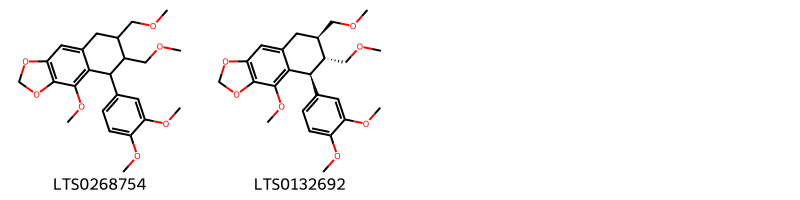
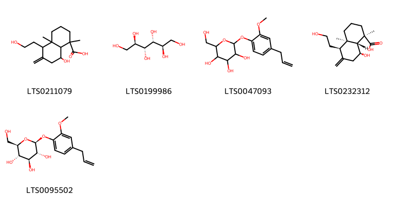
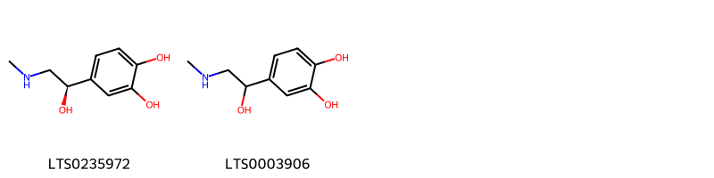
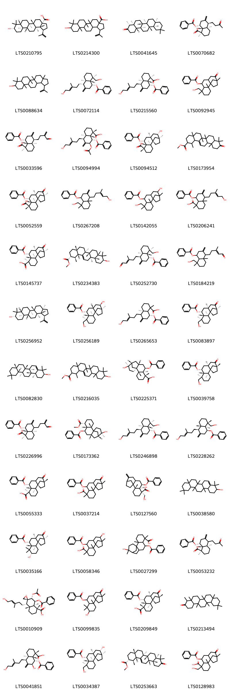

!!! abstract "Tóm tắt"

    Cam thảo nam (Herba et Radix Scopariae) là toàn cây kể cả rễ dạng tươi hay đã phơi hoặc sấy khô của cây Cam thảo nam (Scoparia dulcis L.), họ Hoa mõm chó (Scrophulariaceae). Đây là một loại cây sống lâu năm, thường tìm thấy ở các nước nhiệt đới và cận nhiệt đới, mọc hoang khắp nơi ở Việt Nam. Theo y học dân gian, cam thảo nam dùng thay vị cam thảo bắc để chữa sốt, chữa say sắn, giải độc cơ thể, còn dùng chữa ho, viêm họng, ban sởi, kinh nguyệt quá nhiều. Về tác dụng dược lý, cam thảo nam thể hiện hoạt tính chống oxy hóa, chống viêm, giảm đau, chống đái tháo đường. Cây chứa một alcaloid và một chất đắng, còn có nhiều acid silicic và một hoạt chất gọi là amellin, diterpen (scopariol), flavonoid, triterpen, sterol.

## Thông tin về thực vật

Dược liệu **Cam Thảo Nam (Toàn Cây)** từ bộ phận **** từ loài *Scoparia dulcis*.

**Mô tả thực vật:** Cam thảo nam là một loại cỏ mọc thẳng đứng, cao 30-80cm, thân nhẵn, rễ to hình trụ. Lá đơn, mọc đối hoặc vòng 3 lá một. Phiến lá hình mác hay hình trứng ngược, dài 1,5-3cm, rộng 8- 12mm, phía cuống hẹp lại thành cuống ngắn, mép lá nửa phía trên có răng cưa to, phía dưới nguyên. Mùa hạ ra hoa nhỏ màu trắng ở kẽ lá, mọc riêng lẻ hoặc thành đội. Quả nhỏ hình cầu, trong chứa nhiều hạt nhỏ.

*Tài liệu tham khảo:* "Những cây thuốc và vị thuốc Việt Nam" - Đỗ Tất Lợi 
Trong dược điển Việt nam, một loài được sử dụng làm dược liệu là *Scoparia dulcis*. 
Chưa có thông tin về loài này trên gibf

## Thông tin về dược liệu 

### Định danh

!!! info "Thông tin về tên gọi"

    - Dược liệu tiếng Việt: cảm thảo nam
    - Dược liệu tiếng Trung:  ()
    - Dược liệu tiếng Anh: 
    - Dược liệu latin thông dụng: Herba et Radix Scopariae
    - Dược liệu latin kiểu DĐVN: *herba et radix scopariae*
    - Dược liệu latin kiểu DĐVN: **
    - Dược liệu latin kiểu thông tư: **
    - Bộ phận dùng:  (Herba)

### Mô tả dược liệu 

- **Theo dược điển Việt nam V:** Phần trên mặt đất cao khoảng 0,4 m đến 0,7 m, mọc thẳng đứng, thân già hóa gỗ ở gốc, phần thân non có nhiều khía dọc. Lá mọc đối hoặc mọc vòng ba, dài 3 cm đến 5 cm, rộng 1,5 cm đến 3,0 cm, phiến nguyên, hẹp dần ở gốc, mép có răng cưa thưa ở nửa cuối, gân lá hình lông chim. Hoa nhỏ, cánh hoa màu trắng, mọc riêng rẽ hay thành từng đòi ở kẽ lá. Cuống quà dài 0,8 cm đến 1,5 cm. Quả nang nhỏ đựng trong đài tồn tại, màu nâu đen. Đài đồng trưởng và quả bên trong có dạng gần như tròn với núm nhụy thò ra ở đinh quả, dài 1 mm đến 2 mm. Quả luôn tồn tại ở kẽ lá làm thành điểm đặc sắc của cây. Rễ chính nhỏ, màu nâu đỏ nhạt, với nhiều rễ phụ. Toàn cây có mùi thơm nhẹ, vị đắng sau hơi ngọt.

- **Mô tả dược liệu theo thông tư chế biến dược liệu theo phương pháp cổ truyền:** 

### Chế biến 

- **Chế biến theo dược điển việt nam V**: Thu hái vào mùa xuân và mùa hạ, đào cả rễ, rửa sạch, phơi hay sấy khô. Bào chế cam thảo nam Loại bỏ tạp chất, cắt đoạn, vi sao.nn

- **Chế biến theo thông tư:** 

--- 

## Thành phần hóa học

- Theo tài liệu của GS. Đỗ Tất Lợi:  (1) Nhóm hóa học
Cây chứa một alcaloid và một chất đắng, còn có nhiều acid silicic và một hoạt chất gọi là amellin. Phần cây trên mặt đất còn chứa một chất dầu sền sệt mà trong thành phần có dulciol, scopariol, (+)manitol, glucose. Rễ chứa (+)manitol, tanin, alcaloid, một hợp chất triterpen. Vỏ rễ chứa hexcoxinol, β-sitosterol và (+)manitol.
(2) Biomarker trong dược điển: amellin là hoạt chất quan trọng, nhưng chưa được ghi nhận chính thức làm biomarker.
    

**Thành phần hóa học từ loài **Scoparia dulcis**

Theo cơ sở dữ liệu lotus, loài *Scoparia dulcis* đã phân lập và xác định được **105** hoạt chất thuộc về các nhóm Steroids and steroid derivatives, Organooxygen compounds, Flavonoids, Aryltetralin lignans, Cinnamic acids and derivatives, Phenols, Benzoxazoles, Prenol lipids, Dibenzylbutane lignans trong bảng dưới đây. Danh sách các hoạt chất như sau 8-(benzoyloxy)-2,6,13-trimethyl-12-oxotetracyclo[11.2.1.0¹,¹⁰.0²,⁷]hexadecane-6-carboxylic acid [(LTS0037214)](https://lotus.naturalproducts.net/compound/lotus_id/LTS0037214), 6-methoxy-1,3-benzoxazol-2-ol [(LTS0151051)](https://lotus.naturalproducts.net/compound/lotus_id/LTS0151051), 6-{3-[(3,4-dimethoxyphenyl)methyl]-4-methoxy-2-(methoxymethyl)butyl}-4-methoxy-2h-1,3-benzodioxole [(LTS0164954)](https://lotus.naturalproducts.net/compound/lotus_id/LTS0164954), (1s,2r,3r,4s,4ar,5r,8as)-3-(acetyloxy)-4-(benzoyloxy)-1-[(3e)-5-hydroxy-3-methylpent-3-en-1-yl]-5,8a-dimethyl-hexahydro-1h-spiro[naphthalene-2,2'-oxirane]-5-carboxylic acid [(LTS0010909)](https://lotus.naturalproducts.net/compound/lotus_id/LTS0010909), vicenin-2 [(LTS0103522)](https://lotus.naturalproducts.net/compound/lotus_id/LTS0103522), (2s,3s,4s,5r,6s)-6-{[5,8-dihydroxy-4-oxo-2-(3,4,5-trihydroxyphenyl)chromen-7-yl]oxy}-3,4,5-trihydroxyoxane-2-carboxylic acid [(LTS0199972)](https://lotus.naturalproducts.net/compound/lotus_id/LTS0199972), 8-(hydroxymethyl)-4a,8-dimethyl-4-(3-methyl-5-oxopent-3-en-1-yl)-3-methylidene-hexahydro-1h-naphthalen-1-yl benzoate [(LTS0184219)](https://lotus.naturalproducts.net/compound/lotus_id/LTS0184219), scutellarin [(LTS0121337)](https://lotus.naturalproducts.net/compound/lotus_id/LTS0121337), para-coumaric acid [(LTS0266252)](https://lotus.naturalproducts.net/compound/lotus_id/LTS0266252), 9-hydroxy-5a,5b,8,8,11a-pentamethyl-1-(prop-1-en-2-yl)-hexadecahydrocyclopenta[a]chrysene-3a-carboxylic acid [(LTS0214300)](https://lotus.naturalproducts.net/compound/lotus_id/LTS0214300), methyl (2s,6r,7r,8r,10r,12r,13r)-8-(benzoyloxy)-13-hydroxy-2,13-dimethyltetracyclo[10.3.1.0¹,¹⁰.0²,⁷]hexadecane-6-carboxylate [(LTS0173362)](https://lotus.naturalproducts.net/compound/lotus_id/LTS0173362), (2s,3s,4s,5r,6r)-3,5-dihydroxy-2-methyl-6-{[(2s,3s,4s,5s,6s)-3,4,5-trihydroxy-6-{[5-hydroxy-2-(4-hydroxyphenyl)-4-oxochromen-7-yl]oxy}oxan-2-yl]methoxy}oxan-4-yl acetate [(LTS0214644)](https://lotus.naturalproducts.net/compound/lotus_id/LTS0214644), (1s,4r,4as,8s,8as)-4-[(3e)-5-hydroxy-3-methylpent-3-en-1-yl]-8-(hydroxymethyl)-4a,8-dimethyl-3-methylidene-hexahydro-1h-naphthalen-1-yl benzoate [(LTS0228262)](https://lotus.naturalproducts.net/compound/lotus_id/LTS0228262), luteolin 7-o-glucoside [(LTS0227450)](https://lotus.naturalproducts.net/compound/lotus_id/LTS0227450), 3,5-dihydroxy-2-methyl-6-[(3,4,5-trihydroxy-6-{[5-hydroxy-2-(4-hydroxyphenyl)-4-oxochromen-7-yl]oxy}oxan-2-yl)methoxy]oxan-4-yl acetate [(LTS0155545)](https://lotus.naturalproducts.net/compound/lotus_id/LTS0155545), 6-[(2s,3s)-3-[(3,4-dimethoxyphenyl)methyl]-4-methoxy-2-(methoxymethyl)butyl]-4-methoxy-2h-1,3-benzodioxole [(LTS0115626)](https://lotus.naturalproducts.net/compound/lotus_id/LTS0115626), 2-(4-methoxyphenyl)-7-[(3,4,5-trihydroxy-6-{[(3,4,5-trihydroxy-6-methyloxan-2-yl)oxy]methyl}oxan-2-yl)oxy]chromen-4-one [(LTS0247693)](https://lotus.naturalproducts.net/compound/lotus_id/LTS0247693), (1s,2s,6r,7r,8r,13r)-8-(benzoyloxy)-2,6,13-trimethyl-12-oxotetracyclo[11.2.1.0¹,¹⁰.0²,⁷]hexadecane-6-carboxylic acid [(LTS0055333)](https://lotus.naturalproducts.net/compound/lotus_id/LTS0055333), 6-{[5,8-dihydroxy-4-oxo-2-(3,4,5-trihydroxyphenyl)chromen-7-yl]oxy}-3,4,5-trihydroxyoxane-2-carboxylic acid [(LTS0249874)](https://lotus.naturalproducts.net/compound/lotus_id/LTS0249874), (1s,2s,6s,7r,8r,10s,13s)-8-(benzoyloxy)-2,6,13-trimethyl-12-oxotetracyclo[11.2.1.0¹,¹⁰.0²,⁷]hexadecane-6-carboxylic acid [(LTS0052559)](https://lotus.naturalproducts.net/compound/lotus_id/LTS0052559), 4,4,6b,8a,11,11,12b,14a-octamethyl-1,2,3,6,6a,7,8,9,10,12,12a,13,14,14b-tetradecahydropicen-3-ol [(LTS0038580)](https://lotus.naturalproducts.net/compound/lotus_id/LTS0038580), (1s,2s,6s,7r,8r,10r,12s,13s)-8-(benzoyloxy)-12-hydroxy-2,6,13-trimethyltetracyclo[11.2.1.0¹,¹⁰.0²,⁷]hexadecane-6-carboxylic acid [(LTS0094512)](https://lotus.naturalproducts.net/compound/lotus_id/LTS0094512), luteolin [(LTS0017052)](https://lotus.naturalproducts.net/compound/lotus_id/LTS0017052), 5,7-dihydroxy-2-(4-hydroxyphenyl)-8-[(2s,3r,4s,5s)-3,4,5-trihydroxyoxan-2-yl]chromen-4-one [(LTS0096658)](https://lotus.naturalproducts.net/compound/lotus_id/LTS0096658), (2s)-5-hydroxy-6,7-dimethoxy-2-(4-{[(2s,3r,4s,5s,6r)-3,4,5-trihydroxy-6-(hydroxymethyl)oxan-2-yl]oxy}phenyl)-2,3-dihydro-1-benzopyran-4-one [(LTS0098599)](https://lotus.naturalproducts.net/compound/lotus_id/LTS0098599), 2-(3-hydroxy-4-methoxyphenyl)-5,7-dimethoxychromen-4-one [(LTS0064776)](https://lotus.naturalproducts.net/compound/lotus_id/LTS0064776), friedelin [(LTS0213494)](https://lotus.naturalproducts.net/compound/lotus_id/LTS0213494), betulinic acid [(LTS0210795)](https://lotus.naturalproducts.net/compound/lotus_id/LTS0210795), 1,3-benzoxazol-2-ol [(LTS0129691)](https://lotus.naturalproducts.net/compound/lotus_id/LTS0129691), 5-(3,4-dimethoxyphenyl)-4-methoxy-6,7-bis(methoxymethyl)-2h,5h,6h,7h,8h-naphtho[2,3-d][1,3]dioxole [(LTS0268754)](https://lotus.naturalproducts.net/compound/lotus_id/LTS0268754), methyl 10-hydroxy-1,4a,6a,6b,9,9,12a-heptamethyl-2,3,4,5,6,7,8,8a,10,11,12,12b,13,14b-tetradecahydro-1h-picene-2-carboxylate [(LTS0216035)](https://lotus.naturalproducts.net/compound/lotus_id/LTS0216035), (1r,4ar,5r,8s,8ar)-8-hydroxy-5-(2-hydroxyethyl)-1,4a-dimethyl-6-methylidene-hexahydro-2h-naphthalene-1-carboxylic acid [(LTS0232312)](https://lotus.naturalproducts.net/compound/lotus_id/LTS0232312), (4ar,8r)-8-(benzoyloxy)-5-[(3e)-5-hydroxy-3-methylpent-3-en-1-yl]-1,4a-dimethyl-6-methylidene-hexahydro-2h-naphthalene-1-carboxylic acid [(LTS0265653)](https://lotus.naturalproducts.net/compound/lotus_id/LTS0265653), acerosin [(LTS0088758)](https://lotus.naturalproducts.net/compound/lotus_id/LTS0088758), methyl (1r,2r,4ar,6as,6br,8ar,12ar,12bs,14br)-1,4a,6a,6b,9,9,12a-heptamethyl-10-oxo-1,2,3,4,5,6,7,8,8a,11,12,12b,13,14b-tetradecahydropicene-2-carboxylate [(LTS0253663)](https://lotus.naturalproducts.net/compound/lotus_id/LTS0253663), (2r,3r,4s,5s,6s)-4-(acetyloxy)-2-{[(2s,3s,4s,5s,6s)-6-{[5,6-dihydroxy-2-(4-hydroxyphenyl)-4-oxochromen-7-yl]oxy}-3,4,5-trihydroxyoxan-2-yl]methoxy}-5-hydroxy-6-methyloxan-3-yl acetate [(LTS0252382)](https://lotus.naturalproducts.net/compound/lotus_id/LTS0252382), kumatakenin [(LTS0018267)](https://lotus.naturalproducts.net/compound/lotus_id/LTS0018267), 8-(benzoyloxy)-12-hydroxy-2,6,13-trimethyltetracyclo[11.2.1.0¹,¹⁰.0²,⁷]hexadecane-6-carboxylic acid [(LTS0058346)](https://lotus.naturalproducts.net/compound/lotus_id/LTS0058346), 2-(3,4-dihydroxyphenyl)-5-hydroxy-7-{[(2r,3r,4s,5s,6r)-3,4,5-trihydroxy-6-(hydroxymethyl)oxan-2-yl]oxy}chromen-4-one [(LTS0068019)](https://lotus.naturalproducts.net/compound/lotus_id/LTS0068019), vicenin 2 [(LTS0181160)](https://lotus.naturalproducts.net/compound/lotus_id/LTS0181160), (1s,2s,6r,7r,8r,10s,12r,13s)-12-hydroxy-6-(hydroxymethyl)-2,6,13-trimethyltetracyclo[11.2.1.0¹,¹⁰.0²,⁷]hexadecan-8-yl benzoate [(LTS0256189)](https://lotus.naturalproducts.net/compound/lotus_id/LTS0256189), 8-(benzoyloxy)-5-(5-hydroxy-3-methylpent-3-en-1-yl)-1,4a-dimethyl-6-methylidene-hexahydro-2h-naphthalene-1-carboxylic acid [(LTS0206241)](https://lotus.naturalproducts.net/compound/lotus_id/LTS0206241), (2r,3r,4s,5s,6s)-4-(acetyloxy)-5-hydroxy-6-methyl-2-{[(2s,3s,4s,5s,6s)-3,4,5-trihydroxy-6-{[5-hydroxy-2-(4-hydroxyphenyl)-4-oxochromen-7-yl]oxy}oxan-2-yl]methoxy}oxan-3-yl acetate [(LTS0153729)](https://lotus.naturalproducts.net/compound/lotus_id/LTS0153729), scopadulcic acid b [(LTS0145737)](https://lotus.naturalproducts.net/compound/lotus_id/LTS0145737), 8-(benzoyloxy)-6-(hydroxymethyl)-2,13-dimethyl-12-oxotetracyclo[11.2.1.0¹,¹⁰.0²,⁷]hexadecane-6-carboxylic acid [(LTS0128983)](https://lotus.naturalproducts.net/compound/lotus_id/LTS0128983), linarin [(LTS0160284)](https://lotus.naturalproducts.net/compound/lotus_id/LTS0160284), hymenoxin [(LTS0185988)](https://lotus.naturalproducts.net/compound/lotus_id/LTS0185988), (1s,2s,6r,7r,8r,10s,13s)-6-(hydroxymethyl)-2,6,13-trimethyl-12-oxotetracyclo[11.2.1.0¹,¹⁰.0²,⁷]hexadecan-8-yl benzoate [(LTS0083897)](https://lotus.naturalproducts.net/compound/lotus_id/LTS0083897), 12-hydroxy-6-(hydroxymethyl)-2,6,13-trimethyltetracyclo[11.2.1.0¹,¹⁰.0²,⁷]hexadecan-8-yl benzoate [(LTS0142055)](https://lotus.naturalproducts.net/compound/lotus_id/LTS0142055), eugenyl glucoside [(LTS0095502)](https://lotus.naturalproducts.net/compound/lotus_id/LTS0095502), stigmast-5-en-3-ol, (3β)- [(LTS0204616)](https://lotus.naturalproducts.net/compound/lotus_id/LTS0204616), [(2r,3s,4s,5r,6s)-6-{[2-(3,4-dimethoxyphenyl)-5,7-dihydroxy-4-oxochromen-3-yl]oxy}-3,4,5-trihydroxyoxan-2-yl]methyl (2e)-3-(4-hydroxyphenyl)prop-2-enoate [(LTS0102283)](https://lotus.naturalproducts.net/compound/lotus_id/LTS0102283), 5,7-dihydroxy-2-(4-hydroxyphenyl)-6,8-bis[3,4,5-trihydroxy-6-(hydroxymethyl)oxan-2-yl]chromen-4-one [(LTS0255367)](https://lotus.naturalproducts.net/compound/lotus_id/LTS0255367), (1s,2s,6s,7r,8r,10s,13r)-8-(benzoyloxy)-2,6,13-trimethyl-12-oxotetracyclo[11.2.1.0¹,¹⁰.0²,⁷]hexadecane-6-carboxylic acid [(LTS0209849)](https://lotus.naturalproducts.net/compound/lotus_id/LTS0209849), 5-hydroxy-6,7-dimethoxy-2-(4-{[(2s,3r,4s,5s,6r)-3,4,5-trihydroxy-6-(hydroxymethyl)oxan-2-yl]oxy}phenyl)chromen-4-one [(LTS0021290)](https://lotus.naturalproducts.net/compound/lotus_id/LTS0021290), (1r,4s,4ar,8r,8ar)-4-[(3e)-5-hydroxy-3-methylpent-3-en-1-yl]-8-(hydroxymethyl)-4a,8-dimethyl-3-methylidene-hexahydro-1h-naphthalen-1-yl benzoate [(LTS0072114)](https://lotus.naturalproducts.net/compound/lotus_id/LTS0072114), (2s,6s,7r,8r)-8-(benzoyloxy)-6-(hydroxymethyl)-2-methyl-12-methylidenetetracyclo[11.2.1.0¹,¹⁰.0²,⁷]hexadecane-6-carboxylic acid [(LTS0127560)](https://lotus.naturalproducts.net/compound/lotus_id/LTS0127560), (1s,4ar,5s,7s,8s,8ar)-7-(acetyloxy)-8-(benzoyloxy)-5-[(3e)-5-hydroxy-3-methylpent-3-en-1-yl]-1,4a-dimethyl-6-methylidene-hexahydro-2h-naphthalene-1-carboxylic acid [(LTS0094994)](https://lotus.naturalproducts.net/compound/lotus_id/LTS0094994), 4-(5-hydroxy-3-methylpent-3-en-1-yl)-8-(hydroxymethyl)-4a,8-dimethyl-3-methylidene-hexahydro-1h-naphthalen-1-yl benzoate [(LTS0267208)](https://lotus.naturalproducts.net/compound/lotus_id/LTS0267208), scutellarein [(LTS0136843)](https://lotus.naturalproducts.net/compound/lotus_id/LTS0136843), (1s,2s,6r,7r,8r,10s,13r)-6-(hydroxymethyl)-2,6,13-trimethyl-12-oxotetracyclo[11.2.1.0¹,¹⁰.0²,⁷]hexadecan-8-yl benzoate [(LTS0039758)](https://lotus.naturalproducts.net/compound/lotus_id/LTS0039758), 2-(4-methoxyphenyl)-7-{[(2s,3r,4s,5s,6r)-3,4,5-trihydroxy-6-({[(2s,3r,4r,5r,6s)-3,4,5-trihydroxy-6-methyloxan-2-yl]oxy}methyl)oxan-2-yl]oxy}chromen-4-one [(LTS0179689)](https://lotus.naturalproducts.net/compound/lotus_id/LTS0179689), (1r,4r,4ar,8r,8ar)-4-[(3e)-5-hydroxy-3-methylpent-3-en-1-yl]-8-(hydroxymethyl)-4a,8-dimethyl-3-methylidene-hexahydro-1h-naphthalen-1-yl benzoate [(LTS0246898)](https://lotus.naturalproducts.net/compound/lotus_id/LTS0246898), lupeol [(LTS0088634)](https://lotus.naturalproducts.net/compound/lotus_id/LTS0088634), methyl 1,4a,6a,6b,9,9,12a-heptamethyl-10-oxo-1,2,3,4,5,6,7,8,8a,11,12,12b,13,14b-tetradecahydropicene-2-carboxylate [(LTS0173954)](https://lotus.naturalproducts.net/compound/lotus_id/LTS0173954), isovitexin [(LTS0209186)](https://lotus.naturalproducts.net/compound/lotus_id/LTS0209186), (1s,2s,6r,7r,8r,10r,12r,13r)-8-(benzoyloxy)-13-hydroxy-2,6,13-trimethyltetracyclo[10.3.1.0¹,¹⁰.0²,⁷]hexadecane-6-carboxylic acid [(LTS0225371)](https://lotus.naturalproducts.net/compound/lotus_id/LTS0225371), (1s,2s,5s,7r,8r,10s,13s)-5-hydroxy-2,6,6,13-tetramethyl-12-oxotetracyclo[11.2.1.0¹,¹⁰.0²,⁷]hexadecan-8-yl benzoate [(LTS0035166)](https://lotus.naturalproducts.net/compound/lotus_id/LTS0035166), pectolinarin [(LTS0223456)](https://lotus.naturalproducts.net/compound/lotus_id/LTS0223456), (1s,4ar,5s,7s,8s,8ar)-8-(benzoyloxy)-7-hydroxy-5-[(3e)-5-hydroxy-3-methylpent-3-en-1-yl]-1,4a-dimethyl-6-methylidene-hexahydro-2h-naphthalene-1-carboxylic acid [(LTS0041851)](https://lotus.naturalproducts.net/compound/lotus_id/LTS0041851), (1r,4ar,8r,8ar)-8-(benzoyloxy)-1,4a-dimethyl-6-methylidene-5-(3-methylidene-4-oxobutyl)-hexahydro-2h-naphthalene-1-carboxylic acid [(LTS0226996)](https://lotus.naturalproducts.net/compound/lotus_id/LTS0226996), 8-(benzoyloxy)-13-hydroxy-2,6,13-trimethyltetracyclo[10.3.1.0¹,¹⁰.0²,⁷]hexadecane-6-carboxylic acid [(LTS0027299)](https://lotus.naturalproducts.net/compound/lotus_id/LTS0027299), vitexin [(LTS0199581)](https://lotus.naturalproducts.net/compound/lotus_id/LTS0199581), (1r,4ar,8r,8ar)-8-(benzoyloxy)-1,4a-dimethyl-6-methylidene-5-(3-oxobutyl)-hexahydro-2h-naphthalene-1-carboxylic acid [(LTS0053232)](https://lotus.naturalproducts.net/compound/lotus_id/LTS0053232), (2s,3s,4r,5r,6r)-3,5-dihydroxy-2-methyl-6-{[(2r,3s,4s,5r,6s)-3,4,5-trihydroxy-6-{[5-hydroxy-2-(4-hydroxyphenyl)-4-oxochromen-7-yl]oxy}oxan-2-yl]methoxy}oxan-4-yl acetate [(LTS0098615)](https://lotus.naturalproducts.net/compound/lotus_id/LTS0098615), vitexin [(LTS0254648)](https://lotus.naturalproducts.net/compound/lotus_id/LTS0254648), chamomile [(LTS0104946)](https://lotus.naturalproducts.net/compound/lotus_id/LTS0104946), mannitol [(LTS0199986)](https://lotus.naturalproducts.net/compound/lotus_id/LTS0199986), 6-(hydroxymethyl)-2,6,13-trimethyl-12-oxotetracyclo[11.2.1.0¹,¹⁰.0²,⁷]hexadecan-8-yl benzoate [(LTS0092945)](https://lotus.naturalproducts.net/compound/lotus_id/LTS0092945), 5-hydroxy-6,7-dimethoxy-2-(4-{[3,4,5-trihydroxy-6-(hydroxymethyl)oxan-2-yl]oxy}phenyl)-2,3-dihydro-1-benzopyran-4-one [(LTS0257470)](https://lotus.naturalproducts.net/compound/lotus_id/LTS0257470), methyl (1r,2r,4ar,6as,6br,8as,10s,12ar,12br,14br)-10-hydroxy-1,4a,6a,6b,9,9,12a-heptamethyl-2,3,4,5,6,7,8,8a,10,11,12,12b,13,14b-tetradecahydro-1h-picene-2-carboxylate [(LTS0234383)](https://lotus.naturalproducts.net/compound/lotus_id/LTS0234383), acacetin [(LTS0020151)](https://lotus.naturalproducts.net/compound/lotus_id/LTS0020151), (1s,2s,6r,7r,8r,10r,12s,13s)-12-hydroxy-6-(hydroxymethyl)-2,6,13-trimethyltetracyclo[11.2.1.0¹,¹⁰.0²,⁷]hexadecan-8-yl benzoate [(LTS0034387)](https://lotus.naturalproducts.net/compound/lotus_id/LTS0034387), (-)-friedelin [(LTS0041645)](https://lotus.naturalproducts.net/compound/lotus_id/LTS0041645), 2-(hydroxymethyl)-6-[2-methoxy-4-(prop-2-en-1-yl)phenoxy]oxane-3,4,5-triol [(LTS0047093)](https://lotus.naturalproducts.net/compound/lotus_id/LTS0047093), scoparic acid a [(LTS0215560)](https://lotus.naturalproducts.net/compound/lotus_id/LTS0215560), epinephrine [(LTS0235972)](https://lotus.naturalproducts.net/compound/lotus_id/LTS0235972), (1r,4r,4ar,8r,8ar)-8-(hydroxymethyl)-4a,8-dimethyl-4-[(3e)-3-methyl-5-oxopent-3-en-1-yl]-3-methylidene-hexahydro-1h-naphthalen-1-yl benzoate [(LTS0252730)](https://lotus.naturalproducts.net/compound/lotus_id/LTS0252730), 5-hydroxy-2,6,6,13-tetramethyl-12-oxotetracyclo[11.2.1.0¹,¹⁰.0²,⁷]hexadecan-8-yl benzoate [(LTS0099835)](https://lotus.naturalproducts.net/compound/lotus_id/LTS0099835), glutinol [(LTS0082830)](https://lotus.naturalproducts.net/compound/lotus_id/LTS0082830), 3-(acetyloxy)-2-[(6-{[5,6-dihydroxy-2-(4-hydroxyphenyl)-4-oxochromen-7-yl]oxy}-3,4,5-trihydroxyoxan-2-yl)methoxy]-5-hydroxy-6-methyloxan-4-yl acetate [(LTS0265991)](https://lotus.naturalproducts.net/compound/lotus_id/LTS0265991), (1r,4ar,5r,8r,8ar)-8-(benzoyloxy)-1,4a-dimethyl-6-methylidene-5-(3-methylidene-4-oxobutyl)-hexahydro-2h-naphthalene-1-carboxylic acid [(LTS0033596)](https://lotus.naturalproducts.net/compound/lotus_id/LTS0033596), 2-(3,4-dihydroxyphenyl)-5-hydroxy-7-{[3,4,5-trihydroxy-6-(hydroxymethyl)oxan-2-yl]oxy}chromen-4-one [(LTS0158292)](https://lotus.naturalproducts.net/compound/lotus_id/LTS0158292), 3-(acetyloxy)-5-hydroxy-6-methyl-2-[(3,4,5-trihydroxy-6-{[5-hydroxy-2-(4-hydroxyphenyl)-4-oxochromen-7-yl]oxy}oxan-2-yl)methoxy]oxan-4-yl acetate [(LTS0223995)](https://lotus.naturalproducts.net/compound/lotus_id/LTS0223995), isovitexin [(LTS0035187)](https://lotus.naturalproducts.net/compound/lotus_id/LTS0035187), lupeol [(LTS0256952)](https://lotus.naturalproducts.net/compound/lotus_id/LTS0256952), (+-)-adrenaline [(LTS0003906)](https://lotus.naturalproducts.net/compound/lotus_id/LTS0003906), 8-hydroxy-5-(2-hydroxyethyl)-1,4a-dimethyl-6-methylidene-hexahydro-2h-naphthalene-1-carboxylic acid [(LTS0211079)](https://lotus.naturalproducts.net/compound/lotus_id/LTS0211079), hispidulin [(LTS0135598)](https://lotus.naturalproducts.net/compound/lotus_id/LTS0135598), hydroxycinnamic acid [(LTS0233023)](https://lotus.naturalproducts.net/compound/lotus_id/LTS0233023), homoplantaginin [(LTS0142016)](https://lotus.naturalproducts.net/compound/lotus_id/LTS0142016), (1r,4ar,5r,8r,8ar)-8-(benzoyloxy)-1,4a-dimethyl-6-methylidene-5-(3-oxobutyl)-hexahydro-2h-naphthalene-1-carboxylic acid [(LTS0070682)](https://lotus.naturalproducts.net/compound/lotus_id/LTS0070682), (2r,3r,4r,5s,6s)-4-(acetyloxy)-5-hydroxy-6-methyl-2-{[(2r,3s,4s,5r,6s)-3,4,5-trihydroxy-6-{[5-hydroxy-2-(4-hydroxyphenyl)-4-oxochromen-7-yl]oxy}oxan-2-yl]methoxy}oxan-3-yl acetate [(LTS0085039)](https://lotus.naturalproducts.net/compound/lotus_id/LTS0085039), methyl (2s,3s,4s,5r,6s)-6-{[5,6-dihydroxy-2-(4-hydroxyphenyl)-4-oxochromen-7-yl]oxy}-3,4,5-trihydroxyoxane-2-carboxylate [(LTS0086277)](https://lotus.naturalproducts.net/compound/lotus_id/LTS0086277), (5s,6r,7r)-5-(3,4-dimethoxyphenyl)-4-methoxy-6,7-bis(methoxymethyl)-2h,5h,6h,7h,8h-naphtho[2,3-d][1,3]dioxole [(LTS0132692)](https://lotus.naturalproducts.net/compound/lotus_id/LTS0132692). 
        
| chemicalTaxonomyClassyfireClass   |   smiles_count |
|:----------------------------------|---------------:|
| Aryltetralin lignans              |            111 |
| Benzoxazoles                      |             32 |
| Cinnamic acids and derivatives    |             42 |
| Dibenzylbutane lignans            |            108 |
| Flavonoids                        |           3288 |
| Organooxygen compounds            |            227 |
| Phenols                           |             46 |
| Prenol lipids                     |           3605 |
| Steroids and steroid derivatives  |             49 |

            
### Nhóm Aryltetralin lignans
<figure markdown="span">
    { width=100% }
<figcaption>Hình ảnh cấu trúc hóa học của hoạt chất thuộc nhóm *Aryltetralin lignans*. Tên thường gọi của các hoạt chất tương ứng là 5-(3,4-dimethoxyphenyl)-4-methoxy-6,7-bis(methoxymethyl)-2h,5h,6h,7h,8h-naphtho[2,3-d][1,3]dioxole [(LTS0268754)](https://lotus.naturalproducts.net/compound/lotus_id/LTS0268754), (5s,6r,7r)-5-(3,4-dimethoxyphenyl)-4-methoxy-6,7-bis(methoxymethyl)-2h,5h,6h,7h,8h-naphtho[2,3-d][1,3]dioxole [(LTS0132692)](https://lotus.naturalproducts.net/compound/lotus_id/LTS0132692).</figcaption>
</figure>

            
            
### Nhóm Aryltetralin lignans
<figure markdown="span">
    { width=100% }
<figcaption>Hình ảnh cấu trúc hóa học của hoạt chất thuộc nhóm *Aryltetralin lignans*. Tên thường gọi của các hoạt chất tương ứng là 5-(3,4-dimethoxyphenyl)-4-methoxy-6,7-bis(methoxymethyl)-2h,5h,6h,7h,8h-naphtho[2,3-d][1,3]dioxole [(LTS0268754)](https://lotus.naturalproducts.net/compound/lotus_id/LTS0268754), (5s,6r,7r)-5-(3,4-dimethoxyphenyl)-4-methoxy-6,7-bis(methoxymethyl)-2h,5h,6h,7h,8h-naphtho[2,3-d][1,3]dioxole [(LTS0132692)](https://lotus.naturalproducts.net/compound/lotus_id/LTS0132692).</figcaption>
</figure>

### Nhóm Benzoxazoles
<figure markdown="span">
    { width=100% }
<figcaption>Hình ảnh cấu trúc hóa học của hoạt chất thuộc nhóm *Benzoxazoles*. Tên thường gọi của các hoạt chất tương ứng là 6-methoxy-1,3-benzoxazol-2-ol [(LTS0151051)](https://lotus.naturalproducts.net/compound/lotus_id/LTS0151051), 1,3-benzoxazol-2-ol [(LTS0129691)](https://lotus.naturalproducts.net/compound/lotus_id/LTS0129691).</figcaption>
</figure>

            
            
### Nhóm Aryltetralin lignans
<figure markdown="span">
    { width=100% }
<figcaption>Hình ảnh cấu trúc hóa học của hoạt chất thuộc nhóm *Aryltetralin lignans*. Tên thường gọi của các hoạt chất tương ứng là 5-(3,4-dimethoxyphenyl)-4-methoxy-6,7-bis(methoxymethyl)-2h,5h,6h,7h,8h-naphtho[2,3-d][1,3]dioxole [(LTS0268754)](https://lotus.naturalproducts.net/compound/lotus_id/LTS0268754), (5s,6r,7r)-5-(3,4-dimethoxyphenyl)-4-methoxy-6,7-bis(methoxymethyl)-2h,5h,6h,7h,8h-naphtho[2,3-d][1,3]dioxole [(LTS0132692)](https://lotus.naturalproducts.net/compound/lotus_id/LTS0132692).</figcaption>
</figure>

### Nhóm Benzoxazoles
<figure markdown="span">
    { width=100% }
<figcaption>Hình ảnh cấu trúc hóa học của hoạt chất thuộc nhóm *Benzoxazoles*. Tên thường gọi của các hoạt chất tương ứng là 6-methoxy-1,3-benzoxazol-2-ol [(LTS0151051)](https://lotus.naturalproducts.net/compound/lotus_id/LTS0151051), 1,3-benzoxazol-2-ol [(LTS0129691)](https://lotus.naturalproducts.net/compound/lotus_id/LTS0129691).</figcaption>
</figure>

### Nhóm Cinnamic acids and derivatives
<figure markdown="span">
    { width=100% }
<figcaption>Hình ảnh cấu trúc hóa học của hoạt chất thuộc nhóm *Cinnamic acids and derivatives*. Tên thường gọi của các hoạt chất tương ứng là para-coumaric acid [(LTS0266252)](https://lotus.naturalproducts.net/compound/lotus_id/LTS0266252), hydroxycinnamic acid [(LTS0233023)](https://lotus.naturalproducts.net/compound/lotus_id/LTS0233023).</figcaption>
</figure>

            
            
### Nhóm Aryltetralin lignans
<figure markdown="span">
    { width=100% }
<figcaption>Hình ảnh cấu trúc hóa học của hoạt chất thuộc nhóm *Aryltetralin lignans*. Tên thường gọi của các hoạt chất tương ứng là 5-(3,4-dimethoxyphenyl)-4-methoxy-6,7-bis(methoxymethyl)-2h,5h,6h,7h,8h-naphtho[2,3-d][1,3]dioxole [(LTS0268754)](https://lotus.naturalproducts.net/compound/lotus_id/LTS0268754), (5s,6r,7r)-5-(3,4-dimethoxyphenyl)-4-methoxy-6,7-bis(methoxymethyl)-2h,5h,6h,7h,8h-naphtho[2,3-d][1,3]dioxole [(LTS0132692)](https://lotus.naturalproducts.net/compound/lotus_id/LTS0132692).</figcaption>
</figure>

### Nhóm Benzoxazoles
<figure markdown="span">
    { width=100% }
<figcaption>Hình ảnh cấu trúc hóa học của hoạt chất thuộc nhóm *Benzoxazoles*. Tên thường gọi của các hoạt chất tương ứng là 6-methoxy-1,3-benzoxazol-2-ol [(LTS0151051)](https://lotus.naturalproducts.net/compound/lotus_id/LTS0151051), 1,3-benzoxazol-2-ol [(LTS0129691)](https://lotus.naturalproducts.net/compound/lotus_id/LTS0129691).</figcaption>
</figure>

### Nhóm Cinnamic acids and derivatives
<figure markdown="span">
    { width=100% }
<figcaption>Hình ảnh cấu trúc hóa học của hoạt chất thuộc nhóm *Cinnamic acids and derivatives*. Tên thường gọi của các hoạt chất tương ứng là para-coumaric acid [(LTS0266252)](https://lotus.naturalproducts.net/compound/lotus_id/LTS0266252), hydroxycinnamic acid [(LTS0233023)](https://lotus.naturalproducts.net/compound/lotus_id/LTS0233023).</figcaption>
</figure>

### Nhóm Dibenzylbutane lignans
<figure markdown="span">
    { width=100% }
<figcaption>Hình ảnh cấu trúc hóa học của hoạt chất thuộc nhóm *Dibenzylbutane lignans*. Tên thường gọi của các hoạt chất tương ứng là 6-{3-[(3,4-dimethoxyphenyl)methyl]-4-methoxy-2-(methoxymethyl)butyl}-4-methoxy-2h-1,3-benzodioxole [(LTS0164954)](https://lotus.naturalproducts.net/compound/lotus_id/LTS0164954), 6-[(2s,3s)-3-[(3,4-dimethoxyphenyl)methyl]-4-methoxy-2-(methoxymethyl)butyl]-4-methoxy-2h-1,3-benzodioxole [(LTS0115626)](https://lotus.naturalproducts.net/compound/lotus_id/LTS0115626).</figcaption>
</figure>

            
            
### Nhóm Aryltetralin lignans
<figure markdown="span">
    { width=100% }
<figcaption>Hình ảnh cấu trúc hóa học của hoạt chất thuộc nhóm *Aryltetralin lignans*. Tên thường gọi của các hoạt chất tương ứng là 5-(3,4-dimethoxyphenyl)-4-methoxy-6,7-bis(methoxymethyl)-2h,5h,6h,7h,8h-naphtho[2,3-d][1,3]dioxole [(LTS0268754)](https://lotus.naturalproducts.net/compound/lotus_id/LTS0268754), (5s,6r,7r)-5-(3,4-dimethoxyphenyl)-4-methoxy-6,7-bis(methoxymethyl)-2h,5h,6h,7h,8h-naphtho[2,3-d][1,3]dioxole [(LTS0132692)](https://lotus.naturalproducts.net/compound/lotus_id/LTS0132692).</figcaption>
</figure>

### Nhóm Benzoxazoles
<figure markdown="span">
    { width=100% }
<figcaption>Hình ảnh cấu trúc hóa học của hoạt chất thuộc nhóm *Benzoxazoles*. Tên thường gọi của các hoạt chất tương ứng là 6-methoxy-1,3-benzoxazol-2-ol [(LTS0151051)](https://lotus.naturalproducts.net/compound/lotus_id/LTS0151051), 1,3-benzoxazol-2-ol [(LTS0129691)](https://lotus.naturalproducts.net/compound/lotus_id/LTS0129691).</figcaption>
</figure>

### Nhóm Cinnamic acids and derivatives
<figure markdown="span">
    { width=100% }
<figcaption>Hình ảnh cấu trúc hóa học của hoạt chất thuộc nhóm *Cinnamic acids and derivatives*. Tên thường gọi của các hoạt chất tương ứng là para-coumaric acid [(LTS0266252)](https://lotus.naturalproducts.net/compound/lotus_id/LTS0266252), hydroxycinnamic acid [(LTS0233023)](https://lotus.naturalproducts.net/compound/lotus_id/LTS0233023).</figcaption>
</figure>

### Nhóm Dibenzylbutane lignans
<figure markdown="span">
    { width=100% }
<figcaption>Hình ảnh cấu trúc hóa học của hoạt chất thuộc nhóm *Dibenzylbutane lignans*. Tên thường gọi của các hoạt chất tương ứng là 6-{3-[(3,4-dimethoxyphenyl)methyl]-4-methoxy-2-(methoxymethyl)butyl}-4-methoxy-2h-1,3-benzodioxole [(LTS0164954)](https://lotus.naturalproducts.net/compound/lotus_id/LTS0164954), 6-[(2s,3s)-3-[(3,4-dimethoxyphenyl)methyl]-4-methoxy-2-(methoxymethyl)butyl]-4-methoxy-2h-1,3-benzodioxole [(LTS0115626)](https://lotus.naturalproducts.net/compound/lotus_id/LTS0115626).</figcaption>
</figure>

### Nhóm Flavonoids
<figure markdown="span">
    { width=100% }
<figcaption>Hình ảnh cấu trúc hóa học của hoạt chất thuộc nhóm *Flavonoids*. Tên thường gọi của các hoạt chất tương ứng là chamomile [(LTS0104946)](https://lotus.naturalproducts.net/compound/lotus_id/LTS0104946), vitexin [(LTS0199581)](https://lotus.naturalproducts.net/compound/lotus_id/LTS0199581), luteolin [(LTS0017052)](https://lotus.naturalproducts.net/compound/lotus_id/LTS0017052), vitexin [(LTS0254648)](https://lotus.naturalproducts.net/compound/lotus_id/LTS0254648), (2s,3s,4s,5r,6r)-3,5-dihydroxy-2-methyl-6-{[(2s,3s,4s,5s,6s)-3,4,5-trihydroxy-6-{[5-hydroxy-2-(4-hydroxyphenyl)-4-oxochromen-7-yl]oxy}oxan-2-yl]methoxy}oxan-4-yl acetate [(LTS0214644)](https://lotus.naturalproducts.net/compound/lotus_id/LTS0214644), vicenin-2 [(LTS0103522)](https://lotus.naturalproducts.net/compound/lotus_id/LTS0103522), (2s)-5-hydroxy-6,7-dimethoxy-2-(4-{[(2s,3r,4s,5s,6r)-3,4,5-trihydroxy-6-(hydroxymethyl)oxan-2-yl]oxy}phenyl)-2,3-dihydro-1-benzopyran-4-one [(LTS0098599)](https://lotus.naturalproducts.net/compound/lotus_id/LTS0098599), 5,7-dihydroxy-2-(4-hydroxyphenyl)-8-[(2s,3r,4s,5s)-3,4,5-trihydroxyoxan-2-yl]chromen-4-one [(LTS0096658)](https://lotus.naturalproducts.net/compound/lotus_id/LTS0096658), 3,5-dihydroxy-2-methyl-6-[(3,4,5-trihydroxy-6-{[5-hydroxy-2-(4-hydroxyphenyl)-4-oxochromen-7-yl]oxy}oxan-2-yl)methoxy]oxan-4-yl acetate [(LTS0155545)](https://lotus.naturalproducts.net/compound/lotus_id/LTS0155545), acerosin [(LTS0088758)](https://lotus.naturalproducts.net/compound/lotus_id/LTS0088758), 5-hydroxy-6,7-dimethoxy-2-(4-{[(2s,3r,4s,5s,6r)-3,4,5-trihydroxy-6-(hydroxymethyl)oxan-2-yl]oxy}phenyl)chromen-4-one [(LTS0021290)](https://lotus.naturalproducts.net/compound/lotus_id/LTS0021290), (2s,3s,4r,5r,6r)-3,5-dihydroxy-2-methyl-6-{[(2r,3s,4s,5r,6s)-3,4,5-trihydroxy-6-{[5-hydroxy-2-(4-hydroxyphenyl)-4-oxochromen-7-yl]oxy}oxan-2-yl]methoxy}oxan-4-yl acetate [(LTS0098615)](https://lotus.naturalproducts.net/compound/lotus_id/LTS0098615), [(2r,3s,4s,5r,6s)-6-{[2-(3,4-dimethoxyphenyl)-5,7-dihydroxy-4-oxochromen-3-yl]oxy}-3,4,5-trihydroxyoxan-2-yl]methyl (2e)-3-(4-hydroxyphenyl)prop-2-enoate [(LTS0102283)](https://lotus.naturalproducts.net/compound/lotus_id/LTS0102283), linarin [(LTS0160284)](https://lotus.naturalproducts.net/compound/lotus_id/LTS0160284), (2r,3r,4s,5s,6s)-4-(acetyloxy)-5-hydroxy-6-methyl-2-{[(2s,3s,4s,5s,6s)-3,4,5-trihydroxy-6-{[5-hydroxy-2-(4-hydroxyphenyl)-4-oxochromen-7-yl]oxy}oxan-2-yl]methoxy}oxan-3-yl acetate [(LTS0153729)](https://lotus.naturalproducts.net/compound/lotus_id/LTS0153729), 2-(3,4-dihydroxyphenyl)-5-hydroxy-7-{[3,4,5-trihydroxy-6-(hydroxymethyl)oxan-2-yl]oxy}chromen-4-one [(LTS0158292)](https://lotus.naturalproducts.net/compound/lotus_id/LTS0158292), homoplantaginin [(LTS0142016)](https://lotus.naturalproducts.net/compound/lotus_id/LTS0142016), isovitexin [(LTS0209186)](https://lotus.naturalproducts.net/compound/lotus_id/LTS0209186), methyl (2s,3s,4s,5r,6s)-6-{[5,6-dihydroxy-2-(4-hydroxyphenyl)-4-oxochromen-7-yl]oxy}-3,4,5-trihydroxyoxane-2-carboxylate [(LTS0086277)](https://lotus.naturalproducts.net/compound/lotus_id/LTS0086277), 2-(4-methoxyphenyl)-7-{[(2s,3r,4s,5s,6r)-3,4,5-trihydroxy-6-({[(2s,3r,4r,5r,6s)-3,4,5-trihydroxy-6-methyloxan-2-yl]oxy}methyl)oxan-2-yl]oxy}chromen-4-one [(LTS0179689)](https://lotus.naturalproducts.net/compound/lotus_id/LTS0179689), hymenoxin [(LTS0185988)](https://lotus.naturalproducts.net/compound/lotus_id/LTS0185988), (2s,3s,4s,5r,6s)-6-{[5,8-dihydroxy-4-oxo-2-(3,4,5-trihydroxyphenyl)chromen-7-yl]oxy}-3,4,5-trihydroxyoxane-2-carboxylic acid [(LTS0199972)](https://lotus.naturalproducts.net/compound/lotus_id/LTS0199972), 2-(3-hydroxy-4-methoxyphenyl)-5,7-dimethoxychromen-4-one [(LTS0064776)](https://lotus.naturalproducts.net/compound/lotus_id/LTS0064776), (2r,3r,4r,5s,6s)-4-(acetyloxy)-5-hydroxy-6-methyl-2-{[(2r,3s,4s,5r,6s)-3,4,5-trihydroxy-6-{[5-hydroxy-2-(4-hydroxyphenyl)-4-oxochromen-7-yl]oxy}oxan-2-yl]methoxy}oxan-3-yl acetate [(LTS0085039)](https://lotus.naturalproducts.net/compound/lotus_id/LTS0085039), pectolinarin [(LTS0223456)](https://lotus.naturalproducts.net/compound/lotus_id/LTS0223456), 3-(acetyloxy)-5-hydroxy-6-methyl-2-[(3,4,5-trihydroxy-6-{[5-hydroxy-2-(4-hydroxyphenyl)-4-oxochromen-7-yl]oxy}oxan-2-yl)methoxy]oxan-4-yl acetate [(LTS0223995)](https://lotus.naturalproducts.net/compound/lotus_id/LTS0223995), acacetin [(LTS0020151)](https://lotus.naturalproducts.net/compound/lotus_id/LTS0020151), vicenin 2 [(LTS0181160)](https://lotus.naturalproducts.net/compound/lotus_id/LTS0181160), kumatakenin [(LTS0018267)](https://lotus.naturalproducts.net/compound/lotus_id/LTS0018267), luteolin 7-o-glucoside [(LTS0227450)](https://lotus.naturalproducts.net/compound/lotus_id/LTS0227450), 6-{[5,8-dihydroxy-4-oxo-2-(3,4,5-trihydroxyphenyl)chromen-7-yl]oxy}-3,4,5-trihydroxyoxane-2-carboxylic acid [(LTS0249874)](https://lotus.naturalproducts.net/compound/lotus_id/LTS0249874), 5,7-dihydroxy-2-(4-hydroxyphenyl)-6,8-bis[3,4,5-trihydroxy-6-(hydroxymethyl)oxan-2-yl]chromen-4-one [(LTS0255367)](https://lotus.naturalproducts.net/compound/lotus_id/LTS0255367), isovitexin [(LTS0035187)](https://lotus.naturalproducts.net/compound/lotus_id/LTS0035187), (2r,3r,4s,5s,6s)-4-(acetyloxy)-2-{[(2s,3s,4s,5s,6s)-6-{[5,6-dihydroxy-2-(4-hydroxyphenyl)-4-oxochromen-7-yl]oxy}-3,4,5-trihydroxyoxan-2-yl]methoxy}-5-hydroxy-6-methyloxan-3-yl acetate [(LTS0252382)](https://lotus.naturalproducts.net/compound/lotus_id/LTS0252382), 2-(4-methoxyphenyl)-7-[(3,4,5-trihydroxy-6-{[(3,4,5-trihydroxy-6-methyloxan-2-yl)oxy]methyl}oxan-2-yl)oxy]chromen-4-one [(LTS0247693)](https://lotus.naturalproducts.net/compound/lotus_id/LTS0247693), hispidulin [(LTS0135598)](https://lotus.naturalproducts.net/compound/lotus_id/LTS0135598), 2-(3,4-dihydroxyphenyl)-5-hydroxy-7-{[(2r,3r,4s,5s,6r)-3,4,5-trihydroxy-6-(hydroxymethyl)oxan-2-yl]oxy}chromen-4-one [(LTS0068019)](https://lotus.naturalproducts.net/compound/lotus_id/LTS0068019), scutellarin [(LTS0121337)](https://lotus.naturalproducts.net/compound/lotus_id/LTS0121337), 5-hydroxy-6,7-dimethoxy-2-(4-{[3,4,5-trihydroxy-6-(hydroxymethyl)oxan-2-yl]oxy}phenyl)-2,3-dihydro-1-benzopyran-4-one [(LTS0257470)](https://lotus.naturalproducts.net/compound/lotus_id/LTS0257470), scutellarein [(LTS0136843)](https://lotus.naturalproducts.net/compound/lotus_id/LTS0136843), 3-(acetyloxy)-2-[(6-{[5,6-dihydroxy-2-(4-hydroxyphenyl)-4-oxochromen-7-yl]oxy}-3,4,5-trihydroxyoxan-2-yl)methoxy]-5-hydroxy-6-methyloxan-4-yl acetate [(LTS0265991)](https://lotus.naturalproducts.net/compound/lotus_id/LTS0265991).</figcaption>
</figure>

            
            
### Nhóm Aryltetralin lignans
<figure markdown="span">
    { width=100% }
<figcaption>Hình ảnh cấu trúc hóa học của hoạt chất thuộc nhóm *Aryltetralin lignans*. Tên thường gọi của các hoạt chất tương ứng là 5-(3,4-dimethoxyphenyl)-4-methoxy-6,7-bis(methoxymethyl)-2h,5h,6h,7h,8h-naphtho[2,3-d][1,3]dioxole [(LTS0268754)](https://lotus.naturalproducts.net/compound/lotus_id/LTS0268754), (5s,6r,7r)-5-(3,4-dimethoxyphenyl)-4-methoxy-6,7-bis(methoxymethyl)-2h,5h,6h,7h,8h-naphtho[2,3-d][1,3]dioxole [(LTS0132692)](https://lotus.naturalproducts.net/compound/lotus_id/LTS0132692).</figcaption>
</figure>

### Nhóm Benzoxazoles
<figure markdown="span">
    { width=100% }
<figcaption>Hình ảnh cấu trúc hóa học của hoạt chất thuộc nhóm *Benzoxazoles*. Tên thường gọi của các hoạt chất tương ứng là 6-methoxy-1,3-benzoxazol-2-ol [(LTS0151051)](https://lotus.naturalproducts.net/compound/lotus_id/LTS0151051), 1,3-benzoxazol-2-ol [(LTS0129691)](https://lotus.naturalproducts.net/compound/lotus_id/LTS0129691).</figcaption>
</figure>

### Nhóm Cinnamic acids and derivatives
<figure markdown="span">
    { width=100% }
<figcaption>Hình ảnh cấu trúc hóa học của hoạt chất thuộc nhóm *Cinnamic acids and derivatives*. Tên thường gọi của các hoạt chất tương ứng là para-coumaric acid [(LTS0266252)](https://lotus.naturalproducts.net/compound/lotus_id/LTS0266252), hydroxycinnamic acid [(LTS0233023)](https://lotus.naturalproducts.net/compound/lotus_id/LTS0233023).</figcaption>
</figure>

### Nhóm Dibenzylbutane lignans
<figure markdown="span">
    { width=100% }
<figcaption>Hình ảnh cấu trúc hóa học của hoạt chất thuộc nhóm *Dibenzylbutane lignans*. Tên thường gọi của các hoạt chất tương ứng là 6-{3-[(3,4-dimethoxyphenyl)methyl]-4-methoxy-2-(methoxymethyl)butyl}-4-methoxy-2h-1,3-benzodioxole [(LTS0164954)](https://lotus.naturalproducts.net/compound/lotus_id/LTS0164954), 6-[(2s,3s)-3-[(3,4-dimethoxyphenyl)methyl]-4-methoxy-2-(methoxymethyl)butyl]-4-methoxy-2h-1,3-benzodioxole [(LTS0115626)](https://lotus.naturalproducts.net/compound/lotus_id/LTS0115626).</figcaption>
</figure>

### Nhóm Flavonoids
<figure markdown="span">
    { width=100% }
<figcaption>Hình ảnh cấu trúc hóa học của hoạt chất thuộc nhóm *Flavonoids*. Tên thường gọi của các hoạt chất tương ứng là chamomile [(LTS0104946)](https://lotus.naturalproducts.net/compound/lotus_id/LTS0104946), vitexin [(LTS0199581)](https://lotus.naturalproducts.net/compound/lotus_id/LTS0199581), luteolin [(LTS0017052)](https://lotus.naturalproducts.net/compound/lotus_id/LTS0017052), vitexin [(LTS0254648)](https://lotus.naturalproducts.net/compound/lotus_id/LTS0254648), (2s,3s,4s,5r,6r)-3,5-dihydroxy-2-methyl-6-{[(2s,3s,4s,5s,6s)-3,4,5-trihydroxy-6-{[5-hydroxy-2-(4-hydroxyphenyl)-4-oxochromen-7-yl]oxy}oxan-2-yl]methoxy}oxan-4-yl acetate [(LTS0214644)](https://lotus.naturalproducts.net/compound/lotus_id/LTS0214644), vicenin-2 [(LTS0103522)](https://lotus.naturalproducts.net/compound/lotus_id/LTS0103522), (2s)-5-hydroxy-6,7-dimethoxy-2-(4-{[(2s,3r,4s,5s,6r)-3,4,5-trihydroxy-6-(hydroxymethyl)oxan-2-yl]oxy}phenyl)-2,3-dihydro-1-benzopyran-4-one [(LTS0098599)](https://lotus.naturalproducts.net/compound/lotus_id/LTS0098599), 5,7-dihydroxy-2-(4-hydroxyphenyl)-8-[(2s,3r,4s,5s)-3,4,5-trihydroxyoxan-2-yl]chromen-4-one [(LTS0096658)](https://lotus.naturalproducts.net/compound/lotus_id/LTS0096658), 3,5-dihydroxy-2-methyl-6-[(3,4,5-trihydroxy-6-{[5-hydroxy-2-(4-hydroxyphenyl)-4-oxochromen-7-yl]oxy}oxan-2-yl)methoxy]oxan-4-yl acetate [(LTS0155545)](https://lotus.naturalproducts.net/compound/lotus_id/LTS0155545), acerosin [(LTS0088758)](https://lotus.naturalproducts.net/compound/lotus_id/LTS0088758), 5-hydroxy-6,7-dimethoxy-2-(4-{[(2s,3r,4s,5s,6r)-3,4,5-trihydroxy-6-(hydroxymethyl)oxan-2-yl]oxy}phenyl)chromen-4-one [(LTS0021290)](https://lotus.naturalproducts.net/compound/lotus_id/LTS0021290), (2s,3s,4r,5r,6r)-3,5-dihydroxy-2-methyl-6-{[(2r,3s,4s,5r,6s)-3,4,5-trihydroxy-6-{[5-hydroxy-2-(4-hydroxyphenyl)-4-oxochromen-7-yl]oxy}oxan-2-yl]methoxy}oxan-4-yl acetate [(LTS0098615)](https://lotus.naturalproducts.net/compound/lotus_id/LTS0098615), [(2r,3s,4s,5r,6s)-6-{[2-(3,4-dimethoxyphenyl)-5,7-dihydroxy-4-oxochromen-3-yl]oxy}-3,4,5-trihydroxyoxan-2-yl]methyl (2e)-3-(4-hydroxyphenyl)prop-2-enoate [(LTS0102283)](https://lotus.naturalproducts.net/compound/lotus_id/LTS0102283), linarin [(LTS0160284)](https://lotus.naturalproducts.net/compound/lotus_id/LTS0160284), (2r,3r,4s,5s,6s)-4-(acetyloxy)-5-hydroxy-6-methyl-2-{[(2s,3s,4s,5s,6s)-3,4,5-trihydroxy-6-{[5-hydroxy-2-(4-hydroxyphenyl)-4-oxochromen-7-yl]oxy}oxan-2-yl]methoxy}oxan-3-yl acetate [(LTS0153729)](https://lotus.naturalproducts.net/compound/lotus_id/LTS0153729), 2-(3,4-dihydroxyphenyl)-5-hydroxy-7-{[3,4,5-trihydroxy-6-(hydroxymethyl)oxan-2-yl]oxy}chromen-4-one [(LTS0158292)](https://lotus.naturalproducts.net/compound/lotus_id/LTS0158292), homoplantaginin [(LTS0142016)](https://lotus.naturalproducts.net/compound/lotus_id/LTS0142016), isovitexin [(LTS0209186)](https://lotus.naturalproducts.net/compound/lotus_id/LTS0209186), methyl (2s,3s,4s,5r,6s)-6-{[5,6-dihydroxy-2-(4-hydroxyphenyl)-4-oxochromen-7-yl]oxy}-3,4,5-trihydroxyoxane-2-carboxylate [(LTS0086277)](https://lotus.naturalproducts.net/compound/lotus_id/LTS0086277), 2-(4-methoxyphenyl)-7-{[(2s,3r,4s,5s,6r)-3,4,5-trihydroxy-6-({[(2s,3r,4r,5r,6s)-3,4,5-trihydroxy-6-methyloxan-2-yl]oxy}methyl)oxan-2-yl]oxy}chromen-4-one [(LTS0179689)](https://lotus.naturalproducts.net/compound/lotus_id/LTS0179689), hymenoxin [(LTS0185988)](https://lotus.naturalproducts.net/compound/lotus_id/LTS0185988), (2s,3s,4s,5r,6s)-6-{[5,8-dihydroxy-4-oxo-2-(3,4,5-trihydroxyphenyl)chromen-7-yl]oxy}-3,4,5-trihydroxyoxane-2-carboxylic acid [(LTS0199972)](https://lotus.naturalproducts.net/compound/lotus_id/LTS0199972), 2-(3-hydroxy-4-methoxyphenyl)-5,7-dimethoxychromen-4-one [(LTS0064776)](https://lotus.naturalproducts.net/compound/lotus_id/LTS0064776), (2r,3r,4r,5s,6s)-4-(acetyloxy)-5-hydroxy-6-methyl-2-{[(2r,3s,4s,5r,6s)-3,4,5-trihydroxy-6-{[5-hydroxy-2-(4-hydroxyphenyl)-4-oxochromen-7-yl]oxy}oxan-2-yl]methoxy}oxan-3-yl acetate [(LTS0085039)](https://lotus.naturalproducts.net/compound/lotus_id/LTS0085039), pectolinarin [(LTS0223456)](https://lotus.naturalproducts.net/compound/lotus_id/LTS0223456), 3-(acetyloxy)-5-hydroxy-6-methyl-2-[(3,4,5-trihydroxy-6-{[5-hydroxy-2-(4-hydroxyphenyl)-4-oxochromen-7-yl]oxy}oxan-2-yl)methoxy]oxan-4-yl acetate [(LTS0223995)](https://lotus.naturalproducts.net/compound/lotus_id/LTS0223995), acacetin [(LTS0020151)](https://lotus.naturalproducts.net/compound/lotus_id/LTS0020151), vicenin 2 [(LTS0181160)](https://lotus.naturalproducts.net/compound/lotus_id/LTS0181160), kumatakenin [(LTS0018267)](https://lotus.naturalproducts.net/compound/lotus_id/LTS0018267), luteolin 7-o-glucoside [(LTS0227450)](https://lotus.naturalproducts.net/compound/lotus_id/LTS0227450), 6-{[5,8-dihydroxy-4-oxo-2-(3,4,5-trihydroxyphenyl)chromen-7-yl]oxy}-3,4,5-trihydroxyoxane-2-carboxylic acid [(LTS0249874)](https://lotus.naturalproducts.net/compound/lotus_id/LTS0249874), 5,7-dihydroxy-2-(4-hydroxyphenyl)-6,8-bis[3,4,5-trihydroxy-6-(hydroxymethyl)oxan-2-yl]chromen-4-one [(LTS0255367)](https://lotus.naturalproducts.net/compound/lotus_id/LTS0255367), isovitexin [(LTS0035187)](https://lotus.naturalproducts.net/compound/lotus_id/LTS0035187), (2r,3r,4s,5s,6s)-4-(acetyloxy)-2-{[(2s,3s,4s,5s,6s)-6-{[5,6-dihydroxy-2-(4-hydroxyphenyl)-4-oxochromen-7-yl]oxy}-3,4,5-trihydroxyoxan-2-yl]methoxy}-5-hydroxy-6-methyloxan-3-yl acetate [(LTS0252382)](https://lotus.naturalproducts.net/compound/lotus_id/LTS0252382), 2-(4-methoxyphenyl)-7-[(3,4,5-trihydroxy-6-{[(3,4,5-trihydroxy-6-methyloxan-2-yl)oxy]methyl}oxan-2-yl)oxy]chromen-4-one [(LTS0247693)](https://lotus.naturalproducts.net/compound/lotus_id/LTS0247693), hispidulin [(LTS0135598)](https://lotus.naturalproducts.net/compound/lotus_id/LTS0135598), 2-(3,4-dihydroxyphenyl)-5-hydroxy-7-{[(2r,3r,4s,5s,6r)-3,4,5-trihydroxy-6-(hydroxymethyl)oxan-2-yl]oxy}chromen-4-one [(LTS0068019)](https://lotus.naturalproducts.net/compound/lotus_id/LTS0068019), scutellarin [(LTS0121337)](https://lotus.naturalproducts.net/compound/lotus_id/LTS0121337), 5-hydroxy-6,7-dimethoxy-2-(4-{[3,4,5-trihydroxy-6-(hydroxymethyl)oxan-2-yl]oxy}phenyl)-2,3-dihydro-1-benzopyran-4-one [(LTS0257470)](https://lotus.naturalproducts.net/compound/lotus_id/LTS0257470), scutellarein [(LTS0136843)](https://lotus.naturalproducts.net/compound/lotus_id/LTS0136843), 3-(acetyloxy)-2-[(6-{[5,6-dihydroxy-2-(4-hydroxyphenyl)-4-oxochromen-7-yl]oxy}-3,4,5-trihydroxyoxan-2-yl)methoxy]-5-hydroxy-6-methyloxan-4-yl acetate [(LTS0265991)](https://lotus.naturalproducts.net/compound/lotus_id/LTS0265991).</figcaption>
</figure>

### Nhóm Organooxygen compounds
<figure markdown="span">
    { width=100% }
<figcaption>Hình ảnh cấu trúc hóa học của hoạt chất thuộc nhóm *Organooxygen compounds*. Tên thường gọi của các hoạt chất tương ứng là 8-hydroxy-5-(2-hydroxyethyl)-1,4a-dimethyl-6-methylidene-hexahydro-2h-naphthalene-1-carboxylic acid [(LTS0211079)](https://lotus.naturalproducts.net/compound/lotus_id/LTS0211079), mannitol [(LTS0199986)](https://lotus.naturalproducts.net/compound/lotus_id/LTS0199986), 2-(hydroxymethyl)-6-[2-methoxy-4-(prop-2-en-1-yl)phenoxy]oxane-3,4,5-triol [(LTS0047093)](https://lotus.naturalproducts.net/compound/lotus_id/LTS0047093), (1r,4ar,5r,8s,8ar)-8-hydroxy-5-(2-hydroxyethyl)-1,4a-dimethyl-6-methylidene-hexahydro-2h-naphthalene-1-carboxylic acid [(LTS0232312)](https://lotus.naturalproducts.net/compound/lotus_id/LTS0232312), eugenyl glucoside [(LTS0095502)](https://lotus.naturalproducts.net/compound/lotus_id/LTS0095502).</figcaption>
</figure>

            
            
### Nhóm Aryltetralin lignans
<figure markdown="span">
    { width=100% }
<figcaption>Hình ảnh cấu trúc hóa học của hoạt chất thuộc nhóm *Aryltetralin lignans*. Tên thường gọi của các hoạt chất tương ứng là 5-(3,4-dimethoxyphenyl)-4-methoxy-6,7-bis(methoxymethyl)-2h,5h,6h,7h,8h-naphtho[2,3-d][1,3]dioxole [(LTS0268754)](https://lotus.naturalproducts.net/compound/lotus_id/LTS0268754), (5s,6r,7r)-5-(3,4-dimethoxyphenyl)-4-methoxy-6,7-bis(methoxymethyl)-2h,5h,6h,7h,8h-naphtho[2,3-d][1,3]dioxole [(LTS0132692)](https://lotus.naturalproducts.net/compound/lotus_id/LTS0132692).</figcaption>
</figure>

### Nhóm Benzoxazoles
<figure markdown="span">
    { width=100% }
<figcaption>Hình ảnh cấu trúc hóa học của hoạt chất thuộc nhóm *Benzoxazoles*. Tên thường gọi của các hoạt chất tương ứng là 6-methoxy-1,3-benzoxazol-2-ol [(LTS0151051)](https://lotus.naturalproducts.net/compound/lotus_id/LTS0151051), 1,3-benzoxazol-2-ol [(LTS0129691)](https://lotus.naturalproducts.net/compound/lotus_id/LTS0129691).</figcaption>
</figure>

### Nhóm Cinnamic acids and derivatives
<figure markdown="span">
    { width=100% }
<figcaption>Hình ảnh cấu trúc hóa học của hoạt chất thuộc nhóm *Cinnamic acids and derivatives*. Tên thường gọi của các hoạt chất tương ứng là para-coumaric acid [(LTS0266252)](https://lotus.naturalproducts.net/compound/lotus_id/LTS0266252), hydroxycinnamic acid [(LTS0233023)](https://lotus.naturalproducts.net/compound/lotus_id/LTS0233023).</figcaption>
</figure>

### Nhóm Dibenzylbutane lignans
<figure markdown="span">
    { width=100% }
<figcaption>Hình ảnh cấu trúc hóa học của hoạt chất thuộc nhóm *Dibenzylbutane lignans*. Tên thường gọi của các hoạt chất tương ứng là 6-{3-[(3,4-dimethoxyphenyl)methyl]-4-methoxy-2-(methoxymethyl)butyl}-4-methoxy-2h-1,3-benzodioxole [(LTS0164954)](https://lotus.naturalproducts.net/compound/lotus_id/LTS0164954), 6-[(2s,3s)-3-[(3,4-dimethoxyphenyl)methyl]-4-methoxy-2-(methoxymethyl)butyl]-4-methoxy-2h-1,3-benzodioxole [(LTS0115626)](https://lotus.naturalproducts.net/compound/lotus_id/LTS0115626).</figcaption>
</figure>

### Nhóm Flavonoids
<figure markdown="span">
    { width=100% }
<figcaption>Hình ảnh cấu trúc hóa học của hoạt chất thuộc nhóm *Flavonoids*. Tên thường gọi của các hoạt chất tương ứng là chamomile [(LTS0104946)](https://lotus.naturalproducts.net/compound/lotus_id/LTS0104946), vitexin [(LTS0199581)](https://lotus.naturalproducts.net/compound/lotus_id/LTS0199581), luteolin [(LTS0017052)](https://lotus.naturalproducts.net/compound/lotus_id/LTS0017052), vitexin [(LTS0254648)](https://lotus.naturalproducts.net/compound/lotus_id/LTS0254648), (2s,3s,4s,5r,6r)-3,5-dihydroxy-2-methyl-6-{[(2s,3s,4s,5s,6s)-3,4,5-trihydroxy-6-{[5-hydroxy-2-(4-hydroxyphenyl)-4-oxochromen-7-yl]oxy}oxan-2-yl]methoxy}oxan-4-yl acetate [(LTS0214644)](https://lotus.naturalproducts.net/compound/lotus_id/LTS0214644), vicenin-2 [(LTS0103522)](https://lotus.naturalproducts.net/compound/lotus_id/LTS0103522), (2s)-5-hydroxy-6,7-dimethoxy-2-(4-{[(2s,3r,4s,5s,6r)-3,4,5-trihydroxy-6-(hydroxymethyl)oxan-2-yl]oxy}phenyl)-2,3-dihydro-1-benzopyran-4-one [(LTS0098599)](https://lotus.naturalproducts.net/compound/lotus_id/LTS0098599), 5,7-dihydroxy-2-(4-hydroxyphenyl)-8-[(2s,3r,4s,5s)-3,4,5-trihydroxyoxan-2-yl]chromen-4-one [(LTS0096658)](https://lotus.naturalproducts.net/compound/lotus_id/LTS0096658), 3,5-dihydroxy-2-methyl-6-[(3,4,5-trihydroxy-6-{[5-hydroxy-2-(4-hydroxyphenyl)-4-oxochromen-7-yl]oxy}oxan-2-yl)methoxy]oxan-4-yl acetate [(LTS0155545)](https://lotus.naturalproducts.net/compound/lotus_id/LTS0155545), acerosin [(LTS0088758)](https://lotus.naturalproducts.net/compound/lotus_id/LTS0088758), 5-hydroxy-6,7-dimethoxy-2-(4-{[(2s,3r,4s,5s,6r)-3,4,5-trihydroxy-6-(hydroxymethyl)oxan-2-yl]oxy}phenyl)chromen-4-one [(LTS0021290)](https://lotus.naturalproducts.net/compound/lotus_id/LTS0021290), (2s,3s,4r,5r,6r)-3,5-dihydroxy-2-methyl-6-{[(2r,3s,4s,5r,6s)-3,4,5-trihydroxy-6-{[5-hydroxy-2-(4-hydroxyphenyl)-4-oxochromen-7-yl]oxy}oxan-2-yl]methoxy}oxan-4-yl acetate [(LTS0098615)](https://lotus.naturalproducts.net/compound/lotus_id/LTS0098615), [(2r,3s,4s,5r,6s)-6-{[2-(3,4-dimethoxyphenyl)-5,7-dihydroxy-4-oxochromen-3-yl]oxy}-3,4,5-trihydroxyoxan-2-yl]methyl (2e)-3-(4-hydroxyphenyl)prop-2-enoate [(LTS0102283)](https://lotus.naturalproducts.net/compound/lotus_id/LTS0102283), linarin [(LTS0160284)](https://lotus.naturalproducts.net/compound/lotus_id/LTS0160284), (2r,3r,4s,5s,6s)-4-(acetyloxy)-5-hydroxy-6-methyl-2-{[(2s,3s,4s,5s,6s)-3,4,5-trihydroxy-6-{[5-hydroxy-2-(4-hydroxyphenyl)-4-oxochromen-7-yl]oxy}oxan-2-yl]methoxy}oxan-3-yl acetate [(LTS0153729)](https://lotus.naturalproducts.net/compound/lotus_id/LTS0153729), 2-(3,4-dihydroxyphenyl)-5-hydroxy-7-{[3,4,5-trihydroxy-6-(hydroxymethyl)oxan-2-yl]oxy}chromen-4-one [(LTS0158292)](https://lotus.naturalproducts.net/compound/lotus_id/LTS0158292), homoplantaginin [(LTS0142016)](https://lotus.naturalproducts.net/compound/lotus_id/LTS0142016), isovitexin [(LTS0209186)](https://lotus.naturalproducts.net/compound/lotus_id/LTS0209186), methyl (2s,3s,4s,5r,6s)-6-{[5,6-dihydroxy-2-(4-hydroxyphenyl)-4-oxochromen-7-yl]oxy}-3,4,5-trihydroxyoxane-2-carboxylate [(LTS0086277)](https://lotus.naturalproducts.net/compound/lotus_id/LTS0086277), 2-(4-methoxyphenyl)-7-{[(2s,3r,4s,5s,6r)-3,4,5-trihydroxy-6-({[(2s,3r,4r,5r,6s)-3,4,5-trihydroxy-6-methyloxan-2-yl]oxy}methyl)oxan-2-yl]oxy}chromen-4-one [(LTS0179689)](https://lotus.naturalproducts.net/compound/lotus_id/LTS0179689), hymenoxin [(LTS0185988)](https://lotus.naturalproducts.net/compound/lotus_id/LTS0185988), (2s,3s,4s,5r,6s)-6-{[5,8-dihydroxy-4-oxo-2-(3,4,5-trihydroxyphenyl)chromen-7-yl]oxy}-3,4,5-trihydroxyoxane-2-carboxylic acid [(LTS0199972)](https://lotus.naturalproducts.net/compound/lotus_id/LTS0199972), 2-(3-hydroxy-4-methoxyphenyl)-5,7-dimethoxychromen-4-one [(LTS0064776)](https://lotus.naturalproducts.net/compound/lotus_id/LTS0064776), (2r,3r,4r,5s,6s)-4-(acetyloxy)-5-hydroxy-6-methyl-2-{[(2r,3s,4s,5r,6s)-3,4,5-trihydroxy-6-{[5-hydroxy-2-(4-hydroxyphenyl)-4-oxochromen-7-yl]oxy}oxan-2-yl]methoxy}oxan-3-yl acetate [(LTS0085039)](https://lotus.naturalproducts.net/compound/lotus_id/LTS0085039), pectolinarin [(LTS0223456)](https://lotus.naturalproducts.net/compound/lotus_id/LTS0223456), 3-(acetyloxy)-5-hydroxy-6-methyl-2-[(3,4,5-trihydroxy-6-{[5-hydroxy-2-(4-hydroxyphenyl)-4-oxochromen-7-yl]oxy}oxan-2-yl)methoxy]oxan-4-yl acetate [(LTS0223995)](https://lotus.naturalproducts.net/compound/lotus_id/LTS0223995), acacetin [(LTS0020151)](https://lotus.naturalproducts.net/compound/lotus_id/LTS0020151), vicenin 2 [(LTS0181160)](https://lotus.naturalproducts.net/compound/lotus_id/LTS0181160), kumatakenin [(LTS0018267)](https://lotus.naturalproducts.net/compound/lotus_id/LTS0018267), luteolin 7-o-glucoside [(LTS0227450)](https://lotus.naturalproducts.net/compound/lotus_id/LTS0227450), 6-{[5,8-dihydroxy-4-oxo-2-(3,4,5-trihydroxyphenyl)chromen-7-yl]oxy}-3,4,5-trihydroxyoxane-2-carboxylic acid [(LTS0249874)](https://lotus.naturalproducts.net/compound/lotus_id/LTS0249874), 5,7-dihydroxy-2-(4-hydroxyphenyl)-6,8-bis[3,4,5-trihydroxy-6-(hydroxymethyl)oxan-2-yl]chromen-4-one [(LTS0255367)](https://lotus.naturalproducts.net/compound/lotus_id/LTS0255367), isovitexin [(LTS0035187)](https://lotus.naturalproducts.net/compound/lotus_id/LTS0035187), (2r,3r,4s,5s,6s)-4-(acetyloxy)-2-{[(2s,3s,4s,5s,6s)-6-{[5,6-dihydroxy-2-(4-hydroxyphenyl)-4-oxochromen-7-yl]oxy}-3,4,5-trihydroxyoxan-2-yl]methoxy}-5-hydroxy-6-methyloxan-3-yl acetate [(LTS0252382)](https://lotus.naturalproducts.net/compound/lotus_id/LTS0252382), 2-(4-methoxyphenyl)-7-[(3,4,5-trihydroxy-6-{[(3,4,5-trihydroxy-6-methyloxan-2-yl)oxy]methyl}oxan-2-yl)oxy]chromen-4-one [(LTS0247693)](https://lotus.naturalproducts.net/compound/lotus_id/LTS0247693), hispidulin [(LTS0135598)](https://lotus.naturalproducts.net/compound/lotus_id/LTS0135598), 2-(3,4-dihydroxyphenyl)-5-hydroxy-7-{[(2r,3r,4s,5s,6r)-3,4,5-trihydroxy-6-(hydroxymethyl)oxan-2-yl]oxy}chromen-4-one [(LTS0068019)](https://lotus.naturalproducts.net/compound/lotus_id/LTS0068019), scutellarin [(LTS0121337)](https://lotus.naturalproducts.net/compound/lotus_id/LTS0121337), 5-hydroxy-6,7-dimethoxy-2-(4-{[3,4,5-trihydroxy-6-(hydroxymethyl)oxan-2-yl]oxy}phenyl)-2,3-dihydro-1-benzopyran-4-one [(LTS0257470)](https://lotus.naturalproducts.net/compound/lotus_id/LTS0257470), scutellarein [(LTS0136843)](https://lotus.naturalproducts.net/compound/lotus_id/LTS0136843), 3-(acetyloxy)-2-[(6-{[5,6-dihydroxy-2-(4-hydroxyphenyl)-4-oxochromen-7-yl]oxy}-3,4,5-trihydroxyoxan-2-yl)methoxy]-5-hydroxy-6-methyloxan-4-yl acetate [(LTS0265991)](https://lotus.naturalproducts.net/compound/lotus_id/LTS0265991).</figcaption>
</figure>

### Nhóm Organooxygen compounds
<figure markdown="span">
    { width=100% }
<figcaption>Hình ảnh cấu trúc hóa học của hoạt chất thuộc nhóm *Organooxygen compounds*. Tên thường gọi của các hoạt chất tương ứng là 8-hydroxy-5-(2-hydroxyethyl)-1,4a-dimethyl-6-methylidene-hexahydro-2h-naphthalene-1-carboxylic acid [(LTS0211079)](https://lotus.naturalproducts.net/compound/lotus_id/LTS0211079), mannitol [(LTS0199986)](https://lotus.naturalproducts.net/compound/lotus_id/LTS0199986), 2-(hydroxymethyl)-6-[2-methoxy-4-(prop-2-en-1-yl)phenoxy]oxane-3,4,5-triol [(LTS0047093)](https://lotus.naturalproducts.net/compound/lotus_id/LTS0047093), (1r,4ar,5r,8s,8ar)-8-hydroxy-5-(2-hydroxyethyl)-1,4a-dimethyl-6-methylidene-hexahydro-2h-naphthalene-1-carboxylic acid [(LTS0232312)](https://lotus.naturalproducts.net/compound/lotus_id/LTS0232312), eugenyl glucoside [(LTS0095502)](https://lotus.naturalproducts.net/compound/lotus_id/LTS0095502).</figcaption>
</figure>

### Nhóm Phenols
<figure markdown="span">
    { width=100% }
<figcaption>Hình ảnh cấu trúc hóa học của hoạt chất thuộc nhóm *Phenols*. Tên thường gọi của các hoạt chất tương ứng là epinephrine [(LTS0235972)](https://lotus.naturalproducts.net/compound/lotus_id/LTS0235972), (+-)-adrenaline [(LTS0003906)](https://lotus.naturalproducts.net/compound/lotus_id/LTS0003906).</figcaption>
</figure>

            
            
### Nhóm Aryltetralin lignans
<figure markdown="span">
    { width=100% }
<figcaption>Hình ảnh cấu trúc hóa học của hoạt chất thuộc nhóm *Aryltetralin lignans*. Tên thường gọi của các hoạt chất tương ứng là 5-(3,4-dimethoxyphenyl)-4-methoxy-6,7-bis(methoxymethyl)-2h,5h,6h,7h,8h-naphtho[2,3-d][1,3]dioxole [(LTS0268754)](https://lotus.naturalproducts.net/compound/lotus_id/LTS0268754), (5s,6r,7r)-5-(3,4-dimethoxyphenyl)-4-methoxy-6,7-bis(methoxymethyl)-2h,5h,6h,7h,8h-naphtho[2,3-d][1,3]dioxole [(LTS0132692)](https://lotus.naturalproducts.net/compound/lotus_id/LTS0132692).</figcaption>
</figure>

### Nhóm Benzoxazoles
<figure markdown="span">
    { width=100% }
<figcaption>Hình ảnh cấu trúc hóa học của hoạt chất thuộc nhóm *Benzoxazoles*. Tên thường gọi của các hoạt chất tương ứng là 6-methoxy-1,3-benzoxazol-2-ol [(LTS0151051)](https://lotus.naturalproducts.net/compound/lotus_id/LTS0151051), 1,3-benzoxazol-2-ol [(LTS0129691)](https://lotus.naturalproducts.net/compound/lotus_id/LTS0129691).</figcaption>
</figure>

### Nhóm Cinnamic acids and derivatives
<figure markdown="span">
    { width=100% }
<figcaption>Hình ảnh cấu trúc hóa học của hoạt chất thuộc nhóm *Cinnamic acids and derivatives*. Tên thường gọi của các hoạt chất tương ứng là para-coumaric acid [(LTS0266252)](https://lotus.naturalproducts.net/compound/lotus_id/LTS0266252), hydroxycinnamic acid [(LTS0233023)](https://lotus.naturalproducts.net/compound/lotus_id/LTS0233023).</figcaption>
</figure>

### Nhóm Dibenzylbutane lignans
<figure markdown="span">
    { width=100% }
<figcaption>Hình ảnh cấu trúc hóa học của hoạt chất thuộc nhóm *Dibenzylbutane lignans*. Tên thường gọi của các hoạt chất tương ứng là 6-{3-[(3,4-dimethoxyphenyl)methyl]-4-methoxy-2-(methoxymethyl)butyl}-4-methoxy-2h-1,3-benzodioxole [(LTS0164954)](https://lotus.naturalproducts.net/compound/lotus_id/LTS0164954), 6-[(2s,3s)-3-[(3,4-dimethoxyphenyl)methyl]-4-methoxy-2-(methoxymethyl)butyl]-4-methoxy-2h-1,3-benzodioxole [(LTS0115626)](https://lotus.naturalproducts.net/compound/lotus_id/LTS0115626).</figcaption>
</figure>

### Nhóm Flavonoids
<figure markdown="span">
    { width=100% }
<figcaption>Hình ảnh cấu trúc hóa học của hoạt chất thuộc nhóm *Flavonoids*. Tên thường gọi của các hoạt chất tương ứng là chamomile [(LTS0104946)](https://lotus.naturalproducts.net/compound/lotus_id/LTS0104946), vitexin [(LTS0199581)](https://lotus.naturalproducts.net/compound/lotus_id/LTS0199581), luteolin [(LTS0017052)](https://lotus.naturalproducts.net/compound/lotus_id/LTS0017052), vitexin [(LTS0254648)](https://lotus.naturalproducts.net/compound/lotus_id/LTS0254648), (2s,3s,4s,5r,6r)-3,5-dihydroxy-2-methyl-6-{[(2s,3s,4s,5s,6s)-3,4,5-trihydroxy-6-{[5-hydroxy-2-(4-hydroxyphenyl)-4-oxochromen-7-yl]oxy}oxan-2-yl]methoxy}oxan-4-yl acetate [(LTS0214644)](https://lotus.naturalproducts.net/compound/lotus_id/LTS0214644), vicenin-2 [(LTS0103522)](https://lotus.naturalproducts.net/compound/lotus_id/LTS0103522), (2s)-5-hydroxy-6,7-dimethoxy-2-(4-{[(2s,3r,4s,5s,6r)-3,4,5-trihydroxy-6-(hydroxymethyl)oxan-2-yl]oxy}phenyl)-2,3-dihydro-1-benzopyran-4-one [(LTS0098599)](https://lotus.naturalproducts.net/compound/lotus_id/LTS0098599), 5,7-dihydroxy-2-(4-hydroxyphenyl)-8-[(2s,3r,4s,5s)-3,4,5-trihydroxyoxan-2-yl]chromen-4-one [(LTS0096658)](https://lotus.naturalproducts.net/compound/lotus_id/LTS0096658), 3,5-dihydroxy-2-methyl-6-[(3,4,5-trihydroxy-6-{[5-hydroxy-2-(4-hydroxyphenyl)-4-oxochromen-7-yl]oxy}oxan-2-yl)methoxy]oxan-4-yl acetate [(LTS0155545)](https://lotus.naturalproducts.net/compound/lotus_id/LTS0155545), acerosin [(LTS0088758)](https://lotus.naturalproducts.net/compound/lotus_id/LTS0088758), 5-hydroxy-6,7-dimethoxy-2-(4-{[(2s,3r,4s,5s,6r)-3,4,5-trihydroxy-6-(hydroxymethyl)oxan-2-yl]oxy}phenyl)chromen-4-one [(LTS0021290)](https://lotus.naturalproducts.net/compound/lotus_id/LTS0021290), (2s,3s,4r,5r,6r)-3,5-dihydroxy-2-methyl-6-{[(2r,3s,4s,5r,6s)-3,4,5-trihydroxy-6-{[5-hydroxy-2-(4-hydroxyphenyl)-4-oxochromen-7-yl]oxy}oxan-2-yl]methoxy}oxan-4-yl acetate [(LTS0098615)](https://lotus.naturalproducts.net/compound/lotus_id/LTS0098615), [(2r,3s,4s,5r,6s)-6-{[2-(3,4-dimethoxyphenyl)-5,7-dihydroxy-4-oxochromen-3-yl]oxy}-3,4,5-trihydroxyoxan-2-yl]methyl (2e)-3-(4-hydroxyphenyl)prop-2-enoate [(LTS0102283)](https://lotus.naturalproducts.net/compound/lotus_id/LTS0102283), linarin [(LTS0160284)](https://lotus.naturalproducts.net/compound/lotus_id/LTS0160284), (2r,3r,4s,5s,6s)-4-(acetyloxy)-5-hydroxy-6-methyl-2-{[(2s,3s,4s,5s,6s)-3,4,5-trihydroxy-6-{[5-hydroxy-2-(4-hydroxyphenyl)-4-oxochromen-7-yl]oxy}oxan-2-yl]methoxy}oxan-3-yl acetate [(LTS0153729)](https://lotus.naturalproducts.net/compound/lotus_id/LTS0153729), 2-(3,4-dihydroxyphenyl)-5-hydroxy-7-{[3,4,5-trihydroxy-6-(hydroxymethyl)oxan-2-yl]oxy}chromen-4-one [(LTS0158292)](https://lotus.naturalproducts.net/compound/lotus_id/LTS0158292), homoplantaginin [(LTS0142016)](https://lotus.naturalproducts.net/compound/lotus_id/LTS0142016), isovitexin [(LTS0209186)](https://lotus.naturalproducts.net/compound/lotus_id/LTS0209186), methyl (2s,3s,4s,5r,6s)-6-{[5,6-dihydroxy-2-(4-hydroxyphenyl)-4-oxochromen-7-yl]oxy}-3,4,5-trihydroxyoxane-2-carboxylate [(LTS0086277)](https://lotus.naturalproducts.net/compound/lotus_id/LTS0086277), 2-(4-methoxyphenyl)-7-{[(2s,3r,4s,5s,6r)-3,4,5-trihydroxy-6-({[(2s,3r,4r,5r,6s)-3,4,5-trihydroxy-6-methyloxan-2-yl]oxy}methyl)oxan-2-yl]oxy}chromen-4-one [(LTS0179689)](https://lotus.naturalproducts.net/compound/lotus_id/LTS0179689), hymenoxin [(LTS0185988)](https://lotus.naturalproducts.net/compound/lotus_id/LTS0185988), (2s,3s,4s,5r,6s)-6-{[5,8-dihydroxy-4-oxo-2-(3,4,5-trihydroxyphenyl)chromen-7-yl]oxy}-3,4,5-trihydroxyoxane-2-carboxylic acid [(LTS0199972)](https://lotus.naturalproducts.net/compound/lotus_id/LTS0199972), 2-(3-hydroxy-4-methoxyphenyl)-5,7-dimethoxychromen-4-one [(LTS0064776)](https://lotus.naturalproducts.net/compound/lotus_id/LTS0064776), (2r,3r,4r,5s,6s)-4-(acetyloxy)-5-hydroxy-6-methyl-2-{[(2r,3s,4s,5r,6s)-3,4,5-trihydroxy-6-{[5-hydroxy-2-(4-hydroxyphenyl)-4-oxochromen-7-yl]oxy}oxan-2-yl]methoxy}oxan-3-yl acetate [(LTS0085039)](https://lotus.naturalproducts.net/compound/lotus_id/LTS0085039), pectolinarin [(LTS0223456)](https://lotus.naturalproducts.net/compound/lotus_id/LTS0223456), 3-(acetyloxy)-5-hydroxy-6-methyl-2-[(3,4,5-trihydroxy-6-{[5-hydroxy-2-(4-hydroxyphenyl)-4-oxochromen-7-yl]oxy}oxan-2-yl)methoxy]oxan-4-yl acetate [(LTS0223995)](https://lotus.naturalproducts.net/compound/lotus_id/LTS0223995), acacetin [(LTS0020151)](https://lotus.naturalproducts.net/compound/lotus_id/LTS0020151), vicenin 2 [(LTS0181160)](https://lotus.naturalproducts.net/compound/lotus_id/LTS0181160), kumatakenin [(LTS0018267)](https://lotus.naturalproducts.net/compound/lotus_id/LTS0018267), luteolin 7-o-glucoside [(LTS0227450)](https://lotus.naturalproducts.net/compound/lotus_id/LTS0227450), 6-{[5,8-dihydroxy-4-oxo-2-(3,4,5-trihydroxyphenyl)chromen-7-yl]oxy}-3,4,5-trihydroxyoxane-2-carboxylic acid [(LTS0249874)](https://lotus.naturalproducts.net/compound/lotus_id/LTS0249874), 5,7-dihydroxy-2-(4-hydroxyphenyl)-6,8-bis[3,4,5-trihydroxy-6-(hydroxymethyl)oxan-2-yl]chromen-4-one [(LTS0255367)](https://lotus.naturalproducts.net/compound/lotus_id/LTS0255367), isovitexin [(LTS0035187)](https://lotus.naturalproducts.net/compound/lotus_id/LTS0035187), (2r,3r,4s,5s,6s)-4-(acetyloxy)-2-{[(2s,3s,4s,5s,6s)-6-{[5,6-dihydroxy-2-(4-hydroxyphenyl)-4-oxochromen-7-yl]oxy}-3,4,5-trihydroxyoxan-2-yl]methoxy}-5-hydroxy-6-methyloxan-3-yl acetate [(LTS0252382)](https://lotus.naturalproducts.net/compound/lotus_id/LTS0252382), 2-(4-methoxyphenyl)-7-[(3,4,5-trihydroxy-6-{[(3,4,5-trihydroxy-6-methyloxan-2-yl)oxy]methyl}oxan-2-yl)oxy]chromen-4-one [(LTS0247693)](https://lotus.naturalproducts.net/compound/lotus_id/LTS0247693), hispidulin [(LTS0135598)](https://lotus.naturalproducts.net/compound/lotus_id/LTS0135598), 2-(3,4-dihydroxyphenyl)-5-hydroxy-7-{[(2r,3r,4s,5s,6r)-3,4,5-trihydroxy-6-(hydroxymethyl)oxan-2-yl]oxy}chromen-4-one [(LTS0068019)](https://lotus.naturalproducts.net/compound/lotus_id/LTS0068019), scutellarin [(LTS0121337)](https://lotus.naturalproducts.net/compound/lotus_id/LTS0121337), 5-hydroxy-6,7-dimethoxy-2-(4-{[3,4,5-trihydroxy-6-(hydroxymethyl)oxan-2-yl]oxy}phenyl)-2,3-dihydro-1-benzopyran-4-one [(LTS0257470)](https://lotus.naturalproducts.net/compound/lotus_id/LTS0257470), scutellarein [(LTS0136843)](https://lotus.naturalproducts.net/compound/lotus_id/LTS0136843), 3-(acetyloxy)-2-[(6-{[5,6-dihydroxy-2-(4-hydroxyphenyl)-4-oxochromen-7-yl]oxy}-3,4,5-trihydroxyoxan-2-yl)methoxy]-5-hydroxy-6-methyloxan-4-yl acetate [(LTS0265991)](https://lotus.naturalproducts.net/compound/lotus_id/LTS0265991).</figcaption>
</figure>

### Nhóm Organooxygen compounds
<figure markdown="span">
    { width=100% }
<figcaption>Hình ảnh cấu trúc hóa học của hoạt chất thuộc nhóm *Organooxygen compounds*. Tên thường gọi của các hoạt chất tương ứng là 8-hydroxy-5-(2-hydroxyethyl)-1,4a-dimethyl-6-methylidene-hexahydro-2h-naphthalene-1-carboxylic acid [(LTS0211079)](https://lotus.naturalproducts.net/compound/lotus_id/LTS0211079), mannitol [(LTS0199986)](https://lotus.naturalproducts.net/compound/lotus_id/LTS0199986), 2-(hydroxymethyl)-6-[2-methoxy-4-(prop-2-en-1-yl)phenoxy]oxane-3,4,5-triol [(LTS0047093)](https://lotus.naturalproducts.net/compound/lotus_id/LTS0047093), (1r,4ar,5r,8s,8ar)-8-hydroxy-5-(2-hydroxyethyl)-1,4a-dimethyl-6-methylidene-hexahydro-2h-naphthalene-1-carboxylic acid [(LTS0232312)](https://lotus.naturalproducts.net/compound/lotus_id/LTS0232312), eugenyl glucoside [(LTS0095502)](https://lotus.naturalproducts.net/compound/lotus_id/LTS0095502).</figcaption>
</figure>

### Nhóm Phenols
<figure markdown="span">
    { width=100% }
<figcaption>Hình ảnh cấu trúc hóa học của hoạt chất thuộc nhóm *Phenols*. Tên thường gọi của các hoạt chất tương ứng là epinephrine [(LTS0235972)](https://lotus.naturalproducts.net/compound/lotus_id/LTS0235972), (+-)-adrenaline [(LTS0003906)](https://lotus.naturalproducts.net/compound/lotus_id/LTS0003906).</figcaption>
</figure>

### Nhóm Prenol lipids
<figure markdown="span">
    { width=100% }
<figcaption>Hình ảnh cấu trúc hóa học của hoạt chất thuộc nhóm *Prenol lipids*. Tên thường gọi của các hoạt chất tương ứng là betulinic acid [(LTS0210795)](https://lotus.naturalproducts.net/compound/lotus_id/LTS0210795), 9-hydroxy-5a,5b,8,8,11a-pentamethyl-1-(prop-1-en-2-yl)-hexadecahydrocyclopenta[a]chrysene-3a-carboxylic acid [(LTS0214300)](https://lotus.naturalproducts.net/compound/lotus_id/LTS0214300), (-)-friedelin [(LTS0041645)](https://lotus.naturalproducts.net/compound/lotus_id/LTS0041645), (1r,4ar,5r,8r,8ar)-8-(benzoyloxy)-1,4a-dimethyl-6-methylidene-5-(3-oxobutyl)-hexahydro-2h-naphthalene-1-carboxylic acid [(LTS0070682)](https://lotus.naturalproducts.net/compound/lotus_id/LTS0070682), lupeol [(LTS0088634)](https://lotus.naturalproducts.net/compound/lotus_id/LTS0088634), (1r,4s,4ar,8r,8ar)-4-[(3e)-5-hydroxy-3-methylpent-3-en-1-yl]-8-(hydroxymethyl)-4a,8-dimethyl-3-methylidene-hexahydro-1h-naphthalen-1-yl benzoate [(LTS0072114)](https://lotus.naturalproducts.net/compound/lotus_id/LTS0072114), scoparic acid a [(LTS0215560)](https://lotus.naturalproducts.net/compound/lotus_id/LTS0215560), 6-(hydroxymethyl)-2,6,13-trimethyl-12-oxotetracyclo[11.2.1.0¹,¹⁰.0²,⁷]hexadecan-8-yl benzoate [(LTS0092945)](https://lotus.naturalproducts.net/compound/lotus_id/LTS0092945), (1r,4ar,5r,8r,8ar)-8-(benzoyloxy)-1,4a-dimethyl-6-methylidene-5-(3-methylidene-4-oxobutyl)-hexahydro-2h-naphthalene-1-carboxylic acid [(LTS0033596)](https://lotus.naturalproducts.net/compound/lotus_id/LTS0033596), (1s,4ar,5s,7s,8s,8ar)-7-(acetyloxy)-8-(benzoyloxy)-5-[(3e)-5-hydroxy-3-methylpent-3-en-1-yl]-1,4a-dimethyl-6-methylidene-hexahydro-2h-naphthalene-1-carboxylic acid [(LTS0094994)](https://lotus.naturalproducts.net/compound/lotus_id/LTS0094994), (1s,2s,6s,7r,8r,10r,12s,13s)-8-(benzoyloxy)-12-hydroxy-2,6,13-trimethyltetracyclo[11.2.1.0¹,¹⁰.0²,⁷]hexadecane-6-carboxylic acid [(LTS0094512)](https://lotus.naturalproducts.net/compound/lotus_id/LTS0094512), methyl 1,4a,6a,6b,9,9,12a-heptamethyl-10-oxo-1,2,3,4,5,6,7,8,8a,11,12,12b,13,14b-tetradecahydropicene-2-carboxylate [(LTS0173954)](https://lotus.naturalproducts.net/compound/lotus_id/LTS0173954), (1s,2s,6s,7r,8r,10s,13s)-8-(benzoyloxy)-2,6,13-trimethyl-12-oxotetracyclo[11.2.1.0¹,¹⁰.0²,⁷]hexadecane-6-carboxylic acid [(LTS0052559)](https://lotus.naturalproducts.net/compound/lotus_id/LTS0052559), 4-(5-hydroxy-3-methylpent-3-en-1-yl)-8-(hydroxymethyl)-4a,8-dimethyl-3-methylidene-hexahydro-1h-naphthalen-1-yl benzoate [(LTS0267208)](https://lotus.naturalproducts.net/compound/lotus_id/LTS0267208), 12-hydroxy-6-(hydroxymethyl)-2,6,13-trimethyltetracyclo[11.2.1.0¹,¹⁰.0²,⁷]hexadecan-8-yl benzoate [(LTS0142055)](https://lotus.naturalproducts.net/compound/lotus_id/LTS0142055), 8-(benzoyloxy)-5-(5-hydroxy-3-methylpent-3-en-1-yl)-1,4a-dimethyl-6-methylidene-hexahydro-2h-naphthalene-1-carboxylic acid [(LTS0206241)](https://lotus.naturalproducts.net/compound/lotus_id/LTS0206241), scopadulcic acid b [(LTS0145737)](https://lotus.naturalproducts.net/compound/lotus_id/LTS0145737), methyl (1r,2r,4ar,6as,6br,8as,10s,12ar,12br,14br)-10-hydroxy-1,4a,6a,6b,9,9,12a-heptamethyl-2,3,4,5,6,7,8,8a,10,11,12,12b,13,14b-tetradecahydro-1h-picene-2-carboxylate [(LTS0234383)](https://lotus.naturalproducts.net/compound/lotus_id/LTS0234383), (1r,4r,4ar,8r,8ar)-8-(hydroxymethyl)-4a,8-dimethyl-4-[(3e)-3-methyl-5-oxopent-3-en-1-yl]-3-methylidene-hexahydro-1h-naphthalen-1-yl benzoate [(LTS0252730)](https://lotus.naturalproducts.net/compound/lotus_id/LTS0252730), 8-(hydroxymethyl)-4a,8-dimethyl-4-(3-methyl-5-oxopent-3-en-1-yl)-3-methylidene-hexahydro-1h-naphthalen-1-yl benzoate [(LTS0184219)](https://lotus.naturalproducts.net/compound/lotus_id/LTS0184219), lupeol [(LTS0256952)](https://lotus.naturalproducts.net/compound/lotus_id/LTS0256952), (1s,2s,6r,7r,8r,10s,12r,13s)-12-hydroxy-6-(hydroxymethyl)-2,6,13-trimethyltetracyclo[11.2.1.0¹,¹⁰.0²,⁷]hexadecan-8-yl benzoate [(LTS0256189)](https://lotus.naturalproducts.net/compound/lotus_id/LTS0256189), (4ar,8r)-8-(benzoyloxy)-5-[(3e)-5-hydroxy-3-methylpent-3-en-1-yl]-1,4a-dimethyl-6-methylidene-hexahydro-2h-naphthalene-1-carboxylic acid [(LTS0265653)](https://lotus.naturalproducts.net/compound/lotus_id/LTS0265653), (1s,2s,6r,7r,8r,10s,13s)-6-(hydroxymethyl)-2,6,13-trimethyl-12-oxotetracyclo[11.2.1.0¹,¹⁰.0²,⁷]hexadecan-8-yl benzoate [(LTS0083897)](https://lotus.naturalproducts.net/compound/lotus_id/LTS0083897), glutinol [(LTS0082830)](https://lotus.naturalproducts.net/compound/lotus_id/LTS0082830), methyl 10-hydroxy-1,4a,6a,6b,9,9,12a-heptamethyl-2,3,4,5,6,7,8,8a,10,11,12,12b,13,14b-tetradecahydro-1h-picene-2-carboxylate [(LTS0216035)](https://lotus.naturalproducts.net/compound/lotus_id/LTS0216035), (1s,2s,6r,7r,8r,10r,12r,13r)-8-(benzoyloxy)-13-hydroxy-2,6,13-trimethyltetracyclo[10.3.1.0¹,¹⁰.0²,⁷]hexadecane-6-carboxylic acid [(LTS0225371)](https://lotus.naturalproducts.net/compound/lotus_id/LTS0225371), (1s,2s,6r,7r,8r,10s,13r)-6-(hydroxymethyl)-2,6,13-trimethyl-12-oxotetracyclo[11.2.1.0¹,¹⁰.0²,⁷]hexadecan-8-yl benzoate [(LTS0039758)](https://lotus.naturalproducts.net/compound/lotus_id/LTS0039758), (1r,4ar,8r,8ar)-8-(benzoyloxy)-1,4a-dimethyl-6-methylidene-5-(3-methylidene-4-oxobutyl)-hexahydro-2h-naphthalene-1-carboxylic acid [(LTS0226996)](https://lotus.naturalproducts.net/compound/lotus_id/LTS0226996), methyl (2s,6r,7r,8r,10r,12r,13r)-8-(benzoyloxy)-13-hydroxy-2,13-dimethyltetracyclo[10.3.1.0¹,¹⁰.0²,⁷]hexadecane-6-carboxylate [(LTS0173362)](https://lotus.naturalproducts.net/compound/lotus_id/LTS0173362), (1r,4r,4ar,8r,8ar)-4-[(3e)-5-hydroxy-3-methylpent-3-en-1-yl]-8-(hydroxymethyl)-4a,8-dimethyl-3-methylidene-hexahydro-1h-naphthalen-1-yl benzoate [(LTS0246898)](https://lotus.naturalproducts.net/compound/lotus_id/LTS0246898), (1s,4r,4as,8s,8as)-4-[(3e)-5-hydroxy-3-methylpent-3-en-1-yl]-8-(hydroxymethyl)-4a,8-dimethyl-3-methylidene-hexahydro-1h-naphthalen-1-yl benzoate [(LTS0228262)](https://lotus.naturalproducts.net/compound/lotus_id/LTS0228262), (1s,2s,6r,7r,8r,13r)-8-(benzoyloxy)-2,6,13-trimethyl-12-oxotetracyclo[11.2.1.0¹,¹⁰.0²,⁷]hexadecane-6-carboxylic acid [(LTS0055333)](https://lotus.naturalproducts.net/compound/lotus_id/LTS0055333), 8-(benzoyloxy)-2,6,13-trimethyl-12-oxotetracyclo[11.2.1.0¹,¹⁰.0²,⁷]hexadecane-6-carboxylic acid [(LTS0037214)](https://lotus.naturalproducts.net/compound/lotus_id/LTS0037214), (2s,6s,7r,8r)-8-(benzoyloxy)-6-(hydroxymethyl)-2-methyl-12-methylidenetetracyclo[11.2.1.0¹,¹⁰.0²,⁷]hexadecane-6-carboxylic acid [(LTS0127560)](https://lotus.naturalproducts.net/compound/lotus_id/LTS0127560), 4,4,6b,8a,11,11,12b,14a-octamethyl-1,2,3,6,6a,7,8,9,10,12,12a,13,14,14b-tetradecahydropicen-3-ol [(LTS0038580)](https://lotus.naturalproducts.net/compound/lotus_id/LTS0038580), (1s,2s,5s,7r,8r,10s,13s)-5-hydroxy-2,6,6,13-tetramethyl-12-oxotetracyclo[11.2.1.0¹,¹⁰.0²,⁷]hexadecan-8-yl benzoate [(LTS0035166)](https://lotus.naturalproducts.net/compound/lotus_id/LTS0035166), 8-(benzoyloxy)-12-hydroxy-2,6,13-trimethyltetracyclo[11.2.1.0¹,¹⁰.0²,⁷]hexadecane-6-carboxylic acid [(LTS0058346)](https://lotus.naturalproducts.net/compound/lotus_id/LTS0058346), 8-(benzoyloxy)-13-hydroxy-2,6,13-trimethyltetracyclo[10.3.1.0¹,¹⁰.0²,⁷]hexadecane-6-carboxylic acid [(LTS0027299)](https://lotus.naturalproducts.net/compound/lotus_id/LTS0027299), (1r,4ar,8r,8ar)-8-(benzoyloxy)-1,4a-dimethyl-6-methylidene-5-(3-oxobutyl)-hexahydro-2h-naphthalene-1-carboxylic acid [(LTS0053232)](https://lotus.naturalproducts.net/compound/lotus_id/LTS0053232), (1s,2r,3r,4s,4ar,5r,8as)-3-(acetyloxy)-4-(benzoyloxy)-1-[(3e)-5-hydroxy-3-methylpent-3-en-1-yl]-5,8a-dimethyl-hexahydro-1h-spiro[naphthalene-2,2'-oxirane]-5-carboxylic acid [(LTS0010909)](https://lotus.naturalproducts.net/compound/lotus_id/LTS0010909), 5-hydroxy-2,6,6,13-tetramethyl-12-oxotetracyclo[11.2.1.0¹,¹⁰.0²,⁷]hexadecan-8-yl benzoate [(LTS0099835)](https://lotus.naturalproducts.net/compound/lotus_id/LTS0099835), (1s,2s,6s,7r,8r,10s,13r)-8-(benzoyloxy)-2,6,13-trimethyl-12-oxotetracyclo[11.2.1.0¹,¹⁰.0²,⁷]hexadecane-6-carboxylic acid [(LTS0209849)](https://lotus.naturalproducts.net/compound/lotus_id/LTS0209849), friedelin [(LTS0213494)](https://lotus.naturalproducts.net/compound/lotus_id/LTS0213494), (1s,4ar,5s,7s,8s,8ar)-8-(benzoyloxy)-7-hydroxy-5-[(3e)-5-hydroxy-3-methylpent-3-en-1-yl]-1,4a-dimethyl-6-methylidene-hexahydro-2h-naphthalene-1-carboxylic acid [(LTS0041851)](https://lotus.naturalproducts.net/compound/lotus_id/LTS0041851), (1s,2s,6r,7r,8r,10r,12s,13s)-12-hydroxy-6-(hydroxymethyl)-2,6,13-trimethyltetracyclo[11.2.1.0¹,¹⁰.0²,⁷]hexadecan-8-yl benzoate [(LTS0034387)](https://lotus.naturalproducts.net/compound/lotus_id/LTS0034387), methyl (1r,2r,4ar,6as,6br,8ar,12ar,12bs,14br)-1,4a,6a,6b,9,9,12a-heptamethyl-10-oxo-1,2,3,4,5,6,7,8,8a,11,12,12b,13,14b-tetradecahydropicene-2-carboxylate [(LTS0253663)](https://lotus.naturalproducts.net/compound/lotus_id/LTS0253663), 8-(benzoyloxy)-6-(hydroxymethyl)-2,13-dimethyl-12-oxotetracyclo[11.2.1.0¹,¹⁰.0²,⁷]hexadecane-6-carboxylic acid [(LTS0128983)](https://lotus.naturalproducts.net/compound/lotus_id/LTS0128983).</figcaption>
</figure>

            
            
### Nhóm Aryltetralin lignans
<figure markdown="span">
    { width=100% }
<figcaption>Hình ảnh cấu trúc hóa học của hoạt chất thuộc nhóm *Aryltetralin lignans*. Tên thường gọi của các hoạt chất tương ứng là 5-(3,4-dimethoxyphenyl)-4-methoxy-6,7-bis(methoxymethyl)-2h,5h,6h,7h,8h-naphtho[2,3-d][1,3]dioxole [(LTS0268754)](https://lotus.naturalproducts.net/compound/lotus_id/LTS0268754), (5s,6r,7r)-5-(3,4-dimethoxyphenyl)-4-methoxy-6,7-bis(methoxymethyl)-2h,5h,6h,7h,8h-naphtho[2,3-d][1,3]dioxole [(LTS0132692)](https://lotus.naturalproducts.net/compound/lotus_id/LTS0132692).</figcaption>
</figure>

### Nhóm Benzoxazoles
<figure markdown="span">
    { width=100% }
<figcaption>Hình ảnh cấu trúc hóa học của hoạt chất thuộc nhóm *Benzoxazoles*. Tên thường gọi của các hoạt chất tương ứng là 6-methoxy-1,3-benzoxazol-2-ol [(LTS0151051)](https://lotus.naturalproducts.net/compound/lotus_id/LTS0151051), 1,3-benzoxazol-2-ol [(LTS0129691)](https://lotus.naturalproducts.net/compound/lotus_id/LTS0129691).</figcaption>
</figure>

### Nhóm Cinnamic acids and derivatives
<figure markdown="span">
    { width=100% }
<figcaption>Hình ảnh cấu trúc hóa học của hoạt chất thuộc nhóm *Cinnamic acids and derivatives*. Tên thường gọi của các hoạt chất tương ứng là para-coumaric acid [(LTS0266252)](https://lotus.naturalproducts.net/compound/lotus_id/LTS0266252), hydroxycinnamic acid [(LTS0233023)](https://lotus.naturalproducts.net/compound/lotus_id/LTS0233023).</figcaption>
</figure>

### Nhóm Dibenzylbutane lignans
<figure markdown="span">
    { width=100% }
<figcaption>Hình ảnh cấu trúc hóa học của hoạt chất thuộc nhóm *Dibenzylbutane lignans*. Tên thường gọi của các hoạt chất tương ứng là 6-{3-[(3,4-dimethoxyphenyl)methyl]-4-methoxy-2-(methoxymethyl)butyl}-4-methoxy-2h-1,3-benzodioxole [(LTS0164954)](https://lotus.naturalproducts.net/compound/lotus_id/LTS0164954), 6-[(2s,3s)-3-[(3,4-dimethoxyphenyl)methyl]-4-methoxy-2-(methoxymethyl)butyl]-4-methoxy-2h-1,3-benzodioxole [(LTS0115626)](https://lotus.naturalproducts.net/compound/lotus_id/LTS0115626).</figcaption>
</figure>

### Nhóm Flavonoids
<figure markdown="span">
    { width=100% }
<figcaption>Hình ảnh cấu trúc hóa học của hoạt chất thuộc nhóm *Flavonoids*. Tên thường gọi của các hoạt chất tương ứng là chamomile [(LTS0104946)](https://lotus.naturalproducts.net/compound/lotus_id/LTS0104946), vitexin [(LTS0199581)](https://lotus.naturalproducts.net/compound/lotus_id/LTS0199581), luteolin [(LTS0017052)](https://lotus.naturalproducts.net/compound/lotus_id/LTS0017052), vitexin [(LTS0254648)](https://lotus.naturalproducts.net/compound/lotus_id/LTS0254648), (2s,3s,4s,5r,6r)-3,5-dihydroxy-2-methyl-6-{[(2s,3s,4s,5s,6s)-3,4,5-trihydroxy-6-{[5-hydroxy-2-(4-hydroxyphenyl)-4-oxochromen-7-yl]oxy}oxan-2-yl]methoxy}oxan-4-yl acetate [(LTS0214644)](https://lotus.naturalproducts.net/compound/lotus_id/LTS0214644), vicenin-2 [(LTS0103522)](https://lotus.naturalproducts.net/compound/lotus_id/LTS0103522), (2s)-5-hydroxy-6,7-dimethoxy-2-(4-{[(2s,3r,4s,5s,6r)-3,4,5-trihydroxy-6-(hydroxymethyl)oxan-2-yl]oxy}phenyl)-2,3-dihydro-1-benzopyran-4-one [(LTS0098599)](https://lotus.naturalproducts.net/compound/lotus_id/LTS0098599), 5,7-dihydroxy-2-(4-hydroxyphenyl)-8-[(2s,3r,4s,5s)-3,4,5-trihydroxyoxan-2-yl]chromen-4-one [(LTS0096658)](https://lotus.naturalproducts.net/compound/lotus_id/LTS0096658), 3,5-dihydroxy-2-methyl-6-[(3,4,5-trihydroxy-6-{[5-hydroxy-2-(4-hydroxyphenyl)-4-oxochromen-7-yl]oxy}oxan-2-yl)methoxy]oxan-4-yl acetate [(LTS0155545)](https://lotus.naturalproducts.net/compound/lotus_id/LTS0155545), acerosin [(LTS0088758)](https://lotus.naturalproducts.net/compound/lotus_id/LTS0088758), 5-hydroxy-6,7-dimethoxy-2-(4-{[(2s,3r,4s,5s,6r)-3,4,5-trihydroxy-6-(hydroxymethyl)oxan-2-yl]oxy}phenyl)chromen-4-one [(LTS0021290)](https://lotus.naturalproducts.net/compound/lotus_id/LTS0021290), (2s,3s,4r,5r,6r)-3,5-dihydroxy-2-methyl-6-{[(2r,3s,4s,5r,6s)-3,4,5-trihydroxy-6-{[5-hydroxy-2-(4-hydroxyphenyl)-4-oxochromen-7-yl]oxy}oxan-2-yl]methoxy}oxan-4-yl acetate [(LTS0098615)](https://lotus.naturalproducts.net/compound/lotus_id/LTS0098615), [(2r,3s,4s,5r,6s)-6-{[2-(3,4-dimethoxyphenyl)-5,7-dihydroxy-4-oxochromen-3-yl]oxy}-3,4,5-trihydroxyoxan-2-yl]methyl (2e)-3-(4-hydroxyphenyl)prop-2-enoate [(LTS0102283)](https://lotus.naturalproducts.net/compound/lotus_id/LTS0102283), linarin [(LTS0160284)](https://lotus.naturalproducts.net/compound/lotus_id/LTS0160284), (2r,3r,4s,5s,6s)-4-(acetyloxy)-5-hydroxy-6-methyl-2-{[(2s,3s,4s,5s,6s)-3,4,5-trihydroxy-6-{[5-hydroxy-2-(4-hydroxyphenyl)-4-oxochromen-7-yl]oxy}oxan-2-yl]methoxy}oxan-3-yl acetate [(LTS0153729)](https://lotus.naturalproducts.net/compound/lotus_id/LTS0153729), 2-(3,4-dihydroxyphenyl)-5-hydroxy-7-{[3,4,5-trihydroxy-6-(hydroxymethyl)oxan-2-yl]oxy}chromen-4-one [(LTS0158292)](https://lotus.naturalproducts.net/compound/lotus_id/LTS0158292), homoplantaginin [(LTS0142016)](https://lotus.naturalproducts.net/compound/lotus_id/LTS0142016), isovitexin [(LTS0209186)](https://lotus.naturalproducts.net/compound/lotus_id/LTS0209186), methyl (2s,3s,4s,5r,6s)-6-{[5,6-dihydroxy-2-(4-hydroxyphenyl)-4-oxochromen-7-yl]oxy}-3,4,5-trihydroxyoxane-2-carboxylate [(LTS0086277)](https://lotus.naturalproducts.net/compound/lotus_id/LTS0086277), 2-(4-methoxyphenyl)-7-{[(2s,3r,4s,5s,6r)-3,4,5-trihydroxy-6-({[(2s,3r,4r,5r,6s)-3,4,5-trihydroxy-6-methyloxan-2-yl]oxy}methyl)oxan-2-yl]oxy}chromen-4-one [(LTS0179689)](https://lotus.naturalproducts.net/compound/lotus_id/LTS0179689), hymenoxin [(LTS0185988)](https://lotus.naturalproducts.net/compound/lotus_id/LTS0185988), (2s,3s,4s,5r,6s)-6-{[5,8-dihydroxy-4-oxo-2-(3,4,5-trihydroxyphenyl)chromen-7-yl]oxy}-3,4,5-trihydroxyoxane-2-carboxylic acid [(LTS0199972)](https://lotus.naturalproducts.net/compound/lotus_id/LTS0199972), 2-(3-hydroxy-4-methoxyphenyl)-5,7-dimethoxychromen-4-one [(LTS0064776)](https://lotus.naturalproducts.net/compound/lotus_id/LTS0064776), (2r,3r,4r,5s,6s)-4-(acetyloxy)-5-hydroxy-6-methyl-2-{[(2r,3s,4s,5r,6s)-3,4,5-trihydroxy-6-{[5-hydroxy-2-(4-hydroxyphenyl)-4-oxochromen-7-yl]oxy}oxan-2-yl]methoxy}oxan-3-yl acetate [(LTS0085039)](https://lotus.naturalproducts.net/compound/lotus_id/LTS0085039), pectolinarin [(LTS0223456)](https://lotus.naturalproducts.net/compound/lotus_id/LTS0223456), 3-(acetyloxy)-5-hydroxy-6-methyl-2-[(3,4,5-trihydroxy-6-{[5-hydroxy-2-(4-hydroxyphenyl)-4-oxochromen-7-yl]oxy}oxan-2-yl)methoxy]oxan-4-yl acetate [(LTS0223995)](https://lotus.naturalproducts.net/compound/lotus_id/LTS0223995), acacetin [(LTS0020151)](https://lotus.naturalproducts.net/compound/lotus_id/LTS0020151), vicenin 2 [(LTS0181160)](https://lotus.naturalproducts.net/compound/lotus_id/LTS0181160), kumatakenin [(LTS0018267)](https://lotus.naturalproducts.net/compound/lotus_id/LTS0018267), luteolin 7-o-glucoside [(LTS0227450)](https://lotus.naturalproducts.net/compound/lotus_id/LTS0227450), 6-{[5,8-dihydroxy-4-oxo-2-(3,4,5-trihydroxyphenyl)chromen-7-yl]oxy}-3,4,5-trihydroxyoxane-2-carboxylic acid [(LTS0249874)](https://lotus.naturalproducts.net/compound/lotus_id/LTS0249874), 5,7-dihydroxy-2-(4-hydroxyphenyl)-6,8-bis[3,4,5-trihydroxy-6-(hydroxymethyl)oxan-2-yl]chromen-4-one [(LTS0255367)](https://lotus.naturalproducts.net/compound/lotus_id/LTS0255367), isovitexin [(LTS0035187)](https://lotus.naturalproducts.net/compound/lotus_id/LTS0035187), (2r,3r,4s,5s,6s)-4-(acetyloxy)-2-{[(2s,3s,4s,5s,6s)-6-{[5,6-dihydroxy-2-(4-hydroxyphenyl)-4-oxochromen-7-yl]oxy}-3,4,5-trihydroxyoxan-2-yl]methoxy}-5-hydroxy-6-methyloxan-3-yl acetate [(LTS0252382)](https://lotus.naturalproducts.net/compound/lotus_id/LTS0252382), 2-(4-methoxyphenyl)-7-[(3,4,5-trihydroxy-6-{[(3,4,5-trihydroxy-6-methyloxan-2-yl)oxy]methyl}oxan-2-yl)oxy]chromen-4-one [(LTS0247693)](https://lotus.naturalproducts.net/compound/lotus_id/LTS0247693), hispidulin [(LTS0135598)](https://lotus.naturalproducts.net/compound/lotus_id/LTS0135598), 2-(3,4-dihydroxyphenyl)-5-hydroxy-7-{[(2r,3r,4s,5s,6r)-3,4,5-trihydroxy-6-(hydroxymethyl)oxan-2-yl]oxy}chromen-4-one [(LTS0068019)](https://lotus.naturalproducts.net/compound/lotus_id/LTS0068019), scutellarin [(LTS0121337)](https://lotus.naturalproducts.net/compound/lotus_id/LTS0121337), 5-hydroxy-6,7-dimethoxy-2-(4-{[3,4,5-trihydroxy-6-(hydroxymethyl)oxan-2-yl]oxy}phenyl)-2,3-dihydro-1-benzopyran-4-one [(LTS0257470)](https://lotus.naturalproducts.net/compound/lotus_id/LTS0257470), scutellarein [(LTS0136843)](https://lotus.naturalproducts.net/compound/lotus_id/LTS0136843), 3-(acetyloxy)-2-[(6-{[5,6-dihydroxy-2-(4-hydroxyphenyl)-4-oxochromen-7-yl]oxy}-3,4,5-trihydroxyoxan-2-yl)methoxy]-5-hydroxy-6-methyloxan-4-yl acetate [(LTS0265991)](https://lotus.naturalproducts.net/compound/lotus_id/LTS0265991).</figcaption>
</figure>

### Nhóm Organooxygen compounds
<figure markdown="span">
    { width=100% }
<figcaption>Hình ảnh cấu trúc hóa học của hoạt chất thuộc nhóm *Organooxygen compounds*. Tên thường gọi của các hoạt chất tương ứng là 8-hydroxy-5-(2-hydroxyethyl)-1,4a-dimethyl-6-methylidene-hexahydro-2h-naphthalene-1-carboxylic acid [(LTS0211079)](https://lotus.naturalproducts.net/compound/lotus_id/LTS0211079), mannitol [(LTS0199986)](https://lotus.naturalproducts.net/compound/lotus_id/LTS0199986), 2-(hydroxymethyl)-6-[2-methoxy-4-(prop-2-en-1-yl)phenoxy]oxane-3,4,5-triol [(LTS0047093)](https://lotus.naturalproducts.net/compound/lotus_id/LTS0047093), (1r,4ar,5r,8s,8ar)-8-hydroxy-5-(2-hydroxyethyl)-1,4a-dimethyl-6-methylidene-hexahydro-2h-naphthalene-1-carboxylic acid [(LTS0232312)](https://lotus.naturalproducts.net/compound/lotus_id/LTS0232312), eugenyl glucoside [(LTS0095502)](https://lotus.naturalproducts.net/compound/lotus_id/LTS0095502).</figcaption>
</figure>

### Nhóm Phenols
<figure markdown="span">
    { width=100% }
<figcaption>Hình ảnh cấu trúc hóa học của hoạt chất thuộc nhóm *Phenols*. Tên thường gọi của các hoạt chất tương ứng là epinephrine [(LTS0235972)](https://lotus.naturalproducts.net/compound/lotus_id/LTS0235972), (+-)-adrenaline [(LTS0003906)](https://lotus.naturalproducts.net/compound/lotus_id/LTS0003906).</figcaption>
</figure>

### Nhóm Prenol lipids
<figure markdown="span">
    { width=100% }
<figcaption>Hình ảnh cấu trúc hóa học của hoạt chất thuộc nhóm *Prenol lipids*. Tên thường gọi của các hoạt chất tương ứng là betulinic acid [(LTS0210795)](https://lotus.naturalproducts.net/compound/lotus_id/LTS0210795), 9-hydroxy-5a,5b,8,8,11a-pentamethyl-1-(prop-1-en-2-yl)-hexadecahydrocyclopenta[a]chrysene-3a-carboxylic acid [(LTS0214300)](https://lotus.naturalproducts.net/compound/lotus_id/LTS0214300), (-)-friedelin [(LTS0041645)](https://lotus.naturalproducts.net/compound/lotus_id/LTS0041645), (1r,4ar,5r,8r,8ar)-8-(benzoyloxy)-1,4a-dimethyl-6-methylidene-5-(3-oxobutyl)-hexahydro-2h-naphthalene-1-carboxylic acid [(LTS0070682)](https://lotus.naturalproducts.net/compound/lotus_id/LTS0070682), lupeol [(LTS0088634)](https://lotus.naturalproducts.net/compound/lotus_id/LTS0088634), (1r,4s,4ar,8r,8ar)-4-[(3e)-5-hydroxy-3-methylpent-3-en-1-yl]-8-(hydroxymethyl)-4a,8-dimethyl-3-methylidene-hexahydro-1h-naphthalen-1-yl benzoate [(LTS0072114)](https://lotus.naturalproducts.net/compound/lotus_id/LTS0072114), scoparic acid a [(LTS0215560)](https://lotus.naturalproducts.net/compound/lotus_id/LTS0215560), 6-(hydroxymethyl)-2,6,13-trimethyl-12-oxotetracyclo[11.2.1.0¹,¹⁰.0²,⁷]hexadecan-8-yl benzoate [(LTS0092945)](https://lotus.naturalproducts.net/compound/lotus_id/LTS0092945), (1r,4ar,5r,8r,8ar)-8-(benzoyloxy)-1,4a-dimethyl-6-methylidene-5-(3-methylidene-4-oxobutyl)-hexahydro-2h-naphthalene-1-carboxylic acid [(LTS0033596)](https://lotus.naturalproducts.net/compound/lotus_id/LTS0033596), (1s,4ar,5s,7s,8s,8ar)-7-(acetyloxy)-8-(benzoyloxy)-5-[(3e)-5-hydroxy-3-methylpent-3-en-1-yl]-1,4a-dimethyl-6-methylidene-hexahydro-2h-naphthalene-1-carboxylic acid [(LTS0094994)](https://lotus.naturalproducts.net/compound/lotus_id/LTS0094994), (1s,2s,6s,7r,8r,10r,12s,13s)-8-(benzoyloxy)-12-hydroxy-2,6,13-trimethyltetracyclo[11.2.1.0¹,¹⁰.0²,⁷]hexadecane-6-carboxylic acid [(LTS0094512)](https://lotus.naturalproducts.net/compound/lotus_id/LTS0094512), methyl 1,4a,6a,6b,9,9,12a-heptamethyl-10-oxo-1,2,3,4,5,6,7,8,8a,11,12,12b,13,14b-tetradecahydropicene-2-carboxylate [(LTS0173954)](https://lotus.naturalproducts.net/compound/lotus_id/LTS0173954), (1s,2s,6s,7r,8r,10s,13s)-8-(benzoyloxy)-2,6,13-trimethyl-12-oxotetracyclo[11.2.1.0¹,¹⁰.0²,⁷]hexadecane-6-carboxylic acid [(LTS0052559)](https://lotus.naturalproducts.net/compound/lotus_id/LTS0052559), 4-(5-hydroxy-3-methylpent-3-en-1-yl)-8-(hydroxymethyl)-4a,8-dimethyl-3-methylidene-hexahydro-1h-naphthalen-1-yl benzoate [(LTS0267208)](https://lotus.naturalproducts.net/compound/lotus_id/LTS0267208), 12-hydroxy-6-(hydroxymethyl)-2,6,13-trimethyltetracyclo[11.2.1.0¹,¹⁰.0²,⁷]hexadecan-8-yl benzoate [(LTS0142055)](https://lotus.naturalproducts.net/compound/lotus_id/LTS0142055), 8-(benzoyloxy)-5-(5-hydroxy-3-methylpent-3-en-1-yl)-1,4a-dimethyl-6-methylidene-hexahydro-2h-naphthalene-1-carboxylic acid [(LTS0206241)](https://lotus.naturalproducts.net/compound/lotus_id/LTS0206241), scopadulcic acid b [(LTS0145737)](https://lotus.naturalproducts.net/compound/lotus_id/LTS0145737), methyl (1r,2r,4ar,6as,6br,8as,10s,12ar,12br,14br)-10-hydroxy-1,4a,6a,6b,9,9,12a-heptamethyl-2,3,4,5,6,7,8,8a,10,11,12,12b,13,14b-tetradecahydro-1h-picene-2-carboxylate [(LTS0234383)](https://lotus.naturalproducts.net/compound/lotus_id/LTS0234383), (1r,4r,4ar,8r,8ar)-8-(hydroxymethyl)-4a,8-dimethyl-4-[(3e)-3-methyl-5-oxopent-3-en-1-yl]-3-methylidene-hexahydro-1h-naphthalen-1-yl benzoate [(LTS0252730)](https://lotus.naturalproducts.net/compound/lotus_id/LTS0252730), 8-(hydroxymethyl)-4a,8-dimethyl-4-(3-methyl-5-oxopent-3-en-1-yl)-3-methylidene-hexahydro-1h-naphthalen-1-yl benzoate [(LTS0184219)](https://lotus.naturalproducts.net/compound/lotus_id/LTS0184219), lupeol [(LTS0256952)](https://lotus.naturalproducts.net/compound/lotus_id/LTS0256952), (1s,2s,6r,7r,8r,10s,12r,13s)-12-hydroxy-6-(hydroxymethyl)-2,6,13-trimethyltetracyclo[11.2.1.0¹,¹⁰.0²,⁷]hexadecan-8-yl benzoate [(LTS0256189)](https://lotus.naturalproducts.net/compound/lotus_id/LTS0256189), (4ar,8r)-8-(benzoyloxy)-5-[(3e)-5-hydroxy-3-methylpent-3-en-1-yl]-1,4a-dimethyl-6-methylidene-hexahydro-2h-naphthalene-1-carboxylic acid [(LTS0265653)](https://lotus.naturalproducts.net/compound/lotus_id/LTS0265653), (1s,2s,6r,7r,8r,10s,13s)-6-(hydroxymethyl)-2,6,13-trimethyl-12-oxotetracyclo[11.2.1.0¹,¹⁰.0²,⁷]hexadecan-8-yl benzoate [(LTS0083897)](https://lotus.naturalproducts.net/compound/lotus_id/LTS0083897), glutinol [(LTS0082830)](https://lotus.naturalproducts.net/compound/lotus_id/LTS0082830), methyl 10-hydroxy-1,4a,6a,6b,9,9,12a-heptamethyl-2,3,4,5,6,7,8,8a,10,11,12,12b,13,14b-tetradecahydro-1h-picene-2-carboxylate [(LTS0216035)](https://lotus.naturalproducts.net/compound/lotus_id/LTS0216035), (1s,2s,6r,7r,8r,10r,12r,13r)-8-(benzoyloxy)-13-hydroxy-2,6,13-trimethyltetracyclo[10.3.1.0¹,¹⁰.0²,⁷]hexadecane-6-carboxylic acid [(LTS0225371)](https://lotus.naturalproducts.net/compound/lotus_id/LTS0225371), (1s,2s,6r,7r,8r,10s,13r)-6-(hydroxymethyl)-2,6,13-trimethyl-12-oxotetracyclo[11.2.1.0¹,¹⁰.0²,⁷]hexadecan-8-yl benzoate [(LTS0039758)](https://lotus.naturalproducts.net/compound/lotus_id/LTS0039758), (1r,4ar,8r,8ar)-8-(benzoyloxy)-1,4a-dimethyl-6-methylidene-5-(3-methylidene-4-oxobutyl)-hexahydro-2h-naphthalene-1-carboxylic acid [(LTS0226996)](https://lotus.naturalproducts.net/compound/lotus_id/LTS0226996), methyl (2s,6r,7r,8r,10r,12r,13r)-8-(benzoyloxy)-13-hydroxy-2,13-dimethyltetracyclo[10.3.1.0¹,¹⁰.0²,⁷]hexadecane-6-carboxylate [(LTS0173362)](https://lotus.naturalproducts.net/compound/lotus_id/LTS0173362), (1r,4r,4ar,8r,8ar)-4-[(3e)-5-hydroxy-3-methylpent-3-en-1-yl]-8-(hydroxymethyl)-4a,8-dimethyl-3-methylidene-hexahydro-1h-naphthalen-1-yl benzoate [(LTS0246898)](https://lotus.naturalproducts.net/compound/lotus_id/LTS0246898), (1s,4r,4as,8s,8as)-4-[(3e)-5-hydroxy-3-methylpent-3-en-1-yl]-8-(hydroxymethyl)-4a,8-dimethyl-3-methylidene-hexahydro-1h-naphthalen-1-yl benzoate [(LTS0228262)](https://lotus.naturalproducts.net/compound/lotus_id/LTS0228262), (1s,2s,6r,7r,8r,13r)-8-(benzoyloxy)-2,6,13-trimethyl-12-oxotetracyclo[11.2.1.0¹,¹⁰.0²,⁷]hexadecane-6-carboxylic acid [(LTS0055333)](https://lotus.naturalproducts.net/compound/lotus_id/LTS0055333), 8-(benzoyloxy)-2,6,13-trimethyl-12-oxotetracyclo[11.2.1.0¹,¹⁰.0²,⁷]hexadecane-6-carboxylic acid [(LTS0037214)](https://lotus.naturalproducts.net/compound/lotus_id/LTS0037214), (2s,6s,7r,8r)-8-(benzoyloxy)-6-(hydroxymethyl)-2-methyl-12-methylidenetetracyclo[11.2.1.0¹,¹⁰.0²,⁷]hexadecane-6-carboxylic acid [(LTS0127560)](https://lotus.naturalproducts.net/compound/lotus_id/LTS0127560), 4,4,6b,8a,11,11,12b,14a-octamethyl-1,2,3,6,6a,7,8,9,10,12,12a,13,14,14b-tetradecahydropicen-3-ol [(LTS0038580)](https://lotus.naturalproducts.net/compound/lotus_id/LTS0038580), (1s,2s,5s,7r,8r,10s,13s)-5-hydroxy-2,6,6,13-tetramethyl-12-oxotetracyclo[11.2.1.0¹,¹⁰.0²,⁷]hexadecan-8-yl benzoate [(LTS0035166)](https://lotus.naturalproducts.net/compound/lotus_id/LTS0035166), 8-(benzoyloxy)-12-hydroxy-2,6,13-trimethyltetracyclo[11.2.1.0¹,¹⁰.0²,⁷]hexadecane-6-carboxylic acid [(LTS0058346)](https://lotus.naturalproducts.net/compound/lotus_id/LTS0058346), 8-(benzoyloxy)-13-hydroxy-2,6,13-trimethyltetracyclo[10.3.1.0¹,¹⁰.0²,⁷]hexadecane-6-carboxylic acid [(LTS0027299)](https://lotus.naturalproducts.net/compound/lotus_id/LTS0027299), (1r,4ar,8r,8ar)-8-(benzoyloxy)-1,4a-dimethyl-6-methylidene-5-(3-oxobutyl)-hexahydro-2h-naphthalene-1-carboxylic acid [(LTS0053232)](https://lotus.naturalproducts.net/compound/lotus_id/LTS0053232), (1s,2r,3r,4s,4ar,5r,8as)-3-(acetyloxy)-4-(benzoyloxy)-1-[(3e)-5-hydroxy-3-methylpent-3-en-1-yl]-5,8a-dimethyl-hexahydro-1h-spiro[naphthalene-2,2'-oxirane]-5-carboxylic acid [(LTS0010909)](https://lotus.naturalproducts.net/compound/lotus_id/LTS0010909), 5-hydroxy-2,6,6,13-tetramethyl-12-oxotetracyclo[11.2.1.0¹,¹⁰.0²,⁷]hexadecan-8-yl benzoate [(LTS0099835)](https://lotus.naturalproducts.net/compound/lotus_id/LTS0099835), (1s,2s,6s,7r,8r,10s,13r)-8-(benzoyloxy)-2,6,13-trimethyl-12-oxotetracyclo[11.2.1.0¹,¹⁰.0²,⁷]hexadecane-6-carboxylic acid [(LTS0209849)](https://lotus.naturalproducts.net/compound/lotus_id/LTS0209849), friedelin [(LTS0213494)](https://lotus.naturalproducts.net/compound/lotus_id/LTS0213494), (1s,4ar,5s,7s,8s,8ar)-8-(benzoyloxy)-7-hydroxy-5-[(3e)-5-hydroxy-3-methylpent-3-en-1-yl]-1,4a-dimethyl-6-methylidene-hexahydro-2h-naphthalene-1-carboxylic acid [(LTS0041851)](https://lotus.naturalproducts.net/compound/lotus_id/LTS0041851), (1s,2s,6r,7r,8r,10r,12s,13s)-12-hydroxy-6-(hydroxymethyl)-2,6,13-trimethyltetracyclo[11.2.1.0¹,¹⁰.0²,⁷]hexadecan-8-yl benzoate [(LTS0034387)](https://lotus.naturalproducts.net/compound/lotus_id/LTS0034387), methyl (1r,2r,4ar,6as,6br,8ar,12ar,12bs,14br)-1,4a,6a,6b,9,9,12a-heptamethyl-10-oxo-1,2,3,4,5,6,7,8,8a,11,12,12b,13,14b-tetradecahydropicene-2-carboxylate [(LTS0253663)](https://lotus.naturalproducts.net/compound/lotus_id/LTS0253663), 8-(benzoyloxy)-6-(hydroxymethyl)-2,13-dimethyl-12-oxotetracyclo[11.2.1.0¹,¹⁰.0²,⁷]hexadecane-6-carboxylic acid [(LTS0128983)](https://lotus.naturalproducts.net/compound/lotus_id/LTS0128983).</figcaption>
</figure>

### Nhóm Steroids and steroid derivatives
<figure markdown="span">
    { width=100% }
<figcaption>Hình ảnh cấu trúc hóa học của hoạt chất thuộc nhóm *Steroids and steroid derivatives*. Tên thường gọi của các hoạt chất tương ứng là stigmast-5-en-3-ol, (3β)- [(LTS0204616)](https://lotus.naturalproducts.net/compound/lotus_id/LTS0204616).</figcaption>
</figure>

            

---

## Tác dụng dược lý

Theo tài liệu "Những cây thuốc và vị thuốc Việt Nam" - Đỗ Tất Lợi:- Cam thảo nam có biểu hiện tác dụng an thần.
- Amellin trong cây là một hợp chất chống đái tháo đường, dùng uống làm giảm đường huyết và các triệu chứng của bệnh đái tháo đường và tăng hồng cầu. 
- Không làm hạ đường huyết dưới mức bình thường, và sự giảm hàm lượng đường trong máu và nước tiểu diễn ra dần dần. 
- Ngăn cản sự tiêu hao mô và dẫn tới sự tiêu thụ tốt hơn protein trong chế độ ăn, làm giảm mỡ trong mô mỡ và thúc đẩy quá trình lành của các vết thương.
- Chống oxy hóa, chống viêm, giảm đau

Theo tài liệu quốc tế: 

---

## Dược điển Việt Nam V

### Soi bột:

Bột có màu vàng lục, ít xơ, mùi thơm nhẹ, vị hơi ngọt. Soi kính hiển vi thấy: Mảnh biểu bì gồm các tế bào thành ngoằn ngoèo, mang lỗ khí kiểu hỗn bào. Lông tiết chân đơn bào, đầu 4, 6 hoặc 8, 10 (có khi đến 16 đến 20) tế bào có dạng giống hoa mai, chứa chất tiết màu vàng nâu. Lông tiết chân dài gồm 4 đến 5 tế bào, đầu đơn bào chứa chất tiết màu hơi xanh. Mảnh mạch vạch, mạch xoắn, mạch điểm, mạch mạng. Mảnh tế bào mô cứng hoặc tế bào mô cứng riêng lẻ thành dày có ống trao đổi; sợi; mảnh mô mềm; hạt tinh bột; mảnh bần; hạt phấn hoa hình cầu, không có gai, màu vàng nhạt (nếu mẫu dược liệu có hoa).

<!-- Hình ảnh soi bột sẽ được tự động chèn vào đây sau -->

### Vi phẫu:

Vi phẫu lá: Phần gân giữa: Ngoài cùng là biểu bì có cutin răng cưa, kế đến là lớp mô dày, mô mềm gồm các tế bào thành mỏng. Bó libe-gỗ chính có hình cung với libe ở dưới và gỗ gồm một số mạch xếp thành chuỗi ở phía trên. Phần phiến lá: Phía dưới biểu bì trên là mô mềm giậu; kế đến là mô mềm khuyết và biểu bì dưới. Lông tiết gồm hai loại: Chân đơn bào, đầu 4 đến 8 có khi 10 đến 16 tế bào thường nằm trong phần lõm của phiến lá; loại chân đa bào gồm 2 đến 5 tế bào, đầu đơn bào thường có ở gân lá. Thân: Thiết diện đa giác hoặc hơi tròn có 4 đến 6 u lồi. Biểu bì có cutin răng cưa và mang nhiều lông tiết hai loại như ở lá. Dưới biểu bì là mô dày tròn; ở chỗ ứng với u lồi, dưới biểu bì còn có thể có đám mô cứng rồi mới đến mô dày. Kế đến là mô mềm vỏ có những khuyết rải rác. Libe cấp 2 gồm các tế bào hình chữ nhật nằm theo hướng tiếp tuyến, thành khá dày, phía ngoài libe có nhiều đám sợi ở vùng trụ bì. Gỗ cấp 2 thành vòng liên tục, bên trong là mô mềm tủy có tế bào chưa hóa gỗ (thành té bào còn cellulose) hay hóa thành mô cứng riêng lẻ từng tế bào hay tụ thành từng đám tế bào thành khá dày, có nhiều tế bào thấy rõ vách ngăn ngang có lỗ rây lấm tấm. Rễ: Ngoài cùng là lớp bần khá dày. Kế đến là mô mềm vỏ với những lỗ khuyết khá to xếp đều đặn. Libe cấp 2 xếp thành vòng liên tục với các tế bào nhỏ hơn tế bào mô mềm. Gỗ cấp 2 chiếm tâm với nhiều mạch to hơn tế bào mô mềm gỗ gấp 3 đến 4 lần, mô mềm gỗ với các tia gỗ khá rõ.

<!-- Hình ảnh vi phẫu sẽ được tự động chèn vào đây sau -->

### Định tính

Lấy 20 ml dịch lọc còn lại trong mục “Chất chiết được trong dược liệu” đem bốc hơi trên cách thủy đến cắn. Hòa cắn trong 10 ml nước nóng, lọc. Dịch lọc đem tiến hành các phản ứng sau: Nhỏ vài giọt dịch lọc lên giấy lọc, để khô, nhỏ tiếp vài giọt dịch lọc trùng với vết cũ, để khô. Quan sát dưới ánh sáng từ ngoại ở bước sóng 366 nm, có phát quang màu xanh dương. Nhỏ thêm 1 giọt đến 2 giọt dung dịch natri hydroxyd 10% (TT) lên vết dịch lọc cũ, quan sát dưới ánh sáng tử ngoại ở bước sóng 366 nm, có phát huỳnh quang màu vàng tươi. Lấy 2 ml dịch lọc cho vào ống nghiệm, thêm vài giọt dung dịch natri hydroxyd 10 % (TT): Dung dịch có màu vàng tăng lên so với ống chứng không nhỏ dung dịch natri hydroxyd. Lấy 3 ml dịch lọc, thêm một ít bột magnesi (TT) và 1 ml acid hydrocloric (TT). Nhúng ống nghiệm vào nước sôi khoảng 10 s, xuất hiện màu đỏ nâu. Phương pháp sắc ký lớp mỏng (Phụ lục 5.4) Bản mỏng: Silica gel G 60F254. Dung môi khai triển: Benzen. Dung dịch thử: Lấy 5 g bột dược liệu khô cho vào bình nón dung tích 250 ml, thêm 80 ml nước. Đun sôi trong 10 min. Gạn qua bông lấy dịch lọc. Lắc dịch lọc với 10 ml ethyl acetat (TT). Cô trên cách thủy dịch ethyl acetat đến cắn, hòa cắn trong 2 ml ethyl acetat (TT). Dung dịch đối chiếu: Lấy 2 g Cam thảo nam (mẫu chuẩn) cho vào bình nón dung tích 250 ml, thêm 30 ml nước. Tiến hành chiết như mô tả ở phần Dung dịch thử. Cách tiến hành: Chấm riêng biệt lên bản mỏng 10 μl môi dung dịch trên. Triển khai sắc ký đến khi dung môi đi được khoảng 10 cm đến 12 cm, lấy bản mỏng ra, để khô trong không khí. Phun lên bản mỏng dung dịch vanilin – sulfuric (TT), lắc đều, lọc. Sấy bản mỏng ở 100 °C đến 105 °C trong khoảng 5 min. Quan sát dưới ánh sáng thường. Trên sắc ký đô của dung dịch thử phải có các vết màu tím hay xanh tím, có cùng màu sắc và giá tri Rf với các vết trên sắc ký đồ của dung dịch đối chiếu.

### Định lượng

Cần chính xác khoảng 5 g bột duợc liệu thô cho vào bình nón dung tích 250 ml có nút mải. Thêm chính xác 75 ml ethanol 96 % (TT). Đậy nút, lắc đều, cân chính xác đến 0,1 g khối lượng bình và nắp.  Để yên khoảng 30 min, thỉnh thoảng lắc. Lắp sinh hàn hồi lưu. Đun cách thủy khoảng 1 h. Để nguội và cân. Điều chỉnh khối lượng bình bằng với khối lượng trước khi đun bằng cách thêm ethanol 96 % (TT), lắc đều, lọc. Lấy chính xác 25 ml dịch lọc cho vào chén sứ đã sấy đến khối lượng không đổi ở 100 °C, phần dịch lọc còn lại được dùng để làm phản ứng định tính. Bốc hơi dịch lọc trên bếp cách thủy cho đến cắn. sấy ở 100 °c trong 1 h. Cân và tính kết quả. Kết quả được tính theo công thức: Trong đó: a là khối lượng chén có cắn (g); b là khối lượng chén không có cắn (g); c là khối lượng dược liệu đem thử (g); h là phần trăm độ ẩm. Dược liệu phải chứa từ 8,0 % đến 20,0 % hàm lượng chất chiết được tính theo dược a liệu khô kiệt.

### Thông tin khác 

- ** Độ ẩm: ** Không quá 13,0 % (Phụ lục 9.6, 1 g, 100 °c, 4 h).
- ** Bảo quản:** Nơi khô ráo, thoáng mát.nn

## Dược điển Hồng kong

<!-- PDF sẽ được tự động chèn vào đây sau -->

---

## Y dược học cổ truyền

- **Tên vị thuốc:** 
- **Tính vị quy kinh:** Cam, vi khổ, hàn. Vào kinh tỳ, vị, phế, can.
- **Công năng chủ trị:** Bổ tỳ, sinh tân, nhuận phế, thanh nhiệt giải độc, lợi niệu.

Chủ trị: Rong kinh, ban chẩn, phế nhiệt gây ho, viêm họng, tiêu chảy.
- **Chú ý:** 
- **Kiêng kỵ:** 

## Bình luận

