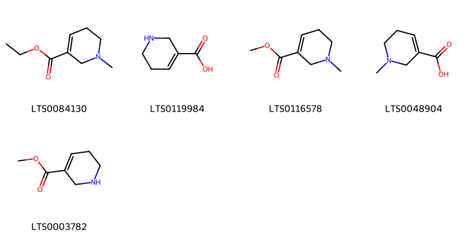

!!! abstract "Tóm tắt"

    Cau (Pericarpium Arecae catechi) là phần vỏ quả đã bỏ vỏ ngoài (lớp vỏ màu xanh) phơi hay sấy khô của cây Cau (Areca catechu L.), thuộc họ Cau (Arecaceae). Loài này có nguồn gốc từ Philippines và đã được du nhập vào nhiều khu vực, bao gồm châu Á, châu Đại Dương, châu Mỹ và châu Phi. Cây Cau được trồng phổ biến khắp nơi ở nước ta. Trong y học, vỏ cau được sử dụng làm thuốc lợi tiểu với tên vị thuốc là "đại phúc bì" và có tác dụng chữa giun sán. Thành phần hóa học của vỏ cau gồm 15-20% tanin và các ancaloit chính như arecolin, guvacolin, arecaidin, và guvaxin. Arecolin trong vỏ cau gây tiết nước bọt nhiều, tăng bài tiết dịch vị và dịch tràng, làm co nhỏ đồng tử, tim đập chậm (trừ khi có mặt canxi), tăng nhu động ruột.

## Thông tin về thực vật

Dược liệu **Cau (Vỏ)** từ bộ phận **Vỏ quả** từ loài *Areca catechu*.

**Mô tả thực vật:** Cây cau là một cây có thân mọc thẳng cao chừng 15-20m, đường kính 10-15cm. Toàn thân không có lá mà có nhiều vết lá cũ mọc, chỉ ở ngọn có một chùm lá to rộng xẻ lông chim. Lá có bẹ to. Mo ở bông mo sớm rụng. Trong cụm hoa hoa đực ở trên, hoa cái ở dưới. Hoa đực nhỏ màu trắng, thơm gồm 3 lá đài màu lục, 3 cánh hoa trắng, 6 nhị. Hoa cái to, bao hoa không phân hóa. Noãn sào thượng 3 ô. Quả hạch hình trứng to bằng quả trứng gà. Quả bì có sợi, hạt có nội nhũ xếp cuốn. Hạt hơi hình nón cụt, đầu tròn giữa dáy hơi lõm, màu nâu nhạt, vị chát.

*Tài liệu tham khảo:* "Những cây thuốc và vị thuốc Việt Nam" - Đỗ Tất Lợi 
Trong dược điển Việt nam, một loài được sử dụng làm dược liệu là *Areca catechu*.

!!! info "Phân loại thực vật của *Areca catechu*"
    - **Kingdom:** Plantae
    - **Phylum:** Tracheophyta
    - **Order:** Arecales
    - **Family:** Arecaceae
    - **Genus:** Areca
    - **Species:** *Areca catechu*

**Phân bố trên thế giới:** nan, Micronesia (Federated States of), Bhutan, Solomon Islands, Mayotte, Singapore, Sri Lanka, French Polynesia, Seychelles, Chinese Taipei, Colombia, Papua New Guinea, Timor-Leste, Cambodia, Bangladesh, South Africa, Indonesia, Grenada, Madagascar, Myanmar, Trinidad and Tobago, India, Palau, Costa Rica, Viet Nam, Guam, Thailand, United States of America, Philippines, China, Comoros, Dominican Republic, Fiji, Malaysia, Maldives, Puerto Rico

**Phân bố tại Việt nam:** Gia Lai, Hà Nội, Ninh Bình

## Thông tin về dược liệu 

### Định danh

!!! info "Thông tin về tên gọi"

    - Dược liệu tiếng Việt: cau
    - Dược liệu tiếng Trung: 槟榔 (Bing Lang)
    - Dược liệu tiếng Anh: Areca Catechu
    - Dược liệu latin thông dụng: Pericarpium Arecae catechi nArecae Pericarpium
    - Dược liệu latin kiểu DĐVN: *pericarpium arecae catechi*
    - Dược liệu latin kiểu DĐVN: *Arecae Pericarpium*
    - Dược liệu latin kiểu thông tư: **
    - Bộ phận dùng: Vỏ quả (Pericarpium)

### Mô tả dược liệu 

- **Theo dược điển Việt nam V:** Đại phúc bì: Là vỏ quả cau chưa chín, bỏ vỏ ngoài, vỏ quả cứng, lõm cong, dài 4 cm đến 7 cm, rộng 2 cm đến 3,5 cm, vỏ dày 0,2 cm đến 0,5 cm. Phần ngoài màu xám, có vân nhăn dọc và vân ngang nhô lên. Đỉnh có vết sẹo của vòi nhụy, gốc có vết cuống quả và đài hoa. Vỏ quả trong hình vỏ sò, màu nâu tới nâu sẫm, bóng mịn và cứng, chắc. Thể nhẹ, chất rắn, có thể xé theo chiều dọc. Khi xé dọc có thể thấy sợi vỏ quả giữa, mùi nhẹ, vị hơi se. Đại phúc mao: Là vỏ quả cau chín, bóc vỏ quả ngoài rồi làm cho tơi ra. Đôi khi có hình bầu dục hoặc hình lõm cong. Vỏ quả ngoài có thể mất hoặc còn sót lại. Khối sợi vỏ quả giữa, dài 4 cm đến 7 cm, màu trắng ngà hay màu nâu nhạt. Thể nhẹ và xốp, chất mềm dai. vỏ quả trong hình vỏ sò, màu nâu vàng hoặc màu nâu, mặt trong nhẵn mịn, đôi khi bị gây dọc. Hơi có mùi, vị nhạt.

- **Mô tả dược liệu theo thông tư chế biến dược liệu theo phương pháp cổ truyền:** 

### Chế biến 

- **Chế biến theo dược điển việt nam V**: Vào mùa đông đến mùa xuân năm sau, hái quả chưa chín, phơi khô sau khi luộc, bổ đôi, tước bỏ vỏ xanh, lấy cùi, thường gọi là đại phúc bì. Vào cụối mùa xuân đến đầu mùa thu, hái quả chín, phơi hoặc sấy khô sau khi luộc, bóc lấy cùi, đập cho xơ, phơi khô, thường gọi là đại phúc mao. Bào chế cau (vỏ quả) Đại phúc bì loại bỏ tạp chất, rửa sạch, cắt đoạn, làm khô. Đại phúc mao loại bỏ tạp chất, rửa sạch, làm khô. nn

- **Chế biến theo thông tư:** 

--- 

## Thành phần hóa học

- Theo tài liệu của GS. Đỗ Tất Lợi:  (1) Tỷ lệ tanin trong vỏ cau khoảng 15-20%.
Hoạt chất chính là 4 ancaloit: Arecolin C3H13NO2, guvacolin C7H11NO2, arecaidin C7H11NO2, guvaxin C6H9NO2.
(2) Trong dược điển Hồng Kông, hoạt chất chính của vỏ cau là Arecolin
    

**Thành phần hóa học từ loài **Areca catechu**

Theo cơ sở dữ liệu lotus, loài *Areca catechu* đã phân lập và xác định được **65** hoạt chất thuộc về các nhóm Piperidines, Benzimidazoles, Flavonoids, Fatty Acyls, Indoles and derivatives, Carboxylic acids and derivatives, Pyridines and derivatives, Harmala alkaloids trong bảng dưới đây. Danh sách các hoạt chất như sau 2-(3,4-dihydroxyphenyl)-4-[2-(3,4-dihydroxyphenyl)-3,5,7-trihydroxy-3,4-dihydro-2h-1-benzopyran-6-yl]-3,4-dihydro-2h-1-benzopyran-3,5,7-triol [(LTS0072400)](https://lotus.naturalproducts.net/compound/lotus_id/LTS0072400), (2r,3r)-2-(3,4-dihydroxyphenyl)-4-[(2r,3r)-2-(3,4-dihydroxyphenyl)-3,5,7-trihydroxy-3,4-dihydro-2h-1-benzopyran-8-yl]-3,4-dihydro-2h-1-benzopyran-3,5,7-triol [(LTS0097406)](https://lotus.naturalproducts.net/compound/lotus_id/LTS0097406), harmane [(LTS0068205)](https://lotus.naturalproducts.net/compound/lotus_id/LTS0068205), d-aspartic acid [(LTS0144001)](https://lotus.naturalproducts.net/compound/lotus_id/LTS0144001), 2-(3,4-dihydroxyphenyl)-8-[2-(3,4-dihydroxyphenyl)-3,5,7-trihydroxy-3,4-dihydro-2h-1-benzopyran-4-yl]-4-[2-(3,4-dihydroxyphenyl)-4-[2-(3,4-dihydroxyphenyl)-3,5,7-trihydroxy-3,4-dihydro-2h-1-benzopyran-6-yl]-3,5,7-trihydroxy-3,4-dihydro-2h-1-benzopyran-8-yl]-3,4-dihydro-2h-1-benzopyran-3,5,7-triol [(LTS0039478)](https://lotus.naturalproducts.net/compound/lotus_id/LTS0039478), 2-[methyl(2-[(r)-[3-methyl-4-(2,2,2-trifluoroethoxy)pyridin-2-yl]methanesulfinyl]-1,3-benzodiazole-1-carbonyl)amino]ethyl 1-methylpiperidine-4-carboxylate [(LTS0062729)](https://lotus.naturalproducts.net/compound/lotus_id/LTS0062729), heat spray [(LTS0061317)](https://lotus.naturalproducts.net/compound/lotus_id/LTS0061317), procyanidin c1 [(LTS0260445)](https://lotus.naturalproducts.net/compound/lotus_id/LTS0260445), (2s)-2-(phenylamino)propanoic acid [(LTS0199539)](https://lotus.naturalproducts.net/compound/lotus_id/LTS0199539), arecatannin b1 [(LTS0143493)](https://lotus.naturalproducts.net/compound/lotus_id/LTS0143493), (2r,3r,4r)-2-(3,4-dihydroxyphenyl)-8-[(2r,3r,4r)-2-(3,4-dihydroxyphenyl)-3,5,7-trihydroxy-3,4-dihydro-2h-1-benzopyran-4-yl]-4-[(2r,3r,4s)-2-(3,4-dihydroxyphenyl)-4-[(2r,3s)-2-(3,4-dihydroxyphenyl)-3,5,7-trihydroxy-3,4-dihydro-2h-1-benzopyran-6-yl]-3,5,7-trihydroxy-3,4-dihydro-2h-1-benzopyran-8-yl]-3,4-dihydro-2h-1-benzopyran-3,5,7-triol [(LTS0037836)](https://lotus.naturalproducts.net/compound/lotus_id/LTS0037836), (2r,3r,4r)-2-(3,4-dihydroxyphenyl)-4-[(2r,3r)-2-(3,4-dihydroxyphenyl)-3,5,7-trihydroxy-3,4-dihydro-2h-1-benzopyran-8-yl]-3,4-dihydro-2h-1-benzopyran-3,5,7-triol [(LTS0135510)](https://lotus.naturalproducts.net/compound/lotus_id/LTS0135510), β-carboline [(LTS0263207)](https://lotus.naturalproducts.net/compound/lotus_id/LTS0263207), ent-epicatechin [(LTS0265245)](https://lotus.naturalproducts.net/compound/lotus_id/LTS0265245), palmitic acid [(LTS0079439)](https://lotus.naturalproducts.net/compound/lotus_id/LTS0079439), d-phenylalanine [(LTS0048920)](https://lotus.naturalproducts.net/compound/lotus_id/LTS0048920), (+)-catechol [(LTS0117079)](https://lotus.naturalproducts.net/compound/lotus_id/LTS0117079), (2r,3s,4s)-2-(3,4-dihydroxyphenyl)-4-[(2r,3r)-2-(3,4-dihydroxyphenyl)-3,5,7-trihydroxy-3,4-dihydro-2h-1-benzopyran-8-yl]-3,4-dihydro-2h-1-benzopyran-3,5,7-triol [(LTS0116257)](https://lotus.naturalproducts.net/compound/lotus_id/LTS0116257), arecatannin b1 [(LTS0091361)](https://lotus.naturalproducts.net/compound/lotus_id/LTS0091361), ethyl nicotinate [(LTS0116042)](https://lotus.naturalproducts.net/compound/lotus_id/LTS0116042), ethyl (3s)-1-methylpiperidine-3-carboxylate [(LTS0123043)](https://lotus.naturalproducts.net/compound/lotus_id/LTS0123043), l-alanine [(LTS0042208)](https://lotus.naturalproducts.net/compound/lotus_id/LTS0042208), myristic acid [(LTS0102566)](https://lotus.naturalproducts.net/compound/lotus_id/LTS0102566), (-)-nicotine [(LTS0184620)](https://lotus.naturalproducts.net/compound/lotus_id/LTS0184620), d-alanine [(LTS0272178)](https://lotus.naturalproducts.net/compound/lotus_id/LTS0272178), 1-methylpiperidine-3-carboxylic acid [(LTS0221482)](https://lotus.naturalproducts.net/compound/lotus_id/LTS0221482), 1-methyl-3h,4h,9h-pyrido[3,4-b]indole [(LTS0027115)](https://lotus.naturalproducts.net/compound/lotus_id/LTS0027115), stearic acid [(LTS0237766)](https://lotus.naturalproducts.net/compound/lotus_id/LTS0237766), ethyl 1-methylpiperidine-3-carboxylate [(LTS0082807)](https://lotus.naturalproducts.net/compound/lotus_id/LTS0082807), arecoline [(LTS0116578)](https://lotus.naturalproducts.net/compound/lotus_id/LTS0116578), methyl (3s)-1-methylpiperidine-3-carboxylate [(LTS0074657)](https://lotus.naturalproducts.net/compound/lotus_id/LTS0074657), (2r,3r,4s)-2-(3,4-dihydroxyphenyl)-4-[(2r,3s)-2-(3,4-dihydroxyphenyl)-3,5,7-trihydroxy-3,4-dihydro-2h-1-benzopyran-6-yl]-3,4-dihydro-2h-1-benzopyran-3,5,7-triol [(LTS0105674)](https://lotus.naturalproducts.net/compound/lotus_id/LTS0105674), l-lysine [(LTS0068734)](https://lotus.naturalproducts.net/compound/lotus_id/LTS0068734), methyl n-methylnipecotate [(LTS0024921)](https://lotus.naturalproducts.net/compound/lotus_id/LTS0024921), catechol [(LTS0090912)](https://lotus.naturalproducts.net/compound/lotus_id/LTS0090912), nonadec-2-enoic acid [(LTS0229279)](https://lotus.naturalproducts.net/compound/lotus_id/LTS0229279), guvacoline [(LTS0003782)](https://lotus.naturalproducts.net/compound/lotus_id/LTS0003782), l-aspartic acid [(LTS0205466)](https://lotus.naturalproducts.net/compound/lotus_id/LTS0205466), l-serine [(LTS0106692)](https://lotus.naturalproducts.net/compound/lotus_id/LTS0106692), procyanidin c2 [(LTS0226053)](https://lotus.naturalproducts.net/compound/lotus_id/LTS0226053), arecaidine [(LTS0048904)](https://lotus.naturalproducts.net/compound/lotus_id/LTS0048904), l-histidine [(LTS0094081)](https://lotus.naturalproducts.net/compound/lotus_id/LTS0094081), l-tyrosine [(LTS0029981)](https://lotus.naturalproducts.net/compound/lotus_id/LTS0029981), l-proline [(LTS0090383)](https://lotus.naturalproducts.net/compound/lotus_id/LTS0090383), 2-(3,4-dihydroxyphenyl)-4-[2-(3,4-dihydroxyphenyl)-3,5,7-trihydroxy-3,4-dihydro-2h-1-benzopyran-8-yl]-3,4-dihydro-2h-1-benzopyran-3,5,7-triol [(LTS0040252)](https://lotus.naturalproducts.net/compound/lotus_id/LTS0040252), d-methionine [(LTS0108782)](https://lotus.naturalproducts.net/compound/lotus_id/LTS0108782), l-valine [(LTS0231703)](https://lotus.naturalproducts.net/compound/lotus_id/LTS0231703), lauric acid [(LTS0051907)](https://lotus.naturalproducts.net/compound/lotus_id/LTS0051907), (2r,3r,4r)-2-(3,4-dihydroxyphenyl)-8-[(2r,3r,4r)-2-(3,4-dihydroxyphenyl)-3,5,7-trihydroxy-3,4-dihydro-2h-1-benzopyran-4-yl]-4-[(2r,3r,4s)-2-(3,4-dihydroxyphenyl)-4-[(2r,3s)-2-(3,4-dihydroxyphenyl)-3,5,7-trihydroxy-3,4-dihydro-2h-1-benzopyran-8-yl]-3,5,7-trihydroxy-3,4-dihydro-2h-1-benzopyran-8-yl]-3,4-dihydro-2h-1-benzopyran-3,5,7-triol [(LTS0111899)](https://lotus.naturalproducts.net/compound/lotus_id/LTS0111899), oleic acid [(LTS0256910)](https://lotus.naturalproducts.net/compound/lotus_id/LTS0256910), l-arginine [(LTS0064737)](https://lotus.naturalproducts.net/compound/lotus_id/LTS0064737), l-threonine [(LTS0184056)](https://lotus.naturalproducts.net/compound/lotus_id/LTS0184056), l-glutamic acid [(LTS0037133)](https://lotus.naturalproducts.net/compound/lotus_id/LTS0037133), l-isoleucine [(LTS0249538)](https://lotus.naturalproducts.net/compound/lotus_id/LTS0249538), (2r,3r,4r)-2-(3,4-dihydroxyphenyl)-4-[(2r,3s)-2-(3,4-dihydroxyphenyl)-3,5,7-trihydroxy-3,4-dihydro-2h-1-benzopyran-8-yl]-3,4-dihydro-2h-1-benzopyran-3,5,7-triol [(LTS0066122)](https://lotus.naturalproducts.net/compound/lotus_id/LTS0066122), l-tryptophan [(LTS0263809)](https://lotus.naturalproducts.net/compound/lotus_id/LTS0263809), ethyl 1-methyl-5,6-dihydro-2h-pyridine-3-carboxylate [(LTS0084130)](https://lotus.naturalproducts.net/compound/lotus_id/LTS0084130), niacin [(LTS0216673)](https://lotus.naturalproducts.net/compound/lotus_id/LTS0216673), l-methionine [(LTS0196746)](https://lotus.naturalproducts.net/compound/lotus_id/LTS0196746), nicotine [(LTS0177379)](https://lotus.naturalproducts.net/compound/lotus_id/LTS0177379), (2r,3r,4s)-2-(3,4-dihydroxyphenyl)-8-[(2r,3r,4r)-2-(3,4-dihydroxyphenyl)-3,5,7-trihydroxy-3,4-dihydro-2h-1-benzopyran-4-yl]-4-[(2r,3s)-2-(3,4-dihydroxyphenyl)-3,5,7-trihydroxy-3,4-dihydro-2h-1-benzopyran-8-yl]-3,4-dihydro-2h-1-benzopyran-3,5,7-triol [(LTS0027230)](https://lotus.naturalproducts.net/compound/lotus_id/LTS0027230), guvacine [(LTS0119984)](https://lotus.naturalproducts.net/compound/lotus_id/LTS0119984), 2-(3,4-dihydroxyphenyl)-8-[2-(3,4-dihydroxyphenyl)-3,5,7-trihydroxy-3,4-dihydro-2h-1-benzopyran-4-yl]-4-[2-(3,4-dihydroxyphenyl)-4-[2-(3,4-dihydroxyphenyl)-3,5,7-trihydroxy-3,4-dihydro-2h-1-benzopyran-8-yl]-3,5,7-trihydroxy-3,4-dihydro-2h-1-benzopyran-8-yl]-3,4-dihydro-2h-1-benzopyran-3,5,7-triol [(LTS0039604)](https://lotus.naturalproducts.net/compound/lotus_id/LTS0039604), l-leucine [(LTS0113423)](https://lotus.naturalproducts.net/compound/lotus_id/LTS0113423), pentadecanoic acid [(LTS0227120)](https://lotus.naturalproducts.net/compound/lotus_id/LTS0227120). 
        
| chemicalTaxonomyClassyfireClass   |   smiles_count |
|:----------------------------------|---------------:|
|                                   |             88 |
| Benzimidazoles                    |             75 |
| Carboxylic acids and derivatives  |            398 |
| Fatty Acyls                       |            151 |
| Flavonoids                        |           2177 |
| Harmala alkaloids                 |             47 |
| Indoles and derivatives           |             56 |
| Piperidines                       |             99 |
| Pyridines and derivatives         |             81 |

            
### Nhóm 
<figure markdown="span">
    { width=100% }
<figcaption>Hình ảnh cấu trúc hóa học của hoạt chất thuộc nhóm **. Tên thường gọi của các hoạt chất tương ứng là ethyl 1-methyl-5,6-dihydro-2h-pyridine-3-carboxylate [(LTS0084130)](https://lotus.naturalproducts.net/compound/lotus_id/LTS0084130), guvacine [(LTS0119984)](https://lotus.naturalproducts.net/compound/lotus_id/LTS0119984), arecoline [(LTS0116578)](https://lotus.naturalproducts.net/compound/lotus_id/LTS0116578), arecaidine [(LTS0048904)](https://lotus.naturalproducts.net/compound/lotus_id/LTS0048904), guvacoline [(LTS0003782)](https://lotus.naturalproducts.net/compound/lotus_id/LTS0003782).</figcaption>
</figure>

            
            
### Nhóm 
<figure markdown="span">
    { width=100% }
<figcaption>Hình ảnh cấu trúc hóa học của hoạt chất thuộc nhóm **. Tên thường gọi của các hoạt chất tương ứng là ethyl 1-methyl-5,6-dihydro-2h-pyridine-3-carboxylate [(LTS0084130)](https://lotus.naturalproducts.net/compound/lotus_id/LTS0084130), guvacine [(LTS0119984)](https://lotus.naturalproducts.net/compound/lotus_id/LTS0119984), arecoline [(LTS0116578)](https://lotus.naturalproducts.net/compound/lotus_id/LTS0116578), arecaidine [(LTS0048904)](https://lotus.naturalproducts.net/compound/lotus_id/LTS0048904), guvacoline [(LTS0003782)](https://lotus.naturalproducts.net/compound/lotus_id/LTS0003782).</figcaption>
</figure>

### Nhóm Benzimidazoles
<figure markdown="span">
    { width=100% }
<figcaption>Hình ảnh cấu trúc hóa học của hoạt chất thuộc nhóm *Benzimidazoles*. Tên thường gọi của các hoạt chất tương ứng là 2-[methyl(2-[(r)-[3-methyl-4-(2,2,2-trifluoroethoxy)pyridin-2-yl]methanesulfinyl]-1,3-benzodiazole-1-carbonyl)amino]ethyl 1-methylpiperidine-4-carboxylate [(LTS0062729)](https://lotus.naturalproducts.net/compound/lotus_id/LTS0062729).</figcaption>
</figure>

            
            
### Nhóm 
<figure markdown="span">
    { width=100% }
<figcaption>Hình ảnh cấu trúc hóa học của hoạt chất thuộc nhóm **. Tên thường gọi của các hoạt chất tương ứng là ethyl 1-methyl-5,6-dihydro-2h-pyridine-3-carboxylate [(LTS0084130)](https://lotus.naturalproducts.net/compound/lotus_id/LTS0084130), guvacine [(LTS0119984)](https://lotus.naturalproducts.net/compound/lotus_id/LTS0119984), arecoline [(LTS0116578)](https://lotus.naturalproducts.net/compound/lotus_id/LTS0116578), arecaidine [(LTS0048904)](https://lotus.naturalproducts.net/compound/lotus_id/LTS0048904), guvacoline [(LTS0003782)](https://lotus.naturalproducts.net/compound/lotus_id/LTS0003782).</figcaption>
</figure>

### Nhóm Benzimidazoles
<figure markdown="span">
    { width=100% }
<figcaption>Hình ảnh cấu trúc hóa học của hoạt chất thuộc nhóm *Benzimidazoles*. Tên thường gọi của các hoạt chất tương ứng là 2-[methyl(2-[(r)-[3-methyl-4-(2,2,2-trifluoroethoxy)pyridin-2-yl]methanesulfinyl]-1,3-benzodiazole-1-carbonyl)amino]ethyl 1-methylpiperidine-4-carboxylate [(LTS0062729)](https://lotus.naturalproducts.net/compound/lotus_id/LTS0062729).</figcaption>
</figure>

### Nhóm Carboxylic acids and derivatives
<figure markdown="span">
    { width=100% }
<figcaption>Hình ảnh cấu trúc hóa học của hoạt chất thuộc nhóm *Carboxylic acids and derivatives*. Tên thường gọi của các hoạt chất tương ứng là l-threonine [(LTS0184056)](https://lotus.naturalproducts.net/compound/lotus_id/LTS0184056), l-serine [(LTS0106692)](https://lotus.naturalproducts.net/compound/lotus_id/LTS0106692), l-alanine [(LTS0042208)](https://lotus.naturalproducts.net/compound/lotus_id/LTS0042208), l-lysine [(LTS0068734)](https://lotus.naturalproducts.net/compound/lotus_id/LTS0068734), d-methionine [(LTS0108782)](https://lotus.naturalproducts.net/compound/lotus_id/LTS0108782), l-aspartic acid [(LTS0205466)](https://lotus.naturalproducts.net/compound/lotus_id/LTS0205466), l-proline [(LTS0090383)](https://lotus.naturalproducts.net/compound/lotus_id/LTS0090383), d-phenylalanine [(LTS0048920)](https://lotus.naturalproducts.net/compound/lotus_id/LTS0048920), l-methionine [(LTS0196746)](https://lotus.naturalproducts.net/compound/lotus_id/LTS0196746), l-isoleucine [(LTS0249538)](https://lotus.naturalproducts.net/compound/lotus_id/LTS0249538), (2s)-2-(phenylamino)propanoic acid [(LTS0199539)](https://lotus.naturalproducts.net/compound/lotus_id/LTS0199539), l-valine [(LTS0231703)](https://lotus.naturalproducts.net/compound/lotus_id/LTS0231703), d-aspartic acid [(LTS0144001)](https://lotus.naturalproducts.net/compound/lotus_id/LTS0144001), d-alanine [(LTS0272178)](https://lotus.naturalproducts.net/compound/lotus_id/LTS0272178), l-glutamic acid [(LTS0037133)](https://lotus.naturalproducts.net/compound/lotus_id/LTS0037133), l-arginine [(LTS0064737)](https://lotus.naturalproducts.net/compound/lotus_id/LTS0064737), l-tyrosine [(LTS0029981)](https://lotus.naturalproducts.net/compound/lotus_id/LTS0029981), l-leucine [(LTS0113423)](https://lotus.naturalproducts.net/compound/lotus_id/LTS0113423), l-histidine [(LTS0094081)](https://lotus.naturalproducts.net/compound/lotus_id/LTS0094081).</figcaption>
</figure>

            
            
### Nhóm 
<figure markdown="span">
    { width=100% }
<figcaption>Hình ảnh cấu trúc hóa học của hoạt chất thuộc nhóm **. Tên thường gọi của các hoạt chất tương ứng là ethyl 1-methyl-5,6-dihydro-2h-pyridine-3-carboxylate [(LTS0084130)](https://lotus.naturalproducts.net/compound/lotus_id/LTS0084130), guvacine [(LTS0119984)](https://lotus.naturalproducts.net/compound/lotus_id/LTS0119984), arecoline [(LTS0116578)](https://lotus.naturalproducts.net/compound/lotus_id/LTS0116578), arecaidine [(LTS0048904)](https://lotus.naturalproducts.net/compound/lotus_id/LTS0048904), guvacoline [(LTS0003782)](https://lotus.naturalproducts.net/compound/lotus_id/LTS0003782).</figcaption>
</figure>

### Nhóm Benzimidazoles
<figure markdown="span">
    { width=100% }
<figcaption>Hình ảnh cấu trúc hóa học của hoạt chất thuộc nhóm *Benzimidazoles*. Tên thường gọi của các hoạt chất tương ứng là 2-[methyl(2-[(r)-[3-methyl-4-(2,2,2-trifluoroethoxy)pyridin-2-yl]methanesulfinyl]-1,3-benzodiazole-1-carbonyl)amino]ethyl 1-methylpiperidine-4-carboxylate [(LTS0062729)](https://lotus.naturalproducts.net/compound/lotus_id/LTS0062729).</figcaption>
</figure>

### Nhóm Carboxylic acids and derivatives
<figure markdown="span">
    { width=100% }
<figcaption>Hình ảnh cấu trúc hóa học của hoạt chất thuộc nhóm *Carboxylic acids and derivatives*. Tên thường gọi của các hoạt chất tương ứng là l-threonine [(LTS0184056)](https://lotus.naturalproducts.net/compound/lotus_id/LTS0184056), l-serine [(LTS0106692)](https://lotus.naturalproducts.net/compound/lotus_id/LTS0106692), l-alanine [(LTS0042208)](https://lotus.naturalproducts.net/compound/lotus_id/LTS0042208), l-lysine [(LTS0068734)](https://lotus.naturalproducts.net/compound/lotus_id/LTS0068734), d-methionine [(LTS0108782)](https://lotus.naturalproducts.net/compound/lotus_id/LTS0108782), l-aspartic acid [(LTS0205466)](https://lotus.naturalproducts.net/compound/lotus_id/LTS0205466), l-proline [(LTS0090383)](https://lotus.naturalproducts.net/compound/lotus_id/LTS0090383), d-phenylalanine [(LTS0048920)](https://lotus.naturalproducts.net/compound/lotus_id/LTS0048920), l-methionine [(LTS0196746)](https://lotus.naturalproducts.net/compound/lotus_id/LTS0196746), l-isoleucine [(LTS0249538)](https://lotus.naturalproducts.net/compound/lotus_id/LTS0249538), (2s)-2-(phenylamino)propanoic acid [(LTS0199539)](https://lotus.naturalproducts.net/compound/lotus_id/LTS0199539), l-valine [(LTS0231703)](https://lotus.naturalproducts.net/compound/lotus_id/LTS0231703), d-aspartic acid [(LTS0144001)](https://lotus.naturalproducts.net/compound/lotus_id/LTS0144001), d-alanine [(LTS0272178)](https://lotus.naturalproducts.net/compound/lotus_id/LTS0272178), l-glutamic acid [(LTS0037133)](https://lotus.naturalproducts.net/compound/lotus_id/LTS0037133), l-arginine [(LTS0064737)](https://lotus.naturalproducts.net/compound/lotus_id/LTS0064737), l-tyrosine [(LTS0029981)](https://lotus.naturalproducts.net/compound/lotus_id/LTS0029981), l-leucine [(LTS0113423)](https://lotus.naturalproducts.net/compound/lotus_id/LTS0113423), l-histidine [(LTS0094081)](https://lotus.naturalproducts.net/compound/lotus_id/LTS0094081).</figcaption>
</figure>

### Nhóm Fatty Acyls
<figure markdown="span">
    { width=100% }
<figcaption>Hình ảnh cấu trúc hóa học của hoạt chất thuộc nhóm *Fatty Acyls*. Tên thường gọi của các hoạt chất tương ứng là palmitic acid [(LTS0079439)](https://lotus.naturalproducts.net/compound/lotus_id/LTS0079439), pentadecanoic acid [(LTS0227120)](https://lotus.naturalproducts.net/compound/lotus_id/LTS0227120), nonadec-2-enoic acid [(LTS0229279)](https://lotus.naturalproducts.net/compound/lotus_id/LTS0229279), oleic acid [(LTS0256910)](https://lotus.naturalproducts.net/compound/lotus_id/LTS0256910), myristic acid [(LTS0102566)](https://lotus.naturalproducts.net/compound/lotus_id/LTS0102566), lauric acid [(LTS0051907)](https://lotus.naturalproducts.net/compound/lotus_id/LTS0051907), stearic acid [(LTS0237766)](https://lotus.naturalproducts.net/compound/lotus_id/LTS0237766).</figcaption>
</figure>

            
            
### Nhóm 
<figure markdown="span">
    { width=100% }
<figcaption>Hình ảnh cấu trúc hóa học của hoạt chất thuộc nhóm **. Tên thường gọi của các hoạt chất tương ứng là ethyl 1-methyl-5,6-dihydro-2h-pyridine-3-carboxylate [(LTS0084130)](https://lotus.naturalproducts.net/compound/lotus_id/LTS0084130), guvacine [(LTS0119984)](https://lotus.naturalproducts.net/compound/lotus_id/LTS0119984), arecoline [(LTS0116578)](https://lotus.naturalproducts.net/compound/lotus_id/LTS0116578), arecaidine [(LTS0048904)](https://lotus.naturalproducts.net/compound/lotus_id/LTS0048904), guvacoline [(LTS0003782)](https://lotus.naturalproducts.net/compound/lotus_id/LTS0003782).</figcaption>
</figure>

### Nhóm Benzimidazoles
<figure markdown="span">
    { width=100% }
<figcaption>Hình ảnh cấu trúc hóa học của hoạt chất thuộc nhóm *Benzimidazoles*. Tên thường gọi của các hoạt chất tương ứng là 2-[methyl(2-[(r)-[3-methyl-4-(2,2,2-trifluoroethoxy)pyridin-2-yl]methanesulfinyl]-1,3-benzodiazole-1-carbonyl)amino]ethyl 1-methylpiperidine-4-carboxylate [(LTS0062729)](https://lotus.naturalproducts.net/compound/lotus_id/LTS0062729).</figcaption>
</figure>

### Nhóm Carboxylic acids and derivatives
<figure markdown="span">
    { width=100% }
<figcaption>Hình ảnh cấu trúc hóa học của hoạt chất thuộc nhóm *Carboxylic acids and derivatives*. Tên thường gọi của các hoạt chất tương ứng là l-threonine [(LTS0184056)](https://lotus.naturalproducts.net/compound/lotus_id/LTS0184056), l-serine [(LTS0106692)](https://lotus.naturalproducts.net/compound/lotus_id/LTS0106692), l-alanine [(LTS0042208)](https://lotus.naturalproducts.net/compound/lotus_id/LTS0042208), l-lysine [(LTS0068734)](https://lotus.naturalproducts.net/compound/lotus_id/LTS0068734), d-methionine [(LTS0108782)](https://lotus.naturalproducts.net/compound/lotus_id/LTS0108782), l-aspartic acid [(LTS0205466)](https://lotus.naturalproducts.net/compound/lotus_id/LTS0205466), l-proline [(LTS0090383)](https://lotus.naturalproducts.net/compound/lotus_id/LTS0090383), d-phenylalanine [(LTS0048920)](https://lotus.naturalproducts.net/compound/lotus_id/LTS0048920), l-methionine [(LTS0196746)](https://lotus.naturalproducts.net/compound/lotus_id/LTS0196746), l-isoleucine [(LTS0249538)](https://lotus.naturalproducts.net/compound/lotus_id/LTS0249538), (2s)-2-(phenylamino)propanoic acid [(LTS0199539)](https://lotus.naturalproducts.net/compound/lotus_id/LTS0199539), l-valine [(LTS0231703)](https://lotus.naturalproducts.net/compound/lotus_id/LTS0231703), d-aspartic acid [(LTS0144001)](https://lotus.naturalproducts.net/compound/lotus_id/LTS0144001), d-alanine [(LTS0272178)](https://lotus.naturalproducts.net/compound/lotus_id/LTS0272178), l-glutamic acid [(LTS0037133)](https://lotus.naturalproducts.net/compound/lotus_id/LTS0037133), l-arginine [(LTS0064737)](https://lotus.naturalproducts.net/compound/lotus_id/LTS0064737), l-tyrosine [(LTS0029981)](https://lotus.naturalproducts.net/compound/lotus_id/LTS0029981), l-leucine [(LTS0113423)](https://lotus.naturalproducts.net/compound/lotus_id/LTS0113423), l-histidine [(LTS0094081)](https://lotus.naturalproducts.net/compound/lotus_id/LTS0094081).</figcaption>
</figure>

### Nhóm Fatty Acyls
<figure markdown="span">
    { width=100% }
<figcaption>Hình ảnh cấu trúc hóa học của hoạt chất thuộc nhóm *Fatty Acyls*. Tên thường gọi của các hoạt chất tương ứng là palmitic acid [(LTS0079439)](https://lotus.naturalproducts.net/compound/lotus_id/LTS0079439), pentadecanoic acid [(LTS0227120)](https://lotus.naturalproducts.net/compound/lotus_id/LTS0227120), nonadec-2-enoic acid [(LTS0229279)](https://lotus.naturalproducts.net/compound/lotus_id/LTS0229279), oleic acid [(LTS0256910)](https://lotus.naturalproducts.net/compound/lotus_id/LTS0256910), myristic acid [(LTS0102566)](https://lotus.naturalproducts.net/compound/lotus_id/LTS0102566), lauric acid [(LTS0051907)](https://lotus.naturalproducts.net/compound/lotus_id/LTS0051907), stearic acid [(LTS0237766)](https://lotus.naturalproducts.net/compound/lotus_id/LTS0237766).</figcaption>
</figure>

### Nhóm Flavonoids
<figure markdown="span">
    { width=100% }
<figcaption>Hình ảnh cấu trúc hóa học của hoạt chất thuộc nhóm *Flavonoids*. Tên thường gọi của các hoạt chất tương ứng là (+)-catechol [(LTS0117079)](https://lotus.naturalproducts.net/compound/lotus_id/LTS0117079), 2-(3,4-dihydroxyphenyl)-8-[2-(3,4-dihydroxyphenyl)-3,5,7-trihydroxy-3,4-dihydro-2h-1-benzopyran-4-yl]-4-[2-(3,4-dihydroxyphenyl)-4-[2-(3,4-dihydroxyphenyl)-3,5,7-trihydroxy-3,4-dihydro-2h-1-benzopyran-8-yl]-3,5,7-trihydroxy-3,4-dihydro-2h-1-benzopyran-8-yl]-3,4-dihydro-2h-1-benzopyran-3,5,7-triol [(LTS0039604)](https://lotus.naturalproducts.net/compound/lotus_id/LTS0039604), arecatannin b1 [(LTS0091361)](https://lotus.naturalproducts.net/compound/lotus_id/LTS0091361), 2-(3,4-dihydroxyphenyl)-4-[2-(3,4-dihydroxyphenyl)-3,5,7-trihydroxy-3,4-dihydro-2h-1-benzopyran-6-yl]-3,4-dihydro-2h-1-benzopyran-3,5,7-triol [(LTS0072400)](https://lotus.naturalproducts.net/compound/lotus_id/LTS0072400), (2r,3r,4s)-2-(3,4-dihydroxyphenyl)-4-[(2r,3s)-2-(3,4-dihydroxyphenyl)-3,5,7-trihydroxy-3,4-dihydro-2h-1-benzopyran-6-yl]-3,4-dihydro-2h-1-benzopyran-3,5,7-triol [(LTS0105674)](https://lotus.naturalproducts.net/compound/lotus_id/LTS0105674), (2r,3r,4r)-2-(3,4-dihydroxyphenyl)-8-[(2r,3r,4r)-2-(3,4-dihydroxyphenyl)-3,5,7-trihydroxy-3,4-dihydro-2h-1-benzopyran-4-yl]-4-[(2r,3r,4s)-2-(3,4-dihydroxyphenyl)-4-[(2r,3s)-2-(3,4-dihydroxyphenyl)-3,5,7-trihydroxy-3,4-dihydro-2h-1-benzopyran-6-yl]-3,5,7-trihydroxy-3,4-dihydro-2h-1-benzopyran-8-yl]-3,4-dihydro-2h-1-benzopyran-3,5,7-triol [(LTS0037836)](https://lotus.naturalproducts.net/compound/lotus_id/LTS0037836), (2r,3s,4s)-2-(3,4-dihydroxyphenyl)-4-[(2r,3r)-2-(3,4-dihydroxyphenyl)-3,5,7-trihydroxy-3,4-dihydro-2h-1-benzopyran-8-yl]-3,4-dihydro-2h-1-benzopyran-3,5,7-triol [(LTS0116257)](https://lotus.naturalproducts.net/compound/lotus_id/LTS0116257), 2-(3,4-dihydroxyphenyl)-8-[2-(3,4-dihydroxyphenyl)-3,5,7-trihydroxy-3,4-dihydro-2h-1-benzopyran-4-yl]-4-[2-(3,4-dihydroxyphenyl)-4-[2-(3,4-dihydroxyphenyl)-3,5,7-trihydroxy-3,4-dihydro-2h-1-benzopyran-6-yl]-3,5,7-trihydroxy-3,4-dihydro-2h-1-benzopyran-8-yl]-3,4-dihydro-2h-1-benzopyran-3,5,7-triol [(LTS0039478)](https://lotus.naturalproducts.net/compound/lotus_id/LTS0039478), (2r,3r,4r)-2-(3,4-dihydroxyphenyl)-8-[(2r,3r,4r)-2-(3,4-dihydroxyphenyl)-3,5,7-trihydroxy-3,4-dihydro-2h-1-benzopyran-4-yl]-4-[(2r,3r,4s)-2-(3,4-dihydroxyphenyl)-4-[(2r,3s)-2-(3,4-dihydroxyphenyl)-3,5,7-trihydroxy-3,4-dihydro-2h-1-benzopyran-8-yl]-3,5,7-trihydroxy-3,4-dihydro-2h-1-benzopyran-8-yl]-3,4-dihydro-2h-1-benzopyran-3,5,7-triol [(LTS0111899)](https://lotus.naturalproducts.net/compound/lotus_id/LTS0111899), (2r,3r,4r)-2-(3,4-dihydroxyphenyl)-4-[(2r,3r)-2-(3,4-dihydroxyphenyl)-3,5,7-trihydroxy-3,4-dihydro-2h-1-benzopyran-8-yl]-3,4-dihydro-2h-1-benzopyran-3,5,7-triol [(LTS0135510)](https://lotus.naturalproducts.net/compound/lotus_id/LTS0135510), arecatannin b1 [(LTS0143493)](https://lotus.naturalproducts.net/compound/lotus_id/LTS0143493), (2r,3r)-2-(3,4-dihydroxyphenyl)-4-[(2r,3r)-2-(3,4-dihydroxyphenyl)-3,5,7-trihydroxy-3,4-dihydro-2h-1-benzopyran-8-yl]-3,4-dihydro-2h-1-benzopyran-3,5,7-triol [(LTS0097406)](https://lotus.naturalproducts.net/compound/lotus_id/LTS0097406), procyanidin c2 [(LTS0226053)](https://lotus.naturalproducts.net/compound/lotus_id/LTS0226053), procyanidin c1 [(LTS0260445)](https://lotus.naturalproducts.net/compound/lotus_id/LTS0260445), 2-(3,4-dihydroxyphenyl)-4-[2-(3,4-dihydroxyphenyl)-3,5,7-trihydroxy-3,4-dihydro-2h-1-benzopyran-8-yl]-3,4-dihydro-2h-1-benzopyran-3,5,7-triol [(LTS0040252)](https://lotus.naturalproducts.net/compound/lotus_id/LTS0040252), (2r,3r,4r)-2-(3,4-dihydroxyphenyl)-4-[(2r,3s)-2-(3,4-dihydroxyphenyl)-3,5,7-trihydroxy-3,4-dihydro-2h-1-benzopyran-8-yl]-3,4-dihydro-2h-1-benzopyran-3,5,7-triol [(LTS0066122)](https://lotus.naturalproducts.net/compound/lotus_id/LTS0066122), (2r,3r,4s)-2-(3,4-dihydroxyphenyl)-8-[(2r,3r,4r)-2-(3,4-dihydroxyphenyl)-3,5,7-trihydroxy-3,4-dihydro-2h-1-benzopyran-4-yl]-4-[(2r,3s)-2-(3,4-dihydroxyphenyl)-3,5,7-trihydroxy-3,4-dihydro-2h-1-benzopyran-8-yl]-3,4-dihydro-2h-1-benzopyran-3,5,7-triol [(LTS0027230)](https://lotus.naturalproducts.net/compound/lotus_id/LTS0027230), catechol [(LTS0090912)](https://lotus.naturalproducts.net/compound/lotus_id/LTS0090912), ent-epicatechin [(LTS0265245)](https://lotus.naturalproducts.net/compound/lotus_id/LTS0265245).</figcaption>
</figure>

            
            
### Nhóm 
<figure markdown="span">
    { width=100% }
<figcaption>Hình ảnh cấu trúc hóa học của hoạt chất thuộc nhóm **. Tên thường gọi của các hoạt chất tương ứng là ethyl 1-methyl-5,6-dihydro-2h-pyridine-3-carboxylate [(LTS0084130)](https://lotus.naturalproducts.net/compound/lotus_id/LTS0084130), guvacine [(LTS0119984)](https://lotus.naturalproducts.net/compound/lotus_id/LTS0119984), arecoline [(LTS0116578)](https://lotus.naturalproducts.net/compound/lotus_id/LTS0116578), arecaidine [(LTS0048904)](https://lotus.naturalproducts.net/compound/lotus_id/LTS0048904), guvacoline [(LTS0003782)](https://lotus.naturalproducts.net/compound/lotus_id/LTS0003782).</figcaption>
</figure>

### Nhóm Benzimidazoles
<figure markdown="span">
    { width=100% }
<figcaption>Hình ảnh cấu trúc hóa học của hoạt chất thuộc nhóm *Benzimidazoles*. Tên thường gọi của các hoạt chất tương ứng là 2-[methyl(2-[(r)-[3-methyl-4-(2,2,2-trifluoroethoxy)pyridin-2-yl]methanesulfinyl]-1,3-benzodiazole-1-carbonyl)amino]ethyl 1-methylpiperidine-4-carboxylate [(LTS0062729)](https://lotus.naturalproducts.net/compound/lotus_id/LTS0062729).</figcaption>
</figure>

### Nhóm Carboxylic acids and derivatives
<figure markdown="span">
    { width=100% }
<figcaption>Hình ảnh cấu trúc hóa học của hoạt chất thuộc nhóm *Carboxylic acids and derivatives*. Tên thường gọi của các hoạt chất tương ứng là l-threonine [(LTS0184056)](https://lotus.naturalproducts.net/compound/lotus_id/LTS0184056), l-serine [(LTS0106692)](https://lotus.naturalproducts.net/compound/lotus_id/LTS0106692), l-alanine [(LTS0042208)](https://lotus.naturalproducts.net/compound/lotus_id/LTS0042208), l-lysine [(LTS0068734)](https://lotus.naturalproducts.net/compound/lotus_id/LTS0068734), d-methionine [(LTS0108782)](https://lotus.naturalproducts.net/compound/lotus_id/LTS0108782), l-aspartic acid [(LTS0205466)](https://lotus.naturalproducts.net/compound/lotus_id/LTS0205466), l-proline [(LTS0090383)](https://lotus.naturalproducts.net/compound/lotus_id/LTS0090383), d-phenylalanine [(LTS0048920)](https://lotus.naturalproducts.net/compound/lotus_id/LTS0048920), l-methionine [(LTS0196746)](https://lotus.naturalproducts.net/compound/lotus_id/LTS0196746), l-isoleucine [(LTS0249538)](https://lotus.naturalproducts.net/compound/lotus_id/LTS0249538), (2s)-2-(phenylamino)propanoic acid [(LTS0199539)](https://lotus.naturalproducts.net/compound/lotus_id/LTS0199539), l-valine [(LTS0231703)](https://lotus.naturalproducts.net/compound/lotus_id/LTS0231703), d-aspartic acid [(LTS0144001)](https://lotus.naturalproducts.net/compound/lotus_id/LTS0144001), d-alanine [(LTS0272178)](https://lotus.naturalproducts.net/compound/lotus_id/LTS0272178), l-glutamic acid [(LTS0037133)](https://lotus.naturalproducts.net/compound/lotus_id/LTS0037133), l-arginine [(LTS0064737)](https://lotus.naturalproducts.net/compound/lotus_id/LTS0064737), l-tyrosine [(LTS0029981)](https://lotus.naturalproducts.net/compound/lotus_id/LTS0029981), l-leucine [(LTS0113423)](https://lotus.naturalproducts.net/compound/lotus_id/LTS0113423), l-histidine [(LTS0094081)](https://lotus.naturalproducts.net/compound/lotus_id/LTS0094081).</figcaption>
</figure>

### Nhóm Fatty Acyls
<figure markdown="span">
    { width=100% }
<figcaption>Hình ảnh cấu trúc hóa học của hoạt chất thuộc nhóm *Fatty Acyls*. Tên thường gọi của các hoạt chất tương ứng là palmitic acid [(LTS0079439)](https://lotus.naturalproducts.net/compound/lotus_id/LTS0079439), pentadecanoic acid [(LTS0227120)](https://lotus.naturalproducts.net/compound/lotus_id/LTS0227120), nonadec-2-enoic acid [(LTS0229279)](https://lotus.naturalproducts.net/compound/lotus_id/LTS0229279), oleic acid [(LTS0256910)](https://lotus.naturalproducts.net/compound/lotus_id/LTS0256910), myristic acid [(LTS0102566)](https://lotus.naturalproducts.net/compound/lotus_id/LTS0102566), lauric acid [(LTS0051907)](https://lotus.naturalproducts.net/compound/lotus_id/LTS0051907), stearic acid [(LTS0237766)](https://lotus.naturalproducts.net/compound/lotus_id/LTS0237766).</figcaption>
</figure>

### Nhóm Flavonoids
<figure markdown="span">
    { width=100% }
<figcaption>Hình ảnh cấu trúc hóa học của hoạt chất thuộc nhóm *Flavonoids*. Tên thường gọi của các hoạt chất tương ứng là (+)-catechol [(LTS0117079)](https://lotus.naturalproducts.net/compound/lotus_id/LTS0117079), 2-(3,4-dihydroxyphenyl)-8-[2-(3,4-dihydroxyphenyl)-3,5,7-trihydroxy-3,4-dihydro-2h-1-benzopyran-4-yl]-4-[2-(3,4-dihydroxyphenyl)-4-[2-(3,4-dihydroxyphenyl)-3,5,7-trihydroxy-3,4-dihydro-2h-1-benzopyran-8-yl]-3,5,7-trihydroxy-3,4-dihydro-2h-1-benzopyran-8-yl]-3,4-dihydro-2h-1-benzopyran-3,5,7-triol [(LTS0039604)](https://lotus.naturalproducts.net/compound/lotus_id/LTS0039604), arecatannin b1 [(LTS0091361)](https://lotus.naturalproducts.net/compound/lotus_id/LTS0091361), 2-(3,4-dihydroxyphenyl)-4-[2-(3,4-dihydroxyphenyl)-3,5,7-trihydroxy-3,4-dihydro-2h-1-benzopyran-6-yl]-3,4-dihydro-2h-1-benzopyran-3,5,7-triol [(LTS0072400)](https://lotus.naturalproducts.net/compound/lotus_id/LTS0072400), (2r,3r,4s)-2-(3,4-dihydroxyphenyl)-4-[(2r,3s)-2-(3,4-dihydroxyphenyl)-3,5,7-trihydroxy-3,4-dihydro-2h-1-benzopyran-6-yl]-3,4-dihydro-2h-1-benzopyran-3,5,7-triol [(LTS0105674)](https://lotus.naturalproducts.net/compound/lotus_id/LTS0105674), (2r,3r,4r)-2-(3,4-dihydroxyphenyl)-8-[(2r,3r,4r)-2-(3,4-dihydroxyphenyl)-3,5,7-trihydroxy-3,4-dihydro-2h-1-benzopyran-4-yl]-4-[(2r,3r,4s)-2-(3,4-dihydroxyphenyl)-4-[(2r,3s)-2-(3,4-dihydroxyphenyl)-3,5,7-trihydroxy-3,4-dihydro-2h-1-benzopyran-6-yl]-3,5,7-trihydroxy-3,4-dihydro-2h-1-benzopyran-8-yl]-3,4-dihydro-2h-1-benzopyran-3,5,7-triol [(LTS0037836)](https://lotus.naturalproducts.net/compound/lotus_id/LTS0037836), (2r,3s,4s)-2-(3,4-dihydroxyphenyl)-4-[(2r,3r)-2-(3,4-dihydroxyphenyl)-3,5,7-trihydroxy-3,4-dihydro-2h-1-benzopyran-8-yl]-3,4-dihydro-2h-1-benzopyran-3,5,7-triol [(LTS0116257)](https://lotus.naturalproducts.net/compound/lotus_id/LTS0116257), 2-(3,4-dihydroxyphenyl)-8-[2-(3,4-dihydroxyphenyl)-3,5,7-trihydroxy-3,4-dihydro-2h-1-benzopyran-4-yl]-4-[2-(3,4-dihydroxyphenyl)-4-[2-(3,4-dihydroxyphenyl)-3,5,7-trihydroxy-3,4-dihydro-2h-1-benzopyran-6-yl]-3,5,7-trihydroxy-3,4-dihydro-2h-1-benzopyran-8-yl]-3,4-dihydro-2h-1-benzopyran-3,5,7-triol [(LTS0039478)](https://lotus.naturalproducts.net/compound/lotus_id/LTS0039478), (2r,3r,4r)-2-(3,4-dihydroxyphenyl)-8-[(2r,3r,4r)-2-(3,4-dihydroxyphenyl)-3,5,7-trihydroxy-3,4-dihydro-2h-1-benzopyran-4-yl]-4-[(2r,3r,4s)-2-(3,4-dihydroxyphenyl)-4-[(2r,3s)-2-(3,4-dihydroxyphenyl)-3,5,7-trihydroxy-3,4-dihydro-2h-1-benzopyran-8-yl]-3,5,7-trihydroxy-3,4-dihydro-2h-1-benzopyran-8-yl]-3,4-dihydro-2h-1-benzopyran-3,5,7-triol [(LTS0111899)](https://lotus.naturalproducts.net/compound/lotus_id/LTS0111899), (2r,3r,4r)-2-(3,4-dihydroxyphenyl)-4-[(2r,3r)-2-(3,4-dihydroxyphenyl)-3,5,7-trihydroxy-3,4-dihydro-2h-1-benzopyran-8-yl]-3,4-dihydro-2h-1-benzopyran-3,5,7-triol [(LTS0135510)](https://lotus.naturalproducts.net/compound/lotus_id/LTS0135510), arecatannin b1 [(LTS0143493)](https://lotus.naturalproducts.net/compound/lotus_id/LTS0143493), (2r,3r)-2-(3,4-dihydroxyphenyl)-4-[(2r,3r)-2-(3,4-dihydroxyphenyl)-3,5,7-trihydroxy-3,4-dihydro-2h-1-benzopyran-8-yl]-3,4-dihydro-2h-1-benzopyran-3,5,7-triol [(LTS0097406)](https://lotus.naturalproducts.net/compound/lotus_id/LTS0097406), procyanidin c2 [(LTS0226053)](https://lotus.naturalproducts.net/compound/lotus_id/LTS0226053), procyanidin c1 [(LTS0260445)](https://lotus.naturalproducts.net/compound/lotus_id/LTS0260445), 2-(3,4-dihydroxyphenyl)-4-[2-(3,4-dihydroxyphenyl)-3,5,7-trihydroxy-3,4-dihydro-2h-1-benzopyran-8-yl]-3,4-dihydro-2h-1-benzopyran-3,5,7-triol [(LTS0040252)](https://lotus.naturalproducts.net/compound/lotus_id/LTS0040252), (2r,3r,4r)-2-(3,4-dihydroxyphenyl)-4-[(2r,3s)-2-(3,4-dihydroxyphenyl)-3,5,7-trihydroxy-3,4-dihydro-2h-1-benzopyran-8-yl]-3,4-dihydro-2h-1-benzopyran-3,5,7-triol [(LTS0066122)](https://lotus.naturalproducts.net/compound/lotus_id/LTS0066122), (2r,3r,4s)-2-(3,4-dihydroxyphenyl)-8-[(2r,3r,4r)-2-(3,4-dihydroxyphenyl)-3,5,7-trihydroxy-3,4-dihydro-2h-1-benzopyran-4-yl]-4-[(2r,3s)-2-(3,4-dihydroxyphenyl)-3,5,7-trihydroxy-3,4-dihydro-2h-1-benzopyran-8-yl]-3,4-dihydro-2h-1-benzopyran-3,5,7-triol [(LTS0027230)](https://lotus.naturalproducts.net/compound/lotus_id/LTS0027230), catechol [(LTS0090912)](https://lotus.naturalproducts.net/compound/lotus_id/LTS0090912), ent-epicatechin [(LTS0265245)](https://lotus.naturalproducts.net/compound/lotus_id/LTS0265245).</figcaption>
</figure>

### Nhóm Harmala alkaloids
<figure markdown="span">
    { width=100% }
<figcaption>Hình ảnh cấu trúc hóa học của hoạt chất thuộc nhóm *Harmala alkaloids*. Tên thường gọi của các hoạt chất tương ứng là harmane [(LTS0068205)](https://lotus.naturalproducts.net/compound/lotus_id/LTS0068205), 1-methyl-3h,4h,9h-pyrido[3,4-b]indole [(LTS0027115)](https://lotus.naturalproducts.net/compound/lotus_id/LTS0027115).</figcaption>
</figure>

            
            
### Nhóm 
<figure markdown="span">
    { width=100% }
<figcaption>Hình ảnh cấu trúc hóa học của hoạt chất thuộc nhóm **. Tên thường gọi của các hoạt chất tương ứng là ethyl 1-methyl-5,6-dihydro-2h-pyridine-3-carboxylate [(LTS0084130)](https://lotus.naturalproducts.net/compound/lotus_id/LTS0084130), guvacine [(LTS0119984)](https://lotus.naturalproducts.net/compound/lotus_id/LTS0119984), arecoline [(LTS0116578)](https://lotus.naturalproducts.net/compound/lotus_id/LTS0116578), arecaidine [(LTS0048904)](https://lotus.naturalproducts.net/compound/lotus_id/LTS0048904), guvacoline [(LTS0003782)](https://lotus.naturalproducts.net/compound/lotus_id/LTS0003782).</figcaption>
</figure>

### Nhóm Benzimidazoles
<figure markdown="span">
    { width=100% }
<figcaption>Hình ảnh cấu trúc hóa học của hoạt chất thuộc nhóm *Benzimidazoles*. Tên thường gọi của các hoạt chất tương ứng là 2-[methyl(2-[(r)-[3-methyl-4-(2,2,2-trifluoroethoxy)pyridin-2-yl]methanesulfinyl]-1,3-benzodiazole-1-carbonyl)amino]ethyl 1-methylpiperidine-4-carboxylate [(LTS0062729)](https://lotus.naturalproducts.net/compound/lotus_id/LTS0062729).</figcaption>
</figure>

### Nhóm Carboxylic acids and derivatives
<figure markdown="span">
    { width=100% }
<figcaption>Hình ảnh cấu trúc hóa học của hoạt chất thuộc nhóm *Carboxylic acids and derivatives*. Tên thường gọi của các hoạt chất tương ứng là l-threonine [(LTS0184056)](https://lotus.naturalproducts.net/compound/lotus_id/LTS0184056), l-serine [(LTS0106692)](https://lotus.naturalproducts.net/compound/lotus_id/LTS0106692), l-alanine [(LTS0042208)](https://lotus.naturalproducts.net/compound/lotus_id/LTS0042208), l-lysine [(LTS0068734)](https://lotus.naturalproducts.net/compound/lotus_id/LTS0068734), d-methionine [(LTS0108782)](https://lotus.naturalproducts.net/compound/lotus_id/LTS0108782), l-aspartic acid [(LTS0205466)](https://lotus.naturalproducts.net/compound/lotus_id/LTS0205466), l-proline [(LTS0090383)](https://lotus.naturalproducts.net/compound/lotus_id/LTS0090383), d-phenylalanine [(LTS0048920)](https://lotus.naturalproducts.net/compound/lotus_id/LTS0048920), l-methionine [(LTS0196746)](https://lotus.naturalproducts.net/compound/lotus_id/LTS0196746), l-isoleucine [(LTS0249538)](https://lotus.naturalproducts.net/compound/lotus_id/LTS0249538), (2s)-2-(phenylamino)propanoic acid [(LTS0199539)](https://lotus.naturalproducts.net/compound/lotus_id/LTS0199539), l-valine [(LTS0231703)](https://lotus.naturalproducts.net/compound/lotus_id/LTS0231703), d-aspartic acid [(LTS0144001)](https://lotus.naturalproducts.net/compound/lotus_id/LTS0144001), d-alanine [(LTS0272178)](https://lotus.naturalproducts.net/compound/lotus_id/LTS0272178), l-glutamic acid [(LTS0037133)](https://lotus.naturalproducts.net/compound/lotus_id/LTS0037133), l-arginine [(LTS0064737)](https://lotus.naturalproducts.net/compound/lotus_id/LTS0064737), l-tyrosine [(LTS0029981)](https://lotus.naturalproducts.net/compound/lotus_id/LTS0029981), l-leucine [(LTS0113423)](https://lotus.naturalproducts.net/compound/lotus_id/LTS0113423), l-histidine [(LTS0094081)](https://lotus.naturalproducts.net/compound/lotus_id/LTS0094081).</figcaption>
</figure>

### Nhóm Fatty Acyls
<figure markdown="span">
    { width=100% }
<figcaption>Hình ảnh cấu trúc hóa học của hoạt chất thuộc nhóm *Fatty Acyls*. Tên thường gọi của các hoạt chất tương ứng là palmitic acid [(LTS0079439)](https://lotus.naturalproducts.net/compound/lotus_id/LTS0079439), pentadecanoic acid [(LTS0227120)](https://lotus.naturalproducts.net/compound/lotus_id/LTS0227120), nonadec-2-enoic acid [(LTS0229279)](https://lotus.naturalproducts.net/compound/lotus_id/LTS0229279), oleic acid [(LTS0256910)](https://lotus.naturalproducts.net/compound/lotus_id/LTS0256910), myristic acid [(LTS0102566)](https://lotus.naturalproducts.net/compound/lotus_id/LTS0102566), lauric acid [(LTS0051907)](https://lotus.naturalproducts.net/compound/lotus_id/LTS0051907), stearic acid [(LTS0237766)](https://lotus.naturalproducts.net/compound/lotus_id/LTS0237766).</figcaption>
</figure>

### Nhóm Flavonoids
<figure markdown="span">
    { width=100% }
<figcaption>Hình ảnh cấu trúc hóa học của hoạt chất thuộc nhóm *Flavonoids*. Tên thường gọi của các hoạt chất tương ứng là (+)-catechol [(LTS0117079)](https://lotus.naturalproducts.net/compound/lotus_id/LTS0117079), 2-(3,4-dihydroxyphenyl)-8-[2-(3,4-dihydroxyphenyl)-3,5,7-trihydroxy-3,4-dihydro-2h-1-benzopyran-4-yl]-4-[2-(3,4-dihydroxyphenyl)-4-[2-(3,4-dihydroxyphenyl)-3,5,7-trihydroxy-3,4-dihydro-2h-1-benzopyran-8-yl]-3,5,7-trihydroxy-3,4-dihydro-2h-1-benzopyran-8-yl]-3,4-dihydro-2h-1-benzopyran-3,5,7-triol [(LTS0039604)](https://lotus.naturalproducts.net/compound/lotus_id/LTS0039604), arecatannin b1 [(LTS0091361)](https://lotus.naturalproducts.net/compound/lotus_id/LTS0091361), 2-(3,4-dihydroxyphenyl)-4-[2-(3,4-dihydroxyphenyl)-3,5,7-trihydroxy-3,4-dihydro-2h-1-benzopyran-6-yl]-3,4-dihydro-2h-1-benzopyran-3,5,7-triol [(LTS0072400)](https://lotus.naturalproducts.net/compound/lotus_id/LTS0072400), (2r,3r,4s)-2-(3,4-dihydroxyphenyl)-4-[(2r,3s)-2-(3,4-dihydroxyphenyl)-3,5,7-trihydroxy-3,4-dihydro-2h-1-benzopyran-6-yl]-3,4-dihydro-2h-1-benzopyran-3,5,7-triol [(LTS0105674)](https://lotus.naturalproducts.net/compound/lotus_id/LTS0105674), (2r,3r,4r)-2-(3,4-dihydroxyphenyl)-8-[(2r,3r,4r)-2-(3,4-dihydroxyphenyl)-3,5,7-trihydroxy-3,4-dihydro-2h-1-benzopyran-4-yl]-4-[(2r,3r,4s)-2-(3,4-dihydroxyphenyl)-4-[(2r,3s)-2-(3,4-dihydroxyphenyl)-3,5,7-trihydroxy-3,4-dihydro-2h-1-benzopyran-6-yl]-3,5,7-trihydroxy-3,4-dihydro-2h-1-benzopyran-8-yl]-3,4-dihydro-2h-1-benzopyran-3,5,7-triol [(LTS0037836)](https://lotus.naturalproducts.net/compound/lotus_id/LTS0037836), (2r,3s,4s)-2-(3,4-dihydroxyphenyl)-4-[(2r,3r)-2-(3,4-dihydroxyphenyl)-3,5,7-trihydroxy-3,4-dihydro-2h-1-benzopyran-8-yl]-3,4-dihydro-2h-1-benzopyran-3,5,7-triol [(LTS0116257)](https://lotus.naturalproducts.net/compound/lotus_id/LTS0116257), 2-(3,4-dihydroxyphenyl)-8-[2-(3,4-dihydroxyphenyl)-3,5,7-trihydroxy-3,4-dihydro-2h-1-benzopyran-4-yl]-4-[2-(3,4-dihydroxyphenyl)-4-[2-(3,4-dihydroxyphenyl)-3,5,7-trihydroxy-3,4-dihydro-2h-1-benzopyran-6-yl]-3,5,7-trihydroxy-3,4-dihydro-2h-1-benzopyran-8-yl]-3,4-dihydro-2h-1-benzopyran-3,5,7-triol [(LTS0039478)](https://lotus.naturalproducts.net/compound/lotus_id/LTS0039478), (2r,3r,4r)-2-(3,4-dihydroxyphenyl)-8-[(2r,3r,4r)-2-(3,4-dihydroxyphenyl)-3,5,7-trihydroxy-3,4-dihydro-2h-1-benzopyran-4-yl]-4-[(2r,3r,4s)-2-(3,4-dihydroxyphenyl)-4-[(2r,3s)-2-(3,4-dihydroxyphenyl)-3,5,7-trihydroxy-3,4-dihydro-2h-1-benzopyran-8-yl]-3,5,7-trihydroxy-3,4-dihydro-2h-1-benzopyran-8-yl]-3,4-dihydro-2h-1-benzopyran-3,5,7-triol [(LTS0111899)](https://lotus.naturalproducts.net/compound/lotus_id/LTS0111899), (2r,3r,4r)-2-(3,4-dihydroxyphenyl)-4-[(2r,3r)-2-(3,4-dihydroxyphenyl)-3,5,7-trihydroxy-3,4-dihydro-2h-1-benzopyran-8-yl]-3,4-dihydro-2h-1-benzopyran-3,5,7-triol [(LTS0135510)](https://lotus.naturalproducts.net/compound/lotus_id/LTS0135510), arecatannin b1 [(LTS0143493)](https://lotus.naturalproducts.net/compound/lotus_id/LTS0143493), (2r,3r)-2-(3,4-dihydroxyphenyl)-4-[(2r,3r)-2-(3,4-dihydroxyphenyl)-3,5,7-trihydroxy-3,4-dihydro-2h-1-benzopyran-8-yl]-3,4-dihydro-2h-1-benzopyran-3,5,7-triol [(LTS0097406)](https://lotus.naturalproducts.net/compound/lotus_id/LTS0097406), procyanidin c2 [(LTS0226053)](https://lotus.naturalproducts.net/compound/lotus_id/LTS0226053), procyanidin c1 [(LTS0260445)](https://lotus.naturalproducts.net/compound/lotus_id/LTS0260445), 2-(3,4-dihydroxyphenyl)-4-[2-(3,4-dihydroxyphenyl)-3,5,7-trihydroxy-3,4-dihydro-2h-1-benzopyran-8-yl]-3,4-dihydro-2h-1-benzopyran-3,5,7-triol [(LTS0040252)](https://lotus.naturalproducts.net/compound/lotus_id/LTS0040252), (2r,3r,4r)-2-(3,4-dihydroxyphenyl)-4-[(2r,3s)-2-(3,4-dihydroxyphenyl)-3,5,7-trihydroxy-3,4-dihydro-2h-1-benzopyran-8-yl]-3,4-dihydro-2h-1-benzopyran-3,5,7-triol [(LTS0066122)](https://lotus.naturalproducts.net/compound/lotus_id/LTS0066122), (2r,3r,4s)-2-(3,4-dihydroxyphenyl)-8-[(2r,3r,4r)-2-(3,4-dihydroxyphenyl)-3,5,7-trihydroxy-3,4-dihydro-2h-1-benzopyran-4-yl]-4-[(2r,3s)-2-(3,4-dihydroxyphenyl)-3,5,7-trihydroxy-3,4-dihydro-2h-1-benzopyran-8-yl]-3,4-dihydro-2h-1-benzopyran-3,5,7-triol [(LTS0027230)](https://lotus.naturalproducts.net/compound/lotus_id/LTS0027230), catechol [(LTS0090912)](https://lotus.naturalproducts.net/compound/lotus_id/LTS0090912), ent-epicatechin [(LTS0265245)](https://lotus.naturalproducts.net/compound/lotus_id/LTS0265245).</figcaption>
</figure>

### Nhóm Harmala alkaloids
<figure markdown="span">
    { width=100% }
<figcaption>Hình ảnh cấu trúc hóa học của hoạt chất thuộc nhóm *Harmala alkaloids*. Tên thường gọi của các hoạt chất tương ứng là harmane [(LTS0068205)](https://lotus.naturalproducts.net/compound/lotus_id/LTS0068205), 1-methyl-3h,4h,9h-pyrido[3,4-b]indole [(LTS0027115)](https://lotus.naturalproducts.net/compound/lotus_id/LTS0027115).</figcaption>
</figure>

### Nhóm Indoles and derivatives
<figure markdown="span">
    { width=100% }
<figcaption>Hình ảnh cấu trúc hóa học của hoạt chất thuộc nhóm *Indoles and derivatives*. Tên thường gọi của các hoạt chất tương ứng là l-tryptophan [(LTS0263809)](https://lotus.naturalproducts.net/compound/lotus_id/LTS0263809), β-carboline [(LTS0263207)](https://lotus.naturalproducts.net/compound/lotus_id/LTS0263207).</figcaption>
</figure>

            
            
### Nhóm 
<figure markdown="span">
    { width=100% }
<figcaption>Hình ảnh cấu trúc hóa học của hoạt chất thuộc nhóm **. Tên thường gọi của các hoạt chất tương ứng là ethyl 1-methyl-5,6-dihydro-2h-pyridine-3-carboxylate [(LTS0084130)](https://lotus.naturalproducts.net/compound/lotus_id/LTS0084130), guvacine [(LTS0119984)](https://lotus.naturalproducts.net/compound/lotus_id/LTS0119984), arecoline [(LTS0116578)](https://lotus.naturalproducts.net/compound/lotus_id/LTS0116578), arecaidine [(LTS0048904)](https://lotus.naturalproducts.net/compound/lotus_id/LTS0048904), guvacoline [(LTS0003782)](https://lotus.naturalproducts.net/compound/lotus_id/LTS0003782).</figcaption>
</figure>

### Nhóm Benzimidazoles
<figure markdown="span">
    { width=100% }
<figcaption>Hình ảnh cấu trúc hóa học của hoạt chất thuộc nhóm *Benzimidazoles*. Tên thường gọi của các hoạt chất tương ứng là 2-[methyl(2-[(r)-[3-methyl-4-(2,2,2-trifluoroethoxy)pyridin-2-yl]methanesulfinyl]-1,3-benzodiazole-1-carbonyl)amino]ethyl 1-methylpiperidine-4-carboxylate [(LTS0062729)](https://lotus.naturalproducts.net/compound/lotus_id/LTS0062729).</figcaption>
</figure>

### Nhóm Carboxylic acids and derivatives
<figure markdown="span">
    { width=100% }
<figcaption>Hình ảnh cấu trúc hóa học của hoạt chất thuộc nhóm *Carboxylic acids and derivatives*. Tên thường gọi của các hoạt chất tương ứng là l-threonine [(LTS0184056)](https://lotus.naturalproducts.net/compound/lotus_id/LTS0184056), l-serine [(LTS0106692)](https://lotus.naturalproducts.net/compound/lotus_id/LTS0106692), l-alanine [(LTS0042208)](https://lotus.naturalproducts.net/compound/lotus_id/LTS0042208), l-lysine [(LTS0068734)](https://lotus.naturalproducts.net/compound/lotus_id/LTS0068734), d-methionine [(LTS0108782)](https://lotus.naturalproducts.net/compound/lotus_id/LTS0108782), l-aspartic acid [(LTS0205466)](https://lotus.naturalproducts.net/compound/lotus_id/LTS0205466), l-proline [(LTS0090383)](https://lotus.naturalproducts.net/compound/lotus_id/LTS0090383), d-phenylalanine [(LTS0048920)](https://lotus.naturalproducts.net/compound/lotus_id/LTS0048920), l-methionine [(LTS0196746)](https://lotus.naturalproducts.net/compound/lotus_id/LTS0196746), l-isoleucine [(LTS0249538)](https://lotus.naturalproducts.net/compound/lotus_id/LTS0249538), (2s)-2-(phenylamino)propanoic acid [(LTS0199539)](https://lotus.naturalproducts.net/compound/lotus_id/LTS0199539), l-valine [(LTS0231703)](https://lotus.naturalproducts.net/compound/lotus_id/LTS0231703), d-aspartic acid [(LTS0144001)](https://lotus.naturalproducts.net/compound/lotus_id/LTS0144001), d-alanine [(LTS0272178)](https://lotus.naturalproducts.net/compound/lotus_id/LTS0272178), l-glutamic acid [(LTS0037133)](https://lotus.naturalproducts.net/compound/lotus_id/LTS0037133), l-arginine [(LTS0064737)](https://lotus.naturalproducts.net/compound/lotus_id/LTS0064737), l-tyrosine [(LTS0029981)](https://lotus.naturalproducts.net/compound/lotus_id/LTS0029981), l-leucine [(LTS0113423)](https://lotus.naturalproducts.net/compound/lotus_id/LTS0113423), l-histidine [(LTS0094081)](https://lotus.naturalproducts.net/compound/lotus_id/LTS0094081).</figcaption>
</figure>

### Nhóm Fatty Acyls
<figure markdown="span">
    { width=100% }
<figcaption>Hình ảnh cấu trúc hóa học của hoạt chất thuộc nhóm *Fatty Acyls*. Tên thường gọi của các hoạt chất tương ứng là palmitic acid [(LTS0079439)](https://lotus.naturalproducts.net/compound/lotus_id/LTS0079439), pentadecanoic acid [(LTS0227120)](https://lotus.naturalproducts.net/compound/lotus_id/LTS0227120), nonadec-2-enoic acid [(LTS0229279)](https://lotus.naturalproducts.net/compound/lotus_id/LTS0229279), oleic acid [(LTS0256910)](https://lotus.naturalproducts.net/compound/lotus_id/LTS0256910), myristic acid [(LTS0102566)](https://lotus.naturalproducts.net/compound/lotus_id/LTS0102566), lauric acid [(LTS0051907)](https://lotus.naturalproducts.net/compound/lotus_id/LTS0051907), stearic acid [(LTS0237766)](https://lotus.naturalproducts.net/compound/lotus_id/LTS0237766).</figcaption>
</figure>

### Nhóm Flavonoids
<figure markdown="span">
    { width=100% }
<figcaption>Hình ảnh cấu trúc hóa học của hoạt chất thuộc nhóm *Flavonoids*. Tên thường gọi của các hoạt chất tương ứng là (+)-catechol [(LTS0117079)](https://lotus.naturalproducts.net/compound/lotus_id/LTS0117079), 2-(3,4-dihydroxyphenyl)-8-[2-(3,4-dihydroxyphenyl)-3,5,7-trihydroxy-3,4-dihydro-2h-1-benzopyran-4-yl]-4-[2-(3,4-dihydroxyphenyl)-4-[2-(3,4-dihydroxyphenyl)-3,5,7-trihydroxy-3,4-dihydro-2h-1-benzopyran-8-yl]-3,5,7-trihydroxy-3,4-dihydro-2h-1-benzopyran-8-yl]-3,4-dihydro-2h-1-benzopyran-3,5,7-triol [(LTS0039604)](https://lotus.naturalproducts.net/compound/lotus_id/LTS0039604), arecatannin b1 [(LTS0091361)](https://lotus.naturalproducts.net/compound/lotus_id/LTS0091361), 2-(3,4-dihydroxyphenyl)-4-[2-(3,4-dihydroxyphenyl)-3,5,7-trihydroxy-3,4-dihydro-2h-1-benzopyran-6-yl]-3,4-dihydro-2h-1-benzopyran-3,5,7-triol [(LTS0072400)](https://lotus.naturalproducts.net/compound/lotus_id/LTS0072400), (2r,3r,4s)-2-(3,4-dihydroxyphenyl)-4-[(2r,3s)-2-(3,4-dihydroxyphenyl)-3,5,7-trihydroxy-3,4-dihydro-2h-1-benzopyran-6-yl]-3,4-dihydro-2h-1-benzopyran-3,5,7-triol [(LTS0105674)](https://lotus.naturalproducts.net/compound/lotus_id/LTS0105674), (2r,3r,4r)-2-(3,4-dihydroxyphenyl)-8-[(2r,3r,4r)-2-(3,4-dihydroxyphenyl)-3,5,7-trihydroxy-3,4-dihydro-2h-1-benzopyran-4-yl]-4-[(2r,3r,4s)-2-(3,4-dihydroxyphenyl)-4-[(2r,3s)-2-(3,4-dihydroxyphenyl)-3,5,7-trihydroxy-3,4-dihydro-2h-1-benzopyran-6-yl]-3,5,7-trihydroxy-3,4-dihydro-2h-1-benzopyran-8-yl]-3,4-dihydro-2h-1-benzopyran-3,5,7-triol [(LTS0037836)](https://lotus.naturalproducts.net/compound/lotus_id/LTS0037836), (2r,3s,4s)-2-(3,4-dihydroxyphenyl)-4-[(2r,3r)-2-(3,4-dihydroxyphenyl)-3,5,7-trihydroxy-3,4-dihydro-2h-1-benzopyran-8-yl]-3,4-dihydro-2h-1-benzopyran-3,5,7-triol [(LTS0116257)](https://lotus.naturalproducts.net/compound/lotus_id/LTS0116257), 2-(3,4-dihydroxyphenyl)-8-[2-(3,4-dihydroxyphenyl)-3,5,7-trihydroxy-3,4-dihydro-2h-1-benzopyran-4-yl]-4-[2-(3,4-dihydroxyphenyl)-4-[2-(3,4-dihydroxyphenyl)-3,5,7-trihydroxy-3,4-dihydro-2h-1-benzopyran-6-yl]-3,5,7-trihydroxy-3,4-dihydro-2h-1-benzopyran-8-yl]-3,4-dihydro-2h-1-benzopyran-3,5,7-triol [(LTS0039478)](https://lotus.naturalproducts.net/compound/lotus_id/LTS0039478), (2r,3r,4r)-2-(3,4-dihydroxyphenyl)-8-[(2r,3r,4r)-2-(3,4-dihydroxyphenyl)-3,5,7-trihydroxy-3,4-dihydro-2h-1-benzopyran-4-yl]-4-[(2r,3r,4s)-2-(3,4-dihydroxyphenyl)-4-[(2r,3s)-2-(3,4-dihydroxyphenyl)-3,5,7-trihydroxy-3,4-dihydro-2h-1-benzopyran-8-yl]-3,5,7-trihydroxy-3,4-dihydro-2h-1-benzopyran-8-yl]-3,4-dihydro-2h-1-benzopyran-3,5,7-triol [(LTS0111899)](https://lotus.naturalproducts.net/compound/lotus_id/LTS0111899), (2r,3r,4r)-2-(3,4-dihydroxyphenyl)-4-[(2r,3r)-2-(3,4-dihydroxyphenyl)-3,5,7-trihydroxy-3,4-dihydro-2h-1-benzopyran-8-yl]-3,4-dihydro-2h-1-benzopyran-3,5,7-triol [(LTS0135510)](https://lotus.naturalproducts.net/compound/lotus_id/LTS0135510), arecatannin b1 [(LTS0143493)](https://lotus.naturalproducts.net/compound/lotus_id/LTS0143493), (2r,3r)-2-(3,4-dihydroxyphenyl)-4-[(2r,3r)-2-(3,4-dihydroxyphenyl)-3,5,7-trihydroxy-3,4-dihydro-2h-1-benzopyran-8-yl]-3,4-dihydro-2h-1-benzopyran-3,5,7-triol [(LTS0097406)](https://lotus.naturalproducts.net/compound/lotus_id/LTS0097406), procyanidin c2 [(LTS0226053)](https://lotus.naturalproducts.net/compound/lotus_id/LTS0226053), procyanidin c1 [(LTS0260445)](https://lotus.naturalproducts.net/compound/lotus_id/LTS0260445), 2-(3,4-dihydroxyphenyl)-4-[2-(3,4-dihydroxyphenyl)-3,5,7-trihydroxy-3,4-dihydro-2h-1-benzopyran-8-yl]-3,4-dihydro-2h-1-benzopyran-3,5,7-triol [(LTS0040252)](https://lotus.naturalproducts.net/compound/lotus_id/LTS0040252), (2r,3r,4r)-2-(3,4-dihydroxyphenyl)-4-[(2r,3s)-2-(3,4-dihydroxyphenyl)-3,5,7-trihydroxy-3,4-dihydro-2h-1-benzopyran-8-yl]-3,4-dihydro-2h-1-benzopyran-3,5,7-triol [(LTS0066122)](https://lotus.naturalproducts.net/compound/lotus_id/LTS0066122), (2r,3r,4s)-2-(3,4-dihydroxyphenyl)-8-[(2r,3r,4r)-2-(3,4-dihydroxyphenyl)-3,5,7-trihydroxy-3,4-dihydro-2h-1-benzopyran-4-yl]-4-[(2r,3s)-2-(3,4-dihydroxyphenyl)-3,5,7-trihydroxy-3,4-dihydro-2h-1-benzopyran-8-yl]-3,4-dihydro-2h-1-benzopyran-3,5,7-triol [(LTS0027230)](https://lotus.naturalproducts.net/compound/lotus_id/LTS0027230), catechol [(LTS0090912)](https://lotus.naturalproducts.net/compound/lotus_id/LTS0090912), ent-epicatechin [(LTS0265245)](https://lotus.naturalproducts.net/compound/lotus_id/LTS0265245).</figcaption>
</figure>

### Nhóm Harmala alkaloids
<figure markdown="span">
    { width=100% }
<figcaption>Hình ảnh cấu trúc hóa học của hoạt chất thuộc nhóm *Harmala alkaloids*. Tên thường gọi của các hoạt chất tương ứng là harmane [(LTS0068205)](https://lotus.naturalproducts.net/compound/lotus_id/LTS0068205), 1-methyl-3h,4h,9h-pyrido[3,4-b]indole [(LTS0027115)](https://lotus.naturalproducts.net/compound/lotus_id/LTS0027115).</figcaption>
</figure>

### Nhóm Indoles and derivatives
<figure markdown="span">
    { width=100% }
<figcaption>Hình ảnh cấu trúc hóa học của hoạt chất thuộc nhóm *Indoles and derivatives*. Tên thường gọi của các hoạt chất tương ứng là l-tryptophan [(LTS0263809)](https://lotus.naturalproducts.net/compound/lotus_id/LTS0263809), β-carboline [(LTS0263207)](https://lotus.naturalproducts.net/compound/lotus_id/LTS0263207).</figcaption>
</figure>

### Nhóm Piperidines
<figure markdown="span">
    { width=100% }
<figcaption>Hình ảnh cấu trúc hóa học của hoạt chất thuộc nhóm *Piperidines*. Tên thường gọi của các hoạt chất tương ứng là ethyl 1-methylpiperidine-3-carboxylate [(LTS0082807)](https://lotus.naturalproducts.net/compound/lotus_id/LTS0082807), ethyl (3s)-1-methylpiperidine-3-carboxylate [(LTS0123043)](https://lotus.naturalproducts.net/compound/lotus_id/LTS0123043), 1-methylpiperidine-3-carboxylic acid [(LTS0221482)](https://lotus.naturalproducts.net/compound/lotus_id/LTS0221482), methyl n-methylnipecotate [(LTS0024921)](https://lotus.naturalproducts.net/compound/lotus_id/LTS0024921), methyl (3s)-1-methylpiperidine-3-carboxylate [(LTS0074657)](https://lotus.naturalproducts.net/compound/lotus_id/LTS0074657).</figcaption>
</figure>

            
            
### Nhóm 
<figure markdown="span">
    { width=100% }
<figcaption>Hình ảnh cấu trúc hóa học của hoạt chất thuộc nhóm **. Tên thường gọi của các hoạt chất tương ứng là ethyl 1-methyl-5,6-dihydro-2h-pyridine-3-carboxylate [(LTS0084130)](https://lotus.naturalproducts.net/compound/lotus_id/LTS0084130), guvacine [(LTS0119984)](https://lotus.naturalproducts.net/compound/lotus_id/LTS0119984), arecoline [(LTS0116578)](https://lotus.naturalproducts.net/compound/lotus_id/LTS0116578), arecaidine [(LTS0048904)](https://lotus.naturalproducts.net/compound/lotus_id/LTS0048904), guvacoline [(LTS0003782)](https://lotus.naturalproducts.net/compound/lotus_id/LTS0003782).</figcaption>
</figure>

### Nhóm Benzimidazoles
<figure markdown="span">
    { width=100% }
<figcaption>Hình ảnh cấu trúc hóa học của hoạt chất thuộc nhóm *Benzimidazoles*. Tên thường gọi của các hoạt chất tương ứng là 2-[methyl(2-[(r)-[3-methyl-4-(2,2,2-trifluoroethoxy)pyridin-2-yl]methanesulfinyl]-1,3-benzodiazole-1-carbonyl)amino]ethyl 1-methylpiperidine-4-carboxylate [(LTS0062729)](https://lotus.naturalproducts.net/compound/lotus_id/LTS0062729).</figcaption>
</figure>

### Nhóm Carboxylic acids and derivatives
<figure markdown="span">
    { width=100% }
<figcaption>Hình ảnh cấu trúc hóa học của hoạt chất thuộc nhóm *Carboxylic acids and derivatives*. Tên thường gọi của các hoạt chất tương ứng là l-threonine [(LTS0184056)](https://lotus.naturalproducts.net/compound/lotus_id/LTS0184056), l-serine [(LTS0106692)](https://lotus.naturalproducts.net/compound/lotus_id/LTS0106692), l-alanine [(LTS0042208)](https://lotus.naturalproducts.net/compound/lotus_id/LTS0042208), l-lysine [(LTS0068734)](https://lotus.naturalproducts.net/compound/lotus_id/LTS0068734), d-methionine [(LTS0108782)](https://lotus.naturalproducts.net/compound/lotus_id/LTS0108782), l-aspartic acid [(LTS0205466)](https://lotus.naturalproducts.net/compound/lotus_id/LTS0205466), l-proline [(LTS0090383)](https://lotus.naturalproducts.net/compound/lotus_id/LTS0090383), d-phenylalanine [(LTS0048920)](https://lotus.naturalproducts.net/compound/lotus_id/LTS0048920), l-methionine [(LTS0196746)](https://lotus.naturalproducts.net/compound/lotus_id/LTS0196746), l-isoleucine [(LTS0249538)](https://lotus.naturalproducts.net/compound/lotus_id/LTS0249538), (2s)-2-(phenylamino)propanoic acid [(LTS0199539)](https://lotus.naturalproducts.net/compound/lotus_id/LTS0199539), l-valine [(LTS0231703)](https://lotus.naturalproducts.net/compound/lotus_id/LTS0231703), d-aspartic acid [(LTS0144001)](https://lotus.naturalproducts.net/compound/lotus_id/LTS0144001), d-alanine [(LTS0272178)](https://lotus.naturalproducts.net/compound/lotus_id/LTS0272178), l-glutamic acid [(LTS0037133)](https://lotus.naturalproducts.net/compound/lotus_id/LTS0037133), l-arginine [(LTS0064737)](https://lotus.naturalproducts.net/compound/lotus_id/LTS0064737), l-tyrosine [(LTS0029981)](https://lotus.naturalproducts.net/compound/lotus_id/LTS0029981), l-leucine [(LTS0113423)](https://lotus.naturalproducts.net/compound/lotus_id/LTS0113423), l-histidine [(LTS0094081)](https://lotus.naturalproducts.net/compound/lotus_id/LTS0094081).</figcaption>
</figure>

### Nhóm Fatty Acyls
<figure markdown="span">
    { width=100% }
<figcaption>Hình ảnh cấu trúc hóa học của hoạt chất thuộc nhóm *Fatty Acyls*. Tên thường gọi của các hoạt chất tương ứng là palmitic acid [(LTS0079439)](https://lotus.naturalproducts.net/compound/lotus_id/LTS0079439), pentadecanoic acid [(LTS0227120)](https://lotus.naturalproducts.net/compound/lotus_id/LTS0227120), nonadec-2-enoic acid [(LTS0229279)](https://lotus.naturalproducts.net/compound/lotus_id/LTS0229279), oleic acid [(LTS0256910)](https://lotus.naturalproducts.net/compound/lotus_id/LTS0256910), myristic acid [(LTS0102566)](https://lotus.naturalproducts.net/compound/lotus_id/LTS0102566), lauric acid [(LTS0051907)](https://lotus.naturalproducts.net/compound/lotus_id/LTS0051907), stearic acid [(LTS0237766)](https://lotus.naturalproducts.net/compound/lotus_id/LTS0237766).</figcaption>
</figure>

### Nhóm Flavonoids
<figure markdown="span">
    { width=100% }
<figcaption>Hình ảnh cấu trúc hóa học của hoạt chất thuộc nhóm *Flavonoids*. Tên thường gọi của các hoạt chất tương ứng là (+)-catechol [(LTS0117079)](https://lotus.naturalproducts.net/compound/lotus_id/LTS0117079), 2-(3,4-dihydroxyphenyl)-8-[2-(3,4-dihydroxyphenyl)-3,5,7-trihydroxy-3,4-dihydro-2h-1-benzopyran-4-yl]-4-[2-(3,4-dihydroxyphenyl)-4-[2-(3,4-dihydroxyphenyl)-3,5,7-trihydroxy-3,4-dihydro-2h-1-benzopyran-8-yl]-3,5,7-trihydroxy-3,4-dihydro-2h-1-benzopyran-8-yl]-3,4-dihydro-2h-1-benzopyran-3,5,7-triol [(LTS0039604)](https://lotus.naturalproducts.net/compound/lotus_id/LTS0039604), arecatannin b1 [(LTS0091361)](https://lotus.naturalproducts.net/compound/lotus_id/LTS0091361), 2-(3,4-dihydroxyphenyl)-4-[2-(3,4-dihydroxyphenyl)-3,5,7-trihydroxy-3,4-dihydro-2h-1-benzopyran-6-yl]-3,4-dihydro-2h-1-benzopyran-3,5,7-triol [(LTS0072400)](https://lotus.naturalproducts.net/compound/lotus_id/LTS0072400), (2r,3r,4s)-2-(3,4-dihydroxyphenyl)-4-[(2r,3s)-2-(3,4-dihydroxyphenyl)-3,5,7-trihydroxy-3,4-dihydro-2h-1-benzopyran-6-yl]-3,4-dihydro-2h-1-benzopyran-3,5,7-triol [(LTS0105674)](https://lotus.naturalproducts.net/compound/lotus_id/LTS0105674), (2r,3r,4r)-2-(3,4-dihydroxyphenyl)-8-[(2r,3r,4r)-2-(3,4-dihydroxyphenyl)-3,5,7-trihydroxy-3,4-dihydro-2h-1-benzopyran-4-yl]-4-[(2r,3r,4s)-2-(3,4-dihydroxyphenyl)-4-[(2r,3s)-2-(3,4-dihydroxyphenyl)-3,5,7-trihydroxy-3,4-dihydro-2h-1-benzopyran-6-yl]-3,5,7-trihydroxy-3,4-dihydro-2h-1-benzopyran-8-yl]-3,4-dihydro-2h-1-benzopyran-3,5,7-triol [(LTS0037836)](https://lotus.naturalproducts.net/compound/lotus_id/LTS0037836), (2r,3s,4s)-2-(3,4-dihydroxyphenyl)-4-[(2r,3r)-2-(3,4-dihydroxyphenyl)-3,5,7-trihydroxy-3,4-dihydro-2h-1-benzopyran-8-yl]-3,4-dihydro-2h-1-benzopyran-3,5,7-triol [(LTS0116257)](https://lotus.naturalproducts.net/compound/lotus_id/LTS0116257), 2-(3,4-dihydroxyphenyl)-8-[2-(3,4-dihydroxyphenyl)-3,5,7-trihydroxy-3,4-dihydro-2h-1-benzopyran-4-yl]-4-[2-(3,4-dihydroxyphenyl)-4-[2-(3,4-dihydroxyphenyl)-3,5,7-trihydroxy-3,4-dihydro-2h-1-benzopyran-6-yl]-3,5,7-trihydroxy-3,4-dihydro-2h-1-benzopyran-8-yl]-3,4-dihydro-2h-1-benzopyran-3,5,7-triol [(LTS0039478)](https://lotus.naturalproducts.net/compound/lotus_id/LTS0039478), (2r,3r,4r)-2-(3,4-dihydroxyphenyl)-8-[(2r,3r,4r)-2-(3,4-dihydroxyphenyl)-3,5,7-trihydroxy-3,4-dihydro-2h-1-benzopyran-4-yl]-4-[(2r,3r,4s)-2-(3,4-dihydroxyphenyl)-4-[(2r,3s)-2-(3,4-dihydroxyphenyl)-3,5,7-trihydroxy-3,4-dihydro-2h-1-benzopyran-8-yl]-3,5,7-trihydroxy-3,4-dihydro-2h-1-benzopyran-8-yl]-3,4-dihydro-2h-1-benzopyran-3,5,7-triol [(LTS0111899)](https://lotus.naturalproducts.net/compound/lotus_id/LTS0111899), (2r,3r,4r)-2-(3,4-dihydroxyphenyl)-4-[(2r,3r)-2-(3,4-dihydroxyphenyl)-3,5,7-trihydroxy-3,4-dihydro-2h-1-benzopyran-8-yl]-3,4-dihydro-2h-1-benzopyran-3,5,7-triol [(LTS0135510)](https://lotus.naturalproducts.net/compound/lotus_id/LTS0135510), arecatannin b1 [(LTS0143493)](https://lotus.naturalproducts.net/compound/lotus_id/LTS0143493), (2r,3r)-2-(3,4-dihydroxyphenyl)-4-[(2r,3r)-2-(3,4-dihydroxyphenyl)-3,5,7-trihydroxy-3,4-dihydro-2h-1-benzopyran-8-yl]-3,4-dihydro-2h-1-benzopyran-3,5,7-triol [(LTS0097406)](https://lotus.naturalproducts.net/compound/lotus_id/LTS0097406), procyanidin c2 [(LTS0226053)](https://lotus.naturalproducts.net/compound/lotus_id/LTS0226053), procyanidin c1 [(LTS0260445)](https://lotus.naturalproducts.net/compound/lotus_id/LTS0260445), 2-(3,4-dihydroxyphenyl)-4-[2-(3,4-dihydroxyphenyl)-3,5,7-trihydroxy-3,4-dihydro-2h-1-benzopyran-8-yl]-3,4-dihydro-2h-1-benzopyran-3,5,7-triol [(LTS0040252)](https://lotus.naturalproducts.net/compound/lotus_id/LTS0040252), (2r,3r,4r)-2-(3,4-dihydroxyphenyl)-4-[(2r,3s)-2-(3,4-dihydroxyphenyl)-3,5,7-trihydroxy-3,4-dihydro-2h-1-benzopyran-8-yl]-3,4-dihydro-2h-1-benzopyran-3,5,7-triol [(LTS0066122)](https://lotus.naturalproducts.net/compound/lotus_id/LTS0066122), (2r,3r,4s)-2-(3,4-dihydroxyphenyl)-8-[(2r,3r,4r)-2-(3,4-dihydroxyphenyl)-3,5,7-trihydroxy-3,4-dihydro-2h-1-benzopyran-4-yl]-4-[(2r,3s)-2-(3,4-dihydroxyphenyl)-3,5,7-trihydroxy-3,4-dihydro-2h-1-benzopyran-8-yl]-3,4-dihydro-2h-1-benzopyran-3,5,7-triol [(LTS0027230)](https://lotus.naturalproducts.net/compound/lotus_id/LTS0027230), catechol [(LTS0090912)](https://lotus.naturalproducts.net/compound/lotus_id/LTS0090912), ent-epicatechin [(LTS0265245)](https://lotus.naturalproducts.net/compound/lotus_id/LTS0265245).</figcaption>
</figure>

### Nhóm Harmala alkaloids
<figure markdown="span">
    { width=100% }
<figcaption>Hình ảnh cấu trúc hóa học của hoạt chất thuộc nhóm *Harmala alkaloids*. Tên thường gọi của các hoạt chất tương ứng là harmane [(LTS0068205)](https://lotus.naturalproducts.net/compound/lotus_id/LTS0068205), 1-methyl-3h,4h,9h-pyrido[3,4-b]indole [(LTS0027115)](https://lotus.naturalproducts.net/compound/lotus_id/LTS0027115).</figcaption>
</figure>

### Nhóm Indoles and derivatives
<figure markdown="span">
    { width=100% }
<figcaption>Hình ảnh cấu trúc hóa học của hoạt chất thuộc nhóm *Indoles and derivatives*. Tên thường gọi của các hoạt chất tương ứng là l-tryptophan [(LTS0263809)](https://lotus.naturalproducts.net/compound/lotus_id/LTS0263809), β-carboline [(LTS0263207)](https://lotus.naturalproducts.net/compound/lotus_id/LTS0263207).</figcaption>
</figure>

### Nhóm Piperidines
<figure markdown="span">
    { width=100% }
<figcaption>Hình ảnh cấu trúc hóa học của hoạt chất thuộc nhóm *Piperidines*. Tên thường gọi của các hoạt chất tương ứng là ethyl 1-methylpiperidine-3-carboxylate [(LTS0082807)](https://lotus.naturalproducts.net/compound/lotus_id/LTS0082807), ethyl (3s)-1-methylpiperidine-3-carboxylate [(LTS0123043)](https://lotus.naturalproducts.net/compound/lotus_id/LTS0123043), 1-methylpiperidine-3-carboxylic acid [(LTS0221482)](https://lotus.naturalproducts.net/compound/lotus_id/LTS0221482), methyl n-methylnipecotate [(LTS0024921)](https://lotus.naturalproducts.net/compound/lotus_id/LTS0024921), methyl (3s)-1-methylpiperidine-3-carboxylate [(LTS0074657)](https://lotus.naturalproducts.net/compound/lotus_id/LTS0074657).</figcaption>
</figure>

### Nhóm Pyridines and derivatives
<figure markdown="span">
    { width=100% }
<figcaption>Hình ảnh cấu trúc hóa học của hoạt chất thuộc nhóm *Pyridines and derivatives*. Tên thường gọi của các hoạt chất tương ứng là ethyl nicotinate [(LTS0116042)](https://lotus.naturalproducts.net/compound/lotus_id/LTS0116042), (-)-nicotine [(LTS0184620)](https://lotus.naturalproducts.net/compound/lotus_id/LTS0184620), nicotine [(LTS0177379)](https://lotus.naturalproducts.net/compound/lotus_id/LTS0177379), heat spray [(LTS0061317)](https://lotus.naturalproducts.net/compound/lotus_id/LTS0061317), niacin [(LTS0216673)](https://lotus.naturalproducts.net/compound/lotus_id/LTS0216673).</figcaption>
</figure>

            

---

## Tác dụng dược lý

Theo tài liệu "Những cây thuốc và vị thuốc Việt Nam" - Đỗ Tất Lợi:- Arecolin gây chảy nước bọt rất nhiều. Nó còn làm tăng bài tiết dịch vị, dịch tràng và làm co nhỏ đồng tử.
- Còn làm tim đập chậm trừ khi có mặt của canxi, tăng nhu động ruột, liều nhỏ kích thích thần kinh, liều lớn gây liệt thần kinh. 
- Có tác dụng kích thích hệ thần kinh cơ của giun sán, gây co cứng và dẫn đến loại bỏ chúng khỏi cơ thể.

Theo tài liệu quốc tế: 1. To kill parasites; 2. To promote qi circulation; 3. To promote water metabolism

---

## Dược điển Việt Nam V

### Soi bột:

Màu trắng ngà, Sợi vỏ quả giữa tụ thành bó, nhỏ, dài, đường kính 8 µm đến 15 µm, hơi hóa gỗ, các lỗ trao đổi rõ; các tế bào bao quanh bỏ sợi này chứa bó tinh thể silic, đường kính khoảng 8 µm. Tế bào vô trong không đều, hình đa giác, hơi tròn hoặc bầu dục, đường kính 48 µm đến 88 µm, các lỗ trao đổi rõ.

<!-- Hình ảnh soi bột sẽ được tự động chèn vào đây sau -->

### Vi phẫu:

<!-- Hình ảnh vi phẫu sẽ được tự động chèn vào đây sau -->

### Định tính

### Định lượng

### Thông tin khác 

- ** Độ ẩm: ** Không quá 12,0 % (Phụ lục 9.6, 1 g, 105 °c, 4 h).
- ** Bảo quản:** Để nơi khô.nn

## Dược điển Hồng kong

<!-- PDF sẽ được tự động chèn vào đây sau -->

---

## Y dược học cổ truyền

- **Tên vị thuốc:** 
- **Tính vị quy kinh:** Tân, vi ôn. Vào các kinh tỳ vị, đại trường, tiểu trường.
- **Công năng chủ trị:** Hành khí, khoan trung, hành thủy tiêu thũng.

Chủ trị: Thấp trở, khí trệ, thượng vị trướng tức, đại tiện không thông, thủy thũng, cước khí phù thũng, tiểu tiện bất lợi.
- **Chú ý:** 
- **Kiêng kỵ:** Bệnh hư không có thấp nhiệt không nên dùng.nn

## Bình luận

