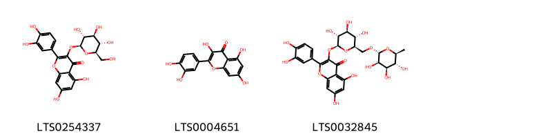
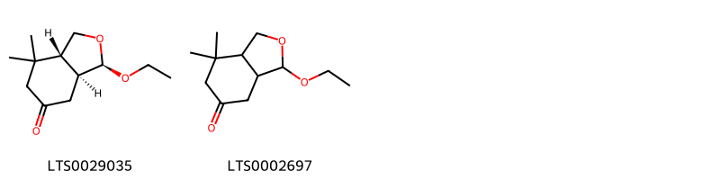
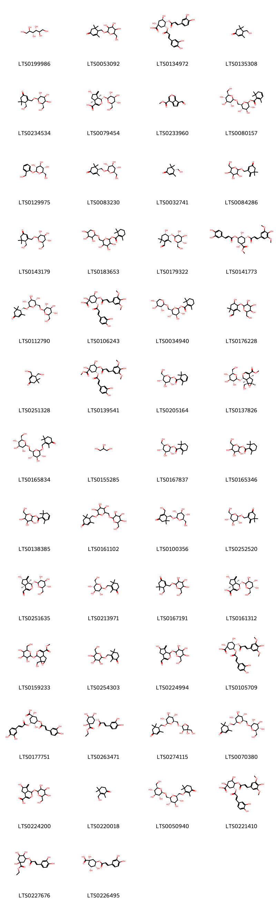
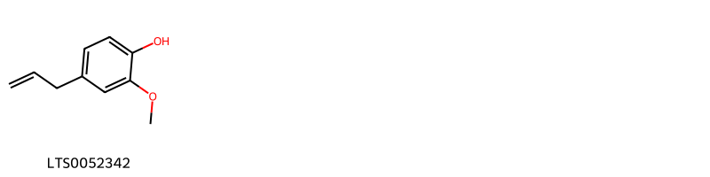
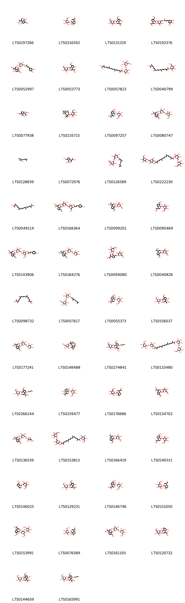

!!! abstract "Tóm tắt"

    Dành dành, tên khoa học Gardenia jasminoides Ellis, thuộc họ Cà phê (Rubiaceae), là một dược liệu quý phổ biến ở châu Á, đặc biệt tại Việt Nam, Trung Quốc, Nhật Bản và Hàn Quốc. Trong y học cổ truyền, quả chín (Chi tử) có vị đắng, tính hàn, quy vào các kinh tâm, phế, vị, và can, được sử dụng để thanh nhiệt, giải độc, lợi tiểu, chữa vàng da, sốt cao, mất ngủ, và viêm nhiễm. Thành phần hóa học chính trong quả Dành dành gồm các iridoid glycosides như geniposide (biomarker quan trọng), gardenoside, cùng với carotenoids như crocin và crocetin – tạo màu vàng đặc trưng và có tác dụng chống oxy hóa mạnh. Tác dụng dược lý của Dành dành như giảm đau, chống viêm, hạ huyết áp, an thần và kháng khuẩn.

## Thông tin về thực vật

Dược liệu **Chi Tử (Quả)** từ bộ phận **** từ loài *Gardenia jasminoides*.

**Mô tả thực vật:** Dành dành là một loại cây nhỏ, cao chừng 1-2m thường xanh tốt quanh năm, thân thẳng nhẵn. Lá mọc đối, có lá kèm to, mặt trên màu sẫm, bóng. Hoa mọc đơn độc, cánh hoa màu trắng, không cuống, có mùi thơm. Nở vào mùa hè. Quả hình chén với 6-9 góc, có 2-5 ngăn, khi chín có màu vàng đỏ, chứa rất nhiều hạt, mùi thơm vị đắng

*Tài liệu tham khảo:* "Những cây thuốc và vị thuốc Việt Nam" - Đỗ Tất Lợi 
Trong dược điển Việt nam, một loài được sử dụng làm dược liệu là *Gardenia jasminoides*.

!!! info "Phân loại thực vật của *Gardenia jasminoides*"
    - **Kingdom:** Plantae
    - **Phylum:** Tracheophyta
    - **Order:** Gentianales
    - **Family:** Rubiaceae
    - **Genus:** Gardenia
    - **Species:** *Gardenia jasminoides*

**Phân bố trên thế giới:** Thailand, Chinese Taipei, China, Rwanda, Hong Kong, South Africa, Micronesia (Federated States of), Korea, Republic of, Japan, India, Australia, Nepal, Macao, Indonesia, Georgia, Panama

**Phân bố tại Việt nam:** Không có ghi nhận ở Việt Nam

## Thông tin về dược liệu 

### Định danh

!!! info "Thông tin về tên gọi"

    - Dược liệu tiếng Việt: 
    - Dược liệu tiếng Trung:  ()
    - Dược liệu tiếng Anh: 
    - Dược liệu latin thông dụng: Fructus Gardeniae
    - Dược liệu latin kiểu DĐVN: *fructus gardeniae*
    - Dược liệu latin kiểu DĐVN: **
    - Dược liệu latin kiểu thông tư: **
    - Bộ phận dùng:  (Fructus)

### Mô tả dược liệu 

- **Theo dược điển Việt nam V:** Quả hình thoi hoặc hình trứng hẹp, dài 2 cm đến 4,5 cm, đường kính 1 cm đến 2 cm, màu vàng cam đến đỏ nâu, có khi nâu xám đến đỏ xám, hơi bóng, có 5 đến 8 đường gờ chạy dọc qua, giữa 2 gờ là rãnh rõ rệt. Đỉnh quả lõm có 5 đến 8 lá đài tồn tại, thường bị gãy cụt. Gốc quả hẹp, có vết cuống quả. vỏ quả mỏng, giòn, hơi bóng, vỏ quả giữa màu vàng đục, dày hơn. vỏ quả trong màu vàng ngà, bóng, rất mỏng, có 2 đến 3 vách ngăn giả. Hạt nhỏ, màu vàng cam, nâu đỏ hoặc nâu đen nhạt, mặt vỏ hạt có rất nhiều hạt mịn. Mùi nhẹ. Vị hơi chua và đắng.

- **Mô tả dược liệu theo thông tư chế biến dược liệu theo phương pháp cổ truyền:** 

### Chế biến 

- **Chế biến theo dược điển việt nam V**: Thu hoạch vào tháng 9 đến 11, hái lấy quả chín chuyển màu vàng đỏ, ngắt bỏ cuống quả và loại tạp, đồ hoặc luộc đến khi hạt hơi phồng lên, lấy ra bỏ vỏ lấy hạt đem phơi hoặc sấy khô. Bào chế Dành dành Chi tử sao vàng: Lấy dược liệu khô, sao lửa nhỏ đến màu nâu vàng, lấy ra để nguội. Chi từ sao xém (Tiêu chi tử): Lấy dược liệu khô, dùng lửa vừa sao đến khi mặt ngoài dược liệu vàng xém, mặt bẻ màu thẫm là được, lấy ra để nguội. Khi sao xém dược liệu dễ cháy, có thể phun một ít nước, lấy ra phơi hoặc sấy khô.

- **Chế biến theo thông tư:** 

--- 

## Thành phần hóa học

- Theo tài liệu của GS. Đỗ Tất Lợi:  Nhóm Iridioid glycosid: gacdenidin, gardosid, shanzhisid, desacetylasperulosid methylester, acid geniposidic, scandosid methylester, geniposid,........
Nhóm acid hữu cơ: acid 3-cafeoyl-4-sinapoyl quinic, acid picrocrocinic, acid dicafeoyl-5-(3-hydroxy-3-methyl) glutaroyl quinic,........
5β-hydroxygeniposid
10-acetylgeniposid
α-crocin, α-crocetin, α-croxetin.
Sắc tố và tinh dầu.
    

**Thành phần hóa học từ loài **Gardenia jasminoides**

Theo cơ sở dữ liệu lotus, loài *Gardenia jasminoides* đã phân lập và xác định được **214** hoạt chất thuộc về các nhóm Steroids and steroid derivatives, Organooxygen compounds, Isobenzofurans, Fatty Acyls, Flavonoids, Cinnamic acids and derivatives, Hydroxy acids and derivatives, Indoles and derivatives, Phenols, Tannins, Carboxylic acids and derivatives, Benzene and substituted derivatives, Pyridines and derivatives, Coumarins and derivatives, Saturated hydrocarbons, Prenol lipids trong bảng dưới đây. Danh sách các hoạt chất như sau 7-(hydroxymethyl)-1-{[3,4,5-trihydroxy-6-({[3-(4-hydroxy-3,5-dimethoxyphenyl)prop-2-enoyl]oxy}methyl)oxan-2-yl]oxy}-1h,4ah,5h,7ah-cyclopenta[c]pyran-4-carboxylic acid [(LTS0192376)](https://lotus.naturalproducts.net/compound/lotus_id/LTS0192376), 4,5-dihydroxy-5-methoxycyclohexa-1,3-diene-1-carboxylic acid [(LTS0117066)](https://lotus.naturalproducts.net/compound/lotus_id/LTS0117066), ethyl 3-{[(2e)-3-(3,4-dihydroxyphenyl)prop-2-enoyl]oxy}-1,4,5-trihydroxycyclohexane-1-carboxylate [(LTS0227676)](https://lotus.naturalproducts.net/compound/lotus_id/LTS0227676), methyl (1s,4as,7as)-1-{[(2s,3r,4s,5s,6r)-6-[(acetyloxy)methyl]-3,4,5-trihydroxyoxan-2-yl]oxy}-7-(hydroxymethyl)-1h,4ah,5h,7ah-cyclopenta[c]pyran-4-carboxylate [(LTS0168996)](https://lotus.naturalproducts.net/compound/lotus_id/LTS0168996), methyl (4as,7as)-2-(2-hydroxyethyl)-7-(hydroxymethyl)-1-oxo-4ah,5h,7ah-cyclopenta[c]pyridine-4-carboxylate [(LTS0001981)](https://lotus.naturalproducts.net/compound/lotus_id/LTS0001981), (2s,3r,4s,5s,6r)-3,4,5-trihydroxy-6-(hydroxymethyl)oxan-2-yl (4r)-4-hydroxy-2,6,6-trimethylcyclohex-1-ene-1-carboxylate [(LTS0037634)](https://lotus.naturalproducts.net/compound/lotus_id/LTS0037634), 5-hydroxy-7-(hydroxymethyl)-1-{[3,4,5-trihydroxy-6-(hydroxymethyl)oxan-2-yl]oxy}-1h,4ah,5h,7ah-cyclopenta[c]pyran-4-carboxylic acid [(LTS0131319)](https://lotus.naturalproducts.net/compound/lotus_id/LTS0131319), methyl (1r,3r,4s,5r)-3-{[(2e)-3-(3,4-dihydroxyphenyl)prop-2-enoyl]oxy}-1,4-dihydroxy-5-{[(2e)-3-(4-hydroxy-3,5-dimethoxyphenyl)prop-2-enoyl]oxy}cyclohexane-1-carboxylate [(LTS0141773)](https://lotus.naturalproducts.net/compound/lotus_id/LTS0141773), (4r)-2,6,6-trimethyl-4-{[(2r,3r,4s,5s,6r)-3,4,5-trihydroxy-6-({[(2e)-3-(4-hydroxy-3,5-dimethoxyphenyl)prop-2-enoyl]oxy}methyl)oxan-2-yl]oxy}cyclohex-1-ene-1-carboxylic acid [(LTS0065828)](https://lotus.naturalproducts.net/compound/lotus_id/LTS0065828), 3,4-bis(hydroxymethyl)-5,5-dimethylcyclohex-2-en-1-one [(LTS0052560)](https://lotus.naturalproducts.net/compound/lotus_id/LTS0052560), 2-[(3,7-dimethylocta-1,6-dien-3-yl)oxy]-6-{[(3,4,5-trihydroxyoxan-2-yl)oxy]methyl}oxane-3,4,5-triol [(LTS0101748)](https://lotus.naturalproducts.net/compound/lotus_id/LTS0101748), eugenol [(LTS0052342)](https://lotus.naturalproducts.net/compound/lotus_id/LTS0052342), methyl (1s,4as,5s,7as)-7-(hydroxymethyl)-5-methoxy-1-{[(2s,3r,4s,5s,6r)-3,4,5-trihydroxy-6-(hydroxymethyl)oxan-2-yl]oxy}-1h,4ah,5h,7ah-cyclopenta[c]pyran-4-carboxylate [(LTS0144659)](https://lotus.naturalproducts.net/compound/lotus_id/LTS0144659), glycerol [(LTS0155285)](https://lotus.naturalproducts.net/compound/lotus_id/LTS0155285), 2-[(2,6-dimethylhepta-1,5-dien-1-yl)oxy]-6-{[(3,4,5-trihydroxyoxan-2-yl)oxy]methyl}oxane-3,4,5-triol [(LTS0258435)](https://lotus.naturalproducts.net/compound/lotus_id/LTS0258435), methyl (1s,4as,5s,7as)-5-hydroxy-7-(hydroxymethyl)-1-{[(2s,3r,4s,5s,6r)-3,4,5-trihydroxy-6-(hydroxymethyl)oxan-2-yl]oxy}-1h,4ah,5h,7ah-cyclopenta[c]pyran-4-carboxylate [(LTS0216605)](https://lotus.naturalproducts.net/compound/lotus_id/LTS0216605), (4s)-3,5,5-trimethyl-4-{[(2s,3r,4r,5s,6r)-3,4,5-trihydroxy-6-({[(2r,3r,4s,5s,6r)-3,4,5-trihydroxy-6-(hydroxymethyl)oxan-2-yl]oxy}methyl)oxan-2-yl]methoxy}cyclohex-2-en-1-one [(LTS0070380)](https://lotus.naturalproducts.net/compound/lotus_id/LTS0070380), 2-phenyl-ethanol [(LTS0206341)](https://lotus.naturalproducts.net/compound/lotus_id/LTS0206341), (3r,4s)-4-hydroxy-2,6,6-trimethyl-3-{[(2r,3r,4s,5s,6r)-3,4,5-trihydroxy-6-(hydroxymethyl)oxan-2-yl]oxy}cyclohex-1-ene-1-carbaldehyde [(LTS0179322)](https://lotus.naturalproducts.net/compound/lotus_id/LTS0179322), methyl (1s,4as,7as)-1-{[(2s,3r,4s,5s,6r)-6-({[(2r,3r,4r)-3,4-dihydroxy-4-(hydroxymethyl)oxolan-2-yl]oxy}methyl)-3,4,5-trihydroxyoxan-2-yl]oxy}-7-(hydroxymethyl)-1h,4ah,5h,7ah-cyclopenta[c]pyran-4-carboxylate [(LTS0136539)](https://lotus.naturalproducts.net/compound/lotus_id/LTS0136539), methyl 5,7-dihydroxy-7-methyl-1-{[3,4,5-trihydroxy-6-(hydroxymethyl)oxan-2-yl]oxy}-1h,4ah,5h,6h,7ah-cyclopenta[c]pyran-4-carboxylate [(LTS0120732)](https://lotus.naturalproducts.net/compound/lotus_id/LTS0120732), β-d-glucosyl crocetin [(LTS0224737)](https://lotus.naturalproducts.net/compound/lotus_id/LTS0224737), (4s)-3,5,5-trimethyl-4-({[(2r,3r,4s,5r,6r)-3,4,5-trihydroxy-6-(hydroxymethyl)oxan-2-yl]oxy}methyl)cyclohex-2-en-1-one [(LTS0047866)](https://lotus.naturalproducts.net/compound/lotus_id/LTS0047866), (2s,3r,4s,5s,6r)-2-{[(3r)-3,7-dimethylocta-1,6-dien-3-yl]oxy}-6-({[(2s,3r,4s,5s)-3,4,5-trihydroxyoxan-2-yl]oxy}methyl)oxane-3,4,5-triol [(LTS0032128)](https://lotus.naturalproducts.net/compound/lotus_id/LTS0032128), (4s)-4-(hydroxymethyl)-3,5,5-trimethylcyclohex-2-en-1-one [(LTS0032741)](https://lotus.naturalproducts.net/compound/lotus_id/LTS0032741), methyl 1-{[3,4,5-trihydroxy-6-(hydroxymethyl)oxan-2-yl]oxy}-7-({[3,4,5-trihydroxy-6-(hydroxymethyl)oxan-2-yl]oxy}methyl)-1h,4ah,5h,7ah-cyclopenta[c]pyran-4-carboxylate [(LTS0094080)](https://lotus.naturalproducts.net/compound/lotus_id/LTS0094080), gardenoside [(LTS0146746)](https://lotus.naturalproducts.net/compound/lotus_id/LTS0146746), chlorogenic acid [(LTS0226495)](https://lotus.naturalproducts.net/compound/lotus_id/LTS0226495), [(2r,3s,4s,5r,6r)-6-[(5,5-dimethyl-6-methylidene-3-oxocyclohex-1-en-1-yl)methoxy]-3,4,5-trihydroxyoxan-2-yl]methyl (2e)-3-(4-hydroxy-3,5-dimethoxyphenyl)prop-2-enoate [(LTS0264545)](https://lotus.naturalproducts.net/compound/lotus_id/LTS0264545), crocin [(LTS0243166)](https://lotus.naturalproducts.net/compound/lotus_id/LTS0243166), methyl 2-(hydroxymethyl)-10-{[3,4,5-trihydroxy-6-(hydroxymethyl)oxan-2-yl]oxy}-3,9-dioxatricyclo[4.4.0.0²,⁴]dec-7-ene-7-carboxylate [(LTS0159233)](https://lotus.naturalproducts.net/compound/lotus_id/LTS0159233), (2r,3r,4s,5s,6r)-2-{[(1z)-2,6-dimethylhepta-1,5-dien-1-yl]oxy}-6-({[(2s,3r,4s,5s)-3,4,5-trihydroxyoxan-2-yl]oxy}methyl)oxane-3,4,5-triol [(LTS0179918)](https://lotus.naturalproducts.net/compound/lotus_id/LTS0179918), 3,4,5-trihydroxy-6-(hydroxymethyl)oxan-2-yl 2,6,6-trimethylcyclohex-1-ene-1-carboxylate [(LTS0165346)](https://lotus.naturalproducts.net/compound/lotus_id/LTS0165346), saligenin [(LTS0081369)](https://lotus.naturalproducts.net/compound/lotus_id/LTS0081369), 2,4,4-trimethyl-3-({[(2r,3r,4s,5s,6r)-3,4,5-trihydroxy-6-({[(2r,3r,4s,5s,6r)-3,4,5-trihydroxy-6-(hydroxymethyl)oxan-2-yl]oxy}methyl)oxan-2-yl]oxy}methyl)cyclohex-2-en-1-one [(LTS0165834)](https://lotus.naturalproducts.net/compound/lotus_id/LTS0165834), benzyl alcohol [(LTS0125638)](https://lotus.naturalproducts.net/compound/lotus_id/LTS0125638), 2,4,4-trimethyl-3-{[(2s,3r,4r,5s,6r)-3,4,5-trihydroxy-6-({[(2r,3r,4s,5s,6r)-3,4,5-trihydroxy-6-(hydroxymethyl)oxan-2-yl]oxy}methyl)oxan-2-yl]methoxy}cyclohex-2-en-1-one [(LTS0050940)](https://lotus.naturalproducts.net/compound/lotus_id/LTS0050940), 3,4-dihydroxybenzoic acid [(LTS0018765)](https://lotus.naturalproducts.net/compound/lotus_id/LTS0018765), genipin [(LTS0216206)](https://lotus.naturalproducts.net/compound/lotus_id/LTS0216206), jasminodiol [(LTS0251328)](https://lotus.naturalproducts.net/compound/lotus_id/LTS0251328), heptadecane, 2-methyl- [(LTS0183412)](https://lotus.naturalproducts.net/compound/lotus_id/LTS0183412), (4r)-3,5,5-trimethyl-4-({[(2r,3r,4s,5s,6r)-3,4,5-trihydroxy-6-(hydroxymethyl)oxan-2-yl]oxy}methyl)cyclohex-2-en-1-one [(LTS0083230)](https://lotus.naturalproducts.net/compound/lotus_id/LTS0083230), 5,5-dimethyl-4-methylidene-3-({[(2r,3r,4s,5s,6r)-3,4,5-trihydroxy-6-(hydroxymethyl)oxan-2-yl]oxy}methyl)cyclohex-2-en-1-one [(LTS0252520)](https://lotus.naturalproducts.net/compound/lotus_id/LTS0252520), 6-hydroxy-7-methylidene-1-{[(2s,3r,4s,5s,6r)-3,4,5-trihydroxy-6-(hydroxymethyl)oxan-2-yl]oxy}-1h,4ah,5h,6h,7ah-cyclopenta[c]pyran-4-carboxylic acid [(LTS0141606)](https://lotus.naturalproducts.net/compound/lotus_id/LTS0141606), ethyl (1s,3r,4r,5r)-3-{[(2e)-3-(3,4-dihydroxyphenyl)prop-2-enoyl]oxy}-1,5-dihydroxy-4-{[(2e)-3-(4-hydroxy-3,5-dimethoxyphenyl)prop-2-enoyl]oxy}cyclohexane-1-carboxylate [(LTS0088161)](https://lotus.naturalproducts.net/compound/lotus_id/LTS0088161), 2,6,6-trimethyl-4-{[3,4,5-trihydroxy-6-({[3-(4-hydroxy-3,5-dimethoxyphenyl)prop-2-enoyl]oxy}methyl)oxan-2-yl]oxy}cyclohex-1-ene-1-carboxylic acid [(LTS0139682)](https://lotus.naturalproducts.net/compound/lotus_id/LTS0139682), (4r)-3,5,5-trimethyl-4-({[(2r,3r,4s,5r,6r)-3,4,5-trihydroxy-6-(hydroxymethyl)oxan-2-yl]oxy}methyl)cyclohex-2-en-1-one [(LTS0008047)](https://lotus.naturalproducts.net/compound/lotus_id/LTS0008047), 3-(hydroxymethyl)-5,5-dimethyl-4-({[3,4,5-trihydroxy-6-(hydroxymethyl)oxan-2-yl]oxy}methyl)cyclohex-2-en-1-one [(LTS0055837)](https://lotus.naturalproducts.net/compound/lotus_id/LTS0055837), (1s,4as,7s,7as)-7-hydroxy-7-methyl-1-{[(2s,3r,4s,5s,6r)-3,4,5-trihydroxy-6-(hydroxymethyl)oxan-2-yl]oxy}-1h,4ah,5h,6h,7ah-cyclopenta[c]pyran-4-carbaldehyde [(LTS0216592)](https://lotus.naturalproducts.net/compound/lotus_id/LTS0216592), 6-hydroxy-7-methylidene-1-{[3,4,5-trihydroxy-6-(hydroxymethyl)oxan-2-yl]oxy}-1h,4ah,5h,6h,7ah-cyclopenta[c]pyran-4-carbaldehyde [(LTS0224994)](https://lotus.naturalproducts.net/compound/lotus_id/LTS0224994), 3-(hydroxymethyl)-2,4,4-trimethylcyclohex-2-en-1-one [(LTS0220018)](https://lotus.naturalproducts.net/compound/lotus_id/LTS0220018), methyl (1s,2s,4s,6s,10s)-2-(hydroxymethyl)-10-{[(2s,3r,4s,5s,6r)-3,4,5-trihydroxy-6-(hydroxymethyl)oxan-2-yl]oxy}-3,9-dioxatricyclo[4.4.0.0²,⁴]dec-7-ene-7-carboxylate [(LTS0137826)](https://lotus.naturalproducts.net/compound/lotus_id/LTS0137826), (1s,4as,7s,7as)-7-hydroxy-7-methyl-1-{[(2r,3s,4r,5s,6r)-3,4,5-trihydroxy-6-(hydroxymethyl)oxan-2-yl]oxy}-1h,4ah,5h,6h,7ah-cyclopenta[c]pyran-4-carboxylic acid [(LTS0264652)](https://lotus.naturalproducts.net/compound/lotus_id/LTS0264652), methyl (1s,4as,5r,7s,7as)-5,7-dihydroxy-7-methyl-1-{[(2s,3r,4s,5s,6r)-3,4,5-trihydroxy-6-(hydroxymethyl)oxan-2-yl]oxy}-1h,4ah,5h,6h,7ah-cyclopenta[c]pyran-4-carboxylate [(LTS0216993)](https://lotus.naturalproducts.net/compound/lotus_id/LTS0216993), methyl 7-formylcyclopenta[c]pyran-4-carboxylate [(LTS0233960)](https://lotus.naturalproducts.net/compound/lotus_id/LTS0233960), 3-ethoxy-7,7-dimethyl-hexahydro-2-benzofuran-5-one [(LTS0002697)](https://lotus.naturalproducts.net/compound/lotus_id/LTS0002697), 3,5-dicaffeoylquinic acid [(LTS0177751)](https://lotus.naturalproducts.net/compound/lotus_id/LTS0177751), methyl (1s,5r)-5-[(2s)-3-hydroxy-1-methoxy-1-oxopropan-2-yl]-2-(hydroxymethyl)cyclopent-2-ene-1-carboxylate [(LTS0076480)](https://lotus.naturalproducts.net/compound/lotus_id/LTS0076480), ethyl (1r,3r,4s,5r)-3-{[(2e)-3-(3,4-dihydroxyphenyl)prop-2-enoyl]oxy}-1,4-dihydroxy-5-{[(2e)-3-(4-hydroxy-3,5-dimethoxyphenyl)prop-2-enoyl]oxy}cyclohexane-1-carboxylate [(LTS0248865)](https://lotus.naturalproducts.net/compound/lotus_id/LTS0248865), methyl 7-(hydroxymethyl)-1-{[3,4,5-trihydroxy-6-({[3,4,5-trihydroxy-6-(hydroxymethyl)oxan-2-yl]oxy}methyl)oxan-2-yl]oxy}-1h,4ah,5h,7ah-cyclopenta[c]pyran-4-carboxylate [(LTS0004501)](https://lotus.naturalproducts.net/compound/lotus_id/LTS0004501), methyl (1s,4ar,7r,7as)-7-hydroxy-7-(hydroxymethyl)-1-{[(2s,3r,4s,5s,6r)-3,4,5-trihydroxy-6-(hydroxymethyl)oxan-2-yl]oxy}-1h,4ah,7ah-cyclopenta[c]pyran-4-carboxylate [(LTS0073973)](https://lotus.naturalproducts.net/compound/lotus_id/LTS0073973), methyl 7-(hydroxymethyl)-1-{[3,4,5-trihydroxy-6-({[3,4,5-trihydroxy-6-({[3-(4-hydroxyphenyl)prop-2-enoyl]oxy}methyl)oxan-2-yl]oxy}methyl)oxan-2-yl]oxy}-1h,4ah,5h,7ah-cyclopenta[c]pyran-4-carboxylate [(LTS0260372)](https://lotus.naturalproducts.net/compound/lotus_id/LTS0260372), methyl (1s,4as,5s,7as)-1-{[(2s,3r,4s,5s,6r)-6-({[(2e)-3-(3,4-dihydroxyphenyl)prop-2-enoyl]oxy}methyl)-3,4,5-trihydroxyoxan-2-yl]oxy}-5-hydroxy-7-(hydroxymethyl)-1h,4ah,5h,7ah-cyclopenta[c]pyran-4-carboxylate [(LTS0052997)](https://lotus.naturalproducts.net/compound/lotus_id/LTS0052997), 3,4,5-trihydroxy-6-({[3,4,5-trihydroxy-6-(hydroxymethyl)oxan-2-yl]oxy}methyl)oxan-2-yl 3,7-dimethylocta-2,6-dienoate [(LTS0126589)](https://lotus.naturalproducts.net/compound/lotus_id/LTS0126589), anisaldehyde [(LTS0054560)](https://lotus.naturalproducts.net/compound/lotus_id/LTS0054560), methyl 5-hydroxy-7-(hydroxymethyl)-1-{[3,4,5-trihydroxy-6-(hydroxymethyl)oxan-2-yl]oxy}-1h,4ah,5h,7ah-cyclopenta[c]pyran-4-carboxylate [(LTS0053773)](https://lotus.naturalproducts.net/compound/lotus_id/LTS0053773), bis[3,4,5-trihydroxy-6-({[3,4,5-trihydroxy-6-(hydroxymethyl)oxan-2-yl]oxy}methyl)oxan-2-yl] 2,6,11,15-tetramethylhexadeca-2,4,6,8,10,12,14-heptaenedioate [(LTS0221794)](https://lotus.naturalproducts.net/compound/lotus_id/LTS0221794), 4,7-bis(hydroxymethyl)-1h,4h,4ah,5h,7ah-cyclopenta[c]pyran-3-one [(LTS0263132)](https://lotus.naturalproducts.net/compound/lotus_id/LTS0263132), 3,5,5-trimethyl-4-({[3,4,5-trihydroxy-6-(hydroxymethyl)oxan-2-yl]oxy}methyl)cyclohex-2-en-1-one [(LTS0053092)](https://lotus.naturalproducts.net/compound/lotus_id/LTS0053092), methyl 5-(3-hydroxy-1-methoxy-1-oxopropan-2-yl)-2-(hydroxymethyl)cyclopent-2-ene-1-carboxylate [(LTS0214367)](https://lotus.naturalproducts.net/compound/lotus_id/LTS0214367), (2s,3r,4s,5s,6r)-3,4,5-trihydroxy-6-({[(2s,3r,4s,5r)-3,4,5-trihydroxyoxan-2-yl]oxy}methyl)oxan-2-yl (2e)-3,7-dimethylocta-2,6-dienoate [(LTS0229072)](https://lotus.naturalproducts.net/compound/lotus_id/LTS0229072), shanzhiside [(LTS0259477)](https://lotus.naturalproducts.net/compound/lotus_id/LTS0259477), (1s,4as,6s,7as)-6-hydroxy-7-methylidene-1-{[(2s,3r,4s,5s,6r)-3,4,5-trihydroxy-6-({[(2e)-3-(4-hydroxy-3,5-dimethoxyphenyl)prop-2-enoyl]oxy}methyl)oxan-2-yl]oxy}-1h,4ah,5h,6h,7ah-cyclopenta[c]pyran-4-carboxylic acid [(LTS0226620)](https://lotus.naturalproducts.net/compound/lotus_id/LTS0226620), (2s,3r,4s,5s,6r)-3,4,5-trihydroxy-6-({[(2r,3r,4s,5s,6r)-3,4,5-trihydroxy-6-(hydroxymethyl)oxan-2-yl]oxy}methyl)oxan-2-yl (2r,3r,4s,5s,6r)-2,4,5-trihydroxy-6-({[(2r,3r,4s,5s,6r)-3,4,5-trihydroxy-6-(hydroxymethyl)oxan-2-yl]oxy}methyl)oxan-3-yl (2e,4e,6e,8e,10e,12e,14e)-2,6,11,15-tetramethylhexadeca-2,4,6,8,10,12,14-heptaenedioate [(LTS0133480)](https://lotus.naturalproducts.net/compound/lotus_id/LTS0133480), (1s,4as,7as)-7-(hydroxymethyl)-1-{[(2s,3r,4s,5s,6r)-3,4,5-trihydroxy-6-({[(2e)-3-(4-hydroxy-3,5-dimethoxyphenyl)prop-2-enoyl]oxy}methyl)oxan-2-yl]oxy}-1h,4ah,5h,7ah-cyclopenta[c]pyran-4-carboxylic acid [(LTS0185344)](https://lotus.naturalproducts.net/compound/lotus_id/LTS0185344), methyl 1-{[6-({[3-(3,4-dihydroxyphenyl)prop-2-enoyl]oxy}methyl)-3,4,5-trihydroxyoxan-2-yl]oxy}-5-hydroxy-7-(hydroxymethyl)-1h,4ah,5h,7ah-cyclopenta[c]pyran-4-carboxylate [(LTS0037422)](https://lotus.naturalproducts.net/compound/lotus_id/LTS0037422), (8e,10e,12e,14e)-2,6,11,15-tetramethylhexadeca-2,4,6,8,10,12,14-heptaenedioic acid [(LTS0049114)](https://lotus.naturalproducts.net/compound/lotus_id/LTS0049114), methyl (1s,4as,7as)-1-{[(2s,3r,4r,5s,6r)-3,4-dihydroxy-6-(hydroxymethyl)-5-{[(2s,3r,4s,5s,6r)-3,4,5-trihydroxy-6-(hydroxymethyl)oxan-2-yl]oxy}oxan-2-yl]oxy}-7-(hydroxymethyl)-1h,4ah,5h,7ah-cyclopenta[c]pyran-4-carboxylate [(LTS0153991)](https://lotus.naturalproducts.net/compound/lotus_id/LTS0153991), methyl 1-{[6-({[3,4-dihydroxy-6-(hydroxymethyl)-5-{[3-(4-hydroxyphenyl)prop-2-enoyl]oxy}oxan-2-yl]oxy}methyl)-3,4,5-trihydroxyoxan-2-yl]oxy}-7-(hydroxymethyl)-1h,4ah,5h,7ah-cyclopenta[c]pyran-4-carboxylate [(LTS0168364)](https://lotus.naturalproducts.net/compound/lotus_id/LTS0168364), methyl (4ar,7as)-7-(hydroxymethyl)-1-{[3,4,5-trihydroxy-6-(hydroxymethyl)oxan-2-yl]oxy}-1h,4ah,5h,7ah-cyclopenta[c]pyran-4-carboxylate [(LTS0021217)](https://lotus.naturalproducts.net/compound/lotus_id/LTS0021217), methyl 1-hydroxy-7-(hydroxymethyl)-1h,4ah,5h,7ah-cyclopenta[c]pyran-4-carboxylate [(LTS0072976)](https://lotus.naturalproducts.net/compound/lotus_id/LTS0072976), 7-hydroxy-7-(2-hydroxypropan-2-yl)-1,4-dimethyl-6-{[3,4,5-trihydroxy-6-(hydroxymethyl)oxan-2-yl]oxy}-3,3a,4,5,6,8-hexahydroazulen-2-one [(LTS0235715)](https://lotus.naturalproducts.net/compound/lotus_id/LTS0235715), 3,4-dihydroxycinnamic acid [(LTS0128050)](https://lotus.naturalproducts.net/compound/lotus_id/LTS0128050), crocetin [(LTS0129423)](https://lotus.naturalproducts.net/compound/lotus_id/LTS0129423), 2,4,4-trimethyl-3-({[3,4,5-trihydroxy-6-({[3,4,5-trihydroxy-6-(hydroxymethyl)oxan-2-yl]oxy}methyl)oxan-2-yl]oxy}methyl)cyclohex-2-en-1-one [(LTS0208655)](https://lotus.naturalproducts.net/compound/lotus_id/LTS0208655), isoquercetin [(LTS0254337)](https://lotus.naturalproducts.net/compound/lotus_id/LTS0254337), 4-{[(1s,2r,4s,6r)-2,6-bis({[(2e)-3-(3,4-dihydroxyphenyl)prop-2-enoyl]oxy})-4-hydroxy-4-(methoxycarbonyl)cyclohexyl]oxy}-3-hydroxy-3-methyl-4-oxobutanoic acid [(LTS0012754)](https://lotus.naturalproducts.net/compound/lotus_id/LTS0012754), tricrocin [(LTS0215875)](https://lotus.naturalproducts.net/compound/lotus_id/LTS0215875), (4s)-4-(hydroxymethyl)-5,5-dimethyl-3-({[(2r,3r,4s,5s,6r)-3,4,5-trihydroxy-6-(hydroxymethyl)oxan-2-yl]oxy}methyl)cyclohex-2-en-1-one [(LTS0143179)](https://lotus.naturalproducts.net/compound/lotus_id/LTS0143179), (4s,4as,7as)-4,7-bis(hydroxymethyl)-1h,4h,4ah,5h,7ah-cyclopenta[c]pyran-3-one [(LTS0077938)](https://lotus.naturalproducts.net/compound/lotus_id/LTS0077938), scandoside methyl ester [(LTS0129231)](https://lotus.naturalproducts.net/compound/lotus_id/LTS0129231), (8e,10e,12e,14e)-2,6,11,15-tetramethyl-16-oxo-16-{[3,4,5-trihydroxy-6-({[3,4,5-trihydroxy-6-(hydroxymethyl)oxan-2-yl]oxy}methyl)oxan-2-yl]oxy}hexadeca-2,4,6,8,10,12,14-heptaenoic acid [(LTS0096656)](https://lotus.naturalproducts.net/compound/lotus_id/LTS0096656), methyl 5-butoxy-7-(hydroxymethyl)-1-{[3,4,5-trihydroxy-6-(hydroxymethyl)oxan-2-yl]oxy}-1h,4ah,5h,7ah-cyclopenta[c]pyran-4-carboxylate [(LTS0274841)](https://lotus.naturalproducts.net/compound/lotus_id/LTS0274841), 6-hydroxy-7-methylidene-1-{[3,4,5-trihydroxy-6-({[3-(4-hydroxy-3,5-dimethoxyphenyl)prop-2-enoyl]oxy}methyl)oxan-2-yl]oxy}-1h,4ah,5h,6h,7ah-cyclopenta[c]pyran-4-carboxylic acid [(LTS0117729)](https://lotus.naturalproducts.net/compound/lotus_id/LTS0117729), methyl (1r,4as,5r,7as)-1,5-dihydroxy-7-(hydroxymethyl)-1h,4ah,5h,7ah-cyclopenta[c]pyran-4-carboxylate [(LTS0197266)](https://lotus.naturalproducts.net/compound/lotus_id/LTS0197266), (2s,3r,4s,5s,6r)-3,4,5-trihydroxy-6-({[(2s,3r,4s,5r)-3,4,5-trihydroxyoxan-2-yl]oxy}methyl)oxan-2-yl 2,6,6-trimethylcyclohex-1-ene-1-carboxylate [(LTS0034940)](https://lotus.naturalproducts.net/compound/lotus_id/LTS0034940), methyl (4ar,7s,7as)-7-hydroxy-7-(hydroxymethyl)-1-{[3,4,5-trihydroxy-6-(hydroxymethyl)oxan-2-yl]oxy}-1h,4ah,7ah-cyclopenta[c]pyran-4-carboxylate [(LTS0094499)](https://lotus.naturalproducts.net/compound/lotus_id/LTS0094499), tarennoside [(LTS0166419)](https://lotus.naturalproducts.net/compound/lotus_id/LTS0166419), (3ar,4r,6s,7r)-7-hydroxy-7-(2-hydroxypropan-2-yl)-1,4-dimethyl-6-{[(2s,3r,4s,5s,6r)-3,4,5-trihydroxy-6-(hydroxymethyl)oxan-2-yl]oxy}-3,3a,4,5,6,8-hexahydroazulen-2-one [(LTS0100810)](https://lotus.naturalproducts.net/compound/lotus_id/LTS0100810), methyl (1s,4as,5s,7as)-5-butoxy-7-(hydroxymethyl)-1-{[(2s,3r,4s,5s,6r)-3,4,5-trihydroxy-6-(hydroxymethyl)oxan-2-yl]oxy}-1h,4ah,5h,7ah-cyclopenta[c]pyran-4-carboxylate [(LTS0165991)](https://lotus.naturalproducts.net/compound/lotus_id/LTS0165991), (8e,10e,12e,14e)-2,6,11,15-tetramethyl-16-oxo-16-{[3,4,5-trihydroxy-6-(hydroxymethyl)oxan-2-yl]oxy}hexadeca-2,4,6,8,10,12,14-heptaenoic acid [(LTS0040799)](https://lotus.naturalproducts.net/compound/lotus_id/LTS0040799), methyl 7-hydroxy-7-(hydroxymethyl)-1-{[3,4,5-trihydroxy-6-(hydroxymethyl)oxan-2-yl]oxy}-1h,4ah,7ah-cyclopenta[c]pyran-4-carboxylate [(LTS0090469)](https://lotus.naturalproducts.net/compound/lotus_id/LTS0090469), methyl (4as,7as)-1-hydroxy-7-(hydroxymethyl)-4ah,5h,7ah-cyclopenta[c]pyridine-4-carboxylate [(LTS0127843)](https://lotus.naturalproducts.net/compound/lotus_id/LTS0127843), (12e,14e)-2,6,11,15-tetramethylhexadeca-2,4,6,8,10,12,14-heptaenedioic acid [(LTS0098732)](https://lotus.naturalproducts.net/compound/lotus_id/LTS0098732), (2s,3r,4s,5s,6r)-3,4,5-trihydroxy-6-({[(2r,3r,4s,5s,6r)-3,4,5-trihydroxy-6-(hydroxymethyl)oxan-2-yl]oxy}methyl)oxan-2-yl 2,6,6-trimethylcyclohex-1-ene-1-carboxylate [(LTS0240507)](https://lotus.naturalproducts.net/compound/lotus_id/LTS0240507), methyl (1s,4as,5r,7as)-7-(hydroxymethyl)-5-methoxy-1-{[(2s,3r,4s,5s,6r)-3,4,5-trihydroxy-6-(hydroxymethyl)oxan-2-yl]oxy}-1h,4ah,5h,7ah-cyclopenta[c]pyran-4-carboxylate [(LTS0156037)](https://lotus.naturalproducts.net/compound/lotus_id/LTS0156037), (1s,4as,7s,7as)-7-hydroxy-7-methyl-1-{[(2s,3s,4s,5s,6r)-3,4,5-trihydroxy-6-(hydroxymethyl)oxan-2-yl]oxy}-1h,4ah,5h,6h,7ah-cyclopenta[c]pyran-4-carbaldehyde [(LTS0076589)](https://lotus.naturalproducts.net/compound/lotus_id/LTS0076589), (2s,3r,4s,5s,6r)-2-{[(1s,4ar,7as)-7-(hydroxymethyl)-1h,4ah,5h,7ah-cyclopenta[c]pyran-1-yl]oxy}-6-(hydroxymethyl)oxane-3,4,5-triol [(LTS0180730)](https://lotus.naturalproducts.net/compound/lotus_id/LTS0180730), methyl (1s,4as,5s,7as)-5-butoxy-1-{[(2s,3r,4s,5r,6r)-3,5-dihydroxy-6-(hydroxymethyl)-4-{[(2s,3r,4s,5s,6r)-3,4,5-trihydroxy-6-({[(2z)-3-(4-hydroxyphenyl)prop-2-enoyl]oxy}methyl)oxan-2-yl]oxy}oxan-2-yl]oxy}-7-(hydroxymethyl)-1h,4ah,5h,7ah-cyclopenta[c]pyran-4-carboxylate [(LTS0033908)](https://lotus.naturalproducts.net/compound/lotus_id/LTS0033908), methyl 5-butoxy-1-{[3,5-dihydroxy-6-(hydroxymethyl)-4-{[3,4,5-trihydroxy-6-({[3-(4-hydroxyphenyl)prop-2-enoyl]oxy}methyl)oxan-2-yl]oxy}oxan-2-yl]oxy}-7-(hydroxymethyl)-1h,4ah,5h,7ah-cyclopenta[c]pyran-4-carboxylate [(LTS0251841)](https://lotus.naturalproducts.net/compound/lotus_id/LTS0251841), 5,5-dimethyl-4-methylidene-3-({[3,4,5-trihydroxy-6-(hydroxymethyl)oxan-2-yl]oxy}methyl)cyclohex-2-en-1-one [(LTS0084286)](https://lotus.naturalproducts.net/compound/lotus_id/LTS0084286), [(2r,3s,4s,5r,6r)-3,4,5-trihydroxy-6-{[(6s)-6-(hydroxymethyl)-5,5-dimethyl-3-oxocyclohex-1-en-1-yl]methoxy}oxan-2-yl]methyl (2e)-3-(4-hydroxy-3,5-dimethoxyphenyl)prop-2-enoate [(LTS0198696)](https://lotus.naturalproducts.net/compound/lotus_id/LTS0198696), (1s,3s,4s,6s,7s,8r,11s,12s,15r,16r)-4,6-dihydroxy-7,12,16-trimethyl-15-[(2r)-6-methyl-4-oxohept-5-en-2-yl]pentacyclo[9.7.0.0¹,³.0³,⁸.0¹²,¹⁶]octadecane-7-carboxylic acid [(LTS0068349)](https://lotus.naturalproducts.net/compound/lotus_id/LTS0068349), methyl (1s,3r,4r,5r)-3-{[(2e)-3-(3,4-dihydroxyphenyl)prop-2-enoyl]oxy}-1,5-dihydroxy-4-{[(2e)-3-(4-hydroxy-3,5-dimethoxyphenyl)prop-2-enoyl]oxy}cyclohexane-1-carboxylate [(LTS0139541)](https://lotus.naturalproducts.net/compound/lotus_id/LTS0139541), 7-hydroxy-5-methoxychromen-4-one [(LTS0228070)](https://lotus.naturalproducts.net/compound/lotus_id/LTS0228070), 2-(hydroxymethyl)-6-{[7-(hydroxymethyl)-1h,4ah,5h,7ah-cyclopenta[c]pyran-1-yl]oxy}oxane-3,4,5-triol [(LTS0146025)](https://lotus.naturalproducts.net/compound/lotus_id/LTS0146025), 4-hydroxy-2,6,6-trimethyl-3-{[3,4,5-trihydroxy-6-(hydroxymethyl)oxan-2-yl]oxy}cyclohex-1-ene-1-carbaldehyde [(LTS0176228)](https://lotus.naturalproducts.net/compound/lotus_id/LTS0176228), {3,4,5-trihydroxy-6-[(2,6,6-trimethyl-4-oxocyclohex-2-en-1-yl)methoxy]oxan-2-yl}methyl 3-(4-hydroxy-3,5-dimethoxyphenyl)prop-2-enoate [(LTS0270031)](https://lotus.naturalproducts.net/compound/lotus_id/LTS0270031), methyl (1s,4as,7s,7as)-7-hydroxy-7-(hydroxymethyl)-1-{[(2s,3r,4s,5s,6r)-3,4,5-trihydroxy-6-(hydroxymethyl)oxan-2-yl]oxy}-1h,4ah,7ah-cyclopenta[c]pyran-4-carboxylate [(LTS0264346)](https://lotus.naturalproducts.net/compound/lotus_id/LTS0264346), (1s,4as,7s,7as)-7-hydroxy-7-methyl-1-{[(2s,3r,4s,5s,6r)-3,4,5-trihydroxy-6-(hydroxymethyl)oxan-2-yl]oxy}-1h,4ah,5h,6h,7ah-cyclopenta[c]pyran-4-carboxylic acid [(LTS0016590)](https://lotus.naturalproducts.net/compound/lotus_id/LTS0016590), (4s)-3,5,5-trimethyl-4-({[(2r,3r,4s,5s,6r)-3,4,5-trihydroxy-6-({[(2r,3r,4s,5s,6r)-3,4,5-trihydroxy-6-(hydroxymethyl)oxan-2-yl]oxy}methyl)oxan-2-yl]oxy}methyl)cyclohex-2-en-1-one [(LTS0112790)](https://lotus.naturalproducts.net/compound/lotus_id/LTS0112790), methyl (1s,4as,7s,7as)-7-hydroxy-7-(hydroxymethyl)-1-{[(2s,3r,4s,5s,6r)-3,4,5-trihydroxy-6-(hydroxymethyl)oxan-2-yl]oxy}-1h,4ah,5h,6h,7ah-cyclopenta[c]pyran-4-carboxylate [(LTS0055373)](https://lotus.naturalproducts.net/compound/lotus_id/LTS0055373), 7-(hydroxymethyl)-1-{[3,4,5-trihydroxy-6-(hydroxymethyl)oxan-2-yl]oxy}-1h,4ah,5h,7ah-cyclopenta[c]pyran-4-carboxylic acid [(LTS0040826)](https://lotus.naturalproducts.net/compound/lotus_id/LTS0040826), 5,7-dihydroxy-7-methyl-1-{[3,4,5-trihydroxy-6-(hydroxymethyl)oxan-2-yl]oxy}-1h,4ah,5h,6h,7ah-cyclopenta[c]pyran-4-carboxylic acid [(LTS0045808)](https://lotus.naturalproducts.net/compound/lotus_id/LTS0045808), methyl 1-hydroxy-7-(hydroxymethyl)-4ah,5h,7ah-cyclopenta[c]pyridine-4-carboxylate [(LTS0020695)](https://lotus.naturalproducts.net/compound/lotus_id/LTS0020695), methyl (1s,4ar,7s,7as)-7-hydroxy-7-(hydroxymethyl)-1-{[(2s,3r,4s,5s,6r)-3,4,5-trihydroxy-6-(hydroxymethyl)oxan-2-yl]oxy}-1h,4ah,7ah-cyclopenta[c]pyran-4-carboxylate [(LTS0097257)](https://lotus.naturalproducts.net/compound/lotus_id/LTS0097257), 3-rutinosyl quercetin [(LTS0032845)](https://lotus.naturalproducts.net/compound/lotus_id/LTS0032845), 3,4,5-trihydroxy-6-{[(3,4,5-trihydroxyoxan-2-yl)oxy]methyl}oxan-2-yl 2,6,6-trimethylcyclohex-1-ene-1-carboxylate [(LTS0183653)](https://lotus.naturalproducts.net/compound/lotus_id/LTS0183653), {6-[(5,5-dimethyl-6-methylidene-3-oxocyclohex-1-en-1-yl)methoxy]-3,4,5-trihydroxyoxan-2-yl}methyl 3-(4-hydroxy-3,5-dimethoxyphenyl)prop-2-enoate [(LTS0193812)](https://lotus.naturalproducts.net/compound/lotus_id/LTS0193812), quercetin [(LTS0004651)](https://lotus.naturalproducts.net/compound/lotus_id/LTS0004651), 4-(hydroxymethyl)-3,5,5-trimethylcyclohex-2-en-1-one [(LTS0135308)](https://lotus.naturalproducts.net/compound/lotus_id/LTS0135308), 4-(hydroxymethyl)-5,5-dimethyl-3-({[3,4,5-trihydroxy-6-(hydroxymethyl)oxan-2-yl]oxy}methyl)cyclohex-2-en-1-one [(LTS0167191)](https://lotus.naturalproducts.net/compound/lotus_id/LTS0167191), methyl (1s,5s)-5-(3-hydroxy-1-methoxy-1-oxopropan-2-yl)-2-(hydroxymethyl)cyclopent-2-ene-1-carboxylate [(LTS0055759)](https://lotus.naturalproducts.net/compound/lotus_id/LTS0055759), (1s,4as,6s,7as)-6-hydroxy-7-methylidene-1-{[(2s,3s,4r,5s,6r)-3,4,5-trihydroxy-6-(hydroxymethyl)oxan-2-yl]oxy}-1h,4ah,5h,6h,7ah-cyclopenta[c]pyran-4-carboxylic acid [(LTS0161312)](https://lotus.naturalproducts.net/compound/lotus_id/LTS0161312), methyl 7-(hydroxymethyl)-5-methoxy-1-{[3,4,5-trihydroxy-6-(hydroxymethyl)oxan-2-yl]oxy}-1h,4ah,5h,7ah-cyclopenta[c]pyran-4-carboxylate [(LTS0253023)](https://lotus.naturalproducts.net/compound/lotus_id/LTS0253023), gardoside [(LTS0079454)](https://lotus.naturalproducts.net/compound/lotus_id/LTS0079454), (4s)-3-(hydroxymethyl)-5,5-dimethyl-4-({[(2r,3r,4s,5s,6r)-3,4,5-trihydroxy-6-(hydroxymethyl)oxan-2-yl]oxy}methyl)cyclohex-2-en-1-one [(LTS0100356)](https://lotus.naturalproducts.net/compound/lotus_id/LTS0100356), 7-hydroxy-7-methyl-1-{[3,4,5-trihydroxy-6-(hydroxymethyl)oxan-2-yl]oxy}-1h,4ah,5h,6h,7ah-cyclopenta[c]pyran-4-carbaldehyde [(LTS0151050)](https://lotus.naturalproducts.net/compound/lotus_id/LTS0151050), esculin [(LTS0228636)](https://lotus.naturalproducts.net/compound/lotus_id/LTS0228636), (2s,3r,4s,5r,6r)-3,4,5-tris(acetyloxy)-6-[(acetyloxy)methyl]oxan-2-yl (4r)-4-(acetyloxy)-2,6,6-trimethylcyclohex-1-ene-1-carboxylate [(LTS0031464)](https://lotus.naturalproducts.net/compound/lotus_id/LTS0031464), 2-{[(3,4,5-trihydroxyoxan-2-yl)oxy]methyl}-6-({1,7,7-trimethylbicyclo[2.2.1]heptan-2-yl}oxy)oxane-3,4,5-triol [(LTS0257711)](https://lotus.naturalproducts.net/compound/lotus_id/LTS0257711), n-[2-(5-methoxy-1h-indol-3-yl)ethyl]ethanimidic acid [(LTS0219322)](https://lotus.naturalproducts.net/compound/lotus_id/LTS0219322), 2,4,4-trimethyl-3-({[3,4,5-trihydroxy-6-(hydroxymethyl)oxan-2-yl]oxy}methyl)cyclohex-2-en-1-one [(LTS0254303)](https://lotus.naturalproducts.net/compound/lotus_id/LTS0254303), methyl 7-(hydroxymethyl)-1-{[3,4,5-trihydroxy-6-(hydroxymethyl)oxan-2-yl]oxy}-1h,4ah,7h,7ah-cyclopenta[c]pyran-4-carboxylate [(LTS0263698)](https://lotus.naturalproducts.net/compound/lotus_id/LTS0263698), (2s,3r,4s,5s,6r)-3,4,5-trihydroxy-6-({[(2r,3r,4s,5s,6r)-3,4,5-trihydroxy-6-(hydroxymethyl)oxan-2-yl]oxy}methyl)oxan-2-yl (2e)-3,7-dimethylocta-2,6-dienoate [(LTS0157118)](https://lotus.naturalproducts.net/compound/lotus_id/LTS0157118), 2,4,4-trimethyl-3-({[(2r,3r,4s,5s,6r)-3,4,5-trihydroxy-6-(hydroxymethyl)oxan-2-yl]oxy}methyl)cyclohex-2-en-1-one [(LTS0213971)](https://lotus.naturalproducts.net/compound/lotus_id/LTS0213971), (4s,4as,7as)-4,7-bis(hydroxymethyl)-4-methyl-1h,4ah,5h,7ah-cyclopenta[c]pyran-3-one [(LTS0226826)](https://lotus.naturalproducts.net/compound/lotus_id/LTS0226826), (2r,3r,4s,5s,6r)-2-methoxy-6-({[(2r,3r,4s,5s,6r)-3,4,5-trihydroxy-6-(hydroxymethyl)oxan-2-yl]oxy}methyl)oxane-3,4,5-triol [(LTS0000931)](https://lotus.naturalproducts.net/compound/lotus_id/LTS0000931), (3,4,5-trihydroxy-6-{[6-(hydroxymethyl)-5,5-dimethyl-3-oxocyclohex-1-en-1-yl]methoxy}oxan-2-yl)methyl 3-(4-hydroxy-3,5-dimethoxyphenyl)prop-2-enoate [(LTS0079537)](https://lotus.naturalproducts.net/compound/lotus_id/LTS0079537), methyl (1s,4as,7as)-1-{[(2s,3r,4s,5s,6r)-3,4,5-trihydroxy-6-(hydroxymethyl)oxan-2-yl]oxy}-7-({[(2r,3r,4s,5s,6r)-3,4,5-trihydroxy-6-(hydroxymethyl)oxan-2-yl]oxy}methyl)-1h,4ah,5h,7ah-cyclopenta[c]pyran-4-carboxylate [(LTS0249288)](https://lotus.naturalproducts.net/compound/lotus_id/LTS0249288), [(2r,3s,4s,5r,6r)-3,4,5-trihydroxy-6-{[(1r)-2,6,6-trimethyl-4-oxocyclohex-2-en-1-yl]methoxy}oxan-2-yl]methyl (2e)-3-(4-hydroxy-3,5-dimethoxyphenyl)prop-2-enoate [(LTS0022160)](https://lotus.naturalproducts.net/compound/lotus_id/LTS0022160), methyl (1s,4as,7r,7as)-7-(hydroxymethyl)-7-methoxy-1-{[(2s,3r,4s,5s,6r)-3,4,5-trihydroxy-6-(hydroxymethyl)oxan-2-yl]oxy}-1h,4ah,7ah-cyclopenta[c]pyran-4-carboxylate [(LTS0252937)](https://lotus.naturalproducts.net/compound/lotus_id/LTS0252937), methyl 2-(2-hydroxyethyl)-7-(hydroxymethyl)-1-oxo-4ah,5h,7ah-cyclopenta[c]pyridine-4-carboxylate [(LTS0059430)](https://lotus.naturalproducts.net/compound/lotus_id/LTS0059430), 3,4,5-tris(acetyloxy)-6-[(acetyloxy)methyl]oxan-2-yl 4-(acetyloxy)-2,6,6-trimethylcyclohex-1-ene-1-carboxylate [(LTS0075602)](https://lotus.naturalproducts.net/compound/lotus_id/LTS0075602), (4s)-4-(hydroxymethyl)-5,5-dimethyl-3-({[(2r,3r,4s,5r,6r)-3,4,5-trihydroxy-6-(hydroxymethyl)oxan-2-yl]oxy}methyl)cyclohex-2-en-1-one [(LTS0234534)](https://lotus.naturalproducts.net/compound/lotus_id/LTS0234534), mannitol [(LTS0199986)](https://lotus.naturalproducts.net/compound/lotus_id/LTS0199986), jasminoside h [(LTS0205164)](https://lotus.naturalproducts.net/compound/lotus_id/LTS0205164), 3-methoxy-4-{[(2s,3r,4s,5s,6r)-3,4,5-trihydroxy-6-({[(2e)-3-(4-hydroxy-3,5-dimethoxyphenyl)prop-2-enoyl]oxy}methyl)oxan-2-yl]oxy}benzoic acid [(LTS0009924)](https://lotus.naturalproducts.net/compound/lotus_id/LTS0009924), methyl (1s,4as,7r,7as)-7-(hydroxymethyl)-1-{[(2s,3r,4s,5s,6r)-3,4,5-trihydroxy-6-(hydroxymethyl)oxan-2-yl]oxy}-1h,4ah,7h,7ah-cyclopenta[c]pyran-4-carboxylate [(LTS0237618)](https://lotus.naturalproducts.net/compound/lotus_id/LTS0237618), bis[3,4,5-trihydroxy-6-({[3,4,5-trihydroxy-6-(hydroxymethyl)oxan-2-yl]oxy}methyl)oxan-2-yl] (8e,10e,12e,14e)-2,6,11,15-tetramethylhexadeca-2,4,6,8,10,12,14-heptaenedioate [(LTS0214948)](https://lotus.naturalproducts.net/compound/lotus_id/LTS0214948), methyl (1s,4as,7as)-7-(hydroxymethyl)-1-{[(2s,3r,4s,5s,6r)-3,4,5-trihydroxy-6-({[(2s,3r,4s,5s,6r)-3,4,5-trihydroxy-6-(hydroxymethyl)oxan-2-yl]oxy}methyl)oxan-2-yl]oxy}-1h,4ah,5h,7ah-cyclopenta[c]pyran-4-carboxylate [(LTS0161105)](https://lotus.naturalproducts.net/compound/lotus_id/LTS0161105), (4s)-3,5,5-trimethyl-4-({[(2r,3r,4s,5s,6r)-3,4,5-trihydroxy-6-(hydroxymethyl)oxan-2-yl]oxy}methyl)cyclohex-2-en-1-one [(LTS0251358)](https://lotus.naturalproducts.net/compound/lotus_id/LTS0251358), (1s,3r)-3-{[(2e)-3-(3,4-dihydroxyphenyl)prop-2-enoyl]oxy}-1,5-dihydroxy-4-{[(2e)-3-(4-hydroxy-3,5-dimethoxyphenyl)prop-2-enoyl]oxy}cyclohexane-1-carboxylic acid [(LTS0221410)](https://lotus.naturalproducts.net/compound/lotus_id/LTS0221410), (4r)-4-({[(2r,3r,4s,5s,6r)-6-({[(2r,3r,4r)-3,4-dihydroxy-4-(hydroxymethyl)oxolan-2-yl]oxy}methyl)-3,4,5-trihydroxyoxan-2-yl]oxy}methyl)-3,5,5-trimethylcyclohex-2-en-1-one [(LTS0274115)](https://lotus.naturalproducts.net/compound/lotus_id/LTS0274115), 6-hydroxy-7-methylidene-1-{[3,4,5-trihydroxy-6-(hydroxymethyl)oxan-2-yl]oxy}-1h,4ah,5h,6h,7ah-cyclopenta[c]pyran-4-carboxylic acid [(LTS0224200)](https://lotus.naturalproducts.net/compound/lotus_id/LTS0224200), 2-[(3,7-dimethylocta-2,6-dien-1-yl)oxy]-6-({[3,4,5-trihydroxy-6-(hydroxymethyl)oxan-2-yl]oxy}methyl)oxane-3,4,5-triol [(LTS0007202)](https://lotus.naturalproducts.net/compound/lotus_id/LTS0007202), 3,4,5-trihydroxy-6-{[(3,4,5-trihydroxyoxan-2-yl)oxy]methyl}oxan-2-yl 3,7-dimethylocta-2,6-dienoate [(LTS0206791)](https://lotus.naturalproducts.net/compound/lotus_id/LTS0206791), methyl (1s,4as,7as)-1-{[(2s,3r,4s,5s,6r)-6-({[(2r,3r,4r,5s,6r)-3,4-dihydroxy-6-(hydroxymethyl)-5-{[(2e)-3-(4-hydroxyphenyl)prop-2-enoyl]oxy}oxan-2-yl]oxy}methyl)-3,4,5-trihydroxyoxan-2-yl]oxy}-7-(hydroxymethyl)-1h,4ah,5h,7ah-cyclopenta[c]pyran-4-carboxylate [(LTS0143906)](https://lotus.naturalproducts.net/compound/lotus_id/LTS0143906), (2s,3r,4s,5s,6r)-3,4,5-trihydroxy-6-(hydroxymethyl)oxan-2-yl 2,6,6-trimethylcyclohex-1-ene-1-carboxylate [(LTS0167837)](https://lotus.naturalproducts.net/compound/lotus_id/LTS0167837), methyl (1s,4as,7as)-7-(hydroxymethyl)-1-{[(2s,3r,4s,5s,6r)-3,4,5-trihydroxy-6-({[(2r,3r,4s,5s,6r)-3,4,5-trihydroxy-6-({[(2e)-3-(4-hydroxyphenyl)prop-2-enoyl]oxy}methyl)oxan-2-yl]oxy}methyl)oxan-2-yl]oxy}-1h,4ah,5h,7ah-cyclopenta[c]pyran-4-carboxylate [(LTS0162213)](https://lotus.naturalproducts.net/compound/lotus_id/LTS0162213), β-d-gentiobiosyl crocetin [(LTS0057823)](https://lotus.naturalproducts.net/compound/lotus_id/LTS0057823), methyl (1s,4as,7as)-7-(hydroxymethyl)-1-{[(2s,3r,4s,5s,6r)-3,4,5-trihydroxy-6-({[(2r,3r,4r,5r,6s)-3,4,5-trihydroxy-6-methyloxan-2-yl]oxy}methyl)oxan-2-yl]oxy}-1h,4ah,5h,7ah-cyclopenta[c]pyran-4-carboxylate [(LTS0184276)](https://lotus.naturalproducts.net/compound/lotus_id/LTS0184276), (4r)-2,6,6-trimethyl-4-{[(2r,3r,4s,5s,6r)-3,4,5-trihydroxy-6-(hydroxymethyl)oxan-2-yl]oxy}cyclohex-1-ene-1-carboxylic acid [(LTS0010484)](https://lotus.naturalproducts.net/compound/lotus_id/LTS0010484), salicin [(LTS0129975)](https://lotus.naturalproducts.net/compound/lotus_id/LTS0129975), geniposidic acid [(LTS0051067)](https://lotus.naturalproducts.net/compound/lotus_id/LTS0051067), 4-{[(1s,4as,7as)-4-(methoxycarbonyl)-1-{[(2s,3r,4s,5s,6r)-3,4,5-trihydroxy-6-(hydroxymethyl)oxan-2-yl]oxy}-1h,4ah,5h,7ah-cyclopenta[c]pyran-7-yl]methoxy}-4-oxobutanoic acid [(LTS0026009)](https://lotus.naturalproducts.net/compound/lotus_id/LTS0026009), 3,4,5-trihydroxy-6-(hydroxymethyl)oxan-2-yl 3,4,5-trihydroxy-6-({[3,4,5-trihydroxy-6-(hydroxymethyl)oxan-2-yl]oxy}methyl)oxan-2-yl (8e,10e,12e,14e)-2,6,11,15-tetramethylhexadeca-2,4,6,8,10,12,14-heptaenedioate [(LTS0153813)](https://lotus.naturalproducts.net/compound/lotus_id/LTS0153813), (1s,4as,6s,7as)-6-hydroxy-7-methylidene-1-{[(2r,3r,4r,5r,6s)-3,4,5-trihydroxy-6-(hydroxymethyl)oxan-2-yl]oxy}-1h,4ah,5h,6h,7ah-cyclopenta[c]pyran-4-carbaldehyde [(LTS0081266)](https://lotus.naturalproducts.net/compound/lotus_id/LTS0081266), 3-{[3-(3,4-dihydroxyphenyl)prop-2-enoyl]oxy}-1,5-dihydroxy-4-{[3-(4-hydroxy-3,5-dimethoxyphenyl)prop-2-enoyl]oxy}cyclohexane-1-carboxylic acid [(LTS0016597)](https://lotus.naturalproducts.net/compound/lotus_id/LTS0016597), (2r,3s,4s,5r,6r)-2-({[(2s,3r,4s,5r)-3,4,5-trihydroxyoxan-2-yl]oxy}methyl)-6-{[(1s,2s,4s)-1,7,7-trimethylbicyclo[2.2.1]heptan-2-yl]oxy}oxane-3,4,5-triol [(LTS0004815)](https://lotus.naturalproducts.net/compound/lotus_id/LTS0004815), methyl 7-(hydroxymethyl)-1-{[3,4,5-trihydroxy-6-(hydroxymethyl)oxan-2-yl]oxy}-1h,4ah,5h,7ah-cyclopenta[c]pyran-4-carboxylate [(LTS0134702)](https://lotus.naturalproducts.net/compound/lotus_id/LTS0134702), bis[(2s,3r,4s,5s,6r)-3,4,5-trihydroxy-6-({[(2r,3r,4s,5s,6r)-3,4,5-trihydroxy-6-(hydroxymethyl)oxan-2-yl]oxy}methyl)oxan-2-yl] (2e,4e,6z,8e,10e,12e,14e)-2,6,11,15-tetramethylhexadeca-2,4,6,8,10,12,14-heptaenedioate [(LTS0063712)](https://lotus.naturalproducts.net/compound/lotus_id/LTS0063712), methyl (1s,5s)-5-[(2s)-3-hydroxy-1-methoxy-1-oxopropan-2-yl]-2-(hydroxymethyl)cyclopent-2-ene-1-carboxylate [(LTS0028252)](https://lotus.naturalproducts.net/compound/lotus_id/LTS0028252), ethyl octanoate [(LTS0207229)](https://lotus.naturalproducts.net/compound/lotus_id/LTS0207229), (1s,4as,6s,7as)-6-hydroxy-7-methylidene-1-{[(2s,3r,4s,5s,6r)-3,4,5-trihydroxy-6-(hydroxymethyl)oxan-2-yl]oxy}-1h,4ah,5h,6h,7ah-cyclopenta[c]pyran-4-carbaldehyde [(LTS0251635)](https://lotus.naturalproducts.net/compound/lotus_id/LTS0251635), (4s)-3-(hydroxymethyl)-5,5-dimethyl-4-({[(2r,3r,4s,5r,6r)-3,4,5-trihydroxy-6-(hydroxymethyl)oxan-2-yl]oxy}methyl)cyclohex-2-en-1-one [(LTS0015944)](https://lotus.naturalproducts.net/compound/lotus_id/LTS0015944), (3r,3as,7ar)-3-ethoxy-7,7-dimethyl-hexahydro-2-benzofuran-5-one [(LTS0029035)](https://lotus.naturalproducts.net/compound/lotus_id/LTS0029035), [(2r,3r,4s,5r,6r)-6-[(5,5-dimethyl-6-methylidene-3-oxocyclohex-1-en-1-yl)methoxy]-3,4,5-trihydroxyoxan-2-yl]methyl (2e)-3-(4-hydroxy-3,5-dimethoxyphenyl)prop-2-enoate [(LTS0046082)](https://lotus.naturalproducts.net/compound/lotus_id/LTS0046082), methyl (1s,4as,5r,7as)-5-butoxy-7-(hydroxymethyl)-1-{[(2s,3r,4s,5s,6r)-3,4,5-trihydroxy-6-(hydroxymethyl)oxan-2-yl]oxy}-1h,4ah,5h,7ah-cyclopenta[c]pyran-4-carboxylate [(LTS0266144)](https://lotus.naturalproducts.net/compound/lotus_id/LTS0266144), (4ar,7r,7ar)-5,7-dihydroxy-7-methyl-1-{[(2s,3r,4s,5s,6r)-3,4,5-trihydroxy-6-(hydroxymethyl)oxan-2-yl]oxy}-1h,4ah,5h,6h,7ah-cyclopenta[c]pyran-4-carboxylic acid [(LTS0124877)](https://lotus.naturalproducts.net/compound/lotus_id/LTS0124877), (2z,4e,6z,8e,10e,12e,14z)-2,6,11,15-tetramethylhexadeca-2,4,6,8,10,12,14-heptaenedioic acid [(LTS0089142)](https://lotus.naturalproducts.net/compound/lotus_id/LTS0089142), 3,4,5-trihydroxy-6-({[3,4,5-trihydroxy-6-(hydroxymethyl)oxan-2-yl]oxy}methyl)oxan-2-yl 2,4,5-trihydroxy-6-({[3,4,5-trihydroxy-6-(hydroxymethyl)oxan-2-yl]oxy}methyl)oxan-3-yl (8e,10e,12e,14e)-2,6,11,15-tetramethylhexadeca-2,4,6,8,10,12,14-heptaenedioate [(LTS0222230)](https://lotus.naturalproducts.net/compound/lotus_id/LTS0222230), (3ar,4s,7s)-7-hydroxy-1,4-dimethyl-7-(2-{[(2s,3r,4s,5s,6r)-3,4,5-trihydroxy-6-(hydroxymethyl)oxan-2-yl]oxy}propan-2-yl)-3,3a,4,5,6,8-hexahydroazulen-2-one [(LTS0148488)](https://lotus.naturalproducts.net/compound/lotus_id/LTS0148488), (3ar,4s,7r)-1,4-dimethyl-7-(2-{[(2s,3r,4s,5s,6r)-3,4,5-trihydroxy-6-(hydroxymethyl)oxan-2-yl]oxy}propan-2-yl)-3a,4,5,6,7,8-hexahydro-3h-azulen-2-one [(LTS0174269)](https://lotus.naturalproducts.net/compound/lotus_id/LTS0174269), genipin 1-gentiobioside [(LTS0080747)](https://lotus.naturalproducts.net/compound/lotus_id/LTS0080747), deacetylasperulosidic acid [(LTS0052630)](https://lotus.naturalproducts.net/compound/lotus_id/LTS0052630), methyl (1s,4as,7as)-7-(hydroxymethyl)-1-{[(2s,3r,4s,5s,6r)-3,4,5-trihydroxy-6-({[(2r,3r,4s,5r)-3,4,5-trihydroxyoxan-2-yl]oxy}methyl)oxan-2-yl]oxy}-1h,4ah,5h,7ah-cyclopenta[c]pyran-4-carboxylate [(LTS0177241)](https://lotus.naturalproducts.net/compound/lotus_id/LTS0177241), (2s,4r)-1,7,7-trimethylbicyclo[2.2.1]heptan-2-ol [(LTS0010050)](https://lotus.naturalproducts.net/compound/lotus_id/LTS0010050), ethyl (1s,3r,4r,5r)-3-{[(2e)-3-(3,4-dihydroxyphenyl)prop-2-enoyl]oxy}-1,4,5-trihydroxycyclohexane-1-carboxylate [(LTS0263471)](https://lotus.naturalproducts.net/compound/lotus_id/LTS0263471), methyl (1s,4as,7as)-7-[(acetyloxy)methyl]-1-{[(2s,3r,4s,5s,6r)-3,4,5-trihydroxy-6-(hydroxymethyl)oxan-2-yl]oxy}-1h,4ah,5h,7ah-cyclopenta[c]pyran-4-carboxylate [(LTS0213974)](https://lotus.naturalproducts.net/compound/lotus_id/LTS0213974), methyl (1s,4as,7as)-1-{[(2s,3r,4s,5s,6r)-6-({[(2r,3r,4s,5s,6r)-6-({[(2e)-3-(3,4-dihydroxyphenyl)prop-2-enoyl]oxy}methyl)-3,4,5-trihydroxyoxan-2-yl]oxy}methyl)-3,4,5-trihydroxyoxan-2-yl]oxy}-7-(hydroxymethyl)-1h,4ah,5h,7ah-cyclopenta[c]pyran-4-carboxylate [(LTS0033793)](https://lotus.naturalproducts.net/compound/lotus_id/LTS0033793), 3,4-dicaffeoylquinic acid [(LTS0134972)](https://lotus.naturalproducts.net/compound/lotus_id/LTS0134972), 3,4,5-trihydroxy-6-(hydroxymethyl)oxan-2-yl 2,6,6-trimethylcyclohexa-1,3-diene-1-carboxylate [(LTS0138385)](https://lotus.naturalproducts.net/compound/lotus_id/LTS0138385), methyl 7-(hydroxymethyl)-7-methoxy-1-{[3,4,5-trihydroxy-6-(hydroxymethyl)oxan-2-yl]oxy}-1h,4ah,7ah-cyclopenta[c]pyran-4-carboxylate [(LTS0005690)](https://lotus.naturalproducts.net/compound/lotus_id/LTS0005690), geniposide [(LTS0099201)](https://lotus.naturalproducts.net/compound/lotus_id/LTS0099201), 7-hydroxy-7-methyl-1-{[3,4,5-trihydroxy-6-(hydroxymethyl)oxan-2-yl]oxy}-1h,4ah,5h,6h,7ah-cyclopenta[c]pyran-4-carboxylic acid [(LTS0176686)](https://lotus.naturalproducts.net/compound/lotus_id/LTS0176686), (2s,3r,4s,5s,6r)-3,4,5-trihydroxy-6-({[(2r,3r,4s,5s,6r)-3,4,5-trihydroxy-6-(hydroxymethyl)oxan-2-yl]oxy}methyl)oxan-2-yl 2,6,6-trimethylcyclohexa-1,3-diene-1-carboxylate [(LTS0080157)](https://lotus.naturalproducts.net/compound/lotus_id/LTS0080157), (1r,3s,4s,5s)-3-{[(2e)-3-(3,4-dihydroxyphenyl)prop-2-enoyl]oxy}-1,5-dihydroxy-4-{[(2e)-3-(4-hydroxy-3,5-dimethoxyphenyl)prop-2-enoyl]oxy}cyclohexane-1-carboxylic acid [(LTS0105709)](https://lotus.naturalproducts.net/compound/lotus_id/LTS0105709), (2r,3r,4s,5s,6r)-2-{[(2e)-3,7-dimethylocta-2,6-dien-1-yl]oxy}-6-({[(2r,3r,4s,5s,6r)-3,4,5-trihydroxy-6-(hydroxymethyl)oxan-2-yl]oxy}methyl)oxane-3,4,5-triol [(LTS0057617)](https://lotus.naturalproducts.net/compound/lotus_id/LTS0057617), methyl 7-hydroxy-7-(hydroxymethyl)-1-{[3,4,5-trihydroxy-6-(hydroxymethyl)oxan-2-yl]oxy}-1h,4ah,5h,6h,7ah-cyclopenta[c]pyran-4-carboxylate [(LTS0140311)](https://lotus.naturalproducts.net/compound/lotus_id/LTS0140311), linalool, (+-)- [(LTS0128839)](https://lotus.naturalproducts.net/compound/lotus_id/LTS0128839), 3,5,5-trimethyl-4-({[3,4,5-trihydroxy-6-({[3,4,5-trihydroxy-6-(hydroxymethyl)oxan-2-yl]oxy}methyl)oxan-2-yl]oxy}methyl)cyclohex-2-en-1-one [(LTS0161102)](https://lotus.naturalproducts.net/compound/lotus_id/LTS0161102), borneol [(LTS0264960)](https://lotus.naturalproducts.net/compound/lotus_id/LTS0264960), (1s,3r,4r,5r)-3-{[(2e)-3-(3,4-dihydroxyphenyl)prop-2-enoyl]oxy}-1,5-dihydroxy-4-{[(2e)-3-(4-hydroxy-3,5-dimethoxyphenyl)prop-2-enoyl]oxy}cyclohexane-1-carboxylic acid [(LTS0106243)](https://lotus.naturalproducts.net/compound/lotus_id/LTS0106243). 
        
| chemicalTaxonomyClassyfireClass     |   smiles_count |
|:------------------------------------|---------------:|
| Benzene and substituted derivatives |             67 |
| Carboxylic acids and derivatives    |            287 |
| Cinnamic acids and derivatives      |            799 |
| Coumarins and derivatives           |             63 |
| Fatty Acyls                         |            549 |
| Flavonoids                          |            247 |
| Hydroxy acids and derivatives       |            113 |
| Indoles and derivatives             |             29 |
| Isobenzofurans                      |             63 |
| Organooxygen compounds              |           4215 |
| Phenols                             |             19 |
| Prenol lipids                       |           8567 |
| Pyridines and derivatives           |            148 |
| Saturated hydrocarbons              |             20 |
| Steroids and steroid derivatives    |            111 |
| Tannins                             |             89 |

            
### Nhóm Benzene and substituted derivatives
<figure markdown="span">
    { width=100% }
<figcaption>Hình ảnh cấu trúc hóa học của hoạt chất thuộc nhóm *Benzene and substituted derivatives*. Tên thường gọi của các hoạt chất tương ứng là saligenin [(LTS0081369)](https://lotus.naturalproducts.net/compound/lotus_id/LTS0081369), 2-phenyl-ethanol [(LTS0206341)](https://lotus.naturalproducts.net/compound/lotus_id/LTS0206341), anisaldehyde [(LTS0054560)](https://lotus.naturalproducts.net/compound/lotus_id/LTS0054560), 3,4-dihydroxybenzoic acid [(LTS0018765)](https://lotus.naturalproducts.net/compound/lotus_id/LTS0018765), benzyl alcohol [(LTS0125638)](https://lotus.naturalproducts.net/compound/lotus_id/LTS0125638).</figcaption>
</figure>

            
            
### Nhóm Benzene and substituted derivatives
<figure markdown="span">
    { width=100% }
<figcaption>Hình ảnh cấu trúc hóa học của hoạt chất thuộc nhóm *Benzene and substituted derivatives*. Tên thường gọi của các hoạt chất tương ứng là saligenin [(LTS0081369)](https://lotus.naturalproducts.net/compound/lotus_id/LTS0081369), 2-phenyl-ethanol [(LTS0206341)](https://lotus.naturalproducts.net/compound/lotus_id/LTS0206341), anisaldehyde [(LTS0054560)](https://lotus.naturalproducts.net/compound/lotus_id/LTS0054560), 3,4-dihydroxybenzoic acid [(LTS0018765)](https://lotus.naturalproducts.net/compound/lotus_id/LTS0018765), benzyl alcohol [(LTS0125638)](https://lotus.naturalproducts.net/compound/lotus_id/LTS0125638).</figcaption>
</figure>

### Nhóm Carboxylic acids and derivatives
<figure markdown="span">
    { width=100% }
<figcaption>Hình ảnh cấu trúc hóa học của hoạt chất thuộc nhóm *Carboxylic acids and derivatives*. Tên thường gọi của các hoạt chất tương ứng là (2s,3r,4s,5r,6r)-3,4,5-tris(acetyloxy)-6-[(acetyloxy)methyl]oxan-2-yl (4r)-4-(acetyloxy)-2,6,6-trimethylcyclohex-1-ene-1-carboxylate [(LTS0031464)](https://lotus.naturalproducts.net/compound/lotus_id/LTS0031464), 4-{[(1s,2r,4s,6r)-2,6-bis({[(2e)-3-(3,4-dihydroxyphenyl)prop-2-enoyl]oxy})-4-hydroxy-4-(methoxycarbonyl)cyclohexyl]oxy}-3-hydroxy-3-methyl-4-oxobutanoic acid [(LTS0012754)](https://lotus.naturalproducts.net/compound/lotus_id/LTS0012754), 3,4,5-tris(acetyloxy)-6-[(acetyloxy)methyl]oxan-2-yl 4-(acetyloxy)-2,6,6-trimethylcyclohex-1-ene-1-carboxylate [(LTS0075602)](https://lotus.naturalproducts.net/compound/lotus_id/LTS0075602).</figcaption>
</figure>

            
            
### Nhóm Benzene and substituted derivatives
<figure markdown="span">
    { width=100% }
<figcaption>Hình ảnh cấu trúc hóa học của hoạt chất thuộc nhóm *Benzene and substituted derivatives*. Tên thường gọi của các hoạt chất tương ứng là saligenin [(LTS0081369)](https://lotus.naturalproducts.net/compound/lotus_id/LTS0081369), 2-phenyl-ethanol [(LTS0206341)](https://lotus.naturalproducts.net/compound/lotus_id/LTS0206341), anisaldehyde [(LTS0054560)](https://lotus.naturalproducts.net/compound/lotus_id/LTS0054560), 3,4-dihydroxybenzoic acid [(LTS0018765)](https://lotus.naturalproducts.net/compound/lotus_id/LTS0018765), benzyl alcohol [(LTS0125638)](https://lotus.naturalproducts.net/compound/lotus_id/LTS0125638).</figcaption>
</figure>

### Nhóm Carboxylic acids and derivatives
<figure markdown="span">
    { width=100% }
<figcaption>Hình ảnh cấu trúc hóa học của hoạt chất thuộc nhóm *Carboxylic acids and derivatives*. Tên thường gọi của các hoạt chất tương ứng là (2s,3r,4s,5r,6r)-3,4,5-tris(acetyloxy)-6-[(acetyloxy)methyl]oxan-2-yl (4r)-4-(acetyloxy)-2,6,6-trimethylcyclohex-1-ene-1-carboxylate [(LTS0031464)](https://lotus.naturalproducts.net/compound/lotus_id/LTS0031464), 4-{[(1s,2r,4s,6r)-2,6-bis({[(2e)-3-(3,4-dihydroxyphenyl)prop-2-enoyl]oxy})-4-hydroxy-4-(methoxycarbonyl)cyclohexyl]oxy}-3-hydroxy-3-methyl-4-oxobutanoic acid [(LTS0012754)](https://lotus.naturalproducts.net/compound/lotus_id/LTS0012754), 3,4,5-tris(acetyloxy)-6-[(acetyloxy)methyl]oxan-2-yl 4-(acetyloxy)-2,6,6-trimethylcyclohex-1-ene-1-carboxylate [(LTS0075602)](https://lotus.naturalproducts.net/compound/lotus_id/LTS0075602).</figcaption>
</figure>

### Nhóm Cinnamic acids and derivatives
<figure markdown="span">
    { width=100% }
<figcaption>Hình ảnh cấu trúc hóa học của hoạt chất thuộc nhóm *Cinnamic acids and derivatives*. Tên thường gọi của các hoạt chất tương ứng là [(2r,3r,4s,5r,6r)-6-[(5,5-dimethyl-6-methylidene-3-oxocyclohex-1-en-1-yl)methoxy]-3,4,5-trihydroxyoxan-2-yl]methyl (2e)-3-(4-hydroxy-3,5-dimethoxyphenyl)prop-2-enoate [(LTS0046082)](https://lotus.naturalproducts.net/compound/lotus_id/LTS0046082), [(2r,3s,4s,5r,6r)-3,4,5-trihydroxy-6-{[(6s)-6-(hydroxymethyl)-5,5-dimethyl-3-oxocyclohex-1-en-1-yl]methoxy}oxan-2-yl]methyl (2e)-3-(4-hydroxy-3,5-dimethoxyphenyl)prop-2-enoate [(LTS0198696)](https://lotus.naturalproducts.net/compound/lotus_id/LTS0198696), {6-[(5,5-dimethyl-6-methylidene-3-oxocyclohex-1-en-1-yl)methoxy]-3,4,5-trihydroxyoxan-2-yl}methyl 3-(4-hydroxy-3,5-dimethoxyphenyl)prop-2-enoate [(LTS0193812)](https://lotus.naturalproducts.net/compound/lotus_id/LTS0193812), 3,4-dihydroxycinnamic acid [(LTS0128050)](https://lotus.naturalproducts.net/compound/lotus_id/LTS0128050), 6-hydroxy-7-methylidene-1-{[3,4,5-trihydroxy-6-({[3-(4-hydroxy-3,5-dimethoxyphenyl)prop-2-enoyl]oxy}methyl)oxan-2-yl]oxy}-1h,4ah,5h,6h,7ah-cyclopenta[c]pyran-4-carboxylic acid [(LTS0117729)](https://lotus.naturalproducts.net/compound/lotus_id/LTS0117729), [(2r,3s,4s,5r,6r)-3,4,5-trihydroxy-6-{[(1r)-2,6,6-trimethyl-4-oxocyclohex-2-en-1-yl]methoxy}oxan-2-yl]methyl (2e)-3-(4-hydroxy-3,5-dimethoxyphenyl)prop-2-enoate [(LTS0022160)](https://lotus.naturalproducts.net/compound/lotus_id/LTS0022160), {3,4,5-trihydroxy-6-[(2,6,6-trimethyl-4-oxocyclohex-2-en-1-yl)methoxy]oxan-2-yl}methyl 3-(4-hydroxy-3,5-dimethoxyphenyl)prop-2-enoate [(LTS0270031)](https://lotus.naturalproducts.net/compound/lotus_id/LTS0270031), [(2r,3s,4s,5r,6r)-6-[(5,5-dimethyl-6-methylidene-3-oxocyclohex-1-en-1-yl)methoxy]-3,4,5-trihydroxyoxan-2-yl]methyl (2e)-3-(4-hydroxy-3,5-dimethoxyphenyl)prop-2-enoate [(LTS0264545)](https://lotus.naturalproducts.net/compound/lotus_id/LTS0264545), (3,4,5-trihydroxy-6-{[6-(hydroxymethyl)-5,5-dimethyl-3-oxocyclohex-1-en-1-yl]methoxy}oxan-2-yl)methyl 3-(4-hydroxy-3,5-dimethoxyphenyl)prop-2-enoate [(LTS0079537)](https://lotus.naturalproducts.net/compound/lotus_id/LTS0079537), (1s,4as,6s,7as)-6-hydroxy-7-methylidene-1-{[(2s,3r,4s,5s,6r)-3,4,5-trihydroxy-6-({[(2e)-3-(4-hydroxy-3,5-dimethoxyphenyl)prop-2-enoyl]oxy}methyl)oxan-2-yl]oxy}-1h,4ah,5h,6h,7ah-cyclopenta[c]pyran-4-carboxylic acid [(LTS0226620)](https://lotus.naturalproducts.net/compound/lotus_id/LTS0226620).</figcaption>
</figure>

            
            
### Nhóm Benzene and substituted derivatives
<figure markdown="span">
    { width=100% }
<figcaption>Hình ảnh cấu trúc hóa học của hoạt chất thuộc nhóm *Benzene and substituted derivatives*. Tên thường gọi của các hoạt chất tương ứng là saligenin [(LTS0081369)](https://lotus.naturalproducts.net/compound/lotus_id/LTS0081369), 2-phenyl-ethanol [(LTS0206341)](https://lotus.naturalproducts.net/compound/lotus_id/LTS0206341), anisaldehyde [(LTS0054560)](https://lotus.naturalproducts.net/compound/lotus_id/LTS0054560), 3,4-dihydroxybenzoic acid [(LTS0018765)](https://lotus.naturalproducts.net/compound/lotus_id/LTS0018765), benzyl alcohol [(LTS0125638)](https://lotus.naturalproducts.net/compound/lotus_id/LTS0125638).</figcaption>
</figure>

### Nhóm Carboxylic acids and derivatives
<figure markdown="span">
    { width=100% }
<figcaption>Hình ảnh cấu trúc hóa học của hoạt chất thuộc nhóm *Carboxylic acids and derivatives*. Tên thường gọi của các hoạt chất tương ứng là (2s,3r,4s,5r,6r)-3,4,5-tris(acetyloxy)-6-[(acetyloxy)methyl]oxan-2-yl (4r)-4-(acetyloxy)-2,6,6-trimethylcyclohex-1-ene-1-carboxylate [(LTS0031464)](https://lotus.naturalproducts.net/compound/lotus_id/LTS0031464), 4-{[(1s,2r,4s,6r)-2,6-bis({[(2e)-3-(3,4-dihydroxyphenyl)prop-2-enoyl]oxy})-4-hydroxy-4-(methoxycarbonyl)cyclohexyl]oxy}-3-hydroxy-3-methyl-4-oxobutanoic acid [(LTS0012754)](https://lotus.naturalproducts.net/compound/lotus_id/LTS0012754), 3,4,5-tris(acetyloxy)-6-[(acetyloxy)methyl]oxan-2-yl 4-(acetyloxy)-2,6,6-trimethylcyclohex-1-ene-1-carboxylate [(LTS0075602)](https://lotus.naturalproducts.net/compound/lotus_id/LTS0075602).</figcaption>
</figure>

### Nhóm Cinnamic acids and derivatives
<figure markdown="span">
    { width=100% }
<figcaption>Hình ảnh cấu trúc hóa học của hoạt chất thuộc nhóm *Cinnamic acids and derivatives*. Tên thường gọi của các hoạt chất tương ứng là [(2r,3r,4s,5r,6r)-6-[(5,5-dimethyl-6-methylidene-3-oxocyclohex-1-en-1-yl)methoxy]-3,4,5-trihydroxyoxan-2-yl]methyl (2e)-3-(4-hydroxy-3,5-dimethoxyphenyl)prop-2-enoate [(LTS0046082)](https://lotus.naturalproducts.net/compound/lotus_id/LTS0046082), [(2r,3s,4s,5r,6r)-3,4,5-trihydroxy-6-{[(6s)-6-(hydroxymethyl)-5,5-dimethyl-3-oxocyclohex-1-en-1-yl]methoxy}oxan-2-yl]methyl (2e)-3-(4-hydroxy-3,5-dimethoxyphenyl)prop-2-enoate [(LTS0198696)](https://lotus.naturalproducts.net/compound/lotus_id/LTS0198696), {6-[(5,5-dimethyl-6-methylidene-3-oxocyclohex-1-en-1-yl)methoxy]-3,4,5-trihydroxyoxan-2-yl}methyl 3-(4-hydroxy-3,5-dimethoxyphenyl)prop-2-enoate [(LTS0193812)](https://lotus.naturalproducts.net/compound/lotus_id/LTS0193812), 3,4-dihydroxycinnamic acid [(LTS0128050)](https://lotus.naturalproducts.net/compound/lotus_id/LTS0128050), 6-hydroxy-7-methylidene-1-{[3,4,5-trihydroxy-6-({[3-(4-hydroxy-3,5-dimethoxyphenyl)prop-2-enoyl]oxy}methyl)oxan-2-yl]oxy}-1h,4ah,5h,6h,7ah-cyclopenta[c]pyran-4-carboxylic acid [(LTS0117729)](https://lotus.naturalproducts.net/compound/lotus_id/LTS0117729), [(2r,3s,4s,5r,6r)-3,4,5-trihydroxy-6-{[(1r)-2,6,6-trimethyl-4-oxocyclohex-2-en-1-yl]methoxy}oxan-2-yl]methyl (2e)-3-(4-hydroxy-3,5-dimethoxyphenyl)prop-2-enoate [(LTS0022160)](https://lotus.naturalproducts.net/compound/lotus_id/LTS0022160), {3,4,5-trihydroxy-6-[(2,6,6-trimethyl-4-oxocyclohex-2-en-1-yl)methoxy]oxan-2-yl}methyl 3-(4-hydroxy-3,5-dimethoxyphenyl)prop-2-enoate [(LTS0270031)](https://lotus.naturalproducts.net/compound/lotus_id/LTS0270031), [(2r,3s,4s,5r,6r)-6-[(5,5-dimethyl-6-methylidene-3-oxocyclohex-1-en-1-yl)methoxy]-3,4,5-trihydroxyoxan-2-yl]methyl (2e)-3-(4-hydroxy-3,5-dimethoxyphenyl)prop-2-enoate [(LTS0264545)](https://lotus.naturalproducts.net/compound/lotus_id/LTS0264545), (3,4,5-trihydroxy-6-{[6-(hydroxymethyl)-5,5-dimethyl-3-oxocyclohex-1-en-1-yl]methoxy}oxan-2-yl)methyl 3-(4-hydroxy-3,5-dimethoxyphenyl)prop-2-enoate [(LTS0079537)](https://lotus.naturalproducts.net/compound/lotus_id/LTS0079537), (1s,4as,6s,7as)-6-hydroxy-7-methylidene-1-{[(2s,3r,4s,5s,6r)-3,4,5-trihydroxy-6-({[(2e)-3-(4-hydroxy-3,5-dimethoxyphenyl)prop-2-enoyl]oxy}methyl)oxan-2-yl]oxy}-1h,4ah,5h,6h,7ah-cyclopenta[c]pyran-4-carboxylic acid [(LTS0226620)](https://lotus.naturalproducts.net/compound/lotus_id/LTS0226620).</figcaption>
</figure>

### Nhóm Coumarins and derivatives
<figure markdown="span">
    { width=100% }
<figcaption>Hình ảnh cấu trúc hóa học của hoạt chất thuộc nhóm *Coumarins and derivatives*. Tên thường gọi của các hoạt chất tương ứng là esculin [(LTS0228636)](https://lotus.naturalproducts.net/compound/lotus_id/LTS0228636).</figcaption>
</figure>

            
            
### Nhóm Benzene and substituted derivatives
<figure markdown="span">
    { width=100% }
<figcaption>Hình ảnh cấu trúc hóa học của hoạt chất thuộc nhóm *Benzene and substituted derivatives*. Tên thường gọi của các hoạt chất tương ứng là saligenin [(LTS0081369)](https://lotus.naturalproducts.net/compound/lotus_id/LTS0081369), 2-phenyl-ethanol [(LTS0206341)](https://lotus.naturalproducts.net/compound/lotus_id/LTS0206341), anisaldehyde [(LTS0054560)](https://lotus.naturalproducts.net/compound/lotus_id/LTS0054560), 3,4-dihydroxybenzoic acid [(LTS0018765)](https://lotus.naturalproducts.net/compound/lotus_id/LTS0018765), benzyl alcohol [(LTS0125638)](https://lotus.naturalproducts.net/compound/lotus_id/LTS0125638).</figcaption>
</figure>

### Nhóm Carboxylic acids and derivatives
<figure markdown="span">
    { width=100% }
<figcaption>Hình ảnh cấu trúc hóa học của hoạt chất thuộc nhóm *Carboxylic acids and derivatives*. Tên thường gọi của các hoạt chất tương ứng là (2s,3r,4s,5r,6r)-3,4,5-tris(acetyloxy)-6-[(acetyloxy)methyl]oxan-2-yl (4r)-4-(acetyloxy)-2,6,6-trimethylcyclohex-1-ene-1-carboxylate [(LTS0031464)](https://lotus.naturalproducts.net/compound/lotus_id/LTS0031464), 4-{[(1s,2r,4s,6r)-2,6-bis({[(2e)-3-(3,4-dihydroxyphenyl)prop-2-enoyl]oxy})-4-hydroxy-4-(methoxycarbonyl)cyclohexyl]oxy}-3-hydroxy-3-methyl-4-oxobutanoic acid [(LTS0012754)](https://lotus.naturalproducts.net/compound/lotus_id/LTS0012754), 3,4,5-tris(acetyloxy)-6-[(acetyloxy)methyl]oxan-2-yl 4-(acetyloxy)-2,6,6-trimethylcyclohex-1-ene-1-carboxylate [(LTS0075602)](https://lotus.naturalproducts.net/compound/lotus_id/LTS0075602).</figcaption>
</figure>

### Nhóm Cinnamic acids and derivatives
<figure markdown="span">
    { width=100% }
<figcaption>Hình ảnh cấu trúc hóa học của hoạt chất thuộc nhóm *Cinnamic acids and derivatives*. Tên thường gọi của các hoạt chất tương ứng là [(2r,3r,4s,5r,6r)-6-[(5,5-dimethyl-6-methylidene-3-oxocyclohex-1-en-1-yl)methoxy]-3,4,5-trihydroxyoxan-2-yl]methyl (2e)-3-(4-hydroxy-3,5-dimethoxyphenyl)prop-2-enoate [(LTS0046082)](https://lotus.naturalproducts.net/compound/lotus_id/LTS0046082), [(2r,3s,4s,5r,6r)-3,4,5-trihydroxy-6-{[(6s)-6-(hydroxymethyl)-5,5-dimethyl-3-oxocyclohex-1-en-1-yl]methoxy}oxan-2-yl]methyl (2e)-3-(4-hydroxy-3,5-dimethoxyphenyl)prop-2-enoate [(LTS0198696)](https://lotus.naturalproducts.net/compound/lotus_id/LTS0198696), {6-[(5,5-dimethyl-6-methylidene-3-oxocyclohex-1-en-1-yl)methoxy]-3,4,5-trihydroxyoxan-2-yl}methyl 3-(4-hydroxy-3,5-dimethoxyphenyl)prop-2-enoate [(LTS0193812)](https://lotus.naturalproducts.net/compound/lotus_id/LTS0193812), 3,4-dihydroxycinnamic acid [(LTS0128050)](https://lotus.naturalproducts.net/compound/lotus_id/LTS0128050), 6-hydroxy-7-methylidene-1-{[3,4,5-trihydroxy-6-({[3-(4-hydroxy-3,5-dimethoxyphenyl)prop-2-enoyl]oxy}methyl)oxan-2-yl]oxy}-1h,4ah,5h,6h,7ah-cyclopenta[c]pyran-4-carboxylic acid [(LTS0117729)](https://lotus.naturalproducts.net/compound/lotus_id/LTS0117729), [(2r,3s,4s,5r,6r)-3,4,5-trihydroxy-6-{[(1r)-2,6,6-trimethyl-4-oxocyclohex-2-en-1-yl]methoxy}oxan-2-yl]methyl (2e)-3-(4-hydroxy-3,5-dimethoxyphenyl)prop-2-enoate [(LTS0022160)](https://lotus.naturalproducts.net/compound/lotus_id/LTS0022160), {3,4,5-trihydroxy-6-[(2,6,6-trimethyl-4-oxocyclohex-2-en-1-yl)methoxy]oxan-2-yl}methyl 3-(4-hydroxy-3,5-dimethoxyphenyl)prop-2-enoate [(LTS0270031)](https://lotus.naturalproducts.net/compound/lotus_id/LTS0270031), [(2r,3s,4s,5r,6r)-6-[(5,5-dimethyl-6-methylidene-3-oxocyclohex-1-en-1-yl)methoxy]-3,4,5-trihydroxyoxan-2-yl]methyl (2e)-3-(4-hydroxy-3,5-dimethoxyphenyl)prop-2-enoate [(LTS0264545)](https://lotus.naturalproducts.net/compound/lotus_id/LTS0264545), (3,4,5-trihydroxy-6-{[6-(hydroxymethyl)-5,5-dimethyl-3-oxocyclohex-1-en-1-yl]methoxy}oxan-2-yl)methyl 3-(4-hydroxy-3,5-dimethoxyphenyl)prop-2-enoate [(LTS0079537)](https://lotus.naturalproducts.net/compound/lotus_id/LTS0079537), (1s,4as,6s,7as)-6-hydroxy-7-methylidene-1-{[(2s,3r,4s,5s,6r)-3,4,5-trihydroxy-6-({[(2e)-3-(4-hydroxy-3,5-dimethoxyphenyl)prop-2-enoyl]oxy}methyl)oxan-2-yl]oxy}-1h,4ah,5h,6h,7ah-cyclopenta[c]pyran-4-carboxylic acid [(LTS0226620)](https://lotus.naturalproducts.net/compound/lotus_id/LTS0226620).</figcaption>
</figure>

### Nhóm Coumarins and derivatives
<figure markdown="span">
    { width=100% }
<figcaption>Hình ảnh cấu trúc hóa học của hoạt chất thuộc nhóm *Coumarins and derivatives*. Tên thường gọi của các hoạt chất tương ứng là esculin [(LTS0228636)](https://lotus.naturalproducts.net/compound/lotus_id/LTS0228636).</figcaption>
</figure>

### Nhóm Fatty Acyls
<figure markdown="span">
    { width=100% }
<figcaption>Hình ảnh cấu trúc hóa học của hoạt chất thuộc nhóm *Fatty Acyls*. Tên thường gọi của các hoạt chất tương ứng là (4r)-2,6,6-trimethyl-4-{[(2r,3r,4s,5s,6r)-3,4,5-trihydroxy-6-({[(2e)-3-(4-hydroxy-3,5-dimethoxyphenyl)prop-2-enoyl]oxy}methyl)oxan-2-yl]oxy}cyclohex-1-ene-1-carboxylic acid [(LTS0065828)](https://lotus.naturalproducts.net/compound/lotus_id/LTS0065828), 2,6,6-trimethyl-4-{[3,4,5-trihydroxy-6-({[3-(4-hydroxy-3,5-dimethoxyphenyl)prop-2-enoyl]oxy}methyl)oxan-2-yl]oxy}cyclohex-1-ene-1-carboxylic acid [(LTS0139682)](https://lotus.naturalproducts.net/compound/lotus_id/LTS0139682), ethyl octanoate [(LTS0207229)](https://lotus.naturalproducts.net/compound/lotus_id/LTS0207229), (2r,3r,4s,5s,6r)-2-{[(1z)-2,6-dimethylhepta-1,5-dien-1-yl]oxy}-6-({[(2s,3r,4s,5s)-3,4,5-trihydroxyoxan-2-yl]oxy}methyl)oxane-3,4,5-triol [(LTS0179918)](https://lotus.naturalproducts.net/compound/lotus_id/LTS0179918), 2-[(2,6-dimethylhepta-1,5-dien-1-yl)oxy]-6-{[(3,4,5-trihydroxyoxan-2-yl)oxy]methyl}oxane-3,4,5-triol [(LTS0258435)](https://lotus.naturalproducts.net/compound/lotus_id/LTS0258435), (4r)-2,6,6-trimethyl-4-{[(2r,3r,4s,5s,6r)-3,4,5-trihydroxy-6-(hydroxymethyl)oxan-2-yl]oxy}cyclohex-1-ene-1-carboxylic acid [(LTS0010484)](https://lotus.naturalproducts.net/compound/lotus_id/LTS0010484), (2s,3r,4s,5s,6r)-2-{[(3r)-3,7-dimethylocta-1,6-dien-3-yl]oxy}-6-({[(2s,3r,4s,5s)-3,4,5-trihydroxyoxan-2-yl]oxy}methyl)oxane-3,4,5-triol [(LTS0032128)](https://lotus.naturalproducts.net/compound/lotus_id/LTS0032128), 2-[(3,7-dimethylocta-1,6-dien-3-yl)oxy]-6-{[(3,4,5-trihydroxyoxan-2-yl)oxy]methyl}oxane-3,4,5-triol [(LTS0101748)](https://lotus.naturalproducts.net/compound/lotus_id/LTS0101748).</figcaption>
</figure>

            
            
### Nhóm Benzene and substituted derivatives
<figure markdown="span">
    { width=100% }
<figcaption>Hình ảnh cấu trúc hóa học của hoạt chất thuộc nhóm *Benzene and substituted derivatives*. Tên thường gọi của các hoạt chất tương ứng là saligenin [(LTS0081369)](https://lotus.naturalproducts.net/compound/lotus_id/LTS0081369), 2-phenyl-ethanol [(LTS0206341)](https://lotus.naturalproducts.net/compound/lotus_id/LTS0206341), anisaldehyde [(LTS0054560)](https://lotus.naturalproducts.net/compound/lotus_id/LTS0054560), 3,4-dihydroxybenzoic acid [(LTS0018765)](https://lotus.naturalproducts.net/compound/lotus_id/LTS0018765), benzyl alcohol [(LTS0125638)](https://lotus.naturalproducts.net/compound/lotus_id/LTS0125638).</figcaption>
</figure>

### Nhóm Carboxylic acids and derivatives
<figure markdown="span">
    { width=100% }
<figcaption>Hình ảnh cấu trúc hóa học của hoạt chất thuộc nhóm *Carboxylic acids and derivatives*. Tên thường gọi của các hoạt chất tương ứng là (2s,3r,4s,5r,6r)-3,4,5-tris(acetyloxy)-6-[(acetyloxy)methyl]oxan-2-yl (4r)-4-(acetyloxy)-2,6,6-trimethylcyclohex-1-ene-1-carboxylate [(LTS0031464)](https://lotus.naturalproducts.net/compound/lotus_id/LTS0031464), 4-{[(1s,2r,4s,6r)-2,6-bis({[(2e)-3-(3,4-dihydroxyphenyl)prop-2-enoyl]oxy})-4-hydroxy-4-(methoxycarbonyl)cyclohexyl]oxy}-3-hydroxy-3-methyl-4-oxobutanoic acid [(LTS0012754)](https://lotus.naturalproducts.net/compound/lotus_id/LTS0012754), 3,4,5-tris(acetyloxy)-6-[(acetyloxy)methyl]oxan-2-yl 4-(acetyloxy)-2,6,6-trimethylcyclohex-1-ene-1-carboxylate [(LTS0075602)](https://lotus.naturalproducts.net/compound/lotus_id/LTS0075602).</figcaption>
</figure>

### Nhóm Cinnamic acids and derivatives
<figure markdown="span">
    { width=100% }
<figcaption>Hình ảnh cấu trúc hóa học của hoạt chất thuộc nhóm *Cinnamic acids and derivatives*. Tên thường gọi của các hoạt chất tương ứng là [(2r,3r,4s,5r,6r)-6-[(5,5-dimethyl-6-methylidene-3-oxocyclohex-1-en-1-yl)methoxy]-3,4,5-trihydroxyoxan-2-yl]methyl (2e)-3-(4-hydroxy-3,5-dimethoxyphenyl)prop-2-enoate [(LTS0046082)](https://lotus.naturalproducts.net/compound/lotus_id/LTS0046082), [(2r,3s,4s,5r,6r)-3,4,5-trihydroxy-6-{[(6s)-6-(hydroxymethyl)-5,5-dimethyl-3-oxocyclohex-1-en-1-yl]methoxy}oxan-2-yl]methyl (2e)-3-(4-hydroxy-3,5-dimethoxyphenyl)prop-2-enoate [(LTS0198696)](https://lotus.naturalproducts.net/compound/lotus_id/LTS0198696), {6-[(5,5-dimethyl-6-methylidene-3-oxocyclohex-1-en-1-yl)methoxy]-3,4,5-trihydroxyoxan-2-yl}methyl 3-(4-hydroxy-3,5-dimethoxyphenyl)prop-2-enoate [(LTS0193812)](https://lotus.naturalproducts.net/compound/lotus_id/LTS0193812), 3,4-dihydroxycinnamic acid [(LTS0128050)](https://lotus.naturalproducts.net/compound/lotus_id/LTS0128050), 6-hydroxy-7-methylidene-1-{[3,4,5-trihydroxy-6-({[3-(4-hydroxy-3,5-dimethoxyphenyl)prop-2-enoyl]oxy}methyl)oxan-2-yl]oxy}-1h,4ah,5h,6h,7ah-cyclopenta[c]pyran-4-carboxylic acid [(LTS0117729)](https://lotus.naturalproducts.net/compound/lotus_id/LTS0117729), [(2r,3s,4s,5r,6r)-3,4,5-trihydroxy-6-{[(1r)-2,6,6-trimethyl-4-oxocyclohex-2-en-1-yl]methoxy}oxan-2-yl]methyl (2e)-3-(4-hydroxy-3,5-dimethoxyphenyl)prop-2-enoate [(LTS0022160)](https://lotus.naturalproducts.net/compound/lotus_id/LTS0022160), {3,4,5-trihydroxy-6-[(2,6,6-trimethyl-4-oxocyclohex-2-en-1-yl)methoxy]oxan-2-yl}methyl 3-(4-hydroxy-3,5-dimethoxyphenyl)prop-2-enoate [(LTS0270031)](https://lotus.naturalproducts.net/compound/lotus_id/LTS0270031), [(2r,3s,4s,5r,6r)-6-[(5,5-dimethyl-6-methylidene-3-oxocyclohex-1-en-1-yl)methoxy]-3,4,5-trihydroxyoxan-2-yl]methyl (2e)-3-(4-hydroxy-3,5-dimethoxyphenyl)prop-2-enoate [(LTS0264545)](https://lotus.naturalproducts.net/compound/lotus_id/LTS0264545), (3,4,5-trihydroxy-6-{[6-(hydroxymethyl)-5,5-dimethyl-3-oxocyclohex-1-en-1-yl]methoxy}oxan-2-yl)methyl 3-(4-hydroxy-3,5-dimethoxyphenyl)prop-2-enoate [(LTS0079537)](https://lotus.naturalproducts.net/compound/lotus_id/LTS0079537), (1s,4as,6s,7as)-6-hydroxy-7-methylidene-1-{[(2s,3r,4s,5s,6r)-3,4,5-trihydroxy-6-({[(2e)-3-(4-hydroxy-3,5-dimethoxyphenyl)prop-2-enoyl]oxy}methyl)oxan-2-yl]oxy}-1h,4ah,5h,6h,7ah-cyclopenta[c]pyran-4-carboxylic acid [(LTS0226620)](https://lotus.naturalproducts.net/compound/lotus_id/LTS0226620).</figcaption>
</figure>

### Nhóm Coumarins and derivatives
<figure markdown="span">
    { width=100% }
<figcaption>Hình ảnh cấu trúc hóa học của hoạt chất thuộc nhóm *Coumarins and derivatives*. Tên thường gọi của các hoạt chất tương ứng là esculin [(LTS0228636)](https://lotus.naturalproducts.net/compound/lotus_id/LTS0228636).</figcaption>
</figure>

### Nhóm Fatty Acyls
<figure markdown="span">
    { width=100% }
<figcaption>Hình ảnh cấu trúc hóa học của hoạt chất thuộc nhóm *Fatty Acyls*. Tên thường gọi của các hoạt chất tương ứng là (4r)-2,6,6-trimethyl-4-{[(2r,3r,4s,5s,6r)-3,4,5-trihydroxy-6-({[(2e)-3-(4-hydroxy-3,5-dimethoxyphenyl)prop-2-enoyl]oxy}methyl)oxan-2-yl]oxy}cyclohex-1-ene-1-carboxylic acid [(LTS0065828)](https://lotus.naturalproducts.net/compound/lotus_id/LTS0065828), 2,6,6-trimethyl-4-{[3,4,5-trihydroxy-6-({[3-(4-hydroxy-3,5-dimethoxyphenyl)prop-2-enoyl]oxy}methyl)oxan-2-yl]oxy}cyclohex-1-ene-1-carboxylic acid [(LTS0139682)](https://lotus.naturalproducts.net/compound/lotus_id/LTS0139682), ethyl octanoate [(LTS0207229)](https://lotus.naturalproducts.net/compound/lotus_id/LTS0207229), (2r,3r,4s,5s,6r)-2-{[(1z)-2,6-dimethylhepta-1,5-dien-1-yl]oxy}-6-({[(2s,3r,4s,5s)-3,4,5-trihydroxyoxan-2-yl]oxy}methyl)oxane-3,4,5-triol [(LTS0179918)](https://lotus.naturalproducts.net/compound/lotus_id/LTS0179918), 2-[(2,6-dimethylhepta-1,5-dien-1-yl)oxy]-6-{[(3,4,5-trihydroxyoxan-2-yl)oxy]methyl}oxane-3,4,5-triol [(LTS0258435)](https://lotus.naturalproducts.net/compound/lotus_id/LTS0258435), (4r)-2,6,6-trimethyl-4-{[(2r,3r,4s,5s,6r)-3,4,5-trihydroxy-6-(hydroxymethyl)oxan-2-yl]oxy}cyclohex-1-ene-1-carboxylic acid [(LTS0010484)](https://lotus.naturalproducts.net/compound/lotus_id/LTS0010484), (2s,3r,4s,5s,6r)-2-{[(3r)-3,7-dimethylocta-1,6-dien-3-yl]oxy}-6-({[(2s,3r,4s,5s)-3,4,5-trihydroxyoxan-2-yl]oxy}methyl)oxane-3,4,5-triol [(LTS0032128)](https://lotus.naturalproducts.net/compound/lotus_id/LTS0032128), 2-[(3,7-dimethylocta-1,6-dien-3-yl)oxy]-6-{[(3,4,5-trihydroxyoxan-2-yl)oxy]methyl}oxane-3,4,5-triol [(LTS0101748)](https://lotus.naturalproducts.net/compound/lotus_id/LTS0101748).</figcaption>
</figure>

### Nhóm Flavonoids
<figure markdown="span">
    { width=100% }
<figcaption>Hình ảnh cấu trúc hóa học của hoạt chất thuộc nhóm *Flavonoids*. Tên thường gọi của các hoạt chất tương ứng là isoquercetin [(LTS0254337)](https://lotus.naturalproducts.net/compound/lotus_id/LTS0254337), quercetin [(LTS0004651)](https://lotus.naturalproducts.net/compound/lotus_id/LTS0004651), 3-rutinosyl quercetin [(LTS0032845)](https://lotus.naturalproducts.net/compound/lotus_id/LTS0032845).</figcaption>
</figure>

            
            
### Nhóm Benzene and substituted derivatives
<figure markdown="span">
    { width=100% }
<figcaption>Hình ảnh cấu trúc hóa học của hoạt chất thuộc nhóm *Benzene and substituted derivatives*. Tên thường gọi của các hoạt chất tương ứng là saligenin [(LTS0081369)](https://lotus.naturalproducts.net/compound/lotus_id/LTS0081369), 2-phenyl-ethanol [(LTS0206341)](https://lotus.naturalproducts.net/compound/lotus_id/LTS0206341), anisaldehyde [(LTS0054560)](https://lotus.naturalproducts.net/compound/lotus_id/LTS0054560), 3,4-dihydroxybenzoic acid [(LTS0018765)](https://lotus.naturalproducts.net/compound/lotus_id/LTS0018765), benzyl alcohol [(LTS0125638)](https://lotus.naturalproducts.net/compound/lotus_id/LTS0125638).</figcaption>
</figure>

### Nhóm Carboxylic acids and derivatives
<figure markdown="span">
    { width=100% }
<figcaption>Hình ảnh cấu trúc hóa học của hoạt chất thuộc nhóm *Carboxylic acids and derivatives*. Tên thường gọi của các hoạt chất tương ứng là (2s,3r,4s,5r,6r)-3,4,5-tris(acetyloxy)-6-[(acetyloxy)methyl]oxan-2-yl (4r)-4-(acetyloxy)-2,6,6-trimethylcyclohex-1-ene-1-carboxylate [(LTS0031464)](https://lotus.naturalproducts.net/compound/lotus_id/LTS0031464), 4-{[(1s,2r,4s,6r)-2,6-bis({[(2e)-3-(3,4-dihydroxyphenyl)prop-2-enoyl]oxy})-4-hydroxy-4-(methoxycarbonyl)cyclohexyl]oxy}-3-hydroxy-3-methyl-4-oxobutanoic acid [(LTS0012754)](https://lotus.naturalproducts.net/compound/lotus_id/LTS0012754), 3,4,5-tris(acetyloxy)-6-[(acetyloxy)methyl]oxan-2-yl 4-(acetyloxy)-2,6,6-trimethylcyclohex-1-ene-1-carboxylate [(LTS0075602)](https://lotus.naturalproducts.net/compound/lotus_id/LTS0075602).</figcaption>
</figure>

### Nhóm Cinnamic acids and derivatives
<figure markdown="span">
    { width=100% }
<figcaption>Hình ảnh cấu trúc hóa học của hoạt chất thuộc nhóm *Cinnamic acids and derivatives*. Tên thường gọi của các hoạt chất tương ứng là [(2r,3r,4s,5r,6r)-6-[(5,5-dimethyl-6-methylidene-3-oxocyclohex-1-en-1-yl)methoxy]-3,4,5-trihydroxyoxan-2-yl]methyl (2e)-3-(4-hydroxy-3,5-dimethoxyphenyl)prop-2-enoate [(LTS0046082)](https://lotus.naturalproducts.net/compound/lotus_id/LTS0046082), [(2r,3s,4s,5r,6r)-3,4,5-trihydroxy-6-{[(6s)-6-(hydroxymethyl)-5,5-dimethyl-3-oxocyclohex-1-en-1-yl]methoxy}oxan-2-yl]methyl (2e)-3-(4-hydroxy-3,5-dimethoxyphenyl)prop-2-enoate [(LTS0198696)](https://lotus.naturalproducts.net/compound/lotus_id/LTS0198696), {6-[(5,5-dimethyl-6-methylidene-3-oxocyclohex-1-en-1-yl)methoxy]-3,4,5-trihydroxyoxan-2-yl}methyl 3-(4-hydroxy-3,5-dimethoxyphenyl)prop-2-enoate [(LTS0193812)](https://lotus.naturalproducts.net/compound/lotus_id/LTS0193812), 3,4-dihydroxycinnamic acid [(LTS0128050)](https://lotus.naturalproducts.net/compound/lotus_id/LTS0128050), 6-hydroxy-7-methylidene-1-{[3,4,5-trihydroxy-6-({[3-(4-hydroxy-3,5-dimethoxyphenyl)prop-2-enoyl]oxy}methyl)oxan-2-yl]oxy}-1h,4ah,5h,6h,7ah-cyclopenta[c]pyran-4-carboxylic acid [(LTS0117729)](https://lotus.naturalproducts.net/compound/lotus_id/LTS0117729), [(2r,3s,4s,5r,6r)-3,4,5-trihydroxy-6-{[(1r)-2,6,6-trimethyl-4-oxocyclohex-2-en-1-yl]methoxy}oxan-2-yl]methyl (2e)-3-(4-hydroxy-3,5-dimethoxyphenyl)prop-2-enoate [(LTS0022160)](https://lotus.naturalproducts.net/compound/lotus_id/LTS0022160), {3,4,5-trihydroxy-6-[(2,6,6-trimethyl-4-oxocyclohex-2-en-1-yl)methoxy]oxan-2-yl}methyl 3-(4-hydroxy-3,5-dimethoxyphenyl)prop-2-enoate [(LTS0270031)](https://lotus.naturalproducts.net/compound/lotus_id/LTS0270031), [(2r,3s,4s,5r,6r)-6-[(5,5-dimethyl-6-methylidene-3-oxocyclohex-1-en-1-yl)methoxy]-3,4,5-trihydroxyoxan-2-yl]methyl (2e)-3-(4-hydroxy-3,5-dimethoxyphenyl)prop-2-enoate [(LTS0264545)](https://lotus.naturalproducts.net/compound/lotus_id/LTS0264545), (3,4,5-trihydroxy-6-{[6-(hydroxymethyl)-5,5-dimethyl-3-oxocyclohex-1-en-1-yl]methoxy}oxan-2-yl)methyl 3-(4-hydroxy-3,5-dimethoxyphenyl)prop-2-enoate [(LTS0079537)](https://lotus.naturalproducts.net/compound/lotus_id/LTS0079537), (1s,4as,6s,7as)-6-hydroxy-7-methylidene-1-{[(2s,3r,4s,5s,6r)-3,4,5-trihydroxy-6-({[(2e)-3-(4-hydroxy-3,5-dimethoxyphenyl)prop-2-enoyl]oxy}methyl)oxan-2-yl]oxy}-1h,4ah,5h,6h,7ah-cyclopenta[c]pyran-4-carboxylic acid [(LTS0226620)](https://lotus.naturalproducts.net/compound/lotus_id/LTS0226620).</figcaption>
</figure>

### Nhóm Coumarins and derivatives
<figure markdown="span">
    { width=100% }
<figcaption>Hình ảnh cấu trúc hóa học của hoạt chất thuộc nhóm *Coumarins and derivatives*. Tên thường gọi của các hoạt chất tương ứng là esculin [(LTS0228636)](https://lotus.naturalproducts.net/compound/lotus_id/LTS0228636).</figcaption>
</figure>

### Nhóm Fatty Acyls
<figure markdown="span">
    { width=100% }
<figcaption>Hình ảnh cấu trúc hóa học của hoạt chất thuộc nhóm *Fatty Acyls*. Tên thường gọi của các hoạt chất tương ứng là (4r)-2,6,6-trimethyl-4-{[(2r,3r,4s,5s,6r)-3,4,5-trihydroxy-6-({[(2e)-3-(4-hydroxy-3,5-dimethoxyphenyl)prop-2-enoyl]oxy}methyl)oxan-2-yl]oxy}cyclohex-1-ene-1-carboxylic acid [(LTS0065828)](https://lotus.naturalproducts.net/compound/lotus_id/LTS0065828), 2,6,6-trimethyl-4-{[3,4,5-trihydroxy-6-({[3-(4-hydroxy-3,5-dimethoxyphenyl)prop-2-enoyl]oxy}methyl)oxan-2-yl]oxy}cyclohex-1-ene-1-carboxylic acid [(LTS0139682)](https://lotus.naturalproducts.net/compound/lotus_id/LTS0139682), ethyl octanoate [(LTS0207229)](https://lotus.naturalproducts.net/compound/lotus_id/LTS0207229), (2r,3r,4s,5s,6r)-2-{[(1z)-2,6-dimethylhepta-1,5-dien-1-yl]oxy}-6-({[(2s,3r,4s,5s)-3,4,5-trihydroxyoxan-2-yl]oxy}methyl)oxane-3,4,5-triol [(LTS0179918)](https://lotus.naturalproducts.net/compound/lotus_id/LTS0179918), 2-[(2,6-dimethylhepta-1,5-dien-1-yl)oxy]-6-{[(3,4,5-trihydroxyoxan-2-yl)oxy]methyl}oxane-3,4,5-triol [(LTS0258435)](https://lotus.naturalproducts.net/compound/lotus_id/LTS0258435), (4r)-2,6,6-trimethyl-4-{[(2r,3r,4s,5s,6r)-3,4,5-trihydroxy-6-(hydroxymethyl)oxan-2-yl]oxy}cyclohex-1-ene-1-carboxylic acid [(LTS0010484)](https://lotus.naturalproducts.net/compound/lotus_id/LTS0010484), (2s,3r,4s,5s,6r)-2-{[(3r)-3,7-dimethylocta-1,6-dien-3-yl]oxy}-6-({[(2s,3r,4s,5s)-3,4,5-trihydroxyoxan-2-yl]oxy}methyl)oxane-3,4,5-triol [(LTS0032128)](https://lotus.naturalproducts.net/compound/lotus_id/LTS0032128), 2-[(3,7-dimethylocta-1,6-dien-3-yl)oxy]-6-{[(3,4,5-trihydroxyoxan-2-yl)oxy]methyl}oxane-3,4,5-triol [(LTS0101748)](https://lotus.naturalproducts.net/compound/lotus_id/LTS0101748).</figcaption>
</figure>

### Nhóm Flavonoids
<figure markdown="span">
    { width=100% }
<figcaption>Hình ảnh cấu trúc hóa học của hoạt chất thuộc nhóm *Flavonoids*. Tên thường gọi của các hoạt chất tương ứng là isoquercetin [(LTS0254337)](https://lotus.naturalproducts.net/compound/lotus_id/LTS0254337), quercetin [(LTS0004651)](https://lotus.naturalproducts.net/compound/lotus_id/LTS0004651), 3-rutinosyl quercetin [(LTS0032845)](https://lotus.naturalproducts.net/compound/lotus_id/LTS0032845).</figcaption>
</figure>

### Nhóm Hydroxy acids and derivatives
<figure markdown="span">
    { width=100% }
<figcaption>Hình ảnh cấu trúc hóa học của hoạt chất thuộc nhóm *Hydroxy acids and derivatives*. Tên thường gọi của các hoạt chất tương ứng là methyl 5-(3-hydroxy-1-methoxy-1-oxopropan-2-yl)-2-(hydroxymethyl)cyclopent-2-ene-1-carboxylate [(LTS0214367)](https://lotus.naturalproducts.net/compound/lotus_id/LTS0214367), methyl (1s,5s)-5-(3-hydroxy-1-methoxy-1-oxopropan-2-yl)-2-(hydroxymethyl)cyclopent-2-ene-1-carboxylate [(LTS0055759)](https://lotus.naturalproducts.net/compound/lotus_id/LTS0055759), methyl (1s,5s)-5-[(2s)-3-hydroxy-1-methoxy-1-oxopropan-2-yl]-2-(hydroxymethyl)cyclopent-2-ene-1-carboxylate [(LTS0028252)](https://lotus.naturalproducts.net/compound/lotus_id/LTS0028252).</figcaption>
</figure>

            
            
### Nhóm Benzene and substituted derivatives
<figure markdown="span">
    { width=100% }
<figcaption>Hình ảnh cấu trúc hóa học của hoạt chất thuộc nhóm *Benzene and substituted derivatives*. Tên thường gọi của các hoạt chất tương ứng là saligenin [(LTS0081369)](https://lotus.naturalproducts.net/compound/lotus_id/LTS0081369), 2-phenyl-ethanol [(LTS0206341)](https://lotus.naturalproducts.net/compound/lotus_id/LTS0206341), anisaldehyde [(LTS0054560)](https://lotus.naturalproducts.net/compound/lotus_id/LTS0054560), 3,4-dihydroxybenzoic acid [(LTS0018765)](https://lotus.naturalproducts.net/compound/lotus_id/LTS0018765), benzyl alcohol [(LTS0125638)](https://lotus.naturalproducts.net/compound/lotus_id/LTS0125638).</figcaption>
</figure>

### Nhóm Carboxylic acids and derivatives
<figure markdown="span">
    { width=100% }
<figcaption>Hình ảnh cấu trúc hóa học của hoạt chất thuộc nhóm *Carboxylic acids and derivatives*. Tên thường gọi của các hoạt chất tương ứng là (2s,3r,4s,5r,6r)-3,4,5-tris(acetyloxy)-6-[(acetyloxy)methyl]oxan-2-yl (4r)-4-(acetyloxy)-2,6,6-trimethylcyclohex-1-ene-1-carboxylate [(LTS0031464)](https://lotus.naturalproducts.net/compound/lotus_id/LTS0031464), 4-{[(1s,2r,4s,6r)-2,6-bis({[(2e)-3-(3,4-dihydroxyphenyl)prop-2-enoyl]oxy})-4-hydroxy-4-(methoxycarbonyl)cyclohexyl]oxy}-3-hydroxy-3-methyl-4-oxobutanoic acid [(LTS0012754)](https://lotus.naturalproducts.net/compound/lotus_id/LTS0012754), 3,4,5-tris(acetyloxy)-6-[(acetyloxy)methyl]oxan-2-yl 4-(acetyloxy)-2,6,6-trimethylcyclohex-1-ene-1-carboxylate [(LTS0075602)](https://lotus.naturalproducts.net/compound/lotus_id/LTS0075602).</figcaption>
</figure>

### Nhóm Cinnamic acids and derivatives
<figure markdown="span">
    { width=100% }
<figcaption>Hình ảnh cấu trúc hóa học của hoạt chất thuộc nhóm *Cinnamic acids and derivatives*. Tên thường gọi của các hoạt chất tương ứng là [(2r,3r,4s,5r,6r)-6-[(5,5-dimethyl-6-methylidene-3-oxocyclohex-1-en-1-yl)methoxy]-3,4,5-trihydroxyoxan-2-yl]methyl (2e)-3-(4-hydroxy-3,5-dimethoxyphenyl)prop-2-enoate [(LTS0046082)](https://lotus.naturalproducts.net/compound/lotus_id/LTS0046082), [(2r,3s,4s,5r,6r)-3,4,5-trihydroxy-6-{[(6s)-6-(hydroxymethyl)-5,5-dimethyl-3-oxocyclohex-1-en-1-yl]methoxy}oxan-2-yl]methyl (2e)-3-(4-hydroxy-3,5-dimethoxyphenyl)prop-2-enoate [(LTS0198696)](https://lotus.naturalproducts.net/compound/lotus_id/LTS0198696), {6-[(5,5-dimethyl-6-methylidene-3-oxocyclohex-1-en-1-yl)methoxy]-3,4,5-trihydroxyoxan-2-yl}methyl 3-(4-hydroxy-3,5-dimethoxyphenyl)prop-2-enoate [(LTS0193812)](https://lotus.naturalproducts.net/compound/lotus_id/LTS0193812), 3,4-dihydroxycinnamic acid [(LTS0128050)](https://lotus.naturalproducts.net/compound/lotus_id/LTS0128050), 6-hydroxy-7-methylidene-1-{[3,4,5-trihydroxy-6-({[3-(4-hydroxy-3,5-dimethoxyphenyl)prop-2-enoyl]oxy}methyl)oxan-2-yl]oxy}-1h,4ah,5h,6h,7ah-cyclopenta[c]pyran-4-carboxylic acid [(LTS0117729)](https://lotus.naturalproducts.net/compound/lotus_id/LTS0117729), [(2r,3s,4s,5r,6r)-3,4,5-trihydroxy-6-{[(1r)-2,6,6-trimethyl-4-oxocyclohex-2-en-1-yl]methoxy}oxan-2-yl]methyl (2e)-3-(4-hydroxy-3,5-dimethoxyphenyl)prop-2-enoate [(LTS0022160)](https://lotus.naturalproducts.net/compound/lotus_id/LTS0022160), {3,4,5-trihydroxy-6-[(2,6,6-trimethyl-4-oxocyclohex-2-en-1-yl)methoxy]oxan-2-yl}methyl 3-(4-hydroxy-3,5-dimethoxyphenyl)prop-2-enoate [(LTS0270031)](https://lotus.naturalproducts.net/compound/lotus_id/LTS0270031), [(2r,3s,4s,5r,6r)-6-[(5,5-dimethyl-6-methylidene-3-oxocyclohex-1-en-1-yl)methoxy]-3,4,5-trihydroxyoxan-2-yl]methyl (2e)-3-(4-hydroxy-3,5-dimethoxyphenyl)prop-2-enoate [(LTS0264545)](https://lotus.naturalproducts.net/compound/lotus_id/LTS0264545), (3,4,5-trihydroxy-6-{[6-(hydroxymethyl)-5,5-dimethyl-3-oxocyclohex-1-en-1-yl]methoxy}oxan-2-yl)methyl 3-(4-hydroxy-3,5-dimethoxyphenyl)prop-2-enoate [(LTS0079537)](https://lotus.naturalproducts.net/compound/lotus_id/LTS0079537), (1s,4as,6s,7as)-6-hydroxy-7-methylidene-1-{[(2s,3r,4s,5s,6r)-3,4,5-trihydroxy-6-({[(2e)-3-(4-hydroxy-3,5-dimethoxyphenyl)prop-2-enoyl]oxy}methyl)oxan-2-yl]oxy}-1h,4ah,5h,6h,7ah-cyclopenta[c]pyran-4-carboxylic acid [(LTS0226620)](https://lotus.naturalproducts.net/compound/lotus_id/LTS0226620).</figcaption>
</figure>

### Nhóm Coumarins and derivatives
<figure markdown="span">
    { width=100% }
<figcaption>Hình ảnh cấu trúc hóa học của hoạt chất thuộc nhóm *Coumarins and derivatives*. Tên thường gọi của các hoạt chất tương ứng là esculin [(LTS0228636)](https://lotus.naturalproducts.net/compound/lotus_id/LTS0228636).</figcaption>
</figure>

### Nhóm Fatty Acyls
<figure markdown="span">
    { width=100% }
<figcaption>Hình ảnh cấu trúc hóa học của hoạt chất thuộc nhóm *Fatty Acyls*. Tên thường gọi của các hoạt chất tương ứng là (4r)-2,6,6-trimethyl-4-{[(2r,3r,4s,5s,6r)-3,4,5-trihydroxy-6-({[(2e)-3-(4-hydroxy-3,5-dimethoxyphenyl)prop-2-enoyl]oxy}methyl)oxan-2-yl]oxy}cyclohex-1-ene-1-carboxylic acid [(LTS0065828)](https://lotus.naturalproducts.net/compound/lotus_id/LTS0065828), 2,6,6-trimethyl-4-{[3,4,5-trihydroxy-6-({[3-(4-hydroxy-3,5-dimethoxyphenyl)prop-2-enoyl]oxy}methyl)oxan-2-yl]oxy}cyclohex-1-ene-1-carboxylic acid [(LTS0139682)](https://lotus.naturalproducts.net/compound/lotus_id/LTS0139682), ethyl octanoate [(LTS0207229)](https://lotus.naturalproducts.net/compound/lotus_id/LTS0207229), (2r,3r,4s,5s,6r)-2-{[(1z)-2,6-dimethylhepta-1,5-dien-1-yl]oxy}-6-({[(2s,3r,4s,5s)-3,4,5-trihydroxyoxan-2-yl]oxy}methyl)oxane-3,4,5-triol [(LTS0179918)](https://lotus.naturalproducts.net/compound/lotus_id/LTS0179918), 2-[(2,6-dimethylhepta-1,5-dien-1-yl)oxy]-6-{[(3,4,5-trihydroxyoxan-2-yl)oxy]methyl}oxane-3,4,5-triol [(LTS0258435)](https://lotus.naturalproducts.net/compound/lotus_id/LTS0258435), (4r)-2,6,6-trimethyl-4-{[(2r,3r,4s,5s,6r)-3,4,5-trihydroxy-6-(hydroxymethyl)oxan-2-yl]oxy}cyclohex-1-ene-1-carboxylic acid [(LTS0010484)](https://lotus.naturalproducts.net/compound/lotus_id/LTS0010484), (2s,3r,4s,5s,6r)-2-{[(3r)-3,7-dimethylocta-1,6-dien-3-yl]oxy}-6-({[(2s,3r,4s,5s)-3,4,5-trihydroxyoxan-2-yl]oxy}methyl)oxane-3,4,5-triol [(LTS0032128)](https://lotus.naturalproducts.net/compound/lotus_id/LTS0032128), 2-[(3,7-dimethylocta-1,6-dien-3-yl)oxy]-6-{[(3,4,5-trihydroxyoxan-2-yl)oxy]methyl}oxane-3,4,5-triol [(LTS0101748)](https://lotus.naturalproducts.net/compound/lotus_id/LTS0101748).</figcaption>
</figure>

### Nhóm Flavonoids
<figure markdown="span">
    { width=100% }
<figcaption>Hình ảnh cấu trúc hóa học của hoạt chất thuộc nhóm *Flavonoids*. Tên thường gọi của các hoạt chất tương ứng là isoquercetin [(LTS0254337)](https://lotus.naturalproducts.net/compound/lotus_id/LTS0254337), quercetin [(LTS0004651)](https://lotus.naturalproducts.net/compound/lotus_id/LTS0004651), 3-rutinosyl quercetin [(LTS0032845)](https://lotus.naturalproducts.net/compound/lotus_id/LTS0032845).</figcaption>
</figure>

### Nhóm Hydroxy acids and derivatives
<figure markdown="span">
    { width=100% }
<figcaption>Hình ảnh cấu trúc hóa học của hoạt chất thuộc nhóm *Hydroxy acids and derivatives*. Tên thường gọi của các hoạt chất tương ứng là methyl 5-(3-hydroxy-1-methoxy-1-oxopropan-2-yl)-2-(hydroxymethyl)cyclopent-2-ene-1-carboxylate [(LTS0214367)](https://lotus.naturalproducts.net/compound/lotus_id/LTS0214367), methyl (1s,5s)-5-(3-hydroxy-1-methoxy-1-oxopropan-2-yl)-2-(hydroxymethyl)cyclopent-2-ene-1-carboxylate [(LTS0055759)](https://lotus.naturalproducts.net/compound/lotus_id/LTS0055759), methyl (1s,5s)-5-[(2s)-3-hydroxy-1-methoxy-1-oxopropan-2-yl]-2-(hydroxymethyl)cyclopent-2-ene-1-carboxylate [(LTS0028252)](https://lotus.naturalproducts.net/compound/lotus_id/LTS0028252).</figcaption>
</figure>

### Nhóm Indoles and derivatives
<figure markdown="span">
    { width=100% }
<figcaption>Hình ảnh cấu trúc hóa học của hoạt chất thuộc nhóm *Indoles and derivatives*. Tên thường gọi của các hoạt chất tương ứng là n-[2-(5-methoxy-1h-indol-3-yl)ethyl]ethanimidic acid [(LTS0219322)](https://lotus.naturalproducts.net/compound/lotus_id/LTS0219322).</figcaption>
</figure>

            
            
### Nhóm Benzene and substituted derivatives
<figure markdown="span">
    { width=100% }
<figcaption>Hình ảnh cấu trúc hóa học của hoạt chất thuộc nhóm *Benzene and substituted derivatives*. Tên thường gọi của các hoạt chất tương ứng là saligenin [(LTS0081369)](https://lotus.naturalproducts.net/compound/lotus_id/LTS0081369), 2-phenyl-ethanol [(LTS0206341)](https://lotus.naturalproducts.net/compound/lotus_id/LTS0206341), anisaldehyde [(LTS0054560)](https://lotus.naturalproducts.net/compound/lotus_id/LTS0054560), 3,4-dihydroxybenzoic acid [(LTS0018765)](https://lotus.naturalproducts.net/compound/lotus_id/LTS0018765), benzyl alcohol [(LTS0125638)](https://lotus.naturalproducts.net/compound/lotus_id/LTS0125638).</figcaption>
</figure>

### Nhóm Carboxylic acids and derivatives
<figure markdown="span">
    { width=100% }
<figcaption>Hình ảnh cấu trúc hóa học của hoạt chất thuộc nhóm *Carboxylic acids and derivatives*. Tên thường gọi của các hoạt chất tương ứng là (2s,3r,4s,5r,6r)-3,4,5-tris(acetyloxy)-6-[(acetyloxy)methyl]oxan-2-yl (4r)-4-(acetyloxy)-2,6,6-trimethylcyclohex-1-ene-1-carboxylate [(LTS0031464)](https://lotus.naturalproducts.net/compound/lotus_id/LTS0031464), 4-{[(1s,2r,4s,6r)-2,6-bis({[(2e)-3-(3,4-dihydroxyphenyl)prop-2-enoyl]oxy})-4-hydroxy-4-(methoxycarbonyl)cyclohexyl]oxy}-3-hydroxy-3-methyl-4-oxobutanoic acid [(LTS0012754)](https://lotus.naturalproducts.net/compound/lotus_id/LTS0012754), 3,4,5-tris(acetyloxy)-6-[(acetyloxy)methyl]oxan-2-yl 4-(acetyloxy)-2,6,6-trimethylcyclohex-1-ene-1-carboxylate [(LTS0075602)](https://lotus.naturalproducts.net/compound/lotus_id/LTS0075602).</figcaption>
</figure>

### Nhóm Cinnamic acids and derivatives
<figure markdown="span">
    { width=100% }
<figcaption>Hình ảnh cấu trúc hóa học của hoạt chất thuộc nhóm *Cinnamic acids and derivatives*. Tên thường gọi của các hoạt chất tương ứng là [(2r,3r,4s,5r,6r)-6-[(5,5-dimethyl-6-methylidene-3-oxocyclohex-1-en-1-yl)methoxy]-3,4,5-trihydroxyoxan-2-yl]methyl (2e)-3-(4-hydroxy-3,5-dimethoxyphenyl)prop-2-enoate [(LTS0046082)](https://lotus.naturalproducts.net/compound/lotus_id/LTS0046082), [(2r,3s,4s,5r,6r)-3,4,5-trihydroxy-6-{[(6s)-6-(hydroxymethyl)-5,5-dimethyl-3-oxocyclohex-1-en-1-yl]methoxy}oxan-2-yl]methyl (2e)-3-(4-hydroxy-3,5-dimethoxyphenyl)prop-2-enoate [(LTS0198696)](https://lotus.naturalproducts.net/compound/lotus_id/LTS0198696), {6-[(5,5-dimethyl-6-methylidene-3-oxocyclohex-1-en-1-yl)methoxy]-3,4,5-trihydroxyoxan-2-yl}methyl 3-(4-hydroxy-3,5-dimethoxyphenyl)prop-2-enoate [(LTS0193812)](https://lotus.naturalproducts.net/compound/lotus_id/LTS0193812), 3,4-dihydroxycinnamic acid [(LTS0128050)](https://lotus.naturalproducts.net/compound/lotus_id/LTS0128050), 6-hydroxy-7-methylidene-1-{[3,4,5-trihydroxy-6-({[3-(4-hydroxy-3,5-dimethoxyphenyl)prop-2-enoyl]oxy}methyl)oxan-2-yl]oxy}-1h,4ah,5h,6h,7ah-cyclopenta[c]pyran-4-carboxylic acid [(LTS0117729)](https://lotus.naturalproducts.net/compound/lotus_id/LTS0117729), [(2r,3s,4s,5r,6r)-3,4,5-trihydroxy-6-{[(1r)-2,6,6-trimethyl-4-oxocyclohex-2-en-1-yl]methoxy}oxan-2-yl]methyl (2e)-3-(4-hydroxy-3,5-dimethoxyphenyl)prop-2-enoate [(LTS0022160)](https://lotus.naturalproducts.net/compound/lotus_id/LTS0022160), {3,4,5-trihydroxy-6-[(2,6,6-trimethyl-4-oxocyclohex-2-en-1-yl)methoxy]oxan-2-yl}methyl 3-(4-hydroxy-3,5-dimethoxyphenyl)prop-2-enoate [(LTS0270031)](https://lotus.naturalproducts.net/compound/lotus_id/LTS0270031), [(2r,3s,4s,5r,6r)-6-[(5,5-dimethyl-6-methylidene-3-oxocyclohex-1-en-1-yl)methoxy]-3,4,5-trihydroxyoxan-2-yl]methyl (2e)-3-(4-hydroxy-3,5-dimethoxyphenyl)prop-2-enoate [(LTS0264545)](https://lotus.naturalproducts.net/compound/lotus_id/LTS0264545), (3,4,5-trihydroxy-6-{[6-(hydroxymethyl)-5,5-dimethyl-3-oxocyclohex-1-en-1-yl]methoxy}oxan-2-yl)methyl 3-(4-hydroxy-3,5-dimethoxyphenyl)prop-2-enoate [(LTS0079537)](https://lotus.naturalproducts.net/compound/lotus_id/LTS0079537), (1s,4as,6s,7as)-6-hydroxy-7-methylidene-1-{[(2s,3r,4s,5s,6r)-3,4,5-trihydroxy-6-({[(2e)-3-(4-hydroxy-3,5-dimethoxyphenyl)prop-2-enoyl]oxy}methyl)oxan-2-yl]oxy}-1h,4ah,5h,6h,7ah-cyclopenta[c]pyran-4-carboxylic acid [(LTS0226620)](https://lotus.naturalproducts.net/compound/lotus_id/LTS0226620).</figcaption>
</figure>

### Nhóm Coumarins and derivatives
<figure markdown="span">
    { width=100% }
<figcaption>Hình ảnh cấu trúc hóa học của hoạt chất thuộc nhóm *Coumarins and derivatives*. Tên thường gọi của các hoạt chất tương ứng là esculin [(LTS0228636)](https://lotus.naturalproducts.net/compound/lotus_id/LTS0228636).</figcaption>
</figure>

### Nhóm Fatty Acyls
<figure markdown="span">
    { width=100% }
<figcaption>Hình ảnh cấu trúc hóa học của hoạt chất thuộc nhóm *Fatty Acyls*. Tên thường gọi của các hoạt chất tương ứng là (4r)-2,6,6-trimethyl-4-{[(2r,3r,4s,5s,6r)-3,4,5-trihydroxy-6-({[(2e)-3-(4-hydroxy-3,5-dimethoxyphenyl)prop-2-enoyl]oxy}methyl)oxan-2-yl]oxy}cyclohex-1-ene-1-carboxylic acid [(LTS0065828)](https://lotus.naturalproducts.net/compound/lotus_id/LTS0065828), 2,6,6-trimethyl-4-{[3,4,5-trihydroxy-6-({[3-(4-hydroxy-3,5-dimethoxyphenyl)prop-2-enoyl]oxy}methyl)oxan-2-yl]oxy}cyclohex-1-ene-1-carboxylic acid [(LTS0139682)](https://lotus.naturalproducts.net/compound/lotus_id/LTS0139682), ethyl octanoate [(LTS0207229)](https://lotus.naturalproducts.net/compound/lotus_id/LTS0207229), (2r,3r,4s,5s,6r)-2-{[(1z)-2,6-dimethylhepta-1,5-dien-1-yl]oxy}-6-({[(2s,3r,4s,5s)-3,4,5-trihydroxyoxan-2-yl]oxy}methyl)oxane-3,4,5-triol [(LTS0179918)](https://lotus.naturalproducts.net/compound/lotus_id/LTS0179918), 2-[(2,6-dimethylhepta-1,5-dien-1-yl)oxy]-6-{[(3,4,5-trihydroxyoxan-2-yl)oxy]methyl}oxane-3,4,5-triol [(LTS0258435)](https://lotus.naturalproducts.net/compound/lotus_id/LTS0258435), (4r)-2,6,6-trimethyl-4-{[(2r,3r,4s,5s,6r)-3,4,5-trihydroxy-6-(hydroxymethyl)oxan-2-yl]oxy}cyclohex-1-ene-1-carboxylic acid [(LTS0010484)](https://lotus.naturalproducts.net/compound/lotus_id/LTS0010484), (2s,3r,4s,5s,6r)-2-{[(3r)-3,7-dimethylocta-1,6-dien-3-yl]oxy}-6-({[(2s,3r,4s,5s)-3,4,5-trihydroxyoxan-2-yl]oxy}methyl)oxane-3,4,5-triol [(LTS0032128)](https://lotus.naturalproducts.net/compound/lotus_id/LTS0032128), 2-[(3,7-dimethylocta-1,6-dien-3-yl)oxy]-6-{[(3,4,5-trihydroxyoxan-2-yl)oxy]methyl}oxane-3,4,5-triol [(LTS0101748)](https://lotus.naturalproducts.net/compound/lotus_id/LTS0101748).</figcaption>
</figure>

### Nhóm Flavonoids
<figure markdown="span">
    { width=100% }
<figcaption>Hình ảnh cấu trúc hóa học của hoạt chất thuộc nhóm *Flavonoids*. Tên thường gọi của các hoạt chất tương ứng là isoquercetin [(LTS0254337)](https://lotus.naturalproducts.net/compound/lotus_id/LTS0254337), quercetin [(LTS0004651)](https://lotus.naturalproducts.net/compound/lotus_id/LTS0004651), 3-rutinosyl quercetin [(LTS0032845)](https://lotus.naturalproducts.net/compound/lotus_id/LTS0032845).</figcaption>
</figure>

### Nhóm Hydroxy acids and derivatives
<figure markdown="span">
    { width=100% }
<figcaption>Hình ảnh cấu trúc hóa học của hoạt chất thuộc nhóm *Hydroxy acids and derivatives*. Tên thường gọi của các hoạt chất tương ứng là methyl 5-(3-hydroxy-1-methoxy-1-oxopropan-2-yl)-2-(hydroxymethyl)cyclopent-2-ene-1-carboxylate [(LTS0214367)](https://lotus.naturalproducts.net/compound/lotus_id/LTS0214367), methyl (1s,5s)-5-(3-hydroxy-1-methoxy-1-oxopropan-2-yl)-2-(hydroxymethyl)cyclopent-2-ene-1-carboxylate [(LTS0055759)](https://lotus.naturalproducts.net/compound/lotus_id/LTS0055759), methyl (1s,5s)-5-[(2s)-3-hydroxy-1-methoxy-1-oxopropan-2-yl]-2-(hydroxymethyl)cyclopent-2-ene-1-carboxylate [(LTS0028252)](https://lotus.naturalproducts.net/compound/lotus_id/LTS0028252).</figcaption>
</figure>

### Nhóm Indoles and derivatives
<figure markdown="span">
    { width=100% }
<figcaption>Hình ảnh cấu trúc hóa học của hoạt chất thuộc nhóm *Indoles and derivatives*. Tên thường gọi của các hoạt chất tương ứng là n-[2-(5-methoxy-1h-indol-3-yl)ethyl]ethanimidic acid [(LTS0219322)](https://lotus.naturalproducts.net/compound/lotus_id/LTS0219322).</figcaption>
</figure>

### Nhóm Isobenzofurans
<figure markdown="span">
    { width=100% }
<figcaption>Hình ảnh cấu trúc hóa học của hoạt chất thuộc nhóm *Isobenzofurans*. Tên thường gọi của các hoạt chất tương ứng là (3r,3as,7ar)-3-ethoxy-7,7-dimethyl-hexahydro-2-benzofuran-5-one [(LTS0029035)](https://lotus.naturalproducts.net/compound/lotus_id/LTS0029035), 3-ethoxy-7,7-dimethyl-hexahydro-2-benzofuran-5-one [(LTS0002697)](https://lotus.naturalproducts.net/compound/lotus_id/LTS0002697).</figcaption>
</figure>

            
            
### Nhóm Benzene and substituted derivatives
<figure markdown="span">
    { width=100% }
<figcaption>Hình ảnh cấu trúc hóa học của hoạt chất thuộc nhóm *Benzene and substituted derivatives*. Tên thường gọi của các hoạt chất tương ứng là saligenin [(LTS0081369)](https://lotus.naturalproducts.net/compound/lotus_id/LTS0081369), 2-phenyl-ethanol [(LTS0206341)](https://lotus.naturalproducts.net/compound/lotus_id/LTS0206341), anisaldehyde [(LTS0054560)](https://lotus.naturalproducts.net/compound/lotus_id/LTS0054560), 3,4-dihydroxybenzoic acid [(LTS0018765)](https://lotus.naturalproducts.net/compound/lotus_id/LTS0018765), benzyl alcohol [(LTS0125638)](https://lotus.naturalproducts.net/compound/lotus_id/LTS0125638).</figcaption>
</figure>

### Nhóm Carboxylic acids and derivatives
<figure markdown="span">
    { width=100% }
<figcaption>Hình ảnh cấu trúc hóa học của hoạt chất thuộc nhóm *Carboxylic acids and derivatives*. Tên thường gọi của các hoạt chất tương ứng là (2s,3r,4s,5r,6r)-3,4,5-tris(acetyloxy)-6-[(acetyloxy)methyl]oxan-2-yl (4r)-4-(acetyloxy)-2,6,6-trimethylcyclohex-1-ene-1-carboxylate [(LTS0031464)](https://lotus.naturalproducts.net/compound/lotus_id/LTS0031464), 4-{[(1s,2r,4s,6r)-2,6-bis({[(2e)-3-(3,4-dihydroxyphenyl)prop-2-enoyl]oxy})-4-hydroxy-4-(methoxycarbonyl)cyclohexyl]oxy}-3-hydroxy-3-methyl-4-oxobutanoic acid [(LTS0012754)](https://lotus.naturalproducts.net/compound/lotus_id/LTS0012754), 3,4,5-tris(acetyloxy)-6-[(acetyloxy)methyl]oxan-2-yl 4-(acetyloxy)-2,6,6-trimethylcyclohex-1-ene-1-carboxylate [(LTS0075602)](https://lotus.naturalproducts.net/compound/lotus_id/LTS0075602).</figcaption>
</figure>

### Nhóm Cinnamic acids and derivatives
<figure markdown="span">
    { width=100% }
<figcaption>Hình ảnh cấu trúc hóa học của hoạt chất thuộc nhóm *Cinnamic acids and derivatives*. Tên thường gọi của các hoạt chất tương ứng là [(2r,3r,4s,5r,6r)-6-[(5,5-dimethyl-6-methylidene-3-oxocyclohex-1-en-1-yl)methoxy]-3,4,5-trihydroxyoxan-2-yl]methyl (2e)-3-(4-hydroxy-3,5-dimethoxyphenyl)prop-2-enoate [(LTS0046082)](https://lotus.naturalproducts.net/compound/lotus_id/LTS0046082), [(2r,3s,4s,5r,6r)-3,4,5-trihydroxy-6-{[(6s)-6-(hydroxymethyl)-5,5-dimethyl-3-oxocyclohex-1-en-1-yl]methoxy}oxan-2-yl]methyl (2e)-3-(4-hydroxy-3,5-dimethoxyphenyl)prop-2-enoate [(LTS0198696)](https://lotus.naturalproducts.net/compound/lotus_id/LTS0198696), {6-[(5,5-dimethyl-6-methylidene-3-oxocyclohex-1-en-1-yl)methoxy]-3,4,5-trihydroxyoxan-2-yl}methyl 3-(4-hydroxy-3,5-dimethoxyphenyl)prop-2-enoate [(LTS0193812)](https://lotus.naturalproducts.net/compound/lotus_id/LTS0193812), 3,4-dihydroxycinnamic acid [(LTS0128050)](https://lotus.naturalproducts.net/compound/lotus_id/LTS0128050), 6-hydroxy-7-methylidene-1-{[3,4,5-trihydroxy-6-({[3-(4-hydroxy-3,5-dimethoxyphenyl)prop-2-enoyl]oxy}methyl)oxan-2-yl]oxy}-1h,4ah,5h,6h,7ah-cyclopenta[c]pyran-4-carboxylic acid [(LTS0117729)](https://lotus.naturalproducts.net/compound/lotus_id/LTS0117729), [(2r,3s,4s,5r,6r)-3,4,5-trihydroxy-6-{[(1r)-2,6,6-trimethyl-4-oxocyclohex-2-en-1-yl]methoxy}oxan-2-yl]methyl (2e)-3-(4-hydroxy-3,5-dimethoxyphenyl)prop-2-enoate [(LTS0022160)](https://lotus.naturalproducts.net/compound/lotus_id/LTS0022160), {3,4,5-trihydroxy-6-[(2,6,6-trimethyl-4-oxocyclohex-2-en-1-yl)methoxy]oxan-2-yl}methyl 3-(4-hydroxy-3,5-dimethoxyphenyl)prop-2-enoate [(LTS0270031)](https://lotus.naturalproducts.net/compound/lotus_id/LTS0270031), [(2r,3s,4s,5r,6r)-6-[(5,5-dimethyl-6-methylidene-3-oxocyclohex-1-en-1-yl)methoxy]-3,4,5-trihydroxyoxan-2-yl]methyl (2e)-3-(4-hydroxy-3,5-dimethoxyphenyl)prop-2-enoate [(LTS0264545)](https://lotus.naturalproducts.net/compound/lotus_id/LTS0264545), (3,4,5-trihydroxy-6-{[6-(hydroxymethyl)-5,5-dimethyl-3-oxocyclohex-1-en-1-yl]methoxy}oxan-2-yl)methyl 3-(4-hydroxy-3,5-dimethoxyphenyl)prop-2-enoate [(LTS0079537)](https://lotus.naturalproducts.net/compound/lotus_id/LTS0079537), (1s,4as,6s,7as)-6-hydroxy-7-methylidene-1-{[(2s,3r,4s,5s,6r)-3,4,5-trihydroxy-6-({[(2e)-3-(4-hydroxy-3,5-dimethoxyphenyl)prop-2-enoyl]oxy}methyl)oxan-2-yl]oxy}-1h,4ah,5h,6h,7ah-cyclopenta[c]pyran-4-carboxylic acid [(LTS0226620)](https://lotus.naturalproducts.net/compound/lotus_id/LTS0226620).</figcaption>
</figure>

### Nhóm Coumarins and derivatives
<figure markdown="span">
    { width=100% }
<figcaption>Hình ảnh cấu trúc hóa học của hoạt chất thuộc nhóm *Coumarins and derivatives*. Tên thường gọi của các hoạt chất tương ứng là esculin [(LTS0228636)](https://lotus.naturalproducts.net/compound/lotus_id/LTS0228636).</figcaption>
</figure>

### Nhóm Fatty Acyls
<figure markdown="span">
    { width=100% }
<figcaption>Hình ảnh cấu trúc hóa học của hoạt chất thuộc nhóm *Fatty Acyls*. Tên thường gọi của các hoạt chất tương ứng là (4r)-2,6,6-trimethyl-4-{[(2r,3r,4s,5s,6r)-3,4,5-trihydroxy-6-({[(2e)-3-(4-hydroxy-3,5-dimethoxyphenyl)prop-2-enoyl]oxy}methyl)oxan-2-yl]oxy}cyclohex-1-ene-1-carboxylic acid [(LTS0065828)](https://lotus.naturalproducts.net/compound/lotus_id/LTS0065828), 2,6,6-trimethyl-4-{[3,4,5-trihydroxy-6-({[3-(4-hydroxy-3,5-dimethoxyphenyl)prop-2-enoyl]oxy}methyl)oxan-2-yl]oxy}cyclohex-1-ene-1-carboxylic acid [(LTS0139682)](https://lotus.naturalproducts.net/compound/lotus_id/LTS0139682), ethyl octanoate [(LTS0207229)](https://lotus.naturalproducts.net/compound/lotus_id/LTS0207229), (2r,3r,4s,5s,6r)-2-{[(1z)-2,6-dimethylhepta-1,5-dien-1-yl]oxy}-6-({[(2s,3r,4s,5s)-3,4,5-trihydroxyoxan-2-yl]oxy}methyl)oxane-3,4,5-triol [(LTS0179918)](https://lotus.naturalproducts.net/compound/lotus_id/LTS0179918), 2-[(2,6-dimethylhepta-1,5-dien-1-yl)oxy]-6-{[(3,4,5-trihydroxyoxan-2-yl)oxy]methyl}oxane-3,4,5-triol [(LTS0258435)](https://lotus.naturalproducts.net/compound/lotus_id/LTS0258435), (4r)-2,6,6-trimethyl-4-{[(2r,3r,4s,5s,6r)-3,4,5-trihydroxy-6-(hydroxymethyl)oxan-2-yl]oxy}cyclohex-1-ene-1-carboxylic acid [(LTS0010484)](https://lotus.naturalproducts.net/compound/lotus_id/LTS0010484), (2s,3r,4s,5s,6r)-2-{[(3r)-3,7-dimethylocta-1,6-dien-3-yl]oxy}-6-({[(2s,3r,4s,5s)-3,4,5-trihydroxyoxan-2-yl]oxy}methyl)oxane-3,4,5-triol [(LTS0032128)](https://lotus.naturalproducts.net/compound/lotus_id/LTS0032128), 2-[(3,7-dimethylocta-1,6-dien-3-yl)oxy]-6-{[(3,4,5-trihydroxyoxan-2-yl)oxy]methyl}oxane-3,4,5-triol [(LTS0101748)](https://lotus.naturalproducts.net/compound/lotus_id/LTS0101748).</figcaption>
</figure>

### Nhóm Flavonoids
<figure markdown="span">
    { width=100% }
<figcaption>Hình ảnh cấu trúc hóa học của hoạt chất thuộc nhóm *Flavonoids*. Tên thường gọi của các hoạt chất tương ứng là isoquercetin [(LTS0254337)](https://lotus.naturalproducts.net/compound/lotus_id/LTS0254337), quercetin [(LTS0004651)](https://lotus.naturalproducts.net/compound/lotus_id/LTS0004651), 3-rutinosyl quercetin [(LTS0032845)](https://lotus.naturalproducts.net/compound/lotus_id/LTS0032845).</figcaption>
</figure>

### Nhóm Hydroxy acids and derivatives
<figure markdown="span">
    { width=100% }
<figcaption>Hình ảnh cấu trúc hóa học của hoạt chất thuộc nhóm *Hydroxy acids and derivatives*. Tên thường gọi của các hoạt chất tương ứng là methyl 5-(3-hydroxy-1-methoxy-1-oxopropan-2-yl)-2-(hydroxymethyl)cyclopent-2-ene-1-carboxylate [(LTS0214367)](https://lotus.naturalproducts.net/compound/lotus_id/LTS0214367), methyl (1s,5s)-5-(3-hydroxy-1-methoxy-1-oxopropan-2-yl)-2-(hydroxymethyl)cyclopent-2-ene-1-carboxylate [(LTS0055759)](https://lotus.naturalproducts.net/compound/lotus_id/LTS0055759), methyl (1s,5s)-5-[(2s)-3-hydroxy-1-methoxy-1-oxopropan-2-yl]-2-(hydroxymethyl)cyclopent-2-ene-1-carboxylate [(LTS0028252)](https://lotus.naturalproducts.net/compound/lotus_id/LTS0028252).</figcaption>
</figure>

### Nhóm Indoles and derivatives
<figure markdown="span">
    { width=100% }
<figcaption>Hình ảnh cấu trúc hóa học của hoạt chất thuộc nhóm *Indoles and derivatives*. Tên thường gọi của các hoạt chất tương ứng là n-[2-(5-methoxy-1h-indol-3-yl)ethyl]ethanimidic acid [(LTS0219322)](https://lotus.naturalproducts.net/compound/lotus_id/LTS0219322).</figcaption>
</figure>

### Nhóm Isobenzofurans
<figure markdown="span">
    { width=100% }
<figcaption>Hình ảnh cấu trúc hóa học của hoạt chất thuộc nhóm *Isobenzofurans*. Tên thường gọi của các hoạt chất tương ứng là (3r,3as,7ar)-3-ethoxy-7,7-dimethyl-hexahydro-2-benzofuran-5-one [(LTS0029035)](https://lotus.naturalproducts.net/compound/lotus_id/LTS0029035), 3-ethoxy-7,7-dimethyl-hexahydro-2-benzofuran-5-one [(LTS0002697)](https://lotus.naturalproducts.net/compound/lotus_id/LTS0002697).</figcaption>
</figure>

### Nhóm Organooxygen compounds
<figure markdown="span">
    { width=100% }
<figcaption>Hình ảnh cấu trúc hóa học của hoạt chất thuộc nhóm *Organooxygen compounds*. Tên thường gọi của các hoạt chất tương ứng là mannitol [(LTS0199986)](https://lotus.naturalproducts.net/compound/lotus_id/LTS0199986), 3,5,5-trimethyl-4-({[3,4,5-trihydroxy-6-(hydroxymethyl)oxan-2-yl]oxy}methyl)cyclohex-2-en-1-one [(LTS0053092)](https://lotus.naturalproducts.net/compound/lotus_id/LTS0053092), 3,4-dicaffeoylquinic acid [(LTS0134972)](https://lotus.naturalproducts.net/compound/lotus_id/LTS0134972), 4-(hydroxymethyl)-3,5,5-trimethylcyclohex-2-en-1-one [(LTS0135308)](https://lotus.naturalproducts.net/compound/lotus_id/LTS0135308), (4s)-4-(hydroxymethyl)-5,5-dimethyl-3-({[(2r,3r,4s,5r,6r)-3,4,5-trihydroxy-6-(hydroxymethyl)oxan-2-yl]oxy}methyl)cyclohex-2-en-1-one [(LTS0234534)](https://lotus.naturalproducts.net/compound/lotus_id/LTS0234534), gardoside [(LTS0079454)](https://lotus.naturalproducts.net/compound/lotus_id/LTS0079454), methyl 7-formylcyclopenta[c]pyran-4-carboxylate [(LTS0233960)](https://lotus.naturalproducts.net/compound/lotus_id/LTS0233960), (2s,3r,4s,5s,6r)-3,4,5-trihydroxy-6-({[(2r,3r,4s,5s,6r)-3,4,5-trihydroxy-6-(hydroxymethyl)oxan-2-yl]oxy}methyl)oxan-2-yl 2,6,6-trimethylcyclohexa-1,3-diene-1-carboxylate [(LTS0080157)](https://lotus.naturalproducts.net/compound/lotus_id/LTS0080157), salicin [(LTS0129975)](https://lotus.naturalproducts.net/compound/lotus_id/LTS0129975), (4r)-3,5,5-trimethyl-4-({[(2r,3r,4s,5s,6r)-3,4,5-trihydroxy-6-(hydroxymethyl)oxan-2-yl]oxy}methyl)cyclohex-2-en-1-one [(LTS0083230)](https://lotus.naturalproducts.net/compound/lotus_id/LTS0083230), (4s)-4-(hydroxymethyl)-3,5,5-trimethylcyclohex-2-en-1-one [(LTS0032741)](https://lotus.naturalproducts.net/compound/lotus_id/LTS0032741), 5,5-dimethyl-4-methylidene-3-({[3,4,5-trihydroxy-6-(hydroxymethyl)oxan-2-yl]oxy}methyl)cyclohex-2-en-1-one [(LTS0084286)](https://lotus.naturalproducts.net/compound/lotus_id/LTS0084286), (4s)-4-(hydroxymethyl)-5,5-dimethyl-3-({[(2r,3r,4s,5s,6r)-3,4,5-trihydroxy-6-(hydroxymethyl)oxan-2-yl]oxy}methyl)cyclohex-2-en-1-one [(LTS0143179)](https://lotus.naturalproducts.net/compound/lotus_id/LTS0143179), 3,4,5-trihydroxy-6-{[(3,4,5-trihydroxyoxan-2-yl)oxy]methyl}oxan-2-yl 2,6,6-trimethylcyclohex-1-ene-1-carboxylate [(LTS0183653)](https://lotus.naturalproducts.net/compound/lotus_id/LTS0183653), (3r,4s)-4-hydroxy-2,6,6-trimethyl-3-{[(2r,3r,4s,5s,6r)-3,4,5-trihydroxy-6-(hydroxymethyl)oxan-2-yl]oxy}cyclohex-1-ene-1-carbaldehyde [(LTS0179322)](https://lotus.naturalproducts.net/compound/lotus_id/LTS0179322), methyl (1r,3r,4s,5r)-3-{[(2e)-3-(3,4-dihydroxyphenyl)prop-2-enoyl]oxy}-1,4-dihydroxy-5-{[(2e)-3-(4-hydroxy-3,5-dimethoxyphenyl)prop-2-enoyl]oxy}cyclohexane-1-carboxylate [(LTS0141773)](https://lotus.naturalproducts.net/compound/lotus_id/LTS0141773), (4s)-3,5,5-trimethyl-4-({[(2r,3r,4s,5s,6r)-3,4,5-trihydroxy-6-({[(2r,3r,4s,5s,6r)-3,4,5-trihydroxy-6-(hydroxymethyl)oxan-2-yl]oxy}methyl)oxan-2-yl]oxy}methyl)cyclohex-2-en-1-one [(LTS0112790)](https://lotus.naturalproducts.net/compound/lotus_id/LTS0112790), (1s,3r,4r,5r)-3-{[(2e)-3-(3,4-dihydroxyphenyl)prop-2-enoyl]oxy}-1,5-dihydroxy-4-{[(2e)-3-(4-hydroxy-3,5-dimethoxyphenyl)prop-2-enoyl]oxy}cyclohexane-1-carboxylic acid [(LTS0106243)](https://lotus.naturalproducts.net/compound/lotus_id/LTS0106243), (2s,3r,4s,5s,6r)-3,4,5-trihydroxy-6-({[(2s,3r,4s,5r)-3,4,5-trihydroxyoxan-2-yl]oxy}methyl)oxan-2-yl 2,6,6-trimethylcyclohex-1-ene-1-carboxylate [(LTS0034940)](https://lotus.naturalproducts.net/compound/lotus_id/LTS0034940), 4-hydroxy-2,6,6-trimethyl-3-{[3,4,5-trihydroxy-6-(hydroxymethyl)oxan-2-yl]oxy}cyclohex-1-ene-1-carbaldehyde [(LTS0176228)](https://lotus.naturalproducts.net/compound/lotus_id/LTS0176228), jasminodiol [(LTS0251328)](https://lotus.naturalproducts.net/compound/lotus_id/LTS0251328), methyl (1s,3r,4r,5r)-3-{[(2e)-3-(3,4-dihydroxyphenyl)prop-2-enoyl]oxy}-1,5-dihydroxy-4-{[(2e)-3-(4-hydroxy-3,5-dimethoxyphenyl)prop-2-enoyl]oxy}cyclohexane-1-carboxylate [(LTS0139541)](https://lotus.naturalproducts.net/compound/lotus_id/LTS0139541), jasminoside h [(LTS0205164)](https://lotus.naturalproducts.net/compound/lotus_id/LTS0205164), methyl (1s,2s,4s,6s,10s)-2-(hydroxymethyl)-10-{[(2s,3r,4s,5s,6r)-3,4,5-trihydroxy-6-(hydroxymethyl)oxan-2-yl]oxy}-3,9-dioxatricyclo[4.4.0.0²,⁴]dec-7-ene-7-carboxylate [(LTS0137826)](https://lotus.naturalproducts.net/compound/lotus_id/LTS0137826), 2,4,4-trimethyl-3-({[(2r,3r,4s,5s,6r)-3,4,5-trihydroxy-6-({[(2r,3r,4s,5s,6r)-3,4,5-trihydroxy-6-(hydroxymethyl)oxan-2-yl]oxy}methyl)oxan-2-yl]oxy}methyl)cyclohex-2-en-1-one [(LTS0165834)](https://lotus.naturalproducts.net/compound/lotus_id/LTS0165834), glycerol [(LTS0155285)](https://lotus.naturalproducts.net/compound/lotus_id/LTS0155285), (2s,3r,4s,5s,6r)-3,4,5-trihydroxy-6-(hydroxymethyl)oxan-2-yl 2,6,6-trimethylcyclohex-1-ene-1-carboxylate [(LTS0167837)](https://lotus.naturalproducts.net/compound/lotus_id/LTS0167837), 3,4,5-trihydroxy-6-(hydroxymethyl)oxan-2-yl 2,6,6-trimethylcyclohex-1-ene-1-carboxylate [(LTS0165346)](https://lotus.naturalproducts.net/compound/lotus_id/LTS0165346), 3,4,5-trihydroxy-6-(hydroxymethyl)oxan-2-yl 2,6,6-trimethylcyclohexa-1,3-diene-1-carboxylate [(LTS0138385)](https://lotus.naturalproducts.net/compound/lotus_id/LTS0138385), 3,5,5-trimethyl-4-({[3,4,5-trihydroxy-6-({[3,4,5-trihydroxy-6-(hydroxymethyl)oxan-2-yl]oxy}methyl)oxan-2-yl]oxy}methyl)cyclohex-2-en-1-one [(LTS0161102)](https://lotus.naturalproducts.net/compound/lotus_id/LTS0161102), (4s)-3-(hydroxymethyl)-5,5-dimethyl-4-({[(2r,3r,4s,5s,6r)-3,4,5-trihydroxy-6-(hydroxymethyl)oxan-2-yl]oxy}methyl)cyclohex-2-en-1-one [(LTS0100356)](https://lotus.naturalproducts.net/compound/lotus_id/LTS0100356), 5,5-dimethyl-4-methylidene-3-({[(2r,3r,4s,5s,6r)-3,4,5-trihydroxy-6-(hydroxymethyl)oxan-2-yl]oxy}methyl)cyclohex-2-en-1-one [(LTS0252520)](https://lotus.naturalproducts.net/compound/lotus_id/LTS0252520), (1s,4as,6s,7as)-6-hydroxy-7-methylidene-1-{[(2s,3r,4s,5s,6r)-3,4,5-trihydroxy-6-(hydroxymethyl)oxan-2-yl]oxy}-1h,4ah,5h,6h,7ah-cyclopenta[c]pyran-4-carbaldehyde [(LTS0251635)](https://lotus.naturalproducts.net/compound/lotus_id/LTS0251635), 2,4,4-trimethyl-3-({[(2r,3r,4s,5s,6r)-3,4,5-trihydroxy-6-(hydroxymethyl)oxan-2-yl]oxy}methyl)cyclohex-2-en-1-one [(LTS0213971)](https://lotus.naturalproducts.net/compound/lotus_id/LTS0213971), 4-(hydroxymethyl)-5,5-dimethyl-3-({[3,4,5-trihydroxy-6-(hydroxymethyl)oxan-2-yl]oxy}methyl)cyclohex-2-en-1-one [(LTS0167191)](https://lotus.naturalproducts.net/compound/lotus_id/LTS0167191), (1s,4as,6s,7as)-6-hydroxy-7-methylidene-1-{[(2s,3s,4r,5s,6r)-3,4,5-trihydroxy-6-(hydroxymethyl)oxan-2-yl]oxy}-1h,4ah,5h,6h,7ah-cyclopenta[c]pyran-4-carboxylic acid [(LTS0161312)](https://lotus.naturalproducts.net/compound/lotus_id/LTS0161312), methyl 2-(hydroxymethyl)-10-{[3,4,5-trihydroxy-6-(hydroxymethyl)oxan-2-yl]oxy}-3,9-dioxatricyclo[4.4.0.0²,⁴]dec-7-ene-7-carboxylate [(LTS0159233)](https://lotus.naturalproducts.net/compound/lotus_id/LTS0159233), 2,4,4-trimethyl-3-({[3,4,5-trihydroxy-6-(hydroxymethyl)oxan-2-yl]oxy}methyl)cyclohex-2-en-1-one [(LTS0254303)](https://lotus.naturalproducts.net/compound/lotus_id/LTS0254303), 6-hydroxy-7-methylidene-1-{[3,4,5-trihydroxy-6-(hydroxymethyl)oxan-2-yl]oxy}-1h,4ah,5h,6h,7ah-cyclopenta[c]pyran-4-carbaldehyde [(LTS0224994)](https://lotus.naturalproducts.net/compound/lotus_id/LTS0224994), (1r,3s,4s,5s)-3-{[(2e)-3-(3,4-dihydroxyphenyl)prop-2-enoyl]oxy}-1,5-dihydroxy-4-{[(2e)-3-(4-hydroxy-3,5-dimethoxyphenyl)prop-2-enoyl]oxy}cyclohexane-1-carboxylic acid [(LTS0105709)](https://lotus.naturalproducts.net/compound/lotus_id/LTS0105709), 3,5-dicaffeoylquinic acid [(LTS0177751)](https://lotus.naturalproducts.net/compound/lotus_id/LTS0177751), ethyl (1s,3r,4r,5r)-3-{[(2e)-3-(3,4-dihydroxyphenyl)prop-2-enoyl]oxy}-1,4,5-trihydroxycyclohexane-1-carboxylate [(LTS0263471)](https://lotus.naturalproducts.net/compound/lotus_id/LTS0263471), (4r)-4-({[(2r,3r,4s,5s,6r)-6-({[(2r,3r,4r)-3,4-dihydroxy-4-(hydroxymethyl)oxolan-2-yl]oxy}methyl)-3,4,5-trihydroxyoxan-2-yl]oxy}methyl)-3,5,5-trimethylcyclohex-2-en-1-one [(LTS0274115)](https://lotus.naturalproducts.net/compound/lotus_id/LTS0274115), (4s)-3,5,5-trimethyl-4-{[(2s,3r,4r,5s,6r)-3,4,5-trihydroxy-6-({[(2r,3r,4s,5s,6r)-3,4,5-trihydroxy-6-(hydroxymethyl)oxan-2-yl]oxy}methyl)oxan-2-yl]methoxy}cyclohex-2-en-1-one [(LTS0070380)](https://lotus.naturalproducts.net/compound/lotus_id/LTS0070380), 6-hydroxy-7-methylidene-1-{[3,4,5-trihydroxy-6-(hydroxymethyl)oxan-2-yl]oxy}-1h,4ah,5h,6h,7ah-cyclopenta[c]pyran-4-carboxylic acid [(LTS0224200)](https://lotus.naturalproducts.net/compound/lotus_id/LTS0224200), 3-(hydroxymethyl)-2,4,4-trimethylcyclohex-2-en-1-one [(LTS0220018)](https://lotus.naturalproducts.net/compound/lotus_id/LTS0220018), 2,4,4-trimethyl-3-{[(2s,3r,4r,5s,6r)-3,4,5-trihydroxy-6-({[(2r,3r,4s,5s,6r)-3,4,5-trihydroxy-6-(hydroxymethyl)oxan-2-yl]oxy}methyl)oxan-2-yl]methoxy}cyclohex-2-en-1-one [(LTS0050940)](https://lotus.naturalproducts.net/compound/lotus_id/LTS0050940), (1s,3r)-3-{[(2e)-3-(3,4-dihydroxyphenyl)prop-2-enoyl]oxy}-1,5-dihydroxy-4-{[(2e)-3-(4-hydroxy-3,5-dimethoxyphenyl)prop-2-enoyl]oxy}cyclohexane-1-carboxylic acid [(LTS0221410)](https://lotus.naturalproducts.net/compound/lotus_id/LTS0221410), ethyl 3-{[(2e)-3-(3,4-dihydroxyphenyl)prop-2-enoyl]oxy}-1,4,5-trihydroxycyclohexane-1-carboxylate [(LTS0227676)](https://lotus.naturalproducts.net/compound/lotus_id/LTS0227676), chlorogenic acid [(LTS0226495)](https://lotus.naturalproducts.net/compound/lotus_id/LTS0226495), 2,4,4-trimethyl-3-({[3,4,5-trihydroxy-6-({[3,4,5-trihydroxy-6-(hydroxymethyl)oxan-2-yl]oxy}methyl)oxan-2-yl]oxy}methyl)cyclohex-2-en-1-one [(LTS0208655)](https://lotus.naturalproducts.net/compound/lotus_id/LTS0208655), (4s)-3,5,5-trimethyl-4-({[(2r,3r,4s,5s,6r)-3,4,5-trihydroxy-6-(hydroxymethyl)oxan-2-yl]oxy}methyl)cyclohex-2-en-1-one [(LTS0251358)](https://lotus.naturalproducts.net/compound/lotus_id/LTS0251358), (2s,3r,4s,5s,6r)-3,4,5-trihydroxy-6-(hydroxymethyl)oxan-2-yl (4r)-4-hydroxy-2,6,6-trimethylcyclohex-1-ene-1-carboxylate [(LTS0037634)](https://lotus.naturalproducts.net/compound/lotus_id/LTS0037634), (4s)-3,5,5-trimethyl-4-({[(2r,3r,4s,5r,6r)-3,4,5-trihydroxy-6-(hydroxymethyl)oxan-2-yl]oxy}methyl)cyclohex-2-en-1-one [(LTS0047866)](https://lotus.naturalproducts.net/compound/lotus_id/LTS0047866), 3,4-bis(hydroxymethyl)-5,5-dimethylcyclohex-2-en-1-one [(LTS0052560)](https://lotus.naturalproducts.net/compound/lotus_id/LTS0052560), 3-(hydroxymethyl)-5,5-dimethyl-4-({[3,4,5-trihydroxy-6-(hydroxymethyl)oxan-2-yl]oxy}methyl)cyclohex-2-en-1-one [(LTS0055837)](https://lotus.naturalproducts.net/compound/lotus_id/LTS0055837), (4r)-3,5,5-trimethyl-4-({[(2r,3r,4s,5r,6r)-3,4,5-trihydroxy-6-(hydroxymethyl)oxan-2-yl]oxy}methyl)cyclohex-2-en-1-one [(LTS0008047)](https://lotus.naturalproducts.net/compound/lotus_id/LTS0008047), (2r,3r,4s,5s,6r)-2-methoxy-6-({[(2r,3r,4s,5s,6r)-3,4,5-trihydroxy-6-(hydroxymethyl)oxan-2-yl]oxy}methyl)oxane-3,4,5-triol [(LTS0000931)](https://lotus.naturalproducts.net/compound/lotus_id/LTS0000931), 3-{[3-(3,4-dihydroxyphenyl)prop-2-enoyl]oxy}-1,5-dihydroxy-4-{[3-(4-hydroxy-3,5-dimethoxyphenyl)prop-2-enoyl]oxy}cyclohexane-1-carboxylic acid [(LTS0016597)](https://lotus.naturalproducts.net/compound/lotus_id/LTS0016597), (4s)-3-(hydroxymethyl)-5,5-dimethyl-4-({[(2r,3r,4s,5r,6r)-3,4,5-trihydroxy-6-(hydroxymethyl)oxan-2-yl]oxy}methyl)cyclohex-2-en-1-one [(LTS0015944)](https://lotus.naturalproducts.net/compound/lotus_id/LTS0015944), ethyl (1s,3r,4r,5r)-3-{[(2e)-3-(3,4-dihydroxyphenyl)prop-2-enoyl]oxy}-1,5-dihydroxy-4-{[(2e)-3-(4-hydroxy-3,5-dimethoxyphenyl)prop-2-enoyl]oxy}cyclohexane-1-carboxylate [(LTS0088161)](https://lotus.naturalproducts.net/compound/lotus_id/LTS0088161), (2s,3r,4s,5s,6r)-3,4,5-trihydroxy-6-({[(2r,3r,4s,5s,6r)-3,4,5-trihydroxy-6-(hydroxymethyl)oxan-2-yl]oxy}methyl)oxan-2-yl 2,6,6-trimethylcyclohex-1-ene-1-carboxylate [(LTS0240507)](https://lotus.naturalproducts.net/compound/lotus_id/LTS0240507), ethyl (1r,3r,4s,5r)-3-{[(2e)-3-(3,4-dihydroxyphenyl)prop-2-enoyl]oxy}-1,4-dihydroxy-5-{[(2e)-3-(4-hydroxy-3,5-dimethoxyphenyl)prop-2-enoyl]oxy}cyclohexane-1-carboxylate [(LTS0248865)](https://lotus.naturalproducts.net/compound/lotus_id/LTS0248865).</figcaption>
</figure>

            
            
### Nhóm Benzene and substituted derivatives
<figure markdown="span">
    { width=100% }
<figcaption>Hình ảnh cấu trúc hóa học của hoạt chất thuộc nhóm *Benzene and substituted derivatives*. Tên thường gọi của các hoạt chất tương ứng là saligenin [(LTS0081369)](https://lotus.naturalproducts.net/compound/lotus_id/LTS0081369), 2-phenyl-ethanol [(LTS0206341)](https://lotus.naturalproducts.net/compound/lotus_id/LTS0206341), anisaldehyde [(LTS0054560)](https://lotus.naturalproducts.net/compound/lotus_id/LTS0054560), 3,4-dihydroxybenzoic acid [(LTS0018765)](https://lotus.naturalproducts.net/compound/lotus_id/LTS0018765), benzyl alcohol [(LTS0125638)](https://lotus.naturalproducts.net/compound/lotus_id/LTS0125638).</figcaption>
</figure>

### Nhóm Carboxylic acids and derivatives
<figure markdown="span">
    { width=100% }
<figcaption>Hình ảnh cấu trúc hóa học của hoạt chất thuộc nhóm *Carboxylic acids and derivatives*. Tên thường gọi của các hoạt chất tương ứng là (2s,3r,4s,5r,6r)-3,4,5-tris(acetyloxy)-6-[(acetyloxy)methyl]oxan-2-yl (4r)-4-(acetyloxy)-2,6,6-trimethylcyclohex-1-ene-1-carboxylate [(LTS0031464)](https://lotus.naturalproducts.net/compound/lotus_id/LTS0031464), 4-{[(1s,2r,4s,6r)-2,6-bis({[(2e)-3-(3,4-dihydroxyphenyl)prop-2-enoyl]oxy})-4-hydroxy-4-(methoxycarbonyl)cyclohexyl]oxy}-3-hydroxy-3-methyl-4-oxobutanoic acid [(LTS0012754)](https://lotus.naturalproducts.net/compound/lotus_id/LTS0012754), 3,4,5-tris(acetyloxy)-6-[(acetyloxy)methyl]oxan-2-yl 4-(acetyloxy)-2,6,6-trimethylcyclohex-1-ene-1-carboxylate [(LTS0075602)](https://lotus.naturalproducts.net/compound/lotus_id/LTS0075602).</figcaption>
</figure>

### Nhóm Cinnamic acids and derivatives
<figure markdown="span">
    { width=100% }
<figcaption>Hình ảnh cấu trúc hóa học của hoạt chất thuộc nhóm *Cinnamic acids and derivatives*. Tên thường gọi của các hoạt chất tương ứng là [(2r,3r,4s,5r,6r)-6-[(5,5-dimethyl-6-methylidene-3-oxocyclohex-1-en-1-yl)methoxy]-3,4,5-trihydroxyoxan-2-yl]methyl (2e)-3-(4-hydroxy-3,5-dimethoxyphenyl)prop-2-enoate [(LTS0046082)](https://lotus.naturalproducts.net/compound/lotus_id/LTS0046082), [(2r,3s,4s,5r,6r)-3,4,5-trihydroxy-6-{[(6s)-6-(hydroxymethyl)-5,5-dimethyl-3-oxocyclohex-1-en-1-yl]methoxy}oxan-2-yl]methyl (2e)-3-(4-hydroxy-3,5-dimethoxyphenyl)prop-2-enoate [(LTS0198696)](https://lotus.naturalproducts.net/compound/lotus_id/LTS0198696), {6-[(5,5-dimethyl-6-methylidene-3-oxocyclohex-1-en-1-yl)methoxy]-3,4,5-trihydroxyoxan-2-yl}methyl 3-(4-hydroxy-3,5-dimethoxyphenyl)prop-2-enoate [(LTS0193812)](https://lotus.naturalproducts.net/compound/lotus_id/LTS0193812), 3,4-dihydroxycinnamic acid [(LTS0128050)](https://lotus.naturalproducts.net/compound/lotus_id/LTS0128050), 6-hydroxy-7-methylidene-1-{[3,4,5-trihydroxy-6-({[3-(4-hydroxy-3,5-dimethoxyphenyl)prop-2-enoyl]oxy}methyl)oxan-2-yl]oxy}-1h,4ah,5h,6h,7ah-cyclopenta[c]pyran-4-carboxylic acid [(LTS0117729)](https://lotus.naturalproducts.net/compound/lotus_id/LTS0117729), [(2r,3s,4s,5r,6r)-3,4,5-trihydroxy-6-{[(1r)-2,6,6-trimethyl-4-oxocyclohex-2-en-1-yl]methoxy}oxan-2-yl]methyl (2e)-3-(4-hydroxy-3,5-dimethoxyphenyl)prop-2-enoate [(LTS0022160)](https://lotus.naturalproducts.net/compound/lotus_id/LTS0022160), {3,4,5-trihydroxy-6-[(2,6,6-trimethyl-4-oxocyclohex-2-en-1-yl)methoxy]oxan-2-yl}methyl 3-(4-hydroxy-3,5-dimethoxyphenyl)prop-2-enoate [(LTS0270031)](https://lotus.naturalproducts.net/compound/lotus_id/LTS0270031), [(2r,3s,4s,5r,6r)-6-[(5,5-dimethyl-6-methylidene-3-oxocyclohex-1-en-1-yl)methoxy]-3,4,5-trihydroxyoxan-2-yl]methyl (2e)-3-(4-hydroxy-3,5-dimethoxyphenyl)prop-2-enoate [(LTS0264545)](https://lotus.naturalproducts.net/compound/lotus_id/LTS0264545), (3,4,5-trihydroxy-6-{[6-(hydroxymethyl)-5,5-dimethyl-3-oxocyclohex-1-en-1-yl]methoxy}oxan-2-yl)methyl 3-(4-hydroxy-3,5-dimethoxyphenyl)prop-2-enoate [(LTS0079537)](https://lotus.naturalproducts.net/compound/lotus_id/LTS0079537), (1s,4as,6s,7as)-6-hydroxy-7-methylidene-1-{[(2s,3r,4s,5s,6r)-3,4,5-trihydroxy-6-({[(2e)-3-(4-hydroxy-3,5-dimethoxyphenyl)prop-2-enoyl]oxy}methyl)oxan-2-yl]oxy}-1h,4ah,5h,6h,7ah-cyclopenta[c]pyran-4-carboxylic acid [(LTS0226620)](https://lotus.naturalproducts.net/compound/lotus_id/LTS0226620).</figcaption>
</figure>

### Nhóm Coumarins and derivatives
<figure markdown="span">
    { width=100% }
<figcaption>Hình ảnh cấu trúc hóa học của hoạt chất thuộc nhóm *Coumarins and derivatives*. Tên thường gọi của các hoạt chất tương ứng là esculin [(LTS0228636)](https://lotus.naturalproducts.net/compound/lotus_id/LTS0228636).</figcaption>
</figure>

### Nhóm Fatty Acyls
<figure markdown="span">
    { width=100% }
<figcaption>Hình ảnh cấu trúc hóa học của hoạt chất thuộc nhóm *Fatty Acyls*. Tên thường gọi của các hoạt chất tương ứng là (4r)-2,6,6-trimethyl-4-{[(2r,3r,4s,5s,6r)-3,4,5-trihydroxy-6-({[(2e)-3-(4-hydroxy-3,5-dimethoxyphenyl)prop-2-enoyl]oxy}methyl)oxan-2-yl]oxy}cyclohex-1-ene-1-carboxylic acid [(LTS0065828)](https://lotus.naturalproducts.net/compound/lotus_id/LTS0065828), 2,6,6-trimethyl-4-{[3,4,5-trihydroxy-6-({[3-(4-hydroxy-3,5-dimethoxyphenyl)prop-2-enoyl]oxy}methyl)oxan-2-yl]oxy}cyclohex-1-ene-1-carboxylic acid [(LTS0139682)](https://lotus.naturalproducts.net/compound/lotus_id/LTS0139682), ethyl octanoate [(LTS0207229)](https://lotus.naturalproducts.net/compound/lotus_id/LTS0207229), (2r,3r,4s,5s,6r)-2-{[(1z)-2,6-dimethylhepta-1,5-dien-1-yl]oxy}-6-({[(2s,3r,4s,5s)-3,4,5-trihydroxyoxan-2-yl]oxy}methyl)oxane-3,4,5-triol [(LTS0179918)](https://lotus.naturalproducts.net/compound/lotus_id/LTS0179918), 2-[(2,6-dimethylhepta-1,5-dien-1-yl)oxy]-6-{[(3,4,5-trihydroxyoxan-2-yl)oxy]methyl}oxane-3,4,5-triol [(LTS0258435)](https://lotus.naturalproducts.net/compound/lotus_id/LTS0258435), (4r)-2,6,6-trimethyl-4-{[(2r,3r,4s,5s,6r)-3,4,5-trihydroxy-6-(hydroxymethyl)oxan-2-yl]oxy}cyclohex-1-ene-1-carboxylic acid [(LTS0010484)](https://lotus.naturalproducts.net/compound/lotus_id/LTS0010484), (2s,3r,4s,5s,6r)-2-{[(3r)-3,7-dimethylocta-1,6-dien-3-yl]oxy}-6-({[(2s,3r,4s,5s)-3,4,5-trihydroxyoxan-2-yl]oxy}methyl)oxane-3,4,5-triol [(LTS0032128)](https://lotus.naturalproducts.net/compound/lotus_id/LTS0032128), 2-[(3,7-dimethylocta-1,6-dien-3-yl)oxy]-6-{[(3,4,5-trihydroxyoxan-2-yl)oxy]methyl}oxane-3,4,5-triol [(LTS0101748)](https://lotus.naturalproducts.net/compound/lotus_id/LTS0101748).</figcaption>
</figure>

### Nhóm Flavonoids
<figure markdown="span">
    { width=100% }
<figcaption>Hình ảnh cấu trúc hóa học của hoạt chất thuộc nhóm *Flavonoids*. Tên thường gọi của các hoạt chất tương ứng là isoquercetin [(LTS0254337)](https://lotus.naturalproducts.net/compound/lotus_id/LTS0254337), quercetin [(LTS0004651)](https://lotus.naturalproducts.net/compound/lotus_id/LTS0004651), 3-rutinosyl quercetin [(LTS0032845)](https://lotus.naturalproducts.net/compound/lotus_id/LTS0032845).</figcaption>
</figure>

### Nhóm Hydroxy acids and derivatives
<figure markdown="span">
    { width=100% }
<figcaption>Hình ảnh cấu trúc hóa học của hoạt chất thuộc nhóm *Hydroxy acids and derivatives*. Tên thường gọi của các hoạt chất tương ứng là methyl 5-(3-hydroxy-1-methoxy-1-oxopropan-2-yl)-2-(hydroxymethyl)cyclopent-2-ene-1-carboxylate [(LTS0214367)](https://lotus.naturalproducts.net/compound/lotus_id/LTS0214367), methyl (1s,5s)-5-(3-hydroxy-1-methoxy-1-oxopropan-2-yl)-2-(hydroxymethyl)cyclopent-2-ene-1-carboxylate [(LTS0055759)](https://lotus.naturalproducts.net/compound/lotus_id/LTS0055759), methyl (1s,5s)-5-[(2s)-3-hydroxy-1-methoxy-1-oxopropan-2-yl]-2-(hydroxymethyl)cyclopent-2-ene-1-carboxylate [(LTS0028252)](https://lotus.naturalproducts.net/compound/lotus_id/LTS0028252).</figcaption>
</figure>

### Nhóm Indoles and derivatives
<figure markdown="span">
    { width=100% }
<figcaption>Hình ảnh cấu trúc hóa học của hoạt chất thuộc nhóm *Indoles and derivatives*. Tên thường gọi của các hoạt chất tương ứng là n-[2-(5-methoxy-1h-indol-3-yl)ethyl]ethanimidic acid [(LTS0219322)](https://lotus.naturalproducts.net/compound/lotus_id/LTS0219322).</figcaption>
</figure>

### Nhóm Isobenzofurans
<figure markdown="span">
    { width=100% }
<figcaption>Hình ảnh cấu trúc hóa học của hoạt chất thuộc nhóm *Isobenzofurans*. Tên thường gọi của các hoạt chất tương ứng là (3r,3as,7ar)-3-ethoxy-7,7-dimethyl-hexahydro-2-benzofuran-5-one [(LTS0029035)](https://lotus.naturalproducts.net/compound/lotus_id/LTS0029035), 3-ethoxy-7,7-dimethyl-hexahydro-2-benzofuran-5-one [(LTS0002697)](https://lotus.naturalproducts.net/compound/lotus_id/LTS0002697).</figcaption>
</figure>

### Nhóm Organooxygen compounds
<figure markdown="span">
    { width=100% }
<figcaption>Hình ảnh cấu trúc hóa học của hoạt chất thuộc nhóm *Organooxygen compounds*. Tên thường gọi của các hoạt chất tương ứng là mannitol [(LTS0199986)](https://lotus.naturalproducts.net/compound/lotus_id/LTS0199986), 3,5,5-trimethyl-4-({[3,4,5-trihydroxy-6-(hydroxymethyl)oxan-2-yl]oxy}methyl)cyclohex-2-en-1-one [(LTS0053092)](https://lotus.naturalproducts.net/compound/lotus_id/LTS0053092), 3,4-dicaffeoylquinic acid [(LTS0134972)](https://lotus.naturalproducts.net/compound/lotus_id/LTS0134972), 4-(hydroxymethyl)-3,5,5-trimethylcyclohex-2-en-1-one [(LTS0135308)](https://lotus.naturalproducts.net/compound/lotus_id/LTS0135308), (4s)-4-(hydroxymethyl)-5,5-dimethyl-3-({[(2r,3r,4s,5r,6r)-3,4,5-trihydroxy-6-(hydroxymethyl)oxan-2-yl]oxy}methyl)cyclohex-2-en-1-one [(LTS0234534)](https://lotus.naturalproducts.net/compound/lotus_id/LTS0234534), gardoside [(LTS0079454)](https://lotus.naturalproducts.net/compound/lotus_id/LTS0079454), methyl 7-formylcyclopenta[c]pyran-4-carboxylate [(LTS0233960)](https://lotus.naturalproducts.net/compound/lotus_id/LTS0233960), (2s,3r,4s,5s,6r)-3,4,5-trihydroxy-6-({[(2r,3r,4s,5s,6r)-3,4,5-trihydroxy-6-(hydroxymethyl)oxan-2-yl]oxy}methyl)oxan-2-yl 2,6,6-trimethylcyclohexa-1,3-diene-1-carboxylate [(LTS0080157)](https://lotus.naturalproducts.net/compound/lotus_id/LTS0080157), salicin [(LTS0129975)](https://lotus.naturalproducts.net/compound/lotus_id/LTS0129975), (4r)-3,5,5-trimethyl-4-({[(2r,3r,4s,5s,6r)-3,4,5-trihydroxy-6-(hydroxymethyl)oxan-2-yl]oxy}methyl)cyclohex-2-en-1-one [(LTS0083230)](https://lotus.naturalproducts.net/compound/lotus_id/LTS0083230), (4s)-4-(hydroxymethyl)-3,5,5-trimethylcyclohex-2-en-1-one [(LTS0032741)](https://lotus.naturalproducts.net/compound/lotus_id/LTS0032741), 5,5-dimethyl-4-methylidene-3-({[3,4,5-trihydroxy-6-(hydroxymethyl)oxan-2-yl]oxy}methyl)cyclohex-2-en-1-one [(LTS0084286)](https://lotus.naturalproducts.net/compound/lotus_id/LTS0084286), (4s)-4-(hydroxymethyl)-5,5-dimethyl-3-({[(2r,3r,4s,5s,6r)-3,4,5-trihydroxy-6-(hydroxymethyl)oxan-2-yl]oxy}methyl)cyclohex-2-en-1-one [(LTS0143179)](https://lotus.naturalproducts.net/compound/lotus_id/LTS0143179), 3,4,5-trihydroxy-6-{[(3,4,5-trihydroxyoxan-2-yl)oxy]methyl}oxan-2-yl 2,6,6-trimethylcyclohex-1-ene-1-carboxylate [(LTS0183653)](https://lotus.naturalproducts.net/compound/lotus_id/LTS0183653), (3r,4s)-4-hydroxy-2,6,6-trimethyl-3-{[(2r,3r,4s,5s,6r)-3,4,5-trihydroxy-6-(hydroxymethyl)oxan-2-yl]oxy}cyclohex-1-ene-1-carbaldehyde [(LTS0179322)](https://lotus.naturalproducts.net/compound/lotus_id/LTS0179322), methyl (1r,3r,4s,5r)-3-{[(2e)-3-(3,4-dihydroxyphenyl)prop-2-enoyl]oxy}-1,4-dihydroxy-5-{[(2e)-3-(4-hydroxy-3,5-dimethoxyphenyl)prop-2-enoyl]oxy}cyclohexane-1-carboxylate [(LTS0141773)](https://lotus.naturalproducts.net/compound/lotus_id/LTS0141773), (4s)-3,5,5-trimethyl-4-({[(2r,3r,4s,5s,6r)-3,4,5-trihydroxy-6-({[(2r,3r,4s,5s,6r)-3,4,5-trihydroxy-6-(hydroxymethyl)oxan-2-yl]oxy}methyl)oxan-2-yl]oxy}methyl)cyclohex-2-en-1-one [(LTS0112790)](https://lotus.naturalproducts.net/compound/lotus_id/LTS0112790), (1s,3r,4r,5r)-3-{[(2e)-3-(3,4-dihydroxyphenyl)prop-2-enoyl]oxy}-1,5-dihydroxy-4-{[(2e)-3-(4-hydroxy-3,5-dimethoxyphenyl)prop-2-enoyl]oxy}cyclohexane-1-carboxylic acid [(LTS0106243)](https://lotus.naturalproducts.net/compound/lotus_id/LTS0106243), (2s,3r,4s,5s,6r)-3,4,5-trihydroxy-6-({[(2s,3r,4s,5r)-3,4,5-trihydroxyoxan-2-yl]oxy}methyl)oxan-2-yl 2,6,6-trimethylcyclohex-1-ene-1-carboxylate [(LTS0034940)](https://lotus.naturalproducts.net/compound/lotus_id/LTS0034940), 4-hydroxy-2,6,6-trimethyl-3-{[3,4,5-trihydroxy-6-(hydroxymethyl)oxan-2-yl]oxy}cyclohex-1-ene-1-carbaldehyde [(LTS0176228)](https://lotus.naturalproducts.net/compound/lotus_id/LTS0176228), jasminodiol [(LTS0251328)](https://lotus.naturalproducts.net/compound/lotus_id/LTS0251328), methyl (1s,3r,4r,5r)-3-{[(2e)-3-(3,4-dihydroxyphenyl)prop-2-enoyl]oxy}-1,5-dihydroxy-4-{[(2e)-3-(4-hydroxy-3,5-dimethoxyphenyl)prop-2-enoyl]oxy}cyclohexane-1-carboxylate [(LTS0139541)](https://lotus.naturalproducts.net/compound/lotus_id/LTS0139541), jasminoside h [(LTS0205164)](https://lotus.naturalproducts.net/compound/lotus_id/LTS0205164), methyl (1s,2s,4s,6s,10s)-2-(hydroxymethyl)-10-{[(2s,3r,4s,5s,6r)-3,4,5-trihydroxy-6-(hydroxymethyl)oxan-2-yl]oxy}-3,9-dioxatricyclo[4.4.0.0²,⁴]dec-7-ene-7-carboxylate [(LTS0137826)](https://lotus.naturalproducts.net/compound/lotus_id/LTS0137826), 2,4,4-trimethyl-3-({[(2r,3r,4s,5s,6r)-3,4,5-trihydroxy-6-({[(2r,3r,4s,5s,6r)-3,4,5-trihydroxy-6-(hydroxymethyl)oxan-2-yl]oxy}methyl)oxan-2-yl]oxy}methyl)cyclohex-2-en-1-one [(LTS0165834)](https://lotus.naturalproducts.net/compound/lotus_id/LTS0165834), glycerol [(LTS0155285)](https://lotus.naturalproducts.net/compound/lotus_id/LTS0155285), (2s,3r,4s,5s,6r)-3,4,5-trihydroxy-6-(hydroxymethyl)oxan-2-yl 2,6,6-trimethylcyclohex-1-ene-1-carboxylate [(LTS0167837)](https://lotus.naturalproducts.net/compound/lotus_id/LTS0167837), 3,4,5-trihydroxy-6-(hydroxymethyl)oxan-2-yl 2,6,6-trimethylcyclohex-1-ene-1-carboxylate [(LTS0165346)](https://lotus.naturalproducts.net/compound/lotus_id/LTS0165346), 3,4,5-trihydroxy-6-(hydroxymethyl)oxan-2-yl 2,6,6-trimethylcyclohexa-1,3-diene-1-carboxylate [(LTS0138385)](https://lotus.naturalproducts.net/compound/lotus_id/LTS0138385), 3,5,5-trimethyl-4-({[3,4,5-trihydroxy-6-({[3,4,5-trihydroxy-6-(hydroxymethyl)oxan-2-yl]oxy}methyl)oxan-2-yl]oxy}methyl)cyclohex-2-en-1-one [(LTS0161102)](https://lotus.naturalproducts.net/compound/lotus_id/LTS0161102), (4s)-3-(hydroxymethyl)-5,5-dimethyl-4-({[(2r,3r,4s,5s,6r)-3,4,5-trihydroxy-6-(hydroxymethyl)oxan-2-yl]oxy}methyl)cyclohex-2-en-1-one [(LTS0100356)](https://lotus.naturalproducts.net/compound/lotus_id/LTS0100356), 5,5-dimethyl-4-methylidene-3-({[(2r,3r,4s,5s,6r)-3,4,5-trihydroxy-6-(hydroxymethyl)oxan-2-yl]oxy}methyl)cyclohex-2-en-1-one [(LTS0252520)](https://lotus.naturalproducts.net/compound/lotus_id/LTS0252520), (1s,4as,6s,7as)-6-hydroxy-7-methylidene-1-{[(2s,3r,4s,5s,6r)-3,4,5-trihydroxy-6-(hydroxymethyl)oxan-2-yl]oxy}-1h,4ah,5h,6h,7ah-cyclopenta[c]pyran-4-carbaldehyde [(LTS0251635)](https://lotus.naturalproducts.net/compound/lotus_id/LTS0251635), 2,4,4-trimethyl-3-({[(2r,3r,4s,5s,6r)-3,4,5-trihydroxy-6-(hydroxymethyl)oxan-2-yl]oxy}methyl)cyclohex-2-en-1-one [(LTS0213971)](https://lotus.naturalproducts.net/compound/lotus_id/LTS0213971), 4-(hydroxymethyl)-5,5-dimethyl-3-({[3,4,5-trihydroxy-6-(hydroxymethyl)oxan-2-yl]oxy}methyl)cyclohex-2-en-1-one [(LTS0167191)](https://lotus.naturalproducts.net/compound/lotus_id/LTS0167191), (1s,4as,6s,7as)-6-hydroxy-7-methylidene-1-{[(2s,3s,4r,5s,6r)-3,4,5-trihydroxy-6-(hydroxymethyl)oxan-2-yl]oxy}-1h,4ah,5h,6h,7ah-cyclopenta[c]pyran-4-carboxylic acid [(LTS0161312)](https://lotus.naturalproducts.net/compound/lotus_id/LTS0161312), methyl 2-(hydroxymethyl)-10-{[3,4,5-trihydroxy-6-(hydroxymethyl)oxan-2-yl]oxy}-3,9-dioxatricyclo[4.4.0.0²,⁴]dec-7-ene-7-carboxylate [(LTS0159233)](https://lotus.naturalproducts.net/compound/lotus_id/LTS0159233), 2,4,4-trimethyl-3-({[3,4,5-trihydroxy-6-(hydroxymethyl)oxan-2-yl]oxy}methyl)cyclohex-2-en-1-one [(LTS0254303)](https://lotus.naturalproducts.net/compound/lotus_id/LTS0254303), 6-hydroxy-7-methylidene-1-{[3,4,5-trihydroxy-6-(hydroxymethyl)oxan-2-yl]oxy}-1h,4ah,5h,6h,7ah-cyclopenta[c]pyran-4-carbaldehyde [(LTS0224994)](https://lotus.naturalproducts.net/compound/lotus_id/LTS0224994), (1r,3s,4s,5s)-3-{[(2e)-3-(3,4-dihydroxyphenyl)prop-2-enoyl]oxy}-1,5-dihydroxy-4-{[(2e)-3-(4-hydroxy-3,5-dimethoxyphenyl)prop-2-enoyl]oxy}cyclohexane-1-carboxylic acid [(LTS0105709)](https://lotus.naturalproducts.net/compound/lotus_id/LTS0105709), 3,5-dicaffeoylquinic acid [(LTS0177751)](https://lotus.naturalproducts.net/compound/lotus_id/LTS0177751), ethyl (1s,3r,4r,5r)-3-{[(2e)-3-(3,4-dihydroxyphenyl)prop-2-enoyl]oxy}-1,4,5-trihydroxycyclohexane-1-carboxylate [(LTS0263471)](https://lotus.naturalproducts.net/compound/lotus_id/LTS0263471), (4r)-4-({[(2r,3r,4s,5s,6r)-6-({[(2r,3r,4r)-3,4-dihydroxy-4-(hydroxymethyl)oxolan-2-yl]oxy}methyl)-3,4,5-trihydroxyoxan-2-yl]oxy}methyl)-3,5,5-trimethylcyclohex-2-en-1-one [(LTS0274115)](https://lotus.naturalproducts.net/compound/lotus_id/LTS0274115), (4s)-3,5,5-trimethyl-4-{[(2s,3r,4r,5s,6r)-3,4,5-trihydroxy-6-({[(2r,3r,4s,5s,6r)-3,4,5-trihydroxy-6-(hydroxymethyl)oxan-2-yl]oxy}methyl)oxan-2-yl]methoxy}cyclohex-2-en-1-one [(LTS0070380)](https://lotus.naturalproducts.net/compound/lotus_id/LTS0070380), 6-hydroxy-7-methylidene-1-{[3,4,5-trihydroxy-6-(hydroxymethyl)oxan-2-yl]oxy}-1h,4ah,5h,6h,7ah-cyclopenta[c]pyran-4-carboxylic acid [(LTS0224200)](https://lotus.naturalproducts.net/compound/lotus_id/LTS0224200), 3-(hydroxymethyl)-2,4,4-trimethylcyclohex-2-en-1-one [(LTS0220018)](https://lotus.naturalproducts.net/compound/lotus_id/LTS0220018), 2,4,4-trimethyl-3-{[(2s,3r,4r,5s,6r)-3,4,5-trihydroxy-6-({[(2r,3r,4s,5s,6r)-3,4,5-trihydroxy-6-(hydroxymethyl)oxan-2-yl]oxy}methyl)oxan-2-yl]methoxy}cyclohex-2-en-1-one [(LTS0050940)](https://lotus.naturalproducts.net/compound/lotus_id/LTS0050940), (1s,3r)-3-{[(2e)-3-(3,4-dihydroxyphenyl)prop-2-enoyl]oxy}-1,5-dihydroxy-4-{[(2e)-3-(4-hydroxy-3,5-dimethoxyphenyl)prop-2-enoyl]oxy}cyclohexane-1-carboxylic acid [(LTS0221410)](https://lotus.naturalproducts.net/compound/lotus_id/LTS0221410), ethyl 3-{[(2e)-3-(3,4-dihydroxyphenyl)prop-2-enoyl]oxy}-1,4,5-trihydroxycyclohexane-1-carboxylate [(LTS0227676)](https://lotus.naturalproducts.net/compound/lotus_id/LTS0227676), chlorogenic acid [(LTS0226495)](https://lotus.naturalproducts.net/compound/lotus_id/LTS0226495), 2,4,4-trimethyl-3-({[3,4,5-trihydroxy-6-({[3,4,5-trihydroxy-6-(hydroxymethyl)oxan-2-yl]oxy}methyl)oxan-2-yl]oxy}methyl)cyclohex-2-en-1-one [(LTS0208655)](https://lotus.naturalproducts.net/compound/lotus_id/LTS0208655), (4s)-3,5,5-trimethyl-4-({[(2r,3r,4s,5s,6r)-3,4,5-trihydroxy-6-(hydroxymethyl)oxan-2-yl]oxy}methyl)cyclohex-2-en-1-one [(LTS0251358)](https://lotus.naturalproducts.net/compound/lotus_id/LTS0251358), (2s,3r,4s,5s,6r)-3,4,5-trihydroxy-6-(hydroxymethyl)oxan-2-yl (4r)-4-hydroxy-2,6,6-trimethylcyclohex-1-ene-1-carboxylate [(LTS0037634)](https://lotus.naturalproducts.net/compound/lotus_id/LTS0037634), (4s)-3,5,5-trimethyl-4-({[(2r,3r,4s,5r,6r)-3,4,5-trihydroxy-6-(hydroxymethyl)oxan-2-yl]oxy}methyl)cyclohex-2-en-1-one [(LTS0047866)](https://lotus.naturalproducts.net/compound/lotus_id/LTS0047866), 3,4-bis(hydroxymethyl)-5,5-dimethylcyclohex-2-en-1-one [(LTS0052560)](https://lotus.naturalproducts.net/compound/lotus_id/LTS0052560), 3-(hydroxymethyl)-5,5-dimethyl-4-({[3,4,5-trihydroxy-6-(hydroxymethyl)oxan-2-yl]oxy}methyl)cyclohex-2-en-1-one [(LTS0055837)](https://lotus.naturalproducts.net/compound/lotus_id/LTS0055837), (4r)-3,5,5-trimethyl-4-({[(2r,3r,4s,5r,6r)-3,4,5-trihydroxy-6-(hydroxymethyl)oxan-2-yl]oxy}methyl)cyclohex-2-en-1-one [(LTS0008047)](https://lotus.naturalproducts.net/compound/lotus_id/LTS0008047), (2r,3r,4s,5s,6r)-2-methoxy-6-({[(2r,3r,4s,5s,6r)-3,4,5-trihydroxy-6-(hydroxymethyl)oxan-2-yl]oxy}methyl)oxane-3,4,5-triol [(LTS0000931)](https://lotus.naturalproducts.net/compound/lotus_id/LTS0000931), 3-{[3-(3,4-dihydroxyphenyl)prop-2-enoyl]oxy}-1,5-dihydroxy-4-{[3-(4-hydroxy-3,5-dimethoxyphenyl)prop-2-enoyl]oxy}cyclohexane-1-carboxylic acid [(LTS0016597)](https://lotus.naturalproducts.net/compound/lotus_id/LTS0016597), (4s)-3-(hydroxymethyl)-5,5-dimethyl-4-({[(2r,3r,4s,5r,6r)-3,4,5-trihydroxy-6-(hydroxymethyl)oxan-2-yl]oxy}methyl)cyclohex-2-en-1-one [(LTS0015944)](https://lotus.naturalproducts.net/compound/lotus_id/LTS0015944), ethyl (1s,3r,4r,5r)-3-{[(2e)-3-(3,4-dihydroxyphenyl)prop-2-enoyl]oxy}-1,5-dihydroxy-4-{[(2e)-3-(4-hydroxy-3,5-dimethoxyphenyl)prop-2-enoyl]oxy}cyclohexane-1-carboxylate [(LTS0088161)](https://lotus.naturalproducts.net/compound/lotus_id/LTS0088161), (2s,3r,4s,5s,6r)-3,4,5-trihydroxy-6-({[(2r,3r,4s,5s,6r)-3,4,5-trihydroxy-6-(hydroxymethyl)oxan-2-yl]oxy}methyl)oxan-2-yl 2,6,6-trimethylcyclohex-1-ene-1-carboxylate [(LTS0240507)](https://lotus.naturalproducts.net/compound/lotus_id/LTS0240507), ethyl (1r,3r,4s,5r)-3-{[(2e)-3-(3,4-dihydroxyphenyl)prop-2-enoyl]oxy}-1,4-dihydroxy-5-{[(2e)-3-(4-hydroxy-3,5-dimethoxyphenyl)prop-2-enoyl]oxy}cyclohexane-1-carboxylate [(LTS0248865)](https://lotus.naturalproducts.net/compound/lotus_id/LTS0248865).</figcaption>
</figure>

### Nhóm Phenols
<figure markdown="span">
    { width=100% }
<figcaption>Hình ảnh cấu trúc hóa học của hoạt chất thuộc nhóm *Phenols*. Tên thường gọi của các hoạt chất tương ứng là eugenol [(LTS0052342)](https://lotus.naturalproducts.net/compound/lotus_id/LTS0052342).</figcaption>
</figure>

            
            
### Nhóm Benzene and substituted derivatives
<figure markdown="span">
    { width=100% }
<figcaption>Hình ảnh cấu trúc hóa học của hoạt chất thuộc nhóm *Benzene and substituted derivatives*. Tên thường gọi của các hoạt chất tương ứng là saligenin [(LTS0081369)](https://lotus.naturalproducts.net/compound/lotus_id/LTS0081369), 2-phenyl-ethanol [(LTS0206341)](https://lotus.naturalproducts.net/compound/lotus_id/LTS0206341), anisaldehyde [(LTS0054560)](https://lotus.naturalproducts.net/compound/lotus_id/LTS0054560), 3,4-dihydroxybenzoic acid [(LTS0018765)](https://lotus.naturalproducts.net/compound/lotus_id/LTS0018765), benzyl alcohol [(LTS0125638)](https://lotus.naturalproducts.net/compound/lotus_id/LTS0125638).</figcaption>
</figure>

### Nhóm Carboxylic acids and derivatives
<figure markdown="span">
    { width=100% }
<figcaption>Hình ảnh cấu trúc hóa học của hoạt chất thuộc nhóm *Carboxylic acids and derivatives*. Tên thường gọi của các hoạt chất tương ứng là (2s,3r,4s,5r,6r)-3,4,5-tris(acetyloxy)-6-[(acetyloxy)methyl]oxan-2-yl (4r)-4-(acetyloxy)-2,6,6-trimethylcyclohex-1-ene-1-carboxylate [(LTS0031464)](https://lotus.naturalproducts.net/compound/lotus_id/LTS0031464), 4-{[(1s,2r,4s,6r)-2,6-bis({[(2e)-3-(3,4-dihydroxyphenyl)prop-2-enoyl]oxy})-4-hydroxy-4-(methoxycarbonyl)cyclohexyl]oxy}-3-hydroxy-3-methyl-4-oxobutanoic acid [(LTS0012754)](https://lotus.naturalproducts.net/compound/lotus_id/LTS0012754), 3,4,5-tris(acetyloxy)-6-[(acetyloxy)methyl]oxan-2-yl 4-(acetyloxy)-2,6,6-trimethylcyclohex-1-ene-1-carboxylate [(LTS0075602)](https://lotus.naturalproducts.net/compound/lotus_id/LTS0075602).</figcaption>
</figure>

### Nhóm Cinnamic acids and derivatives
<figure markdown="span">
    { width=100% }
<figcaption>Hình ảnh cấu trúc hóa học của hoạt chất thuộc nhóm *Cinnamic acids and derivatives*. Tên thường gọi của các hoạt chất tương ứng là [(2r,3r,4s,5r,6r)-6-[(5,5-dimethyl-6-methylidene-3-oxocyclohex-1-en-1-yl)methoxy]-3,4,5-trihydroxyoxan-2-yl]methyl (2e)-3-(4-hydroxy-3,5-dimethoxyphenyl)prop-2-enoate [(LTS0046082)](https://lotus.naturalproducts.net/compound/lotus_id/LTS0046082), [(2r,3s,4s,5r,6r)-3,4,5-trihydroxy-6-{[(6s)-6-(hydroxymethyl)-5,5-dimethyl-3-oxocyclohex-1-en-1-yl]methoxy}oxan-2-yl]methyl (2e)-3-(4-hydroxy-3,5-dimethoxyphenyl)prop-2-enoate [(LTS0198696)](https://lotus.naturalproducts.net/compound/lotus_id/LTS0198696), {6-[(5,5-dimethyl-6-methylidene-3-oxocyclohex-1-en-1-yl)methoxy]-3,4,5-trihydroxyoxan-2-yl}methyl 3-(4-hydroxy-3,5-dimethoxyphenyl)prop-2-enoate [(LTS0193812)](https://lotus.naturalproducts.net/compound/lotus_id/LTS0193812), 3,4-dihydroxycinnamic acid [(LTS0128050)](https://lotus.naturalproducts.net/compound/lotus_id/LTS0128050), 6-hydroxy-7-methylidene-1-{[3,4,5-trihydroxy-6-({[3-(4-hydroxy-3,5-dimethoxyphenyl)prop-2-enoyl]oxy}methyl)oxan-2-yl]oxy}-1h,4ah,5h,6h,7ah-cyclopenta[c]pyran-4-carboxylic acid [(LTS0117729)](https://lotus.naturalproducts.net/compound/lotus_id/LTS0117729), [(2r,3s,4s,5r,6r)-3,4,5-trihydroxy-6-{[(1r)-2,6,6-trimethyl-4-oxocyclohex-2-en-1-yl]methoxy}oxan-2-yl]methyl (2e)-3-(4-hydroxy-3,5-dimethoxyphenyl)prop-2-enoate [(LTS0022160)](https://lotus.naturalproducts.net/compound/lotus_id/LTS0022160), {3,4,5-trihydroxy-6-[(2,6,6-trimethyl-4-oxocyclohex-2-en-1-yl)methoxy]oxan-2-yl}methyl 3-(4-hydroxy-3,5-dimethoxyphenyl)prop-2-enoate [(LTS0270031)](https://lotus.naturalproducts.net/compound/lotus_id/LTS0270031), [(2r,3s,4s,5r,6r)-6-[(5,5-dimethyl-6-methylidene-3-oxocyclohex-1-en-1-yl)methoxy]-3,4,5-trihydroxyoxan-2-yl]methyl (2e)-3-(4-hydroxy-3,5-dimethoxyphenyl)prop-2-enoate [(LTS0264545)](https://lotus.naturalproducts.net/compound/lotus_id/LTS0264545), (3,4,5-trihydroxy-6-{[6-(hydroxymethyl)-5,5-dimethyl-3-oxocyclohex-1-en-1-yl]methoxy}oxan-2-yl)methyl 3-(4-hydroxy-3,5-dimethoxyphenyl)prop-2-enoate [(LTS0079537)](https://lotus.naturalproducts.net/compound/lotus_id/LTS0079537), (1s,4as,6s,7as)-6-hydroxy-7-methylidene-1-{[(2s,3r,4s,5s,6r)-3,4,5-trihydroxy-6-({[(2e)-3-(4-hydroxy-3,5-dimethoxyphenyl)prop-2-enoyl]oxy}methyl)oxan-2-yl]oxy}-1h,4ah,5h,6h,7ah-cyclopenta[c]pyran-4-carboxylic acid [(LTS0226620)](https://lotus.naturalproducts.net/compound/lotus_id/LTS0226620).</figcaption>
</figure>

### Nhóm Coumarins and derivatives
<figure markdown="span">
    { width=100% }
<figcaption>Hình ảnh cấu trúc hóa học của hoạt chất thuộc nhóm *Coumarins and derivatives*. Tên thường gọi của các hoạt chất tương ứng là esculin [(LTS0228636)](https://lotus.naturalproducts.net/compound/lotus_id/LTS0228636).</figcaption>
</figure>

### Nhóm Fatty Acyls
<figure markdown="span">
    { width=100% }
<figcaption>Hình ảnh cấu trúc hóa học của hoạt chất thuộc nhóm *Fatty Acyls*. Tên thường gọi của các hoạt chất tương ứng là (4r)-2,6,6-trimethyl-4-{[(2r,3r,4s,5s,6r)-3,4,5-trihydroxy-6-({[(2e)-3-(4-hydroxy-3,5-dimethoxyphenyl)prop-2-enoyl]oxy}methyl)oxan-2-yl]oxy}cyclohex-1-ene-1-carboxylic acid [(LTS0065828)](https://lotus.naturalproducts.net/compound/lotus_id/LTS0065828), 2,6,6-trimethyl-4-{[3,4,5-trihydroxy-6-({[3-(4-hydroxy-3,5-dimethoxyphenyl)prop-2-enoyl]oxy}methyl)oxan-2-yl]oxy}cyclohex-1-ene-1-carboxylic acid [(LTS0139682)](https://lotus.naturalproducts.net/compound/lotus_id/LTS0139682), ethyl octanoate [(LTS0207229)](https://lotus.naturalproducts.net/compound/lotus_id/LTS0207229), (2r,3r,4s,5s,6r)-2-{[(1z)-2,6-dimethylhepta-1,5-dien-1-yl]oxy}-6-({[(2s,3r,4s,5s)-3,4,5-trihydroxyoxan-2-yl]oxy}methyl)oxane-3,4,5-triol [(LTS0179918)](https://lotus.naturalproducts.net/compound/lotus_id/LTS0179918), 2-[(2,6-dimethylhepta-1,5-dien-1-yl)oxy]-6-{[(3,4,5-trihydroxyoxan-2-yl)oxy]methyl}oxane-3,4,5-triol [(LTS0258435)](https://lotus.naturalproducts.net/compound/lotus_id/LTS0258435), (4r)-2,6,6-trimethyl-4-{[(2r,3r,4s,5s,6r)-3,4,5-trihydroxy-6-(hydroxymethyl)oxan-2-yl]oxy}cyclohex-1-ene-1-carboxylic acid [(LTS0010484)](https://lotus.naturalproducts.net/compound/lotus_id/LTS0010484), (2s,3r,4s,5s,6r)-2-{[(3r)-3,7-dimethylocta-1,6-dien-3-yl]oxy}-6-({[(2s,3r,4s,5s)-3,4,5-trihydroxyoxan-2-yl]oxy}methyl)oxane-3,4,5-triol [(LTS0032128)](https://lotus.naturalproducts.net/compound/lotus_id/LTS0032128), 2-[(3,7-dimethylocta-1,6-dien-3-yl)oxy]-6-{[(3,4,5-trihydroxyoxan-2-yl)oxy]methyl}oxane-3,4,5-triol [(LTS0101748)](https://lotus.naturalproducts.net/compound/lotus_id/LTS0101748).</figcaption>
</figure>

### Nhóm Flavonoids
<figure markdown="span">
    { width=100% }
<figcaption>Hình ảnh cấu trúc hóa học của hoạt chất thuộc nhóm *Flavonoids*. Tên thường gọi của các hoạt chất tương ứng là isoquercetin [(LTS0254337)](https://lotus.naturalproducts.net/compound/lotus_id/LTS0254337), quercetin [(LTS0004651)](https://lotus.naturalproducts.net/compound/lotus_id/LTS0004651), 3-rutinosyl quercetin [(LTS0032845)](https://lotus.naturalproducts.net/compound/lotus_id/LTS0032845).</figcaption>
</figure>

### Nhóm Hydroxy acids and derivatives
<figure markdown="span">
    { width=100% }
<figcaption>Hình ảnh cấu trúc hóa học của hoạt chất thuộc nhóm *Hydroxy acids and derivatives*. Tên thường gọi của các hoạt chất tương ứng là methyl 5-(3-hydroxy-1-methoxy-1-oxopropan-2-yl)-2-(hydroxymethyl)cyclopent-2-ene-1-carboxylate [(LTS0214367)](https://lotus.naturalproducts.net/compound/lotus_id/LTS0214367), methyl (1s,5s)-5-(3-hydroxy-1-methoxy-1-oxopropan-2-yl)-2-(hydroxymethyl)cyclopent-2-ene-1-carboxylate [(LTS0055759)](https://lotus.naturalproducts.net/compound/lotus_id/LTS0055759), methyl (1s,5s)-5-[(2s)-3-hydroxy-1-methoxy-1-oxopropan-2-yl]-2-(hydroxymethyl)cyclopent-2-ene-1-carboxylate [(LTS0028252)](https://lotus.naturalproducts.net/compound/lotus_id/LTS0028252).</figcaption>
</figure>

### Nhóm Indoles and derivatives
<figure markdown="span">
    { width=100% }
<figcaption>Hình ảnh cấu trúc hóa học của hoạt chất thuộc nhóm *Indoles and derivatives*. Tên thường gọi của các hoạt chất tương ứng là n-[2-(5-methoxy-1h-indol-3-yl)ethyl]ethanimidic acid [(LTS0219322)](https://lotus.naturalproducts.net/compound/lotus_id/LTS0219322).</figcaption>
</figure>

### Nhóm Isobenzofurans
<figure markdown="span">
    { width=100% }
<figcaption>Hình ảnh cấu trúc hóa học của hoạt chất thuộc nhóm *Isobenzofurans*. Tên thường gọi của các hoạt chất tương ứng là (3r,3as,7ar)-3-ethoxy-7,7-dimethyl-hexahydro-2-benzofuran-5-one [(LTS0029035)](https://lotus.naturalproducts.net/compound/lotus_id/LTS0029035), 3-ethoxy-7,7-dimethyl-hexahydro-2-benzofuran-5-one [(LTS0002697)](https://lotus.naturalproducts.net/compound/lotus_id/LTS0002697).</figcaption>
</figure>

### Nhóm Organooxygen compounds
<figure markdown="span">
    { width=100% }
<figcaption>Hình ảnh cấu trúc hóa học của hoạt chất thuộc nhóm *Organooxygen compounds*. Tên thường gọi của các hoạt chất tương ứng là mannitol [(LTS0199986)](https://lotus.naturalproducts.net/compound/lotus_id/LTS0199986), 3,5,5-trimethyl-4-({[3,4,5-trihydroxy-6-(hydroxymethyl)oxan-2-yl]oxy}methyl)cyclohex-2-en-1-one [(LTS0053092)](https://lotus.naturalproducts.net/compound/lotus_id/LTS0053092), 3,4-dicaffeoylquinic acid [(LTS0134972)](https://lotus.naturalproducts.net/compound/lotus_id/LTS0134972), 4-(hydroxymethyl)-3,5,5-trimethylcyclohex-2-en-1-one [(LTS0135308)](https://lotus.naturalproducts.net/compound/lotus_id/LTS0135308), (4s)-4-(hydroxymethyl)-5,5-dimethyl-3-({[(2r,3r,4s,5r,6r)-3,4,5-trihydroxy-6-(hydroxymethyl)oxan-2-yl]oxy}methyl)cyclohex-2-en-1-one [(LTS0234534)](https://lotus.naturalproducts.net/compound/lotus_id/LTS0234534), gardoside [(LTS0079454)](https://lotus.naturalproducts.net/compound/lotus_id/LTS0079454), methyl 7-formylcyclopenta[c]pyran-4-carboxylate [(LTS0233960)](https://lotus.naturalproducts.net/compound/lotus_id/LTS0233960), (2s,3r,4s,5s,6r)-3,4,5-trihydroxy-6-({[(2r,3r,4s,5s,6r)-3,4,5-trihydroxy-6-(hydroxymethyl)oxan-2-yl]oxy}methyl)oxan-2-yl 2,6,6-trimethylcyclohexa-1,3-diene-1-carboxylate [(LTS0080157)](https://lotus.naturalproducts.net/compound/lotus_id/LTS0080157), salicin [(LTS0129975)](https://lotus.naturalproducts.net/compound/lotus_id/LTS0129975), (4r)-3,5,5-trimethyl-4-({[(2r,3r,4s,5s,6r)-3,4,5-trihydroxy-6-(hydroxymethyl)oxan-2-yl]oxy}methyl)cyclohex-2-en-1-one [(LTS0083230)](https://lotus.naturalproducts.net/compound/lotus_id/LTS0083230), (4s)-4-(hydroxymethyl)-3,5,5-trimethylcyclohex-2-en-1-one [(LTS0032741)](https://lotus.naturalproducts.net/compound/lotus_id/LTS0032741), 5,5-dimethyl-4-methylidene-3-({[3,4,5-trihydroxy-6-(hydroxymethyl)oxan-2-yl]oxy}methyl)cyclohex-2-en-1-one [(LTS0084286)](https://lotus.naturalproducts.net/compound/lotus_id/LTS0084286), (4s)-4-(hydroxymethyl)-5,5-dimethyl-3-({[(2r,3r,4s,5s,6r)-3,4,5-trihydroxy-6-(hydroxymethyl)oxan-2-yl]oxy}methyl)cyclohex-2-en-1-one [(LTS0143179)](https://lotus.naturalproducts.net/compound/lotus_id/LTS0143179), 3,4,5-trihydroxy-6-{[(3,4,5-trihydroxyoxan-2-yl)oxy]methyl}oxan-2-yl 2,6,6-trimethylcyclohex-1-ene-1-carboxylate [(LTS0183653)](https://lotus.naturalproducts.net/compound/lotus_id/LTS0183653), (3r,4s)-4-hydroxy-2,6,6-trimethyl-3-{[(2r,3r,4s,5s,6r)-3,4,5-trihydroxy-6-(hydroxymethyl)oxan-2-yl]oxy}cyclohex-1-ene-1-carbaldehyde [(LTS0179322)](https://lotus.naturalproducts.net/compound/lotus_id/LTS0179322), methyl (1r,3r,4s,5r)-3-{[(2e)-3-(3,4-dihydroxyphenyl)prop-2-enoyl]oxy}-1,4-dihydroxy-5-{[(2e)-3-(4-hydroxy-3,5-dimethoxyphenyl)prop-2-enoyl]oxy}cyclohexane-1-carboxylate [(LTS0141773)](https://lotus.naturalproducts.net/compound/lotus_id/LTS0141773), (4s)-3,5,5-trimethyl-4-({[(2r,3r,4s,5s,6r)-3,4,5-trihydroxy-6-({[(2r,3r,4s,5s,6r)-3,4,5-trihydroxy-6-(hydroxymethyl)oxan-2-yl]oxy}methyl)oxan-2-yl]oxy}methyl)cyclohex-2-en-1-one [(LTS0112790)](https://lotus.naturalproducts.net/compound/lotus_id/LTS0112790), (1s,3r,4r,5r)-3-{[(2e)-3-(3,4-dihydroxyphenyl)prop-2-enoyl]oxy}-1,5-dihydroxy-4-{[(2e)-3-(4-hydroxy-3,5-dimethoxyphenyl)prop-2-enoyl]oxy}cyclohexane-1-carboxylic acid [(LTS0106243)](https://lotus.naturalproducts.net/compound/lotus_id/LTS0106243), (2s,3r,4s,5s,6r)-3,4,5-trihydroxy-6-({[(2s,3r,4s,5r)-3,4,5-trihydroxyoxan-2-yl]oxy}methyl)oxan-2-yl 2,6,6-trimethylcyclohex-1-ene-1-carboxylate [(LTS0034940)](https://lotus.naturalproducts.net/compound/lotus_id/LTS0034940), 4-hydroxy-2,6,6-trimethyl-3-{[3,4,5-trihydroxy-6-(hydroxymethyl)oxan-2-yl]oxy}cyclohex-1-ene-1-carbaldehyde [(LTS0176228)](https://lotus.naturalproducts.net/compound/lotus_id/LTS0176228), jasminodiol [(LTS0251328)](https://lotus.naturalproducts.net/compound/lotus_id/LTS0251328), methyl (1s,3r,4r,5r)-3-{[(2e)-3-(3,4-dihydroxyphenyl)prop-2-enoyl]oxy}-1,5-dihydroxy-4-{[(2e)-3-(4-hydroxy-3,5-dimethoxyphenyl)prop-2-enoyl]oxy}cyclohexane-1-carboxylate [(LTS0139541)](https://lotus.naturalproducts.net/compound/lotus_id/LTS0139541), jasminoside h [(LTS0205164)](https://lotus.naturalproducts.net/compound/lotus_id/LTS0205164), methyl (1s,2s,4s,6s,10s)-2-(hydroxymethyl)-10-{[(2s,3r,4s,5s,6r)-3,4,5-trihydroxy-6-(hydroxymethyl)oxan-2-yl]oxy}-3,9-dioxatricyclo[4.4.0.0²,⁴]dec-7-ene-7-carboxylate [(LTS0137826)](https://lotus.naturalproducts.net/compound/lotus_id/LTS0137826), 2,4,4-trimethyl-3-({[(2r,3r,4s,5s,6r)-3,4,5-trihydroxy-6-({[(2r,3r,4s,5s,6r)-3,4,5-trihydroxy-6-(hydroxymethyl)oxan-2-yl]oxy}methyl)oxan-2-yl]oxy}methyl)cyclohex-2-en-1-one [(LTS0165834)](https://lotus.naturalproducts.net/compound/lotus_id/LTS0165834), glycerol [(LTS0155285)](https://lotus.naturalproducts.net/compound/lotus_id/LTS0155285), (2s,3r,4s,5s,6r)-3,4,5-trihydroxy-6-(hydroxymethyl)oxan-2-yl 2,6,6-trimethylcyclohex-1-ene-1-carboxylate [(LTS0167837)](https://lotus.naturalproducts.net/compound/lotus_id/LTS0167837), 3,4,5-trihydroxy-6-(hydroxymethyl)oxan-2-yl 2,6,6-trimethylcyclohex-1-ene-1-carboxylate [(LTS0165346)](https://lotus.naturalproducts.net/compound/lotus_id/LTS0165346), 3,4,5-trihydroxy-6-(hydroxymethyl)oxan-2-yl 2,6,6-trimethylcyclohexa-1,3-diene-1-carboxylate [(LTS0138385)](https://lotus.naturalproducts.net/compound/lotus_id/LTS0138385), 3,5,5-trimethyl-4-({[3,4,5-trihydroxy-6-({[3,4,5-trihydroxy-6-(hydroxymethyl)oxan-2-yl]oxy}methyl)oxan-2-yl]oxy}methyl)cyclohex-2-en-1-one [(LTS0161102)](https://lotus.naturalproducts.net/compound/lotus_id/LTS0161102), (4s)-3-(hydroxymethyl)-5,5-dimethyl-4-({[(2r,3r,4s,5s,6r)-3,4,5-trihydroxy-6-(hydroxymethyl)oxan-2-yl]oxy}methyl)cyclohex-2-en-1-one [(LTS0100356)](https://lotus.naturalproducts.net/compound/lotus_id/LTS0100356), 5,5-dimethyl-4-methylidene-3-({[(2r,3r,4s,5s,6r)-3,4,5-trihydroxy-6-(hydroxymethyl)oxan-2-yl]oxy}methyl)cyclohex-2-en-1-one [(LTS0252520)](https://lotus.naturalproducts.net/compound/lotus_id/LTS0252520), (1s,4as,6s,7as)-6-hydroxy-7-methylidene-1-{[(2s,3r,4s,5s,6r)-3,4,5-trihydroxy-6-(hydroxymethyl)oxan-2-yl]oxy}-1h,4ah,5h,6h,7ah-cyclopenta[c]pyran-4-carbaldehyde [(LTS0251635)](https://lotus.naturalproducts.net/compound/lotus_id/LTS0251635), 2,4,4-trimethyl-3-({[(2r,3r,4s,5s,6r)-3,4,5-trihydroxy-6-(hydroxymethyl)oxan-2-yl]oxy}methyl)cyclohex-2-en-1-one [(LTS0213971)](https://lotus.naturalproducts.net/compound/lotus_id/LTS0213971), 4-(hydroxymethyl)-5,5-dimethyl-3-({[3,4,5-trihydroxy-6-(hydroxymethyl)oxan-2-yl]oxy}methyl)cyclohex-2-en-1-one [(LTS0167191)](https://lotus.naturalproducts.net/compound/lotus_id/LTS0167191), (1s,4as,6s,7as)-6-hydroxy-7-methylidene-1-{[(2s,3s,4r,5s,6r)-3,4,5-trihydroxy-6-(hydroxymethyl)oxan-2-yl]oxy}-1h,4ah,5h,6h,7ah-cyclopenta[c]pyran-4-carboxylic acid [(LTS0161312)](https://lotus.naturalproducts.net/compound/lotus_id/LTS0161312), methyl 2-(hydroxymethyl)-10-{[3,4,5-trihydroxy-6-(hydroxymethyl)oxan-2-yl]oxy}-3,9-dioxatricyclo[4.4.0.0²,⁴]dec-7-ene-7-carboxylate [(LTS0159233)](https://lotus.naturalproducts.net/compound/lotus_id/LTS0159233), 2,4,4-trimethyl-3-({[3,4,5-trihydroxy-6-(hydroxymethyl)oxan-2-yl]oxy}methyl)cyclohex-2-en-1-one [(LTS0254303)](https://lotus.naturalproducts.net/compound/lotus_id/LTS0254303), 6-hydroxy-7-methylidene-1-{[3,4,5-trihydroxy-6-(hydroxymethyl)oxan-2-yl]oxy}-1h,4ah,5h,6h,7ah-cyclopenta[c]pyran-4-carbaldehyde [(LTS0224994)](https://lotus.naturalproducts.net/compound/lotus_id/LTS0224994), (1r,3s,4s,5s)-3-{[(2e)-3-(3,4-dihydroxyphenyl)prop-2-enoyl]oxy}-1,5-dihydroxy-4-{[(2e)-3-(4-hydroxy-3,5-dimethoxyphenyl)prop-2-enoyl]oxy}cyclohexane-1-carboxylic acid [(LTS0105709)](https://lotus.naturalproducts.net/compound/lotus_id/LTS0105709), 3,5-dicaffeoylquinic acid [(LTS0177751)](https://lotus.naturalproducts.net/compound/lotus_id/LTS0177751), ethyl (1s,3r,4r,5r)-3-{[(2e)-3-(3,4-dihydroxyphenyl)prop-2-enoyl]oxy}-1,4,5-trihydroxycyclohexane-1-carboxylate [(LTS0263471)](https://lotus.naturalproducts.net/compound/lotus_id/LTS0263471), (4r)-4-({[(2r,3r,4s,5s,6r)-6-({[(2r,3r,4r)-3,4-dihydroxy-4-(hydroxymethyl)oxolan-2-yl]oxy}methyl)-3,4,5-trihydroxyoxan-2-yl]oxy}methyl)-3,5,5-trimethylcyclohex-2-en-1-one [(LTS0274115)](https://lotus.naturalproducts.net/compound/lotus_id/LTS0274115), (4s)-3,5,5-trimethyl-4-{[(2s,3r,4r,5s,6r)-3,4,5-trihydroxy-6-({[(2r,3r,4s,5s,6r)-3,4,5-trihydroxy-6-(hydroxymethyl)oxan-2-yl]oxy}methyl)oxan-2-yl]methoxy}cyclohex-2-en-1-one [(LTS0070380)](https://lotus.naturalproducts.net/compound/lotus_id/LTS0070380), 6-hydroxy-7-methylidene-1-{[3,4,5-trihydroxy-6-(hydroxymethyl)oxan-2-yl]oxy}-1h,4ah,5h,6h,7ah-cyclopenta[c]pyran-4-carboxylic acid [(LTS0224200)](https://lotus.naturalproducts.net/compound/lotus_id/LTS0224200), 3-(hydroxymethyl)-2,4,4-trimethylcyclohex-2-en-1-one [(LTS0220018)](https://lotus.naturalproducts.net/compound/lotus_id/LTS0220018), 2,4,4-trimethyl-3-{[(2s,3r,4r,5s,6r)-3,4,5-trihydroxy-6-({[(2r,3r,4s,5s,6r)-3,4,5-trihydroxy-6-(hydroxymethyl)oxan-2-yl]oxy}methyl)oxan-2-yl]methoxy}cyclohex-2-en-1-one [(LTS0050940)](https://lotus.naturalproducts.net/compound/lotus_id/LTS0050940), (1s,3r)-3-{[(2e)-3-(3,4-dihydroxyphenyl)prop-2-enoyl]oxy}-1,5-dihydroxy-4-{[(2e)-3-(4-hydroxy-3,5-dimethoxyphenyl)prop-2-enoyl]oxy}cyclohexane-1-carboxylic acid [(LTS0221410)](https://lotus.naturalproducts.net/compound/lotus_id/LTS0221410), ethyl 3-{[(2e)-3-(3,4-dihydroxyphenyl)prop-2-enoyl]oxy}-1,4,5-trihydroxycyclohexane-1-carboxylate [(LTS0227676)](https://lotus.naturalproducts.net/compound/lotus_id/LTS0227676), chlorogenic acid [(LTS0226495)](https://lotus.naturalproducts.net/compound/lotus_id/LTS0226495), 2,4,4-trimethyl-3-({[3,4,5-trihydroxy-6-({[3,4,5-trihydroxy-6-(hydroxymethyl)oxan-2-yl]oxy}methyl)oxan-2-yl]oxy}methyl)cyclohex-2-en-1-one [(LTS0208655)](https://lotus.naturalproducts.net/compound/lotus_id/LTS0208655), (4s)-3,5,5-trimethyl-4-({[(2r,3r,4s,5s,6r)-3,4,5-trihydroxy-6-(hydroxymethyl)oxan-2-yl]oxy}methyl)cyclohex-2-en-1-one [(LTS0251358)](https://lotus.naturalproducts.net/compound/lotus_id/LTS0251358), (2s,3r,4s,5s,6r)-3,4,5-trihydroxy-6-(hydroxymethyl)oxan-2-yl (4r)-4-hydroxy-2,6,6-trimethylcyclohex-1-ene-1-carboxylate [(LTS0037634)](https://lotus.naturalproducts.net/compound/lotus_id/LTS0037634), (4s)-3,5,5-trimethyl-4-({[(2r,3r,4s,5r,6r)-3,4,5-trihydroxy-6-(hydroxymethyl)oxan-2-yl]oxy}methyl)cyclohex-2-en-1-one [(LTS0047866)](https://lotus.naturalproducts.net/compound/lotus_id/LTS0047866), 3,4-bis(hydroxymethyl)-5,5-dimethylcyclohex-2-en-1-one [(LTS0052560)](https://lotus.naturalproducts.net/compound/lotus_id/LTS0052560), 3-(hydroxymethyl)-5,5-dimethyl-4-({[3,4,5-trihydroxy-6-(hydroxymethyl)oxan-2-yl]oxy}methyl)cyclohex-2-en-1-one [(LTS0055837)](https://lotus.naturalproducts.net/compound/lotus_id/LTS0055837), (4r)-3,5,5-trimethyl-4-({[(2r,3r,4s,5r,6r)-3,4,5-trihydroxy-6-(hydroxymethyl)oxan-2-yl]oxy}methyl)cyclohex-2-en-1-one [(LTS0008047)](https://lotus.naturalproducts.net/compound/lotus_id/LTS0008047), (2r,3r,4s,5s,6r)-2-methoxy-6-({[(2r,3r,4s,5s,6r)-3,4,5-trihydroxy-6-(hydroxymethyl)oxan-2-yl]oxy}methyl)oxane-3,4,5-triol [(LTS0000931)](https://lotus.naturalproducts.net/compound/lotus_id/LTS0000931), 3-{[3-(3,4-dihydroxyphenyl)prop-2-enoyl]oxy}-1,5-dihydroxy-4-{[3-(4-hydroxy-3,5-dimethoxyphenyl)prop-2-enoyl]oxy}cyclohexane-1-carboxylic acid [(LTS0016597)](https://lotus.naturalproducts.net/compound/lotus_id/LTS0016597), (4s)-3-(hydroxymethyl)-5,5-dimethyl-4-({[(2r,3r,4s,5r,6r)-3,4,5-trihydroxy-6-(hydroxymethyl)oxan-2-yl]oxy}methyl)cyclohex-2-en-1-one [(LTS0015944)](https://lotus.naturalproducts.net/compound/lotus_id/LTS0015944), ethyl (1s,3r,4r,5r)-3-{[(2e)-3-(3,4-dihydroxyphenyl)prop-2-enoyl]oxy}-1,5-dihydroxy-4-{[(2e)-3-(4-hydroxy-3,5-dimethoxyphenyl)prop-2-enoyl]oxy}cyclohexane-1-carboxylate [(LTS0088161)](https://lotus.naturalproducts.net/compound/lotus_id/LTS0088161), (2s,3r,4s,5s,6r)-3,4,5-trihydroxy-6-({[(2r,3r,4s,5s,6r)-3,4,5-trihydroxy-6-(hydroxymethyl)oxan-2-yl]oxy}methyl)oxan-2-yl 2,6,6-trimethylcyclohex-1-ene-1-carboxylate [(LTS0240507)](https://lotus.naturalproducts.net/compound/lotus_id/LTS0240507), ethyl (1r,3r,4s,5r)-3-{[(2e)-3-(3,4-dihydroxyphenyl)prop-2-enoyl]oxy}-1,4-dihydroxy-5-{[(2e)-3-(4-hydroxy-3,5-dimethoxyphenyl)prop-2-enoyl]oxy}cyclohexane-1-carboxylate [(LTS0248865)](https://lotus.naturalproducts.net/compound/lotus_id/LTS0248865).</figcaption>
</figure>

### Nhóm Phenols
<figure markdown="span">
    { width=100% }
<figcaption>Hình ảnh cấu trúc hóa học của hoạt chất thuộc nhóm *Phenols*. Tên thường gọi của các hoạt chất tương ứng là eugenol [(LTS0052342)](https://lotus.naturalproducts.net/compound/lotus_id/LTS0052342).</figcaption>
</figure>

### Nhóm Prenol lipids
<figure markdown="span">
    { width=100% }
<figcaption>Hình ảnh cấu trúc hóa học của hoạt chất thuộc nhóm *Prenol lipids*. Tên thường gọi của các hoạt chất tương ứng là methyl (1r,4as,5r,7as)-1,5-dihydroxy-7-(hydroxymethyl)-1h,4ah,5h,7ah-cyclopenta[c]pyran-4-carboxylate [(LTS0197266)](https://lotus.naturalproducts.net/compound/lotus_id/LTS0197266), (1s,4as,7s,7as)-7-hydroxy-7-methyl-1-{[(2s,3r,4s,5s,6r)-3,4,5-trihydroxy-6-(hydroxymethyl)oxan-2-yl]oxy}-1h,4ah,5h,6h,7ah-cyclopenta[c]pyran-4-carbaldehyde [(LTS0216592)](https://lotus.naturalproducts.net/compound/lotus_id/LTS0216592), 5-hydroxy-7-(hydroxymethyl)-1-{[3,4,5-trihydroxy-6-(hydroxymethyl)oxan-2-yl]oxy}-1h,4ah,5h,7ah-cyclopenta[c]pyran-4-carboxylic acid [(LTS0131319)](https://lotus.naturalproducts.net/compound/lotus_id/LTS0131319), 7-(hydroxymethyl)-1-{[3,4,5-trihydroxy-6-({[3-(4-hydroxy-3,5-dimethoxyphenyl)prop-2-enoyl]oxy}methyl)oxan-2-yl]oxy}-1h,4ah,5h,7ah-cyclopenta[c]pyran-4-carboxylic acid [(LTS0192376)](https://lotus.naturalproducts.net/compound/lotus_id/LTS0192376), methyl (1s,4as,5s,7as)-1-{[(2s,3r,4s,5s,6r)-6-({[(2e)-3-(3,4-dihydroxyphenyl)prop-2-enoyl]oxy}methyl)-3,4,5-trihydroxyoxan-2-yl]oxy}-5-hydroxy-7-(hydroxymethyl)-1h,4ah,5h,7ah-cyclopenta[c]pyran-4-carboxylate [(LTS0052997)](https://lotus.naturalproducts.net/compound/lotus_id/LTS0052997), methyl 5-hydroxy-7-(hydroxymethyl)-1-{[3,4,5-trihydroxy-6-(hydroxymethyl)oxan-2-yl]oxy}-1h,4ah,5h,7ah-cyclopenta[c]pyran-4-carboxylate [(LTS0053773)](https://lotus.naturalproducts.net/compound/lotus_id/LTS0053773), β-d-gentiobiosyl crocetin [(LTS0057823)](https://lotus.naturalproducts.net/compound/lotus_id/LTS0057823), (8e,10e,12e,14e)-2,6,11,15-tetramethyl-16-oxo-16-{[3,4,5-trihydroxy-6-(hydroxymethyl)oxan-2-yl]oxy}hexadeca-2,4,6,8,10,12,14-heptaenoic acid [(LTS0040799)](https://lotus.naturalproducts.net/compound/lotus_id/LTS0040799), (4s,4as,7as)-4,7-bis(hydroxymethyl)-1h,4h,4ah,5h,7ah-cyclopenta[c]pyran-3-one [(LTS0077938)](https://lotus.naturalproducts.net/compound/lotus_id/LTS0077938), 7-hydroxy-7-(2-hydroxypropan-2-yl)-1,4-dimethyl-6-{[3,4,5-trihydroxy-6-(hydroxymethyl)oxan-2-yl]oxy}-3,3a,4,5,6,8-hexahydroazulen-2-one [(LTS0235715)](https://lotus.naturalproducts.net/compound/lotus_id/LTS0235715), methyl (1s,4ar,7s,7as)-7-hydroxy-7-(hydroxymethyl)-1-{[(2s,3r,4s,5s,6r)-3,4,5-trihydroxy-6-(hydroxymethyl)oxan-2-yl]oxy}-1h,4ah,7ah-cyclopenta[c]pyran-4-carboxylate [(LTS0097257)](https://lotus.naturalproducts.net/compound/lotus_id/LTS0097257), genipin 1-gentiobioside [(LTS0080747)](https://lotus.naturalproducts.net/compound/lotus_id/LTS0080747), linalool, (+-)- [(LTS0128839)](https://lotus.naturalproducts.net/compound/lotus_id/LTS0128839), methyl 1-hydroxy-7-(hydroxymethyl)-1h,4ah,5h,7ah-cyclopenta[c]pyran-4-carboxylate [(LTS0072976)](https://lotus.naturalproducts.net/compound/lotus_id/LTS0072976), 3,4,5-trihydroxy-6-({[3,4,5-trihydroxy-6-(hydroxymethyl)oxan-2-yl]oxy}methyl)oxan-2-yl 3,7-dimethylocta-2,6-dienoate [(LTS0126589)](https://lotus.naturalproducts.net/compound/lotus_id/LTS0126589), 3,4,5-trihydroxy-6-({[3,4,5-trihydroxy-6-(hydroxymethyl)oxan-2-yl]oxy}methyl)oxan-2-yl 2,4,5-trihydroxy-6-({[3,4,5-trihydroxy-6-(hydroxymethyl)oxan-2-yl]oxy}methyl)oxan-3-yl (8e,10e,12e,14e)-2,6,11,15-tetramethylhexadeca-2,4,6,8,10,12,14-heptaenedioate [(LTS0222230)](https://lotus.naturalproducts.net/compound/lotus_id/LTS0222230), (8e,10e,12e,14e)-2,6,11,15-tetramethylhexadeca-2,4,6,8,10,12,14-heptaenedioic acid [(LTS0049114)](https://lotus.naturalproducts.net/compound/lotus_id/LTS0049114), methyl 1-{[6-({[3,4-dihydroxy-6-(hydroxymethyl)-5-{[3-(4-hydroxyphenyl)prop-2-enoyl]oxy}oxan-2-yl]oxy}methyl)-3,4,5-trihydroxyoxan-2-yl]oxy}-7-(hydroxymethyl)-1h,4ah,5h,7ah-cyclopenta[c]pyran-4-carboxylate [(LTS0168364)](https://lotus.naturalproducts.net/compound/lotus_id/LTS0168364), geniposide [(LTS0099201)](https://lotus.naturalproducts.net/compound/lotus_id/LTS0099201), methyl 7-hydroxy-7-(hydroxymethyl)-1-{[3,4,5-trihydroxy-6-(hydroxymethyl)oxan-2-yl]oxy}-1h,4ah,7ah-cyclopenta[c]pyran-4-carboxylate [(LTS0090469)](https://lotus.naturalproducts.net/compound/lotus_id/LTS0090469), methyl (1s,4as,7as)-1-{[(2s,3r,4s,5s,6r)-6-({[(2r,3r,4r,5s,6r)-3,4-dihydroxy-6-(hydroxymethyl)-5-{[(2e)-3-(4-hydroxyphenyl)prop-2-enoyl]oxy}oxan-2-yl]oxy}methyl)-3,4,5-trihydroxyoxan-2-yl]oxy}-7-(hydroxymethyl)-1h,4ah,5h,7ah-cyclopenta[c]pyran-4-carboxylate [(LTS0143906)](https://lotus.naturalproducts.net/compound/lotus_id/LTS0143906), methyl (1s,4as,7as)-7-(hydroxymethyl)-1-{[(2s,3r,4s,5s,6r)-3,4,5-trihydroxy-6-({[(2r,3r,4r,5r,6s)-3,4,5-trihydroxy-6-methyloxan-2-yl]oxy}methyl)oxan-2-yl]oxy}-1h,4ah,5h,7ah-cyclopenta[c]pyran-4-carboxylate [(LTS0184276)](https://lotus.naturalproducts.net/compound/lotus_id/LTS0184276), methyl 1-{[3,4,5-trihydroxy-6-(hydroxymethyl)oxan-2-yl]oxy}-7-({[3,4,5-trihydroxy-6-(hydroxymethyl)oxan-2-yl]oxy}methyl)-1h,4ah,5h,7ah-cyclopenta[c]pyran-4-carboxylate [(LTS0094080)](https://lotus.naturalproducts.net/compound/lotus_id/LTS0094080), 7-(hydroxymethyl)-1-{[3,4,5-trihydroxy-6-(hydroxymethyl)oxan-2-yl]oxy}-1h,4ah,5h,7ah-cyclopenta[c]pyran-4-carboxylic acid [(LTS0040826)](https://lotus.naturalproducts.net/compound/lotus_id/LTS0040826), (12e,14e)-2,6,11,15-tetramethylhexadeca-2,4,6,8,10,12,14-heptaenedioic acid [(LTS0098732)](https://lotus.naturalproducts.net/compound/lotus_id/LTS0098732), (2r,3r,4s,5s,6r)-2-{[(2e)-3,7-dimethylocta-2,6-dien-1-yl]oxy}-6-({[(2r,3r,4s,5s,6r)-3,4,5-trihydroxy-6-(hydroxymethyl)oxan-2-yl]oxy}methyl)oxane-3,4,5-triol [(LTS0057617)](https://lotus.naturalproducts.net/compound/lotus_id/LTS0057617), methyl (1s,4as,7s,7as)-7-hydroxy-7-(hydroxymethyl)-1-{[(2s,3r,4s,5s,6r)-3,4,5-trihydroxy-6-(hydroxymethyl)oxan-2-yl]oxy}-1h,4ah,5h,6h,7ah-cyclopenta[c]pyran-4-carboxylate [(LTS0055373)](https://lotus.naturalproducts.net/compound/lotus_id/LTS0055373), methyl (1s,4as,5r,7as)-7-(hydroxymethyl)-5-methoxy-1-{[(2s,3r,4s,5s,6r)-3,4,5-trihydroxy-6-(hydroxymethyl)oxan-2-yl]oxy}-1h,4ah,5h,7ah-cyclopenta[c]pyran-4-carboxylate [(LTS0156037)](https://lotus.naturalproducts.net/compound/lotus_id/LTS0156037), methyl (1s,4as,7as)-7-(hydroxymethyl)-1-{[(2s,3r,4s,5s,6r)-3,4,5-trihydroxy-6-({[(2r,3r,4s,5r)-3,4,5-trihydroxyoxan-2-yl]oxy}methyl)oxan-2-yl]oxy}-1h,4ah,5h,7ah-cyclopenta[c]pyran-4-carboxylate [(LTS0177241)](https://lotus.naturalproducts.net/compound/lotus_id/LTS0177241), (3ar,4s,7s)-7-hydroxy-1,4-dimethyl-7-(2-{[(2s,3r,4s,5s,6r)-3,4,5-trihydroxy-6-(hydroxymethyl)oxan-2-yl]oxy}propan-2-yl)-3,3a,4,5,6,8-hexahydroazulen-2-one [(LTS0148488)](https://lotus.naturalproducts.net/compound/lotus_id/LTS0148488), methyl 5-butoxy-7-(hydroxymethyl)-1-{[3,4,5-trihydroxy-6-(hydroxymethyl)oxan-2-yl]oxy}-1h,4ah,5h,7ah-cyclopenta[c]pyran-4-carboxylate [(LTS0274841)](https://lotus.naturalproducts.net/compound/lotus_id/LTS0274841), (2s,3r,4s,5s,6r)-3,4,5-trihydroxy-6-({[(2r,3r,4s,5s,6r)-3,4,5-trihydroxy-6-(hydroxymethyl)oxan-2-yl]oxy}methyl)oxan-2-yl (2r,3r,4s,5s,6r)-2,4,5-trihydroxy-6-({[(2r,3r,4s,5s,6r)-3,4,5-trihydroxy-6-(hydroxymethyl)oxan-2-yl]oxy}methyl)oxan-3-yl (2e,4e,6e,8e,10e,12e,14e)-2,6,11,15-tetramethylhexadeca-2,4,6,8,10,12,14-heptaenedioate [(LTS0133480)](https://lotus.naturalproducts.net/compound/lotus_id/LTS0133480), methyl (1s,4as,5r,7as)-5-butoxy-7-(hydroxymethyl)-1-{[(2s,3r,4s,5s,6r)-3,4,5-trihydroxy-6-(hydroxymethyl)oxan-2-yl]oxy}-1h,4ah,5h,7ah-cyclopenta[c]pyran-4-carboxylate [(LTS0266144)](https://lotus.naturalproducts.net/compound/lotus_id/LTS0266144), shanzhiside [(LTS0259477)](https://lotus.naturalproducts.net/compound/lotus_id/LTS0259477), 7-hydroxy-7-methyl-1-{[3,4,5-trihydroxy-6-(hydroxymethyl)oxan-2-yl]oxy}-1h,4ah,5h,6h,7ah-cyclopenta[c]pyran-4-carboxylic acid [(LTS0176686)](https://lotus.naturalproducts.net/compound/lotus_id/LTS0176686), methyl 7-(hydroxymethyl)-1-{[3,4,5-trihydroxy-6-(hydroxymethyl)oxan-2-yl]oxy}-1h,4ah,5h,7ah-cyclopenta[c]pyran-4-carboxylate [(LTS0134702)](https://lotus.naturalproducts.net/compound/lotus_id/LTS0134702), methyl (1s,4as,7as)-1-{[(2s,3r,4s,5s,6r)-6-({[(2r,3r,4r)-3,4-dihydroxy-4-(hydroxymethyl)oxolan-2-yl]oxy}methyl)-3,4,5-trihydroxyoxan-2-yl]oxy}-7-(hydroxymethyl)-1h,4ah,5h,7ah-cyclopenta[c]pyran-4-carboxylate [(LTS0136539)](https://lotus.naturalproducts.net/compound/lotus_id/LTS0136539), 3,4,5-trihydroxy-6-(hydroxymethyl)oxan-2-yl 3,4,5-trihydroxy-6-({[3,4,5-trihydroxy-6-(hydroxymethyl)oxan-2-yl]oxy}methyl)oxan-2-yl (8e,10e,12e,14e)-2,6,11,15-tetramethylhexadeca-2,4,6,8,10,12,14-heptaenedioate [(LTS0153813)](https://lotus.naturalproducts.net/compound/lotus_id/LTS0153813), tarennoside [(LTS0166419)](https://lotus.naturalproducts.net/compound/lotus_id/LTS0166419), methyl 7-hydroxy-7-(hydroxymethyl)-1-{[3,4,5-trihydroxy-6-(hydroxymethyl)oxan-2-yl]oxy}-1h,4ah,5h,6h,7ah-cyclopenta[c]pyran-4-carboxylate [(LTS0140311)](https://lotus.naturalproducts.net/compound/lotus_id/LTS0140311), 2-(hydroxymethyl)-6-{[7-(hydroxymethyl)-1h,4ah,5h,7ah-cyclopenta[c]pyran-1-yl]oxy}oxane-3,4,5-triol [(LTS0146025)](https://lotus.naturalproducts.net/compound/lotus_id/LTS0146025), scandoside methyl ester [(LTS0129231)](https://lotus.naturalproducts.net/compound/lotus_id/LTS0129231), gardenoside [(LTS0146746)](https://lotus.naturalproducts.net/compound/lotus_id/LTS0146746), 7-hydroxy-7-methyl-1-{[3,4,5-trihydroxy-6-(hydroxymethyl)oxan-2-yl]oxy}-1h,4ah,5h,6h,7ah-cyclopenta[c]pyran-4-carbaldehyde [(LTS0151050)](https://lotus.naturalproducts.net/compound/lotus_id/LTS0151050), methyl (1s,4as,7as)-1-{[(2s,3r,4r,5s,6r)-3,4-dihydroxy-6-(hydroxymethyl)-5-{[(2s,3r,4s,5s,6r)-3,4,5-trihydroxy-6-(hydroxymethyl)oxan-2-yl]oxy}oxan-2-yl]oxy}-7-(hydroxymethyl)-1h,4ah,5h,7ah-cyclopenta[c]pyran-4-carboxylate [(LTS0153991)](https://lotus.naturalproducts.net/compound/lotus_id/LTS0153991), (1s,4as,7s,7as)-7-hydroxy-7-methyl-1-{[(2s,3s,4s,5s,6r)-3,4,5-trihydroxy-6-(hydroxymethyl)oxan-2-yl]oxy}-1h,4ah,5h,6h,7ah-cyclopenta[c]pyran-4-carbaldehyde [(LTS0076589)](https://lotus.naturalproducts.net/compound/lotus_id/LTS0076589), methyl (1s,4as,7as)-7-(hydroxymethyl)-1-{[(2s,3r,4s,5s,6r)-3,4,5-trihydroxy-6-({[(2s,3r,4s,5s,6r)-3,4,5-trihydroxy-6-(hydroxymethyl)oxan-2-yl]oxy}methyl)oxan-2-yl]oxy}-1h,4ah,5h,7ah-cyclopenta[c]pyran-4-carboxylate [(LTS0161105)](https://lotus.naturalproducts.net/compound/lotus_id/LTS0161105), methyl 5,7-dihydroxy-7-methyl-1-{[3,4,5-trihydroxy-6-(hydroxymethyl)oxan-2-yl]oxy}-1h,4ah,5h,6h,7ah-cyclopenta[c]pyran-4-carboxylate [(LTS0120732)](https://lotus.naturalproducts.net/compound/lotus_id/LTS0120732), methyl (1s,4as,5s,7as)-7-(hydroxymethyl)-5-methoxy-1-{[(2s,3r,4s,5s,6r)-3,4,5-trihydroxy-6-(hydroxymethyl)oxan-2-yl]oxy}-1h,4ah,5h,7ah-cyclopenta[c]pyran-4-carboxylate [(LTS0144659)](https://lotus.naturalproducts.net/compound/lotus_id/LTS0144659), methyl (1s,4as,5s,7as)-5-butoxy-7-(hydroxymethyl)-1-{[(2s,3r,4s,5s,6r)-3,4,5-trihydroxy-6-(hydroxymethyl)oxan-2-yl]oxy}-1h,4ah,5h,7ah-cyclopenta[c]pyran-4-carboxylate [(LTS0165991)](https://lotus.naturalproducts.net/compound/lotus_id/LTS0165991), (2s,3r,4s,5s,6r)-3,4,5-trihydroxy-6-({[(2r,3r,4s,5s,6r)-3,4,5-trihydroxy-6-(hydroxymethyl)oxan-2-yl]oxy}methyl)oxan-2-yl (2e)-3,7-dimethylocta-2,6-dienoate [(LTS0157118)](https://lotus.naturalproducts.net/compound/lotus_id/LTS0157118), methyl (1s,4as,7r,7as)-7-(hydroxymethyl)-1-{[(2s,3r,4s,5s,6r)-3,4,5-trihydroxy-6-(hydroxymethyl)oxan-2-yl]oxy}-1h,4ah,7h,7ah-cyclopenta[c]pyran-4-carboxylate [(LTS0237618)](https://lotus.naturalproducts.net/compound/lotus_id/LTS0237618), methyl (1s,4as,7as)-1-{[(2s,3r,4s,5s,6r)-6-[(acetyloxy)methyl]-3,4,5-trihydroxyoxan-2-yl]oxy}-7-(hydroxymethyl)-1h,4ah,5h,7ah-cyclopenta[c]pyran-4-carboxylate [(LTS0168996)](https://lotus.naturalproducts.net/compound/lotus_id/LTS0168996), (2z,4e,6z,8e,10e,12e,14z)-2,6,11,15-tetramethylhexadeca-2,4,6,8,10,12,14-heptaenedioic acid [(LTS0089142)](https://lotus.naturalproducts.net/compound/lotus_id/LTS0089142), methyl (1s,4as,7as)-1-{[(2s,3r,4s,5s,6r)-3,4,5-trihydroxy-6-(hydroxymethyl)oxan-2-yl]oxy}-7-({[(2r,3r,4s,5s,6r)-3,4,5-trihydroxy-6-(hydroxymethyl)oxan-2-yl]oxy}methyl)-1h,4ah,5h,7ah-cyclopenta[c]pyran-4-carboxylate [(LTS0249288)](https://lotus.naturalproducts.net/compound/lotus_id/LTS0249288), borneol [(LTS0264960)](https://lotus.naturalproducts.net/compound/lotus_id/LTS0264960), β-d-glucosyl crocetin [(LTS0224737)](https://lotus.naturalproducts.net/compound/lotus_id/LTS0224737), crocetin [(LTS0129423)](https://lotus.naturalproducts.net/compound/lotus_id/LTS0129423), (2s,3r,4s,5s,6r)-3,4,5-trihydroxy-6-({[(2s,3r,4s,5r)-3,4,5-trihydroxyoxan-2-yl]oxy}methyl)oxan-2-yl (2e)-3,7-dimethylocta-2,6-dienoate [(LTS0229072)](https://lotus.naturalproducts.net/compound/lotus_id/LTS0229072), geniposidic acid [(LTS0051067)](https://lotus.naturalproducts.net/compound/lotus_id/LTS0051067), 5,7-dihydroxy-7-methyl-1-{[3,4,5-trihydroxy-6-(hydroxymethyl)oxan-2-yl]oxy}-1h,4ah,5h,6h,7ah-cyclopenta[c]pyran-4-carboxylic acid [(LTS0045808)](https://lotus.naturalproducts.net/compound/lotus_id/LTS0045808), 4,7-bis(hydroxymethyl)-1h,4h,4ah,5h,7ah-cyclopenta[c]pyran-3-one [(LTS0263132)](https://lotus.naturalproducts.net/compound/lotus_id/LTS0263132), methyl (1s,4as,7as)-7-[(acetyloxy)methyl]-1-{[(2s,3r,4s,5s,6r)-3,4,5-trihydroxy-6-(hydroxymethyl)oxan-2-yl]oxy}-1h,4ah,5h,7ah-cyclopenta[c]pyran-4-carboxylate [(LTS0213974)](https://lotus.naturalproducts.net/compound/lotus_id/LTS0213974), methyl 1-{[6-({[3-(3,4-dihydroxyphenyl)prop-2-enoyl]oxy}methyl)-3,4,5-trihydroxyoxan-2-yl]oxy}-5-hydroxy-7-(hydroxymethyl)-1h,4ah,5h,7ah-cyclopenta[c]pyran-4-carboxylate [(LTS0037422)](https://lotus.naturalproducts.net/compound/lotus_id/LTS0037422), methyl 7-(hydroxymethyl)-1-{[3,4,5-trihydroxy-6-({[3,4,5-trihydroxy-6-({[3-(4-hydroxyphenyl)prop-2-enoyl]oxy}methyl)oxan-2-yl]oxy}methyl)oxan-2-yl]oxy}-1h,4ah,5h,7ah-cyclopenta[c]pyran-4-carboxylate [(LTS0260372)](https://lotus.naturalproducts.net/compound/lotus_id/LTS0260372), 3,4,5-trihydroxy-6-{[(3,4,5-trihydroxyoxan-2-yl)oxy]methyl}oxan-2-yl 3,7-dimethylocta-2,6-dienoate [(LTS0206791)](https://lotus.naturalproducts.net/compound/lotus_id/LTS0206791), methyl (4ar,7s,7as)-7-hydroxy-7-(hydroxymethyl)-1-{[3,4,5-trihydroxy-6-(hydroxymethyl)oxan-2-yl]oxy}-1h,4ah,7ah-cyclopenta[c]pyran-4-carboxylate [(LTS0094499)](https://lotus.naturalproducts.net/compound/lotus_id/LTS0094499), methyl (1s,4as,5r,7s,7as)-5,7-dihydroxy-7-methyl-1-{[(2s,3r,4s,5s,6r)-3,4,5-trihydroxy-6-(hydroxymethyl)oxan-2-yl]oxy}-1h,4ah,5h,6h,7ah-cyclopenta[c]pyran-4-carboxylate [(LTS0216993)](https://lotus.naturalproducts.net/compound/lotus_id/LTS0216993), methyl (1s,4as,5s,7as)-5-hydroxy-7-(hydroxymethyl)-1-{[(2s,3r,4s,5s,6r)-3,4,5-trihydroxy-6-(hydroxymethyl)oxan-2-yl]oxy}-1h,4ah,5h,7ah-cyclopenta[c]pyran-4-carboxylate [(LTS0216605)](https://lotus.naturalproducts.net/compound/lotus_id/LTS0216605), (8e,10e,12e,14e)-2,6,11,15-tetramethyl-16-oxo-16-{[3,4,5-trihydroxy-6-({[3,4,5-trihydroxy-6-(hydroxymethyl)oxan-2-yl]oxy}methyl)oxan-2-yl]oxy}hexadeca-2,4,6,8,10,12,14-heptaenoic acid [(LTS0096656)](https://lotus.naturalproducts.net/compound/lotus_id/LTS0096656), bis[3,4,5-trihydroxy-6-({[3,4,5-trihydroxy-6-(hydroxymethyl)oxan-2-yl]oxy}methyl)oxan-2-yl] (8e,10e,12e,14e)-2,6,11,15-tetramethylhexadeca-2,4,6,8,10,12,14-heptaenedioate [(LTS0214948)](https://lotus.naturalproducts.net/compound/lotus_id/LTS0214948), methyl (1s,4as,7s,7as)-7-hydroxy-7-(hydroxymethyl)-1-{[(2s,3r,4s,5s,6r)-3,4,5-trihydroxy-6-(hydroxymethyl)oxan-2-yl]oxy}-1h,4ah,7ah-cyclopenta[c]pyran-4-carboxylate [(LTS0264346)](https://lotus.naturalproducts.net/compound/lotus_id/LTS0264346), methyl 7-(hydroxymethyl)-1-{[3,4,5-trihydroxy-6-(hydroxymethyl)oxan-2-yl]oxy}-1h,4ah,7h,7ah-cyclopenta[c]pyran-4-carboxylate [(LTS0263698)](https://lotus.naturalproducts.net/compound/lotus_id/LTS0263698), methyl (1s,4as,7as)-7-(hydroxymethyl)-1-{[(2s,3r,4s,5s,6r)-3,4,5-trihydroxy-6-({[(2r,3r,4s,5s,6r)-3,4,5-trihydroxy-6-({[(2e)-3-(4-hydroxyphenyl)prop-2-enoyl]oxy}methyl)oxan-2-yl]oxy}methyl)oxan-2-yl]oxy}-1h,4ah,5h,7ah-cyclopenta[c]pyran-4-carboxylate [(LTS0162213)](https://lotus.naturalproducts.net/compound/lotus_id/LTS0162213), tricrocin [(LTS0215875)](https://lotus.naturalproducts.net/compound/lotus_id/LTS0215875), (1s,4as,7as)-7-(hydroxymethyl)-1-{[(2s,3r,4s,5s,6r)-3,4,5-trihydroxy-6-({[(2e)-3-(4-hydroxy-3,5-dimethoxyphenyl)prop-2-enoyl]oxy}methyl)oxan-2-yl]oxy}-1h,4ah,5h,7ah-cyclopenta[c]pyran-4-carboxylic acid [(LTS0185344)](https://lotus.naturalproducts.net/compound/lotus_id/LTS0185344), bis[3,4,5-trihydroxy-6-({[3,4,5-trihydroxy-6-(hydroxymethyl)oxan-2-yl]oxy}methyl)oxan-2-yl] 2,6,11,15-tetramethylhexadeca-2,4,6,8,10,12,14-heptaenedioate [(LTS0221794)](https://lotus.naturalproducts.net/compound/lotus_id/LTS0221794), (2s,3r,4s,5s,6r)-2-{[(1s,4ar,7as)-7-(hydroxymethyl)-1h,4ah,5h,7ah-cyclopenta[c]pyran-1-yl]oxy}-6-(hydroxymethyl)oxane-3,4,5-triol [(LTS0180730)](https://lotus.naturalproducts.net/compound/lotus_id/LTS0180730), methyl (4ar,7as)-7-(hydroxymethyl)-1-{[3,4,5-trihydroxy-6-(hydroxymethyl)oxan-2-yl]oxy}-1h,4ah,5h,7ah-cyclopenta[c]pyran-4-carboxylate [(LTS0021217)](https://lotus.naturalproducts.net/compound/lotus_id/LTS0021217), methyl (1s,4as,7as)-1-{[(2s,3r,4s,5s,6r)-6-({[(2r,3r,4s,5s,6r)-6-({[(2e)-3-(3,4-dihydroxyphenyl)prop-2-enoyl]oxy}methyl)-3,4,5-trihydroxyoxan-2-yl]oxy}methyl)-3,4,5-trihydroxyoxan-2-yl]oxy}-7-(hydroxymethyl)-1h,4ah,5h,7ah-cyclopenta[c]pyran-4-carboxylate [(LTS0033793)](https://lotus.naturalproducts.net/compound/lotus_id/LTS0033793), (3ar,4s,7r)-1,4-dimethyl-7-(2-{[(2s,3r,4s,5s,6r)-3,4,5-trihydroxy-6-(hydroxymethyl)oxan-2-yl]oxy}propan-2-yl)-3a,4,5,6,7,8-hexahydro-3h-azulen-2-one [(LTS0174269)](https://lotus.naturalproducts.net/compound/lotus_id/LTS0174269), methyl (1s,4as,7r,7as)-7-(hydroxymethyl)-7-methoxy-1-{[(2s,3r,4s,5s,6r)-3,4,5-trihydroxy-6-(hydroxymethyl)oxan-2-yl]oxy}-1h,4ah,7ah-cyclopenta[c]pyran-4-carboxylate [(LTS0252937)](https://lotus.naturalproducts.net/compound/lotus_id/LTS0252937), (2s,4r)-1,7,7-trimethylbicyclo[2.2.1]heptan-2-ol [(LTS0010050)](https://lotus.naturalproducts.net/compound/lotus_id/LTS0010050), (1s,4as,7s,7as)-7-hydroxy-7-methyl-1-{[(2r,3s,4r,5s,6r)-3,4,5-trihydroxy-6-(hydroxymethyl)oxan-2-yl]oxy}-1h,4ah,5h,6h,7ah-cyclopenta[c]pyran-4-carboxylic acid [(LTS0264652)](https://lotus.naturalproducts.net/compound/lotus_id/LTS0264652), methyl 7-(hydroxymethyl)-1-{[3,4,5-trihydroxy-6-({[3,4,5-trihydroxy-6-(hydroxymethyl)oxan-2-yl]oxy}methyl)oxan-2-yl]oxy}-1h,4ah,5h,7ah-cyclopenta[c]pyran-4-carboxylate [(LTS0004501)](https://lotus.naturalproducts.net/compound/lotus_id/LTS0004501), (2r,3s,4s,5r,6r)-2-({[(2s,3r,4s,5r)-3,4,5-trihydroxyoxan-2-yl]oxy}methyl)-6-{[(1s,2s,4s)-1,7,7-trimethylbicyclo[2.2.1]heptan-2-yl]oxy}oxane-3,4,5-triol [(LTS0004815)](https://lotus.naturalproducts.net/compound/lotus_id/LTS0004815), deacetylasperulosidic acid [(LTS0052630)](https://lotus.naturalproducts.net/compound/lotus_id/LTS0052630), bis[(2s,3r,4s,5s,6r)-3,4,5-trihydroxy-6-({[(2r,3r,4s,5s,6r)-3,4,5-trihydroxy-6-(hydroxymethyl)oxan-2-yl]oxy}methyl)oxan-2-yl] (2e,4e,6z,8e,10e,12e,14e)-2,6,11,15-tetramethylhexadeca-2,4,6,8,10,12,14-heptaenedioate [(LTS0063712)](https://lotus.naturalproducts.net/compound/lotus_id/LTS0063712), methyl 7-(hydroxymethyl)-7-methoxy-1-{[3,4,5-trihydroxy-6-(hydroxymethyl)oxan-2-yl]oxy}-1h,4ah,7ah-cyclopenta[c]pyran-4-carboxylate [(LTS0005690)](https://lotus.naturalproducts.net/compound/lotus_id/LTS0005690), 2-[(3,7-dimethylocta-2,6-dien-1-yl)oxy]-6-({[3,4,5-trihydroxy-6-(hydroxymethyl)oxan-2-yl]oxy}methyl)oxane-3,4,5-triol [(LTS0007202)](https://lotus.naturalproducts.net/compound/lotus_id/LTS0007202), 4-{[(1s,4as,7as)-4-(methoxycarbonyl)-1-{[(2s,3r,4s,5s,6r)-3,4,5-trihydroxy-6-(hydroxymethyl)oxan-2-yl]oxy}-1h,4ah,5h,7ah-cyclopenta[c]pyran-7-yl]methoxy}-4-oxobutanoic acid [(LTS0026009)](https://lotus.naturalproducts.net/compound/lotus_id/LTS0026009), (1s,4as,7s,7as)-7-hydroxy-7-methyl-1-{[(2s,3r,4s,5s,6r)-3,4,5-trihydroxy-6-(hydroxymethyl)oxan-2-yl]oxy}-1h,4ah,5h,6h,7ah-cyclopenta[c]pyran-4-carboxylic acid [(LTS0016590)](https://lotus.naturalproducts.net/compound/lotus_id/LTS0016590), 2-{[(3,4,5-trihydroxyoxan-2-yl)oxy]methyl}-6-({1,7,7-trimethylbicyclo[2.2.1]heptan-2-yl}oxy)oxane-3,4,5-triol [(LTS0257711)](https://lotus.naturalproducts.net/compound/lotus_id/LTS0257711), genipin [(LTS0216206)](https://lotus.naturalproducts.net/compound/lotus_id/LTS0216206), methyl (1s,4as,5s,7as)-5-butoxy-1-{[(2s,3r,4s,5r,6r)-3,5-dihydroxy-6-(hydroxymethyl)-4-{[(2s,3r,4s,5s,6r)-3,4,5-trihydroxy-6-({[(2z)-3-(4-hydroxyphenyl)prop-2-enoyl]oxy}methyl)oxan-2-yl]oxy}oxan-2-yl]oxy}-7-(hydroxymethyl)-1h,4ah,5h,7ah-cyclopenta[c]pyran-4-carboxylate [(LTS0033908)](https://lotus.naturalproducts.net/compound/lotus_id/LTS0033908), methyl (1s,4ar,7r,7as)-7-hydroxy-7-(hydroxymethyl)-1-{[(2s,3r,4s,5s,6r)-3,4,5-trihydroxy-6-(hydroxymethyl)oxan-2-yl]oxy}-1h,4ah,7ah-cyclopenta[c]pyran-4-carboxylate [(LTS0073973)](https://lotus.naturalproducts.net/compound/lotus_id/LTS0073973), (3ar,4r,6s,7r)-7-hydroxy-7-(2-hydroxypropan-2-yl)-1,4-dimethyl-6-{[(2s,3r,4s,5s,6r)-3,4,5-trihydroxy-6-(hydroxymethyl)oxan-2-yl]oxy}-3,3a,4,5,6,8-hexahydroazulen-2-one [(LTS0100810)](https://lotus.naturalproducts.net/compound/lotus_id/LTS0100810), methyl 5-butoxy-1-{[3,5-dihydroxy-6-(hydroxymethyl)-4-{[3,4,5-trihydroxy-6-({[3-(4-hydroxyphenyl)prop-2-enoyl]oxy}methyl)oxan-2-yl]oxy}oxan-2-yl]oxy}-7-(hydroxymethyl)-1h,4ah,5h,7ah-cyclopenta[c]pyran-4-carboxylate [(LTS0251841)](https://lotus.naturalproducts.net/compound/lotus_id/LTS0251841), methyl 7-(hydroxymethyl)-5-methoxy-1-{[3,4,5-trihydroxy-6-(hydroxymethyl)oxan-2-yl]oxy}-1h,4ah,5h,7ah-cyclopenta[c]pyran-4-carboxylate [(LTS0253023)](https://lotus.naturalproducts.net/compound/lotus_id/LTS0253023), crocin [(LTS0243166)](https://lotus.naturalproducts.net/compound/lotus_id/LTS0243166).</figcaption>
</figure>

            
            
### Nhóm Benzene and substituted derivatives
<figure markdown="span">
    { width=100% }
<figcaption>Hình ảnh cấu trúc hóa học của hoạt chất thuộc nhóm *Benzene and substituted derivatives*. Tên thường gọi của các hoạt chất tương ứng là saligenin [(LTS0081369)](https://lotus.naturalproducts.net/compound/lotus_id/LTS0081369), 2-phenyl-ethanol [(LTS0206341)](https://lotus.naturalproducts.net/compound/lotus_id/LTS0206341), anisaldehyde [(LTS0054560)](https://lotus.naturalproducts.net/compound/lotus_id/LTS0054560), 3,4-dihydroxybenzoic acid [(LTS0018765)](https://lotus.naturalproducts.net/compound/lotus_id/LTS0018765), benzyl alcohol [(LTS0125638)](https://lotus.naturalproducts.net/compound/lotus_id/LTS0125638).</figcaption>
</figure>

### Nhóm Carboxylic acids and derivatives
<figure markdown="span">
    { width=100% }
<figcaption>Hình ảnh cấu trúc hóa học của hoạt chất thuộc nhóm *Carboxylic acids and derivatives*. Tên thường gọi của các hoạt chất tương ứng là (2s,3r,4s,5r,6r)-3,4,5-tris(acetyloxy)-6-[(acetyloxy)methyl]oxan-2-yl (4r)-4-(acetyloxy)-2,6,6-trimethylcyclohex-1-ene-1-carboxylate [(LTS0031464)](https://lotus.naturalproducts.net/compound/lotus_id/LTS0031464), 4-{[(1s,2r,4s,6r)-2,6-bis({[(2e)-3-(3,4-dihydroxyphenyl)prop-2-enoyl]oxy})-4-hydroxy-4-(methoxycarbonyl)cyclohexyl]oxy}-3-hydroxy-3-methyl-4-oxobutanoic acid [(LTS0012754)](https://lotus.naturalproducts.net/compound/lotus_id/LTS0012754), 3,4,5-tris(acetyloxy)-6-[(acetyloxy)methyl]oxan-2-yl 4-(acetyloxy)-2,6,6-trimethylcyclohex-1-ene-1-carboxylate [(LTS0075602)](https://lotus.naturalproducts.net/compound/lotus_id/LTS0075602).</figcaption>
</figure>

### Nhóm Cinnamic acids and derivatives
<figure markdown="span">
    { width=100% }
<figcaption>Hình ảnh cấu trúc hóa học của hoạt chất thuộc nhóm *Cinnamic acids and derivatives*. Tên thường gọi của các hoạt chất tương ứng là [(2r,3r,4s,5r,6r)-6-[(5,5-dimethyl-6-methylidene-3-oxocyclohex-1-en-1-yl)methoxy]-3,4,5-trihydroxyoxan-2-yl]methyl (2e)-3-(4-hydroxy-3,5-dimethoxyphenyl)prop-2-enoate [(LTS0046082)](https://lotus.naturalproducts.net/compound/lotus_id/LTS0046082), [(2r,3s,4s,5r,6r)-3,4,5-trihydroxy-6-{[(6s)-6-(hydroxymethyl)-5,5-dimethyl-3-oxocyclohex-1-en-1-yl]methoxy}oxan-2-yl]methyl (2e)-3-(4-hydroxy-3,5-dimethoxyphenyl)prop-2-enoate [(LTS0198696)](https://lotus.naturalproducts.net/compound/lotus_id/LTS0198696), {6-[(5,5-dimethyl-6-methylidene-3-oxocyclohex-1-en-1-yl)methoxy]-3,4,5-trihydroxyoxan-2-yl}methyl 3-(4-hydroxy-3,5-dimethoxyphenyl)prop-2-enoate [(LTS0193812)](https://lotus.naturalproducts.net/compound/lotus_id/LTS0193812), 3,4-dihydroxycinnamic acid [(LTS0128050)](https://lotus.naturalproducts.net/compound/lotus_id/LTS0128050), 6-hydroxy-7-methylidene-1-{[3,4,5-trihydroxy-6-({[3-(4-hydroxy-3,5-dimethoxyphenyl)prop-2-enoyl]oxy}methyl)oxan-2-yl]oxy}-1h,4ah,5h,6h,7ah-cyclopenta[c]pyran-4-carboxylic acid [(LTS0117729)](https://lotus.naturalproducts.net/compound/lotus_id/LTS0117729), [(2r,3s,4s,5r,6r)-3,4,5-trihydroxy-6-{[(1r)-2,6,6-trimethyl-4-oxocyclohex-2-en-1-yl]methoxy}oxan-2-yl]methyl (2e)-3-(4-hydroxy-3,5-dimethoxyphenyl)prop-2-enoate [(LTS0022160)](https://lotus.naturalproducts.net/compound/lotus_id/LTS0022160), {3,4,5-trihydroxy-6-[(2,6,6-trimethyl-4-oxocyclohex-2-en-1-yl)methoxy]oxan-2-yl}methyl 3-(4-hydroxy-3,5-dimethoxyphenyl)prop-2-enoate [(LTS0270031)](https://lotus.naturalproducts.net/compound/lotus_id/LTS0270031), [(2r,3s,4s,5r,6r)-6-[(5,5-dimethyl-6-methylidene-3-oxocyclohex-1-en-1-yl)methoxy]-3,4,5-trihydroxyoxan-2-yl]methyl (2e)-3-(4-hydroxy-3,5-dimethoxyphenyl)prop-2-enoate [(LTS0264545)](https://lotus.naturalproducts.net/compound/lotus_id/LTS0264545), (3,4,5-trihydroxy-6-{[6-(hydroxymethyl)-5,5-dimethyl-3-oxocyclohex-1-en-1-yl]methoxy}oxan-2-yl)methyl 3-(4-hydroxy-3,5-dimethoxyphenyl)prop-2-enoate [(LTS0079537)](https://lotus.naturalproducts.net/compound/lotus_id/LTS0079537), (1s,4as,6s,7as)-6-hydroxy-7-methylidene-1-{[(2s,3r,4s,5s,6r)-3,4,5-trihydroxy-6-({[(2e)-3-(4-hydroxy-3,5-dimethoxyphenyl)prop-2-enoyl]oxy}methyl)oxan-2-yl]oxy}-1h,4ah,5h,6h,7ah-cyclopenta[c]pyran-4-carboxylic acid [(LTS0226620)](https://lotus.naturalproducts.net/compound/lotus_id/LTS0226620).</figcaption>
</figure>

### Nhóm Coumarins and derivatives
<figure markdown="span">
    { width=100% }
<figcaption>Hình ảnh cấu trúc hóa học của hoạt chất thuộc nhóm *Coumarins and derivatives*. Tên thường gọi của các hoạt chất tương ứng là esculin [(LTS0228636)](https://lotus.naturalproducts.net/compound/lotus_id/LTS0228636).</figcaption>
</figure>

### Nhóm Fatty Acyls
<figure markdown="span">
    { width=100% }
<figcaption>Hình ảnh cấu trúc hóa học của hoạt chất thuộc nhóm *Fatty Acyls*. Tên thường gọi của các hoạt chất tương ứng là (4r)-2,6,6-trimethyl-4-{[(2r,3r,4s,5s,6r)-3,4,5-trihydroxy-6-({[(2e)-3-(4-hydroxy-3,5-dimethoxyphenyl)prop-2-enoyl]oxy}methyl)oxan-2-yl]oxy}cyclohex-1-ene-1-carboxylic acid [(LTS0065828)](https://lotus.naturalproducts.net/compound/lotus_id/LTS0065828), 2,6,6-trimethyl-4-{[3,4,5-trihydroxy-6-({[3-(4-hydroxy-3,5-dimethoxyphenyl)prop-2-enoyl]oxy}methyl)oxan-2-yl]oxy}cyclohex-1-ene-1-carboxylic acid [(LTS0139682)](https://lotus.naturalproducts.net/compound/lotus_id/LTS0139682), ethyl octanoate [(LTS0207229)](https://lotus.naturalproducts.net/compound/lotus_id/LTS0207229), (2r,3r,4s,5s,6r)-2-{[(1z)-2,6-dimethylhepta-1,5-dien-1-yl]oxy}-6-({[(2s,3r,4s,5s)-3,4,5-trihydroxyoxan-2-yl]oxy}methyl)oxane-3,4,5-triol [(LTS0179918)](https://lotus.naturalproducts.net/compound/lotus_id/LTS0179918), 2-[(2,6-dimethylhepta-1,5-dien-1-yl)oxy]-6-{[(3,4,5-trihydroxyoxan-2-yl)oxy]methyl}oxane-3,4,5-triol [(LTS0258435)](https://lotus.naturalproducts.net/compound/lotus_id/LTS0258435), (4r)-2,6,6-trimethyl-4-{[(2r,3r,4s,5s,6r)-3,4,5-trihydroxy-6-(hydroxymethyl)oxan-2-yl]oxy}cyclohex-1-ene-1-carboxylic acid [(LTS0010484)](https://lotus.naturalproducts.net/compound/lotus_id/LTS0010484), (2s,3r,4s,5s,6r)-2-{[(3r)-3,7-dimethylocta-1,6-dien-3-yl]oxy}-6-({[(2s,3r,4s,5s)-3,4,5-trihydroxyoxan-2-yl]oxy}methyl)oxane-3,4,5-triol [(LTS0032128)](https://lotus.naturalproducts.net/compound/lotus_id/LTS0032128), 2-[(3,7-dimethylocta-1,6-dien-3-yl)oxy]-6-{[(3,4,5-trihydroxyoxan-2-yl)oxy]methyl}oxane-3,4,5-triol [(LTS0101748)](https://lotus.naturalproducts.net/compound/lotus_id/LTS0101748).</figcaption>
</figure>

### Nhóm Flavonoids
<figure markdown="span">
    { width=100% }
<figcaption>Hình ảnh cấu trúc hóa học của hoạt chất thuộc nhóm *Flavonoids*. Tên thường gọi của các hoạt chất tương ứng là isoquercetin [(LTS0254337)](https://lotus.naturalproducts.net/compound/lotus_id/LTS0254337), quercetin [(LTS0004651)](https://lotus.naturalproducts.net/compound/lotus_id/LTS0004651), 3-rutinosyl quercetin [(LTS0032845)](https://lotus.naturalproducts.net/compound/lotus_id/LTS0032845).</figcaption>
</figure>

### Nhóm Hydroxy acids and derivatives
<figure markdown="span">
    { width=100% }
<figcaption>Hình ảnh cấu trúc hóa học của hoạt chất thuộc nhóm *Hydroxy acids and derivatives*. Tên thường gọi của các hoạt chất tương ứng là methyl 5-(3-hydroxy-1-methoxy-1-oxopropan-2-yl)-2-(hydroxymethyl)cyclopent-2-ene-1-carboxylate [(LTS0214367)](https://lotus.naturalproducts.net/compound/lotus_id/LTS0214367), methyl (1s,5s)-5-(3-hydroxy-1-methoxy-1-oxopropan-2-yl)-2-(hydroxymethyl)cyclopent-2-ene-1-carboxylate [(LTS0055759)](https://lotus.naturalproducts.net/compound/lotus_id/LTS0055759), methyl (1s,5s)-5-[(2s)-3-hydroxy-1-methoxy-1-oxopropan-2-yl]-2-(hydroxymethyl)cyclopent-2-ene-1-carboxylate [(LTS0028252)](https://lotus.naturalproducts.net/compound/lotus_id/LTS0028252).</figcaption>
</figure>

### Nhóm Indoles and derivatives
<figure markdown="span">
    { width=100% }
<figcaption>Hình ảnh cấu trúc hóa học của hoạt chất thuộc nhóm *Indoles and derivatives*. Tên thường gọi của các hoạt chất tương ứng là n-[2-(5-methoxy-1h-indol-3-yl)ethyl]ethanimidic acid [(LTS0219322)](https://lotus.naturalproducts.net/compound/lotus_id/LTS0219322).</figcaption>
</figure>

### Nhóm Isobenzofurans
<figure markdown="span">
    { width=100% }
<figcaption>Hình ảnh cấu trúc hóa học của hoạt chất thuộc nhóm *Isobenzofurans*. Tên thường gọi của các hoạt chất tương ứng là (3r,3as,7ar)-3-ethoxy-7,7-dimethyl-hexahydro-2-benzofuran-5-one [(LTS0029035)](https://lotus.naturalproducts.net/compound/lotus_id/LTS0029035), 3-ethoxy-7,7-dimethyl-hexahydro-2-benzofuran-5-one [(LTS0002697)](https://lotus.naturalproducts.net/compound/lotus_id/LTS0002697).</figcaption>
</figure>

### Nhóm Organooxygen compounds
<figure markdown="span">
    { width=100% }
<figcaption>Hình ảnh cấu trúc hóa học của hoạt chất thuộc nhóm *Organooxygen compounds*. Tên thường gọi của các hoạt chất tương ứng là mannitol [(LTS0199986)](https://lotus.naturalproducts.net/compound/lotus_id/LTS0199986), 3,5,5-trimethyl-4-({[3,4,5-trihydroxy-6-(hydroxymethyl)oxan-2-yl]oxy}methyl)cyclohex-2-en-1-one [(LTS0053092)](https://lotus.naturalproducts.net/compound/lotus_id/LTS0053092), 3,4-dicaffeoylquinic acid [(LTS0134972)](https://lotus.naturalproducts.net/compound/lotus_id/LTS0134972), 4-(hydroxymethyl)-3,5,5-trimethylcyclohex-2-en-1-one [(LTS0135308)](https://lotus.naturalproducts.net/compound/lotus_id/LTS0135308), (4s)-4-(hydroxymethyl)-5,5-dimethyl-3-({[(2r,3r,4s,5r,6r)-3,4,5-trihydroxy-6-(hydroxymethyl)oxan-2-yl]oxy}methyl)cyclohex-2-en-1-one [(LTS0234534)](https://lotus.naturalproducts.net/compound/lotus_id/LTS0234534), gardoside [(LTS0079454)](https://lotus.naturalproducts.net/compound/lotus_id/LTS0079454), methyl 7-formylcyclopenta[c]pyran-4-carboxylate [(LTS0233960)](https://lotus.naturalproducts.net/compound/lotus_id/LTS0233960), (2s,3r,4s,5s,6r)-3,4,5-trihydroxy-6-({[(2r,3r,4s,5s,6r)-3,4,5-trihydroxy-6-(hydroxymethyl)oxan-2-yl]oxy}methyl)oxan-2-yl 2,6,6-trimethylcyclohexa-1,3-diene-1-carboxylate [(LTS0080157)](https://lotus.naturalproducts.net/compound/lotus_id/LTS0080157), salicin [(LTS0129975)](https://lotus.naturalproducts.net/compound/lotus_id/LTS0129975), (4r)-3,5,5-trimethyl-4-({[(2r,3r,4s,5s,6r)-3,4,5-trihydroxy-6-(hydroxymethyl)oxan-2-yl]oxy}methyl)cyclohex-2-en-1-one [(LTS0083230)](https://lotus.naturalproducts.net/compound/lotus_id/LTS0083230), (4s)-4-(hydroxymethyl)-3,5,5-trimethylcyclohex-2-en-1-one [(LTS0032741)](https://lotus.naturalproducts.net/compound/lotus_id/LTS0032741), 5,5-dimethyl-4-methylidene-3-({[3,4,5-trihydroxy-6-(hydroxymethyl)oxan-2-yl]oxy}methyl)cyclohex-2-en-1-one [(LTS0084286)](https://lotus.naturalproducts.net/compound/lotus_id/LTS0084286), (4s)-4-(hydroxymethyl)-5,5-dimethyl-3-({[(2r,3r,4s,5s,6r)-3,4,5-trihydroxy-6-(hydroxymethyl)oxan-2-yl]oxy}methyl)cyclohex-2-en-1-one [(LTS0143179)](https://lotus.naturalproducts.net/compound/lotus_id/LTS0143179), 3,4,5-trihydroxy-6-{[(3,4,5-trihydroxyoxan-2-yl)oxy]methyl}oxan-2-yl 2,6,6-trimethylcyclohex-1-ene-1-carboxylate [(LTS0183653)](https://lotus.naturalproducts.net/compound/lotus_id/LTS0183653), (3r,4s)-4-hydroxy-2,6,6-trimethyl-3-{[(2r,3r,4s,5s,6r)-3,4,5-trihydroxy-6-(hydroxymethyl)oxan-2-yl]oxy}cyclohex-1-ene-1-carbaldehyde [(LTS0179322)](https://lotus.naturalproducts.net/compound/lotus_id/LTS0179322), methyl (1r,3r,4s,5r)-3-{[(2e)-3-(3,4-dihydroxyphenyl)prop-2-enoyl]oxy}-1,4-dihydroxy-5-{[(2e)-3-(4-hydroxy-3,5-dimethoxyphenyl)prop-2-enoyl]oxy}cyclohexane-1-carboxylate [(LTS0141773)](https://lotus.naturalproducts.net/compound/lotus_id/LTS0141773), (4s)-3,5,5-trimethyl-4-({[(2r,3r,4s,5s,6r)-3,4,5-trihydroxy-6-({[(2r,3r,4s,5s,6r)-3,4,5-trihydroxy-6-(hydroxymethyl)oxan-2-yl]oxy}methyl)oxan-2-yl]oxy}methyl)cyclohex-2-en-1-one [(LTS0112790)](https://lotus.naturalproducts.net/compound/lotus_id/LTS0112790), (1s,3r,4r,5r)-3-{[(2e)-3-(3,4-dihydroxyphenyl)prop-2-enoyl]oxy}-1,5-dihydroxy-4-{[(2e)-3-(4-hydroxy-3,5-dimethoxyphenyl)prop-2-enoyl]oxy}cyclohexane-1-carboxylic acid [(LTS0106243)](https://lotus.naturalproducts.net/compound/lotus_id/LTS0106243), (2s,3r,4s,5s,6r)-3,4,5-trihydroxy-6-({[(2s,3r,4s,5r)-3,4,5-trihydroxyoxan-2-yl]oxy}methyl)oxan-2-yl 2,6,6-trimethylcyclohex-1-ene-1-carboxylate [(LTS0034940)](https://lotus.naturalproducts.net/compound/lotus_id/LTS0034940), 4-hydroxy-2,6,6-trimethyl-3-{[3,4,5-trihydroxy-6-(hydroxymethyl)oxan-2-yl]oxy}cyclohex-1-ene-1-carbaldehyde [(LTS0176228)](https://lotus.naturalproducts.net/compound/lotus_id/LTS0176228), jasminodiol [(LTS0251328)](https://lotus.naturalproducts.net/compound/lotus_id/LTS0251328), methyl (1s,3r,4r,5r)-3-{[(2e)-3-(3,4-dihydroxyphenyl)prop-2-enoyl]oxy}-1,5-dihydroxy-4-{[(2e)-3-(4-hydroxy-3,5-dimethoxyphenyl)prop-2-enoyl]oxy}cyclohexane-1-carboxylate [(LTS0139541)](https://lotus.naturalproducts.net/compound/lotus_id/LTS0139541), jasminoside h [(LTS0205164)](https://lotus.naturalproducts.net/compound/lotus_id/LTS0205164), methyl (1s,2s,4s,6s,10s)-2-(hydroxymethyl)-10-{[(2s,3r,4s,5s,6r)-3,4,5-trihydroxy-6-(hydroxymethyl)oxan-2-yl]oxy}-3,9-dioxatricyclo[4.4.0.0²,⁴]dec-7-ene-7-carboxylate [(LTS0137826)](https://lotus.naturalproducts.net/compound/lotus_id/LTS0137826), 2,4,4-trimethyl-3-({[(2r,3r,4s,5s,6r)-3,4,5-trihydroxy-6-({[(2r,3r,4s,5s,6r)-3,4,5-trihydroxy-6-(hydroxymethyl)oxan-2-yl]oxy}methyl)oxan-2-yl]oxy}methyl)cyclohex-2-en-1-one [(LTS0165834)](https://lotus.naturalproducts.net/compound/lotus_id/LTS0165834), glycerol [(LTS0155285)](https://lotus.naturalproducts.net/compound/lotus_id/LTS0155285), (2s,3r,4s,5s,6r)-3,4,5-trihydroxy-6-(hydroxymethyl)oxan-2-yl 2,6,6-trimethylcyclohex-1-ene-1-carboxylate [(LTS0167837)](https://lotus.naturalproducts.net/compound/lotus_id/LTS0167837), 3,4,5-trihydroxy-6-(hydroxymethyl)oxan-2-yl 2,6,6-trimethylcyclohex-1-ene-1-carboxylate [(LTS0165346)](https://lotus.naturalproducts.net/compound/lotus_id/LTS0165346), 3,4,5-trihydroxy-6-(hydroxymethyl)oxan-2-yl 2,6,6-trimethylcyclohexa-1,3-diene-1-carboxylate [(LTS0138385)](https://lotus.naturalproducts.net/compound/lotus_id/LTS0138385), 3,5,5-trimethyl-4-({[3,4,5-trihydroxy-6-({[3,4,5-trihydroxy-6-(hydroxymethyl)oxan-2-yl]oxy}methyl)oxan-2-yl]oxy}methyl)cyclohex-2-en-1-one [(LTS0161102)](https://lotus.naturalproducts.net/compound/lotus_id/LTS0161102), (4s)-3-(hydroxymethyl)-5,5-dimethyl-4-({[(2r,3r,4s,5s,6r)-3,4,5-trihydroxy-6-(hydroxymethyl)oxan-2-yl]oxy}methyl)cyclohex-2-en-1-one [(LTS0100356)](https://lotus.naturalproducts.net/compound/lotus_id/LTS0100356), 5,5-dimethyl-4-methylidene-3-({[(2r,3r,4s,5s,6r)-3,4,5-trihydroxy-6-(hydroxymethyl)oxan-2-yl]oxy}methyl)cyclohex-2-en-1-one [(LTS0252520)](https://lotus.naturalproducts.net/compound/lotus_id/LTS0252520), (1s,4as,6s,7as)-6-hydroxy-7-methylidene-1-{[(2s,3r,4s,5s,6r)-3,4,5-trihydroxy-6-(hydroxymethyl)oxan-2-yl]oxy}-1h,4ah,5h,6h,7ah-cyclopenta[c]pyran-4-carbaldehyde [(LTS0251635)](https://lotus.naturalproducts.net/compound/lotus_id/LTS0251635), 2,4,4-trimethyl-3-({[(2r,3r,4s,5s,6r)-3,4,5-trihydroxy-6-(hydroxymethyl)oxan-2-yl]oxy}methyl)cyclohex-2-en-1-one [(LTS0213971)](https://lotus.naturalproducts.net/compound/lotus_id/LTS0213971), 4-(hydroxymethyl)-5,5-dimethyl-3-({[3,4,5-trihydroxy-6-(hydroxymethyl)oxan-2-yl]oxy}methyl)cyclohex-2-en-1-one [(LTS0167191)](https://lotus.naturalproducts.net/compound/lotus_id/LTS0167191), (1s,4as,6s,7as)-6-hydroxy-7-methylidene-1-{[(2s,3s,4r,5s,6r)-3,4,5-trihydroxy-6-(hydroxymethyl)oxan-2-yl]oxy}-1h,4ah,5h,6h,7ah-cyclopenta[c]pyran-4-carboxylic acid [(LTS0161312)](https://lotus.naturalproducts.net/compound/lotus_id/LTS0161312), methyl 2-(hydroxymethyl)-10-{[3,4,5-trihydroxy-6-(hydroxymethyl)oxan-2-yl]oxy}-3,9-dioxatricyclo[4.4.0.0²,⁴]dec-7-ene-7-carboxylate [(LTS0159233)](https://lotus.naturalproducts.net/compound/lotus_id/LTS0159233), 2,4,4-trimethyl-3-({[3,4,5-trihydroxy-6-(hydroxymethyl)oxan-2-yl]oxy}methyl)cyclohex-2-en-1-one [(LTS0254303)](https://lotus.naturalproducts.net/compound/lotus_id/LTS0254303), 6-hydroxy-7-methylidene-1-{[3,4,5-trihydroxy-6-(hydroxymethyl)oxan-2-yl]oxy}-1h,4ah,5h,6h,7ah-cyclopenta[c]pyran-4-carbaldehyde [(LTS0224994)](https://lotus.naturalproducts.net/compound/lotus_id/LTS0224994), (1r,3s,4s,5s)-3-{[(2e)-3-(3,4-dihydroxyphenyl)prop-2-enoyl]oxy}-1,5-dihydroxy-4-{[(2e)-3-(4-hydroxy-3,5-dimethoxyphenyl)prop-2-enoyl]oxy}cyclohexane-1-carboxylic acid [(LTS0105709)](https://lotus.naturalproducts.net/compound/lotus_id/LTS0105709), 3,5-dicaffeoylquinic acid [(LTS0177751)](https://lotus.naturalproducts.net/compound/lotus_id/LTS0177751), ethyl (1s,3r,4r,5r)-3-{[(2e)-3-(3,4-dihydroxyphenyl)prop-2-enoyl]oxy}-1,4,5-trihydroxycyclohexane-1-carboxylate [(LTS0263471)](https://lotus.naturalproducts.net/compound/lotus_id/LTS0263471), (4r)-4-({[(2r,3r,4s,5s,6r)-6-({[(2r,3r,4r)-3,4-dihydroxy-4-(hydroxymethyl)oxolan-2-yl]oxy}methyl)-3,4,5-trihydroxyoxan-2-yl]oxy}methyl)-3,5,5-trimethylcyclohex-2-en-1-one [(LTS0274115)](https://lotus.naturalproducts.net/compound/lotus_id/LTS0274115), (4s)-3,5,5-trimethyl-4-{[(2s,3r,4r,5s,6r)-3,4,5-trihydroxy-6-({[(2r,3r,4s,5s,6r)-3,4,5-trihydroxy-6-(hydroxymethyl)oxan-2-yl]oxy}methyl)oxan-2-yl]methoxy}cyclohex-2-en-1-one [(LTS0070380)](https://lotus.naturalproducts.net/compound/lotus_id/LTS0070380), 6-hydroxy-7-methylidene-1-{[3,4,5-trihydroxy-6-(hydroxymethyl)oxan-2-yl]oxy}-1h,4ah,5h,6h,7ah-cyclopenta[c]pyran-4-carboxylic acid [(LTS0224200)](https://lotus.naturalproducts.net/compound/lotus_id/LTS0224200), 3-(hydroxymethyl)-2,4,4-trimethylcyclohex-2-en-1-one [(LTS0220018)](https://lotus.naturalproducts.net/compound/lotus_id/LTS0220018), 2,4,4-trimethyl-3-{[(2s,3r,4r,5s,6r)-3,4,5-trihydroxy-6-({[(2r,3r,4s,5s,6r)-3,4,5-trihydroxy-6-(hydroxymethyl)oxan-2-yl]oxy}methyl)oxan-2-yl]methoxy}cyclohex-2-en-1-one [(LTS0050940)](https://lotus.naturalproducts.net/compound/lotus_id/LTS0050940), (1s,3r)-3-{[(2e)-3-(3,4-dihydroxyphenyl)prop-2-enoyl]oxy}-1,5-dihydroxy-4-{[(2e)-3-(4-hydroxy-3,5-dimethoxyphenyl)prop-2-enoyl]oxy}cyclohexane-1-carboxylic acid [(LTS0221410)](https://lotus.naturalproducts.net/compound/lotus_id/LTS0221410), ethyl 3-{[(2e)-3-(3,4-dihydroxyphenyl)prop-2-enoyl]oxy}-1,4,5-trihydroxycyclohexane-1-carboxylate [(LTS0227676)](https://lotus.naturalproducts.net/compound/lotus_id/LTS0227676), chlorogenic acid [(LTS0226495)](https://lotus.naturalproducts.net/compound/lotus_id/LTS0226495), 2,4,4-trimethyl-3-({[3,4,5-trihydroxy-6-({[3,4,5-trihydroxy-6-(hydroxymethyl)oxan-2-yl]oxy}methyl)oxan-2-yl]oxy}methyl)cyclohex-2-en-1-one [(LTS0208655)](https://lotus.naturalproducts.net/compound/lotus_id/LTS0208655), (4s)-3,5,5-trimethyl-4-({[(2r,3r,4s,5s,6r)-3,4,5-trihydroxy-6-(hydroxymethyl)oxan-2-yl]oxy}methyl)cyclohex-2-en-1-one [(LTS0251358)](https://lotus.naturalproducts.net/compound/lotus_id/LTS0251358), (2s,3r,4s,5s,6r)-3,4,5-trihydroxy-6-(hydroxymethyl)oxan-2-yl (4r)-4-hydroxy-2,6,6-trimethylcyclohex-1-ene-1-carboxylate [(LTS0037634)](https://lotus.naturalproducts.net/compound/lotus_id/LTS0037634), (4s)-3,5,5-trimethyl-4-({[(2r,3r,4s,5r,6r)-3,4,5-trihydroxy-6-(hydroxymethyl)oxan-2-yl]oxy}methyl)cyclohex-2-en-1-one [(LTS0047866)](https://lotus.naturalproducts.net/compound/lotus_id/LTS0047866), 3,4-bis(hydroxymethyl)-5,5-dimethylcyclohex-2-en-1-one [(LTS0052560)](https://lotus.naturalproducts.net/compound/lotus_id/LTS0052560), 3-(hydroxymethyl)-5,5-dimethyl-4-({[3,4,5-trihydroxy-6-(hydroxymethyl)oxan-2-yl]oxy}methyl)cyclohex-2-en-1-one [(LTS0055837)](https://lotus.naturalproducts.net/compound/lotus_id/LTS0055837), (4r)-3,5,5-trimethyl-4-({[(2r,3r,4s,5r,6r)-3,4,5-trihydroxy-6-(hydroxymethyl)oxan-2-yl]oxy}methyl)cyclohex-2-en-1-one [(LTS0008047)](https://lotus.naturalproducts.net/compound/lotus_id/LTS0008047), (2r,3r,4s,5s,6r)-2-methoxy-6-({[(2r,3r,4s,5s,6r)-3,4,5-trihydroxy-6-(hydroxymethyl)oxan-2-yl]oxy}methyl)oxane-3,4,5-triol [(LTS0000931)](https://lotus.naturalproducts.net/compound/lotus_id/LTS0000931), 3-{[3-(3,4-dihydroxyphenyl)prop-2-enoyl]oxy}-1,5-dihydroxy-4-{[3-(4-hydroxy-3,5-dimethoxyphenyl)prop-2-enoyl]oxy}cyclohexane-1-carboxylic acid [(LTS0016597)](https://lotus.naturalproducts.net/compound/lotus_id/LTS0016597), (4s)-3-(hydroxymethyl)-5,5-dimethyl-4-({[(2r,3r,4s,5r,6r)-3,4,5-trihydroxy-6-(hydroxymethyl)oxan-2-yl]oxy}methyl)cyclohex-2-en-1-one [(LTS0015944)](https://lotus.naturalproducts.net/compound/lotus_id/LTS0015944), ethyl (1s,3r,4r,5r)-3-{[(2e)-3-(3,4-dihydroxyphenyl)prop-2-enoyl]oxy}-1,5-dihydroxy-4-{[(2e)-3-(4-hydroxy-3,5-dimethoxyphenyl)prop-2-enoyl]oxy}cyclohexane-1-carboxylate [(LTS0088161)](https://lotus.naturalproducts.net/compound/lotus_id/LTS0088161), (2s,3r,4s,5s,6r)-3,4,5-trihydroxy-6-({[(2r,3r,4s,5s,6r)-3,4,5-trihydroxy-6-(hydroxymethyl)oxan-2-yl]oxy}methyl)oxan-2-yl 2,6,6-trimethylcyclohex-1-ene-1-carboxylate [(LTS0240507)](https://lotus.naturalproducts.net/compound/lotus_id/LTS0240507), ethyl (1r,3r,4s,5r)-3-{[(2e)-3-(3,4-dihydroxyphenyl)prop-2-enoyl]oxy}-1,4-dihydroxy-5-{[(2e)-3-(4-hydroxy-3,5-dimethoxyphenyl)prop-2-enoyl]oxy}cyclohexane-1-carboxylate [(LTS0248865)](https://lotus.naturalproducts.net/compound/lotus_id/LTS0248865).</figcaption>
</figure>

### Nhóm Phenols
<figure markdown="span">
    { width=100% }
<figcaption>Hình ảnh cấu trúc hóa học của hoạt chất thuộc nhóm *Phenols*. Tên thường gọi của các hoạt chất tương ứng là eugenol [(LTS0052342)](https://lotus.naturalproducts.net/compound/lotus_id/LTS0052342).</figcaption>
</figure>

### Nhóm Prenol lipids
<figure markdown="span">
    { width=100% }
<figcaption>Hình ảnh cấu trúc hóa học của hoạt chất thuộc nhóm *Prenol lipids*. Tên thường gọi của các hoạt chất tương ứng là methyl (1r,4as,5r,7as)-1,5-dihydroxy-7-(hydroxymethyl)-1h,4ah,5h,7ah-cyclopenta[c]pyran-4-carboxylate [(LTS0197266)](https://lotus.naturalproducts.net/compound/lotus_id/LTS0197266), (1s,4as,7s,7as)-7-hydroxy-7-methyl-1-{[(2s,3r,4s,5s,6r)-3,4,5-trihydroxy-6-(hydroxymethyl)oxan-2-yl]oxy}-1h,4ah,5h,6h,7ah-cyclopenta[c]pyran-4-carbaldehyde [(LTS0216592)](https://lotus.naturalproducts.net/compound/lotus_id/LTS0216592), 5-hydroxy-7-(hydroxymethyl)-1-{[3,4,5-trihydroxy-6-(hydroxymethyl)oxan-2-yl]oxy}-1h,4ah,5h,7ah-cyclopenta[c]pyran-4-carboxylic acid [(LTS0131319)](https://lotus.naturalproducts.net/compound/lotus_id/LTS0131319), 7-(hydroxymethyl)-1-{[3,4,5-trihydroxy-6-({[3-(4-hydroxy-3,5-dimethoxyphenyl)prop-2-enoyl]oxy}methyl)oxan-2-yl]oxy}-1h,4ah,5h,7ah-cyclopenta[c]pyran-4-carboxylic acid [(LTS0192376)](https://lotus.naturalproducts.net/compound/lotus_id/LTS0192376), methyl (1s,4as,5s,7as)-1-{[(2s,3r,4s,5s,6r)-6-({[(2e)-3-(3,4-dihydroxyphenyl)prop-2-enoyl]oxy}methyl)-3,4,5-trihydroxyoxan-2-yl]oxy}-5-hydroxy-7-(hydroxymethyl)-1h,4ah,5h,7ah-cyclopenta[c]pyran-4-carboxylate [(LTS0052997)](https://lotus.naturalproducts.net/compound/lotus_id/LTS0052997), methyl 5-hydroxy-7-(hydroxymethyl)-1-{[3,4,5-trihydroxy-6-(hydroxymethyl)oxan-2-yl]oxy}-1h,4ah,5h,7ah-cyclopenta[c]pyran-4-carboxylate [(LTS0053773)](https://lotus.naturalproducts.net/compound/lotus_id/LTS0053773), β-d-gentiobiosyl crocetin [(LTS0057823)](https://lotus.naturalproducts.net/compound/lotus_id/LTS0057823), (8e,10e,12e,14e)-2,6,11,15-tetramethyl-16-oxo-16-{[3,4,5-trihydroxy-6-(hydroxymethyl)oxan-2-yl]oxy}hexadeca-2,4,6,8,10,12,14-heptaenoic acid [(LTS0040799)](https://lotus.naturalproducts.net/compound/lotus_id/LTS0040799), (4s,4as,7as)-4,7-bis(hydroxymethyl)-1h,4h,4ah,5h,7ah-cyclopenta[c]pyran-3-one [(LTS0077938)](https://lotus.naturalproducts.net/compound/lotus_id/LTS0077938), 7-hydroxy-7-(2-hydroxypropan-2-yl)-1,4-dimethyl-6-{[3,4,5-trihydroxy-6-(hydroxymethyl)oxan-2-yl]oxy}-3,3a,4,5,6,8-hexahydroazulen-2-one [(LTS0235715)](https://lotus.naturalproducts.net/compound/lotus_id/LTS0235715), methyl (1s,4ar,7s,7as)-7-hydroxy-7-(hydroxymethyl)-1-{[(2s,3r,4s,5s,6r)-3,4,5-trihydroxy-6-(hydroxymethyl)oxan-2-yl]oxy}-1h,4ah,7ah-cyclopenta[c]pyran-4-carboxylate [(LTS0097257)](https://lotus.naturalproducts.net/compound/lotus_id/LTS0097257), genipin 1-gentiobioside [(LTS0080747)](https://lotus.naturalproducts.net/compound/lotus_id/LTS0080747), linalool, (+-)- [(LTS0128839)](https://lotus.naturalproducts.net/compound/lotus_id/LTS0128839), methyl 1-hydroxy-7-(hydroxymethyl)-1h,4ah,5h,7ah-cyclopenta[c]pyran-4-carboxylate [(LTS0072976)](https://lotus.naturalproducts.net/compound/lotus_id/LTS0072976), 3,4,5-trihydroxy-6-({[3,4,5-trihydroxy-6-(hydroxymethyl)oxan-2-yl]oxy}methyl)oxan-2-yl 3,7-dimethylocta-2,6-dienoate [(LTS0126589)](https://lotus.naturalproducts.net/compound/lotus_id/LTS0126589), 3,4,5-trihydroxy-6-({[3,4,5-trihydroxy-6-(hydroxymethyl)oxan-2-yl]oxy}methyl)oxan-2-yl 2,4,5-trihydroxy-6-({[3,4,5-trihydroxy-6-(hydroxymethyl)oxan-2-yl]oxy}methyl)oxan-3-yl (8e,10e,12e,14e)-2,6,11,15-tetramethylhexadeca-2,4,6,8,10,12,14-heptaenedioate [(LTS0222230)](https://lotus.naturalproducts.net/compound/lotus_id/LTS0222230), (8e,10e,12e,14e)-2,6,11,15-tetramethylhexadeca-2,4,6,8,10,12,14-heptaenedioic acid [(LTS0049114)](https://lotus.naturalproducts.net/compound/lotus_id/LTS0049114), methyl 1-{[6-({[3,4-dihydroxy-6-(hydroxymethyl)-5-{[3-(4-hydroxyphenyl)prop-2-enoyl]oxy}oxan-2-yl]oxy}methyl)-3,4,5-trihydroxyoxan-2-yl]oxy}-7-(hydroxymethyl)-1h,4ah,5h,7ah-cyclopenta[c]pyran-4-carboxylate [(LTS0168364)](https://lotus.naturalproducts.net/compound/lotus_id/LTS0168364), geniposide [(LTS0099201)](https://lotus.naturalproducts.net/compound/lotus_id/LTS0099201), methyl 7-hydroxy-7-(hydroxymethyl)-1-{[3,4,5-trihydroxy-6-(hydroxymethyl)oxan-2-yl]oxy}-1h,4ah,7ah-cyclopenta[c]pyran-4-carboxylate [(LTS0090469)](https://lotus.naturalproducts.net/compound/lotus_id/LTS0090469), methyl (1s,4as,7as)-1-{[(2s,3r,4s,5s,6r)-6-({[(2r,3r,4r,5s,6r)-3,4-dihydroxy-6-(hydroxymethyl)-5-{[(2e)-3-(4-hydroxyphenyl)prop-2-enoyl]oxy}oxan-2-yl]oxy}methyl)-3,4,5-trihydroxyoxan-2-yl]oxy}-7-(hydroxymethyl)-1h,4ah,5h,7ah-cyclopenta[c]pyran-4-carboxylate [(LTS0143906)](https://lotus.naturalproducts.net/compound/lotus_id/LTS0143906), methyl (1s,4as,7as)-7-(hydroxymethyl)-1-{[(2s,3r,4s,5s,6r)-3,4,5-trihydroxy-6-({[(2r,3r,4r,5r,6s)-3,4,5-trihydroxy-6-methyloxan-2-yl]oxy}methyl)oxan-2-yl]oxy}-1h,4ah,5h,7ah-cyclopenta[c]pyran-4-carboxylate [(LTS0184276)](https://lotus.naturalproducts.net/compound/lotus_id/LTS0184276), methyl 1-{[3,4,5-trihydroxy-6-(hydroxymethyl)oxan-2-yl]oxy}-7-({[3,4,5-trihydroxy-6-(hydroxymethyl)oxan-2-yl]oxy}methyl)-1h,4ah,5h,7ah-cyclopenta[c]pyran-4-carboxylate [(LTS0094080)](https://lotus.naturalproducts.net/compound/lotus_id/LTS0094080), 7-(hydroxymethyl)-1-{[3,4,5-trihydroxy-6-(hydroxymethyl)oxan-2-yl]oxy}-1h,4ah,5h,7ah-cyclopenta[c]pyran-4-carboxylic acid [(LTS0040826)](https://lotus.naturalproducts.net/compound/lotus_id/LTS0040826), (12e,14e)-2,6,11,15-tetramethylhexadeca-2,4,6,8,10,12,14-heptaenedioic acid [(LTS0098732)](https://lotus.naturalproducts.net/compound/lotus_id/LTS0098732), (2r,3r,4s,5s,6r)-2-{[(2e)-3,7-dimethylocta-2,6-dien-1-yl]oxy}-6-({[(2r,3r,4s,5s,6r)-3,4,5-trihydroxy-6-(hydroxymethyl)oxan-2-yl]oxy}methyl)oxane-3,4,5-triol [(LTS0057617)](https://lotus.naturalproducts.net/compound/lotus_id/LTS0057617), methyl (1s,4as,7s,7as)-7-hydroxy-7-(hydroxymethyl)-1-{[(2s,3r,4s,5s,6r)-3,4,5-trihydroxy-6-(hydroxymethyl)oxan-2-yl]oxy}-1h,4ah,5h,6h,7ah-cyclopenta[c]pyran-4-carboxylate [(LTS0055373)](https://lotus.naturalproducts.net/compound/lotus_id/LTS0055373), methyl (1s,4as,5r,7as)-7-(hydroxymethyl)-5-methoxy-1-{[(2s,3r,4s,5s,6r)-3,4,5-trihydroxy-6-(hydroxymethyl)oxan-2-yl]oxy}-1h,4ah,5h,7ah-cyclopenta[c]pyran-4-carboxylate [(LTS0156037)](https://lotus.naturalproducts.net/compound/lotus_id/LTS0156037), methyl (1s,4as,7as)-7-(hydroxymethyl)-1-{[(2s,3r,4s,5s,6r)-3,4,5-trihydroxy-6-({[(2r,3r,4s,5r)-3,4,5-trihydroxyoxan-2-yl]oxy}methyl)oxan-2-yl]oxy}-1h,4ah,5h,7ah-cyclopenta[c]pyran-4-carboxylate [(LTS0177241)](https://lotus.naturalproducts.net/compound/lotus_id/LTS0177241), (3ar,4s,7s)-7-hydroxy-1,4-dimethyl-7-(2-{[(2s,3r,4s,5s,6r)-3,4,5-trihydroxy-6-(hydroxymethyl)oxan-2-yl]oxy}propan-2-yl)-3,3a,4,5,6,8-hexahydroazulen-2-one [(LTS0148488)](https://lotus.naturalproducts.net/compound/lotus_id/LTS0148488), methyl 5-butoxy-7-(hydroxymethyl)-1-{[3,4,5-trihydroxy-6-(hydroxymethyl)oxan-2-yl]oxy}-1h,4ah,5h,7ah-cyclopenta[c]pyran-4-carboxylate [(LTS0274841)](https://lotus.naturalproducts.net/compound/lotus_id/LTS0274841), (2s,3r,4s,5s,6r)-3,4,5-trihydroxy-6-({[(2r,3r,4s,5s,6r)-3,4,5-trihydroxy-6-(hydroxymethyl)oxan-2-yl]oxy}methyl)oxan-2-yl (2r,3r,4s,5s,6r)-2,4,5-trihydroxy-6-({[(2r,3r,4s,5s,6r)-3,4,5-trihydroxy-6-(hydroxymethyl)oxan-2-yl]oxy}methyl)oxan-3-yl (2e,4e,6e,8e,10e,12e,14e)-2,6,11,15-tetramethylhexadeca-2,4,6,8,10,12,14-heptaenedioate [(LTS0133480)](https://lotus.naturalproducts.net/compound/lotus_id/LTS0133480), methyl (1s,4as,5r,7as)-5-butoxy-7-(hydroxymethyl)-1-{[(2s,3r,4s,5s,6r)-3,4,5-trihydroxy-6-(hydroxymethyl)oxan-2-yl]oxy}-1h,4ah,5h,7ah-cyclopenta[c]pyran-4-carboxylate [(LTS0266144)](https://lotus.naturalproducts.net/compound/lotus_id/LTS0266144), shanzhiside [(LTS0259477)](https://lotus.naturalproducts.net/compound/lotus_id/LTS0259477), 7-hydroxy-7-methyl-1-{[3,4,5-trihydroxy-6-(hydroxymethyl)oxan-2-yl]oxy}-1h,4ah,5h,6h,7ah-cyclopenta[c]pyran-4-carboxylic acid [(LTS0176686)](https://lotus.naturalproducts.net/compound/lotus_id/LTS0176686), methyl 7-(hydroxymethyl)-1-{[3,4,5-trihydroxy-6-(hydroxymethyl)oxan-2-yl]oxy}-1h,4ah,5h,7ah-cyclopenta[c]pyran-4-carboxylate [(LTS0134702)](https://lotus.naturalproducts.net/compound/lotus_id/LTS0134702), methyl (1s,4as,7as)-1-{[(2s,3r,4s,5s,6r)-6-({[(2r,3r,4r)-3,4-dihydroxy-4-(hydroxymethyl)oxolan-2-yl]oxy}methyl)-3,4,5-trihydroxyoxan-2-yl]oxy}-7-(hydroxymethyl)-1h,4ah,5h,7ah-cyclopenta[c]pyran-4-carboxylate [(LTS0136539)](https://lotus.naturalproducts.net/compound/lotus_id/LTS0136539), 3,4,5-trihydroxy-6-(hydroxymethyl)oxan-2-yl 3,4,5-trihydroxy-6-({[3,4,5-trihydroxy-6-(hydroxymethyl)oxan-2-yl]oxy}methyl)oxan-2-yl (8e,10e,12e,14e)-2,6,11,15-tetramethylhexadeca-2,4,6,8,10,12,14-heptaenedioate [(LTS0153813)](https://lotus.naturalproducts.net/compound/lotus_id/LTS0153813), tarennoside [(LTS0166419)](https://lotus.naturalproducts.net/compound/lotus_id/LTS0166419), methyl 7-hydroxy-7-(hydroxymethyl)-1-{[3,4,5-trihydroxy-6-(hydroxymethyl)oxan-2-yl]oxy}-1h,4ah,5h,6h,7ah-cyclopenta[c]pyran-4-carboxylate [(LTS0140311)](https://lotus.naturalproducts.net/compound/lotus_id/LTS0140311), 2-(hydroxymethyl)-6-{[7-(hydroxymethyl)-1h,4ah,5h,7ah-cyclopenta[c]pyran-1-yl]oxy}oxane-3,4,5-triol [(LTS0146025)](https://lotus.naturalproducts.net/compound/lotus_id/LTS0146025), scandoside methyl ester [(LTS0129231)](https://lotus.naturalproducts.net/compound/lotus_id/LTS0129231), gardenoside [(LTS0146746)](https://lotus.naturalproducts.net/compound/lotus_id/LTS0146746), 7-hydroxy-7-methyl-1-{[3,4,5-trihydroxy-6-(hydroxymethyl)oxan-2-yl]oxy}-1h,4ah,5h,6h,7ah-cyclopenta[c]pyran-4-carbaldehyde [(LTS0151050)](https://lotus.naturalproducts.net/compound/lotus_id/LTS0151050), methyl (1s,4as,7as)-1-{[(2s,3r,4r,5s,6r)-3,4-dihydroxy-6-(hydroxymethyl)-5-{[(2s,3r,4s,5s,6r)-3,4,5-trihydroxy-6-(hydroxymethyl)oxan-2-yl]oxy}oxan-2-yl]oxy}-7-(hydroxymethyl)-1h,4ah,5h,7ah-cyclopenta[c]pyran-4-carboxylate [(LTS0153991)](https://lotus.naturalproducts.net/compound/lotus_id/LTS0153991), (1s,4as,7s,7as)-7-hydroxy-7-methyl-1-{[(2s,3s,4s,5s,6r)-3,4,5-trihydroxy-6-(hydroxymethyl)oxan-2-yl]oxy}-1h,4ah,5h,6h,7ah-cyclopenta[c]pyran-4-carbaldehyde [(LTS0076589)](https://lotus.naturalproducts.net/compound/lotus_id/LTS0076589), methyl (1s,4as,7as)-7-(hydroxymethyl)-1-{[(2s,3r,4s,5s,6r)-3,4,5-trihydroxy-6-({[(2s,3r,4s,5s,6r)-3,4,5-trihydroxy-6-(hydroxymethyl)oxan-2-yl]oxy}methyl)oxan-2-yl]oxy}-1h,4ah,5h,7ah-cyclopenta[c]pyran-4-carboxylate [(LTS0161105)](https://lotus.naturalproducts.net/compound/lotus_id/LTS0161105), methyl 5,7-dihydroxy-7-methyl-1-{[3,4,5-trihydroxy-6-(hydroxymethyl)oxan-2-yl]oxy}-1h,4ah,5h,6h,7ah-cyclopenta[c]pyran-4-carboxylate [(LTS0120732)](https://lotus.naturalproducts.net/compound/lotus_id/LTS0120732), methyl (1s,4as,5s,7as)-7-(hydroxymethyl)-5-methoxy-1-{[(2s,3r,4s,5s,6r)-3,4,5-trihydroxy-6-(hydroxymethyl)oxan-2-yl]oxy}-1h,4ah,5h,7ah-cyclopenta[c]pyran-4-carboxylate [(LTS0144659)](https://lotus.naturalproducts.net/compound/lotus_id/LTS0144659), methyl (1s,4as,5s,7as)-5-butoxy-7-(hydroxymethyl)-1-{[(2s,3r,4s,5s,6r)-3,4,5-trihydroxy-6-(hydroxymethyl)oxan-2-yl]oxy}-1h,4ah,5h,7ah-cyclopenta[c]pyran-4-carboxylate [(LTS0165991)](https://lotus.naturalproducts.net/compound/lotus_id/LTS0165991), (2s,3r,4s,5s,6r)-3,4,5-trihydroxy-6-({[(2r,3r,4s,5s,6r)-3,4,5-trihydroxy-6-(hydroxymethyl)oxan-2-yl]oxy}methyl)oxan-2-yl (2e)-3,7-dimethylocta-2,6-dienoate [(LTS0157118)](https://lotus.naturalproducts.net/compound/lotus_id/LTS0157118), methyl (1s,4as,7r,7as)-7-(hydroxymethyl)-1-{[(2s,3r,4s,5s,6r)-3,4,5-trihydroxy-6-(hydroxymethyl)oxan-2-yl]oxy}-1h,4ah,7h,7ah-cyclopenta[c]pyran-4-carboxylate [(LTS0237618)](https://lotus.naturalproducts.net/compound/lotus_id/LTS0237618), methyl (1s,4as,7as)-1-{[(2s,3r,4s,5s,6r)-6-[(acetyloxy)methyl]-3,4,5-trihydroxyoxan-2-yl]oxy}-7-(hydroxymethyl)-1h,4ah,5h,7ah-cyclopenta[c]pyran-4-carboxylate [(LTS0168996)](https://lotus.naturalproducts.net/compound/lotus_id/LTS0168996), (2z,4e,6z,8e,10e,12e,14z)-2,6,11,15-tetramethylhexadeca-2,4,6,8,10,12,14-heptaenedioic acid [(LTS0089142)](https://lotus.naturalproducts.net/compound/lotus_id/LTS0089142), methyl (1s,4as,7as)-1-{[(2s,3r,4s,5s,6r)-3,4,5-trihydroxy-6-(hydroxymethyl)oxan-2-yl]oxy}-7-({[(2r,3r,4s,5s,6r)-3,4,5-trihydroxy-6-(hydroxymethyl)oxan-2-yl]oxy}methyl)-1h,4ah,5h,7ah-cyclopenta[c]pyran-4-carboxylate [(LTS0249288)](https://lotus.naturalproducts.net/compound/lotus_id/LTS0249288), borneol [(LTS0264960)](https://lotus.naturalproducts.net/compound/lotus_id/LTS0264960), β-d-glucosyl crocetin [(LTS0224737)](https://lotus.naturalproducts.net/compound/lotus_id/LTS0224737), crocetin [(LTS0129423)](https://lotus.naturalproducts.net/compound/lotus_id/LTS0129423), (2s,3r,4s,5s,6r)-3,4,5-trihydroxy-6-({[(2s,3r,4s,5r)-3,4,5-trihydroxyoxan-2-yl]oxy}methyl)oxan-2-yl (2e)-3,7-dimethylocta-2,6-dienoate [(LTS0229072)](https://lotus.naturalproducts.net/compound/lotus_id/LTS0229072), geniposidic acid [(LTS0051067)](https://lotus.naturalproducts.net/compound/lotus_id/LTS0051067), 5,7-dihydroxy-7-methyl-1-{[3,4,5-trihydroxy-6-(hydroxymethyl)oxan-2-yl]oxy}-1h,4ah,5h,6h,7ah-cyclopenta[c]pyran-4-carboxylic acid [(LTS0045808)](https://lotus.naturalproducts.net/compound/lotus_id/LTS0045808), 4,7-bis(hydroxymethyl)-1h,4h,4ah,5h,7ah-cyclopenta[c]pyran-3-one [(LTS0263132)](https://lotus.naturalproducts.net/compound/lotus_id/LTS0263132), methyl (1s,4as,7as)-7-[(acetyloxy)methyl]-1-{[(2s,3r,4s,5s,6r)-3,4,5-trihydroxy-6-(hydroxymethyl)oxan-2-yl]oxy}-1h,4ah,5h,7ah-cyclopenta[c]pyran-4-carboxylate [(LTS0213974)](https://lotus.naturalproducts.net/compound/lotus_id/LTS0213974), methyl 1-{[6-({[3-(3,4-dihydroxyphenyl)prop-2-enoyl]oxy}methyl)-3,4,5-trihydroxyoxan-2-yl]oxy}-5-hydroxy-7-(hydroxymethyl)-1h,4ah,5h,7ah-cyclopenta[c]pyran-4-carboxylate [(LTS0037422)](https://lotus.naturalproducts.net/compound/lotus_id/LTS0037422), methyl 7-(hydroxymethyl)-1-{[3,4,5-trihydroxy-6-({[3,4,5-trihydroxy-6-({[3-(4-hydroxyphenyl)prop-2-enoyl]oxy}methyl)oxan-2-yl]oxy}methyl)oxan-2-yl]oxy}-1h,4ah,5h,7ah-cyclopenta[c]pyran-4-carboxylate [(LTS0260372)](https://lotus.naturalproducts.net/compound/lotus_id/LTS0260372), 3,4,5-trihydroxy-6-{[(3,4,5-trihydroxyoxan-2-yl)oxy]methyl}oxan-2-yl 3,7-dimethylocta-2,6-dienoate [(LTS0206791)](https://lotus.naturalproducts.net/compound/lotus_id/LTS0206791), methyl (4ar,7s,7as)-7-hydroxy-7-(hydroxymethyl)-1-{[3,4,5-trihydroxy-6-(hydroxymethyl)oxan-2-yl]oxy}-1h,4ah,7ah-cyclopenta[c]pyran-4-carboxylate [(LTS0094499)](https://lotus.naturalproducts.net/compound/lotus_id/LTS0094499), methyl (1s,4as,5r,7s,7as)-5,7-dihydroxy-7-methyl-1-{[(2s,3r,4s,5s,6r)-3,4,5-trihydroxy-6-(hydroxymethyl)oxan-2-yl]oxy}-1h,4ah,5h,6h,7ah-cyclopenta[c]pyran-4-carboxylate [(LTS0216993)](https://lotus.naturalproducts.net/compound/lotus_id/LTS0216993), methyl (1s,4as,5s,7as)-5-hydroxy-7-(hydroxymethyl)-1-{[(2s,3r,4s,5s,6r)-3,4,5-trihydroxy-6-(hydroxymethyl)oxan-2-yl]oxy}-1h,4ah,5h,7ah-cyclopenta[c]pyran-4-carboxylate [(LTS0216605)](https://lotus.naturalproducts.net/compound/lotus_id/LTS0216605), (8e,10e,12e,14e)-2,6,11,15-tetramethyl-16-oxo-16-{[3,4,5-trihydroxy-6-({[3,4,5-trihydroxy-6-(hydroxymethyl)oxan-2-yl]oxy}methyl)oxan-2-yl]oxy}hexadeca-2,4,6,8,10,12,14-heptaenoic acid [(LTS0096656)](https://lotus.naturalproducts.net/compound/lotus_id/LTS0096656), bis[3,4,5-trihydroxy-6-({[3,4,5-trihydroxy-6-(hydroxymethyl)oxan-2-yl]oxy}methyl)oxan-2-yl] (8e,10e,12e,14e)-2,6,11,15-tetramethylhexadeca-2,4,6,8,10,12,14-heptaenedioate [(LTS0214948)](https://lotus.naturalproducts.net/compound/lotus_id/LTS0214948), methyl (1s,4as,7s,7as)-7-hydroxy-7-(hydroxymethyl)-1-{[(2s,3r,4s,5s,6r)-3,4,5-trihydroxy-6-(hydroxymethyl)oxan-2-yl]oxy}-1h,4ah,7ah-cyclopenta[c]pyran-4-carboxylate [(LTS0264346)](https://lotus.naturalproducts.net/compound/lotus_id/LTS0264346), methyl 7-(hydroxymethyl)-1-{[3,4,5-trihydroxy-6-(hydroxymethyl)oxan-2-yl]oxy}-1h,4ah,7h,7ah-cyclopenta[c]pyran-4-carboxylate [(LTS0263698)](https://lotus.naturalproducts.net/compound/lotus_id/LTS0263698), methyl (1s,4as,7as)-7-(hydroxymethyl)-1-{[(2s,3r,4s,5s,6r)-3,4,5-trihydroxy-6-({[(2r,3r,4s,5s,6r)-3,4,5-trihydroxy-6-({[(2e)-3-(4-hydroxyphenyl)prop-2-enoyl]oxy}methyl)oxan-2-yl]oxy}methyl)oxan-2-yl]oxy}-1h,4ah,5h,7ah-cyclopenta[c]pyran-4-carboxylate [(LTS0162213)](https://lotus.naturalproducts.net/compound/lotus_id/LTS0162213), tricrocin [(LTS0215875)](https://lotus.naturalproducts.net/compound/lotus_id/LTS0215875), (1s,4as,7as)-7-(hydroxymethyl)-1-{[(2s,3r,4s,5s,6r)-3,4,5-trihydroxy-6-({[(2e)-3-(4-hydroxy-3,5-dimethoxyphenyl)prop-2-enoyl]oxy}methyl)oxan-2-yl]oxy}-1h,4ah,5h,7ah-cyclopenta[c]pyran-4-carboxylic acid [(LTS0185344)](https://lotus.naturalproducts.net/compound/lotus_id/LTS0185344), bis[3,4,5-trihydroxy-6-({[3,4,5-trihydroxy-6-(hydroxymethyl)oxan-2-yl]oxy}methyl)oxan-2-yl] 2,6,11,15-tetramethylhexadeca-2,4,6,8,10,12,14-heptaenedioate [(LTS0221794)](https://lotus.naturalproducts.net/compound/lotus_id/LTS0221794), (2s,3r,4s,5s,6r)-2-{[(1s,4ar,7as)-7-(hydroxymethyl)-1h,4ah,5h,7ah-cyclopenta[c]pyran-1-yl]oxy}-6-(hydroxymethyl)oxane-3,4,5-triol [(LTS0180730)](https://lotus.naturalproducts.net/compound/lotus_id/LTS0180730), methyl (4ar,7as)-7-(hydroxymethyl)-1-{[3,4,5-trihydroxy-6-(hydroxymethyl)oxan-2-yl]oxy}-1h,4ah,5h,7ah-cyclopenta[c]pyran-4-carboxylate [(LTS0021217)](https://lotus.naturalproducts.net/compound/lotus_id/LTS0021217), methyl (1s,4as,7as)-1-{[(2s,3r,4s,5s,6r)-6-({[(2r,3r,4s,5s,6r)-6-({[(2e)-3-(3,4-dihydroxyphenyl)prop-2-enoyl]oxy}methyl)-3,4,5-trihydroxyoxan-2-yl]oxy}methyl)-3,4,5-trihydroxyoxan-2-yl]oxy}-7-(hydroxymethyl)-1h,4ah,5h,7ah-cyclopenta[c]pyran-4-carboxylate [(LTS0033793)](https://lotus.naturalproducts.net/compound/lotus_id/LTS0033793), (3ar,4s,7r)-1,4-dimethyl-7-(2-{[(2s,3r,4s,5s,6r)-3,4,5-trihydroxy-6-(hydroxymethyl)oxan-2-yl]oxy}propan-2-yl)-3a,4,5,6,7,8-hexahydro-3h-azulen-2-one [(LTS0174269)](https://lotus.naturalproducts.net/compound/lotus_id/LTS0174269), methyl (1s,4as,7r,7as)-7-(hydroxymethyl)-7-methoxy-1-{[(2s,3r,4s,5s,6r)-3,4,5-trihydroxy-6-(hydroxymethyl)oxan-2-yl]oxy}-1h,4ah,7ah-cyclopenta[c]pyran-4-carboxylate [(LTS0252937)](https://lotus.naturalproducts.net/compound/lotus_id/LTS0252937), (2s,4r)-1,7,7-trimethylbicyclo[2.2.1]heptan-2-ol [(LTS0010050)](https://lotus.naturalproducts.net/compound/lotus_id/LTS0010050), (1s,4as,7s,7as)-7-hydroxy-7-methyl-1-{[(2r,3s,4r,5s,6r)-3,4,5-trihydroxy-6-(hydroxymethyl)oxan-2-yl]oxy}-1h,4ah,5h,6h,7ah-cyclopenta[c]pyran-4-carboxylic acid [(LTS0264652)](https://lotus.naturalproducts.net/compound/lotus_id/LTS0264652), methyl 7-(hydroxymethyl)-1-{[3,4,5-trihydroxy-6-({[3,4,5-trihydroxy-6-(hydroxymethyl)oxan-2-yl]oxy}methyl)oxan-2-yl]oxy}-1h,4ah,5h,7ah-cyclopenta[c]pyran-4-carboxylate [(LTS0004501)](https://lotus.naturalproducts.net/compound/lotus_id/LTS0004501), (2r,3s,4s,5r,6r)-2-({[(2s,3r,4s,5r)-3,4,5-trihydroxyoxan-2-yl]oxy}methyl)-6-{[(1s,2s,4s)-1,7,7-trimethylbicyclo[2.2.1]heptan-2-yl]oxy}oxane-3,4,5-triol [(LTS0004815)](https://lotus.naturalproducts.net/compound/lotus_id/LTS0004815), deacetylasperulosidic acid [(LTS0052630)](https://lotus.naturalproducts.net/compound/lotus_id/LTS0052630), bis[(2s,3r,4s,5s,6r)-3,4,5-trihydroxy-6-({[(2r,3r,4s,5s,6r)-3,4,5-trihydroxy-6-(hydroxymethyl)oxan-2-yl]oxy}methyl)oxan-2-yl] (2e,4e,6z,8e,10e,12e,14e)-2,6,11,15-tetramethylhexadeca-2,4,6,8,10,12,14-heptaenedioate [(LTS0063712)](https://lotus.naturalproducts.net/compound/lotus_id/LTS0063712), methyl 7-(hydroxymethyl)-7-methoxy-1-{[3,4,5-trihydroxy-6-(hydroxymethyl)oxan-2-yl]oxy}-1h,4ah,7ah-cyclopenta[c]pyran-4-carboxylate [(LTS0005690)](https://lotus.naturalproducts.net/compound/lotus_id/LTS0005690), 2-[(3,7-dimethylocta-2,6-dien-1-yl)oxy]-6-({[3,4,5-trihydroxy-6-(hydroxymethyl)oxan-2-yl]oxy}methyl)oxane-3,4,5-triol [(LTS0007202)](https://lotus.naturalproducts.net/compound/lotus_id/LTS0007202), 4-{[(1s,4as,7as)-4-(methoxycarbonyl)-1-{[(2s,3r,4s,5s,6r)-3,4,5-trihydroxy-6-(hydroxymethyl)oxan-2-yl]oxy}-1h,4ah,5h,7ah-cyclopenta[c]pyran-7-yl]methoxy}-4-oxobutanoic acid [(LTS0026009)](https://lotus.naturalproducts.net/compound/lotus_id/LTS0026009), (1s,4as,7s,7as)-7-hydroxy-7-methyl-1-{[(2s,3r,4s,5s,6r)-3,4,5-trihydroxy-6-(hydroxymethyl)oxan-2-yl]oxy}-1h,4ah,5h,6h,7ah-cyclopenta[c]pyran-4-carboxylic acid [(LTS0016590)](https://lotus.naturalproducts.net/compound/lotus_id/LTS0016590), 2-{[(3,4,5-trihydroxyoxan-2-yl)oxy]methyl}-6-({1,7,7-trimethylbicyclo[2.2.1]heptan-2-yl}oxy)oxane-3,4,5-triol [(LTS0257711)](https://lotus.naturalproducts.net/compound/lotus_id/LTS0257711), genipin [(LTS0216206)](https://lotus.naturalproducts.net/compound/lotus_id/LTS0216206), methyl (1s,4as,5s,7as)-5-butoxy-1-{[(2s,3r,4s,5r,6r)-3,5-dihydroxy-6-(hydroxymethyl)-4-{[(2s,3r,4s,5s,6r)-3,4,5-trihydroxy-6-({[(2z)-3-(4-hydroxyphenyl)prop-2-enoyl]oxy}methyl)oxan-2-yl]oxy}oxan-2-yl]oxy}-7-(hydroxymethyl)-1h,4ah,5h,7ah-cyclopenta[c]pyran-4-carboxylate [(LTS0033908)](https://lotus.naturalproducts.net/compound/lotus_id/LTS0033908), methyl (1s,4ar,7r,7as)-7-hydroxy-7-(hydroxymethyl)-1-{[(2s,3r,4s,5s,6r)-3,4,5-trihydroxy-6-(hydroxymethyl)oxan-2-yl]oxy}-1h,4ah,7ah-cyclopenta[c]pyran-4-carboxylate [(LTS0073973)](https://lotus.naturalproducts.net/compound/lotus_id/LTS0073973), (3ar,4r,6s,7r)-7-hydroxy-7-(2-hydroxypropan-2-yl)-1,4-dimethyl-6-{[(2s,3r,4s,5s,6r)-3,4,5-trihydroxy-6-(hydroxymethyl)oxan-2-yl]oxy}-3,3a,4,5,6,8-hexahydroazulen-2-one [(LTS0100810)](https://lotus.naturalproducts.net/compound/lotus_id/LTS0100810), methyl 5-butoxy-1-{[3,5-dihydroxy-6-(hydroxymethyl)-4-{[3,4,5-trihydroxy-6-({[3-(4-hydroxyphenyl)prop-2-enoyl]oxy}methyl)oxan-2-yl]oxy}oxan-2-yl]oxy}-7-(hydroxymethyl)-1h,4ah,5h,7ah-cyclopenta[c]pyran-4-carboxylate [(LTS0251841)](https://lotus.naturalproducts.net/compound/lotus_id/LTS0251841), methyl 7-(hydroxymethyl)-5-methoxy-1-{[3,4,5-trihydroxy-6-(hydroxymethyl)oxan-2-yl]oxy}-1h,4ah,5h,7ah-cyclopenta[c]pyran-4-carboxylate [(LTS0253023)](https://lotus.naturalproducts.net/compound/lotus_id/LTS0253023), crocin [(LTS0243166)](https://lotus.naturalproducts.net/compound/lotus_id/LTS0243166).</figcaption>
</figure>

### Nhóm Pyridines and derivatives
<figure markdown="span">
    { width=100% }
<figcaption>Hình ảnh cấu trúc hóa học của hoạt chất thuộc nhóm *Pyridines and derivatives*. Tên thường gọi của các hoạt chất tương ứng là methyl (4as,7as)-2-(2-hydroxyethyl)-7-(hydroxymethyl)-1-oxo-4ah,5h,7ah-cyclopenta[c]pyridine-4-carboxylate [(LTS0001981)](https://lotus.naturalproducts.net/compound/lotus_id/LTS0001981), methyl (4as,7as)-1-hydroxy-7-(hydroxymethyl)-4ah,5h,7ah-cyclopenta[c]pyridine-4-carboxylate [(LTS0127843)](https://lotus.naturalproducts.net/compound/lotus_id/LTS0127843), methyl 2-(2-hydroxyethyl)-7-(hydroxymethyl)-1-oxo-4ah,5h,7ah-cyclopenta[c]pyridine-4-carboxylate [(LTS0059430)](https://lotus.naturalproducts.net/compound/lotus_id/LTS0059430), methyl 1-hydroxy-7-(hydroxymethyl)-4ah,5h,7ah-cyclopenta[c]pyridine-4-carboxylate [(LTS0020695)](https://lotus.naturalproducts.net/compound/lotus_id/LTS0020695).</figcaption>
</figure>

            
            
### Nhóm Benzene and substituted derivatives
<figure markdown="span">
    { width=100% }
<figcaption>Hình ảnh cấu trúc hóa học của hoạt chất thuộc nhóm *Benzene and substituted derivatives*. Tên thường gọi của các hoạt chất tương ứng là saligenin [(LTS0081369)](https://lotus.naturalproducts.net/compound/lotus_id/LTS0081369), 2-phenyl-ethanol [(LTS0206341)](https://lotus.naturalproducts.net/compound/lotus_id/LTS0206341), anisaldehyde [(LTS0054560)](https://lotus.naturalproducts.net/compound/lotus_id/LTS0054560), 3,4-dihydroxybenzoic acid [(LTS0018765)](https://lotus.naturalproducts.net/compound/lotus_id/LTS0018765), benzyl alcohol [(LTS0125638)](https://lotus.naturalproducts.net/compound/lotus_id/LTS0125638).</figcaption>
</figure>

### Nhóm Carboxylic acids and derivatives
<figure markdown="span">
    { width=100% }
<figcaption>Hình ảnh cấu trúc hóa học của hoạt chất thuộc nhóm *Carboxylic acids and derivatives*. Tên thường gọi của các hoạt chất tương ứng là (2s,3r,4s,5r,6r)-3,4,5-tris(acetyloxy)-6-[(acetyloxy)methyl]oxan-2-yl (4r)-4-(acetyloxy)-2,6,6-trimethylcyclohex-1-ene-1-carboxylate [(LTS0031464)](https://lotus.naturalproducts.net/compound/lotus_id/LTS0031464), 4-{[(1s,2r,4s,6r)-2,6-bis({[(2e)-3-(3,4-dihydroxyphenyl)prop-2-enoyl]oxy})-4-hydroxy-4-(methoxycarbonyl)cyclohexyl]oxy}-3-hydroxy-3-methyl-4-oxobutanoic acid [(LTS0012754)](https://lotus.naturalproducts.net/compound/lotus_id/LTS0012754), 3,4,5-tris(acetyloxy)-6-[(acetyloxy)methyl]oxan-2-yl 4-(acetyloxy)-2,6,6-trimethylcyclohex-1-ene-1-carboxylate [(LTS0075602)](https://lotus.naturalproducts.net/compound/lotus_id/LTS0075602).</figcaption>
</figure>

### Nhóm Cinnamic acids and derivatives
<figure markdown="span">
    { width=100% }
<figcaption>Hình ảnh cấu trúc hóa học của hoạt chất thuộc nhóm *Cinnamic acids and derivatives*. Tên thường gọi của các hoạt chất tương ứng là [(2r,3r,4s,5r,6r)-6-[(5,5-dimethyl-6-methylidene-3-oxocyclohex-1-en-1-yl)methoxy]-3,4,5-trihydroxyoxan-2-yl]methyl (2e)-3-(4-hydroxy-3,5-dimethoxyphenyl)prop-2-enoate [(LTS0046082)](https://lotus.naturalproducts.net/compound/lotus_id/LTS0046082), [(2r,3s,4s,5r,6r)-3,4,5-trihydroxy-6-{[(6s)-6-(hydroxymethyl)-5,5-dimethyl-3-oxocyclohex-1-en-1-yl]methoxy}oxan-2-yl]methyl (2e)-3-(4-hydroxy-3,5-dimethoxyphenyl)prop-2-enoate [(LTS0198696)](https://lotus.naturalproducts.net/compound/lotus_id/LTS0198696), {6-[(5,5-dimethyl-6-methylidene-3-oxocyclohex-1-en-1-yl)methoxy]-3,4,5-trihydroxyoxan-2-yl}methyl 3-(4-hydroxy-3,5-dimethoxyphenyl)prop-2-enoate [(LTS0193812)](https://lotus.naturalproducts.net/compound/lotus_id/LTS0193812), 3,4-dihydroxycinnamic acid [(LTS0128050)](https://lotus.naturalproducts.net/compound/lotus_id/LTS0128050), 6-hydroxy-7-methylidene-1-{[3,4,5-trihydroxy-6-({[3-(4-hydroxy-3,5-dimethoxyphenyl)prop-2-enoyl]oxy}methyl)oxan-2-yl]oxy}-1h,4ah,5h,6h,7ah-cyclopenta[c]pyran-4-carboxylic acid [(LTS0117729)](https://lotus.naturalproducts.net/compound/lotus_id/LTS0117729), [(2r,3s,4s,5r,6r)-3,4,5-trihydroxy-6-{[(1r)-2,6,6-trimethyl-4-oxocyclohex-2-en-1-yl]methoxy}oxan-2-yl]methyl (2e)-3-(4-hydroxy-3,5-dimethoxyphenyl)prop-2-enoate [(LTS0022160)](https://lotus.naturalproducts.net/compound/lotus_id/LTS0022160), {3,4,5-trihydroxy-6-[(2,6,6-trimethyl-4-oxocyclohex-2-en-1-yl)methoxy]oxan-2-yl}methyl 3-(4-hydroxy-3,5-dimethoxyphenyl)prop-2-enoate [(LTS0270031)](https://lotus.naturalproducts.net/compound/lotus_id/LTS0270031), [(2r,3s,4s,5r,6r)-6-[(5,5-dimethyl-6-methylidene-3-oxocyclohex-1-en-1-yl)methoxy]-3,4,5-trihydroxyoxan-2-yl]methyl (2e)-3-(4-hydroxy-3,5-dimethoxyphenyl)prop-2-enoate [(LTS0264545)](https://lotus.naturalproducts.net/compound/lotus_id/LTS0264545), (3,4,5-trihydroxy-6-{[6-(hydroxymethyl)-5,5-dimethyl-3-oxocyclohex-1-en-1-yl]methoxy}oxan-2-yl)methyl 3-(4-hydroxy-3,5-dimethoxyphenyl)prop-2-enoate [(LTS0079537)](https://lotus.naturalproducts.net/compound/lotus_id/LTS0079537), (1s,4as,6s,7as)-6-hydroxy-7-methylidene-1-{[(2s,3r,4s,5s,6r)-3,4,5-trihydroxy-6-({[(2e)-3-(4-hydroxy-3,5-dimethoxyphenyl)prop-2-enoyl]oxy}methyl)oxan-2-yl]oxy}-1h,4ah,5h,6h,7ah-cyclopenta[c]pyran-4-carboxylic acid [(LTS0226620)](https://lotus.naturalproducts.net/compound/lotus_id/LTS0226620).</figcaption>
</figure>

### Nhóm Coumarins and derivatives
<figure markdown="span">
    { width=100% }
<figcaption>Hình ảnh cấu trúc hóa học của hoạt chất thuộc nhóm *Coumarins and derivatives*. Tên thường gọi của các hoạt chất tương ứng là esculin [(LTS0228636)](https://lotus.naturalproducts.net/compound/lotus_id/LTS0228636).</figcaption>
</figure>

### Nhóm Fatty Acyls
<figure markdown="span">
    { width=100% }
<figcaption>Hình ảnh cấu trúc hóa học của hoạt chất thuộc nhóm *Fatty Acyls*. Tên thường gọi của các hoạt chất tương ứng là (4r)-2,6,6-trimethyl-4-{[(2r,3r,4s,5s,6r)-3,4,5-trihydroxy-6-({[(2e)-3-(4-hydroxy-3,5-dimethoxyphenyl)prop-2-enoyl]oxy}methyl)oxan-2-yl]oxy}cyclohex-1-ene-1-carboxylic acid [(LTS0065828)](https://lotus.naturalproducts.net/compound/lotus_id/LTS0065828), 2,6,6-trimethyl-4-{[3,4,5-trihydroxy-6-({[3-(4-hydroxy-3,5-dimethoxyphenyl)prop-2-enoyl]oxy}methyl)oxan-2-yl]oxy}cyclohex-1-ene-1-carboxylic acid [(LTS0139682)](https://lotus.naturalproducts.net/compound/lotus_id/LTS0139682), ethyl octanoate [(LTS0207229)](https://lotus.naturalproducts.net/compound/lotus_id/LTS0207229), (2r,3r,4s,5s,6r)-2-{[(1z)-2,6-dimethylhepta-1,5-dien-1-yl]oxy}-6-({[(2s,3r,4s,5s)-3,4,5-trihydroxyoxan-2-yl]oxy}methyl)oxane-3,4,5-triol [(LTS0179918)](https://lotus.naturalproducts.net/compound/lotus_id/LTS0179918), 2-[(2,6-dimethylhepta-1,5-dien-1-yl)oxy]-6-{[(3,4,5-trihydroxyoxan-2-yl)oxy]methyl}oxane-3,4,5-triol [(LTS0258435)](https://lotus.naturalproducts.net/compound/lotus_id/LTS0258435), (4r)-2,6,6-trimethyl-4-{[(2r,3r,4s,5s,6r)-3,4,5-trihydroxy-6-(hydroxymethyl)oxan-2-yl]oxy}cyclohex-1-ene-1-carboxylic acid [(LTS0010484)](https://lotus.naturalproducts.net/compound/lotus_id/LTS0010484), (2s,3r,4s,5s,6r)-2-{[(3r)-3,7-dimethylocta-1,6-dien-3-yl]oxy}-6-({[(2s,3r,4s,5s)-3,4,5-trihydroxyoxan-2-yl]oxy}methyl)oxane-3,4,5-triol [(LTS0032128)](https://lotus.naturalproducts.net/compound/lotus_id/LTS0032128), 2-[(3,7-dimethylocta-1,6-dien-3-yl)oxy]-6-{[(3,4,5-trihydroxyoxan-2-yl)oxy]methyl}oxane-3,4,5-triol [(LTS0101748)](https://lotus.naturalproducts.net/compound/lotus_id/LTS0101748).</figcaption>
</figure>

### Nhóm Flavonoids
<figure markdown="span">
    { width=100% }
<figcaption>Hình ảnh cấu trúc hóa học của hoạt chất thuộc nhóm *Flavonoids*. Tên thường gọi của các hoạt chất tương ứng là isoquercetin [(LTS0254337)](https://lotus.naturalproducts.net/compound/lotus_id/LTS0254337), quercetin [(LTS0004651)](https://lotus.naturalproducts.net/compound/lotus_id/LTS0004651), 3-rutinosyl quercetin [(LTS0032845)](https://lotus.naturalproducts.net/compound/lotus_id/LTS0032845).</figcaption>
</figure>

### Nhóm Hydroxy acids and derivatives
<figure markdown="span">
    { width=100% }
<figcaption>Hình ảnh cấu trúc hóa học của hoạt chất thuộc nhóm *Hydroxy acids and derivatives*. Tên thường gọi của các hoạt chất tương ứng là methyl 5-(3-hydroxy-1-methoxy-1-oxopropan-2-yl)-2-(hydroxymethyl)cyclopent-2-ene-1-carboxylate [(LTS0214367)](https://lotus.naturalproducts.net/compound/lotus_id/LTS0214367), methyl (1s,5s)-5-(3-hydroxy-1-methoxy-1-oxopropan-2-yl)-2-(hydroxymethyl)cyclopent-2-ene-1-carboxylate [(LTS0055759)](https://lotus.naturalproducts.net/compound/lotus_id/LTS0055759), methyl (1s,5s)-5-[(2s)-3-hydroxy-1-methoxy-1-oxopropan-2-yl]-2-(hydroxymethyl)cyclopent-2-ene-1-carboxylate [(LTS0028252)](https://lotus.naturalproducts.net/compound/lotus_id/LTS0028252).</figcaption>
</figure>

### Nhóm Indoles and derivatives
<figure markdown="span">
    { width=100% }
<figcaption>Hình ảnh cấu trúc hóa học của hoạt chất thuộc nhóm *Indoles and derivatives*. Tên thường gọi của các hoạt chất tương ứng là n-[2-(5-methoxy-1h-indol-3-yl)ethyl]ethanimidic acid [(LTS0219322)](https://lotus.naturalproducts.net/compound/lotus_id/LTS0219322).</figcaption>
</figure>

### Nhóm Isobenzofurans
<figure markdown="span">
    { width=100% }
<figcaption>Hình ảnh cấu trúc hóa học của hoạt chất thuộc nhóm *Isobenzofurans*. Tên thường gọi của các hoạt chất tương ứng là (3r,3as,7ar)-3-ethoxy-7,7-dimethyl-hexahydro-2-benzofuran-5-one [(LTS0029035)](https://lotus.naturalproducts.net/compound/lotus_id/LTS0029035), 3-ethoxy-7,7-dimethyl-hexahydro-2-benzofuran-5-one [(LTS0002697)](https://lotus.naturalproducts.net/compound/lotus_id/LTS0002697).</figcaption>
</figure>

### Nhóm Organooxygen compounds
<figure markdown="span">
    { width=100% }
<figcaption>Hình ảnh cấu trúc hóa học của hoạt chất thuộc nhóm *Organooxygen compounds*. Tên thường gọi của các hoạt chất tương ứng là mannitol [(LTS0199986)](https://lotus.naturalproducts.net/compound/lotus_id/LTS0199986), 3,5,5-trimethyl-4-({[3,4,5-trihydroxy-6-(hydroxymethyl)oxan-2-yl]oxy}methyl)cyclohex-2-en-1-one [(LTS0053092)](https://lotus.naturalproducts.net/compound/lotus_id/LTS0053092), 3,4-dicaffeoylquinic acid [(LTS0134972)](https://lotus.naturalproducts.net/compound/lotus_id/LTS0134972), 4-(hydroxymethyl)-3,5,5-trimethylcyclohex-2-en-1-one [(LTS0135308)](https://lotus.naturalproducts.net/compound/lotus_id/LTS0135308), (4s)-4-(hydroxymethyl)-5,5-dimethyl-3-({[(2r,3r,4s,5r,6r)-3,4,5-trihydroxy-6-(hydroxymethyl)oxan-2-yl]oxy}methyl)cyclohex-2-en-1-one [(LTS0234534)](https://lotus.naturalproducts.net/compound/lotus_id/LTS0234534), gardoside [(LTS0079454)](https://lotus.naturalproducts.net/compound/lotus_id/LTS0079454), methyl 7-formylcyclopenta[c]pyran-4-carboxylate [(LTS0233960)](https://lotus.naturalproducts.net/compound/lotus_id/LTS0233960), (2s,3r,4s,5s,6r)-3,4,5-trihydroxy-6-({[(2r,3r,4s,5s,6r)-3,4,5-trihydroxy-6-(hydroxymethyl)oxan-2-yl]oxy}methyl)oxan-2-yl 2,6,6-trimethylcyclohexa-1,3-diene-1-carboxylate [(LTS0080157)](https://lotus.naturalproducts.net/compound/lotus_id/LTS0080157), salicin [(LTS0129975)](https://lotus.naturalproducts.net/compound/lotus_id/LTS0129975), (4r)-3,5,5-trimethyl-4-({[(2r,3r,4s,5s,6r)-3,4,5-trihydroxy-6-(hydroxymethyl)oxan-2-yl]oxy}methyl)cyclohex-2-en-1-one [(LTS0083230)](https://lotus.naturalproducts.net/compound/lotus_id/LTS0083230), (4s)-4-(hydroxymethyl)-3,5,5-trimethylcyclohex-2-en-1-one [(LTS0032741)](https://lotus.naturalproducts.net/compound/lotus_id/LTS0032741), 5,5-dimethyl-4-methylidene-3-({[3,4,5-trihydroxy-6-(hydroxymethyl)oxan-2-yl]oxy}methyl)cyclohex-2-en-1-one [(LTS0084286)](https://lotus.naturalproducts.net/compound/lotus_id/LTS0084286), (4s)-4-(hydroxymethyl)-5,5-dimethyl-3-({[(2r,3r,4s,5s,6r)-3,4,5-trihydroxy-6-(hydroxymethyl)oxan-2-yl]oxy}methyl)cyclohex-2-en-1-one [(LTS0143179)](https://lotus.naturalproducts.net/compound/lotus_id/LTS0143179), 3,4,5-trihydroxy-6-{[(3,4,5-trihydroxyoxan-2-yl)oxy]methyl}oxan-2-yl 2,6,6-trimethylcyclohex-1-ene-1-carboxylate [(LTS0183653)](https://lotus.naturalproducts.net/compound/lotus_id/LTS0183653), (3r,4s)-4-hydroxy-2,6,6-trimethyl-3-{[(2r,3r,4s,5s,6r)-3,4,5-trihydroxy-6-(hydroxymethyl)oxan-2-yl]oxy}cyclohex-1-ene-1-carbaldehyde [(LTS0179322)](https://lotus.naturalproducts.net/compound/lotus_id/LTS0179322), methyl (1r,3r,4s,5r)-3-{[(2e)-3-(3,4-dihydroxyphenyl)prop-2-enoyl]oxy}-1,4-dihydroxy-5-{[(2e)-3-(4-hydroxy-3,5-dimethoxyphenyl)prop-2-enoyl]oxy}cyclohexane-1-carboxylate [(LTS0141773)](https://lotus.naturalproducts.net/compound/lotus_id/LTS0141773), (4s)-3,5,5-trimethyl-4-({[(2r,3r,4s,5s,6r)-3,4,5-trihydroxy-6-({[(2r,3r,4s,5s,6r)-3,4,5-trihydroxy-6-(hydroxymethyl)oxan-2-yl]oxy}methyl)oxan-2-yl]oxy}methyl)cyclohex-2-en-1-one [(LTS0112790)](https://lotus.naturalproducts.net/compound/lotus_id/LTS0112790), (1s,3r,4r,5r)-3-{[(2e)-3-(3,4-dihydroxyphenyl)prop-2-enoyl]oxy}-1,5-dihydroxy-4-{[(2e)-3-(4-hydroxy-3,5-dimethoxyphenyl)prop-2-enoyl]oxy}cyclohexane-1-carboxylic acid [(LTS0106243)](https://lotus.naturalproducts.net/compound/lotus_id/LTS0106243), (2s,3r,4s,5s,6r)-3,4,5-trihydroxy-6-({[(2s,3r,4s,5r)-3,4,5-trihydroxyoxan-2-yl]oxy}methyl)oxan-2-yl 2,6,6-trimethylcyclohex-1-ene-1-carboxylate [(LTS0034940)](https://lotus.naturalproducts.net/compound/lotus_id/LTS0034940), 4-hydroxy-2,6,6-trimethyl-3-{[3,4,5-trihydroxy-6-(hydroxymethyl)oxan-2-yl]oxy}cyclohex-1-ene-1-carbaldehyde [(LTS0176228)](https://lotus.naturalproducts.net/compound/lotus_id/LTS0176228), jasminodiol [(LTS0251328)](https://lotus.naturalproducts.net/compound/lotus_id/LTS0251328), methyl (1s,3r,4r,5r)-3-{[(2e)-3-(3,4-dihydroxyphenyl)prop-2-enoyl]oxy}-1,5-dihydroxy-4-{[(2e)-3-(4-hydroxy-3,5-dimethoxyphenyl)prop-2-enoyl]oxy}cyclohexane-1-carboxylate [(LTS0139541)](https://lotus.naturalproducts.net/compound/lotus_id/LTS0139541), jasminoside h [(LTS0205164)](https://lotus.naturalproducts.net/compound/lotus_id/LTS0205164), methyl (1s,2s,4s,6s,10s)-2-(hydroxymethyl)-10-{[(2s,3r,4s,5s,6r)-3,4,5-trihydroxy-6-(hydroxymethyl)oxan-2-yl]oxy}-3,9-dioxatricyclo[4.4.0.0²,⁴]dec-7-ene-7-carboxylate [(LTS0137826)](https://lotus.naturalproducts.net/compound/lotus_id/LTS0137826), 2,4,4-trimethyl-3-({[(2r,3r,4s,5s,6r)-3,4,5-trihydroxy-6-({[(2r,3r,4s,5s,6r)-3,4,5-trihydroxy-6-(hydroxymethyl)oxan-2-yl]oxy}methyl)oxan-2-yl]oxy}methyl)cyclohex-2-en-1-one [(LTS0165834)](https://lotus.naturalproducts.net/compound/lotus_id/LTS0165834), glycerol [(LTS0155285)](https://lotus.naturalproducts.net/compound/lotus_id/LTS0155285), (2s,3r,4s,5s,6r)-3,4,5-trihydroxy-6-(hydroxymethyl)oxan-2-yl 2,6,6-trimethylcyclohex-1-ene-1-carboxylate [(LTS0167837)](https://lotus.naturalproducts.net/compound/lotus_id/LTS0167837), 3,4,5-trihydroxy-6-(hydroxymethyl)oxan-2-yl 2,6,6-trimethylcyclohex-1-ene-1-carboxylate [(LTS0165346)](https://lotus.naturalproducts.net/compound/lotus_id/LTS0165346), 3,4,5-trihydroxy-6-(hydroxymethyl)oxan-2-yl 2,6,6-trimethylcyclohexa-1,3-diene-1-carboxylate [(LTS0138385)](https://lotus.naturalproducts.net/compound/lotus_id/LTS0138385), 3,5,5-trimethyl-4-({[3,4,5-trihydroxy-6-({[3,4,5-trihydroxy-6-(hydroxymethyl)oxan-2-yl]oxy}methyl)oxan-2-yl]oxy}methyl)cyclohex-2-en-1-one [(LTS0161102)](https://lotus.naturalproducts.net/compound/lotus_id/LTS0161102), (4s)-3-(hydroxymethyl)-5,5-dimethyl-4-({[(2r,3r,4s,5s,6r)-3,4,5-trihydroxy-6-(hydroxymethyl)oxan-2-yl]oxy}methyl)cyclohex-2-en-1-one [(LTS0100356)](https://lotus.naturalproducts.net/compound/lotus_id/LTS0100356), 5,5-dimethyl-4-methylidene-3-({[(2r,3r,4s,5s,6r)-3,4,5-trihydroxy-6-(hydroxymethyl)oxan-2-yl]oxy}methyl)cyclohex-2-en-1-one [(LTS0252520)](https://lotus.naturalproducts.net/compound/lotus_id/LTS0252520), (1s,4as,6s,7as)-6-hydroxy-7-methylidene-1-{[(2s,3r,4s,5s,6r)-3,4,5-trihydroxy-6-(hydroxymethyl)oxan-2-yl]oxy}-1h,4ah,5h,6h,7ah-cyclopenta[c]pyran-4-carbaldehyde [(LTS0251635)](https://lotus.naturalproducts.net/compound/lotus_id/LTS0251635), 2,4,4-trimethyl-3-({[(2r,3r,4s,5s,6r)-3,4,5-trihydroxy-6-(hydroxymethyl)oxan-2-yl]oxy}methyl)cyclohex-2-en-1-one [(LTS0213971)](https://lotus.naturalproducts.net/compound/lotus_id/LTS0213971), 4-(hydroxymethyl)-5,5-dimethyl-3-({[3,4,5-trihydroxy-6-(hydroxymethyl)oxan-2-yl]oxy}methyl)cyclohex-2-en-1-one [(LTS0167191)](https://lotus.naturalproducts.net/compound/lotus_id/LTS0167191), (1s,4as,6s,7as)-6-hydroxy-7-methylidene-1-{[(2s,3s,4r,5s,6r)-3,4,5-trihydroxy-6-(hydroxymethyl)oxan-2-yl]oxy}-1h,4ah,5h,6h,7ah-cyclopenta[c]pyran-4-carboxylic acid [(LTS0161312)](https://lotus.naturalproducts.net/compound/lotus_id/LTS0161312), methyl 2-(hydroxymethyl)-10-{[3,4,5-trihydroxy-6-(hydroxymethyl)oxan-2-yl]oxy}-3,9-dioxatricyclo[4.4.0.0²,⁴]dec-7-ene-7-carboxylate [(LTS0159233)](https://lotus.naturalproducts.net/compound/lotus_id/LTS0159233), 2,4,4-trimethyl-3-({[3,4,5-trihydroxy-6-(hydroxymethyl)oxan-2-yl]oxy}methyl)cyclohex-2-en-1-one [(LTS0254303)](https://lotus.naturalproducts.net/compound/lotus_id/LTS0254303), 6-hydroxy-7-methylidene-1-{[3,4,5-trihydroxy-6-(hydroxymethyl)oxan-2-yl]oxy}-1h,4ah,5h,6h,7ah-cyclopenta[c]pyran-4-carbaldehyde [(LTS0224994)](https://lotus.naturalproducts.net/compound/lotus_id/LTS0224994), (1r,3s,4s,5s)-3-{[(2e)-3-(3,4-dihydroxyphenyl)prop-2-enoyl]oxy}-1,5-dihydroxy-4-{[(2e)-3-(4-hydroxy-3,5-dimethoxyphenyl)prop-2-enoyl]oxy}cyclohexane-1-carboxylic acid [(LTS0105709)](https://lotus.naturalproducts.net/compound/lotus_id/LTS0105709), 3,5-dicaffeoylquinic acid [(LTS0177751)](https://lotus.naturalproducts.net/compound/lotus_id/LTS0177751), ethyl (1s,3r,4r,5r)-3-{[(2e)-3-(3,4-dihydroxyphenyl)prop-2-enoyl]oxy}-1,4,5-trihydroxycyclohexane-1-carboxylate [(LTS0263471)](https://lotus.naturalproducts.net/compound/lotus_id/LTS0263471), (4r)-4-({[(2r,3r,4s,5s,6r)-6-({[(2r,3r,4r)-3,4-dihydroxy-4-(hydroxymethyl)oxolan-2-yl]oxy}methyl)-3,4,5-trihydroxyoxan-2-yl]oxy}methyl)-3,5,5-trimethylcyclohex-2-en-1-one [(LTS0274115)](https://lotus.naturalproducts.net/compound/lotus_id/LTS0274115), (4s)-3,5,5-trimethyl-4-{[(2s,3r,4r,5s,6r)-3,4,5-trihydroxy-6-({[(2r,3r,4s,5s,6r)-3,4,5-trihydroxy-6-(hydroxymethyl)oxan-2-yl]oxy}methyl)oxan-2-yl]methoxy}cyclohex-2-en-1-one [(LTS0070380)](https://lotus.naturalproducts.net/compound/lotus_id/LTS0070380), 6-hydroxy-7-methylidene-1-{[3,4,5-trihydroxy-6-(hydroxymethyl)oxan-2-yl]oxy}-1h,4ah,5h,6h,7ah-cyclopenta[c]pyran-4-carboxylic acid [(LTS0224200)](https://lotus.naturalproducts.net/compound/lotus_id/LTS0224200), 3-(hydroxymethyl)-2,4,4-trimethylcyclohex-2-en-1-one [(LTS0220018)](https://lotus.naturalproducts.net/compound/lotus_id/LTS0220018), 2,4,4-trimethyl-3-{[(2s,3r,4r,5s,6r)-3,4,5-trihydroxy-6-({[(2r,3r,4s,5s,6r)-3,4,5-trihydroxy-6-(hydroxymethyl)oxan-2-yl]oxy}methyl)oxan-2-yl]methoxy}cyclohex-2-en-1-one [(LTS0050940)](https://lotus.naturalproducts.net/compound/lotus_id/LTS0050940), (1s,3r)-3-{[(2e)-3-(3,4-dihydroxyphenyl)prop-2-enoyl]oxy}-1,5-dihydroxy-4-{[(2e)-3-(4-hydroxy-3,5-dimethoxyphenyl)prop-2-enoyl]oxy}cyclohexane-1-carboxylic acid [(LTS0221410)](https://lotus.naturalproducts.net/compound/lotus_id/LTS0221410), ethyl 3-{[(2e)-3-(3,4-dihydroxyphenyl)prop-2-enoyl]oxy}-1,4,5-trihydroxycyclohexane-1-carboxylate [(LTS0227676)](https://lotus.naturalproducts.net/compound/lotus_id/LTS0227676), chlorogenic acid [(LTS0226495)](https://lotus.naturalproducts.net/compound/lotus_id/LTS0226495), 2,4,4-trimethyl-3-({[3,4,5-trihydroxy-6-({[3,4,5-trihydroxy-6-(hydroxymethyl)oxan-2-yl]oxy}methyl)oxan-2-yl]oxy}methyl)cyclohex-2-en-1-one [(LTS0208655)](https://lotus.naturalproducts.net/compound/lotus_id/LTS0208655), (4s)-3,5,5-trimethyl-4-({[(2r,3r,4s,5s,6r)-3,4,5-trihydroxy-6-(hydroxymethyl)oxan-2-yl]oxy}methyl)cyclohex-2-en-1-one [(LTS0251358)](https://lotus.naturalproducts.net/compound/lotus_id/LTS0251358), (2s,3r,4s,5s,6r)-3,4,5-trihydroxy-6-(hydroxymethyl)oxan-2-yl (4r)-4-hydroxy-2,6,6-trimethylcyclohex-1-ene-1-carboxylate [(LTS0037634)](https://lotus.naturalproducts.net/compound/lotus_id/LTS0037634), (4s)-3,5,5-trimethyl-4-({[(2r,3r,4s,5r,6r)-3,4,5-trihydroxy-6-(hydroxymethyl)oxan-2-yl]oxy}methyl)cyclohex-2-en-1-one [(LTS0047866)](https://lotus.naturalproducts.net/compound/lotus_id/LTS0047866), 3,4-bis(hydroxymethyl)-5,5-dimethylcyclohex-2-en-1-one [(LTS0052560)](https://lotus.naturalproducts.net/compound/lotus_id/LTS0052560), 3-(hydroxymethyl)-5,5-dimethyl-4-({[3,4,5-trihydroxy-6-(hydroxymethyl)oxan-2-yl]oxy}methyl)cyclohex-2-en-1-one [(LTS0055837)](https://lotus.naturalproducts.net/compound/lotus_id/LTS0055837), (4r)-3,5,5-trimethyl-4-({[(2r,3r,4s,5r,6r)-3,4,5-trihydroxy-6-(hydroxymethyl)oxan-2-yl]oxy}methyl)cyclohex-2-en-1-one [(LTS0008047)](https://lotus.naturalproducts.net/compound/lotus_id/LTS0008047), (2r,3r,4s,5s,6r)-2-methoxy-6-({[(2r,3r,4s,5s,6r)-3,4,5-trihydroxy-6-(hydroxymethyl)oxan-2-yl]oxy}methyl)oxane-3,4,5-triol [(LTS0000931)](https://lotus.naturalproducts.net/compound/lotus_id/LTS0000931), 3-{[3-(3,4-dihydroxyphenyl)prop-2-enoyl]oxy}-1,5-dihydroxy-4-{[3-(4-hydroxy-3,5-dimethoxyphenyl)prop-2-enoyl]oxy}cyclohexane-1-carboxylic acid [(LTS0016597)](https://lotus.naturalproducts.net/compound/lotus_id/LTS0016597), (4s)-3-(hydroxymethyl)-5,5-dimethyl-4-({[(2r,3r,4s,5r,6r)-3,4,5-trihydroxy-6-(hydroxymethyl)oxan-2-yl]oxy}methyl)cyclohex-2-en-1-one [(LTS0015944)](https://lotus.naturalproducts.net/compound/lotus_id/LTS0015944), ethyl (1s,3r,4r,5r)-3-{[(2e)-3-(3,4-dihydroxyphenyl)prop-2-enoyl]oxy}-1,5-dihydroxy-4-{[(2e)-3-(4-hydroxy-3,5-dimethoxyphenyl)prop-2-enoyl]oxy}cyclohexane-1-carboxylate [(LTS0088161)](https://lotus.naturalproducts.net/compound/lotus_id/LTS0088161), (2s,3r,4s,5s,6r)-3,4,5-trihydroxy-6-({[(2r,3r,4s,5s,6r)-3,4,5-trihydroxy-6-(hydroxymethyl)oxan-2-yl]oxy}methyl)oxan-2-yl 2,6,6-trimethylcyclohex-1-ene-1-carboxylate [(LTS0240507)](https://lotus.naturalproducts.net/compound/lotus_id/LTS0240507), ethyl (1r,3r,4s,5r)-3-{[(2e)-3-(3,4-dihydroxyphenyl)prop-2-enoyl]oxy}-1,4-dihydroxy-5-{[(2e)-3-(4-hydroxy-3,5-dimethoxyphenyl)prop-2-enoyl]oxy}cyclohexane-1-carboxylate [(LTS0248865)](https://lotus.naturalproducts.net/compound/lotus_id/LTS0248865).</figcaption>
</figure>

### Nhóm Phenols
<figure markdown="span">
    { width=100% }
<figcaption>Hình ảnh cấu trúc hóa học của hoạt chất thuộc nhóm *Phenols*. Tên thường gọi của các hoạt chất tương ứng là eugenol [(LTS0052342)](https://lotus.naturalproducts.net/compound/lotus_id/LTS0052342).</figcaption>
</figure>

### Nhóm Prenol lipids
<figure markdown="span">
    { width=100% }
<figcaption>Hình ảnh cấu trúc hóa học của hoạt chất thuộc nhóm *Prenol lipids*. Tên thường gọi của các hoạt chất tương ứng là methyl (1r,4as,5r,7as)-1,5-dihydroxy-7-(hydroxymethyl)-1h,4ah,5h,7ah-cyclopenta[c]pyran-4-carboxylate [(LTS0197266)](https://lotus.naturalproducts.net/compound/lotus_id/LTS0197266), (1s,4as,7s,7as)-7-hydroxy-7-methyl-1-{[(2s,3r,4s,5s,6r)-3,4,5-trihydroxy-6-(hydroxymethyl)oxan-2-yl]oxy}-1h,4ah,5h,6h,7ah-cyclopenta[c]pyran-4-carbaldehyde [(LTS0216592)](https://lotus.naturalproducts.net/compound/lotus_id/LTS0216592), 5-hydroxy-7-(hydroxymethyl)-1-{[3,4,5-trihydroxy-6-(hydroxymethyl)oxan-2-yl]oxy}-1h,4ah,5h,7ah-cyclopenta[c]pyran-4-carboxylic acid [(LTS0131319)](https://lotus.naturalproducts.net/compound/lotus_id/LTS0131319), 7-(hydroxymethyl)-1-{[3,4,5-trihydroxy-6-({[3-(4-hydroxy-3,5-dimethoxyphenyl)prop-2-enoyl]oxy}methyl)oxan-2-yl]oxy}-1h,4ah,5h,7ah-cyclopenta[c]pyran-4-carboxylic acid [(LTS0192376)](https://lotus.naturalproducts.net/compound/lotus_id/LTS0192376), methyl (1s,4as,5s,7as)-1-{[(2s,3r,4s,5s,6r)-6-({[(2e)-3-(3,4-dihydroxyphenyl)prop-2-enoyl]oxy}methyl)-3,4,5-trihydroxyoxan-2-yl]oxy}-5-hydroxy-7-(hydroxymethyl)-1h,4ah,5h,7ah-cyclopenta[c]pyran-4-carboxylate [(LTS0052997)](https://lotus.naturalproducts.net/compound/lotus_id/LTS0052997), methyl 5-hydroxy-7-(hydroxymethyl)-1-{[3,4,5-trihydroxy-6-(hydroxymethyl)oxan-2-yl]oxy}-1h,4ah,5h,7ah-cyclopenta[c]pyran-4-carboxylate [(LTS0053773)](https://lotus.naturalproducts.net/compound/lotus_id/LTS0053773), β-d-gentiobiosyl crocetin [(LTS0057823)](https://lotus.naturalproducts.net/compound/lotus_id/LTS0057823), (8e,10e,12e,14e)-2,6,11,15-tetramethyl-16-oxo-16-{[3,4,5-trihydroxy-6-(hydroxymethyl)oxan-2-yl]oxy}hexadeca-2,4,6,8,10,12,14-heptaenoic acid [(LTS0040799)](https://lotus.naturalproducts.net/compound/lotus_id/LTS0040799), (4s,4as,7as)-4,7-bis(hydroxymethyl)-1h,4h,4ah,5h,7ah-cyclopenta[c]pyran-3-one [(LTS0077938)](https://lotus.naturalproducts.net/compound/lotus_id/LTS0077938), 7-hydroxy-7-(2-hydroxypropan-2-yl)-1,4-dimethyl-6-{[3,4,5-trihydroxy-6-(hydroxymethyl)oxan-2-yl]oxy}-3,3a,4,5,6,8-hexahydroazulen-2-one [(LTS0235715)](https://lotus.naturalproducts.net/compound/lotus_id/LTS0235715), methyl (1s,4ar,7s,7as)-7-hydroxy-7-(hydroxymethyl)-1-{[(2s,3r,4s,5s,6r)-3,4,5-trihydroxy-6-(hydroxymethyl)oxan-2-yl]oxy}-1h,4ah,7ah-cyclopenta[c]pyran-4-carboxylate [(LTS0097257)](https://lotus.naturalproducts.net/compound/lotus_id/LTS0097257), genipin 1-gentiobioside [(LTS0080747)](https://lotus.naturalproducts.net/compound/lotus_id/LTS0080747), linalool, (+-)- [(LTS0128839)](https://lotus.naturalproducts.net/compound/lotus_id/LTS0128839), methyl 1-hydroxy-7-(hydroxymethyl)-1h,4ah,5h,7ah-cyclopenta[c]pyran-4-carboxylate [(LTS0072976)](https://lotus.naturalproducts.net/compound/lotus_id/LTS0072976), 3,4,5-trihydroxy-6-({[3,4,5-trihydroxy-6-(hydroxymethyl)oxan-2-yl]oxy}methyl)oxan-2-yl 3,7-dimethylocta-2,6-dienoate [(LTS0126589)](https://lotus.naturalproducts.net/compound/lotus_id/LTS0126589), 3,4,5-trihydroxy-6-({[3,4,5-trihydroxy-6-(hydroxymethyl)oxan-2-yl]oxy}methyl)oxan-2-yl 2,4,5-trihydroxy-6-({[3,4,5-trihydroxy-6-(hydroxymethyl)oxan-2-yl]oxy}methyl)oxan-3-yl (8e,10e,12e,14e)-2,6,11,15-tetramethylhexadeca-2,4,6,8,10,12,14-heptaenedioate [(LTS0222230)](https://lotus.naturalproducts.net/compound/lotus_id/LTS0222230), (8e,10e,12e,14e)-2,6,11,15-tetramethylhexadeca-2,4,6,8,10,12,14-heptaenedioic acid [(LTS0049114)](https://lotus.naturalproducts.net/compound/lotus_id/LTS0049114), methyl 1-{[6-({[3,4-dihydroxy-6-(hydroxymethyl)-5-{[3-(4-hydroxyphenyl)prop-2-enoyl]oxy}oxan-2-yl]oxy}methyl)-3,4,5-trihydroxyoxan-2-yl]oxy}-7-(hydroxymethyl)-1h,4ah,5h,7ah-cyclopenta[c]pyran-4-carboxylate [(LTS0168364)](https://lotus.naturalproducts.net/compound/lotus_id/LTS0168364), geniposide [(LTS0099201)](https://lotus.naturalproducts.net/compound/lotus_id/LTS0099201), methyl 7-hydroxy-7-(hydroxymethyl)-1-{[3,4,5-trihydroxy-6-(hydroxymethyl)oxan-2-yl]oxy}-1h,4ah,7ah-cyclopenta[c]pyran-4-carboxylate [(LTS0090469)](https://lotus.naturalproducts.net/compound/lotus_id/LTS0090469), methyl (1s,4as,7as)-1-{[(2s,3r,4s,5s,6r)-6-({[(2r,3r,4r,5s,6r)-3,4-dihydroxy-6-(hydroxymethyl)-5-{[(2e)-3-(4-hydroxyphenyl)prop-2-enoyl]oxy}oxan-2-yl]oxy}methyl)-3,4,5-trihydroxyoxan-2-yl]oxy}-7-(hydroxymethyl)-1h,4ah,5h,7ah-cyclopenta[c]pyran-4-carboxylate [(LTS0143906)](https://lotus.naturalproducts.net/compound/lotus_id/LTS0143906), methyl (1s,4as,7as)-7-(hydroxymethyl)-1-{[(2s,3r,4s,5s,6r)-3,4,5-trihydroxy-6-({[(2r,3r,4r,5r,6s)-3,4,5-trihydroxy-6-methyloxan-2-yl]oxy}methyl)oxan-2-yl]oxy}-1h,4ah,5h,7ah-cyclopenta[c]pyran-4-carboxylate [(LTS0184276)](https://lotus.naturalproducts.net/compound/lotus_id/LTS0184276), methyl 1-{[3,4,5-trihydroxy-6-(hydroxymethyl)oxan-2-yl]oxy}-7-({[3,4,5-trihydroxy-6-(hydroxymethyl)oxan-2-yl]oxy}methyl)-1h,4ah,5h,7ah-cyclopenta[c]pyran-4-carboxylate [(LTS0094080)](https://lotus.naturalproducts.net/compound/lotus_id/LTS0094080), 7-(hydroxymethyl)-1-{[3,4,5-trihydroxy-6-(hydroxymethyl)oxan-2-yl]oxy}-1h,4ah,5h,7ah-cyclopenta[c]pyran-4-carboxylic acid [(LTS0040826)](https://lotus.naturalproducts.net/compound/lotus_id/LTS0040826), (12e,14e)-2,6,11,15-tetramethylhexadeca-2,4,6,8,10,12,14-heptaenedioic acid [(LTS0098732)](https://lotus.naturalproducts.net/compound/lotus_id/LTS0098732), (2r,3r,4s,5s,6r)-2-{[(2e)-3,7-dimethylocta-2,6-dien-1-yl]oxy}-6-({[(2r,3r,4s,5s,6r)-3,4,5-trihydroxy-6-(hydroxymethyl)oxan-2-yl]oxy}methyl)oxane-3,4,5-triol [(LTS0057617)](https://lotus.naturalproducts.net/compound/lotus_id/LTS0057617), methyl (1s,4as,7s,7as)-7-hydroxy-7-(hydroxymethyl)-1-{[(2s,3r,4s,5s,6r)-3,4,5-trihydroxy-6-(hydroxymethyl)oxan-2-yl]oxy}-1h,4ah,5h,6h,7ah-cyclopenta[c]pyran-4-carboxylate [(LTS0055373)](https://lotus.naturalproducts.net/compound/lotus_id/LTS0055373), methyl (1s,4as,5r,7as)-7-(hydroxymethyl)-5-methoxy-1-{[(2s,3r,4s,5s,6r)-3,4,5-trihydroxy-6-(hydroxymethyl)oxan-2-yl]oxy}-1h,4ah,5h,7ah-cyclopenta[c]pyran-4-carboxylate [(LTS0156037)](https://lotus.naturalproducts.net/compound/lotus_id/LTS0156037), methyl (1s,4as,7as)-7-(hydroxymethyl)-1-{[(2s,3r,4s,5s,6r)-3,4,5-trihydroxy-6-({[(2r,3r,4s,5r)-3,4,5-trihydroxyoxan-2-yl]oxy}methyl)oxan-2-yl]oxy}-1h,4ah,5h,7ah-cyclopenta[c]pyran-4-carboxylate [(LTS0177241)](https://lotus.naturalproducts.net/compound/lotus_id/LTS0177241), (3ar,4s,7s)-7-hydroxy-1,4-dimethyl-7-(2-{[(2s,3r,4s,5s,6r)-3,4,5-trihydroxy-6-(hydroxymethyl)oxan-2-yl]oxy}propan-2-yl)-3,3a,4,5,6,8-hexahydroazulen-2-one [(LTS0148488)](https://lotus.naturalproducts.net/compound/lotus_id/LTS0148488), methyl 5-butoxy-7-(hydroxymethyl)-1-{[3,4,5-trihydroxy-6-(hydroxymethyl)oxan-2-yl]oxy}-1h,4ah,5h,7ah-cyclopenta[c]pyran-4-carboxylate [(LTS0274841)](https://lotus.naturalproducts.net/compound/lotus_id/LTS0274841), (2s,3r,4s,5s,6r)-3,4,5-trihydroxy-6-({[(2r,3r,4s,5s,6r)-3,4,5-trihydroxy-6-(hydroxymethyl)oxan-2-yl]oxy}methyl)oxan-2-yl (2r,3r,4s,5s,6r)-2,4,5-trihydroxy-6-({[(2r,3r,4s,5s,6r)-3,4,5-trihydroxy-6-(hydroxymethyl)oxan-2-yl]oxy}methyl)oxan-3-yl (2e,4e,6e,8e,10e,12e,14e)-2,6,11,15-tetramethylhexadeca-2,4,6,8,10,12,14-heptaenedioate [(LTS0133480)](https://lotus.naturalproducts.net/compound/lotus_id/LTS0133480), methyl (1s,4as,5r,7as)-5-butoxy-7-(hydroxymethyl)-1-{[(2s,3r,4s,5s,6r)-3,4,5-trihydroxy-6-(hydroxymethyl)oxan-2-yl]oxy}-1h,4ah,5h,7ah-cyclopenta[c]pyran-4-carboxylate [(LTS0266144)](https://lotus.naturalproducts.net/compound/lotus_id/LTS0266144), shanzhiside [(LTS0259477)](https://lotus.naturalproducts.net/compound/lotus_id/LTS0259477), 7-hydroxy-7-methyl-1-{[3,4,5-trihydroxy-6-(hydroxymethyl)oxan-2-yl]oxy}-1h,4ah,5h,6h,7ah-cyclopenta[c]pyran-4-carboxylic acid [(LTS0176686)](https://lotus.naturalproducts.net/compound/lotus_id/LTS0176686), methyl 7-(hydroxymethyl)-1-{[3,4,5-trihydroxy-6-(hydroxymethyl)oxan-2-yl]oxy}-1h,4ah,5h,7ah-cyclopenta[c]pyran-4-carboxylate [(LTS0134702)](https://lotus.naturalproducts.net/compound/lotus_id/LTS0134702), methyl (1s,4as,7as)-1-{[(2s,3r,4s,5s,6r)-6-({[(2r,3r,4r)-3,4-dihydroxy-4-(hydroxymethyl)oxolan-2-yl]oxy}methyl)-3,4,5-trihydroxyoxan-2-yl]oxy}-7-(hydroxymethyl)-1h,4ah,5h,7ah-cyclopenta[c]pyran-4-carboxylate [(LTS0136539)](https://lotus.naturalproducts.net/compound/lotus_id/LTS0136539), 3,4,5-trihydroxy-6-(hydroxymethyl)oxan-2-yl 3,4,5-trihydroxy-6-({[3,4,5-trihydroxy-6-(hydroxymethyl)oxan-2-yl]oxy}methyl)oxan-2-yl (8e,10e,12e,14e)-2,6,11,15-tetramethylhexadeca-2,4,6,8,10,12,14-heptaenedioate [(LTS0153813)](https://lotus.naturalproducts.net/compound/lotus_id/LTS0153813), tarennoside [(LTS0166419)](https://lotus.naturalproducts.net/compound/lotus_id/LTS0166419), methyl 7-hydroxy-7-(hydroxymethyl)-1-{[3,4,5-trihydroxy-6-(hydroxymethyl)oxan-2-yl]oxy}-1h,4ah,5h,6h,7ah-cyclopenta[c]pyran-4-carboxylate [(LTS0140311)](https://lotus.naturalproducts.net/compound/lotus_id/LTS0140311), 2-(hydroxymethyl)-6-{[7-(hydroxymethyl)-1h,4ah,5h,7ah-cyclopenta[c]pyran-1-yl]oxy}oxane-3,4,5-triol [(LTS0146025)](https://lotus.naturalproducts.net/compound/lotus_id/LTS0146025), scandoside methyl ester [(LTS0129231)](https://lotus.naturalproducts.net/compound/lotus_id/LTS0129231), gardenoside [(LTS0146746)](https://lotus.naturalproducts.net/compound/lotus_id/LTS0146746), 7-hydroxy-7-methyl-1-{[3,4,5-trihydroxy-6-(hydroxymethyl)oxan-2-yl]oxy}-1h,4ah,5h,6h,7ah-cyclopenta[c]pyran-4-carbaldehyde [(LTS0151050)](https://lotus.naturalproducts.net/compound/lotus_id/LTS0151050), methyl (1s,4as,7as)-1-{[(2s,3r,4r,5s,6r)-3,4-dihydroxy-6-(hydroxymethyl)-5-{[(2s,3r,4s,5s,6r)-3,4,5-trihydroxy-6-(hydroxymethyl)oxan-2-yl]oxy}oxan-2-yl]oxy}-7-(hydroxymethyl)-1h,4ah,5h,7ah-cyclopenta[c]pyran-4-carboxylate [(LTS0153991)](https://lotus.naturalproducts.net/compound/lotus_id/LTS0153991), (1s,4as,7s,7as)-7-hydroxy-7-methyl-1-{[(2s,3s,4s,5s,6r)-3,4,5-trihydroxy-6-(hydroxymethyl)oxan-2-yl]oxy}-1h,4ah,5h,6h,7ah-cyclopenta[c]pyran-4-carbaldehyde [(LTS0076589)](https://lotus.naturalproducts.net/compound/lotus_id/LTS0076589), methyl (1s,4as,7as)-7-(hydroxymethyl)-1-{[(2s,3r,4s,5s,6r)-3,4,5-trihydroxy-6-({[(2s,3r,4s,5s,6r)-3,4,5-trihydroxy-6-(hydroxymethyl)oxan-2-yl]oxy}methyl)oxan-2-yl]oxy}-1h,4ah,5h,7ah-cyclopenta[c]pyran-4-carboxylate [(LTS0161105)](https://lotus.naturalproducts.net/compound/lotus_id/LTS0161105), methyl 5,7-dihydroxy-7-methyl-1-{[3,4,5-trihydroxy-6-(hydroxymethyl)oxan-2-yl]oxy}-1h,4ah,5h,6h,7ah-cyclopenta[c]pyran-4-carboxylate [(LTS0120732)](https://lotus.naturalproducts.net/compound/lotus_id/LTS0120732), methyl (1s,4as,5s,7as)-7-(hydroxymethyl)-5-methoxy-1-{[(2s,3r,4s,5s,6r)-3,4,5-trihydroxy-6-(hydroxymethyl)oxan-2-yl]oxy}-1h,4ah,5h,7ah-cyclopenta[c]pyran-4-carboxylate [(LTS0144659)](https://lotus.naturalproducts.net/compound/lotus_id/LTS0144659), methyl (1s,4as,5s,7as)-5-butoxy-7-(hydroxymethyl)-1-{[(2s,3r,4s,5s,6r)-3,4,5-trihydroxy-6-(hydroxymethyl)oxan-2-yl]oxy}-1h,4ah,5h,7ah-cyclopenta[c]pyran-4-carboxylate [(LTS0165991)](https://lotus.naturalproducts.net/compound/lotus_id/LTS0165991), (2s,3r,4s,5s,6r)-3,4,5-trihydroxy-6-({[(2r,3r,4s,5s,6r)-3,4,5-trihydroxy-6-(hydroxymethyl)oxan-2-yl]oxy}methyl)oxan-2-yl (2e)-3,7-dimethylocta-2,6-dienoate [(LTS0157118)](https://lotus.naturalproducts.net/compound/lotus_id/LTS0157118), methyl (1s,4as,7r,7as)-7-(hydroxymethyl)-1-{[(2s,3r,4s,5s,6r)-3,4,5-trihydroxy-6-(hydroxymethyl)oxan-2-yl]oxy}-1h,4ah,7h,7ah-cyclopenta[c]pyran-4-carboxylate [(LTS0237618)](https://lotus.naturalproducts.net/compound/lotus_id/LTS0237618), methyl (1s,4as,7as)-1-{[(2s,3r,4s,5s,6r)-6-[(acetyloxy)methyl]-3,4,5-trihydroxyoxan-2-yl]oxy}-7-(hydroxymethyl)-1h,4ah,5h,7ah-cyclopenta[c]pyran-4-carboxylate [(LTS0168996)](https://lotus.naturalproducts.net/compound/lotus_id/LTS0168996), (2z,4e,6z,8e,10e,12e,14z)-2,6,11,15-tetramethylhexadeca-2,4,6,8,10,12,14-heptaenedioic acid [(LTS0089142)](https://lotus.naturalproducts.net/compound/lotus_id/LTS0089142), methyl (1s,4as,7as)-1-{[(2s,3r,4s,5s,6r)-3,4,5-trihydroxy-6-(hydroxymethyl)oxan-2-yl]oxy}-7-({[(2r,3r,4s,5s,6r)-3,4,5-trihydroxy-6-(hydroxymethyl)oxan-2-yl]oxy}methyl)-1h,4ah,5h,7ah-cyclopenta[c]pyran-4-carboxylate [(LTS0249288)](https://lotus.naturalproducts.net/compound/lotus_id/LTS0249288), borneol [(LTS0264960)](https://lotus.naturalproducts.net/compound/lotus_id/LTS0264960), β-d-glucosyl crocetin [(LTS0224737)](https://lotus.naturalproducts.net/compound/lotus_id/LTS0224737), crocetin [(LTS0129423)](https://lotus.naturalproducts.net/compound/lotus_id/LTS0129423), (2s,3r,4s,5s,6r)-3,4,5-trihydroxy-6-({[(2s,3r,4s,5r)-3,4,5-trihydroxyoxan-2-yl]oxy}methyl)oxan-2-yl (2e)-3,7-dimethylocta-2,6-dienoate [(LTS0229072)](https://lotus.naturalproducts.net/compound/lotus_id/LTS0229072), geniposidic acid [(LTS0051067)](https://lotus.naturalproducts.net/compound/lotus_id/LTS0051067), 5,7-dihydroxy-7-methyl-1-{[3,4,5-trihydroxy-6-(hydroxymethyl)oxan-2-yl]oxy}-1h,4ah,5h,6h,7ah-cyclopenta[c]pyran-4-carboxylic acid [(LTS0045808)](https://lotus.naturalproducts.net/compound/lotus_id/LTS0045808), 4,7-bis(hydroxymethyl)-1h,4h,4ah,5h,7ah-cyclopenta[c]pyran-3-one [(LTS0263132)](https://lotus.naturalproducts.net/compound/lotus_id/LTS0263132), methyl (1s,4as,7as)-7-[(acetyloxy)methyl]-1-{[(2s,3r,4s,5s,6r)-3,4,5-trihydroxy-6-(hydroxymethyl)oxan-2-yl]oxy}-1h,4ah,5h,7ah-cyclopenta[c]pyran-4-carboxylate [(LTS0213974)](https://lotus.naturalproducts.net/compound/lotus_id/LTS0213974), methyl 1-{[6-({[3-(3,4-dihydroxyphenyl)prop-2-enoyl]oxy}methyl)-3,4,5-trihydroxyoxan-2-yl]oxy}-5-hydroxy-7-(hydroxymethyl)-1h,4ah,5h,7ah-cyclopenta[c]pyran-4-carboxylate [(LTS0037422)](https://lotus.naturalproducts.net/compound/lotus_id/LTS0037422), methyl 7-(hydroxymethyl)-1-{[3,4,5-trihydroxy-6-({[3,4,5-trihydroxy-6-({[3-(4-hydroxyphenyl)prop-2-enoyl]oxy}methyl)oxan-2-yl]oxy}methyl)oxan-2-yl]oxy}-1h,4ah,5h,7ah-cyclopenta[c]pyran-4-carboxylate [(LTS0260372)](https://lotus.naturalproducts.net/compound/lotus_id/LTS0260372), 3,4,5-trihydroxy-6-{[(3,4,5-trihydroxyoxan-2-yl)oxy]methyl}oxan-2-yl 3,7-dimethylocta-2,6-dienoate [(LTS0206791)](https://lotus.naturalproducts.net/compound/lotus_id/LTS0206791), methyl (4ar,7s,7as)-7-hydroxy-7-(hydroxymethyl)-1-{[3,4,5-trihydroxy-6-(hydroxymethyl)oxan-2-yl]oxy}-1h,4ah,7ah-cyclopenta[c]pyran-4-carboxylate [(LTS0094499)](https://lotus.naturalproducts.net/compound/lotus_id/LTS0094499), methyl (1s,4as,5r,7s,7as)-5,7-dihydroxy-7-methyl-1-{[(2s,3r,4s,5s,6r)-3,4,5-trihydroxy-6-(hydroxymethyl)oxan-2-yl]oxy}-1h,4ah,5h,6h,7ah-cyclopenta[c]pyran-4-carboxylate [(LTS0216993)](https://lotus.naturalproducts.net/compound/lotus_id/LTS0216993), methyl (1s,4as,5s,7as)-5-hydroxy-7-(hydroxymethyl)-1-{[(2s,3r,4s,5s,6r)-3,4,5-trihydroxy-6-(hydroxymethyl)oxan-2-yl]oxy}-1h,4ah,5h,7ah-cyclopenta[c]pyran-4-carboxylate [(LTS0216605)](https://lotus.naturalproducts.net/compound/lotus_id/LTS0216605), (8e,10e,12e,14e)-2,6,11,15-tetramethyl-16-oxo-16-{[3,4,5-trihydroxy-6-({[3,4,5-trihydroxy-6-(hydroxymethyl)oxan-2-yl]oxy}methyl)oxan-2-yl]oxy}hexadeca-2,4,6,8,10,12,14-heptaenoic acid [(LTS0096656)](https://lotus.naturalproducts.net/compound/lotus_id/LTS0096656), bis[3,4,5-trihydroxy-6-({[3,4,5-trihydroxy-6-(hydroxymethyl)oxan-2-yl]oxy}methyl)oxan-2-yl] (8e,10e,12e,14e)-2,6,11,15-tetramethylhexadeca-2,4,6,8,10,12,14-heptaenedioate [(LTS0214948)](https://lotus.naturalproducts.net/compound/lotus_id/LTS0214948), methyl (1s,4as,7s,7as)-7-hydroxy-7-(hydroxymethyl)-1-{[(2s,3r,4s,5s,6r)-3,4,5-trihydroxy-6-(hydroxymethyl)oxan-2-yl]oxy}-1h,4ah,7ah-cyclopenta[c]pyran-4-carboxylate [(LTS0264346)](https://lotus.naturalproducts.net/compound/lotus_id/LTS0264346), methyl 7-(hydroxymethyl)-1-{[3,4,5-trihydroxy-6-(hydroxymethyl)oxan-2-yl]oxy}-1h,4ah,7h,7ah-cyclopenta[c]pyran-4-carboxylate [(LTS0263698)](https://lotus.naturalproducts.net/compound/lotus_id/LTS0263698), methyl (1s,4as,7as)-7-(hydroxymethyl)-1-{[(2s,3r,4s,5s,6r)-3,4,5-trihydroxy-6-({[(2r,3r,4s,5s,6r)-3,4,5-trihydroxy-6-({[(2e)-3-(4-hydroxyphenyl)prop-2-enoyl]oxy}methyl)oxan-2-yl]oxy}methyl)oxan-2-yl]oxy}-1h,4ah,5h,7ah-cyclopenta[c]pyran-4-carboxylate [(LTS0162213)](https://lotus.naturalproducts.net/compound/lotus_id/LTS0162213), tricrocin [(LTS0215875)](https://lotus.naturalproducts.net/compound/lotus_id/LTS0215875), (1s,4as,7as)-7-(hydroxymethyl)-1-{[(2s,3r,4s,5s,6r)-3,4,5-trihydroxy-6-({[(2e)-3-(4-hydroxy-3,5-dimethoxyphenyl)prop-2-enoyl]oxy}methyl)oxan-2-yl]oxy}-1h,4ah,5h,7ah-cyclopenta[c]pyran-4-carboxylic acid [(LTS0185344)](https://lotus.naturalproducts.net/compound/lotus_id/LTS0185344), bis[3,4,5-trihydroxy-6-({[3,4,5-trihydroxy-6-(hydroxymethyl)oxan-2-yl]oxy}methyl)oxan-2-yl] 2,6,11,15-tetramethylhexadeca-2,4,6,8,10,12,14-heptaenedioate [(LTS0221794)](https://lotus.naturalproducts.net/compound/lotus_id/LTS0221794), (2s,3r,4s,5s,6r)-2-{[(1s,4ar,7as)-7-(hydroxymethyl)-1h,4ah,5h,7ah-cyclopenta[c]pyran-1-yl]oxy}-6-(hydroxymethyl)oxane-3,4,5-triol [(LTS0180730)](https://lotus.naturalproducts.net/compound/lotus_id/LTS0180730), methyl (4ar,7as)-7-(hydroxymethyl)-1-{[3,4,5-trihydroxy-6-(hydroxymethyl)oxan-2-yl]oxy}-1h,4ah,5h,7ah-cyclopenta[c]pyran-4-carboxylate [(LTS0021217)](https://lotus.naturalproducts.net/compound/lotus_id/LTS0021217), methyl (1s,4as,7as)-1-{[(2s,3r,4s,5s,6r)-6-({[(2r,3r,4s,5s,6r)-6-({[(2e)-3-(3,4-dihydroxyphenyl)prop-2-enoyl]oxy}methyl)-3,4,5-trihydroxyoxan-2-yl]oxy}methyl)-3,4,5-trihydroxyoxan-2-yl]oxy}-7-(hydroxymethyl)-1h,4ah,5h,7ah-cyclopenta[c]pyran-4-carboxylate [(LTS0033793)](https://lotus.naturalproducts.net/compound/lotus_id/LTS0033793), (3ar,4s,7r)-1,4-dimethyl-7-(2-{[(2s,3r,4s,5s,6r)-3,4,5-trihydroxy-6-(hydroxymethyl)oxan-2-yl]oxy}propan-2-yl)-3a,4,5,6,7,8-hexahydro-3h-azulen-2-one [(LTS0174269)](https://lotus.naturalproducts.net/compound/lotus_id/LTS0174269), methyl (1s,4as,7r,7as)-7-(hydroxymethyl)-7-methoxy-1-{[(2s,3r,4s,5s,6r)-3,4,5-trihydroxy-6-(hydroxymethyl)oxan-2-yl]oxy}-1h,4ah,7ah-cyclopenta[c]pyran-4-carboxylate [(LTS0252937)](https://lotus.naturalproducts.net/compound/lotus_id/LTS0252937), (2s,4r)-1,7,7-trimethylbicyclo[2.2.1]heptan-2-ol [(LTS0010050)](https://lotus.naturalproducts.net/compound/lotus_id/LTS0010050), (1s,4as,7s,7as)-7-hydroxy-7-methyl-1-{[(2r,3s,4r,5s,6r)-3,4,5-trihydroxy-6-(hydroxymethyl)oxan-2-yl]oxy}-1h,4ah,5h,6h,7ah-cyclopenta[c]pyran-4-carboxylic acid [(LTS0264652)](https://lotus.naturalproducts.net/compound/lotus_id/LTS0264652), methyl 7-(hydroxymethyl)-1-{[3,4,5-trihydroxy-6-({[3,4,5-trihydroxy-6-(hydroxymethyl)oxan-2-yl]oxy}methyl)oxan-2-yl]oxy}-1h,4ah,5h,7ah-cyclopenta[c]pyran-4-carboxylate [(LTS0004501)](https://lotus.naturalproducts.net/compound/lotus_id/LTS0004501), (2r,3s,4s,5r,6r)-2-({[(2s,3r,4s,5r)-3,4,5-trihydroxyoxan-2-yl]oxy}methyl)-6-{[(1s,2s,4s)-1,7,7-trimethylbicyclo[2.2.1]heptan-2-yl]oxy}oxane-3,4,5-triol [(LTS0004815)](https://lotus.naturalproducts.net/compound/lotus_id/LTS0004815), deacetylasperulosidic acid [(LTS0052630)](https://lotus.naturalproducts.net/compound/lotus_id/LTS0052630), bis[(2s,3r,4s,5s,6r)-3,4,5-trihydroxy-6-({[(2r,3r,4s,5s,6r)-3,4,5-trihydroxy-6-(hydroxymethyl)oxan-2-yl]oxy}methyl)oxan-2-yl] (2e,4e,6z,8e,10e,12e,14e)-2,6,11,15-tetramethylhexadeca-2,4,6,8,10,12,14-heptaenedioate [(LTS0063712)](https://lotus.naturalproducts.net/compound/lotus_id/LTS0063712), methyl 7-(hydroxymethyl)-7-methoxy-1-{[3,4,5-trihydroxy-6-(hydroxymethyl)oxan-2-yl]oxy}-1h,4ah,7ah-cyclopenta[c]pyran-4-carboxylate [(LTS0005690)](https://lotus.naturalproducts.net/compound/lotus_id/LTS0005690), 2-[(3,7-dimethylocta-2,6-dien-1-yl)oxy]-6-({[3,4,5-trihydroxy-6-(hydroxymethyl)oxan-2-yl]oxy}methyl)oxane-3,4,5-triol [(LTS0007202)](https://lotus.naturalproducts.net/compound/lotus_id/LTS0007202), 4-{[(1s,4as,7as)-4-(methoxycarbonyl)-1-{[(2s,3r,4s,5s,6r)-3,4,5-trihydroxy-6-(hydroxymethyl)oxan-2-yl]oxy}-1h,4ah,5h,7ah-cyclopenta[c]pyran-7-yl]methoxy}-4-oxobutanoic acid [(LTS0026009)](https://lotus.naturalproducts.net/compound/lotus_id/LTS0026009), (1s,4as,7s,7as)-7-hydroxy-7-methyl-1-{[(2s,3r,4s,5s,6r)-3,4,5-trihydroxy-6-(hydroxymethyl)oxan-2-yl]oxy}-1h,4ah,5h,6h,7ah-cyclopenta[c]pyran-4-carboxylic acid [(LTS0016590)](https://lotus.naturalproducts.net/compound/lotus_id/LTS0016590), 2-{[(3,4,5-trihydroxyoxan-2-yl)oxy]methyl}-6-({1,7,7-trimethylbicyclo[2.2.1]heptan-2-yl}oxy)oxane-3,4,5-triol [(LTS0257711)](https://lotus.naturalproducts.net/compound/lotus_id/LTS0257711), genipin [(LTS0216206)](https://lotus.naturalproducts.net/compound/lotus_id/LTS0216206), methyl (1s,4as,5s,7as)-5-butoxy-1-{[(2s,3r,4s,5r,6r)-3,5-dihydroxy-6-(hydroxymethyl)-4-{[(2s,3r,4s,5s,6r)-3,4,5-trihydroxy-6-({[(2z)-3-(4-hydroxyphenyl)prop-2-enoyl]oxy}methyl)oxan-2-yl]oxy}oxan-2-yl]oxy}-7-(hydroxymethyl)-1h,4ah,5h,7ah-cyclopenta[c]pyran-4-carboxylate [(LTS0033908)](https://lotus.naturalproducts.net/compound/lotus_id/LTS0033908), methyl (1s,4ar,7r,7as)-7-hydroxy-7-(hydroxymethyl)-1-{[(2s,3r,4s,5s,6r)-3,4,5-trihydroxy-6-(hydroxymethyl)oxan-2-yl]oxy}-1h,4ah,7ah-cyclopenta[c]pyran-4-carboxylate [(LTS0073973)](https://lotus.naturalproducts.net/compound/lotus_id/LTS0073973), (3ar,4r,6s,7r)-7-hydroxy-7-(2-hydroxypropan-2-yl)-1,4-dimethyl-6-{[(2s,3r,4s,5s,6r)-3,4,5-trihydroxy-6-(hydroxymethyl)oxan-2-yl]oxy}-3,3a,4,5,6,8-hexahydroazulen-2-one [(LTS0100810)](https://lotus.naturalproducts.net/compound/lotus_id/LTS0100810), methyl 5-butoxy-1-{[3,5-dihydroxy-6-(hydroxymethyl)-4-{[3,4,5-trihydroxy-6-({[3-(4-hydroxyphenyl)prop-2-enoyl]oxy}methyl)oxan-2-yl]oxy}oxan-2-yl]oxy}-7-(hydroxymethyl)-1h,4ah,5h,7ah-cyclopenta[c]pyran-4-carboxylate [(LTS0251841)](https://lotus.naturalproducts.net/compound/lotus_id/LTS0251841), methyl 7-(hydroxymethyl)-5-methoxy-1-{[3,4,5-trihydroxy-6-(hydroxymethyl)oxan-2-yl]oxy}-1h,4ah,5h,7ah-cyclopenta[c]pyran-4-carboxylate [(LTS0253023)](https://lotus.naturalproducts.net/compound/lotus_id/LTS0253023), crocin [(LTS0243166)](https://lotus.naturalproducts.net/compound/lotus_id/LTS0243166).</figcaption>
</figure>

### Nhóm Pyridines and derivatives
<figure markdown="span">
    { width=100% }
<figcaption>Hình ảnh cấu trúc hóa học của hoạt chất thuộc nhóm *Pyridines and derivatives*. Tên thường gọi của các hoạt chất tương ứng là methyl (4as,7as)-2-(2-hydroxyethyl)-7-(hydroxymethyl)-1-oxo-4ah,5h,7ah-cyclopenta[c]pyridine-4-carboxylate [(LTS0001981)](https://lotus.naturalproducts.net/compound/lotus_id/LTS0001981), methyl (4as,7as)-1-hydroxy-7-(hydroxymethyl)-4ah,5h,7ah-cyclopenta[c]pyridine-4-carboxylate [(LTS0127843)](https://lotus.naturalproducts.net/compound/lotus_id/LTS0127843), methyl 2-(2-hydroxyethyl)-7-(hydroxymethyl)-1-oxo-4ah,5h,7ah-cyclopenta[c]pyridine-4-carboxylate [(LTS0059430)](https://lotus.naturalproducts.net/compound/lotus_id/LTS0059430), methyl 1-hydroxy-7-(hydroxymethyl)-4ah,5h,7ah-cyclopenta[c]pyridine-4-carboxylate [(LTS0020695)](https://lotus.naturalproducts.net/compound/lotus_id/LTS0020695).</figcaption>
</figure>

### Nhóm Saturated hydrocarbons
<figure markdown="span">
    { width=100% }
<figcaption>Hình ảnh cấu trúc hóa học của hoạt chất thuộc nhóm *Saturated hydrocarbons*. Tên thường gọi của các hoạt chất tương ứng là heptadecane, 2-methyl- [(LTS0183412)](https://lotus.naturalproducts.net/compound/lotus_id/LTS0183412).</figcaption>
</figure>

            
            
### Nhóm Benzene and substituted derivatives
<figure markdown="span">
    { width=100% }
<figcaption>Hình ảnh cấu trúc hóa học của hoạt chất thuộc nhóm *Benzene and substituted derivatives*. Tên thường gọi của các hoạt chất tương ứng là saligenin [(LTS0081369)](https://lotus.naturalproducts.net/compound/lotus_id/LTS0081369), 2-phenyl-ethanol [(LTS0206341)](https://lotus.naturalproducts.net/compound/lotus_id/LTS0206341), anisaldehyde [(LTS0054560)](https://lotus.naturalproducts.net/compound/lotus_id/LTS0054560), 3,4-dihydroxybenzoic acid [(LTS0018765)](https://lotus.naturalproducts.net/compound/lotus_id/LTS0018765), benzyl alcohol [(LTS0125638)](https://lotus.naturalproducts.net/compound/lotus_id/LTS0125638).</figcaption>
</figure>

### Nhóm Carboxylic acids and derivatives
<figure markdown="span">
    { width=100% }
<figcaption>Hình ảnh cấu trúc hóa học của hoạt chất thuộc nhóm *Carboxylic acids and derivatives*. Tên thường gọi của các hoạt chất tương ứng là (2s,3r,4s,5r,6r)-3,4,5-tris(acetyloxy)-6-[(acetyloxy)methyl]oxan-2-yl (4r)-4-(acetyloxy)-2,6,6-trimethylcyclohex-1-ene-1-carboxylate [(LTS0031464)](https://lotus.naturalproducts.net/compound/lotus_id/LTS0031464), 4-{[(1s,2r,4s,6r)-2,6-bis({[(2e)-3-(3,4-dihydroxyphenyl)prop-2-enoyl]oxy})-4-hydroxy-4-(methoxycarbonyl)cyclohexyl]oxy}-3-hydroxy-3-methyl-4-oxobutanoic acid [(LTS0012754)](https://lotus.naturalproducts.net/compound/lotus_id/LTS0012754), 3,4,5-tris(acetyloxy)-6-[(acetyloxy)methyl]oxan-2-yl 4-(acetyloxy)-2,6,6-trimethylcyclohex-1-ene-1-carboxylate [(LTS0075602)](https://lotus.naturalproducts.net/compound/lotus_id/LTS0075602).</figcaption>
</figure>

### Nhóm Cinnamic acids and derivatives
<figure markdown="span">
    { width=100% }
<figcaption>Hình ảnh cấu trúc hóa học của hoạt chất thuộc nhóm *Cinnamic acids and derivatives*. Tên thường gọi của các hoạt chất tương ứng là [(2r,3r,4s,5r,6r)-6-[(5,5-dimethyl-6-methylidene-3-oxocyclohex-1-en-1-yl)methoxy]-3,4,5-trihydroxyoxan-2-yl]methyl (2e)-3-(4-hydroxy-3,5-dimethoxyphenyl)prop-2-enoate [(LTS0046082)](https://lotus.naturalproducts.net/compound/lotus_id/LTS0046082), [(2r,3s,4s,5r,6r)-3,4,5-trihydroxy-6-{[(6s)-6-(hydroxymethyl)-5,5-dimethyl-3-oxocyclohex-1-en-1-yl]methoxy}oxan-2-yl]methyl (2e)-3-(4-hydroxy-3,5-dimethoxyphenyl)prop-2-enoate [(LTS0198696)](https://lotus.naturalproducts.net/compound/lotus_id/LTS0198696), {6-[(5,5-dimethyl-6-methylidene-3-oxocyclohex-1-en-1-yl)methoxy]-3,4,5-trihydroxyoxan-2-yl}methyl 3-(4-hydroxy-3,5-dimethoxyphenyl)prop-2-enoate [(LTS0193812)](https://lotus.naturalproducts.net/compound/lotus_id/LTS0193812), 3,4-dihydroxycinnamic acid [(LTS0128050)](https://lotus.naturalproducts.net/compound/lotus_id/LTS0128050), 6-hydroxy-7-methylidene-1-{[3,4,5-trihydroxy-6-({[3-(4-hydroxy-3,5-dimethoxyphenyl)prop-2-enoyl]oxy}methyl)oxan-2-yl]oxy}-1h,4ah,5h,6h,7ah-cyclopenta[c]pyran-4-carboxylic acid [(LTS0117729)](https://lotus.naturalproducts.net/compound/lotus_id/LTS0117729), [(2r,3s,4s,5r,6r)-3,4,5-trihydroxy-6-{[(1r)-2,6,6-trimethyl-4-oxocyclohex-2-en-1-yl]methoxy}oxan-2-yl]methyl (2e)-3-(4-hydroxy-3,5-dimethoxyphenyl)prop-2-enoate [(LTS0022160)](https://lotus.naturalproducts.net/compound/lotus_id/LTS0022160), {3,4,5-trihydroxy-6-[(2,6,6-trimethyl-4-oxocyclohex-2-en-1-yl)methoxy]oxan-2-yl}methyl 3-(4-hydroxy-3,5-dimethoxyphenyl)prop-2-enoate [(LTS0270031)](https://lotus.naturalproducts.net/compound/lotus_id/LTS0270031), [(2r,3s,4s,5r,6r)-6-[(5,5-dimethyl-6-methylidene-3-oxocyclohex-1-en-1-yl)methoxy]-3,4,5-trihydroxyoxan-2-yl]methyl (2e)-3-(4-hydroxy-3,5-dimethoxyphenyl)prop-2-enoate [(LTS0264545)](https://lotus.naturalproducts.net/compound/lotus_id/LTS0264545), (3,4,5-trihydroxy-6-{[6-(hydroxymethyl)-5,5-dimethyl-3-oxocyclohex-1-en-1-yl]methoxy}oxan-2-yl)methyl 3-(4-hydroxy-3,5-dimethoxyphenyl)prop-2-enoate [(LTS0079537)](https://lotus.naturalproducts.net/compound/lotus_id/LTS0079537), (1s,4as,6s,7as)-6-hydroxy-7-methylidene-1-{[(2s,3r,4s,5s,6r)-3,4,5-trihydroxy-6-({[(2e)-3-(4-hydroxy-3,5-dimethoxyphenyl)prop-2-enoyl]oxy}methyl)oxan-2-yl]oxy}-1h,4ah,5h,6h,7ah-cyclopenta[c]pyran-4-carboxylic acid [(LTS0226620)](https://lotus.naturalproducts.net/compound/lotus_id/LTS0226620).</figcaption>
</figure>

### Nhóm Coumarins and derivatives
<figure markdown="span">
    { width=100% }
<figcaption>Hình ảnh cấu trúc hóa học của hoạt chất thuộc nhóm *Coumarins and derivatives*. Tên thường gọi của các hoạt chất tương ứng là esculin [(LTS0228636)](https://lotus.naturalproducts.net/compound/lotus_id/LTS0228636).</figcaption>
</figure>

### Nhóm Fatty Acyls
<figure markdown="span">
    { width=100% }
<figcaption>Hình ảnh cấu trúc hóa học của hoạt chất thuộc nhóm *Fatty Acyls*. Tên thường gọi của các hoạt chất tương ứng là (4r)-2,6,6-trimethyl-4-{[(2r,3r,4s,5s,6r)-3,4,5-trihydroxy-6-({[(2e)-3-(4-hydroxy-3,5-dimethoxyphenyl)prop-2-enoyl]oxy}methyl)oxan-2-yl]oxy}cyclohex-1-ene-1-carboxylic acid [(LTS0065828)](https://lotus.naturalproducts.net/compound/lotus_id/LTS0065828), 2,6,6-trimethyl-4-{[3,4,5-trihydroxy-6-({[3-(4-hydroxy-3,5-dimethoxyphenyl)prop-2-enoyl]oxy}methyl)oxan-2-yl]oxy}cyclohex-1-ene-1-carboxylic acid [(LTS0139682)](https://lotus.naturalproducts.net/compound/lotus_id/LTS0139682), ethyl octanoate [(LTS0207229)](https://lotus.naturalproducts.net/compound/lotus_id/LTS0207229), (2r,3r,4s,5s,6r)-2-{[(1z)-2,6-dimethylhepta-1,5-dien-1-yl]oxy}-6-({[(2s,3r,4s,5s)-3,4,5-trihydroxyoxan-2-yl]oxy}methyl)oxane-3,4,5-triol [(LTS0179918)](https://lotus.naturalproducts.net/compound/lotus_id/LTS0179918), 2-[(2,6-dimethylhepta-1,5-dien-1-yl)oxy]-6-{[(3,4,5-trihydroxyoxan-2-yl)oxy]methyl}oxane-3,4,5-triol [(LTS0258435)](https://lotus.naturalproducts.net/compound/lotus_id/LTS0258435), (4r)-2,6,6-trimethyl-4-{[(2r,3r,4s,5s,6r)-3,4,5-trihydroxy-6-(hydroxymethyl)oxan-2-yl]oxy}cyclohex-1-ene-1-carboxylic acid [(LTS0010484)](https://lotus.naturalproducts.net/compound/lotus_id/LTS0010484), (2s,3r,4s,5s,6r)-2-{[(3r)-3,7-dimethylocta-1,6-dien-3-yl]oxy}-6-({[(2s,3r,4s,5s)-3,4,5-trihydroxyoxan-2-yl]oxy}methyl)oxane-3,4,5-triol [(LTS0032128)](https://lotus.naturalproducts.net/compound/lotus_id/LTS0032128), 2-[(3,7-dimethylocta-1,6-dien-3-yl)oxy]-6-{[(3,4,5-trihydroxyoxan-2-yl)oxy]methyl}oxane-3,4,5-triol [(LTS0101748)](https://lotus.naturalproducts.net/compound/lotus_id/LTS0101748).</figcaption>
</figure>

### Nhóm Flavonoids
<figure markdown="span">
    { width=100% }
<figcaption>Hình ảnh cấu trúc hóa học của hoạt chất thuộc nhóm *Flavonoids*. Tên thường gọi của các hoạt chất tương ứng là isoquercetin [(LTS0254337)](https://lotus.naturalproducts.net/compound/lotus_id/LTS0254337), quercetin [(LTS0004651)](https://lotus.naturalproducts.net/compound/lotus_id/LTS0004651), 3-rutinosyl quercetin [(LTS0032845)](https://lotus.naturalproducts.net/compound/lotus_id/LTS0032845).</figcaption>
</figure>

### Nhóm Hydroxy acids and derivatives
<figure markdown="span">
    { width=100% }
<figcaption>Hình ảnh cấu trúc hóa học của hoạt chất thuộc nhóm *Hydroxy acids and derivatives*. Tên thường gọi của các hoạt chất tương ứng là methyl 5-(3-hydroxy-1-methoxy-1-oxopropan-2-yl)-2-(hydroxymethyl)cyclopent-2-ene-1-carboxylate [(LTS0214367)](https://lotus.naturalproducts.net/compound/lotus_id/LTS0214367), methyl (1s,5s)-5-(3-hydroxy-1-methoxy-1-oxopropan-2-yl)-2-(hydroxymethyl)cyclopent-2-ene-1-carboxylate [(LTS0055759)](https://lotus.naturalproducts.net/compound/lotus_id/LTS0055759), methyl (1s,5s)-5-[(2s)-3-hydroxy-1-methoxy-1-oxopropan-2-yl]-2-(hydroxymethyl)cyclopent-2-ene-1-carboxylate [(LTS0028252)](https://lotus.naturalproducts.net/compound/lotus_id/LTS0028252).</figcaption>
</figure>

### Nhóm Indoles and derivatives
<figure markdown="span">
    { width=100% }
<figcaption>Hình ảnh cấu trúc hóa học của hoạt chất thuộc nhóm *Indoles and derivatives*. Tên thường gọi của các hoạt chất tương ứng là n-[2-(5-methoxy-1h-indol-3-yl)ethyl]ethanimidic acid [(LTS0219322)](https://lotus.naturalproducts.net/compound/lotus_id/LTS0219322).</figcaption>
</figure>

### Nhóm Isobenzofurans
<figure markdown="span">
    { width=100% }
<figcaption>Hình ảnh cấu trúc hóa học của hoạt chất thuộc nhóm *Isobenzofurans*. Tên thường gọi của các hoạt chất tương ứng là (3r,3as,7ar)-3-ethoxy-7,7-dimethyl-hexahydro-2-benzofuran-5-one [(LTS0029035)](https://lotus.naturalproducts.net/compound/lotus_id/LTS0029035), 3-ethoxy-7,7-dimethyl-hexahydro-2-benzofuran-5-one [(LTS0002697)](https://lotus.naturalproducts.net/compound/lotus_id/LTS0002697).</figcaption>
</figure>

### Nhóm Organooxygen compounds
<figure markdown="span">
    { width=100% }
<figcaption>Hình ảnh cấu trúc hóa học của hoạt chất thuộc nhóm *Organooxygen compounds*. Tên thường gọi của các hoạt chất tương ứng là mannitol [(LTS0199986)](https://lotus.naturalproducts.net/compound/lotus_id/LTS0199986), 3,5,5-trimethyl-4-({[3,4,5-trihydroxy-6-(hydroxymethyl)oxan-2-yl]oxy}methyl)cyclohex-2-en-1-one [(LTS0053092)](https://lotus.naturalproducts.net/compound/lotus_id/LTS0053092), 3,4-dicaffeoylquinic acid [(LTS0134972)](https://lotus.naturalproducts.net/compound/lotus_id/LTS0134972), 4-(hydroxymethyl)-3,5,5-trimethylcyclohex-2-en-1-one [(LTS0135308)](https://lotus.naturalproducts.net/compound/lotus_id/LTS0135308), (4s)-4-(hydroxymethyl)-5,5-dimethyl-3-({[(2r,3r,4s,5r,6r)-3,4,5-trihydroxy-6-(hydroxymethyl)oxan-2-yl]oxy}methyl)cyclohex-2-en-1-one [(LTS0234534)](https://lotus.naturalproducts.net/compound/lotus_id/LTS0234534), gardoside [(LTS0079454)](https://lotus.naturalproducts.net/compound/lotus_id/LTS0079454), methyl 7-formylcyclopenta[c]pyran-4-carboxylate [(LTS0233960)](https://lotus.naturalproducts.net/compound/lotus_id/LTS0233960), (2s,3r,4s,5s,6r)-3,4,5-trihydroxy-6-({[(2r,3r,4s,5s,6r)-3,4,5-trihydroxy-6-(hydroxymethyl)oxan-2-yl]oxy}methyl)oxan-2-yl 2,6,6-trimethylcyclohexa-1,3-diene-1-carboxylate [(LTS0080157)](https://lotus.naturalproducts.net/compound/lotus_id/LTS0080157), salicin [(LTS0129975)](https://lotus.naturalproducts.net/compound/lotus_id/LTS0129975), (4r)-3,5,5-trimethyl-4-({[(2r,3r,4s,5s,6r)-3,4,5-trihydroxy-6-(hydroxymethyl)oxan-2-yl]oxy}methyl)cyclohex-2-en-1-one [(LTS0083230)](https://lotus.naturalproducts.net/compound/lotus_id/LTS0083230), (4s)-4-(hydroxymethyl)-3,5,5-trimethylcyclohex-2-en-1-one [(LTS0032741)](https://lotus.naturalproducts.net/compound/lotus_id/LTS0032741), 5,5-dimethyl-4-methylidene-3-({[3,4,5-trihydroxy-6-(hydroxymethyl)oxan-2-yl]oxy}methyl)cyclohex-2-en-1-one [(LTS0084286)](https://lotus.naturalproducts.net/compound/lotus_id/LTS0084286), (4s)-4-(hydroxymethyl)-5,5-dimethyl-3-({[(2r,3r,4s,5s,6r)-3,4,5-trihydroxy-6-(hydroxymethyl)oxan-2-yl]oxy}methyl)cyclohex-2-en-1-one [(LTS0143179)](https://lotus.naturalproducts.net/compound/lotus_id/LTS0143179), 3,4,5-trihydroxy-6-{[(3,4,5-trihydroxyoxan-2-yl)oxy]methyl}oxan-2-yl 2,6,6-trimethylcyclohex-1-ene-1-carboxylate [(LTS0183653)](https://lotus.naturalproducts.net/compound/lotus_id/LTS0183653), (3r,4s)-4-hydroxy-2,6,6-trimethyl-3-{[(2r,3r,4s,5s,6r)-3,4,5-trihydroxy-6-(hydroxymethyl)oxan-2-yl]oxy}cyclohex-1-ene-1-carbaldehyde [(LTS0179322)](https://lotus.naturalproducts.net/compound/lotus_id/LTS0179322), methyl (1r,3r,4s,5r)-3-{[(2e)-3-(3,4-dihydroxyphenyl)prop-2-enoyl]oxy}-1,4-dihydroxy-5-{[(2e)-3-(4-hydroxy-3,5-dimethoxyphenyl)prop-2-enoyl]oxy}cyclohexane-1-carboxylate [(LTS0141773)](https://lotus.naturalproducts.net/compound/lotus_id/LTS0141773), (4s)-3,5,5-trimethyl-4-({[(2r,3r,4s,5s,6r)-3,4,5-trihydroxy-6-({[(2r,3r,4s,5s,6r)-3,4,5-trihydroxy-6-(hydroxymethyl)oxan-2-yl]oxy}methyl)oxan-2-yl]oxy}methyl)cyclohex-2-en-1-one [(LTS0112790)](https://lotus.naturalproducts.net/compound/lotus_id/LTS0112790), (1s,3r,4r,5r)-3-{[(2e)-3-(3,4-dihydroxyphenyl)prop-2-enoyl]oxy}-1,5-dihydroxy-4-{[(2e)-3-(4-hydroxy-3,5-dimethoxyphenyl)prop-2-enoyl]oxy}cyclohexane-1-carboxylic acid [(LTS0106243)](https://lotus.naturalproducts.net/compound/lotus_id/LTS0106243), (2s,3r,4s,5s,6r)-3,4,5-trihydroxy-6-({[(2s,3r,4s,5r)-3,4,5-trihydroxyoxan-2-yl]oxy}methyl)oxan-2-yl 2,6,6-trimethylcyclohex-1-ene-1-carboxylate [(LTS0034940)](https://lotus.naturalproducts.net/compound/lotus_id/LTS0034940), 4-hydroxy-2,6,6-trimethyl-3-{[3,4,5-trihydroxy-6-(hydroxymethyl)oxan-2-yl]oxy}cyclohex-1-ene-1-carbaldehyde [(LTS0176228)](https://lotus.naturalproducts.net/compound/lotus_id/LTS0176228), jasminodiol [(LTS0251328)](https://lotus.naturalproducts.net/compound/lotus_id/LTS0251328), methyl (1s,3r,4r,5r)-3-{[(2e)-3-(3,4-dihydroxyphenyl)prop-2-enoyl]oxy}-1,5-dihydroxy-4-{[(2e)-3-(4-hydroxy-3,5-dimethoxyphenyl)prop-2-enoyl]oxy}cyclohexane-1-carboxylate [(LTS0139541)](https://lotus.naturalproducts.net/compound/lotus_id/LTS0139541), jasminoside h [(LTS0205164)](https://lotus.naturalproducts.net/compound/lotus_id/LTS0205164), methyl (1s,2s,4s,6s,10s)-2-(hydroxymethyl)-10-{[(2s,3r,4s,5s,6r)-3,4,5-trihydroxy-6-(hydroxymethyl)oxan-2-yl]oxy}-3,9-dioxatricyclo[4.4.0.0²,⁴]dec-7-ene-7-carboxylate [(LTS0137826)](https://lotus.naturalproducts.net/compound/lotus_id/LTS0137826), 2,4,4-trimethyl-3-({[(2r,3r,4s,5s,6r)-3,4,5-trihydroxy-6-({[(2r,3r,4s,5s,6r)-3,4,5-trihydroxy-6-(hydroxymethyl)oxan-2-yl]oxy}methyl)oxan-2-yl]oxy}methyl)cyclohex-2-en-1-one [(LTS0165834)](https://lotus.naturalproducts.net/compound/lotus_id/LTS0165834), glycerol [(LTS0155285)](https://lotus.naturalproducts.net/compound/lotus_id/LTS0155285), (2s,3r,4s,5s,6r)-3,4,5-trihydroxy-6-(hydroxymethyl)oxan-2-yl 2,6,6-trimethylcyclohex-1-ene-1-carboxylate [(LTS0167837)](https://lotus.naturalproducts.net/compound/lotus_id/LTS0167837), 3,4,5-trihydroxy-6-(hydroxymethyl)oxan-2-yl 2,6,6-trimethylcyclohex-1-ene-1-carboxylate [(LTS0165346)](https://lotus.naturalproducts.net/compound/lotus_id/LTS0165346), 3,4,5-trihydroxy-6-(hydroxymethyl)oxan-2-yl 2,6,6-trimethylcyclohexa-1,3-diene-1-carboxylate [(LTS0138385)](https://lotus.naturalproducts.net/compound/lotus_id/LTS0138385), 3,5,5-trimethyl-4-({[3,4,5-trihydroxy-6-({[3,4,5-trihydroxy-6-(hydroxymethyl)oxan-2-yl]oxy}methyl)oxan-2-yl]oxy}methyl)cyclohex-2-en-1-one [(LTS0161102)](https://lotus.naturalproducts.net/compound/lotus_id/LTS0161102), (4s)-3-(hydroxymethyl)-5,5-dimethyl-4-({[(2r,3r,4s,5s,6r)-3,4,5-trihydroxy-6-(hydroxymethyl)oxan-2-yl]oxy}methyl)cyclohex-2-en-1-one [(LTS0100356)](https://lotus.naturalproducts.net/compound/lotus_id/LTS0100356), 5,5-dimethyl-4-methylidene-3-({[(2r,3r,4s,5s,6r)-3,4,5-trihydroxy-6-(hydroxymethyl)oxan-2-yl]oxy}methyl)cyclohex-2-en-1-one [(LTS0252520)](https://lotus.naturalproducts.net/compound/lotus_id/LTS0252520), (1s,4as,6s,7as)-6-hydroxy-7-methylidene-1-{[(2s,3r,4s,5s,6r)-3,4,5-trihydroxy-6-(hydroxymethyl)oxan-2-yl]oxy}-1h,4ah,5h,6h,7ah-cyclopenta[c]pyran-4-carbaldehyde [(LTS0251635)](https://lotus.naturalproducts.net/compound/lotus_id/LTS0251635), 2,4,4-trimethyl-3-({[(2r,3r,4s,5s,6r)-3,4,5-trihydroxy-6-(hydroxymethyl)oxan-2-yl]oxy}methyl)cyclohex-2-en-1-one [(LTS0213971)](https://lotus.naturalproducts.net/compound/lotus_id/LTS0213971), 4-(hydroxymethyl)-5,5-dimethyl-3-({[3,4,5-trihydroxy-6-(hydroxymethyl)oxan-2-yl]oxy}methyl)cyclohex-2-en-1-one [(LTS0167191)](https://lotus.naturalproducts.net/compound/lotus_id/LTS0167191), (1s,4as,6s,7as)-6-hydroxy-7-methylidene-1-{[(2s,3s,4r,5s,6r)-3,4,5-trihydroxy-6-(hydroxymethyl)oxan-2-yl]oxy}-1h,4ah,5h,6h,7ah-cyclopenta[c]pyran-4-carboxylic acid [(LTS0161312)](https://lotus.naturalproducts.net/compound/lotus_id/LTS0161312), methyl 2-(hydroxymethyl)-10-{[3,4,5-trihydroxy-6-(hydroxymethyl)oxan-2-yl]oxy}-3,9-dioxatricyclo[4.4.0.0²,⁴]dec-7-ene-7-carboxylate [(LTS0159233)](https://lotus.naturalproducts.net/compound/lotus_id/LTS0159233), 2,4,4-trimethyl-3-({[3,4,5-trihydroxy-6-(hydroxymethyl)oxan-2-yl]oxy}methyl)cyclohex-2-en-1-one [(LTS0254303)](https://lotus.naturalproducts.net/compound/lotus_id/LTS0254303), 6-hydroxy-7-methylidene-1-{[3,4,5-trihydroxy-6-(hydroxymethyl)oxan-2-yl]oxy}-1h,4ah,5h,6h,7ah-cyclopenta[c]pyran-4-carbaldehyde [(LTS0224994)](https://lotus.naturalproducts.net/compound/lotus_id/LTS0224994), (1r,3s,4s,5s)-3-{[(2e)-3-(3,4-dihydroxyphenyl)prop-2-enoyl]oxy}-1,5-dihydroxy-4-{[(2e)-3-(4-hydroxy-3,5-dimethoxyphenyl)prop-2-enoyl]oxy}cyclohexane-1-carboxylic acid [(LTS0105709)](https://lotus.naturalproducts.net/compound/lotus_id/LTS0105709), 3,5-dicaffeoylquinic acid [(LTS0177751)](https://lotus.naturalproducts.net/compound/lotus_id/LTS0177751), ethyl (1s,3r,4r,5r)-3-{[(2e)-3-(3,4-dihydroxyphenyl)prop-2-enoyl]oxy}-1,4,5-trihydroxycyclohexane-1-carboxylate [(LTS0263471)](https://lotus.naturalproducts.net/compound/lotus_id/LTS0263471), (4r)-4-({[(2r,3r,4s,5s,6r)-6-({[(2r,3r,4r)-3,4-dihydroxy-4-(hydroxymethyl)oxolan-2-yl]oxy}methyl)-3,4,5-trihydroxyoxan-2-yl]oxy}methyl)-3,5,5-trimethylcyclohex-2-en-1-one [(LTS0274115)](https://lotus.naturalproducts.net/compound/lotus_id/LTS0274115), (4s)-3,5,5-trimethyl-4-{[(2s,3r,4r,5s,6r)-3,4,5-trihydroxy-6-({[(2r,3r,4s,5s,6r)-3,4,5-trihydroxy-6-(hydroxymethyl)oxan-2-yl]oxy}methyl)oxan-2-yl]methoxy}cyclohex-2-en-1-one [(LTS0070380)](https://lotus.naturalproducts.net/compound/lotus_id/LTS0070380), 6-hydroxy-7-methylidene-1-{[3,4,5-trihydroxy-6-(hydroxymethyl)oxan-2-yl]oxy}-1h,4ah,5h,6h,7ah-cyclopenta[c]pyran-4-carboxylic acid [(LTS0224200)](https://lotus.naturalproducts.net/compound/lotus_id/LTS0224200), 3-(hydroxymethyl)-2,4,4-trimethylcyclohex-2-en-1-one [(LTS0220018)](https://lotus.naturalproducts.net/compound/lotus_id/LTS0220018), 2,4,4-trimethyl-3-{[(2s,3r,4r,5s,6r)-3,4,5-trihydroxy-6-({[(2r,3r,4s,5s,6r)-3,4,5-trihydroxy-6-(hydroxymethyl)oxan-2-yl]oxy}methyl)oxan-2-yl]methoxy}cyclohex-2-en-1-one [(LTS0050940)](https://lotus.naturalproducts.net/compound/lotus_id/LTS0050940), (1s,3r)-3-{[(2e)-3-(3,4-dihydroxyphenyl)prop-2-enoyl]oxy}-1,5-dihydroxy-4-{[(2e)-3-(4-hydroxy-3,5-dimethoxyphenyl)prop-2-enoyl]oxy}cyclohexane-1-carboxylic acid [(LTS0221410)](https://lotus.naturalproducts.net/compound/lotus_id/LTS0221410), ethyl 3-{[(2e)-3-(3,4-dihydroxyphenyl)prop-2-enoyl]oxy}-1,4,5-trihydroxycyclohexane-1-carboxylate [(LTS0227676)](https://lotus.naturalproducts.net/compound/lotus_id/LTS0227676), chlorogenic acid [(LTS0226495)](https://lotus.naturalproducts.net/compound/lotus_id/LTS0226495), 2,4,4-trimethyl-3-({[3,4,5-trihydroxy-6-({[3,4,5-trihydroxy-6-(hydroxymethyl)oxan-2-yl]oxy}methyl)oxan-2-yl]oxy}methyl)cyclohex-2-en-1-one [(LTS0208655)](https://lotus.naturalproducts.net/compound/lotus_id/LTS0208655), (4s)-3,5,5-trimethyl-4-({[(2r,3r,4s,5s,6r)-3,4,5-trihydroxy-6-(hydroxymethyl)oxan-2-yl]oxy}methyl)cyclohex-2-en-1-one [(LTS0251358)](https://lotus.naturalproducts.net/compound/lotus_id/LTS0251358), (2s,3r,4s,5s,6r)-3,4,5-trihydroxy-6-(hydroxymethyl)oxan-2-yl (4r)-4-hydroxy-2,6,6-trimethylcyclohex-1-ene-1-carboxylate [(LTS0037634)](https://lotus.naturalproducts.net/compound/lotus_id/LTS0037634), (4s)-3,5,5-trimethyl-4-({[(2r,3r,4s,5r,6r)-3,4,5-trihydroxy-6-(hydroxymethyl)oxan-2-yl]oxy}methyl)cyclohex-2-en-1-one [(LTS0047866)](https://lotus.naturalproducts.net/compound/lotus_id/LTS0047866), 3,4-bis(hydroxymethyl)-5,5-dimethylcyclohex-2-en-1-one [(LTS0052560)](https://lotus.naturalproducts.net/compound/lotus_id/LTS0052560), 3-(hydroxymethyl)-5,5-dimethyl-4-({[3,4,5-trihydroxy-6-(hydroxymethyl)oxan-2-yl]oxy}methyl)cyclohex-2-en-1-one [(LTS0055837)](https://lotus.naturalproducts.net/compound/lotus_id/LTS0055837), (4r)-3,5,5-trimethyl-4-({[(2r,3r,4s,5r,6r)-3,4,5-trihydroxy-6-(hydroxymethyl)oxan-2-yl]oxy}methyl)cyclohex-2-en-1-one [(LTS0008047)](https://lotus.naturalproducts.net/compound/lotus_id/LTS0008047), (2r,3r,4s,5s,6r)-2-methoxy-6-({[(2r,3r,4s,5s,6r)-3,4,5-trihydroxy-6-(hydroxymethyl)oxan-2-yl]oxy}methyl)oxane-3,4,5-triol [(LTS0000931)](https://lotus.naturalproducts.net/compound/lotus_id/LTS0000931), 3-{[3-(3,4-dihydroxyphenyl)prop-2-enoyl]oxy}-1,5-dihydroxy-4-{[3-(4-hydroxy-3,5-dimethoxyphenyl)prop-2-enoyl]oxy}cyclohexane-1-carboxylic acid [(LTS0016597)](https://lotus.naturalproducts.net/compound/lotus_id/LTS0016597), (4s)-3-(hydroxymethyl)-5,5-dimethyl-4-({[(2r,3r,4s,5r,6r)-3,4,5-trihydroxy-6-(hydroxymethyl)oxan-2-yl]oxy}methyl)cyclohex-2-en-1-one [(LTS0015944)](https://lotus.naturalproducts.net/compound/lotus_id/LTS0015944), ethyl (1s,3r,4r,5r)-3-{[(2e)-3-(3,4-dihydroxyphenyl)prop-2-enoyl]oxy}-1,5-dihydroxy-4-{[(2e)-3-(4-hydroxy-3,5-dimethoxyphenyl)prop-2-enoyl]oxy}cyclohexane-1-carboxylate [(LTS0088161)](https://lotus.naturalproducts.net/compound/lotus_id/LTS0088161), (2s,3r,4s,5s,6r)-3,4,5-trihydroxy-6-({[(2r,3r,4s,5s,6r)-3,4,5-trihydroxy-6-(hydroxymethyl)oxan-2-yl]oxy}methyl)oxan-2-yl 2,6,6-trimethylcyclohex-1-ene-1-carboxylate [(LTS0240507)](https://lotus.naturalproducts.net/compound/lotus_id/LTS0240507), ethyl (1r,3r,4s,5r)-3-{[(2e)-3-(3,4-dihydroxyphenyl)prop-2-enoyl]oxy}-1,4-dihydroxy-5-{[(2e)-3-(4-hydroxy-3,5-dimethoxyphenyl)prop-2-enoyl]oxy}cyclohexane-1-carboxylate [(LTS0248865)](https://lotus.naturalproducts.net/compound/lotus_id/LTS0248865).</figcaption>
</figure>

### Nhóm Phenols
<figure markdown="span">
    { width=100% }
<figcaption>Hình ảnh cấu trúc hóa học của hoạt chất thuộc nhóm *Phenols*. Tên thường gọi của các hoạt chất tương ứng là eugenol [(LTS0052342)](https://lotus.naturalproducts.net/compound/lotus_id/LTS0052342).</figcaption>
</figure>

### Nhóm Prenol lipids
<figure markdown="span">
    { width=100% }
<figcaption>Hình ảnh cấu trúc hóa học của hoạt chất thuộc nhóm *Prenol lipids*. Tên thường gọi của các hoạt chất tương ứng là methyl (1r,4as,5r,7as)-1,5-dihydroxy-7-(hydroxymethyl)-1h,4ah,5h,7ah-cyclopenta[c]pyran-4-carboxylate [(LTS0197266)](https://lotus.naturalproducts.net/compound/lotus_id/LTS0197266), (1s,4as,7s,7as)-7-hydroxy-7-methyl-1-{[(2s,3r,4s,5s,6r)-3,4,5-trihydroxy-6-(hydroxymethyl)oxan-2-yl]oxy}-1h,4ah,5h,6h,7ah-cyclopenta[c]pyran-4-carbaldehyde [(LTS0216592)](https://lotus.naturalproducts.net/compound/lotus_id/LTS0216592), 5-hydroxy-7-(hydroxymethyl)-1-{[3,4,5-trihydroxy-6-(hydroxymethyl)oxan-2-yl]oxy}-1h,4ah,5h,7ah-cyclopenta[c]pyran-4-carboxylic acid [(LTS0131319)](https://lotus.naturalproducts.net/compound/lotus_id/LTS0131319), 7-(hydroxymethyl)-1-{[3,4,5-trihydroxy-6-({[3-(4-hydroxy-3,5-dimethoxyphenyl)prop-2-enoyl]oxy}methyl)oxan-2-yl]oxy}-1h,4ah,5h,7ah-cyclopenta[c]pyran-4-carboxylic acid [(LTS0192376)](https://lotus.naturalproducts.net/compound/lotus_id/LTS0192376), methyl (1s,4as,5s,7as)-1-{[(2s,3r,4s,5s,6r)-6-({[(2e)-3-(3,4-dihydroxyphenyl)prop-2-enoyl]oxy}methyl)-3,4,5-trihydroxyoxan-2-yl]oxy}-5-hydroxy-7-(hydroxymethyl)-1h,4ah,5h,7ah-cyclopenta[c]pyran-4-carboxylate [(LTS0052997)](https://lotus.naturalproducts.net/compound/lotus_id/LTS0052997), methyl 5-hydroxy-7-(hydroxymethyl)-1-{[3,4,5-trihydroxy-6-(hydroxymethyl)oxan-2-yl]oxy}-1h,4ah,5h,7ah-cyclopenta[c]pyran-4-carboxylate [(LTS0053773)](https://lotus.naturalproducts.net/compound/lotus_id/LTS0053773), β-d-gentiobiosyl crocetin [(LTS0057823)](https://lotus.naturalproducts.net/compound/lotus_id/LTS0057823), (8e,10e,12e,14e)-2,6,11,15-tetramethyl-16-oxo-16-{[3,4,5-trihydroxy-6-(hydroxymethyl)oxan-2-yl]oxy}hexadeca-2,4,6,8,10,12,14-heptaenoic acid [(LTS0040799)](https://lotus.naturalproducts.net/compound/lotus_id/LTS0040799), (4s,4as,7as)-4,7-bis(hydroxymethyl)-1h,4h,4ah,5h,7ah-cyclopenta[c]pyran-3-one [(LTS0077938)](https://lotus.naturalproducts.net/compound/lotus_id/LTS0077938), 7-hydroxy-7-(2-hydroxypropan-2-yl)-1,4-dimethyl-6-{[3,4,5-trihydroxy-6-(hydroxymethyl)oxan-2-yl]oxy}-3,3a,4,5,6,8-hexahydroazulen-2-one [(LTS0235715)](https://lotus.naturalproducts.net/compound/lotus_id/LTS0235715), methyl (1s,4ar,7s,7as)-7-hydroxy-7-(hydroxymethyl)-1-{[(2s,3r,4s,5s,6r)-3,4,5-trihydroxy-6-(hydroxymethyl)oxan-2-yl]oxy}-1h,4ah,7ah-cyclopenta[c]pyran-4-carboxylate [(LTS0097257)](https://lotus.naturalproducts.net/compound/lotus_id/LTS0097257), genipin 1-gentiobioside [(LTS0080747)](https://lotus.naturalproducts.net/compound/lotus_id/LTS0080747), linalool, (+-)- [(LTS0128839)](https://lotus.naturalproducts.net/compound/lotus_id/LTS0128839), methyl 1-hydroxy-7-(hydroxymethyl)-1h,4ah,5h,7ah-cyclopenta[c]pyran-4-carboxylate [(LTS0072976)](https://lotus.naturalproducts.net/compound/lotus_id/LTS0072976), 3,4,5-trihydroxy-6-({[3,4,5-trihydroxy-6-(hydroxymethyl)oxan-2-yl]oxy}methyl)oxan-2-yl 3,7-dimethylocta-2,6-dienoate [(LTS0126589)](https://lotus.naturalproducts.net/compound/lotus_id/LTS0126589), 3,4,5-trihydroxy-6-({[3,4,5-trihydroxy-6-(hydroxymethyl)oxan-2-yl]oxy}methyl)oxan-2-yl 2,4,5-trihydroxy-6-({[3,4,5-trihydroxy-6-(hydroxymethyl)oxan-2-yl]oxy}methyl)oxan-3-yl (8e,10e,12e,14e)-2,6,11,15-tetramethylhexadeca-2,4,6,8,10,12,14-heptaenedioate [(LTS0222230)](https://lotus.naturalproducts.net/compound/lotus_id/LTS0222230), (8e,10e,12e,14e)-2,6,11,15-tetramethylhexadeca-2,4,6,8,10,12,14-heptaenedioic acid [(LTS0049114)](https://lotus.naturalproducts.net/compound/lotus_id/LTS0049114), methyl 1-{[6-({[3,4-dihydroxy-6-(hydroxymethyl)-5-{[3-(4-hydroxyphenyl)prop-2-enoyl]oxy}oxan-2-yl]oxy}methyl)-3,4,5-trihydroxyoxan-2-yl]oxy}-7-(hydroxymethyl)-1h,4ah,5h,7ah-cyclopenta[c]pyran-4-carboxylate [(LTS0168364)](https://lotus.naturalproducts.net/compound/lotus_id/LTS0168364), geniposide [(LTS0099201)](https://lotus.naturalproducts.net/compound/lotus_id/LTS0099201), methyl 7-hydroxy-7-(hydroxymethyl)-1-{[3,4,5-trihydroxy-6-(hydroxymethyl)oxan-2-yl]oxy}-1h,4ah,7ah-cyclopenta[c]pyran-4-carboxylate [(LTS0090469)](https://lotus.naturalproducts.net/compound/lotus_id/LTS0090469), methyl (1s,4as,7as)-1-{[(2s,3r,4s,5s,6r)-6-({[(2r,3r,4r,5s,6r)-3,4-dihydroxy-6-(hydroxymethyl)-5-{[(2e)-3-(4-hydroxyphenyl)prop-2-enoyl]oxy}oxan-2-yl]oxy}methyl)-3,4,5-trihydroxyoxan-2-yl]oxy}-7-(hydroxymethyl)-1h,4ah,5h,7ah-cyclopenta[c]pyran-4-carboxylate [(LTS0143906)](https://lotus.naturalproducts.net/compound/lotus_id/LTS0143906), methyl (1s,4as,7as)-7-(hydroxymethyl)-1-{[(2s,3r,4s,5s,6r)-3,4,5-trihydroxy-6-({[(2r,3r,4r,5r,6s)-3,4,5-trihydroxy-6-methyloxan-2-yl]oxy}methyl)oxan-2-yl]oxy}-1h,4ah,5h,7ah-cyclopenta[c]pyran-4-carboxylate [(LTS0184276)](https://lotus.naturalproducts.net/compound/lotus_id/LTS0184276), methyl 1-{[3,4,5-trihydroxy-6-(hydroxymethyl)oxan-2-yl]oxy}-7-({[3,4,5-trihydroxy-6-(hydroxymethyl)oxan-2-yl]oxy}methyl)-1h,4ah,5h,7ah-cyclopenta[c]pyran-4-carboxylate [(LTS0094080)](https://lotus.naturalproducts.net/compound/lotus_id/LTS0094080), 7-(hydroxymethyl)-1-{[3,4,5-trihydroxy-6-(hydroxymethyl)oxan-2-yl]oxy}-1h,4ah,5h,7ah-cyclopenta[c]pyran-4-carboxylic acid [(LTS0040826)](https://lotus.naturalproducts.net/compound/lotus_id/LTS0040826), (12e,14e)-2,6,11,15-tetramethylhexadeca-2,4,6,8,10,12,14-heptaenedioic acid [(LTS0098732)](https://lotus.naturalproducts.net/compound/lotus_id/LTS0098732), (2r,3r,4s,5s,6r)-2-{[(2e)-3,7-dimethylocta-2,6-dien-1-yl]oxy}-6-({[(2r,3r,4s,5s,6r)-3,4,5-trihydroxy-6-(hydroxymethyl)oxan-2-yl]oxy}methyl)oxane-3,4,5-triol [(LTS0057617)](https://lotus.naturalproducts.net/compound/lotus_id/LTS0057617), methyl (1s,4as,7s,7as)-7-hydroxy-7-(hydroxymethyl)-1-{[(2s,3r,4s,5s,6r)-3,4,5-trihydroxy-6-(hydroxymethyl)oxan-2-yl]oxy}-1h,4ah,5h,6h,7ah-cyclopenta[c]pyran-4-carboxylate [(LTS0055373)](https://lotus.naturalproducts.net/compound/lotus_id/LTS0055373), methyl (1s,4as,5r,7as)-7-(hydroxymethyl)-5-methoxy-1-{[(2s,3r,4s,5s,6r)-3,4,5-trihydroxy-6-(hydroxymethyl)oxan-2-yl]oxy}-1h,4ah,5h,7ah-cyclopenta[c]pyran-4-carboxylate [(LTS0156037)](https://lotus.naturalproducts.net/compound/lotus_id/LTS0156037), methyl (1s,4as,7as)-7-(hydroxymethyl)-1-{[(2s,3r,4s,5s,6r)-3,4,5-trihydroxy-6-({[(2r,3r,4s,5r)-3,4,5-trihydroxyoxan-2-yl]oxy}methyl)oxan-2-yl]oxy}-1h,4ah,5h,7ah-cyclopenta[c]pyran-4-carboxylate [(LTS0177241)](https://lotus.naturalproducts.net/compound/lotus_id/LTS0177241), (3ar,4s,7s)-7-hydroxy-1,4-dimethyl-7-(2-{[(2s,3r,4s,5s,6r)-3,4,5-trihydroxy-6-(hydroxymethyl)oxan-2-yl]oxy}propan-2-yl)-3,3a,4,5,6,8-hexahydroazulen-2-one [(LTS0148488)](https://lotus.naturalproducts.net/compound/lotus_id/LTS0148488), methyl 5-butoxy-7-(hydroxymethyl)-1-{[3,4,5-trihydroxy-6-(hydroxymethyl)oxan-2-yl]oxy}-1h,4ah,5h,7ah-cyclopenta[c]pyran-4-carboxylate [(LTS0274841)](https://lotus.naturalproducts.net/compound/lotus_id/LTS0274841), (2s,3r,4s,5s,6r)-3,4,5-trihydroxy-6-({[(2r,3r,4s,5s,6r)-3,4,5-trihydroxy-6-(hydroxymethyl)oxan-2-yl]oxy}methyl)oxan-2-yl (2r,3r,4s,5s,6r)-2,4,5-trihydroxy-6-({[(2r,3r,4s,5s,6r)-3,4,5-trihydroxy-6-(hydroxymethyl)oxan-2-yl]oxy}methyl)oxan-3-yl (2e,4e,6e,8e,10e,12e,14e)-2,6,11,15-tetramethylhexadeca-2,4,6,8,10,12,14-heptaenedioate [(LTS0133480)](https://lotus.naturalproducts.net/compound/lotus_id/LTS0133480), methyl (1s,4as,5r,7as)-5-butoxy-7-(hydroxymethyl)-1-{[(2s,3r,4s,5s,6r)-3,4,5-trihydroxy-6-(hydroxymethyl)oxan-2-yl]oxy}-1h,4ah,5h,7ah-cyclopenta[c]pyran-4-carboxylate [(LTS0266144)](https://lotus.naturalproducts.net/compound/lotus_id/LTS0266144), shanzhiside [(LTS0259477)](https://lotus.naturalproducts.net/compound/lotus_id/LTS0259477), 7-hydroxy-7-methyl-1-{[3,4,5-trihydroxy-6-(hydroxymethyl)oxan-2-yl]oxy}-1h,4ah,5h,6h,7ah-cyclopenta[c]pyran-4-carboxylic acid [(LTS0176686)](https://lotus.naturalproducts.net/compound/lotus_id/LTS0176686), methyl 7-(hydroxymethyl)-1-{[3,4,5-trihydroxy-6-(hydroxymethyl)oxan-2-yl]oxy}-1h,4ah,5h,7ah-cyclopenta[c]pyran-4-carboxylate [(LTS0134702)](https://lotus.naturalproducts.net/compound/lotus_id/LTS0134702), methyl (1s,4as,7as)-1-{[(2s,3r,4s,5s,6r)-6-({[(2r,3r,4r)-3,4-dihydroxy-4-(hydroxymethyl)oxolan-2-yl]oxy}methyl)-3,4,5-trihydroxyoxan-2-yl]oxy}-7-(hydroxymethyl)-1h,4ah,5h,7ah-cyclopenta[c]pyran-4-carboxylate [(LTS0136539)](https://lotus.naturalproducts.net/compound/lotus_id/LTS0136539), 3,4,5-trihydroxy-6-(hydroxymethyl)oxan-2-yl 3,4,5-trihydroxy-6-({[3,4,5-trihydroxy-6-(hydroxymethyl)oxan-2-yl]oxy}methyl)oxan-2-yl (8e,10e,12e,14e)-2,6,11,15-tetramethylhexadeca-2,4,6,8,10,12,14-heptaenedioate [(LTS0153813)](https://lotus.naturalproducts.net/compound/lotus_id/LTS0153813), tarennoside [(LTS0166419)](https://lotus.naturalproducts.net/compound/lotus_id/LTS0166419), methyl 7-hydroxy-7-(hydroxymethyl)-1-{[3,4,5-trihydroxy-6-(hydroxymethyl)oxan-2-yl]oxy}-1h,4ah,5h,6h,7ah-cyclopenta[c]pyran-4-carboxylate [(LTS0140311)](https://lotus.naturalproducts.net/compound/lotus_id/LTS0140311), 2-(hydroxymethyl)-6-{[7-(hydroxymethyl)-1h,4ah,5h,7ah-cyclopenta[c]pyran-1-yl]oxy}oxane-3,4,5-triol [(LTS0146025)](https://lotus.naturalproducts.net/compound/lotus_id/LTS0146025), scandoside methyl ester [(LTS0129231)](https://lotus.naturalproducts.net/compound/lotus_id/LTS0129231), gardenoside [(LTS0146746)](https://lotus.naturalproducts.net/compound/lotus_id/LTS0146746), 7-hydroxy-7-methyl-1-{[3,4,5-trihydroxy-6-(hydroxymethyl)oxan-2-yl]oxy}-1h,4ah,5h,6h,7ah-cyclopenta[c]pyran-4-carbaldehyde [(LTS0151050)](https://lotus.naturalproducts.net/compound/lotus_id/LTS0151050), methyl (1s,4as,7as)-1-{[(2s,3r,4r,5s,6r)-3,4-dihydroxy-6-(hydroxymethyl)-5-{[(2s,3r,4s,5s,6r)-3,4,5-trihydroxy-6-(hydroxymethyl)oxan-2-yl]oxy}oxan-2-yl]oxy}-7-(hydroxymethyl)-1h,4ah,5h,7ah-cyclopenta[c]pyran-4-carboxylate [(LTS0153991)](https://lotus.naturalproducts.net/compound/lotus_id/LTS0153991), (1s,4as,7s,7as)-7-hydroxy-7-methyl-1-{[(2s,3s,4s,5s,6r)-3,4,5-trihydroxy-6-(hydroxymethyl)oxan-2-yl]oxy}-1h,4ah,5h,6h,7ah-cyclopenta[c]pyran-4-carbaldehyde [(LTS0076589)](https://lotus.naturalproducts.net/compound/lotus_id/LTS0076589), methyl (1s,4as,7as)-7-(hydroxymethyl)-1-{[(2s,3r,4s,5s,6r)-3,4,5-trihydroxy-6-({[(2s,3r,4s,5s,6r)-3,4,5-trihydroxy-6-(hydroxymethyl)oxan-2-yl]oxy}methyl)oxan-2-yl]oxy}-1h,4ah,5h,7ah-cyclopenta[c]pyran-4-carboxylate [(LTS0161105)](https://lotus.naturalproducts.net/compound/lotus_id/LTS0161105), methyl 5,7-dihydroxy-7-methyl-1-{[3,4,5-trihydroxy-6-(hydroxymethyl)oxan-2-yl]oxy}-1h,4ah,5h,6h,7ah-cyclopenta[c]pyran-4-carboxylate [(LTS0120732)](https://lotus.naturalproducts.net/compound/lotus_id/LTS0120732), methyl (1s,4as,5s,7as)-7-(hydroxymethyl)-5-methoxy-1-{[(2s,3r,4s,5s,6r)-3,4,5-trihydroxy-6-(hydroxymethyl)oxan-2-yl]oxy}-1h,4ah,5h,7ah-cyclopenta[c]pyran-4-carboxylate [(LTS0144659)](https://lotus.naturalproducts.net/compound/lotus_id/LTS0144659), methyl (1s,4as,5s,7as)-5-butoxy-7-(hydroxymethyl)-1-{[(2s,3r,4s,5s,6r)-3,4,5-trihydroxy-6-(hydroxymethyl)oxan-2-yl]oxy}-1h,4ah,5h,7ah-cyclopenta[c]pyran-4-carboxylate [(LTS0165991)](https://lotus.naturalproducts.net/compound/lotus_id/LTS0165991), (2s,3r,4s,5s,6r)-3,4,5-trihydroxy-6-({[(2r,3r,4s,5s,6r)-3,4,5-trihydroxy-6-(hydroxymethyl)oxan-2-yl]oxy}methyl)oxan-2-yl (2e)-3,7-dimethylocta-2,6-dienoate [(LTS0157118)](https://lotus.naturalproducts.net/compound/lotus_id/LTS0157118), methyl (1s,4as,7r,7as)-7-(hydroxymethyl)-1-{[(2s,3r,4s,5s,6r)-3,4,5-trihydroxy-6-(hydroxymethyl)oxan-2-yl]oxy}-1h,4ah,7h,7ah-cyclopenta[c]pyran-4-carboxylate [(LTS0237618)](https://lotus.naturalproducts.net/compound/lotus_id/LTS0237618), methyl (1s,4as,7as)-1-{[(2s,3r,4s,5s,6r)-6-[(acetyloxy)methyl]-3,4,5-trihydroxyoxan-2-yl]oxy}-7-(hydroxymethyl)-1h,4ah,5h,7ah-cyclopenta[c]pyran-4-carboxylate [(LTS0168996)](https://lotus.naturalproducts.net/compound/lotus_id/LTS0168996), (2z,4e,6z,8e,10e,12e,14z)-2,6,11,15-tetramethylhexadeca-2,4,6,8,10,12,14-heptaenedioic acid [(LTS0089142)](https://lotus.naturalproducts.net/compound/lotus_id/LTS0089142), methyl (1s,4as,7as)-1-{[(2s,3r,4s,5s,6r)-3,4,5-trihydroxy-6-(hydroxymethyl)oxan-2-yl]oxy}-7-({[(2r,3r,4s,5s,6r)-3,4,5-trihydroxy-6-(hydroxymethyl)oxan-2-yl]oxy}methyl)-1h,4ah,5h,7ah-cyclopenta[c]pyran-4-carboxylate [(LTS0249288)](https://lotus.naturalproducts.net/compound/lotus_id/LTS0249288), borneol [(LTS0264960)](https://lotus.naturalproducts.net/compound/lotus_id/LTS0264960), β-d-glucosyl crocetin [(LTS0224737)](https://lotus.naturalproducts.net/compound/lotus_id/LTS0224737), crocetin [(LTS0129423)](https://lotus.naturalproducts.net/compound/lotus_id/LTS0129423), (2s,3r,4s,5s,6r)-3,4,5-trihydroxy-6-({[(2s,3r,4s,5r)-3,4,5-trihydroxyoxan-2-yl]oxy}methyl)oxan-2-yl (2e)-3,7-dimethylocta-2,6-dienoate [(LTS0229072)](https://lotus.naturalproducts.net/compound/lotus_id/LTS0229072), geniposidic acid [(LTS0051067)](https://lotus.naturalproducts.net/compound/lotus_id/LTS0051067), 5,7-dihydroxy-7-methyl-1-{[3,4,5-trihydroxy-6-(hydroxymethyl)oxan-2-yl]oxy}-1h,4ah,5h,6h,7ah-cyclopenta[c]pyran-4-carboxylic acid [(LTS0045808)](https://lotus.naturalproducts.net/compound/lotus_id/LTS0045808), 4,7-bis(hydroxymethyl)-1h,4h,4ah,5h,7ah-cyclopenta[c]pyran-3-one [(LTS0263132)](https://lotus.naturalproducts.net/compound/lotus_id/LTS0263132), methyl (1s,4as,7as)-7-[(acetyloxy)methyl]-1-{[(2s,3r,4s,5s,6r)-3,4,5-trihydroxy-6-(hydroxymethyl)oxan-2-yl]oxy}-1h,4ah,5h,7ah-cyclopenta[c]pyran-4-carboxylate [(LTS0213974)](https://lotus.naturalproducts.net/compound/lotus_id/LTS0213974), methyl 1-{[6-({[3-(3,4-dihydroxyphenyl)prop-2-enoyl]oxy}methyl)-3,4,5-trihydroxyoxan-2-yl]oxy}-5-hydroxy-7-(hydroxymethyl)-1h,4ah,5h,7ah-cyclopenta[c]pyran-4-carboxylate [(LTS0037422)](https://lotus.naturalproducts.net/compound/lotus_id/LTS0037422), methyl 7-(hydroxymethyl)-1-{[3,4,5-trihydroxy-6-({[3,4,5-trihydroxy-6-({[3-(4-hydroxyphenyl)prop-2-enoyl]oxy}methyl)oxan-2-yl]oxy}methyl)oxan-2-yl]oxy}-1h,4ah,5h,7ah-cyclopenta[c]pyran-4-carboxylate [(LTS0260372)](https://lotus.naturalproducts.net/compound/lotus_id/LTS0260372), 3,4,5-trihydroxy-6-{[(3,4,5-trihydroxyoxan-2-yl)oxy]methyl}oxan-2-yl 3,7-dimethylocta-2,6-dienoate [(LTS0206791)](https://lotus.naturalproducts.net/compound/lotus_id/LTS0206791), methyl (4ar,7s,7as)-7-hydroxy-7-(hydroxymethyl)-1-{[3,4,5-trihydroxy-6-(hydroxymethyl)oxan-2-yl]oxy}-1h,4ah,7ah-cyclopenta[c]pyran-4-carboxylate [(LTS0094499)](https://lotus.naturalproducts.net/compound/lotus_id/LTS0094499), methyl (1s,4as,5r,7s,7as)-5,7-dihydroxy-7-methyl-1-{[(2s,3r,4s,5s,6r)-3,4,5-trihydroxy-6-(hydroxymethyl)oxan-2-yl]oxy}-1h,4ah,5h,6h,7ah-cyclopenta[c]pyran-4-carboxylate [(LTS0216993)](https://lotus.naturalproducts.net/compound/lotus_id/LTS0216993), methyl (1s,4as,5s,7as)-5-hydroxy-7-(hydroxymethyl)-1-{[(2s,3r,4s,5s,6r)-3,4,5-trihydroxy-6-(hydroxymethyl)oxan-2-yl]oxy}-1h,4ah,5h,7ah-cyclopenta[c]pyran-4-carboxylate [(LTS0216605)](https://lotus.naturalproducts.net/compound/lotus_id/LTS0216605), (8e,10e,12e,14e)-2,6,11,15-tetramethyl-16-oxo-16-{[3,4,5-trihydroxy-6-({[3,4,5-trihydroxy-6-(hydroxymethyl)oxan-2-yl]oxy}methyl)oxan-2-yl]oxy}hexadeca-2,4,6,8,10,12,14-heptaenoic acid [(LTS0096656)](https://lotus.naturalproducts.net/compound/lotus_id/LTS0096656), bis[3,4,5-trihydroxy-6-({[3,4,5-trihydroxy-6-(hydroxymethyl)oxan-2-yl]oxy}methyl)oxan-2-yl] (8e,10e,12e,14e)-2,6,11,15-tetramethylhexadeca-2,4,6,8,10,12,14-heptaenedioate [(LTS0214948)](https://lotus.naturalproducts.net/compound/lotus_id/LTS0214948), methyl (1s,4as,7s,7as)-7-hydroxy-7-(hydroxymethyl)-1-{[(2s,3r,4s,5s,6r)-3,4,5-trihydroxy-6-(hydroxymethyl)oxan-2-yl]oxy}-1h,4ah,7ah-cyclopenta[c]pyran-4-carboxylate [(LTS0264346)](https://lotus.naturalproducts.net/compound/lotus_id/LTS0264346), methyl 7-(hydroxymethyl)-1-{[3,4,5-trihydroxy-6-(hydroxymethyl)oxan-2-yl]oxy}-1h,4ah,7h,7ah-cyclopenta[c]pyran-4-carboxylate [(LTS0263698)](https://lotus.naturalproducts.net/compound/lotus_id/LTS0263698), methyl (1s,4as,7as)-7-(hydroxymethyl)-1-{[(2s,3r,4s,5s,6r)-3,4,5-trihydroxy-6-({[(2r,3r,4s,5s,6r)-3,4,5-trihydroxy-6-({[(2e)-3-(4-hydroxyphenyl)prop-2-enoyl]oxy}methyl)oxan-2-yl]oxy}methyl)oxan-2-yl]oxy}-1h,4ah,5h,7ah-cyclopenta[c]pyran-4-carboxylate [(LTS0162213)](https://lotus.naturalproducts.net/compound/lotus_id/LTS0162213), tricrocin [(LTS0215875)](https://lotus.naturalproducts.net/compound/lotus_id/LTS0215875), (1s,4as,7as)-7-(hydroxymethyl)-1-{[(2s,3r,4s,5s,6r)-3,4,5-trihydroxy-6-({[(2e)-3-(4-hydroxy-3,5-dimethoxyphenyl)prop-2-enoyl]oxy}methyl)oxan-2-yl]oxy}-1h,4ah,5h,7ah-cyclopenta[c]pyran-4-carboxylic acid [(LTS0185344)](https://lotus.naturalproducts.net/compound/lotus_id/LTS0185344), bis[3,4,5-trihydroxy-6-({[3,4,5-trihydroxy-6-(hydroxymethyl)oxan-2-yl]oxy}methyl)oxan-2-yl] 2,6,11,15-tetramethylhexadeca-2,4,6,8,10,12,14-heptaenedioate [(LTS0221794)](https://lotus.naturalproducts.net/compound/lotus_id/LTS0221794), (2s,3r,4s,5s,6r)-2-{[(1s,4ar,7as)-7-(hydroxymethyl)-1h,4ah,5h,7ah-cyclopenta[c]pyran-1-yl]oxy}-6-(hydroxymethyl)oxane-3,4,5-triol [(LTS0180730)](https://lotus.naturalproducts.net/compound/lotus_id/LTS0180730), methyl (4ar,7as)-7-(hydroxymethyl)-1-{[3,4,5-trihydroxy-6-(hydroxymethyl)oxan-2-yl]oxy}-1h,4ah,5h,7ah-cyclopenta[c]pyran-4-carboxylate [(LTS0021217)](https://lotus.naturalproducts.net/compound/lotus_id/LTS0021217), methyl (1s,4as,7as)-1-{[(2s,3r,4s,5s,6r)-6-({[(2r,3r,4s,5s,6r)-6-({[(2e)-3-(3,4-dihydroxyphenyl)prop-2-enoyl]oxy}methyl)-3,4,5-trihydroxyoxan-2-yl]oxy}methyl)-3,4,5-trihydroxyoxan-2-yl]oxy}-7-(hydroxymethyl)-1h,4ah,5h,7ah-cyclopenta[c]pyran-4-carboxylate [(LTS0033793)](https://lotus.naturalproducts.net/compound/lotus_id/LTS0033793), (3ar,4s,7r)-1,4-dimethyl-7-(2-{[(2s,3r,4s,5s,6r)-3,4,5-trihydroxy-6-(hydroxymethyl)oxan-2-yl]oxy}propan-2-yl)-3a,4,5,6,7,8-hexahydro-3h-azulen-2-one [(LTS0174269)](https://lotus.naturalproducts.net/compound/lotus_id/LTS0174269), methyl (1s,4as,7r,7as)-7-(hydroxymethyl)-7-methoxy-1-{[(2s,3r,4s,5s,6r)-3,4,5-trihydroxy-6-(hydroxymethyl)oxan-2-yl]oxy}-1h,4ah,7ah-cyclopenta[c]pyran-4-carboxylate [(LTS0252937)](https://lotus.naturalproducts.net/compound/lotus_id/LTS0252937), (2s,4r)-1,7,7-trimethylbicyclo[2.2.1]heptan-2-ol [(LTS0010050)](https://lotus.naturalproducts.net/compound/lotus_id/LTS0010050), (1s,4as,7s,7as)-7-hydroxy-7-methyl-1-{[(2r,3s,4r,5s,6r)-3,4,5-trihydroxy-6-(hydroxymethyl)oxan-2-yl]oxy}-1h,4ah,5h,6h,7ah-cyclopenta[c]pyran-4-carboxylic acid [(LTS0264652)](https://lotus.naturalproducts.net/compound/lotus_id/LTS0264652), methyl 7-(hydroxymethyl)-1-{[3,4,5-trihydroxy-6-({[3,4,5-trihydroxy-6-(hydroxymethyl)oxan-2-yl]oxy}methyl)oxan-2-yl]oxy}-1h,4ah,5h,7ah-cyclopenta[c]pyran-4-carboxylate [(LTS0004501)](https://lotus.naturalproducts.net/compound/lotus_id/LTS0004501), (2r,3s,4s,5r,6r)-2-({[(2s,3r,4s,5r)-3,4,5-trihydroxyoxan-2-yl]oxy}methyl)-6-{[(1s,2s,4s)-1,7,7-trimethylbicyclo[2.2.1]heptan-2-yl]oxy}oxane-3,4,5-triol [(LTS0004815)](https://lotus.naturalproducts.net/compound/lotus_id/LTS0004815), deacetylasperulosidic acid [(LTS0052630)](https://lotus.naturalproducts.net/compound/lotus_id/LTS0052630), bis[(2s,3r,4s,5s,6r)-3,4,5-trihydroxy-6-({[(2r,3r,4s,5s,6r)-3,4,5-trihydroxy-6-(hydroxymethyl)oxan-2-yl]oxy}methyl)oxan-2-yl] (2e,4e,6z,8e,10e,12e,14e)-2,6,11,15-tetramethylhexadeca-2,4,6,8,10,12,14-heptaenedioate [(LTS0063712)](https://lotus.naturalproducts.net/compound/lotus_id/LTS0063712), methyl 7-(hydroxymethyl)-7-methoxy-1-{[3,4,5-trihydroxy-6-(hydroxymethyl)oxan-2-yl]oxy}-1h,4ah,7ah-cyclopenta[c]pyran-4-carboxylate [(LTS0005690)](https://lotus.naturalproducts.net/compound/lotus_id/LTS0005690), 2-[(3,7-dimethylocta-2,6-dien-1-yl)oxy]-6-({[3,4,5-trihydroxy-6-(hydroxymethyl)oxan-2-yl]oxy}methyl)oxane-3,4,5-triol [(LTS0007202)](https://lotus.naturalproducts.net/compound/lotus_id/LTS0007202), 4-{[(1s,4as,7as)-4-(methoxycarbonyl)-1-{[(2s,3r,4s,5s,6r)-3,4,5-trihydroxy-6-(hydroxymethyl)oxan-2-yl]oxy}-1h,4ah,5h,7ah-cyclopenta[c]pyran-7-yl]methoxy}-4-oxobutanoic acid [(LTS0026009)](https://lotus.naturalproducts.net/compound/lotus_id/LTS0026009), (1s,4as,7s,7as)-7-hydroxy-7-methyl-1-{[(2s,3r,4s,5s,6r)-3,4,5-trihydroxy-6-(hydroxymethyl)oxan-2-yl]oxy}-1h,4ah,5h,6h,7ah-cyclopenta[c]pyran-4-carboxylic acid [(LTS0016590)](https://lotus.naturalproducts.net/compound/lotus_id/LTS0016590), 2-{[(3,4,5-trihydroxyoxan-2-yl)oxy]methyl}-6-({1,7,7-trimethylbicyclo[2.2.1]heptan-2-yl}oxy)oxane-3,4,5-triol [(LTS0257711)](https://lotus.naturalproducts.net/compound/lotus_id/LTS0257711), genipin [(LTS0216206)](https://lotus.naturalproducts.net/compound/lotus_id/LTS0216206), methyl (1s,4as,5s,7as)-5-butoxy-1-{[(2s,3r,4s,5r,6r)-3,5-dihydroxy-6-(hydroxymethyl)-4-{[(2s,3r,4s,5s,6r)-3,4,5-trihydroxy-6-({[(2z)-3-(4-hydroxyphenyl)prop-2-enoyl]oxy}methyl)oxan-2-yl]oxy}oxan-2-yl]oxy}-7-(hydroxymethyl)-1h,4ah,5h,7ah-cyclopenta[c]pyran-4-carboxylate [(LTS0033908)](https://lotus.naturalproducts.net/compound/lotus_id/LTS0033908), methyl (1s,4ar,7r,7as)-7-hydroxy-7-(hydroxymethyl)-1-{[(2s,3r,4s,5s,6r)-3,4,5-trihydroxy-6-(hydroxymethyl)oxan-2-yl]oxy}-1h,4ah,7ah-cyclopenta[c]pyran-4-carboxylate [(LTS0073973)](https://lotus.naturalproducts.net/compound/lotus_id/LTS0073973), (3ar,4r,6s,7r)-7-hydroxy-7-(2-hydroxypropan-2-yl)-1,4-dimethyl-6-{[(2s,3r,4s,5s,6r)-3,4,5-trihydroxy-6-(hydroxymethyl)oxan-2-yl]oxy}-3,3a,4,5,6,8-hexahydroazulen-2-one [(LTS0100810)](https://lotus.naturalproducts.net/compound/lotus_id/LTS0100810), methyl 5-butoxy-1-{[3,5-dihydroxy-6-(hydroxymethyl)-4-{[3,4,5-trihydroxy-6-({[3-(4-hydroxyphenyl)prop-2-enoyl]oxy}methyl)oxan-2-yl]oxy}oxan-2-yl]oxy}-7-(hydroxymethyl)-1h,4ah,5h,7ah-cyclopenta[c]pyran-4-carboxylate [(LTS0251841)](https://lotus.naturalproducts.net/compound/lotus_id/LTS0251841), methyl 7-(hydroxymethyl)-5-methoxy-1-{[3,4,5-trihydroxy-6-(hydroxymethyl)oxan-2-yl]oxy}-1h,4ah,5h,7ah-cyclopenta[c]pyran-4-carboxylate [(LTS0253023)](https://lotus.naturalproducts.net/compound/lotus_id/LTS0253023), crocin [(LTS0243166)](https://lotus.naturalproducts.net/compound/lotus_id/LTS0243166).</figcaption>
</figure>

### Nhóm Pyridines and derivatives
<figure markdown="span">
    { width=100% }
<figcaption>Hình ảnh cấu trúc hóa học của hoạt chất thuộc nhóm *Pyridines and derivatives*. Tên thường gọi của các hoạt chất tương ứng là methyl (4as,7as)-2-(2-hydroxyethyl)-7-(hydroxymethyl)-1-oxo-4ah,5h,7ah-cyclopenta[c]pyridine-4-carboxylate [(LTS0001981)](https://lotus.naturalproducts.net/compound/lotus_id/LTS0001981), methyl (4as,7as)-1-hydroxy-7-(hydroxymethyl)-4ah,5h,7ah-cyclopenta[c]pyridine-4-carboxylate [(LTS0127843)](https://lotus.naturalproducts.net/compound/lotus_id/LTS0127843), methyl 2-(2-hydroxyethyl)-7-(hydroxymethyl)-1-oxo-4ah,5h,7ah-cyclopenta[c]pyridine-4-carboxylate [(LTS0059430)](https://lotus.naturalproducts.net/compound/lotus_id/LTS0059430), methyl 1-hydroxy-7-(hydroxymethyl)-4ah,5h,7ah-cyclopenta[c]pyridine-4-carboxylate [(LTS0020695)](https://lotus.naturalproducts.net/compound/lotus_id/LTS0020695).</figcaption>
</figure>

### Nhóm Saturated hydrocarbons
<figure markdown="span">
    { width=100% }
<figcaption>Hình ảnh cấu trúc hóa học của hoạt chất thuộc nhóm *Saturated hydrocarbons*. Tên thường gọi của các hoạt chất tương ứng là heptadecane, 2-methyl- [(LTS0183412)](https://lotus.naturalproducts.net/compound/lotus_id/LTS0183412).</figcaption>
</figure>

### Nhóm Steroids and steroid derivatives
<figure markdown="span">
    { width=100% }
<figcaption>Hình ảnh cấu trúc hóa học của hoạt chất thuộc nhóm *Steroids and steroid derivatives*. Tên thường gọi của các hoạt chất tương ứng là (1s,3s,4s,6s,7s,8r,11s,12s,15r,16r)-4,6-dihydroxy-7,12,16-trimethyl-15-[(2r)-6-methyl-4-oxohept-5-en-2-yl]pentacyclo[9.7.0.0¹,³.0³,⁸.0¹²,¹⁶]octadecane-7-carboxylic acid [(LTS0068349)](https://lotus.naturalproducts.net/compound/lotus_id/LTS0068349).</figcaption>
</figure>

            
            
### Nhóm Benzene and substituted derivatives
<figure markdown="span">
    { width=100% }
<figcaption>Hình ảnh cấu trúc hóa học của hoạt chất thuộc nhóm *Benzene and substituted derivatives*. Tên thường gọi của các hoạt chất tương ứng là saligenin [(LTS0081369)](https://lotus.naturalproducts.net/compound/lotus_id/LTS0081369), 2-phenyl-ethanol [(LTS0206341)](https://lotus.naturalproducts.net/compound/lotus_id/LTS0206341), anisaldehyde [(LTS0054560)](https://lotus.naturalproducts.net/compound/lotus_id/LTS0054560), 3,4-dihydroxybenzoic acid [(LTS0018765)](https://lotus.naturalproducts.net/compound/lotus_id/LTS0018765), benzyl alcohol [(LTS0125638)](https://lotus.naturalproducts.net/compound/lotus_id/LTS0125638).</figcaption>
</figure>

### Nhóm Carboxylic acids and derivatives
<figure markdown="span">
    { width=100% }
<figcaption>Hình ảnh cấu trúc hóa học của hoạt chất thuộc nhóm *Carboxylic acids and derivatives*. Tên thường gọi của các hoạt chất tương ứng là (2s,3r,4s,5r,6r)-3,4,5-tris(acetyloxy)-6-[(acetyloxy)methyl]oxan-2-yl (4r)-4-(acetyloxy)-2,6,6-trimethylcyclohex-1-ene-1-carboxylate [(LTS0031464)](https://lotus.naturalproducts.net/compound/lotus_id/LTS0031464), 4-{[(1s,2r,4s,6r)-2,6-bis({[(2e)-3-(3,4-dihydroxyphenyl)prop-2-enoyl]oxy})-4-hydroxy-4-(methoxycarbonyl)cyclohexyl]oxy}-3-hydroxy-3-methyl-4-oxobutanoic acid [(LTS0012754)](https://lotus.naturalproducts.net/compound/lotus_id/LTS0012754), 3,4,5-tris(acetyloxy)-6-[(acetyloxy)methyl]oxan-2-yl 4-(acetyloxy)-2,6,6-trimethylcyclohex-1-ene-1-carboxylate [(LTS0075602)](https://lotus.naturalproducts.net/compound/lotus_id/LTS0075602).</figcaption>
</figure>

### Nhóm Cinnamic acids and derivatives
<figure markdown="span">
    { width=100% }
<figcaption>Hình ảnh cấu trúc hóa học của hoạt chất thuộc nhóm *Cinnamic acids and derivatives*. Tên thường gọi của các hoạt chất tương ứng là [(2r,3r,4s,5r,6r)-6-[(5,5-dimethyl-6-methylidene-3-oxocyclohex-1-en-1-yl)methoxy]-3,4,5-trihydroxyoxan-2-yl]methyl (2e)-3-(4-hydroxy-3,5-dimethoxyphenyl)prop-2-enoate [(LTS0046082)](https://lotus.naturalproducts.net/compound/lotus_id/LTS0046082), [(2r,3s,4s,5r,6r)-3,4,5-trihydroxy-6-{[(6s)-6-(hydroxymethyl)-5,5-dimethyl-3-oxocyclohex-1-en-1-yl]methoxy}oxan-2-yl]methyl (2e)-3-(4-hydroxy-3,5-dimethoxyphenyl)prop-2-enoate [(LTS0198696)](https://lotus.naturalproducts.net/compound/lotus_id/LTS0198696), {6-[(5,5-dimethyl-6-methylidene-3-oxocyclohex-1-en-1-yl)methoxy]-3,4,5-trihydroxyoxan-2-yl}methyl 3-(4-hydroxy-3,5-dimethoxyphenyl)prop-2-enoate [(LTS0193812)](https://lotus.naturalproducts.net/compound/lotus_id/LTS0193812), 3,4-dihydroxycinnamic acid [(LTS0128050)](https://lotus.naturalproducts.net/compound/lotus_id/LTS0128050), 6-hydroxy-7-methylidene-1-{[3,4,5-trihydroxy-6-({[3-(4-hydroxy-3,5-dimethoxyphenyl)prop-2-enoyl]oxy}methyl)oxan-2-yl]oxy}-1h,4ah,5h,6h,7ah-cyclopenta[c]pyran-4-carboxylic acid [(LTS0117729)](https://lotus.naturalproducts.net/compound/lotus_id/LTS0117729), [(2r,3s,4s,5r,6r)-3,4,5-trihydroxy-6-{[(1r)-2,6,6-trimethyl-4-oxocyclohex-2-en-1-yl]methoxy}oxan-2-yl]methyl (2e)-3-(4-hydroxy-3,5-dimethoxyphenyl)prop-2-enoate [(LTS0022160)](https://lotus.naturalproducts.net/compound/lotus_id/LTS0022160), {3,4,5-trihydroxy-6-[(2,6,6-trimethyl-4-oxocyclohex-2-en-1-yl)methoxy]oxan-2-yl}methyl 3-(4-hydroxy-3,5-dimethoxyphenyl)prop-2-enoate [(LTS0270031)](https://lotus.naturalproducts.net/compound/lotus_id/LTS0270031), [(2r,3s,4s,5r,6r)-6-[(5,5-dimethyl-6-methylidene-3-oxocyclohex-1-en-1-yl)methoxy]-3,4,5-trihydroxyoxan-2-yl]methyl (2e)-3-(4-hydroxy-3,5-dimethoxyphenyl)prop-2-enoate [(LTS0264545)](https://lotus.naturalproducts.net/compound/lotus_id/LTS0264545), (3,4,5-trihydroxy-6-{[6-(hydroxymethyl)-5,5-dimethyl-3-oxocyclohex-1-en-1-yl]methoxy}oxan-2-yl)methyl 3-(4-hydroxy-3,5-dimethoxyphenyl)prop-2-enoate [(LTS0079537)](https://lotus.naturalproducts.net/compound/lotus_id/LTS0079537), (1s,4as,6s,7as)-6-hydroxy-7-methylidene-1-{[(2s,3r,4s,5s,6r)-3,4,5-trihydroxy-6-({[(2e)-3-(4-hydroxy-3,5-dimethoxyphenyl)prop-2-enoyl]oxy}methyl)oxan-2-yl]oxy}-1h,4ah,5h,6h,7ah-cyclopenta[c]pyran-4-carboxylic acid [(LTS0226620)](https://lotus.naturalproducts.net/compound/lotus_id/LTS0226620).</figcaption>
</figure>

### Nhóm Coumarins and derivatives
<figure markdown="span">
    { width=100% }
<figcaption>Hình ảnh cấu trúc hóa học của hoạt chất thuộc nhóm *Coumarins and derivatives*. Tên thường gọi của các hoạt chất tương ứng là esculin [(LTS0228636)](https://lotus.naturalproducts.net/compound/lotus_id/LTS0228636).</figcaption>
</figure>

### Nhóm Fatty Acyls
<figure markdown="span">
    { width=100% }
<figcaption>Hình ảnh cấu trúc hóa học của hoạt chất thuộc nhóm *Fatty Acyls*. Tên thường gọi của các hoạt chất tương ứng là (4r)-2,6,6-trimethyl-4-{[(2r,3r,4s,5s,6r)-3,4,5-trihydroxy-6-({[(2e)-3-(4-hydroxy-3,5-dimethoxyphenyl)prop-2-enoyl]oxy}methyl)oxan-2-yl]oxy}cyclohex-1-ene-1-carboxylic acid [(LTS0065828)](https://lotus.naturalproducts.net/compound/lotus_id/LTS0065828), 2,6,6-trimethyl-4-{[3,4,5-trihydroxy-6-({[3-(4-hydroxy-3,5-dimethoxyphenyl)prop-2-enoyl]oxy}methyl)oxan-2-yl]oxy}cyclohex-1-ene-1-carboxylic acid [(LTS0139682)](https://lotus.naturalproducts.net/compound/lotus_id/LTS0139682), ethyl octanoate [(LTS0207229)](https://lotus.naturalproducts.net/compound/lotus_id/LTS0207229), (2r,3r,4s,5s,6r)-2-{[(1z)-2,6-dimethylhepta-1,5-dien-1-yl]oxy}-6-({[(2s,3r,4s,5s)-3,4,5-trihydroxyoxan-2-yl]oxy}methyl)oxane-3,4,5-triol [(LTS0179918)](https://lotus.naturalproducts.net/compound/lotus_id/LTS0179918), 2-[(2,6-dimethylhepta-1,5-dien-1-yl)oxy]-6-{[(3,4,5-trihydroxyoxan-2-yl)oxy]methyl}oxane-3,4,5-triol [(LTS0258435)](https://lotus.naturalproducts.net/compound/lotus_id/LTS0258435), (4r)-2,6,6-trimethyl-4-{[(2r,3r,4s,5s,6r)-3,4,5-trihydroxy-6-(hydroxymethyl)oxan-2-yl]oxy}cyclohex-1-ene-1-carboxylic acid [(LTS0010484)](https://lotus.naturalproducts.net/compound/lotus_id/LTS0010484), (2s,3r,4s,5s,6r)-2-{[(3r)-3,7-dimethylocta-1,6-dien-3-yl]oxy}-6-({[(2s,3r,4s,5s)-3,4,5-trihydroxyoxan-2-yl]oxy}methyl)oxane-3,4,5-triol [(LTS0032128)](https://lotus.naturalproducts.net/compound/lotus_id/LTS0032128), 2-[(3,7-dimethylocta-1,6-dien-3-yl)oxy]-6-{[(3,4,5-trihydroxyoxan-2-yl)oxy]methyl}oxane-3,4,5-triol [(LTS0101748)](https://lotus.naturalproducts.net/compound/lotus_id/LTS0101748).</figcaption>
</figure>

### Nhóm Flavonoids
<figure markdown="span">
    { width=100% }
<figcaption>Hình ảnh cấu trúc hóa học của hoạt chất thuộc nhóm *Flavonoids*. Tên thường gọi của các hoạt chất tương ứng là isoquercetin [(LTS0254337)](https://lotus.naturalproducts.net/compound/lotus_id/LTS0254337), quercetin [(LTS0004651)](https://lotus.naturalproducts.net/compound/lotus_id/LTS0004651), 3-rutinosyl quercetin [(LTS0032845)](https://lotus.naturalproducts.net/compound/lotus_id/LTS0032845).</figcaption>
</figure>

### Nhóm Hydroxy acids and derivatives
<figure markdown="span">
    { width=100% }
<figcaption>Hình ảnh cấu trúc hóa học của hoạt chất thuộc nhóm *Hydroxy acids and derivatives*. Tên thường gọi của các hoạt chất tương ứng là methyl 5-(3-hydroxy-1-methoxy-1-oxopropan-2-yl)-2-(hydroxymethyl)cyclopent-2-ene-1-carboxylate [(LTS0214367)](https://lotus.naturalproducts.net/compound/lotus_id/LTS0214367), methyl (1s,5s)-5-(3-hydroxy-1-methoxy-1-oxopropan-2-yl)-2-(hydroxymethyl)cyclopent-2-ene-1-carboxylate [(LTS0055759)](https://lotus.naturalproducts.net/compound/lotus_id/LTS0055759), methyl (1s,5s)-5-[(2s)-3-hydroxy-1-methoxy-1-oxopropan-2-yl]-2-(hydroxymethyl)cyclopent-2-ene-1-carboxylate [(LTS0028252)](https://lotus.naturalproducts.net/compound/lotus_id/LTS0028252).</figcaption>
</figure>

### Nhóm Indoles and derivatives
<figure markdown="span">
    { width=100% }
<figcaption>Hình ảnh cấu trúc hóa học của hoạt chất thuộc nhóm *Indoles and derivatives*. Tên thường gọi của các hoạt chất tương ứng là n-[2-(5-methoxy-1h-indol-3-yl)ethyl]ethanimidic acid [(LTS0219322)](https://lotus.naturalproducts.net/compound/lotus_id/LTS0219322).</figcaption>
</figure>

### Nhóm Isobenzofurans
<figure markdown="span">
    { width=100% }
<figcaption>Hình ảnh cấu trúc hóa học của hoạt chất thuộc nhóm *Isobenzofurans*. Tên thường gọi của các hoạt chất tương ứng là (3r,3as,7ar)-3-ethoxy-7,7-dimethyl-hexahydro-2-benzofuran-5-one [(LTS0029035)](https://lotus.naturalproducts.net/compound/lotus_id/LTS0029035), 3-ethoxy-7,7-dimethyl-hexahydro-2-benzofuran-5-one [(LTS0002697)](https://lotus.naturalproducts.net/compound/lotus_id/LTS0002697).</figcaption>
</figure>

### Nhóm Organooxygen compounds
<figure markdown="span">
    { width=100% }
<figcaption>Hình ảnh cấu trúc hóa học của hoạt chất thuộc nhóm *Organooxygen compounds*. Tên thường gọi của các hoạt chất tương ứng là mannitol [(LTS0199986)](https://lotus.naturalproducts.net/compound/lotus_id/LTS0199986), 3,5,5-trimethyl-4-({[3,4,5-trihydroxy-6-(hydroxymethyl)oxan-2-yl]oxy}methyl)cyclohex-2-en-1-one [(LTS0053092)](https://lotus.naturalproducts.net/compound/lotus_id/LTS0053092), 3,4-dicaffeoylquinic acid [(LTS0134972)](https://lotus.naturalproducts.net/compound/lotus_id/LTS0134972), 4-(hydroxymethyl)-3,5,5-trimethylcyclohex-2-en-1-one [(LTS0135308)](https://lotus.naturalproducts.net/compound/lotus_id/LTS0135308), (4s)-4-(hydroxymethyl)-5,5-dimethyl-3-({[(2r,3r,4s,5r,6r)-3,4,5-trihydroxy-6-(hydroxymethyl)oxan-2-yl]oxy}methyl)cyclohex-2-en-1-one [(LTS0234534)](https://lotus.naturalproducts.net/compound/lotus_id/LTS0234534), gardoside [(LTS0079454)](https://lotus.naturalproducts.net/compound/lotus_id/LTS0079454), methyl 7-formylcyclopenta[c]pyran-4-carboxylate [(LTS0233960)](https://lotus.naturalproducts.net/compound/lotus_id/LTS0233960), (2s,3r,4s,5s,6r)-3,4,5-trihydroxy-6-({[(2r,3r,4s,5s,6r)-3,4,5-trihydroxy-6-(hydroxymethyl)oxan-2-yl]oxy}methyl)oxan-2-yl 2,6,6-trimethylcyclohexa-1,3-diene-1-carboxylate [(LTS0080157)](https://lotus.naturalproducts.net/compound/lotus_id/LTS0080157), salicin [(LTS0129975)](https://lotus.naturalproducts.net/compound/lotus_id/LTS0129975), (4r)-3,5,5-trimethyl-4-({[(2r,3r,4s,5s,6r)-3,4,5-trihydroxy-6-(hydroxymethyl)oxan-2-yl]oxy}methyl)cyclohex-2-en-1-one [(LTS0083230)](https://lotus.naturalproducts.net/compound/lotus_id/LTS0083230), (4s)-4-(hydroxymethyl)-3,5,5-trimethylcyclohex-2-en-1-one [(LTS0032741)](https://lotus.naturalproducts.net/compound/lotus_id/LTS0032741), 5,5-dimethyl-4-methylidene-3-({[3,4,5-trihydroxy-6-(hydroxymethyl)oxan-2-yl]oxy}methyl)cyclohex-2-en-1-one [(LTS0084286)](https://lotus.naturalproducts.net/compound/lotus_id/LTS0084286), (4s)-4-(hydroxymethyl)-5,5-dimethyl-3-({[(2r,3r,4s,5s,6r)-3,4,5-trihydroxy-6-(hydroxymethyl)oxan-2-yl]oxy}methyl)cyclohex-2-en-1-one [(LTS0143179)](https://lotus.naturalproducts.net/compound/lotus_id/LTS0143179), 3,4,5-trihydroxy-6-{[(3,4,5-trihydroxyoxan-2-yl)oxy]methyl}oxan-2-yl 2,6,6-trimethylcyclohex-1-ene-1-carboxylate [(LTS0183653)](https://lotus.naturalproducts.net/compound/lotus_id/LTS0183653), (3r,4s)-4-hydroxy-2,6,6-trimethyl-3-{[(2r,3r,4s,5s,6r)-3,4,5-trihydroxy-6-(hydroxymethyl)oxan-2-yl]oxy}cyclohex-1-ene-1-carbaldehyde [(LTS0179322)](https://lotus.naturalproducts.net/compound/lotus_id/LTS0179322), methyl (1r,3r,4s,5r)-3-{[(2e)-3-(3,4-dihydroxyphenyl)prop-2-enoyl]oxy}-1,4-dihydroxy-5-{[(2e)-3-(4-hydroxy-3,5-dimethoxyphenyl)prop-2-enoyl]oxy}cyclohexane-1-carboxylate [(LTS0141773)](https://lotus.naturalproducts.net/compound/lotus_id/LTS0141773), (4s)-3,5,5-trimethyl-4-({[(2r,3r,4s,5s,6r)-3,4,5-trihydroxy-6-({[(2r,3r,4s,5s,6r)-3,4,5-trihydroxy-6-(hydroxymethyl)oxan-2-yl]oxy}methyl)oxan-2-yl]oxy}methyl)cyclohex-2-en-1-one [(LTS0112790)](https://lotus.naturalproducts.net/compound/lotus_id/LTS0112790), (1s,3r,4r,5r)-3-{[(2e)-3-(3,4-dihydroxyphenyl)prop-2-enoyl]oxy}-1,5-dihydroxy-4-{[(2e)-3-(4-hydroxy-3,5-dimethoxyphenyl)prop-2-enoyl]oxy}cyclohexane-1-carboxylic acid [(LTS0106243)](https://lotus.naturalproducts.net/compound/lotus_id/LTS0106243), (2s,3r,4s,5s,6r)-3,4,5-trihydroxy-6-({[(2s,3r,4s,5r)-3,4,5-trihydroxyoxan-2-yl]oxy}methyl)oxan-2-yl 2,6,6-trimethylcyclohex-1-ene-1-carboxylate [(LTS0034940)](https://lotus.naturalproducts.net/compound/lotus_id/LTS0034940), 4-hydroxy-2,6,6-trimethyl-3-{[3,4,5-trihydroxy-6-(hydroxymethyl)oxan-2-yl]oxy}cyclohex-1-ene-1-carbaldehyde [(LTS0176228)](https://lotus.naturalproducts.net/compound/lotus_id/LTS0176228), jasminodiol [(LTS0251328)](https://lotus.naturalproducts.net/compound/lotus_id/LTS0251328), methyl (1s,3r,4r,5r)-3-{[(2e)-3-(3,4-dihydroxyphenyl)prop-2-enoyl]oxy}-1,5-dihydroxy-4-{[(2e)-3-(4-hydroxy-3,5-dimethoxyphenyl)prop-2-enoyl]oxy}cyclohexane-1-carboxylate [(LTS0139541)](https://lotus.naturalproducts.net/compound/lotus_id/LTS0139541), jasminoside h [(LTS0205164)](https://lotus.naturalproducts.net/compound/lotus_id/LTS0205164), methyl (1s,2s,4s,6s,10s)-2-(hydroxymethyl)-10-{[(2s,3r,4s,5s,6r)-3,4,5-trihydroxy-6-(hydroxymethyl)oxan-2-yl]oxy}-3,9-dioxatricyclo[4.4.0.0²,⁴]dec-7-ene-7-carboxylate [(LTS0137826)](https://lotus.naturalproducts.net/compound/lotus_id/LTS0137826), 2,4,4-trimethyl-3-({[(2r,3r,4s,5s,6r)-3,4,5-trihydroxy-6-({[(2r,3r,4s,5s,6r)-3,4,5-trihydroxy-6-(hydroxymethyl)oxan-2-yl]oxy}methyl)oxan-2-yl]oxy}methyl)cyclohex-2-en-1-one [(LTS0165834)](https://lotus.naturalproducts.net/compound/lotus_id/LTS0165834), glycerol [(LTS0155285)](https://lotus.naturalproducts.net/compound/lotus_id/LTS0155285), (2s,3r,4s,5s,6r)-3,4,5-trihydroxy-6-(hydroxymethyl)oxan-2-yl 2,6,6-trimethylcyclohex-1-ene-1-carboxylate [(LTS0167837)](https://lotus.naturalproducts.net/compound/lotus_id/LTS0167837), 3,4,5-trihydroxy-6-(hydroxymethyl)oxan-2-yl 2,6,6-trimethylcyclohex-1-ene-1-carboxylate [(LTS0165346)](https://lotus.naturalproducts.net/compound/lotus_id/LTS0165346), 3,4,5-trihydroxy-6-(hydroxymethyl)oxan-2-yl 2,6,6-trimethylcyclohexa-1,3-diene-1-carboxylate [(LTS0138385)](https://lotus.naturalproducts.net/compound/lotus_id/LTS0138385), 3,5,5-trimethyl-4-({[3,4,5-trihydroxy-6-({[3,4,5-trihydroxy-6-(hydroxymethyl)oxan-2-yl]oxy}methyl)oxan-2-yl]oxy}methyl)cyclohex-2-en-1-one [(LTS0161102)](https://lotus.naturalproducts.net/compound/lotus_id/LTS0161102), (4s)-3-(hydroxymethyl)-5,5-dimethyl-4-({[(2r,3r,4s,5s,6r)-3,4,5-trihydroxy-6-(hydroxymethyl)oxan-2-yl]oxy}methyl)cyclohex-2-en-1-one [(LTS0100356)](https://lotus.naturalproducts.net/compound/lotus_id/LTS0100356), 5,5-dimethyl-4-methylidene-3-({[(2r,3r,4s,5s,6r)-3,4,5-trihydroxy-6-(hydroxymethyl)oxan-2-yl]oxy}methyl)cyclohex-2-en-1-one [(LTS0252520)](https://lotus.naturalproducts.net/compound/lotus_id/LTS0252520), (1s,4as,6s,7as)-6-hydroxy-7-methylidene-1-{[(2s,3r,4s,5s,6r)-3,4,5-trihydroxy-6-(hydroxymethyl)oxan-2-yl]oxy}-1h,4ah,5h,6h,7ah-cyclopenta[c]pyran-4-carbaldehyde [(LTS0251635)](https://lotus.naturalproducts.net/compound/lotus_id/LTS0251635), 2,4,4-trimethyl-3-({[(2r,3r,4s,5s,6r)-3,4,5-trihydroxy-6-(hydroxymethyl)oxan-2-yl]oxy}methyl)cyclohex-2-en-1-one [(LTS0213971)](https://lotus.naturalproducts.net/compound/lotus_id/LTS0213971), 4-(hydroxymethyl)-5,5-dimethyl-3-({[3,4,5-trihydroxy-6-(hydroxymethyl)oxan-2-yl]oxy}methyl)cyclohex-2-en-1-one [(LTS0167191)](https://lotus.naturalproducts.net/compound/lotus_id/LTS0167191), (1s,4as,6s,7as)-6-hydroxy-7-methylidene-1-{[(2s,3s,4r,5s,6r)-3,4,5-trihydroxy-6-(hydroxymethyl)oxan-2-yl]oxy}-1h,4ah,5h,6h,7ah-cyclopenta[c]pyran-4-carboxylic acid [(LTS0161312)](https://lotus.naturalproducts.net/compound/lotus_id/LTS0161312), methyl 2-(hydroxymethyl)-10-{[3,4,5-trihydroxy-6-(hydroxymethyl)oxan-2-yl]oxy}-3,9-dioxatricyclo[4.4.0.0²,⁴]dec-7-ene-7-carboxylate [(LTS0159233)](https://lotus.naturalproducts.net/compound/lotus_id/LTS0159233), 2,4,4-trimethyl-3-({[3,4,5-trihydroxy-6-(hydroxymethyl)oxan-2-yl]oxy}methyl)cyclohex-2-en-1-one [(LTS0254303)](https://lotus.naturalproducts.net/compound/lotus_id/LTS0254303), 6-hydroxy-7-methylidene-1-{[3,4,5-trihydroxy-6-(hydroxymethyl)oxan-2-yl]oxy}-1h,4ah,5h,6h,7ah-cyclopenta[c]pyran-4-carbaldehyde [(LTS0224994)](https://lotus.naturalproducts.net/compound/lotus_id/LTS0224994), (1r,3s,4s,5s)-3-{[(2e)-3-(3,4-dihydroxyphenyl)prop-2-enoyl]oxy}-1,5-dihydroxy-4-{[(2e)-3-(4-hydroxy-3,5-dimethoxyphenyl)prop-2-enoyl]oxy}cyclohexane-1-carboxylic acid [(LTS0105709)](https://lotus.naturalproducts.net/compound/lotus_id/LTS0105709), 3,5-dicaffeoylquinic acid [(LTS0177751)](https://lotus.naturalproducts.net/compound/lotus_id/LTS0177751), ethyl (1s,3r,4r,5r)-3-{[(2e)-3-(3,4-dihydroxyphenyl)prop-2-enoyl]oxy}-1,4,5-trihydroxycyclohexane-1-carboxylate [(LTS0263471)](https://lotus.naturalproducts.net/compound/lotus_id/LTS0263471), (4r)-4-({[(2r,3r,4s,5s,6r)-6-({[(2r,3r,4r)-3,4-dihydroxy-4-(hydroxymethyl)oxolan-2-yl]oxy}methyl)-3,4,5-trihydroxyoxan-2-yl]oxy}methyl)-3,5,5-trimethylcyclohex-2-en-1-one [(LTS0274115)](https://lotus.naturalproducts.net/compound/lotus_id/LTS0274115), (4s)-3,5,5-trimethyl-4-{[(2s,3r,4r,5s,6r)-3,4,5-trihydroxy-6-({[(2r,3r,4s,5s,6r)-3,4,5-trihydroxy-6-(hydroxymethyl)oxan-2-yl]oxy}methyl)oxan-2-yl]methoxy}cyclohex-2-en-1-one [(LTS0070380)](https://lotus.naturalproducts.net/compound/lotus_id/LTS0070380), 6-hydroxy-7-methylidene-1-{[3,4,5-trihydroxy-6-(hydroxymethyl)oxan-2-yl]oxy}-1h,4ah,5h,6h,7ah-cyclopenta[c]pyran-4-carboxylic acid [(LTS0224200)](https://lotus.naturalproducts.net/compound/lotus_id/LTS0224200), 3-(hydroxymethyl)-2,4,4-trimethylcyclohex-2-en-1-one [(LTS0220018)](https://lotus.naturalproducts.net/compound/lotus_id/LTS0220018), 2,4,4-trimethyl-3-{[(2s,3r,4r,5s,6r)-3,4,5-trihydroxy-6-({[(2r,3r,4s,5s,6r)-3,4,5-trihydroxy-6-(hydroxymethyl)oxan-2-yl]oxy}methyl)oxan-2-yl]methoxy}cyclohex-2-en-1-one [(LTS0050940)](https://lotus.naturalproducts.net/compound/lotus_id/LTS0050940), (1s,3r)-3-{[(2e)-3-(3,4-dihydroxyphenyl)prop-2-enoyl]oxy}-1,5-dihydroxy-4-{[(2e)-3-(4-hydroxy-3,5-dimethoxyphenyl)prop-2-enoyl]oxy}cyclohexane-1-carboxylic acid [(LTS0221410)](https://lotus.naturalproducts.net/compound/lotus_id/LTS0221410), ethyl 3-{[(2e)-3-(3,4-dihydroxyphenyl)prop-2-enoyl]oxy}-1,4,5-trihydroxycyclohexane-1-carboxylate [(LTS0227676)](https://lotus.naturalproducts.net/compound/lotus_id/LTS0227676), chlorogenic acid [(LTS0226495)](https://lotus.naturalproducts.net/compound/lotus_id/LTS0226495), 2,4,4-trimethyl-3-({[3,4,5-trihydroxy-6-({[3,4,5-trihydroxy-6-(hydroxymethyl)oxan-2-yl]oxy}methyl)oxan-2-yl]oxy}methyl)cyclohex-2-en-1-one [(LTS0208655)](https://lotus.naturalproducts.net/compound/lotus_id/LTS0208655), (4s)-3,5,5-trimethyl-4-({[(2r,3r,4s,5s,6r)-3,4,5-trihydroxy-6-(hydroxymethyl)oxan-2-yl]oxy}methyl)cyclohex-2-en-1-one [(LTS0251358)](https://lotus.naturalproducts.net/compound/lotus_id/LTS0251358), (2s,3r,4s,5s,6r)-3,4,5-trihydroxy-6-(hydroxymethyl)oxan-2-yl (4r)-4-hydroxy-2,6,6-trimethylcyclohex-1-ene-1-carboxylate [(LTS0037634)](https://lotus.naturalproducts.net/compound/lotus_id/LTS0037634), (4s)-3,5,5-trimethyl-4-({[(2r,3r,4s,5r,6r)-3,4,5-trihydroxy-6-(hydroxymethyl)oxan-2-yl]oxy}methyl)cyclohex-2-en-1-one [(LTS0047866)](https://lotus.naturalproducts.net/compound/lotus_id/LTS0047866), 3,4-bis(hydroxymethyl)-5,5-dimethylcyclohex-2-en-1-one [(LTS0052560)](https://lotus.naturalproducts.net/compound/lotus_id/LTS0052560), 3-(hydroxymethyl)-5,5-dimethyl-4-({[3,4,5-trihydroxy-6-(hydroxymethyl)oxan-2-yl]oxy}methyl)cyclohex-2-en-1-one [(LTS0055837)](https://lotus.naturalproducts.net/compound/lotus_id/LTS0055837), (4r)-3,5,5-trimethyl-4-({[(2r,3r,4s,5r,6r)-3,4,5-trihydroxy-6-(hydroxymethyl)oxan-2-yl]oxy}methyl)cyclohex-2-en-1-one [(LTS0008047)](https://lotus.naturalproducts.net/compound/lotus_id/LTS0008047), (2r,3r,4s,5s,6r)-2-methoxy-6-({[(2r,3r,4s,5s,6r)-3,4,5-trihydroxy-6-(hydroxymethyl)oxan-2-yl]oxy}methyl)oxane-3,4,5-triol [(LTS0000931)](https://lotus.naturalproducts.net/compound/lotus_id/LTS0000931), 3-{[3-(3,4-dihydroxyphenyl)prop-2-enoyl]oxy}-1,5-dihydroxy-4-{[3-(4-hydroxy-3,5-dimethoxyphenyl)prop-2-enoyl]oxy}cyclohexane-1-carboxylic acid [(LTS0016597)](https://lotus.naturalproducts.net/compound/lotus_id/LTS0016597), (4s)-3-(hydroxymethyl)-5,5-dimethyl-4-({[(2r,3r,4s,5r,6r)-3,4,5-trihydroxy-6-(hydroxymethyl)oxan-2-yl]oxy}methyl)cyclohex-2-en-1-one [(LTS0015944)](https://lotus.naturalproducts.net/compound/lotus_id/LTS0015944), ethyl (1s,3r,4r,5r)-3-{[(2e)-3-(3,4-dihydroxyphenyl)prop-2-enoyl]oxy}-1,5-dihydroxy-4-{[(2e)-3-(4-hydroxy-3,5-dimethoxyphenyl)prop-2-enoyl]oxy}cyclohexane-1-carboxylate [(LTS0088161)](https://lotus.naturalproducts.net/compound/lotus_id/LTS0088161), (2s,3r,4s,5s,6r)-3,4,5-trihydroxy-6-({[(2r,3r,4s,5s,6r)-3,4,5-trihydroxy-6-(hydroxymethyl)oxan-2-yl]oxy}methyl)oxan-2-yl 2,6,6-trimethylcyclohex-1-ene-1-carboxylate [(LTS0240507)](https://lotus.naturalproducts.net/compound/lotus_id/LTS0240507), ethyl (1r,3r,4s,5r)-3-{[(2e)-3-(3,4-dihydroxyphenyl)prop-2-enoyl]oxy}-1,4-dihydroxy-5-{[(2e)-3-(4-hydroxy-3,5-dimethoxyphenyl)prop-2-enoyl]oxy}cyclohexane-1-carboxylate [(LTS0248865)](https://lotus.naturalproducts.net/compound/lotus_id/LTS0248865).</figcaption>
</figure>

### Nhóm Phenols
<figure markdown="span">
    { width=100% }
<figcaption>Hình ảnh cấu trúc hóa học của hoạt chất thuộc nhóm *Phenols*. Tên thường gọi của các hoạt chất tương ứng là eugenol [(LTS0052342)](https://lotus.naturalproducts.net/compound/lotus_id/LTS0052342).</figcaption>
</figure>

### Nhóm Prenol lipids
<figure markdown="span">
    { width=100% }
<figcaption>Hình ảnh cấu trúc hóa học của hoạt chất thuộc nhóm *Prenol lipids*. Tên thường gọi của các hoạt chất tương ứng là methyl (1r,4as,5r,7as)-1,5-dihydroxy-7-(hydroxymethyl)-1h,4ah,5h,7ah-cyclopenta[c]pyran-4-carboxylate [(LTS0197266)](https://lotus.naturalproducts.net/compound/lotus_id/LTS0197266), (1s,4as,7s,7as)-7-hydroxy-7-methyl-1-{[(2s,3r,4s,5s,6r)-3,4,5-trihydroxy-6-(hydroxymethyl)oxan-2-yl]oxy}-1h,4ah,5h,6h,7ah-cyclopenta[c]pyran-4-carbaldehyde [(LTS0216592)](https://lotus.naturalproducts.net/compound/lotus_id/LTS0216592), 5-hydroxy-7-(hydroxymethyl)-1-{[3,4,5-trihydroxy-6-(hydroxymethyl)oxan-2-yl]oxy}-1h,4ah,5h,7ah-cyclopenta[c]pyran-4-carboxylic acid [(LTS0131319)](https://lotus.naturalproducts.net/compound/lotus_id/LTS0131319), 7-(hydroxymethyl)-1-{[3,4,5-trihydroxy-6-({[3-(4-hydroxy-3,5-dimethoxyphenyl)prop-2-enoyl]oxy}methyl)oxan-2-yl]oxy}-1h,4ah,5h,7ah-cyclopenta[c]pyran-4-carboxylic acid [(LTS0192376)](https://lotus.naturalproducts.net/compound/lotus_id/LTS0192376), methyl (1s,4as,5s,7as)-1-{[(2s,3r,4s,5s,6r)-6-({[(2e)-3-(3,4-dihydroxyphenyl)prop-2-enoyl]oxy}methyl)-3,4,5-trihydroxyoxan-2-yl]oxy}-5-hydroxy-7-(hydroxymethyl)-1h,4ah,5h,7ah-cyclopenta[c]pyran-4-carboxylate [(LTS0052997)](https://lotus.naturalproducts.net/compound/lotus_id/LTS0052997), methyl 5-hydroxy-7-(hydroxymethyl)-1-{[3,4,5-trihydroxy-6-(hydroxymethyl)oxan-2-yl]oxy}-1h,4ah,5h,7ah-cyclopenta[c]pyran-4-carboxylate [(LTS0053773)](https://lotus.naturalproducts.net/compound/lotus_id/LTS0053773), β-d-gentiobiosyl crocetin [(LTS0057823)](https://lotus.naturalproducts.net/compound/lotus_id/LTS0057823), (8e,10e,12e,14e)-2,6,11,15-tetramethyl-16-oxo-16-{[3,4,5-trihydroxy-6-(hydroxymethyl)oxan-2-yl]oxy}hexadeca-2,4,6,8,10,12,14-heptaenoic acid [(LTS0040799)](https://lotus.naturalproducts.net/compound/lotus_id/LTS0040799), (4s,4as,7as)-4,7-bis(hydroxymethyl)-1h,4h,4ah,5h,7ah-cyclopenta[c]pyran-3-one [(LTS0077938)](https://lotus.naturalproducts.net/compound/lotus_id/LTS0077938), 7-hydroxy-7-(2-hydroxypropan-2-yl)-1,4-dimethyl-6-{[3,4,5-trihydroxy-6-(hydroxymethyl)oxan-2-yl]oxy}-3,3a,4,5,6,8-hexahydroazulen-2-one [(LTS0235715)](https://lotus.naturalproducts.net/compound/lotus_id/LTS0235715), methyl (1s,4ar,7s,7as)-7-hydroxy-7-(hydroxymethyl)-1-{[(2s,3r,4s,5s,6r)-3,4,5-trihydroxy-6-(hydroxymethyl)oxan-2-yl]oxy}-1h,4ah,7ah-cyclopenta[c]pyran-4-carboxylate [(LTS0097257)](https://lotus.naturalproducts.net/compound/lotus_id/LTS0097257), genipin 1-gentiobioside [(LTS0080747)](https://lotus.naturalproducts.net/compound/lotus_id/LTS0080747), linalool, (+-)- [(LTS0128839)](https://lotus.naturalproducts.net/compound/lotus_id/LTS0128839), methyl 1-hydroxy-7-(hydroxymethyl)-1h,4ah,5h,7ah-cyclopenta[c]pyran-4-carboxylate [(LTS0072976)](https://lotus.naturalproducts.net/compound/lotus_id/LTS0072976), 3,4,5-trihydroxy-6-({[3,4,5-trihydroxy-6-(hydroxymethyl)oxan-2-yl]oxy}methyl)oxan-2-yl 3,7-dimethylocta-2,6-dienoate [(LTS0126589)](https://lotus.naturalproducts.net/compound/lotus_id/LTS0126589), 3,4,5-trihydroxy-6-({[3,4,5-trihydroxy-6-(hydroxymethyl)oxan-2-yl]oxy}methyl)oxan-2-yl 2,4,5-trihydroxy-6-({[3,4,5-trihydroxy-6-(hydroxymethyl)oxan-2-yl]oxy}methyl)oxan-3-yl (8e,10e,12e,14e)-2,6,11,15-tetramethylhexadeca-2,4,6,8,10,12,14-heptaenedioate [(LTS0222230)](https://lotus.naturalproducts.net/compound/lotus_id/LTS0222230), (8e,10e,12e,14e)-2,6,11,15-tetramethylhexadeca-2,4,6,8,10,12,14-heptaenedioic acid [(LTS0049114)](https://lotus.naturalproducts.net/compound/lotus_id/LTS0049114), methyl 1-{[6-({[3,4-dihydroxy-6-(hydroxymethyl)-5-{[3-(4-hydroxyphenyl)prop-2-enoyl]oxy}oxan-2-yl]oxy}methyl)-3,4,5-trihydroxyoxan-2-yl]oxy}-7-(hydroxymethyl)-1h,4ah,5h,7ah-cyclopenta[c]pyran-4-carboxylate [(LTS0168364)](https://lotus.naturalproducts.net/compound/lotus_id/LTS0168364), geniposide [(LTS0099201)](https://lotus.naturalproducts.net/compound/lotus_id/LTS0099201), methyl 7-hydroxy-7-(hydroxymethyl)-1-{[3,4,5-trihydroxy-6-(hydroxymethyl)oxan-2-yl]oxy}-1h,4ah,7ah-cyclopenta[c]pyran-4-carboxylate [(LTS0090469)](https://lotus.naturalproducts.net/compound/lotus_id/LTS0090469), methyl (1s,4as,7as)-1-{[(2s,3r,4s,5s,6r)-6-({[(2r,3r,4r,5s,6r)-3,4-dihydroxy-6-(hydroxymethyl)-5-{[(2e)-3-(4-hydroxyphenyl)prop-2-enoyl]oxy}oxan-2-yl]oxy}methyl)-3,4,5-trihydroxyoxan-2-yl]oxy}-7-(hydroxymethyl)-1h,4ah,5h,7ah-cyclopenta[c]pyran-4-carboxylate [(LTS0143906)](https://lotus.naturalproducts.net/compound/lotus_id/LTS0143906), methyl (1s,4as,7as)-7-(hydroxymethyl)-1-{[(2s,3r,4s,5s,6r)-3,4,5-trihydroxy-6-({[(2r,3r,4r,5r,6s)-3,4,5-trihydroxy-6-methyloxan-2-yl]oxy}methyl)oxan-2-yl]oxy}-1h,4ah,5h,7ah-cyclopenta[c]pyran-4-carboxylate [(LTS0184276)](https://lotus.naturalproducts.net/compound/lotus_id/LTS0184276), methyl 1-{[3,4,5-trihydroxy-6-(hydroxymethyl)oxan-2-yl]oxy}-7-({[3,4,5-trihydroxy-6-(hydroxymethyl)oxan-2-yl]oxy}methyl)-1h,4ah,5h,7ah-cyclopenta[c]pyran-4-carboxylate [(LTS0094080)](https://lotus.naturalproducts.net/compound/lotus_id/LTS0094080), 7-(hydroxymethyl)-1-{[3,4,5-trihydroxy-6-(hydroxymethyl)oxan-2-yl]oxy}-1h,4ah,5h,7ah-cyclopenta[c]pyran-4-carboxylic acid [(LTS0040826)](https://lotus.naturalproducts.net/compound/lotus_id/LTS0040826), (12e,14e)-2,6,11,15-tetramethylhexadeca-2,4,6,8,10,12,14-heptaenedioic acid [(LTS0098732)](https://lotus.naturalproducts.net/compound/lotus_id/LTS0098732), (2r,3r,4s,5s,6r)-2-{[(2e)-3,7-dimethylocta-2,6-dien-1-yl]oxy}-6-({[(2r,3r,4s,5s,6r)-3,4,5-trihydroxy-6-(hydroxymethyl)oxan-2-yl]oxy}methyl)oxane-3,4,5-triol [(LTS0057617)](https://lotus.naturalproducts.net/compound/lotus_id/LTS0057617), methyl (1s,4as,7s,7as)-7-hydroxy-7-(hydroxymethyl)-1-{[(2s,3r,4s,5s,6r)-3,4,5-trihydroxy-6-(hydroxymethyl)oxan-2-yl]oxy}-1h,4ah,5h,6h,7ah-cyclopenta[c]pyran-4-carboxylate [(LTS0055373)](https://lotus.naturalproducts.net/compound/lotus_id/LTS0055373), methyl (1s,4as,5r,7as)-7-(hydroxymethyl)-5-methoxy-1-{[(2s,3r,4s,5s,6r)-3,4,5-trihydroxy-6-(hydroxymethyl)oxan-2-yl]oxy}-1h,4ah,5h,7ah-cyclopenta[c]pyran-4-carboxylate [(LTS0156037)](https://lotus.naturalproducts.net/compound/lotus_id/LTS0156037), methyl (1s,4as,7as)-7-(hydroxymethyl)-1-{[(2s,3r,4s,5s,6r)-3,4,5-trihydroxy-6-({[(2r,3r,4s,5r)-3,4,5-trihydroxyoxan-2-yl]oxy}methyl)oxan-2-yl]oxy}-1h,4ah,5h,7ah-cyclopenta[c]pyran-4-carboxylate [(LTS0177241)](https://lotus.naturalproducts.net/compound/lotus_id/LTS0177241), (3ar,4s,7s)-7-hydroxy-1,4-dimethyl-7-(2-{[(2s,3r,4s,5s,6r)-3,4,5-trihydroxy-6-(hydroxymethyl)oxan-2-yl]oxy}propan-2-yl)-3,3a,4,5,6,8-hexahydroazulen-2-one [(LTS0148488)](https://lotus.naturalproducts.net/compound/lotus_id/LTS0148488), methyl 5-butoxy-7-(hydroxymethyl)-1-{[3,4,5-trihydroxy-6-(hydroxymethyl)oxan-2-yl]oxy}-1h,4ah,5h,7ah-cyclopenta[c]pyran-4-carboxylate [(LTS0274841)](https://lotus.naturalproducts.net/compound/lotus_id/LTS0274841), (2s,3r,4s,5s,6r)-3,4,5-trihydroxy-6-({[(2r,3r,4s,5s,6r)-3,4,5-trihydroxy-6-(hydroxymethyl)oxan-2-yl]oxy}methyl)oxan-2-yl (2r,3r,4s,5s,6r)-2,4,5-trihydroxy-6-({[(2r,3r,4s,5s,6r)-3,4,5-trihydroxy-6-(hydroxymethyl)oxan-2-yl]oxy}methyl)oxan-3-yl (2e,4e,6e,8e,10e,12e,14e)-2,6,11,15-tetramethylhexadeca-2,4,6,8,10,12,14-heptaenedioate [(LTS0133480)](https://lotus.naturalproducts.net/compound/lotus_id/LTS0133480), methyl (1s,4as,5r,7as)-5-butoxy-7-(hydroxymethyl)-1-{[(2s,3r,4s,5s,6r)-3,4,5-trihydroxy-6-(hydroxymethyl)oxan-2-yl]oxy}-1h,4ah,5h,7ah-cyclopenta[c]pyran-4-carboxylate [(LTS0266144)](https://lotus.naturalproducts.net/compound/lotus_id/LTS0266144), shanzhiside [(LTS0259477)](https://lotus.naturalproducts.net/compound/lotus_id/LTS0259477), 7-hydroxy-7-methyl-1-{[3,4,5-trihydroxy-6-(hydroxymethyl)oxan-2-yl]oxy}-1h,4ah,5h,6h,7ah-cyclopenta[c]pyran-4-carboxylic acid [(LTS0176686)](https://lotus.naturalproducts.net/compound/lotus_id/LTS0176686), methyl 7-(hydroxymethyl)-1-{[3,4,5-trihydroxy-6-(hydroxymethyl)oxan-2-yl]oxy}-1h,4ah,5h,7ah-cyclopenta[c]pyran-4-carboxylate [(LTS0134702)](https://lotus.naturalproducts.net/compound/lotus_id/LTS0134702), methyl (1s,4as,7as)-1-{[(2s,3r,4s,5s,6r)-6-({[(2r,3r,4r)-3,4-dihydroxy-4-(hydroxymethyl)oxolan-2-yl]oxy}methyl)-3,4,5-trihydroxyoxan-2-yl]oxy}-7-(hydroxymethyl)-1h,4ah,5h,7ah-cyclopenta[c]pyran-4-carboxylate [(LTS0136539)](https://lotus.naturalproducts.net/compound/lotus_id/LTS0136539), 3,4,5-trihydroxy-6-(hydroxymethyl)oxan-2-yl 3,4,5-trihydroxy-6-({[3,4,5-trihydroxy-6-(hydroxymethyl)oxan-2-yl]oxy}methyl)oxan-2-yl (8e,10e,12e,14e)-2,6,11,15-tetramethylhexadeca-2,4,6,8,10,12,14-heptaenedioate [(LTS0153813)](https://lotus.naturalproducts.net/compound/lotus_id/LTS0153813), tarennoside [(LTS0166419)](https://lotus.naturalproducts.net/compound/lotus_id/LTS0166419), methyl 7-hydroxy-7-(hydroxymethyl)-1-{[3,4,5-trihydroxy-6-(hydroxymethyl)oxan-2-yl]oxy}-1h,4ah,5h,6h,7ah-cyclopenta[c]pyran-4-carboxylate [(LTS0140311)](https://lotus.naturalproducts.net/compound/lotus_id/LTS0140311), 2-(hydroxymethyl)-6-{[7-(hydroxymethyl)-1h,4ah,5h,7ah-cyclopenta[c]pyran-1-yl]oxy}oxane-3,4,5-triol [(LTS0146025)](https://lotus.naturalproducts.net/compound/lotus_id/LTS0146025), scandoside methyl ester [(LTS0129231)](https://lotus.naturalproducts.net/compound/lotus_id/LTS0129231), gardenoside [(LTS0146746)](https://lotus.naturalproducts.net/compound/lotus_id/LTS0146746), 7-hydroxy-7-methyl-1-{[3,4,5-trihydroxy-6-(hydroxymethyl)oxan-2-yl]oxy}-1h,4ah,5h,6h,7ah-cyclopenta[c]pyran-4-carbaldehyde [(LTS0151050)](https://lotus.naturalproducts.net/compound/lotus_id/LTS0151050), methyl (1s,4as,7as)-1-{[(2s,3r,4r,5s,6r)-3,4-dihydroxy-6-(hydroxymethyl)-5-{[(2s,3r,4s,5s,6r)-3,4,5-trihydroxy-6-(hydroxymethyl)oxan-2-yl]oxy}oxan-2-yl]oxy}-7-(hydroxymethyl)-1h,4ah,5h,7ah-cyclopenta[c]pyran-4-carboxylate [(LTS0153991)](https://lotus.naturalproducts.net/compound/lotus_id/LTS0153991), (1s,4as,7s,7as)-7-hydroxy-7-methyl-1-{[(2s,3s,4s,5s,6r)-3,4,5-trihydroxy-6-(hydroxymethyl)oxan-2-yl]oxy}-1h,4ah,5h,6h,7ah-cyclopenta[c]pyran-4-carbaldehyde [(LTS0076589)](https://lotus.naturalproducts.net/compound/lotus_id/LTS0076589), methyl (1s,4as,7as)-7-(hydroxymethyl)-1-{[(2s,3r,4s,5s,6r)-3,4,5-trihydroxy-6-({[(2s,3r,4s,5s,6r)-3,4,5-trihydroxy-6-(hydroxymethyl)oxan-2-yl]oxy}methyl)oxan-2-yl]oxy}-1h,4ah,5h,7ah-cyclopenta[c]pyran-4-carboxylate [(LTS0161105)](https://lotus.naturalproducts.net/compound/lotus_id/LTS0161105), methyl 5,7-dihydroxy-7-methyl-1-{[3,4,5-trihydroxy-6-(hydroxymethyl)oxan-2-yl]oxy}-1h,4ah,5h,6h,7ah-cyclopenta[c]pyran-4-carboxylate [(LTS0120732)](https://lotus.naturalproducts.net/compound/lotus_id/LTS0120732), methyl (1s,4as,5s,7as)-7-(hydroxymethyl)-5-methoxy-1-{[(2s,3r,4s,5s,6r)-3,4,5-trihydroxy-6-(hydroxymethyl)oxan-2-yl]oxy}-1h,4ah,5h,7ah-cyclopenta[c]pyran-4-carboxylate [(LTS0144659)](https://lotus.naturalproducts.net/compound/lotus_id/LTS0144659), methyl (1s,4as,5s,7as)-5-butoxy-7-(hydroxymethyl)-1-{[(2s,3r,4s,5s,6r)-3,4,5-trihydroxy-6-(hydroxymethyl)oxan-2-yl]oxy}-1h,4ah,5h,7ah-cyclopenta[c]pyran-4-carboxylate [(LTS0165991)](https://lotus.naturalproducts.net/compound/lotus_id/LTS0165991), (2s,3r,4s,5s,6r)-3,4,5-trihydroxy-6-({[(2r,3r,4s,5s,6r)-3,4,5-trihydroxy-6-(hydroxymethyl)oxan-2-yl]oxy}methyl)oxan-2-yl (2e)-3,7-dimethylocta-2,6-dienoate [(LTS0157118)](https://lotus.naturalproducts.net/compound/lotus_id/LTS0157118), methyl (1s,4as,7r,7as)-7-(hydroxymethyl)-1-{[(2s,3r,4s,5s,6r)-3,4,5-trihydroxy-6-(hydroxymethyl)oxan-2-yl]oxy}-1h,4ah,7h,7ah-cyclopenta[c]pyran-4-carboxylate [(LTS0237618)](https://lotus.naturalproducts.net/compound/lotus_id/LTS0237618), methyl (1s,4as,7as)-1-{[(2s,3r,4s,5s,6r)-6-[(acetyloxy)methyl]-3,4,5-trihydroxyoxan-2-yl]oxy}-7-(hydroxymethyl)-1h,4ah,5h,7ah-cyclopenta[c]pyran-4-carboxylate [(LTS0168996)](https://lotus.naturalproducts.net/compound/lotus_id/LTS0168996), (2z,4e,6z,8e,10e,12e,14z)-2,6,11,15-tetramethylhexadeca-2,4,6,8,10,12,14-heptaenedioic acid [(LTS0089142)](https://lotus.naturalproducts.net/compound/lotus_id/LTS0089142), methyl (1s,4as,7as)-1-{[(2s,3r,4s,5s,6r)-3,4,5-trihydroxy-6-(hydroxymethyl)oxan-2-yl]oxy}-7-({[(2r,3r,4s,5s,6r)-3,4,5-trihydroxy-6-(hydroxymethyl)oxan-2-yl]oxy}methyl)-1h,4ah,5h,7ah-cyclopenta[c]pyran-4-carboxylate [(LTS0249288)](https://lotus.naturalproducts.net/compound/lotus_id/LTS0249288), borneol [(LTS0264960)](https://lotus.naturalproducts.net/compound/lotus_id/LTS0264960), β-d-glucosyl crocetin [(LTS0224737)](https://lotus.naturalproducts.net/compound/lotus_id/LTS0224737), crocetin [(LTS0129423)](https://lotus.naturalproducts.net/compound/lotus_id/LTS0129423), (2s,3r,4s,5s,6r)-3,4,5-trihydroxy-6-({[(2s,3r,4s,5r)-3,4,5-trihydroxyoxan-2-yl]oxy}methyl)oxan-2-yl (2e)-3,7-dimethylocta-2,6-dienoate [(LTS0229072)](https://lotus.naturalproducts.net/compound/lotus_id/LTS0229072), geniposidic acid [(LTS0051067)](https://lotus.naturalproducts.net/compound/lotus_id/LTS0051067), 5,7-dihydroxy-7-methyl-1-{[3,4,5-trihydroxy-6-(hydroxymethyl)oxan-2-yl]oxy}-1h,4ah,5h,6h,7ah-cyclopenta[c]pyran-4-carboxylic acid [(LTS0045808)](https://lotus.naturalproducts.net/compound/lotus_id/LTS0045808), 4,7-bis(hydroxymethyl)-1h,4h,4ah,5h,7ah-cyclopenta[c]pyran-3-one [(LTS0263132)](https://lotus.naturalproducts.net/compound/lotus_id/LTS0263132), methyl (1s,4as,7as)-7-[(acetyloxy)methyl]-1-{[(2s,3r,4s,5s,6r)-3,4,5-trihydroxy-6-(hydroxymethyl)oxan-2-yl]oxy}-1h,4ah,5h,7ah-cyclopenta[c]pyran-4-carboxylate [(LTS0213974)](https://lotus.naturalproducts.net/compound/lotus_id/LTS0213974), methyl 1-{[6-({[3-(3,4-dihydroxyphenyl)prop-2-enoyl]oxy}methyl)-3,4,5-trihydroxyoxan-2-yl]oxy}-5-hydroxy-7-(hydroxymethyl)-1h,4ah,5h,7ah-cyclopenta[c]pyran-4-carboxylate [(LTS0037422)](https://lotus.naturalproducts.net/compound/lotus_id/LTS0037422), methyl 7-(hydroxymethyl)-1-{[3,4,5-trihydroxy-6-({[3,4,5-trihydroxy-6-({[3-(4-hydroxyphenyl)prop-2-enoyl]oxy}methyl)oxan-2-yl]oxy}methyl)oxan-2-yl]oxy}-1h,4ah,5h,7ah-cyclopenta[c]pyran-4-carboxylate [(LTS0260372)](https://lotus.naturalproducts.net/compound/lotus_id/LTS0260372), 3,4,5-trihydroxy-6-{[(3,4,5-trihydroxyoxan-2-yl)oxy]methyl}oxan-2-yl 3,7-dimethylocta-2,6-dienoate [(LTS0206791)](https://lotus.naturalproducts.net/compound/lotus_id/LTS0206791), methyl (4ar,7s,7as)-7-hydroxy-7-(hydroxymethyl)-1-{[3,4,5-trihydroxy-6-(hydroxymethyl)oxan-2-yl]oxy}-1h,4ah,7ah-cyclopenta[c]pyran-4-carboxylate [(LTS0094499)](https://lotus.naturalproducts.net/compound/lotus_id/LTS0094499), methyl (1s,4as,5r,7s,7as)-5,7-dihydroxy-7-methyl-1-{[(2s,3r,4s,5s,6r)-3,4,5-trihydroxy-6-(hydroxymethyl)oxan-2-yl]oxy}-1h,4ah,5h,6h,7ah-cyclopenta[c]pyran-4-carboxylate [(LTS0216993)](https://lotus.naturalproducts.net/compound/lotus_id/LTS0216993), methyl (1s,4as,5s,7as)-5-hydroxy-7-(hydroxymethyl)-1-{[(2s,3r,4s,5s,6r)-3,4,5-trihydroxy-6-(hydroxymethyl)oxan-2-yl]oxy}-1h,4ah,5h,7ah-cyclopenta[c]pyran-4-carboxylate [(LTS0216605)](https://lotus.naturalproducts.net/compound/lotus_id/LTS0216605), (8e,10e,12e,14e)-2,6,11,15-tetramethyl-16-oxo-16-{[3,4,5-trihydroxy-6-({[3,4,5-trihydroxy-6-(hydroxymethyl)oxan-2-yl]oxy}methyl)oxan-2-yl]oxy}hexadeca-2,4,6,8,10,12,14-heptaenoic acid [(LTS0096656)](https://lotus.naturalproducts.net/compound/lotus_id/LTS0096656), bis[3,4,5-trihydroxy-6-({[3,4,5-trihydroxy-6-(hydroxymethyl)oxan-2-yl]oxy}methyl)oxan-2-yl] (8e,10e,12e,14e)-2,6,11,15-tetramethylhexadeca-2,4,6,8,10,12,14-heptaenedioate [(LTS0214948)](https://lotus.naturalproducts.net/compound/lotus_id/LTS0214948), methyl (1s,4as,7s,7as)-7-hydroxy-7-(hydroxymethyl)-1-{[(2s,3r,4s,5s,6r)-3,4,5-trihydroxy-6-(hydroxymethyl)oxan-2-yl]oxy}-1h,4ah,7ah-cyclopenta[c]pyran-4-carboxylate [(LTS0264346)](https://lotus.naturalproducts.net/compound/lotus_id/LTS0264346), methyl 7-(hydroxymethyl)-1-{[3,4,5-trihydroxy-6-(hydroxymethyl)oxan-2-yl]oxy}-1h,4ah,7h,7ah-cyclopenta[c]pyran-4-carboxylate [(LTS0263698)](https://lotus.naturalproducts.net/compound/lotus_id/LTS0263698), methyl (1s,4as,7as)-7-(hydroxymethyl)-1-{[(2s,3r,4s,5s,6r)-3,4,5-trihydroxy-6-({[(2r,3r,4s,5s,6r)-3,4,5-trihydroxy-6-({[(2e)-3-(4-hydroxyphenyl)prop-2-enoyl]oxy}methyl)oxan-2-yl]oxy}methyl)oxan-2-yl]oxy}-1h,4ah,5h,7ah-cyclopenta[c]pyran-4-carboxylate [(LTS0162213)](https://lotus.naturalproducts.net/compound/lotus_id/LTS0162213), tricrocin [(LTS0215875)](https://lotus.naturalproducts.net/compound/lotus_id/LTS0215875), (1s,4as,7as)-7-(hydroxymethyl)-1-{[(2s,3r,4s,5s,6r)-3,4,5-trihydroxy-6-({[(2e)-3-(4-hydroxy-3,5-dimethoxyphenyl)prop-2-enoyl]oxy}methyl)oxan-2-yl]oxy}-1h,4ah,5h,7ah-cyclopenta[c]pyran-4-carboxylic acid [(LTS0185344)](https://lotus.naturalproducts.net/compound/lotus_id/LTS0185344), bis[3,4,5-trihydroxy-6-({[3,4,5-trihydroxy-6-(hydroxymethyl)oxan-2-yl]oxy}methyl)oxan-2-yl] 2,6,11,15-tetramethylhexadeca-2,4,6,8,10,12,14-heptaenedioate [(LTS0221794)](https://lotus.naturalproducts.net/compound/lotus_id/LTS0221794), (2s,3r,4s,5s,6r)-2-{[(1s,4ar,7as)-7-(hydroxymethyl)-1h,4ah,5h,7ah-cyclopenta[c]pyran-1-yl]oxy}-6-(hydroxymethyl)oxane-3,4,5-triol [(LTS0180730)](https://lotus.naturalproducts.net/compound/lotus_id/LTS0180730), methyl (4ar,7as)-7-(hydroxymethyl)-1-{[3,4,5-trihydroxy-6-(hydroxymethyl)oxan-2-yl]oxy}-1h,4ah,5h,7ah-cyclopenta[c]pyran-4-carboxylate [(LTS0021217)](https://lotus.naturalproducts.net/compound/lotus_id/LTS0021217), methyl (1s,4as,7as)-1-{[(2s,3r,4s,5s,6r)-6-({[(2r,3r,4s,5s,6r)-6-({[(2e)-3-(3,4-dihydroxyphenyl)prop-2-enoyl]oxy}methyl)-3,4,5-trihydroxyoxan-2-yl]oxy}methyl)-3,4,5-trihydroxyoxan-2-yl]oxy}-7-(hydroxymethyl)-1h,4ah,5h,7ah-cyclopenta[c]pyran-4-carboxylate [(LTS0033793)](https://lotus.naturalproducts.net/compound/lotus_id/LTS0033793), (3ar,4s,7r)-1,4-dimethyl-7-(2-{[(2s,3r,4s,5s,6r)-3,4,5-trihydroxy-6-(hydroxymethyl)oxan-2-yl]oxy}propan-2-yl)-3a,4,5,6,7,8-hexahydro-3h-azulen-2-one [(LTS0174269)](https://lotus.naturalproducts.net/compound/lotus_id/LTS0174269), methyl (1s,4as,7r,7as)-7-(hydroxymethyl)-7-methoxy-1-{[(2s,3r,4s,5s,6r)-3,4,5-trihydroxy-6-(hydroxymethyl)oxan-2-yl]oxy}-1h,4ah,7ah-cyclopenta[c]pyran-4-carboxylate [(LTS0252937)](https://lotus.naturalproducts.net/compound/lotus_id/LTS0252937), (2s,4r)-1,7,7-trimethylbicyclo[2.2.1]heptan-2-ol [(LTS0010050)](https://lotus.naturalproducts.net/compound/lotus_id/LTS0010050), (1s,4as,7s,7as)-7-hydroxy-7-methyl-1-{[(2r,3s,4r,5s,6r)-3,4,5-trihydroxy-6-(hydroxymethyl)oxan-2-yl]oxy}-1h,4ah,5h,6h,7ah-cyclopenta[c]pyran-4-carboxylic acid [(LTS0264652)](https://lotus.naturalproducts.net/compound/lotus_id/LTS0264652), methyl 7-(hydroxymethyl)-1-{[3,4,5-trihydroxy-6-({[3,4,5-trihydroxy-6-(hydroxymethyl)oxan-2-yl]oxy}methyl)oxan-2-yl]oxy}-1h,4ah,5h,7ah-cyclopenta[c]pyran-4-carboxylate [(LTS0004501)](https://lotus.naturalproducts.net/compound/lotus_id/LTS0004501), (2r,3s,4s,5r,6r)-2-({[(2s,3r,4s,5r)-3,4,5-trihydroxyoxan-2-yl]oxy}methyl)-6-{[(1s,2s,4s)-1,7,7-trimethylbicyclo[2.2.1]heptan-2-yl]oxy}oxane-3,4,5-triol [(LTS0004815)](https://lotus.naturalproducts.net/compound/lotus_id/LTS0004815), deacetylasperulosidic acid [(LTS0052630)](https://lotus.naturalproducts.net/compound/lotus_id/LTS0052630), bis[(2s,3r,4s,5s,6r)-3,4,5-trihydroxy-6-({[(2r,3r,4s,5s,6r)-3,4,5-trihydroxy-6-(hydroxymethyl)oxan-2-yl]oxy}methyl)oxan-2-yl] (2e,4e,6z,8e,10e,12e,14e)-2,6,11,15-tetramethylhexadeca-2,4,6,8,10,12,14-heptaenedioate [(LTS0063712)](https://lotus.naturalproducts.net/compound/lotus_id/LTS0063712), methyl 7-(hydroxymethyl)-7-methoxy-1-{[3,4,5-trihydroxy-6-(hydroxymethyl)oxan-2-yl]oxy}-1h,4ah,7ah-cyclopenta[c]pyran-4-carboxylate [(LTS0005690)](https://lotus.naturalproducts.net/compound/lotus_id/LTS0005690), 2-[(3,7-dimethylocta-2,6-dien-1-yl)oxy]-6-({[3,4,5-trihydroxy-6-(hydroxymethyl)oxan-2-yl]oxy}methyl)oxane-3,4,5-triol [(LTS0007202)](https://lotus.naturalproducts.net/compound/lotus_id/LTS0007202), 4-{[(1s,4as,7as)-4-(methoxycarbonyl)-1-{[(2s,3r,4s,5s,6r)-3,4,5-trihydroxy-6-(hydroxymethyl)oxan-2-yl]oxy}-1h,4ah,5h,7ah-cyclopenta[c]pyran-7-yl]methoxy}-4-oxobutanoic acid [(LTS0026009)](https://lotus.naturalproducts.net/compound/lotus_id/LTS0026009), (1s,4as,7s,7as)-7-hydroxy-7-methyl-1-{[(2s,3r,4s,5s,6r)-3,4,5-trihydroxy-6-(hydroxymethyl)oxan-2-yl]oxy}-1h,4ah,5h,6h,7ah-cyclopenta[c]pyran-4-carboxylic acid [(LTS0016590)](https://lotus.naturalproducts.net/compound/lotus_id/LTS0016590), 2-{[(3,4,5-trihydroxyoxan-2-yl)oxy]methyl}-6-({1,7,7-trimethylbicyclo[2.2.1]heptan-2-yl}oxy)oxane-3,4,5-triol [(LTS0257711)](https://lotus.naturalproducts.net/compound/lotus_id/LTS0257711), genipin [(LTS0216206)](https://lotus.naturalproducts.net/compound/lotus_id/LTS0216206), methyl (1s,4as,5s,7as)-5-butoxy-1-{[(2s,3r,4s,5r,6r)-3,5-dihydroxy-6-(hydroxymethyl)-4-{[(2s,3r,4s,5s,6r)-3,4,5-trihydroxy-6-({[(2z)-3-(4-hydroxyphenyl)prop-2-enoyl]oxy}methyl)oxan-2-yl]oxy}oxan-2-yl]oxy}-7-(hydroxymethyl)-1h,4ah,5h,7ah-cyclopenta[c]pyran-4-carboxylate [(LTS0033908)](https://lotus.naturalproducts.net/compound/lotus_id/LTS0033908), methyl (1s,4ar,7r,7as)-7-hydroxy-7-(hydroxymethyl)-1-{[(2s,3r,4s,5s,6r)-3,4,5-trihydroxy-6-(hydroxymethyl)oxan-2-yl]oxy}-1h,4ah,7ah-cyclopenta[c]pyran-4-carboxylate [(LTS0073973)](https://lotus.naturalproducts.net/compound/lotus_id/LTS0073973), (3ar,4r,6s,7r)-7-hydroxy-7-(2-hydroxypropan-2-yl)-1,4-dimethyl-6-{[(2s,3r,4s,5s,6r)-3,4,5-trihydroxy-6-(hydroxymethyl)oxan-2-yl]oxy}-3,3a,4,5,6,8-hexahydroazulen-2-one [(LTS0100810)](https://lotus.naturalproducts.net/compound/lotus_id/LTS0100810), methyl 5-butoxy-1-{[3,5-dihydroxy-6-(hydroxymethyl)-4-{[3,4,5-trihydroxy-6-({[3-(4-hydroxyphenyl)prop-2-enoyl]oxy}methyl)oxan-2-yl]oxy}oxan-2-yl]oxy}-7-(hydroxymethyl)-1h,4ah,5h,7ah-cyclopenta[c]pyran-4-carboxylate [(LTS0251841)](https://lotus.naturalproducts.net/compound/lotus_id/LTS0251841), methyl 7-(hydroxymethyl)-5-methoxy-1-{[3,4,5-trihydroxy-6-(hydroxymethyl)oxan-2-yl]oxy}-1h,4ah,5h,7ah-cyclopenta[c]pyran-4-carboxylate [(LTS0253023)](https://lotus.naturalproducts.net/compound/lotus_id/LTS0253023), crocin [(LTS0243166)](https://lotus.naturalproducts.net/compound/lotus_id/LTS0243166).</figcaption>
</figure>

### Nhóm Pyridines and derivatives
<figure markdown="span">
    { width=100% }
<figcaption>Hình ảnh cấu trúc hóa học của hoạt chất thuộc nhóm *Pyridines and derivatives*. Tên thường gọi của các hoạt chất tương ứng là methyl (4as,7as)-2-(2-hydroxyethyl)-7-(hydroxymethyl)-1-oxo-4ah,5h,7ah-cyclopenta[c]pyridine-4-carboxylate [(LTS0001981)](https://lotus.naturalproducts.net/compound/lotus_id/LTS0001981), methyl (4as,7as)-1-hydroxy-7-(hydroxymethyl)-4ah,5h,7ah-cyclopenta[c]pyridine-4-carboxylate [(LTS0127843)](https://lotus.naturalproducts.net/compound/lotus_id/LTS0127843), methyl 2-(2-hydroxyethyl)-7-(hydroxymethyl)-1-oxo-4ah,5h,7ah-cyclopenta[c]pyridine-4-carboxylate [(LTS0059430)](https://lotus.naturalproducts.net/compound/lotus_id/LTS0059430), methyl 1-hydroxy-7-(hydroxymethyl)-4ah,5h,7ah-cyclopenta[c]pyridine-4-carboxylate [(LTS0020695)](https://lotus.naturalproducts.net/compound/lotus_id/LTS0020695).</figcaption>
</figure>

### Nhóm Saturated hydrocarbons
<figure markdown="span">
    { width=100% }
<figcaption>Hình ảnh cấu trúc hóa học của hoạt chất thuộc nhóm *Saturated hydrocarbons*. Tên thường gọi của các hoạt chất tương ứng là heptadecane, 2-methyl- [(LTS0183412)](https://lotus.naturalproducts.net/compound/lotus_id/LTS0183412).</figcaption>
</figure>

### Nhóm Steroids and steroid derivatives
<figure markdown="span">
    { width=100% }
<figcaption>Hình ảnh cấu trúc hóa học của hoạt chất thuộc nhóm *Steroids and steroid derivatives*. Tên thường gọi của các hoạt chất tương ứng là (1s,3s,4s,6s,7s,8r,11s,12s,15r,16r)-4,6-dihydroxy-7,12,16-trimethyl-15-[(2r)-6-methyl-4-oxohept-5-en-2-yl]pentacyclo[9.7.0.0¹,³.0³,⁸.0¹²,¹⁶]octadecane-7-carboxylic acid [(LTS0068349)](https://lotus.naturalproducts.net/compound/lotus_id/LTS0068349).</figcaption>
</figure>

### Nhóm Tannins
<figure markdown="span">
    { width=100% }
<figcaption>Hình ảnh cấu trúc hóa học của hoạt chất thuộc nhóm *Tannins*. Tên thường gọi của các hoạt chất tương ứng là 3-methoxy-4-{[(2s,3r,4s,5s,6r)-3,4,5-trihydroxy-6-({[(2e)-3-(4-hydroxy-3,5-dimethoxyphenyl)prop-2-enoyl]oxy}methyl)oxan-2-yl]oxy}benzoic acid [(LTS0009924)](https://lotus.naturalproducts.net/compound/lotus_id/LTS0009924).</figcaption>
</figure>

            

---

## Tác dụng dược lý

Theo tài liệu "Những cây thuốc và vị thuốc Việt Nam" - Đỗ Tất Lợi:- Trên hệ thần kinh trung ương: an thần, gây ngủ, chống co giật, hạ thân nhiệt kéo dài.
- Trên hệ tiêu hóa: kích thích tiết ống mật và ức chế tiết acid dịch vị và cải thiện chức năng dạ dày – ruột.
- Trên hệ tim mạch: hạ huyết và hạ bilirubin huyết tương
- Giảm đau, chống

Theo tài liệu quốc tế: 

---

## Dược điển Việt Nam V

### Soi bột:

Màu vàng nâu hay màu nâu đò. Đám sợi, đám mô cứng gồm 2 loại tế bào, một loại tế bào nhỏ hình chữ nhật dài, khoang hẹp, ống trao đổi không rõ (thường thấy ở vỏ quả); một loại tế bào hình đa giác lớn hơn khoang rộng, thành tương đối dày, trong khoang chứa chất màu vàng nâu. Mô mềm vỏ quả gồm những tế bào hình đa giác, thành mỏng. Mảnh nội nhũ gồm những tế bào hình đa giác tương đối đều đặn, chứa đầy chất dự trữ. Tế bào đá ờ vỏ quả hình chữ nhật, đường kính khoảng 10 pm có khi dài tới 110 pm xếp chéo hình thể khảm, có tế bào hình tròn hay đa giác, đường kính 17 pm đến 31 pm, thành dày, khoang chứa những tinh thể calci oxalat hình lăng trụ đường kính 8 pm. Tế bào đá vỏ hạt màu vàng hoặc nâu nhạt, hình đa giác dài, hình chữ nhật hay hình không đều đường kính 60 pm đến 112 pm, dài tới 230 pm, có thành dày, có lỗ rộng và một khoang màu đỏ nâu. Cụm tinh thể calci oxalat đường kính 19 pm đến 34 pm.

<!-- Hình ảnh soi bột sẽ được tự động chèn vào đây sau -->

### Vi phẫu:

Vỏ quả ngoài gồm một lớp tế bào, vỏ quả giữa gồm nhiều lớp tế bào hình chữ nhật và trái xoan, không đều, rải rác có bó libe-gỗ và tế bào mô cứng, vỏ quả trong gồm 2 đến 3 lớp tế bào mô cứng màu vàng nhạt, thành dày. vỏ hạt gồm 2 lớp tế bào, lớp ngoài thành dày, lớp trong thành mỏng. Tế bào nội nhũ hình nhiều cạnh, trong có chứa giọt dầu và hạt tinh bột.

<!-- Hình ảnh vi phẫu sẽ được tự động chèn vào đây sau -->

### Định tính

A- Lấy 0,2 g bột dược liệu, thêm 5 ml nước, đun trong cách thủy 3 min, lọc, bốc hơi 5 giọt dịch lọc đến khô trên đĩa sứ, nhỏ 1 giọt acid sulfuric (TT) lên cắn, màu lục xanh lơ xuất hiện, nhanh chóng chuyển sang màu nâu rồi nâu tía. B- Phương pháp sắc ký lớp mỏng (Phụ lục 5.4). Bản mỏng: Silica gel G. Dung môi khai triển: Ethyl acetat – ace ton – acid formic – nước (5 : 5 : 1 : 1). Dung dịch thử. Lấy 1 g bột dược liệu, thêm 10 ml methanol 50 % (TT). siêu âm khoảng 40 min, lọc. Dịch lọc được dùng làm dung dịch chấm sắc ký. Dung dịch đối chiếu: Dung dịch jasminoidin (geniposid) trong ethanol 96 % (TT) có nồng độ 4 mg/ml. Nếu không có jasminoidin (gemposid) thì dùng 1 g bột Dành dành (mẫu chuẩn), chiết như mô tả ờ phần Dung dịch thử. Cách tiến hành: Chấm riêng biệt lên bản mỏng 10 pl mỗi dung dịch trên. Sau khi triển khai sắc ký, lấy bản mỏng ra để khô ở nhiệt độ phòng. Phun hỗn hợp ethanol – acid sulfuric (10 ; 5). sấy bản mỏng ờ 100 °c trong 10 min. Quan sát dưới ánh sáng thường. Trên sắc ký đồ của dung dịch thử phải có các vết có cùng màu sắc và giá trị Rf với các vết trên sắc ký đồ của dung dịch đối chiếu.

### Định lượng

Phương pháp sắc ký lỏng (Phụ lục 5.3). Pha động: Acetonitril – nước (15: 85), điều chỉnh tỷ lệ nếu cần thiết. Dung dịch thử: Cân chính xác khoảng 0,2 g bột dược liệu(qua rây số 250) vào bình nón nút mài, thêm chính xác 50 ml methanol (TT), đậy nút bình và cân xác định khối lượng. Lắc siêu âm trong 1 h, để nguội và cân lại, bổ sung methanol (TT) đổ được khối lượng ban đầu, lắc đều và ly tâm. Lọc dịch lỵ tâm qua màng lọc 0,45 pm. Dung dịch chuẩn: Hòa tan geniposid chuẩn trong methanol (TT) đổ được dung dịch có nồng độ chính xác khoảng 0,1 mg/ml. Điều kiện sắc ký: Cột kích thước (25 cm * 4,6 mm), được nhồi pha tĩnh cao (5 pm). Detector quang phổ tử ngoại đặt ở bước sóng 240 nm. Tốc độ dòng: 1,0 ml/min. Thể tích tiêm; 10 pl. Cách tiến hành: Tiến hành sắc ký với dung dịch chuẩn, tính toán số đĩa lý thuyết của cột. số đĩa lý thuyết của cột tính trên pic geniposid phải không được dưới 8000. Độ lệch chuẩn tương đối của diện tích pic geniposid trong 6 lần tiêm lặp lại không được quá 2,0 %. Tiến hành sắc ký lần lượt với dung dịch đối chiếu và dung dịch thử. Dựa vào diện tích pic thu được từ dung dịch thử. dung dịch chuẩn và hàm lượng C17H24O10 của geniposid chuẩn, tính hàm lượng geniposid trong dược liệu. Dược liệu phải chứa không ít hơn 3,0 % geniposid C17H24O10 tính theo dược liệu khô kiệt.

### Thông tin khác 

- ** Độ ẩm: ** Không quá 8,5 % (Phụ lục 9.6,2 g, 100 °c đến 105 °c, 5 h).
- ** Bảo quản:** Để nơi khô ráo, thoảng, tránh mốc mọt.nn

## Dược điển Hồng kong

<!-- PDF sẽ được tự động chèn vào đây sau -->

---

## Y dược học cổ truyền

- **Tên vị thuốc:** 
- **Tính vị quy kinh:** Khố, hàn. Vào các kinh tâm, phế, tam tiêu.
- **Công năng chủ trị:** Thanh nhiệt trừ phiền, lợi tiểu, lương huyết chỉ huyết.
Chủ trị: Sốt cao, tâm phiền, hoàng đản tiểu đỏ, đi tiêu ra máu, nôn ra máu, chảy máu cam, mắt đỏ sưng đau. Dùng ngoài trị sưng đau do sang chấn.
- **Chú ý:** 
- **Kiêng kỵ:** Người suy nhược, tỳ vị hư hàn, tiêu hóa kém. ỉa chảy không nên dùng.nn

## Bình luận

