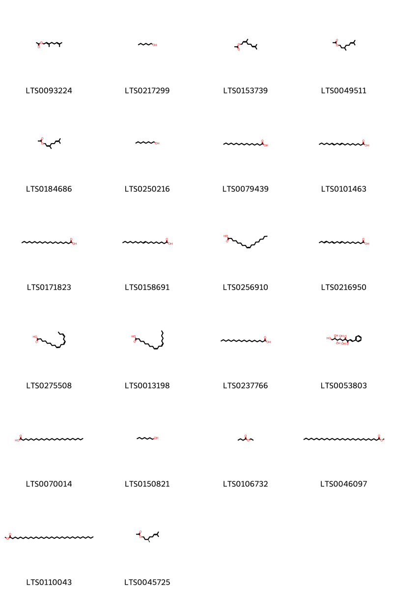
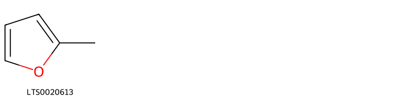
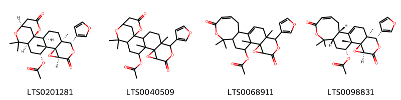
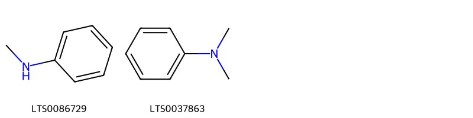
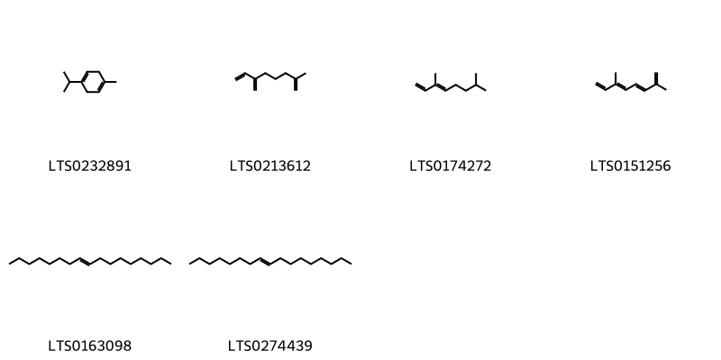

!!! abstract "Tóm tắt"

    Chỉ xác (Fructus Aurantii) là Quả chưa chín đã bổ đôi, phơi hay sấy khô của cây Cam chua (Citrus aurantium L), họ Cam (Rutaceae) hoặc cây Cam ngọt [Citrus sinensis (L.) Osbeck], họ Cam (Rutaceae). Phân bố nhiều nơi ở miền Bắc và miền Nam nước ta; các nông trường trồng chanh cam ở các tỉnh Bắc Giang, Bắc Ninh, Nghệ An, Thanh Hoá.Theo kinh nghiệm dân gian có tác dụng trên tử cung và dạ dày, ruột; tác dụng trên mạch máu, bộ máy tiết niệu và hô hấp. Chỉ xác chứa 9,89 Glucozit và các hoạt chất khác chưa rõ.

## Thông tin về thực vật

Dược liệu **Chỉ Xác (Quả)** từ bộ phận **None** từ loài *Citrus aurantium*.

**Mô tả thực vật:** Cây gỗ cao 4-5m hay hơn , phân nhánh nhiều, có gai nhiều và nhọn. Lá hình trái xoan nhọn, nguyên, hơi dai, bóng, phiến dài 5-10cm, rộng 2,5-5cm, có đốt trên cuống, nở thành một cánh rộng hay hẹp tùy thứ. Hoa màu trắng họp thành xim nhỏ ở nách lá. Quả hình cầu, kích thước trung bình có đường kính 6-8cm, khi chín màu da cam, mặt ngoài sù sì.

*Tài liệu tham khảo:* "Từ điển cây thuốc Việt Nam" - Võ Văn Chi 
Trong dược điển Việt nam, một số loài có thể dùng thay thế cho nhau làm dược liệu bao gồm *Citrus aurantium, Citrus sinensis*

!!! info "Phân loại thực vật của *Citrus aurantium*"
    - **Kingdom:** Plantae
    - **Phylum:** Tracheophyta
    - **Order:** Sapindales
    - **Family:** Rutaceae
    - **Genus:** Citrus
    - **Species:** *Citrus aurantium*

**Phân bố trên thế giới:** nan, Germany, Haiti, Chile, Cuba, Spain, Mexico, Chinese Taipei, Colombia, Sweden, South Africa, Australia, Martinique, Panama, Trinidad and Tobago, Portugal, Brazil, Argentina, Peru, United States of America, Ethiopia, China, Dominican Republic, Italy, New Zealand, Morocco, Ecuador, Greece, Puerto Rico, Cyprus

**Phân bố tại Việt nam:** Không có ghi nhận ở Việt Nam

!!! info "Phân loại thực vật của *Citrus aurantium*"
    - **Kingdom:** Plantae
    - **Phylum:** Tracheophyta
    - **Order:** Sapindales
    - **Family:** Rutaceae
    - **Genus:** Citrus
    - **Species:** *Citrus aurantium*

**Phân bố trên thế giới:** France, Tanzania, United Republic of, Chile, Spain, Colombia, Cameroon, Australia, Nigeria, Portugal, Iraq, India, Brazil, Türkiye, Peru, United States of America, Croatia, China, Italy, Morocco, Greece, Iran (Islamic Republic of), Ecuador, Guinea, Cyprus

**Phân bố tại Việt nam:** Không có ghi nhận ở Việt Nam

## Thông tin về dược liệu 

### Định danh

!!! info "Thông tin về tên gọi"

    - Dược liệu tiếng Việt: Chỉ xác
    - Dược liệu tiếng Trung: None (Zhi Ke)
    - Dược liệu tiếng Anh: Aurantii Fructus
    - Dược liệu latin thông dụng: Fructus Aurantii
    - Dược liệu latin kiểu DĐVN: *fructus aurantii*
    - Dược liệu latin kiểu DĐVN: *Citri Exocarpium Rubrum*
    - Dược liệu latin kiểu thông tư: *Fructus Aurantii immaturus*
    - Bộ phận dùng: None (Pructus)

### Mô tả dược liệu 

- **Theo dược điển Việt nam V:** 
Chỉ xác có hình bán cầu, đường kính 3 cm đến 5 cm, vỏ quả ngoài màu nâu hoặc nâu thẫm, ở đỉnh có những điểm túi tinh dầu dạng hạt trũng xuống, thấy rõ có vết vòi nhụy còn lại hoặc vết sẹo của cuống quả. Mặt cắt lớp vỏ quả giữa màu trắng vàng, nhẵn, hơi nhô lên, dày 0,4 cm đến 1,3 cm, có 1 đến 2 hàng túi tinh dầu ở phần ngoài vỏ quả ngoài. Chất cứng, rán, khó bẻ gãy. Ruột quả có từ 7 đến 12 múi, một số ít quả có tới 15 đến 16 múi. Múi khô, nhăn nheo, có màu từ nâu đến nâu thẫm. trong có hạt. Mùi thơm, vị đắng, hơi chua.

- **Mô tả dược liệu theo thông tư chế biến dược liệu theo phương pháp cổ truyền:** 

### Chế biến 

- **Chế biến theo dược điển việt nam V**: 
Thu hoạch vào tháng 7 đến 8, lúc trời khô ráo, hái các quả xanh, bổ ngang làm đôi, phơi hoặc sấy nhẹ ở 40 °c đến 50 °c cho tới khô. Bào chế Chỉ xác phiến: Loại bỏ tạp chất, rửa sạch, ủ mềm, nạo bỏ ruột, hột, thái lát ngang, phơi hoặc sấy khô. Lát thái hình dải hay hình cung không đều, dài 5 cm rộng đến 1,3 cm. Quan sát lát ngang bề ngoài màu nâu đến nâu thẫm, giữa có màu nâu hơi vàng hoặc trắng, có 1 lớp đến 2 lớp túi tinh dầu ở phía ngoài vỏ, đôi khi thấy tép màu nâu hay tía đỏ, sợi cứng, mùi thơm, vị đắng, hơi chua. Chỉ xác sao cám: Cho cám vào chảo, đun đến khi bốc khỏi cho Chỉ xác phiến vào sao đến khi có màu vàng thẫm lấy ra, sàng bỏ cám, để nguội. Dùng 1 kg cám cho 10 kg Chỉ xác. Các phiên hình dải hay hình vòng cung không đều, hơi thâm màu, đôi khi có vết chảy, mùi thơm nhẹ.

- **Chế biến theo thông tư:** 

--- 

## Thành phần hóa học

- Theo tài liệu của GS. Đỗ Tất Lợi:  9,89 Glucozit.
    

**Thành phần hóa học từ loài **Citrus sinensis**

Theo cơ sở dữ liệu lotus, loài *Citrus sinensis* đã phân lập và xác định được **372** hoạt chất thuộc về các nhóm Organonitrogen compounds, Fatty Acyls, Quinolines and derivatives, Phenols, Carboxylic acids and derivatives, Saturated hydrocarbons, Unsaturated hydrocarbons, Steroids and steroid derivatives, Cyclobutane lignans, Flavonoids, Furanoid lignans, Saccharolipids, Pyridines and derivatives, Heteroaromatic compounds, Imidazopyrimidines, Dihydrofurans, Benzene and substituted derivatives, Coumarins and derivatives, Prenol lipids, Organooxygen compounds, Cinnamic acids and derivatives, Phenol ethers, Naphthopyrans, Linear 1,3-diarylpropanoids, Dibenzylbutane lignans trong bảng dưới đây. Danh sách các hoạt chất như sau hexanol [(LTS0217299)](https://lotus.naturalproducts.net/compound/lotus_id/LTS0217299), 2-(3,4-dimethoxyphenyl)-5,6,7,8-tetramethoxy-3-{[3,4,5-trihydroxy-6-(hydroxymethyl)oxan-2-yl]oxy}chromen-4-one [(LTS0245642)](https://lotus.naturalproducts.net/compound/lotus_id/LTS0245642), citrus sinensis fruit extract [(LTS0179788)](https://lotus.naturalproducts.net/compound/lotus_id/LTS0179788), phellandrene [(LTS0157173)](https://lotus.naturalproducts.net/compound/lotus_id/LTS0157173), 2-(2,3-dimethoxyphenyl)-3,5,6,7,8-pentamethoxychromen-4-one [(LTS0165147)](https://lotus.naturalproducts.net/compound/lotus_id/LTS0165147), (-)-naringenin [(LTS0072900)](https://lotus.naturalproducts.net/compound/lotus_id/LTS0072900), heptadec-8-ene [(LTS0163098)](https://lotus.naturalproducts.net/compound/lotus_id/LTS0163098), (1r,2r,5s,8s,9s,10r,11r,13s)-5,13-dihydroxy-11-methyl-6-methylidene-16-oxo-15-oxapentacyclo[9.3.2.1⁵,⁸.0¹,¹⁰.0²,⁸]heptadecane-9-carboxylic acid [(LTS0162322)](https://lotus.naturalproducts.net/compound/lotus_id/LTS0162322), para-coumaric acid [(LTS0266252)](https://lotus.naturalproducts.net/compound/lotus_id/LTS0266252), 3-phenylpyridine [(LTS0014787)](https://lotus.naturalproducts.net/compound/lotus_id/LTS0014787), 5-hydroxy-8,8-dimethyl-3,10-bis(2-methylbut-3-en-2-yl)pyrano[3,2-g]chromen-2-one [(LTS0134693)](https://lotus.naturalproducts.net/compound/lotus_id/LTS0134693), 8-[(1s,2r,3s,4r)-2,3-diacetyl-4-(7-methoxy-2-oxochromen-8-yl)cyclobutyl]-7-methoxychromen-2-one [(LTS0061374)](https://lotus.naturalproducts.net/compound/lotus_id/LTS0061374), 7-{[4,5-dihydroxy-6-(hydroxymethyl)-3-{[(2s)-3,4,5-trihydroxy-6-methyloxan-2-yl]oxy}oxan-2-yl]oxy}-5-hydroxy-2-(3-hydroxy-4-methoxyphenyl)-2,3-dihydro-1-benzopyran-4-one [(LTS0014248)](https://lotus.naturalproducts.net/compound/lotus_id/LTS0014248), osthole [(LTS0149433)](https://lotus.naturalproducts.net/compound/lotus_id/LTS0149433), chlorogenic acid [(LTS0226495)](https://lotus.naturalproducts.net/compound/lotus_id/LTS0226495), 5-hydroxy-2-(4-hydroxyphenyl)-7-{[(2s,5s)-3,4,5-trihydroxy-6-({[(2r,5r)-3,4,5-trihydroxy-6-methyloxan-2-yl]oxy}methyl)oxan-2-yl]oxy}chromen-4-one [(LTS0015495)](https://lotus.naturalproducts.net/compound/lotus_id/LTS0015495), 1,3,5-trihydroxy-4-methoxy-10-methylacridin-9-one [(LTS0138333)](https://lotus.naturalproducts.net/compound/lotus_id/LTS0138333), sinapoyl alcohol [(LTS0275766)](https://lotus.naturalproducts.net/compound/lotus_id/LTS0275766), β-carotene [(LTS0275716)](https://lotus.naturalproducts.net/compound/lotus_id/LTS0275716), (3s)-3-(acetyloxy)-3-[(1r,2r,5r,6r,7r,10s,11s,14s)-11-(furan-3-yl)-5-(2-hydroxypropan-2-yl)-2,6,10-trimethyl-3,13-dioxo-12,15-dioxatetracyclo[8.5.0.0¹,¹⁴.0²,⁷]pentadecan-6-yl]propanoic acid [(LTS0130055)](https://lotus.naturalproducts.net/compound/lotus_id/LTS0130055), (6s,7ar)-2-[(2e,4e,6e,8e,10e,12e,14e)-15-[(6s,7ar)-6-hydroxy-4,4,7a-trimethyl-2,5,6,7-tetrahydro-1-benzofuran-2-yl]-6,11-dimethylhexadeca-2,4,6,8,10,12,14-heptaen-2-yl]-4,4,7a-trimethyl-2,5,6,7-tetrahydro-1-benzofuran-6-ol [(LTS0151069)](https://lotus.naturalproducts.net/compound/lotus_id/LTS0151069), 3,7-dimethylocta-2,6-dien-1-yl acetate [(LTS0184686)](https://lotus.naturalproducts.net/compound/lotus_id/LTS0184686), (1r,2r,7s,10r,12r,13s,14r,16s,19s,20s)-19-(furan-3-yl)-9,9,13,20-tetramethyl-5,17-dioxo-4,8,15,18-tetraoxahexacyclo[11.9.0.0²,⁷.0²,¹⁰.0¹⁴,¹⁶.0¹⁴,²⁰]docosan-12-yl acetate [(LTS0048331)](https://lotus.naturalproducts.net/compound/lotus_id/LTS0048331), (1s,2r,4s,7s,8s,11r,12r,18s,20r)-7-(furan-3-yl)-1,8,12,17,17-pentamethyl-5,15-dioxo-3,6,16-trioxapentacyclo[9.9.0.0²,⁴.0²,⁸.0¹²,¹⁸]icos-13-en-20-yl acetate [(LTS0020464)](https://lotus.naturalproducts.net/compound/lotus_id/LTS0020464), 3,7-dimethyl-2,6-octadienal [(LTS0141353)](https://lotus.naturalproducts.net/compound/lotus_id/LTS0141353), isoamyl alcohol [(LTS0112297)](https://lotus.naturalproducts.net/compound/lotus_id/LTS0112297), friedelin [(LTS0213494)](https://lotus.naturalproducts.net/compound/lotus_id/LTS0213494), 3-heptylpyridine [(LTS0146282)](https://lotus.naturalproducts.net/compound/lotus_id/LTS0146282), camphor [(LTS0091905)](https://lotus.naturalproducts.net/compound/lotus_id/LTS0091905), 2-(3,4-dimethoxyphenyl)-6,7,8-trimethoxychromen-4-one [(LTS0266569)](https://lotus.naturalproducts.net/compound/lotus_id/LTS0266569), terpineol [(LTS0136148)](https://lotus.naturalproducts.net/compound/lotus_id/LTS0136148), (2s,3r)-3,5-dihydroxy-2-(4-methoxyphenyl)-7-{[(2r,3r,4r,5r,6s)-3,4,5-trihydroxy-6-methyloxan-2-yl]oxy}-2,3-dihydro-1-benzopyran-4-one [(LTS0151486)](https://lotus.naturalproducts.net/compound/lotus_id/LTS0151486), octanal [(LTS0055983)](https://lotus.naturalproducts.net/compound/lotus_id/LTS0055983), dentatin [(LTS0166691)](https://lotus.naturalproducts.net/compound/lotus_id/LTS0166691), 4',5,6,7-tetramethoxyflavone [(LTS0177528)](https://lotus.naturalproducts.net/compound/lotus_id/LTS0177528), 3-(4-methylphenyl)pyridine [(LTS0072853)](https://lotus.naturalproducts.net/compound/lotus_id/LTS0072853), (+)-α-terpineol [(LTS0258249)](https://lotus.naturalproducts.net/compound/lotus_id/LTS0258249), 2-[(3r,4ar,10as)-3,4a,7,7,10a-pentamethyl-octahydro-1h-naphtho[2,1-b]pyran-3-yl]ethanol [(LTS0010763)](https://lotus.naturalproducts.net/compound/lotus_id/LTS0010763), 5,7-dihydroxy-2-(3-hydroxy-4-methoxyphenyl)-8-{[(2r,3r,4s,5s,6r)-3,4,5-trihydroxy-6-(hydroxymethyl)oxan-2-yl]oxy}-3-{[(2s,3r,4s,5s,6r)-3,4,5-trihydroxy-6-(hydroxymethyl)oxan-2-yl]oxy}chromen-4-one [(LTS0210064)](https://lotus.naturalproducts.net/compound/lotus_id/LTS0210064), myricetin [(LTS0139858)](https://lotus.naturalproducts.net/compound/lotus_id/LTS0139858), (2s)-5-hydroxy-2-(4-methoxyphenyl)-7-{[(2s,3r,4s,5s,6r)-3,4,5-trihydroxy-6-({[(2r,3r,4r,5r,6s)-3,4,5-trihydroxy-6-methyloxan-2-yl]oxy}methyl)oxan-2-yl]oxy}-2,3-dihydro-1-benzopyran-4-one [(LTS0187794)](https://lotus.naturalproducts.net/compound/lotus_id/LTS0187794), (4e,6z)-alloocimene [(LTS0254100)](https://lotus.naturalproducts.net/compound/lotus_id/LTS0254100), cosmene [(LTS0151256)](https://lotus.naturalproducts.net/compound/lotus_id/LTS0151256), hexanal [(LTS0238624)](https://lotus.naturalproducts.net/compound/lotus_id/LTS0238624), tangeretin [(LTS0134301)](https://lotus.naturalproducts.net/compound/lotus_id/LTS0134301), 7-methoxy-6-{6-[2-(7-methoxy-2-oxochromen-8-yl)ethenyl]-3,6-dimethylcyclohex-2-en-1-yl}chromen-2-one [(LTS0221802)](https://lotus.naturalproducts.net/compound/lotus_id/LTS0221802), 8-{[4,5-dihydroxy-6-(hydroxymethyl)-3-[(3,4,5-trihydroxyoxan-2-yl)oxy]oxan-2-yl]oxy}-5,7-dihydroxy-2-(4-hydroxyphenyl)chromen-4-one [(LTS0125263)](https://lotus.naturalproducts.net/compound/lotus_id/LTS0125263), trans-β-terpineol [(LTS0033955)](https://lotus.naturalproducts.net/compound/lotus_id/LTS0033955), n-methylanthranilic acid [(LTS0121854)](https://lotus.naturalproducts.net/compound/lotus_id/LTS0121854), 6-[(1z)-3-hydroxy-3-methylbut-1-en-1-yl]-7-methoxychromen-2-one [(LTS0206929)](https://lotus.naturalproducts.net/compound/lotus_id/LTS0206929), pinoresinol [(LTS0057431)](https://lotus.naturalproducts.net/compound/lotus_id/LTS0057431), (-)-α-pinene [(LTS0032699)](https://lotus.naturalproducts.net/compound/lotus_id/LTS0032699), apigenin trimethyl ether [(LTS0044540)](https://lotus.naturalproducts.net/compound/lotus_id/LTS0044540), monoterpenes [(LTS0106881)](https://lotus.naturalproducts.net/compound/lotus_id/LTS0106881), asahina [(LTS0068303)](https://lotus.naturalproducts.net/compound/lotus_id/LTS0068303), β phellandrene [(LTS0124668)](https://lotus.naturalproducts.net/compound/lotus_id/LTS0124668), auraptene [(LTS0058299)](https://lotus.naturalproducts.net/compound/lotus_id/LTS0058299), carvone, (+)- [(LTS0027671)](https://lotus.naturalproducts.net/compound/lotus_id/LTS0027671), caryophyllene [(LTS0131870)](https://lotus.naturalproducts.net/compound/lotus_id/LTS0131870), naringin [(LTS0165229)](https://lotus.naturalproducts.net/compound/lotus_id/LTS0165229), citibrasine [(LTS0183075)](https://lotus.naturalproducts.net/compound/lotus_id/LTS0183075), (5r,6s,7r,8r)-5,6,7,8,9-pentahydroxy-1-phenylnon-1-ene-3,4-dione [(LTS0053803)](https://lotus.naturalproducts.net/compound/lotus_id/LTS0053803), (-)-α-cubebene [(LTS0042045)](https://lotus.naturalproducts.net/compound/lotus_id/LTS0042045), xanthoxylin [(LTS0150432)](https://lotus.naturalproducts.net/compound/lotus_id/LTS0150432), nootkatone [(LTS0183338)](https://lotus.naturalproducts.net/compound/lotus_id/LTS0183338), limonin 17-β-d-glucopyranoside [(LTS0198378)](https://lotus.naturalproducts.net/compound/lotus_id/LTS0198378), bornyl acetate [(LTS0060565)](https://lotus.naturalproducts.net/compound/lotus_id/LTS0060565), sabinene hydrate [(LTS0236165)](https://lotus.naturalproducts.net/compound/lotus_id/LTS0236165), methyl triacontanoate [(LTS0046097)](https://lotus.naturalproducts.net/compound/lotus_id/LTS0046097), 8-[2,3-diacetyl-4-(7-methoxy-2-oxochromen-8-yl)cyclobutyl]-7-methoxychromen-2-one [(LTS0261353)](https://lotus.naturalproducts.net/compound/lotus_id/LTS0261353), methyl tritriacontanoate [(LTS0110043)](https://lotus.naturalproducts.net/compound/lotus_id/LTS0110043), α-thujene [(LTS0185078)](https://lotus.naturalproducts.net/compound/lotus_id/LTS0185078), gossypetin hexamethyl ether [(LTS0135012)](https://lotus.naturalproducts.net/compound/lotus_id/LTS0135012), acid, folic [(LTS0212965)](https://lotus.naturalproducts.net/compound/lotus_id/LTS0212965), heptanol [(LTS0150821)](https://lotus.naturalproducts.net/compound/lotus_id/LTS0150821), limonin [(LTS0207873)](https://lotus.naturalproducts.net/compound/lotus_id/LTS0207873), cyanidin 3-glucoside [(LTS0217835)](https://lotus.naturalproducts.net/compound/lotus_id/LTS0217835), 3-methylpyridine [(LTS0131636)](https://lotus.naturalproducts.net/compound/lotus_id/LTS0131636), 6-(furan-3-yl)-5,12,16,16-tetramethyl-8,20-dioxo-7,10,17,21-tetraoxahexacyclo[16.3.1.0¹,¹⁵.0²,¹².0⁵,¹¹.0⁹,¹¹]docosan-13-yl acetate [(LTS0040509)](https://lotus.naturalproducts.net/compound/lotus_id/LTS0040509), (2r,6s,7ar)-2-[(2e,4e,6e,8e,10e,12e,14e)-15-[(2r,6s,7ar)-6-hydroxy-4,4,7a-trimethyl-2,5,6,7-tetrahydro-1-benzofuran-2-yl]-6,11-dimethylhexadeca-2,4,6,8,10,12,14-heptaen-2-yl]-4,4,7a-trimethyl-2,5,6,7-tetrahydro-1-benzofuran-6-ol [(LTS0242547)](https://lotus.naturalproducts.net/compound/lotus_id/LTS0242547), all-trans-phytofluene [(LTS0269894)](https://lotus.naturalproducts.net/compound/lotus_id/LTS0269894), 1,8a-dimethyl-7-(prop-1-en-2-yl)-2,6,7,8-tetrahydro-1h-naphthalene [(LTS0133136)](https://lotus.naturalproducts.net/compound/lotus_id/LTS0133136), citronellol, (+-)- [(LTS0090925)](https://lotus.naturalproducts.net/compound/lotus_id/LTS0090925), borneol [(LTS0264960)](https://lotus.naturalproducts.net/compound/lotus_id/LTS0264960), elemol [(LTS0208556)](https://lotus.naturalproducts.net/compound/lotus_id/LTS0208556), hesperetin [(LTS0087195)](https://lotus.naturalproducts.net/compound/lotus_id/LTS0087195), 10-hydroxy-8,8-dimethyl-2-oxo-9h,10h-pyrano[2,3-h]chromen-9-yl 3-methylbutanoate [(LTS0194327)](https://lotus.naturalproducts.net/compound/lotus_id/LTS0194327), 1,5-dihydroxy-3,4-dimethoxy-10-methylacridin-9-one [(LTS0154282)](https://lotus.naturalproducts.net/compound/lotus_id/LTS0154282), 6-[(1e)-3-hydroxy-3-methylbut-1-en-1-yl]-7-methoxychromen-2-one [(LTS0188465)](https://lotus.naturalproducts.net/compound/lotus_id/LTS0188465), 3-butylpyridine [(LTS0162349)](https://lotus.naturalproducts.net/compound/lotus_id/LTS0162349), 3,4-dihydroxybenzoic acid [(LTS0018765)](https://lotus.naturalproducts.net/compound/lotus_id/LTS0018765), [2-(methylamino)phenyl]methanol [(LTS0238550)](https://lotus.naturalproducts.net/compound/lotus_id/LTS0238550), neryl acetate [(LTS0153739)](https://lotus.naturalproducts.net/compound/lotus_id/LTS0153739), thymol [(LTS0168527)](https://lotus.naturalproducts.net/compound/lotus_id/LTS0168527), (1s,5s)-carvyl acetate [(LTS0169943)](https://lotus.naturalproducts.net/compound/lotus_id/LTS0169943), (9r,10s)-9,10-dihydroxy-8,8-dimethyl-9h,10h-pyrano[2,3-h]chromen-2-one [(LTS0011460)](https://lotus.naturalproducts.net/compound/lotus_id/LTS0011460), 2-methyl-5-phenylpyridine [(LTS0157430)](https://lotus.naturalproducts.net/compound/lotus_id/LTS0157430), 2-[(2z,4e,6e,8e,10e,12e,14e,16e)-17-{4-hydroxy-2,2,6-trimethyl-7-oxabicyclo[4.1.0]heptan-1-yl}-6,11,15-trimethylheptadeca-2,4,6,8,10,12,14,16-octaen-2-yl]-4,4,7a-trimethyl-2,5,6,7-tetrahydro-1-benzofuran-6-ol [(LTS0193507)](https://lotus.naturalproducts.net/compound/lotus_id/LTS0193507), octanol [(LTS0250216)](https://lotus.naturalproducts.net/compound/lotus_id/LTS0250216), 21-benzyl-5,14,17,20,23-pentahydroxy-18-(1h-indol-3-ylmethyl)-3-methyl-1,4,10,13,16,19,22-heptaazatricyclo[22.3.0.0⁶,¹⁰]heptacosa-4,13,16,19,22-pentaene-2,11-dione [(LTS0116063)](https://lotus.naturalproducts.net/compound/lotus_id/LTS0116063), 2-[(2z,4e,6e,8z,10e,12z)-14-hydroxy-6,11-dimethyltetradeca-2,4,6,8,10,12-hexaen-2-yl]-4,4,7a-trimethyl-hexahydro-1-benzofuran-6-ol [(LTS0123085)](https://lotus.naturalproducts.net/compound/lotus_id/LTS0123085), phlorizin [(LTS0198771)](https://lotus.naturalproducts.net/compound/lotus_id/LTS0198771), valencene [(LTS0110395)](https://lotus.naturalproducts.net/compound/lotus_id/LTS0110395), seselin [(LTS0194066)](https://lotus.naturalproducts.net/compound/lotus_id/LTS0194066), coniferin [(LTS0119031)](https://lotus.naturalproducts.net/compound/lotus_id/LTS0119031), β-zeacarotene [(LTS0232347)](https://lotus.naturalproducts.net/compound/lotus_id/LTS0232347), (3e)-3,7-dimethylocta-1,3-diene [(LTS0174272)](https://lotus.naturalproducts.net/compound/lotus_id/LTS0174272), 5,8,17,20,23-pentahydroxy-15-(hydroxymethyl)-21-[(4-hydroxyphenyl)methyl]-3,6-bis(2-methylpropyl)-1,4,7,13,16,19,22-heptaazatricyclo[22.3.0.0⁹,¹³]heptacosa-4,7,16,19,22-pentaene-2,14-dione [(LTS0131046)](https://lotus.naturalproducts.net/compound/lotus_id/LTS0131046), linalyl acetate [(LTS0167325)](https://lotus.naturalproducts.net/compound/lotus_id/LTS0167325), 7,11-dihydroxy-6-methoxy-2,2,5-trimethyl-1-oxa-5-azatetraphen-10-one [(LTS0089252)](https://lotus.naturalproducts.net/compound/lotus_id/LTS0089252), 7-(furan-3-yl)-1,8,12,17,17-pentamethyl-5,15,20-trioxo-3,6,16-trioxapentacyclo[9.9.0.0²,⁴.0²,⁸.0¹²,¹⁸]icosan-13-yl acetate [(LTS0267734)](https://lotus.naturalproducts.net/compound/lotus_id/LTS0267734), (1s,2s,5s,6s,9s,11r,12s,13r,15s,18r)-6-(furan-3-yl)-5,12,16,16-tetramethyl-8,20-dioxo-7,10,17,21-tetraoxahexacyclo[16.3.1.0¹,¹⁵.0²,¹².0⁵,¹¹.0⁹,¹¹]docosan-13-yl acetate [(LTS0201281)](https://lotus.naturalproducts.net/compound/lotus_id/LTS0201281), 6-[(1e,3z,5e,7z,9z,11z)-15-hydroxy-3,7,12-trimethylpentadeca-1,3,5,7,9,11-hexaen-1-yl]-1,5,5-trimethyl-7-oxabicyclo[4.1.0]heptan-3-ol [(LTS0210878)](https://lotus.naturalproducts.net/compound/lotus_id/LTS0210878), (-)-perillyl alcohol [(LTS0083880)](https://lotus.naturalproducts.net/compound/lotus_id/LTS0083880), castasterone [(LTS0111493)](https://lotus.naturalproducts.net/compound/lotus_id/LTS0111493), 2-methyl-6-methylideneocta-1,7-diene [(LTS0213612)](https://lotus.naturalproducts.net/compound/lotus_id/LTS0213612), phenylacetaldehyde [(LTS0245512)](https://lotus.naturalproducts.net/compound/lotus_id/LTS0245512), (9r,10s)-10-hydroxy-8,8-dimethyl-2-oxo-9h,10h-pyrano[2,3-h]chromen-9-yl 3-methylbutanoate [(LTS0162197)](https://lotus.naturalproducts.net/compound/lotus_id/LTS0162197), aldehyde c11 [(LTS0045537)](https://lotus.naturalproducts.net/compound/lotus_id/LTS0045537), (+)-α-carotene [(LTS0200789)](https://lotus.naturalproducts.net/compound/lotus_id/LTS0200789), (1r,2r,7s,10r,13s,14r,16s,19s,20s)-19-(furan-3-yl)-9,9,13,20-tetramethyl-5,17-dioxo-4,8,15,18-tetraoxahexacyclo[11.9.0.0²,⁷.0²,¹⁰.0¹⁴,¹⁶.0¹⁴,²⁰]docosan-12-yl acetate [(LTS0166868)](https://lotus.naturalproducts.net/compound/lotus_id/LTS0166868), stigmast-5-en-3-ol, (3β)- [(LTS0204616)](https://lotus.naturalproducts.net/compound/lotus_id/LTS0204616), 5,7-dihydroxy-2-(4-hydroxyphenyl)-3,8-bis({[3,4,5-trihydroxy-6-(hydroxymethyl)oxan-2-yl]oxy})chromen-4-one [(LTS0032795)](https://lotus.naturalproducts.net/compound/lotus_id/LTS0032795), palmitic acid [(LTS0079439)](https://lotus.naturalproducts.net/compound/lotus_id/LTS0079439), jasmone [(LTS0205512)](https://lotus.naturalproducts.net/compound/lotus_id/LTS0205512), narirutin [(LTS0259265)](https://lotus.naturalproducts.net/compound/lotus_id/LTS0259265), 2-methyl-5-isopropenylpyridine [(LTS0064479)](https://lotus.naturalproducts.net/compound/lotus_id/LTS0064479), isoscopoletin [(LTS0157758)](https://lotus.naturalproducts.net/compound/lotus_id/LTS0157758), eriocitrin [(LTS0210425)](https://lotus.naturalproducts.net/compound/lotus_id/LTS0210425), citflavanone [(LTS0122503)](https://lotus.naturalproducts.net/compound/lotus_id/LTS0122503), 9,12-octadecadienoic acid [(LTS0101463)](https://lotus.naturalproducts.net/compound/lotus_id/LTS0101463), benzene [(LTS0177573)](https://lotus.naturalproducts.net/compound/lotus_id/LTS0177573), quercetin [(LTS0004651)](https://lotus.naturalproducts.net/compound/lotus_id/LTS0004651), 6,7-dihydroxy-8,8-dimethyl-6h,7h-pyrano[3,2-g]chromen-2-one [(LTS0262722)](https://lotus.naturalproducts.net/compound/lotus_id/LTS0262722), 1,1-dimethylpyrrolidin-1-ium-2-carboxylate [(LTS0052231)](https://lotus.naturalproducts.net/compound/lotus_id/LTS0052231), (-)-β-cubebene [(LTS0123697)](https://lotus.naturalproducts.net/compound/lotus_id/LTS0123697), (2s)-5-hydroxy-2-(3-hydroxy-4-methoxyphenyl)-7-{[(2s,3r,4s,5s,6r)-3,4,5-trihydroxy-6-({[(2r,3r,4s,5r,6s)-3,4,5-trihydroxy-6-methyloxan-2-yl]oxy}methyl)oxan-2-yl]oxy}-2,3-dihydro-1-benzopyran-4-one [(LTS0091118)](https://lotus.naturalproducts.net/compound/lotus_id/LTS0091118), (-)-β-bisabolene [(LTS0009940)](https://lotus.naturalproducts.net/compound/lotus_id/LTS0009940), 3-propylpyridine [(LTS0209387)](https://lotus.naturalproducts.net/compound/lotus_id/LTS0209387), 6-(3-hydroxy-3-methylbut-1-en-1-yl)-7-methoxychromen-2-one [(LTS0148441)](https://lotus.naturalproducts.net/compound/lotus_id/LTS0148441), (+)-sabinene [(LTS0110694)](https://lotus.naturalproducts.net/compound/lotus_id/LTS0110694), violaxanthin [(LTS0102265)](https://lotus.naturalproducts.net/compound/lotus_id/LTS0102265), naringenin [(LTS0031098)](https://lotus.naturalproducts.net/compound/lotus_id/LTS0031098), chamomile [(LTS0104946)](https://lotus.naturalproducts.net/compound/lotus_id/LTS0104946), (e)-2-hexenal [(LTS0207868)](https://lotus.naturalproducts.net/compound/lotus_id/LTS0207868), (+)-α-thujene [(LTS0272912)](https://lotus.naturalproducts.net/compound/lotus_id/LTS0272912), brassinolide [(LTS0256786)](https://lotus.naturalproducts.net/compound/lotus_id/LTS0256786), (2r,3s,4s,5r,6s)-2-(hydroxymethyl)-6-[(2-methylbut-3-en-2-yl)oxy]oxane-3,4,5-triol [(LTS0073684)](https://lotus.naturalproducts.net/compound/lotus_id/LTS0073684), rhoifolin [(LTS0029806)](https://lotus.naturalproducts.net/compound/lotus_id/LTS0029806), silvan [(LTS0020613)](https://lotus.naturalproducts.net/compound/lotus_id/LTS0020613), (-)-friedelin [(LTS0041645)](https://lotus.naturalproducts.net/compound/lotus_id/LTS0041645), demethylsuberosin [(LTS0269919)](https://lotus.naturalproducts.net/compound/lotus_id/LTS0269919), cajaflavanone [(LTS0108468)](https://lotus.naturalproducts.net/compound/lotus_id/LTS0108468), sabinene [(LTS0224133)](https://lotus.naturalproducts.net/compound/lotus_id/LTS0224133), neral [(LTS0165243)](https://lotus.naturalproducts.net/compound/lotus_id/LTS0165243), nootkatol [(LTS0021355)](https://lotus.naturalproducts.net/compound/lotus_id/LTS0021355), (2s,3r,4s,5s,6r)-2-(3,5-dihydroxyphenoxy)-6-(hydroxymethyl)oxane-3,4,5-triol [(LTS0172238)](https://lotus.naturalproducts.net/compound/lotus_id/LTS0172238), citrunobin [(LTS0025724)](https://lotus.naturalproducts.net/compound/lotus_id/LTS0025724), (2s,4z,9s,11r,12s,13r,15s,18s,19s)-18-(furan-3-yl)-8,8,12,19-tetramethyl-6,16-dioxo-7,14,17-trioxapentacyclo[10.9.0.0²,⁹.0¹³,¹⁵.0¹³,¹⁹]henicosa-1(21),4-dien-11-yl acetate [(LTS0098831)](https://lotus.naturalproducts.net/compound/lotus_id/LTS0098831), 4-thujanol [(LTS0005823)](https://lotus.naturalproducts.net/compound/lotus_id/LTS0005823), (1r,3as,3bs,7s,9bs)-1-[(2r,5r)-5,6-dimethylheptan-2-yl]-9a,11a-dimethyl-1h,2h,3h,3ah,3bh,4h,6h,7h,8h,9h,9bh,10h,11h-cyclopenta[a]phenanthren-7-ol [(LTS0057877)](https://lotus.naturalproducts.net/compound/lotus_id/LTS0057877), 2-(3,4-dimethoxyphenyl)-5-hydroxy-6,7-dimethoxychromen-4-one [(LTS0032351)](https://lotus.naturalproducts.net/compound/lotus_id/LTS0032351), (5s)-1-isopropyl-4-methylidenebicyclo[3.1.0]hexane [(LTS0129854)](https://lotus.naturalproducts.net/compound/lotus_id/LTS0129854), demethylnobiletin [(LTS0209649)](https://lotus.naturalproducts.net/compound/lotus_id/LTS0209649), 5-ethenyl-2-methoxyphenol [(LTS0076260)](https://lotus.naturalproducts.net/compound/lotus_id/LTS0076260), sitosterol [(LTS0168132)](https://lotus.naturalproducts.net/compound/lotus_id/LTS0168132), β-farnesene [(LTS0067925)](https://lotus.naturalproducts.net/compound/lotus_id/LTS0067925), limonene,  [(LTS0155981)](https://lotus.naturalproducts.net/compound/lotus_id/LTS0155981), 2-(3,4-dimethoxyphenyl)-5,6,7,8-tetramethoxy-3-{[(2s,3r,4s,5s,6r)-3,4,5-trihydroxy-6-(hydroxymethyl)oxan-2-yl]oxy}chromen-4-one [(LTS0074567)](https://lotus.naturalproducts.net/compound/lotus_id/LTS0074567), 6-[(2r)-2-hydroxy-3-methylbut-3-en-1-yl]-7-methoxychromen-2-one [(LTS0125780)](https://lotus.naturalproducts.net/compound/lotus_id/LTS0125780), citronella [(LTS0151257)](https://lotus.naturalproducts.net/compound/lotus_id/LTS0151257), 3-methoxynobiletin [(LTS0144095)](https://lotus.naturalproducts.net/compound/lotus_id/LTS0144095), poncirin [(LTS0171172)](https://lotus.naturalproducts.net/compound/lotus_id/LTS0171172), methyl anthranilate [(LTS0069354)](https://lotus.naturalproducts.net/compound/lotus_id/LTS0069354), neohesperidin [(LTS0129178)](https://lotus.naturalproducts.net/compound/lotus_id/LTS0129178), hesperidin [(LTS0261835)](https://lotus.naturalproducts.net/compound/lotus_id/LTS0261835), stigmasterol [(LTS0024262)](https://lotus.naturalproducts.net/compound/lotus_id/LTS0024262), oct-1-en-1-yl acetate [(LTS0005009)](https://lotus.naturalproducts.net/compound/lotus_id/LTS0005009), 3-hydroxyacetophenone [(LTS0193353)](https://lotus.naturalproducts.net/compound/lotus_id/LTS0193353), (2s,3's,4ar,5r,6r,8ar)-5-[(1r)-1-(acetyloxy)-2-carboxyethyl]-2-[(s)-furan-3-yl({[(2r,3r,4s,5s,6r)-3,4,5-trihydroxy-6-(hydroxymethyl)oxan-2-yl]oxy})methyl]-6-(2-hydroxypropan-2-yl)-2,5,8a-trimethyl-8-oxo-tetrahydro-3h-spiro[naphthalene-1,2'-oxirane]-3'-carboxylic acid [(LTS0175497)](https://lotus.naturalproducts.net/compound/lotus_id/LTS0175497), kaempherol [(LTS0155822)](https://lotus.naturalproducts.net/compound/lotus_id/LTS0155822), heptadecane [(LTS0038303)](https://lotus.naturalproducts.net/compound/lotus_id/LTS0038303), stearic acid [(LTS0237766)](https://lotus.naturalproducts.net/compound/lotus_id/LTS0237766), nobiletin [(LTS0100173)](https://lotus.naturalproducts.net/compound/lotus_id/LTS0100173), galop [(LTS0222857)](https://lotus.naturalproducts.net/compound/lotus_id/LTS0222857), 6-methyl-5-hepten-2-one [(LTS0241073)](https://lotus.naturalproducts.net/compound/lotus_id/LTS0241073), gibberellin a3 [(LTS0185015)](https://lotus.naturalproducts.net/compound/lotus_id/LTS0185015), xanthoxyletin [(LTS0112626)](https://lotus.naturalproducts.net/compound/lotus_id/LTS0112626), isosinensetin [(LTS0052178)](https://lotus.naturalproducts.net/compound/lotus_id/LTS0052178), bicyclogermacrene [(LTS0099340)](https://lotus.naturalproducts.net/compound/lotus_id/LTS0099340), (3s,6s,9s,15s,21s,24s)-5,8,17,20,23-pentahydroxy-15-(hydroxymethyl)-21-[(4-hydroxyphenyl)methyl]-3,6-bis(2-methylpropyl)-1,4,7,13,16,19,22-heptaazatricyclo[22.3.0.0⁹,¹³]heptacosa-4,7,16,19,22-pentaene-2,14-dione [(LTS0180418)](https://lotus.naturalproducts.net/compound/lotus_id/LTS0180418), dihydrocarveol [(LTS0111467)](https://lotus.naturalproducts.net/compound/lotus_id/LTS0111467), (8e)-heptadec-8-ene [(LTS0274439)](https://lotus.naturalproducts.net/compound/lotus_id/LTS0274439), (6s,7ar)-2-[(2e,4e,6e,8e,10e,12e,14e,16e)-17-[(4r)-4-hydroxy-2,6,6-trimethylcyclohex-1-en-1-yl]-6,11,15-trimethylheptadeca-2,4,6,8,10,12,14,16-octaen-2-yl]-4,4,7a-trimethyl-2,5,6,7-tetrahydro-1-benzofuran-6-ol [(LTS0100944)](https://lotus.naturalproducts.net/compound/lotus_id/LTS0100944), lariciresinol [(LTS0010950)](https://lotus.naturalproducts.net/compound/lotus_id/LTS0010950), 3,5-dihydroxy-2-(4-methoxyphenyl)-7-[(3,4,5-trihydroxy-6-methyloxan-2-yl)oxy]-2,3-dihydro-1-benzopyran-4-one [(LTS0207880)](https://lotus.naturalproducts.net/compound/lotus_id/LTS0207880), phenylacetonitrile [(LTS0082558)](https://lotus.naturalproducts.net/compound/lotus_id/LTS0082558), (s)-(-)-citronellal [(LTS0164027)](https://lotus.naturalproducts.net/compound/lotus_id/LTS0164027), (1r,2r,8s,11s,12r,18s)-7-(furan-3-yl)-1,8,12,17,17-pentamethyl-5,15,20-trioxo-3,6,16-trioxapentacyclo[9.9.0.0²,⁴.0²,⁸.0¹²,¹⁸]icosan-13-yl acetate [(LTS0234033)](https://lotus.naturalproducts.net/compound/lotus_id/LTS0234033), luteolin [(LTS0017052)](https://lotus.naturalproducts.net/compound/lotus_id/LTS0017052), 3-[(3s,6s,9s,12s,18s,21s,26as)-3,9-bis(2-carboxyethyl)-1,4,7,10,13,16,19-heptahydroxy-12-(1h-indol-3-ylmethyl)-21-isopropyl-6-methyl-22-oxo-3h,6h,9h,12h,15h,18h,21h,24h,25h,26h,26ah-pyrrolo[1,2-a]1,4,7,10,13,16,19,22-octaazacyclotetracosan-18-yl]propanoic acid [(LTS0165479)](https://lotus.naturalproducts.net/compound/lotus_id/LTS0165479), stachydrine [(LTS0190320)](https://lotus.naturalproducts.net/compound/lotus_id/LTS0190320), phenylacrylic acid [(LTS0097258)](https://lotus.naturalproducts.net/compound/lotus_id/LTS0097258), chrysin [(LTS0200644)](https://lotus.naturalproducts.net/compound/lotus_id/LTS0200644), citronellyl acetate [(LTS0049511)](https://lotus.naturalproducts.net/compound/lotus_id/LTS0049511), diosmin [(LTS0240372)](https://lotus.naturalproducts.net/compound/lotus_id/LTS0240372), atalantoflavone [(LTS0160941)](https://lotus.naturalproducts.net/compound/lotus_id/LTS0160941), scopoletin [(LTS0193112)](https://lotus.naturalproducts.net/compound/lotus_id/LTS0193112), α-carotene [(LTS0224243)](https://lotus.naturalproducts.net/compound/lotus_id/LTS0224243), (2s)-5-hydroxy-2-(4-hydroxyphenyl)-8,8-dimethyl-6-(3-methylbut-2-en-1-yl)-2h,3h-pyrano[2,3-f]chromen-4-one [(LTS0210389)](https://lotus.naturalproducts.net/compound/lotus_id/LTS0210389), (2r,3r,4s,5s,6r)-2,4,5-trihydroxy-6-(hydroxymethyl)oxan-3-yl (2e)-3-phenylprop-2-enoate [(LTS0201726)](https://lotus.naturalproducts.net/compound/lotus_id/LTS0201726), cymene [(LTS0181568)](https://lotus.naturalproducts.net/compound/lotus_id/LTS0181568), (2s)-2-(3,4-dihydroxyphenyl)-5-hydroxy-7-{[(3r,4s,5s,6r)-3,4,5-trihydroxy-6-({[(2s,3r,4r,5r,6s)-3,4,5-trihydroxy-6-methyloxan-2-yl]oxy}methyl)oxan-2-yl]oxy}-2,3-dihydro-1-benzopyran-4-one [(LTS0096238)](https://lotus.naturalproducts.net/compound/lotus_id/LTS0096238), (1r,3s,6s)-6-[(1e,3e,5e,7e,9e,11e,13e)-15-hydroxy-3,7,12-trimethylpentadeca-1,3,5,7,9,11,13-heptaen-1-yl]-1,5,5-trimethyl-7-oxabicyclo[4.1.0]heptan-3-ol [(LTS0115998)](https://lotus.naturalproducts.net/compound/lotus_id/LTS0115998), (6r,7s)-6,7-dihydroxy-8,8-dimethyl-6h,7h-pyrano[3,2-g]chromen-2-one [(LTS0254232)](https://lotus.naturalproducts.net/compound/lotus_id/LTS0254232), perillylalcohol [(LTS0009128)](https://lotus.naturalproducts.net/compound/lotus_id/LTS0009128), geraniol [(LTS0258838)](https://lotus.naturalproducts.net/compound/lotus_id/LTS0258838), 3-acetyl-6-methylpyridine [(LTS0126117)](https://lotus.naturalproducts.net/compound/lotus_id/LTS0126117), hexamethylquercetagetin [(LTS0109758)](https://lotus.naturalproducts.net/compound/lotus_id/LTS0109758), 5-hydroxynoracronycine [(LTS0148605)](https://lotus.naturalproducts.net/compound/lotus_id/LTS0148605), (2z)-2-(n-hydroxyimino)-1-{4-[(3-methylbut-2-en-1-yl)oxy]phenyl}ethanone [(LTS0121572)](https://lotus.naturalproducts.net/compound/lotus_id/LTS0121572), dimethylaniline [(LTS0037863)](https://lotus.naturalproducts.net/compound/lotus_id/LTS0037863), valencene [(LTS0031707)](https://lotus.naturalproducts.net/compound/lotus_id/LTS0031707), 19-(furan-3-yl)-9,9,13,20-tetramethyl-12-(2-oxopropyl)-4,8,15,18-tetraoxahexacyclo[11.9.0.0²,⁷.0²,¹⁰.0¹⁴,¹⁶.0¹⁴,²⁰]docosane-5,17-dione [(LTS0250779)](https://lotus.naturalproducts.net/compound/lotus_id/LTS0250779), 5,7-dihydroxy-2-(4-hydroxyphenyl)-6,8-bis(3-methylbut-2-en-1-yl)-2,3-dihydro-1-benzopyran-4-one [(LTS0093397)](https://lotus.naturalproducts.net/compound/lotus_id/LTS0093397), lonchocarpol a [(LTS0012096)](https://lotus.naturalproducts.net/compound/lotus_id/LTS0012096), carvyl acetate [(LTS0049357)](https://lotus.naturalproducts.net/compound/lotus_id/LTS0049357), matairesinol [(LTS0193475)](https://lotus.naturalproducts.net/compound/lotus_id/LTS0193475), cholesterol [(LTS0102304)](https://lotus.naturalproducts.net/compound/lotus_id/LTS0102304), 3,4-dihydroxycinnamic acid [(LTS0128050)](https://lotus.naturalproducts.net/compound/lotus_id/LTS0128050), pentacosanoic acid [(LTS0070014)](https://lotus.naturalproducts.net/compound/lotus_id/LTS0070014), galangin [(LTS0210648)](https://lotus.naturalproducts.net/compound/lotus_id/LTS0210648), β-pinene [(LTS0117550)](https://lotus.naturalproducts.net/compound/lotus_id/LTS0117550), suberosin [(LTS0171880)](https://lotus.naturalproducts.net/compound/lotus_id/LTS0171880), neurosporene [(LTS0117305)](https://lotus.naturalproducts.net/compound/lotus_id/LTS0117305), 7-methoxy-2-oxochromene-6-carbaldehyde [(LTS0027815)](https://lotus.naturalproducts.net/compound/lotus_id/LTS0027815), α-limonene [(LTS0244943)](https://lotus.naturalproducts.net/compound/lotus_id/LTS0244943), 5-hydroxy-2-(4-methoxyphenyl)-7-[(3,4,5-trihydroxy-6-{[(3,4,5-trihydroxy-6-methyloxan-2-yl)oxy]methyl}oxan-2-yl)oxy]-2,3-dihydro-1-benzopyran-4-one [(LTS0053955)](https://lotus.naturalproducts.net/compound/lotus_id/LTS0053955), 2-[(8e,10e,12e,14e)-15-(6-hydroxy-4,4,7a-trimethyl-2,5,6,7-tetrahydro-1-benzofuran-2-yl)-6,11-dimethylhexadeca-2,4,6,8,10,12,14-heptaen-2-yl]-4,4,7a-trimethyl-2,5,6,7-tetrahydro-1-benzofuran-6-ol [(LTS0044878)](https://lotus.naturalproducts.net/compound/lotus_id/LTS0044878), nonanal [(LTS0244398)](https://lotus.naturalproducts.net/compound/lotus_id/LTS0244398), etrogol [(LTS0259212)](https://lotus.naturalproducts.net/compound/lotus_id/LTS0259212), 2-(3,5-dihydroxyphenoxy)-6-(hydroxymethyl)oxane-3,4,5-triol [(LTS0123170)](https://lotus.naturalproducts.net/compound/lotus_id/LTS0123170), 3-[9,18-bis(2-carboxyethyl)-1,4,7,10,13,16,19-heptahydroxy-12-(1h-indol-3-ylmethyl)-21-isopropyl-6-methyl-22-oxo-3h,6h,9h,12h,15h,18h,21h,24h,25h,26h,26ah-pyrrolo[1,2-a]1,4,7,10,13,16,19,22-octaazacyclotetracosan-3-yl]propanoic acid [(LTS0044245)](https://lotus.naturalproducts.net/compound/lotus_id/LTS0044245), 2-(3,4-dimethoxyphenyl)-5-hydroxy-7,8-dimethoxychromen-4-one [(LTS0154987)](https://lotus.naturalproducts.net/compound/lotus_id/LTS0154987), 8-{[(2s,3r,4s,5s,6r)-4,5-dihydroxy-6-(hydroxymethyl)-3-{[(2s,3r,4s,5r)-3,4,5-trihydroxyoxan-2-yl]oxy}oxan-2-yl]oxy}-5,7-dihydroxy-2-(4-hydroxyphenyl)chromen-4-one [(LTS0255490)](https://lotus.naturalproducts.net/compound/lotus_id/LTS0255490), stigmast-5-en-3-ol [(LTS0071224)](https://lotus.naturalproducts.net/compound/lotus_id/LTS0071224), terpinolene [(LTS0104525)](https://lotus.naturalproducts.net/compound/lotus_id/LTS0104525), (-)-β-pinene [(LTS0108757)](https://lotus.naturalproducts.net/compound/lotus_id/LTS0108757), caffeine [(LTS0075508)](https://lotus.naturalproducts.net/compound/lotus_id/LTS0075508), (+)-gamma-cadinene [(LTS0103949)](https://lotus.naturalproducts.net/compound/lotus_id/LTS0103949), (2s)-5-hydroxy-2-(4-hydroxyphenyl)-8,8-dimethyl-10-(3-methylbut-2-en-1-yl)-2h,3h-pyrano[3,2-g]chromen-4-one [(LTS0248998)](https://lotus.naturalproducts.net/compound/lotus_id/LTS0248998), 3-hydroxy-2-(2-hydroxypropan-2-yl)-2h,3h-furo[3,2-g]chromen-7-one [(LTS0014564)](https://lotus.naturalproducts.net/compound/lotus_id/LTS0014564), neoeriocitrin [(LTS0274558)](https://lotus.naturalproducts.net/compound/lotus_id/LTS0274558), phloretin [(LTS0024702)](https://lotus.naturalproducts.net/compound/lotus_id/LTS0024702), vanillic acid [(LTS0229113)](https://lotus.naturalproducts.net/compound/lotus_id/LTS0229113), α-hydroquinone [(LTS0063684)](https://lotus.naturalproducts.net/compound/lotus_id/LTS0063684), 6-[(1e)-3-ethoxy-3-methylbut-1-en-1-yl]-7-methoxychromen-2-one [(LTS0028701)](https://lotus.naturalproducts.net/compound/lotus_id/LTS0028701), α terpinene [(LTS0232891)](https://lotus.naturalproducts.net/compound/lotus_id/LTS0232891), 3-pentylpyridine [(LTS0046521)](https://lotus.naturalproducts.net/compound/lotus_id/LTS0046521), sinensetin [(LTS0085325)](https://lotus.naturalproducts.net/compound/lotus_id/LTS0085325), 5,7-dihydroxy-2-(4-hydroxyphenyl)-3,8-bis({[(2s,3r,4s,5s,6r)-3,4,5-trihydroxy-6-(hydroxymethyl)oxan-2-yl]oxy})chromen-4-one [(LTS0226544)](https://lotus.naturalproducts.net/compound/lotus_id/LTS0226544), pentadecane [(LTS0210146)](https://lotus.naturalproducts.net/compound/lotus_id/LTS0210146), campesterol [(LTS0029429)](https://lotus.naturalproducts.net/compound/lotus_id/LTS0029429), p-hydroxybenzoic acid [(LTS0263634)](https://lotus.naturalproducts.net/compound/lotus_id/LTS0263634), nor-dentatin [(LTS0166816)](https://lotus.naturalproducts.net/compound/lotus_id/LTS0166816), 2-pentylpyridine [(LTS0027594)](https://lotus.naturalproducts.net/compound/lotus_id/LTS0027594), 3-octylpyridine [(LTS0188841)](https://lotus.naturalproducts.net/compound/lotus_id/LTS0188841), methyl salicylate [(LTS0128373)](https://lotus.naturalproducts.net/compound/lotus_id/LTS0128373), flavoxanthin [(LTS0174303)](https://lotus.naturalproducts.net/compound/lotus_id/LTS0174303), lupeol [(LTS0256952)](https://lotus.naturalproducts.net/compound/lotus_id/LTS0256952), 2-(hydroxymethyl)-6-[(2-methylbut-3-en-2-yl)oxy]oxane-3,4,5-triol [(LTS0002833)](https://lotus.naturalproducts.net/compound/lotus_id/LTS0002833), 9 octadecenoic acid [(LTS0158691)](https://lotus.naturalproducts.net/compound/lotus_id/LTS0158691), secoisolariciresinol [(LTS0086727)](https://lotus.naturalproducts.net/compound/lotus_id/LTS0086727), α-linolenic acid [(LTS0275508)](https://lotus.naturalproducts.net/compound/lotus_id/LTS0275508), 3-(acetyloxy)-3-[11-(furan-3-yl)-5-(2-hydroxypropan-2-yl)-2,6,10-trimethyl-3,13-dioxo-12,15-dioxatetracyclo[8.5.0.0¹,¹⁴.0²,⁷]pentadecan-6-yl]propanoic acid [(LTS0126380)](https://lotus.naturalproducts.net/compound/lotus_id/LTS0126380), α-myrcene [(LTS0115731)](https://lotus.naturalproducts.net/compound/lotus_id/LTS0115731), oleic acid [(LTS0256910)](https://lotus.naturalproducts.net/compound/lotus_id/LTS0256910), gibberellin a19 [(LTS0044672)](https://lotus.naturalproducts.net/compound/lotus_id/LTS0044672), ethyl butyrate [(LTS0106732)](https://lotus.naturalproducts.net/compound/lotus_id/LTS0106732), (2e)-2-(n-hydroxyimino)-1-{4-[(3-methylbut-2-en-1-yl)oxy]phenyl}ethanone [(LTS0037054)](https://lotus.naturalproducts.net/compound/lotus_id/LTS0037054), (2r,3r)-3-hydroxy-2-(2-hydroxypropan-2-yl)-2h,3h-furo[3,2-g]chromen-7-one [(LTS0230946)](https://lotus.naturalproducts.net/compound/lotus_id/LTS0230946), 6-(2-hydroxy-3-methylbut-3-en-1-yl)-7-methoxychromen-2-one [(LTS0141754)](https://lotus.naturalproducts.net/compound/lotus_id/LTS0141754), linalool, (+-)- [(LTS0128839)](https://lotus.naturalproducts.net/compound/lotus_id/LTS0128839), 4-terpineol [(LTS0253733)](https://lotus.naturalproducts.net/compound/lotus_id/LTS0253733), α pinene [(LTS0132416)](https://lotus.naturalproducts.net/compound/lotus_id/LTS0132416), umbelliferone [(LTS0162728)](https://lotus.naturalproducts.net/compound/lotus_id/LTS0162728), ferulic acid [(LTS0077328)](https://lotus.naturalproducts.net/compound/lotus_id/LTS0077328), campesterol [(LTS0046755)](https://lotus.naturalproducts.net/compound/lotus_id/LTS0046755), linoleic [(LTS0013198)](https://lotus.naturalproducts.net/compound/lotus_id/LTS0013198), 3-(4-methylhexyl)pyridine [(LTS0114532)](https://lotus.naturalproducts.net/compound/lotus_id/LTS0114532), geranyl acetate [(LTS0093224)](https://lotus.naturalproducts.net/compound/lotus_id/LTS0093224), (1r,7ar,9s,11br)-1-(acetyloxy)-9-[(s)-furan-3-yl(hydroxy)methyl]-5,5,7a,9,11b-pentamethyl-3,7-dioxo-hexahydro-1h-spiro[naphtho[2,1-c]oxepine-8,2'-oxirane]-3'-carboxylic acid [(LTS0156866)](https://lotus.naturalproducts.net/compound/lotus_id/LTS0156866), 7-methoxy-2-oxochromene-6-carboxylic acid [(LTS0106452)](https://lotus.naturalproducts.net/compound/lotus_id/LTS0106452), phytoene [(LTS0186029)](https://lotus.naturalproducts.net/compound/lotus_id/LTS0186029), ethyl acetate [(LTS0196824)](https://lotus.naturalproducts.net/compound/lotus_id/LTS0196824), 5-hydroxy-2-(4-hydroxyphenyl)-7-[(3,4,5-trihydroxy-6-{[(3,4,5-trihydroxy-6-methyloxan-2-yl)oxy]methyl}oxan-2-yl)oxy]-2,3-dihydro-1-benzopyran-4-one [(LTS0252145)](https://lotus.naturalproducts.net/compound/lotus_id/LTS0252145), (2s)-7-{[(2s,3s,4s,5s,6r)-4,5-dihydroxy-6-(hydroxymethyl)-3-{[(2s,3s,4r,5r,6s)-3,4,5-trihydroxy-6-methyloxan-2-yl]oxy}oxan-2-yl]oxy}-5-hydroxy-2-(4-hydroxyphenyl)-2,3-dihydro-1-benzopyran-4-one [(LTS0138617)](https://lotus.naturalproducts.net/compound/lotus_id/LTS0138617), 6-(3-ethoxy-3-methylbut-1-en-1-yl)-7-methoxychromen-2-one [(LTS0031893)](https://lotus.naturalproducts.net/compound/lotus_id/LTS0031893), (1r,2s,6s,7s,8r)-8-isopropyl-1,3-dimethyltricyclo[4.4.0.0²,⁷]dec-3-ene [(LTS0106607)](https://lotus.naturalproducts.net/compound/lotus_id/LTS0106607), decanal [(LTS0128361)](https://lotus.naturalproducts.net/compound/lotus_id/LTS0128361), (1s,3ar,3br,7r,9as,9br,11ar)-1-[(2r,5r)-5-ethyl-6-methylheptan-2-yl]-9a,11a-dimethyl-1h,2h,3h,3ah,3bh,4h,6h,7h,8h,9h,9bh,10h,11h-cyclopenta[a]phenanthren-7-ol [(LTS0234781)](https://lotus.naturalproducts.net/compound/lotus_id/LTS0234781), octadeca-9,12,15-trienoic acid [(LTS0216950)](https://lotus.naturalproducts.net/compound/lotus_id/LTS0216950), (1r,2r,7s,10s,13r,14r,16s,19s,20s)-19-(furan-3-yl)-9,9,13,20-tetramethyl-4,8,15,18-tetraoxahexacyclo[11.9.0.0²,⁷.0²,¹⁰.0¹⁴,¹⁶.0¹⁴,²⁰]docosane-5,12,17-trione [(LTS0222914)](https://lotus.naturalproducts.net/compound/lotus_id/LTS0222914), arachidic acid [(LTS0171823)](https://lotus.naturalproducts.net/compound/lotus_id/LTS0171823), 4-[(3-methylbut-2-en-1-yl)oxy]benzoic acid [(LTS0154347)](https://lotus.naturalproducts.net/compound/lotus_id/LTS0154347), sinapinate [(LTS0173482)](https://lotus.naturalproducts.net/compound/lotus_id/LTS0173482), 4-phenylpyridine [(LTS0196237)](https://lotus.naturalproducts.net/compound/lotus_id/LTS0196237), gibberellin a20 [(LTS0041124)](https://lotus.naturalproducts.net/compound/lotus_id/LTS0041124), (3s,6s,18s,21s,24s)-21-benzyl-5,14,17,20,23-pentahydroxy-18-(1h-indol-3-ylmethyl)-3-methyl-1,4,10,13,16,19,22-heptaazatricyclo[22.3.0.0⁶,¹⁰]heptacosa-4,13,16,19,22-pentaene-2,11-dione [(LTS0187362)](https://lotus.naturalproducts.net/compound/lotus_id/LTS0187362), ethylbenzene [(LTS0122434)](https://lotus.naturalproducts.net/compound/lotus_id/LTS0122434), humulene [(LTS0263171)](https://lotus.naturalproducts.net/compound/lotus_id/LTS0263171), 5,7-dihydroxy-2-(3-hydroxy-4-methoxyphenyl)-3,8-bis({[3,4,5-trihydroxy-6-(hydroxymethyl)oxan-2-yl]oxy})chromen-4-one [(LTS0086798)](https://lotus.naturalproducts.net/compound/lotus_id/LTS0086798), benzaldehyde [(LTS0094193)](https://lotus.naturalproducts.net/compound/lotus_id/LTS0094193), nerol [(LTS0244289)](https://lotus.naturalproducts.net/compound/lotus_id/LTS0244289), (4s,4as)-4-isopropyl-1,6-dimethyl-2,3,4,4a,7,8-hexahydronaphthalene [(LTS0208606)](https://lotus.naturalproducts.net/compound/lotus_id/LTS0208606), (-)-linalool [(LTS0200382)](https://lotus.naturalproducts.net/compound/lotus_id/LTS0200382), quercetagetin [(LTS0009041)](https://lotus.naturalproducts.net/compound/lotus_id/LTS0009041), (1ar,4as,7r,7as,7bs)-1,1,7-trimethyl-4-methylidene-octahydro-1ah-cyclopropa[e]azulene [(LTS0028578)](https://lotus.naturalproducts.net/compound/lotus_id/LTS0028578), 4-isopropyl-6-methyl-1-methylidene-3,4,4a,7,8,8a-hexahydro-2h-naphthalene [(LTS0111070)](https://lotus.naturalproducts.net/compound/lotus_id/LTS0111070), (+)-4-terpineol [(LTS0140257)](https://lotus.naturalproducts.net/compound/lotus_id/LTS0140257), 3-{[(2s,3r,4r,5s,6r)-6-{[(2-carboxyacetyl)oxy]methyl}-3,4,5-trihydroxyoxan-2-yl]oxy}-2-(3,4-dihydroxyphenyl)-5,7-dihydroxy-1λ⁴-chromen-1-ylium [(LTS0186341)](https://lotus.naturalproducts.net/compound/lotus_id/LTS0186341), xanthyletin [(LTS0016674)](https://lotus.naturalproducts.net/compound/lotus_id/LTS0016674), vitamin c [(LTS0022555)](https://lotus.naturalproducts.net/compound/lotus_id/LTS0022555), 19-(furan-3-yl)-9,9,13,20-tetramethyl-5,17-dioxo-4,8,15,18-tetraoxahexacyclo[11.9.0.0²,⁷.0²,¹⁰.0¹⁴,¹⁶.0¹⁴,²⁰]docosan-12-yl acetate [(LTS0166084)](https://lotus.naturalproducts.net/compound/lotus_id/LTS0166084), α-citral [(LTS0246122)](https://lotus.naturalproducts.net/compound/lotus_id/LTS0246122), hydroxyacetophenone [(LTS0214036)](https://lotus.naturalproducts.net/compound/lotus_id/LTS0214036), 5-hexyl-2-methylpyridine [(LTS0156510)](https://lotus.naturalproducts.net/compound/lotus_id/LTS0156510), 5-hydroxy-2,2-dimethyl-6-(2-methylbut-3-en-2-yl)pyrano[2,3-h]chromen-8-one [(LTS0024471)](https://lotus.naturalproducts.net/compound/lotus_id/LTS0024471), β-ocimene [(LTS0242381)](https://lotus.naturalproducts.net/compound/lotus_id/LTS0242381), (2s,3r)-5-hydroxy-2-(4-hydroxy-3-methoxyphenyl)-7-methoxy-3-{[(2s,3r,4s,5s,6r)-3,4,5-trihydroxy-6-(hydroxymethyl)oxan-2-yl]oxy}-2,3-dihydro-1-benzopyran-4-one [(LTS0267597)](https://lotus.naturalproducts.net/compound/lotus_id/LTS0267597), 2-(3,4-dimethoxyphenyl)-5-hydroxy-3,6,7,8-tetramethoxychromen-4-one [(LTS0235026)](https://lotus.naturalproducts.net/compound/lotus_id/LTS0235026), (2s,3r)-2,3-bis[(4-hydroxy-3-methoxyphenyl)(¹³c)methyl](1-¹³c)butane-1,4-diol [(LTS0268699)](https://lotus.naturalproducts.net/compound/lotus_id/LTS0268699), β-elemene [(LTS0225699)](https://lotus.naturalproducts.net/compound/lotus_id/LTS0225699), 2-[4-ethenyl-4-methyl-3-(prop-1-en-2-yl)cyclohexyl]propan-2-ol [(LTS0072139)](https://lotus.naturalproducts.net/compound/lotus_id/LTS0072139), ethyl nicotinate [(LTS0116042)](https://lotus.naturalproducts.net/compound/lotus_id/LTS0116042), terpineols [(LTS0139391)](https://lotus.naturalproducts.net/compound/lotus_id/LTS0139391), scutellarein [(LTS0136843)](https://lotus.naturalproducts.net/compound/lotus_id/LTS0136843), 9,10-dihydroxy-8,8-dimethyl-9h,10h-pyrano[2,3-h]chromen-2-one [(LTS0267672)](https://lotus.naturalproducts.net/compound/lotus_id/LTS0267672), 3-rutinosyl quercetin [(LTS0032845)](https://lotus.naturalproducts.net/compound/lotus_id/LTS0032845), (+)-delta(3)-carene [(LTS0250199)](https://lotus.naturalproducts.net/compound/lotus_id/LTS0250199), 1-(7-hydroxy-5-methoxy-2,2-dimethylchromen-8-yl)-3-(4-hydroxyphenyl)prop-2-en-1-one [(LTS0224234)](https://lotus.naturalproducts.net/compound/lotus_id/LTS0224234), (1r,7r,8as)-1,8a-dimethyl-7-(prop-1-en-2-yl)-2,6,7,8-tetrahydro-1h-naphthalene [(LTS0183545)](https://lotus.naturalproducts.net/compound/lotus_id/LTS0183545), n-phenylcarboximidic acid [(LTS0143643)](https://lotus.naturalproducts.net/compound/lotus_id/LTS0143643), (1r,2r,7s,10s,12s,13r,14s,16s,19s,20s)-19-(furan-3-yl)-9,9,13,20-tetramethyl-12-(2-oxopropyl)-4,8,15,18-tetraoxahexacyclo[11.9.0.0²,⁷.0²,¹⁰.0¹⁴,¹⁶.0¹⁴,²⁰]docosane-5,17-dione [(LTS0057024)](https://lotus.naturalproducts.net/compound/lotus_id/LTS0057024), cinnamic acid [(LTS0128130)](https://lotus.naturalproducts.net/compound/lotus_id/LTS0128130), 2-phenylpyridine [(LTS0111677)](https://lotus.naturalproducts.net/compound/lotus_id/LTS0111677), allo-ocimene [(LTS0090999)](https://lotus.naturalproducts.net/compound/lotus_id/LTS0090999), ferulic acid [(LTS0273002)](https://lotus.naturalproducts.net/compound/lotus_id/LTS0273002), lupinifolin [(LTS0121467)](https://lotus.naturalproducts.net/compound/lotus_id/LTS0121467), 18-(furan-3-yl)-8,8,12,19-tetramethyl-6,16-dioxo-7,14,17-trioxapentacyclo[10.9.0.0²,⁹.0¹³,¹⁵.0¹³,¹⁹]henicosa-1(21),4-dien-11-yl acetate [(LTS0068911)](https://lotus.naturalproducts.net/compound/lotus_id/LTS0068911), 1,3,3-trimethyl-2-[(3e,5e,7e,9e,11e,13e,15e)-3,7,12,16-tetramethyl-18-(2,6,6-trimethylcyclohex-1-en-1-yl)octadeca-3,5,7,9,11,13,15-heptaen-1-yl]cyclohex-1-ene [(LTS0222643)](https://lotus.naturalproducts.net/compound/lotus_id/LTS0222643), caryophyllene [(LTS0085212)](https://lotus.naturalproducts.net/compound/lotus_id/LTS0085212), cryptoxanthin [(LTS0132646)](https://lotus.naturalproducts.net/compound/lotus_id/LTS0132646), 3-{[(2s,3r,4s,5s,6r)-6-{[(2-carboxyacetyl)oxy]methyl}-3,4,5-trihydroxyoxan-2-yl]oxy}-2-(3,4-dihydroxyphenyl)-5,7-dihydroxy-1λ⁴-chromen-1-ylium [(LTS0142659)](https://lotus.naturalproducts.net/compound/lotus_id/LTS0142659), (1r,2s,3's,4ar,5r,6r,8ar)-5-[(1r)-1-(acetyloxy)-2-carboxyethyl]-2-[(s)-furan-3-yl({[(2r,3r,4s,5s,6r)-3,4,5-trihydroxy-6-(hydroxymethyl)oxan-2-yl]oxy})methyl]-6-(2-hydroxypropan-2-yl)-2,5,8a-trimethyl-8-oxo-tetrahydro-3h-spiro[naphthalene-1,2'-oxirane]-3'-carboxylic acid [(LTS0095919)](https://lotus.naturalproducts.net/compound/lotus_id/LTS0095919), 7-methoxy-6-[(1r,6r)-6-[(1e)-2-(7-methoxy-2-oxochromen-8-yl)ethenyl]-3,6-dimethylcyclohex-2-en-1-yl]chromen-2-one [(LTS0113553)](https://lotus.naturalproducts.net/compound/lotus_id/LTS0113553), phytosterol [(LTS0029311)](https://lotus.naturalproducts.net/compound/lotus_id/LTS0029311), 4,4a-dimethyl-6-(prop-1-en-2-yl)-3,4,5,6,7,8-hexahydro-2h-naphthalen-2-ol [(LTS0008114)](https://lotus.naturalproducts.net/compound/lotus_id/LTS0008114), (3r,5z)-2,6-dimethylocta-1,5,7-trien-3-ol [(LTS0097711)](https://lotus.naturalproducts.net/compound/lotus_id/LTS0097711), 7-(furan-3-yl)-1,8,12,17,17-pentamethyl-5,15-dioxo-3,6,16-trioxapentacyclo[9.9.0.0²,⁴.0²,⁸.0¹²,¹⁸]icos-13-en-20-yl acetate [(LTS0117030)](https://lotus.naturalproducts.net/compound/lotus_id/LTS0117030), scoparone [(LTS0210705)](https://lotus.naturalproducts.net/compound/lotus_id/LTS0210705), terpinene [(LTS0136858)](https://lotus.naturalproducts.net/compound/lotus_id/LTS0136858), syringic acid [(LTS0210036)](https://lotus.naturalproducts.net/compound/lotus_id/LTS0210036), hesperidin [(LTS0011065)](https://lotus.naturalproducts.net/compound/lotus_id/LTS0011065), (2s)-5-hydroxy-2-(4-hydroxyphenyl)-8,8-dimethyl-2h,3h-pyrano[2,3-f]chromen-4-one [(LTS0044786)](https://lotus.naturalproducts.net/compound/lotus_id/LTS0044786), 4-[(1e,3e,5e,7e,9e,11e,13e,15e)-16-(4,4,7a-trimethyl-2,5,6,7-tetrahydro-1-benzofuran-2-yl)-3,7,12-trimethylheptadeca-1,3,5,7,9,11,13,15-octaen-1-yl]-3,5,5-trimethylcyclohex-3-en-1-ol [(LTS0070797)](https://lotus.naturalproducts.net/compound/lotus_id/LTS0070797), naringine [(LTS0138800)](https://lotus.naturalproducts.net/compound/lotus_id/LTS0138800), hydroxycinnamic acid [(LTS0233023)](https://lotus.naturalproducts.net/compound/lotus_id/LTS0233023), limonin [(LTS0143013)](https://lotus.naturalproducts.net/compound/lotus_id/LTS0143013), 2-methoxy-4-vinyl-phenol [(LTS0128961)](https://lotus.naturalproducts.net/compound/lotus_id/LTS0128961), methylaniline [(LTS0086729)](https://lotus.naturalproducts.net/compound/lotus_id/LTS0086729), (r)-citronellol acetate [(LTS0045725)](https://lotus.naturalproducts.net/compound/lotus_id/LTS0045725). 
        
| chemicalTaxonomyClassyfireClass     |   smiles_count |
|:------------------------------------|---------------:|
| Benzene and substituted derivatives |            252 |
| Carboxylic acids and derivatives    |            817 |
| Cinnamic acids and derivatives      |            203 |
| Coumarins and derivatives           |           1185 |
| Cyclobutane lignans                 |            148 |
| Dibenzylbutane lignans              |            116 |
| Dihydrofurans                       |             31 |
| Fatty Acyls                         |            548 |
| Flavonoids                          |           5185 |
| Furanoid lignans                    |            162 |
| Heteroaromatic compounds            |              8 |
| Imidazopyrimidines                  |             26 |
| Linear 1,3-diarylpropanoids         |             96 |
| Naphthopyrans                       |            348 |
| Organonitrogen compounds            |             23 |
| Organooxygen compounds              |            569 |
| Phenol ethers                       |             60 |
| Phenols                             |             70 |
| Prenol lipids                       |           5256 |
| Pyridines and derivatives           |            253 |
| Quinolines and derivatives          |            212 |
| Saccharolipids                      |            308 |
| Saturated hydrocarbons              |             32 |
| Steroids and steroid derivatives    |           1605 |
| Unsaturated hydrocarbons            |            112 |

            
### Nhóm Benzene and substituted derivatives
<figure markdown="span">
    { width=100% }
<figcaption>Hình ảnh cấu trúc hóa học của hoạt chất thuộc nhóm *Benzene and substituted derivatives*. Tên thường gọi của các hoạt chất tương ứng là methyl anthranilate [(LTS0069354)](https://lotus.naturalproducts.net/compound/lotus_id/LTS0069354), phenylacetonitrile [(LTS0082558)](https://lotus.naturalproducts.net/compound/lotus_id/LTS0082558), benzene [(LTS0177573)](https://lotus.naturalproducts.net/compound/lotus_id/LTS0177573), ethylbenzene [(LTS0122434)](https://lotus.naturalproducts.net/compound/lotus_id/LTS0122434), n-phenylcarboximidic acid [(LTS0143643)](https://lotus.naturalproducts.net/compound/lotus_id/LTS0143643), benzaldehyde [(LTS0094193)](https://lotus.naturalproducts.net/compound/lotus_id/LTS0094193), 4-[(3-methylbut-2-en-1-yl)oxy]benzoic acid [(LTS0154347)](https://lotus.naturalproducts.net/compound/lotus_id/LTS0154347), vanillic acid [(LTS0229113)](https://lotus.naturalproducts.net/compound/lotus_id/LTS0229113), galop [(LTS0222857)](https://lotus.naturalproducts.net/compound/lotus_id/LTS0222857), p-hydroxybenzoic acid [(LTS0263634)](https://lotus.naturalproducts.net/compound/lotus_id/LTS0263634), 3,4-dihydroxybenzoic acid [(LTS0018765)](https://lotus.naturalproducts.net/compound/lotus_id/LTS0018765), phenylacetaldehyde [(LTS0245512)](https://lotus.naturalproducts.net/compound/lotus_id/LTS0245512), n-methylanthranilic acid [(LTS0121854)](https://lotus.naturalproducts.net/compound/lotus_id/LTS0121854), methyl salicylate [(LTS0128373)](https://lotus.naturalproducts.net/compound/lotus_id/LTS0128373), syringic acid [(LTS0210036)](https://lotus.naturalproducts.net/compound/lotus_id/LTS0210036), [2-(methylamino)phenyl]methanol [(LTS0238550)](https://lotus.naturalproducts.net/compound/lotus_id/LTS0238550).</figcaption>
</figure>

            
            
### Nhóm Benzene and substituted derivatives
<figure markdown="span">
    { width=100% }
<figcaption>Hình ảnh cấu trúc hóa học của hoạt chất thuộc nhóm *Benzene and substituted derivatives*. Tên thường gọi của các hoạt chất tương ứng là methyl anthranilate [(LTS0069354)](https://lotus.naturalproducts.net/compound/lotus_id/LTS0069354), phenylacetonitrile [(LTS0082558)](https://lotus.naturalproducts.net/compound/lotus_id/LTS0082558), benzene [(LTS0177573)](https://lotus.naturalproducts.net/compound/lotus_id/LTS0177573), ethylbenzene [(LTS0122434)](https://lotus.naturalproducts.net/compound/lotus_id/LTS0122434), n-phenylcarboximidic acid [(LTS0143643)](https://lotus.naturalproducts.net/compound/lotus_id/LTS0143643), benzaldehyde [(LTS0094193)](https://lotus.naturalproducts.net/compound/lotus_id/LTS0094193), 4-[(3-methylbut-2-en-1-yl)oxy]benzoic acid [(LTS0154347)](https://lotus.naturalproducts.net/compound/lotus_id/LTS0154347), vanillic acid [(LTS0229113)](https://lotus.naturalproducts.net/compound/lotus_id/LTS0229113), galop [(LTS0222857)](https://lotus.naturalproducts.net/compound/lotus_id/LTS0222857), p-hydroxybenzoic acid [(LTS0263634)](https://lotus.naturalproducts.net/compound/lotus_id/LTS0263634), 3,4-dihydroxybenzoic acid [(LTS0018765)](https://lotus.naturalproducts.net/compound/lotus_id/LTS0018765), phenylacetaldehyde [(LTS0245512)](https://lotus.naturalproducts.net/compound/lotus_id/LTS0245512), n-methylanthranilic acid [(LTS0121854)](https://lotus.naturalproducts.net/compound/lotus_id/LTS0121854), methyl salicylate [(LTS0128373)](https://lotus.naturalproducts.net/compound/lotus_id/LTS0128373), syringic acid [(LTS0210036)](https://lotus.naturalproducts.net/compound/lotus_id/LTS0210036), [2-(methylamino)phenyl]methanol [(LTS0238550)](https://lotus.naturalproducts.net/compound/lotus_id/LTS0238550).</figcaption>
</figure>

### Nhóm Carboxylic acids and derivatives
<figure markdown="span">
    { width=100% }
<figcaption>Hình ảnh cấu trúc hóa học của hoạt chất thuộc nhóm *Carboxylic acids and derivatives*. Tên thường gọi của các hoạt chất tương ứng là 1,1-dimethylpyrrolidin-1-ium-2-carboxylate [(LTS0052231)](https://lotus.naturalproducts.net/compound/lotus_id/LTS0052231), stachydrine [(LTS0190320)](https://lotus.naturalproducts.net/compound/lotus_id/LTS0190320), ethyl acetate [(LTS0196824)](https://lotus.naturalproducts.net/compound/lotus_id/LTS0196824), (3s,6s,9s,15s,21s,24s)-5,8,17,20,23-pentahydroxy-15-(hydroxymethyl)-21-[(4-hydroxyphenyl)methyl]-3,6-bis(2-methylpropyl)-1,4,7,13,16,19,22-heptaazatricyclo[22.3.0.0⁹,¹³]heptacosa-4,7,16,19,22-pentaene-2,14-dione [(LTS0180418)](https://lotus.naturalproducts.net/compound/lotus_id/LTS0180418), 5,8,17,20,23-pentahydroxy-15-(hydroxymethyl)-21-[(4-hydroxyphenyl)methyl]-3,6-bis(2-methylpropyl)-1,4,7,13,16,19,22-heptaazatricyclo[22.3.0.0⁹,¹³]heptacosa-4,7,16,19,22-pentaene-2,14-dione [(LTS0131046)](https://lotus.naturalproducts.net/compound/lotus_id/LTS0131046), 21-benzyl-5,14,17,20,23-pentahydroxy-18-(1h-indol-3-ylmethyl)-3-methyl-1,4,10,13,16,19,22-heptaazatricyclo[22.3.0.0⁶,¹⁰]heptacosa-4,13,16,19,22-pentaene-2,11-dione [(LTS0116063)](https://lotus.naturalproducts.net/compound/lotus_id/LTS0116063), (3s,6s,18s,21s,24s)-21-benzyl-5,14,17,20,23-pentahydroxy-18-(1h-indol-3-ylmethyl)-3-methyl-1,4,10,13,16,19,22-heptaazatricyclo[22.3.0.0⁶,¹⁰]heptacosa-4,13,16,19,22-pentaene-2,11-dione [(LTS0187362)](https://lotus.naturalproducts.net/compound/lotus_id/LTS0187362), oct-1-en-1-yl acetate [(LTS0005009)](https://lotus.naturalproducts.net/compound/lotus_id/LTS0005009), 3-[9,18-bis(2-carboxyethyl)-1,4,7,10,13,16,19-heptahydroxy-12-(1h-indol-3-ylmethyl)-21-isopropyl-6-methyl-22-oxo-3h,6h,9h,12h,15h,18h,21h,24h,25h,26h,26ah-pyrrolo[1,2-a]1,4,7,10,13,16,19,22-octaazacyclotetracosan-3-yl]propanoic acid [(LTS0044245)](https://lotus.naturalproducts.net/compound/lotus_id/LTS0044245), acid, folic [(LTS0212965)](https://lotus.naturalproducts.net/compound/lotus_id/LTS0212965), 3-[(3s,6s,9s,12s,18s,21s,26as)-3,9-bis(2-carboxyethyl)-1,4,7,10,13,16,19-heptahydroxy-12-(1h-indol-3-ylmethyl)-21-isopropyl-6-methyl-22-oxo-3h,6h,9h,12h,15h,18h,21h,24h,25h,26h,26ah-pyrrolo[1,2-a]1,4,7,10,13,16,19,22-octaazacyclotetracosan-18-yl]propanoic acid [(LTS0165479)](https://lotus.naturalproducts.net/compound/lotus_id/LTS0165479).</figcaption>
</figure>

            
            
### Nhóm Benzene and substituted derivatives
<figure markdown="span">
    { width=100% }
<figcaption>Hình ảnh cấu trúc hóa học của hoạt chất thuộc nhóm *Benzene and substituted derivatives*. Tên thường gọi của các hoạt chất tương ứng là methyl anthranilate [(LTS0069354)](https://lotus.naturalproducts.net/compound/lotus_id/LTS0069354), phenylacetonitrile [(LTS0082558)](https://lotus.naturalproducts.net/compound/lotus_id/LTS0082558), benzene [(LTS0177573)](https://lotus.naturalproducts.net/compound/lotus_id/LTS0177573), ethylbenzene [(LTS0122434)](https://lotus.naturalproducts.net/compound/lotus_id/LTS0122434), n-phenylcarboximidic acid [(LTS0143643)](https://lotus.naturalproducts.net/compound/lotus_id/LTS0143643), benzaldehyde [(LTS0094193)](https://lotus.naturalproducts.net/compound/lotus_id/LTS0094193), 4-[(3-methylbut-2-en-1-yl)oxy]benzoic acid [(LTS0154347)](https://lotus.naturalproducts.net/compound/lotus_id/LTS0154347), vanillic acid [(LTS0229113)](https://lotus.naturalproducts.net/compound/lotus_id/LTS0229113), galop [(LTS0222857)](https://lotus.naturalproducts.net/compound/lotus_id/LTS0222857), p-hydroxybenzoic acid [(LTS0263634)](https://lotus.naturalproducts.net/compound/lotus_id/LTS0263634), 3,4-dihydroxybenzoic acid [(LTS0018765)](https://lotus.naturalproducts.net/compound/lotus_id/LTS0018765), phenylacetaldehyde [(LTS0245512)](https://lotus.naturalproducts.net/compound/lotus_id/LTS0245512), n-methylanthranilic acid [(LTS0121854)](https://lotus.naturalproducts.net/compound/lotus_id/LTS0121854), methyl salicylate [(LTS0128373)](https://lotus.naturalproducts.net/compound/lotus_id/LTS0128373), syringic acid [(LTS0210036)](https://lotus.naturalproducts.net/compound/lotus_id/LTS0210036), [2-(methylamino)phenyl]methanol [(LTS0238550)](https://lotus.naturalproducts.net/compound/lotus_id/LTS0238550).</figcaption>
</figure>

### Nhóm Carboxylic acids and derivatives
<figure markdown="span">
    { width=100% }
<figcaption>Hình ảnh cấu trúc hóa học của hoạt chất thuộc nhóm *Carboxylic acids and derivatives*. Tên thường gọi của các hoạt chất tương ứng là 1,1-dimethylpyrrolidin-1-ium-2-carboxylate [(LTS0052231)](https://lotus.naturalproducts.net/compound/lotus_id/LTS0052231), stachydrine [(LTS0190320)](https://lotus.naturalproducts.net/compound/lotus_id/LTS0190320), ethyl acetate [(LTS0196824)](https://lotus.naturalproducts.net/compound/lotus_id/LTS0196824), (3s,6s,9s,15s,21s,24s)-5,8,17,20,23-pentahydroxy-15-(hydroxymethyl)-21-[(4-hydroxyphenyl)methyl]-3,6-bis(2-methylpropyl)-1,4,7,13,16,19,22-heptaazatricyclo[22.3.0.0⁹,¹³]heptacosa-4,7,16,19,22-pentaene-2,14-dione [(LTS0180418)](https://lotus.naturalproducts.net/compound/lotus_id/LTS0180418), 5,8,17,20,23-pentahydroxy-15-(hydroxymethyl)-21-[(4-hydroxyphenyl)methyl]-3,6-bis(2-methylpropyl)-1,4,7,13,16,19,22-heptaazatricyclo[22.3.0.0⁹,¹³]heptacosa-4,7,16,19,22-pentaene-2,14-dione [(LTS0131046)](https://lotus.naturalproducts.net/compound/lotus_id/LTS0131046), 21-benzyl-5,14,17,20,23-pentahydroxy-18-(1h-indol-3-ylmethyl)-3-methyl-1,4,10,13,16,19,22-heptaazatricyclo[22.3.0.0⁶,¹⁰]heptacosa-4,13,16,19,22-pentaene-2,11-dione [(LTS0116063)](https://lotus.naturalproducts.net/compound/lotus_id/LTS0116063), (3s,6s,18s,21s,24s)-21-benzyl-5,14,17,20,23-pentahydroxy-18-(1h-indol-3-ylmethyl)-3-methyl-1,4,10,13,16,19,22-heptaazatricyclo[22.3.0.0⁶,¹⁰]heptacosa-4,13,16,19,22-pentaene-2,11-dione [(LTS0187362)](https://lotus.naturalproducts.net/compound/lotus_id/LTS0187362), oct-1-en-1-yl acetate [(LTS0005009)](https://lotus.naturalproducts.net/compound/lotus_id/LTS0005009), 3-[9,18-bis(2-carboxyethyl)-1,4,7,10,13,16,19-heptahydroxy-12-(1h-indol-3-ylmethyl)-21-isopropyl-6-methyl-22-oxo-3h,6h,9h,12h,15h,18h,21h,24h,25h,26h,26ah-pyrrolo[1,2-a]1,4,7,10,13,16,19,22-octaazacyclotetracosan-3-yl]propanoic acid [(LTS0044245)](https://lotus.naturalproducts.net/compound/lotus_id/LTS0044245), acid, folic [(LTS0212965)](https://lotus.naturalproducts.net/compound/lotus_id/LTS0212965), 3-[(3s,6s,9s,12s,18s,21s,26as)-3,9-bis(2-carboxyethyl)-1,4,7,10,13,16,19-heptahydroxy-12-(1h-indol-3-ylmethyl)-21-isopropyl-6-methyl-22-oxo-3h,6h,9h,12h,15h,18h,21h,24h,25h,26h,26ah-pyrrolo[1,2-a]1,4,7,10,13,16,19,22-octaazacyclotetracosan-18-yl]propanoic acid [(LTS0165479)](https://lotus.naturalproducts.net/compound/lotus_id/LTS0165479).</figcaption>
</figure>

### Nhóm Cinnamic acids and derivatives
<figure markdown="span">
    { width=100% }
<figcaption>Hình ảnh cấu trúc hóa học của hoạt chất thuộc nhóm *Cinnamic acids and derivatives*. Tên thường gọi của các hoạt chất tương ứng là hydroxycinnamic acid [(LTS0233023)](https://lotus.naturalproducts.net/compound/lotus_id/LTS0233023), ferulic acid [(LTS0077328)](https://lotus.naturalproducts.net/compound/lotus_id/LTS0077328), sinapinate [(LTS0173482)](https://lotus.naturalproducts.net/compound/lotus_id/LTS0173482), sinapoyl alcohol [(LTS0275766)](https://lotus.naturalproducts.net/compound/lotus_id/LTS0275766), para-coumaric acid [(LTS0266252)](https://lotus.naturalproducts.net/compound/lotus_id/LTS0266252), ferulic acid [(LTS0273002)](https://lotus.naturalproducts.net/compound/lotus_id/LTS0273002), 3,4-dihydroxycinnamic acid [(LTS0128050)](https://lotus.naturalproducts.net/compound/lotus_id/LTS0128050), cinnamic acid [(LTS0128130)](https://lotus.naturalproducts.net/compound/lotus_id/LTS0128130), phenylacrylic acid [(LTS0097258)](https://lotus.naturalproducts.net/compound/lotus_id/LTS0097258).</figcaption>
</figure>

            
            
### Nhóm Benzene and substituted derivatives
<figure markdown="span">
    { width=100% }
<figcaption>Hình ảnh cấu trúc hóa học của hoạt chất thuộc nhóm *Benzene and substituted derivatives*. Tên thường gọi của các hoạt chất tương ứng là methyl anthranilate [(LTS0069354)](https://lotus.naturalproducts.net/compound/lotus_id/LTS0069354), phenylacetonitrile [(LTS0082558)](https://lotus.naturalproducts.net/compound/lotus_id/LTS0082558), benzene [(LTS0177573)](https://lotus.naturalproducts.net/compound/lotus_id/LTS0177573), ethylbenzene [(LTS0122434)](https://lotus.naturalproducts.net/compound/lotus_id/LTS0122434), n-phenylcarboximidic acid [(LTS0143643)](https://lotus.naturalproducts.net/compound/lotus_id/LTS0143643), benzaldehyde [(LTS0094193)](https://lotus.naturalproducts.net/compound/lotus_id/LTS0094193), 4-[(3-methylbut-2-en-1-yl)oxy]benzoic acid [(LTS0154347)](https://lotus.naturalproducts.net/compound/lotus_id/LTS0154347), vanillic acid [(LTS0229113)](https://lotus.naturalproducts.net/compound/lotus_id/LTS0229113), galop [(LTS0222857)](https://lotus.naturalproducts.net/compound/lotus_id/LTS0222857), p-hydroxybenzoic acid [(LTS0263634)](https://lotus.naturalproducts.net/compound/lotus_id/LTS0263634), 3,4-dihydroxybenzoic acid [(LTS0018765)](https://lotus.naturalproducts.net/compound/lotus_id/LTS0018765), phenylacetaldehyde [(LTS0245512)](https://lotus.naturalproducts.net/compound/lotus_id/LTS0245512), n-methylanthranilic acid [(LTS0121854)](https://lotus.naturalproducts.net/compound/lotus_id/LTS0121854), methyl salicylate [(LTS0128373)](https://lotus.naturalproducts.net/compound/lotus_id/LTS0128373), syringic acid [(LTS0210036)](https://lotus.naturalproducts.net/compound/lotus_id/LTS0210036), [2-(methylamino)phenyl]methanol [(LTS0238550)](https://lotus.naturalproducts.net/compound/lotus_id/LTS0238550).</figcaption>
</figure>

### Nhóm Carboxylic acids and derivatives
<figure markdown="span">
    { width=100% }
<figcaption>Hình ảnh cấu trúc hóa học của hoạt chất thuộc nhóm *Carboxylic acids and derivatives*. Tên thường gọi của các hoạt chất tương ứng là 1,1-dimethylpyrrolidin-1-ium-2-carboxylate [(LTS0052231)](https://lotus.naturalproducts.net/compound/lotus_id/LTS0052231), stachydrine [(LTS0190320)](https://lotus.naturalproducts.net/compound/lotus_id/LTS0190320), ethyl acetate [(LTS0196824)](https://lotus.naturalproducts.net/compound/lotus_id/LTS0196824), (3s,6s,9s,15s,21s,24s)-5,8,17,20,23-pentahydroxy-15-(hydroxymethyl)-21-[(4-hydroxyphenyl)methyl]-3,6-bis(2-methylpropyl)-1,4,7,13,16,19,22-heptaazatricyclo[22.3.0.0⁹,¹³]heptacosa-4,7,16,19,22-pentaene-2,14-dione [(LTS0180418)](https://lotus.naturalproducts.net/compound/lotus_id/LTS0180418), 5,8,17,20,23-pentahydroxy-15-(hydroxymethyl)-21-[(4-hydroxyphenyl)methyl]-3,6-bis(2-methylpropyl)-1,4,7,13,16,19,22-heptaazatricyclo[22.3.0.0⁹,¹³]heptacosa-4,7,16,19,22-pentaene-2,14-dione [(LTS0131046)](https://lotus.naturalproducts.net/compound/lotus_id/LTS0131046), 21-benzyl-5,14,17,20,23-pentahydroxy-18-(1h-indol-3-ylmethyl)-3-methyl-1,4,10,13,16,19,22-heptaazatricyclo[22.3.0.0⁶,¹⁰]heptacosa-4,13,16,19,22-pentaene-2,11-dione [(LTS0116063)](https://lotus.naturalproducts.net/compound/lotus_id/LTS0116063), (3s,6s,18s,21s,24s)-21-benzyl-5,14,17,20,23-pentahydroxy-18-(1h-indol-3-ylmethyl)-3-methyl-1,4,10,13,16,19,22-heptaazatricyclo[22.3.0.0⁶,¹⁰]heptacosa-4,13,16,19,22-pentaene-2,11-dione [(LTS0187362)](https://lotus.naturalproducts.net/compound/lotus_id/LTS0187362), oct-1-en-1-yl acetate [(LTS0005009)](https://lotus.naturalproducts.net/compound/lotus_id/LTS0005009), 3-[9,18-bis(2-carboxyethyl)-1,4,7,10,13,16,19-heptahydroxy-12-(1h-indol-3-ylmethyl)-21-isopropyl-6-methyl-22-oxo-3h,6h,9h,12h,15h,18h,21h,24h,25h,26h,26ah-pyrrolo[1,2-a]1,4,7,10,13,16,19,22-octaazacyclotetracosan-3-yl]propanoic acid [(LTS0044245)](https://lotus.naturalproducts.net/compound/lotus_id/LTS0044245), acid, folic [(LTS0212965)](https://lotus.naturalproducts.net/compound/lotus_id/LTS0212965), 3-[(3s,6s,9s,12s,18s,21s,26as)-3,9-bis(2-carboxyethyl)-1,4,7,10,13,16,19-heptahydroxy-12-(1h-indol-3-ylmethyl)-21-isopropyl-6-methyl-22-oxo-3h,6h,9h,12h,15h,18h,21h,24h,25h,26h,26ah-pyrrolo[1,2-a]1,4,7,10,13,16,19,22-octaazacyclotetracosan-18-yl]propanoic acid [(LTS0165479)](https://lotus.naturalproducts.net/compound/lotus_id/LTS0165479).</figcaption>
</figure>

### Nhóm Cinnamic acids and derivatives
<figure markdown="span">
    { width=100% }
<figcaption>Hình ảnh cấu trúc hóa học của hoạt chất thuộc nhóm *Cinnamic acids and derivatives*. Tên thường gọi của các hoạt chất tương ứng là hydroxycinnamic acid [(LTS0233023)](https://lotus.naturalproducts.net/compound/lotus_id/LTS0233023), ferulic acid [(LTS0077328)](https://lotus.naturalproducts.net/compound/lotus_id/LTS0077328), sinapinate [(LTS0173482)](https://lotus.naturalproducts.net/compound/lotus_id/LTS0173482), sinapoyl alcohol [(LTS0275766)](https://lotus.naturalproducts.net/compound/lotus_id/LTS0275766), para-coumaric acid [(LTS0266252)](https://lotus.naturalproducts.net/compound/lotus_id/LTS0266252), ferulic acid [(LTS0273002)](https://lotus.naturalproducts.net/compound/lotus_id/LTS0273002), 3,4-dihydroxycinnamic acid [(LTS0128050)](https://lotus.naturalproducts.net/compound/lotus_id/LTS0128050), cinnamic acid [(LTS0128130)](https://lotus.naturalproducts.net/compound/lotus_id/LTS0128130), phenylacrylic acid [(LTS0097258)](https://lotus.naturalproducts.net/compound/lotus_id/LTS0097258).</figcaption>
</figure>

### Nhóm Coumarins and derivatives
<figure markdown="span">
    { width=100% }
<figcaption>Hình ảnh cấu trúc hóa học của hoạt chất thuộc nhóm *Coumarins and derivatives*. Tên thường gọi của các hoạt chất tương ứng là xanthyletin [(LTS0016674)](https://lotus.naturalproducts.net/compound/lotus_id/LTS0016674), xanthoxyletin [(LTS0112626)](https://lotus.naturalproducts.net/compound/lotus_id/LTS0112626), nor-dentatin [(LTS0166816)](https://lotus.naturalproducts.net/compound/lotus_id/LTS0166816), scoparone [(LTS0210705)](https://lotus.naturalproducts.net/compound/lotus_id/LTS0210705), 5-hydroxy-2,2-dimethyl-6-(2-methylbut-3-en-2-yl)pyrano[2,3-h]chromen-8-one [(LTS0024471)](https://lotus.naturalproducts.net/compound/lotus_id/LTS0024471), suberosin [(LTS0171880)](https://lotus.naturalproducts.net/compound/lotus_id/LTS0171880), umbelliferone [(LTS0162728)](https://lotus.naturalproducts.net/compound/lotus_id/LTS0162728), scopoletin [(LTS0193112)](https://lotus.naturalproducts.net/compound/lotus_id/LTS0193112), 5-hydroxy-8,8-dimethyl-3,10-bis(2-methylbut-3-en-2-yl)pyrano[3,2-g]chromen-2-one [(LTS0134693)](https://lotus.naturalproducts.net/compound/lotus_id/LTS0134693), demethylsuberosin [(LTS0269919)](https://lotus.naturalproducts.net/compound/lotus_id/LTS0269919), seselin [(LTS0194066)](https://lotus.naturalproducts.net/compound/lotus_id/LTS0194066), 6-[(1e)-3-hydroxy-3-methylbut-1-en-1-yl]-7-methoxychromen-2-one [(LTS0188465)](https://lotus.naturalproducts.net/compound/lotus_id/LTS0188465), 10-hydroxy-8,8-dimethyl-2-oxo-9h,10h-pyrano[2,3-h]chromen-9-yl 3-methylbutanoate [(LTS0194327)](https://lotus.naturalproducts.net/compound/lotus_id/LTS0194327), 7-methoxy-2-oxochromene-6-carbaldehyde [(LTS0027815)](https://lotus.naturalproducts.net/compound/lotus_id/LTS0027815), 7-methoxy-2-oxochromene-6-carboxylic acid [(LTS0106452)](https://lotus.naturalproducts.net/compound/lotus_id/LTS0106452), 6-(3-hydroxy-3-methylbut-1-en-1-yl)-7-methoxychromen-2-one [(LTS0148441)](https://lotus.naturalproducts.net/compound/lotus_id/LTS0148441), 6-(2-hydroxy-3-methylbut-3-en-1-yl)-7-methoxychromen-2-one [(LTS0141754)](https://lotus.naturalproducts.net/compound/lotus_id/LTS0141754), (9r,10s)-10-hydroxy-8,8-dimethyl-2-oxo-9h,10h-pyrano[2,3-h]chromen-9-yl 3-methylbutanoate [(LTS0162197)](https://lotus.naturalproducts.net/compound/lotus_id/LTS0162197), osthole [(LTS0149433)](https://lotus.naturalproducts.net/compound/lotus_id/LTS0149433), 6-[(2r)-2-hydroxy-3-methylbut-3-en-1-yl]-7-methoxychromen-2-one [(LTS0125780)](https://lotus.naturalproducts.net/compound/lotus_id/LTS0125780), 6,7-dihydroxy-8,8-dimethyl-6h,7h-pyrano[3,2-g]chromen-2-one [(LTS0262722)](https://lotus.naturalproducts.net/compound/lotus_id/LTS0262722), isoscopoletin [(LTS0157758)](https://lotus.naturalproducts.net/compound/lotus_id/LTS0157758), 7-methoxy-6-[(1r,6r)-6-[(1e)-2-(7-methoxy-2-oxochromen-8-yl)ethenyl]-3,6-dimethylcyclohex-2-en-1-yl]chromen-2-one [(LTS0113553)](https://lotus.naturalproducts.net/compound/lotus_id/LTS0113553), 7-methoxy-6-{6-[2-(7-methoxy-2-oxochromen-8-yl)ethenyl]-3,6-dimethylcyclohex-2-en-1-yl}chromen-2-one [(LTS0221802)](https://lotus.naturalproducts.net/compound/lotus_id/LTS0221802), 6-[(1z)-3-hydroxy-3-methylbut-1-en-1-yl]-7-methoxychromen-2-one [(LTS0206929)](https://lotus.naturalproducts.net/compound/lotus_id/LTS0206929), dentatin [(LTS0166691)](https://lotus.naturalproducts.net/compound/lotus_id/LTS0166691), (9r,10s)-9,10-dihydroxy-8,8-dimethyl-9h,10h-pyrano[2,3-h]chromen-2-one [(LTS0011460)](https://lotus.naturalproducts.net/compound/lotus_id/LTS0011460), (6r,7s)-6,7-dihydroxy-8,8-dimethyl-6h,7h-pyrano[3,2-g]chromen-2-one [(LTS0254232)](https://lotus.naturalproducts.net/compound/lotus_id/LTS0254232), 6-(3-ethoxy-3-methylbut-1-en-1-yl)-7-methoxychromen-2-one [(LTS0031893)](https://lotus.naturalproducts.net/compound/lotus_id/LTS0031893), 9,10-dihydroxy-8,8-dimethyl-9h,10h-pyrano[2,3-h]chromen-2-one [(LTS0267672)](https://lotus.naturalproducts.net/compound/lotus_id/LTS0267672), 6-[(1e)-3-ethoxy-3-methylbut-1-en-1-yl]-7-methoxychromen-2-one [(LTS0028701)](https://lotus.naturalproducts.net/compound/lotus_id/LTS0028701), 3-hydroxy-2-(2-hydroxypropan-2-yl)-2h,3h-furo[3,2-g]chromen-7-one [(LTS0014564)](https://lotus.naturalproducts.net/compound/lotus_id/LTS0014564), (2r,3r)-3-hydroxy-2-(2-hydroxypropan-2-yl)-2h,3h-furo[3,2-g]chromen-7-one [(LTS0230946)](https://lotus.naturalproducts.net/compound/lotus_id/LTS0230946).</figcaption>
</figure>

            
            
### Nhóm Benzene and substituted derivatives
<figure markdown="span">
    { width=100% }
<figcaption>Hình ảnh cấu trúc hóa học của hoạt chất thuộc nhóm *Benzene and substituted derivatives*. Tên thường gọi của các hoạt chất tương ứng là methyl anthranilate [(LTS0069354)](https://lotus.naturalproducts.net/compound/lotus_id/LTS0069354), phenylacetonitrile [(LTS0082558)](https://lotus.naturalproducts.net/compound/lotus_id/LTS0082558), benzene [(LTS0177573)](https://lotus.naturalproducts.net/compound/lotus_id/LTS0177573), ethylbenzene [(LTS0122434)](https://lotus.naturalproducts.net/compound/lotus_id/LTS0122434), n-phenylcarboximidic acid [(LTS0143643)](https://lotus.naturalproducts.net/compound/lotus_id/LTS0143643), benzaldehyde [(LTS0094193)](https://lotus.naturalproducts.net/compound/lotus_id/LTS0094193), 4-[(3-methylbut-2-en-1-yl)oxy]benzoic acid [(LTS0154347)](https://lotus.naturalproducts.net/compound/lotus_id/LTS0154347), vanillic acid [(LTS0229113)](https://lotus.naturalproducts.net/compound/lotus_id/LTS0229113), galop [(LTS0222857)](https://lotus.naturalproducts.net/compound/lotus_id/LTS0222857), p-hydroxybenzoic acid [(LTS0263634)](https://lotus.naturalproducts.net/compound/lotus_id/LTS0263634), 3,4-dihydroxybenzoic acid [(LTS0018765)](https://lotus.naturalproducts.net/compound/lotus_id/LTS0018765), phenylacetaldehyde [(LTS0245512)](https://lotus.naturalproducts.net/compound/lotus_id/LTS0245512), n-methylanthranilic acid [(LTS0121854)](https://lotus.naturalproducts.net/compound/lotus_id/LTS0121854), methyl salicylate [(LTS0128373)](https://lotus.naturalproducts.net/compound/lotus_id/LTS0128373), syringic acid [(LTS0210036)](https://lotus.naturalproducts.net/compound/lotus_id/LTS0210036), [2-(methylamino)phenyl]methanol [(LTS0238550)](https://lotus.naturalproducts.net/compound/lotus_id/LTS0238550).</figcaption>
</figure>

### Nhóm Carboxylic acids and derivatives
<figure markdown="span">
    { width=100% }
<figcaption>Hình ảnh cấu trúc hóa học của hoạt chất thuộc nhóm *Carboxylic acids and derivatives*. Tên thường gọi của các hoạt chất tương ứng là 1,1-dimethylpyrrolidin-1-ium-2-carboxylate [(LTS0052231)](https://lotus.naturalproducts.net/compound/lotus_id/LTS0052231), stachydrine [(LTS0190320)](https://lotus.naturalproducts.net/compound/lotus_id/LTS0190320), ethyl acetate [(LTS0196824)](https://lotus.naturalproducts.net/compound/lotus_id/LTS0196824), (3s,6s,9s,15s,21s,24s)-5,8,17,20,23-pentahydroxy-15-(hydroxymethyl)-21-[(4-hydroxyphenyl)methyl]-3,6-bis(2-methylpropyl)-1,4,7,13,16,19,22-heptaazatricyclo[22.3.0.0⁹,¹³]heptacosa-4,7,16,19,22-pentaene-2,14-dione [(LTS0180418)](https://lotus.naturalproducts.net/compound/lotus_id/LTS0180418), 5,8,17,20,23-pentahydroxy-15-(hydroxymethyl)-21-[(4-hydroxyphenyl)methyl]-3,6-bis(2-methylpropyl)-1,4,7,13,16,19,22-heptaazatricyclo[22.3.0.0⁹,¹³]heptacosa-4,7,16,19,22-pentaene-2,14-dione [(LTS0131046)](https://lotus.naturalproducts.net/compound/lotus_id/LTS0131046), 21-benzyl-5,14,17,20,23-pentahydroxy-18-(1h-indol-3-ylmethyl)-3-methyl-1,4,10,13,16,19,22-heptaazatricyclo[22.3.0.0⁶,¹⁰]heptacosa-4,13,16,19,22-pentaene-2,11-dione [(LTS0116063)](https://lotus.naturalproducts.net/compound/lotus_id/LTS0116063), (3s,6s,18s,21s,24s)-21-benzyl-5,14,17,20,23-pentahydroxy-18-(1h-indol-3-ylmethyl)-3-methyl-1,4,10,13,16,19,22-heptaazatricyclo[22.3.0.0⁶,¹⁰]heptacosa-4,13,16,19,22-pentaene-2,11-dione [(LTS0187362)](https://lotus.naturalproducts.net/compound/lotus_id/LTS0187362), oct-1-en-1-yl acetate [(LTS0005009)](https://lotus.naturalproducts.net/compound/lotus_id/LTS0005009), 3-[9,18-bis(2-carboxyethyl)-1,4,7,10,13,16,19-heptahydroxy-12-(1h-indol-3-ylmethyl)-21-isopropyl-6-methyl-22-oxo-3h,6h,9h,12h,15h,18h,21h,24h,25h,26h,26ah-pyrrolo[1,2-a]1,4,7,10,13,16,19,22-octaazacyclotetracosan-3-yl]propanoic acid [(LTS0044245)](https://lotus.naturalproducts.net/compound/lotus_id/LTS0044245), acid, folic [(LTS0212965)](https://lotus.naturalproducts.net/compound/lotus_id/LTS0212965), 3-[(3s,6s,9s,12s,18s,21s,26as)-3,9-bis(2-carboxyethyl)-1,4,7,10,13,16,19-heptahydroxy-12-(1h-indol-3-ylmethyl)-21-isopropyl-6-methyl-22-oxo-3h,6h,9h,12h,15h,18h,21h,24h,25h,26h,26ah-pyrrolo[1,2-a]1,4,7,10,13,16,19,22-octaazacyclotetracosan-18-yl]propanoic acid [(LTS0165479)](https://lotus.naturalproducts.net/compound/lotus_id/LTS0165479).</figcaption>
</figure>

### Nhóm Cinnamic acids and derivatives
<figure markdown="span">
    { width=100% }
<figcaption>Hình ảnh cấu trúc hóa học của hoạt chất thuộc nhóm *Cinnamic acids and derivatives*. Tên thường gọi của các hoạt chất tương ứng là hydroxycinnamic acid [(LTS0233023)](https://lotus.naturalproducts.net/compound/lotus_id/LTS0233023), ferulic acid [(LTS0077328)](https://lotus.naturalproducts.net/compound/lotus_id/LTS0077328), sinapinate [(LTS0173482)](https://lotus.naturalproducts.net/compound/lotus_id/LTS0173482), sinapoyl alcohol [(LTS0275766)](https://lotus.naturalproducts.net/compound/lotus_id/LTS0275766), para-coumaric acid [(LTS0266252)](https://lotus.naturalproducts.net/compound/lotus_id/LTS0266252), ferulic acid [(LTS0273002)](https://lotus.naturalproducts.net/compound/lotus_id/LTS0273002), 3,4-dihydroxycinnamic acid [(LTS0128050)](https://lotus.naturalproducts.net/compound/lotus_id/LTS0128050), cinnamic acid [(LTS0128130)](https://lotus.naturalproducts.net/compound/lotus_id/LTS0128130), phenylacrylic acid [(LTS0097258)](https://lotus.naturalproducts.net/compound/lotus_id/LTS0097258).</figcaption>
</figure>

### Nhóm Coumarins and derivatives
<figure markdown="span">
    { width=100% }
<figcaption>Hình ảnh cấu trúc hóa học của hoạt chất thuộc nhóm *Coumarins and derivatives*. Tên thường gọi của các hoạt chất tương ứng là xanthyletin [(LTS0016674)](https://lotus.naturalproducts.net/compound/lotus_id/LTS0016674), xanthoxyletin [(LTS0112626)](https://lotus.naturalproducts.net/compound/lotus_id/LTS0112626), nor-dentatin [(LTS0166816)](https://lotus.naturalproducts.net/compound/lotus_id/LTS0166816), scoparone [(LTS0210705)](https://lotus.naturalproducts.net/compound/lotus_id/LTS0210705), 5-hydroxy-2,2-dimethyl-6-(2-methylbut-3-en-2-yl)pyrano[2,3-h]chromen-8-one [(LTS0024471)](https://lotus.naturalproducts.net/compound/lotus_id/LTS0024471), suberosin [(LTS0171880)](https://lotus.naturalproducts.net/compound/lotus_id/LTS0171880), umbelliferone [(LTS0162728)](https://lotus.naturalproducts.net/compound/lotus_id/LTS0162728), scopoletin [(LTS0193112)](https://lotus.naturalproducts.net/compound/lotus_id/LTS0193112), 5-hydroxy-8,8-dimethyl-3,10-bis(2-methylbut-3-en-2-yl)pyrano[3,2-g]chromen-2-one [(LTS0134693)](https://lotus.naturalproducts.net/compound/lotus_id/LTS0134693), demethylsuberosin [(LTS0269919)](https://lotus.naturalproducts.net/compound/lotus_id/LTS0269919), seselin [(LTS0194066)](https://lotus.naturalproducts.net/compound/lotus_id/LTS0194066), 6-[(1e)-3-hydroxy-3-methylbut-1-en-1-yl]-7-methoxychromen-2-one [(LTS0188465)](https://lotus.naturalproducts.net/compound/lotus_id/LTS0188465), 10-hydroxy-8,8-dimethyl-2-oxo-9h,10h-pyrano[2,3-h]chromen-9-yl 3-methylbutanoate [(LTS0194327)](https://lotus.naturalproducts.net/compound/lotus_id/LTS0194327), 7-methoxy-2-oxochromene-6-carbaldehyde [(LTS0027815)](https://lotus.naturalproducts.net/compound/lotus_id/LTS0027815), 7-methoxy-2-oxochromene-6-carboxylic acid [(LTS0106452)](https://lotus.naturalproducts.net/compound/lotus_id/LTS0106452), 6-(3-hydroxy-3-methylbut-1-en-1-yl)-7-methoxychromen-2-one [(LTS0148441)](https://lotus.naturalproducts.net/compound/lotus_id/LTS0148441), 6-(2-hydroxy-3-methylbut-3-en-1-yl)-7-methoxychromen-2-one [(LTS0141754)](https://lotus.naturalproducts.net/compound/lotus_id/LTS0141754), (9r,10s)-10-hydroxy-8,8-dimethyl-2-oxo-9h,10h-pyrano[2,3-h]chromen-9-yl 3-methylbutanoate [(LTS0162197)](https://lotus.naturalproducts.net/compound/lotus_id/LTS0162197), osthole [(LTS0149433)](https://lotus.naturalproducts.net/compound/lotus_id/LTS0149433), 6-[(2r)-2-hydroxy-3-methylbut-3-en-1-yl]-7-methoxychromen-2-one [(LTS0125780)](https://lotus.naturalproducts.net/compound/lotus_id/LTS0125780), 6,7-dihydroxy-8,8-dimethyl-6h,7h-pyrano[3,2-g]chromen-2-one [(LTS0262722)](https://lotus.naturalproducts.net/compound/lotus_id/LTS0262722), isoscopoletin [(LTS0157758)](https://lotus.naturalproducts.net/compound/lotus_id/LTS0157758), 7-methoxy-6-[(1r,6r)-6-[(1e)-2-(7-methoxy-2-oxochromen-8-yl)ethenyl]-3,6-dimethylcyclohex-2-en-1-yl]chromen-2-one [(LTS0113553)](https://lotus.naturalproducts.net/compound/lotus_id/LTS0113553), 7-methoxy-6-{6-[2-(7-methoxy-2-oxochromen-8-yl)ethenyl]-3,6-dimethylcyclohex-2-en-1-yl}chromen-2-one [(LTS0221802)](https://lotus.naturalproducts.net/compound/lotus_id/LTS0221802), 6-[(1z)-3-hydroxy-3-methylbut-1-en-1-yl]-7-methoxychromen-2-one [(LTS0206929)](https://lotus.naturalproducts.net/compound/lotus_id/LTS0206929), dentatin [(LTS0166691)](https://lotus.naturalproducts.net/compound/lotus_id/LTS0166691), (9r,10s)-9,10-dihydroxy-8,8-dimethyl-9h,10h-pyrano[2,3-h]chromen-2-one [(LTS0011460)](https://lotus.naturalproducts.net/compound/lotus_id/LTS0011460), (6r,7s)-6,7-dihydroxy-8,8-dimethyl-6h,7h-pyrano[3,2-g]chromen-2-one [(LTS0254232)](https://lotus.naturalproducts.net/compound/lotus_id/LTS0254232), 6-(3-ethoxy-3-methylbut-1-en-1-yl)-7-methoxychromen-2-one [(LTS0031893)](https://lotus.naturalproducts.net/compound/lotus_id/LTS0031893), 9,10-dihydroxy-8,8-dimethyl-9h,10h-pyrano[2,3-h]chromen-2-one [(LTS0267672)](https://lotus.naturalproducts.net/compound/lotus_id/LTS0267672), 6-[(1e)-3-ethoxy-3-methylbut-1-en-1-yl]-7-methoxychromen-2-one [(LTS0028701)](https://lotus.naturalproducts.net/compound/lotus_id/LTS0028701), 3-hydroxy-2-(2-hydroxypropan-2-yl)-2h,3h-furo[3,2-g]chromen-7-one [(LTS0014564)](https://lotus.naturalproducts.net/compound/lotus_id/LTS0014564), (2r,3r)-3-hydroxy-2-(2-hydroxypropan-2-yl)-2h,3h-furo[3,2-g]chromen-7-one [(LTS0230946)](https://lotus.naturalproducts.net/compound/lotus_id/LTS0230946).</figcaption>
</figure>

### Nhóm Cyclobutane lignans
<figure markdown="span">
    { width=100% }
<figcaption>Hình ảnh cấu trúc hóa học của hoạt chất thuộc nhóm *Cyclobutane lignans*. Tên thường gọi của các hoạt chất tương ứng là 8-[2,3-diacetyl-4-(7-methoxy-2-oxochromen-8-yl)cyclobutyl]-7-methoxychromen-2-one [(LTS0261353)](https://lotus.naturalproducts.net/compound/lotus_id/LTS0261353), 8-[(1s,2r,3s,4r)-2,3-diacetyl-4-(7-methoxy-2-oxochromen-8-yl)cyclobutyl]-7-methoxychromen-2-one [(LTS0061374)](https://lotus.naturalproducts.net/compound/lotus_id/LTS0061374).</figcaption>
</figure>

            
            
### Nhóm Benzene and substituted derivatives
<figure markdown="span">
    { width=100% }
<figcaption>Hình ảnh cấu trúc hóa học của hoạt chất thuộc nhóm *Benzene and substituted derivatives*. Tên thường gọi của các hoạt chất tương ứng là methyl anthranilate [(LTS0069354)](https://lotus.naturalproducts.net/compound/lotus_id/LTS0069354), phenylacetonitrile [(LTS0082558)](https://lotus.naturalproducts.net/compound/lotus_id/LTS0082558), benzene [(LTS0177573)](https://lotus.naturalproducts.net/compound/lotus_id/LTS0177573), ethylbenzene [(LTS0122434)](https://lotus.naturalproducts.net/compound/lotus_id/LTS0122434), n-phenylcarboximidic acid [(LTS0143643)](https://lotus.naturalproducts.net/compound/lotus_id/LTS0143643), benzaldehyde [(LTS0094193)](https://lotus.naturalproducts.net/compound/lotus_id/LTS0094193), 4-[(3-methylbut-2-en-1-yl)oxy]benzoic acid [(LTS0154347)](https://lotus.naturalproducts.net/compound/lotus_id/LTS0154347), vanillic acid [(LTS0229113)](https://lotus.naturalproducts.net/compound/lotus_id/LTS0229113), galop [(LTS0222857)](https://lotus.naturalproducts.net/compound/lotus_id/LTS0222857), p-hydroxybenzoic acid [(LTS0263634)](https://lotus.naturalproducts.net/compound/lotus_id/LTS0263634), 3,4-dihydroxybenzoic acid [(LTS0018765)](https://lotus.naturalproducts.net/compound/lotus_id/LTS0018765), phenylacetaldehyde [(LTS0245512)](https://lotus.naturalproducts.net/compound/lotus_id/LTS0245512), n-methylanthranilic acid [(LTS0121854)](https://lotus.naturalproducts.net/compound/lotus_id/LTS0121854), methyl salicylate [(LTS0128373)](https://lotus.naturalproducts.net/compound/lotus_id/LTS0128373), syringic acid [(LTS0210036)](https://lotus.naturalproducts.net/compound/lotus_id/LTS0210036), [2-(methylamino)phenyl]methanol [(LTS0238550)](https://lotus.naturalproducts.net/compound/lotus_id/LTS0238550).</figcaption>
</figure>

### Nhóm Carboxylic acids and derivatives
<figure markdown="span">
    { width=100% }
<figcaption>Hình ảnh cấu trúc hóa học của hoạt chất thuộc nhóm *Carboxylic acids and derivatives*. Tên thường gọi của các hoạt chất tương ứng là 1,1-dimethylpyrrolidin-1-ium-2-carboxylate [(LTS0052231)](https://lotus.naturalproducts.net/compound/lotus_id/LTS0052231), stachydrine [(LTS0190320)](https://lotus.naturalproducts.net/compound/lotus_id/LTS0190320), ethyl acetate [(LTS0196824)](https://lotus.naturalproducts.net/compound/lotus_id/LTS0196824), (3s,6s,9s,15s,21s,24s)-5,8,17,20,23-pentahydroxy-15-(hydroxymethyl)-21-[(4-hydroxyphenyl)methyl]-3,6-bis(2-methylpropyl)-1,4,7,13,16,19,22-heptaazatricyclo[22.3.0.0⁹,¹³]heptacosa-4,7,16,19,22-pentaene-2,14-dione [(LTS0180418)](https://lotus.naturalproducts.net/compound/lotus_id/LTS0180418), 5,8,17,20,23-pentahydroxy-15-(hydroxymethyl)-21-[(4-hydroxyphenyl)methyl]-3,6-bis(2-methylpropyl)-1,4,7,13,16,19,22-heptaazatricyclo[22.3.0.0⁹,¹³]heptacosa-4,7,16,19,22-pentaene-2,14-dione [(LTS0131046)](https://lotus.naturalproducts.net/compound/lotus_id/LTS0131046), 21-benzyl-5,14,17,20,23-pentahydroxy-18-(1h-indol-3-ylmethyl)-3-methyl-1,4,10,13,16,19,22-heptaazatricyclo[22.3.0.0⁶,¹⁰]heptacosa-4,13,16,19,22-pentaene-2,11-dione [(LTS0116063)](https://lotus.naturalproducts.net/compound/lotus_id/LTS0116063), (3s,6s,18s,21s,24s)-21-benzyl-5,14,17,20,23-pentahydroxy-18-(1h-indol-3-ylmethyl)-3-methyl-1,4,10,13,16,19,22-heptaazatricyclo[22.3.0.0⁶,¹⁰]heptacosa-4,13,16,19,22-pentaene-2,11-dione [(LTS0187362)](https://lotus.naturalproducts.net/compound/lotus_id/LTS0187362), oct-1-en-1-yl acetate [(LTS0005009)](https://lotus.naturalproducts.net/compound/lotus_id/LTS0005009), 3-[9,18-bis(2-carboxyethyl)-1,4,7,10,13,16,19-heptahydroxy-12-(1h-indol-3-ylmethyl)-21-isopropyl-6-methyl-22-oxo-3h,6h,9h,12h,15h,18h,21h,24h,25h,26h,26ah-pyrrolo[1,2-a]1,4,7,10,13,16,19,22-octaazacyclotetracosan-3-yl]propanoic acid [(LTS0044245)](https://lotus.naturalproducts.net/compound/lotus_id/LTS0044245), acid, folic [(LTS0212965)](https://lotus.naturalproducts.net/compound/lotus_id/LTS0212965), 3-[(3s,6s,9s,12s,18s,21s,26as)-3,9-bis(2-carboxyethyl)-1,4,7,10,13,16,19-heptahydroxy-12-(1h-indol-3-ylmethyl)-21-isopropyl-6-methyl-22-oxo-3h,6h,9h,12h,15h,18h,21h,24h,25h,26h,26ah-pyrrolo[1,2-a]1,4,7,10,13,16,19,22-octaazacyclotetracosan-18-yl]propanoic acid [(LTS0165479)](https://lotus.naturalproducts.net/compound/lotus_id/LTS0165479).</figcaption>
</figure>

### Nhóm Cinnamic acids and derivatives
<figure markdown="span">
    { width=100% }
<figcaption>Hình ảnh cấu trúc hóa học của hoạt chất thuộc nhóm *Cinnamic acids and derivatives*. Tên thường gọi của các hoạt chất tương ứng là hydroxycinnamic acid [(LTS0233023)](https://lotus.naturalproducts.net/compound/lotus_id/LTS0233023), ferulic acid [(LTS0077328)](https://lotus.naturalproducts.net/compound/lotus_id/LTS0077328), sinapinate [(LTS0173482)](https://lotus.naturalproducts.net/compound/lotus_id/LTS0173482), sinapoyl alcohol [(LTS0275766)](https://lotus.naturalproducts.net/compound/lotus_id/LTS0275766), para-coumaric acid [(LTS0266252)](https://lotus.naturalproducts.net/compound/lotus_id/LTS0266252), ferulic acid [(LTS0273002)](https://lotus.naturalproducts.net/compound/lotus_id/LTS0273002), 3,4-dihydroxycinnamic acid [(LTS0128050)](https://lotus.naturalproducts.net/compound/lotus_id/LTS0128050), cinnamic acid [(LTS0128130)](https://lotus.naturalproducts.net/compound/lotus_id/LTS0128130), phenylacrylic acid [(LTS0097258)](https://lotus.naturalproducts.net/compound/lotus_id/LTS0097258).</figcaption>
</figure>

### Nhóm Coumarins and derivatives
<figure markdown="span">
    { width=100% }
<figcaption>Hình ảnh cấu trúc hóa học của hoạt chất thuộc nhóm *Coumarins and derivatives*. Tên thường gọi của các hoạt chất tương ứng là xanthyletin [(LTS0016674)](https://lotus.naturalproducts.net/compound/lotus_id/LTS0016674), xanthoxyletin [(LTS0112626)](https://lotus.naturalproducts.net/compound/lotus_id/LTS0112626), nor-dentatin [(LTS0166816)](https://lotus.naturalproducts.net/compound/lotus_id/LTS0166816), scoparone [(LTS0210705)](https://lotus.naturalproducts.net/compound/lotus_id/LTS0210705), 5-hydroxy-2,2-dimethyl-6-(2-methylbut-3-en-2-yl)pyrano[2,3-h]chromen-8-one [(LTS0024471)](https://lotus.naturalproducts.net/compound/lotus_id/LTS0024471), suberosin [(LTS0171880)](https://lotus.naturalproducts.net/compound/lotus_id/LTS0171880), umbelliferone [(LTS0162728)](https://lotus.naturalproducts.net/compound/lotus_id/LTS0162728), scopoletin [(LTS0193112)](https://lotus.naturalproducts.net/compound/lotus_id/LTS0193112), 5-hydroxy-8,8-dimethyl-3,10-bis(2-methylbut-3-en-2-yl)pyrano[3,2-g]chromen-2-one [(LTS0134693)](https://lotus.naturalproducts.net/compound/lotus_id/LTS0134693), demethylsuberosin [(LTS0269919)](https://lotus.naturalproducts.net/compound/lotus_id/LTS0269919), seselin [(LTS0194066)](https://lotus.naturalproducts.net/compound/lotus_id/LTS0194066), 6-[(1e)-3-hydroxy-3-methylbut-1-en-1-yl]-7-methoxychromen-2-one [(LTS0188465)](https://lotus.naturalproducts.net/compound/lotus_id/LTS0188465), 10-hydroxy-8,8-dimethyl-2-oxo-9h,10h-pyrano[2,3-h]chromen-9-yl 3-methylbutanoate [(LTS0194327)](https://lotus.naturalproducts.net/compound/lotus_id/LTS0194327), 7-methoxy-2-oxochromene-6-carbaldehyde [(LTS0027815)](https://lotus.naturalproducts.net/compound/lotus_id/LTS0027815), 7-methoxy-2-oxochromene-6-carboxylic acid [(LTS0106452)](https://lotus.naturalproducts.net/compound/lotus_id/LTS0106452), 6-(3-hydroxy-3-methylbut-1-en-1-yl)-7-methoxychromen-2-one [(LTS0148441)](https://lotus.naturalproducts.net/compound/lotus_id/LTS0148441), 6-(2-hydroxy-3-methylbut-3-en-1-yl)-7-methoxychromen-2-one [(LTS0141754)](https://lotus.naturalproducts.net/compound/lotus_id/LTS0141754), (9r,10s)-10-hydroxy-8,8-dimethyl-2-oxo-9h,10h-pyrano[2,3-h]chromen-9-yl 3-methylbutanoate [(LTS0162197)](https://lotus.naturalproducts.net/compound/lotus_id/LTS0162197), osthole [(LTS0149433)](https://lotus.naturalproducts.net/compound/lotus_id/LTS0149433), 6-[(2r)-2-hydroxy-3-methylbut-3-en-1-yl]-7-methoxychromen-2-one [(LTS0125780)](https://lotus.naturalproducts.net/compound/lotus_id/LTS0125780), 6,7-dihydroxy-8,8-dimethyl-6h,7h-pyrano[3,2-g]chromen-2-one [(LTS0262722)](https://lotus.naturalproducts.net/compound/lotus_id/LTS0262722), isoscopoletin [(LTS0157758)](https://lotus.naturalproducts.net/compound/lotus_id/LTS0157758), 7-methoxy-6-[(1r,6r)-6-[(1e)-2-(7-methoxy-2-oxochromen-8-yl)ethenyl]-3,6-dimethylcyclohex-2-en-1-yl]chromen-2-one [(LTS0113553)](https://lotus.naturalproducts.net/compound/lotus_id/LTS0113553), 7-methoxy-6-{6-[2-(7-methoxy-2-oxochromen-8-yl)ethenyl]-3,6-dimethylcyclohex-2-en-1-yl}chromen-2-one [(LTS0221802)](https://lotus.naturalproducts.net/compound/lotus_id/LTS0221802), 6-[(1z)-3-hydroxy-3-methylbut-1-en-1-yl]-7-methoxychromen-2-one [(LTS0206929)](https://lotus.naturalproducts.net/compound/lotus_id/LTS0206929), dentatin [(LTS0166691)](https://lotus.naturalproducts.net/compound/lotus_id/LTS0166691), (9r,10s)-9,10-dihydroxy-8,8-dimethyl-9h,10h-pyrano[2,3-h]chromen-2-one [(LTS0011460)](https://lotus.naturalproducts.net/compound/lotus_id/LTS0011460), (6r,7s)-6,7-dihydroxy-8,8-dimethyl-6h,7h-pyrano[3,2-g]chromen-2-one [(LTS0254232)](https://lotus.naturalproducts.net/compound/lotus_id/LTS0254232), 6-(3-ethoxy-3-methylbut-1-en-1-yl)-7-methoxychromen-2-one [(LTS0031893)](https://lotus.naturalproducts.net/compound/lotus_id/LTS0031893), 9,10-dihydroxy-8,8-dimethyl-9h,10h-pyrano[2,3-h]chromen-2-one [(LTS0267672)](https://lotus.naturalproducts.net/compound/lotus_id/LTS0267672), 6-[(1e)-3-ethoxy-3-methylbut-1-en-1-yl]-7-methoxychromen-2-one [(LTS0028701)](https://lotus.naturalproducts.net/compound/lotus_id/LTS0028701), 3-hydroxy-2-(2-hydroxypropan-2-yl)-2h,3h-furo[3,2-g]chromen-7-one [(LTS0014564)](https://lotus.naturalproducts.net/compound/lotus_id/LTS0014564), (2r,3r)-3-hydroxy-2-(2-hydroxypropan-2-yl)-2h,3h-furo[3,2-g]chromen-7-one [(LTS0230946)](https://lotus.naturalproducts.net/compound/lotus_id/LTS0230946).</figcaption>
</figure>

### Nhóm Cyclobutane lignans
<figure markdown="span">
    { width=100% }
<figcaption>Hình ảnh cấu trúc hóa học của hoạt chất thuộc nhóm *Cyclobutane lignans*. Tên thường gọi của các hoạt chất tương ứng là 8-[2,3-diacetyl-4-(7-methoxy-2-oxochromen-8-yl)cyclobutyl]-7-methoxychromen-2-one [(LTS0261353)](https://lotus.naturalproducts.net/compound/lotus_id/LTS0261353), 8-[(1s,2r,3s,4r)-2,3-diacetyl-4-(7-methoxy-2-oxochromen-8-yl)cyclobutyl]-7-methoxychromen-2-one [(LTS0061374)](https://lotus.naturalproducts.net/compound/lotus_id/LTS0061374).</figcaption>
</figure>

### Nhóm Dibenzylbutane lignans
<figure markdown="span">
    { width=100% }
<figcaption>Hình ảnh cấu trúc hóa học của hoạt chất thuộc nhóm *Dibenzylbutane lignans*. Tên thường gọi của các hoạt chất tương ứng là (2s,3r)-2,3-bis[(4-hydroxy-3-methoxyphenyl)(¹³c)methyl](1-¹³c)butane-1,4-diol [(LTS0268699)](https://lotus.naturalproducts.net/compound/lotus_id/LTS0268699), secoisolariciresinol [(LTS0086727)](https://lotus.naturalproducts.net/compound/lotus_id/LTS0086727).</figcaption>
</figure>

            
            
### Nhóm Benzene and substituted derivatives
<figure markdown="span">
    { width=100% }
<figcaption>Hình ảnh cấu trúc hóa học của hoạt chất thuộc nhóm *Benzene and substituted derivatives*. Tên thường gọi của các hoạt chất tương ứng là methyl anthranilate [(LTS0069354)](https://lotus.naturalproducts.net/compound/lotus_id/LTS0069354), phenylacetonitrile [(LTS0082558)](https://lotus.naturalproducts.net/compound/lotus_id/LTS0082558), benzene [(LTS0177573)](https://lotus.naturalproducts.net/compound/lotus_id/LTS0177573), ethylbenzene [(LTS0122434)](https://lotus.naturalproducts.net/compound/lotus_id/LTS0122434), n-phenylcarboximidic acid [(LTS0143643)](https://lotus.naturalproducts.net/compound/lotus_id/LTS0143643), benzaldehyde [(LTS0094193)](https://lotus.naturalproducts.net/compound/lotus_id/LTS0094193), 4-[(3-methylbut-2-en-1-yl)oxy]benzoic acid [(LTS0154347)](https://lotus.naturalproducts.net/compound/lotus_id/LTS0154347), vanillic acid [(LTS0229113)](https://lotus.naturalproducts.net/compound/lotus_id/LTS0229113), galop [(LTS0222857)](https://lotus.naturalproducts.net/compound/lotus_id/LTS0222857), p-hydroxybenzoic acid [(LTS0263634)](https://lotus.naturalproducts.net/compound/lotus_id/LTS0263634), 3,4-dihydroxybenzoic acid [(LTS0018765)](https://lotus.naturalproducts.net/compound/lotus_id/LTS0018765), phenylacetaldehyde [(LTS0245512)](https://lotus.naturalproducts.net/compound/lotus_id/LTS0245512), n-methylanthranilic acid [(LTS0121854)](https://lotus.naturalproducts.net/compound/lotus_id/LTS0121854), methyl salicylate [(LTS0128373)](https://lotus.naturalproducts.net/compound/lotus_id/LTS0128373), syringic acid [(LTS0210036)](https://lotus.naturalproducts.net/compound/lotus_id/LTS0210036), [2-(methylamino)phenyl]methanol [(LTS0238550)](https://lotus.naturalproducts.net/compound/lotus_id/LTS0238550).</figcaption>
</figure>

### Nhóm Carboxylic acids and derivatives
<figure markdown="span">
    { width=100% }
<figcaption>Hình ảnh cấu trúc hóa học của hoạt chất thuộc nhóm *Carboxylic acids and derivatives*. Tên thường gọi của các hoạt chất tương ứng là 1,1-dimethylpyrrolidin-1-ium-2-carboxylate [(LTS0052231)](https://lotus.naturalproducts.net/compound/lotus_id/LTS0052231), stachydrine [(LTS0190320)](https://lotus.naturalproducts.net/compound/lotus_id/LTS0190320), ethyl acetate [(LTS0196824)](https://lotus.naturalproducts.net/compound/lotus_id/LTS0196824), (3s,6s,9s,15s,21s,24s)-5,8,17,20,23-pentahydroxy-15-(hydroxymethyl)-21-[(4-hydroxyphenyl)methyl]-3,6-bis(2-methylpropyl)-1,4,7,13,16,19,22-heptaazatricyclo[22.3.0.0⁹,¹³]heptacosa-4,7,16,19,22-pentaene-2,14-dione [(LTS0180418)](https://lotus.naturalproducts.net/compound/lotus_id/LTS0180418), 5,8,17,20,23-pentahydroxy-15-(hydroxymethyl)-21-[(4-hydroxyphenyl)methyl]-3,6-bis(2-methylpropyl)-1,4,7,13,16,19,22-heptaazatricyclo[22.3.0.0⁹,¹³]heptacosa-4,7,16,19,22-pentaene-2,14-dione [(LTS0131046)](https://lotus.naturalproducts.net/compound/lotus_id/LTS0131046), 21-benzyl-5,14,17,20,23-pentahydroxy-18-(1h-indol-3-ylmethyl)-3-methyl-1,4,10,13,16,19,22-heptaazatricyclo[22.3.0.0⁶,¹⁰]heptacosa-4,13,16,19,22-pentaene-2,11-dione [(LTS0116063)](https://lotus.naturalproducts.net/compound/lotus_id/LTS0116063), (3s,6s,18s,21s,24s)-21-benzyl-5,14,17,20,23-pentahydroxy-18-(1h-indol-3-ylmethyl)-3-methyl-1,4,10,13,16,19,22-heptaazatricyclo[22.3.0.0⁶,¹⁰]heptacosa-4,13,16,19,22-pentaene-2,11-dione [(LTS0187362)](https://lotus.naturalproducts.net/compound/lotus_id/LTS0187362), oct-1-en-1-yl acetate [(LTS0005009)](https://lotus.naturalproducts.net/compound/lotus_id/LTS0005009), 3-[9,18-bis(2-carboxyethyl)-1,4,7,10,13,16,19-heptahydroxy-12-(1h-indol-3-ylmethyl)-21-isopropyl-6-methyl-22-oxo-3h,6h,9h,12h,15h,18h,21h,24h,25h,26h,26ah-pyrrolo[1,2-a]1,4,7,10,13,16,19,22-octaazacyclotetracosan-3-yl]propanoic acid [(LTS0044245)](https://lotus.naturalproducts.net/compound/lotus_id/LTS0044245), acid, folic [(LTS0212965)](https://lotus.naturalproducts.net/compound/lotus_id/LTS0212965), 3-[(3s,6s,9s,12s,18s,21s,26as)-3,9-bis(2-carboxyethyl)-1,4,7,10,13,16,19-heptahydroxy-12-(1h-indol-3-ylmethyl)-21-isopropyl-6-methyl-22-oxo-3h,6h,9h,12h,15h,18h,21h,24h,25h,26h,26ah-pyrrolo[1,2-a]1,4,7,10,13,16,19,22-octaazacyclotetracosan-18-yl]propanoic acid [(LTS0165479)](https://lotus.naturalproducts.net/compound/lotus_id/LTS0165479).</figcaption>
</figure>

### Nhóm Cinnamic acids and derivatives
<figure markdown="span">
    { width=100% }
<figcaption>Hình ảnh cấu trúc hóa học của hoạt chất thuộc nhóm *Cinnamic acids and derivatives*. Tên thường gọi của các hoạt chất tương ứng là hydroxycinnamic acid [(LTS0233023)](https://lotus.naturalproducts.net/compound/lotus_id/LTS0233023), ferulic acid [(LTS0077328)](https://lotus.naturalproducts.net/compound/lotus_id/LTS0077328), sinapinate [(LTS0173482)](https://lotus.naturalproducts.net/compound/lotus_id/LTS0173482), sinapoyl alcohol [(LTS0275766)](https://lotus.naturalproducts.net/compound/lotus_id/LTS0275766), para-coumaric acid [(LTS0266252)](https://lotus.naturalproducts.net/compound/lotus_id/LTS0266252), ferulic acid [(LTS0273002)](https://lotus.naturalproducts.net/compound/lotus_id/LTS0273002), 3,4-dihydroxycinnamic acid [(LTS0128050)](https://lotus.naturalproducts.net/compound/lotus_id/LTS0128050), cinnamic acid [(LTS0128130)](https://lotus.naturalproducts.net/compound/lotus_id/LTS0128130), phenylacrylic acid [(LTS0097258)](https://lotus.naturalproducts.net/compound/lotus_id/LTS0097258).</figcaption>
</figure>

### Nhóm Coumarins and derivatives
<figure markdown="span">
    { width=100% }
<figcaption>Hình ảnh cấu trúc hóa học của hoạt chất thuộc nhóm *Coumarins and derivatives*. Tên thường gọi của các hoạt chất tương ứng là xanthyletin [(LTS0016674)](https://lotus.naturalproducts.net/compound/lotus_id/LTS0016674), xanthoxyletin [(LTS0112626)](https://lotus.naturalproducts.net/compound/lotus_id/LTS0112626), nor-dentatin [(LTS0166816)](https://lotus.naturalproducts.net/compound/lotus_id/LTS0166816), scoparone [(LTS0210705)](https://lotus.naturalproducts.net/compound/lotus_id/LTS0210705), 5-hydroxy-2,2-dimethyl-6-(2-methylbut-3-en-2-yl)pyrano[2,3-h]chromen-8-one [(LTS0024471)](https://lotus.naturalproducts.net/compound/lotus_id/LTS0024471), suberosin [(LTS0171880)](https://lotus.naturalproducts.net/compound/lotus_id/LTS0171880), umbelliferone [(LTS0162728)](https://lotus.naturalproducts.net/compound/lotus_id/LTS0162728), scopoletin [(LTS0193112)](https://lotus.naturalproducts.net/compound/lotus_id/LTS0193112), 5-hydroxy-8,8-dimethyl-3,10-bis(2-methylbut-3-en-2-yl)pyrano[3,2-g]chromen-2-one [(LTS0134693)](https://lotus.naturalproducts.net/compound/lotus_id/LTS0134693), demethylsuberosin [(LTS0269919)](https://lotus.naturalproducts.net/compound/lotus_id/LTS0269919), seselin [(LTS0194066)](https://lotus.naturalproducts.net/compound/lotus_id/LTS0194066), 6-[(1e)-3-hydroxy-3-methylbut-1-en-1-yl]-7-methoxychromen-2-one [(LTS0188465)](https://lotus.naturalproducts.net/compound/lotus_id/LTS0188465), 10-hydroxy-8,8-dimethyl-2-oxo-9h,10h-pyrano[2,3-h]chromen-9-yl 3-methylbutanoate [(LTS0194327)](https://lotus.naturalproducts.net/compound/lotus_id/LTS0194327), 7-methoxy-2-oxochromene-6-carbaldehyde [(LTS0027815)](https://lotus.naturalproducts.net/compound/lotus_id/LTS0027815), 7-methoxy-2-oxochromene-6-carboxylic acid [(LTS0106452)](https://lotus.naturalproducts.net/compound/lotus_id/LTS0106452), 6-(3-hydroxy-3-methylbut-1-en-1-yl)-7-methoxychromen-2-one [(LTS0148441)](https://lotus.naturalproducts.net/compound/lotus_id/LTS0148441), 6-(2-hydroxy-3-methylbut-3-en-1-yl)-7-methoxychromen-2-one [(LTS0141754)](https://lotus.naturalproducts.net/compound/lotus_id/LTS0141754), (9r,10s)-10-hydroxy-8,8-dimethyl-2-oxo-9h,10h-pyrano[2,3-h]chromen-9-yl 3-methylbutanoate [(LTS0162197)](https://lotus.naturalproducts.net/compound/lotus_id/LTS0162197), osthole [(LTS0149433)](https://lotus.naturalproducts.net/compound/lotus_id/LTS0149433), 6-[(2r)-2-hydroxy-3-methylbut-3-en-1-yl]-7-methoxychromen-2-one [(LTS0125780)](https://lotus.naturalproducts.net/compound/lotus_id/LTS0125780), 6,7-dihydroxy-8,8-dimethyl-6h,7h-pyrano[3,2-g]chromen-2-one [(LTS0262722)](https://lotus.naturalproducts.net/compound/lotus_id/LTS0262722), isoscopoletin [(LTS0157758)](https://lotus.naturalproducts.net/compound/lotus_id/LTS0157758), 7-methoxy-6-[(1r,6r)-6-[(1e)-2-(7-methoxy-2-oxochromen-8-yl)ethenyl]-3,6-dimethylcyclohex-2-en-1-yl]chromen-2-one [(LTS0113553)](https://lotus.naturalproducts.net/compound/lotus_id/LTS0113553), 7-methoxy-6-{6-[2-(7-methoxy-2-oxochromen-8-yl)ethenyl]-3,6-dimethylcyclohex-2-en-1-yl}chromen-2-one [(LTS0221802)](https://lotus.naturalproducts.net/compound/lotus_id/LTS0221802), 6-[(1z)-3-hydroxy-3-methylbut-1-en-1-yl]-7-methoxychromen-2-one [(LTS0206929)](https://lotus.naturalproducts.net/compound/lotus_id/LTS0206929), dentatin [(LTS0166691)](https://lotus.naturalproducts.net/compound/lotus_id/LTS0166691), (9r,10s)-9,10-dihydroxy-8,8-dimethyl-9h,10h-pyrano[2,3-h]chromen-2-one [(LTS0011460)](https://lotus.naturalproducts.net/compound/lotus_id/LTS0011460), (6r,7s)-6,7-dihydroxy-8,8-dimethyl-6h,7h-pyrano[3,2-g]chromen-2-one [(LTS0254232)](https://lotus.naturalproducts.net/compound/lotus_id/LTS0254232), 6-(3-ethoxy-3-methylbut-1-en-1-yl)-7-methoxychromen-2-one [(LTS0031893)](https://lotus.naturalproducts.net/compound/lotus_id/LTS0031893), 9,10-dihydroxy-8,8-dimethyl-9h,10h-pyrano[2,3-h]chromen-2-one [(LTS0267672)](https://lotus.naturalproducts.net/compound/lotus_id/LTS0267672), 6-[(1e)-3-ethoxy-3-methylbut-1-en-1-yl]-7-methoxychromen-2-one [(LTS0028701)](https://lotus.naturalproducts.net/compound/lotus_id/LTS0028701), 3-hydroxy-2-(2-hydroxypropan-2-yl)-2h,3h-furo[3,2-g]chromen-7-one [(LTS0014564)](https://lotus.naturalproducts.net/compound/lotus_id/LTS0014564), (2r,3r)-3-hydroxy-2-(2-hydroxypropan-2-yl)-2h,3h-furo[3,2-g]chromen-7-one [(LTS0230946)](https://lotus.naturalproducts.net/compound/lotus_id/LTS0230946).</figcaption>
</figure>

### Nhóm Cyclobutane lignans
<figure markdown="span">
    { width=100% }
<figcaption>Hình ảnh cấu trúc hóa học của hoạt chất thuộc nhóm *Cyclobutane lignans*. Tên thường gọi của các hoạt chất tương ứng là 8-[2,3-diacetyl-4-(7-methoxy-2-oxochromen-8-yl)cyclobutyl]-7-methoxychromen-2-one [(LTS0261353)](https://lotus.naturalproducts.net/compound/lotus_id/LTS0261353), 8-[(1s,2r,3s,4r)-2,3-diacetyl-4-(7-methoxy-2-oxochromen-8-yl)cyclobutyl]-7-methoxychromen-2-one [(LTS0061374)](https://lotus.naturalproducts.net/compound/lotus_id/LTS0061374).</figcaption>
</figure>

### Nhóm Dibenzylbutane lignans
<figure markdown="span">
    { width=100% }
<figcaption>Hình ảnh cấu trúc hóa học của hoạt chất thuộc nhóm *Dibenzylbutane lignans*. Tên thường gọi của các hoạt chất tương ứng là (2s,3r)-2,3-bis[(4-hydroxy-3-methoxyphenyl)(¹³c)methyl](1-¹³c)butane-1,4-diol [(LTS0268699)](https://lotus.naturalproducts.net/compound/lotus_id/LTS0268699), secoisolariciresinol [(LTS0086727)](https://lotus.naturalproducts.net/compound/lotus_id/LTS0086727).</figcaption>
</figure>

### Nhóm Dihydrofurans
<figure markdown="span">
    { width=100% }
<figcaption>Hình ảnh cấu trúc hóa học của hoạt chất thuộc nhóm *Dihydrofurans*. Tên thường gọi của các hoạt chất tương ứng là vitamin c [(LTS0022555)](https://lotus.naturalproducts.net/compound/lotus_id/LTS0022555).</figcaption>
</figure>

            
            
### Nhóm Benzene and substituted derivatives
<figure markdown="span">
    { width=100% }
<figcaption>Hình ảnh cấu trúc hóa học của hoạt chất thuộc nhóm *Benzene and substituted derivatives*. Tên thường gọi của các hoạt chất tương ứng là methyl anthranilate [(LTS0069354)](https://lotus.naturalproducts.net/compound/lotus_id/LTS0069354), phenylacetonitrile [(LTS0082558)](https://lotus.naturalproducts.net/compound/lotus_id/LTS0082558), benzene [(LTS0177573)](https://lotus.naturalproducts.net/compound/lotus_id/LTS0177573), ethylbenzene [(LTS0122434)](https://lotus.naturalproducts.net/compound/lotus_id/LTS0122434), n-phenylcarboximidic acid [(LTS0143643)](https://lotus.naturalproducts.net/compound/lotus_id/LTS0143643), benzaldehyde [(LTS0094193)](https://lotus.naturalproducts.net/compound/lotus_id/LTS0094193), 4-[(3-methylbut-2-en-1-yl)oxy]benzoic acid [(LTS0154347)](https://lotus.naturalproducts.net/compound/lotus_id/LTS0154347), vanillic acid [(LTS0229113)](https://lotus.naturalproducts.net/compound/lotus_id/LTS0229113), galop [(LTS0222857)](https://lotus.naturalproducts.net/compound/lotus_id/LTS0222857), p-hydroxybenzoic acid [(LTS0263634)](https://lotus.naturalproducts.net/compound/lotus_id/LTS0263634), 3,4-dihydroxybenzoic acid [(LTS0018765)](https://lotus.naturalproducts.net/compound/lotus_id/LTS0018765), phenylacetaldehyde [(LTS0245512)](https://lotus.naturalproducts.net/compound/lotus_id/LTS0245512), n-methylanthranilic acid [(LTS0121854)](https://lotus.naturalproducts.net/compound/lotus_id/LTS0121854), methyl salicylate [(LTS0128373)](https://lotus.naturalproducts.net/compound/lotus_id/LTS0128373), syringic acid [(LTS0210036)](https://lotus.naturalproducts.net/compound/lotus_id/LTS0210036), [2-(methylamino)phenyl]methanol [(LTS0238550)](https://lotus.naturalproducts.net/compound/lotus_id/LTS0238550).</figcaption>
</figure>

### Nhóm Carboxylic acids and derivatives
<figure markdown="span">
    { width=100% }
<figcaption>Hình ảnh cấu trúc hóa học của hoạt chất thuộc nhóm *Carboxylic acids and derivatives*. Tên thường gọi của các hoạt chất tương ứng là 1,1-dimethylpyrrolidin-1-ium-2-carboxylate [(LTS0052231)](https://lotus.naturalproducts.net/compound/lotus_id/LTS0052231), stachydrine [(LTS0190320)](https://lotus.naturalproducts.net/compound/lotus_id/LTS0190320), ethyl acetate [(LTS0196824)](https://lotus.naturalproducts.net/compound/lotus_id/LTS0196824), (3s,6s,9s,15s,21s,24s)-5,8,17,20,23-pentahydroxy-15-(hydroxymethyl)-21-[(4-hydroxyphenyl)methyl]-3,6-bis(2-methylpropyl)-1,4,7,13,16,19,22-heptaazatricyclo[22.3.0.0⁹,¹³]heptacosa-4,7,16,19,22-pentaene-2,14-dione [(LTS0180418)](https://lotus.naturalproducts.net/compound/lotus_id/LTS0180418), 5,8,17,20,23-pentahydroxy-15-(hydroxymethyl)-21-[(4-hydroxyphenyl)methyl]-3,6-bis(2-methylpropyl)-1,4,7,13,16,19,22-heptaazatricyclo[22.3.0.0⁹,¹³]heptacosa-4,7,16,19,22-pentaene-2,14-dione [(LTS0131046)](https://lotus.naturalproducts.net/compound/lotus_id/LTS0131046), 21-benzyl-5,14,17,20,23-pentahydroxy-18-(1h-indol-3-ylmethyl)-3-methyl-1,4,10,13,16,19,22-heptaazatricyclo[22.3.0.0⁶,¹⁰]heptacosa-4,13,16,19,22-pentaene-2,11-dione [(LTS0116063)](https://lotus.naturalproducts.net/compound/lotus_id/LTS0116063), (3s,6s,18s,21s,24s)-21-benzyl-5,14,17,20,23-pentahydroxy-18-(1h-indol-3-ylmethyl)-3-methyl-1,4,10,13,16,19,22-heptaazatricyclo[22.3.0.0⁶,¹⁰]heptacosa-4,13,16,19,22-pentaene-2,11-dione [(LTS0187362)](https://lotus.naturalproducts.net/compound/lotus_id/LTS0187362), oct-1-en-1-yl acetate [(LTS0005009)](https://lotus.naturalproducts.net/compound/lotus_id/LTS0005009), 3-[9,18-bis(2-carboxyethyl)-1,4,7,10,13,16,19-heptahydroxy-12-(1h-indol-3-ylmethyl)-21-isopropyl-6-methyl-22-oxo-3h,6h,9h,12h,15h,18h,21h,24h,25h,26h,26ah-pyrrolo[1,2-a]1,4,7,10,13,16,19,22-octaazacyclotetracosan-3-yl]propanoic acid [(LTS0044245)](https://lotus.naturalproducts.net/compound/lotus_id/LTS0044245), acid, folic [(LTS0212965)](https://lotus.naturalproducts.net/compound/lotus_id/LTS0212965), 3-[(3s,6s,9s,12s,18s,21s,26as)-3,9-bis(2-carboxyethyl)-1,4,7,10,13,16,19-heptahydroxy-12-(1h-indol-3-ylmethyl)-21-isopropyl-6-methyl-22-oxo-3h,6h,9h,12h,15h,18h,21h,24h,25h,26h,26ah-pyrrolo[1,2-a]1,4,7,10,13,16,19,22-octaazacyclotetracosan-18-yl]propanoic acid [(LTS0165479)](https://lotus.naturalproducts.net/compound/lotus_id/LTS0165479).</figcaption>
</figure>

### Nhóm Cinnamic acids and derivatives
<figure markdown="span">
    { width=100% }
<figcaption>Hình ảnh cấu trúc hóa học của hoạt chất thuộc nhóm *Cinnamic acids and derivatives*. Tên thường gọi của các hoạt chất tương ứng là hydroxycinnamic acid [(LTS0233023)](https://lotus.naturalproducts.net/compound/lotus_id/LTS0233023), ferulic acid [(LTS0077328)](https://lotus.naturalproducts.net/compound/lotus_id/LTS0077328), sinapinate [(LTS0173482)](https://lotus.naturalproducts.net/compound/lotus_id/LTS0173482), sinapoyl alcohol [(LTS0275766)](https://lotus.naturalproducts.net/compound/lotus_id/LTS0275766), para-coumaric acid [(LTS0266252)](https://lotus.naturalproducts.net/compound/lotus_id/LTS0266252), ferulic acid [(LTS0273002)](https://lotus.naturalproducts.net/compound/lotus_id/LTS0273002), 3,4-dihydroxycinnamic acid [(LTS0128050)](https://lotus.naturalproducts.net/compound/lotus_id/LTS0128050), cinnamic acid [(LTS0128130)](https://lotus.naturalproducts.net/compound/lotus_id/LTS0128130), phenylacrylic acid [(LTS0097258)](https://lotus.naturalproducts.net/compound/lotus_id/LTS0097258).</figcaption>
</figure>

### Nhóm Coumarins and derivatives
<figure markdown="span">
    { width=100% }
<figcaption>Hình ảnh cấu trúc hóa học của hoạt chất thuộc nhóm *Coumarins and derivatives*. Tên thường gọi của các hoạt chất tương ứng là xanthyletin [(LTS0016674)](https://lotus.naturalproducts.net/compound/lotus_id/LTS0016674), xanthoxyletin [(LTS0112626)](https://lotus.naturalproducts.net/compound/lotus_id/LTS0112626), nor-dentatin [(LTS0166816)](https://lotus.naturalproducts.net/compound/lotus_id/LTS0166816), scoparone [(LTS0210705)](https://lotus.naturalproducts.net/compound/lotus_id/LTS0210705), 5-hydroxy-2,2-dimethyl-6-(2-methylbut-3-en-2-yl)pyrano[2,3-h]chromen-8-one [(LTS0024471)](https://lotus.naturalproducts.net/compound/lotus_id/LTS0024471), suberosin [(LTS0171880)](https://lotus.naturalproducts.net/compound/lotus_id/LTS0171880), umbelliferone [(LTS0162728)](https://lotus.naturalproducts.net/compound/lotus_id/LTS0162728), scopoletin [(LTS0193112)](https://lotus.naturalproducts.net/compound/lotus_id/LTS0193112), 5-hydroxy-8,8-dimethyl-3,10-bis(2-methylbut-3-en-2-yl)pyrano[3,2-g]chromen-2-one [(LTS0134693)](https://lotus.naturalproducts.net/compound/lotus_id/LTS0134693), demethylsuberosin [(LTS0269919)](https://lotus.naturalproducts.net/compound/lotus_id/LTS0269919), seselin [(LTS0194066)](https://lotus.naturalproducts.net/compound/lotus_id/LTS0194066), 6-[(1e)-3-hydroxy-3-methylbut-1-en-1-yl]-7-methoxychromen-2-one [(LTS0188465)](https://lotus.naturalproducts.net/compound/lotus_id/LTS0188465), 10-hydroxy-8,8-dimethyl-2-oxo-9h,10h-pyrano[2,3-h]chromen-9-yl 3-methylbutanoate [(LTS0194327)](https://lotus.naturalproducts.net/compound/lotus_id/LTS0194327), 7-methoxy-2-oxochromene-6-carbaldehyde [(LTS0027815)](https://lotus.naturalproducts.net/compound/lotus_id/LTS0027815), 7-methoxy-2-oxochromene-6-carboxylic acid [(LTS0106452)](https://lotus.naturalproducts.net/compound/lotus_id/LTS0106452), 6-(3-hydroxy-3-methylbut-1-en-1-yl)-7-methoxychromen-2-one [(LTS0148441)](https://lotus.naturalproducts.net/compound/lotus_id/LTS0148441), 6-(2-hydroxy-3-methylbut-3-en-1-yl)-7-methoxychromen-2-one [(LTS0141754)](https://lotus.naturalproducts.net/compound/lotus_id/LTS0141754), (9r,10s)-10-hydroxy-8,8-dimethyl-2-oxo-9h,10h-pyrano[2,3-h]chromen-9-yl 3-methylbutanoate [(LTS0162197)](https://lotus.naturalproducts.net/compound/lotus_id/LTS0162197), osthole [(LTS0149433)](https://lotus.naturalproducts.net/compound/lotus_id/LTS0149433), 6-[(2r)-2-hydroxy-3-methylbut-3-en-1-yl]-7-methoxychromen-2-one [(LTS0125780)](https://lotus.naturalproducts.net/compound/lotus_id/LTS0125780), 6,7-dihydroxy-8,8-dimethyl-6h,7h-pyrano[3,2-g]chromen-2-one [(LTS0262722)](https://lotus.naturalproducts.net/compound/lotus_id/LTS0262722), isoscopoletin [(LTS0157758)](https://lotus.naturalproducts.net/compound/lotus_id/LTS0157758), 7-methoxy-6-[(1r,6r)-6-[(1e)-2-(7-methoxy-2-oxochromen-8-yl)ethenyl]-3,6-dimethylcyclohex-2-en-1-yl]chromen-2-one [(LTS0113553)](https://lotus.naturalproducts.net/compound/lotus_id/LTS0113553), 7-methoxy-6-{6-[2-(7-methoxy-2-oxochromen-8-yl)ethenyl]-3,6-dimethylcyclohex-2-en-1-yl}chromen-2-one [(LTS0221802)](https://lotus.naturalproducts.net/compound/lotus_id/LTS0221802), 6-[(1z)-3-hydroxy-3-methylbut-1-en-1-yl]-7-methoxychromen-2-one [(LTS0206929)](https://lotus.naturalproducts.net/compound/lotus_id/LTS0206929), dentatin [(LTS0166691)](https://lotus.naturalproducts.net/compound/lotus_id/LTS0166691), (9r,10s)-9,10-dihydroxy-8,8-dimethyl-9h,10h-pyrano[2,3-h]chromen-2-one [(LTS0011460)](https://lotus.naturalproducts.net/compound/lotus_id/LTS0011460), (6r,7s)-6,7-dihydroxy-8,8-dimethyl-6h,7h-pyrano[3,2-g]chromen-2-one [(LTS0254232)](https://lotus.naturalproducts.net/compound/lotus_id/LTS0254232), 6-(3-ethoxy-3-methylbut-1-en-1-yl)-7-methoxychromen-2-one [(LTS0031893)](https://lotus.naturalproducts.net/compound/lotus_id/LTS0031893), 9,10-dihydroxy-8,8-dimethyl-9h,10h-pyrano[2,3-h]chromen-2-one [(LTS0267672)](https://lotus.naturalproducts.net/compound/lotus_id/LTS0267672), 6-[(1e)-3-ethoxy-3-methylbut-1-en-1-yl]-7-methoxychromen-2-one [(LTS0028701)](https://lotus.naturalproducts.net/compound/lotus_id/LTS0028701), 3-hydroxy-2-(2-hydroxypropan-2-yl)-2h,3h-furo[3,2-g]chromen-7-one [(LTS0014564)](https://lotus.naturalproducts.net/compound/lotus_id/LTS0014564), (2r,3r)-3-hydroxy-2-(2-hydroxypropan-2-yl)-2h,3h-furo[3,2-g]chromen-7-one [(LTS0230946)](https://lotus.naturalproducts.net/compound/lotus_id/LTS0230946).</figcaption>
</figure>

### Nhóm Cyclobutane lignans
<figure markdown="span">
    { width=100% }
<figcaption>Hình ảnh cấu trúc hóa học của hoạt chất thuộc nhóm *Cyclobutane lignans*. Tên thường gọi của các hoạt chất tương ứng là 8-[2,3-diacetyl-4-(7-methoxy-2-oxochromen-8-yl)cyclobutyl]-7-methoxychromen-2-one [(LTS0261353)](https://lotus.naturalproducts.net/compound/lotus_id/LTS0261353), 8-[(1s,2r,3s,4r)-2,3-diacetyl-4-(7-methoxy-2-oxochromen-8-yl)cyclobutyl]-7-methoxychromen-2-one [(LTS0061374)](https://lotus.naturalproducts.net/compound/lotus_id/LTS0061374).</figcaption>
</figure>

### Nhóm Dibenzylbutane lignans
<figure markdown="span">
    { width=100% }
<figcaption>Hình ảnh cấu trúc hóa học của hoạt chất thuộc nhóm *Dibenzylbutane lignans*. Tên thường gọi của các hoạt chất tương ứng là (2s,3r)-2,3-bis[(4-hydroxy-3-methoxyphenyl)(¹³c)methyl](1-¹³c)butane-1,4-diol [(LTS0268699)](https://lotus.naturalproducts.net/compound/lotus_id/LTS0268699), secoisolariciresinol [(LTS0086727)](https://lotus.naturalproducts.net/compound/lotus_id/LTS0086727).</figcaption>
</figure>

### Nhóm Dihydrofurans
<figure markdown="span">
    { width=100% }
<figcaption>Hình ảnh cấu trúc hóa học của hoạt chất thuộc nhóm *Dihydrofurans*. Tên thường gọi của các hoạt chất tương ứng là vitamin c [(LTS0022555)](https://lotus.naturalproducts.net/compound/lotus_id/LTS0022555).</figcaption>
</figure>

### Nhóm Fatty Acyls
<figure markdown="span">
    { width=100% }
<figcaption>Hình ảnh cấu trúc hóa học của hoạt chất thuộc nhóm *Fatty Acyls*. Tên thường gọi của các hoạt chất tương ứng là geranyl acetate [(LTS0093224)](https://lotus.naturalproducts.net/compound/lotus_id/LTS0093224), hexanol [(LTS0217299)](https://lotus.naturalproducts.net/compound/lotus_id/LTS0217299), neryl acetate [(LTS0153739)](https://lotus.naturalproducts.net/compound/lotus_id/LTS0153739), citronellyl acetate [(LTS0049511)](https://lotus.naturalproducts.net/compound/lotus_id/LTS0049511), 3,7-dimethylocta-2,6-dien-1-yl acetate [(LTS0184686)](https://lotus.naturalproducts.net/compound/lotus_id/LTS0184686), octanol [(LTS0250216)](https://lotus.naturalproducts.net/compound/lotus_id/LTS0250216), palmitic acid [(LTS0079439)](https://lotus.naturalproducts.net/compound/lotus_id/LTS0079439), 9,12-octadecadienoic acid [(LTS0101463)](https://lotus.naturalproducts.net/compound/lotus_id/LTS0101463), arachidic acid [(LTS0171823)](https://lotus.naturalproducts.net/compound/lotus_id/LTS0171823), 9 octadecenoic acid [(LTS0158691)](https://lotus.naturalproducts.net/compound/lotus_id/LTS0158691), oleic acid [(LTS0256910)](https://lotus.naturalproducts.net/compound/lotus_id/LTS0256910), octadeca-9,12,15-trienoic acid [(LTS0216950)](https://lotus.naturalproducts.net/compound/lotus_id/LTS0216950), α-linolenic acid [(LTS0275508)](https://lotus.naturalproducts.net/compound/lotus_id/LTS0275508), linoleic [(LTS0013198)](https://lotus.naturalproducts.net/compound/lotus_id/LTS0013198), stearic acid [(LTS0237766)](https://lotus.naturalproducts.net/compound/lotus_id/LTS0237766), (5r,6s,7r,8r)-5,6,7,8,9-pentahydroxy-1-phenylnon-1-ene-3,4-dione [(LTS0053803)](https://lotus.naturalproducts.net/compound/lotus_id/LTS0053803), pentacosanoic acid [(LTS0070014)](https://lotus.naturalproducts.net/compound/lotus_id/LTS0070014), heptanol [(LTS0150821)](https://lotus.naturalproducts.net/compound/lotus_id/LTS0150821), ethyl butyrate [(LTS0106732)](https://lotus.naturalproducts.net/compound/lotus_id/LTS0106732), methyl triacontanoate [(LTS0046097)](https://lotus.naturalproducts.net/compound/lotus_id/LTS0046097), methyl tritriacontanoate [(LTS0110043)](https://lotus.naturalproducts.net/compound/lotus_id/LTS0110043), (r)-citronellol acetate [(LTS0045725)](https://lotus.naturalproducts.net/compound/lotus_id/LTS0045725).</figcaption>
</figure>

            
            
### Nhóm Benzene and substituted derivatives
<figure markdown="span">
    { width=100% }
<figcaption>Hình ảnh cấu trúc hóa học của hoạt chất thuộc nhóm *Benzene and substituted derivatives*. Tên thường gọi của các hoạt chất tương ứng là methyl anthranilate [(LTS0069354)](https://lotus.naturalproducts.net/compound/lotus_id/LTS0069354), phenylacetonitrile [(LTS0082558)](https://lotus.naturalproducts.net/compound/lotus_id/LTS0082558), benzene [(LTS0177573)](https://lotus.naturalproducts.net/compound/lotus_id/LTS0177573), ethylbenzene [(LTS0122434)](https://lotus.naturalproducts.net/compound/lotus_id/LTS0122434), n-phenylcarboximidic acid [(LTS0143643)](https://lotus.naturalproducts.net/compound/lotus_id/LTS0143643), benzaldehyde [(LTS0094193)](https://lotus.naturalproducts.net/compound/lotus_id/LTS0094193), 4-[(3-methylbut-2-en-1-yl)oxy]benzoic acid [(LTS0154347)](https://lotus.naturalproducts.net/compound/lotus_id/LTS0154347), vanillic acid [(LTS0229113)](https://lotus.naturalproducts.net/compound/lotus_id/LTS0229113), galop [(LTS0222857)](https://lotus.naturalproducts.net/compound/lotus_id/LTS0222857), p-hydroxybenzoic acid [(LTS0263634)](https://lotus.naturalproducts.net/compound/lotus_id/LTS0263634), 3,4-dihydroxybenzoic acid [(LTS0018765)](https://lotus.naturalproducts.net/compound/lotus_id/LTS0018765), phenylacetaldehyde [(LTS0245512)](https://lotus.naturalproducts.net/compound/lotus_id/LTS0245512), n-methylanthranilic acid [(LTS0121854)](https://lotus.naturalproducts.net/compound/lotus_id/LTS0121854), methyl salicylate [(LTS0128373)](https://lotus.naturalproducts.net/compound/lotus_id/LTS0128373), syringic acid [(LTS0210036)](https://lotus.naturalproducts.net/compound/lotus_id/LTS0210036), [2-(methylamino)phenyl]methanol [(LTS0238550)](https://lotus.naturalproducts.net/compound/lotus_id/LTS0238550).</figcaption>
</figure>

### Nhóm Carboxylic acids and derivatives
<figure markdown="span">
    { width=100% }
<figcaption>Hình ảnh cấu trúc hóa học của hoạt chất thuộc nhóm *Carboxylic acids and derivatives*. Tên thường gọi của các hoạt chất tương ứng là 1,1-dimethylpyrrolidin-1-ium-2-carboxylate [(LTS0052231)](https://lotus.naturalproducts.net/compound/lotus_id/LTS0052231), stachydrine [(LTS0190320)](https://lotus.naturalproducts.net/compound/lotus_id/LTS0190320), ethyl acetate [(LTS0196824)](https://lotus.naturalproducts.net/compound/lotus_id/LTS0196824), (3s,6s,9s,15s,21s,24s)-5,8,17,20,23-pentahydroxy-15-(hydroxymethyl)-21-[(4-hydroxyphenyl)methyl]-3,6-bis(2-methylpropyl)-1,4,7,13,16,19,22-heptaazatricyclo[22.3.0.0⁹,¹³]heptacosa-4,7,16,19,22-pentaene-2,14-dione [(LTS0180418)](https://lotus.naturalproducts.net/compound/lotus_id/LTS0180418), 5,8,17,20,23-pentahydroxy-15-(hydroxymethyl)-21-[(4-hydroxyphenyl)methyl]-3,6-bis(2-methylpropyl)-1,4,7,13,16,19,22-heptaazatricyclo[22.3.0.0⁹,¹³]heptacosa-4,7,16,19,22-pentaene-2,14-dione [(LTS0131046)](https://lotus.naturalproducts.net/compound/lotus_id/LTS0131046), 21-benzyl-5,14,17,20,23-pentahydroxy-18-(1h-indol-3-ylmethyl)-3-methyl-1,4,10,13,16,19,22-heptaazatricyclo[22.3.0.0⁶,¹⁰]heptacosa-4,13,16,19,22-pentaene-2,11-dione [(LTS0116063)](https://lotus.naturalproducts.net/compound/lotus_id/LTS0116063), (3s,6s,18s,21s,24s)-21-benzyl-5,14,17,20,23-pentahydroxy-18-(1h-indol-3-ylmethyl)-3-methyl-1,4,10,13,16,19,22-heptaazatricyclo[22.3.0.0⁶,¹⁰]heptacosa-4,13,16,19,22-pentaene-2,11-dione [(LTS0187362)](https://lotus.naturalproducts.net/compound/lotus_id/LTS0187362), oct-1-en-1-yl acetate [(LTS0005009)](https://lotus.naturalproducts.net/compound/lotus_id/LTS0005009), 3-[9,18-bis(2-carboxyethyl)-1,4,7,10,13,16,19-heptahydroxy-12-(1h-indol-3-ylmethyl)-21-isopropyl-6-methyl-22-oxo-3h,6h,9h,12h,15h,18h,21h,24h,25h,26h,26ah-pyrrolo[1,2-a]1,4,7,10,13,16,19,22-octaazacyclotetracosan-3-yl]propanoic acid [(LTS0044245)](https://lotus.naturalproducts.net/compound/lotus_id/LTS0044245), acid, folic [(LTS0212965)](https://lotus.naturalproducts.net/compound/lotus_id/LTS0212965), 3-[(3s,6s,9s,12s,18s,21s,26as)-3,9-bis(2-carboxyethyl)-1,4,7,10,13,16,19-heptahydroxy-12-(1h-indol-3-ylmethyl)-21-isopropyl-6-methyl-22-oxo-3h,6h,9h,12h,15h,18h,21h,24h,25h,26h,26ah-pyrrolo[1,2-a]1,4,7,10,13,16,19,22-octaazacyclotetracosan-18-yl]propanoic acid [(LTS0165479)](https://lotus.naturalproducts.net/compound/lotus_id/LTS0165479).</figcaption>
</figure>

### Nhóm Cinnamic acids and derivatives
<figure markdown="span">
    { width=100% }
<figcaption>Hình ảnh cấu trúc hóa học của hoạt chất thuộc nhóm *Cinnamic acids and derivatives*. Tên thường gọi của các hoạt chất tương ứng là hydroxycinnamic acid [(LTS0233023)](https://lotus.naturalproducts.net/compound/lotus_id/LTS0233023), ferulic acid [(LTS0077328)](https://lotus.naturalproducts.net/compound/lotus_id/LTS0077328), sinapinate [(LTS0173482)](https://lotus.naturalproducts.net/compound/lotus_id/LTS0173482), sinapoyl alcohol [(LTS0275766)](https://lotus.naturalproducts.net/compound/lotus_id/LTS0275766), para-coumaric acid [(LTS0266252)](https://lotus.naturalproducts.net/compound/lotus_id/LTS0266252), ferulic acid [(LTS0273002)](https://lotus.naturalproducts.net/compound/lotus_id/LTS0273002), 3,4-dihydroxycinnamic acid [(LTS0128050)](https://lotus.naturalproducts.net/compound/lotus_id/LTS0128050), cinnamic acid [(LTS0128130)](https://lotus.naturalproducts.net/compound/lotus_id/LTS0128130), phenylacrylic acid [(LTS0097258)](https://lotus.naturalproducts.net/compound/lotus_id/LTS0097258).</figcaption>
</figure>

### Nhóm Coumarins and derivatives
<figure markdown="span">
    { width=100% }
<figcaption>Hình ảnh cấu trúc hóa học của hoạt chất thuộc nhóm *Coumarins and derivatives*. Tên thường gọi của các hoạt chất tương ứng là xanthyletin [(LTS0016674)](https://lotus.naturalproducts.net/compound/lotus_id/LTS0016674), xanthoxyletin [(LTS0112626)](https://lotus.naturalproducts.net/compound/lotus_id/LTS0112626), nor-dentatin [(LTS0166816)](https://lotus.naturalproducts.net/compound/lotus_id/LTS0166816), scoparone [(LTS0210705)](https://lotus.naturalproducts.net/compound/lotus_id/LTS0210705), 5-hydroxy-2,2-dimethyl-6-(2-methylbut-3-en-2-yl)pyrano[2,3-h]chromen-8-one [(LTS0024471)](https://lotus.naturalproducts.net/compound/lotus_id/LTS0024471), suberosin [(LTS0171880)](https://lotus.naturalproducts.net/compound/lotus_id/LTS0171880), umbelliferone [(LTS0162728)](https://lotus.naturalproducts.net/compound/lotus_id/LTS0162728), scopoletin [(LTS0193112)](https://lotus.naturalproducts.net/compound/lotus_id/LTS0193112), 5-hydroxy-8,8-dimethyl-3,10-bis(2-methylbut-3-en-2-yl)pyrano[3,2-g]chromen-2-one [(LTS0134693)](https://lotus.naturalproducts.net/compound/lotus_id/LTS0134693), demethylsuberosin [(LTS0269919)](https://lotus.naturalproducts.net/compound/lotus_id/LTS0269919), seselin [(LTS0194066)](https://lotus.naturalproducts.net/compound/lotus_id/LTS0194066), 6-[(1e)-3-hydroxy-3-methylbut-1-en-1-yl]-7-methoxychromen-2-one [(LTS0188465)](https://lotus.naturalproducts.net/compound/lotus_id/LTS0188465), 10-hydroxy-8,8-dimethyl-2-oxo-9h,10h-pyrano[2,3-h]chromen-9-yl 3-methylbutanoate [(LTS0194327)](https://lotus.naturalproducts.net/compound/lotus_id/LTS0194327), 7-methoxy-2-oxochromene-6-carbaldehyde [(LTS0027815)](https://lotus.naturalproducts.net/compound/lotus_id/LTS0027815), 7-methoxy-2-oxochromene-6-carboxylic acid [(LTS0106452)](https://lotus.naturalproducts.net/compound/lotus_id/LTS0106452), 6-(3-hydroxy-3-methylbut-1-en-1-yl)-7-methoxychromen-2-one [(LTS0148441)](https://lotus.naturalproducts.net/compound/lotus_id/LTS0148441), 6-(2-hydroxy-3-methylbut-3-en-1-yl)-7-methoxychromen-2-one [(LTS0141754)](https://lotus.naturalproducts.net/compound/lotus_id/LTS0141754), (9r,10s)-10-hydroxy-8,8-dimethyl-2-oxo-9h,10h-pyrano[2,3-h]chromen-9-yl 3-methylbutanoate [(LTS0162197)](https://lotus.naturalproducts.net/compound/lotus_id/LTS0162197), osthole [(LTS0149433)](https://lotus.naturalproducts.net/compound/lotus_id/LTS0149433), 6-[(2r)-2-hydroxy-3-methylbut-3-en-1-yl]-7-methoxychromen-2-one [(LTS0125780)](https://lotus.naturalproducts.net/compound/lotus_id/LTS0125780), 6,7-dihydroxy-8,8-dimethyl-6h,7h-pyrano[3,2-g]chromen-2-one [(LTS0262722)](https://lotus.naturalproducts.net/compound/lotus_id/LTS0262722), isoscopoletin [(LTS0157758)](https://lotus.naturalproducts.net/compound/lotus_id/LTS0157758), 7-methoxy-6-[(1r,6r)-6-[(1e)-2-(7-methoxy-2-oxochromen-8-yl)ethenyl]-3,6-dimethylcyclohex-2-en-1-yl]chromen-2-one [(LTS0113553)](https://lotus.naturalproducts.net/compound/lotus_id/LTS0113553), 7-methoxy-6-{6-[2-(7-methoxy-2-oxochromen-8-yl)ethenyl]-3,6-dimethylcyclohex-2-en-1-yl}chromen-2-one [(LTS0221802)](https://lotus.naturalproducts.net/compound/lotus_id/LTS0221802), 6-[(1z)-3-hydroxy-3-methylbut-1-en-1-yl]-7-methoxychromen-2-one [(LTS0206929)](https://lotus.naturalproducts.net/compound/lotus_id/LTS0206929), dentatin [(LTS0166691)](https://lotus.naturalproducts.net/compound/lotus_id/LTS0166691), (9r,10s)-9,10-dihydroxy-8,8-dimethyl-9h,10h-pyrano[2,3-h]chromen-2-one [(LTS0011460)](https://lotus.naturalproducts.net/compound/lotus_id/LTS0011460), (6r,7s)-6,7-dihydroxy-8,8-dimethyl-6h,7h-pyrano[3,2-g]chromen-2-one [(LTS0254232)](https://lotus.naturalproducts.net/compound/lotus_id/LTS0254232), 6-(3-ethoxy-3-methylbut-1-en-1-yl)-7-methoxychromen-2-one [(LTS0031893)](https://lotus.naturalproducts.net/compound/lotus_id/LTS0031893), 9,10-dihydroxy-8,8-dimethyl-9h,10h-pyrano[2,3-h]chromen-2-one [(LTS0267672)](https://lotus.naturalproducts.net/compound/lotus_id/LTS0267672), 6-[(1e)-3-ethoxy-3-methylbut-1-en-1-yl]-7-methoxychromen-2-one [(LTS0028701)](https://lotus.naturalproducts.net/compound/lotus_id/LTS0028701), 3-hydroxy-2-(2-hydroxypropan-2-yl)-2h,3h-furo[3,2-g]chromen-7-one [(LTS0014564)](https://lotus.naturalproducts.net/compound/lotus_id/LTS0014564), (2r,3r)-3-hydroxy-2-(2-hydroxypropan-2-yl)-2h,3h-furo[3,2-g]chromen-7-one [(LTS0230946)](https://lotus.naturalproducts.net/compound/lotus_id/LTS0230946).</figcaption>
</figure>

### Nhóm Cyclobutane lignans
<figure markdown="span">
    { width=100% }
<figcaption>Hình ảnh cấu trúc hóa học của hoạt chất thuộc nhóm *Cyclobutane lignans*. Tên thường gọi của các hoạt chất tương ứng là 8-[2,3-diacetyl-4-(7-methoxy-2-oxochromen-8-yl)cyclobutyl]-7-methoxychromen-2-one [(LTS0261353)](https://lotus.naturalproducts.net/compound/lotus_id/LTS0261353), 8-[(1s,2r,3s,4r)-2,3-diacetyl-4-(7-methoxy-2-oxochromen-8-yl)cyclobutyl]-7-methoxychromen-2-one [(LTS0061374)](https://lotus.naturalproducts.net/compound/lotus_id/LTS0061374).</figcaption>
</figure>

### Nhóm Dibenzylbutane lignans
<figure markdown="span">
    { width=100% }
<figcaption>Hình ảnh cấu trúc hóa học của hoạt chất thuộc nhóm *Dibenzylbutane lignans*. Tên thường gọi của các hoạt chất tương ứng là (2s,3r)-2,3-bis[(4-hydroxy-3-methoxyphenyl)(¹³c)methyl](1-¹³c)butane-1,4-diol [(LTS0268699)](https://lotus.naturalproducts.net/compound/lotus_id/LTS0268699), secoisolariciresinol [(LTS0086727)](https://lotus.naturalproducts.net/compound/lotus_id/LTS0086727).</figcaption>
</figure>

### Nhóm Dihydrofurans
<figure markdown="span">
    { width=100% }
<figcaption>Hình ảnh cấu trúc hóa học của hoạt chất thuộc nhóm *Dihydrofurans*. Tên thường gọi của các hoạt chất tương ứng là vitamin c [(LTS0022555)](https://lotus.naturalproducts.net/compound/lotus_id/LTS0022555).</figcaption>
</figure>

### Nhóm Fatty Acyls
<figure markdown="span">
    { width=100% }
<figcaption>Hình ảnh cấu trúc hóa học của hoạt chất thuộc nhóm *Fatty Acyls*. Tên thường gọi của các hoạt chất tương ứng là geranyl acetate [(LTS0093224)](https://lotus.naturalproducts.net/compound/lotus_id/LTS0093224), hexanol [(LTS0217299)](https://lotus.naturalproducts.net/compound/lotus_id/LTS0217299), neryl acetate [(LTS0153739)](https://lotus.naturalproducts.net/compound/lotus_id/LTS0153739), citronellyl acetate [(LTS0049511)](https://lotus.naturalproducts.net/compound/lotus_id/LTS0049511), 3,7-dimethylocta-2,6-dien-1-yl acetate [(LTS0184686)](https://lotus.naturalproducts.net/compound/lotus_id/LTS0184686), octanol [(LTS0250216)](https://lotus.naturalproducts.net/compound/lotus_id/LTS0250216), palmitic acid [(LTS0079439)](https://lotus.naturalproducts.net/compound/lotus_id/LTS0079439), 9,12-octadecadienoic acid [(LTS0101463)](https://lotus.naturalproducts.net/compound/lotus_id/LTS0101463), arachidic acid [(LTS0171823)](https://lotus.naturalproducts.net/compound/lotus_id/LTS0171823), 9 octadecenoic acid [(LTS0158691)](https://lotus.naturalproducts.net/compound/lotus_id/LTS0158691), oleic acid [(LTS0256910)](https://lotus.naturalproducts.net/compound/lotus_id/LTS0256910), octadeca-9,12,15-trienoic acid [(LTS0216950)](https://lotus.naturalproducts.net/compound/lotus_id/LTS0216950), α-linolenic acid [(LTS0275508)](https://lotus.naturalproducts.net/compound/lotus_id/LTS0275508), linoleic [(LTS0013198)](https://lotus.naturalproducts.net/compound/lotus_id/LTS0013198), stearic acid [(LTS0237766)](https://lotus.naturalproducts.net/compound/lotus_id/LTS0237766), (5r,6s,7r,8r)-5,6,7,8,9-pentahydroxy-1-phenylnon-1-ene-3,4-dione [(LTS0053803)](https://lotus.naturalproducts.net/compound/lotus_id/LTS0053803), pentacosanoic acid [(LTS0070014)](https://lotus.naturalproducts.net/compound/lotus_id/LTS0070014), heptanol [(LTS0150821)](https://lotus.naturalproducts.net/compound/lotus_id/LTS0150821), ethyl butyrate [(LTS0106732)](https://lotus.naturalproducts.net/compound/lotus_id/LTS0106732), methyl triacontanoate [(LTS0046097)](https://lotus.naturalproducts.net/compound/lotus_id/LTS0046097), methyl tritriacontanoate [(LTS0110043)](https://lotus.naturalproducts.net/compound/lotus_id/LTS0110043), (r)-citronellol acetate [(LTS0045725)](https://lotus.naturalproducts.net/compound/lotus_id/LTS0045725).</figcaption>
</figure>

### Nhóm Flavonoids
<figure markdown="span">
    { width=100% }
<figcaption>Hình ảnh cấu trúc hóa học của hoạt chất thuộc nhóm *Flavonoids*. Tên thường gọi của các hoạt chất tương ứng là tangeretin [(LTS0134301)](https://lotus.naturalproducts.net/compound/lotus_id/LTS0134301), nobiletin [(LTS0100173)](https://lotus.naturalproducts.net/compound/lotus_id/LTS0100173), hesperidin [(LTS0261835)](https://lotus.naturalproducts.net/compound/lotus_id/LTS0261835), sinensetin [(LTS0085325)](https://lotus.naturalproducts.net/compound/lotus_id/LTS0085325), (2s)-5-hydroxy-2-(3-hydroxy-4-methoxyphenyl)-7-{[(2s,3r,4s,5s,6r)-3,4,5-trihydroxy-6-({[(2r,3r,4s,5r,6s)-3,4,5-trihydroxy-6-methyloxan-2-yl]oxy}methyl)oxan-2-yl]oxy}-2,3-dihydro-1-benzopyran-4-one [(LTS0091118)](https://lotus.naturalproducts.net/compound/lotus_id/LTS0091118), narirutin [(LTS0259265)](https://lotus.naturalproducts.net/compound/lotus_id/LTS0259265), isosinensetin [(LTS0052178)](https://lotus.naturalproducts.net/compound/lotus_id/LTS0052178), diosmin [(LTS0240372)](https://lotus.naturalproducts.net/compound/lotus_id/LTS0240372), 3-rutinosyl quercetin [(LTS0032845)](https://lotus.naturalproducts.net/compound/lotus_id/LTS0032845), eriocitrin [(LTS0210425)](https://lotus.naturalproducts.net/compound/lotus_id/LTS0210425), naringin [(LTS0165229)](https://lotus.naturalproducts.net/compound/lotus_id/LTS0165229), (2s)-2-(3,4-dihydroxyphenyl)-5-hydroxy-7-{[(3r,4s,5s,6r)-3,4,5-trihydroxy-6-({[(2s,3r,4r,5r,6s)-3,4,5-trihydroxy-6-methyloxan-2-yl]oxy}methyl)oxan-2-yl]oxy}-2,3-dihydro-1-benzopyran-4-one [(LTS0096238)](https://lotus.naturalproducts.net/compound/lotus_id/LTS0096238), (2s)-7-{[(2s,3s,4s,5s,6r)-4,5-dihydroxy-6-(hydroxymethyl)-3-{[(2s,3s,4r,5r,6s)-3,4,5-trihydroxy-6-methyloxan-2-yl]oxy}oxan-2-yl]oxy}-5-hydroxy-2-(4-hydroxyphenyl)-2,3-dihydro-1-benzopyran-4-one [(LTS0138617)](https://lotus.naturalproducts.net/compound/lotus_id/LTS0138617), 7-{[4,5-dihydroxy-6-(hydroxymethyl)-3-{[(2s)-3,4,5-trihydroxy-6-methyloxan-2-yl]oxy}oxan-2-yl]oxy}-5-hydroxy-2-(3-hydroxy-4-methoxyphenyl)-2,3-dihydro-1-benzopyran-4-one [(LTS0014248)](https://lotus.naturalproducts.net/compound/lotus_id/LTS0014248), neoeriocitrin [(LTS0274558)](https://lotus.naturalproducts.net/compound/lotus_id/LTS0274558), neohesperidin [(LTS0129178)](https://lotus.naturalproducts.net/compound/lotus_id/LTS0129178), apigenin trimethyl ether [(LTS0044540)](https://lotus.naturalproducts.net/compound/lotus_id/LTS0044540), asahina [(LTS0068303)](https://lotus.naturalproducts.net/compound/lotus_id/LTS0068303), chamomile [(LTS0104946)](https://lotus.naturalproducts.net/compound/lotus_id/LTS0104946), kaempherol [(LTS0155822)](https://lotus.naturalproducts.net/compound/lotus_id/LTS0155822), (2s)-5-hydroxy-2-(4-methoxyphenyl)-7-{[(2s,3r,4s,5s,6r)-3,4,5-trihydroxy-6-({[(2r,3r,4r,5r,6s)-3,4,5-trihydroxy-6-methyloxan-2-yl]oxy}methyl)oxan-2-yl]oxy}-2,3-dihydro-1-benzopyran-4-one [(LTS0187794)](https://lotus.naturalproducts.net/compound/lotus_id/LTS0187794), myricetin [(LTS0139858)](https://lotus.naturalproducts.net/compound/lotus_id/LTS0139858), quercetin [(LTS0004651)](https://lotus.naturalproducts.net/compound/lotus_id/LTS0004651), rhoifolin [(LTS0029806)](https://lotus.naturalproducts.net/compound/lotus_id/LTS0029806), naringenin [(LTS0031098)](https://lotus.naturalproducts.net/compound/lotus_id/LTS0031098), luteolin [(LTS0017052)](https://lotus.naturalproducts.net/compound/lotus_id/LTS0017052), 3-methoxynobiletin [(LTS0144095)](https://lotus.naturalproducts.net/compound/lotus_id/LTS0144095), (2s)-5-hydroxy-2-(4-hydroxyphenyl)-8,8-dimethyl-2h,3h-pyrano[2,3-f]chromen-4-one [(LTS0044786)](https://lotus.naturalproducts.net/compound/lotus_id/LTS0044786), citflavanone [(LTS0122503)](https://lotus.naturalproducts.net/compound/lotus_id/LTS0122503), 5-hydroxy-2-(4-hydroxyphenyl)-7-{[(2s,5s)-3,4,5-trihydroxy-6-({[(2r,5r)-3,4,5-trihydroxy-6-methyloxan-2-yl]oxy}methyl)oxan-2-yl]oxy}chromen-4-one [(LTS0015495)](https://lotus.naturalproducts.net/compound/lotus_id/LTS0015495), hesperetin [(LTS0087195)](https://lotus.naturalproducts.net/compound/lotus_id/LTS0087195), demethylnobiletin [(LTS0209649)](https://lotus.naturalproducts.net/compound/lotus_id/LTS0209649), poncirin [(LTS0171172)](https://lotus.naturalproducts.net/compound/lotus_id/LTS0171172), 5-hydroxy-2-(4-hydroxyphenyl)-7-[(3,4,5-trihydroxy-6-{[(3,4,5-trihydroxy-6-methyloxan-2-yl)oxy]methyl}oxan-2-yl)oxy]-2,3-dihydro-1-benzopyran-4-one [(LTS0252145)](https://lotus.naturalproducts.net/compound/lotus_id/LTS0252145), lonchocarpol a [(LTS0012096)](https://lotus.naturalproducts.net/compound/lotus_id/LTS0012096), hexamethylquercetagetin [(LTS0109758)](https://lotus.naturalproducts.net/compound/lotus_id/LTS0109758), (-)-naringenin [(LTS0072900)](https://lotus.naturalproducts.net/compound/lotus_id/LTS0072900), 5,7-dihydroxy-2-(4-hydroxyphenyl)-6,8-bis(3-methylbut-2-en-1-yl)-2,3-dihydro-1-benzopyran-4-one [(LTS0093397)](https://lotus.naturalproducts.net/compound/lotus_id/LTS0093397), 2-(3,4-dimethoxyphenyl)-5-hydroxy-7,8-dimethoxychromen-4-one [(LTS0154987)](https://lotus.naturalproducts.net/compound/lotus_id/LTS0154987), 4',5,6,7-tetramethoxyflavone [(LTS0177528)](https://lotus.naturalproducts.net/compound/lotus_id/LTS0177528), atalantoflavone [(LTS0160941)](https://lotus.naturalproducts.net/compound/lotus_id/LTS0160941), quercetagetin [(LTS0009041)](https://lotus.naturalproducts.net/compound/lotus_id/LTS0009041), 2-(3,4-dimethoxyphenyl)-5-hydroxy-6,7-dimethoxychromen-4-one [(LTS0032351)](https://lotus.naturalproducts.net/compound/lotus_id/LTS0032351), lupinifolin [(LTS0121467)](https://lotus.naturalproducts.net/compound/lotus_id/LTS0121467), hesperidin [(LTS0011065)](https://lotus.naturalproducts.net/compound/lotus_id/LTS0011065), 2-(2,3-dimethoxyphenyl)-3,5,6,7,8-pentamethoxychromen-4-one [(LTS0165147)](https://lotus.naturalproducts.net/compound/lotus_id/LTS0165147), gossypetin hexamethyl ether [(LTS0135012)](https://lotus.naturalproducts.net/compound/lotus_id/LTS0135012), cajaflavanone [(LTS0108468)](https://lotus.naturalproducts.net/compound/lotus_id/LTS0108468), (2s)-5-hydroxy-2-(4-hydroxyphenyl)-8,8-dimethyl-10-(3-methylbut-2-en-1-yl)-2h,3h-pyrano[3,2-g]chromen-4-one [(LTS0248998)](https://lotus.naturalproducts.net/compound/lotus_id/LTS0248998), (2s)-5-hydroxy-2-(4-hydroxyphenyl)-8,8-dimethyl-6-(3-methylbut-2-en-1-yl)-2h,3h-pyrano[2,3-f]chromen-4-one [(LTS0210389)](https://lotus.naturalproducts.net/compound/lotus_id/LTS0210389), phlorizin [(LTS0198771)](https://lotus.naturalproducts.net/compound/lotus_id/LTS0198771), 8-{[4,5-dihydroxy-6-(hydroxymethyl)-3-[(3,4,5-trihydroxyoxan-2-yl)oxy]oxan-2-yl]oxy}-5,7-dihydroxy-2-(4-hydroxyphenyl)chromen-4-one [(LTS0125263)](https://lotus.naturalproducts.net/compound/lotus_id/LTS0125263), 3,5-dihydroxy-2-(4-methoxyphenyl)-7-[(3,4,5-trihydroxy-6-methyloxan-2-yl)oxy]-2,3-dihydro-1-benzopyran-4-one [(LTS0207880)](https://lotus.naturalproducts.net/compound/lotus_id/LTS0207880), 2-(3,4-dimethoxyphenyl)-5,6,7,8-tetramethoxy-3-{[(2s,3r,4s,5s,6r)-3,4,5-trihydroxy-6-(hydroxymethyl)oxan-2-yl]oxy}chromen-4-one [(LTS0074567)](https://lotus.naturalproducts.net/compound/lotus_id/LTS0074567), 3-{[(2s,3r,4r,5s,6r)-6-{[(2-carboxyacetyl)oxy]methyl}-3,4,5-trihydroxyoxan-2-yl]oxy}-2-(3,4-dihydroxyphenyl)-5,7-dihydroxy-1λ⁴-chromen-1-ylium [(LTS0186341)](https://lotus.naturalproducts.net/compound/lotus_id/LTS0186341), 3-{[(2s,3r,4s,5s,6r)-6-{[(2-carboxyacetyl)oxy]methyl}-3,4,5-trihydroxyoxan-2-yl]oxy}-2-(3,4-dihydroxyphenyl)-5,7-dihydroxy-1λ⁴-chromen-1-ylium [(LTS0142659)](https://lotus.naturalproducts.net/compound/lotus_id/LTS0142659), chrysin [(LTS0200644)](https://lotus.naturalproducts.net/compound/lotus_id/LTS0200644), naringine [(LTS0138800)](https://lotus.naturalproducts.net/compound/lotus_id/LTS0138800), (2s,3r)-3,5-dihydroxy-2-(4-methoxyphenyl)-7-{[(2r,3r,4r,5r,6s)-3,4,5-trihydroxy-6-methyloxan-2-yl]oxy}-2,3-dihydro-1-benzopyran-4-one [(LTS0151486)](https://lotus.naturalproducts.net/compound/lotus_id/LTS0151486), 5,7-dihydroxy-2-(3-hydroxy-4-methoxyphenyl)-3,8-bis({[3,4,5-trihydroxy-6-(hydroxymethyl)oxan-2-yl]oxy})chromen-4-one [(LTS0086798)](https://lotus.naturalproducts.net/compound/lotus_id/LTS0086798), 2-(3,4-dimethoxyphenyl)-5,6,7,8-tetramethoxy-3-{[3,4,5-trihydroxy-6-(hydroxymethyl)oxan-2-yl]oxy}chromen-4-one [(LTS0245642)](https://lotus.naturalproducts.net/compound/lotus_id/LTS0245642), 8-{[(2s,3r,4s,5s,6r)-4,5-dihydroxy-6-(hydroxymethyl)-3-{[(2s,3r,4s,5r)-3,4,5-trihydroxyoxan-2-yl]oxy}oxan-2-yl]oxy}-5,7-dihydroxy-2-(4-hydroxyphenyl)chromen-4-one [(LTS0255490)](https://lotus.naturalproducts.net/compound/lotus_id/LTS0255490), cyanidin 3-glucoside [(LTS0217835)](https://lotus.naturalproducts.net/compound/lotus_id/LTS0217835), (2s,3r)-5-hydroxy-2-(4-hydroxy-3-methoxyphenyl)-7-methoxy-3-{[(2s,3r,4s,5s,6r)-3,4,5-trihydroxy-6-(hydroxymethyl)oxan-2-yl]oxy}-2,3-dihydro-1-benzopyran-4-one [(LTS0267597)](https://lotus.naturalproducts.net/compound/lotus_id/LTS0267597), galangin [(LTS0210648)](https://lotus.naturalproducts.net/compound/lotus_id/LTS0210648), 2-(3,4-dimethoxyphenyl)-6,7,8-trimethoxychromen-4-one [(LTS0266569)](https://lotus.naturalproducts.net/compound/lotus_id/LTS0266569), 5,7-dihydroxy-2-(4-hydroxyphenyl)-3,8-bis({[(2s,3r,4s,5s,6r)-3,4,5-trihydroxy-6-(hydroxymethyl)oxan-2-yl]oxy})chromen-4-one [(LTS0226544)](https://lotus.naturalproducts.net/compound/lotus_id/LTS0226544), 2-(3,4-dimethoxyphenyl)-5-hydroxy-3,6,7,8-tetramethoxychromen-4-one [(LTS0235026)](https://lotus.naturalproducts.net/compound/lotus_id/LTS0235026), 5-hydroxy-2-(4-methoxyphenyl)-7-[(3,4,5-trihydroxy-6-{[(3,4,5-trihydroxy-6-methyloxan-2-yl)oxy]methyl}oxan-2-yl)oxy]-2,3-dihydro-1-benzopyran-4-one [(LTS0053955)](https://lotus.naturalproducts.net/compound/lotus_id/LTS0053955), 5,7-dihydroxy-2-(4-hydroxyphenyl)-3,8-bis({[3,4,5-trihydroxy-6-(hydroxymethyl)oxan-2-yl]oxy})chromen-4-one [(LTS0032795)](https://lotus.naturalproducts.net/compound/lotus_id/LTS0032795), 5,7-dihydroxy-2-(3-hydroxy-4-methoxyphenyl)-8-{[(2r,3r,4s,5s,6r)-3,4,5-trihydroxy-6-(hydroxymethyl)oxan-2-yl]oxy}-3-{[(2s,3r,4s,5s,6r)-3,4,5-trihydroxy-6-(hydroxymethyl)oxan-2-yl]oxy}chromen-4-one [(LTS0210064)](https://lotus.naturalproducts.net/compound/lotus_id/LTS0210064), scutellarein [(LTS0136843)](https://lotus.naturalproducts.net/compound/lotus_id/LTS0136843).</figcaption>
</figure>

            
            
### Nhóm Benzene and substituted derivatives
<figure markdown="span">
    { width=100% }
<figcaption>Hình ảnh cấu trúc hóa học của hoạt chất thuộc nhóm *Benzene and substituted derivatives*. Tên thường gọi của các hoạt chất tương ứng là methyl anthranilate [(LTS0069354)](https://lotus.naturalproducts.net/compound/lotus_id/LTS0069354), phenylacetonitrile [(LTS0082558)](https://lotus.naturalproducts.net/compound/lotus_id/LTS0082558), benzene [(LTS0177573)](https://lotus.naturalproducts.net/compound/lotus_id/LTS0177573), ethylbenzene [(LTS0122434)](https://lotus.naturalproducts.net/compound/lotus_id/LTS0122434), n-phenylcarboximidic acid [(LTS0143643)](https://lotus.naturalproducts.net/compound/lotus_id/LTS0143643), benzaldehyde [(LTS0094193)](https://lotus.naturalproducts.net/compound/lotus_id/LTS0094193), 4-[(3-methylbut-2-en-1-yl)oxy]benzoic acid [(LTS0154347)](https://lotus.naturalproducts.net/compound/lotus_id/LTS0154347), vanillic acid [(LTS0229113)](https://lotus.naturalproducts.net/compound/lotus_id/LTS0229113), galop [(LTS0222857)](https://lotus.naturalproducts.net/compound/lotus_id/LTS0222857), p-hydroxybenzoic acid [(LTS0263634)](https://lotus.naturalproducts.net/compound/lotus_id/LTS0263634), 3,4-dihydroxybenzoic acid [(LTS0018765)](https://lotus.naturalproducts.net/compound/lotus_id/LTS0018765), phenylacetaldehyde [(LTS0245512)](https://lotus.naturalproducts.net/compound/lotus_id/LTS0245512), n-methylanthranilic acid [(LTS0121854)](https://lotus.naturalproducts.net/compound/lotus_id/LTS0121854), methyl salicylate [(LTS0128373)](https://lotus.naturalproducts.net/compound/lotus_id/LTS0128373), syringic acid [(LTS0210036)](https://lotus.naturalproducts.net/compound/lotus_id/LTS0210036), [2-(methylamino)phenyl]methanol [(LTS0238550)](https://lotus.naturalproducts.net/compound/lotus_id/LTS0238550).</figcaption>
</figure>

### Nhóm Carboxylic acids and derivatives
<figure markdown="span">
    { width=100% }
<figcaption>Hình ảnh cấu trúc hóa học của hoạt chất thuộc nhóm *Carboxylic acids and derivatives*. Tên thường gọi của các hoạt chất tương ứng là 1,1-dimethylpyrrolidin-1-ium-2-carboxylate [(LTS0052231)](https://lotus.naturalproducts.net/compound/lotus_id/LTS0052231), stachydrine [(LTS0190320)](https://lotus.naturalproducts.net/compound/lotus_id/LTS0190320), ethyl acetate [(LTS0196824)](https://lotus.naturalproducts.net/compound/lotus_id/LTS0196824), (3s,6s,9s,15s,21s,24s)-5,8,17,20,23-pentahydroxy-15-(hydroxymethyl)-21-[(4-hydroxyphenyl)methyl]-3,6-bis(2-methylpropyl)-1,4,7,13,16,19,22-heptaazatricyclo[22.3.0.0⁹,¹³]heptacosa-4,7,16,19,22-pentaene-2,14-dione [(LTS0180418)](https://lotus.naturalproducts.net/compound/lotus_id/LTS0180418), 5,8,17,20,23-pentahydroxy-15-(hydroxymethyl)-21-[(4-hydroxyphenyl)methyl]-3,6-bis(2-methylpropyl)-1,4,7,13,16,19,22-heptaazatricyclo[22.3.0.0⁹,¹³]heptacosa-4,7,16,19,22-pentaene-2,14-dione [(LTS0131046)](https://lotus.naturalproducts.net/compound/lotus_id/LTS0131046), 21-benzyl-5,14,17,20,23-pentahydroxy-18-(1h-indol-3-ylmethyl)-3-methyl-1,4,10,13,16,19,22-heptaazatricyclo[22.3.0.0⁶,¹⁰]heptacosa-4,13,16,19,22-pentaene-2,11-dione [(LTS0116063)](https://lotus.naturalproducts.net/compound/lotus_id/LTS0116063), (3s,6s,18s,21s,24s)-21-benzyl-5,14,17,20,23-pentahydroxy-18-(1h-indol-3-ylmethyl)-3-methyl-1,4,10,13,16,19,22-heptaazatricyclo[22.3.0.0⁶,¹⁰]heptacosa-4,13,16,19,22-pentaene-2,11-dione [(LTS0187362)](https://lotus.naturalproducts.net/compound/lotus_id/LTS0187362), oct-1-en-1-yl acetate [(LTS0005009)](https://lotus.naturalproducts.net/compound/lotus_id/LTS0005009), 3-[9,18-bis(2-carboxyethyl)-1,4,7,10,13,16,19-heptahydroxy-12-(1h-indol-3-ylmethyl)-21-isopropyl-6-methyl-22-oxo-3h,6h,9h,12h,15h,18h,21h,24h,25h,26h,26ah-pyrrolo[1,2-a]1,4,7,10,13,16,19,22-octaazacyclotetracosan-3-yl]propanoic acid [(LTS0044245)](https://lotus.naturalproducts.net/compound/lotus_id/LTS0044245), acid, folic [(LTS0212965)](https://lotus.naturalproducts.net/compound/lotus_id/LTS0212965), 3-[(3s,6s,9s,12s,18s,21s,26as)-3,9-bis(2-carboxyethyl)-1,4,7,10,13,16,19-heptahydroxy-12-(1h-indol-3-ylmethyl)-21-isopropyl-6-methyl-22-oxo-3h,6h,9h,12h,15h,18h,21h,24h,25h,26h,26ah-pyrrolo[1,2-a]1,4,7,10,13,16,19,22-octaazacyclotetracosan-18-yl]propanoic acid [(LTS0165479)](https://lotus.naturalproducts.net/compound/lotus_id/LTS0165479).</figcaption>
</figure>

### Nhóm Cinnamic acids and derivatives
<figure markdown="span">
    { width=100% }
<figcaption>Hình ảnh cấu trúc hóa học của hoạt chất thuộc nhóm *Cinnamic acids and derivatives*. Tên thường gọi của các hoạt chất tương ứng là hydroxycinnamic acid [(LTS0233023)](https://lotus.naturalproducts.net/compound/lotus_id/LTS0233023), ferulic acid [(LTS0077328)](https://lotus.naturalproducts.net/compound/lotus_id/LTS0077328), sinapinate [(LTS0173482)](https://lotus.naturalproducts.net/compound/lotus_id/LTS0173482), sinapoyl alcohol [(LTS0275766)](https://lotus.naturalproducts.net/compound/lotus_id/LTS0275766), para-coumaric acid [(LTS0266252)](https://lotus.naturalproducts.net/compound/lotus_id/LTS0266252), ferulic acid [(LTS0273002)](https://lotus.naturalproducts.net/compound/lotus_id/LTS0273002), 3,4-dihydroxycinnamic acid [(LTS0128050)](https://lotus.naturalproducts.net/compound/lotus_id/LTS0128050), cinnamic acid [(LTS0128130)](https://lotus.naturalproducts.net/compound/lotus_id/LTS0128130), phenylacrylic acid [(LTS0097258)](https://lotus.naturalproducts.net/compound/lotus_id/LTS0097258).</figcaption>
</figure>

### Nhóm Coumarins and derivatives
<figure markdown="span">
    { width=100% }
<figcaption>Hình ảnh cấu trúc hóa học của hoạt chất thuộc nhóm *Coumarins and derivatives*. Tên thường gọi của các hoạt chất tương ứng là xanthyletin [(LTS0016674)](https://lotus.naturalproducts.net/compound/lotus_id/LTS0016674), xanthoxyletin [(LTS0112626)](https://lotus.naturalproducts.net/compound/lotus_id/LTS0112626), nor-dentatin [(LTS0166816)](https://lotus.naturalproducts.net/compound/lotus_id/LTS0166816), scoparone [(LTS0210705)](https://lotus.naturalproducts.net/compound/lotus_id/LTS0210705), 5-hydroxy-2,2-dimethyl-6-(2-methylbut-3-en-2-yl)pyrano[2,3-h]chromen-8-one [(LTS0024471)](https://lotus.naturalproducts.net/compound/lotus_id/LTS0024471), suberosin [(LTS0171880)](https://lotus.naturalproducts.net/compound/lotus_id/LTS0171880), umbelliferone [(LTS0162728)](https://lotus.naturalproducts.net/compound/lotus_id/LTS0162728), scopoletin [(LTS0193112)](https://lotus.naturalproducts.net/compound/lotus_id/LTS0193112), 5-hydroxy-8,8-dimethyl-3,10-bis(2-methylbut-3-en-2-yl)pyrano[3,2-g]chromen-2-one [(LTS0134693)](https://lotus.naturalproducts.net/compound/lotus_id/LTS0134693), demethylsuberosin [(LTS0269919)](https://lotus.naturalproducts.net/compound/lotus_id/LTS0269919), seselin [(LTS0194066)](https://lotus.naturalproducts.net/compound/lotus_id/LTS0194066), 6-[(1e)-3-hydroxy-3-methylbut-1-en-1-yl]-7-methoxychromen-2-one [(LTS0188465)](https://lotus.naturalproducts.net/compound/lotus_id/LTS0188465), 10-hydroxy-8,8-dimethyl-2-oxo-9h,10h-pyrano[2,3-h]chromen-9-yl 3-methylbutanoate [(LTS0194327)](https://lotus.naturalproducts.net/compound/lotus_id/LTS0194327), 7-methoxy-2-oxochromene-6-carbaldehyde [(LTS0027815)](https://lotus.naturalproducts.net/compound/lotus_id/LTS0027815), 7-methoxy-2-oxochromene-6-carboxylic acid [(LTS0106452)](https://lotus.naturalproducts.net/compound/lotus_id/LTS0106452), 6-(3-hydroxy-3-methylbut-1-en-1-yl)-7-methoxychromen-2-one [(LTS0148441)](https://lotus.naturalproducts.net/compound/lotus_id/LTS0148441), 6-(2-hydroxy-3-methylbut-3-en-1-yl)-7-methoxychromen-2-one [(LTS0141754)](https://lotus.naturalproducts.net/compound/lotus_id/LTS0141754), (9r,10s)-10-hydroxy-8,8-dimethyl-2-oxo-9h,10h-pyrano[2,3-h]chromen-9-yl 3-methylbutanoate [(LTS0162197)](https://lotus.naturalproducts.net/compound/lotus_id/LTS0162197), osthole [(LTS0149433)](https://lotus.naturalproducts.net/compound/lotus_id/LTS0149433), 6-[(2r)-2-hydroxy-3-methylbut-3-en-1-yl]-7-methoxychromen-2-one [(LTS0125780)](https://lotus.naturalproducts.net/compound/lotus_id/LTS0125780), 6,7-dihydroxy-8,8-dimethyl-6h,7h-pyrano[3,2-g]chromen-2-one [(LTS0262722)](https://lotus.naturalproducts.net/compound/lotus_id/LTS0262722), isoscopoletin [(LTS0157758)](https://lotus.naturalproducts.net/compound/lotus_id/LTS0157758), 7-methoxy-6-[(1r,6r)-6-[(1e)-2-(7-methoxy-2-oxochromen-8-yl)ethenyl]-3,6-dimethylcyclohex-2-en-1-yl]chromen-2-one [(LTS0113553)](https://lotus.naturalproducts.net/compound/lotus_id/LTS0113553), 7-methoxy-6-{6-[2-(7-methoxy-2-oxochromen-8-yl)ethenyl]-3,6-dimethylcyclohex-2-en-1-yl}chromen-2-one [(LTS0221802)](https://lotus.naturalproducts.net/compound/lotus_id/LTS0221802), 6-[(1z)-3-hydroxy-3-methylbut-1-en-1-yl]-7-methoxychromen-2-one [(LTS0206929)](https://lotus.naturalproducts.net/compound/lotus_id/LTS0206929), dentatin [(LTS0166691)](https://lotus.naturalproducts.net/compound/lotus_id/LTS0166691), (9r,10s)-9,10-dihydroxy-8,8-dimethyl-9h,10h-pyrano[2,3-h]chromen-2-one [(LTS0011460)](https://lotus.naturalproducts.net/compound/lotus_id/LTS0011460), (6r,7s)-6,7-dihydroxy-8,8-dimethyl-6h,7h-pyrano[3,2-g]chromen-2-one [(LTS0254232)](https://lotus.naturalproducts.net/compound/lotus_id/LTS0254232), 6-(3-ethoxy-3-methylbut-1-en-1-yl)-7-methoxychromen-2-one [(LTS0031893)](https://lotus.naturalproducts.net/compound/lotus_id/LTS0031893), 9,10-dihydroxy-8,8-dimethyl-9h,10h-pyrano[2,3-h]chromen-2-one [(LTS0267672)](https://lotus.naturalproducts.net/compound/lotus_id/LTS0267672), 6-[(1e)-3-ethoxy-3-methylbut-1-en-1-yl]-7-methoxychromen-2-one [(LTS0028701)](https://lotus.naturalproducts.net/compound/lotus_id/LTS0028701), 3-hydroxy-2-(2-hydroxypropan-2-yl)-2h,3h-furo[3,2-g]chromen-7-one [(LTS0014564)](https://lotus.naturalproducts.net/compound/lotus_id/LTS0014564), (2r,3r)-3-hydroxy-2-(2-hydroxypropan-2-yl)-2h,3h-furo[3,2-g]chromen-7-one [(LTS0230946)](https://lotus.naturalproducts.net/compound/lotus_id/LTS0230946).</figcaption>
</figure>

### Nhóm Cyclobutane lignans
<figure markdown="span">
    { width=100% }
<figcaption>Hình ảnh cấu trúc hóa học của hoạt chất thuộc nhóm *Cyclobutane lignans*. Tên thường gọi của các hoạt chất tương ứng là 8-[2,3-diacetyl-4-(7-methoxy-2-oxochromen-8-yl)cyclobutyl]-7-methoxychromen-2-one [(LTS0261353)](https://lotus.naturalproducts.net/compound/lotus_id/LTS0261353), 8-[(1s,2r,3s,4r)-2,3-diacetyl-4-(7-methoxy-2-oxochromen-8-yl)cyclobutyl]-7-methoxychromen-2-one [(LTS0061374)](https://lotus.naturalproducts.net/compound/lotus_id/LTS0061374).</figcaption>
</figure>

### Nhóm Dibenzylbutane lignans
<figure markdown="span">
    { width=100% }
<figcaption>Hình ảnh cấu trúc hóa học của hoạt chất thuộc nhóm *Dibenzylbutane lignans*. Tên thường gọi của các hoạt chất tương ứng là (2s,3r)-2,3-bis[(4-hydroxy-3-methoxyphenyl)(¹³c)methyl](1-¹³c)butane-1,4-diol [(LTS0268699)](https://lotus.naturalproducts.net/compound/lotus_id/LTS0268699), secoisolariciresinol [(LTS0086727)](https://lotus.naturalproducts.net/compound/lotus_id/LTS0086727).</figcaption>
</figure>

### Nhóm Dihydrofurans
<figure markdown="span">
    { width=100% }
<figcaption>Hình ảnh cấu trúc hóa học của hoạt chất thuộc nhóm *Dihydrofurans*. Tên thường gọi của các hoạt chất tương ứng là vitamin c [(LTS0022555)](https://lotus.naturalproducts.net/compound/lotus_id/LTS0022555).</figcaption>
</figure>

### Nhóm Fatty Acyls
<figure markdown="span">
    { width=100% }
<figcaption>Hình ảnh cấu trúc hóa học của hoạt chất thuộc nhóm *Fatty Acyls*. Tên thường gọi của các hoạt chất tương ứng là geranyl acetate [(LTS0093224)](https://lotus.naturalproducts.net/compound/lotus_id/LTS0093224), hexanol [(LTS0217299)](https://lotus.naturalproducts.net/compound/lotus_id/LTS0217299), neryl acetate [(LTS0153739)](https://lotus.naturalproducts.net/compound/lotus_id/LTS0153739), citronellyl acetate [(LTS0049511)](https://lotus.naturalproducts.net/compound/lotus_id/LTS0049511), 3,7-dimethylocta-2,6-dien-1-yl acetate [(LTS0184686)](https://lotus.naturalproducts.net/compound/lotus_id/LTS0184686), octanol [(LTS0250216)](https://lotus.naturalproducts.net/compound/lotus_id/LTS0250216), palmitic acid [(LTS0079439)](https://lotus.naturalproducts.net/compound/lotus_id/LTS0079439), 9,12-octadecadienoic acid [(LTS0101463)](https://lotus.naturalproducts.net/compound/lotus_id/LTS0101463), arachidic acid [(LTS0171823)](https://lotus.naturalproducts.net/compound/lotus_id/LTS0171823), 9 octadecenoic acid [(LTS0158691)](https://lotus.naturalproducts.net/compound/lotus_id/LTS0158691), oleic acid [(LTS0256910)](https://lotus.naturalproducts.net/compound/lotus_id/LTS0256910), octadeca-9,12,15-trienoic acid [(LTS0216950)](https://lotus.naturalproducts.net/compound/lotus_id/LTS0216950), α-linolenic acid [(LTS0275508)](https://lotus.naturalproducts.net/compound/lotus_id/LTS0275508), linoleic [(LTS0013198)](https://lotus.naturalproducts.net/compound/lotus_id/LTS0013198), stearic acid [(LTS0237766)](https://lotus.naturalproducts.net/compound/lotus_id/LTS0237766), (5r,6s,7r,8r)-5,6,7,8,9-pentahydroxy-1-phenylnon-1-ene-3,4-dione [(LTS0053803)](https://lotus.naturalproducts.net/compound/lotus_id/LTS0053803), pentacosanoic acid [(LTS0070014)](https://lotus.naturalproducts.net/compound/lotus_id/LTS0070014), heptanol [(LTS0150821)](https://lotus.naturalproducts.net/compound/lotus_id/LTS0150821), ethyl butyrate [(LTS0106732)](https://lotus.naturalproducts.net/compound/lotus_id/LTS0106732), methyl triacontanoate [(LTS0046097)](https://lotus.naturalproducts.net/compound/lotus_id/LTS0046097), methyl tritriacontanoate [(LTS0110043)](https://lotus.naturalproducts.net/compound/lotus_id/LTS0110043), (r)-citronellol acetate [(LTS0045725)](https://lotus.naturalproducts.net/compound/lotus_id/LTS0045725).</figcaption>
</figure>

### Nhóm Flavonoids
<figure markdown="span">
    { width=100% }
<figcaption>Hình ảnh cấu trúc hóa học của hoạt chất thuộc nhóm *Flavonoids*. Tên thường gọi của các hoạt chất tương ứng là tangeretin [(LTS0134301)](https://lotus.naturalproducts.net/compound/lotus_id/LTS0134301), nobiletin [(LTS0100173)](https://lotus.naturalproducts.net/compound/lotus_id/LTS0100173), hesperidin [(LTS0261835)](https://lotus.naturalproducts.net/compound/lotus_id/LTS0261835), sinensetin [(LTS0085325)](https://lotus.naturalproducts.net/compound/lotus_id/LTS0085325), (2s)-5-hydroxy-2-(3-hydroxy-4-methoxyphenyl)-7-{[(2s,3r,4s,5s,6r)-3,4,5-trihydroxy-6-({[(2r,3r,4s,5r,6s)-3,4,5-trihydroxy-6-methyloxan-2-yl]oxy}methyl)oxan-2-yl]oxy}-2,3-dihydro-1-benzopyran-4-one [(LTS0091118)](https://lotus.naturalproducts.net/compound/lotus_id/LTS0091118), narirutin [(LTS0259265)](https://lotus.naturalproducts.net/compound/lotus_id/LTS0259265), isosinensetin [(LTS0052178)](https://lotus.naturalproducts.net/compound/lotus_id/LTS0052178), diosmin [(LTS0240372)](https://lotus.naturalproducts.net/compound/lotus_id/LTS0240372), 3-rutinosyl quercetin [(LTS0032845)](https://lotus.naturalproducts.net/compound/lotus_id/LTS0032845), eriocitrin [(LTS0210425)](https://lotus.naturalproducts.net/compound/lotus_id/LTS0210425), naringin [(LTS0165229)](https://lotus.naturalproducts.net/compound/lotus_id/LTS0165229), (2s)-2-(3,4-dihydroxyphenyl)-5-hydroxy-7-{[(3r,4s,5s,6r)-3,4,5-trihydroxy-6-({[(2s,3r,4r,5r,6s)-3,4,5-trihydroxy-6-methyloxan-2-yl]oxy}methyl)oxan-2-yl]oxy}-2,3-dihydro-1-benzopyran-4-one [(LTS0096238)](https://lotus.naturalproducts.net/compound/lotus_id/LTS0096238), (2s)-7-{[(2s,3s,4s,5s,6r)-4,5-dihydroxy-6-(hydroxymethyl)-3-{[(2s,3s,4r,5r,6s)-3,4,5-trihydroxy-6-methyloxan-2-yl]oxy}oxan-2-yl]oxy}-5-hydroxy-2-(4-hydroxyphenyl)-2,3-dihydro-1-benzopyran-4-one [(LTS0138617)](https://lotus.naturalproducts.net/compound/lotus_id/LTS0138617), 7-{[4,5-dihydroxy-6-(hydroxymethyl)-3-{[(2s)-3,4,5-trihydroxy-6-methyloxan-2-yl]oxy}oxan-2-yl]oxy}-5-hydroxy-2-(3-hydroxy-4-methoxyphenyl)-2,3-dihydro-1-benzopyran-4-one [(LTS0014248)](https://lotus.naturalproducts.net/compound/lotus_id/LTS0014248), neoeriocitrin [(LTS0274558)](https://lotus.naturalproducts.net/compound/lotus_id/LTS0274558), neohesperidin [(LTS0129178)](https://lotus.naturalproducts.net/compound/lotus_id/LTS0129178), apigenin trimethyl ether [(LTS0044540)](https://lotus.naturalproducts.net/compound/lotus_id/LTS0044540), asahina [(LTS0068303)](https://lotus.naturalproducts.net/compound/lotus_id/LTS0068303), chamomile [(LTS0104946)](https://lotus.naturalproducts.net/compound/lotus_id/LTS0104946), kaempherol [(LTS0155822)](https://lotus.naturalproducts.net/compound/lotus_id/LTS0155822), (2s)-5-hydroxy-2-(4-methoxyphenyl)-7-{[(2s,3r,4s,5s,6r)-3,4,5-trihydroxy-6-({[(2r,3r,4r,5r,6s)-3,4,5-trihydroxy-6-methyloxan-2-yl]oxy}methyl)oxan-2-yl]oxy}-2,3-dihydro-1-benzopyran-4-one [(LTS0187794)](https://lotus.naturalproducts.net/compound/lotus_id/LTS0187794), myricetin [(LTS0139858)](https://lotus.naturalproducts.net/compound/lotus_id/LTS0139858), quercetin [(LTS0004651)](https://lotus.naturalproducts.net/compound/lotus_id/LTS0004651), rhoifolin [(LTS0029806)](https://lotus.naturalproducts.net/compound/lotus_id/LTS0029806), naringenin [(LTS0031098)](https://lotus.naturalproducts.net/compound/lotus_id/LTS0031098), luteolin [(LTS0017052)](https://lotus.naturalproducts.net/compound/lotus_id/LTS0017052), 3-methoxynobiletin [(LTS0144095)](https://lotus.naturalproducts.net/compound/lotus_id/LTS0144095), (2s)-5-hydroxy-2-(4-hydroxyphenyl)-8,8-dimethyl-2h,3h-pyrano[2,3-f]chromen-4-one [(LTS0044786)](https://lotus.naturalproducts.net/compound/lotus_id/LTS0044786), citflavanone [(LTS0122503)](https://lotus.naturalproducts.net/compound/lotus_id/LTS0122503), 5-hydroxy-2-(4-hydroxyphenyl)-7-{[(2s,5s)-3,4,5-trihydroxy-6-({[(2r,5r)-3,4,5-trihydroxy-6-methyloxan-2-yl]oxy}methyl)oxan-2-yl]oxy}chromen-4-one [(LTS0015495)](https://lotus.naturalproducts.net/compound/lotus_id/LTS0015495), hesperetin [(LTS0087195)](https://lotus.naturalproducts.net/compound/lotus_id/LTS0087195), demethylnobiletin [(LTS0209649)](https://lotus.naturalproducts.net/compound/lotus_id/LTS0209649), poncirin [(LTS0171172)](https://lotus.naturalproducts.net/compound/lotus_id/LTS0171172), 5-hydroxy-2-(4-hydroxyphenyl)-7-[(3,4,5-trihydroxy-6-{[(3,4,5-trihydroxy-6-methyloxan-2-yl)oxy]methyl}oxan-2-yl)oxy]-2,3-dihydro-1-benzopyran-4-one [(LTS0252145)](https://lotus.naturalproducts.net/compound/lotus_id/LTS0252145), lonchocarpol a [(LTS0012096)](https://lotus.naturalproducts.net/compound/lotus_id/LTS0012096), hexamethylquercetagetin [(LTS0109758)](https://lotus.naturalproducts.net/compound/lotus_id/LTS0109758), (-)-naringenin [(LTS0072900)](https://lotus.naturalproducts.net/compound/lotus_id/LTS0072900), 5,7-dihydroxy-2-(4-hydroxyphenyl)-6,8-bis(3-methylbut-2-en-1-yl)-2,3-dihydro-1-benzopyran-4-one [(LTS0093397)](https://lotus.naturalproducts.net/compound/lotus_id/LTS0093397), 2-(3,4-dimethoxyphenyl)-5-hydroxy-7,8-dimethoxychromen-4-one [(LTS0154987)](https://lotus.naturalproducts.net/compound/lotus_id/LTS0154987), 4',5,6,7-tetramethoxyflavone [(LTS0177528)](https://lotus.naturalproducts.net/compound/lotus_id/LTS0177528), atalantoflavone [(LTS0160941)](https://lotus.naturalproducts.net/compound/lotus_id/LTS0160941), quercetagetin [(LTS0009041)](https://lotus.naturalproducts.net/compound/lotus_id/LTS0009041), 2-(3,4-dimethoxyphenyl)-5-hydroxy-6,7-dimethoxychromen-4-one [(LTS0032351)](https://lotus.naturalproducts.net/compound/lotus_id/LTS0032351), lupinifolin [(LTS0121467)](https://lotus.naturalproducts.net/compound/lotus_id/LTS0121467), hesperidin [(LTS0011065)](https://lotus.naturalproducts.net/compound/lotus_id/LTS0011065), 2-(2,3-dimethoxyphenyl)-3,5,6,7,8-pentamethoxychromen-4-one [(LTS0165147)](https://lotus.naturalproducts.net/compound/lotus_id/LTS0165147), gossypetin hexamethyl ether [(LTS0135012)](https://lotus.naturalproducts.net/compound/lotus_id/LTS0135012), cajaflavanone [(LTS0108468)](https://lotus.naturalproducts.net/compound/lotus_id/LTS0108468), (2s)-5-hydroxy-2-(4-hydroxyphenyl)-8,8-dimethyl-10-(3-methylbut-2-en-1-yl)-2h,3h-pyrano[3,2-g]chromen-4-one [(LTS0248998)](https://lotus.naturalproducts.net/compound/lotus_id/LTS0248998), (2s)-5-hydroxy-2-(4-hydroxyphenyl)-8,8-dimethyl-6-(3-methylbut-2-en-1-yl)-2h,3h-pyrano[2,3-f]chromen-4-one [(LTS0210389)](https://lotus.naturalproducts.net/compound/lotus_id/LTS0210389), phlorizin [(LTS0198771)](https://lotus.naturalproducts.net/compound/lotus_id/LTS0198771), 8-{[4,5-dihydroxy-6-(hydroxymethyl)-3-[(3,4,5-trihydroxyoxan-2-yl)oxy]oxan-2-yl]oxy}-5,7-dihydroxy-2-(4-hydroxyphenyl)chromen-4-one [(LTS0125263)](https://lotus.naturalproducts.net/compound/lotus_id/LTS0125263), 3,5-dihydroxy-2-(4-methoxyphenyl)-7-[(3,4,5-trihydroxy-6-methyloxan-2-yl)oxy]-2,3-dihydro-1-benzopyran-4-one [(LTS0207880)](https://lotus.naturalproducts.net/compound/lotus_id/LTS0207880), 2-(3,4-dimethoxyphenyl)-5,6,7,8-tetramethoxy-3-{[(2s,3r,4s,5s,6r)-3,4,5-trihydroxy-6-(hydroxymethyl)oxan-2-yl]oxy}chromen-4-one [(LTS0074567)](https://lotus.naturalproducts.net/compound/lotus_id/LTS0074567), 3-{[(2s,3r,4r,5s,6r)-6-{[(2-carboxyacetyl)oxy]methyl}-3,4,5-trihydroxyoxan-2-yl]oxy}-2-(3,4-dihydroxyphenyl)-5,7-dihydroxy-1λ⁴-chromen-1-ylium [(LTS0186341)](https://lotus.naturalproducts.net/compound/lotus_id/LTS0186341), 3-{[(2s,3r,4s,5s,6r)-6-{[(2-carboxyacetyl)oxy]methyl}-3,4,5-trihydroxyoxan-2-yl]oxy}-2-(3,4-dihydroxyphenyl)-5,7-dihydroxy-1λ⁴-chromen-1-ylium [(LTS0142659)](https://lotus.naturalproducts.net/compound/lotus_id/LTS0142659), chrysin [(LTS0200644)](https://lotus.naturalproducts.net/compound/lotus_id/LTS0200644), naringine [(LTS0138800)](https://lotus.naturalproducts.net/compound/lotus_id/LTS0138800), (2s,3r)-3,5-dihydroxy-2-(4-methoxyphenyl)-7-{[(2r,3r,4r,5r,6s)-3,4,5-trihydroxy-6-methyloxan-2-yl]oxy}-2,3-dihydro-1-benzopyran-4-one [(LTS0151486)](https://lotus.naturalproducts.net/compound/lotus_id/LTS0151486), 5,7-dihydroxy-2-(3-hydroxy-4-methoxyphenyl)-3,8-bis({[3,4,5-trihydroxy-6-(hydroxymethyl)oxan-2-yl]oxy})chromen-4-one [(LTS0086798)](https://lotus.naturalproducts.net/compound/lotus_id/LTS0086798), 2-(3,4-dimethoxyphenyl)-5,6,7,8-tetramethoxy-3-{[3,4,5-trihydroxy-6-(hydroxymethyl)oxan-2-yl]oxy}chromen-4-one [(LTS0245642)](https://lotus.naturalproducts.net/compound/lotus_id/LTS0245642), 8-{[(2s,3r,4s,5s,6r)-4,5-dihydroxy-6-(hydroxymethyl)-3-{[(2s,3r,4s,5r)-3,4,5-trihydroxyoxan-2-yl]oxy}oxan-2-yl]oxy}-5,7-dihydroxy-2-(4-hydroxyphenyl)chromen-4-one [(LTS0255490)](https://lotus.naturalproducts.net/compound/lotus_id/LTS0255490), cyanidin 3-glucoside [(LTS0217835)](https://lotus.naturalproducts.net/compound/lotus_id/LTS0217835), (2s,3r)-5-hydroxy-2-(4-hydroxy-3-methoxyphenyl)-7-methoxy-3-{[(2s,3r,4s,5s,6r)-3,4,5-trihydroxy-6-(hydroxymethyl)oxan-2-yl]oxy}-2,3-dihydro-1-benzopyran-4-one [(LTS0267597)](https://lotus.naturalproducts.net/compound/lotus_id/LTS0267597), galangin [(LTS0210648)](https://lotus.naturalproducts.net/compound/lotus_id/LTS0210648), 2-(3,4-dimethoxyphenyl)-6,7,8-trimethoxychromen-4-one [(LTS0266569)](https://lotus.naturalproducts.net/compound/lotus_id/LTS0266569), 5,7-dihydroxy-2-(4-hydroxyphenyl)-3,8-bis({[(2s,3r,4s,5s,6r)-3,4,5-trihydroxy-6-(hydroxymethyl)oxan-2-yl]oxy})chromen-4-one [(LTS0226544)](https://lotus.naturalproducts.net/compound/lotus_id/LTS0226544), 2-(3,4-dimethoxyphenyl)-5-hydroxy-3,6,7,8-tetramethoxychromen-4-one [(LTS0235026)](https://lotus.naturalproducts.net/compound/lotus_id/LTS0235026), 5-hydroxy-2-(4-methoxyphenyl)-7-[(3,4,5-trihydroxy-6-{[(3,4,5-trihydroxy-6-methyloxan-2-yl)oxy]methyl}oxan-2-yl)oxy]-2,3-dihydro-1-benzopyran-4-one [(LTS0053955)](https://lotus.naturalproducts.net/compound/lotus_id/LTS0053955), 5,7-dihydroxy-2-(4-hydroxyphenyl)-3,8-bis({[3,4,5-trihydroxy-6-(hydroxymethyl)oxan-2-yl]oxy})chromen-4-one [(LTS0032795)](https://lotus.naturalproducts.net/compound/lotus_id/LTS0032795), 5,7-dihydroxy-2-(3-hydroxy-4-methoxyphenyl)-8-{[(2r,3r,4s,5s,6r)-3,4,5-trihydroxy-6-(hydroxymethyl)oxan-2-yl]oxy}-3-{[(2s,3r,4s,5s,6r)-3,4,5-trihydroxy-6-(hydroxymethyl)oxan-2-yl]oxy}chromen-4-one [(LTS0210064)](https://lotus.naturalproducts.net/compound/lotus_id/LTS0210064), scutellarein [(LTS0136843)](https://lotus.naturalproducts.net/compound/lotus_id/LTS0136843).</figcaption>
</figure>

### Nhóm Furanoid lignans
<figure markdown="span">
    { width=100% }
<figcaption>Hình ảnh cấu trúc hóa học của hoạt chất thuộc nhóm *Furanoid lignans*. Tên thường gọi của các hoạt chất tương ứng là matairesinol [(LTS0193475)](https://lotus.naturalproducts.net/compound/lotus_id/LTS0193475), pinoresinol [(LTS0057431)](https://lotus.naturalproducts.net/compound/lotus_id/LTS0057431), lariciresinol [(LTS0010950)](https://lotus.naturalproducts.net/compound/lotus_id/LTS0010950).</figcaption>
</figure>

            
            
### Nhóm Benzene and substituted derivatives
<figure markdown="span">
    { width=100% }
<figcaption>Hình ảnh cấu trúc hóa học của hoạt chất thuộc nhóm *Benzene and substituted derivatives*. Tên thường gọi của các hoạt chất tương ứng là methyl anthranilate [(LTS0069354)](https://lotus.naturalproducts.net/compound/lotus_id/LTS0069354), phenylacetonitrile [(LTS0082558)](https://lotus.naturalproducts.net/compound/lotus_id/LTS0082558), benzene [(LTS0177573)](https://lotus.naturalproducts.net/compound/lotus_id/LTS0177573), ethylbenzene [(LTS0122434)](https://lotus.naturalproducts.net/compound/lotus_id/LTS0122434), n-phenylcarboximidic acid [(LTS0143643)](https://lotus.naturalproducts.net/compound/lotus_id/LTS0143643), benzaldehyde [(LTS0094193)](https://lotus.naturalproducts.net/compound/lotus_id/LTS0094193), 4-[(3-methylbut-2-en-1-yl)oxy]benzoic acid [(LTS0154347)](https://lotus.naturalproducts.net/compound/lotus_id/LTS0154347), vanillic acid [(LTS0229113)](https://lotus.naturalproducts.net/compound/lotus_id/LTS0229113), galop [(LTS0222857)](https://lotus.naturalproducts.net/compound/lotus_id/LTS0222857), p-hydroxybenzoic acid [(LTS0263634)](https://lotus.naturalproducts.net/compound/lotus_id/LTS0263634), 3,4-dihydroxybenzoic acid [(LTS0018765)](https://lotus.naturalproducts.net/compound/lotus_id/LTS0018765), phenylacetaldehyde [(LTS0245512)](https://lotus.naturalproducts.net/compound/lotus_id/LTS0245512), n-methylanthranilic acid [(LTS0121854)](https://lotus.naturalproducts.net/compound/lotus_id/LTS0121854), methyl salicylate [(LTS0128373)](https://lotus.naturalproducts.net/compound/lotus_id/LTS0128373), syringic acid [(LTS0210036)](https://lotus.naturalproducts.net/compound/lotus_id/LTS0210036), [2-(methylamino)phenyl]methanol [(LTS0238550)](https://lotus.naturalproducts.net/compound/lotus_id/LTS0238550).</figcaption>
</figure>

### Nhóm Carboxylic acids and derivatives
<figure markdown="span">
    { width=100% }
<figcaption>Hình ảnh cấu trúc hóa học của hoạt chất thuộc nhóm *Carboxylic acids and derivatives*. Tên thường gọi của các hoạt chất tương ứng là 1,1-dimethylpyrrolidin-1-ium-2-carboxylate [(LTS0052231)](https://lotus.naturalproducts.net/compound/lotus_id/LTS0052231), stachydrine [(LTS0190320)](https://lotus.naturalproducts.net/compound/lotus_id/LTS0190320), ethyl acetate [(LTS0196824)](https://lotus.naturalproducts.net/compound/lotus_id/LTS0196824), (3s,6s,9s,15s,21s,24s)-5,8,17,20,23-pentahydroxy-15-(hydroxymethyl)-21-[(4-hydroxyphenyl)methyl]-3,6-bis(2-methylpropyl)-1,4,7,13,16,19,22-heptaazatricyclo[22.3.0.0⁹,¹³]heptacosa-4,7,16,19,22-pentaene-2,14-dione [(LTS0180418)](https://lotus.naturalproducts.net/compound/lotus_id/LTS0180418), 5,8,17,20,23-pentahydroxy-15-(hydroxymethyl)-21-[(4-hydroxyphenyl)methyl]-3,6-bis(2-methylpropyl)-1,4,7,13,16,19,22-heptaazatricyclo[22.3.0.0⁹,¹³]heptacosa-4,7,16,19,22-pentaene-2,14-dione [(LTS0131046)](https://lotus.naturalproducts.net/compound/lotus_id/LTS0131046), 21-benzyl-5,14,17,20,23-pentahydroxy-18-(1h-indol-3-ylmethyl)-3-methyl-1,4,10,13,16,19,22-heptaazatricyclo[22.3.0.0⁶,¹⁰]heptacosa-4,13,16,19,22-pentaene-2,11-dione [(LTS0116063)](https://lotus.naturalproducts.net/compound/lotus_id/LTS0116063), (3s,6s,18s,21s,24s)-21-benzyl-5,14,17,20,23-pentahydroxy-18-(1h-indol-3-ylmethyl)-3-methyl-1,4,10,13,16,19,22-heptaazatricyclo[22.3.0.0⁶,¹⁰]heptacosa-4,13,16,19,22-pentaene-2,11-dione [(LTS0187362)](https://lotus.naturalproducts.net/compound/lotus_id/LTS0187362), oct-1-en-1-yl acetate [(LTS0005009)](https://lotus.naturalproducts.net/compound/lotus_id/LTS0005009), 3-[9,18-bis(2-carboxyethyl)-1,4,7,10,13,16,19-heptahydroxy-12-(1h-indol-3-ylmethyl)-21-isopropyl-6-methyl-22-oxo-3h,6h,9h,12h,15h,18h,21h,24h,25h,26h,26ah-pyrrolo[1,2-a]1,4,7,10,13,16,19,22-octaazacyclotetracosan-3-yl]propanoic acid [(LTS0044245)](https://lotus.naturalproducts.net/compound/lotus_id/LTS0044245), acid, folic [(LTS0212965)](https://lotus.naturalproducts.net/compound/lotus_id/LTS0212965), 3-[(3s,6s,9s,12s,18s,21s,26as)-3,9-bis(2-carboxyethyl)-1,4,7,10,13,16,19-heptahydroxy-12-(1h-indol-3-ylmethyl)-21-isopropyl-6-methyl-22-oxo-3h,6h,9h,12h,15h,18h,21h,24h,25h,26h,26ah-pyrrolo[1,2-a]1,4,7,10,13,16,19,22-octaazacyclotetracosan-18-yl]propanoic acid [(LTS0165479)](https://lotus.naturalproducts.net/compound/lotus_id/LTS0165479).</figcaption>
</figure>

### Nhóm Cinnamic acids and derivatives
<figure markdown="span">
    { width=100% }
<figcaption>Hình ảnh cấu trúc hóa học của hoạt chất thuộc nhóm *Cinnamic acids and derivatives*. Tên thường gọi của các hoạt chất tương ứng là hydroxycinnamic acid [(LTS0233023)](https://lotus.naturalproducts.net/compound/lotus_id/LTS0233023), ferulic acid [(LTS0077328)](https://lotus.naturalproducts.net/compound/lotus_id/LTS0077328), sinapinate [(LTS0173482)](https://lotus.naturalproducts.net/compound/lotus_id/LTS0173482), sinapoyl alcohol [(LTS0275766)](https://lotus.naturalproducts.net/compound/lotus_id/LTS0275766), para-coumaric acid [(LTS0266252)](https://lotus.naturalproducts.net/compound/lotus_id/LTS0266252), ferulic acid [(LTS0273002)](https://lotus.naturalproducts.net/compound/lotus_id/LTS0273002), 3,4-dihydroxycinnamic acid [(LTS0128050)](https://lotus.naturalproducts.net/compound/lotus_id/LTS0128050), cinnamic acid [(LTS0128130)](https://lotus.naturalproducts.net/compound/lotus_id/LTS0128130), phenylacrylic acid [(LTS0097258)](https://lotus.naturalproducts.net/compound/lotus_id/LTS0097258).</figcaption>
</figure>

### Nhóm Coumarins and derivatives
<figure markdown="span">
    { width=100% }
<figcaption>Hình ảnh cấu trúc hóa học của hoạt chất thuộc nhóm *Coumarins and derivatives*. Tên thường gọi của các hoạt chất tương ứng là xanthyletin [(LTS0016674)](https://lotus.naturalproducts.net/compound/lotus_id/LTS0016674), xanthoxyletin [(LTS0112626)](https://lotus.naturalproducts.net/compound/lotus_id/LTS0112626), nor-dentatin [(LTS0166816)](https://lotus.naturalproducts.net/compound/lotus_id/LTS0166816), scoparone [(LTS0210705)](https://lotus.naturalproducts.net/compound/lotus_id/LTS0210705), 5-hydroxy-2,2-dimethyl-6-(2-methylbut-3-en-2-yl)pyrano[2,3-h]chromen-8-one [(LTS0024471)](https://lotus.naturalproducts.net/compound/lotus_id/LTS0024471), suberosin [(LTS0171880)](https://lotus.naturalproducts.net/compound/lotus_id/LTS0171880), umbelliferone [(LTS0162728)](https://lotus.naturalproducts.net/compound/lotus_id/LTS0162728), scopoletin [(LTS0193112)](https://lotus.naturalproducts.net/compound/lotus_id/LTS0193112), 5-hydroxy-8,8-dimethyl-3,10-bis(2-methylbut-3-en-2-yl)pyrano[3,2-g]chromen-2-one [(LTS0134693)](https://lotus.naturalproducts.net/compound/lotus_id/LTS0134693), demethylsuberosin [(LTS0269919)](https://lotus.naturalproducts.net/compound/lotus_id/LTS0269919), seselin [(LTS0194066)](https://lotus.naturalproducts.net/compound/lotus_id/LTS0194066), 6-[(1e)-3-hydroxy-3-methylbut-1-en-1-yl]-7-methoxychromen-2-one [(LTS0188465)](https://lotus.naturalproducts.net/compound/lotus_id/LTS0188465), 10-hydroxy-8,8-dimethyl-2-oxo-9h,10h-pyrano[2,3-h]chromen-9-yl 3-methylbutanoate [(LTS0194327)](https://lotus.naturalproducts.net/compound/lotus_id/LTS0194327), 7-methoxy-2-oxochromene-6-carbaldehyde [(LTS0027815)](https://lotus.naturalproducts.net/compound/lotus_id/LTS0027815), 7-methoxy-2-oxochromene-6-carboxylic acid [(LTS0106452)](https://lotus.naturalproducts.net/compound/lotus_id/LTS0106452), 6-(3-hydroxy-3-methylbut-1-en-1-yl)-7-methoxychromen-2-one [(LTS0148441)](https://lotus.naturalproducts.net/compound/lotus_id/LTS0148441), 6-(2-hydroxy-3-methylbut-3-en-1-yl)-7-methoxychromen-2-one [(LTS0141754)](https://lotus.naturalproducts.net/compound/lotus_id/LTS0141754), (9r,10s)-10-hydroxy-8,8-dimethyl-2-oxo-9h,10h-pyrano[2,3-h]chromen-9-yl 3-methylbutanoate [(LTS0162197)](https://lotus.naturalproducts.net/compound/lotus_id/LTS0162197), osthole [(LTS0149433)](https://lotus.naturalproducts.net/compound/lotus_id/LTS0149433), 6-[(2r)-2-hydroxy-3-methylbut-3-en-1-yl]-7-methoxychromen-2-one [(LTS0125780)](https://lotus.naturalproducts.net/compound/lotus_id/LTS0125780), 6,7-dihydroxy-8,8-dimethyl-6h,7h-pyrano[3,2-g]chromen-2-one [(LTS0262722)](https://lotus.naturalproducts.net/compound/lotus_id/LTS0262722), isoscopoletin [(LTS0157758)](https://lotus.naturalproducts.net/compound/lotus_id/LTS0157758), 7-methoxy-6-[(1r,6r)-6-[(1e)-2-(7-methoxy-2-oxochromen-8-yl)ethenyl]-3,6-dimethylcyclohex-2-en-1-yl]chromen-2-one [(LTS0113553)](https://lotus.naturalproducts.net/compound/lotus_id/LTS0113553), 7-methoxy-6-{6-[2-(7-methoxy-2-oxochromen-8-yl)ethenyl]-3,6-dimethylcyclohex-2-en-1-yl}chromen-2-one [(LTS0221802)](https://lotus.naturalproducts.net/compound/lotus_id/LTS0221802), 6-[(1z)-3-hydroxy-3-methylbut-1-en-1-yl]-7-methoxychromen-2-one [(LTS0206929)](https://lotus.naturalproducts.net/compound/lotus_id/LTS0206929), dentatin [(LTS0166691)](https://lotus.naturalproducts.net/compound/lotus_id/LTS0166691), (9r,10s)-9,10-dihydroxy-8,8-dimethyl-9h,10h-pyrano[2,3-h]chromen-2-one [(LTS0011460)](https://lotus.naturalproducts.net/compound/lotus_id/LTS0011460), (6r,7s)-6,7-dihydroxy-8,8-dimethyl-6h,7h-pyrano[3,2-g]chromen-2-one [(LTS0254232)](https://lotus.naturalproducts.net/compound/lotus_id/LTS0254232), 6-(3-ethoxy-3-methylbut-1-en-1-yl)-7-methoxychromen-2-one [(LTS0031893)](https://lotus.naturalproducts.net/compound/lotus_id/LTS0031893), 9,10-dihydroxy-8,8-dimethyl-9h,10h-pyrano[2,3-h]chromen-2-one [(LTS0267672)](https://lotus.naturalproducts.net/compound/lotus_id/LTS0267672), 6-[(1e)-3-ethoxy-3-methylbut-1-en-1-yl]-7-methoxychromen-2-one [(LTS0028701)](https://lotus.naturalproducts.net/compound/lotus_id/LTS0028701), 3-hydroxy-2-(2-hydroxypropan-2-yl)-2h,3h-furo[3,2-g]chromen-7-one [(LTS0014564)](https://lotus.naturalproducts.net/compound/lotus_id/LTS0014564), (2r,3r)-3-hydroxy-2-(2-hydroxypropan-2-yl)-2h,3h-furo[3,2-g]chromen-7-one [(LTS0230946)](https://lotus.naturalproducts.net/compound/lotus_id/LTS0230946).</figcaption>
</figure>

### Nhóm Cyclobutane lignans
<figure markdown="span">
    { width=100% }
<figcaption>Hình ảnh cấu trúc hóa học của hoạt chất thuộc nhóm *Cyclobutane lignans*. Tên thường gọi của các hoạt chất tương ứng là 8-[2,3-diacetyl-4-(7-methoxy-2-oxochromen-8-yl)cyclobutyl]-7-methoxychromen-2-one [(LTS0261353)](https://lotus.naturalproducts.net/compound/lotus_id/LTS0261353), 8-[(1s,2r,3s,4r)-2,3-diacetyl-4-(7-methoxy-2-oxochromen-8-yl)cyclobutyl]-7-methoxychromen-2-one [(LTS0061374)](https://lotus.naturalproducts.net/compound/lotus_id/LTS0061374).</figcaption>
</figure>

### Nhóm Dibenzylbutane lignans
<figure markdown="span">
    { width=100% }
<figcaption>Hình ảnh cấu trúc hóa học của hoạt chất thuộc nhóm *Dibenzylbutane lignans*. Tên thường gọi của các hoạt chất tương ứng là (2s,3r)-2,3-bis[(4-hydroxy-3-methoxyphenyl)(¹³c)methyl](1-¹³c)butane-1,4-diol [(LTS0268699)](https://lotus.naturalproducts.net/compound/lotus_id/LTS0268699), secoisolariciresinol [(LTS0086727)](https://lotus.naturalproducts.net/compound/lotus_id/LTS0086727).</figcaption>
</figure>

### Nhóm Dihydrofurans
<figure markdown="span">
    { width=100% }
<figcaption>Hình ảnh cấu trúc hóa học của hoạt chất thuộc nhóm *Dihydrofurans*. Tên thường gọi của các hoạt chất tương ứng là vitamin c [(LTS0022555)](https://lotus.naturalproducts.net/compound/lotus_id/LTS0022555).</figcaption>
</figure>

### Nhóm Fatty Acyls
<figure markdown="span">
    { width=100% }
<figcaption>Hình ảnh cấu trúc hóa học của hoạt chất thuộc nhóm *Fatty Acyls*. Tên thường gọi của các hoạt chất tương ứng là geranyl acetate [(LTS0093224)](https://lotus.naturalproducts.net/compound/lotus_id/LTS0093224), hexanol [(LTS0217299)](https://lotus.naturalproducts.net/compound/lotus_id/LTS0217299), neryl acetate [(LTS0153739)](https://lotus.naturalproducts.net/compound/lotus_id/LTS0153739), citronellyl acetate [(LTS0049511)](https://lotus.naturalproducts.net/compound/lotus_id/LTS0049511), 3,7-dimethylocta-2,6-dien-1-yl acetate [(LTS0184686)](https://lotus.naturalproducts.net/compound/lotus_id/LTS0184686), octanol [(LTS0250216)](https://lotus.naturalproducts.net/compound/lotus_id/LTS0250216), palmitic acid [(LTS0079439)](https://lotus.naturalproducts.net/compound/lotus_id/LTS0079439), 9,12-octadecadienoic acid [(LTS0101463)](https://lotus.naturalproducts.net/compound/lotus_id/LTS0101463), arachidic acid [(LTS0171823)](https://lotus.naturalproducts.net/compound/lotus_id/LTS0171823), 9 octadecenoic acid [(LTS0158691)](https://lotus.naturalproducts.net/compound/lotus_id/LTS0158691), oleic acid [(LTS0256910)](https://lotus.naturalproducts.net/compound/lotus_id/LTS0256910), octadeca-9,12,15-trienoic acid [(LTS0216950)](https://lotus.naturalproducts.net/compound/lotus_id/LTS0216950), α-linolenic acid [(LTS0275508)](https://lotus.naturalproducts.net/compound/lotus_id/LTS0275508), linoleic [(LTS0013198)](https://lotus.naturalproducts.net/compound/lotus_id/LTS0013198), stearic acid [(LTS0237766)](https://lotus.naturalproducts.net/compound/lotus_id/LTS0237766), (5r,6s,7r,8r)-5,6,7,8,9-pentahydroxy-1-phenylnon-1-ene-3,4-dione [(LTS0053803)](https://lotus.naturalproducts.net/compound/lotus_id/LTS0053803), pentacosanoic acid [(LTS0070014)](https://lotus.naturalproducts.net/compound/lotus_id/LTS0070014), heptanol [(LTS0150821)](https://lotus.naturalproducts.net/compound/lotus_id/LTS0150821), ethyl butyrate [(LTS0106732)](https://lotus.naturalproducts.net/compound/lotus_id/LTS0106732), methyl triacontanoate [(LTS0046097)](https://lotus.naturalproducts.net/compound/lotus_id/LTS0046097), methyl tritriacontanoate [(LTS0110043)](https://lotus.naturalproducts.net/compound/lotus_id/LTS0110043), (r)-citronellol acetate [(LTS0045725)](https://lotus.naturalproducts.net/compound/lotus_id/LTS0045725).</figcaption>
</figure>

### Nhóm Flavonoids
<figure markdown="span">
    { width=100% }
<figcaption>Hình ảnh cấu trúc hóa học của hoạt chất thuộc nhóm *Flavonoids*. Tên thường gọi của các hoạt chất tương ứng là tangeretin [(LTS0134301)](https://lotus.naturalproducts.net/compound/lotus_id/LTS0134301), nobiletin [(LTS0100173)](https://lotus.naturalproducts.net/compound/lotus_id/LTS0100173), hesperidin [(LTS0261835)](https://lotus.naturalproducts.net/compound/lotus_id/LTS0261835), sinensetin [(LTS0085325)](https://lotus.naturalproducts.net/compound/lotus_id/LTS0085325), (2s)-5-hydroxy-2-(3-hydroxy-4-methoxyphenyl)-7-{[(2s,3r,4s,5s,6r)-3,4,5-trihydroxy-6-({[(2r,3r,4s,5r,6s)-3,4,5-trihydroxy-6-methyloxan-2-yl]oxy}methyl)oxan-2-yl]oxy}-2,3-dihydro-1-benzopyran-4-one [(LTS0091118)](https://lotus.naturalproducts.net/compound/lotus_id/LTS0091118), narirutin [(LTS0259265)](https://lotus.naturalproducts.net/compound/lotus_id/LTS0259265), isosinensetin [(LTS0052178)](https://lotus.naturalproducts.net/compound/lotus_id/LTS0052178), diosmin [(LTS0240372)](https://lotus.naturalproducts.net/compound/lotus_id/LTS0240372), 3-rutinosyl quercetin [(LTS0032845)](https://lotus.naturalproducts.net/compound/lotus_id/LTS0032845), eriocitrin [(LTS0210425)](https://lotus.naturalproducts.net/compound/lotus_id/LTS0210425), naringin [(LTS0165229)](https://lotus.naturalproducts.net/compound/lotus_id/LTS0165229), (2s)-2-(3,4-dihydroxyphenyl)-5-hydroxy-7-{[(3r,4s,5s,6r)-3,4,5-trihydroxy-6-({[(2s,3r,4r,5r,6s)-3,4,5-trihydroxy-6-methyloxan-2-yl]oxy}methyl)oxan-2-yl]oxy}-2,3-dihydro-1-benzopyran-4-one [(LTS0096238)](https://lotus.naturalproducts.net/compound/lotus_id/LTS0096238), (2s)-7-{[(2s,3s,4s,5s,6r)-4,5-dihydroxy-6-(hydroxymethyl)-3-{[(2s,3s,4r,5r,6s)-3,4,5-trihydroxy-6-methyloxan-2-yl]oxy}oxan-2-yl]oxy}-5-hydroxy-2-(4-hydroxyphenyl)-2,3-dihydro-1-benzopyran-4-one [(LTS0138617)](https://lotus.naturalproducts.net/compound/lotus_id/LTS0138617), 7-{[4,5-dihydroxy-6-(hydroxymethyl)-3-{[(2s)-3,4,5-trihydroxy-6-methyloxan-2-yl]oxy}oxan-2-yl]oxy}-5-hydroxy-2-(3-hydroxy-4-methoxyphenyl)-2,3-dihydro-1-benzopyran-4-one [(LTS0014248)](https://lotus.naturalproducts.net/compound/lotus_id/LTS0014248), neoeriocitrin [(LTS0274558)](https://lotus.naturalproducts.net/compound/lotus_id/LTS0274558), neohesperidin [(LTS0129178)](https://lotus.naturalproducts.net/compound/lotus_id/LTS0129178), apigenin trimethyl ether [(LTS0044540)](https://lotus.naturalproducts.net/compound/lotus_id/LTS0044540), asahina [(LTS0068303)](https://lotus.naturalproducts.net/compound/lotus_id/LTS0068303), chamomile [(LTS0104946)](https://lotus.naturalproducts.net/compound/lotus_id/LTS0104946), kaempherol [(LTS0155822)](https://lotus.naturalproducts.net/compound/lotus_id/LTS0155822), (2s)-5-hydroxy-2-(4-methoxyphenyl)-7-{[(2s,3r,4s,5s,6r)-3,4,5-trihydroxy-6-({[(2r,3r,4r,5r,6s)-3,4,5-trihydroxy-6-methyloxan-2-yl]oxy}methyl)oxan-2-yl]oxy}-2,3-dihydro-1-benzopyran-4-one [(LTS0187794)](https://lotus.naturalproducts.net/compound/lotus_id/LTS0187794), myricetin [(LTS0139858)](https://lotus.naturalproducts.net/compound/lotus_id/LTS0139858), quercetin [(LTS0004651)](https://lotus.naturalproducts.net/compound/lotus_id/LTS0004651), rhoifolin [(LTS0029806)](https://lotus.naturalproducts.net/compound/lotus_id/LTS0029806), naringenin [(LTS0031098)](https://lotus.naturalproducts.net/compound/lotus_id/LTS0031098), luteolin [(LTS0017052)](https://lotus.naturalproducts.net/compound/lotus_id/LTS0017052), 3-methoxynobiletin [(LTS0144095)](https://lotus.naturalproducts.net/compound/lotus_id/LTS0144095), (2s)-5-hydroxy-2-(4-hydroxyphenyl)-8,8-dimethyl-2h,3h-pyrano[2,3-f]chromen-4-one [(LTS0044786)](https://lotus.naturalproducts.net/compound/lotus_id/LTS0044786), citflavanone [(LTS0122503)](https://lotus.naturalproducts.net/compound/lotus_id/LTS0122503), 5-hydroxy-2-(4-hydroxyphenyl)-7-{[(2s,5s)-3,4,5-trihydroxy-6-({[(2r,5r)-3,4,5-trihydroxy-6-methyloxan-2-yl]oxy}methyl)oxan-2-yl]oxy}chromen-4-one [(LTS0015495)](https://lotus.naturalproducts.net/compound/lotus_id/LTS0015495), hesperetin [(LTS0087195)](https://lotus.naturalproducts.net/compound/lotus_id/LTS0087195), demethylnobiletin [(LTS0209649)](https://lotus.naturalproducts.net/compound/lotus_id/LTS0209649), poncirin [(LTS0171172)](https://lotus.naturalproducts.net/compound/lotus_id/LTS0171172), 5-hydroxy-2-(4-hydroxyphenyl)-7-[(3,4,5-trihydroxy-6-{[(3,4,5-trihydroxy-6-methyloxan-2-yl)oxy]methyl}oxan-2-yl)oxy]-2,3-dihydro-1-benzopyran-4-one [(LTS0252145)](https://lotus.naturalproducts.net/compound/lotus_id/LTS0252145), lonchocarpol a [(LTS0012096)](https://lotus.naturalproducts.net/compound/lotus_id/LTS0012096), hexamethylquercetagetin [(LTS0109758)](https://lotus.naturalproducts.net/compound/lotus_id/LTS0109758), (-)-naringenin [(LTS0072900)](https://lotus.naturalproducts.net/compound/lotus_id/LTS0072900), 5,7-dihydroxy-2-(4-hydroxyphenyl)-6,8-bis(3-methylbut-2-en-1-yl)-2,3-dihydro-1-benzopyran-4-one [(LTS0093397)](https://lotus.naturalproducts.net/compound/lotus_id/LTS0093397), 2-(3,4-dimethoxyphenyl)-5-hydroxy-7,8-dimethoxychromen-4-one [(LTS0154987)](https://lotus.naturalproducts.net/compound/lotus_id/LTS0154987), 4',5,6,7-tetramethoxyflavone [(LTS0177528)](https://lotus.naturalproducts.net/compound/lotus_id/LTS0177528), atalantoflavone [(LTS0160941)](https://lotus.naturalproducts.net/compound/lotus_id/LTS0160941), quercetagetin [(LTS0009041)](https://lotus.naturalproducts.net/compound/lotus_id/LTS0009041), 2-(3,4-dimethoxyphenyl)-5-hydroxy-6,7-dimethoxychromen-4-one [(LTS0032351)](https://lotus.naturalproducts.net/compound/lotus_id/LTS0032351), lupinifolin [(LTS0121467)](https://lotus.naturalproducts.net/compound/lotus_id/LTS0121467), hesperidin [(LTS0011065)](https://lotus.naturalproducts.net/compound/lotus_id/LTS0011065), 2-(2,3-dimethoxyphenyl)-3,5,6,7,8-pentamethoxychromen-4-one [(LTS0165147)](https://lotus.naturalproducts.net/compound/lotus_id/LTS0165147), gossypetin hexamethyl ether [(LTS0135012)](https://lotus.naturalproducts.net/compound/lotus_id/LTS0135012), cajaflavanone [(LTS0108468)](https://lotus.naturalproducts.net/compound/lotus_id/LTS0108468), (2s)-5-hydroxy-2-(4-hydroxyphenyl)-8,8-dimethyl-10-(3-methylbut-2-en-1-yl)-2h,3h-pyrano[3,2-g]chromen-4-one [(LTS0248998)](https://lotus.naturalproducts.net/compound/lotus_id/LTS0248998), (2s)-5-hydroxy-2-(4-hydroxyphenyl)-8,8-dimethyl-6-(3-methylbut-2-en-1-yl)-2h,3h-pyrano[2,3-f]chromen-4-one [(LTS0210389)](https://lotus.naturalproducts.net/compound/lotus_id/LTS0210389), phlorizin [(LTS0198771)](https://lotus.naturalproducts.net/compound/lotus_id/LTS0198771), 8-{[4,5-dihydroxy-6-(hydroxymethyl)-3-[(3,4,5-trihydroxyoxan-2-yl)oxy]oxan-2-yl]oxy}-5,7-dihydroxy-2-(4-hydroxyphenyl)chromen-4-one [(LTS0125263)](https://lotus.naturalproducts.net/compound/lotus_id/LTS0125263), 3,5-dihydroxy-2-(4-methoxyphenyl)-7-[(3,4,5-trihydroxy-6-methyloxan-2-yl)oxy]-2,3-dihydro-1-benzopyran-4-one [(LTS0207880)](https://lotus.naturalproducts.net/compound/lotus_id/LTS0207880), 2-(3,4-dimethoxyphenyl)-5,6,7,8-tetramethoxy-3-{[(2s,3r,4s,5s,6r)-3,4,5-trihydroxy-6-(hydroxymethyl)oxan-2-yl]oxy}chromen-4-one [(LTS0074567)](https://lotus.naturalproducts.net/compound/lotus_id/LTS0074567), 3-{[(2s,3r,4r,5s,6r)-6-{[(2-carboxyacetyl)oxy]methyl}-3,4,5-trihydroxyoxan-2-yl]oxy}-2-(3,4-dihydroxyphenyl)-5,7-dihydroxy-1λ⁴-chromen-1-ylium [(LTS0186341)](https://lotus.naturalproducts.net/compound/lotus_id/LTS0186341), 3-{[(2s,3r,4s,5s,6r)-6-{[(2-carboxyacetyl)oxy]methyl}-3,4,5-trihydroxyoxan-2-yl]oxy}-2-(3,4-dihydroxyphenyl)-5,7-dihydroxy-1λ⁴-chromen-1-ylium [(LTS0142659)](https://lotus.naturalproducts.net/compound/lotus_id/LTS0142659), chrysin [(LTS0200644)](https://lotus.naturalproducts.net/compound/lotus_id/LTS0200644), naringine [(LTS0138800)](https://lotus.naturalproducts.net/compound/lotus_id/LTS0138800), (2s,3r)-3,5-dihydroxy-2-(4-methoxyphenyl)-7-{[(2r,3r,4r,5r,6s)-3,4,5-trihydroxy-6-methyloxan-2-yl]oxy}-2,3-dihydro-1-benzopyran-4-one [(LTS0151486)](https://lotus.naturalproducts.net/compound/lotus_id/LTS0151486), 5,7-dihydroxy-2-(3-hydroxy-4-methoxyphenyl)-3,8-bis({[3,4,5-trihydroxy-6-(hydroxymethyl)oxan-2-yl]oxy})chromen-4-one [(LTS0086798)](https://lotus.naturalproducts.net/compound/lotus_id/LTS0086798), 2-(3,4-dimethoxyphenyl)-5,6,7,8-tetramethoxy-3-{[3,4,5-trihydroxy-6-(hydroxymethyl)oxan-2-yl]oxy}chromen-4-one [(LTS0245642)](https://lotus.naturalproducts.net/compound/lotus_id/LTS0245642), 8-{[(2s,3r,4s,5s,6r)-4,5-dihydroxy-6-(hydroxymethyl)-3-{[(2s,3r,4s,5r)-3,4,5-trihydroxyoxan-2-yl]oxy}oxan-2-yl]oxy}-5,7-dihydroxy-2-(4-hydroxyphenyl)chromen-4-one [(LTS0255490)](https://lotus.naturalproducts.net/compound/lotus_id/LTS0255490), cyanidin 3-glucoside [(LTS0217835)](https://lotus.naturalproducts.net/compound/lotus_id/LTS0217835), (2s,3r)-5-hydroxy-2-(4-hydroxy-3-methoxyphenyl)-7-methoxy-3-{[(2s,3r,4s,5s,6r)-3,4,5-trihydroxy-6-(hydroxymethyl)oxan-2-yl]oxy}-2,3-dihydro-1-benzopyran-4-one [(LTS0267597)](https://lotus.naturalproducts.net/compound/lotus_id/LTS0267597), galangin [(LTS0210648)](https://lotus.naturalproducts.net/compound/lotus_id/LTS0210648), 2-(3,4-dimethoxyphenyl)-6,7,8-trimethoxychromen-4-one [(LTS0266569)](https://lotus.naturalproducts.net/compound/lotus_id/LTS0266569), 5,7-dihydroxy-2-(4-hydroxyphenyl)-3,8-bis({[(2s,3r,4s,5s,6r)-3,4,5-trihydroxy-6-(hydroxymethyl)oxan-2-yl]oxy})chromen-4-one [(LTS0226544)](https://lotus.naturalproducts.net/compound/lotus_id/LTS0226544), 2-(3,4-dimethoxyphenyl)-5-hydroxy-3,6,7,8-tetramethoxychromen-4-one [(LTS0235026)](https://lotus.naturalproducts.net/compound/lotus_id/LTS0235026), 5-hydroxy-2-(4-methoxyphenyl)-7-[(3,4,5-trihydroxy-6-{[(3,4,5-trihydroxy-6-methyloxan-2-yl)oxy]methyl}oxan-2-yl)oxy]-2,3-dihydro-1-benzopyran-4-one [(LTS0053955)](https://lotus.naturalproducts.net/compound/lotus_id/LTS0053955), 5,7-dihydroxy-2-(4-hydroxyphenyl)-3,8-bis({[3,4,5-trihydroxy-6-(hydroxymethyl)oxan-2-yl]oxy})chromen-4-one [(LTS0032795)](https://lotus.naturalproducts.net/compound/lotus_id/LTS0032795), 5,7-dihydroxy-2-(3-hydroxy-4-methoxyphenyl)-8-{[(2r,3r,4s,5s,6r)-3,4,5-trihydroxy-6-(hydroxymethyl)oxan-2-yl]oxy}-3-{[(2s,3r,4s,5s,6r)-3,4,5-trihydroxy-6-(hydroxymethyl)oxan-2-yl]oxy}chromen-4-one [(LTS0210064)](https://lotus.naturalproducts.net/compound/lotus_id/LTS0210064), scutellarein [(LTS0136843)](https://lotus.naturalproducts.net/compound/lotus_id/LTS0136843).</figcaption>
</figure>

### Nhóm Furanoid lignans
<figure markdown="span">
    { width=100% }
<figcaption>Hình ảnh cấu trúc hóa học của hoạt chất thuộc nhóm *Furanoid lignans*. Tên thường gọi của các hoạt chất tương ứng là matairesinol [(LTS0193475)](https://lotus.naturalproducts.net/compound/lotus_id/LTS0193475), pinoresinol [(LTS0057431)](https://lotus.naturalproducts.net/compound/lotus_id/LTS0057431), lariciresinol [(LTS0010950)](https://lotus.naturalproducts.net/compound/lotus_id/LTS0010950).</figcaption>
</figure>

### Nhóm Heteroaromatic compounds
<figure markdown="span">
    { width=100% }
<figcaption>Hình ảnh cấu trúc hóa học của hoạt chất thuộc nhóm *Heteroaromatic compounds*. Tên thường gọi của các hoạt chất tương ứng là silvan [(LTS0020613)](https://lotus.naturalproducts.net/compound/lotus_id/LTS0020613).</figcaption>
</figure>

            
            
### Nhóm Benzene and substituted derivatives
<figure markdown="span">
    { width=100% }
<figcaption>Hình ảnh cấu trúc hóa học của hoạt chất thuộc nhóm *Benzene and substituted derivatives*. Tên thường gọi của các hoạt chất tương ứng là methyl anthranilate [(LTS0069354)](https://lotus.naturalproducts.net/compound/lotus_id/LTS0069354), phenylacetonitrile [(LTS0082558)](https://lotus.naturalproducts.net/compound/lotus_id/LTS0082558), benzene [(LTS0177573)](https://lotus.naturalproducts.net/compound/lotus_id/LTS0177573), ethylbenzene [(LTS0122434)](https://lotus.naturalproducts.net/compound/lotus_id/LTS0122434), n-phenylcarboximidic acid [(LTS0143643)](https://lotus.naturalproducts.net/compound/lotus_id/LTS0143643), benzaldehyde [(LTS0094193)](https://lotus.naturalproducts.net/compound/lotus_id/LTS0094193), 4-[(3-methylbut-2-en-1-yl)oxy]benzoic acid [(LTS0154347)](https://lotus.naturalproducts.net/compound/lotus_id/LTS0154347), vanillic acid [(LTS0229113)](https://lotus.naturalproducts.net/compound/lotus_id/LTS0229113), galop [(LTS0222857)](https://lotus.naturalproducts.net/compound/lotus_id/LTS0222857), p-hydroxybenzoic acid [(LTS0263634)](https://lotus.naturalproducts.net/compound/lotus_id/LTS0263634), 3,4-dihydroxybenzoic acid [(LTS0018765)](https://lotus.naturalproducts.net/compound/lotus_id/LTS0018765), phenylacetaldehyde [(LTS0245512)](https://lotus.naturalproducts.net/compound/lotus_id/LTS0245512), n-methylanthranilic acid [(LTS0121854)](https://lotus.naturalproducts.net/compound/lotus_id/LTS0121854), methyl salicylate [(LTS0128373)](https://lotus.naturalproducts.net/compound/lotus_id/LTS0128373), syringic acid [(LTS0210036)](https://lotus.naturalproducts.net/compound/lotus_id/LTS0210036), [2-(methylamino)phenyl]methanol [(LTS0238550)](https://lotus.naturalproducts.net/compound/lotus_id/LTS0238550).</figcaption>
</figure>

### Nhóm Carboxylic acids and derivatives
<figure markdown="span">
    { width=100% }
<figcaption>Hình ảnh cấu trúc hóa học của hoạt chất thuộc nhóm *Carboxylic acids and derivatives*. Tên thường gọi của các hoạt chất tương ứng là 1,1-dimethylpyrrolidin-1-ium-2-carboxylate [(LTS0052231)](https://lotus.naturalproducts.net/compound/lotus_id/LTS0052231), stachydrine [(LTS0190320)](https://lotus.naturalproducts.net/compound/lotus_id/LTS0190320), ethyl acetate [(LTS0196824)](https://lotus.naturalproducts.net/compound/lotus_id/LTS0196824), (3s,6s,9s,15s,21s,24s)-5,8,17,20,23-pentahydroxy-15-(hydroxymethyl)-21-[(4-hydroxyphenyl)methyl]-3,6-bis(2-methylpropyl)-1,4,7,13,16,19,22-heptaazatricyclo[22.3.0.0⁹,¹³]heptacosa-4,7,16,19,22-pentaene-2,14-dione [(LTS0180418)](https://lotus.naturalproducts.net/compound/lotus_id/LTS0180418), 5,8,17,20,23-pentahydroxy-15-(hydroxymethyl)-21-[(4-hydroxyphenyl)methyl]-3,6-bis(2-methylpropyl)-1,4,7,13,16,19,22-heptaazatricyclo[22.3.0.0⁹,¹³]heptacosa-4,7,16,19,22-pentaene-2,14-dione [(LTS0131046)](https://lotus.naturalproducts.net/compound/lotus_id/LTS0131046), 21-benzyl-5,14,17,20,23-pentahydroxy-18-(1h-indol-3-ylmethyl)-3-methyl-1,4,10,13,16,19,22-heptaazatricyclo[22.3.0.0⁶,¹⁰]heptacosa-4,13,16,19,22-pentaene-2,11-dione [(LTS0116063)](https://lotus.naturalproducts.net/compound/lotus_id/LTS0116063), (3s,6s,18s,21s,24s)-21-benzyl-5,14,17,20,23-pentahydroxy-18-(1h-indol-3-ylmethyl)-3-methyl-1,4,10,13,16,19,22-heptaazatricyclo[22.3.0.0⁶,¹⁰]heptacosa-4,13,16,19,22-pentaene-2,11-dione [(LTS0187362)](https://lotus.naturalproducts.net/compound/lotus_id/LTS0187362), oct-1-en-1-yl acetate [(LTS0005009)](https://lotus.naturalproducts.net/compound/lotus_id/LTS0005009), 3-[9,18-bis(2-carboxyethyl)-1,4,7,10,13,16,19-heptahydroxy-12-(1h-indol-3-ylmethyl)-21-isopropyl-6-methyl-22-oxo-3h,6h,9h,12h,15h,18h,21h,24h,25h,26h,26ah-pyrrolo[1,2-a]1,4,7,10,13,16,19,22-octaazacyclotetracosan-3-yl]propanoic acid [(LTS0044245)](https://lotus.naturalproducts.net/compound/lotus_id/LTS0044245), acid, folic [(LTS0212965)](https://lotus.naturalproducts.net/compound/lotus_id/LTS0212965), 3-[(3s,6s,9s,12s,18s,21s,26as)-3,9-bis(2-carboxyethyl)-1,4,7,10,13,16,19-heptahydroxy-12-(1h-indol-3-ylmethyl)-21-isopropyl-6-methyl-22-oxo-3h,6h,9h,12h,15h,18h,21h,24h,25h,26h,26ah-pyrrolo[1,2-a]1,4,7,10,13,16,19,22-octaazacyclotetracosan-18-yl]propanoic acid [(LTS0165479)](https://lotus.naturalproducts.net/compound/lotus_id/LTS0165479).</figcaption>
</figure>

### Nhóm Cinnamic acids and derivatives
<figure markdown="span">
    { width=100% }
<figcaption>Hình ảnh cấu trúc hóa học của hoạt chất thuộc nhóm *Cinnamic acids and derivatives*. Tên thường gọi của các hoạt chất tương ứng là hydroxycinnamic acid [(LTS0233023)](https://lotus.naturalproducts.net/compound/lotus_id/LTS0233023), ferulic acid [(LTS0077328)](https://lotus.naturalproducts.net/compound/lotus_id/LTS0077328), sinapinate [(LTS0173482)](https://lotus.naturalproducts.net/compound/lotus_id/LTS0173482), sinapoyl alcohol [(LTS0275766)](https://lotus.naturalproducts.net/compound/lotus_id/LTS0275766), para-coumaric acid [(LTS0266252)](https://lotus.naturalproducts.net/compound/lotus_id/LTS0266252), ferulic acid [(LTS0273002)](https://lotus.naturalproducts.net/compound/lotus_id/LTS0273002), 3,4-dihydroxycinnamic acid [(LTS0128050)](https://lotus.naturalproducts.net/compound/lotus_id/LTS0128050), cinnamic acid [(LTS0128130)](https://lotus.naturalproducts.net/compound/lotus_id/LTS0128130), phenylacrylic acid [(LTS0097258)](https://lotus.naturalproducts.net/compound/lotus_id/LTS0097258).</figcaption>
</figure>

### Nhóm Coumarins and derivatives
<figure markdown="span">
    { width=100% }
<figcaption>Hình ảnh cấu trúc hóa học của hoạt chất thuộc nhóm *Coumarins and derivatives*. Tên thường gọi của các hoạt chất tương ứng là xanthyletin [(LTS0016674)](https://lotus.naturalproducts.net/compound/lotus_id/LTS0016674), xanthoxyletin [(LTS0112626)](https://lotus.naturalproducts.net/compound/lotus_id/LTS0112626), nor-dentatin [(LTS0166816)](https://lotus.naturalproducts.net/compound/lotus_id/LTS0166816), scoparone [(LTS0210705)](https://lotus.naturalproducts.net/compound/lotus_id/LTS0210705), 5-hydroxy-2,2-dimethyl-6-(2-methylbut-3-en-2-yl)pyrano[2,3-h]chromen-8-one [(LTS0024471)](https://lotus.naturalproducts.net/compound/lotus_id/LTS0024471), suberosin [(LTS0171880)](https://lotus.naturalproducts.net/compound/lotus_id/LTS0171880), umbelliferone [(LTS0162728)](https://lotus.naturalproducts.net/compound/lotus_id/LTS0162728), scopoletin [(LTS0193112)](https://lotus.naturalproducts.net/compound/lotus_id/LTS0193112), 5-hydroxy-8,8-dimethyl-3,10-bis(2-methylbut-3-en-2-yl)pyrano[3,2-g]chromen-2-one [(LTS0134693)](https://lotus.naturalproducts.net/compound/lotus_id/LTS0134693), demethylsuberosin [(LTS0269919)](https://lotus.naturalproducts.net/compound/lotus_id/LTS0269919), seselin [(LTS0194066)](https://lotus.naturalproducts.net/compound/lotus_id/LTS0194066), 6-[(1e)-3-hydroxy-3-methylbut-1-en-1-yl]-7-methoxychromen-2-one [(LTS0188465)](https://lotus.naturalproducts.net/compound/lotus_id/LTS0188465), 10-hydroxy-8,8-dimethyl-2-oxo-9h,10h-pyrano[2,3-h]chromen-9-yl 3-methylbutanoate [(LTS0194327)](https://lotus.naturalproducts.net/compound/lotus_id/LTS0194327), 7-methoxy-2-oxochromene-6-carbaldehyde [(LTS0027815)](https://lotus.naturalproducts.net/compound/lotus_id/LTS0027815), 7-methoxy-2-oxochromene-6-carboxylic acid [(LTS0106452)](https://lotus.naturalproducts.net/compound/lotus_id/LTS0106452), 6-(3-hydroxy-3-methylbut-1-en-1-yl)-7-methoxychromen-2-one [(LTS0148441)](https://lotus.naturalproducts.net/compound/lotus_id/LTS0148441), 6-(2-hydroxy-3-methylbut-3-en-1-yl)-7-methoxychromen-2-one [(LTS0141754)](https://lotus.naturalproducts.net/compound/lotus_id/LTS0141754), (9r,10s)-10-hydroxy-8,8-dimethyl-2-oxo-9h,10h-pyrano[2,3-h]chromen-9-yl 3-methylbutanoate [(LTS0162197)](https://lotus.naturalproducts.net/compound/lotus_id/LTS0162197), osthole [(LTS0149433)](https://lotus.naturalproducts.net/compound/lotus_id/LTS0149433), 6-[(2r)-2-hydroxy-3-methylbut-3-en-1-yl]-7-methoxychromen-2-one [(LTS0125780)](https://lotus.naturalproducts.net/compound/lotus_id/LTS0125780), 6,7-dihydroxy-8,8-dimethyl-6h,7h-pyrano[3,2-g]chromen-2-one [(LTS0262722)](https://lotus.naturalproducts.net/compound/lotus_id/LTS0262722), isoscopoletin [(LTS0157758)](https://lotus.naturalproducts.net/compound/lotus_id/LTS0157758), 7-methoxy-6-[(1r,6r)-6-[(1e)-2-(7-methoxy-2-oxochromen-8-yl)ethenyl]-3,6-dimethylcyclohex-2-en-1-yl]chromen-2-one [(LTS0113553)](https://lotus.naturalproducts.net/compound/lotus_id/LTS0113553), 7-methoxy-6-{6-[2-(7-methoxy-2-oxochromen-8-yl)ethenyl]-3,6-dimethylcyclohex-2-en-1-yl}chromen-2-one [(LTS0221802)](https://lotus.naturalproducts.net/compound/lotus_id/LTS0221802), 6-[(1z)-3-hydroxy-3-methylbut-1-en-1-yl]-7-methoxychromen-2-one [(LTS0206929)](https://lotus.naturalproducts.net/compound/lotus_id/LTS0206929), dentatin [(LTS0166691)](https://lotus.naturalproducts.net/compound/lotus_id/LTS0166691), (9r,10s)-9,10-dihydroxy-8,8-dimethyl-9h,10h-pyrano[2,3-h]chromen-2-one [(LTS0011460)](https://lotus.naturalproducts.net/compound/lotus_id/LTS0011460), (6r,7s)-6,7-dihydroxy-8,8-dimethyl-6h,7h-pyrano[3,2-g]chromen-2-one [(LTS0254232)](https://lotus.naturalproducts.net/compound/lotus_id/LTS0254232), 6-(3-ethoxy-3-methylbut-1-en-1-yl)-7-methoxychromen-2-one [(LTS0031893)](https://lotus.naturalproducts.net/compound/lotus_id/LTS0031893), 9,10-dihydroxy-8,8-dimethyl-9h,10h-pyrano[2,3-h]chromen-2-one [(LTS0267672)](https://lotus.naturalproducts.net/compound/lotus_id/LTS0267672), 6-[(1e)-3-ethoxy-3-methylbut-1-en-1-yl]-7-methoxychromen-2-one [(LTS0028701)](https://lotus.naturalproducts.net/compound/lotus_id/LTS0028701), 3-hydroxy-2-(2-hydroxypropan-2-yl)-2h,3h-furo[3,2-g]chromen-7-one [(LTS0014564)](https://lotus.naturalproducts.net/compound/lotus_id/LTS0014564), (2r,3r)-3-hydroxy-2-(2-hydroxypropan-2-yl)-2h,3h-furo[3,2-g]chromen-7-one [(LTS0230946)](https://lotus.naturalproducts.net/compound/lotus_id/LTS0230946).</figcaption>
</figure>

### Nhóm Cyclobutane lignans
<figure markdown="span">
    { width=100% }
<figcaption>Hình ảnh cấu trúc hóa học của hoạt chất thuộc nhóm *Cyclobutane lignans*. Tên thường gọi của các hoạt chất tương ứng là 8-[2,3-diacetyl-4-(7-methoxy-2-oxochromen-8-yl)cyclobutyl]-7-methoxychromen-2-one [(LTS0261353)](https://lotus.naturalproducts.net/compound/lotus_id/LTS0261353), 8-[(1s,2r,3s,4r)-2,3-diacetyl-4-(7-methoxy-2-oxochromen-8-yl)cyclobutyl]-7-methoxychromen-2-one [(LTS0061374)](https://lotus.naturalproducts.net/compound/lotus_id/LTS0061374).</figcaption>
</figure>

### Nhóm Dibenzylbutane lignans
<figure markdown="span">
    { width=100% }
<figcaption>Hình ảnh cấu trúc hóa học của hoạt chất thuộc nhóm *Dibenzylbutane lignans*. Tên thường gọi của các hoạt chất tương ứng là (2s,3r)-2,3-bis[(4-hydroxy-3-methoxyphenyl)(¹³c)methyl](1-¹³c)butane-1,4-diol [(LTS0268699)](https://lotus.naturalproducts.net/compound/lotus_id/LTS0268699), secoisolariciresinol [(LTS0086727)](https://lotus.naturalproducts.net/compound/lotus_id/LTS0086727).</figcaption>
</figure>

### Nhóm Dihydrofurans
<figure markdown="span">
    { width=100% }
<figcaption>Hình ảnh cấu trúc hóa học của hoạt chất thuộc nhóm *Dihydrofurans*. Tên thường gọi của các hoạt chất tương ứng là vitamin c [(LTS0022555)](https://lotus.naturalproducts.net/compound/lotus_id/LTS0022555).</figcaption>
</figure>

### Nhóm Fatty Acyls
<figure markdown="span">
    { width=100% }
<figcaption>Hình ảnh cấu trúc hóa học của hoạt chất thuộc nhóm *Fatty Acyls*. Tên thường gọi của các hoạt chất tương ứng là geranyl acetate [(LTS0093224)](https://lotus.naturalproducts.net/compound/lotus_id/LTS0093224), hexanol [(LTS0217299)](https://lotus.naturalproducts.net/compound/lotus_id/LTS0217299), neryl acetate [(LTS0153739)](https://lotus.naturalproducts.net/compound/lotus_id/LTS0153739), citronellyl acetate [(LTS0049511)](https://lotus.naturalproducts.net/compound/lotus_id/LTS0049511), 3,7-dimethylocta-2,6-dien-1-yl acetate [(LTS0184686)](https://lotus.naturalproducts.net/compound/lotus_id/LTS0184686), octanol [(LTS0250216)](https://lotus.naturalproducts.net/compound/lotus_id/LTS0250216), palmitic acid [(LTS0079439)](https://lotus.naturalproducts.net/compound/lotus_id/LTS0079439), 9,12-octadecadienoic acid [(LTS0101463)](https://lotus.naturalproducts.net/compound/lotus_id/LTS0101463), arachidic acid [(LTS0171823)](https://lotus.naturalproducts.net/compound/lotus_id/LTS0171823), 9 octadecenoic acid [(LTS0158691)](https://lotus.naturalproducts.net/compound/lotus_id/LTS0158691), oleic acid [(LTS0256910)](https://lotus.naturalproducts.net/compound/lotus_id/LTS0256910), octadeca-9,12,15-trienoic acid [(LTS0216950)](https://lotus.naturalproducts.net/compound/lotus_id/LTS0216950), α-linolenic acid [(LTS0275508)](https://lotus.naturalproducts.net/compound/lotus_id/LTS0275508), linoleic [(LTS0013198)](https://lotus.naturalproducts.net/compound/lotus_id/LTS0013198), stearic acid [(LTS0237766)](https://lotus.naturalproducts.net/compound/lotus_id/LTS0237766), (5r,6s,7r,8r)-5,6,7,8,9-pentahydroxy-1-phenylnon-1-ene-3,4-dione [(LTS0053803)](https://lotus.naturalproducts.net/compound/lotus_id/LTS0053803), pentacosanoic acid [(LTS0070014)](https://lotus.naturalproducts.net/compound/lotus_id/LTS0070014), heptanol [(LTS0150821)](https://lotus.naturalproducts.net/compound/lotus_id/LTS0150821), ethyl butyrate [(LTS0106732)](https://lotus.naturalproducts.net/compound/lotus_id/LTS0106732), methyl triacontanoate [(LTS0046097)](https://lotus.naturalproducts.net/compound/lotus_id/LTS0046097), methyl tritriacontanoate [(LTS0110043)](https://lotus.naturalproducts.net/compound/lotus_id/LTS0110043), (r)-citronellol acetate [(LTS0045725)](https://lotus.naturalproducts.net/compound/lotus_id/LTS0045725).</figcaption>
</figure>

### Nhóm Flavonoids
<figure markdown="span">
    { width=100% }
<figcaption>Hình ảnh cấu trúc hóa học của hoạt chất thuộc nhóm *Flavonoids*. Tên thường gọi của các hoạt chất tương ứng là tangeretin [(LTS0134301)](https://lotus.naturalproducts.net/compound/lotus_id/LTS0134301), nobiletin [(LTS0100173)](https://lotus.naturalproducts.net/compound/lotus_id/LTS0100173), hesperidin [(LTS0261835)](https://lotus.naturalproducts.net/compound/lotus_id/LTS0261835), sinensetin [(LTS0085325)](https://lotus.naturalproducts.net/compound/lotus_id/LTS0085325), (2s)-5-hydroxy-2-(3-hydroxy-4-methoxyphenyl)-7-{[(2s,3r,4s,5s,6r)-3,4,5-trihydroxy-6-({[(2r,3r,4s,5r,6s)-3,4,5-trihydroxy-6-methyloxan-2-yl]oxy}methyl)oxan-2-yl]oxy}-2,3-dihydro-1-benzopyran-4-one [(LTS0091118)](https://lotus.naturalproducts.net/compound/lotus_id/LTS0091118), narirutin [(LTS0259265)](https://lotus.naturalproducts.net/compound/lotus_id/LTS0259265), isosinensetin [(LTS0052178)](https://lotus.naturalproducts.net/compound/lotus_id/LTS0052178), diosmin [(LTS0240372)](https://lotus.naturalproducts.net/compound/lotus_id/LTS0240372), 3-rutinosyl quercetin [(LTS0032845)](https://lotus.naturalproducts.net/compound/lotus_id/LTS0032845), eriocitrin [(LTS0210425)](https://lotus.naturalproducts.net/compound/lotus_id/LTS0210425), naringin [(LTS0165229)](https://lotus.naturalproducts.net/compound/lotus_id/LTS0165229), (2s)-2-(3,4-dihydroxyphenyl)-5-hydroxy-7-{[(3r,4s,5s,6r)-3,4,5-trihydroxy-6-({[(2s,3r,4r,5r,6s)-3,4,5-trihydroxy-6-methyloxan-2-yl]oxy}methyl)oxan-2-yl]oxy}-2,3-dihydro-1-benzopyran-4-one [(LTS0096238)](https://lotus.naturalproducts.net/compound/lotus_id/LTS0096238), (2s)-7-{[(2s,3s,4s,5s,6r)-4,5-dihydroxy-6-(hydroxymethyl)-3-{[(2s,3s,4r,5r,6s)-3,4,5-trihydroxy-6-methyloxan-2-yl]oxy}oxan-2-yl]oxy}-5-hydroxy-2-(4-hydroxyphenyl)-2,3-dihydro-1-benzopyran-4-one [(LTS0138617)](https://lotus.naturalproducts.net/compound/lotus_id/LTS0138617), 7-{[4,5-dihydroxy-6-(hydroxymethyl)-3-{[(2s)-3,4,5-trihydroxy-6-methyloxan-2-yl]oxy}oxan-2-yl]oxy}-5-hydroxy-2-(3-hydroxy-4-methoxyphenyl)-2,3-dihydro-1-benzopyran-4-one [(LTS0014248)](https://lotus.naturalproducts.net/compound/lotus_id/LTS0014248), neoeriocitrin [(LTS0274558)](https://lotus.naturalproducts.net/compound/lotus_id/LTS0274558), neohesperidin [(LTS0129178)](https://lotus.naturalproducts.net/compound/lotus_id/LTS0129178), apigenin trimethyl ether [(LTS0044540)](https://lotus.naturalproducts.net/compound/lotus_id/LTS0044540), asahina [(LTS0068303)](https://lotus.naturalproducts.net/compound/lotus_id/LTS0068303), chamomile [(LTS0104946)](https://lotus.naturalproducts.net/compound/lotus_id/LTS0104946), kaempherol [(LTS0155822)](https://lotus.naturalproducts.net/compound/lotus_id/LTS0155822), (2s)-5-hydroxy-2-(4-methoxyphenyl)-7-{[(2s,3r,4s,5s,6r)-3,4,5-trihydroxy-6-({[(2r,3r,4r,5r,6s)-3,4,5-trihydroxy-6-methyloxan-2-yl]oxy}methyl)oxan-2-yl]oxy}-2,3-dihydro-1-benzopyran-4-one [(LTS0187794)](https://lotus.naturalproducts.net/compound/lotus_id/LTS0187794), myricetin [(LTS0139858)](https://lotus.naturalproducts.net/compound/lotus_id/LTS0139858), quercetin [(LTS0004651)](https://lotus.naturalproducts.net/compound/lotus_id/LTS0004651), rhoifolin [(LTS0029806)](https://lotus.naturalproducts.net/compound/lotus_id/LTS0029806), naringenin [(LTS0031098)](https://lotus.naturalproducts.net/compound/lotus_id/LTS0031098), luteolin [(LTS0017052)](https://lotus.naturalproducts.net/compound/lotus_id/LTS0017052), 3-methoxynobiletin [(LTS0144095)](https://lotus.naturalproducts.net/compound/lotus_id/LTS0144095), (2s)-5-hydroxy-2-(4-hydroxyphenyl)-8,8-dimethyl-2h,3h-pyrano[2,3-f]chromen-4-one [(LTS0044786)](https://lotus.naturalproducts.net/compound/lotus_id/LTS0044786), citflavanone [(LTS0122503)](https://lotus.naturalproducts.net/compound/lotus_id/LTS0122503), 5-hydroxy-2-(4-hydroxyphenyl)-7-{[(2s,5s)-3,4,5-trihydroxy-6-({[(2r,5r)-3,4,5-trihydroxy-6-methyloxan-2-yl]oxy}methyl)oxan-2-yl]oxy}chromen-4-one [(LTS0015495)](https://lotus.naturalproducts.net/compound/lotus_id/LTS0015495), hesperetin [(LTS0087195)](https://lotus.naturalproducts.net/compound/lotus_id/LTS0087195), demethylnobiletin [(LTS0209649)](https://lotus.naturalproducts.net/compound/lotus_id/LTS0209649), poncirin [(LTS0171172)](https://lotus.naturalproducts.net/compound/lotus_id/LTS0171172), 5-hydroxy-2-(4-hydroxyphenyl)-7-[(3,4,5-trihydroxy-6-{[(3,4,5-trihydroxy-6-methyloxan-2-yl)oxy]methyl}oxan-2-yl)oxy]-2,3-dihydro-1-benzopyran-4-one [(LTS0252145)](https://lotus.naturalproducts.net/compound/lotus_id/LTS0252145), lonchocarpol a [(LTS0012096)](https://lotus.naturalproducts.net/compound/lotus_id/LTS0012096), hexamethylquercetagetin [(LTS0109758)](https://lotus.naturalproducts.net/compound/lotus_id/LTS0109758), (-)-naringenin [(LTS0072900)](https://lotus.naturalproducts.net/compound/lotus_id/LTS0072900), 5,7-dihydroxy-2-(4-hydroxyphenyl)-6,8-bis(3-methylbut-2-en-1-yl)-2,3-dihydro-1-benzopyran-4-one [(LTS0093397)](https://lotus.naturalproducts.net/compound/lotus_id/LTS0093397), 2-(3,4-dimethoxyphenyl)-5-hydroxy-7,8-dimethoxychromen-4-one [(LTS0154987)](https://lotus.naturalproducts.net/compound/lotus_id/LTS0154987), 4',5,6,7-tetramethoxyflavone [(LTS0177528)](https://lotus.naturalproducts.net/compound/lotus_id/LTS0177528), atalantoflavone [(LTS0160941)](https://lotus.naturalproducts.net/compound/lotus_id/LTS0160941), quercetagetin [(LTS0009041)](https://lotus.naturalproducts.net/compound/lotus_id/LTS0009041), 2-(3,4-dimethoxyphenyl)-5-hydroxy-6,7-dimethoxychromen-4-one [(LTS0032351)](https://lotus.naturalproducts.net/compound/lotus_id/LTS0032351), lupinifolin [(LTS0121467)](https://lotus.naturalproducts.net/compound/lotus_id/LTS0121467), hesperidin [(LTS0011065)](https://lotus.naturalproducts.net/compound/lotus_id/LTS0011065), 2-(2,3-dimethoxyphenyl)-3,5,6,7,8-pentamethoxychromen-4-one [(LTS0165147)](https://lotus.naturalproducts.net/compound/lotus_id/LTS0165147), gossypetin hexamethyl ether [(LTS0135012)](https://lotus.naturalproducts.net/compound/lotus_id/LTS0135012), cajaflavanone [(LTS0108468)](https://lotus.naturalproducts.net/compound/lotus_id/LTS0108468), (2s)-5-hydroxy-2-(4-hydroxyphenyl)-8,8-dimethyl-10-(3-methylbut-2-en-1-yl)-2h,3h-pyrano[3,2-g]chromen-4-one [(LTS0248998)](https://lotus.naturalproducts.net/compound/lotus_id/LTS0248998), (2s)-5-hydroxy-2-(4-hydroxyphenyl)-8,8-dimethyl-6-(3-methylbut-2-en-1-yl)-2h,3h-pyrano[2,3-f]chromen-4-one [(LTS0210389)](https://lotus.naturalproducts.net/compound/lotus_id/LTS0210389), phlorizin [(LTS0198771)](https://lotus.naturalproducts.net/compound/lotus_id/LTS0198771), 8-{[4,5-dihydroxy-6-(hydroxymethyl)-3-[(3,4,5-trihydroxyoxan-2-yl)oxy]oxan-2-yl]oxy}-5,7-dihydroxy-2-(4-hydroxyphenyl)chromen-4-one [(LTS0125263)](https://lotus.naturalproducts.net/compound/lotus_id/LTS0125263), 3,5-dihydroxy-2-(4-methoxyphenyl)-7-[(3,4,5-trihydroxy-6-methyloxan-2-yl)oxy]-2,3-dihydro-1-benzopyran-4-one [(LTS0207880)](https://lotus.naturalproducts.net/compound/lotus_id/LTS0207880), 2-(3,4-dimethoxyphenyl)-5,6,7,8-tetramethoxy-3-{[(2s,3r,4s,5s,6r)-3,4,5-trihydroxy-6-(hydroxymethyl)oxan-2-yl]oxy}chromen-4-one [(LTS0074567)](https://lotus.naturalproducts.net/compound/lotus_id/LTS0074567), 3-{[(2s,3r,4r,5s,6r)-6-{[(2-carboxyacetyl)oxy]methyl}-3,4,5-trihydroxyoxan-2-yl]oxy}-2-(3,4-dihydroxyphenyl)-5,7-dihydroxy-1λ⁴-chromen-1-ylium [(LTS0186341)](https://lotus.naturalproducts.net/compound/lotus_id/LTS0186341), 3-{[(2s,3r,4s,5s,6r)-6-{[(2-carboxyacetyl)oxy]methyl}-3,4,5-trihydroxyoxan-2-yl]oxy}-2-(3,4-dihydroxyphenyl)-5,7-dihydroxy-1λ⁴-chromen-1-ylium [(LTS0142659)](https://lotus.naturalproducts.net/compound/lotus_id/LTS0142659), chrysin [(LTS0200644)](https://lotus.naturalproducts.net/compound/lotus_id/LTS0200644), naringine [(LTS0138800)](https://lotus.naturalproducts.net/compound/lotus_id/LTS0138800), (2s,3r)-3,5-dihydroxy-2-(4-methoxyphenyl)-7-{[(2r,3r,4r,5r,6s)-3,4,5-trihydroxy-6-methyloxan-2-yl]oxy}-2,3-dihydro-1-benzopyran-4-one [(LTS0151486)](https://lotus.naturalproducts.net/compound/lotus_id/LTS0151486), 5,7-dihydroxy-2-(3-hydroxy-4-methoxyphenyl)-3,8-bis({[3,4,5-trihydroxy-6-(hydroxymethyl)oxan-2-yl]oxy})chromen-4-one [(LTS0086798)](https://lotus.naturalproducts.net/compound/lotus_id/LTS0086798), 2-(3,4-dimethoxyphenyl)-5,6,7,8-tetramethoxy-3-{[3,4,5-trihydroxy-6-(hydroxymethyl)oxan-2-yl]oxy}chromen-4-one [(LTS0245642)](https://lotus.naturalproducts.net/compound/lotus_id/LTS0245642), 8-{[(2s,3r,4s,5s,6r)-4,5-dihydroxy-6-(hydroxymethyl)-3-{[(2s,3r,4s,5r)-3,4,5-trihydroxyoxan-2-yl]oxy}oxan-2-yl]oxy}-5,7-dihydroxy-2-(4-hydroxyphenyl)chromen-4-one [(LTS0255490)](https://lotus.naturalproducts.net/compound/lotus_id/LTS0255490), cyanidin 3-glucoside [(LTS0217835)](https://lotus.naturalproducts.net/compound/lotus_id/LTS0217835), (2s,3r)-5-hydroxy-2-(4-hydroxy-3-methoxyphenyl)-7-methoxy-3-{[(2s,3r,4s,5s,6r)-3,4,5-trihydroxy-6-(hydroxymethyl)oxan-2-yl]oxy}-2,3-dihydro-1-benzopyran-4-one [(LTS0267597)](https://lotus.naturalproducts.net/compound/lotus_id/LTS0267597), galangin [(LTS0210648)](https://lotus.naturalproducts.net/compound/lotus_id/LTS0210648), 2-(3,4-dimethoxyphenyl)-6,7,8-trimethoxychromen-4-one [(LTS0266569)](https://lotus.naturalproducts.net/compound/lotus_id/LTS0266569), 5,7-dihydroxy-2-(4-hydroxyphenyl)-3,8-bis({[(2s,3r,4s,5s,6r)-3,4,5-trihydroxy-6-(hydroxymethyl)oxan-2-yl]oxy})chromen-4-one [(LTS0226544)](https://lotus.naturalproducts.net/compound/lotus_id/LTS0226544), 2-(3,4-dimethoxyphenyl)-5-hydroxy-3,6,7,8-tetramethoxychromen-4-one [(LTS0235026)](https://lotus.naturalproducts.net/compound/lotus_id/LTS0235026), 5-hydroxy-2-(4-methoxyphenyl)-7-[(3,4,5-trihydroxy-6-{[(3,4,5-trihydroxy-6-methyloxan-2-yl)oxy]methyl}oxan-2-yl)oxy]-2,3-dihydro-1-benzopyran-4-one [(LTS0053955)](https://lotus.naturalproducts.net/compound/lotus_id/LTS0053955), 5,7-dihydroxy-2-(4-hydroxyphenyl)-3,8-bis({[3,4,5-trihydroxy-6-(hydroxymethyl)oxan-2-yl]oxy})chromen-4-one [(LTS0032795)](https://lotus.naturalproducts.net/compound/lotus_id/LTS0032795), 5,7-dihydroxy-2-(3-hydroxy-4-methoxyphenyl)-8-{[(2r,3r,4s,5s,6r)-3,4,5-trihydroxy-6-(hydroxymethyl)oxan-2-yl]oxy}-3-{[(2s,3r,4s,5s,6r)-3,4,5-trihydroxy-6-(hydroxymethyl)oxan-2-yl]oxy}chromen-4-one [(LTS0210064)](https://lotus.naturalproducts.net/compound/lotus_id/LTS0210064), scutellarein [(LTS0136843)](https://lotus.naturalproducts.net/compound/lotus_id/LTS0136843).</figcaption>
</figure>

### Nhóm Furanoid lignans
<figure markdown="span">
    { width=100% }
<figcaption>Hình ảnh cấu trúc hóa học của hoạt chất thuộc nhóm *Furanoid lignans*. Tên thường gọi của các hoạt chất tương ứng là matairesinol [(LTS0193475)](https://lotus.naturalproducts.net/compound/lotus_id/LTS0193475), pinoresinol [(LTS0057431)](https://lotus.naturalproducts.net/compound/lotus_id/LTS0057431), lariciresinol [(LTS0010950)](https://lotus.naturalproducts.net/compound/lotus_id/LTS0010950).</figcaption>
</figure>

### Nhóm Heteroaromatic compounds
<figure markdown="span">
    { width=100% }
<figcaption>Hình ảnh cấu trúc hóa học của hoạt chất thuộc nhóm *Heteroaromatic compounds*. Tên thường gọi của các hoạt chất tương ứng là silvan [(LTS0020613)](https://lotus.naturalproducts.net/compound/lotus_id/LTS0020613).</figcaption>
</figure>

### Nhóm Imidazopyrimidines
<figure markdown="span">
    { width=100% }
<figcaption>Hình ảnh cấu trúc hóa học của hoạt chất thuộc nhóm *Imidazopyrimidines*. Tên thường gọi của các hoạt chất tương ứng là caffeine [(LTS0075508)](https://lotus.naturalproducts.net/compound/lotus_id/LTS0075508).</figcaption>
</figure>

            
            
### Nhóm Benzene and substituted derivatives
<figure markdown="span">
    { width=100% }
<figcaption>Hình ảnh cấu trúc hóa học của hoạt chất thuộc nhóm *Benzene and substituted derivatives*. Tên thường gọi của các hoạt chất tương ứng là methyl anthranilate [(LTS0069354)](https://lotus.naturalproducts.net/compound/lotus_id/LTS0069354), phenylacetonitrile [(LTS0082558)](https://lotus.naturalproducts.net/compound/lotus_id/LTS0082558), benzene [(LTS0177573)](https://lotus.naturalproducts.net/compound/lotus_id/LTS0177573), ethylbenzene [(LTS0122434)](https://lotus.naturalproducts.net/compound/lotus_id/LTS0122434), n-phenylcarboximidic acid [(LTS0143643)](https://lotus.naturalproducts.net/compound/lotus_id/LTS0143643), benzaldehyde [(LTS0094193)](https://lotus.naturalproducts.net/compound/lotus_id/LTS0094193), 4-[(3-methylbut-2-en-1-yl)oxy]benzoic acid [(LTS0154347)](https://lotus.naturalproducts.net/compound/lotus_id/LTS0154347), vanillic acid [(LTS0229113)](https://lotus.naturalproducts.net/compound/lotus_id/LTS0229113), galop [(LTS0222857)](https://lotus.naturalproducts.net/compound/lotus_id/LTS0222857), p-hydroxybenzoic acid [(LTS0263634)](https://lotus.naturalproducts.net/compound/lotus_id/LTS0263634), 3,4-dihydroxybenzoic acid [(LTS0018765)](https://lotus.naturalproducts.net/compound/lotus_id/LTS0018765), phenylacetaldehyde [(LTS0245512)](https://lotus.naturalproducts.net/compound/lotus_id/LTS0245512), n-methylanthranilic acid [(LTS0121854)](https://lotus.naturalproducts.net/compound/lotus_id/LTS0121854), methyl salicylate [(LTS0128373)](https://lotus.naturalproducts.net/compound/lotus_id/LTS0128373), syringic acid [(LTS0210036)](https://lotus.naturalproducts.net/compound/lotus_id/LTS0210036), [2-(methylamino)phenyl]methanol [(LTS0238550)](https://lotus.naturalproducts.net/compound/lotus_id/LTS0238550).</figcaption>
</figure>

### Nhóm Carboxylic acids and derivatives
<figure markdown="span">
    { width=100% }
<figcaption>Hình ảnh cấu trúc hóa học của hoạt chất thuộc nhóm *Carboxylic acids and derivatives*. Tên thường gọi của các hoạt chất tương ứng là 1,1-dimethylpyrrolidin-1-ium-2-carboxylate [(LTS0052231)](https://lotus.naturalproducts.net/compound/lotus_id/LTS0052231), stachydrine [(LTS0190320)](https://lotus.naturalproducts.net/compound/lotus_id/LTS0190320), ethyl acetate [(LTS0196824)](https://lotus.naturalproducts.net/compound/lotus_id/LTS0196824), (3s,6s,9s,15s,21s,24s)-5,8,17,20,23-pentahydroxy-15-(hydroxymethyl)-21-[(4-hydroxyphenyl)methyl]-3,6-bis(2-methylpropyl)-1,4,7,13,16,19,22-heptaazatricyclo[22.3.0.0⁹,¹³]heptacosa-4,7,16,19,22-pentaene-2,14-dione [(LTS0180418)](https://lotus.naturalproducts.net/compound/lotus_id/LTS0180418), 5,8,17,20,23-pentahydroxy-15-(hydroxymethyl)-21-[(4-hydroxyphenyl)methyl]-3,6-bis(2-methylpropyl)-1,4,7,13,16,19,22-heptaazatricyclo[22.3.0.0⁹,¹³]heptacosa-4,7,16,19,22-pentaene-2,14-dione [(LTS0131046)](https://lotus.naturalproducts.net/compound/lotus_id/LTS0131046), 21-benzyl-5,14,17,20,23-pentahydroxy-18-(1h-indol-3-ylmethyl)-3-methyl-1,4,10,13,16,19,22-heptaazatricyclo[22.3.0.0⁶,¹⁰]heptacosa-4,13,16,19,22-pentaene-2,11-dione [(LTS0116063)](https://lotus.naturalproducts.net/compound/lotus_id/LTS0116063), (3s,6s,18s,21s,24s)-21-benzyl-5,14,17,20,23-pentahydroxy-18-(1h-indol-3-ylmethyl)-3-methyl-1,4,10,13,16,19,22-heptaazatricyclo[22.3.0.0⁶,¹⁰]heptacosa-4,13,16,19,22-pentaene-2,11-dione [(LTS0187362)](https://lotus.naturalproducts.net/compound/lotus_id/LTS0187362), oct-1-en-1-yl acetate [(LTS0005009)](https://lotus.naturalproducts.net/compound/lotus_id/LTS0005009), 3-[9,18-bis(2-carboxyethyl)-1,4,7,10,13,16,19-heptahydroxy-12-(1h-indol-3-ylmethyl)-21-isopropyl-6-methyl-22-oxo-3h,6h,9h,12h,15h,18h,21h,24h,25h,26h,26ah-pyrrolo[1,2-a]1,4,7,10,13,16,19,22-octaazacyclotetracosan-3-yl]propanoic acid [(LTS0044245)](https://lotus.naturalproducts.net/compound/lotus_id/LTS0044245), acid, folic [(LTS0212965)](https://lotus.naturalproducts.net/compound/lotus_id/LTS0212965), 3-[(3s,6s,9s,12s,18s,21s,26as)-3,9-bis(2-carboxyethyl)-1,4,7,10,13,16,19-heptahydroxy-12-(1h-indol-3-ylmethyl)-21-isopropyl-6-methyl-22-oxo-3h,6h,9h,12h,15h,18h,21h,24h,25h,26h,26ah-pyrrolo[1,2-a]1,4,7,10,13,16,19,22-octaazacyclotetracosan-18-yl]propanoic acid [(LTS0165479)](https://lotus.naturalproducts.net/compound/lotus_id/LTS0165479).</figcaption>
</figure>

### Nhóm Cinnamic acids and derivatives
<figure markdown="span">
    { width=100% }
<figcaption>Hình ảnh cấu trúc hóa học của hoạt chất thuộc nhóm *Cinnamic acids and derivatives*. Tên thường gọi của các hoạt chất tương ứng là hydroxycinnamic acid [(LTS0233023)](https://lotus.naturalproducts.net/compound/lotus_id/LTS0233023), ferulic acid [(LTS0077328)](https://lotus.naturalproducts.net/compound/lotus_id/LTS0077328), sinapinate [(LTS0173482)](https://lotus.naturalproducts.net/compound/lotus_id/LTS0173482), sinapoyl alcohol [(LTS0275766)](https://lotus.naturalproducts.net/compound/lotus_id/LTS0275766), para-coumaric acid [(LTS0266252)](https://lotus.naturalproducts.net/compound/lotus_id/LTS0266252), ferulic acid [(LTS0273002)](https://lotus.naturalproducts.net/compound/lotus_id/LTS0273002), 3,4-dihydroxycinnamic acid [(LTS0128050)](https://lotus.naturalproducts.net/compound/lotus_id/LTS0128050), cinnamic acid [(LTS0128130)](https://lotus.naturalproducts.net/compound/lotus_id/LTS0128130), phenylacrylic acid [(LTS0097258)](https://lotus.naturalproducts.net/compound/lotus_id/LTS0097258).</figcaption>
</figure>

### Nhóm Coumarins and derivatives
<figure markdown="span">
    { width=100% }
<figcaption>Hình ảnh cấu trúc hóa học của hoạt chất thuộc nhóm *Coumarins and derivatives*. Tên thường gọi của các hoạt chất tương ứng là xanthyletin [(LTS0016674)](https://lotus.naturalproducts.net/compound/lotus_id/LTS0016674), xanthoxyletin [(LTS0112626)](https://lotus.naturalproducts.net/compound/lotus_id/LTS0112626), nor-dentatin [(LTS0166816)](https://lotus.naturalproducts.net/compound/lotus_id/LTS0166816), scoparone [(LTS0210705)](https://lotus.naturalproducts.net/compound/lotus_id/LTS0210705), 5-hydroxy-2,2-dimethyl-6-(2-methylbut-3-en-2-yl)pyrano[2,3-h]chromen-8-one [(LTS0024471)](https://lotus.naturalproducts.net/compound/lotus_id/LTS0024471), suberosin [(LTS0171880)](https://lotus.naturalproducts.net/compound/lotus_id/LTS0171880), umbelliferone [(LTS0162728)](https://lotus.naturalproducts.net/compound/lotus_id/LTS0162728), scopoletin [(LTS0193112)](https://lotus.naturalproducts.net/compound/lotus_id/LTS0193112), 5-hydroxy-8,8-dimethyl-3,10-bis(2-methylbut-3-en-2-yl)pyrano[3,2-g]chromen-2-one [(LTS0134693)](https://lotus.naturalproducts.net/compound/lotus_id/LTS0134693), demethylsuberosin [(LTS0269919)](https://lotus.naturalproducts.net/compound/lotus_id/LTS0269919), seselin [(LTS0194066)](https://lotus.naturalproducts.net/compound/lotus_id/LTS0194066), 6-[(1e)-3-hydroxy-3-methylbut-1-en-1-yl]-7-methoxychromen-2-one [(LTS0188465)](https://lotus.naturalproducts.net/compound/lotus_id/LTS0188465), 10-hydroxy-8,8-dimethyl-2-oxo-9h,10h-pyrano[2,3-h]chromen-9-yl 3-methylbutanoate [(LTS0194327)](https://lotus.naturalproducts.net/compound/lotus_id/LTS0194327), 7-methoxy-2-oxochromene-6-carbaldehyde [(LTS0027815)](https://lotus.naturalproducts.net/compound/lotus_id/LTS0027815), 7-methoxy-2-oxochromene-6-carboxylic acid [(LTS0106452)](https://lotus.naturalproducts.net/compound/lotus_id/LTS0106452), 6-(3-hydroxy-3-methylbut-1-en-1-yl)-7-methoxychromen-2-one [(LTS0148441)](https://lotus.naturalproducts.net/compound/lotus_id/LTS0148441), 6-(2-hydroxy-3-methylbut-3-en-1-yl)-7-methoxychromen-2-one [(LTS0141754)](https://lotus.naturalproducts.net/compound/lotus_id/LTS0141754), (9r,10s)-10-hydroxy-8,8-dimethyl-2-oxo-9h,10h-pyrano[2,3-h]chromen-9-yl 3-methylbutanoate [(LTS0162197)](https://lotus.naturalproducts.net/compound/lotus_id/LTS0162197), osthole [(LTS0149433)](https://lotus.naturalproducts.net/compound/lotus_id/LTS0149433), 6-[(2r)-2-hydroxy-3-methylbut-3-en-1-yl]-7-methoxychromen-2-one [(LTS0125780)](https://lotus.naturalproducts.net/compound/lotus_id/LTS0125780), 6,7-dihydroxy-8,8-dimethyl-6h,7h-pyrano[3,2-g]chromen-2-one [(LTS0262722)](https://lotus.naturalproducts.net/compound/lotus_id/LTS0262722), isoscopoletin [(LTS0157758)](https://lotus.naturalproducts.net/compound/lotus_id/LTS0157758), 7-methoxy-6-[(1r,6r)-6-[(1e)-2-(7-methoxy-2-oxochromen-8-yl)ethenyl]-3,6-dimethylcyclohex-2-en-1-yl]chromen-2-one [(LTS0113553)](https://lotus.naturalproducts.net/compound/lotus_id/LTS0113553), 7-methoxy-6-{6-[2-(7-methoxy-2-oxochromen-8-yl)ethenyl]-3,6-dimethylcyclohex-2-en-1-yl}chromen-2-one [(LTS0221802)](https://lotus.naturalproducts.net/compound/lotus_id/LTS0221802), 6-[(1z)-3-hydroxy-3-methylbut-1-en-1-yl]-7-methoxychromen-2-one [(LTS0206929)](https://lotus.naturalproducts.net/compound/lotus_id/LTS0206929), dentatin [(LTS0166691)](https://lotus.naturalproducts.net/compound/lotus_id/LTS0166691), (9r,10s)-9,10-dihydroxy-8,8-dimethyl-9h,10h-pyrano[2,3-h]chromen-2-one [(LTS0011460)](https://lotus.naturalproducts.net/compound/lotus_id/LTS0011460), (6r,7s)-6,7-dihydroxy-8,8-dimethyl-6h,7h-pyrano[3,2-g]chromen-2-one [(LTS0254232)](https://lotus.naturalproducts.net/compound/lotus_id/LTS0254232), 6-(3-ethoxy-3-methylbut-1-en-1-yl)-7-methoxychromen-2-one [(LTS0031893)](https://lotus.naturalproducts.net/compound/lotus_id/LTS0031893), 9,10-dihydroxy-8,8-dimethyl-9h,10h-pyrano[2,3-h]chromen-2-one [(LTS0267672)](https://lotus.naturalproducts.net/compound/lotus_id/LTS0267672), 6-[(1e)-3-ethoxy-3-methylbut-1-en-1-yl]-7-methoxychromen-2-one [(LTS0028701)](https://lotus.naturalproducts.net/compound/lotus_id/LTS0028701), 3-hydroxy-2-(2-hydroxypropan-2-yl)-2h,3h-furo[3,2-g]chromen-7-one [(LTS0014564)](https://lotus.naturalproducts.net/compound/lotus_id/LTS0014564), (2r,3r)-3-hydroxy-2-(2-hydroxypropan-2-yl)-2h,3h-furo[3,2-g]chromen-7-one [(LTS0230946)](https://lotus.naturalproducts.net/compound/lotus_id/LTS0230946).</figcaption>
</figure>

### Nhóm Cyclobutane lignans
<figure markdown="span">
    { width=100% }
<figcaption>Hình ảnh cấu trúc hóa học của hoạt chất thuộc nhóm *Cyclobutane lignans*. Tên thường gọi của các hoạt chất tương ứng là 8-[2,3-diacetyl-4-(7-methoxy-2-oxochromen-8-yl)cyclobutyl]-7-methoxychromen-2-one [(LTS0261353)](https://lotus.naturalproducts.net/compound/lotus_id/LTS0261353), 8-[(1s,2r,3s,4r)-2,3-diacetyl-4-(7-methoxy-2-oxochromen-8-yl)cyclobutyl]-7-methoxychromen-2-one [(LTS0061374)](https://lotus.naturalproducts.net/compound/lotus_id/LTS0061374).</figcaption>
</figure>

### Nhóm Dibenzylbutane lignans
<figure markdown="span">
    { width=100% }
<figcaption>Hình ảnh cấu trúc hóa học của hoạt chất thuộc nhóm *Dibenzylbutane lignans*. Tên thường gọi của các hoạt chất tương ứng là (2s,3r)-2,3-bis[(4-hydroxy-3-methoxyphenyl)(¹³c)methyl](1-¹³c)butane-1,4-diol [(LTS0268699)](https://lotus.naturalproducts.net/compound/lotus_id/LTS0268699), secoisolariciresinol [(LTS0086727)](https://lotus.naturalproducts.net/compound/lotus_id/LTS0086727).</figcaption>
</figure>

### Nhóm Dihydrofurans
<figure markdown="span">
    { width=100% }
<figcaption>Hình ảnh cấu trúc hóa học của hoạt chất thuộc nhóm *Dihydrofurans*. Tên thường gọi của các hoạt chất tương ứng là vitamin c [(LTS0022555)](https://lotus.naturalproducts.net/compound/lotus_id/LTS0022555).</figcaption>
</figure>

### Nhóm Fatty Acyls
<figure markdown="span">
    { width=100% }
<figcaption>Hình ảnh cấu trúc hóa học của hoạt chất thuộc nhóm *Fatty Acyls*. Tên thường gọi của các hoạt chất tương ứng là geranyl acetate [(LTS0093224)](https://lotus.naturalproducts.net/compound/lotus_id/LTS0093224), hexanol [(LTS0217299)](https://lotus.naturalproducts.net/compound/lotus_id/LTS0217299), neryl acetate [(LTS0153739)](https://lotus.naturalproducts.net/compound/lotus_id/LTS0153739), citronellyl acetate [(LTS0049511)](https://lotus.naturalproducts.net/compound/lotus_id/LTS0049511), 3,7-dimethylocta-2,6-dien-1-yl acetate [(LTS0184686)](https://lotus.naturalproducts.net/compound/lotus_id/LTS0184686), octanol [(LTS0250216)](https://lotus.naturalproducts.net/compound/lotus_id/LTS0250216), palmitic acid [(LTS0079439)](https://lotus.naturalproducts.net/compound/lotus_id/LTS0079439), 9,12-octadecadienoic acid [(LTS0101463)](https://lotus.naturalproducts.net/compound/lotus_id/LTS0101463), arachidic acid [(LTS0171823)](https://lotus.naturalproducts.net/compound/lotus_id/LTS0171823), 9 octadecenoic acid [(LTS0158691)](https://lotus.naturalproducts.net/compound/lotus_id/LTS0158691), oleic acid [(LTS0256910)](https://lotus.naturalproducts.net/compound/lotus_id/LTS0256910), octadeca-9,12,15-trienoic acid [(LTS0216950)](https://lotus.naturalproducts.net/compound/lotus_id/LTS0216950), α-linolenic acid [(LTS0275508)](https://lotus.naturalproducts.net/compound/lotus_id/LTS0275508), linoleic [(LTS0013198)](https://lotus.naturalproducts.net/compound/lotus_id/LTS0013198), stearic acid [(LTS0237766)](https://lotus.naturalproducts.net/compound/lotus_id/LTS0237766), (5r,6s,7r,8r)-5,6,7,8,9-pentahydroxy-1-phenylnon-1-ene-3,4-dione [(LTS0053803)](https://lotus.naturalproducts.net/compound/lotus_id/LTS0053803), pentacosanoic acid [(LTS0070014)](https://lotus.naturalproducts.net/compound/lotus_id/LTS0070014), heptanol [(LTS0150821)](https://lotus.naturalproducts.net/compound/lotus_id/LTS0150821), ethyl butyrate [(LTS0106732)](https://lotus.naturalproducts.net/compound/lotus_id/LTS0106732), methyl triacontanoate [(LTS0046097)](https://lotus.naturalproducts.net/compound/lotus_id/LTS0046097), methyl tritriacontanoate [(LTS0110043)](https://lotus.naturalproducts.net/compound/lotus_id/LTS0110043), (r)-citronellol acetate [(LTS0045725)](https://lotus.naturalproducts.net/compound/lotus_id/LTS0045725).</figcaption>
</figure>

### Nhóm Flavonoids
<figure markdown="span">
    { width=100% }
<figcaption>Hình ảnh cấu trúc hóa học của hoạt chất thuộc nhóm *Flavonoids*. Tên thường gọi của các hoạt chất tương ứng là tangeretin [(LTS0134301)](https://lotus.naturalproducts.net/compound/lotus_id/LTS0134301), nobiletin [(LTS0100173)](https://lotus.naturalproducts.net/compound/lotus_id/LTS0100173), hesperidin [(LTS0261835)](https://lotus.naturalproducts.net/compound/lotus_id/LTS0261835), sinensetin [(LTS0085325)](https://lotus.naturalproducts.net/compound/lotus_id/LTS0085325), (2s)-5-hydroxy-2-(3-hydroxy-4-methoxyphenyl)-7-{[(2s,3r,4s,5s,6r)-3,4,5-trihydroxy-6-({[(2r,3r,4s,5r,6s)-3,4,5-trihydroxy-6-methyloxan-2-yl]oxy}methyl)oxan-2-yl]oxy}-2,3-dihydro-1-benzopyran-4-one [(LTS0091118)](https://lotus.naturalproducts.net/compound/lotus_id/LTS0091118), narirutin [(LTS0259265)](https://lotus.naturalproducts.net/compound/lotus_id/LTS0259265), isosinensetin [(LTS0052178)](https://lotus.naturalproducts.net/compound/lotus_id/LTS0052178), diosmin [(LTS0240372)](https://lotus.naturalproducts.net/compound/lotus_id/LTS0240372), 3-rutinosyl quercetin [(LTS0032845)](https://lotus.naturalproducts.net/compound/lotus_id/LTS0032845), eriocitrin [(LTS0210425)](https://lotus.naturalproducts.net/compound/lotus_id/LTS0210425), naringin [(LTS0165229)](https://lotus.naturalproducts.net/compound/lotus_id/LTS0165229), (2s)-2-(3,4-dihydroxyphenyl)-5-hydroxy-7-{[(3r,4s,5s,6r)-3,4,5-trihydroxy-6-({[(2s,3r,4r,5r,6s)-3,4,5-trihydroxy-6-methyloxan-2-yl]oxy}methyl)oxan-2-yl]oxy}-2,3-dihydro-1-benzopyran-4-one [(LTS0096238)](https://lotus.naturalproducts.net/compound/lotus_id/LTS0096238), (2s)-7-{[(2s,3s,4s,5s,6r)-4,5-dihydroxy-6-(hydroxymethyl)-3-{[(2s,3s,4r,5r,6s)-3,4,5-trihydroxy-6-methyloxan-2-yl]oxy}oxan-2-yl]oxy}-5-hydroxy-2-(4-hydroxyphenyl)-2,3-dihydro-1-benzopyran-4-one [(LTS0138617)](https://lotus.naturalproducts.net/compound/lotus_id/LTS0138617), 7-{[4,5-dihydroxy-6-(hydroxymethyl)-3-{[(2s)-3,4,5-trihydroxy-6-methyloxan-2-yl]oxy}oxan-2-yl]oxy}-5-hydroxy-2-(3-hydroxy-4-methoxyphenyl)-2,3-dihydro-1-benzopyran-4-one [(LTS0014248)](https://lotus.naturalproducts.net/compound/lotus_id/LTS0014248), neoeriocitrin [(LTS0274558)](https://lotus.naturalproducts.net/compound/lotus_id/LTS0274558), neohesperidin [(LTS0129178)](https://lotus.naturalproducts.net/compound/lotus_id/LTS0129178), apigenin trimethyl ether [(LTS0044540)](https://lotus.naturalproducts.net/compound/lotus_id/LTS0044540), asahina [(LTS0068303)](https://lotus.naturalproducts.net/compound/lotus_id/LTS0068303), chamomile [(LTS0104946)](https://lotus.naturalproducts.net/compound/lotus_id/LTS0104946), kaempherol [(LTS0155822)](https://lotus.naturalproducts.net/compound/lotus_id/LTS0155822), (2s)-5-hydroxy-2-(4-methoxyphenyl)-7-{[(2s,3r,4s,5s,6r)-3,4,5-trihydroxy-6-({[(2r,3r,4r,5r,6s)-3,4,5-trihydroxy-6-methyloxan-2-yl]oxy}methyl)oxan-2-yl]oxy}-2,3-dihydro-1-benzopyran-4-one [(LTS0187794)](https://lotus.naturalproducts.net/compound/lotus_id/LTS0187794), myricetin [(LTS0139858)](https://lotus.naturalproducts.net/compound/lotus_id/LTS0139858), quercetin [(LTS0004651)](https://lotus.naturalproducts.net/compound/lotus_id/LTS0004651), rhoifolin [(LTS0029806)](https://lotus.naturalproducts.net/compound/lotus_id/LTS0029806), naringenin [(LTS0031098)](https://lotus.naturalproducts.net/compound/lotus_id/LTS0031098), luteolin [(LTS0017052)](https://lotus.naturalproducts.net/compound/lotus_id/LTS0017052), 3-methoxynobiletin [(LTS0144095)](https://lotus.naturalproducts.net/compound/lotus_id/LTS0144095), (2s)-5-hydroxy-2-(4-hydroxyphenyl)-8,8-dimethyl-2h,3h-pyrano[2,3-f]chromen-4-one [(LTS0044786)](https://lotus.naturalproducts.net/compound/lotus_id/LTS0044786), citflavanone [(LTS0122503)](https://lotus.naturalproducts.net/compound/lotus_id/LTS0122503), 5-hydroxy-2-(4-hydroxyphenyl)-7-{[(2s,5s)-3,4,5-trihydroxy-6-({[(2r,5r)-3,4,5-trihydroxy-6-methyloxan-2-yl]oxy}methyl)oxan-2-yl]oxy}chromen-4-one [(LTS0015495)](https://lotus.naturalproducts.net/compound/lotus_id/LTS0015495), hesperetin [(LTS0087195)](https://lotus.naturalproducts.net/compound/lotus_id/LTS0087195), demethylnobiletin [(LTS0209649)](https://lotus.naturalproducts.net/compound/lotus_id/LTS0209649), poncirin [(LTS0171172)](https://lotus.naturalproducts.net/compound/lotus_id/LTS0171172), 5-hydroxy-2-(4-hydroxyphenyl)-7-[(3,4,5-trihydroxy-6-{[(3,4,5-trihydroxy-6-methyloxan-2-yl)oxy]methyl}oxan-2-yl)oxy]-2,3-dihydro-1-benzopyran-4-one [(LTS0252145)](https://lotus.naturalproducts.net/compound/lotus_id/LTS0252145), lonchocarpol a [(LTS0012096)](https://lotus.naturalproducts.net/compound/lotus_id/LTS0012096), hexamethylquercetagetin [(LTS0109758)](https://lotus.naturalproducts.net/compound/lotus_id/LTS0109758), (-)-naringenin [(LTS0072900)](https://lotus.naturalproducts.net/compound/lotus_id/LTS0072900), 5,7-dihydroxy-2-(4-hydroxyphenyl)-6,8-bis(3-methylbut-2-en-1-yl)-2,3-dihydro-1-benzopyran-4-one [(LTS0093397)](https://lotus.naturalproducts.net/compound/lotus_id/LTS0093397), 2-(3,4-dimethoxyphenyl)-5-hydroxy-7,8-dimethoxychromen-4-one [(LTS0154987)](https://lotus.naturalproducts.net/compound/lotus_id/LTS0154987), 4',5,6,7-tetramethoxyflavone [(LTS0177528)](https://lotus.naturalproducts.net/compound/lotus_id/LTS0177528), atalantoflavone [(LTS0160941)](https://lotus.naturalproducts.net/compound/lotus_id/LTS0160941), quercetagetin [(LTS0009041)](https://lotus.naturalproducts.net/compound/lotus_id/LTS0009041), 2-(3,4-dimethoxyphenyl)-5-hydroxy-6,7-dimethoxychromen-4-one [(LTS0032351)](https://lotus.naturalproducts.net/compound/lotus_id/LTS0032351), lupinifolin [(LTS0121467)](https://lotus.naturalproducts.net/compound/lotus_id/LTS0121467), hesperidin [(LTS0011065)](https://lotus.naturalproducts.net/compound/lotus_id/LTS0011065), 2-(2,3-dimethoxyphenyl)-3,5,6,7,8-pentamethoxychromen-4-one [(LTS0165147)](https://lotus.naturalproducts.net/compound/lotus_id/LTS0165147), gossypetin hexamethyl ether [(LTS0135012)](https://lotus.naturalproducts.net/compound/lotus_id/LTS0135012), cajaflavanone [(LTS0108468)](https://lotus.naturalproducts.net/compound/lotus_id/LTS0108468), (2s)-5-hydroxy-2-(4-hydroxyphenyl)-8,8-dimethyl-10-(3-methylbut-2-en-1-yl)-2h,3h-pyrano[3,2-g]chromen-4-one [(LTS0248998)](https://lotus.naturalproducts.net/compound/lotus_id/LTS0248998), (2s)-5-hydroxy-2-(4-hydroxyphenyl)-8,8-dimethyl-6-(3-methylbut-2-en-1-yl)-2h,3h-pyrano[2,3-f]chromen-4-one [(LTS0210389)](https://lotus.naturalproducts.net/compound/lotus_id/LTS0210389), phlorizin [(LTS0198771)](https://lotus.naturalproducts.net/compound/lotus_id/LTS0198771), 8-{[4,5-dihydroxy-6-(hydroxymethyl)-3-[(3,4,5-trihydroxyoxan-2-yl)oxy]oxan-2-yl]oxy}-5,7-dihydroxy-2-(4-hydroxyphenyl)chromen-4-one [(LTS0125263)](https://lotus.naturalproducts.net/compound/lotus_id/LTS0125263), 3,5-dihydroxy-2-(4-methoxyphenyl)-7-[(3,4,5-trihydroxy-6-methyloxan-2-yl)oxy]-2,3-dihydro-1-benzopyran-4-one [(LTS0207880)](https://lotus.naturalproducts.net/compound/lotus_id/LTS0207880), 2-(3,4-dimethoxyphenyl)-5,6,7,8-tetramethoxy-3-{[(2s,3r,4s,5s,6r)-3,4,5-trihydroxy-6-(hydroxymethyl)oxan-2-yl]oxy}chromen-4-one [(LTS0074567)](https://lotus.naturalproducts.net/compound/lotus_id/LTS0074567), 3-{[(2s,3r,4r,5s,6r)-6-{[(2-carboxyacetyl)oxy]methyl}-3,4,5-trihydroxyoxan-2-yl]oxy}-2-(3,4-dihydroxyphenyl)-5,7-dihydroxy-1λ⁴-chromen-1-ylium [(LTS0186341)](https://lotus.naturalproducts.net/compound/lotus_id/LTS0186341), 3-{[(2s,3r,4s,5s,6r)-6-{[(2-carboxyacetyl)oxy]methyl}-3,4,5-trihydroxyoxan-2-yl]oxy}-2-(3,4-dihydroxyphenyl)-5,7-dihydroxy-1λ⁴-chromen-1-ylium [(LTS0142659)](https://lotus.naturalproducts.net/compound/lotus_id/LTS0142659), chrysin [(LTS0200644)](https://lotus.naturalproducts.net/compound/lotus_id/LTS0200644), naringine [(LTS0138800)](https://lotus.naturalproducts.net/compound/lotus_id/LTS0138800), (2s,3r)-3,5-dihydroxy-2-(4-methoxyphenyl)-7-{[(2r,3r,4r,5r,6s)-3,4,5-trihydroxy-6-methyloxan-2-yl]oxy}-2,3-dihydro-1-benzopyran-4-one [(LTS0151486)](https://lotus.naturalproducts.net/compound/lotus_id/LTS0151486), 5,7-dihydroxy-2-(3-hydroxy-4-methoxyphenyl)-3,8-bis({[3,4,5-trihydroxy-6-(hydroxymethyl)oxan-2-yl]oxy})chromen-4-one [(LTS0086798)](https://lotus.naturalproducts.net/compound/lotus_id/LTS0086798), 2-(3,4-dimethoxyphenyl)-5,6,7,8-tetramethoxy-3-{[3,4,5-trihydroxy-6-(hydroxymethyl)oxan-2-yl]oxy}chromen-4-one [(LTS0245642)](https://lotus.naturalproducts.net/compound/lotus_id/LTS0245642), 8-{[(2s,3r,4s,5s,6r)-4,5-dihydroxy-6-(hydroxymethyl)-3-{[(2s,3r,4s,5r)-3,4,5-trihydroxyoxan-2-yl]oxy}oxan-2-yl]oxy}-5,7-dihydroxy-2-(4-hydroxyphenyl)chromen-4-one [(LTS0255490)](https://lotus.naturalproducts.net/compound/lotus_id/LTS0255490), cyanidin 3-glucoside [(LTS0217835)](https://lotus.naturalproducts.net/compound/lotus_id/LTS0217835), (2s,3r)-5-hydroxy-2-(4-hydroxy-3-methoxyphenyl)-7-methoxy-3-{[(2s,3r,4s,5s,6r)-3,4,5-trihydroxy-6-(hydroxymethyl)oxan-2-yl]oxy}-2,3-dihydro-1-benzopyran-4-one [(LTS0267597)](https://lotus.naturalproducts.net/compound/lotus_id/LTS0267597), galangin [(LTS0210648)](https://lotus.naturalproducts.net/compound/lotus_id/LTS0210648), 2-(3,4-dimethoxyphenyl)-6,7,8-trimethoxychromen-4-one [(LTS0266569)](https://lotus.naturalproducts.net/compound/lotus_id/LTS0266569), 5,7-dihydroxy-2-(4-hydroxyphenyl)-3,8-bis({[(2s,3r,4s,5s,6r)-3,4,5-trihydroxy-6-(hydroxymethyl)oxan-2-yl]oxy})chromen-4-one [(LTS0226544)](https://lotus.naturalproducts.net/compound/lotus_id/LTS0226544), 2-(3,4-dimethoxyphenyl)-5-hydroxy-3,6,7,8-tetramethoxychromen-4-one [(LTS0235026)](https://lotus.naturalproducts.net/compound/lotus_id/LTS0235026), 5-hydroxy-2-(4-methoxyphenyl)-7-[(3,4,5-trihydroxy-6-{[(3,4,5-trihydroxy-6-methyloxan-2-yl)oxy]methyl}oxan-2-yl)oxy]-2,3-dihydro-1-benzopyran-4-one [(LTS0053955)](https://lotus.naturalproducts.net/compound/lotus_id/LTS0053955), 5,7-dihydroxy-2-(4-hydroxyphenyl)-3,8-bis({[3,4,5-trihydroxy-6-(hydroxymethyl)oxan-2-yl]oxy})chromen-4-one [(LTS0032795)](https://lotus.naturalproducts.net/compound/lotus_id/LTS0032795), 5,7-dihydroxy-2-(3-hydroxy-4-methoxyphenyl)-8-{[(2r,3r,4s,5s,6r)-3,4,5-trihydroxy-6-(hydroxymethyl)oxan-2-yl]oxy}-3-{[(2s,3r,4s,5s,6r)-3,4,5-trihydroxy-6-(hydroxymethyl)oxan-2-yl]oxy}chromen-4-one [(LTS0210064)](https://lotus.naturalproducts.net/compound/lotus_id/LTS0210064), scutellarein [(LTS0136843)](https://lotus.naturalproducts.net/compound/lotus_id/LTS0136843).</figcaption>
</figure>

### Nhóm Furanoid lignans
<figure markdown="span">
    { width=100% }
<figcaption>Hình ảnh cấu trúc hóa học của hoạt chất thuộc nhóm *Furanoid lignans*. Tên thường gọi của các hoạt chất tương ứng là matairesinol [(LTS0193475)](https://lotus.naturalproducts.net/compound/lotus_id/LTS0193475), pinoresinol [(LTS0057431)](https://lotus.naturalproducts.net/compound/lotus_id/LTS0057431), lariciresinol [(LTS0010950)](https://lotus.naturalproducts.net/compound/lotus_id/LTS0010950).</figcaption>
</figure>

### Nhóm Heteroaromatic compounds
<figure markdown="span">
    { width=100% }
<figcaption>Hình ảnh cấu trúc hóa học của hoạt chất thuộc nhóm *Heteroaromatic compounds*. Tên thường gọi của các hoạt chất tương ứng là silvan [(LTS0020613)](https://lotus.naturalproducts.net/compound/lotus_id/LTS0020613).</figcaption>
</figure>

### Nhóm Imidazopyrimidines
<figure markdown="span">
    { width=100% }
<figcaption>Hình ảnh cấu trúc hóa học của hoạt chất thuộc nhóm *Imidazopyrimidines*. Tên thường gọi của các hoạt chất tương ứng là caffeine [(LTS0075508)](https://lotus.naturalproducts.net/compound/lotus_id/LTS0075508).</figcaption>
</figure>

### Nhóm Linear 1,3-diarylpropanoids
<figure markdown="span">
    { width=100% }
<figcaption>Hình ảnh cấu trúc hóa học của hoạt chất thuộc nhóm *Linear 1,3-diarylpropanoids*. Tên thường gọi của các hoạt chất tương ứng là 1-(7-hydroxy-5-methoxy-2,2-dimethylchromen-8-yl)-3-(4-hydroxyphenyl)prop-2-en-1-one [(LTS0224234)](https://lotus.naturalproducts.net/compound/lotus_id/LTS0224234), citrunobin [(LTS0025724)](https://lotus.naturalproducts.net/compound/lotus_id/LTS0025724).</figcaption>
</figure>

            
            
### Nhóm Benzene and substituted derivatives
<figure markdown="span">
    { width=100% }
<figcaption>Hình ảnh cấu trúc hóa học của hoạt chất thuộc nhóm *Benzene and substituted derivatives*. Tên thường gọi của các hoạt chất tương ứng là methyl anthranilate [(LTS0069354)](https://lotus.naturalproducts.net/compound/lotus_id/LTS0069354), phenylacetonitrile [(LTS0082558)](https://lotus.naturalproducts.net/compound/lotus_id/LTS0082558), benzene [(LTS0177573)](https://lotus.naturalproducts.net/compound/lotus_id/LTS0177573), ethylbenzene [(LTS0122434)](https://lotus.naturalproducts.net/compound/lotus_id/LTS0122434), n-phenylcarboximidic acid [(LTS0143643)](https://lotus.naturalproducts.net/compound/lotus_id/LTS0143643), benzaldehyde [(LTS0094193)](https://lotus.naturalproducts.net/compound/lotus_id/LTS0094193), 4-[(3-methylbut-2-en-1-yl)oxy]benzoic acid [(LTS0154347)](https://lotus.naturalproducts.net/compound/lotus_id/LTS0154347), vanillic acid [(LTS0229113)](https://lotus.naturalproducts.net/compound/lotus_id/LTS0229113), galop [(LTS0222857)](https://lotus.naturalproducts.net/compound/lotus_id/LTS0222857), p-hydroxybenzoic acid [(LTS0263634)](https://lotus.naturalproducts.net/compound/lotus_id/LTS0263634), 3,4-dihydroxybenzoic acid [(LTS0018765)](https://lotus.naturalproducts.net/compound/lotus_id/LTS0018765), phenylacetaldehyde [(LTS0245512)](https://lotus.naturalproducts.net/compound/lotus_id/LTS0245512), n-methylanthranilic acid [(LTS0121854)](https://lotus.naturalproducts.net/compound/lotus_id/LTS0121854), methyl salicylate [(LTS0128373)](https://lotus.naturalproducts.net/compound/lotus_id/LTS0128373), syringic acid [(LTS0210036)](https://lotus.naturalproducts.net/compound/lotus_id/LTS0210036), [2-(methylamino)phenyl]methanol [(LTS0238550)](https://lotus.naturalproducts.net/compound/lotus_id/LTS0238550).</figcaption>
</figure>

### Nhóm Carboxylic acids and derivatives
<figure markdown="span">
    { width=100% }
<figcaption>Hình ảnh cấu trúc hóa học của hoạt chất thuộc nhóm *Carboxylic acids and derivatives*. Tên thường gọi của các hoạt chất tương ứng là 1,1-dimethylpyrrolidin-1-ium-2-carboxylate [(LTS0052231)](https://lotus.naturalproducts.net/compound/lotus_id/LTS0052231), stachydrine [(LTS0190320)](https://lotus.naturalproducts.net/compound/lotus_id/LTS0190320), ethyl acetate [(LTS0196824)](https://lotus.naturalproducts.net/compound/lotus_id/LTS0196824), (3s,6s,9s,15s,21s,24s)-5,8,17,20,23-pentahydroxy-15-(hydroxymethyl)-21-[(4-hydroxyphenyl)methyl]-3,6-bis(2-methylpropyl)-1,4,7,13,16,19,22-heptaazatricyclo[22.3.0.0⁹,¹³]heptacosa-4,7,16,19,22-pentaene-2,14-dione [(LTS0180418)](https://lotus.naturalproducts.net/compound/lotus_id/LTS0180418), 5,8,17,20,23-pentahydroxy-15-(hydroxymethyl)-21-[(4-hydroxyphenyl)methyl]-3,6-bis(2-methylpropyl)-1,4,7,13,16,19,22-heptaazatricyclo[22.3.0.0⁹,¹³]heptacosa-4,7,16,19,22-pentaene-2,14-dione [(LTS0131046)](https://lotus.naturalproducts.net/compound/lotus_id/LTS0131046), 21-benzyl-5,14,17,20,23-pentahydroxy-18-(1h-indol-3-ylmethyl)-3-methyl-1,4,10,13,16,19,22-heptaazatricyclo[22.3.0.0⁶,¹⁰]heptacosa-4,13,16,19,22-pentaene-2,11-dione [(LTS0116063)](https://lotus.naturalproducts.net/compound/lotus_id/LTS0116063), (3s,6s,18s,21s,24s)-21-benzyl-5,14,17,20,23-pentahydroxy-18-(1h-indol-3-ylmethyl)-3-methyl-1,4,10,13,16,19,22-heptaazatricyclo[22.3.0.0⁶,¹⁰]heptacosa-4,13,16,19,22-pentaene-2,11-dione [(LTS0187362)](https://lotus.naturalproducts.net/compound/lotus_id/LTS0187362), oct-1-en-1-yl acetate [(LTS0005009)](https://lotus.naturalproducts.net/compound/lotus_id/LTS0005009), 3-[9,18-bis(2-carboxyethyl)-1,4,7,10,13,16,19-heptahydroxy-12-(1h-indol-3-ylmethyl)-21-isopropyl-6-methyl-22-oxo-3h,6h,9h,12h,15h,18h,21h,24h,25h,26h,26ah-pyrrolo[1,2-a]1,4,7,10,13,16,19,22-octaazacyclotetracosan-3-yl]propanoic acid [(LTS0044245)](https://lotus.naturalproducts.net/compound/lotus_id/LTS0044245), acid, folic [(LTS0212965)](https://lotus.naturalproducts.net/compound/lotus_id/LTS0212965), 3-[(3s,6s,9s,12s,18s,21s,26as)-3,9-bis(2-carboxyethyl)-1,4,7,10,13,16,19-heptahydroxy-12-(1h-indol-3-ylmethyl)-21-isopropyl-6-methyl-22-oxo-3h,6h,9h,12h,15h,18h,21h,24h,25h,26h,26ah-pyrrolo[1,2-a]1,4,7,10,13,16,19,22-octaazacyclotetracosan-18-yl]propanoic acid [(LTS0165479)](https://lotus.naturalproducts.net/compound/lotus_id/LTS0165479).</figcaption>
</figure>

### Nhóm Cinnamic acids and derivatives
<figure markdown="span">
    { width=100% }
<figcaption>Hình ảnh cấu trúc hóa học của hoạt chất thuộc nhóm *Cinnamic acids and derivatives*. Tên thường gọi của các hoạt chất tương ứng là hydroxycinnamic acid [(LTS0233023)](https://lotus.naturalproducts.net/compound/lotus_id/LTS0233023), ferulic acid [(LTS0077328)](https://lotus.naturalproducts.net/compound/lotus_id/LTS0077328), sinapinate [(LTS0173482)](https://lotus.naturalproducts.net/compound/lotus_id/LTS0173482), sinapoyl alcohol [(LTS0275766)](https://lotus.naturalproducts.net/compound/lotus_id/LTS0275766), para-coumaric acid [(LTS0266252)](https://lotus.naturalproducts.net/compound/lotus_id/LTS0266252), ferulic acid [(LTS0273002)](https://lotus.naturalproducts.net/compound/lotus_id/LTS0273002), 3,4-dihydroxycinnamic acid [(LTS0128050)](https://lotus.naturalproducts.net/compound/lotus_id/LTS0128050), cinnamic acid [(LTS0128130)](https://lotus.naturalproducts.net/compound/lotus_id/LTS0128130), phenylacrylic acid [(LTS0097258)](https://lotus.naturalproducts.net/compound/lotus_id/LTS0097258).</figcaption>
</figure>

### Nhóm Coumarins and derivatives
<figure markdown="span">
    { width=100% }
<figcaption>Hình ảnh cấu trúc hóa học của hoạt chất thuộc nhóm *Coumarins and derivatives*. Tên thường gọi của các hoạt chất tương ứng là xanthyletin [(LTS0016674)](https://lotus.naturalproducts.net/compound/lotus_id/LTS0016674), xanthoxyletin [(LTS0112626)](https://lotus.naturalproducts.net/compound/lotus_id/LTS0112626), nor-dentatin [(LTS0166816)](https://lotus.naturalproducts.net/compound/lotus_id/LTS0166816), scoparone [(LTS0210705)](https://lotus.naturalproducts.net/compound/lotus_id/LTS0210705), 5-hydroxy-2,2-dimethyl-6-(2-methylbut-3-en-2-yl)pyrano[2,3-h]chromen-8-one [(LTS0024471)](https://lotus.naturalproducts.net/compound/lotus_id/LTS0024471), suberosin [(LTS0171880)](https://lotus.naturalproducts.net/compound/lotus_id/LTS0171880), umbelliferone [(LTS0162728)](https://lotus.naturalproducts.net/compound/lotus_id/LTS0162728), scopoletin [(LTS0193112)](https://lotus.naturalproducts.net/compound/lotus_id/LTS0193112), 5-hydroxy-8,8-dimethyl-3,10-bis(2-methylbut-3-en-2-yl)pyrano[3,2-g]chromen-2-one [(LTS0134693)](https://lotus.naturalproducts.net/compound/lotus_id/LTS0134693), demethylsuberosin [(LTS0269919)](https://lotus.naturalproducts.net/compound/lotus_id/LTS0269919), seselin [(LTS0194066)](https://lotus.naturalproducts.net/compound/lotus_id/LTS0194066), 6-[(1e)-3-hydroxy-3-methylbut-1-en-1-yl]-7-methoxychromen-2-one [(LTS0188465)](https://lotus.naturalproducts.net/compound/lotus_id/LTS0188465), 10-hydroxy-8,8-dimethyl-2-oxo-9h,10h-pyrano[2,3-h]chromen-9-yl 3-methylbutanoate [(LTS0194327)](https://lotus.naturalproducts.net/compound/lotus_id/LTS0194327), 7-methoxy-2-oxochromene-6-carbaldehyde [(LTS0027815)](https://lotus.naturalproducts.net/compound/lotus_id/LTS0027815), 7-methoxy-2-oxochromene-6-carboxylic acid [(LTS0106452)](https://lotus.naturalproducts.net/compound/lotus_id/LTS0106452), 6-(3-hydroxy-3-methylbut-1-en-1-yl)-7-methoxychromen-2-one [(LTS0148441)](https://lotus.naturalproducts.net/compound/lotus_id/LTS0148441), 6-(2-hydroxy-3-methylbut-3-en-1-yl)-7-methoxychromen-2-one [(LTS0141754)](https://lotus.naturalproducts.net/compound/lotus_id/LTS0141754), (9r,10s)-10-hydroxy-8,8-dimethyl-2-oxo-9h,10h-pyrano[2,3-h]chromen-9-yl 3-methylbutanoate [(LTS0162197)](https://lotus.naturalproducts.net/compound/lotus_id/LTS0162197), osthole [(LTS0149433)](https://lotus.naturalproducts.net/compound/lotus_id/LTS0149433), 6-[(2r)-2-hydroxy-3-methylbut-3-en-1-yl]-7-methoxychromen-2-one [(LTS0125780)](https://lotus.naturalproducts.net/compound/lotus_id/LTS0125780), 6,7-dihydroxy-8,8-dimethyl-6h,7h-pyrano[3,2-g]chromen-2-one [(LTS0262722)](https://lotus.naturalproducts.net/compound/lotus_id/LTS0262722), isoscopoletin [(LTS0157758)](https://lotus.naturalproducts.net/compound/lotus_id/LTS0157758), 7-methoxy-6-[(1r,6r)-6-[(1e)-2-(7-methoxy-2-oxochromen-8-yl)ethenyl]-3,6-dimethylcyclohex-2-en-1-yl]chromen-2-one [(LTS0113553)](https://lotus.naturalproducts.net/compound/lotus_id/LTS0113553), 7-methoxy-6-{6-[2-(7-methoxy-2-oxochromen-8-yl)ethenyl]-3,6-dimethylcyclohex-2-en-1-yl}chromen-2-one [(LTS0221802)](https://lotus.naturalproducts.net/compound/lotus_id/LTS0221802), 6-[(1z)-3-hydroxy-3-methylbut-1-en-1-yl]-7-methoxychromen-2-one [(LTS0206929)](https://lotus.naturalproducts.net/compound/lotus_id/LTS0206929), dentatin [(LTS0166691)](https://lotus.naturalproducts.net/compound/lotus_id/LTS0166691), (9r,10s)-9,10-dihydroxy-8,8-dimethyl-9h,10h-pyrano[2,3-h]chromen-2-one [(LTS0011460)](https://lotus.naturalproducts.net/compound/lotus_id/LTS0011460), (6r,7s)-6,7-dihydroxy-8,8-dimethyl-6h,7h-pyrano[3,2-g]chromen-2-one [(LTS0254232)](https://lotus.naturalproducts.net/compound/lotus_id/LTS0254232), 6-(3-ethoxy-3-methylbut-1-en-1-yl)-7-methoxychromen-2-one [(LTS0031893)](https://lotus.naturalproducts.net/compound/lotus_id/LTS0031893), 9,10-dihydroxy-8,8-dimethyl-9h,10h-pyrano[2,3-h]chromen-2-one [(LTS0267672)](https://lotus.naturalproducts.net/compound/lotus_id/LTS0267672), 6-[(1e)-3-ethoxy-3-methylbut-1-en-1-yl]-7-methoxychromen-2-one [(LTS0028701)](https://lotus.naturalproducts.net/compound/lotus_id/LTS0028701), 3-hydroxy-2-(2-hydroxypropan-2-yl)-2h,3h-furo[3,2-g]chromen-7-one [(LTS0014564)](https://lotus.naturalproducts.net/compound/lotus_id/LTS0014564), (2r,3r)-3-hydroxy-2-(2-hydroxypropan-2-yl)-2h,3h-furo[3,2-g]chromen-7-one [(LTS0230946)](https://lotus.naturalproducts.net/compound/lotus_id/LTS0230946).</figcaption>
</figure>

### Nhóm Cyclobutane lignans
<figure markdown="span">
    { width=100% }
<figcaption>Hình ảnh cấu trúc hóa học của hoạt chất thuộc nhóm *Cyclobutane lignans*. Tên thường gọi của các hoạt chất tương ứng là 8-[2,3-diacetyl-4-(7-methoxy-2-oxochromen-8-yl)cyclobutyl]-7-methoxychromen-2-one [(LTS0261353)](https://lotus.naturalproducts.net/compound/lotus_id/LTS0261353), 8-[(1s,2r,3s,4r)-2,3-diacetyl-4-(7-methoxy-2-oxochromen-8-yl)cyclobutyl]-7-methoxychromen-2-one [(LTS0061374)](https://lotus.naturalproducts.net/compound/lotus_id/LTS0061374).</figcaption>
</figure>

### Nhóm Dibenzylbutane lignans
<figure markdown="span">
    { width=100% }
<figcaption>Hình ảnh cấu trúc hóa học của hoạt chất thuộc nhóm *Dibenzylbutane lignans*. Tên thường gọi của các hoạt chất tương ứng là (2s,3r)-2,3-bis[(4-hydroxy-3-methoxyphenyl)(¹³c)methyl](1-¹³c)butane-1,4-diol [(LTS0268699)](https://lotus.naturalproducts.net/compound/lotus_id/LTS0268699), secoisolariciresinol [(LTS0086727)](https://lotus.naturalproducts.net/compound/lotus_id/LTS0086727).</figcaption>
</figure>

### Nhóm Dihydrofurans
<figure markdown="span">
    { width=100% }
<figcaption>Hình ảnh cấu trúc hóa học của hoạt chất thuộc nhóm *Dihydrofurans*. Tên thường gọi của các hoạt chất tương ứng là vitamin c [(LTS0022555)](https://lotus.naturalproducts.net/compound/lotus_id/LTS0022555).</figcaption>
</figure>

### Nhóm Fatty Acyls
<figure markdown="span">
    { width=100% }
<figcaption>Hình ảnh cấu trúc hóa học của hoạt chất thuộc nhóm *Fatty Acyls*. Tên thường gọi của các hoạt chất tương ứng là geranyl acetate [(LTS0093224)](https://lotus.naturalproducts.net/compound/lotus_id/LTS0093224), hexanol [(LTS0217299)](https://lotus.naturalproducts.net/compound/lotus_id/LTS0217299), neryl acetate [(LTS0153739)](https://lotus.naturalproducts.net/compound/lotus_id/LTS0153739), citronellyl acetate [(LTS0049511)](https://lotus.naturalproducts.net/compound/lotus_id/LTS0049511), 3,7-dimethylocta-2,6-dien-1-yl acetate [(LTS0184686)](https://lotus.naturalproducts.net/compound/lotus_id/LTS0184686), octanol [(LTS0250216)](https://lotus.naturalproducts.net/compound/lotus_id/LTS0250216), palmitic acid [(LTS0079439)](https://lotus.naturalproducts.net/compound/lotus_id/LTS0079439), 9,12-octadecadienoic acid [(LTS0101463)](https://lotus.naturalproducts.net/compound/lotus_id/LTS0101463), arachidic acid [(LTS0171823)](https://lotus.naturalproducts.net/compound/lotus_id/LTS0171823), 9 octadecenoic acid [(LTS0158691)](https://lotus.naturalproducts.net/compound/lotus_id/LTS0158691), oleic acid [(LTS0256910)](https://lotus.naturalproducts.net/compound/lotus_id/LTS0256910), octadeca-9,12,15-trienoic acid [(LTS0216950)](https://lotus.naturalproducts.net/compound/lotus_id/LTS0216950), α-linolenic acid [(LTS0275508)](https://lotus.naturalproducts.net/compound/lotus_id/LTS0275508), linoleic [(LTS0013198)](https://lotus.naturalproducts.net/compound/lotus_id/LTS0013198), stearic acid [(LTS0237766)](https://lotus.naturalproducts.net/compound/lotus_id/LTS0237766), (5r,6s,7r,8r)-5,6,7,8,9-pentahydroxy-1-phenylnon-1-ene-3,4-dione [(LTS0053803)](https://lotus.naturalproducts.net/compound/lotus_id/LTS0053803), pentacosanoic acid [(LTS0070014)](https://lotus.naturalproducts.net/compound/lotus_id/LTS0070014), heptanol [(LTS0150821)](https://lotus.naturalproducts.net/compound/lotus_id/LTS0150821), ethyl butyrate [(LTS0106732)](https://lotus.naturalproducts.net/compound/lotus_id/LTS0106732), methyl triacontanoate [(LTS0046097)](https://lotus.naturalproducts.net/compound/lotus_id/LTS0046097), methyl tritriacontanoate [(LTS0110043)](https://lotus.naturalproducts.net/compound/lotus_id/LTS0110043), (r)-citronellol acetate [(LTS0045725)](https://lotus.naturalproducts.net/compound/lotus_id/LTS0045725).</figcaption>
</figure>

### Nhóm Flavonoids
<figure markdown="span">
    { width=100% }
<figcaption>Hình ảnh cấu trúc hóa học của hoạt chất thuộc nhóm *Flavonoids*. Tên thường gọi của các hoạt chất tương ứng là tangeretin [(LTS0134301)](https://lotus.naturalproducts.net/compound/lotus_id/LTS0134301), nobiletin [(LTS0100173)](https://lotus.naturalproducts.net/compound/lotus_id/LTS0100173), hesperidin [(LTS0261835)](https://lotus.naturalproducts.net/compound/lotus_id/LTS0261835), sinensetin [(LTS0085325)](https://lotus.naturalproducts.net/compound/lotus_id/LTS0085325), (2s)-5-hydroxy-2-(3-hydroxy-4-methoxyphenyl)-7-{[(2s,3r,4s,5s,6r)-3,4,5-trihydroxy-6-({[(2r,3r,4s,5r,6s)-3,4,5-trihydroxy-6-methyloxan-2-yl]oxy}methyl)oxan-2-yl]oxy}-2,3-dihydro-1-benzopyran-4-one [(LTS0091118)](https://lotus.naturalproducts.net/compound/lotus_id/LTS0091118), narirutin [(LTS0259265)](https://lotus.naturalproducts.net/compound/lotus_id/LTS0259265), isosinensetin [(LTS0052178)](https://lotus.naturalproducts.net/compound/lotus_id/LTS0052178), diosmin [(LTS0240372)](https://lotus.naturalproducts.net/compound/lotus_id/LTS0240372), 3-rutinosyl quercetin [(LTS0032845)](https://lotus.naturalproducts.net/compound/lotus_id/LTS0032845), eriocitrin [(LTS0210425)](https://lotus.naturalproducts.net/compound/lotus_id/LTS0210425), naringin [(LTS0165229)](https://lotus.naturalproducts.net/compound/lotus_id/LTS0165229), (2s)-2-(3,4-dihydroxyphenyl)-5-hydroxy-7-{[(3r,4s,5s,6r)-3,4,5-trihydroxy-6-({[(2s,3r,4r,5r,6s)-3,4,5-trihydroxy-6-methyloxan-2-yl]oxy}methyl)oxan-2-yl]oxy}-2,3-dihydro-1-benzopyran-4-one [(LTS0096238)](https://lotus.naturalproducts.net/compound/lotus_id/LTS0096238), (2s)-7-{[(2s,3s,4s,5s,6r)-4,5-dihydroxy-6-(hydroxymethyl)-3-{[(2s,3s,4r,5r,6s)-3,4,5-trihydroxy-6-methyloxan-2-yl]oxy}oxan-2-yl]oxy}-5-hydroxy-2-(4-hydroxyphenyl)-2,3-dihydro-1-benzopyran-4-one [(LTS0138617)](https://lotus.naturalproducts.net/compound/lotus_id/LTS0138617), 7-{[4,5-dihydroxy-6-(hydroxymethyl)-3-{[(2s)-3,4,5-trihydroxy-6-methyloxan-2-yl]oxy}oxan-2-yl]oxy}-5-hydroxy-2-(3-hydroxy-4-methoxyphenyl)-2,3-dihydro-1-benzopyran-4-one [(LTS0014248)](https://lotus.naturalproducts.net/compound/lotus_id/LTS0014248), neoeriocitrin [(LTS0274558)](https://lotus.naturalproducts.net/compound/lotus_id/LTS0274558), neohesperidin [(LTS0129178)](https://lotus.naturalproducts.net/compound/lotus_id/LTS0129178), apigenin trimethyl ether [(LTS0044540)](https://lotus.naturalproducts.net/compound/lotus_id/LTS0044540), asahina [(LTS0068303)](https://lotus.naturalproducts.net/compound/lotus_id/LTS0068303), chamomile [(LTS0104946)](https://lotus.naturalproducts.net/compound/lotus_id/LTS0104946), kaempherol [(LTS0155822)](https://lotus.naturalproducts.net/compound/lotus_id/LTS0155822), (2s)-5-hydroxy-2-(4-methoxyphenyl)-7-{[(2s,3r,4s,5s,6r)-3,4,5-trihydroxy-6-({[(2r,3r,4r,5r,6s)-3,4,5-trihydroxy-6-methyloxan-2-yl]oxy}methyl)oxan-2-yl]oxy}-2,3-dihydro-1-benzopyran-4-one [(LTS0187794)](https://lotus.naturalproducts.net/compound/lotus_id/LTS0187794), myricetin [(LTS0139858)](https://lotus.naturalproducts.net/compound/lotus_id/LTS0139858), quercetin [(LTS0004651)](https://lotus.naturalproducts.net/compound/lotus_id/LTS0004651), rhoifolin [(LTS0029806)](https://lotus.naturalproducts.net/compound/lotus_id/LTS0029806), naringenin [(LTS0031098)](https://lotus.naturalproducts.net/compound/lotus_id/LTS0031098), luteolin [(LTS0017052)](https://lotus.naturalproducts.net/compound/lotus_id/LTS0017052), 3-methoxynobiletin [(LTS0144095)](https://lotus.naturalproducts.net/compound/lotus_id/LTS0144095), (2s)-5-hydroxy-2-(4-hydroxyphenyl)-8,8-dimethyl-2h,3h-pyrano[2,3-f]chromen-4-one [(LTS0044786)](https://lotus.naturalproducts.net/compound/lotus_id/LTS0044786), citflavanone [(LTS0122503)](https://lotus.naturalproducts.net/compound/lotus_id/LTS0122503), 5-hydroxy-2-(4-hydroxyphenyl)-7-{[(2s,5s)-3,4,5-trihydroxy-6-({[(2r,5r)-3,4,5-trihydroxy-6-methyloxan-2-yl]oxy}methyl)oxan-2-yl]oxy}chromen-4-one [(LTS0015495)](https://lotus.naturalproducts.net/compound/lotus_id/LTS0015495), hesperetin [(LTS0087195)](https://lotus.naturalproducts.net/compound/lotus_id/LTS0087195), demethylnobiletin [(LTS0209649)](https://lotus.naturalproducts.net/compound/lotus_id/LTS0209649), poncirin [(LTS0171172)](https://lotus.naturalproducts.net/compound/lotus_id/LTS0171172), 5-hydroxy-2-(4-hydroxyphenyl)-7-[(3,4,5-trihydroxy-6-{[(3,4,5-trihydroxy-6-methyloxan-2-yl)oxy]methyl}oxan-2-yl)oxy]-2,3-dihydro-1-benzopyran-4-one [(LTS0252145)](https://lotus.naturalproducts.net/compound/lotus_id/LTS0252145), lonchocarpol a [(LTS0012096)](https://lotus.naturalproducts.net/compound/lotus_id/LTS0012096), hexamethylquercetagetin [(LTS0109758)](https://lotus.naturalproducts.net/compound/lotus_id/LTS0109758), (-)-naringenin [(LTS0072900)](https://lotus.naturalproducts.net/compound/lotus_id/LTS0072900), 5,7-dihydroxy-2-(4-hydroxyphenyl)-6,8-bis(3-methylbut-2-en-1-yl)-2,3-dihydro-1-benzopyran-4-one [(LTS0093397)](https://lotus.naturalproducts.net/compound/lotus_id/LTS0093397), 2-(3,4-dimethoxyphenyl)-5-hydroxy-7,8-dimethoxychromen-4-one [(LTS0154987)](https://lotus.naturalproducts.net/compound/lotus_id/LTS0154987), 4',5,6,7-tetramethoxyflavone [(LTS0177528)](https://lotus.naturalproducts.net/compound/lotus_id/LTS0177528), atalantoflavone [(LTS0160941)](https://lotus.naturalproducts.net/compound/lotus_id/LTS0160941), quercetagetin [(LTS0009041)](https://lotus.naturalproducts.net/compound/lotus_id/LTS0009041), 2-(3,4-dimethoxyphenyl)-5-hydroxy-6,7-dimethoxychromen-4-one [(LTS0032351)](https://lotus.naturalproducts.net/compound/lotus_id/LTS0032351), lupinifolin [(LTS0121467)](https://lotus.naturalproducts.net/compound/lotus_id/LTS0121467), hesperidin [(LTS0011065)](https://lotus.naturalproducts.net/compound/lotus_id/LTS0011065), 2-(2,3-dimethoxyphenyl)-3,5,6,7,8-pentamethoxychromen-4-one [(LTS0165147)](https://lotus.naturalproducts.net/compound/lotus_id/LTS0165147), gossypetin hexamethyl ether [(LTS0135012)](https://lotus.naturalproducts.net/compound/lotus_id/LTS0135012), cajaflavanone [(LTS0108468)](https://lotus.naturalproducts.net/compound/lotus_id/LTS0108468), (2s)-5-hydroxy-2-(4-hydroxyphenyl)-8,8-dimethyl-10-(3-methylbut-2-en-1-yl)-2h,3h-pyrano[3,2-g]chromen-4-one [(LTS0248998)](https://lotus.naturalproducts.net/compound/lotus_id/LTS0248998), (2s)-5-hydroxy-2-(4-hydroxyphenyl)-8,8-dimethyl-6-(3-methylbut-2-en-1-yl)-2h,3h-pyrano[2,3-f]chromen-4-one [(LTS0210389)](https://lotus.naturalproducts.net/compound/lotus_id/LTS0210389), phlorizin [(LTS0198771)](https://lotus.naturalproducts.net/compound/lotus_id/LTS0198771), 8-{[4,5-dihydroxy-6-(hydroxymethyl)-3-[(3,4,5-trihydroxyoxan-2-yl)oxy]oxan-2-yl]oxy}-5,7-dihydroxy-2-(4-hydroxyphenyl)chromen-4-one [(LTS0125263)](https://lotus.naturalproducts.net/compound/lotus_id/LTS0125263), 3,5-dihydroxy-2-(4-methoxyphenyl)-7-[(3,4,5-trihydroxy-6-methyloxan-2-yl)oxy]-2,3-dihydro-1-benzopyran-4-one [(LTS0207880)](https://lotus.naturalproducts.net/compound/lotus_id/LTS0207880), 2-(3,4-dimethoxyphenyl)-5,6,7,8-tetramethoxy-3-{[(2s,3r,4s,5s,6r)-3,4,5-trihydroxy-6-(hydroxymethyl)oxan-2-yl]oxy}chromen-4-one [(LTS0074567)](https://lotus.naturalproducts.net/compound/lotus_id/LTS0074567), 3-{[(2s,3r,4r,5s,6r)-6-{[(2-carboxyacetyl)oxy]methyl}-3,4,5-trihydroxyoxan-2-yl]oxy}-2-(3,4-dihydroxyphenyl)-5,7-dihydroxy-1λ⁴-chromen-1-ylium [(LTS0186341)](https://lotus.naturalproducts.net/compound/lotus_id/LTS0186341), 3-{[(2s,3r,4s,5s,6r)-6-{[(2-carboxyacetyl)oxy]methyl}-3,4,5-trihydroxyoxan-2-yl]oxy}-2-(3,4-dihydroxyphenyl)-5,7-dihydroxy-1λ⁴-chromen-1-ylium [(LTS0142659)](https://lotus.naturalproducts.net/compound/lotus_id/LTS0142659), chrysin [(LTS0200644)](https://lotus.naturalproducts.net/compound/lotus_id/LTS0200644), naringine [(LTS0138800)](https://lotus.naturalproducts.net/compound/lotus_id/LTS0138800), (2s,3r)-3,5-dihydroxy-2-(4-methoxyphenyl)-7-{[(2r,3r,4r,5r,6s)-3,4,5-trihydroxy-6-methyloxan-2-yl]oxy}-2,3-dihydro-1-benzopyran-4-one [(LTS0151486)](https://lotus.naturalproducts.net/compound/lotus_id/LTS0151486), 5,7-dihydroxy-2-(3-hydroxy-4-methoxyphenyl)-3,8-bis({[3,4,5-trihydroxy-6-(hydroxymethyl)oxan-2-yl]oxy})chromen-4-one [(LTS0086798)](https://lotus.naturalproducts.net/compound/lotus_id/LTS0086798), 2-(3,4-dimethoxyphenyl)-5,6,7,8-tetramethoxy-3-{[3,4,5-trihydroxy-6-(hydroxymethyl)oxan-2-yl]oxy}chromen-4-one [(LTS0245642)](https://lotus.naturalproducts.net/compound/lotus_id/LTS0245642), 8-{[(2s,3r,4s,5s,6r)-4,5-dihydroxy-6-(hydroxymethyl)-3-{[(2s,3r,4s,5r)-3,4,5-trihydroxyoxan-2-yl]oxy}oxan-2-yl]oxy}-5,7-dihydroxy-2-(4-hydroxyphenyl)chromen-4-one [(LTS0255490)](https://lotus.naturalproducts.net/compound/lotus_id/LTS0255490), cyanidin 3-glucoside [(LTS0217835)](https://lotus.naturalproducts.net/compound/lotus_id/LTS0217835), (2s,3r)-5-hydroxy-2-(4-hydroxy-3-methoxyphenyl)-7-methoxy-3-{[(2s,3r,4s,5s,6r)-3,4,5-trihydroxy-6-(hydroxymethyl)oxan-2-yl]oxy}-2,3-dihydro-1-benzopyran-4-one [(LTS0267597)](https://lotus.naturalproducts.net/compound/lotus_id/LTS0267597), galangin [(LTS0210648)](https://lotus.naturalproducts.net/compound/lotus_id/LTS0210648), 2-(3,4-dimethoxyphenyl)-6,7,8-trimethoxychromen-4-one [(LTS0266569)](https://lotus.naturalproducts.net/compound/lotus_id/LTS0266569), 5,7-dihydroxy-2-(4-hydroxyphenyl)-3,8-bis({[(2s,3r,4s,5s,6r)-3,4,5-trihydroxy-6-(hydroxymethyl)oxan-2-yl]oxy})chromen-4-one [(LTS0226544)](https://lotus.naturalproducts.net/compound/lotus_id/LTS0226544), 2-(3,4-dimethoxyphenyl)-5-hydroxy-3,6,7,8-tetramethoxychromen-4-one [(LTS0235026)](https://lotus.naturalproducts.net/compound/lotus_id/LTS0235026), 5-hydroxy-2-(4-methoxyphenyl)-7-[(3,4,5-trihydroxy-6-{[(3,4,5-trihydroxy-6-methyloxan-2-yl)oxy]methyl}oxan-2-yl)oxy]-2,3-dihydro-1-benzopyran-4-one [(LTS0053955)](https://lotus.naturalproducts.net/compound/lotus_id/LTS0053955), 5,7-dihydroxy-2-(4-hydroxyphenyl)-3,8-bis({[3,4,5-trihydroxy-6-(hydroxymethyl)oxan-2-yl]oxy})chromen-4-one [(LTS0032795)](https://lotus.naturalproducts.net/compound/lotus_id/LTS0032795), 5,7-dihydroxy-2-(3-hydroxy-4-methoxyphenyl)-8-{[(2r,3r,4s,5s,6r)-3,4,5-trihydroxy-6-(hydroxymethyl)oxan-2-yl]oxy}-3-{[(2s,3r,4s,5s,6r)-3,4,5-trihydroxy-6-(hydroxymethyl)oxan-2-yl]oxy}chromen-4-one [(LTS0210064)](https://lotus.naturalproducts.net/compound/lotus_id/LTS0210064), scutellarein [(LTS0136843)](https://lotus.naturalproducts.net/compound/lotus_id/LTS0136843).</figcaption>
</figure>

### Nhóm Furanoid lignans
<figure markdown="span">
    { width=100% }
<figcaption>Hình ảnh cấu trúc hóa học của hoạt chất thuộc nhóm *Furanoid lignans*. Tên thường gọi của các hoạt chất tương ứng là matairesinol [(LTS0193475)](https://lotus.naturalproducts.net/compound/lotus_id/LTS0193475), pinoresinol [(LTS0057431)](https://lotus.naturalproducts.net/compound/lotus_id/LTS0057431), lariciresinol [(LTS0010950)](https://lotus.naturalproducts.net/compound/lotus_id/LTS0010950).</figcaption>
</figure>

### Nhóm Heteroaromatic compounds
<figure markdown="span">
    { width=100% }
<figcaption>Hình ảnh cấu trúc hóa học của hoạt chất thuộc nhóm *Heteroaromatic compounds*. Tên thường gọi của các hoạt chất tương ứng là silvan [(LTS0020613)](https://lotus.naturalproducts.net/compound/lotus_id/LTS0020613).</figcaption>
</figure>

### Nhóm Imidazopyrimidines
<figure markdown="span">
    { width=100% }
<figcaption>Hình ảnh cấu trúc hóa học của hoạt chất thuộc nhóm *Imidazopyrimidines*. Tên thường gọi của các hoạt chất tương ứng là caffeine [(LTS0075508)](https://lotus.naturalproducts.net/compound/lotus_id/LTS0075508).</figcaption>
</figure>

### Nhóm Linear 1,3-diarylpropanoids
<figure markdown="span">
    { width=100% }
<figcaption>Hình ảnh cấu trúc hóa học của hoạt chất thuộc nhóm *Linear 1,3-diarylpropanoids*. Tên thường gọi của các hoạt chất tương ứng là 1-(7-hydroxy-5-methoxy-2,2-dimethylchromen-8-yl)-3-(4-hydroxyphenyl)prop-2-en-1-one [(LTS0224234)](https://lotus.naturalproducts.net/compound/lotus_id/LTS0224234), citrunobin [(LTS0025724)](https://lotus.naturalproducts.net/compound/lotus_id/LTS0025724).</figcaption>
</figure>

### Nhóm Naphthopyrans
<figure markdown="span">
    { width=100% }
<figcaption>Hình ảnh cấu trúc hóa học của hoạt chất thuộc nhóm *Naphthopyrans*. Tên thường gọi của các hoạt chất tương ứng là (1s,2s,5s,6s,9s,11r,12s,13r,15s,18r)-6-(furan-3-yl)-5,12,16,16-tetramethyl-8,20-dioxo-7,10,17,21-tetraoxahexacyclo[16.3.1.0¹,¹⁵.0²,¹².0⁵,¹¹.0⁹,¹¹]docosan-13-yl acetate [(LTS0201281)](https://lotus.naturalproducts.net/compound/lotus_id/LTS0201281), 6-(furan-3-yl)-5,12,16,16-tetramethyl-8,20-dioxo-7,10,17,21-tetraoxahexacyclo[16.3.1.0¹,¹⁵.0²,¹².0⁵,¹¹.0⁹,¹¹]docosan-13-yl acetate [(LTS0040509)](https://lotus.naturalproducts.net/compound/lotus_id/LTS0040509), 18-(furan-3-yl)-8,8,12,19-tetramethyl-6,16-dioxo-7,14,17-trioxapentacyclo[10.9.0.0²,⁹.0¹³,¹⁵.0¹³,¹⁹]henicosa-1(21),4-dien-11-yl acetate [(LTS0068911)](https://lotus.naturalproducts.net/compound/lotus_id/LTS0068911), (2s,4z,9s,11r,12s,13r,15s,18s,19s)-18-(furan-3-yl)-8,8,12,19-tetramethyl-6,16-dioxo-7,14,17-trioxapentacyclo[10.9.0.0²,⁹.0¹³,¹⁵.0¹³,¹⁹]henicosa-1(21),4-dien-11-yl acetate [(LTS0098831)](https://lotus.naturalproducts.net/compound/lotus_id/LTS0098831).</figcaption>
</figure>

            
            
### Nhóm Benzene and substituted derivatives
<figure markdown="span">
    { width=100% }
<figcaption>Hình ảnh cấu trúc hóa học của hoạt chất thuộc nhóm *Benzene and substituted derivatives*. Tên thường gọi của các hoạt chất tương ứng là methyl anthranilate [(LTS0069354)](https://lotus.naturalproducts.net/compound/lotus_id/LTS0069354), phenylacetonitrile [(LTS0082558)](https://lotus.naturalproducts.net/compound/lotus_id/LTS0082558), benzene [(LTS0177573)](https://lotus.naturalproducts.net/compound/lotus_id/LTS0177573), ethylbenzene [(LTS0122434)](https://lotus.naturalproducts.net/compound/lotus_id/LTS0122434), n-phenylcarboximidic acid [(LTS0143643)](https://lotus.naturalproducts.net/compound/lotus_id/LTS0143643), benzaldehyde [(LTS0094193)](https://lotus.naturalproducts.net/compound/lotus_id/LTS0094193), 4-[(3-methylbut-2-en-1-yl)oxy]benzoic acid [(LTS0154347)](https://lotus.naturalproducts.net/compound/lotus_id/LTS0154347), vanillic acid [(LTS0229113)](https://lotus.naturalproducts.net/compound/lotus_id/LTS0229113), galop [(LTS0222857)](https://lotus.naturalproducts.net/compound/lotus_id/LTS0222857), p-hydroxybenzoic acid [(LTS0263634)](https://lotus.naturalproducts.net/compound/lotus_id/LTS0263634), 3,4-dihydroxybenzoic acid [(LTS0018765)](https://lotus.naturalproducts.net/compound/lotus_id/LTS0018765), phenylacetaldehyde [(LTS0245512)](https://lotus.naturalproducts.net/compound/lotus_id/LTS0245512), n-methylanthranilic acid [(LTS0121854)](https://lotus.naturalproducts.net/compound/lotus_id/LTS0121854), methyl salicylate [(LTS0128373)](https://lotus.naturalproducts.net/compound/lotus_id/LTS0128373), syringic acid [(LTS0210036)](https://lotus.naturalproducts.net/compound/lotus_id/LTS0210036), [2-(methylamino)phenyl]methanol [(LTS0238550)](https://lotus.naturalproducts.net/compound/lotus_id/LTS0238550).</figcaption>
</figure>

### Nhóm Carboxylic acids and derivatives
<figure markdown="span">
    { width=100% }
<figcaption>Hình ảnh cấu trúc hóa học của hoạt chất thuộc nhóm *Carboxylic acids and derivatives*. Tên thường gọi của các hoạt chất tương ứng là 1,1-dimethylpyrrolidin-1-ium-2-carboxylate [(LTS0052231)](https://lotus.naturalproducts.net/compound/lotus_id/LTS0052231), stachydrine [(LTS0190320)](https://lotus.naturalproducts.net/compound/lotus_id/LTS0190320), ethyl acetate [(LTS0196824)](https://lotus.naturalproducts.net/compound/lotus_id/LTS0196824), (3s,6s,9s,15s,21s,24s)-5,8,17,20,23-pentahydroxy-15-(hydroxymethyl)-21-[(4-hydroxyphenyl)methyl]-3,6-bis(2-methylpropyl)-1,4,7,13,16,19,22-heptaazatricyclo[22.3.0.0⁹,¹³]heptacosa-4,7,16,19,22-pentaene-2,14-dione [(LTS0180418)](https://lotus.naturalproducts.net/compound/lotus_id/LTS0180418), 5,8,17,20,23-pentahydroxy-15-(hydroxymethyl)-21-[(4-hydroxyphenyl)methyl]-3,6-bis(2-methylpropyl)-1,4,7,13,16,19,22-heptaazatricyclo[22.3.0.0⁹,¹³]heptacosa-4,7,16,19,22-pentaene-2,14-dione [(LTS0131046)](https://lotus.naturalproducts.net/compound/lotus_id/LTS0131046), 21-benzyl-5,14,17,20,23-pentahydroxy-18-(1h-indol-3-ylmethyl)-3-methyl-1,4,10,13,16,19,22-heptaazatricyclo[22.3.0.0⁶,¹⁰]heptacosa-4,13,16,19,22-pentaene-2,11-dione [(LTS0116063)](https://lotus.naturalproducts.net/compound/lotus_id/LTS0116063), (3s,6s,18s,21s,24s)-21-benzyl-5,14,17,20,23-pentahydroxy-18-(1h-indol-3-ylmethyl)-3-methyl-1,4,10,13,16,19,22-heptaazatricyclo[22.3.0.0⁶,¹⁰]heptacosa-4,13,16,19,22-pentaene-2,11-dione [(LTS0187362)](https://lotus.naturalproducts.net/compound/lotus_id/LTS0187362), oct-1-en-1-yl acetate [(LTS0005009)](https://lotus.naturalproducts.net/compound/lotus_id/LTS0005009), 3-[9,18-bis(2-carboxyethyl)-1,4,7,10,13,16,19-heptahydroxy-12-(1h-indol-3-ylmethyl)-21-isopropyl-6-methyl-22-oxo-3h,6h,9h,12h,15h,18h,21h,24h,25h,26h,26ah-pyrrolo[1,2-a]1,4,7,10,13,16,19,22-octaazacyclotetracosan-3-yl]propanoic acid [(LTS0044245)](https://lotus.naturalproducts.net/compound/lotus_id/LTS0044245), acid, folic [(LTS0212965)](https://lotus.naturalproducts.net/compound/lotus_id/LTS0212965), 3-[(3s,6s,9s,12s,18s,21s,26as)-3,9-bis(2-carboxyethyl)-1,4,7,10,13,16,19-heptahydroxy-12-(1h-indol-3-ylmethyl)-21-isopropyl-6-methyl-22-oxo-3h,6h,9h,12h,15h,18h,21h,24h,25h,26h,26ah-pyrrolo[1,2-a]1,4,7,10,13,16,19,22-octaazacyclotetracosan-18-yl]propanoic acid [(LTS0165479)](https://lotus.naturalproducts.net/compound/lotus_id/LTS0165479).</figcaption>
</figure>

### Nhóm Cinnamic acids and derivatives
<figure markdown="span">
    { width=100% }
<figcaption>Hình ảnh cấu trúc hóa học của hoạt chất thuộc nhóm *Cinnamic acids and derivatives*. Tên thường gọi của các hoạt chất tương ứng là hydroxycinnamic acid [(LTS0233023)](https://lotus.naturalproducts.net/compound/lotus_id/LTS0233023), ferulic acid [(LTS0077328)](https://lotus.naturalproducts.net/compound/lotus_id/LTS0077328), sinapinate [(LTS0173482)](https://lotus.naturalproducts.net/compound/lotus_id/LTS0173482), sinapoyl alcohol [(LTS0275766)](https://lotus.naturalproducts.net/compound/lotus_id/LTS0275766), para-coumaric acid [(LTS0266252)](https://lotus.naturalproducts.net/compound/lotus_id/LTS0266252), ferulic acid [(LTS0273002)](https://lotus.naturalproducts.net/compound/lotus_id/LTS0273002), 3,4-dihydroxycinnamic acid [(LTS0128050)](https://lotus.naturalproducts.net/compound/lotus_id/LTS0128050), cinnamic acid [(LTS0128130)](https://lotus.naturalproducts.net/compound/lotus_id/LTS0128130), phenylacrylic acid [(LTS0097258)](https://lotus.naturalproducts.net/compound/lotus_id/LTS0097258).</figcaption>
</figure>

### Nhóm Coumarins and derivatives
<figure markdown="span">
    { width=100% }
<figcaption>Hình ảnh cấu trúc hóa học của hoạt chất thuộc nhóm *Coumarins and derivatives*. Tên thường gọi của các hoạt chất tương ứng là xanthyletin [(LTS0016674)](https://lotus.naturalproducts.net/compound/lotus_id/LTS0016674), xanthoxyletin [(LTS0112626)](https://lotus.naturalproducts.net/compound/lotus_id/LTS0112626), nor-dentatin [(LTS0166816)](https://lotus.naturalproducts.net/compound/lotus_id/LTS0166816), scoparone [(LTS0210705)](https://lotus.naturalproducts.net/compound/lotus_id/LTS0210705), 5-hydroxy-2,2-dimethyl-6-(2-methylbut-3-en-2-yl)pyrano[2,3-h]chromen-8-one [(LTS0024471)](https://lotus.naturalproducts.net/compound/lotus_id/LTS0024471), suberosin [(LTS0171880)](https://lotus.naturalproducts.net/compound/lotus_id/LTS0171880), umbelliferone [(LTS0162728)](https://lotus.naturalproducts.net/compound/lotus_id/LTS0162728), scopoletin [(LTS0193112)](https://lotus.naturalproducts.net/compound/lotus_id/LTS0193112), 5-hydroxy-8,8-dimethyl-3,10-bis(2-methylbut-3-en-2-yl)pyrano[3,2-g]chromen-2-one [(LTS0134693)](https://lotus.naturalproducts.net/compound/lotus_id/LTS0134693), demethylsuberosin [(LTS0269919)](https://lotus.naturalproducts.net/compound/lotus_id/LTS0269919), seselin [(LTS0194066)](https://lotus.naturalproducts.net/compound/lotus_id/LTS0194066), 6-[(1e)-3-hydroxy-3-methylbut-1-en-1-yl]-7-methoxychromen-2-one [(LTS0188465)](https://lotus.naturalproducts.net/compound/lotus_id/LTS0188465), 10-hydroxy-8,8-dimethyl-2-oxo-9h,10h-pyrano[2,3-h]chromen-9-yl 3-methylbutanoate [(LTS0194327)](https://lotus.naturalproducts.net/compound/lotus_id/LTS0194327), 7-methoxy-2-oxochromene-6-carbaldehyde [(LTS0027815)](https://lotus.naturalproducts.net/compound/lotus_id/LTS0027815), 7-methoxy-2-oxochromene-6-carboxylic acid [(LTS0106452)](https://lotus.naturalproducts.net/compound/lotus_id/LTS0106452), 6-(3-hydroxy-3-methylbut-1-en-1-yl)-7-methoxychromen-2-one [(LTS0148441)](https://lotus.naturalproducts.net/compound/lotus_id/LTS0148441), 6-(2-hydroxy-3-methylbut-3-en-1-yl)-7-methoxychromen-2-one [(LTS0141754)](https://lotus.naturalproducts.net/compound/lotus_id/LTS0141754), (9r,10s)-10-hydroxy-8,8-dimethyl-2-oxo-9h,10h-pyrano[2,3-h]chromen-9-yl 3-methylbutanoate [(LTS0162197)](https://lotus.naturalproducts.net/compound/lotus_id/LTS0162197), osthole [(LTS0149433)](https://lotus.naturalproducts.net/compound/lotus_id/LTS0149433), 6-[(2r)-2-hydroxy-3-methylbut-3-en-1-yl]-7-methoxychromen-2-one [(LTS0125780)](https://lotus.naturalproducts.net/compound/lotus_id/LTS0125780), 6,7-dihydroxy-8,8-dimethyl-6h,7h-pyrano[3,2-g]chromen-2-one [(LTS0262722)](https://lotus.naturalproducts.net/compound/lotus_id/LTS0262722), isoscopoletin [(LTS0157758)](https://lotus.naturalproducts.net/compound/lotus_id/LTS0157758), 7-methoxy-6-[(1r,6r)-6-[(1e)-2-(7-methoxy-2-oxochromen-8-yl)ethenyl]-3,6-dimethylcyclohex-2-en-1-yl]chromen-2-one [(LTS0113553)](https://lotus.naturalproducts.net/compound/lotus_id/LTS0113553), 7-methoxy-6-{6-[2-(7-methoxy-2-oxochromen-8-yl)ethenyl]-3,6-dimethylcyclohex-2-en-1-yl}chromen-2-one [(LTS0221802)](https://lotus.naturalproducts.net/compound/lotus_id/LTS0221802), 6-[(1z)-3-hydroxy-3-methylbut-1-en-1-yl]-7-methoxychromen-2-one [(LTS0206929)](https://lotus.naturalproducts.net/compound/lotus_id/LTS0206929), dentatin [(LTS0166691)](https://lotus.naturalproducts.net/compound/lotus_id/LTS0166691), (9r,10s)-9,10-dihydroxy-8,8-dimethyl-9h,10h-pyrano[2,3-h]chromen-2-one [(LTS0011460)](https://lotus.naturalproducts.net/compound/lotus_id/LTS0011460), (6r,7s)-6,7-dihydroxy-8,8-dimethyl-6h,7h-pyrano[3,2-g]chromen-2-one [(LTS0254232)](https://lotus.naturalproducts.net/compound/lotus_id/LTS0254232), 6-(3-ethoxy-3-methylbut-1-en-1-yl)-7-methoxychromen-2-one [(LTS0031893)](https://lotus.naturalproducts.net/compound/lotus_id/LTS0031893), 9,10-dihydroxy-8,8-dimethyl-9h,10h-pyrano[2,3-h]chromen-2-one [(LTS0267672)](https://lotus.naturalproducts.net/compound/lotus_id/LTS0267672), 6-[(1e)-3-ethoxy-3-methylbut-1-en-1-yl]-7-methoxychromen-2-one [(LTS0028701)](https://lotus.naturalproducts.net/compound/lotus_id/LTS0028701), 3-hydroxy-2-(2-hydroxypropan-2-yl)-2h,3h-furo[3,2-g]chromen-7-one [(LTS0014564)](https://lotus.naturalproducts.net/compound/lotus_id/LTS0014564), (2r,3r)-3-hydroxy-2-(2-hydroxypropan-2-yl)-2h,3h-furo[3,2-g]chromen-7-one [(LTS0230946)](https://lotus.naturalproducts.net/compound/lotus_id/LTS0230946).</figcaption>
</figure>

### Nhóm Cyclobutane lignans
<figure markdown="span">
    { width=100% }
<figcaption>Hình ảnh cấu trúc hóa học của hoạt chất thuộc nhóm *Cyclobutane lignans*. Tên thường gọi của các hoạt chất tương ứng là 8-[2,3-diacetyl-4-(7-methoxy-2-oxochromen-8-yl)cyclobutyl]-7-methoxychromen-2-one [(LTS0261353)](https://lotus.naturalproducts.net/compound/lotus_id/LTS0261353), 8-[(1s,2r,3s,4r)-2,3-diacetyl-4-(7-methoxy-2-oxochromen-8-yl)cyclobutyl]-7-methoxychromen-2-one [(LTS0061374)](https://lotus.naturalproducts.net/compound/lotus_id/LTS0061374).</figcaption>
</figure>

### Nhóm Dibenzylbutane lignans
<figure markdown="span">
    { width=100% }
<figcaption>Hình ảnh cấu trúc hóa học của hoạt chất thuộc nhóm *Dibenzylbutane lignans*. Tên thường gọi của các hoạt chất tương ứng là (2s,3r)-2,3-bis[(4-hydroxy-3-methoxyphenyl)(¹³c)methyl](1-¹³c)butane-1,4-diol [(LTS0268699)](https://lotus.naturalproducts.net/compound/lotus_id/LTS0268699), secoisolariciresinol [(LTS0086727)](https://lotus.naturalproducts.net/compound/lotus_id/LTS0086727).</figcaption>
</figure>

### Nhóm Dihydrofurans
<figure markdown="span">
    { width=100% }
<figcaption>Hình ảnh cấu trúc hóa học của hoạt chất thuộc nhóm *Dihydrofurans*. Tên thường gọi của các hoạt chất tương ứng là vitamin c [(LTS0022555)](https://lotus.naturalproducts.net/compound/lotus_id/LTS0022555).</figcaption>
</figure>

### Nhóm Fatty Acyls
<figure markdown="span">
    { width=100% }
<figcaption>Hình ảnh cấu trúc hóa học của hoạt chất thuộc nhóm *Fatty Acyls*. Tên thường gọi của các hoạt chất tương ứng là geranyl acetate [(LTS0093224)](https://lotus.naturalproducts.net/compound/lotus_id/LTS0093224), hexanol [(LTS0217299)](https://lotus.naturalproducts.net/compound/lotus_id/LTS0217299), neryl acetate [(LTS0153739)](https://lotus.naturalproducts.net/compound/lotus_id/LTS0153739), citronellyl acetate [(LTS0049511)](https://lotus.naturalproducts.net/compound/lotus_id/LTS0049511), 3,7-dimethylocta-2,6-dien-1-yl acetate [(LTS0184686)](https://lotus.naturalproducts.net/compound/lotus_id/LTS0184686), octanol [(LTS0250216)](https://lotus.naturalproducts.net/compound/lotus_id/LTS0250216), palmitic acid [(LTS0079439)](https://lotus.naturalproducts.net/compound/lotus_id/LTS0079439), 9,12-octadecadienoic acid [(LTS0101463)](https://lotus.naturalproducts.net/compound/lotus_id/LTS0101463), arachidic acid [(LTS0171823)](https://lotus.naturalproducts.net/compound/lotus_id/LTS0171823), 9 octadecenoic acid [(LTS0158691)](https://lotus.naturalproducts.net/compound/lotus_id/LTS0158691), oleic acid [(LTS0256910)](https://lotus.naturalproducts.net/compound/lotus_id/LTS0256910), octadeca-9,12,15-trienoic acid [(LTS0216950)](https://lotus.naturalproducts.net/compound/lotus_id/LTS0216950), α-linolenic acid [(LTS0275508)](https://lotus.naturalproducts.net/compound/lotus_id/LTS0275508), linoleic [(LTS0013198)](https://lotus.naturalproducts.net/compound/lotus_id/LTS0013198), stearic acid [(LTS0237766)](https://lotus.naturalproducts.net/compound/lotus_id/LTS0237766), (5r,6s,7r,8r)-5,6,7,8,9-pentahydroxy-1-phenylnon-1-ene-3,4-dione [(LTS0053803)](https://lotus.naturalproducts.net/compound/lotus_id/LTS0053803), pentacosanoic acid [(LTS0070014)](https://lotus.naturalproducts.net/compound/lotus_id/LTS0070014), heptanol [(LTS0150821)](https://lotus.naturalproducts.net/compound/lotus_id/LTS0150821), ethyl butyrate [(LTS0106732)](https://lotus.naturalproducts.net/compound/lotus_id/LTS0106732), methyl triacontanoate [(LTS0046097)](https://lotus.naturalproducts.net/compound/lotus_id/LTS0046097), methyl tritriacontanoate [(LTS0110043)](https://lotus.naturalproducts.net/compound/lotus_id/LTS0110043), (r)-citronellol acetate [(LTS0045725)](https://lotus.naturalproducts.net/compound/lotus_id/LTS0045725).</figcaption>
</figure>

### Nhóm Flavonoids
<figure markdown="span">
    { width=100% }
<figcaption>Hình ảnh cấu trúc hóa học của hoạt chất thuộc nhóm *Flavonoids*. Tên thường gọi của các hoạt chất tương ứng là tangeretin [(LTS0134301)](https://lotus.naturalproducts.net/compound/lotus_id/LTS0134301), nobiletin [(LTS0100173)](https://lotus.naturalproducts.net/compound/lotus_id/LTS0100173), hesperidin [(LTS0261835)](https://lotus.naturalproducts.net/compound/lotus_id/LTS0261835), sinensetin [(LTS0085325)](https://lotus.naturalproducts.net/compound/lotus_id/LTS0085325), (2s)-5-hydroxy-2-(3-hydroxy-4-methoxyphenyl)-7-{[(2s,3r,4s,5s,6r)-3,4,5-trihydroxy-6-({[(2r,3r,4s,5r,6s)-3,4,5-trihydroxy-6-methyloxan-2-yl]oxy}methyl)oxan-2-yl]oxy}-2,3-dihydro-1-benzopyran-4-one [(LTS0091118)](https://lotus.naturalproducts.net/compound/lotus_id/LTS0091118), narirutin [(LTS0259265)](https://lotus.naturalproducts.net/compound/lotus_id/LTS0259265), isosinensetin [(LTS0052178)](https://lotus.naturalproducts.net/compound/lotus_id/LTS0052178), diosmin [(LTS0240372)](https://lotus.naturalproducts.net/compound/lotus_id/LTS0240372), 3-rutinosyl quercetin [(LTS0032845)](https://lotus.naturalproducts.net/compound/lotus_id/LTS0032845), eriocitrin [(LTS0210425)](https://lotus.naturalproducts.net/compound/lotus_id/LTS0210425), naringin [(LTS0165229)](https://lotus.naturalproducts.net/compound/lotus_id/LTS0165229), (2s)-2-(3,4-dihydroxyphenyl)-5-hydroxy-7-{[(3r,4s,5s,6r)-3,4,5-trihydroxy-6-({[(2s,3r,4r,5r,6s)-3,4,5-trihydroxy-6-methyloxan-2-yl]oxy}methyl)oxan-2-yl]oxy}-2,3-dihydro-1-benzopyran-4-one [(LTS0096238)](https://lotus.naturalproducts.net/compound/lotus_id/LTS0096238), (2s)-7-{[(2s,3s,4s,5s,6r)-4,5-dihydroxy-6-(hydroxymethyl)-3-{[(2s,3s,4r,5r,6s)-3,4,5-trihydroxy-6-methyloxan-2-yl]oxy}oxan-2-yl]oxy}-5-hydroxy-2-(4-hydroxyphenyl)-2,3-dihydro-1-benzopyran-4-one [(LTS0138617)](https://lotus.naturalproducts.net/compound/lotus_id/LTS0138617), 7-{[4,5-dihydroxy-6-(hydroxymethyl)-3-{[(2s)-3,4,5-trihydroxy-6-methyloxan-2-yl]oxy}oxan-2-yl]oxy}-5-hydroxy-2-(3-hydroxy-4-methoxyphenyl)-2,3-dihydro-1-benzopyran-4-one [(LTS0014248)](https://lotus.naturalproducts.net/compound/lotus_id/LTS0014248), neoeriocitrin [(LTS0274558)](https://lotus.naturalproducts.net/compound/lotus_id/LTS0274558), neohesperidin [(LTS0129178)](https://lotus.naturalproducts.net/compound/lotus_id/LTS0129178), apigenin trimethyl ether [(LTS0044540)](https://lotus.naturalproducts.net/compound/lotus_id/LTS0044540), asahina [(LTS0068303)](https://lotus.naturalproducts.net/compound/lotus_id/LTS0068303), chamomile [(LTS0104946)](https://lotus.naturalproducts.net/compound/lotus_id/LTS0104946), kaempherol [(LTS0155822)](https://lotus.naturalproducts.net/compound/lotus_id/LTS0155822), (2s)-5-hydroxy-2-(4-methoxyphenyl)-7-{[(2s,3r,4s,5s,6r)-3,4,5-trihydroxy-6-({[(2r,3r,4r,5r,6s)-3,4,5-trihydroxy-6-methyloxan-2-yl]oxy}methyl)oxan-2-yl]oxy}-2,3-dihydro-1-benzopyran-4-one [(LTS0187794)](https://lotus.naturalproducts.net/compound/lotus_id/LTS0187794), myricetin [(LTS0139858)](https://lotus.naturalproducts.net/compound/lotus_id/LTS0139858), quercetin [(LTS0004651)](https://lotus.naturalproducts.net/compound/lotus_id/LTS0004651), rhoifolin [(LTS0029806)](https://lotus.naturalproducts.net/compound/lotus_id/LTS0029806), naringenin [(LTS0031098)](https://lotus.naturalproducts.net/compound/lotus_id/LTS0031098), luteolin [(LTS0017052)](https://lotus.naturalproducts.net/compound/lotus_id/LTS0017052), 3-methoxynobiletin [(LTS0144095)](https://lotus.naturalproducts.net/compound/lotus_id/LTS0144095), (2s)-5-hydroxy-2-(4-hydroxyphenyl)-8,8-dimethyl-2h,3h-pyrano[2,3-f]chromen-4-one [(LTS0044786)](https://lotus.naturalproducts.net/compound/lotus_id/LTS0044786), citflavanone [(LTS0122503)](https://lotus.naturalproducts.net/compound/lotus_id/LTS0122503), 5-hydroxy-2-(4-hydroxyphenyl)-7-{[(2s,5s)-3,4,5-trihydroxy-6-({[(2r,5r)-3,4,5-trihydroxy-6-methyloxan-2-yl]oxy}methyl)oxan-2-yl]oxy}chromen-4-one [(LTS0015495)](https://lotus.naturalproducts.net/compound/lotus_id/LTS0015495), hesperetin [(LTS0087195)](https://lotus.naturalproducts.net/compound/lotus_id/LTS0087195), demethylnobiletin [(LTS0209649)](https://lotus.naturalproducts.net/compound/lotus_id/LTS0209649), poncirin [(LTS0171172)](https://lotus.naturalproducts.net/compound/lotus_id/LTS0171172), 5-hydroxy-2-(4-hydroxyphenyl)-7-[(3,4,5-trihydroxy-6-{[(3,4,5-trihydroxy-6-methyloxan-2-yl)oxy]methyl}oxan-2-yl)oxy]-2,3-dihydro-1-benzopyran-4-one [(LTS0252145)](https://lotus.naturalproducts.net/compound/lotus_id/LTS0252145), lonchocarpol a [(LTS0012096)](https://lotus.naturalproducts.net/compound/lotus_id/LTS0012096), hexamethylquercetagetin [(LTS0109758)](https://lotus.naturalproducts.net/compound/lotus_id/LTS0109758), (-)-naringenin [(LTS0072900)](https://lotus.naturalproducts.net/compound/lotus_id/LTS0072900), 5,7-dihydroxy-2-(4-hydroxyphenyl)-6,8-bis(3-methylbut-2-en-1-yl)-2,3-dihydro-1-benzopyran-4-one [(LTS0093397)](https://lotus.naturalproducts.net/compound/lotus_id/LTS0093397), 2-(3,4-dimethoxyphenyl)-5-hydroxy-7,8-dimethoxychromen-4-one [(LTS0154987)](https://lotus.naturalproducts.net/compound/lotus_id/LTS0154987), 4',5,6,7-tetramethoxyflavone [(LTS0177528)](https://lotus.naturalproducts.net/compound/lotus_id/LTS0177528), atalantoflavone [(LTS0160941)](https://lotus.naturalproducts.net/compound/lotus_id/LTS0160941), quercetagetin [(LTS0009041)](https://lotus.naturalproducts.net/compound/lotus_id/LTS0009041), 2-(3,4-dimethoxyphenyl)-5-hydroxy-6,7-dimethoxychromen-4-one [(LTS0032351)](https://lotus.naturalproducts.net/compound/lotus_id/LTS0032351), lupinifolin [(LTS0121467)](https://lotus.naturalproducts.net/compound/lotus_id/LTS0121467), hesperidin [(LTS0011065)](https://lotus.naturalproducts.net/compound/lotus_id/LTS0011065), 2-(2,3-dimethoxyphenyl)-3,5,6,7,8-pentamethoxychromen-4-one [(LTS0165147)](https://lotus.naturalproducts.net/compound/lotus_id/LTS0165147), gossypetin hexamethyl ether [(LTS0135012)](https://lotus.naturalproducts.net/compound/lotus_id/LTS0135012), cajaflavanone [(LTS0108468)](https://lotus.naturalproducts.net/compound/lotus_id/LTS0108468), (2s)-5-hydroxy-2-(4-hydroxyphenyl)-8,8-dimethyl-10-(3-methylbut-2-en-1-yl)-2h,3h-pyrano[3,2-g]chromen-4-one [(LTS0248998)](https://lotus.naturalproducts.net/compound/lotus_id/LTS0248998), (2s)-5-hydroxy-2-(4-hydroxyphenyl)-8,8-dimethyl-6-(3-methylbut-2-en-1-yl)-2h,3h-pyrano[2,3-f]chromen-4-one [(LTS0210389)](https://lotus.naturalproducts.net/compound/lotus_id/LTS0210389), phlorizin [(LTS0198771)](https://lotus.naturalproducts.net/compound/lotus_id/LTS0198771), 8-{[4,5-dihydroxy-6-(hydroxymethyl)-3-[(3,4,5-trihydroxyoxan-2-yl)oxy]oxan-2-yl]oxy}-5,7-dihydroxy-2-(4-hydroxyphenyl)chromen-4-one [(LTS0125263)](https://lotus.naturalproducts.net/compound/lotus_id/LTS0125263), 3,5-dihydroxy-2-(4-methoxyphenyl)-7-[(3,4,5-trihydroxy-6-methyloxan-2-yl)oxy]-2,3-dihydro-1-benzopyran-4-one [(LTS0207880)](https://lotus.naturalproducts.net/compound/lotus_id/LTS0207880), 2-(3,4-dimethoxyphenyl)-5,6,7,8-tetramethoxy-3-{[(2s,3r,4s,5s,6r)-3,4,5-trihydroxy-6-(hydroxymethyl)oxan-2-yl]oxy}chromen-4-one [(LTS0074567)](https://lotus.naturalproducts.net/compound/lotus_id/LTS0074567), 3-{[(2s,3r,4r,5s,6r)-6-{[(2-carboxyacetyl)oxy]methyl}-3,4,5-trihydroxyoxan-2-yl]oxy}-2-(3,4-dihydroxyphenyl)-5,7-dihydroxy-1λ⁴-chromen-1-ylium [(LTS0186341)](https://lotus.naturalproducts.net/compound/lotus_id/LTS0186341), 3-{[(2s,3r,4s,5s,6r)-6-{[(2-carboxyacetyl)oxy]methyl}-3,4,5-trihydroxyoxan-2-yl]oxy}-2-(3,4-dihydroxyphenyl)-5,7-dihydroxy-1λ⁴-chromen-1-ylium [(LTS0142659)](https://lotus.naturalproducts.net/compound/lotus_id/LTS0142659), chrysin [(LTS0200644)](https://lotus.naturalproducts.net/compound/lotus_id/LTS0200644), naringine [(LTS0138800)](https://lotus.naturalproducts.net/compound/lotus_id/LTS0138800), (2s,3r)-3,5-dihydroxy-2-(4-methoxyphenyl)-7-{[(2r,3r,4r,5r,6s)-3,4,5-trihydroxy-6-methyloxan-2-yl]oxy}-2,3-dihydro-1-benzopyran-4-one [(LTS0151486)](https://lotus.naturalproducts.net/compound/lotus_id/LTS0151486), 5,7-dihydroxy-2-(3-hydroxy-4-methoxyphenyl)-3,8-bis({[3,4,5-trihydroxy-6-(hydroxymethyl)oxan-2-yl]oxy})chromen-4-one [(LTS0086798)](https://lotus.naturalproducts.net/compound/lotus_id/LTS0086798), 2-(3,4-dimethoxyphenyl)-5,6,7,8-tetramethoxy-3-{[3,4,5-trihydroxy-6-(hydroxymethyl)oxan-2-yl]oxy}chromen-4-one [(LTS0245642)](https://lotus.naturalproducts.net/compound/lotus_id/LTS0245642), 8-{[(2s,3r,4s,5s,6r)-4,5-dihydroxy-6-(hydroxymethyl)-3-{[(2s,3r,4s,5r)-3,4,5-trihydroxyoxan-2-yl]oxy}oxan-2-yl]oxy}-5,7-dihydroxy-2-(4-hydroxyphenyl)chromen-4-one [(LTS0255490)](https://lotus.naturalproducts.net/compound/lotus_id/LTS0255490), cyanidin 3-glucoside [(LTS0217835)](https://lotus.naturalproducts.net/compound/lotus_id/LTS0217835), (2s,3r)-5-hydroxy-2-(4-hydroxy-3-methoxyphenyl)-7-methoxy-3-{[(2s,3r,4s,5s,6r)-3,4,5-trihydroxy-6-(hydroxymethyl)oxan-2-yl]oxy}-2,3-dihydro-1-benzopyran-4-one [(LTS0267597)](https://lotus.naturalproducts.net/compound/lotus_id/LTS0267597), galangin [(LTS0210648)](https://lotus.naturalproducts.net/compound/lotus_id/LTS0210648), 2-(3,4-dimethoxyphenyl)-6,7,8-trimethoxychromen-4-one [(LTS0266569)](https://lotus.naturalproducts.net/compound/lotus_id/LTS0266569), 5,7-dihydroxy-2-(4-hydroxyphenyl)-3,8-bis({[(2s,3r,4s,5s,6r)-3,4,5-trihydroxy-6-(hydroxymethyl)oxan-2-yl]oxy})chromen-4-one [(LTS0226544)](https://lotus.naturalproducts.net/compound/lotus_id/LTS0226544), 2-(3,4-dimethoxyphenyl)-5-hydroxy-3,6,7,8-tetramethoxychromen-4-one [(LTS0235026)](https://lotus.naturalproducts.net/compound/lotus_id/LTS0235026), 5-hydroxy-2-(4-methoxyphenyl)-7-[(3,4,5-trihydroxy-6-{[(3,4,5-trihydroxy-6-methyloxan-2-yl)oxy]methyl}oxan-2-yl)oxy]-2,3-dihydro-1-benzopyran-4-one [(LTS0053955)](https://lotus.naturalproducts.net/compound/lotus_id/LTS0053955), 5,7-dihydroxy-2-(4-hydroxyphenyl)-3,8-bis({[3,4,5-trihydroxy-6-(hydroxymethyl)oxan-2-yl]oxy})chromen-4-one [(LTS0032795)](https://lotus.naturalproducts.net/compound/lotus_id/LTS0032795), 5,7-dihydroxy-2-(3-hydroxy-4-methoxyphenyl)-8-{[(2r,3r,4s,5s,6r)-3,4,5-trihydroxy-6-(hydroxymethyl)oxan-2-yl]oxy}-3-{[(2s,3r,4s,5s,6r)-3,4,5-trihydroxy-6-(hydroxymethyl)oxan-2-yl]oxy}chromen-4-one [(LTS0210064)](https://lotus.naturalproducts.net/compound/lotus_id/LTS0210064), scutellarein [(LTS0136843)](https://lotus.naturalproducts.net/compound/lotus_id/LTS0136843).</figcaption>
</figure>

### Nhóm Furanoid lignans
<figure markdown="span">
    { width=100% }
<figcaption>Hình ảnh cấu trúc hóa học của hoạt chất thuộc nhóm *Furanoid lignans*. Tên thường gọi của các hoạt chất tương ứng là matairesinol [(LTS0193475)](https://lotus.naturalproducts.net/compound/lotus_id/LTS0193475), pinoresinol [(LTS0057431)](https://lotus.naturalproducts.net/compound/lotus_id/LTS0057431), lariciresinol [(LTS0010950)](https://lotus.naturalproducts.net/compound/lotus_id/LTS0010950).</figcaption>
</figure>

### Nhóm Heteroaromatic compounds
<figure markdown="span">
    { width=100% }
<figcaption>Hình ảnh cấu trúc hóa học của hoạt chất thuộc nhóm *Heteroaromatic compounds*. Tên thường gọi của các hoạt chất tương ứng là silvan [(LTS0020613)](https://lotus.naturalproducts.net/compound/lotus_id/LTS0020613).</figcaption>
</figure>

### Nhóm Imidazopyrimidines
<figure markdown="span">
    { width=100% }
<figcaption>Hình ảnh cấu trúc hóa học của hoạt chất thuộc nhóm *Imidazopyrimidines*. Tên thường gọi của các hoạt chất tương ứng là caffeine [(LTS0075508)](https://lotus.naturalproducts.net/compound/lotus_id/LTS0075508).</figcaption>
</figure>

### Nhóm Linear 1,3-diarylpropanoids
<figure markdown="span">
    { width=100% }
<figcaption>Hình ảnh cấu trúc hóa học của hoạt chất thuộc nhóm *Linear 1,3-diarylpropanoids*. Tên thường gọi của các hoạt chất tương ứng là 1-(7-hydroxy-5-methoxy-2,2-dimethylchromen-8-yl)-3-(4-hydroxyphenyl)prop-2-en-1-one [(LTS0224234)](https://lotus.naturalproducts.net/compound/lotus_id/LTS0224234), citrunobin [(LTS0025724)](https://lotus.naturalproducts.net/compound/lotus_id/LTS0025724).</figcaption>
</figure>

### Nhóm Naphthopyrans
<figure markdown="span">
    { width=100% }
<figcaption>Hình ảnh cấu trúc hóa học của hoạt chất thuộc nhóm *Naphthopyrans*. Tên thường gọi của các hoạt chất tương ứng là (1s,2s,5s,6s,9s,11r,12s,13r,15s,18r)-6-(furan-3-yl)-5,12,16,16-tetramethyl-8,20-dioxo-7,10,17,21-tetraoxahexacyclo[16.3.1.0¹,¹⁵.0²,¹².0⁵,¹¹.0⁹,¹¹]docosan-13-yl acetate [(LTS0201281)](https://lotus.naturalproducts.net/compound/lotus_id/LTS0201281), 6-(furan-3-yl)-5,12,16,16-tetramethyl-8,20-dioxo-7,10,17,21-tetraoxahexacyclo[16.3.1.0¹,¹⁵.0²,¹².0⁵,¹¹.0⁹,¹¹]docosan-13-yl acetate [(LTS0040509)](https://lotus.naturalproducts.net/compound/lotus_id/LTS0040509), 18-(furan-3-yl)-8,8,12,19-tetramethyl-6,16-dioxo-7,14,17-trioxapentacyclo[10.9.0.0²,⁹.0¹³,¹⁵.0¹³,¹⁹]henicosa-1(21),4-dien-11-yl acetate [(LTS0068911)](https://lotus.naturalproducts.net/compound/lotus_id/LTS0068911), (2s,4z,9s,11r,12s,13r,15s,18s,19s)-18-(furan-3-yl)-8,8,12,19-tetramethyl-6,16-dioxo-7,14,17-trioxapentacyclo[10.9.0.0²,⁹.0¹³,¹⁵.0¹³,¹⁹]henicosa-1(21),4-dien-11-yl acetate [(LTS0098831)](https://lotus.naturalproducts.net/compound/lotus_id/LTS0098831).</figcaption>
</figure>

### Nhóm Organonitrogen compounds
<figure markdown="span">
    { width=100% }
<figcaption>Hình ảnh cấu trúc hóa học của hoạt chất thuộc nhóm *Organonitrogen compounds*. Tên thường gọi của các hoạt chất tương ứng là methylaniline [(LTS0086729)](https://lotus.naturalproducts.net/compound/lotus_id/LTS0086729), dimethylaniline [(LTS0037863)](https://lotus.naturalproducts.net/compound/lotus_id/LTS0037863).</figcaption>
</figure>

            
            
### Nhóm Benzene and substituted derivatives
<figure markdown="span">
    { width=100% }
<figcaption>Hình ảnh cấu trúc hóa học của hoạt chất thuộc nhóm *Benzene and substituted derivatives*. Tên thường gọi của các hoạt chất tương ứng là methyl anthranilate [(LTS0069354)](https://lotus.naturalproducts.net/compound/lotus_id/LTS0069354), phenylacetonitrile [(LTS0082558)](https://lotus.naturalproducts.net/compound/lotus_id/LTS0082558), benzene [(LTS0177573)](https://lotus.naturalproducts.net/compound/lotus_id/LTS0177573), ethylbenzene [(LTS0122434)](https://lotus.naturalproducts.net/compound/lotus_id/LTS0122434), n-phenylcarboximidic acid [(LTS0143643)](https://lotus.naturalproducts.net/compound/lotus_id/LTS0143643), benzaldehyde [(LTS0094193)](https://lotus.naturalproducts.net/compound/lotus_id/LTS0094193), 4-[(3-methylbut-2-en-1-yl)oxy]benzoic acid [(LTS0154347)](https://lotus.naturalproducts.net/compound/lotus_id/LTS0154347), vanillic acid [(LTS0229113)](https://lotus.naturalproducts.net/compound/lotus_id/LTS0229113), galop [(LTS0222857)](https://lotus.naturalproducts.net/compound/lotus_id/LTS0222857), p-hydroxybenzoic acid [(LTS0263634)](https://lotus.naturalproducts.net/compound/lotus_id/LTS0263634), 3,4-dihydroxybenzoic acid [(LTS0018765)](https://lotus.naturalproducts.net/compound/lotus_id/LTS0018765), phenylacetaldehyde [(LTS0245512)](https://lotus.naturalproducts.net/compound/lotus_id/LTS0245512), n-methylanthranilic acid [(LTS0121854)](https://lotus.naturalproducts.net/compound/lotus_id/LTS0121854), methyl salicylate [(LTS0128373)](https://lotus.naturalproducts.net/compound/lotus_id/LTS0128373), syringic acid [(LTS0210036)](https://lotus.naturalproducts.net/compound/lotus_id/LTS0210036), [2-(methylamino)phenyl]methanol [(LTS0238550)](https://lotus.naturalproducts.net/compound/lotus_id/LTS0238550).</figcaption>
</figure>

### Nhóm Carboxylic acids and derivatives
<figure markdown="span">
    { width=100% }
<figcaption>Hình ảnh cấu trúc hóa học của hoạt chất thuộc nhóm *Carboxylic acids and derivatives*. Tên thường gọi của các hoạt chất tương ứng là 1,1-dimethylpyrrolidin-1-ium-2-carboxylate [(LTS0052231)](https://lotus.naturalproducts.net/compound/lotus_id/LTS0052231), stachydrine [(LTS0190320)](https://lotus.naturalproducts.net/compound/lotus_id/LTS0190320), ethyl acetate [(LTS0196824)](https://lotus.naturalproducts.net/compound/lotus_id/LTS0196824), (3s,6s,9s,15s,21s,24s)-5,8,17,20,23-pentahydroxy-15-(hydroxymethyl)-21-[(4-hydroxyphenyl)methyl]-3,6-bis(2-methylpropyl)-1,4,7,13,16,19,22-heptaazatricyclo[22.3.0.0⁹,¹³]heptacosa-4,7,16,19,22-pentaene-2,14-dione [(LTS0180418)](https://lotus.naturalproducts.net/compound/lotus_id/LTS0180418), 5,8,17,20,23-pentahydroxy-15-(hydroxymethyl)-21-[(4-hydroxyphenyl)methyl]-3,6-bis(2-methylpropyl)-1,4,7,13,16,19,22-heptaazatricyclo[22.3.0.0⁹,¹³]heptacosa-4,7,16,19,22-pentaene-2,14-dione [(LTS0131046)](https://lotus.naturalproducts.net/compound/lotus_id/LTS0131046), 21-benzyl-5,14,17,20,23-pentahydroxy-18-(1h-indol-3-ylmethyl)-3-methyl-1,4,10,13,16,19,22-heptaazatricyclo[22.3.0.0⁶,¹⁰]heptacosa-4,13,16,19,22-pentaene-2,11-dione [(LTS0116063)](https://lotus.naturalproducts.net/compound/lotus_id/LTS0116063), (3s,6s,18s,21s,24s)-21-benzyl-5,14,17,20,23-pentahydroxy-18-(1h-indol-3-ylmethyl)-3-methyl-1,4,10,13,16,19,22-heptaazatricyclo[22.3.0.0⁶,¹⁰]heptacosa-4,13,16,19,22-pentaene-2,11-dione [(LTS0187362)](https://lotus.naturalproducts.net/compound/lotus_id/LTS0187362), oct-1-en-1-yl acetate [(LTS0005009)](https://lotus.naturalproducts.net/compound/lotus_id/LTS0005009), 3-[9,18-bis(2-carboxyethyl)-1,4,7,10,13,16,19-heptahydroxy-12-(1h-indol-3-ylmethyl)-21-isopropyl-6-methyl-22-oxo-3h,6h,9h,12h,15h,18h,21h,24h,25h,26h,26ah-pyrrolo[1,2-a]1,4,7,10,13,16,19,22-octaazacyclotetracosan-3-yl]propanoic acid [(LTS0044245)](https://lotus.naturalproducts.net/compound/lotus_id/LTS0044245), acid, folic [(LTS0212965)](https://lotus.naturalproducts.net/compound/lotus_id/LTS0212965), 3-[(3s,6s,9s,12s,18s,21s,26as)-3,9-bis(2-carboxyethyl)-1,4,7,10,13,16,19-heptahydroxy-12-(1h-indol-3-ylmethyl)-21-isopropyl-6-methyl-22-oxo-3h,6h,9h,12h,15h,18h,21h,24h,25h,26h,26ah-pyrrolo[1,2-a]1,4,7,10,13,16,19,22-octaazacyclotetracosan-18-yl]propanoic acid [(LTS0165479)](https://lotus.naturalproducts.net/compound/lotus_id/LTS0165479).</figcaption>
</figure>

### Nhóm Cinnamic acids and derivatives
<figure markdown="span">
    { width=100% }
<figcaption>Hình ảnh cấu trúc hóa học của hoạt chất thuộc nhóm *Cinnamic acids and derivatives*. Tên thường gọi của các hoạt chất tương ứng là hydroxycinnamic acid [(LTS0233023)](https://lotus.naturalproducts.net/compound/lotus_id/LTS0233023), ferulic acid [(LTS0077328)](https://lotus.naturalproducts.net/compound/lotus_id/LTS0077328), sinapinate [(LTS0173482)](https://lotus.naturalproducts.net/compound/lotus_id/LTS0173482), sinapoyl alcohol [(LTS0275766)](https://lotus.naturalproducts.net/compound/lotus_id/LTS0275766), para-coumaric acid [(LTS0266252)](https://lotus.naturalproducts.net/compound/lotus_id/LTS0266252), ferulic acid [(LTS0273002)](https://lotus.naturalproducts.net/compound/lotus_id/LTS0273002), 3,4-dihydroxycinnamic acid [(LTS0128050)](https://lotus.naturalproducts.net/compound/lotus_id/LTS0128050), cinnamic acid [(LTS0128130)](https://lotus.naturalproducts.net/compound/lotus_id/LTS0128130), phenylacrylic acid [(LTS0097258)](https://lotus.naturalproducts.net/compound/lotus_id/LTS0097258).</figcaption>
</figure>

### Nhóm Coumarins and derivatives
<figure markdown="span">
    { width=100% }
<figcaption>Hình ảnh cấu trúc hóa học của hoạt chất thuộc nhóm *Coumarins and derivatives*. Tên thường gọi của các hoạt chất tương ứng là xanthyletin [(LTS0016674)](https://lotus.naturalproducts.net/compound/lotus_id/LTS0016674), xanthoxyletin [(LTS0112626)](https://lotus.naturalproducts.net/compound/lotus_id/LTS0112626), nor-dentatin [(LTS0166816)](https://lotus.naturalproducts.net/compound/lotus_id/LTS0166816), scoparone [(LTS0210705)](https://lotus.naturalproducts.net/compound/lotus_id/LTS0210705), 5-hydroxy-2,2-dimethyl-6-(2-methylbut-3-en-2-yl)pyrano[2,3-h]chromen-8-one [(LTS0024471)](https://lotus.naturalproducts.net/compound/lotus_id/LTS0024471), suberosin [(LTS0171880)](https://lotus.naturalproducts.net/compound/lotus_id/LTS0171880), umbelliferone [(LTS0162728)](https://lotus.naturalproducts.net/compound/lotus_id/LTS0162728), scopoletin [(LTS0193112)](https://lotus.naturalproducts.net/compound/lotus_id/LTS0193112), 5-hydroxy-8,8-dimethyl-3,10-bis(2-methylbut-3-en-2-yl)pyrano[3,2-g]chromen-2-one [(LTS0134693)](https://lotus.naturalproducts.net/compound/lotus_id/LTS0134693), demethylsuberosin [(LTS0269919)](https://lotus.naturalproducts.net/compound/lotus_id/LTS0269919), seselin [(LTS0194066)](https://lotus.naturalproducts.net/compound/lotus_id/LTS0194066), 6-[(1e)-3-hydroxy-3-methylbut-1-en-1-yl]-7-methoxychromen-2-one [(LTS0188465)](https://lotus.naturalproducts.net/compound/lotus_id/LTS0188465), 10-hydroxy-8,8-dimethyl-2-oxo-9h,10h-pyrano[2,3-h]chromen-9-yl 3-methylbutanoate [(LTS0194327)](https://lotus.naturalproducts.net/compound/lotus_id/LTS0194327), 7-methoxy-2-oxochromene-6-carbaldehyde [(LTS0027815)](https://lotus.naturalproducts.net/compound/lotus_id/LTS0027815), 7-methoxy-2-oxochromene-6-carboxylic acid [(LTS0106452)](https://lotus.naturalproducts.net/compound/lotus_id/LTS0106452), 6-(3-hydroxy-3-methylbut-1-en-1-yl)-7-methoxychromen-2-one [(LTS0148441)](https://lotus.naturalproducts.net/compound/lotus_id/LTS0148441), 6-(2-hydroxy-3-methylbut-3-en-1-yl)-7-methoxychromen-2-one [(LTS0141754)](https://lotus.naturalproducts.net/compound/lotus_id/LTS0141754), (9r,10s)-10-hydroxy-8,8-dimethyl-2-oxo-9h,10h-pyrano[2,3-h]chromen-9-yl 3-methylbutanoate [(LTS0162197)](https://lotus.naturalproducts.net/compound/lotus_id/LTS0162197), osthole [(LTS0149433)](https://lotus.naturalproducts.net/compound/lotus_id/LTS0149433), 6-[(2r)-2-hydroxy-3-methylbut-3-en-1-yl]-7-methoxychromen-2-one [(LTS0125780)](https://lotus.naturalproducts.net/compound/lotus_id/LTS0125780), 6,7-dihydroxy-8,8-dimethyl-6h,7h-pyrano[3,2-g]chromen-2-one [(LTS0262722)](https://lotus.naturalproducts.net/compound/lotus_id/LTS0262722), isoscopoletin [(LTS0157758)](https://lotus.naturalproducts.net/compound/lotus_id/LTS0157758), 7-methoxy-6-[(1r,6r)-6-[(1e)-2-(7-methoxy-2-oxochromen-8-yl)ethenyl]-3,6-dimethylcyclohex-2-en-1-yl]chromen-2-one [(LTS0113553)](https://lotus.naturalproducts.net/compound/lotus_id/LTS0113553), 7-methoxy-6-{6-[2-(7-methoxy-2-oxochromen-8-yl)ethenyl]-3,6-dimethylcyclohex-2-en-1-yl}chromen-2-one [(LTS0221802)](https://lotus.naturalproducts.net/compound/lotus_id/LTS0221802), 6-[(1z)-3-hydroxy-3-methylbut-1-en-1-yl]-7-methoxychromen-2-one [(LTS0206929)](https://lotus.naturalproducts.net/compound/lotus_id/LTS0206929), dentatin [(LTS0166691)](https://lotus.naturalproducts.net/compound/lotus_id/LTS0166691), (9r,10s)-9,10-dihydroxy-8,8-dimethyl-9h,10h-pyrano[2,3-h]chromen-2-one [(LTS0011460)](https://lotus.naturalproducts.net/compound/lotus_id/LTS0011460), (6r,7s)-6,7-dihydroxy-8,8-dimethyl-6h,7h-pyrano[3,2-g]chromen-2-one [(LTS0254232)](https://lotus.naturalproducts.net/compound/lotus_id/LTS0254232), 6-(3-ethoxy-3-methylbut-1-en-1-yl)-7-methoxychromen-2-one [(LTS0031893)](https://lotus.naturalproducts.net/compound/lotus_id/LTS0031893), 9,10-dihydroxy-8,8-dimethyl-9h,10h-pyrano[2,3-h]chromen-2-one [(LTS0267672)](https://lotus.naturalproducts.net/compound/lotus_id/LTS0267672), 6-[(1e)-3-ethoxy-3-methylbut-1-en-1-yl]-7-methoxychromen-2-one [(LTS0028701)](https://lotus.naturalproducts.net/compound/lotus_id/LTS0028701), 3-hydroxy-2-(2-hydroxypropan-2-yl)-2h,3h-furo[3,2-g]chromen-7-one [(LTS0014564)](https://lotus.naturalproducts.net/compound/lotus_id/LTS0014564), (2r,3r)-3-hydroxy-2-(2-hydroxypropan-2-yl)-2h,3h-furo[3,2-g]chromen-7-one [(LTS0230946)](https://lotus.naturalproducts.net/compound/lotus_id/LTS0230946).</figcaption>
</figure>

### Nhóm Cyclobutane lignans
<figure markdown="span">
    { width=100% }
<figcaption>Hình ảnh cấu trúc hóa học của hoạt chất thuộc nhóm *Cyclobutane lignans*. Tên thường gọi của các hoạt chất tương ứng là 8-[2,3-diacetyl-4-(7-methoxy-2-oxochromen-8-yl)cyclobutyl]-7-methoxychromen-2-one [(LTS0261353)](https://lotus.naturalproducts.net/compound/lotus_id/LTS0261353), 8-[(1s,2r,3s,4r)-2,3-diacetyl-4-(7-methoxy-2-oxochromen-8-yl)cyclobutyl]-7-methoxychromen-2-one [(LTS0061374)](https://lotus.naturalproducts.net/compound/lotus_id/LTS0061374).</figcaption>
</figure>

### Nhóm Dibenzylbutane lignans
<figure markdown="span">
    { width=100% }
<figcaption>Hình ảnh cấu trúc hóa học của hoạt chất thuộc nhóm *Dibenzylbutane lignans*. Tên thường gọi của các hoạt chất tương ứng là (2s,3r)-2,3-bis[(4-hydroxy-3-methoxyphenyl)(¹³c)methyl](1-¹³c)butane-1,4-diol [(LTS0268699)](https://lotus.naturalproducts.net/compound/lotus_id/LTS0268699), secoisolariciresinol [(LTS0086727)](https://lotus.naturalproducts.net/compound/lotus_id/LTS0086727).</figcaption>
</figure>

### Nhóm Dihydrofurans
<figure markdown="span">
    { width=100% }
<figcaption>Hình ảnh cấu trúc hóa học của hoạt chất thuộc nhóm *Dihydrofurans*. Tên thường gọi của các hoạt chất tương ứng là vitamin c [(LTS0022555)](https://lotus.naturalproducts.net/compound/lotus_id/LTS0022555).</figcaption>
</figure>

### Nhóm Fatty Acyls
<figure markdown="span">
    { width=100% }
<figcaption>Hình ảnh cấu trúc hóa học của hoạt chất thuộc nhóm *Fatty Acyls*. Tên thường gọi của các hoạt chất tương ứng là geranyl acetate [(LTS0093224)](https://lotus.naturalproducts.net/compound/lotus_id/LTS0093224), hexanol [(LTS0217299)](https://lotus.naturalproducts.net/compound/lotus_id/LTS0217299), neryl acetate [(LTS0153739)](https://lotus.naturalproducts.net/compound/lotus_id/LTS0153739), citronellyl acetate [(LTS0049511)](https://lotus.naturalproducts.net/compound/lotus_id/LTS0049511), 3,7-dimethylocta-2,6-dien-1-yl acetate [(LTS0184686)](https://lotus.naturalproducts.net/compound/lotus_id/LTS0184686), octanol [(LTS0250216)](https://lotus.naturalproducts.net/compound/lotus_id/LTS0250216), palmitic acid [(LTS0079439)](https://lotus.naturalproducts.net/compound/lotus_id/LTS0079439), 9,12-octadecadienoic acid [(LTS0101463)](https://lotus.naturalproducts.net/compound/lotus_id/LTS0101463), arachidic acid [(LTS0171823)](https://lotus.naturalproducts.net/compound/lotus_id/LTS0171823), 9 octadecenoic acid [(LTS0158691)](https://lotus.naturalproducts.net/compound/lotus_id/LTS0158691), oleic acid [(LTS0256910)](https://lotus.naturalproducts.net/compound/lotus_id/LTS0256910), octadeca-9,12,15-trienoic acid [(LTS0216950)](https://lotus.naturalproducts.net/compound/lotus_id/LTS0216950), α-linolenic acid [(LTS0275508)](https://lotus.naturalproducts.net/compound/lotus_id/LTS0275508), linoleic [(LTS0013198)](https://lotus.naturalproducts.net/compound/lotus_id/LTS0013198), stearic acid [(LTS0237766)](https://lotus.naturalproducts.net/compound/lotus_id/LTS0237766), (5r,6s,7r,8r)-5,6,7,8,9-pentahydroxy-1-phenylnon-1-ene-3,4-dione [(LTS0053803)](https://lotus.naturalproducts.net/compound/lotus_id/LTS0053803), pentacosanoic acid [(LTS0070014)](https://lotus.naturalproducts.net/compound/lotus_id/LTS0070014), heptanol [(LTS0150821)](https://lotus.naturalproducts.net/compound/lotus_id/LTS0150821), ethyl butyrate [(LTS0106732)](https://lotus.naturalproducts.net/compound/lotus_id/LTS0106732), methyl triacontanoate [(LTS0046097)](https://lotus.naturalproducts.net/compound/lotus_id/LTS0046097), methyl tritriacontanoate [(LTS0110043)](https://lotus.naturalproducts.net/compound/lotus_id/LTS0110043), (r)-citronellol acetate [(LTS0045725)](https://lotus.naturalproducts.net/compound/lotus_id/LTS0045725).</figcaption>
</figure>

### Nhóm Flavonoids
<figure markdown="span">
    { width=100% }
<figcaption>Hình ảnh cấu trúc hóa học của hoạt chất thuộc nhóm *Flavonoids*. Tên thường gọi của các hoạt chất tương ứng là tangeretin [(LTS0134301)](https://lotus.naturalproducts.net/compound/lotus_id/LTS0134301), nobiletin [(LTS0100173)](https://lotus.naturalproducts.net/compound/lotus_id/LTS0100173), hesperidin [(LTS0261835)](https://lotus.naturalproducts.net/compound/lotus_id/LTS0261835), sinensetin [(LTS0085325)](https://lotus.naturalproducts.net/compound/lotus_id/LTS0085325), (2s)-5-hydroxy-2-(3-hydroxy-4-methoxyphenyl)-7-{[(2s,3r,4s,5s,6r)-3,4,5-trihydroxy-6-({[(2r,3r,4s,5r,6s)-3,4,5-trihydroxy-6-methyloxan-2-yl]oxy}methyl)oxan-2-yl]oxy}-2,3-dihydro-1-benzopyran-4-one [(LTS0091118)](https://lotus.naturalproducts.net/compound/lotus_id/LTS0091118), narirutin [(LTS0259265)](https://lotus.naturalproducts.net/compound/lotus_id/LTS0259265), isosinensetin [(LTS0052178)](https://lotus.naturalproducts.net/compound/lotus_id/LTS0052178), diosmin [(LTS0240372)](https://lotus.naturalproducts.net/compound/lotus_id/LTS0240372), 3-rutinosyl quercetin [(LTS0032845)](https://lotus.naturalproducts.net/compound/lotus_id/LTS0032845), eriocitrin [(LTS0210425)](https://lotus.naturalproducts.net/compound/lotus_id/LTS0210425), naringin [(LTS0165229)](https://lotus.naturalproducts.net/compound/lotus_id/LTS0165229), (2s)-2-(3,4-dihydroxyphenyl)-5-hydroxy-7-{[(3r,4s,5s,6r)-3,4,5-trihydroxy-6-({[(2s,3r,4r,5r,6s)-3,4,5-trihydroxy-6-methyloxan-2-yl]oxy}methyl)oxan-2-yl]oxy}-2,3-dihydro-1-benzopyran-4-one [(LTS0096238)](https://lotus.naturalproducts.net/compound/lotus_id/LTS0096238), (2s)-7-{[(2s,3s,4s,5s,6r)-4,5-dihydroxy-6-(hydroxymethyl)-3-{[(2s,3s,4r,5r,6s)-3,4,5-trihydroxy-6-methyloxan-2-yl]oxy}oxan-2-yl]oxy}-5-hydroxy-2-(4-hydroxyphenyl)-2,3-dihydro-1-benzopyran-4-one [(LTS0138617)](https://lotus.naturalproducts.net/compound/lotus_id/LTS0138617), 7-{[4,5-dihydroxy-6-(hydroxymethyl)-3-{[(2s)-3,4,5-trihydroxy-6-methyloxan-2-yl]oxy}oxan-2-yl]oxy}-5-hydroxy-2-(3-hydroxy-4-methoxyphenyl)-2,3-dihydro-1-benzopyran-4-one [(LTS0014248)](https://lotus.naturalproducts.net/compound/lotus_id/LTS0014248), neoeriocitrin [(LTS0274558)](https://lotus.naturalproducts.net/compound/lotus_id/LTS0274558), neohesperidin [(LTS0129178)](https://lotus.naturalproducts.net/compound/lotus_id/LTS0129178), apigenin trimethyl ether [(LTS0044540)](https://lotus.naturalproducts.net/compound/lotus_id/LTS0044540), asahina [(LTS0068303)](https://lotus.naturalproducts.net/compound/lotus_id/LTS0068303), chamomile [(LTS0104946)](https://lotus.naturalproducts.net/compound/lotus_id/LTS0104946), kaempherol [(LTS0155822)](https://lotus.naturalproducts.net/compound/lotus_id/LTS0155822), (2s)-5-hydroxy-2-(4-methoxyphenyl)-7-{[(2s,3r,4s,5s,6r)-3,4,5-trihydroxy-6-({[(2r,3r,4r,5r,6s)-3,4,5-trihydroxy-6-methyloxan-2-yl]oxy}methyl)oxan-2-yl]oxy}-2,3-dihydro-1-benzopyran-4-one [(LTS0187794)](https://lotus.naturalproducts.net/compound/lotus_id/LTS0187794), myricetin [(LTS0139858)](https://lotus.naturalproducts.net/compound/lotus_id/LTS0139858), quercetin [(LTS0004651)](https://lotus.naturalproducts.net/compound/lotus_id/LTS0004651), rhoifolin [(LTS0029806)](https://lotus.naturalproducts.net/compound/lotus_id/LTS0029806), naringenin [(LTS0031098)](https://lotus.naturalproducts.net/compound/lotus_id/LTS0031098), luteolin [(LTS0017052)](https://lotus.naturalproducts.net/compound/lotus_id/LTS0017052), 3-methoxynobiletin [(LTS0144095)](https://lotus.naturalproducts.net/compound/lotus_id/LTS0144095), (2s)-5-hydroxy-2-(4-hydroxyphenyl)-8,8-dimethyl-2h,3h-pyrano[2,3-f]chromen-4-one [(LTS0044786)](https://lotus.naturalproducts.net/compound/lotus_id/LTS0044786), citflavanone [(LTS0122503)](https://lotus.naturalproducts.net/compound/lotus_id/LTS0122503), 5-hydroxy-2-(4-hydroxyphenyl)-7-{[(2s,5s)-3,4,5-trihydroxy-6-({[(2r,5r)-3,4,5-trihydroxy-6-methyloxan-2-yl]oxy}methyl)oxan-2-yl]oxy}chromen-4-one [(LTS0015495)](https://lotus.naturalproducts.net/compound/lotus_id/LTS0015495), hesperetin [(LTS0087195)](https://lotus.naturalproducts.net/compound/lotus_id/LTS0087195), demethylnobiletin [(LTS0209649)](https://lotus.naturalproducts.net/compound/lotus_id/LTS0209649), poncirin [(LTS0171172)](https://lotus.naturalproducts.net/compound/lotus_id/LTS0171172), 5-hydroxy-2-(4-hydroxyphenyl)-7-[(3,4,5-trihydroxy-6-{[(3,4,5-trihydroxy-6-methyloxan-2-yl)oxy]methyl}oxan-2-yl)oxy]-2,3-dihydro-1-benzopyran-4-one [(LTS0252145)](https://lotus.naturalproducts.net/compound/lotus_id/LTS0252145), lonchocarpol a [(LTS0012096)](https://lotus.naturalproducts.net/compound/lotus_id/LTS0012096), hexamethylquercetagetin [(LTS0109758)](https://lotus.naturalproducts.net/compound/lotus_id/LTS0109758), (-)-naringenin [(LTS0072900)](https://lotus.naturalproducts.net/compound/lotus_id/LTS0072900), 5,7-dihydroxy-2-(4-hydroxyphenyl)-6,8-bis(3-methylbut-2-en-1-yl)-2,3-dihydro-1-benzopyran-4-one [(LTS0093397)](https://lotus.naturalproducts.net/compound/lotus_id/LTS0093397), 2-(3,4-dimethoxyphenyl)-5-hydroxy-7,8-dimethoxychromen-4-one [(LTS0154987)](https://lotus.naturalproducts.net/compound/lotus_id/LTS0154987), 4',5,6,7-tetramethoxyflavone [(LTS0177528)](https://lotus.naturalproducts.net/compound/lotus_id/LTS0177528), atalantoflavone [(LTS0160941)](https://lotus.naturalproducts.net/compound/lotus_id/LTS0160941), quercetagetin [(LTS0009041)](https://lotus.naturalproducts.net/compound/lotus_id/LTS0009041), 2-(3,4-dimethoxyphenyl)-5-hydroxy-6,7-dimethoxychromen-4-one [(LTS0032351)](https://lotus.naturalproducts.net/compound/lotus_id/LTS0032351), lupinifolin [(LTS0121467)](https://lotus.naturalproducts.net/compound/lotus_id/LTS0121467), hesperidin [(LTS0011065)](https://lotus.naturalproducts.net/compound/lotus_id/LTS0011065), 2-(2,3-dimethoxyphenyl)-3,5,6,7,8-pentamethoxychromen-4-one [(LTS0165147)](https://lotus.naturalproducts.net/compound/lotus_id/LTS0165147), gossypetin hexamethyl ether [(LTS0135012)](https://lotus.naturalproducts.net/compound/lotus_id/LTS0135012), cajaflavanone [(LTS0108468)](https://lotus.naturalproducts.net/compound/lotus_id/LTS0108468), (2s)-5-hydroxy-2-(4-hydroxyphenyl)-8,8-dimethyl-10-(3-methylbut-2-en-1-yl)-2h,3h-pyrano[3,2-g]chromen-4-one [(LTS0248998)](https://lotus.naturalproducts.net/compound/lotus_id/LTS0248998), (2s)-5-hydroxy-2-(4-hydroxyphenyl)-8,8-dimethyl-6-(3-methylbut-2-en-1-yl)-2h,3h-pyrano[2,3-f]chromen-4-one [(LTS0210389)](https://lotus.naturalproducts.net/compound/lotus_id/LTS0210389), phlorizin [(LTS0198771)](https://lotus.naturalproducts.net/compound/lotus_id/LTS0198771), 8-{[4,5-dihydroxy-6-(hydroxymethyl)-3-[(3,4,5-trihydroxyoxan-2-yl)oxy]oxan-2-yl]oxy}-5,7-dihydroxy-2-(4-hydroxyphenyl)chromen-4-one [(LTS0125263)](https://lotus.naturalproducts.net/compound/lotus_id/LTS0125263), 3,5-dihydroxy-2-(4-methoxyphenyl)-7-[(3,4,5-trihydroxy-6-methyloxan-2-yl)oxy]-2,3-dihydro-1-benzopyran-4-one [(LTS0207880)](https://lotus.naturalproducts.net/compound/lotus_id/LTS0207880), 2-(3,4-dimethoxyphenyl)-5,6,7,8-tetramethoxy-3-{[(2s,3r,4s,5s,6r)-3,4,5-trihydroxy-6-(hydroxymethyl)oxan-2-yl]oxy}chromen-4-one [(LTS0074567)](https://lotus.naturalproducts.net/compound/lotus_id/LTS0074567), 3-{[(2s,3r,4r,5s,6r)-6-{[(2-carboxyacetyl)oxy]methyl}-3,4,5-trihydroxyoxan-2-yl]oxy}-2-(3,4-dihydroxyphenyl)-5,7-dihydroxy-1λ⁴-chromen-1-ylium [(LTS0186341)](https://lotus.naturalproducts.net/compound/lotus_id/LTS0186341), 3-{[(2s,3r,4s,5s,6r)-6-{[(2-carboxyacetyl)oxy]methyl}-3,4,5-trihydroxyoxan-2-yl]oxy}-2-(3,4-dihydroxyphenyl)-5,7-dihydroxy-1λ⁴-chromen-1-ylium [(LTS0142659)](https://lotus.naturalproducts.net/compound/lotus_id/LTS0142659), chrysin [(LTS0200644)](https://lotus.naturalproducts.net/compound/lotus_id/LTS0200644), naringine [(LTS0138800)](https://lotus.naturalproducts.net/compound/lotus_id/LTS0138800), (2s,3r)-3,5-dihydroxy-2-(4-methoxyphenyl)-7-{[(2r,3r,4r,5r,6s)-3,4,5-trihydroxy-6-methyloxan-2-yl]oxy}-2,3-dihydro-1-benzopyran-4-one [(LTS0151486)](https://lotus.naturalproducts.net/compound/lotus_id/LTS0151486), 5,7-dihydroxy-2-(3-hydroxy-4-methoxyphenyl)-3,8-bis({[3,4,5-trihydroxy-6-(hydroxymethyl)oxan-2-yl]oxy})chromen-4-one [(LTS0086798)](https://lotus.naturalproducts.net/compound/lotus_id/LTS0086798), 2-(3,4-dimethoxyphenyl)-5,6,7,8-tetramethoxy-3-{[3,4,5-trihydroxy-6-(hydroxymethyl)oxan-2-yl]oxy}chromen-4-one [(LTS0245642)](https://lotus.naturalproducts.net/compound/lotus_id/LTS0245642), 8-{[(2s,3r,4s,5s,6r)-4,5-dihydroxy-6-(hydroxymethyl)-3-{[(2s,3r,4s,5r)-3,4,5-trihydroxyoxan-2-yl]oxy}oxan-2-yl]oxy}-5,7-dihydroxy-2-(4-hydroxyphenyl)chromen-4-one [(LTS0255490)](https://lotus.naturalproducts.net/compound/lotus_id/LTS0255490), cyanidin 3-glucoside [(LTS0217835)](https://lotus.naturalproducts.net/compound/lotus_id/LTS0217835), (2s,3r)-5-hydroxy-2-(4-hydroxy-3-methoxyphenyl)-7-methoxy-3-{[(2s,3r,4s,5s,6r)-3,4,5-trihydroxy-6-(hydroxymethyl)oxan-2-yl]oxy}-2,3-dihydro-1-benzopyran-4-one [(LTS0267597)](https://lotus.naturalproducts.net/compound/lotus_id/LTS0267597), galangin [(LTS0210648)](https://lotus.naturalproducts.net/compound/lotus_id/LTS0210648), 2-(3,4-dimethoxyphenyl)-6,7,8-trimethoxychromen-4-one [(LTS0266569)](https://lotus.naturalproducts.net/compound/lotus_id/LTS0266569), 5,7-dihydroxy-2-(4-hydroxyphenyl)-3,8-bis({[(2s,3r,4s,5s,6r)-3,4,5-trihydroxy-6-(hydroxymethyl)oxan-2-yl]oxy})chromen-4-one [(LTS0226544)](https://lotus.naturalproducts.net/compound/lotus_id/LTS0226544), 2-(3,4-dimethoxyphenyl)-5-hydroxy-3,6,7,8-tetramethoxychromen-4-one [(LTS0235026)](https://lotus.naturalproducts.net/compound/lotus_id/LTS0235026), 5-hydroxy-2-(4-methoxyphenyl)-7-[(3,4,5-trihydroxy-6-{[(3,4,5-trihydroxy-6-methyloxan-2-yl)oxy]methyl}oxan-2-yl)oxy]-2,3-dihydro-1-benzopyran-4-one [(LTS0053955)](https://lotus.naturalproducts.net/compound/lotus_id/LTS0053955), 5,7-dihydroxy-2-(4-hydroxyphenyl)-3,8-bis({[3,4,5-trihydroxy-6-(hydroxymethyl)oxan-2-yl]oxy})chromen-4-one [(LTS0032795)](https://lotus.naturalproducts.net/compound/lotus_id/LTS0032795), 5,7-dihydroxy-2-(3-hydroxy-4-methoxyphenyl)-8-{[(2r,3r,4s,5s,6r)-3,4,5-trihydroxy-6-(hydroxymethyl)oxan-2-yl]oxy}-3-{[(2s,3r,4s,5s,6r)-3,4,5-trihydroxy-6-(hydroxymethyl)oxan-2-yl]oxy}chromen-4-one [(LTS0210064)](https://lotus.naturalproducts.net/compound/lotus_id/LTS0210064), scutellarein [(LTS0136843)](https://lotus.naturalproducts.net/compound/lotus_id/LTS0136843).</figcaption>
</figure>

### Nhóm Furanoid lignans
<figure markdown="span">
    { width=100% }
<figcaption>Hình ảnh cấu trúc hóa học của hoạt chất thuộc nhóm *Furanoid lignans*. Tên thường gọi của các hoạt chất tương ứng là matairesinol [(LTS0193475)](https://lotus.naturalproducts.net/compound/lotus_id/LTS0193475), pinoresinol [(LTS0057431)](https://lotus.naturalproducts.net/compound/lotus_id/LTS0057431), lariciresinol [(LTS0010950)](https://lotus.naturalproducts.net/compound/lotus_id/LTS0010950).</figcaption>
</figure>

### Nhóm Heteroaromatic compounds
<figure markdown="span">
    { width=100% }
<figcaption>Hình ảnh cấu trúc hóa học của hoạt chất thuộc nhóm *Heteroaromatic compounds*. Tên thường gọi của các hoạt chất tương ứng là silvan [(LTS0020613)](https://lotus.naturalproducts.net/compound/lotus_id/LTS0020613).</figcaption>
</figure>

### Nhóm Imidazopyrimidines
<figure markdown="span">
    { width=100% }
<figcaption>Hình ảnh cấu trúc hóa học của hoạt chất thuộc nhóm *Imidazopyrimidines*. Tên thường gọi của các hoạt chất tương ứng là caffeine [(LTS0075508)](https://lotus.naturalproducts.net/compound/lotus_id/LTS0075508).</figcaption>
</figure>

### Nhóm Linear 1,3-diarylpropanoids
<figure markdown="span">
    { width=100% }
<figcaption>Hình ảnh cấu trúc hóa học của hoạt chất thuộc nhóm *Linear 1,3-diarylpropanoids*. Tên thường gọi của các hoạt chất tương ứng là 1-(7-hydroxy-5-methoxy-2,2-dimethylchromen-8-yl)-3-(4-hydroxyphenyl)prop-2-en-1-one [(LTS0224234)](https://lotus.naturalproducts.net/compound/lotus_id/LTS0224234), citrunobin [(LTS0025724)](https://lotus.naturalproducts.net/compound/lotus_id/LTS0025724).</figcaption>
</figure>

### Nhóm Naphthopyrans
<figure markdown="span">
    { width=100% }
<figcaption>Hình ảnh cấu trúc hóa học của hoạt chất thuộc nhóm *Naphthopyrans*. Tên thường gọi của các hoạt chất tương ứng là (1s,2s,5s,6s,9s,11r,12s,13r,15s,18r)-6-(furan-3-yl)-5,12,16,16-tetramethyl-8,20-dioxo-7,10,17,21-tetraoxahexacyclo[16.3.1.0¹,¹⁵.0²,¹².0⁵,¹¹.0⁹,¹¹]docosan-13-yl acetate [(LTS0201281)](https://lotus.naturalproducts.net/compound/lotus_id/LTS0201281), 6-(furan-3-yl)-5,12,16,16-tetramethyl-8,20-dioxo-7,10,17,21-tetraoxahexacyclo[16.3.1.0¹,¹⁵.0²,¹².0⁵,¹¹.0⁹,¹¹]docosan-13-yl acetate [(LTS0040509)](https://lotus.naturalproducts.net/compound/lotus_id/LTS0040509), 18-(furan-3-yl)-8,8,12,19-tetramethyl-6,16-dioxo-7,14,17-trioxapentacyclo[10.9.0.0²,⁹.0¹³,¹⁵.0¹³,¹⁹]henicosa-1(21),4-dien-11-yl acetate [(LTS0068911)](https://lotus.naturalproducts.net/compound/lotus_id/LTS0068911), (2s,4z,9s,11r,12s,13r,15s,18s,19s)-18-(furan-3-yl)-8,8,12,19-tetramethyl-6,16-dioxo-7,14,17-trioxapentacyclo[10.9.0.0²,⁹.0¹³,¹⁵.0¹³,¹⁹]henicosa-1(21),4-dien-11-yl acetate [(LTS0098831)](https://lotus.naturalproducts.net/compound/lotus_id/LTS0098831).</figcaption>
</figure>

### Nhóm Organonitrogen compounds
<figure markdown="span">
    { width=100% }
<figcaption>Hình ảnh cấu trúc hóa học của hoạt chất thuộc nhóm *Organonitrogen compounds*. Tên thường gọi của các hoạt chất tương ứng là methylaniline [(LTS0086729)](https://lotus.naturalproducts.net/compound/lotus_id/LTS0086729), dimethylaniline [(LTS0037863)](https://lotus.naturalproducts.net/compound/lotus_id/LTS0037863).</figcaption>
</figure>

### Nhóm Organooxygen compounds
<figure markdown="span">
    { width=100% }
<figcaption>Hình ảnh cấu trúc hóa học của hoạt chất thuộc nhóm *Organooxygen compounds*. Tên thường gọi của các hoạt chất tương ứng là decanal [(LTS0128361)](https://lotus.naturalproducts.net/compound/lotus_id/LTS0128361), 6-methyl-5-hepten-2-one [(LTS0241073)](https://lotus.naturalproducts.net/compound/lotus_id/LTS0241073), octanal [(LTS0055983)](https://lotus.naturalproducts.net/compound/lotus_id/LTS0055983), nonanal [(LTS0244398)](https://lotus.naturalproducts.net/compound/lotus_id/LTS0244398), hexanal [(LTS0238624)](https://lotus.naturalproducts.net/compound/lotus_id/LTS0238624), (2s,3r,4s,5s,6r)-2-(3,5-dihydroxyphenoxy)-6-(hydroxymethyl)oxane-3,4,5-triol [(LTS0172238)](https://lotus.naturalproducts.net/compound/lotus_id/LTS0172238), aldehyde c11 [(LTS0045537)](https://lotus.naturalproducts.net/compound/lotus_id/LTS0045537), (2r,3s,4s,5r,6s)-2-(hydroxymethyl)-6-[(2-methylbut-3-en-2-yl)oxy]oxane-3,4,5-triol [(LTS0073684)](https://lotus.naturalproducts.net/compound/lotus_id/LTS0073684), 2-(hydroxymethyl)-6-[(2-methylbut-3-en-2-yl)oxy]oxane-3,4,5-triol [(LTS0002833)](https://lotus.naturalproducts.net/compound/lotus_id/LTS0002833), coniferin [(LTS0119031)](https://lotus.naturalproducts.net/compound/lotus_id/LTS0119031), jasmone [(LTS0205512)](https://lotus.naturalproducts.net/compound/lotus_id/LTS0205512), (e)-2-hexenal [(LTS0207868)](https://lotus.naturalproducts.net/compound/lotus_id/LTS0207868), 3-acetyl-6-methylpyridine [(LTS0126117)](https://lotus.naturalproducts.net/compound/lotus_id/LTS0126117), hydroxyacetophenone [(LTS0214036)](https://lotus.naturalproducts.net/compound/lotus_id/LTS0214036), 3-hydroxyacetophenone [(LTS0193353)](https://lotus.naturalproducts.net/compound/lotus_id/LTS0193353), (2r,3r,4s,5s,6r)-2,4,5-trihydroxy-6-(hydroxymethyl)oxan-3-yl (2e)-3-phenylprop-2-enoate [(LTS0201726)](https://lotus.naturalproducts.net/compound/lotus_id/LTS0201726), xanthoxylin [(LTS0150432)](https://lotus.naturalproducts.net/compound/lotus_id/LTS0150432), chlorogenic acid [(LTS0226495)](https://lotus.naturalproducts.net/compound/lotus_id/LTS0226495), 2-(3,5-dihydroxyphenoxy)-6-(hydroxymethyl)oxane-3,4,5-triol [(LTS0123170)](https://lotus.naturalproducts.net/compound/lotus_id/LTS0123170), phloretin [(LTS0024702)](https://lotus.naturalproducts.net/compound/lotus_id/LTS0024702), isoamyl alcohol [(LTS0112297)](https://lotus.naturalproducts.net/compound/lotus_id/LTS0112297).</figcaption>
</figure>

            
            
### Nhóm Benzene and substituted derivatives
<figure markdown="span">
    { width=100% }
<figcaption>Hình ảnh cấu trúc hóa học của hoạt chất thuộc nhóm *Benzene and substituted derivatives*. Tên thường gọi của các hoạt chất tương ứng là methyl anthranilate [(LTS0069354)](https://lotus.naturalproducts.net/compound/lotus_id/LTS0069354), phenylacetonitrile [(LTS0082558)](https://lotus.naturalproducts.net/compound/lotus_id/LTS0082558), benzene [(LTS0177573)](https://lotus.naturalproducts.net/compound/lotus_id/LTS0177573), ethylbenzene [(LTS0122434)](https://lotus.naturalproducts.net/compound/lotus_id/LTS0122434), n-phenylcarboximidic acid [(LTS0143643)](https://lotus.naturalproducts.net/compound/lotus_id/LTS0143643), benzaldehyde [(LTS0094193)](https://lotus.naturalproducts.net/compound/lotus_id/LTS0094193), 4-[(3-methylbut-2-en-1-yl)oxy]benzoic acid [(LTS0154347)](https://lotus.naturalproducts.net/compound/lotus_id/LTS0154347), vanillic acid [(LTS0229113)](https://lotus.naturalproducts.net/compound/lotus_id/LTS0229113), galop [(LTS0222857)](https://lotus.naturalproducts.net/compound/lotus_id/LTS0222857), p-hydroxybenzoic acid [(LTS0263634)](https://lotus.naturalproducts.net/compound/lotus_id/LTS0263634), 3,4-dihydroxybenzoic acid [(LTS0018765)](https://lotus.naturalproducts.net/compound/lotus_id/LTS0018765), phenylacetaldehyde [(LTS0245512)](https://lotus.naturalproducts.net/compound/lotus_id/LTS0245512), n-methylanthranilic acid [(LTS0121854)](https://lotus.naturalproducts.net/compound/lotus_id/LTS0121854), methyl salicylate [(LTS0128373)](https://lotus.naturalproducts.net/compound/lotus_id/LTS0128373), syringic acid [(LTS0210036)](https://lotus.naturalproducts.net/compound/lotus_id/LTS0210036), [2-(methylamino)phenyl]methanol [(LTS0238550)](https://lotus.naturalproducts.net/compound/lotus_id/LTS0238550).</figcaption>
</figure>

### Nhóm Carboxylic acids and derivatives
<figure markdown="span">
    { width=100% }
<figcaption>Hình ảnh cấu trúc hóa học của hoạt chất thuộc nhóm *Carboxylic acids and derivatives*. Tên thường gọi của các hoạt chất tương ứng là 1,1-dimethylpyrrolidin-1-ium-2-carboxylate [(LTS0052231)](https://lotus.naturalproducts.net/compound/lotus_id/LTS0052231), stachydrine [(LTS0190320)](https://lotus.naturalproducts.net/compound/lotus_id/LTS0190320), ethyl acetate [(LTS0196824)](https://lotus.naturalproducts.net/compound/lotus_id/LTS0196824), (3s,6s,9s,15s,21s,24s)-5,8,17,20,23-pentahydroxy-15-(hydroxymethyl)-21-[(4-hydroxyphenyl)methyl]-3,6-bis(2-methylpropyl)-1,4,7,13,16,19,22-heptaazatricyclo[22.3.0.0⁹,¹³]heptacosa-4,7,16,19,22-pentaene-2,14-dione [(LTS0180418)](https://lotus.naturalproducts.net/compound/lotus_id/LTS0180418), 5,8,17,20,23-pentahydroxy-15-(hydroxymethyl)-21-[(4-hydroxyphenyl)methyl]-3,6-bis(2-methylpropyl)-1,4,7,13,16,19,22-heptaazatricyclo[22.3.0.0⁹,¹³]heptacosa-4,7,16,19,22-pentaene-2,14-dione [(LTS0131046)](https://lotus.naturalproducts.net/compound/lotus_id/LTS0131046), 21-benzyl-5,14,17,20,23-pentahydroxy-18-(1h-indol-3-ylmethyl)-3-methyl-1,4,10,13,16,19,22-heptaazatricyclo[22.3.0.0⁶,¹⁰]heptacosa-4,13,16,19,22-pentaene-2,11-dione [(LTS0116063)](https://lotus.naturalproducts.net/compound/lotus_id/LTS0116063), (3s,6s,18s,21s,24s)-21-benzyl-5,14,17,20,23-pentahydroxy-18-(1h-indol-3-ylmethyl)-3-methyl-1,4,10,13,16,19,22-heptaazatricyclo[22.3.0.0⁶,¹⁰]heptacosa-4,13,16,19,22-pentaene-2,11-dione [(LTS0187362)](https://lotus.naturalproducts.net/compound/lotus_id/LTS0187362), oct-1-en-1-yl acetate [(LTS0005009)](https://lotus.naturalproducts.net/compound/lotus_id/LTS0005009), 3-[9,18-bis(2-carboxyethyl)-1,4,7,10,13,16,19-heptahydroxy-12-(1h-indol-3-ylmethyl)-21-isopropyl-6-methyl-22-oxo-3h,6h,9h,12h,15h,18h,21h,24h,25h,26h,26ah-pyrrolo[1,2-a]1,4,7,10,13,16,19,22-octaazacyclotetracosan-3-yl]propanoic acid [(LTS0044245)](https://lotus.naturalproducts.net/compound/lotus_id/LTS0044245), acid, folic [(LTS0212965)](https://lotus.naturalproducts.net/compound/lotus_id/LTS0212965), 3-[(3s,6s,9s,12s,18s,21s,26as)-3,9-bis(2-carboxyethyl)-1,4,7,10,13,16,19-heptahydroxy-12-(1h-indol-3-ylmethyl)-21-isopropyl-6-methyl-22-oxo-3h,6h,9h,12h,15h,18h,21h,24h,25h,26h,26ah-pyrrolo[1,2-a]1,4,7,10,13,16,19,22-octaazacyclotetracosan-18-yl]propanoic acid [(LTS0165479)](https://lotus.naturalproducts.net/compound/lotus_id/LTS0165479).</figcaption>
</figure>

### Nhóm Cinnamic acids and derivatives
<figure markdown="span">
    { width=100% }
<figcaption>Hình ảnh cấu trúc hóa học của hoạt chất thuộc nhóm *Cinnamic acids and derivatives*. Tên thường gọi của các hoạt chất tương ứng là hydroxycinnamic acid [(LTS0233023)](https://lotus.naturalproducts.net/compound/lotus_id/LTS0233023), ferulic acid [(LTS0077328)](https://lotus.naturalproducts.net/compound/lotus_id/LTS0077328), sinapinate [(LTS0173482)](https://lotus.naturalproducts.net/compound/lotus_id/LTS0173482), sinapoyl alcohol [(LTS0275766)](https://lotus.naturalproducts.net/compound/lotus_id/LTS0275766), para-coumaric acid [(LTS0266252)](https://lotus.naturalproducts.net/compound/lotus_id/LTS0266252), ferulic acid [(LTS0273002)](https://lotus.naturalproducts.net/compound/lotus_id/LTS0273002), 3,4-dihydroxycinnamic acid [(LTS0128050)](https://lotus.naturalproducts.net/compound/lotus_id/LTS0128050), cinnamic acid [(LTS0128130)](https://lotus.naturalproducts.net/compound/lotus_id/LTS0128130), phenylacrylic acid [(LTS0097258)](https://lotus.naturalproducts.net/compound/lotus_id/LTS0097258).</figcaption>
</figure>

### Nhóm Coumarins and derivatives
<figure markdown="span">
    { width=100% }
<figcaption>Hình ảnh cấu trúc hóa học của hoạt chất thuộc nhóm *Coumarins and derivatives*. Tên thường gọi của các hoạt chất tương ứng là xanthyletin [(LTS0016674)](https://lotus.naturalproducts.net/compound/lotus_id/LTS0016674), xanthoxyletin [(LTS0112626)](https://lotus.naturalproducts.net/compound/lotus_id/LTS0112626), nor-dentatin [(LTS0166816)](https://lotus.naturalproducts.net/compound/lotus_id/LTS0166816), scoparone [(LTS0210705)](https://lotus.naturalproducts.net/compound/lotus_id/LTS0210705), 5-hydroxy-2,2-dimethyl-6-(2-methylbut-3-en-2-yl)pyrano[2,3-h]chromen-8-one [(LTS0024471)](https://lotus.naturalproducts.net/compound/lotus_id/LTS0024471), suberosin [(LTS0171880)](https://lotus.naturalproducts.net/compound/lotus_id/LTS0171880), umbelliferone [(LTS0162728)](https://lotus.naturalproducts.net/compound/lotus_id/LTS0162728), scopoletin [(LTS0193112)](https://lotus.naturalproducts.net/compound/lotus_id/LTS0193112), 5-hydroxy-8,8-dimethyl-3,10-bis(2-methylbut-3-en-2-yl)pyrano[3,2-g]chromen-2-one [(LTS0134693)](https://lotus.naturalproducts.net/compound/lotus_id/LTS0134693), demethylsuberosin [(LTS0269919)](https://lotus.naturalproducts.net/compound/lotus_id/LTS0269919), seselin [(LTS0194066)](https://lotus.naturalproducts.net/compound/lotus_id/LTS0194066), 6-[(1e)-3-hydroxy-3-methylbut-1-en-1-yl]-7-methoxychromen-2-one [(LTS0188465)](https://lotus.naturalproducts.net/compound/lotus_id/LTS0188465), 10-hydroxy-8,8-dimethyl-2-oxo-9h,10h-pyrano[2,3-h]chromen-9-yl 3-methylbutanoate [(LTS0194327)](https://lotus.naturalproducts.net/compound/lotus_id/LTS0194327), 7-methoxy-2-oxochromene-6-carbaldehyde [(LTS0027815)](https://lotus.naturalproducts.net/compound/lotus_id/LTS0027815), 7-methoxy-2-oxochromene-6-carboxylic acid [(LTS0106452)](https://lotus.naturalproducts.net/compound/lotus_id/LTS0106452), 6-(3-hydroxy-3-methylbut-1-en-1-yl)-7-methoxychromen-2-one [(LTS0148441)](https://lotus.naturalproducts.net/compound/lotus_id/LTS0148441), 6-(2-hydroxy-3-methylbut-3-en-1-yl)-7-methoxychromen-2-one [(LTS0141754)](https://lotus.naturalproducts.net/compound/lotus_id/LTS0141754), (9r,10s)-10-hydroxy-8,8-dimethyl-2-oxo-9h,10h-pyrano[2,3-h]chromen-9-yl 3-methylbutanoate [(LTS0162197)](https://lotus.naturalproducts.net/compound/lotus_id/LTS0162197), osthole [(LTS0149433)](https://lotus.naturalproducts.net/compound/lotus_id/LTS0149433), 6-[(2r)-2-hydroxy-3-methylbut-3-en-1-yl]-7-methoxychromen-2-one [(LTS0125780)](https://lotus.naturalproducts.net/compound/lotus_id/LTS0125780), 6,7-dihydroxy-8,8-dimethyl-6h,7h-pyrano[3,2-g]chromen-2-one [(LTS0262722)](https://lotus.naturalproducts.net/compound/lotus_id/LTS0262722), isoscopoletin [(LTS0157758)](https://lotus.naturalproducts.net/compound/lotus_id/LTS0157758), 7-methoxy-6-[(1r,6r)-6-[(1e)-2-(7-methoxy-2-oxochromen-8-yl)ethenyl]-3,6-dimethylcyclohex-2-en-1-yl]chromen-2-one [(LTS0113553)](https://lotus.naturalproducts.net/compound/lotus_id/LTS0113553), 7-methoxy-6-{6-[2-(7-methoxy-2-oxochromen-8-yl)ethenyl]-3,6-dimethylcyclohex-2-en-1-yl}chromen-2-one [(LTS0221802)](https://lotus.naturalproducts.net/compound/lotus_id/LTS0221802), 6-[(1z)-3-hydroxy-3-methylbut-1-en-1-yl]-7-methoxychromen-2-one [(LTS0206929)](https://lotus.naturalproducts.net/compound/lotus_id/LTS0206929), dentatin [(LTS0166691)](https://lotus.naturalproducts.net/compound/lotus_id/LTS0166691), (9r,10s)-9,10-dihydroxy-8,8-dimethyl-9h,10h-pyrano[2,3-h]chromen-2-one [(LTS0011460)](https://lotus.naturalproducts.net/compound/lotus_id/LTS0011460), (6r,7s)-6,7-dihydroxy-8,8-dimethyl-6h,7h-pyrano[3,2-g]chromen-2-one [(LTS0254232)](https://lotus.naturalproducts.net/compound/lotus_id/LTS0254232), 6-(3-ethoxy-3-methylbut-1-en-1-yl)-7-methoxychromen-2-one [(LTS0031893)](https://lotus.naturalproducts.net/compound/lotus_id/LTS0031893), 9,10-dihydroxy-8,8-dimethyl-9h,10h-pyrano[2,3-h]chromen-2-one [(LTS0267672)](https://lotus.naturalproducts.net/compound/lotus_id/LTS0267672), 6-[(1e)-3-ethoxy-3-methylbut-1-en-1-yl]-7-methoxychromen-2-one [(LTS0028701)](https://lotus.naturalproducts.net/compound/lotus_id/LTS0028701), 3-hydroxy-2-(2-hydroxypropan-2-yl)-2h,3h-furo[3,2-g]chromen-7-one [(LTS0014564)](https://lotus.naturalproducts.net/compound/lotus_id/LTS0014564), (2r,3r)-3-hydroxy-2-(2-hydroxypropan-2-yl)-2h,3h-furo[3,2-g]chromen-7-one [(LTS0230946)](https://lotus.naturalproducts.net/compound/lotus_id/LTS0230946).</figcaption>
</figure>

### Nhóm Cyclobutane lignans
<figure markdown="span">
    { width=100% }
<figcaption>Hình ảnh cấu trúc hóa học của hoạt chất thuộc nhóm *Cyclobutane lignans*. Tên thường gọi của các hoạt chất tương ứng là 8-[2,3-diacetyl-4-(7-methoxy-2-oxochromen-8-yl)cyclobutyl]-7-methoxychromen-2-one [(LTS0261353)](https://lotus.naturalproducts.net/compound/lotus_id/LTS0261353), 8-[(1s,2r,3s,4r)-2,3-diacetyl-4-(7-methoxy-2-oxochromen-8-yl)cyclobutyl]-7-methoxychromen-2-one [(LTS0061374)](https://lotus.naturalproducts.net/compound/lotus_id/LTS0061374).</figcaption>
</figure>

### Nhóm Dibenzylbutane lignans
<figure markdown="span">
    { width=100% }
<figcaption>Hình ảnh cấu trúc hóa học của hoạt chất thuộc nhóm *Dibenzylbutane lignans*. Tên thường gọi của các hoạt chất tương ứng là (2s,3r)-2,3-bis[(4-hydroxy-3-methoxyphenyl)(¹³c)methyl](1-¹³c)butane-1,4-diol [(LTS0268699)](https://lotus.naturalproducts.net/compound/lotus_id/LTS0268699), secoisolariciresinol [(LTS0086727)](https://lotus.naturalproducts.net/compound/lotus_id/LTS0086727).</figcaption>
</figure>

### Nhóm Dihydrofurans
<figure markdown="span">
    { width=100% }
<figcaption>Hình ảnh cấu trúc hóa học của hoạt chất thuộc nhóm *Dihydrofurans*. Tên thường gọi của các hoạt chất tương ứng là vitamin c [(LTS0022555)](https://lotus.naturalproducts.net/compound/lotus_id/LTS0022555).</figcaption>
</figure>

### Nhóm Fatty Acyls
<figure markdown="span">
    { width=100% }
<figcaption>Hình ảnh cấu trúc hóa học của hoạt chất thuộc nhóm *Fatty Acyls*. Tên thường gọi của các hoạt chất tương ứng là geranyl acetate [(LTS0093224)](https://lotus.naturalproducts.net/compound/lotus_id/LTS0093224), hexanol [(LTS0217299)](https://lotus.naturalproducts.net/compound/lotus_id/LTS0217299), neryl acetate [(LTS0153739)](https://lotus.naturalproducts.net/compound/lotus_id/LTS0153739), citronellyl acetate [(LTS0049511)](https://lotus.naturalproducts.net/compound/lotus_id/LTS0049511), 3,7-dimethylocta-2,6-dien-1-yl acetate [(LTS0184686)](https://lotus.naturalproducts.net/compound/lotus_id/LTS0184686), octanol [(LTS0250216)](https://lotus.naturalproducts.net/compound/lotus_id/LTS0250216), palmitic acid [(LTS0079439)](https://lotus.naturalproducts.net/compound/lotus_id/LTS0079439), 9,12-octadecadienoic acid [(LTS0101463)](https://lotus.naturalproducts.net/compound/lotus_id/LTS0101463), arachidic acid [(LTS0171823)](https://lotus.naturalproducts.net/compound/lotus_id/LTS0171823), 9 octadecenoic acid [(LTS0158691)](https://lotus.naturalproducts.net/compound/lotus_id/LTS0158691), oleic acid [(LTS0256910)](https://lotus.naturalproducts.net/compound/lotus_id/LTS0256910), octadeca-9,12,15-trienoic acid [(LTS0216950)](https://lotus.naturalproducts.net/compound/lotus_id/LTS0216950), α-linolenic acid [(LTS0275508)](https://lotus.naturalproducts.net/compound/lotus_id/LTS0275508), linoleic [(LTS0013198)](https://lotus.naturalproducts.net/compound/lotus_id/LTS0013198), stearic acid [(LTS0237766)](https://lotus.naturalproducts.net/compound/lotus_id/LTS0237766), (5r,6s,7r,8r)-5,6,7,8,9-pentahydroxy-1-phenylnon-1-ene-3,4-dione [(LTS0053803)](https://lotus.naturalproducts.net/compound/lotus_id/LTS0053803), pentacosanoic acid [(LTS0070014)](https://lotus.naturalproducts.net/compound/lotus_id/LTS0070014), heptanol [(LTS0150821)](https://lotus.naturalproducts.net/compound/lotus_id/LTS0150821), ethyl butyrate [(LTS0106732)](https://lotus.naturalproducts.net/compound/lotus_id/LTS0106732), methyl triacontanoate [(LTS0046097)](https://lotus.naturalproducts.net/compound/lotus_id/LTS0046097), methyl tritriacontanoate [(LTS0110043)](https://lotus.naturalproducts.net/compound/lotus_id/LTS0110043), (r)-citronellol acetate [(LTS0045725)](https://lotus.naturalproducts.net/compound/lotus_id/LTS0045725).</figcaption>
</figure>

### Nhóm Flavonoids
<figure markdown="span">
    { width=100% }
<figcaption>Hình ảnh cấu trúc hóa học của hoạt chất thuộc nhóm *Flavonoids*. Tên thường gọi của các hoạt chất tương ứng là tangeretin [(LTS0134301)](https://lotus.naturalproducts.net/compound/lotus_id/LTS0134301), nobiletin [(LTS0100173)](https://lotus.naturalproducts.net/compound/lotus_id/LTS0100173), hesperidin [(LTS0261835)](https://lotus.naturalproducts.net/compound/lotus_id/LTS0261835), sinensetin [(LTS0085325)](https://lotus.naturalproducts.net/compound/lotus_id/LTS0085325), (2s)-5-hydroxy-2-(3-hydroxy-4-methoxyphenyl)-7-{[(2s,3r,4s,5s,6r)-3,4,5-trihydroxy-6-({[(2r,3r,4s,5r,6s)-3,4,5-trihydroxy-6-methyloxan-2-yl]oxy}methyl)oxan-2-yl]oxy}-2,3-dihydro-1-benzopyran-4-one [(LTS0091118)](https://lotus.naturalproducts.net/compound/lotus_id/LTS0091118), narirutin [(LTS0259265)](https://lotus.naturalproducts.net/compound/lotus_id/LTS0259265), isosinensetin [(LTS0052178)](https://lotus.naturalproducts.net/compound/lotus_id/LTS0052178), diosmin [(LTS0240372)](https://lotus.naturalproducts.net/compound/lotus_id/LTS0240372), 3-rutinosyl quercetin [(LTS0032845)](https://lotus.naturalproducts.net/compound/lotus_id/LTS0032845), eriocitrin [(LTS0210425)](https://lotus.naturalproducts.net/compound/lotus_id/LTS0210425), naringin [(LTS0165229)](https://lotus.naturalproducts.net/compound/lotus_id/LTS0165229), (2s)-2-(3,4-dihydroxyphenyl)-5-hydroxy-7-{[(3r,4s,5s,6r)-3,4,5-trihydroxy-6-({[(2s,3r,4r,5r,6s)-3,4,5-trihydroxy-6-methyloxan-2-yl]oxy}methyl)oxan-2-yl]oxy}-2,3-dihydro-1-benzopyran-4-one [(LTS0096238)](https://lotus.naturalproducts.net/compound/lotus_id/LTS0096238), (2s)-7-{[(2s,3s,4s,5s,6r)-4,5-dihydroxy-6-(hydroxymethyl)-3-{[(2s,3s,4r,5r,6s)-3,4,5-trihydroxy-6-methyloxan-2-yl]oxy}oxan-2-yl]oxy}-5-hydroxy-2-(4-hydroxyphenyl)-2,3-dihydro-1-benzopyran-4-one [(LTS0138617)](https://lotus.naturalproducts.net/compound/lotus_id/LTS0138617), 7-{[4,5-dihydroxy-6-(hydroxymethyl)-3-{[(2s)-3,4,5-trihydroxy-6-methyloxan-2-yl]oxy}oxan-2-yl]oxy}-5-hydroxy-2-(3-hydroxy-4-methoxyphenyl)-2,3-dihydro-1-benzopyran-4-one [(LTS0014248)](https://lotus.naturalproducts.net/compound/lotus_id/LTS0014248), neoeriocitrin [(LTS0274558)](https://lotus.naturalproducts.net/compound/lotus_id/LTS0274558), neohesperidin [(LTS0129178)](https://lotus.naturalproducts.net/compound/lotus_id/LTS0129178), apigenin trimethyl ether [(LTS0044540)](https://lotus.naturalproducts.net/compound/lotus_id/LTS0044540), asahina [(LTS0068303)](https://lotus.naturalproducts.net/compound/lotus_id/LTS0068303), chamomile [(LTS0104946)](https://lotus.naturalproducts.net/compound/lotus_id/LTS0104946), kaempherol [(LTS0155822)](https://lotus.naturalproducts.net/compound/lotus_id/LTS0155822), (2s)-5-hydroxy-2-(4-methoxyphenyl)-7-{[(2s,3r,4s,5s,6r)-3,4,5-trihydroxy-6-({[(2r,3r,4r,5r,6s)-3,4,5-trihydroxy-6-methyloxan-2-yl]oxy}methyl)oxan-2-yl]oxy}-2,3-dihydro-1-benzopyran-4-one [(LTS0187794)](https://lotus.naturalproducts.net/compound/lotus_id/LTS0187794), myricetin [(LTS0139858)](https://lotus.naturalproducts.net/compound/lotus_id/LTS0139858), quercetin [(LTS0004651)](https://lotus.naturalproducts.net/compound/lotus_id/LTS0004651), rhoifolin [(LTS0029806)](https://lotus.naturalproducts.net/compound/lotus_id/LTS0029806), naringenin [(LTS0031098)](https://lotus.naturalproducts.net/compound/lotus_id/LTS0031098), luteolin [(LTS0017052)](https://lotus.naturalproducts.net/compound/lotus_id/LTS0017052), 3-methoxynobiletin [(LTS0144095)](https://lotus.naturalproducts.net/compound/lotus_id/LTS0144095), (2s)-5-hydroxy-2-(4-hydroxyphenyl)-8,8-dimethyl-2h,3h-pyrano[2,3-f]chromen-4-one [(LTS0044786)](https://lotus.naturalproducts.net/compound/lotus_id/LTS0044786), citflavanone [(LTS0122503)](https://lotus.naturalproducts.net/compound/lotus_id/LTS0122503), 5-hydroxy-2-(4-hydroxyphenyl)-7-{[(2s,5s)-3,4,5-trihydroxy-6-({[(2r,5r)-3,4,5-trihydroxy-6-methyloxan-2-yl]oxy}methyl)oxan-2-yl]oxy}chromen-4-one [(LTS0015495)](https://lotus.naturalproducts.net/compound/lotus_id/LTS0015495), hesperetin [(LTS0087195)](https://lotus.naturalproducts.net/compound/lotus_id/LTS0087195), demethylnobiletin [(LTS0209649)](https://lotus.naturalproducts.net/compound/lotus_id/LTS0209649), poncirin [(LTS0171172)](https://lotus.naturalproducts.net/compound/lotus_id/LTS0171172), 5-hydroxy-2-(4-hydroxyphenyl)-7-[(3,4,5-trihydroxy-6-{[(3,4,5-trihydroxy-6-methyloxan-2-yl)oxy]methyl}oxan-2-yl)oxy]-2,3-dihydro-1-benzopyran-4-one [(LTS0252145)](https://lotus.naturalproducts.net/compound/lotus_id/LTS0252145), lonchocarpol a [(LTS0012096)](https://lotus.naturalproducts.net/compound/lotus_id/LTS0012096), hexamethylquercetagetin [(LTS0109758)](https://lotus.naturalproducts.net/compound/lotus_id/LTS0109758), (-)-naringenin [(LTS0072900)](https://lotus.naturalproducts.net/compound/lotus_id/LTS0072900), 5,7-dihydroxy-2-(4-hydroxyphenyl)-6,8-bis(3-methylbut-2-en-1-yl)-2,3-dihydro-1-benzopyran-4-one [(LTS0093397)](https://lotus.naturalproducts.net/compound/lotus_id/LTS0093397), 2-(3,4-dimethoxyphenyl)-5-hydroxy-7,8-dimethoxychromen-4-one [(LTS0154987)](https://lotus.naturalproducts.net/compound/lotus_id/LTS0154987), 4',5,6,7-tetramethoxyflavone [(LTS0177528)](https://lotus.naturalproducts.net/compound/lotus_id/LTS0177528), atalantoflavone [(LTS0160941)](https://lotus.naturalproducts.net/compound/lotus_id/LTS0160941), quercetagetin [(LTS0009041)](https://lotus.naturalproducts.net/compound/lotus_id/LTS0009041), 2-(3,4-dimethoxyphenyl)-5-hydroxy-6,7-dimethoxychromen-4-one [(LTS0032351)](https://lotus.naturalproducts.net/compound/lotus_id/LTS0032351), lupinifolin [(LTS0121467)](https://lotus.naturalproducts.net/compound/lotus_id/LTS0121467), hesperidin [(LTS0011065)](https://lotus.naturalproducts.net/compound/lotus_id/LTS0011065), 2-(2,3-dimethoxyphenyl)-3,5,6,7,8-pentamethoxychromen-4-one [(LTS0165147)](https://lotus.naturalproducts.net/compound/lotus_id/LTS0165147), gossypetin hexamethyl ether [(LTS0135012)](https://lotus.naturalproducts.net/compound/lotus_id/LTS0135012), cajaflavanone [(LTS0108468)](https://lotus.naturalproducts.net/compound/lotus_id/LTS0108468), (2s)-5-hydroxy-2-(4-hydroxyphenyl)-8,8-dimethyl-10-(3-methylbut-2-en-1-yl)-2h,3h-pyrano[3,2-g]chromen-4-one [(LTS0248998)](https://lotus.naturalproducts.net/compound/lotus_id/LTS0248998), (2s)-5-hydroxy-2-(4-hydroxyphenyl)-8,8-dimethyl-6-(3-methylbut-2-en-1-yl)-2h,3h-pyrano[2,3-f]chromen-4-one [(LTS0210389)](https://lotus.naturalproducts.net/compound/lotus_id/LTS0210389), phlorizin [(LTS0198771)](https://lotus.naturalproducts.net/compound/lotus_id/LTS0198771), 8-{[4,5-dihydroxy-6-(hydroxymethyl)-3-[(3,4,5-trihydroxyoxan-2-yl)oxy]oxan-2-yl]oxy}-5,7-dihydroxy-2-(4-hydroxyphenyl)chromen-4-one [(LTS0125263)](https://lotus.naturalproducts.net/compound/lotus_id/LTS0125263), 3,5-dihydroxy-2-(4-methoxyphenyl)-7-[(3,4,5-trihydroxy-6-methyloxan-2-yl)oxy]-2,3-dihydro-1-benzopyran-4-one [(LTS0207880)](https://lotus.naturalproducts.net/compound/lotus_id/LTS0207880), 2-(3,4-dimethoxyphenyl)-5,6,7,8-tetramethoxy-3-{[(2s,3r,4s,5s,6r)-3,4,5-trihydroxy-6-(hydroxymethyl)oxan-2-yl]oxy}chromen-4-one [(LTS0074567)](https://lotus.naturalproducts.net/compound/lotus_id/LTS0074567), 3-{[(2s,3r,4r,5s,6r)-6-{[(2-carboxyacetyl)oxy]methyl}-3,4,5-trihydroxyoxan-2-yl]oxy}-2-(3,4-dihydroxyphenyl)-5,7-dihydroxy-1λ⁴-chromen-1-ylium [(LTS0186341)](https://lotus.naturalproducts.net/compound/lotus_id/LTS0186341), 3-{[(2s,3r,4s,5s,6r)-6-{[(2-carboxyacetyl)oxy]methyl}-3,4,5-trihydroxyoxan-2-yl]oxy}-2-(3,4-dihydroxyphenyl)-5,7-dihydroxy-1λ⁴-chromen-1-ylium [(LTS0142659)](https://lotus.naturalproducts.net/compound/lotus_id/LTS0142659), chrysin [(LTS0200644)](https://lotus.naturalproducts.net/compound/lotus_id/LTS0200644), naringine [(LTS0138800)](https://lotus.naturalproducts.net/compound/lotus_id/LTS0138800), (2s,3r)-3,5-dihydroxy-2-(4-methoxyphenyl)-7-{[(2r,3r,4r,5r,6s)-3,4,5-trihydroxy-6-methyloxan-2-yl]oxy}-2,3-dihydro-1-benzopyran-4-one [(LTS0151486)](https://lotus.naturalproducts.net/compound/lotus_id/LTS0151486), 5,7-dihydroxy-2-(3-hydroxy-4-methoxyphenyl)-3,8-bis({[3,4,5-trihydroxy-6-(hydroxymethyl)oxan-2-yl]oxy})chromen-4-one [(LTS0086798)](https://lotus.naturalproducts.net/compound/lotus_id/LTS0086798), 2-(3,4-dimethoxyphenyl)-5,6,7,8-tetramethoxy-3-{[3,4,5-trihydroxy-6-(hydroxymethyl)oxan-2-yl]oxy}chromen-4-one [(LTS0245642)](https://lotus.naturalproducts.net/compound/lotus_id/LTS0245642), 8-{[(2s,3r,4s,5s,6r)-4,5-dihydroxy-6-(hydroxymethyl)-3-{[(2s,3r,4s,5r)-3,4,5-trihydroxyoxan-2-yl]oxy}oxan-2-yl]oxy}-5,7-dihydroxy-2-(4-hydroxyphenyl)chromen-4-one [(LTS0255490)](https://lotus.naturalproducts.net/compound/lotus_id/LTS0255490), cyanidin 3-glucoside [(LTS0217835)](https://lotus.naturalproducts.net/compound/lotus_id/LTS0217835), (2s,3r)-5-hydroxy-2-(4-hydroxy-3-methoxyphenyl)-7-methoxy-3-{[(2s,3r,4s,5s,6r)-3,4,5-trihydroxy-6-(hydroxymethyl)oxan-2-yl]oxy}-2,3-dihydro-1-benzopyran-4-one [(LTS0267597)](https://lotus.naturalproducts.net/compound/lotus_id/LTS0267597), galangin [(LTS0210648)](https://lotus.naturalproducts.net/compound/lotus_id/LTS0210648), 2-(3,4-dimethoxyphenyl)-6,7,8-trimethoxychromen-4-one [(LTS0266569)](https://lotus.naturalproducts.net/compound/lotus_id/LTS0266569), 5,7-dihydroxy-2-(4-hydroxyphenyl)-3,8-bis({[(2s,3r,4s,5s,6r)-3,4,5-trihydroxy-6-(hydroxymethyl)oxan-2-yl]oxy})chromen-4-one [(LTS0226544)](https://lotus.naturalproducts.net/compound/lotus_id/LTS0226544), 2-(3,4-dimethoxyphenyl)-5-hydroxy-3,6,7,8-tetramethoxychromen-4-one [(LTS0235026)](https://lotus.naturalproducts.net/compound/lotus_id/LTS0235026), 5-hydroxy-2-(4-methoxyphenyl)-7-[(3,4,5-trihydroxy-6-{[(3,4,5-trihydroxy-6-methyloxan-2-yl)oxy]methyl}oxan-2-yl)oxy]-2,3-dihydro-1-benzopyran-4-one [(LTS0053955)](https://lotus.naturalproducts.net/compound/lotus_id/LTS0053955), 5,7-dihydroxy-2-(4-hydroxyphenyl)-3,8-bis({[3,4,5-trihydroxy-6-(hydroxymethyl)oxan-2-yl]oxy})chromen-4-one [(LTS0032795)](https://lotus.naturalproducts.net/compound/lotus_id/LTS0032795), 5,7-dihydroxy-2-(3-hydroxy-4-methoxyphenyl)-8-{[(2r,3r,4s,5s,6r)-3,4,5-trihydroxy-6-(hydroxymethyl)oxan-2-yl]oxy}-3-{[(2s,3r,4s,5s,6r)-3,4,5-trihydroxy-6-(hydroxymethyl)oxan-2-yl]oxy}chromen-4-one [(LTS0210064)](https://lotus.naturalproducts.net/compound/lotus_id/LTS0210064), scutellarein [(LTS0136843)](https://lotus.naturalproducts.net/compound/lotus_id/LTS0136843).</figcaption>
</figure>

### Nhóm Furanoid lignans
<figure markdown="span">
    { width=100% }
<figcaption>Hình ảnh cấu trúc hóa học của hoạt chất thuộc nhóm *Furanoid lignans*. Tên thường gọi của các hoạt chất tương ứng là matairesinol [(LTS0193475)](https://lotus.naturalproducts.net/compound/lotus_id/LTS0193475), pinoresinol [(LTS0057431)](https://lotus.naturalproducts.net/compound/lotus_id/LTS0057431), lariciresinol [(LTS0010950)](https://lotus.naturalproducts.net/compound/lotus_id/LTS0010950).</figcaption>
</figure>

### Nhóm Heteroaromatic compounds
<figure markdown="span">
    { width=100% }
<figcaption>Hình ảnh cấu trúc hóa học của hoạt chất thuộc nhóm *Heteroaromatic compounds*. Tên thường gọi của các hoạt chất tương ứng là silvan [(LTS0020613)](https://lotus.naturalproducts.net/compound/lotus_id/LTS0020613).</figcaption>
</figure>

### Nhóm Imidazopyrimidines
<figure markdown="span">
    { width=100% }
<figcaption>Hình ảnh cấu trúc hóa học của hoạt chất thuộc nhóm *Imidazopyrimidines*. Tên thường gọi của các hoạt chất tương ứng là caffeine [(LTS0075508)](https://lotus.naturalproducts.net/compound/lotus_id/LTS0075508).</figcaption>
</figure>

### Nhóm Linear 1,3-diarylpropanoids
<figure markdown="span">
    { width=100% }
<figcaption>Hình ảnh cấu trúc hóa học của hoạt chất thuộc nhóm *Linear 1,3-diarylpropanoids*. Tên thường gọi của các hoạt chất tương ứng là 1-(7-hydroxy-5-methoxy-2,2-dimethylchromen-8-yl)-3-(4-hydroxyphenyl)prop-2-en-1-one [(LTS0224234)](https://lotus.naturalproducts.net/compound/lotus_id/LTS0224234), citrunobin [(LTS0025724)](https://lotus.naturalproducts.net/compound/lotus_id/LTS0025724).</figcaption>
</figure>

### Nhóm Naphthopyrans
<figure markdown="span">
    { width=100% }
<figcaption>Hình ảnh cấu trúc hóa học của hoạt chất thuộc nhóm *Naphthopyrans*. Tên thường gọi của các hoạt chất tương ứng là (1s,2s,5s,6s,9s,11r,12s,13r,15s,18r)-6-(furan-3-yl)-5,12,16,16-tetramethyl-8,20-dioxo-7,10,17,21-tetraoxahexacyclo[16.3.1.0¹,¹⁵.0²,¹².0⁵,¹¹.0⁹,¹¹]docosan-13-yl acetate [(LTS0201281)](https://lotus.naturalproducts.net/compound/lotus_id/LTS0201281), 6-(furan-3-yl)-5,12,16,16-tetramethyl-8,20-dioxo-7,10,17,21-tetraoxahexacyclo[16.3.1.0¹,¹⁵.0²,¹².0⁵,¹¹.0⁹,¹¹]docosan-13-yl acetate [(LTS0040509)](https://lotus.naturalproducts.net/compound/lotus_id/LTS0040509), 18-(furan-3-yl)-8,8,12,19-tetramethyl-6,16-dioxo-7,14,17-trioxapentacyclo[10.9.0.0²,⁹.0¹³,¹⁵.0¹³,¹⁹]henicosa-1(21),4-dien-11-yl acetate [(LTS0068911)](https://lotus.naturalproducts.net/compound/lotus_id/LTS0068911), (2s,4z,9s,11r,12s,13r,15s,18s,19s)-18-(furan-3-yl)-8,8,12,19-tetramethyl-6,16-dioxo-7,14,17-trioxapentacyclo[10.9.0.0²,⁹.0¹³,¹⁵.0¹³,¹⁹]henicosa-1(21),4-dien-11-yl acetate [(LTS0098831)](https://lotus.naturalproducts.net/compound/lotus_id/LTS0098831).</figcaption>
</figure>

### Nhóm Organonitrogen compounds
<figure markdown="span">
    { width=100% }
<figcaption>Hình ảnh cấu trúc hóa học của hoạt chất thuộc nhóm *Organonitrogen compounds*. Tên thường gọi của các hoạt chất tương ứng là methylaniline [(LTS0086729)](https://lotus.naturalproducts.net/compound/lotus_id/LTS0086729), dimethylaniline [(LTS0037863)](https://lotus.naturalproducts.net/compound/lotus_id/LTS0037863).</figcaption>
</figure>

### Nhóm Organooxygen compounds
<figure markdown="span">
    { width=100% }
<figcaption>Hình ảnh cấu trúc hóa học của hoạt chất thuộc nhóm *Organooxygen compounds*. Tên thường gọi của các hoạt chất tương ứng là decanal [(LTS0128361)](https://lotus.naturalproducts.net/compound/lotus_id/LTS0128361), 6-methyl-5-hepten-2-one [(LTS0241073)](https://lotus.naturalproducts.net/compound/lotus_id/LTS0241073), octanal [(LTS0055983)](https://lotus.naturalproducts.net/compound/lotus_id/LTS0055983), nonanal [(LTS0244398)](https://lotus.naturalproducts.net/compound/lotus_id/LTS0244398), hexanal [(LTS0238624)](https://lotus.naturalproducts.net/compound/lotus_id/LTS0238624), (2s,3r,4s,5s,6r)-2-(3,5-dihydroxyphenoxy)-6-(hydroxymethyl)oxane-3,4,5-triol [(LTS0172238)](https://lotus.naturalproducts.net/compound/lotus_id/LTS0172238), aldehyde c11 [(LTS0045537)](https://lotus.naturalproducts.net/compound/lotus_id/LTS0045537), (2r,3s,4s,5r,6s)-2-(hydroxymethyl)-6-[(2-methylbut-3-en-2-yl)oxy]oxane-3,4,5-triol [(LTS0073684)](https://lotus.naturalproducts.net/compound/lotus_id/LTS0073684), 2-(hydroxymethyl)-6-[(2-methylbut-3-en-2-yl)oxy]oxane-3,4,5-triol [(LTS0002833)](https://lotus.naturalproducts.net/compound/lotus_id/LTS0002833), coniferin [(LTS0119031)](https://lotus.naturalproducts.net/compound/lotus_id/LTS0119031), jasmone [(LTS0205512)](https://lotus.naturalproducts.net/compound/lotus_id/LTS0205512), (e)-2-hexenal [(LTS0207868)](https://lotus.naturalproducts.net/compound/lotus_id/LTS0207868), 3-acetyl-6-methylpyridine [(LTS0126117)](https://lotus.naturalproducts.net/compound/lotus_id/LTS0126117), hydroxyacetophenone [(LTS0214036)](https://lotus.naturalproducts.net/compound/lotus_id/LTS0214036), 3-hydroxyacetophenone [(LTS0193353)](https://lotus.naturalproducts.net/compound/lotus_id/LTS0193353), (2r,3r,4s,5s,6r)-2,4,5-trihydroxy-6-(hydroxymethyl)oxan-3-yl (2e)-3-phenylprop-2-enoate [(LTS0201726)](https://lotus.naturalproducts.net/compound/lotus_id/LTS0201726), xanthoxylin [(LTS0150432)](https://lotus.naturalproducts.net/compound/lotus_id/LTS0150432), chlorogenic acid [(LTS0226495)](https://lotus.naturalproducts.net/compound/lotus_id/LTS0226495), 2-(3,5-dihydroxyphenoxy)-6-(hydroxymethyl)oxane-3,4,5-triol [(LTS0123170)](https://lotus.naturalproducts.net/compound/lotus_id/LTS0123170), phloretin [(LTS0024702)](https://lotus.naturalproducts.net/compound/lotus_id/LTS0024702), isoamyl alcohol [(LTS0112297)](https://lotus.naturalproducts.net/compound/lotus_id/LTS0112297).</figcaption>
</figure>

### Nhóm Phenol ethers
<figure markdown="span">
    { width=100% }
<figcaption>Hình ảnh cấu trúc hóa học của hoạt chất thuộc nhóm *Phenol ethers*. Tên thường gọi của các hoạt chất tương ứng là (2e)-2-(n-hydroxyimino)-1-{4-[(3-methylbut-2-en-1-yl)oxy]phenyl}ethanone [(LTS0037054)](https://lotus.naturalproducts.net/compound/lotus_id/LTS0037054), (2z)-2-(n-hydroxyimino)-1-{4-[(3-methylbut-2-en-1-yl)oxy]phenyl}ethanone [(LTS0121572)](https://lotus.naturalproducts.net/compound/lotus_id/LTS0121572).</figcaption>
</figure>

            
            
### Nhóm Benzene and substituted derivatives
<figure markdown="span">
    { width=100% }
<figcaption>Hình ảnh cấu trúc hóa học của hoạt chất thuộc nhóm *Benzene and substituted derivatives*. Tên thường gọi của các hoạt chất tương ứng là methyl anthranilate [(LTS0069354)](https://lotus.naturalproducts.net/compound/lotus_id/LTS0069354), phenylacetonitrile [(LTS0082558)](https://lotus.naturalproducts.net/compound/lotus_id/LTS0082558), benzene [(LTS0177573)](https://lotus.naturalproducts.net/compound/lotus_id/LTS0177573), ethylbenzene [(LTS0122434)](https://lotus.naturalproducts.net/compound/lotus_id/LTS0122434), n-phenylcarboximidic acid [(LTS0143643)](https://lotus.naturalproducts.net/compound/lotus_id/LTS0143643), benzaldehyde [(LTS0094193)](https://lotus.naturalproducts.net/compound/lotus_id/LTS0094193), 4-[(3-methylbut-2-en-1-yl)oxy]benzoic acid [(LTS0154347)](https://lotus.naturalproducts.net/compound/lotus_id/LTS0154347), vanillic acid [(LTS0229113)](https://lotus.naturalproducts.net/compound/lotus_id/LTS0229113), galop [(LTS0222857)](https://lotus.naturalproducts.net/compound/lotus_id/LTS0222857), p-hydroxybenzoic acid [(LTS0263634)](https://lotus.naturalproducts.net/compound/lotus_id/LTS0263634), 3,4-dihydroxybenzoic acid [(LTS0018765)](https://lotus.naturalproducts.net/compound/lotus_id/LTS0018765), phenylacetaldehyde [(LTS0245512)](https://lotus.naturalproducts.net/compound/lotus_id/LTS0245512), n-methylanthranilic acid [(LTS0121854)](https://lotus.naturalproducts.net/compound/lotus_id/LTS0121854), methyl salicylate [(LTS0128373)](https://lotus.naturalproducts.net/compound/lotus_id/LTS0128373), syringic acid [(LTS0210036)](https://lotus.naturalproducts.net/compound/lotus_id/LTS0210036), [2-(methylamino)phenyl]methanol [(LTS0238550)](https://lotus.naturalproducts.net/compound/lotus_id/LTS0238550).</figcaption>
</figure>

### Nhóm Carboxylic acids and derivatives
<figure markdown="span">
    { width=100% }
<figcaption>Hình ảnh cấu trúc hóa học của hoạt chất thuộc nhóm *Carboxylic acids and derivatives*. Tên thường gọi của các hoạt chất tương ứng là 1,1-dimethylpyrrolidin-1-ium-2-carboxylate [(LTS0052231)](https://lotus.naturalproducts.net/compound/lotus_id/LTS0052231), stachydrine [(LTS0190320)](https://lotus.naturalproducts.net/compound/lotus_id/LTS0190320), ethyl acetate [(LTS0196824)](https://lotus.naturalproducts.net/compound/lotus_id/LTS0196824), (3s,6s,9s,15s,21s,24s)-5,8,17,20,23-pentahydroxy-15-(hydroxymethyl)-21-[(4-hydroxyphenyl)methyl]-3,6-bis(2-methylpropyl)-1,4,7,13,16,19,22-heptaazatricyclo[22.3.0.0⁹,¹³]heptacosa-4,7,16,19,22-pentaene-2,14-dione [(LTS0180418)](https://lotus.naturalproducts.net/compound/lotus_id/LTS0180418), 5,8,17,20,23-pentahydroxy-15-(hydroxymethyl)-21-[(4-hydroxyphenyl)methyl]-3,6-bis(2-methylpropyl)-1,4,7,13,16,19,22-heptaazatricyclo[22.3.0.0⁹,¹³]heptacosa-4,7,16,19,22-pentaene-2,14-dione [(LTS0131046)](https://lotus.naturalproducts.net/compound/lotus_id/LTS0131046), 21-benzyl-5,14,17,20,23-pentahydroxy-18-(1h-indol-3-ylmethyl)-3-methyl-1,4,10,13,16,19,22-heptaazatricyclo[22.3.0.0⁶,¹⁰]heptacosa-4,13,16,19,22-pentaene-2,11-dione [(LTS0116063)](https://lotus.naturalproducts.net/compound/lotus_id/LTS0116063), (3s,6s,18s,21s,24s)-21-benzyl-5,14,17,20,23-pentahydroxy-18-(1h-indol-3-ylmethyl)-3-methyl-1,4,10,13,16,19,22-heptaazatricyclo[22.3.0.0⁶,¹⁰]heptacosa-4,13,16,19,22-pentaene-2,11-dione [(LTS0187362)](https://lotus.naturalproducts.net/compound/lotus_id/LTS0187362), oct-1-en-1-yl acetate [(LTS0005009)](https://lotus.naturalproducts.net/compound/lotus_id/LTS0005009), 3-[9,18-bis(2-carboxyethyl)-1,4,7,10,13,16,19-heptahydroxy-12-(1h-indol-3-ylmethyl)-21-isopropyl-6-methyl-22-oxo-3h,6h,9h,12h,15h,18h,21h,24h,25h,26h,26ah-pyrrolo[1,2-a]1,4,7,10,13,16,19,22-octaazacyclotetracosan-3-yl]propanoic acid [(LTS0044245)](https://lotus.naturalproducts.net/compound/lotus_id/LTS0044245), acid, folic [(LTS0212965)](https://lotus.naturalproducts.net/compound/lotus_id/LTS0212965), 3-[(3s,6s,9s,12s,18s,21s,26as)-3,9-bis(2-carboxyethyl)-1,4,7,10,13,16,19-heptahydroxy-12-(1h-indol-3-ylmethyl)-21-isopropyl-6-methyl-22-oxo-3h,6h,9h,12h,15h,18h,21h,24h,25h,26h,26ah-pyrrolo[1,2-a]1,4,7,10,13,16,19,22-octaazacyclotetracosan-18-yl]propanoic acid [(LTS0165479)](https://lotus.naturalproducts.net/compound/lotus_id/LTS0165479).</figcaption>
</figure>

### Nhóm Cinnamic acids and derivatives
<figure markdown="span">
    { width=100% }
<figcaption>Hình ảnh cấu trúc hóa học của hoạt chất thuộc nhóm *Cinnamic acids and derivatives*. Tên thường gọi của các hoạt chất tương ứng là hydroxycinnamic acid [(LTS0233023)](https://lotus.naturalproducts.net/compound/lotus_id/LTS0233023), ferulic acid [(LTS0077328)](https://lotus.naturalproducts.net/compound/lotus_id/LTS0077328), sinapinate [(LTS0173482)](https://lotus.naturalproducts.net/compound/lotus_id/LTS0173482), sinapoyl alcohol [(LTS0275766)](https://lotus.naturalproducts.net/compound/lotus_id/LTS0275766), para-coumaric acid [(LTS0266252)](https://lotus.naturalproducts.net/compound/lotus_id/LTS0266252), ferulic acid [(LTS0273002)](https://lotus.naturalproducts.net/compound/lotus_id/LTS0273002), 3,4-dihydroxycinnamic acid [(LTS0128050)](https://lotus.naturalproducts.net/compound/lotus_id/LTS0128050), cinnamic acid [(LTS0128130)](https://lotus.naturalproducts.net/compound/lotus_id/LTS0128130), phenylacrylic acid [(LTS0097258)](https://lotus.naturalproducts.net/compound/lotus_id/LTS0097258).</figcaption>
</figure>

### Nhóm Coumarins and derivatives
<figure markdown="span">
    { width=100% }
<figcaption>Hình ảnh cấu trúc hóa học của hoạt chất thuộc nhóm *Coumarins and derivatives*. Tên thường gọi của các hoạt chất tương ứng là xanthyletin [(LTS0016674)](https://lotus.naturalproducts.net/compound/lotus_id/LTS0016674), xanthoxyletin [(LTS0112626)](https://lotus.naturalproducts.net/compound/lotus_id/LTS0112626), nor-dentatin [(LTS0166816)](https://lotus.naturalproducts.net/compound/lotus_id/LTS0166816), scoparone [(LTS0210705)](https://lotus.naturalproducts.net/compound/lotus_id/LTS0210705), 5-hydroxy-2,2-dimethyl-6-(2-methylbut-3-en-2-yl)pyrano[2,3-h]chromen-8-one [(LTS0024471)](https://lotus.naturalproducts.net/compound/lotus_id/LTS0024471), suberosin [(LTS0171880)](https://lotus.naturalproducts.net/compound/lotus_id/LTS0171880), umbelliferone [(LTS0162728)](https://lotus.naturalproducts.net/compound/lotus_id/LTS0162728), scopoletin [(LTS0193112)](https://lotus.naturalproducts.net/compound/lotus_id/LTS0193112), 5-hydroxy-8,8-dimethyl-3,10-bis(2-methylbut-3-en-2-yl)pyrano[3,2-g]chromen-2-one [(LTS0134693)](https://lotus.naturalproducts.net/compound/lotus_id/LTS0134693), demethylsuberosin [(LTS0269919)](https://lotus.naturalproducts.net/compound/lotus_id/LTS0269919), seselin [(LTS0194066)](https://lotus.naturalproducts.net/compound/lotus_id/LTS0194066), 6-[(1e)-3-hydroxy-3-methylbut-1-en-1-yl]-7-methoxychromen-2-one [(LTS0188465)](https://lotus.naturalproducts.net/compound/lotus_id/LTS0188465), 10-hydroxy-8,8-dimethyl-2-oxo-9h,10h-pyrano[2,3-h]chromen-9-yl 3-methylbutanoate [(LTS0194327)](https://lotus.naturalproducts.net/compound/lotus_id/LTS0194327), 7-methoxy-2-oxochromene-6-carbaldehyde [(LTS0027815)](https://lotus.naturalproducts.net/compound/lotus_id/LTS0027815), 7-methoxy-2-oxochromene-6-carboxylic acid [(LTS0106452)](https://lotus.naturalproducts.net/compound/lotus_id/LTS0106452), 6-(3-hydroxy-3-methylbut-1-en-1-yl)-7-methoxychromen-2-one [(LTS0148441)](https://lotus.naturalproducts.net/compound/lotus_id/LTS0148441), 6-(2-hydroxy-3-methylbut-3-en-1-yl)-7-methoxychromen-2-one [(LTS0141754)](https://lotus.naturalproducts.net/compound/lotus_id/LTS0141754), (9r,10s)-10-hydroxy-8,8-dimethyl-2-oxo-9h,10h-pyrano[2,3-h]chromen-9-yl 3-methylbutanoate [(LTS0162197)](https://lotus.naturalproducts.net/compound/lotus_id/LTS0162197), osthole [(LTS0149433)](https://lotus.naturalproducts.net/compound/lotus_id/LTS0149433), 6-[(2r)-2-hydroxy-3-methylbut-3-en-1-yl]-7-methoxychromen-2-one [(LTS0125780)](https://lotus.naturalproducts.net/compound/lotus_id/LTS0125780), 6,7-dihydroxy-8,8-dimethyl-6h,7h-pyrano[3,2-g]chromen-2-one [(LTS0262722)](https://lotus.naturalproducts.net/compound/lotus_id/LTS0262722), isoscopoletin [(LTS0157758)](https://lotus.naturalproducts.net/compound/lotus_id/LTS0157758), 7-methoxy-6-[(1r,6r)-6-[(1e)-2-(7-methoxy-2-oxochromen-8-yl)ethenyl]-3,6-dimethylcyclohex-2-en-1-yl]chromen-2-one [(LTS0113553)](https://lotus.naturalproducts.net/compound/lotus_id/LTS0113553), 7-methoxy-6-{6-[2-(7-methoxy-2-oxochromen-8-yl)ethenyl]-3,6-dimethylcyclohex-2-en-1-yl}chromen-2-one [(LTS0221802)](https://lotus.naturalproducts.net/compound/lotus_id/LTS0221802), 6-[(1z)-3-hydroxy-3-methylbut-1-en-1-yl]-7-methoxychromen-2-one [(LTS0206929)](https://lotus.naturalproducts.net/compound/lotus_id/LTS0206929), dentatin [(LTS0166691)](https://lotus.naturalproducts.net/compound/lotus_id/LTS0166691), (9r,10s)-9,10-dihydroxy-8,8-dimethyl-9h,10h-pyrano[2,3-h]chromen-2-one [(LTS0011460)](https://lotus.naturalproducts.net/compound/lotus_id/LTS0011460), (6r,7s)-6,7-dihydroxy-8,8-dimethyl-6h,7h-pyrano[3,2-g]chromen-2-one [(LTS0254232)](https://lotus.naturalproducts.net/compound/lotus_id/LTS0254232), 6-(3-ethoxy-3-methylbut-1-en-1-yl)-7-methoxychromen-2-one [(LTS0031893)](https://lotus.naturalproducts.net/compound/lotus_id/LTS0031893), 9,10-dihydroxy-8,8-dimethyl-9h,10h-pyrano[2,3-h]chromen-2-one [(LTS0267672)](https://lotus.naturalproducts.net/compound/lotus_id/LTS0267672), 6-[(1e)-3-ethoxy-3-methylbut-1-en-1-yl]-7-methoxychromen-2-one [(LTS0028701)](https://lotus.naturalproducts.net/compound/lotus_id/LTS0028701), 3-hydroxy-2-(2-hydroxypropan-2-yl)-2h,3h-furo[3,2-g]chromen-7-one [(LTS0014564)](https://lotus.naturalproducts.net/compound/lotus_id/LTS0014564), (2r,3r)-3-hydroxy-2-(2-hydroxypropan-2-yl)-2h,3h-furo[3,2-g]chromen-7-one [(LTS0230946)](https://lotus.naturalproducts.net/compound/lotus_id/LTS0230946).</figcaption>
</figure>

### Nhóm Cyclobutane lignans
<figure markdown="span">
    { width=100% }
<figcaption>Hình ảnh cấu trúc hóa học của hoạt chất thuộc nhóm *Cyclobutane lignans*. Tên thường gọi của các hoạt chất tương ứng là 8-[2,3-diacetyl-4-(7-methoxy-2-oxochromen-8-yl)cyclobutyl]-7-methoxychromen-2-one [(LTS0261353)](https://lotus.naturalproducts.net/compound/lotus_id/LTS0261353), 8-[(1s,2r,3s,4r)-2,3-diacetyl-4-(7-methoxy-2-oxochromen-8-yl)cyclobutyl]-7-methoxychromen-2-one [(LTS0061374)](https://lotus.naturalproducts.net/compound/lotus_id/LTS0061374).</figcaption>
</figure>

### Nhóm Dibenzylbutane lignans
<figure markdown="span">
    { width=100% }
<figcaption>Hình ảnh cấu trúc hóa học của hoạt chất thuộc nhóm *Dibenzylbutane lignans*. Tên thường gọi của các hoạt chất tương ứng là (2s,3r)-2,3-bis[(4-hydroxy-3-methoxyphenyl)(¹³c)methyl](1-¹³c)butane-1,4-diol [(LTS0268699)](https://lotus.naturalproducts.net/compound/lotus_id/LTS0268699), secoisolariciresinol [(LTS0086727)](https://lotus.naturalproducts.net/compound/lotus_id/LTS0086727).</figcaption>
</figure>

### Nhóm Dihydrofurans
<figure markdown="span">
    { width=100% }
<figcaption>Hình ảnh cấu trúc hóa học của hoạt chất thuộc nhóm *Dihydrofurans*. Tên thường gọi của các hoạt chất tương ứng là vitamin c [(LTS0022555)](https://lotus.naturalproducts.net/compound/lotus_id/LTS0022555).</figcaption>
</figure>

### Nhóm Fatty Acyls
<figure markdown="span">
    { width=100% }
<figcaption>Hình ảnh cấu trúc hóa học của hoạt chất thuộc nhóm *Fatty Acyls*. Tên thường gọi của các hoạt chất tương ứng là geranyl acetate [(LTS0093224)](https://lotus.naturalproducts.net/compound/lotus_id/LTS0093224), hexanol [(LTS0217299)](https://lotus.naturalproducts.net/compound/lotus_id/LTS0217299), neryl acetate [(LTS0153739)](https://lotus.naturalproducts.net/compound/lotus_id/LTS0153739), citronellyl acetate [(LTS0049511)](https://lotus.naturalproducts.net/compound/lotus_id/LTS0049511), 3,7-dimethylocta-2,6-dien-1-yl acetate [(LTS0184686)](https://lotus.naturalproducts.net/compound/lotus_id/LTS0184686), octanol [(LTS0250216)](https://lotus.naturalproducts.net/compound/lotus_id/LTS0250216), palmitic acid [(LTS0079439)](https://lotus.naturalproducts.net/compound/lotus_id/LTS0079439), 9,12-octadecadienoic acid [(LTS0101463)](https://lotus.naturalproducts.net/compound/lotus_id/LTS0101463), arachidic acid [(LTS0171823)](https://lotus.naturalproducts.net/compound/lotus_id/LTS0171823), 9 octadecenoic acid [(LTS0158691)](https://lotus.naturalproducts.net/compound/lotus_id/LTS0158691), oleic acid [(LTS0256910)](https://lotus.naturalproducts.net/compound/lotus_id/LTS0256910), octadeca-9,12,15-trienoic acid [(LTS0216950)](https://lotus.naturalproducts.net/compound/lotus_id/LTS0216950), α-linolenic acid [(LTS0275508)](https://lotus.naturalproducts.net/compound/lotus_id/LTS0275508), linoleic [(LTS0013198)](https://lotus.naturalproducts.net/compound/lotus_id/LTS0013198), stearic acid [(LTS0237766)](https://lotus.naturalproducts.net/compound/lotus_id/LTS0237766), (5r,6s,7r,8r)-5,6,7,8,9-pentahydroxy-1-phenylnon-1-ene-3,4-dione [(LTS0053803)](https://lotus.naturalproducts.net/compound/lotus_id/LTS0053803), pentacosanoic acid [(LTS0070014)](https://lotus.naturalproducts.net/compound/lotus_id/LTS0070014), heptanol [(LTS0150821)](https://lotus.naturalproducts.net/compound/lotus_id/LTS0150821), ethyl butyrate [(LTS0106732)](https://lotus.naturalproducts.net/compound/lotus_id/LTS0106732), methyl triacontanoate [(LTS0046097)](https://lotus.naturalproducts.net/compound/lotus_id/LTS0046097), methyl tritriacontanoate [(LTS0110043)](https://lotus.naturalproducts.net/compound/lotus_id/LTS0110043), (r)-citronellol acetate [(LTS0045725)](https://lotus.naturalproducts.net/compound/lotus_id/LTS0045725).</figcaption>
</figure>

### Nhóm Flavonoids
<figure markdown="span">
    { width=100% }
<figcaption>Hình ảnh cấu trúc hóa học của hoạt chất thuộc nhóm *Flavonoids*. Tên thường gọi của các hoạt chất tương ứng là tangeretin [(LTS0134301)](https://lotus.naturalproducts.net/compound/lotus_id/LTS0134301), nobiletin [(LTS0100173)](https://lotus.naturalproducts.net/compound/lotus_id/LTS0100173), hesperidin [(LTS0261835)](https://lotus.naturalproducts.net/compound/lotus_id/LTS0261835), sinensetin [(LTS0085325)](https://lotus.naturalproducts.net/compound/lotus_id/LTS0085325), (2s)-5-hydroxy-2-(3-hydroxy-4-methoxyphenyl)-7-{[(2s,3r,4s,5s,6r)-3,4,5-trihydroxy-6-({[(2r,3r,4s,5r,6s)-3,4,5-trihydroxy-6-methyloxan-2-yl]oxy}methyl)oxan-2-yl]oxy}-2,3-dihydro-1-benzopyran-4-one [(LTS0091118)](https://lotus.naturalproducts.net/compound/lotus_id/LTS0091118), narirutin [(LTS0259265)](https://lotus.naturalproducts.net/compound/lotus_id/LTS0259265), isosinensetin [(LTS0052178)](https://lotus.naturalproducts.net/compound/lotus_id/LTS0052178), diosmin [(LTS0240372)](https://lotus.naturalproducts.net/compound/lotus_id/LTS0240372), 3-rutinosyl quercetin [(LTS0032845)](https://lotus.naturalproducts.net/compound/lotus_id/LTS0032845), eriocitrin [(LTS0210425)](https://lotus.naturalproducts.net/compound/lotus_id/LTS0210425), naringin [(LTS0165229)](https://lotus.naturalproducts.net/compound/lotus_id/LTS0165229), (2s)-2-(3,4-dihydroxyphenyl)-5-hydroxy-7-{[(3r,4s,5s,6r)-3,4,5-trihydroxy-6-({[(2s,3r,4r,5r,6s)-3,4,5-trihydroxy-6-methyloxan-2-yl]oxy}methyl)oxan-2-yl]oxy}-2,3-dihydro-1-benzopyran-4-one [(LTS0096238)](https://lotus.naturalproducts.net/compound/lotus_id/LTS0096238), (2s)-7-{[(2s,3s,4s,5s,6r)-4,5-dihydroxy-6-(hydroxymethyl)-3-{[(2s,3s,4r,5r,6s)-3,4,5-trihydroxy-6-methyloxan-2-yl]oxy}oxan-2-yl]oxy}-5-hydroxy-2-(4-hydroxyphenyl)-2,3-dihydro-1-benzopyran-4-one [(LTS0138617)](https://lotus.naturalproducts.net/compound/lotus_id/LTS0138617), 7-{[4,5-dihydroxy-6-(hydroxymethyl)-3-{[(2s)-3,4,5-trihydroxy-6-methyloxan-2-yl]oxy}oxan-2-yl]oxy}-5-hydroxy-2-(3-hydroxy-4-methoxyphenyl)-2,3-dihydro-1-benzopyran-4-one [(LTS0014248)](https://lotus.naturalproducts.net/compound/lotus_id/LTS0014248), neoeriocitrin [(LTS0274558)](https://lotus.naturalproducts.net/compound/lotus_id/LTS0274558), neohesperidin [(LTS0129178)](https://lotus.naturalproducts.net/compound/lotus_id/LTS0129178), apigenin trimethyl ether [(LTS0044540)](https://lotus.naturalproducts.net/compound/lotus_id/LTS0044540), asahina [(LTS0068303)](https://lotus.naturalproducts.net/compound/lotus_id/LTS0068303), chamomile [(LTS0104946)](https://lotus.naturalproducts.net/compound/lotus_id/LTS0104946), kaempherol [(LTS0155822)](https://lotus.naturalproducts.net/compound/lotus_id/LTS0155822), (2s)-5-hydroxy-2-(4-methoxyphenyl)-7-{[(2s,3r,4s,5s,6r)-3,4,5-trihydroxy-6-({[(2r,3r,4r,5r,6s)-3,4,5-trihydroxy-6-methyloxan-2-yl]oxy}methyl)oxan-2-yl]oxy}-2,3-dihydro-1-benzopyran-4-one [(LTS0187794)](https://lotus.naturalproducts.net/compound/lotus_id/LTS0187794), myricetin [(LTS0139858)](https://lotus.naturalproducts.net/compound/lotus_id/LTS0139858), quercetin [(LTS0004651)](https://lotus.naturalproducts.net/compound/lotus_id/LTS0004651), rhoifolin [(LTS0029806)](https://lotus.naturalproducts.net/compound/lotus_id/LTS0029806), naringenin [(LTS0031098)](https://lotus.naturalproducts.net/compound/lotus_id/LTS0031098), luteolin [(LTS0017052)](https://lotus.naturalproducts.net/compound/lotus_id/LTS0017052), 3-methoxynobiletin [(LTS0144095)](https://lotus.naturalproducts.net/compound/lotus_id/LTS0144095), (2s)-5-hydroxy-2-(4-hydroxyphenyl)-8,8-dimethyl-2h,3h-pyrano[2,3-f]chromen-4-one [(LTS0044786)](https://lotus.naturalproducts.net/compound/lotus_id/LTS0044786), citflavanone [(LTS0122503)](https://lotus.naturalproducts.net/compound/lotus_id/LTS0122503), 5-hydroxy-2-(4-hydroxyphenyl)-7-{[(2s,5s)-3,4,5-trihydroxy-6-({[(2r,5r)-3,4,5-trihydroxy-6-methyloxan-2-yl]oxy}methyl)oxan-2-yl]oxy}chromen-4-one [(LTS0015495)](https://lotus.naturalproducts.net/compound/lotus_id/LTS0015495), hesperetin [(LTS0087195)](https://lotus.naturalproducts.net/compound/lotus_id/LTS0087195), demethylnobiletin [(LTS0209649)](https://lotus.naturalproducts.net/compound/lotus_id/LTS0209649), poncirin [(LTS0171172)](https://lotus.naturalproducts.net/compound/lotus_id/LTS0171172), 5-hydroxy-2-(4-hydroxyphenyl)-7-[(3,4,5-trihydroxy-6-{[(3,4,5-trihydroxy-6-methyloxan-2-yl)oxy]methyl}oxan-2-yl)oxy]-2,3-dihydro-1-benzopyran-4-one [(LTS0252145)](https://lotus.naturalproducts.net/compound/lotus_id/LTS0252145), lonchocarpol a [(LTS0012096)](https://lotus.naturalproducts.net/compound/lotus_id/LTS0012096), hexamethylquercetagetin [(LTS0109758)](https://lotus.naturalproducts.net/compound/lotus_id/LTS0109758), (-)-naringenin [(LTS0072900)](https://lotus.naturalproducts.net/compound/lotus_id/LTS0072900), 5,7-dihydroxy-2-(4-hydroxyphenyl)-6,8-bis(3-methylbut-2-en-1-yl)-2,3-dihydro-1-benzopyran-4-one [(LTS0093397)](https://lotus.naturalproducts.net/compound/lotus_id/LTS0093397), 2-(3,4-dimethoxyphenyl)-5-hydroxy-7,8-dimethoxychromen-4-one [(LTS0154987)](https://lotus.naturalproducts.net/compound/lotus_id/LTS0154987), 4',5,6,7-tetramethoxyflavone [(LTS0177528)](https://lotus.naturalproducts.net/compound/lotus_id/LTS0177528), atalantoflavone [(LTS0160941)](https://lotus.naturalproducts.net/compound/lotus_id/LTS0160941), quercetagetin [(LTS0009041)](https://lotus.naturalproducts.net/compound/lotus_id/LTS0009041), 2-(3,4-dimethoxyphenyl)-5-hydroxy-6,7-dimethoxychromen-4-one [(LTS0032351)](https://lotus.naturalproducts.net/compound/lotus_id/LTS0032351), lupinifolin [(LTS0121467)](https://lotus.naturalproducts.net/compound/lotus_id/LTS0121467), hesperidin [(LTS0011065)](https://lotus.naturalproducts.net/compound/lotus_id/LTS0011065), 2-(2,3-dimethoxyphenyl)-3,5,6,7,8-pentamethoxychromen-4-one [(LTS0165147)](https://lotus.naturalproducts.net/compound/lotus_id/LTS0165147), gossypetin hexamethyl ether [(LTS0135012)](https://lotus.naturalproducts.net/compound/lotus_id/LTS0135012), cajaflavanone [(LTS0108468)](https://lotus.naturalproducts.net/compound/lotus_id/LTS0108468), (2s)-5-hydroxy-2-(4-hydroxyphenyl)-8,8-dimethyl-10-(3-methylbut-2-en-1-yl)-2h,3h-pyrano[3,2-g]chromen-4-one [(LTS0248998)](https://lotus.naturalproducts.net/compound/lotus_id/LTS0248998), (2s)-5-hydroxy-2-(4-hydroxyphenyl)-8,8-dimethyl-6-(3-methylbut-2-en-1-yl)-2h,3h-pyrano[2,3-f]chromen-4-one [(LTS0210389)](https://lotus.naturalproducts.net/compound/lotus_id/LTS0210389), phlorizin [(LTS0198771)](https://lotus.naturalproducts.net/compound/lotus_id/LTS0198771), 8-{[4,5-dihydroxy-6-(hydroxymethyl)-3-[(3,4,5-trihydroxyoxan-2-yl)oxy]oxan-2-yl]oxy}-5,7-dihydroxy-2-(4-hydroxyphenyl)chromen-4-one [(LTS0125263)](https://lotus.naturalproducts.net/compound/lotus_id/LTS0125263), 3,5-dihydroxy-2-(4-methoxyphenyl)-7-[(3,4,5-trihydroxy-6-methyloxan-2-yl)oxy]-2,3-dihydro-1-benzopyran-4-one [(LTS0207880)](https://lotus.naturalproducts.net/compound/lotus_id/LTS0207880), 2-(3,4-dimethoxyphenyl)-5,6,7,8-tetramethoxy-3-{[(2s,3r,4s,5s,6r)-3,4,5-trihydroxy-6-(hydroxymethyl)oxan-2-yl]oxy}chromen-4-one [(LTS0074567)](https://lotus.naturalproducts.net/compound/lotus_id/LTS0074567), 3-{[(2s,3r,4r,5s,6r)-6-{[(2-carboxyacetyl)oxy]methyl}-3,4,5-trihydroxyoxan-2-yl]oxy}-2-(3,4-dihydroxyphenyl)-5,7-dihydroxy-1λ⁴-chromen-1-ylium [(LTS0186341)](https://lotus.naturalproducts.net/compound/lotus_id/LTS0186341), 3-{[(2s,3r,4s,5s,6r)-6-{[(2-carboxyacetyl)oxy]methyl}-3,4,5-trihydroxyoxan-2-yl]oxy}-2-(3,4-dihydroxyphenyl)-5,7-dihydroxy-1λ⁴-chromen-1-ylium [(LTS0142659)](https://lotus.naturalproducts.net/compound/lotus_id/LTS0142659), chrysin [(LTS0200644)](https://lotus.naturalproducts.net/compound/lotus_id/LTS0200644), naringine [(LTS0138800)](https://lotus.naturalproducts.net/compound/lotus_id/LTS0138800), (2s,3r)-3,5-dihydroxy-2-(4-methoxyphenyl)-7-{[(2r,3r,4r,5r,6s)-3,4,5-trihydroxy-6-methyloxan-2-yl]oxy}-2,3-dihydro-1-benzopyran-4-one [(LTS0151486)](https://lotus.naturalproducts.net/compound/lotus_id/LTS0151486), 5,7-dihydroxy-2-(3-hydroxy-4-methoxyphenyl)-3,8-bis({[3,4,5-trihydroxy-6-(hydroxymethyl)oxan-2-yl]oxy})chromen-4-one [(LTS0086798)](https://lotus.naturalproducts.net/compound/lotus_id/LTS0086798), 2-(3,4-dimethoxyphenyl)-5,6,7,8-tetramethoxy-3-{[3,4,5-trihydroxy-6-(hydroxymethyl)oxan-2-yl]oxy}chromen-4-one [(LTS0245642)](https://lotus.naturalproducts.net/compound/lotus_id/LTS0245642), 8-{[(2s,3r,4s,5s,6r)-4,5-dihydroxy-6-(hydroxymethyl)-3-{[(2s,3r,4s,5r)-3,4,5-trihydroxyoxan-2-yl]oxy}oxan-2-yl]oxy}-5,7-dihydroxy-2-(4-hydroxyphenyl)chromen-4-one [(LTS0255490)](https://lotus.naturalproducts.net/compound/lotus_id/LTS0255490), cyanidin 3-glucoside [(LTS0217835)](https://lotus.naturalproducts.net/compound/lotus_id/LTS0217835), (2s,3r)-5-hydroxy-2-(4-hydroxy-3-methoxyphenyl)-7-methoxy-3-{[(2s,3r,4s,5s,6r)-3,4,5-trihydroxy-6-(hydroxymethyl)oxan-2-yl]oxy}-2,3-dihydro-1-benzopyran-4-one [(LTS0267597)](https://lotus.naturalproducts.net/compound/lotus_id/LTS0267597), galangin [(LTS0210648)](https://lotus.naturalproducts.net/compound/lotus_id/LTS0210648), 2-(3,4-dimethoxyphenyl)-6,7,8-trimethoxychromen-4-one [(LTS0266569)](https://lotus.naturalproducts.net/compound/lotus_id/LTS0266569), 5,7-dihydroxy-2-(4-hydroxyphenyl)-3,8-bis({[(2s,3r,4s,5s,6r)-3,4,5-trihydroxy-6-(hydroxymethyl)oxan-2-yl]oxy})chromen-4-one [(LTS0226544)](https://lotus.naturalproducts.net/compound/lotus_id/LTS0226544), 2-(3,4-dimethoxyphenyl)-5-hydroxy-3,6,7,8-tetramethoxychromen-4-one [(LTS0235026)](https://lotus.naturalproducts.net/compound/lotus_id/LTS0235026), 5-hydroxy-2-(4-methoxyphenyl)-7-[(3,4,5-trihydroxy-6-{[(3,4,5-trihydroxy-6-methyloxan-2-yl)oxy]methyl}oxan-2-yl)oxy]-2,3-dihydro-1-benzopyran-4-one [(LTS0053955)](https://lotus.naturalproducts.net/compound/lotus_id/LTS0053955), 5,7-dihydroxy-2-(4-hydroxyphenyl)-3,8-bis({[3,4,5-trihydroxy-6-(hydroxymethyl)oxan-2-yl]oxy})chromen-4-one [(LTS0032795)](https://lotus.naturalproducts.net/compound/lotus_id/LTS0032795), 5,7-dihydroxy-2-(3-hydroxy-4-methoxyphenyl)-8-{[(2r,3r,4s,5s,6r)-3,4,5-trihydroxy-6-(hydroxymethyl)oxan-2-yl]oxy}-3-{[(2s,3r,4s,5s,6r)-3,4,5-trihydroxy-6-(hydroxymethyl)oxan-2-yl]oxy}chromen-4-one [(LTS0210064)](https://lotus.naturalproducts.net/compound/lotus_id/LTS0210064), scutellarein [(LTS0136843)](https://lotus.naturalproducts.net/compound/lotus_id/LTS0136843).</figcaption>
</figure>

### Nhóm Furanoid lignans
<figure markdown="span">
    { width=100% }
<figcaption>Hình ảnh cấu trúc hóa học của hoạt chất thuộc nhóm *Furanoid lignans*. Tên thường gọi của các hoạt chất tương ứng là matairesinol [(LTS0193475)](https://lotus.naturalproducts.net/compound/lotus_id/LTS0193475), pinoresinol [(LTS0057431)](https://lotus.naturalproducts.net/compound/lotus_id/LTS0057431), lariciresinol [(LTS0010950)](https://lotus.naturalproducts.net/compound/lotus_id/LTS0010950).</figcaption>
</figure>

### Nhóm Heteroaromatic compounds
<figure markdown="span">
    { width=100% }
<figcaption>Hình ảnh cấu trúc hóa học của hoạt chất thuộc nhóm *Heteroaromatic compounds*. Tên thường gọi của các hoạt chất tương ứng là silvan [(LTS0020613)](https://lotus.naturalproducts.net/compound/lotus_id/LTS0020613).</figcaption>
</figure>

### Nhóm Imidazopyrimidines
<figure markdown="span">
    { width=100% }
<figcaption>Hình ảnh cấu trúc hóa học của hoạt chất thuộc nhóm *Imidazopyrimidines*. Tên thường gọi của các hoạt chất tương ứng là caffeine [(LTS0075508)](https://lotus.naturalproducts.net/compound/lotus_id/LTS0075508).</figcaption>
</figure>

### Nhóm Linear 1,3-diarylpropanoids
<figure markdown="span">
    { width=100% }
<figcaption>Hình ảnh cấu trúc hóa học của hoạt chất thuộc nhóm *Linear 1,3-diarylpropanoids*. Tên thường gọi của các hoạt chất tương ứng là 1-(7-hydroxy-5-methoxy-2,2-dimethylchromen-8-yl)-3-(4-hydroxyphenyl)prop-2-en-1-one [(LTS0224234)](https://lotus.naturalproducts.net/compound/lotus_id/LTS0224234), citrunobin [(LTS0025724)](https://lotus.naturalproducts.net/compound/lotus_id/LTS0025724).</figcaption>
</figure>

### Nhóm Naphthopyrans
<figure markdown="span">
    { width=100% }
<figcaption>Hình ảnh cấu trúc hóa học của hoạt chất thuộc nhóm *Naphthopyrans*. Tên thường gọi của các hoạt chất tương ứng là (1s,2s,5s,6s,9s,11r,12s,13r,15s,18r)-6-(furan-3-yl)-5,12,16,16-tetramethyl-8,20-dioxo-7,10,17,21-tetraoxahexacyclo[16.3.1.0¹,¹⁵.0²,¹².0⁵,¹¹.0⁹,¹¹]docosan-13-yl acetate [(LTS0201281)](https://lotus.naturalproducts.net/compound/lotus_id/LTS0201281), 6-(furan-3-yl)-5,12,16,16-tetramethyl-8,20-dioxo-7,10,17,21-tetraoxahexacyclo[16.3.1.0¹,¹⁵.0²,¹².0⁵,¹¹.0⁹,¹¹]docosan-13-yl acetate [(LTS0040509)](https://lotus.naturalproducts.net/compound/lotus_id/LTS0040509), 18-(furan-3-yl)-8,8,12,19-tetramethyl-6,16-dioxo-7,14,17-trioxapentacyclo[10.9.0.0²,⁹.0¹³,¹⁵.0¹³,¹⁹]henicosa-1(21),4-dien-11-yl acetate [(LTS0068911)](https://lotus.naturalproducts.net/compound/lotus_id/LTS0068911), (2s,4z,9s,11r,12s,13r,15s,18s,19s)-18-(furan-3-yl)-8,8,12,19-tetramethyl-6,16-dioxo-7,14,17-trioxapentacyclo[10.9.0.0²,⁹.0¹³,¹⁵.0¹³,¹⁹]henicosa-1(21),4-dien-11-yl acetate [(LTS0098831)](https://lotus.naturalproducts.net/compound/lotus_id/LTS0098831).</figcaption>
</figure>

### Nhóm Organonitrogen compounds
<figure markdown="span">
    { width=100% }
<figcaption>Hình ảnh cấu trúc hóa học của hoạt chất thuộc nhóm *Organonitrogen compounds*. Tên thường gọi của các hoạt chất tương ứng là methylaniline [(LTS0086729)](https://lotus.naturalproducts.net/compound/lotus_id/LTS0086729), dimethylaniline [(LTS0037863)](https://lotus.naturalproducts.net/compound/lotus_id/LTS0037863).</figcaption>
</figure>

### Nhóm Organooxygen compounds
<figure markdown="span">
    { width=100% }
<figcaption>Hình ảnh cấu trúc hóa học của hoạt chất thuộc nhóm *Organooxygen compounds*. Tên thường gọi của các hoạt chất tương ứng là decanal [(LTS0128361)](https://lotus.naturalproducts.net/compound/lotus_id/LTS0128361), 6-methyl-5-hepten-2-one [(LTS0241073)](https://lotus.naturalproducts.net/compound/lotus_id/LTS0241073), octanal [(LTS0055983)](https://lotus.naturalproducts.net/compound/lotus_id/LTS0055983), nonanal [(LTS0244398)](https://lotus.naturalproducts.net/compound/lotus_id/LTS0244398), hexanal [(LTS0238624)](https://lotus.naturalproducts.net/compound/lotus_id/LTS0238624), (2s,3r,4s,5s,6r)-2-(3,5-dihydroxyphenoxy)-6-(hydroxymethyl)oxane-3,4,5-triol [(LTS0172238)](https://lotus.naturalproducts.net/compound/lotus_id/LTS0172238), aldehyde c11 [(LTS0045537)](https://lotus.naturalproducts.net/compound/lotus_id/LTS0045537), (2r,3s,4s,5r,6s)-2-(hydroxymethyl)-6-[(2-methylbut-3-en-2-yl)oxy]oxane-3,4,5-triol [(LTS0073684)](https://lotus.naturalproducts.net/compound/lotus_id/LTS0073684), 2-(hydroxymethyl)-6-[(2-methylbut-3-en-2-yl)oxy]oxane-3,4,5-triol [(LTS0002833)](https://lotus.naturalproducts.net/compound/lotus_id/LTS0002833), coniferin [(LTS0119031)](https://lotus.naturalproducts.net/compound/lotus_id/LTS0119031), jasmone [(LTS0205512)](https://lotus.naturalproducts.net/compound/lotus_id/LTS0205512), (e)-2-hexenal [(LTS0207868)](https://lotus.naturalproducts.net/compound/lotus_id/LTS0207868), 3-acetyl-6-methylpyridine [(LTS0126117)](https://lotus.naturalproducts.net/compound/lotus_id/LTS0126117), hydroxyacetophenone [(LTS0214036)](https://lotus.naturalproducts.net/compound/lotus_id/LTS0214036), 3-hydroxyacetophenone [(LTS0193353)](https://lotus.naturalproducts.net/compound/lotus_id/LTS0193353), (2r,3r,4s,5s,6r)-2,4,5-trihydroxy-6-(hydroxymethyl)oxan-3-yl (2e)-3-phenylprop-2-enoate [(LTS0201726)](https://lotus.naturalproducts.net/compound/lotus_id/LTS0201726), xanthoxylin [(LTS0150432)](https://lotus.naturalproducts.net/compound/lotus_id/LTS0150432), chlorogenic acid [(LTS0226495)](https://lotus.naturalproducts.net/compound/lotus_id/LTS0226495), 2-(3,5-dihydroxyphenoxy)-6-(hydroxymethyl)oxane-3,4,5-triol [(LTS0123170)](https://lotus.naturalproducts.net/compound/lotus_id/LTS0123170), phloretin [(LTS0024702)](https://lotus.naturalproducts.net/compound/lotus_id/LTS0024702), isoamyl alcohol [(LTS0112297)](https://lotus.naturalproducts.net/compound/lotus_id/LTS0112297).</figcaption>
</figure>

### Nhóm Phenol ethers
<figure markdown="span">
    { width=100% }
<figcaption>Hình ảnh cấu trúc hóa học của hoạt chất thuộc nhóm *Phenol ethers*. Tên thường gọi của các hoạt chất tương ứng là (2e)-2-(n-hydroxyimino)-1-{4-[(3-methylbut-2-en-1-yl)oxy]phenyl}ethanone [(LTS0037054)](https://lotus.naturalproducts.net/compound/lotus_id/LTS0037054), (2z)-2-(n-hydroxyimino)-1-{4-[(3-methylbut-2-en-1-yl)oxy]phenyl}ethanone [(LTS0121572)](https://lotus.naturalproducts.net/compound/lotus_id/LTS0121572).</figcaption>
</figure>

### Nhóm Phenols
<figure markdown="span">
    { width=100% }
<figcaption>Hình ảnh cấu trúc hóa học của hoạt chất thuộc nhóm *Phenols*. Tên thường gọi của các hoạt chất tương ứng là α-hydroquinone [(LTS0063684)](https://lotus.naturalproducts.net/compound/lotus_id/LTS0063684), etrogol [(LTS0259212)](https://lotus.naturalproducts.net/compound/lotus_id/LTS0259212), 2-methoxy-4-vinyl-phenol [(LTS0128961)](https://lotus.naturalproducts.net/compound/lotus_id/LTS0128961), 5-ethenyl-2-methoxyphenol [(LTS0076260)](https://lotus.naturalproducts.net/compound/lotus_id/LTS0076260).</figcaption>
</figure>

            
            
### Nhóm Benzene and substituted derivatives
<figure markdown="span">
    { width=100% }
<figcaption>Hình ảnh cấu trúc hóa học của hoạt chất thuộc nhóm *Benzene and substituted derivatives*. Tên thường gọi của các hoạt chất tương ứng là methyl anthranilate [(LTS0069354)](https://lotus.naturalproducts.net/compound/lotus_id/LTS0069354), phenylacetonitrile [(LTS0082558)](https://lotus.naturalproducts.net/compound/lotus_id/LTS0082558), benzene [(LTS0177573)](https://lotus.naturalproducts.net/compound/lotus_id/LTS0177573), ethylbenzene [(LTS0122434)](https://lotus.naturalproducts.net/compound/lotus_id/LTS0122434), n-phenylcarboximidic acid [(LTS0143643)](https://lotus.naturalproducts.net/compound/lotus_id/LTS0143643), benzaldehyde [(LTS0094193)](https://lotus.naturalproducts.net/compound/lotus_id/LTS0094193), 4-[(3-methylbut-2-en-1-yl)oxy]benzoic acid [(LTS0154347)](https://lotus.naturalproducts.net/compound/lotus_id/LTS0154347), vanillic acid [(LTS0229113)](https://lotus.naturalproducts.net/compound/lotus_id/LTS0229113), galop [(LTS0222857)](https://lotus.naturalproducts.net/compound/lotus_id/LTS0222857), p-hydroxybenzoic acid [(LTS0263634)](https://lotus.naturalproducts.net/compound/lotus_id/LTS0263634), 3,4-dihydroxybenzoic acid [(LTS0018765)](https://lotus.naturalproducts.net/compound/lotus_id/LTS0018765), phenylacetaldehyde [(LTS0245512)](https://lotus.naturalproducts.net/compound/lotus_id/LTS0245512), n-methylanthranilic acid [(LTS0121854)](https://lotus.naturalproducts.net/compound/lotus_id/LTS0121854), methyl salicylate [(LTS0128373)](https://lotus.naturalproducts.net/compound/lotus_id/LTS0128373), syringic acid [(LTS0210036)](https://lotus.naturalproducts.net/compound/lotus_id/LTS0210036), [2-(methylamino)phenyl]methanol [(LTS0238550)](https://lotus.naturalproducts.net/compound/lotus_id/LTS0238550).</figcaption>
</figure>

### Nhóm Carboxylic acids and derivatives
<figure markdown="span">
    { width=100% }
<figcaption>Hình ảnh cấu trúc hóa học của hoạt chất thuộc nhóm *Carboxylic acids and derivatives*. Tên thường gọi của các hoạt chất tương ứng là 1,1-dimethylpyrrolidin-1-ium-2-carboxylate [(LTS0052231)](https://lotus.naturalproducts.net/compound/lotus_id/LTS0052231), stachydrine [(LTS0190320)](https://lotus.naturalproducts.net/compound/lotus_id/LTS0190320), ethyl acetate [(LTS0196824)](https://lotus.naturalproducts.net/compound/lotus_id/LTS0196824), (3s,6s,9s,15s,21s,24s)-5,8,17,20,23-pentahydroxy-15-(hydroxymethyl)-21-[(4-hydroxyphenyl)methyl]-3,6-bis(2-methylpropyl)-1,4,7,13,16,19,22-heptaazatricyclo[22.3.0.0⁹,¹³]heptacosa-4,7,16,19,22-pentaene-2,14-dione [(LTS0180418)](https://lotus.naturalproducts.net/compound/lotus_id/LTS0180418), 5,8,17,20,23-pentahydroxy-15-(hydroxymethyl)-21-[(4-hydroxyphenyl)methyl]-3,6-bis(2-methylpropyl)-1,4,7,13,16,19,22-heptaazatricyclo[22.3.0.0⁹,¹³]heptacosa-4,7,16,19,22-pentaene-2,14-dione [(LTS0131046)](https://lotus.naturalproducts.net/compound/lotus_id/LTS0131046), 21-benzyl-5,14,17,20,23-pentahydroxy-18-(1h-indol-3-ylmethyl)-3-methyl-1,4,10,13,16,19,22-heptaazatricyclo[22.3.0.0⁶,¹⁰]heptacosa-4,13,16,19,22-pentaene-2,11-dione [(LTS0116063)](https://lotus.naturalproducts.net/compound/lotus_id/LTS0116063), (3s,6s,18s,21s,24s)-21-benzyl-5,14,17,20,23-pentahydroxy-18-(1h-indol-3-ylmethyl)-3-methyl-1,4,10,13,16,19,22-heptaazatricyclo[22.3.0.0⁶,¹⁰]heptacosa-4,13,16,19,22-pentaene-2,11-dione [(LTS0187362)](https://lotus.naturalproducts.net/compound/lotus_id/LTS0187362), oct-1-en-1-yl acetate [(LTS0005009)](https://lotus.naturalproducts.net/compound/lotus_id/LTS0005009), 3-[9,18-bis(2-carboxyethyl)-1,4,7,10,13,16,19-heptahydroxy-12-(1h-indol-3-ylmethyl)-21-isopropyl-6-methyl-22-oxo-3h,6h,9h,12h,15h,18h,21h,24h,25h,26h,26ah-pyrrolo[1,2-a]1,4,7,10,13,16,19,22-octaazacyclotetracosan-3-yl]propanoic acid [(LTS0044245)](https://lotus.naturalproducts.net/compound/lotus_id/LTS0044245), acid, folic [(LTS0212965)](https://lotus.naturalproducts.net/compound/lotus_id/LTS0212965), 3-[(3s,6s,9s,12s,18s,21s,26as)-3,9-bis(2-carboxyethyl)-1,4,7,10,13,16,19-heptahydroxy-12-(1h-indol-3-ylmethyl)-21-isopropyl-6-methyl-22-oxo-3h,6h,9h,12h,15h,18h,21h,24h,25h,26h,26ah-pyrrolo[1,2-a]1,4,7,10,13,16,19,22-octaazacyclotetracosan-18-yl]propanoic acid [(LTS0165479)](https://lotus.naturalproducts.net/compound/lotus_id/LTS0165479).</figcaption>
</figure>

### Nhóm Cinnamic acids and derivatives
<figure markdown="span">
    { width=100% }
<figcaption>Hình ảnh cấu trúc hóa học của hoạt chất thuộc nhóm *Cinnamic acids and derivatives*. Tên thường gọi của các hoạt chất tương ứng là hydroxycinnamic acid [(LTS0233023)](https://lotus.naturalproducts.net/compound/lotus_id/LTS0233023), ferulic acid [(LTS0077328)](https://lotus.naturalproducts.net/compound/lotus_id/LTS0077328), sinapinate [(LTS0173482)](https://lotus.naturalproducts.net/compound/lotus_id/LTS0173482), sinapoyl alcohol [(LTS0275766)](https://lotus.naturalproducts.net/compound/lotus_id/LTS0275766), para-coumaric acid [(LTS0266252)](https://lotus.naturalproducts.net/compound/lotus_id/LTS0266252), ferulic acid [(LTS0273002)](https://lotus.naturalproducts.net/compound/lotus_id/LTS0273002), 3,4-dihydroxycinnamic acid [(LTS0128050)](https://lotus.naturalproducts.net/compound/lotus_id/LTS0128050), cinnamic acid [(LTS0128130)](https://lotus.naturalproducts.net/compound/lotus_id/LTS0128130), phenylacrylic acid [(LTS0097258)](https://lotus.naturalproducts.net/compound/lotus_id/LTS0097258).</figcaption>
</figure>

### Nhóm Coumarins and derivatives
<figure markdown="span">
    { width=100% }
<figcaption>Hình ảnh cấu trúc hóa học của hoạt chất thuộc nhóm *Coumarins and derivatives*. Tên thường gọi của các hoạt chất tương ứng là xanthyletin [(LTS0016674)](https://lotus.naturalproducts.net/compound/lotus_id/LTS0016674), xanthoxyletin [(LTS0112626)](https://lotus.naturalproducts.net/compound/lotus_id/LTS0112626), nor-dentatin [(LTS0166816)](https://lotus.naturalproducts.net/compound/lotus_id/LTS0166816), scoparone [(LTS0210705)](https://lotus.naturalproducts.net/compound/lotus_id/LTS0210705), 5-hydroxy-2,2-dimethyl-6-(2-methylbut-3-en-2-yl)pyrano[2,3-h]chromen-8-one [(LTS0024471)](https://lotus.naturalproducts.net/compound/lotus_id/LTS0024471), suberosin [(LTS0171880)](https://lotus.naturalproducts.net/compound/lotus_id/LTS0171880), umbelliferone [(LTS0162728)](https://lotus.naturalproducts.net/compound/lotus_id/LTS0162728), scopoletin [(LTS0193112)](https://lotus.naturalproducts.net/compound/lotus_id/LTS0193112), 5-hydroxy-8,8-dimethyl-3,10-bis(2-methylbut-3-en-2-yl)pyrano[3,2-g]chromen-2-one [(LTS0134693)](https://lotus.naturalproducts.net/compound/lotus_id/LTS0134693), demethylsuberosin [(LTS0269919)](https://lotus.naturalproducts.net/compound/lotus_id/LTS0269919), seselin [(LTS0194066)](https://lotus.naturalproducts.net/compound/lotus_id/LTS0194066), 6-[(1e)-3-hydroxy-3-methylbut-1-en-1-yl]-7-methoxychromen-2-one [(LTS0188465)](https://lotus.naturalproducts.net/compound/lotus_id/LTS0188465), 10-hydroxy-8,8-dimethyl-2-oxo-9h,10h-pyrano[2,3-h]chromen-9-yl 3-methylbutanoate [(LTS0194327)](https://lotus.naturalproducts.net/compound/lotus_id/LTS0194327), 7-methoxy-2-oxochromene-6-carbaldehyde [(LTS0027815)](https://lotus.naturalproducts.net/compound/lotus_id/LTS0027815), 7-methoxy-2-oxochromene-6-carboxylic acid [(LTS0106452)](https://lotus.naturalproducts.net/compound/lotus_id/LTS0106452), 6-(3-hydroxy-3-methylbut-1-en-1-yl)-7-methoxychromen-2-one [(LTS0148441)](https://lotus.naturalproducts.net/compound/lotus_id/LTS0148441), 6-(2-hydroxy-3-methylbut-3-en-1-yl)-7-methoxychromen-2-one [(LTS0141754)](https://lotus.naturalproducts.net/compound/lotus_id/LTS0141754), (9r,10s)-10-hydroxy-8,8-dimethyl-2-oxo-9h,10h-pyrano[2,3-h]chromen-9-yl 3-methylbutanoate [(LTS0162197)](https://lotus.naturalproducts.net/compound/lotus_id/LTS0162197), osthole [(LTS0149433)](https://lotus.naturalproducts.net/compound/lotus_id/LTS0149433), 6-[(2r)-2-hydroxy-3-methylbut-3-en-1-yl]-7-methoxychromen-2-one [(LTS0125780)](https://lotus.naturalproducts.net/compound/lotus_id/LTS0125780), 6,7-dihydroxy-8,8-dimethyl-6h,7h-pyrano[3,2-g]chromen-2-one [(LTS0262722)](https://lotus.naturalproducts.net/compound/lotus_id/LTS0262722), isoscopoletin [(LTS0157758)](https://lotus.naturalproducts.net/compound/lotus_id/LTS0157758), 7-methoxy-6-[(1r,6r)-6-[(1e)-2-(7-methoxy-2-oxochromen-8-yl)ethenyl]-3,6-dimethylcyclohex-2-en-1-yl]chromen-2-one [(LTS0113553)](https://lotus.naturalproducts.net/compound/lotus_id/LTS0113553), 7-methoxy-6-{6-[2-(7-methoxy-2-oxochromen-8-yl)ethenyl]-3,6-dimethylcyclohex-2-en-1-yl}chromen-2-one [(LTS0221802)](https://lotus.naturalproducts.net/compound/lotus_id/LTS0221802), 6-[(1z)-3-hydroxy-3-methylbut-1-en-1-yl]-7-methoxychromen-2-one [(LTS0206929)](https://lotus.naturalproducts.net/compound/lotus_id/LTS0206929), dentatin [(LTS0166691)](https://lotus.naturalproducts.net/compound/lotus_id/LTS0166691), (9r,10s)-9,10-dihydroxy-8,8-dimethyl-9h,10h-pyrano[2,3-h]chromen-2-one [(LTS0011460)](https://lotus.naturalproducts.net/compound/lotus_id/LTS0011460), (6r,7s)-6,7-dihydroxy-8,8-dimethyl-6h,7h-pyrano[3,2-g]chromen-2-one [(LTS0254232)](https://lotus.naturalproducts.net/compound/lotus_id/LTS0254232), 6-(3-ethoxy-3-methylbut-1-en-1-yl)-7-methoxychromen-2-one [(LTS0031893)](https://lotus.naturalproducts.net/compound/lotus_id/LTS0031893), 9,10-dihydroxy-8,8-dimethyl-9h,10h-pyrano[2,3-h]chromen-2-one [(LTS0267672)](https://lotus.naturalproducts.net/compound/lotus_id/LTS0267672), 6-[(1e)-3-ethoxy-3-methylbut-1-en-1-yl]-7-methoxychromen-2-one [(LTS0028701)](https://lotus.naturalproducts.net/compound/lotus_id/LTS0028701), 3-hydroxy-2-(2-hydroxypropan-2-yl)-2h,3h-furo[3,2-g]chromen-7-one [(LTS0014564)](https://lotus.naturalproducts.net/compound/lotus_id/LTS0014564), (2r,3r)-3-hydroxy-2-(2-hydroxypropan-2-yl)-2h,3h-furo[3,2-g]chromen-7-one [(LTS0230946)](https://lotus.naturalproducts.net/compound/lotus_id/LTS0230946).</figcaption>
</figure>

### Nhóm Cyclobutane lignans
<figure markdown="span">
    { width=100% }
<figcaption>Hình ảnh cấu trúc hóa học của hoạt chất thuộc nhóm *Cyclobutane lignans*. Tên thường gọi của các hoạt chất tương ứng là 8-[2,3-diacetyl-4-(7-methoxy-2-oxochromen-8-yl)cyclobutyl]-7-methoxychromen-2-one [(LTS0261353)](https://lotus.naturalproducts.net/compound/lotus_id/LTS0261353), 8-[(1s,2r,3s,4r)-2,3-diacetyl-4-(7-methoxy-2-oxochromen-8-yl)cyclobutyl]-7-methoxychromen-2-one [(LTS0061374)](https://lotus.naturalproducts.net/compound/lotus_id/LTS0061374).</figcaption>
</figure>

### Nhóm Dibenzylbutane lignans
<figure markdown="span">
    { width=100% }
<figcaption>Hình ảnh cấu trúc hóa học của hoạt chất thuộc nhóm *Dibenzylbutane lignans*. Tên thường gọi của các hoạt chất tương ứng là (2s,3r)-2,3-bis[(4-hydroxy-3-methoxyphenyl)(¹³c)methyl](1-¹³c)butane-1,4-diol [(LTS0268699)](https://lotus.naturalproducts.net/compound/lotus_id/LTS0268699), secoisolariciresinol [(LTS0086727)](https://lotus.naturalproducts.net/compound/lotus_id/LTS0086727).</figcaption>
</figure>

### Nhóm Dihydrofurans
<figure markdown="span">
    { width=100% }
<figcaption>Hình ảnh cấu trúc hóa học của hoạt chất thuộc nhóm *Dihydrofurans*. Tên thường gọi của các hoạt chất tương ứng là vitamin c [(LTS0022555)](https://lotus.naturalproducts.net/compound/lotus_id/LTS0022555).</figcaption>
</figure>

### Nhóm Fatty Acyls
<figure markdown="span">
    { width=100% }
<figcaption>Hình ảnh cấu trúc hóa học của hoạt chất thuộc nhóm *Fatty Acyls*. Tên thường gọi của các hoạt chất tương ứng là geranyl acetate [(LTS0093224)](https://lotus.naturalproducts.net/compound/lotus_id/LTS0093224), hexanol [(LTS0217299)](https://lotus.naturalproducts.net/compound/lotus_id/LTS0217299), neryl acetate [(LTS0153739)](https://lotus.naturalproducts.net/compound/lotus_id/LTS0153739), citronellyl acetate [(LTS0049511)](https://lotus.naturalproducts.net/compound/lotus_id/LTS0049511), 3,7-dimethylocta-2,6-dien-1-yl acetate [(LTS0184686)](https://lotus.naturalproducts.net/compound/lotus_id/LTS0184686), octanol [(LTS0250216)](https://lotus.naturalproducts.net/compound/lotus_id/LTS0250216), palmitic acid [(LTS0079439)](https://lotus.naturalproducts.net/compound/lotus_id/LTS0079439), 9,12-octadecadienoic acid [(LTS0101463)](https://lotus.naturalproducts.net/compound/lotus_id/LTS0101463), arachidic acid [(LTS0171823)](https://lotus.naturalproducts.net/compound/lotus_id/LTS0171823), 9 octadecenoic acid [(LTS0158691)](https://lotus.naturalproducts.net/compound/lotus_id/LTS0158691), oleic acid [(LTS0256910)](https://lotus.naturalproducts.net/compound/lotus_id/LTS0256910), octadeca-9,12,15-trienoic acid [(LTS0216950)](https://lotus.naturalproducts.net/compound/lotus_id/LTS0216950), α-linolenic acid [(LTS0275508)](https://lotus.naturalproducts.net/compound/lotus_id/LTS0275508), linoleic [(LTS0013198)](https://lotus.naturalproducts.net/compound/lotus_id/LTS0013198), stearic acid [(LTS0237766)](https://lotus.naturalproducts.net/compound/lotus_id/LTS0237766), (5r,6s,7r,8r)-5,6,7,8,9-pentahydroxy-1-phenylnon-1-ene-3,4-dione [(LTS0053803)](https://lotus.naturalproducts.net/compound/lotus_id/LTS0053803), pentacosanoic acid [(LTS0070014)](https://lotus.naturalproducts.net/compound/lotus_id/LTS0070014), heptanol [(LTS0150821)](https://lotus.naturalproducts.net/compound/lotus_id/LTS0150821), ethyl butyrate [(LTS0106732)](https://lotus.naturalproducts.net/compound/lotus_id/LTS0106732), methyl triacontanoate [(LTS0046097)](https://lotus.naturalproducts.net/compound/lotus_id/LTS0046097), methyl tritriacontanoate [(LTS0110043)](https://lotus.naturalproducts.net/compound/lotus_id/LTS0110043), (r)-citronellol acetate [(LTS0045725)](https://lotus.naturalproducts.net/compound/lotus_id/LTS0045725).</figcaption>
</figure>

### Nhóm Flavonoids
<figure markdown="span">
    { width=100% }
<figcaption>Hình ảnh cấu trúc hóa học của hoạt chất thuộc nhóm *Flavonoids*. Tên thường gọi của các hoạt chất tương ứng là tangeretin [(LTS0134301)](https://lotus.naturalproducts.net/compound/lotus_id/LTS0134301), nobiletin [(LTS0100173)](https://lotus.naturalproducts.net/compound/lotus_id/LTS0100173), hesperidin [(LTS0261835)](https://lotus.naturalproducts.net/compound/lotus_id/LTS0261835), sinensetin [(LTS0085325)](https://lotus.naturalproducts.net/compound/lotus_id/LTS0085325), (2s)-5-hydroxy-2-(3-hydroxy-4-methoxyphenyl)-7-{[(2s,3r,4s,5s,6r)-3,4,5-trihydroxy-6-({[(2r,3r,4s,5r,6s)-3,4,5-trihydroxy-6-methyloxan-2-yl]oxy}methyl)oxan-2-yl]oxy}-2,3-dihydro-1-benzopyran-4-one [(LTS0091118)](https://lotus.naturalproducts.net/compound/lotus_id/LTS0091118), narirutin [(LTS0259265)](https://lotus.naturalproducts.net/compound/lotus_id/LTS0259265), isosinensetin [(LTS0052178)](https://lotus.naturalproducts.net/compound/lotus_id/LTS0052178), diosmin [(LTS0240372)](https://lotus.naturalproducts.net/compound/lotus_id/LTS0240372), 3-rutinosyl quercetin [(LTS0032845)](https://lotus.naturalproducts.net/compound/lotus_id/LTS0032845), eriocitrin [(LTS0210425)](https://lotus.naturalproducts.net/compound/lotus_id/LTS0210425), naringin [(LTS0165229)](https://lotus.naturalproducts.net/compound/lotus_id/LTS0165229), (2s)-2-(3,4-dihydroxyphenyl)-5-hydroxy-7-{[(3r,4s,5s,6r)-3,4,5-trihydroxy-6-({[(2s,3r,4r,5r,6s)-3,4,5-trihydroxy-6-methyloxan-2-yl]oxy}methyl)oxan-2-yl]oxy}-2,3-dihydro-1-benzopyran-4-one [(LTS0096238)](https://lotus.naturalproducts.net/compound/lotus_id/LTS0096238), (2s)-7-{[(2s,3s,4s,5s,6r)-4,5-dihydroxy-6-(hydroxymethyl)-3-{[(2s,3s,4r,5r,6s)-3,4,5-trihydroxy-6-methyloxan-2-yl]oxy}oxan-2-yl]oxy}-5-hydroxy-2-(4-hydroxyphenyl)-2,3-dihydro-1-benzopyran-4-one [(LTS0138617)](https://lotus.naturalproducts.net/compound/lotus_id/LTS0138617), 7-{[4,5-dihydroxy-6-(hydroxymethyl)-3-{[(2s)-3,4,5-trihydroxy-6-methyloxan-2-yl]oxy}oxan-2-yl]oxy}-5-hydroxy-2-(3-hydroxy-4-methoxyphenyl)-2,3-dihydro-1-benzopyran-4-one [(LTS0014248)](https://lotus.naturalproducts.net/compound/lotus_id/LTS0014248), neoeriocitrin [(LTS0274558)](https://lotus.naturalproducts.net/compound/lotus_id/LTS0274558), neohesperidin [(LTS0129178)](https://lotus.naturalproducts.net/compound/lotus_id/LTS0129178), apigenin trimethyl ether [(LTS0044540)](https://lotus.naturalproducts.net/compound/lotus_id/LTS0044540), asahina [(LTS0068303)](https://lotus.naturalproducts.net/compound/lotus_id/LTS0068303), chamomile [(LTS0104946)](https://lotus.naturalproducts.net/compound/lotus_id/LTS0104946), kaempherol [(LTS0155822)](https://lotus.naturalproducts.net/compound/lotus_id/LTS0155822), (2s)-5-hydroxy-2-(4-methoxyphenyl)-7-{[(2s,3r,4s,5s,6r)-3,4,5-trihydroxy-6-({[(2r,3r,4r,5r,6s)-3,4,5-trihydroxy-6-methyloxan-2-yl]oxy}methyl)oxan-2-yl]oxy}-2,3-dihydro-1-benzopyran-4-one [(LTS0187794)](https://lotus.naturalproducts.net/compound/lotus_id/LTS0187794), myricetin [(LTS0139858)](https://lotus.naturalproducts.net/compound/lotus_id/LTS0139858), quercetin [(LTS0004651)](https://lotus.naturalproducts.net/compound/lotus_id/LTS0004651), rhoifolin [(LTS0029806)](https://lotus.naturalproducts.net/compound/lotus_id/LTS0029806), naringenin [(LTS0031098)](https://lotus.naturalproducts.net/compound/lotus_id/LTS0031098), luteolin [(LTS0017052)](https://lotus.naturalproducts.net/compound/lotus_id/LTS0017052), 3-methoxynobiletin [(LTS0144095)](https://lotus.naturalproducts.net/compound/lotus_id/LTS0144095), (2s)-5-hydroxy-2-(4-hydroxyphenyl)-8,8-dimethyl-2h,3h-pyrano[2,3-f]chromen-4-one [(LTS0044786)](https://lotus.naturalproducts.net/compound/lotus_id/LTS0044786), citflavanone [(LTS0122503)](https://lotus.naturalproducts.net/compound/lotus_id/LTS0122503), 5-hydroxy-2-(4-hydroxyphenyl)-7-{[(2s,5s)-3,4,5-trihydroxy-6-({[(2r,5r)-3,4,5-trihydroxy-6-methyloxan-2-yl]oxy}methyl)oxan-2-yl]oxy}chromen-4-one [(LTS0015495)](https://lotus.naturalproducts.net/compound/lotus_id/LTS0015495), hesperetin [(LTS0087195)](https://lotus.naturalproducts.net/compound/lotus_id/LTS0087195), demethylnobiletin [(LTS0209649)](https://lotus.naturalproducts.net/compound/lotus_id/LTS0209649), poncirin [(LTS0171172)](https://lotus.naturalproducts.net/compound/lotus_id/LTS0171172), 5-hydroxy-2-(4-hydroxyphenyl)-7-[(3,4,5-trihydroxy-6-{[(3,4,5-trihydroxy-6-methyloxan-2-yl)oxy]methyl}oxan-2-yl)oxy]-2,3-dihydro-1-benzopyran-4-one [(LTS0252145)](https://lotus.naturalproducts.net/compound/lotus_id/LTS0252145), lonchocarpol a [(LTS0012096)](https://lotus.naturalproducts.net/compound/lotus_id/LTS0012096), hexamethylquercetagetin [(LTS0109758)](https://lotus.naturalproducts.net/compound/lotus_id/LTS0109758), (-)-naringenin [(LTS0072900)](https://lotus.naturalproducts.net/compound/lotus_id/LTS0072900), 5,7-dihydroxy-2-(4-hydroxyphenyl)-6,8-bis(3-methylbut-2-en-1-yl)-2,3-dihydro-1-benzopyran-4-one [(LTS0093397)](https://lotus.naturalproducts.net/compound/lotus_id/LTS0093397), 2-(3,4-dimethoxyphenyl)-5-hydroxy-7,8-dimethoxychromen-4-one [(LTS0154987)](https://lotus.naturalproducts.net/compound/lotus_id/LTS0154987), 4',5,6,7-tetramethoxyflavone [(LTS0177528)](https://lotus.naturalproducts.net/compound/lotus_id/LTS0177528), atalantoflavone [(LTS0160941)](https://lotus.naturalproducts.net/compound/lotus_id/LTS0160941), quercetagetin [(LTS0009041)](https://lotus.naturalproducts.net/compound/lotus_id/LTS0009041), 2-(3,4-dimethoxyphenyl)-5-hydroxy-6,7-dimethoxychromen-4-one [(LTS0032351)](https://lotus.naturalproducts.net/compound/lotus_id/LTS0032351), lupinifolin [(LTS0121467)](https://lotus.naturalproducts.net/compound/lotus_id/LTS0121467), hesperidin [(LTS0011065)](https://lotus.naturalproducts.net/compound/lotus_id/LTS0011065), 2-(2,3-dimethoxyphenyl)-3,5,6,7,8-pentamethoxychromen-4-one [(LTS0165147)](https://lotus.naturalproducts.net/compound/lotus_id/LTS0165147), gossypetin hexamethyl ether [(LTS0135012)](https://lotus.naturalproducts.net/compound/lotus_id/LTS0135012), cajaflavanone [(LTS0108468)](https://lotus.naturalproducts.net/compound/lotus_id/LTS0108468), (2s)-5-hydroxy-2-(4-hydroxyphenyl)-8,8-dimethyl-10-(3-methylbut-2-en-1-yl)-2h,3h-pyrano[3,2-g]chromen-4-one [(LTS0248998)](https://lotus.naturalproducts.net/compound/lotus_id/LTS0248998), (2s)-5-hydroxy-2-(4-hydroxyphenyl)-8,8-dimethyl-6-(3-methylbut-2-en-1-yl)-2h,3h-pyrano[2,3-f]chromen-4-one [(LTS0210389)](https://lotus.naturalproducts.net/compound/lotus_id/LTS0210389), phlorizin [(LTS0198771)](https://lotus.naturalproducts.net/compound/lotus_id/LTS0198771), 8-{[4,5-dihydroxy-6-(hydroxymethyl)-3-[(3,4,5-trihydroxyoxan-2-yl)oxy]oxan-2-yl]oxy}-5,7-dihydroxy-2-(4-hydroxyphenyl)chromen-4-one [(LTS0125263)](https://lotus.naturalproducts.net/compound/lotus_id/LTS0125263), 3,5-dihydroxy-2-(4-methoxyphenyl)-7-[(3,4,5-trihydroxy-6-methyloxan-2-yl)oxy]-2,3-dihydro-1-benzopyran-4-one [(LTS0207880)](https://lotus.naturalproducts.net/compound/lotus_id/LTS0207880), 2-(3,4-dimethoxyphenyl)-5,6,7,8-tetramethoxy-3-{[(2s,3r,4s,5s,6r)-3,4,5-trihydroxy-6-(hydroxymethyl)oxan-2-yl]oxy}chromen-4-one [(LTS0074567)](https://lotus.naturalproducts.net/compound/lotus_id/LTS0074567), 3-{[(2s,3r,4r,5s,6r)-6-{[(2-carboxyacetyl)oxy]methyl}-3,4,5-trihydroxyoxan-2-yl]oxy}-2-(3,4-dihydroxyphenyl)-5,7-dihydroxy-1λ⁴-chromen-1-ylium [(LTS0186341)](https://lotus.naturalproducts.net/compound/lotus_id/LTS0186341), 3-{[(2s,3r,4s,5s,6r)-6-{[(2-carboxyacetyl)oxy]methyl}-3,4,5-trihydroxyoxan-2-yl]oxy}-2-(3,4-dihydroxyphenyl)-5,7-dihydroxy-1λ⁴-chromen-1-ylium [(LTS0142659)](https://lotus.naturalproducts.net/compound/lotus_id/LTS0142659), chrysin [(LTS0200644)](https://lotus.naturalproducts.net/compound/lotus_id/LTS0200644), naringine [(LTS0138800)](https://lotus.naturalproducts.net/compound/lotus_id/LTS0138800), (2s,3r)-3,5-dihydroxy-2-(4-methoxyphenyl)-7-{[(2r,3r,4r,5r,6s)-3,4,5-trihydroxy-6-methyloxan-2-yl]oxy}-2,3-dihydro-1-benzopyran-4-one [(LTS0151486)](https://lotus.naturalproducts.net/compound/lotus_id/LTS0151486), 5,7-dihydroxy-2-(3-hydroxy-4-methoxyphenyl)-3,8-bis({[3,4,5-trihydroxy-6-(hydroxymethyl)oxan-2-yl]oxy})chromen-4-one [(LTS0086798)](https://lotus.naturalproducts.net/compound/lotus_id/LTS0086798), 2-(3,4-dimethoxyphenyl)-5,6,7,8-tetramethoxy-3-{[3,4,5-trihydroxy-6-(hydroxymethyl)oxan-2-yl]oxy}chromen-4-one [(LTS0245642)](https://lotus.naturalproducts.net/compound/lotus_id/LTS0245642), 8-{[(2s,3r,4s,5s,6r)-4,5-dihydroxy-6-(hydroxymethyl)-3-{[(2s,3r,4s,5r)-3,4,5-trihydroxyoxan-2-yl]oxy}oxan-2-yl]oxy}-5,7-dihydroxy-2-(4-hydroxyphenyl)chromen-4-one [(LTS0255490)](https://lotus.naturalproducts.net/compound/lotus_id/LTS0255490), cyanidin 3-glucoside [(LTS0217835)](https://lotus.naturalproducts.net/compound/lotus_id/LTS0217835), (2s,3r)-5-hydroxy-2-(4-hydroxy-3-methoxyphenyl)-7-methoxy-3-{[(2s,3r,4s,5s,6r)-3,4,5-trihydroxy-6-(hydroxymethyl)oxan-2-yl]oxy}-2,3-dihydro-1-benzopyran-4-one [(LTS0267597)](https://lotus.naturalproducts.net/compound/lotus_id/LTS0267597), galangin [(LTS0210648)](https://lotus.naturalproducts.net/compound/lotus_id/LTS0210648), 2-(3,4-dimethoxyphenyl)-6,7,8-trimethoxychromen-4-one [(LTS0266569)](https://lotus.naturalproducts.net/compound/lotus_id/LTS0266569), 5,7-dihydroxy-2-(4-hydroxyphenyl)-3,8-bis({[(2s,3r,4s,5s,6r)-3,4,5-trihydroxy-6-(hydroxymethyl)oxan-2-yl]oxy})chromen-4-one [(LTS0226544)](https://lotus.naturalproducts.net/compound/lotus_id/LTS0226544), 2-(3,4-dimethoxyphenyl)-5-hydroxy-3,6,7,8-tetramethoxychromen-4-one [(LTS0235026)](https://lotus.naturalproducts.net/compound/lotus_id/LTS0235026), 5-hydroxy-2-(4-methoxyphenyl)-7-[(3,4,5-trihydroxy-6-{[(3,4,5-trihydroxy-6-methyloxan-2-yl)oxy]methyl}oxan-2-yl)oxy]-2,3-dihydro-1-benzopyran-4-one [(LTS0053955)](https://lotus.naturalproducts.net/compound/lotus_id/LTS0053955), 5,7-dihydroxy-2-(4-hydroxyphenyl)-3,8-bis({[3,4,5-trihydroxy-6-(hydroxymethyl)oxan-2-yl]oxy})chromen-4-one [(LTS0032795)](https://lotus.naturalproducts.net/compound/lotus_id/LTS0032795), 5,7-dihydroxy-2-(3-hydroxy-4-methoxyphenyl)-8-{[(2r,3r,4s,5s,6r)-3,4,5-trihydroxy-6-(hydroxymethyl)oxan-2-yl]oxy}-3-{[(2s,3r,4s,5s,6r)-3,4,5-trihydroxy-6-(hydroxymethyl)oxan-2-yl]oxy}chromen-4-one [(LTS0210064)](https://lotus.naturalproducts.net/compound/lotus_id/LTS0210064), scutellarein [(LTS0136843)](https://lotus.naturalproducts.net/compound/lotus_id/LTS0136843).</figcaption>
</figure>

### Nhóm Furanoid lignans
<figure markdown="span">
    { width=100% }
<figcaption>Hình ảnh cấu trúc hóa học của hoạt chất thuộc nhóm *Furanoid lignans*. Tên thường gọi của các hoạt chất tương ứng là matairesinol [(LTS0193475)](https://lotus.naturalproducts.net/compound/lotus_id/LTS0193475), pinoresinol [(LTS0057431)](https://lotus.naturalproducts.net/compound/lotus_id/LTS0057431), lariciresinol [(LTS0010950)](https://lotus.naturalproducts.net/compound/lotus_id/LTS0010950).</figcaption>
</figure>

### Nhóm Heteroaromatic compounds
<figure markdown="span">
    { width=100% }
<figcaption>Hình ảnh cấu trúc hóa học của hoạt chất thuộc nhóm *Heteroaromatic compounds*. Tên thường gọi của các hoạt chất tương ứng là silvan [(LTS0020613)](https://lotus.naturalproducts.net/compound/lotus_id/LTS0020613).</figcaption>
</figure>

### Nhóm Imidazopyrimidines
<figure markdown="span">
    { width=100% }
<figcaption>Hình ảnh cấu trúc hóa học của hoạt chất thuộc nhóm *Imidazopyrimidines*. Tên thường gọi của các hoạt chất tương ứng là caffeine [(LTS0075508)](https://lotus.naturalproducts.net/compound/lotus_id/LTS0075508).</figcaption>
</figure>

### Nhóm Linear 1,3-diarylpropanoids
<figure markdown="span">
    { width=100% }
<figcaption>Hình ảnh cấu trúc hóa học của hoạt chất thuộc nhóm *Linear 1,3-diarylpropanoids*. Tên thường gọi của các hoạt chất tương ứng là 1-(7-hydroxy-5-methoxy-2,2-dimethylchromen-8-yl)-3-(4-hydroxyphenyl)prop-2-en-1-one [(LTS0224234)](https://lotus.naturalproducts.net/compound/lotus_id/LTS0224234), citrunobin [(LTS0025724)](https://lotus.naturalproducts.net/compound/lotus_id/LTS0025724).</figcaption>
</figure>

### Nhóm Naphthopyrans
<figure markdown="span">
    { width=100% }
<figcaption>Hình ảnh cấu trúc hóa học của hoạt chất thuộc nhóm *Naphthopyrans*. Tên thường gọi của các hoạt chất tương ứng là (1s,2s,5s,6s,9s,11r,12s,13r,15s,18r)-6-(furan-3-yl)-5,12,16,16-tetramethyl-8,20-dioxo-7,10,17,21-tetraoxahexacyclo[16.3.1.0¹,¹⁵.0²,¹².0⁵,¹¹.0⁹,¹¹]docosan-13-yl acetate [(LTS0201281)](https://lotus.naturalproducts.net/compound/lotus_id/LTS0201281), 6-(furan-3-yl)-5,12,16,16-tetramethyl-8,20-dioxo-7,10,17,21-tetraoxahexacyclo[16.3.1.0¹,¹⁵.0²,¹².0⁵,¹¹.0⁹,¹¹]docosan-13-yl acetate [(LTS0040509)](https://lotus.naturalproducts.net/compound/lotus_id/LTS0040509), 18-(furan-3-yl)-8,8,12,19-tetramethyl-6,16-dioxo-7,14,17-trioxapentacyclo[10.9.0.0²,⁹.0¹³,¹⁵.0¹³,¹⁹]henicosa-1(21),4-dien-11-yl acetate [(LTS0068911)](https://lotus.naturalproducts.net/compound/lotus_id/LTS0068911), (2s,4z,9s,11r,12s,13r,15s,18s,19s)-18-(furan-3-yl)-8,8,12,19-tetramethyl-6,16-dioxo-7,14,17-trioxapentacyclo[10.9.0.0²,⁹.0¹³,¹⁵.0¹³,¹⁹]henicosa-1(21),4-dien-11-yl acetate [(LTS0098831)](https://lotus.naturalproducts.net/compound/lotus_id/LTS0098831).</figcaption>
</figure>

### Nhóm Organonitrogen compounds
<figure markdown="span">
    { width=100% }
<figcaption>Hình ảnh cấu trúc hóa học của hoạt chất thuộc nhóm *Organonitrogen compounds*. Tên thường gọi của các hoạt chất tương ứng là methylaniline [(LTS0086729)](https://lotus.naturalproducts.net/compound/lotus_id/LTS0086729), dimethylaniline [(LTS0037863)](https://lotus.naturalproducts.net/compound/lotus_id/LTS0037863).</figcaption>
</figure>

### Nhóm Organooxygen compounds
<figure markdown="span">
    { width=100% }
<figcaption>Hình ảnh cấu trúc hóa học của hoạt chất thuộc nhóm *Organooxygen compounds*. Tên thường gọi của các hoạt chất tương ứng là decanal [(LTS0128361)](https://lotus.naturalproducts.net/compound/lotus_id/LTS0128361), 6-methyl-5-hepten-2-one [(LTS0241073)](https://lotus.naturalproducts.net/compound/lotus_id/LTS0241073), octanal [(LTS0055983)](https://lotus.naturalproducts.net/compound/lotus_id/LTS0055983), nonanal [(LTS0244398)](https://lotus.naturalproducts.net/compound/lotus_id/LTS0244398), hexanal [(LTS0238624)](https://lotus.naturalproducts.net/compound/lotus_id/LTS0238624), (2s,3r,4s,5s,6r)-2-(3,5-dihydroxyphenoxy)-6-(hydroxymethyl)oxane-3,4,5-triol [(LTS0172238)](https://lotus.naturalproducts.net/compound/lotus_id/LTS0172238), aldehyde c11 [(LTS0045537)](https://lotus.naturalproducts.net/compound/lotus_id/LTS0045537), (2r,3s,4s,5r,6s)-2-(hydroxymethyl)-6-[(2-methylbut-3-en-2-yl)oxy]oxane-3,4,5-triol [(LTS0073684)](https://lotus.naturalproducts.net/compound/lotus_id/LTS0073684), 2-(hydroxymethyl)-6-[(2-methylbut-3-en-2-yl)oxy]oxane-3,4,5-triol [(LTS0002833)](https://lotus.naturalproducts.net/compound/lotus_id/LTS0002833), coniferin [(LTS0119031)](https://lotus.naturalproducts.net/compound/lotus_id/LTS0119031), jasmone [(LTS0205512)](https://lotus.naturalproducts.net/compound/lotus_id/LTS0205512), (e)-2-hexenal [(LTS0207868)](https://lotus.naturalproducts.net/compound/lotus_id/LTS0207868), 3-acetyl-6-methylpyridine [(LTS0126117)](https://lotus.naturalproducts.net/compound/lotus_id/LTS0126117), hydroxyacetophenone [(LTS0214036)](https://lotus.naturalproducts.net/compound/lotus_id/LTS0214036), 3-hydroxyacetophenone [(LTS0193353)](https://lotus.naturalproducts.net/compound/lotus_id/LTS0193353), (2r,3r,4s,5s,6r)-2,4,5-trihydroxy-6-(hydroxymethyl)oxan-3-yl (2e)-3-phenylprop-2-enoate [(LTS0201726)](https://lotus.naturalproducts.net/compound/lotus_id/LTS0201726), xanthoxylin [(LTS0150432)](https://lotus.naturalproducts.net/compound/lotus_id/LTS0150432), chlorogenic acid [(LTS0226495)](https://lotus.naturalproducts.net/compound/lotus_id/LTS0226495), 2-(3,5-dihydroxyphenoxy)-6-(hydroxymethyl)oxane-3,4,5-triol [(LTS0123170)](https://lotus.naturalproducts.net/compound/lotus_id/LTS0123170), phloretin [(LTS0024702)](https://lotus.naturalproducts.net/compound/lotus_id/LTS0024702), isoamyl alcohol [(LTS0112297)](https://lotus.naturalproducts.net/compound/lotus_id/LTS0112297).</figcaption>
</figure>

### Nhóm Phenol ethers
<figure markdown="span">
    { width=100% }
<figcaption>Hình ảnh cấu trúc hóa học của hoạt chất thuộc nhóm *Phenol ethers*. Tên thường gọi của các hoạt chất tương ứng là (2e)-2-(n-hydroxyimino)-1-{4-[(3-methylbut-2-en-1-yl)oxy]phenyl}ethanone [(LTS0037054)](https://lotus.naturalproducts.net/compound/lotus_id/LTS0037054), (2z)-2-(n-hydroxyimino)-1-{4-[(3-methylbut-2-en-1-yl)oxy]phenyl}ethanone [(LTS0121572)](https://lotus.naturalproducts.net/compound/lotus_id/LTS0121572).</figcaption>
</figure>

### Nhóm Phenols
<figure markdown="span">
    { width=100% }
<figcaption>Hình ảnh cấu trúc hóa học của hoạt chất thuộc nhóm *Phenols*. Tên thường gọi của các hoạt chất tương ứng là α-hydroquinone [(LTS0063684)](https://lotus.naturalproducts.net/compound/lotus_id/LTS0063684), etrogol [(LTS0259212)](https://lotus.naturalproducts.net/compound/lotus_id/LTS0259212), 2-methoxy-4-vinyl-phenol [(LTS0128961)](https://lotus.naturalproducts.net/compound/lotus_id/LTS0128961), 5-ethenyl-2-methoxyphenol [(LTS0076260)](https://lotus.naturalproducts.net/compound/lotus_id/LTS0076260).</figcaption>
</figure>

### Nhóm Prenol lipids
<figure markdown="span">
    { width=100% }
<figcaption>Hình ảnh cấu trúc hóa học của hoạt chất thuộc nhóm *Prenol lipids*. Tên thường gọi của các hoạt chất tương ứng là limonene,  [(LTS0155981)](https://lotus.naturalproducts.net/compound/lotus_id/LTS0155981), limonin [(LTS0207873)](https://lotus.naturalproducts.net/compound/lotus_id/LTS0207873), 7-(furan-3-yl)-1,8,12,17,17-pentamethyl-5,15,20-trioxo-3,6,16-trioxapentacyclo[9.9.0.0²,⁴.0²,⁸.0¹²,¹⁸]icosan-13-yl acetate [(LTS0267734)](https://lotus.naturalproducts.net/compound/lotus_id/LTS0267734), α pinene [(LTS0132416)](https://lotus.naturalproducts.net/compound/lotus_id/LTS0132416), α-myrcene [(LTS0115731)](https://lotus.naturalproducts.net/compound/lotus_id/LTS0115731), cymene [(LTS0181568)](https://lotus.naturalproducts.net/compound/lotus_id/LTS0181568), β-pinene [(LTS0117550)](https://lotus.naturalproducts.net/compound/lotus_id/LTS0117550), (1r,2r,8s,11s,12r,18s)-7-(furan-3-yl)-1,8,12,17,17-pentamethyl-5,15,20-trioxo-3,6,16-trioxapentacyclo[9.9.0.0²,⁴.0²,⁸.0¹²,¹⁸]icosan-13-yl acetate [(LTS0234033)](https://lotus.naturalproducts.net/compound/lotus_id/LTS0234033), terpinolene [(LTS0104525)](https://lotus.naturalproducts.net/compound/lotus_id/LTS0104525), caryophyllene [(LTS0085212)](https://lotus.naturalproducts.net/compound/lotus_id/LTS0085212), α-limonene [(LTS0244943)](https://lotus.naturalproducts.net/compound/lotus_id/LTS0244943), terpinene [(LTS0136858)](https://lotus.naturalproducts.net/compound/lotus_id/LTS0136858), auraptene [(LTS0058299)](https://lotus.naturalproducts.net/compound/lotus_id/LTS0058299), nerol [(LTS0244289)](https://lotus.naturalproducts.net/compound/lotus_id/LTS0244289), α-citral [(LTS0246122)](https://lotus.naturalproducts.net/compound/lotus_id/LTS0246122), terpineol [(LTS0136148)](https://lotus.naturalproducts.net/compound/lotus_id/LTS0136148), linalool, (+-)- [(LTS0128839)](https://lotus.naturalproducts.net/compound/lotus_id/LTS0128839), (-)-α-pinene [(LTS0032699)](https://lotus.naturalproducts.net/compound/lotus_id/LTS0032699), β-elemene [(LTS0225699)](https://lotus.naturalproducts.net/compound/lotus_id/LTS0225699), (-)-β-pinene [(LTS0108757)](https://lotus.naturalproducts.net/compound/lotus_id/LTS0108757), α-thujene [(LTS0185078)](https://lotus.naturalproducts.net/compound/lotus_id/LTS0185078), neral [(LTS0165243)](https://lotus.naturalproducts.net/compound/lotus_id/LTS0165243), (+)-sabinene [(LTS0110694)](https://lotus.naturalproducts.net/compound/lotus_id/LTS0110694), 3,7-dimethyl-2,6-octadienal [(LTS0141353)](https://lotus.naturalproducts.net/compound/lotus_id/LTS0141353), limonin [(LTS0143013)](https://lotus.naturalproducts.net/compound/lotus_id/LTS0143013), geraniol [(LTS0258838)](https://lotus.naturalproducts.net/compound/lotus_id/LTS0258838), citronella [(LTS0151257)](https://lotus.naturalproducts.net/compound/lotus_id/LTS0151257), citronellol, (+-)- [(LTS0090925)](https://lotus.naturalproducts.net/compound/lotus_id/LTS0090925), (-)-linalool [(LTS0200382)](https://lotus.naturalproducts.net/compound/lotus_id/LTS0200382), 4-terpineol [(LTS0253733)](https://lotus.naturalproducts.net/compound/lotus_id/LTS0253733), β-farnesene [(LTS0067925)](https://lotus.naturalproducts.net/compound/lotus_id/LTS0067925), sabinene [(LTS0224133)](https://lotus.naturalproducts.net/compound/lotus_id/LTS0224133), (1s,5s)-carvyl acetate [(LTS0169943)](https://lotus.naturalproducts.net/compound/lotus_id/LTS0169943), allo-ocimene [(LTS0090999)](https://lotus.naturalproducts.net/compound/lotus_id/LTS0090999), (3r,5z)-2,6-dimethylocta-1,5,7-trien-3-ol [(LTS0097711)](https://lotus.naturalproducts.net/compound/lotus_id/LTS0097711), (4e,6z)-alloocimene [(LTS0254100)](https://lotus.naturalproducts.net/compound/lotus_id/LTS0254100), (-)-β-bisabolene [(LTS0009940)](https://lotus.naturalproducts.net/compound/lotus_id/LTS0009940), (+)-α-thujene [(LTS0272912)](https://lotus.naturalproducts.net/compound/lotus_id/LTS0272912), carvyl acetate [(LTS0049357)](https://lotus.naturalproducts.net/compound/lotus_id/LTS0049357), limonin 17-β-d-glucopyranoside [(LTS0198378)](https://lotus.naturalproducts.net/compound/lotus_id/LTS0198378), β phellandrene [(LTS0124668)](https://lotus.naturalproducts.net/compound/lotus_id/LTS0124668), 2-[4-ethenyl-4-methyl-3-(prop-1-en-2-yl)cyclohexyl]propan-2-ol [(LTS0072139)](https://lotus.naturalproducts.net/compound/lotus_id/LTS0072139), elemol [(LTS0208556)](https://lotus.naturalproducts.net/compound/lotus_id/LTS0208556), (-)-friedelin [(LTS0041645)](https://lotus.naturalproducts.net/compound/lotus_id/LTS0041645), humulene [(LTS0263171)](https://lotus.naturalproducts.net/compound/lotus_id/LTS0263171), phellandrene [(LTS0157173)](https://lotus.naturalproducts.net/compound/lotus_id/LTS0157173), nootkatone [(LTS0183338)](https://lotus.naturalproducts.net/compound/lotus_id/LTS0183338), caryophyllene [(LTS0131870)](https://lotus.naturalproducts.net/compound/lotus_id/LTS0131870), valencene [(LTS0031707)](https://lotus.naturalproducts.net/compound/lotus_id/LTS0031707), valencene [(LTS0110395)](https://lotus.naturalproducts.net/compound/lotus_id/LTS0110395), (1r,2r,7s,10s,13r,14r,16s,19s,20s)-19-(furan-3-yl)-9,9,13,20-tetramethyl-4,8,15,18-tetraoxahexacyclo[11.9.0.0²,⁷.0²,¹⁰.0¹⁴,¹⁶.0¹⁴,²⁰]docosane-5,12,17-trione [(LTS0222914)](https://lotus.naturalproducts.net/compound/lotus_id/LTS0222914), cryptoxanthin [(LTS0132646)](https://lotus.naturalproducts.net/compound/lotus_id/LTS0132646), (1r,7ar,9s,11br)-1-(acetyloxy)-9-[(s)-furan-3-yl(hydroxy)methyl]-5,5,7a,9,11b-pentamethyl-3,7-dioxo-hexahydro-1h-spiro[naphtho[2,1-c]oxepine-8,2'-oxirane]-3'-carboxylic acid [(LTS0156866)](https://lotus.naturalproducts.net/compound/lotus_id/LTS0156866), linalyl acetate [(LTS0167325)](https://lotus.naturalproducts.net/compound/lotus_id/LTS0167325), β-ocimene [(LTS0242381)](https://lotus.naturalproducts.net/compound/lotus_id/LTS0242381), monoterpenes [(LTS0106881)](https://lotus.naturalproducts.net/compound/lotus_id/LTS0106881), (s)-(-)-citronellal [(LTS0164027)](https://lotus.naturalproducts.net/compound/lotus_id/LTS0164027), all-trans-phytofluene [(LTS0269894)](https://lotus.naturalproducts.net/compound/lotus_id/LTS0269894), (1r,2s,6s,7s,8r)-8-isopropyl-1,3-dimethyltricyclo[4.4.0.0²,⁷]dec-3-ene [(LTS0106607)](https://lotus.naturalproducts.net/compound/lotus_id/LTS0106607), sabinene hydrate [(LTS0236165)](https://lotus.naturalproducts.net/compound/lotus_id/LTS0236165), (+)-α-carotene [(LTS0200789)](https://lotus.naturalproducts.net/compound/lotus_id/LTS0200789), 4-thujanol [(LTS0005823)](https://lotus.naturalproducts.net/compound/lotus_id/LTS0005823), 7-(furan-3-yl)-1,8,12,17,17-pentamethyl-5,15-dioxo-3,6,16-trioxapentacyclo[9.9.0.0²,⁴.0²,⁸.0¹²,¹⁸]icos-13-en-20-yl acetate [(LTS0117030)](https://lotus.naturalproducts.net/compound/lotus_id/LTS0117030), terpineols [(LTS0139391)](https://lotus.naturalproducts.net/compound/lotus_id/LTS0139391), β-carotene [(LTS0275716)](https://lotus.naturalproducts.net/compound/lotus_id/LTS0275716), thymol [(LTS0168527)](https://lotus.naturalproducts.net/compound/lotus_id/LTS0168527), (1s,2r,4s,7s,8s,11r,12r,18s,20r)-7-(furan-3-yl)-1,8,12,17,17-pentamethyl-5,15-dioxo-3,6,16-trioxapentacyclo[9.9.0.0²,⁴.0²,⁸.0¹²,¹⁸]icos-13-en-20-yl acetate [(LTS0020464)](https://lotus.naturalproducts.net/compound/lotus_id/LTS0020464), phytoene [(LTS0186029)](https://lotus.naturalproducts.net/compound/lotus_id/LTS0186029), α-carotene [(LTS0224243)](https://lotus.naturalproducts.net/compound/lotus_id/LTS0224243), (-)-β-cubebene [(LTS0123697)](https://lotus.naturalproducts.net/compound/lotus_id/LTS0123697), (-)-perillyl alcohol [(LTS0083880)](https://lotus.naturalproducts.net/compound/lotus_id/LTS0083880), (+)-delta(3)-carene [(LTS0250199)](https://lotus.naturalproducts.net/compound/lotus_id/LTS0250199), perillylalcohol [(LTS0009128)](https://lotus.naturalproducts.net/compound/lotus_id/LTS0009128), friedelin [(LTS0213494)](https://lotus.naturalproducts.net/compound/lotus_id/LTS0213494), carvone, (+)- [(LTS0027671)](https://lotus.naturalproducts.net/compound/lotus_id/LTS0027671), violaxanthin [(LTS0102265)](https://lotus.naturalproducts.net/compound/lotus_id/LTS0102265), (+)-4-terpineol [(LTS0140257)](https://lotus.naturalproducts.net/compound/lotus_id/LTS0140257), (+)-gamma-cadinene [(LTS0103949)](https://lotus.naturalproducts.net/compound/lotus_id/LTS0103949), lupeol [(LTS0256952)](https://lotus.naturalproducts.net/compound/lotus_id/LTS0256952), gibberellin a19 [(LTS0044672)](https://lotus.naturalproducts.net/compound/lotus_id/LTS0044672), gibberellin a20 [(LTS0041124)](https://lotus.naturalproducts.net/compound/lotus_id/LTS0041124), (-)-α-cubebene [(LTS0042045)](https://lotus.naturalproducts.net/compound/lotus_id/LTS0042045), 4-isopropyl-6-methyl-1-methylidene-3,4,4a,7,8,8a-hexahydro-2h-naphthalene [(LTS0111070)](https://lotus.naturalproducts.net/compound/lotus_id/LTS0111070), camphor [(LTS0091905)](https://lotus.naturalproducts.net/compound/lotus_id/LTS0091905), (5s)-1-isopropyl-4-methylidenebicyclo[3.1.0]hexane [(LTS0129854)](https://lotus.naturalproducts.net/compound/lotus_id/LTS0129854), (6s,7ar)-2-[(2e,4e,6e,8e,10e,12e,14e)-15-[(6s,7ar)-6-hydroxy-4,4,7a-trimethyl-2,5,6,7-tetrahydro-1-benzofuran-2-yl]-6,11-dimethylhexadeca-2,4,6,8,10,12,14-heptaen-2-yl]-4,4,7a-trimethyl-2,5,6,7-tetrahydro-1-benzofuran-6-ol [(LTS0151069)](https://lotus.naturalproducts.net/compound/lotus_id/LTS0151069), (6s,7ar)-2-[(2e,4e,6e,8e,10e,12e,14e,16e)-17-[(4r)-4-hydroxy-2,6,6-trimethylcyclohex-1-en-1-yl]-6,11,15-trimethylheptadeca-2,4,6,8,10,12,14,16-octaen-2-yl]-4,4,7a-trimethyl-2,5,6,7-tetrahydro-1-benzofuran-6-ol [(LTS0100944)](https://lotus.naturalproducts.net/compound/lotus_id/LTS0100944), 4-[(1e,3e,5e,7e,9e,11e,13e,15e)-16-(4,4,7a-trimethyl-2,5,6,7-tetrahydro-1-benzofuran-2-yl)-3,7,12-trimethylheptadeca-1,3,5,7,9,11,13,15-octaen-1-yl]-3,5,5-trimethylcyclohex-3-en-1-ol [(LTS0070797)](https://lotus.naturalproducts.net/compound/lotus_id/LTS0070797), 2-[(2z,4e,6e,8e,10e,12e,14e,16e)-17-{4-hydroxy-2,2,6-trimethyl-7-oxabicyclo[4.1.0]heptan-1-yl}-6,11,15-trimethylheptadeca-2,4,6,8,10,12,14,16-octaen-2-yl]-4,4,7a-trimethyl-2,5,6,7-tetrahydro-1-benzofuran-6-ol [(LTS0193507)](https://lotus.naturalproducts.net/compound/lotus_id/LTS0193507), (+)-α-terpineol [(LTS0258249)](https://lotus.naturalproducts.net/compound/lotus_id/LTS0258249), 1,3,3-trimethyl-2-[(3e,5e,7e,9e,11e,13e,15e)-3,7,12,16-tetramethyl-18-(2,6,6-trimethylcyclohex-1-en-1-yl)octadeca-3,5,7,9,11,13,15-heptaen-1-yl]cyclohex-1-ene [(LTS0222643)](https://lotus.naturalproducts.net/compound/lotus_id/LTS0222643), (1r,3s,6s)-6-[(1e,3e,5e,7e,9e,11e,13e)-15-hydroxy-3,7,12-trimethylpentadeca-1,3,5,7,9,11,13-heptaen-1-yl]-1,5,5-trimethyl-7-oxabicyclo[4.1.0]heptan-3-ol [(LTS0115998)](https://lotus.naturalproducts.net/compound/lotus_id/LTS0115998), 1,8a-dimethyl-7-(prop-1-en-2-yl)-2,6,7,8-tetrahydro-1h-naphthalene [(LTS0133136)](https://lotus.naturalproducts.net/compound/lotus_id/LTS0133136), 6-[(1e,3z,5e,7z,9z,11z)-15-hydroxy-3,7,12-trimethylpentadeca-1,3,5,7,9,11-hexaen-1-yl]-1,5,5-trimethyl-7-oxabicyclo[4.1.0]heptan-3-ol [(LTS0210878)](https://lotus.naturalproducts.net/compound/lotus_id/LTS0210878), gibberellin a3 [(LTS0185015)](https://lotus.naturalproducts.net/compound/lotus_id/LTS0185015), 2-[(2z,4e,6e,8z,10e,12z)-14-hydroxy-6,11-dimethyltetradeca-2,4,6,8,10,12-hexaen-2-yl]-4,4,7a-trimethyl-hexahydro-1-benzofuran-6-ol [(LTS0123085)](https://lotus.naturalproducts.net/compound/lotus_id/LTS0123085), (1r,2r,5s,8s,9s,10r,11r,13s)-5,13-dihydroxy-11-methyl-6-methylidene-16-oxo-15-oxapentacyclo[9.3.2.1⁵,⁸.0¹,¹⁰.0²,⁸]heptadecane-9-carboxylic acid [(LTS0162322)](https://lotus.naturalproducts.net/compound/lotus_id/LTS0162322), (2r,6s,7ar)-2-[(2e,4e,6e,8e,10e,12e,14e)-15-[(2r,6s,7ar)-6-hydroxy-4,4,7a-trimethyl-2,5,6,7-tetrahydro-1-benzofuran-2-yl]-6,11-dimethylhexadeca-2,4,6,8,10,12,14-heptaen-2-yl]-4,4,7a-trimethyl-2,5,6,7-tetrahydro-1-benzofuran-6-ol [(LTS0242547)](https://lotus.naturalproducts.net/compound/lotus_id/LTS0242547), (4s,4as)-4-isopropyl-1,6-dimethyl-2,3,4,4a,7,8-hexahydronaphthalene [(LTS0208606)](https://lotus.naturalproducts.net/compound/lotus_id/LTS0208606), borneol [(LTS0264960)](https://lotus.naturalproducts.net/compound/lotus_id/LTS0264960), bornyl acetate [(LTS0060565)](https://lotus.naturalproducts.net/compound/lotus_id/LTS0060565), flavoxanthin [(LTS0174303)](https://lotus.naturalproducts.net/compound/lotus_id/LTS0174303), (1r,7r,8as)-1,8a-dimethyl-7-(prop-1-en-2-yl)-2,6,7,8-tetrahydro-1h-naphthalene [(LTS0183545)](https://lotus.naturalproducts.net/compound/lotus_id/LTS0183545), β-zeacarotene [(LTS0232347)](https://lotus.naturalproducts.net/compound/lotus_id/LTS0232347), trans-β-terpineol [(LTS0033955)](https://lotus.naturalproducts.net/compound/lotus_id/LTS0033955), (1ar,4as,7r,7as,7bs)-1,1,7-trimethyl-4-methylidene-octahydro-1ah-cyclopropa[e]azulene [(LTS0028578)](https://lotus.naturalproducts.net/compound/lotus_id/LTS0028578), 4,4a-dimethyl-6-(prop-1-en-2-yl)-3,4,5,6,7,8-hexahydro-2h-naphthalen-2-ol [(LTS0008114)](https://lotus.naturalproducts.net/compound/lotus_id/LTS0008114), 2-[(3r,4ar,10as)-3,4a,7,7,10a-pentamethyl-octahydro-1h-naphtho[2,1-b]pyran-3-yl]ethanol [(LTS0010763)](https://lotus.naturalproducts.net/compound/lotus_id/LTS0010763), bicyclogermacrene [(LTS0099340)](https://lotus.naturalproducts.net/compound/lotus_id/LTS0099340), nootkatol [(LTS0021355)](https://lotus.naturalproducts.net/compound/lotus_id/LTS0021355), dihydrocarveol [(LTS0111467)](https://lotus.naturalproducts.net/compound/lotus_id/LTS0111467), neurosporene [(LTS0117305)](https://lotus.naturalproducts.net/compound/lotus_id/LTS0117305), 2-[(8e,10e,12e,14e)-15-(6-hydroxy-4,4,7a-trimethyl-2,5,6,7-tetrahydro-1-benzofuran-2-yl)-6,11-dimethylhexadeca-2,4,6,8,10,12,14-heptaen-2-yl]-4,4,7a-trimethyl-2,5,6,7-tetrahydro-1-benzofuran-6-ol [(LTS0044878)](https://lotus.naturalproducts.net/compound/lotus_id/LTS0044878), citrus sinensis fruit extract [(LTS0179788)](https://lotus.naturalproducts.net/compound/lotus_id/LTS0179788).</figcaption>
</figure>

            
            
### Nhóm Benzene and substituted derivatives
<figure markdown="span">
    { width=100% }
<figcaption>Hình ảnh cấu trúc hóa học của hoạt chất thuộc nhóm *Benzene and substituted derivatives*. Tên thường gọi của các hoạt chất tương ứng là methyl anthranilate [(LTS0069354)](https://lotus.naturalproducts.net/compound/lotus_id/LTS0069354), phenylacetonitrile [(LTS0082558)](https://lotus.naturalproducts.net/compound/lotus_id/LTS0082558), benzene [(LTS0177573)](https://lotus.naturalproducts.net/compound/lotus_id/LTS0177573), ethylbenzene [(LTS0122434)](https://lotus.naturalproducts.net/compound/lotus_id/LTS0122434), n-phenylcarboximidic acid [(LTS0143643)](https://lotus.naturalproducts.net/compound/lotus_id/LTS0143643), benzaldehyde [(LTS0094193)](https://lotus.naturalproducts.net/compound/lotus_id/LTS0094193), 4-[(3-methylbut-2-en-1-yl)oxy]benzoic acid [(LTS0154347)](https://lotus.naturalproducts.net/compound/lotus_id/LTS0154347), vanillic acid [(LTS0229113)](https://lotus.naturalproducts.net/compound/lotus_id/LTS0229113), galop [(LTS0222857)](https://lotus.naturalproducts.net/compound/lotus_id/LTS0222857), p-hydroxybenzoic acid [(LTS0263634)](https://lotus.naturalproducts.net/compound/lotus_id/LTS0263634), 3,4-dihydroxybenzoic acid [(LTS0018765)](https://lotus.naturalproducts.net/compound/lotus_id/LTS0018765), phenylacetaldehyde [(LTS0245512)](https://lotus.naturalproducts.net/compound/lotus_id/LTS0245512), n-methylanthranilic acid [(LTS0121854)](https://lotus.naturalproducts.net/compound/lotus_id/LTS0121854), methyl salicylate [(LTS0128373)](https://lotus.naturalproducts.net/compound/lotus_id/LTS0128373), syringic acid [(LTS0210036)](https://lotus.naturalproducts.net/compound/lotus_id/LTS0210036), [2-(methylamino)phenyl]methanol [(LTS0238550)](https://lotus.naturalproducts.net/compound/lotus_id/LTS0238550).</figcaption>
</figure>

### Nhóm Carboxylic acids and derivatives
<figure markdown="span">
    { width=100% }
<figcaption>Hình ảnh cấu trúc hóa học của hoạt chất thuộc nhóm *Carboxylic acids and derivatives*. Tên thường gọi của các hoạt chất tương ứng là 1,1-dimethylpyrrolidin-1-ium-2-carboxylate [(LTS0052231)](https://lotus.naturalproducts.net/compound/lotus_id/LTS0052231), stachydrine [(LTS0190320)](https://lotus.naturalproducts.net/compound/lotus_id/LTS0190320), ethyl acetate [(LTS0196824)](https://lotus.naturalproducts.net/compound/lotus_id/LTS0196824), (3s,6s,9s,15s,21s,24s)-5,8,17,20,23-pentahydroxy-15-(hydroxymethyl)-21-[(4-hydroxyphenyl)methyl]-3,6-bis(2-methylpropyl)-1,4,7,13,16,19,22-heptaazatricyclo[22.3.0.0⁹,¹³]heptacosa-4,7,16,19,22-pentaene-2,14-dione [(LTS0180418)](https://lotus.naturalproducts.net/compound/lotus_id/LTS0180418), 5,8,17,20,23-pentahydroxy-15-(hydroxymethyl)-21-[(4-hydroxyphenyl)methyl]-3,6-bis(2-methylpropyl)-1,4,7,13,16,19,22-heptaazatricyclo[22.3.0.0⁹,¹³]heptacosa-4,7,16,19,22-pentaene-2,14-dione [(LTS0131046)](https://lotus.naturalproducts.net/compound/lotus_id/LTS0131046), 21-benzyl-5,14,17,20,23-pentahydroxy-18-(1h-indol-3-ylmethyl)-3-methyl-1,4,10,13,16,19,22-heptaazatricyclo[22.3.0.0⁶,¹⁰]heptacosa-4,13,16,19,22-pentaene-2,11-dione [(LTS0116063)](https://lotus.naturalproducts.net/compound/lotus_id/LTS0116063), (3s,6s,18s,21s,24s)-21-benzyl-5,14,17,20,23-pentahydroxy-18-(1h-indol-3-ylmethyl)-3-methyl-1,4,10,13,16,19,22-heptaazatricyclo[22.3.0.0⁶,¹⁰]heptacosa-4,13,16,19,22-pentaene-2,11-dione [(LTS0187362)](https://lotus.naturalproducts.net/compound/lotus_id/LTS0187362), oct-1-en-1-yl acetate [(LTS0005009)](https://lotus.naturalproducts.net/compound/lotus_id/LTS0005009), 3-[9,18-bis(2-carboxyethyl)-1,4,7,10,13,16,19-heptahydroxy-12-(1h-indol-3-ylmethyl)-21-isopropyl-6-methyl-22-oxo-3h,6h,9h,12h,15h,18h,21h,24h,25h,26h,26ah-pyrrolo[1,2-a]1,4,7,10,13,16,19,22-octaazacyclotetracosan-3-yl]propanoic acid [(LTS0044245)](https://lotus.naturalproducts.net/compound/lotus_id/LTS0044245), acid, folic [(LTS0212965)](https://lotus.naturalproducts.net/compound/lotus_id/LTS0212965), 3-[(3s,6s,9s,12s,18s,21s,26as)-3,9-bis(2-carboxyethyl)-1,4,7,10,13,16,19-heptahydroxy-12-(1h-indol-3-ylmethyl)-21-isopropyl-6-methyl-22-oxo-3h,6h,9h,12h,15h,18h,21h,24h,25h,26h,26ah-pyrrolo[1,2-a]1,4,7,10,13,16,19,22-octaazacyclotetracosan-18-yl]propanoic acid [(LTS0165479)](https://lotus.naturalproducts.net/compound/lotus_id/LTS0165479).</figcaption>
</figure>

### Nhóm Cinnamic acids and derivatives
<figure markdown="span">
    { width=100% }
<figcaption>Hình ảnh cấu trúc hóa học của hoạt chất thuộc nhóm *Cinnamic acids and derivatives*. Tên thường gọi của các hoạt chất tương ứng là hydroxycinnamic acid [(LTS0233023)](https://lotus.naturalproducts.net/compound/lotus_id/LTS0233023), ferulic acid [(LTS0077328)](https://lotus.naturalproducts.net/compound/lotus_id/LTS0077328), sinapinate [(LTS0173482)](https://lotus.naturalproducts.net/compound/lotus_id/LTS0173482), sinapoyl alcohol [(LTS0275766)](https://lotus.naturalproducts.net/compound/lotus_id/LTS0275766), para-coumaric acid [(LTS0266252)](https://lotus.naturalproducts.net/compound/lotus_id/LTS0266252), ferulic acid [(LTS0273002)](https://lotus.naturalproducts.net/compound/lotus_id/LTS0273002), 3,4-dihydroxycinnamic acid [(LTS0128050)](https://lotus.naturalproducts.net/compound/lotus_id/LTS0128050), cinnamic acid [(LTS0128130)](https://lotus.naturalproducts.net/compound/lotus_id/LTS0128130), phenylacrylic acid [(LTS0097258)](https://lotus.naturalproducts.net/compound/lotus_id/LTS0097258).</figcaption>
</figure>

### Nhóm Coumarins and derivatives
<figure markdown="span">
    { width=100% }
<figcaption>Hình ảnh cấu trúc hóa học của hoạt chất thuộc nhóm *Coumarins and derivatives*. Tên thường gọi của các hoạt chất tương ứng là xanthyletin [(LTS0016674)](https://lotus.naturalproducts.net/compound/lotus_id/LTS0016674), xanthoxyletin [(LTS0112626)](https://lotus.naturalproducts.net/compound/lotus_id/LTS0112626), nor-dentatin [(LTS0166816)](https://lotus.naturalproducts.net/compound/lotus_id/LTS0166816), scoparone [(LTS0210705)](https://lotus.naturalproducts.net/compound/lotus_id/LTS0210705), 5-hydroxy-2,2-dimethyl-6-(2-methylbut-3-en-2-yl)pyrano[2,3-h]chromen-8-one [(LTS0024471)](https://lotus.naturalproducts.net/compound/lotus_id/LTS0024471), suberosin [(LTS0171880)](https://lotus.naturalproducts.net/compound/lotus_id/LTS0171880), umbelliferone [(LTS0162728)](https://lotus.naturalproducts.net/compound/lotus_id/LTS0162728), scopoletin [(LTS0193112)](https://lotus.naturalproducts.net/compound/lotus_id/LTS0193112), 5-hydroxy-8,8-dimethyl-3,10-bis(2-methylbut-3-en-2-yl)pyrano[3,2-g]chromen-2-one [(LTS0134693)](https://lotus.naturalproducts.net/compound/lotus_id/LTS0134693), demethylsuberosin [(LTS0269919)](https://lotus.naturalproducts.net/compound/lotus_id/LTS0269919), seselin [(LTS0194066)](https://lotus.naturalproducts.net/compound/lotus_id/LTS0194066), 6-[(1e)-3-hydroxy-3-methylbut-1-en-1-yl]-7-methoxychromen-2-one [(LTS0188465)](https://lotus.naturalproducts.net/compound/lotus_id/LTS0188465), 10-hydroxy-8,8-dimethyl-2-oxo-9h,10h-pyrano[2,3-h]chromen-9-yl 3-methylbutanoate [(LTS0194327)](https://lotus.naturalproducts.net/compound/lotus_id/LTS0194327), 7-methoxy-2-oxochromene-6-carbaldehyde [(LTS0027815)](https://lotus.naturalproducts.net/compound/lotus_id/LTS0027815), 7-methoxy-2-oxochromene-6-carboxylic acid [(LTS0106452)](https://lotus.naturalproducts.net/compound/lotus_id/LTS0106452), 6-(3-hydroxy-3-methylbut-1-en-1-yl)-7-methoxychromen-2-one [(LTS0148441)](https://lotus.naturalproducts.net/compound/lotus_id/LTS0148441), 6-(2-hydroxy-3-methylbut-3-en-1-yl)-7-methoxychromen-2-one [(LTS0141754)](https://lotus.naturalproducts.net/compound/lotus_id/LTS0141754), (9r,10s)-10-hydroxy-8,8-dimethyl-2-oxo-9h,10h-pyrano[2,3-h]chromen-9-yl 3-methylbutanoate [(LTS0162197)](https://lotus.naturalproducts.net/compound/lotus_id/LTS0162197), osthole [(LTS0149433)](https://lotus.naturalproducts.net/compound/lotus_id/LTS0149433), 6-[(2r)-2-hydroxy-3-methylbut-3-en-1-yl]-7-methoxychromen-2-one [(LTS0125780)](https://lotus.naturalproducts.net/compound/lotus_id/LTS0125780), 6,7-dihydroxy-8,8-dimethyl-6h,7h-pyrano[3,2-g]chromen-2-one [(LTS0262722)](https://lotus.naturalproducts.net/compound/lotus_id/LTS0262722), isoscopoletin [(LTS0157758)](https://lotus.naturalproducts.net/compound/lotus_id/LTS0157758), 7-methoxy-6-[(1r,6r)-6-[(1e)-2-(7-methoxy-2-oxochromen-8-yl)ethenyl]-3,6-dimethylcyclohex-2-en-1-yl]chromen-2-one [(LTS0113553)](https://lotus.naturalproducts.net/compound/lotus_id/LTS0113553), 7-methoxy-6-{6-[2-(7-methoxy-2-oxochromen-8-yl)ethenyl]-3,6-dimethylcyclohex-2-en-1-yl}chromen-2-one [(LTS0221802)](https://lotus.naturalproducts.net/compound/lotus_id/LTS0221802), 6-[(1z)-3-hydroxy-3-methylbut-1-en-1-yl]-7-methoxychromen-2-one [(LTS0206929)](https://lotus.naturalproducts.net/compound/lotus_id/LTS0206929), dentatin [(LTS0166691)](https://lotus.naturalproducts.net/compound/lotus_id/LTS0166691), (9r,10s)-9,10-dihydroxy-8,8-dimethyl-9h,10h-pyrano[2,3-h]chromen-2-one [(LTS0011460)](https://lotus.naturalproducts.net/compound/lotus_id/LTS0011460), (6r,7s)-6,7-dihydroxy-8,8-dimethyl-6h,7h-pyrano[3,2-g]chromen-2-one [(LTS0254232)](https://lotus.naturalproducts.net/compound/lotus_id/LTS0254232), 6-(3-ethoxy-3-methylbut-1-en-1-yl)-7-methoxychromen-2-one [(LTS0031893)](https://lotus.naturalproducts.net/compound/lotus_id/LTS0031893), 9,10-dihydroxy-8,8-dimethyl-9h,10h-pyrano[2,3-h]chromen-2-one [(LTS0267672)](https://lotus.naturalproducts.net/compound/lotus_id/LTS0267672), 6-[(1e)-3-ethoxy-3-methylbut-1-en-1-yl]-7-methoxychromen-2-one [(LTS0028701)](https://lotus.naturalproducts.net/compound/lotus_id/LTS0028701), 3-hydroxy-2-(2-hydroxypropan-2-yl)-2h,3h-furo[3,2-g]chromen-7-one [(LTS0014564)](https://lotus.naturalproducts.net/compound/lotus_id/LTS0014564), (2r,3r)-3-hydroxy-2-(2-hydroxypropan-2-yl)-2h,3h-furo[3,2-g]chromen-7-one [(LTS0230946)](https://lotus.naturalproducts.net/compound/lotus_id/LTS0230946).</figcaption>
</figure>

### Nhóm Cyclobutane lignans
<figure markdown="span">
    { width=100% }
<figcaption>Hình ảnh cấu trúc hóa học của hoạt chất thuộc nhóm *Cyclobutane lignans*. Tên thường gọi của các hoạt chất tương ứng là 8-[2,3-diacetyl-4-(7-methoxy-2-oxochromen-8-yl)cyclobutyl]-7-methoxychromen-2-one [(LTS0261353)](https://lotus.naturalproducts.net/compound/lotus_id/LTS0261353), 8-[(1s,2r,3s,4r)-2,3-diacetyl-4-(7-methoxy-2-oxochromen-8-yl)cyclobutyl]-7-methoxychromen-2-one [(LTS0061374)](https://lotus.naturalproducts.net/compound/lotus_id/LTS0061374).</figcaption>
</figure>

### Nhóm Dibenzylbutane lignans
<figure markdown="span">
    { width=100% }
<figcaption>Hình ảnh cấu trúc hóa học của hoạt chất thuộc nhóm *Dibenzylbutane lignans*. Tên thường gọi của các hoạt chất tương ứng là (2s,3r)-2,3-bis[(4-hydroxy-3-methoxyphenyl)(¹³c)methyl](1-¹³c)butane-1,4-diol [(LTS0268699)](https://lotus.naturalproducts.net/compound/lotus_id/LTS0268699), secoisolariciresinol [(LTS0086727)](https://lotus.naturalproducts.net/compound/lotus_id/LTS0086727).</figcaption>
</figure>

### Nhóm Dihydrofurans
<figure markdown="span">
    { width=100% }
<figcaption>Hình ảnh cấu trúc hóa học của hoạt chất thuộc nhóm *Dihydrofurans*. Tên thường gọi của các hoạt chất tương ứng là vitamin c [(LTS0022555)](https://lotus.naturalproducts.net/compound/lotus_id/LTS0022555).</figcaption>
</figure>

### Nhóm Fatty Acyls
<figure markdown="span">
    { width=100% }
<figcaption>Hình ảnh cấu trúc hóa học của hoạt chất thuộc nhóm *Fatty Acyls*. Tên thường gọi của các hoạt chất tương ứng là geranyl acetate [(LTS0093224)](https://lotus.naturalproducts.net/compound/lotus_id/LTS0093224), hexanol [(LTS0217299)](https://lotus.naturalproducts.net/compound/lotus_id/LTS0217299), neryl acetate [(LTS0153739)](https://lotus.naturalproducts.net/compound/lotus_id/LTS0153739), citronellyl acetate [(LTS0049511)](https://lotus.naturalproducts.net/compound/lotus_id/LTS0049511), 3,7-dimethylocta-2,6-dien-1-yl acetate [(LTS0184686)](https://lotus.naturalproducts.net/compound/lotus_id/LTS0184686), octanol [(LTS0250216)](https://lotus.naturalproducts.net/compound/lotus_id/LTS0250216), palmitic acid [(LTS0079439)](https://lotus.naturalproducts.net/compound/lotus_id/LTS0079439), 9,12-octadecadienoic acid [(LTS0101463)](https://lotus.naturalproducts.net/compound/lotus_id/LTS0101463), arachidic acid [(LTS0171823)](https://lotus.naturalproducts.net/compound/lotus_id/LTS0171823), 9 octadecenoic acid [(LTS0158691)](https://lotus.naturalproducts.net/compound/lotus_id/LTS0158691), oleic acid [(LTS0256910)](https://lotus.naturalproducts.net/compound/lotus_id/LTS0256910), octadeca-9,12,15-trienoic acid [(LTS0216950)](https://lotus.naturalproducts.net/compound/lotus_id/LTS0216950), α-linolenic acid [(LTS0275508)](https://lotus.naturalproducts.net/compound/lotus_id/LTS0275508), linoleic [(LTS0013198)](https://lotus.naturalproducts.net/compound/lotus_id/LTS0013198), stearic acid [(LTS0237766)](https://lotus.naturalproducts.net/compound/lotus_id/LTS0237766), (5r,6s,7r,8r)-5,6,7,8,9-pentahydroxy-1-phenylnon-1-ene-3,4-dione [(LTS0053803)](https://lotus.naturalproducts.net/compound/lotus_id/LTS0053803), pentacosanoic acid [(LTS0070014)](https://lotus.naturalproducts.net/compound/lotus_id/LTS0070014), heptanol [(LTS0150821)](https://lotus.naturalproducts.net/compound/lotus_id/LTS0150821), ethyl butyrate [(LTS0106732)](https://lotus.naturalproducts.net/compound/lotus_id/LTS0106732), methyl triacontanoate [(LTS0046097)](https://lotus.naturalproducts.net/compound/lotus_id/LTS0046097), methyl tritriacontanoate [(LTS0110043)](https://lotus.naturalproducts.net/compound/lotus_id/LTS0110043), (r)-citronellol acetate [(LTS0045725)](https://lotus.naturalproducts.net/compound/lotus_id/LTS0045725).</figcaption>
</figure>

### Nhóm Flavonoids
<figure markdown="span">
    { width=100% }
<figcaption>Hình ảnh cấu trúc hóa học của hoạt chất thuộc nhóm *Flavonoids*. Tên thường gọi của các hoạt chất tương ứng là tangeretin [(LTS0134301)](https://lotus.naturalproducts.net/compound/lotus_id/LTS0134301), nobiletin [(LTS0100173)](https://lotus.naturalproducts.net/compound/lotus_id/LTS0100173), hesperidin [(LTS0261835)](https://lotus.naturalproducts.net/compound/lotus_id/LTS0261835), sinensetin [(LTS0085325)](https://lotus.naturalproducts.net/compound/lotus_id/LTS0085325), (2s)-5-hydroxy-2-(3-hydroxy-4-methoxyphenyl)-7-{[(2s,3r,4s,5s,6r)-3,4,5-trihydroxy-6-({[(2r,3r,4s,5r,6s)-3,4,5-trihydroxy-6-methyloxan-2-yl]oxy}methyl)oxan-2-yl]oxy}-2,3-dihydro-1-benzopyran-4-one [(LTS0091118)](https://lotus.naturalproducts.net/compound/lotus_id/LTS0091118), narirutin [(LTS0259265)](https://lotus.naturalproducts.net/compound/lotus_id/LTS0259265), isosinensetin [(LTS0052178)](https://lotus.naturalproducts.net/compound/lotus_id/LTS0052178), diosmin [(LTS0240372)](https://lotus.naturalproducts.net/compound/lotus_id/LTS0240372), 3-rutinosyl quercetin [(LTS0032845)](https://lotus.naturalproducts.net/compound/lotus_id/LTS0032845), eriocitrin [(LTS0210425)](https://lotus.naturalproducts.net/compound/lotus_id/LTS0210425), naringin [(LTS0165229)](https://lotus.naturalproducts.net/compound/lotus_id/LTS0165229), (2s)-2-(3,4-dihydroxyphenyl)-5-hydroxy-7-{[(3r,4s,5s,6r)-3,4,5-trihydroxy-6-({[(2s,3r,4r,5r,6s)-3,4,5-trihydroxy-6-methyloxan-2-yl]oxy}methyl)oxan-2-yl]oxy}-2,3-dihydro-1-benzopyran-4-one [(LTS0096238)](https://lotus.naturalproducts.net/compound/lotus_id/LTS0096238), (2s)-7-{[(2s,3s,4s,5s,6r)-4,5-dihydroxy-6-(hydroxymethyl)-3-{[(2s,3s,4r,5r,6s)-3,4,5-trihydroxy-6-methyloxan-2-yl]oxy}oxan-2-yl]oxy}-5-hydroxy-2-(4-hydroxyphenyl)-2,3-dihydro-1-benzopyran-4-one [(LTS0138617)](https://lotus.naturalproducts.net/compound/lotus_id/LTS0138617), 7-{[4,5-dihydroxy-6-(hydroxymethyl)-3-{[(2s)-3,4,5-trihydroxy-6-methyloxan-2-yl]oxy}oxan-2-yl]oxy}-5-hydroxy-2-(3-hydroxy-4-methoxyphenyl)-2,3-dihydro-1-benzopyran-4-one [(LTS0014248)](https://lotus.naturalproducts.net/compound/lotus_id/LTS0014248), neoeriocitrin [(LTS0274558)](https://lotus.naturalproducts.net/compound/lotus_id/LTS0274558), neohesperidin [(LTS0129178)](https://lotus.naturalproducts.net/compound/lotus_id/LTS0129178), apigenin trimethyl ether [(LTS0044540)](https://lotus.naturalproducts.net/compound/lotus_id/LTS0044540), asahina [(LTS0068303)](https://lotus.naturalproducts.net/compound/lotus_id/LTS0068303), chamomile [(LTS0104946)](https://lotus.naturalproducts.net/compound/lotus_id/LTS0104946), kaempherol [(LTS0155822)](https://lotus.naturalproducts.net/compound/lotus_id/LTS0155822), (2s)-5-hydroxy-2-(4-methoxyphenyl)-7-{[(2s,3r,4s,5s,6r)-3,4,5-trihydroxy-6-({[(2r,3r,4r,5r,6s)-3,4,5-trihydroxy-6-methyloxan-2-yl]oxy}methyl)oxan-2-yl]oxy}-2,3-dihydro-1-benzopyran-4-one [(LTS0187794)](https://lotus.naturalproducts.net/compound/lotus_id/LTS0187794), myricetin [(LTS0139858)](https://lotus.naturalproducts.net/compound/lotus_id/LTS0139858), quercetin [(LTS0004651)](https://lotus.naturalproducts.net/compound/lotus_id/LTS0004651), rhoifolin [(LTS0029806)](https://lotus.naturalproducts.net/compound/lotus_id/LTS0029806), naringenin [(LTS0031098)](https://lotus.naturalproducts.net/compound/lotus_id/LTS0031098), luteolin [(LTS0017052)](https://lotus.naturalproducts.net/compound/lotus_id/LTS0017052), 3-methoxynobiletin [(LTS0144095)](https://lotus.naturalproducts.net/compound/lotus_id/LTS0144095), (2s)-5-hydroxy-2-(4-hydroxyphenyl)-8,8-dimethyl-2h,3h-pyrano[2,3-f]chromen-4-one [(LTS0044786)](https://lotus.naturalproducts.net/compound/lotus_id/LTS0044786), citflavanone [(LTS0122503)](https://lotus.naturalproducts.net/compound/lotus_id/LTS0122503), 5-hydroxy-2-(4-hydroxyphenyl)-7-{[(2s,5s)-3,4,5-trihydroxy-6-({[(2r,5r)-3,4,5-trihydroxy-6-methyloxan-2-yl]oxy}methyl)oxan-2-yl]oxy}chromen-4-one [(LTS0015495)](https://lotus.naturalproducts.net/compound/lotus_id/LTS0015495), hesperetin [(LTS0087195)](https://lotus.naturalproducts.net/compound/lotus_id/LTS0087195), demethylnobiletin [(LTS0209649)](https://lotus.naturalproducts.net/compound/lotus_id/LTS0209649), poncirin [(LTS0171172)](https://lotus.naturalproducts.net/compound/lotus_id/LTS0171172), 5-hydroxy-2-(4-hydroxyphenyl)-7-[(3,4,5-trihydroxy-6-{[(3,4,5-trihydroxy-6-methyloxan-2-yl)oxy]methyl}oxan-2-yl)oxy]-2,3-dihydro-1-benzopyran-4-one [(LTS0252145)](https://lotus.naturalproducts.net/compound/lotus_id/LTS0252145), lonchocarpol a [(LTS0012096)](https://lotus.naturalproducts.net/compound/lotus_id/LTS0012096), hexamethylquercetagetin [(LTS0109758)](https://lotus.naturalproducts.net/compound/lotus_id/LTS0109758), (-)-naringenin [(LTS0072900)](https://lotus.naturalproducts.net/compound/lotus_id/LTS0072900), 5,7-dihydroxy-2-(4-hydroxyphenyl)-6,8-bis(3-methylbut-2-en-1-yl)-2,3-dihydro-1-benzopyran-4-one [(LTS0093397)](https://lotus.naturalproducts.net/compound/lotus_id/LTS0093397), 2-(3,4-dimethoxyphenyl)-5-hydroxy-7,8-dimethoxychromen-4-one [(LTS0154987)](https://lotus.naturalproducts.net/compound/lotus_id/LTS0154987), 4',5,6,7-tetramethoxyflavone [(LTS0177528)](https://lotus.naturalproducts.net/compound/lotus_id/LTS0177528), atalantoflavone [(LTS0160941)](https://lotus.naturalproducts.net/compound/lotus_id/LTS0160941), quercetagetin [(LTS0009041)](https://lotus.naturalproducts.net/compound/lotus_id/LTS0009041), 2-(3,4-dimethoxyphenyl)-5-hydroxy-6,7-dimethoxychromen-4-one [(LTS0032351)](https://lotus.naturalproducts.net/compound/lotus_id/LTS0032351), lupinifolin [(LTS0121467)](https://lotus.naturalproducts.net/compound/lotus_id/LTS0121467), hesperidin [(LTS0011065)](https://lotus.naturalproducts.net/compound/lotus_id/LTS0011065), 2-(2,3-dimethoxyphenyl)-3,5,6,7,8-pentamethoxychromen-4-one [(LTS0165147)](https://lotus.naturalproducts.net/compound/lotus_id/LTS0165147), gossypetin hexamethyl ether [(LTS0135012)](https://lotus.naturalproducts.net/compound/lotus_id/LTS0135012), cajaflavanone [(LTS0108468)](https://lotus.naturalproducts.net/compound/lotus_id/LTS0108468), (2s)-5-hydroxy-2-(4-hydroxyphenyl)-8,8-dimethyl-10-(3-methylbut-2-en-1-yl)-2h,3h-pyrano[3,2-g]chromen-4-one [(LTS0248998)](https://lotus.naturalproducts.net/compound/lotus_id/LTS0248998), (2s)-5-hydroxy-2-(4-hydroxyphenyl)-8,8-dimethyl-6-(3-methylbut-2-en-1-yl)-2h,3h-pyrano[2,3-f]chromen-4-one [(LTS0210389)](https://lotus.naturalproducts.net/compound/lotus_id/LTS0210389), phlorizin [(LTS0198771)](https://lotus.naturalproducts.net/compound/lotus_id/LTS0198771), 8-{[4,5-dihydroxy-6-(hydroxymethyl)-3-[(3,4,5-trihydroxyoxan-2-yl)oxy]oxan-2-yl]oxy}-5,7-dihydroxy-2-(4-hydroxyphenyl)chromen-4-one [(LTS0125263)](https://lotus.naturalproducts.net/compound/lotus_id/LTS0125263), 3,5-dihydroxy-2-(4-methoxyphenyl)-7-[(3,4,5-trihydroxy-6-methyloxan-2-yl)oxy]-2,3-dihydro-1-benzopyran-4-one [(LTS0207880)](https://lotus.naturalproducts.net/compound/lotus_id/LTS0207880), 2-(3,4-dimethoxyphenyl)-5,6,7,8-tetramethoxy-3-{[(2s,3r,4s,5s,6r)-3,4,5-trihydroxy-6-(hydroxymethyl)oxan-2-yl]oxy}chromen-4-one [(LTS0074567)](https://lotus.naturalproducts.net/compound/lotus_id/LTS0074567), 3-{[(2s,3r,4r,5s,6r)-6-{[(2-carboxyacetyl)oxy]methyl}-3,4,5-trihydroxyoxan-2-yl]oxy}-2-(3,4-dihydroxyphenyl)-5,7-dihydroxy-1λ⁴-chromen-1-ylium [(LTS0186341)](https://lotus.naturalproducts.net/compound/lotus_id/LTS0186341), 3-{[(2s,3r,4s,5s,6r)-6-{[(2-carboxyacetyl)oxy]methyl}-3,4,5-trihydroxyoxan-2-yl]oxy}-2-(3,4-dihydroxyphenyl)-5,7-dihydroxy-1λ⁴-chromen-1-ylium [(LTS0142659)](https://lotus.naturalproducts.net/compound/lotus_id/LTS0142659), chrysin [(LTS0200644)](https://lotus.naturalproducts.net/compound/lotus_id/LTS0200644), naringine [(LTS0138800)](https://lotus.naturalproducts.net/compound/lotus_id/LTS0138800), (2s,3r)-3,5-dihydroxy-2-(4-methoxyphenyl)-7-{[(2r,3r,4r,5r,6s)-3,4,5-trihydroxy-6-methyloxan-2-yl]oxy}-2,3-dihydro-1-benzopyran-4-one [(LTS0151486)](https://lotus.naturalproducts.net/compound/lotus_id/LTS0151486), 5,7-dihydroxy-2-(3-hydroxy-4-methoxyphenyl)-3,8-bis({[3,4,5-trihydroxy-6-(hydroxymethyl)oxan-2-yl]oxy})chromen-4-one [(LTS0086798)](https://lotus.naturalproducts.net/compound/lotus_id/LTS0086798), 2-(3,4-dimethoxyphenyl)-5,6,7,8-tetramethoxy-3-{[3,4,5-trihydroxy-6-(hydroxymethyl)oxan-2-yl]oxy}chromen-4-one [(LTS0245642)](https://lotus.naturalproducts.net/compound/lotus_id/LTS0245642), 8-{[(2s,3r,4s,5s,6r)-4,5-dihydroxy-6-(hydroxymethyl)-3-{[(2s,3r,4s,5r)-3,4,5-trihydroxyoxan-2-yl]oxy}oxan-2-yl]oxy}-5,7-dihydroxy-2-(4-hydroxyphenyl)chromen-4-one [(LTS0255490)](https://lotus.naturalproducts.net/compound/lotus_id/LTS0255490), cyanidin 3-glucoside [(LTS0217835)](https://lotus.naturalproducts.net/compound/lotus_id/LTS0217835), (2s,3r)-5-hydroxy-2-(4-hydroxy-3-methoxyphenyl)-7-methoxy-3-{[(2s,3r,4s,5s,6r)-3,4,5-trihydroxy-6-(hydroxymethyl)oxan-2-yl]oxy}-2,3-dihydro-1-benzopyran-4-one [(LTS0267597)](https://lotus.naturalproducts.net/compound/lotus_id/LTS0267597), galangin [(LTS0210648)](https://lotus.naturalproducts.net/compound/lotus_id/LTS0210648), 2-(3,4-dimethoxyphenyl)-6,7,8-trimethoxychromen-4-one [(LTS0266569)](https://lotus.naturalproducts.net/compound/lotus_id/LTS0266569), 5,7-dihydroxy-2-(4-hydroxyphenyl)-3,8-bis({[(2s,3r,4s,5s,6r)-3,4,5-trihydroxy-6-(hydroxymethyl)oxan-2-yl]oxy})chromen-4-one [(LTS0226544)](https://lotus.naturalproducts.net/compound/lotus_id/LTS0226544), 2-(3,4-dimethoxyphenyl)-5-hydroxy-3,6,7,8-tetramethoxychromen-4-one [(LTS0235026)](https://lotus.naturalproducts.net/compound/lotus_id/LTS0235026), 5-hydroxy-2-(4-methoxyphenyl)-7-[(3,4,5-trihydroxy-6-{[(3,4,5-trihydroxy-6-methyloxan-2-yl)oxy]methyl}oxan-2-yl)oxy]-2,3-dihydro-1-benzopyran-4-one [(LTS0053955)](https://lotus.naturalproducts.net/compound/lotus_id/LTS0053955), 5,7-dihydroxy-2-(4-hydroxyphenyl)-3,8-bis({[3,4,5-trihydroxy-6-(hydroxymethyl)oxan-2-yl]oxy})chromen-4-one [(LTS0032795)](https://lotus.naturalproducts.net/compound/lotus_id/LTS0032795), 5,7-dihydroxy-2-(3-hydroxy-4-methoxyphenyl)-8-{[(2r,3r,4s,5s,6r)-3,4,5-trihydroxy-6-(hydroxymethyl)oxan-2-yl]oxy}-3-{[(2s,3r,4s,5s,6r)-3,4,5-trihydroxy-6-(hydroxymethyl)oxan-2-yl]oxy}chromen-4-one [(LTS0210064)](https://lotus.naturalproducts.net/compound/lotus_id/LTS0210064), scutellarein [(LTS0136843)](https://lotus.naturalproducts.net/compound/lotus_id/LTS0136843).</figcaption>
</figure>

### Nhóm Furanoid lignans
<figure markdown="span">
    { width=100% }
<figcaption>Hình ảnh cấu trúc hóa học của hoạt chất thuộc nhóm *Furanoid lignans*. Tên thường gọi của các hoạt chất tương ứng là matairesinol [(LTS0193475)](https://lotus.naturalproducts.net/compound/lotus_id/LTS0193475), pinoresinol [(LTS0057431)](https://lotus.naturalproducts.net/compound/lotus_id/LTS0057431), lariciresinol [(LTS0010950)](https://lotus.naturalproducts.net/compound/lotus_id/LTS0010950).</figcaption>
</figure>

### Nhóm Heteroaromatic compounds
<figure markdown="span">
    { width=100% }
<figcaption>Hình ảnh cấu trúc hóa học của hoạt chất thuộc nhóm *Heteroaromatic compounds*. Tên thường gọi của các hoạt chất tương ứng là silvan [(LTS0020613)](https://lotus.naturalproducts.net/compound/lotus_id/LTS0020613).</figcaption>
</figure>

### Nhóm Imidazopyrimidines
<figure markdown="span">
    { width=100% }
<figcaption>Hình ảnh cấu trúc hóa học của hoạt chất thuộc nhóm *Imidazopyrimidines*. Tên thường gọi của các hoạt chất tương ứng là caffeine [(LTS0075508)](https://lotus.naturalproducts.net/compound/lotus_id/LTS0075508).</figcaption>
</figure>

### Nhóm Linear 1,3-diarylpropanoids
<figure markdown="span">
    { width=100% }
<figcaption>Hình ảnh cấu trúc hóa học của hoạt chất thuộc nhóm *Linear 1,3-diarylpropanoids*. Tên thường gọi của các hoạt chất tương ứng là 1-(7-hydroxy-5-methoxy-2,2-dimethylchromen-8-yl)-3-(4-hydroxyphenyl)prop-2-en-1-one [(LTS0224234)](https://lotus.naturalproducts.net/compound/lotus_id/LTS0224234), citrunobin [(LTS0025724)](https://lotus.naturalproducts.net/compound/lotus_id/LTS0025724).</figcaption>
</figure>

### Nhóm Naphthopyrans
<figure markdown="span">
    { width=100% }
<figcaption>Hình ảnh cấu trúc hóa học của hoạt chất thuộc nhóm *Naphthopyrans*. Tên thường gọi của các hoạt chất tương ứng là (1s,2s,5s,6s,9s,11r,12s,13r,15s,18r)-6-(furan-3-yl)-5,12,16,16-tetramethyl-8,20-dioxo-7,10,17,21-tetraoxahexacyclo[16.3.1.0¹,¹⁵.0²,¹².0⁵,¹¹.0⁹,¹¹]docosan-13-yl acetate [(LTS0201281)](https://lotus.naturalproducts.net/compound/lotus_id/LTS0201281), 6-(furan-3-yl)-5,12,16,16-tetramethyl-8,20-dioxo-7,10,17,21-tetraoxahexacyclo[16.3.1.0¹,¹⁵.0²,¹².0⁵,¹¹.0⁹,¹¹]docosan-13-yl acetate [(LTS0040509)](https://lotus.naturalproducts.net/compound/lotus_id/LTS0040509), 18-(furan-3-yl)-8,8,12,19-tetramethyl-6,16-dioxo-7,14,17-trioxapentacyclo[10.9.0.0²,⁹.0¹³,¹⁵.0¹³,¹⁹]henicosa-1(21),4-dien-11-yl acetate [(LTS0068911)](https://lotus.naturalproducts.net/compound/lotus_id/LTS0068911), (2s,4z,9s,11r,12s,13r,15s,18s,19s)-18-(furan-3-yl)-8,8,12,19-tetramethyl-6,16-dioxo-7,14,17-trioxapentacyclo[10.9.0.0²,⁹.0¹³,¹⁵.0¹³,¹⁹]henicosa-1(21),4-dien-11-yl acetate [(LTS0098831)](https://lotus.naturalproducts.net/compound/lotus_id/LTS0098831).</figcaption>
</figure>

### Nhóm Organonitrogen compounds
<figure markdown="span">
    { width=100% }
<figcaption>Hình ảnh cấu trúc hóa học của hoạt chất thuộc nhóm *Organonitrogen compounds*. Tên thường gọi của các hoạt chất tương ứng là methylaniline [(LTS0086729)](https://lotus.naturalproducts.net/compound/lotus_id/LTS0086729), dimethylaniline [(LTS0037863)](https://lotus.naturalproducts.net/compound/lotus_id/LTS0037863).</figcaption>
</figure>

### Nhóm Organooxygen compounds
<figure markdown="span">
    { width=100% }
<figcaption>Hình ảnh cấu trúc hóa học của hoạt chất thuộc nhóm *Organooxygen compounds*. Tên thường gọi của các hoạt chất tương ứng là decanal [(LTS0128361)](https://lotus.naturalproducts.net/compound/lotus_id/LTS0128361), 6-methyl-5-hepten-2-one [(LTS0241073)](https://lotus.naturalproducts.net/compound/lotus_id/LTS0241073), octanal [(LTS0055983)](https://lotus.naturalproducts.net/compound/lotus_id/LTS0055983), nonanal [(LTS0244398)](https://lotus.naturalproducts.net/compound/lotus_id/LTS0244398), hexanal [(LTS0238624)](https://lotus.naturalproducts.net/compound/lotus_id/LTS0238624), (2s,3r,4s,5s,6r)-2-(3,5-dihydroxyphenoxy)-6-(hydroxymethyl)oxane-3,4,5-triol [(LTS0172238)](https://lotus.naturalproducts.net/compound/lotus_id/LTS0172238), aldehyde c11 [(LTS0045537)](https://lotus.naturalproducts.net/compound/lotus_id/LTS0045537), (2r,3s,4s,5r,6s)-2-(hydroxymethyl)-6-[(2-methylbut-3-en-2-yl)oxy]oxane-3,4,5-triol [(LTS0073684)](https://lotus.naturalproducts.net/compound/lotus_id/LTS0073684), 2-(hydroxymethyl)-6-[(2-methylbut-3-en-2-yl)oxy]oxane-3,4,5-triol [(LTS0002833)](https://lotus.naturalproducts.net/compound/lotus_id/LTS0002833), coniferin [(LTS0119031)](https://lotus.naturalproducts.net/compound/lotus_id/LTS0119031), jasmone [(LTS0205512)](https://lotus.naturalproducts.net/compound/lotus_id/LTS0205512), (e)-2-hexenal [(LTS0207868)](https://lotus.naturalproducts.net/compound/lotus_id/LTS0207868), 3-acetyl-6-methylpyridine [(LTS0126117)](https://lotus.naturalproducts.net/compound/lotus_id/LTS0126117), hydroxyacetophenone [(LTS0214036)](https://lotus.naturalproducts.net/compound/lotus_id/LTS0214036), 3-hydroxyacetophenone [(LTS0193353)](https://lotus.naturalproducts.net/compound/lotus_id/LTS0193353), (2r,3r,4s,5s,6r)-2,4,5-trihydroxy-6-(hydroxymethyl)oxan-3-yl (2e)-3-phenylprop-2-enoate [(LTS0201726)](https://lotus.naturalproducts.net/compound/lotus_id/LTS0201726), xanthoxylin [(LTS0150432)](https://lotus.naturalproducts.net/compound/lotus_id/LTS0150432), chlorogenic acid [(LTS0226495)](https://lotus.naturalproducts.net/compound/lotus_id/LTS0226495), 2-(3,5-dihydroxyphenoxy)-6-(hydroxymethyl)oxane-3,4,5-triol [(LTS0123170)](https://lotus.naturalproducts.net/compound/lotus_id/LTS0123170), phloretin [(LTS0024702)](https://lotus.naturalproducts.net/compound/lotus_id/LTS0024702), isoamyl alcohol [(LTS0112297)](https://lotus.naturalproducts.net/compound/lotus_id/LTS0112297).</figcaption>
</figure>

### Nhóm Phenol ethers
<figure markdown="span">
    { width=100% }
<figcaption>Hình ảnh cấu trúc hóa học của hoạt chất thuộc nhóm *Phenol ethers*. Tên thường gọi của các hoạt chất tương ứng là (2e)-2-(n-hydroxyimino)-1-{4-[(3-methylbut-2-en-1-yl)oxy]phenyl}ethanone [(LTS0037054)](https://lotus.naturalproducts.net/compound/lotus_id/LTS0037054), (2z)-2-(n-hydroxyimino)-1-{4-[(3-methylbut-2-en-1-yl)oxy]phenyl}ethanone [(LTS0121572)](https://lotus.naturalproducts.net/compound/lotus_id/LTS0121572).</figcaption>
</figure>

### Nhóm Phenols
<figure markdown="span">
    { width=100% }
<figcaption>Hình ảnh cấu trúc hóa học của hoạt chất thuộc nhóm *Phenols*. Tên thường gọi của các hoạt chất tương ứng là α-hydroquinone [(LTS0063684)](https://lotus.naturalproducts.net/compound/lotus_id/LTS0063684), etrogol [(LTS0259212)](https://lotus.naturalproducts.net/compound/lotus_id/LTS0259212), 2-methoxy-4-vinyl-phenol [(LTS0128961)](https://lotus.naturalproducts.net/compound/lotus_id/LTS0128961), 5-ethenyl-2-methoxyphenol [(LTS0076260)](https://lotus.naturalproducts.net/compound/lotus_id/LTS0076260).</figcaption>
</figure>

### Nhóm Prenol lipids
<figure markdown="span">
    { width=100% }
<figcaption>Hình ảnh cấu trúc hóa học của hoạt chất thuộc nhóm *Prenol lipids*. Tên thường gọi của các hoạt chất tương ứng là limonene,  [(LTS0155981)](https://lotus.naturalproducts.net/compound/lotus_id/LTS0155981), limonin [(LTS0207873)](https://lotus.naturalproducts.net/compound/lotus_id/LTS0207873), 7-(furan-3-yl)-1,8,12,17,17-pentamethyl-5,15,20-trioxo-3,6,16-trioxapentacyclo[9.9.0.0²,⁴.0²,⁸.0¹²,¹⁸]icosan-13-yl acetate [(LTS0267734)](https://lotus.naturalproducts.net/compound/lotus_id/LTS0267734), α pinene [(LTS0132416)](https://lotus.naturalproducts.net/compound/lotus_id/LTS0132416), α-myrcene [(LTS0115731)](https://lotus.naturalproducts.net/compound/lotus_id/LTS0115731), cymene [(LTS0181568)](https://lotus.naturalproducts.net/compound/lotus_id/LTS0181568), β-pinene [(LTS0117550)](https://lotus.naturalproducts.net/compound/lotus_id/LTS0117550), (1r,2r,8s,11s,12r,18s)-7-(furan-3-yl)-1,8,12,17,17-pentamethyl-5,15,20-trioxo-3,6,16-trioxapentacyclo[9.9.0.0²,⁴.0²,⁸.0¹²,¹⁸]icosan-13-yl acetate [(LTS0234033)](https://lotus.naturalproducts.net/compound/lotus_id/LTS0234033), terpinolene [(LTS0104525)](https://lotus.naturalproducts.net/compound/lotus_id/LTS0104525), caryophyllene [(LTS0085212)](https://lotus.naturalproducts.net/compound/lotus_id/LTS0085212), α-limonene [(LTS0244943)](https://lotus.naturalproducts.net/compound/lotus_id/LTS0244943), terpinene [(LTS0136858)](https://lotus.naturalproducts.net/compound/lotus_id/LTS0136858), auraptene [(LTS0058299)](https://lotus.naturalproducts.net/compound/lotus_id/LTS0058299), nerol [(LTS0244289)](https://lotus.naturalproducts.net/compound/lotus_id/LTS0244289), α-citral [(LTS0246122)](https://lotus.naturalproducts.net/compound/lotus_id/LTS0246122), terpineol [(LTS0136148)](https://lotus.naturalproducts.net/compound/lotus_id/LTS0136148), linalool, (+-)- [(LTS0128839)](https://lotus.naturalproducts.net/compound/lotus_id/LTS0128839), (-)-α-pinene [(LTS0032699)](https://lotus.naturalproducts.net/compound/lotus_id/LTS0032699), β-elemene [(LTS0225699)](https://lotus.naturalproducts.net/compound/lotus_id/LTS0225699), (-)-β-pinene [(LTS0108757)](https://lotus.naturalproducts.net/compound/lotus_id/LTS0108757), α-thujene [(LTS0185078)](https://lotus.naturalproducts.net/compound/lotus_id/LTS0185078), neral [(LTS0165243)](https://lotus.naturalproducts.net/compound/lotus_id/LTS0165243), (+)-sabinene [(LTS0110694)](https://lotus.naturalproducts.net/compound/lotus_id/LTS0110694), 3,7-dimethyl-2,6-octadienal [(LTS0141353)](https://lotus.naturalproducts.net/compound/lotus_id/LTS0141353), limonin [(LTS0143013)](https://lotus.naturalproducts.net/compound/lotus_id/LTS0143013), geraniol [(LTS0258838)](https://lotus.naturalproducts.net/compound/lotus_id/LTS0258838), citronella [(LTS0151257)](https://lotus.naturalproducts.net/compound/lotus_id/LTS0151257), citronellol, (+-)- [(LTS0090925)](https://lotus.naturalproducts.net/compound/lotus_id/LTS0090925), (-)-linalool [(LTS0200382)](https://lotus.naturalproducts.net/compound/lotus_id/LTS0200382), 4-terpineol [(LTS0253733)](https://lotus.naturalproducts.net/compound/lotus_id/LTS0253733), β-farnesene [(LTS0067925)](https://lotus.naturalproducts.net/compound/lotus_id/LTS0067925), sabinene [(LTS0224133)](https://lotus.naturalproducts.net/compound/lotus_id/LTS0224133), (1s,5s)-carvyl acetate [(LTS0169943)](https://lotus.naturalproducts.net/compound/lotus_id/LTS0169943), allo-ocimene [(LTS0090999)](https://lotus.naturalproducts.net/compound/lotus_id/LTS0090999), (3r,5z)-2,6-dimethylocta-1,5,7-trien-3-ol [(LTS0097711)](https://lotus.naturalproducts.net/compound/lotus_id/LTS0097711), (4e,6z)-alloocimene [(LTS0254100)](https://lotus.naturalproducts.net/compound/lotus_id/LTS0254100), (-)-β-bisabolene [(LTS0009940)](https://lotus.naturalproducts.net/compound/lotus_id/LTS0009940), (+)-α-thujene [(LTS0272912)](https://lotus.naturalproducts.net/compound/lotus_id/LTS0272912), carvyl acetate [(LTS0049357)](https://lotus.naturalproducts.net/compound/lotus_id/LTS0049357), limonin 17-β-d-glucopyranoside [(LTS0198378)](https://lotus.naturalproducts.net/compound/lotus_id/LTS0198378), β phellandrene [(LTS0124668)](https://lotus.naturalproducts.net/compound/lotus_id/LTS0124668), 2-[4-ethenyl-4-methyl-3-(prop-1-en-2-yl)cyclohexyl]propan-2-ol [(LTS0072139)](https://lotus.naturalproducts.net/compound/lotus_id/LTS0072139), elemol [(LTS0208556)](https://lotus.naturalproducts.net/compound/lotus_id/LTS0208556), (-)-friedelin [(LTS0041645)](https://lotus.naturalproducts.net/compound/lotus_id/LTS0041645), humulene [(LTS0263171)](https://lotus.naturalproducts.net/compound/lotus_id/LTS0263171), phellandrene [(LTS0157173)](https://lotus.naturalproducts.net/compound/lotus_id/LTS0157173), nootkatone [(LTS0183338)](https://lotus.naturalproducts.net/compound/lotus_id/LTS0183338), caryophyllene [(LTS0131870)](https://lotus.naturalproducts.net/compound/lotus_id/LTS0131870), valencene [(LTS0031707)](https://lotus.naturalproducts.net/compound/lotus_id/LTS0031707), valencene [(LTS0110395)](https://lotus.naturalproducts.net/compound/lotus_id/LTS0110395), (1r,2r,7s,10s,13r,14r,16s,19s,20s)-19-(furan-3-yl)-9,9,13,20-tetramethyl-4,8,15,18-tetraoxahexacyclo[11.9.0.0²,⁷.0²,¹⁰.0¹⁴,¹⁶.0¹⁴,²⁰]docosane-5,12,17-trione [(LTS0222914)](https://lotus.naturalproducts.net/compound/lotus_id/LTS0222914), cryptoxanthin [(LTS0132646)](https://lotus.naturalproducts.net/compound/lotus_id/LTS0132646), (1r,7ar,9s,11br)-1-(acetyloxy)-9-[(s)-furan-3-yl(hydroxy)methyl]-5,5,7a,9,11b-pentamethyl-3,7-dioxo-hexahydro-1h-spiro[naphtho[2,1-c]oxepine-8,2'-oxirane]-3'-carboxylic acid [(LTS0156866)](https://lotus.naturalproducts.net/compound/lotus_id/LTS0156866), linalyl acetate [(LTS0167325)](https://lotus.naturalproducts.net/compound/lotus_id/LTS0167325), β-ocimene [(LTS0242381)](https://lotus.naturalproducts.net/compound/lotus_id/LTS0242381), monoterpenes [(LTS0106881)](https://lotus.naturalproducts.net/compound/lotus_id/LTS0106881), (s)-(-)-citronellal [(LTS0164027)](https://lotus.naturalproducts.net/compound/lotus_id/LTS0164027), all-trans-phytofluene [(LTS0269894)](https://lotus.naturalproducts.net/compound/lotus_id/LTS0269894), (1r,2s,6s,7s,8r)-8-isopropyl-1,3-dimethyltricyclo[4.4.0.0²,⁷]dec-3-ene [(LTS0106607)](https://lotus.naturalproducts.net/compound/lotus_id/LTS0106607), sabinene hydrate [(LTS0236165)](https://lotus.naturalproducts.net/compound/lotus_id/LTS0236165), (+)-α-carotene [(LTS0200789)](https://lotus.naturalproducts.net/compound/lotus_id/LTS0200789), 4-thujanol [(LTS0005823)](https://lotus.naturalproducts.net/compound/lotus_id/LTS0005823), 7-(furan-3-yl)-1,8,12,17,17-pentamethyl-5,15-dioxo-3,6,16-trioxapentacyclo[9.9.0.0²,⁴.0²,⁸.0¹²,¹⁸]icos-13-en-20-yl acetate [(LTS0117030)](https://lotus.naturalproducts.net/compound/lotus_id/LTS0117030), terpineols [(LTS0139391)](https://lotus.naturalproducts.net/compound/lotus_id/LTS0139391), β-carotene [(LTS0275716)](https://lotus.naturalproducts.net/compound/lotus_id/LTS0275716), thymol [(LTS0168527)](https://lotus.naturalproducts.net/compound/lotus_id/LTS0168527), (1s,2r,4s,7s,8s,11r,12r,18s,20r)-7-(furan-3-yl)-1,8,12,17,17-pentamethyl-5,15-dioxo-3,6,16-trioxapentacyclo[9.9.0.0²,⁴.0²,⁸.0¹²,¹⁸]icos-13-en-20-yl acetate [(LTS0020464)](https://lotus.naturalproducts.net/compound/lotus_id/LTS0020464), phytoene [(LTS0186029)](https://lotus.naturalproducts.net/compound/lotus_id/LTS0186029), α-carotene [(LTS0224243)](https://lotus.naturalproducts.net/compound/lotus_id/LTS0224243), (-)-β-cubebene [(LTS0123697)](https://lotus.naturalproducts.net/compound/lotus_id/LTS0123697), (-)-perillyl alcohol [(LTS0083880)](https://lotus.naturalproducts.net/compound/lotus_id/LTS0083880), (+)-delta(3)-carene [(LTS0250199)](https://lotus.naturalproducts.net/compound/lotus_id/LTS0250199), perillylalcohol [(LTS0009128)](https://lotus.naturalproducts.net/compound/lotus_id/LTS0009128), friedelin [(LTS0213494)](https://lotus.naturalproducts.net/compound/lotus_id/LTS0213494), carvone, (+)- [(LTS0027671)](https://lotus.naturalproducts.net/compound/lotus_id/LTS0027671), violaxanthin [(LTS0102265)](https://lotus.naturalproducts.net/compound/lotus_id/LTS0102265), (+)-4-terpineol [(LTS0140257)](https://lotus.naturalproducts.net/compound/lotus_id/LTS0140257), (+)-gamma-cadinene [(LTS0103949)](https://lotus.naturalproducts.net/compound/lotus_id/LTS0103949), lupeol [(LTS0256952)](https://lotus.naturalproducts.net/compound/lotus_id/LTS0256952), gibberellin a19 [(LTS0044672)](https://lotus.naturalproducts.net/compound/lotus_id/LTS0044672), gibberellin a20 [(LTS0041124)](https://lotus.naturalproducts.net/compound/lotus_id/LTS0041124), (-)-α-cubebene [(LTS0042045)](https://lotus.naturalproducts.net/compound/lotus_id/LTS0042045), 4-isopropyl-6-methyl-1-methylidene-3,4,4a,7,8,8a-hexahydro-2h-naphthalene [(LTS0111070)](https://lotus.naturalproducts.net/compound/lotus_id/LTS0111070), camphor [(LTS0091905)](https://lotus.naturalproducts.net/compound/lotus_id/LTS0091905), (5s)-1-isopropyl-4-methylidenebicyclo[3.1.0]hexane [(LTS0129854)](https://lotus.naturalproducts.net/compound/lotus_id/LTS0129854), (6s,7ar)-2-[(2e,4e,6e,8e,10e,12e,14e)-15-[(6s,7ar)-6-hydroxy-4,4,7a-trimethyl-2,5,6,7-tetrahydro-1-benzofuran-2-yl]-6,11-dimethylhexadeca-2,4,6,8,10,12,14-heptaen-2-yl]-4,4,7a-trimethyl-2,5,6,7-tetrahydro-1-benzofuran-6-ol [(LTS0151069)](https://lotus.naturalproducts.net/compound/lotus_id/LTS0151069), (6s,7ar)-2-[(2e,4e,6e,8e,10e,12e,14e,16e)-17-[(4r)-4-hydroxy-2,6,6-trimethylcyclohex-1-en-1-yl]-6,11,15-trimethylheptadeca-2,4,6,8,10,12,14,16-octaen-2-yl]-4,4,7a-trimethyl-2,5,6,7-tetrahydro-1-benzofuran-6-ol [(LTS0100944)](https://lotus.naturalproducts.net/compound/lotus_id/LTS0100944), 4-[(1e,3e,5e,7e,9e,11e,13e,15e)-16-(4,4,7a-trimethyl-2,5,6,7-tetrahydro-1-benzofuran-2-yl)-3,7,12-trimethylheptadeca-1,3,5,7,9,11,13,15-octaen-1-yl]-3,5,5-trimethylcyclohex-3-en-1-ol [(LTS0070797)](https://lotus.naturalproducts.net/compound/lotus_id/LTS0070797), 2-[(2z,4e,6e,8e,10e,12e,14e,16e)-17-{4-hydroxy-2,2,6-trimethyl-7-oxabicyclo[4.1.0]heptan-1-yl}-6,11,15-trimethylheptadeca-2,4,6,8,10,12,14,16-octaen-2-yl]-4,4,7a-trimethyl-2,5,6,7-tetrahydro-1-benzofuran-6-ol [(LTS0193507)](https://lotus.naturalproducts.net/compound/lotus_id/LTS0193507), (+)-α-terpineol [(LTS0258249)](https://lotus.naturalproducts.net/compound/lotus_id/LTS0258249), 1,3,3-trimethyl-2-[(3e,5e,7e,9e,11e,13e,15e)-3,7,12,16-tetramethyl-18-(2,6,6-trimethylcyclohex-1-en-1-yl)octadeca-3,5,7,9,11,13,15-heptaen-1-yl]cyclohex-1-ene [(LTS0222643)](https://lotus.naturalproducts.net/compound/lotus_id/LTS0222643), (1r,3s,6s)-6-[(1e,3e,5e,7e,9e,11e,13e)-15-hydroxy-3,7,12-trimethylpentadeca-1,3,5,7,9,11,13-heptaen-1-yl]-1,5,5-trimethyl-7-oxabicyclo[4.1.0]heptan-3-ol [(LTS0115998)](https://lotus.naturalproducts.net/compound/lotus_id/LTS0115998), 1,8a-dimethyl-7-(prop-1-en-2-yl)-2,6,7,8-tetrahydro-1h-naphthalene [(LTS0133136)](https://lotus.naturalproducts.net/compound/lotus_id/LTS0133136), 6-[(1e,3z,5e,7z,9z,11z)-15-hydroxy-3,7,12-trimethylpentadeca-1,3,5,7,9,11-hexaen-1-yl]-1,5,5-trimethyl-7-oxabicyclo[4.1.0]heptan-3-ol [(LTS0210878)](https://lotus.naturalproducts.net/compound/lotus_id/LTS0210878), gibberellin a3 [(LTS0185015)](https://lotus.naturalproducts.net/compound/lotus_id/LTS0185015), 2-[(2z,4e,6e,8z,10e,12z)-14-hydroxy-6,11-dimethyltetradeca-2,4,6,8,10,12-hexaen-2-yl]-4,4,7a-trimethyl-hexahydro-1-benzofuran-6-ol [(LTS0123085)](https://lotus.naturalproducts.net/compound/lotus_id/LTS0123085), (1r,2r,5s,8s,9s,10r,11r,13s)-5,13-dihydroxy-11-methyl-6-methylidene-16-oxo-15-oxapentacyclo[9.3.2.1⁵,⁸.0¹,¹⁰.0²,⁸]heptadecane-9-carboxylic acid [(LTS0162322)](https://lotus.naturalproducts.net/compound/lotus_id/LTS0162322), (2r,6s,7ar)-2-[(2e,4e,6e,8e,10e,12e,14e)-15-[(2r,6s,7ar)-6-hydroxy-4,4,7a-trimethyl-2,5,6,7-tetrahydro-1-benzofuran-2-yl]-6,11-dimethylhexadeca-2,4,6,8,10,12,14-heptaen-2-yl]-4,4,7a-trimethyl-2,5,6,7-tetrahydro-1-benzofuran-6-ol [(LTS0242547)](https://lotus.naturalproducts.net/compound/lotus_id/LTS0242547), (4s,4as)-4-isopropyl-1,6-dimethyl-2,3,4,4a,7,8-hexahydronaphthalene [(LTS0208606)](https://lotus.naturalproducts.net/compound/lotus_id/LTS0208606), borneol [(LTS0264960)](https://lotus.naturalproducts.net/compound/lotus_id/LTS0264960), bornyl acetate [(LTS0060565)](https://lotus.naturalproducts.net/compound/lotus_id/LTS0060565), flavoxanthin [(LTS0174303)](https://lotus.naturalproducts.net/compound/lotus_id/LTS0174303), (1r,7r,8as)-1,8a-dimethyl-7-(prop-1-en-2-yl)-2,6,7,8-tetrahydro-1h-naphthalene [(LTS0183545)](https://lotus.naturalproducts.net/compound/lotus_id/LTS0183545), β-zeacarotene [(LTS0232347)](https://lotus.naturalproducts.net/compound/lotus_id/LTS0232347), trans-β-terpineol [(LTS0033955)](https://lotus.naturalproducts.net/compound/lotus_id/LTS0033955), (1ar,4as,7r,7as,7bs)-1,1,7-trimethyl-4-methylidene-octahydro-1ah-cyclopropa[e]azulene [(LTS0028578)](https://lotus.naturalproducts.net/compound/lotus_id/LTS0028578), 4,4a-dimethyl-6-(prop-1-en-2-yl)-3,4,5,6,7,8-hexahydro-2h-naphthalen-2-ol [(LTS0008114)](https://lotus.naturalproducts.net/compound/lotus_id/LTS0008114), 2-[(3r,4ar,10as)-3,4a,7,7,10a-pentamethyl-octahydro-1h-naphtho[2,1-b]pyran-3-yl]ethanol [(LTS0010763)](https://lotus.naturalproducts.net/compound/lotus_id/LTS0010763), bicyclogermacrene [(LTS0099340)](https://lotus.naturalproducts.net/compound/lotus_id/LTS0099340), nootkatol [(LTS0021355)](https://lotus.naturalproducts.net/compound/lotus_id/LTS0021355), dihydrocarveol [(LTS0111467)](https://lotus.naturalproducts.net/compound/lotus_id/LTS0111467), neurosporene [(LTS0117305)](https://lotus.naturalproducts.net/compound/lotus_id/LTS0117305), 2-[(8e,10e,12e,14e)-15-(6-hydroxy-4,4,7a-trimethyl-2,5,6,7-tetrahydro-1-benzofuran-2-yl)-6,11-dimethylhexadeca-2,4,6,8,10,12,14-heptaen-2-yl]-4,4,7a-trimethyl-2,5,6,7-tetrahydro-1-benzofuran-6-ol [(LTS0044878)](https://lotus.naturalproducts.net/compound/lotus_id/LTS0044878), citrus sinensis fruit extract [(LTS0179788)](https://lotus.naturalproducts.net/compound/lotus_id/LTS0179788).</figcaption>
</figure>

### Nhóm Pyridines and derivatives
<figure markdown="span">
    { width=100% }
<figcaption>Hình ảnh cấu trúc hóa học của hoạt chất thuộc nhóm *Pyridines and derivatives*. Tên thường gọi của các hoạt chất tương ứng là ethyl nicotinate [(LTS0116042)](https://lotus.naturalproducts.net/compound/lotus_id/LTS0116042), 3-(4-methylphenyl)pyridine [(LTS0072853)](https://lotus.naturalproducts.net/compound/lotus_id/LTS0072853), 3-butylpyridine [(LTS0162349)](https://lotus.naturalproducts.net/compound/lotus_id/LTS0162349), 2-phenylpyridine [(LTS0111677)](https://lotus.naturalproducts.net/compound/lotus_id/LTS0111677), 3-pentylpyridine [(LTS0046521)](https://lotus.naturalproducts.net/compound/lotus_id/LTS0046521), 3-octylpyridine [(LTS0188841)](https://lotus.naturalproducts.net/compound/lotus_id/LTS0188841), 4-phenylpyridine [(LTS0196237)](https://lotus.naturalproducts.net/compound/lotus_id/LTS0196237), 3-heptylpyridine [(LTS0146282)](https://lotus.naturalproducts.net/compound/lotus_id/LTS0146282), 2-methyl-5-phenylpyridine [(LTS0157430)](https://lotus.naturalproducts.net/compound/lotus_id/LTS0157430), 3-(4-methylhexyl)pyridine [(LTS0114532)](https://lotus.naturalproducts.net/compound/lotus_id/LTS0114532), 2-pentylpyridine [(LTS0027594)](https://lotus.naturalproducts.net/compound/lotus_id/LTS0027594), 5-hexyl-2-methylpyridine [(LTS0156510)](https://lotus.naturalproducts.net/compound/lotus_id/LTS0156510), 3-propylpyridine [(LTS0209387)](https://lotus.naturalproducts.net/compound/lotus_id/LTS0209387), 2-methyl-5-isopropenylpyridine [(LTS0064479)](https://lotus.naturalproducts.net/compound/lotus_id/LTS0064479), 3-phenylpyridine [(LTS0014787)](https://lotus.naturalproducts.net/compound/lotus_id/LTS0014787), 3-methylpyridine [(LTS0131636)](https://lotus.naturalproducts.net/compound/lotus_id/LTS0131636).</figcaption>
</figure>

            
            
### Nhóm Benzene and substituted derivatives
<figure markdown="span">
    { width=100% }
<figcaption>Hình ảnh cấu trúc hóa học của hoạt chất thuộc nhóm *Benzene and substituted derivatives*. Tên thường gọi của các hoạt chất tương ứng là methyl anthranilate [(LTS0069354)](https://lotus.naturalproducts.net/compound/lotus_id/LTS0069354), phenylacetonitrile [(LTS0082558)](https://lotus.naturalproducts.net/compound/lotus_id/LTS0082558), benzene [(LTS0177573)](https://lotus.naturalproducts.net/compound/lotus_id/LTS0177573), ethylbenzene [(LTS0122434)](https://lotus.naturalproducts.net/compound/lotus_id/LTS0122434), n-phenylcarboximidic acid [(LTS0143643)](https://lotus.naturalproducts.net/compound/lotus_id/LTS0143643), benzaldehyde [(LTS0094193)](https://lotus.naturalproducts.net/compound/lotus_id/LTS0094193), 4-[(3-methylbut-2-en-1-yl)oxy]benzoic acid [(LTS0154347)](https://lotus.naturalproducts.net/compound/lotus_id/LTS0154347), vanillic acid [(LTS0229113)](https://lotus.naturalproducts.net/compound/lotus_id/LTS0229113), galop [(LTS0222857)](https://lotus.naturalproducts.net/compound/lotus_id/LTS0222857), p-hydroxybenzoic acid [(LTS0263634)](https://lotus.naturalproducts.net/compound/lotus_id/LTS0263634), 3,4-dihydroxybenzoic acid [(LTS0018765)](https://lotus.naturalproducts.net/compound/lotus_id/LTS0018765), phenylacetaldehyde [(LTS0245512)](https://lotus.naturalproducts.net/compound/lotus_id/LTS0245512), n-methylanthranilic acid [(LTS0121854)](https://lotus.naturalproducts.net/compound/lotus_id/LTS0121854), methyl salicylate [(LTS0128373)](https://lotus.naturalproducts.net/compound/lotus_id/LTS0128373), syringic acid [(LTS0210036)](https://lotus.naturalproducts.net/compound/lotus_id/LTS0210036), [2-(methylamino)phenyl]methanol [(LTS0238550)](https://lotus.naturalproducts.net/compound/lotus_id/LTS0238550).</figcaption>
</figure>

### Nhóm Carboxylic acids and derivatives
<figure markdown="span">
    { width=100% }
<figcaption>Hình ảnh cấu trúc hóa học của hoạt chất thuộc nhóm *Carboxylic acids and derivatives*. Tên thường gọi của các hoạt chất tương ứng là 1,1-dimethylpyrrolidin-1-ium-2-carboxylate [(LTS0052231)](https://lotus.naturalproducts.net/compound/lotus_id/LTS0052231), stachydrine [(LTS0190320)](https://lotus.naturalproducts.net/compound/lotus_id/LTS0190320), ethyl acetate [(LTS0196824)](https://lotus.naturalproducts.net/compound/lotus_id/LTS0196824), (3s,6s,9s,15s,21s,24s)-5,8,17,20,23-pentahydroxy-15-(hydroxymethyl)-21-[(4-hydroxyphenyl)methyl]-3,6-bis(2-methylpropyl)-1,4,7,13,16,19,22-heptaazatricyclo[22.3.0.0⁹,¹³]heptacosa-4,7,16,19,22-pentaene-2,14-dione [(LTS0180418)](https://lotus.naturalproducts.net/compound/lotus_id/LTS0180418), 5,8,17,20,23-pentahydroxy-15-(hydroxymethyl)-21-[(4-hydroxyphenyl)methyl]-3,6-bis(2-methylpropyl)-1,4,7,13,16,19,22-heptaazatricyclo[22.3.0.0⁹,¹³]heptacosa-4,7,16,19,22-pentaene-2,14-dione [(LTS0131046)](https://lotus.naturalproducts.net/compound/lotus_id/LTS0131046), 21-benzyl-5,14,17,20,23-pentahydroxy-18-(1h-indol-3-ylmethyl)-3-methyl-1,4,10,13,16,19,22-heptaazatricyclo[22.3.0.0⁶,¹⁰]heptacosa-4,13,16,19,22-pentaene-2,11-dione [(LTS0116063)](https://lotus.naturalproducts.net/compound/lotus_id/LTS0116063), (3s,6s,18s,21s,24s)-21-benzyl-5,14,17,20,23-pentahydroxy-18-(1h-indol-3-ylmethyl)-3-methyl-1,4,10,13,16,19,22-heptaazatricyclo[22.3.0.0⁶,¹⁰]heptacosa-4,13,16,19,22-pentaene-2,11-dione [(LTS0187362)](https://lotus.naturalproducts.net/compound/lotus_id/LTS0187362), oct-1-en-1-yl acetate [(LTS0005009)](https://lotus.naturalproducts.net/compound/lotus_id/LTS0005009), 3-[9,18-bis(2-carboxyethyl)-1,4,7,10,13,16,19-heptahydroxy-12-(1h-indol-3-ylmethyl)-21-isopropyl-6-methyl-22-oxo-3h,6h,9h,12h,15h,18h,21h,24h,25h,26h,26ah-pyrrolo[1,2-a]1,4,7,10,13,16,19,22-octaazacyclotetracosan-3-yl]propanoic acid [(LTS0044245)](https://lotus.naturalproducts.net/compound/lotus_id/LTS0044245), acid, folic [(LTS0212965)](https://lotus.naturalproducts.net/compound/lotus_id/LTS0212965), 3-[(3s,6s,9s,12s,18s,21s,26as)-3,9-bis(2-carboxyethyl)-1,4,7,10,13,16,19-heptahydroxy-12-(1h-indol-3-ylmethyl)-21-isopropyl-6-methyl-22-oxo-3h,6h,9h,12h,15h,18h,21h,24h,25h,26h,26ah-pyrrolo[1,2-a]1,4,7,10,13,16,19,22-octaazacyclotetracosan-18-yl]propanoic acid [(LTS0165479)](https://lotus.naturalproducts.net/compound/lotus_id/LTS0165479).</figcaption>
</figure>

### Nhóm Cinnamic acids and derivatives
<figure markdown="span">
    { width=100% }
<figcaption>Hình ảnh cấu trúc hóa học của hoạt chất thuộc nhóm *Cinnamic acids and derivatives*. Tên thường gọi của các hoạt chất tương ứng là hydroxycinnamic acid [(LTS0233023)](https://lotus.naturalproducts.net/compound/lotus_id/LTS0233023), ferulic acid [(LTS0077328)](https://lotus.naturalproducts.net/compound/lotus_id/LTS0077328), sinapinate [(LTS0173482)](https://lotus.naturalproducts.net/compound/lotus_id/LTS0173482), sinapoyl alcohol [(LTS0275766)](https://lotus.naturalproducts.net/compound/lotus_id/LTS0275766), para-coumaric acid [(LTS0266252)](https://lotus.naturalproducts.net/compound/lotus_id/LTS0266252), ferulic acid [(LTS0273002)](https://lotus.naturalproducts.net/compound/lotus_id/LTS0273002), 3,4-dihydroxycinnamic acid [(LTS0128050)](https://lotus.naturalproducts.net/compound/lotus_id/LTS0128050), cinnamic acid [(LTS0128130)](https://lotus.naturalproducts.net/compound/lotus_id/LTS0128130), phenylacrylic acid [(LTS0097258)](https://lotus.naturalproducts.net/compound/lotus_id/LTS0097258).</figcaption>
</figure>

### Nhóm Coumarins and derivatives
<figure markdown="span">
    { width=100% }
<figcaption>Hình ảnh cấu trúc hóa học của hoạt chất thuộc nhóm *Coumarins and derivatives*. Tên thường gọi của các hoạt chất tương ứng là xanthyletin [(LTS0016674)](https://lotus.naturalproducts.net/compound/lotus_id/LTS0016674), xanthoxyletin [(LTS0112626)](https://lotus.naturalproducts.net/compound/lotus_id/LTS0112626), nor-dentatin [(LTS0166816)](https://lotus.naturalproducts.net/compound/lotus_id/LTS0166816), scoparone [(LTS0210705)](https://lotus.naturalproducts.net/compound/lotus_id/LTS0210705), 5-hydroxy-2,2-dimethyl-6-(2-methylbut-3-en-2-yl)pyrano[2,3-h]chromen-8-one [(LTS0024471)](https://lotus.naturalproducts.net/compound/lotus_id/LTS0024471), suberosin [(LTS0171880)](https://lotus.naturalproducts.net/compound/lotus_id/LTS0171880), umbelliferone [(LTS0162728)](https://lotus.naturalproducts.net/compound/lotus_id/LTS0162728), scopoletin [(LTS0193112)](https://lotus.naturalproducts.net/compound/lotus_id/LTS0193112), 5-hydroxy-8,8-dimethyl-3,10-bis(2-methylbut-3-en-2-yl)pyrano[3,2-g]chromen-2-one [(LTS0134693)](https://lotus.naturalproducts.net/compound/lotus_id/LTS0134693), demethylsuberosin [(LTS0269919)](https://lotus.naturalproducts.net/compound/lotus_id/LTS0269919), seselin [(LTS0194066)](https://lotus.naturalproducts.net/compound/lotus_id/LTS0194066), 6-[(1e)-3-hydroxy-3-methylbut-1-en-1-yl]-7-methoxychromen-2-one [(LTS0188465)](https://lotus.naturalproducts.net/compound/lotus_id/LTS0188465), 10-hydroxy-8,8-dimethyl-2-oxo-9h,10h-pyrano[2,3-h]chromen-9-yl 3-methylbutanoate [(LTS0194327)](https://lotus.naturalproducts.net/compound/lotus_id/LTS0194327), 7-methoxy-2-oxochromene-6-carbaldehyde [(LTS0027815)](https://lotus.naturalproducts.net/compound/lotus_id/LTS0027815), 7-methoxy-2-oxochromene-6-carboxylic acid [(LTS0106452)](https://lotus.naturalproducts.net/compound/lotus_id/LTS0106452), 6-(3-hydroxy-3-methylbut-1-en-1-yl)-7-methoxychromen-2-one [(LTS0148441)](https://lotus.naturalproducts.net/compound/lotus_id/LTS0148441), 6-(2-hydroxy-3-methylbut-3-en-1-yl)-7-methoxychromen-2-one [(LTS0141754)](https://lotus.naturalproducts.net/compound/lotus_id/LTS0141754), (9r,10s)-10-hydroxy-8,8-dimethyl-2-oxo-9h,10h-pyrano[2,3-h]chromen-9-yl 3-methylbutanoate [(LTS0162197)](https://lotus.naturalproducts.net/compound/lotus_id/LTS0162197), osthole [(LTS0149433)](https://lotus.naturalproducts.net/compound/lotus_id/LTS0149433), 6-[(2r)-2-hydroxy-3-methylbut-3-en-1-yl]-7-methoxychromen-2-one [(LTS0125780)](https://lotus.naturalproducts.net/compound/lotus_id/LTS0125780), 6,7-dihydroxy-8,8-dimethyl-6h,7h-pyrano[3,2-g]chromen-2-one [(LTS0262722)](https://lotus.naturalproducts.net/compound/lotus_id/LTS0262722), isoscopoletin [(LTS0157758)](https://lotus.naturalproducts.net/compound/lotus_id/LTS0157758), 7-methoxy-6-[(1r,6r)-6-[(1e)-2-(7-methoxy-2-oxochromen-8-yl)ethenyl]-3,6-dimethylcyclohex-2-en-1-yl]chromen-2-one [(LTS0113553)](https://lotus.naturalproducts.net/compound/lotus_id/LTS0113553), 7-methoxy-6-{6-[2-(7-methoxy-2-oxochromen-8-yl)ethenyl]-3,6-dimethylcyclohex-2-en-1-yl}chromen-2-one [(LTS0221802)](https://lotus.naturalproducts.net/compound/lotus_id/LTS0221802), 6-[(1z)-3-hydroxy-3-methylbut-1-en-1-yl]-7-methoxychromen-2-one [(LTS0206929)](https://lotus.naturalproducts.net/compound/lotus_id/LTS0206929), dentatin [(LTS0166691)](https://lotus.naturalproducts.net/compound/lotus_id/LTS0166691), (9r,10s)-9,10-dihydroxy-8,8-dimethyl-9h,10h-pyrano[2,3-h]chromen-2-one [(LTS0011460)](https://lotus.naturalproducts.net/compound/lotus_id/LTS0011460), (6r,7s)-6,7-dihydroxy-8,8-dimethyl-6h,7h-pyrano[3,2-g]chromen-2-one [(LTS0254232)](https://lotus.naturalproducts.net/compound/lotus_id/LTS0254232), 6-(3-ethoxy-3-methylbut-1-en-1-yl)-7-methoxychromen-2-one [(LTS0031893)](https://lotus.naturalproducts.net/compound/lotus_id/LTS0031893), 9,10-dihydroxy-8,8-dimethyl-9h,10h-pyrano[2,3-h]chromen-2-one [(LTS0267672)](https://lotus.naturalproducts.net/compound/lotus_id/LTS0267672), 6-[(1e)-3-ethoxy-3-methylbut-1-en-1-yl]-7-methoxychromen-2-one [(LTS0028701)](https://lotus.naturalproducts.net/compound/lotus_id/LTS0028701), 3-hydroxy-2-(2-hydroxypropan-2-yl)-2h,3h-furo[3,2-g]chromen-7-one [(LTS0014564)](https://lotus.naturalproducts.net/compound/lotus_id/LTS0014564), (2r,3r)-3-hydroxy-2-(2-hydroxypropan-2-yl)-2h,3h-furo[3,2-g]chromen-7-one [(LTS0230946)](https://lotus.naturalproducts.net/compound/lotus_id/LTS0230946).</figcaption>
</figure>

### Nhóm Cyclobutane lignans
<figure markdown="span">
    { width=100% }
<figcaption>Hình ảnh cấu trúc hóa học của hoạt chất thuộc nhóm *Cyclobutane lignans*. Tên thường gọi của các hoạt chất tương ứng là 8-[2,3-diacetyl-4-(7-methoxy-2-oxochromen-8-yl)cyclobutyl]-7-methoxychromen-2-one [(LTS0261353)](https://lotus.naturalproducts.net/compound/lotus_id/LTS0261353), 8-[(1s,2r,3s,4r)-2,3-diacetyl-4-(7-methoxy-2-oxochromen-8-yl)cyclobutyl]-7-methoxychromen-2-one [(LTS0061374)](https://lotus.naturalproducts.net/compound/lotus_id/LTS0061374).</figcaption>
</figure>

### Nhóm Dibenzylbutane lignans
<figure markdown="span">
    { width=100% }
<figcaption>Hình ảnh cấu trúc hóa học của hoạt chất thuộc nhóm *Dibenzylbutane lignans*. Tên thường gọi của các hoạt chất tương ứng là (2s,3r)-2,3-bis[(4-hydroxy-3-methoxyphenyl)(¹³c)methyl](1-¹³c)butane-1,4-diol [(LTS0268699)](https://lotus.naturalproducts.net/compound/lotus_id/LTS0268699), secoisolariciresinol [(LTS0086727)](https://lotus.naturalproducts.net/compound/lotus_id/LTS0086727).</figcaption>
</figure>

### Nhóm Dihydrofurans
<figure markdown="span">
    { width=100% }
<figcaption>Hình ảnh cấu trúc hóa học của hoạt chất thuộc nhóm *Dihydrofurans*. Tên thường gọi của các hoạt chất tương ứng là vitamin c [(LTS0022555)](https://lotus.naturalproducts.net/compound/lotus_id/LTS0022555).</figcaption>
</figure>

### Nhóm Fatty Acyls
<figure markdown="span">
    { width=100% }
<figcaption>Hình ảnh cấu trúc hóa học của hoạt chất thuộc nhóm *Fatty Acyls*. Tên thường gọi của các hoạt chất tương ứng là geranyl acetate [(LTS0093224)](https://lotus.naturalproducts.net/compound/lotus_id/LTS0093224), hexanol [(LTS0217299)](https://lotus.naturalproducts.net/compound/lotus_id/LTS0217299), neryl acetate [(LTS0153739)](https://lotus.naturalproducts.net/compound/lotus_id/LTS0153739), citronellyl acetate [(LTS0049511)](https://lotus.naturalproducts.net/compound/lotus_id/LTS0049511), 3,7-dimethylocta-2,6-dien-1-yl acetate [(LTS0184686)](https://lotus.naturalproducts.net/compound/lotus_id/LTS0184686), octanol [(LTS0250216)](https://lotus.naturalproducts.net/compound/lotus_id/LTS0250216), palmitic acid [(LTS0079439)](https://lotus.naturalproducts.net/compound/lotus_id/LTS0079439), 9,12-octadecadienoic acid [(LTS0101463)](https://lotus.naturalproducts.net/compound/lotus_id/LTS0101463), arachidic acid [(LTS0171823)](https://lotus.naturalproducts.net/compound/lotus_id/LTS0171823), 9 octadecenoic acid [(LTS0158691)](https://lotus.naturalproducts.net/compound/lotus_id/LTS0158691), oleic acid [(LTS0256910)](https://lotus.naturalproducts.net/compound/lotus_id/LTS0256910), octadeca-9,12,15-trienoic acid [(LTS0216950)](https://lotus.naturalproducts.net/compound/lotus_id/LTS0216950), α-linolenic acid [(LTS0275508)](https://lotus.naturalproducts.net/compound/lotus_id/LTS0275508), linoleic [(LTS0013198)](https://lotus.naturalproducts.net/compound/lotus_id/LTS0013198), stearic acid [(LTS0237766)](https://lotus.naturalproducts.net/compound/lotus_id/LTS0237766), (5r,6s,7r,8r)-5,6,7,8,9-pentahydroxy-1-phenylnon-1-ene-3,4-dione [(LTS0053803)](https://lotus.naturalproducts.net/compound/lotus_id/LTS0053803), pentacosanoic acid [(LTS0070014)](https://lotus.naturalproducts.net/compound/lotus_id/LTS0070014), heptanol [(LTS0150821)](https://lotus.naturalproducts.net/compound/lotus_id/LTS0150821), ethyl butyrate [(LTS0106732)](https://lotus.naturalproducts.net/compound/lotus_id/LTS0106732), methyl triacontanoate [(LTS0046097)](https://lotus.naturalproducts.net/compound/lotus_id/LTS0046097), methyl tritriacontanoate [(LTS0110043)](https://lotus.naturalproducts.net/compound/lotus_id/LTS0110043), (r)-citronellol acetate [(LTS0045725)](https://lotus.naturalproducts.net/compound/lotus_id/LTS0045725).</figcaption>
</figure>

### Nhóm Flavonoids
<figure markdown="span">
    { width=100% }
<figcaption>Hình ảnh cấu trúc hóa học của hoạt chất thuộc nhóm *Flavonoids*. Tên thường gọi của các hoạt chất tương ứng là tangeretin [(LTS0134301)](https://lotus.naturalproducts.net/compound/lotus_id/LTS0134301), nobiletin [(LTS0100173)](https://lotus.naturalproducts.net/compound/lotus_id/LTS0100173), hesperidin [(LTS0261835)](https://lotus.naturalproducts.net/compound/lotus_id/LTS0261835), sinensetin [(LTS0085325)](https://lotus.naturalproducts.net/compound/lotus_id/LTS0085325), (2s)-5-hydroxy-2-(3-hydroxy-4-methoxyphenyl)-7-{[(2s,3r,4s,5s,6r)-3,4,5-trihydroxy-6-({[(2r,3r,4s,5r,6s)-3,4,5-trihydroxy-6-methyloxan-2-yl]oxy}methyl)oxan-2-yl]oxy}-2,3-dihydro-1-benzopyran-4-one [(LTS0091118)](https://lotus.naturalproducts.net/compound/lotus_id/LTS0091118), narirutin [(LTS0259265)](https://lotus.naturalproducts.net/compound/lotus_id/LTS0259265), isosinensetin [(LTS0052178)](https://lotus.naturalproducts.net/compound/lotus_id/LTS0052178), diosmin [(LTS0240372)](https://lotus.naturalproducts.net/compound/lotus_id/LTS0240372), 3-rutinosyl quercetin [(LTS0032845)](https://lotus.naturalproducts.net/compound/lotus_id/LTS0032845), eriocitrin [(LTS0210425)](https://lotus.naturalproducts.net/compound/lotus_id/LTS0210425), naringin [(LTS0165229)](https://lotus.naturalproducts.net/compound/lotus_id/LTS0165229), (2s)-2-(3,4-dihydroxyphenyl)-5-hydroxy-7-{[(3r,4s,5s,6r)-3,4,5-trihydroxy-6-({[(2s,3r,4r,5r,6s)-3,4,5-trihydroxy-6-methyloxan-2-yl]oxy}methyl)oxan-2-yl]oxy}-2,3-dihydro-1-benzopyran-4-one [(LTS0096238)](https://lotus.naturalproducts.net/compound/lotus_id/LTS0096238), (2s)-7-{[(2s,3s,4s,5s,6r)-4,5-dihydroxy-6-(hydroxymethyl)-3-{[(2s,3s,4r,5r,6s)-3,4,5-trihydroxy-6-methyloxan-2-yl]oxy}oxan-2-yl]oxy}-5-hydroxy-2-(4-hydroxyphenyl)-2,3-dihydro-1-benzopyran-4-one [(LTS0138617)](https://lotus.naturalproducts.net/compound/lotus_id/LTS0138617), 7-{[4,5-dihydroxy-6-(hydroxymethyl)-3-{[(2s)-3,4,5-trihydroxy-6-methyloxan-2-yl]oxy}oxan-2-yl]oxy}-5-hydroxy-2-(3-hydroxy-4-methoxyphenyl)-2,3-dihydro-1-benzopyran-4-one [(LTS0014248)](https://lotus.naturalproducts.net/compound/lotus_id/LTS0014248), neoeriocitrin [(LTS0274558)](https://lotus.naturalproducts.net/compound/lotus_id/LTS0274558), neohesperidin [(LTS0129178)](https://lotus.naturalproducts.net/compound/lotus_id/LTS0129178), apigenin trimethyl ether [(LTS0044540)](https://lotus.naturalproducts.net/compound/lotus_id/LTS0044540), asahina [(LTS0068303)](https://lotus.naturalproducts.net/compound/lotus_id/LTS0068303), chamomile [(LTS0104946)](https://lotus.naturalproducts.net/compound/lotus_id/LTS0104946), kaempherol [(LTS0155822)](https://lotus.naturalproducts.net/compound/lotus_id/LTS0155822), (2s)-5-hydroxy-2-(4-methoxyphenyl)-7-{[(2s,3r,4s,5s,6r)-3,4,5-trihydroxy-6-({[(2r,3r,4r,5r,6s)-3,4,5-trihydroxy-6-methyloxan-2-yl]oxy}methyl)oxan-2-yl]oxy}-2,3-dihydro-1-benzopyran-4-one [(LTS0187794)](https://lotus.naturalproducts.net/compound/lotus_id/LTS0187794), myricetin [(LTS0139858)](https://lotus.naturalproducts.net/compound/lotus_id/LTS0139858), quercetin [(LTS0004651)](https://lotus.naturalproducts.net/compound/lotus_id/LTS0004651), rhoifolin [(LTS0029806)](https://lotus.naturalproducts.net/compound/lotus_id/LTS0029806), naringenin [(LTS0031098)](https://lotus.naturalproducts.net/compound/lotus_id/LTS0031098), luteolin [(LTS0017052)](https://lotus.naturalproducts.net/compound/lotus_id/LTS0017052), 3-methoxynobiletin [(LTS0144095)](https://lotus.naturalproducts.net/compound/lotus_id/LTS0144095), (2s)-5-hydroxy-2-(4-hydroxyphenyl)-8,8-dimethyl-2h,3h-pyrano[2,3-f]chromen-4-one [(LTS0044786)](https://lotus.naturalproducts.net/compound/lotus_id/LTS0044786), citflavanone [(LTS0122503)](https://lotus.naturalproducts.net/compound/lotus_id/LTS0122503), 5-hydroxy-2-(4-hydroxyphenyl)-7-{[(2s,5s)-3,4,5-trihydroxy-6-({[(2r,5r)-3,4,5-trihydroxy-6-methyloxan-2-yl]oxy}methyl)oxan-2-yl]oxy}chromen-4-one [(LTS0015495)](https://lotus.naturalproducts.net/compound/lotus_id/LTS0015495), hesperetin [(LTS0087195)](https://lotus.naturalproducts.net/compound/lotus_id/LTS0087195), demethylnobiletin [(LTS0209649)](https://lotus.naturalproducts.net/compound/lotus_id/LTS0209649), poncirin [(LTS0171172)](https://lotus.naturalproducts.net/compound/lotus_id/LTS0171172), 5-hydroxy-2-(4-hydroxyphenyl)-7-[(3,4,5-trihydroxy-6-{[(3,4,5-trihydroxy-6-methyloxan-2-yl)oxy]methyl}oxan-2-yl)oxy]-2,3-dihydro-1-benzopyran-4-one [(LTS0252145)](https://lotus.naturalproducts.net/compound/lotus_id/LTS0252145), lonchocarpol a [(LTS0012096)](https://lotus.naturalproducts.net/compound/lotus_id/LTS0012096), hexamethylquercetagetin [(LTS0109758)](https://lotus.naturalproducts.net/compound/lotus_id/LTS0109758), (-)-naringenin [(LTS0072900)](https://lotus.naturalproducts.net/compound/lotus_id/LTS0072900), 5,7-dihydroxy-2-(4-hydroxyphenyl)-6,8-bis(3-methylbut-2-en-1-yl)-2,3-dihydro-1-benzopyran-4-one [(LTS0093397)](https://lotus.naturalproducts.net/compound/lotus_id/LTS0093397), 2-(3,4-dimethoxyphenyl)-5-hydroxy-7,8-dimethoxychromen-4-one [(LTS0154987)](https://lotus.naturalproducts.net/compound/lotus_id/LTS0154987), 4',5,6,7-tetramethoxyflavone [(LTS0177528)](https://lotus.naturalproducts.net/compound/lotus_id/LTS0177528), atalantoflavone [(LTS0160941)](https://lotus.naturalproducts.net/compound/lotus_id/LTS0160941), quercetagetin [(LTS0009041)](https://lotus.naturalproducts.net/compound/lotus_id/LTS0009041), 2-(3,4-dimethoxyphenyl)-5-hydroxy-6,7-dimethoxychromen-4-one [(LTS0032351)](https://lotus.naturalproducts.net/compound/lotus_id/LTS0032351), lupinifolin [(LTS0121467)](https://lotus.naturalproducts.net/compound/lotus_id/LTS0121467), hesperidin [(LTS0011065)](https://lotus.naturalproducts.net/compound/lotus_id/LTS0011065), 2-(2,3-dimethoxyphenyl)-3,5,6,7,8-pentamethoxychromen-4-one [(LTS0165147)](https://lotus.naturalproducts.net/compound/lotus_id/LTS0165147), gossypetin hexamethyl ether [(LTS0135012)](https://lotus.naturalproducts.net/compound/lotus_id/LTS0135012), cajaflavanone [(LTS0108468)](https://lotus.naturalproducts.net/compound/lotus_id/LTS0108468), (2s)-5-hydroxy-2-(4-hydroxyphenyl)-8,8-dimethyl-10-(3-methylbut-2-en-1-yl)-2h,3h-pyrano[3,2-g]chromen-4-one [(LTS0248998)](https://lotus.naturalproducts.net/compound/lotus_id/LTS0248998), (2s)-5-hydroxy-2-(4-hydroxyphenyl)-8,8-dimethyl-6-(3-methylbut-2-en-1-yl)-2h,3h-pyrano[2,3-f]chromen-4-one [(LTS0210389)](https://lotus.naturalproducts.net/compound/lotus_id/LTS0210389), phlorizin [(LTS0198771)](https://lotus.naturalproducts.net/compound/lotus_id/LTS0198771), 8-{[4,5-dihydroxy-6-(hydroxymethyl)-3-[(3,4,5-trihydroxyoxan-2-yl)oxy]oxan-2-yl]oxy}-5,7-dihydroxy-2-(4-hydroxyphenyl)chromen-4-one [(LTS0125263)](https://lotus.naturalproducts.net/compound/lotus_id/LTS0125263), 3,5-dihydroxy-2-(4-methoxyphenyl)-7-[(3,4,5-trihydroxy-6-methyloxan-2-yl)oxy]-2,3-dihydro-1-benzopyran-4-one [(LTS0207880)](https://lotus.naturalproducts.net/compound/lotus_id/LTS0207880), 2-(3,4-dimethoxyphenyl)-5,6,7,8-tetramethoxy-3-{[(2s,3r,4s,5s,6r)-3,4,5-trihydroxy-6-(hydroxymethyl)oxan-2-yl]oxy}chromen-4-one [(LTS0074567)](https://lotus.naturalproducts.net/compound/lotus_id/LTS0074567), 3-{[(2s,3r,4r,5s,6r)-6-{[(2-carboxyacetyl)oxy]methyl}-3,4,5-trihydroxyoxan-2-yl]oxy}-2-(3,4-dihydroxyphenyl)-5,7-dihydroxy-1λ⁴-chromen-1-ylium [(LTS0186341)](https://lotus.naturalproducts.net/compound/lotus_id/LTS0186341), 3-{[(2s,3r,4s,5s,6r)-6-{[(2-carboxyacetyl)oxy]methyl}-3,4,5-trihydroxyoxan-2-yl]oxy}-2-(3,4-dihydroxyphenyl)-5,7-dihydroxy-1λ⁴-chromen-1-ylium [(LTS0142659)](https://lotus.naturalproducts.net/compound/lotus_id/LTS0142659), chrysin [(LTS0200644)](https://lotus.naturalproducts.net/compound/lotus_id/LTS0200644), naringine [(LTS0138800)](https://lotus.naturalproducts.net/compound/lotus_id/LTS0138800), (2s,3r)-3,5-dihydroxy-2-(4-methoxyphenyl)-7-{[(2r,3r,4r,5r,6s)-3,4,5-trihydroxy-6-methyloxan-2-yl]oxy}-2,3-dihydro-1-benzopyran-4-one [(LTS0151486)](https://lotus.naturalproducts.net/compound/lotus_id/LTS0151486), 5,7-dihydroxy-2-(3-hydroxy-4-methoxyphenyl)-3,8-bis({[3,4,5-trihydroxy-6-(hydroxymethyl)oxan-2-yl]oxy})chromen-4-one [(LTS0086798)](https://lotus.naturalproducts.net/compound/lotus_id/LTS0086798), 2-(3,4-dimethoxyphenyl)-5,6,7,8-tetramethoxy-3-{[3,4,5-trihydroxy-6-(hydroxymethyl)oxan-2-yl]oxy}chromen-4-one [(LTS0245642)](https://lotus.naturalproducts.net/compound/lotus_id/LTS0245642), 8-{[(2s,3r,4s,5s,6r)-4,5-dihydroxy-6-(hydroxymethyl)-3-{[(2s,3r,4s,5r)-3,4,5-trihydroxyoxan-2-yl]oxy}oxan-2-yl]oxy}-5,7-dihydroxy-2-(4-hydroxyphenyl)chromen-4-one [(LTS0255490)](https://lotus.naturalproducts.net/compound/lotus_id/LTS0255490), cyanidin 3-glucoside [(LTS0217835)](https://lotus.naturalproducts.net/compound/lotus_id/LTS0217835), (2s,3r)-5-hydroxy-2-(4-hydroxy-3-methoxyphenyl)-7-methoxy-3-{[(2s,3r,4s,5s,6r)-3,4,5-trihydroxy-6-(hydroxymethyl)oxan-2-yl]oxy}-2,3-dihydro-1-benzopyran-4-one [(LTS0267597)](https://lotus.naturalproducts.net/compound/lotus_id/LTS0267597), galangin [(LTS0210648)](https://lotus.naturalproducts.net/compound/lotus_id/LTS0210648), 2-(3,4-dimethoxyphenyl)-6,7,8-trimethoxychromen-4-one [(LTS0266569)](https://lotus.naturalproducts.net/compound/lotus_id/LTS0266569), 5,7-dihydroxy-2-(4-hydroxyphenyl)-3,8-bis({[(2s,3r,4s,5s,6r)-3,4,5-trihydroxy-6-(hydroxymethyl)oxan-2-yl]oxy})chromen-4-one [(LTS0226544)](https://lotus.naturalproducts.net/compound/lotus_id/LTS0226544), 2-(3,4-dimethoxyphenyl)-5-hydroxy-3,6,7,8-tetramethoxychromen-4-one [(LTS0235026)](https://lotus.naturalproducts.net/compound/lotus_id/LTS0235026), 5-hydroxy-2-(4-methoxyphenyl)-7-[(3,4,5-trihydroxy-6-{[(3,4,5-trihydroxy-6-methyloxan-2-yl)oxy]methyl}oxan-2-yl)oxy]-2,3-dihydro-1-benzopyran-4-one [(LTS0053955)](https://lotus.naturalproducts.net/compound/lotus_id/LTS0053955), 5,7-dihydroxy-2-(4-hydroxyphenyl)-3,8-bis({[3,4,5-trihydroxy-6-(hydroxymethyl)oxan-2-yl]oxy})chromen-4-one [(LTS0032795)](https://lotus.naturalproducts.net/compound/lotus_id/LTS0032795), 5,7-dihydroxy-2-(3-hydroxy-4-methoxyphenyl)-8-{[(2r,3r,4s,5s,6r)-3,4,5-trihydroxy-6-(hydroxymethyl)oxan-2-yl]oxy}-3-{[(2s,3r,4s,5s,6r)-3,4,5-trihydroxy-6-(hydroxymethyl)oxan-2-yl]oxy}chromen-4-one [(LTS0210064)](https://lotus.naturalproducts.net/compound/lotus_id/LTS0210064), scutellarein [(LTS0136843)](https://lotus.naturalproducts.net/compound/lotus_id/LTS0136843).</figcaption>
</figure>

### Nhóm Furanoid lignans
<figure markdown="span">
    { width=100% }
<figcaption>Hình ảnh cấu trúc hóa học của hoạt chất thuộc nhóm *Furanoid lignans*. Tên thường gọi của các hoạt chất tương ứng là matairesinol [(LTS0193475)](https://lotus.naturalproducts.net/compound/lotus_id/LTS0193475), pinoresinol [(LTS0057431)](https://lotus.naturalproducts.net/compound/lotus_id/LTS0057431), lariciresinol [(LTS0010950)](https://lotus.naturalproducts.net/compound/lotus_id/LTS0010950).</figcaption>
</figure>

### Nhóm Heteroaromatic compounds
<figure markdown="span">
    { width=100% }
<figcaption>Hình ảnh cấu trúc hóa học của hoạt chất thuộc nhóm *Heteroaromatic compounds*. Tên thường gọi của các hoạt chất tương ứng là silvan [(LTS0020613)](https://lotus.naturalproducts.net/compound/lotus_id/LTS0020613).</figcaption>
</figure>

### Nhóm Imidazopyrimidines
<figure markdown="span">
    { width=100% }
<figcaption>Hình ảnh cấu trúc hóa học của hoạt chất thuộc nhóm *Imidazopyrimidines*. Tên thường gọi của các hoạt chất tương ứng là caffeine [(LTS0075508)](https://lotus.naturalproducts.net/compound/lotus_id/LTS0075508).</figcaption>
</figure>

### Nhóm Linear 1,3-diarylpropanoids
<figure markdown="span">
    { width=100% }
<figcaption>Hình ảnh cấu trúc hóa học của hoạt chất thuộc nhóm *Linear 1,3-diarylpropanoids*. Tên thường gọi của các hoạt chất tương ứng là 1-(7-hydroxy-5-methoxy-2,2-dimethylchromen-8-yl)-3-(4-hydroxyphenyl)prop-2-en-1-one [(LTS0224234)](https://lotus.naturalproducts.net/compound/lotus_id/LTS0224234), citrunobin [(LTS0025724)](https://lotus.naturalproducts.net/compound/lotus_id/LTS0025724).</figcaption>
</figure>

### Nhóm Naphthopyrans
<figure markdown="span">
    { width=100% }
<figcaption>Hình ảnh cấu trúc hóa học của hoạt chất thuộc nhóm *Naphthopyrans*. Tên thường gọi của các hoạt chất tương ứng là (1s,2s,5s,6s,9s,11r,12s,13r,15s,18r)-6-(furan-3-yl)-5,12,16,16-tetramethyl-8,20-dioxo-7,10,17,21-tetraoxahexacyclo[16.3.1.0¹,¹⁵.0²,¹².0⁵,¹¹.0⁹,¹¹]docosan-13-yl acetate [(LTS0201281)](https://lotus.naturalproducts.net/compound/lotus_id/LTS0201281), 6-(furan-3-yl)-5,12,16,16-tetramethyl-8,20-dioxo-7,10,17,21-tetraoxahexacyclo[16.3.1.0¹,¹⁵.0²,¹².0⁵,¹¹.0⁹,¹¹]docosan-13-yl acetate [(LTS0040509)](https://lotus.naturalproducts.net/compound/lotus_id/LTS0040509), 18-(furan-3-yl)-8,8,12,19-tetramethyl-6,16-dioxo-7,14,17-trioxapentacyclo[10.9.0.0²,⁹.0¹³,¹⁵.0¹³,¹⁹]henicosa-1(21),4-dien-11-yl acetate [(LTS0068911)](https://lotus.naturalproducts.net/compound/lotus_id/LTS0068911), (2s,4z,9s,11r,12s,13r,15s,18s,19s)-18-(furan-3-yl)-8,8,12,19-tetramethyl-6,16-dioxo-7,14,17-trioxapentacyclo[10.9.0.0²,⁹.0¹³,¹⁵.0¹³,¹⁹]henicosa-1(21),4-dien-11-yl acetate [(LTS0098831)](https://lotus.naturalproducts.net/compound/lotus_id/LTS0098831).</figcaption>
</figure>

### Nhóm Organonitrogen compounds
<figure markdown="span">
    { width=100% }
<figcaption>Hình ảnh cấu trúc hóa học của hoạt chất thuộc nhóm *Organonitrogen compounds*. Tên thường gọi của các hoạt chất tương ứng là methylaniline [(LTS0086729)](https://lotus.naturalproducts.net/compound/lotus_id/LTS0086729), dimethylaniline [(LTS0037863)](https://lotus.naturalproducts.net/compound/lotus_id/LTS0037863).</figcaption>
</figure>

### Nhóm Organooxygen compounds
<figure markdown="span">
    { width=100% }
<figcaption>Hình ảnh cấu trúc hóa học của hoạt chất thuộc nhóm *Organooxygen compounds*. Tên thường gọi của các hoạt chất tương ứng là decanal [(LTS0128361)](https://lotus.naturalproducts.net/compound/lotus_id/LTS0128361), 6-methyl-5-hepten-2-one [(LTS0241073)](https://lotus.naturalproducts.net/compound/lotus_id/LTS0241073), octanal [(LTS0055983)](https://lotus.naturalproducts.net/compound/lotus_id/LTS0055983), nonanal [(LTS0244398)](https://lotus.naturalproducts.net/compound/lotus_id/LTS0244398), hexanal [(LTS0238624)](https://lotus.naturalproducts.net/compound/lotus_id/LTS0238624), (2s,3r,4s,5s,6r)-2-(3,5-dihydroxyphenoxy)-6-(hydroxymethyl)oxane-3,4,5-triol [(LTS0172238)](https://lotus.naturalproducts.net/compound/lotus_id/LTS0172238), aldehyde c11 [(LTS0045537)](https://lotus.naturalproducts.net/compound/lotus_id/LTS0045537), (2r,3s,4s,5r,6s)-2-(hydroxymethyl)-6-[(2-methylbut-3-en-2-yl)oxy]oxane-3,4,5-triol [(LTS0073684)](https://lotus.naturalproducts.net/compound/lotus_id/LTS0073684), 2-(hydroxymethyl)-6-[(2-methylbut-3-en-2-yl)oxy]oxane-3,4,5-triol [(LTS0002833)](https://lotus.naturalproducts.net/compound/lotus_id/LTS0002833), coniferin [(LTS0119031)](https://lotus.naturalproducts.net/compound/lotus_id/LTS0119031), jasmone [(LTS0205512)](https://lotus.naturalproducts.net/compound/lotus_id/LTS0205512), (e)-2-hexenal [(LTS0207868)](https://lotus.naturalproducts.net/compound/lotus_id/LTS0207868), 3-acetyl-6-methylpyridine [(LTS0126117)](https://lotus.naturalproducts.net/compound/lotus_id/LTS0126117), hydroxyacetophenone [(LTS0214036)](https://lotus.naturalproducts.net/compound/lotus_id/LTS0214036), 3-hydroxyacetophenone [(LTS0193353)](https://lotus.naturalproducts.net/compound/lotus_id/LTS0193353), (2r,3r,4s,5s,6r)-2,4,5-trihydroxy-6-(hydroxymethyl)oxan-3-yl (2e)-3-phenylprop-2-enoate [(LTS0201726)](https://lotus.naturalproducts.net/compound/lotus_id/LTS0201726), xanthoxylin [(LTS0150432)](https://lotus.naturalproducts.net/compound/lotus_id/LTS0150432), chlorogenic acid [(LTS0226495)](https://lotus.naturalproducts.net/compound/lotus_id/LTS0226495), 2-(3,5-dihydroxyphenoxy)-6-(hydroxymethyl)oxane-3,4,5-triol [(LTS0123170)](https://lotus.naturalproducts.net/compound/lotus_id/LTS0123170), phloretin [(LTS0024702)](https://lotus.naturalproducts.net/compound/lotus_id/LTS0024702), isoamyl alcohol [(LTS0112297)](https://lotus.naturalproducts.net/compound/lotus_id/LTS0112297).</figcaption>
</figure>

### Nhóm Phenol ethers
<figure markdown="span">
    { width=100% }
<figcaption>Hình ảnh cấu trúc hóa học của hoạt chất thuộc nhóm *Phenol ethers*. Tên thường gọi của các hoạt chất tương ứng là (2e)-2-(n-hydroxyimino)-1-{4-[(3-methylbut-2-en-1-yl)oxy]phenyl}ethanone [(LTS0037054)](https://lotus.naturalproducts.net/compound/lotus_id/LTS0037054), (2z)-2-(n-hydroxyimino)-1-{4-[(3-methylbut-2-en-1-yl)oxy]phenyl}ethanone [(LTS0121572)](https://lotus.naturalproducts.net/compound/lotus_id/LTS0121572).</figcaption>
</figure>

### Nhóm Phenols
<figure markdown="span">
    { width=100% }
<figcaption>Hình ảnh cấu trúc hóa học của hoạt chất thuộc nhóm *Phenols*. Tên thường gọi của các hoạt chất tương ứng là α-hydroquinone [(LTS0063684)](https://lotus.naturalproducts.net/compound/lotus_id/LTS0063684), etrogol [(LTS0259212)](https://lotus.naturalproducts.net/compound/lotus_id/LTS0259212), 2-methoxy-4-vinyl-phenol [(LTS0128961)](https://lotus.naturalproducts.net/compound/lotus_id/LTS0128961), 5-ethenyl-2-methoxyphenol [(LTS0076260)](https://lotus.naturalproducts.net/compound/lotus_id/LTS0076260).</figcaption>
</figure>

### Nhóm Prenol lipids
<figure markdown="span">
    { width=100% }
<figcaption>Hình ảnh cấu trúc hóa học của hoạt chất thuộc nhóm *Prenol lipids*. Tên thường gọi của các hoạt chất tương ứng là limonene,  [(LTS0155981)](https://lotus.naturalproducts.net/compound/lotus_id/LTS0155981), limonin [(LTS0207873)](https://lotus.naturalproducts.net/compound/lotus_id/LTS0207873), 7-(furan-3-yl)-1,8,12,17,17-pentamethyl-5,15,20-trioxo-3,6,16-trioxapentacyclo[9.9.0.0²,⁴.0²,⁸.0¹²,¹⁸]icosan-13-yl acetate [(LTS0267734)](https://lotus.naturalproducts.net/compound/lotus_id/LTS0267734), α pinene [(LTS0132416)](https://lotus.naturalproducts.net/compound/lotus_id/LTS0132416), α-myrcene [(LTS0115731)](https://lotus.naturalproducts.net/compound/lotus_id/LTS0115731), cymene [(LTS0181568)](https://lotus.naturalproducts.net/compound/lotus_id/LTS0181568), β-pinene [(LTS0117550)](https://lotus.naturalproducts.net/compound/lotus_id/LTS0117550), (1r,2r,8s,11s,12r,18s)-7-(furan-3-yl)-1,8,12,17,17-pentamethyl-5,15,20-trioxo-3,6,16-trioxapentacyclo[9.9.0.0²,⁴.0²,⁸.0¹²,¹⁸]icosan-13-yl acetate [(LTS0234033)](https://lotus.naturalproducts.net/compound/lotus_id/LTS0234033), terpinolene [(LTS0104525)](https://lotus.naturalproducts.net/compound/lotus_id/LTS0104525), caryophyllene [(LTS0085212)](https://lotus.naturalproducts.net/compound/lotus_id/LTS0085212), α-limonene [(LTS0244943)](https://lotus.naturalproducts.net/compound/lotus_id/LTS0244943), terpinene [(LTS0136858)](https://lotus.naturalproducts.net/compound/lotus_id/LTS0136858), auraptene [(LTS0058299)](https://lotus.naturalproducts.net/compound/lotus_id/LTS0058299), nerol [(LTS0244289)](https://lotus.naturalproducts.net/compound/lotus_id/LTS0244289), α-citral [(LTS0246122)](https://lotus.naturalproducts.net/compound/lotus_id/LTS0246122), terpineol [(LTS0136148)](https://lotus.naturalproducts.net/compound/lotus_id/LTS0136148), linalool, (+-)- [(LTS0128839)](https://lotus.naturalproducts.net/compound/lotus_id/LTS0128839), (-)-α-pinene [(LTS0032699)](https://lotus.naturalproducts.net/compound/lotus_id/LTS0032699), β-elemene [(LTS0225699)](https://lotus.naturalproducts.net/compound/lotus_id/LTS0225699), (-)-β-pinene [(LTS0108757)](https://lotus.naturalproducts.net/compound/lotus_id/LTS0108757), α-thujene [(LTS0185078)](https://lotus.naturalproducts.net/compound/lotus_id/LTS0185078), neral [(LTS0165243)](https://lotus.naturalproducts.net/compound/lotus_id/LTS0165243), (+)-sabinene [(LTS0110694)](https://lotus.naturalproducts.net/compound/lotus_id/LTS0110694), 3,7-dimethyl-2,6-octadienal [(LTS0141353)](https://lotus.naturalproducts.net/compound/lotus_id/LTS0141353), limonin [(LTS0143013)](https://lotus.naturalproducts.net/compound/lotus_id/LTS0143013), geraniol [(LTS0258838)](https://lotus.naturalproducts.net/compound/lotus_id/LTS0258838), citronella [(LTS0151257)](https://lotus.naturalproducts.net/compound/lotus_id/LTS0151257), citronellol, (+-)- [(LTS0090925)](https://lotus.naturalproducts.net/compound/lotus_id/LTS0090925), (-)-linalool [(LTS0200382)](https://lotus.naturalproducts.net/compound/lotus_id/LTS0200382), 4-terpineol [(LTS0253733)](https://lotus.naturalproducts.net/compound/lotus_id/LTS0253733), β-farnesene [(LTS0067925)](https://lotus.naturalproducts.net/compound/lotus_id/LTS0067925), sabinene [(LTS0224133)](https://lotus.naturalproducts.net/compound/lotus_id/LTS0224133), (1s,5s)-carvyl acetate [(LTS0169943)](https://lotus.naturalproducts.net/compound/lotus_id/LTS0169943), allo-ocimene [(LTS0090999)](https://lotus.naturalproducts.net/compound/lotus_id/LTS0090999), (3r,5z)-2,6-dimethylocta-1,5,7-trien-3-ol [(LTS0097711)](https://lotus.naturalproducts.net/compound/lotus_id/LTS0097711), (4e,6z)-alloocimene [(LTS0254100)](https://lotus.naturalproducts.net/compound/lotus_id/LTS0254100), (-)-β-bisabolene [(LTS0009940)](https://lotus.naturalproducts.net/compound/lotus_id/LTS0009940), (+)-α-thujene [(LTS0272912)](https://lotus.naturalproducts.net/compound/lotus_id/LTS0272912), carvyl acetate [(LTS0049357)](https://lotus.naturalproducts.net/compound/lotus_id/LTS0049357), limonin 17-β-d-glucopyranoside [(LTS0198378)](https://lotus.naturalproducts.net/compound/lotus_id/LTS0198378), β phellandrene [(LTS0124668)](https://lotus.naturalproducts.net/compound/lotus_id/LTS0124668), 2-[4-ethenyl-4-methyl-3-(prop-1-en-2-yl)cyclohexyl]propan-2-ol [(LTS0072139)](https://lotus.naturalproducts.net/compound/lotus_id/LTS0072139), elemol [(LTS0208556)](https://lotus.naturalproducts.net/compound/lotus_id/LTS0208556), (-)-friedelin [(LTS0041645)](https://lotus.naturalproducts.net/compound/lotus_id/LTS0041645), humulene [(LTS0263171)](https://lotus.naturalproducts.net/compound/lotus_id/LTS0263171), phellandrene [(LTS0157173)](https://lotus.naturalproducts.net/compound/lotus_id/LTS0157173), nootkatone [(LTS0183338)](https://lotus.naturalproducts.net/compound/lotus_id/LTS0183338), caryophyllene [(LTS0131870)](https://lotus.naturalproducts.net/compound/lotus_id/LTS0131870), valencene [(LTS0031707)](https://lotus.naturalproducts.net/compound/lotus_id/LTS0031707), valencene [(LTS0110395)](https://lotus.naturalproducts.net/compound/lotus_id/LTS0110395), (1r,2r,7s,10s,13r,14r,16s,19s,20s)-19-(furan-3-yl)-9,9,13,20-tetramethyl-4,8,15,18-tetraoxahexacyclo[11.9.0.0²,⁷.0²,¹⁰.0¹⁴,¹⁶.0¹⁴,²⁰]docosane-5,12,17-trione [(LTS0222914)](https://lotus.naturalproducts.net/compound/lotus_id/LTS0222914), cryptoxanthin [(LTS0132646)](https://lotus.naturalproducts.net/compound/lotus_id/LTS0132646), (1r,7ar,9s,11br)-1-(acetyloxy)-9-[(s)-furan-3-yl(hydroxy)methyl]-5,5,7a,9,11b-pentamethyl-3,7-dioxo-hexahydro-1h-spiro[naphtho[2,1-c]oxepine-8,2'-oxirane]-3'-carboxylic acid [(LTS0156866)](https://lotus.naturalproducts.net/compound/lotus_id/LTS0156866), linalyl acetate [(LTS0167325)](https://lotus.naturalproducts.net/compound/lotus_id/LTS0167325), β-ocimene [(LTS0242381)](https://lotus.naturalproducts.net/compound/lotus_id/LTS0242381), monoterpenes [(LTS0106881)](https://lotus.naturalproducts.net/compound/lotus_id/LTS0106881), (s)-(-)-citronellal [(LTS0164027)](https://lotus.naturalproducts.net/compound/lotus_id/LTS0164027), all-trans-phytofluene [(LTS0269894)](https://lotus.naturalproducts.net/compound/lotus_id/LTS0269894), (1r,2s,6s,7s,8r)-8-isopropyl-1,3-dimethyltricyclo[4.4.0.0²,⁷]dec-3-ene [(LTS0106607)](https://lotus.naturalproducts.net/compound/lotus_id/LTS0106607), sabinene hydrate [(LTS0236165)](https://lotus.naturalproducts.net/compound/lotus_id/LTS0236165), (+)-α-carotene [(LTS0200789)](https://lotus.naturalproducts.net/compound/lotus_id/LTS0200789), 4-thujanol [(LTS0005823)](https://lotus.naturalproducts.net/compound/lotus_id/LTS0005823), 7-(furan-3-yl)-1,8,12,17,17-pentamethyl-5,15-dioxo-3,6,16-trioxapentacyclo[9.9.0.0²,⁴.0²,⁸.0¹²,¹⁸]icos-13-en-20-yl acetate [(LTS0117030)](https://lotus.naturalproducts.net/compound/lotus_id/LTS0117030), terpineols [(LTS0139391)](https://lotus.naturalproducts.net/compound/lotus_id/LTS0139391), β-carotene [(LTS0275716)](https://lotus.naturalproducts.net/compound/lotus_id/LTS0275716), thymol [(LTS0168527)](https://lotus.naturalproducts.net/compound/lotus_id/LTS0168527), (1s,2r,4s,7s,8s,11r,12r,18s,20r)-7-(furan-3-yl)-1,8,12,17,17-pentamethyl-5,15-dioxo-3,6,16-trioxapentacyclo[9.9.0.0²,⁴.0²,⁸.0¹²,¹⁸]icos-13-en-20-yl acetate [(LTS0020464)](https://lotus.naturalproducts.net/compound/lotus_id/LTS0020464), phytoene [(LTS0186029)](https://lotus.naturalproducts.net/compound/lotus_id/LTS0186029), α-carotene [(LTS0224243)](https://lotus.naturalproducts.net/compound/lotus_id/LTS0224243), (-)-β-cubebene [(LTS0123697)](https://lotus.naturalproducts.net/compound/lotus_id/LTS0123697), (-)-perillyl alcohol [(LTS0083880)](https://lotus.naturalproducts.net/compound/lotus_id/LTS0083880), (+)-delta(3)-carene [(LTS0250199)](https://lotus.naturalproducts.net/compound/lotus_id/LTS0250199), perillylalcohol [(LTS0009128)](https://lotus.naturalproducts.net/compound/lotus_id/LTS0009128), friedelin [(LTS0213494)](https://lotus.naturalproducts.net/compound/lotus_id/LTS0213494), carvone, (+)- [(LTS0027671)](https://lotus.naturalproducts.net/compound/lotus_id/LTS0027671), violaxanthin [(LTS0102265)](https://lotus.naturalproducts.net/compound/lotus_id/LTS0102265), (+)-4-terpineol [(LTS0140257)](https://lotus.naturalproducts.net/compound/lotus_id/LTS0140257), (+)-gamma-cadinene [(LTS0103949)](https://lotus.naturalproducts.net/compound/lotus_id/LTS0103949), lupeol [(LTS0256952)](https://lotus.naturalproducts.net/compound/lotus_id/LTS0256952), gibberellin a19 [(LTS0044672)](https://lotus.naturalproducts.net/compound/lotus_id/LTS0044672), gibberellin a20 [(LTS0041124)](https://lotus.naturalproducts.net/compound/lotus_id/LTS0041124), (-)-α-cubebene [(LTS0042045)](https://lotus.naturalproducts.net/compound/lotus_id/LTS0042045), 4-isopropyl-6-methyl-1-methylidene-3,4,4a,7,8,8a-hexahydro-2h-naphthalene [(LTS0111070)](https://lotus.naturalproducts.net/compound/lotus_id/LTS0111070), camphor [(LTS0091905)](https://lotus.naturalproducts.net/compound/lotus_id/LTS0091905), (5s)-1-isopropyl-4-methylidenebicyclo[3.1.0]hexane [(LTS0129854)](https://lotus.naturalproducts.net/compound/lotus_id/LTS0129854), (6s,7ar)-2-[(2e,4e,6e,8e,10e,12e,14e)-15-[(6s,7ar)-6-hydroxy-4,4,7a-trimethyl-2,5,6,7-tetrahydro-1-benzofuran-2-yl]-6,11-dimethylhexadeca-2,4,6,8,10,12,14-heptaen-2-yl]-4,4,7a-trimethyl-2,5,6,7-tetrahydro-1-benzofuran-6-ol [(LTS0151069)](https://lotus.naturalproducts.net/compound/lotus_id/LTS0151069), (6s,7ar)-2-[(2e,4e,6e,8e,10e,12e,14e,16e)-17-[(4r)-4-hydroxy-2,6,6-trimethylcyclohex-1-en-1-yl]-6,11,15-trimethylheptadeca-2,4,6,8,10,12,14,16-octaen-2-yl]-4,4,7a-trimethyl-2,5,6,7-tetrahydro-1-benzofuran-6-ol [(LTS0100944)](https://lotus.naturalproducts.net/compound/lotus_id/LTS0100944), 4-[(1e,3e,5e,7e,9e,11e,13e,15e)-16-(4,4,7a-trimethyl-2,5,6,7-tetrahydro-1-benzofuran-2-yl)-3,7,12-trimethylheptadeca-1,3,5,7,9,11,13,15-octaen-1-yl]-3,5,5-trimethylcyclohex-3-en-1-ol [(LTS0070797)](https://lotus.naturalproducts.net/compound/lotus_id/LTS0070797), 2-[(2z,4e,6e,8e,10e,12e,14e,16e)-17-{4-hydroxy-2,2,6-trimethyl-7-oxabicyclo[4.1.0]heptan-1-yl}-6,11,15-trimethylheptadeca-2,4,6,8,10,12,14,16-octaen-2-yl]-4,4,7a-trimethyl-2,5,6,7-tetrahydro-1-benzofuran-6-ol [(LTS0193507)](https://lotus.naturalproducts.net/compound/lotus_id/LTS0193507), (+)-α-terpineol [(LTS0258249)](https://lotus.naturalproducts.net/compound/lotus_id/LTS0258249), 1,3,3-trimethyl-2-[(3e,5e,7e,9e,11e,13e,15e)-3,7,12,16-tetramethyl-18-(2,6,6-trimethylcyclohex-1-en-1-yl)octadeca-3,5,7,9,11,13,15-heptaen-1-yl]cyclohex-1-ene [(LTS0222643)](https://lotus.naturalproducts.net/compound/lotus_id/LTS0222643), (1r,3s,6s)-6-[(1e,3e,5e,7e,9e,11e,13e)-15-hydroxy-3,7,12-trimethylpentadeca-1,3,5,7,9,11,13-heptaen-1-yl]-1,5,5-trimethyl-7-oxabicyclo[4.1.0]heptan-3-ol [(LTS0115998)](https://lotus.naturalproducts.net/compound/lotus_id/LTS0115998), 1,8a-dimethyl-7-(prop-1-en-2-yl)-2,6,7,8-tetrahydro-1h-naphthalene [(LTS0133136)](https://lotus.naturalproducts.net/compound/lotus_id/LTS0133136), 6-[(1e,3z,5e,7z,9z,11z)-15-hydroxy-3,7,12-trimethylpentadeca-1,3,5,7,9,11-hexaen-1-yl]-1,5,5-trimethyl-7-oxabicyclo[4.1.0]heptan-3-ol [(LTS0210878)](https://lotus.naturalproducts.net/compound/lotus_id/LTS0210878), gibberellin a3 [(LTS0185015)](https://lotus.naturalproducts.net/compound/lotus_id/LTS0185015), 2-[(2z,4e,6e,8z,10e,12z)-14-hydroxy-6,11-dimethyltetradeca-2,4,6,8,10,12-hexaen-2-yl]-4,4,7a-trimethyl-hexahydro-1-benzofuran-6-ol [(LTS0123085)](https://lotus.naturalproducts.net/compound/lotus_id/LTS0123085), (1r,2r,5s,8s,9s,10r,11r,13s)-5,13-dihydroxy-11-methyl-6-methylidene-16-oxo-15-oxapentacyclo[9.3.2.1⁵,⁸.0¹,¹⁰.0²,⁸]heptadecane-9-carboxylic acid [(LTS0162322)](https://lotus.naturalproducts.net/compound/lotus_id/LTS0162322), (2r,6s,7ar)-2-[(2e,4e,6e,8e,10e,12e,14e)-15-[(2r,6s,7ar)-6-hydroxy-4,4,7a-trimethyl-2,5,6,7-tetrahydro-1-benzofuran-2-yl]-6,11-dimethylhexadeca-2,4,6,8,10,12,14-heptaen-2-yl]-4,4,7a-trimethyl-2,5,6,7-tetrahydro-1-benzofuran-6-ol [(LTS0242547)](https://lotus.naturalproducts.net/compound/lotus_id/LTS0242547), (4s,4as)-4-isopropyl-1,6-dimethyl-2,3,4,4a,7,8-hexahydronaphthalene [(LTS0208606)](https://lotus.naturalproducts.net/compound/lotus_id/LTS0208606), borneol [(LTS0264960)](https://lotus.naturalproducts.net/compound/lotus_id/LTS0264960), bornyl acetate [(LTS0060565)](https://lotus.naturalproducts.net/compound/lotus_id/LTS0060565), flavoxanthin [(LTS0174303)](https://lotus.naturalproducts.net/compound/lotus_id/LTS0174303), (1r,7r,8as)-1,8a-dimethyl-7-(prop-1-en-2-yl)-2,6,7,8-tetrahydro-1h-naphthalene [(LTS0183545)](https://lotus.naturalproducts.net/compound/lotus_id/LTS0183545), β-zeacarotene [(LTS0232347)](https://lotus.naturalproducts.net/compound/lotus_id/LTS0232347), trans-β-terpineol [(LTS0033955)](https://lotus.naturalproducts.net/compound/lotus_id/LTS0033955), (1ar,4as,7r,7as,7bs)-1,1,7-trimethyl-4-methylidene-octahydro-1ah-cyclopropa[e]azulene [(LTS0028578)](https://lotus.naturalproducts.net/compound/lotus_id/LTS0028578), 4,4a-dimethyl-6-(prop-1-en-2-yl)-3,4,5,6,7,8-hexahydro-2h-naphthalen-2-ol [(LTS0008114)](https://lotus.naturalproducts.net/compound/lotus_id/LTS0008114), 2-[(3r,4ar,10as)-3,4a,7,7,10a-pentamethyl-octahydro-1h-naphtho[2,1-b]pyran-3-yl]ethanol [(LTS0010763)](https://lotus.naturalproducts.net/compound/lotus_id/LTS0010763), bicyclogermacrene [(LTS0099340)](https://lotus.naturalproducts.net/compound/lotus_id/LTS0099340), nootkatol [(LTS0021355)](https://lotus.naturalproducts.net/compound/lotus_id/LTS0021355), dihydrocarveol [(LTS0111467)](https://lotus.naturalproducts.net/compound/lotus_id/LTS0111467), neurosporene [(LTS0117305)](https://lotus.naturalproducts.net/compound/lotus_id/LTS0117305), 2-[(8e,10e,12e,14e)-15-(6-hydroxy-4,4,7a-trimethyl-2,5,6,7-tetrahydro-1-benzofuran-2-yl)-6,11-dimethylhexadeca-2,4,6,8,10,12,14-heptaen-2-yl]-4,4,7a-trimethyl-2,5,6,7-tetrahydro-1-benzofuran-6-ol [(LTS0044878)](https://lotus.naturalproducts.net/compound/lotus_id/LTS0044878), citrus sinensis fruit extract [(LTS0179788)](https://lotus.naturalproducts.net/compound/lotus_id/LTS0179788).</figcaption>
</figure>

### Nhóm Pyridines and derivatives
<figure markdown="span">
    { width=100% }
<figcaption>Hình ảnh cấu trúc hóa học của hoạt chất thuộc nhóm *Pyridines and derivatives*. Tên thường gọi của các hoạt chất tương ứng là ethyl nicotinate [(LTS0116042)](https://lotus.naturalproducts.net/compound/lotus_id/LTS0116042), 3-(4-methylphenyl)pyridine [(LTS0072853)](https://lotus.naturalproducts.net/compound/lotus_id/LTS0072853), 3-butylpyridine [(LTS0162349)](https://lotus.naturalproducts.net/compound/lotus_id/LTS0162349), 2-phenylpyridine [(LTS0111677)](https://lotus.naturalproducts.net/compound/lotus_id/LTS0111677), 3-pentylpyridine [(LTS0046521)](https://lotus.naturalproducts.net/compound/lotus_id/LTS0046521), 3-octylpyridine [(LTS0188841)](https://lotus.naturalproducts.net/compound/lotus_id/LTS0188841), 4-phenylpyridine [(LTS0196237)](https://lotus.naturalproducts.net/compound/lotus_id/LTS0196237), 3-heptylpyridine [(LTS0146282)](https://lotus.naturalproducts.net/compound/lotus_id/LTS0146282), 2-methyl-5-phenylpyridine [(LTS0157430)](https://lotus.naturalproducts.net/compound/lotus_id/LTS0157430), 3-(4-methylhexyl)pyridine [(LTS0114532)](https://lotus.naturalproducts.net/compound/lotus_id/LTS0114532), 2-pentylpyridine [(LTS0027594)](https://lotus.naturalproducts.net/compound/lotus_id/LTS0027594), 5-hexyl-2-methylpyridine [(LTS0156510)](https://lotus.naturalproducts.net/compound/lotus_id/LTS0156510), 3-propylpyridine [(LTS0209387)](https://lotus.naturalproducts.net/compound/lotus_id/LTS0209387), 2-methyl-5-isopropenylpyridine [(LTS0064479)](https://lotus.naturalproducts.net/compound/lotus_id/LTS0064479), 3-phenylpyridine [(LTS0014787)](https://lotus.naturalproducts.net/compound/lotus_id/LTS0014787), 3-methylpyridine [(LTS0131636)](https://lotus.naturalproducts.net/compound/lotus_id/LTS0131636).</figcaption>
</figure>

### Nhóm Quinolines and derivatives
<figure markdown="span">
    { width=100% }
<figcaption>Hình ảnh cấu trúc hóa học của hoạt chất thuộc nhóm *Quinolines and derivatives*. Tên thường gọi của các hoạt chất tương ứng là 7,11-dihydroxy-6-methoxy-2,2,5-trimethyl-1-oxa-5-azatetraphen-10-one [(LTS0089252)](https://lotus.naturalproducts.net/compound/lotus_id/LTS0089252), 1,5-dihydroxy-3,4-dimethoxy-10-methylacridin-9-one [(LTS0154282)](https://lotus.naturalproducts.net/compound/lotus_id/LTS0154282), 5-hydroxynoracronycine [(LTS0148605)](https://lotus.naturalproducts.net/compound/lotus_id/LTS0148605), 1,3,5-trihydroxy-4-methoxy-10-methylacridin-9-one [(LTS0138333)](https://lotus.naturalproducts.net/compound/lotus_id/LTS0138333), citibrasine [(LTS0183075)](https://lotus.naturalproducts.net/compound/lotus_id/LTS0183075).</figcaption>
</figure>

            
            
### Nhóm Benzene and substituted derivatives
<figure markdown="span">
    { width=100% }
<figcaption>Hình ảnh cấu trúc hóa học của hoạt chất thuộc nhóm *Benzene and substituted derivatives*. Tên thường gọi của các hoạt chất tương ứng là methyl anthranilate [(LTS0069354)](https://lotus.naturalproducts.net/compound/lotus_id/LTS0069354), phenylacetonitrile [(LTS0082558)](https://lotus.naturalproducts.net/compound/lotus_id/LTS0082558), benzene [(LTS0177573)](https://lotus.naturalproducts.net/compound/lotus_id/LTS0177573), ethylbenzene [(LTS0122434)](https://lotus.naturalproducts.net/compound/lotus_id/LTS0122434), n-phenylcarboximidic acid [(LTS0143643)](https://lotus.naturalproducts.net/compound/lotus_id/LTS0143643), benzaldehyde [(LTS0094193)](https://lotus.naturalproducts.net/compound/lotus_id/LTS0094193), 4-[(3-methylbut-2-en-1-yl)oxy]benzoic acid [(LTS0154347)](https://lotus.naturalproducts.net/compound/lotus_id/LTS0154347), vanillic acid [(LTS0229113)](https://lotus.naturalproducts.net/compound/lotus_id/LTS0229113), galop [(LTS0222857)](https://lotus.naturalproducts.net/compound/lotus_id/LTS0222857), p-hydroxybenzoic acid [(LTS0263634)](https://lotus.naturalproducts.net/compound/lotus_id/LTS0263634), 3,4-dihydroxybenzoic acid [(LTS0018765)](https://lotus.naturalproducts.net/compound/lotus_id/LTS0018765), phenylacetaldehyde [(LTS0245512)](https://lotus.naturalproducts.net/compound/lotus_id/LTS0245512), n-methylanthranilic acid [(LTS0121854)](https://lotus.naturalproducts.net/compound/lotus_id/LTS0121854), methyl salicylate [(LTS0128373)](https://lotus.naturalproducts.net/compound/lotus_id/LTS0128373), syringic acid [(LTS0210036)](https://lotus.naturalproducts.net/compound/lotus_id/LTS0210036), [2-(methylamino)phenyl]methanol [(LTS0238550)](https://lotus.naturalproducts.net/compound/lotus_id/LTS0238550).</figcaption>
</figure>

### Nhóm Carboxylic acids and derivatives
<figure markdown="span">
    { width=100% }
<figcaption>Hình ảnh cấu trúc hóa học của hoạt chất thuộc nhóm *Carboxylic acids and derivatives*. Tên thường gọi của các hoạt chất tương ứng là 1,1-dimethylpyrrolidin-1-ium-2-carboxylate [(LTS0052231)](https://lotus.naturalproducts.net/compound/lotus_id/LTS0052231), stachydrine [(LTS0190320)](https://lotus.naturalproducts.net/compound/lotus_id/LTS0190320), ethyl acetate [(LTS0196824)](https://lotus.naturalproducts.net/compound/lotus_id/LTS0196824), (3s,6s,9s,15s,21s,24s)-5,8,17,20,23-pentahydroxy-15-(hydroxymethyl)-21-[(4-hydroxyphenyl)methyl]-3,6-bis(2-methylpropyl)-1,4,7,13,16,19,22-heptaazatricyclo[22.3.0.0⁹,¹³]heptacosa-4,7,16,19,22-pentaene-2,14-dione [(LTS0180418)](https://lotus.naturalproducts.net/compound/lotus_id/LTS0180418), 5,8,17,20,23-pentahydroxy-15-(hydroxymethyl)-21-[(4-hydroxyphenyl)methyl]-3,6-bis(2-methylpropyl)-1,4,7,13,16,19,22-heptaazatricyclo[22.3.0.0⁹,¹³]heptacosa-4,7,16,19,22-pentaene-2,14-dione [(LTS0131046)](https://lotus.naturalproducts.net/compound/lotus_id/LTS0131046), 21-benzyl-5,14,17,20,23-pentahydroxy-18-(1h-indol-3-ylmethyl)-3-methyl-1,4,10,13,16,19,22-heptaazatricyclo[22.3.0.0⁶,¹⁰]heptacosa-4,13,16,19,22-pentaene-2,11-dione [(LTS0116063)](https://lotus.naturalproducts.net/compound/lotus_id/LTS0116063), (3s,6s,18s,21s,24s)-21-benzyl-5,14,17,20,23-pentahydroxy-18-(1h-indol-3-ylmethyl)-3-methyl-1,4,10,13,16,19,22-heptaazatricyclo[22.3.0.0⁶,¹⁰]heptacosa-4,13,16,19,22-pentaene-2,11-dione [(LTS0187362)](https://lotus.naturalproducts.net/compound/lotus_id/LTS0187362), oct-1-en-1-yl acetate [(LTS0005009)](https://lotus.naturalproducts.net/compound/lotus_id/LTS0005009), 3-[9,18-bis(2-carboxyethyl)-1,4,7,10,13,16,19-heptahydroxy-12-(1h-indol-3-ylmethyl)-21-isopropyl-6-methyl-22-oxo-3h,6h,9h,12h,15h,18h,21h,24h,25h,26h,26ah-pyrrolo[1,2-a]1,4,7,10,13,16,19,22-octaazacyclotetracosan-3-yl]propanoic acid [(LTS0044245)](https://lotus.naturalproducts.net/compound/lotus_id/LTS0044245), acid, folic [(LTS0212965)](https://lotus.naturalproducts.net/compound/lotus_id/LTS0212965), 3-[(3s,6s,9s,12s,18s,21s,26as)-3,9-bis(2-carboxyethyl)-1,4,7,10,13,16,19-heptahydroxy-12-(1h-indol-3-ylmethyl)-21-isopropyl-6-methyl-22-oxo-3h,6h,9h,12h,15h,18h,21h,24h,25h,26h,26ah-pyrrolo[1,2-a]1,4,7,10,13,16,19,22-octaazacyclotetracosan-18-yl]propanoic acid [(LTS0165479)](https://lotus.naturalproducts.net/compound/lotus_id/LTS0165479).</figcaption>
</figure>

### Nhóm Cinnamic acids and derivatives
<figure markdown="span">
    { width=100% }
<figcaption>Hình ảnh cấu trúc hóa học của hoạt chất thuộc nhóm *Cinnamic acids and derivatives*. Tên thường gọi của các hoạt chất tương ứng là hydroxycinnamic acid [(LTS0233023)](https://lotus.naturalproducts.net/compound/lotus_id/LTS0233023), ferulic acid [(LTS0077328)](https://lotus.naturalproducts.net/compound/lotus_id/LTS0077328), sinapinate [(LTS0173482)](https://lotus.naturalproducts.net/compound/lotus_id/LTS0173482), sinapoyl alcohol [(LTS0275766)](https://lotus.naturalproducts.net/compound/lotus_id/LTS0275766), para-coumaric acid [(LTS0266252)](https://lotus.naturalproducts.net/compound/lotus_id/LTS0266252), ferulic acid [(LTS0273002)](https://lotus.naturalproducts.net/compound/lotus_id/LTS0273002), 3,4-dihydroxycinnamic acid [(LTS0128050)](https://lotus.naturalproducts.net/compound/lotus_id/LTS0128050), cinnamic acid [(LTS0128130)](https://lotus.naturalproducts.net/compound/lotus_id/LTS0128130), phenylacrylic acid [(LTS0097258)](https://lotus.naturalproducts.net/compound/lotus_id/LTS0097258).</figcaption>
</figure>

### Nhóm Coumarins and derivatives
<figure markdown="span">
    { width=100% }
<figcaption>Hình ảnh cấu trúc hóa học của hoạt chất thuộc nhóm *Coumarins and derivatives*. Tên thường gọi của các hoạt chất tương ứng là xanthyletin [(LTS0016674)](https://lotus.naturalproducts.net/compound/lotus_id/LTS0016674), xanthoxyletin [(LTS0112626)](https://lotus.naturalproducts.net/compound/lotus_id/LTS0112626), nor-dentatin [(LTS0166816)](https://lotus.naturalproducts.net/compound/lotus_id/LTS0166816), scoparone [(LTS0210705)](https://lotus.naturalproducts.net/compound/lotus_id/LTS0210705), 5-hydroxy-2,2-dimethyl-6-(2-methylbut-3-en-2-yl)pyrano[2,3-h]chromen-8-one [(LTS0024471)](https://lotus.naturalproducts.net/compound/lotus_id/LTS0024471), suberosin [(LTS0171880)](https://lotus.naturalproducts.net/compound/lotus_id/LTS0171880), umbelliferone [(LTS0162728)](https://lotus.naturalproducts.net/compound/lotus_id/LTS0162728), scopoletin [(LTS0193112)](https://lotus.naturalproducts.net/compound/lotus_id/LTS0193112), 5-hydroxy-8,8-dimethyl-3,10-bis(2-methylbut-3-en-2-yl)pyrano[3,2-g]chromen-2-one [(LTS0134693)](https://lotus.naturalproducts.net/compound/lotus_id/LTS0134693), demethylsuberosin [(LTS0269919)](https://lotus.naturalproducts.net/compound/lotus_id/LTS0269919), seselin [(LTS0194066)](https://lotus.naturalproducts.net/compound/lotus_id/LTS0194066), 6-[(1e)-3-hydroxy-3-methylbut-1-en-1-yl]-7-methoxychromen-2-one [(LTS0188465)](https://lotus.naturalproducts.net/compound/lotus_id/LTS0188465), 10-hydroxy-8,8-dimethyl-2-oxo-9h,10h-pyrano[2,3-h]chromen-9-yl 3-methylbutanoate [(LTS0194327)](https://lotus.naturalproducts.net/compound/lotus_id/LTS0194327), 7-methoxy-2-oxochromene-6-carbaldehyde [(LTS0027815)](https://lotus.naturalproducts.net/compound/lotus_id/LTS0027815), 7-methoxy-2-oxochromene-6-carboxylic acid [(LTS0106452)](https://lotus.naturalproducts.net/compound/lotus_id/LTS0106452), 6-(3-hydroxy-3-methylbut-1-en-1-yl)-7-methoxychromen-2-one [(LTS0148441)](https://lotus.naturalproducts.net/compound/lotus_id/LTS0148441), 6-(2-hydroxy-3-methylbut-3-en-1-yl)-7-methoxychromen-2-one [(LTS0141754)](https://lotus.naturalproducts.net/compound/lotus_id/LTS0141754), (9r,10s)-10-hydroxy-8,8-dimethyl-2-oxo-9h,10h-pyrano[2,3-h]chromen-9-yl 3-methylbutanoate [(LTS0162197)](https://lotus.naturalproducts.net/compound/lotus_id/LTS0162197), osthole [(LTS0149433)](https://lotus.naturalproducts.net/compound/lotus_id/LTS0149433), 6-[(2r)-2-hydroxy-3-methylbut-3-en-1-yl]-7-methoxychromen-2-one [(LTS0125780)](https://lotus.naturalproducts.net/compound/lotus_id/LTS0125780), 6,7-dihydroxy-8,8-dimethyl-6h,7h-pyrano[3,2-g]chromen-2-one [(LTS0262722)](https://lotus.naturalproducts.net/compound/lotus_id/LTS0262722), isoscopoletin [(LTS0157758)](https://lotus.naturalproducts.net/compound/lotus_id/LTS0157758), 7-methoxy-6-[(1r,6r)-6-[(1e)-2-(7-methoxy-2-oxochromen-8-yl)ethenyl]-3,6-dimethylcyclohex-2-en-1-yl]chromen-2-one [(LTS0113553)](https://lotus.naturalproducts.net/compound/lotus_id/LTS0113553), 7-methoxy-6-{6-[2-(7-methoxy-2-oxochromen-8-yl)ethenyl]-3,6-dimethylcyclohex-2-en-1-yl}chromen-2-one [(LTS0221802)](https://lotus.naturalproducts.net/compound/lotus_id/LTS0221802), 6-[(1z)-3-hydroxy-3-methylbut-1-en-1-yl]-7-methoxychromen-2-one [(LTS0206929)](https://lotus.naturalproducts.net/compound/lotus_id/LTS0206929), dentatin [(LTS0166691)](https://lotus.naturalproducts.net/compound/lotus_id/LTS0166691), (9r,10s)-9,10-dihydroxy-8,8-dimethyl-9h,10h-pyrano[2,3-h]chromen-2-one [(LTS0011460)](https://lotus.naturalproducts.net/compound/lotus_id/LTS0011460), (6r,7s)-6,7-dihydroxy-8,8-dimethyl-6h,7h-pyrano[3,2-g]chromen-2-one [(LTS0254232)](https://lotus.naturalproducts.net/compound/lotus_id/LTS0254232), 6-(3-ethoxy-3-methylbut-1-en-1-yl)-7-methoxychromen-2-one [(LTS0031893)](https://lotus.naturalproducts.net/compound/lotus_id/LTS0031893), 9,10-dihydroxy-8,8-dimethyl-9h,10h-pyrano[2,3-h]chromen-2-one [(LTS0267672)](https://lotus.naturalproducts.net/compound/lotus_id/LTS0267672), 6-[(1e)-3-ethoxy-3-methylbut-1-en-1-yl]-7-methoxychromen-2-one [(LTS0028701)](https://lotus.naturalproducts.net/compound/lotus_id/LTS0028701), 3-hydroxy-2-(2-hydroxypropan-2-yl)-2h,3h-furo[3,2-g]chromen-7-one [(LTS0014564)](https://lotus.naturalproducts.net/compound/lotus_id/LTS0014564), (2r,3r)-3-hydroxy-2-(2-hydroxypropan-2-yl)-2h,3h-furo[3,2-g]chromen-7-one [(LTS0230946)](https://lotus.naturalproducts.net/compound/lotus_id/LTS0230946).</figcaption>
</figure>

### Nhóm Cyclobutane lignans
<figure markdown="span">
    { width=100% }
<figcaption>Hình ảnh cấu trúc hóa học của hoạt chất thuộc nhóm *Cyclobutane lignans*. Tên thường gọi của các hoạt chất tương ứng là 8-[2,3-diacetyl-4-(7-methoxy-2-oxochromen-8-yl)cyclobutyl]-7-methoxychromen-2-one [(LTS0261353)](https://lotus.naturalproducts.net/compound/lotus_id/LTS0261353), 8-[(1s,2r,3s,4r)-2,3-diacetyl-4-(7-methoxy-2-oxochromen-8-yl)cyclobutyl]-7-methoxychromen-2-one [(LTS0061374)](https://lotus.naturalproducts.net/compound/lotus_id/LTS0061374).</figcaption>
</figure>

### Nhóm Dibenzylbutane lignans
<figure markdown="span">
    { width=100% }
<figcaption>Hình ảnh cấu trúc hóa học của hoạt chất thuộc nhóm *Dibenzylbutane lignans*. Tên thường gọi của các hoạt chất tương ứng là (2s,3r)-2,3-bis[(4-hydroxy-3-methoxyphenyl)(¹³c)methyl](1-¹³c)butane-1,4-diol [(LTS0268699)](https://lotus.naturalproducts.net/compound/lotus_id/LTS0268699), secoisolariciresinol [(LTS0086727)](https://lotus.naturalproducts.net/compound/lotus_id/LTS0086727).</figcaption>
</figure>

### Nhóm Dihydrofurans
<figure markdown="span">
    { width=100% }
<figcaption>Hình ảnh cấu trúc hóa học của hoạt chất thuộc nhóm *Dihydrofurans*. Tên thường gọi của các hoạt chất tương ứng là vitamin c [(LTS0022555)](https://lotus.naturalproducts.net/compound/lotus_id/LTS0022555).</figcaption>
</figure>

### Nhóm Fatty Acyls
<figure markdown="span">
    { width=100% }
<figcaption>Hình ảnh cấu trúc hóa học của hoạt chất thuộc nhóm *Fatty Acyls*. Tên thường gọi của các hoạt chất tương ứng là geranyl acetate [(LTS0093224)](https://lotus.naturalproducts.net/compound/lotus_id/LTS0093224), hexanol [(LTS0217299)](https://lotus.naturalproducts.net/compound/lotus_id/LTS0217299), neryl acetate [(LTS0153739)](https://lotus.naturalproducts.net/compound/lotus_id/LTS0153739), citronellyl acetate [(LTS0049511)](https://lotus.naturalproducts.net/compound/lotus_id/LTS0049511), 3,7-dimethylocta-2,6-dien-1-yl acetate [(LTS0184686)](https://lotus.naturalproducts.net/compound/lotus_id/LTS0184686), octanol [(LTS0250216)](https://lotus.naturalproducts.net/compound/lotus_id/LTS0250216), palmitic acid [(LTS0079439)](https://lotus.naturalproducts.net/compound/lotus_id/LTS0079439), 9,12-octadecadienoic acid [(LTS0101463)](https://lotus.naturalproducts.net/compound/lotus_id/LTS0101463), arachidic acid [(LTS0171823)](https://lotus.naturalproducts.net/compound/lotus_id/LTS0171823), 9 octadecenoic acid [(LTS0158691)](https://lotus.naturalproducts.net/compound/lotus_id/LTS0158691), oleic acid [(LTS0256910)](https://lotus.naturalproducts.net/compound/lotus_id/LTS0256910), octadeca-9,12,15-trienoic acid [(LTS0216950)](https://lotus.naturalproducts.net/compound/lotus_id/LTS0216950), α-linolenic acid [(LTS0275508)](https://lotus.naturalproducts.net/compound/lotus_id/LTS0275508), linoleic [(LTS0013198)](https://lotus.naturalproducts.net/compound/lotus_id/LTS0013198), stearic acid [(LTS0237766)](https://lotus.naturalproducts.net/compound/lotus_id/LTS0237766), (5r,6s,7r,8r)-5,6,7,8,9-pentahydroxy-1-phenylnon-1-ene-3,4-dione [(LTS0053803)](https://lotus.naturalproducts.net/compound/lotus_id/LTS0053803), pentacosanoic acid [(LTS0070014)](https://lotus.naturalproducts.net/compound/lotus_id/LTS0070014), heptanol [(LTS0150821)](https://lotus.naturalproducts.net/compound/lotus_id/LTS0150821), ethyl butyrate [(LTS0106732)](https://lotus.naturalproducts.net/compound/lotus_id/LTS0106732), methyl triacontanoate [(LTS0046097)](https://lotus.naturalproducts.net/compound/lotus_id/LTS0046097), methyl tritriacontanoate [(LTS0110043)](https://lotus.naturalproducts.net/compound/lotus_id/LTS0110043), (r)-citronellol acetate [(LTS0045725)](https://lotus.naturalproducts.net/compound/lotus_id/LTS0045725).</figcaption>
</figure>

### Nhóm Flavonoids
<figure markdown="span">
    { width=100% }
<figcaption>Hình ảnh cấu trúc hóa học của hoạt chất thuộc nhóm *Flavonoids*. Tên thường gọi của các hoạt chất tương ứng là tangeretin [(LTS0134301)](https://lotus.naturalproducts.net/compound/lotus_id/LTS0134301), nobiletin [(LTS0100173)](https://lotus.naturalproducts.net/compound/lotus_id/LTS0100173), hesperidin [(LTS0261835)](https://lotus.naturalproducts.net/compound/lotus_id/LTS0261835), sinensetin [(LTS0085325)](https://lotus.naturalproducts.net/compound/lotus_id/LTS0085325), (2s)-5-hydroxy-2-(3-hydroxy-4-methoxyphenyl)-7-{[(2s,3r,4s,5s,6r)-3,4,5-trihydroxy-6-({[(2r,3r,4s,5r,6s)-3,4,5-trihydroxy-6-methyloxan-2-yl]oxy}methyl)oxan-2-yl]oxy}-2,3-dihydro-1-benzopyran-4-one [(LTS0091118)](https://lotus.naturalproducts.net/compound/lotus_id/LTS0091118), narirutin [(LTS0259265)](https://lotus.naturalproducts.net/compound/lotus_id/LTS0259265), isosinensetin [(LTS0052178)](https://lotus.naturalproducts.net/compound/lotus_id/LTS0052178), diosmin [(LTS0240372)](https://lotus.naturalproducts.net/compound/lotus_id/LTS0240372), 3-rutinosyl quercetin [(LTS0032845)](https://lotus.naturalproducts.net/compound/lotus_id/LTS0032845), eriocitrin [(LTS0210425)](https://lotus.naturalproducts.net/compound/lotus_id/LTS0210425), naringin [(LTS0165229)](https://lotus.naturalproducts.net/compound/lotus_id/LTS0165229), (2s)-2-(3,4-dihydroxyphenyl)-5-hydroxy-7-{[(3r,4s,5s,6r)-3,4,5-trihydroxy-6-({[(2s,3r,4r,5r,6s)-3,4,5-trihydroxy-6-methyloxan-2-yl]oxy}methyl)oxan-2-yl]oxy}-2,3-dihydro-1-benzopyran-4-one [(LTS0096238)](https://lotus.naturalproducts.net/compound/lotus_id/LTS0096238), (2s)-7-{[(2s,3s,4s,5s,6r)-4,5-dihydroxy-6-(hydroxymethyl)-3-{[(2s,3s,4r,5r,6s)-3,4,5-trihydroxy-6-methyloxan-2-yl]oxy}oxan-2-yl]oxy}-5-hydroxy-2-(4-hydroxyphenyl)-2,3-dihydro-1-benzopyran-4-one [(LTS0138617)](https://lotus.naturalproducts.net/compound/lotus_id/LTS0138617), 7-{[4,5-dihydroxy-6-(hydroxymethyl)-3-{[(2s)-3,4,5-trihydroxy-6-methyloxan-2-yl]oxy}oxan-2-yl]oxy}-5-hydroxy-2-(3-hydroxy-4-methoxyphenyl)-2,3-dihydro-1-benzopyran-4-one [(LTS0014248)](https://lotus.naturalproducts.net/compound/lotus_id/LTS0014248), neoeriocitrin [(LTS0274558)](https://lotus.naturalproducts.net/compound/lotus_id/LTS0274558), neohesperidin [(LTS0129178)](https://lotus.naturalproducts.net/compound/lotus_id/LTS0129178), apigenin trimethyl ether [(LTS0044540)](https://lotus.naturalproducts.net/compound/lotus_id/LTS0044540), asahina [(LTS0068303)](https://lotus.naturalproducts.net/compound/lotus_id/LTS0068303), chamomile [(LTS0104946)](https://lotus.naturalproducts.net/compound/lotus_id/LTS0104946), kaempherol [(LTS0155822)](https://lotus.naturalproducts.net/compound/lotus_id/LTS0155822), (2s)-5-hydroxy-2-(4-methoxyphenyl)-7-{[(2s,3r,4s,5s,6r)-3,4,5-trihydroxy-6-({[(2r,3r,4r,5r,6s)-3,4,5-trihydroxy-6-methyloxan-2-yl]oxy}methyl)oxan-2-yl]oxy}-2,3-dihydro-1-benzopyran-4-one [(LTS0187794)](https://lotus.naturalproducts.net/compound/lotus_id/LTS0187794), myricetin [(LTS0139858)](https://lotus.naturalproducts.net/compound/lotus_id/LTS0139858), quercetin [(LTS0004651)](https://lotus.naturalproducts.net/compound/lotus_id/LTS0004651), rhoifolin [(LTS0029806)](https://lotus.naturalproducts.net/compound/lotus_id/LTS0029806), naringenin [(LTS0031098)](https://lotus.naturalproducts.net/compound/lotus_id/LTS0031098), luteolin [(LTS0017052)](https://lotus.naturalproducts.net/compound/lotus_id/LTS0017052), 3-methoxynobiletin [(LTS0144095)](https://lotus.naturalproducts.net/compound/lotus_id/LTS0144095), (2s)-5-hydroxy-2-(4-hydroxyphenyl)-8,8-dimethyl-2h,3h-pyrano[2,3-f]chromen-4-one [(LTS0044786)](https://lotus.naturalproducts.net/compound/lotus_id/LTS0044786), citflavanone [(LTS0122503)](https://lotus.naturalproducts.net/compound/lotus_id/LTS0122503), 5-hydroxy-2-(4-hydroxyphenyl)-7-{[(2s,5s)-3,4,5-trihydroxy-6-({[(2r,5r)-3,4,5-trihydroxy-6-methyloxan-2-yl]oxy}methyl)oxan-2-yl]oxy}chromen-4-one [(LTS0015495)](https://lotus.naturalproducts.net/compound/lotus_id/LTS0015495), hesperetin [(LTS0087195)](https://lotus.naturalproducts.net/compound/lotus_id/LTS0087195), demethylnobiletin [(LTS0209649)](https://lotus.naturalproducts.net/compound/lotus_id/LTS0209649), poncirin [(LTS0171172)](https://lotus.naturalproducts.net/compound/lotus_id/LTS0171172), 5-hydroxy-2-(4-hydroxyphenyl)-7-[(3,4,5-trihydroxy-6-{[(3,4,5-trihydroxy-6-methyloxan-2-yl)oxy]methyl}oxan-2-yl)oxy]-2,3-dihydro-1-benzopyran-4-one [(LTS0252145)](https://lotus.naturalproducts.net/compound/lotus_id/LTS0252145), lonchocarpol a [(LTS0012096)](https://lotus.naturalproducts.net/compound/lotus_id/LTS0012096), hexamethylquercetagetin [(LTS0109758)](https://lotus.naturalproducts.net/compound/lotus_id/LTS0109758), (-)-naringenin [(LTS0072900)](https://lotus.naturalproducts.net/compound/lotus_id/LTS0072900), 5,7-dihydroxy-2-(4-hydroxyphenyl)-6,8-bis(3-methylbut-2-en-1-yl)-2,3-dihydro-1-benzopyran-4-one [(LTS0093397)](https://lotus.naturalproducts.net/compound/lotus_id/LTS0093397), 2-(3,4-dimethoxyphenyl)-5-hydroxy-7,8-dimethoxychromen-4-one [(LTS0154987)](https://lotus.naturalproducts.net/compound/lotus_id/LTS0154987), 4',5,6,7-tetramethoxyflavone [(LTS0177528)](https://lotus.naturalproducts.net/compound/lotus_id/LTS0177528), atalantoflavone [(LTS0160941)](https://lotus.naturalproducts.net/compound/lotus_id/LTS0160941), quercetagetin [(LTS0009041)](https://lotus.naturalproducts.net/compound/lotus_id/LTS0009041), 2-(3,4-dimethoxyphenyl)-5-hydroxy-6,7-dimethoxychromen-4-one [(LTS0032351)](https://lotus.naturalproducts.net/compound/lotus_id/LTS0032351), lupinifolin [(LTS0121467)](https://lotus.naturalproducts.net/compound/lotus_id/LTS0121467), hesperidin [(LTS0011065)](https://lotus.naturalproducts.net/compound/lotus_id/LTS0011065), 2-(2,3-dimethoxyphenyl)-3,5,6,7,8-pentamethoxychromen-4-one [(LTS0165147)](https://lotus.naturalproducts.net/compound/lotus_id/LTS0165147), gossypetin hexamethyl ether [(LTS0135012)](https://lotus.naturalproducts.net/compound/lotus_id/LTS0135012), cajaflavanone [(LTS0108468)](https://lotus.naturalproducts.net/compound/lotus_id/LTS0108468), (2s)-5-hydroxy-2-(4-hydroxyphenyl)-8,8-dimethyl-10-(3-methylbut-2-en-1-yl)-2h,3h-pyrano[3,2-g]chromen-4-one [(LTS0248998)](https://lotus.naturalproducts.net/compound/lotus_id/LTS0248998), (2s)-5-hydroxy-2-(4-hydroxyphenyl)-8,8-dimethyl-6-(3-methylbut-2-en-1-yl)-2h,3h-pyrano[2,3-f]chromen-4-one [(LTS0210389)](https://lotus.naturalproducts.net/compound/lotus_id/LTS0210389), phlorizin [(LTS0198771)](https://lotus.naturalproducts.net/compound/lotus_id/LTS0198771), 8-{[4,5-dihydroxy-6-(hydroxymethyl)-3-[(3,4,5-trihydroxyoxan-2-yl)oxy]oxan-2-yl]oxy}-5,7-dihydroxy-2-(4-hydroxyphenyl)chromen-4-one [(LTS0125263)](https://lotus.naturalproducts.net/compound/lotus_id/LTS0125263), 3,5-dihydroxy-2-(4-methoxyphenyl)-7-[(3,4,5-trihydroxy-6-methyloxan-2-yl)oxy]-2,3-dihydro-1-benzopyran-4-one [(LTS0207880)](https://lotus.naturalproducts.net/compound/lotus_id/LTS0207880), 2-(3,4-dimethoxyphenyl)-5,6,7,8-tetramethoxy-3-{[(2s,3r,4s,5s,6r)-3,4,5-trihydroxy-6-(hydroxymethyl)oxan-2-yl]oxy}chromen-4-one [(LTS0074567)](https://lotus.naturalproducts.net/compound/lotus_id/LTS0074567), 3-{[(2s,3r,4r,5s,6r)-6-{[(2-carboxyacetyl)oxy]methyl}-3,4,5-trihydroxyoxan-2-yl]oxy}-2-(3,4-dihydroxyphenyl)-5,7-dihydroxy-1λ⁴-chromen-1-ylium [(LTS0186341)](https://lotus.naturalproducts.net/compound/lotus_id/LTS0186341), 3-{[(2s,3r,4s,5s,6r)-6-{[(2-carboxyacetyl)oxy]methyl}-3,4,5-trihydroxyoxan-2-yl]oxy}-2-(3,4-dihydroxyphenyl)-5,7-dihydroxy-1λ⁴-chromen-1-ylium [(LTS0142659)](https://lotus.naturalproducts.net/compound/lotus_id/LTS0142659), chrysin [(LTS0200644)](https://lotus.naturalproducts.net/compound/lotus_id/LTS0200644), naringine [(LTS0138800)](https://lotus.naturalproducts.net/compound/lotus_id/LTS0138800), (2s,3r)-3,5-dihydroxy-2-(4-methoxyphenyl)-7-{[(2r,3r,4r,5r,6s)-3,4,5-trihydroxy-6-methyloxan-2-yl]oxy}-2,3-dihydro-1-benzopyran-4-one [(LTS0151486)](https://lotus.naturalproducts.net/compound/lotus_id/LTS0151486), 5,7-dihydroxy-2-(3-hydroxy-4-methoxyphenyl)-3,8-bis({[3,4,5-trihydroxy-6-(hydroxymethyl)oxan-2-yl]oxy})chromen-4-one [(LTS0086798)](https://lotus.naturalproducts.net/compound/lotus_id/LTS0086798), 2-(3,4-dimethoxyphenyl)-5,6,7,8-tetramethoxy-3-{[3,4,5-trihydroxy-6-(hydroxymethyl)oxan-2-yl]oxy}chromen-4-one [(LTS0245642)](https://lotus.naturalproducts.net/compound/lotus_id/LTS0245642), 8-{[(2s,3r,4s,5s,6r)-4,5-dihydroxy-6-(hydroxymethyl)-3-{[(2s,3r,4s,5r)-3,4,5-trihydroxyoxan-2-yl]oxy}oxan-2-yl]oxy}-5,7-dihydroxy-2-(4-hydroxyphenyl)chromen-4-one [(LTS0255490)](https://lotus.naturalproducts.net/compound/lotus_id/LTS0255490), cyanidin 3-glucoside [(LTS0217835)](https://lotus.naturalproducts.net/compound/lotus_id/LTS0217835), (2s,3r)-5-hydroxy-2-(4-hydroxy-3-methoxyphenyl)-7-methoxy-3-{[(2s,3r,4s,5s,6r)-3,4,5-trihydroxy-6-(hydroxymethyl)oxan-2-yl]oxy}-2,3-dihydro-1-benzopyran-4-one [(LTS0267597)](https://lotus.naturalproducts.net/compound/lotus_id/LTS0267597), galangin [(LTS0210648)](https://lotus.naturalproducts.net/compound/lotus_id/LTS0210648), 2-(3,4-dimethoxyphenyl)-6,7,8-trimethoxychromen-4-one [(LTS0266569)](https://lotus.naturalproducts.net/compound/lotus_id/LTS0266569), 5,7-dihydroxy-2-(4-hydroxyphenyl)-3,8-bis({[(2s,3r,4s,5s,6r)-3,4,5-trihydroxy-6-(hydroxymethyl)oxan-2-yl]oxy})chromen-4-one [(LTS0226544)](https://lotus.naturalproducts.net/compound/lotus_id/LTS0226544), 2-(3,4-dimethoxyphenyl)-5-hydroxy-3,6,7,8-tetramethoxychromen-4-one [(LTS0235026)](https://lotus.naturalproducts.net/compound/lotus_id/LTS0235026), 5-hydroxy-2-(4-methoxyphenyl)-7-[(3,4,5-trihydroxy-6-{[(3,4,5-trihydroxy-6-methyloxan-2-yl)oxy]methyl}oxan-2-yl)oxy]-2,3-dihydro-1-benzopyran-4-one [(LTS0053955)](https://lotus.naturalproducts.net/compound/lotus_id/LTS0053955), 5,7-dihydroxy-2-(4-hydroxyphenyl)-3,8-bis({[3,4,5-trihydroxy-6-(hydroxymethyl)oxan-2-yl]oxy})chromen-4-one [(LTS0032795)](https://lotus.naturalproducts.net/compound/lotus_id/LTS0032795), 5,7-dihydroxy-2-(3-hydroxy-4-methoxyphenyl)-8-{[(2r,3r,4s,5s,6r)-3,4,5-trihydroxy-6-(hydroxymethyl)oxan-2-yl]oxy}-3-{[(2s,3r,4s,5s,6r)-3,4,5-trihydroxy-6-(hydroxymethyl)oxan-2-yl]oxy}chromen-4-one [(LTS0210064)](https://lotus.naturalproducts.net/compound/lotus_id/LTS0210064), scutellarein [(LTS0136843)](https://lotus.naturalproducts.net/compound/lotus_id/LTS0136843).</figcaption>
</figure>

### Nhóm Furanoid lignans
<figure markdown="span">
    { width=100% }
<figcaption>Hình ảnh cấu trúc hóa học của hoạt chất thuộc nhóm *Furanoid lignans*. Tên thường gọi của các hoạt chất tương ứng là matairesinol [(LTS0193475)](https://lotus.naturalproducts.net/compound/lotus_id/LTS0193475), pinoresinol [(LTS0057431)](https://lotus.naturalproducts.net/compound/lotus_id/LTS0057431), lariciresinol [(LTS0010950)](https://lotus.naturalproducts.net/compound/lotus_id/LTS0010950).</figcaption>
</figure>

### Nhóm Heteroaromatic compounds
<figure markdown="span">
    { width=100% }
<figcaption>Hình ảnh cấu trúc hóa học của hoạt chất thuộc nhóm *Heteroaromatic compounds*. Tên thường gọi của các hoạt chất tương ứng là silvan [(LTS0020613)](https://lotus.naturalproducts.net/compound/lotus_id/LTS0020613).</figcaption>
</figure>

### Nhóm Imidazopyrimidines
<figure markdown="span">
    { width=100% }
<figcaption>Hình ảnh cấu trúc hóa học của hoạt chất thuộc nhóm *Imidazopyrimidines*. Tên thường gọi của các hoạt chất tương ứng là caffeine [(LTS0075508)](https://lotus.naturalproducts.net/compound/lotus_id/LTS0075508).</figcaption>
</figure>

### Nhóm Linear 1,3-diarylpropanoids
<figure markdown="span">
    { width=100% }
<figcaption>Hình ảnh cấu trúc hóa học của hoạt chất thuộc nhóm *Linear 1,3-diarylpropanoids*. Tên thường gọi của các hoạt chất tương ứng là 1-(7-hydroxy-5-methoxy-2,2-dimethylchromen-8-yl)-3-(4-hydroxyphenyl)prop-2-en-1-one [(LTS0224234)](https://lotus.naturalproducts.net/compound/lotus_id/LTS0224234), citrunobin [(LTS0025724)](https://lotus.naturalproducts.net/compound/lotus_id/LTS0025724).</figcaption>
</figure>

### Nhóm Naphthopyrans
<figure markdown="span">
    { width=100% }
<figcaption>Hình ảnh cấu trúc hóa học của hoạt chất thuộc nhóm *Naphthopyrans*. Tên thường gọi của các hoạt chất tương ứng là (1s,2s,5s,6s,9s,11r,12s,13r,15s,18r)-6-(furan-3-yl)-5,12,16,16-tetramethyl-8,20-dioxo-7,10,17,21-tetraoxahexacyclo[16.3.1.0¹,¹⁵.0²,¹².0⁵,¹¹.0⁹,¹¹]docosan-13-yl acetate [(LTS0201281)](https://lotus.naturalproducts.net/compound/lotus_id/LTS0201281), 6-(furan-3-yl)-5,12,16,16-tetramethyl-8,20-dioxo-7,10,17,21-tetraoxahexacyclo[16.3.1.0¹,¹⁵.0²,¹².0⁵,¹¹.0⁹,¹¹]docosan-13-yl acetate [(LTS0040509)](https://lotus.naturalproducts.net/compound/lotus_id/LTS0040509), 18-(furan-3-yl)-8,8,12,19-tetramethyl-6,16-dioxo-7,14,17-trioxapentacyclo[10.9.0.0²,⁹.0¹³,¹⁵.0¹³,¹⁹]henicosa-1(21),4-dien-11-yl acetate [(LTS0068911)](https://lotus.naturalproducts.net/compound/lotus_id/LTS0068911), (2s,4z,9s,11r,12s,13r,15s,18s,19s)-18-(furan-3-yl)-8,8,12,19-tetramethyl-6,16-dioxo-7,14,17-trioxapentacyclo[10.9.0.0²,⁹.0¹³,¹⁵.0¹³,¹⁹]henicosa-1(21),4-dien-11-yl acetate [(LTS0098831)](https://lotus.naturalproducts.net/compound/lotus_id/LTS0098831).</figcaption>
</figure>

### Nhóm Organonitrogen compounds
<figure markdown="span">
    { width=100% }
<figcaption>Hình ảnh cấu trúc hóa học của hoạt chất thuộc nhóm *Organonitrogen compounds*. Tên thường gọi của các hoạt chất tương ứng là methylaniline [(LTS0086729)](https://lotus.naturalproducts.net/compound/lotus_id/LTS0086729), dimethylaniline [(LTS0037863)](https://lotus.naturalproducts.net/compound/lotus_id/LTS0037863).</figcaption>
</figure>

### Nhóm Organooxygen compounds
<figure markdown="span">
    { width=100% }
<figcaption>Hình ảnh cấu trúc hóa học của hoạt chất thuộc nhóm *Organooxygen compounds*. Tên thường gọi của các hoạt chất tương ứng là decanal [(LTS0128361)](https://lotus.naturalproducts.net/compound/lotus_id/LTS0128361), 6-methyl-5-hepten-2-one [(LTS0241073)](https://lotus.naturalproducts.net/compound/lotus_id/LTS0241073), octanal [(LTS0055983)](https://lotus.naturalproducts.net/compound/lotus_id/LTS0055983), nonanal [(LTS0244398)](https://lotus.naturalproducts.net/compound/lotus_id/LTS0244398), hexanal [(LTS0238624)](https://lotus.naturalproducts.net/compound/lotus_id/LTS0238624), (2s,3r,4s,5s,6r)-2-(3,5-dihydroxyphenoxy)-6-(hydroxymethyl)oxane-3,4,5-triol [(LTS0172238)](https://lotus.naturalproducts.net/compound/lotus_id/LTS0172238), aldehyde c11 [(LTS0045537)](https://lotus.naturalproducts.net/compound/lotus_id/LTS0045537), (2r,3s,4s,5r,6s)-2-(hydroxymethyl)-6-[(2-methylbut-3-en-2-yl)oxy]oxane-3,4,5-triol [(LTS0073684)](https://lotus.naturalproducts.net/compound/lotus_id/LTS0073684), 2-(hydroxymethyl)-6-[(2-methylbut-3-en-2-yl)oxy]oxane-3,4,5-triol [(LTS0002833)](https://lotus.naturalproducts.net/compound/lotus_id/LTS0002833), coniferin [(LTS0119031)](https://lotus.naturalproducts.net/compound/lotus_id/LTS0119031), jasmone [(LTS0205512)](https://lotus.naturalproducts.net/compound/lotus_id/LTS0205512), (e)-2-hexenal [(LTS0207868)](https://lotus.naturalproducts.net/compound/lotus_id/LTS0207868), 3-acetyl-6-methylpyridine [(LTS0126117)](https://lotus.naturalproducts.net/compound/lotus_id/LTS0126117), hydroxyacetophenone [(LTS0214036)](https://lotus.naturalproducts.net/compound/lotus_id/LTS0214036), 3-hydroxyacetophenone [(LTS0193353)](https://lotus.naturalproducts.net/compound/lotus_id/LTS0193353), (2r,3r,4s,5s,6r)-2,4,5-trihydroxy-6-(hydroxymethyl)oxan-3-yl (2e)-3-phenylprop-2-enoate [(LTS0201726)](https://lotus.naturalproducts.net/compound/lotus_id/LTS0201726), xanthoxylin [(LTS0150432)](https://lotus.naturalproducts.net/compound/lotus_id/LTS0150432), chlorogenic acid [(LTS0226495)](https://lotus.naturalproducts.net/compound/lotus_id/LTS0226495), 2-(3,5-dihydroxyphenoxy)-6-(hydroxymethyl)oxane-3,4,5-triol [(LTS0123170)](https://lotus.naturalproducts.net/compound/lotus_id/LTS0123170), phloretin [(LTS0024702)](https://lotus.naturalproducts.net/compound/lotus_id/LTS0024702), isoamyl alcohol [(LTS0112297)](https://lotus.naturalproducts.net/compound/lotus_id/LTS0112297).</figcaption>
</figure>

### Nhóm Phenol ethers
<figure markdown="span">
    { width=100% }
<figcaption>Hình ảnh cấu trúc hóa học của hoạt chất thuộc nhóm *Phenol ethers*. Tên thường gọi của các hoạt chất tương ứng là (2e)-2-(n-hydroxyimino)-1-{4-[(3-methylbut-2-en-1-yl)oxy]phenyl}ethanone [(LTS0037054)](https://lotus.naturalproducts.net/compound/lotus_id/LTS0037054), (2z)-2-(n-hydroxyimino)-1-{4-[(3-methylbut-2-en-1-yl)oxy]phenyl}ethanone [(LTS0121572)](https://lotus.naturalproducts.net/compound/lotus_id/LTS0121572).</figcaption>
</figure>

### Nhóm Phenols
<figure markdown="span">
    { width=100% }
<figcaption>Hình ảnh cấu trúc hóa học của hoạt chất thuộc nhóm *Phenols*. Tên thường gọi của các hoạt chất tương ứng là α-hydroquinone [(LTS0063684)](https://lotus.naturalproducts.net/compound/lotus_id/LTS0063684), etrogol [(LTS0259212)](https://lotus.naturalproducts.net/compound/lotus_id/LTS0259212), 2-methoxy-4-vinyl-phenol [(LTS0128961)](https://lotus.naturalproducts.net/compound/lotus_id/LTS0128961), 5-ethenyl-2-methoxyphenol [(LTS0076260)](https://lotus.naturalproducts.net/compound/lotus_id/LTS0076260).</figcaption>
</figure>

### Nhóm Prenol lipids
<figure markdown="span">
    { width=100% }
<figcaption>Hình ảnh cấu trúc hóa học của hoạt chất thuộc nhóm *Prenol lipids*. Tên thường gọi của các hoạt chất tương ứng là limonene,  [(LTS0155981)](https://lotus.naturalproducts.net/compound/lotus_id/LTS0155981), limonin [(LTS0207873)](https://lotus.naturalproducts.net/compound/lotus_id/LTS0207873), 7-(furan-3-yl)-1,8,12,17,17-pentamethyl-5,15,20-trioxo-3,6,16-trioxapentacyclo[9.9.0.0²,⁴.0²,⁸.0¹²,¹⁸]icosan-13-yl acetate [(LTS0267734)](https://lotus.naturalproducts.net/compound/lotus_id/LTS0267734), α pinene [(LTS0132416)](https://lotus.naturalproducts.net/compound/lotus_id/LTS0132416), α-myrcene [(LTS0115731)](https://lotus.naturalproducts.net/compound/lotus_id/LTS0115731), cymene [(LTS0181568)](https://lotus.naturalproducts.net/compound/lotus_id/LTS0181568), β-pinene [(LTS0117550)](https://lotus.naturalproducts.net/compound/lotus_id/LTS0117550), (1r,2r,8s,11s,12r,18s)-7-(furan-3-yl)-1,8,12,17,17-pentamethyl-5,15,20-trioxo-3,6,16-trioxapentacyclo[9.9.0.0²,⁴.0²,⁸.0¹²,¹⁸]icosan-13-yl acetate [(LTS0234033)](https://lotus.naturalproducts.net/compound/lotus_id/LTS0234033), terpinolene [(LTS0104525)](https://lotus.naturalproducts.net/compound/lotus_id/LTS0104525), caryophyllene [(LTS0085212)](https://lotus.naturalproducts.net/compound/lotus_id/LTS0085212), α-limonene [(LTS0244943)](https://lotus.naturalproducts.net/compound/lotus_id/LTS0244943), terpinene [(LTS0136858)](https://lotus.naturalproducts.net/compound/lotus_id/LTS0136858), auraptene [(LTS0058299)](https://lotus.naturalproducts.net/compound/lotus_id/LTS0058299), nerol [(LTS0244289)](https://lotus.naturalproducts.net/compound/lotus_id/LTS0244289), α-citral [(LTS0246122)](https://lotus.naturalproducts.net/compound/lotus_id/LTS0246122), terpineol [(LTS0136148)](https://lotus.naturalproducts.net/compound/lotus_id/LTS0136148), linalool, (+-)- [(LTS0128839)](https://lotus.naturalproducts.net/compound/lotus_id/LTS0128839), (-)-α-pinene [(LTS0032699)](https://lotus.naturalproducts.net/compound/lotus_id/LTS0032699), β-elemene [(LTS0225699)](https://lotus.naturalproducts.net/compound/lotus_id/LTS0225699), (-)-β-pinene [(LTS0108757)](https://lotus.naturalproducts.net/compound/lotus_id/LTS0108757), α-thujene [(LTS0185078)](https://lotus.naturalproducts.net/compound/lotus_id/LTS0185078), neral [(LTS0165243)](https://lotus.naturalproducts.net/compound/lotus_id/LTS0165243), (+)-sabinene [(LTS0110694)](https://lotus.naturalproducts.net/compound/lotus_id/LTS0110694), 3,7-dimethyl-2,6-octadienal [(LTS0141353)](https://lotus.naturalproducts.net/compound/lotus_id/LTS0141353), limonin [(LTS0143013)](https://lotus.naturalproducts.net/compound/lotus_id/LTS0143013), geraniol [(LTS0258838)](https://lotus.naturalproducts.net/compound/lotus_id/LTS0258838), citronella [(LTS0151257)](https://lotus.naturalproducts.net/compound/lotus_id/LTS0151257), citronellol, (+-)- [(LTS0090925)](https://lotus.naturalproducts.net/compound/lotus_id/LTS0090925), (-)-linalool [(LTS0200382)](https://lotus.naturalproducts.net/compound/lotus_id/LTS0200382), 4-terpineol [(LTS0253733)](https://lotus.naturalproducts.net/compound/lotus_id/LTS0253733), β-farnesene [(LTS0067925)](https://lotus.naturalproducts.net/compound/lotus_id/LTS0067925), sabinene [(LTS0224133)](https://lotus.naturalproducts.net/compound/lotus_id/LTS0224133), (1s,5s)-carvyl acetate [(LTS0169943)](https://lotus.naturalproducts.net/compound/lotus_id/LTS0169943), allo-ocimene [(LTS0090999)](https://lotus.naturalproducts.net/compound/lotus_id/LTS0090999), (3r,5z)-2,6-dimethylocta-1,5,7-trien-3-ol [(LTS0097711)](https://lotus.naturalproducts.net/compound/lotus_id/LTS0097711), (4e,6z)-alloocimene [(LTS0254100)](https://lotus.naturalproducts.net/compound/lotus_id/LTS0254100), (-)-β-bisabolene [(LTS0009940)](https://lotus.naturalproducts.net/compound/lotus_id/LTS0009940), (+)-α-thujene [(LTS0272912)](https://lotus.naturalproducts.net/compound/lotus_id/LTS0272912), carvyl acetate [(LTS0049357)](https://lotus.naturalproducts.net/compound/lotus_id/LTS0049357), limonin 17-β-d-glucopyranoside [(LTS0198378)](https://lotus.naturalproducts.net/compound/lotus_id/LTS0198378), β phellandrene [(LTS0124668)](https://lotus.naturalproducts.net/compound/lotus_id/LTS0124668), 2-[4-ethenyl-4-methyl-3-(prop-1-en-2-yl)cyclohexyl]propan-2-ol [(LTS0072139)](https://lotus.naturalproducts.net/compound/lotus_id/LTS0072139), elemol [(LTS0208556)](https://lotus.naturalproducts.net/compound/lotus_id/LTS0208556), (-)-friedelin [(LTS0041645)](https://lotus.naturalproducts.net/compound/lotus_id/LTS0041645), humulene [(LTS0263171)](https://lotus.naturalproducts.net/compound/lotus_id/LTS0263171), phellandrene [(LTS0157173)](https://lotus.naturalproducts.net/compound/lotus_id/LTS0157173), nootkatone [(LTS0183338)](https://lotus.naturalproducts.net/compound/lotus_id/LTS0183338), caryophyllene [(LTS0131870)](https://lotus.naturalproducts.net/compound/lotus_id/LTS0131870), valencene [(LTS0031707)](https://lotus.naturalproducts.net/compound/lotus_id/LTS0031707), valencene [(LTS0110395)](https://lotus.naturalproducts.net/compound/lotus_id/LTS0110395), (1r,2r,7s,10s,13r,14r,16s,19s,20s)-19-(furan-3-yl)-9,9,13,20-tetramethyl-4,8,15,18-tetraoxahexacyclo[11.9.0.0²,⁷.0²,¹⁰.0¹⁴,¹⁶.0¹⁴,²⁰]docosane-5,12,17-trione [(LTS0222914)](https://lotus.naturalproducts.net/compound/lotus_id/LTS0222914), cryptoxanthin [(LTS0132646)](https://lotus.naturalproducts.net/compound/lotus_id/LTS0132646), (1r,7ar,9s,11br)-1-(acetyloxy)-9-[(s)-furan-3-yl(hydroxy)methyl]-5,5,7a,9,11b-pentamethyl-3,7-dioxo-hexahydro-1h-spiro[naphtho[2,1-c]oxepine-8,2'-oxirane]-3'-carboxylic acid [(LTS0156866)](https://lotus.naturalproducts.net/compound/lotus_id/LTS0156866), linalyl acetate [(LTS0167325)](https://lotus.naturalproducts.net/compound/lotus_id/LTS0167325), β-ocimene [(LTS0242381)](https://lotus.naturalproducts.net/compound/lotus_id/LTS0242381), monoterpenes [(LTS0106881)](https://lotus.naturalproducts.net/compound/lotus_id/LTS0106881), (s)-(-)-citronellal [(LTS0164027)](https://lotus.naturalproducts.net/compound/lotus_id/LTS0164027), all-trans-phytofluene [(LTS0269894)](https://lotus.naturalproducts.net/compound/lotus_id/LTS0269894), (1r,2s,6s,7s,8r)-8-isopropyl-1,3-dimethyltricyclo[4.4.0.0²,⁷]dec-3-ene [(LTS0106607)](https://lotus.naturalproducts.net/compound/lotus_id/LTS0106607), sabinene hydrate [(LTS0236165)](https://lotus.naturalproducts.net/compound/lotus_id/LTS0236165), (+)-α-carotene [(LTS0200789)](https://lotus.naturalproducts.net/compound/lotus_id/LTS0200789), 4-thujanol [(LTS0005823)](https://lotus.naturalproducts.net/compound/lotus_id/LTS0005823), 7-(furan-3-yl)-1,8,12,17,17-pentamethyl-5,15-dioxo-3,6,16-trioxapentacyclo[9.9.0.0²,⁴.0²,⁸.0¹²,¹⁸]icos-13-en-20-yl acetate [(LTS0117030)](https://lotus.naturalproducts.net/compound/lotus_id/LTS0117030), terpineols [(LTS0139391)](https://lotus.naturalproducts.net/compound/lotus_id/LTS0139391), β-carotene [(LTS0275716)](https://lotus.naturalproducts.net/compound/lotus_id/LTS0275716), thymol [(LTS0168527)](https://lotus.naturalproducts.net/compound/lotus_id/LTS0168527), (1s,2r,4s,7s,8s,11r,12r,18s,20r)-7-(furan-3-yl)-1,8,12,17,17-pentamethyl-5,15-dioxo-3,6,16-trioxapentacyclo[9.9.0.0²,⁴.0²,⁸.0¹²,¹⁸]icos-13-en-20-yl acetate [(LTS0020464)](https://lotus.naturalproducts.net/compound/lotus_id/LTS0020464), phytoene [(LTS0186029)](https://lotus.naturalproducts.net/compound/lotus_id/LTS0186029), α-carotene [(LTS0224243)](https://lotus.naturalproducts.net/compound/lotus_id/LTS0224243), (-)-β-cubebene [(LTS0123697)](https://lotus.naturalproducts.net/compound/lotus_id/LTS0123697), (-)-perillyl alcohol [(LTS0083880)](https://lotus.naturalproducts.net/compound/lotus_id/LTS0083880), (+)-delta(3)-carene [(LTS0250199)](https://lotus.naturalproducts.net/compound/lotus_id/LTS0250199), perillylalcohol [(LTS0009128)](https://lotus.naturalproducts.net/compound/lotus_id/LTS0009128), friedelin [(LTS0213494)](https://lotus.naturalproducts.net/compound/lotus_id/LTS0213494), carvone, (+)- [(LTS0027671)](https://lotus.naturalproducts.net/compound/lotus_id/LTS0027671), violaxanthin [(LTS0102265)](https://lotus.naturalproducts.net/compound/lotus_id/LTS0102265), (+)-4-terpineol [(LTS0140257)](https://lotus.naturalproducts.net/compound/lotus_id/LTS0140257), (+)-gamma-cadinene [(LTS0103949)](https://lotus.naturalproducts.net/compound/lotus_id/LTS0103949), lupeol [(LTS0256952)](https://lotus.naturalproducts.net/compound/lotus_id/LTS0256952), gibberellin a19 [(LTS0044672)](https://lotus.naturalproducts.net/compound/lotus_id/LTS0044672), gibberellin a20 [(LTS0041124)](https://lotus.naturalproducts.net/compound/lotus_id/LTS0041124), (-)-α-cubebene [(LTS0042045)](https://lotus.naturalproducts.net/compound/lotus_id/LTS0042045), 4-isopropyl-6-methyl-1-methylidene-3,4,4a,7,8,8a-hexahydro-2h-naphthalene [(LTS0111070)](https://lotus.naturalproducts.net/compound/lotus_id/LTS0111070), camphor [(LTS0091905)](https://lotus.naturalproducts.net/compound/lotus_id/LTS0091905), (5s)-1-isopropyl-4-methylidenebicyclo[3.1.0]hexane [(LTS0129854)](https://lotus.naturalproducts.net/compound/lotus_id/LTS0129854), (6s,7ar)-2-[(2e,4e,6e,8e,10e,12e,14e)-15-[(6s,7ar)-6-hydroxy-4,4,7a-trimethyl-2,5,6,7-tetrahydro-1-benzofuran-2-yl]-6,11-dimethylhexadeca-2,4,6,8,10,12,14-heptaen-2-yl]-4,4,7a-trimethyl-2,5,6,7-tetrahydro-1-benzofuran-6-ol [(LTS0151069)](https://lotus.naturalproducts.net/compound/lotus_id/LTS0151069), (6s,7ar)-2-[(2e,4e,6e,8e,10e,12e,14e,16e)-17-[(4r)-4-hydroxy-2,6,6-trimethylcyclohex-1-en-1-yl]-6,11,15-trimethylheptadeca-2,4,6,8,10,12,14,16-octaen-2-yl]-4,4,7a-trimethyl-2,5,6,7-tetrahydro-1-benzofuran-6-ol [(LTS0100944)](https://lotus.naturalproducts.net/compound/lotus_id/LTS0100944), 4-[(1e,3e,5e,7e,9e,11e,13e,15e)-16-(4,4,7a-trimethyl-2,5,6,7-tetrahydro-1-benzofuran-2-yl)-3,7,12-trimethylheptadeca-1,3,5,7,9,11,13,15-octaen-1-yl]-3,5,5-trimethylcyclohex-3-en-1-ol [(LTS0070797)](https://lotus.naturalproducts.net/compound/lotus_id/LTS0070797), 2-[(2z,4e,6e,8e,10e,12e,14e,16e)-17-{4-hydroxy-2,2,6-trimethyl-7-oxabicyclo[4.1.0]heptan-1-yl}-6,11,15-trimethylheptadeca-2,4,6,8,10,12,14,16-octaen-2-yl]-4,4,7a-trimethyl-2,5,6,7-tetrahydro-1-benzofuran-6-ol [(LTS0193507)](https://lotus.naturalproducts.net/compound/lotus_id/LTS0193507), (+)-α-terpineol [(LTS0258249)](https://lotus.naturalproducts.net/compound/lotus_id/LTS0258249), 1,3,3-trimethyl-2-[(3e,5e,7e,9e,11e,13e,15e)-3,7,12,16-tetramethyl-18-(2,6,6-trimethylcyclohex-1-en-1-yl)octadeca-3,5,7,9,11,13,15-heptaen-1-yl]cyclohex-1-ene [(LTS0222643)](https://lotus.naturalproducts.net/compound/lotus_id/LTS0222643), (1r,3s,6s)-6-[(1e,3e,5e,7e,9e,11e,13e)-15-hydroxy-3,7,12-trimethylpentadeca-1,3,5,7,9,11,13-heptaen-1-yl]-1,5,5-trimethyl-7-oxabicyclo[4.1.0]heptan-3-ol [(LTS0115998)](https://lotus.naturalproducts.net/compound/lotus_id/LTS0115998), 1,8a-dimethyl-7-(prop-1-en-2-yl)-2,6,7,8-tetrahydro-1h-naphthalene [(LTS0133136)](https://lotus.naturalproducts.net/compound/lotus_id/LTS0133136), 6-[(1e,3z,5e,7z,9z,11z)-15-hydroxy-3,7,12-trimethylpentadeca-1,3,5,7,9,11-hexaen-1-yl]-1,5,5-trimethyl-7-oxabicyclo[4.1.0]heptan-3-ol [(LTS0210878)](https://lotus.naturalproducts.net/compound/lotus_id/LTS0210878), gibberellin a3 [(LTS0185015)](https://lotus.naturalproducts.net/compound/lotus_id/LTS0185015), 2-[(2z,4e,6e,8z,10e,12z)-14-hydroxy-6,11-dimethyltetradeca-2,4,6,8,10,12-hexaen-2-yl]-4,4,7a-trimethyl-hexahydro-1-benzofuran-6-ol [(LTS0123085)](https://lotus.naturalproducts.net/compound/lotus_id/LTS0123085), (1r,2r,5s,8s,9s,10r,11r,13s)-5,13-dihydroxy-11-methyl-6-methylidene-16-oxo-15-oxapentacyclo[9.3.2.1⁵,⁸.0¹,¹⁰.0²,⁸]heptadecane-9-carboxylic acid [(LTS0162322)](https://lotus.naturalproducts.net/compound/lotus_id/LTS0162322), (2r,6s,7ar)-2-[(2e,4e,6e,8e,10e,12e,14e)-15-[(2r,6s,7ar)-6-hydroxy-4,4,7a-trimethyl-2,5,6,7-tetrahydro-1-benzofuran-2-yl]-6,11-dimethylhexadeca-2,4,6,8,10,12,14-heptaen-2-yl]-4,4,7a-trimethyl-2,5,6,7-tetrahydro-1-benzofuran-6-ol [(LTS0242547)](https://lotus.naturalproducts.net/compound/lotus_id/LTS0242547), (4s,4as)-4-isopropyl-1,6-dimethyl-2,3,4,4a,7,8-hexahydronaphthalene [(LTS0208606)](https://lotus.naturalproducts.net/compound/lotus_id/LTS0208606), borneol [(LTS0264960)](https://lotus.naturalproducts.net/compound/lotus_id/LTS0264960), bornyl acetate [(LTS0060565)](https://lotus.naturalproducts.net/compound/lotus_id/LTS0060565), flavoxanthin [(LTS0174303)](https://lotus.naturalproducts.net/compound/lotus_id/LTS0174303), (1r,7r,8as)-1,8a-dimethyl-7-(prop-1-en-2-yl)-2,6,7,8-tetrahydro-1h-naphthalene [(LTS0183545)](https://lotus.naturalproducts.net/compound/lotus_id/LTS0183545), β-zeacarotene [(LTS0232347)](https://lotus.naturalproducts.net/compound/lotus_id/LTS0232347), trans-β-terpineol [(LTS0033955)](https://lotus.naturalproducts.net/compound/lotus_id/LTS0033955), (1ar,4as,7r,7as,7bs)-1,1,7-trimethyl-4-methylidene-octahydro-1ah-cyclopropa[e]azulene [(LTS0028578)](https://lotus.naturalproducts.net/compound/lotus_id/LTS0028578), 4,4a-dimethyl-6-(prop-1-en-2-yl)-3,4,5,6,7,8-hexahydro-2h-naphthalen-2-ol [(LTS0008114)](https://lotus.naturalproducts.net/compound/lotus_id/LTS0008114), 2-[(3r,4ar,10as)-3,4a,7,7,10a-pentamethyl-octahydro-1h-naphtho[2,1-b]pyran-3-yl]ethanol [(LTS0010763)](https://lotus.naturalproducts.net/compound/lotus_id/LTS0010763), bicyclogermacrene [(LTS0099340)](https://lotus.naturalproducts.net/compound/lotus_id/LTS0099340), nootkatol [(LTS0021355)](https://lotus.naturalproducts.net/compound/lotus_id/LTS0021355), dihydrocarveol [(LTS0111467)](https://lotus.naturalproducts.net/compound/lotus_id/LTS0111467), neurosporene [(LTS0117305)](https://lotus.naturalproducts.net/compound/lotus_id/LTS0117305), 2-[(8e,10e,12e,14e)-15-(6-hydroxy-4,4,7a-trimethyl-2,5,6,7-tetrahydro-1-benzofuran-2-yl)-6,11-dimethylhexadeca-2,4,6,8,10,12,14-heptaen-2-yl]-4,4,7a-trimethyl-2,5,6,7-tetrahydro-1-benzofuran-6-ol [(LTS0044878)](https://lotus.naturalproducts.net/compound/lotus_id/LTS0044878), citrus sinensis fruit extract [(LTS0179788)](https://lotus.naturalproducts.net/compound/lotus_id/LTS0179788).</figcaption>
</figure>

### Nhóm Pyridines and derivatives
<figure markdown="span">
    { width=100% }
<figcaption>Hình ảnh cấu trúc hóa học của hoạt chất thuộc nhóm *Pyridines and derivatives*. Tên thường gọi của các hoạt chất tương ứng là ethyl nicotinate [(LTS0116042)](https://lotus.naturalproducts.net/compound/lotus_id/LTS0116042), 3-(4-methylphenyl)pyridine [(LTS0072853)](https://lotus.naturalproducts.net/compound/lotus_id/LTS0072853), 3-butylpyridine [(LTS0162349)](https://lotus.naturalproducts.net/compound/lotus_id/LTS0162349), 2-phenylpyridine [(LTS0111677)](https://lotus.naturalproducts.net/compound/lotus_id/LTS0111677), 3-pentylpyridine [(LTS0046521)](https://lotus.naturalproducts.net/compound/lotus_id/LTS0046521), 3-octylpyridine [(LTS0188841)](https://lotus.naturalproducts.net/compound/lotus_id/LTS0188841), 4-phenylpyridine [(LTS0196237)](https://lotus.naturalproducts.net/compound/lotus_id/LTS0196237), 3-heptylpyridine [(LTS0146282)](https://lotus.naturalproducts.net/compound/lotus_id/LTS0146282), 2-methyl-5-phenylpyridine [(LTS0157430)](https://lotus.naturalproducts.net/compound/lotus_id/LTS0157430), 3-(4-methylhexyl)pyridine [(LTS0114532)](https://lotus.naturalproducts.net/compound/lotus_id/LTS0114532), 2-pentylpyridine [(LTS0027594)](https://lotus.naturalproducts.net/compound/lotus_id/LTS0027594), 5-hexyl-2-methylpyridine [(LTS0156510)](https://lotus.naturalproducts.net/compound/lotus_id/LTS0156510), 3-propylpyridine [(LTS0209387)](https://lotus.naturalproducts.net/compound/lotus_id/LTS0209387), 2-methyl-5-isopropenylpyridine [(LTS0064479)](https://lotus.naturalproducts.net/compound/lotus_id/LTS0064479), 3-phenylpyridine [(LTS0014787)](https://lotus.naturalproducts.net/compound/lotus_id/LTS0014787), 3-methylpyridine [(LTS0131636)](https://lotus.naturalproducts.net/compound/lotus_id/LTS0131636).</figcaption>
</figure>

### Nhóm Quinolines and derivatives
<figure markdown="span">
    { width=100% }
<figcaption>Hình ảnh cấu trúc hóa học của hoạt chất thuộc nhóm *Quinolines and derivatives*. Tên thường gọi của các hoạt chất tương ứng là 7,11-dihydroxy-6-methoxy-2,2,5-trimethyl-1-oxa-5-azatetraphen-10-one [(LTS0089252)](https://lotus.naturalproducts.net/compound/lotus_id/LTS0089252), 1,5-dihydroxy-3,4-dimethoxy-10-methylacridin-9-one [(LTS0154282)](https://lotus.naturalproducts.net/compound/lotus_id/LTS0154282), 5-hydroxynoracronycine [(LTS0148605)](https://lotus.naturalproducts.net/compound/lotus_id/LTS0148605), 1,3,5-trihydroxy-4-methoxy-10-methylacridin-9-one [(LTS0138333)](https://lotus.naturalproducts.net/compound/lotus_id/LTS0138333), citibrasine [(LTS0183075)](https://lotus.naturalproducts.net/compound/lotus_id/LTS0183075).</figcaption>
</figure>

### Nhóm Saccharolipids
<figure markdown="span">
    { width=100% }
<figcaption>Hình ảnh cấu trúc hóa học của hoạt chất thuộc nhóm *Saccharolipids*. Tên thường gọi của các hoạt chất tương ứng là (2s,3's,4ar,5r,6r,8ar)-5-[(1r)-1-(acetyloxy)-2-carboxyethyl]-2-[(s)-furan-3-yl({[(2r,3r,4s,5s,6r)-3,4,5-trihydroxy-6-(hydroxymethyl)oxan-2-yl]oxy})methyl]-6-(2-hydroxypropan-2-yl)-2,5,8a-trimethyl-8-oxo-tetrahydro-3h-spiro[naphthalene-1,2'-oxirane]-3'-carboxylic acid [(LTS0175497)](https://lotus.naturalproducts.net/compound/lotus_id/LTS0175497), (1r,2s,3's,4ar,5r,6r,8ar)-5-[(1r)-1-(acetyloxy)-2-carboxyethyl]-2-[(s)-furan-3-yl({[(2r,3r,4s,5s,6r)-3,4,5-trihydroxy-6-(hydroxymethyl)oxan-2-yl]oxy})methyl]-6-(2-hydroxypropan-2-yl)-2,5,8a-trimethyl-8-oxo-tetrahydro-3h-spiro[naphthalene-1,2'-oxirane]-3'-carboxylic acid [(LTS0095919)](https://lotus.naturalproducts.net/compound/lotus_id/LTS0095919).</figcaption>
</figure>

            
            
### Nhóm Benzene and substituted derivatives
<figure markdown="span">
    { width=100% }
<figcaption>Hình ảnh cấu trúc hóa học của hoạt chất thuộc nhóm *Benzene and substituted derivatives*. Tên thường gọi của các hoạt chất tương ứng là methyl anthranilate [(LTS0069354)](https://lotus.naturalproducts.net/compound/lotus_id/LTS0069354), phenylacetonitrile [(LTS0082558)](https://lotus.naturalproducts.net/compound/lotus_id/LTS0082558), benzene [(LTS0177573)](https://lotus.naturalproducts.net/compound/lotus_id/LTS0177573), ethylbenzene [(LTS0122434)](https://lotus.naturalproducts.net/compound/lotus_id/LTS0122434), n-phenylcarboximidic acid [(LTS0143643)](https://lotus.naturalproducts.net/compound/lotus_id/LTS0143643), benzaldehyde [(LTS0094193)](https://lotus.naturalproducts.net/compound/lotus_id/LTS0094193), 4-[(3-methylbut-2-en-1-yl)oxy]benzoic acid [(LTS0154347)](https://lotus.naturalproducts.net/compound/lotus_id/LTS0154347), vanillic acid [(LTS0229113)](https://lotus.naturalproducts.net/compound/lotus_id/LTS0229113), galop [(LTS0222857)](https://lotus.naturalproducts.net/compound/lotus_id/LTS0222857), p-hydroxybenzoic acid [(LTS0263634)](https://lotus.naturalproducts.net/compound/lotus_id/LTS0263634), 3,4-dihydroxybenzoic acid [(LTS0018765)](https://lotus.naturalproducts.net/compound/lotus_id/LTS0018765), phenylacetaldehyde [(LTS0245512)](https://lotus.naturalproducts.net/compound/lotus_id/LTS0245512), n-methylanthranilic acid [(LTS0121854)](https://lotus.naturalproducts.net/compound/lotus_id/LTS0121854), methyl salicylate [(LTS0128373)](https://lotus.naturalproducts.net/compound/lotus_id/LTS0128373), syringic acid [(LTS0210036)](https://lotus.naturalproducts.net/compound/lotus_id/LTS0210036), [2-(methylamino)phenyl]methanol [(LTS0238550)](https://lotus.naturalproducts.net/compound/lotus_id/LTS0238550).</figcaption>
</figure>

### Nhóm Carboxylic acids and derivatives
<figure markdown="span">
    { width=100% }
<figcaption>Hình ảnh cấu trúc hóa học của hoạt chất thuộc nhóm *Carboxylic acids and derivatives*. Tên thường gọi của các hoạt chất tương ứng là 1,1-dimethylpyrrolidin-1-ium-2-carboxylate [(LTS0052231)](https://lotus.naturalproducts.net/compound/lotus_id/LTS0052231), stachydrine [(LTS0190320)](https://lotus.naturalproducts.net/compound/lotus_id/LTS0190320), ethyl acetate [(LTS0196824)](https://lotus.naturalproducts.net/compound/lotus_id/LTS0196824), (3s,6s,9s,15s,21s,24s)-5,8,17,20,23-pentahydroxy-15-(hydroxymethyl)-21-[(4-hydroxyphenyl)methyl]-3,6-bis(2-methylpropyl)-1,4,7,13,16,19,22-heptaazatricyclo[22.3.0.0⁹,¹³]heptacosa-4,7,16,19,22-pentaene-2,14-dione [(LTS0180418)](https://lotus.naturalproducts.net/compound/lotus_id/LTS0180418), 5,8,17,20,23-pentahydroxy-15-(hydroxymethyl)-21-[(4-hydroxyphenyl)methyl]-3,6-bis(2-methylpropyl)-1,4,7,13,16,19,22-heptaazatricyclo[22.3.0.0⁹,¹³]heptacosa-4,7,16,19,22-pentaene-2,14-dione [(LTS0131046)](https://lotus.naturalproducts.net/compound/lotus_id/LTS0131046), 21-benzyl-5,14,17,20,23-pentahydroxy-18-(1h-indol-3-ylmethyl)-3-methyl-1,4,10,13,16,19,22-heptaazatricyclo[22.3.0.0⁶,¹⁰]heptacosa-4,13,16,19,22-pentaene-2,11-dione [(LTS0116063)](https://lotus.naturalproducts.net/compound/lotus_id/LTS0116063), (3s,6s,18s,21s,24s)-21-benzyl-5,14,17,20,23-pentahydroxy-18-(1h-indol-3-ylmethyl)-3-methyl-1,4,10,13,16,19,22-heptaazatricyclo[22.3.0.0⁶,¹⁰]heptacosa-4,13,16,19,22-pentaene-2,11-dione [(LTS0187362)](https://lotus.naturalproducts.net/compound/lotus_id/LTS0187362), oct-1-en-1-yl acetate [(LTS0005009)](https://lotus.naturalproducts.net/compound/lotus_id/LTS0005009), 3-[9,18-bis(2-carboxyethyl)-1,4,7,10,13,16,19-heptahydroxy-12-(1h-indol-3-ylmethyl)-21-isopropyl-6-methyl-22-oxo-3h,6h,9h,12h,15h,18h,21h,24h,25h,26h,26ah-pyrrolo[1,2-a]1,4,7,10,13,16,19,22-octaazacyclotetracosan-3-yl]propanoic acid [(LTS0044245)](https://lotus.naturalproducts.net/compound/lotus_id/LTS0044245), acid, folic [(LTS0212965)](https://lotus.naturalproducts.net/compound/lotus_id/LTS0212965), 3-[(3s,6s,9s,12s,18s,21s,26as)-3,9-bis(2-carboxyethyl)-1,4,7,10,13,16,19-heptahydroxy-12-(1h-indol-3-ylmethyl)-21-isopropyl-6-methyl-22-oxo-3h,6h,9h,12h,15h,18h,21h,24h,25h,26h,26ah-pyrrolo[1,2-a]1,4,7,10,13,16,19,22-octaazacyclotetracosan-18-yl]propanoic acid [(LTS0165479)](https://lotus.naturalproducts.net/compound/lotus_id/LTS0165479).</figcaption>
</figure>

### Nhóm Cinnamic acids and derivatives
<figure markdown="span">
    { width=100% }
<figcaption>Hình ảnh cấu trúc hóa học của hoạt chất thuộc nhóm *Cinnamic acids and derivatives*. Tên thường gọi của các hoạt chất tương ứng là hydroxycinnamic acid [(LTS0233023)](https://lotus.naturalproducts.net/compound/lotus_id/LTS0233023), ferulic acid [(LTS0077328)](https://lotus.naturalproducts.net/compound/lotus_id/LTS0077328), sinapinate [(LTS0173482)](https://lotus.naturalproducts.net/compound/lotus_id/LTS0173482), sinapoyl alcohol [(LTS0275766)](https://lotus.naturalproducts.net/compound/lotus_id/LTS0275766), para-coumaric acid [(LTS0266252)](https://lotus.naturalproducts.net/compound/lotus_id/LTS0266252), ferulic acid [(LTS0273002)](https://lotus.naturalproducts.net/compound/lotus_id/LTS0273002), 3,4-dihydroxycinnamic acid [(LTS0128050)](https://lotus.naturalproducts.net/compound/lotus_id/LTS0128050), cinnamic acid [(LTS0128130)](https://lotus.naturalproducts.net/compound/lotus_id/LTS0128130), phenylacrylic acid [(LTS0097258)](https://lotus.naturalproducts.net/compound/lotus_id/LTS0097258).</figcaption>
</figure>

### Nhóm Coumarins and derivatives
<figure markdown="span">
    { width=100% }
<figcaption>Hình ảnh cấu trúc hóa học của hoạt chất thuộc nhóm *Coumarins and derivatives*. Tên thường gọi của các hoạt chất tương ứng là xanthyletin [(LTS0016674)](https://lotus.naturalproducts.net/compound/lotus_id/LTS0016674), xanthoxyletin [(LTS0112626)](https://lotus.naturalproducts.net/compound/lotus_id/LTS0112626), nor-dentatin [(LTS0166816)](https://lotus.naturalproducts.net/compound/lotus_id/LTS0166816), scoparone [(LTS0210705)](https://lotus.naturalproducts.net/compound/lotus_id/LTS0210705), 5-hydroxy-2,2-dimethyl-6-(2-methylbut-3-en-2-yl)pyrano[2,3-h]chromen-8-one [(LTS0024471)](https://lotus.naturalproducts.net/compound/lotus_id/LTS0024471), suberosin [(LTS0171880)](https://lotus.naturalproducts.net/compound/lotus_id/LTS0171880), umbelliferone [(LTS0162728)](https://lotus.naturalproducts.net/compound/lotus_id/LTS0162728), scopoletin [(LTS0193112)](https://lotus.naturalproducts.net/compound/lotus_id/LTS0193112), 5-hydroxy-8,8-dimethyl-3,10-bis(2-methylbut-3-en-2-yl)pyrano[3,2-g]chromen-2-one [(LTS0134693)](https://lotus.naturalproducts.net/compound/lotus_id/LTS0134693), demethylsuberosin [(LTS0269919)](https://lotus.naturalproducts.net/compound/lotus_id/LTS0269919), seselin [(LTS0194066)](https://lotus.naturalproducts.net/compound/lotus_id/LTS0194066), 6-[(1e)-3-hydroxy-3-methylbut-1-en-1-yl]-7-methoxychromen-2-one [(LTS0188465)](https://lotus.naturalproducts.net/compound/lotus_id/LTS0188465), 10-hydroxy-8,8-dimethyl-2-oxo-9h,10h-pyrano[2,3-h]chromen-9-yl 3-methylbutanoate [(LTS0194327)](https://lotus.naturalproducts.net/compound/lotus_id/LTS0194327), 7-methoxy-2-oxochromene-6-carbaldehyde [(LTS0027815)](https://lotus.naturalproducts.net/compound/lotus_id/LTS0027815), 7-methoxy-2-oxochromene-6-carboxylic acid [(LTS0106452)](https://lotus.naturalproducts.net/compound/lotus_id/LTS0106452), 6-(3-hydroxy-3-methylbut-1-en-1-yl)-7-methoxychromen-2-one [(LTS0148441)](https://lotus.naturalproducts.net/compound/lotus_id/LTS0148441), 6-(2-hydroxy-3-methylbut-3-en-1-yl)-7-methoxychromen-2-one [(LTS0141754)](https://lotus.naturalproducts.net/compound/lotus_id/LTS0141754), (9r,10s)-10-hydroxy-8,8-dimethyl-2-oxo-9h,10h-pyrano[2,3-h]chromen-9-yl 3-methylbutanoate [(LTS0162197)](https://lotus.naturalproducts.net/compound/lotus_id/LTS0162197), osthole [(LTS0149433)](https://lotus.naturalproducts.net/compound/lotus_id/LTS0149433), 6-[(2r)-2-hydroxy-3-methylbut-3-en-1-yl]-7-methoxychromen-2-one [(LTS0125780)](https://lotus.naturalproducts.net/compound/lotus_id/LTS0125780), 6,7-dihydroxy-8,8-dimethyl-6h,7h-pyrano[3,2-g]chromen-2-one [(LTS0262722)](https://lotus.naturalproducts.net/compound/lotus_id/LTS0262722), isoscopoletin [(LTS0157758)](https://lotus.naturalproducts.net/compound/lotus_id/LTS0157758), 7-methoxy-6-[(1r,6r)-6-[(1e)-2-(7-methoxy-2-oxochromen-8-yl)ethenyl]-3,6-dimethylcyclohex-2-en-1-yl]chromen-2-one [(LTS0113553)](https://lotus.naturalproducts.net/compound/lotus_id/LTS0113553), 7-methoxy-6-{6-[2-(7-methoxy-2-oxochromen-8-yl)ethenyl]-3,6-dimethylcyclohex-2-en-1-yl}chromen-2-one [(LTS0221802)](https://lotus.naturalproducts.net/compound/lotus_id/LTS0221802), 6-[(1z)-3-hydroxy-3-methylbut-1-en-1-yl]-7-methoxychromen-2-one [(LTS0206929)](https://lotus.naturalproducts.net/compound/lotus_id/LTS0206929), dentatin [(LTS0166691)](https://lotus.naturalproducts.net/compound/lotus_id/LTS0166691), (9r,10s)-9,10-dihydroxy-8,8-dimethyl-9h,10h-pyrano[2,3-h]chromen-2-one [(LTS0011460)](https://lotus.naturalproducts.net/compound/lotus_id/LTS0011460), (6r,7s)-6,7-dihydroxy-8,8-dimethyl-6h,7h-pyrano[3,2-g]chromen-2-one [(LTS0254232)](https://lotus.naturalproducts.net/compound/lotus_id/LTS0254232), 6-(3-ethoxy-3-methylbut-1-en-1-yl)-7-methoxychromen-2-one [(LTS0031893)](https://lotus.naturalproducts.net/compound/lotus_id/LTS0031893), 9,10-dihydroxy-8,8-dimethyl-9h,10h-pyrano[2,3-h]chromen-2-one [(LTS0267672)](https://lotus.naturalproducts.net/compound/lotus_id/LTS0267672), 6-[(1e)-3-ethoxy-3-methylbut-1-en-1-yl]-7-methoxychromen-2-one [(LTS0028701)](https://lotus.naturalproducts.net/compound/lotus_id/LTS0028701), 3-hydroxy-2-(2-hydroxypropan-2-yl)-2h,3h-furo[3,2-g]chromen-7-one [(LTS0014564)](https://lotus.naturalproducts.net/compound/lotus_id/LTS0014564), (2r,3r)-3-hydroxy-2-(2-hydroxypropan-2-yl)-2h,3h-furo[3,2-g]chromen-7-one [(LTS0230946)](https://lotus.naturalproducts.net/compound/lotus_id/LTS0230946).</figcaption>
</figure>

### Nhóm Cyclobutane lignans
<figure markdown="span">
    { width=100% }
<figcaption>Hình ảnh cấu trúc hóa học của hoạt chất thuộc nhóm *Cyclobutane lignans*. Tên thường gọi của các hoạt chất tương ứng là 8-[2,3-diacetyl-4-(7-methoxy-2-oxochromen-8-yl)cyclobutyl]-7-methoxychromen-2-one [(LTS0261353)](https://lotus.naturalproducts.net/compound/lotus_id/LTS0261353), 8-[(1s,2r,3s,4r)-2,3-diacetyl-4-(7-methoxy-2-oxochromen-8-yl)cyclobutyl]-7-methoxychromen-2-one [(LTS0061374)](https://lotus.naturalproducts.net/compound/lotus_id/LTS0061374).</figcaption>
</figure>

### Nhóm Dibenzylbutane lignans
<figure markdown="span">
    { width=100% }
<figcaption>Hình ảnh cấu trúc hóa học của hoạt chất thuộc nhóm *Dibenzylbutane lignans*. Tên thường gọi của các hoạt chất tương ứng là (2s,3r)-2,3-bis[(4-hydroxy-3-methoxyphenyl)(¹³c)methyl](1-¹³c)butane-1,4-diol [(LTS0268699)](https://lotus.naturalproducts.net/compound/lotus_id/LTS0268699), secoisolariciresinol [(LTS0086727)](https://lotus.naturalproducts.net/compound/lotus_id/LTS0086727).</figcaption>
</figure>

### Nhóm Dihydrofurans
<figure markdown="span">
    { width=100% }
<figcaption>Hình ảnh cấu trúc hóa học của hoạt chất thuộc nhóm *Dihydrofurans*. Tên thường gọi của các hoạt chất tương ứng là vitamin c [(LTS0022555)](https://lotus.naturalproducts.net/compound/lotus_id/LTS0022555).</figcaption>
</figure>

### Nhóm Fatty Acyls
<figure markdown="span">
    { width=100% }
<figcaption>Hình ảnh cấu trúc hóa học của hoạt chất thuộc nhóm *Fatty Acyls*. Tên thường gọi của các hoạt chất tương ứng là geranyl acetate [(LTS0093224)](https://lotus.naturalproducts.net/compound/lotus_id/LTS0093224), hexanol [(LTS0217299)](https://lotus.naturalproducts.net/compound/lotus_id/LTS0217299), neryl acetate [(LTS0153739)](https://lotus.naturalproducts.net/compound/lotus_id/LTS0153739), citronellyl acetate [(LTS0049511)](https://lotus.naturalproducts.net/compound/lotus_id/LTS0049511), 3,7-dimethylocta-2,6-dien-1-yl acetate [(LTS0184686)](https://lotus.naturalproducts.net/compound/lotus_id/LTS0184686), octanol [(LTS0250216)](https://lotus.naturalproducts.net/compound/lotus_id/LTS0250216), palmitic acid [(LTS0079439)](https://lotus.naturalproducts.net/compound/lotus_id/LTS0079439), 9,12-octadecadienoic acid [(LTS0101463)](https://lotus.naturalproducts.net/compound/lotus_id/LTS0101463), arachidic acid [(LTS0171823)](https://lotus.naturalproducts.net/compound/lotus_id/LTS0171823), 9 octadecenoic acid [(LTS0158691)](https://lotus.naturalproducts.net/compound/lotus_id/LTS0158691), oleic acid [(LTS0256910)](https://lotus.naturalproducts.net/compound/lotus_id/LTS0256910), octadeca-9,12,15-trienoic acid [(LTS0216950)](https://lotus.naturalproducts.net/compound/lotus_id/LTS0216950), α-linolenic acid [(LTS0275508)](https://lotus.naturalproducts.net/compound/lotus_id/LTS0275508), linoleic [(LTS0013198)](https://lotus.naturalproducts.net/compound/lotus_id/LTS0013198), stearic acid [(LTS0237766)](https://lotus.naturalproducts.net/compound/lotus_id/LTS0237766), (5r,6s,7r,8r)-5,6,7,8,9-pentahydroxy-1-phenylnon-1-ene-3,4-dione [(LTS0053803)](https://lotus.naturalproducts.net/compound/lotus_id/LTS0053803), pentacosanoic acid [(LTS0070014)](https://lotus.naturalproducts.net/compound/lotus_id/LTS0070014), heptanol [(LTS0150821)](https://lotus.naturalproducts.net/compound/lotus_id/LTS0150821), ethyl butyrate [(LTS0106732)](https://lotus.naturalproducts.net/compound/lotus_id/LTS0106732), methyl triacontanoate [(LTS0046097)](https://lotus.naturalproducts.net/compound/lotus_id/LTS0046097), methyl tritriacontanoate [(LTS0110043)](https://lotus.naturalproducts.net/compound/lotus_id/LTS0110043), (r)-citronellol acetate [(LTS0045725)](https://lotus.naturalproducts.net/compound/lotus_id/LTS0045725).</figcaption>
</figure>

### Nhóm Flavonoids
<figure markdown="span">
    { width=100% }
<figcaption>Hình ảnh cấu trúc hóa học của hoạt chất thuộc nhóm *Flavonoids*. Tên thường gọi của các hoạt chất tương ứng là tangeretin [(LTS0134301)](https://lotus.naturalproducts.net/compound/lotus_id/LTS0134301), nobiletin [(LTS0100173)](https://lotus.naturalproducts.net/compound/lotus_id/LTS0100173), hesperidin [(LTS0261835)](https://lotus.naturalproducts.net/compound/lotus_id/LTS0261835), sinensetin [(LTS0085325)](https://lotus.naturalproducts.net/compound/lotus_id/LTS0085325), (2s)-5-hydroxy-2-(3-hydroxy-4-methoxyphenyl)-7-{[(2s,3r,4s,5s,6r)-3,4,5-trihydroxy-6-({[(2r,3r,4s,5r,6s)-3,4,5-trihydroxy-6-methyloxan-2-yl]oxy}methyl)oxan-2-yl]oxy}-2,3-dihydro-1-benzopyran-4-one [(LTS0091118)](https://lotus.naturalproducts.net/compound/lotus_id/LTS0091118), narirutin [(LTS0259265)](https://lotus.naturalproducts.net/compound/lotus_id/LTS0259265), isosinensetin [(LTS0052178)](https://lotus.naturalproducts.net/compound/lotus_id/LTS0052178), diosmin [(LTS0240372)](https://lotus.naturalproducts.net/compound/lotus_id/LTS0240372), 3-rutinosyl quercetin [(LTS0032845)](https://lotus.naturalproducts.net/compound/lotus_id/LTS0032845), eriocitrin [(LTS0210425)](https://lotus.naturalproducts.net/compound/lotus_id/LTS0210425), naringin [(LTS0165229)](https://lotus.naturalproducts.net/compound/lotus_id/LTS0165229), (2s)-2-(3,4-dihydroxyphenyl)-5-hydroxy-7-{[(3r,4s,5s,6r)-3,4,5-trihydroxy-6-({[(2s,3r,4r,5r,6s)-3,4,5-trihydroxy-6-methyloxan-2-yl]oxy}methyl)oxan-2-yl]oxy}-2,3-dihydro-1-benzopyran-4-one [(LTS0096238)](https://lotus.naturalproducts.net/compound/lotus_id/LTS0096238), (2s)-7-{[(2s,3s,4s,5s,6r)-4,5-dihydroxy-6-(hydroxymethyl)-3-{[(2s,3s,4r,5r,6s)-3,4,5-trihydroxy-6-methyloxan-2-yl]oxy}oxan-2-yl]oxy}-5-hydroxy-2-(4-hydroxyphenyl)-2,3-dihydro-1-benzopyran-4-one [(LTS0138617)](https://lotus.naturalproducts.net/compound/lotus_id/LTS0138617), 7-{[4,5-dihydroxy-6-(hydroxymethyl)-3-{[(2s)-3,4,5-trihydroxy-6-methyloxan-2-yl]oxy}oxan-2-yl]oxy}-5-hydroxy-2-(3-hydroxy-4-methoxyphenyl)-2,3-dihydro-1-benzopyran-4-one [(LTS0014248)](https://lotus.naturalproducts.net/compound/lotus_id/LTS0014248), neoeriocitrin [(LTS0274558)](https://lotus.naturalproducts.net/compound/lotus_id/LTS0274558), neohesperidin [(LTS0129178)](https://lotus.naturalproducts.net/compound/lotus_id/LTS0129178), apigenin trimethyl ether [(LTS0044540)](https://lotus.naturalproducts.net/compound/lotus_id/LTS0044540), asahina [(LTS0068303)](https://lotus.naturalproducts.net/compound/lotus_id/LTS0068303), chamomile [(LTS0104946)](https://lotus.naturalproducts.net/compound/lotus_id/LTS0104946), kaempherol [(LTS0155822)](https://lotus.naturalproducts.net/compound/lotus_id/LTS0155822), (2s)-5-hydroxy-2-(4-methoxyphenyl)-7-{[(2s,3r,4s,5s,6r)-3,4,5-trihydroxy-6-({[(2r,3r,4r,5r,6s)-3,4,5-trihydroxy-6-methyloxan-2-yl]oxy}methyl)oxan-2-yl]oxy}-2,3-dihydro-1-benzopyran-4-one [(LTS0187794)](https://lotus.naturalproducts.net/compound/lotus_id/LTS0187794), myricetin [(LTS0139858)](https://lotus.naturalproducts.net/compound/lotus_id/LTS0139858), quercetin [(LTS0004651)](https://lotus.naturalproducts.net/compound/lotus_id/LTS0004651), rhoifolin [(LTS0029806)](https://lotus.naturalproducts.net/compound/lotus_id/LTS0029806), naringenin [(LTS0031098)](https://lotus.naturalproducts.net/compound/lotus_id/LTS0031098), luteolin [(LTS0017052)](https://lotus.naturalproducts.net/compound/lotus_id/LTS0017052), 3-methoxynobiletin [(LTS0144095)](https://lotus.naturalproducts.net/compound/lotus_id/LTS0144095), (2s)-5-hydroxy-2-(4-hydroxyphenyl)-8,8-dimethyl-2h,3h-pyrano[2,3-f]chromen-4-one [(LTS0044786)](https://lotus.naturalproducts.net/compound/lotus_id/LTS0044786), citflavanone [(LTS0122503)](https://lotus.naturalproducts.net/compound/lotus_id/LTS0122503), 5-hydroxy-2-(4-hydroxyphenyl)-7-{[(2s,5s)-3,4,5-trihydroxy-6-({[(2r,5r)-3,4,5-trihydroxy-6-methyloxan-2-yl]oxy}methyl)oxan-2-yl]oxy}chromen-4-one [(LTS0015495)](https://lotus.naturalproducts.net/compound/lotus_id/LTS0015495), hesperetin [(LTS0087195)](https://lotus.naturalproducts.net/compound/lotus_id/LTS0087195), demethylnobiletin [(LTS0209649)](https://lotus.naturalproducts.net/compound/lotus_id/LTS0209649), poncirin [(LTS0171172)](https://lotus.naturalproducts.net/compound/lotus_id/LTS0171172), 5-hydroxy-2-(4-hydroxyphenyl)-7-[(3,4,5-trihydroxy-6-{[(3,4,5-trihydroxy-6-methyloxan-2-yl)oxy]methyl}oxan-2-yl)oxy]-2,3-dihydro-1-benzopyran-4-one [(LTS0252145)](https://lotus.naturalproducts.net/compound/lotus_id/LTS0252145), lonchocarpol a [(LTS0012096)](https://lotus.naturalproducts.net/compound/lotus_id/LTS0012096), hexamethylquercetagetin [(LTS0109758)](https://lotus.naturalproducts.net/compound/lotus_id/LTS0109758), (-)-naringenin [(LTS0072900)](https://lotus.naturalproducts.net/compound/lotus_id/LTS0072900), 5,7-dihydroxy-2-(4-hydroxyphenyl)-6,8-bis(3-methylbut-2-en-1-yl)-2,3-dihydro-1-benzopyran-4-one [(LTS0093397)](https://lotus.naturalproducts.net/compound/lotus_id/LTS0093397), 2-(3,4-dimethoxyphenyl)-5-hydroxy-7,8-dimethoxychromen-4-one [(LTS0154987)](https://lotus.naturalproducts.net/compound/lotus_id/LTS0154987), 4',5,6,7-tetramethoxyflavone [(LTS0177528)](https://lotus.naturalproducts.net/compound/lotus_id/LTS0177528), atalantoflavone [(LTS0160941)](https://lotus.naturalproducts.net/compound/lotus_id/LTS0160941), quercetagetin [(LTS0009041)](https://lotus.naturalproducts.net/compound/lotus_id/LTS0009041), 2-(3,4-dimethoxyphenyl)-5-hydroxy-6,7-dimethoxychromen-4-one [(LTS0032351)](https://lotus.naturalproducts.net/compound/lotus_id/LTS0032351), lupinifolin [(LTS0121467)](https://lotus.naturalproducts.net/compound/lotus_id/LTS0121467), hesperidin [(LTS0011065)](https://lotus.naturalproducts.net/compound/lotus_id/LTS0011065), 2-(2,3-dimethoxyphenyl)-3,5,6,7,8-pentamethoxychromen-4-one [(LTS0165147)](https://lotus.naturalproducts.net/compound/lotus_id/LTS0165147), gossypetin hexamethyl ether [(LTS0135012)](https://lotus.naturalproducts.net/compound/lotus_id/LTS0135012), cajaflavanone [(LTS0108468)](https://lotus.naturalproducts.net/compound/lotus_id/LTS0108468), (2s)-5-hydroxy-2-(4-hydroxyphenyl)-8,8-dimethyl-10-(3-methylbut-2-en-1-yl)-2h,3h-pyrano[3,2-g]chromen-4-one [(LTS0248998)](https://lotus.naturalproducts.net/compound/lotus_id/LTS0248998), (2s)-5-hydroxy-2-(4-hydroxyphenyl)-8,8-dimethyl-6-(3-methylbut-2-en-1-yl)-2h,3h-pyrano[2,3-f]chromen-4-one [(LTS0210389)](https://lotus.naturalproducts.net/compound/lotus_id/LTS0210389), phlorizin [(LTS0198771)](https://lotus.naturalproducts.net/compound/lotus_id/LTS0198771), 8-{[4,5-dihydroxy-6-(hydroxymethyl)-3-[(3,4,5-trihydroxyoxan-2-yl)oxy]oxan-2-yl]oxy}-5,7-dihydroxy-2-(4-hydroxyphenyl)chromen-4-one [(LTS0125263)](https://lotus.naturalproducts.net/compound/lotus_id/LTS0125263), 3,5-dihydroxy-2-(4-methoxyphenyl)-7-[(3,4,5-trihydroxy-6-methyloxan-2-yl)oxy]-2,3-dihydro-1-benzopyran-4-one [(LTS0207880)](https://lotus.naturalproducts.net/compound/lotus_id/LTS0207880), 2-(3,4-dimethoxyphenyl)-5,6,7,8-tetramethoxy-3-{[(2s,3r,4s,5s,6r)-3,4,5-trihydroxy-6-(hydroxymethyl)oxan-2-yl]oxy}chromen-4-one [(LTS0074567)](https://lotus.naturalproducts.net/compound/lotus_id/LTS0074567), 3-{[(2s,3r,4r,5s,6r)-6-{[(2-carboxyacetyl)oxy]methyl}-3,4,5-trihydroxyoxan-2-yl]oxy}-2-(3,4-dihydroxyphenyl)-5,7-dihydroxy-1λ⁴-chromen-1-ylium [(LTS0186341)](https://lotus.naturalproducts.net/compound/lotus_id/LTS0186341), 3-{[(2s,3r,4s,5s,6r)-6-{[(2-carboxyacetyl)oxy]methyl}-3,4,5-trihydroxyoxan-2-yl]oxy}-2-(3,4-dihydroxyphenyl)-5,7-dihydroxy-1λ⁴-chromen-1-ylium [(LTS0142659)](https://lotus.naturalproducts.net/compound/lotus_id/LTS0142659), chrysin [(LTS0200644)](https://lotus.naturalproducts.net/compound/lotus_id/LTS0200644), naringine [(LTS0138800)](https://lotus.naturalproducts.net/compound/lotus_id/LTS0138800), (2s,3r)-3,5-dihydroxy-2-(4-methoxyphenyl)-7-{[(2r,3r,4r,5r,6s)-3,4,5-trihydroxy-6-methyloxan-2-yl]oxy}-2,3-dihydro-1-benzopyran-4-one [(LTS0151486)](https://lotus.naturalproducts.net/compound/lotus_id/LTS0151486), 5,7-dihydroxy-2-(3-hydroxy-4-methoxyphenyl)-3,8-bis({[3,4,5-trihydroxy-6-(hydroxymethyl)oxan-2-yl]oxy})chromen-4-one [(LTS0086798)](https://lotus.naturalproducts.net/compound/lotus_id/LTS0086798), 2-(3,4-dimethoxyphenyl)-5,6,7,8-tetramethoxy-3-{[3,4,5-trihydroxy-6-(hydroxymethyl)oxan-2-yl]oxy}chromen-4-one [(LTS0245642)](https://lotus.naturalproducts.net/compound/lotus_id/LTS0245642), 8-{[(2s,3r,4s,5s,6r)-4,5-dihydroxy-6-(hydroxymethyl)-3-{[(2s,3r,4s,5r)-3,4,5-trihydroxyoxan-2-yl]oxy}oxan-2-yl]oxy}-5,7-dihydroxy-2-(4-hydroxyphenyl)chromen-4-one [(LTS0255490)](https://lotus.naturalproducts.net/compound/lotus_id/LTS0255490), cyanidin 3-glucoside [(LTS0217835)](https://lotus.naturalproducts.net/compound/lotus_id/LTS0217835), (2s,3r)-5-hydroxy-2-(4-hydroxy-3-methoxyphenyl)-7-methoxy-3-{[(2s,3r,4s,5s,6r)-3,4,5-trihydroxy-6-(hydroxymethyl)oxan-2-yl]oxy}-2,3-dihydro-1-benzopyran-4-one [(LTS0267597)](https://lotus.naturalproducts.net/compound/lotus_id/LTS0267597), galangin [(LTS0210648)](https://lotus.naturalproducts.net/compound/lotus_id/LTS0210648), 2-(3,4-dimethoxyphenyl)-6,7,8-trimethoxychromen-4-one [(LTS0266569)](https://lotus.naturalproducts.net/compound/lotus_id/LTS0266569), 5,7-dihydroxy-2-(4-hydroxyphenyl)-3,8-bis({[(2s,3r,4s,5s,6r)-3,4,5-trihydroxy-6-(hydroxymethyl)oxan-2-yl]oxy})chromen-4-one [(LTS0226544)](https://lotus.naturalproducts.net/compound/lotus_id/LTS0226544), 2-(3,4-dimethoxyphenyl)-5-hydroxy-3,6,7,8-tetramethoxychromen-4-one [(LTS0235026)](https://lotus.naturalproducts.net/compound/lotus_id/LTS0235026), 5-hydroxy-2-(4-methoxyphenyl)-7-[(3,4,5-trihydroxy-6-{[(3,4,5-trihydroxy-6-methyloxan-2-yl)oxy]methyl}oxan-2-yl)oxy]-2,3-dihydro-1-benzopyran-4-one [(LTS0053955)](https://lotus.naturalproducts.net/compound/lotus_id/LTS0053955), 5,7-dihydroxy-2-(4-hydroxyphenyl)-3,8-bis({[3,4,5-trihydroxy-6-(hydroxymethyl)oxan-2-yl]oxy})chromen-4-one [(LTS0032795)](https://lotus.naturalproducts.net/compound/lotus_id/LTS0032795), 5,7-dihydroxy-2-(3-hydroxy-4-methoxyphenyl)-8-{[(2r,3r,4s,5s,6r)-3,4,5-trihydroxy-6-(hydroxymethyl)oxan-2-yl]oxy}-3-{[(2s,3r,4s,5s,6r)-3,4,5-trihydroxy-6-(hydroxymethyl)oxan-2-yl]oxy}chromen-4-one [(LTS0210064)](https://lotus.naturalproducts.net/compound/lotus_id/LTS0210064), scutellarein [(LTS0136843)](https://lotus.naturalproducts.net/compound/lotus_id/LTS0136843).</figcaption>
</figure>

### Nhóm Furanoid lignans
<figure markdown="span">
    { width=100% }
<figcaption>Hình ảnh cấu trúc hóa học của hoạt chất thuộc nhóm *Furanoid lignans*. Tên thường gọi của các hoạt chất tương ứng là matairesinol [(LTS0193475)](https://lotus.naturalproducts.net/compound/lotus_id/LTS0193475), pinoresinol [(LTS0057431)](https://lotus.naturalproducts.net/compound/lotus_id/LTS0057431), lariciresinol [(LTS0010950)](https://lotus.naturalproducts.net/compound/lotus_id/LTS0010950).</figcaption>
</figure>

### Nhóm Heteroaromatic compounds
<figure markdown="span">
    { width=100% }
<figcaption>Hình ảnh cấu trúc hóa học của hoạt chất thuộc nhóm *Heteroaromatic compounds*. Tên thường gọi của các hoạt chất tương ứng là silvan [(LTS0020613)](https://lotus.naturalproducts.net/compound/lotus_id/LTS0020613).</figcaption>
</figure>

### Nhóm Imidazopyrimidines
<figure markdown="span">
    { width=100% }
<figcaption>Hình ảnh cấu trúc hóa học của hoạt chất thuộc nhóm *Imidazopyrimidines*. Tên thường gọi của các hoạt chất tương ứng là caffeine [(LTS0075508)](https://lotus.naturalproducts.net/compound/lotus_id/LTS0075508).</figcaption>
</figure>

### Nhóm Linear 1,3-diarylpropanoids
<figure markdown="span">
    { width=100% }
<figcaption>Hình ảnh cấu trúc hóa học của hoạt chất thuộc nhóm *Linear 1,3-diarylpropanoids*. Tên thường gọi của các hoạt chất tương ứng là 1-(7-hydroxy-5-methoxy-2,2-dimethylchromen-8-yl)-3-(4-hydroxyphenyl)prop-2-en-1-one [(LTS0224234)](https://lotus.naturalproducts.net/compound/lotus_id/LTS0224234), citrunobin [(LTS0025724)](https://lotus.naturalproducts.net/compound/lotus_id/LTS0025724).</figcaption>
</figure>

### Nhóm Naphthopyrans
<figure markdown="span">
    { width=100% }
<figcaption>Hình ảnh cấu trúc hóa học của hoạt chất thuộc nhóm *Naphthopyrans*. Tên thường gọi của các hoạt chất tương ứng là (1s,2s,5s,6s,9s,11r,12s,13r,15s,18r)-6-(furan-3-yl)-5,12,16,16-tetramethyl-8,20-dioxo-7,10,17,21-tetraoxahexacyclo[16.3.1.0¹,¹⁵.0²,¹².0⁵,¹¹.0⁹,¹¹]docosan-13-yl acetate [(LTS0201281)](https://lotus.naturalproducts.net/compound/lotus_id/LTS0201281), 6-(furan-3-yl)-5,12,16,16-tetramethyl-8,20-dioxo-7,10,17,21-tetraoxahexacyclo[16.3.1.0¹,¹⁵.0²,¹².0⁵,¹¹.0⁹,¹¹]docosan-13-yl acetate [(LTS0040509)](https://lotus.naturalproducts.net/compound/lotus_id/LTS0040509), 18-(furan-3-yl)-8,8,12,19-tetramethyl-6,16-dioxo-7,14,17-trioxapentacyclo[10.9.0.0²,⁹.0¹³,¹⁵.0¹³,¹⁹]henicosa-1(21),4-dien-11-yl acetate [(LTS0068911)](https://lotus.naturalproducts.net/compound/lotus_id/LTS0068911), (2s,4z,9s,11r,12s,13r,15s,18s,19s)-18-(furan-3-yl)-8,8,12,19-tetramethyl-6,16-dioxo-7,14,17-trioxapentacyclo[10.9.0.0²,⁹.0¹³,¹⁵.0¹³,¹⁹]henicosa-1(21),4-dien-11-yl acetate [(LTS0098831)](https://lotus.naturalproducts.net/compound/lotus_id/LTS0098831).</figcaption>
</figure>

### Nhóm Organonitrogen compounds
<figure markdown="span">
    { width=100% }
<figcaption>Hình ảnh cấu trúc hóa học của hoạt chất thuộc nhóm *Organonitrogen compounds*. Tên thường gọi của các hoạt chất tương ứng là methylaniline [(LTS0086729)](https://lotus.naturalproducts.net/compound/lotus_id/LTS0086729), dimethylaniline [(LTS0037863)](https://lotus.naturalproducts.net/compound/lotus_id/LTS0037863).</figcaption>
</figure>

### Nhóm Organooxygen compounds
<figure markdown="span">
    { width=100% }
<figcaption>Hình ảnh cấu trúc hóa học của hoạt chất thuộc nhóm *Organooxygen compounds*. Tên thường gọi của các hoạt chất tương ứng là decanal [(LTS0128361)](https://lotus.naturalproducts.net/compound/lotus_id/LTS0128361), 6-methyl-5-hepten-2-one [(LTS0241073)](https://lotus.naturalproducts.net/compound/lotus_id/LTS0241073), octanal [(LTS0055983)](https://lotus.naturalproducts.net/compound/lotus_id/LTS0055983), nonanal [(LTS0244398)](https://lotus.naturalproducts.net/compound/lotus_id/LTS0244398), hexanal [(LTS0238624)](https://lotus.naturalproducts.net/compound/lotus_id/LTS0238624), (2s,3r,4s,5s,6r)-2-(3,5-dihydroxyphenoxy)-6-(hydroxymethyl)oxane-3,4,5-triol [(LTS0172238)](https://lotus.naturalproducts.net/compound/lotus_id/LTS0172238), aldehyde c11 [(LTS0045537)](https://lotus.naturalproducts.net/compound/lotus_id/LTS0045537), (2r,3s,4s,5r,6s)-2-(hydroxymethyl)-6-[(2-methylbut-3-en-2-yl)oxy]oxane-3,4,5-triol [(LTS0073684)](https://lotus.naturalproducts.net/compound/lotus_id/LTS0073684), 2-(hydroxymethyl)-6-[(2-methylbut-3-en-2-yl)oxy]oxane-3,4,5-triol [(LTS0002833)](https://lotus.naturalproducts.net/compound/lotus_id/LTS0002833), coniferin [(LTS0119031)](https://lotus.naturalproducts.net/compound/lotus_id/LTS0119031), jasmone [(LTS0205512)](https://lotus.naturalproducts.net/compound/lotus_id/LTS0205512), (e)-2-hexenal [(LTS0207868)](https://lotus.naturalproducts.net/compound/lotus_id/LTS0207868), 3-acetyl-6-methylpyridine [(LTS0126117)](https://lotus.naturalproducts.net/compound/lotus_id/LTS0126117), hydroxyacetophenone [(LTS0214036)](https://lotus.naturalproducts.net/compound/lotus_id/LTS0214036), 3-hydroxyacetophenone [(LTS0193353)](https://lotus.naturalproducts.net/compound/lotus_id/LTS0193353), (2r,3r,4s,5s,6r)-2,4,5-trihydroxy-6-(hydroxymethyl)oxan-3-yl (2e)-3-phenylprop-2-enoate [(LTS0201726)](https://lotus.naturalproducts.net/compound/lotus_id/LTS0201726), xanthoxylin [(LTS0150432)](https://lotus.naturalproducts.net/compound/lotus_id/LTS0150432), chlorogenic acid [(LTS0226495)](https://lotus.naturalproducts.net/compound/lotus_id/LTS0226495), 2-(3,5-dihydroxyphenoxy)-6-(hydroxymethyl)oxane-3,4,5-triol [(LTS0123170)](https://lotus.naturalproducts.net/compound/lotus_id/LTS0123170), phloretin [(LTS0024702)](https://lotus.naturalproducts.net/compound/lotus_id/LTS0024702), isoamyl alcohol [(LTS0112297)](https://lotus.naturalproducts.net/compound/lotus_id/LTS0112297).</figcaption>
</figure>

### Nhóm Phenol ethers
<figure markdown="span">
    { width=100% }
<figcaption>Hình ảnh cấu trúc hóa học của hoạt chất thuộc nhóm *Phenol ethers*. Tên thường gọi của các hoạt chất tương ứng là (2e)-2-(n-hydroxyimino)-1-{4-[(3-methylbut-2-en-1-yl)oxy]phenyl}ethanone [(LTS0037054)](https://lotus.naturalproducts.net/compound/lotus_id/LTS0037054), (2z)-2-(n-hydroxyimino)-1-{4-[(3-methylbut-2-en-1-yl)oxy]phenyl}ethanone [(LTS0121572)](https://lotus.naturalproducts.net/compound/lotus_id/LTS0121572).</figcaption>
</figure>

### Nhóm Phenols
<figure markdown="span">
    { width=100% }
<figcaption>Hình ảnh cấu trúc hóa học của hoạt chất thuộc nhóm *Phenols*. Tên thường gọi của các hoạt chất tương ứng là α-hydroquinone [(LTS0063684)](https://lotus.naturalproducts.net/compound/lotus_id/LTS0063684), etrogol [(LTS0259212)](https://lotus.naturalproducts.net/compound/lotus_id/LTS0259212), 2-methoxy-4-vinyl-phenol [(LTS0128961)](https://lotus.naturalproducts.net/compound/lotus_id/LTS0128961), 5-ethenyl-2-methoxyphenol [(LTS0076260)](https://lotus.naturalproducts.net/compound/lotus_id/LTS0076260).</figcaption>
</figure>

### Nhóm Prenol lipids
<figure markdown="span">
    { width=100% }
<figcaption>Hình ảnh cấu trúc hóa học của hoạt chất thuộc nhóm *Prenol lipids*. Tên thường gọi của các hoạt chất tương ứng là limonene,  [(LTS0155981)](https://lotus.naturalproducts.net/compound/lotus_id/LTS0155981), limonin [(LTS0207873)](https://lotus.naturalproducts.net/compound/lotus_id/LTS0207873), 7-(furan-3-yl)-1,8,12,17,17-pentamethyl-5,15,20-trioxo-3,6,16-trioxapentacyclo[9.9.0.0²,⁴.0²,⁸.0¹²,¹⁸]icosan-13-yl acetate [(LTS0267734)](https://lotus.naturalproducts.net/compound/lotus_id/LTS0267734), α pinene [(LTS0132416)](https://lotus.naturalproducts.net/compound/lotus_id/LTS0132416), α-myrcene [(LTS0115731)](https://lotus.naturalproducts.net/compound/lotus_id/LTS0115731), cymene [(LTS0181568)](https://lotus.naturalproducts.net/compound/lotus_id/LTS0181568), β-pinene [(LTS0117550)](https://lotus.naturalproducts.net/compound/lotus_id/LTS0117550), (1r,2r,8s,11s,12r,18s)-7-(furan-3-yl)-1,8,12,17,17-pentamethyl-5,15,20-trioxo-3,6,16-trioxapentacyclo[9.9.0.0²,⁴.0²,⁸.0¹²,¹⁸]icosan-13-yl acetate [(LTS0234033)](https://lotus.naturalproducts.net/compound/lotus_id/LTS0234033), terpinolene [(LTS0104525)](https://lotus.naturalproducts.net/compound/lotus_id/LTS0104525), caryophyllene [(LTS0085212)](https://lotus.naturalproducts.net/compound/lotus_id/LTS0085212), α-limonene [(LTS0244943)](https://lotus.naturalproducts.net/compound/lotus_id/LTS0244943), terpinene [(LTS0136858)](https://lotus.naturalproducts.net/compound/lotus_id/LTS0136858), auraptene [(LTS0058299)](https://lotus.naturalproducts.net/compound/lotus_id/LTS0058299), nerol [(LTS0244289)](https://lotus.naturalproducts.net/compound/lotus_id/LTS0244289), α-citral [(LTS0246122)](https://lotus.naturalproducts.net/compound/lotus_id/LTS0246122), terpineol [(LTS0136148)](https://lotus.naturalproducts.net/compound/lotus_id/LTS0136148), linalool, (+-)- [(LTS0128839)](https://lotus.naturalproducts.net/compound/lotus_id/LTS0128839), (-)-α-pinene [(LTS0032699)](https://lotus.naturalproducts.net/compound/lotus_id/LTS0032699), β-elemene [(LTS0225699)](https://lotus.naturalproducts.net/compound/lotus_id/LTS0225699), (-)-β-pinene [(LTS0108757)](https://lotus.naturalproducts.net/compound/lotus_id/LTS0108757), α-thujene [(LTS0185078)](https://lotus.naturalproducts.net/compound/lotus_id/LTS0185078), neral [(LTS0165243)](https://lotus.naturalproducts.net/compound/lotus_id/LTS0165243), (+)-sabinene [(LTS0110694)](https://lotus.naturalproducts.net/compound/lotus_id/LTS0110694), 3,7-dimethyl-2,6-octadienal [(LTS0141353)](https://lotus.naturalproducts.net/compound/lotus_id/LTS0141353), limonin [(LTS0143013)](https://lotus.naturalproducts.net/compound/lotus_id/LTS0143013), geraniol [(LTS0258838)](https://lotus.naturalproducts.net/compound/lotus_id/LTS0258838), citronella [(LTS0151257)](https://lotus.naturalproducts.net/compound/lotus_id/LTS0151257), citronellol, (+-)- [(LTS0090925)](https://lotus.naturalproducts.net/compound/lotus_id/LTS0090925), (-)-linalool [(LTS0200382)](https://lotus.naturalproducts.net/compound/lotus_id/LTS0200382), 4-terpineol [(LTS0253733)](https://lotus.naturalproducts.net/compound/lotus_id/LTS0253733), β-farnesene [(LTS0067925)](https://lotus.naturalproducts.net/compound/lotus_id/LTS0067925), sabinene [(LTS0224133)](https://lotus.naturalproducts.net/compound/lotus_id/LTS0224133), (1s,5s)-carvyl acetate [(LTS0169943)](https://lotus.naturalproducts.net/compound/lotus_id/LTS0169943), allo-ocimene [(LTS0090999)](https://lotus.naturalproducts.net/compound/lotus_id/LTS0090999), (3r,5z)-2,6-dimethylocta-1,5,7-trien-3-ol [(LTS0097711)](https://lotus.naturalproducts.net/compound/lotus_id/LTS0097711), (4e,6z)-alloocimene [(LTS0254100)](https://lotus.naturalproducts.net/compound/lotus_id/LTS0254100), (-)-β-bisabolene [(LTS0009940)](https://lotus.naturalproducts.net/compound/lotus_id/LTS0009940), (+)-α-thujene [(LTS0272912)](https://lotus.naturalproducts.net/compound/lotus_id/LTS0272912), carvyl acetate [(LTS0049357)](https://lotus.naturalproducts.net/compound/lotus_id/LTS0049357), limonin 17-β-d-glucopyranoside [(LTS0198378)](https://lotus.naturalproducts.net/compound/lotus_id/LTS0198378), β phellandrene [(LTS0124668)](https://lotus.naturalproducts.net/compound/lotus_id/LTS0124668), 2-[4-ethenyl-4-methyl-3-(prop-1-en-2-yl)cyclohexyl]propan-2-ol [(LTS0072139)](https://lotus.naturalproducts.net/compound/lotus_id/LTS0072139), elemol [(LTS0208556)](https://lotus.naturalproducts.net/compound/lotus_id/LTS0208556), (-)-friedelin [(LTS0041645)](https://lotus.naturalproducts.net/compound/lotus_id/LTS0041645), humulene [(LTS0263171)](https://lotus.naturalproducts.net/compound/lotus_id/LTS0263171), phellandrene [(LTS0157173)](https://lotus.naturalproducts.net/compound/lotus_id/LTS0157173), nootkatone [(LTS0183338)](https://lotus.naturalproducts.net/compound/lotus_id/LTS0183338), caryophyllene [(LTS0131870)](https://lotus.naturalproducts.net/compound/lotus_id/LTS0131870), valencene [(LTS0031707)](https://lotus.naturalproducts.net/compound/lotus_id/LTS0031707), valencene [(LTS0110395)](https://lotus.naturalproducts.net/compound/lotus_id/LTS0110395), (1r,2r,7s,10s,13r,14r,16s,19s,20s)-19-(furan-3-yl)-9,9,13,20-tetramethyl-4,8,15,18-tetraoxahexacyclo[11.9.0.0²,⁷.0²,¹⁰.0¹⁴,¹⁶.0¹⁴,²⁰]docosane-5,12,17-trione [(LTS0222914)](https://lotus.naturalproducts.net/compound/lotus_id/LTS0222914), cryptoxanthin [(LTS0132646)](https://lotus.naturalproducts.net/compound/lotus_id/LTS0132646), (1r,7ar,9s,11br)-1-(acetyloxy)-9-[(s)-furan-3-yl(hydroxy)methyl]-5,5,7a,9,11b-pentamethyl-3,7-dioxo-hexahydro-1h-spiro[naphtho[2,1-c]oxepine-8,2'-oxirane]-3'-carboxylic acid [(LTS0156866)](https://lotus.naturalproducts.net/compound/lotus_id/LTS0156866), linalyl acetate [(LTS0167325)](https://lotus.naturalproducts.net/compound/lotus_id/LTS0167325), β-ocimene [(LTS0242381)](https://lotus.naturalproducts.net/compound/lotus_id/LTS0242381), monoterpenes [(LTS0106881)](https://lotus.naturalproducts.net/compound/lotus_id/LTS0106881), (s)-(-)-citronellal [(LTS0164027)](https://lotus.naturalproducts.net/compound/lotus_id/LTS0164027), all-trans-phytofluene [(LTS0269894)](https://lotus.naturalproducts.net/compound/lotus_id/LTS0269894), (1r,2s,6s,7s,8r)-8-isopropyl-1,3-dimethyltricyclo[4.4.0.0²,⁷]dec-3-ene [(LTS0106607)](https://lotus.naturalproducts.net/compound/lotus_id/LTS0106607), sabinene hydrate [(LTS0236165)](https://lotus.naturalproducts.net/compound/lotus_id/LTS0236165), (+)-α-carotene [(LTS0200789)](https://lotus.naturalproducts.net/compound/lotus_id/LTS0200789), 4-thujanol [(LTS0005823)](https://lotus.naturalproducts.net/compound/lotus_id/LTS0005823), 7-(furan-3-yl)-1,8,12,17,17-pentamethyl-5,15-dioxo-3,6,16-trioxapentacyclo[9.9.0.0²,⁴.0²,⁸.0¹²,¹⁸]icos-13-en-20-yl acetate [(LTS0117030)](https://lotus.naturalproducts.net/compound/lotus_id/LTS0117030), terpineols [(LTS0139391)](https://lotus.naturalproducts.net/compound/lotus_id/LTS0139391), β-carotene [(LTS0275716)](https://lotus.naturalproducts.net/compound/lotus_id/LTS0275716), thymol [(LTS0168527)](https://lotus.naturalproducts.net/compound/lotus_id/LTS0168527), (1s,2r,4s,7s,8s,11r,12r,18s,20r)-7-(furan-3-yl)-1,8,12,17,17-pentamethyl-5,15-dioxo-3,6,16-trioxapentacyclo[9.9.0.0²,⁴.0²,⁸.0¹²,¹⁸]icos-13-en-20-yl acetate [(LTS0020464)](https://lotus.naturalproducts.net/compound/lotus_id/LTS0020464), phytoene [(LTS0186029)](https://lotus.naturalproducts.net/compound/lotus_id/LTS0186029), α-carotene [(LTS0224243)](https://lotus.naturalproducts.net/compound/lotus_id/LTS0224243), (-)-β-cubebene [(LTS0123697)](https://lotus.naturalproducts.net/compound/lotus_id/LTS0123697), (-)-perillyl alcohol [(LTS0083880)](https://lotus.naturalproducts.net/compound/lotus_id/LTS0083880), (+)-delta(3)-carene [(LTS0250199)](https://lotus.naturalproducts.net/compound/lotus_id/LTS0250199), perillylalcohol [(LTS0009128)](https://lotus.naturalproducts.net/compound/lotus_id/LTS0009128), friedelin [(LTS0213494)](https://lotus.naturalproducts.net/compound/lotus_id/LTS0213494), carvone, (+)- [(LTS0027671)](https://lotus.naturalproducts.net/compound/lotus_id/LTS0027671), violaxanthin [(LTS0102265)](https://lotus.naturalproducts.net/compound/lotus_id/LTS0102265), (+)-4-terpineol [(LTS0140257)](https://lotus.naturalproducts.net/compound/lotus_id/LTS0140257), (+)-gamma-cadinene [(LTS0103949)](https://lotus.naturalproducts.net/compound/lotus_id/LTS0103949), lupeol [(LTS0256952)](https://lotus.naturalproducts.net/compound/lotus_id/LTS0256952), gibberellin a19 [(LTS0044672)](https://lotus.naturalproducts.net/compound/lotus_id/LTS0044672), gibberellin a20 [(LTS0041124)](https://lotus.naturalproducts.net/compound/lotus_id/LTS0041124), (-)-α-cubebene [(LTS0042045)](https://lotus.naturalproducts.net/compound/lotus_id/LTS0042045), 4-isopropyl-6-methyl-1-methylidene-3,4,4a,7,8,8a-hexahydro-2h-naphthalene [(LTS0111070)](https://lotus.naturalproducts.net/compound/lotus_id/LTS0111070), camphor [(LTS0091905)](https://lotus.naturalproducts.net/compound/lotus_id/LTS0091905), (5s)-1-isopropyl-4-methylidenebicyclo[3.1.0]hexane [(LTS0129854)](https://lotus.naturalproducts.net/compound/lotus_id/LTS0129854), (6s,7ar)-2-[(2e,4e,6e,8e,10e,12e,14e)-15-[(6s,7ar)-6-hydroxy-4,4,7a-trimethyl-2,5,6,7-tetrahydro-1-benzofuran-2-yl]-6,11-dimethylhexadeca-2,4,6,8,10,12,14-heptaen-2-yl]-4,4,7a-trimethyl-2,5,6,7-tetrahydro-1-benzofuran-6-ol [(LTS0151069)](https://lotus.naturalproducts.net/compound/lotus_id/LTS0151069), (6s,7ar)-2-[(2e,4e,6e,8e,10e,12e,14e,16e)-17-[(4r)-4-hydroxy-2,6,6-trimethylcyclohex-1-en-1-yl]-6,11,15-trimethylheptadeca-2,4,6,8,10,12,14,16-octaen-2-yl]-4,4,7a-trimethyl-2,5,6,7-tetrahydro-1-benzofuran-6-ol [(LTS0100944)](https://lotus.naturalproducts.net/compound/lotus_id/LTS0100944), 4-[(1e,3e,5e,7e,9e,11e,13e,15e)-16-(4,4,7a-trimethyl-2,5,6,7-tetrahydro-1-benzofuran-2-yl)-3,7,12-trimethylheptadeca-1,3,5,7,9,11,13,15-octaen-1-yl]-3,5,5-trimethylcyclohex-3-en-1-ol [(LTS0070797)](https://lotus.naturalproducts.net/compound/lotus_id/LTS0070797), 2-[(2z,4e,6e,8e,10e,12e,14e,16e)-17-{4-hydroxy-2,2,6-trimethyl-7-oxabicyclo[4.1.0]heptan-1-yl}-6,11,15-trimethylheptadeca-2,4,6,8,10,12,14,16-octaen-2-yl]-4,4,7a-trimethyl-2,5,6,7-tetrahydro-1-benzofuran-6-ol [(LTS0193507)](https://lotus.naturalproducts.net/compound/lotus_id/LTS0193507), (+)-α-terpineol [(LTS0258249)](https://lotus.naturalproducts.net/compound/lotus_id/LTS0258249), 1,3,3-trimethyl-2-[(3e,5e,7e,9e,11e,13e,15e)-3,7,12,16-tetramethyl-18-(2,6,6-trimethylcyclohex-1-en-1-yl)octadeca-3,5,7,9,11,13,15-heptaen-1-yl]cyclohex-1-ene [(LTS0222643)](https://lotus.naturalproducts.net/compound/lotus_id/LTS0222643), (1r,3s,6s)-6-[(1e,3e,5e,7e,9e,11e,13e)-15-hydroxy-3,7,12-trimethylpentadeca-1,3,5,7,9,11,13-heptaen-1-yl]-1,5,5-trimethyl-7-oxabicyclo[4.1.0]heptan-3-ol [(LTS0115998)](https://lotus.naturalproducts.net/compound/lotus_id/LTS0115998), 1,8a-dimethyl-7-(prop-1-en-2-yl)-2,6,7,8-tetrahydro-1h-naphthalene [(LTS0133136)](https://lotus.naturalproducts.net/compound/lotus_id/LTS0133136), 6-[(1e,3z,5e,7z,9z,11z)-15-hydroxy-3,7,12-trimethylpentadeca-1,3,5,7,9,11-hexaen-1-yl]-1,5,5-trimethyl-7-oxabicyclo[4.1.0]heptan-3-ol [(LTS0210878)](https://lotus.naturalproducts.net/compound/lotus_id/LTS0210878), gibberellin a3 [(LTS0185015)](https://lotus.naturalproducts.net/compound/lotus_id/LTS0185015), 2-[(2z,4e,6e,8z,10e,12z)-14-hydroxy-6,11-dimethyltetradeca-2,4,6,8,10,12-hexaen-2-yl]-4,4,7a-trimethyl-hexahydro-1-benzofuran-6-ol [(LTS0123085)](https://lotus.naturalproducts.net/compound/lotus_id/LTS0123085), (1r,2r,5s,8s,9s,10r,11r,13s)-5,13-dihydroxy-11-methyl-6-methylidene-16-oxo-15-oxapentacyclo[9.3.2.1⁵,⁸.0¹,¹⁰.0²,⁸]heptadecane-9-carboxylic acid [(LTS0162322)](https://lotus.naturalproducts.net/compound/lotus_id/LTS0162322), (2r,6s,7ar)-2-[(2e,4e,6e,8e,10e,12e,14e)-15-[(2r,6s,7ar)-6-hydroxy-4,4,7a-trimethyl-2,5,6,7-tetrahydro-1-benzofuran-2-yl]-6,11-dimethylhexadeca-2,4,6,8,10,12,14-heptaen-2-yl]-4,4,7a-trimethyl-2,5,6,7-tetrahydro-1-benzofuran-6-ol [(LTS0242547)](https://lotus.naturalproducts.net/compound/lotus_id/LTS0242547), (4s,4as)-4-isopropyl-1,6-dimethyl-2,3,4,4a,7,8-hexahydronaphthalene [(LTS0208606)](https://lotus.naturalproducts.net/compound/lotus_id/LTS0208606), borneol [(LTS0264960)](https://lotus.naturalproducts.net/compound/lotus_id/LTS0264960), bornyl acetate [(LTS0060565)](https://lotus.naturalproducts.net/compound/lotus_id/LTS0060565), flavoxanthin [(LTS0174303)](https://lotus.naturalproducts.net/compound/lotus_id/LTS0174303), (1r,7r,8as)-1,8a-dimethyl-7-(prop-1-en-2-yl)-2,6,7,8-tetrahydro-1h-naphthalene [(LTS0183545)](https://lotus.naturalproducts.net/compound/lotus_id/LTS0183545), β-zeacarotene [(LTS0232347)](https://lotus.naturalproducts.net/compound/lotus_id/LTS0232347), trans-β-terpineol [(LTS0033955)](https://lotus.naturalproducts.net/compound/lotus_id/LTS0033955), (1ar,4as,7r,7as,7bs)-1,1,7-trimethyl-4-methylidene-octahydro-1ah-cyclopropa[e]azulene [(LTS0028578)](https://lotus.naturalproducts.net/compound/lotus_id/LTS0028578), 4,4a-dimethyl-6-(prop-1-en-2-yl)-3,4,5,6,7,8-hexahydro-2h-naphthalen-2-ol [(LTS0008114)](https://lotus.naturalproducts.net/compound/lotus_id/LTS0008114), 2-[(3r,4ar,10as)-3,4a,7,7,10a-pentamethyl-octahydro-1h-naphtho[2,1-b]pyran-3-yl]ethanol [(LTS0010763)](https://lotus.naturalproducts.net/compound/lotus_id/LTS0010763), bicyclogermacrene [(LTS0099340)](https://lotus.naturalproducts.net/compound/lotus_id/LTS0099340), nootkatol [(LTS0021355)](https://lotus.naturalproducts.net/compound/lotus_id/LTS0021355), dihydrocarveol [(LTS0111467)](https://lotus.naturalproducts.net/compound/lotus_id/LTS0111467), neurosporene [(LTS0117305)](https://lotus.naturalproducts.net/compound/lotus_id/LTS0117305), 2-[(8e,10e,12e,14e)-15-(6-hydroxy-4,4,7a-trimethyl-2,5,6,7-tetrahydro-1-benzofuran-2-yl)-6,11-dimethylhexadeca-2,4,6,8,10,12,14-heptaen-2-yl]-4,4,7a-trimethyl-2,5,6,7-tetrahydro-1-benzofuran-6-ol [(LTS0044878)](https://lotus.naturalproducts.net/compound/lotus_id/LTS0044878), citrus sinensis fruit extract [(LTS0179788)](https://lotus.naturalproducts.net/compound/lotus_id/LTS0179788).</figcaption>
</figure>

### Nhóm Pyridines and derivatives
<figure markdown="span">
    { width=100% }
<figcaption>Hình ảnh cấu trúc hóa học của hoạt chất thuộc nhóm *Pyridines and derivatives*. Tên thường gọi của các hoạt chất tương ứng là ethyl nicotinate [(LTS0116042)](https://lotus.naturalproducts.net/compound/lotus_id/LTS0116042), 3-(4-methylphenyl)pyridine [(LTS0072853)](https://lotus.naturalproducts.net/compound/lotus_id/LTS0072853), 3-butylpyridine [(LTS0162349)](https://lotus.naturalproducts.net/compound/lotus_id/LTS0162349), 2-phenylpyridine [(LTS0111677)](https://lotus.naturalproducts.net/compound/lotus_id/LTS0111677), 3-pentylpyridine [(LTS0046521)](https://lotus.naturalproducts.net/compound/lotus_id/LTS0046521), 3-octylpyridine [(LTS0188841)](https://lotus.naturalproducts.net/compound/lotus_id/LTS0188841), 4-phenylpyridine [(LTS0196237)](https://lotus.naturalproducts.net/compound/lotus_id/LTS0196237), 3-heptylpyridine [(LTS0146282)](https://lotus.naturalproducts.net/compound/lotus_id/LTS0146282), 2-methyl-5-phenylpyridine [(LTS0157430)](https://lotus.naturalproducts.net/compound/lotus_id/LTS0157430), 3-(4-methylhexyl)pyridine [(LTS0114532)](https://lotus.naturalproducts.net/compound/lotus_id/LTS0114532), 2-pentylpyridine [(LTS0027594)](https://lotus.naturalproducts.net/compound/lotus_id/LTS0027594), 5-hexyl-2-methylpyridine [(LTS0156510)](https://lotus.naturalproducts.net/compound/lotus_id/LTS0156510), 3-propylpyridine [(LTS0209387)](https://lotus.naturalproducts.net/compound/lotus_id/LTS0209387), 2-methyl-5-isopropenylpyridine [(LTS0064479)](https://lotus.naturalproducts.net/compound/lotus_id/LTS0064479), 3-phenylpyridine [(LTS0014787)](https://lotus.naturalproducts.net/compound/lotus_id/LTS0014787), 3-methylpyridine [(LTS0131636)](https://lotus.naturalproducts.net/compound/lotus_id/LTS0131636).</figcaption>
</figure>

### Nhóm Quinolines and derivatives
<figure markdown="span">
    { width=100% }
<figcaption>Hình ảnh cấu trúc hóa học của hoạt chất thuộc nhóm *Quinolines and derivatives*. Tên thường gọi của các hoạt chất tương ứng là 7,11-dihydroxy-6-methoxy-2,2,5-trimethyl-1-oxa-5-azatetraphen-10-one [(LTS0089252)](https://lotus.naturalproducts.net/compound/lotus_id/LTS0089252), 1,5-dihydroxy-3,4-dimethoxy-10-methylacridin-9-one [(LTS0154282)](https://lotus.naturalproducts.net/compound/lotus_id/LTS0154282), 5-hydroxynoracronycine [(LTS0148605)](https://lotus.naturalproducts.net/compound/lotus_id/LTS0148605), 1,3,5-trihydroxy-4-methoxy-10-methylacridin-9-one [(LTS0138333)](https://lotus.naturalproducts.net/compound/lotus_id/LTS0138333), citibrasine [(LTS0183075)](https://lotus.naturalproducts.net/compound/lotus_id/LTS0183075).</figcaption>
</figure>

### Nhóm Saccharolipids
<figure markdown="span">
    { width=100% }
<figcaption>Hình ảnh cấu trúc hóa học của hoạt chất thuộc nhóm *Saccharolipids*. Tên thường gọi của các hoạt chất tương ứng là (2s,3's,4ar,5r,6r,8ar)-5-[(1r)-1-(acetyloxy)-2-carboxyethyl]-2-[(s)-furan-3-yl({[(2r,3r,4s,5s,6r)-3,4,5-trihydroxy-6-(hydroxymethyl)oxan-2-yl]oxy})methyl]-6-(2-hydroxypropan-2-yl)-2,5,8a-trimethyl-8-oxo-tetrahydro-3h-spiro[naphthalene-1,2'-oxirane]-3'-carboxylic acid [(LTS0175497)](https://lotus.naturalproducts.net/compound/lotus_id/LTS0175497), (1r,2s,3's,4ar,5r,6r,8ar)-5-[(1r)-1-(acetyloxy)-2-carboxyethyl]-2-[(s)-furan-3-yl({[(2r,3r,4s,5s,6r)-3,4,5-trihydroxy-6-(hydroxymethyl)oxan-2-yl]oxy})methyl]-6-(2-hydroxypropan-2-yl)-2,5,8a-trimethyl-8-oxo-tetrahydro-3h-spiro[naphthalene-1,2'-oxirane]-3'-carboxylic acid [(LTS0095919)](https://lotus.naturalproducts.net/compound/lotus_id/LTS0095919).</figcaption>
</figure>

### Nhóm Saturated hydrocarbons
<figure markdown="span">
    { width=100% }
<figcaption>Hình ảnh cấu trúc hóa học của hoạt chất thuộc nhóm *Saturated hydrocarbons*. Tên thường gọi của các hoạt chất tương ứng là pentadecane [(LTS0210146)](https://lotus.naturalproducts.net/compound/lotus_id/LTS0210146), heptadecane [(LTS0038303)](https://lotus.naturalproducts.net/compound/lotus_id/LTS0038303).</figcaption>
</figure>

            
            
### Nhóm Benzene and substituted derivatives
<figure markdown="span">
    { width=100% }
<figcaption>Hình ảnh cấu trúc hóa học của hoạt chất thuộc nhóm *Benzene and substituted derivatives*. Tên thường gọi của các hoạt chất tương ứng là methyl anthranilate [(LTS0069354)](https://lotus.naturalproducts.net/compound/lotus_id/LTS0069354), phenylacetonitrile [(LTS0082558)](https://lotus.naturalproducts.net/compound/lotus_id/LTS0082558), benzene [(LTS0177573)](https://lotus.naturalproducts.net/compound/lotus_id/LTS0177573), ethylbenzene [(LTS0122434)](https://lotus.naturalproducts.net/compound/lotus_id/LTS0122434), n-phenylcarboximidic acid [(LTS0143643)](https://lotus.naturalproducts.net/compound/lotus_id/LTS0143643), benzaldehyde [(LTS0094193)](https://lotus.naturalproducts.net/compound/lotus_id/LTS0094193), 4-[(3-methylbut-2-en-1-yl)oxy]benzoic acid [(LTS0154347)](https://lotus.naturalproducts.net/compound/lotus_id/LTS0154347), vanillic acid [(LTS0229113)](https://lotus.naturalproducts.net/compound/lotus_id/LTS0229113), galop [(LTS0222857)](https://lotus.naturalproducts.net/compound/lotus_id/LTS0222857), p-hydroxybenzoic acid [(LTS0263634)](https://lotus.naturalproducts.net/compound/lotus_id/LTS0263634), 3,4-dihydroxybenzoic acid [(LTS0018765)](https://lotus.naturalproducts.net/compound/lotus_id/LTS0018765), phenylacetaldehyde [(LTS0245512)](https://lotus.naturalproducts.net/compound/lotus_id/LTS0245512), n-methylanthranilic acid [(LTS0121854)](https://lotus.naturalproducts.net/compound/lotus_id/LTS0121854), methyl salicylate [(LTS0128373)](https://lotus.naturalproducts.net/compound/lotus_id/LTS0128373), syringic acid [(LTS0210036)](https://lotus.naturalproducts.net/compound/lotus_id/LTS0210036), [2-(methylamino)phenyl]methanol [(LTS0238550)](https://lotus.naturalproducts.net/compound/lotus_id/LTS0238550).</figcaption>
</figure>

### Nhóm Carboxylic acids and derivatives
<figure markdown="span">
    { width=100% }
<figcaption>Hình ảnh cấu trúc hóa học của hoạt chất thuộc nhóm *Carboxylic acids and derivatives*. Tên thường gọi của các hoạt chất tương ứng là 1,1-dimethylpyrrolidin-1-ium-2-carboxylate [(LTS0052231)](https://lotus.naturalproducts.net/compound/lotus_id/LTS0052231), stachydrine [(LTS0190320)](https://lotus.naturalproducts.net/compound/lotus_id/LTS0190320), ethyl acetate [(LTS0196824)](https://lotus.naturalproducts.net/compound/lotus_id/LTS0196824), (3s,6s,9s,15s,21s,24s)-5,8,17,20,23-pentahydroxy-15-(hydroxymethyl)-21-[(4-hydroxyphenyl)methyl]-3,6-bis(2-methylpropyl)-1,4,7,13,16,19,22-heptaazatricyclo[22.3.0.0⁹,¹³]heptacosa-4,7,16,19,22-pentaene-2,14-dione [(LTS0180418)](https://lotus.naturalproducts.net/compound/lotus_id/LTS0180418), 5,8,17,20,23-pentahydroxy-15-(hydroxymethyl)-21-[(4-hydroxyphenyl)methyl]-3,6-bis(2-methylpropyl)-1,4,7,13,16,19,22-heptaazatricyclo[22.3.0.0⁹,¹³]heptacosa-4,7,16,19,22-pentaene-2,14-dione [(LTS0131046)](https://lotus.naturalproducts.net/compound/lotus_id/LTS0131046), 21-benzyl-5,14,17,20,23-pentahydroxy-18-(1h-indol-3-ylmethyl)-3-methyl-1,4,10,13,16,19,22-heptaazatricyclo[22.3.0.0⁶,¹⁰]heptacosa-4,13,16,19,22-pentaene-2,11-dione [(LTS0116063)](https://lotus.naturalproducts.net/compound/lotus_id/LTS0116063), (3s,6s,18s,21s,24s)-21-benzyl-5,14,17,20,23-pentahydroxy-18-(1h-indol-3-ylmethyl)-3-methyl-1,4,10,13,16,19,22-heptaazatricyclo[22.3.0.0⁶,¹⁰]heptacosa-4,13,16,19,22-pentaene-2,11-dione [(LTS0187362)](https://lotus.naturalproducts.net/compound/lotus_id/LTS0187362), oct-1-en-1-yl acetate [(LTS0005009)](https://lotus.naturalproducts.net/compound/lotus_id/LTS0005009), 3-[9,18-bis(2-carboxyethyl)-1,4,7,10,13,16,19-heptahydroxy-12-(1h-indol-3-ylmethyl)-21-isopropyl-6-methyl-22-oxo-3h,6h,9h,12h,15h,18h,21h,24h,25h,26h,26ah-pyrrolo[1,2-a]1,4,7,10,13,16,19,22-octaazacyclotetracosan-3-yl]propanoic acid [(LTS0044245)](https://lotus.naturalproducts.net/compound/lotus_id/LTS0044245), acid, folic [(LTS0212965)](https://lotus.naturalproducts.net/compound/lotus_id/LTS0212965), 3-[(3s,6s,9s,12s,18s,21s,26as)-3,9-bis(2-carboxyethyl)-1,4,7,10,13,16,19-heptahydroxy-12-(1h-indol-3-ylmethyl)-21-isopropyl-6-methyl-22-oxo-3h,6h,9h,12h,15h,18h,21h,24h,25h,26h,26ah-pyrrolo[1,2-a]1,4,7,10,13,16,19,22-octaazacyclotetracosan-18-yl]propanoic acid [(LTS0165479)](https://lotus.naturalproducts.net/compound/lotus_id/LTS0165479).</figcaption>
</figure>

### Nhóm Cinnamic acids and derivatives
<figure markdown="span">
    { width=100% }
<figcaption>Hình ảnh cấu trúc hóa học của hoạt chất thuộc nhóm *Cinnamic acids and derivatives*. Tên thường gọi của các hoạt chất tương ứng là hydroxycinnamic acid [(LTS0233023)](https://lotus.naturalproducts.net/compound/lotus_id/LTS0233023), ferulic acid [(LTS0077328)](https://lotus.naturalproducts.net/compound/lotus_id/LTS0077328), sinapinate [(LTS0173482)](https://lotus.naturalproducts.net/compound/lotus_id/LTS0173482), sinapoyl alcohol [(LTS0275766)](https://lotus.naturalproducts.net/compound/lotus_id/LTS0275766), para-coumaric acid [(LTS0266252)](https://lotus.naturalproducts.net/compound/lotus_id/LTS0266252), ferulic acid [(LTS0273002)](https://lotus.naturalproducts.net/compound/lotus_id/LTS0273002), 3,4-dihydroxycinnamic acid [(LTS0128050)](https://lotus.naturalproducts.net/compound/lotus_id/LTS0128050), cinnamic acid [(LTS0128130)](https://lotus.naturalproducts.net/compound/lotus_id/LTS0128130), phenylacrylic acid [(LTS0097258)](https://lotus.naturalproducts.net/compound/lotus_id/LTS0097258).</figcaption>
</figure>

### Nhóm Coumarins and derivatives
<figure markdown="span">
    { width=100% }
<figcaption>Hình ảnh cấu trúc hóa học của hoạt chất thuộc nhóm *Coumarins and derivatives*. Tên thường gọi của các hoạt chất tương ứng là xanthyletin [(LTS0016674)](https://lotus.naturalproducts.net/compound/lotus_id/LTS0016674), xanthoxyletin [(LTS0112626)](https://lotus.naturalproducts.net/compound/lotus_id/LTS0112626), nor-dentatin [(LTS0166816)](https://lotus.naturalproducts.net/compound/lotus_id/LTS0166816), scoparone [(LTS0210705)](https://lotus.naturalproducts.net/compound/lotus_id/LTS0210705), 5-hydroxy-2,2-dimethyl-6-(2-methylbut-3-en-2-yl)pyrano[2,3-h]chromen-8-one [(LTS0024471)](https://lotus.naturalproducts.net/compound/lotus_id/LTS0024471), suberosin [(LTS0171880)](https://lotus.naturalproducts.net/compound/lotus_id/LTS0171880), umbelliferone [(LTS0162728)](https://lotus.naturalproducts.net/compound/lotus_id/LTS0162728), scopoletin [(LTS0193112)](https://lotus.naturalproducts.net/compound/lotus_id/LTS0193112), 5-hydroxy-8,8-dimethyl-3,10-bis(2-methylbut-3-en-2-yl)pyrano[3,2-g]chromen-2-one [(LTS0134693)](https://lotus.naturalproducts.net/compound/lotus_id/LTS0134693), demethylsuberosin [(LTS0269919)](https://lotus.naturalproducts.net/compound/lotus_id/LTS0269919), seselin [(LTS0194066)](https://lotus.naturalproducts.net/compound/lotus_id/LTS0194066), 6-[(1e)-3-hydroxy-3-methylbut-1-en-1-yl]-7-methoxychromen-2-one [(LTS0188465)](https://lotus.naturalproducts.net/compound/lotus_id/LTS0188465), 10-hydroxy-8,8-dimethyl-2-oxo-9h,10h-pyrano[2,3-h]chromen-9-yl 3-methylbutanoate [(LTS0194327)](https://lotus.naturalproducts.net/compound/lotus_id/LTS0194327), 7-methoxy-2-oxochromene-6-carbaldehyde [(LTS0027815)](https://lotus.naturalproducts.net/compound/lotus_id/LTS0027815), 7-methoxy-2-oxochromene-6-carboxylic acid [(LTS0106452)](https://lotus.naturalproducts.net/compound/lotus_id/LTS0106452), 6-(3-hydroxy-3-methylbut-1-en-1-yl)-7-methoxychromen-2-one [(LTS0148441)](https://lotus.naturalproducts.net/compound/lotus_id/LTS0148441), 6-(2-hydroxy-3-methylbut-3-en-1-yl)-7-methoxychromen-2-one [(LTS0141754)](https://lotus.naturalproducts.net/compound/lotus_id/LTS0141754), (9r,10s)-10-hydroxy-8,8-dimethyl-2-oxo-9h,10h-pyrano[2,3-h]chromen-9-yl 3-methylbutanoate [(LTS0162197)](https://lotus.naturalproducts.net/compound/lotus_id/LTS0162197), osthole [(LTS0149433)](https://lotus.naturalproducts.net/compound/lotus_id/LTS0149433), 6-[(2r)-2-hydroxy-3-methylbut-3-en-1-yl]-7-methoxychromen-2-one [(LTS0125780)](https://lotus.naturalproducts.net/compound/lotus_id/LTS0125780), 6,7-dihydroxy-8,8-dimethyl-6h,7h-pyrano[3,2-g]chromen-2-one [(LTS0262722)](https://lotus.naturalproducts.net/compound/lotus_id/LTS0262722), isoscopoletin [(LTS0157758)](https://lotus.naturalproducts.net/compound/lotus_id/LTS0157758), 7-methoxy-6-[(1r,6r)-6-[(1e)-2-(7-methoxy-2-oxochromen-8-yl)ethenyl]-3,6-dimethylcyclohex-2-en-1-yl]chromen-2-one [(LTS0113553)](https://lotus.naturalproducts.net/compound/lotus_id/LTS0113553), 7-methoxy-6-{6-[2-(7-methoxy-2-oxochromen-8-yl)ethenyl]-3,6-dimethylcyclohex-2-en-1-yl}chromen-2-one [(LTS0221802)](https://lotus.naturalproducts.net/compound/lotus_id/LTS0221802), 6-[(1z)-3-hydroxy-3-methylbut-1-en-1-yl]-7-methoxychromen-2-one [(LTS0206929)](https://lotus.naturalproducts.net/compound/lotus_id/LTS0206929), dentatin [(LTS0166691)](https://lotus.naturalproducts.net/compound/lotus_id/LTS0166691), (9r,10s)-9,10-dihydroxy-8,8-dimethyl-9h,10h-pyrano[2,3-h]chromen-2-one [(LTS0011460)](https://lotus.naturalproducts.net/compound/lotus_id/LTS0011460), (6r,7s)-6,7-dihydroxy-8,8-dimethyl-6h,7h-pyrano[3,2-g]chromen-2-one [(LTS0254232)](https://lotus.naturalproducts.net/compound/lotus_id/LTS0254232), 6-(3-ethoxy-3-methylbut-1-en-1-yl)-7-methoxychromen-2-one [(LTS0031893)](https://lotus.naturalproducts.net/compound/lotus_id/LTS0031893), 9,10-dihydroxy-8,8-dimethyl-9h,10h-pyrano[2,3-h]chromen-2-one [(LTS0267672)](https://lotus.naturalproducts.net/compound/lotus_id/LTS0267672), 6-[(1e)-3-ethoxy-3-methylbut-1-en-1-yl]-7-methoxychromen-2-one [(LTS0028701)](https://lotus.naturalproducts.net/compound/lotus_id/LTS0028701), 3-hydroxy-2-(2-hydroxypropan-2-yl)-2h,3h-furo[3,2-g]chromen-7-one [(LTS0014564)](https://lotus.naturalproducts.net/compound/lotus_id/LTS0014564), (2r,3r)-3-hydroxy-2-(2-hydroxypropan-2-yl)-2h,3h-furo[3,2-g]chromen-7-one [(LTS0230946)](https://lotus.naturalproducts.net/compound/lotus_id/LTS0230946).</figcaption>
</figure>

### Nhóm Cyclobutane lignans
<figure markdown="span">
    { width=100% }
<figcaption>Hình ảnh cấu trúc hóa học của hoạt chất thuộc nhóm *Cyclobutane lignans*. Tên thường gọi của các hoạt chất tương ứng là 8-[2,3-diacetyl-4-(7-methoxy-2-oxochromen-8-yl)cyclobutyl]-7-methoxychromen-2-one [(LTS0261353)](https://lotus.naturalproducts.net/compound/lotus_id/LTS0261353), 8-[(1s,2r,3s,4r)-2,3-diacetyl-4-(7-methoxy-2-oxochromen-8-yl)cyclobutyl]-7-methoxychromen-2-one [(LTS0061374)](https://lotus.naturalproducts.net/compound/lotus_id/LTS0061374).</figcaption>
</figure>

### Nhóm Dibenzylbutane lignans
<figure markdown="span">
    { width=100% }
<figcaption>Hình ảnh cấu trúc hóa học của hoạt chất thuộc nhóm *Dibenzylbutane lignans*. Tên thường gọi của các hoạt chất tương ứng là (2s,3r)-2,3-bis[(4-hydroxy-3-methoxyphenyl)(¹³c)methyl](1-¹³c)butane-1,4-diol [(LTS0268699)](https://lotus.naturalproducts.net/compound/lotus_id/LTS0268699), secoisolariciresinol [(LTS0086727)](https://lotus.naturalproducts.net/compound/lotus_id/LTS0086727).</figcaption>
</figure>

### Nhóm Dihydrofurans
<figure markdown="span">
    { width=100% }
<figcaption>Hình ảnh cấu trúc hóa học của hoạt chất thuộc nhóm *Dihydrofurans*. Tên thường gọi của các hoạt chất tương ứng là vitamin c [(LTS0022555)](https://lotus.naturalproducts.net/compound/lotus_id/LTS0022555).</figcaption>
</figure>

### Nhóm Fatty Acyls
<figure markdown="span">
    { width=100% }
<figcaption>Hình ảnh cấu trúc hóa học của hoạt chất thuộc nhóm *Fatty Acyls*. Tên thường gọi của các hoạt chất tương ứng là geranyl acetate [(LTS0093224)](https://lotus.naturalproducts.net/compound/lotus_id/LTS0093224), hexanol [(LTS0217299)](https://lotus.naturalproducts.net/compound/lotus_id/LTS0217299), neryl acetate [(LTS0153739)](https://lotus.naturalproducts.net/compound/lotus_id/LTS0153739), citronellyl acetate [(LTS0049511)](https://lotus.naturalproducts.net/compound/lotus_id/LTS0049511), 3,7-dimethylocta-2,6-dien-1-yl acetate [(LTS0184686)](https://lotus.naturalproducts.net/compound/lotus_id/LTS0184686), octanol [(LTS0250216)](https://lotus.naturalproducts.net/compound/lotus_id/LTS0250216), palmitic acid [(LTS0079439)](https://lotus.naturalproducts.net/compound/lotus_id/LTS0079439), 9,12-octadecadienoic acid [(LTS0101463)](https://lotus.naturalproducts.net/compound/lotus_id/LTS0101463), arachidic acid [(LTS0171823)](https://lotus.naturalproducts.net/compound/lotus_id/LTS0171823), 9 octadecenoic acid [(LTS0158691)](https://lotus.naturalproducts.net/compound/lotus_id/LTS0158691), oleic acid [(LTS0256910)](https://lotus.naturalproducts.net/compound/lotus_id/LTS0256910), octadeca-9,12,15-trienoic acid [(LTS0216950)](https://lotus.naturalproducts.net/compound/lotus_id/LTS0216950), α-linolenic acid [(LTS0275508)](https://lotus.naturalproducts.net/compound/lotus_id/LTS0275508), linoleic [(LTS0013198)](https://lotus.naturalproducts.net/compound/lotus_id/LTS0013198), stearic acid [(LTS0237766)](https://lotus.naturalproducts.net/compound/lotus_id/LTS0237766), (5r,6s,7r,8r)-5,6,7,8,9-pentahydroxy-1-phenylnon-1-ene-3,4-dione [(LTS0053803)](https://lotus.naturalproducts.net/compound/lotus_id/LTS0053803), pentacosanoic acid [(LTS0070014)](https://lotus.naturalproducts.net/compound/lotus_id/LTS0070014), heptanol [(LTS0150821)](https://lotus.naturalproducts.net/compound/lotus_id/LTS0150821), ethyl butyrate [(LTS0106732)](https://lotus.naturalproducts.net/compound/lotus_id/LTS0106732), methyl triacontanoate [(LTS0046097)](https://lotus.naturalproducts.net/compound/lotus_id/LTS0046097), methyl tritriacontanoate [(LTS0110043)](https://lotus.naturalproducts.net/compound/lotus_id/LTS0110043), (r)-citronellol acetate [(LTS0045725)](https://lotus.naturalproducts.net/compound/lotus_id/LTS0045725).</figcaption>
</figure>

### Nhóm Flavonoids
<figure markdown="span">
    { width=100% }
<figcaption>Hình ảnh cấu trúc hóa học của hoạt chất thuộc nhóm *Flavonoids*. Tên thường gọi của các hoạt chất tương ứng là tangeretin [(LTS0134301)](https://lotus.naturalproducts.net/compound/lotus_id/LTS0134301), nobiletin [(LTS0100173)](https://lotus.naturalproducts.net/compound/lotus_id/LTS0100173), hesperidin [(LTS0261835)](https://lotus.naturalproducts.net/compound/lotus_id/LTS0261835), sinensetin [(LTS0085325)](https://lotus.naturalproducts.net/compound/lotus_id/LTS0085325), (2s)-5-hydroxy-2-(3-hydroxy-4-methoxyphenyl)-7-{[(2s,3r,4s,5s,6r)-3,4,5-trihydroxy-6-({[(2r,3r,4s,5r,6s)-3,4,5-trihydroxy-6-methyloxan-2-yl]oxy}methyl)oxan-2-yl]oxy}-2,3-dihydro-1-benzopyran-4-one [(LTS0091118)](https://lotus.naturalproducts.net/compound/lotus_id/LTS0091118), narirutin [(LTS0259265)](https://lotus.naturalproducts.net/compound/lotus_id/LTS0259265), isosinensetin [(LTS0052178)](https://lotus.naturalproducts.net/compound/lotus_id/LTS0052178), diosmin [(LTS0240372)](https://lotus.naturalproducts.net/compound/lotus_id/LTS0240372), 3-rutinosyl quercetin [(LTS0032845)](https://lotus.naturalproducts.net/compound/lotus_id/LTS0032845), eriocitrin [(LTS0210425)](https://lotus.naturalproducts.net/compound/lotus_id/LTS0210425), naringin [(LTS0165229)](https://lotus.naturalproducts.net/compound/lotus_id/LTS0165229), (2s)-2-(3,4-dihydroxyphenyl)-5-hydroxy-7-{[(3r,4s,5s,6r)-3,4,5-trihydroxy-6-({[(2s,3r,4r,5r,6s)-3,4,5-trihydroxy-6-methyloxan-2-yl]oxy}methyl)oxan-2-yl]oxy}-2,3-dihydro-1-benzopyran-4-one [(LTS0096238)](https://lotus.naturalproducts.net/compound/lotus_id/LTS0096238), (2s)-7-{[(2s,3s,4s,5s,6r)-4,5-dihydroxy-6-(hydroxymethyl)-3-{[(2s,3s,4r,5r,6s)-3,4,5-trihydroxy-6-methyloxan-2-yl]oxy}oxan-2-yl]oxy}-5-hydroxy-2-(4-hydroxyphenyl)-2,3-dihydro-1-benzopyran-4-one [(LTS0138617)](https://lotus.naturalproducts.net/compound/lotus_id/LTS0138617), 7-{[4,5-dihydroxy-6-(hydroxymethyl)-3-{[(2s)-3,4,5-trihydroxy-6-methyloxan-2-yl]oxy}oxan-2-yl]oxy}-5-hydroxy-2-(3-hydroxy-4-methoxyphenyl)-2,3-dihydro-1-benzopyran-4-one [(LTS0014248)](https://lotus.naturalproducts.net/compound/lotus_id/LTS0014248), neoeriocitrin [(LTS0274558)](https://lotus.naturalproducts.net/compound/lotus_id/LTS0274558), neohesperidin [(LTS0129178)](https://lotus.naturalproducts.net/compound/lotus_id/LTS0129178), apigenin trimethyl ether [(LTS0044540)](https://lotus.naturalproducts.net/compound/lotus_id/LTS0044540), asahina [(LTS0068303)](https://lotus.naturalproducts.net/compound/lotus_id/LTS0068303), chamomile [(LTS0104946)](https://lotus.naturalproducts.net/compound/lotus_id/LTS0104946), kaempherol [(LTS0155822)](https://lotus.naturalproducts.net/compound/lotus_id/LTS0155822), (2s)-5-hydroxy-2-(4-methoxyphenyl)-7-{[(2s,3r,4s,5s,6r)-3,4,5-trihydroxy-6-({[(2r,3r,4r,5r,6s)-3,4,5-trihydroxy-6-methyloxan-2-yl]oxy}methyl)oxan-2-yl]oxy}-2,3-dihydro-1-benzopyran-4-one [(LTS0187794)](https://lotus.naturalproducts.net/compound/lotus_id/LTS0187794), myricetin [(LTS0139858)](https://lotus.naturalproducts.net/compound/lotus_id/LTS0139858), quercetin [(LTS0004651)](https://lotus.naturalproducts.net/compound/lotus_id/LTS0004651), rhoifolin [(LTS0029806)](https://lotus.naturalproducts.net/compound/lotus_id/LTS0029806), naringenin [(LTS0031098)](https://lotus.naturalproducts.net/compound/lotus_id/LTS0031098), luteolin [(LTS0017052)](https://lotus.naturalproducts.net/compound/lotus_id/LTS0017052), 3-methoxynobiletin [(LTS0144095)](https://lotus.naturalproducts.net/compound/lotus_id/LTS0144095), (2s)-5-hydroxy-2-(4-hydroxyphenyl)-8,8-dimethyl-2h,3h-pyrano[2,3-f]chromen-4-one [(LTS0044786)](https://lotus.naturalproducts.net/compound/lotus_id/LTS0044786), citflavanone [(LTS0122503)](https://lotus.naturalproducts.net/compound/lotus_id/LTS0122503), 5-hydroxy-2-(4-hydroxyphenyl)-7-{[(2s,5s)-3,4,5-trihydroxy-6-({[(2r,5r)-3,4,5-trihydroxy-6-methyloxan-2-yl]oxy}methyl)oxan-2-yl]oxy}chromen-4-one [(LTS0015495)](https://lotus.naturalproducts.net/compound/lotus_id/LTS0015495), hesperetin [(LTS0087195)](https://lotus.naturalproducts.net/compound/lotus_id/LTS0087195), demethylnobiletin [(LTS0209649)](https://lotus.naturalproducts.net/compound/lotus_id/LTS0209649), poncirin [(LTS0171172)](https://lotus.naturalproducts.net/compound/lotus_id/LTS0171172), 5-hydroxy-2-(4-hydroxyphenyl)-7-[(3,4,5-trihydroxy-6-{[(3,4,5-trihydroxy-6-methyloxan-2-yl)oxy]methyl}oxan-2-yl)oxy]-2,3-dihydro-1-benzopyran-4-one [(LTS0252145)](https://lotus.naturalproducts.net/compound/lotus_id/LTS0252145), lonchocarpol a [(LTS0012096)](https://lotus.naturalproducts.net/compound/lotus_id/LTS0012096), hexamethylquercetagetin [(LTS0109758)](https://lotus.naturalproducts.net/compound/lotus_id/LTS0109758), (-)-naringenin [(LTS0072900)](https://lotus.naturalproducts.net/compound/lotus_id/LTS0072900), 5,7-dihydroxy-2-(4-hydroxyphenyl)-6,8-bis(3-methylbut-2-en-1-yl)-2,3-dihydro-1-benzopyran-4-one [(LTS0093397)](https://lotus.naturalproducts.net/compound/lotus_id/LTS0093397), 2-(3,4-dimethoxyphenyl)-5-hydroxy-7,8-dimethoxychromen-4-one [(LTS0154987)](https://lotus.naturalproducts.net/compound/lotus_id/LTS0154987), 4',5,6,7-tetramethoxyflavone [(LTS0177528)](https://lotus.naturalproducts.net/compound/lotus_id/LTS0177528), atalantoflavone [(LTS0160941)](https://lotus.naturalproducts.net/compound/lotus_id/LTS0160941), quercetagetin [(LTS0009041)](https://lotus.naturalproducts.net/compound/lotus_id/LTS0009041), 2-(3,4-dimethoxyphenyl)-5-hydroxy-6,7-dimethoxychromen-4-one [(LTS0032351)](https://lotus.naturalproducts.net/compound/lotus_id/LTS0032351), lupinifolin [(LTS0121467)](https://lotus.naturalproducts.net/compound/lotus_id/LTS0121467), hesperidin [(LTS0011065)](https://lotus.naturalproducts.net/compound/lotus_id/LTS0011065), 2-(2,3-dimethoxyphenyl)-3,5,6,7,8-pentamethoxychromen-4-one [(LTS0165147)](https://lotus.naturalproducts.net/compound/lotus_id/LTS0165147), gossypetin hexamethyl ether [(LTS0135012)](https://lotus.naturalproducts.net/compound/lotus_id/LTS0135012), cajaflavanone [(LTS0108468)](https://lotus.naturalproducts.net/compound/lotus_id/LTS0108468), (2s)-5-hydroxy-2-(4-hydroxyphenyl)-8,8-dimethyl-10-(3-methylbut-2-en-1-yl)-2h,3h-pyrano[3,2-g]chromen-4-one [(LTS0248998)](https://lotus.naturalproducts.net/compound/lotus_id/LTS0248998), (2s)-5-hydroxy-2-(4-hydroxyphenyl)-8,8-dimethyl-6-(3-methylbut-2-en-1-yl)-2h,3h-pyrano[2,3-f]chromen-4-one [(LTS0210389)](https://lotus.naturalproducts.net/compound/lotus_id/LTS0210389), phlorizin [(LTS0198771)](https://lotus.naturalproducts.net/compound/lotus_id/LTS0198771), 8-{[4,5-dihydroxy-6-(hydroxymethyl)-3-[(3,4,5-trihydroxyoxan-2-yl)oxy]oxan-2-yl]oxy}-5,7-dihydroxy-2-(4-hydroxyphenyl)chromen-4-one [(LTS0125263)](https://lotus.naturalproducts.net/compound/lotus_id/LTS0125263), 3,5-dihydroxy-2-(4-methoxyphenyl)-7-[(3,4,5-trihydroxy-6-methyloxan-2-yl)oxy]-2,3-dihydro-1-benzopyran-4-one [(LTS0207880)](https://lotus.naturalproducts.net/compound/lotus_id/LTS0207880), 2-(3,4-dimethoxyphenyl)-5,6,7,8-tetramethoxy-3-{[(2s,3r,4s,5s,6r)-3,4,5-trihydroxy-6-(hydroxymethyl)oxan-2-yl]oxy}chromen-4-one [(LTS0074567)](https://lotus.naturalproducts.net/compound/lotus_id/LTS0074567), 3-{[(2s,3r,4r,5s,6r)-6-{[(2-carboxyacetyl)oxy]methyl}-3,4,5-trihydroxyoxan-2-yl]oxy}-2-(3,4-dihydroxyphenyl)-5,7-dihydroxy-1λ⁴-chromen-1-ylium [(LTS0186341)](https://lotus.naturalproducts.net/compound/lotus_id/LTS0186341), 3-{[(2s,3r,4s,5s,6r)-6-{[(2-carboxyacetyl)oxy]methyl}-3,4,5-trihydroxyoxan-2-yl]oxy}-2-(3,4-dihydroxyphenyl)-5,7-dihydroxy-1λ⁴-chromen-1-ylium [(LTS0142659)](https://lotus.naturalproducts.net/compound/lotus_id/LTS0142659), chrysin [(LTS0200644)](https://lotus.naturalproducts.net/compound/lotus_id/LTS0200644), naringine [(LTS0138800)](https://lotus.naturalproducts.net/compound/lotus_id/LTS0138800), (2s,3r)-3,5-dihydroxy-2-(4-methoxyphenyl)-7-{[(2r,3r,4r,5r,6s)-3,4,5-trihydroxy-6-methyloxan-2-yl]oxy}-2,3-dihydro-1-benzopyran-4-one [(LTS0151486)](https://lotus.naturalproducts.net/compound/lotus_id/LTS0151486), 5,7-dihydroxy-2-(3-hydroxy-4-methoxyphenyl)-3,8-bis({[3,4,5-trihydroxy-6-(hydroxymethyl)oxan-2-yl]oxy})chromen-4-one [(LTS0086798)](https://lotus.naturalproducts.net/compound/lotus_id/LTS0086798), 2-(3,4-dimethoxyphenyl)-5,6,7,8-tetramethoxy-3-{[3,4,5-trihydroxy-6-(hydroxymethyl)oxan-2-yl]oxy}chromen-4-one [(LTS0245642)](https://lotus.naturalproducts.net/compound/lotus_id/LTS0245642), 8-{[(2s,3r,4s,5s,6r)-4,5-dihydroxy-6-(hydroxymethyl)-3-{[(2s,3r,4s,5r)-3,4,5-trihydroxyoxan-2-yl]oxy}oxan-2-yl]oxy}-5,7-dihydroxy-2-(4-hydroxyphenyl)chromen-4-one [(LTS0255490)](https://lotus.naturalproducts.net/compound/lotus_id/LTS0255490), cyanidin 3-glucoside [(LTS0217835)](https://lotus.naturalproducts.net/compound/lotus_id/LTS0217835), (2s,3r)-5-hydroxy-2-(4-hydroxy-3-methoxyphenyl)-7-methoxy-3-{[(2s,3r,4s,5s,6r)-3,4,5-trihydroxy-6-(hydroxymethyl)oxan-2-yl]oxy}-2,3-dihydro-1-benzopyran-4-one [(LTS0267597)](https://lotus.naturalproducts.net/compound/lotus_id/LTS0267597), galangin [(LTS0210648)](https://lotus.naturalproducts.net/compound/lotus_id/LTS0210648), 2-(3,4-dimethoxyphenyl)-6,7,8-trimethoxychromen-4-one [(LTS0266569)](https://lotus.naturalproducts.net/compound/lotus_id/LTS0266569), 5,7-dihydroxy-2-(4-hydroxyphenyl)-3,8-bis({[(2s,3r,4s,5s,6r)-3,4,5-trihydroxy-6-(hydroxymethyl)oxan-2-yl]oxy})chromen-4-one [(LTS0226544)](https://lotus.naturalproducts.net/compound/lotus_id/LTS0226544), 2-(3,4-dimethoxyphenyl)-5-hydroxy-3,6,7,8-tetramethoxychromen-4-one [(LTS0235026)](https://lotus.naturalproducts.net/compound/lotus_id/LTS0235026), 5-hydroxy-2-(4-methoxyphenyl)-7-[(3,4,5-trihydroxy-6-{[(3,4,5-trihydroxy-6-methyloxan-2-yl)oxy]methyl}oxan-2-yl)oxy]-2,3-dihydro-1-benzopyran-4-one [(LTS0053955)](https://lotus.naturalproducts.net/compound/lotus_id/LTS0053955), 5,7-dihydroxy-2-(4-hydroxyphenyl)-3,8-bis({[3,4,5-trihydroxy-6-(hydroxymethyl)oxan-2-yl]oxy})chromen-4-one [(LTS0032795)](https://lotus.naturalproducts.net/compound/lotus_id/LTS0032795), 5,7-dihydroxy-2-(3-hydroxy-4-methoxyphenyl)-8-{[(2r,3r,4s,5s,6r)-3,4,5-trihydroxy-6-(hydroxymethyl)oxan-2-yl]oxy}-3-{[(2s,3r,4s,5s,6r)-3,4,5-trihydroxy-6-(hydroxymethyl)oxan-2-yl]oxy}chromen-4-one [(LTS0210064)](https://lotus.naturalproducts.net/compound/lotus_id/LTS0210064), scutellarein [(LTS0136843)](https://lotus.naturalproducts.net/compound/lotus_id/LTS0136843).</figcaption>
</figure>

### Nhóm Furanoid lignans
<figure markdown="span">
    { width=100% }
<figcaption>Hình ảnh cấu trúc hóa học của hoạt chất thuộc nhóm *Furanoid lignans*. Tên thường gọi của các hoạt chất tương ứng là matairesinol [(LTS0193475)](https://lotus.naturalproducts.net/compound/lotus_id/LTS0193475), pinoresinol [(LTS0057431)](https://lotus.naturalproducts.net/compound/lotus_id/LTS0057431), lariciresinol [(LTS0010950)](https://lotus.naturalproducts.net/compound/lotus_id/LTS0010950).</figcaption>
</figure>

### Nhóm Heteroaromatic compounds
<figure markdown="span">
    { width=100% }
<figcaption>Hình ảnh cấu trúc hóa học của hoạt chất thuộc nhóm *Heteroaromatic compounds*. Tên thường gọi của các hoạt chất tương ứng là silvan [(LTS0020613)](https://lotus.naturalproducts.net/compound/lotus_id/LTS0020613).</figcaption>
</figure>

### Nhóm Imidazopyrimidines
<figure markdown="span">
    { width=100% }
<figcaption>Hình ảnh cấu trúc hóa học của hoạt chất thuộc nhóm *Imidazopyrimidines*. Tên thường gọi của các hoạt chất tương ứng là caffeine [(LTS0075508)](https://lotus.naturalproducts.net/compound/lotus_id/LTS0075508).</figcaption>
</figure>

### Nhóm Linear 1,3-diarylpropanoids
<figure markdown="span">
    { width=100% }
<figcaption>Hình ảnh cấu trúc hóa học của hoạt chất thuộc nhóm *Linear 1,3-diarylpropanoids*. Tên thường gọi của các hoạt chất tương ứng là 1-(7-hydroxy-5-methoxy-2,2-dimethylchromen-8-yl)-3-(4-hydroxyphenyl)prop-2-en-1-one [(LTS0224234)](https://lotus.naturalproducts.net/compound/lotus_id/LTS0224234), citrunobin [(LTS0025724)](https://lotus.naturalproducts.net/compound/lotus_id/LTS0025724).</figcaption>
</figure>

### Nhóm Naphthopyrans
<figure markdown="span">
    { width=100% }
<figcaption>Hình ảnh cấu trúc hóa học của hoạt chất thuộc nhóm *Naphthopyrans*. Tên thường gọi của các hoạt chất tương ứng là (1s,2s,5s,6s,9s,11r,12s,13r,15s,18r)-6-(furan-3-yl)-5,12,16,16-tetramethyl-8,20-dioxo-7,10,17,21-tetraoxahexacyclo[16.3.1.0¹,¹⁵.0²,¹².0⁵,¹¹.0⁹,¹¹]docosan-13-yl acetate [(LTS0201281)](https://lotus.naturalproducts.net/compound/lotus_id/LTS0201281), 6-(furan-3-yl)-5,12,16,16-tetramethyl-8,20-dioxo-7,10,17,21-tetraoxahexacyclo[16.3.1.0¹,¹⁵.0²,¹².0⁵,¹¹.0⁹,¹¹]docosan-13-yl acetate [(LTS0040509)](https://lotus.naturalproducts.net/compound/lotus_id/LTS0040509), 18-(furan-3-yl)-8,8,12,19-tetramethyl-6,16-dioxo-7,14,17-trioxapentacyclo[10.9.0.0²,⁹.0¹³,¹⁵.0¹³,¹⁹]henicosa-1(21),4-dien-11-yl acetate [(LTS0068911)](https://lotus.naturalproducts.net/compound/lotus_id/LTS0068911), (2s,4z,9s,11r,12s,13r,15s,18s,19s)-18-(furan-3-yl)-8,8,12,19-tetramethyl-6,16-dioxo-7,14,17-trioxapentacyclo[10.9.0.0²,⁹.0¹³,¹⁵.0¹³,¹⁹]henicosa-1(21),4-dien-11-yl acetate [(LTS0098831)](https://lotus.naturalproducts.net/compound/lotus_id/LTS0098831).</figcaption>
</figure>

### Nhóm Organonitrogen compounds
<figure markdown="span">
    { width=100% }
<figcaption>Hình ảnh cấu trúc hóa học của hoạt chất thuộc nhóm *Organonitrogen compounds*. Tên thường gọi của các hoạt chất tương ứng là methylaniline [(LTS0086729)](https://lotus.naturalproducts.net/compound/lotus_id/LTS0086729), dimethylaniline [(LTS0037863)](https://lotus.naturalproducts.net/compound/lotus_id/LTS0037863).</figcaption>
</figure>

### Nhóm Organooxygen compounds
<figure markdown="span">
    { width=100% }
<figcaption>Hình ảnh cấu trúc hóa học của hoạt chất thuộc nhóm *Organooxygen compounds*. Tên thường gọi của các hoạt chất tương ứng là decanal [(LTS0128361)](https://lotus.naturalproducts.net/compound/lotus_id/LTS0128361), 6-methyl-5-hepten-2-one [(LTS0241073)](https://lotus.naturalproducts.net/compound/lotus_id/LTS0241073), octanal [(LTS0055983)](https://lotus.naturalproducts.net/compound/lotus_id/LTS0055983), nonanal [(LTS0244398)](https://lotus.naturalproducts.net/compound/lotus_id/LTS0244398), hexanal [(LTS0238624)](https://lotus.naturalproducts.net/compound/lotus_id/LTS0238624), (2s,3r,4s,5s,6r)-2-(3,5-dihydroxyphenoxy)-6-(hydroxymethyl)oxane-3,4,5-triol [(LTS0172238)](https://lotus.naturalproducts.net/compound/lotus_id/LTS0172238), aldehyde c11 [(LTS0045537)](https://lotus.naturalproducts.net/compound/lotus_id/LTS0045537), (2r,3s,4s,5r,6s)-2-(hydroxymethyl)-6-[(2-methylbut-3-en-2-yl)oxy]oxane-3,4,5-triol [(LTS0073684)](https://lotus.naturalproducts.net/compound/lotus_id/LTS0073684), 2-(hydroxymethyl)-6-[(2-methylbut-3-en-2-yl)oxy]oxane-3,4,5-triol [(LTS0002833)](https://lotus.naturalproducts.net/compound/lotus_id/LTS0002833), coniferin [(LTS0119031)](https://lotus.naturalproducts.net/compound/lotus_id/LTS0119031), jasmone [(LTS0205512)](https://lotus.naturalproducts.net/compound/lotus_id/LTS0205512), (e)-2-hexenal [(LTS0207868)](https://lotus.naturalproducts.net/compound/lotus_id/LTS0207868), 3-acetyl-6-methylpyridine [(LTS0126117)](https://lotus.naturalproducts.net/compound/lotus_id/LTS0126117), hydroxyacetophenone [(LTS0214036)](https://lotus.naturalproducts.net/compound/lotus_id/LTS0214036), 3-hydroxyacetophenone [(LTS0193353)](https://lotus.naturalproducts.net/compound/lotus_id/LTS0193353), (2r,3r,4s,5s,6r)-2,4,5-trihydroxy-6-(hydroxymethyl)oxan-3-yl (2e)-3-phenylprop-2-enoate [(LTS0201726)](https://lotus.naturalproducts.net/compound/lotus_id/LTS0201726), xanthoxylin [(LTS0150432)](https://lotus.naturalproducts.net/compound/lotus_id/LTS0150432), chlorogenic acid [(LTS0226495)](https://lotus.naturalproducts.net/compound/lotus_id/LTS0226495), 2-(3,5-dihydroxyphenoxy)-6-(hydroxymethyl)oxane-3,4,5-triol [(LTS0123170)](https://lotus.naturalproducts.net/compound/lotus_id/LTS0123170), phloretin [(LTS0024702)](https://lotus.naturalproducts.net/compound/lotus_id/LTS0024702), isoamyl alcohol [(LTS0112297)](https://lotus.naturalproducts.net/compound/lotus_id/LTS0112297).</figcaption>
</figure>

### Nhóm Phenol ethers
<figure markdown="span">
    { width=100% }
<figcaption>Hình ảnh cấu trúc hóa học của hoạt chất thuộc nhóm *Phenol ethers*. Tên thường gọi của các hoạt chất tương ứng là (2e)-2-(n-hydroxyimino)-1-{4-[(3-methylbut-2-en-1-yl)oxy]phenyl}ethanone [(LTS0037054)](https://lotus.naturalproducts.net/compound/lotus_id/LTS0037054), (2z)-2-(n-hydroxyimino)-1-{4-[(3-methylbut-2-en-1-yl)oxy]phenyl}ethanone [(LTS0121572)](https://lotus.naturalproducts.net/compound/lotus_id/LTS0121572).</figcaption>
</figure>

### Nhóm Phenols
<figure markdown="span">
    { width=100% }
<figcaption>Hình ảnh cấu trúc hóa học của hoạt chất thuộc nhóm *Phenols*. Tên thường gọi của các hoạt chất tương ứng là α-hydroquinone [(LTS0063684)](https://lotus.naturalproducts.net/compound/lotus_id/LTS0063684), etrogol [(LTS0259212)](https://lotus.naturalproducts.net/compound/lotus_id/LTS0259212), 2-methoxy-4-vinyl-phenol [(LTS0128961)](https://lotus.naturalproducts.net/compound/lotus_id/LTS0128961), 5-ethenyl-2-methoxyphenol [(LTS0076260)](https://lotus.naturalproducts.net/compound/lotus_id/LTS0076260).</figcaption>
</figure>

### Nhóm Prenol lipids
<figure markdown="span">
    { width=100% }
<figcaption>Hình ảnh cấu trúc hóa học của hoạt chất thuộc nhóm *Prenol lipids*. Tên thường gọi của các hoạt chất tương ứng là limonene,  [(LTS0155981)](https://lotus.naturalproducts.net/compound/lotus_id/LTS0155981), limonin [(LTS0207873)](https://lotus.naturalproducts.net/compound/lotus_id/LTS0207873), 7-(furan-3-yl)-1,8,12,17,17-pentamethyl-5,15,20-trioxo-3,6,16-trioxapentacyclo[9.9.0.0²,⁴.0²,⁸.0¹²,¹⁸]icosan-13-yl acetate [(LTS0267734)](https://lotus.naturalproducts.net/compound/lotus_id/LTS0267734), α pinene [(LTS0132416)](https://lotus.naturalproducts.net/compound/lotus_id/LTS0132416), α-myrcene [(LTS0115731)](https://lotus.naturalproducts.net/compound/lotus_id/LTS0115731), cymene [(LTS0181568)](https://lotus.naturalproducts.net/compound/lotus_id/LTS0181568), β-pinene [(LTS0117550)](https://lotus.naturalproducts.net/compound/lotus_id/LTS0117550), (1r,2r,8s,11s,12r,18s)-7-(furan-3-yl)-1,8,12,17,17-pentamethyl-5,15,20-trioxo-3,6,16-trioxapentacyclo[9.9.0.0²,⁴.0²,⁸.0¹²,¹⁸]icosan-13-yl acetate [(LTS0234033)](https://lotus.naturalproducts.net/compound/lotus_id/LTS0234033), terpinolene [(LTS0104525)](https://lotus.naturalproducts.net/compound/lotus_id/LTS0104525), caryophyllene [(LTS0085212)](https://lotus.naturalproducts.net/compound/lotus_id/LTS0085212), α-limonene [(LTS0244943)](https://lotus.naturalproducts.net/compound/lotus_id/LTS0244943), terpinene [(LTS0136858)](https://lotus.naturalproducts.net/compound/lotus_id/LTS0136858), auraptene [(LTS0058299)](https://lotus.naturalproducts.net/compound/lotus_id/LTS0058299), nerol [(LTS0244289)](https://lotus.naturalproducts.net/compound/lotus_id/LTS0244289), α-citral [(LTS0246122)](https://lotus.naturalproducts.net/compound/lotus_id/LTS0246122), terpineol [(LTS0136148)](https://lotus.naturalproducts.net/compound/lotus_id/LTS0136148), linalool, (+-)- [(LTS0128839)](https://lotus.naturalproducts.net/compound/lotus_id/LTS0128839), (-)-α-pinene [(LTS0032699)](https://lotus.naturalproducts.net/compound/lotus_id/LTS0032699), β-elemene [(LTS0225699)](https://lotus.naturalproducts.net/compound/lotus_id/LTS0225699), (-)-β-pinene [(LTS0108757)](https://lotus.naturalproducts.net/compound/lotus_id/LTS0108757), α-thujene [(LTS0185078)](https://lotus.naturalproducts.net/compound/lotus_id/LTS0185078), neral [(LTS0165243)](https://lotus.naturalproducts.net/compound/lotus_id/LTS0165243), (+)-sabinene [(LTS0110694)](https://lotus.naturalproducts.net/compound/lotus_id/LTS0110694), 3,7-dimethyl-2,6-octadienal [(LTS0141353)](https://lotus.naturalproducts.net/compound/lotus_id/LTS0141353), limonin [(LTS0143013)](https://lotus.naturalproducts.net/compound/lotus_id/LTS0143013), geraniol [(LTS0258838)](https://lotus.naturalproducts.net/compound/lotus_id/LTS0258838), citronella [(LTS0151257)](https://lotus.naturalproducts.net/compound/lotus_id/LTS0151257), citronellol, (+-)- [(LTS0090925)](https://lotus.naturalproducts.net/compound/lotus_id/LTS0090925), (-)-linalool [(LTS0200382)](https://lotus.naturalproducts.net/compound/lotus_id/LTS0200382), 4-terpineol [(LTS0253733)](https://lotus.naturalproducts.net/compound/lotus_id/LTS0253733), β-farnesene [(LTS0067925)](https://lotus.naturalproducts.net/compound/lotus_id/LTS0067925), sabinene [(LTS0224133)](https://lotus.naturalproducts.net/compound/lotus_id/LTS0224133), (1s,5s)-carvyl acetate [(LTS0169943)](https://lotus.naturalproducts.net/compound/lotus_id/LTS0169943), allo-ocimene [(LTS0090999)](https://lotus.naturalproducts.net/compound/lotus_id/LTS0090999), (3r,5z)-2,6-dimethylocta-1,5,7-trien-3-ol [(LTS0097711)](https://lotus.naturalproducts.net/compound/lotus_id/LTS0097711), (4e,6z)-alloocimene [(LTS0254100)](https://lotus.naturalproducts.net/compound/lotus_id/LTS0254100), (-)-β-bisabolene [(LTS0009940)](https://lotus.naturalproducts.net/compound/lotus_id/LTS0009940), (+)-α-thujene [(LTS0272912)](https://lotus.naturalproducts.net/compound/lotus_id/LTS0272912), carvyl acetate [(LTS0049357)](https://lotus.naturalproducts.net/compound/lotus_id/LTS0049357), limonin 17-β-d-glucopyranoside [(LTS0198378)](https://lotus.naturalproducts.net/compound/lotus_id/LTS0198378), β phellandrene [(LTS0124668)](https://lotus.naturalproducts.net/compound/lotus_id/LTS0124668), 2-[4-ethenyl-4-methyl-3-(prop-1-en-2-yl)cyclohexyl]propan-2-ol [(LTS0072139)](https://lotus.naturalproducts.net/compound/lotus_id/LTS0072139), elemol [(LTS0208556)](https://lotus.naturalproducts.net/compound/lotus_id/LTS0208556), (-)-friedelin [(LTS0041645)](https://lotus.naturalproducts.net/compound/lotus_id/LTS0041645), humulene [(LTS0263171)](https://lotus.naturalproducts.net/compound/lotus_id/LTS0263171), phellandrene [(LTS0157173)](https://lotus.naturalproducts.net/compound/lotus_id/LTS0157173), nootkatone [(LTS0183338)](https://lotus.naturalproducts.net/compound/lotus_id/LTS0183338), caryophyllene [(LTS0131870)](https://lotus.naturalproducts.net/compound/lotus_id/LTS0131870), valencene [(LTS0031707)](https://lotus.naturalproducts.net/compound/lotus_id/LTS0031707), valencene [(LTS0110395)](https://lotus.naturalproducts.net/compound/lotus_id/LTS0110395), (1r,2r,7s,10s,13r,14r,16s,19s,20s)-19-(furan-3-yl)-9,9,13,20-tetramethyl-4,8,15,18-tetraoxahexacyclo[11.9.0.0²,⁷.0²,¹⁰.0¹⁴,¹⁶.0¹⁴,²⁰]docosane-5,12,17-trione [(LTS0222914)](https://lotus.naturalproducts.net/compound/lotus_id/LTS0222914), cryptoxanthin [(LTS0132646)](https://lotus.naturalproducts.net/compound/lotus_id/LTS0132646), (1r,7ar,9s,11br)-1-(acetyloxy)-9-[(s)-furan-3-yl(hydroxy)methyl]-5,5,7a,9,11b-pentamethyl-3,7-dioxo-hexahydro-1h-spiro[naphtho[2,1-c]oxepine-8,2'-oxirane]-3'-carboxylic acid [(LTS0156866)](https://lotus.naturalproducts.net/compound/lotus_id/LTS0156866), linalyl acetate [(LTS0167325)](https://lotus.naturalproducts.net/compound/lotus_id/LTS0167325), β-ocimene [(LTS0242381)](https://lotus.naturalproducts.net/compound/lotus_id/LTS0242381), monoterpenes [(LTS0106881)](https://lotus.naturalproducts.net/compound/lotus_id/LTS0106881), (s)-(-)-citronellal [(LTS0164027)](https://lotus.naturalproducts.net/compound/lotus_id/LTS0164027), all-trans-phytofluene [(LTS0269894)](https://lotus.naturalproducts.net/compound/lotus_id/LTS0269894), (1r,2s,6s,7s,8r)-8-isopropyl-1,3-dimethyltricyclo[4.4.0.0²,⁷]dec-3-ene [(LTS0106607)](https://lotus.naturalproducts.net/compound/lotus_id/LTS0106607), sabinene hydrate [(LTS0236165)](https://lotus.naturalproducts.net/compound/lotus_id/LTS0236165), (+)-α-carotene [(LTS0200789)](https://lotus.naturalproducts.net/compound/lotus_id/LTS0200789), 4-thujanol [(LTS0005823)](https://lotus.naturalproducts.net/compound/lotus_id/LTS0005823), 7-(furan-3-yl)-1,8,12,17,17-pentamethyl-5,15-dioxo-3,6,16-trioxapentacyclo[9.9.0.0²,⁴.0²,⁸.0¹²,¹⁸]icos-13-en-20-yl acetate [(LTS0117030)](https://lotus.naturalproducts.net/compound/lotus_id/LTS0117030), terpineols [(LTS0139391)](https://lotus.naturalproducts.net/compound/lotus_id/LTS0139391), β-carotene [(LTS0275716)](https://lotus.naturalproducts.net/compound/lotus_id/LTS0275716), thymol [(LTS0168527)](https://lotus.naturalproducts.net/compound/lotus_id/LTS0168527), (1s,2r,4s,7s,8s,11r,12r,18s,20r)-7-(furan-3-yl)-1,8,12,17,17-pentamethyl-5,15-dioxo-3,6,16-trioxapentacyclo[9.9.0.0²,⁴.0²,⁸.0¹²,¹⁸]icos-13-en-20-yl acetate [(LTS0020464)](https://lotus.naturalproducts.net/compound/lotus_id/LTS0020464), phytoene [(LTS0186029)](https://lotus.naturalproducts.net/compound/lotus_id/LTS0186029), α-carotene [(LTS0224243)](https://lotus.naturalproducts.net/compound/lotus_id/LTS0224243), (-)-β-cubebene [(LTS0123697)](https://lotus.naturalproducts.net/compound/lotus_id/LTS0123697), (-)-perillyl alcohol [(LTS0083880)](https://lotus.naturalproducts.net/compound/lotus_id/LTS0083880), (+)-delta(3)-carene [(LTS0250199)](https://lotus.naturalproducts.net/compound/lotus_id/LTS0250199), perillylalcohol [(LTS0009128)](https://lotus.naturalproducts.net/compound/lotus_id/LTS0009128), friedelin [(LTS0213494)](https://lotus.naturalproducts.net/compound/lotus_id/LTS0213494), carvone, (+)- [(LTS0027671)](https://lotus.naturalproducts.net/compound/lotus_id/LTS0027671), violaxanthin [(LTS0102265)](https://lotus.naturalproducts.net/compound/lotus_id/LTS0102265), (+)-4-terpineol [(LTS0140257)](https://lotus.naturalproducts.net/compound/lotus_id/LTS0140257), (+)-gamma-cadinene [(LTS0103949)](https://lotus.naturalproducts.net/compound/lotus_id/LTS0103949), lupeol [(LTS0256952)](https://lotus.naturalproducts.net/compound/lotus_id/LTS0256952), gibberellin a19 [(LTS0044672)](https://lotus.naturalproducts.net/compound/lotus_id/LTS0044672), gibberellin a20 [(LTS0041124)](https://lotus.naturalproducts.net/compound/lotus_id/LTS0041124), (-)-α-cubebene [(LTS0042045)](https://lotus.naturalproducts.net/compound/lotus_id/LTS0042045), 4-isopropyl-6-methyl-1-methylidene-3,4,4a,7,8,8a-hexahydro-2h-naphthalene [(LTS0111070)](https://lotus.naturalproducts.net/compound/lotus_id/LTS0111070), camphor [(LTS0091905)](https://lotus.naturalproducts.net/compound/lotus_id/LTS0091905), (5s)-1-isopropyl-4-methylidenebicyclo[3.1.0]hexane [(LTS0129854)](https://lotus.naturalproducts.net/compound/lotus_id/LTS0129854), (6s,7ar)-2-[(2e,4e,6e,8e,10e,12e,14e)-15-[(6s,7ar)-6-hydroxy-4,4,7a-trimethyl-2,5,6,7-tetrahydro-1-benzofuran-2-yl]-6,11-dimethylhexadeca-2,4,6,8,10,12,14-heptaen-2-yl]-4,4,7a-trimethyl-2,5,6,7-tetrahydro-1-benzofuran-6-ol [(LTS0151069)](https://lotus.naturalproducts.net/compound/lotus_id/LTS0151069), (6s,7ar)-2-[(2e,4e,6e,8e,10e,12e,14e,16e)-17-[(4r)-4-hydroxy-2,6,6-trimethylcyclohex-1-en-1-yl]-6,11,15-trimethylheptadeca-2,4,6,8,10,12,14,16-octaen-2-yl]-4,4,7a-trimethyl-2,5,6,7-tetrahydro-1-benzofuran-6-ol [(LTS0100944)](https://lotus.naturalproducts.net/compound/lotus_id/LTS0100944), 4-[(1e,3e,5e,7e,9e,11e,13e,15e)-16-(4,4,7a-trimethyl-2,5,6,7-tetrahydro-1-benzofuran-2-yl)-3,7,12-trimethylheptadeca-1,3,5,7,9,11,13,15-octaen-1-yl]-3,5,5-trimethylcyclohex-3-en-1-ol [(LTS0070797)](https://lotus.naturalproducts.net/compound/lotus_id/LTS0070797), 2-[(2z,4e,6e,8e,10e,12e,14e,16e)-17-{4-hydroxy-2,2,6-trimethyl-7-oxabicyclo[4.1.0]heptan-1-yl}-6,11,15-trimethylheptadeca-2,4,6,8,10,12,14,16-octaen-2-yl]-4,4,7a-trimethyl-2,5,6,7-tetrahydro-1-benzofuran-6-ol [(LTS0193507)](https://lotus.naturalproducts.net/compound/lotus_id/LTS0193507), (+)-α-terpineol [(LTS0258249)](https://lotus.naturalproducts.net/compound/lotus_id/LTS0258249), 1,3,3-trimethyl-2-[(3e,5e,7e,9e,11e,13e,15e)-3,7,12,16-tetramethyl-18-(2,6,6-trimethylcyclohex-1-en-1-yl)octadeca-3,5,7,9,11,13,15-heptaen-1-yl]cyclohex-1-ene [(LTS0222643)](https://lotus.naturalproducts.net/compound/lotus_id/LTS0222643), (1r,3s,6s)-6-[(1e,3e,5e,7e,9e,11e,13e)-15-hydroxy-3,7,12-trimethylpentadeca-1,3,5,7,9,11,13-heptaen-1-yl]-1,5,5-trimethyl-7-oxabicyclo[4.1.0]heptan-3-ol [(LTS0115998)](https://lotus.naturalproducts.net/compound/lotus_id/LTS0115998), 1,8a-dimethyl-7-(prop-1-en-2-yl)-2,6,7,8-tetrahydro-1h-naphthalene [(LTS0133136)](https://lotus.naturalproducts.net/compound/lotus_id/LTS0133136), 6-[(1e,3z,5e,7z,9z,11z)-15-hydroxy-3,7,12-trimethylpentadeca-1,3,5,7,9,11-hexaen-1-yl]-1,5,5-trimethyl-7-oxabicyclo[4.1.0]heptan-3-ol [(LTS0210878)](https://lotus.naturalproducts.net/compound/lotus_id/LTS0210878), gibberellin a3 [(LTS0185015)](https://lotus.naturalproducts.net/compound/lotus_id/LTS0185015), 2-[(2z,4e,6e,8z,10e,12z)-14-hydroxy-6,11-dimethyltetradeca-2,4,6,8,10,12-hexaen-2-yl]-4,4,7a-trimethyl-hexahydro-1-benzofuran-6-ol [(LTS0123085)](https://lotus.naturalproducts.net/compound/lotus_id/LTS0123085), (1r,2r,5s,8s,9s,10r,11r,13s)-5,13-dihydroxy-11-methyl-6-methylidene-16-oxo-15-oxapentacyclo[9.3.2.1⁵,⁸.0¹,¹⁰.0²,⁸]heptadecane-9-carboxylic acid [(LTS0162322)](https://lotus.naturalproducts.net/compound/lotus_id/LTS0162322), (2r,6s,7ar)-2-[(2e,4e,6e,8e,10e,12e,14e)-15-[(2r,6s,7ar)-6-hydroxy-4,4,7a-trimethyl-2,5,6,7-tetrahydro-1-benzofuran-2-yl]-6,11-dimethylhexadeca-2,4,6,8,10,12,14-heptaen-2-yl]-4,4,7a-trimethyl-2,5,6,7-tetrahydro-1-benzofuran-6-ol [(LTS0242547)](https://lotus.naturalproducts.net/compound/lotus_id/LTS0242547), (4s,4as)-4-isopropyl-1,6-dimethyl-2,3,4,4a,7,8-hexahydronaphthalene [(LTS0208606)](https://lotus.naturalproducts.net/compound/lotus_id/LTS0208606), borneol [(LTS0264960)](https://lotus.naturalproducts.net/compound/lotus_id/LTS0264960), bornyl acetate [(LTS0060565)](https://lotus.naturalproducts.net/compound/lotus_id/LTS0060565), flavoxanthin [(LTS0174303)](https://lotus.naturalproducts.net/compound/lotus_id/LTS0174303), (1r,7r,8as)-1,8a-dimethyl-7-(prop-1-en-2-yl)-2,6,7,8-tetrahydro-1h-naphthalene [(LTS0183545)](https://lotus.naturalproducts.net/compound/lotus_id/LTS0183545), β-zeacarotene [(LTS0232347)](https://lotus.naturalproducts.net/compound/lotus_id/LTS0232347), trans-β-terpineol [(LTS0033955)](https://lotus.naturalproducts.net/compound/lotus_id/LTS0033955), (1ar,4as,7r,7as,7bs)-1,1,7-trimethyl-4-methylidene-octahydro-1ah-cyclopropa[e]azulene [(LTS0028578)](https://lotus.naturalproducts.net/compound/lotus_id/LTS0028578), 4,4a-dimethyl-6-(prop-1-en-2-yl)-3,4,5,6,7,8-hexahydro-2h-naphthalen-2-ol [(LTS0008114)](https://lotus.naturalproducts.net/compound/lotus_id/LTS0008114), 2-[(3r,4ar,10as)-3,4a,7,7,10a-pentamethyl-octahydro-1h-naphtho[2,1-b]pyran-3-yl]ethanol [(LTS0010763)](https://lotus.naturalproducts.net/compound/lotus_id/LTS0010763), bicyclogermacrene [(LTS0099340)](https://lotus.naturalproducts.net/compound/lotus_id/LTS0099340), nootkatol [(LTS0021355)](https://lotus.naturalproducts.net/compound/lotus_id/LTS0021355), dihydrocarveol [(LTS0111467)](https://lotus.naturalproducts.net/compound/lotus_id/LTS0111467), neurosporene [(LTS0117305)](https://lotus.naturalproducts.net/compound/lotus_id/LTS0117305), 2-[(8e,10e,12e,14e)-15-(6-hydroxy-4,4,7a-trimethyl-2,5,6,7-tetrahydro-1-benzofuran-2-yl)-6,11-dimethylhexadeca-2,4,6,8,10,12,14-heptaen-2-yl]-4,4,7a-trimethyl-2,5,6,7-tetrahydro-1-benzofuran-6-ol [(LTS0044878)](https://lotus.naturalproducts.net/compound/lotus_id/LTS0044878), citrus sinensis fruit extract [(LTS0179788)](https://lotus.naturalproducts.net/compound/lotus_id/LTS0179788).</figcaption>
</figure>

### Nhóm Pyridines and derivatives
<figure markdown="span">
    { width=100% }
<figcaption>Hình ảnh cấu trúc hóa học của hoạt chất thuộc nhóm *Pyridines and derivatives*. Tên thường gọi của các hoạt chất tương ứng là ethyl nicotinate [(LTS0116042)](https://lotus.naturalproducts.net/compound/lotus_id/LTS0116042), 3-(4-methylphenyl)pyridine [(LTS0072853)](https://lotus.naturalproducts.net/compound/lotus_id/LTS0072853), 3-butylpyridine [(LTS0162349)](https://lotus.naturalproducts.net/compound/lotus_id/LTS0162349), 2-phenylpyridine [(LTS0111677)](https://lotus.naturalproducts.net/compound/lotus_id/LTS0111677), 3-pentylpyridine [(LTS0046521)](https://lotus.naturalproducts.net/compound/lotus_id/LTS0046521), 3-octylpyridine [(LTS0188841)](https://lotus.naturalproducts.net/compound/lotus_id/LTS0188841), 4-phenylpyridine [(LTS0196237)](https://lotus.naturalproducts.net/compound/lotus_id/LTS0196237), 3-heptylpyridine [(LTS0146282)](https://lotus.naturalproducts.net/compound/lotus_id/LTS0146282), 2-methyl-5-phenylpyridine [(LTS0157430)](https://lotus.naturalproducts.net/compound/lotus_id/LTS0157430), 3-(4-methylhexyl)pyridine [(LTS0114532)](https://lotus.naturalproducts.net/compound/lotus_id/LTS0114532), 2-pentylpyridine [(LTS0027594)](https://lotus.naturalproducts.net/compound/lotus_id/LTS0027594), 5-hexyl-2-methylpyridine [(LTS0156510)](https://lotus.naturalproducts.net/compound/lotus_id/LTS0156510), 3-propylpyridine [(LTS0209387)](https://lotus.naturalproducts.net/compound/lotus_id/LTS0209387), 2-methyl-5-isopropenylpyridine [(LTS0064479)](https://lotus.naturalproducts.net/compound/lotus_id/LTS0064479), 3-phenylpyridine [(LTS0014787)](https://lotus.naturalproducts.net/compound/lotus_id/LTS0014787), 3-methylpyridine [(LTS0131636)](https://lotus.naturalproducts.net/compound/lotus_id/LTS0131636).</figcaption>
</figure>

### Nhóm Quinolines and derivatives
<figure markdown="span">
    { width=100% }
<figcaption>Hình ảnh cấu trúc hóa học của hoạt chất thuộc nhóm *Quinolines and derivatives*. Tên thường gọi của các hoạt chất tương ứng là 7,11-dihydroxy-6-methoxy-2,2,5-trimethyl-1-oxa-5-azatetraphen-10-one [(LTS0089252)](https://lotus.naturalproducts.net/compound/lotus_id/LTS0089252), 1,5-dihydroxy-3,4-dimethoxy-10-methylacridin-9-one [(LTS0154282)](https://lotus.naturalproducts.net/compound/lotus_id/LTS0154282), 5-hydroxynoracronycine [(LTS0148605)](https://lotus.naturalproducts.net/compound/lotus_id/LTS0148605), 1,3,5-trihydroxy-4-methoxy-10-methylacridin-9-one [(LTS0138333)](https://lotus.naturalproducts.net/compound/lotus_id/LTS0138333), citibrasine [(LTS0183075)](https://lotus.naturalproducts.net/compound/lotus_id/LTS0183075).</figcaption>
</figure>

### Nhóm Saccharolipids
<figure markdown="span">
    { width=100% }
<figcaption>Hình ảnh cấu trúc hóa học của hoạt chất thuộc nhóm *Saccharolipids*. Tên thường gọi của các hoạt chất tương ứng là (2s,3's,4ar,5r,6r,8ar)-5-[(1r)-1-(acetyloxy)-2-carboxyethyl]-2-[(s)-furan-3-yl({[(2r,3r,4s,5s,6r)-3,4,5-trihydroxy-6-(hydroxymethyl)oxan-2-yl]oxy})methyl]-6-(2-hydroxypropan-2-yl)-2,5,8a-trimethyl-8-oxo-tetrahydro-3h-spiro[naphthalene-1,2'-oxirane]-3'-carboxylic acid [(LTS0175497)](https://lotus.naturalproducts.net/compound/lotus_id/LTS0175497), (1r,2s,3's,4ar,5r,6r,8ar)-5-[(1r)-1-(acetyloxy)-2-carboxyethyl]-2-[(s)-furan-3-yl({[(2r,3r,4s,5s,6r)-3,4,5-trihydroxy-6-(hydroxymethyl)oxan-2-yl]oxy})methyl]-6-(2-hydroxypropan-2-yl)-2,5,8a-trimethyl-8-oxo-tetrahydro-3h-spiro[naphthalene-1,2'-oxirane]-3'-carboxylic acid [(LTS0095919)](https://lotus.naturalproducts.net/compound/lotus_id/LTS0095919).</figcaption>
</figure>

### Nhóm Saturated hydrocarbons
<figure markdown="span">
    { width=100% }
<figcaption>Hình ảnh cấu trúc hóa học của hoạt chất thuộc nhóm *Saturated hydrocarbons*. Tên thường gọi của các hoạt chất tương ứng là pentadecane [(LTS0210146)](https://lotus.naturalproducts.net/compound/lotus_id/LTS0210146), heptadecane [(LTS0038303)](https://lotus.naturalproducts.net/compound/lotus_id/LTS0038303).</figcaption>
</figure>

### Nhóm Steroids and steroid derivatives
<figure markdown="span">
    { width=100% }
<figcaption>Hình ảnh cấu trúc hóa học của hoạt chất thuộc nhóm *Steroids and steroid derivatives*. Tên thường gọi của các hoạt chất tương ứng là stigmast-5-en-3-ol [(LTS0071224)](https://lotus.naturalproducts.net/compound/lotus_id/LTS0071224), stigmast-5-en-3-ol, (3β)- [(LTS0204616)](https://lotus.naturalproducts.net/compound/lotus_id/LTS0204616), 3-(acetyloxy)-3-[11-(furan-3-yl)-5-(2-hydroxypropan-2-yl)-2,6,10-trimethyl-3,13-dioxo-12,15-dioxatetracyclo[8.5.0.0¹,¹⁴.0²,⁷]pentadecan-6-yl]propanoic acid [(LTS0126380)](https://lotus.naturalproducts.net/compound/lotus_id/LTS0126380), phytosterol [(LTS0029311)](https://lotus.naturalproducts.net/compound/lotus_id/LTS0029311), (1r,3as,3bs,7s,9bs)-1-[(2r,5r)-5,6-dimethylheptan-2-yl]-9a,11a-dimethyl-1h,2h,3h,3ah,3bh,4h,6h,7h,8h,9h,9bh,10h,11h-cyclopenta[a]phenanthren-7-ol [(LTS0057877)](https://lotus.naturalproducts.net/compound/lotus_id/LTS0057877), campesterol [(LTS0046755)](https://lotus.naturalproducts.net/compound/lotus_id/LTS0046755), cholesterol [(LTS0102304)](https://lotus.naturalproducts.net/compound/lotus_id/LTS0102304), sitosterol [(LTS0168132)](https://lotus.naturalproducts.net/compound/lotus_id/LTS0168132), (3s)-3-(acetyloxy)-3-[(1r,2r,5r,6r,7r,10s,11s,14s)-11-(furan-3-yl)-5-(2-hydroxypropan-2-yl)-2,6,10-trimethyl-3,13-dioxo-12,15-dioxatetracyclo[8.5.0.0¹,¹⁴.0²,⁷]pentadecan-6-yl]propanoic acid [(LTS0130055)](https://lotus.naturalproducts.net/compound/lotus_id/LTS0130055), (1r,2r,7s,10s,12s,13r,14s,16s,19s,20s)-19-(furan-3-yl)-9,9,13,20-tetramethyl-12-(2-oxopropyl)-4,8,15,18-tetraoxahexacyclo[11.9.0.0²,⁷.0²,¹⁰.0¹⁴,¹⁶.0¹⁴,²⁰]docosane-5,17-dione [(LTS0057024)](https://lotus.naturalproducts.net/compound/lotus_id/LTS0057024), 19-(furan-3-yl)-9,9,13,20-tetramethyl-12-(2-oxopropyl)-4,8,15,18-tetraoxahexacyclo[11.9.0.0²,⁷.0²,¹⁰.0¹⁴,¹⁶.0¹⁴,²⁰]docosane-5,17-dione [(LTS0250779)](https://lotus.naturalproducts.net/compound/lotus_id/LTS0250779), (1s,3ar,3br,7r,9as,9br,11ar)-1-[(2r,5r)-5-ethyl-6-methylheptan-2-yl]-9a,11a-dimethyl-1h,2h,3h,3ah,3bh,4h,6h,7h,8h,9h,9bh,10h,11h-cyclopenta[a]phenanthren-7-ol [(LTS0234781)](https://lotus.naturalproducts.net/compound/lotus_id/LTS0234781), stigmasterol [(LTS0024262)](https://lotus.naturalproducts.net/compound/lotus_id/LTS0024262), castasterone [(LTS0111493)](https://lotus.naturalproducts.net/compound/lotus_id/LTS0111493), (1r,2r,7s,10r,13s,14r,16s,19s,20s)-19-(furan-3-yl)-9,9,13,20-tetramethyl-5,17-dioxo-4,8,15,18-tetraoxahexacyclo[11.9.0.0²,⁷.0²,¹⁰.0¹⁴,¹⁶.0¹⁴,²⁰]docosan-12-yl acetate [(LTS0166868)](https://lotus.naturalproducts.net/compound/lotus_id/LTS0166868), brassinolide [(LTS0256786)](https://lotus.naturalproducts.net/compound/lotus_id/LTS0256786), 19-(furan-3-yl)-9,9,13,20-tetramethyl-5,17-dioxo-4,8,15,18-tetraoxahexacyclo[11.9.0.0²,⁷.0²,¹⁰.0¹⁴,¹⁶.0¹⁴,²⁰]docosan-12-yl acetate [(LTS0166084)](https://lotus.naturalproducts.net/compound/lotus_id/LTS0166084), campesterol [(LTS0029429)](https://lotus.naturalproducts.net/compound/lotus_id/LTS0029429), (1r,2r,7s,10r,12r,13s,14r,16s,19s,20s)-19-(furan-3-yl)-9,9,13,20-tetramethyl-5,17-dioxo-4,8,15,18-tetraoxahexacyclo[11.9.0.0²,⁷.0²,¹⁰.0¹⁴,¹⁶.0¹⁴,²⁰]docosan-12-yl acetate [(LTS0048331)](https://lotus.naturalproducts.net/compound/lotus_id/LTS0048331).</figcaption>
</figure>

            
            
### Nhóm Benzene and substituted derivatives
<figure markdown="span">
    { width=100% }
<figcaption>Hình ảnh cấu trúc hóa học của hoạt chất thuộc nhóm *Benzene and substituted derivatives*. Tên thường gọi của các hoạt chất tương ứng là methyl anthranilate [(LTS0069354)](https://lotus.naturalproducts.net/compound/lotus_id/LTS0069354), phenylacetonitrile [(LTS0082558)](https://lotus.naturalproducts.net/compound/lotus_id/LTS0082558), benzene [(LTS0177573)](https://lotus.naturalproducts.net/compound/lotus_id/LTS0177573), ethylbenzene [(LTS0122434)](https://lotus.naturalproducts.net/compound/lotus_id/LTS0122434), n-phenylcarboximidic acid [(LTS0143643)](https://lotus.naturalproducts.net/compound/lotus_id/LTS0143643), benzaldehyde [(LTS0094193)](https://lotus.naturalproducts.net/compound/lotus_id/LTS0094193), 4-[(3-methylbut-2-en-1-yl)oxy]benzoic acid [(LTS0154347)](https://lotus.naturalproducts.net/compound/lotus_id/LTS0154347), vanillic acid [(LTS0229113)](https://lotus.naturalproducts.net/compound/lotus_id/LTS0229113), galop [(LTS0222857)](https://lotus.naturalproducts.net/compound/lotus_id/LTS0222857), p-hydroxybenzoic acid [(LTS0263634)](https://lotus.naturalproducts.net/compound/lotus_id/LTS0263634), 3,4-dihydroxybenzoic acid [(LTS0018765)](https://lotus.naturalproducts.net/compound/lotus_id/LTS0018765), phenylacetaldehyde [(LTS0245512)](https://lotus.naturalproducts.net/compound/lotus_id/LTS0245512), n-methylanthranilic acid [(LTS0121854)](https://lotus.naturalproducts.net/compound/lotus_id/LTS0121854), methyl salicylate [(LTS0128373)](https://lotus.naturalproducts.net/compound/lotus_id/LTS0128373), syringic acid [(LTS0210036)](https://lotus.naturalproducts.net/compound/lotus_id/LTS0210036), [2-(methylamino)phenyl]methanol [(LTS0238550)](https://lotus.naturalproducts.net/compound/lotus_id/LTS0238550).</figcaption>
</figure>

### Nhóm Carboxylic acids and derivatives
<figure markdown="span">
    { width=100% }
<figcaption>Hình ảnh cấu trúc hóa học của hoạt chất thuộc nhóm *Carboxylic acids and derivatives*. Tên thường gọi của các hoạt chất tương ứng là 1,1-dimethylpyrrolidin-1-ium-2-carboxylate [(LTS0052231)](https://lotus.naturalproducts.net/compound/lotus_id/LTS0052231), stachydrine [(LTS0190320)](https://lotus.naturalproducts.net/compound/lotus_id/LTS0190320), ethyl acetate [(LTS0196824)](https://lotus.naturalproducts.net/compound/lotus_id/LTS0196824), (3s,6s,9s,15s,21s,24s)-5,8,17,20,23-pentahydroxy-15-(hydroxymethyl)-21-[(4-hydroxyphenyl)methyl]-3,6-bis(2-methylpropyl)-1,4,7,13,16,19,22-heptaazatricyclo[22.3.0.0⁹,¹³]heptacosa-4,7,16,19,22-pentaene-2,14-dione [(LTS0180418)](https://lotus.naturalproducts.net/compound/lotus_id/LTS0180418), 5,8,17,20,23-pentahydroxy-15-(hydroxymethyl)-21-[(4-hydroxyphenyl)methyl]-3,6-bis(2-methylpropyl)-1,4,7,13,16,19,22-heptaazatricyclo[22.3.0.0⁹,¹³]heptacosa-4,7,16,19,22-pentaene-2,14-dione [(LTS0131046)](https://lotus.naturalproducts.net/compound/lotus_id/LTS0131046), 21-benzyl-5,14,17,20,23-pentahydroxy-18-(1h-indol-3-ylmethyl)-3-methyl-1,4,10,13,16,19,22-heptaazatricyclo[22.3.0.0⁶,¹⁰]heptacosa-4,13,16,19,22-pentaene-2,11-dione [(LTS0116063)](https://lotus.naturalproducts.net/compound/lotus_id/LTS0116063), (3s,6s,18s,21s,24s)-21-benzyl-5,14,17,20,23-pentahydroxy-18-(1h-indol-3-ylmethyl)-3-methyl-1,4,10,13,16,19,22-heptaazatricyclo[22.3.0.0⁶,¹⁰]heptacosa-4,13,16,19,22-pentaene-2,11-dione [(LTS0187362)](https://lotus.naturalproducts.net/compound/lotus_id/LTS0187362), oct-1-en-1-yl acetate [(LTS0005009)](https://lotus.naturalproducts.net/compound/lotus_id/LTS0005009), 3-[9,18-bis(2-carboxyethyl)-1,4,7,10,13,16,19-heptahydroxy-12-(1h-indol-3-ylmethyl)-21-isopropyl-6-methyl-22-oxo-3h,6h,9h,12h,15h,18h,21h,24h,25h,26h,26ah-pyrrolo[1,2-a]1,4,7,10,13,16,19,22-octaazacyclotetracosan-3-yl]propanoic acid [(LTS0044245)](https://lotus.naturalproducts.net/compound/lotus_id/LTS0044245), acid, folic [(LTS0212965)](https://lotus.naturalproducts.net/compound/lotus_id/LTS0212965), 3-[(3s,6s,9s,12s,18s,21s,26as)-3,9-bis(2-carboxyethyl)-1,4,7,10,13,16,19-heptahydroxy-12-(1h-indol-3-ylmethyl)-21-isopropyl-6-methyl-22-oxo-3h,6h,9h,12h,15h,18h,21h,24h,25h,26h,26ah-pyrrolo[1,2-a]1,4,7,10,13,16,19,22-octaazacyclotetracosan-18-yl]propanoic acid [(LTS0165479)](https://lotus.naturalproducts.net/compound/lotus_id/LTS0165479).</figcaption>
</figure>

### Nhóm Cinnamic acids and derivatives
<figure markdown="span">
    { width=100% }
<figcaption>Hình ảnh cấu trúc hóa học của hoạt chất thuộc nhóm *Cinnamic acids and derivatives*. Tên thường gọi của các hoạt chất tương ứng là hydroxycinnamic acid [(LTS0233023)](https://lotus.naturalproducts.net/compound/lotus_id/LTS0233023), ferulic acid [(LTS0077328)](https://lotus.naturalproducts.net/compound/lotus_id/LTS0077328), sinapinate [(LTS0173482)](https://lotus.naturalproducts.net/compound/lotus_id/LTS0173482), sinapoyl alcohol [(LTS0275766)](https://lotus.naturalproducts.net/compound/lotus_id/LTS0275766), para-coumaric acid [(LTS0266252)](https://lotus.naturalproducts.net/compound/lotus_id/LTS0266252), ferulic acid [(LTS0273002)](https://lotus.naturalproducts.net/compound/lotus_id/LTS0273002), 3,4-dihydroxycinnamic acid [(LTS0128050)](https://lotus.naturalproducts.net/compound/lotus_id/LTS0128050), cinnamic acid [(LTS0128130)](https://lotus.naturalproducts.net/compound/lotus_id/LTS0128130), phenylacrylic acid [(LTS0097258)](https://lotus.naturalproducts.net/compound/lotus_id/LTS0097258).</figcaption>
</figure>

### Nhóm Coumarins and derivatives
<figure markdown="span">
    { width=100% }
<figcaption>Hình ảnh cấu trúc hóa học của hoạt chất thuộc nhóm *Coumarins and derivatives*. Tên thường gọi của các hoạt chất tương ứng là xanthyletin [(LTS0016674)](https://lotus.naturalproducts.net/compound/lotus_id/LTS0016674), xanthoxyletin [(LTS0112626)](https://lotus.naturalproducts.net/compound/lotus_id/LTS0112626), nor-dentatin [(LTS0166816)](https://lotus.naturalproducts.net/compound/lotus_id/LTS0166816), scoparone [(LTS0210705)](https://lotus.naturalproducts.net/compound/lotus_id/LTS0210705), 5-hydroxy-2,2-dimethyl-6-(2-methylbut-3-en-2-yl)pyrano[2,3-h]chromen-8-one [(LTS0024471)](https://lotus.naturalproducts.net/compound/lotus_id/LTS0024471), suberosin [(LTS0171880)](https://lotus.naturalproducts.net/compound/lotus_id/LTS0171880), umbelliferone [(LTS0162728)](https://lotus.naturalproducts.net/compound/lotus_id/LTS0162728), scopoletin [(LTS0193112)](https://lotus.naturalproducts.net/compound/lotus_id/LTS0193112), 5-hydroxy-8,8-dimethyl-3,10-bis(2-methylbut-3-en-2-yl)pyrano[3,2-g]chromen-2-one [(LTS0134693)](https://lotus.naturalproducts.net/compound/lotus_id/LTS0134693), demethylsuberosin [(LTS0269919)](https://lotus.naturalproducts.net/compound/lotus_id/LTS0269919), seselin [(LTS0194066)](https://lotus.naturalproducts.net/compound/lotus_id/LTS0194066), 6-[(1e)-3-hydroxy-3-methylbut-1-en-1-yl]-7-methoxychromen-2-one [(LTS0188465)](https://lotus.naturalproducts.net/compound/lotus_id/LTS0188465), 10-hydroxy-8,8-dimethyl-2-oxo-9h,10h-pyrano[2,3-h]chromen-9-yl 3-methylbutanoate [(LTS0194327)](https://lotus.naturalproducts.net/compound/lotus_id/LTS0194327), 7-methoxy-2-oxochromene-6-carbaldehyde [(LTS0027815)](https://lotus.naturalproducts.net/compound/lotus_id/LTS0027815), 7-methoxy-2-oxochromene-6-carboxylic acid [(LTS0106452)](https://lotus.naturalproducts.net/compound/lotus_id/LTS0106452), 6-(3-hydroxy-3-methylbut-1-en-1-yl)-7-methoxychromen-2-one [(LTS0148441)](https://lotus.naturalproducts.net/compound/lotus_id/LTS0148441), 6-(2-hydroxy-3-methylbut-3-en-1-yl)-7-methoxychromen-2-one [(LTS0141754)](https://lotus.naturalproducts.net/compound/lotus_id/LTS0141754), (9r,10s)-10-hydroxy-8,8-dimethyl-2-oxo-9h,10h-pyrano[2,3-h]chromen-9-yl 3-methylbutanoate [(LTS0162197)](https://lotus.naturalproducts.net/compound/lotus_id/LTS0162197), osthole [(LTS0149433)](https://lotus.naturalproducts.net/compound/lotus_id/LTS0149433), 6-[(2r)-2-hydroxy-3-methylbut-3-en-1-yl]-7-methoxychromen-2-one [(LTS0125780)](https://lotus.naturalproducts.net/compound/lotus_id/LTS0125780), 6,7-dihydroxy-8,8-dimethyl-6h,7h-pyrano[3,2-g]chromen-2-one [(LTS0262722)](https://lotus.naturalproducts.net/compound/lotus_id/LTS0262722), isoscopoletin [(LTS0157758)](https://lotus.naturalproducts.net/compound/lotus_id/LTS0157758), 7-methoxy-6-[(1r,6r)-6-[(1e)-2-(7-methoxy-2-oxochromen-8-yl)ethenyl]-3,6-dimethylcyclohex-2-en-1-yl]chromen-2-one [(LTS0113553)](https://lotus.naturalproducts.net/compound/lotus_id/LTS0113553), 7-methoxy-6-{6-[2-(7-methoxy-2-oxochromen-8-yl)ethenyl]-3,6-dimethylcyclohex-2-en-1-yl}chromen-2-one [(LTS0221802)](https://lotus.naturalproducts.net/compound/lotus_id/LTS0221802), 6-[(1z)-3-hydroxy-3-methylbut-1-en-1-yl]-7-methoxychromen-2-one [(LTS0206929)](https://lotus.naturalproducts.net/compound/lotus_id/LTS0206929), dentatin [(LTS0166691)](https://lotus.naturalproducts.net/compound/lotus_id/LTS0166691), (9r,10s)-9,10-dihydroxy-8,8-dimethyl-9h,10h-pyrano[2,3-h]chromen-2-one [(LTS0011460)](https://lotus.naturalproducts.net/compound/lotus_id/LTS0011460), (6r,7s)-6,7-dihydroxy-8,8-dimethyl-6h,7h-pyrano[3,2-g]chromen-2-one [(LTS0254232)](https://lotus.naturalproducts.net/compound/lotus_id/LTS0254232), 6-(3-ethoxy-3-methylbut-1-en-1-yl)-7-methoxychromen-2-one [(LTS0031893)](https://lotus.naturalproducts.net/compound/lotus_id/LTS0031893), 9,10-dihydroxy-8,8-dimethyl-9h,10h-pyrano[2,3-h]chromen-2-one [(LTS0267672)](https://lotus.naturalproducts.net/compound/lotus_id/LTS0267672), 6-[(1e)-3-ethoxy-3-methylbut-1-en-1-yl]-7-methoxychromen-2-one [(LTS0028701)](https://lotus.naturalproducts.net/compound/lotus_id/LTS0028701), 3-hydroxy-2-(2-hydroxypropan-2-yl)-2h,3h-furo[3,2-g]chromen-7-one [(LTS0014564)](https://lotus.naturalproducts.net/compound/lotus_id/LTS0014564), (2r,3r)-3-hydroxy-2-(2-hydroxypropan-2-yl)-2h,3h-furo[3,2-g]chromen-7-one [(LTS0230946)](https://lotus.naturalproducts.net/compound/lotus_id/LTS0230946).</figcaption>
</figure>

### Nhóm Cyclobutane lignans
<figure markdown="span">
    { width=100% }
<figcaption>Hình ảnh cấu trúc hóa học của hoạt chất thuộc nhóm *Cyclobutane lignans*. Tên thường gọi của các hoạt chất tương ứng là 8-[2,3-diacetyl-4-(7-methoxy-2-oxochromen-8-yl)cyclobutyl]-7-methoxychromen-2-one [(LTS0261353)](https://lotus.naturalproducts.net/compound/lotus_id/LTS0261353), 8-[(1s,2r,3s,4r)-2,3-diacetyl-4-(7-methoxy-2-oxochromen-8-yl)cyclobutyl]-7-methoxychromen-2-one [(LTS0061374)](https://lotus.naturalproducts.net/compound/lotus_id/LTS0061374).</figcaption>
</figure>

### Nhóm Dibenzylbutane lignans
<figure markdown="span">
    { width=100% }
<figcaption>Hình ảnh cấu trúc hóa học của hoạt chất thuộc nhóm *Dibenzylbutane lignans*. Tên thường gọi của các hoạt chất tương ứng là (2s,3r)-2,3-bis[(4-hydroxy-3-methoxyphenyl)(¹³c)methyl](1-¹³c)butane-1,4-diol [(LTS0268699)](https://lotus.naturalproducts.net/compound/lotus_id/LTS0268699), secoisolariciresinol [(LTS0086727)](https://lotus.naturalproducts.net/compound/lotus_id/LTS0086727).</figcaption>
</figure>

### Nhóm Dihydrofurans
<figure markdown="span">
    { width=100% }
<figcaption>Hình ảnh cấu trúc hóa học của hoạt chất thuộc nhóm *Dihydrofurans*. Tên thường gọi của các hoạt chất tương ứng là vitamin c [(LTS0022555)](https://lotus.naturalproducts.net/compound/lotus_id/LTS0022555).</figcaption>
</figure>

### Nhóm Fatty Acyls
<figure markdown="span">
    { width=100% }
<figcaption>Hình ảnh cấu trúc hóa học của hoạt chất thuộc nhóm *Fatty Acyls*. Tên thường gọi của các hoạt chất tương ứng là geranyl acetate [(LTS0093224)](https://lotus.naturalproducts.net/compound/lotus_id/LTS0093224), hexanol [(LTS0217299)](https://lotus.naturalproducts.net/compound/lotus_id/LTS0217299), neryl acetate [(LTS0153739)](https://lotus.naturalproducts.net/compound/lotus_id/LTS0153739), citronellyl acetate [(LTS0049511)](https://lotus.naturalproducts.net/compound/lotus_id/LTS0049511), 3,7-dimethylocta-2,6-dien-1-yl acetate [(LTS0184686)](https://lotus.naturalproducts.net/compound/lotus_id/LTS0184686), octanol [(LTS0250216)](https://lotus.naturalproducts.net/compound/lotus_id/LTS0250216), palmitic acid [(LTS0079439)](https://lotus.naturalproducts.net/compound/lotus_id/LTS0079439), 9,12-octadecadienoic acid [(LTS0101463)](https://lotus.naturalproducts.net/compound/lotus_id/LTS0101463), arachidic acid [(LTS0171823)](https://lotus.naturalproducts.net/compound/lotus_id/LTS0171823), 9 octadecenoic acid [(LTS0158691)](https://lotus.naturalproducts.net/compound/lotus_id/LTS0158691), oleic acid [(LTS0256910)](https://lotus.naturalproducts.net/compound/lotus_id/LTS0256910), octadeca-9,12,15-trienoic acid [(LTS0216950)](https://lotus.naturalproducts.net/compound/lotus_id/LTS0216950), α-linolenic acid [(LTS0275508)](https://lotus.naturalproducts.net/compound/lotus_id/LTS0275508), linoleic [(LTS0013198)](https://lotus.naturalproducts.net/compound/lotus_id/LTS0013198), stearic acid [(LTS0237766)](https://lotus.naturalproducts.net/compound/lotus_id/LTS0237766), (5r,6s,7r,8r)-5,6,7,8,9-pentahydroxy-1-phenylnon-1-ene-3,4-dione [(LTS0053803)](https://lotus.naturalproducts.net/compound/lotus_id/LTS0053803), pentacosanoic acid [(LTS0070014)](https://lotus.naturalproducts.net/compound/lotus_id/LTS0070014), heptanol [(LTS0150821)](https://lotus.naturalproducts.net/compound/lotus_id/LTS0150821), ethyl butyrate [(LTS0106732)](https://lotus.naturalproducts.net/compound/lotus_id/LTS0106732), methyl triacontanoate [(LTS0046097)](https://lotus.naturalproducts.net/compound/lotus_id/LTS0046097), methyl tritriacontanoate [(LTS0110043)](https://lotus.naturalproducts.net/compound/lotus_id/LTS0110043), (r)-citronellol acetate [(LTS0045725)](https://lotus.naturalproducts.net/compound/lotus_id/LTS0045725).</figcaption>
</figure>

### Nhóm Flavonoids
<figure markdown="span">
    { width=100% }
<figcaption>Hình ảnh cấu trúc hóa học của hoạt chất thuộc nhóm *Flavonoids*. Tên thường gọi của các hoạt chất tương ứng là tangeretin [(LTS0134301)](https://lotus.naturalproducts.net/compound/lotus_id/LTS0134301), nobiletin [(LTS0100173)](https://lotus.naturalproducts.net/compound/lotus_id/LTS0100173), hesperidin [(LTS0261835)](https://lotus.naturalproducts.net/compound/lotus_id/LTS0261835), sinensetin [(LTS0085325)](https://lotus.naturalproducts.net/compound/lotus_id/LTS0085325), (2s)-5-hydroxy-2-(3-hydroxy-4-methoxyphenyl)-7-{[(2s,3r,4s,5s,6r)-3,4,5-trihydroxy-6-({[(2r,3r,4s,5r,6s)-3,4,5-trihydroxy-6-methyloxan-2-yl]oxy}methyl)oxan-2-yl]oxy}-2,3-dihydro-1-benzopyran-4-one [(LTS0091118)](https://lotus.naturalproducts.net/compound/lotus_id/LTS0091118), narirutin [(LTS0259265)](https://lotus.naturalproducts.net/compound/lotus_id/LTS0259265), isosinensetin [(LTS0052178)](https://lotus.naturalproducts.net/compound/lotus_id/LTS0052178), diosmin [(LTS0240372)](https://lotus.naturalproducts.net/compound/lotus_id/LTS0240372), 3-rutinosyl quercetin [(LTS0032845)](https://lotus.naturalproducts.net/compound/lotus_id/LTS0032845), eriocitrin [(LTS0210425)](https://lotus.naturalproducts.net/compound/lotus_id/LTS0210425), naringin [(LTS0165229)](https://lotus.naturalproducts.net/compound/lotus_id/LTS0165229), (2s)-2-(3,4-dihydroxyphenyl)-5-hydroxy-7-{[(3r,4s,5s,6r)-3,4,5-trihydroxy-6-({[(2s,3r,4r,5r,6s)-3,4,5-trihydroxy-6-methyloxan-2-yl]oxy}methyl)oxan-2-yl]oxy}-2,3-dihydro-1-benzopyran-4-one [(LTS0096238)](https://lotus.naturalproducts.net/compound/lotus_id/LTS0096238), (2s)-7-{[(2s,3s,4s,5s,6r)-4,5-dihydroxy-6-(hydroxymethyl)-3-{[(2s,3s,4r,5r,6s)-3,4,5-trihydroxy-6-methyloxan-2-yl]oxy}oxan-2-yl]oxy}-5-hydroxy-2-(4-hydroxyphenyl)-2,3-dihydro-1-benzopyran-4-one [(LTS0138617)](https://lotus.naturalproducts.net/compound/lotus_id/LTS0138617), 7-{[4,5-dihydroxy-6-(hydroxymethyl)-3-{[(2s)-3,4,5-trihydroxy-6-methyloxan-2-yl]oxy}oxan-2-yl]oxy}-5-hydroxy-2-(3-hydroxy-4-methoxyphenyl)-2,3-dihydro-1-benzopyran-4-one [(LTS0014248)](https://lotus.naturalproducts.net/compound/lotus_id/LTS0014248), neoeriocitrin [(LTS0274558)](https://lotus.naturalproducts.net/compound/lotus_id/LTS0274558), neohesperidin [(LTS0129178)](https://lotus.naturalproducts.net/compound/lotus_id/LTS0129178), apigenin trimethyl ether [(LTS0044540)](https://lotus.naturalproducts.net/compound/lotus_id/LTS0044540), asahina [(LTS0068303)](https://lotus.naturalproducts.net/compound/lotus_id/LTS0068303), chamomile [(LTS0104946)](https://lotus.naturalproducts.net/compound/lotus_id/LTS0104946), kaempherol [(LTS0155822)](https://lotus.naturalproducts.net/compound/lotus_id/LTS0155822), (2s)-5-hydroxy-2-(4-methoxyphenyl)-7-{[(2s,3r,4s,5s,6r)-3,4,5-trihydroxy-6-({[(2r,3r,4r,5r,6s)-3,4,5-trihydroxy-6-methyloxan-2-yl]oxy}methyl)oxan-2-yl]oxy}-2,3-dihydro-1-benzopyran-4-one [(LTS0187794)](https://lotus.naturalproducts.net/compound/lotus_id/LTS0187794), myricetin [(LTS0139858)](https://lotus.naturalproducts.net/compound/lotus_id/LTS0139858), quercetin [(LTS0004651)](https://lotus.naturalproducts.net/compound/lotus_id/LTS0004651), rhoifolin [(LTS0029806)](https://lotus.naturalproducts.net/compound/lotus_id/LTS0029806), naringenin [(LTS0031098)](https://lotus.naturalproducts.net/compound/lotus_id/LTS0031098), luteolin [(LTS0017052)](https://lotus.naturalproducts.net/compound/lotus_id/LTS0017052), 3-methoxynobiletin [(LTS0144095)](https://lotus.naturalproducts.net/compound/lotus_id/LTS0144095), (2s)-5-hydroxy-2-(4-hydroxyphenyl)-8,8-dimethyl-2h,3h-pyrano[2,3-f]chromen-4-one [(LTS0044786)](https://lotus.naturalproducts.net/compound/lotus_id/LTS0044786), citflavanone [(LTS0122503)](https://lotus.naturalproducts.net/compound/lotus_id/LTS0122503), 5-hydroxy-2-(4-hydroxyphenyl)-7-{[(2s,5s)-3,4,5-trihydroxy-6-({[(2r,5r)-3,4,5-trihydroxy-6-methyloxan-2-yl]oxy}methyl)oxan-2-yl]oxy}chromen-4-one [(LTS0015495)](https://lotus.naturalproducts.net/compound/lotus_id/LTS0015495), hesperetin [(LTS0087195)](https://lotus.naturalproducts.net/compound/lotus_id/LTS0087195), demethylnobiletin [(LTS0209649)](https://lotus.naturalproducts.net/compound/lotus_id/LTS0209649), poncirin [(LTS0171172)](https://lotus.naturalproducts.net/compound/lotus_id/LTS0171172), 5-hydroxy-2-(4-hydroxyphenyl)-7-[(3,4,5-trihydroxy-6-{[(3,4,5-trihydroxy-6-methyloxan-2-yl)oxy]methyl}oxan-2-yl)oxy]-2,3-dihydro-1-benzopyran-4-one [(LTS0252145)](https://lotus.naturalproducts.net/compound/lotus_id/LTS0252145), lonchocarpol a [(LTS0012096)](https://lotus.naturalproducts.net/compound/lotus_id/LTS0012096), hexamethylquercetagetin [(LTS0109758)](https://lotus.naturalproducts.net/compound/lotus_id/LTS0109758), (-)-naringenin [(LTS0072900)](https://lotus.naturalproducts.net/compound/lotus_id/LTS0072900), 5,7-dihydroxy-2-(4-hydroxyphenyl)-6,8-bis(3-methylbut-2-en-1-yl)-2,3-dihydro-1-benzopyran-4-one [(LTS0093397)](https://lotus.naturalproducts.net/compound/lotus_id/LTS0093397), 2-(3,4-dimethoxyphenyl)-5-hydroxy-7,8-dimethoxychromen-4-one [(LTS0154987)](https://lotus.naturalproducts.net/compound/lotus_id/LTS0154987), 4',5,6,7-tetramethoxyflavone [(LTS0177528)](https://lotus.naturalproducts.net/compound/lotus_id/LTS0177528), atalantoflavone [(LTS0160941)](https://lotus.naturalproducts.net/compound/lotus_id/LTS0160941), quercetagetin [(LTS0009041)](https://lotus.naturalproducts.net/compound/lotus_id/LTS0009041), 2-(3,4-dimethoxyphenyl)-5-hydroxy-6,7-dimethoxychromen-4-one [(LTS0032351)](https://lotus.naturalproducts.net/compound/lotus_id/LTS0032351), lupinifolin [(LTS0121467)](https://lotus.naturalproducts.net/compound/lotus_id/LTS0121467), hesperidin [(LTS0011065)](https://lotus.naturalproducts.net/compound/lotus_id/LTS0011065), 2-(2,3-dimethoxyphenyl)-3,5,6,7,8-pentamethoxychromen-4-one [(LTS0165147)](https://lotus.naturalproducts.net/compound/lotus_id/LTS0165147), gossypetin hexamethyl ether [(LTS0135012)](https://lotus.naturalproducts.net/compound/lotus_id/LTS0135012), cajaflavanone [(LTS0108468)](https://lotus.naturalproducts.net/compound/lotus_id/LTS0108468), (2s)-5-hydroxy-2-(4-hydroxyphenyl)-8,8-dimethyl-10-(3-methylbut-2-en-1-yl)-2h,3h-pyrano[3,2-g]chromen-4-one [(LTS0248998)](https://lotus.naturalproducts.net/compound/lotus_id/LTS0248998), (2s)-5-hydroxy-2-(4-hydroxyphenyl)-8,8-dimethyl-6-(3-methylbut-2-en-1-yl)-2h,3h-pyrano[2,3-f]chromen-4-one [(LTS0210389)](https://lotus.naturalproducts.net/compound/lotus_id/LTS0210389), phlorizin [(LTS0198771)](https://lotus.naturalproducts.net/compound/lotus_id/LTS0198771), 8-{[4,5-dihydroxy-6-(hydroxymethyl)-3-[(3,4,5-trihydroxyoxan-2-yl)oxy]oxan-2-yl]oxy}-5,7-dihydroxy-2-(4-hydroxyphenyl)chromen-4-one [(LTS0125263)](https://lotus.naturalproducts.net/compound/lotus_id/LTS0125263), 3,5-dihydroxy-2-(4-methoxyphenyl)-7-[(3,4,5-trihydroxy-6-methyloxan-2-yl)oxy]-2,3-dihydro-1-benzopyran-4-one [(LTS0207880)](https://lotus.naturalproducts.net/compound/lotus_id/LTS0207880), 2-(3,4-dimethoxyphenyl)-5,6,7,8-tetramethoxy-3-{[(2s,3r,4s,5s,6r)-3,4,5-trihydroxy-6-(hydroxymethyl)oxan-2-yl]oxy}chromen-4-one [(LTS0074567)](https://lotus.naturalproducts.net/compound/lotus_id/LTS0074567), 3-{[(2s,3r,4r,5s,6r)-6-{[(2-carboxyacetyl)oxy]methyl}-3,4,5-trihydroxyoxan-2-yl]oxy}-2-(3,4-dihydroxyphenyl)-5,7-dihydroxy-1λ⁴-chromen-1-ylium [(LTS0186341)](https://lotus.naturalproducts.net/compound/lotus_id/LTS0186341), 3-{[(2s,3r,4s,5s,6r)-6-{[(2-carboxyacetyl)oxy]methyl}-3,4,5-trihydroxyoxan-2-yl]oxy}-2-(3,4-dihydroxyphenyl)-5,7-dihydroxy-1λ⁴-chromen-1-ylium [(LTS0142659)](https://lotus.naturalproducts.net/compound/lotus_id/LTS0142659), chrysin [(LTS0200644)](https://lotus.naturalproducts.net/compound/lotus_id/LTS0200644), naringine [(LTS0138800)](https://lotus.naturalproducts.net/compound/lotus_id/LTS0138800), (2s,3r)-3,5-dihydroxy-2-(4-methoxyphenyl)-7-{[(2r,3r,4r,5r,6s)-3,4,5-trihydroxy-6-methyloxan-2-yl]oxy}-2,3-dihydro-1-benzopyran-4-one [(LTS0151486)](https://lotus.naturalproducts.net/compound/lotus_id/LTS0151486), 5,7-dihydroxy-2-(3-hydroxy-4-methoxyphenyl)-3,8-bis({[3,4,5-trihydroxy-6-(hydroxymethyl)oxan-2-yl]oxy})chromen-4-one [(LTS0086798)](https://lotus.naturalproducts.net/compound/lotus_id/LTS0086798), 2-(3,4-dimethoxyphenyl)-5,6,7,8-tetramethoxy-3-{[3,4,5-trihydroxy-6-(hydroxymethyl)oxan-2-yl]oxy}chromen-4-one [(LTS0245642)](https://lotus.naturalproducts.net/compound/lotus_id/LTS0245642), 8-{[(2s,3r,4s,5s,6r)-4,5-dihydroxy-6-(hydroxymethyl)-3-{[(2s,3r,4s,5r)-3,4,5-trihydroxyoxan-2-yl]oxy}oxan-2-yl]oxy}-5,7-dihydroxy-2-(4-hydroxyphenyl)chromen-4-one [(LTS0255490)](https://lotus.naturalproducts.net/compound/lotus_id/LTS0255490), cyanidin 3-glucoside [(LTS0217835)](https://lotus.naturalproducts.net/compound/lotus_id/LTS0217835), (2s,3r)-5-hydroxy-2-(4-hydroxy-3-methoxyphenyl)-7-methoxy-3-{[(2s,3r,4s,5s,6r)-3,4,5-trihydroxy-6-(hydroxymethyl)oxan-2-yl]oxy}-2,3-dihydro-1-benzopyran-4-one [(LTS0267597)](https://lotus.naturalproducts.net/compound/lotus_id/LTS0267597), galangin [(LTS0210648)](https://lotus.naturalproducts.net/compound/lotus_id/LTS0210648), 2-(3,4-dimethoxyphenyl)-6,7,8-trimethoxychromen-4-one [(LTS0266569)](https://lotus.naturalproducts.net/compound/lotus_id/LTS0266569), 5,7-dihydroxy-2-(4-hydroxyphenyl)-3,8-bis({[(2s,3r,4s,5s,6r)-3,4,5-trihydroxy-6-(hydroxymethyl)oxan-2-yl]oxy})chromen-4-one [(LTS0226544)](https://lotus.naturalproducts.net/compound/lotus_id/LTS0226544), 2-(3,4-dimethoxyphenyl)-5-hydroxy-3,6,7,8-tetramethoxychromen-4-one [(LTS0235026)](https://lotus.naturalproducts.net/compound/lotus_id/LTS0235026), 5-hydroxy-2-(4-methoxyphenyl)-7-[(3,4,5-trihydroxy-6-{[(3,4,5-trihydroxy-6-methyloxan-2-yl)oxy]methyl}oxan-2-yl)oxy]-2,3-dihydro-1-benzopyran-4-one [(LTS0053955)](https://lotus.naturalproducts.net/compound/lotus_id/LTS0053955), 5,7-dihydroxy-2-(4-hydroxyphenyl)-3,8-bis({[3,4,5-trihydroxy-6-(hydroxymethyl)oxan-2-yl]oxy})chromen-4-one [(LTS0032795)](https://lotus.naturalproducts.net/compound/lotus_id/LTS0032795), 5,7-dihydroxy-2-(3-hydroxy-4-methoxyphenyl)-8-{[(2r,3r,4s,5s,6r)-3,4,5-trihydroxy-6-(hydroxymethyl)oxan-2-yl]oxy}-3-{[(2s,3r,4s,5s,6r)-3,4,5-trihydroxy-6-(hydroxymethyl)oxan-2-yl]oxy}chromen-4-one [(LTS0210064)](https://lotus.naturalproducts.net/compound/lotus_id/LTS0210064), scutellarein [(LTS0136843)](https://lotus.naturalproducts.net/compound/lotus_id/LTS0136843).</figcaption>
</figure>

### Nhóm Furanoid lignans
<figure markdown="span">
    { width=100% }
<figcaption>Hình ảnh cấu trúc hóa học của hoạt chất thuộc nhóm *Furanoid lignans*. Tên thường gọi của các hoạt chất tương ứng là matairesinol [(LTS0193475)](https://lotus.naturalproducts.net/compound/lotus_id/LTS0193475), pinoresinol [(LTS0057431)](https://lotus.naturalproducts.net/compound/lotus_id/LTS0057431), lariciresinol [(LTS0010950)](https://lotus.naturalproducts.net/compound/lotus_id/LTS0010950).</figcaption>
</figure>

### Nhóm Heteroaromatic compounds
<figure markdown="span">
    { width=100% }
<figcaption>Hình ảnh cấu trúc hóa học của hoạt chất thuộc nhóm *Heteroaromatic compounds*. Tên thường gọi của các hoạt chất tương ứng là silvan [(LTS0020613)](https://lotus.naturalproducts.net/compound/lotus_id/LTS0020613).</figcaption>
</figure>

### Nhóm Imidazopyrimidines
<figure markdown="span">
    { width=100% }
<figcaption>Hình ảnh cấu trúc hóa học của hoạt chất thuộc nhóm *Imidazopyrimidines*. Tên thường gọi của các hoạt chất tương ứng là caffeine [(LTS0075508)](https://lotus.naturalproducts.net/compound/lotus_id/LTS0075508).</figcaption>
</figure>

### Nhóm Linear 1,3-diarylpropanoids
<figure markdown="span">
    { width=100% }
<figcaption>Hình ảnh cấu trúc hóa học của hoạt chất thuộc nhóm *Linear 1,3-diarylpropanoids*. Tên thường gọi của các hoạt chất tương ứng là 1-(7-hydroxy-5-methoxy-2,2-dimethylchromen-8-yl)-3-(4-hydroxyphenyl)prop-2-en-1-one [(LTS0224234)](https://lotus.naturalproducts.net/compound/lotus_id/LTS0224234), citrunobin [(LTS0025724)](https://lotus.naturalproducts.net/compound/lotus_id/LTS0025724).</figcaption>
</figure>

### Nhóm Naphthopyrans
<figure markdown="span">
    { width=100% }
<figcaption>Hình ảnh cấu trúc hóa học của hoạt chất thuộc nhóm *Naphthopyrans*. Tên thường gọi của các hoạt chất tương ứng là (1s,2s,5s,6s,9s,11r,12s,13r,15s,18r)-6-(furan-3-yl)-5,12,16,16-tetramethyl-8,20-dioxo-7,10,17,21-tetraoxahexacyclo[16.3.1.0¹,¹⁵.0²,¹².0⁵,¹¹.0⁹,¹¹]docosan-13-yl acetate [(LTS0201281)](https://lotus.naturalproducts.net/compound/lotus_id/LTS0201281), 6-(furan-3-yl)-5,12,16,16-tetramethyl-8,20-dioxo-7,10,17,21-tetraoxahexacyclo[16.3.1.0¹,¹⁵.0²,¹².0⁵,¹¹.0⁹,¹¹]docosan-13-yl acetate [(LTS0040509)](https://lotus.naturalproducts.net/compound/lotus_id/LTS0040509), 18-(furan-3-yl)-8,8,12,19-tetramethyl-6,16-dioxo-7,14,17-trioxapentacyclo[10.9.0.0²,⁹.0¹³,¹⁵.0¹³,¹⁹]henicosa-1(21),4-dien-11-yl acetate [(LTS0068911)](https://lotus.naturalproducts.net/compound/lotus_id/LTS0068911), (2s,4z,9s,11r,12s,13r,15s,18s,19s)-18-(furan-3-yl)-8,8,12,19-tetramethyl-6,16-dioxo-7,14,17-trioxapentacyclo[10.9.0.0²,⁹.0¹³,¹⁵.0¹³,¹⁹]henicosa-1(21),4-dien-11-yl acetate [(LTS0098831)](https://lotus.naturalproducts.net/compound/lotus_id/LTS0098831).</figcaption>
</figure>

### Nhóm Organonitrogen compounds
<figure markdown="span">
    { width=100% }
<figcaption>Hình ảnh cấu trúc hóa học của hoạt chất thuộc nhóm *Organonitrogen compounds*. Tên thường gọi của các hoạt chất tương ứng là methylaniline [(LTS0086729)](https://lotus.naturalproducts.net/compound/lotus_id/LTS0086729), dimethylaniline [(LTS0037863)](https://lotus.naturalproducts.net/compound/lotus_id/LTS0037863).</figcaption>
</figure>

### Nhóm Organooxygen compounds
<figure markdown="span">
    { width=100% }
<figcaption>Hình ảnh cấu trúc hóa học của hoạt chất thuộc nhóm *Organooxygen compounds*. Tên thường gọi của các hoạt chất tương ứng là decanal [(LTS0128361)](https://lotus.naturalproducts.net/compound/lotus_id/LTS0128361), 6-methyl-5-hepten-2-one [(LTS0241073)](https://lotus.naturalproducts.net/compound/lotus_id/LTS0241073), octanal [(LTS0055983)](https://lotus.naturalproducts.net/compound/lotus_id/LTS0055983), nonanal [(LTS0244398)](https://lotus.naturalproducts.net/compound/lotus_id/LTS0244398), hexanal [(LTS0238624)](https://lotus.naturalproducts.net/compound/lotus_id/LTS0238624), (2s,3r,4s,5s,6r)-2-(3,5-dihydroxyphenoxy)-6-(hydroxymethyl)oxane-3,4,5-triol [(LTS0172238)](https://lotus.naturalproducts.net/compound/lotus_id/LTS0172238), aldehyde c11 [(LTS0045537)](https://lotus.naturalproducts.net/compound/lotus_id/LTS0045537), (2r,3s,4s,5r,6s)-2-(hydroxymethyl)-6-[(2-methylbut-3-en-2-yl)oxy]oxane-3,4,5-triol [(LTS0073684)](https://lotus.naturalproducts.net/compound/lotus_id/LTS0073684), 2-(hydroxymethyl)-6-[(2-methylbut-3-en-2-yl)oxy]oxane-3,4,5-triol [(LTS0002833)](https://lotus.naturalproducts.net/compound/lotus_id/LTS0002833), coniferin [(LTS0119031)](https://lotus.naturalproducts.net/compound/lotus_id/LTS0119031), jasmone [(LTS0205512)](https://lotus.naturalproducts.net/compound/lotus_id/LTS0205512), (e)-2-hexenal [(LTS0207868)](https://lotus.naturalproducts.net/compound/lotus_id/LTS0207868), 3-acetyl-6-methylpyridine [(LTS0126117)](https://lotus.naturalproducts.net/compound/lotus_id/LTS0126117), hydroxyacetophenone [(LTS0214036)](https://lotus.naturalproducts.net/compound/lotus_id/LTS0214036), 3-hydroxyacetophenone [(LTS0193353)](https://lotus.naturalproducts.net/compound/lotus_id/LTS0193353), (2r,3r,4s,5s,6r)-2,4,5-trihydroxy-6-(hydroxymethyl)oxan-3-yl (2e)-3-phenylprop-2-enoate [(LTS0201726)](https://lotus.naturalproducts.net/compound/lotus_id/LTS0201726), xanthoxylin [(LTS0150432)](https://lotus.naturalproducts.net/compound/lotus_id/LTS0150432), chlorogenic acid [(LTS0226495)](https://lotus.naturalproducts.net/compound/lotus_id/LTS0226495), 2-(3,5-dihydroxyphenoxy)-6-(hydroxymethyl)oxane-3,4,5-triol [(LTS0123170)](https://lotus.naturalproducts.net/compound/lotus_id/LTS0123170), phloretin [(LTS0024702)](https://lotus.naturalproducts.net/compound/lotus_id/LTS0024702), isoamyl alcohol [(LTS0112297)](https://lotus.naturalproducts.net/compound/lotus_id/LTS0112297).</figcaption>
</figure>

### Nhóm Phenol ethers
<figure markdown="span">
    { width=100% }
<figcaption>Hình ảnh cấu trúc hóa học của hoạt chất thuộc nhóm *Phenol ethers*. Tên thường gọi của các hoạt chất tương ứng là (2e)-2-(n-hydroxyimino)-1-{4-[(3-methylbut-2-en-1-yl)oxy]phenyl}ethanone [(LTS0037054)](https://lotus.naturalproducts.net/compound/lotus_id/LTS0037054), (2z)-2-(n-hydroxyimino)-1-{4-[(3-methylbut-2-en-1-yl)oxy]phenyl}ethanone [(LTS0121572)](https://lotus.naturalproducts.net/compound/lotus_id/LTS0121572).</figcaption>
</figure>

### Nhóm Phenols
<figure markdown="span">
    { width=100% }
<figcaption>Hình ảnh cấu trúc hóa học của hoạt chất thuộc nhóm *Phenols*. Tên thường gọi của các hoạt chất tương ứng là α-hydroquinone [(LTS0063684)](https://lotus.naturalproducts.net/compound/lotus_id/LTS0063684), etrogol [(LTS0259212)](https://lotus.naturalproducts.net/compound/lotus_id/LTS0259212), 2-methoxy-4-vinyl-phenol [(LTS0128961)](https://lotus.naturalproducts.net/compound/lotus_id/LTS0128961), 5-ethenyl-2-methoxyphenol [(LTS0076260)](https://lotus.naturalproducts.net/compound/lotus_id/LTS0076260).</figcaption>
</figure>

### Nhóm Prenol lipids
<figure markdown="span">
    { width=100% }
<figcaption>Hình ảnh cấu trúc hóa học của hoạt chất thuộc nhóm *Prenol lipids*. Tên thường gọi của các hoạt chất tương ứng là limonene,  [(LTS0155981)](https://lotus.naturalproducts.net/compound/lotus_id/LTS0155981), limonin [(LTS0207873)](https://lotus.naturalproducts.net/compound/lotus_id/LTS0207873), 7-(furan-3-yl)-1,8,12,17,17-pentamethyl-5,15,20-trioxo-3,6,16-trioxapentacyclo[9.9.0.0²,⁴.0²,⁸.0¹²,¹⁸]icosan-13-yl acetate [(LTS0267734)](https://lotus.naturalproducts.net/compound/lotus_id/LTS0267734), α pinene [(LTS0132416)](https://lotus.naturalproducts.net/compound/lotus_id/LTS0132416), α-myrcene [(LTS0115731)](https://lotus.naturalproducts.net/compound/lotus_id/LTS0115731), cymene [(LTS0181568)](https://lotus.naturalproducts.net/compound/lotus_id/LTS0181568), β-pinene [(LTS0117550)](https://lotus.naturalproducts.net/compound/lotus_id/LTS0117550), (1r,2r,8s,11s,12r,18s)-7-(furan-3-yl)-1,8,12,17,17-pentamethyl-5,15,20-trioxo-3,6,16-trioxapentacyclo[9.9.0.0²,⁴.0²,⁸.0¹²,¹⁸]icosan-13-yl acetate [(LTS0234033)](https://lotus.naturalproducts.net/compound/lotus_id/LTS0234033), terpinolene [(LTS0104525)](https://lotus.naturalproducts.net/compound/lotus_id/LTS0104525), caryophyllene [(LTS0085212)](https://lotus.naturalproducts.net/compound/lotus_id/LTS0085212), α-limonene [(LTS0244943)](https://lotus.naturalproducts.net/compound/lotus_id/LTS0244943), terpinene [(LTS0136858)](https://lotus.naturalproducts.net/compound/lotus_id/LTS0136858), auraptene [(LTS0058299)](https://lotus.naturalproducts.net/compound/lotus_id/LTS0058299), nerol [(LTS0244289)](https://lotus.naturalproducts.net/compound/lotus_id/LTS0244289), α-citral [(LTS0246122)](https://lotus.naturalproducts.net/compound/lotus_id/LTS0246122), terpineol [(LTS0136148)](https://lotus.naturalproducts.net/compound/lotus_id/LTS0136148), linalool, (+-)- [(LTS0128839)](https://lotus.naturalproducts.net/compound/lotus_id/LTS0128839), (-)-α-pinene [(LTS0032699)](https://lotus.naturalproducts.net/compound/lotus_id/LTS0032699), β-elemene [(LTS0225699)](https://lotus.naturalproducts.net/compound/lotus_id/LTS0225699), (-)-β-pinene [(LTS0108757)](https://lotus.naturalproducts.net/compound/lotus_id/LTS0108757), α-thujene [(LTS0185078)](https://lotus.naturalproducts.net/compound/lotus_id/LTS0185078), neral [(LTS0165243)](https://lotus.naturalproducts.net/compound/lotus_id/LTS0165243), (+)-sabinene [(LTS0110694)](https://lotus.naturalproducts.net/compound/lotus_id/LTS0110694), 3,7-dimethyl-2,6-octadienal [(LTS0141353)](https://lotus.naturalproducts.net/compound/lotus_id/LTS0141353), limonin [(LTS0143013)](https://lotus.naturalproducts.net/compound/lotus_id/LTS0143013), geraniol [(LTS0258838)](https://lotus.naturalproducts.net/compound/lotus_id/LTS0258838), citronella [(LTS0151257)](https://lotus.naturalproducts.net/compound/lotus_id/LTS0151257), citronellol, (+-)- [(LTS0090925)](https://lotus.naturalproducts.net/compound/lotus_id/LTS0090925), (-)-linalool [(LTS0200382)](https://lotus.naturalproducts.net/compound/lotus_id/LTS0200382), 4-terpineol [(LTS0253733)](https://lotus.naturalproducts.net/compound/lotus_id/LTS0253733), β-farnesene [(LTS0067925)](https://lotus.naturalproducts.net/compound/lotus_id/LTS0067925), sabinene [(LTS0224133)](https://lotus.naturalproducts.net/compound/lotus_id/LTS0224133), (1s,5s)-carvyl acetate [(LTS0169943)](https://lotus.naturalproducts.net/compound/lotus_id/LTS0169943), allo-ocimene [(LTS0090999)](https://lotus.naturalproducts.net/compound/lotus_id/LTS0090999), (3r,5z)-2,6-dimethylocta-1,5,7-trien-3-ol [(LTS0097711)](https://lotus.naturalproducts.net/compound/lotus_id/LTS0097711), (4e,6z)-alloocimene [(LTS0254100)](https://lotus.naturalproducts.net/compound/lotus_id/LTS0254100), (-)-β-bisabolene [(LTS0009940)](https://lotus.naturalproducts.net/compound/lotus_id/LTS0009940), (+)-α-thujene [(LTS0272912)](https://lotus.naturalproducts.net/compound/lotus_id/LTS0272912), carvyl acetate [(LTS0049357)](https://lotus.naturalproducts.net/compound/lotus_id/LTS0049357), limonin 17-β-d-glucopyranoside [(LTS0198378)](https://lotus.naturalproducts.net/compound/lotus_id/LTS0198378), β phellandrene [(LTS0124668)](https://lotus.naturalproducts.net/compound/lotus_id/LTS0124668), 2-[4-ethenyl-4-methyl-3-(prop-1-en-2-yl)cyclohexyl]propan-2-ol [(LTS0072139)](https://lotus.naturalproducts.net/compound/lotus_id/LTS0072139), elemol [(LTS0208556)](https://lotus.naturalproducts.net/compound/lotus_id/LTS0208556), (-)-friedelin [(LTS0041645)](https://lotus.naturalproducts.net/compound/lotus_id/LTS0041645), humulene [(LTS0263171)](https://lotus.naturalproducts.net/compound/lotus_id/LTS0263171), phellandrene [(LTS0157173)](https://lotus.naturalproducts.net/compound/lotus_id/LTS0157173), nootkatone [(LTS0183338)](https://lotus.naturalproducts.net/compound/lotus_id/LTS0183338), caryophyllene [(LTS0131870)](https://lotus.naturalproducts.net/compound/lotus_id/LTS0131870), valencene [(LTS0031707)](https://lotus.naturalproducts.net/compound/lotus_id/LTS0031707), valencene [(LTS0110395)](https://lotus.naturalproducts.net/compound/lotus_id/LTS0110395), (1r,2r,7s,10s,13r,14r,16s,19s,20s)-19-(furan-3-yl)-9,9,13,20-tetramethyl-4,8,15,18-tetraoxahexacyclo[11.9.0.0²,⁷.0²,¹⁰.0¹⁴,¹⁶.0¹⁴,²⁰]docosane-5,12,17-trione [(LTS0222914)](https://lotus.naturalproducts.net/compound/lotus_id/LTS0222914), cryptoxanthin [(LTS0132646)](https://lotus.naturalproducts.net/compound/lotus_id/LTS0132646), (1r,7ar,9s,11br)-1-(acetyloxy)-9-[(s)-furan-3-yl(hydroxy)methyl]-5,5,7a,9,11b-pentamethyl-3,7-dioxo-hexahydro-1h-spiro[naphtho[2,1-c]oxepine-8,2'-oxirane]-3'-carboxylic acid [(LTS0156866)](https://lotus.naturalproducts.net/compound/lotus_id/LTS0156866), linalyl acetate [(LTS0167325)](https://lotus.naturalproducts.net/compound/lotus_id/LTS0167325), β-ocimene [(LTS0242381)](https://lotus.naturalproducts.net/compound/lotus_id/LTS0242381), monoterpenes [(LTS0106881)](https://lotus.naturalproducts.net/compound/lotus_id/LTS0106881), (s)-(-)-citronellal [(LTS0164027)](https://lotus.naturalproducts.net/compound/lotus_id/LTS0164027), all-trans-phytofluene [(LTS0269894)](https://lotus.naturalproducts.net/compound/lotus_id/LTS0269894), (1r,2s,6s,7s,8r)-8-isopropyl-1,3-dimethyltricyclo[4.4.0.0²,⁷]dec-3-ene [(LTS0106607)](https://lotus.naturalproducts.net/compound/lotus_id/LTS0106607), sabinene hydrate [(LTS0236165)](https://lotus.naturalproducts.net/compound/lotus_id/LTS0236165), (+)-α-carotene [(LTS0200789)](https://lotus.naturalproducts.net/compound/lotus_id/LTS0200789), 4-thujanol [(LTS0005823)](https://lotus.naturalproducts.net/compound/lotus_id/LTS0005823), 7-(furan-3-yl)-1,8,12,17,17-pentamethyl-5,15-dioxo-3,6,16-trioxapentacyclo[9.9.0.0²,⁴.0²,⁸.0¹²,¹⁸]icos-13-en-20-yl acetate [(LTS0117030)](https://lotus.naturalproducts.net/compound/lotus_id/LTS0117030), terpineols [(LTS0139391)](https://lotus.naturalproducts.net/compound/lotus_id/LTS0139391), β-carotene [(LTS0275716)](https://lotus.naturalproducts.net/compound/lotus_id/LTS0275716), thymol [(LTS0168527)](https://lotus.naturalproducts.net/compound/lotus_id/LTS0168527), (1s,2r,4s,7s,8s,11r,12r,18s,20r)-7-(furan-3-yl)-1,8,12,17,17-pentamethyl-5,15-dioxo-3,6,16-trioxapentacyclo[9.9.0.0²,⁴.0²,⁸.0¹²,¹⁸]icos-13-en-20-yl acetate [(LTS0020464)](https://lotus.naturalproducts.net/compound/lotus_id/LTS0020464), phytoene [(LTS0186029)](https://lotus.naturalproducts.net/compound/lotus_id/LTS0186029), α-carotene [(LTS0224243)](https://lotus.naturalproducts.net/compound/lotus_id/LTS0224243), (-)-β-cubebene [(LTS0123697)](https://lotus.naturalproducts.net/compound/lotus_id/LTS0123697), (-)-perillyl alcohol [(LTS0083880)](https://lotus.naturalproducts.net/compound/lotus_id/LTS0083880), (+)-delta(3)-carene [(LTS0250199)](https://lotus.naturalproducts.net/compound/lotus_id/LTS0250199), perillylalcohol [(LTS0009128)](https://lotus.naturalproducts.net/compound/lotus_id/LTS0009128), friedelin [(LTS0213494)](https://lotus.naturalproducts.net/compound/lotus_id/LTS0213494), carvone, (+)- [(LTS0027671)](https://lotus.naturalproducts.net/compound/lotus_id/LTS0027671), violaxanthin [(LTS0102265)](https://lotus.naturalproducts.net/compound/lotus_id/LTS0102265), (+)-4-terpineol [(LTS0140257)](https://lotus.naturalproducts.net/compound/lotus_id/LTS0140257), (+)-gamma-cadinene [(LTS0103949)](https://lotus.naturalproducts.net/compound/lotus_id/LTS0103949), lupeol [(LTS0256952)](https://lotus.naturalproducts.net/compound/lotus_id/LTS0256952), gibberellin a19 [(LTS0044672)](https://lotus.naturalproducts.net/compound/lotus_id/LTS0044672), gibberellin a20 [(LTS0041124)](https://lotus.naturalproducts.net/compound/lotus_id/LTS0041124), (-)-α-cubebene [(LTS0042045)](https://lotus.naturalproducts.net/compound/lotus_id/LTS0042045), 4-isopropyl-6-methyl-1-methylidene-3,4,4a,7,8,8a-hexahydro-2h-naphthalene [(LTS0111070)](https://lotus.naturalproducts.net/compound/lotus_id/LTS0111070), camphor [(LTS0091905)](https://lotus.naturalproducts.net/compound/lotus_id/LTS0091905), (5s)-1-isopropyl-4-methylidenebicyclo[3.1.0]hexane [(LTS0129854)](https://lotus.naturalproducts.net/compound/lotus_id/LTS0129854), (6s,7ar)-2-[(2e,4e,6e,8e,10e,12e,14e)-15-[(6s,7ar)-6-hydroxy-4,4,7a-trimethyl-2,5,6,7-tetrahydro-1-benzofuran-2-yl]-6,11-dimethylhexadeca-2,4,6,8,10,12,14-heptaen-2-yl]-4,4,7a-trimethyl-2,5,6,7-tetrahydro-1-benzofuran-6-ol [(LTS0151069)](https://lotus.naturalproducts.net/compound/lotus_id/LTS0151069), (6s,7ar)-2-[(2e,4e,6e,8e,10e,12e,14e,16e)-17-[(4r)-4-hydroxy-2,6,6-trimethylcyclohex-1-en-1-yl]-6,11,15-trimethylheptadeca-2,4,6,8,10,12,14,16-octaen-2-yl]-4,4,7a-trimethyl-2,5,6,7-tetrahydro-1-benzofuran-6-ol [(LTS0100944)](https://lotus.naturalproducts.net/compound/lotus_id/LTS0100944), 4-[(1e,3e,5e,7e,9e,11e,13e,15e)-16-(4,4,7a-trimethyl-2,5,6,7-tetrahydro-1-benzofuran-2-yl)-3,7,12-trimethylheptadeca-1,3,5,7,9,11,13,15-octaen-1-yl]-3,5,5-trimethylcyclohex-3-en-1-ol [(LTS0070797)](https://lotus.naturalproducts.net/compound/lotus_id/LTS0070797), 2-[(2z,4e,6e,8e,10e,12e,14e,16e)-17-{4-hydroxy-2,2,6-trimethyl-7-oxabicyclo[4.1.0]heptan-1-yl}-6,11,15-trimethylheptadeca-2,4,6,8,10,12,14,16-octaen-2-yl]-4,4,7a-trimethyl-2,5,6,7-tetrahydro-1-benzofuran-6-ol [(LTS0193507)](https://lotus.naturalproducts.net/compound/lotus_id/LTS0193507), (+)-α-terpineol [(LTS0258249)](https://lotus.naturalproducts.net/compound/lotus_id/LTS0258249), 1,3,3-trimethyl-2-[(3e,5e,7e,9e,11e,13e,15e)-3,7,12,16-tetramethyl-18-(2,6,6-trimethylcyclohex-1-en-1-yl)octadeca-3,5,7,9,11,13,15-heptaen-1-yl]cyclohex-1-ene [(LTS0222643)](https://lotus.naturalproducts.net/compound/lotus_id/LTS0222643), (1r,3s,6s)-6-[(1e,3e,5e,7e,9e,11e,13e)-15-hydroxy-3,7,12-trimethylpentadeca-1,3,5,7,9,11,13-heptaen-1-yl]-1,5,5-trimethyl-7-oxabicyclo[4.1.0]heptan-3-ol [(LTS0115998)](https://lotus.naturalproducts.net/compound/lotus_id/LTS0115998), 1,8a-dimethyl-7-(prop-1-en-2-yl)-2,6,7,8-tetrahydro-1h-naphthalene [(LTS0133136)](https://lotus.naturalproducts.net/compound/lotus_id/LTS0133136), 6-[(1e,3z,5e,7z,9z,11z)-15-hydroxy-3,7,12-trimethylpentadeca-1,3,5,7,9,11-hexaen-1-yl]-1,5,5-trimethyl-7-oxabicyclo[4.1.0]heptan-3-ol [(LTS0210878)](https://lotus.naturalproducts.net/compound/lotus_id/LTS0210878), gibberellin a3 [(LTS0185015)](https://lotus.naturalproducts.net/compound/lotus_id/LTS0185015), 2-[(2z,4e,6e,8z,10e,12z)-14-hydroxy-6,11-dimethyltetradeca-2,4,6,8,10,12-hexaen-2-yl]-4,4,7a-trimethyl-hexahydro-1-benzofuran-6-ol [(LTS0123085)](https://lotus.naturalproducts.net/compound/lotus_id/LTS0123085), (1r,2r,5s,8s,9s,10r,11r,13s)-5,13-dihydroxy-11-methyl-6-methylidene-16-oxo-15-oxapentacyclo[9.3.2.1⁵,⁸.0¹,¹⁰.0²,⁸]heptadecane-9-carboxylic acid [(LTS0162322)](https://lotus.naturalproducts.net/compound/lotus_id/LTS0162322), (2r,6s,7ar)-2-[(2e,4e,6e,8e,10e,12e,14e)-15-[(2r,6s,7ar)-6-hydroxy-4,4,7a-trimethyl-2,5,6,7-tetrahydro-1-benzofuran-2-yl]-6,11-dimethylhexadeca-2,4,6,8,10,12,14-heptaen-2-yl]-4,4,7a-trimethyl-2,5,6,7-tetrahydro-1-benzofuran-6-ol [(LTS0242547)](https://lotus.naturalproducts.net/compound/lotus_id/LTS0242547), (4s,4as)-4-isopropyl-1,6-dimethyl-2,3,4,4a,7,8-hexahydronaphthalene [(LTS0208606)](https://lotus.naturalproducts.net/compound/lotus_id/LTS0208606), borneol [(LTS0264960)](https://lotus.naturalproducts.net/compound/lotus_id/LTS0264960), bornyl acetate [(LTS0060565)](https://lotus.naturalproducts.net/compound/lotus_id/LTS0060565), flavoxanthin [(LTS0174303)](https://lotus.naturalproducts.net/compound/lotus_id/LTS0174303), (1r,7r,8as)-1,8a-dimethyl-7-(prop-1-en-2-yl)-2,6,7,8-tetrahydro-1h-naphthalene [(LTS0183545)](https://lotus.naturalproducts.net/compound/lotus_id/LTS0183545), β-zeacarotene [(LTS0232347)](https://lotus.naturalproducts.net/compound/lotus_id/LTS0232347), trans-β-terpineol [(LTS0033955)](https://lotus.naturalproducts.net/compound/lotus_id/LTS0033955), (1ar,4as,7r,7as,7bs)-1,1,7-trimethyl-4-methylidene-octahydro-1ah-cyclopropa[e]azulene [(LTS0028578)](https://lotus.naturalproducts.net/compound/lotus_id/LTS0028578), 4,4a-dimethyl-6-(prop-1-en-2-yl)-3,4,5,6,7,8-hexahydro-2h-naphthalen-2-ol [(LTS0008114)](https://lotus.naturalproducts.net/compound/lotus_id/LTS0008114), 2-[(3r,4ar,10as)-3,4a,7,7,10a-pentamethyl-octahydro-1h-naphtho[2,1-b]pyran-3-yl]ethanol [(LTS0010763)](https://lotus.naturalproducts.net/compound/lotus_id/LTS0010763), bicyclogermacrene [(LTS0099340)](https://lotus.naturalproducts.net/compound/lotus_id/LTS0099340), nootkatol [(LTS0021355)](https://lotus.naturalproducts.net/compound/lotus_id/LTS0021355), dihydrocarveol [(LTS0111467)](https://lotus.naturalproducts.net/compound/lotus_id/LTS0111467), neurosporene [(LTS0117305)](https://lotus.naturalproducts.net/compound/lotus_id/LTS0117305), 2-[(8e,10e,12e,14e)-15-(6-hydroxy-4,4,7a-trimethyl-2,5,6,7-tetrahydro-1-benzofuran-2-yl)-6,11-dimethylhexadeca-2,4,6,8,10,12,14-heptaen-2-yl]-4,4,7a-trimethyl-2,5,6,7-tetrahydro-1-benzofuran-6-ol [(LTS0044878)](https://lotus.naturalproducts.net/compound/lotus_id/LTS0044878), citrus sinensis fruit extract [(LTS0179788)](https://lotus.naturalproducts.net/compound/lotus_id/LTS0179788).</figcaption>
</figure>

### Nhóm Pyridines and derivatives
<figure markdown="span">
    { width=100% }
<figcaption>Hình ảnh cấu trúc hóa học của hoạt chất thuộc nhóm *Pyridines and derivatives*. Tên thường gọi của các hoạt chất tương ứng là ethyl nicotinate [(LTS0116042)](https://lotus.naturalproducts.net/compound/lotus_id/LTS0116042), 3-(4-methylphenyl)pyridine [(LTS0072853)](https://lotus.naturalproducts.net/compound/lotus_id/LTS0072853), 3-butylpyridine [(LTS0162349)](https://lotus.naturalproducts.net/compound/lotus_id/LTS0162349), 2-phenylpyridine [(LTS0111677)](https://lotus.naturalproducts.net/compound/lotus_id/LTS0111677), 3-pentylpyridine [(LTS0046521)](https://lotus.naturalproducts.net/compound/lotus_id/LTS0046521), 3-octylpyridine [(LTS0188841)](https://lotus.naturalproducts.net/compound/lotus_id/LTS0188841), 4-phenylpyridine [(LTS0196237)](https://lotus.naturalproducts.net/compound/lotus_id/LTS0196237), 3-heptylpyridine [(LTS0146282)](https://lotus.naturalproducts.net/compound/lotus_id/LTS0146282), 2-methyl-5-phenylpyridine [(LTS0157430)](https://lotus.naturalproducts.net/compound/lotus_id/LTS0157430), 3-(4-methylhexyl)pyridine [(LTS0114532)](https://lotus.naturalproducts.net/compound/lotus_id/LTS0114532), 2-pentylpyridine [(LTS0027594)](https://lotus.naturalproducts.net/compound/lotus_id/LTS0027594), 5-hexyl-2-methylpyridine [(LTS0156510)](https://lotus.naturalproducts.net/compound/lotus_id/LTS0156510), 3-propylpyridine [(LTS0209387)](https://lotus.naturalproducts.net/compound/lotus_id/LTS0209387), 2-methyl-5-isopropenylpyridine [(LTS0064479)](https://lotus.naturalproducts.net/compound/lotus_id/LTS0064479), 3-phenylpyridine [(LTS0014787)](https://lotus.naturalproducts.net/compound/lotus_id/LTS0014787), 3-methylpyridine [(LTS0131636)](https://lotus.naturalproducts.net/compound/lotus_id/LTS0131636).</figcaption>
</figure>

### Nhóm Quinolines and derivatives
<figure markdown="span">
    { width=100% }
<figcaption>Hình ảnh cấu trúc hóa học của hoạt chất thuộc nhóm *Quinolines and derivatives*. Tên thường gọi của các hoạt chất tương ứng là 7,11-dihydroxy-6-methoxy-2,2,5-trimethyl-1-oxa-5-azatetraphen-10-one [(LTS0089252)](https://lotus.naturalproducts.net/compound/lotus_id/LTS0089252), 1,5-dihydroxy-3,4-dimethoxy-10-methylacridin-9-one [(LTS0154282)](https://lotus.naturalproducts.net/compound/lotus_id/LTS0154282), 5-hydroxynoracronycine [(LTS0148605)](https://lotus.naturalproducts.net/compound/lotus_id/LTS0148605), 1,3,5-trihydroxy-4-methoxy-10-methylacridin-9-one [(LTS0138333)](https://lotus.naturalproducts.net/compound/lotus_id/LTS0138333), citibrasine [(LTS0183075)](https://lotus.naturalproducts.net/compound/lotus_id/LTS0183075).</figcaption>
</figure>

### Nhóm Saccharolipids
<figure markdown="span">
    { width=100% }
<figcaption>Hình ảnh cấu trúc hóa học của hoạt chất thuộc nhóm *Saccharolipids*. Tên thường gọi của các hoạt chất tương ứng là (2s,3's,4ar,5r,6r,8ar)-5-[(1r)-1-(acetyloxy)-2-carboxyethyl]-2-[(s)-furan-3-yl({[(2r,3r,4s,5s,6r)-3,4,5-trihydroxy-6-(hydroxymethyl)oxan-2-yl]oxy})methyl]-6-(2-hydroxypropan-2-yl)-2,5,8a-trimethyl-8-oxo-tetrahydro-3h-spiro[naphthalene-1,2'-oxirane]-3'-carboxylic acid [(LTS0175497)](https://lotus.naturalproducts.net/compound/lotus_id/LTS0175497), (1r,2s,3's,4ar,5r,6r,8ar)-5-[(1r)-1-(acetyloxy)-2-carboxyethyl]-2-[(s)-furan-3-yl({[(2r,3r,4s,5s,6r)-3,4,5-trihydroxy-6-(hydroxymethyl)oxan-2-yl]oxy})methyl]-6-(2-hydroxypropan-2-yl)-2,5,8a-trimethyl-8-oxo-tetrahydro-3h-spiro[naphthalene-1,2'-oxirane]-3'-carboxylic acid [(LTS0095919)](https://lotus.naturalproducts.net/compound/lotus_id/LTS0095919).</figcaption>
</figure>

### Nhóm Saturated hydrocarbons
<figure markdown="span">
    { width=100% }
<figcaption>Hình ảnh cấu trúc hóa học của hoạt chất thuộc nhóm *Saturated hydrocarbons*. Tên thường gọi của các hoạt chất tương ứng là pentadecane [(LTS0210146)](https://lotus.naturalproducts.net/compound/lotus_id/LTS0210146), heptadecane [(LTS0038303)](https://lotus.naturalproducts.net/compound/lotus_id/LTS0038303).</figcaption>
</figure>

### Nhóm Steroids and steroid derivatives
<figure markdown="span">
    { width=100% }
<figcaption>Hình ảnh cấu trúc hóa học của hoạt chất thuộc nhóm *Steroids and steroid derivatives*. Tên thường gọi của các hoạt chất tương ứng là stigmast-5-en-3-ol [(LTS0071224)](https://lotus.naturalproducts.net/compound/lotus_id/LTS0071224), stigmast-5-en-3-ol, (3β)- [(LTS0204616)](https://lotus.naturalproducts.net/compound/lotus_id/LTS0204616), 3-(acetyloxy)-3-[11-(furan-3-yl)-5-(2-hydroxypropan-2-yl)-2,6,10-trimethyl-3,13-dioxo-12,15-dioxatetracyclo[8.5.0.0¹,¹⁴.0²,⁷]pentadecan-6-yl]propanoic acid [(LTS0126380)](https://lotus.naturalproducts.net/compound/lotus_id/LTS0126380), phytosterol [(LTS0029311)](https://lotus.naturalproducts.net/compound/lotus_id/LTS0029311), (1r,3as,3bs,7s,9bs)-1-[(2r,5r)-5,6-dimethylheptan-2-yl]-9a,11a-dimethyl-1h,2h,3h,3ah,3bh,4h,6h,7h,8h,9h,9bh,10h,11h-cyclopenta[a]phenanthren-7-ol [(LTS0057877)](https://lotus.naturalproducts.net/compound/lotus_id/LTS0057877), campesterol [(LTS0046755)](https://lotus.naturalproducts.net/compound/lotus_id/LTS0046755), cholesterol [(LTS0102304)](https://lotus.naturalproducts.net/compound/lotus_id/LTS0102304), sitosterol [(LTS0168132)](https://lotus.naturalproducts.net/compound/lotus_id/LTS0168132), (3s)-3-(acetyloxy)-3-[(1r,2r,5r,6r,7r,10s,11s,14s)-11-(furan-3-yl)-5-(2-hydroxypropan-2-yl)-2,6,10-trimethyl-3,13-dioxo-12,15-dioxatetracyclo[8.5.0.0¹,¹⁴.0²,⁷]pentadecan-6-yl]propanoic acid [(LTS0130055)](https://lotus.naturalproducts.net/compound/lotus_id/LTS0130055), (1r,2r,7s,10s,12s,13r,14s,16s,19s,20s)-19-(furan-3-yl)-9,9,13,20-tetramethyl-12-(2-oxopropyl)-4,8,15,18-tetraoxahexacyclo[11.9.0.0²,⁷.0²,¹⁰.0¹⁴,¹⁶.0¹⁴,²⁰]docosane-5,17-dione [(LTS0057024)](https://lotus.naturalproducts.net/compound/lotus_id/LTS0057024), 19-(furan-3-yl)-9,9,13,20-tetramethyl-12-(2-oxopropyl)-4,8,15,18-tetraoxahexacyclo[11.9.0.0²,⁷.0²,¹⁰.0¹⁴,¹⁶.0¹⁴,²⁰]docosane-5,17-dione [(LTS0250779)](https://lotus.naturalproducts.net/compound/lotus_id/LTS0250779), (1s,3ar,3br,7r,9as,9br,11ar)-1-[(2r,5r)-5-ethyl-6-methylheptan-2-yl]-9a,11a-dimethyl-1h,2h,3h,3ah,3bh,4h,6h,7h,8h,9h,9bh,10h,11h-cyclopenta[a]phenanthren-7-ol [(LTS0234781)](https://lotus.naturalproducts.net/compound/lotus_id/LTS0234781), stigmasterol [(LTS0024262)](https://lotus.naturalproducts.net/compound/lotus_id/LTS0024262), castasterone [(LTS0111493)](https://lotus.naturalproducts.net/compound/lotus_id/LTS0111493), (1r,2r,7s,10r,13s,14r,16s,19s,20s)-19-(furan-3-yl)-9,9,13,20-tetramethyl-5,17-dioxo-4,8,15,18-tetraoxahexacyclo[11.9.0.0²,⁷.0²,¹⁰.0¹⁴,¹⁶.0¹⁴,²⁰]docosan-12-yl acetate [(LTS0166868)](https://lotus.naturalproducts.net/compound/lotus_id/LTS0166868), brassinolide [(LTS0256786)](https://lotus.naturalproducts.net/compound/lotus_id/LTS0256786), 19-(furan-3-yl)-9,9,13,20-tetramethyl-5,17-dioxo-4,8,15,18-tetraoxahexacyclo[11.9.0.0²,⁷.0²,¹⁰.0¹⁴,¹⁶.0¹⁴,²⁰]docosan-12-yl acetate [(LTS0166084)](https://lotus.naturalproducts.net/compound/lotus_id/LTS0166084), campesterol [(LTS0029429)](https://lotus.naturalproducts.net/compound/lotus_id/LTS0029429), (1r,2r,7s,10r,12r,13s,14r,16s,19s,20s)-19-(furan-3-yl)-9,9,13,20-tetramethyl-5,17-dioxo-4,8,15,18-tetraoxahexacyclo[11.9.0.0²,⁷.0²,¹⁰.0¹⁴,¹⁶.0¹⁴,²⁰]docosan-12-yl acetate [(LTS0048331)](https://lotus.naturalproducts.net/compound/lotus_id/LTS0048331).</figcaption>
</figure>

### Nhóm Unsaturated hydrocarbons
<figure markdown="span">
    { width=100% }
<figcaption>Hình ảnh cấu trúc hóa học của hoạt chất thuộc nhóm *Unsaturated hydrocarbons*. Tên thường gọi của các hoạt chất tương ứng là α terpinene [(LTS0232891)](https://lotus.naturalproducts.net/compound/lotus_id/LTS0232891), 2-methyl-6-methylideneocta-1,7-diene [(LTS0213612)](https://lotus.naturalproducts.net/compound/lotus_id/LTS0213612), (3e)-3,7-dimethylocta-1,3-diene [(LTS0174272)](https://lotus.naturalproducts.net/compound/lotus_id/LTS0174272), cosmene [(LTS0151256)](https://lotus.naturalproducts.net/compound/lotus_id/LTS0151256), heptadec-8-ene [(LTS0163098)](https://lotus.naturalproducts.net/compound/lotus_id/LTS0163098), (8e)-heptadec-8-ene [(LTS0274439)](https://lotus.naturalproducts.net/compound/lotus_id/LTS0274439).</figcaption>
</figure>

            

---

## Tác dụng dược lý

Theo tài liệu "Từ điển cây thuốc Việt Nam" - Võ Văn Chi:Tác dụng trên tử cung và trên dạ dày, ruột.
Tác dụng trên mạch máu, bộ máy tiết niệu và hô hấp.

Theo tài liệu quốc tế: 

---

## Dược điển Việt Nam V

### Soi bột:

Bột màu trắng hoặc vàng nâu, tế bào vỏ quả giữa hơi tròn hoặc không đều, đa số thành tế bào dày không đều và có dạng chuỗi hạt. Nhìn trên bề mặt tế bào biểu bì vỏ quả ngoài hình đa giác, hình hơi vuông hoặc hình chữ nhật. Lỗ khí hơi tròn, đường kính 16 pm đến 34 pm, có 5 đến 9 tế bào kèm. Mô múi cam màu vàng nhạt hoặc không màu, dạng màng, tế bào biểu bì hẹp và dài, bị co lại, tế bào vỏ quả và túi dịch sắp xếp lộn xộn. Tinh thể calci oxalat có trong tế bào vỏ quả và tế bào múi, có nhiều trong tế bào sát với biểu bì, hình thoi, hình đa giác hoặc hình hai nón, đường kính 3 µm đến 30 µm. Mạch mạng, mạch xoắn và các quản bào nhỏ.

<!-- Hình ảnh soi bột sẽ được tự động chèn vào đây sau -->

### Vi phẫu:

<!-- Hình ảnh vi phẫu sẽ được tự động chèn vào đây sau -->

### Định tính

A. Lấy 1 g bột dược liệu, thêm 25 ml methanol (TT), đun hồi lưu cách thủy trong 10 min, lọc lấy dịch chiết (dịch chiết A) và làm các phản ứng sau:

Lấy 5 ml dịch chiết A, thêm một ít bột magnesi (TT) và 0,5 ml acid hydrocloric (TT), xuất hiện màu đỏ đến đỏ tía.

Lấy 3 ml dịch chiết A, thêm vài giọt dung dịch sắt (III) clorid 5 % (TT), xuất hiện màu nâu.

Lấy 3 ml dịch chiết A, thêm vài giọt dung dịch natri hydroxyd 1 %, xuất hiện màu vàng đến vàng cam, đôi khi có kèm theo một ít tủa.

B. Phương pháp sắc ký lớp mỏng (Phụ lục 5.4).

Bản mỏng: Silica gel GF254.

Dung môi khai triển: Toluen – methanol (9 : 1).

Dung dịch thử: Dịch chiết A lấy ở phần định tính A.

Dung dịch đối chiếu: Hòa tan hesperidin chuẩn trong methanol (TT) để được dung dịch có nồng độ 1 mg/ml bằng phương pháp đun hồi lưu. Nếu không có hesperidin, lấy 1 g Chỉ xác (mẫu chuẩn) chiết như mô tả ở phần Dung dịch thử.

Cách tiến hành: Chấm riêng biệt lên bản mỏng 20 µl mỗi dung dịch trên. Sau khi triển khai sắc ký, lấy bản mỏng ra để khô ngoài không khí, phun lên bản mỏng dung dịch nhôm clorid 1 % (TT). Quan sát dưới ánh sáng tử ngoại tại bước sóng 366 nm. Trên sắc ký đồ của dung dịch thử phải có vết cùng màu và giá trị Rf với vết hesperidin thu được trên sắc ký đồ của dung dịch đối chiếu hoặc có các vết có cùng màu sắc và giá trị Rf so với các vết trên sắc ký đồ của dung dịch đối chiếu được chuẩn bị từ dược liệu chỉ xác.

### Định lượng

Cân chính xác khoảng 0,5 g bột dược liệu (qua rây có kích thước mắt rây 1,25 mm), cho vào bình Soxhlet, thêm 100 ml ether dầu hỏa (30 °c đến 60 °C) (TT), đun hồi lưu cách thủy trong 1 h và loại bỏ dịch ether. Sau đó chuyển dược liệu sang bình nón dung tích 250 ml và chiết tiếp bằng cách đun hồi lưu trên cách thủy với methanol (TT) trong 30 min 3 lần, mỗi lần 50 ml. Gộp các dịch chiết và loại dung môi cho đến cắn. Thêm vào cắn 5 ml nước, khuấy và để yên 10 min, lọc qua phễu lọc xốp, tiếp tục rửa cắn bằng nước 4 lần, mỗi lần 5 ml và loại bỏ nước rửa. Hòa tan cắn trên phễu bằng những lượng nhỏ dung dịch natri hydroxyd 0,2 % trong ethanol 70 % (TT) cho đến khi dịch lọc không còn màu vàng. Gộp các dịch lọc và chỉnh đến thể tích 100 ml trong bình định mức (dung dịch A). Lắc kỹ, lấy chính xác 2 ml dung dịch A, pha loãng thành 25,0 ml bằng dung dịch natri hydroxyd 0,2 % trong ethanol 70 % (TT). Lắc đều, sau 1 h kể từ khi hòa tan cắn đo độ hấp thụ ở bước sóng (361 ± 1) nm. Tính hàm lượng hesperidin (C28H34O15), lấy 160 là giá trị A (1 %, 1 cm) của hesperidin ớ bước sóng 361 nm. Hàm lượng hesperidin trong vỏ quả không được thấp hơn 4,0 % tính theo dược liệu khô kiệt.

### Thông tin khác 

- ** Độ ẩm: ** 
Không quá 12,0 % (Phụ lục 12.13).

- ** Bảo quản:** 

## Dược điển Hồng kong

<!-- PDF sẽ được tự động chèn vào đây sau -->

---

## Y dược học cổ truyền

- **Tên vị thuốc:** Chỉ xác
- **Tính vị quy kinh:** Khô, tân, lương. Vào các kinh tỳ, vị
- **Công năng chủ trị:** Phá khí hóa đờm tiêu tích (Hòa hoãn hơn Chi thực).
Chủ trị: Ngực sườn trướng đau do khí trệ, khó tiêu do đờm trệ.
- **Chú ý:** 
Quả chưa chín đã bổ đôi, phơi hay sấy khô của cây Cam chua (Citrus aurantium L-), họ Cam (Rutaceae) hoặc cày Cam ngọt [Citrus sinensis (L.) Osbeck], họ Cam (Rutaceae). n

- **Kiêng kỵ:** 
Tỳ vị hư hàn không có tích trệ, phụ nữ có thai không nên dùng.nn

## Bình luận

