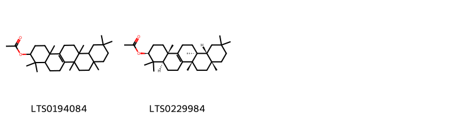
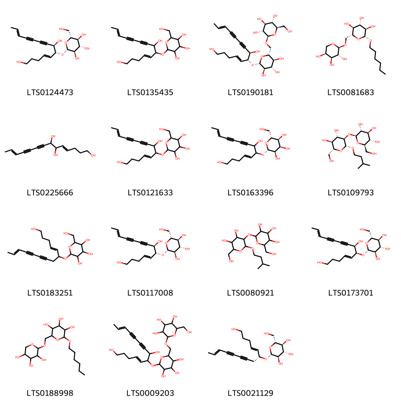
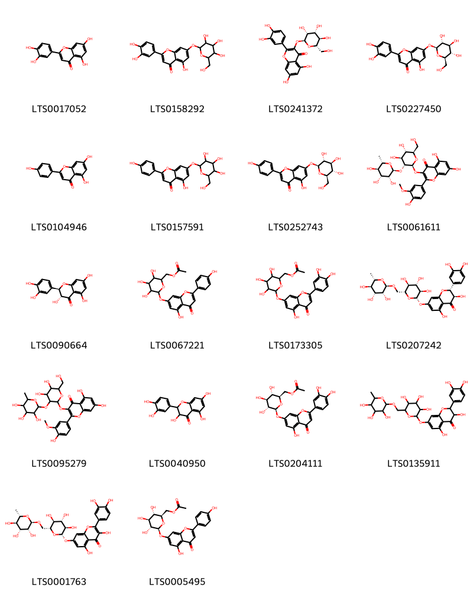
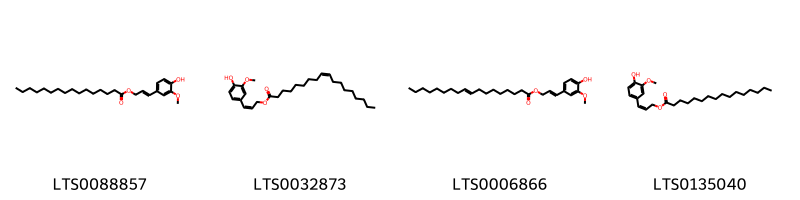

!!! abstract "Tóm tắt"

    Cát cánh (Radix Platycodi grandiflori) là rễ để nguyên hoặc đã cạo vỏ ngoài, phơi hoặc sấy khô của cây Cát cánh (Platycodon grandiflorum (Jacq.) A. DC.), thuộc họ Hoa chuông (Campanulaceae). Cát cánh phân bố chủ yếu ở các khu vực châu Á. Ngoài ra, cây cũng được du nhập vào một số quốc gia ở châu Âu và châu Mỹ. Cát cánh được nhập vào Việt Nam khoảng gần 40 năm trước và hiện được trồng ở các khu vực như Sapa, Tam Đảo, Lào Cai, Nam Định, Hà Nam, và Thái Bình. Theo y học cổ truyền, Cát cánh có vị đắng, tính bình, với công năng ôn hóa hàn đàm, trừ mủ, và lợi hầu họng. Cát cánh được dùng chủ trị các chứng ho đờm nhiều, ngực tức, họng đau, tiếng khàn, áp xe phổi, tiêu mủ, và mụn nhọt. Thành phần hóa học chính của Cát cánh là nhóm saponin, bao gồm hoạt chất tiêu biểu như platycoside E (C69H112O38), được ghi nhận trong Dược điển Hong Kong. Các thành phần này có tác dụng trừ đờm và phá huyết cao, mang lại hiệu quả trong điều trị các bệnh về hô hấp và các tình trạng viêm nhiễm.

## Thông tin về thực vật

Dược liệu **Cát Cánh (Rễ)** từ bộ phận **Rễ** từ loài *Platycodon grandiflorum*.

**Mô tả thực vật:** Cát cánh là một loại cỏ nhỏ, mọc lâu năm. Thân cao chừng 60cm-90cm. Lá gần như không có cuống; lá phía dưới mọc đối hoặc mọc vòng 3-4 lá. Phiến lá hình trứng, mép có răng cưa to. Lá phía trên nhỏ, có khi mọc so le, dài từ 3-6cm, rộng 1-2,5cm. Hoa mọc đơn độc hoặc thành bóng thưa. Đài màu xanh, hình chuông rộng, dài 1cm, mép có 5 răng; tràng hoa hình chuông, màu lam tím hay màu trắng, đường kính 3-5cm. Quả hình trứng ngược. Mùa hoa tháng 5-8, mùa quả tháng 7-9.

*Tài liệu tham khảo:* "Những cây thuốc và vị thuốc Việt Nam" - Đỗ Tất Lợi 
Trong dược điển Việt nam, một loài được sử dụng làm dược liệu là *Platycodon grandiflorum*.

!!! info "Phân loại thực vật của *Platycodon grandiflorus*"
    - **Kingdom:** Plantae
    - **Phylum:** Tracheophyta
    - **Order:** Asterales
    - **Family:** Campanulaceae
    - **Genus:** Platycodon
    - **Species:** *Platycodon grandiflorus*

**Phân bố trên thế giới:** Germany, nan, Switzerland, Korea, Republic of, Netherlands, Belgium, Hungary, Spain, Sweden, Hong Kong, Japan, Russian Federation, United Kingdom of Great Britain and Northern Ireland, United States of America, China, Italy, Canada, Denmark, Austria, Luxembourg

**Phân bố tại Việt nam:** Không có ghi nhận ở Việt Nam

## Thông tin về dược liệu 

### Định danh

!!! info "Thông tin về tên gọi"

    - Dược liệu tiếng Việt: cát cánh
    - Dược liệu tiếng Trung: 桔梗 (Jie Geng)
    - Dược liệu tiếng Anh: Platycodon Grandiflorum
    - Dược liệu latin thông dụng: Radix Platycodi grandiflorinRadix Platycodi
    - Dược liệu latin kiểu DĐVN: *radix platycodi grandiflori*
    - Dược liệu latin kiểu DĐVN: *Radix Platycodi*
    - Dược liệu latin kiểu thông tư: *Radix Platycodi grandiflori*
    - Bộ phận dùng: Rễ (Radix)

### Mô tả dược liệu 

- **Theo dược điển Việt nam V:** 
Rễ hình trụ thuôn dần về phía dưới hoặc có dạng hình trụ nhỏ và dài, hơi vặn xoăn lại, đôi khi phân nhánh, dài 7 cm đến 20 cm, đường kính 0,7 cm đến 2 cm. Phần đỉnh rễ còn sót lại một đoạn ngắn của thân rễ mang nhiều sẹo nhỏ là vết tích của gốc thân. Mặt ngoài màu vàng nhạt hay vàng nâu nhạt, có nhiều rãnh nhăn nheo theo chiều dọc và những nếp nhăn ngang. Thể chất giòn, mặt bẻ không phẳng. Mặt cắt ngang có phần vỏ màu trắng hoặc hơi vàng, phần gỗ màu trắng ngà hoặc nâu nhạt; tầng phát sinh libe- gỗ thành vòng rõ, màu nâu, nâu nhạt. Không mùi hoặc có mùi đường cháy nhẹ, vị ngọt sau hơi đắng. Dược liệu thái lát: Các phiến mỏng, hình tròn hoặc không đều, thường có vỏ còn sót lại. Mặt cắt có phần ngoài màu trắng nhạt, tương đối hẹp, hình thành tầng vân vỏng màu nâu nhạt. Phần gỗ rộng có nhiều khe nứt. Chất giòn, dễ bẻ gãy, mùi thơm nhẹ, vị ngọt, sau đấng. Khi dùng chích gừng.

- **Mô tả dược liệu theo thông tư chế biến dược liệu theo phương pháp cổ truyền:** 

### Chế biến 

- **Chế biến theo dược điển việt nam V**: 
Thu hoạch vào mùa thu đông hoặc mùa xuân. Đào lấy rễ, cắt bỏ đầu rễ và rễ con, rửa sạch, để ráo nước hoặc ủ khoảng 12 h, thái lát mỏng phơi hay sấy khô.

- **Chế biến theo thông tư:** 

--- 

## Thành phần hóa học

- Theo tài liệu của GS. Đỗ Tất Lợi:  (1) Saponin
(2) Biomaker trong dược điển Việt Nam là platycodin D
      Biomaker trong dược điển Hồng Kông là platycoside E
    

**Thành phần hóa học từ loài **Platycodon grandiflorum**

Theo cơ sở dữ liệu lotus, loài *Platycodon grandiflorum* đã phân lập và xác định được **145** hoạt chất thuộc về các nhóm Steroids and steroid derivatives, Organooxygen compounds, Flavonoids, Fatty Acyls, Phenols, Carboxylic acids and derivatives, Benzene and substituted derivatives, Prenol lipids trong bảng dưới đây. Danh sách các hoạt chất như sau platycodin d3 [(LTS0114585)](https://lotus.naturalproducts.net/compound/lotus_id/LTS0114585), (2s,3r,4s,5s)-3-{[(2s,3r,4s,5r,6s)-3,4-dihydroxy-6-methyl-5-{[(2s,3r,4s,5r)-3,4,5-trihydroxyoxan-2-yl]oxy}oxan-2-yl]oxy}-4,5-dihydroxyoxan-2-yl (1s,2r,5r,6s,8r,9r,14s,18r,19r,21s,24r)-8-hydroxy-1-(hydroxymethyl)-5,6,12,12,19-pentamethyl-23-oxo-24-{[(2r,3r,4s,5s,6r)-3,4,5-trihydroxy-6-(hydroxymethyl)oxan-2-yl]oxy}-22-oxahexacyclo[19.2.1.0²,¹⁹.0⁵,¹⁸.0⁶,¹⁵.0⁹,¹⁴]tetracos-15-ene-9-carboxylate [(LTS0017234)](https://lotus.naturalproducts.net/compound/lotus_id/LTS0017234), 2,3-dihydroquercetin [(LTS0040950)](https://lotus.naturalproducts.net/compound/lotus_id/LTS0040950), (2s,3r,4s,5s)-3-{[(2s,3r,4s,5s,6s)-4-(acetyloxy)-3-hydroxy-6-methyl-5-{[(2s,3r,4s,5r)-3,4,5-trihydroxyoxan-2-yl]oxy}oxan-2-yl]oxy}-4,5-dihydroxyoxan-2-yl (4ar,5r,6as,6br,8ar,10r,11s,12ar,12br,14bs)-5,11-dihydroxy-9,9-bis(hydroxymethyl)-2,2,6a,6b,12a-pentamethyl-10-{[(2r,3r,4s,5s,6r)-3,4,5-trihydroxy-6-(hydroxymethyl)oxan-2-yl]oxy}-1,3,4,5,6,7,8,8a,10,11,12,12b,13,14b-tetradecahydropicene-4a-carboxylate [(LTS0139165)](https://lotus.naturalproducts.net/compound/lotus_id/LTS0139165), deapio-platycodin d3 [(LTS0125134)](https://lotus.naturalproducts.net/compound/lotus_id/LTS0125134), methyl 5,11-dihydroxy-9,9-bis(hydroxymethyl)-2,2,6a,6b,12a-pentamethyl-10-{[3,4,5-trihydroxy-6-(hydroxymethyl)oxan-2-yl]oxy}-1,3,4,5,6,7,8,8a,10,11,12,12b,13,14b-tetradecahydropicene-4a-carboxylate [(LTS0100830)](https://lotus.naturalproducts.net/compound/lotus_id/LTS0100830), 2-(hexyloxy)-6-{[(3,4,5-trihydroxyoxan-2-yl)oxy]methyl}oxane-3,4,5-triol [(LTS0188998)](https://lotus.naturalproducts.net/compound/lotus_id/LTS0188998), (1s,2r,5r,6s,8r,9r,14s,18r,19r,21s,24r)-8-hydroxy-1-(hydroxymethyl)-5,6,12,12,19-pentamethyl-23-oxo-24-{[(2r,3r,4s,5s,6r)-3,4,5-trihydroxy-6-(hydroxymethyl)oxan-2-yl]oxy}-22-oxahexacyclo[19.2.1.0²,¹⁹.0⁵,¹⁸.0⁶,¹⁵.0⁹,¹⁴]tetracos-15-ene-9-carboxylic acid [(LTS0094042)](https://lotus.naturalproducts.net/compound/lotus_id/LTS0094042), platycodin d [(LTS0232351)](https://lotus.naturalproducts.net/compound/lotus_id/LTS0232351), (2s,3r,4s,4ar,6ar,6bs,8r,8ar,12as,14ar,14br)-8a-({[(2s,3r,4s,5s)-3-{[(2s,3r,4s,5s,6s)-4-(acetyloxy)-5-{[(2s,3r,4s,5r)-4-{[(2s,3r,4r)-3,4-dihydroxy-4-(hydroxymethyl)oxolan-2-yl]oxy}-3,5-dihydroxyoxan-2-yl]oxy}-3-hydroxy-6-methyloxan-2-yl]oxy}-4,5-dihydroxyoxan-2-yl]oxy}carbonyl)-2,8-dihydroxy-4-(hydroxymethyl)-6a,6b,11,11,14b-pentamethyl-3-{[(2r,3r,4s,5s,6r)-3,4,5-trihydroxy-6-(hydroxymethyl)oxan-2-yl]oxy}-1,2,3,4a,5,6,7,8,9,10,12,12a,14,14a-tetradecahydropicene-4-carboxylic acid [(LTS0221916)](https://lotus.naturalproducts.net/compound/lotus_id/LTS0221916), 3-(3-hydroxy-4-{[3,4,5-trihydroxy-6-(hydroxymethyl)oxan-2-yl]oxy}phenyl)prop-2-enoic acid [(LTS0007465)](https://lotus.naturalproducts.net/compound/lotus_id/LTS0007465), (2r,3s,4s,5s)-3-{[(2s,3r,4s,5r,6s)-3,4-dihydroxy-6-methyl-5-{[(2s,3r,4s,5r)-3,4,5-trihydroxyoxan-2-yl]oxy}oxan-2-yl]oxy}-4,5-dihydroxyoxan-2-yl (4ar,5r,6as,6br,8ar,9r,10r,11s,12ar,12br,14bs)-5,11-dihydroxy-9-(hydroxymethyl)-2,2,6a,6b,9,12a-hexamethyl-10-{[(2r,3r,4s,5s,6r)-3,4,5-trihydroxy-6-({[(2r,3r,4s,5s,6r)-3,4,5-trihydroxy-6-({[(2r,3r,4s,5s,6r)-3,4,5-trihydroxy-6-(hydroxymethyl)oxan-2-yl]oxy}methyl)oxan-2-yl]oxy}methyl)oxan-2-yl]oxy}-1,3,4,5,6,7,8,8a,10,11,12,12b,13,14b-tetradecahydropicene-4a-carboxylate [(LTS0243765)](https://lotus.naturalproducts.net/compound/lotus_id/LTS0243765), 3-({5-[(4-{[3,4-dihydroxy-4-(hydroxymethyl)oxolan-2-yl]oxy}-3,5-dihydroxyoxan-2-yl)oxy]-3,4-dihydroxy-6-methyloxan-2-yl}oxy)-4,5-dihydroxyoxan-2-yl 10-{[3,5-dihydroxy-6-(hydroxymethyl)-4-{[3,4,5-trihydroxy-6-(hydroxymethyl)oxan-2-yl]oxy}oxan-2-yl]oxy}-5,11-dihydroxy-9,9-bis(hydroxymethyl)-2,2,6a,6b,12a-pentamethyl-1,3,4,5,6,7,8,8a,10,11,12,12b,13,14b-tetradecahydropicene-4a-carboxylate [(LTS0199147)](https://lotus.naturalproducts.net/compound/lotus_id/LTS0199147), (2r,3r,4s,5s,6r)-2-{[(4e,6s,7r,12e)-1,7-dihydroxytetradeca-4,12-dien-8,10-diyn-6-yl]oxy}-6-(hydroxymethyl)oxane-3,4,5-triol [(LTS0173701)](https://lotus.naturalproducts.net/compound/lotus_id/LTS0173701), 4,4,6b,8a,11,11,12b,14b-octamethyl-1,2,3,4a,5,6,7,8,9,10,12,12a,13,14-tetradecahydropicen-3-yl acetate [(LTS0194084)](https://lotus.naturalproducts.net/compound/lotus_id/LTS0194084), 4-{[3-(3,4-dihydroxyphenyl)prop-2-enoyl]oxy}-1,3,5-trihydroxycyclohexane-1-carboxylic acid [(LTS0262595)](https://lotus.naturalproducts.net/compound/lotus_id/LTS0262595), (2z)-3-(4-hydroxy-3-methoxyphenyl)prop-2-en-1-yl (9z)-octadec-9-enoate [(LTS0032873)](https://lotus.naturalproducts.net/compound/lotus_id/LTS0032873), [(1s,4s,5r,6s,8r,9r,13s,16s,18s)-11-ethyl-8,9-dihydroxy-4,6,16,18-tetramethoxy-11-azahexacyclo[7.7.2.1²,⁵.0¹,¹⁰.0³,⁸.0¹³,¹⁷]nonadecan-13-yl]methyl 2-aminobenzoate [(LTS0153720)](https://lotus.naturalproducts.net/compound/lotus_id/LTS0153720), 8a-[3-({5-[(4-{[3,4-dihydroxy-4-(hydroxymethyl)oxolan-2-yl]oxy}-3,5-dihydroxyoxan-2-yl)oxy]-3,4-dihydroxy-6-methyloxan-2-yl}oxy)-4,5-dihydroxyoxan-2-yl] 4-methyl 2,8-dihydroxy-4-(hydroxymethyl)-6a,6b,11,11,14b-pentamethyl-3-{[3,4,5-trihydroxy-6-(hydroxymethyl)oxan-2-yl]oxy}-1,2,3,4a,5,6,7,8,9,10,12,12a,14,14a-tetradecahydropicene-4,8a-dicarboxylate [(LTS0253778)](https://lotus.naturalproducts.net/compound/lotus_id/LTS0253778), alnulin [(LTS0076238)](https://lotus.naturalproducts.net/compound/lotus_id/LTS0076238), (2z)-3-(4-hydroxy-3-methoxyphenyl)prop-2-en-1-yl hexadecanoate [(LTS0135040)](https://lotus.naturalproducts.net/compound/lotus_id/LTS0135040), luteolin 7-o-glucoside [(LTS0227450)](https://lotus.naturalproducts.net/compound/lotus_id/LTS0227450), (2r,3r,4r,5s,6r)-2-[(1,7-dihydroxytetradeca-4,12-dien-8,10-diyn-6-yl)oxy]-6-(hydroxymethyl)oxane-3,4,5-triol [(LTS0163396)](https://lotus.naturalproducts.net/compound/lotus_id/LTS0163396), (2s,3r,4s,5s)-3-{[(2s,3r,4s,5r,6s)-5-{[(2s,3r,4s,5r)-4-{[(2s,3r,4r)-3,4-dihydroxy-4-(hydroxymethyl)oxolan-2-yl]oxy}-3,5-dihydroxyoxan-2-yl]oxy}-3,4-dihydroxy-6-methyloxan-2-yl]oxy}-4,5-dihydroxyoxan-2-yl (4as,6as,6br,8ar,9r,10r,11s,12ar,12br,14bs)-11-hydroxy-9-(hydroxymethyl)-2,2,6a,6b,9,12a-hexamethyl-10-{[(2r,3r,4s,5s,6r)-3,4,5-trihydroxy-6-({[(2r,3r,4s,5s,6r)-3,4,5-trihydroxy-6-({[(2r,3r,4s,5s,6r)-3,4,5-trihydroxy-6-(hydroxymethyl)oxan-2-yl]oxy}methyl)oxan-2-yl]oxy}methyl)oxan-2-yl]oxy}-1,3,4,5,6,7,8,8a,10,11,12,12b,13,14b-tetradecahydropicene-4a-carboxylate [(LTS0056619)](https://lotus.naturalproducts.net/compound/lotus_id/LTS0056619), (2r,3r,4r,5r)-3-{[(2s,3r,4s,5r,6s)-3,4-dihydroxy-6-methyl-5-{[(2s,3r,4s,5r)-3,4,5-trihydroxyoxan-2-yl]oxy}oxan-2-yl]oxy}-4,5-dihydroxyoxan-2-yl (4ar,5r,6as,6br,8ar,9r,10r,11s,12ar,12br,14bs)-5,11-dihydroxy-9-(hydroxymethyl)-2,2,6a,6b,9,12a-hexamethyl-10-{[(2r,3r,4s,5s,6r)-3,4,5-trihydroxy-6-(hydroxymethyl)oxan-2-yl]oxy}-1,3,4,5,6,7,8,8a,10,11,12,12b,13,14b-tetradecahydropicene-4a-carboxylate [(LTS0124222)](https://lotus.naturalproducts.net/compound/lotus_id/LTS0124222), 3-({5-[(4-{[3,4-dihydroxy-4-(hydroxymethyl)oxolan-2-yl]oxy}-3,5-dihydroxyoxan-2-yl)oxy]-3,4-dihydroxy-6-methyloxan-2-yl}oxy)-4,5-dihydroxyoxan-2-yl 5,11-dihydroxy-9,9-bis(hydroxymethyl)-2,2,6a,6b,12a-pentamethyl-10-{[3,4,5-trihydroxy-6-({[3,4,5-trihydroxy-6-(hydroxymethyl)oxan-2-yl]oxy}methyl)oxan-2-yl]oxy}-1,3,4,5,6,7,8,8a,10,11,12,12b,13,14b-tetradecahydropicene-4a-carboxylate [(LTS0162013)](https://lotus.naturalproducts.net/compound/lotus_id/LTS0162013), platycodin d2 [(LTS0177685)](https://lotus.naturalproducts.net/compound/lotus_id/LTS0177685), methyl 10-{[3,5-dihydroxy-6-(hydroxymethyl)-4-{[3,4,5-trihydroxy-6-(hydroxymethyl)oxan-2-yl]oxy}oxan-2-yl]oxy}-5,11-dihydroxy-9,9-bis(hydroxymethyl)-2,2,6a,6b,12a-pentamethyl-1,3,4,5,6,7,8,8a,10,11,12,12b,13,14b-tetradecahydropicene-4a-carboxylate [(LTS0033701)](https://lotus.naturalproducts.net/compound/lotus_id/LTS0033701), 3-({3,4-dihydroxy-6-methyl-5-[(3,4,5-trihydroxyoxan-2-yl)oxy]oxan-2-yl}oxy)-4,5-dihydroxyoxan-2-yl 5,11-dihydroxy-9,9-bis(hydroxymethyl)-2,2,6a,6b,12a-pentamethyl-10-{[3,4,5-trihydroxy-6-({[3,4,5-trihydroxy-6-(hydroxymethyl)oxan-2-yl]oxy}methyl)oxan-2-yl]oxy}-1,3,4,5,6,7,8,8a,10,11,12,12b,13,14b-tetradecahydropicene-4a-carboxylate [(LTS0037457)](https://lotus.naturalproducts.net/compound/lotus_id/LTS0037457), [(2r,3s,4s,5r,6s)-6-{[2-(3,4-dihydroxyphenyl)-5-hydroxy-4-oxochromen-7-yl]oxy}-3,4,5-trihydroxyoxan-2-yl]methyl acetate [(LTS0204111)](https://lotus.naturalproducts.net/compound/lotus_id/LTS0204111), luteolin [(LTS0017052)](https://lotus.naturalproducts.net/compound/lotus_id/LTS0017052), 3-({5-[(4-{[3,4-dihydroxy-4-(hydroxymethyl)oxolan-2-yl]oxy}-3,5-dihydroxyoxan-2-yl)oxy]-3,4-dihydroxy-6-methyloxan-2-yl}oxy)-4,5-dihydroxyoxan-2-yl 5,11-dihydroxy-9-(hydroxymethyl)-2,2,6a,6b,9,12a-hexamethyl-10-{[3,4,5-trihydroxy-6-(hydroxymethyl)oxan-2-yl]oxy}-1,3,4,5,6,7,8,8a,10,11,12,12b,13,14b-tetradecahydropicene-4a-carboxylate [(LTS0057785)](https://lotus.naturalproducts.net/compound/lotus_id/LTS0057785), (2s,3r,4s,5s)-3-{[(2s,3r,4s,5r,6s)-3,4-dihydroxy-6-methyl-5-{[(2s,3r,4s,5r)-3,4,5-trihydroxyoxan-2-yl]oxy}oxan-2-yl]oxy}-4,5-dihydroxyoxan-2-yl (4ar,5r,6as,6br,8ar,10r,11s,12ar)-5,11-dihydroxy-9,9-bis(hydroxymethyl)-2,2,6a,6b,12a-pentamethyl-10-{[(2r,3r,4s,5s,6r)-3,4,5-trihydroxy-6-(hydroxymethyl)oxan-2-yl]oxy}-1,3,4,5,6,7,8,8a,10,11,12,12b,13,14b-tetradecahydropicene-4a-carboxylate [(LTS0080910)](https://lotus.naturalproducts.net/compound/lotus_id/LTS0080910), (2s,3r,4s,4ar,6ar,6bs,8r,8ar,12as,14ar,14br)-8a-({[(2s,3r,4s,5s)-3-{[(2s,3r,4s,5r,6s)-3,4-dihydroxy-6-methyl-5-{[(2s,3r,4s,5r)-3,4,5-trihydroxyoxan-2-yl]oxy}oxan-2-yl]oxy}-4,5-dihydroxyoxan-2-yl]oxy}carbonyl)-2,8-dihydroxy-4-(hydroxymethyl)-6a,6b,11,11,14b-pentamethyl-3-{[(2r,3r,4s,5s,6r)-3,4,5-trihydroxy-6-({[(2r,3r,4s,5s,6r)-3,4,5-trihydroxy-6-(hydroxymethyl)oxan-2-yl]oxy}methyl)oxan-2-yl]oxy}-1,2,3,4a,5,6,7,8,9,10,12,12a,14,14a-tetradecahydropicene-4-carboxylic acid [(LTS0154707)](https://lotus.naturalproducts.net/compound/lotus_id/LTS0154707), methyl 5,11-dihydroxy-9-(hydroxymethyl)-2,2,6a,6b,9,12a-hexamethyl-10-{[3,4,5-trihydroxy-6-(hydroxymethyl)oxan-2-yl]oxy}-1,3,4,5,6,7,8,8a,10,11,12,12b,13,14b-tetradecahydropicene-4a-carboxylate [(LTS0095420)](https://lotus.naturalproducts.net/compound/lotus_id/LTS0095420), 3-({3,4-dihydroxy-6-methyl-5-[(3,4,5-trihydroxyoxan-2-yl)oxy]oxan-2-yl}oxy)-4,5-dihydroxyoxan-2-yl 5,11-dihydroxy-9,9-bis(hydroxymethyl)-2,2,6a,6b,12a-pentamethyl-10-{[3,4,5-trihydroxy-6-({[3,4,5-trihydroxy-6-({[3,4,5-trihydroxy-6-(hydroxymethyl)oxan-2-yl]oxy}methyl)oxan-2-yl]oxy}methyl)oxan-2-yl]oxy}-1,3,4,5,6,7,8,8a,10,11,12,12b,13,14b-tetradecahydropicene-4a-carboxylate [(LTS0230077)](https://lotus.naturalproducts.net/compound/lotus_id/LTS0230077), 8a-(2s,3r,4s,5s)-3-{[(2s,3r,4s,5r,6s)-5-{[(2s,3r,4s,5r)-4-{[(2s,3r,4r)-3,4-dihydroxy-4-(hydroxymethyl)oxolan-2-yl]oxy}-3,5-dihydroxyoxan-2-yl]oxy}-3,4-dihydroxy-6-methyloxan-2-yl]oxy}-4,5-dihydroxyoxan-2-yl 4-methyl (2s,3r,4s,4ar,6ar,6bs,8r,8ar,12as,14ar,14br)-8-hydroxy-4-(hydroxymethyl)-2-methoxy-6a,6b,11,11,14b-pentamethyl-3-{[(2r,3r,4s,5s,6r)-3,4,5-trihydroxy-6-(hydroxymethyl)oxan-2-yl]oxy}-1,2,3,4a,5,6,7,8,9,10,12,12a,14,14a-tetradecahydropicene-4,8a-dicarboxylate [(LTS0171250)](https://lotus.naturalproducts.net/compound/lotus_id/LTS0171250), (2s,3r,4s,5s)-3-{[(2s,3r,4r,5r,6s)-3-(acetyloxy)-5-{[(2s,3r,4s,5r)-4-{[(2s,3r,4r)-3,4-dihydroxy-4-(hydroxymethyl)oxolan-2-yl]oxy}-3,5-dihydroxyoxan-2-yl]oxy}-4-hydroxy-6-methyloxan-2-yl]oxy}-4,5-dihydroxyoxan-2-yl (4ar,5r,6as,6br,8ar,9r,10r,11s,12ar,12br,14bs)-10-{[(2r,3r,4s,5r,6r)-3,5-dihydroxy-6-(hydroxymethyl)-4-{[(2s,3r,4s,5s,6r)-3,4,5-trihydroxy-6-(hydroxymethyl)oxan-2-yl]oxy}oxan-2-yl]oxy}-5,11-dihydroxy-9-(hydroxymethyl)-2,2,6a,6b,9,12a-hexamethyl-1,3,4,5,6,7,8,8a,10,11,12,12b,13,14b-tetradecahydropicene-4a-carboxylate [(LTS0084976)](https://lotus.naturalproducts.net/compound/lotus_id/LTS0084976), methyl 10-{[3,5-dihydroxy-6-(hydroxymethyl)-4-{[3,4,5-trihydroxy-6-(hydroxymethyl)oxan-2-yl]oxy}oxan-2-yl]oxy}-5,11-dihydroxy-9-(hydroxymethyl)-2,2,6a,6b,9,12a-hexamethyl-1,3,4,5,6,7,8,8a,10,11,12,12b,13,14b-tetradecahydropicene-4a-carboxylate [(LTS0148211)](https://lotus.naturalproducts.net/compound/lotus_id/LTS0148211), (2e)-3-(3-hydroxy-4-{[(2s,3r,4s,5s,6r)-3,4,5-trihydroxy-6-(hydroxymethyl)oxan-2-yl]oxy}phenyl)prop-2-enoic acid [(LTS0148993)](https://lotus.naturalproducts.net/compound/lotus_id/LTS0148993), 3-({5-[(4-{[3,4-dihydroxy-4-(hydroxymethyl)oxolan-2-yl]oxy}-3,5-dihydroxyoxan-2-yl)oxy]-3,4-dihydroxy-6-methyloxan-2-yl}oxy)-4,5-dihydroxyoxan-2-yl 8-hydroxy-1-(hydroxymethyl)-5,6,12,12,19-pentamethyl-23-oxo-24-{[3,4,5-trihydroxy-6-(hydroxymethyl)oxan-2-yl]oxy}-22-oxahexacyclo[19.2.1.0²,¹⁹.0⁵,¹⁸.0⁶,¹⁵.0⁹,¹⁴]tetracos-15-ene-9-carboxylate [(LTS0069118)](https://lotus.naturalproducts.net/compound/lotus_id/LTS0069118), 3-({5-[(4-{[(4r)-3,4-dihydroxy-4-(hydroxymethyl)oxolan-2-yl]oxy}-3,5-dihydroxyoxan-2-yl)oxy]-3,4-dihydroxy-6-methyloxan-2-yl}oxy)-4,5-dihydroxyoxan-2-yl (6as,6br,8as,9s,12ar,12br,14br)-5,11-dihydroxy-9-(hydroxymethyl)-2,2,6a,6b,9,12a-hexamethyl-10-{[3,4,5-trihydroxy-6-(hydroxymethyl)oxan-2-yl]oxy}-1,3,4,5,6,7,8,8a,10,11,12,12b,13,14b-tetradecahydropicene-4a-carboxylate [(LTS0257172)](https://lotus.naturalproducts.net/compound/lotus_id/LTS0257172), (2r,3r,4s,5s,6r)-2-{[(4e,6r,7r,12e)-1,7-dihydroxytetradeca-4,12-dien-8,10-diyn-6-yl]oxy}-6-(hydroxymethyl)oxane-3,4,5-triol [(LTS0124473)](https://lotus.naturalproducts.net/compound/lotus_id/LTS0124473), 2-(3,4-dihydroxyphenyl)-5,7-dihydroxy-3-{[(2s,3r,4r,5r,6s)-3,4,5-trihydroxy-6-(hydroxymethyl)oxan-2-yl]oxy}chromen-4-one [(LTS0241372)](https://lotus.naturalproducts.net/compound/lotus_id/LTS0241372), (4ar,6as,6br,8ar,12ar,12bs,14bs)-5,10,11-trihydroxy-9,9-bis(hydroxymethyl)-2,2,6a,6b,12a-pentamethyl-1,3,4,5,6,7,8,8a,10,11,12,12b,13,14b-tetradecahydropicene-4a-carboxylic acid [(LTS0018824)](https://lotus.naturalproducts.net/compound/lotus_id/LTS0018824), 8a-{[(3-{[4-(acetyloxy)-5-[(4-{[3,4-dihydroxy-4-(hydroxymethyl)oxolan-2-yl]oxy}-3,5-dihydroxyoxan-2-yl)oxy]-3-hydroxy-6-methyloxan-2-yl]oxy}-4,5-dihydroxyoxan-2-yl)oxy]carbonyl}-2,8-dihydroxy-4-(hydroxymethyl)-6a,6b,11,11,14b-pentamethyl-3-{[3,4,5-trihydroxy-6-(hydroxymethyl)oxan-2-yl]oxy}-1,2,3,4a,5,6,7,8,9,10,12,12a,14,14a-tetradecahydropicene-4-carboxylic acid [(LTS0210109)](https://lotus.naturalproducts.net/compound/lotus_id/LTS0210109), (4ar,5r,6as,6br,8ar,10r,11s,12ar,12br,14bs)-5,11-dihydroxy-9,9-bis(hydroxymethyl)-2,2,6a,6b,12a-pentamethyl-10-{[(2r,3r,4s,5s,6r)-3,4,5-trihydroxy-6-({[(2r,4s,5s,6r)-3,4,5-trihydroxy-6-(hydroxymethyl)oxan-2-yl]oxy}methyl)oxan-2-yl]oxy}-1,3,4,5,6,7,8,8a,10,11,12,12b,13,14b-tetradecahydropicene-4a-carboxylic acid [(LTS0223238)](https://lotus.naturalproducts.net/compound/lotus_id/LTS0223238), 2-{[4,5-dihydroxy-6-(hydroxymethyl)-2-(3-methylbutoxy)oxan-3-yl]oxy}-6-(hydroxymethyl)oxane-3,4,5-triol [(LTS0080921)](https://lotus.naturalproducts.net/compound/lotus_id/LTS0080921), (2s,3r,4s,5s)-3-{[(2s,3r,4r,5r,6s)-3-(acetyloxy)-4-hydroxy-6-methyl-5-{[(2s,3r,4s,5r)-3,4,5-trihydroxyoxan-2-yl]oxy}oxan-2-yl]oxy}-4,5-dihydroxyoxan-2-yl (4ar,5r,6as,6br,8ar,10r,11s,12ar,12br,14bs)-5,11-dihydroxy-9,9-bis(hydroxymethyl)-2,2,6a,6b,12a-pentamethyl-10-{[(2r,3r,4s,5s,6r)-3,4,5-trihydroxy-6-(hydroxymethyl)oxan-2-yl]oxy}-1,3,4,5,6,7,8,8a,10,11,12,12b,13,14b-tetradecahydropicene-4a-carboxylate [(LTS0099495)](https://lotus.naturalproducts.net/compound/lotus_id/LTS0099495), (2r,3r,4s,5s,6r)-2-(hexyloxy)-6-({[(2s,3r,4s,5s)-3,4,5-trihydroxyoxan-2-yl]oxy}methyl)oxane-3,4,5-triol [(LTS0081683)](https://lotus.naturalproducts.net/compound/lotus_id/LTS0081683), (2s,3r,4s,4ar,6ar,6bs,8r,8ar,12as,14ar,14br)-8a-({[(2s,3r,4s,5s)-3-{[(2s,3r,4r,5r,6s)-3-(acetyloxy)-4-hydroxy-6-methyl-5-{[(2s,3r,4s,5r)-3,4,5-trihydroxyoxan-2-yl]oxy}oxan-2-yl]oxy}-4,5-dihydroxyoxan-2-yl]oxy}carbonyl)-2,8-dihydroxy-4-(hydroxymethyl)-6a,6b,11,11,14b-pentamethyl-3-{[(2r,3r,4s,5s,6r)-3,4,5-trihydroxy-6-(hydroxymethyl)oxan-2-yl]oxy}-1,2,3,4a,5,6,7,8,9,10,12,12a,14,14a-tetradecahydropicene-4-carboxylic acid [(LTS0195997)](https://lotus.naturalproducts.net/compound/lotus_id/LTS0195997), (3,4,5-trihydroxy-6-{[5-hydroxy-2-(4-hydroxyphenyl)-4-oxochromen-7-yl]oxy}oxan-2-yl)methyl acetate [(LTS0067221)](https://lotus.naturalproducts.net/compound/lotus_id/LTS0067221), cryptochlorogenic acid [(LTS0252404)](https://lotus.naturalproducts.net/compound/lotus_id/LTS0252404), (2r,3s,4r,5s)-3-{[(2s,3r,4s,5s,6s)-4-(acetyloxy)-3-hydroxy-6-methyl-5-{[(2s,3r,4s,5r)-3,4,5-trihydroxyoxan-2-yl]oxy}oxan-2-yl]oxy}-4,5-dihydroxyoxan-2-yl (4ar,5r,6as,6br,8ar,10r,11s,12as,12br,14bs)-5,11-dihydroxy-9,9-bis(hydroxymethyl)-2,2,6a,6b,12a-pentamethyl-10-{[(2r,3r,4s,5s,6r)-3,4,5-trihydroxy-6-(hydroxymethyl)oxan-2-yl]oxy}-1,3,4,5,6,7,8,8a,10,11,12,12b,13,14b-tetradecahydropicene-4a-carboxylate [(LTS0010453)](https://lotus.naturalproducts.net/compound/lotus_id/LTS0010453), (2s,3r,4s,5s,6r)-2-{[(2r,3r,4s,5s,6r)-4,5-dihydroxy-6-(hydroxymethyl)-2-(3-methylbutoxy)oxan-3-yl]oxy}-6-(hydroxymethyl)oxane-3,4,5-triol [(LTS0109793)](https://lotus.naturalproducts.net/compound/lotus_id/LTS0109793), (2s,3r,4s,5s)-3-{[(2s,3r,4s,5s,6s)-4-(acetyloxy)-5-{[(2s,3r,4s,5r)-4-{[(2s,3r,4r)-3,4-dihydroxy-4-(hydroxymethyl)oxolan-2-yl]oxy}-3,5-dihydroxyoxan-2-yl]oxy}-3-hydroxy-6-methyloxan-2-yl]oxy}-4,5-dihydroxyoxan-2-yl (4ar,5r,6as,6br,8ar,9r,10r,11s,12ar,12br,14bs)-10-{[(2r,3r,4s,5r,6r)-3,5-dihydroxy-6-(hydroxymethyl)-4-{[(2s,3r,4s,5s,6r)-3,4,5-trihydroxy-6-(hydroxymethyl)oxan-2-yl]oxy}oxan-2-yl]oxy}-5,11-dihydroxy-9-(hydroxymethyl)-2,2,6a,6b,9,12a-hexamethyl-1,3,4,5,6,7,8,8a,10,11,12,12b,13,14b-tetradecahydropicene-4a-carboxylate [(LTS0126405)](https://lotus.naturalproducts.net/compound/lotus_id/LTS0126405), 2-(hydroxymethyl)-6-[(1-hydroxytetradeca-4,12-dien-8,10-diyn-6-yl)oxy]oxane-3,4,5-triol [(LTS0183251)](https://lotus.naturalproducts.net/compound/lotus_id/LTS0183251), 3-({5-[(4-{[3,4-dihydroxy-4-(hydroxymethyl)oxolan-2-yl]oxy}-3,5-dihydroxyoxan-2-yl)oxy]-3,4-dihydroxy-6-methyloxan-2-yl}oxy)-4,5-dihydroxyoxan-2-yl 5,11-dihydroxy-9,9-bis(hydroxymethyl)-2,2,6a,6b,12a-pentamethyl-10-{[3,4,5-trihydroxy-6-(hydroxymethyl)oxan-2-yl]oxy}-1,3,4,5,6,7,8,8a,10,11,12,12b,13,14b-tetradecahydropicene-4a-carboxylate [(LTS0196525)](https://lotus.naturalproducts.net/compound/lotus_id/LTS0196525), platyconic acid a [(LTS0182816)](https://lotus.naturalproducts.net/compound/lotus_id/LTS0182816), 1-(5-ethyl-6-methylhept-3-en-2-yl)-9a,11a-dimethyl-1h,2h,3h,3ah,5h,5ah,6h,7h,8h,9h,9bh,10h,11h-cyclopenta[a]phenanthren-7-ol [(LTS0173223)](https://lotus.naturalproducts.net/compound/lotus_id/LTS0173223), (2s,3r,4s,5s)-3-{[(2s,3r,4s,5s,6s)-4-(acetyloxy)-5-{[(2s,3r,4s,5r)-4-{[(2s,3r,4r)-3,4-dihydroxy-4-(hydroxymethyl)oxolan-2-yl]oxy}-3,5-dihydroxyoxan-2-yl]oxy}-3-hydroxy-6-methyloxan-2-yl]oxy}-4,5-dihydroxyoxan-2-yl (4ar,5r,6as,6br,8ar,9r,10r,11s,12ar,12br,14bs)-5,11-dihydroxy-9-(hydroxymethyl)-2,2,6a,6b,9,12a-hexamethyl-10-{[(2r,3r,4s,5s,6r)-3,4,5-trihydroxy-6-(hydroxymethyl)oxan-2-yl]oxy}-1,3,4,5,6,7,8,8a,10,11,12,12b,13,14b-tetradecahydropicene-4a-carboxylate [(LTS0150132)](https://lotus.naturalproducts.net/compound/lotus_id/LTS0150132), methyl (1s,2r,5r,6s,8r,9r,14s,18r,19r,21s,24r)-8-hydroxy-1-(hydroxymethyl)-5,6,12,12,19-pentamethyl-23-oxo-24-{[(2r,3r,4s,5s,6r)-3,4,5-trihydroxy-6-(hydroxymethyl)oxan-2-yl]oxy}-22-oxahexacyclo[19.2.1.0²,¹⁹.0⁵,¹⁸.0⁶,¹⁵.0⁹,¹⁴]tetracos-15-ene-9-carboxylate [(LTS0197901)](https://lotus.naturalproducts.net/compound/lotus_id/LTS0197901), 6-[(8a-{[(3-{[3-(acetyloxy)-5-[(4-{[3,4-dihydroxy-4-(hydroxymethyl)oxolan-2-yl]oxy}-3,5-dihydroxyoxan-2-yl)oxy]-4-hydroxy-6-methyloxan-2-yl]oxy}-4,5-dihydroxyoxan-2-yl)oxy]carbonyl}-2,8-dihydroxy-4,4-bis(hydroxymethyl)-6a,6b,11,11,14b-pentamethyl-1,2,3,4a,5,6,7,8,9,10,12,12a,14,14a-tetradecahydropicen-3-yl)oxy]-3,4,5-trihydroxyoxane-2-carboxylic acid [(LTS0146777)](https://lotus.naturalproducts.net/compound/lotus_id/LTS0146777), apigetrin [(LTS0157591)](https://lotus.naturalproducts.net/compound/lotus_id/LTS0157591), methyl (4ar,5r,6as,6br,8ar,10r,11s,12ar,12br,14bs)-5,11-dihydroxy-9,9-bis(hydroxymethyl)-2,2,6a,6b,12a-pentamethyl-10-{[(2r,3r,4s,5s,6r)-3,4,5-trihydroxy-6-({[(2r,3r,4s,5s,6r)-3,4,5-trihydroxy-6-(hydroxymethyl)oxan-2-yl]oxy}methyl)oxan-2-yl]oxy}-1,3,4,5,6,7,8,8a,10,11,12,12b,13,14b-tetradecahydropicene-4a-carboxylate [(LTS0167543)](https://lotus.naturalproducts.net/compound/lotus_id/LTS0167543), 6-[(8a-{[(3-{[4-(acetyloxy)-5-[(4-{[3,4-dihydroxy-4-(hydroxymethyl)oxolan-2-yl]oxy}-3,5-dihydroxyoxan-2-yl)oxy]-3-hydroxy-6-methyloxan-2-yl]oxy}-4,5-dihydroxyoxan-2-yl)oxy]carbonyl}-2,8-dihydroxy-4,4-bis(hydroxymethyl)-6a,6b,11,11,14b-pentamethyl-1,2,3,4a,5,6,7,8,9,10,12,12a,14,14a-tetradecahydropicen-3-yl)oxy]-3,4,5-trihydroxyoxane-2-carboxylic acid [(LTS0233200)](https://lotus.naturalproducts.net/compound/lotus_id/LTS0233200), 3-(4-hydroxy-3-methoxyphenyl)prop-2-en-1-yl octadec-9-enoate [(LTS0006866)](https://lotus.naturalproducts.net/compound/lotus_id/LTS0006866), 8a-({[3-({3,4-dihydroxy-6-methyl-5-[(3,4,5-trihydroxyoxan-2-yl)oxy]oxan-2-yl}oxy)-4,5-dihydroxyoxan-2-yl]oxy}carbonyl)-2,8-dihydroxy-4-(hydroxymethyl)-6a,6b,11,11,14b-pentamethyl-3-{[3,4,5-trihydroxy-6-({[3,4,5-trihydroxy-6-(hydroxymethyl)oxan-2-yl]oxy}methyl)oxan-2-yl]oxy}-1,2,3,4a,5,6,7,8,9,10,12,12a,14,14a-tetradecahydropicene-4-carboxylic acid [(LTS0173584)](https://lotus.naturalproducts.net/compound/lotus_id/LTS0173584), 5,10-dihydroxy-2,2,6a,6b,9,9,12a-heptamethyl-3,11-bis({[3,4,5-trihydroxy-6-(hydroxymethyl)oxan-2-yl]oxy})-1,3,4,5,6,7,8,8a,10,11,12,12b,13,14b-tetradecahydropicene-4a-carboxylic acid [(LTS0215260)](https://lotus.naturalproducts.net/compound/lotus_id/LTS0215260), 3''o-acetylplatycodin d [(LTS0230633)](https://lotus.naturalproducts.net/compound/lotus_id/LTS0230633), stigmast-5-en-3-ol, (3β)- [(LTS0204616)](https://lotus.naturalproducts.net/compound/lotus_id/LTS0204616), (2s,3s,4s,5r,6r)-6-{[(2s,3r,4ar,6ar,6bs,8r,8ar,12as,14ar,14br)-8a-({[(2s,3r,4s,5s)-3-{[(2s,3r,4s,5s,6s)-4-(acetyloxy)-5-{[(2s,3r,4s,5r)-4-{[(2s,3r,4r)-3,4-dihydroxy-4-(hydroxymethyl)oxolan-2-yl]oxy}-3,5-dihydroxyoxan-2-yl]oxy}-3-hydroxy-6-methyloxan-2-yl]oxy}-4,5-dihydroxyoxan-2-yl]oxy}carbonyl)-2,8-dihydroxy-4,4-bis(hydroxymethyl)-6a,6b,11,11,14b-pentamethyl-1,2,3,4a,5,6,7,8,9,10,12,12a,14,14a-tetradecahydropicen-3-yl]oxy}-3,4,5-trihydroxyoxane-2-carboxylic acid [(LTS0131747)](https://lotus.naturalproducts.net/compound/lotus_id/LTS0131747), 3-{[4,5-dihydroxy-6-(hydroxymethyl)-3-[(3,4,5-trihydroxy-6-methyloxan-2-yl)oxy]oxan-2-yl]oxy}-5,7-dihydroxy-2-(4-hydroxy-3-methoxyphenyl)chromen-4-one [(LTS0095279)](https://lotus.naturalproducts.net/compound/lotus_id/LTS0095279), methyl (4ar,5r,6as,6br,8ar,10r,11s,12ar,12br,14bs)-10-{[(2r,3r,4s,5r,6r)-3,5-dihydroxy-6-(hydroxymethyl)-4-{[(2s,3r,4s,5s,6r)-3,4,5-trihydroxy-6-(hydroxymethyl)oxan-2-yl]oxy}oxan-2-yl]oxy}-5,11-dihydroxy-9,9-bis(hydroxymethyl)-2,2,6a,6b,12a-pentamethyl-1,3,4,5,6,7,8,8a,10,11,12,12b,13,14b-tetradecahydropicene-4a-carboxylate [(LTS0031765)](https://lotus.naturalproducts.net/compound/lotus_id/LTS0031765), 2-[(1,7-dihydroxytetradeca-4,12-dien-8,10-diyn-6-yl)oxy]-6-(hydroxymethyl)oxane-3,4,5-triol [(LTS0121633)](https://lotus.naturalproducts.net/compound/lotus_id/LTS0121633), 2-{[(4e,12e)-1,7-dihydroxytetradeca-4,12-dien-8,10-diyn-6-yl]oxy}-6-(hydroxymethyl)oxane-3,4,5-triol [(LTS0135435)](https://lotus.naturalproducts.net/compound/lotus_id/LTS0135435), (2s,3s,4s,5r,6r)-6-{[(2s,3r,4ar,6ar,6bs,8r,8ar,12as,14ar,14br)-8a-({[(2s,3r,4s,5s)-3-{[(2s,3r,4s,5r,6s)-5-{[(2s,3r,4s,5r)-4-{[(2s,3r,4r)-3,4-dihydroxy-4-(hydroxymethyl)oxolan-2-yl]oxy}-3,5-dihydroxyoxan-2-yl]oxy}-3,4-dihydroxy-6-methyloxan-2-yl]oxy}-4,5-dihydroxyoxan-2-yl]oxy}carbonyl)-2,8-dihydroxy-4,4-bis(hydroxymethyl)-6a,6b,11,11,14b-pentamethyl-1,2,3,4a,5,6,7,8,9,10,12,12a,14,14a-tetradecahydropicen-3-yl]oxy}-3,4,5-trihydroxyoxane-2-carboxylic acid [(LTS0257768)](https://lotus.naturalproducts.net/compound/lotus_id/LTS0257768), 6-{[8a-({[3-({5-[(4-{[3,4-dihydroxy-4-(hydroxymethyl)oxolan-2-yl]oxy}-3,5-dihydroxyoxan-2-yl)oxy]-3,4-dihydroxy-6-methyloxan-2-yl}oxy)-4,5-dihydroxyoxan-2-yl]oxy}carbonyl)-2,8-dihydroxy-4,4-bis(hydroxymethyl)-6a,6b,11,11,14b-pentamethyl-1,2,3,4a,5,6,7,8,9,10,12,12a,14,14a-tetradecahydropicen-3-yl]oxy}-3,4,5-trihydroxyoxane-2-carboxylic acid [(LTS0044244)](https://lotus.naturalproducts.net/compound/lotus_id/LTS0044244), (2s,3s,4s,5s)-3-{[(2s,3r,4r,5r,6s)-3-(acetyloxy)-4-hydroxy-6-methyl-5-{[(2s,3r,4s,5r)-3,4,5-trihydroxyoxan-2-yl]oxy}oxan-2-yl]oxy}-4,5-dihydroxyoxan-2-yl (4ar,5r,6as,6br,8ar,10r,11s,12as,12br,14bs)-5,11-dihydroxy-9,9-bis(hydroxymethyl)-2,2,6a,6b,12a-pentamethyl-10-{[(2r,3r,4s,5s,6r)-3,4,5-trihydroxy-6-(hydroxymethyl)oxan-2-yl]oxy}-1,3,4,5,6,7,8,8a,10,11,12,12b,13,14b-tetradecahydropicene-4a-carboxylate [(LTS0260475)](https://lotus.naturalproducts.net/compound/lotus_id/LTS0260475), (2r,3r,4s,5s,6r)-2-{[(4e,6r,7r,12e)-1,7-dihydroxytetradeca-4,12-dien-8,10-diyn-6-yl]oxy}-6-({[(2r,3r,4s,5s,6r)-3,4,5-trihydroxy-6-(hydroxymethyl)oxan-2-yl]oxy}methyl)oxane-3,4,5-triol [(LTS0190181)](https://lotus.naturalproducts.net/compound/lotus_id/LTS0190181), sitogluside [(LTS0201798)](https://lotus.naturalproducts.net/compound/lotus_id/LTS0201798), methyl 5,11-dihydroxy-9,9-bis(hydroxymethyl)-2,2,6a,6b,12a-pentamethyl-10-{[3,4,5-trihydroxy-6-({[3,4,5-trihydroxy-6-(hydroxymethyl)oxan-2-yl]oxy}methyl)oxan-2-yl]oxy}-1,3,4,5,6,7,8,8a,10,11,12,12b,13,14b-tetradecahydropicene-4a-carboxylate [(LTS0173573)](https://lotus.naturalproducts.net/compound/lotus_id/LTS0173573), 3-({3,4-dihydroxy-6-methyl-5-[(3,4,5-trihydroxyoxan-2-yl)oxy]oxan-2-yl}oxy)-4,5-dihydroxyoxan-2-yl 8-hydroxy-1-(hydroxymethyl)-5,6,12,12,19-pentamethyl-23-oxo-24-{[3,4,5-trihydroxy-6-(hydroxymethyl)oxan-2-yl]oxy}-22-oxahexacyclo[19.2.1.0²,¹⁹.0⁵,¹⁸.0⁶,¹⁵.0⁹,¹⁴]tetracos-15-ene-9-carboxylate [(LTS0033847)](https://lotus.naturalproducts.net/compound/lotus_id/LTS0033847), 4,8a-dimethyl 2,8-dihydroxy-4-(hydroxymethyl)-6a,6b,11,11,14b-pentamethyl-3-{[3,4,5-trihydroxy-6-(hydroxymethyl)oxan-2-yl]oxy}-1,2,3,4a,5,6,7,8,9,10,12,12a,14,14a-tetradecahydropicene-4,8a-dicarboxylate [(LTS0181435)](https://lotus.naturalproducts.net/compound/lotus_id/LTS0181435), (2s,3r,4s,5s)-3-{[(2s,3r,4r,5r,6s)-3-(acetyloxy)-5-{[(2s,3r,4s,5r)-4-{[(2s,3r,4r)-3,4-dihydroxy-4-(hydroxymethyl)oxolan-2-yl]oxy}-3,5-dihydroxyoxan-2-yl]oxy}-4-hydroxy-6-methyloxan-2-yl]oxy}-4,5-dihydroxyoxan-2-yl (4ar,5r,6as,6br,8ar,9r,10r,11s,12ar,12br,14bs)-5,11-dihydroxy-9-(hydroxymethyl)-2,2,6a,6b,9,12a-hexamethyl-10-{[(2r,3r,4s,5s,6r)-3,4,5-trihydroxy-6-(hydroxymethyl)oxan-2-yl]oxy}-1,3,4,5,6,7,8,8a,10,11,12,12b,13,14b-tetradecahydropicene-4a-carboxylate [(LTS0145260)](https://lotus.naturalproducts.net/compound/lotus_id/LTS0145260), stigmast-5-en-3-ol [(LTS0071224)](https://lotus.naturalproducts.net/compound/lotus_id/LTS0071224), (4ar,5r,6as,6br,8ar,10r,11s,12ar,12br,14bs)-5,11-dihydroxy-9,9-bis(hydroxymethyl)-2,2,6a,6b,12a-pentamethyl-10-{[(2r,3r,4s,5s,6r)-3,4,5-trihydroxy-6-({[(2r,3r,4s,5s,6r)-3,4,5-trihydroxy-6-(hydroxymethyl)oxan-2-yl]oxy}methyl)oxan-2-yl]oxy}-1,3,4,5,6,7,8,8a,10,11,12,12b,13,14b-tetradecahydropicene-4a-carboxylic acid [(LTS0221660)](https://lotus.naturalproducts.net/compound/lotus_id/LTS0221660), [(2r,3s,4s,5r,6s)-3,4,5-trihydroxy-6-{[5-hydroxy-2-(4-hydroxyphenyl)-4-oxochromen-7-yl]oxy}oxan-2-yl]methyl acetate [(LTS0005495)](https://lotus.naturalproducts.net/compound/lotus_id/LTS0005495), (2r,3r,4s,5s,6r)-2-{[(6r,7r)-1,7-dihydroxytetradeca-4,12-dien-8,10-diyn-6-yl]oxy}-6-(hydroxymethyl)oxane-3,4,5-triol [(LTS0117008)](https://lotus.naturalproducts.net/compound/lotus_id/LTS0117008), (3s,4ar,5s,6as,6br,8ar,10r,11s,12ar,12br,14bs)-5,10-dihydroxy-2,2,6a,6b,9,9,12a-heptamethyl-3,11-bis({[(2r,3r,4s,5s,6r)-3,4,5-trihydroxy-6-(hydroxymethyl)oxan-2-yl]oxy})-1,3,4,5,6,7,8,8a,10,11,12,12b,13,14b-tetradecahydropicene-4a-carboxylic acid [(LTS0096608)](https://lotus.naturalproducts.net/compound/lotus_id/LTS0096608), 2-(3,4-dihydroxyphenyl)-3,5-dihydroxy-7-{[(2s,3r,4s,5s,6r)-3,4,5-trihydroxy-6-({[(2r,3r,4r,5r,6s)-3,4,5-trihydroxy-6-methyloxan-2-yl]oxy}methyl)oxan-2-yl]oxy}chromen-4-one [(LTS0001763)](https://lotus.naturalproducts.net/compound/lotus_id/LTS0001763), 4,5-dihydroxy-3-[(3,4,5-trihydroxy-6-methyloxan-2-yl)oxy]oxan-2-yl 8-hydroxy-1-(hydroxymethyl)-5,6,12,12,19-pentamethyl-23-oxo-24-{[3,4,5-trihydroxy-6-(hydroxymethyl)oxan-2-yl]oxy}-22-oxahexacyclo[19.2.1.0²,¹⁹.0⁵,¹⁸.0⁶,¹⁵.0⁹,¹⁴]tetracos-15-ene-9-carboxylate [(LTS0149943)](https://lotus.naturalproducts.net/compound/lotus_id/LTS0149943), (1r,3ar,5ar,7s,9as,9br,11ar)-1-[(2r,3e,5s)-5-ethyl-6-methylhept-3-en-2-yl]-9a,11a-dimethyl-1h,2h,3h,3ah,5h,5ah,6h,7h,8h,9h,9bh,10h,11h-cyclopenta[a]phenanthren-7-ol [(LTS0075944)](https://lotus.naturalproducts.net/compound/lotus_id/LTS0075944), (2s,3r,4s,5s)-4,5-dihydroxy-3-{[(2s,3r,4r,5r,6s)-3,4,5-trihydroxy-6-methyloxan-2-yl]oxy}oxan-2-yl (4ar,5r,6as,6br,8ar,10r,11s,12ar,12br,14bs)-5,11-dihydroxy-9,9-bis(hydroxymethyl)-2,2,6a,6b,12a-pentamethyl-10-{[(2r,3r,4s,5s,6r)-3,4,5-trihydroxy-6-(hydroxymethyl)oxan-2-yl]oxy}-1,3,4,5,6,7,8,8a,10,11,12,12b,13,14b-tetradecahydropicene-4a-carboxylate [(LTS0236463)](https://lotus.naturalproducts.net/compound/lotus_id/LTS0236463), 2-{[(4e,12e)-1,7-dihydroxytetradeca-4,12-dien-8,10-diyn-6-yl]oxy}-6-({[3,4,5-trihydroxy-6-(hydroxymethyl)oxan-2-yl]oxy}methyl)oxane-3,4,5-triol [(LTS0009203)](https://lotus.naturalproducts.net/compound/lotus_id/LTS0009203), (2r,3s,4s,5s)-3-{[(2s,3r,4s,5r,6s)-3,4-dihydroxy-6-methyl-5-{[(2s,3r,4s,5r)-3,4,5-trihydroxyoxan-2-yl]oxy}oxan-2-yl]oxy}-4,5-dihydroxyoxan-2-yl (4ar,5r,6as,6br,8ar,9r,10r,11s,12ar,12br,14bs)-5,11-dihydroxy-9-(hydroxymethyl)-2,2,6a,6b,9,12a-hexamethyl-10-{[(2r,3r,4s,5s,6r)-3,4,5-trihydroxy-6-({[(2r,3r,4s,5s,6r)-3,4,5-trihydroxy-6-(hydroxymethyl)oxan-2-yl]oxy}methyl)oxan-2-yl]oxy}-1,3,4,5,6,7,8,8a,10,11,12,12b,13,14b-tetradecahydropicene-4a-carboxylate [(LTS0017458)](https://lotus.naturalproducts.net/compound/lotus_id/LTS0017458), methyl (4ar,5r,6as,6br,8ar,9r,10r,11s,12ar,12br,14bs)-10-{[(2r,3r,4s,5r,6r)-3,5-dihydroxy-6-(hydroxymethyl)-4-{[(2r,3r,4s,5s,6r)-3,4,5-trihydroxy-6-(hydroxymethyl)oxan-2-yl]oxy}oxan-2-yl]oxy}-5,11-dihydroxy-9-(hydroxymethyl)-2,2,6a,6b,9,12a-hexamethyl-1,3,4,5,6,7,8,8a,10,11,12,12b,13,14b-tetradecahydropicene-4a-carboxylate [(LTS0027080)](https://lotus.naturalproducts.net/compound/lotus_id/LTS0027080), deapio-platycodin d [(LTS0162445)](https://lotus.naturalproducts.net/compound/lotus_id/LTS0162445), 4,8a-dimethyl (2s,3r,4s,4ar,6ar,6bs,8r,8ar,12as,14ar,14br)-2,8-dihydroxy-4-(hydroxymethyl)-6a,6b,11,11,14b-pentamethyl-3-{[(2r,3r,4s,5s,6r)-3,4,5-trihydroxy-6-(hydroxymethyl)oxan-2-yl]oxy}-1,2,3,4a,5,6,7,8,9,10,12,12a,14,14a-tetradecahydropicene-4,8a-dicarboxylate [(LTS0097270)](https://lotus.naturalproducts.net/compound/lotus_id/LTS0097270), (2s,3r,4s,5s)-3-{[(2s,3r,4s,5r,6s)-5-{[(2s,3r,4s,5r)-4-{[(2s,3r,4r)-3,4-dihydroxy-4-(hydroxymethyl)oxolan-2-yl]oxy}-3,5-dihydroxyoxan-2-yl]oxy}-3,4-dihydroxy-6-methyloxan-2-yl]oxy}-4,5-dihydroxyoxan-2-yl (4ar,5r,6as,6br,8ar,9r,10r,11s,12ar,12br,14bs)-10-{[(2r,3r,4s,5r,6r)-3,5-dihydroxy-6-(hydroxymethyl)-4-{[(2s,3r,4s,5s,6r)-3,4,5-trihydroxy-6-(hydroxymethyl)oxan-2-yl]oxy}oxan-2-yl]oxy}-5,11-dihydroxy-9-(hydroxymethyl)-2,2,6a,6b,9,12a-hexamethyl-1,3,4,5,6,7,8,8a,10,11,12,12b,13,14b-tetradecahydropicene-4a-carboxylate [(LTS0084997)](https://lotus.naturalproducts.net/compound/lotus_id/LTS0084997), 8a-[3-({5-[(4-{[3,4-dihydroxy-4-(hydroxymethyl)oxolan-2-yl]oxy}-3,5-dihydroxyoxan-2-yl)oxy]-3,4-dihydroxy-6-methyloxan-2-yl}oxy)-4,5-dihydroxyoxan-2-yl] 4-methyl 8-hydroxy-4-(hydroxymethyl)-2-methoxy-6a,6b,11,11,14b-pentamethyl-3-{[3,4,5-trihydroxy-6-(hydroxymethyl)oxan-2-yl]oxy}-1,2,3,4a,5,6,7,8,9,10,12,12a,14,14a-tetradecahydropicene-4,8a-dicarboxylate [(LTS0072298)](https://lotus.naturalproducts.net/compound/lotus_id/LTS0072298), (2s,3r,4r,5s)-4,5-dihydroxy-3-{[(2s,3r,4r,5r,6s)-3,4,5-trihydroxy-6-methyloxan-2-yl]oxy}oxan-2-yl (1r,2r,5r,6s,8r,9r,14s,18r,19r,21s,24r)-8-hydroxy-1-(hydroxymethyl)-5,6,12,12,19-pentamethyl-23-oxo-24-{[(2r,3r,4s,5s,6r)-3,4,5-trihydroxy-6-(hydroxymethyl)oxan-2-yl]oxy}-22-oxahexacyclo[19.2.1.0²,¹⁹.0⁵,¹⁸.0⁶,¹⁵.0⁹,¹⁴]tetracos-15-ene-9-carboxylate [(LTS0246618)](https://lotus.naturalproducts.net/compound/lotus_id/LTS0246618), 8a-(2s,3r,4s,5s)-3-{[(2s,3r,4s,5r,6s)-5-{[(2s,3r,4s,5r)-4-{[(2s,3r,4r)-3,4-dihydroxy-4-(hydroxymethyl)oxolan-2-yl]oxy}-3,5-dihydroxyoxan-2-yl]oxy}-3,4-dihydroxy-6-methyloxan-2-yl]oxy}-4,5-dihydroxyoxan-2-yl 4-methyl (2s,3r,4s,4ar,6ar,6bs,8r,8ar,12as,14ar,14br)-2,8-dihydroxy-4-(hydroxymethyl)-6a,6b,11,11,14b-pentamethyl-3-{[(2r,3r,4s,5s,6r)-3,4,5-trihydroxy-6-(hydroxymethyl)oxan-2-yl]oxy}-1,2,3,4a,5,6,7,8,9,10,12,12a,14,14a-tetradecahydropicene-4,8a-dicarboxylate [(LTS0082853)](https://lotus.naturalproducts.net/compound/lotus_id/LTS0082853), (2r,3s,4r,5r)-3-{[(2r,3s,4r,5s,6r)-3,4-dihydroxy-6-methyl-5-{[(2r,3s,4r,5s)-3,4,5-trihydroxyoxan-2-yl]oxy}oxan-2-yl]oxy}-4,5-dihydroxyoxan-2-yl (4as,5s,6ar,6bs,8as,10s,11r,12as,12bs,14br)-10-{[(2s,3s,4r,5s,6s)-3,5-dihydroxy-6-(hydroxymethyl)-4-{[(2r,3s,4r,5r,6s)-3,4,5-trihydroxy-6-(hydroxymethyl)oxan-2-yl]oxy}oxan-2-yl]oxy}-5,11-dihydroxy-9,9-bis(hydroxymethyl)-2,2,6a,6b,12a-pentamethyl-1,3,4,5,6,7,8,8a,10,11,12,12b,13,14b-tetradecahydropicene-4a-carboxylate [(LTS0000717)](https://lotus.naturalproducts.net/compound/lotus_id/LTS0000717), (+)-taxifolin [(LTS0090664)](https://lotus.naturalproducts.net/compound/lotus_id/LTS0090664), (2r,3s,4r,5s)-4,5-dihydroxy-3-{[(2s,3r,4r,5r,6s)-3,4,5-trihydroxy-6-methyloxan-2-yl]oxy}oxan-2-yl (4ar,5r,6as,6br,8ar,10r,11s,12ar,12br,14bs)-5,11-dihydroxy-9,9-bis(hydroxymethyl)-2,2,6a,6b,12a-pentamethyl-10-{[(2r,3r,4s,5s,6r)-3,4,5-trihydroxy-6-(hydroxymethyl)oxan-2-yl]oxy}-1,3,4,5,6,7,8,8a,10,11,12,12b,13,14b-tetradecahydropicene-4a-carboxylate [(LTS0055624)](https://lotus.naturalproducts.net/compound/lotus_id/LTS0055624), methyl (1r,3r,4s,5r)-3-{[(2e)-3-(3,4-dihydroxyphenyl)prop-2-enoyl]oxy}-1,4,5-trihydroxycyclohexane-1-carboxylate [(LTS0238587)](https://lotus.naturalproducts.net/compound/lotus_id/LTS0238587), (2r,3s,4s,5r,6r)-2-(hydroxymethyl)-6-{[(4e,6r,12e)-1-hydroxytetradeca-4,12-dien-8,10-diyn-6-yl]oxy}oxane-3,4,5-triol [(LTS0021129)](https://lotus.naturalproducts.net/compound/lotus_id/LTS0021129), 3-({3,4-dihydroxy-6-methyl-5-[(3,4,5-trihydroxyoxan-2-yl)oxy]oxan-2-yl}oxy)-4,5-dihydroxyoxan-2-yl 5,11-dihydroxy-9,9-bis(hydroxymethyl)-2,2,6a,6b,12a-pentamethyl-10-{[3,4,5-trihydroxy-6-(hydroxymethyl)oxan-2-yl]oxy}-1,3,4,5,6,7,8,8a,10,11,12,12b,13,14b-tetradecahydropicene-4a-carboxylate [(LTS0032158)](https://lotus.naturalproducts.net/compound/lotus_id/LTS0032158), (2s,3s,4s,5r,6r)-6-{[(2s,3r,4ar,6ar,6bs,8r,8ar,12as,14ar,14br)-8a-({[(2s,3r,4s,5s)-3-{[(2s,3r,4r,5r,6s)-3-(acetyloxy)-5-{[(2s,3r,4s,5r)-4-{[(2s,3r,4r)-3,4-dihydroxy-4-(hydroxymethyl)oxolan-2-yl]oxy}-3,5-dihydroxyoxan-2-yl]oxy}-4-hydroxy-6-methyloxan-2-yl]oxy}-4,5-dihydroxyoxan-2-yl]oxy}carbonyl)-2,8-dihydroxy-4,4-bis(hydroxymethyl)-6a,6b,11,11,14b-pentamethyl-1,2,3,4a,5,6,7,8,9,10,12,12a,14,14a-tetradecahydropicen-3-yl]oxy}-3,4,5-trihydroxyoxane-2-carboxylic acid [(LTS0252364)](https://lotus.naturalproducts.net/compound/lotus_id/LTS0252364), chamomile [(LTS0104946)](https://lotus.naturalproducts.net/compound/lotus_id/LTS0104946), (2s,3r,4s,5s)-4,5-dihydroxy-3-{[(2s,3r,4r,5r,6s)-3,4,5-trihydroxy-6-methyloxan-2-yl]oxy}oxan-2-yl (1s,2r,5r,6s,8r,9r,14s,18r,19r,21s,24r)-8-hydroxy-1-(hydroxymethyl)-5,6,12,12,19-pentamethyl-23-oxo-24-{[(2r,3r,4s,5s,6r)-3,4,5-trihydroxy-6-(hydroxymethyl)oxan-2-yl]oxy}-22-oxahexacyclo[19.2.1.0²,¹⁹.0⁵,¹⁸.0⁶,¹⁵.0⁹,¹⁴]tetracos-15-ene-9-carboxylate [(LTS0131533)](https://lotus.naturalproducts.net/compound/lotus_id/LTS0131533), methyl 8-hydroxy-1-(hydroxymethyl)-5,6,12,12,19-pentamethyl-23-oxo-24-{[3,4,5-trihydroxy-6-(hydroxymethyl)oxan-2-yl]oxy}-22-oxahexacyclo[19.2.1.0²,¹⁹.0⁵,¹⁸.0⁶,¹⁵.0⁹,¹⁴]tetracos-15-ene-9-carboxylate [(LTS0171560)](https://lotus.naturalproducts.net/compound/lotus_id/LTS0171560), 8-hydroxy-1-(hydroxymethyl)-5,6,12,12,19-pentamethyl-23-oxo-24-{[3,4,5-trihydroxy-6-(hydroxymethyl)oxan-2-yl]oxy}-22-oxahexacyclo[19.2.1.0²,¹⁹.0⁵,¹⁸.0⁶,¹⁵.0⁹,¹⁴]tetracos-15-ene-9-carboxylic acid [(LTS0009320)](https://lotus.naturalproducts.net/compound/lotus_id/LTS0009320), 3-{[3-(acetyloxy)-5-[(4-{[3,4-dihydroxy-4-(hydroxymethyl)oxolan-2-yl]oxy}-3,5-dihydroxyoxan-2-yl)oxy]-4-hydroxy-6-methyloxan-2-yl]oxy}-4,5-dihydroxyoxan-2-yl 5,11-dihydroxy-9,9-bis(hydroxymethyl)-2,2,6a,6b,12a-pentamethyl-10-{[3,4,5-trihydroxy-6-(hydroxymethyl)oxan-2-yl]oxy}-1,3,4,5,6,7,8,8a,10,11,12,12b,13,14b-tetradecahydropicene-4a-carboxylate [(LTS0070600)](https://lotus.naturalproducts.net/compound/lotus_id/LTS0070600), 3-{[4-(acetyloxy)-5-[(4-{[3,4-dihydroxy-4-(hydroxymethyl)oxolan-2-yl]oxy}-3,5-dihydroxyoxan-2-yl)oxy]-3-hydroxy-6-methyloxan-2-yl]oxy}-4,5-dihydroxyoxan-2-yl 5,11-dihydroxy-9,9-bis(hydroxymethyl)-2,2,6a,6b,12a-pentamethyl-10-{[3,4,5-trihydroxy-6-(hydroxymethyl)oxan-2-yl]oxy}-1,3,4,5,6,7,8,8a,10,11,12,12b,13,14b-tetradecahydropicene-4a-carboxylate [(LTS0006733)](https://lotus.naturalproducts.net/compound/lotus_id/LTS0006733), 2-{[1-(5-ethyl-6-methylheptan-2-yl)-9a,11a-dimethyl-1h,2h,3h,3ah,3bh,4h,6h,7h,8h,9h,9bh,10h,11h-cyclopenta[a]phenanthren-7-yl]oxy}-6-(hydroxymethyl)oxane-3,4,5-triol [(LTS0158828)](https://lotus.naturalproducts.net/compound/lotus_id/LTS0158828), 2-(3,4-dihydroxyphenyl)-3,5-dihydroxy-7-[(3,4,5-trihydroxy-6-{[(3,4,5-trihydroxy-6-methyloxan-2-yl)oxy]methyl}oxan-2-yl)oxy]-2,3-dihydro-1-benzopyran-4-one [(LTS0135911)](https://lotus.naturalproducts.net/compound/lotus_id/LTS0135911), 3-({5-[(4-{[3,4-dihydroxy-4-(hydroxymethyl)oxolan-2-yl]oxy}-3,5-dihydroxyoxan-2-yl)oxy]-3,4-dihydroxy-6-methyloxan-2-yl}oxy)-4,5-dihydroxyoxan-2-yl 10-{[3,5-dihydroxy-6-(hydroxymethyl)-4-{[3,4,5-trihydroxy-6-(hydroxymethyl)oxan-2-yl]oxy}oxan-2-yl]oxy}-5,11-dihydroxy-9-(hydroxymethyl)-2,2,6a,6b,9,12a-hexamethyl-1,3,4,5,6,7,8,8a,10,11,12,12b,13,14b-tetradecahydropicene-4a-carboxylate [(LTS0020721)](https://lotus.naturalproducts.net/compound/lotus_id/LTS0020721), 4,8a-dimethyl (2s,3r,4s,4ar,6ar,6bs,8r,8ar,12as,14ar,14br)-8-hydroxy-4-(hydroxymethyl)-2-methoxy-6a,6b,11,11,14b-pentamethyl-3-{[(2r,3r,4s,5s,6r)-3,4,5-trihydroxy-6-(hydroxymethyl)oxan-2-yl]oxy}-1,2,3,4a,5,6,7,8,9,10,12,12a,14,14a-tetradecahydropicene-4,8a-dicarboxylate [(LTS0020836)](https://lotus.naturalproducts.net/compound/lotus_id/LTS0020836), 3-{[(2s,3r,4s,5s,6r)-4,5-dihydroxy-6-(hydroxymethyl)-3-{[(2s,3r,4r,5r,6s)-3,4,5-trihydroxy-6-methyloxan-2-yl]oxy}oxan-2-yl]oxy}-5,7-dihydroxy-2-(4-hydroxy-3-methoxyphenyl)chromen-4-one [(LTS0061611)](https://lotus.naturalproducts.net/compound/lotus_id/LTS0061611), (4e,12e)-tetradeca-4,12-dien-8,10-diyne-1,6,7-triol [(LTS0225666)](https://lotus.naturalproducts.net/compound/lotus_id/LTS0225666), methyl (4ar,5r,6as,6br,8ar,9r,10r,11s,12ar,12br,14bs)-5,11-dihydroxy-9-(hydroxymethyl)-2,2,6a,6b,9,12a-hexamethyl-10-{[(2r,3r,4s,5s,6r)-3,4,5-trihydroxy-6-(hydroxymethyl)oxan-2-yl]oxy}-1,3,4,5,6,7,8,8a,10,11,12,12b,13,14b-tetradecahydropicene-4a-carboxylate [(LTS0271414)](https://lotus.naturalproducts.net/compound/lotus_id/LTS0271414), 4,8a-dimethyl 8-hydroxy-4-(hydroxymethyl)-2-methoxy-6a,6b,11,11,14b-pentamethyl-3-{[3,4,5-trihydroxy-6-(hydroxymethyl)oxan-2-yl]oxy}-1,2,3,4a,5,6,7,8,9,10,12,12a,14,14a-tetradecahydropicene-4,8a-dicarboxylate [(LTS0206612)](https://lotus.naturalproducts.net/compound/lotus_id/LTS0206612), (4ar,5r,6as,6br,8ar,10r,11s,12ar,12br,14bs)-10-{[(2r,3r,4s,5r,6r)-3,5-dihydroxy-6-(hydroxymethyl)-4-{[(2s,3r,4s,5s,6r)-3,4,5-trihydroxy-6-(hydroxymethyl)oxan-2-yl]oxy}oxan-2-yl]oxy}-5,11-dihydroxy-9,9-bis(hydroxymethyl)-2,2,6a,6b,12a-pentamethyl-1,3,4,5,6,7,8,8a,10,11,12,12b,13,14b-tetradecahydropicene-4a-carboxylic acid [(LTS0211587)](https://lotus.naturalproducts.net/compound/lotus_id/LTS0211587), 2-(2-benzoylphenyl)-3,1-benzoxazin-4-one [(LTS0203197)](https://lotus.naturalproducts.net/compound/lotus_id/LTS0203197), 8a-{[(3-{[3-(acetyloxy)-4-hydroxy-6-methyl-5-[(3,4,5-trihydroxyoxan-2-yl)oxy]oxan-2-yl]oxy}-4,5-dihydroxyoxan-2-yl)oxy]carbonyl}-2,8-dihydroxy-4-(hydroxymethyl)-6a,6b,11,11,14b-pentamethyl-3-{[3,4,5-trihydroxy-6-(hydroxymethyl)oxan-2-yl]oxy}-1,2,3,4a,5,6,7,8,9,10,12,12a,14,14a-tetradecahydropicene-4-carboxylic acid [(LTS0116562)](https://lotus.naturalproducts.net/compound/lotus_id/LTS0116562), (3s,4ar,6bs,8ar,12ar,12bs,14bs)-4,4,6b,8a,11,11,12b,14b-octamethyl-1,2,3,4a,5,6,7,8,9,10,12,12a,13,14-tetradecahydropicen-3-yl acetate [(LTS0229984)](https://lotus.naturalproducts.net/compound/lotus_id/LTS0229984), 3-{[3-(acetyloxy)-5-[(4-{[3,4-dihydroxy-4-(hydroxymethyl)oxolan-2-yl]oxy}-3,5-dihydroxyoxan-2-yl)oxy]-4-hydroxy-6-methyloxan-2-yl]oxy}-4,5-dihydroxyoxan-2-yl 5,11-dihydroxy-9-(hydroxymethyl)-2,2,6a,6b,9,12a-hexamethyl-10-{[3,4,5-trihydroxy-6-(hydroxymethyl)oxan-2-yl]oxy}-1,3,4,5,6,7,8,8a,10,11,12,12b,13,14b-tetradecahydropicene-4a-carboxylate [(LTS0078806)](https://lotus.naturalproducts.net/compound/lotus_id/LTS0078806), (2r,3r)-2-(3,4-dihydroxyphenyl)-3,5-dihydroxy-7-{[(2s,3r,4s,5s,6r)-3,4,5-trihydroxy-6-({[(2r,3r,4r,5r,6s)-3,4,5-trihydroxy-6-methyloxan-2-yl]oxy}methyl)oxan-2-yl]oxy}-2,3-dihydro-1-benzopyran-4-one [(LTS0207242)](https://lotus.naturalproducts.net/compound/lotus_id/LTS0207242), (2s,3r,4s,5s)-3-{[(2s,3r,4s,5r,6s)-5-{[(2s,3r,4s,5r)-4-{[(2s,3r,4r)-3,4-dihydroxy-4-(hydroxymethyl)oxolan-2-yl]oxy}-3,5-dihydroxyoxan-2-yl]oxy}-3,4-dihydroxy-6-methyloxan-2-yl]oxy}-4,5-dihydroxyoxan-2-yl (1s,2r,5r,6s,8r,9r,14s,18r,19r,21s,24r)-8-hydroxy-1-(hydroxymethyl)-5,6,12,12,19-pentamethyl-23-oxo-24-{[(2r,3r,4s,5s,6r)-3,4,5-trihydroxy-6-(hydroxymethyl)oxan-2-yl]oxy}-22-oxahexacyclo[19.2.1.0²,¹⁹.0⁵,¹⁸.0⁶,¹⁵.0⁹,¹⁴]tetracos-15-ene-9-carboxylate [(LTS0040836)](https://lotus.naturalproducts.net/compound/lotus_id/LTS0040836), platycoside e [(LTS0172981)](https://lotus.naturalproducts.net/compound/lotus_id/LTS0172981), (6-{[2-(3,4-dihydroxyphenyl)-5-hydroxy-4-oxochromen-7-yl]oxy}-3,4,5-trihydroxyoxan-2-yl)methyl acetate [(LTS0173305)](https://lotus.naturalproducts.net/compound/lotus_id/LTS0173305), 2''o-acetylplatycodin d [(LTS0260353)](https://lotus.naturalproducts.net/compound/lotus_id/LTS0260353), methyl 3-{[3-(3,4-dihydroxyphenyl)prop-2-enoyl]oxy}-1,4,5-trihydroxycyclohexane-1-carboxylate [(LTS0085688)](https://lotus.naturalproducts.net/compound/lotus_id/LTS0085688), 2-(3,4-dihydroxyphenyl)-5-hydroxy-7-{[3,4,5-trihydroxy-6-(hydroxymethyl)oxan-2-yl]oxy}chromen-4-one [(LTS0158292)](https://lotus.naturalproducts.net/compound/lotus_id/LTS0158292), (2s,3r,4r,5s)-4,5-dihydroxy-3-{[(2s,3r,4r,5r,6s)-3,4,5-trihydroxy-6-methyloxan-2-yl]oxy}oxan-2-yl (1r,2r,5r,6s,8r,9r,14s,18r,19r,24r)-8-hydroxy-1-(hydroxymethyl)-5,6,12,12,19-pentamethyl-23-oxo-24-{[(2r,3r,4s,5s,6r)-3,4,5-trihydroxy-6-(hydroxymethyl)oxan-2-yl]oxy}-22-oxahexacyclo[19.2.1.0²,¹⁹.0⁵,¹⁸.0⁶,¹⁵.0⁹,¹⁴]tetracos-15-ene-9-carboxylate [(LTS0235590)](https://lotus.naturalproducts.net/compound/lotus_id/LTS0235590), 8a-({[3-({5-[(4-{[3,4-dihydroxy-4-(hydroxymethyl)oxolan-2-yl]oxy}-3,5-dihydroxyoxan-2-yl)oxy]-3,4-dihydroxy-6-methyloxan-2-yl}oxy)-4,5-dihydroxyoxan-2-yl]oxy}carbonyl)-2,8-dihydroxy-4-(hydroxymethyl)-6a,6b,11,11,14b-pentamethyl-3-{[3,4,5-trihydroxy-6-(hydroxymethyl)oxan-2-yl]oxy}-1,2,3,4a,5,6,7,8,9,10,12,12a,14,14a-tetradecahydropicene-4-carboxylic acid [(LTS0062253)](https://lotus.naturalproducts.net/compound/lotus_id/LTS0062253), methyl (4ar,5r,6as,6br,8ar,10r,11s,12ar,12br,14bs)-5,11-dihydroxy-9,9-bis(hydroxymethyl)-2,2,6a,6b,12a-pentamethyl-10-{[(2r,3r,4s,5s,6r)-3,4,5-trihydroxy-6-(hydroxymethyl)oxan-2-yl]oxy}-1,3,4,5,6,7,8,8a,10,11,12,12b,13,14b-tetradecahydropicene-4a-carboxylate [(LTS0129349)](https://lotus.naturalproducts.net/compound/lotus_id/LTS0129349), 3-({3,4-dihydroxy-6-methyl-5-[(3,4,5-trihydroxyoxan-2-yl)oxy]oxan-2-yl}oxy)-4,5-dihydroxyoxan-2-yl 10-{[3,5-dihydroxy-6-(hydroxymethyl)-4-{[3,4,5-trihydroxy-6-(hydroxymethyl)oxan-2-yl]oxy}oxan-2-yl]oxy}-5,11-dihydroxy-9,9-bis(hydroxymethyl)-2,2,6a,6b,12a-pentamethyl-1,3,4,5,6,7,8,8a,10,11,12,12b,13,14b-tetradecahydropicene-4a-carboxylate [(LTS0015397)](https://lotus.naturalproducts.net/compound/lotus_id/LTS0015397), 3-{[4-(acetyloxy)-5-[(4-{[3,4-dihydroxy-4-(hydroxymethyl)oxolan-2-yl]oxy}-3,5-dihydroxyoxan-2-yl)oxy]-3-hydroxy-6-methyloxan-2-yl]oxy}-4,5-dihydroxyoxan-2-yl 5,11-dihydroxy-9-(hydroxymethyl)-2,2,6a,6b,9,12a-hexamethyl-10-{[3,4,5-trihydroxy-6-(hydroxymethyl)oxan-2-yl]oxy}-1,3,4,5,6,7,8,8a,10,11,12,12b,13,14b-tetradecahydropicene-4a-carboxylate [(LTS0132370)](https://lotus.naturalproducts.net/compound/lotus_id/LTS0132370), polygalacin d2 [(LTS0033500)](https://lotus.naturalproducts.net/compound/lotus_id/LTS0033500), apigenin 7-o-β-glucoside [(LTS0252743)](https://lotus.naturalproducts.net/compound/lotus_id/LTS0252743), 3-(4-hydroxy-3-methoxyphenyl)prop-2-en-1-yl hexadecanoate [(LTS0088857)](https://lotus.naturalproducts.net/compound/lotus_id/LTS0088857), (2s,3r,4s,5s)-3-{[(2s,3r,4s,5r,6s)-5-{[(2s,3r,4s,5r)-4-{[(2s,3r,4r)-3,4-dihydroxy-4-(hydroxymethyl)oxolan-2-yl]oxy}-3,5-dihydroxyoxan-2-yl]oxy}-3,4-dihydroxy-6-methyloxan-2-yl]oxy}-4,5-dihydroxyoxan-2-yl (4ar,5r,6as,6br,8ar,9r,10r,11s,12ar,12br,14bs)-5,11-dihydroxy-9-(hydroxymethyl)-2,2,6a,6b,9,12a-hexamethyl-10-{[(2r,3r,4s,5s,6r)-3,4,5-trihydroxy-6-(hydroxymethyl)oxan-2-yl]oxy}-1,3,4,5,6,7,8,8a,10,11,12,12b,13,14b-tetradecahydropicene-4a-carboxylate [(LTS0259503)](https://lotus.naturalproducts.net/compound/lotus_id/LTS0259503). 
        
| chemicalTaxonomyClassyfireClass     |   smiles_count |
|:------------------------------------|---------------:|
| Benzene and substituted derivatives |             40 |
| Carboxylic acids and derivatives    |            154 |
| Fatty Acyls                         |            980 |
| Flavonoids                          |           1342 |
| Organooxygen compounds              |            334 |
| Phenols                             |            172 |
| Prenol lipids                       |          19386 |
| Steroids and steroid derivatives    |            467 |

            
### Nhóm Benzene and substituted derivatives
<figure markdown="span">
    { width=100% }
<figcaption>Hình ảnh cấu trúc hóa học của hoạt chất thuộc nhóm *Benzene and substituted derivatives*. Tên thường gọi của các hoạt chất tương ứng là 2-(2-benzoylphenyl)-3,1-benzoxazin-4-one [(LTS0203197)](https://lotus.naturalproducts.net/compound/lotus_id/LTS0203197).</figcaption>
</figure>

            
            
### Nhóm Benzene and substituted derivatives
<figure markdown="span">
    { width=100% }
<figcaption>Hình ảnh cấu trúc hóa học của hoạt chất thuộc nhóm *Benzene and substituted derivatives*. Tên thường gọi của các hoạt chất tương ứng là 2-(2-benzoylphenyl)-3,1-benzoxazin-4-one [(LTS0203197)](https://lotus.naturalproducts.net/compound/lotus_id/LTS0203197).</figcaption>
</figure>

### Nhóm Carboxylic acids and derivatives
<figure markdown="span">
    { width=100% }
<figcaption>Hình ảnh cấu trúc hóa học của hoạt chất thuộc nhóm *Carboxylic acids and derivatives*. Tên thường gọi của các hoạt chất tương ứng là 4,4,6b,8a,11,11,12b,14b-octamethyl-1,2,3,4a,5,6,7,8,9,10,12,12a,13,14-tetradecahydropicen-3-yl acetate [(LTS0194084)](https://lotus.naturalproducts.net/compound/lotus_id/LTS0194084), (3s,4ar,6bs,8ar,12ar,12bs,14bs)-4,4,6b,8a,11,11,12b,14b-octamethyl-1,2,3,4a,5,6,7,8,9,10,12,12a,13,14-tetradecahydropicen-3-yl acetate [(LTS0229984)](https://lotus.naturalproducts.net/compound/lotus_id/LTS0229984).</figcaption>
</figure>

            
            
### Nhóm Benzene and substituted derivatives
<figure markdown="span">
    { width=100% }
<figcaption>Hình ảnh cấu trúc hóa học của hoạt chất thuộc nhóm *Benzene and substituted derivatives*. Tên thường gọi của các hoạt chất tương ứng là 2-(2-benzoylphenyl)-3,1-benzoxazin-4-one [(LTS0203197)](https://lotus.naturalproducts.net/compound/lotus_id/LTS0203197).</figcaption>
</figure>

### Nhóm Carboxylic acids and derivatives
<figure markdown="span">
    { width=100% }
<figcaption>Hình ảnh cấu trúc hóa học của hoạt chất thuộc nhóm *Carboxylic acids and derivatives*. Tên thường gọi của các hoạt chất tương ứng là 4,4,6b,8a,11,11,12b,14b-octamethyl-1,2,3,4a,5,6,7,8,9,10,12,12a,13,14-tetradecahydropicen-3-yl acetate [(LTS0194084)](https://lotus.naturalproducts.net/compound/lotus_id/LTS0194084), (3s,4ar,6bs,8ar,12ar,12bs,14bs)-4,4,6b,8a,11,11,12b,14b-octamethyl-1,2,3,4a,5,6,7,8,9,10,12,12a,13,14-tetradecahydropicen-3-yl acetate [(LTS0229984)](https://lotus.naturalproducts.net/compound/lotus_id/LTS0229984).</figcaption>
</figure>

### Nhóm Fatty Acyls
<figure markdown="span">
    { width=100% }
<figcaption>Hình ảnh cấu trúc hóa học của hoạt chất thuộc nhóm *Fatty Acyls*. Tên thường gọi của các hoạt chất tương ứng là (2r,3r,4s,5s,6r)-2-{[(4e,6r,7r,12e)-1,7-dihydroxytetradeca-4,12-dien-8,10-diyn-6-yl]oxy}-6-(hydroxymethyl)oxane-3,4,5-triol [(LTS0124473)](https://lotus.naturalproducts.net/compound/lotus_id/LTS0124473), 2-{[(4e,12e)-1,7-dihydroxytetradeca-4,12-dien-8,10-diyn-6-yl]oxy}-6-(hydroxymethyl)oxane-3,4,5-triol [(LTS0135435)](https://lotus.naturalproducts.net/compound/lotus_id/LTS0135435), (2r,3r,4s,5s,6r)-2-{[(4e,6r,7r,12e)-1,7-dihydroxytetradeca-4,12-dien-8,10-diyn-6-yl]oxy}-6-({[(2r,3r,4s,5s,6r)-3,4,5-trihydroxy-6-(hydroxymethyl)oxan-2-yl]oxy}methyl)oxane-3,4,5-triol [(LTS0190181)](https://lotus.naturalproducts.net/compound/lotus_id/LTS0190181), (2r,3r,4s,5s,6r)-2-(hexyloxy)-6-({[(2s,3r,4s,5s)-3,4,5-trihydroxyoxan-2-yl]oxy}methyl)oxane-3,4,5-triol [(LTS0081683)](https://lotus.naturalproducts.net/compound/lotus_id/LTS0081683), (4e,12e)-tetradeca-4,12-dien-8,10-diyne-1,6,7-triol [(LTS0225666)](https://lotus.naturalproducts.net/compound/lotus_id/LTS0225666), 2-[(1,7-dihydroxytetradeca-4,12-dien-8,10-diyn-6-yl)oxy]-6-(hydroxymethyl)oxane-3,4,5-triol [(LTS0121633)](https://lotus.naturalproducts.net/compound/lotus_id/LTS0121633), (2r,3r,4r,5s,6r)-2-[(1,7-dihydroxytetradeca-4,12-dien-8,10-diyn-6-yl)oxy]-6-(hydroxymethyl)oxane-3,4,5-triol [(LTS0163396)](https://lotus.naturalproducts.net/compound/lotus_id/LTS0163396), (2s,3r,4s,5s,6r)-2-{[(2r,3r,4s,5s,6r)-4,5-dihydroxy-6-(hydroxymethyl)-2-(3-methylbutoxy)oxan-3-yl]oxy}-6-(hydroxymethyl)oxane-3,4,5-triol [(LTS0109793)](https://lotus.naturalproducts.net/compound/lotus_id/LTS0109793), 2-(hydroxymethyl)-6-[(1-hydroxytetradeca-4,12-dien-8,10-diyn-6-yl)oxy]oxane-3,4,5-triol [(LTS0183251)](https://lotus.naturalproducts.net/compound/lotus_id/LTS0183251), (2r,3r,4s,5s,6r)-2-{[(6r,7r)-1,7-dihydroxytetradeca-4,12-dien-8,10-diyn-6-yl]oxy}-6-(hydroxymethyl)oxane-3,4,5-triol [(LTS0117008)](https://lotus.naturalproducts.net/compound/lotus_id/LTS0117008), 2-{[4,5-dihydroxy-6-(hydroxymethyl)-2-(3-methylbutoxy)oxan-3-yl]oxy}-6-(hydroxymethyl)oxane-3,4,5-triol [(LTS0080921)](https://lotus.naturalproducts.net/compound/lotus_id/LTS0080921), (2r,3r,4s,5s,6r)-2-{[(4e,6s,7r,12e)-1,7-dihydroxytetradeca-4,12-dien-8,10-diyn-6-yl]oxy}-6-(hydroxymethyl)oxane-3,4,5-triol [(LTS0173701)](https://lotus.naturalproducts.net/compound/lotus_id/LTS0173701), 2-(hexyloxy)-6-{[(3,4,5-trihydroxyoxan-2-yl)oxy]methyl}oxane-3,4,5-triol [(LTS0188998)](https://lotus.naturalproducts.net/compound/lotus_id/LTS0188998), 2-{[(4e,12e)-1,7-dihydroxytetradeca-4,12-dien-8,10-diyn-6-yl]oxy}-6-({[3,4,5-trihydroxy-6-(hydroxymethyl)oxan-2-yl]oxy}methyl)oxane-3,4,5-triol [(LTS0009203)](https://lotus.naturalproducts.net/compound/lotus_id/LTS0009203), (2r,3s,4s,5r,6r)-2-(hydroxymethyl)-6-{[(4e,6r,12e)-1-hydroxytetradeca-4,12-dien-8,10-diyn-6-yl]oxy}oxane-3,4,5-triol [(LTS0021129)](https://lotus.naturalproducts.net/compound/lotus_id/LTS0021129).</figcaption>
</figure>

            
            
### Nhóm Benzene and substituted derivatives
<figure markdown="span">
    { width=100% }
<figcaption>Hình ảnh cấu trúc hóa học của hoạt chất thuộc nhóm *Benzene and substituted derivatives*. Tên thường gọi của các hoạt chất tương ứng là 2-(2-benzoylphenyl)-3,1-benzoxazin-4-one [(LTS0203197)](https://lotus.naturalproducts.net/compound/lotus_id/LTS0203197).</figcaption>
</figure>

### Nhóm Carboxylic acids and derivatives
<figure markdown="span">
    { width=100% }
<figcaption>Hình ảnh cấu trúc hóa học của hoạt chất thuộc nhóm *Carboxylic acids and derivatives*. Tên thường gọi của các hoạt chất tương ứng là 4,4,6b,8a,11,11,12b,14b-octamethyl-1,2,3,4a,5,6,7,8,9,10,12,12a,13,14-tetradecahydropicen-3-yl acetate [(LTS0194084)](https://lotus.naturalproducts.net/compound/lotus_id/LTS0194084), (3s,4ar,6bs,8ar,12ar,12bs,14bs)-4,4,6b,8a,11,11,12b,14b-octamethyl-1,2,3,4a,5,6,7,8,9,10,12,12a,13,14-tetradecahydropicen-3-yl acetate [(LTS0229984)](https://lotus.naturalproducts.net/compound/lotus_id/LTS0229984).</figcaption>
</figure>

### Nhóm Fatty Acyls
<figure markdown="span">
    { width=100% }
<figcaption>Hình ảnh cấu trúc hóa học của hoạt chất thuộc nhóm *Fatty Acyls*. Tên thường gọi của các hoạt chất tương ứng là (2r,3r,4s,5s,6r)-2-{[(4e,6r,7r,12e)-1,7-dihydroxytetradeca-4,12-dien-8,10-diyn-6-yl]oxy}-6-(hydroxymethyl)oxane-3,4,5-triol [(LTS0124473)](https://lotus.naturalproducts.net/compound/lotus_id/LTS0124473), 2-{[(4e,12e)-1,7-dihydroxytetradeca-4,12-dien-8,10-diyn-6-yl]oxy}-6-(hydroxymethyl)oxane-3,4,5-triol [(LTS0135435)](https://lotus.naturalproducts.net/compound/lotus_id/LTS0135435), (2r,3r,4s,5s,6r)-2-{[(4e,6r,7r,12e)-1,7-dihydroxytetradeca-4,12-dien-8,10-diyn-6-yl]oxy}-6-({[(2r,3r,4s,5s,6r)-3,4,5-trihydroxy-6-(hydroxymethyl)oxan-2-yl]oxy}methyl)oxane-3,4,5-triol [(LTS0190181)](https://lotus.naturalproducts.net/compound/lotus_id/LTS0190181), (2r,3r,4s,5s,6r)-2-(hexyloxy)-6-({[(2s,3r,4s,5s)-3,4,5-trihydroxyoxan-2-yl]oxy}methyl)oxane-3,4,5-triol [(LTS0081683)](https://lotus.naturalproducts.net/compound/lotus_id/LTS0081683), (4e,12e)-tetradeca-4,12-dien-8,10-diyne-1,6,7-triol [(LTS0225666)](https://lotus.naturalproducts.net/compound/lotus_id/LTS0225666), 2-[(1,7-dihydroxytetradeca-4,12-dien-8,10-diyn-6-yl)oxy]-6-(hydroxymethyl)oxane-3,4,5-triol [(LTS0121633)](https://lotus.naturalproducts.net/compound/lotus_id/LTS0121633), (2r,3r,4r,5s,6r)-2-[(1,7-dihydroxytetradeca-4,12-dien-8,10-diyn-6-yl)oxy]-6-(hydroxymethyl)oxane-3,4,5-triol [(LTS0163396)](https://lotus.naturalproducts.net/compound/lotus_id/LTS0163396), (2s,3r,4s,5s,6r)-2-{[(2r,3r,4s,5s,6r)-4,5-dihydroxy-6-(hydroxymethyl)-2-(3-methylbutoxy)oxan-3-yl]oxy}-6-(hydroxymethyl)oxane-3,4,5-triol [(LTS0109793)](https://lotus.naturalproducts.net/compound/lotus_id/LTS0109793), 2-(hydroxymethyl)-6-[(1-hydroxytetradeca-4,12-dien-8,10-diyn-6-yl)oxy]oxane-3,4,5-triol [(LTS0183251)](https://lotus.naturalproducts.net/compound/lotus_id/LTS0183251), (2r,3r,4s,5s,6r)-2-{[(6r,7r)-1,7-dihydroxytetradeca-4,12-dien-8,10-diyn-6-yl]oxy}-6-(hydroxymethyl)oxane-3,4,5-triol [(LTS0117008)](https://lotus.naturalproducts.net/compound/lotus_id/LTS0117008), 2-{[4,5-dihydroxy-6-(hydroxymethyl)-2-(3-methylbutoxy)oxan-3-yl]oxy}-6-(hydroxymethyl)oxane-3,4,5-triol [(LTS0080921)](https://lotus.naturalproducts.net/compound/lotus_id/LTS0080921), (2r,3r,4s,5s,6r)-2-{[(4e,6s,7r,12e)-1,7-dihydroxytetradeca-4,12-dien-8,10-diyn-6-yl]oxy}-6-(hydroxymethyl)oxane-3,4,5-triol [(LTS0173701)](https://lotus.naturalproducts.net/compound/lotus_id/LTS0173701), 2-(hexyloxy)-6-{[(3,4,5-trihydroxyoxan-2-yl)oxy]methyl}oxane-3,4,5-triol [(LTS0188998)](https://lotus.naturalproducts.net/compound/lotus_id/LTS0188998), 2-{[(4e,12e)-1,7-dihydroxytetradeca-4,12-dien-8,10-diyn-6-yl]oxy}-6-({[3,4,5-trihydroxy-6-(hydroxymethyl)oxan-2-yl]oxy}methyl)oxane-3,4,5-triol [(LTS0009203)](https://lotus.naturalproducts.net/compound/lotus_id/LTS0009203), (2r,3s,4s,5r,6r)-2-(hydroxymethyl)-6-{[(4e,6r,12e)-1-hydroxytetradeca-4,12-dien-8,10-diyn-6-yl]oxy}oxane-3,4,5-triol [(LTS0021129)](https://lotus.naturalproducts.net/compound/lotus_id/LTS0021129).</figcaption>
</figure>

### Nhóm Flavonoids
<figure markdown="span">
    { width=100% }
<figcaption>Hình ảnh cấu trúc hóa học của hoạt chất thuộc nhóm *Flavonoids*. Tên thường gọi của các hoạt chất tương ứng là luteolin [(LTS0017052)](https://lotus.naturalproducts.net/compound/lotus_id/LTS0017052), 2-(3,4-dihydroxyphenyl)-5-hydroxy-7-{[3,4,5-trihydroxy-6-(hydroxymethyl)oxan-2-yl]oxy}chromen-4-one [(LTS0158292)](https://lotus.naturalproducts.net/compound/lotus_id/LTS0158292), 2-(3,4-dihydroxyphenyl)-5,7-dihydroxy-3-{[(2s,3r,4r,5r,6s)-3,4,5-trihydroxy-6-(hydroxymethyl)oxan-2-yl]oxy}chromen-4-one [(LTS0241372)](https://lotus.naturalproducts.net/compound/lotus_id/LTS0241372), luteolin 7-o-glucoside [(LTS0227450)](https://lotus.naturalproducts.net/compound/lotus_id/LTS0227450), chamomile [(LTS0104946)](https://lotus.naturalproducts.net/compound/lotus_id/LTS0104946), apigetrin [(LTS0157591)](https://lotus.naturalproducts.net/compound/lotus_id/LTS0157591), apigenin 7-o-β-glucoside [(LTS0252743)](https://lotus.naturalproducts.net/compound/lotus_id/LTS0252743), 3-{[(2s,3r,4s,5s,6r)-4,5-dihydroxy-6-(hydroxymethyl)-3-{[(2s,3r,4r,5r,6s)-3,4,5-trihydroxy-6-methyloxan-2-yl]oxy}oxan-2-yl]oxy}-5,7-dihydroxy-2-(4-hydroxy-3-methoxyphenyl)chromen-4-one [(LTS0061611)](https://lotus.naturalproducts.net/compound/lotus_id/LTS0061611), (+)-taxifolin [(LTS0090664)](https://lotus.naturalproducts.net/compound/lotus_id/LTS0090664), (3,4,5-trihydroxy-6-{[5-hydroxy-2-(4-hydroxyphenyl)-4-oxochromen-7-yl]oxy}oxan-2-yl)methyl acetate [(LTS0067221)](https://lotus.naturalproducts.net/compound/lotus_id/LTS0067221), (6-{[2-(3,4-dihydroxyphenyl)-5-hydroxy-4-oxochromen-7-yl]oxy}-3,4,5-trihydroxyoxan-2-yl)methyl acetate [(LTS0173305)](https://lotus.naturalproducts.net/compound/lotus_id/LTS0173305), (2r,3r)-2-(3,4-dihydroxyphenyl)-3,5-dihydroxy-7-{[(2s,3r,4s,5s,6r)-3,4,5-trihydroxy-6-({[(2r,3r,4r,5r,6s)-3,4,5-trihydroxy-6-methyloxan-2-yl]oxy}methyl)oxan-2-yl]oxy}-2,3-dihydro-1-benzopyran-4-one [(LTS0207242)](https://lotus.naturalproducts.net/compound/lotus_id/LTS0207242), 3-{[4,5-dihydroxy-6-(hydroxymethyl)-3-[(3,4,5-trihydroxy-6-methyloxan-2-yl)oxy]oxan-2-yl]oxy}-5,7-dihydroxy-2-(4-hydroxy-3-methoxyphenyl)chromen-4-one [(LTS0095279)](https://lotus.naturalproducts.net/compound/lotus_id/LTS0095279), 2,3-dihydroquercetin [(LTS0040950)](https://lotus.naturalproducts.net/compound/lotus_id/LTS0040950), [(2r,3s,4s,5r,6s)-6-{[2-(3,4-dihydroxyphenyl)-5-hydroxy-4-oxochromen-7-yl]oxy}-3,4,5-trihydroxyoxan-2-yl]methyl acetate [(LTS0204111)](https://lotus.naturalproducts.net/compound/lotus_id/LTS0204111), 2-(3,4-dihydroxyphenyl)-3,5-dihydroxy-7-[(3,4,5-trihydroxy-6-{[(3,4,5-trihydroxy-6-methyloxan-2-yl)oxy]methyl}oxan-2-yl)oxy]-2,3-dihydro-1-benzopyran-4-one [(LTS0135911)](https://lotus.naturalproducts.net/compound/lotus_id/LTS0135911), 2-(3,4-dihydroxyphenyl)-3,5-dihydroxy-7-{[(2s,3r,4s,5s,6r)-3,4,5-trihydroxy-6-({[(2r,3r,4r,5r,6s)-3,4,5-trihydroxy-6-methyloxan-2-yl]oxy}methyl)oxan-2-yl]oxy}chromen-4-one [(LTS0001763)](https://lotus.naturalproducts.net/compound/lotus_id/LTS0001763), [(2r,3s,4s,5r,6s)-3,4,5-trihydroxy-6-{[5-hydroxy-2-(4-hydroxyphenyl)-4-oxochromen-7-yl]oxy}oxan-2-yl]methyl acetate [(LTS0005495)](https://lotus.naturalproducts.net/compound/lotus_id/LTS0005495).</figcaption>
</figure>

            
            
### Nhóm Benzene and substituted derivatives
<figure markdown="span">
    { width=100% }
<figcaption>Hình ảnh cấu trúc hóa học của hoạt chất thuộc nhóm *Benzene and substituted derivatives*. Tên thường gọi của các hoạt chất tương ứng là 2-(2-benzoylphenyl)-3,1-benzoxazin-4-one [(LTS0203197)](https://lotus.naturalproducts.net/compound/lotus_id/LTS0203197).</figcaption>
</figure>

### Nhóm Carboxylic acids and derivatives
<figure markdown="span">
    { width=100% }
<figcaption>Hình ảnh cấu trúc hóa học của hoạt chất thuộc nhóm *Carboxylic acids and derivatives*. Tên thường gọi của các hoạt chất tương ứng là 4,4,6b,8a,11,11,12b,14b-octamethyl-1,2,3,4a,5,6,7,8,9,10,12,12a,13,14-tetradecahydropicen-3-yl acetate [(LTS0194084)](https://lotus.naturalproducts.net/compound/lotus_id/LTS0194084), (3s,4ar,6bs,8ar,12ar,12bs,14bs)-4,4,6b,8a,11,11,12b,14b-octamethyl-1,2,3,4a,5,6,7,8,9,10,12,12a,13,14-tetradecahydropicen-3-yl acetate [(LTS0229984)](https://lotus.naturalproducts.net/compound/lotus_id/LTS0229984).</figcaption>
</figure>

### Nhóm Fatty Acyls
<figure markdown="span">
    { width=100% }
<figcaption>Hình ảnh cấu trúc hóa học của hoạt chất thuộc nhóm *Fatty Acyls*. Tên thường gọi của các hoạt chất tương ứng là (2r,3r,4s,5s,6r)-2-{[(4e,6r,7r,12e)-1,7-dihydroxytetradeca-4,12-dien-8,10-diyn-6-yl]oxy}-6-(hydroxymethyl)oxane-3,4,5-triol [(LTS0124473)](https://lotus.naturalproducts.net/compound/lotus_id/LTS0124473), 2-{[(4e,12e)-1,7-dihydroxytetradeca-4,12-dien-8,10-diyn-6-yl]oxy}-6-(hydroxymethyl)oxane-3,4,5-triol [(LTS0135435)](https://lotus.naturalproducts.net/compound/lotus_id/LTS0135435), (2r,3r,4s,5s,6r)-2-{[(4e,6r,7r,12e)-1,7-dihydroxytetradeca-4,12-dien-8,10-diyn-6-yl]oxy}-6-({[(2r,3r,4s,5s,6r)-3,4,5-trihydroxy-6-(hydroxymethyl)oxan-2-yl]oxy}methyl)oxane-3,4,5-triol [(LTS0190181)](https://lotus.naturalproducts.net/compound/lotus_id/LTS0190181), (2r,3r,4s,5s,6r)-2-(hexyloxy)-6-({[(2s,3r,4s,5s)-3,4,5-trihydroxyoxan-2-yl]oxy}methyl)oxane-3,4,5-triol [(LTS0081683)](https://lotus.naturalproducts.net/compound/lotus_id/LTS0081683), (4e,12e)-tetradeca-4,12-dien-8,10-diyne-1,6,7-triol [(LTS0225666)](https://lotus.naturalproducts.net/compound/lotus_id/LTS0225666), 2-[(1,7-dihydroxytetradeca-4,12-dien-8,10-diyn-6-yl)oxy]-6-(hydroxymethyl)oxane-3,4,5-triol [(LTS0121633)](https://lotus.naturalproducts.net/compound/lotus_id/LTS0121633), (2r,3r,4r,5s,6r)-2-[(1,7-dihydroxytetradeca-4,12-dien-8,10-diyn-6-yl)oxy]-6-(hydroxymethyl)oxane-3,4,5-triol [(LTS0163396)](https://lotus.naturalproducts.net/compound/lotus_id/LTS0163396), (2s,3r,4s,5s,6r)-2-{[(2r,3r,4s,5s,6r)-4,5-dihydroxy-6-(hydroxymethyl)-2-(3-methylbutoxy)oxan-3-yl]oxy}-6-(hydroxymethyl)oxane-3,4,5-triol [(LTS0109793)](https://lotus.naturalproducts.net/compound/lotus_id/LTS0109793), 2-(hydroxymethyl)-6-[(1-hydroxytetradeca-4,12-dien-8,10-diyn-6-yl)oxy]oxane-3,4,5-triol [(LTS0183251)](https://lotus.naturalproducts.net/compound/lotus_id/LTS0183251), (2r,3r,4s,5s,6r)-2-{[(6r,7r)-1,7-dihydroxytetradeca-4,12-dien-8,10-diyn-6-yl]oxy}-6-(hydroxymethyl)oxane-3,4,5-triol [(LTS0117008)](https://lotus.naturalproducts.net/compound/lotus_id/LTS0117008), 2-{[4,5-dihydroxy-6-(hydroxymethyl)-2-(3-methylbutoxy)oxan-3-yl]oxy}-6-(hydroxymethyl)oxane-3,4,5-triol [(LTS0080921)](https://lotus.naturalproducts.net/compound/lotus_id/LTS0080921), (2r,3r,4s,5s,6r)-2-{[(4e,6s,7r,12e)-1,7-dihydroxytetradeca-4,12-dien-8,10-diyn-6-yl]oxy}-6-(hydroxymethyl)oxane-3,4,5-triol [(LTS0173701)](https://lotus.naturalproducts.net/compound/lotus_id/LTS0173701), 2-(hexyloxy)-6-{[(3,4,5-trihydroxyoxan-2-yl)oxy]methyl}oxane-3,4,5-triol [(LTS0188998)](https://lotus.naturalproducts.net/compound/lotus_id/LTS0188998), 2-{[(4e,12e)-1,7-dihydroxytetradeca-4,12-dien-8,10-diyn-6-yl]oxy}-6-({[3,4,5-trihydroxy-6-(hydroxymethyl)oxan-2-yl]oxy}methyl)oxane-3,4,5-triol [(LTS0009203)](https://lotus.naturalproducts.net/compound/lotus_id/LTS0009203), (2r,3s,4s,5r,6r)-2-(hydroxymethyl)-6-{[(4e,6r,12e)-1-hydroxytetradeca-4,12-dien-8,10-diyn-6-yl]oxy}oxane-3,4,5-triol [(LTS0021129)](https://lotus.naturalproducts.net/compound/lotus_id/LTS0021129).</figcaption>
</figure>

### Nhóm Flavonoids
<figure markdown="span">
    { width=100% }
<figcaption>Hình ảnh cấu trúc hóa học của hoạt chất thuộc nhóm *Flavonoids*. Tên thường gọi của các hoạt chất tương ứng là luteolin [(LTS0017052)](https://lotus.naturalproducts.net/compound/lotus_id/LTS0017052), 2-(3,4-dihydroxyphenyl)-5-hydroxy-7-{[3,4,5-trihydroxy-6-(hydroxymethyl)oxan-2-yl]oxy}chromen-4-one [(LTS0158292)](https://lotus.naturalproducts.net/compound/lotus_id/LTS0158292), 2-(3,4-dihydroxyphenyl)-5,7-dihydroxy-3-{[(2s,3r,4r,5r,6s)-3,4,5-trihydroxy-6-(hydroxymethyl)oxan-2-yl]oxy}chromen-4-one [(LTS0241372)](https://lotus.naturalproducts.net/compound/lotus_id/LTS0241372), luteolin 7-o-glucoside [(LTS0227450)](https://lotus.naturalproducts.net/compound/lotus_id/LTS0227450), chamomile [(LTS0104946)](https://lotus.naturalproducts.net/compound/lotus_id/LTS0104946), apigetrin [(LTS0157591)](https://lotus.naturalproducts.net/compound/lotus_id/LTS0157591), apigenin 7-o-β-glucoside [(LTS0252743)](https://lotus.naturalproducts.net/compound/lotus_id/LTS0252743), 3-{[(2s,3r,4s,5s,6r)-4,5-dihydroxy-6-(hydroxymethyl)-3-{[(2s,3r,4r,5r,6s)-3,4,5-trihydroxy-6-methyloxan-2-yl]oxy}oxan-2-yl]oxy}-5,7-dihydroxy-2-(4-hydroxy-3-methoxyphenyl)chromen-4-one [(LTS0061611)](https://lotus.naturalproducts.net/compound/lotus_id/LTS0061611), (+)-taxifolin [(LTS0090664)](https://lotus.naturalproducts.net/compound/lotus_id/LTS0090664), (3,4,5-trihydroxy-6-{[5-hydroxy-2-(4-hydroxyphenyl)-4-oxochromen-7-yl]oxy}oxan-2-yl)methyl acetate [(LTS0067221)](https://lotus.naturalproducts.net/compound/lotus_id/LTS0067221), (6-{[2-(3,4-dihydroxyphenyl)-5-hydroxy-4-oxochromen-7-yl]oxy}-3,4,5-trihydroxyoxan-2-yl)methyl acetate [(LTS0173305)](https://lotus.naturalproducts.net/compound/lotus_id/LTS0173305), (2r,3r)-2-(3,4-dihydroxyphenyl)-3,5-dihydroxy-7-{[(2s,3r,4s,5s,6r)-3,4,5-trihydroxy-6-({[(2r,3r,4r,5r,6s)-3,4,5-trihydroxy-6-methyloxan-2-yl]oxy}methyl)oxan-2-yl]oxy}-2,3-dihydro-1-benzopyran-4-one [(LTS0207242)](https://lotus.naturalproducts.net/compound/lotus_id/LTS0207242), 3-{[4,5-dihydroxy-6-(hydroxymethyl)-3-[(3,4,5-trihydroxy-6-methyloxan-2-yl)oxy]oxan-2-yl]oxy}-5,7-dihydroxy-2-(4-hydroxy-3-methoxyphenyl)chromen-4-one [(LTS0095279)](https://lotus.naturalproducts.net/compound/lotus_id/LTS0095279), 2,3-dihydroquercetin [(LTS0040950)](https://lotus.naturalproducts.net/compound/lotus_id/LTS0040950), [(2r,3s,4s,5r,6s)-6-{[2-(3,4-dihydroxyphenyl)-5-hydroxy-4-oxochromen-7-yl]oxy}-3,4,5-trihydroxyoxan-2-yl]methyl acetate [(LTS0204111)](https://lotus.naturalproducts.net/compound/lotus_id/LTS0204111), 2-(3,4-dihydroxyphenyl)-3,5-dihydroxy-7-[(3,4,5-trihydroxy-6-{[(3,4,5-trihydroxy-6-methyloxan-2-yl)oxy]methyl}oxan-2-yl)oxy]-2,3-dihydro-1-benzopyran-4-one [(LTS0135911)](https://lotus.naturalproducts.net/compound/lotus_id/LTS0135911), 2-(3,4-dihydroxyphenyl)-3,5-dihydroxy-7-{[(2s,3r,4s,5s,6r)-3,4,5-trihydroxy-6-({[(2r,3r,4r,5r,6s)-3,4,5-trihydroxy-6-methyloxan-2-yl]oxy}methyl)oxan-2-yl]oxy}chromen-4-one [(LTS0001763)](https://lotus.naturalproducts.net/compound/lotus_id/LTS0001763), [(2r,3s,4s,5r,6s)-3,4,5-trihydroxy-6-{[5-hydroxy-2-(4-hydroxyphenyl)-4-oxochromen-7-yl]oxy}oxan-2-yl]methyl acetate [(LTS0005495)](https://lotus.naturalproducts.net/compound/lotus_id/LTS0005495).</figcaption>
</figure>

### Nhóm Organooxygen compounds
<figure markdown="span">
    { width=100% }
<figcaption>Hình ảnh cấu trúc hóa học của hoạt chất thuộc nhóm *Organooxygen compounds*. Tên thường gọi của các hoạt chất tương ứng là methyl (1r,3r,4s,5r)-3-{[(2e)-3-(3,4-dihydroxyphenyl)prop-2-enoyl]oxy}-1,4,5-trihydroxycyclohexane-1-carboxylate [(LTS0238587)](https://lotus.naturalproducts.net/compound/lotus_id/LTS0238587), 4-{[3-(3,4-dihydroxyphenyl)prop-2-enoyl]oxy}-1,3,5-trihydroxycyclohexane-1-carboxylic acid [(LTS0262595)](https://lotus.naturalproducts.net/compound/lotus_id/LTS0262595), (2e)-3-(3-hydroxy-4-{[(2s,3r,4s,5s,6r)-3,4,5-trihydroxy-6-(hydroxymethyl)oxan-2-yl]oxy}phenyl)prop-2-enoic acid [(LTS0148993)](https://lotus.naturalproducts.net/compound/lotus_id/LTS0148993), methyl 3-{[3-(3,4-dihydroxyphenyl)prop-2-enoyl]oxy}-1,4,5-trihydroxycyclohexane-1-carboxylate [(LTS0085688)](https://lotus.naturalproducts.net/compound/lotus_id/LTS0085688), cryptochlorogenic acid [(LTS0252404)](https://lotus.naturalproducts.net/compound/lotus_id/LTS0252404), 3-(3-hydroxy-4-{[3,4,5-trihydroxy-6-(hydroxymethyl)oxan-2-yl]oxy}phenyl)prop-2-enoic acid [(LTS0007465)](https://lotus.naturalproducts.net/compound/lotus_id/LTS0007465).</figcaption>
</figure>

            
            
### Nhóm Benzene and substituted derivatives
<figure markdown="span">
    { width=100% }
<figcaption>Hình ảnh cấu trúc hóa học của hoạt chất thuộc nhóm *Benzene and substituted derivatives*. Tên thường gọi của các hoạt chất tương ứng là 2-(2-benzoylphenyl)-3,1-benzoxazin-4-one [(LTS0203197)](https://lotus.naturalproducts.net/compound/lotus_id/LTS0203197).</figcaption>
</figure>

### Nhóm Carboxylic acids and derivatives
<figure markdown="span">
    { width=100% }
<figcaption>Hình ảnh cấu trúc hóa học của hoạt chất thuộc nhóm *Carboxylic acids and derivatives*. Tên thường gọi của các hoạt chất tương ứng là 4,4,6b,8a,11,11,12b,14b-octamethyl-1,2,3,4a,5,6,7,8,9,10,12,12a,13,14-tetradecahydropicen-3-yl acetate [(LTS0194084)](https://lotus.naturalproducts.net/compound/lotus_id/LTS0194084), (3s,4ar,6bs,8ar,12ar,12bs,14bs)-4,4,6b,8a,11,11,12b,14b-octamethyl-1,2,3,4a,5,6,7,8,9,10,12,12a,13,14-tetradecahydropicen-3-yl acetate [(LTS0229984)](https://lotus.naturalproducts.net/compound/lotus_id/LTS0229984).</figcaption>
</figure>

### Nhóm Fatty Acyls
<figure markdown="span">
    { width=100% }
<figcaption>Hình ảnh cấu trúc hóa học của hoạt chất thuộc nhóm *Fatty Acyls*. Tên thường gọi của các hoạt chất tương ứng là (2r,3r,4s,5s,6r)-2-{[(4e,6r,7r,12e)-1,7-dihydroxytetradeca-4,12-dien-8,10-diyn-6-yl]oxy}-6-(hydroxymethyl)oxane-3,4,5-triol [(LTS0124473)](https://lotus.naturalproducts.net/compound/lotus_id/LTS0124473), 2-{[(4e,12e)-1,7-dihydroxytetradeca-4,12-dien-8,10-diyn-6-yl]oxy}-6-(hydroxymethyl)oxane-3,4,5-triol [(LTS0135435)](https://lotus.naturalproducts.net/compound/lotus_id/LTS0135435), (2r,3r,4s,5s,6r)-2-{[(4e,6r,7r,12e)-1,7-dihydroxytetradeca-4,12-dien-8,10-diyn-6-yl]oxy}-6-({[(2r,3r,4s,5s,6r)-3,4,5-trihydroxy-6-(hydroxymethyl)oxan-2-yl]oxy}methyl)oxane-3,4,5-triol [(LTS0190181)](https://lotus.naturalproducts.net/compound/lotus_id/LTS0190181), (2r,3r,4s,5s,6r)-2-(hexyloxy)-6-({[(2s,3r,4s,5s)-3,4,5-trihydroxyoxan-2-yl]oxy}methyl)oxane-3,4,5-triol [(LTS0081683)](https://lotus.naturalproducts.net/compound/lotus_id/LTS0081683), (4e,12e)-tetradeca-4,12-dien-8,10-diyne-1,6,7-triol [(LTS0225666)](https://lotus.naturalproducts.net/compound/lotus_id/LTS0225666), 2-[(1,7-dihydroxytetradeca-4,12-dien-8,10-diyn-6-yl)oxy]-6-(hydroxymethyl)oxane-3,4,5-triol [(LTS0121633)](https://lotus.naturalproducts.net/compound/lotus_id/LTS0121633), (2r,3r,4r,5s,6r)-2-[(1,7-dihydroxytetradeca-4,12-dien-8,10-diyn-6-yl)oxy]-6-(hydroxymethyl)oxane-3,4,5-triol [(LTS0163396)](https://lotus.naturalproducts.net/compound/lotus_id/LTS0163396), (2s,3r,4s,5s,6r)-2-{[(2r,3r,4s,5s,6r)-4,5-dihydroxy-6-(hydroxymethyl)-2-(3-methylbutoxy)oxan-3-yl]oxy}-6-(hydroxymethyl)oxane-3,4,5-triol [(LTS0109793)](https://lotus.naturalproducts.net/compound/lotus_id/LTS0109793), 2-(hydroxymethyl)-6-[(1-hydroxytetradeca-4,12-dien-8,10-diyn-6-yl)oxy]oxane-3,4,5-triol [(LTS0183251)](https://lotus.naturalproducts.net/compound/lotus_id/LTS0183251), (2r,3r,4s,5s,6r)-2-{[(6r,7r)-1,7-dihydroxytetradeca-4,12-dien-8,10-diyn-6-yl]oxy}-6-(hydroxymethyl)oxane-3,4,5-triol [(LTS0117008)](https://lotus.naturalproducts.net/compound/lotus_id/LTS0117008), 2-{[4,5-dihydroxy-6-(hydroxymethyl)-2-(3-methylbutoxy)oxan-3-yl]oxy}-6-(hydroxymethyl)oxane-3,4,5-triol [(LTS0080921)](https://lotus.naturalproducts.net/compound/lotus_id/LTS0080921), (2r,3r,4s,5s,6r)-2-{[(4e,6s,7r,12e)-1,7-dihydroxytetradeca-4,12-dien-8,10-diyn-6-yl]oxy}-6-(hydroxymethyl)oxane-3,4,5-triol [(LTS0173701)](https://lotus.naturalproducts.net/compound/lotus_id/LTS0173701), 2-(hexyloxy)-6-{[(3,4,5-trihydroxyoxan-2-yl)oxy]methyl}oxane-3,4,5-triol [(LTS0188998)](https://lotus.naturalproducts.net/compound/lotus_id/LTS0188998), 2-{[(4e,12e)-1,7-dihydroxytetradeca-4,12-dien-8,10-diyn-6-yl]oxy}-6-({[3,4,5-trihydroxy-6-(hydroxymethyl)oxan-2-yl]oxy}methyl)oxane-3,4,5-triol [(LTS0009203)](https://lotus.naturalproducts.net/compound/lotus_id/LTS0009203), (2r,3s,4s,5r,6r)-2-(hydroxymethyl)-6-{[(4e,6r,12e)-1-hydroxytetradeca-4,12-dien-8,10-diyn-6-yl]oxy}oxane-3,4,5-triol [(LTS0021129)](https://lotus.naturalproducts.net/compound/lotus_id/LTS0021129).</figcaption>
</figure>

### Nhóm Flavonoids
<figure markdown="span">
    { width=100% }
<figcaption>Hình ảnh cấu trúc hóa học của hoạt chất thuộc nhóm *Flavonoids*. Tên thường gọi của các hoạt chất tương ứng là luteolin [(LTS0017052)](https://lotus.naturalproducts.net/compound/lotus_id/LTS0017052), 2-(3,4-dihydroxyphenyl)-5-hydroxy-7-{[3,4,5-trihydroxy-6-(hydroxymethyl)oxan-2-yl]oxy}chromen-4-one [(LTS0158292)](https://lotus.naturalproducts.net/compound/lotus_id/LTS0158292), 2-(3,4-dihydroxyphenyl)-5,7-dihydroxy-3-{[(2s,3r,4r,5r,6s)-3,4,5-trihydroxy-6-(hydroxymethyl)oxan-2-yl]oxy}chromen-4-one [(LTS0241372)](https://lotus.naturalproducts.net/compound/lotus_id/LTS0241372), luteolin 7-o-glucoside [(LTS0227450)](https://lotus.naturalproducts.net/compound/lotus_id/LTS0227450), chamomile [(LTS0104946)](https://lotus.naturalproducts.net/compound/lotus_id/LTS0104946), apigetrin [(LTS0157591)](https://lotus.naturalproducts.net/compound/lotus_id/LTS0157591), apigenin 7-o-β-glucoside [(LTS0252743)](https://lotus.naturalproducts.net/compound/lotus_id/LTS0252743), 3-{[(2s,3r,4s,5s,6r)-4,5-dihydroxy-6-(hydroxymethyl)-3-{[(2s,3r,4r,5r,6s)-3,4,5-trihydroxy-6-methyloxan-2-yl]oxy}oxan-2-yl]oxy}-5,7-dihydroxy-2-(4-hydroxy-3-methoxyphenyl)chromen-4-one [(LTS0061611)](https://lotus.naturalproducts.net/compound/lotus_id/LTS0061611), (+)-taxifolin [(LTS0090664)](https://lotus.naturalproducts.net/compound/lotus_id/LTS0090664), (3,4,5-trihydroxy-6-{[5-hydroxy-2-(4-hydroxyphenyl)-4-oxochromen-7-yl]oxy}oxan-2-yl)methyl acetate [(LTS0067221)](https://lotus.naturalproducts.net/compound/lotus_id/LTS0067221), (6-{[2-(3,4-dihydroxyphenyl)-5-hydroxy-4-oxochromen-7-yl]oxy}-3,4,5-trihydroxyoxan-2-yl)methyl acetate [(LTS0173305)](https://lotus.naturalproducts.net/compound/lotus_id/LTS0173305), (2r,3r)-2-(3,4-dihydroxyphenyl)-3,5-dihydroxy-7-{[(2s,3r,4s,5s,6r)-3,4,5-trihydroxy-6-({[(2r,3r,4r,5r,6s)-3,4,5-trihydroxy-6-methyloxan-2-yl]oxy}methyl)oxan-2-yl]oxy}-2,3-dihydro-1-benzopyran-4-one [(LTS0207242)](https://lotus.naturalproducts.net/compound/lotus_id/LTS0207242), 3-{[4,5-dihydroxy-6-(hydroxymethyl)-3-[(3,4,5-trihydroxy-6-methyloxan-2-yl)oxy]oxan-2-yl]oxy}-5,7-dihydroxy-2-(4-hydroxy-3-methoxyphenyl)chromen-4-one [(LTS0095279)](https://lotus.naturalproducts.net/compound/lotus_id/LTS0095279), 2,3-dihydroquercetin [(LTS0040950)](https://lotus.naturalproducts.net/compound/lotus_id/LTS0040950), [(2r,3s,4s,5r,6s)-6-{[2-(3,4-dihydroxyphenyl)-5-hydroxy-4-oxochromen-7-yl]oxy}-3,4,5-trihydroxyoxan-2-yl]methyl acetate [(LTS0204111)](https://lotus.naturalproducts.net/compound/lotus_id/LTS0204111), 2-(3,4-dihydroxyphenyl)-3,5-dihydroxy-7-[(3,4,5-trihydroxy-6-{[(3,4,5-trihydroxy-6-methyloxan-2-yl)oxy]methyl}oxan-2-yl)oxy]-2,3-dihydro-1-benzopyran-4-one [(LTS0135911)](https://lotus.naturalproducts.net/compound/lotus_id/LTS0135911), 2-(3,4-dihydroxyphenyl)-3,5-dihydroxy-7-{[(2s,3r,4s,5s,6r)-3,4,5-trihydroxy-6-({[(2r,3r,4r,5r,6s)-3,4,5-trihydroxy-6-methyloxan-2-yl]oxy}methyl)oxan-2-yl]oxy}chromen-4-one [(LTS0001763)](https://lotus.naturalproducts.net/compound/lotus_id/LTS0001763), [(2r,3s,4s,5r,6s)-3,4,5-trihydroxy-6-{[5-hydroxy-2-(4-hydroxyphenyl)-4-oxochromen-7-yl]oxy}oxan-2-yl]methyl acetate [(LTS0005495)](https://lotus.naturalproducts.net/compound/lotus_id/LTS0005495).</figcaption>
</figure>

### Nhóm Organooxygen compounds
<figure markdown="span">
    { width=100% }
<figcaption>Hình ảnh cấu trúc hóa học của hoạt chất thuộc nhóm *Organooxygen compounds*. Tên thường gọi của các hoạt chất tương ứng là methyl (1r,3r,4s,5r)-3-{[(2e)-3-(3,4-dihydroxyphenyl)prop-2-enoyl]oxy}-1,4,5-trihydroxycyclohexane-1-carboxylate [(LTS0238587)](https://lotus.naturalproducts.net/compound/lotus_id/LTS0238587), 4-{[3-(3,4-dihydroxyphenyl)prop-2-enoyl]oxy}-1,3,5-trihydroxycyclohexane-1-carboxylic acid [(LTS0262595)](https://lotus.naturalproducts.net/compound/lotus_id/LTS0262595), (2e)-3-(3-hydroxy-4-{[(2s,3r,4s,5s,6r)-3,4,5-trihydroxy-6-(hydroxymethyl)oxan-2-yl]oxy}phenyl)prop-2-enoic acid [(LTS0148993)](https://lotus.naturalproducts.net/compound/lotus_id/LTS0148993), methyl 3-{[3-(3,4-dihydroxyphenyl)prop-2-enoyl]oxy}-1,4,5-trihydroxycyclohexane-1-carboxylate [(LTS0085688)](https://lotus.naturalproducts.net/compound/lotus_id/LTS0085688), cryptochlorogenic acid [(LTS0252404)](https://lotus.naturalproducts.net/compound/lotus_id/LTS0252404), 3-(3-hydroxy-4-{[3,4,5-trihydroxy-6-(hydroxymethyl)oxan-2-yl]oxy}phenyl)prop-2-enoic acid [(LTS0007465)](https://lotus.naturalproducts.net/compound/lotus_id/LTS0007465).</figcaption>
</figure>

### Nhóm Phenols
<figure markdown="span">
    { width=100% }
<figcaption>Hình ảnh cấu trúc hóa học của hoạt chất thuộc nhóm *Phenols*. Tên thường gọi của các hoạt chất tương ứng là 3-(4-hydroxy-3-methoxyphenyl)prop-2-en-1-yl hexadecanoate [(LTS0088857)](https://lotus.naturalproducts.net/compound/lotus_id/LTS0088857), (2z)-3-(4-hydroxy-3-methoxyphenyl)prop-2-en-1-yl (9z)-octadec-9-enoate [(LTS0032873)](https://lotus.naturalproducts.net/compound/lotus_id/LTS0032873), 3-(4-hydroxy-3-methoxyphenyl)prop-2-en-1-yl octadec-9-enoate [(LTS0006866)](https://lotus.naturalproducts.net/compound/lotus_id/LTS0006866), (2z)-3-(4-hydroxy-3-methoxyphenyl)prop-2-en-1-yl hexadecanoate [(LTS0135040)](https://lotus.naturalproducts.net/compound/lotus_id/LTS0135040).</figcaption>
</figure>

            
            
### Nhóm Benzene and substituted derivatives
<figure markdown="span">
    { width=100% }
<figcaption>Hình ảnh cấu trúc hóa học của hoạt chất thuộc nhóm *Benzene and substituted derivatives*. Tên thường gọi của các hoạt chất tương ứng là 2-(2-benzoylphenyl)-3,1-benzoxazin-4-one [(LTS0203197)](https://lotus.naturalproducts.net/compound/lotus_id/LTS0203197).</figcaption>
</figure>

### Nhóm Carboxylic acids and derivatives
<figure markdown="span">
    { width=100% }
<figcaption>Hình ảnh cấu trúc hóa học của hoạt chất thuộc nhóm *Carboxylic acids and derivatives*. Tên thường gọi của các hoạt chất tương ứng là 4,4,6b,8a,11,11,12b,14b-octamethyl-1,2,3,4a,5,6,7,8,9,10,12,12a,13,14-tetradecahydropicen-3-yl acetate [(LTS0194084)](https://lotus.naturalproducts.net/compound/lotus_id/LTS0194084), (3s,4ar,6bs,8ar,12ar,12bs,14bs)-4,4,6b,8a,11,11,12b,14b-octamethyl-1,2,3,4a,5,6,7,8,9,10,12,12a,13,14-tetradecahydropicen-3-yl acetate [(LTS0229984)](https://lotus.naturalproducts.net/compound/lotus_id/LTS0229984).</figcaption>
</figure>

### Nhóm Fatty Acyls
<figure markdown="span">
    { width=100% }
<figcaption>Hình ảnh cấu trúc hóa học của hoạt chất thuộc nhóm *Fatty Acyls*. Tên thường gọi của các hoạt chất tương ứng là (2r,3r,4s,5s,6r)-2-{[(4e,6r,7r,12e)-1,7-dihydroxytetradeca-4,12-dien-8,10-diyn-6-yl]oxy}-6-(hydroxymethyl)oxane-3,4,5-triol [(LTS0124473)](https://lotus.naturalproducts.net/compound/lotus_id/LTS0124473), 2-{[(4e,12e)-1,7-dihydroxytetradeca-4,12-dien-8,10-diyn-6-yl]oxy}-6-(hydroxymethyl)oxane-3,4,5-triol [(LTS0135435)](https://lotus.naturalproducts.net/compound/lotus_id/LTS0135435), (2r,3r,4s,5s,6r)-2-{[(4e,6r,7r,12e)-1,7-dihydroxytetradeca-4,12-dien-8,10-diyn-6-yl]oxy}-6-({[(2r,3r,4s,5s,6r)-3,4,5-trihydroxy-6-(hydroxymethyl)oxan-2-yl]oxy}methyl)oxane-3,4,5-triol [(LTS0190181)](https://lotus.naturalproducts.net/compound/lotus_id/LTS0190181), (2r,3r,4s,5s,6r)-2-(hexyloxy)-6-({[(2s,3r,4s,5s)-3,4,5-trihydroxyoxan-2-yl]oxy}methyl)oxane-3,4,5-triol [(LTS0081683)](https://lotus.naturalproducts.net/compound/lotus_id/LTS0081683), (4e,12e)-tetradeca-4,12-dien-8,10-diyne-1,6,7-triol [(LTS0225666)](https://lotus.naturalproducts.net/compound/lotus_id/LTS0225666), 2-[(1,7-dihydroxytetradeca-4,12-dien-8,10-diyn-6-yl)oxy]-6-(hydroxymethyl)oxane-3,4,5-triol [(LTS0121633)](https://lotus.naturalproducts.net/compound/lotus_id/LTS0121633), (2r,3r,4r,5s,6r)-2-[(1,7-dihydroxytetradeca-4,12-dien-8,10-diyn-6-yl)oxy]-6-(hydroxymethyl)oxane-3,4,5-triol [(LTS0163396)](https://lotus.naturalproducts.net/compound/lotus_id/LTS0163396), (2s,3r,4s,5s,6r)-2-{[(2r,3r,4s,5s,6r)-4,5-dihydroxy-6-(hydroxymethyl)-2-(3-methylbutoxy)oxan-3-yl]oxy}-6-(hydroxymethyl)oxane-3,4,5-triol [(LTS0109793)](https://lotus.naturalproducts.net/compound/lotus_id/LTS0109793), 2-(hydroxymethyl)-6-[(1-hydroxytetradeca-4,12-dien-8,10-diyn-6-yl)oxy]oxane-3,4,5-triol [(LTS0183251)](https://lotus.naturalproducts.net/compound/lotus_id/LTS0183251), (2r,3r,4s,5s,6r)-2-{[(6r,7r)-1,7-dihydroxytetradeca-4,12-dien-8,10-diyn-6-yl]oxy}-6-(hydroxymethyl)oxane-3,4,5-triol [(LTS0117008)](https://lotus.naturalproducts.net/compound/lotus_id/LTS0117008), 2-{[4,5-dihydroxy-6-(hydroxymethyl)-2-(3-methylbutoxy)oxan-3-yl]oxy}-6-(hydroxymethyl)oxane-3,4,5-triol [(LTS0080921)](https://lotus.naturalproducts.net/compound/lotus_id/LTS0080921), (2r,3r,4s,5s,6r)-2-{[(4e,6s,7r,12e)-1,7-dihydroxytetradeca-4,12-dien-8,10-diyn-6-yl]oxy}-6-(hydroxymethyl)oxane-3,4,5-triol [(LTS0173701)](https://lotus.naturalproducts.net/compound/lotus_id/LTS0173701), 2-(hexyloxy)-6-{[(3,4,5-trihydroxyoxan-2-yl)oxy]methyl}oxane-3,4,5-triol [(LTS0188998)](https://lotus.naturalproducts.net/compound/lotus_id/LTS0188998), 2-{[(4e,12e)-1,7-dihydroxytetradeca-4,12-dien-8,10-diyn-6-yl]oxy}-6-({[3,4,5-trihydroxy-6-(hydroxymethyl)oxan-2-yl]oxy}methyl)oxane-3,4,5-triol [(LTS0009203)](https://lotus.naturalproducts.net/compound/lotus_id/LTS0009203), (2r,3s,4s,5r,6r)-2-(hydroxymethyl)-6-{[(4e,6r,12e)-1-hydroxytetradeca-4,12-dien-8,10-diyn-6-yl]oxy}oxane-3,4,5-triol [(LTS0021129)](https://lotus.naturalproducts.net/compound/lotus_id/LTS0021129).</figcaption>
</figure>

### Nhóm Flavonoids
<figure markdown="span">
    { width=100% }
<figcaption>Hình ảnh cấu trúc hóa học của hoạt chất thuộc nhóm *Flavonoids*. Tên thường gọi của các hoạt chất tương ứng là luteolin [(LTS0017052)](https://lotus.naturalproducts.net/compound/lotus_id/LTS0017052), 2-(3,4-dihydroxyphenyl)-5-hydroxy-7-{[3,4,5-trihydroxy-6-(hydroxymethyl)oxan-2-yl]oxy}chromen-4-one [(LTS0158292)](https://lotus.naturalproducts.net/compound/lotus_id/LTS0158292), 2-(3,4-dihydroxyphenyl)-5,7-dihydroxy-3-{[(2s,3r,4r,5r,6s)-3,4,5-trihydroxy-6-(hydroxymethyl)oxan-2-yl]oxy}chromen-4-one [(LTS0241372)](https://lotus.naturalproducts.net/compound/lotus_id/LTS0241372), luteolin 7-o-glucoside [(LTS0227450)](https://lotus.naturalproducts.net/compound/lotus_id/LTS0227450), chamomile [(LTS0104946)](https://lotus.naturalproducts.net/compound/lotus_id/LTS0104946), apigetrin [(LTS0157591)](https://lotus.naturalproducts.net/compound/lotus_id/LTS0157591), apigenin 7-o-β-glucoside [(LTS0252743)](https://lotus.naturalproducts.net/compound/lotus_id/LTS0252743), 3-{[(2s,3r,4s,5s,6r)-4,5-dihydroxy-6-(hydroxymethyl)-3-{[(2s,3r,4r,5r,6s)-3,4,5-trihydroxy-6-methyloxan-2-yl]oxy}oxan-2-yl]oxy}-5,7-dihydroxy-2-(4-hydroxy-3-methoxyphenyl)chromen-4-one [(LTS0061611)](https://lotus.naturalproducts.net/compound/lotus_id/LTS0061611), (+)-taxifolin [(LTS0090664)](https://lotus.naturalproducts.net/compound/lotus_id/LTS0090664), (3,4,5-trihydroxy-6-{[5-hydroxy-2-(4-hydroxyphenyl)-4-oxochromen-7-yl]oxy}oxan-2-yl)methyl acetate [(LTS0067221)](https://lotus.naturalproducts.net/compound/lotus_id/LTS0067221), (6-{[2-(3,4-dihydroxyphenyl)-5-hydroxy-4-oxochromen-7-yl]oxy}-3,4,5-trihydroxyoxan-2-yl)methyl acetate [(LTS0173305)](https://lotus.naturalproducts.net/compound/lotus_id/LTS0173305), (2r,3r)-2-(3,4-dihydroxyphenyl)-3,5-dihydroxy-7-{[(2s,3r,4s,5s,6r)-3,4,5-trihydroxy-6-({[(2r,3r,4r,5r,6s)-3,4,5-trihydroxy-6-methyloxan-2-yl]oxy}methyl)oxan-2-yl]oxy}-2,3-dihydro-1-benzopyran-4-one [(LTS0207242)](https://lotus.naturalproducts.net/compound/lotus_id/LTS0207242), 3-{[4,5-dihydroxy-6-(hydroxymethyl)-3-[(3,4,5-trihydroxy-6-methyloxan-2-yl)oxy]oxan-2-yl]oxy}-5,7-dihydroxy-2-(4-hydroxy-3-methoxyphenyl)chromen-4-one [(LTS0095279)](https://lotus.naturalproducts.net/compound/lotus_id/LTS0095279), 2,3-dihydroquercetin [(LTS0040950)](https://lotus.naturalproducts.net/compound/lotus_id/LTS0040950), [(2r,3s,4s,5r,6s)-6-{[2-(3,4-dihydroxyphenyl)-5-hydroxy-4-oxochromen-7-yl]oxy}-3,4,5-trihydroxyoxan-2-yl]methyl acetate [(LTS0204111)](https://lotus.naturalproducts.net/compound/lotus_id/LTS0204111), 2-(3,4-dihydroxyphenyl)-3,5-dihydroxy-7-[(3,4,5-trihydroxy-6-{[(3,4,5-trihydroxy-6-methyloxan-2-yl)oxy]methyl}oxan-2-yl)oxy]-2,3-dihydro-1-benzopyran-4-one [(LTS0135911)](https://lotus.naturalproducts.net/compound/lotus_id/LTS0135911), 2-(3,4-dihydroxyphenyl)-3,5-dihydroxy-7-{[(2s,3r,4s,5s,6r)-3,4,5-trihydroxy-6-({[(2r,3r,4r,5r,6s)-3,4,5-trihydroxy-6-methyloxan-2-yl]oxy}methyl)oxan-2-yl]oxy}chromen-4-one [(LTS0001763)](https://lotus.naturalproducts.net/compound/lotus_id/LTS0001763), [(2r,3s,4s,5r,6s)-3,4,5-trihydroxy-6-{[5-hydroxy-2-(4-hydroxyphenyl)-4-oxochromen-7-yl]oxy}oxan-2-yl]methyl acetate [(LTS0005495)](https://lotus.naturalproducts.net/compound/lotus_id/LTS0005495).</figcaption>
</figure>

### Nhóm Organooxygen compounds
<figure markdown="span">
    { width=100% }
<figcaption>Hình ảnh cấu trúc hóa học của hoạt chất thuộc nhóm *Organooxygen compounds*. Tên thường gọi của các hoạt chất tương ứng là methyl (1r,3r,4s,5r)-3-{[(2e)-3-(3,4-dihydroxyphenyl)prop-2-enoyl]oxy}-1,4,5-trihydroxycyclohexane-1-carboxylate [(LTS0238587)](https://lotus.naturalproducts.net/compound/lotus_id/LTS0238587), 4-{[3-(3,4-dihydroxyphenyl)prop-2-enoyl]oxy}-1,3,5-trihydroxycyclohexane-1-carboxylic acid [(LTS0262595)](https://lotus.naturalproducts.net/compound/lotus_id/LTS0262595), (2e)-3-(3-hydroxy-4-{[(2s,3r,4s,5s,6r)-3,4,5-trihydroxy-6-(hydroxymethyl)oxan-2-yl]oxy}phenyl)prop-2-enoic acid [(LTS0148993)](https://lotus.naturalproducts.net/compound/lotus_id/LTS0148993), methyl 3-{[3-(3,4-dihydroxyphenyl)prop-2-enoyl]oxy}-1,4,5-trihydroxycyclohexane-1-carboxylate [(LTS0085688)](https://lotus.naturalproducts.net/compound/lotus_id/LTS0085688), cryptochlorogenic acid [(LTS0252404)](https://lotus.naturalproducts.net/compound/lotus_id/LTS0252404), 3-(3-hydroxy-4-{[3,4,5-trihydroxy-6-(hydroxymethyl)oxan-2-yl]oxy}phenyl)prop-2-enoic acid [(LTS0007465)](https://lotus.naturalproducts.net/compound/lotus_id/LTS0007465).</figcaption>
</figure>

### Nhóm Phenols
<figure markdown="span">
    { width=100% }
<figcaption>Hình ảnh cấu trúc hóa học của hoạt chất thuộc nhóm *Phenols*. Tên thường gọi của các hoạt chất tương ứng là 3-(4-hydroxy-3-methoxyphenyl)prop-2-en-1-yl hexadecanoate [(LTS0088857)](https://lotus.naturalproducts.net/compound/lotus_id/LTS0088857), (2z)-3-(4-hydroxy-3-methoxyphenyl)prop-2-en-1-yl (9z)-octadec-9-enoate [(LTS0032873)](https://lotus.naturalproducts.net/compound/lotus_id/LTS0032873), 3-(4-hydroxy-3-methoxyphenyl)prop-2-en-1-yl octadec-9-enoate [(LTS0006866)](https://lotus.naturalproducts.net/compound/lotus_id/LTS0006866), (2z)-3-(4-hydroxy-3-methoxyphenyl)prop-2-en-1-yl hexadecanoate [(LTS0135040)](https://lotus.naturalproducts.net/compound/lotus_id/LTS0135040).</figcaption>
</figure>

### Nhóm Prenol lipids
<figure markdown="span">
    { width=100% }
<figcaption>Hình ảnh cấu trúc hóa học của hoạt chất thuộc nhóm *Prenol lipids*. Tên thường gọi của các hoạt chất tương ứng là (2s,3r,4s,5s)-3-{[(2s,3r,4s,5r,6s)-5-{[(2s,3r,4s,5r)-4-{[(2s,3r,4r)-3,4-dihydroxy-4-(hydroxymethyl)oxolan-2-yl]oxy}-3,5-dihydroxyoxan-2-yl]oxy}-3,4-dihydroxy-6-methyloxan-2-yl]oxy}-4,5-dihydroxyoxan-2-yl (4ar,5r,6as,6br,8ar,9r,10r,11s,12ar,12br,14bs)-10-{[(2r,3r,4s,5r,6r)-3,5-dihydroxy-6-(hydroxymethyl)-4-{[(2s,3r,4s,5s,6r)-3,4,5-trihydroxy-6-(hydroxymethyl)oxan-2-yl]oxy}oxan-2-yl]oxy}-5,11-dihydroxy-9-(hydroxymethyl)-2,2,6a,6b,9,12a-hexamethyl-1,3,4,5,6,7,8,8a,10,11,12,12b,13,14b-tetradecahydropicene-4a-carboxylate [(LTS0084997)](https://lotus.naturalproducts.net/compound/lotus_id/LTS0084997), (2s,3r,4s,5s)-3-{[(2s,3r,4s,5s,6s)-4-(acetyloxy)-5-{[(2s,3r,4s,5r)-4-{[(2s,3r,4r)-3,4-dihydroxy-4-(hydroxymethyl)oxolan-2-yl]oxy}-3,5-dihydroxyoxan-2-yl]oxy}-3-hydroxy-6-methyloxan-2-yl]oxy}-4,5-dihydroxyoxan-2-yl (4ar,5r,6as,6br,8ar,9r,10r,11s,12ar,12br,14bs)-10-{[(2r,3r,4s,5r,6r)-3,5-dihydroxy-6-(hydroxymethyl)-4-{[(2s,3r,4s,5s,6r)-3,4,5-trihydroxy-6-(hydroxymethyl)oxan-2-yl]oxy}oxan-2-yl]oxy}-5,11-dihydroxy-9-(hydroxymethyl)-2,2,6a,6b,9,12a-hexamethyl-1,3,4,5,6,7,8,8a,10,11,12,12b,13,14b-tetradecahydropicene-4a-carboxylate [(LTS0126405)](https://lotus.naturalproducts.net/compound/lotus_id/LTS0126405), (2s,3r,4s,5s)-3-{[(2s,3r,4r,5r,6s)-3-(acetyloxy)-4-hydroxy-6-methyl-5-{[(2s,3r,4s,5r)-3,4,5-trihydroxyoxan-2-yl]oxy}oxan-2-yl]oxy}-4,5-dihydroxyoxan-2-yl (4ar,5r,6as,6br,8ar,10r,11s,12ar,12br,14bs)-5,11-dihydroxy-9,9-bis(hydroxymethyl)-2,2,6a,6b,12a-pentamethyl-10-{[(2r,3r,4s,5s,6r)-3,4,5-trihydroxy-6-(hydroxymethyl)oxan-2-yl]oxy}-1,3,4,5,6,7,8,8a,10,11,12,12b,13,14b-tetradecahydropicene-4a-carboxylate [(LTS0099495)](https://lotus.naturalproducts.net/compound/lotus_id/LTS0099495), (2s,3r,4s,5s)-4,5-dihydroxy-3-{[(2s,3r,4r,5r,6s)-3,4,5-trihydroxy-6-methyloxan-2-yl]oxy}oxan-2-yl (1s,2r,5r,6s,8r,9r,14s,18r,19r,21s,24r)-8-hydroxy-1-(hydroxymethyl)-5,6,12,12,19-pentamethyl-23-oxo-24-{[(2r,3r,4s,5s,6r)-3,4,5-trihydroxy-6-(hydroxymethyl)oxan-2-yl]oxy}-22-oxahexacyclo[19.2.1.0²,¹⁹.0⁵,¹⁸.0⁶,¹⁵.0⁹,¹⁴]tetracos-15-ene-9-carboxylate [(LTS0131533)](https://lotus.naturalproducts.net/compound/lotus_id/LTS0131533), (2s,3r,4s,5s)-3-{[(2s,3r,4s,5r,6s)-3,4-dihydroxy-6-methyl-5-{[(2s,3r,4s,5r)-3,4,5-trihydroxyoxan-2-yl]oxy}oxan-2-yl]oxy}-4,5-dihydroxyoxan-2-yl (4ar,5r,6as,6br,8ar,10r,11s,12ar)-5,11-dihydroxy-9,9-bis(hydroxymethyl)-2,2,6a,6b,12a-pentamethyl-10-{[(2r,3r,4s,5s,6r)-3,4,5-trihydroxy-6-(hydroxymethyl)oxan-2-yl]oxy}-1,3,4,5,6,7,8,8a,10,11,12,12b,13,14b-tetradecahydropicene-4a-carboxylate [(LTS0080910)](https://lotus.naturalproducts.net/compound/lotus_id/LTS0080910), 3''o-acetylplatycodin d [(LTS0230633)](https://lotus.naturalproducts.net/compound/lotus_id/LTS0230633), 8a-[3-({5-[(4-{[3,4-dihydroxy-4-(hydroxymethyl)oxolan-2-yl]oxy}-3,5-dihydroxyoxan-2-yl)oxy]-3,4-dihydroxy-6-methyloxan-2-yl}oxy)-4,5-dihydroxyoxan-2-yl] 4-methyl 8-hydroxy-4-(hydroxymethyl)-2-methoxy-6a,6b,11,11,14b-pentamethyl-3-{[3,4,5-trihydroxy-6-(hydroxymethyl)oxan-2-yl]oxy}-1,2,3,4a,5,6,7,8,9,10,12,12a,14,14a-tetradecahydropicene-4,8a-dicarboxylate [(LTS0072298)](https://lotus.naturalproducts.net/compound/lotus_id/LTS0072298), (2s,3r,4s,4ar,6ar,6bs,8r,8ar,12as,14ar,14br)-8a-({[(2s,3r,4s,5s)-3-{[(2s,3r,4s,5s,6s)-4-(acetyloxy)-5-{[(2s,3r,4s,5r)-4-{[(2s,3r,4r)-3,4-dihydroxy-4-(hydroxymethyl)oxolan-2-yl]oxy}-3,5-dihydroxyoxan-2-yl]oxy}-3-hydroxy-6-methyloxan-2-yl]oxy}-4,5-dihydroxyoxan-2-yl]oxy}carbonyl)-2,8-dihydroxy-4-(hydroxymethyl)-6a,6b,11,11,14b-pentamethyl-3-{[(2r,3r,4s,5s,6r)-3,4,5-trihydroxy-6-(hydroxymethyl)oxan-2-yl]oxy}-1,2,3,4a,5,6,7,8,9,10,12,12a,14,14a-tetradecahydropicene-4-carboxylic acid [(LTS0221916)](https://lotus.naturalproducts.net/compound/lotus_id/LTS0221916), (4ar,5r,6as,6br,8ar,10r,11s,12ar,12br,14bs)-5,11-dihydroxy-9,9-bis(hydroxymethyl)-2,2,6a,6b,12a-pentamethyl-10-{[(2r,3r,4s,5s,6r)-3,4,5-trihydroxy-6-({[(2r,4s,5s,6r)-3,4,5-trihydroxy-6-(hydroxymethyl)oxan-2-yl]oxy}methyl)oxan-2-yl]oxy}-1,3,4,5,6,7,8,8a,10,11,12,12b,13,14b-tetradecahydropicene-4a-carboxylic acid [(LTS0223238)](https://lotus.naturalproducts.net/compound/lotus_id/LTS0223238), 3-{[3-(acetyloxy)-5-[(4-{[3,4-dihydroxy-4-(hydroxymethyl)oxolan-2-yl]oxy}-3,5-dihydroxyoxan-2-yl)oxy]-4-hydroxy-6-methyloxan-2-yl]oxy}-4,5-dihydroxyoxan-2-yl 5,11-dihydroxy-9,9-bis(hydroxymethyl)-2,2,6a,6b,12a-pentamethyl-10-{[3,4,5-trihydroxy-6-(hydroxymethyl)oxan-2-yl]oxy}-1,3,4,5,6,7,8,8a,10,11,12,12b,13,14b-tetradecahydropicene-4a-carboxylate [(LTS0070600)](https://lotus.naturalproducts.net/compound/lotus_id/LTS0070600), alnulin [(LTS0076238)](https://lotus.naturalproducts.net/compound/lotus_id/LTS0076238), 3-({5-[(4-{[3,4-dihydroxy-4-(hydroxymethyl)oxolan-2-yl]oxy}-3,5-dihydroxyoxan-2-yl)oxy]-3,4-dihydroxy-6-methyloxan-2-yl}oxy)-4,5-dihydroxyoxan-2-yl 5,11-dihydroxy-9,9-bis(hydroxymethyl)-2,2,6a,6b,12a-pentamethyl-10-{[3,4,5-trihydroxy-6-(hydroxymethyl)oxan-2-yl]oxy}-1,3,4,5,6,7,8,8a,10,11,12,12b,13,14b-tetradecahydropicene-4a-carboxylate [(LTS0196525)](https://lotus.naturalproducts.net/compound/lotus_id/LTS0196525), 3-({3,4-dihydroxy-6-methyl-5-[(3,4,5-trihydroxyoxan-2-yl)oxy]oxan-2-yl}oxy)-4,5-dihydroxyoxan-2-yl 10-{[3,5-dihydroxy-6-(hydroxymethyl)-4-{[3,4,5-trihydroxy-6-(hydroxymethyl)oxan-2-yl]oxy}oxan-2-yl]oxy}-5,11-dihydroxy-9,9-bis(hydroxymethyl)-2,2,6a,6b,12a-pentamethyl-1,3,4,5,6,7,8,8a,10,11,12,12b,13,14b-tetradecahydropicene-4a-carboxylate [(LTS0015397)](https://lotus.naturalproducts.net/compound/lotus_id/LTS0015397), methyl 10-{[3,5-dihydroxy-6-(hydroxymethyl)-4-{[3,4,5-trihydroxy-6-(hydroxymethyl)oxan-2-yl]oxy}oxan-2-yl]oxy}-5,11-dihydroxy-9-(hydroxymethyl)-2,2,6a,6b,9,12a-hexamethyl-1,3,4,5,6,7,8,8a,10,11,12,12b,13,14b-tetradecahydropicene-4a-carboxylate [(LTS0148211)](https://lotus.naturalproducts.net/compound/lotus_id/LTS0148211), 3-({3,4-dihydroxy-6-methyl-5-[(3,4,5-trihydroxyoxan-2-yl)oxy]oxan-2-yl}oxy)-4,5-dihydroxyoxan-2-yl 8-hydroxy-1-(hydroxymethyl)-5,6,12,12,19-pentamethyl-23-oxo-24-{[3,4,5-trihydroxy-6-(hydroxymethyl)oxan-2-yl]oxy}-22-oxahexacyclo[19.2.1.0²,¹⁹.0⁵,¹⁸.0⁶,¹⁵.0⁹,¹⁴]tetracos-15-ene-9-carboxylate [(LTS0033847)](https://lotus.naturalproducts.net/compound/lotus_id/LTS0033847), (2s,3r,4s,5s)-3-{[(2s,3r,4s,5r,6s)-3,4-dihydroxy-6-methyl-5-{[(2s,3r,4s,5r)-3,4,5-trihydroxyoxan-2-yl]oxy}oxan-2-yl]oxy}-4,5-dihydroxyoxan-2-yl (1s,2r,5r,6s,8r,9r,14s,18r,19r,21s,24r)-8-hydroxy-1-(hydroxymethyl)-5,6,12,12,19-pentamethyl-23-oxo-24-{[(2r,3r,4s,5s,6r)-3,4,5-trihydroxy-6-(hydroxymethyl)oxan-2-yl]oxy}-22-oxahexacyclo[19.2.1.0²,¹⁹.0⁵,¹⁸.0⁶,¹⁵.0⁹,¹⁴]tetracos-15-ene-9-carboxylate [(LTS0017234)](https://lotus.naturalproducts.net/compound/lotus_id/LTS0017234), 3-({3,4-dihydroxy-6-methyl-5-[(3,4,5-trihydroxyoxan-2-yl)oxy]oxan-2-yl}oxy)-4,5-dihydroxyoxan-2-yl 5,11-dihydroxy-9,9-bis(hydroxymethyl)-2,2,6a,6b,12a-pentamethyl-10-{[3,4,5-trihydroxy-6-({[3,4,5-trihydroxy-6-(hydroxymethyl)oxan-2-yl]oxy}methyl)oxan-2-yl]oxy}-1,3,4,5,6,7,8,8a,10,11,12,12b,13,14b-tetradecahydropicene-4a-carboxylate [(LTS0037457)](https://lotus.naturalproducts.net/compound/lotus_id/LTS0037457), (1s,2r,5r,6s,8r,9r,14s,18r,19r,21s,24r)-8-hydroxy-1-(hydroxymethyl)-5,6,12,12,19-pentamethyl-23-oxo-24-{[(2r,3r,4s,5s,6r)-3,4,5-trihydroxy-6-(hydroxymethyl)oxan-2-yl]oxy}-22-oxahexacyclo[19.2.1.0²,¹⁹.0⁵,¹⁸.0⁶,¹⁵.0⁹,¹⁴]tetracos-15-ene-9-carboxylic acid [(LTS0094042)](https://lotus.naturalproducts.net/compound/lotus_id/LTS0094042), methyl 5,11-dihydroxy-9,9-bis(hydroxymethyl)-2,2,6a,6b,12a-pentamethyl-10-{[3,4,5-trihydroxy-6-(hydroxymethyl)oxan-2-yl]oxy}-1,3,4,5,6,7,8,8a,10,11,12,12b,13,14b-tetradecahydropicene-4a-carboxylate [(LTS0100830)](https://lotus.naturalproducts.net/compound/lotus_id/LTS0100830), (2s,3r,4s,5s)-3-{[(2s,3r,4s,5r,6s)-5-{[(2s,3r,4s,5r)-4-{[(2s,3r,4r)-3,4-dihydroxy-4-(hydroxymethyl)oxolan-2-yl]oxy}-3,5-dihydroxyoxan-2-yl]oxy}-3,4-dihydroxy-6-methyloxan-2-yl]oxy}-4,5-dihydroxyoxan-2-yl (1s,2r,5r,6s,8r,9r,14s,18r,19r,21s,24r)-8-hydroxy-1-(hydroxymethyl)-5,6,12,12,19-pentamethyl-23-oxo-24-{[(2r,3r,4s,5s,6r)-3,4,5-trihydroxy-6-(hydroxymethyl)oxan-2-yl]oxy}-22-oxahexacyclo[19.2.1.0²,¹⁹.0⁵,¹⁸.0⁶,¹⁵.0⁹,¹⁴]tetracos-15-ene-9-carboxylate [(LTS0040836)](https://lotus.naturalproducts.net/compound/lotus_id/LTS0040836), 8a-{[(3-{[3-(acetyloxy)-4-hydroxy-6-methyl-5-[(3,4,5-trihydroxyoxan-2-yl)oxy]oxan-2-yl]oxy}-4,5-dihydroxyoxan-2-yl)oxy]carbonyl}-2,8-dihydroxy-4-(hydroxymethyl)-6a,6b,11,11,14b-pentamethyl-3-{[3,4,5-trihydroxy-6-(hydroxymethyl)oxan-2-yl]oxy}-1,2,3,4a,5,6,7,8,9,10,12,12a,14,14a-tetradecahydropicene-4-carboxylic acid [(LTS0116562)](https://lotus.naturalproducts.net/compound/lotus_id/LTS0116562), (2s,3r,4s,5s)-3-{[(2s,3r,4s,5r,6s)-5-{[(2s,3r,4s,5r)-4-{[(2s,3r,4r)-3,4-dihydroxy-4-(hydroxymethyl)oxolan-2-yl]oxy}-3,5-dihydroxyoxan-2-yl]oxy}-3,4-dihydroxy-6-methyloxan-2-yl]oxy}-4,5-dihydroxyoxan-2-yl (4as,6as,6br,8ar,9r,10r,11s,12ar,12br,14bs)-11-hydroxy-9-(hydroxymethyl)-2,2,6a,6b,9,12a-hexamethyl-10-{[(2r,3r,4s,5s,6r)-3,4,5-trihydroxy-6-({[(2r,3r,4s,5s,6r)-3,4,5-trihydroxy-6-({[(2r,3r,4s,5s,6r)-3,4,5-trihydroxy-6-(hydroxymethyl)oxan-2-yl]oxy}methyl)oxan-2-yl]oxy}methyl)oxan-2-yl]oxy}-1,3,4,5,6,7,8,8a,10,11,12,12b,13,14b-tetradecahydropicene-4a-carboxylate [(LTS0056619)](https://lotus.naturalproducts.net/compound/lotus_id/LTS0056619), (2s,3r,4s,4ar,6ar,6bs,8r,8ar,12as,14ar,14br)-8a-({[(2s,3r,4s,5s)-3-{[(2s,3r,4s,5r,6s)-3,4-dihydroxy-6-methyl-5-{[(2s,3r,4s,5r)-3,4,5-trihydroxyoxan-2-yl]oxy}oxan-2-yl]oxy}-4,5-dihydroxyoxan-2-yl]oxy}carbonyl)-2,8-dihydroxy-4-(hydroxymethyl)-6a,6b,11,11,14b-pentamethyl-3-{[(2r,3r,4s,5s,6r)-3,4,5-trihydroxy-6-({[(2r,3r,4s,5s,6r)-3,4,5-trihydroxy-6-(hydroxymethyl)oxan-2-yl]oxy}methyl)oxan-2-yl]oxy}-1,2,3,4a,5,6,7,8,9,10,12,12a,14,14a-tetradecahydropicene-4-carboxylic acid [(LTS0154707)](https://lotus.naturalproducts.net/compound/lotus_id/LTS0154707), 3-{[4-(acetyloxy)-5-[(4-{[3,4-dihydroxy-4-(hydroxymethyl)oxolan-2-yl]oxy}-3,5-dihydroxyoxan-2-yl)oxy]-3-hydroxy-6-methyloxan-2-yl]oxy}-4,5-dihydroxyoxan-2-yl 5,11-dihydroxy-9-(hydroxymethyl)-2,2,6a,6b,9,12a-hexamethyl-10-{[3,4,5-trihydroxy-6-(hydroxymethyl)oxan-2-yl]oxy}-1,3,4,5,6,7,8,8a,10,11,12,12b,13,14b-tetradecahydropicene-4a-carboxylate [(LTS0132370)](https://lotus.naturalproducts.net/compound/lotus_id/LTS0132370), 2''o-acetylplatycodin d [(LTS0260353)](https://lotus.naturalproducts.net/compound/lotus_id/LTS0260353), (2s,3r,4s,5s)-3-{[(2s,3r,4s,5s,6s)-4-(acetyloxy)-5-{[(2s,3r,4s,5r)-4-{[(2s,3r,4r)-3,4-dihydroxy-4-(hydroxymethyl)oxolan-2-yl]oxy}-3,5-dihydroxyoxan-2-yl]oxy}-3-hydroxy-6-methyloxan-2-yl]oxy}-4,5-dihydroxyoxan-2-yl (4ar,5r,6as,6br,8ar,9r,10r,11s,12ar,12br,14bs)-5,11-dihydroxy-9-(hydroxymethyl)-2,2,6a,6b,9,12a-hexamethyl-10-{[(2r,3r,4s,5s,6r)-3,4,5-trihydroxy-6-(hydroxymethyl)oxan-2-yl]oxy}-1,3,4,5,6,7,8,8a,10,11,12,12b,13,14b-tetradecahydropicene-4a-carboxylate [(LTS0150132)](https://lotus.naturalproducts.net/compound/lotus_id/LTS0150132), (2s,3r,4s,4ar,6ar,6bs,8r,8ar,12as,14ar,14br)-8a-({[(2s,3r,4s,5s)-3-{[(2s,3r,4r,5r,6s)-3-(acetyloxy)-4-hydroxy-6-methyl-5-{[(2s,3r,4s,5r)-3,4,5-trihydroxyoxan-2-yl]oxy}oxan-2-yl]oxy}-4,5-dihydroxyoxan-2-yl]oxy}carbonyl)-2,8-dihydroxy-4-(hydroxymethyl)-6a,6b,11,11,14b-pentamethyl-3-{[(2r,3r,4s,5s,6r)-3,4,5-trihydroxy-6-(hydroxymethyl)oxan-2-yl]oxy}-1,2,3,4a,5,6,7,8,9,10,12,12a,14,14a-tetradecahydropicene-4-carboxylic acid [(LTS0195997)](https://lotus.naturalproducts.net/compound/lotus_id/LTS0195997), (2s,3s,4s,5r,6r)-6-{[(2s,3r,4ar,6ar,6bs,8r,8ar,12as,14ar,14br)-8a-({[(2s,3r,4s,5s)-3-{[(2s,3r,4s,5s,6s)-4-(acetyloxy)-5-{[(2s,3r,4s,5r)-4-{[(2s,3r,4r)-3,4-dihydroxy-4-(hydroxymethyl)oxolan-2-yl]oxy}-3,5-dihydroxyoxan-2-yl]oxy}-3-hydroxy-6-methyloxan-2-yl]oxy}-4,5-dihydroxyoxan-2-yl]oxy}carbonyl)-2,8-dihydroxy-4,4-bis(hydroxymethyl)-6a,6b,11,11,14b-pentamethyl-1,2,3,4a,5,6,7,8,9,10,12,12a,14,14a-tetradecahydropicen-3-yl]oxy}-3,4,5-trihydroxyoxane-2-carboxylic acid [(LTS0131747)](https://lotus.naturalproducts.net/compound/lotus_id/LTS0131747), 8a-(2s,3r,4s,5s)-3-{[(2s,3r,4s,5r,6s)-5-{[(2s,3r,4s,5r)-4-{[(2s,3r,4r)-3,4-dihydroxy-4-(hydroxymethyl)oxolan-2-yl]oxy}-3,5-dihydroxyoxan-2-yl]oxy}-3,4-dihydroxy-6-methyloxan-2-yl]oxy}-4,5-dihydroxyoxan-2-yl 4-methyl (2s,3r,4s,4ar,6ar,6bs,8r,8ar,12as,14ar,14br)-8-hydroxy-4-(hydroxymethyl)-2-methoxy-6a,6b,11,11,14b-pentamethyl-3-{[(2r,3r,4s,5s,6r)-3,4,5-trihydroxy-6-(hydroxymethyl)oxan-2-yl]oxy}-1,2,3,4a,5,6,7,8,9,10,12,12a,14,14a-tetradecahydropicene-4,8a-dicarboxylate [(LTS0171250)](https://lotus.naturalproducts.net/compound/lotus_id/LTS0171250), 6-[(8a-{[(3-{[3-(acetyloxy)-5-[(4-{[3,4-dihydroxy-4-(hydroxymethyl)oxolan-2-yl]oxy}-3,5-dihydroxyoxan-2-yl)oxy]-4-hydroxy-6-methyloxan-2-yl]oxy}-4,5-dihydroxyoxan-2-yl)oxy]carbonyl}-2,8-dihydroxy-4,4-bis(hydroxymethyl)-6a,6b,11,11,14b-pentamethyl-1,2,3,4a,5,6,7,8,9,10,12,12a,14,14a-tetradecahydropicen-3-yl)oxy]-3,4,5-trihydroxyoxane-2-carboxylic acid [(LTS0146777)](https://lotus.naturalproducts.net/compound/lotus_id/LTS0146777), deapio-platycodin d [(LTS0162445)](https://lotus.naturalproducts.net/compound/lotus_id/LTS0162445), (2s,3r,4s,5s)-3-{[(2s,3r,4r,5r,6s)-3-(acetyloxy)-5-{[(2s,3r,4s,5r)-4-{[(2s,3r,4r)-3,4-dihydroxy-4-(hydroxymethyl)oxolan-2-yl]oxy}-3,5-dihydroxyoxan-2-yl]oxy}-4-hydroxy-6-methyloxan-2-yl]oxy}-4,5-dihydroxyoxan-2-yl (4ar,5r,6as,6br,8ar,9r,10r,11s,12ar,12br,14bs)-5,11-dihydroxy-9-(hydroxymethyl)-2,2,6a,6b,9,12a-hexamethyl-10-{[(2r,3r,4s,5s,6r)-3,4,5-trihydroxy-6-(hydroxymethyl)oxan-2-yl]oxy}-1,3,4,5,6,7,8,8a,10,11,12,12b,13,14b-tetradecahydropicene-4a-carboxylate [(LTS0145260)](https://lotus.naturalproducts.net/compound/lotus_id/LTS0145260), [(1s,4s,5r,6s,8r,9r,13s,16s,18s)-11-ethyl-8,9-dihydroxy-4,6,16,18-tetramethoxy-11-azahexacyclo[7.7.2.1²,⁵.0¹,¹⁰.0³,⁸.0¹³,¹⁷]nonadecan-13-yl]methyl 2-aminobenzoate [(LTS0153720)](https://lotus.naturalproducts.net/compound/lotus_id/LTS0153720), (2s,3r,4s,5s)-3-{[(2s,3r,4s,5s,6s)-4-(acetyloxy)-3-hydroxy-6-methyl-5-{[(2s,3r,4s,5r)-3,4,5-trihydroxyoxan-2-yl]oxy}oxan-2-yl]oxy}-4,5-dihydroxyoxan-2-yl (4ar,5r,6as,6br,8ar,10r,11s,12ar,12br,14bs)-5,11-dihydroxy-9,9-bis(hydroxymethyl)-2,2,6a,6b,12a-pentamethyl-10-{[(2r,3r,4s,5s,6r)-3,4,5-trihydroxy-6-(hydroxymethyl)oxan-2-yl]oxy}-1,3,4,5,6,7,8,8a,10,11,12,12b,13,14b-tetradecahydropicene-4a-carboxylate [(LTS0139165)](https://lotus.naturalproducts.net/compound/lotus_id/LTS0139165), (2s,3r,4s,5s)-3-{[(2s,3r,4s,5r,6s)-5-{[(2s,3r,4s,5r)-4-{[(2s,3r,4r)-3,4-dihydroxy-4-(hydroxymethyl)oxolan-2-yl]oxy}-3,5-dihydroxyoxan-2-yl]oxy}-3,4-dihydroxy-6-methyloxan-2-yl]oxy}-4,5-dihydroxyoxan-2-yl (4ar,5r,6as,6br,8ar,9r,10r,11s,12ar,12br,14bs)-5,11-dihydroxy-9-(hydroxymethyl)-2,2,6a,6b,9,12a-hexamethyl-10-{[(2r,3r,4s,5s,6r)-3,4,5-trihydroxy-6-(hydroxymethyl)oxan-2-yl]oxy}-1,3,4,5,6,7,8,8a,10,11,12,12b,13,14b-tetradecahydropicene-4a-carboxylate [(LTS0259503)](https://lotus.naturalproducts.net/compound/lotus_id/LTS0259503), 4,5-dihydroxy-3-[(3,4,5-trihydroxy-6-methyloxan-2-yl)oxy]oxan-2-yl 8-hydroxy-1-(hydroxymethyl)-5,6,12,12,19-pentamethyl-23-oxo-24-{[3,4,5-trihydroxy-6-(hydroxymethyl)oxan-2-yl]oxy}-22-oxahexacyclo[19.2.1.0²,¹⁹.0⁵,¹⁸.0⁶,¹⁵.0⁹,¹⁴]tetracos-15-ene-9-carboxylate [(LTS0149943)](https://lotus.naturalproducts.net/compound/lotus_id/LTS0149943), methyl (1s,2r,5r,6s,8r,9r,14s,18r,19r,21s,24r)-8-hydroxy-1-(hydroxymethyl)-5,6,12,12,19-pentamethyl-23-oxo-24-{[(2r,3r,4s,5s,6r)-3,4,5-trihydroxy-6-(hydroxymethyl)oxan-2-yl]oxy}-22-oxahexacyclo[19.2.1.0²,¹⁹.0⁵,¹⁸.0⁶,¹⁵.0⁹,¹⁴]tetracos-15-ene-9-carboxylate [(LTS0197901)](https://lotus.naturalproducts.net/compound/lotus_id/LTS0197901), 3-{[3-(acetyloxy)-5-[(4-{[3,4-dihydroxy-4-(hydroxymethyl)oxolan-2-yl]oxy}-3,5-dihydroxyoxan-2-yl)oxy]-4-hydroxy-6-methyloxan-2-yl]oxy}-4,5-dihydroxyoxan-2-yl 5,11-dihydroxy-9-(hydroxymethyl)-2,2,6a,6b,9,12a-hexamethyl-10-{[3,4,5-trihydroxy-6-(hydroxymethyl)oxan-2-yl]oxy}-1,3,4,5,6,7,8,8a,10,11,12,12b,13,14b-tetradecahydropicene-4a-carboxylate [(LTS0078806)](https://lotus.naturalproducts.net/compound/lotus_id/LTS0078806), methyl (4ar,5r,6as,6br,8ar,10r,11s,12ar,12br,14bs)-5,11-dihydroxy-9,9-bis(hydroxymethyl)-2,2,6a,6b,12a-pentamethyl-10-{[(2r,3r,4s,5s,6r)-3,4,5-trihydroxy-6-({[(2r,3r,4s,5s,6r)-3,4,5-trihydroxy-6-(hydroxymethyl)oxan-2-yl]oxy}methyl)oxan-2-yl]oxy}-1,3,4,5,6,7,8,8a,10,11,12,12b,13,14b-tetradecahydropicene-4a-carboxylate [(LTS0167543)](https://lotus.naturalproducts.net/compound/lotus_id/LTS0167543), platycodin d [(LTS0232351)](https://lotus.naturalproducts.net/compound/lotus_id/LTS0232351), (2s,3r,4r,5s)-4,5-dihydroxy-3-{[(2s,3r,4r,5r,6s)-3,4,5-trihydroxy-6-methyloxan-2-yl]oxy}oxan-2-yl (1r,2r,5r,6s,8r,9r,14s,18r,19r,24r)-8-hydroxy-1-(hydroxymethyl)-5,6,12,12,19-pentamethyl-23-oxo-24-{[(2r,3r,4s,5s,6r)-3,4,5-trihydroxy-6-(hydroxymethyl)oxan-2-yl]oxy}-22-oxahexacyclo[19.2.1.0²,¹⁹.0⁵,¹⁸.0⁶,¹⁵.0⁹,¹⁴]tetracos-15-ene-9-carboxylate [(LTS0235590)](https://lotus.naturalproducts.net/compound/lotus_id/LTS0235590), (2s,3r,4s,5s)-4,5-dihydroxy-3-{[(2s,3r,4r,5r,6s)-3,4,5-trihydroxy-6-methyloxan-2-yl]oxy}oxan-2-yl (4ar,5r,6as,6br,8ar,10r,11s,12ar,12br,14bs)-5,11-dihydroxy-9,9-bis(hydroxymethyl)-2,2,6a,6b,12a-pentamethyl-10-{[(2r,3r,4s,5s,6r)-3,4,5-trihydroxy-6-(hydroxymethyl)oxan-2-yl]oxy}-1,3,4,5,6,7,8,8a,10,11,12,12b,13,14b-tetradecahydropicene-4a-carboxylate [(LTS0236463)](https://lotus.naturalproducts.net/compound/lotus_id/LTS0236463), methyl 5,11-dihydroxy-9-(hydroxymethyl)-2,2,6a,6b,9,12a-hexamethyl-10-{[3,4,5-trihydroxy-6-(hydroxymethyl)oxan-2-yl]oxy}-1,3,4,5,6,7,8,8a,10,11,12,12b,13,14b-tetradecahydropicene-4a-carboxylate [(LTS0095420)](https://lotus.naturalproducts.net/compound/lotus_id/LTS0095420), 4,8a-dimethyl 2,8-dihydroxy-4-(hydroxymethyl)-6a,6b,11,11,14b-pentamethyl-3-{[3,4,5-trihydroxy-6-(hydroxymethyl)oxan-2-yl]oxy}-1,2,3,4a,5,6,7,8,9,10,12,12a,14,14a-tetradecahydropicene-4,8a-dicarboxylate [(LTS0181435)](https://lotus.naturalproducts.net/compound/lotus_id/LTS0181435), platycodin d2 [(LTS0177685)](https://lotus.naturalproducts.net/compound/lotus_id/LTS0177685), 8a-[3-({5-[(4-{[3,4-dihydroxy-4-(hydroxymethyl)oxolan-2-yl]oxy}-3,5-dihydroxyoxan-2-yl)oxy]-3,4-dihydroxy-6-methyloxan-2-yl}oxy)-4,5-dihydroxyoxan-2-yl] 4-methyl 2,8-dihydroxy-4-(hydroxymethyl)-6a,6b,11,11,14b-pentamethyl-3-{[3,4,5-trihydroxy-6-(hydroxymethyl)oxan-2-yl]oxy}-1,2,3,4a,5,6,7,8,9,10,12,12a,14,14a-tetradecahydropicene-4,8a-dicarboxylate [(LTS0253778)](https://lotus.naturalproducts.net/compound/lotus_id/LTS0253778), methyl (4ar,5r,6as,6br,8ar,9r,10r,11s,12ar,12br,14bs)-5,11-dihydroxy-9-(hydroxymethyl)-2,2,6a,6b,9,12a-hexamethyl-10-{[(2r,3r,4s,5s,6r)-3,4,5-trihydroxy-6-(hydroxymethyl)oxan-2-yl]oxy}-1,3,4,5,6,7,8,8a,10,11,12,12b,13,14b-tetradecahydropicene-4a-carboxylate [(LTS0271414)](https://lotus.naturalproducts.net/compound/lotus_id/LTS0271414), (2r,3r,4r,5r)-3-{[(2s,3r,4s,5r,6s)-3,4-dihydroxy-6-methyl-5-{[(2s,3r,4s,5r)-3,4,5-trihydroxyoxan-2-yl]oxy}oxan-2-yl]oxy}-4,5-dihydroxyoxan-2-yl (4ar,5r,6as,6br,8ar,9r,10r,11s,12ar,12br,14bs)-5,11-dihydroxy-9-(hydroxymethyl)-2,2,6a,6b,9,12a-hexamethyl-10-{[(2r,3r,4s,5s,6r)-3,4,5-trihydroxy-6-(hydroxymethyl)oxan-2-yl]oxy}-1,3,4,5,6,7,8,8a,10,11,12,12b,13,14b-tetradecahydropicene-4a-carboxylate [(LTS0124222)](https://lotus.naturalproducts.net/compound/lotus_id/LTS0124222), methyl 5,11-dihydroxy-9,9-bis(hydroxymethyl)-2,2,6a,6b,12a-pentamethyl-10-{[3,4,5-trihydroxy-6-({[3,4,5-trihydroxy-6-(hydroxymethyl)oxan-2-yl]oxy}methyl)oxan-2-yl]oxy}-1,3,4,5,6,7,8,8a,10,11,12,12b,13,14b-tetradecahydropicene-4a-carboxylate [(LTS0173573)](https://lotus.naturalproducts.net/compound/lotus_id/LTS0173573), 3-({5-[(4-{[3,4-dihydroxy-4-(hydroxymethyl)oxolan-2-yl]oxy}-3,5-dihydroxyoxan-2-yl)oxy]-3,4-dihydroxy-6-methyloxan-2-yl}oxy)-4,5-dihydroxyoxan-2-yl 5,11-dihydroxy-9,9-bis(hydroxymethyl)-2,2,6a,6b,12a-pentamethyl-10-{[3,4,5-trihydroxy-6-({[3,4,5-trihydroxy-6-(hydroxymethyl)oxan-2-yl]oxy}methyl)oxan-2-yl]oxy}-1,3,4,5,6,7,8,8a,10,11,12,12b,13,14b-tetradecahydropicene-4a-carboxylate [(LTS0162013)](https://lotus.naturalproducts.net/compound/lotus_id/LTS0162013), 3-({5-[(4-{[3,4-dihydroxy-4-(hydroxymethyl)oxolan-2-yl]oxy}-3,5-dihydroxyoxan-2-yl)oxy]-3,4-dihydroxy-6-methyloxan-2-yl}oxy)-4,5-dihydroxyoxan-2-yl 10-{[3,5-dihydroxy-6-(hydroxymethyl)-4-{[3,4,5-trihydroxy-6-(hydroxymethyl)oxan-2-yl]oxy}oxan-2-yl]oxy}-5,11-dihydroxy-9,9-bis(hydroxymethyl)-2,2,6a,6b,12a-pentamethyl-1,3,4,5,6,7,8,8a,10,11,12,12b,13,14b-tetradecahydropicene-4a-carboxylate [(LTS0199147)](https://lotus.naturalproducts.net/compound/lotus_id/LTS0199147), 8a-({[3-({5-[(4-{[3,4-dihydroxy-4-(hydroxymethyl)oxolan-2-yl]oxy}-3,5-dihydroxyoxan-2-yl)oxy]-3,4-dihydroxy-6-methyloxan-2-yl}oxy)-4,5-dihydroxyoxan-2-yl]oxy}carbonyl)-2,8-dihydroxy-4-(hydroxymethyl)-6a,6b,11,11,14b-pentamethyl-3-{[3,4,5-trihydroxy-6-(hydroxymethyl)oxan-2-yl]oxy}-1,2,3,4a,5,6,7,8,9,10,12,12a,14,14a-tetradecahydropicene-4-carboxylic acid [(LTS0062253)](https://lotus.naturalproducts.net/compound/lotus_id/LTS0062253), 8a-({[3-({3,4-dihydroxy-6-methyl-5-[(3,4,5-trihydroxyoxan-2-yl)oxy]oxan-2-yl}oxy)-4,5-dihydroxyoxan-2-yl]oxy}carbonyl)-2,8-dihydroxy-4-(hydroxymethyl)-6a,6b,11,11,14b-pentamethyl-3-{[3,4,5-trihydroxy-6-({[3,4,5-trihydroxy-6-(hydroxymethyl)oxan-2-yl]oxy}methyl)oxan-2-yl]oxy}-1,2,3,4a,5,6,7,8,9,10,12,12a,14,14a-tetradecahydropicene-4-carboxylic acid [(LTS0173584)](https://lotus.naturalproducts.net/compound/lotus_id/LTS0173584), 4,8a-dimethyl 8-hydroxy-4-(hydroxymethyl)-2-methoxy-6a,6b,11,11,14b-pentamethyl-3-{[3,4,5-trihydroxy-6-(hydroxymethyl)oxan-2-yl]oxy}-1,2,3,4a,5,6,7,8,9,10,12,12a,14,14a-tetradecahydropicene-4,8a-dicarboxylate [(LTS0206612)](https://lotus.naturalproducts.net/compound/lotus_id/LTS0206612), 3-({5-[(4-{[3,4-dihydroxy-4-(hydroxymethyl)oxolan-2-yl]oxy}-3,5-dihydroxyoxan-2-yl)oxy]-3,4-dihydroxy-6-methyloxan-2-yl}oxy)-4,5-dihydroxyoxan-2-yl 8-hydroxy-1-(hydroxymethyl)-5,6,12,12,19-pentamethyl-23-oxo-24-{[3,4,5-trihydroxy-6-(hydroxymethyl)oxan-2-yl]oxy}-22-oxahexacyclo[19.2.1.0²,¹⁹.0⁵,¹⁸.0⁶,¹⁵.0⁹,¹⁴]tetracos-15-ene-9-carboxylate [(LTS0069118)](https://lotus.naturalproducts.net/compound/lotus_id/LTS0069118), 5,10-dihydroxy-2,2,6a,6b,9,9,12a-heptamethyl-3,11-bis({[3,4,5-trihydroxy-6-(hydroxymethyl)oxan-2-yl]oxy})-1,3,4,5,6,7,8,8a,10,11,12,12b,13,14b-tetradecahydropicene-4a-carboxylic acid [(LTS0215260)](https://lotus.naturalproducts.net/compound/lotus_id/LTS0215260), (3s,4ar,5s,6as,6br,8ar,10r,11s,12ar,12br,14bs)-5,10-dihydroxy-2,2,6a,6b,9,9,12a-heptamethyl-3,11-bis({[(2r,3r,4s,5s,6r)-3,4,5-trihydroxy-6-(hydroxymethyl)oxan-2-yl]oxy})-1,3,4,5,6,7,8,8a,10,11,12,12b,13,14b-tetradecahydropicene-4a-carboxylic acid [(LTS0096608)](https://lotus.naturalproducts.net/compound/lotus_id/LTS0096608), (4ar,5r,6as,6br,8ar,10r,11s,12ar,12br,14bs)-5,11-dihydroxy-9,9-bis(hydroxymethyl)-2,2,6a,6b,12a-pentamethyl-10-{[(2r,3r,4s,5s,6r)-3,4,5-trihydroxy-6-({[(2r,3r,4s,5s,6r)-3,4,5-trihydroxy-6-(hydroxymethyl)oxan-2-yl]oxy}methyl)oxan-2-yl]oxy}-1,3,4,5,6,7,8,8a,10,11,12,12b,13,14b-tetradecahydropicene-4a-carboxylic acid [(LTS0221660)](https://lotus.naturalproducts.net/compound/lotus_id/LTS0221660), 8a-{[(3-{[4-(acetyloxy)-5-[(4-{[3,4-dihydroxy-4-(hydroxymethyl)oxolan-2-yl]oxy}-3,5-dihydroxyoxan-2-yl)oxy]-3-hydroxy-6-methyloxan-2-yl]oxy}-4,5-dihydroxyoxan-2-yl)oxy]carbonyl}-2,8-dihydroxy-4-(hydroxymethyl)-6a,6b,11,11,14b-pentamethyl-3-{[3,4,5-trihydroxy-6-(hydroxymethyl)oxan-2-yl]oxy}-1,2,3,4a,5,6,7,8,9,10,12,12a,14,14a-tetradecahydropicene-4-carboxylic acid [(LTS0210109)](https://lotus.naturalproducts.net/compound/lotus_id/LTS0210109), (4ar,5r,6as,6br,8ar,10r,11s,12ar,12br,14bs)-10-{[(2r,3r,4s,5r,6r)-3,5-dihydroxy-6-(hydroxymethyl)-4-{[(2s,3r,4s,5s,6r)-3,4,5-trihydroxy-6-(hydroxymethyl)oxan-2-yl]oxy}oxan-2-yl]oxy}-5,11-dihydroxy-9,9-bis(hydroxymethyl)-2,2,6a,6b,12a-pentamethyl-1,3,4,5,6,7,8,8a,10,11,12,12b,13,14b-tetradecahydropicene-4a-carboxylic acid [(LTS0211587)](https://lotus.naturalproducts.net/compound/lotus_id/LTS0211587), (2s,3s,4s,5s)-3-{[(2s,3r,4r,5r,6s)-3-(acetyloxy)-4-hydroxy-6-methyl-5-{[(2s,3r,4s,5r)-3,4,5-trihydroxyoxan-2-yl]oxy}oxan-2-yl]oxy}-4,5-dihydroxyoxan-2-yl (4ar,5r,6as,6br,8ar,10r,11s,12as,12br,14bs)-5,11-dihydroxy-9,9-bis(hydroxymethyl)-2,2,6a,6b,12a-pentamethyl-10-{[(2r,3r,4s,5s,6r)-3,4,5-trihydroxy-6-(hydroxymethyl)oxan-2-yl]oxy}-1,3,4,5,6,7,8,8a,10,11,12,12b,13,14b-tetradecahydropicene-4a-carboxylate [(LTS0260475)](https://lotus.naturalproducts.net/compound/lotus_id/LTS0260475), (2s,3r,4s,5s)-3-{[(2s,3r,4r,5r,6s)-3-(acetyloxy)-5-{[(2s,3r,4s,5r)-4-{[(2s,3r,4r)-3,4-dihydroxy-4-(hydroxymethyl)oxolan-2-yl]oxy}-3,5-dihydroxyoxan-2-yl]oxy}-4-hydroxy-6-methyloxan-2-yl]oxy}-4,5-dihydroxyoxan-2-yl (4ar,5r,6as,6br,8ar,9r,10r,11s,12ar,12br,14bs)-10-{[(2r,3r,4s,5r,6r)-3,5-dihydroxy-6-(hydroxymethyl)-4-{[(2s,3r,4s,5s,6r)-3,4,5-trihydroxy-6-(hydroxymethyl)oxan-2-yl]oxy}oxan-2-yl]oxy}-5,11-dihydroxy-9-(hydroxymethyl)-2,2,6a,6b,9,12a-hexamethyl-1,3,4,5,6,7,8,8a,10,11,12,12b,13,14b-tetradecahydropicene-4a-carboxylate [(LTS0084976)](https://lotus.naturalproducts.net/compound/lotus_id/LTS0084976), 8a-(2s,3r,4s,5s)-3-{[(2s,3r,4s,5r,6s)-5-{[(2s,3r,4s,5r)-4-{[(2s,3r,4r)-3,4-dihydroxy-4-(hydroxymethyl)oxolan-2-yl]oxy}-3,5-dihydroxyoxan-2-yl]oxy}-3,4-dihydroxy-6-methyloxan-2-yl]oxy}-4,5-dihydroxyoxan-2-yl 4-methyl (2s,3r,4s,4ar,6ar,6bs,8r,8ar,12as,14ar,14br)-2,8-dihydroxy-4-(hydroxymethyl)-6a,6b,11,11,14b-pentamethyl-3-{[(2r,3r,4s,5s,6r)-3,4,5-trihydroxy-6-(hydroxymethyl)oxan-2-yl]oxy}-1,2,3,4a,5,6,7,8,9,10,12,12a,14,14a-tetradecahydropicene-4,8a-dicarboxylate [(LTS0082853)](https://lotus.naturalproducts.net/compound/lotus_id/LTS0082853), platyconic acid a [(LTS0182816)](https://lotus.naturalproducts.net/compound/lotus_id/LTS0182816), 6-{[8a-({[3-({5-[(4-{[3,4-dihydroxy-4-(hydroxymethyl)oxolan-2-yl]oxy}-3,5-dihydroxyoxan-2-yl)oxy]-3,4-dihydroxy-6-methyloxan-2-yl}oxy)-4,5-dihydroxyoxan-2-yl]oxy}carbonyl)-2,8-dihydroxy-4,4-bis(hydroxymethyl)-6a,6b,11,11,14b-pentamethyl-1,2,3,4a,5,6,7,8,9,10,12,12a,14,14a-tetradecahydropicen-3-yl]oxy}-3,4,5-trihydroxyoxane-2-carboxylic acid [(LTS0044244)](https://lotus.naturalproducts.net/compound/lotus_id/LTS0044244), methyl 8-hydroxy-1-(hydroxymethyl)-5,6,12,12,19-pentamethyl-23-oxo-24-{[3,4,5-trihydroxy-6-(hydroxymethyl)oxan-2-yl]oxy}-22-oxahexacyclo[19.2.1.0²,¹⁹.0⁵,¹⁸.0⁶,¹⁵.0⁹,¹⁴]tetracos-15-ene-9-carboxylate [(LTS0171560)](https://lotus.naturalproducts.net/compound/lotus_id/LTS0171560), platycoside e [(LTS0172981)](https://lotus.naturalproducts.net/compound/lotus_id/LTS0172981), (4ar,6as,6br,8ar,12ar,12bs,14bs)-5,10,11-trihydroxy-9,9-bis(hydroxymethyl)-2,2,6a,6b,12a-pentamethyl-1,3,4,5,6,7,8,8a,10,11,12,12b,13,14b-tetradecahydropicene-4a-carboxylic acid [(LTS0018824)](https://lotus.naturalproducts.net/compound/lotus_id/LTS0018824), polygalacin d2 [(LTS0033500)](https://lotus.naturalproducts.net/compound/lotus_id/LTS0033500), (2r,3s,4s,5s)-3-{[(2s,3r,4s,5r,6s)-3,4-dihydroxy-6-methyl-5-{[(2s,3r,4s,5r)-3,4,5-trihydroxyoxan-2-yl]oxy}oxan-2-yl]oxy}-4,5-dihydroxyoxan-2-yl (4ar,5r,6as,6br,8ar,9r,10r,11s,12ar,12br,14bs)-5,11-dihydroxy-9-(hydroxymethyl)-2,2,6a,6b,9,12a-hexamethyl-10-{[(2r,3r,4s,5s,6r)-3,4,5-trihydroxy-6-({[(2r,3r,4s,5s,6r)-3,4,5-trihydroxy-6-({[(2r,3r,4s,5s,6r)-3,4,5-trihydroxy-6-(hydroxymethyl)oxan-2-yl]oxy}methyl)oxan-2-yl]oxy}methyl)oxan-2-yl]oxy}-1,3,4,5,6,7,8,8a,10,11,12,12b,13,14b-tetradecahydropicene-4a-carboxylate [(LTS0243765)](https://lotus.naturalproducts.net/compound/lotus_id/LTS0243765), (2s,3s,4s,5r,6r)-6-{[(2s,3r,4ar,6ar,6bs,8r,8ar,12as,14ar,14br)-8a-({[(2s,3r,4s,5s)-3-{[(2s,3r,4r,5r,6s)-3-(acetyloxy)-5-{[(2s,3r,4s,5r)-4-{[(2s,3r,4r)-3,4-dihydroxy-4-(hydroxymethyl)oxolan-2-yl]oxy}-3,5-dihydroxyoxan-2-yl]oxy}-4-hydroxy-6-methyloxan-2-yl]oxy}-4,5-dihydroxyoxan-2-yl]oxy}carbonyl)-2,8-dihydroxy-4,4-bis(hydroxymethyl)-6a,6b,11,11,14b-pentamethyl-1,2,3,4a,5,6,7,8,9,10,12,12a,14,14a-tetradecahydropicen-3-yl]oxy}-3,4,5-trihydroxyoxane-2-carboxylic acid [(LTS0252364)](https://lotus.naturalproducts.net/compound/lotus_id/LTS0252364), platycodin d3 [(LTS0114585)](https://lotus.naturalproducts.net/compound/lotus_id/LTS0114585), deapio-platycodin d3 [(LTS0125134)](https://lotus.naturalproducts.net/compound/lotus_id/LTS0125134), 3-({5-[(4-{[3,4-dihydroxy-4-(hydroxymethyl)oxolan-2-yl]oxy}-3,5-dihydroxyoxan-2-yl)oxy]-3,4-dihydroxy-6-methyloxan-2-yl}oxy)-4,5-dihydroxyoxan-2-yl 5,11-dihydroxy-9-(hydroxymethyl)-2,2,6a,6b,9,12a-hexamethyl-10-{[3,4,5-trihydroxy-6-(hydroxymethyl)oxan-2-yl]oxy}-1,3,4,5,6,7,8,8a,10,11,12,12b,13,14b-tetradecahydropicene-4a-carboxylate [(LTS0057785)](https://lotus.naturalproducts.net/compound/lotus_id/LTS0057785), (2s,3r,4r,5s)-4,5-dihydroxy-3-{[(2s,3r,4r,5r,6s)-3,4,5-trihydroxy-6-methyloxan-2-yl]oxy}oxan-2-yl (1r,2r,5r,6s,8r,9r,14s,18r,19r,21s,24r)-8-hydroxy-1-(hydroxymethyl)-5,6,12,12,19-pentamethyl-23-oxo-24-{[(2r,3r,4s,5s,6r)-3,4,5-trihydroxy-6-(hydroxymethyl)oxan-2-yl]oxy}-22-oxahexacyclo[19.2.1.0²,¹⁹.0⁵,¹⁸.0⁶,¹⁵.0⁹,¹⁴]tetracos-15-ene-9-carboxylate [(LTS0246618)](https://lotus.naturalproducts.net/compound/lotus_id/LTS0246618), (2r,3s,4r,5r)-3-{[(2r,3s,4r,5s,6r)-3,4-dihydroxy-6-methyl-5-{[(2r,3s,4r,5s)-3,4,5-trihydroxyoxan-2-yl]oxy}oxan-2-yl]oxy}-4,5-dihydroxyoxan-2-yl (4as,5s,6ar,6bs,8as,10s,11r,12as,12bs,14br)-10-{[(2s,3s,4r,5s,6s)-3,5-dihydroxy-6-(hydroxymethyl)-4-{[(2r,3s,4r,5r,6s)-3,4,5-trihydroxy-6-(hydroxymethyl)oxan-2-yl]oxy}oxan-2-yl]oxy}-5,11-dihydroxy-9,9-bis(hydroxymethyl)-2,2,6a,6b,12a-pentamethyl-1,3,4,5,6,7,8,8a,10,11,12,12b,13,14b-tetradecahydropicene-4a-carboxylate [(LTS0000717)](https://lotus.naturalproducts.net/compound/lotus_id/LTS0000717), (2r,3s,4r,5s)-4,5-dihydroxy-3-{[(2s,3r,4r,5r,6s)-3,4,5-trihydroxy-6-methyloxan-2-yl]oxy}oxan-2-yl (4ar,5r,6as,6br,8ar,10r,11s,12ar,12br,14bs)-5,11-dihydroxy-9,9-bis(hydroxymethyl)-2,2,6a,6b,12a-pentamethyl-10-{[(2r,3r,4s,5s,6r)-3,4,5-trihydroxy-6-(hydroxymethyl)oxan-2-yl]oxy}-1,3,4,5,6,7,8,8a,10,11,12,12b,13,14b-tetradecahydropicene-4a-carboxylate [(LTS0055624)](https://lotus.naturalproducts.net/compound/lotus_id/LTS0055624), methyl (4ar,5r,6as,6br,8ar,9r,10r,11s,12ar,12br,14bs)-10-{[(2r,3r,4s,5r,6r)-3,5-dihydroxy-6-(hydroxymethyl)-4-{[(2r,3r,4s,5s,6r)-3,4,5-trihydroxy-6-(hydroxymethyl)oxan-2-yl]oxy}oxan-2-yl]oxy}-5,11-dihydroxy-9-(hydroxymethyl)-2,2,6a,6b,9,12a-hexamethyl-1,3,4,5,6,7,8,8a,10,11,12,12b,13,14b-tetradecahydropicene-4a-carboxylate [(LTS0027080)](https://lotus.naturalproducts.net/compound/lotus_id/LTS0027080), 8-hydroxy-1-(hydroxymethyl)-5,6,12,12,19-pentamethyl-23-oxo-24-{[3,4,5-trihydroxy-6-(hydroxymethyl)oxan-2-yl]oxy}-22-oxahexacyclo[19.2.1.0²,¹⁹.0⁵,¹⁸.0⁶,¹⁵.0⁹,¹⁴]tetracos-15-ene-9-carboxylic acid [(LTS0009320)](https://lotus.naturalproducts.net/compound/lotus_id/LTS0009320), 3-{[4-(acetyloxy)-5-[(4-{[3,4-dihydroxy-4-(hydroxymethyl)oxolan-2-yl]oxy}-3,5-dihydroxyoxan-2-yl)oxy]-3-hydroxy-6-methyloxan-2-yl]oxy}-4,5-dihydroxyoxan-2-yl 5,11-dihydroxy-9,9-bis(hydroxymethyl)-2,2,6a,6b,12a-pentamethyl-10-{[3,4,5-trihydroxy-6-(hydroxymethyl)oxan-2-yl]oxy}-1,3,4,5,6,7,8,8a,10,11,12,12b,13,14b-tetradecahydropicene-4a-carboxylate [(LTS0006733)](https://lotus.naturalproducts.net/compound/lotus_id/LTS0006733), (2r,3s,4r,5s)-3-{[(2s,3r,4s,5s,6s)-4-(acetyloxy)-3-hydroxy-6-methyl-5-{[(2s,3r,4s,5r)-3,4,5-trihydroxyoxan-2-yl]oxy}oxan-2-yl]oxy}-4,5-dihydroxyoxan-2-yl (4ar,5r,6as,6br,8ar,10r,11s,12as,12br,14bs)-5,11-dihydroxy-9,9-bis(hydroxymethyl)-2,2,6a,6b,12a-pentamethyl-10-{[(2r,3r,4s,5s,6r)-3,4,5-trihydroxy-6-(hydroxymethyl)oxan-2-yl]oxy}-1,3,4,5,6,7,8,8a,10,11,12,12b,13,14b-tetradecahydropicene-4a-carboxylate [(LTS0010453)](https://lotus.naturalproducts.net/compound/lotus_id/LTS0010453), 3-({5-[(4-{[3,4-dihydroxy-4-(hydroxymethyl)oxolan-2-yl]oxy}-3,5-dihydroxyoxan-2-yl)oxy]-3,4-dihydroxy-6-methyloxan-2-yl}oxy)-4,5-dihydroxyoxan-2-yl 10-{[3,5-dihydroxy-6-(hydroxymethyl)-4-{[3,4,5-trihydroxy-6-(hydroxymethyl)oxan-2-yl]oxy}oxan-2-yl]oxy}-5,11-dihydroxy-9-(hydroxymethyl)-2,2,6a,6b,9,12a-hexamethyl-1,3,4,5,6,7,8,8a,10,11,12,12b,13,14b-tetradecahydropicene-4a-carboxylate [(LTS0020721)](https://lotus.naturalproducts.net/compound/lotus_id/LTS0020721), 4,8a-dimethyl (2s,3r,4s,4ar,6ar,6bs,8r,8ar,12as,14ar,14br)-8-hydroxy-4-(hydroxymethyl)-2-methoxy-6a,6b,11,11,14b-pentamethyl-3-{[(2r,3r,4s,5s,6r)-3,4,5-trihydroxy-6-(hydroxymethyl)oxan-2-yl]oxy}-1,2,3,4a,5,6,7,8,9,10,12,12a,14,14a-tetradecahydropicene-4,8a-dicarboxylate [(LTS0020836)](https://lotus.naturalproducts.net/compound/lotus_id/LTS0020836), 6-[(8a-{[(3-{[4-(acetyloxy)-5-[(4-{[3,4-dihydroxy-4-(hydroxymethyl)oxolan-2-yl]oxy}-3,5-dihydroxyoxan-2-yl)oxy]-3-hydroxy-6-methyloxan-2-yl]oxy}-4,5-dihydroxyoxan-2-yl)oxy]carbonyl}-2,8-dihydroxy-4,4-bis(hydroxymethyl)-6a,6b,11,11,14b-pentamethyl-1,2,3,4a,5,6,7,8,9,10,12,12a,14,14a-tetradecahydropicen-3-yl)oxy]-3,4,5-trihydroxyoxane-2-carboxylic acid [(LTS0233200)](https://lotus.naturalproducts.net/compound/lotus_id/LTS0233200), 4,8a-dimethyl (2s,3r,4s,4ar,6ar,6bs,8r,8ar,12as,14ar,14br)-2,8-dihydroxy-4-(hydroxymethyl)-6a,6b,11,11,14b-pentamethyl-3-{[(2r,3r,4s,5s,6r)-3,4,5-trihydroxy-6-(hydroxymethyl)oxan-2-yl]oxy}-1,2,3,4a,5,6,7,8,9,10,12,12a,14,14a-tetradecahydropicene-4,8a-dicarboxylate [(LTS0097270)](https://lotus.naturalproducts.net/compound/lotus_id/LTS0097270), 3-({3,4-dihydroxy-6-methyl-5-[(3,4,5-trihydroxyoxan-2-yl)oxy]oxan-2-yl}oxy)-4,5-dihydroxyoxan-2-yl 5,11-dihydroxy-9,9-bis(hydroxymethyl)-2,2,6a,6b,12a-pentamethyl-10-{[3,4,5-trihydroxy-6-(hydroxymethyl)oxan-2-yl]oxy}-1,3,4,5,6,7,8,8a,10,11,12,12b,13,14b-tetradecahydropicene-4a-carboxylate [(LTS0032158)](https://lotus.naturalproducts.net/compound/lotus_id/LTS0032158), (2r,3s,4s,5s)-3-{[(2s,3r,4s,5r,6s)-3,4-dihydroxy-6-methyl-5-{[(2s,3r,4s,5r)-3,4,5-trihydroxyoxan-2-yl]oxy}oxan-2-yl]oxy}-4,5-dihydroxyoxan-2-yl (4ar,5r,6as,6br,8ar,9r,10r,11s,12ar,12br,14bs)-5,11-dihydroxy-9-(hydroxymethyl)-2,2,6a,6b,9,12a-hexamethyl-10-{[(2r,3r,4s,5s,6r)-3,4,5-trihydroxy-6-({[(2r,3r,4s,5s,6r)-3,4,5-trihydroxy-6-(hydroxymethyl)oxan-2-yl]oxy}methyl)oxan-2-yl]oxy}-1,3,4,5,6,7,8,8a,10,11,12,12b,13,14b-tetradecahydropicene-4a-carboxylate [(LTS0017458)](https://lotus.naturalproducts.net/compound/lotus_id/LTS0017458), methyl 10-{[3,5-dihydroxy-6-(hydroxymethyl)-4-{[3,4,5-trihydroxy-6-(hydroxymethyl)oxan-2-yl]oxy}oxan-2-yl]oxy}-5,11-dihydroxy-9,9-bis(hydroxymethyl)-2,2,6a,6b,12a-pentamethyl-1,3,4,5,6,7,8,8a,10,11,12,12b,13,14b-tetradecahydropicene-4a-carboxylate [(LTS0033701)](https://lotus.naturalproducts.net/compound/lotus_id/LTS0033701), methyl (4ar,5r,6as,6br,8ar,10r,11s,12ar,12br,14bs)-10-{[(2r,3r,4s,5r,6r)-3,5-dihydroxy-6-(hydroxymethyl)-4-{[(2s,3r,4s,5s,6r)-3,4,5-trihydroxy-6-(hydroxymethyl)oxan-2-yl]oxy}oxan-2-yl]oxy}-5,11-dihydroxy-9,9-bis(hydroxymethyl)-2,2,6a,6b,12a-pentamethyl-1,3,4,5,6,7,8,8a,10,11,12,12b,13,14b-tetradecahydropicene-4a-carboxylate [(LTS0031765)](https://lotus.naturalproducts.net/compound/lotus_id/LTS0031765), 3-({3,4-dihydroxy-6-methyl-5-[(3,4,5-trihydroxyoxan-2-yl)oxy]oxan-2-yl}oxy)-4,5-dihydroxyoxan-2-yl 5,11-dihydroxy-9,9-bis(hydroxymethyl)-2,2,6a,6b,12a-pentamethyl-10-{[3,4,5-trihydroxy-6-({[3,4,5-trihydroxy-6-({[3,4,5-trihydroxy-6-(hydroxymethyl)oxan-2-yl]oxy}methyl)oxan-2-yl]oxy}methyl)oxan-2-yl]oxy}-1,3,4,5,6,7,8,8a,10,11,12,12b,13,14b-tetradecahydropicene-4a-carboxylate [(LTS0230077)](https://lotus.naturalproducts.net/compound/lotus_id/LTS0230077), (2s,3s,4s,5r,6r)-6-{[(2s,3r,4ar,6ar,6bs,8r,8ar,12as,14ar,14br)-8a-({[(2s,3r,4s,5s)-3-{[(2s,3r,4s,5r,6s)-5-{[(2s,3r,4s,5r)-4-{[(2s,3r,4r)-3,4-dihydroxy-4-(hydroxymethyl)oxolan-2-yl]oxy}-3,5-dihydroxyoxan-2-yl]oxy}-3,4-dihydroxy-6-methyloxan-2-yl]oxy}-4,5-dihydroxyoxan-2-yl]oxy}carbonyl)-2,8-dihydroxy-4,4-bis(hydroxymethyl)-6a,6b,11,11,14b-pentamethyl-1,2,3,4a,5,6,7,8,9,10,12,12a,14,14a-tetradecahydropicen-3-yl]oxy}-3,4,5-trihydroxyoxane-2-carboxylic acid [(LTS0257768)](https://lotus.naturalproducts.net/compound/lotus_id/LTS0257768), 3-({5-[(4-{[(4r)-3,4-dihydroxy-4-(hydroxymethyl)oxolan-2-yl]oxy}-3,5-dihydroxyoxan-2-yl)oxy]-3,4-dihydroxy-6-methyloxan-2-yl}oxy)-4,5-dihydroxyoxan-2-yl (6as,6br,8as,9s,12ar,12br,14br)-5,11-dihydroxy-9-(hydroxymethyl)-2,2,6a,6b,9,12a-hexamethyl-10-{[3,4,5-trihydroxy-6-(hydroxymethyl)oxan-2-yl]oxy}-1,3,4,5,6,7,8,8a,10,11,12,12b,13,14b-tetradecahydropicene-4a-carboxylate [(LTS0257172)](https://lotus.naturalproducts.net/compound/lotus_id/LTS0257172), methyl (4ar,5r,6as,6br,8ar,10r,11s,12ar,12br,14bs)-5,11-dihydroxy-9,9-bis(hydroxymethyl)-2,2,6a,6b,12a-pentamethyl-10-{[(2r,3r,4s,5s,6r)-3,4,5-trihydroxy-6-(hydroxymethyl)oxan-2-yl]oxy}-1,3,4,5,6,7,8,8a,10,11,12,12b,13,14b-tetradecahydropicene-4a-carboxylate [(LTS0129349)](https://lotus.naturalproducts.net/compound/lotus_id/LTS0129349).</figcaption>
</figure>

            
            
### Nhóm Benzene and substituted derivatives
<figure markdown="span">
    { width=100% }
<figcaption>Hình ảnh cấu trúc hóa học của hoạt chất thuộc nhóm *Benzene and substituted derivatives*. Tên thường gọi của các hoạt chất tương ứng là 2-(2-benzoylphenyl)-3,1-benzoxazin-4-one [(LTS0203197)](https://lotus.naturalproducts.net/compound/lotus_id/LTS0203197).</figcaption>
</figure>

### Nhóm Carboxylic acids and derivatives
<figure markdown="span">
    { width=100% }
<figcaption>Hình ảnh cấu trúc hóa học của hoạt chất thuộc nhóm *Carboxylic acids and derivatives*. Tên thường gọi của các hoạt chất tương ứng là 4,4,6b,8a,11,11,12b,14b-octamethyl-1,2,3,4a,5,6,7,8,9,10,12,12a,13,14-tetradecahydropicen-3-yl acetate [(LTS0194084)](https://lotus.naturalproducts.net/compound/lotus_id/LTS0194084), (3s,4ar,6bs,8ar,12ar,12bs,14bs)-4,4,6b,8a,11,11,12b,14b-octamethyl-1,2,3,4a,5,6,7,8,9,10,12,12a,13,14-tetradecahydropicen-3-yl acetate [(LTS0229984)](https://lotus.naturalproducts.net/compound/lotus_id/LTS0229984).</figcaption>
</figure>

### Nhóm Fatty Acyls
<figure markdown="span">
    { width=100% }
<figcaption>Hình ảnh cấu trúc hóa học của hoạt chất thuộc nhóm *Fatty Acyls*. Tên thường gọi của các hoạt chất tương ứng là (2r,3r,4s,5s,6r)-2-{[(4e,6r,7r,12e)-1,7-dihydroxytetradeca-4,12-dien-8,10-diyn-6-yl]oxy}-6-(hydroxymethyl)oxane-3,4,5-triol [(LTS0124473)](https://lotus.naturalproducts.net/compound/lotus_id/LTS0124473), 2-{[(4e,12e)-1,7-dihydroxytetradeca-4,12-dien-8,10-diyn-6-yl]oxy}-6-(hydroxymethyl)oxane-3,4,5-triol [(LTS0135435)](https://lotus.naturalproducts.net/compound/lotus_id/LTS0135435), (2r,3r,4s,5s,6r)-2-{[(4e,6r,7r,12e)-1,7-dihydroxytetradeca-4,12-dien-8,10-diyn-6-yl]oxy}-6-({[(2r,3r,4s,5s,6r)-3,4,5-trihydroxy-6-(hydroxymethyl)oxan-2-yl]oxy}methyl)oxane-3,4,5-triol [(LTS0190181)](https://lotus.naturalproducts.net/compound/lotus_id/LTS0190181), (2r,3r,4s,5s,6r)-2-(hexyloxy)-6-({[(2s,3r,4s,5s)-3,4,5-trihydroxyoxan-2-yl]oxy}methyl)oxane-3,4,5-triol [(LTS0081683)](https://lotus.naturalproducts.net/compound/lotus_id/LTS0081683), (4e,12e)-tetradeca-4,12-dien-8,10-diyne-1,6,7-triol [(LTS0225666)](https://lotus.naturalproducts.net/compound/lotus_id/LTS0225666), 2-[(1,7-dihydroxytetradeca-4,12-dien-8,10-diyn-6-yl)oxy]-6-(hydroxymethyl)oxane-3,4,5-triol [(LTS0121633)](https://lotus.naturalproducts.net/compound/lotus_id/LTS0121633), (2r,3r,4r,5s,6r)-2-[(1,7-dihydroxytetradeca-4,12-dien-8,10-diyn-6-yl)oxy]-6-(hydroxymethyl)oxane-3,4,5-triol [(LTS0163396)](https://lotus.naturalproducts.net/compound/lotus_id/LTS0163396), (2s,3r,4s,5s,6r)-2-{[(2r,3r,4s,5s,6r)-4,5-dihydroxy-6-(hydroxymethyl)-2-(3-methylbutoxy)oxan-3-yl]oxy}-6-(hydroxymethyl)oxane-3,4,5-triol [(LTS0109793)](https://lotus.naturalproducts.net/compound/lotus_id/LTS0109793), 2-(hydroxymethyl)-6-[(1-hydroxytetradeca-4,12-dien-8,10-diyn-6-yl)oxy]oxane-3,4,5-triol [(LTS0183251)](https://lotus.naturalproducts.net/compound/lotus_id/LTS0183251), (2r,3r,4s,5s,6r)-2-{[(6r,7r)-1,7-dihydroxytetradeca-4,12-dien-8,10-diyn-6-yl]oxy}-6-(hydroxymethyl)oxane-3,4,5-triol [(LTS0117008)](https://lotus.naturalproducts.net/compound/lotus_id/LTS0117008), 2-{[4,5-dihydroxy-6-(hydroxymethyl)-2-(3-methylbutoxy)oxan-3-yl]oxy}-6-(hydroxymethyl)oxane-3,4,5-triol [(LTS0080921)](https://lotus.naturalproducts.net/compound/lotus_id/LTS0080921), (2r,3r,4s,5s,6r)-2-{[(4e,6s,7r,12e)-1,7-dihydroxytetradeca-4,12-dien-8,10-diyn-6-yl]oxy}-6-(hydroxymethyl)oxane-3,4,5-triol [(LTS0173701)](https://lotus.naturalproducts.net/compound/lotus_id/LTS0173701), 2-(hexyloxy)-6-{[(3,4,5-trihydroxyoxan-2-yl)oxy]methyl}oxane-3,4,5-triol [(LTS0188998)](https://lotus.naturalproducts.net/compound/lotus_id/LTS0188998), 2-{[(4e,12e)-1,7-dihydroxytetradeca-4,12-dien-8,10-diyn-6-yl]oxy}-6-({[3,4,5-trihydroxy-6-(hydroxymethyl)oxan-2-yl]oxy}methyl)oxane-3,4,5-triol [(LTS0009203)](https://lotus.naturalproducts.net/compound/lotus_id/LTS0009203), (2r,3s,4s,5r,6r)-2-(hydroxymethyl)-6-{[(4e,6r,12e)-1-hydroxytetradeca-4,12-dien-8,10-diyn-6-yl]oxy}oxane-3,4,5-triol [(LTS0021129)](https://lotus.naturalproducts.net/compound/lotus_id/LTS0021129).</figcaption>
</figure>

### Nhóm Flavonoids
<figure markdown="span">
    { width=100% }
<figcaption>Hình ảnh cấu trúc hóa học của hoạt chất thuộc nhóm *Flavonoids*. Tên thường gọi của các hoạt chất tương ứng là luteolin [(LTS0017052)](https://lotus.naturalproducts.net/compound/lotus_id/LTS0017052), 2-(3,4-dihydroxyphenyl)-5-hydroxy-7-{[3,4,5-trihydroxy-6-(hydroxymethyl)oxan-2-yl]oxy}chromen-4-one [(LTS0158292)](https://lotus.naturalproducts.net/compound/lotus_id/LTS0158292), 2-(3,4-dihydroxyphenyl)-5,7-dihydroxy-3-{[(2s,3r,4r,5r,6s)-3,4,5-trihydroxy-6-(hydroxymethyl)oxan-2-yl]oxy}chromen-4-one [(LTS0241372)](https://lotus.naturalproducts.net/compound/lotus_id/LTS0241372), luteolin 7-o-glucoside [(LTS0227450)](https://lotus.naturalproducts.net/compound/lotus_id/LTS0227450), chamomile [(LTS0104946)](https://lotus.naturalproducts.net/compound/lotus_id/LTS0104946), apigetrin [(LTS0157591)](https://lotus.naturalproducts.net/compound/lotus_id/LTS0157591), apigenin 7-o-β-glucoside [(LTS0252743)](https://lotus.naturalproducts.net/compound/lotus_id/LTS0252743), 3-{[(2s,3r,4s,5s,6r)-4,5-dihydroxy-6-(hydroxymethyl)-3-{[(2s,3r,4r,5r,6s)-3,4,5-trihydroxy-6-methyloxan-2-yl]oxy}oxan-2-yl]oxy}-5,7-dihydroxy-2-(4-hydroxy-3-methoxyphenyl)chromen-4-one [(LTS0061611)](https://lotus.naturalproducts.net/compound/lotus_id/LTS0061611), (+)-taxifolin [(LTS0090664)](https://lotus.naturalproducts.net/compound/lotus_id/LTS0090664), (3,4,5-trihydroxy-6-{[5-hydroxy-2-(4-hydroxyphenyl)-4-oxochromen-7-yl]oxy}oxan-2-yl)methyl acetate [(LTS0067221)](https://lotus.naturalproducts.net/compound/lotus_id/LTS0067221), (6-{[2-(3,4-dihydroxyphenyl)-5-hydroxy-4-oxochromen-7-yl]oxy}-3,4,5-trihydroxyoxan-2-yl)methyl acetate [(LTS0173305)](https://lotus.naturalproducts.net/compound/lotus_id/LTS0173305), (2r,3r)-2-(3,4-dihydroxyphenyl)-3,5-dihydroxy-7-{[(2s,3r,4s,5s,6r)-3,4,5-trihydroxy-6-({[(2r,3r,4r,5r,6s)-3,4,5-trihydroxy-6-methyloxan-2-yl]oxy}methyl)oxan-2-yl]oxy}-2,3-dihydro-1-benzopyran-4-one [(LTS0207242)](https://lotus.naturalproducts.net/compound/lotus_id/LTS0207242), 3-{[4,5-dihydroxy-6-(hydroxymethyl)-3-[(3,4,5-trihydroxy-6-methyloxan-2-yl)oxy]oxan-2-yl]oxy}-5,7-dihydroxy-2-(4-hydroxy-3-methoxyphenyl)chromen-4-one [(LTS0095279)](https://lotus.naturalproducts.net/compound/lotus_id/LTS0095279), 2,3-dihydroquercetin [(LTS0040950)](https://lotus.naturalproducts.net/compound/lotus_id/LTS0040950), [(2r,3s,4s,5r,6s)-6-{[2-(3,4-dihydroxyphenyl)-5-hydroxy-4-oxochromen-7-yl]oxy}-3,4,5-trihydroxyoxan-2-yl]methyl acetate [(LTS0204111)](https://lotus.naturalproducts.net/compound/lotus_id/LTS0204111), 2-(3,4-dihydroxyphenyl)-3,5-dihydroxy-7-[(3,4,5-trihydroxy-6-{[(3,4,5-trihydroxy-6-methyloxan-2-yl)oxy]methyl}oxan-2-yl)oxy]-2,3-dihydro-1-benzopyran-4-one [(LTS0135911)](https://lotus.naturalproducts.net/compound/lotus_id/LTS0135911), 2-(3,4-dihydroxyphenyl)-3,5-dihydroxy-7-{[(2s,3r,4s,5s,6r)-3,4,5-trihydroxy-6-({[(2r,3r,4r,5r,6s)-3,4,5-trihydroxy-6-methyloxan-2-yl]oxy}methyl)oxan-2-yl]oxy}chromen-4-one [(LTS0001763)](https://lotus.naturalproducts.net/compound/lotus_id/LTS0001763), [(2r,3s,4s,5r,6s)-3,4,5-trihydroxy-6-{[5-hydroxy-2-(4-hydroxyphenyl)-4-oxochromen-7-yl]oxy}oxan-2-yl]methyl acetate [(LTS0005495)](https://lotus.naturalproducts.net/compound/lotus_id/LTS0005495).</figcaption>
</figure>

### Nhóm Organooxygen compounds
<figure markdown="span">
    { width=100% }
<figcaption>Hình ảnh cấu trúc hóa học của hoạt chất thuộc nhóm *Organooxygen compounds*. Tên thường gọi của các hoạt chất tương ứng là methyl (1r,3r,4s,5r)-3-{[(2e)-3-(3,4-dihydroxyphenyl)prop-2-enoyl]oxy}-1,4,5-trihydroxycyclohexane-1-carboxylate [(LTS0238587)](https://lotus.naturalproducts.net/compound/lotus_id/LTS0238587), 4-{[3-(3,4-dihydroxyphenyl)prop-2-enoyl]oxy}-1,3,5-trihydroxycyclohexane-1-carboxylic acid [(LTS0262595)](https://lotus.naturalproducts.net/compound/lotus_id/LTS0262595), (2e)-3-(3-hydroxy-4-{[(2s,3r,4s,5s,6r)-3,4,5-trihydroxy-6-(hydroxymethyl)oxan-2-yl]oxy}phenyl)prop-2-enoic acid [(LTS0148993)](https://lotus.naturalproducts.net/compound/lotus_id/LTS0148993), methyl 3-{[3-(3,4-dihydroxyphenyl)prop-2-enoyl]oxy}-1,4,5-trihydroxycyclohexane-1-carboxylate [(LTS0085688)](https://lotus.naturalproducts.net/compound/lotus_id/LTS0085688), cryptochlorogenic acid [(LTS0252404)](https://lotus.naturalproducts.net/compound/lotus_id/LTS0252404), 3-(3-hydroxy-4-{[3,4,5-trihydroxy-6-(hydroxymethyl)oxan-2-yl]oxy}phenyl)prop-2-enoic acid [(LTS0007465)](https://lotus.naturalproducts.net/compound/lotus_id/LTS0007465).</figcaption>
</figure>

### Nhóm Phenols
<figure markdown="span">
    { width=100% }
<figcaption>Hình ảnh cấu trúc hóa học của hoạt chất thuộc nhóm *Phenols*. Tên thường gọi của các hoạt chất tương ứng là 3-(4-hydroxy-3-methoxyphenyl)prop-2-en-1-yl hexadecanoate [(LTS0088857)](https://lotus.naturalproducts.net/compound/lotus_id/LTS0088857), (2z)-3-(4-hydroxy-3-methoxyphenyl)prop-2-en-1-yl (9z)-octadec-9-enoate [(LTS0032873)](https://lotus.naturalproducts.net/compound/lotus_id/LTS0032873), 3-(4-hydroxy-3-methoxyphenyl)prop-2-en-1-yl octadec-9-enoate [(LTS0006866)](https://lotus.naturalproducts.net/compound/lotus_id/LTS0006866), (2z)-3-(4-hydroxy-3-methoxyphenyl)prop-2-en-1-yl hexadecanoate [(LTS0135040)](https://lotus.naturalproducts.net/compound/lotus_id/LTS0135040).</figcaption>
</figure>

### Nhóm Prenol lipids
<figure markdown="span">
    { width=100% }
<figcaption>Hình ảnh cấu trúc hóa học của hoạt chất thuộc nhóm *Prenol lipids*. Tên thường gọi của các hoạt chất tương ứng là (2s,3r,4s,5s)-3-{[(2s,3r,4s,5r,6s)-5-{[(2s,3r,4s,5r)-4-{[(2s,3r,4r)-3,4-dihydroxy-4-(hydroxymethyl)oxolan-2-yl]oxy}-3,5-dihydroxyoxan-2-yl]oxy}-3,4-dihydroxy-6-methyloxan-2-yl]oxy}-4,5-dihydroxyoxan-2-yl (4ar,5r,6as,6br,8ar,9r,10r,11s,12ar,12br,14bs)-10-{[(2r,3r,4s,5r,6r)-3,5-dihydroxy-6-(hydroxymethyl)-4-{[(2s,3r,4s,5s,6r)-3,4,5-trihydroxy-6-(hydroxymethyl)oxan-2-yl]oxy}oxan-2-yl]oxy}-5,11-dihydroxy-9-(hydroxymethyl)-2,2,6a,6b,9,12a-hexamethyl-1,3,4,5,6,7,8,8a,10,11,12,12b,13,14b-tetradecahydropicene-4a-carboxylate [(LTS0084997)](https://lotus.naturalproducts.net/compound/lotus_id/LTS0084997), (2s,3r,4s,5s)-3-{[(2s,3r,4s,5s,6s)-4-(acetyloxy)-5-{[(2s,3r,4s,5r)-4-{[(2s,3r,4r)-3,4-dihydroxy-4-(hydroxymethyl)oxolan-2-yl]oxy}-3,5-dihydroxyoxan-2-yl]oxy}-3-hydroxy-6-methyloxan-2-yl]oxy}-4,5-dihydroxyoxan-2-yl (4ar,5r,6as,6br,8ar,9r,10r,11s,12ar,12br,14bs)-10-{[(2r,3r,4s,5r,6r)-3,5-dihydroxy-6-(hydroxymethyl)-4-{[(2s,3r,4s,5s,6r)-3,4,5-trihydroxy-6-(hydroxymethyl)oxan-2-yl]oxy}oxan-2-yl]oxy}-5,11-dihydroxy-9-(hydroxymethyl)-2,2,6a,6b,9,12a-hexamethyl-1,3,4,5,6,7,8,8a,10,11,12,12b,13,14b-tetradecahydropicene-4a-carboxylate [(LTS0126405)](https://lotus.naturalproducts.net/compound/lotus_id/LTS0126405), (2s,3r,4s,5s)-3-{[(2s,3r,4r,5r,6s)-3-(acetyloxy)-4-hydroxy-6-methyl-5-{[(2s,3r,4s,5r)-3,4,5-trihydroxyoxan-2-yl]oxy}oxan-2-yl]oxy}-4,5-dihydroxyoxan-2-yl (4ar,5r,6as,6br,8ar,10r,11s,12ar,12br,14bs)-5,11-dihydroxy-9,9-bis(hydroxymethyl)-2,2,6a,6b,12a-pentamethyl-10-{[(2r,3r,4s,5s,6r)-3,4,5-trihydroxy-6-(hydroxymethyl)oxan-2-yl]oxy}-1,3,4,5,6,7,8,8a,10,11,12,12b,13,14b-tetradecahydropicene-4a-carboxylate [(LTS0099495)](https://lotus.naturalproducts.net/compound/lotus_id/LTS0099495), (2s,3r,4s,5s)-4,5-dihydroxy-3-{[(2s,3r,4r,5r,6s)-3,4,5-trihydroxy-6-methyloxan-2-yl]oxy}oxan-2-yl (1s,2r,5r,6s,8r,9r,14s,18r,19r,21s,24r)-8-hydroxy-1-(hydroxymethyl)-5,6,12,12,19-pentamethyl-23-oxo-24-{[(2r,3r,4s,5s,6r)-3,4,5-trihydroxy-6-(hydroxymethyl)oxan-2-yl]oxy}-22-oxahexacyclo[19.2.1.0²,¹⁹.0⁵,¹⁸.0⁶,¹⁵.0⁹,¹⁴]tetracos-15-ene-9-carboxylate [(LTS0131533)](https://lotus.naturalproducts.net/compound/lotus_id/LTS0131533), (2s,3r,4s,5s)-3-{[(2s,3r,4s,5r,6s)-3,4-dihydroxy-6-methyl-5-{[(2s,3r,4s,5r)-3,4,5-trihydroxyoxan-2-yl]oxy}oxan-2-yl]oxy}-4,5-dihydroxyoxan-2-yl (4ar,5r,6as,6br,8ar,10r,11s,12ar)-5,11-dihydroxy-9,9-bis(hydroxymethyl)-2,2,6a,6b,12a-pentamethyl-10-{[(2r,3r,4s,5s,6r)-3,4,5-trihydroxy-6-(hydroxymethyl)oxan-2-yl]oxy}-1,3,4,5,6,7,8,8a,10,11,12,12b,13,14b-tetradecahydropicene-4a-carboxylate [(LTS0080910)](https://lotus.naturalproducts.net/compound/lotus_id/LTS0080910), 3''o-acetylplatycodin d [(LTS0230633)](https://lotus.naturalproducts.net/compound/lotus_id/LTS0230633), 8a-[3-({5-[(4-{[3,4-dihydroxy-4-(hydroxymethyl)oxolan-2-yl]oxy}-3,5-dihydroxyoxan-2-yl)oxy]-3,4-dihydroxy-6-methyloxan-2-yl}oxy)-4,5-dihydroxyoxan-2-yl] 4-methyl 8-hydroxy-4-(hydroxymethyl)-2-methoxy-6a,6b,11,11,14b-pentamethyl-3-{[3,4,5-trihydroxy-6-(hydroxymethyl)oxan-2-yl]oxy}-1,2,3,4a,5,6,7,8,9,10,12,12a,14,14a-tetradecahydropicene-4,8a-dicarboxylate [(LTS0072298)](https://lotus.naturalproducts.net/compound/lotus_id/LTS0072298), (2s,3r,4s,4ar,6ar,6bs,8r,8ar,12as,14ar,14br)-8a-({[(2s,3r,4s,5s)-3-{[(2s,3r,4s,5s,6s)-4-(acetyloxy)-5-{[(2s,3r,4s,5r)-4-{[(2s,3r,4r)-3,4-dihydroxy-4-(hydroxymethyl)oxolan-2-yl]oxy}-3,5-dihydroxyoxan-2-yl]oxy}-3-hydroxy-6-methyloxan-2-yl]oxy}-4,5-dihydroxyoxan-2-yl]oxy}carbonyl)-2,8-dihydroxy-4-(hydroxymethyl)-6a,6b,11,11,14b-pentamethyl-3-{[(2r,3r,4s,5s,6r)-3,4,5-trihydroxy-6-(hydroxymethyl)oxan-2-yl]oxy}-1,2,3,4a,5,6,7,8,9,10,12,12a,14,14a-tetradecahydropicene-4-carboxylic acid [(LTS0221916)](https://lotus.naturalproducts.net/compound/lotus_id/LTS0221916), (4ar,5r,6as,6br,8ar,10r,11s,12ar,12br,14bs)-5,11-dihydroxy-9,9-bis(hydroxymethyl)-2,2,6a,6b,12a-pentamethyl-10-{[(2r,3r,4s,5s,6r)-3,4,5-trihydroxy-6-({[(2r,4s,5s,6r)-3,4,5-trihydroxy-6-(hydroxymethyl)oxan-2-yl]oxy}methyl)oxan-2-yl]oxy}-1,3,4,5,6,7,8,8a,10,11,12,12b,13,14b-tetradecahydropicene-4a-carboxylic acid [(LTS0223238)](https://lotus.naturalproducts.net/compound/lotus_id/LTS0223238), 3-{[3-(acetyloxy)-5-[(4-{[3,4-dihydroxy-4-(hydroxymethyl)oxolan-2-yl]oxy}-3,5-dihydroxyoxan-2-yl)oxy]-4-hydroxy-6-methyloxan-2-yl]oxy}-4,5-dihydroxyoxan-2-yl 5,11-dihydroxy-9,9-bis(hydroxymethyl)-2,2,6a,6b,12a-pentamethyl-10-{[3,4,5-trihydroxy-6-(hydroxymethyl)oxan-2-yl]oxy}-1,3,4,5,6,7,8,8a,10,11,12,12b,13,14b-tetradecahydropicene-4a-carboxylate [(LTS0070600)](https://lotus.naturalproducts.net/compound/lotus_id/LTS0070600), alnulin [(LTS0076238)](https://lotus.naturalproducts.net/compound/lotus_id/LTS0076238), 3-({5-[(4-{[3,4-dihydroxy-4-(hydroxymethyl)oxolan-2-yl]oxy}-3,5-dihydroxyoxan-2-yl)oxy]-3,4-dihydroxy-6-methyloxan-2-yl}oxy)-4,5-dihydroxyoxan-2-yl 5,11-dihydroxy-9,9-bis(hydroxymethyl)-2,2,6a,6b,12a-pentamethyl-10-{[3,4,5-trihydroxy-6-(hydroxymethyl)oxan-2-yl]oxy}-1,3,4,5,6,7,8,8a,10,11,12,12b,13,14b-tetradecahydropicene-4a-carboxylate [(LTS0196525)](https://lotus.naturalproducts.net/compound/lotus_id/LTS0196525), 3-({3,4-dihydroxy-6-methyl-5-[(3,4,5-trihydroxyoxan-2-yl)oxy]oxan-2-yl}oxy)-4,5-dihydroxyoxan-2-yl 10-{[3,5-dihydroxy-6-(hydroxymethyl)-4-{[3,4,5-trihydroxy-6-(hydroxymethyl)oxan-2-yl]oxy}oxan-2-yl]oxy}-5,11-dihydroxy-9,9-bis(hydroxymethyl)-2,2,6a,6b,12a-pentamethyl-1,3,4,5,6,7,8,8a,10,11,12,12b,13,14b-tetradecahydropicene-4a-carboxylate [(LTS0015397)](https://lotus.naturalproducts.net/compound/lotus_id/LTS0015397), methyl 10-{[3,5-dihydroxy-6-(hydroxymethyl)-4-{[3,4,5-trihydroxy-6-(hydroxymethyl)oxan-2-yl]oxy}oxan-2-yl]oxy}-5,11-dihydroxy-9-(hydroxymethyl)-2,2,6a,6b,9,12a-hexamethyl-1,3,4,5,6,7,8,8a,10,11,12,12b,13,14b-tetradecahydropicene-4a-carboxylate [(LTS0148211)](https://lotus.naturalproducts.net/compound/lotus_id/LTS0148211), 3-({3,4-dihydroxy-6-methyl-5-[(3,4,5-trihydroxyoxan-2-yl)oxy]oxan-2-yl}oxy)-4,5-dihydroxyoxan-2-yl 8-hydroxy-1-(hydroxymethyl)-5,6,12,12,19-pentamethyl-23-oxo-24-{[3,4,5-trihydroxy-6-(hydroxymethyl)oxan-2-yl]oxy}-22-oxahexacyclo[19.2.1.0²,¹⁹.0⁵,¹⁸.0⁶,¹⁵.0⁹,¹⁴]tetracos-15-ene-9-carboxylate [(LTS0033847)](https://lotus.naturalproducts.net/compound/lotus_id/LTS0033847), (2s,3r,4s,5s)-3-{[(2s,3r,4s,5r,6s)-3,4-dihydroxy-6-methyl-5-{[(2s,3r,4s,5r)-3,4,5-trihydroxyoxan-2-yl]oxy}oxan-2-yl]oxy}-4,5-dihydroxyoxan-2-yl (1s,2r,5r,6s,8r,9r,14s,18r,19r,21s,24r)-8-hydroxy-1-(hydroxymethyl)-5,6,12,12,19-pentamethyl-23-oxo-24-{[(2r,3r,4s,5s,6r)-3,4,5-trihydroxy-6-(hydroxymethyl)oxan-2-yl]oxy}-22-oxahexacyclo[19.2.1.0²,¹⁹.0⁵,¹⁸.0⁶,¹⁵.0⁹,¹⁴]tetracos-15-ene-9-carboxylate [(LTS0017234)](https://lotus.naturalproducts.net/compound/lotus_id/LTS0017234), 3-({3,4-dihydroxy-6-methyl-5-[(3,4,5-trihydroxyoxan-2-yl)oxy]oxan-2-yl}oxy)-4,5-dihydroxyoxan-2-yl 5,11-dihydroxy-9,9-bis(hydroxymethyl)-2,2,6a,6b,12a-pentamethyl-10-{[3,4,5-trihydroxy-6-({[3,4,5-trihydroxy-6-(hydroxymethyl)oxan-2-yl]oxy}methyl)oxan-2-yl]oxy}-1,3,4,5,6,7,8,8a,10,11,12,12b,13,14b-tetradecahydropicene-4a-carboxylate [(LTS0037457)](https://lotus.naturalproducts.net/compound/lotus_id/LTS0037457), (1s,2r,5r,6s,8r,9r,14s,18r,19r,21s,24r)-8-hydroxy-1-(hydroxymethyl)-5,6,12,12,19-pentamethyl-23-oxo-24-{[(2r,3r,4s,5s,6r)-3,4,5-trihydroxy-6-(hydroxymethyl)oxan-2-yl]oxy}-22-oxahexacyclo[19.2.1.0²,¹⁹.0⁵,¹⁸.0⁶,¹⁵.0⁹,¹⁴]tetracos-15-ene-9-carboxylic acid [(LTS0094042)](https://lotus.naturalproducts.net/compound/lotus_id/LTS0094042), methyl 5,11-dihydroxy-9,9-bis(hydroxymethyl)-2,2,6a,6b,12a-pentamethyl-10-{[3,4,5-trihydroxy-6-(hydroxymethyl)oxan-2-yl]oxy}-1,3,4,5,6,7,8,8a,10,11,12,12b,13,14b-tetradecahydropicene-4a-carboxylate [(LTS0100830)](https://lotus.naturalproducts.net/compound/lotus_id/LTS0100830), (2s,3r,4s,5s)-3-{[(2s,3r,4s,5r,6s)-5-{[(2s,3r,4s,5r)-4-{[(2s,3r,4r)-3,4-dihydroxy-4-(hydroxymethyl)oxolan-2-yl]oxy}-3,5-dihydroxyoxan-2-yl]oxy}-3,4-dihydroxy-6-methyloxan-2-yl]oxy}-4,5-dihydroxyoxan-2-yl (1s,2r,5r,6s,8r,9r,14s,18r,19r,21s,24r)-8-hydroxy-1-(hydroxymethyl)-5,6,12,12,19-pentamethyl-23-oxo-24-{[(2r,3r,4s,5s,6r)-3,4,5-trihydroxy-6-(hydroxymethyl)oxan-2-yl]oxy}-22-oxahexacyclo[19.2.1.0²,¹⁹.0⁵,¹⁸.0⁶,¹⁵.0⁹,¹⁴]tetracos-15-ene-9-carboxylate [(LTS0040836)](https://lotus.naturalproducts.net/compound/lotus_id/LTS0040836), 8a-{[(3-{[3-(acetyloxy)-4-hydroxy-6-methyl-5-[(3,4,5-trihydroxyoxan-2-yl)oxy]oxan-2-yl]oxy}-4,5-dihydroxyoxan-2-yl)oxy]carbonyl}-2,8-dihydroxy-4-(hydroxymethyl)-6a,6b,11,11,14b-pentamethyl-3-{[3,4,5-trihydroxy-6-(hydroxymethyl)oxan-2-yl]oxy}-1,2,3,4a,5,6,7,8,9,10,12,12a,14,14a-tetradecahydropicene-4-carboxylic acid [(LTS0116562)](https://lotus.naturalproducts.net/compound/lotus_id/LTS0116562), (2s,3r,4s,5s)-3-{[(2s,3r,4s,5r,6s)-5-{[(2s,3r,4s,5r)-4-{[(2s,3r,4r)-3,4-dihydroxy-4-(hydroxymethyl)oxolan-2-yl]oxy}-3,5-dihydroxyoxan-2-yl]oxy}-3,4-dihydroxy-6-methyloxan-2-yl]oxy}-4,5-dihydroxyoxan-2-yl (4as,6as,6br,8ar,9r,10r,11s,12ar,12br,14bs)-11-hydroxy-9-(hydroxymethyl)-2,2,6a,6b,9,12a-hexamethyl-10-{[(2r,3r,4s,5s,6r)-3,4,5-trihydroxy-6-({[(2r,3r,4s,5s,6r)-3,4,5-trihydroxy-6-({[(2r,3r,4s,5s,6r)-3,4,5-trihydroxy-6-(hydroxymethyl)oxan-2-yl]oxy}methyl)oxan-2-yl]oxy}methyl)oxan-2-yl]oxy}-1,3,4,5,6,7,8,8a,10,11,12,12b,13,14b-tetradecahydropicene-4a-carboxylate [(LTS0056619)](https://lotus.naturalproducts.net/compound/lotus_id/LTS0056619), (2s,3r,4s,4ar,6ar,6bs,8r,8ar,12as,14ar,14br)-8a-({[(2s,3r,4s,5s)-3-{[(2s,3r,4s,5r,6s)-3,4-dihydroxy-6-methyl-5-{[(2s,3r,4s,5r)-3,4,5-trihydroxyoxan-2-yl]oxy}oxan-2-yl]oxy}-4,5-dihydroxyoxan-2-yl]oxy}carbonyl)-2,8-dihydroxy-4-(hydroxymethyl)-6a,6b,11,11,14b-pentamethyl-3-{[(2r,3r,4s,5s,6r)-3,4,5-trihydroxy-6-({[(2r,3r,4s,5s,6r)-3,4,5-trihydroxy-6-(hydroxymethyl)oxan-2-yl]oxy}methyl)oxan-2-yl]oxy}-1,2,3,4a,5,6,7,8,9,10,12,12a,14,14a-tetradecahydropicene-4-carboxylic acid [(LTS0154707)](https://lotus.naturalproducts.net/compound/lotus_id/LTS0154707), 3-{[4-(acetyloxy)-5-[(4-{[3,4-dihydroxy-4-(hydroxymethyl)oxolan-2-yl]oxy}-3,5-dihydroxyoxan-2-yl)oxy]-3-hydroxy-6-methyloxan-2-yl]oxy}-4,5-dihydroxyoxan-2-yl 5,11-dihydroxy-9-(hydroxymethyl)-2,2,6a,6b,9,12a-hexamethyl-10-{[3,4,5-trihydroxy-6-(hydroxymethyl)oxan-2-yl]oxy}-1,3,4,5,6,7,8,8a,10,11,12,12b,13,14b-tetradecahydropicene-4a-carboxylate [(LTS0132370)](https://lotus.naturalproducts.net/compound/lotus_id/LTS0132370), 2''o-acetylplatycodin d [(LTS0260353)](https://lotus.naturalproducts.net/compound/lotus_id/LTS0260353), (2s,3r,4s,5s)-3-{[(2s,3r,4s,5s,6s)-4-(acetyloxy)-5-{[(2s,3r,4s,5r)-4-{[(2s,3r,4r)-3,4-dihydroxy-4-(hydroxymethyl)oxolan-2-yl]oxy}-3,5-dihydroxyoxan-2-yl]oxy}-3-hydroxy-6-methyloxan-2-yl]oxy}-4,5-dihydroxyoxan-2-yl (4ar,5r,6as,6br,8ar,9r,10r,11s,12ar,12br,14bs)-5,11-dihydroxy-9-(hydroxymethyl)-2,2,6a,6b,9,12a-hexamethyl-10-{[(2r,3r,4s,5s,6r)-3,4,5-trihydroxy-6-(hydroxymethyl)oxan-2-yl]oxy}-1,3,4,5,6,7,8,8a,10,11,12,12b,13,14b-tetradecahydropicene-4a-carboxylate [(LTS0150132)](https://lotus.naturalproducts.net/compound/lotus_id/LTS0150132), (2s,3r,4s,4ar,6ar,6bs,8r,8ar,12as,14ar,14br)-8a-({[(2s,3r,4s,5s)-3-{[(2s,3r,4r,5r,6s)-3-(acetyloxy)-4-hydroxy-6-methyl-5-{[(2s,3r,4s,5r)-3,4,5-trihydroxyoxan-2-yl]oxy}oxan-2-yl]oxy}-4,5-dihydroxyoxan-2-yl]oxy}carbonyl)-2,8-dihydroxy-4-(hydroxymethyl)-6a,6b,11,11,14b-pentamethyl-3-{[(2r,3r,4s,5s,6r)-3,4,5-trihydroxy-6-(hydroxymethyl)oxan-2-yl]oxy}-1,2,3,4a,5,6,7,8,9,10,12,12a,14,14a-tetradecahydropicene-4-carboxylic acid [(LTS0195997)](https://lotus.naturalproducts.net/compound/lotus_id/LTS0195997), (2s,3s,4s,5r,6r)-6-{[(2s,3r,4ar,6ar,6bs,8r,8ar,12as,14ar,14br)-8a-({[(2s,3r,4s,5s)-3-{[(2s,3r,4s,5s,6s)-4-(acetyloxy)-5-{[(2s,3r,4s,5r)-4-{[(2s,3r,4r)-3,4-dihydroxy-4-(hydroxymethyl)oxolan-2-yl]oxy}-3,5-dihydroxyoxan-2-yl]oxy}-3-hydroxy-6-methyloxan-2-yl]oxy}-4,5-dihydroxyoxan-2-yl]oxy}carbonyl)-2,8-dihydroxy-4,4-bis(hydroxymethyl)-6a,6b,11,11,14b-pentamethyl-1,2,3,4a,5,6,7,8,9,10,12,12a,14,14a-tetradecahydropicen-3-yl]oxy}-3,4,5-trihydroxyoxane-2-carboxylic acid [(LTS0131747)](https://lotus.naturalproducts.net/compound/lotus_id/LTS0131747), 8a-(2s,3r,4s,5s)-3-{[(2s,3r,4s,5r,6s)-5-{[(2s,3r,4s,5r)-4-{[(2s,3r,4r)-3,4-dihydroxy-4-(hydroxymethyl)oxolan-2-yl]oxy}-3,5-dihydroxyoxan-2-yl]oxy}-3,4-dihydroxy-6-methyloxan-2-yl]oxy}-4,5-dihydroxyoxan-2-yl 4-methyl (2s,3r,4s,4ar,6ar,6bs,8r,8ar,12as,14ar,14br)-8-hydroxy-4-(hydroxymethyl)-2-methoxy-6a,6b,11,11,14b-pentamethyl-3-{[(2r,3r,4s,5s,6r)-3,4,5-trihydroxy-6-(hydroxymethyl)oxan-2-yl]oxy}-1,2,3,4a,5,6,7,8,9,10,12,12a,14,14a-tetradecahydropicene-4,8a-dicarboxylate [(LTS0171250)](https://lotus.naturalproducts.net/compound/lotus_id/LTS0171250), 6-[(8a-{[(3-{[3-(acetyloxy)-5-[(4-{[3,4-dihydroxy-4-(hydroxymethyl)oxolan-2-yl]oxy}-3,5-dihydroxyoxan-2-yl)oxy]-4-hydroxy-6-methyloxan-2-yl]oxy}-4,5-dihydroxyoxan-2-yl)oxy]carbonyl}-2,8-dihydroxy-4,4-bis(hydroxymethyl)-6a,6b,11,11,14b-pentamethyl-1,2,3,4a,5,6,7,8,9,10,12,12a,14,14a-tetradecahydropicen-3-yl)oxy]-3,4,5-trihydroxyoxane-2-carboxylic acid [(LTS0146777)](https://lotus.naturalproducts.net/compound/lotus_id/LTS0146777), deapio-platycodin d [(LTS0162445)](https://lotus.naturalproducts.net/compound/lotus_id/LTS0162445), (2s,3r,4s,5s)-3-{[(2s,3r,4r,5r,6s)-3-(acetyloxy)-5-{[(2s,3r,4s,5r)-4-{[(2s,3r,4r)-3,4-dihydroxy-4-(hydroxymethyl)oxolan-2-yl]oxy}-3,5-dihydroxyoxan-2-yl]oxy}-4-hydroxy-6-methyloxan-2-yl]oxy}-4,5-dihydroxyoxan-2-yl (4ar,5r,6as,6br,8ar,9r,10r,11s,12ar,12br,14bs)-5,11-dihydroxy-9-(hydroxymethyl)-2,2,6a,6b,9,12a-hexamethyl-10-{[(2r,3r,4s,5s,6r)-3,4,5-trihydroxy-6-(hydroxymethyl)oxan-2-yl]oxy}-1,3,4,5,6,7,8,8a,10,11,12,12b,13,14b-tetradecahydropicene-4a-carboxylate [(LTS0145260)](https://lotus.naturalproducts.net/compound/lotus_id/LTS0145260), [(1s,4s,5r,6s,8r,9r,13s,16s,18s)-11-ethyl-8,9-dihydroxy-4,6,16,18-tetramethoxy-11-azahexacyclo[7.7.2.1²,⁵.0¹,¹⁰.0³,⁸.0¹³,¹⁷]nonadecan-13-yl]methyl 2-aminobenzoate [(LTS0153720)](https://lotus.naturalproducts.net/compound/lotus_id/LTS0153720), (2s,3r,4s,5s)-3-{[(2s,3r,4s,5s,6s)-4-(acetyloxy)-3-hydroxy-6-methyl-5-{[(2s,3r,4s,5r)-3,4,5-trihydroxyoxan-2-yl]oxy}oxan-2-yl]oxy}-4,5-dihydroxyoxan-2-yl (4ar,5r,6as,6br,8ar,10r,11s,12ar,12br,14bs)-5,11-dihydroxy-9,9-bis(hydroxymethyl)-2,2,6a,6b,12a-pentamethyl-10-{[(2r,3r,4s,5s,6r)-3,4,5-trihydroxy-6-(hydroxymethyl)oxan-2-yl]oxy}-1,3,4,5,6,7,8,8a,10,11,12,12b,13,14b-tetradecahydropicene-4a-carboxylate [(LTS0139165)](https://lotus.naturalproducts.net/compound/lotus_id/LTS0139165), (2s,3r,4s,5s)-3-{[(2s,3r,4s,5r,6s)-5-{[(2s,3r,4s,5r)-4-{[(2s,3r,4r)-3,4-dihydroxy-4-(hydroxymethyl)oxolan-2-yl]oxy}-3,5-dihydroxyoxan-2-yl]oxy}-3,4-dihydroxy-6-methyloxan-2-yl]oxy}-4,5-dihydroxyoxan-2-yl (4ar,5r,6as,6br,8ar,9r,10r,11s,12ar,12br,14bs)-5,11-dihydroxy-9-(hydroxymethyl)-2,2,6a,6b,9,12a-hexamethyl-10-{[(2r,3r,4s,5s,6r)-3,4,5-trihydroxy-6-(hydroxymethyl)oxan-2-yl]oxy}-1,3,4,5,6,7,8,8a,10,11,12,12b,13,14b-tetradecahydropicene-4a-carboxylate [(LTS0259503)](https://lotus.naturalproducts.net/compound/lotus_id/LTS0259503), 4,5-dihydroxy-3-[(3,4,5-trihydroxy-6-methyloxan-2-yl)oxy]oxan-2-yl 8-hydroxy-1-(hydroxymethyl)-5,6,12,12,19-pentamethyl-23-oxo-24-{[3,4,5-trihydroxy-6-(hydroxymethyl)oxan-2-yl]oxy}-22-oxahexacyclo[19.2.1.0²,¹⁹.0⁵,¹⁸.0⁶,¹⁵.0⁹,¹⁴]tetracos-15-ene-9-carboxylate [(LTS0149943)](https://lotus.naturalproducts.net/compound/lotus_id/LTS0149943), methyl (1s,2r,5r,6s,8r,9r,14s,18r,19r,21s,24r)-8-hydroxy-1-(hydroxymethyl)-5,6,12,12,19-pentamethyl-23-oxo-24-{[(2r,3r,4s,5s,6r)-3,4,5-trihydroxy-6-(hydroxymethyl)oxan-2-yl]oxy}-22-oxahexacyclo[19.2.1.0²,¹⁹.0⁵,¹⁸.0⁶,¹⁵.0⁹,¹⁴]tetracos-15-ene-9-carboxylate [(LTS0197901)](https://lotus.naturalproducts.net/compound/lotus_id/LTS0197901), 3-{[3-(acetyloxy)-5-[(4-{[3,4-dihydroxy-4-(hydroxymethyl)oxolan-2-yl]oxy}-3,5-dihydroxyoxan-2-yl)oxy]-4-hydroxy-6-methyloxan-2-yl]oxy}-4,5-dihydroxyoxan-2-yl 5,11-dihydroxy-9-(hydroxymethyl)-2,2,6a,6b,9,12a-hexamethyl-10-{[3,4,5-trihydroxy-6-(hydroxymethyl)oxan-2-yl]oxy}-1,3,4,5,6,7,8,8a,10,11,12,12b,13,14b-tetradecahydropicene-4a-carboxylate [(LTS0078806)](https://lotus.naturalproducts.net/compound/lotus_id/LTS0078806), methyl (4ar,5r,6as,6br,8ar,10r,11s,12ar,12br,14bs)-5,11-dihydroxy-9,9-bis(hydroxymethyl)-2,2,6a,6b,12a-pentamethyl-10-{[(2r,3r,4s,5s,6r)-3,4,5-trihydroxy-6-({[(2r,3r,4s,5s,6r)-3,4,5-trihydroxy-6-(hydroxymethyl)oxan-2-yl]oxy}methyl)oxan-2-yl]oxy}-1,3,4,5,6,7,8,8a,10,11,12,12b,13,14b-tetradecahydropicene-4a-carboxylate [(LTS0167543)](https://lotus.naturalproducts.net/compound/lotus_id/LTS0167543), platycodin d [(LTS0232351)](https://lotus.naturalproducts.net/compound/lotus_id/LTS0232351), (2s,3r,4r,5s)-4,5-dihydroxy-3-{[(2s,3r,4r,5r,6s)-3,4,5-trihydroxy-6-methyloxan-2-yl]oxy}oxan-2-yl (1r,2r,5r,6s,8r,9r,14s,18r,19r,24r)-8-hydroxy-1-(hydroxymethyl)-5,6,12,12,19-pentamethyl-23-oxo-24-{[(2r,3r,4s,5s,6r)-3,4,5-trihydroxy-6-(hydroxymethyl)oxan-2-yl]oxy}-22-oxahexacyclo[19.2.1.0²,¹⁹.0⁵,¹⁸.0⁶,¹⁵.0⁹,¹⁴]tetracos-15-ene-9-carboxylate [(LTS0235590)](https://lotus.naturalproducts.net/compound/lotus_id/LTS0235590), (2s,3r,4s,5s)-4,5-dihydroxy-3-{[(2s,3r,4r,5r,6s)-3,4,5-trihydroxy-6-methyloxan-2-yl]oxy}oxan-2-yl (4ar,5r,6as,6br,8ar,10r,11s,12ar,12br,14bs)-5,11-dihydroxy-9,9-bis(hydroxymethyl)-2,2,6a,6b,12a-pentamethyl-10-{[(2r,3r,4s,5s,6r)-3,4,5-trihydroxy-6-(hydroxymethyl)oxan-2-yl]oxy}-1,3,4,5,6,7,8,8a,10,11,12,12b,13,14b-tetradecahydropicene-4a-carboxylate [(LTS0236463)](https://lotus.naturalproducts.net/compound/lotus_id/LTS0236463), methyl 5,11-dihydroxy-9-(hydroxymethyl)-2,2,6a,6b,9,12a-hexamethyl-10-{[3,4,5-trihydroxy-6-(hydroxymethyl)oxan-2-yl]oxy}-1,3,4,5,6,7,8,8a,10,11,12,12b,13,14b-tetradecahydropicene-4a-carboxylate [(LTS0095420)](https://lotus.naturalproducts.net/compound/lotus_id/LTS0095420), 4,8a-dimethyl 2,8-dihydroxy-4-(hydroxymethyl)-6a,6b,11,11,14b-pentamethyl-3-{[3,4,5-trihydroxy-6-(hydroxymethyl)oxan-2-yl]oxy}-1,2,3,4a,5,6,7,8,9,10,12,12a,14,14a-tetradecahydropicene-4,8a-dicarboxylate [(LTS0181435)](https://lotus.naturalproducts.net/compound/lotus_id/LTS0181435), platycodin d2 [(LTS0177685)](https://lotus.naturalproducts.net/compound/lotus_id/LTS0177685), 8a-[3-({5-[(4-{[3,4-dihydroxy-4-(hydroxymethyl)oxolan-2-yl]oxy}-3,5-dihydroxyoxan-2-yl)oxy]-3,4-dihydroxy-6-methyloxan-2-yl}oxy)-4,5-dihydroxyoxan-2-yl] 4-methyl 2,8-dihydroxy-4-(hydroxymethyl)-6a,6b,11,11,14b-pentamethyl-3-{[3,4,5-trihydroxy-6-(hydroxymethyl)oxan-2-yl]oxy}-1,2,3,4a,5,6,7,8,9,10,12,12a,14,14a-tetradecahydropicene-4,8a-dicarboxylate [(LTS0253778)](https://lotus.naturalproducts.net/compound/lotus_id/LTS0253778), methyl (4ar,5r,6as,6br,8ar,9r,10r,11s,12ar,12br,14bs)-5,11-dihydroxy-9-(hydroxymethyl)-2,2,6a,6b,9,12a-hexamethyl-10-{[(2r,3r,4s,5s,6r)-3,4,5-trihydroxy-6-(hydroxymethyl)oxan-2-yl]oxy}-1,3,4,5,6,7,8,8a,10,11,12,12b,13,14b-tetradecahydropicene-4a-carboxylate [(LTS0271414)](https://lotus.naturalproducts.net/compound/lotus_id/LTS0271414), (2r,3r,4r,5r)-3-{[(2s,3r,4s,5r,6s)-3,4-dihydroxy-6-methyl-5-{[(2s,3r,4s,5r)-3,4,5-trihydroxyoxan-2-yl]oxy}oxan-2-yl]oxy}-4,5-dihydroxyoxan-2-yl (4ar,5r,6as,6br,8ar,9r,10r,11s,12ar,12br,14bs)-5,11-dihydroxy-9-(hydroxymethyl)-2,2,6a,6b,9,12a-hexamethyl-10-{[(2r,3r,4s,5s,6r)-3,4,5-trihydroxy-6-(hydroxymethyl)oxan-2-yl]oxy}-1,3,4,5,6,7,8,8a,10,11,12,12b,13,14b-tetradecahydropicene-4a-carboxylate [(LTS0124222)](https://lotus.naturalproducts.net/compound/lotus_id/LTS0124222), methyl 5,11-dihydroxy-9,9-bis(hydroxymethyl)-2,2,6a,6b,12a-pentamethyl-10-{[3,4,5-trihydroxy-6-({[3,4,5-trihydroxy-6-(hydroxymethyl)oxan-2-yl]oxy}methyl)oxan-2-yl]oxy}-1,3,4,5,6,7,8,8a,10,11,12,12b,13,14b-tetradecahydropicene-4a-carboxylate [(LTS0173573)](https://lotus.naturalproducts.net/compound/lotus_id/LTS0173573), 3-({5-[(4-{[3,4-dihydroxy-4-(hydroxymethyl)oxolan-2-yl]oxy}-3,5-dihydroxyoxan-2-yl)oxy]-3,4-dihydroxy-6-methyloxan-2-yl}oxy)-4,5-dihydroxyoxan-2-yl 5,11-dihydroxy-9,9-bis(hydroxymethyl)-2,2,6a,6b,12a-pentamethyl-10-{[3,4,5-trihydroxy-6-({[3,4,5-trihydroxy-6-(hydroxymethyl)oxan-2-yl]oxy}methyl)oxan-2-yl]oxy}-1,3,4,5,6,7,8,8a,10,11,12,12b,13,14b-tetradecahydropicene-4a-carboxylate [(LTS0162013)](https://lotus.naturalproducts.net/compound/lotus_id/LTS0162013), 3-({5-[(4-{[3,4-dihydroxy-4-(hydroxymethyl)oxolan-2-yl]oxy}-3,5-dihydroxyoxan-2-yl)oxy]-3,4-dihydroxy-6-methyloxan-2-yl}oxy)-4,5-dihydroxyoxan-2-yl 10-{[3,5-dihydroxy-6-(hydroxymethyl)-4-{[3,4,5-trihydroxy-6-(hydroxymethyl)oxan-2-yl]oxy}oxan-2-yl]oxy}-5,11-dihydroxy-9,9-bis(hydroxymethyl)-2,2,6a,6b,12a-pentamethyl-1,3,4,5,6,7,8,8a,10,11,12,12b,13,14b-tetradecahydropicene-4a-carboxylate [(LTS0199147)](https://lotus.naturalproducts.net/compound/lotus_id/LTS0199147), 8a-({[3-({5-[(4-{[3,4-dihydroxy-4-(hydroxymethyl)oxolan-2-yl]oxy}-3,5-dihydroxyoxan-2-yl)oxy]-3,4-dihydroxy-6-methyloxan-2-yl}oxy)-4,5-dihydroxyoxan-2-yl]oxy}carbonyl)-2,8-dihydroxy-4-(hydroxymethyl)-6a,6b,11,11,14b-pentamethyl-3-{[3,4,5-trihydroxy-6-(hydroxymethyl)oxan-2-yl]oxy}-1,2,3,4a,5,6,7,8,9,10,12,12a,14,14a-tetradecahydropicene-4-carboxylic acid [(LTS0062253)](https://lotus.naturalproducts.net/compound/lotus_id/LTS0062253), 8a-({[3-({3,4-dihydroxy-6-methyl-5-[(3,4,5-trihydroxyoxan-2-yl)oxy]oxan-2-yl}oxy)-4,5-dihydroxyoxan-2-yl]oxy}carbonyl)-2,8-dihydroxy-4-(hydroxymethyl)-6a,6b,11,11,14b-pentamethyl-3-{[3,4,5-trihydroxy-6-({[3,4,5-trihydroxy-6-(hydroxymethyl)oxan-2-yl]oxy}methyl)oxan-2-yl]oxy}-1,2,3,4a,5,6,7,8,9,10,12,12a,14,14a-tetradecahydropicene-4-carboxylic acid [(LTS0173584)](https://lotus.naturalproducts.net/compound/lotus_id/LTS0173584), 4,8a-dimethyl 8-hydroxy-4-(hydroxymethyl)-2-methoxy-6a,6b,11,11,14b-pentamethyl-3-{[3,4,5-trihydroxy-6-(hydroxymethyl)oxan-2-yl]oxy}-1,2,3,4a,5,6,7,8,9,10,12,12a,14,14a-tetradecahydropicene-4,8a-dicarboxylate [(LTS0206612)](https://lotus.naturalproducts.net/compound/lotus_id/LTS0206612), 3-({5-[(4-{[3,4-dihydroxy-4-(hydroxymethyl)oxolan-2-yl]oxy}-3,5-dihydroxyoxan-2-yl)oxy]-3,4-dihydroxy-6-methyloxan-2-yl}oxy)-4,5-dihydroxyoxan-2-yl 8-hydroxy-1-(hydroxymethyl)-5,6,12,12,19-pentamethyl-23-oxo-24-{[3,4,5-trihydroxy-6-(hydroxymethyl)oxan-2-yl]oxy}-22-oxahexacyclo[19.2.1.0²,¹⁹.0⁵,¹⁸.0⁶,¹⁵.0⁹,¹⁴]tetracos-15-ene-9-carboxylate [(LTS0069118)](https://lotus.naturalproducts.net/compound/lotus_id/LTS0069118), 5,10-dihydroxy-2,2,6a,6b,9,9,12a-heptamethyl-3,11-bis({[3,4,5-trihydroxy-6-(hydroxymethyl)oxan-2-yl]oxy})-1,3,4,5,6,7,8,8a,10,11,12,12b,13,14b-tetradecahydropicene-4a-carboxylic acid [(LTS0215260)](https://lotus.naturalproducts.net/compound/lotus_id/LTS0215260), (3s,4ar,5s,6as,6br,8ar,10r,11s,12ar,12br,14bs)-5,10-dihydroxy-2,2,6a,6b,9,9,12a-heptamethyl-3,11-bis({[(2r,3r,4s,5s,6r)-3,4,5-trihydroxy-6-(hydroxymethyl)oxan-2-yl]oxy})-1,3,4,5,6,7,8,8a,10,11,12,12b,13,14b-tetradecahydropicene-4a-carboxylic acid [(LTS0096608)](https://lotus.naturalproducts.net/compound/lotus_id/LTS0096608), (4ar,5r,6as,6br,8ar,10r,11s,12ar,12br,14bs)-5,11-dihydroxy-9,9-bis(hydroxymethyl)-2,2,6a,6b,12a-pentamethyl-10-{[(2r,3r,4s,5s,6r)-3,4,5-trihydroxy-6-({[(2r,3r,4s,5s,6r)-3,4,5-trihydroxy-6-(hydroxymethyl)oxan-2-yl]oxy}methyl)oxan-2-yl]oxy}-1,3,4,5,6,7,8,8a,10,11,12,12b,13,14b-tetradecahydropicene-4a-carboxylic acid [(LTS0221660)](https://lotus.naturalproducts.net/compound/lotus_id/LTS0221660), 8a-{[(3-{[4-(acetyloxy)-5-[(4-{[3,4-dihydroxy-4-(hydroxymethyl)oxolan-2-yl]oxy}-3,5-dihydroxyoxan-2-yl)oxy]-3-hydroxy-6-methyloxan-2-yl]oxy}-4,5-dihydroxyoxan-2-yl)oxy]carbonyl}-2,8-dihydroxy-4-(hydroxymethyl)-6a,6b,11,11,14b-pentamethyl-3-{[3,4,5-trihydroxy-6-(hydroxymethyl)oxan-2-yl]oxy}-1,2,3,4a,5,6,7,8,9,10,12,12a,14,14a-tetradecahydropicene-4-carboxylic acid [(LTS0210109)](https://lotus.naturalproducts.net/compound/lotus_id/LTS0210109), (4ar,5r,6as,6br,8ar,10r,11s,12ar,12br,14bs)-10-{[(2r,3r,4s,5r,6r)-3,5-dihydroxy-6-(hydroxymethyl)-4-{[(2s,3r,4s,5s,6r)-3,4,5-trihydroxy-6-(hydroxymethyl)oxan-2-yl]oxy}oxan-2-yl]oxy}-5,11-dihydroxy-9,9-bis(hydroxymethyl)-2,2,6a,6b,12a-pentamethyl-1,3,4,5,6,7,8,8a,10,11,12,12b,13,14b-tetradecahydropicene-4a-carboxylic acid [(LTS0211587)](https://lotus.naturalproducts.net/compound/lotus_id/LTS0211587), (2s,3s,4s,5s)-3-{[(2s,3r,4r,5r,6s)-3-(acetyloxy)-4-hydroxy-6-methyl-5-{[(2s,3r,4s,5r)-3,4,5-trihydroxyoxan-2-yl]oxy}oxan-2-yl]oxy}-4,5-dihydroxyoxan-2-yl (4ar,5r,6as,6br,8ar,10r,11s,12as,12br,14bs)-5,11-dihydroxy-9,9-bis(hydroxymethyl)-2,2,6a,6b,12a-pentamethyl-10-{[(2r,3r,4s,5s,6r)-3,4,5-trihydroxy-6-(hydroxymethyl)oxan-2-yl]oxy}-1,3,4,5,6,7,8,8a,10,11,12,12b,13,14b-tetradecahydropicene-4a-carboxylate [(LTS0260475)](https://lotus.naturalproducts.net/compound/lotus_id/LTS0260475), (2s,3r,4s,5s)-3-{[(2s,3r,4r,5r,6s)-3-(acetyloxy)-5-{[(2s,3r,4s,5r)-4-{[(2s,3r,4r)-3,4-dihydroxy-4-(hydroxymethyl)oxolan-2-yl]oxy}-3,5-dihydroxyoxan-2-yl]oxy}-4-hydroxy-6-methyloxan-2-yl]oxy}-4,5-dihydroxyoxan-2-yl (4ar,5r,6as,6br,8ar,9r,10r,11s,12ar,12br,14bs)-10-{[(2r,3r,4s,5r,6r)-3,5-dihydroxy-6-(hydroxymethyl)-4-{[(2s,3r,4s,5s,6r)-3,4,5-trihydroxy-6-(hydroxymethyl)oxan-2-yl]oxy}oxan-2-yl]oxy}-5,11-dihydroxy-9-(hydroxymethyl)-2,2,6a,6b,9,12a-hexamethyl-1,3,4,5,6,7,8,8a,10,11,12,12b,13,14b-tetradecahydropicene-4a-carboxylate [(LTS0084976)](https://lotus.naturalproducts.net/compound/lotus_id/LTS0084976), 8a-(2s,3r,4s,5s)-3-{[(2s,3r,4s,5r,6s)-5-{[(2s,3r,4s,5r)-4-{[(2s,3r,4r)-3,4-dihydroxy-4-(hydroxymethyl)oxolan-2-yl]oxy}-3,5-dihydroxyoxan-2-yl]oxy}-3,4-dihydroxy-6-methyloxan-2-yl]oxy}-4,5-dihydroxyoxan-2-yl 4-methyl (2s,3r,4s,4ar,6ar,6bs,8r,8ar,12as,14ar,14br)-2,8-dihydroxy-4-(hydroxymethyl)-6a,6b,11,11,14b-pentamethyl-3-{[(2r,3r,4s,5s,6r)-3,4,5-trihydroxy-6-(hydroxymethyl)oxan-2-yl]oxy}-1,2,3,4a,5,6,7,8,9,10,12,12a,14,14a-tetradecahydropicene-4,8a-dicarboxylate [(LTS0082853)](https://lotus.naturalproducts.net/compound/lotus_id/LTS0082853), platyconic acid a [(LTS0182816)](https://lotus.naturalproducts.net/compound/lotus_id/LTS0182816), 6-{[8a-({[3-({5-[(4-{[3,4-dihydroxy-4-(hydroxymethyl)oxolan-2-yl]oxy}-3,5-dihydroxyoxan-2-yl)oxy]-3,4-dihydroxy-6-methyloxan-2-yl}oxy)-4,5-dihydroxyoxan-2-yl]oxy}carbonyl)-2,8-dihydroxy-4,4-bis(hydroxymethyl)-6a,6b,11,11,14b-pentamethyl-1,2,3,4a,5,6,7,8,9,10,12,12a,14,14a-tetradecahydropicen-3-yl]oxy}-3,4,5-trihydroxyoxane-2-carboxylic acid [(LTS0044244)](https://lotus.naturalproducts.net/compound/lotus_id/LTS0044244), methyl 8-hydroxy-1-(hydroxymethyl)-5,6,12,12,19-pentamethyl-23-oxo-24-{[3,4,5-trihydroxy-6-(hydroxymethyl)oxan-2-yl]oxy}-22-oxahexacyclo[19.2.1.0²,¹⁹.0⁵,¹⁸.0⁶,¹⁵.0⁹,¹⁴]tetracos-15-ene-9-carboxylate [(LTS0171560)](https://lotus.naturalproducts.net/compound/lotus_id/LTS0171560), platycoside e [(LTS0172981)](https://lotus.naturalproducts.net/compound/lotus_id/LTS0172981), (4ar,6as,6br,8ar,12ar,12bs,14bs)-5,10,11-trihydroxy-9,9-bis(hydroxymethyl)-2,2,6a,6b,12a-pentamethyl-1,3,4,5,6,7,8,8a,10,11,12,12b,13,14b-tetradecahydropicene-4a-carboxylic acid [(LTS0018824)](https://lotus.naturalproducts.net/compound/lotus_id/LTS0018824), polygalacin d2 [(LTS0033500)](https://lotus.naturalproducts.net/compound/lotus_id/LTS0033500), (2r,3s,4s,5s)-3-{[(2s,3r,4s,5r,6s)-3,4-dihydroxy-6-methyl-5-{[(2s,3r,4s,5r)-3,4,5-trihydroxyoxan-2-yl]oxy}oxan-2-yl]oxy}-4,5-dihydroxyoxan-2-yl (4ar,5r,6as,6br,8ar,9r,10r,11s,12ar,12br,14bs)-5,11-dihydroxy-9-(hydroxymethyl)-2,2,6a,6b,9,12a-hexamethyl-10-{[(2r,3r,4s,5s,6r)-3,4,5-trihydroxy-6-({[(2r,3r,4s,5s,6r)-3,4,5-trihydroxy-6-({[(2r,3r,4s,5s,6r)-3,4,5-trihydroxy-6-(hydroxymethyl)oxan-2-yl]oxy}methyl)oxan-2-yl]oxy}methyl)oxan-2-yl]oxy}-1,3,4,5,6,7,8,8a,10,11,12,12b,13,14b-tetradecahydropicene-4a-carboxylate [(LTS0243765)](https://lotus.naturalproducts.net/compound/lotus_id/LTS0243765), (2s,3s,4s,5r,6r)-6-{[(2s,3r,4ar,6ar,6bs,8r,8ar,12as,14ar,14br)-8a-({[(2s,3r,4s,5s)-3-{[(2s,3r,4r,5r,6s)-3-(acetyloxy)-5-{[(2s,3r,4s,5r)-4-{[(2s,3r,4r)-3,4-dihydroxy-4-(hydroxymethyl)oxolan-2-yl]oxy}-3,5-dihydroxyoxan-2-yl]oxy}-4-hydroxy-6-methyloxan-2-yl]oxy}-4,5-dihydroxyoxan-2-yl]oxy}carbonyl)-2,8-dihydroxy-4,4-bis(hydroxymethyl)-6a,6b,11,11,14b-pentamethyl-1,2,3,4a,5,6,7,8,9,10,12,12a,14,14a-tetradecahydropicen-3-yl]oxy}-3,4,5-trihydroxyoxane-2-carboxylic acid [(LTS0252364)](https://lotus.naturalproducts.net/compound/lotus_id/LTS0252364), platycodin d3 [(LTS0114585)](https://lotus.naturalproducts.net/compound/lotus_id/LTS0114585), deapio-platycodin d3 [(LTS0125134)](https://lotus.naturalproducts.net/compound/lotus_id/LTS0125134), 3-({5-[(4-{[3,4-dihydroxy-4-(hydroxymethyl)oxolan-2-yl]oxy}-3,5-dihydroxyoxan-2-yl)oxy]-3,4-dihydroxy-6-methyloxan-2-yl}oxy)-4,5-dihydroxyoxan-2-yl 5,11-dihydroxy-9-(hydroxymethyl)-2,2,6a,6b,9,12a-hexamethyl-10-{[3,4,5-trihydroxy-6-(hydroxymethyl)oxan-2-yl]oxy}-1,3,4,5,6,7,8,8a,10,11,12,12b,13,14b-tetradecahydropicene-4a-carboxylate [(LTS0057785)](https://lotus.naturalproducts.net/compound/lotus_id/LTS0057785), (2s,3r,4r,5s)-4,5-dihydroxy-3-{[(2s,3r,4r,5r,6s)-3,4,5-trihydroxy-6-methyloxan-2-yl]oxy}oxan-2-yl (1r,2r,5r,6s,8r,9r,14s,18r,19r,21s,24r)-8-hydroxy-1-(hydroxymethyl)-5,6,12,12,19-pentamethyl-23-oxo-24-{[(2r,3r,4s,5s,6r)-3,4,5-trihydroxy-6-(hydroxymethyl)oxan-2-yl]oxy}-22-oxahexacyclo[19.2.1.0²,¹⁹.0⁵,¹⁸.0⁶,¹⁵.0⁹,¹⁴]tetracos-15-ene-9-carboxylate [(LTS0246618)](https://lotus.naturalproducts.net/compound/lotus_id/LTS0246618), (2r,3s,4r,5r)-3-{[(2r,3s,4r,5s,6r)-3,4-dihydroxy-6-methyl-5-{[(2r,3s,4r,5s)-3,4,5-trihydroxyoxan-2-yl]oxy}oxan-2-yl]oxy}-4,5-dihydroxyoxan-2-yl (4as,5s,6ar,6bs,8as,10s,11r,12as,12bs,14br)-10-{[(2s,3s,4r,5s,6s)-3,5-dihydroxy-6-(hydroxymethyl)-4-{[(2r,3s,4r,5r,6s)-3,4,5-trihydroxy-6-(hydroxymethyl)oxan-2-yl]oxy}oxan-2-yl]oxy}-5,11-dihydroxy-9,9-bis(hydroxymethyl)-2,2,6a,6b,12a-pentamethyl-1,3,4,5,6,7,8,8a,10,11,12,12b,13,14b-tetradecahydropicene-4a-carboxylate [(LTS0000717)](https://lotus.naturalproducts.net/compound/lotus_id/LTS0000717), (2r,3s,4r,5s)-4,5-dihydroxy-3-{[(2s,3r,4r,5r,6s)-3,4,5-trihydroxy-6-methyloxan-2-yl]oxy}oxan-2-yl (4ar,5r,6as,6br,8ar,10r,11s,12ar,12br,14bs)-5,11-dihydroxy-9,9-bis(hydroxymethyl)-2,2,6a,6b,12a-pentamethyl-10-{[(2r,3r,4s,5s,6r)-3,4,5-trihydroxy-6-(hydroxymethyl)oxan-2-yl]oxy}-1,3,4,5,6,7,8,8a,10,11,12,12b,13,14b-tetradecahydropicene-4a-carboxylate [(LTS0055624)](https://lotus.naturalproducts.net/compound/lotus_id/LTS0055624), methyl (4ar,5r,6as,6br,8ar,9r,10r,11s,12ar,12br,14bs)-10-{[(2r,3r,4s,5r,6r)-3,5-dihydroxy-6-(hydroxymethyl)-4-{[(2r,3r,4s,5s,6r)-3,4,5-trihydroxy-6-(hydroxymethyl)oxan-2-yl]oxy}oxan-2-yl]oxy}-5,11-dihydroxy-9-(hydroxymethyl)-2,2,6a,6b,9,12a-hexamethyl-1,3,4,5,6,7,8,8a,10,11,12,12b,13,14b-tetradecahydropicene-4a-carboxylate [(LTS0027080)](https://lotus.naturalproducts.net/compound/lotus_id/LTS0027080), 8-hydroxy-1-(hydroxymethyl)-5,6,12,12,19-pentamethyl-23-oxo-24-{[3,4,5-trihydroxy-6-(hydroxymethyl)oxan-2-yl]oxy}-22-oxahexacyclo[19.2.1.0²,¹⁹.0⁵,¹⁸.0⁶,¹⁵.0⁹,¹⁴]tetracos-15-ene-9-carboxylic acid [(LTS0009320)](https://lotus.naturalproducts.net/compound/lotus_id/LTS0009320), 3-{[4-(acetyloxy)-5-[(4-{[3,4-dihydroxy-4-(hydroxymethyl)oxolan-2-yl]oxy}-3,5-dihydroxyoxan-2-yl)oxy]-3-hydroxy-6-methyloxan-2-yl]oxy}-4,5-dihydroxyoxan-2-yl 5,11-dihydroxy-9,9-bis(hydroxymethyl)-2,2,6a,6b,12a-pentamethyl-10-{[3,4,5-trihydroxy-6-(hydroxymethyl)oxan-2-yl]oxy}-1,3,4,5,6,7,8,8a,10,11,12,12b,13,14b-tetradecahydropicene-4a-carboxylate [(LTS0006733)](https://lotus.naturalproducts.net/compound/lotus_id/LTS0006733), (2r,3s,4r,5s)-3-{[(2s,3r,4s,5s,6s)-4-(acetyloxy)-3-hydroxy-6-methyl-5-{[(2s,3r,4s,5r)-3,4,5-trihydroxyoxan-2-yl]oxy}oxan-2-yl]oxy}-4,5-dihydroxyoxan-2-yl (4ar,5r,6as,6br,8ar,10r,11s,12as,12br,14bs)-5,11-dihydroxy-9,9-bis(hydroxymethyl)-2,2,6a,6b,12a-pentamethyl-10-{[(2r,3r,4s,5s,6r)-3,4,5-trihydroxy-6-(hydroxymethyl)oxan-2-yl]oxy}-1,3,4,5,6,7,8,8a,10,11,12,12b,13,14b-tetradecahydropicene-4a-carboxylate [(LTS0010453)](https://lotus.naturalproducts.net/compound/lotus_id/LTS0010453), 3-({5-[(4-{[3,4-dihydroxy-4-(hydroxymethyl)oxolan-2-yl]oxy}-3,5-dihydroxyoxan-2-yl)oxy]-3,4-dihydroxy-6-methyloxan-2-yl}oxy)-4,5-dihydroxyoxan-2-yl 10-{[3,5-dihydroxy-6-(hydroxymethyl)-4-{[3,4,5-trihydroxy-6-(hydroxymethyl)oxan-2-yl]oxy}oxan-2-yl]oxy}-5,11-dihydroxy-9-(hydroxymethyl)-2,2,6a,6b,9,12a-hexamethyl-1,3,4,5,6,7,8,8a,10,11,12,12b,13,14b-tetradecahydropicene-4a-carboxylate [(LTS0020721)](https://lotus.naturalproducts.net/compound/lotus_id/LTS0020721), 4,8a-dimethyl (2s,3r,4s,4ar,6ar,6bs,8r,8ar,12as,14ar,14br)-8-hydroxy-4-(hydroxymethyl)-2-methoxy-6a,6b,11,11,14b-pentamethyl-3-{[(2r,3r,4s,5s,6r)-3,4,5-trihydroxy-6-(hydroxymethyl)oxan-2-yl]oxy}-1,2,3,4a,5,6,7,8,9,10,12,12a,14,14a-tetradecahydropicene-4,8a-dicarboxylate [(LTS0020836)](https://lotus.naturalproducts.net/compound/lotus_id/LTS0020836), 6-[(8a-{[(3-{[4-(acetyloxy)-5-[(4-{[3,4-dihydroxy-4-(hydroxymethyl)oxolan-2-yl]oxy}-3,5-dihydroxyoxan-2-yl)oxy]-3-hydroxy-6-methyloxan-2-yl]oxy}-4,5-dihydroxyoxan-2-yl)oxy]carbonyl}-2,8-dihydroxy-4,4-bis(hydroxymethyl)-6a,6b,11,11,14b-pentamethyl-1,2,3,4a,5,6,7,8,9,10,12,12a,14,14a-tetradecahydropicen-3-yl)oxy]-3,4,5-trihydroxyoxane-2-carboxylic acid [(LTS0233200)](https://lotus.naturalproducts.net/compound/lotus_id/LTS0233200), 4,8a-dimethyl (2s,3r,4s,4ar,6ar,6bs,8r,8ar,12as,14ar,14br)-2,8-dihydroxy-4-(hydroxymethyl)-6a,6b,11,11,14b-pentamethyl-3-{[(2r,3r,4s,5s,6r)-3,4,5-trihydroxy-6-(hydroxymethyl)oxan-2-yl]oxy}-1,2,3,4a,5,6,7,8,9,10,12,12a,14,14a-tetradecahydropicene-4,8a-dicarboxylate [(LTS0097270)](https://lotus.naturalproducts.net/compound/lotus_id/LTS0097270), 3-({3,4-dihydroxy-6-methyl-5-[(3,4,5-trihydroxyoxan-2-yl)oxy]oxan-2-yl}oxy)-4,5-dihydroxyoxan-2-yl 5,11-dihydroxy-9,9-bis(hydroxymethyl)-2,2,6a,6b,12a-pentamethyl-10-{[3,4,5-trihydroxy-6-(hydroxymethyl)oxan-2-yl]oxy}-1,3,4,5,6,7,8,8a,10,11,12,12b,13,14b-tetradecahydropicene-4a-carboxylate [(LTS0032158)](https://lotus.naturalproducts.net/compound/lotus_id/LTS0032158), (2r,3s,4s,5s)-3-{[(2s,3r,4s,5r,6s)-3,4-dihydroxy-6-methyl-5-{[(2s,3r,4s,5r)-3,4,5-trihydroxyoxan-2-yl]oxy}oxan-2-yl]oxy}-4,5-dihydroxyoxan-2-yl (4ar,5r,6as,6br,8ar,9r,10r,11s,12ar,12br,14bs)-5,11-dihydroxy-9-(hydroxymethyl)-2,2,6a,6b,9,12a-hexamethyl-10-{[(2r,3r,4s,5s,6r)-3,4,5-trihydroxy-6-({[(2r,3r,4s,5s,6r)-3,4,5-trihydroxy-6-(hydroxymethyl)oxan-2-yl]oxy}methyl)oxan-2-yl]oxy}-1,3,4,5,6,7,8,8a,10,11,12,12b,13,14b-tetradecahydropicene-4a-carboxylate [(LTS0017458)](https://lotus.naturalproducts.net/compound/lotus_id/LTS0017458), methyl 10-{[3,5-dihydroxy-6-(hydroxymethyl)-4-{[3,4,5-trihydroxy-6-(hydroxymethyl)oxan-2-yl]oxy}oxan-2-yl]oxy}-5,11-dihydroxy-9,9-bis(hydroxymethyl)-2,2,6a,6b,12a-pentamethyl-1,3,4,5,6,7,8,8a,10,11,12,12b,13,14b-tetradecahydropicene-4a-carboxylate [(LTS0033701)](https://lotus.naturalproducts.net/compound/lotus_id/LTS0033701), methyl (4ar,5r,6as,6br,8ar,10r,11s,12ar,12br,14bs)-10-{[(2r,3r,4s,5r,6r)-3,5-dihydroxy-6-(hydroxymethyl)-4-{[(2s,3r,4s,5s,6r)-3,4,5-trihydroxy-6-(hydroxymethyl)oxan-2-yl]oxy}oxan-2-yl]oxy}-5,11-dihydroxy-9,9-bis(hydroxymethyl)-2,2,6a,6b,12a-pentamethyl-1,3,4,5,6,7,8,8a,10,11,12,12b,13,14b-tetradecahydropicene-4a-carboxylate [(LTS0031765)](https://lotus.naturalproducts.net/compound/lotus_id/LTS0031765), 3-({3,4-dihydroxy-6-methyl-5-[(3,4,5-trihydroxyoxan-2-yl)oxy]oxan-2-yl}oxy)-4,5-dihydroxyoxan-2-yl 5,11-dihydroxy-9,9-bis(hydroxymethyl)-2,2,6a,6b,12a-pentamethyl-10-{[3,4,5-trihydroxy-6-({[3,4,5-trihydroxy-6-({[3,4,5-trihydroxy-6-(hydroxymethyl)oxan-2-yl]oxy}methyl)oxan-2-yl]oxy}methyl)oxan-2-yl]oxy}-1,3,4,5,6,7,8,8a,10,11,12,12b,13,14b-tetradecahydropicene-4a-carboxylate [(LTS0230077)](https://lotus.naturalproducts.net/compound/lotus_id/LTS0230077), (2s,3s,4s,5r,6r)-6-{[(2s,3r,4ar,6ar,6bs,8r,8ar,12as,14ar,14br)-8a-({[(2s,3r,4s,5s)-3-{[(2s,3r,4s,5r,6s)-5-{[(2s,3r,4s,5r)-4-{[(2s,3r,4r)-3,4-dihydroxy-4-(hydroxymethyl)oxolan-2-yl]oxy}-3,5-dihydroxyoxan-2-yl]oxy}-3,4-dihydroxy-6-methyloxan-2-yl]oxy}-4,5-dihydroxyoxan-2-yl]oxy}carbonyl)-2,8-dihydroxy-4,4-bis(hydroxymethyl)-6a,6b,11,11,14b-pentamethyl-1,2,3,4a,5,6,7,8,9,10,12,12a,14,14a-tetradecahydropicen-3-yl]oxy}-3,4,5-trihydroxyoxane-2-carboxylic acid [(LTS0257768)](https://lotus.naturalproducts.net/compound/lotus_id/LTS0257768), 3-({5-[(4-{[(4r)-3,4-dihydroxy-4-(hydroxymethyl)oxolan-2-yl]oxy}-3,5-dihydroxyoxan-2-yl)oxy]-3,4-dihydroxy-6-methyloxan-2-yl}oxy)-4,5-dihydroxyoxan-2-yl (6as,6br,8as,9s,12ar,12br,14br)-5,11-dihydroxy-9-(hydroxymethyl)-2,2,6a,6b,9,12a-hexamethyl-10-{[3,4,5-trihydroxy-6-(hydroxymethyl)oxan-2-yl]oxy}-1,3,4,5,6,7,8,8a,10,11,12,12b,13,14b-tetradecahydropicene-4a-carboxylate [(LTS0257172)](https://lotus.naturalproducts.net/compound/lotus_id/LTS0257172), methyl (4ar,5r,6as,6br,8ar,10r,11s,12ar,12br,14bs)-5,11-dihydroxy-9,9-bis(hydroxymethyl)-2,2,6a,6b,12a-pentamethyl-10-{[(2r,3r,4s,5s,6r)-3,4,5-trihydroxy-6-(hydroxymethyl)oxan-2-yl]oxy}-1,3,4,5,6,7,8,8a,10,11,12,12b,13,14b-tetradecahydropicene-4a-carboxylate [(LTS0129349)](https://lotus.naturalproducts.net/compound/lotus_id/LTS0129349).</figcaption>
</figure>

### Nhóm Steroids and steroid derivatives
<figure markdown="span">
    { width=100% }
<figcaption>Hình ảnh cấu trúc hóa học của hoạt chất thuộc nhóm *Steroids and steroid derivatives*. Tên thường gọi của các hoạt chất tương ứng là stigmast-5-en-3-ol, (3β)- [(LTS0204616)](https://lotus.naturalproducts.net/compound/lotus_id/LTS0204616), stigmast-5-en-3-ol [(LTS0071224)](https://lotus.naturalproducts.net/compound/lotus_id/LTS0071224), (1r,3ar,5ar,7s,9as,9br,11ar)-1-[(2r,3e,5s)-5-ethyl-6-methylhept-3-en-2-yl]-9a,11a-dimethyl-1h,2h,3h,3ah,5h,5ah,6h,7h,8h,9h,9bh,10h,11h-cyclopenta[a]phenanthren-7-ol [(LTS0075944)](https://lotus.naturalproducts.net/compound/lotus_id/LTS0075944), sitogluside [(LTS0201798)](https://lotus.naturalproducts.net/compound/lotus_id/LTS0201798), 2-{[1-(5-ethyl-6-methylheptan-2-yl)-9a,11a-dimethyl-1h,2h,3h,3ah,3bh,4h,6h,7h,8h,9h,9bh,10h,11h-cyclopenta[a]phenanthren-7-yl]oxy}-6-(hydroxymethyl)oxane-3,4,5-triol [(LTS0158828)](https://lotus.naturalproducts.net/compound/lotus_id/LTS0158828), 1-(5-ethyl-6-methylhept-3-en-2-yl)-9a,11a-dimethyl-1h,2h,3h,3ah,5h,5ah,6h,7h,8h,9h,9bh,10h,11h-cyclopenta[a]phenanthren-7-ol [(LTS0173223)](https://lotus.naturalproducts.net/compound/lotus_id/LTS0173223).</figcaption>
</figure>

            

---

## Tác dụng dược lý

Theo tài liệu "Những cây thuốc và vị thuốc Việt Nam" - Đỗ Tất Lợi:Tác dụng phá huyết, tiêu đờm và long đờm.

Theo tài liệu quốc tế: 

---

## Dược điển Việt Nam V

### Soi bột:

Màu vàng xám tới màu nâu xám. Soi kính hiển vi thấy: Các tế bào bần hình đa giác, thành dày, màu nâu nhạt. Mảnh của đám ống nhựa chứa các hạt màu vàng hoặc nâu vàng. Tinh thể inulin hình gần tròn hoặc hình quạt rải rác trong mô mềm hoặc tụ thành đám. Mảnh mạch vạch, mạch mạng.nn

<!-- Hình ảnh soi bột sẽ được tự động chèn vào đây sau -->

### Vi phẫu:

Ở rễ không cạo vở, lớp bần gồm nhiều hàng tế bào. Mô mềm vở hẹp gồm những tế bào to nhở không đều, xếp lộn xộn, có những khuyết (khe) nằm rải rác. Các ống nhựa tụ thành đám rải rác trong libe, chứa các hạt màu nâu vàng. Libe xếp thành tia, thỉnh thoảng có những vùng đậm lên đều đặn giong như libe kết tầng. Tầng phát sinh libe-gỗ tạo thành vòng liên tục. Mạch gỗ nằm rải rác hay tụ thành đám, xếp thành những dải xuyên tâm nằm trong mô mềm gỗ không hóa gỗ. Trong cùng là mô mềm ruột gồm những tế bào gần tròn. nn

<!-- Hình ảnh vi phẫu sẽ được tự động chèn vào đây sau -->

### Định tính

Soi lát cắt dược liệu dưới ánh sáng tử ngoại ở bước sóng 366 nm, phần vỏ phát quang sáng trẳng hơi vàng, phần lõi không phát quang. Lấy 1 g bột dược liệu, thêm 10 ml ethanoỉ 70 % (TT), đun cách thủy trong 5 min, lọc, cô dịch lọc còn khoảng 5 ml (dung dịch A). Nhỏ vài giọt dung dịch A lên giấy lọc, nhỏ tiếp một giọt dung dịch natri hydroxyd 5 % (TT), sấy nhẹ cho khô, che nửa vết dung dịch A bằng miếng kim loại mỏng và soi dưới ánh sáng tử ngoại có bước sóng 366 nm trong vài phút, lấy miếng kim loại ra, phần không bị che có phát quang sáng hơn. Tiếp tục chiếu tia tử ngoại, phần bị che sẽ sáng dần lên như phần kia. Lấy 2 ml dung dịch A pha loãng thành 10 ml bằng nước, lắc mạnh trong 15s, có bọt bền trong 30 min. c . Lấy 1 g bột dược liệu, thêm 10 ml nước, đun cách thủy trong 15 min, lọc. Lấy 5 ml dịch lọc, thêm 2 ml acid hycirocloric (TT) và vài tinh thể resorcin (TT), đun cách thủy vài min, xuất hiện tủa màu đỏ sẫm. Phương pháp sắc ký lớp mỏng (Phụ lục 5,4). Bản mỏng: Silica gel G, Dung môi khai triển: Cloroform – ether (1 : 1). Dung dịch thử: Lấy 1 g bột dược liệu, thêm 20 ml hỗn hợp dung dịch acid sulfuric 7 % trong ethanol – nước (1 : 3), đun hồi lưu trong cách thủy 3 h, để nguội. Lọc, lắc dịch lọc với cloroform (TT) 2 lần, mỗi lần 20 ml. Gộp các dịch chiết cloroform và rửa 2 lần bằng nước, mỗi lần 30 ml, bỏ dịch rửa. Thêm natri suựưt khan (TT) vào dịch cloroform để loại nước còn sót lại, lọc. Bay hơi dịch lọc đến khô, hòa tan cắn trong 1 ml methanol (TT) được dung dịch chấm sắc ký. Đun % dịch đối chiếu: Lấy 1 g bột Cát cánh (mẫu chuẩn), tiến hành chiết như mô tả ở phần Dung dịch thử. Cách tiến hành: Chấm riêng biệt lên bản mỏng 10 μl mỗi dung dịch trên. Sau khi triển khai sắc ký, lấy bản mỏng ra để khô trong không khí, phun dung dịch acid sulfuric 10% trong ethanol (TT), sấy ở 105 °c đến khi các vết hiện rõ. Quan sát bản mỏng dưới ánh sáng thường hoặc dưới ánh sáng tử ngoại ờ bước sóng 366 nm. Trên sắc ký đồ của dung dịch thừ phải có các vết cùng giá trị Rf và màu sắc với các vết thu được trên sắc ký đồ của dung dịch đối chiếu.

### Định lượng

Áp dụng một trong hai phương pháp sau đây: Cân chính xác khoảng 4 g bột dược liệu (qua rây số 355), cho vào dụng cụ Soxhlet, thêm 25 ml methanol (TT), ngâm qua đêm. Thêm 2 5 ml ethanol (TT) nữa rồi chiết trong 6 h. Để yên trong 1 h. Lọc, bốc hơi dịch lọc trên cách thủy còn khoảng 15 ml đến 20 ml. Để nguội, rồi cho dịch chiết methanol vào 50 ml ether (TT), khuấy đều và để lắng. Loại bỏ dung dịch phía trên và hòa tan cắn bằng cách đun nóng trên cách thủy với 20 ml, 10 ml và 5 ml methanol (TT), để nguội và lọc, gộp các dịch lọc methanol, cô trộn cách thủy còn 15 ml đến 20 ml, để nguội. Thêm 50 ml ether (TT), xử lý và hòa tan cắn với methanol (TT) tương tự như trên, lọc. Gộp tất cả các dung dịch methanol đã thu được vào một cốc đã cân bì. Bốc hơi dịch này trên cách thuỷ tới cắn, sấy khô ở 105 ◦C tới khối lượng không đổi, cân. Tính hàm lượng phần trăm của saponin trong dược liệu. Hàm lượng saponin toàn phần không được ít hơn 5,0 % tính theo dược liệu khô kiệt. Phương pháp sắc ký lỏng (Phụ lục 5.3). Pha động: Acetonitril – nước (25 : 75 ). Dung dịch chuẩn: Hòa tan platycodin D chuẩn trong methanol (TT) để được dung dịch có nồng độ chính xác khoảng 0,5 mg/ml. Dung dịch thử: Cân chính xác khoảng 2 g bột dược liệu (qua rây số 180) vào một bình nón nút mài, thêm chính xác 50 ml methanol 50 % (TT) và cân. Lắc siêu âm trong 30 min, để nguội và cân lại. Bo sung methanol 50 % (TT) để được khối lượng ban đầu, lắc đều, lọc. Hút chính xác 25 ml dịch lọc, cô trên cách thủy đến cắn, hòa tan cắn trong 20 ml nước bằng cách làm ấm, lắc dung dịch thu được với n-butanol bão hòa nước (TT) 3 lần, mỗi lần 20 ml, gộp các dịch chiết n-butanol, rửa bằng 50 ml ammoniac (TT). Bỏ dịch amoniac, rửa lại bằng 50 ml nước bão hòa n-butanol (TT), loại bỏ nước rửa và bay hơi dịch chiết n-butanol đến cắn khô. Hòa tan cắn thu được trong 3 ml methanol (TT), trộn dung dịch thu được với 0,5 g silica gel (TT) và bốc hơi hỗn hợp trên cách thủy đến khô, chuyển hỗn hợp vào cột (đường kính trong 2 cm, đã nhồi sẵn 10 g silica gel (TT) có hạt từ 100 mesh đến 120 mesh) bằng hỗn hợp dung môi gồm cloroform- methanol (9 : 1). Rửa giải bằng 50 ml hỗn hợp dung môi gồm cloroform methanol (9 : 1), bỏ dịch rửa giải, rửa giải tiếp bằng hỗn hợp dung môi gồm cloroform- methanol – nước (60 : 20 : 1) hai lần, mỗi lần 100 ml. Gộp dịch rửa giải, cô trên cách thủy đến cắn. Dùng methanol (TT) để hòa tan và chuyển toàn bộ cắn vào bình định mức 5 mí, thêm methanol (TT) vừa đủ đến vạch, lắc đều, lọc qua màng lọc 0,45 μm. Điều kiện sắc ký: Cột kích thước (25 cm X 4,6 mm), được nhồi pha tĩnh C (5 μm). Detector tán xạ ánh sáng bay hơi. Tốc độ dòng: 1 ml/min. Thể tích tiêm: 10 pl. Cách tiến hành: Tiến hành sắc ký dung dịch chuẩn với và tính số đĩa lý thuyết của cột. số đĩa lý thuyết của cột tính theo pic platycodin D phải không dưới 5000. Tiến hành sắc ký lần lượt với dung dịch chuẩn và dung dịch thử. Tính hàm lượng platycodin D trong dược liệu dựa vào diện tích pic thu được trộn sắc ký đồ của dung dịch thử, dung dịch chuẩn, hàm lượng C57H9,0 -&gt; S của platycođin D chuẩn. Dược liệu phải chứa không dưới 0,10 % platycodin D (C57H92O28), tính theo dược liệu khô kiệt.

### Thông tin khác 

- ** Độ ẩm: ** 
Không quá 14,0 % (Phụ lục 9.6, 1 g, 105 °c, 5 h).

- ** Bảo quản:** 

## Dược điển Hồng kong

<!-- PDF sẽ được tự động chèn vào đây sau -->

---

## Y dược học cổ truyền

- **Tên vị thuốc:** Cát cánh
- **Tính vị quy kinh:** Khổ, tân, hơi ôn. Vào kinh phế.
- **Công năng chủ trị:** Ôn hóa hàn đàm, trừ mủ, lợi hầu họng.
Chủ trị: Ho đờm nhiều, ngực tức, họng đau, tiếng khàn, áp xe phổi, tiêu mủ, mụn nhọt.
- **Chú ý:** 
- **Kiêng kỵ:** 

## Bình luận

