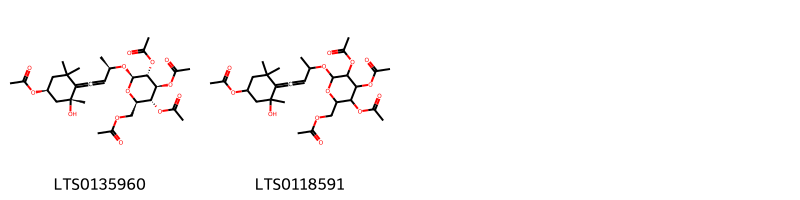
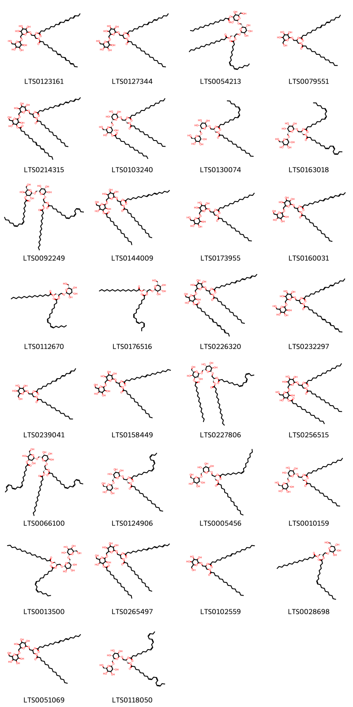

!!! abstract "Tóm tắt"

    Câu kỷ tử (Fructus Lycii) là quả chín phơi khô hay sấy khô của cây Câu kỷ (Lycium barbarum L.), thuộc họ Cà (Solanaceae). Về phân bố, cây Câu kỷ có nguồn gốc từ khu vực miền Trung và miền Nam Trung Quốc, bao gồm Nội Mông, Thanh Hải và Tân Cương. Hiện nay, cây được du nhập và phân bố rộng rãi trên toàn cầu, từ châu Á (Nepal, Hàn Quốc, Việt Nam) đến châu Âu (Anh, Đức, Pháp, Tây Ban Nha), Bắc Mỹ (Mỹ, Canada), Nam Mỹ (Argentina) và châu Đại Dương (Úc). Tại Việt Nam, cây có thể được trồng ở nhiều nơi, bao gồm Hà Nội và Lâm Đồng. Theo y học cổ truyền, dược liệu này có tính cam, binh, quy vào các kinh phế, can, thận. Công dụng của quả dùng trị can thận âm hư, tinh huyết bất định, khí lục giảm sút, lưng gối đau mỏi, đầu váng tai điếc, mắt mờ nhìn không rõ. Thành phần hóa học chính là polysaccharides (Lycium barbarum polysaccharides - LBP), đây là nhóm chất được nghiên cứu nhiều nhất trong Câu kỷ tử. Ngoài ra, dược liệu còn cung cấp  carotenoids (zeaxanthin, β-carotene, vitamin (A, B1, B2, C), alkaloid (betaine) và các hợp chất khác như flavonoid, steroid, phenol. Câu kỷ tử có các tác dụng dược lý như tăng cường miễn dịch, hạ cholesterol máu và đường huyết, bảo vệ gan, làm chậm quá trình lão hóa, và hỗ trợ làm tăng lượng bạch cầu.

## Thông tin về thực vật

Dược liệu **Câu Kỷ Tử (Quả)** từ bộ phận **** từ loài *Lycium barbarum*.

**Mô tả thực vật:** Cây khởi tử là một loại cây nhỏ, cao 0,5-1.5m, cành nhỏ, thỉnh thoảng có gai ngắn mọc ở kẽ lá, dài 5cm. Lá mọc so le, một số mọc vòng tại một điểm. Cuống lá ngắn 2-6mm. Phiến lá hình mác, đầu lá và phía cuống của lá đều hẹp. hơi nhọn, dài 2-6cm, rộng 0,6-2,5cm, mép lá nguyên. Hoa nhỏ mọc đơn độc ở kẽ lá hoặc có một số hoa mọc tụ lại. Cánh hoa màu tím đỏ. Quả mọng hình trứng dài 0,5-2cm, đường kính 4-8mm. Khi chín có màu đỏ sẵm hoặc vàng đỏ. Hạt nhiều, hình thận, dẹt, dài 2-2,5mm.
Mùa hoa: tháng 6-9, mùa quả: tháng 7-10.

*Tài liệu tham khảo:* "Những cây thuốc và vị thuốc Việt Nam" - Đỗ Tất Lợi 
Trong dược điển Việt nam, một loài được sử dụng làm dược liệu là *Lycium barbarum*.

!!! info "Phân loại thực vật của *Lycium barbarum*"
    - **Kingdom:** Plantae
    - **Phylum:** Tracheophyta
    - **Order:** Solanales
    - **Family:** Solanaceae
    - **Genus:** Lycium
    - **Species:** *Lycium barbarum*

**Phân bố trên thế giới:** Austria, Hungary, Georgia, Czechia, Switzerland, Sweden, Netherlands, Poland, Belgium, Ukraine, Slovakia, Denmark, Germany, Romania, Bulgaria, Russian Federation, France, Spain, Moldova, Republic of, United States of America, United Kingdom of Great Britain and Northern Ireland

**Phân bố tại Việt nam:** Không có ghi nhận ở Việt Nam

## Thông tin về dược liệu 

### Định danh

!!! info "Thông tin về tên gọi"

    - Dược liệu tiếng Việt: câu kỳ tử
    - Dược liệu tiếng Trung: 地骨皮 (Di Gu Pi)
    - Dược liệu tiếng Anh: Root - Bark of Chinese Wolfberry
    - Dược liệu latin thông dụng: Fructus Lycii
    - Dược liệu latin kiểu DĐVN: *fructus lycii*
    - Dược liệu latin kiểu DĐVN: **
    - Dược liệu latin kiểu thông tư: **
    - Bộ phận dùng:  (Fructus)

### Mô tả dược liệu 

- **Theo dược điển Việt nam V:** Quả hình trứng dài hay trái xoan, hai đầu hơi lõm, dài 6 mm đến 20 mm, đường kính 3 mm đến 10 mm. Mặt ngoài màu đỏ cam, mềm, bóng, thường nhăn nheo. Gốc quả có vết cuống quả màu trắng còn sót lại, đỉnh quả có điểm nhô hơi nhô lên. Quả có nhiều hạt nhỏ hình thận dẹt, hai mặt hơi cong phồng hoặc có một mặt lõm. Hạt màu vàng nâu có nội nhũ, rốn hạt là một điểm lõm nhỏ ở mép hạt. Chất mềm, vị ngọt hơi chua.

- **Mô tả dược liệu theo thông tư chế biến dược liệu theo phương pháp cổ truyền:** 

### Chế biến 

- **Chế biến theo dược điển việt nam V**: Thu hoạch vào mùa hè và mùa thu khi quả đã chuyển màu đỏ vàng. Sau khi phơi âm can để vỏ ngoài nhăn lại, lấy ra phơi nắng hoặc sấy nhẹ đến khi vỏ ngoài quả khô và cứng, thịt quả mềm. Loại bỏ cuống.nBào chế Quả thường dùng sống, hoặc tẩm rượu sao, đem sắc ngay hoặc sấy nhẹ (dưới 50 °C) đến khô giòn, tán bột hoặc phun rượu cho quả trở nên đỏ tươi, khi dùng giã nát.

- **Chế biến theo thông tư:** 

--- 

## Thành phần hóa học

- Theo tài liệu của GS. Đỗ Tất Lợi:  (1) Nhóm hóa học: 
- Polysaccharide: Lycium barbarum polysaccharides (LBP) chủ yếu là xylose và glucose
- Carotenoid: Zeaxanthin, β-carotene.
- Vitamin: Vitamin A, Riboflavin (B2), Thiamin (B1), Vitamin C.
- Alkaloid: Betaine
- Ngoài ra còn các hợp chất khác: Flavonoid, hợp chất Steroid, hợp chất Phenol,...
(2)Tên hoạt chất là Biomarker trong:
- Theo dược điển Trung Quốc 2020, Biomaker là hoạt chất Betaine.
    

**Thành phần hóa học từ loài **Lycium barbarum**

Theo cơ sở dữ liệu lotus, loài *Lycium barbarum* đã phân lập và xác định được **46** hoạt chất thuộc về các nhóm Organooxygen compounds, Fatty Acyls, Flavonoids, Tropane alkaloids, Indoles and derivatives, Carboxylic acids and derivatives, Glycerolipids, Prenol lipids trong bảng dưới đây. Danh sách các hoạt chất như sau (2s)-1-(hexadecanoyloxy)-3-{[(2r,3r,4s,5r,6r)-3,4,5-trihydroxy-6-(hydroxymethyl)oxan-2-yl]oxy}propan-2-yl (9z,12z)-octadeca-9,12-dienoate [(LTS0112670)](https://lotus.naturalproducts.net/compound/lotus_id/LTS0112670), [3,4,5-tris(acetyloxy)-6-({4-[4-(acetyloxy)-2-hydroxy-2,6,6-trimethylcyclohexylidene]but-3-en-2-yl}oxy)oxan-2-yl]methyl acetate [(LTS0118591)](https://lotus.naturalproducts.net/compound/lotus_id/LTS0118591), (5r)-5-[(1s)-1,2-dihydroxyethyl]-4-hydroxy-3-{[(2s,3r,4s,5s,6r)-3,4,5-trihydroxy-6-(hydroxymethyl)oxan-2-yl]oxy}-5h-furan-2-one [(LTS0041652)](https://lotus.naturalproducts.net/compound/lotus_id/LTS0041652), [(2r,3r,4s,5r,6r)-3,4,5-tris(acetyloxy)-6-{[(2r)-4-[(2r,4s)-4-(acetyloxy)-2-hydroxy-2,6,6-trimethylcyclohexylidene]but-3-en-2-yl]oxy}oxan-2-yl]methyl acetate [(LTS0135960)](https://lotus.naturalproducts.net/compound/lotus_id/LTS0135960), 1-(hexadecanoyloxy)-3-{[6-({[4-(hexadecanoyloxy)-3,5-dihydroxy-6-(hydroxymethyl)oxan-2-yl]oxy}methyl)-3,4,5-trihydroxyoxan-2-yl]oxy}propan-2-yl octadeca-9,12-dienoate [(LTS0144009)](https://lotus.naturalproducts.net/compound/lotus_id/LTS0144009), kaempherol [(LTS0155822)](https://lotus.naturalproducts.net/compound/lotus_id/LTS0155822), (2s)-1-(hexadecanoyloxy)-3-{[(2r,3r,4s,5r,6r)-3,4,5-trihydroxy-6-({[(2s,3r,4s,5r,6r)-3,4,5-trihydroxy-6-(hydroxymethyl)oxan-2-yl]oxy}methyl)oxan-2-yl]oxy}propan-2-yl hexadecanoate [(LTS0010159)](https://lotus.naturalproducts.net/compound/lotus_id/LTS0010159), 1-(hexadecanoyloxy)-3-{[3,4,5-trihydroxy-6-({[3,4,5-trihydroxy-6-(hydroxymethyl)oxan-2-yl]oxy}methyl)oxan-2-yl]oxy}propan-2-yl octadeca-9,12-dienoate [(LTS0051069)](https://lotus.naturalproducts.net/compound/lotus_id/LTS0051069), amylose [(LTS0110579)](https://lotus.naturalproducts.net/compound/lotus_id/LTS0110579), (2s)-2-[(9z,12z)-octadeca-9,12-dienoyloxy]-3-{[(2r,3r,4s,5r,6r)-3,4,5-trihydroxy-6-({[(2s,3r,4s,5r,6r)-3,4,5-trihydroxy-6-(hydroxymethyl)oxan-2-yl]oxy}methyl)oxan-2-yl]oxy}propyl (9z,12z,15z)-octadeca-9,12,15-trienoate [(LTS0163018)](https://lotus.naturalproducts.net/compound/lotus_id/LTS0163018), (2s)-1-(octadecanoyloxy)-3-{[(2r,3r,4s,5r,6r)-3,4,5-trihydroxy-6-({[(2s,3r,4s,5r,6r)-3,4,5-trihydroxy-6-(hydroxymethyl)oxan-2-yl]oxy}methyl)oxan-2-yl]oxy}propan-2-yl (9z,12z)-octadeca-9,12-dienoate [(LTS0013500)](https://lotus.naturalproducts.net/compound/lotus_id/LTS0013500), 1-(hexadecanoyloxy)-3-{[3,4,5-trihydroxy-6-(hydroxymethyl)oxan-2-yl]oxy}propan-2-yl octadeca-9,12-dienoate [(LTS0079551)](https://lotus.naturalproducts.net/compound/lotus_id/LTS0079551), (2s)-1-[(9z,12z,15z)-octadeca-9,12,15-trienoyloxy]-3-{[(2r,3r,4s,5r,6r)-3,4,5-trihydroxy-6-({[(2s,3r,4s,5r,6r)-3,4,5-trihydroxy-6-(hydroxymethyl)oxan-2-yl]oxy}methyl)oxan-2-yl]oxy}propan-2-yl (9z,12z,15z)-octadeca-9,12,15-trienoate [(LTS0118050)](https://lotus.naturalproducts.net/compound/lotus_id/LTS0118050), 2-(3,4-dihydroxyphenyl)-5,7-dihydroxy-3-{[(2s,3r,4r,5r,6s)-3,4,5-trihydroxy-6-(hydroxymethyl)oxan-2-yl]oxy}chromen-4-one [(LTS0241372)](https://lotus.naturalproducts.net/compound/lotus_id/LTS0241372), 5-(1,2-dihydroxyethyl)-4-hydroxy-3-{[3,4,5-trihydroxy-6-(hydroxymethyl)oxan-2-yl]oxy}-5h-furan-2-one [(LTS0248594)](https://lotus.naturalproducts.net/compound/lotus_id/LTS0248594), glycerol [(LTS0155285)](https://lotus.naturalproducts.net/compound/lotus_id/LTS0155285), (2r,3r,4s,5s,6r)-2-{[(2r)-4-[(2r,4s)-2,4-dihydroxy-2,6,6-trimethylcyclohexylidene]but-3-en-2-yl]oxy}-6-(hydroxymethyl)oxane-3,4,5-triol [(LTS0069831)](https://lotus.naturalproducts.net/compound/lotus_id/LTS0069831), (2s)-1-(hexadecanoyloxy)-3-{[(2r,3r,4s,5r,6r)-6-({[(2s,3r,4s,5s,6r)-4-(hexadecanoyloxy)-3,5-dihydroxy-6-(hydroxymethyl)oxan-2-yl]oxy}methyl)-3,4,5-trihydroxyoxan-2-yl]oxy}propan-2-yl hexadecanoate [(LTS0103240)](https://lotus.naturalproducts.net/compound/lotus_id/LTS0103240), 2-{[4-(2,4-dihydroxy-2,6,6-trimethylcyclohexylidene)but-3-en-2-yl]oxy}-6-(hydroxymethyl)oxane-3,4,5-triol [(LTS0022581)](https://lotus.naturalproducts.net/compound/lotus_id/LTS0022581), (2s)-1-(hexadecanoyloxy)-3-{[(2r,3r,4s,5r,6r)-3,4,5-trihydroxy-6-(hydroxymethyl)oxan-2-yl]oxy}propan-2-yl (9z,12z,15z)-octadeca-9,12,15-trienoate [(LTS0176516)](https://lotus.naturalproducts.net/compound/lotus_id/LTS0176516), 1-(hexadecanoyloxy)-3-{[3,4,5-trihydroxy-6-({[3,4,5-trihydroxy-6-(hydroxymethyl)oxan-2-yl]oxy}methyl)oxan-2-yl]oxy}propan-2-yl nonadec-9-enoate [(LTS0158449)](https://lotus.naturalproducts.net/compound/lotus_id/LTS0158449), (2s)-1-(hexadecanoyloxy)-3-{[(2r,3r,4s,5r,6r)-3,4,5-trihydroxy-6-({[(2s,3r,4s,5r,6r)-3,4,5-trihydroxy-6-(hydroxymethyl)oxan-2-yl]oxy}methyl)oxan-2-yl]oxy}propan-2-yl (9z,12z,15z)-octadeca-9,12,15-trienoate [(LTS0124906)](https://lotus.naturalproducts.net/compound/lotus_id/LTS0124906), 1-(hexadecanoyloxy)-3-{[3,4,5-trihydroxy-6-({[3,4,5-trihydroxy-6-(hydroxymethyl)oxan-2-yl]oxy}methyl)oxan-2-yl]oxy}propan-2-yl octadeca-9,12,15-trienoate [(LTS0160031)](https://lotus.naturalproducts.net/compound/lotus_id/LTS0160031), 1-(hexadecanoyloxy)-3-{[6-({[4-(hexadecanoyloxy)-3,5-dihydroxy-6-(hydroxymethyl)oxan-2-yl]oxy}methyl)-3,4,5-trihydroxyoxan-2-yl]oxy}propan-2-yl hexadecanoate [(LTS0256515)](https://lotus.naturalproducts.net/compound/lotus_id/LTS0256515), 3-rutinosyl quercetin [(LTS0032845)](https://lotus.naturalproducts.net/compound/lotus_id/LTS0032845), 2-(octadeca-9,12-dienoyloxy)-3-{[3,4,5-trihydroxy-6-({[3,4,5-trihydroxy-6-(hydroxymethyl)oxan-2-yl]oxy}methyl)oxan-2-yl]oxy}propyl octadeca-9,12,15-trienoate [(LTS0232297)](https://lotus.naturalproducts.net/compound/lotus_id/LTS0232297), quercetin [(LTS0004651)](https://lotus.naturalproducts.net/compound/lotus_id/LTS0004651), 1-{[6-({[3,5-dihydroxy-6-(hydroxymethyl)-4-(octadeca-9,12,15-trienoyloxy)oxan-2-yl]oxy}methyl)-3,4,5-trihydroxyoxan-2-yl]oxy}-3-(hexadecanoyloxy)propan-2-yl octadeca-9,12,15-trienoate [(LTS0226320)](https://lotus.naturalproducts.net/compound/lotus_id/LTS0226320), atropine [(LTS0185864)](https://lotus.naturalproducts.net/compound/lotus_id/LTS0185864), (2s)-1-{[(2r,3r,4s,5r,6r)-6-({[(2s,3r,4s,5s,6r)-3,5-dihydroxy-6-(hydroxymethyl)-4-[(9z,12z,15z)-octadeca-9,12,15-trienoyloxy]oxan-2-yl]oxy}methyl)-3,4,5-trihydroxyoxan-2-yl]oxy}-3-(hexadecanoyloxy)propan-2-yl (9z,12z,15z)-octadeca-9,12,15-trienoate [(LTS0066100)](https://lotus.naturalproducts.net/compound/lotus_id/LTS0066100), zeaxanthin [(LTS0192928)](https://lotus.naturalproducts.net/compound/lotus_id/LTS0192928), (2s)-1-(hexadecanoyloxy)-3-{[(2r,3r,4s,5r,6r)-3,4,5-trihydroxy-6-(hydroxymethyl)oxan-2-yl]oxy}propan-2-yl (9z)-nonadec-9-enoate [(LTS0028698)](https://lotus.naturalproducts.net/compound/lotus_id/LTS0028698), 1-{[6-({[3,5-dihydroxy-6-(hydroxymethyl)-4-(octadeca-9,12-dienoyloxy)oxan-2-yl]oxy}methyl)-3,4,5-trihydroxyoxan-2-yl]oxy}-3-(hexadecanoyloxy)propan-2-yl octadeca-9,12,15-trienoate [(LTS0214315)](https://lotus.naturalproducts.net/compound/lotus_id/LTS0214315), 1-(octadeca-9,12,15-trienoyloxy)-3-{[3,4,5-trihydroxy-6-({[3,4,5-trihydroxy-6-(hydroxymethyl)oxan-2-yl]oxy}methyl)oxan-2-yl]oxy}propan-2-yl octadeca-9,12,15-trienoate [(LTS0123161)](https://lotus.naturalproducts.net/compound/lotus_id/LTS0123161), (2s)-1-(hexadecanoyloxy)-3-{[(2r,3r,4s,5r,6r)-3,4,5-trihydroxy-6-({[(2s,3r,4s,5r,6r)-3,4,5-trihydroxy-6-(hydroxymethyl)oxan-2-yl]oxy}methyl)oxan-2-yl]oxy}propan-2-yl (9z,12z)-octadeca-9,12-dienoate [(LTS0130074)](https://lotus.naturalproducts.net/compound/lotus_id/LTS0130074), 1-(hexadecanoyloxy)-3-{[3,4,5-trihydroxy-6-({[3,4,5-trihydroxy-6-(hydroxymethyl)oxan-2-yl]oxy}methyl)oxan-2-yl]oxy}propan-2-yl hexadecanoate [(LTS0173955)](https://lotus.naturalproducts.net/compound/lotus_id/LTS0173955), n-[2-(5-methoxy-1h-indol-3-yl)ethyl]ethanimidic acid [(LTS0219322)](https://lotus.naturalproducts.net/compound/lotus_id/LTS0219322), (2s)-1-{[(2r,3r,4s,5r,6r)-6-({[(2s,3r,4s,5s,6r)-3,5-dihydroxy-6-(hydroxymethyl)-4-[(9z,12z)-octadeca-9,12-dienoyloxy]oxan-2-yl]oxy}methyl)-3,4,5-trihydroxyoxan-2-yl]oxy}-3-(hexadecanoyloxy)propan-2-yl (9z,12z,15z)-octadeca-9,12,15-trienoate [(LTS0092249)](https://lotus.naturalproducts.net/compound/lotus_id/LTS0092249), 1-(hexadecanoyloxy)-3-{[3,4,5-trihydroxy-6-(hydroxymethyl)oxan-2-yl]oxy}propan-2-yl octadeca-9,12,15-trienoate [(LTS0239041)](https://lotus.naturalproducts.net/compound/lotus_id/LTS0239041), (2s)-1-(hexadecanoyloxy)-3-{[(2r,3r,4s,5r,6r)-3,4,5-trihydroxy-6-({[(2s,3r,4s,5r,6r)-3,4,5-trihydroxy-6-(hydroxymethyl)oxan-2-yl]oxy}methyl)oxan-2-yl]oxy}propan-2-yl (9z)-nonadec-9-enoate [(LTS0005456)](https://lotus.naturalproducts.net/compound/lotus_id/LTS0005456), 1-(hexadecanoyloxy)-3-{[3,4,5-trihydroxy-6-(hydroxymethyl)oxan-2-yl]oxy}propan-2-yl nonadec-9-enoate [(LTS0102559)](https://lotus.naturalproducts.net/compound/lotus_id/LTS0102559), (2s)-1-(hexadecanoyloxy)-3-{[(2r,3r,4s,5r,6r)-6-({[(2s,3r,4s,5s,6r)-4-(hexadecanoyloxy)-3,5-dihydroxy-6-(hydroxymethyl)oxan-2-yl]oxy}methyl)-3,4,5-trihydroxyoxan-2-yl]oxy}propan-2-yl (9z,12z)-octadeca-9,12-dienoate [(LTS0054213)](https://lotus.naturalproducts.net/compound/lotus_id/LTS0054213), nictoflorin [(LTS0182501)](https://lotus.naturalproducts.net/compound/lotus_id/LTS0182501), 1-(octadecanoyloxy)-3-{[3,4,5-trihydroxy-6-({[3,4,5-trihydroxy-6-(hydroxymethyl)oxan-2-yl]oxy}methyl)oxan-2-yl]oxy}propan-2-yl octadeca-9,12-dienoate [(LTS0127344)](https://lotus.naturalproducts.net/compound/lotus_id/LTS0127344), 1-(hexadecanoyloxy)-3-{[6-({[4-(hexadecanoyloxy)-3,5-dihydroxy-6-(hydroxymethyl)oxan-2-yl]oxy}methyl)-3,4,5-trihydroxyoxan-2-yl]oxy}propan-2-yl octadeca-9,12,15-trienoate [(LTS0265497)](https://lotus.naturalproducts.net/compound/lotus_id/LTS0265497), (2s)-1-(hexadecanoyloxy)-3-{[(2r,3r,4s,5r,6r)-6-({[(2s,3r,4s,5s,6r)-4-(hexadecanoyloxy)-3,5-dihydroxy-6-(hydroxymethyl)oxan-2-yl]oxy}methyl)-3,4,5-trihydroxyoxan-2-yl]oxy}propan-2-yl (9z,12z,15z)-octadeca-9,12,15-trienoate [(LTS0227806)](https://lotus.naturalproducts.net/compound/lotus_id/LTS0227806). 
        
| chemicalTaxonomyClassyfireClass   |   smiles_count |
|:----------------------------------|---------------:|
| Carboxylic acids and derivatives  |            193 |
| Fatty Acyls                       |            245 |
| Flavonoids                        |            406 |
| Glycerolipids                     |           3521 |
| Indoles and derivatives           |             29 |
| Organooxygen compounds            |             66 |
| Prenol lipids                     |             98 |
| Tropane alkaloids                 |             47 |

            
### Nhóm Carboxylic acids and derivatives
<figure markdown="span">
    { width=100% }
<figcaption>Hình ảnh cấu trúc hóa học của hoạt chất thuộc nhóm *Carboxylic acids and derivatives*. Tên thường gọi của các hoạt chất tương ứng là [(2r,3r,4s,5r,6r)-3,4,5-tris(acetyloxy)-6-{[(2r)-4-[(2r,4s)-4-(acetyloxy)-2-hydroxy-2,6,6-trimethylcyclohexylidene]but-3-en-2-yl]oxy}oxan-2-yl]methyl acetate [(LTS0135960)](https://lotus.naturalproducts.net/compound/lotus_id/LTS0135960), [3,4,5-tris(acetyloxy)-6-({4-[4-(acetyloxy)-2-hydroxy-2,6,6-trimethylcyclohexylidene]but-3-en-2-yl}oxy)oxan-2-yl]methyl acetate [(LTS0118591)](https://lotus.naturalproducts.net/compound/lotus_id/LTS0118591).</figcaption>
</figure>

            
            
### Nhóm Carboxylic acids and derivatives
<figure markdown="span">
    { width=100% }
<figcaption>Hình ảnh cấu trúc hóa học của hoạt chất thuộc nhóm *Carboxylic acids and derivatives*. Tên thường gọi của các hoạt chất tương ứng là [(2r,3r,4s,5r,6r)-3,4,5-tris(acetyloxy)-6-{[(2r)-4-[(2r,4s)-4-(acetyloxy)-2-hydroxy-2,6,6-trimethylcyclohexylidene]but-3-en-2-yl]oxy}oxan-2-yl]methyl acetate [(LTS0135960)](https://lotus.naturalproducts.net/compound/lotus_id/LTS0135960), [3,4,5-tris(acetyloxy)-6-({4-[4-(acetyloxy)-2-hydroxy-2,6,6-trimethylcyclohexylidene]but-3-en-2-yl}oxy)oxan-2-yl]methyl acetate [(LTS0118591)](https://lotus.naturalproducts.net/compound/lotus_id/LTS0118591).</figcaption>
</figure>

### Nhóm Fatty Acyls
<figure markdown="span">
    { width=100% }
<figcaption>Hình ảnh cấu trúc hóa học của hoạt chất thuộc nhóm *Fatty Acyls*. Tên thường gọi của các hoạt chất tương ứng là 5-(1,2-dihydroxyethyl)-4-hydroxy-3-{[3,4,5-trihydroxy-6-(hydroxymethyl)oxan-2-yl]oxy}-5h-furan-2-one [(LTS0248594)](https://lotus.naturalproducts.net/compound/lotus_id/LTS0248594), 2-{[4-(2,4-dihydroxy-2,6,6-trimethylcyclohexylidene)but-3-en-2-yl]oxy}-6-(hydroxymethyl)oxane-3,4,5-triol [(LTS0022581)](https://lotus.naturalproducts.net/compound/lotus_id/LTS0022581), (2r,3r,4s,5s,6r)-2-{[(2r)-4-[(2r,4s)-2,4-dihydroxy-2,6,6-trimethylcyclohexylidene]but-3-en-2-yl]oxy}-6-(hydroxymethyl)oxane-3,4,5-triol [(LTS0069831)](https://lotus.naturalproducts.net/compound/lotus_id/LTS0069831), (5r)-5-[(1s)-1,2-dihydroxyethyl]-4-hydroxy-3-{[(2s,3r,4s,5s,6r)-3,4,5-trihydroxy-6-(hydroxymethyl)oxan-2-yl]oxy}-5h-furan-2-one [(LTS0041652)](https://lotus.naturalproducts.net/compound/lotus_id/LTS0041652).</figcaption>
</figure>

            
            
### Nhóm Carboxylic acids and derivatives
<figure markdown="span">
    { width=100% }
<figcaption>Hình ảnh cấu trúc hóa học của hoạt chất thuộc nhóm *Carboxylic acids and derivatives*. Tên thường gọi của các hoạt chất tương ứng là [(2r,3r,4s,5r,6r)-3,4,5-tris(acetyloxy)-6-{[(2r)-4-[(2r,4s)-4-(acetyloxy)-2-hydroxy-2,6,6-trimethylcyclohexylidene]but-3-en-2-yl]oxy}oxan-2-yl]methyl acetate [(LTS0135960)](https://lotus.naturalproducts.net/compound/lotus_id/LTS0135960), [3,4,5-tris(acetyloxy)-6-({4-[4-(acetyloxy)-2-hydroxy-2,6,6-trimethylcyclohexylidene]but-3-en-2-yl}oxy)oxan-2-yl]methyl acetate [(LTS0118591)](https://lotus.naturalproducts.net/compound/lotus_id/LTS0118591).</figcaption>
</figure>

### Nhóm Fatty Acyls
<figure markdown="span">
    { width=100% }
<figcaption>Hình ảnh cấu trúc hóa học của hoạt chất thuộc nhóm *Fatty Acyls*. Tên thường gọi của các hoạt chất tương ứng là 5-(1,2-dihydroxyethyl)-4-hydroxy-3-{[3,4,5-trihydroxy-6-(hydroxymethyl)oxan-2-yl]oxy}-5h-furan-2-one [(LTS0248594)](https://lotus.naturalproducts.net/compound/lotus_id/LTS0248594), 2-{[4-(2,4-dihydroxy-2,6,6-trimethylcyclohexylidene)but-3-en-2-yl]oxy}-6-(hydroxymethyl)oxane-3,4,5-triol [(LTS0022581)](https://lotus.naturalproducts.net/compound/lotus_id/LTS0022581), (2r,3r,4s,5s,6r)-2-{[(2r)-4-[(2r,4s)-2,4-dihydroxy-2,6,6-trimethylcyclohexylidene]but-3-en-2-yl]oxy}-6-(hydroxymethyl)oxane-3,4,5-triol [(LTS0069831)](https://lotus.naturalproducts.net/compound/lotus_id/LTS0069831), (5r)-5-[(1s)-1,2-dihydroxyethyl]-4-hydroxy-3-{[(2s,3r,4s,5s,6r)-3,4,5-trihydroxy-6-(hydroxymethyl)oxan-2-yl]oxy}-5h-furan-2-one [(LTS0041652)](https://lotus.naturalproducts.net/compound/lotus_id/LTS0041652).</figcaption>
</figure>

### Nhóm Flavonoids
<figure markdown="span">
    { width=100% }
<figcaption>Hình ảnh cấu trúc hóa học của hoạt chất thuộc nhóm *Flavonoids*. Tên thường gọi của các hoạt chất tương ứng là kaempherol [(LTS0155822)](https://lotus.naturalproducts.net/compound/lotus_id/LTS0155822), 2-(3,4-dihydroxyphenyl)-5,7-dihydroxy-3-{[(2s,3r,4r,5r,6s)-3,4,5-trihydroxy-6-(hydroxymethyl)oxan-2-yl]oxy}chromen-4-one [(LTS0241372)](https://lotus.naturalproducts.net/compound/lotus_id/LTS0241372), nictoflorin [(LTS0182501)](https://lotus.naturalproducts.net/compound/lotus_id/LTS0182501), quercetin [(LTS0004651)](https://lotus.naturalproducts.net/compound/lotus_id/LTS0004651), 3-rutinosyl quercetin [(LTS0032845)](https://lotus.naturalproducts.net/compound/lotus_id/LTS0032845).</figcaption>
</figure>

            
            
### Nhóm Carboxylic acids and derivatives
<figure markdown="span">
    { width=100% }
<figcaption>Hình ảnh cấu trúc hóa học của hoạt chất thuộc nhóm *Carboxylic acids and derivatives*. Tên thường gọi của các hoạt chất tương ứng là [(2r,3r,4s,5r,6r)-3,4,5-tris(acetyloxy)-6-{[(2r)-4-[(2r,4s)-4-(acetyloxy)-2-hydroxy-2,6,6-trimethylcyclohexylidene]but-3-en-2-yl]oxy}oxan-2-yl]methyl acetate [(LTS0135960)](https://lotus.naturalproducts.net/compound/lotus_id/LTS0135960), [3,4,5-tris(acetyloxy)-6-({4-[4-(acetyloxy)-2-hydroxy-2,6,6-trimethylcyclohexylidene]but-3-en-2-yl}oxy)oxan-2-yl]methyl acetate [(LTS0118591)](https://lotus.naturalproducts.net/compound/lotus_id/LTS0118591).</figcaption>
</figure>

### Nhóm Fatty Acyls
<figure markdown="span">
    { width=100% }
<figcaption>Hình ảnh cấu trúc hóa học của hoạt chất thuộc nhóm *Fatty Acyls*. Tên thường gọi của các hoạt chất tương ứng là 5-(1,2-dihydroxyethyl)-4-hydroxy-3-{[3,4,5-trihydroxy-6-(hydroxymethyl)oxan-2-yl]oxy}-5h-furan-2-one [(LTS0248594)](https://lotus.naturalproducts.net/compound/lotus_id/LTS0248594), 2-{[4-(2,4-dihydroxy-2,6,6-trimethylcyclohexylidene)but-3-en-2-yl]oxy}-6-(hydroxymethyl)oxane-3,4,5-triol [(LTS0022581)](https://lotus.naturalproducts.net/compound/lotus_id/LTS0022581), (2r,3r,4s,5s,6r)-2-{[(2r)-4-[(2r,4s)-2,4-dihydroxy-2,6,6-trimethylcyclohexylidene]but-3-en-2-yl]oxy}-6-(hydroxymethyl)oxane-3,4,5-triol [(LTS0069831)](https://lotus.naturalproducts.net/compound/lotus_id/LTS0069831), (5r)-5-[(1s)-1,2-dihydroxyethyl]-4-hydroxy-3-{[(2s,3r,4s,5s,6r)-3,4,5-trihydroxy-6-(hydroxymethyl)oxan-2-yl]oxy}-5h-furan-2-one [(LTS0041652)](https://lotus.naturalproducts.net/compound/lotus_id/LTS0041652).</figcaption>
</figure>

### Nhóm Flavonoids
<figure markdown="span">
    { width=100% }
<figcaption>Hình ảnh cấu trúc hóa học của hoạt chất thuộc nhóm *Flavonoids*. Tên thường gọi của các hoạt chất tương ứng là kaempherol [(LTS0155822)](https://lotus.naturalproducts.net/compound/lotus_id/LTS0155822), 2-(3,4-dihydroxyphenyl)-5,7-dihydroxy-3-{[(2s,3r,4r,5r,6s)-3,4,5-trihydroxy-6-(hydroxymethyl)oxan-2-yl]oxy}chromen-4-one [(LTS0241372)](https://lotus.naturalproducts.net/compound/lotus_id/LTS0241372), nictoflorin [(LTS0182501)](https://lotus.naturalproducts.net/compound/lotus_id/LTS0182501), quercetin [(LTS0004651)](https://lotus.naturalproducts.net/compound/lotus_id/LTS0004651), 3-rutinosyl quercetin [(LTS0032845)](https://lotus.naturalproducts.net/compound/lotus_id/LTS0032845).</figcaption>
</figure>

### Nhóm Glycerolipids
<figure markdown="span">
    { width=100% }
<figcaption>Hình ảnh cấu trúc hóa học của hoạt chất thuộc nhóm *Glycerolipids*. Tên thường gọi của các hoạt chất tương ứng là 1-(octadeca-9,12,15-trienoyloxy)-3-{[3,4,5-trihydroxy-6-({[3,4,5-trihydroxy-6-(hydroxymethyl)oxan-2-yl]oxy}methyl)oxan-2-yl]oxy}propan-2-yl octadeca-9,12,15-trienoate [(LTS0123161)](https://lotus.naturalproducts.net/compound/lotus_id/LTS0123161), 1-(octadecanoyloxy)-3-{[3,4,5-trihydroxy-6-({[3,4,5-trihydroxy-6-(hydroxymethyl)oxan-2-yl]oxy}methyl)oxan-2-yl]oxy}propan-2-yl octadeca-9,12-dienoate [(LTS0127344)](https://lotus.naturalproducts.net/compound/lotus_id/LTS0127344), (2s)-1-(hexadecanoyloxy)-3-{[(2r,3r,4s,5r,6r)-6-({[(2s,3r,4s,5s,6r)-4-(hexadecanoyloxy)-3,5-dihydroxy-6-(hydroxymethyl)oxan-2-yl]oxy}methyl)-3,4,5-trihydroxyoxan-2-yl]oxy}propan-2-yl (9z,12z)-octadeca-9,12-dienoate [(LTS0054213)](https://lotus.naturalproducts.net/compound/lotus_id/LTS0054213), 1-(hexadecanoyloxy)-3-{[3,4,5-trihydroxy-6-(hydroxymethyl)oxan-2-yl]oxy}propan-2-yl octadeca-9,12-dienoate [(LTS0079551)](https://lotus.naturalproducts.net/compound/lotus_id/LTS0079551), 1-{[6-({[3,5-dihydroxy-6-(hydroxymethyl)-4-(octadeca-9,12-dienoyloxy)oxan-2-yl]oxy}methyl)-3,4,5-trihydroxyoxan-2-yl]oxy}-3-(hexadecanoyloxy)propan-2-yl octadeca-9,12,15-trienoate [(LTS0214315)](https://lotus.naturalproducts.net/compound/lotus_id/LTS0214315), (2s)-1-(hexadecanoyloxy)-3-{[(2r,3r,4s,5r,6r)-6-({[(2s,3r,4s,5s,6r)-4-(hexadecanoyloxy)-3,5-dihydroxy-6-(hydroxymethyl)oxan-2-yl]oxy}methyl)-3,4,5-trihydroxyoxan-2-yl]oxy}propan-2-yl hexadecanoate [(LTS0103240)](https://lotus.naturalproducts.net/compound/lotus_id/LTS0103240), (2s)-1-(hexadecanoyloxy)-3-{[(2r,3r,4s,5r,6r)-3,4,5-trihydroxy-6-({[(2s,3r,4s,5r,6r)-3,4,5-trihydroxy-6-(hydroxymethyl)oxan-2-yl]oxy}methyl)oxan-2-yl]oxy}propan-2-yl (9z,12z)-octadeca-9,12-dienoate [(LTS0130074)](https://lotus.naturalproducts.net/compound/lotus_id/LTS0130074), (2s)-2-[(9z,12z)-octadeca-9,12-dienoyloxy]-3-{[(2r,3r,4s,5r,6r)-3,4,5-trihydroxy-6-({[(2s,3r,4s,5r,6r)-3,4,5-trihydroxy-6-(hydroxymethyl)oxan-2-yl]oxy}methyl)oxan-2-yl]oxy}propyl (9z,12z,15z)-octadeca-9,12,15-trienoate [(LTS0163018)](https://lotus.naturalproducts.net/compound/lotus_id/LTS0163018), (2s)-1-{[(2r,3r,4s,5r,6r)-6-({[(2s,3r,4s,5s,6r)-3,5-dihydroxy-6-(hydroxymethyl)-4-[(9z,12z)-octadeca-9,12-dienoyloxy]oxan-2-yl]oxy}methyl)-3,4,5-trihydroxyoxan-2-yl]oxy}-3-(hexadecanoyloxy)propan-2-yl (9z,12z,15z)-octadeca-9,12,15-trienoate [(LTS0092249)](https://lotus.naturalproducts.net/compound/lotus_id/LTS0092249), 1-(hexadecanoyloxy)-3-{[6-({[4-(hexadecanoyloxy)-3,5-dihydroxy-6-(hydroxymethyl)oxan-2-yl]oxy}methyl)-3,4,5-trihydroxyoxan-2-yl]oxy}propan-2-yl octadeca-9,12-dienoate [(LTS0144009)](https://lotus.naturalproducts.net/compound/lotus_id/LTS0144009), 1-(hexadecanoyloxy)-3-{[3,4,5-trihydroxy-6-({[3,4,5-trihydroxy-6-(hydroxymethyl)oxan-2-yl]oxy}methyl)oxan-2-yl]oxy}propan-2-yl hexadecanoate [(LTS0173955)](https://lotus.naturalproducts.net/compound/lotus_id/LTS0173955), 1-(hexadecanoyloxy)-3-{[3,4,5-trihydroxy-6-({[3,4,5-trihydroxy-6-(hydroxymethyl)oxan-2-yl]oxy}methyl)oxan-2-yl]oxy}propan-2-yl octadeca-9,12,15-trienoate [(LTS0160031)](https://lotus.naturalproducts.net/compound/lotus_id/LTS0160031), (2s)-1-(hexadecanoyloxy)-3-{[(2r,3r,4s,5r,6r)-3,4,5-trihydroxy-6-(hydroxymethyl)oxan-2-yl]oxy}propan-2-yl (9z,12z)-octadeca-9,12-dienoate [(LTS0112670)](https://lotus.naturalproducts.net/compound/lotus_id/LTS0112670), (2s)-1-(hexadecanoyloxy)-3-{[(2r,3r,4s,5r,6r)-3,4,5-trihydroxy-6-(hydroxymethyl)oxan-2-yl]oxy}propan-2-yl (9z,12z,15z)-octadeca-9,12,15-trienoate [(LTS0176516)](https://lotus.naturalproducts.net/compound/lotus_id/LTS0176516), 1-{[6-({[3,5-dihydroxy-6-(hydroxymethyl)-4-(octadeca-9,12,15-trienoyloxy)oxan-2-yl]oxy}methyl)-3,4,5-trihydroxyoxan-2-yl]oxy}-3-(hexadecanoyloxy)propan-2-yl octadeca-9,12,15-trienoate [(LTS0226320)](https://lotus.naturalproducts.net/compound/lotus_id/LTS0226320), 2-(octadeca-9,12-dienoyloxy)-3-{[3,4,5-trihydroxy-6-({[3,4,5-trihydroxy-6-(hydroxymethyl)oxan-2-yl]oxy}methyl)oxan-2-yl]oxy}propyl octadeca-9,12,15-trienoate [(LTS0232297)](https://lotus.naturalproducts.net/compound/lotus_id/LTS0232297), 1-(hexadecanoyloxy)-3-{[3,4,5-trihydroxy-6-(hydroxymethyl)oxan-2-yl]oxy}propan-2-yl octadeca-9,12,15-trienoate [(LTS0239041)](https://lotus.naturalproducts.net/compound/lotus_id/LTS0239041), 1-(hexadecanoyloxy)-3-{[3,4,5-trihydroxy-6-({[3,4,5-trihydroxy-6-(hydroxymethyl)oxan-2-yl]oxy}methyl)oxan-2-yl]oxy}propan-2-yl nonadec-9-enoate [(LTS0158449)](https://lotus.naturalproducts.net/compound/lotus_id/LTS0158449), (2s)-1-(hexadecanoyloxy)-3-{[(2r,3r,4s,5r,6r)-6-({[(2s,3r,4s,5s,6r)-4-(hexadecanoyloxy)-3,5-dihydroxy-6-(hydroxymethyl)oxan-2-yl]oxy}methyl)-3,4,5-trihydroxyoxan-2-yl]oxy}propan-2-yl (9z,12z,15z)-octadeca-9,12,15-trienoate [(LTS0227806)](https://lotus.naturalproducts.net/compound/lotus_id/LTS0227806), 1-(hexadecanoyloxy)-3-{[6-({[4-(hexadecanoyloxy)-3,5-dihydroxy-6-(hydroxymethyl)oxan-2-yl]oxy}methyl)-3,4,5-trihydroxyoxan-2-yl]oxy}propan-2-yl hexadecanoate [(LTS0256515)](https://lotus.naturalproducts.net/compound/lotus_id/LTS0256515), (2s)-1-{[(2r,3r,4s,5r,6r)-6-({[(2s,3r,4s,5s,6r)-3,5-dihydroxy-6-(hydroxymethyl)-4-[(9z,12z,15z)-octadeca-9,12,15-trienoyloxy]oxan-2-yl]oxy}methyl)-3,4,5-trihydroxyoxan-2-yl]oxy}-3-(hexadecanoyloxy)propan-2-yl (9z,12z,15z)-octadeca-9,12,15-trienoate [(LTS0066100)](https://lotus.naturalproducts.net/compound/lotus_id/LTS0066100), (2s)-1-(hexadecanoyloxy)-3-{[(2r,3r,4s,5r,6r)-3,4,5-trihydroxy-6-({[(2s,3r,4s,5r,6r)-3,4,5-trihydroxy-6-(hydroxymethyl)oxan-2-yl]oxy}methyl)oxan-2-yl]oxy}propan-2-yl (9z,12z,15z)-octadeca-9,12,15-trienoate [(LTS0124906)](https://lotus.naturalproducts.net/compound/lotus_id/LTS0124906), (2s)-1-(hexadecanoyloxy)-3-{[(2r,3r,4s,5r,6r)-3,4,5-trihydroxy-6-({[(2s,3r,4s,5r,6r)-3,4,5-trihydroxy-6-(hydroxymethyl)oxan-2-yl]oxy}methyl)oxan-2-yl]oxy}propan-2-yl (9z)-nonadec-9-enoate [(LTS0005456)](https://lotus.naturalproducts.net/compound/lotus_id/LTS0005456), (2s)-1-(hexadecanoyloxy)-3-{[(2r,3r,4s,5r,6r)-3,4,5-trihydroxy-6-({[(2s,3r,4s,5r,6r)-3,4,5-trihydroxy-6-(hydroxymethyl)oxan-2-yl]oxy}methyl)oxan-2-yl]oxy}propan-2-yl hexadecanoate [(LTS0010159)](https://lotus.naturalproducts.net/compound/lotus_id/LTS0010159), (2s)-1-(octadecanoyloxy)-3-{[(2r,3r,4s,5r,6r)-3,4,5-trihydroxy-6-({[(2s,3r,4s,5r,6r)-3,4,5-trihydroxy-6-(hydroxymethyl)oxan-2-yl]oxy}methyl)oxan-2-yl]oxy}propan-2-yl (9z,12z)-octadeca-9,12-dienoate [(LTS0013500)](https://lotus.naturalproducts.net/compound/lotus_id/LTS0013500), 1-(hexadecanoyloxy)-3-{[6-({[4-(hexadecanoyloxy)-3,5-dihydroxy-6-(hydroxymethyl)oxan-2-yl]oxy}methyl)-3,4,5-trihydroxyoxan-2-yl]oxy}propan-2-yl octadeca-9,12,15-trienoate [(LTS0265497)](https://lotus.naturalproducts.net/compound/lotus_id/LTS0265497), 1-(hexadecanoyloxy)-3-{[3,4,5-trihydroxy-6-(hydroxymethyl)oxan-2-yl]oxy}propan-2-yl nonadec-9-enoate [(LTS0102559)](https://lotus.naturalproducts.net/compound/lotus_id/LTS0102559), (2s)-1-(hexadecanoyloxy)-3-{[(2r,3r,4s,5r,6r)-3,4,5-trihydroxy-6-(hydroxymethyl)oxan-2-yl]oxy}propan-2-yl (9z)-nonadec-9-enoate [(LTS0028698)](https://lotus.naturalproducts.net/compound/lotus_id/LTS0028698), 1-(hexadecanoyloxy)-3-{[3,4,5-trihydroxy-6-({[3,4,5-trihydroxy-6-(hydroxymethyl)oxan-2-yl]oxy}methyl)oxan-2-yl]oxy}propan-2-yl octadeca-9,12-dienoate [(LTS0051069)](https://lotus.naturalproducts.net/compound/lotus_id/LTS0051069), (2s)-1-[(9z,12z,15z)-octadeca-9,12,15-trienoyloxy]-3-{[(2r,3r,4s,5r,6r)-3,4,5-trihydroxy-6-({[(2s,3r,4s,5r,6r)-3,4,5-trihydroxy-6-(hydroxymethyl)oxan-2-yl]oxy}methyl)oxan-2-yl]oxy}propan-2-yl (9z,12z,15z)-octadeca-9,12,15-trienoate [(LTS0118050)](https://lotus.naturalproducts.net/compound/lotus_id/LTS0118050).</figcaption>
</figure>

            
            
### Nhóm Carboxylic acids and derivatives
<figure markdown="span">
    { width=100% }
<figcaption>Hình ảnh cấu trúc hóa học của hoạt chất thuộc nhóm *Carboxylic acids and derivatives*. Tên thường gọi của các hoạt chất tương ứng là [(2r,3r,4s,5r,6r)-3,4,5-tris(acetyloxy)-6-{[(2r)-4-[(2r,4s)-4-(acetyloxy)-2-hydroxy-2,6,6-trimethylcyclohexylidene]but-3-en-2-yl]oxy}oxan-2-yl]methyl acetate [(LTS0135960)](https://lotus.naturalproducts.net/compound/lotus_id/LTS0135960), [3,4,5-tris(acetyloxy)-6-({4-[4-(acetyloxy)-2-hydroxy-2,6,6-trimethylcyclohexylidene]but-3-en-2-yl}oxy)oxan-2-yl]methyl acetate [(LTS0118591)](https://lotus.naturalproducts.net/compound/lotus_id/LTS0118591).</figcaption>
</figure>

### Nhóm Fatty Acyls
<figure markdown="span">
    { width=100% }
<figcaption>Hình ảnh cấu trúc hóa học của hoạt chất thuộc nhóm *Fatty Acyls*. Tên thường gọi của các hoạt chất tương ứng là 5-(1,2-dihydroxyethyl)-4-hydroxy-3-{[3,4,5-trihydroxy-6-(hydroxymethyl)oxan-2-yl]oxy}-5h-furan-2-one [(LTS0248594)](https://lotus.naturalproducts.net/compound/lotus_id/LTS0248594), 2-{[4-(2,4-dihydroxy-2,6,6-trimethylcyclohexylidene)but-3-en-2-yl]oxy}-6-(hydroxymethyl)oxane-3,4,5-triol [(LTS0022581)](https://lotus.naturalproducts.net/compound/lotus_id/LTS0022581), (2r,3r,4s,5s,6r)-2-{[(2r)-4-[(2r,4s)-2,4-dihydroxy-2,6,6-trimethylcyclohexylidene]but-3-en-2-yl]oxy}-6-(hydroxymethyl)oxane-3,4,5-triol [(LTS0069831)](https://lotus.naturalproducts.net/compound/lotus_id/LTS0069831), (5r)-5-[(1s)-1,2-dihydroxyethyl]-4-hydroxy-3-{[(2s,3r,4s,5s,6r)-3,4,5-trihydroxy-6-(hydroxymethyl)oxan-2-yl]oxy}-5h-furan-2-one [(LTS0041652)](https://lotus.naturalproducts.net/compound/lotus_id/LTS0041652).</figcaption>
</figure>

### Nhóm Flavonoids
<figure markdown="span">
    { width=100% }
<figcaption>Hình ảnh cấu trúc hóa học của hoạt chất thuộc nhóm *Flavonoids*. Tên thường gọi của các hoạt chất tương ứng là kaempherol [(LTS0155822)](https://lotus.naturalproducts.net/compound/lotus_id/LTS0155822), 2-(3,4-dihydroxyphenyl)-5,7-dihydroxy-3-{[(2s,3r,4r,5r,6s)-3,4,5-trihydroxy-6-(hydroxymethyl)oxan-2-yl]oxy}chromen-4-one [(LTS0241372)](https://lotus.naturalproducts.net/compound/lotus_id/LTS0241372), nictoflorin [(LTS0182501)](https://lotus.naturalproducts.net/compound/lotus_id/LTS0182501), quercetin [(LTS0004651)](https://lotus.naturalproducts.net/compound/lotus_id/LTS0004651), 3-rutinosyl quercetin [(LTS0032845)](https://lotus.naturalproducts.net/compound/lotus_id/LTS0032845).</figcaption>
</figure>

### Nhóm Glycerolipids
<figure markdown="span">
    { width=100% }
<figcaption>Hình ảnh cấu trúc hóa học của hoạt chất thuộc nhóm *Glycerolipids*. Tên thường gọi của các hoạt chất tương ứng là 1-(octadeca-9,12,15-trienoyloxy)-3-{[3,4,5-trihydroxy-6-({[3,4,5-trihydroxy-6-(hydroxymethyl)oxan-2-yl]oxy}methyl)oxan-2-yl]oxy}propan-2-yl octadeca-9,12,15-trienoate [(LTS0123161)](https://lotus.naturalproducts.net/compound/lotus_id/LTS0123161), 1-(octadecanoyloxy)-3-{[3,4,5-trihydroxy-6-({[3,4,5-trihydroxy-6-(hydroxymethyl)oxan-2-yl]oxy}methyl)oxan-2-yl]oxy}propan-2-yl octadeca-9,12-dienoate [(LTS0127344)](https://lotus.naturalproducts.net/compound/lotus_id/LTS0127344), (2s)-1-(hexadecanoyloxy)-3-{[(2r,3r,4s,5r,6r)-6-({[(2s,3r,4s,5s,6r)-4-(hexadecanoyloxy)-3,5-dihydroxy-6-(hydroxymethyl)oxan-2-yl]oxy}methyl)-3,4,5-trihydroxyoxan-2-yl]oxy}propan-2-yl (9z,12z)-octadeca-9,12-dienoate [(LTS0054213)](https://lotus.naturalproducts.net/compound/lotus_id/LTS0054213), 1-(hexadecanoyloxy)-3-{[3,4,5-trihydroxy-6-(hydroxymethyl)oxan-2-yl]oxy}propan-2-yl octadeca-9,12-dienoate [(LTS0079551)](https://lotus.naturalproducts.net/compound/lotus_id/LTS0079551), 1-{[6-({[3,5-dihydroxy-6-(hydroxymethyl)-4-(octadeca-9,12-dienoyloxy)oxan-2-yl]oxy}methyl)-3,4,5-trihydroxyoxan-2-yl]oxy}-3-(hexadecanoyloxy)propan-2-yl octadeca-9,12,15-trienoate [(LTS0214315)](https://lotus.naturalproducts.net/compound/lotus_id/LTS0214315), (2s)-1-(hexadecanoyloxy)-3-{[(2r,3r,4s,5r,6r)-6-({[(2s,3r,4s,5s,6r)-4-(hexadecanoyloxy)-3,5-dihydroxy-6-(hydroxymethyl)oxan-2-yl]oxy}methyl)-3,4,5-trihydroxyoxan-2-yl]oxy}propan-2-yl hexadecanoate [(LTS0103240)](https://lotus.naturalproducts.net/compound/lotus_id/LTS0103240), (2s)-1-(hexadecanoyloxy)-3-{[(2r,3r,4s,5r,6r)-3,4,5-trihydroxy-6-({[(2s,3r,4s,5r,6r)-3,4,5-trihydroxy-6-(hydroxymethyl)oxan-2-yl]oxy}methyl)oxan-2-yl]oxy}propan-2-yl (9z,12z)-octadeca-9,12-dienoate [(LTS0130074)](https://lotus.naturalproducts.net/compound/lotus_id/LTS0130074), (2s)-2-[(9z,12z)-octadeca-9,12-dienoyloxy]-3-{[(2r,3r,4s,5r,6r)-3,4,5-trihydroxy-6-({[(2s,3r,4s,5r,6r)-3,4,5-trihydroxy-6-(hydroxymethyl)oxan-2-yl]oxy}methyl)oxan-2-yl]oxy}propyl (9z,12z,15z)-octadeca-9,12,15-trienoate [(LTS0163018)](https://lotus.naturalproducts.net/compound/lotus_id/LTS0163018), (2s)-1-{[(2r,3r,4s,5r,6r)-6-({[(2s,3r,4s,5s,6r)-3,5-dihydroxy-6-(hydroxymethyl)-4-[(9z,12z)-octadeca-9,12-dienoyloxy]oxan-2-yl]oxy}methyl)-3,4,5-trihydroxyoxan-2-yl]oxy}-3-(hexadecanoyloxy)propan-2-yl (9z,12z,15z)-octadeca-9,12,15-trienoate [(LTS0092249)](https://lotus.naturalproducts.net/compound/lotus_id/LTS0092249), 1-(hexadecanoyloxy)-3-{[6-({[4-(hexadecanoyloxy)-3,5-dihydroxy-6-(hydroxymethyl)oxan-2-yl]oxy}methyl)-3,4,5-trihydroxyoxan-2-yl]oxy}propan-2-yl octadeca-9,12-dienoate [(LTS0144009)](https://lotus.naturalproducts.net/compound/lotus_id/LTS0144009), 1-(hexadecanoyloxy)-3-{[3,4,5-trihydroxy-6-({[3,4,5-trihydroxy-6-(hydroxymethyl)oxan-2-yl]oxy}methyl)oxan-2-yl]oxy}propan-2-yl hexadecanoate [(LTS0173955)](https://lotus.naturalproducts.net/compound/lotus_id/LTS0173955), 1-(hexadecanoyloxy)-3-{[3,4,5-trihydroxy-6-({[3,4,5-trihydroxy-6-(hydroxymethyl)oxan-2-yl]oxy}methyl)oxan-2-yl]oxy}propan-2-yl octadeca-9,12,15-trienoate [(LTS0160031)](https://lotus.naturalproducts.net/compound/lotus_id/LTS0160031), (2s)-1-(hexadecanoyloxy)-3-{[(2r,3r,4s,5r,6r)-3,4,5-trihydroxy-6-(hydroxymethyl)oxan-2-yl]oxy}propan-2-yl (9z,12z)-octadeca-9,12-dienoate [(LTS0112670)](https://lotus.naturalproducts.net/compound/lotus_id/LTS0112670), (2s)-1-(hexadecanoyloxy)-3-{[(2r,3r,4s,5r,6r)-3,4,5-trihydroxy-6-(hydroxymethyl)oxan-2-yl]oxy}propan-2-yl (9z,12z,15z)-octadeca-9,12,15-trienoate [(LTS0176516)](https://lotus.naturalproducts.net/compound/lotus_id/LTS0176516), 1-{[6-({[3,5-dihydroxy-6-(hydroxymethyl)-4-(octadeca-9,12,15-trienoyloxy)oxan-2-yl]oxy}methyl)-3,4,5-trihydroxyoxan-2-yl]oxy}-3-(hexadecanoyloxy)propan-2-yl octadeca-9,12,15-trienoate [(LTS0226320)](https://lotus.naturalproducts.net/compound/lotus_id/LTS0226320), 2-(octadeca-9,12-dienoyloxy)-3-{[3,4,5-trihydroxy-6-({[3,4,5-trihydroxy-6-(hydroxymethyl)oxan-2-yl]oxy}methyl)oxan-2-yl]oxy}propyl octadeca-9,12,15-trienoate [(LTS0232297)](https://lotus.naturalproducts.net/compound/lotus_id/LTS0232297), 1-(hexadecanoyloxy)-3-{[3,4,5-trihydroxy-6-(hydroxymethyl)oxan-2-yl]oxy}propan-2-yl octadeca-9,12,15-trienoate [(LTS0239041)](https://lotus.naturalproducts.net/compound/lotus_id/LTS0239041), 1-(hexadecanoyloxy)-3-{[3,4,5-trihydroxy-6-({[3,4,5-trihydroxy-6-(hydroxymethyl)oxan-2-yl]oxy}methyl)oxan-2-yl]oxy}propan-2-yl nonadec-9-enoate [(LTS0158449)](https://lotus.naturalproducts.net/compound/lotus_id/LTS0158449), (2s)-1-(hexadecanoyloxy)-3-{[(2r,3r,4s,5r,6r)-6-({[(2s,3r,4s,5s,6r)-4-(hexadecanoyloxy)-3,5-dihydroxy-6-(hydroxymethyl)oxan-2-yl]oxy}methyl)-3,4,5-trihydroxyoxan-2-yl]oxy}propan-2-yl (9z,12z,15z)-octadeca-9,12,15-trienoate [(LTS0227806)](https://lotus.naturalproducts.net/compound/lotus_id/LTS0227806), 1-(hexadecanoyloxy)-3-{[6-({[4-(hexadecanoyloxy)-3,5-dihydroxy-6-(hydroxymethyl)oxan-2-yl]oxy}methyl)-3,4,5-trihydroxyoxan-2-yl]oxy}propan-2-yl hexadecanoate [(LTS0256515)](https://lotus.naturalproducts.net/compound/lotus_id/LTS0256515), (2s)-1-{[(2r,3r,4s,5r,6r)-6-({[(2s,3r,4s,5s,6r)-3,5-dihydroxy-6-(hydroxymethyl)-4-[(9z,12z,15z)-octadeca-9,12,15-trienoyloxy]oxan-2-yl]oxy}methyl)-3,4,5-trihydroxyoxan-2-yl]oxy}-3-(hexadecanoyloxy)propan-2-yl (9z,12z,15z)-octadeca-9,12,15-trienoate [(LTS0066100)](https://lotus.naturalproducts.net/compound/lotus_id/LTS0066100), (2s)-1-(hexadecanoyloxy)-3-{[(2r,3r,4s,5r,6r)-3,4,5-trihydroxy-6-({[(2s,3r,4s,5r,6r)-3,4,5-trihydroxy-6-(hydroxymethyl)oxan-2-yl]oxy}methyl)oxan-2-yl]oxy}propan-2-yl (9z,12z,15z)-octadeca-9,12,15-trienoate [(LTS0124906)](https://lotus.naturalproducts.net/compound/lotus_id/LTS0124906), (2s)-1-(hexadecanoyloxy)-3-{[(2r,3r,4s,5r,6r)-3,4,5-trihydroxy-6-({[(2s,3r,4s,5r,6r)-3,4,5-trihydroxy-6-(hydroxymethyl)oxan-2-yl]oxy}methyl)oxan-2-yl]oxy}propan-2-yl (9z)-nonadec-9-enoate [(LTS0005456)](https://lotus.naturalproducts.net/compound/lotus_id/LTS0005456), (2s)-1-(hexadecanoyloxy)-3-{[(2r,3r,4s,5r,6r)-3,4,5-trihydroxy-6-({[(2s,3r,4s,5r,6r)-3,4,5-trihydroxy-6-(hydroxymethyl)oxan-2-yl]oxy}methyl)oxan-2-yl]oxy}propan-2-yl hexadecanoate [(LTS0010159)](https://lotus.naturalproducts.net/compound/lotus_id/LTS0010159), (2s)-1-(octadecanoyloxy)-3-{[(2r,3r,4s,5r,6r)-3,4,5-trihydroxy-6-({[(2s,3r,4s,5r,6r)-3,4,5-trihydroxy-6-(hydroxymethyl)oxan-2-yl]oxy}methyl)oxan-2-yl]oxy}propan-2-yl (9z,12z)-octadeca-9,12-dienoate [(LTS0013500)](https://lotus.naturalproducts.net/compound/lotus_id/LTS0013500), 1-(hexadecanoyloxy)-3-{[6-({[4-(hexadecanoyloxy)-3,5-dihydroxy-6-(hydroxymethyl)oxan-2-yl]oxy}methyl)-3,4,5-trihydroxyoxan-2-yl]oxy}propan-2-yl octadeca-9,12,15-trienoate [(LTS0265497)](https://lotus.naturalproducts.net/compound/lotus_id/LTS0265497), 1-(hexadecanoyloxy)-3-{[3,4,5-trihydroxy-6-(hydroxymethyl)oxan-2-yl]oxy}propan-2-yl nonadec-9-enoate [(LTS0102559)](https://lotus.naturalproducts.net/compound/lotus_id/LTS0102559), (2s)-1-(hexadecanoyloxy)-3-{[(2r,3r,4s,5r,6r)-3,4,5-trihydroxy-6-(hydroxymethyl)oxan-2-yl]oxy}propan-2-yl (9z)-nonadec-9-enoate [(LTS0028698)](https://lotus.naturalproducts.net/compound/lotus_id/LTS0028698), 1-(hexadecanoyloxy)-3-{[3,4,5-trihydroxy-6-({[3,4,5-trihydroxy-6-(hydroxymethyl)oxan-2-yl]oxy}methyl)oxan-2-yl]oxy}propan-2-yl octadeca-9,12-dienoate [(LTS0051069)](https://lotus.naturalproducts.net/compound/lotus_id/LTS0051069), (2s)-1-[(9z,12z,15z)-octadeca-9,12,15-trienoyloxy]-3-{[(2r,3r,4s,5r,6r)-3,4,5-trihydroxy-6-({[(2s,3r,4s,5r,6r)-3,4,5-trihydroxy-6-(hydroxymethyl)oxan-2-yl]oxy}methyl)oxan-2-yl]oxy}propan-2-yl (9z,12z,15z)-octadeca-9,12,15-trienoate [(LTS0118050)](https://lotus.naturalproducts.net/compound/lotus_id/LTS0118050).</figcaption>
</figure>

### Nhóm Indoles and derivatives
<figure markdown="span">
    { width=100% }
<figcaption>Hình ảnh cấu trúc hóa học của hoạt chất thuộc nhóm *Indoles and derivatives*. Tên thường gọi của các hoạt chất tương ứng là n-[2-(5-methoxy-1h-indol-3-yl)ethyl]ethanimidic acid [(LTS0219322)](https://lotus.naturalproducts.net/compound/lotus_id/LTS0219322).</figcaption>
</figure>

            
            
### Nhóm Carboxylic acids and derivatives
<figure markdown="span">
    { width=100% }
<figcaption>Hình ảnh cấu trúc hóa học của hoạt chất thuộc nhóm *Carboxylic acids and derivatives*. Tên thường gọi của các hoạt chất tương ứng là [(2r,3r,4s,5r,6r)-3,4,5-tris(acetyloxy)-6-{[(2r)-4-[(2r,4s)-4-(acetyloxy)-2-hydroxy-2,6,6-trimethylcyclohexylidene]but-3-en-2-yl]oxy}oxan-2-yl]methyl acetate [(LTS0135960)](https://lotus.naturalproducts.net/compound/lotus_id/LTS0135960), [3,4,5-tris(acetyloxy)-6-({4-[4-(acetyloxy)-2-hydroxy-2,6,6-trimethylcyclohexylidene]but-3-en-2-yl}oxy)oxan-2-yl]methyl acetate [(LTS0118591)](https://lotus.naturalproducts.net/compound/lotus_id/LTS0118591).</figcaption>
</figure>

### Nhóm Fatty Acyls
<figure markdown="span">
    { width=100% }
<figcaption>Hình ảnh cấu trúc hóa học của hoạt chất thuộc nhóm *Fatty Acyls*. Tên thường gọi của các hoạt chất tương ứng là 5-(1,2-dihydroxyethyl)-4-hydroxy-3-{[3,4,5-trihydroxy-6-(hydroxymethyl)oxan-2-yl]oxy}-5h-furan-2-one [(LTS0248594)](https://lotus.naturalproducts.net/compound/lotus_id/LTS0248594), 2-{[4-(2,4-dihydroxy-2,6,6-trimethylcyclohexylidene)but-3-en-2-yl]oxy}-6-(hydroxymethyl)oxane-3,4,5-triol [(LTS0022581)](https://lotus.naturalproducts.net/compound/lotus_id/LTS0022581), (2r,3r,4s,5s,6r)-2-{[(2r)-4-[(2r,4s)-2,4-dihydroxy-2,6,6-trimethylcyclohexylidene]but-3-en-2-yl]oxy}-6-(hydroxymethyl)oxane-3,4,5-triol [(LTS0069831)](https://lotus.naturalproducts.net/compound/lotus_id/LTS0069831), (5r)-5-[(1s)-1,2-dihydroxyethyl]-4-hydroxy-3-{[(2s,3r,4s,5s,6r)-3,4,5-trihydroxy-6-(hydroxymethyl)oxan-2-yl]oxy}-5h-furan-2-one [(LTS0041652)](https://lotus.naturalproducts.net/compound/lotus_id/LTS0041652).</figcaption>
</figure>

### Nhóm Flavonoids
<figure markdown="span">
    { width=100% }
<figcaption>Hình ảnh cấu trúc hóa học của hoạt chất thuộc nhóm *Flavonoids*. Tên thường gọi của các hoạt chất tương ứng là kaempherol [(LTS0155822)](https://lotus.naturalproducts.net/compound/lotus_id/LTS0155822), 2-(3,4-dihydroxyphenyl)-5,7-dihydroxy-3-{[(2s,3r,4r,5r,6s)-3,4,5-trihydroxy-6-(hydroxymethyl)oxan-2-yl]oxy}chromen-4-one [(LTS0241372)](https://lotus.naturalproducts.net/compound/lotus_id/LTS0241372), nictoflorin [(LTS0182501)](https://lotus.naturalproducts.net/compound/lotus_id/LTS0182501), quercetin [(LTS0004651)](https://lotus.naturalproducts.net/compound/lotus_id/LTS0004651), 3-rutinosyl quercetin [(LTS0032845)](https://lotus.naturalproducts.net/compound/lotus_id/LTS0032845).</figcaption>
</figure>

### Nhóm Glycerolipids
<figure markdown="span">
    { width=100% }
<figcaption>Hình ảnh cấu trúc hóa học của hoạt chất thuộc nhóm *Glycerolipids*. Tên thường gọi của các hoạt chất tương ứng là 1-(octadeca-9,12,15-trienoyloxy)-3-{[3,4,5-trihydroxy-6-({[3,4,5-trihydroxy-6-(hydroxymethyl)oxan-2-yl]oxy}methyl)oxan-2-yl]oxy}propan-2-yl octadeca-9,12,15-trienoate [(LTS0123161)](https://lotus.naturalproducts.net/compound/lotus_id/LTS0123161), 1-(octadecanoyloxy)-3-{[3,4,5-trihydroxy-6-({[3,4,5-trihydroxy-6-(hydroxymethyl)oxan-2-yl]oxy}methyl)oxan-2-yl]oxy}propan-2-yl octadeca-9,12-dienoate [(LTS0127344)](https://lotus.naturalproducts.net/compound/lotus_id/LTS0127344), (2s)-1-(hexadecanoyloxy)-3-{[(2r,3r,4s,5r,6r)-6-({[(2s,3r,4s,5s,6r)-4-(hexadecanoyloxy)-3,5-dihydroxy-6-(hydroxymethyl)oxan-2-yl]oxy}methyl)-3,4,5-trihydroxyoxan-2-yl]oxy}propan-2-yl (9z,12z)-octadeca-9,12-dienoate [(LTS0054213)](https://lotus.naturalproducts.net/compound/lotus_id/LTS0054213), 1-(hexadecanoyloxy)-3-{[3,4,5-trihydroxy-6-(hydroxymethyl)oxan-2-yl]oxy}propan-2-yl octadeca-9,12-dienoate [(LTS0079551)](https://lotus.naturalproducts.net/compound/lotus_id/LTS0079551), 1-{[6-({[3,5-dihydroxy-6-(hydroxymethyl)-4-(octadeca-9,12-dienoyloxy)oxan-2-yl]oxy}methyl)-3,4,5-trihydroxyoxan-2-yl]oxy}-3-(hexadecanoyloxy)propan-2-yl octadeca-9,12,15-trienoate [(LTS0214315)](https://lotus.naturalproducts.net/compound/lotus_id/LTS0214315), (2s)-1-(hexadecanoyloxy)-3-{[(2r,3r,4s,5r,6r)-6-({[(2s,3r,4s,5s,6r)-4-(hexadecanoyloxy)-3,5-dihydroxy-6-(hydroxymethyl)oxan-2-yl]oxy}methyl)-3,4,5-trihydroxyoxan-2-yl]oxy}propan-2-yl hexadecanoate [(LTS0103240)](https://lotus.naturalproducts.net/compound/lotus_id/LTS0103240), (2s)-1-(hexadecanoyloxy)-3-{[(2r,3r,4s,5r,6r)-3,4,5-trihydroxy-6-({[(2s,3r,4s,5r,6r)-3,4,5-trihydroxy-6-(hydroxymethyl)oxan-2-yl]oxy}methyl)oxan-2-yl]oxy}propan-2-yl (9z,12z)-octadeca-9,12-dienoate [(LTS0130074)](https://lotus.naturalproducts.net/compound/lotus_id/LTS0130074), (2s)-2-[(9z,12z)-octadeca-9,12-dienoyloxy]-3-{[(2r,3r,4s,5r,6r)-3,4,5-trihydroxy-6-({[(2s,3r,4s,5r,6r)-3,4,5-trihydroxy-6-(hydroxymethyl)oxan-2-yl]oxy}methyl)oxan-2-yl]oxy}propyl (9z,12z,15z)-octadeca-9,12,15-trienoate [(LTS0163018)](https://lotus.naturalproducts.net/compound/lotus_id/LTS0163018), (2s)-1-{[(2r,3r,4s,5r,6r)-6-({[(2s,3r,4s,5s,6r)-3,5-dihydroxy-6-(hydroxymethyl)-4-[(9z,12z)-octadeca-9,12-dienoyloxy]oxan-2-yl]oxy}methyl)-3,4,5-trihydroxyoxan-2-yl]oxy}-3-(hexadecanoyloxy)propan-2-yl (9z,12z,15z)-octadeca-9,12,15-trienoate [(LTS0092249)](https://lotus.naturalproducts.net/compound/lotus_id/LTS0092249), 1-(hexadecanoyloxy)-3-{[6-({[4-(hexadecanoyloxy)-3,5-dihydroxy-6-(hydroxymethyl)oxan-2-yl]oxy}methyl)-3,4,5-trihydroxyoxan-2-yl]oxy}propan-2-yl octadeca-9,12-dienoate [(LTS0144009)](https://lotus.naturalproducts.net/compound/lotus_id/LTS0144009), 1-(hexadecanoyloxy)-3-{[3,4,5-trihydroxy-6-({[3,4,5-trihydroxy-6-(hydroxymethyl)oxan-2-yl]oxy}methyl)oxan-2-yl]oxy}propan-2-yl hexadecanoate [(LTS0173955)](https://lotus.naturalproducts.net/compound/lotus_id/LTS0173955), 1-(hexadecanoyloxy)-3-{[3,4,5-trihydroxy-6-({[3,4,5-trihydroxy-6-(hydroxymethyl)oxan-2-yl]oxy}methyl)oxan-2-yl]oxy}propan-2-yl octadeca-9,12,15-trienoate [(LTS0160031)](https://lotus.naturalproducts.net/compound/lotus_id/LTS0160031), (2s)-1-(hexadecanoyloxy)-3-{[(2r,3r,4s,5r,6r)-3,4,5-trihydroxy-6-(hydroxymethyl)oxan-2-yl]oxy}propan-2-yl (9z,12z)-octadeca-9,12-dienoate [(LTS0112670)](https://lotus.naturalproducts.net/compound/lotus_id/LTS0112670), (2s)-1-(hexadecanoyloxy)-3-{[(2r,3r,4s,5r,6r)-3,4,5-trihydroxy-6-(hydroxymethyl)oxan-2-yl]oxy}propan-2-yl (9z,12z,15z)-octadeca-9,12,15-trienoate [(LTS0176516)](https://lotus.naturalproducts.net/compound/lotus_id/LTS0176516), 1-{[6-({[3,5-dihydroxy-6-(hydroxymethyl)-4-(octadeca-9,12,15-trienoyloxy)oxan-2-yl]oxy}methyl)-3,4,5-trihydroxyoxan-2-yl]oxy}-3-(hexadecanoyloxy)propan-2-yl octadeca-9,12,15-trienoate [(LTS0226320)](https://lotus.naturalproducts.net/compound/lotus_id/LTS0226320), 2-(octadeca-9,12-dienoyloxy)-3-{[3,4,5-trihydroxy-6-({[3,4,5-trihydroxy-6-(hydroxymethyl)oxan-2-yl]oxy}methyl)oxan-2-yl]oxy}propyl octadeca-9,12,15-trienoate [(LTS0232297)](https://lotus.naturalproducts.net/compound/lotus_id/LTS0232297), 1-(hexadecanoyloxy)-3-{[3,4,5-trihydroxy-6-(hydroxymethyl)oxan-2-yl]oxy}propan-2-yl octadeca-9,12,15-trienoate [(LTS0239041)](https://lotus.naturalproducts.net/compound/lotus_id/LTS0239041), 1-(hexadecanoyloxy)-3-{[3,4,5-trihydroxy-6-({[3,4,5-trihydroxy-6-(hydroxymethyl)oxan-2-yl]oxy}methyl)oxan-2-yl]oxy}propan-2-yl nonadec-9-enoate [(LTS0158449)](https://lotus.naturalproducts.net/compound/lotus_id/LTS0158449), (2s)-1-(hexadecanoyloxy)-3-{[(2r,3r,4s,5r,6r)-6-({[(2s,3r,4s,5s,6r)-4-(hexadecanoyloxy)-3,5-dihydroxy-6-(hydroxymethyl)oxan-2-yl]oxy}methyl)-3,4,5-trihydroxyoxan-2-yl]oxy}propan-2-yl (9z,12z,15z)-octadeca-9,12,15-trienoate [(LTS0227806)](https://lotus.naturalproducts.net/compound/lotus_id/LTS0227806), 1-(hexadecanoyloxy)-3-{[6-({[4-(hexadecanoyloxy)-3,5-dihydroxy-6-(hydroxymethyl)oxan-2-yl]oxy}methyl)-3,4,5-trihydroxyoxan-2-yl]oxy}propan-2-yl hexadecanoate [(LTS0256515)](https://lotus.naturalproducts.net/compound/lotus_id/LTS0256515), (2s)-1-{[(2r,3r,4s,5r,6r)-6-({[(2s,3r,4s,5s,6r)-3,5-dihydroxy-6-(hydroxymethyl)-4-[(9z,12z,15z)-octadeca-9,12,15-trienoyloxy]oxan-2-yl]oxy}methyl)-3,4,5-trihydroxyoxan-2-yl]oxy}-3-(hexadecanoyloxy)propan-2-yl (9z,12z,15z)-octadeca-9,12,15-trienoate [(LTS0066100)](https://lotus.naturalproducts.net/compound/lotus_id/LTS0066100), (2s)-1-(hexadecanoyloxy)-3-{[(2r,3r,4s,5r,6r)-3,4,5-trihydroxy-6-({[(2s,3r,4s,5r,6r)-3,4,5-trihydroxy-6-(hydroxymethyl)oxan-2-yl]oxy}methyl)oxan-2-yl]oxy}propan-2-yl (9z,12z,15z)-octadeca-9,12,15-trienoate [(LTS0124906)](https://lotus.naturalproducts.net/compound/lotus_id/LTS0124906), (2s)-1-(hexadecanoyloxy)-3-{[(2r,3r,4s,5r,6r)-3,4,5-trihydroxy-6-({[(2s,3r,4s,5r,6r)-3,4,5-trihydroxy-6-(hydroxymethyl)oxan-2-yl]oxy}methyl)oxan-2-yl]oxy}propan-2-yl (9z)-nonadec-9-enoate [(LTS0005456)](https://lotus.naturalproducts.net/compound/lotus_id/LTS0005456), (2s)-1-(hexadecanoyloxy)-3-{[(2r,3r,4s,5r,6r)-3,4,5-trihydroxy-6-({[(2s,3r,4s,5r,6r)-3,4,5-trihydroxy-6-(hydroxymethyl)oxan-2-yl]oxy}methyl)oxan-2-yl]oxy}propan-2-yl hexadecanoate [(LTS0010159)](https://lotus.naturalproducts.net/compound/lotus_id/LTS0010159), (2s)-1-(octadecanoyloxy)-3-{[(2r,3r,4s,5r,6r)-3,4,5-trihydroxy-6-({[(2s,3r,4s,5r,6r)-3,4,5-trihydroxy-6-(hydroxymethyl)oxan-2-yl]oxy}methyl)oxan-2-yl]oxy}propan-2-yl (9z,12z)-octadeca-9,12-dienoate [(LTS0013500)](https://lotus.naturalproducts.net/compound/lotus_id/LTS0013500), 1-(hexadecanoyloxy)-3-{[6-({[4-(hexadecanoyloxy)-3,5-dihydroxy-6-(hydroxymethyl)oxan-2-yl]oxy}methyl)-3,4,5-trihydroxyoxan-2-yl]oxy}propan-2-yl octadeca-9,12,15-trienoate [(LTS0265497)](https://lotus.naturalproducts.net/compound/lotus_id/LTS0265497), 1-(hexadecanoyloxy)-3-{[3,4,5-trihydroxy-6-(hydroxymethyl)oxan-2-yl]oxy}propan-2-yl nonadec-9-enoate [(LTS0102559)](https://lotus.naturalproducts.net/compound/lotus_id/LTS0102559), (2s)-1-(hexadecanoyloxy)-3-{[(2r,3r,4s,5r,6r)-3,4,5-trihydroxy-6-(hydroxymethyl)oxan-2-yl]oxy}propan-2-yl (9z)-nonadec-9-enoate [(LTS0028698)](https://lotus.naturalproducts.net/compound/lotus_id/LTS0028698), 1-(hexadecanoyloxy)-3-{[3,4,5-trihydroxy-6-({[3,4,5-trihydroxy-6-(hydroxymethyl)oxan-2-yl]oxy}methyl)oxan-2-yl]oxy}propan-2-yl octadeca-9,12-dienoate [(LTS0051069)](https://lotus.naturalproducts.net/compound/lotus_id/LTS0051069), (2s)-1-[(9z,12z,15z)-octadeca-9,12,15-trienoyloxy]-3-{[(2r,3r,4s,5r,6r)-3,4,5-trihydroxy-6-({[(2s,3r,4s,5r,6r)-3,4,5-trihydroxy-6-(hydroxymethyl)oxan-2-yl]oxy}methyl)oxan-2-yl]oxy}propan-2-yl (9z,12z,15z)-octadeca-9,12,15-trienoate [(LTS0118050)](https://lotus.naturalproducts.net/compound/lotus_id/LTS0118050).</figcaption>
</figure>

### Nhóm Indoles and derivatives
<figure markdown="span">
    { width=100% }
<figcaption>Hình ảnh cấu trúc hóa học của hoạt chất thuộc nhóm *Indoles and derivatives*. Tên thường gọi của các hoạt chất tương ứng là n-[2-(5-methoxy-1h-indol-3-yl)ethyl]ethanimidic acid [(LTS0219322)](https://lotus.naturalproducts.net/compound/lotus_id/LTS0219322).</figcaption>
</figure>

### Nhóm Organooxygen compounds
<figure markdown="span">
    { width=100% }
<figcaption>Hình ảnh cấu trúc hóa học của hoạt chất thuộc nhóm *Organooxygen compounds*. Tên thường gọi của các hoạt chất tương ứng là glycerol [(LTS0155285)](https://lotus.naturalproducts.net/compound/lotus_id/LTS0155285), amylose [(LTS0110579)](https://lotus.naturalproducts.net/compound/lotus_id/LTS0110579).</figcaption>
</figure>

            
            
### Nhóm Carboxylic acids and derivatives
<figure markdown="span">
    { width=100% }
<figcaption>Hình ảnh cấu trúc hóa học của hoạt chất thuộc nhóm *Carboxylic acids and derivatives*. Tên thường gọi của các hoạt chất tương ứng là [(2r,3r,4s,5r,6r)-3,4,5-tris(acetyloxy)-6-{[(2r)-4-[(2r,4s)-4-(acetyloxy)-2-hydroxy-2,6,6-trimethylcyclohexylidene]but-3-en-2-yl]oxy}oxan-2-yl]methyl acetate [(LTS0135960)](https://lotus.naturalproducts.net/compound/lotus_id/LTS0135960), [3,4,5-tris(acetyloxy)-6-({4-[4-(acetyloxy)-2-hydroxy-2,6,6-trimethylcyclohexylidene]but-3-en-2-yl}oxy)oxan-2-yl]methyl acetate [(LTS0118591)](https://lotus.naturalproducts.net/compound/lotus_id/LTS0118591).</figcaption>
</figure>

### Nhóm Fatty Acyls
<figure markdown="span">
    { width=100% }
<figcaption>Hình ảnh cấu trúc hóa học của hoạt chất thuộc nhóm *Fatty Acyls*. Tên thường gọi của các hoạt chất tương ứng là 5-(1,2-dihydroxyethyl)-4-hydroxy-3-{[3,4,5-trihydroxy-6-(hydroxymethyl)oxan-2-yl]oxy}-5h-furan-2-one [(LTS0248594)](https://lotus.naturalproducts.net/compound/lotus_id/LTS0248594), 2-{[4-(2,4-dihydroxy-2,6,6-trimethylcyclohexylidene)but-3-en-2-yl]oxy}-6-(hydroxymethyl)oxane-3,4,5-triol [(LTS0022581)](https://lotus.naturalproducts.net/compound/lotus_id/LTS0022581), (2r,3r,4s,5s,6r)-2-{[(2r)-4-[(2r,4s)-2,4-dihydroxy-2,6,6-trimethylcyclohexylidene]but-3-en-2-yl]oxy}-6-(hydroxymethyl)oxane-3,4,5-triol [(LTS0069831)](https://lotus.naturalproducts.net/compound/lotus_id/LTS0069831), (5r)-5-[(1s)-1,2-dihydroxyethyl]-4-hydroxy-3-{[(2s,3r,4s,5s,6r)-3,4,5-trihydroxy-6-(hydroxymethyl)oxan-2-yl]oxy}-5h-furan-2-one [(LTS0041652)](https://lotus.naturalproducts.net/compound/lotus_id/LTS0041652).</figcaption>
</figure>

### Nhóm Flavonoids
<figure markdown="span">
    { width=100% }
<figcaption>Hình ảnh cấu trúc hóa học của hoạt chất thuộc nhóm *Flavonoids*. Tên thường gọi của các hoạt chất tương ứng là kaempherol [(LTS0155822)](https://lotus.naturalproducts.net/compound/lotus_id/LTS0155822), 2-(3,4-dihydroxyphenyl)-5,7-dihydroxy-3-{[(2s,3r,4r,5r,6s)-3,4,5-trihydroxy-6-(hydroxymethyl)oxan-2-yl]oxy}chromen-4-one [(LTS0241372)](https://lotus.naturalproducts.net/compound/lotus_id/LTS0241372), nictoflorin [(LTS0182501)](https://lotus.naturalproducts.net/compound/lotus_id/LTS0182501), quercetin [(LTS0004651)](https://lotus.naturalproducts.net/compound/lotus_id/LTS0004651), 3-rutinosyl quercetin [(LTS0032845)](https://lotus.naturalproducts.net/compound/lotus_id/LTS0032845).</figcaption>
</figure>

### Nhóm Glycerolipids
<figure markdown="span">
    { width=100% }
<figcaption>Hình ảnh cấu trúc hóa học của hoạt chất thuộc nhóm *Glycerolipids*. Tên thường gọi của các hoạt chất tương ứng là 1-(octadeca-9,12,15-trienoyloxy)-3-{[3,4,5-trihydroxy-6-({[3,4,5-trihydroxy-6-(hydroxymethyl)oxan-2-yl]oxy}methyl)oxan-2-yl]oxy}propan-2-yl octadeca-9,12,15-trienoate [(LTS0123161)](https://lotus.naturalproducts.net/compound/lotus_id/LTS0123161), 1-(octadecanoyloxy)-3-{[3,4,5-trihydroxy-6-({[3,4,5-trihydroxy-6-(hydroxymethyl)oxan-2-yl]oxy}methyl)oxan-2-yl]oxy}propan-2-yl octadeca-9,12-dienoate [(LTS0127344)](https://lotus.naturalproducts.net/compound/lotus_id/LTS0127344), (2s)-1-(hexadecanoyloxy)-3-{[(2r,3r,4s,5r,6r)-6-({[(2s,3r,4s,5s,6r)-4-(hexadecanoyloxy)-3,5-dihydroxy-6-(hydroxymethyl)oxan-2-yl]oxy}methyl)-3,4,5-trihydroxyoxan-2-yl]oxy}propan-2-yl (9z,12z)-octadeca-9,12-dienoate [(LTS0054213)](https://lotus.naturalproducts.net/compound/lotus_id/LTS0054213), 1-(hexadecanoyloxy)-3-{[3,4,5-trihydroxy-6-(hydroxymethyl)oxan-2-yl]oxy}propan-2-yl octadeca-9,12-dienoate [(LTS0079551)](https://lotus.naturalproducts.net/compound/lotus_id/LTS0079551), 1-{[6-({[3,5-dihydroxy-6-(hydroxymethyl)-4-(octadeca-9,12-dienoyloxy)oxan-2-yl]oxy}methyl)-3,4,5-trihydroxyoxan-2-yl]oxy}-3-(hexadecanoyloxy)propan-2-yl octadeca-9,12,15-trienoate [(LTS0214315)](https://lotus.naturalproducts.net/compound/lotus_id/LTS0214315), (2s)-1-(hexadecanoyloxy)-3-{[(2r,3r,4s,5r,6r)-6-({[(2s,3r,4s,5s,6r)-4-(hexadecanoyloxy)-3,5-dihydroxy-6-(hydroxymethyl)oxan-2-yl]oxy}methyl)-3,4,5-trihydroxyoxan-2-yl]oxy}propan-2-yl hexadecanoate [(LTS0103240)](https://lotus.naturalproducts.net/compound/lotus_id/LTS0103240), (2s)-1-(hexadecanoyloxy)-3-{[(2r,3r,4s,5r,6r)-3,4,5-trihydroxy-6-({[(2s,3r,4s,5r,6r)-3,4,5-trihydroxy-6-(hydroxymethyl)oxan-2-yl]oxy}methyl)oxan-2-yl]oxy}propan-2-yl (9z,12z)-octadeca-9,12-dienoate [(LTS0130074)](https://lotus.naturalproducts.net/compound/lotus_id/LTS0130074), (2s)-2-[(9z,12z)-octadeca-9,12-dienoyloxy]-3-{[(2r,3r,4s,5r,6r)-3,4,5-trihydroxy-6-({[(2s,3r,4s,5r,6r)-3,4,5-trihydroxy-6-(hydroxymethyl)oxan-2-yl]oxy}methyl)oxan-2-yl]oxy}propyl (9z,12z,15z)-octadeca-9,12,15-trienoate [(LTS0163018)](https://lotus.naturalproducts.net/compound/lotus_id/LTS0163018), (2s)-1-{[(2r,3r,4s,5r,6r)-6-({[(2s,3r,4s,5s,6r)-3,5-dihydroxy-6-(hydroxymethyl)-4-[(9z,12z)-octadeca-9,12-dienoyloxy]oxan-2-yl]oxy}methyl)-3,4,5-trihydroxyoxan-2-yl]oxy}-3-(hexadecanoyloxy)propan-2-yl (9z,12z,15z)-octadeca-9,12,15-trienoate [(LTS0092249)](https://lotus.naturalproducts.net/compound/lotus_id/LTS0092249), 1-(hexadecanoyloxy)-3-{[6-({[4-(hexadecanoyloxy)-3,5-dihydroxy-6-(hydroxymethyl)oxan-2-yl]oxy}methyl)-3,4,5-trihydroxyoxan-2-yl]oxy}propan-2-yl octadeca-9,12-dienoate [(LTS0144009)](https://lotus.naturalproducts.net/compound/lotus_id/LTS0144009), 1-(hexadecanoyloxy)-3-{[3,4,5-trihydroxy-6-({[3,4,5-trihydroxy-6-(hydroxymethyl)oxan-2-yl]oxy}methyl)oxan-2-yl]oxy}propan-2-yl hexadecanoate [(LTS0173955)](https://lotus.naturalproducts.net/compound/lotus_id/LTS0173955), 1-(hexadecanoyloxy)-3-{[3,4,5-trihydroxy-6-({[3,4,5-trihydroxy-6-(hydroxymethyl)oxan-2-yl]oxy}methyl)oxan-2-yl]oxy}propan-2-yl octadeca-9,12,15-trienoate [(LTS0160031)](https://lotus.naturalproducts.net/compound/lotus_id/LTS0160031), (2s)-1-(hexadecanoyloxy)-3-{[(2r,3r,4s,5r,6r)-3,4,5-trihydroxy-6-(hydroxymethyl)oxan-2-yl]oxy}propan-2-yl (9z,12z)-octadeca-9,12-dienoate [(LTS0112670)](https://lotus.naturalproducts.net/compound/lotus_id/LTS0112670), (2s)-1-(hexadecanoyloxy)-3-{[(2r,3r,4s,5r,6r)-3,4,5-trihydroxy-6-(hydroxymethyl)oxan-2-yl]oxy}propan-2-yl (9z,12z,15z)-octadeca-9,12,15-trienoate [(LTS0176516)](https://lotus.naturalproducts.net/compound/lotus_id/LTS0176516), 1-{[6-({[3,5-dihydroxy-6-(hydroxymethyl)-4-(octadeca-9,12,15-trienoyloxy)oxan-2-yl]oxy}methyl)-3,4,5-trihydroxyoxan-2-yl]oxy}-3-(hexadecanoyloxy)propan-2-yl octadeca-9,12,15-trienoate [(LTS0226320)](https://lotus.naturalproducts.net/compound/lotus_id/LTS0226320), 2-(octadeca-9,12-dienoyloxy)-3-{[3,4,5-trihydroxy-6-({[3,4,5-trihydroxy-6-(hydroxymethyl)oxan-2-yl]oxy}methyl)oxan-2-yl]oxy}propyl octadeca-9,12,15-trienoate [(LTS0232297)](https://lotus.naturalproducts.net/compound/lotus_id/LTS0232297), 1-(hexadecanoyloxy)-3-{[3,4,5-trihydroxy-6-(hydroxymethyl)oxan-2-yl]oxy}propan-2-yl octadeca-9,12,15-trienoate [(LTS0239041)](https://lotus.naturalproducts.net/compound/lotus_id/LTS0239041), 1-(hexadecanoyloxy)-3-{[3,4,5-trihydroxy-6-({[3,4,5-trihydroxy-6-(hydroxymethyl)oxan-2-yl]oxy}methyl)oxan-2-yl]oxy}propan-2-yl nonadec-9-enoate [(LTS0158449)](https://lotus.naturalproducts.net/compound/lotus_id/LTS0158449), (2s)-1-(hexadecanoyloxy)-3-{[(2r,3r,4s,5r,6r)-6-({[(2s,3r,4s,5s,6r)-4-(hexadecanoyloxy)-3,5-dihydroxy-6-(hydroxymethyl)oxan-2-yl]oxy}methyl)-3,4,5-trihydroxyoxan-2-yl]oxy}propan-2-yl (9z,12z,15z)-octadeca-9,12,15-trienoate [(LTS0227806)](https://lotus.naturalproducts.net/compound/lotus_id/LTS0227806), 1-(hexadecanoyloxy)-3-{[6-({[4-(hexadecanoyloxy)-3,5-dihydroxy-6-(hydroxymethyl)oxan-2-yl]oxy}methyl)-3,4,5-trihydroxyoxan-2-yl]oxy}propan-2-yl hexadecanoate [(LTS0256515)](https://lotus.naturalproducts.net/compound/lotus_id/LTS0256515), (2s)-1-{[(2r,3r,4s,5r,6r)-6-({[(2s,3r,4s,5s,6r)-3,5-dihydroxy-6-(hydroxymethyl)-4-[(9z,12z,15z)-octadeca-9,12,15-trienoyloxy]oxan-2-yl]oxy}methyl)-3,4,5-trihydroxyoxan-2-yl]oxy}-3-(hexadecanoyloxy)propan-2-yl (9z,12z,15z)-octadeca-9,12,15-trienoate [(LTS0066100)](https://lotus.naturalproducts.net/compound/lotus_id/LTS0066100), (2s)-1-(hexadecanoyloxy)-3-{[(2r,3r,4s,5r,6r)-3,4,5-trihydroxy-6-({[(2s,3r,4s,5r,6r)-3,4,5-trihydroxy-6-(hydroxymethyl)oxan-2-yl]oxy}methyl)oxan-2-yl]oxy}propan-2-yl (9z,12z,15z)-octadeca-9,12,15-trienoate [(LTS0124906)](https://lotus.naturalproducts.net/compound/lotus_id/LTS0124906), (2s)-1-(hexadecanoyloxy)-3-{[(2r,3r,4s,5r,6r)-3,4,5-trihydroxy-6-({[(2s,3r,4s,5r,6r)-3,4,5-trihydroxy-6-(hydroxymethyl)oxan-2-yl]oxy}methyl)oxan-2-yl]oxy}propan-2-yl (9z)-nonadec-9-enoate [(LTS0005456)](https://lotus.naturalproducts.net/compound/lotus_id/LTS0005456), (2s)-1-(hexadecanoyloxy)-3-{[(2r,3r,4s,5r,6r)-3,4,5-trihydroxy-6-({[(2s,3r,4s,5r,6r)-3,4,5-trihydroxy-6-(hydroxymethyl)oxan-2-yl]oxy}methyl)oxan-2-yl]oxy}propan-2-yl hexadecanoate [(LTS0010159)](https://lotus.naturalproducts.net/compound/lotus_id/LTS0010159), (2s)-1-(octadecanoyloxy)-3-{[(2r,3r,4s,5r,6r)-3,4,5-trihydroxy-6-({[(2s,3r,4s,5r,6r)-3,4,5-trihydroxy-6-(hydroxymethyl)oxan-2-yl]oxy}methyl)oxan-2-yl]oxy}propan-2-yl (9z,12z)-octadeca-9,12-dienoate [(LTS0013500)](https://lotus.naturalproducts.net/compound/lotus_id/LTS0013500), 1-(hexadecanoyloxy)-3-{[6-({[4-(hexadecanoyloxy)-3,5-dihydroxy-6-(hydroxymethyl)oxan-2-yl]oxy}methyl)-3,4,5-trihydroxyoxan-2-yl]oxy}propan-2-yl octadeca-9,12,15-trienoate [(LTS0265497)](https://lotus.naturalproducts.net/compound/lotus_id/LTS0265497), 1-(hexadecanoyloxy)-3-{[3,4,5-trihydroxy-6-(hydroxymethyl)oxan-2-yl]oxy}propan-2-yl nonadec-9-enoate [(LTS0102559)](https://lotus.naturalproducts.net/compound/lotus_id/LTS0102559), (2s)-1-(hexadecanoyloxy)-3-{[(2r,3r,4s,5r,6r)-3,4,5-trihydroxy-6-(hydroxymethyl)oxan-2-yl]oxy}propan-2-yl (9z)-nonadec-9-enoate [(LTS0028698)](https://lotus.naturalproducts.net/compound/lotus_id/LTS0028698), 1-(hexadecanoyloxy)-3-{[3,4,5-trihydroxy-6-({[3,4,5-trihydroxy-6-(hydroxymethyl)oxan-2-yl]oxy}methyl)oxan-2-yl]oxy}propan-2-yl octadeca-9,12-dienoate [(LTS0051069)](https://lotus.naturalproducts.net/compound/lotus_id/LTS0051069), (2s)-1-[(9z,12z,15z)-octadeca-9,12,15-trienoyloxy]-3-{[(2r,3r,4s,5r,6r)-3,4,5-trihydroxy-6-({[(2s,3r,4s,5r,6r)-3,4,5-trihydroxy-6-(hydroxymethyl)oxan-2-yl]oxy}methyl)oxan-2-yl]oxy}propan-2-yl (9z,12z,15z)-octadeca-9,12,15-trienoate [(LTS0118050)](https://lotus.naturalproducts.net/compound/lotus_id/LTS0118050).</figcaption>
</figure>

### Nhóm Indoles and derivatives
<figure markdown="span">
    { width=100% }
<figcaption>Hình ảnh cấu trúc hóa học của hoạt chất thuộc nhóm *Indoles and derivatives*. Tên thường gọi của các hoạt chất tương ứng là n-[2-(5-methoxy-1h-indol-3-yl)ethyl]ethanimidic acid [(LTS0219322)](https://lotus.naturalproducts.net/compound/lotus_id/LTS0219322).</figcaption>
</figure>

### Nhóm Organooxygen compounds
<figure markdown="span">
    { width=100% }
<figcaption>Hình ảnh cấu trúc hóa học của hoạt chất thuộc nhóm *Organooxygen compounds*. Tên thường gọi của các hoạt chất tương ứng là glycerol [(LTS0155285)](https://lotus.naturalproducts.net/compound/lotus_id/LTS0155285), amylose [(LTS0110579)](https://lotus.naturalproducts.net/compound/lotus_id/LTS0110579).</figcaption>
</figure>

### Nhóm Prenol lipids
<figure markdown="span">
    { width=100% }
<figcaption>Hình ảnh cấu trúc hóa học của hoạt chất thuộc nhóm *Prenol lipids*. Tên thường gọi của các hoạt chất tương ứng là zeaxanthin [(LTS0192928)](https://lotus.naturalproducts.net/compound/lotus_id/LTS0192928).</figcaption>
</figure>

            
            
### Nhóm Carboxylic acids and derivatives
<figure markdown="span">
    { width=100% }
<figcaption>Hình ảnh cấu trúc hóa học của hoạt chất thuộc nhóm *Carboxylic acids and derivatives*. Tên thường gọi của các hoạt chất tương ứng là [(2r,3r,4s,5r,6r)-3,4,5-tris(acetyloxy)-6-{[(2r)-4-[(2r,4s)-4-(acetyloxy)-2-hydroxy-2,6,6-trimethylcyclohexylidene]but-3-en-2-yl]oxy}oxan-2-yl]methyl acetate [(LTS0135960)](https://lotus.naturalproducts.net/compound/lotus_id/LTS0135960), [3,4,5-tris(acetyloxy)-6-({4-[4-(acetyloxy)-2-hydroxy-2,6,6-trimethylcyclohexylidene]but-3-en-2-yl}oxy)oxan-2-yl]methyl acetate [(LTS0118591)](https://lotus.naturalproducts.net/compound/lotus_id/LTS0118591).</figcaption>
</figure>

### Nhóm Fatty Acyls
<figure markdown="span">
    { width=100% }
<figcaption>Hình ảnh cấu trúc hóa học của hoạt chất thuộc nhóm *Fatty Acyls*. Tên thường gọi của các hoạt chất tương ứng là 5-(1,2-dihydroxyethyl)-4-hydroxy-3-{[3,4,5-trihydroxy-6-(hydroxymethyl)oxan-2-yl]oxy}-5h-furan-2-one [(LTS0248594)](https://lotus.naturalproducts.net/compound/lotus_id/LTS0248594), 2-{[4-(2,4-dihydroxy-2,6,6-trimethylcyclohexylidene)but-3-en-2-yl]oxy}-6-(hydroxymethyl)oxane-3,4,5-triol [(LTS0022581)](https://lotus.naturalproducts.net/compound/lotus_id/LTS0022581), (2r,3r,4s,5s,6r)-2-{[(2r)-4-[(2r,4s)-2,4-dihydroxy-2,6,6-trimethylcyclohexylidene]but-3-en-2-yl]oxy}-6-(hydroxymethyl)oxane-3,4,5-triol [(LTS0069831)](https://lotus.naturalproducts.net/compound/lotus_id/LTS0069831), (5r)-5-[(1s)-1,2-dihydroxyethyl]-4-hydroxy-3-{[(2s,3r,4s,5s,6r)-3,4,5-trihydroxy-6-(hydroxymethyl)oxan-2-yl]oxy}-5h-furan-2-one [(LTS0041652)](https://lotus.naturalproducts.net/compound/lotus_id/LTS0041652).</figcaption>
</figure>

### Nhóm Flavonoids
<figure markdown="span">
    { width=100% }
<figcaption>Hình ảnh cấu trúc hóa học của hoạt chất thuộc nhóm *Flavonoids*. Tên thường gọi của các hoạt chất tương ứng là kaempherol [(LTS0155822)](https://lotus.naturalproducts.net/compound/lotus_id/LTS0155822), 2-(3,4-dihydroxyphenyl)-5,7-dihydroxy-3-{[(2s,3r,4r,5r,6s)-3,4,5-trihydroxy-6-(hydroxymethyl)oxan-2-yl]oxy}chromen-4-one [(LTS0241372)](https://lotus.naturalproducts.net/compound/lotus_id/LTS0241372), nictoflorin [(LTS0182501)](https://lotus.naturalproducts.net/compound/lotus_id/LTS0182501), quercetin [(LTS0004651)](https://lotus.naturalproducts.net/compound/lotus_id/LTS0004651), 3-rutinosyl quercetin [(LTS0032845)](https://lotus.naturalproducts.net/compound/lotus_id/LTS0032845).</figcaption>
</figure>

### Nhóm Glycerolipids
<figure markdown="span">
    { width=100% }
<figcaption>Hình ảnh cấu trúc hóa học của hoạt chất thuộc nhóm *Glycerolipids*. Tên thường gọi của các hoạt chất tương ứng là 1-(octadeca-9,12,15-trienoyloxy)-3-{[3,4,5-trihydroxy-6-({[3,4,5-trihydroxy-6-(hydroxymethyl)oxan-2-yl]oxy}methyl)oxan-2-yl]oxy}propan-2-yl octadeca-9,12,15-trienoate [(LTS0123161)](https://lotus.naturalproducts.net/compound/lotus_id/LTS0123161), 1-(octadecanoyloxy)-3-{[3,4,5-trihydroxy-6-({[3,4,5-trihydroxy-6-(hydroxymethyl)oxan-2-yl]oxy}methyl)oxan-2-yl]oxy}propan-2-yl octadeca-9,12-dienoate [(LTS0127344)](https://lotus.naturalproducts.net/compound/lotus_id/LTS0127344), (2s)-1-(hexadecanoyloxy)-3-{[(2r,3r,4s,5r,6r)-6-({[(2s,3r,4s,5s,6r)-4-(hexadecanoyloxy)-3,5-dihydroxy-6-(hydroxymethyl)oxan-2-yl]oxy}methyl)-3,4,5-trihydroxyoxan-2-yl]oxy}propan-2-yl (9z,12z)-octadeca-9,12-dienoate [(LTS0054213)](https://lotus.naturalproducts.net/compound/lotus_id/LTS0054213), 1-(hexadecanoyloxy)-3-{[3,4,5-trihydroxy-6-(hydroxymethyl)oxan-2-yl]oxy}propan-2-yl octadeca-9,12-dienoate [(LTS0079551)](https://lotus.naturalproducts.net/compound/lotus_id/LTS0079551), 1-{[6-({[3,5-dihydroxy-6-(hydroxymethyl)-4-(octadeca-9,12-dienoyloxy)oxan-2-yl]oxy}methyl)-3,4,5-trihydroxyoxan-2-yl]oxy}-3-(hexadecanoyloxy)propan-2-yl octadeca-9,12,15-trienoate [(LTS0214315)](https://lotus.naturalproducts.net/compound/lotus_id/LTS0214315), (2s)-1-(hexadecanoyloxy)-3-{[(2r,3r,4s,5r,6r)-6-({[(2s,3r,4s,5s,6r)-4-(hexadecanoyloxy)-3,5-dihydroxy-6-(hydroxymethyl)oxan-2-yl]oxy}methyl)-3,4,5-trihydroxyoxan-2-yl]oxy}propan-2-yl hexadecanoate [(LTS0103240)](https://lotus.naturalproducts.net/compound/lotus_id/LTS0103240), (2s)-1-(hexadecanoyloxy)-3-{[(2r,3r,4s,5r,6r)-3,4,5-trihydroxy-6-({[(2s,3r,4s,5r,6r)-3,4,5-trihydroxy-6-(hydroxymethyl)oxan-2-yl]oxy}methyl)oxan-2-yl]oxy}propan-2-yl (9z,12z)-octadeca-9,12-dienoate [(LTS0130074)](https://lotus.naturalproducts.net/compound/lotus_id/LTS0130074), (2s)-2-[(9z,12z)-octadeca-9,12-dienoyloxy]-3-{[(2r,3r,4s,5r,6r)-3,4,5-trihydroxy-6-({[(2s,3r,4s,5r,6r)-3,4,5-trihydroxy-6-(hydroxymethyl)oxan-2-yl]oxy}methyl)oxan-2-yl]oxy}propyl (9z,12z,15z)-octadeca-9,12,15-trienoate [(LTS0163018)](https://lotus.naturalproducts.net/compound/lotus_id/LTS0163018), (2s)-1-{[(2r,3r,4s,5r,6r)-6-({[(2s,3r,4s,5s,6r)-3,5-dihydroxy-6-(hydroxymethyl)-4-[(9z,12z)-octadeca-9,12-dienoyloxy]oxan-2-yl]oxy}methyl)-3,4,5-trihydroxyoxan-2-yl]oxy}-3-(hexadecanoyloxy)propan-2-yl (9z,12z,15z)-octadeca-9,12,15-trienoate [(LTS0092249)](https://lotus.naturalproducts.net/compound/lotus_id/LTS0092249), 1-(hexadecanoyloxy)-3-{[6-({[4-(hexadecanoyloxy)-3,5-dihydroxy-6-(hydroxymethyl)oxan-2-yl]oxy}methyl)-3,4,5-trihydroxyoxan-2-yl]oxy}propan-2-yl octadeca-9,12-dienoate [(LTS0144009)](https://lotus.naturalproducts.net/compound/lotus_id/LTS0144009), 1-(hexadecanoyloxy)-3-{[3,4,5-trihydroxy-6-({[3,4,5-trihydroxy-6-(hydroxymethyl)oxan-2-yl]oxy}methyl)oxan-2-yl]oxy}propan-2-yl hexadecanoate [(LTS0173955)](https://lotus.naturalproducts.net/compound/lotus_id/LTS0173955), 1-(hexadecanoyloxy)-3-{[3,4,5-trihydroxy-6-({[3,4,5-trihydroxy-6-(hydroxymethyl)oxan-2-yl]oxy}methyl)oxan-2-yl]oxy}propan-2-yl octadeca-9,12,15-trienoate [(LTS0160031)](https://lotus.naturalproducts.net/compound/lotus_id/LTS0160031), (2s)-1-(hexadecanoyloxy)-3-{[(2r,3r,4s,5r,6r)-3,4,5-trihydroxy-6-(hydroxymethyl)oxan-2-yl]oxy}propan-2-yl (9z,12z)-octadeca-9,12-dienoate [(LTS0112670)](https://lotus.naturalproducts.net/compound/lotus_id/LTS0112670), (2s)-1-(hexadecanoyloxy)-3-{[(2r,3r,4s,5r,6r)-3,4,5-trihydroxy-6-(hydroxymethyl)oxan-2-yl]oxy}propan-2-yl (9z,12z,15z)-octadeca-9,12,15-trienoate [(LTS0176516)](https://lotus.naturalproducts.net/compound/lotus_id/LTS0176516), 1-{[6-({[3,5-dihydroxy-6-(hydroxymethyl)-4-(octadeca-9,12,15-trienoyloxy)oxan-2-yl]oxy}methyl)-3,4,5-trihydroxyoxan-2-yl]oxy}-3-(hexadecanoyloxy)propan-2-yl octadeca-9,12,15-trienoate [(LTS0226320)](https://lotus.naturalproducts.net/compound/lotus_id/LTS0226320), 2-(octadeca-9,12-dienoyloxy)-3-{[3,4,5-trihydroxy-6-({[3,4,5-trihydroxy-6-(hydroxymethyl)oxan-2-yl]oxy}methyl)oxan-2-yl]oxy}propyl octadeca-9,12,15-trienoate [(LTS0232297)](https://lotus.naturalproducts.net/compound/lotus_id/LTS0232297), 1-(hexadecanoyloxy)-3-{[3,4,5-trihydroxy-6-(hydroxymethyl)oxan-2-yl]oxy}propan-2-yl octadeca-9,12,15-trienoate [(LTS0239041)](https://lotus.naturalproducts.net/compound/lotus_id/LTS0239041), 1-(hexadecanoyloxy)-3-{[3,4,5-trihydroxy-6-({[3,4,5-trihydroxy-6-(hydroxymethyl)oxan-2-yl]oxy}methyl)oxan-2-yl]oxy}propan-2-yl nonadec-9-enoate [(LTS0158449)](https://lotus.naturalproducts.net/compound/lotus_id/LTS0158449), (2s)-1-(hexadecanoyloxy)-3-{[(2r,3r,4s,5r,6r)-6-({[(2s,3r,4s,5s,6r)-4-(hexadecanoyloxy)-3,5-dihydroxy-6-(hydroxymethyl)oxan-2-yl]oxy}methyl)-3,4,5-trihydroxyoxan-2-yl]oxy}propan-2-yl (9z,12z,15z)-octadeca-9,12,15-trienoate [(LTS0227806)](https://lotus.naturalproducts.net/compound/lotus_id/LTS0227806), 1-(hexadecanoyloxy)-3-{[6-({[4-(hexadecanoyloxy)-3,5-dihydroxy-6-(hydroxymethyl)oxan-2-yl]oxy}methyl)-3,4,5-trihydroxyoxan-2-yl]oxy}propan-2-yl hexadecanoate [(LTS0256515)](https://lotus.naturalproducts.net/compound/lotus_id/LTS0256515), (2s)-1-{[(2r,3r,4s,5r,6r)-6-({[(2s,3r,4s,5s,6r)-3,5-dihydroxy-6-(hydroxymethyl)-4-[(9z,12z,15z)-octadeca-9,12,15-trienoyloxy]oxan-2-yl]oxy}methyl)-3,4,5-trihydroxyoxan-2-yl]oxy}-3-(hexadecanoyloxy)propan-2-yl (9z,12z,15z)-octadeca-9,12,15-trienoate [(LTS0066100)](https://lotus.naturalproducts.net/compound/lotus_id/LTS0066100), (2s)-1-(hexadecanoyloxy)-3-{[(2r,3r,4s,5r,6r)-3,4,5-trihydroxy-6-({[(2s,3r,4s,5r,6r)-3,4,5-trihydroxy-6-(hydroxymethyl)oxan-2-yl]oxy}methyl)oxan-2-yl]oxy}propan-2-yl (9z,12z,15z)-octadeca-9,12,15-trienoate [(LTS0124906)](https://lotus.naturalproducts.net/compound/lotus_id/LTS0124906), (2s)-1-(hexadecanoyloxy)-3-{[(2r,3r,4s,5r,6r)-3,4,5-trihydroxy-6-({[(2s,3r,4s,5r,6r)-3,4,5-trihydroxy-6-(hydroxymethyl)oxan-2-yl]oxy}methyl)oxan-2-yl]oxy}propan-2-yl (9z)-nonadec-9-enoate [(LTS0005456)](https://lotus.naturalproducts.net/compound/lotus_id/LTS0005456), (2s)-1-(hexadecanoyloxy)-3-{[(2r,3r,4s,5r,6r)-3,4,5-trihydroxy-6-({[(2s,3r,4s,5r,6r)-3,4,5-trihydroxy-6-(hydroxymethyl)oxan-2-yl]oxy}methyl)oxan-2-yl]oxy}propan-2-yl hexadecanoate [(LTS0010159)](https://lotus.naturalproducts.net/compound/lotus_id/LTS0010159), (2s)-1-(octadecanoyloxy)-3-{[(2r,3r,4s,5r,6r)-3,4,5-trihydroxy-6-({[(2s,3r,4s,5r,6r)-3,4,5-trihydroxy-6-(hydroxymethyl)oxan-2-yl]oxy}methyl)oxan-2-yl]oxy}propan-2-yl (9z,12z)-octadeca-9,12-dienoate [(LTS0013500)](https://lotus.naturalproducts.net/compound/lotus_id/LTS0013500), 1-(hexadecanoyloxy)-3-{[6-({[4-(hexadecanoyloxy)-3,5-dihydroxy-6-(hydroxymethyl)oxan-2-yl]oxy}methyl)-3,4,5-trihydroxyoxan-2-yl]oxy}propan-2-yl octadeca-9,12,15-trienoate [(LTS0265497)](https://lotus.naturalproducts.net/compound/lotus_id/LTS0265497), 1-(hexadecanoyloxy)-3-{[3,4,5-trihydroxy-6-(hydroxymethyl)oxan-2-yl]oxy}propan-2-yl nonadec-9-enoate [(LTS0102559)](https://lotus.naturalproducts.net/compound/lotus_id/LTS0102559), (2s)-1-(hexadecanoyloxy)-3-{[(2r,3r,4s,5r,6r)-3,4,5-trihydroxy-6-(hydroxymethyl)oxan-2-yl]oxy}propan-2-yl (9z)-nonadec-9-enoate [(LTS0028698)](https://lotus.naturalproducts.net/compound/lotus_id/LTS0028698), 1-(hexadecanoyloxy)-3-{[3,4,5-trihydroxy-6-({[3,4,5-trihydroxy-6-(hydroxymethyl)oxan-2-yl]oxy}methyl)oxan-2-yl]oxy}propan-2-yl octadeca-9,12-dienoate [(LTS0051069)](https://lotus.naturalproducts.net/compound/lotus_id/LTS0051069), (2s)-1-[(9z,12z,15z)-octadeca-9,12,15-trienoyloxy]-3-{[(2r,3r,4s,5r,6r)-3,4,5-trihydroxy-6-({[(2s,3r,4s,5r,6r)-3,4,5-trihydroxy-6-(hydroxymethyl)oxan-2-yl]oxy}methyl)oxan-2-yl]oxy}propan-2-yl (9z,12z,15z)-octadeca-9,12,15-trienoate [(LTS0118050)](https://lotus.naturalproducts.net/compound/lotus_id/LTS0118050).</figcaption>
</figure>

### Nhóm Indoles and derivatives
<figure markdown="span">
    { width=100% }
<figcaption>Hình ảnh cấu trúc hóa học của hoạt chất thuộc nhóm *Indoles and derivatives*. Tên thường gọi của các hoạt chất tương ứng là n-[2-(5-methoxy-1h-indol-3-yl)ethyl]ethanimidic acid [(LTS0219322)](https://lotus.naturalproducts.net/compound/lotus_id/LTS0219322).</figcaption>
</figure>

### Nhóm Organooxygen compounds
<figure markdown="span">
    { width=100% }
<figcaption>Hình ảnh cấu trúc hóa học của hoạt chất thuộc nhóm *Organooxygen compounds*. Tên thường gọi của các hoạt chất tương ứng là glycerol [(LTS0155285)](https://lotus.naturalproducts.net/compound/lotus_id/LTS0155285), amylose [(LTS0110579)](https://lotus.naturalproducts.net/compound/lotus_id/LTS0110579).</figcaption>
</figure>

### Nhóm Prenol lipids
<figure markdown="span">
    { width=100% }
<figcaption>Hình ảnh cấu trúc hóa học của hoạt chất thuộc nhóm *Prenol lipids*. Tên thường gọi của các hoạt chất tương ứng là zeaxanthin [(LTS0192928)](https://lotus.naturalproducts.net/compound/lotus_id/LTS0192928).</figcaption>
</figure>

### Nhóm Tropane alkaloids
<figure markdown="span">
    { width=100% }
<figcaption>Hình ảnh cấu trúc hóa học của hoạt chất thuộc nhóm *Tropane alkaloids*. Tên thường gọi của các hoạt chất tương ứng là atropine [(LTS0185864)](https://lotus.naturalproducts.net/compound/lotus_id/LTS0185864).</figcaption>
</figure>

            

---

## Tác dụng dược lý

Theo tài liệu "Những cây thuốc và vị thuốc Việt Nam" - Đỗ Tất Lợi:- Tăng cường miễn dịch
- Hạ cholesterol huyết, đường huyết, bảo vệ gan
- Tác dụng làm chậm sự lão hóa
- Tác dụng đối với hệ thống máu: ngăn ngừa hiện tượng giảm bạch cầu

Theo tài liệu quốc tế: To reduce heat in blood, to relieve consumptive fever, and to remove heat from the lung.

---

## Dược điển Việt Nam V

### Soi bột:

Màu vàng cam. Tế bào biểu bì của vỏ quả ngoài hình đa giác hoặc hình đa giác kéo dài khi nhìn trên bề mặt, thành tế bào mặt ngoài có các vạch cutin xếp song song, thành tế bào trong thang hoặc lượn sóng. Tế bào mô mềm của vỏ quả trong gần hình đa giác, thành mỏng, khoang chứa các hạt màu nâu đỏ hoặc đỏ cam. Tế bào đá của vỏ hạt hình đa giác không đều khi nhìn trên bề mặt, thành dày, nhấp nhô, có vạch rõ. nn

<!-- Hình ảnh soi bột sẽ được tự động chèn vào đây sau -->

### Vi phẫu:

<!-- Hình ảnh vi phẫu sẽ được tự động chèn vào đây sau -->

### Định tính

Lấy 1 g bột dược liệu, thêm 10 ml nước, đun trong cách thủy trong 15 min, lọc lấy dịch lọc. Nhỏ 1 giọt dịch lọc lên giấy lọc, sấy nhẹ cho khô. Soi vết dịch chiết dưới ánh sáng từ ngoại ở bước sóng 366 nm. vết dịch chiết phát quang lơ sáng. Nhỏ thêm lên vết dịch chiết 1 giọt dung dịch natri hydroxyd 2 % (TT). Huỳnh quang của vết ngả sang màu lá mạ. Phương pháp sắc ký lớp mỏng (Phụ lục 5.4). Bản mỏng: Silica gel G. Dung môi khai triển: Cloroform – ethyl acetat – acid formic (2:3:1). Dung dịch thử: Lấy 0,5 g bột dược liệu cho vào bình nón 50 ml, thêm 20 ml nước, đun trong cách thủy trong 20 min, để nguội, lọc lấỵ dịch lọc. Lắc dịch lọc với ethyl acetat (TT) 3 lần, môi lân 5 ml. Gộp chung dịch chiết ethyl acetat, bay hơi đến cắn trên cách thủy. Hòa tan cắn với 1 ml ethyl acetat (TT), được dung dịch thử. Dung dịch đối chiếu: Lấy khoảng 0,5 g bột Câu kỷ tử (mẫu chuẩn), chiết như mô tả ở phần Dung dịch thử. Cách tiến hành: Chấm riêng biệt lên bản mỏng 5 pl mỗi dung dịch trên. Sau khi triên khai xong, lấy bản mỏng ra để khô ờ nhiệt độ phòng, quan sát dưới ánh sáng tử ngoại ở bước sóng 366 nm. Trên sắc ký đồ của dung dịch thử phải có các vết có cùng màu sắc và giá trị Rf với các vết trên sắc ký đồ của dung dịch đối chiếu.

### Định lượng

Chất chiết được trong dược liệu Không dưới 55,0 %, tính theo dược liệu khô kiệt. Tiến hành theo phương pháp chiết nóng (Phụ lục 12.10). Dùng nước làm dung môi.

### Thông tin khác 

- ** Độ ẩm: ** Không quá 13,0 % (Phụ lục 9.6, 2 g, 80 °C, 5 h).
- ** Bảo quản:** Nơi khô, mát, tránh mốc mọt.nn

## Dược điển Hồng kong

<!-- PDF sẽ được tự động chèn vào đây sau -->

---

## Y dược học cổ truyền

- **Tên vị thuốc:** 
- **Tính vị quy kinh:** Cam, binh. Quy vào các kinh phế, can, thận.
- **Công năng chủ trị:** Tư bổ can, thận, ích tinh, sáng mắt.

Chủ trị: Hư lao tính suy biểu hiện đau thắt lưng, đầu gối, chóng mặt, ù tai, nội nhiệt gây tiểu đường, huyết hư, mờ mắt.
- **Chú ý:** 
- **Kiêng kỵ:** Tỳ vị hư yếu, đại tiện sống phân hoặc phân lỏng không nên dùng.nn

## Bình luận

