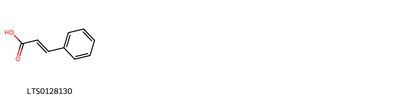
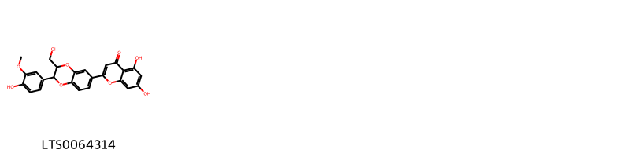
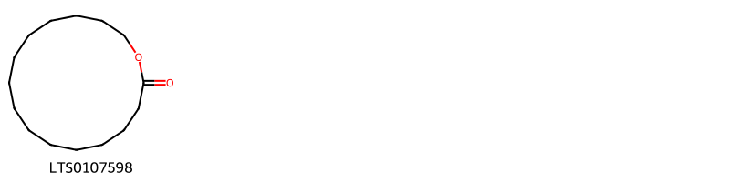
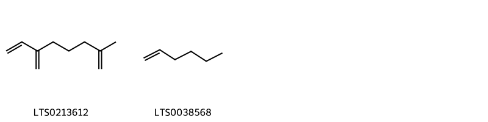

!!! abstract "Tóm tắt"

    Kim ngân (Hoa) (Flos Lonicerae) là nụ hoa có lẫn một số hoa đã phơi hay sấy khô của cây Kim ngân (Lonicera japonica Thunb.). Cây phân bố rộng rãi ở châu Á, châu Âu, châu Mỹ, châu Phi và châu Đại Dương. Còn ở Việt Nam cây mọc chủ yếu ở các vùng núi ở các tỉnh Trung du và miền núi phía Bắc. Nụ hoa kim ngân có tính cam, hàn, vào các kinh phế, vị, tâm. Dược liệu dùng trị ung nhọt, ban sởi, mày đay, lở ngứa, cảm mạo phong nhiệt, ôn bệnh phát nhiệt, nhiệt độc huyết lị. Thành phần hóa học của nụ hoa kim ngân gồm có flavonoid, tinh dầu và một số thành phần khác.

## Thông tin về thực vật

Dược liệu **Cây Kim Ngân (Nụ Hoa)** từ bộ phận **nan** từ loài *Lonicera japonica*.

**Mô tả thực vật:** Kim ngân là một loại dây mọc leo, thân có thể vươn dài tới 10m hay hơn. Cành lúc còn non màu lục nhạt, có phủ lông mịn, khi cành già chuyển màu nâu đỏ nhạt, nhẵn. Lá mọc đối, đôi khi mọc vòng 3 lá một, hình trứng dài, đầu hơi tù, phía cuống tròn, cuống ngắn 2-3mm, cả hai mặt đều phủ lông mịn. Vào các tháng 5-8, hoa mọc từng đôi ở kẽ lá, mỗi kẽ lá có 1 cuống mang 2 hoa, hai bên lá mọc đối mang 4 hoa, lá bắc giống lá nhưng nhỏ hơn. Hoa hình ống xẻ hai môi, môi lớn lại xẻ thành 3 hay 4 thùy nhỏ, phiến của tràng dài gần bằng ống tràng, lúc đầu màu trắng, sau khi nở một thời gian chuyển màu vàng, cùng một lúc trên cây có hoa mới nở màu trắng như bạc, lại có hoa nở đã lâu màu vàng như vàng cho nên có tên là kim ngân (kim là vàng, ngân là bạc); cây kim ngân xanh tốt vào mùa đông cho nên còn có tên là nhẫn đông nghĩa là chịu đựng mùa đông, 4 nhị thời dài cao hơn tràng; vòi nhụy lại thòi dài cao hơn nhị, mùi thơm dễ chịu. Quả hình trứng dài chừng 5 mm

*Tài liệu tham khảo:* "Những cây thuốc và vị thuốc Việt Nam" - Đỗ Tất Lợi 
Trong dược điển Việt nam, một loài được sử dụng làm dược liệu là *Lonicera japonica*.

!!! info "Phân loại thực vật của *Lonicera japonica*"
    - **Kingdom:** Plantae
    - **Phylum:** Tracheophyta
    - **Order:** Dipsacales
    - **Family:** Caprifoliaceae
    - **Genus:** Lonicera
    - **Species:** *Lonicera japonica*

**Phân bố trên thế giới:** nan, Netherlands, Belgium, Niue, Portugal, New Zealand, Spain, Argentina, Chinese Taipei, Italy, South Africa, Brazil, Hungary, Réunion, United States of America, United Kingdom of Great Britain and Northern Ireland, Australia

**Phân bố tại Việt nam:** Không có ghi nhận ở Việt Nam

## Thông tin về dược liệu 

### Định danh

!!! info "Thông tin về tên gọi"

    - Dược liệu tiếng Việt: nan
    - Dược liệu tiếng Trung: nan (nan)
    - Dược liệu tiếng Anh: nan
    - Dược liệu latin thông dụng: nan
    - Dược liệu latin kiểu DĐVN: *flos lonicerae*
    - Dược liệu latin kiểu DĐVN: *nan*
    - Dược liệu latin kiểu thông tư: *nan*
    - Bộ phận dùng: nan (nan)

### Mô tả dược liệu 

- **Theo dược điển Việt nam V:** nan

- **Mô tả dược liệu theo thông tư chế biến dược liệu theo phương pháp cổ truyền:** nan

### Chế biến 

- **Chế biến theo dược điển việt nam V**: nan

- **Chế biến theo thông tư:** nan

--- 

## Thành phần hóa học

- Theo tài liệu của GS. Đỗ Tất Lợi:  (1) Hoa chứa flavonoid, tinh dầu và một số thành phần khác. Các flavonoid là luteolin, luteolin - 7- glucosid. Tinh dầu gồm a - pinen; hex 1 en; hex- 3en1ol; cis và trans-2-methyl-2- vinyl-5- (a hydroxyisopropyl) tetrahydrofuran. Ngoài ra, Hoa còn chứa acid clorogenic 6%
    

**Thành phần hóa học từ loài **Lonicera japonica**

Theo cơ sở dữ liệu lotus, loài *Lonicera japonica* đã phân lập và xác định được **213** hoạt chất thuộc về các nhóm Fatty Acyls, Phenols, Tannins, Carboxylic acids and derivatives, Saturated hydrocarbons, Unsaturated hydrocarbons, Steroids and steroid derivatives, Flavonoids, Macrolides and analogues, Saccharolipids, Diazines, Isoquinolines and derivatives, Tetrahydrofurans, Benzene and substituted derivatives, Prenol lipids, Organooxygen compounds, Cinnamic acids and derivatives, Flavonolignans, Indoles and derivatives, Sphingolipids trong bảng dưới đây. Danh sách các hoạt chất như sau 7-deoxyloganetic acid [(LTS0040000)](https://lotus.naturalproducts.net/compound/lotus_id/LTS0040000), 4,5-dihydroxy-3-[(3,4,5-trihydroxy-6-methyloxan-2-yl)oxy]-6-{[(3,4,5-trihydroxyoxan-2-yl)oxy]methyl}oxan-2-yl 9-(hydroxymethyl)-2,2,6a,6b,9,12a-hexamethyl-10-{[3,4,5-trihydroxy-6-(hydroxymethyl)oxan-2-yl]oxy}-1,3,4,5,6,7,8,8a,10,11,12,12b,13,14b-tetradecahydropicene-4a-carboxylate [(LTS0118857)](https://lotus.naturalproducts.net/compound/lotus_id/LTS0118857), loganic acid [(LTS0231203)](https://lotus.naturalproducts.net/compound/lotus_id/LTS0231203), 5-carboxy-3-[(1e)-2-[(2r,3s,4s)-5-carboxy-3-ethenyl-2-{[(2s,3r,4s,5r,6r)-3,4,5-trihydroxy-6-(hydroxymethyl)oxan-2-yl]oxy}-3,4-dihydro-2h-pyran-4-yl]ethenyl]-1-(2-hydroxyethyl)-2h-pyridin-2-yl [(LTS0150042)](https://lotus.naturalproducts.net/compound/lotus_id/LTS0150042), 5-ethenyl-4-(2-methoxy-2-oxoethyl)-6-{[3,4,5-trihydroxy-6-(hydroxymethyl)oxan-2-yl]oxy}-5,6-dihydro-4h-pyran-3-carboxylic acid [(LTS0110457)](https://lotus.naturalproducts.net/compound/lotus_id/LTS0110457), 2-pentadecanone [(LTS0265307)](https://lotus.naturalproducts.net/compound/lotus_id/LTS0265307), (4s,5r,6s)-5-ethenyl-4-(2-methoxy-2-oxoethyl)-6-{[(2s,3r,4s,5s,6r)-3,4,5-trihydroxy-6-(hydroxymethyl)oxan-2-yl]oxy}-5,6-dihydro-4h-pyran-3-carboxylic acid [(LTS0167485)](https://lotus.naturalproducts.net/compound/lotus_id/LTS0167485), isochlorogenic acid [(LTS0210263)](https://lotus.naturalproducts.net/compound/lotus_id/LTS0210263), ochnaflavone [(LTS0243620)](https://lotus.naturalproducts.net/compound/lotus_id/LTS0243620), (2s,3r,4s,5s,6r)-4,5-dihydroxy-3-{[(2s,3r,4r,5r,6s)-3,4,5-trihydroxy-6-methyloxan-2-yl]oxy}-6-({[(2s,3r,4s,5r)-3,4,5-trihydroxyoxan-2-yl]oxy}methyl)oxan-2-yl (4as,6as,6br,8ar,9r,10s,12ar,12br,14br)-9-(hydroxymethyl)-2,2,6a,6b,9,12a-hexamethyl-10-{[(2s,3r,4s,5s)-3,4,5-trihydroxyoxan-2-yl]oxy}-1,3,4,5,6,7,8,8a,10,11,12,12b,13,14b-tetradecahydropicene-4a-carboxylate [(LTS0129400)](https://lotus.naturalproducts.net/compound/lotus_id/LTS0129400), (2s,3r,4s,5s,6r)-6-({[(2r,3r,4s,5s,6r)-6-[(acetyloxy)methyl]-3,4,5-trihydroxyoxan-2-yl]oxy}methyl)-3,4,5-trihydroxyoxan-2-yl (4as,6as,6br,8ar,9r,10s,12ar,12br,14bs)-10-{[(2s,3r,4s,5s)-4,5-dihydroxy-3-{[(2s,3r,4r,5r,6s)-3,4,5-trihydroxy-6-methyloxan-2-yl]oxy}oxan-2-yl]oxy}-9-(hydroxymethyl)-2,2,6a,6b,9,12a-hexamethyl-1,3,4,5,6,7,8,8a,10,11,12,12b,13,14b-tetradecahydropicene-4a-carboxylate [(LTS0192120)](https://lotus.naturalproducts.net/compound/lotus_id/LTS0192120), (3r,4as,5s,6s)-5-ethenyl-3-methoxy-6-{[(2s,3s,4r,5s,6s)-3,4,5-trihydroxy-6-(hydroxymethyl)oxan-2-yl]oxy}-3h,4h,4ah,5h,6h-pyrano[3,4-c]pyran-1-one [(LTS0192970)](https://lotus.naturalproducts.net/compound/lotus_id/LTS0192970), ethyl palmitate [(LTS0111042)](https://lotus.naturalproducts.net/compound/lotus_id/LTS0111042), eugenol [(LTS0052342)](https://lotus.naturalproducts.net/compound/lotus_id/LTS0052342), capric acid [(LTS0039856)](https://lotus.naturalproducts.net/compound/lotus_id/LTS0039856), 3-[(1e)-2-[(2s,3r,4s)-3-ethenyl-5-(methoxycarbonyl)-2-{[(2s,3r,4s,5s,6r)-3,4,5-trihydroxy-6-(hydroxymethyl)oxan-2-yl]oxy}-3,4-dihydro-2h-pyran-4-yl]ethenyl]-1-(2-hydroxyethyl)pyridin-1-ium [(LTS0196820)](https://lotus.naturalproducts.net/compound/lotus_id/LTS0196820), octisalate [(LTS0235959)](https://lotus.naturalproducts.net/compound/lotus_id/LTS0235959), (z)-3-hexenyl acetate [(LTS0167261)](https://lotus.naturalproducts.net/compound/lotus_id/LTS0167261), 2-methoxy-6-(prop-2-en-1-yl)phenol [(LTS0013916)](https://lotus.naturalproducts.net/compound/lotus_id/LTS0013916), 2-phenyl-ethanol [(LTS0206341)](https://lotus.naturalproducts.net/compound/lotus_id/LTS0206341), o-anisic acid [(LTS0185551)](https://lotus.naturalproducts.net/compound/lotus_id/LTS0185551), benzyl β-d-glucoside [(LTS0184698)](https://lotus.naturalproducts.net/compound/lotus_id/LTS0184698), allyl stearate [(LTS0092475)](https://lotus.naturalproducts.net/compound/lotus_id/LTS0092475), methyl 4-[(4,5-dimethyl-1,3-dioxolan-2-yl)methyl]-5-ethenyl-6-{[3,4,5-trihydroxy-6-(hydroxymethyl)oxan-2-yl]oxy}-5,6-dihydro-4h-pyran-3-carboxylate [(LTS0188388)](https://lotus.naturalproducts.net/compound/lotus_id/LTS0188388), methyl (4as,8as)-6-hydroxy-8-methyl-1-{[3,4,5-trihydroxy-6-(hydroxymethyl)oxan-2-yl]oxy}-1h,4ah,5h,6h,8h,8ah-pyrano[3,4-c]pyran-4-carboxylate [(LTS0262967)](https://lotus.naturalproducts.net/compound/lotus_id/LTS0262967), indole [(LTS0185357)](https://lotus.naturalproducts.net/compound/lotus_id/LTS0185357), (2r)-2-hydroxy-n-[(2s,3s,5r,6s,9e)-1,3,5,6-tetrahydroxyoctacos-9-en-2-yl]octadecanimidic acid [(LTS0173298)](https://lotus.naturalproducts.net/compound/lotus_id/LTS0173298), isophytol [(LTS0015331)](https://lotus.naturalproducts.net/compound/lotus_id/LTS0015331), β-carotene [(LTS0275716)](https://lotus.naturalproducts.net/compound/lotus_id/LTS0275716), hederagenin 3-o-arabinoside [(LTS0090209)](https://lotus.naturalproducts.net/compound/lotus_id/LTS0090209), methyl palmitate [(LTS0139222)](https://lotus.naturalproducts.net/compound/lotus_id/LTS0139222), luteolin 7-o-glucoside [(LTS0227450)](https://lotus.naturalproducts.net/compound/lotus_id/LTS0227450), benzyl alcohol [(LTS0125638)](https://lotus.naturalproducts.net/compound/lotus_id/LTS0125638), methyl (4s,5r,6r)-5-ethenyl-4-(2-oxoethyl)-6-{[(2s,3r,4s,5s,6r)-3,4,5-trihydroxy-6-(hydroxymethyl)oxan-2-yl]oxy}-5,6-dihydro-4h-pyran-3-carboxylate [(LTS0246845)](https://lotus.naturalproducts.net/compound/lotus_id/LTS0246845), 5,7-dihydroxy-2-[2-(4-hydroxy-3-methoxyphenyl)-3-(hydroxymethyl)-2,3-dihydro-1,4-benzodioxin-6-yl]chromen-4-one [(LTS0064314)](https://lotus.naturalproducts.net/compound/lotus_id/LTS0064314), progesterone [(LTS0238391)](https://lotus.naturalproducts.net/compound/lotus_id/LTS0238391), astragalin [(LTS0249588)](https://lotus.naturalproducts.net/compound/lotus_id/LTS0249588), 10-[(4,5-dihydroxy-3-{[3,4,5-trihydroxy-6-(hydroxymethyl)oxan-2-yl]oxy}oxan-2-yl)oxy]-9-(hydroxymethyl)-2,2,6a,6b,9,12a-hexamethyl-1,3,4,5,6,7,8,8a,10,11,12,12b,13,14b-tetradecahydropicene-4a-carboxylic acid [(LTS0101116)](https://lotus.naturalproducts.net/compound/lotus_id/LTS0101116), 3-carboxy-5-[(1e)-2-[(2s,3r,4s)-3-ethenyl-5-(methoxycarbonyl)-2-{[(2s,3r,4s,5s,6r)-3,4,5-trihydroxy-6-(hydroxymethyl)oxan-2-yl]oxy}-3,4-dihydro-2h-pyran-4-yl]ethenyl]-1-(2-hydroxyethyl)pyridin-1-ium [(LTS0199763)](https://lotus.naturalproducts.net/compound/lotus_id/LTS0199763), 2-{4-[4-(5,7-dihydroxy-4-oxochromen-2-yl)phenoxy]-3-methoxyphenyl}-5,7-dihydroxychromen-4-one [(LTS0197953)](https://lotus.naturalproducts.net/compound/lotus_id/LTS0197953), 2-({2-[3-ethenyl-5-(methoxycarbonyl)-2-{[3,4,5-trihydroxy-6-(hydroxymethyl)oxan-2-yl]oxy}-3,4-dihydro-2h-pyran-4-yl]ethyl}amino)-3-phenylpropanoic acid [(LTS0008479)](https://lotus.naturalproducts.net/compound/lotus_id/LTS0008479), (3s,4as,5r,6s)-5-ethenyl-3-methoxy-6-{[(2s,3r,4s,5s,6r)-3,4,5-trihydroxy-6-(hydroxymethyl)oxan-2-yl]oxy}-3h,4h,4ah,5h,6h-pyrano[3,4-c]pyran-1-one [(LTS0187995)](https://lotus.naturalproducts.net/compound/lotus_id/LTS0187995), [(2s,3r,4s)-3-ethenyl-5-(methoxycarbonyl)-2-{[(2s,3r,4s,5s,6r)-3,4,5-trihydroxy-6-(hydroxymethyl)oxan-2-yl]oxy}-3,4-dihydro-2h-pyran-4-yl]acetic acid [(LTS0101012)](https://lotus.naturalproducts.net/compound/lotus_id/LTS0101012), 4,5-dihydroxy-3-[(3,4,5-trihydroxy-6-methyloxan-2-yl)oxy]-6-{[(3,4,5-trihydroxyoxan-2-yl)oxy]methyl}oxan-2-yl 10-({4,5-dihydroxy-3-[(3,4,5-trihydroxy-6-methyloxan-2-yl)oxy]oxan-2-yl}oxy)-9-(hydroxymethyl)-2,2,6a,6b,9,12a-hexamethyl-1,3,4,5,6,7,8,8a,10,11,12,12b,13,14b-tetradecahydropicene-4a-carboxylate [(LTS0164634)](https://lotus.naturalproducts.net/compound/lotus_id/LTS0164634), 7-deoxyloganetin [(LTS0122992)](https://lotus.naturalproducts.net/compound/lotus_id/LTS0122992), 5-ethenyl-4-[2-(3-methoxy-4-{[3,4,5-trihydroxy-6-(hydroxymethyl)oxan-2-yl]oxy}benzoyloxy)ethyl]-6-{[3,4,5-trihydroxy-6-(hydroxymethyl)oxan-2-yl]oxy}-5,6-dihydro-4h-pyran-3-carboxylic acid [(LTS0000922)](https://lotus.naturalproducts.net/compound/lotus_id/LTS0000922), hyperoside [(LTS0089156)](https://lotus.naturalproducts.net/compound/lotus_id/LTS0089156), methyl (1s,4as,6s,7r,7as)-1-{[(2s,3r,4s,5s,6r)-6-({[(3r,4as,5r,6s)-5-ethenyl-1-oxo-6-{[(2s,3r,4s,5s,6r)-3,4,5-trihydroxy-6-(hydroxymethyl)oxan-2-yl]oxy}-3h,4h,4ah,5h,6h-pyrano[3,4-c]pyran-3-yl]oxy}methyl)-3,4,5-trihydroxyoxan-2-yl]oxy}-6-hydroxy-7-methyl-1h,4ah,5h,6h,7h,7ah-cyclopenta[c]pyran-4-carboxylate [(LTS0187232)](https://lotus.naturalproducts.net/compound/lotus_id/LTS0187232), methyl (4s,5r,6s)-4-{[(2r,4r,5s)-4,5-dimethyl-1,3-dioxolan-2-yl]methyl}-5-ethenyl-6-{[(2s,3r,4s,5s,6r)-3,4,5-trihydroxy-6-(hydroxymethyl)oxan-2-yl]oxy}-5,6-dihydro-4h-pyran-3-carboxylate [(LTS0027684)](https://lotus.naturalproducts.net/compound/lotus_id/LTS0027684), 2-(benzyloxy)benzoic acid [(LTS0003895)](https://lotus.naturalproducts.net/compound/lotus_id/LTS0003895), luteolin [(LTS0017052)](https://lotus.naturalproducts.net/compound/lotus_id/LTS0017052), 3-carboxy-1-(3-carboxypropyl)-5-[(1e)-2-[(2s,3r,4s)-3-ethenyl-5-(methoxycarbonyl)-2-{[(2s,3r,4s,5s,6r)-3,4,5-trihydroxy-6-(hydroxymethyl)oxan-2-yl]oxy}-3,4-dihydro-2h-pyran-4-yl]ethenyl]pyridin-1-ium [(LTS0078530)](https://lotus.naturalproducts.net/compound/lotus_id/LTS0078530), polyprenol [(LTS0209244)](https://lotus.naturalproducts.net/compound/lotus_id/LTS0209244), methyl 5-ethenyl-4-{3-[3-ethenyl-5-(methoxycarbonyl)-2-{[3,4,5-trihydroxy-6-(hydroxymethyl)oxan-2-yl]oxy}-3,4-dihydro-2h-pyran-4-yl]-4-oxobut-2-en-1-yl}-6-{[3,4,5-trihydroxy-6-(hydroxymethyl)oxan-2-yl]oxy}-5,6-dihydro-4h-pyran-3-carboxylate [(LTS0119142)](https://lotus.naturalproducts.net/compound/lotus_id/LTS0119142), 3-carboxy-5-[(1e)-2-[(2s,3r,4s)-5-carboxylato-3-ethenyl-2-{[(2s,3r,4s,5s,6r)-3,4,5-trihydroxy-6-(hydroxymethyl)oxan-2-yl]oxy}-3,4-dihydro-2h-pyran-4-yl]ethenyl]-1-(3-carboxypropyl)pyridin-1-ium [(LTS0073819)](https://lotus.naturalproducts.net/compound/lotus_id/LTS0073819), 1-hexene [(LTS0038568)](https://lotus.naturalproducts.net/compound/lotus_id/LTS0038568), (2s)-2-({2-[(2s,3r,4s)-3-ethenyl-5-(methoxycarbonyl)-2-{[(2s,3r,4s,5s,6r)-3,4,5-trihydroxy-6-(hydroxymethyl)oxan-2-yl]oxy}-3,4-dihydro-2h-pyran-4-yl]ethyl}amino)-3-phenylpropanoic acid [(LTS0100816)](https://lotus.naturalproducts.net/compound/lotus_id/LTS0100816), chrysin [(LTS0200644)](https://lotus.naturalproducts.net/compound/lotus_id/LTS0200644), (4s,5r,6s)-4-(carboxymethyl)-5-ethenyl-6-{[(2r,3s,4r,5r,6s)-3,4,5-trihydroxy-6-(hydroxymethyl)oxan-2-yl]oxy}-5,6-dihydro-4h-pyran-3-carboxylic acid [(LTS0267795)](https://lotus.naturalproducts.net/compound/lotus_id/LTS0267795), (2s,3r,4s,5s,6r)-3,4,5-trihydroxy-6-({[(2r,3r,4s,5s,6r)-3,4,5-trihydroxy-6-(hydroxymethyl)oxan-2-yl]oxy}methyl)oxan-2-yl (4as,6as,6br,8ar,10s,12ar,12br,14bs)-10-{[(2s,3r,4s,5s)-4,5-dihydroxy-3-{[(2s,3r,4s,5s,6r)-3,4,5-trihydroxy-6-(hydroxymethyl)oxan-2-yl]oxy}oxan-2-yl]oxy}-2,2,6a,6b,9,9,12a-heptamethyl-1,3,4,5,6,7,8,8a,10,11,12,12b,13,14b-tetradecahydropicene-4a-carboxylate [(LTS0072041)](https://lotus.naturalproducts.net/compound/lotus_id/LTS0072041), terpineol [(LTS0136148)](https://lotus.naturalproducts.net/compound/lotus_id/LTS0136148), secologanin [(LTS0235060)](https://lotus.naturalproducts.net/compound/lotus_id/LTS0235060), 5-ethenyl-6-{[3,4,5-trihydroxy-6-(hydroxymethyl)oxan-2-yl]oxy}-3h,4h,4ah,5h,6h-pyrano[3,4-c]pyran-1-one [(LTS0049445)](https://lotus.naturalproducts.net/compound/lotus_id/LTS0049445), methyl phenylacetate [(LTS0085009)](https://lotus.naturalproducts.net/compound/lotus_id/LTS0085009), (2s,3r,4s,5s,6r)-4,5-dihydroxy-3-{[(2s,3r,4r,5r,6s)-3,4,5-trihydroxy-6-methyloxan-2-yl]oxy}-6-({[(2s,3r,4s,5r)-3,4,5-trihydroxyoxan-2-yl]oxy}methyl)oxan-2-yl (4as,6as,6br,8ar,9r,10s,12ar,12br,14bs)-10-{[(2s,3r,4s,5s)-4,5-dihydroxy-3-{[(2s,3r,4r,5r,6s)-3,4,5-trihydroxy-6-methyloxan-2-yl]oxy}oxan-2-yl]oxy}-9-(hydroxymethyl)-2,2,6a,6b,9,12a-hexamethyl-1,3,4,5,6,7,8,8a,10,11,12,12b,13,14b-tetradecahydropicene-4a-carboxylate [(LTS0212920)](https://lotus.naturalproducts.net/compound/lotus_id/LTS0212920), methyl (4s,5r,6s)-5-ethenyl-4-[(2e)-3-[(2s,3r,4r)-3-ethenyl-5-(methoxycarbonyl)-2-{[(2s,3r,4s,5s,6r)-3,4,5-trihydroxy-6-(hydroxymethyl)oxan-2-yl]oxy}-3,4-dihydro-2h-pyran-4-yl]-4-oxobut-2-en-1-yl]-6-{[(2s,3r,4s,5s,6r)-3,4,5-trihydroxy-6-(hydroxymethyl)oxan-2-yl]oxy}-5,6-dihydro-4h-pyran-3-carboxylate [(LTS0250189)](https://lotus.naturalproducts.net/compound/lotus_id/LTS0250189), (10e,12e,14e)-2,6,10,14,19,23,27,31-octamethyldotriaconta-2,6,10,12,14,16,18,22,26,30-decaene [(LTS0022128)](https://lotus.naturalproducts.net/compound/lotus_id/LTS0022128), carvacrol [(LTS0012882)](https://lotus.naturalproducts.net/compound/lotus_id/LTS0012882), 2,6,6-trimethylbicyclo[3.1.1]hept-1-ene [(LTS0080542)](https://lotus.naturalproducts.net/compound/lotus_id/LTS0080542), cis-3-hexenol [(LTS0132156)](https://lotus.naturalproducts.net/compound/lotus_id/LTS0132156), 11-hexadecenoic acid [(LTS0130305)](https://lotus.naturalproducts.net/compound/lotus_id/LTS0130305), 2-(3,4-dihydroxyphenyl)-5,7-dihydroxy-3-{[(2s,3r,4r,5r,6s)-3,4,5-trihydroxy-6-(hydroxymethyl)oxan-2-yl]oxy}chromen-4-one [(LTS0241372)](https://lotus.naturalproducts.net/compound/lotus_id/LTS0241372), geraniol [(LTS0258838)](https://lotus.naturalproducts.net/compound/lotus_id/LTS0258838), methyl 4-(2,2-dimethoxyethyl)-5-ethenyl-6-{[3,4,5-trihydroxy-6-(hydroxymethyl)oxan-2-yl]oxy}-5,6-dihydro-4h-pyran-3-carboxylate [(LTS0218607)](https://lotus.naturalproducts.net/compound/lotus_id/LTS0218607), methyl (6s)-5-ethenyl-4-(2-oxoethyl)-6-{[(2s,3r,4s,5r,6r)-3,4,5-tris(acetyloxy)-6-[(acetyloxy)methyl]oxan-2-yl]oxy}-5,6-dihydro-4h-pyran-3-carboxylate [(LTS0171325)](https://lotus.naturalproducts.net/compound/lotus_id/LTS0171325), (2s,3r,4s,5s,6r)-2-{[(3s,4r,4as,6r)-4-ethenyl-6-methoxy-3h,4h,4ah,5h,6h,8h-pyrano[3,4-c]pyran-3-yl]oxy}-6-(hydroxymethyl)oxane-3,4,5-triol [(LTS0156001)](https://lotus.naturalproducts.net/compound/lotus_id/LTS0156001), 3,4,5-trihydroxy-6-({[3,4,5-trihydroxy-6-(hydroxymethyl)oxan-2-yl]oxy}methyl)oxan-2-yl 10-({4,5-dihydroxy-3-[(3,4,5-trihydroxy-6-methyloxan-2-yl)oxy]oxan-2-yl}oxy)-2,2,6a,6b,9,9,12a-heptamethyl-1,3,4,5,6,7,8,8a,10,11,12,12b,13,14b-tetradecahydropicene-4a-carboxylate [(LTS0193057)](https://lotus.naturalproducts.net/compound/lotus_id/LTS0193057), (1s,4as,6s,7s,7as)-6-hydroxy-7-methyl-1-{[(2s,3r,4s,5s,6r)-3,4,5-trihydroxy-6-(hydroxymethyl)oxan-2-yl]oxy}-1h,4ah,5h,6h,7h,7ah-cyclopenta[c]pyran-4-carboxylic acid [(LTS0260312)](https://lotus.naturalproducts.net/compound/lotus_id/LTS0260312), (2s,3r,4s,5s,6r)-3,4,5-trihydroxy-6-(hydroxymethyl)oxan-2-yl (4as,6as,6br,8ar,9r,10s,12ar,12br,14bs)-10-{[(2s,3r,4s,5s)-4,5-dihydroxy-3-{[(2s,3r,4r,5r,6s)-3,4,5-trihydroxy-6-methyloxan-2-yl]oxy}oxan-2-yl]oxy}-9-(hydroxymethyl)-2,2,6a,6b,9,12a-hexamethyl-1,3,4,5,6,7,8,8a,10,11,12,12b,13,14b-tetradecahydropicene-4a-carboxylate [(LTS0191742)](https://lotus.naturalproducts.net/compound/lotus_id/LTS0191742), lonijaposide g [(LTS0017922)](https://lotus.naturalproducts.net/compound/lotus_id/LTS0017922), isopropyl laurate [(LTS0129928)](https://lotus.naturalproducts.net/compound/lotus_id/LTS0129928), (-)-secologanin [(LTS0199033)](https://lotus.naturalproducts.net/compound/lotus_id/LTS0199033), didecyl ether [(LTS0250090)](https://lotus.naturalproducts.net/compound/lotus_id/LTS0250090), cauloside c [(LTS0086751)](https://lotus.naturalproducts.net/compound/lotus_id/LTS0086751), 2-ethylhexanol [(LTS0180984)](https://lotus.naturalproducts.net/compound/lotus_id/LTS0180984), sweroside [(LTS0014051)](https://lotus.naturalproducts.net/compound/lotus_id/LTS0014051), 2-hydroxy-n-(1,3,5,6-tetrahydroxyoctacos-9-en-2-yl)octadecanimidic acid [(LTS0254989)](https://lotus.naturalproducts.net/compound/lotus_id/LTS0254989), 6-[({6-[(acetyloxy)methyl]-3,4,5-trihydroxyoxan-2-yl}oxy)methyl]-3,4,5-trihydroxyoxan-2-yl 10-({4,5-dihydroxy-3-[(3,4,5-trihydroxy-6-methyloxan-2-yl)oxy]oxan-2-yl}oxy)-9-(hydroxymethyl)-2,2,6a,6b,9,12a-hexamethyl-1,3,4,5,6,7,8,8a,10,11,12,12b,13,14b-tetradecahydropicene-4a-carboxylate [(LTS0241854)](https://lotus.naturalproducts.net/compound/lotus_id/LTS0241854), methyl (4s,5r,6s)-4-{[(4r,5s)-4,5-dimethyl-1,3-dioxolan-2-yl]methyl}-5-ethenyl-6-{[(2s,3r,4s,5s,6r)-3,4,5-trihydroxy-6-(hydroxymethyl)oxan-2-yl]oxy}-5,6-dihydro-4h-pyran-3-carboxylate [(LTS0256042)](https://lotus.naturalproducts.net/compound/lotus_id/LTS0256042), 2-({4-ethenyl-6-methoxy-3h,4h,4ah,5h,6h,8h-pyrano[3,4-c]pyran-3-yl}oxy)-6-(hydroxymethyl)oxane-3,4,5-triol [(LTS0094812)](https://lotus.naturalproducts.net/compound/lotus_id/LTS0094812), 3,4,5-trihydroxy-6-(hydroxymethyl)oxan-2-yl 10-({4,5-dihydroxy-3-[(3,4,5-trihydroxy-6-methyloxan-2-yl)oxy]oxan-2-yl}oxy)-9-(hydroxymethyl)-2,2,6a,6b,9,12a-hexamethyl-1,3,4,5,6,7,8,8a,10,11,12,12b,13,14b-tetradecahydropicene-4a-carboxylate [(LTS0068099)](https://lotus.naturalproducts.net/compound/lotus_id/LTS0068099), isoquinoline [(LTS0089583)](https://lotus.naturalproducts.net/compound/lotus_id/LTS0089583), methyl (4s,5s,6s)-4-{[(2s,4r,5s)-4,5-dimethyl-1,3-dioxolan-2-yl]methyl}-5-ethenyl-6-{[(2s,3r,4s,5s,6r)-3,4,5-trihydroxy-6-(hydroxymethyl)oxan-2-yl]oxy}-5,6-dihydro-4h-pyran-3-carboxylate [(LTS0270646)](https://lotus.naturalproducts.net/compound/lotus_id/LTS0270646), (2s,3r,4s,5s,6r)-3,4,5-trihydroxy-6-({[(2r,3r,4s,5s,6r)-3,4,5-trihydroxy-6-(hydroxymethyl)oxan-2-yl]oxy}methyl)oxan-2-yl (4as,6as,6br,9r,10s,12ar)-10-{[(2s,3r,4s,5s)-4,5-dihydroxy-3-{[(2s,3r,4r,5r,6s)-3,4,5-trihydroxy-6-methyloxan-2-yl]oxy}oxan-2-yl]oxy}-9-(hydroxymethyl)-2,2,6a,6b,9,12a-hexamethyl-1,3,4,5,6,7,8,8a,10,11,12,12b,13,14b-tetradecahydropicene-4a-carboxylate [(LTS0162110)](https://lotus.naturalproducts.net/compound/lotus_id/LTS0162110), nerolidol [(LTS0197738)](https://lotus.naturalproducts.net/compound/lotus_id/LTS0197738), piperitenone [(LTS0074451)](https://lotus.naturalproducts.net/compound/lotus_id/LTS0074451), [3-ethenyl-5-(methoxycarbonyl)-2-{[3,4,5-trihydroxy-6-(hydroxymethyl)oxan-2-yl]oxy}-3,4-dihydro-2h-pyran-4-yl]acetic acid [(LTS0036880)](https://lotus.naturalproducts.net/compound/lotus_id/LTS0036880), dipsacoside b [(LTS0161777)](https://lotus.naturalproducts.net/compound/lotus_id/LTS0161777), octadec-1-yne [(LTS0208608)](https://lotus.naturalproducts.net/compound/lotus_id/LTS0208608), methyl (4s,5r,6s)-5-ethenyl-4-[(2z)-3-[(2s,3r,4r)-3-ethenyl-5-(methoxycarbonyl)-2-{[(2s,3r,4s,5s,6r)-3,4,5-trihydroxy-6-(hydroxymethyl)oxan-2-yl]oxy}-3,4-dihydro-2h-pyran-4-yl]-4-oxobut-2-en-1-yl]-6-{[(2s,3r,4s,5s,6r)-3,4,5-trihydroxy-6-(hydroxymethyl)oxan-2-yl]oxy}-5,6-dihydro-4h-pyran-3-carboxylate [(LTS0218395)](https://lotus.naturalproducts.net/compound/lotus_id/LTS0218395), 1,3,3-trimethyl-2-[(9e,11e,13e,15e,17e)-3,7,12,16-tetramethyl-18-(2,6,6-trimethylcyclohex-1-en-1-yl)octadeca-1,3,5,7,9,11,13,15,17-nonaen-1-yl]cyclohex-1-ene [(LTS0110068)](https://lotus.naturalproducts.net/compound/lotus_id/LTS0110068), benzyl tiglate [(LTS0180584)](https://lotus.naturalproducts.net/compound/lotus_id/LTS0180584), neochlorogenic acid [(LTS0235816)](https://lotus.naturalproducts.net/compound/lotus_id/LTS0235816), 2-(3,7,12,16,20,24-hexamethylpentacosa-1,3,5,7,9,11,13,15,17,19,23-undecaen-1-yl)-1,3,3-trimethylcyclohex-1-ene [(LTS0086978)](https://lotus.naturalproducts.net/compound/lotus_id/LTS0086978), (2s,3r,4s,5s,6r)-3,4,5-trihydroxy-6-({[(2r,3r,4s,5s,6r)-3,4,5-trihydroxy-6-(hydroxymethyl)oxan-2-yl]oxy}methyl)oxan-2-yl (4as,6as,6br,8ar,9r,10s,12ar,12br,14bs)-10-{[(2s,3r,4s,5s)-4,5-dihydroxy-3-{[(2s,3r,4s,5s,6r)-3,4,5-trihydroxy-6-(hydroxymethyl)oxan-2-yl]oxy}oxan-2-yl]oxy}-9-(hydroxymethyl)-2,2,6a,6b,9,12a-hexamethyl-1,3,4,5,6,7,8,8a,10,11,12,12b,13,14b-tetradecahydropicene-4a-carboxylate [(LTS0016604)](https://lotus.naturalproducts.net/compound/lotus_id/LTS0016604), phenylacetaldehyde [(LTS0245512)](https://lotus.naturalproducts.net/compound/lotus_id/LTS0245512), 2-methyl-6-methylideneocta-1,7-diene [(LTS0213612)](https://lotus.naturalproducts.net/compound/lotus_id/LTS0213612), methyl (1s,4as,8s,8as)-8-methyl-6-oxo-1-{[(2s,3r,4s,5s,6r)-3,4,5-trihydroxy-6-(hydroxymethyl)oxan-2-yl]oxy}-1h,4ah,5h,8h,8ah-pyrano[3,4-c]pyran-4-carboxylate [(LTS0082680)](https://lotus.naturalproducts.net/compound/lotus_id/LTS0082680), 3,4,5-trihydroxy-6-({[3,4,5-trihydroxy-6-(hydroxymethyl)oxan-2-yl]oxy}methyl)oxan-2-yl 2,2,6a,6b,9,9,12a-heptamethyl-10-[(3,4,5-trihydroxyoxan-2-yl)oxy]-1,3,4,5,6,7,8,8a,10,11,12,12b,13,14b-tetradecahydropicene-4a-carboxylate [(LTS0234984)](https://lotus.naturalproducts.net/compound/lotus_id/LTS0234984), methyl (1s,4as,6s,7s,7as)-6-hydroxy-7-methyl-1-{[(2s,3r,4s,5s,6r)-3,4,5-trihydroxy-6-(hydroxymethyl)oxan-2-yl]oxy}-1h,4ah,5h,6h,7h,7ah-cyclopenta[c]pyran-4-carboxylate [(LTS0213092)](https://lotus.naturalproducts.net/compound/lotus_id/LTS0213092), lonijaposide h [(LTS0000491)](https://lotus.naturalproducts.net/compound/lotus_id/LTS0000491), (2r)-2-hydroxy-n-[(2s,3s,5r,6s,9e)-3,5,6-trihydroxy-1-{[(2r,3r,4s,5s,6r)-3,4,5-trihydroxy-6-(hydroxymethyl)oxan-2-yl]oxy}hexacos-9-en-2-yl]hexadecanimidic acid [(LTS0160915)](https://lotus.naturalproducts.net/compound/lotus_id/LTS0160915), 2-({4-ethenyl-3h,4h,4ah,5h,6h,8h-pyrano[3,4-c]pyran-3-yl}oxy)-6-(hydroxymethyl)oxane-3,4,5-triol [(LTS0008879)](https://lotus.naturalproducts.net/compound/lotus_id/LTS0008879), hexyl acetate [(LTS0202355)](https://lotus.naturalproducts.net/compound/lotus_id/LTS0202355), (2s,3r,4s,5s,6r)-2-{[(3s,4r,4as,6s)-4-ethenyl-6-methoxy-3h,4h,4ah,5h,6h,8h-pyrano[3,4-c]pyran-3-yl]oxy}-6-(hydroxymethyl)oxane-3,4,5-triol [(LTS0233432)](https://lotus.naturalproducts.net/compound/lotus_id/LTS0233432), (3r,4as,5r,6s)-5-ethenyl-3-methoxy-6-{[(2s,3r,4s,5s,6r)-3,4,5-trihydroxy-6-(hydroxymethyl)oxan-2-yl]oxy}-3h,4h,4ah,5h,6h-pyrano[3,4-c]pyran-1-one [(LTS0157469)](https://lotus.naturalproducts.net/compound/lotus_id/LTS0157469), methyl (1s,4as,8s,8as)-8-methyl-6-oxo-1-{[(2r,3s,4r,5s,6s)-3,4,5-trihydroxy-6-(hydroxymethyl)oxan-2-yl]oxy}-1h,4ah,5h,8h,8ah-pyrano[3,4-c]pyran-4-carboxylate [(LTS0102052)](https://lotus.naturalproducts.net/compound/lotus_id/LTS0102052), hexyl (2e)-2-methylbut-2-enoate [(LTS0082952)](https://lotus.naturalproducts.net/compound/lotus_id/LTS0082952), methyl 6-hydroxy-8-methyl-1-{[3,4,5-trihydroxy-6-(hydroxymethyl)oxan-2-yl]oxy}-1h,4ah,5h,6h,8h,8ah-pyrano[3,4-c]pyran-4-carboxylate [(LTS0084953)](https://lotus.naturalproducts.net/compound/lotus_id/LTS0084953), 5-ethenyl-3-methoxy-6-{[(2s,3r,4s,5s,6r)-3,4,5-trihydroxy-6-(hydroxymethyl)oxan-2-yl]oxy}-3h,4h,4ah,5h,6h-pyrano[3,4-c]pyran-1-one [(LTS0075789)](https://lotus.naturalproducts.net/compound/lotus_id/LTS0075789), (2s,3r,4s,5s,6r)-3,4,5-trihydroxy-6-({[(2r,3r,4s,5s,6r)-3,4,5-trihydroxy-6-(hydroxymethyl)oxan-2-yl]oxy}methyl)oxan-2-yl (4as,6as,6br,8ar,9r,10s,12ar,12br,14bs)-9-(hydroxymethyl)-2,2,6a,6b,9,12a-hexamethyl-10-{[(2s,3r,4s,5s)-3,4,5-trihydroxyoxan-2-yl]oxy}-1,3,4,5,6,7,8,8a,10,11,12,12b,13,14b-tetradecahydropicene-4a-carboxylate [(LTS0170288)](https://lotus.naturalproducts.net/compound/lotus_id/LTS0170288), (3z)-hexenyl tiglate [(LTS0127710)](https://lotus.naturalproducts.net/compound/lotus_id/LTS0127710), jasmone [(LTS0205512)](https://lotus.naturalproducts.net/compound/lotus_id/LTS0205512), 5-ethenyl-3-methoxy-6-{[3,4,5-trihydroxy-6-(hydroxymethyl)oxan-2-yl]oxy}-3h,4h,4ah,5h,6h-pyrano[3,4-c]pyran-1-one [(LTS0253286)](https://lotus.naturalproducts.net/compound/lotus_id/LTS0253286), 3,4,5-trihydroxy-6-({[3,4,5-trihydroxy-6-(hydroxymethyl)oxan-2-yl]oxy}methyl)oxan-2-yl 9-(hydroxymethyl)-2,2,6a,6b,9,12a-hexamethyl-10-[(3,4,5-trihydroxyoxan-2-yl)oxy]-1,3,4,5,6,7,8,8a,10,11,12,12b,13,14b-tetradecahydropicene-4a-carboxylate [(LTS0238626)](https://lotus.naturalproducts.net/compound/lotus_id/LTS0238626), 10-({4,5-dihydroxy-3-[(3,4,5-trihydroxy-6-methyloxan-2-yl)oxy]oxan-2-yl}oxy)-9-(hydroxymethyl)-2,2,6a,6b,9,12a-hexamethyl-1,3,4,5,6,7,8,8a,10,11,12,12b,13,14b-tetradecahydropicene-4a-carboxylic acid [(LTS0107537)](https://lotus.naturalproducts.net/compound/lotus_id/LTS0107537), farnesol [(LTS0059667)](https://lotus.naturalproducts.net/compound/lotus_id/LTS0059667), 2-{4-[4-(5,7-dihydroxy-4-oxochromen-2-yl)phenoxy]-3-hydroxyphenyl}-5-hydroxy-7-methylchromen-4-one [(LTS0233611)](https://lotus.naturalproducts.net/compound/lotus_id/LTS0233611), (2s,3r,4s,5s,6r)-4,5-dihydroxy-3-{[(2s,3r,4r,5r,6s)-3,4,5-trihydroxy-6-methyloxan-2-yl]oxy}-6-({[(2s,3r,4s,5r)-3,4,5-trihydroxyoxan-2-yl]oxy}methyl)oxan-2-yl (4as,6as,6br,8ar,9r,10s,12ar,12br,14bs)-9-(hydroxymethyl)-2,2,6a,6b,9,12a-hexamethyl-10-{[(2r,3r,4s,5s,6r)-3,4,5-trihydroxy-6-(hydroxymethyl)oxan-2-yl]oxy}-1,3,4,5,6,7,8,8a,10,11,12,12b,13,14b-tetradecahydropicene-4a-carboxylate [(LTS0226310)](https://lotus.naturalproducts.net/compound/lotus_id/LTS0226310), lonijaposide m [(LTS0047239)](https://lotus.naturalproducts.net/compound/lotus_id/LTS0047239), (2s,3r,4s,5s,6r)-3,4,5-trihydroxy-6-({[(2r,3r,4s,5s,6r)-3,4,5-trihydroxy-6-(hydroxymethyl)oxan-2-yl]oxy}methyl)oxan-2-yl (4as,6as,6br,8ar,10s,12ar,12br,14bs)-2,2,6a,6b,9,9,12a-heptamethyl-10-{[(2s,3r,4s,5s)-3,4,5-trihydroxyoxan-2-yl]oxy}-1,3,4,5,6,7,8,8a,10,11,12,12b,13,14b-tetradecahydropicene-4a-carboxylate [(LTS0006048)](https://lotus.naturalproducts.net/compound/lotus_id/LTS0006048), 3,4,5-trihydroxy-6-({[3,4,5-trihydroxy-6-(hydroxymethyl)oxan-2-yl]oxy}methyl)oxan-2-yl 10-[(4,5-dihydroxy-3-{[3,4,5-trihydroxy-6-(hydroxymethyl)oxan-2-yl]oxy}oxan-2-yl)oxy]-2,2,6a,6b,9,9,12a-heptamethyl-1,3,4,5,6,7,8,8a,10,11,12,12b,13,14b-tetradecahydropicene-4a-carboxylate [(LTS0080846)](https://lotus.naturalproducts.net/compound/lotus_id/LTS0080846), quercetin [(LTS0004651)](https://lotus.naturalproducts.net/compound/lotus_id/LTS0004651), β-bourbonene [(LTS0074484)](https://lotus.naturalproducts.net/compound/lotus_id/LTS0074484), farnesene [(LTS0057150)](https://lotus.naturalproducts.net/compound/lotus_id/LTS0057150), lonicerin [(LTS0219204)](https://lotus.naturalproducts.net/compound/lotus_id/LTS0219204), methyl (4s,5s,6s)-4-{[(2r,4r,5s)-4,5-dimethyl-1,3-dioxolan-2-yl]methyl}-5-ethenyl-6-{[(2s,3r,4s,5s,6r)-3,4,5-trihydroxy-6-(hydroxymethyl)oxan-2-yl]oxy}-5,6-dihydro-4h-pyran-3-carboxylate [(LTS0014246)](https://lotus.naturalproducts.net/compound/lotus_id/LTS0014246), phytofluene [(LTS0181914)](https://lotus.naturalproducts.net/compound/lotus_id/LTS0181914), 5-carboxy-1-(3-carboxypropyl)-3-[(1e)-2-[(2r,3s,4s)-3-ethenyl-5-(methoxycarbonyl)-2-{[(2s,3r,4s,5s,6r)-3,4,5-trihydroxy-6-(hydroxymethyl)oxan-2-yl]oxy}-3,4-dihydro-2h-pyran-4-yl]ethenyl]-2h-pyridin-2-yl [(LTS0210169)](https://lotus.naturalproducts.net/compound/lotus_id/LTS0210169), (4as,5s,6s)-5-ethenyl-6-{[(2s,3s,4s,5s,6r)-3,4,5-trihydroxy-6-(hydroxymethyl)oxan-2-yl]oxy}-3h,4h,4ah,5h,6h-pyrano[3,4-c]pyran-1-one [(LTS0048954)](https://lotus.naturalproducts.net/compound/lotus_id/LTS0048954), (1z)-hex-1-en-1-yl (2e)-2-methylbut-2-enoate [(LTS0191373)](https://lotus.naturalproducts.net/compound/lotus_id/LTS0191373), n-[2-(5-methoxy-1h-indol-3-yl)ethyl]ethanimidic acid [(LTS0219322)](https://lotus.naturalproducts.net/compound/lotus_id/LTS0219322), 3,7,11-trimethyldodeca-1,6,10-trien-3-yl acetate [(LTS0104577)](https://lotus.naturalproducts.net/compound/lotus_id/LTS0104577), cinnamic acid [(LTS0128130)](https://lotus.naturalproducts.net/compound/lotus_id/LTS0128130), bis(methoxyethyl)phthalate [(LTS0256908)](https://lotus.naturalproducts.net/compound/lotus_id/LTS0256908), α-hederin [(LTS0024551)](https://lotus.naturalproducts.net/compound/lotus_id/LTS0024551), methyl benzoate [(LTS0225398)](https://lotus.naturalproducts.net/compound/lotus_id/LTS0225398), arachidyl alcohol [(LTS0230409)](https://lotus.naturalproducts.net/compound/lotus_id/LTS0230409), (2s,3r,4s,5s,6r)-3,4,5-trihydroxy-6-({[(2r,3r,4s,5s,6r)-3,4,5-trihydroxy-6-(hydroxymethyl)oxan-2-yl]oxy}methyl)oxan-2-yl (4as,6as,6br,8ar,10s,12ar,12br,14bs)-10-{[(2s,3r,4s,5s)-4,5-dihydroxy-3-{[(2s,3r,4r,5r,6s)-3,4,5-trihydroxy-6-methyloxan-2-yl]oxy}oxan-2-yl]oxy}-2,2,6a,6b,9,9,12a-heptamethyl-1,3,4,5,6,7,8,8a,10,11,12,12b,13,14b-tetradecahydropicene-4a-carboxylate [(LTS0051871)](https://lotus.naturalproducts.net/compound/lotus_id/LTS0051871), methyl 8-methyl-6-oxo-1-{[3,4,5-trihydroxy-6-(hydroxymethyl)oxan-2-yl]oxy}-1h,4ah,5h,8h,8ah-pyrano[3,4-c]pyran-4-carboxylate [(LTS0251161)](https://lotus.naturalproducts.net/compound/lotus_id/LTS0251161), gamma-carotene [(LTS0108535)](https://lotus.naturalproducts.net/compound/lotus_id/LTS0108535), 3-[(1z)-hex-1-en-1-yl]benzoic acid [(LTS0079000)](https://lotus.naturalproducts.net/compound/lotus_id/LTS0079000), lonijaposide e [(LTS0248338)](https://lotus.naturalproducts.net/compound/lotus_id/LTS0248338), methyl (4s,5r,6s)-4-{[(2s,4r,5s)-4,5-dimethyl-1,3-dioxolan-2-yl]methyl}-5-ethenyl-6-{[(2s,3r,4s,5s,6r)-3,4,5-trihydroxy-6-(hydroxymethyl)oxan-2-yl]oxy}-5,6-dihydro-4h-pyran-3-carboxylate [(LTS0017687)](https://lotus.naturalproducts.net/compound/lotus_id/LTS0017687), (4s,5r,6s)-4-(carboxymethyl)-5-ethenyl-6-{[(2s,3r,4s,5s,6r)-3,4,5-trihydroxy-6-(hydroxymethyl)oxan-2-yl]oxy}-5,6-dihydro-4h-pyran-3-carboxylic acid [(LTS0242890)](https://lotus.naturalproducts.net/compound/lotus_id/LTS0242890), (2s,3r,4s,5s,6r)-2-{[(3s,4r,4as)-4-ethenyl-3h,4h,4ah,5h,6h,8h-pyrano[3,4-c]pyran-3-yl]oxy}-6-(hydroxymethyl)oxane-3,4,5-triol [(LTS0060943)](https://lotus.naturalproducts.net/compound/lotus_id/LTS0060943), 2-(3,4-dihydroxyphenyl)-7-hydroxy-5-{[(2s,3r,4s,5s,6r)-3,4,5-trihydroxy-6-(hydroxymethyl)oxan-2-yl]oxy}chromen-4-one [(LTS0155853)](https://lotus.naturalproducts.net/compound/lotus_id/LTS0155853), caryophyllene [(LTS0085212)](https://lotus.naturalproducts.net/compound/lotus_id/LTS0085212), (e)-2-hexenal [(LTS0207868)](https://lotus.naturalproducts.net/compound/lotus_id/LTS0207868), 10-[(4,5-dihydroxy-3-{[3,4,5-trihydroxy-6-(hydroxymethyl)oxan-2-yl]oxy}oxan-2-yl)oxy]-2,2,6a,6b,9,9,12a-heptamethyl-1,3,4,5,6,7,8,8a,10,11,12,12b,13,14b-tetradecahydropicene-4a-carboxylic acid [(LTS0220377)](https://lotus.naturalproducts.net/compound/lotus_id/LTS0220377), zeta-carotene [(LTS0218266)](https://lotus.naturalproducts.net/compound/lotus_id/LTS0218266), methyl (4s,5r,6s)-4-(2,2-dimethoxyethyl)-5-ethenyl-6-{[(2s,3r,4s,5s,6r)-3,4,5-trihydroxy-6-(hydroxymethyl)oxan-2-yl]oxy}-5,6-dihydro-4h-pyran-3-carboxylate [(LTS0266081)](https://lotus.naturalproducts.net/compound/lotus_id/LTS0266081), morroniside [(LTS0059263)](https://lotus.naturalproducts.net/compound/lotus_id/LTS0059263), (2s,3r,4s,5s,6r)-4,5-dihydroxy-3-{[(2s,3r,4r,5r,6s)-3,4,5-trihydroxy-6-methyloxan-2-yl]oxy}-6-({[(2s,3r,4s,5r)-3,4,5-trihydroxyoxan-2-yl]oxy}methyl)oxan-2-yl (4as,6as,6br,8ar,9r,10s,12ar,12br,14br)-10-{[(2s,3r,4s,5s)-4,5-dihydroxy-3-{[(2s,3r,4r,5r,6s)-3,4,5-trihydroxy-6-methyloxan-2-yl]oxy}oxan-2-yl]oxy}-9-(hydroxymethyl)-2,2,6a,6b,9,12a-hexamethyl-1,3,4,5,6,7,8,8a,10,11,12,12b,13,14b-tetradecahydropicene-4a-carboxylate [(LTS0245060)](https://lotus.naturalproducts.net/compound/lotus_id/LTS0245060), lonijaposide n [(LTS0090217)](https://lotus.naturalproducts.net/compound/lotus_id/LTS0090217), lonijaposide i [(LTS0027760)](https://lotus.naturalproducts.net/compound/lotus_id/LTS0027760), (2r)-2-hydroxy-n-[(2s,3s,5r,6s,9e)-1,3,5,6-tetrahydroxyhexacos-9-en-2-yl]pentadecanimidic acid [(LTS0196888)](https://lotus.naturalproducts.net/compound/lotus_id/LTS0196888), docosane [(LTS0210348)](https://lotus.naturalproducts.net/compound/lotus_id/LTS0210348), rhoifolin [(LTS0029806)](https://lotus.naturalproducts.net/compound/lotus_id/LTS0029806), (1s,4as,8as)-8-methyl-6-oxo-1-{[(2s,3r,4s,5s,6r)-3,4,5-trihydroxy-6-(hydroxymethyl)oxan-2-yl]oxy}-1h,4ah,5h,8h,8ah-pyrano[3,4-c]pyran-4-yl acetate [(LTS0033110)](https://lotus.naturalproducts.net/compound/lotus_id/LTS0033110), methyl 1-[(6-{[(5-ethenyl-1-oxo-6-{[3,4,5-trihydroxy-6-(hydroxymethyl)oxan-2-yl]oxy}-3h,4h,4ah,5h,6h-pyrano[3,4-c]pyran-3-yl)oxy]methyl}-3,4,5-trihydroxyoxan-2-yl)oxy]-6-hydroxy-7-methyl-1h,4ah,5h,6h,7h,7ah-cyclopenta[c]pyran-4-carboxylate [(LTS0100913)](https://lotus.naturalproducts.net/compound/lotus_id/LTS0100913), lilac aldehyde [(LTS0245235)](https://lotus.naturalproducts.net/compound/lotus_id/LTS0245235), swertiamarin [(LTS0210938)](https://lotus.naturalproducts.net/compound/lotus_id/LTS0210938), (4as,6as,6br,8ar,10s,12ar,12br,14bs)-10-{[(2s,3r,4s,5s)-4,5-dihydroxy-3-{[(2s,3r,4s,5s,6r)-3,4,5-trihydroxy-6-(hydroxymethyl)oxan-2-yl]oxy}oxan-2-yl]oxy}-2,2,6a,6b,9,9,12a-heptamethyl-1,3,4,5,6,7,8,8a,10,11,12,12b,13,14b-tetradecahydropicene-4a-carboxylic acid [(LTS0240910)](https://lotus.naturalproducts.net/compound/lotus_id/LTS0240910), methyl (1s,4as,6s,7s,7ar)-6-hydroxy-7-methyl-1-{[(2s,3r,4s,5s,6r)-3,4,5-trihydroxy-6-(hydroxymethyl)oxan-2-yl]oxy}-1h,4ah,5h,6h,7h,7ah-cyclopenta[c]pyran-4-carboxylate [(LTS0184542)](https://lotus.naturalproducts.net/compound/lotus_id/LTS0184542), (3s,4as,5s,6s)-5-ethenyl-3-methoxy-6-{[(2s,3r,4s,5s,6r)-3,4,5-trihydroxy-6-(hydroxymethyl)oxan-2-yl]oxy}-3h,4h,4ah,5h,6h-pyrano[3,4-c]pyran-1-one [(LTS0269826)](https://lotus.naturalproducts.net/compound/lotus_id/LTS0269826), lonijaposide l [(LTS0203192)](https://lotus.naturalproducts.net/compound/lotus_id/LTS0203192), loganin [(LTS0084120)](https://lotus.naturalproducts.net/compound/lotus_id/LTS0084120), (4s,5r,6s)-5-ethenyl-4-[2-(3-methoxy-4-{[(2s,3r,4s,5s,6r)-3,4,5-trihydroxy-6-(hydroxymethyl)oxan-2-yl]oxy}benzoyloxy)ethyl]-6-{[(2s,3r,4s,5s,6r)-3,4,5-trihydroxy-6-(hydroxymethyl)oxan-2-yl]oxy}-5,6-dihydro-4h-pyran-3-carboxylic acid [(LTS0158788)](https://lotus.naturalproducts.net/compound/lotus_id/LTS0158788), 2-nonadecanone [(LTS0035904)](https://lotus.naturalproducts.net/compound/lotus_id/LTS0035904), 3,4,5-trihydroxy-6-({[3,4,5-trihydroxy-6-(hydroxymethyl)oxan-2-yl]oxy}methyl)oxan-2-yl 10-[(4,5-dihydroxy-3-{[3,4,5-trihydroxy-6-(hydroxymethyl)oxan-2-yl]oxy}oxan-2-yl)oxy]-9-(hydroxymethyl)-2,2,6a,6b,9,12a-hexamethyl-1,3,4,5,6,7,8,8a,10,11,12,12b,13,14b-tetradecahydropicene-4a-carboxylate [(LTS0102646)](https://lotus.naturalproducts.net/compound/lotus_id/LTS0102646), 2-hydroxy-n-(1,3,5,6-tetrahydroxyhexacos-9-en-2-yl)pentadecanimidic acid [(LTS0168246)](https://lotus.naturalproducts.net/compound/lotus_id/LTS0168246), 4-(carboxymethyl)-5-ethenyl-6-{[3,4,5-trihydroxy-6-(hydroxymethyl)oxan-2-yl]oxy}-5,6-dihydro-4h-pyran-3-carboxylic acid [(LTS0144922)](https://lotus.naturalproducts.net/compound/lotus_id/LTS0144922), 4,5-dihydroxy-3-[(3,4,5-trihydroxy-6-methyloxan-2-yl)oxy]-6-{[(3,4,5-trihydroxyoxan-2-yl)oxy]methyl}oxan-2-yl 9-(hydroxymethyl)-2,2,6a,6b,9,12a-hexamethyl-10-[(3,4,5-trihydroxyoxan-2-yl)oxy]-1,3,4,5,6,7,8,8a,10,11,12,12b,13,14b-tetradecahydropicene-4a-carboxylate [(LTS0107255)](https://lotus.naturalproducts.net/compound/lotus_id/LTS0107255), methyl 6-hydroxy-7-methyl-1-{[3,4,5-trihydroxy-6-(hydroxymethyl)oxan-2-yl]oxy}-1h,4ah,5h,6h,7h,7ah-cyclopenta[c]pyran-4-carboxylate [(LTS0032881)](https://lotus.naturalproducts.net/compound/lotus_id/LTS0032881), loniphenyruviridoside d [(LTS0014480)](https://lotus.naturalproducts.net/compound/lotus_id/LTS0014480), (2r)-n-[(2s,3s,5r,6s,9e)-1-{[(2r,3r,4r,5s,6r)-3,4-dihydroxy-6-(hydroxymethyl)-5-{[(2s,3r,4s,5s,6r)-3,4,5-trihydroxy-6-(hydroxymethyl)oxan-2-yl]oxy}oxan-2-yl]oxy}-3,5,6-trihydroxyoctacos-9-en-2-yl]-2-hydroxyoctadecanimidic acid [(LTS0013972)](https://lotus.naturalproducts.net/compound/lotus_id/LTS0013972), 2-{4-[4-(5,7-dihydroxy-4-oxochromen-2-yl)-2-hydroxyphenoxy]phenyl}-5,7-dihydroxychromen-4-one [(LTS0019098)](https://lotus.naturalproducts.net/compound/lotus_id/LTS0019098), (2e)-3-[(3r,4as,5r,6s)-5-ethenyl-1-oxo-6-{[(2s,3r,4s,5s,6r)-3,4,5-trihydroxy-6-(hydroxymethyl)oxan-2-yl]oxy}-3h,4h,4ah,5h,6h-pyrano[3,4-c]pyran-3-yl]-2-hydroxy-3-phenylprop-2-enoic acid [(LTS0244486)](https://lotus.naturalproducts.net/compound/lotus_id/LTS0244486), 9-(hydroxymethyl)-2,2,6a,6b,9,12a-hexamethyl-10-[(3,4,5-trihydroxyoxan-2-yl)oxy]-1,3,4,5,6,7,8,8a,10,11,12,12b,13,14b-tetradecahydropicene-4a-carboxylic acid [(LTS0062858)](https://lotus.naturalproducts.net/compound/lotus_id/LTS0062858), loniphenyruviridoside c [(LTS0107920)](https://lotus.naturalproducts.net/compound/lotus_id/LTS0107920), geranylacetone [(LTS0231623)](https://lotus.naturalproducts.net/compound/lotus_id/LTS0231623), zeta-carotene [(LTS0007334)](https://lotus.naturalproducts.net/compound/lotus_id/LTS0007334), quercetin-3-glucoside [(LTS0154393)](https://lotus.naturalproducts.net/compound/lotus_id/LTS0154393), octyl acetate [(LTS0217143)](https://lotus.naturalproducts.net/compound/lotus_id/LTS0217143), exaltolide [(LTS0107598)](https://lotus.naturalproducts.net/compound/lotus_id/LTS0107598), lonijaposide c [(LTS0100755)](https://lotus.naturalproducts.net/compound/lotus_id/LTS0100755), (1r,4r,6s,10s)-4,12,12-trimethyl-9-methylidene-5-oxatricyclo[8.2.0.0⁴,⁶]dodecane [(LTS0029123)](https://lotus.naturalproducts.net/compound/lotus_id/LTS0029123), (1r,2s,3s,7s,9r)-10-phenyl-3-{[(2s,3r,4s,5s,6r)-3,4,5-trihydroxy-6-(hydroxymethyl)oxan-2-yl]oxy}-4,12-dioxatricyclo[7.3.1.0²,⁷]trideca-5,10-diene-6-carboxylic acid [(LTS0117035)](https://lotus.naturalproducts.net/compound/lotus_id/LTS0117035), 2-hydroxy-n-(3,5,6-trihydroxy-1-{[3,4,5-trihydroxy-6-(hydroxymethyl)oxan-2-yl]oxy}hexacos-9-en-2-yl)hexadecanimidic acid [(LTS0184821)](https://lotus.naturalproducts.net/compound/lotus_id/LTS0184821), 3,4,5-trihydroxy-6-({[3,4,5-trihydroxy-6-(hydroxymethyl)oxan-2-yl]oxy}methyl)oxan-2-yl 10-({4,5-dihydroxy-3-[(3,4,5-trihydroxy-6-methyloxan-2-yl)oxy]oxan-2-yl}oxy)-9-(hydroxymethyl)-2,2,6a,6b,9,12a-hexamethyl-1,3,4,5,6,7,8,8a,10,11,12,12b,13,14b-tetradecahydropicene-4a-carboxylate [(LTS0125941)](https://lotus.naturalproducts.net/compound/lotus_id/LTS0125941), 5-methylpyrimidine-2,4-dione [(LTS0084111)](https://lotus.naturalproducts.net/compound/lotus_id/LTS0084111), (13e)-octadec-13-enoic acid [(LTS0139394)](https://lotus.naturalproducts.net/compound/lotus_id/LTS0139394), lonijaposide k [(LTS0037684)](https://lotus.naturalproducts.net/compound/lotus_id/LTS0037684), benzyl benzoate [(LTS0097515)](https://lotus.naturalproducts.net/compound/lotus_id/LTS0097515), (2s,3r,4s,5s,6r)-4,5-dihydroxy-3-{[(2s,3r,4r,5r,6s)-3,4,5-trihydroxy-6-methyloxan-2-yl]oxy}-6-({[(2r,3r,4r,5s)-3,4,5-trihydroxyoxan-2-yl]oxy}methyl)oxan-2-yl (4as,6as,6br,8ar,9r,10s,12ar,12br,14bs)-9-(hydroxymethyl)-2,2,6a,6b,9,12a-hexamethyl-10-{[(2r,3r,4s,5s,6r)-3,4,5-trihydroxy-6-(hydroxymethyl)oxan-2-yl]oxy}-1,3,4,5,6,7,8,8a,10,11,12,12b,13,14b-tetradecahydropicene-4a-carboxylate [(LTS0195682)](https://lotus.naturalproducts.net/compound/lotus_id/LTS0195682), (4as,5r,6s)-5-ethenyl-6-{[3,4,5-trihydroxy-6-(hydroxymethyl)oxan-2-yl]oxy}-3h,4h,4ah,5h,6h-pyrano[3,4-c]pyran-1-one [(LTS0114959)](https://lotus.naturalproducts.net/compound/lotus_id/LTS0114959), methyl (1s,4as,6s,8s,8as)-6-hydroxy-8-methyl-1-{[(2s,3r,4s,5s,6r)-3,4,5-trihydroxy-6-(hydroxymethyl)oxan-2-yl]oxy}-1h,4ah,5h,6h,8h,8ah-pyrano[3,4-c]pyran-4-carboxylate [(LTS0226231)](https://lotus.naturalproducts.net/compound/lotus_id/LTS0226231), 2,6,6-trimethyl-8-methylidenetricyclo[5.3.1.0¹,⁵]undecane [(LTS0066298)](https://lotus.naturalproducts.net/compound/lotus_id/LTS0066298), 3-carboxy-5-[(1e)-2-[(2s,3r,4s)-5-carboxylato-3-ethenyl-2-{[(2s,3r,4s,5s,6r)-3,4,5-trihydroxy-6-(hydroxymethyl)oxan-2-yl]oxy}-3,4-dihydro-2h-pyran-4-yl]ethenyl]-1-ethylpyridin-1-ium [(LTS0023161)](https://lotus.naturalproducts.net/compound/lotus_id/LTS0023161), citronellol, (+-)- [(LTS0090925)](https://lotus.naturalproducts.net/compound/lotus_id/LTS0090925), n-(1-{[3,4-dihydroxy-6-(hydroxymethyl)-5-{[3,4,5-trihydroxy-6-(hydroxymethyl)oxan-2-yl]oxy}oxan-2-yl]oxy}-3,5,6-trihydroxyoctacos-9-en-2-yl)-2-hydroxyoctadecanimidic acid [(LTS0174910)](https://lotus.naturalproducts.net/compound/lotus_id/LTS0174910), 5-carboxy-3-[(1e)-2-[(2s,3r,4r)-3-ethenyl-5-(methoxycarbonyl)-2-{[(2s,3r,4s,5s,6r)-3,4,5-trihydroxy-6-(hydroxymethyl)oxan-2-yl]oxy}-3,4-dihydro-2h-pyran-4-yl]ethenyl]-1-(2-hydroxyethyl)-2h-pyridin-2-yl [(LTS0042207)](https://lotus.naturalproducts.net/compound/lotus_id/LTS0042207). 
        
| chemicalTaxonomyClassyfireClass     |   smiles_count |
|:------------------------------------|---------------:|
|                                     |             19 |
| Benzene and substituted derivatives |            447 |
| Carboxylic acids and derivatives    |             29 |
| Cinnamic acids and derivatives      |             19 |
| Diazines                            |             13 |
| Fatty Acyls                         |            285 |
| Flavonoids                          |           1130 |
| Flavonolignans                      |             56 |
| Indoles and derivatives             |             45 |
| Isoquinolines and derivatives       |             14 |
| Macrolides and analogues            |             20 |
| Organooxygen compounds              |           2415 |
| Phenols                             |             36 |
| Prenol lipids                       |          11564 |
| Saccharolipids                      |            115 |
| Saturated hydrocarbons              |             22 |
| Sphingolipids                       |            613 |
| Steroids and steroid derivatives    |             63 |
| Tannins                             |            224 |
| Tetrahydrofurans                    |             22 |
| Unsaturated hydrocarbons            |             24 |

            
### Nhóm 
<figure markdown="span">
    { width=100% }
<figcaption>Hình ảnh cấu trúc hóa học của hoạt chất thuộc nhóm **. Tên thường gọi của các hoạt chất tương ứng là octadec-1-yne [(LTS0208608)](https://lotus.naturalproducts.net/compound/lotus_id/LTS0208608).</figcaption>
</figure>

            
            
### Nhóm 
<figure markdown="span">
    { width=100% }
<figcaption>Hình ảnh cấu trúc hóa học của hoạt chất thuộc nhóm **. Tên thường gọi của các hoạt chất tương ứng là octadec-1-yne [(LTS0208608)](https://lotus.naturalproducts.net/compound/lotus_id/LTS0208608).</figcaption>
</figure>

### Nhóm Benzene and substituted derivatives
<figure markdown="span">
    { width=100% }
<figcaption>Hình ảnh cấu trúc hóa học của hoạt chất thuộc nhóm *Benzene and substituted derivatives*. Tên thường gọi của các hoạt chất tương ứng là benzyl benzoate [(LTS0097515)](https://lotus.naturalproducts.net/compound/lotus_id/LTS0097515), phenylacetaldehyde [(LTS0245512)](https://lotus.naturalproducts.net/compound/lotus_id/LTS0245512), benzyl alcohol [(LTS0125638)](https://lotus.naturalproducts.net/compound/lotus_id/LTS0125638), 2-phenyl-ethanol [(LTS0206341)](https://lotus.naturalproducts.net/compound/lotus_id/LTS0206341), methyl benzoate [(LTS0225398)](https://lotus.naturalproducts.net/compound/lotus_id/LTS0225398), methyl phenylacetate [(LTS0085009)](https://lotus.naturalproducts.net/compound/lotus_id/LTS0085009), loniphenyruviridoside c [(LTS0107920)](https://lotus.naturalproducts.net/compound/lotus_id/LTS0107920), (2e)-3-[(3r,4as,5r,6s)-5-ethenyl-1-oxo-6-{[(2s,3r,4s,5s,6r)-3,4,5-trihydroxy-6-(hydroxymethyl)oxan-2-yl]oxy}-3h,4h,4ah,5h,6h-pyrano[3,4-c]pyran-3-yl]-2-hydroxy-3-phenylprop-2-enoic acid [(LTS0244486)](https://lotus.naturalproducts.net/compound/lotus_id/LTS0244486), 3-[(1z)-hex-1-en-1-yl]benzoic acid [(LTS0079000)](https://lotus.naturalproducts.net/compound/lotus_id/LTS0079000), o-anisic acid [(LTS0185551)](https://lotus.naturalproducts.net/compound/lotus_id/LTS0185551), benzyl tiglate [(LTS0180584)](https://lotus.naturalproducts.net/compound/lotus_id/LTS0180584), octisalate [(LTS0235959)](https://lotus.naturalproducts.net/compound/lotus_id/LTS0235959), bis(methoxyethyl)phthalate [(LTS0256908)](https://lotus.naturalproducts.net/compound/lotus_id/LTS0256908), 2-(benzyloxy)benzoic acid [(LTS0003895)](https://lotus.naturalproducts.net/compound/lotus_id/LTS0003895).</figcaption>
</figure>

            
            
### Nhóm 
<figure markdown="span">
    { width=100% }
<figcaption>Hình ảnh cấu trúc hóa học của hoạt chất thuộc nhóm **. Tên thường gọi của các hoạt chất tương ứng là octadec-1-yne [(LTS0208608)](https://lotus.naturalproducts.net/compound/lotus_id/LTS0208608).</figcaption>
</figure>

### Nhóm Benzene and substituted derivatives
<figure markdown="span">
    { width=100% }
<figcaption>Hình ảnh cấu trúc hóa học của hoạt chất thuộc nhóm *Benzene and substituted derivatives*. Tên thường gọi của các hoạt chất tương ứng là benzyl benzoate [(LTS0097515)](https://lotus.naturalproducts.net/compound/lotus_id/LTS0097515), phenylacetaldehyde [(LTS0245512)](https://lotus.naturalproducts.net/compound/lotus_id/LTS0245512), benzyl alcohol [(LTS0125638)](https://lotus.naturalproducts.net/compound/lotus_id/LTS0125638), 2-phenyl-ethanol [(LTS0206341)](https://lotus.naturalproducts.net/compound/lotus_id/LTS0206341), methyl benzoate [(LTS0225398)](https://lotus.naturalproducts.net/compound/lotus_id/LTS0225398), methyl phenylacetate [(LTS0085009)](https://lotus.naturalproducts.net/compound/lotus_id/LTS0085009), loniphenyruviridoside c [(LTS0107920)](https://lotus.naturalproducts.net/compound/lotus_id/LTS0107920), (2e)-3-[(3r,4as,5r,6s)-5-ethenyl-1-oxo-6-{[(2s,3r,4s,5s,6r)-3,4,5-trihydroxy-6-(hydroxymethyl)oxan-2-yl]oxy}-3h,4h,4ah,5h,6h-pyrano[3,4-c]pyran-3-yl]-2-hydroxy-3-phenylprop-2-enoic acid [(LTS0244486)](https://lotus.naturalproducts.net/compound/lotus_id/LTS0244486), 3-[(1z)-hex-1-en-1-yl]benzoic acid [(LTS0079000)](https://lotus.naturalproducts.net/compound/lotus_id/LTS0079000), o-anisic acid [(LTS0185551)](https://lotus.naturalproducts.net/compound/lotus_id/LTS0185551), benzyl tiglate [(LTS0180584)](https://lotus.naturalproducts.net/compound/lotus_id/LTS0180584), octisalate [(LTS0235959)](https://lotus.naturalproducts.net/compound/lotus_id/LTS0235959), bis(methoxyethyl)phthalate [(LTS0256908)](https://lotus.naturalproducts.net/compound/lotus_id/LTS0256908), 2-(benzyloxy)benzoic acid [(LTS0003895)](https://lotus.naturalproducts.net/compound/lotus_id/LTS0003895).</figcaption>
</figure>

### Nhóm Carboxylic acids and derivatives
<figure markdown="span">
    { width=100% }
<figcaption>Hình ảnh cấu trúc hóa học của hoạt chất thuộc nhóm *Carboxylic acids and derivatives*. Tên thường gọi của các hoạt chất tương ứng là (z)-3-hexenyl acetate [(LTS0167261)](https://lotus.naturalproducts.net/compound/lotus_id/LTS0167261), hexyl acetate [(LTS0202355)](https://lotus.naturalproducts.net/compound/lotus_id/LTS0202355).</figcaption>
</figure>

            
            
### Nhóm 
<figure markdown="span">
    { width=100% }
<figcaption>Hình ảnh cấu trúc hóa học của hoạt chất thuộc nhóm **. Tên thường gọi của các hoạt chất tương ứng là octadec-1-yne [(LTS0208608)](https://lotus.naturalproducts.net/compound/lotus_id/LTS0208608).</figcaption>
</figure>

### Nhóm Benzene and substituted derivatives
<figure markdown="span">
    { width=100% }
<figcaption>Hình ảnh cấu trúc hóa học của hoạt chất thuộc nhóm *Benzene and substituted derivatives*. Tên thường gọi của các hoạt chất tương ứng là benzyl benzoate [(LTS0097515)](https://lotus.naturalproducts.net/compound/lotus_id/LTS0097515), phenylacetaldehyde [(LTS0245512)](https://lotus.naturalproducts.net/compound/lotus_id/LTS0245512), benzyl alcohol [(LTS0125638)](https://lotus.naturalproducts.net/compound/lotus_id/LTS0125638), 2-phenyl-ethanol [(LTS0206341)](https://lotus.naturalproducts.net/compound/lotus_id/LTS0206341), methyl benzoate [(LTS0225398)](https://lotus.naturalproducts.net/compound/lotus_id/LTS0225398), methyl phenylacetate [(LTS0085009)](https://lotus.naturalproducts.net/compound/lotus_id/LTS0085009), loniphenyruviridoside c [(LTS0107920)](https://lotus.naturalproducts.net/compound/lotus_id/LTS0107920), (2e)-3-[(3r,4as,5r,6s)-5-ethenyl-1-oxo-6-{[(2s,3r,4s,5s,6r)-3,4,5-trihydroxy-6-(hydroxymethyl)oxan-2-yl]oxy}-3h,4h,4ah,5h,6h-pyrano[3,4-c]pyran-3-yl]-2-hydroxy-3-phenylprop-2-enoic acid [(LTS0244486)](https://lotus.naturalproducts.net/compound/lotus_id/LTS0244486), 3-[(1z)-hex-1-en-1-yl]benzoic acid [(LTS0079000)](https://lotus.naturalproducts.net/compound/lotus_id/LTS0079000), o-anisic acid [(LTS0185551)](https://lotus.naturalproducts.net/compound/lotus_id/LTS0185551), benzyl tiglate [(LTS0180584)](https://lotus.naturalproducts.net/compound/lotus_id/LTS0180584), octisalate [(LTS0235959)](https://lotus.naturalproducts.net/compound/lotus_id/LTS0235959), bis(methoxyethyl)phthalate [(LTS0256908)](https://lotus.naturalproducts.net/compound/lotus_id/LTS0256908), 2-(benzyloxy)benzoic acid [(LTS0003895)](https://lotus.naturalproducts.net/compound/lotus_id/LTS0003895).</figcaption>
</figure>

### Nhóm Carboxylic acids and derivatives
<figure markdown="span">
    { width=100% }
<figcaption>Hình ảnh cấu trúc hóa học của hoạt chất thuộc nhóm *Carboxylic acids and derivatives*. Tên thường gọi của các hoạt chất tương ứng là (z)-3-hexenyl acetate [(LTS0167261)](https://lotus.naturalproducts.net/compound/lotus_id/LTS0167261), hexyl acetate [(LTS0202355)](https://lotus.naturalproducts.net/compound/lotus_id/LTS0202355).</figcaption>
</figure>

### Nhóm Cinnamic acids and derivatives
<figure markdown="span">
    { width=100% }
<figcaption>Hình ảnh cấu trúc hóa học của hoạt chất thuộc nhóm *Cinnamic acids and derivatives*. Tên thường gọi của các hoạt chất tương ứng là cinnamic acid [(LTS0128130)](https://lotus.naturalproducts.net/compound/lotus_id/LTS0128130).</figcaption>
</figure>

            
            
### Nhóm 
<figure markdown="span">
    { width=100% }
<figcaption>Hình ảnh cấu trúc hóa học của hoạt chất thuộc nhóm **. Tên thường gọi của các hoạt chất tương ứng là octadec-1-yne [(LTS0208608)](https://lotus.naturalproducts.net/compound/lotus_id/LTS0208608).</figcaption>
</figure>

### Nhóm Benzene and substituted derivatives
<figure markdown="span">
    { width=100% }
<figcaption>Hình ảnh cấu trúc hóa học của hoạt chất thuộc nhóm *Benzene and substituted derivatives*. Tên thường gọi của các hoạt chất tương ứng là benzyl benzoate [(LTS0097515)](https://lotus.naturalproducts.net/compound/lotus_id/LTS0097515), phenylacetaldehyde [(LTS0245512)](https://lotus.naturalproducts.net/compound/lotus_id/LTS0245512), benzyl alcohol [(LTS0125638)](https://lotus.naturalproducts.net/compound/lotus_id/LTS0125638), 2-phenyl-ethanol [(LTS0206341)](https://lotus.naturalproducts.net/compound/lotus_id/LTS0206341), methyl benzoate [(LTS0225398)](https://lotus.naturalproducts.net/compound/lotus_id/LTS0225398), methyl phenylacetate [(LTS0085009)](https://lotus.naturalproducts.net/compound/lotus_id/LTS0085009), loniphenyruviridoside c [(LTS0107920)](https://lotus.naturalproducts.net/compound/lotus_id/LTS0107920), (2e)-3-[(3r,4as,5r,6s)-5-ethenyl-1-oxo-6-{[(2s,3r,4s,5s,6r)-3,4,5-trihydroxy-6-(hydroxymethyl)oxan-2-yl]oxy}-3h,4h,4ah,5h,6h-pyrano[3,4-c]pyran-3-yl]-2-hydroxy-3-phenylprop-2-enoic acid [(LTS0244486)](https://lotus.naturalproducts.net/compound/lotus_id/LTS0244486), 3-[(1z)-hex-1-en-1-yl]benzoic acid [(LTS0079000)](https://lotus.naturalproducts.net/compound/lotus_id/LTS0079000), o-anisic acid [(LTS0185551)](https://lotus.naturalproducts.net/compound/lotus_id/LTS0185551), benzyl tiglate [(LTS0180584)](https://lotus.naturalproducts.net/compound/lotus_id/LTS0180584), octisalate [(LTS0235959)](https://lotus.naturalproducts.net/compound/lotus_id/LTS0235959), bis(methoxyethyl)phthalate [(LTS0256908)](https://lotus.naturalproducts.net/compound/lotus_id/LTS0256908), 2-(benzyloxy)benzoic acid [(LTS0003895)](https://lotus.naturalproducts.net/compound/lotus_id/LTS0003895).</figcaption>
</figure>

### Nhóm Carboxylic acids and derivatives
<figure markdown="span">
    { width=100% }
<figcaption>Hình ảnh cấu trúc hóa học của hoạt chất thuộc nhóm *Carboxylic acids and derivatives*. Tên thường gọi của các hoạt chất tương ứng là (z)-3-hexenyl acetate [(LTS0167261)](https://lotus.naturalproducts.net/compound/lotus_id/LTS0167261), hexyl acetate [(LTS0202355)](https://lotus.naturalproducts.net/compound/lotus_id/LTS0202355).</figcaption>
</figure>

### Nhóm Cinnamic acids and derivatives
<figure markdown="span">
    { width=100% }
<figcaption>Hình ảnh cấu trúc hóa học của hoạt chất thuộc nhóm *Cinnamic acids and derivatives*. Tên thường gọi của các hoạt chất tương ứng là cinnamic acid [(LTS0128130)](https://lotus.naturalproducts.net/compound/lotus_id/LTS0128130).</figcaption>
</figure>

### Nhóm Diazines
<figure markdown="span">
    { width=100% }
<figcaption>Hình ảnh cấu trúc hóa học của hoạt chất thuộc nhóm *Diazines*. Tên thường gọi của các hoạt chất tương ứng là 5-methylpyrimidine-2,4-dione [(LTS0084111)](https://lotus.naturalproducts.net/compound/lotus_id/LTS0084111).</figcaption>
</figure>

            
            
### Nhóm 
<figure markdown="span">
    { width=100% }
<figcaption>Hình ảnh cấu trúc hóa học của hoạt chất thuộc nhóm **. Tên thường gọi của các hoạt chất tương ứng là octadec-1-yne [(LTS0208608)](https://lotus.naturalproducts.net/compound/lotus_id/LTS0208608).</figcaption>
</figure>

### Nhóm Benzene and substituted derivatives
<figure markdown="span">
    { width=100% }
<figcaption>Hình ảnh cấu trúc hóa học của hoạt chất thuộc nhóm *Benzene and substituted derivatives*. Tên thường gọi của các hoạt chất tương ứng là benzyl benzoate [(LTS0097515)](https://lotus.naturalproducts.net/compound/lotus_id/LTS0097515), phenylacetaldehyde [(LTS0245512)](https://lotus.naturalproducts.net/compound/lotus_id/LTS0245512), benzyl alcohol [(LTS0125638)](https://lotus.naturalproducts.net/compound/lotus_id/LTS0125638), 2-phenyl-ethanol [(LTS0206341)](https://lotus.naturalproducts.net/compound/lotus_id/LTS0206341), methyl benzoate [(LTS0225398)](https://lotus.naturalproducts.net/compound/lotus_id/LTS0225398), methyl phenylacetate [(LTS0085009)](https://lotus.naturalproducts.net/compound/lotus_id/LTS0085009), loniphenyruviridoside c [(LTS0107920)](https://lotus.naturalproducts.net/compound/lotus_id/LTS0107920), (2e)-3-[(3r,4as,5r,6s)-5-ethenyl-1-oxo-6-{[(2s,3r,4s,5s,6r)-3,4,5-trihydroxy-6-(hydroxymethyl)oxan-2-yl]oxy}-3h,4h,4ah,5h,6h-pyrano[3,4-c]pyran-3-yl]-2-hydroxy-3-phenylprop-2-enoic acid [(LTS0244486)](https://lotus.naturalproducts.net/compound/lotus_id/LTS0244486), 3-[(1z)-hex-1-en-1-yl]benzoic acid [(LTS0079000)](https://lotus.naturalproducts.net/compound/lotus_id/LTS0079000), o-anisic acid [(LTS0185551)](https://lotus.naturalproducts.net/compound/lotus_id/LTS0185551), benzyl tiglate [(LTS0180584)](https://lotus.naturalproducts.net/compound/lotus_id/LTS0180584), octisalate [(LTS0235959)](https://lotus.naturalproducts.net/compound/lotus_id/LTS0235959), bis(methoxyethyl)phthalate [(LTS0256908)](https://lotus.naturalproducts.net/compound/lotus_id/LTS0256908), 2-(benzyloxy)benzoic acid [(LTS0003895)](https://lotus.naturalproducts.net/compound/lotus_id/LTS0003895).</figcaption>
</figure>

### Nhóm Carboxylic acids and derivatives
<figure markdown="span">
    { width=100% }
<figcaption>Hình ảnh cấu trúc hóa học của hoạt chất thuộc nhóm *Carboxylic acids and derivatives*. Tên thường gọi của các hoạt chất tương ứng là (z)-3-hexenyl acetate [(LTS0167261)](https://lotus.naturalproducts.net/compound/lotus_id/LTS0167261), hexyl acetate [(LTS0202355)](https://lotus.naturalproducts.net/compound/lotus_id/LTS0202355).</figcaption>
</figure>

### Nhóm Cinnamic acids and derivatives
<figure markdown="span">
    { width=100% }
<figcaption>Hình ảnh cấu trúc hóa học của hoạt chất thuộc nhóm *Cinnamic acids and derivatives*. Tên thường gọi của các hoạt chất tương ứng là cinnamic acid [(LTS0128130)](https://lotus.naturalproducts.net/compound/lotus_id/LTS0128130).</figcaption>
</figure>

### Nhóm Diazines
<figure markdown="span">
    { width=100% }
<figcaption>Hình ảnh cấu trúc hóa học của hoạt chất thuộc nhóm *Diazines*. Tên thường gọi của các hoạt chất tương ứng là 5-methylpyrimidine-2,4-dione [(LTS0084111)](https://lotus.naturalproducts.net/compound/lotus_id/LTS0084111).</figcaption>
</figure>

### Nhóm Fatty Acyls
<figure markdown="span">
    { width=100% }
<figcaption>Hình ảnh cấu trúc hóa học của hoạt chất thuộc nhóm *Fatty Acyls*. Tên thường gọi của các hoạt chất tương ứng là methyl palmitate [(LTS0139222)](https://lotus.naturalproducts.net/compound/lotus_id/LTS0139222), ethyl palmitate [(LTS0111042)](https://lotus.naturalproducts.net/compound/lotus_id/LTS0111042), isopropyl laurate [(LTS0129928)](https://lotus.naturalproducts.net/compound/lotus_id/LTS0129928), 11-hexadecenoic acid [(LTS0130305)](https://lotus.naturalproducts.net/compound/lotus_id/LTS0130305), octyl acetate [(LTS0217143)](https://lotus.naturalproducts.net/compound/lotus_id/LTS0217143), (3z)-hexenyl tiglate [(LTS0127710)](https://lotus.naturalproducts.net/compound/lotus_id/LTS0127710), hexyl (2e)-2-methylbut-2-enoate [(LTS0082952)](https://lotus.naturalproducts.net/compound/lotus_id/LTS0082952), (1z)-hex-1-en-1-yl (2e)-2-methylbut-2-enoate [(LTS0191373)](https://lotus.naturalproducts.net/compound/lotus_id/LTS0191373), cis-3-hexenol [(LTS0132156)](https://lotus.naturalproducts.net/compound/lotus_id/LTS0132156), (13e)-octadec-13-enoic acid [(LTS0139394)](https://lotus.naturalproducts.net/compound/lotus_id/LTS0139394), allyl stearate [(LTS0092475)](https://lotus.naturalproducts.net/compound/lotus_id/LTS0092475), 2-ethylhexanol [(LTS0180984)](https://lotus.naturalproducts.net/compound/lotus_id/LTS0180984), arachidyl alcohol [(LTS0230409)](https://lotus.naturalproducts.net/compound/lotus_id/LTS0230409), capric acid [(LTS0039856)](https://lotus.naturalproducts.net/compound/lotus_id/LTS0039856).</figcaption>
</figure>

            
            
### Nhóm 
<figure markdown="span">
    { width=100% }
<figcaption>Hình ảnh cấu trúc hóa học của hoạt chất thuộc nhóm **. Tên thường gọi của các hoạt chất tương ứng là octadec-1-yne [(LTS0208608)](https://lotus.naturalproducts.net/compound/lotus_id/LTS0208608).</figcaption>
</figure>

### Nhóm Benzene and substituted derivatives
<figure markdown="span">
    { width=100% }
<figcaption>Hình ảnh cấu trúc hóa học của hoạt chất thuộc nhóm *Benzene and substituted derivatives*. Tên thường gọi của các hoạt chất tương ứng là benzyl benzoate [(LTS0097515)](https://lotus.naturalproducts.net/compound/lotus_id/LTS0097515), phenylacetaldehyde [(LTS0245512)](https://lotus.naturalproducts.net/compound/lotus_id/LTS0245512), benzyl alcohol [(LTS0125638)](https://lotus.naturalproducts.net/compound/lotus_id/LTS0125638), 2-phenyl-ethanol [(LTS0206341)](https://lotus.naturalproducts.net/compound/lotus_id/LTS0206341), methyl benzoate [(LTS0225398)](https://lotus.naturalproducts.net/compound/lotus_id/LTS0225398), methyl phenylacetate [(LTS0085009)](https://lotus.naturalproducts.net/compound/lotus_id/LTS0085009), loniphenyruviridoside c [(LTS0107920)](https://lotus.naturalproducts.net/compound/lotus_id/LTS0107920), (2e)-3-[(3r,4as,5r,6s)-5-ethenyl-1-oxo-6-{[(2s,3r,4s,5s,6r)-3,4,5-trihydroxy-6-(hydroxymethyl)oxan-2-yl]oxy}-3h,4h,4ah,5h,6h-pyrano[3,4-c]pyran-3-yl]-2-hydroxy-3-phenylprop-2-enoic acid [(LTS0244486)](https://lotus.naturalproducts.net/compound/lotus_id/LTS0244486), 3-[(1z)-hex-1-en-1-yl]benzoic acid [(LTS0079000)](https://lotus.naturalproducts.net/compound/lotus_id/LTS0079000), o-anisic acid [(LTS0185551)](https://lotus.naturalproducts.net/compound/lotus_id/LTS0185551), benzyl tiglate [(LTS0180584)](https://lotus.naturalproducts.net/compound/lotus_id/LTS0180584), octisalate [(LTS0235959)](https://lotus.naturalproducts.net/compound/lotus_id/LTS0235959), bis(methoxyethyl)phthalate [(LTS0256908)](https://lotus.naturalproducts.net/compound/lotus_id/LTS0256908), 2-(benzyloxy)benzoic acid [(LTS0003895)](https://lotus.naturalproducts.net/compound/lotus_id/LTS0003895).</figcaption>
</figure>

### Nhóm Carboxylic acids and derivatives
<figure markdown="span">
    { width=100% }
<figcaption>Hình ảnh cấu trúc hóa học của hoạt chất thuộc nhóm *Carboxylic acids and derivatives*. Tên thường gọi của các hoạt chất tương ứng là (z)-3-hexenyl acetate [(LTS0167261)](https://lotus.naturalproducts.net/compound/lotus_id/LTS0167261), hexyl acetate [(LTS0202355)](https://lotus.naturalproducts.net/compound/lotus_id/LTS0202355).</figcaption>
</figure>

### Nhóm Cinnamic acids and derivatives
<figure markdown="span">
    { width=100% }
<figcaption>Hình ảnh cấu trúc hóa học của hoạt chất thuộc nhóm *Cinnamic acids and derivatives*. Tên thường gọi của các hoạt chất tương ứng là cinnamic acid [(LTS0128130)](https://lotus.naturalproducts.net/compound/lotus_id/LTS0128130).</figcaption>
</figure>

### Nhóm Diazines
<figure markdown="span">
    { width=100% }
<figcaption>Hình ảnh cấu trúc hóa học của hoạt chất thuộc nhóm *Diazines*. Tên thường gọi của các hoạt chất tương ứng là 5-methylpyrimidine-2,4-dione [(LTS0084111)](https://lotus.naturalproducts.net/compound/lotus_id/LTS0084111).</figcaption>
</figure>

### Nhóm Fatty Acyls
<figure markdown="span">
    { width=100% }
<figcaption>Hình ảnh cấu trúc hóa học của hoạt chất thuộc nhóm *Fatty Acyls*. Tên thường gọi của các hoạt chất tương ứng là methyl palmitate [(LTS0139222)](https://lotus.naturalproducts.net/compound/lotus_id/LTS0139222), ethyl palmitate [(LTS0111042)](https://lotus.naturalproducts.net/compound/lotus_id/LTS0111042), isopropyl laurate [(LTS0129928)](https://lotus.naturalproducts.net/compound/lotus_id/LTS0129928), 11-hexadecenoic acid [(LTS0130305)](https://lotus.naturalproducts.net/compound/lotus_id/LTS0130305), octyl acetate [(LTS0217143)](https://lotus.naturalproducts.net/compound/lotus_id/LTS0217143), (3z)-hexenyl tiglate [(LTS0127710)](https://lotus.naturalproducts.net/compound/lotus_id/LTS0127710), hexyl (2e)-2-methylbut-2-enoate [(LTS0082952)](https://lotus.naturalproducts.net/compound/lotus_id/LTS0082952), (1z)-hex-1-en-1-yl (2e)-2-methylbut-2-enoate [(LTS0191373)](https://lotus.naturalproducts.net/compound/lotus_id/LTS0191373), cis-3-hexenol [(LTS0132156)](https://lotus.naturalproducts.net/compound/lotus_id/LTS0132156), (13e)-octadec-13-enoic acid [(LTS0139394)](https://lotus.naturalproducts.net/compound/lotus_id/LTS0139394), allyl stearate [(LTS0092475)](https://lotus.naturalproducts.net/compound/lotus_id/LTS0092475), 2-ethylhexanol [(LTS0180984)](https://lotus.naturalproducts.net/compound/lotus_id/LTS0180984), arachidyl alcohol [(LTS0230409)](https://lotus.naturalproducts.net/compound/lotus_id/LTS0230409), capric acid [(LTS0039856)](https://lotus.naturalproducts.net/compound/lotus_id/LTS0039856).</figcaption>
</figure>

### Nhóm Flavonoids
<figure markdown="span">
    { width=100% }
<figcaption>Hình ảnh cấu trúc hóa học của hoạt chất thuộc nhóm *Flavonoids*. Tên thường gọi của các hoạt chất tương ứng là quercetin [(LTS0004651)](https://lotus.naturalproducts.net/compound/lotus_id/LTS0004651), astragalin [(LTS0249588)](https://lotus.naturalproducts.net/compound/lotus_id/LTS0249588), 2-(3,4-dihydroxyphenyl)-5,7-dihydroxy-3-{[(2s,3r,4r,5r,6s)-3,4,5-trihydroxy-6-(hydroxymethyl)oxan-2-yl]oxy}chromen-4-one [(LTS0241372)](https://lotus.naturalproducts.net/compound/lotus_id/LTS0241372), hyperoside [(LTS0089156)](https://lotus.naturalproducts.net/compound/lotus_id/LTS0089156), luteolin [(LTS0017052)](https://lotus.naturalproducts.net/compound/lotus_id/LTS0017052), luteolin 7-o-glucoside [(LTS0227450)](https://lotus.naturalproducts.net/compound/lotus_id/LTS0227450), quercetin-3-glucoside [(LTS0154393)](https://lotus.naturalproducts.net/compound/lotus_id/LTS0154393), rhoifolin [(LTS0029806)](https://lotus.naturalproducts.net/compound/lotus_id/LTS0029806), 2-(3,4-dihydroxyphenyl)-7-hydroxy-5-{[(2s,3r,4s,5s,6r)-3,4,5-trihydroxy-6-(hydroxymethyl)oxan-2-yl]oxy}chromen-4-one [(LTS0155853)](https://lotus.naturalproducts.net/compound/lotus_id/LTS0155853), chrysin [(LTS0200644)](https://lotus.naturalproducts.net/compound/lotus_id/LTS0200644), 2-{4-[4-(5,7-dihydroxy-4-oxochromen-2-yl)phenoxy]-3-methoxyphenyl}-5,7-dihydroxychromen-4-one [(LTS0197953)](https://lotus.naturalproducts.net/compound/lotus_id/LTS0197953), lonicerin [(LTS0219204)](https://lotus.naturalproducts.net/compound/lotus_id/LTS0219204), 2-{4-[4-(5,7-dihydroxy-4-oxochromen-2-yl)phenoxy]-3-hydroxyphenyl}-5-hydroxy-7-methylchromen-4-one [(LTS0233611)](https://lotus.naturalproducts.net/compound/lotus_id/LTS0233611), 2-{4-[4-(5,7-dihydroxy-4-oxochromen-2-yl)-2-hydroxyphenoxy]phenyl}-5,7-dihydroxychromen-4-one [(LTS0019098)](https://lotus.naturalproducts.net/compound/lotus_id/LTS0019098), ochnaflavone [(LTS0243620)](https://lotus.naturalproducts.net/compound/lotus_id/LTS0243620).</figcaption>
</figure>

            
            
### Nhóm 
<figure markdown="span">
    { width=100% }
<figcaption>Hình ảnh cấu trúc hóa học của hoạt chất thuộc nhóm **. Tên thường gọi của các hoạt chất tương ứng là octadec-1-yne [(LTS0208608)](https://lotus.naturalproducts.net/compound/lotus_id/LTS0208608).</figcaption>
</figure>

### Nhóm Benzene and substituted derivatives
<figure markdown="span">
    { width=100% }
<figcaption>Hình ảnh cấu trúc hóa học của hoạt chất thuộc nhóm *Benzene and substituted derivatives*. Tên thường gọi của các hoạt chất tương ứng là benzyl benzoate [(LTS0097515)](https://lotus.naturalproducts.net/compound/lotus_id/LTS0097515), phenylacetaldehyde [(LTS0245512)](https://lotus.naturalproducts.net/compound/lotus_id/LTS0245512), benzyl alcohol [(LTS0125638)](https://lotus.naturalproducts.net/compound/lotus_id/LTS0125638), 2-phenyl-ethanol [(LTS0206341)](https://lotus.naturalproducts.net/compound/lotus_id/LTS0206341), methyl benzoate [(LTS0225398)](https://lotus.naturalproducts.net/compound/lotus_id/LTS0225398), methyl phenylacetate [(LTS0085009)](https://lotus.naturalproducts.net/compound/lotus_id/LTS0085009), loniphenyruviridoside c [(LTS0107920)](https://lotus.naturalproducts.net/compound/lotus_id/LTS0107920), (2e)-3-[(3r,4as,5r,6s)-5-ethenyl-1-oxo-6-{[(2s,3r,4s,5s,6r)-3,4,5-trihydroxy-6-(hydroxymethyl)oxan-2-yl]oxy}-3h,4h,4ah,5h,6h-pyrano[3,4-c]pyran-3-yl]-2-hydroxy-3-phenylprop-2-enoic acid [(LTS0244486)](https://lotus.naturalproducts.net/compound/lotus_id/LTS0244486), 3-[(1z)-hex-1-en-1-yl]benzoic acid [(LTS0079000)](https://lotus.naturalproducts.net/compound/lotus_id/LTS0079000), o-anisic acid [(LTS0185551)](https://lotus.naturalproducts.net/compound/lotus_id/LTS0185551), benzyl tiglate [(LTS0180584)](https://lotus.naturalproducts.net/compound/lotus_id/LTS0180584), octisalate [(LTS0235959)](https://lotus.naturalproducts.net/compound/lotus_id/LTS0235959), bis(methoxyethyl)phthalate [(LTS0256908)](https://lotus.naturalproducts.net/compound/lotus_id/LTS0256908), 2-(benzyloxy)benzoic acid [(LTS0003895)](https://lotus.naturalproducts.net/compound/lotus_id/LTS0003895).</figcaption>
</figure>

### Nhóm Carboxylic acids and derivatives
<figure markdown="span">
    { width=100% }
<figcaption>Hình ảnh cấu trúc hóa học của hoạt chất thuộc nhóm *Carboxylic acids and derivatives*. Tên thường gọi của các hoạt chất tương ứng là (z)-3-hexenyl acetate [(LTS0167261)](https://lotus.naturalproducts.net/compound/lotus_id/LTS0167261), hexyl acetate [(LTS0202355)](https://lotus.naturalproducts.net/compound/lotus_id/LTS0202355).</figcaption>
</figure>

### Nhóm Cinnamic acids and derivatives
<figure markdown="span">
    { width=100% }
<figcaption>Hình ảnh cấu trúc hóa học của hoạt chất thuộc nhóm *Cinnamic acids and derivatives*. Tên thường gọi của các hoạt chất tương ứng là cinnamic acid [(LTS0128130)](https://lotus.naturalproducts.net/compound/lotus_id/LTS0128130).</figcaption>
</figure>

### Nhóm Diazines
<figure markdown="span">
    { width=100% }
<figcaption>Hình ảnh cấu trúc hóa học của hoạt chất thuộc nhóm *Diazines*. Tên thường gọi của các hoạt chất tương ứng là 5-methylpyrimidine-2,4-dione [(LTS0084111)](https://lotus.naturalproducts.net/compound/lotus_id/LTS0084111).</figcaption>
</figure>

### Nhóm Fatty Acyls
<figure markdown="span">
    { width=100% }
<figcaption>Hình ảnh cấu trúc hóa học của hoạt chất thuộc nhóm *Fatty Acyls*. Tên thường gọi của các hoạt chất tương ứng là methyl palmitate [(LTS0139222)](https://lotus.naturalproducts.net/compound/lotus_id/LTS0139222), ethyl palmitate [(LTS0111042)](https://lotus.naturalproducts.net/compound/lotus_id/LTS0111042), isopropyl laurate [(LTS0129928)](https://lotus.naturalproducts.net/compound/lotus_id/LTS0129928), 11-hexadecenoic acid [(LTS0130305)](https://lotus.naturalproducts.net/compound/lotus_id/LTS0130305), octyl acetate [(LTS0217143)](https://lotus.naturalproducts.net/compound/lotus_id/LTS0217143), (3z)-hexenyl tiglate [(LTS0127710)](https://lotus.naturalproducts.net/compound/lotus_id/LTS0127710), hexyl (2e)-2-methylbut-2-enoate [(LTS0082952)](https://lotus.naturalproducts.net/compound/lotus_id/LTS0082952), (1z)-hex-1-en-1-yl (2e)-2-methylbut-2-enoate [(LTS0191373)](https://lotus.naturalproducts.net/compound/lotus_id/LTS0191373), cis-3-hexenol [(LTS0132156)](https://lotus.naturalproducts.net/compound/lotus_id/LTS0132156), (13e)-octadec-13-enoic acid [(LTS0139394)](https://lotus.naturalproducts.net/compound/lotus_id/LTS0139394), allyl stearate [(LTS0092475)](https://lotus.naturalproducts.net/compound/lotus_id/LTS0092475), 2-ethylhexanol [(LTS0180984)](https://lotus.naturalproducts.net/compound/lotus_id/LTS0180984), arachidyl alcohol [(LTS0230409)](https://lotus.naturalproducts.net/compound/lotus_id/LTS0230409), capric acid [(LTS0039856)](https://lotus.naturalproducts.net/compound/lotus_id/LTS0039856).</figcaption>
</figure>

### Nhóm Flavonoids
<figure markdown="span">
    { width=100% }
<figcaption>Hình ảnh cấu trúc hóa học của hoạt chất thuộc nhóm *Flavonoids*. Tên thường gọi của các hoạt chất tương ứng là quercetin [(LTS0004651)](https://lotus.naturalproducts.net/compound/lotus_id/LTS0004651), astragalin [(LTS0249588)](https://lotus.naturalproducts.net/compound/lotus_id/LTS0249588), 2-(3,4-dihydroxyphenyl)-5,7-dihydroxy-3-{[(2s,3r,4r,5r,6s)-3,4,5-trihydroxy-6-(hydroxymethyl)oxan-2-yl]oxy}chromen-4-one [(LTS0241372)](https://lotus.naturalproducts.net/compound/lotus_id/LTS0241372), hyperoside [(LTS0089156)](https://lotus.naturalproducts.net/compound/lotus_id/LTS0089156), luteolin [(LTS0017052)](https://lotus.naturalproducts.net/compound/lotus_id/LTS0017052), luteolin 7-o-glucoside [(LTS0227450)](https://lotus.naturalproducts.net/compound/lotus_id/LTS0227450), quercetin-3-glucoside [(LTS0154393)](https://lotus.naturalproducts.net/compound/lotus_id/LTS0154393), rhoifolin [(LTS0029806)](https://lotus.naturalproducts.net/compound/lotus_id/LTS0029806), 2-(3,4-dihydroxyphenyl)-7-hydroxy-5-{[(2s,3r,4s,5s,6r)-3,4,5-trihydroxy-6-(hydroxymethyl)oxan-2-yl]oxy}chromen-4-one [(LTS0155853)](https://lotus.naturalproducts.net/compound/lotus_id/LTS0155853), chrysin [(LTS0200644)](https://lotus.naturalproducts.net/compound/lotus_id/LTS0200644), 2-{4-[4-(5,7-dihydroxy-4-oxochromen-2-yl)phenoxy]-3-methoxyphenyl}-5,7-dihydroxychromen-4-one [(LTS0197953)](https://lotus.naturalproducts.net/compound/lotus_id/LTS0197953), lonicerin [(LTS0219204)](https://lotus.naturalproducts.net/compound/lotus_id/LTS0219204), 2-{4-[4-(5,7-dihydroxy-4-oxochromen-2-yl)phenoxy]-3-hydroxyphenyl}-5-hydroxy-7-methylchromen-4-one [(LTS0233611)](https://lotus.naturalproducts.net/compound/lotus_id/LTS0233611), 2-{4-[4-(5,7-dihydroxy-4-oxochromen-2-yl)-2-hydroxyphenoxy]phenyl}-5,7-dihydroxychromen-4-one [(LTS0019098)](https://lotus.naturalproducts.net/compound/lotus_id/LTS0019098), ochnaflavone [(LTS0243620)](https://lotus.naturalproducts.net/compound/lotus_id/LTS0243620).</figcaption>
</figure>

### Nhóm Flavonolignans
<figure markdown="span">
    { width=100% }
<figcaption>Hình ảnh cấu trúc hóa học của hoạt chất thuộc nhóm *Flavonolignans*. Tên thường gọi của các hoạt chất tương ứng là 5,7-dihydroxy-2-[2-(4-hydroxy-3-methoxyphenyl)-3-(hydroxymethyl)-2,3-dihydro-1,4-benzodioxin-6-yl]chromen-4-one [(LTS0064314)](https://lotus.naturalproducts.net/compound/lotus_id/LTS0064314).</figcaption>
</figure>

            
            
### Nhóm 
<figure markdown="span">
    { width=100% }
<figcaption>Hình ảnh cấu trúc hóa học của hoạt chất thuộc nhóm **. Tên thường gọi của các hoạt chất tương ứng là octadec-1-yne [(LTS0208608)](https://lotus.naturalproducts.net/compound/lotus_id/LTS0208608).</figcaption>
</figure>

### Nhóm Benzene and substituted derivatives
<figure markdown="span">
    { width=100% }
<figcaption>Hình ảnh cấu trúc hóa học của hoạt chất thuộc nhóm *Benzene and substituted derivatives*. Tên thường gọi của các hoạt chất tương ứng là benzyl benzoate [(LTS0097515)](https://lotus.naturalproducts.net/compound/lotus_id/LTS0097515), phenylacetaldehyde [(LTS0245512)](https://lotus.naturalproducts.net/compound/lotus_id/LTS0245512), benzyl alcohol [(LTS0125638)](https://lotus.naturalproducts.net/compound/lotus_id/LTS0125638), 2-phenyl-ethanol [(LTS0206341)](https://lotus.naturalproducts.net/compound/lotus_id/LTS0206341), methyl benzoate [(LTS0225398)](https://lotus.naturalproducts.net/compound/lotus_id/LTS0225398), methyl phenylacetate [(LTS0085009)](https://lotus.naturalproducts.net/compound/lotus_id/LTS0085009), loniphenyruviridoside c [(LTS0107920)](https://lotus.naturalproducts.net/compound/lotus_id/LTS0107920), (2e)-3-[(3r,4as,5r,6s)-5-ethenyl-1-oxo-6-{[(2s,3r,4s,5s,6r)-3,4,5-trihydroxy-6-(hydroxymethyl)oxan-2-yl]oxy}-3h,4h,4ah,5h,6h-pyrano[3,4-c]pyran-3-yl]-2-hydroxy-3-phenylprop-2-enoic acid [(LTS0244486)](https://lotus.naturalproducts.net/compound/lotus_id/LTS0244486), 3-[(1z)-hex-1-en-1-yl]benzoic acid [(LTS0079000)](https://lotus.naturalproducts.net/compound/lotus_id/LTS0079000), o-anisic acid [(LTS0185551)](https://lotus.naturalproducts.net/compound/lotus_id/LTS0185551), benzyl tiglate [(LTS0180584)](https://lotus.naturalproducts.net/compound/lotus_id/LTS0180584), octisalate [(LTS0235959)](https://lotus.naturalproducts.net/compound/lotus_id/LTS0235959), bis(methoxyethyl)phthalate [(LTS0256908)](https://lotus.naturalproducts.net/compound/lotus_id/LTS0256908), 2-(benzyloxy)benzoic acid [(LTS0003895)](https://lotus.naturalproducts.net/compound/lotus_id/LTS0003895).</figcaption>
</figure>

### Nhóm Carboxylic acids and derivatives
<figure markdown="span">
    { width=100% }
<figcaption>Hình ảnh cấu trúc hóa học của hoạt chất thuộc nhóm *Carboxylic acids and derivatives*. Tên thường gọi của các hoạt chất tương ứng là (z)-3-hexenyl acetate [(LTS0167261)](https://lotus.naturalproducts.net/compound/lotus_id/LTS0167261), hexyl acetate [(LTS0202355)](https://lotus.naturalproducts.net/compound/lotus_id/LTS0202355).</figcaption>
</figure>

### Nhóm Cinnamic acids and derivatives
<figure markdown="span">
    { width=100% }
<figcaption>Hình ảnh cấu trúc hóa học của hoạt chất thuộc nhóm *Cinnamic acids and derivatives*. Tên thường gọi của các hoạt chất tương ứng là cinnamic acid [(LTS0128130)](https://lotus.naturalproducts.net/compound/lotus_id/LTS0128130).</figcaption>
</figure>

### Nhóm Diazines
<figure markdown="span">
    { width=100% }
<figcaption>Hình ảnh cấu trúc hóa học của hoạt chất thuộc nhóm *Diazines*. Tên thường gọi của các hoạt chất tương ứng là 5-methylpyrimidine-2,4-dione [(LTS0084111)](https://lotus.naturalproducts.net/compound/lotus_id/LTS0084111).</figcaption>
</figure>

### Nhóm Fatty Acyls
<figure markdown="span">
    { width=100% }
<figcaption>Hình ảnh cấu trúc hóa học của hoạt chất thuộc nhóm *Fatty Acyls*. Tên thường gọi của các hoạt chất tương ứng là methyl palmitate [(LTS0139222)](https://lotus.naturalproducts.net/compound/lotus_id/LTS0139222), ethyl palmitate [(LTS0111042)](https://lotus.naturalproducts.net/compound/lotus_id/LTS0111042), isopropyl laurate [(LTS0129928)](https://lotus.naturalproducts.net/compound/lotus_id/LTS0129928), 11-hexadecenoic acid [(LTS0130305)](https://lotus.naturalproducts.net/compound/lotus_id/LTS0130305), octyl acetate [(LTS0217143)](https://lotus.naturalproducts.net/compound/lotus_id/LTS0217143), (3z)-hexenyl tiglate [(LTS0127710)](https://lotus.naturalproducts.net/compound/lotus_id/LTS0127710), hexyl (2e)-2-methylbut-2-enoate [(LTS0082952)](https://lotus.naturalproducts.net/compound/lotus_id/LTS0082952), (1z)-hex-1-en-1-yl (2e)-2-methylbut-2-enoate [(LTS0191373)](https://lotus.naturalproducts.net/compound/lotus_id/LTS0191373), cis-3-hexenol [(LTS0132156)](https://lotus.naturalproducts.net/compound/lotus_id/LTS0132156), (13e)-octadec-13-enoic acid [(LTS0139394)](https://lotus.naturalproducts.net/compound/lotus_id/LTS0139394), allyl stearate [(LTS0092475)](https://lotus.naturalproducts.net/compound/lotus_id/LTS0092475), 2-ethylhexanol [(LTS0180984)](https://lotus.naturalproducts.net/compound/lotus_id/LTS0180984), arachidyl alcohol [(LTS0230409)](https://lotus.naturalproducts.net/compound/lotus_id/LTS0230409), capric acid [(LTS0039856)](https://lotus.naturalproducts.net/compound/lotus_id/LTS0039856).</figcaption>
</figure>

### Nhóm Flavonoids
<figure markdown="span">
    { width=100% }
<figcaption>Hình ảnh cấu trúc hóa học của hoạt chất thuộc nhóm *Flavonoids*. Tên thường gọi của các hoạt chất tương ứng là quercetin [(LTS0004651)](https://lotus.naturalproducts.net/compound/lotus_id/LTS0004651), astragalin [(LTS0249588)](https://lotus.naturalproducts.net/compound/lotus_id/LTS0249588), 2-(3,4-dihydroxyphenyl)-5,7-dihydroxy-3-{[(2s,3r,4r,5r,6s)-3,4,5-trihydroxy-6-(hydroxymethyl)oxan-2-yl]oxy}chromen-4-one [(LTS0241372)](https://lotus.naturalproducts.net/compound/lotus_id/LTS0241372), hyperoside [(LTS0089156)](https://lotus.naturalproducts.net/compound/lotus_id/LTS0089156), luteolin [(LTS0017052)](https://lotus.naturalproducts.net/compound/lotus_id/LTS0017052), luteolin 7-o-glucoside [(LTS0227450)](https://lotus.naturalproducts.net/compound/lotus_id/LTS0227450), quercetin-3-glucoside [(LTS0154393)](https://lotus.naturalproducts.net/compound/lotus_id/LTS0154393), rhoifolin [(LTS0029806)](https://lotus.naturalproducts.net/compound/lotus_id/LTS0029806), 2-(3,4-dihydroxyphenyl)-7-hydroxy-5-{[(2s,3r,4s,5s,6r)-3,4,5-trihydroxy-6-(hydroxymethyl)oxan-2-yl]oxy}chromen-4-one [(LTS0155853)](https://lotus.naturalproducts.net/compound/lotus_id/LTS0155853), chrysin [(LTS0200644)](https://lotus.naturalproducts.net/compound/lotus_id/LTS0200644), 2-{4-[4-(5,7-dihydroxy-4-oxochromen-2-yl)phenoxy]-3-methoxyphenyl}-5,7-dihydroxychromen-4-one [(LTS0197953)](https://lotus.naturalproducts.net/compound/lotus_id/LTS0197953), lonicerin [(LTS0219204)](https://lotus.naturalproducts.net/compound/lotus_id/LTS0219204), 2-{4-[4-(5,7-dihydroxy-4-oxochromen-2-yl)phenoxy]-3-hydroxyphenyl}-5-hydroxy-7-methylchromen-4-one [(LTS0233611)](https://lotus.naturalproducts.net/compound/lotus_id/LTS0233611), 2-{4-[4-(5,7-dihydroxy-4-oxochromen-2-yl)-2-hydroxyphenoxy]phenyl}-5,7-dihydroxychromen-4-one [(LTS0019098)](https://lotus.naturalproducts.net/compound/lotus_id/LTS0019098), ochnaflavone [(LTS0243620)](https://lotus.naturalproducts.net/compound/lotus_id/LTS0243620).</figcaption>
</figure>

### Nhóm Flavonolignans
<figure markdown="span">
    { width=100% }
<figcaption>Hình ảnh cấu trúc hóa học của hoạt chất thuộc nhóm *Flavonolignans*. Tên thường gọi của các hoạt chất tương ứng là 5,7-dihydroxy-2-[2-(4-hydroxy-3-methoxyphenyl)-3-(hydroxymethyl)-2,3-dihydro-1,4-benzodioxin-6-yl]chromen-4-one [(LTS0064314)](https://lotus.naturalproducts.net/compound/lotus_id/LTS0064314).</figcaption>
</figure>

### Nhóm Indoles and derivatives
<figure markdown="span">
    { width=100% }
<figcaption>Hình ảnh cấu trúc hóa học của hoạt chất thuộc nhóm *Indoles and derivatives*. Tên thường gọi của các hoạt chất tương ứng là indole [(LTS0185357)](https://lotus.naturalproducts.net/compound/lotus_id/LTS0185357), n-[2-(5-methoxy-1h-indol-3-yl)ethyl]ethanimidic acid [(LTS0219322)](https://lotus.naturalproducts.net/compound/lotus_id/LTS0219322).</figcaption>
</figure>

            
            
### Nhóm 
<figure markdown="span">
    { width=100% }
<figcaption>Hình ảnh cấu trúc hóa học của hoạt chất thuộc nhóm **. Tên thường gọi của các hoạt chất tương ứng là octadec-1-yne [(LTS0208608)](https://lotus.naturalproducts.net/compound/lotus_id/LTS0208608).</figcaption>
</figure>

### Nhóm Benzene and substituted derivatives
<figure markdown="span">
    { width=100% }
<figcaption>Hình ảnh cấu trúc hóa học của hoạt chất thuộc nhóm *Benzene and substituted derivatives*. Tên thường gọi của các hoạt chất tương ứng là benzyl benzoate [(LTS0097515)](https://lotus.naturalproducts.net/compound/lotus_id/LTS0097515), phenylacetaldehyde [(LTS0245512)](https://lotus.naturalproducts.net/compound/lotus_id/LTS0245512), benzyl alcohol [(LTS0125638)](https://lotus.naturalproducts.net/compound/lotus_id/LTS0125638), 2-phenyl-ethanol [(LTS0206341)](https://lotus.naturalproducts.net/compound/lotus_id/LTS0206341), methyl benzoate [(LTS0225398)](https://lotus.naturalproducts.net/compound/lotus_id/LTS0225398), methyl phenylacetate [(LTS0085009)](https://lotus.naturalproducts.net/compound/lotus_id/LTS0085009), loniphenyruviridoside c [(LTS0107920)](https://lotus.naturalproducts.net/compound/lotus_id/LTS0107920), (2e)-3-[(3r,4as,5r,6s)-5-ethenyl-1-oxo-6-{[(2s,3r,4s,5s,6r)-3,4,5-trihydroxy-6-(hydroxymethyl)oxan-2-yl]oxy}-3h,4h,4ah,5h,6h-pyrano[3,4-c]pyran-3-yl]-2-hydroxy-3-phenylprop-2-enoic acid [(LTS0244486)](https://lotus.naturalproducts.net/compound/lotus_id/LTS0244486), 3-[(1z)-hex-1-en-1-yl]benzoic acid [(LTS0079000)](https://lotus.naturalproducts.net/compound/lotus_id/LTS0079000), o-anisic acid [(LTS0185551)](https://lotus.naturalproducts.net/compound/lotus_id/LTS0185551), benzyl tiglate [(LTS0180584)](https://lotus.naturalproducts.net/compound/lotus_id/LTS0180584), octisalate [(LTS0235959)](https://lotus.naturalproducts.net/compound/lotus_id/LTS0235959), bis(methoxyethyl)phthalate [(LTS0256908)](https://lotus.naturalproducts.net/compound/lotus_id/LTS0256908), 2-(benzyloxy)benzoic acid [(LTS0003895)](https://lotus.naturalproducts.net/compound/lotus_id/LTS0003895).</figcaption>
</figure>

### Nhóm Carboxylic acids and derivatives
<figure markdown="span">
    { width=100% }
<figcaption>Hình ảnh cấu trúc hóa học của hoạt chất thuộc nhóm *Carboxylic acids and derivatives*. Tên thường gọi của các hoạt chất tương ứng là (z)-3-hexenyl acetate [(LTS0167261)](https://lotus.naturalproducts.net/compound/lotus_id/LTS0167261), hexyl acetate [(LTS0202355)](https://lotus.naturalproducts.net/compound/lotus_id/LTS0202355).</figcaption>
</figure>

### Nhóm Cinnamic acids and derivatives
<figure markdown="span">
    { width=100% }
<figcaption>Hình ảnh cấu trúc hóa học của hoạt chất thuộc nhóm *Cinnamic acids and derivatives*. Tên thường gọi của các hoạt chất tương ứng là cinnamic acid [(LTS0128130)](https://lotus.naturalproducts.net/compound/lotus_id/LTS0128130).</figcaption>
</figure>

### Nhóm Diazines
<figure markdown="span">
    { width=100% }
<figcaption>Hình ảnh cấu trúc hóa học của hoạt chất thuộc nhóm *Diazines*. Tên thường gọi của các hoạt chất tương ứng là 5-methylpyrimidine-2,4-dione [(LTS0084111)](https://lotus.naturalproducts.net/compound/lotus_id/LTS0084111).</figcaption>
</figure>

### Nhóm Fatty Acyls
<figure markdown="span">
    { width=100% }
<figcaption>Hình ảnh cấu trúc hóa học của hoạt chất thuộc nhóm *Fatty Acyls*. Tên thường gọi của các hoạt chất tương ứng là methyl palmitate [(LTS0139222)](https://lotus.naturalproducts.net/compound/lotus_id/LTS0139222), ethyl palmitate [(LTS0111042)](https://lotus.naturalproducts.net/compound/lotus_id/LTS0111042), isopropyl laurate [(LTS0129928)](https://lotus.naturalproducts.net/compound/lotus_id/LTS0129928), 11-hexadecenoic acid [(LTS0130305)](https://lotus.naturalproducts.net/compound/lotus_id/LTS0130305), octyl acetate [(LTS0217143)](https://lotus.naturalproducts.net/compound/lotus_id/LTS0217143), (3z)-hexenyl tiglate [(LTS0127710)](https://lotus.naturalproducts.net/compound/lotus_id/LTS0127710), hexyl (2e)-2-methylbut-2-enoate [(LTS0082952)](https://lotus.naturalproducts.net/compound/lotus_id/LTS0082952), (1z)-hex-1-en-1-yl (2e)-2-methylbut-2-enoate [(LTS0191373)](https://lotus.naturalproducts.net/compound/lotus_id/LTS0191373), cis-3-hexenol [(LTS0132156)](https://lotus.naturalproducts.net/compound/lotus_id/LTS0132156), (13e)-octadec-13-enoic acid [(LTS0139394)](https://lotus.naturalproducts.net/compound/lotus_id/LTS0139394), allyl stearate [(LTS0092475)](https://lotus.naturalproducts.net/compound/lotus_id/LTS0092475), 2-ethylhexanol [(LTS0180984)](https://lotus.naturalproducts.net/compound/lotus_id/LTS0180984), arachidyl alcohol [(LTS0230409)](https://lotus.naturalproducts.net/compound/lotus_id/LTS0230409), capric acid [(LTS0039856)](https://lotus.naturalproducts.net/compound/lotus_id/LTS0039856).</figcaption>
</figure>

### Nhóm Flavonoids
<figure markdown="span">
    { width=100% }
<figcaption>Hình ảnh cấu trúc hóa học của hoạt chất thuộc nhóm *Flavonoids*. Tên thường gọi của các hoạt chất tương ứng là quercetin [(LTS0004651)](https://lotus.naturalproducts.net/compound/lotus_id/LTS0004651), astragalin [(LTS0249588)](https://lotus.naturalproducts.net/compound/lotus_id/LTS0249588), 2-(3,4-dihydroxyphenyl)-5,7-dihydroxy-3-{[(2s,3r,4r,5r,6s)-3,4,5-trihydroxy-6-(hydroxymethyl)oxan-2-yl]oxy}chromen-4-one [(LTS0241372)](https://lotus.naturalproducts.net/compound/lotus_id/LTS0241372), hyperoside [(LTS0089156)](https://lotus.naturalproducts.net/compound/lotus_id/LTS0089156), luteolin [(LTS0017052)](https://lotus.naturalproducts.net/compound/lotus_id/LTS0017052), luteolin 7-o-glucoside [(LTS0227450)](https://lotus.naturalproducts.net/compound/lotus_id/LTS0227450), quercetin-3-glucoside [(LTS0154393)](https://lotus.naturalproducts.net/compound/lotus_id/LTS0154393), rhoifolin [(LTS0029806)](https://lotus.naturalproducts.net/compound/lotus_id/LTS0029806), 2-(3,4-dihydroxyphenyl)-7-hydroxy-5-{[(2s,3r,4s,5s,6r)-3,4,5-trihydroxy-6-(hydroxymethyl)oxan-2-yl]oxy}chromen-4-one [(LTS0155853)](https://lotus.naturalproducts.net/compound/lotus_id/LTS0155853), chrysin [(LTS0200644)](https://lotus.naturalproducts.net/compound/lotus_id/LTS0200644), 2-{4-[4-(5,7-dihydroxy-4-oxochromen-2-yl)phenoxy]-3-methoxyphenyl}-5,7-dihydroxychromen-4-one [(LTS0197953)](https://lotus.naturalproducts.net/compound/lotus_id/LTS0197953), lonicerin [(LTS0219204)](https://lotus.naturalproducts.net/compound/lotus_id/LTS0219204), 2-{4-[4-(5,7-dihydroxy-4-oxochromen-2-yl)phenoxy]-3-hydroxyphenyl}-5-hydroxy-7-methylchromen-4-one [(LTS0233611)](https://lotus.naturalproducts.net/compound/lotus_id/LTS0233611), 2-{4-[4-(5,7-dihydroxy-4-oxochromen-2-yl)-2-hydroxyphenoxy]phenyl}-5,7-dihydroxychromen-4-one [(LTS0019098)](https://lotus.naturalproducts.net/compound/lotus_id/LTS0019098), ochnaflavone [(LTS0243620)](https://lotus.naturalproducts.net/compound/lotus_id/LTS0243620).</figcaption>
</figure>

### Nhóm Flavonolignans
<figure markdown="span">
    { width=100% }
<figcaption>Hình ảnh cấu trúc hóa học của hoạt chất thuộc nhóm *Flavonolignans*. Tên thường gọi của các hoạt chất tương ứng là 5,7-dihydroxy-2-[2-(4-hydroxy-3-methoxyphenyl)-3-(hydroxymethyl)-2,3-dihydro-1,4-benzodioxin-6-yl]chromen-4-one [(LTS0064314)](https://lotus.naturalproducts.net/compound/lotus_id/LTS0064314).</figcaption>
</figure>

### Nhóm Indoles and derivatives
<figure markdown="span">
    { width=100% }
<figcaption>Hình ảnh cấu trúc hóa học của hoạt chất thuộc nhóm *Indoles and derivatives*. Tên thường gọi của các hoạt chất tương ứng là indole [(LTS0185357)](https://lotus.naturalproducts.net/compound/lotus_id/LTS0185357), n-[2-(5-methoxy-1h-indol-3-yl)ethyl]ethanimidic acid [(LTS0219322)](https://lotus.naturalproducts.net/compound/lotus_id/LTS0219322).</figcaption>
</figure>

### Nhóm Isoquinolines and derivatives
<figure markdown="span">
    { width=100% }
<figcaption>Hình ảnh cấu trúc hóa học của hoạt chất thuộc nhóm *Isoquinolines and derivatives*. Tên thường gọi của các hoạt chất tương ứng là isoquinoline [(LTS0089583)](https://lotus.naturalproducts.net/compound/lotus_id/LTS0089583).</figcaption>
</figure>

            
            
### Nhóm 
<figure markdown="span">
    { width=100% }
<figcaption>Hình ảnh cấu trúc hóa học của hoạt chất thuộc nhóm **. Tên thường gọi của các hoạt chất tương ứng là octadec-1-yne [(LTS0208608)](https://lotus.naturalproducts.net/compound/lotus_id/LTS0208608).</figcaption>
</figure>

### Nhóm Benzene and substituted derivatives
<figure markdown="span">
    { width=100% }
<figcaption>Hình ảnh cấu trúc hóa học của hoạt chất thuộc nhóm *Benzene and substituted derivatives*. Tên thường gọi của các hoạt chất tương ứng là benzyl benzoate [(LTS0097515)](https://lotus.naturalproducts.net/compound/lotus_id/LTS0097515), phenylacetaldehyde [(LTS0245512)](https://lotus.naturalproducts.net/compound/lotus_id/LTS0245512), benzyl alcohol [(LTS0125638)](https://lotus.naturalproducts.net/compound/lotus_id/LTS0125638), 2-phenyl-ethanol [(LTS0206341)](https://lotus.naturalproducts.net/compound/lotus_id/LTS0206341), methyl benzoate [(LTS0225398)](https://lotus.naturalproducts.net/compound/lotus_id/LTS0225398), methyl phenylacetate [(LTS0085009)](https://lotus.naturalproducts.net/compound/lotus_id/LTS0085009), loniphenyruviridoside c [(LTS0107920)](https://lotus.naturalproducts.net/compound/lotus_id/LTS0107920), (2e)-3-[(3r,4as,5r,6s)-5-ethenyl-1-oxo-6-{[(2s,3r,4s,5s,6r)-3,4,5-trihydroxy-6-(hydroxymethyl)oxan-2-yl]oxy}-3h,4h,4ah,5h,6h-pyrano[3,4-c]pyran-3-yl]-2-hydroxy-3-phenylprop-2-enoic acid [(LTS0244486)](https://lotus.naturalproducts.net/compound/lotus_id/LTS0244486), 3-[(1z)-hex-1-en-1-yl]benzoic acid [(LTS0079000)](https://lotus.naturalproducts.net/compound/lotus_id/LTS0079000), o-anisic acid [(LTS0185551)](https://lotus.naturalproducts.net/compound/lotus_id/LTS0185551), benzyl tiglate [(LTS0180584)](https://lotus.naturalproducts.net/compound/lotus_id/LTS0180584), octisalate [(LTS0235959)](https://lotus.naturalproducts.net/compound/lotus_id/LTS0235959), bis(methoxyethyl)phthalate [(LTS0256908)](https://lotus.naturalproducts.net/compound/lotus_id/LTS0256908), 2-(benzyloxy)benzoic acid [(LTS0003895)](https://lotus.naturalproducts.net/compound/lotus_id/LTS0003895).</figcaption>
</figure>

### Nhóm Carboxylic acids and derivatives
<figure markdown="span">
    { width=100% }
<figcaption>Hình ảnh cấu trúc hóa học của hoạt chất thuộc nhóm *Carboxylic acids and derivatives*. Tên thường gọi của các hoạt chất tương ứng là (z)-3-hexenyl acetate [(LTS0167261)](https://lotus.naturalproducts.net/compound/lotus_id/LTS0167261), hexyl acetate [(LTS0202355)](https://lotus.naturalproducts.net/compound/lotus_id/LTS0202355).</figcaption>
</figure>

### Nhóm Cinnamic acids and derivatives
<figure markdown="span">
    { width=100% }
<figcaption>Hình ảnh cấu trúc hóa học của hoạt chất thuộc nhóm *Cinnamic acids and derivatives*. Tên thường gọi của các hoạt chất tương ứng là cinnamic acid [(LTS0128130)](https://lotus.naturalproducts.net/compound/lotus_id/LTS0128130).</figcaption>
</figure>

### Nhóm Diazines
<figure markdown="span">
    { width=100% }
<figcaption>Hình ảnh cấu trúc hóa học của hoạt chất thuộc nhóm *Diazines*. Tên thường gọi của các hoạt chất tương ứng là 5-methylpyrimidine-2,4-dione [(LTS0084111)](https://lotus.naturalproducts.net/compound/lotus_id/LTS0084111).</figcaption>
</figure>

### Nhóm Fatty Acyls
<figure markdown="span">
    { width=100% }
<figcaption>Hình ảnh cấu trúc hóa học của hoạt chất thuộc nhóm *Fatty Acyls*. Tên thường gọi của các hoạt chất tương ứng là methyl palmitate [(LTS0139222)](https://lotus.naturalproducts.net/compound/lotus_id/LTS0139222), ethyl palmitate [(LTS0111042)](https://lotus.naturalproducts.net/compound/lotus_id/LTS0111042), isopropyl laurate [(LTS0129928)](https://lotus.naturalproducts.net/compound/lotus_id/LTS0129928), 11-hexadecenoic acid [(LTS0130305)](https://lotus.naturalproducts.net/compound/lotus_id/LTS0130305), octyl acetate [(LTS0217143)](https://lotus.naturalproducts.net/compound/lotus_id/LTS0217143), (3z)-hexenyl tiglate [(LTS0127710)](https://lotus.naturalproducts.net/compound/lotus_id/LTS0127710), hexyl (2e)-2-methylbut-2-enoate [(LTS0082952)](https://lotus.naturalproducts.net/compound/lotus_id/LTS0082952), (1z)-hex-1-en-1-yl (2e)-2-methylbut-2-enoate [(LTS0191373)](https://lotus.naturalproducts.net/compound/lotus_id/LTS0191373), cis-3-hexenol [(LTS0132156)](https://lotus.naturalproducts.net/compound/lotus_id/LTS0132156), (13e)-octadec-13-enoic acid [(LTS0139394)](https://lotus.naturalproducts.net/compound/lotus_id/LTS0139394), allyl stearate [(LTS0092475)](https://lotus.naturalproducts.net/compound/lotus_id/LTS0092475), 2-ethylhexanol [(LTS0180984)](https://lotus.naturalproducts.net/compound/lotus_id/LTS0180984), arachidyl alcohol [(LTS0230409)](https://lotus.naturalproducts.net/compound/lotus_id/LTS0230409), capric acid [(LTS0039856)](https://lotus.naturalproducts.net/compound/lotus_id/LTS0039856).</figcaption>
</figure>

### Nhóm Flavonoids
<figure markdown="span">
    { width=100% }
<figcaption>Hình ảnh cấu trúc hóa học của hoạt chất thuộc nhóm *Flavonoids*. Tên thường gọi của các hoạt chất tương ứng là quercetin [(LTS0004651)](https://lotus.naturalproducts.net/compound/lotus_id/LTS0004651), astragalin [(LTS0249588)](https://lotus.naturalproducts.net/compound/lotus_id/LTS0249588), 2-(3,4-dihydroxyphenyl)-5,7-dihydroxy-3-{[(2s,3r,4r,5r,6s)-3,4,5-trihydroxy-6-(hydroxymethyl)oxan-2-yl]oxy}chromen-4-one [(LTS0241372)](https://lotus.naturalproducts.net/compound/lotus_id/LTS0241372), hyperoside [(LTS0089156)](https://lotus.naturalproducts.net/compound/lotus_id/LTS0089156), luteolin [(LTS0017052)](https://lotus.naturalproducts.net/compound/lotus_id/LTS0017052), luteolin 7-o-glucoside [(LTS0227450)](https://lotus.naturalproducts.net/compound/lotus_id/LTS0227450), quercetin-3-glucoside [(LTS0154393)](https://lotus.naturalproducts.net/compound/lotus_id/LTS0154393), rhoifolin [(LTS0029806)](https://lotus.naturalproducts.net/compound/lotus_id/LTS0029806), 2-(3,4-dihydroxyphenyl)-7-hydroxy-5-{[(2s,3r,4s,5s,6r)-3,4,5-trihydroxy-6-(hydroxymethyl)oxan-2-yl]oxy}chromen-4-one [(LTS0155853)](https://lotus.naturalproducts.net/compound/lotus_id/LTS0155853), chrysin [(LTS0200644)](https://lotus.naturalproducts.net/compound/lotus_id/LTS0200644), 2-{4-[4-(5,7-dihydroxy-4-oxochromen-2-yl)phenoxy]-3-methoxyphenyl}-5,7-dihydroxychromen-4-one [(LTS0197953)](https://lotus.naturalproducts.net/compound/lotus_id/LTS0197953), lonicerin [(LTS0219204)](https://lotus.naturalproducts.net/compound/lotus_id/LTS0219204), 2-{4-[4-(5,7-dihydroxy-4-oxochromen-2-yl)phenoxy]-3-hydroxyphenyl}-5-hydroxy-7-methylchromen-4-one [(LTS0233611)](https://lotus.naturalproducts.net/compound/lotus_id/LTS0233611), 2-{4-[4-(5,7-dihydroxy-4-oxochromen-2-yl)-2-hydroxyphenoxy]phenyl}-5,7-dihydroxychromen-4-one [(LTS0019098)](https://lotus.naturalproducts.net/compound/lotus_id/LTS0019098), ochnaflavone [(LTS0243620)](https://lotus.naturalproducts.net/compound/lotus_id/LTS0243620).</figcaption>
</figure>

### Nhóm Flavonolignans
<figure markdown="span">
    { width=100% }
<figcaption>Hình ảnh cấu trúc hóa học của hoạt chất thuộc nhóm *Flavonolignans*. Tên thường gọi của các hoạt chất tương ứng là 5,7-dihydroxy-2-[2-(4-hydroxy-3-methoxyphenyl)-3-(hydroxymethyl)-2,3-dihydro-1,4-benzodioxin-6-yl]chromen-4-one [(LTS0064314)](https://lotus.naturalproducts.net/compound/lotus_id/LTS0064314).</figcaption>
</figure>

### Nhóm Indoles and derivatives
<figure markdown="span">
    { width=100% }
<figcaption>Hình ảnh cấu trúc hóa học của hoạt chất thuộc nhóm *Indoles and derivatives*. Tên thường gọi của các hoạt chất tương ứng là indole [(LTS0185357)](https://lotus.naturalproducts.net/compound/lotus_id/LTS0185357), n-[2-(5-methoxy-1h-indol-3-yl)ethyl]ethanimidic acid [(LTS0219322)](https://lotus.naturalproducts.net/compound/lotus_id/LTS0219322).</figcaption>
</figure>

### Nhóm Isoquinolines and derivatives
<figure markdown="span">
    { width=100% }
<figcaption>Hình ảnh cấu trúc hóa học của hoạt chất thuộc nhóm *Isoquinolines and derivatives*. Tên thường gọi của các hoạt chất tương ứng là isoquinoline [(LTS0089583)](https://lotus.naturalproducts.net/compound/lotus_id/LTS0089583).</figcaption>
</figure>

### Nhóm Macrolides and analogues
<figure markdown="span">
    { width=100% }
<figcaption>Hình ảnh cấu trúc hóa học của hoạt chất thuộc nhóm *Macrolides and analogues*. Tên thường gọi của các hoạt chất tương ứng là exaltolide [(LTS0107598)](https://lotus.naturalproducts.net/compound/lotus_id/LTS0107598).</figcaption>
</figure>

            
            
### Nhóm 
<figure markdown="span">
    { width=100% }
<figcaption>Hình ảnh cấu trúc hóa học của hoạt chất thuộc nhóm **. Tên thường gọi của các hoạt chất tương ứng là octadec-1-yne [(LTS0208608)](https://lotus.naturalproducts.net/compound/lotus_id/LTS0208608).</figcaption>
</figure>

### Nhóm Benzene and substituted derivatives
<figure markdown="span">
    { width=100% }
<figcaption>Hình ảnh cấu trúc hóa học của hoạt chất thuộc nhóm *Benzene and substituted derivatives*. Tên thường gọi của các hoạt chất tương ứng là benzyl benzoate [(LTS0097515)](https://lotus.naturalproducts.net/compound/lotus_id/LTS0097515), phenylacetaldehyde [(LTS0245512)](https://lotus.naturalproducts.net/compound/lotus_id/LTS0245512), benzyl alcohol [(LTS0125638)](https://lotus.naturalproducts.net/compound/lotus_id/LTS0125638), 2-phenyl-ethanol [(LTS0206341)](https://lotus.naturalproducts.net/compound/lotus_id/LTS0206341), methyl benzoate [(LTS0225398)](https://lotus.naturalproducts.net/compound/lotus_id/LTS0225398), methyl phenylacetate [(LTS0085009)](https://lotus.naturalproducts.net/compound/lotus_id/LTS0085009), loniphenyruviridoside c [(LTS0107920)](https://lotus.naturalproducts.net/compound/lotus_id/LTS0107920), (2e)-3-[(3r,4as,5r,6s)-5-ethenyl-1-oxo-6-{[(2s,3r,4s,5s,6r)-3,4,5-trihydroxy-6-(hydroxymethyl)oxan-2-yl]oxy}-3h,4h,4ah,5h,6h-pyrano[3,4-c]pyran-3-yl]-2-hydroxy-3-phenylprop-2-enoic acid [(LTS0244486)](https://lotus.naturalproducts.net/compound/lotus_id/LTS0244486), 3-[(1z)-hex-1-en-1-yl]benzoic acid [(LTS0079000)](https://lotus.naturalproducts.net/compound/lotus_id/LTS0079000), o-anisic acid [(LTS0185551)](https://lotus.naturalproducts.net/compound/lotus_id/LTS0185551), benzyl tiglate [(LTS0180584)](https://lotus.naturalproducts.net/compound/lotus_id/LTS0180584), octisalate [(LTS0235959)](https://lotus.naturalproducts.net/compound/lotus_id/LTS0235959), bis(methoxyethyl)phthalate [(LTS0256908)](https://lotus.naturalproducts.net/compound/lotus_id/LTS0256908), 2-(benzyloxy)benzoic acid [(LTS0003895)](https://lotus.naturalproducts.net/compound/lotus_id/LTS0003895).</figcaption>
</figure>

### Nhóm Carboxylic acids and derivatives
<figure markdown="span">
    { width=100% }
<figcaption>Hình ảnh cấu trúc hóa học của hoạt chất thuộc nhóm *Carboxylic acids and derivatives*. Tên thường gọi của các hoạt chất tương ứng là (z)-3-hexenyl acetate [(LTS0167261)](https://lotus.naturalproducts.net/compound/lotus_id/LTS0167261), hexyl acetate [(LTS0202355)](https://lotus.naturalproducts.net/compound/lotus_id/LTS0202355).</figcaption>
</figure>

### Nhóm Cinnamic acids and derivatives
<figure markdown="span">
    { width=100% }
<figcaption>Hình ảnh cấu trúc hóa học của hoạt chất thuộc nhóm *Cinnamic acids and derivatives*. Tên thường gọi của các hoạt chất tương ứng là cinnamic acid [(LTS0128130)](https://lotus.naturalproducts.net/compound/lotus_id/LTS0128130).</figcaption>
</figure>

### Nhóm Diazines
<figure markdown="span">
    { width=100% }
<figcaption>Hình ảnh cấu trúc hóa học của hoạt chất thuộc nhóm *Diazines*. Tên thường gọi của các hoạt chất tương ứng là 5-methylpyrimidine-2,4-dione [(LTS0084111)](https://lotus.naturalproducts.net/compound/lotus_id/LTS0084111).</figcaption>
</figure>

### Nhóm Fatty Acyls
<figure markdown="span">
    { width=100% }
<figcaption>Hình ảnh cấu trúc hóa học của hoạt chất thuộc nhóm *Fatty Acyls*. Tên thường gọi của các hoạt chất tương ứng là methyl palmitate [(LTS0139222)](https://lotus.naturalproducts.net/compound/lotus_id/LTS0139222), ethyl palmitate [(LTS0111042)](https://lotus.naturalproducts.net/compound/lotus_id/LTS0111042), isopropyl laurate [(LTS0129928)](https://lotus.naturalproducts.net/compound/lotus_id/LTS0129928), 11-hexadecenoic acid [(LTS0130305)](https://lotus.naturalproducts.net/compound/lotus_id/LTS0130305), octyl acetate [(LTS0217143)](https://lotus.naturalproducts.net/compound/lotus_id/LTS0217143), (3z)-hexenyl tiglate [(LTS0127710)](https://lotus.naturalproducts.net/compound/lotus_id/LTS0127710), hexyl (2e)-2-methylbut-2-enoate [(LTS0082952)](https://lotus.naturalproducts.net/compound/lotus_id/LTS0082952), (1z)-hex-1-en-1-yl (2e)-2-methylbut-2-enoate [(LTS0191373)](https://lotus.naturalproducts.net/compound/lotus_id/LTS0191373), cis-3-hexenol [(LTS0132156)](https://lotus.naturalproducts.net/compound/lotus_id/LTS0132156), (13e)-octadec-13-enoic acid [(LTS0139394)](https://lotus.naturalproducts.net/compound/lotus_id/LTS0139394), allyl stearate [(LTS0092475)](https://lotus.naturalproducts.net/compound/lotus_id/LTS0092475), 2-ethylhexanol [(LTS0180984)](https://lotus.naturalproducts.net/compound/lotus_id/LTS0180984), arachidyl alcohol [(LTS0230409)](https://lotus.naturalproducts.net/compound/lotus_id/LTS0230409), capric acid [(LTS0039856)](https://lotus.naturalproducts.net/compound/lotus_id/LTS0039856).</figcaption>
</figure>

### Nhóm Flavonoids
<figure markdown="span">
    { width=100% }
<figcaption>Hình ảnh cấu trúc hóa học của hoạt chất thuộc nhóm *Flavonoids*. Tên thường gọi của các hoạt chất tương ứng là quercetin [(LTS0004651)](https://lotus.naturalproducts.net/compound/lotus_id/LTS0004651), astragalin [(LTS0249588)](https://lotus.naturalproducts.net/compound/lotus_id/LTS0249588), 2-(3,4-dihydroxyphenyl)-5,7-dihydroxy-3-{[(2s,3r,4r,5r,6s)-3,4,5-trihydroxy-6-(hydroxymethyl)oxan-2-yl]oxy}chromen-4-one [(LTS0241372)](https://lotus.naturalproducts.net/compound/lotus_id/LTS0241372), hyperoside [(LTS0089156)](https://lotus.naturalproducts.net/compound/lotus_id/LTS0089156), luteolin [(LTS0017052)](https://lotus.naturalproducts.net/compound/lotus_id/LTS0017052), luteolin 7-o-glucoside [(LTS0227450)](https://lotus.naturalproducts.net/compound/lotus_id/LTS0227450), quercetin-3-glucoside [(LTS0154393)](https://lotus.naturalproducts.net/compound/lotus_id/LTS0154393), rhoifolin [(LTS0029806)](https://lotus.naturalproducts.net/compound/lotus_id/LTS0029806), 2-(3,4-dihydroxyphenyl)-7-hydroxy-5-{[(2s,3r,4s,5s,6r)-3,4,5-trihydroxy-6-(hydroxymethyl)oxan-2-yl]oxy}chromen-4-one [(LTS0155853)](https://lotus.naturalproducts.net/compound/lotus_id/LTS0155853), chrysin [(LTS0200644)](https://lotus.naturalproducts.net/compound/lotus_id/LTS0200644), 2-{4-[4-(5,7-dihydroxy-4-oxochromen-2-yl)phenoxy]-3-methoxyphenyl}-5,7-dihydroxychromen-4-one [(LTS0197953)](https://lotus.naturalproducts.net/compound/lotus_id/LTS0197953), lonicerin [(LTS0219204)](https://lotus.naturalproducts.net/compound/lotus_id/LTS0219204), 2-{4-[4-(5,7-dihydroxy-4-oxochromen-2-yl)phenoxy]-3-hydroxyphenyl}-5-hydroxy-7-methylchromen-4-one [(LTS0233611)](https://lotus.naturalproducts.net/compound/lotus_id/LTS0233611), 2-{4-[4-(5,7-dihydroxy-4-oxochromen-2-yl)-2-hydroxyphenoxy]phenyl}-5,7-dihydroxychromen-4-one [(LTS0019098)](https://lotus.naturalproducts.net/compound/lotus_id/LTS0019098), ochnaflavone [(LTS0243620)](https://lotus.naturalproducts.net/compound/lotus_id/LTS0243620).</figcaption>
</figure>

### Nhóm Flavonolignans
<figure markdown="span">
    { width=100% }
<figcaption>Hình ảnh cấu trúc hóa học của hoạt chất thuộc nhóm *Flavonolignans*. Tên thường gọi của các hoạt chất tương ứng là 5,7-dihydroxy-2-[2-(4-hydroxy-3-methoxyphenyl)-3-(hydroxymethyl)-2,3-dihydro-1,4-benzodioxin-6-yl]chromen-4-one [(LTS0064314)](https://lotus.naturalproducts.net/compound/lotus_id/LTS0064314).</figcaption>
</figure>

### Nhóm Indoles and derivatives
<figure markdown="span">
    { width=100% }
<figcaption>Hình ảnh cấu trúc hóa học của hoạt chất thuộc nhóm *Indoles and derivatives*. Tên thường gọi của các hoạt chất tương ứng là indole [(LTS0185357)](https://lotus.naturalproducts.net/compound/lotus_id/LTS0185357), n-[2-(5-methoxy-1h-indol-3-yl)ethyl]ethanimidic acid [(LTS0219322)](https://lotus.naturalproducts.net/compound/lotus_id/LTS0219322).</figcaption>
</figure>

### Nhóm Isoquinolines and derivatives
<figure markdown="span">
    { width=100% }
<figcaption>Hình ảnh cấu trúc hóa học của hoạt chất thuộc nhóm *Isoquinolines and derivatives*. Tên thường gọi của các hoạt chất tương ứng là isoquinoline [(LTS0089583)](https://lotus.naturalproducts.net/compound/lotus_id/LTS0089583).</figcaption>
</figure>

### Nhóm Macrolides and analogues
<figure markdown="span">
    { width=100% }
<figcaption>Hình ảnh cấu trúc hóa học của hoạt chất thuộc nhóm *Macrolides and analogues*. Tên thường gọi của các hoạt chất tương ứng là exaltolide [(LTS0107598)](https://lotus.naturalproducts.net/compound/lotus_id/LTS0107598).</figcaption>
</figure>

### Nhóm Organooxygen compounds
<figure markdown="span">
    { width=100% }
<figcaption>Hình ảnh cấu trúc hóa học của hoạt chất thuộc nhóm *Organooxygen compounds*. Tên thường gọi của các hoạt chất tương ứng là benzyl β-d-glucoside [(LTS0184698)](https://lotus.naturalproducts.net/compound/lotus_id/LTS0184698), (4as,5r,6s)-5-ethenyl-6-{[3,4,5-trihydroxy-6-(hydroxymethyl)oxan-2-yl]oxy}-3h,4h,4ah,5h,6h-pyrano[3,4-c]pyran-1-one [(LTS0114959)](https://lotus.naturalproducts.net/compound/lotus_id/LTS0114959), sweroside [(LTS0014051)](https://lotus.naturalproducts.net/compound/lotus_id/LTS0014051), 5-ethenyl-6-{[3,4,5-trihydroxy-6-(hydroxymethyl)oxan-2-yl]oxy}-3h,4h,4ah,5h,6h-pyrano[3,4-c]pyran-1-one [(LTS0049445)](https://lotus.naturalproducts.net/compound/lotus_id/LTS0049445), swertiamarin [(LTS0210938)](https://lotus.naturalproducts.net/compound/lotus_id/LTS0210938), (4as,5s,6s)-5-ethenyl-6-{[(2s,3s,4s,5s,6r)-3,4,5-trihydroxy-6-(hydroxymethyl)oxan-2-yl]oxy}-3h,4h,4ah,5h,6h-pyrano[3,4-c]pyran-1-one [(LTS0048954)](https://lotus.naturalproducts.net/compound/lotus_id/LTS0048954), neochlorogenic acid [(LTS0235816)](https://lotus.naturalproducts.net/compound/lotus_id/LTS0235816), (2s,3r,4s,5s,6r)-2-{[(3s,4r,4as)-4-ethenyl-3h,4h,4ah,5h,6h,8h-pyrano[3,4-c]pyran-3-yl]oxy}-6-(hydroxymethyl)oxane-3,4,5-triol [(LTS0060943)](https://lotus.naturalproducts.net/compound/lotus_id/LTS0060943), methyl (1s,4as,8s,8as)-8-methyl-6-oxo-1-{[(2s,3r,4s,5s,6r)-3,4,5-trihydroxy-6-(hydroxymethyl)oxan-2-yl]oxy}-1h,4ah,5h,8h,8ah-pyrano[3,4-c]pyran-4-carboxylate [(LTS0082680)](https://lotus.naturalproducts.net/compound/lotus_id/LTS0082680), methyl 6-hydroxy-8-methyl-1-{[3,4,5-trihydroxy-6-(hydroxymethyl)oxan-2-yl]oxy}-1h,4ah,5h,6h,8h,8ah-pyrano[3,4-c]pyran-4-carboxylate [(LTS0084953)](https://lotus.naturalproducts.net/compound/lotus_id/LTS0084953), morroniside [(LTS0059263)](https://lotus.naturalproducts.net/compound/lotus_id/LTS0059263), (1s,4as,8as)-8-methyl-6-oxo-1-{[(2s,3r,4s,5s,6r)-3,4,5-trihydroxy-6-(hydroxymethyl)oxan-2-yl]oxy}-1h,4ah,5h,8h,8ah-pyrano[3,4-c]pyran-4-yl acetate [(LTS0033110)](https://lotus.naturalproducts.net/compound/lotus_id/LTS0033110), 2-nonadecanone [(LTS0035904)](https://lotus.naturalproducts.net/compound/lotus_id/LTS0035904), (1r,2s,3s,7s,9r)-10-phenyl-3-{[(2s,3r,4s,5s,6r)-3,4,5-trihydroxy-6-(hydroxymethyl)oxan-2-yl]oxy}-4,12-dioxatricyclo[7.3.1.0²,⁷]trideca-5,10-diene-6-carboxylic acid [(LTS0117035)](https://lotus.naturalproducts.net/compound/lotus_id/LTS0117035), (2r)-2-hydroxy-n-[(2s,3s,5r,6s,9e)-1,3,5,6-tetrahydroxyhexacos-9-en-2-yl]pentadecanimidic acid [(LTS0196888)](https://lotus.naturalproducts.net/compound/lotus_id/LTS0196888), (3r,4as,5s,6s)-5-ethenyl-3-methoxy-6-{[(2s,3s,4r,5s,6s)-3,4,5-trihydroxy-6-(hydroxymethyl)oxan-2-yl]oxy}-3h,4h,4ah,5h,6h-pyrano[3,4-c]pyran-1-one [(LTS0192970)](https://lotus.naturalproducts.net/compound/lotus_id/LTS0192970), (3r,4as,5r,6s)-5-ethenyl-3-methoxy-6-{[(2s,3r,4s,5s,6r)-3,4,5-trihydroxy-6-(hydroxymethyl)oxan-2-yl]oxy}-3h,4h,4ah,5h,6h-pyrano[3,4-c]pyran-1-one [(LTS0157469)](https://lotus.naturalproducts.net/compound/lotus_id/LTS0157469), 5-ethenyl-3-methoxy-6-{[(2s,3r,4s,5s,6r)-3,4,5-trihydroxy-6-(hydroxymethyl)oxan-2-yl]oxy}-3h,4h,4ah,5h,6h-pyrano[3,4-c]pyran-1-one [(LTS0075789)](https://lotus.naturalproducts.net/compound/lotus_id/LTS0075789), isochlorogenic acid [(LTS0210263)](https://lotus.naturalproducts.net/compound/lotus_id/LTS0210263), methyl (1s,4as,8s,8as)-8-methyl-6-oxo-1-{[(2r,3s,4r,5s,6s)-3,4,5-trihydroxy-6-(hydroxymethyl)oxan-2-yl]oxy}-1h,4ah,5h,8h,8ah-pyrano[3,4-c]pyran-4-carboxylate [(LTS0102052)](https://lotus.naturalproducts.net/compound/lotus_id/LTS0102052), (3s,4as,5r,6s)-5-ethenyl-3-methoxy-6-{[(2s,3r,4s,5s,6r)-3,4,5-trihydroxy-6-(hydroxymethyl)oxan-2-yl]oxy}-3h,4h,4ah,5h,6h-pyrano[3,4-c]pyran-1-one [(LTS0187995)](https://lotus.naturalproducts.net/compound/lotus_id/LTS0187995), (2r)-2-hydroxy-n-[(2s,3s,5r,6s,9e)-1,3,5,6-tetrahydroxyoctacos-9-en-2-yl]octadecanimidic acid [(LTS0173298)](https://lotus.naturalproducts.net/compound/lotus_id/LTS0173298), (2s,3r,4s,5s,6r)-2-{[(3s,4r,4as,6r)-4-ethenyl-6-methoxy-3h,4h,4ah,5h,6h,8h-pyrano[3,4-c]pyran-3-yl]oxy}-6-(hydroxymethyl)oxane-3,4,5-triol [(LTS0156001)](https://lotus.naturalproducts.net/compound/lotus_id/LTS0156001), 2-pentadecanone [(LTS0265307)](https://lotus.naturalproducts.net/compound/lotus_id/LTS0265307), jasmone [(LTS0205512)](https://lotus.naturalproducts.net/compound/lotus_id/LTS0205512), (3s,4as,5s,6s)-5-ethenyl-3-methoxy-6-{[(2s,3r,4s,5s,6r)-3,4,5-trihydroxy-6-(hydroxymethyl)oxan-2-yl]oxy}-3h,4h,4ah,5h,6h-pyrano[3,4-c]pyran-1-one [(LTS0269826)](https://lotus.naturalproducts.net/compound/lotus_id/LTS0269826), (e)-2-hexenal [(LTS0207868)](https://lotus.naturalproducts.net/compound/lotus_id/LTS0207868), methyl (1s,4as,6s,8s,8as)-6-hydroxy-8-methyl-1-{[(2s,3r,4s,5s,6r)-3,4,5-trihydroxy-6-(hydroxymethyl)oxan-2-yl]oxy}-1h,4ah,5h,6h,8h,8ah-pyrano[3,4-c]pyran-4-carboxylate [(LTS0226231)](https://lotus.naturalproducts.net/compound/lotus_id/LTS0226231), methyl 8-methyl-6-oxo-1-{[3,4,5-trihydroxy-6-(hydroxymethyl)oxan-2-yl]oxy}-1h,4ah,5h,8h,8ah-pyrano[3,4-c]pyran-4-carboxylate [(LTS0251161)](https://lotus.naturalproducts.net/compound/lotus_id/LTS0251161), (2s,3r,4s,5s,6r)-2-{[(3s,4r,4as,6s)-4-ethenyl-6-methoxy-3h,4h,4ah,5h,6h,8h-pyrano[3,4-c]pyran-3-yl]oxy}-6-(hydroxymethyl)oxane-3,4,5-triol [(LTS0233432)](https://lotus.naturalproducts.net/compound/lotus_id/LTS0233432), 5-ethenyl-3-methoxy-6-{[3,4,5-trihydroxy-6-(hydroxymethyl)oxan-2-yl]oxy}-3h,4h,4ah,5h,6h-pyrano[3,4-c]pyran-1-one [(LTS0253286)](https://lotus.naturalproducts.net/compound/lotus_id/LTS0253286), 2-({4-ethenyl-3h,4h,4ah,5h,6h,8h-pyrano[3,4-c]pyran-3-yl}oxy)-6-(hydroxymethyl)oxane-3,4,5-triol [(LTS0008879)](https://lotus.naturalproducts.net/compound/lotus_id/LTS0008879), lonijaposide h [(LTS0000491)](https://lotus.naturalproducts.net/compound/lotus_id/LTS0000491), 2-({4-ethenyl-6-methoxy-3h,4h,4ah,5h,6h,8h-pyrano[3,4-c]pyran-3-yl}oxy)-6-(hydroxymethyl)oxane-3,4,5-triol [(LTS0094812)](https://lotus.naturalproducts.net/compound/lotus_id/LTS0094812), methyl (4as,8as)-6-hydroxy-8-methyl-1-{[3,4,5-trihydroxy-6-(hydroxymethyl)oxan-2-yl]oxy}-1h,4ah,5h,6h,8h,8ah-pyrano[3,4-c]pyran-4-carboxylate [(LTS0262967)](https://lotus.naturalproducts.net/compound/lotus_id/LTS0262967), didecyl ether [(LTS0250090)](https://lotus.naturalproducts.net/compound/lotus_id/LTS0250090).</figcaption>
</figure>

            
            
### Nhóm 
<figure markdown="span">
    { width=100% }
<figcaption>Hình ảnh cấu trúc hóa học của hoạt chất thuộc nhóm **. Tên thường gọi của các hoạt chất tương ứng là octadec-1-yne [(LTS0208608)](https://lotus.naturalproducts.net/compound/lotus_id/LTS0208608).</figcaption>
</figure>

### Nhóm Benzene and substituted derivatives
<figure markdown="span">
    { width=100% }
<figcaption>Hình ảnh cấu trúc hóa học của hoạt chất thuộc nhóm *Benzene and substituted derivatives*. Tên thường gọi của các hoạt chất tương ứng là benzyl benzoate [(LTS0097515)](https://lotus.naturalproducts.net/compound/lotus_id/LTS0097515), phenylacetaldehyde [(LTS0245512)](https://lotus.naturalproducts.net/compound/lotus_id/LTS0245512), benzyl alcohol [(LTS0125638)](https://lotus.naturalproducts.net/compound/lotus_id/LTS0125638), 2-phenyl-ethanol [(LTS0206341)](https://lotus.naturalproducts.net/compound/lotus_id/LTS0206341), methyl benzoate [(LTS0225398)](https://lotus.naturalproducts.net/compound/lotus_id/LTS0225398), methyl phenylacetate [(LTS0085009)](https://lotus.naturalproducts.net/compound/lotus_id/LTS0085009), loniphenyruviridoside c [(LTS0107920)](https://lotus.naturalproducts.net/compound/lotus_id/LTS0107920), (2e)-3-[(3r,4as,5r,6s)-5-ethenyl-1-oxo-6-{[(2s,3r,4s,5s,6r)-3,4,5-trihydroxy-6-(hydroxymethyl)oxan-2-yl]oxy}-3h,4h,4ah,5h,6h-pyrano[3,4-c]pyran-3-yl]-2-hydroxy-3-phenylprop-2-enoic acid [(LTS0244486)](https://lotus.naturalproducts.net/compound/lotus_id/LTS0244486), 3-[(1z)-hex-1-en-1-yl]benzoic acid [(LTS0079000)](https://lotus.naturalproducts.net/compound/lotus_id/LTS0079000), o-anisic acid [(LTS0185551)](https://lotus.naturalproducts.net/compound/lotus_id/LTS0185551), benzyl tiglate [(LTS0180584)](https://lotus.naturalproducts.net/compound/lotus_id/LTS0180584), octisalate [(LTS0235959)](https://lotus.naturalproducts.net/compound/lotus_id/LTS0235959), bis(methoxyethyl)phthalate [(LTS0256908)](https://lotus.naturalproducts.net/compound/lotus_id/LTS0256908), 2-(benzyloxy)benzoic acid [(LTS0003895)](https://lotus.naturalproducts.net/compound/lotus_id/LTS0003895).</figcaption>
</figure>

### Nhóm Carboxylic acids and derivatives
<figure markdown="span">
    { width=100% }
<figcaption>Hình ảnh cấu trúc hóa học của hoạt chất thuộc nhóm *Carboxylic acids and derivatives*. Tên thường gọi của các hoạt chất tương ứng là (z)-3-hexenyl acetate [(LTS0167261)](https://lotus.naturalproducts.net/compound/lotus_id/LTS0167261), hexyl acetate [(LTS0202355)](https://lotus.naturalproducts.net/compound/lotus_id/LTS0202355).</figcaption>
</figure>

### Nhóm Cinnamic acids and derivatives
<figure markdown="span">
    { width=100% }
<figcaption>Hình ảnh cấu trúc hóa học của hoạt chất thuộc nhóm *Cinnamic acids and derivatives*. Tên thường gọi của các hoạt chất tương ứng là cinnamic acid [(LTS0128130)](https://lotus.naturalproducts.net/compound/lotus_id/LTS0128130).</figcaption>
</figure>

### Nhóm Diazines
<figure markdown="span">
    { width=100% }
<figcaption>Hình ảnh cấu trúc hóa học của hoạt chất thuộc nhóm *Diazines*. Tên thường gọi của các hoạt chất tương ứng là 5-methylpyrimidine-2,4-dione [(LTS0084111)](https://lotus.naturalproducts.net/compound/lotus_id/LTS0084111).</figcaption>
</figure>

### Nhóm Fatty Acyls
<figure markdown="span">
    { width=100% }
<figcaption>Hình ảnh cấu trúc hóa học của hoạt chất thuộc nhóm *Fatty Acyls*. Tên thường gọi của các hoạt chất tương ứng là methyl palmitate [(LTS0139222)](https://lotus.naturalproducts.net/compound/lotus_id/LTS0139222), ethyl palmitate [(LTS0111042)](https://lotus.naturalproducts.net/compound/lotus_id/LTS0111042), isopropyl laurate [(LTS0129928)](https://lotus.naturalproducts.net/compound/lotus_id/LTS0129928), 11-hexadecenoic acid [(LTS0130305)](https://lotus.naturalproducts.net/compound/lotus_id/LTS0130305), octyl acetate [(LTS0217143)](https://lotus.naturalproducts.net/compound/lotus_id/LTS0217143), (3z)-hexenyl tiglate [(LTS0127710)](https://lotus.naturalproducts.net/compound/lotus_id/LTS0127710), hexyl (2e)-2-methylbut-2-enoate [(LTS0082952)](https://lotus.naturalproducts.net/compound/lotus_id/LTS0082952), (1z)-hex-1-en-1-yl (2e)-2-methylbut-2-enoate [(LTS0191373)](https://lotus.naturalproducts.net/compound/lotus_id/LTS0191373), cis-3-hexenol [(LTS0132156)](https://lotus.naturalproducts.net/compound/lotus_id/LTS0132156), (13e)-octadec-13-enoic acid [(LTS0139394)](https://lotus.naturalproducts.net/compound/lotus_id/LTS0139394), allyl stearate [(LTS0092475)](https://lotus.naturalproducts.net/compound/lotus_id/LTS0092475), 2-ethylhexanol [(LTS0180984)](https://lotus.naturalproducts.net/compound/lotus_id/LTS0180984), arachidyl alcohol [(LTS0230409)](https://lotus.naturalproducts.net/compound/lotus_id/LTS0230409), capric acid [(LTS0039856)](https://lotus.naturalproducts.net/compound/lotus_id/LTS0039856).</figcaption>
</figure>

### Nhóm Flavonoids
<figure markdown="span">
    { width=100% }
<figcaption>Hình ảnh cấu trúc hóa học của hoạt chất thuộc nhóm *Flavonoids*. Tên thường gọi của các hoạt chất tương ứng là quercetin [(LTS0004651)](https://lotus.naturalproducts.net/compound/lotus_id/LTS0004651), astragalin [(LTS0249588)](https://lotus.naturalproducts.net/compound/lotus_id/LTS0249588), 2-(3,4-dihydroxyphenyl)-5,7-dihydroxy-3-{[(2s,3r,4r,5r,6s)-3,4,5-trihydroxy-6-(hydroxymethyl)oxan-2-yl]oxy}chromen-4-one [(LTS0241372)](https://lotus.naturalproducts.net/compound/lotus_id/LTS0241372), hyperoside [(LTS0089156)](https://lotus.naturalproducts.net/compound/lotus_id/LTS0089156), luteolin [(LTS0017052)](https://lotus.naturalproducts.net/compound/lotus_id/LTS0017052), luteolin 7-o-glucoside [(LTS0227450)](https://lotus.naturalproducts.net/compound/lotus_id/LTS0227450), quercetin-3-glucoside [(LTS0154393)](https://lotus.naturalproducts.net/compound/lotus_id/LTS0154393), rhoifolin [(LTS0029806)](https://lotus.naturalproducts.net/compound/lotus_id/LTS0029806), 2-(3,4-dihydroxyphenyl)-7-hydroxy-5-{[(2s,3r,4s,5s,6r)-3,4,5-trihydroxy-6-(hydroxymethyl)oxan-2-yl]oxy}chromen-4-one [(LTS0155853)](https://lotus.naturalproducts.net/compound/lotus_id/LTS0155853), chrysin [(LTS0200644)](https://lotus.naturalproducts.net/compound/lotus_id/LTS0200644), 2-{4-[4-(5,7-dihydroxy-4-oxochromen-2-yl)phenoxy]-3-methoxyphenyl}-5,7-dihydroxychromen-4-one [(LTS0197953)](https://lotus.naturalproducts.net/compound/lotus_id/LTS0197953), lonicerin [(LTS0219204)](https://lotus.naturalproducts.net/compound/lotus_id/LTS0219204), 2-{4-[4-(5,7-dihydroxy-4-oxochromen-2-yl)phenoxy]-3-hydroxyphenyl}-5-hydroxy-7-methylchromen-4-one [(LTS0233611)](https://lotus.naturalproducts.net/compound/lotus_id/LTS0233611), 2-{4-[4-(5,7-dihydroxy-4-oxochromen-2-yl)-2-hydroxyphenoxy]phenyl}-5,7-dihydroxychromen-4-one [(LTS0019098)](https://lotus.naturalproducts.net/compound/lotus_id/LTS0019098), ochnaflavone [(LTS0243620)](https://lotus.naturalproducts.net/compound/lotus_id/LTS0243620).</figcaption>
</figure>

### Nhóm Flavonolignans
<figure markdown="span">
    { width=100% }
<figcaption>Hình ảnh cấu trúc hóa học của hoạt chất thuộc nhóm *Flavonolignans*. Tên thường gọi của các hoạt chất tương ứng là 5,7-dihydroxy-2-[2-(4-hydroxy-3-methoxyphenyl)-3-(hydroxymethyl)-2,3-dihydro-1,4-benzodioxin-6-yl]chromen-4-one [(LTS0064314)](https://lotus.naturalproducts.net/compound/lotus_id/LTS0064314).</figcaption>
</figure>

### Nhóm Indoles and derivatives
<figure markdown="span">
    { width=100% }
<figcaption>Hình ảnh cấu trúc hóa học của hoạt chất thuộc nhóm *Indoles and derivatives*. Tên thường gọi của các hoạt chất tương ứng là indole [(LTS0185357)](https://lotus.naturalproducts.net/compound/lotus_id/LTS0185357), n-[2-(5-methoxy-1h-indol-3-yl)ethyl]ethanimidic acid [(LTS0219322)](https://lotus.naturalproducts.net/compound/lotus_id/LTS0219322).</figcaption>
</figure>

### Nhóm Isoquinolines and derivatives
<figure markdown="span">
    { width=100% }
<figcaption>Hình ảnh cấu trúc hóa học của hoạt chất thuộc nhóm *Isoquinolines and derivatives*. Tên thường gọi của các hoạt chất tương ứng là isoquinoline [(LTS0089583)](https://lotus.naturalproducts.net/compound/lotus_id/LTS0089583).</figcaption>
</figure>

### Nhóm Macrolides and analogues
<figure markdown="span">
    { width=100% }
<figcaption>Hình ảnh cấu trúc hóa học của hoạt chất thuộc nhóm *Macrolides and analogues*. Tên thường gọi của các hoạt chất tương ứng là exaltolide [(LTS0107598)](https://lotus.naturalproducts.net/compound/lotus_id/LTS0107598).</figcaption>
</figure>

### Nhóm Organooxygen compounds
<figure markdown="span">
    { width=100% }
<figcaption>Hình ảnh cấu trúc hóa học của hoạt chất thuộc nhóm *Organooxygen compounds*. Tên thường gọi của các hoạt chất tương ứng là benzyl β-d-glucoside [(LTS0184698)](https://lotus.naturalproducts.net/compound/lotus_id/LTS0184698), (4as,5r,6s)-5-ethenyl-6-{[3,4,5-trihydroxy-6-(hydroxymethyl)oxan-2-yl]oxy}-3h,4h,4ah,5h,6h-pyrano[3,4-c]pyran-1-one [(LTS0114959)](https://lotus.naturalproducts.net/compound/lotus_id/LTS0114959), sweroside [(LTS0014051)](https://lotus.naturalproducts.net/compound/lotus_id/LTS0014051), 5-ethenyl-6-{[3,4,5-trihydroxy-6-(hydroxymethyl)oxan-2-yl]oxy}-3h,4h,4ah,5h,6h-pyrano[3,4-c]pyran-1-one [(LTS0049445)](https://lotus.naturalproducts.net/compound/lotus_id/LTS0049445), swertiamarin [(LTS0210938)](https://lotus.naturalproducts.net/compound/lotus_id/LTS0210938), (4as,5s,6s)-5-ethenyl-6-{[(2s,3s,4s,5s,6r)-3,4,5-trihydroxy-6-(hydroxymethyl)oxan-2-yl]oxy}-3h,4h,4ah,5h,6h-pyrano[3,4-c]pyran-1-one [(LTS0048954)](https://lotus.naturalproducts.net/compound/lotus_id/LTS0048954), neochlorogenic acid [(LTS0235816)](https://lotus.naturalproducts.net/compound/lotus_id/LTS0235816), (2s,3r,4s,5s,6r)-2-{[(3s,4r,4as)-4-ethenyl-3h,4h,4ah,5h,6h,8h-pyrano[3,4-c]pyran-3-yl]oxy}-6-(hydroxymethyl)oxane-3,4,5-triol [(LTS0060943)](https://lotus.naturalproducts.net/compound/lotus_id/LTS0060943), methyl (1s,4as,8s,8as)-8-methyl-6-oxo-1-{[(2s,3r,4s,5s,6r)-3,4,5-trihydroxy-6-(hydroxymethyl)oxan-2-yl]oxy}-1h,4ah,5h,8h,8ah-pyrano[3,4-c]pyran-4-carboxylate [(LTS0082680)](https://lotus.naturalproducts.net/compound/lotus_id/LTS0082680), methyl 6-hydroxy-8-methyl-1-{[3,4,5-trihydroxy-6-(hydroxymethyl)oxan-2-yl]oxy}-1h,4ah,5h,6h,8h,8ah-pyrano[3,4-c]pyran-4-carboxylate [(LTS0084953)](https://lotus.naturalproducts.net/compound/lotus_id/LTS0084953), morroniside [(LTS0059263)](https://lotus.naturalproducts.net/compound/lotus_id/LTS0059263), (1s,4as,8as)-8-methyl-6-oxo-1-{[(2s,3r,4s,5s,6r)-3,4,5-trihydroxy-6-(hydroxymethyl)oxan-2-yl]oxy}-1h,4ah,5h,8h,8ah-pyrano[3,4-c]pyran-4-yl acetate [(LTS0033110)](https://lotus.naturalproducts.net/compound/lotus_id/LTS0033110), 2-nonadecanone [(LTS0035904)](https://lotus.naturalproducts.net/compound/lotus_id/LTS0035904), (1r,2s,3s,7s,9r)-10-phenyl-3-{[(2s,3r,4s,5s,6r)-3,4,5-trihydroxy-6-(hydroxymethyl)oxan-2-yl]oxy}-4,12-dioxatricyclo[7.3.1.0²,⁷]trideca-5,10-diene-6-carboxylic acid [(LTS0117035)](https://lotus.naturalproducts.net/compound/lotus_id/LTS0117035), (2r)-2-hydroxy-n-[(2s,3s,5r,6s,9e)-1,3,5,6-tetrahydroxyhexacos-9-en-2-yl]pentadecanimidic acid [(LTS0196888)](https://lotus.naturalproducts.net/compound/lotus_id/LTS0196888), (3r,4as,5s,6s)-5-ethenyl-3-methoxy-6-{[(2s,3s,4r,5s,6s)-3,4,5-trihydroxy-6-(hydroxymethyl)oxan-2-yl]oxy}-3h,4h,4ah,5h,6h-pyrano[3,4-c]pyran-1-one [(LTS0192970)](https://lotus.naturalproducts.net/compound/lotus_id/LTS0192970), (3r,4as,5r,6s)-5-ethenyl-3-methoxy-6-{[(2s,3r,4s,5s,6r)-3,4,5-trihydroxy-6-(hydroxymethyl)oxan-2-yl]oxy}-3h,4h,4ah,5h,6h-pyrano[3,4-c]pyran-1-one [(LTS0157469)](https://lotus.naturalproducts.net/compound/lotus_id/LTS0157469), 5-ethenyl-3-methoxy-6-{[(2s,3r,4s,5s,6r)-3,4,5-trihydroxy-6-(hydroxymethyl)oxan-2-yl]oxy}-3h,4h,4ah,5h,6h-pyrano[3,4-c]pyran-1-one [(LTS0075789)](https://lotus.naturalproducts.net/compound/lotus_id/LTS0075789), isochlorogenic acid [(LTS0210263)](https://lotus.naturalproducts.net/compound/lotus_id/LTS0210263), methyl (1s,4as,8s,8as)-8-methyl-6-oxo-1-{[(2r,3s,4r,5s,6s)-3,4,5-trihydroxy-6-(hydroxymethyl)oxan-2-yl]oxy}-1h,4ah,5h,8h,8ah-pyrano[3,4-c]pyran-4-carboxylate [(LTS0102052)](https://lotus.naturalproducts.net/compound/lotus_id/LTS0102052), (3s,4as,5r,6s)-5-ethenyl-3-methoxy-6-{[(2s,3r,4s,5s,6r)-3,4,5-trihydroxy-6-(hydroxymethyl)oxan-2-yl]oxy}-3h,4h,4ah,5h,6h-pyrano[3,4-c]pyran-1-one [(LTS0187995)](https://lotus.naturalproducts.net/compound/lotus_id/LTS0187995), (2r)-2-hydroxy-n-[(2s,3s,5r,6s,9e)-1,3,5,6-tetrahydroxyoctacos-9-en-2-yl]octadecanimidic acid [(LTS0173298)](https://lotus.naturalproducts.net/compound/lotus_id/LTS0173298), (2s,3r,4s,5s,6r)-2-{[(3s,4r,4as,6r)-4-ethenyl-6-methoxy-3h,4h,4ah,5h,6h,8h-pyrano[3,4-c]pyran-3-yl]oxy}-6-(hydroxymethyl)oxane-3,4,5-triol [(LTS0156001)](https://lotus.naturalproducts.net/compound/lotus_id/LTS0156001), 2-pentadecanone [(LTS0265307)](https://lotus.naturalproducts.net/compound/lotus_id/LTS0265307), jasmone [(LTS0205512)](https://lotus.naturalproducts.net/compound/lotus_id/LTS0205512), (3s,4as,5s,6s)-5-ethenyl-3-methoxy-6-{[(2s,3r,4s,5s,6r)-3,4,5-trihydroxy-6-(hydroxymethyl)oxan-2-yl]oxy}-3h,4h,4ah,5h,6h-pyrano[3,4-c]pyran-1-one [(LTS0269826)](https://lotus.naturalproducts.net/compound/lotus_id/LTS0269826), (e)-2-hexenal [(LTS0207868)](https://lotus.naturalproducts.net/compound/lotus_id/LTS0207868), methyl (1s,4as,6s,8s,8as)-6-hydroxy-8-methyl-1-{[(2s,3r,4s,5s,6r)-3,4,5-trihydroxy-6-(hydroxymethyl)oxan-2-yl]oxy}-1h,4ah,5h,6h,8h,8ah-pyrano[3,4-c]pyran-4-carboxylate [(LTS0226231)](https://lotus.naturalproducts.net/compound/lotus_id/LTS0226231), methyl 8-methyl-6-oxo-1-{[3,4,5-trihydroxy-6-(hydroxymethyl)oxan-2-yl]oxy}-1h,4ah,5h,8h,8ah-pyrano[3,4-c]pyran-4-carboxylate [(LTS0251161)](https://lotus.naturalproducts.net/compound/lotus_id/LTS0251161), (2s,3r,4s,5s,6r)-2-{[(3s,4r,4as,6s)-4-ethenyl-6-methoxy-3h,4h,4ah,5h,6h,8h-pyrano[3,4-c]pyran-3-yl]oxy}-6-(hydroxymethyl)oxane-3,4,5-triol [(LTS0233432)](https://lotus.naturalproducts.net/compound/lotus_id/LTS0233432), 5-ethenyl-3-methoxy-6-{[3,4,5-trihydroxy-6-(hydroxymethyl)oxan-2-yl]oxy}-3h,4h,4ah,5h,6h-pyrano[3,4-c]pyran-1-one [(LTS0253286)](https://lotus.naturalproducts.net/compound/lotus_id/LTS0253286), 2-({4-ethenyl-3h,4h,4ah,5h,6h,8h-pyrano[3,4-c]pyran-3-yl}oxy)-6-(hydroxymethyl)oxane-3,4,5-triol [(LTS0008879)](https://lotus.naturalproducts.net/compound/lotus_id/LTS0008879), lonijaposide h [(LTS0000491)](https://lotus.naturalproducts.net/compound/lotus_id/LTS0000491), 2-({4-ethenyl-6-methoxy-3h,4h,4ah,5h,6h,8h-pyrano[3,4-c]pyran-3-yl}oxy)-6-(hydroxymethyl)oxane-3,4,5-triol [(LTS0094812)](https://lotus.naturalproducts.net/compound/lotus_id/LTS0094812), methyl (4as,8as)-6-hydroxy-8-methyl-1-{[3,4,5-trihydroxy-6-(hydroxymethyl)oxan-2-yl]oxy}-1h,4ah,5h,6h,8h,8ah-pyrano[3,4-c]pyran-4-carboxylate [(LTS0262967)](https://lotus.naturalproducts.net/compound/lotus_id/LTS0262967), didecyl ether [(LTS0250090)](https://lotus.naturalproducts.net/compound/lotus_id/LTS0250090).</figcaption>
</figure>

### Nhóm Phenols
<figure markdown="span">
    { width=100% }
<figcaption>Hình ảnh cấu trúc hóa học của hoạt chất thuộc nhóm *Phenols*. Tên thường gọi của các hoạt chất tương ứng là eugenol [(LTS0052342)](https://lotus.naturalproducts.net/compound/lotus_id/LTS0052342), 2-methoxy-6-(prop-2-en-1-yl)phenol [(LTS0013916)](https://lotus.naturalproducts.net/compound/lotus_id/LTS0013916).</figcaption>
</figure>

            
            
### Nhóm 
<figure markdown="span">
    { width=100% }
<figcaption>Hình ảnh cấu trúc hóa học của hoạt chất thuộc nhóm **. Tên thường gọi của các hoạt chất tương ứng là octadec-1-yne [(LTS0208608)](https://lotus.naturalproducts.net/compound/lotus_id/LTS0208608).</figcaption>
</figure>

### Nhóm Benzene and substituted derivatives
<figure markdown="span">
    { width=100% }
<figcaption>Hình ảnh cấu trúc hóa học của hoạt chất thuộc nhóm *Benzene and substituted derivatives*. Tên thường gọi của các hoạt chất tương ứng là benzyl benzoate [(LTS0097515)](https://lotus.naturalproducts.net/compound/lotus_id/LTS0097515), phenylacetaldehyde [(LTS0245512)](https://lotus.naturalproducts.net/compound/lotus_id/LTS0245512), benzyl alcohol [(LTS0125638)](https://lotus.naturalproducts.net/compound/lotus_id/LTS0125638), 2-phenyl-ethanol [(LTS0206341)](https://lotus.naturalproducts.net/compound/lotus_id/LTS0206341), methyl benzoate [(LTS0225398)](https://lotus.naturalproducts.net/compound/lotus_id/LTS0225398), methyl phenylacetate [(LTS0085009)](https://lotus.naturalproducts.net/compound/lotus_id/LTS0085009), loniphenyruviridoside c [(LTS0107920)](https://lotus.naturalproducts.net/compound/lotus_id/LTS0107920), (2e)-3-[(3r,4as,5r,6s)-5-ethenyl-1-oxo-6-{[(2s,3r,4s,5s,6r)-3,4,5-trihydroxy-6-(hydroxymethyl)oxan-2-yl]oxy}-3h,4h,4ah,5h,6h-pyrano[3,4-c]pyran-3-yl]-2-hydroxy-3-phenylprop-2-enoic acid [(LTS0244486)](https://lotus.naturalproducts.net/compound/lotus_id/LTS0244486), 3-[(1z)-hex-1-en-1-yl]benzoic acid [(LTS0079000)](https://lotus.naturalproducts.net/compound/lotus_id/LTS0079000), o-anisic acid [(LTS0185551)](https://lotus.naturalproducts.net/compound/lotus_id/LTS0185551), benzyl tiglate [(LTS0180584)](https://lotus.naturalproducts.net/compound/lotus_id/LTS0180584), octisalate [(LTS0235959)](https://lotus.naturalproducts.net/compound/lotus_id/LTS0235959), bis(methoxyethyl)phthalate [(LTS0256908)](https://lotus.naturalproducts.net/compound/lotus_id/LTS0256908), 2-(benzyloxy)benzoic acid [(LTS0003895)](https://lotus.naturalproducts.net/compound/lotus_id/LTS0003895).</figcaption>
</figure>

### Nhóm Carboxylic acids and derivatives
<figure markdown="span">
    { width=100% }
<figcaption>Hình ảnh cấu trúc hóa học của hoạt chất thuộc nhóm *Carboxylic acids and derivatives*. Tên thường gọi của các hoạt chất tương ứng là (z)-3-hexenyl acetate [(LTS0167261)](https://lotus.naturalproducts.net/compound/lotus_id/LTS0167261), hexyl acetate [(LTS0202355)](https://lotus.naturalproducts.net/compound/lotus_id/LTS0202355).</figcaption>
</figure>

### Nhóm Cinnamic acids and derivatives
<figure markdown="span">
    { width=100% }
<figcaption>Hình ảnh cấu trúc hóa học của hoạt chất thuộc nhóm *Cinnamic acids and derivatives*. Tên thường gọi của các hoạt chất tương ứng là cinnamic acid [(LTS0128130)](https://lotus.naturalproducts.net/compound/lotus_id/LTS0128130).</figcaption>
</figure>

### Nhóm Diazines
<figure markdown="span">
    { width=100% }
<figcaption>Hình ảnh cấu trúc hóa học của hoạt chất thuộc nhóm *Diazines*. Tên thường gọi của các hoạt chất tương ứng là 5-methylpyrimidine-2,4-dione [(LTS0084111)](https://lotus.naturalproducts.net/compound/lotus_id/LTS0084111).</figcaption>
</figure>

### Nhóm Fatty Acyls
<figure markdown="span">
    { width=100% }
<figcaption>Hình ảnh cấu trúc hóa học của hoạt chất thuộc nhóm *Fatty Acyls*. Tên thường gọi của các hoạt chất tương ứng là methyl palmitate [(LTS0139222)](https://lotus.naturalproducts.net/compound/lotus_id/LTS0139222), ethyl palmitate [(LTS0111042)](https://lotus.naturalproducts.net/compound/lotus_id/LTS0111042), isopropyl laurate [(LTS0129928)](https://lotus.naturalproducts.net/compound/lotus_id/LTS0129928), 11-hexadecenoic acid [(LTS0130305)](https://lotus.naturalproducts.net/compound/lotus_id/LTS0130305), octyl acetate [(LTS0217143)](https://lotus.naturalproducts.net/compound/lotus_id/LTS0217143), (3z)-hexenyl tiglate [(LTS0127710)](https://lotus.naturalproducts.net/compound/lotus_id/LTS0127710), hexyl (2e)-2-methylbut-2-enoate [(LTS0082952)](https://lotus.naturalproducts.net/compound/lotus_id/LTS0082952), (1z)-hex-1-en-1-yl (2e)-2-methylbut-2-enoate [(LTS0191373)](https://lotus.naturalproducts.net/compound/lotus_id/LTS0191373), cis-3-hexenol [(LTS0132156)](https://lotus.naturalproducts.net/compound/lotus_id/LTS0132156), (13e)-octadec-13-enoic acid [(LTS0139394)](https://lotus.naturalproducts.net/compound/lotus_id/LTS0139394), allyl stearate [(LTS0092475)](https://lotus.naturalproducts.net/compound/lotus_id/LTS0092475), 2-ethylhexanol [(LTS0180984)](https://lotus.naturalproducts.net/compound/lotus_id/LTS0180984), arachidyl alcohol [(LTS0230409)](https://lotus.naturalproducts.net/compound/lotus_id/LTS0230409), capric acid [(LTS0039856)](https://lotus.naturalproducts.net/compound/lotus_id/LTS0039856).</figcaption>
</figure>

### Nhóm Flavonoids
<figure markdown="span">
    { width=100% }
<figcaption>Hình ảnh cấu trúc hóa học của hoạt chất thuộc nhóm *Flavonoids*. Tên thường gọi của các hoạt chất tương ứng là quercetin [(LTS0004651)](https://lotus.naturalproducts.net/compound/lotus_id/LTS0004651), astragalin [(LTS0249588)](https://lotus.naturalproducts.net/compound/lotus_id/LTS0249588), 2-(3,4-dihydroxyphenyl)-5,7-dihydroxy-3-{[(2s,3r,4r,5r,6s)-3,4,5-trihydroxy-6-(hydroxymethyl)oxan-2-yl]oxy}chromen-4-one [(LTS0241372)](https://lotus.naturalproducts.net/compound/lotus_id/LTS0241372), hyperoside [(LTS0089156)](https://lotus.naturalproducts.net/compound/lotus_id/LTS0089156), luteolin [(LTS0017052)](https://lotus.naturalproducts.net/compound/lotus_id/LTS0017052), luteolin 7-o-glucoside [(LTS0227450)](https://lotus.naturalproducts.net/compound/lotus_id/LTS0227450), quercetin-3-glucoside [(LTS0154393)](https://lotus.naturalproducts.net/compound/lotus_id/LTS0154393), rhoifolin [(LTS0029806)](https://lotus.naturalproducts.net/compound/lotus_id/LTS0029806), 2-(3,4-dihydroxyphenyl)-7-hydroxy-5-{[(2s,3r,4s,5s,6r)-3,4,5-trihydroxy-6-(hydroxymethyl)oxan-2-yl]oxy}chromen-4-one [(LTS0155853)](https://lotus.naturalproducts.net/compound/lotus_id/LTS0155853), chrysin [(LTS0200644)](https://lotus.naturalproducts.net/compound/lotus_id/LTS0200644), 2-{4-[4-(5,7-dihydroxy-4-oxochromen-2-yl)phenoxy]-3-methoxyphenyl}-5,7-dihydroxychromen-4-one [(LTS0197953)](https://lotus.naturalproducts.net/compound/lotus_id/LTS0197953), lonicerin [(LTS0219204)](https://lotus.naturalproducts.net/compound/lotus_id/LTS0219204), 2-{4-[4-(5,7-dihydroxy-4-oxochromen-2-yl)phenoxy]-3-hydroxyphenyl}-5-hydroxy-7-methylchromen-4-one [(LTS0233611)](https://lotus.naturalproducts.net/compound/lotus_id/LTS0233611), 2-{4-[4-(5,7-dihydroxy-4-oxochromen-2-yl)-2-hydroxyphenoxy]phenyl}-5,7-dihydroxychromen-4-one [(LTS0019098)](https://lotus.naturalproducts.net/compound/lotus_id/LTS0019098), ochnaflavone [(LTS0243620)](https://lotus.naturalproducts.net/compound/lotus_id/LTS0243620).</figcaption>
</figure>

### Nhóm Flavonolignans
<figure markdown="span">
    { width=100% }
<figcaption>Hình ảnh cấu trúc hóa học của hoạt chất thuộc nhóm *Flavonolignans*. Tên thường gọi của các hoạt chất tương ứng là 5,7-dihydroxy-2-[2-(4-hydroxy-3-methoxyphenyl)-3-(hydroxymethyl)-2,3-dihydro-1,4-benzodioxin-6-yl]chromen-4-one [(LTS0064314)](https://lotus.naturalproducts.net/compound/lotus_id/LTS0064314).</figcaption>
</figure>

### Nhóm Indoles and derivatives
<figure markdown="span">
    { width=100% }
<figcaption>Hình ảnh cấu trúc hóa học của hoạt chất thuộc nhóm *Indoles and derivatives*. Tên thường gọi của các hoạt chất tương ứng là indole [(LTS0185357)](https://lotus.naturalproducts.net/compound/lotus_id/LTS0185357), n-[2-(5-methoxy-1h-indol-3-yl)ethyl]ethanimidic acid [(LTS0219322)](https://lotus.naturalproducts.net/compound/lotus_id/LTS0219322).</figcaption>
</figure>

### Nhóm Isoquinolines and derivatives
<figure markdown="span">
    { width=100% }
<figcaption>Hình ảnh cấu trúc hóa học của hoạt chất thuộc nhóm *Isoquinolines and derivatives*. Tên thường gọi của các hoạt chất tương ứng là isoquinoline [(LTS0089583)](https://lotus.naturalproducts.net/compound/lotus_id/LTS0089583).</figcaption>
</figure>

### Nhóm Macrolides and analogues
<figure markdown="span">
    { width=100% }
<figcaption>Hình ảnh cấu trúc hóa học của hoạt chất thuộc nhóm *Macrolides and analogues*. Tên thường gọi của các hoạt chất tương ứng là exaltolide [(LTS0107598)](https://lotus.naturalproducts.net/compound/lotus_id/LTS0107598).</figcaption>
</figure>

### Nhóm Organooxygen compounds
<figure markdown="span">
    { width=100% }
<figcaption>Hình ảnh cấu trúc hóa học của hoạt chất thuộc nhóm *Organooxygen compounds*. Tên thường gọi của các hoạt chất tương ứng là benzyl β-d-glucoside [(LTS0184698)](https://lotus.naturalproducts.net/compound/lotus_id/LTS0184698), (4as,5r,6s)-5-ethenyl-6-{[3,4,5-trihydroxy-6-(hydroxymethyl)oxan-2-yl]oxy}-3h,4h,4ah,5h,6h-pyrano[3,4-c]pyran-1-one [(LTS0114959)](https://lotus.naturalproducts.net/compound/lotus_id/LTS0114959), sweroside [(LTS0014051)](https://lotus.naturalproducts.net/compound/lotus_id/LTS0014051), 5-ethenyl-6-{[3,4,5-trihydroxy-6-(hydroxymethyl)oxan-2-yl]oxy}-3h,4h,4ah,5h,6h-pyrano[3,4-c]pyran-1-one [(LTS0049445)](https://lotus.naturalproducts.net/compound/lotus_id/LTS0049445), swertiamarin [(LTS0210938)](https://lotus.naturalproducts.net/compound/lotus_id/LTS0210938), (4as,5s,6s)-5-ethenyl-6-{[(2s,3s,4s,5s,6r)-3,4,5-trihydroxy-6-(hydroxymethyl)oxan-2-yl]oxy}-3h,4h,4ah,5h,6h-pyrano[3,4-c]pyran-1-one [(LTS0048954)](https://lotus.naturalproducts.net/compound/lotus_id/LTS0048954), neochlorogenic acid [(LTS0235816)](https://lotus.naturalproducts.net/compound/lotus_id/LTS0235816), (2s,3r,4s,5s,6r)-2-{[(3s,4r,4as)-4-ethenyl-3h,4h,4ah,5h,6h,8h-pyrano[3,4-c]pyran-3-yl]oxy}-6-(hydroxymethyl)oxane-3,4,5-triol [(LTS0060943)](https://lotus.naturalproducts.net/compound/lotus_id/LTS0060943), methyl (1s,4as,8s,8as)-8-methyl-6-oxo-1-{[(2s,3r,4s,5s,6r)-3,4,5-trihydroxy-6-(hydroxymethyl)oxan-2-yl]oxy}-1h,4ah,5h,8h,8ah-pyrano[3,4-c]pyran-4-carboxylate [(LTS0082680)](https://lotus.naturalproducts.net/compound/lotus_id/LTS0082680), methyl 6-hydroxy-8-methyl-1-{[3,4,5-trihydroxy-6-(hydroxymethyl)oxan-2-yl]oxy}-1h,4ah,5h,6h,8h,8ah-pyrano[3,4-c]pyran-4-carboxylate [(LTS0084953)](https://lotus.naturalproducts.net/compound/lotus_id/LTS0084953), morroniside [(LTS0059263)](https://lotus.naturalproducts.net/compound/lotus_id/LTS0059263), (1s,4as,8as)-8-methyl-6-oxo-1-{[(2s,3r,4s,5s,6r)-3,4,5-trihydroxy-6-(hydroxymethyl)oxan-2-yl]oxy}-1h,4ah,5h,8h,8ah-pyrano[3,4-c]pyran-4-yl acetate [(LTS0033110)](https://lotus.naturalproducts.net/compound/lotus_id/LTS0033110), 2-nonadecanone [(LTS0035904)](https://lotus.naturalproducts.net/compound/lotus_id/LTS0035904), (1r,2s,3s,7s,9r)-10-phenyl-3-{[(2s,3r,4s,5s,6r)-3,4,5-trihydroxy-6-(hydroxymethyl)oxan-2-yl]oxy}-4,12-dioxatricyclo[7.3.1.0²,⁷]trideca-5,10-diene-6-carboxylic acid [(LTS0117035)](https://lotus.naturalproducts.net/compound/lotus_id/LTS0117035), (2r)-2-hydroxy-n-[(2s,3s,5r,6s,9e)-1,3,5,6-tetrahydroxyhexacos-9-en-2-yl]pentadecanimidic acid [(LTS0196888)](https://lotus.naturalproducts.net/compound/lotus_id/LTS0196888), (3r,4as,5s,6s)-5-ethenyl-3-methoxy-6-{[(2s,3s,4r,5s,6s)-3,4,5-trihydroxy-6-(hydroxymethyl)oxan-2-yl]oxy}-3h,4h,4ah,5h,6h-pyrano[3,4-c]pyran-1-one [(LTS0192970)](https://lotus.naturalproducts.net/compound/lotus_id/LTS0192970), (3r,4as,5r,6s)-5-ethenyl-3-methoxy-6-{[(2s,3r,4s,5s,6r)-3,4,5-trihydroxy-6-(hydroxymethyl)oxan-2-yl]oxy}-3h,4h,4ah,5h,6h-pyrano[3,4-c]pyran-1-one [(LTS0157469)](https://lotus.naturalproducts.net/compound/lotus_id/LTS0157469), 5-ethenyl-3-methoxy-6-{[(2s,3r,4s,5s,6r)-3,4,5-trihydroxy-6-(hydroxymethyl)oxan-2-yl]oxy}-3h,4h,4ah,5h,6h-pyrano[3,4-c]pyran-1-one [(LTS0075789)](https://lotus.naturalproducts.net/compound/lotus_id/LTS0075789), isochlorogenic acid [(LTS0210263)](https://lotus.naturalproducts.net/compound/lotus_id/LTS0210263), methyl (1s,4as,8s,8as)-8-methyl-6-oxo-1-{[(2r,3s,4r,5s,6s)-3,4,5-trihydroxy-6-(hydroxymethyl)oxan-2-yl]oxy}-1h,4ah,5h,8h,8ah-pyrano[3,4-c]pyran-4-carboxylate [(LTS0102052)](https://lotus.naturalproducts.net/compound/lotus_id/LTS0102052), (3s,4as,5r,6s)-5-ethenyl-3-methoxy-6-{[(2s,3r,4s,5s,6r)-3,4,5-trihydroxy-6-(hydroxymethyl)oxan-2-yl]oxy}-3h,4h,4ah,5h,6h-pyrano[3,4-c]pyran-1-one [(LTS0187995)](https://lotus.naturalproducts.net/compound/lotus_id/LTS0187995), (2r)-2-hydroxy-n-[(2s,3s,5r,6s,9e)-1,3,5,6-tetrahydroxyoctacos-9-en-2-yl]octadecanimidic acid [(LTS0173298)](https://lotus.naturalproducts.net/compound/lotus_id/LTS0173298), (2s,3r,4s,5s,6r)-2-{[(3s,4r,4as,6r)-4-ethenyl-6-methoxy-3h,4h,4ah,5h,6h,8h-pyrano[3,4-c]pyran-3-yl]oxy}-6-(hydroxymethyl)oxane-3,4,5-triol [(LTS0156001)](https://lotus.naturalproducts.net/compound/lotus_id/LTS0156001), 2-pentadecanone [(LTS0265307)](https://lotus.naturalproducts.net/compound/lotus_id/LTS0265307), jasmone [(LTS0205512)](https://lotus.naturalproducts.net/compound/lotus_id/LTS0205512), (3s,4as,5s,6s)-5-ethenyl-3-methoxy-6-{[(2s,3r,4s,5s,6r)-3,4,5-trihydroxy-6-(hydroxymethyl)oxan-2-yl]oxy}-3h,4h,4ah,5h,6h-pyrano[3,4-c]pyran-1-one [(LTS0269826)](https://lotus.naturalproducts.net/compound/lotus_id/LTS0269826), (e)-2-hexenal [(LTS0207868)](https://lotus.naturalproducts.net/compound/lotus_id/LTS0207868), methyl (1s,4as,6s,8s,8as)-6-hydroxy-8-methyl-1-{[(2s,3r,4s,5s,6r)-3,4,5-trihydroxy-6-(hydroxymethyl)oxan-2-yl]oxy}-1h,4ah,5h,6h,8h,8ah-pyrano[3,4-c]pyran-4-carboxylate [(LTS0226231)](https://lotus.naturalproducts.net/compound/lotus_id/LTS0226231), methyl 8-methyl-6-oxo-1-{[3,4,5-trihydroxy-6-(hydroxymethyl)oxan-2-yl]oxy}-1h,4ah,5h,8h,8ah-pyrano[3,4-c]pyran-4-carboxylate [(LTS0251161)](https://lotus.naturalproducts.net/compound/lotus_id/LTS0251161), (2s,3r,4s,5s,6r)-2-{[(3s,4r,4as,6s)-4-ethenyl-6-methoxy-3h,4h,4ah,5h,6h,8h-pyrano[3,4-c]pyran-3-yl]oxy}-6-(hydroxymethyl)oxane-3,4,5-triol [(LTS0233432)](https://lotus.naturalproducts.net/compound/lotus_id/LTS0233432), 5-ethenyl-3-methoxy-6-{[3,4,5-trihydroxy-6-(hydroxymethyl)oxan-2-yl]oxy}-3h,4h,4ah,5h,6h-pyrano[3,4-c]pyran-1-one [(LTS0253286)](https://lotus.naturalproducts.net/compound/lotus_id/LTS0253286), 2-({4-ethenyl-3h,4h,4ah,5h,6h,8h-pyrano[3,4-c]pyran-3-yl}oxy)-6-(hydroxymethyl)oxane-3,4,5-triol [(LTS0008879)](https://lotus.naturalproducts.net/compound/lotus_id/LTS0008879), lonijaposide h [(LTS0000491)](https://lotus.naturalproducts.net/compound/lotus_id/LTS0000491), 2-({4-ethenyl-6-methoxy-3h,4h,4ah,5h,6h,8h-pyrano[3,4-c]pyran-3-yl}oxy)-6-(hydroxymethyl)oxane-3,4,5-triol [(LTS0094812)](https://lotus.naturalproducts.net/compound/lotus_id/LTS0094812), methyl (4as,8as)-6-hydroxy-8-methyl-1-{[3,4,5-trihydroxy-6-(hydroxymethyl)oxan-2-yl]oxy}-1h,4ah,5h,6h,8h,8ah-pyrano[3,4-c]pyran-4-carboxylate [(LTS0262967)](https://lotus.naturalproducts.net/compound/lotus_id/LTS0262967), didecyl ether [(LTS0250090)](https://lotus.naturalproducts.net/compound/lotus_id/LTS0250090).</figcaption>
</figure>

### Nhóm Phenols
<figure markdown="span">
    { width=100% }
<figcaption>Hình ảnh cấu trúc hóa học của hoạt chất thuộc nhóm *Phenols*. Tên thường gọi của các hoạt chất tương ứng là eugenol [(LTS0052342)](https://lotus.naturalproducts.net/compound/lotus_id/LTS0052342), 2-methoxy-6-(prop-2-en-1-yl)phenol [(LTS0013916)](https://lotus.naturalproducts.net/compound/lotus_id/LTS0013916).</figcaption>
</figure>

### Nhóm Prenol lipids
<figure markdown="span">
    { width=100% }
<figcaption>Hình ảnh cấu trúc hóa học của hoạt chất thuộc nhóm *Prenol lipids*. Tên thường gọi của các hoạt chất tương ứng là caryophyllene [(LTS0085212)](https://lotus.naturalproducts.net/compound/lotus_id/LTS0085212), β-carotene [(LTS0275716)](https://lotus.naturalproducts.net/compound/lotus_id/LTS0275716), terpineol [(LTS0136148)](https://lotus.naturalproducts.net/compound/lotus_id/LTS0136148), nerolidol [(LTS0197738)](https://lotus.naturalproducts.net/compound/lotus_id/LTS0197738), geraniol [(LTS0258838)](https://lotus.naturalproducts.net/compound/lotus_id/LTS0258838), farnesene [(LTS0057150)](https://lotus.naturalproducts.net/compound/lotus_id/LTS0057150), 10-[(4,5-dihydroxy-3-{[3,4,5-trihydroxy-6-(hydroxymethyl)oxan-2-yl]oxy}oxan-2-yl)oxy]-2,2,6a,6b,9,9,12a-heptamethyl-1,3,4,5,6,7,8,8a,10,11,12,12b,13,14b-tetradecahydropicene-4a-carboxylic acid [(LTS0220377)](https://lotus.naturalproducts.net/compound/lotus_id/LTS0220377), hederagenin 3-o-arabinoside [(LTS0090209)](https://lotus.naturalproducts.net/compound/lotus_id/LTS0090209), β-bourbonene [(LTS0074484)](https://lotus.naturalproducts.net/compound/lotus_id/LTS0074484), 9-(hydroxymethyl)-2,2,6a,6b,9,12a-hexamethyl-10-[(3,4,5-trihydroxyoxan-2-yl)oxy]-1,3,4,5,6,7,8,8a,10,11,12,12b,13,14b-tetradecahydropicene-4a-carboxylic acid [(LTS0062858)](https://lotus.naturalproducts.net/compound/lotus_id/LTS0062858), (2s,3r,4s,5s,6r)-3,4,5-trihydroxy-6-({[(2r,3r,4s,5s,6r)-3,4,5-trihydroxy-6-(hydroxymethyl)oxan-2-yl]oxy}methyl)oxan-2-yl (4as,6as,6br,8ar,9r,10s,12ar,12br,14bs)-9-(hydroxymethyl)-2,2,6a,6b,9,12a-hexamethyl-10-{[(2s,3r,4s,5s)-3,4,5-trihydroxyoxan-2-yl]oxy}-1,3,4,5,6,7,8,8a,10,11,12,12b,13,14b-tetradecahydropicene-4a-carboxylate [(LTS0170288)](https://lotus.naturalproducts.net/compound/lotus_id/LTS0170288), (-)-secologanin [(LTS0199033)](https://lotus.naturalproducts.net/compound/lotus_id/LTS0199033), 3,4,5-trihydroxy-6-({[3,4,5-trihydroxy-6-(hydroxymethyl)oxan-2-yl]oxy}methyl)oxan-2-yl 9-(hydroxymethyl)-2,2,6a,6b,9,12a-hexamethyl-10-[(3,4,5-trihydroxyoxan-2-yl)oxy]-1,3,4,5,6,7,8,8a,10,11,12,12b,13,14b-tetradecahydropicene-4a-carboxylate [(LTS0238626)](https://lotus.naturalproducts.net/compound/lotus_id/LTS0238626), (4as,6as,6br,8ar,10s,12ar,12br,14bs)-10-{[(2s,3r,4s,5s)-4,5-dihydroxy-3-{[(2s,3r,4s,5s,6r)-3,4,5-trihydroxy-6-(hydroxymethyl)oxan-2-yl]oxy}oxan-2-yl]oxy}-2,2,6a,6b,9,9,12a-heptamethyl-1,3,4,5,6,7,8,8a,10,11,12,12b,13,14b-tetradecahydropicene-4a-carboxylic acid [(LTS0240910)](https://lotus.naturalproducts.net/compound/lotus_id/LTS0240910), 10-[(4,5-dihydroxy-3-{[3,4,5-trihydroxy-6-(hydroxymethyl)oxan-2-yl]oxy}oxan-2-yl)oxy]-9-(hydroxymethyl)-2,2,6a,6b,9,12a-hexamethyl-1,3,4,5,6,7,8,8a,10,11,12,12b,13,14b-tetradecahydropicene-4a-carboxylic acid [(LTS0101116)](https://lotus.naturalproducts.net/compound/lotus_id/LTS0101116), cauloside c [(LTS0086751)](https://lotus.naturalproducts.net/compound/lotus_id/LTS0086751), loganin [(LTS0084120)](https://lotus.naturalproducts.net/compound/lotus_id/LTS0084120), citronellol, (+-)- [(LTS0090925)](https://lotus.naturalproducts.net/compound/lotus_id/LTS0090925), 1,3,3-trimethyl-2-[(9e,11e,13e,15e,17e)-3,7,12,16-tetramethyl-18-(2,6,6-trimethylcyclohex-1-en-1-yl)octadeca-1,3,5,7,9,11,13,15,17-nonaen-1-yl]cyclohex-1-ene [(LTS0110068)](https://lotus.naturalproducts.net/compound/lotus_id/LTS0110068), 2,6,6-trimethyl-8-methylidenetricyclo[5.3.1.0¹,⁵]undecane [(LTS0066298)](https://lotus.naturalproducts.net/compound/lotus_id/LTS0066298), 7-deoxyloganetin [(LTS0122992)](https://lotus.naturalproducts.net/compound/lotus_id/LTS0122992), (2s,3r,4s,5s,6r)-3,4,5-trihydroxy-6-({[(2r,3r,4s,5s,6r)-3,4,5-trihydroxy-6-(hydroxymethyl)oxan-2-yl]oxy}methyl)oxan-2-yl (4as,6as,6br,8ar,10s,12ar,12br,14bs)-10-{[(2s,3r,4s,5s)-4,5-dihydroxy-3-{[(2s,3r,4s,5s,6r)-3,4,5-trihydroxy-6-(hydroxymethyl)oxan-2-yl]oxy}oxan-2-yl]oxy}-2,2,6a,6b,9,9,12a-heptamethyl-1,3,4,5,6,7,8,8a,10,11,12,12b,13,14b-tetradecahydropicene-4a-carboxylate [(LTS0072041)](https://lotus.naturalproducts.net/compound/lotus_id/LTS0072041), piperitenone [(LTS0074451)](https://lotus.naturalproducts.net/compound/lotus_id/LTS0074451), 2,6,6-trimethylbicyclo[3.1.1]hept-1-ene [(LTS0080542)](https://lotus.naturalproducts.net/compound/lotus_id/LTS0080542), methyl 6-hydroxy-7-methyl-1-{[3,4,5-trihydroxy-6-(hydroxymethyl)oxan-2-yl]oxy}-1h,4ah,5h,6h,7h,7ah-cyclopenta[c]pyran-4-carboxylate [(LTS0032881)](https://lotus.naturalproducts.net/compound/lotus_id/LTS0032881), 3-carboxy-1-(3-carboxypropyl)-5-[(1e)-2-[(2s,3r,4s)-3-ethenyl-5-(methoxycarbonyl)-2-{[(2s,3r,4s,5s,6r)-3,4,5-trihydroxy-6-(hydroxymethyl)oxan-2-yl]oxy}-3,4-dihydro-2h-pyran-4-yl]ethenyl]pyridin-1-ium [(LTS0078530)](https://lotus.naturalproducts.net/compound/lotus_id/LTS0078530), 3-carboxy-5-[(1e)-2-[(2s,3r,4s)-5-carboxylato-3-ethenyl-2-{[(2s,3r,4s,5s,6r)-3,4,5-trihydroxy-6-(hydroxymethyl)oxan-2-yl]oxy}-3,4-dihydro-2h-pyran-4-yl]ethenyl]-1-ethylpyridin-1-ium [(LTS0023161)](https://lotus.naturalproducts.net/compound/lotus_id/LTS0023161), 4-(carboxymethyl)-5-ethenyl-6-{[3,4,5-trihydroxy-6-(hydroxymethyl)oxan-2-yl]oxy}-5,6-dihydro-4h-pyran-3-carboxylic acid [(LTS0144922)](https://lotus.naturalproducts.net/compound/lotus_id/LTS0144922), 2-({2-[3-ethenyl-5-(methoxycarbonyl)-2-{[3,4,5-trihydroxy-6-(hydroxymethyl)oxan-2-yl]oxy}-3,4-dihydro-2h-pyran-4-yl]ethyl}amino)-3-phenylpropanoic acid [(LTS0008479)](https://lotus.naturalproducts.net/compound/lotus_id/LTS0008479), 3,4,5-trihydroxy-6-({[3,4,5-trihydroxy-6-(hydroxymethyl)oxan-2-yl]oxy}methyl)oxan-2-yl 10-[(4,5-dihydroxy-3-{[3,4,5-trihydroxy-6-(hydroxymethyl)oxan-2-yl]oxy}oxan-2-yl)oxy]-9-(hydroxymethyl)-2,2,6a,6b,9,12a-hexamethyl-1,3,4,5,6,7,8,8a,10,11,12,12b,13,14b-tetradecahydropicene-4a-carboxylate [(LTS0102646)](https://lotus.naturalproducts.net/compound/lotus_id/LTS0102646), (4s,5r,6s)-5-ethenyl-4-(2-methoxy-2-oxoethyl)-6-{[(2s,3r,4s,5s,6r)-3,4,5-trihydroxy-6-(hydroxymethyl)oxan-2-yl]oxy}-5,6-dihydro-4h-pyran-3-carboxylic acid [(LTS0167485)](https://lotus.naturalproducts.net/compound/lotus_id/LTS0167485), 4,5-dihydroxy-3-[(3,4,5-trihydroxy-6-methyloxan-2-yl)oxy]-6-{[(3,4,5-trihydroxyoxan-2-yl)oxy]methyl}oxan-2-yl 9-(hydroxymethyl)-2,2,6a,6b,9,12a-hexamethyl-10-{[3,4,5-trihydroxy-6-(hydroxymethyl)oxan-2-yl]oxy}-1,3,4,5,6,7,8,8a,10,11,12,12b,13,14b-tetradecahydropicene-4a-carboxylate [(LTS0118857)](https://lotus.naturalproducts.net/compound/lotus_id/LTS0118857), methyl 5-ethenyl-4-{3-[3-ethenyl-5-(methoxycarbonyl)-2-{[3,4,5-trihydroxy-6-(hydroxymethyl)oxan-2-yl]oxy}-3,4-dihydro-2h-pyran-4-yl]-4-oxobut-2-en-1-yl}-6-{[3,4,5-trihydroxy-6-(hydroxymethyl)oxan-2-yl]oxy}-5,6-dihydro-4h-pyran-3-carboxylate [(LTS0119142)](https://lotus.naturalproducts.net/compound/lotus_id/LTS0119142), 3-carboxy-5-[(1e)-2-[(2s,3r,4s)-3-ethenyl-5-(methoxycarbonyl)-2-{[(2s,3r,4s,5s,6r)-3,4,5-trihydroxy-6-(hydroxymethyl)oxan-2-yl]oxy}-3,4-dihydro-2h-pyran-4-yl]ethenyl]-1-(2-hydroxyethyl)pyridin-1-ium [(LTS0199763)](https://lotus.naturalproducts.net/compound/lotus_id/LTS0199763), 3,4,5-trihydroxy-6-(hydroxymethyl)oxan-2-yl 10-({4,5-dihydroxy-3-[(3,4,5-trihydroxy-6-methyloxan-2-yl)oxy]oxan-2-yl}oxy)-9-(hydroxymethyl)-2,2,6a,6b,9,12a-hexamethyl-1,3,4,5,6,7,8,8a,10,11,12,12b,13,14b-tetradecahydropicene-4a-carboxylate [(LTS0068099)](https://lotus.naturalproducts.net/compound/lotus_id/LTS0068099), 5-ethenyl-4-(2-methoxy-2-oxoethyl)-6-{[3,4,5-trihydroxy-6-(hydroxymethyl)oxan-2-yl]oxy}-5,6-dihydro-4h-pyran-3-carboxylic acid [(LTS0110457)](https://lotus.naturalproducts.net/compound/lotus_id/LTS0110457), 3-[(1e)-2-[(2s,3r,4s)-3-ethenyl-5-(methoxycarbonyl)-2-{[(2s,3r,4s,5s,6r)-3,4,5-trihydroxy-6-(hydroxymethyl)oxan-2-yl]oxy}-3,4-dihydro-2h-pyran-4-yl]ethenyl]-1-(2-hydroxyethyl)pyridin-1-ium [(LTS0196820)](https://lotus.naturalproducts.net/compound/lotus_id/LTS0196820), lonijaposide g [(LTS0017922)](https://lotus.naturalproducts.net/compound/lotus_id/LTS0017922), 10-({4,5-dihydroxy-3-[(3,4,5-trihydroxy-6-methyloxan-2-yl)oxy]oxan-2-yl}oxy)-9-(hydroxymethyl)-2,2,6a,6b,9,12a-hexamethyl-1,3,4,5,6,7,8,8a,10,11,12,12b,13,14b-tetradecahydropicene-4a-carboxylic acid [(LTS0107537)](https://lotus.naturalproducts.net/compound/lotus_id/LTS0107537), 3,7,11-trimethyldodeca-1,6,10-trien-3-yl acetate [(LTS0104577)](https://lotus.naturalproducts.net/compound/lotus_id/LTS0104577), methyl (1s,4as,6s,7s,7ar)-6-hydroxy-7-methyl-1-{[(2s,3r,4s,5s,6r)-3,4,5-trihydroxy-6-(hydroxymethyl)oxan-2-yl]oxy}-1h,4ah,5h,6h,7h,7ah-cyclopenta[c]pyran-4-carboxylate [(LTS0184542)](https://lotus.naturalproducts.net/compound/lotus_id/LTS0184542), methyl (1s,4as,6s,7r,7as)-1-{[(2s,3r,4s,5s,6r)-6-({[(3r,4as,5r,6s)-5-ethenyl-1-oxo-6-{[(2s,3r,4s,5s,6r)-3,4,5-trihydroxy-6-(hydroxymethyl)oxan-2-yl]oxy}-3h,4h,4ah,5h,6h-pyrano[3,4-c]pyran-3-yl]oxy}methyl)-3,4,5-trihydroxyoxan-2-yl]oxy}-6-hydroxy-7-methyl-1h,4ah,5h,6h,7h,7ah-cyclopenta[c]pyran-4-carboxylate [(LTS0187232)](https://lotus.naturalproducts.net/compound/lotus_id/LTS0187232), (1s,4as,6s,7s,7as)-6-hydroxy-7-methyl-1-{[(2s,3r,4s,5s,6r)-3,4,5-trihydroxy-6-(hydroxymethyl)oxan-2-yl]oxy}-1h,4ah,5h,6h,7h,7ah-cyclopenta[c]pyran-4-carboxylic acid [(LTS0260312)](https://lotus.naturalproducts.net/compound/lotus_id/LTS0260312), 6-[({6-[(acetyloxy)methyl]-3,4,5-trihydroxyoxan-2-yl}oxy)methyl]-3,4,5-trihydroxyoxan-2-yl 10-({4,5-dihydroxy-3-[(3,4,5-trihydroxy-6-methyloxan-2-yl)oxy]oxan-2-yl}oxy)-9-(hydroxymethyl)-2,2,6a,6b,9,12a-hexamethyl-1,3,4,5,6,7,8,8a,10,11,12,12b,13,14b-tetradecahydropicene-4a-carboxylate [(LTS0241854)](https://lotus.naturalproducts.net/compound/lotus_id/LTS0241854), 3,4,5-trihydroxy-6-({[3,4,5-trihydroxy-6-(hydroxymethyl)oxan-2-yl]oxy}methyl)oxan-2-yl 10-({4,5-dihydroxy-3-[(3,4,5-trihydroxy-6-methyloxan-2-yl)oxy]oxan-2-yl}oxy)-2,2,6a,6b,9,9,12a-heptamethyl-1,3,4,5,6,7,8,8a,10,11,12,12b,13,14b-tetradecahydropicene-4a-carboxylate [(LTS0193057)](https://lotus.naturalproducts.net/compound/lotus_id/LTS0193057), methyl (4s,5r,6s)-5-ethenyl-4-[(2e)-3-[(2s,3r,4r)-3-ethenyl-5-(methoxycarbonyl)-2-{[(2s,3r,4s,5s,6r)-3,4,5-trihydroxy-6-(hydroxymethyl)oxan-2-yl]oxy}-3,4-dihydro-2h-pyran-4-yl]-4-oxobut-2-en-1-yl]-6-{[(2s,3r,4s,5s,6r)-3,4,5-trihydroxy-6-(hydroxymethyl)oxan-2-yl]oxy}-5,6-dihydro-4h-pyran-3-carboxylate [(LTS0250189)](https://lotus.naturalproducts.net/compound/lotus_id/LTS0250189), (2s,3r,4s,5s,6r)-3,4,5-trihydroxy-6-({[(2r,3r,4s,5s,6r)-3,4,5-trihydroxy-6-(hydroxymethyl)oxan-2-yl]oxy}methyl)oxan-2-yl (4as,6as,6br,9r,10s,12ar)-10-{[(2s,3r,4s,5s)-4,5-dihydroxy-3-{[(2s,3r,4r,5r,6s)-3,4,5-trihydroxy-6-methyloxan-2-yl]oxy}oxan-2-yl]oxy}-9-(hydroxymethyl)-2,2,6a,6b,9,12a-hexamethyl-1,3,4,5,6,7,8,8a,10,11,12,12b,13,14b-tetradecahydropicene-4a-carboxylate [(LTS0162110)](https://lotus.naturalproducts.net/compound/lotus_id/LTS0162110), 5-carboxy-3-[(1e)-2-[(2r,3s,4s)-5-carboxy-3-ethenyl-2-{[(2s,3r,4s,5r,6r)-3,4,5-trihydroxy-6-(hydroxymethyl)oxan-2-yl]oxy}-3,4-dihydro-2h-pyran-4-yl]ethenyl]-1-(2-hydroxyethyl)-2h-pyridin-2-yl [(LTS0150042)](https://lotus.naturalproducts.net/compound/lotus_id/LTS0150042), (2s,3r,4s,5s,6r)-6-({[(2r,3r,4s,5s,6r)-6-[(acetyloxy)methyl]-3,4,5-trihydroxyoxan-2-yl]oxy}methyl)-3,4,5-trihydroxyoxan-2-yl (4as,6as,6br,8ar,9r,10s,12ar,12br,14bs)-10-{[(2s,3r,4s,5s)-4,5-dihydroxy-3-{[(2s,3r,4r,5r,6s)-3,4,5-trihydroxy-6-methyloxan-2-yl]oxy}oxan-2-yl]oxy}-9-(hydroxymethyl)-2,2,6a,6b,9,12a-hexamethyl-1,3,4,5,6,7,8,8a,10,11,12,12b,13,14b-tetradecahydropicene-4a-carboxylate [(LTS0192120)](https://lotus.naturalproducts.net/compound/lotus_id/LTS0192120), (2s,3r,4s,5s,6r)-3,4,5-trihydroxy-6-(hydroxymethyl)oxan-2-yl (4as,6as,6br,8ar,9r,10s,12ar,12br,14bs)-10-{[(2s,3r,4s,5s)-4,5-dihydroxy-3-{[(2s,3r,4r,5r,6s)-3,4,5-trihydroxy-6-methyloxan-2-yl]oxy}oxan-2-yl]oxy}-9-(hydroxymethyl)-2,2,6a,6b,9,12a-hexamethyl-1,3,4,5,6,7,8,8a,10,11,12,12b,13,14b-tetradecahydropicene-4a-carboxylate [(LTS0191742)](https://lotus.naturalproducts.net/compound/lotus_id/LTS0191742), lonijaposide n [(LTS0090217)](https://lotus.naturalproducts.net/compound/lotus_id/LTS0090217), 4,5-dihydroxy-3-[(3,4,5-trihydroxy-6-methyloxan-2-yl)oxy]-6-{[(3,4,5-trihydroxyoxan-2-yl)oxy]methyl}oxan-2-yl 10-({4,5-dihydroxy-3-[(3,4,5-trihydroxy-6-methyloxan-2-yl)oxy]oxan-2-yl}oxy)-9-(hydroxymethyl)-2,2,6a,6b,9,12a-hexamethyl-1,3,4,5,6,7,8,8a,10,11,12,12b,13,14b-tetradecahydropicene-4a-carboxylate [(LTS0164634)](https://lotus.naturalproducts.net/compound/lotus_id/LTS0164634), methyl (1s,4as,6s,7s,7as)-6-hydroxy-7-methyl-1-{[(2s,3r,4s,5s,6r)-3,4,5-trihydroxy-6-(hydroxymethyl)oxan-2-yl]oxy}-1h,4ah,5h,6h,7h,7ah-cyclopenta[c]pyran-4-carboxylate [(LTS0213092)](https://lotus.naturalproducts.net/compound/lotus_id/LTS0213092), phytofluene [(LTS0181914)](https://lotus.naturalproducts.net/compound/lotus_id/LTS0181914), methyl (4s,5r,6r)-5-ethenyl-4-(2-oxoethyl)-6-{[(2s,3r,4s,5s,6r)-3,4,5-trihydroxy-6-(hydroxymethyl)oxan-2-yl]oxy}-5,6-dihydro-4h-pyran-3-carboxylate [(LTS0246845)](https://lotus.naturalproducts.net/compound/lotus_id/LTS0246845), (2s,3r,4s,5s,6r)-4,5-dihydroxy-3-{[(2s,3r,4r,5r,6s)-3,4,5-trihydroxy-6-methyloxan-2-yl]oxy}-6-({[(2s,3r,4s,5r)-3,4,5-trihydroxyoxan-2-yl]oxy}methyl)oxan-2-yl (4as,6as,6br,8ar,9r,10s,12ar,12br,14br)-10-{[(2s,3r,4s,5s)-4,5-dihydroxy-3-{[(2s,3r,4r,5r,6s)-3,4,5-trihydroxy-6-methyloxan-2-yl]oxy}oxan-2-yl]oxy}-9-(hydroxymethyl)-2,2,6a,6b,9,12a-hexamethyl-1,3,4,5,6,7,8,8a,10,11,12,12b,13,14b-tetradecahydropicene-4a-carboxylate [(LTS0245060)](https://lotus.naturalproducts.net/compound/lotus_id/LTS0245060), (4s,5r,6s)-4-(carboxymethyl)-5-ethenyl-6-{[(2s,3r,4s,5s,6r)-3,4,5-trihydroxy-6-(hydroxymethyl)oxan-2-yl]oxy}-5,6-dihydro-4h-pyran-3-carboxylic acid [(LTS0242890)](https://lotus.naturalproducts.net/compound/lotus_id/LTS0242890), dipsacoside b [(LTS0161777)](https://lotus.naturalproducts.net/compound/lotus_id/LTS0161777), 4,5-dihydroxy-3-[(3,4,5-trihydroxy-6-methyloxan-2-yl)oxy]-6-{[(3,4,5-trihydroxyoxan-2-yl)oxy]methyl}oxan-2-yl 9-(hydroxymethyl)-2,2,6a,6b,9,12a-hexamethyl-10-[(3,4,5-trihydroxyoxan-2-yl)oxy]-1,3,4,5,6,7,8,8a,10,11,12,12b,13,14b-tetradecahydropicene-4a-carboxylate [(LTS0107255)](https://lotus.naturalproducts.net/compound/lotus_id/LTS0107255), (4s,5r,6s)-4-(carboxymethyl)-5-ethenyl-6-{[(2r,3s,4r,5r,6s)-3,4,5-trihydroxy-6-(hydroxymethyl)oxan-2-yl]oxy}-5,6-dihydro-4h-pyran-3-carboxylic acid [(LTS0267795)](https://lotus.naturalproducts.net/compound/lotus_id/LTS0267795), (2s,3r,4s,5s,6r)-4,5-dihydroxy-3-{[(2s,3r,4r,5r,6s)-3,4,5-trihydroxy-6-methyloxan-2-yl]oxy}-6-({[(2r,3r,4r,5s)-3,4,5-trihydroxyoxan-2-yl]oxy}methyl)oxan-2-yl (4as,6as,6br,8ar,9r,10s,12ar,12br,14bs)-9-(hydroxymethyl)-2,2,6a,6b,9,12a-hexamethyl-10-{[(2r,3r,4s,5s,6r)-3,4,5-trihydroxy-6-(hydroxymethyl)oxan-2-yl]oxy}-1,3,4,5,6,7,8,8a,10,11,12,12b,13,14b-tetradecahydropicene-4a-carboxylate [(LTS0195682)](https://lotus.naturalproducts.net/compound/lotus_id/LTS0195682), lonijaposide l [(LTS0203192)](https://lotus.naturalproducts.net/compound/lotus_id/LTS0203192), 3-carboxy-5-[(1e)-2-[(2s,3r,4s)-5-carboxylato-3-ethenyl-2-{[(2s,3r,4s,5s,6r)-3,4,5-trihydroxy-6-(hydroxymethyl)oxan-2-yl]oxy}-3,4-dihydro-2h-pyran-4-yl]ethenyl]-1-(3-carboxypropyl)pyridin-1-ium [(LTS0073819)](https://lotus.naturalproducts.net/compound/lotus_id/LTS0073819), [(2s,3r,4s)-3-ethenyl-5-(methoxycarbonyl)-2-{[(2s,3r,4s,5s,6r)-3,4,5-trihydroxy-6-(hydroxymethyl)oxan-2-yl]oxy}-3,4-dihydro-2h-pyran-4-yl]acetic acid [(LTS0101012)](https://lotus.naturalproducts.net/compound/lotus_id/LTS0101012), zeta-carotene [(LTS0218266)](https://lotus.naturalproducts.net/compound/lotus_id/LTS0218266), (2s)-2-({2-[(2s,3r,4s)-3-ethenyl-5-(methoxycarbonyl)-2-{[(2s,3r,4s,5s,6r)-3,4,5-trihydroxy-6-(hydroxymethyl)oxan-2-yl]oxy}-3,4-dihydro-2h-pyran-4-yl]ethyl}amino)-3-phenylpropanoic acid [(LTS0100816)](https://lotus.naturalproducts.net/compound/lotus_id/LTS0100816), lonijaposide c [(LTS0100755)](https://lotus.naturalproducts.net/compound/lotus_id/LTS0100755), methyl 4-(2,2-dimethoxyethyl)-5-ethenyl-6-{[3,4,5-trihydroxy-6-(hydroxymethyl)oxan-2-yl]oxy}-5,6-dihydro-4h-pyran-3-carboxylate [(LTS0218607)](https://lotus.naturalproducts.net/compound/lotus_id/LTS0218607), loganic acid [(LTS0231203)](https://lotus.naturalproducts.net/compound/lotus_id/LTS0231203), 3,4,5-trihydroxy-6-({[3,4,5-trihydroxy-6-(hydroxymethyl)oxan-2-yl]oxy}methyl)oxan-2-yl 10-[(4,5-dihydroxy-3-{[3,4,5-trihydroxy-6-(hydroxymethyl)oxan-2-yl]oxy}oxan-2-yl)oxy]-2,2,6a,6b,9,9,12a-heptamethyl-1,3,4,5,6,7,8,8a,10,11,12,12b,13,14b-tetradecahydropicene-4a-carboxylate [(LTS0080846)](https://lotus.naturalproducts.net/compound/lotus_id/LTS0080846), (2s,3r,4s,5s,6r)-4,5-dihydroxy-3-{[(2s,3r,4r,5r,6s)-3,4,5-trihydroxy-6-methyloxan-2-yl]oxy}-6-({[(2s,3r,4s,5r)-3,4,5-trihydroxyoxan-2-yl]oxy}methyl)oxan-2-yl (4as,6as,6br,8ar,9r,10s,12ar,12br,14bs)-9-(hydroxymethyl)-2,2,6a,6b,9,12a-hexamethyl-10-{[(2r,3r,4s,5s,6r)-3,4,5-trihydroxy-6-(hydroxymethyl)oxan-2-yl]oxy}-1,3,4,5,6,7,8,8a,10,11,12,12b,13,14b-tetradecahydropicene-4a-carboxylate [(LTS0226310)](https://lotus.naturalproducts.net/compound/lotus_id/LTS0226310), methyl (4s,5r,6s)-5-ethenyl-4-[(2z)-3-[(2s,3r,4r)-3-ethenyl-5-(methoxycarbonyl)-2-{[(2s,3r,4s,5s,6r)-3,4,5-trihydroxy-6-(hydroxymethyl)oxan-2-yl]oxy}-3,4-dihydro-2h-pyran-4-yl]-4-oxobut-2-en-1-yl]-6-{[(2s,3r,4s,5s,6r)-3,4,5-trihydroxy-6-(hydroxymethyl)oxan-2-yl]oxy}-5,6-dihydro-4h-pyran-3-carboxylate [(LTS0218395)](https://lotus.naturalproducts.net/compound/lotus_id/LTS0218395), (2s,3r,4s,5s,6r)-4,5-dihydroxy-3-{[(2s,3r,4r,5r,6s)-3,4,5-trihydroxy-6-methyloxan-2-yl]oxy}-6-({[(2s,3r,4s,5r)-3,4,5-trihydroxyoxan-2-yl]oxy}methyl)oxan-2-yl (4as,6as,6br,8ar,9r,10s,12ar,12br,14bs)-10-{[(2s,3r,4s,5s)-4,5-dihydroxy-3-{[(2s,3r,4r,5r,6s)-3,4,5-trihydroxy-6-methyloxan-2-yl]oxy}oxan-2-yl]oxy}-9-(hydroxymethyl)-2,2,6a,6b,9,12a-hexamethyl-1,3,4,5,6,7,8,8a,10,11,12,12b,13,14b-tetradecahydropicene-4a-carboxylate [(LTS0212920)](https://lotus.naturalproducts.net/compound/lotus_id/LTS0212920), methyl 4-[(4,5-dimethyl-1,3-dioxolan-2-yl)methyl]-5-ethenyl-6-{[3,4,5-trihydroxy-6-(hydroxymethyl)oxan-2-yl]oxy}-5,6-dihydro-4h-pyran-3-carboxylate [(LTS0188388)](https://lotus.naturalproducts.net/compound/lotus_id/LTS0188388), 7-deoxyloganetic acid [(LTS0040000)](https://lotus.naturalproducts.net/compound/lotus_id/LTS0040000), polyprenol [(LTS0209244)](https://lotus.naturalproducts.net/compound/lotus_id/LTS0209244), (10e,12e,14e)-2,6,10,14,19,23,27,31-octamethyldotriaconta-2,6,10,12,14,16,18,22,26,30-decaene [(LTS0022128)](https://lotus.naturalproducts.net/compound/lotus_id/LTS0022128), lonijaposide m [(LTS0047239)](https://lotus.naturalproducts.net/compound/lotus_id/LTS0047239), lonijaposide e [(LTS0248338)](https://lotus.naturalproducts.net/compound/lotus_id/LTS0248338), [3-ethenyl-5-(methoxycarbonyl)-2-{[3,4,5-trihydroxy-6-(hydroxymethyl)oxan-2-yl]oxy}-3,4-dihydro-2h-pyran-4-yl]acetic acid [(LTS0036880)](https://lotus.naturalproducts.net/compound/lotus_id/LTS0036880), methyl (4s,5r,6s)-4-{[(4r,5s)-4,5-dimethyl-1,3-dioxolan-2-yl]methyl}-5-ethenyl-6-{[(2s,3r,4s,5s,6r)-3,4,5-trihydroxy-6-(hydroxymethyl)oxan-2-yl]oxy}-5,6-dihydro-4h-pyran-3-carboxylate [(LTS0256042)](https://lotus.naturalproducts.net/compound/lotus_id/LTS0256042), farnesol [(LTS0059667)](https://lotus.naturalproducts.net/compound/lotus_id/LTS0059667), (2s,3r,4s,5s,6r)-3,4,5-trihydroxy-6-({[(2r,3r,4s,5s,6r)-3,4,5-trihydroxy-6-(hydroxymethyl)oxan-2-yl]oxy}methyl)oxan-2-yl (4as,6as,6br,8ar,9r,10s,12ar,12br,14bs)-10-{[(2s,3r,4s,5s)-4,5-dihydroxy-3-{[(2s,3r,4s,5s,6r)-3,4,5-trihydroxy-6-(hydroxymethyl)oxan-2-yl]oxy}oxan-2-yl]oxy}-9-(hydroxymethyl)-2,2,6a,6b,9,12a-hexamethyl-1,3,4,5,6,7,8,8a,10,11,12,12b,13,14b-tetradecahydropicene-4a-carboxylate [(LTS0016604)](https://lotus.naturalproducts.net/compound/lotus_id/LTS0016604), (2s,3r,4s,5s,6r)-4,5-dihydroxy-3-{[(2s,3r,4r,5r,6s)-3,4,5-trihydroxy-6-methyloxan-2-yl]oxy}-6-({[(2s,3r,4s,5r)-3,4,5-trihydroxyoxan-2-yl]oxy}methyl)oxan-2-yl (4as,6as,6br,8ar,9r,10s,12ar,12br,14br)-9-(hydroxymethyl)-2,2,6a,6b,9,12a-hexamethyl-10-{[(2s,3r,4s,5s)-3,4,5-trihydroxyoxan-2-yl]oxy}-1,3,4,5,6,7,8,8a,10,11,12,12b,13,14b-tetradecahydropicene-4a-carboxylate [(LTS0129400)](https://lotus.naturalproducts.net/compound/lotus_id/LTS0129400), methyl (4s,5s,6s)-4-{[(2s,4r,5s)-4,5-dimethyl-1,3-dioxolan-2-yl]methyl}-5-ethenyl-6-{[(2s,3r,4s,5s,6r)-3,4,5-trihydroxy-6-(hydroxymethyl)oxan-2-yl]oxy}-5,6-dihydro-4h-pyran-3-carboxylate [(LTS0270646)](https://lotus.naturalproducts.net/compound/lotus_id/LTS0270646), methyl (4s,5s,6s)-4-{[(2r,4r,5s)-4,5-dimethyl-1,3-dioxolan-2-yl]methyl}-5-ethenyl-6-{[(2s,3r,4s,5s,6r)-3,4,5-trihydroxy-6-(hydroxymethyl)oxan-2-yl]oxy}-5,6-dihydro-4h-pyran-3-carboxylate [(LTS0014246)](https://lotus.naturalproducts.net/compound/lotus_id/LTS0014246), 3,4,5-trihydroxy-6-({[3,4,5-trihydroxy-6-(hydroxymethyl)oxan-2-yl]oxy}methyl)oxan-2-yl 10-({4,5-dihydroxy-3-[(3,4,5-trihydroxy-6-methyloxan-2-yl)oxy]oxan-2-yl}oxy)-9-(hydroxymethyl)-2,2,6a,6b,9,12a-hexamethyl-1,3,4,5,6,7,8,8a,10,11,12,12b,13,14b-tetradecahydropicene-4a-carboxylate [(LTS0125941)](https://lotus.naturalproducts.net/compound/lotus_id/LTS0125941), methyl (4s,5r,6s)-4-(2,2-dimethoxyethyl)-5-ethenyl-6-{[(2s,3r,4s,5s,6r)-3,4,5-trihydroxy-6-(hydroxymethyl)oxan-2-yl]oxy}-5,6-dihydro-4h-pyran-3-carboxylate [(LTS0266081)](https://lotus.naturalproducts.net/compound/lotus_id/LTS0266081), lonijaposide k [(LTS0037684)](https://lotus.naturalproducts.net/compound/lotus_id/LTS0037684), loniphenyruviridoside d [(LTS0014480)](https://lotus.naturalproducts.net/compound/lotus_id/LTS0014480), methyl (4s,5r,6s)-4-{[(2r,4r,5s)-4,5-dimethyl-1,3-dioxolan-2-yl]methyl}-5-ethenyl-6-{[(2s,3r,4s,5s,6r)-3,4,5-trihydroxy-6-(hydroxymethyl)oxan-2-yl]oxy}-5,6-dihydro-4h-pyran-3-carboxylate [(LTS0027684)](https://lotus.naturalproducts.net/compound/lotus_id/LTS0027684), isophytol [(LTS0015331)](https://lotus.naturalproducts.net/compound/lotus_id/LTS0015331), α-hederin [(LTS0024551)](https://lotus.naturalproducts.net/compound/lotus_id/LTS0024551), carvacrol [(LTS0012882)](https://lotus.naturalproducts.net/compound/lotus_id/LTS0012882), (2s,3r,4s,5s,6r)-3,4,5-trihydroxy-6-({[(2r,3r,4s,5s,6r)-3,4,5-trihydroxy-6-(hydroxymethyl)oxan-2-yl]oxy}methyl)oxan-2-yl (4as,6as,6br,8ar,10s,12ar,12br,14bs)-10-{[(2s,3r,4s,5s)-4,5-dihydroxy-3-{[(2s,3r,4r,5r,6s)-3,4,5-trihydroxy-6-methyloxan-2-yl]oxy}oxan-2-yl]oxy}-2,2,6a,6b,9,9,12a-heptamethyl-1,3,4,5,6,7,8,8a,10,11,12,12b,13,14b-tetradecahydropicene-4a-carboxylate [(LTS0051871)](https://lotus.naturalproducts.net/compound/lotus_id/LTS0051871), (2s,3r,4s,5s,6r)-3,4,5-trihydroxy-6-({[(2r,3r,4s,5s,6r)-3,4,5-trihydroxy-6-(hydroxymethyl)oxan-2-yl]oxy}methyl)oxan-2-yl (4as,6as,6br,8ar,10s,12ar,12br,14bs)-2,2,6a,6b,9,9,12a-heptamethyl-10-{[(2s,3r,4s,5s)-3,4,5-trihydroxyoxan-2-yl]oxy}-1,3,4,5,6,7,8,8a,10,11,12,12b,13,14b-tetradecahydropicene-4a-carboxylate [(LTS0006048)](https://lotus.naturalproducts.net/compound/lotus_id/LTS0006048), 2-(3,7,12,16,20,24-hexamethylpentacosa-1,3,5,7,9,11,13,15,17,19,23-undecaen-1-yl)-1,3,3-trimethylcyclohex-1-ene [(LTS0086978)](https://lotus.naturalproducts.net/compound/lotus_id/LTS0086978), methyl (4s,5r,6s)-4-{[(2s,4r,5s)-4,5-dimethyl-1,3-dioxolan-2-yl]methyl}-5-ethenyl-6-{[(2s,3r,4s,5s,6r)-3,4,5-trihydroxy-6-(hydroxymethyl)oxan-2-yl]oxy}-5,6-dihydro-4h-pyran-3-carboxylate [(LTS0017687)](https://lotus.naturalproducts.net/compound/lotus_id/LTS0017687), methyl 1-[(6-{[(5-ethenyl-1-oxo-6-{[3,4,5-trihydroxy-6-(hydroxymethyl)oxan-2-yl]oxy}-3h,4h,4ah,5h,6h-pyrano[3,4-c]pyran-3-yl)oxy]methyl}-3,4,5-trihydroxyoxan-2-yl)oxy]-6-hydroxy-7-methyl-1h,4ah,5h,6h,7h,7ah-cyclopenta[c]pyran-4-carboxylate [(LTS0100913)](https://lotus.naturalproducts.net/compound/lotus_id/LTS0100913), 3,4,5-trihydroxy-6-({[3,4,5-trihydroxy-6-(hydroxymethyl)oxan-2-yl]oxy}methyl)oxan-2-yl 2,2,6a,6b,9,9,12a-heptamethyl-10-[(3,4,5-trihydroxyoxan-2-yl)oxy]-1,3,4,5,6,7,8,8a,10,11,12,12b,13,14b-tetradecahydropicene-4a-carboxylate [(LTS0234984)](https://lotus.naturalproducts.net/compound/lotus_id/LTS0234984), (1r,4r,6s,10s)-4,12,12-trimethyl-9-methylidene-5-oxatricyclo[8.2.0.0⁴,⁶]dodecane [(LTS0029123)](https://lotus.naturalproducts.net/compound/lotus_id/LTS0029123), zeta-carotene [(LTS0007334)](https://lotus.naturalproducts.net/compound/lotus_id/LTS0007334), secologanin [(LTS0235060)](https://lotus.naturalproducts.net/compound/lotus_id/LTS0235060), lonijaposide i [(LTS0027760)](https://lotus.naturalproducts.net/compound/lotus_id/LTS0027760), gamma-carotene [(LTS0108535)](https://lotus.naturalproducts.net/compound/lotus_id/LTS0108535), 5-carboxy-3-[(1e)-2-[(2s,3r,4r)-3-ethenyl-5-(methoxycarbonyl)-2-{[(2s,3r,4s,5s,6r)-3,4,5-trihydroxy-6-(hydroxymethyl)oxan-2-yl]oxy}-3,4-dihydro-2h-pyran-4-yl]ethenyl]-1-(2-hydroxyethyl)-2h-pyridin-2-yl [(LTS0042207)](https://lotus.naturalproducts.net/compound/lotus_id/LTS0042207), geranylacetone [(LTS0231623)](https://lotus.naturalproducts.net/compound/lotus_id/LTS0231623).</figcaption>
</figure>

            
            
### Nhóm 
<figure markdown="span">
    { width=100% }
<figcaption>Hình ảnh cấu trúc hóa học của hoạt chất thuộc nhóm **. Tên thường gọi của các hoạt chất tương ứng là octadec-1-yne [(LTS0208608)](https://lotus.naturalproducts.net/compound/lotus_id/LTS0208608).</figcaption>
</figure>

### Nhóm Benzene and substituted derivatives
<figure markdown="span">
    { width=100% }
<figcaption>Hình ảnh cấu trúc hóa học của hoạt chất thuộc nhóm *Benzene and substituted derivatives*. Tên thường gọi của các hoạt chất tương ứng là benzyl benzoate [(LTS0097515)](https://lotus.naturalproducts.net/compound/lotus_id/LTS0097515), phenylacetaldehyde [(LTS0245512)](https://lotus.naturalproducts.net/compound/lotus_id/LTS0245512), benzyl alcohol [(LTS0125638)](https://lotus.naturalproducts.net/compound/lotus_id/LTS0125638), 2-phenyl-ethanol [(LTS0206341)](https://lotus.naturalproducts.net/compound/lotus_id/LTS0206341), methyl benzoate [(LTS0225398)](https://lotus.naturalproducts.net/compound/lotus_id/LTS0225398), methyl phenylacetate [(LTS0085009)](https://lotus.naturalproducts.net/compound/lotus_id/LTS0085009), loniphenyruviridoside c [(LTS0107920)](https://lotus.naturalproducts.net/compound/lotus_id/LTS0107920), (2e)-3-[(3r,4as,5r,6s)-5-ethenyl-1-oxo-6-{[(2s,3r,4s,5s,6r)-3,4,5-trihydroxy-6-(hydroxymethyl)oxan-2-yl]oxy}-3h,4h,4ah,5h,6h-pyrano[3,4-c]pyran-3-yl]-2-hydroxy-3-phenylprop-2-enoic acid [(LTS0244486)](https://lotus.naturalproducts.net/compound/lotus_id/LTS0244486), 3-[(1z)-hex-1-en-1-yl]benzoic acid [(LTS0079000)](https://lotus.naturalproducts.net/compound/lotus_id/LTS0079000), o-anisic acid [(LTS0185551)](https://lotus.naturalproducts.net/compound/lotus_id/LTS0185551), benzyl tiglate [(LTS0180584)](https://lotus.naturalproducts.net/compound/lotus_id/LTS0180584), octisalate [(LTS0235959)](https://lotus.naturalproducts.net/compound/lotus_id/LTS0235959), bis(methoxyethyl)phthalate [(LTS0256908)](https://lotus.naturalproducts.net/compound/lotus_id/LTS0256908), 2-(benzyloxy)benzoic acid [(LTS0003895)](https://lotus.naturalproducts.net/compound/lotus_id/LTS0003895).</figcaption>
</figure>

### Nhóm Carboxylic acids and derivatives
<figure markdown="span">
    { width=100% }
<figcaption>Hình ảnh cấu trúc hóa học của hoạt chất thuộc nhóm *Carboxylic acids and derivatives*. Tên thường gọi của các hoạt chất tương ứng là (z)-3-hexenyl acetate [(LTS0167261)](https://lotus.naturalproducts.net/compound/lotus_id/LTS0167261), hexyl acetate [(LTS0202355)](https://lotus.naturalproducts.net/compound/lotus_id/LTS0202355).</figcaption>
</figure>

### Nhóm Cinnamic acids and derivatives
<figure markdown="span">
    { width=100% }
<figcaption>Hình ảnh cấu trúc hóa học của hoạt chất thuộc nhóm *Cinnamic acids and derivatives*. Tên thường gọi của các hoạt chất tương ứng là cinnamic acid [(LTS0128130)](https://lotus.naturalproducts.net/compound/lotus_id/LTS0128130).</figcaption>
</figure>

### Nhóm Diazines
<figure markdown="span">
    { width=100% }
<figcaption>Hình ảnh cấu trúc hóa học của hoạt chất thuộc nhóm *Diazines*. Tên thường gọi của các hoạt chất tương ứng là 5-methylpyrimidine-2,4-dione [(LTS0084111)](https://lotus.naturalproducts.net/compound/lotus_id/LTS0084111).</figcaption>
</figure>

### Nhóm Fatty Acyls
<figure markdown="span">
    { width=100% }
<figcaption>Hình ảnh cấu trúc hóa học của hoạt chất thuộc nhóm *Fatty Acyls*. Tên thường gọi của các hoạt chất tương ứng là methyl palmitate [(LTS0139222)](https://lotus.naturalproducts.net/compound/lotus_id/LTS0139222), ethyl palmitate [(LTS0111042)](https://lotus.naturalproducts.net/compound/lotus_id/LTS0111042), isopropyl laurate [(LTS0129928)](https://lotus.naturalproducts.net/compound/lotus_id/LTS0129928), 11-hexadecenoic acid [(LTS0130305)](https://lotus.naturalproducts.net/compound/lotus_id/LTS0130305), octyl acetate [(LTS0217143)](https://lotus.naturalproducts.net/compound/lotus_id/LTS0217143), (3z)-hexenyl tiglate [(LTS0127710)](https://lotus.naturalproducts.net/compound/lotus_id/LTS0127710), hexyl (2e)-2-methylbut-2-enoate [(LTS0082952)](https://lotus.naturalproducts.net/compound/lotus_id/LTS0082952), (1z)-hex-1-en-1-yl (2e)-2-methylbut-2-enoate [(LTS0191373)](https://lotus.naturalproducts.net/compound/lotus_id/LTS0191373), cis-3-hexenol [(LTS0132156)](https://lotus.naturalproducts.net/compound/lotus_id/LTS0132156), (13e)-octadec-13-enoic acid [(LTS0139394)](https://lotus.naturalproducts.net/compound/lotus_id/LTS0139394), allyl stearate [(LTS0092475)](https://lotus.naturalproducts.net/compound/lotus_id/LTS0092475), 2-ethylhexanol [(LTS0180984)](https://lotus.naturalproducts.net/compound/lotus_id/LTS0180984), arachidyl alcohol [(LTS0230409)](https://lotus.naturalproducts.net/compound/lotus_id/LTS0230409), capric acid [(LTS0039856)](https://lotus.naturalproducts.net/compound/lotus_id/LTS0039856).</figcaption>
</figure>

### Nhóm Flavonoids
<figure markdown="span">
    { width=100% }
<figcaption>Hình ảnh cấu trúc hóa học của hoạt chất thuộc nhóm *Flavonoids*. Tên thường gọi của các hoạt chất tương ứng là quercetin [(LTS0004651)](https://lotus.naturalproducts.net/compound/lotus_id/LTS0004651), astragalin [(LTS0249588)](https://lotus.naturalproducts.net/compound/lotus_id/LTS0249588), 2-(3,4-dihydroxyphenyl)-5,7-dihydroxy-3-{[(2s,3r,4r,5r,6s)-3,4,5-trihydroxy-6-(hydroxymethyl)oxan-2-yl]oxy}chromen-4-one [(LTS0241372)](https://lotus.naturalproducts.net/compound/lotus_id/LTS0241372), hyperoside [(LTS0089156)](https://lotus.naturalproducts.net/compound/lotus_id/LTS0089156), luteolin [(LTS0017052)](https://lotus.naturalproducts.net/compound/lotus_id/LTS0017052), luteolin 7-o-glucoside [(LTS0227450)](https://lotus.naturalproducts.net/compound/lotus_id/LTS0227450), quercetin-3-glucoside [(LTS0154393)](https://lotus.naturalproducts.net/compound/lotus_id/LTS0154393), rhoifolin [(LTS0029806)](https://lotus.naturalproducts.net/compound/lotus_id/LTS0029806), 2-(3,4-dihydroxyphenyl)-7-hydroxy-5-{[(2s,3r,4s,5s,6r)-3,4,5-trihydroxy-6-(hydroxymethyl)oxan-2-yl]oxy}chromen-4-one [(LTS0155853)](https://lotus.naturalproducts.net/compound/lotus_id/LTS0155853), chrysin [(LTS0200644)](https://lotus.naturalproducts.net/compound/lotus_id/LTS0200644), 2-{4-[4-(5,7-dihydroxy-4-oxochromen-2-yl)phenoxy]-3-methoxyphenyl}-5,7-dihydroxychromen-4-one [(LTS0197953)](https://lotus.naturalproducts.net/compound/lotus_id/LTS0197953), lonicerin [(LTS0219204)](https://lotus.naturalproducts.net/compound/lotus_id/LTS0219204), 2-{4-[4-(5,7-dihydroxy-4-oxochromen-2-yl)phenoxy]-3-hydroxyphenyl}-5-hydroxy-7-methylchromen-4-one [(LTS0233611)](https://lotus.naturalproducts.net/compound/lotus_id/LTS0233611), 2-{4-[4-(5,7-dihydroxy-4-oxochromen-2-yl)-2-hydroxyphenoxy]phenyl}-5,7-dihydroxychromen-4-one [(LTS0019098)](https://lotus.naturalproducts.net/compound/lotus_id/LTS0019098), ochnaflavone [(LTS0243620)](https://lotus.naturalproducts.net/compound/lotus_id/LTS0243620).</figcaption>
</figure>

### Nhóm Flavonolignans
<figure markdown="span">
    { width=100% }
<figcaption>Hình ảnh cấu trúc hóa học của hoạt chất thuộc nhóm *Flavonolignans*. Tên thường gọi của các hoạt chất tương ứng là 5,7-dihydroxy-2-[2-(4-hydroxy-3-methoxyphenyl)-3-(hydroxymethyl)-2,3-dihydro-1,4-benzodioxin-6-yl]chromen-4-one [(LTS0064314)](https://lotus.naturalproducts.net/compound/lotus_id/LTS0064314).</figcaption>
</figure>

### Nhóm Indoles and derivatives
<figure markdown="span">
    { width=100% }
<figcaption>Hình ảnh cấu trúc hóa học của hoạt chất thuộc nhóm *Indoles and derivatives*. Tên thường gọi của các hoạt chất tương ứng là indole [(LTS0185357)](https://lotus.naturalproducts.net/compound/lotus_id/LTS0185357), n-[2-(5-methoxy-1h-indol-3-yl)ethyl]ethanimidic acid [(LTS0219322)](https://lotus.naturalproducts.net/compound/lotus_id/LTS0219322).</figcaption>
</figure>

### Nhóm Isoquinolines and derivatives
<figure markdown="span">
    { width=100% }
<figcaption>Hình ảnh cấu trúc hóa học của hoạt chất thuộc nhóm *Isoquinolines and derivatives*. Tên thường gọi của các hoạt chất tương ứng là isoquinoline [(LTS0089583)](https://lotus.naturalproducts.net/compound/lotus_id/LTS0089583).</figcaption>
</figure>

### Nhóm Macrolides and analogues
<figure markdown="span">
    { width=100% }
<figcaption>Hình ảnh cấu trúc hóa học của hoạt chất thuộc nhóm *Macrolides and analogues*. Tên thường gọi của các hoạt chất tương ứng là exaltolide [(LTS0107598)](https://lotus.naturalproducts.net/compound/lotus_id/LTS0107598).</figcaption>
</figure>

### Nhóm Organooxygen compounds
<figure markdown="span">
    { width=100% }
<figcaption>Hình ảnh cấu trúc hóa học của hoạt chất thuộc nhóm *Organooxygen compounds*. Tên thường gọi của các hoạt chất tương ứng là benzyl β-d-glucoside [(LTS0184698)](https://lotus.naturalproducts.net/compound/lotus_id/LTS0184698), (4as,5r,6s)-5-ethenyl-6-{[3,4,5-trihydroxy-6-(hydroxymethyl)oxan-2-yl]oxy}-3h,4h,4ah,5h,6h-pyrano[3,4-c]pyran-1-one [(LTS0114959)](https://lotus.naturalproducts.net/compound/lotus_id/LTS0114959), sweroside [(LTS0014051)](https://lotus.naturalproducts.net/compound/lotus_id/LTS0014051), 5-ethenyl-6-{[3,4,5-trihydroxy-6-(hydroxymethyl)oxan-2-yl]oxy}-3h,4h,4ah,5h,6h-pyrano[3,4-c]pyran-1-one [(LTS0049445)](https://lotus.naturalproducts.net/compound/lotus_id/LTS0049445), swertiamarin [(LTS0210938)](https://lotus.naturalproducts.net/compound/lotus_id/LTS0210938), (4as,5s,6s)-5-ethenyl-6-{[(2s,3s,4s,5s,6r)-3,4,5-trihydroxy-6-(hydroxymethyl)oxan-2-yl]oxy}-3h,4h,4ah,5h,6h-pyrano[3,4-c]pyran-1-one [(LTS0048954)](https://lotus.naturalproducts.net/compound/lotus_id/LTS0048954), neochlorogenic acid [(LTS0235816)](https://lotus.naturalproducts.net/compound/lotus_id/LTS0235816), (2s,3r,4s,5s,6r)-2-{[(3s,4r,4as)-4-ethenyl-3h,4h,4ah,5h,6h,8h-pyrano[3,4-c]pyran-3-yl]oxy}-6-(hydroxymethyl)oxane-3,4,5-triol [(LTS0060943)](https://lotus.naturalproducts.net/compound/lotus_id/LTS0060943), methyl (1s,4as,8s,8as)-8-methyl-6-oxo-1-{[(2s,3r,4s,5s,6r)-3,4,5-trihydroxy-6-(hydroxymethyl)oxan-2-yl]oxy}-1h,4ah,5h,8h,8ah-pyrano[3,4-c]pyran-4-carboxylate [(LTS0082680)](https://lotus.naturalproducts.net/compound/lotus_id/LTS0082680), methyl 6-hydroxy-8-methyl-1-{[3,4,5-trihydroxy-6-(hydroxymethyl)oxan-2-yl]oxy}-1h,4ah,5h,6h,8h,8ah-pyrano[3,4-c]pyran-4-carboxylate [(LTS0084953)](https://lotus.naturalproducts.net/compound/lotus_id/LTS0084953), morroniside [(LTS0059263)](https://lotus.naturalproducts.net/compound/lotus_id/LTS0059263), (1s,4as,8as)-8-methyl-6-oxo-1-{[(2s,3r,4s,5s,6r)-3,4,5-trihydroxy-6-(hydroxymethyl)oxan-2-yl]oxy}-1h,4ah,5h,8h,8ah-pyrano[3,4-c]pyran-4-yl acetate [(LTS0033110)](https://lotus.naturalproducts.net/compound/lotus_id/LTS0033110), 2-nonadecanone [(LTS0035904)](https://lotus.naturalproducts.net/compound/lotus_id/LTS0035904), (1r,2s,3s,7s,9r)-10-phenyl-3-{[(2s,3r,4s,5s,6r)-3,4,5-trihydroxy-6-(hydroxymethyl)oxan-2-yl]oxy}-4,12-dioxatricyclo[7.3.1.0²,⁷]trideca-5,10-diene-6-carboxylic acid [(LTS0117035)](https://lotus.naturalproducts.net/compound/lotus_id/LTS0117035), (2r)-2-hydroxy-n-[(2s,3s,5r,6s,9e)-1,3,5,6-tetrahydroxyhexacos-9-en-2-yl]pentadecanimidic acid [(LTS0196888)](https://lotus.naturalproducts.net/compound/lotus_id/LTS0196888), (3r,4as,5s,6s)-5-ethenyl-3-methoxy-6-{[(2s,3s,4r,5s,6s)-3,4,5-trihydroxy-6-(hydroxymethyl)oxan-2-yl]oxy}-3h,4h,4ah,5h,6h-pyrano[3,4-c]pyran-1-one [(LTS0192970)](https://lotus.naturalproducts.net/compound/lotus_id/LTS0192970), (3r,4as,5r,6s)-5-ethenyl-3-methoxy-6-{[(2s,3r,4s,5s,6r)-3,4,5-trihydroxy-6-(hydroxymethyl)oxan-2-yl]oxy}-3h,4h,4ah,5h,6h-pyrano[3,4-c]pyran-1-one [(LTS0157469)](https://lotus.naturalproducts.net/compound/lotus_id/LTS0157469), 5-ethenyl-3-methoxy-6-{[(2s,3r,4s,5s,6r)-3,4,5-trihydroxy-6-(hydroxymethyl)oxan-2-yl]oxy}-3h,4h,4ah,5h,6h-pyrano[3,4-c]pyran-1-one [(LTS0075789)](https://lotus.naturalproducts.net/compound/lotus_id/LTS0075789), isochlorogenic acid [(LTS0210263)](https://lotus.naturalproducts.net/compound/lotus_id/LTS0210263), methyl (1s,4as,8s,8as)-8-methyl-6-oxo-1-{[(2r,3s,4r,5s,6s)-3,4,5-trihydroxy-6-(hydroxymethyl)oxan-2-yl]oxy}-1h,4ah,5h,8h,8ah-pyrano[3,4-c]pyran-4-carboxylate [(LTS0102052)](https://lotus.naturalproducts.net/compound/lotus_id/LTS0102052), (3s,4as,5r,6s)-5-ethenyl-3-methoxy-6-{[(2s,3r,4s,5s,6r)-3,4,5-trihydroxy-6-(hydroxymethyl)oxan-2-yl]oxy}-3h,4h,4ah,5h,6h-pyrano[3,4-c]pyran-1-one [(LTS0187995)](https://lotus.naturalproducts.net/compound/lotus_id/LTS0187995), (2r)-2-hydroxy-n-[(2s,3s,5r,6s,9e)-1,3,5,6-tetrahydroxyoctacos-9-en-2-yl]octadecanimidic acid [(LTS0173298)](https://lotus.naturalproducts.net/compound/lotus_id/LTS0173298), (2s,3r,4s,5s,6r)-2-{[(3s,4r,4as,6r)-4-ethenyl-6-methoxy-3h,4h,4ah,5h,6h,8h-pyrano[3,4-c]pyran-3-yl]oxy}-6-(hydroxymethyl)oxane-3,4,5-triol [(LTS0156001)](https://lotus.naturalproducts.net/compound/lotus_id/LTS0156001), 2-pentadecanone [(LTS0265307)](https://lotus.naturalproducts.net/compound/lotus_id/LTS0265307), jasmone [(LTS0205512)](https://lotus.naturalproducts.net/compound/lotus_id/LTS0205512), (3s,4as,5s,6s)-5-ethenyl-3-methoxy-6-{[(2s,3r,4s,5s,6r)-3,4,5-trihydroxy-6-(hydroxymethyl)oxan-2-yl]oxy}-3h,4h,4ah,5h,6h-pyrano[3,4-c]pyran-1-one [(LTS0269826)](https://lotus.naturalproducts.net/compound/lotus_id/LTS0269826), (e)-2-hexenal [(LTS0207868)](https://lotus.naturalproducts.net/compound/lotus_id/LTS0207868), methyl (1s,4as,6s,8s,8as)-6-hydroxy-8-methyl-1-{[(2s,3r,4s,5s,6r)-3,4,5-trihydroxy-6-(hydroxymethyl)oxan-2-yl]oxy}-1h,4ah,5h,6h,8h,8ah-pyrano[3,4-c]pyran-4-carboxylate [(LTS0226231)](https://lotus.naturalproducts.net/compound/lotus_id/LTS0226231), methyl 8-methyl-6-oxo-1-{[3,4,5-trihydroxy-6-(hydroxymethyl)oxan-2-yl]oxy}-1h,4ah,5h,8h,8ah-pyrano[3,4-c]pyran-4-carboxylate [(LTS0251161)](https://lotus.naturalproducts.net/compound/lotus_id/LTS0251161), (2s,3r,4s,5s,6r)-2-{[(3s,4r,4as,6s)-4-ethenyl-6-methoxy-3h,4h,4ah,5h,6h,8h-pyrano[3,4-c]pyran-3-yl]oxy}-6-(hydroxymethyl)oxane-3,4,5-triol [(LTS0233432)](https://lotus.naturalproducts.net/compound/lotus_id/LTS0233432), 5-ethenyl-3-methoxy-6-{[3,4,5-trihydroxy-6-(hydroxymethyl)oxan-2-yl]oxy}-3h,4h,4ah,5h,6h-pyrano[3,4-c]pyran-1-one [(LTS0253286)](https://lotus.naturalproducts.net/compound/lotus_id/LTS0253286), 2-({4-ethenyl-3h,4h,4ah,5h,6h,8h-pyrano[3,4-c]pyran-3-yl}oxy)-6-(hydroxymethyl)oxane-3,4,5-triol [(LTS0008879)](https://lotus.naturalproducts.net/compound/lotus_id/LTS0008879), lonijaposide h [(LTS0000491)](https://lotus.naturalproducts.net/compound/lotus_id/LTS0000491), 2-({4-ethenyl-6-methoxy-3h,4h,4ah,5h,6h,8h-pyrano[3,4-c]pyran-3-yl}oxy)-6-(hydroxymethyl)oxane-3,4,5-triol [(LTS0094812)](https://lotus.naturalproducts.net/compound/lotus_id/LTS0094812), methyl (4as,8as)-6-hydroxy-8-methyl-1-{[3,4,5-trihydroxy-6-(hydroxymethyl)oxan-2-yl]oxy}-1h,4ah,5h,6h,8h,8ah-pyrano[3,4-c]pyran-4-carboxylate [(LTS0262967)](https://lotus.naturalproducts.net/compound/lotus_id/LTS0262967), didecyl ether [(LTS0250090)](https://lotus.naturalproducts.net/compound/lotus_id/LTS0250090).</figcaption>
</figure>

### Nhóm Phenols
<figure markdown="span">
    { width=100% }
<figcaption>Hình ảnh cấu trúc hóa học của hoạt chất thuộc nhóm *Phenols*. Tên thường gọi của các hoạt chất tương ứng là eugenol [(LTS0052342)](https://lotus.naturalproducts.net/compound/lotus_id/LTS0052342), 2-methoxy-6-(prop-2-en-1-yl)phenol [(LTS0013916)](https://lotus.naturalproducts.net/compound/lotus_id/LTS0013916).</figcaption>
</figure>

### Nhóm Prenol lipids
<figure markdown="span">
    { width=100% }
<figcaption>Hình ảnh cấu trúc hóa học của hoạt chất thuộc nhóm *Prenol lipids*. Tên thường gọi của các hoạt chất tương ứng là caryophyllene [(LTS0085212)](https://lotus.naturalproducts.net/compound/lotus_id/LTS0085212), β-carotene [(LTS0275716)](https://lotus.naturalproducts.net/compound/lotus_id/LTS0275716), terpineol [(LTS0136148)](https://lotus.naturalproducts.net/compound/lotus_id/LTS0136148), nerolidol [(LTS0197738)](https://lotus.naturalproducts.net/compound/lotus_id/LTS0197738), geraniol [(LTS0258838)](https://lotus.naturalproducts.net/compound/lotus_id/LTS0258838), farnesene [(LTS0057150)](https://lotus.naturalproducts.net/compound/lotus_id/LTS0057150), 10-[(4,5-dihydroxy-3-{[3,4,5-trihydroxy-6-(hydroxymethyl)oxan-2-yl]oxy}oxan-2-yl)oxy]-2,2,6a,6b,9,9,12a-heptamethyl-1,3,4,5,6,7,8,8a,10,11,12,12b,13,14b-tetradecahydropicene-4a-carboxylic acid [(LTS0220377)](https://lotus.naturalproducts.net/compound/lotus_id/LTS0220377), hederagenin 3-o-arabinoside [(LTS0090209)](https://lotus.naturalproducts.net/compound/lotus_id/LTS0090209), β-bourbonene [(LTS0074484)](https://lotus.naturalproducts.net/compound/lotus_id/LTS0074484), 9-(hydroxymethyl)-2,2,6a,6b,9,12a-hexamethyl-10-[(3,4,5-trihydroxyoxan-2-yl)oxy]-1,3,4,5,6,7,8,8a,10,11,12,12b,13,14b-tetradecahydropicene-4a-carboxylic acid [(LTS0062858)](https://lotus.naturalproducts.net/compound/lotus_id/LTS0062858), (2s,3r,4s,5s,6r)-3,4,5-trihydroxy-6-({[(2r,3r,4s,5s,6r)-3,4,5-trihydroxy-6-(hydroxymethyl)oxan-2-yl]oxy}methyl)oxan-2-yl (4as,6as,6br,8ar,9r,10s,12ar,12br,14bs)-9-(hydroxymethyl)-2,2,6a,6b,9,12a-hexamethyl-10-{[(2s,3r,4s,5s)-3,4,5-trihydroxyoxan-2-yl]oxy}-1,3,4,5,6,7,8,8a,10,11,12,12b,13,14b-tetradecahydropicene-4a-carboxylate [(LTS0170288)](https://lotus.naturalproducts.net/compound/lotus_id/LTS0170288), (-)-secologanin [(LTS0199033)](https://lotus.naturalproducts.net/compound/lotus_id/LTS0199033), 3,4,5-trihydroxy-6-({[3,4,5-trihydroxy-6-(hydroxymethyl)oxan-2-yl]oxy}methyl)oxan-2-yl 9-(hydroxymethyl)-2,2,6a,6b,9,12a-hexamethyl-10-[(3,4,5-trihydroxyoxan-2-yl)oxy]-1,3,4,5,6,7,8,8a,10,11,12,12b,13,14b-tetradecahydropicene-4a-carboxylate [(LTS0238626)](https://lotus.naturalproducts.net/compound/lotus_id/LTS0238626), (4as,6as,6br,8ar,10s,12ar,12br,14bs)-10-{[(2s,3r,4s,5s)-4,5-dihydroxy-3-{[(2s,3r,4s,5s,6r)-3,4,5-trihydroxy-6-(hydroxymethyl)oxan-2-yl]oxy}oxan-2-yl]oxy}-2,2,6a,6b,9,9,12a-heptamethyl-1,3,4,5,6,7,8,8a,10,11,12,12b,13,14b-tetradecahydropicene-4a-carboxylic acid [(LTS0240910)](https://lotus.naturalproducts.net/compound/lotus_id/LTS0240910), 10-[(4,5-dihydroxy-3-{[3,4,5-trihydroxy-6-(hydroxymethyl)oxan-2-yl]oxy}oxan-2-yl)oxy]-9-(hydroxymethyl)-2,2,6a,6b,9,12a-hexamethyl-1,3,4,5,6,7,8,8a,10,11,12,12b,13,14b-tetradecahydropicene-4a-carboxylic acid [(LTS0101116)](https://lotus.naturalproducts.net/compound/lotus_id/LTS0101116), cauloside c [(LTS0086751)](https://lotus.naturalproducts.net/compound/lotus_id/LTS0086751), loganin [(LTS0084120)](https://lotus.naturalproducts.net/compound/lotus_id/LTS0084120), citronellol, (+-)- [(LTS0090925)](https://lotus.naturalproducts.net/compound/lotus_id/LTS0090925), 1,3,3-trimethyl-2-[(9e,11e,13e,15e,17e)-3,7,12,16-tetramethyl-18-(2,6,6-trimethylcyclohex-1-en-1-yl)octadeca-1,3,5,7,9,11,13,15,17-nonaen-1-yl]cyclohex-1-ene [(LTS0110068)](https://lotus.naturalproducts.net/compound/lotus_id/LTS0110068), 2,6,6-trimethyl-8-methylidenetricyclo[5.3.1.0¹,⁵]undecane [(LTS0066298)](https://lotus.naturalproducts.net/compound/lotus_id/LTS0066298), 7-deoxyloganetin [(LTS0122992)](https://lotus.naturalproducts.net/compound/lotus_id/LTS0122992), (2s,3r,4s,5s,6r)-3,4,5-trihydroxy-6-({[(2r,3r,4s,5s,6r)-3,4,5-trihydroxy-6-(hydroxymethyl)oxan-2-yl]oxy}methyl)oxan-2-yl (4as,6as,6br,8ar,10s,12ar,12br,14bs)-10-{[(2s,3r,4s,5s)-4,5-dihydroxy-3-{[(2s,3r,4s,5s,6r)-3,4,5-trihydroxy-6-(hydroxymethyl)oxan-2-yl]oxy}oxan-2-yl]oxy}-2,2,6a,6b,9,9,12a-heptamethyl-1,3,4,5,6,7,8,8a,10,11,12,12b,13,14b-tetradecahydropicene-4a-carboxylate [(LTS0072041)](https://lotus.naturalproducts.net/compound/lotus_id/LTS0072041), piperitenone [(LTS0074451)](https://lotus.naturalproducts.net/compound/lotus_id/LTS0074451), 2,6,6-trimethylbicyclo[3.1.1]hept-1-ene [(LTS0080542)](https://lotus.naturalproducts.net/compound/lotus_id/LTS0080542), methyl 6-hydroxy-7-methyl-1-{[3,4,5-trihydroxy-6-(hydroxymethyl)oxan-2-yl]oxy}-1h,4ah,5h,6h,7h,7ah-cyclopenta[c]pyran-4-carboxylate [(LTS0032881)](https://lotus.naturalproducts.net/compound/lotus_id/LTS0032881), 3-carboxy-1-(3-carboxypropyl)-5-[(1e)-2-[(2s,3r,4s)-3-ethenyl-5-(methoxycarbonyl)-2-{[(2s,3r,4s,5s,6r)-3,4,5-trihydroxy-6-(hydroxymethyl)oxan-2-yl]oxy}-3,4-dihydro-2h-pyran-4-yl]ethenyl]pyridin-1-ium [(LTS0078530)](https://lotus.naturalproducts.net/compound/lotus_id/LTS0078530), 3-carboxy-5-[(1e)-2-[(2s,3r,4s)-5-carboxylato-3-ethenyl-2-{[(2s,3r,4s,5s,6r)-3,4,5-trihydroxy-6-(hydroxymethyl)oxan-2-yl]oxy}-3,4-dihydro-2h-pyran-4-yl]ethenyl]-1-ethylpyridin-1-ium [(LTS0023161)](https://lotus.naturalproducts.net/compound/lotus_id/LTS0023161), 4-(carboxymethyl)-5-ethenyl-6-{[3,4,5-trihydroxy-6-(hydroxymethyl)oxan-2-yl]oxy}-5,6-dihydro-4h-pyran-3-carboxylic acid [(LTS0144922)](https://lotus.naturalproducts.net/compound/lotus_id/LTS0144922), 2-({2-[3-ethenyl-5-(methoxycarbonyl)-2-{[3,4,5-trihydroxy-6-(hydroxymethyl)oxan-2-yl]oxy}-3,4-dihydro-2h-pyran-4-yl]ethyl}amino)-3-phenylpropanoic acid [(LTS0008479)](https://lotus.naturalproducts.net/compound/lotus_id/LTS0008479), 3,4,5-trihydroxy-6-({[3,4,5-trihydroxy-6-(hydroxymethyl)oxan-2-yl]oxy}methyl)oxan-2-yl 10-[(4,5-dihydroxy-3-{[3,4,5-trihydroxy-6-(hydroxymethyl)oxan-2-yl]oxy}oxan-2-yl)oxy]-9-(hydroxymethyl)-2,2,6a,6b,9,12a-hexamethyl-1,3,4,5,6,7,8,8a,10,11,12,12b,13,14b-tetradecahydropicene-4a-carboxylate [(LTS0102646)](https://lotus.naturalproducts.net/compound/lotus_id/LTS0102646), (4s,5r,6s)-5-ethenyl-4-(2-methoxy-2-oxoethyl)-6-{[(2s,3r,4s,5s,6r)-3,4,5-trihydroxy-6-(hydroxymethyl)oxan-2-yl]oxy}-5,6-dihydro-4h-pyran-3-carboxylic acid [(LTS0167485)](https://lotus.naturalproducts.net/compound/lotus_id/LTS0167485), 4,5-dihydroxy-3-[(3,4,5-trihydroxy-6-methyloxan-2-yl)oxy]-6-{[(3,4,5-trihydroxyoxan-2-yl)oxy]methyl}oxan-2-yl 9-(hydroxymethyl)-2,2,6a,6b,9,12a-hexamethyl-10-{[3,4,5-trihydroxy-6-(hydroxymethyl)oxan-2-yl]oxy}-1,3,4,5,6,7,8,8a,10,11,12,12b,13,14b-tetradecahydropicene-4a-carboxylate [(LTS0118857)](https://lotus.naturalproducts.net/compound/lotus_id/LTS0118857), methyl 5-ethenyl-4-{3-[3-ethenyl-5-(methoxycarbonyl)-2-{[3,4,5-trihydroxy-6-(hydroxymethyl)oxan-2-yl]oxy}-3,4-dihydro-2h-pyran-4-yl]-4-oxobut-2-en-1-yl}-6-{[3,4,5-trihydroxy-6-(hydroxymethyl)oxan-2-yl]oxy}-5,6-dihydro-4h-pyran-3-carboxylate [(LTS0119142)](https://lotus.naturalproducts.net/compound/lotus_id/LTS0119142), 3-carboxy-5-[(1e)-2-[(2s,3r,4s)-3-ethenyl-5-(methoxycarbonyl)-2-{[(2s,3r,4s,5s,6r)-3,4,5-trihydroxy-6-(hydroxymethyl)oxan-2-yl]oxy}-3,4-dihydro-2h-pyran-4-yl]ethenyl]-1-(2-hydroxyethyl)pyridin-1-ium [(LTS0199763)](https://lotus.naturalproducts.net/compound/lotus_id/LTS0199763), 3,4,5-trihydroxy-6-(hydroxymethyl)oxan-2-yl 10-({4,5-dihydroxy-3-[(3,4,5-trihydroxy-6-methyloxan-2-yl)oxy]oxan-2-yl}oxy)-9-(hydroxymethyl)-2,2,6a,6b,9,12a-hexamethyl-1,3,4,5,6,7,8,8a,10,11,12,12b,13,14b-tetradecahydropicene-4a-carboxylate [(LTS0068099)](https://lotus.naturalproducts.net/compound/lotus_id/LTS0068099), 5-ethenyl-4-(2-methoxy-2-oxoethyl)-6-{[3,4,5-trihydroxy-6-(hydroxymethyl)oxan-2-yl]oxy}-5,6-dihydro-4h-pyran-3-carboxylic acid [(LTS0110457)](https://lotus.naturalproducts.net/compound/lotus_id/LTS0110457), 3-[(1e)-2-[(2s,3r,4s)-3-ethenyl-5-(methoxycarbonyl)-2-{[(2s,3r,4s,5s,6r)-3,4,5-trihydroxy-6-(hydroxymethyl)oxan-2-yl]oxy}-3,4-dihydro-2h-pyran-4-yl]ethenyl]-1-(2-hydroxyethyl)pyridin-1-ium [(LTS0196820)](https://lotus.naturalproducts.net/compound/lotus_id/LTS0196820), lonijaposide g [(LTS0017922)](https://lotus.naturalproducts.net/compound/lotus_id/LTS0017922), 10-({4,5-dihydroxy-3-[(3,4,5-trihydroxy-6-methyloxan-2-yl)oxy]oxan-2-yl}oxy)-9-(hydroxymethyl)-2,2,6a,6b,9,12a-hexamethyl-1,3,4,5,6,7,8,8a,10,11,12,12b,13,14b-tetradecahydropicene-4a-carboxylic acid [(LTS0107537)](https://lotus.naturalproducts.net/compound/lotus_id/LTS0107537), 3,7,11-trimethyldodeca-1,6,10-trien-3-yl acetate [(LTS0104577)](https://lotus.naturalproducts.net/compound/lotus_id/LTS0104577), methyl (1s,4as,6s,7s,7ar)-6-hydroxy-7-methyl-1-{[(2s,3r,4s,5s,6r)-3,4,5-trihydroxy-6-(hydroxymethyl)oxan-2-yl]oxy}-1h,4ah,5h,6h,7h,7ah-cyclopenta[c]pyran-4-carboxylate [(LTS0184542)](https://lotus.naturalproducts.net/compound/lotus_id/LTS0184542), methyl (1s,4as,6s,7r,7as)-1-{[(2s,3r,4s,5s,6r)-6-({[(3r,4as,5r,6s)-5-ethenyl-1-oxo-6-{[(2s,3r,4s,5s,6r)-3,4,5-trihydroxy-6-(hydroxymethyl)oxan-2-yl]oxy}-3h,4h,4ah,5h,6h-pyrano[3,4-c]pyran-3-yl]oxy}methyl)-3,4,5-trihydroxyoxan-2-yl]oxy}-6-hydroxy-7-methyl-1h,4ah,5h,6h,7h,7ah-cyclopenta[c]pyran-4-carboxylate [(LTS0187232)](https://lotus.naturalproducts.net/compound/lotus_id/LTS0187232), (1s,4as,6s,7s,7as)-6-hydroxy-7-methyl-1-{[(2s,3r,4s,5s,6r)-3,4,5-trihydroxy-6-(hydroxymethyl)oxan-2-yl]oxy}-1h,4ah,5h,6h,7h,7ah-cyclopenta[c]pyran-4-carboxylic acid [(LTS0260312)](https://lotus.naturalproducts.net/compound/lotus_id/LTS0260312), 6-[({6-[(acetyloxy)methyl]-3,4,5-trihydroxyoxan-2-yl}oxy)methyl]-3,4,5-trihydroxyoxan-2-yl 10-({4,5-dihydroxy-3-[(3,4,5-trihydroxy-6-methyloxan-2-yl)oxy]oxan-2-yl}oxy)-9-(hydroxymethyl)-2,2,6a,6b,9,12a-hexamethyl-1,3,4,5,6,7,8,8a,10,11,12,12b,13,14b-tetradecahydropicene-4a-carboxylate [(LTS0241854)](https://lotus.naturalproducts.net/compound/lotus_id/LTS0241854), 3,4,5-trihydroxy-6-({[3,4,5-trihydroxy-6-(hydroxymethyl)oxan-2-yl]oxy}methyl)oxan-2-yl 10-({4,5-dihydroxy-3-[(3,4,5-trihydroxy-6-methyloxan-2-yl)oxy]oxan-2-yl}oxy)-2,2,6a,6b,9,9,12a-heptamethyl-1,3,4,5,6,7,8,8a,10,11,12,12b,13,14b-tetradecahydropicene-4a-carboxylate [(LTS0193057)](https://lotus.naturalproducts.net/compound/lotus_id/LTS0193057), methyl (4s,5r,6s)-5-ethenyl-4-[(2e)-3-[(2s,3r,4r)-3-ethenyl-5-(methoxycarbonyl)-2-{[(2s,3r,4s,5s,6r)-3,4,5-trihydroxy-6-(hydroxymethyl)oxan-2-yl]oxy}-3,4-dihydro-2h-pyran-4-yl]-4-oxobut-2-en-1-yl]-6-{[(2s,3r,4s,5s,6r)-3,4,5-trihydroxy-6-(hydroxymethyl)oxan-2-yl]oxy}-5,6-dihydro-4h-pyran-3-carboxylate [(LTS0250189)](https://lotus.naturalproducts.net/compound/lotus_id/LTS0250189), (2s,3r,4s,5s,6r)-3,4,5-trihydroxy-6-({[(2r,3r,4s,5s,6r)-3,4,5-trihydroxy-6-(hydroxymethyl)oxan-2-yl]oxy}methyl)oxan-2-yl (4as,6as,6br,9r,10s,12ar)-10-{[(2s,3r,4s,5s)-4,5-dihydroxy-3-{[(2s,3r,4r,5r,6s)-3,4,5-trihydroxy-6-methyloxan-2-yl]oxy}oxan-2-yl]oxy}-9-(hydroxymethyl)-2,2,6a,6b,9,12a-hexamethyl-1,3,4,5,6,7,8,8a,10,11,12,12b,13,14b-tetradecahydropicene-4a-carboxylate [(LTS0162110)](https://lotus.naturalproducts.net/compound/lotus_id/LTS0162110), 5-carboxy-3-[(1e)-2-[(2r,3s,4s)-5-carboxy-3-ethenyl-2-{[(2s,3r,4s,5r,6r)-3,4,5-trihydroxy-6-(hydroxymethyl)oxan-2-yl]oxy}-3,4-dihydro-2h-pyran-4-yl]ethenyl]-1-(2-hydroxyethyl)-2h-pyridin-2-yl [(LTS0150042)](https://lotus.naturalproducts.net/compound/lotus_id/LTS0150042), (2s,3r,4s,5s,6r)-6-({[(2r,3r,4s,5s,6r)-6-[(acetyloxy)methyl]-3,4,5-trihydroxyoxan-2-yl]oxy}methyl)-3,4,5-trihydroxyoxan-2-yl (4as,6as,6br,8ar,9r,10s,12ar,12br,14bs)-10-{[(2s,3r,4s,5s)-4,5-dihydroxy-3-{[(2s,3r,4r,5r,6s)-3,4,5-trihydroxy-6-methyloxan-2-yl]oxy}oxan-2-yl]oxy}-9-(hydroxymethyl)-2,2,6a,6b,9,12a-hexamethyl-1,3,4,5,6,7,8,8a,10,11,12,12b,13,14b-tetradecahydropicene-4a-carboxylate [(LTS0192120)](https://lotus.naturalproducts.net/compound/lotus_id/LTS0192120), (2s,3r,4s,5s,6r)-3,4,5-trihydroxy-6-(hydroxymethyl)oxan-2-yl (4as,6as,6br,8ar,9r,10s,12ar,12br,14bs)-10-{[(2s,3r,4s,5s)-4,5-dihydroxy-3-{[(2s,3r,4r,5r,6s)-3,4,5-trihydroxy-6-methyloxan-2-yl]oxy}oxan-2-yl]oxy}-9-(hydroxymethyl)-2,2,6a,6b,9,12a-hexamethyl-1,3,4,5,6,7,8,8a,10,11,12,12b,13,14b-tetradecahydropicene-4a-carboxylate [(LTS0191742)](https://lotus.naturalproducts.net/compound/lotus_id/LTS0191742), lonijaposide n [(LTS0090217)](https://lotus.naturalproducts.net/compound/lotus_id/LTS0090217), 4,5-dihydroxy-3-[(3,4,5-trihydroxy-6-methyloxan-2-yl)oxy]-6-{[(3,4,5-trihydroxyoxan-2-yl)oxy]methyl}oxan-2-yl 10-({4,5-dihydroxy-3-[(3,4,5-trihydroxy-6-methyloxan-2-yl)oxy]oxan-2-yl}oxy)-9-(hydroxymethyl)-2,2,6a,6b,9,12a-hexamethyl-1,3,4,5,6,7,8,8a,10,11,12,12b,13,14b-tetradecahydropicene-4a-carboxylate [(LTS0164634)](https://lotus.naturalproducts.net/compound/lotus_id/LTS0164634), methyl (1s,4as,6s,7s,7as)-6-hydroxy-7-methyl-1-{[(2s,3r,4s,5s,6r)-3,4,5-trihydroxy-6-(hydroxymethyl)oxan-2-yl]oxy}-1h,4ah,5h,6h,7h,7ah-cyclopenta[c]pyran-4-carboxylate [(LTS0213092)](https://lotus.naturalproducts.net/compound/lotus_id/LTS0213092), phytofluene [(LTS0181914)](https://lotus.naturalproducts.net/compound/lotus_id/LTS0181914), methyl (4s,5r,6r)-5-ethenyl-4-(2-oxoethyl)-6-{[(2s,3r,4s,5s,6r)-3,4,5-trihydroxy-6-(hydroxymethyl)oxan-2-yl]oxy}-5,6-dihydro-4h-pyran-3-carboxylate [(LTS0246845)](https://lotus.naturalproducts.net/compound/lotus_id/LTS0246845), (2s,3r,4s,5s,6r)-4,5-dihydroxy-3-{[(2s,3r,4r,5r,6s)-3,4,5-trihydroxy-6-methyloxan-2-yl]oxy}-6-({[(2s,3r,4s,5r)-3,4,5-trihydroxyoxan-2-yl]oxy}methyl)oxan-2-yl (4as,6as,6br,8ar,9r,10s,12ar,12br,14br)-10-{[(2s,3r,4s,5s)-4,5-dihydroxy-3-{[(2s,3r,4r,5r,6s)-3,4,5-trihydroxy-6-methyloxan-2-yl]oxy}oxan-2-yl]oxy}-9-(hydroxymethyl)-2,2,6a,6b,9,12a-hexamethyl-1,3,4,5,6,7,8,8a,10,11,12,12b,13,14b-tetradecahydropicene-4a-carboxylate [(LTS0245060)](https://lotus.naturalproducts.net/compound/lotus_id/LTS0245060), (4s,5r,6s)-4-(carboxymethyl)-5-ethenyl-6-{[(2s,3r,4s,5s,6r)-3,4,5-trihydroxy-6-(hydroxymethyl)oxan-2-yl]oxy}-5,6-dihydro-4h-pyran-3-carboxylic acid [(LTS0242890)](https://lotus.naturalproducts.net/compound/lotus_id/LTS0242890), dipsacoside b [(LTS0161777)](https://lotus.naturalproducts.net/compound/lotus_id/LTS0161777), 4,5-dihydroxy-3-[(3,4,5-trihydroxy-6-methyloxan-2-yl)oxy]-6-{[(3,4,5-trihydroxyoxan-2-yl)oxy]methyl}oxan-2-yl 9-(hydroxymethyl)-2,2,6a,6b,9,12a-hexamethyl-10-[(3,4,5-trihydroxyoxan-2-yl)oxy]-1,3,4,5,6,7,8,8a,10,11,12,12b,13,14b-tetradecahydropicene-4a-carboxylate [(LTS0107255)](https://lotus.naturalproducts.net/compound/lotus_id/LTS0107255), (4s,5r,6s)-4-(carboxymethyl)-5-ethenyl-6-{[(2r,3s,4r,5r,6s)-3,4,5-trihydroxy-6-(hydroxymethyl)oxan-2-yl]oxy}-5,6-dihydro-4h-pyran-3-carboxylic acid [(LTS0267795)](https://lotus.naturalproducts.net/compound/lotus_id/LTS0267795), (2s,3r,4s,5s,6r)-4,5-dihydroxy-3-{[(2s,3r,4r,5r,6s)-3,4,5-trihydroxy-6-methyloxan-2-yl]oxy}-6-({[(2r,3r,4r,5s)-3,4,5-trihydroxyoxan-2-yl]oxy}methyl)oxan-2-yl (4as,6as,6br,8ar,9r,10s,12ar,12br,14bs)-9-(hydroxymethyl)-2,2,6a,6b,9,12a-hexamethyl-10-{[(2r,3r,4s,5s,6r)-3,4,5-trihydroxy-6-(hydroxymethyl)oxan-2-yl]oxy}-1,3,4,5,6,7,8,8a,10,11,12,12b,13,14b-tetradecahydropicene-4a-carboxylate [(LTS0195682)](https://lotus.naturalproducts.net/compound/lotus_id/LTS0195682), lonijaposide l [(LTS0203192)](https://lotus.naturalproducts.net/compound/lotus_id/LTS0203192), 3-carboxy-5-[(1e)-2-[(2s,3r,4s)-5-carboxylato-3-ethenyl-2-{[(2s,3r,4s,5s,6r)-3,4,5-trihydroxy-6-(hydroxymethyl)oxan-2-yl]oxy}-3,4-dihydro-2h-pyran-4-yl]ethenyl]-1-(3-carboxypropyl)pyridin-1-ium [(LTS0073819)](https://lotus.naturalproducts.net/compound/lotus_id/LTS0073819), [(2s,3r,4s)-3-ethenyl-5-(methoxycarbonyl)-2-{[(2s,3r,4s,5s,6r)-3,4,5-trihydroxy-6-(hydroxymethyl)oxan-2-yl]oxy}-3,4-dihydro-2h-pyran-4-yl]acetic acid [(LTS0101012)](https://lotus.naturalproducts.net/compound/lotus_id/LTS0101012), zeta-carotene [(LTS0218266)](https://lotus.naturalproducts.net/compound/lotus_id/LTS0218266), (2s)-2-({2-[(2s,3r,4s)-3-ethenyl-5-(methoxycarbonyl)-2-{[(2s,3r,4s,5s,6r)-3,4,5-trihydroxy-6-(hydroxymethyl)oxan-2-yl]oxy}-3,4-dihydro-2h-pyran-4-yl]ethyl}amino)-3-phenylpropanoic acid [(LTS0100816)](https://lotus.naturalproducts.net/compound/lotus_id/LTS0100816), lonijaposide c [(LTS0100755)](https://lotus.naturalproducts.net/compound/lotus_id/LTS0100755), methyl 4-(2,2-dimethoxyethyl)-5-ethenyl-6-{[3,4,5-trihydroxy-6-(hydroxymethyl)oxan-2-yl]oxy}-5,6-dihydro-4h-pyran-3-carboxylate [(LTS0218607)](https://lotus.naturalproducts.net/compound/lotus_id/LTS0218607), loganic acid [(LTS0231203)](https://lotus.naturalproducts.net/compound/lotus_id/LTS0231203), 3,4,5-trihydroxy-6-({[3,4,5-trihydroxy-6-(hydroxymethyl)oxan-2-yl]oxy}methyl)oxan-2-yl 10-[(4,5-dihydroxy-3-{[3,4,5-trihydroxy-6-(hydroxymethyl)oxan-2-yl]oxy}oxan-2-yl)oxy]-2,2,6a,6b,9,9,12a-heptamethyl-1,3,4,5,6,7,8,8a,10,11,12,12b,13,14b-tetradecahydropicene-4a-carboxylate [(LTS0080846)](https://lotus.naturalproducts.net/compound/lotus_id/LTS0080846), (2s,3r,4s,5s,6r)-4,5-dihydroxy-3-{[(2s,3r,4r,5r,6s)-3,4,5-trihydroxy-6-methyloxan-2-yl]oxy}-6-({[(2s,3r,4s,5r)-3,4,5-trihydroxyoxan-2-yl]oxy}methyl)oxan-2-yl (4as,6as,6br,8ar,9r,10s,12ar,12br,14bs)-9-(hydroxymethyl)-2,2,6a,6b,9,12a-hexamethyl-10-{[(2r,3r,4s,5s,6r)-3,4,5-trihydroxy-6-(hydroxymethyl)oxan-2-yl]oxy}-1,3,4,5,6,7,8,8a,10,11,12,12b,13,14b-tetradecahydropicene-4a-carboxylate [(LTS0226310)](https://lotus.naturalproducts.net/compound/lotus_id/LTS0226310), methyl (4s,5r,6s)-5-ethenyl-4-[(2z)-3-[(2s,3r,4r)-3-ethenyl-5-(methoxycarbonyl)-2-{[(2s,3r,4s,5s,6r)-3,4,5-trihydroxy-6-(hydroxymethyl)oxan-2-yl]oxy}-3,4-dihydro-2h-pyran-4-yl]-4-oxobut-2-en-1-yl]-6-{[(2s,3r,4s,5s,6r)-3,4,5-trihydroxy-6-(hydroxymethyl)oxan-2-yl]oxy}-5,6-dihydro-4h-pyran-3-carboxylate [(LTS0218395)](https://lotus.naturalproducts.net/compound/lotus_id/LTS0218395), (2s,3r,4s,5s,6r)-4,5-dihydroxy-3-{[(2s,3r,4r,5r,6s)-3,4,5-trihydroxy-6-methyloxan-2-yl]oxy}-6-({[(2s,3r,4s,5r)-3,4,5-trihydroxyoxan-2-yl]oxy}methyl)oxan-2-yl (4as,6as,6br,8ar,9r,10s,12ar,12br,14bs)-10-{[(2s,3r,4s,5s)-4,5-dihydroxy-3-{[(2s,3r,4r,5r,6s)-3,4,5-trihydroxy-6-methyloxan-2-yl]oxy}oxan-2-yl]oxy}-9-(hydroxymethyl)-2,2,6a,6b,9,12a-hexamethyl-1,3,4,5,6,7,8,8a,10,11,12,12b,13,14b-tetradecahydropicene-4a-carboxylate [(LTS0212920)](https://lotus.naturalproducts.net/compound/lotus_id/LTS0212920), methyl 4-[(4,5-dimethyl-1,3-dioxolan-2-yl)methyl]-5-ethenyl-6-{[3,4,5-trihydroxy-6-(hydroxymethyl)oxan-2-yl]oxy}-5,6-dihydro-4h-pyran-3-carboxylate [(LTS0188388)](https://lotus.naturalproducts.net/compound/lotus_id/LTS0188388), 7-deoxyloganetic acid [(LTS0040000)](https://lotus.naturalproducts.net/compound/lotus_id/LTS0040000), polyprenol [(LTS0209244)](https://lotus.naturalproducts.net/compound/lotus_id/LTS0209244), (10e,12e,14e)-2,6,10,14,19,23,27,31-octamethyldotriaconta-2,6,10,12,14,16,18,22,26,30-decaene [(LTS0022128)](https://lotus.naturalproducts.net/compound/lotus_id/LTS0022128), lonijaposide m [(LTS0047239)](https://lotus.naturalproducts.net/compound/lotus_id/LTS0047239), lonijaposide e [(LTS0248338)](https://lotus.naturalproducts.net/compound/lotus_id/LTS0248338), [3-ethenyl-5-(methoxycarbonyl)-2-{[3,4,5-trihydroxy-6-(hydroxymethyl)oxan-2-yl]oxy}-3,4-dihydro-2h-pyran-4-yl]acetic acid [(LTS0036880)](https://lotus.naturalproducts.net/compound/lotus_id/LTS0036880), methyl (4s,5r,6s)-4-{[(4r,5s)-4,5-dimethyl-1,3-dioxolan-2-yl]methyl}-5-ethenyl-6-{[(2s,3r,4s,5s,6r)-3,4,5-trihydroxy-6-(hydroxymethyl)oxan-2-yl]oxy}-5,6-dihydro-4h-pyran-3-carboxylate [(LTS0256042)](https://lotus.naturalproducts.net/compound/lotus_id/LTS0256042), farnesol [(LTS0059667)](https://lotus.naturalproducts.net/compound/lotus_id/LTS0059667), (2s,3r,4s,5s,6r)-3,4,5-trihydroxy-6-({[(2r,3r,4s,5s,6r)-3,4,5-trihydroxy-6-(hydroxymethyl)oxan-2-yl]oxy}methyl)oxan-2-yl (4as,6as,6br,8ar,9r,10s,12ar,12br,14bs)-10-{[(2s,3r,4s,5s)-4,5-dihydroxy-3-{[(2s,3r,4s,5s,6r)-3,4,5-trihydroxy-6-(hydroxymethyl)oxan-2-yl]oxy}oxan-2-yl]oxy}-9-(hydroxymethyl)-2,2,6a,6b,9,12a-hexamethyl-1,3,4,5,6,7,8,8a,10,11,12,12b,13,14b-tetradecahydropicene-4a-carboxylate [(LTS0016604)](https://lotus.naturalproducts.net/compound/lotus_id/LTS0016604), (2s,3r,4s,5s,6r)-4,5-dihydroxy-3-{[(2s,3r,4r,5r,6s)-3,4,5-trihydroxy-6-methyloxan-2-yl]oxy}-6-({[(2s,3r,4s,5r)-3,4,5-trihydroxyoxan-2-yl]oxy}methyl)oxan-2-yl (4as,6as,6br,8ar,9r,10s,12ar,12br,14br)-9-(hydroxymethyl)-2,2,6a,6b,9,12a-hexamethyl-10-{[(2s,3r,4s,5s)-3,4,5-trihydroxyoxan-2-yl]oxy}-1,3,4,5,6,7,8,8a,10,11,12,12b,13,14b-tetradecahydropicene-4a-carboxylate [(LTS0129400)](https://lotus.naturalproducts.net/compound/lotus_id/LTS0129400), methyl (4s,5s,6s)-4-{[(2s,4r,5s)-4,5-dimethyl-1,3-dioxolan-2-yl]methyl}-5-ethenyl-6-{[(2s,3r,4s,5s,6r)-3,4,5-trihydroxy-6-(hydroxymethyl)oxan-2-yl]oxy}-5,6-dihydro-4h-pyran-3-carboxylate [(LTS0270646)](https://lotus.naturalproducts.net/compound/lotus_id/LTS0270646), methyl (4s,5s,6s)-4-{[(2r,4r,5s)-4,5-dimethyl-1,3-dioxolan-2-yl]methyl}-5-ethenyl-6-{[(2s,3r,4s,5s,6r)-3,4,5-trihydroxy-6-(hydroxymethyl)oxan-2-yl]oxy}-5,6-dihydro-4h-pyran-3-carboxylate [(LTS0014246)](https://lotus.naturalproducts.net/compound/lotus_id/LTS0014246), 3,4,5-trihydroxy-6-({[3,4,5-trihydroxy-6-(hydroxymethyl)oxan-2-yl]oxy}methyl)oxan-2-yl 10-({4,5-dihydroxy-3-[(3,4,5-trihydroxy-6-methyloxan-2-yl)oxy]oxan-2-yl}oxy)-9-(hydroxymethyl)-2,2,6a,6b,9,12a-hexamethyl-1,3,4,5,6,7,8,8a,10,11,12,12b,13,14b-tetradecahydropicene-4a-carboxylate [(LTS0125941)](https://lotus.naturalproducts.net/compound/lotus_id/LTS0125941), methyl (4s,5r,6s)-4-(2,2-dimethoxyethyl)-5-ethenyl-6-{[(2s,3r,4s,5s,6r)-3,4,5-trihydroxy-6-(hydroxymethyl)oxan-2-yl]oxy}-5,6-dihydro-4h-pyran-3-carboxylate [(LTS0266081)](https://lotus.naturalproducts.net/compound/lotus_id/LTS0266081), lonijaposide k [(LTS0037684)](https://lotus.naturalproducts.net/compound/lotus_id/LTS0037684), loniphenyruviridoside d [(LTS0014480)](https://lotus.naturalproducts.net/compound/lotus_id/LTS0014480), methyl (4s,5r,6s)-4-{[(2r,4r,5s)-4,5-dimethyl-1,3-dioxolan-2-yl]methyl}-5-ethenyl-6-{[(2s,3r,4s,5s,6r)-3,4,5-trihydroxy-6-(hydroxymethyl)oxan-2-yl]oxy}-5,6-dihydro-4h-pyran-3-carboxylate [(LTS0027684)](https://lotus.naturalproducts.net/compound/lotus_id/LTS0027684), isophytol [(LTS0015331)](https://lotus.naturalproducts.net/compound/lotus_id/LTS0015331), α-hederin [(LTS0024551)](https://lotus.naturalproducts.net/compound/lotus_id/LTS0024551), carvacrol [(LTS0012882)](https://lotus.naturalproducts.net/compound/lotus_id/LTS0012882), (2s,3r,4s,5s,6r)-3,4,5-trihydroxy-6-({[(2r,3r,4s,5s,6r)-3,4,5-trihydroxy-6-(hydroxymethyl)oxan-2-yl]oxy}methyl)oxan-2-yl (4as,6as,6br,8ar,10s,12ar,12br,14bs)-10-{[(2s,3r,4s,5s)-4,5-dihydroxy-3-{[(2s,3r,4r,5r,6s)-3,4,5-trihydroxy-6-methyloxan-2-yl]oxy}oxan-2-yl]oxy}-2,2,6a,6b,9,9,12a-heptamethyl-1,3,4,5,6,7,8,8a,10,11,12,12b,13,14b-tetradecahydropicene-4a-carboxylate [(LTS0051871)](https://lotus.naturalproducts.net/compound/lotus_id/LTS0051871), (2s,3r,4s,5s,6r)-3,4,5-trihydroxy-6-({[(2r,3r,4s,5s,6r)-3,4,5-trihydroxy-6-(hydroxymethyl)oxan-2-yl]oxy}methyl)oxan-2-yl (4as,6as,6br,8ar,10s,12ar,12br,14bs)-2,2,6a,6b,9,9,12a-heptamethyl-10-{[(2s,3r,4s,5s)-3,4,5-trihydroxyoxan-2-yl]oxy}-1,3,4,5,6,7,8,8a,10,11,12,12b,13,14b-tetradecahydropicene-4a-carboxylate [(LTS0006048)](https://lotus.naturalproducts.net/compound/lotus_id/LTS0006048), 2-(3,7,12,16,20,24-hexamethylpentacosa-1,3,5,7,9,11,13,15,17,19,23-undecaen-1-yl)-1,3,3-trimethylcyclohex-1-ene [(LTS0086978)](https://lotus.naturalproducts.net/compound/lotus_id/LTS0086978), methyl (4s,5r,6s)-4-{[(2s,4r,5s)-4,5-dimethyl-1,3-dioxolan-2-yl]methyl}-5-ethenyl-6-{[(2s,3r,4s,5s,6r)-3,4,5-trihydroxy-6-(hydroxymethyl)oxan-2-yl]oxy}-5,6-dihydro-4h-pyran-3-carboxylate [(LTS0017687)](https://lotus.naturalproducts.net/compound/lotus_id/LTS0017687), methyl 1-[(6-{[(5-ethenyl-1-oxo-6-{[3,4,5-trihydroxy-6-(hydroxymethyl)oxan-2-yl]oxy}-3h,4h,4ah,5h,6h-pyrano[3,4-c]pyran-3-yl)oxy]methyl}-3,4,5-trihydroxyoxan-2-yl)oxy]-6-hydroxy-7-methyl-1h,4ah,5h,6h,7h,7ah-cyclopenta[c]pyran-4-carboxylate [(LTS0100913)](https://lotus.naturalproducts.net/compound/lotus_id/LTS0100913), 3,4,5-trihydroxy-6-({[3,4,5-trihydroxy-6-(hydroxymethyl)oxan-2-yl]oxy}methyl)oxan-2-yl 2,2,6a,6b,9,9,12a-heptamethyl-10-[(3,4,5-trihydroxyoxan-2-yl)oxy]-1,3,4,5,6,7,8,8a,10,11,12,12b,13,14b-tetradecahydropicene-4a-carboxylate [(LTS0234984)](https://lotus.naturalproducts.net/compound/lotus_id/LTS0234984), (1r,4r,6s,10s)-4,12,12-trimethyl-9-methylidene-5-oxatricyclo[8.2.0.0⁴,⁶]dodecane [(LTS0029123)](https://lotus.naturalproducts.net/compound/lotus_id/LTS0029123), zeta-carotene [(LTS0007334)](https://lotus.naturalproducts.net/compound/lotus_id/LTS0007334), secologanin [(LTS0235060)](https://lotus.naturalproducts.net/compound/lotus_id/LTS0235060), lonijaposide i [(LTS0027760)](https://lotus.naturalproducts.net/compound/lotus_id/LTS0027760), gamma-carotene [(LTS0108535)](https://lotus.naturalproducts.net/compound/lotus_id/LTS0108535), 5-carboxy-3-[(1e)-2-[(2s,3r,4r)-3-ethenyl-5-(methoxycarbonyl)-2-{[(2s,3r,4s,5s,6r)-3,4,5-trihydroxy-6-(hydroxymethyl)oxan-2-yl]oxy}-3,4-dihydro-2h-pyran-4-yl]ethenyl]-1-(2-hydroxyethyl)-2h-pyridin-2-yl [(LTS0042207)](https://lotus.naturalproducts.net/compound/lotus_id/LTS0042207), geranylacetone [(LTS0231623)](https://lotus.naturalproducts.net/compound/lotus_id/LTS0231623).</figcaption>
</figure>

### Nhóm Saccharolipids
<figure markdown="span">
    { width=100% }
<figcaption>Hình ảnh cấu trúc hóa học của hoạt chất thuộc nhóm *Saccharolipids*. Tên thường gọi của các hoạt chất tương ứng là 5-carboxy-1-(3-carboxypropyl)-3-[(1e)-2-[(2r,3s,4s)-3-ethenyl-5-(methoxycarbonyl)-2-{[(2s,3r,4s,5s,6r)-3,4,5-trihydroxy-6-(hydroxymethyl)oxan-2-yl]oxy}-3,4-dihydro-2h-pyran-4-yl]ethenyl]-2h-pyridin-2-yl [(LTS0210169)](https://lotus.naturalproducts.net/compound/lotus_id/LTS0210169).</figcaption>
</figure>

            
            
### Nhóm 
<figure markdown="span">
    { width=100% }
<figcaption>Hình ảnh cấu trúc hóa học của hoạt chất thuộc nhóm **. Tên thường gọi của các hoạt chất tương ứng là octadec-1-yne [(LTS0208608)](https://lotus.naturalproducts.net/compound/lotus_id/LTS0208608).</figcaption>
</figure>

### Nhóm Benzene and substituted derivatives
<figure markdown="span">
    { width=100% }
<figcaption>Hình ảnh cấu trúc hóa học của hoạt chất thuộc nhóm *Benzene and substituted derivatives*. Tên thường gọi của các hoạt chất tương ứng là benzyl benzoate [(LTS0097515)](https://lotus.naturalproducts.net/compound/lotus_id/LTS0097515), phenylacetaldehyde [(LTS0245512)](https://lotus.naturalproducts.net/compound/lotus_id/LTS0245512), benzyl alcohol [(LTS0125638)](https://lotus.naturalproducts.net/compound/lotus_id/LTS0125638), 2-phenyl-ethanol [(LTS0206341)](https://lotus.naturalproducts.net/compound/lotus_id/LTS0206341), methyl benzoate [(LTS0225398)](https://lotus.naturalproducts.net/compound/lotus_id/LTS0225398), methyl phenylacetate [(LTS0085009)](https://lotus.naturalproducts.net/compound/lotus_id/LTS0085009), loniphenyruviridoside c [(LTS0107920)](https://lotus.naturalproducts.net/compound/lotus_id/LTS0107920), (2e)-3-[(3r,4as,5r,6s)-5-ethenyl-1-oxo-6-{[(2s,3r,4s,5s,6r)-3,4,5-trihydroxy-6-(hydroxymethyl)oxan-2-yl]oxy}-3h,4h,4ah,5h,6h-pyrano[3,4-c]pyran-3-yl]-2-hydroxy-3-phenylprop-2-enoic acid [(LTS0244486)](https://lotus.naturalproducts.net/compound/lotus_id/LTS0244486), 3-[(1z)-hex-1-en-1-yl]benzoic acid [(LTS0079000)](https://lotus.naturalproducts.net/compound/lotus_id/LTS0079000), o-anisic acid [(LTS0185551)](https://lotus.naturalproducts.net/compound/lotus_id/LTS0185551), benzyl tiglate [(LTS0180584)](https://lotus.naturalproducts.net/compound/lotus_id/LTS0180584), octisalate [(LTS0235959)](https://lotus.naturalproducts.net/compound/lotus_id/LTS0235959), bis(methoxyethyl)phthalate [(LTS0256908)](https://lotus.naturalproducts.net/compound/lotus_id/LTS0256908), 2-(benzyloxy)benzoic acid [(LTS0003895)](https://lotus.naturalproducts.net/compound/lotus_id/LTS0003895).</figcaption>
</figure>

### Nhóm Carboxylic acids and derivatives
<figure markdown="span">
    { width=100% }
<figcaption>Hình ảnh cấu trúc hóa học của hoạt chất thuộc nhóm *Carboxylic acids and derivatives*. Tên thường gọi của các hoạt chất tương ứng là (z)-3-hexenyl acetate [(LTS0167261)](https://lotus.naturalproducts.net/compound/lotus_id/LTS0167261), hexyl acetate [(LTS0202355)](https://lotus.naturalproducts.net/compound/lotus_id/LTS0202355).</figcaption>
</figure>

### Nhóm Cinnamic acids and derivatives
<figure markdown="span">
    { width=100% }
<figcaption>Hình ảnh cấu trúc hóa học của hoạt chất thuộc nhóm *Cinnamic acids and derivatives*. Tên thường gọi của các hoạt chất tương ứng là cinnamic acid [(LTS0128130)](https://lotus.naturalproducts.net/compound/lotus_id/LTS0128130).</figcaption>
</figure>

### Nhóm Diazines
<figure markdown="span">
    { width=100% }
<figcaption>Hình ảnh cấu trúc hóa học của hoạt chất thuộc nhóm *Diazines*. Tên thường gọi của các hoạt chất tương ứng là 5-methylpyrimidine-2,4-dione [(LTS0084111)](https://lotus.naturalproducts.net/compound/lotus_id/LTS0084111).</figcaption>
</figure>

### Nhóm Fatty Acyls
<figure markdown="span">
    { width=100% }
<figcaption>Hình ảnh cấu trúc hóa học của hoạt chất thuộc nhóm *Fatty Acyls*. Tên thường gọi của các hoạt chất tương ứng là methyl palmitate [(LTS0139222)](https://lotus.naturalproducts.net/compound/lotus_id/LTS0139222), ethyl palmitate [(LTS0111042)](https://lotus.naturalproducts.net/compound/lotus_id/LTS0111042), isopropyl laurate [(LTS0129928)](https://lotus.naturalproducts.net/compound/lotus_id/LTS0129928), 11-hexadecenoic acid [(LTS0130305)](https://lotus.naturalproducts.net/compound/lotus_id/LTS0130305), octyl acetate [(LTS0217143)](https://lotus.naturalproducts.net/compound/lotus_id/LTS0217143), (3z)-hexenyl tiglate [(LTS0127710)](https://lotus.naturalproducts.net/compound/lotus_id/LTS0127710), hexyl (2e)-2-methylbut-2-enoate [(LTS0082952)](https://lotus.naturalproducts.net/compound/lotus_id/LTS0082952), (1z)-hex-1-en-1-yl (2e)-2-methylbut-2-enoate [(LTS0191373)](https://lotus.naturalproducts.net/compound/lotus_id/LTS0191373), cis-3-hexenol [(LTS0132156)](https://lotus.naturalproducts.net/compound/lotus_id/LTS0132156), (13e)-octadec-13-enoic acid [(LTS0139394)](https://lotus.naturalproducts.net/compound/lotus_id/LTS0139394), allyl stearate [(LTS0092475)](https://lotus.naturalproducts.net/compound/lotus_id/LTS0092475), 2-ethylhexanol [(LTS0180984)](https://lotus.naturalproducts.net/compound/lotus_id/LTS0180984), arachidyl alcohol [(LTS0230409)](https://lotus.naturalproducts.net/compound/lotus_id/LTS0230409), capric acid [(LTS0039856)](https://lotus.naturalproducts.net/compound/lotus_id/LTS0039856).</figcaption>
</figure>

### Nhóm Flavonoids
<figure markdown="span">
    { width=100% }
<figcaption>Hình ảnh cấu trúc hóa học của hoạt chất thuộc nhóm *Flavonoids*. Tên thường gọi của các hoạt chất tương ứng là quercetin [(LTS0004651)](https://lotus.naturalproducts.net/compound/lotus_id/LTS0004651), astragalin [(LTS0249588)](https://lotus.naturalproducts.net/compound/lotus_id/LTS0249588), 2-(3,4-dihydroxyphenyl)-5,7-dihydroxy-3-{[(2s,3r,4r,5r,6s)-3,4,5-trihydroxy-6-(hydroxymethyl)oxan-2-yl]oxy}chromen-4-one [(LTS0241372)](https://lotus.naturalproducts.net/compound/lotus_id/LTS0241372), hyperoside [(LTS0089156)](https://lotus.naturalproducts.net/compound/lotus_id/LTS0089156), luteolin [(LTS0017052)](https://lotus.naturalproducts.net/compound/lotus_id/LTS0017052), luteolin 7-o-glucoside [(LTS0227450)](https://lotus.naturalproducts.net/compound/lotus_id/LTS0227450), quercetin-3-glucoside [(LTS0154393)](https://lotus.naturalproducts.net/compound/lotus_id/LTS0154393), rhoifolin [(LTS0029806)](https://lotus.naturalproducts.net/compound/lotus_id/LTS0029806), 2-(3,4-dihydroxyphenyl)-7-hydroxy-5-{[(2s,3r,4s,5s,6r)-3,4,5-trihydroxy-6-(hydroxymethyl)oxan-2-yl]oxy}chromen-4-one [(LTS0155853)](https://lotus.naturalproducts.net/compound/lotus_id/LTS0155853), chrysin [(LTS0200644)](https://lotus.naturalproducts.net/compound/lotus_id/LTS0200644), 2-{4-[4-(5,7-dihydroxy-4-oxochromen-2-yl)phenoxy]-3-methoxyphenyl}-5,7-dihydroxychromen-4-one [(LTS0197953)](https://lotus.naturalproducts.net/compound/lotus_id/LTS0197953), lonicerin [(LTS0219204)](https://lotus.naturalproducts.net/compound/lotus_id/LTS0219204), 2-{4-[4-(5,7-dihydroxy-4-oxochromen-2-yl)phenoxy]-3-hydroxyphenyl}-5-hydroxy-7-methylchromen-4-one [(LTS0233611)](https://lotus.naturalproducts.net/compound/lotus_id/LTS0233611), 2-{4-[4-(5,7-dihydroxy-4-oxochromen-2-yl)-2-hydroxyphenoxy]phenyl}-5,7-dihydroxychromen-4-one [(LTS0019098)](https://lotus.naturalproducts.net/compound/lotus_id/LTS0019098), ochnaflavone [(LTS0243620)](https://lotus.naturalproducts.net/compound/lotus_id/LTS0243620).</figcaption>
</figure>

### Nhóm Flavonolignans
<figure markdown="span">
    { width=100% }
<figcaption>Hình ảnh cấu trúc hóa học của hoạt chất thuộc nhóm *Flavonolignans*. Tên thường gọi của các hoạt chất tương ứng là 5,7-dihydroxy-2-[2-(4-hydroxy-3-methoxyphenyl)-3-(hydroxymethyl)-2,3-dihydro-1,4-benzodioxin-6-yl]chromen-4-one [(LTS0064314)](https://lotus.naturalproducts.net/compound/lotus_id/LTS0064314).</figcaption>
</figure>

### Nhóm Indoles and derivatives
<figure markdown="span">
    { width=100% }
<figcaption>Hình ảnh cấu trúc hóa học của hoạt chất thuộc nhóm *Indoles and derivatives*. Tên thường gọi của các hoạt chất tương ứng là indole [(LTS0185357)](https://lotus.naturalproducts.net/compound/lotus_id/LTS0185357), n-[2-(5-methoxy-1h-indol-3-yl)ethyl]ethanimidic acid [(LTS0219322)](https://lotus.naturalproducts.net/compound/lotus_id/LTS0219322).</figcaption>
</figure>

### Nhóm Isoquinolines and derivatives
<figure markdown="span">
    { width=100% }
<figcaption>Hình ảnh cấu trúc hóa học của hoạt chất thuộc nhóm *Isoquinolines and derivatives*. Tên thường gọi của các hoạt chất tương ứng là isoquinoline [(LTS0089583)](https://lotus.naturalproducts.net/compound/lotus_id/LTS0089583).</figcaption>
</figure>

### Nhóm Macrolides and analogues
<figure markdown="span">
    { width=100% }
<figcaption>Hình ảnh cấu trúc hóa học của hoạt chất thuộc nhóm *Macrolides and analogues*. Tên thường gọi của các hoạt chất tương ứng là exaltolide [(LTS0107598)](https://lotus.naturalproducts.net/compound/lotus_id/LTS0107598).</figcaption>
</figure>

### Nhóm Organooxygen compounds
<figure markdown="span">
    { width=100% }
<figcaption>Hình ảnh cấu trúc hóa học của hoạt chất thuộc nhóm *Organooxygen compounds*. Tên thường gọi của các hoạt chất tương ứng là benzyl β-d-glucoside [(LTS0184698)](https://lotus.naturalproducts.net/compound/lotus_id/LTS0184698), (4as,5r,6s)-5-ethenyl-6-{[3,4,5-trihydroxy-6-(hydroxymethyl)oxan-2-yl]oxy}-3h,4h,4ah,5h,6h-pyrano[3,4-c]pyran-1-one [(LTS0114959)](https://lotus.naturalproducts.net/compound/lotus_id/LTS0114959), sweroside [(LTS0014051)](https://lotus.naturalproducts.net/compound/lotus_id/LTS0014051), 5-ethenyl-6-{[3,4,5-trihydroxy-6-(hydroxymethyl)oxan-2-yl]oxy}-3h,4h,4ah,5h,6h-pyrano[3,4-c]pyran-1-one [(LTS0049445)](https://lotus.naturalproducts.net/compound/lotus_id/LTS0049445), swertiamarin [(LTS0210938)](https://lotus.naturalproducts.net/compound/lotus_id/LTS0210938), (4as,5s,6s)-5-ethenyl-6-{[(2s,3s,4s,5s,6r)-3,4,5-trihydroxy-6-(hydroxymethyl)oxan-2-yl]oxy}-3h,4h,4ah,5h,6h-pyrano[3,4-c]pyran-1-one [(LTS0048954)](https://lotus.naturalproducts.net/compound/lotus_id/LTS0048954), neochlorogenic acid [(LTS0235816)](https://lotus.naturalproducts.net/compound/lotus_id/LTS0235816), (2s,3r,4s,5s,6r)-2-{[(3s,4r,4as)-4-ethenyl-3h,4h,4ah,5h,6h,8h-pyrano[3,4-c]pyran-3-yl]oxy}-6-(hydroxymethyl)oxane-3,4,5-triol [(LTS0060943)](https://lotus.naturalproducts.net/compound/lotus_id/LTS0060943), methyl (1s,4as,8s,8as)-8-methyl-6-oxo-1-{[(2s,3r,4s,5s,6r)-3,4,5-trihydroxy-6-(hydroxymethyl)oxan-2-yl]oxy}-1h,4ah,5h,8h,8ah-pyrano[3,4-c]pyran-4-carboxylate [(LTS0082680)](https://lotus.naturalproducts.net/compound/lotus_id/LTS0082680), methyl 6-hydroxy-8-methyl-1-{[3,4,5-trihydroxy-6-(hydroxymethyl)oxan-2-yl]oxy}-1h,4ah,5h,6h,8h,8ah-pyrano[3,4-c]pyran-4-carboxylate [(LTS0084953)](https://lotus.naturalproducts.net/compound/lotus_id/LTS0084953), morroniside [(LTS0059263)](https://lotus.naturalproducts.net/compound/lotus_id/LTS0059263), (1s,4as,8as)-8-methyl-6-oxo-1-{[(2s,3r,4s,5s,6r)-3,4,5-trihydroxy-6-(hydroxymethyl)oxan-2-yl]oxy}-1h,4ah,5h,8h,8ah-pyrano[3,4-c]pyran-4-yl acetate [(LTS0033110)](https://lotus.naturalproducts.net/compound/lotus_id/LTS0033110), 2-nonadecanone [(LTS0035904)](https://lotus.naturalproducts.net/compound/lotus_id/LTS0035904), (1r,2s,3s,7s,9r)-10-phenyl-3-{[(2s,3r,4s,5s,6r)-3,4,5-trihydroxy-6-(hydroxymethyl)oxan-2-yl]oxy}-4,12-dioxatricyclo[7.3.1.0²,⁷]trideca-5,10-diene-6-carboxylic acid [(LTS0117035)](https://lotus.naturalproducts.net/compound/lotus_id/LTS0117035), (2r)-2-hydroxy-n-[(2s,3s,5r,6s,9e)-1,3,5,6-tetrahydroxyhexacos-9-en-2-yl]pentadecanimidic acid [(LTS0196888)](https://lotus.naturalproducts.net/compound/lotus_id/LTS0196888), (3r,4as,5s,6s)-5-ethenyl-3-methoxy-6-{[(2s,3s,4r,5s,6s)-3,4,5-trihydroxy-6-(hydroxymethyl)oxan-2-yl]oxy}-3h,4h,4ah,5h,6h-pyrano[3,4-c]pyran-1-one [(LTS0192970)](https://lotus.naturalproducts.net/compound/lotus_id/LTS0192970), (3r,4as,5r,6s)-5-ethenyl-3-methoxy-6-{[(2s,3r,4s,5s,6r)-3,4,5-trihydroxy-6-(hydroxymethyl)oxan-2-yl]oxy}-3h,4h,4ah,5h,6h-pyrano[3,4-c]pyran-1-one [(LTS0157469)](https://lotus.naturalproducts.net/compound/lotus_id/LTS0157469), 5-ethenyl-3-methoxy-6-{[(2s,3r,4s,5s,6r)-3,4,5-trihydroxy-6-(hydroxymethyl)oxan-2-yl]oxy}-3h,4h,4ah,5h,6h-pyrano[3,4-c]pyran-1-one [(LTS0075789)](https://lotus.naturalproducts.net/compound/lotus_id/LTS0075789), isochlorogenic acid [(LTS0210263)](https://lotus.naturalproducts.net/compound/lotus_id/LTS0210263), methyl (1s,4as,8s,8as)-8-methyl-6-oxo-1-{[(2r,3s,4r,5s,6s)-3,4,5-trihydroxy-6-(hydroxymethyl)oxan-2-yl]oxy}-1h,4ah,5h,8h,8ah-pyrano[3,4-c]pyran-4-carboxylate [(LTS0102052)](https://lotus.naturalproducts.net/compound/lotus_id/LTS0102052), (3s,4as,5r,6s)-5-ethenyl-3-methoxy-6-{[(2s,3r,4s,5s,6r)-3,4,5-trihydroxy-6-(hydroxymethyl)oxan-2-yl]oxy}-3h,4h,4ah,5h,6h-pyrano[3,4-c]pyran-1-one [(LTS0187995)](https://lotus.naturalproducts.net/compound/lotus_id/LTS0187995), (2r)-2-hydroxy-n-[(2s,3s,5r,6s,9e)-1,3,5,6-tetrahydroxyoctacos-9-en-2-yl]octadecanimidic acid [(LTS0173298)](https://lotus.naturalproducts.net/compound/lotus_id/LTS0173298), (2s,3r,4s,5s,6r)-2-{[(3s,4r,4as,6r)-4-ethenyl-6-methoxy-3h,4h,4ah,5h,6h,8h-pyrano[3,4-c]pyran-3-yl]oxy}-6-(hydroxymethyl)oxane-3,4,5-triol [(LTS0156001)](https://lotus.naturalproducts.net/compound/lotus_id/LTS0156001), 2-pentadecanone [(LTS0265307)](https://lotus.naturalproducts.net/compound/lotus_id/LTS0265307), jasmone [(LTS0205512)](https://lotus.naturalproducts.net/compound/lotus_id/LTS0205512), (3s,4as,5s,6s)-5-ethenyl-3-methoxy-6-{[(2s,3r,4s,5s,6r)-3,4,5-trihydroxy-6-(hydroxymethyl)oxan-2-yl]oxy}-3h,4h,4ah,5h,6h-pyrano[3,4-c]pyran-1-one [(LTS0269826)](https://lotus.naturalproducts.net/compound/lotus_id/LTS0269826), (e)-2-hexenal [(LTS0207868)](https://lotus.naturalproducts.net/compound/lotus_id/LTS0207868), methyl (1s,4as,6s,8s,8as)-6-hydroxy-8-methyl-1-{[(2s,3r,4s,5s,6r)-3,4,5-trihydroxy-6-(hydroxymethyl)oxan-2-yl]oxy}-1h,4ah,5h,6h,8h,8ah-pyrano[3,4-c]pyran-4-carboxylate [(LTS0226231)](https://lotus.naturalproducts.net/compound/lotus_id/LTS0226231), methyl 8-methyl-6-oxo-1-{[3,4,5-trihydroxy-6-(hydroxymethyl)oxan-2-yl]oxy}-1h,4ah,5h,8h,8ah-pyrano[3,4-c]pyran-4-carboxylate [(LTS0251161)](https://lotus.naturalproducts.net/compound/lotus_id/LTS0251161), (2s,3r,4s,5s,6r)-2-{[(3s,4r,4as,6s)-4-ethenyl-6-methoxy-3h,4h,4ah,5h,6h,8h-pyrano[3,4-c]pyran-3-yl]oxy}-6-(hydroxymethyl)oxane-3,4,5-triol [(LTS0233432)](https://lotus.naturalproducts.net/compound/lotus_id/LTS0233432), 5-ethenyl-3-methoxy-6-{[3,4,5-trihydroxy-6-(hydroxymethyl)oxan-2-yl]oxy}-3h,4h,4ah,5h,6h-pyrano[3,4-c]pyran-1-one [(LTS0253286)](https://lotus.naturalproducts.net/compound/lotus_id/LTS0253286), 2-({4-ethenyl-3h,4h,4ah,5h,6h,8h-pyrano[3,4-c]pyran-3-yl}oxy)-6-(hydroxymethyl)oxane-3,4,5-triol [(LTS0008879)](https://lotus.naturalproducts.net/compound/lotus_id/LTS0008879), lonijaposide h [(LTS0000491)](https://lotus.naturalproducts.net/compound/lotus_id/LTS0000491), 2-({4-ethenyl-6-methoxy-3h,4h,4ah,5h,6h,8h-pyrano[3,4-c]pyran-3-yl}oxy)-6-(hydroxymethyl)oxane-3,4,5-triol [(LTS0094812)](https://lotus.naturalproducts.net/compound/lotus_id/LTS0094812), methyl (4as,8as)-6-hydroxy-8-methyl-1-{[3,4,5-trihydroxy-6-(hydroxymethyl)oxan-2-yl]oxy}-1h,4ah,5h,6h,8h,8ah-pyrano[3,4-c]pyran-4-carboxylate [(LTS0262967)](https://lotus.naturalproducts.net/compound/lotus_id/LTS0262967), didecyl ether [(LTS0250090)](https://lotus.naturalproducts.net/compound/lotus_id/LTS0250090).</figcaption>
</figure>

### Nhóm Phenols
<figure markdown="span">
    { width=100% }
<figcaption>Hình ảnh cấu trúc hóa học của hoạt chất thuộc nhóm *Phenols*. Tên thường gọi của các hoạt chất tương ứng là eugenol [(LTS0052342)](https://lotus.naturalproducts.net/compound/lotus_id/LTS0052342), 2-methoxy-6-(prop-2-en-1-yl)phenol [(LTS0013916)](https://lotus.naturalproducts.net/compound/lotus_id/LTS0013916).</figcaption>
</figure>

### Nhóm Prenol lipids
<figure markdown="span">
    { width=100% }
<figcaption>Hình ảnh cấu trúc hóa học của hoạt chất thuộc nhóm *Prenol lipids*. Tên thường gọi của các hoạt chất tương ứng là caryophyllene [(LTS0085212)](https://lotus.naturalproducts.net/compound/lotus_id/LTS0085212), β-carotene [(LTS0275716)](https://lotus.naturalproducts.net/compound/lotus_id/LTS0275716), terpineol [(LTS0136148)](https://lotus.naturalproducts.net/compound/lotus_id/LTS0136148), nerolidol [(LTS0197738)](https://lotus.naturalproducts.net/compound/lotus_id/LTS0197738), geraniol [(LTS0258838)](https://lotus.naturalproducts.net/compound/lotus_id/LTS0258838), farnesene [(LTS0057150)](https://lotus.naturalproducts.net/compound/lotus_id/LTS0057150), 10-[(4,5-dihydroxy-3-{[3,4,5-trihydroxy-6-(hydroxymethyl)oxan-2-yl]oxy}oxan-2-yl)oxy]-2,2,6a,6b,9,9,12a-heptamethyl-1,3,4,5,6,7,8,8a,10,11,12,12b,13,14b-tetradecahydropicene-4a-carboxylic acid [(LTS0220377)](https://lotus.naturalproducts.net/compound/lotus_id/LTS0220377), hederagenin 3-o-arabinoside [(LTS0090209)](https://lotus.naturalproducts.net/compound/lotus_id/LTS0090209), β-bourbonene [(LTS0074484)](https://lotus.naturalproducts.net/compound/lotus_id/LTS0074484), 9-(hydroxymethyl)-2,2,6a,6b,9,12a-hexamethyl-10-[(3,4,5-trihydroxyoxan-2-yl)oxy]-1,3,4,5,6,7,8,8a,10,11,12,12b,13,14b-tetradecahydropicene-4a-carboxylic acid [(LTS0062858)](https://lotus.naturalproducts.net/compound/lotus_id/LTS0062858), (2s,3r,4s,5s,6r)-3,4,5-trihydroxy-6-({[(2r,3r,4s,5s,6r)-3,4,5-trihydroxy-6-(hydroxymethyl)oxan-2-yl]oxy}methyl)oxan-2-yl (4as,6as,6br,8ar,9r,10s,12ar,12br,14bs)-9-(hydroxymethyl)-2,2,6a,6b,9,12a-hexamethyl-10-{[(2s,3r,4s,5s)-3,4,5-trihydroxyoxan-2-yl]oxy}-1,3,4,5,6,7,8,8a,10,11,12,12b,13,14b-tetradecahydropicene-4a-carboxylate [(LTS0170288)](https://lotus.naturalproducts.net/compound/lotus_id/LTS0170288), (-)-secologanin [(LTS0199033)](https://lotus.naturalproducts.net/compound/lotus_id/LTS0199033), 3,4,5-trihydroxy-6-({[3,4,5-trihydroxy-6-(hydroxymethyl)oxan-2-yl]oxy}methyl)oxan-2-yl 9-(hydroxymethyl)-2,2,6a,6b,9,12a-hexamethyl-10-[(3,4,5-trihydroxyoxan-2-yl)oxy]-1,3,4,5,6,7,8,8a,10,11,12,12b,13,14b-tetradecahydropicene-4a-carboxylate [(LTS0238626)](https://lotus.naturalproducts.net/compound/lotus_id/LTS0238626), (4as,6as,6br,8ar,10s,12ar,12br,14bs)-10-{[(2s,3r,4s,5s)-4,5-dihydroxy-3-{[(2s,3r,4s,5s,6r)-3,4,5-trihydroxy-6-(hydroxymethyl)oxan-2-yl]oxy}oxan-2-yl]oxy}-2,2,6a,6b,9,9,12a-heptamethyl-1,3,4,5,6,7,8,8a,10,11,12,12b,13,14b-tetradecahydropicene-4a-carboxylic acid [(LTS0240910)](https://lotus.naturalproducts.net/compound/lotus_id/LTS0240910), 10-[(4,5-dihydroxy-3-{[3,4,5-trihydroxy-6-(hydroxymethyl)oxan-2-yl]oxy}oxan-2-yl)oxy]-9-(hydroxymethyl)-2,2,6a,6b,9,12a-hexamethyl-1,3,4,5,6,7,8,8a,10,11,12,12b,13,14b-tetradecahydropicene-4a-carboxylic acid [(LTS0101116)](https://lotus.naturalproducts.net/compound/lotus_id/LTS0101116), cauloside c [(LTS0086751)](https://lotus.naturalproducts.net/compound/lotus_id/LTS0086751), loganin [(LTS0084120)](https://lotus.naturalproducts.net/compound/lotus_id/LTS0084120), citronellol, (+-)- [(LTS0090925)](https://lotus.naturalproducts.net/compound/lotus_id/LTS0090925), 1,3,3-trimethyl-2-[(9e,11e,13e,15e,17e)-3,7,12,16-tetramethyl-18-(2,6,6-trimethylcyclohex-1-en-1-yl)octadeca-1,3,5,7,9,11,13,15,17-nonaen-1-yl]cyclohex-1-ene [(LTS0110068)](https://lotus.naturalproducts.net/compound/lotus_id/LTS0110068), 2,6,6-trimethyl-8-methylidenetricyclo[5.3.1.0¹,⁵]undecane [(LTS0066298)](https://lotus.naturalproducts.net/compound/lotus_id/LTS0066298), 7-deoxyloganetin [(LTS0122992)](https://lotus.naturalproducts.net/compound/lotus_id/LTS0122992), (2s,3r,4s,5s,6r)-3,4,5-trihydroxy-6-({[(2r,3r,4s,5s,6r)-3,4,5-trihydroxy-6-(hydroxymethyl)oxan-2-yl]oxy}methyl)oxan-2-yl (4as,6as,6br,8ar,10s,12ar,12br,14bs)-10-{[(2s,3r,4s,5s)-4,5-dihydroxy-3-{[(2s,3r,4s,5s,6r)-3,4,5-trihydroxy-6-(hydroxymethyl)oxan-2-yl]oxy}oxan-2-yl]oxy}-2,2,6a,6b,9,9,12a-heptamethyl-1,3,4,5,6,7,8,8a,10,11,12,12b,13,14b-tetradecahydropicene-4a-carboxylate [(LTS0072041)](https://lotus.naturalproducts.net/compound/lotus_id/LTS0072041), piperitenone [(LTS0074451)](https://lotus.naturalproducts.net/compound/lotus_id/LTS0074451), 2,6,6-trimethylbicyclo[3.1.1]hept-1-ene [(LTS0080542)](https://lotus.naturalproducts.net/compound/lotus_id/LTS0080542), methyl 6-hydroxy-7-methyl-1-{[3,4,5-trihydroxy-6-(hydroxymethyl)oxan-2-yl]oxy}-1h,4ah,5h,6h,7h,7ah-cyclopenta[c]pyran-4-carboxylate [(LTS0032881)](https://lotus.naturalproducts.net/compound/lotus_id/LTS0032881), 3-carboxy-1-(3-carboxypropyl)-5-[(1e)-2-[(2s,3r,4s)-3-ethenyl-5-(methoxycarbonyl)-2-{[(2s,3r,4s,5s,6r)-3,4,5-trihydroxy-6-(hydroxymethyl)oxan-2-yl]oxy}-3,4-dihydro-2h-pyran-4-yl]ethenyl]pyridin-1-ium [(LTS0078530)](https://lotus.naturalproducts.net/compound/lotus_id/LTS0078530), 3-carboxy-5-[(1e)-2-[(2s,3r,4s)-5-carboxylato-3-ethenyl-2-{[(2s,3r,4s,5s,6r)-3,4,5-trihydroxy-6-(hydroxymethyl)oxan-2-yl]oxy}-3,4-dihydro-2h-pyran-4-yl]ethenyl]-1-ethylpyridin-1-ium [(LTS0023161)](https://lotus.naturalproducts.net/compound/lotus_id/LTS0023161), 4-(carboxymethyl)-5-ethenyl-6-{[3,4,5-trihydroxy-6-(hydroxymethyl)oxan-2-yl]oxy}-5,6-dihydro-4h-pyran-3-carboxylic acid [(LTS0144922)](https://lotus.naturalproducts.net/compound/lotus_id/LTS0144922), 2-({2-[3-ethenyl-5-(methoxycarbonyl)-2-{[3,4,5-trihydroxy-6-(hydroxymethyl)oxan-2-yl]oxy}-3,4-dihydro-2h-pyran-4-yl]ethyl}amino)-3-phenylpropanoic acid [(LTS0008479)](https://lotus.naturalproducts.net/compound/lotus_id/LTS0008479), 3,4,5-trihydroxy-6-({[3,4,5-trihydroxy-6-(hydroxymethyl)oxan-2-yl]oxy}methyl)oxan-2-yl 10-[(4,5-dihydroxy-3-{[3,4,5-trihydroxy-6-(hydroxymethyl)oxan-2-yl]oxy}oxan-2-yl)oxy]-9-(hydroxymethyl)-2,2,6a,6b,9,12a-hexamethyl-1,3,4,5,6,7,8,8a,10,11,12,12b,13,14b-tetradecahydropicene-4a-carboxylate [(LTS0102646)](https://lotus.naturalproducts.net/compound/lotus_id/LTS0102646), (4s,5r,6s)-5-ethenyl-4-(2-methoxy-2-oxoethyl)-6-{[(2s,3r,4s,5s,6r)-3,4,5-trihydroxy-6-(hydroxymethyl)oxan-2-yl]oxy}-5,6-dihydro-4h-pyran-3-carboxylic acid [(LTS0167485)](https://lotus.naturalproducts.net/compound/lotus_id/LTS0167485), 4,5-dihydroxy-3-[(3,4,5-trihydroxy-6-methyloxan-2-yl)oxy]-6-{[(3,4,5-trihydroxyoxan-2-yl)oxy]methyl}oxan-2-yl 9-(hydroxymethyl)-2,2,6a,6b,9,12a-hexamethyl-10-{[3,4,5-trihydroxy-6-(hydroxymethyl)oxan-2-yl]oxy}-1,3,4,5,6,7,8,8a,10,11,12,12b,13,14b-tetradecahydropicene-4a-carboxylate [(LTS0118857)](https://lotus.naturalproducts.net/compound/lotus_id/LTS0118857), methyl 5-ethenyl-4-{3-[3-ethenyl-5-(methoxycarbonyl)-2-{[3,4,5-trihydroxy-6-(hydroxymethyl)oxan-2-yl]oxy}-3,4-dihydro-2h-pyran-4-yl]-4-oxobut-2-en-1-yl}-6-{[3,4,5-trihydroxy-6-(hydroxymethyl)oxan-2-yl]oxy}-5,6-dihydro-4h-pyran-3-carboxylate [(LTS0119142)](https://lotus.naturalproducts.net/compound/lotus_id/LTS0119142), 3-carboxy-5-[(1e)-2-[(2s,3r,4s)-3-ethenyl-5-(methoxycarbonyl)-2-{[(2s,3r,4s,5s,6r)-3,4,5-trihydroxy-6-(hydroxymethyl)oxan-2-yl]oxy}-3,4-dihydro-2h-pyran-4-yl]ethenyl]-1-(2-hydroxyethyl)pyridin-1-ium [(LTS0199763)](https://lotus.naturalproducts.net/compound/lotus_id/LTS0199763), 3,4,5-trihydroxy-6-(hydroxymethyl)oxan-2-yl 10-({4,5-dihydroxy-3-[(3,4,5-trihydroxy-6-methyloxan-2-yl)oxy]oxan-2-yl}oxy)-9-(hydroxymethyl)-2,2,6a,6b,9,12a-hexamethyl-1,3,4,5,6,7,8,8a,10,11,12,12b,13,14b-tetradecahydropicene-4a-carboxylate [(LTS0068099)](https://lotus.naturalproducts.net/compound/lotus_id/LTS0068099), 5-ethenyl-4-(2-methoxy-2-oxoethyl)-6-{[3,4,5-trihydroxy-6-(hydroxymethyl)oxan-2-yl]oxy}-5,6-dihydro-4h-pyran-3-carboxylic acid [(LTS0110457)](https://lotus.naturalproducts.net/compound/lotus_id/LTS0110457), 3-[(1e)-2-[(2s,3r,4s)-3-ethenyl-5-(methoxycarbonyl)-2-{[(2s,3r,4s,5s,6r)-3,4,5-trihydroxy-6-(hydroxymethyl)oxan-2-yl]oxy}-3,4-dihydro-2h-pyran-4-yl]ethenyl]-1-(2-hydroxyethyl)pyridin-1-ium [(LTS0196820)](https://lotus.naturalproducts.net/compound/lotus_id/LTS0196820), lonijaposide g [(LTS0017922)](https://lotus.naturalproducts.net/compound/lotus_id/LTS0017922), 10-({4,5-dihydroxy-3-[(3,4,5-trihydroxy-6-methyloxan-2-yl)oxy]oxan-2-yl}oxy)-9-(hydroxymethyl)-2,2,6a,6b,9,12a-hexamethyl-1,3,4,5,6,7,8,8a,10,11,12,12b,13,14b-tetradecahydropicene-4a-carboxylic acid [(LTS0107537)](https://lotus.naturalproducts.net/compound/lotus_id/LTS0107537), 3,7,11-trimethyldodeca-1,6,10-trien-3-yl acetate [(LTS0104577)](https://lotus.naturalproducts.net/compound/lotus_id/LTS0104577), methyl (1s,4as,6s,7s,7ar)-6-hydroxy-7-methyl-1-{[(2s,3r,4s,5s,6r)-3,4,5-trihydroxy-6-(hydroxymethyl)oxan-2-yl]oxy}-1h,4ah,5h,6h,7h,7ah-cyclopenta[c]pyran-4-carboxylate [(LTS0184542)](https://lotus.naturalproducts.net/compound/lotus_id/LTS0184542), methyl (1s,4as,6s,7r,7as)-1-{[(2s,3r,4s,5s,6r)-6-({[(3r,4as,5r,6s)-5-ethenyl-1-oxo-6-{[(2s,3r,4s,5s,6r)-3,4,5-trihydroxy-6-(hydroxymethyl)oxan-2-yl]oxy}-3h,4h,4ah,5h,6h-pyrano[3,4-c]pyran-3-yl]oxy}methyl)-3,4,5-trihydroxyoxan-2-yl]oxy}-6-hydroxy-7-methyl-1h,4ah,5h,6h,7h,7ah-cyclopenta[c]pyran-4-carboxylate [(LTS0187232)](https://lotus.naturalproducts.net/compound/lotus_id/LTS0187232), (1s,4as,6s,7s,7as)-6-hydroxy-7-methyl-1-{[(2s,3r,4s,5s,6r)-3,4,5-trihydroxy-6-(hydroxymethyl)oxan-2-yl]oxy}-1h,4ah,5h,6h,7h,7ah-cyclopenta[c]pyran-4-carboxylic acid [(LTS0260312)](https://lotus.naturalproducts.net/compound/lotus_id/LTS0260312), 6-[({6-[(acetyloxy)methyl]-3,4,5-trihydroxyoxan-2-yl}oxy)methyl]-3,4,5-trihydroxyoxan-2-yl 10-({4,5-dihydroxy-3-[(3,4,5-trihydroxy-6-methyloxan-2-yl)oxy]oxan-2-yl}oxy)-9-(hydroxymethyl)-2,2,6a,6b,9,12a-hexamethyl-1,3,4,5,6,7,8,8a,10,11,12,12b,13,14b-tetradecahydropicene-4a-carboxylate [(LTS0241854)](https://lotus.naturalproducts.net/compound/lotus_id/LTS0241854), 3,4,5-trihydroxy-6-({[3,4,5-trihydroxy-6-(hydroxymethyl)oxan-2-yl]oxy}methyl)oxan-2-yl 10-({4,5-dihydroxy-3-[(3,4,5-trihydroxy-6-methyloxan-2-yl)oxy]oxan-2-yl}oxy)-2,2,6a,6b,9,9,12a-heptamethyl-1,3,4,5,6,7,8,8a,10,11,12,12b,13,14b-tetradecahydropicene-4a-carboxylate [(LTS0193057)](https://lotus.naturalproducts.net/compound/lotus_id/LTS0193057), methyl (4s,5r,6s)-5-ethenyl-4-[(2e)-3-[(2s,3r,4r)-3-ethenyl-5-(methoxycarbonyl)-2-{[(2s,3r,4s,5s,6r)-3,4,5-trihydroxy-6-(hydroxymethyl)oxan-2-yl]oxy}-3,4-dihydro-2h-pyran-4-yl]-4-oxobut-2-en-1-yl]-6-{[(2s,3r,4s,5s,6r)-3,4,5-trihydroxy-6-(hydroxymethyl)oxan-2-yl]oxy}-5,6-dihydro-4h-pyran-3-carboxylate [(LTS0250189)](https://lotus.naturalproducts.net/compound/lotus_id/LTS0250189), (2s,3r,4s,5s,6r)-3,4,5-trihydroxy-6-({[(2r,3r,4s,5s,6r)-3,4,5-trihydroxy-6-(hydroxymethyl)oxan-2-yl]oxy}methyl)oxan-2-yl (4as,6as,6br,9r,10s,12ar)-10-{[(2s,3r,4s,5s)-4,5-dihydroxy-3-{[(2s,3r,4r,5r,6s)-3,4,5-trihydroxy-6-methyloxan-2-yl]oxy}oxan-2-yl]oxy}-9-(hydroxymethyl)-2,2,6a,6b,9,12a-hexamethyl-1,3,4,5,6,7,8,8a,10,11,12,12b,13,14b-tetradecahydropicene-4a-carboxylate [(LTS0162110)](https://lotus.naturalproducts.net/compound/lotus_id/LTS0162110), 5-carboxy-3-[(1e)-2-[(2r,3s,4s)-5-carboxy-3-ethenyl-2-{[(2s,3r,4s,5r,6r)-3,4,5-trihydroxy-6-(hydroxymethyl)oxan-2-yl]oxy}-3,4-dihydro-2h-pyran-4-yl]ethenyl]-1-(2-hydroxyethyl)-2h-pyridin-2-yl [(LTS0150042)](https://lotus.naturalproducts.net/compound/lotus_id/LTS0150042), (2s,3r,4s,5s,6r)-6-({[(2r,3r,4s,5s,6r)-6-[(acetyloxy)methyl]-3,4,5-trihydroxyoxan-2-yl]oxy}methyl)-3,4,5-trihydroxyoxan-2-yl (4as,6as,6br,8ar,9r,10s,12ar,12br,14bs)-10-{[(2s,3r,4s,5s)-4,5-dihydroxy-3-{[(2s,3r,4r,5r,6s)-3,4,5-trihydroxy-6-methyloxan-2-yl]oxy}oxan-2-yl]oxy}-9-(hydroxymethyl)-2,2,6a,6b,9,12a-hexamethyl-1,3,4,5,6,7,8,8a,10,11,12,12b,13,14b-tetradecahydropicene-4a-carboxylate [(LTS0192120)](https://lotus.naturalproducts.net/compound/lotus_id/LTS0192120), (2s,3r,4s,5s,6r)-3,4,5-trihydroxy-6-(hydroxymethyl)oxan-2-yl (4as,6as,6br,8ar,9r,10s,12ar,12br,14bs)-10-{[(2s,3r,4s,5s)-4,5-dihydroxy-3-{[(2s,3r,4r,5r,6s)-3,4,5-trihydroxy-6-methyloxan-2-yl]oxy}oxan-2-yl]oxy}-9-(hydroxymethyl)-2,2,6a,6b,9,12a-hexamethyl-1,3,4,5,6,7,8,8a,10,11,12,12b,13,14b-tetradecahydropicene-4a-carboxylate [(LTS0191742)](https://lotus.naturalproducts.net/compound/lotus_id/LTS0191742), lonijaposide n [(LTS0090217)](https://lotus.naturalproducts.net/compound/lotus_id/LTS0090217), 4,5-dihydroxy-3-[(3,4,5-trihydroxy-6-methyloxan-2-yl)oxy]-6-{[(3,4,5-trihydroxyoxan-2-yl)oxy]methyl}oxan-2-yl 10-({4,5-dihydroxy-3-[(3,4,5-trihydroxy-6-methyloxan-2-yl)oxy]oxan-2-yl}oxy)-9-(hydroxymethyl)-2,2,6a,6b,9,12a-hexamethyl-1,3,4,5,6,7,8,8a,10,11,12,12b,13,14b-tetradecahydropicene-4a-carboxylate [(LTS0164634)](https://lotus.naturalproducts.net/compound/lotus_id/LTS0164634), methyl (1s,4as,6s,7s,7as)-6-hydroxy-7-methyl-1-{[(2s,3r,4s,5s,6r)-3,4,5-trihydroxy-6-(hydroxymethyl)oxan-2-yl]oxy}-1h,4ah,5h,6h,7h,7ah-cyclopenta[c]pyran-4-carboxylate [(LTS0213092)](https://lotus.naturalproducts.net/compound/lotus_id/LTS0213092), phytofluene [(LTS0181914)](https://lotus.naturalproducts.net/compound/lotus_id/LTS0181914), methyl (4s,5r,6r)-5-ethenyl-4-(2-oxoethyl)-6-{[(2s,3r,4s,5s,6r)-3,4,5-trihydroxy-6-(hydroxymethyl)oxan-2-yl]oxy}-5,6-dihydro-4h-pyran-3-carboxylate [(LTS0246845)](https://lotus.naturalproducts.net/compound/lotus_id/LTS0246845), (2s,3r,4s,5s,6r)-4,5-dihydroxy-3-{[(2s,3r,4r,5r,6s)-3,4,5-trihydroxy-6-methyloxan-2-yl]oxy}-6-({[(2s,3r,4s,5r)-3,4,5-trihydroxyoxan-2-yl]oxy}methyl)oxan-2-yl (4as,6as,6br,8ar,9r,10s,12ar,12br,14br)-10-{[(2s,3r,4s,5s)-4,5-dihydroxy-3-{[(2s,3r,4r,5r,6s)-3,4,5-trihydroxy-6-methyloxan-2-yl]oxy}oxan-2-yl]oxy}-9-(hydroxymethyl)-2,2,6a,6b,9,12a-hexamethyl-1,3,4,5,6,7,8,8a,10,11,12,12b,13,14b-tetradecahydropicene-4a-carboxylate [(LTS0245060)](https://lotus.naturalproducts.net/compound/lotus_id/LTS0245060), (4s,5r,6s)-4-(carboxymethyl)-5-ethenyl-6-{[(2s,3r,4s,5s,6r)-3,4,5-trihydroxy-6-(hydroxymethyl)oxan-2-yl]oxy}-5,6-dihydro-4h-pyran-3-carboxylic acid [(LTS0242890)](https://lotus.naturalproducts.net/compound/lotus_id/LTS0242890), dipsacoside b [(LTS0161777)](https://lotus.naturalproducts.net/compound/lotus_id/LTS0161777), 4,5-dihydroxy-3-[(3,4,5-trihydroxy-6-methyloxan-2-yl)oxy]-6-{[(3,4,5-trihydroxyoxan-2-yl)oxy]methyl}oxan-2-yl 9-(hydroxymethyl)-2,2,6a,6b,9,12a-hexamethyl-10-[(3,4,5-trihydroxyoxan-2-yl)oxy]-1,3,4,5,6,7,8,8a,10,11,12,12b,13,14b-tetradecahydropicene-4a-carboxylate [(LTS0107255)](https://lotus.naturalproducts.net/compound/lotus_id/LTS0107255), (4s,5r,6s)-4-(carboxymethyl)-5-ethenyl-6-{[(2r,3s,4r,5r,6s)-3,4,5-trihydroxy-6-(hydroxymethyl)oxan-2-yl]oxy}-5,6-dihydro-4h-pyran-3-carboxylic acid [(LTS0267795)](https://lotus.naturalproducts.net/compound/lotus_id/LTS0267795), (2s,3r,4s,5s,6r)-4,5-dihydroxy-3-{[(2s,3r,4r,5r,6s)-3,4,5-trihydroxy-6-methyloxan-2-yl]oxy}-6-({[(2r,3r,4r,5s)-3,4,5-trihydroxyoxan-2-yl]oxy}methyl)oxan-2-yl (4as,6as,6br,8ar,9r,10s,12ar,12br,14bs)-9-(hydroxymethyl)-2,2,6a,6b,9,12a-hexamethyl-10-{[(2r,3r,4s,5s,6r)-3,4,5-trihydroxy-6-(hydroxymethyl)oxan-2-yl]oxy}-1,3,4,5,6,7,8,8a,10,11,12,12b,13,14b-tetradecahydropicene-4a-carboxylate [(LTS0195682)](https://lotus.naturalproducts.net/compound/lotus_id/LTS0195682), lonijaposide l [(LTS0203192)](https://lotus.naturalproducts.net/compound/lotus_id/LTS0203192), 3-carboxy-5-[(1e)-2-[(2s,3r,4s)-5-carboxylato-3-ethenyl-2-{[(2s,3r,4s,5s,6r)-3,4,5-trihydroxy-6-(hydroxymethyl)oxan-2-yl]oxy}-3,4-dihydro-2h-pyran-4-yl]ethenyl]-1-(3-carboxypropyl)pyridin-1-ium [(LTS0073819)](https://lotus.naturalproducts.net/compound/lotus_id/LTS0073819), [(2s,3r,4s)-3-ethenyl-5-(methoxycarbonyl)-2-{[(2s,3r,4s,5s,6r)-3,4,5-trihydroxy-6-(hydroxymethyl)oxan-2-yl]oxy}-3,4-dihydro-2h-pyran-4-yl]acetic acid [(LTS0101012)](https://lotus.naturalproducts.net/compound/lotus_id/LTS0101012), zeta-carotene [(LTS0218266)](https://lotus.naturalproducts.net/compound/lotus_id/LTS0218266), (2s)-2-({2-[(2s,3r,4s)-3-ethenyl-5-(methoxycarbonyl)-2-{[(2s,3r,4s,5s,6r)-3,4,5-trihydroxy-6-(hydroxymethyl)oxan-2-yl]oxy}-3,4-dihydro-2h-pyran-4-yl]ethyl}amino)-3-phenylpropanoic acid [(LTS0100816)](https://lotus.naturalproducts.net/compound/lotus_id/LTS0100816), lonijaposide c [(LTS0100755)](https://lotus.naturalproducts.net/compound/lotus_id/LTS0100755), methyl 4-(2,2-dimethoxyethyl)-5-ethenyl-6-{[3,4,5-trihydroxy-6-(hydroxymethyl)oxan-2-yl]oxy}-5,6-dihydro-4h-pyran-3-carboxylate [(LTS0218607)](https://lotus.naturalproducts.net/compound/lotus_id/LTS0218607), loganic acid [(LTS0231203)](https://lotus.naturalproducts.net/compound/lotus_id/LTS0231203), 3,4,5-trihydroxy-6-({[3,4,5-trihydroxy-6-(hydroxymethyl)oxan-2-yl]oxy}methyl)oxan-2-yl 10-[(4,5-dihydroxy-3-{[3,4,5-trihydroxy-6-(hydroxymethyl)oxan-2-yl]oxy}oxan-2-yl)oxy]-2,2,6a,6b,9,9,12a-heptamethyl-1,3,4,5,6,7,8,8a,10,11,12,12b,13,14b-tetradecahydropicene-4a-carboxylate [(LTS0080846)](https://lotus.naturalproducts.net/compound/lotus_id/LTS0080846), (2s,3r,4s,5s,6r)-4,5-dihydroxy-3-{[(2s,3r,4r,5r,6s)-3,4,5-trihydroxy-6-methyloxan-2-yl]oxy}-6-({[(2s,3r,4s,5r)-3,4,5-trihydroxyoxan-2-yl]oxy}methyl)oxan-2-yl (4as,6as,6br,8ar,9r,10s,12ar,12br,14bs)-9-(hydroxymethyl)-2,2,6a,6b,9,12a-hexamethyl-10-{[(2r,3r,4s,5s,6r)-3,4,5-trihydroxy-6-(hydroxymethyl)oxan-2-yl]oxy}-1,3,4,5,6,7,8,8a,10,11,12,12b,13,14b-tetradecahydropicene-4a-carboxylate [(LTS0226310)](https://lotus.naturalproducts.net/compound/lotus_id/LTS0226310), methyl (4s,5r,6s)-5-ethenyl-4-[(2z)-3-[(2s,3r,4r)-3-ethenyl-5-(methoxycarbonyl)-2-{[(2s,3r,4s,5s,6r)-3,4,5-trihydroxy-6-(hydroxymethyl)oxan-2-yl]oxy}-3,4-dihydro-2h-pyran-4-yl]-4-oxobut-2-en-1-yl]-6-{[(2s,3r,4s,5s,6r)-3,4,5-trihydroxy-6-(hydroxymethyl)oxan-2-yl]oxy}-5,6-dihydro-4h-pyran-3-carboxylate [(LTS0218395)](https://lotus.naturalproducts.net/compound/lotus_id/LTS0218395), (2s,3r,4s,5s,6r)-4,5-dihydroxy-3-{[(2s,3r,4r,5r,6s)-3,4,5-trihydroxy-6-methyloxan-2-yl]oxy}-6-({[(2s,3r,4s,5r)-3,4,5-trihydroxyoxan-2-yl]oxy}methyl)oxan-2-yl (4as,6as,6br,8ar,9r,10s,12ar,12br,14bs)-10-{[(2s,3r,4s,5s)-4,5-dihydroxy-3-{[(2s,3r,4r,5r,6s)-3,4,5-trihydroxy-6-methyloxan-2-yl]oxy}oxan-2-yl]oxy}-9-(hydroxymethyl)-2,2,6a,6b,9,12a-hexamethyl-1,3,4,5,6,7,8,8a,10,11,12,12b,13,14b-tetradecahydropicene-4a-carboxylate [(LTS0212920)](https://lotus.naturalproducts.net/compound/lotus_id/LTS0212920), methyl 4-[(4,5-dimethyl-1,3-dioxolan-2-yl)methyl]-5-ethenyl-6-{[3,4,5-trihydroxy-6-(hydroxymethyl)oxan-2-yl]oxy}-5,6-dihydro-4h-pyran-3-carboxylate [(LTS0188388)](https://lotus.naturalproducts.net/compound/lotus_id/LTS0188388), 7-deoxyloganetic acid [(LTS0040000)](https://lotus.naturalproducts.net/compound/lotus_id/LTS0040000), polyprenol [(LTS0209244)](https://lotus.naturalproducts.net/compound/lotus_id/LTS0209244), (10e,12e,14e)-2,6,10,14,19,23,27,31-octamethyldotriaconta-2,6,10,12,14,16,18,22,26,30-decaene [(LTS0022128)](https://lotus.naturalproducts.net/compound/lotus_id/LTS0022128), lonijaposide m [(LTS0047239)](https://lotus.naturalproducts.net/compound/lotus_id/LTS0047239), lonijaposide e [(LTS0248338)](https://lotus.naturalproducts.net/compound/lotus_id/LTS0248338), [3-ethenyl-5-(methoxycarbonyl)-2-{[3,4,5-trihydroxy-6-(hydroxymethyl)oxan-2-yl]oxy}-3,4-dihydro-2h-pyran-4-yl]acetic acid [(LTS0036880)](https://lotus.naturalproducts.net/compound/lotus_id/LTS0036880), methyl (4s,5r,6s)-4-{[(4r,5s)-4,5-dimethyl-1,3-dioxolan-2-yl]methyl}-5-ethenyl-6-{[(2s,3r,4s,5s,6r)-3,4,5-trihydroxy-6-(hydroxymethyl)oxan-2-yl]oxy}-5,6-dihydro-4h-pyran-3-carboxylate [(LTS0256042)](https://lotus.naturalproducts.net/compound/lotus_id/LTS0256042), farnesol [(LTS0059667)](https://lotus.naturalproducts.net/compound/lotus_id/LTS0059667), (2s,3r,4s,5s,6r)-3,4,5-trihydroxy-6-({[(2r,3r,4s,5s,6r)-3,4,5-trihydroxy-6-(hydroxymethyl)oxan-2-yl]oxy}methyl)oxan-2-yl (4as,6as,6br,8ar,9r,10s,12ar,12br,14bs)-10-{[(2s,3r,4s,5s)-4,5-dihydroxy-3-{[(2s,3r,4s,5s,6r)-3,4,5-trihydroxy-6-(hydroxymethyl)oxan-2-yl]oxy}oxan-2-yl]oxy}-9-(hydroxymethyl)-2,2,6a,6b,9,12a-hexamethyl-1,3,4,5,6,7,8,8a,10,11,12,12b,13,14b-tetradecahydropicene-4a-carboxylate [(LTS0016604)](https://lotus.naturalproducts.net/compound/lotus_id/LTS0016604), (2s,3r,4s,5s,6r)-4,5-dihydroxy-3-{[(2s,3r,4r,5r,6s)-3,4,5-trihydroxy-6-methyloxan-2-yl]oxy}-6-({[(2s,3r,4s,5r)-3,4,5-trihydroxyoxan-2-yl]oxy}methyl)oxan-2-yl (4as,6as,6br,8ar,9r,10s,12ar,12br,14br)-9-(hydroxymethyl)-2,2,6a,6b,9,12a-hexamethyl-10-{[(2s,3r,4s,5s)-3,4,5-trihydroxyoxan-2-yl]oxy}-1,3,4,5,6,7,8,8a,10,11,12,12b,13,14b-tetradecahydropicene-4a-carboxylate [(LTS0129400)](https://lotus.naturalproducts.net/compound/lotus_id/LTS0129400), methyl (4s,5s,6s)-4-{[(2s,4r,5s)-4,5-dimethyl-1,3-dioxolan-2-yl]methyl}-5-ethenyl-6-{[(2s,3r,4s,5s,6r)-3,4,5-trihydroxy-6-(hydroxymethyl)oxan-2-yl]oxy}-5,6-dihydro-4h-pyran-3-carboxylate [(LTS0270646)](https://lotus.naturalproducts.net/compound/lotus_id/LTS0270646), methyl (4s,5s,6s)-4-{[(2r,4r,5s)-4,5-dimethyl-1,3-dioxolan-2-yl]methyl}-5-ethenyl-6-{[(2s,3r,4s,5s,6r)-3,4,5-trihydroxy-6-(hydroxymethyl)oxan-2-yl]oxy}-5,6-dihydro-4h-pyran-3-carboxylate [(LTS0014246)](https://lotus.naturalproducts.net/compound/lotus_id/LTS0014246), 3,4,5-trihydroxy-6-({[3,4,5-trihydroxy-6-(hydroxymethyl)oxan-2-yl]oxy}methyl)oxan-2-yl 10-({4,5-dihydroxy-3-[(3,4,5-trihydroxy-6-methyloxan-2-yl)oxy]oxan-2-yl}oxy)-9-(hydroxymethyl)-2,2,6a,6b,9,12a-hexamethyl-1,3,4,5,6,7,8,8a,10,11,12,12b,13,14b-tetradecahydropicene-4a-carboxylate [(LTS0125941)](https://lotus.naturalproducts.net/compound/lotus_id/LTS0125941), methyl (4s,5r,6s)-4-(2,2-dimethoxyethyl)-5-ethenyl-6-{[(2s,3r,4s,5s,6r)-3,4,5-trihydroxy-6-(hydroxymethyl)oxan-2-yl]oxy}-5,6-dihydro-4h-pyran-3-carboxylate [(LTS0266081)](https://lotus.naturalproducts.net/compound/lotus_id/LTS0266081), lonijaposide k [(LTS0037684)](https://lotus.naturalproducts.net/compound/lotus_id/LTS0037684), loniphenyruviridoside d [(LTS0014480)](https://lotus.naturalproducts.net/compound/lotus_id/LTS0014480), methyl (4s,5r,6s)-4-{[(2r,4r,5s)-4,5-dimethyl-1,3-dioxolan-2-yl]methyl}-5-ethenyl-6-{[(2s,3r,4s,5s,6r)-3,4,5-trihydroxy-6-(hydroxymethyl)oxan-2-yl]oxy}-5,6-dihydro-4h-pyran-3-carboxylate [(LTS0027684)](https://lotus.naturalproducts.net/compound/lotus_id/LTS0027684), isophytol [(LTS0015331)](https://lotus.naturalproducts.net/compound/lotus_id/LTS0015331), α-hederin [(LTS0024551)](https://lotus.naturalproducts.net/compound/lotus_id/LTS0024551), carvacrol [(LTS0012882)](https://lotus.naturalproducts.net/compound/lotus_id/LTS0012882), (2s,3r,4s,5s,6r)-3,4,5-trihydroxy-6-({[(2r,3r,4s,5s,6r)-3,4,5-trihydroxy-6-(hydroxymethyl)oxan-2-yl]oxy}methyl)oxan-2-yl (4as,6as,6br,8ar,10s,12ar,12br,14bs)-10-{[(2s,3r,4s,5s)-4,5-dihydroxy-3-{[(2s,3r,4r,5r,6s)-3,4,5-trihydroxy-6-methyloxan-2-yl]oxy}oxan-2-yl]oxy}-2,2,6a,6b,9,9,12a-heptamethyl-1,3,4,5,6,7,8,8a,10,11,12,12b,13,14b-tetradecahydropicene-4a-carboxylate [(LTS0051871)](https://lotus.naturalproducts.net/compound/lotus_id/LTS0051871), (2s,3r,4s,5s,6r)-3,4,5-trihydroxy-6-({[(2r,3r,4s,5s,6r)-3,4,5-trihydroxy-6-(hydroxymethyl)oxan-2-yl]oxy}methyl)oxan-2-yl (4as,6as,6br,8ar,10s,12ar,12br,14bs)-2,2,6a,6b,9,9,12a-heptamethyl-10-{[(2s,3r,4s,5s)-3,4,5-trihydroxyoxan-2-yl]oxy}-1,3,4,5,6,7,8,8a,10,11,12,12b,13,14b-tetradecahydropicene-4a-carboxylate [(LTS0006048)](https://lotus.naturalproducts.net/compound/lotus_id/LTS0006048), 2-(3,7,12,16,20,24-hexamethylpentacosa-1,3,5,7,9,11,13,15,17,19,23-undecaen-1-yl)-1,3,3-trimethylcyclohex-1-ene [(LTS0086978)](https://lotus.naturalproducts.net/compound/lotus_id/LTS0086978), methyl (4s,5r,6s)-4-{[(2s,4r,5s)-4,5-dimethyl-1,3-dioxolan-2-yl]methyl}-5-ethenyl-6-{[(2s,3r,4s,5s,6r)-3,4,5-trihydroxy-6-(hydroxymethyl)oxan-2-yl]oxy}-5,6-dihydro-4h-pyran-3-carboxylate [(LTS0017687)](https://lotus.naturalproducts.net/compound/lotus_id/LTS0017687), methyl 1-[(6-{[(5-ethenyl-1-oxo-6-{[3,4,5-trihydroxy-6-(hydroxymethyl)oxan-2-yl]oxy}-3h,4h,4ah,5h,6h-pyrano[3,4-c]pyran-3-yl)oxy]methyl}-3,4,5-trihydroxyoxan-2-yl)oxy]-6-hydroxy-7-methyl-1h,4ah,5h,6h,7h,7ah-cyclopenta[c]pyran-4-carboxylate [(LTS0100913)](https://lotus.naturalproducts.net/compound/lotus_id/LTS0100913), 3,4,5-trihydroxy-6-({[3,4,5-trihydroxy-6-(hydroxymethyl)oxan-2-yl]oxy}methyl)oxan-2-yl 2,2,6a,6b,9,9,12a-heptamethyl-10-[(3,4,5-trihydroxyoxan-2-yl)oxy]-1,3,4,5,6,7,8,8a,10,11,12,12b,13,14b-tetradecahydropicene-4a-carboxylate [(LTS0234984)](https://lotus.naturalproducts.net/compound/lotus_id/LTS0234984), (1r,4r,6s,10s)-4,12,12-trimethyl-9-methylidene-5-oxatricyclo[8.2.0.0⁴,⁶]dodecane [(LTS0029123)](https://lotus.naturalproducts.net/compound/lotus_id/LTS0029123), zeta-carotene [(LTS0007334)](https://lotus.naturalproducts.net/compound/lotus_id/LTS0007334), secologanin [(LTS0235060)](https://lotus.naturalproducts.net/compound/lotus_id/LTS0235060), lonijaposide i [(LTS0027760)](https://lotus.naturalproducts.net/compound/lotus_id/LTS0027760), gamma-carotene [(LTS0108535)](https://lotus.naturalproducts.net/compound/lotus_id/LTS0108535), 5-carboxy-3-[(1e)-2-[(2s,3r,4r)-3-ethenyl-5-(methoxycarbonyl)-2-{[(2s,3r,4s,5s,6r)-3,4,5-trihydroxy-6-(hydroxymethyl)oxan-2-yl]oxy}-3,4-dihydro-2h-pyran-4-yl]ethenyl]-1-(2-hydroxyethyl)-2h-pyridin-2-yl [(LTS0042207)](https://lotus.naturalproducts.net/compound/lotus_id/LTS0042207), geranylacetone [(LTS0231623)](https://lotus.naturalproducts.net/compound/lotus_id/LTS0231623).</figcaption>
</figure>

### Nhóm Saccharolipids
<figure markdown="span">
    { width=100% }
<figcaption>Hình ảnh cấu trúc hóa học của hoạt chất thuộc nhóm *Saccharolipids*. Tên thường gọi của các hoạt chất tương ứng là 5-carboxy-1-(3-carboxypropyl)-3-[(1e)-2-[(2r,3s,4s)-3-ethenyl-5-(methoxycarbonyl)-2-{[(2s,3r,4s,5s,6r)-3,4,5-trihydroxy-6-(hydroxymethyl)oxan-2-yl]oxy}-3,4-dihydro-2h-pyran-4-yl]ethenyl]-2h-pyridin-2-yl [(LTS0210169)](https://lotus.naturalproducts.net/compound/lotus_id/LTS0210169).</figcaption>
</figure>

### Nhóm Saturated hydrocarbons
<figure markdown="span">
    { width=100% }
<figcaption>Hình ảnh cấu trúc hóa học của hoạt chất thuộc nhóm *Saturated hydrocarbons*. Tên thường gọi của các hoạt chất tương ứng là docosane [(LTS0210348)](https://lotus.naturalproducts.net/compound/lotus_id/LTS0210348).</figcaption>
</figure>

            
            
### Nhóm 
<figure markdown="span">
    { width=100% }
<figcaption>Hình ảnh cấu trúc hóa học của hoạt chất thuộc nhóm **. Tên thường gọi của các hoạt chất tương ứng là octadec-1-yne [(LTS0208608)](https://lotus.naturalproducts.net/compound/lotus_id/LTS0208608).</figcaption>
</figure>

### Nhóm Benzene and substituted derivatives
<figure markdown="span">
    { width=100% }
<figcaption>Hình ảnh cấu trúc hóa học của hoạt chất thuộc nhóm *Benzene and substituted derivatives*. Tên thường gọi của các hoạt chất tương ứng là benzyl benzoate [(LTS0097515)](https://lotus.naturalproducts.net/compound/lotus_id/LTS0097515), phenylacetaldehyde [(LTS0245512)](https://lotus.naturalproducts.net/compound/lotus_id/LTS0245512), benzyl alcohol [(LTS0125638)](https://lotus.naturalproducts.net/compound/lotus_id/LTS0125638), 2-phenyl-ethanol [(LTS0206341)](https://lotus.naturalproducts.net/compound/lotus_id/LTS0206341), methyl benzoate [(LTS0225398)](https://lotus.naturalproducts.net/compound/lotus_id/LTS0225398), methyl phenylacetate [(LTS0085009)](https://lotus.naturalproducts.net/compound/lotus_id/LTS0085009), loniphenyruviridoside c [(LTS0107920)](https://lotus.naturalproducts.net/compound/lotus_id/LTS0107920), (2e)-3-[(3r,4as,5r,6s)-5-ethenyl-1-oxo-6-{[(2s,3r,4s,5s,6r)-3,4,5-trihydroxy-6-(hydroxymethyl)oxan-2-yl]oxy}-3h,4h,4ah,5h,6h-pyrano[3,4-c]pyran-3-yl]-2-hydroxy-3-phenylprop-2-enoic acid [(LTS0244486)](https://lotus.naturalproducts.net/compound/lotus_id/LTS0244486), 3-[(1z)-hex-1-en-1-yl]benzoic acid [(LTS0079000)](https://lotus.naturalproducts.net/compound/lotus_id/LTS0079000), o-anisic acid [(LTS0185551)](https://lotus.naturalproducts.net/compound/lotus_id/LTS0185551), benzyl tiglate [(LTS0180584)](https://lotus.naturalproducts.net/compound/lotus_id/LTS0180584), octisalate [(LTS0235959)](https://lotus.naturalproducts.net/compound/lotus_id/LTS0235959), bis(methoxyethyl)phthalate [(LTS0256908)](https://lotus.naturalproducts.net/compound/lotus_id/LTS0256908), 2-(benzyloxy)benzoic acid [(LTS0003895)](https://lotus.naturalproducts.net/compound/lotus_id/LTS0003895).</figcaption>
</figure>

### Nhóm Carboxylic acids and derivatives
<figure markdown="span">
    { width=100% }
<figcaption>Hình ảnh cấu trúc hóa học của hoạt chất thuộc nhóm *Carboxylic acids and derivatives*. Tên thường gọi của các hoạt chất tương ứng là (z)-3-hexenyl acetate [(LTS0167261)](https://lotus.naturalproducts.net/compound/lotus_id/LTS0167261), hexyl acetate [(LTS0202355)](https://lotus.naturalproducts.net/compound/lotus_id/LTS0202355).</figcaption>
</figure>

### Nhóm Cinnamic acids and derivatives
<figure markdown="span">
    { width=100% }
<figcaption>Hình ảnh cấu trúc hóa học của hoạt chất thuộc nhóm *Cinnamic acids and derivatives*. Tên thường gọi của các hoạt chất tương ứng là cinnamic acid [(LTS0128130)](https://lotus.naturalproducts.net/compound/lotus_id/LTS0128130).</figcaption>
</figure>

### Nhóm Diazines
<figure markdown="span">
    { width=100% }
<figcaption>Hình ảnh cấu trúc hóa học của hoạt chất thuộc nhóm *Diazines*. Tên thường gọi của các hoạt chất tương ứng là 5-methylpyrimidine-2,4-dione [(LTS0084111)](https://lotus.naturalproducts.net/compound/lotus_id/LTS0084111).</figcaption>
</figure>

### Nhóm Fatty Acyls
<figure markdown="span">
    { width=100% }
<figcaption>Hình ảnh cấu trúc hóa học của hoạt chất thuộc nhóm *Fatty Acyls*. Tên thường gọi của các hoạt chất tương ứng là methyl palmitate [(LTS0139222)](https://lotus.naturalproducts.net/compound/lotus_id/LTS0139222), ethyl palmitate [(LTS0111042)](https://lotus.naturalproducts.net/compound/lotus_id/LTS0111042), isopropyl laurate [(LTS0129928)](https://lotus.naturalproducts.net/compound/lotus_id/LTS0129928), 11-hexadecenoic acid [(LTS0130305)](https://lotus.naturalproducts.net/compound/lotus_id/LTS0130305), octyl acetate [(LTS0217143)](https://lotus.naturalproducts.net/compound/lotus_id/LTS0217143), (3z)-hexenyl tiglate [(LTS0127710)](https://lotus.naturalproducts.net/compound/lotus_id/LTS0127710), hexyl (2e)-2-methylbut-2-enoate [(LTS0082952)](https://lotus.naturalproducts.net/compound/lotus_id/LTS0082952), (1z)-hex-1-en-1-yl (2e)-2-methylbut-2-enoate [(LTS0191373)](https://lotus.naturalproducts.net/compound/lotus_id/LTS0191373), cis-3-hexenol [(LTS0132156)](https://lotus.naturalproducts.net/compound/lotus_id/LTS0132156), (13e)-octadec-13-enoic acid [(LTS0139394)](https://lotus.naturalproducts.net/compound/lotus_id/LTS0139394), allyl stearate [(LTS0092475)](https://lotus.naturalproducts.net/compound/lotus_id/LTS0092475), 2-ethylhexanol [(LTS0180984)](https://lotus.naturalproducts.net/compound/lotus_id/LTS0180984), arachidyl alcohol [(LTS0230409)](https://lotus.naturalproducts.net/compound/lotus_id/LTS0230409), capric acid [(LTS0039856)](https://lotus.naturalproducts.net/compound/lotus_id/LTS0039856).</figcaption>
</figure>

### Nhóm Flavonoids
<figure markdown="span">
    { width=100% }
<figcaption>Hình ảnh cấu trúc hóa học của hoạt chất thuộc nhóm *Flavonoids*. Tên thường gọi của các hoạt chất tương ứng là quercetin [(LTS0004651)](https://lotus.naturalproducts.net/compound/lotus_id/LTS0004651), astragalin [(LTS0249588)](https://lotus.naturalproducts.net/compound/lotus_id/LTS0249588), 2-(3,4-dihydroxyphenyl)-5,7-dihydroxy-3-{[(2s,3r,4r,5r,6s)-3,4,5-trihydroxy-6-(hydroxymethyl)oxan-2-yl]oxy}chromen-4-one [(LTS0241372)](https://lotus.naturalproducts.net/compound/lotus_id/LTS0241372), hyperoside [(LTS0089156)](https://lotus.naturalproducts.net/compound/lotus_id/LTS0089156), luteolin [(LTS0017052)](https://lotus.naturalproducts.net/compound/lotus_id/LTS0017052), luteolin 7-o-glucoside [(LTS0227450)](https://lotus.naturalproducts.net/compound/lotus_id/LTS0227450), quercetin-3-glucoside [(LTS0154393)](https://lotus.naturalproducts.net/compound/lotus_id/LTS0154393), rhoifolin [(LTS0029806)](https://lotus.naturalproducts.net/compound/lotus_id/LTS0029806), 2-(3,4-dihydroxyphenyl)-7-hydroxy-5-{[(2s,3r,4s,5s,6r)-3,4,5-trihydroxy-6-(hydroxymethyl)oxan-2-yl]oxy}chromen-4-one [(LTS0155853)](https://lotus.naturalproducts.net/compound/lotus_id/LTS0155853), chrysin [(LTS0200644)](https://lotus.naturalproducts.net/compound/lotus_id/LTS0200644), 2-{4-[4-(5,7-dihydroxy-4-oxochromen-2-yl)phenoxy]-3-methoxyphenyl}-5,7-dihydroxychromen-4-one [(LTS0197953)](https://lotus.naturalproducts.net/compound/lotus_id/LTS0197953), lonicerin [(LTS0219204)](https://lotus.naturalproducts.net/compound/lotus_id/LTS0219204), 2-{4-[4-(5,7-dihydroxy-4-oxochromen-2-yl)phenoxy]-3-hydroxyphenyl}-5-hydroxy-7-methylchromen-4-one [(LTS0233611)](https://lotus.naturalproducts.net/compound/lotus_id/LTS0233611), 2-{4-[4-(5,7-dihydroxy-4-oxochromen-2-yl)-2-hydroxyphenoxy]phenyl}-5,7-dihydroxychromen-4-one [(LTS0019098)](https://lotus.naturalproducts.net/compound/lotus_id/LTS0019098), ochnaflavone [(LTS0243620)](https://lotus.naturalproducts.net/compound/lotus_id/LTS0243620).</figcaption>
</figure>

### Nhóm Flavonolignans
<figure markdown="span">
    { width=100% }
<figcaption>Hình ảnh cấu trúc hóa học của hoạt chất thuộc nhóm *Flavonolignans*. Tên thường gọi của các hoạt chất tương ứng là 5,7-dihydroxy-2-[2-(4-hydroxy-3-methoxyphenyl)-3-(hydroxymethyl)-2,3-dihydro-1,4-benzodioxin-6-yl]chromen-4-one [(LTS0064314)](https://lotus.naturalproducts.net/compound/lotus_id/LTS0064314).</figcaption>
</figure>

### Nhóm Indoles and derivatives
<figure markdown="span">
    { width=100% }
<figcaption>Hình ảnh cấu trúc hóa học của hoạt chất thuộc nhóm *Indoles and derivatives*. Tên thường gọi của các hoạt chất tương ứng là indole [(LTS0185357)](https://lotus.naturalproducts.net/compound/lotus_id/LTS0185357), n-[2-(5-methoxy-1h-indol-3-yl)ethyl]ethanimidic acid [(LTS0219322)](https://lotus.naturalproducts.net/compound/lotus_id/LTS0219322).</figcaption>
</figure>

### Nhóm Isoquinolines and derivatives
<figure markdown="span">
    { width=100% }
<figcaption>Hình ảnh cấu trúc hóa học của hoạt chất thuộc nhóm *Isoquinolines and derivatives*. Tên thường gọi của các hoạt chất tương ứng là isoquinoline [(LTS0089583)](https://lotus.naturalproducts.net/compound/lotus_id/LTS0089583).</figcaption>
</figure>

### Nhóm Macrolides and analogues
<figure markdown="span">
    { width=100% }
<figcaption>Hình ảnh cấu trúc hóa học của hoạt chất thuộc nhóm *Macrolides and analogues*. Tên thường gọi của các hoạt chất tương ứng là exaltolide [(LTS0107598)](https://lotus.naturalproducts.net/compound/lotus_id/LTS0107598).</figcaption>
</figure>

### Nhóm Organooxygen compounds
<figure markdown="span">
    { width=100% }
<figcaption>Hình ảnh cấu trúc hóa học của hoạt chất thuộc nhóm *Organooxygen compounds*. Tên thường gọi của các hoạt chất tương ứng là benzyl β-d-glucoside [(LTS0184698)](https://lotus.naturalproducts.net/compound/lotus_id/LTS0184698), (4as,5r,6s)-5-ethenyl-6-{[3,4,5-trihydroxy-6-(hydroxymethyl)oxan-2-yl]oxy}-3h,4h,4ah,5h,6h-pyrano[3,4-c]pyran-1-one [(LTS0114959)](https://lotus.naturalproducts.net/compound/lotus_id/LTS0114959), sweroside [(LTS0014051)](https://lotus.naturalproducts.net/compound/lotus_id/LTS0014051), 5-ethenyl-6-{[3,4,5-trihydroxy-6-(hydroxymethyl)oxan-2-yl]oxy}-3h,4h,4ah,5h,6h-pyrano[3,4-c]pyran-1-one [(LTS0049445)](https://lotus.naturalproducts.net/compound/lotus_id/LTS0049445), swertiamarin [(LTS0210938)](https://lotus.naturalproducts.net/compound/lotus_id/LTS0210938), (4as,5s,6s)-5-ethenyl-6-{[(2s,3s,4s,5s,6r)-3,4,5-trihydroxy-6-(hydroxymethyl)oxan-2-yl]oxy}-3h,4h,4ah,5h,6h-pyrano[3,4-c]pyran-1-one [(LTS0048954)](https://lotus.naturalproducts.net/compound/lotus_id/LTS0048954), neochlorogenic acid [(LTS0235816)](https://lotus.naturalproducts.net/compound/lotus_id/LTS0235816), (2s,3r,4s,5s,6r)-2-{[(3s,4r,4as)-4-ethenyl-3h,4h,4ah,5h,6h,8h-pyrano[3,4-c]pyran-3-yl]oxy}-6-(hydroxymethyl)oxane-3,4,5-triol [(LTS0060943)](https://lotus.naturalproducts.net/compound/lotus_id/LTS0060943), methyl (1s,4as,8s,8as)-8-methyl-6-oxo-1-{[(2s,3r,4s,5s,6r)-3,4,5-trihydroxy-6-(hydroxymethyl)oxan-2-yl]oxy}-1h,4ah,5h,8h,8ah-pyrano[3,4-c]pyran-4-carboxylate [(LTS0082680)](https://lotus.naturalproducts.net/compound/lotus_id/LTS0082680), methyl 6-hydroxy-8-methyl-1-{[3,4,5-trihydroxy-6-(hydroxymethyl)oxan-2-yl]oxy}-1h,4ah,5h,6h,8h,8ah-pyrano[3,4-c]pyran-4-carboxylate [(LTS0084953)](https://lotus.naturalproducts.net/compound/lotus_id/LTS0084953), morroniside [(LTS0059263)](https://lotus.naturalproducts.net/compound/lotus_id/LTS0059263), (1s,4as,8as)-8-methyl-6-oxo-1-{[(2s,3r,4s,5s,6r)-3,4,5-trihydroxy-6-(hydroxymethyl)oxan-2-yl]oxy}-1h,4ah,5h,8h,8ah-pyrano[3,4-c]pyran-4-yl acetate [(LTS0033110)](https://lotus.naturalproducts.net/compound/lotus_id/LTS0033110), 2-nonadecanone [(LTS0035904)](https://lotus.naturalproducts.net/compound/lotus_id/LTS0035904), (1r,2s,3s,7s,9r)-10-phenyl-3-{[(2s,3r,4s,5s,6r)-3,4,5-trihydroxy-6-(hydroxymethyl)oxan-2-yl]oxy}-4,12-dioxatricyclo[7.3.1.0²,⁷]trideca-5,10-diene-6-carboxylic acid [(LTS0117035)](https://lotus.naturalproducts.net/compound/lotus_id/LTS0117035), (2r)-2-hydroxy-n-[(2s,3s,5r,6s,9e)-1,3,5,6-tetrahydroxyhexacos-9-en-2-yl]pentadecanimidic acid [(LTS0196888)](https://lotus.naturalproducts.net/compound/lotus_id/LTS0196888), (3r,4as,5s,6s)-5-ethenyl-3-methoxy-6-{[(2s,3s,4r,5s,6s)-3,4,5-trihydroxy-6-(hydroxymethyl)oxan-2-yl]oxy}-3h,4h,4ah,5h,6h-pyrano[3,4-c]pyran-1-one [(LTS0192970)](https://lotus.naturalproducts.net/compound/lotus_id/LTS0192970), (3r,4as,5r,6s)-5-ethenyl-3-methoxy-6-{[(2s,3r,4s,5s,6r)-3,4,5-trihydroxy-6-(hydroxymethyl)oxan-2-yl]oxy}-3h,4h,4ah,5h,6h-pyrano[3,4-c]pyran-1-one [(LTS0157469)](https://lotus.naturalproducts.net/compound/lotus_id/LTS0157469), 5-ethenyl-3-methoxy-6-{[(2s,3r,4s,5s,6r)-3,4,5-trihydroxy-6-(hydroxymethyl)oxan-2-yl]oxy}-3h,4h,4ah,5h,6h-pyrano[3,4-c]pyran-1-one [(LTS0075789)](https://lotus.naturalproducts.net/compound/lotus_id/LTS0075789), isochlorogenic acid [(LTS0210263)](https://lotus.naturalproducts.net/compound/lotus_id/LTS0210263), methyl (1s,4as,8s,8as)-8-methyl-6-oxo-1-{[(2r,3s,4r,5s,6s)-3,4,5-trihydroxy-6-(hydroxymethyl)oxan-2-yl]oxy}-1h,4ah,5h,8h,8ah-pyrano[3,4-c]pyran-4-carboxylate [(LTS0102052)](https://lotus.naturalproducts.net/compound/lotus_id/LTS0102052), (3s,4as,5r,6s)-5-ethenyl-3-methoxy-6-{[(2s,3r,4s,5s,6r)-3,4,5-trihydroxy-6-(hydroxymethyl)oxan-2-yl]oxy}-3h,4h,4ah,5h,6h-pyrano[3,4-c]pyran-1-one [(LTS0187995)](https://lotus.naturalproducts.net/compound/lotus_id/LTS0187995), (2r)-2-hydroxy-n-[(2s,3s,5r,6s,9e)-1,3,5,6-tetrahydroxyoctacos-9-en-2-yl]octadecanimidic acid [(LTS0173298)](https://lotus.naturalproducts.net/compound/lotus_id/LTS0173298), (2s,3r,4s,5s,6r)-2-{[(3s,4r,4as,6r)-4-ethenyl-6-methoxy-3h,4h,4ah,5h,6h,8h-pyrano[3,4-c]pyran-3-yl]oxy}-6-(hydroxymethyl)oxane-3,4,5-triol [(LTS0156001)](https://lotus.naturalproducts.net/compound/lotus_id/LTS0156001), 2-pentadecanone [(LTS0265307)](https://lotus.naturalproducts.net/compound/lotus_id/LTS0265307), jasmone [(LTS0205512)](https://lotus.naturalproducts.net/compound/lotus_id/LTS0205512), (3s,4as,5s,6s)-5-ethenyl-3-methoxy-6-{[(2s,3r,4s,5s,6r)-3,4,5-trihydroxy-6-(hydroxymethyl)oxan-2-yl]oxy}-3h,4h,4ah,5h,6h-pyrano[3,4-c]pyran-1-one [(LTS0269826)](https://lotus.naturalproducts.net/compound/lotus_id/LTS0269826), (e)-2-hexenal [(LTS0207868)](https://lotus.naturalproducts.net/compound/lotus_id/LTS0207868), methyl (1s,4as,6s,8s,8as)-6-hydroxy-8-methyl-1-{[(2s,3r,4s,5s,6r)-3,4,5-trihydroxy-6-(hydroxymethyl)oxan-2-yl]oxy}-1h,4ah,5h,6h,8h,8ah-pyrano[3,4-c]pyran-4-carboxylate [(LTS0226231)](https://lotus.naturalproducts.net/compound/lotus_id/LTS0226231), methyl 8-methyl-6-oxo-1-{[3,4,5-trihydroxy-6-(hydroxymethyl)oxan-2-yl]oxy}-1h,4ah,5h,8h,8ah-pyrano[3,4-c]pyran-4-carboxylate [(LTS0251161)](https://lotus.naturalproducts.net/compound/lotus_id/LTS0251161), (2s,3r,4s,5s,6r)-2-{[(3s,4r,4as,6s)-4-ethenyl-6-methoxy-3h,4h,4ah,5h,6h,8h-pyrano[3,4-c]pyran-3-yl]oxy}-6-(hydroxymethyl)oxane-3,4,5-triol [(LTS0233432)](https://lotus.naturalproducts.net/compound/lotus_id/LTS0233432), 5-ethenyl-3-methoxy-6-{[3,4,5-trihydroxy-6-(hydroxymethyl)oxan-2-yl]oxy}-3h,4h,4ah,5h,6h-pyrano[3,4-c]pyran-1-one [(LTS0253286)](https://lotus.naturalproducts.net/compound/lotus_id/LTS0253286), 2-({4-ethenyl-3h,4h,4ah,5h,6h,8h-pyrano[3,4-c]pyran-3-yl}oxy)-6-(hydroxymethyl)oxane-3,4,5-triol [(LTS0008879)](https://lotus.naturalproducts.net/compound/lotus_id/LTS0008879), lonijaposide h [(LTS0000491)](https://lotus.naturalproducts.net/compound/lotus_id/LTS0000491), 2-({4-ethenyl-6-methoxy-3h,4h,4ah,5h,6h,8h-pyrano[3,4-c]pyran-3-yl}oxy)-6-(hydroxymethyl)oxane-3,4,5-triol [(LTS0094812)](https://lotus.naturalproducts.net/compound/lotus_id/LTS0094812), methyl (4as,8as)-6-hydroxy-8-methyl-1-{[3,4,5-trihydroxy-6-(hydroxymethyl)oxan-2-yl]oxy}-1h,4ah,5h,6h,8h,8ah-pyrano[3,4-c]pyran-4-carboxylate [(LTS0262967)](https://lotus.naturalproducts.net/compound/lotus_id/LTS0262967), didecyl ether [(LTS0250090)](https://lotus.naturalproducts.net/compound/lotus_id/LTS0250090).</figcaption>
</figure>

### Nhóm Phenols
<figure markdown="span">
    { width=100% }
<figcaption>Hình ảnh cấu trúc hóa học của hoạt chất thuộc nhóm *Phenols*. Tên thường gọi của các hoạt chất tương ứng là eugenol [(LTS0052342)](https://lotus.naturalproducts.net/compound/lotus_id/LTS0052342), 2-methoxy-6-(prop-2-en-1-yl)phenol [(LTS0013916)](https://lotus.naturalproducts.net/compound/lotus_id/LTS0013916).</figcaption>
</figure>

### Nhóm Prenol lipids
<figure markdown="span">
    { width=100% }
<figcaption>Hình ảnh cấu trúc hóa học của hoạt chất thuộc nhóm *Prenol lipids*. Tên thường gọi của các hoạt chất tương ứng là caryophyllene [(LTS0085212)](https://lotus.naturalproducts.net/compound/lotus_id/LTS0085212), β-carotene [(LTS0275716)](https://lotus.naturalproducts.net/compound/lotus_id/LTS0275716), terpineol [(LTS0136148)](https://lotus.naturalproducts.net/compound/lotus_id/LTS0136148), nerolidol [(LTS0197738)](https://lotus.naturalproducts.net/compound/lotus_id/LTS0197738), geraniol [(LTS0258838)](https://lotus.naturalproducts.net/compound/lotus_id/LTS0258838), farnesene [(LTS0057150)](https://lotus.naturalproducts.net/compound/lotus_id/LTS0057150), 10-[(4,5-dihydroxy-3-{[3,4,5-trihydroxy-6-(hydroxymethyl)oxan-2-yl]oxy}oxan-2-yl)oxy]-2,2,6a,6b,9,9,12a-heptamethyl-1,3,4,5,6,7,8,8a,10,11,12,12b,13,14b-tetradecahydropicene-4a-carboxylic acid [(LTS0220377)](https://lotus.naturalproducts.net/compound/lotus_id/LTS0220377), hederagenin 3-o-arabinoside [(LTS0090209)](https://lotus.naturalproducts.net/compound/lotus_id/LTS0090209), β-bourbonene [(LTS0074484)](https://lotus.naturalproducts.net/compound/lotus_id/LTS0074484), 9-(hydroxymethyl)-2,2,6a,6b,9,12a-hexamethyl-10-[(3,4,5-trihydroxyoxan-2-yl)oxy]-1,3,4,5,6,7,8,8a,10,11,12,12b,13,14b-tetradecahydropicene-4a-carboxylic acid [(LTS0062858)](https://lotus.naturalproducts.net/compound/lotus_id/LTS0062858), (2s,3r,4s,5s,6r)-3,4,5-trihydroxy-6-({[(2r,3r,4s,5s,6r)-3,4,5-trihydroxy-6-(hydroxymethyl)oxan-2-yl]oxy}methyl)oxan-2-yl (4as,6as,6br,8ar,9r,10s,12ar,12br,14bs)-9-(hydroxymethyl)-2,2,6a,6b,9,12a-hexamethyl-10-{[(2s,3r,4s,5s)-3,4,5-trihydroxyoxan-2-yl]oxy}-1,3,4,5,6,7,8,8a,10,11,12,12b,13,14b-tetradecahydropicene-4a-carboxylate [(LTS0170288)](https://lotus.naturalproducts.net/compound/lotus_id/LTS0170288), (-)-secologanin [(LTS0199033)](https://lotus.naturalproducts.net/compound/lotus_id/LTS0199033), 3,4,5-trihydroxy-6-({[3,4,5-trihydroxy-6-(hydroxymethyl)oxan-2-yl]oxy}methyl)oxan-2-yl 9-(hydroxymethyl)-2,2,6a,6b,9,12a-hexamethyl-10-[(3,4,5-trihydroxyoxan-2-yl)oxy]-1,3,4,5,6,7,8,8a,10,11,12,12b,13,14b-tetradecahydropicene-4a-carboxylate [(LTS0238626)](https://lotus.naturalproducts.net/compound/lotus_id/LTS0238626), (4as,6as,6br,8ar,10s,12ar,12br,14bs)-10-{[(2s,3r,4s,5s)-4,5-dihydroxy-3-{[(2s,3r,4s,5s,6r)-3,4,5-trihydroxy-6-(hydroxymethyl)oxan-2-yl]oxy}oxan-2-yl]oxy}-2,2,6a,6b,9,9,12a-heptamethyl-1,3,4,5,6,7,8,8a,10,11,12,12b,13,14b-tetradecahydropicene-4a-carboxylic acid [(LTS0240910)](https://lotus.naturalproducts.net/compound/lotus_id/LTS0240910), 10-[(4,5-dihydroxy-3-{[3,4,5-trihydroxy-6-(hydroxymethyl)oxan-2-yl]oxy}oxan-2-yl)oxy]-9-(hydroxymethyl)-2,2,6a,6b,9,12a-hexamethyl-1,3,4,5,6,7,8,8a,10,11,12,12b,13,14b-tetradecahydropicene-4a-carboxylic acid [(LTS0101116)](https://lotus.naturalproducts.net/compound/lotus_id/LTS0101116), cauloside c [(LTS0086751)](https://lotus.naturalproducts.net/compound/lotus_id/LTS0086751), loganin [(LTS0084120)](https://lotus.naturalproducts.net/compound/lotus_id/LTS0084120), citronellol, (+-)- [(LTS0090925)](https://lotus.naturalproducts.net/compound/lotus_id/LTS0090925), 1,3,3-trimethyl-2-[(9e,11e,13e,15e,17e)-3,7,12,16-tetramethyl-18-(2,6,6-trimethylcyclohex-1-en-1-yl)octadeca-1,3,5,7,9,11,13,15,17-nonaen-1-yl]cyclohex-1-ene [(LTS0110068)](https://lotus.naturalproducts.net/compound/lotus_id/LTS0110068), 2,6,6-trimethyl-8-methylidenetricyclo[5.3.1.0¹,⁵]undecane [(LTS0066298)](https://lotus.naturalproducts.net/compound/lotus_id/LTS0066298), 7-deoxyloganetin [(LTS0122992)](https://lotus.naturalproducts.net/compound/lotus_id/LTS0122992), (2s,3r,4s,5s,6r)-3,4,5-trihydroxy-6-({[(2r,3r,4s,5s,6r)-3,4,5-trihydroxy-6-(hydroxymethyl)oxan-2-yl]oxy}methyl)oxan-2-yl (4as,6as,6br,8ar,10s,12ar,12br,14bs)-10-{[(2s,3r,4s,5s)-4,5-dihydroxy-3-{[(2s,3r,4s,5s,6r)-3,4,5-trihydroxy-6-(hydroxymethyl)oxan-2-yl]oxy}oxan-2-yl]oxy}-2,2,6a,6b,9,9,12a-heptamethyl-1,3,4,5,6,7,8,8a,10,11,12,12b,13,14b-tetradecahydropicene-4a-carboxylate [(LTS0072041)](https://lotus.naturalproducts.net/compound/lotus_id/LTS0072041), piperitenone [(LTS0074451)](https://lotus.naturalproducts.net/compound/lotus_id/LTS0074451), 2,6,6-trimethylbicyclo[3.1.1]hept-1-ene [(LTS0080542)](https://lotus.naturalproducts.net/compound/lotus_id/LTS0080542), methyl 6-hydroxy-7-methyl-1-{[3,4,5-trihydroxy-6-(hydroxymethyl)oxan-2-yl]oxy}-1h,4ah,5h,6h,7h,7ah-cyclopenta[c]pyran-4-carboxylate [(LTS0032881)](https://lotus.naturalproducts.net/compound/lotus_id/LTS0032881), 3-carboxy-1-(3-carboxypropyl)-5-[(1e)-2-[(2s,3r,4s)-3-ethenyl-5-(methoxycarbonyl)-2-{[(2s,3r,4s,5s,6r)-3,4,5-trihydroxy-6-(hydroxymethyl)oxan-2-yl]oxy}-3,4-dihydro-2h-pyran-4-yl]ethenyl]pyridin-1-ium [(LTS0078530)](https://lotus.naturalproducts.net/compound/lotus_id/LTS0078530), 3-carboxy-5-[(1e)-2-[(2s,3r,4s)-5-carboxylato-3-ethenyl-2-{[(2s,3r,4s,5s,6r)-3,4,5-trihydroxy-6-(hydroxymethyl)oxan-2-yl]oxy}-3,4-dihydro-2h-pyran-4-yl]ethenyl]-1-ethylpyridin-1-ium [(LTS0023161)](https://lotus.naturalproducts.net/compound/lotus_id/LTS0023161), 4-(carboxymethyl)-5-ethenyl-6-{[3,4,5-trihydroxy-6-(hydroxymethyl)oxan-2-yl]oxy}-5,6-dihydro-4h-pyran-3-carboxylic acid [(LTS0144922)](https://lotus.naturalproducts.net/compound/lotus_id/LTS0144922), 2-({2-[3-ethenyl-5-(methoxycarbonyl)-2-{[3,4,5-trihydroxy-6-(hydroxymethyl)oxan-2-yl]oxy}-3,4-dihydro-2h-pyran-4-yl]ethyl}amino)-3-phenylpropanoic acid [(LTS0008479)](https://lotus.naturalproducts.net/compound/lotus_id/LTS0008479), 3,4,5-trihydroxy-6-({[3,4,5-trihydroxy-6-(hydroxymethyl)oxan-2-yl]oxy}methyl)oxan-2-yl 10-[(4,5-dihydroxy-3-{[3,4,5-trihydroxy-6-(hydroxymethyl)oxan-2-yl]oxy}oxan-2-yl)oxy]-9-(hydroxymethyl)-2,2,6a,6b,9,12a-hexamethyl-1,3,4,5,6,7,8,8a,10,11,12,12b,13,14b-tetradecahydropicene-4a-carboxylate [(LTS0102646)](https://lotus.naturalproducts.net/compound/lotus_id/LTS0102646), (4s,5r,6s)-5-ethenyl-4-(2-methoxy-2-oxoethyl)-6-{[(2s,3r,4s,5s,6r)-3,4,5-trihydroxy-6-(hydroxymethyl)oxan-2-yl]oxy}-5,6-dihydro-4h-pyran-3-carboxylic acid [(LTS0167485)](https://lotus.naturalproducts.net/compound/lotus_id/LTS0167485), 4,5-dihydroxy-3-[(3,4,5-trihydroxy-6-methyloxan-2-yl)oxy]-6-{[(3,4,5-trihydroxyoxan-2-yl)oxy]methyl}oxan-2-yl 9-(hydroxymethyl)-2,2,6a,6b,9,12a-hexamethyl-10-{[3,4,5-trihydroxy-6-(hydroxymethyl)oxan-2-yl]oxy}-1,3,4,5,6,7,8,8a,10,11,12,12b,13,14b-tetradecahydropicene-4a-carboxylate [(LTS0118857)](https://lotus.naturalproducts.net/compound/lotus_id/LTS0118857), methyl 5-ethenyl-4-{3-[3-ethenyl-5-(methoxycarbonyl)-2-{[3,4,5-trihydroxy-6-(hydroxymethyl)oxan-2-yl]oxy}-3,4-dihydro-2h-pyran-4-yl]-4-oxobut-2-en-1-yl}-6-{[3,4,5-trihydroxy-6-(hydroxymethyl)oxan-2-yl]oxy}-5,6-dihydro-4h-pyran-3-carboxylate [(LTS0119142)](https://lotus.naturalproducts.net/compound/lotus_id/LTS0119142), 3-carboxy-5-[(1e)-2-[(2s,3r,4s)-3-ethenyl-5-(methoxycarbonyl)-2-{[(2s,3r,4s,5s,6r)-3,4,5-trihydroxy-6-(hydroxymethyl)oxan-2-yl]oxy}-3,4-dihydro-2h-pyran-4-yl]ethenyl]-1-(2-hydroxyethyl)pyridin-1-ium [(LTS0199763)](https://lotus.naturalproducts.net/compound/lotus_id/LTS0199763), 3,4,5-trihydroxy-6-(hydroxymethyl)oxan-2-yl 10-({4,5-dihydroxy-3-[(3,4,5-trihydroxy-6-methyloxan-2-yl)oxy]oxan-2-yl}oxy)-9-(hydroxymethyl)-2,2,6a,6b,9,12a-hexamethyl-1,3,4,5,6,7,8,8a,10,11,12,12b,13,14b-tetradecahydropicene-4a-carboxylate [(LTS0068099)](https://lotus.naturalproducts.net/compound/lotus_id/LTS0068099), 5-ethenyl-4-(2-methoxy-2-oxoethyl)-6-{[3,4,5-trihydroxy-6-(hydroxymethyl)oxan-2-yl]oxy}-5,6-dihydro-4h-pyran-3-carboxylic acid [(LTS0110457)](https://lotus.naturalproducts.net/compound/lotus_id/LTS0110457), 3-[(1e)-2-[(2s,3r,4s)-3-ethenyl-5-(methoxycarbonyl)-2-{[(2s,3r,4s,5s,6r)-3,4,5-trihydroxy-6-(hydroxymethyl)oxan-2-yl]oxy}-3,4-dihydro-2h-pyran-4-yl]ethenyl]-1-(2-hydroxyethyl)pyridin-1-ium [(LTS0196820)](https://lotus.naturalproducts.net/compound/lotus_id/LTS0196820), lonijaposide g [(LTS0017922)](https://lotus.naturalproducts.net/compound/lotus_id/LTS0017922), 10-({4,5-dihydroxy-3-[(3,4,5-trihydroxy-6-methyloxan-2-yl)oxy]oxan-2-yl}oxy)-9-(hydroxymethyl)-2,2,6a,6b,9,12a-hexamethyl-1,3,4,5,6,7,8,8a,10,11,12,12b,13,14b-tetradecahydropicene-4a-carboxylic acid [(LTS0107537)](https://lotus.naturalproducts.net/compound/lotus_id/LTS0107537), 3,7,11-trimethyldodeca-1,6,10-trien-3-yl acetate [(LTS0104577)](https://lotus.naturalproducts.net/compound/lotus_id/LTS0104577), methyl (1s,4as,6s,7s,7ar)-6-hydroxy-7-methyl-1-{[(2s,3r,4s,5s,6r)-3,4,5-trihydroxy-6-(hydroxymethyl)oxan-2-yl]oxy}-1h,4ah,5h,6h,7h,7ah-cyclopenta[c]pyran-4-carboxylate [(LTS0184542)](https://lotus.naturalproducts.net/compound/lotus_id/LTS0184542), methyl (1s,4as,6s,7r,7as)-1-{[(2s,3r,4s,5s,6r)-6-({[(3r,4as,5r,6s)-5-ethenyl-1-oxo-6-{[(2s,3r,4s,5s,6r)-3,4,5-trihydroxy-6-(hydroxymethyl)oxan-2-yl]oxy}-3h,4h,4ah,5h,6h-pyrano[3,4-c]pyran-3-yl]oxy}methyl)-3,4,5-trihydroxyoxan-2-yl]oxy}-6-hydroxy-7-methyl-1h,4ah,5h,6h,7h,7ah-cyclopenta[c]pyran-4-carboxylate [(LTS0187232)](https://lotus.naturalproducts.net/compound/lotus_id/LTS0187232), (1s,4as,6s,7s,7as)-6-hydroxy-7-methyl-1-{[(2s,3r,4s,5s,6r)-3,4,5-trihydroxy-6-(hydroxymethyl)oxan-2-yl]oxy}-1h,4ah,5h,6h,7h,7ah-cyclopenta[c]pyran-4-carboxylic acid [(LTS0260312)](https://lotus.naturalproducts.net/compound/lotus_id/LTS0260312), 6-[({6-[(acetyloxy)methyl]-3,4,5-trihydroxyoxan-2-yl}oxy)methyl]-3,4,5-trihydroxyoxan-2-yl 10-({4,5-dihydroxy-3-[(3,4,5-trihydroxy-6-methyloxan-2-yl)oxy]oxan-2-yl}oxy)-9-(hydroxymethyl)-2,2,6a,6b,9,12a-hexamethyl-1,3,4,5,6,7,8,8a,10,11,12,12b,13,14b-tetradecahydropicene-4a-carboxylate [(LTS0241854)](https://lotus.naturalproducts.net/compound/lotus_id/LTS0241854), 3,4,5-trihydroxy-6-({[3,4,5-trihydroxy-6-(hydroxymethyl)oxan-2-yl]oxy}methyl)oxan-2-yl 10-({4,5-dihydroxy-3-[(3,4,5-trihydroxy-6-methyloxan-2-yl)oxy]oxan-2-yl}oxy)-2,2,6a,6b,9,9,12a-heptamethyl-1,3,4,5,6,7,8,8a,10,11,12,12b,13,14b-tetradecahydropicene-4a-carboxylate [(LTS0193057)](https://lotus.naturalproducts.net/compound/lotus_id/LTS0193057), methyl (4s,5r,6s)-5-ethenyl-4-[(2e)-3-[(2s,3r,4r)-3-ethenyl-5-(methoxycarbonyl)-2-{[(2s,3r,4s,5s,6r)-3,4,5-trihydroxy-6-(hydroxymethyl)oxan-2-yl]oxy}-3,4-dihydro-2h-pyran-4-yl]-4-oxobut-2-en-1-yl]-6-{[(2s,3r,4s,5s,6r)-3,4,5-trihydroxy-6-(hydroxymethyl)oxan-2-yl]oxy}-5,6-dihydro-4h-pyran-3-carboxylate [(LTS0250189)](https://lotus.naturalproducts.net/compound/lotus_id/LTS0250189), (2s,3r,4s,5s,6r)-3,4,5-trihydroxy-6-({[(2r,3r,4s,5s,6r)-3,4,5-trihydroxy-6-(hydroxymethyl)oxan-2-yl]oxy}methyl)oxan-2-yl (4as,6as,6br,9r,10s,12ar)-10-{[(2s,3r,4s,5s)-4,5-dihydroxy-3-{[(2s,3r,4r,5r,6s)-3,4,5-trihydroxy-6-methyloxan-2-yl]oxy}oxan-2-yl]oxy}-9-(hydroxymethyl)-2,2,6a,6b,9,12a-hexamethyl-1,3,4,5,6,7,8,8a,10,11,12,12b,13,14b-tetradecahydropicene-4a-carboxylate [(LTS0162110)](https://lotus.naturalproducts.net/compound/lotus_id/LTS0162110), 5-carboxy-3-[(1e)-2-[(2r,3s,4s)-5-carboxy-3-ethenyl-2-{[(2s,3r,4s,5r,6r)-3,4,5-trihydroxy-6-(hydroxymethyl)oxan-2-yl]oxy}-3,4-dihydro-2h-pyran-4-yl]ethenyl]-1-(2-hydroxyethyl)-2h-pyridin-2-yl [(LTS0150042)](https://lotus.naturalproducts.net/compound/lotus_id/LTS0150042), (2s,3r,4s,5s,6r)-6-({[(2r,3r,4s,5s,6r)-6-[(acetyloxy)methyl]-3,4,5-trihydroxyoxan-2-yl]oxy}methyl)-3,4,5-trihydroxyoxan-2-yl (4as,6as,6br,8ar,9r,10s,12ar,12br,14bs)-10-{[(2s,3r,4s,5s)-4,5-dihydroxy-3-{[(2s,3r,4r,5r,6s)-3,4,5-trihydroxy-6-methyloxan-2-yl]oxy}oxan-2-yl]oxy}-9-(hydroxymethyl)-2,2,6a,6b,9,12a-hexamethyl-1,3,4,5,6,7,8,8a,10,11,12,12b,13,14b-tetradecahydropicene-4a-carboxylate [(LTS0192120)](https://lotus.naturalproducts.net/compound/lotus_id/LTS0192120), (2s,3r,4s,5s,6r)-3,4,5-trihydroxy-6-(hydroxymethyl)oxan-2-yl (4as,6as,6br,8ar,9r,10s,12ar,12br,14bs)-10-{[(2s,3r,4s,5s)-4,5-dihydroxy-3-{[(2s,3r,4r,5r,6s)-3,4,5-trihydroxy-6-methyloxan-2-yl]oxy}oxan-2-yl]oxy}-9-(hydroxymethyl)-2,2,6a,6b,9,12a-hexamethyl-1,3,4,5,6,7,8,8a,10,11,12,12b,13,14b-tetradecahydropicene-4a-carboxylate [(LTS0191742)](https://lotus.naturalproducts.net/compound/lotus_id/LTS0191742), lonijaposide n [(LTS0090217)](https://lotus.naturalproducts.net/compound/lotus_id/LTS0090217), 4,5-dihydroxy-3-[(3,4,5-trihydroxy-6-methyloxan-2-yl)oxy]-6-{[(3,4,5-trihydroxyoxan-2-yl)oxy]methyl}oxan-2-yl 10-({4,5-dihydroxy-3-[(3,4,5-trihydroxy-6-methyloxan-2-yl)oxy]oxan-2-yl}oxy)-9-(hydroxymethyl)-2,2,6a,6b,9,12a-hexamethyl-1,3,4,5,6,7,8,8a,10,11,12,12b,13,14b-tetradecahydropicene-4a-carboxylate [(LTS0164634)](https://lotus.naturalproducts.net/compound/lotus_id/LTS0164634), methyl (1s,4as,6s,7s,7as)-6-hydroxy-7-methyl-1-{[(2s,3r,4s,5s,6r)-3,4,5-trihydroxy-6-(hydroxymethyl)oxan-2-yl]oxy}-1h,4ah,5h,6h,7h,7ah-cyclopenta[c]pyran-4-carboxylate [(LTS0213092)](https://lotus.naturalproducts.net/compound/lotus_id/LTS0213092), phytofluene [(LTS0181914)](https://lotus.naturalproducts.net/compound/lotus_id/LTS0181914), methyl (4s,5r,6r)-5-ethenyl-4-(2-oxoethyl)-6-{[(2s,3r,4s,5s,6r)-3,4,5-trihydroxy-6-(hydroxymethyl)oxan-2-yl]oxy}-5,6-dihydro-4h-pyran-3-carboxylate [(LTS0246845)](https://lotus.naturalproducts.net/compound/lotus_id/LTS0246845), (2s,3r,4s,5s,6r)-4,5-dihydroxy-3-{[(2s,3r,4r,5r,6s)-3,4,5-trihydroxy-6-methyloxan-2-yl]oxy}-6-({[(2s,3r,4s,5r)-3,4,5-trihydroxyoxan-2-yl]oxy}methyl)oxan-2-yl (4as,6as,6br,8ar,9r,10s,12ar,12br,14br)-10-{[(2s,3r,4s,5s)-4,5-dihydroxy-3-{[(2s,3r,4r,5r,6s)-3,4,5-trihydroxy-6-methyloxan-2-yl]oxy}oxan-2-yl]oxy}-9-(hydroxymethyl)-2,2,6a,6b,9,12a-hexamethyl-1,3,4,5,6,7,8,8a,10,11,12,12b,13,14b-tetradecahydropicene-4a-carboxylate [(LTS0245060)](https://lotus.naturalproducts.net/compound/lotus_id/LTS0245060), (4s,5r,6s)-4-(carboxymethyl)-5-ethenyl-6-{[(2s,3r,4s,5s,6r)-3,4,5-trihydroxy-6-(hydroxymethyl)oxan-2-yl]oxy}-5,6-dihydro-4h-pyran-3-carboxylic acid [(LTS0242890)](https://lotus.naturalproducts.net/compound/lotus_id/LTS0242890), dipsacoside b [(LTS0161777)](https://lotus.naturalproducts.net/compound/lotus_id/LTS0161777), 4,5-dihydroxy-3-[(3,4,5-trihydroxy-6-methyloxan-2-yl)oxy]-6-{[(3,4,5-trihydroxyoxan-2-yl)oxy]methyl}oxan-2-yl 9-(hydroxymethyl)-2,2,6a,6b,9,12a-hexamethyl-10-[(3,4,5-trihydroxyoxan-2-yl)oxy]-1,3,4,5,6,7,8,8a,10,11,12,12b,13,14b-tetradecahydropicene-4a-carboxylate [(LTS0107255)](https://lotus.naturalproducts.net/compound/lotus_id/LTS0107255), (4s,5r,6s)-4-(carboxymethyl)-5-ethenyl-6-{[(2r,3s,4r,5r,6s)-3,4,5-trihydroxy-6-(hydroxymethyl)oxan-2-yl]oxy}-5,6-dihydro-4h-pyran-3-carboxylic acid [(LTS0267795)](https://lotus.naturalproducts.net/compound/lotus_id/LTS0267795), (2s,3r,4s,5s,6r)-4,5-dihydroxy-3-{[(2s,3r,4r,5r,6s)-3,4,5-trihydroxy-6-methyloxan-2-yl]oxy}-6-({[(2r,3r,4r,5s)-3,4,5-trihydroxyoxan-2-yl]oxy}methyl)oxan-2-yl (4as,6as,6br,8ar,9r,10s,12ar,12br,14bs)-9-(hydroxymethyl)-2,2,6a,6b,9,12a-hexamethyl-10-{[(2r,3r,4s,5s,6r)-3,4,5-trihydroxy-6-(hydroxymethyl)oxan-2-yl]oxy}-1,3,4,5,6,7,8,8a,10,11,12,12b,13,14b-tetradecahydropicene-4a-carboxylate [(LTS0195682)](https://lotus.naturalproducts.net/compound/lotus_id/LTS0195682), lonijaposide l [(LTS0203192)](https://lotus.naturalproducts.net/compound/lotus_id/LTS0203192), 3-carboxy-5-[(1e)-2-[(2s,3r,4s)-5-carboxylato-3-ethenyl-2-{[(2s,3r,4s,5s,6r)-3,4,5-trihydroxy-6-(hydroxymethyl)oxan-2-yl]oxy}-3,4-dihydro-2h-pyran-4-yl]ethenyl]-1-(3-carboxypropyl)pyridin-1-ium [(LTS0073819)](https://lotus.naturalproducts.net/compound/lotus_id/LTS0073819), [(2s,3r,4s)-3-ethenyl-5-(methoxycarbonyl)-2-{[(2s,3r,4s,5s,6r)-3,4,5-trihydroxy-6-(hydroxymethyl)oxan-2-yl]oxy}-3,4-dihydro-2h-pyran-4-yl]acetic acid [(LTS0101012)](https://lotus.naturalproducts.net/compound/lotus_id/LTS0101012), zeta-carotene [(LTS0218266)](https://lotus.naturalproducts.net/compound/lotus_id/LTS0218266), (2s)-2-({2-[(2s,3r,4s)-3-ethenyl-5-(methoxycarbonyl)-2-{[(2s,3r,4s,5s,6r)-3,4,5-trihydroxy-6-(hydroxymethyl)oxan-2-yl]oxy}-3,4-dihydro-2h-pyran-4-yl]ethyl}amino)-3-phenylpropanoic acid [(LTS0100816)](https://lotus.naturalproducts.net/compound/lotus_id/LTS0100816), lonijaposide c [(LTS0100755)](https://lotus.naturalproducts.net/compound/lotus_id/LTS0100755), methyl 4-(2,2-dimethoxyethyl)-5-ethenyl-6-{[3,4,5-trihydroxy-6-(hydroxymethyl)oxan-2-yl]oxy}-5,6-dihydro-4h-pyran-3-carboxylate [(LTS0218607)](https://lotus.naturalproducts.net/compound/lotus_id/LTS0218607), loganic acid [(LTS0231203)](https://lotus.naturalproducts.net/compound/lotus_id/LTS0231203), 3,4,5-trihydroxy-6-({[3,4,5-trihydroxy-6-(hydroxymethyl)oxan-2-yl]oxy}methyl)oxan-2-yl 10-[(4,5-dihydroxy-3-{[3,4,5-trihydroxy-6-(hydroxymethyl)oxan-2-yl]oxy}oxan-2-yl)oxy]-2,2,6a,6b,9,9,12a-heptamethyl-1,3,4,5,6,7,8,8a,10,11,12,12b,13,14b-tetradecahydropicene-4a-carboxylate [(LTS0080846)](https://lotus.naturalproducts.net/compound/lotus_id/LTS0080846), (2s,3r,4s,5s,6r)-4,5-dihydroxy-3-{[(2s,3r,4r,5r,6s)-3,4,5-trihydroxy-6-methyloxan-2-yl]oxy}-6-({[(2s,3r,4s,5r)-3,4,5-trihydroxyoxan-2-yl]oxy}methyl)oxan-2-yl (4as,6as,6br,8ar,9r,10s,12ar,12br,14bs)-9-(hydroxymethyl)-2,2,6a,6b,9,12a-hexamethyl-10-{[(2r,3r,4s,5s,6r)-3,4,5-trihydroxy-6-(hydroxymethyl)oxan-2-yl]oxy}-1,3,4,5,6,7,8,8a,10,11,12,12b,13,14b-tetradecahydropicene-4a-carboxylate [(LTS0226310)](https://lotus.naturalproducts.net/compound/lotus_id/LTS0226310), methyl (4s,5r,6s)-5-ethenyl-4-[(2z)-3-[(2s,3r,4r)-3-ethenyl-5-(methoxycarbonyl)-2-{[(2s,3r,4s,5s,6r)-3,4,5-trihydroxy-6-(hydroxymethyl)oxan-2-yl]oxy}-3,4-dihydro-2h-pyran-4-yl]-4-oxobut-2-en-1-yl]-6-{[(2s,3r,4s,5s,6r)-3,4,5-trihydroxy-6-(hydroxymethyl)oxan-2-yl]oxy}-5,6-dihydro-4h-pyran-3-carboxylate [(LTS0218395)](https://lotus.naturalproducts.net/compound/lotus_id/LTS0218395), (2s,3r,4s,5s,6r)-4,5-dihydroxy-3-{[(2s,3r,4r,5r,6s)-3,4,5-trihydroxy-6-methyloxan-2-yl]oxy}-6-({[(2s,3r,4s,5r)-3,4,5-trihydroxyoxan-2-yl]oxy}methyl)oxan-2-yl (4as,6as,6br,8ar,9r,10s,12ar,12br,14bs)-10-{[(2s,3r,4s,5s)-4,5-dihydroxy-3-{[(2s,3r,4r,5r,6s)-3,4,5-trihydroxy-6-methyloxan-2-yl]oxy}oxan-2-yl]oxy}-9-(hydroxymethyl)-2,2,6a,6b,9,12a-hexamethyl-1,3,4,5,6,7,8,8a,10,11,12,12b,13,14b-tetradecahydropicene-4a-carboxylate [(LTS0212920)](https://lotus.naturalproducts.net/compound/lotus_id/LTS0212920), methyl 4-[(4,5-dimethyl-1,3-dioxolan-2-yl)methyl]-5-ethenyl-6-{[3,4,5-trihydroxy-6-(hydroxymethyl)oxan-2-yl]oxy}-5,6-dihydro-4h-pyran-3-carboxylate [(LTS0188388)](https://lotus.naturalproducts.net/compound/lotus_id/LTS0188388), 7-deoxyloganetic acid [(LTS0040000)](https://lotus.naturalproducts.net/compound/lotus_id/LTS0040000), polyprenol [(LTS0209244)](https://lotus.naturalproducts.net/compound/lotus_id/LTS0209244), (10e,12e,14e)-2,6,10,14,19,23,27,31-octamethyldotriaconta-2,6,10,12,14,16,18,22,26,30-decaene [(LTS0022128)](https://lotus.naturalproducts.net/compound/lotus_id/LTS0022128), lonijaposide m [(LTS0047239)](https://lotus.naturalproducts.net/compound/lotus_id/LTS0047239), lonijaposide e [(LTS0248338)](https://lotus.naturalproducts.net/compound/lotus_id/LTS0248338), [3-ethenyl-5-(methoxycarbonyl)-2-{[3,4,5-trihydroxy-6-(hydroxymethyl)oxan-2-yl]oxy}-3,4-dihydro-2h-pyran-4-yl]acetic acid [(LTS0036880)](https://lotus.naturalproducts.net/compound/lotus_id/LTS0036880), methyl (4s,5r,6s)-4-{[(4r,5s)-4,5-dimethyl-1,3-dioxolan-2-yl]methyl}-5-ethenyl-6-{[(2s,3r,4s,5s,6r)-3,4,5-trihydroxy-6-(hydroxymethyl)oxan-2-yl]oxy}-5,6-dihydro-4h-pyran-3-carboxylate [(LTS0256042)](https://lotus.naturalproducts.net/compound/lotus_id/LTS0256042), farnesol [(LTS0059667)](https://lotus.naturalproducts.net/compound/lotus_id/LTS0059667), (2s,3r,4s,5s,6r)-3,4,5-trihydroxy-6-({[(2r,3r,4s,5s,6r)-3,4,5-trihydroxy-6-(hydroxymethyl)oxan-2-yl]oxy}methyl)oxan-2-yl (4as,6as,6br,8ar,9r,10s,12ar,12br,14bs)-10-{[(2s,3r,4s,5s)-4,5-dihydroxy-3-{[(2s,3r,4s,5s,6r)-3,4,5-trihydroxy-6-(hydroxymethyl)oxan-2-yl]oxy}oxan-2-yl]oxy}-9-(hydroxymethyl)-2,2,6a,6b,9,12a-hexamethyl-1,3,4,5,6,7,8,8a,10,11,12,12b,13,14b-tetradecahydropicene-4a-carboxylate [(LTS0016604)](https://lotus.naturalproducts.net/compound/lotus_id/LTS0016604), (2s,3r,4s,5s,6r)-4,5-dihydroxy-3-{[(2s,3r,4r,5r,6s)-3,4,5-trihydroxy-6-methyloxan-2-yl]oxy}-6-({[(2s,3r,4s,5r)-3,4,5-trihydroxyoxan-2-yl]oxy}methyl)oxan-2-yl (4as,6as,6br,8ar,9r,10s,12ar,12br,14br)-9-(hydroxymethyl)-2,2,6a,6b,9,12a-hexamethyl-10-{[(2s,3r,4s,5s)-3,4,5-trihydroxyoxan-2-yl]oxy}-1,3,4,5,6,7,8,8a,10,11,12,12b,13,14b-tetradecahydropicene-4a-carboxylate [(LTS0129400)](https://lotus.naturalproducts.net/compound/lotus_id/LTS0129400), methyl (4s,5s,6s)-4-{[(2s,4r,5s)-4,5-dimethyl-1,3-dioxolan-2-yl]methyl}-5-ethenyl-6-{[(2s,3r,4s,5s,6r)-3,4,5-trihydroxy-6-(hydroxymethyl)oxan-2-yl]oxy}-5,6-dihydro-4h-pyran-3-carboxylate [(LTS0270646)](https://lotus.naturalproducts.net/compound/lotus_id/LTS0270646), methyl (4s,5s,6s)-4-{[(2r,4r,5s)-4,5-dimethyl-1,3-dioxolan-2-yl]methyl}-5-ethenyl-6-{[(2s,3r,4s,5s,6r)-3,4,5-trihydroxy-6-(hydroxymethyl)oxan-2-yl]oxy}-5,6-dihydro-4h-pyran-3-carboxylate [(LTS0014246)](https://lotus.naturalproducts.net/compound/lotus_id/LTS0014246), 3,4,5-trihydroxy-6-({[3,4,5-trihydroxy-6-(hydroxymethyl)oxan-2-yl]oxy}methyl)oxan-2-yl 10-({4,5-dihydroxy-3-[(3,4,5-trihydroxy-6-methyloxan-2-yl)oxy]oxan-2-yl}oxy)-9-(hydroxymethyl)-2,2,6a,6b,9,12a-hexamethyl-1,3,4,5,6,7,8,8a,10,11,12,12b,13,14b-tetradecahydropicene-4a-carboxylate [(LTS0125941)](https://lotus.naturalproducts.net/compound/lotus_id/LTS0125941), methyl (4s,5r,6s)-4-(2,2-dimethoxyethyl)-5-ethenyl-6-{[(2s,3r,4s,5s,6r)-3,4,5-trihydroxy-6-(hydroxymethyl)oxan-2-yl]oxy}-5,6-dihydro-4h-pyran-3-carboxylate [(LTS0266081)](https://lotus.naturalproducts.net/compound/lotus_id/LTS0266081), lonijaposide k [(LTS0037684)](https://lotus.naturalproducts.net/compound/lotus_id/LTS0037684), loniphenyruviridoside d [(LTS0014480)](https://lotus.naturalproducts.net/compound/lotus_id/LTS0014480), methyl (4s,5r,6s)-4-{[(2r,4r,5s)-4,5-dimethyl-1,3-dioxolan-2-yl]methyl}-5-ethenyl-6-{[(2s,3r,4s,5s,6r)-3,4,5-trihydroxy-6-(hydroxymethyl)oxan-2-yl]oxy}-5,6-dihydro-4h-pyran-3-carboxylate [(LTS0027684)](https://lotus.naturalproducts.net/compound/lotus_id/LTS0027684), isophytol [(LTS0015331)](https://lotus.naturalproducts.net/compound/lotus_id/LTS0015331), α-hederin [(LTS0024551)](https://lotus.naturalproducts.net/compound/lotus_id/LTS0024551), carvacrol [(LTS0012882)](https://lotus.naturalproducts.net/compound/lotus_id/LTS0012882), (2s,3r,4s,5s,6r)-3,4,5-trihydroxy-6-({[(2r,3r,4s,5s,6r)-3,4,5-trihydroxy-6-(hydroxymethyl)oxan-2-yl]oxy}methyl)oxan-2-yl (4as,6as,6br,8ar,10s,12ar,12br,14bs)-10-{[(2s,3r,4s,5s)-4,5-dihydroxy-3-{[(2s,3r,4r,5r,6s)-3,4,5-trihydroxy-6-methyloxan-2-yl]oxy}oxan-2-yl]oxy}-2,2,6a,6b,9,9,12a-heptamethyl-1,3,4,5,6,7,8,8a,10,11,12,12b,13,14b-tetradecahydropicene-4a-carboxylate [(LTS0051871)](https://lotus.naturalproducts.net/compound/lotus_id/LTS0051871), (2s,3r,4s,5s,6r)-3,4,5-trihydroxy-6-({[(2r,3r,4s,5s,6r)-3,4,5-trihydroxy-6-(hydroxymethyl)oxan-2-yl]oxy}methyl)oxan-2-yl (4as,6as,6br,8ar,10s,12ar,12br,14bs)-2,2,6a,6b,9,9,12a-heptamethyl-10-{[(2s,3r,4s,5s)-3,4,5-trihydroxyoxan-2-yl]oxy}-1,3,4,5,6,7,8,8a,10,11,12,12b,13,14b-tetradecahydropicene-4a-carboxylate [(LTS0006048)](https://lotus.naturalproducts.net/compound/lotus_id/LTS0006048), 2-(3,7,12,16,20,24-hexamethylpentacosa-1,3,5,7,9,11,13,15,17,19,23-undecaen-1-yl)-1,3,3-trimethylcyclohex-1-ene [(LTS0086978)](https://lotus.naturalproducts.net/compound/lotus_id/LTS0086978), methyl (4s,5r,6s)-4-{[(2s,4r,5s)-4,5-dimethyl-1,3-dioxolan-2-yl]methyl}-5-ethenyl-6-{[(2s,3r,4s,5s,6r)-3,4,5-trihydroxy-6-(hydroxymethyl)oxan-2-yl]oxy}-5,6-dihydro-4h-pyran-3-carboxylate [(LTS0017687)](https://lotus.naturalproducts.net/compound/lotus_id/LTS0017687), methyl 1-[(6-{[(5-ethenyl-1-oxo-6-{[3,4,5-trihydroxy-6-(hydroxymethyl)oxan-2-yl]oxy}-3h,4h,4ah,5h,6h-pyrano[3,4-c]pyran-3-yl)oxy]methyl}-3,4,5-trihydroxyoxan-2-yl)oxy]-6-hydroxy-7-methyl-1h,4ah,5h,6h,7h,7ah-cyclopenta[c]pyran-4-carboxylate [(LTS0100913)](https://lotus.naturalproducts.net/compound/lotus_id/LTS0100913), 3,4,5-trihydroxy-6-({[3,4,5-trihydroxy-6-(hydroxymethyl)oxan-2-yl]oxy}methyl)oxan-2-yl 2,2,6a,6b,9,9,12a-heptamethyl-10-[(3,4,5-trihydroxyoxan-2-yl)oxy]-1,3,4,5,6,7,8,8a,10,11,12,12b,13,14b-tetradecahydropicene-4a-carboxylate [(LTS0234984)](https://lotus.naturalproducts.net/compound/lotus_id/LTS0234984), (1r,4r,6s,10s)-4,12,12-trimethyl-9-methylidene-5-oxatricyclo[8.2.0.0⁴,⁶]dodecane [(LTS0029123)](https://lotus.naturalproducts.net/compound/lotus_id/LTS0029123), zeta-carotene [(LTS0007334)](https://lotus.naturalproducts.net/compound/lotus_id/LTS0007334), secologanin [(LTS0235060)](https://lotus.naturalproducts.net/compound/lotus_id/LTS0235060), lonijaposide i [(LTS0027760)](https://lotus.naturalproducts.net/compound/lotus_id/LTS0027760), gamma-carotene [(LTS0108535)](https://lotus.naturalproducts.net/compound/lotus_id/LTS0108535), 5-carboxy-3-[(1e)-2-[(2s,3r,4r)-3-ethenyl-5-(methoxycarbonyl)-2-{[(2s,3r,4s,5s,6r)-3,4,5-trihydroxy-6-(hydroxymethyl)oxan-2-yl]oxy}-3,4-dihydro-2h-pyran-4-yl]ethenyl]-1-(2-hydroxyethyl)-2h-pyridin-2-yl [(LTS0042207)](https://lotus.naturalproducts.net/compound/lotus_id/LTS0042207), geranylacetone [(LTS0231623)](https://lotus.naturalproducts.net/compound/lotus_id/LTS0231623).</figcaption>
</figure>

### Nhóm Saccharolipids
<figure markdown="span">
    { width=100% }
<figcaption>Hình ảnh cấu trúc hóa học của hoạt chất thuộc nhóm *Saccharolipids*. Tên thường gọi của các hoạt chất tương ứng là 5-carboxy-1-(3-carboxypropyl)-3-[(1e)-2-[(2r,3s,4s)-3-ethenyl-5-(methoxycarbonyl)-2-{[(2s,3r,4s,5s,6r)-3,4,5-trihydroxy-6-(hydroxymethyl)oxan-2-yl]oxy}-3,4-dihydro-2h-pyran-4-yl]ethenyl]-2h-pyridin-2-yl [(LTS0210169)](https://lotus.naturalproducts.net/compound/lotus_id/LTS0210169).</figcaption>
</figure>

### Nhóm Saturated hydrocarbons
<figure markdown="span">
    { width=100% }
<figcaption>Hình ảnh cấu trúc hóa học của hoạt chất thuộc nhóm *Saturated hydrocarbons*. Tên thường gọi của các hoạt chất tương ứng là docosane [(LTS0210348)](https://lotus.naturalproducts.net/compound/lotus_id/LTS0210348).</figcaption>
</figure>

### Nhóm Sphingolipids
<figure markdown="span">
    { width=100% }
<figcaption>Hình ảnh cấu trúc hóa học của hoạt chất thuộc nhóm *Sphingolipids*. Tên thường gọi của các hoạt chất tương ứng là 2-hydroxy-n-(1,3,5,6-tetrahydroxyhexacos-9-en-2-yl)pentadecanimidic acid [(LTS0168246)](https://lotus.naturalproducts.net/compound/lotus_id/LTS0168246), 2-hydroxy-n-(3,5,6-trihydroxy-1-{[3,4,5-trihydroxy-6-(hydroxymethyl)oxan-2-yl]oxy}hexacos-9-en-2-yl)hexadecanimidic acid [(LTS0184821)](https://lotus.naturalproducts.net/compound/lotus_id/LTS0184821), 2-hydroxy-n-(1,3,5,6-tetrahydroxyoctacos-9-en-2-yl)octadecanimidic acid [(LTS0254989)](https://lotus.naturalproducts.net/compound/lotus_id/LTS0254989), n-(1-{[3,4-dihydroxy-6-(hydroxymethyl)-5-{[3,4,5-trihydroxy-6-(hydroxymethyl)oxan-2-yl]oxy}oxan-2-yl]oxy}-3,5,6-trihydroxyoctacos-9-en-2-yl)-2-hydroxyoctadecanimidic acid [(LTS0174910)](https://lotus.naturalproducts.net/compound/lotus_id/LTS0174910), (2r)-2-hydroxy-n-[(2s,3s,5r,6s,9e)-3,5,6-trihydroxy-1-{[(2r,3r,4s,5s,6r)-3,4,5-trihydroxy-6-(hydroxymethyl)oxan-2-yl]oxy}hexacos-9-en-2-yl]hexadecanimidic acid [(LTS0160915)](https://lotus.naturalproducts.net/compound/lotus_id/LTS0160915), (2r)-n-[(2s,3s,5r,6s,9e)-1-{[(2r,3r,4r,5s,6r)-3,4-dihydroxy-6-(hydroxymethyl)-5-{[(2s,3r,4s,5s,6r)-3,4,5-trihydroxy-6-(hydroxymethyl)oxan-2-yl]oxy}oxan-2-yl]oxy}-3,5,6-trihydroxyoctacos-9-en-2-yl]-2-hydroxyoctadecanimidic acid [(LTS0013972)](https://lotus.naturalproducts.net/compound/lotus_id/LTS0013972).</figcaption>
</figure>

            
            
### Nhóm 
<figure markdown="span">
    { width=100% }
<figcaption>Hình ảnh cấu trúc hóa học của hoạt chất thuộc nhóm **. Tên thường gọi của các hoạt chất tương ứng là octadec-1-yne [(LTS0208608)](https://lotus.naturalproducts.net/compound/lotus_id/LTS0208608).</figcaption>
</figure>

### Nhóm Benzene and substituted derivatives
<figure markdown="span">
    { width=100% }
<figcaption>Hình ảnh cấu trúc hóa học của hoạt chất thuộc nhóm *Benzene and substituted derivatives*. Tên thường gọi của các hoạt chất tương ứng là benzyl benzoate [(LTS0097515)](https://lotus.naturalproducts.net/compound/lotus_id/LTS0097515), phenylacetaldehyde [(LTS0245512)](https://lotus.naturalproducts.net/compound/lotus_id/LTS0245512), benzyl alcohol [(LTS0125638)](https://lotus.naturalproducts.net/compound/lotus_id/LTS0125638), 2-phenyl-ethanol [(LTS0206341)](https://lotus.naturalproducts.net/compound/lotus_id/LTS0206341), methyl benzoate [(LTS0225398)](https://lotus.naturalproducts.net/compound/lotus_id/LTS0225398), methyl phenylacetate [(LTS0085009)](https://lotus.naturalproducts.net/compound/lotus_id/LTS0085009), loniphenyruviridoside c [(LTS0107920)](https://lotus.naturalproducts.net/compound/lotus_id/LTS0107920), (2e)-3-[(3r,4as,5r,6s)-5-ethenyl-1-oxo-6-{[(2s,3r,4s,5s,6r)-3,4,5-trihydroxy-6-(hydroxymethyl)oxan-2-yl]oxy}-3h,4h,4ah,5h,6h-pyrano[3,4-c]pyran-3-yl]-2-hydroxy-3-phenylprop-2-enoic acid [(LTS0244486)](https://lotus.naturalproducts.net/compound/lotus_id/LTS0244486), 3-[(1z)-hex-1-en-1-yl]benzoic acid [(LTS0079000)](https://lotus.naturalproducts.net/compound/lotus_id/LTS0079000), o-anisic acid [(LTS0185551)](https://lotus.naturalproducts.net/compound/lotus_id/LTS0185551), benzyl tiglate [(LTS0180584)](https://lotus.naturalproducts.net/compound/lotus_id/LTS0180584), octisalate [(LTS0235959)](https://lotus.naturalproducts.net/compound/lotus_id/LTS0235959), bis(methoxyethyl)phthalate [(LTS0256908)](https://lotus.naturalproducts.net/compound/lotus_id/LTS0256908), 2-(benzyloxy)benzoic acid [(LTS0003895)](https://lotus.naturalproducts.net/compound/lotus_id/LTS0003895).</figcaption>
</figure>

### Nhóm Carboxylic acids and derivatives
<figure markdown="span">
    { width=100% }
<figcaption>Hình ảnh cấu trúc hóa học của hoạt chất thuộc nhóm *Carboxylic acids and derivatives*. Tên thường gọi của các hoạt chất tương ứng là (z)-3-hexenyl acetate [(LTS0167261)](https://lotus.naturalproducts.net/compound/lotus_id/LTS0167261), hexyl acetate [(LTS0202355)](https://lotus.naturalproducts.net/compound/lotus_id/LTS0202355).</figcaption>
</figure>

### Nhóm Cinnamic acids and derivatives
<figure markdown="span">
    { width=100% }
<figcaption>Hình ảnh cấu trúc hóa học của hoạt chất thuộc nhóm *Cinnamic acids and derivatives*. Tên thường gọi của các hoạt chất tương ứng là cinnamic acid [(LTS0128130)](https://lotus.naturalproducts.net/compound/lotus_id/LTS0128130).</figcaption>
</figure>

### Nhóm Diazines
<figure markdown="span">
    { width=100% }
<figcaption>Hình ảnh cấu trúc hóa học của hoạt chất thuộc nhóm *Diazines*. Tên thường gọi của các hoạt chất tương ứng là 5-methylpyrimidine-2,4-dione [(LTS0084111)](https://lotus.naturalproducts.net/compound/lotus_id/LTS0084111).</figcaption>
</figure>

### Nhóm Fatty Acyls
<figure markdown="span">
    { width=100% }
<figcaption>Hình ảnh cấu trúc hóa học của hoạt chất thuộc nhóm *Fatty Acyls*. Tên thường gọi của các hoạt chất tương ứng là methyl palmitate [(LTS0139222)](https://lotus.naturalproducts.net/compound/lotus_id/LTS0139222), ethyl palmitate [(LTS0111042)](https://lotus.naturalproducts.net/compound/lotus_id/LTS0111042), isopropyl laurate [(LTS0129928)](https://lotus.naturalproducts.net/compound/lotus_id/LTS0129928), 11-hexadecenoic acid [(LTS0130305)](https://lotus.naturalproducts.net/compound/lotus_id/LTS0130305), octyl acetate [(LTS0217143)](https://lotus.naturalproducts.net/compound/lotus_id/LTS0217143), (3z)-hexenyl tiglate [(LTS0127710)](https://lotus.naturalproducts.net/compound/lotus_id/LTS0127710), hexyl (2e)-2-methylbut-2-enoate [(LTS0082952)](https://lotus.naturalproducts.net/compound/lotus_id/LTS0082952), (1z)-hex-1-en-1-yl (2e)-2-methylbut-2-enoate [(LTS0191373)](https://lotus.naturalproducts.net/compound/lotus_id/LTS0191373), cis-3-hexenol [(LTS0132156)](https://lotus.naturalproducts.net/compound/lotus_id/LTS0132156), (13e)-octadec-13-enoic acid [(LTS0139394)](https://lotus.naturalproducts.net/compound/lotus_id/LTS0139394), allyl stearate [(LTS0092475)](https://lotus.naturalproducts.net/compound/lotus_id/LTS0092475), 2-ethylhexanol [(LTS0180984)](https://lotus.naturalproducts.net/compound/lotus_id/LTS0180984), arachidyl alcohol [(LTS0230409)](https://lotus.naturalproducts.net/compound/lotus_id/LTS0230409), capric acid [(LTS0039856)](https://lotus.naturalproducts.net/compound/lotus_id/LTS0039856).</figcaption>
</figure>

### Nhóm Flavonoids
<figure markdown="span">
    { width=100% }
<figcaption>Hình ảnh cấu trúc hóa học của hoạt chất thuộc nhóm *Flavonoids*. Tên thường gọi của các hoạt chất tương ứng là quercetin [(LTS0004651)](https://lotus.naturalproducts.net/compound/lotus_id/LTS0004651), astragalin [(LTS0249588)](https://lotus.naturalproducts.net/compound/lotus_id/LTS0249588), 2-(3,4-dihydroxyphenyl)-5,7-dihydroxy-3-{[(2s,3r,4r,5r,6s)-3,4,5-trihydroxy-6-(hydroxymethyl)oxan-2-yl]oxy}chromen-4-one [(LTS0241372)](https://lotus.naturalproducts.net/compound/lotus_id/LTS0241372), hyperoside [(LTS0089156)](https://lotus.naturalproducts.net/compound/lotus_id/LTS0089156), luteolin [(LTS0017052)](https://lotus.naturalproducts.net/compound/lotus_id/LTS0017052), luteolin 7-o-glucoside [(LTS0227450)](https://lotus.naturalproducts.net/compound/lotus_id/LTS0227450), quercetin-3-glucoside [(LTS0154393)](https://lotus.naturalproducts.net/compound/lotus_id/LTS0154393), rhoifolin [(LTS0029806)](https://lotus.naturalproducts.net/compound/lotus_id/LTS0029806), 2-(3,4-dihydroxyphenyl)-7-hydroxy-5-{[(2s,3r,4s,5s,6r)-3,4,5-trihydroxy-6-(hydroxymethyl)oxan-2-yl]oxy}chromen-4-one [(LTS0155853)](https://lotus.naturalproducts.net/compound/lotus_id/LTS0155853), chrysin [(LTS0200644)](https://lotus.naturalproducts.net/compound/lotus_id/LTS0200644), 2-{4-[4-(5,7-dihydroxy-4-oxochromen-2-yl)phenoxy]-3-methoxyphenyl}-5,7-dihydroxychromen-4-one [(LTS0197953)](https://lotus.naturalproducts.net/compound/lotus_id/LTS0197953), lonicerin [(LTS0219204)](https://lotus.naturalproducts.net/compound/lotus_id/LTS0219204), 2-{4-[4-(5,7-dihydroxy-4-oxochromen-2-yl)phenoxy]-3-hydroxyphenyl}-5-hydroxy-7-methylchromen-4-one [(LTS0233611)](https://lotus.naturalproducts.net/compound/lotus_id/LTS0233611), 2-{4-[4-(5,7-dihydroxy-4-oxochromen-2-yl)-2-hydroxyphenoxy]phenyl}-5,7-dihydroxychromen-4-one [(LTS0019098)](https://lotus.naturalproducts.net/compound/lotus_id/LTS0019098), ochnaflavone [(LTS0243620)](https://lotus.naturalproducts.net/compound/lotus_id/LTS0243620).</figcaption>
</figure>

### Nhóm Flavonolignans
<figure markdown="span">
    { width=100% }
<figcaption>Hình ảnh cấu trúc hóa học của hoạt chất thuộc nhóm *Flavonolignans*. Tên thường gọi của các hoạt chất tương ứng là 5,7-dihydroxy-2-[2-(4-hydroxy-3-methoxyphenyl)-3-(hydroxymethyl)-2,3-dihydro-1,4-benzodioxin-6-yl]chromen-4-one [(LTS0064314)](https://lotus.naturalproducts.net/compound/lotus_id/LTS0064314).</figcaption>
</figure>

### Nhóm Indoles and derivatives
<figure markdown="span">
    { width=100% }
<figcaption>Hình ảnh cấu trúc hóa học của hoạt chất thuộc nhóm *Indoles and derivatives*. Tên thường gọi của các hoạt chất tương ứng là indole [(LTS0185357)](https://lotus.naturalproducts.net/compound/lotus_id/LTS0185357), n-[2-(5-methoxy-1h-indol-3-yl)ethyl]ethanimidic acid [(LTS0219322)](https://lotus.naturalproducts.net/compound/lotus_id/LTS0219322).</figcaption>
</figure>

### Nhóm Isoquinolines and derivatives
<figure markdown="span">
    { width=100% }
<figcaption>Hình ảnh cấu trúc hóa học của hoạt chất thuộc nhóm *Isoquinolines and derivatives*. Tên thường gọi của các hoạt chất tương ứng là isoquinoline [(LTS0089583)](https://lotus.naturalproducts.net/compound/lotus_id/LTS0089583).</figcaption>
</figure>

### Nhóm Macrolides and analogues
<figure markdown="span">
    { width=100% }
<figcaption>Hình ảnh cấu trúc hóa học của hoạt chất thuộc nhóm *Macrolides and analogues*. Tên thường gọi của các hoạt chất tương ứng là exaltolide [(LTS0107598)](https://lotus.naturalproducts.net/compound/lotus_id/LTS0107598).</figcaption>
</figure>

### Nhóm Organooxygen compounds
<figure markdown="span">
    { width=100% }
<figcaption>Hình ảnh cấu trúc hóa học của hoạt chất thuộc nhóm *Organooxygen compounds*. Tên thường gọi của các hoạt chất tương ứng là benzyl β-d-glucoside [(LTS0184698)](https://lotus.naturalproducts.net/compound/lotus_id/LTS0184698), (4as,5r,6s)-5-ethenyl-6-{[3,4,5-trihydroxy-6-(hydroxymethyl)oxan-2-yl]oxy}-3h,4h,4ah,5h,6h-pyrano[3,4-c]pyran-1-one [(LTS0114959)](https://lotus.naturalproducts.net/compound/lotus_id/LTS0114959), sweroside [(LTS0014051)](https://lotus.naturalproducts.net/compound/lotus_id/LTS0014051), 5-ethenyl-6-{[3,4,5-trihydroxy-6-(hydroxymethyl)oxan-2-yl]oxy}-3h,4h,4ah,5h,6h-pyrano[3,4-c]pyran-1-one [(LTS0049445)](https://lotus.naturalproducts.net/compound/lotus_id/LTS0049445), swertiamarin [(LTS0210938)](https://lotus.naturalproducts.net/compound/lotus_id/LTS0210938), (4as,5s,6s)-5-ethenyl-6-{[(2s,3s,4s,5s,6r)-3,4,5-trihydroxy-6-(hydroxymethyl)oxan-2-yl]oxy}-3h,4h,4ah,5h,6h-pyrano[3,4-c]pyran-1-one [(LTS0048954)](https://lotus.naturalproducts.net/compound/lotus_id/LTS0048954), neochlorogenic acid [(LTS0235816)](https://lotus.naturalproducts.net/compound/lotus_id/LTS0235816), (2s,3r,4s,5s,6r)-2-{[(3s,4r,4as)-4-ethenyl-3h,4h,4ah,5h,6h,8h-pyrano[3,4-c]pyran-3-yl]oxy}-6-(hydroxymethyl)oxane-3,4,5-triol [(LTS0060943)](https://lotus.naturalproducts.net/compound/lotus_id/LTS0060943), methyl (1s,4as,8s,8as)-8-methyl-6-oxo-1-{[(2s,3r,4s,5s,6r)-3,4,5-trihydroxy-6-(hydroxymethyl)oxan-2-yl]oxy}-1h,4ah,5h,8h,8ah-pyrano[3,4-c]pyran-4-carboxylate [(LTS0082680)](https://lotus.naturalproducts.net/compound/lotus_id/LTS0082680), methyl 6-hydroxy-8-methyl-1-{[3,4,5-trihydroxy-6-(hydroxymethyl)oxan-2-yl]oxy}-1h,4ah,5h,6h,8h,8ah-pyrano[3,4-c]pyran-4-carboxylate [(LTS0084953)](https://lotus.naturalproducts.net/compound/lotus_id/LTS0084953), morroniside [(LTS0059263)](https://lotus.naturalproducts.net/compound/lotus_id/LTS0059263), (1s,4as,8as)-8-methyl-6-oxo-1-{[(2s,3r,4s,5s,6r)-3,4,5-trihydroxy-6-(hydroxymethyl)oxan-2-yl]oxy}-1h,4ah,5h,8h,8ah-pyrano[3,4-c]pyran-4-yl acetate [(LTS0033110)](https://lotus.naturalproducts.net/compound/lotus_id/LTS0033110), 2-nonadecanone [(LTS0035904)](https://lotus.naturalproducts.net/compound/lotus_id/LTS0035904), (1r,2s,3s,7s,9r)-10-phenyl-3-{[(2s,3r,4s,5s,6r)-3,4,5-trihydroxy-6-(hydroxymethyl)oxan-2-yl]oxy}-4,12-dioxatricyclo[7.3.1.0²,⁷]trideca-5,10-diene-6-carboxylic acid [(LTS0117035)](https://lotus.naturalproducts.net/compound/lotus_id/LTS0117035), (2r)-2-hydroxy-n-[(2s,3s,5r,6s,9e)-1,3,5,6-tetrahydroxyhexacos-9-en-2-yl]pentadecanimidic acid [(LTS0196888)](https://lotus.naturalproducts.net/compound/lotus_id/LTS0196888), (3r,4as,5s,6s)-5-ethenyl-3-methoxy-6-{[(2s,3s,4r,5s,6s)-3,4,5-trihydroxy-6-(hydroxymethyl)oxan-2-yl]oxy}-3h,4h,4ah,5h,6h-pyrano[3,4-c]pyran-1-one [(LTS0192970)](https://lotus.naturalproducts.net/compound/lotus_id/LTS0192970), (3r,4as,5r,6s)-5-ethenyl-3-methoxy-6-{[(2s,3r,4s,5s,6r)-3,4,5-trihydroxy-6-(hydroxymethyl)oxan-2-yl]oxy}-3h,4h,4ah,5h,6h-pyrano[3,4-c]pyran-1-one [(LTS0157469)](https://lotus.naturalproducts.net/compound/lotus_id/LTS0157469), 5-ethenyl-3-methoxy-6-{[(2s,3r,4s,5s,6r)-3,4,5-trihydroxy-6-(hydroxymethyl)oxan-2-yl]oxy}-3h,4h,4ah,5h,6h-pyrano[3,4-c]pyran-1-one [(LTS0075789)](https://lotus.naturalproducts.net/compound/lotus_id/LTS0075789), isochlorogenic acid [(LTS0210263)](https://lotus.naturalproducts.net/compound/lotus_id/LTS0210263), methyl (1s,4as,8s,8as)-8-methyl-6-oxo-1-{[(2r,3s,4r,5s,6s)-3,4,5-trihydroxy-6-(hydroxymethyl)oxan-2-yl]oxy}-1h,4ah,5h,8h,8ah-pyrano[3,4-c]pyran-4-carboxylate [(LTS0102052)](https://lotus.naturalproducts.net/compound/lotus_id/LTS0102052), (3s,4as,5r,6s)-5-ethenyl-3-methoxy-6-{[(2s,3r,4s,5s,6r)-3,4,5-trihydroxy-6-(hydroxymethyl)oxan-2-yl]oxy}-3h,4h,4ah,5h,6h-pyrano[3,4-c]pyran-1-one [(LTS0187995)](https://lotus.naturalproducts.net/compound/lotus_id/LTS0187995), (2r)-2-hydroxy-n-[(2s,3s,5r,6s,9e)-1,3,5,6-tetrahydroxyoctacos-9-en-2-yl]octadecanimidic acid [(LTS0173298)](https://lotus.naturalproducts.net/compound/lotus_id/LTS0173298), (2s,3r,4s,5s,6r)-2-{[(3s,4r,4as,6r)-4-ethenyl-6-methoxy-3h,4h,4ah,5h,6h,8h-pyrano[3,4-c]pyran-3-yl]oxy}-6-(hydroxymethyl)oxane-3,4,5-triol [(LTS0156001)](https://lotus.naturalproducts.net/compound/lotus_id/LTS0156001), 2-pentadecanone [(LTS0265307)](https://lotus.naturalproducts.net/compound/lotus_id/LTS0265307), jasmone [(LTS0205512)](https://lotus.naturalproducts.net/compound/lotus_id/LTS0205512), (3s,4as,5s,6s)-5-ethenyl-3-methoxy-6-{[(2s,3r,4s,5s,6r)-3,4,5-trihydroxy-6-(hydroxymethyl)oxan-2-yl]oxy}-3h,4h,4ah,5h,6h-pyrano[3,4-c]pyran-1-one [(LTS0269826)](https://lotus.naturalproducts.net/compound/lotus_id/LTS0269826), (e)-2-hexenal [(LTS0207868)](https://lotus.naturalproducts.net/compound/lotus_id/LTS0207868), methyl (1s,4as,6s,8s,8as)-6-hydroxy-8-methyl-1-{[(2s,3r,4s,5s,6r)-3,4,5-trihydroxy-6-(hydroxymethyl)oxan-2-yl]oxy}-1h,4ah,5h,6h,8h,8ah-pyrano[3,4-c]pyran-4-carboxylate [(LTS0226231)](https://lotus.naturalproducts.net/compound/lotus_id/LTS0226231), methyl 8-methyl-6-oxo-1-{[3,4,5-trihydroxy-6-(hydroxymethyl)oxan-2-yl]oxy}-1h,4ah,5h,8h,8ah-pyrano[3,4-c]pyran-4-carboxylate [(LTS0251161)](https://lotus.naturalproducts.net/compound/lotus_id/LTS0251161), (2s,3r,4s,5s,6r)-2-{[(3s,4r,4as,6s)-4-ethenyl-6-methoxy-3h,4h,4ah,5h,6h,8h-pyrano[3,4-c]pyran-3-yl]oxy}-6-(hydroxymethyl)oxane-3,4,5-triol [(LTS0233432)](https://lotus.naturalproducts.net/compound/lotus_id/LTS0233432), 5-ethenyl-3-methoxy-6-{[3,4,5-trihydroxy-6-(hydroxymethyl)oxan-2-yl]oxy}-3h,4h,4ah,5h,6h-pyrano[3,4-c]pyran-1-one [(LTS0253286)](https://lotus.naturalproducts.net/compound/lotus_id/LTS0253286), 2-({4-ethenyl-3h,4h,4ah,5h,6h,8h-pyrano[3,4-c]pyran-3-yl}oxy)-6-(hydroxymethyl)oxane-3,4,5-triol [(LTS0008879)](https://lotus.naturalproducts.net/compound/lotus_id/LTS0008879), lonijaposide h [(LTS0000491)](https://lotus.naturalproducts.net/compound/lotus_id/LTS0000491), 2-({4-ethenyl-6-methoxy-3h,4h,4ah,5h,6h,8h-pyrano[3,4-c]pyran-3-yl}oxy)-6-(hydroxymethyl)oxane-3,4,5-triol [(LTS0094812)](https://lotus.naturalproducts.net/compound/lotus_id/LTS0094812), methyl (4as,8as)-6-hydroxy-8-methyl-1-{[3,4,5-trihydroxy-6-(hydroxymethyl)oxan-2-yl]oxy}-1h,4ah,5h,6h,8h,8ah-pyrano[3,4-c]pyran-4-carboxylate [(LTS0262967)](https://lotus.naturalproducts.net/compound/lotus_id/LTS0262967), didecyl ether [(LTS0250090)](https://lotus.naturalproducts.net/compound/lotus_id/LTS0250090).</figcaption>
</figure>

### Nhóm Phenols
<figure markdown="span">
    { width=100% }
<figcaption>Hình ảnh cấu trúc hóa học của hoạt chất thuộc nhóm *Phenols*. Tên thường gọi của các hoạt chất tương ứng là eugenol [(LTS0052342)](https://lotus.naturalproducts.net/compound/lotus_id/LTS0052342), 2-methoxy-6-(prop-2-en-1-yl)phenol [(LTS0013916)](https://lotus.naturalproducts.net/compound/lotus_id/LTS0013916).</figcaption>
</figure>

### Nhóm Prenol lipids
<figure markdown="span">
    { width=100% }
<figcaption>Hình ảnh cấu trúc hóa học của hoạt chất thuộc nhóm *Prenol lipids*. Tên thường gọi của các hoạt chất tương ứng là caryophyllene [(LTS0085212)](https://lotus.naturalproducts.net/compound/lotus_id/LTS0085212), β-carotene [(LTS0275716)](https://lotus.naturalproducts.net/compound/lotus_id/LTS0275716), terpineol [(LTS0136148)](https://lotus.naturalproducts.net/compound/lotus_id/LTS0136148), nerolidol [(LTS0197738)](https://lotus.naturalproducts.net/compound/lotus_id/LTS0197738), geraniol [(LTS0258838)](https://lotus.naturalproducts.net/compound/lotus_id/LTS0258838), farnesene [(LTS0057150)](https://lotus.naturalproducts.net/compound/lotus_id/LTS0057150), 10-[(4,5-dihydroxy-3-{[3,4,5-trihydroxy-6-(hydroxymethyl)oxan-2-yl]oxy}oxan-2-yl)oxy]-2,2,6a,6b,9,9,12a-heptamethyl-1,3,4,5,6,7,8,8a,10,11,12,12b,13,14b-tetradecahydropicene-4a-carboxylic acid [(LTS0220377)](https://lotus.naturalproducts.net/compound/lotus_id/LTS0220377), hederagenin 3-o-arabinoside [(LTS0090209)](https://lotus.naturalproducts.net/compound/lotus_id/LTS0090209), β-bourbonene [(LTS0074484)](https://lotus.naturalproducts.net/compound/lotus_id/LTS0074484), 9-(hydroxymethyl)-2,2,6a,6b,9,12a-hexamethyl-10-[(3,4,5-trihydroxyoxan-2-yl)oxy]-1,3,4,5,6,7,8,8a,10,11,12,12b,13,14b-tetradecahydropicene-4a-carboxylic acid [(LTS0062858)](https://lotus.naturalproducts.net/compound/lotus_id/LTS0062858), (2s,3r,4s,5s,6r)-3,4,5-trihydroxy-6-({[(2r,3r,4s,5s,6r)-3,4,5-trihydroxy-6-(hydroxymethyl)oxan-2-yl]oxy}methyl)oxan-2-yl (4as,6as,6br,8ar,9r,10s,12ar,12br,14bs)-9-(hydroxymethyl)-2,2,6a,6b,9,12a-hexamethyl-10-{[(2s,3r,4s,5s)-3,4,5-trihydroxyoxan-2-yl]oxy}-1,3,4,5,6,7,8,8a,10,11,12,12b,13,14b-tetradecahydropicene-4a-carboxylate [(LTS0170288)](https://lotus.naturalproducts.net/compound/lotus_id/LTS0170288), (-)-secologanin [(LTS0199033)](https://lotus.naturalproducts.net/compound/lotus_id/LTS0199033), 3,4,5-trihydroxy-6-({[3,4,5-trihydroxy-6-(hydroxymethyl)oxan-2-yl]oxy}methyl)oxan-2-yl 9-(hydroxymethyl)-2,2,6a,6b,9,12a-hexamethyl-10-[(3,4,5-trihydroxyoxan-2-yl)oxy]-1,3,4,5,6,7,8,8a,10,11,12,12b,13,14b-tetradecahydropicene-4a-carboxylate [(LTS0238626)](https://lotus.naturalproducts.net/compound/lotus_id/LTS0238626), (4as,6as,6br,8ar,10s,12ar,12br,14bs)-10-{[(2s,3r,4s,5s)-4,5-dihydroxy-3-{[(2s,3r,4s,5s,6r)-3,4,5-trihydroxy-6-(hydroxymethyl)oxan-2-yl]oxy}oxan-2-yl]oxy}-2,2,6a,6b,9,9,12a-heptamethyl-1,3,4,5,6,7,8,8a,10,11,12,12b,13,14b-tetradecahydropicene-4a-carboxylic acid [(LTS0240910)](https://lotus.naturalproducts.net/compound/lotus_id/LTS0240910), 10-[(4,5-dihydroxy-3-{[3,4,5-trihydroxy-6-(hydroxymethyl)oxan-2-yl]oxy}oxan-2-yl)oxy]-9-(hydroxymethyl)-2,2,6a,6b,9,12a-hexamethyl-1,3,4,5,6,7,8,8a,10,11,12,12b,13,14b-tetradecahydropicene-4a-carboxylic acid [(LTS0101116)](https://lotus.naturalproducts.net/compound/lotus_id/LTS0101116), cauloside c [(LTS0086751)](https://lotus.naturalproducts.net/compound/lotus_id/LTS0086751), loganin [(LTS0084120)](https://lotus.naturalproducts.net/compound/lotus_id/LTS0084120), citronellol, (+-)- [(LTS0090925)](https://lotus.naturalproducts.net/compound/lotus_id/LTS0090925), 1,3,3-trimethyl-2-[(9e,11e,13e,15e,17e)-3,7,12,16-tetramethyl-18-(2,6,6-trimethylcyclohex-1-en-1-yl)octadeca-1,3,5,7,9,11,13,15,17-nonaen-1-yl]cyclohex-1-ene [(LTS0110068)](https://lotus.naturalproducts.net/compound/lotus_id/LTS0110068), 2,6,6-trimethyl-8-methylidenetricyclo[5.3.1.0¹,⁵]undecane [(LTS0066298)](https://lotus.naturalproducts.net/compound/lotus_id/LTS0066298), 7-deoxyloganetin [(LTS0122992)](https://lotus.naturalproducts.net/compound/lotus_id/LTS0122992), (2s,3r,4s,5s,6r)-3,4,5-trihydroxy-6-({[(2r,3r,4s,5s,6r)-3,4,5-trihydroxy-6-(hydroxymethyl)oxan-2-yl]oxy}methyl)oxan-2-yl (4as,6as,6br,8ar,10s,12ar,12br,14bs)-10-{[(2s,3r,4s,5s)-4,5-dihydroxy-3-{[(2s,3r,4s,5s,6r)-3,4,5-trihydroxy-6-(hydroxymethyl)oxan-2-yl]oxy}oxan-2-yl]oxy}-2,2,6a,6b,9,9,12a-heptamethyl-1,3,4,5,6,7,8,8a,10,11,12,12b,13,14b-tetradecahydropicene-4a-carboxylate [(LTS0072041)](https://lotus.naturalproducts.net/compound/lotus_id/LTS0072041), piperitenone [(LTS0074451)](https://lotus.naturalproducts.net/compound/lotus_id/LTS0074451), 2,6,6-trimethylbicyclo[3.1.1]hept-1-ene [(LTS0080542)](https://lotus.naturalproducts.net/compound/lotus_id/LTS0080542), methyl 6-hydroxy-7-methyl-1-{[3,4,5-trihydroxy-6-(hydroxymethyl)oxan-2-yl]oxy}-1h,4ah,5h,6h,7h,7ah-cyclopenta[c]pyran-4-carboxylate [(LTS0032881)](https://lotus.naturalproducts.net/compound/lotus_id/LTS0032881), 3-carboxy-1-(3-carboxypropyl)-5-[(1e)-2-[(2s,3r,4s)-3-ethenyl-5-(methoxycarbonyl)-2-{[(2s,3r,4s,5s,6r)-3,4,5-trihydroxy-6-(hydroxymethyl)oxan-2-yl]oxy}-3,4-dihydro-2h-pyran-4-yl]ethenyl]pyridin-1-ium [(LTS0078530)](https://lotus.naturalproducts.net/compound/lotus_id/LTS0078530), 3-carboxy-5-[(1e)-2-[(2s,3r,4s)-5-carboxylato-3-ethenyl-2-{[(2s,3r,4s,5s,6r)-3,4,5-trihydroxy-6-(hydroxymethyl)oxan-2-yl]oxy}-3,4-dihydro-2h-pyran-4-yl]ethenyl]-1-ethylpyridin-1-ium [(LTS0023161)](https://lotus.naturalproducts.net/compound/lotus_id/LTS0023161), 4-(carboxymethyl)-5-ethenyl-6-{[3,4,5-trihydroxy-6-(hydroxymethyl)oxan-2-yl]oxy}-5,6-dihydro-4h-pyran-3-carboxylic acid [(LTS0144922)](https://lotus.naturalproducts.net/compound/lotus_id/LTS0144922), 2-({2-[3-ethenyl-5-(methoxycarbonyl)-2-{[3,4,5-trihydroxy-6-(hydroxymethyl)oxan-2-yl]oxy}-3,4-dihydro-2h-pyran-4-yl]ethyl}amino)-3-phenylpropanoic acid [(LTS0008479)](https://lotus.naturalproducts.net/compound/lotus_id/LTS0008479), 3,4,5-trihydroxy-6-({[3,4,5-trihydroxy-6-(hydroxymethyl)oxan-2-yl]oxy}methyl)oxan-2-yl 10-[(4,5-dihydroxy-3-{[3,4,5-trihydroxy-6-(hydroxymethyl)oxan-2-yl]oxy}oxan-2-yl)oxy]-9-(hydroxymethyl)-2,2,6a,6b,9,12a-hexamethyl-1,3,4,5,6,7,8,8a,10,11,12,12b,13,14b-tetradecahydropicene-4a-carboxylate [(LTS0102646)](https://lotus.naturalproducts.net/compound/lotus_id/LTS0102646), (4s,5r,6s)-5-ethenyl-4-(2-methoxy-2-oxoethyl)-6-{[(2s,3r,4s,5s,6r)-3,4,5-trihydroxy-6-(hydroxymethyl)oxan-2-yl]oxy}-5,6-dihydro-4h-pyran-3-carboxylic acid [(LTS0167485)](https://lotus.naturalproducts.net/compound/lotus_id/LTS0167485), 4,5-dihydroxy-3-[(3,4,5-trihydroxy-6-methyloxan-2-yl)oxy]-6-{[(3,4,5-trihydroxyoxan-2-yl)oxy]methyl}oxan-2-yl 9-(hydroxymethyl)-2,2,6a,6b,9,12a-hexamethyl-10-{[3,4,5-trihydroxy-6-(hydroxymethyl)oxan-2-yl]oxy}-1,3,4,5,6,7,8,8a,10,11,12,12b,13,14b-tetradecahydropicene-4a-carboxylate [(LTS0118857)](https://lotus.naturalproducts.net/compound/lotus_id/LTS0118857), methyl 5-ethenyl-4-{3-[3-ethenyl-5-(methoxycarbonyl)-2-{[3,4,5-trihydroxy-6-(hydroxymethyl)oxan-2-yl]oxy}-3,4-dihydro-2h-pyran-4-yl]-4-oxobut-2-en-1-yl}-6-{[3,4,5-trihydroxy-6-(hydroxymethyl)oxan-2-yl]oxy}-5,6-dihydro-4h-pyran-3-carboxylate [(LTS0119142)](https://lotus.naturalproducts.net/compound/lotus_id/LTS0119142), 3-carboxy-5-[(1e)-2-[(2s,3r,4s)-3-ethenyl-5-(methoxycarbonyl)-2-{[(2s,3r,4s,5s,6r)-3,4,5-trihydroxy-6-(hydroxymethyl)oxan-2-yl]oxy}-3,4-dihydro-2h-pyran-4-yl]ethenyl]-1-(2-hydroxyethyl)pyridin-1-ium [(LTS0199763)](https://lotus.naturalproducts.net/compound/lotus_id/LTS0199763), 3,4,5-trihydroxy-6-(hydroxymethyl)oxan-2-yl 10-({4,5-dihydroxy-3-[(3,4,5-trihydroxy-6-methyloxan-2-yl)oxy]oxan-2-yl}oxy)-9-(hydroxymethyl)-2,2,6a,6b,9,12a-hexamethyl-1,3,4,5,6,7,8,8a,10,11,12,12b,13,14b-tetradecahydropicene-4a-carboxylate [(LTS0068099)](https://lotus.naturalproducts.net/compound/lotus_id/LTS0068099), 5-ethenyl-4-(2-methoxy-2-oxoethyl)-6-{[3,4,5-trihydroxy-6-(hydroxymethyl)oxan-2-yl]oxy}-5,6-dihydro-4h-pyran-3-carboxylic acid [(LTS0110457)](https://lotus.naturalproducts.net/compound/lotus_id/LTS0110457), 3-[(1e)-2-[(2s,3r,4s)-3-ethenyl-5-(methoxycarbonyl)-2-{[(2s,3r,4s,5s,6r)-3,4,5-trihydroxy-6-(hydroxymethyl)oxan-2-yl]oxy}-3,4-dihydro-2h-pyran-4-yl]ethenyl]-1-(2-hydroxyethyl)pyridin-1-ium [(LTS0196820)](https://lotus.naturalproducts.net/compound/lotus_id/LTS0196820), lonijaposide g [(LTS0017922)](https://lotus.naturalproducts.net/compound/lotus_id/LTS0017922), 10-({4,5-dihydroxy-3-[(3,4,5-trihydroxy-6-methyloxan-2-yl)oxy]oxan-2-yl}oxy)-9-(hydroxymethyl)-2,2,6a,6b,9,12a-hexamethyl-1,3,4,5,6,7,8,8a,10,11,12,12b,13,14b-tetradecahydropicene-4a-carboxylic acid [(LTS0107537)](https://lotus.naturalproducts.net/compound/lotus_id/LTS0107537), 3,7,11-trimethyldodeca-1,6,10-trien-3-yl acetate [(LTS0104577)](https://lotus.naturalproducts.net/compound/lotus_id/LTS0104577), methyl (1s,4as,6s,7s,7ar)-6-hydroxy-7-methyl-1-{[(2s,3r,4s,5s,6r)-3,4,5-trihydroxy-6-(hydroxymethyl)oxan-2-yl]oxy}-1h,4ah,5h,6h,7h,7ah-cyclopenta[c]pyran-4-carboxylate [(LTS0184542)](https://lotus.naturalproducts.net/compound/lotus_id/LTS0184542), methyl (1s,4as,6s,7r,7as)-1-{[(2s,3r,4s,5s,6r)-6-({[(3r,4as,5r,6s)-5-ethenyl-1-oxo-6-{[(2s,3r,4s,5s,6r)-3,4,5-trihydroxy-6-(hydroxymethyl)oxan-2-yl]oxy}-3h,4h,4ah,5h,6h-pyrano[3,4-c]pyran-3-yl]oxy}methyl)-3,4,5-trihydroxyoxan-2-yl]oxy}-6-hydroxy-7-methyl-1h,4ah,5h,6h,7h,7ah-cyclopenta[c]pyran-4-carboxylate [(LTS0187232)](https://lotus.naturalproducts.net/compound/lotus_id/LTS0187232), (1s,4as,6s,7s,7as)-6-hydroxy-7-methyl-1-{[(2s,3r,4s,5s,6r)-3,4,5-trihydroxy-6-(hydroxymethyl)oxan-2-yl]oxy}-1h,4ah,5h,6h,7h,7ah-cyclopenta[c]pyran-4-carboxylic acid [(LTS0260312)](https://lotus.naturalproducts.net/compound/lotus_id/LTS0260312), 6-[({6-[(acetyloxy)methyl]-3,4,5-trihydroxyoxan-2-yl}oxy)methyl]-3,4,5-trihydroxyoxan-2-yl 10-({4,5-dihydroxy-3-[(3,4,5-trihydroxy-6-methyloxan-2-yl)oxy]oxan-2-yl}oxy)-9-(hydroxymethyl)-2,2,6a,6b,9,12a-hexamethyl-1,3,4,5,6,7,8,8a,10,11,12,12b,13,14b-tetradecahydropicene-4a-carboxylate [(LTS0241854)](https://lotus.naturalproducts.net/compound/lotus_id/LTS0241854), 3,4,5-trihydroxy-6-({[3,4,5-trihydroxy-6-(hydroxymethyl)oxan-2-yl]oxy}methyl)oxan-2-yl 10-({4,5-dihydroxy-3-[(3,4,5-trihydroxy-6-methyloxan-2-yl)oxy]oxan-2-yl}oxy)-2,2,6a,6b,9,9,12a-heptamethyl-1,3,4,5,6,7,8,8a,10,11,12,12b,13,14b-tetradecahydropicene-4a-carboxylate [(LTS0193057)](https://lotus.naturalproducts.net/compound/lotus_id/LTS0193057), methyl (4s,5r,6s)-5-ethenyl-4-[(2e)-3-[(2s,3r,4r)-3-ethenyl-5-(methoxycarbonyl)-2-{[(2s,3r,4s,5s,6r)-3,4,5-trihydroxy-6-(hydroxymethyl)oxan-2-yl]oxy}-3,4-dihydro-2h-pyran-4-yl]-4-oxobut-2-en-1-yl]-6-{[(2s,3r,4s,5s,6r)-3,4,5-trihydroxy-6-(hydroxymethyl)oxan-2-yl]oxy}-5,6-dihydro-4h-pyran-3-carboxylate [(LTS0250189)](https://lotus.naturalproducts.net/compound/lotus_id/LTS0250189), (2s,3r,4s,5s,6r)-3,4,5-trihydroxy-6-({[(2r,3r,4s,5s,6r)-3,4,5-trihydroxy-6-(hydroxymethyl)oxan-2-yl]oxy}methyl)oxan-2-yl (4as,6as,6br,9r,10s,12ar)-10-{[(2s,3r,4s,5s)-4,5-dihydroxy-3-{[(2s,3r,4r,5r,6s)-3,4,5-trihydroxy-6-methyloxan-2-yl]oxy}oxan-2-yl]oxy}-9-(hydroxymethyl)-2,2,6a,6b,9,12a-hexamethyl-1,3,4,5,6,7,8,8a,10,11,12,12b,13,14b-tetradecahydropicene-4a-carboxylate [(LTS0162110)](https://lotus.naturalproducts.net/compound/lotus_id/LTS0162110), 5-carboxy-3-[(1e)-2-[(2r,3s,4s)-5-carboxy-3-ethenyl-2-{[(2s,3r,4s,5r,6r)-3,4,5-trihydroxy-6-(hydroxymethyl)oxan-2-yl]oxy}-3,4-dihydro-2h-pyran-4-yl]ethenyl]-1-(2-hydroxyethyl)-2h-pyridin-2-yl [(LTS0150042)](https://lotus.naturalproducts.net/compound/lotus_id/LTS0150042), (2s,3r,4s,5s,6r)-6-({[(2r,3r,4s,5s,6r)-6-[(acetyloxy)methyl]-3,4,5-trihydroxyoxan-2-yl]oxy}methyl)-3,4,5-trihydroxyoxan-2-yl (4as,6as,6br,8ar,9r,10s,12ar,12br,14bs)-10-{[(2s,3r,4s,5s)-4,5-dihydroxy-3-{[(2s,3r,4r,5r,6s)-3,4,5-trihydroxy-6-methyloxan-2-yl]oxy}oxan-2-yl]oxy}-9-(hydroxymethyl)-2,2,6a,6b,9,12a-hexamethyl-1,3,4,5,6,7,8,8a,10,11,12,12b,13,14b-tetradecahydropicene-4a-carboxylate [(LTS0192120)](https://lotus.naturalproducts.net/compound/lotus_id/LTS0192120), (2s,3r,4s,5s,6r)-3,4,5-trihydroxy-6-(hydroxymethyl)oxan-2-yl (4as,6as,6br,8ar,9r,10s,12ar,12br,14bs)-10-{[(2s,3r,4s,5s)-4,5-dihydroxy-3-{[(2s,3r,4r,5r,6s)-3,4,5-trihydroxy-6-methyloxan-2-yl]oxy}oxan-2-yl]oxy}-9-(hydroxymethyl)-2,2,6a,6b,9,12a-hexamethyl-1,3,4,5,6,7,8,8a,10,11,12,12b,13,14b-tetradecahydropicene-4a-carboxylate [(LTS0191742)](https://lotus.naturalproducts.net/compound/lotus_id/LTS0191742), lonijaposide n [(LTS0090217)](https://lotus.naturalproducts.net/compound/lotus_id/LTS0090217), 4,5-dihydroxy-3-[(3,4,5-trihydroxy-6-methyloxan-2-yl)oxy]-6-{[(3,4,5-trihydroxyoxan-2-yl)oxy]methyl}oxan-2-yl 10-({4,5-dihydroxy-3-[(3,4,5-trihydroxy-6-methyloxan-2-yl)oxy]oxan-2-yl}oxy)-9-(hydroxymethyl)-2,2,6a,6b,9,12a-hexamethyl-1,3,4,5,6,7,8,8a,10,11,12,12b,13,14b-tetradecahydropicene-4a-carboxylate [(LTS0164634)](https://lotus.naturalproducts.net/compound/lotus_id/LTS0164634), methyl (1s,4as,6s,7s,7as)-6-hydroxy-7-methyl-1-{[(2s,3r,4s,5s,6r)-3,4,5-trihydroxy-6-(hydroxymethyl)oxan-2-yl]oxy}-1h,4ah,5h,6h,7h,7ah-cyclopenta[c]pyran-4-carboxylate [(LTS0213092)](https://lotus.naturalproducts.net/compound/lotus_id/LTS0213092), phytofluene [(LTS0181914)](https://lotus.naturalproducts.net/compound/lotus_id/LTS0181914), methyl (4s,5r,6r)-5-ethenyl-4-(2-oxoethyl)-6-{[(2s,3r,4s,5s,6r)-3,4,5-trihydroxy-6-(hydroxymethyl)oxan-2-yl]oxy}-5,6-dihydro-4h-pyran-3-carboxylate [(LTS0246845)](https://lotus.naturalproducts.net/compound/lotus_id/LTS0246845), (2s,3r,4s,5s,6r)-4,5-dihydroxy-3-{[(2s,3r,4r,5r,6s)-3,4,5-trihydroxy-6-methyloxan-2-yl]oxy}-6-({[(2s,3r,4s,5r)-3,4,5-trihydroxyoxan-2-yl]oxy}methyl)oxan-2-yl (4as,6as,6br,8ar,9r,10s,12ar,12br,14br)-10-{[(2s,3r,4s,5s)-4,5-dihydroxy-3-{[(2s,3r,4r,5r,6s)-3,4,5-trihydroxy-6-methyloxan-2-yl]oxy}oxan-2-yl]oxy}-9-(hydroxymethyl)-2,2,6a,6b,9,12a-hexamethyl-1,3,4,5,6,7,8,8a,10,11,12,12b,13,14b-tetradecahydropicene-4a-carboxylate [(LTS0245060)](https://lotus.naturalproducts.net/compound/lotus_id/LTS0245060), (4s,5r,6s)-4-(carboxymethyl)-5-ethenyl-6-{[(2s,3r,4s,5s,6r)-3,4,5-trihydroxy-6-(hydroxymethyl)oxan-2-yl]oxy}-5,6-dihydro-4h-pyran-3-carboxylic acid [(LTS0242890)](https://lotus.naturalproducts.net/compound/lotus_id/LTS0242890), dipsacoside b [(LTS0161777)](https://lotus.naturalproducts.net/compound/lotus_id/LTS0161777), 4,5-dihydroxy-3-[(3,4,5-trihydroxy-6-methyloxan-2-yl)oxy]-6-{[(3,4,5-trihydroxyoxan-2-yl)oxy]methyl}oxan-2-yl 9-(hydroxymethyl)-2,2,6a,6b,9,12a-hexamethyl-10-[(3,4,5-trihydroxyoxan-2-yl)oxy]-1,3,4,5,6,7,8,8a,10,11,12,12b,13,14b-tetradecahydropicene-4a-carboxylate [(LTS0107255)](https://lotus.naturalproducts.net/compound/lotus_id/LTS0107255), (4s,5r,6s)-4-(carboxymethyl)-5-ethenyl-6-{[(2r,3s,4r,5r,6s)-3,4,5-trihydroxy-6-(hydroxymethyl)oxan-2-yl]oxy}-5,6-dihydro-4h-pyran-3-carboxylic acid [(LTS0267795)](https://lotus.naturalproducts.net/compound/lotus_id/LTS0267795), (2s,3r,4s,5s,6r)-4,5-dihydroxy-3-{[(2s,3r,4r,5r,6s)-3,4,5-trihydroxy-6-methyloxan-2-yl]oxy}-6-({[(2r,3r,4r,5s)-3,4,5-trihydroxyoxan-2-yl]oxy}methyl)oxan-2-yl (4as,6as,6br,8ar,9r,10s,12ar,12br,14bs)-9-(hydroxymethyl)-2,2,6a,6b,9,12a-hexamethyl-10-{[(2r,3r,4s,5s,6r)-3,4,5-trihydroxy-6-(hydroxymethyl)oxan-2-yl]oxy}-1,3,4,5,6,7,8,8a,10,11,12,12b,13,14b-tetradecahydropicene-4a-carboxylate [(LTS0195682)](https://lotus.naturalproducts.net/compound/lotus_id/LTS0195682), lonijaposide l [(LTS0203192)](https://lotus.naturalproducts.net/compound/lotus_id/LTS0203192), 3-carboxy-5-[(1e)-2-[(2s,3r,4s)-5-carboxylato-3-ethenyl-2-{[(2s,3r,4s,5s,6r)-3,4,5-trihydroxy-6-(hydroxymethyl)oxan-2-yl]oxy}-3,4-dihydro-2h-pyran-4-yl]ethenyl]-1-(3-carboxypropyl)pyridin-1-ium [(LTS0073819)](https://lotus.naturalproducts.net/compound/lotus_id/LTS0073819), [(2s,3r,4s)-3-ethenyl-5-(methoxycarbonyl)-2-{[(2s,3r,4s,5s,6r)-3,4,5-trihydroxy-6-(hydroxymethyl)oxan-2-yl]oxy}-3,4-dihydro-2h-pyran-4-yl]acetic acid [(LTS0101012)](https://lotus.naturalproducts.net/compound/lotus_id/LTS0101012), zeta-carotene [(LTS0218266)](https://lotus.naturalproducts.net/compound/lotus_id/LTS0218266), (2s)-2-({2-[(2s,3r,4s)-3-ethenyl-5-(methoxycarbonyl)-2-{[(2s,3r,4s,5s,6r)-3,4,5-trihydroxy-6-(hydroxymethyl)oxan-2-yl]oxy}-3,4-dihydro-2h-pyran-4-yl]ethyl}amino)-3-phenylpropanoic acid [(LTS0100816)](https://lotus.naturalproducts.net/compound/lotus_id/LTS0100816), lonijaposide c [(LTS0100755)](https://lotus.naturalproducts.net/compound/lotus_id/LTS0100755), methyl 4-(2,2-dimethoxyethyl)-5-ethenyl-6-{[3,4,5-trihydroxy-6-(hydroxymethyl)oxan-2-yl]oxy}-5,6-dihydro-4h-pyran-3-carboxylate [(LTS0218607)](https://lotus.naturalproducts.net/compound/lotus_id/LTS0218607), loganic acid [(LTS0231203)](https://lotus.naturalproducts.net/compound/lotus_id/LTS0231203), 3,4,5-trihydroxy-6-({[3,4,5-trihydroxy-6-(hydroxymethyl)oxan-2-yl]oxy}methyl)oxan-2-yl 10-[(4,5-dihydroxy-3-{[3,4,5-trihydroxy-6-(hydroxymethyl)oxan-2-yl]oxy}oxan-2-yl)oxy]-2,2,6a,6b,9,9,12a-heptamethyl-1,3,4,5,6,7,8,8a,10,11,12,12b,13,14b-tetradecahydropicene-4a-carboxylate [(LTS0080846)](https://lotus.naturalproducts.net/compound/lotus_id/LTS0080846), (2s,3r,4s,5s,6r)-4,5-dihydroxy-3-{[(2s,3r,4r,5r,6s)-3,4,5-trihydroxy-6-methyloxan-2-yl]oxy}-6-({[(2s,3r,4s,5r)-3,4,5-trihydroxyoxan-2-yl]oxy}methyl)oxan-2-yl (4as,6as,6br,8ar,9r,10s,12ar,12br,14bs)-9-(hydroxymethyl)-2,2,6a,6b,9,12a-hexamethyl-10-{[(2r,3r,4s,5s,6r)-3,4,5-trihydroxy-6-(hydroxymethyl)oxan-2-yl]oxy}-1,3,4,5,6,7,8,8a,10,11,12,12b,13,14b-tetradecahydropicene-4a-carboxylate [(LTS0226310)](https://lotus.naturalproducts.net/compound/lotus_id/LTS0226310), methyl (4s,5r,6s)-5-ethenyl-4-[(2z)-3-[(2s,3r,4r)-3-ethenyl-5-(methoxycarbonyl)-2-{[(2s,3r,4s,5s,6r)-3,4,5-trihydroxy-6-(hydroxymethyl)oxan-2-yl]oxy}-3,4-dihydro-2h-pyran-4-yl]-4-oxobut-2-en-1-yl]-6-{[(2s,3r,4s,5s,6r)-3,4,5-trihydroxy-6-(hydroxymethyl)oxan-2-yl]oxy}-5,6-dihydro-4h-pyran-3-carboxylate [(LTS0218395)](https://lotus.naturalproducts.net/compound/lotus_id/LTS0218395), (2s,3r,4s,5s,6r)-4,5-dihydroxy-3-{[(2s,3r,4r,5r,6s)-3,4,5-trihydroxy-6-methyloxan-2-yl]oxy}-6-({[(2s,3r,4s,5r)-3,4,5-trihydroxyoxan-2-yl]oxy}methyl)oxan-2-yl (4as,6as,6br,8ar,9r,10s,12ar,12br,14bs)-10-{[(2s,3r,4s,5s)-4,5-dihydroxy-3-{[(2s,3r,4r,5r,6s)-3,4,5-trihydroxy-6-methyloxan-2-yl]oxy}oxan-2-yl]oxy}-9-(hydroxymethyl)-2,2,6a,6b,9,12a-hexamethyl-1,3,4,5,6,7,8,8a,10,11,12,12b,13,14b-tetradecahydropicene-4a-carboxylate [(LTS0212920)](https://lotus.naturalproducts.net/compound/lotus_id/LTS0212920), methyl 4-[(4,5-dimethyl-1,3-dioxolan-2-yl)methyl]-5-ethenyl-6-{[3,4,5-trihydroxy-6-(hydroxymethyl)oxan-2-yl]oxy}-5,6-dihydro-4h-pyran-3-carboxylate [(LTS0188388)](https://lotus.naturalproducts.net/compound/lotus_id/LTS0188388), 7-deoxyloganetic acid [(LTS0040000)](https://lotus.naturalproducts.net/compound/lotus_id/LTS0040000), polyprenol [(LTS0209244)](https://lotus.naturalproducts.net/compound/lotus_id/LTS0209244), (10e,12e,14e)-2,6,10,14,19,23,27,31-octamethyldotriaconta-2,6,10,12,14,16,18,22,26,30-decaene [(LTS0022128)](https://lotus.naturalproducts.net/compound/lotus_id/LTS0022128), lonijaposide m [(LTS0047239)](https://lotus.naturalproducts.net/compound/lotus_id/LTS0047239), lonijaposide e [(LTS0248338)](https://lotus.naturalproducts.net/compound/lotus_id/LTS0248338), [3-ethenyl-5-(methoxycarbonyl)-2-{[3,4,5-trihydroxy-6-(hydroxymethyl)oxan-2-yl]oxy}-3,4-dihydro-2h-pyran-4-yl]acetic acid [(LTS0036880)](https://lotus.naturalproducts.net/compound/lotus_id/LTS0036880), methyl (4s,5r,6s)-4-{[(4r,5s)-4,5-dimethyl-1,3-dioxolan-2-yl]methyl}-5-ethenyl-6-{[(2s,3r,4s,5s,6r)-3,4,5-trihydroxy-6-(hydroxymethyl)oxan-2-yl]oxy}-5,6-dihydro-4h-pyran-3-carboxylate [(LTS0256042)](https://lotus.naturalproducts.net/compound/lotus_id/LTS0256042), farnesol [(LTS0059667)](https://lotus.naturalproducts.net/compound/lotus_id/LTS0059667), (2s,3r,4s,5s,6r)-3,4,5-trihydroxy-6-({[(2r,3r,4s,5s,6r)-3,4,5-trihydroxy-6-(hydroxymethyl)oxan-2-yl]oxy}methyl)oxan-2-yl (4as,6as,6br,8ar,9r,10s,12ar,12br,14bs)-10-{[(2s,3r,4s,5s)-4,5-dihydroxy-3-{[(2s,3r,4s,5s,6r)-3,4,5-trihydroxy-6-(hydroxymethyl)oxan-2-yl]oxy}oxan-2-yl]oxy}-9-(hydroxymethyl)-2,2,6a,6b,9,12a-hexamethyl-1,3,4,5,6,7,8,8a,10,11,12,12b,13,14b-tetradecahydropicene-4a-carboxylate [(LTS0016604)](https://lotus.naturalproducts.net/compound/lotus_id/LTS0016604), (2s,3r,4s,5s,6r)-4,5-dihydroxy-3-{[(2s,3r,4r,5r,6s)-3,4,5-trihydroxy-6-methyloxan-2-yl]oxy}-6-({[(2s,3r,4s,5r)-3,4,5-trihydroxyoxan-2-yl]oxy}methyl)oxan-2-yl (4as,6as,6br,8ar,9r,10s,12ar,12br,14br)-9-(hydroxymethyl)-2,2,6a,6b,9,12a-hexamethyl-10-{[(2s,3r,4s,5s)-3,4,5-trihydroxyoxan-2-yl]oxy}-1,3,4,5,6,7,8,8a,10,11,12,12b,13,14b-tetradecahydropicene-4a-carboxylate [(LTS0129400)](https://lotus.naturalproducts.net/compound/lotus_id/LTS0129400), methyl (4s,5s,6s)-4-{[(2s,4r,5s)-4,5-dimethyl-1,3-dioxolan-2-yl]methyl}-5-ethenyl-6-{[(2s,3r,4s,5s,6r)-3,4,5-trihydroxy-6-(hydroxymethyl)oxan-2-yl]oxy}-5,6-dihydro-4h-pyran-3-carboxylate [(LTS0270646)](https://lotus.naturalproducts.net/compound/lotus_id/LTS0270646), methyl (4s,5s,6s)-4-{[(2r,4r,5s)-4,5-dimethyl-1,3-dioxolan-2-yl]methyl}-5-ethenyl-6-{[(2s,3r,4s,5s,6r)-3,4,5-trihydroxy-6-(hydroxymethyl)oxan-2-yl]oxy}-5,6-dihydro-4h-pyran-3-carboxylate [(LTS0014246)](https://lotus.naturalproducts.net/compound/lotus_id/LTS0014246), 3,4,5-trihydroxy-6-({[3,4,5-trihydroxy-6-(hydroxymethyl)oxan-2-yl]oxy}methyl)oxan-2-yl 10-({4,5-dihydroxy-3-[(3,4,5-trihydroxy-6-methyloxan-2-yl)oxy]oxan-2-yl}oxy)-9-(hydroxymethyl)-2,2,6a,6b,9,12a-hexamethyl-1,3,4,5,6,7,8,8a,10,11,12,12b,13,14b-tetradecahydropicene-4a-carboxylate [(LTS0125941)](https://lotus.naturalproducts.net/compound/lotus_id/LTS0125941), methyl (4s,5r,6s)-4-(2,2-dimethoxyethyl)-5-ethenyl-6-{[(2s,3r,4s,5s,6r)-3,4,5-trihydroxy-6-(hydroxymethyl)oxan-2-yl]oxy}-5,6-dihydro-4h-pyran-3-carboxylate [(LTS0266081)](https://lotus.naturalproducts.net/compound/lotus_id/LTS0266081), lonijaposide k [(LTS0037684)](https://lotus.naturalproducts.net/compound/lotus_id/LTS0037684), loniphenyruviridoside d [(LTS0014480)](https://lotus.naturalproducts.net/compound/lotus_id/LTS0014480), methyl (4s,5r,6s)-4-{[(2r,4r,5s)-4,5-dimethyl-1,3-dioxolan-2-yl]methyl}-5-ethenyl-6-{[(2s,3r,4s,5s,6r)-3,4,5-trihydroxy-6-(hydroxymethyl)oxan-2-yl]oxy}-5,6-dihydro-4h-pyran-3-carboxylate [(LTS0027684)](https://lotus.naturalproducts.net/compound/lotus_id/LTS0027684), isophytol [(LTS0015331)](https://lotus.naturalproducts.net/compound/lotus_id/LTS0015331), α-hederin [(LTS0024551)](https://lotus.naturalproducts.net/compound/lotus_id/LTS0024551), carvacrol [(LTS0012882)](https://lotus.naturalproducts.net/compound/lotus_id/LTS0012882), (2s,3r,4s,5s,6r)-3,4,5-trihydroxy-6-({[(2r,3r,4s,5s,6r)-3,4,5-trihydroxy-6-(hydroxymethyl)oxan-2-yl]oxy}methyl)oxan-2-yl (4as,6as,6br,8ar,10s,12ar,12br,14bs)-10-{[(2s,3r,4s,5s)-4,5-dihydroxy-3-{[(2s,3r,4r,5r,6s)-3,4,5-trihydroxy-6-methyloxan-2-yl]oxy}oxan-2-yl]oxy}-2,2,6a,6b,9,9,12a-heptamethyl-1,3,4,5,6,7,8,8a,10,11,12,12b,13,14b-tetradecahydropicene-4a-carboxylate [(LTS0051871)](https://lotus.naturalproducts.net/compound/lotus_id/LTS0051871), (2s,3r,4s,5s,6r)-3,4,5-trihydroxy-6-({[(2r,3r,4s,5s,6r)-3,4,5-trihydroxy-6-(hydroxymethyl)oxan-2-yl]oxy}methyl)oxan-2-yl (4as,6as,6br,8ar,10s,12ar,12br,14bs)-2,2,6a,6b,9,9,12a-heptamethyl-10-{[(2s,3r,4s,5s)-3,4,5-trihydroxyoxan-2-yl]oxy}-1,3,4,5,6,7,8,8a,10,11,12,12b,13,14b-tetradecahydropicene-4a-carboxylate [(LTS0006048)](https://lotus.naturalproducts.net/compound/lotus_id/LTS0006048), 2-(3,7,12,16,20,24-hexamethylpentacosa-1,3,5,7,9,11,13,15,17,19,23-undecaen-1-yl)-1,3,3-trimethylcyclohex-1-ene [(LTS0086978)](https://lotus.naturalproducts.net/compound/lotus_id/LTS0086978), methyl (4s,5r,6s)-4-{[(2s,4r,5s)-4,5-dimethyl-1,3-dioxolan-2-yl]methyl}-5-ethenyl-6-{[(2s,3r,4s,5s,6r)-3,4,5-trihydroxy-6-(hydroxymethyl)oxan-2-yl]oxy}-5,6-dihydro-4h-pyran-3-carboxylate [(LTS0017687)](https://lotus.naturalproducts.net/compound/lotus_id/LTS0017687), methyl 1-[(6-{[(5-ethenyl-1-oxo-6-{[3,4,5-trihydroxy-6-(hydroxymethyl)oxan-2-yl]oxy}-3h,4h,4ah,5h,6h-pyrano[3,4-c]pyran-3-yl)oxy]methyl}-3,4,5-trihydroxyoxan-2-yl)oxy]-6-hydroxy-7-methyl-1h,4ah,5h,6h,7h,7ah-cyclopenta[c]pyran-4-carboxylate [(LTS0100913)](https://lotus.naturalproducts.net/compound/lotus_id/LTS0100913), 3,4,5-trihydroxy-6-({[3,4,5-trihydroxy-6-(hydroxymethyl)oxan-2-yl]oxy}methyl)oxan-2-yl 2,2,6a,6b,9,9,12a-heptamethyl-10-[(3,4,5-trihydroxyoxan-2-yl)oxy]-1,3,4,5,6,7,8,8a,10,11,12,12b,13,14b-tetradecahydropicene-4a-carboxylate [(LTS0234984)](https://lotus.naturalproducts.net/compound/lotus_id/LTS0234984), (1r,4r,6s,10s)-4,12,12-trimethyl-9-methylidene-5-oxatricyclo[8.2.0.0⁴,⁶]dodecane [(LTS0029123)](https://lotus.naturalproducts.net/compound/lotus_id/LTS0029123), zeta-carotene [(LTS0007334)](https://lotus.naturalproducts.net/compound/lotus_id/LTS0007334), secologanin [(LTS0235060)](https://lotus.naturalproducts.net/compound/lotus_id/LTS0235060), lonijaposide i [(LTS0027760)](https://lotus.naturalproducts.net/compound/lotus_id/LTS0027760), gamma-carotene [(LTS0108535)](https://lotus.naturalproducts.net/compound/lotus_id/LTS0108535), 5-carboxy-3-[(1e)-2-[(2s,3r,4r)-3-ethenyl-5-(methoxycarbonyl)-2-{[(2s,3r,4s,5s,6r)-3,4,5-trihydroxy-6-(hydroxymethyl)oxan-2-yl]oxy}-3,4-dihydro-2h-pyran-4-yl]ethenyl]-1-(2-hydroxyethyl)-2h-pyridin-2-yl [(LTS0042207)](https://lotus.naturalproducts.net/compound/lotus_id/LTS0042207), geranylacetone [(LTS0231623)](https://lotus.naturalproducts.net/compound/lotus_id/LTS0231623).</figcaption>
</figure>

### Nhóm Saccharolipids
<figure markdown="span">
    { width=100% }
<figcaption>Hình ảnh cấu trúc hóa học của hoạt chất thuộc nhóm *Saccharolipids*. Tên thường gọi của các hoạt chất tương ứng là 5-carboxy-1-(3-carboxypropyl)-3-[(1e)-2-[(2r,3s,4s)-3-ethenyl-5-(methoxycarbonyl)-2-{[(2s,3r,4s,5s,6r)-3,4,5-trihydroxy-6-(hydroxymethyl)oxan-2-yl]oxy}-3,4-dihydro-2h-pyran-4-yl]ethenyl]-2h-pyridin-2-yl [(LTS0210169)](https://lotus.naturalproducts.net/compound/lotus_id/LTS0210169).</figcaption>
</figure>

### Nhóm Saturated hydrocarbons
<figure markdown="span">
    { width=100% }
<figcaption>Hình ảnh cấu trúc hóa học của hoạt chất thuộc nhóm *Saturated hydrocarbons*. Tên thường gọi của các hoạt chất tương ứng là docosane [(LTS0210348)](https://lotus.naturalproducts.net/compound/lotus_id/LTS0210348).</figcaption>
</figure>

### Nhóm Sphingolipids
<figure markdown="span">
    { width=100% }
<figcaption>Hình ảnh cấu trúc hóa học của hoạt chất thuộc nhóm *Sphingolipids*. Tên thường gọi của các hoạt chất tương ứng là 2-hydroxy-n-(1,3,5,6-tetrahydroxyhexacos-9-en-2-yl)pentadecanimidic acid [(LTS0168246)](https://lotus.naturalproducts.net/compound/lotus_id/LTS0168246), 2-hydroxy-n-(3,5,6-trihydroxy-1-{[3,4,5-trihydroxy-6-(hydroxymethyl)oxan-2-yl]oxy}hexacos-9-en-2-yl)hexadecanimidic acid [(LTS0184821)](https://lotus.naturalproducts.net/compound/lotus_id/LTS0184821), 2-hydroxy-n-(1,3,5,6-tetrahydroxyoctacos-9-en-2-yl)octadecanimidic acid [(LTS0254989)](https://lotus.naturalproducts.net/compound/lotus_id/LTS0254989), n-(1-{[3,4-dihydroxy-6-(hydroxymethyl)-5-{[3,4,5-trihydroxy-6-(hydroxymethyl)oxan-2-yl]oxy}oxan-2-yl]oxy}-3,5,6-trihydroxyoctacos-9-en-2-yl)-2-hydroxyoctadecanimidic acid [(LTS0174910)](https://lotus.naturalproducts.net/compound/lotus_id/LTS0174910), (2r)-2-hydroxy-n-[(2s,3s,5r,6s,9e)-3,5,6-trihydroxy-1-{[(2r,3r,4s,5s,6r)-3,4,5-trihydroxy-6-(hydroxymethyl)oxan-2-yl]oxy}hexacos-9-en-2-yl]hexadecanimidic acid [(LTS0160915)](https://lotus.naturalproducts.net/compound/lotus_id/LTS0160915), (2r)-n-[(2s,3s,5r,6s,9e)-1-{[(2r,3r,4r,5s,6r)-3,4-dihydroxy-6-(hydroxymethyl)-5-{[(2s,3r,4s,5s,6r)-3,4,5-trihydroxy-6-(hydroxymethyl)oxan-2-yl]oxy}oxan-2-yl]oxy}-3,5,6-trihydroxyoctacos-9-en-2-yl]-2-hydroxyoctadecanimidic acid [(LTS0013972)](https://lotus.naturalproducts.net/compound/lotus_id/LTS0013972).</figcaption>
</figure>

### Nhóm Steroids and steroid derivatives
<figure markdown="span">
    { width=100% }
<figcaption>Hình ảnh cấu trúc hóa học của hoạt chất thuộc nhóm *Steroids and steroid derivatives*. Tên thường gọi của các hoạt chất tương ứng là progesterone [(LTS0238391)](https://lotus.naturalproducts.net/compound/lotus_id/LTS0238391).</figcaption>
</figure>

            
            
### Nhóm 
<figure markdown="span">
    { width=100% }
<figcaption>Hình ảnh cấu trúc hóa học của hoạt chất thuộc nhóm **. Tên thường gọi của các hoạt chất tương ứng là octadec-1-yne [(LTS0208608)](https://lotus.naturalproducts.net/compound/lotus_id/LTS0208608).</figcaption>
</figure>

### Nhóm Benzene and substituted derivatives
<figure markdown="span">
    { width=100% }
<figcaption>Hình ảnh cấu trúc hóa học của hoạt chất thuộc nhóm *Benzene and substituted derivatives*. Tên thường gọi của các hoạt chất tương ứng là benzyl benzoate [(LTS0097515)](https://lotus.naturalproducts.net/compound/lotus_id/LTS0097515), phenylacetaldehyde [(LTS0245512)](https://lotus.naturalproducts.net/compound/lotus_id/LTS0245512), benzyl alcohol [(LTS0125638)](https://lotus.naturalproducts.net/compound/lotus_id/LTS0125638), 2-phenyl-ethanol [(LTS0206341)](https://lotus.naturalproducts.net/compound/lotus_id/LTS0206341), methyl benzoate [(LTS0225398)](https://lotus.naturalproducts.net/compound/lotus_id/LTS0225398), methyl phenylacetate [(LTS0085009)](https://lotus.naturalproducts.net/compound/lotus_id/LTS0085009), loniphenyruviridoside c [(LTS0107920)](https://lotus.naturalproducts.net/compound/lotus_id/LTS0107920), (2e)-3-[(3r,4as,5r,6s)-5-ethenyl-1-oxo-6-{[(2s,3r,4s,5s,6r)-3,4,5-trihydroxy-6-(hydroxymethyl)oxan-2-yl]oxy}-3h,4h,4ah,5h,6h-pyrano[3,4-c]pyran-3-yl]-2-hydroxy-3-phenylprop-2-enoic acid [(LTS0244486)](https://lotus.naturalproducts.net/compound/lotus_id/LTS0244486), 3-[(1z)-hex-1-en-1-yl]benzoic acid [(LTS0079000)](https://lotus.naturalproducts.net/compound/lotus_id/LTS0079000), o-anisic acid [(LTS0185551)](https://lotus.naturalproducts.net/compound/lotus_id/LTS0185551), benzyl tiglate [(LTS0180584)](https://lotus.naturalproducts.net/compound/lotus_id/LTS0180584), octisalate [(LTS0235959)](https://lotus.naturalproducts.net/compound/lotus_id/LTS0235959), bis(methoxyethyl)phthalate [(LTS0256908)](https://lotus.naturalproducts.net/compound/lotus_id/LTS0256908), 2-(benzyloxy)benzoic acid [(LTS0003895)](https://lotus.naturalproducts.net/compound/lotus_id/LTS0003895).</figcaption>
</figure>

### Nhóm Carboxylic acids and derivatives
<figure markdown="span">
    { width=100% }
<figcaption>Hình ảnh cấu trúc hóa học của hoạt chất thuộc nhóm *Carboxylic acids and derivatives*. Tên thường gọi của các hoạt chất tương ứng là (z)-3-hexenyl acetate [(LTS0167261)](https://lotus.naturalproducts.net/compound/lotus_id/LTS0167261), hexyl acetate [(LTS0202355)](https://lotus.naturalproducts.net/compound/lotus_id/LTS0202355).</figcaption>
</figure>

### Nhóm Cinnamic acids and derivatives
<figure markdown="span">
    { width=100% }
<figcaption>Hình ảnh cấu trúc hóa học của hoạt chất thuộc nhóm *Cinnamic acids and derivatives*. Tên thường gọi của các hoạt chất tương ứng là cinnamic acid [(LTS0128130)](https://lotus.naturalproducts.net/compound/lotus_id/LTS0128130).</figcaption>
</figure>

### Nhóm Diazines
<figure markdown="span">
    { width=100% }
<figcaption>Hình ảnh cấu trúc hóa học của hoạt chất thuộc nhóm *Diazines*. Tên thường gọi của các hoạt chất tương ứng là 5-methylpyrimidine-2,4-dione [(LTS0084111)](https://lotus.naturalproducts.net/compound/lotus_id/LTS0084111).</figcaption>
</figure>

### Nhóm Fatty Acyls
<figure markdown="span">
    { width=100% }
<figcaption>Hình ảnh cấu trúc hóa học của hoạt chất thuộc nhóm *Fatty Acyls*. Tên thường gọi của các hoạt chất tương ứng là methyl palmitate [(LTS0139222)](https://lotus.naturalproducts.net/compound/lotus_id/LTS0139222), ethyl palmitate [(LTS0111042)](https://lotus.naturalproducts.net/compound/lotus_id/LTS0111042), isopropyl laurate [(LTS0129928)](https://lotus.naturalproducts.net/compound/lotus_id/LTS0129928), 11-hexadecenoic acid [(LTS0130305)](https://lotus.naturalproducts.net/compound/lotus_id/LTS0130305), octyl acetate [(LTS0217143)](https://lotus.naturalproducts.net/compound/lotus_id/LTS0217143), (3z)-hexenyl tiglate [(LTS0127710)](https://lotus.naturalproducts.net/compound/lotus_id/LTS0127710), hexyl (2e)-2-methylbut-2-enoate [(LTS0082952)](https://lotus.naturalproducts.net/compound/lotus_id/LTS0082952), (1z)-hex-1-en-1-yl (2e)-2-methylbut-2-enoate [(LTS0191373)](https://lotus.naturalproducts.net/compound/lotus_id/LTS0191373), cis-3-hexenol [(LTS0132156)](https://lotus.naturalproducts.net/compound/lotus_id/LTS0132156), (13e)-octadec-13-enoic acid [(LTS0139394)](https://lotus.naturalproducts.net/compound/lotus_id/LTS0139394), allyl stearate [(LTS0092475)](https://lotus.naturalproducts.net/compound/lotus_id/LTS0092475), 2-ethylhexanol [(LTS0180984)](https://lotus.naturalproducts.net/compound/lotus_id/LTS0180984), arachidyl alcohol [(LTS0230409)](https://lotus.naturalproducts.net/compound/lotus_id/LTS0230409), capric acid [(LTS0039856)](https://lotus.naturalproducts.net/compound/lotus_id/LTS0039856).</figcaption>
</figure>

### Nhóm Flavonoids
<figure markdown="span">
    { width=100% }
<figcaption>Hình ảnh cấu trúc hóa học của hoạt chất thuộc nhóm *Flavonoids*. Tên thường gọi của các hoạt chất tương ứng là quercetin [(LTS0004651)](https://lotus.naturalproducts.net/compound/lotus_id/LTS0004651), astragalin [(LTS0249588)](https://lotus.naturalproducts.net/compound/lotus_id/LTS0249588), 2-(3,4-dihydroxyphenyl)-5,7-dihydroxy-3-{[(2s,3r,4r,5r,6s)-3,4,5-trihydroxy-6-(hydroxymethyl)oxan-2-yl]oxy}chromen-4-one [(LTS0241372)](https://lotus.naturalproducts.net/compound/lotus_id/LTS0241372), hyperoside [(LTS0089156)](https://lotus.naturalproducts.net/compound/lotus_id/LTS0089156), luteolin [(LTS0017052)](https://lotus.naturalproducts.net/compound/lotus_id/LTS0017052), luteolin 7-o-glucoside [(LTS0227450)](https://lotus.naturalproducts.net/compound/lotus_id/LTS0227450), quercetin-3-glucoside [(LTS0154393)](https://lotus.naturalproducts.net/compound/lotus_id/LTS0154393), rhoifolin [(LTS0029806)](https://lotus.naturalproducts.net/compound/lotus_id/LTS0029806), 2-(3,4-dihydroxyphenyl)-7-hydroxy-5-{[(2s,3r,4s,5s,6r)-3,4,5-trihydroxy-6-(hydroxymethyl)oxan-2-yl]oxy}chromen-4-one [(LTS0155853)](https://lotus.naturalproducts.net/compound/lotus_id/LTS0155853), chrysin [(LTS0200644)](https://lotus.naturalproducts.net/compound/lotus_id/LTS0200644), 2-{4-[4-(5,7-dihydroxy-4-oxochromen-2-yl)phenoxy]-3-methoxyphenyl}-5,7-dihydroxychromen-4-one [(LTS0197953)](https://lotus.naturalproducts.net/compound/lotus_id/LTS0197953), lonicerin [(LTS0219204)](https://lotus.naturalproducts.net/compound/lotus_id/LTS0219204), 2-{4-[4-(5,7-dihydroxy-4-oxochromen-2-yl)phenoxy]-3-hydroxyphenyl}-5-hydroxy-7-methylchromen-4-one [(LTS0233611)](https://lotus.naturalproducts.net/compound/lotus_id/LTS0233611), 2-{4-[4-(5,7-dihydroxy-4-oxochromen-2-yl)-2-hydroxyphenoxy]phenyl}-5,7-dihydroxychromen-4-one [(LTS0019098)](https://lotus.naturalproducts.net/compound/lotus_id/LTS0019098), ochnaflavone [(LTS0243620)](https://lotus.naturalproducts.net/compound/lotus_id/LTS0243620).</figcaption>
</figure>

### Nhóm Flavonolignans
<figure markdown="span">
    { width=100% }
<figcaption>Hình ảnh cấu trúc hóa học của hoạt chất thuộc nhóm *Flavonolignans*. Tên thường gọi của các hoạt chất tương ứng là 5,7-dihydroxy-2-[2-(4-hydroxy-3-methoxyphenyl)-3-(hydroxymethyl)-2,3-dihydro-1,4-benzodioxin-6-yl]chromen-4-one [(LTS0064314)](https://lotus.naturalproducts.net/compound/lotus_id/LTS0064314).</figcaption>
</figure>

### Nhóm Indoles and derivatives
<figure markdown="span">
    { width=100% }
<figcaption>Hình ảnh cấu trúc hóa học của hoạt chất thuộc nhóm *Indoles and derivatives*. Tên thường gọi của các hoạt chất tương ứng là indole [(LTS0185357)](https://lotus.naturalproducts.net/compound/lotus_id/LTS0185357), n-[2-(5-methoxy-1h-indol-3-yl)ethyl]ethanimidic acid [(LTS0219322)](https://lotus.naturalproducts.net/compound/lotus_id/LTS0219322).</figcaption>
</figure>

### Nhóm Isoquinolines and derivatives
<figure markdown="span">
    { width=100% }
<figcaption>Hình ảnh cấu trúc hóa học của hoạt chất thuộc nhóm *Isoquinolines and derivatives*. Tên thường gọi của các hoạt chất tương ứng là isoquinoline [(LTS0089583)](https://lotus.naturalproducts.net/compound/lotus_id/LTS0089583).</figcaption>
</figure>

### Nhóm Macrolides and analogues
<figure markdown="span">
    { width=100% }
<figcaption>Hình ảnh cấu trúc hóa học của hoạt chất thuộc nhóm *Macrolides and analogues*. Tên thường gọi của các hoạt chất tương ứng là exaltolide [(LTS0107598)](https://lotus.naturalproducts.net/compound/lotus_id/LTS0107598).</figcaption>
</figure>

### Nhóm Organooxygen compounds
<figure markdown="span">
    { width=100% }
<figcaption>Hình ảnh cấu trúc hóa học của hoạt chất thuộc nhóm *Organooxygen compounds*. Tên thường gọi của các hoạt chất tương ứng là benzyl β-d-glucoside [(LTS0184698)](https://lotus.naturalproducts.net/compound/lotus_id/LTS0184698), (4as,5r,6s)-5-ethenyl-6-{[3,4,5-trihydroxy-6-(hydroxymethyl)oxan-2-yl]oxy}-3h,4h,4ah,5h,6h-pyrano[3,4-c]pyran-1-one [(LTS0114959)](https://lotus.naturalproducts.net/compound/lotus_id/LTS0114959), sweroside [(LTS0014051)](https://lotus.naturalproducts.net/compound/lotus_id/LTS0014051), 5-ethenyl-6-{[3,4,5-trihydroxy-6-(hydroxymethyl)oxan-2-yl]oxy}-3h,4h,4ah,5h,6h-pyrano[3,4-c]pyran-1-one [(LTS0049445)](https://lotus.naturalproducts.net/compound/lotus_id/LTS0049445), swertiamarin [(LTS0210938)](https://lotus.naturalproducts.net/compound/lotus_id/LTS0210938), (4as,5s,6s)-5-ethenyl-6-{[(2s,3s,4s,5s,6r)-3,4,5-trihydroxy-6-(hydroxymethyl)oxan-2-yl]oxy}-3h,4h,4ah,5h,6h-pyrano[3,4-c]pyran-1-one [(LTS0048954)](https://lotus.naturalproducts.net/compound/lotus_id/LTS0048954), neochlorogenic acid [(LTS0235816)](https://lotus.naturalproducts.net/compound/lotus_id/LTS0235816), (2s,3r,4s,5s,6r)-2-{[(3s,4r,4as)-4-ethenyl-3h,4h,4ah,5h,6h,8h-pyrano[3,4-c]pyran-3-yl]oxy}-6-(hydroxymethyl)oxane-3,4,5-triol [(LTS0060943)](https://lotus.naturalproducts.net/compound/lotus_id/LTS0060943), methyl (1s,4as,8s,8as)-8-methyl-6-oxo-1-{[(2s,3r,4s,5s,6r)-3,4,5-trihydroxy-6-(hydroxymethyl)oxan-2-yl]oxy}-1h,4ah,5h,8h,8ah-pyrano[3,4-c]pyran-4-carboxylate [(LTS0082680)](https://lotus.naturalproducts.net/compound/lotus_id/LTS0082680), methyl 6-hydroxy-8-methyl-1-{[3,4,5-trihydroxy-6-(hydroxymethyl)oxan-2-yl]oxy}-1h,4ah,5h,6h,8h,8ah-pyrano[3,4-c]pyran-4-carboxylate [(LTS0084953)](https://lotus.naturalproducts.net/compound/lotus_id/LTS0084953), morroniside [(LTS0059263)](https://lotus.naturalproducts.net/compound/lotus_id/LTS0059263), (1s,4as,8as)-8-methyl-6-oxo-1-{[(2s,3r,4s,5s,6r)-3,4,5-trihydroxy-6-(hydroxymethyl)oxan-2-yl]oxy}-1h,4ah,5h,8h,8ah-pyrano[3,4-c]pyran-4-yl acetate [(LTS0033110)](https://lotus.naturalproducts.net/compound/lotus_id/LTS0033110), 2-nonadecanone [(LTS0035904)](https://lotus.naturalproducts.net/compound/lotus_id/LTS0035904), (1r,2s,3s,7s,9r)-10-phenyl-3-{[(2s,3r,4s,5s,6r)-3,4,5-trihydroxy-6-(hydroxymethyl)oxan-2-yl]oxy}-4,12-dioxatricyclo[7.3.1.0²,⁷]trideca-5,10-diene-6-carboxylic acid [(LTS0117035)](https://lotus.naturalproducts.net/compound/lotus_id/LTS0117035), (2r)-2-hydroxy-n-[(2s,3s,5r,6s,9e)-1,3,5,6-tetrahydroxyhexacos-9-en-2-yl]pentadecanimidic acid [(LTS0196888)](https://lotus.naturalproducts.net/compound/lotus_id/LTS0196888), (3r,4as,5s,6s)-5-ethenyl-3-methoxy-6-{[(2s,3s,4r,5s,6s)-3,4,5-trihydroxy-6-(hydroxymethyl)oxan-2-yl]oxy}-3h,4h,4ah,5h,6h-pyrano[3,4-c]pyran-1-one [(LTS0192970)](https://lotus.naturalproducts.net/compound/lotus_id/LTS0192970), (3r,4as,5r,6s)-5-ethenyl-3-methoxy-6-{[(2s,3r,4s,5s,6r)-3,4,5-trihydroxy-6-(hydroxymethyl)oxan-2-yl]oxy}-3h,4h,4ah,5h,6h-pyrano[3,4-c]pyran-1-one [(LTS0157469)](https://lotus.naturalproducts.net/compound/lotus_id/LTS0157469), 5-ethenyl-3-methoxy-6-{[(2s,3r,4s,5s,6r)-3,4,5-trihydroxy-6-(hydroxymethyl)oxan-2-yl]oxy}-3h,4h,4ah,5h,6h-pyrano[3,4-c]pyran-1-one [(LTS0075789)](https://lotus.naturalproducts.net/compound/lotus_id/LTS0075789), isochlorogenic acid [(LTS0210263)](https://lotus.naturalproducts.net/compound/lotus_id/LTS0210263), methyl (1s,4as,8s,8as)-8-methyl-6-oxo-1-{[(2r,3s,4r,5s,6s)-3,4,5-trihydroxy-6-(hydroxymethyl)oxan-2-yl]oxy}-1h,4ah,5h,8h,8ah-pyrano[3,4-c]pyran-4-carboxylate [(LTS0102052)](https://lotus.naturalproducts.net/compound/lotus_id/LTS0102052), (3s,4as,5r,6s)-5-ethenyl-3-methoxy-6-{[(2s,3r,4s,5s,6r)-3,4,5-trihydroxy-6-(hydroxymethyl)oxan-2-yl]oxy}-3h,4h,4ah,5h,6h-pyrano[3,4-c]pyran-1-one [(LTS0187995)](https://lotus.naturalproducts.net/compound/lotus_id/LTS0187995), (2r)-2-hydroxy-n-[(2s,3s,5r,6s,9e)-1,3,5,6-tetrahydroxyoctacos-9-en-2-yl]octadecanimidic acid [(LTS0173298)](https://lotus.naturalproducts.net/compound/lotus_id/LTS0173298), (2s,3r,4s,5s,6r)-2-{[(3s,4r,4as,6r)-4-ethenyl-6-methoxy-3h,4h,4ah,5h,6h,8h-pyrano[3,4-c]pyran-3-yl]oxy}-6-(hydroxymethyl)oxane-3,4,5-triol [(LTS0156001)](https://lotus.naturalproducts.net/compound/lotus_id/LTS0156001), 2-pentadecanone [(LTS0265307)](https://lotus.naturalproducts.net/compound/lotus_id/LTS0265307), jasmone [(LTS0205512)](https://lotus.naturalproducts.net/compound/lotus_id/LTS0205512), (3s,4as,5s,6s)-5-ethenyl-3-methoxy-6-{[(2s,3r,4s,5s,6r)-3,4,5-trihydroxy-6-(hydroxymethyl)oxan-2-yl]oxy}-3h,4h,4ah,5h,6h-pyrano[3,4-c]pyran-1-one [(LTS0269826)](https://lotus.naturalproducts.net/compound/lotus_id/LTS0269826), (e)-2-hexenal [(LTS0207868)](https://lotus.naturalproducts.net/compound/lotus_id/LTS0207868), methyl (1s,4as,6s,8s,8as)-6-hydroxy-8-methyl-1-{[(2s,3r,4s,5s,6r)-3,4,5-trihydroxy-6-(hydroxymethyl)oxan-2-yl]oxy}-1h,4ah,5h,6h,8h,8ah-pyrano[3,4-c]pyran-4-carboxylate [(LTS0226231)](https://lotus.naturalproducts.net/compound/lotus_id/LTS0226231), methyl 8-methyl-6-oxo-1-{[3,4,5-trihydroxy-6-(hydroxymethyl)oxan-2-yl]oxy}-1h,4ah,5h,8h,8ah-pyrano[3,4-c]pyran-4-carboxylate [(LTS0251161)](https://lotus.naturalproducts.net/compound/lotus_id/LTS0251161), (2s,3r,4s,5s,6r)-2-{[(3s,4r,4as,6s)-4-ethenyl-6-methoxy-3h,4h,4ah,5h,6h,8h-pyrano[3,4-c]pyran-3-yl]oxy}-6-(hydroxymethyl)oxane-3,4,5-triol [(LTS0233432)](https://lotus.naturalproducts.net/compound/lotus_id/LTS0233432), 5-ethenyl-3-methoxy-6-{[3,4,5-trihydroxy-6-(hydroxymethyl)oxan-2-yl]oxy}-3h,4h,4ah,5h,6h-pyrano[3,4-c]pyran-1-one [(LTS0253286)](https://lotus.naturalproducts.net/compound/lotus_id/LTS0253286), 2-({4-ethenyl-3h,4h,4ah,5h,6h,8h-pyrano[3,4-c]pyran-3-yl}oxy)-6-(hydroxymethyl)oxane-3,4,5-triol [(LTS0008879)](https://lotus.naturalproducts.net/compound/lotus_id/LTS0008879), lonijaposide h [(LTS0000491)](https://lotus.naturalproducts.net/compound/lotus_id/LTS0000491), 2-({4-ethenyl-6-methoxy-3h,4h,4ah,5h,6h,8h-pyrano[3,4-c]pyran-3-yl}oxy)-6-(hydroxymethyl)oxane-3,4,5-triol [(LTS0094812)](https://lotus.naturalproducts.net/compound/lotus_id/LTS0094812), methyl (4as,8as)-6-hydroxy-8-methyl-1-{[3,4,5-trihydroxy-6-(hydroxymethyl)oxan-2-yl]oxy}-1h,4ah,5h,6h,8h,8ah-pyrano[3,4-c]pyran-4-carboxylate [(LTS0262967)](https://lotus.naturalproducts.net/compound/lotus_id/LTS0262967), didecyl ether [(LTS0250090)](https://lotus.naturalproducts.net/compound/lotus_id/LTS0250090).</figcaption>
</figure>

### Nhóm Phenols
<figure markdown="span">
    { width=100% }
<figcaption>Hình ảnh cấu trúc hóa học của hoạt chất thuộc nhóm *Phenols*. Tên thường gọi của các hoạt chất tương ứng là eugenol [(LTS0052342)](https://lotus.naturalproducts.net/compound/lotus_id/LTS0052342), 2-methoxy-6-(prop-2-en-1-yl)phenol [(LTS0013916)](https://lotus.naturalproducts.net/compound/lotus_id/LTS0013916).</figcaption>
</figure>

### Nhóm Prenol lipids
<figure markdown="span">
    { width=100% }
<figcaption>Hình ảnh cấu trúc hóa học của hoạt chất thuộc nhóm *Prenol lipids*. Tên thường gọi của các hoạt chất tương ứng là caryophyllene [(LTS0085212)](https://lotus.naturalproducts.net/compound/lotus_id/LTS0085212), β-carotene [(LTS0275716)](https://lotus.naturalproducts.net/compound/lotus_id/LTS0275716), terpineol [(LTS0136148)](https://lotus.naturalproducts.net/compound/lotus_id/LTS0136148), nerolidol [(LTS0197738)](https://lotus.naturalproducts.net/compound/lotus_id/LTS0197738), geraniol [(LTS0258838)](https://lotus.naturalproducts.net/compound/lotus_id/LTS0258838), farnesene [(LTS0057150)](https://lotus.naturalproducts.net/compound/lotus_id/LTS0057150), 10-[(4,5-dihydroxy-3-{[3,4,5-trihydroxy-6-(hydroxymethyl)oxan-2-yl]oxy}oxan-2-yl)oxy]-2,2,6a,6b,9,9,12a-heptamethyl-1,3,4,5,6,7,8,8a,10,11,12,12b,13,14b-tetradecahydropicene-4a-carboxylic acid [(LTS0220377)](https://lotus.naturalproducts.net/compound/lotus_id/LTS0220377), hederagenin 3-o-arabinoside [(LTS0090209)](https://lotus.naturalproducts.net/compound/lotus_id/LTS0090209), β-bourbonene [(LTS0074484)](https://lotus.naturalproducts.net/compound/lotus_id/LTS0074484), 9-(hydroxymethyl)-2,2,6a,6b,9,12a-hexamethyl-10-[(3,4,5-trihydroxyoxan-2-yl)oxy]-1,3,4,5,6,7,8,8a,10,11,12,12b,13,14b-tetradecahydropicene-4a-carboxylic acid [(LTS0062858)](https://lotus.naturalproducts.net/compound/lotus_id/LTS0062858), (2s,3r,4s,5s,6r)-3,4,5-trihydroxy-6-({[(2r,3r,4s,5s,6r)-3,4,5-trihydroxy-6-(hydroxymethyl)oxan-2-yl]oxy}methyl)oxan-2-yl (4as,6as,6br,8ar,9r,10s,12ar,12br,14bs)-9-(hydroxymethyl)-2,2,6a,6b,9,12a-hexamethyl-10-{[(2s,3r,4s,5s)-3,4,5-trihydroxyoxan-2-yl]oxy}-1,3,4,5,6,7,8,8a,10,11,12,12b,13,14b-tetradecahydropicene-4a-carboxylate [(LTS0170288)](https://lotus.naturalproducts.net/compound/lotus_id/LTS0170288), (-)-secologanin [(LTS0199033)](https://lotus.naturalproducts.net/compound/lotus_id/LTS0199033), 3,4,5-trihydroxy-6-({[3,4,5-trihydroxy-6-(hydroxymethyl)oxan-2-yl]oxy}methyl)oxan-2-yl 9-(hydroxymethyl)-2,2,6a,6b,9,12a-hexamethyl-10-[(3,4,5-trihydroxyoxan-2-yl)oxy]-1,3,4,5,6,7,8,8a,10,11,12,12b,13,14b-tetradecahydropicene-4a-carboxylate [(LTS0238626)](https://lotus.naturalproducts.net/compound/lotus_id/LTS0238626), (4as,6as,6br,8ar,10s,12ar,12br,14bs)-10-{[(2s,3r,4s,5s)-4,5-dihydroxy-3-{[(2s,3r,4s,5s,6r)-3,4,5-trihydroxy-6-(hydroxymethyl)oxan-2-yl]oxy}oxan-2-yl]oxy}-2,2,6a,6b,9,9,12a-heptamethyl-1,3,4,5,6,7,8,8a,10,11,12,12b,13,14b-tetradecahydropicene-4a-carboxylic acid [(LTS0240910)](https://lotus.naturalproducts.net/compound/lotus_id/LTS0240910), 10-[(4,5-dihydroxy-3-{[3,4,5-trihydroxy-6-(hydroxymethyl)oxan-2-yl]oxy}oxan-2-yl)oxy]-9-(hydroxymethyl)-2,2,6a,6b,9,12a-hexamethyl-1,3,4,5,6,7,8,8a,10,11,12,12b,13,14b-tetradecahydropicene-4a-carboxylic acid [(LTS0101116)](https://lotus.naturalproducts.net/compound/lotus_id/LTS0101116), cauloside c [(LTS0086751)](https://lotus.naturalproducts.net/compound/lotus_id/LTS0086751), loganin [(LTS0084120)](https://lotus.naturalproducts.net/compound/lotus_id/LTS0084120), citronellol, (+-)- [(LTS0090925)](https://lotus.naturalproducts.net/compound/lotus_id/LTS0090925), 1,3,3-trimethyl-2-[(9e,11e,13e,15e,17e)-3,7,12,16-tetramethyl-18-(2,6,6-trimethylcyclohex-1-en-1-yl)octadeca-1,3,5,7,9,11,13,15,17-nonaen-1-yl]cyclohex-1-ene [(LTS0110068)](https://lotus.naturalproducts.net/compound/lotus_id/LTS0110068), 2,6,6-trimethyl-8-methylidenetricyclo[5.3.1.0¹,⁵]undecane [(LTS0066298)](https://lotus.naturalproducts.net/compound/lotus_id/LTS0066298), 7-deoxyloganetin [(LTS0122992)](https://lotus.naturalproducts.net/compound/lotus_id/LTS0122992), (2s,3r,4s,5s,6r)-3,4,5-trihydroxy-6-({[(2r,3r,4s,5s,6r)-3,4,5-trihydroxy-6-(hydroxymethyl)oxan-2-yl]oxy}methyl)oxan-2-yl (4as,6as,6br,8ar,10s,12ar,12br,14bs)-10-{[(2s,3r,4s,5s)-4,5-dihydroxy-3-{[(2s,3r,4s,5s,6r)-3,4,5-trihydroxy-6-(hydroxymethyl)oxan-2-yl]oxy}oxan-2-yl]oxy}-2,2,6a,6b,9,9,12a-heptamethyl-1,3,4,5,6,7,8,8a,10,11,12,12b,13,14b-tetradecahydropicene-4a-carboxylate [(LTS0072041)](https://lotus.naturalproducts.net/compound/lotus_id/LTS0072041), piperitenone [(LTS0074451)](https://lotus.naturalproducts.net/compound/lotus_id/LTS0074451), 2,6,6-trimethylbicyclo[3.1.1]hept-1-ene [(LTS0080542)](https://lotus.naturalproducts.net/compound/lotus_id/LTS0080542), methyl 6-hydroxy-7-methyl-1-{[3,4,5-trihydroxy-6-(hydroxymethyl)oxan-2-yl]oxy}-1h,4ah,5h,6h,7h,7ah-cyclopenta[c]pyran-4-carboxylate [(LTS0032881)](https://lotus.naturalproducts.net/compound/lotus_id/LTS0032881), 3-carboxy-1-(3-carboxypropyl)-5-[(1e)-2-[(2s,3r,4s)-3-ethenyl-5-(methoxycarbonyl)-2-{[(2s,3r,4s,5s,6r)-3,4,5-trihydroxy-6-(hydroxymethyl)oxan-2-yl]oxy}-3,4-dihydro-2h-pyran-4-yl]ethenyl]pyridin-1-ium [(LTS0078530)](https://lotus.naturalproducts.net/compound/lotus_id/LTS0078530), 3-carboxy-5-[(1e)-2-[(2s,3r,4s)-5-carboxylato-3-ethenyl-2-{[(2s,3r,4s,5s,6r)-3,4,5-trihydroxy-6-(hydroxymethyl)oxan-2-yl]oxy}-3,4-dihydro-2h-pyran-4-yl]ethenyl]-1-ethylpyridin-1-ium [(LTS0023161)](https://lotus.naturalproducts.net/compound/lotus_id/LTS0023161), 4-(carboxymethyl)-5-ethenyl-6-{[3,4,5-trihydroxy-6-(hydroxymethyl)oxan-2-yl]oxy}-5,6-dihydro-4h-pyran-3-carboxylic acid [(LTS0144922)](https://lotus.naturalproducts.net/compound/lotus_id/LTS0144922), 2-({2-[3-ethenyl-5-(methoxycarbonyl)-2-{[3,4,5-trihydroxy-6-(hydroxymethyl)oxan-2-yl]oxy}-3,4-dihydro-2h-pyran-4-yl]ethyl}amino)-3-phenylpropanoic acid [(LTS0008479)](https://lotus.naturalproducts.net/compound/lotus_id/LTS0008479), 3,4,5-trihydroxy-6-({[3,4,5-trihydroxy-6-(hydroxymethyl)oxan-2-yl]oxy}methyl)oxan-2-yl 10-[(4,5-dihydroxy-3-{[3,4,5-trihydroxy-6-(hydroxymethyl)oxan-2-yl]oxy}oxan-2-yl)oxy]-9-(hydroxymethyl)-2,2,6a,6b,9,12a-hexamethyl-1,3,4,5,6,7,8,8a,10,11,12,12b,13,14b-tetradecahydropicene-4a-carboxylate [(LTS0102646)](https://lotus.naturalproducts.net/compound/lotus_id/LTS0102646), (4s,5r,6s)-5-ethenyl-4-(2-methoxy-2-oxoethyl)-6-{[(2s,3r,4s,5s,6r)-3,4,5-trihydroxy-6-(hydroxymethyl)oxan-2-yl]oxy}-5,6-dihydro-4h-pyran-3-carboxylic acid [(LTS0167485)](https://lotus.naturalproducts.net/compound/lotus_id/LTS0167485), 4,5-dihydroxy-3-[(3,4,5-trihydroxy-6-methyloxan-2-yl)oxy]-6-{[(3,4,5-trihydroxyoxan-2-yl)oxy]methyl}oxan-2-yl 9-(hydroxymethyl)-2,2,6a,6b,9,12a-hexamethyl-10-{[3,4,5-trihydroxy-6-(hydroxymethyl)oxan-2-yl]oxy}-1,3,4,5,6,7,8,8a,10,11,12,12b,13,14b-tetradecahydropicene-4a-carboxylate [(LTS0118857)](https://lotus.naturalproducts.net/compound/lotus_id/LTS0118857), methyl 5-ethenyl-4-{3-[3-ethenyl-5-(methoxycarbonyl)-2-{[3,4,5-trihydroxy-6-(hydroxymethyl)oxan-2-yl]oxy}-3,4-dihydro-2h-pyran-4-yl]-4-oxobut-2-en-1-yl}-6-{[3,4,5-trihydroxy-6-(hydroxymethyl)oxan-2-yl]oxy}-5,6-dihydro-4h-pyran-3-carboxylate [(LTS0119142)](https://lotus.naturalproducts.net/compound/lotus_id/LTS0119142), 3-carboxy-5-[(1e)-2-[(2s,3r,4s)-3-ethenyl-5-(methoxycarbonyl)-2-{[(2s,3r,4s,5s,6r)-3,4,5-trihydroxy-6-(hydroxymethyl)oxan-2-yl]oxy}-3,4-dihydro-2h-pyran-4-yl]ethenyl]-1-(2-hydroxyethyl)pyridin-1-ium [(LTS0199763)](https://lotus.naturalproducts.net/compound/lotus_id/LTS0199763), 3,4,5-trihydroxy-6-(hydroxymethyl)oxan-2-yl 10-({4,5-dihydroxy-3-[(3,4,5-trihydroxy-6-methyloxan-2-yl)oxy]oxan-2-yl}oxy)-9-(hydroxymethyl)-2,2,6a,6b,9,12a-hexamethyl-1,3,4,5,6,7,8,8a,10,11,12,12b,13,14b-tetradecahydropicene-4a-carboxylate [(LTS0068099)](https://lotus.naturalproducts.net/compound/lotus_id/LTS0068099), 5-ethenyl-4-(2-methoxy-2-oxoethyl)-6-{[3,4,5-trihydroxy-6-(hydroxymethyl)oxan-2-yl]oxy}-5,6-dihydro-4h-pyran-3-carboxylic acid [(LTS0110457)](https://lotus.naturalproducts.net/compound/lotus_id/LTS0110457), 3-[(1e)-2-[(2s,3r,4s)-3-ethenyl-5-(methoxycarbonyl)-2-{[(2s,3r,4s,5s,6r)-3,4,5-trihydroxy-6-(hydroxymethyl)oxan-2-yl]oxy}-3,4-dihydro-2h-pyran-4-yl]ethenyl]-1-(2-hydroxyethyl)pyridin-1-ium [(LTS0196820)](https://lotus.naturalproducts.net/compound/lotus_id/LTS0196820), lonijaposide g [(LTS0017922)](https://lotus.naturalproducts.net/compound/lotus_id/LTS0017922), 10-({4,5-dihydroxy-3-[(3,4,5-trihydroxy-6-methyloxan-2-yl)oxy]oxan-2-yl}oxy)-9-(hydroxymethyl)-2,2,6a,6b,9,12a-hexamethyl-1,3,4,5,6,7,8,8a,10,11,12,12b,13,14b-tetradecahydropicene-4a-carboxylic acid [(LTS0107537)](https://lotus.naturalproducts.net/compound/lotus_id/LTS0107537), 3,7,11-trimethyldodeca-1,6,10-trien-3-yl acetate [(LTS0104577)](https://lotus.naturalproducts.net/compound/lotus_id/LTS0104577), methyl (1s,4as,6s,7s,7ar)-6-hydroxy-7-methyl-1-{[(2s,3r,4s,5s,6r)-3,4,5-trihydroxy-6-(hydroxymethyl)oxan-2-yl]oxy}-1h,4ah,5h,6h,7h,7ah-cyclopenta[c]pyran-4-carboxylate [(LTS0184542)](https://lotus.naturalproducts.net/compound/lotus_id/LTS0184542), methyl (1s,4as,6s,7r,7as)-1-{[(2s,3r,4s,5s,6r)-6-({[(3r,4as,5r,6s)-5-ethenyl-1-oxo-6-{[(2s,3r,4s,5s,6r)-3,4,5-trihydroxy-6-(hydroxymethyl)oxan-2-yl]oxy}-3h,4h,4ah,5h,6h-pyrano[3,4-c]pyran-3-yl]oxy}methyl)-3,4,5-trihydroxyoxan-2-yl]oxy}-6-hydroxy-7-methyl-1h,4ah,5h,6h,7h,7ah-cyclopenta[c]pyran-4-carboxylate [(LTS0187232)](https://lotus.naturalproducts.net/compound/lotus_id/LTS0187232), (1s,4as,6s,7s,7as)-6-hydroxy-7-methyl-1-{[(2s,3r,4s,5s,6r)-3,4,5-trihydroxy-6-(hydroxymethyl)oxan-2-yl]oxy}-1h,4ah,5h,6h,7h,7ah-cyclopenta[c]pyran-4-carboxylic acid [(LTS0260312)](https://lotus.naturalproducts.net/compound/lotus_id/LTS0260312), 6-[({6-[(acetyloxy)methyl]-3,4,5-trihydroxyoxan-2-yl}oxy)methyl]-3,4,5-trihydroxyoxan-2-yl 10-({4,5-dihydroxy-3-[(3,4,5-trihydroxy-6-methyloxan-2-yl)oxy]oxan-2-yl}oxy)-9-(hydroxymethyl)-2,2,6a,6b,9,12a-hexamethyl-1,3,4,5,6,7,8,8a,10,11,12,12b,13,14b-tetradecahydropicene-4a-carboxylate [(LTS0241854)](https://lotus.naturalproducts.net/compound/lotus_id/LTS0241854), 3,4,5-trihydroxy-6-({[3,4,5-trihydroxy-6-(hydroxymethyl)oxan-2-yl]oxy}methyl)oxan-2-yl 10-({4,5-dihydroxy-3-[(3,4,5-trihydroxy-6-methyloxan-2-yl)oxy]oxan-2-yl}oxy)-2,2,6a,6b,9,9,12a-heptamethyl-1,3,4,5,6,7,8,8a,10,11,12,12b,13,14b-tetradecahydropicene-4a-carboxylate [(LTS0193057)](https://lotus.naturalproducts.net/compound/lotus_id/LTS0193057), methyl (4s,5r,6s)-5-ethenyl-4-[(2e)-3-[(2s,3r,4r)-3-ethenyl-5-(methoxycarbonyl)-2-{[(2s,3r,4s,5s,6r)-3,4,5-trihydroxy-6-(hydroxymethyl)oxan-2-yl]oxy}-3,4-dihydro-2h-pyran-4-yl]-4-oxobut-2-en-1-yl]-6-{[(2s,3r,4s,5s,6r)-3,4,5-trihydroxy-6-(hydroxymethyl)oxan-2-yl]oxy}-5,6-dihydro-4h-pyran-3-carboxylate [(LTS0250189)](https://lotus.naturalproducts.net/compound/lotus_id/LTS0250189), (2s,3r,4s,5s,6r)-3,4,5-trihydroxy-6-({[(2r,3r,4s,5s,6r)-3,4,5-trihydroxy-6-(hydroxymethyl)oxan-2-yl]oxy}methyl)oxan-2-yl (4as,6as,6br,9r,10s,12ar)-10-{[(2s,3r,4s,5s)-4,5-dihydroxy-3-{[(2s,3r,4r,5r,6s)-3,4,5-trihydroxy-6-methyloxan-2-yl]oxy}oxan-2-yl]oxy}-9-(hydroxymethyl)-2,2,6a,6b,9,12a-hexamethyl-1,3,4,5,6,7,8,8a,10,11,12,12b,13,14b-tetradecahydropicene-4a-carboxylate [(LTS0162110)](https://lotus.naturalproducts.net/compound/lotus_id/LTS0162110), 5-carboxy-3-[(1e)-2-[(2r,3s,4s)-5-carboxy-3-ethenyl-2-{[(2s,3r,4s,5r,6r)-3,4,5-trihydroxy-6-(hydroxymethyl)oxan-2-yl]oxy}-3,4-dihydro-2h-pyran-4-yl]ethenyl]-1-(2-hydroxyethyl)-2h-pyridin-2-yl [(LTS0150042)](https://lotus.naturalproducts.net/compound/lotus_id/LTS0150042), (2s,3r,4s,5s,6r)-6-({[(2r,3r,4s,5s,6r)-6-[(acetyloxy)methyl]-3,4,5-trihydroxyoxan-2-yl]oxy}methyl)-3,4,5-trihydroxyoxan-2-yl (4as,6as,6br,8ar,9r,10s,12ar,12br,14bs)-10-{[(2s,3r,4s,5s)-4,5-dihydroxy-3-{[(2s,3r,4r,5r,6s)-3,4,5-trihydroxy-6-methyloxan-2-yl]oxy}oxan-2-yl]oxy}-9-(hydroxymethyl)-2,2,6a,6b,9,12a-hexamethyl-1,3,4,5,6,7,8,8a,10,11,12,12b,13,14b-tetradecahydropicene-4a-carboxylate [(LTS0192120)](https://lotus.naturalproducts.net/compound/lotus_id/LTS0192120), (2s,3r,4s,5s,6r)-3,4,5-trihydroxy-6-(hydroxymethyl)oxan-2-yl (4as,6as,6br,8ar,9r,10s,12ar,12br,14bs)-10-{[(2s,3r,4s,5s)-4,5-dihydroxy-3-{[(2s,3r,4r,5r,6s)-3,4,5-trihydroxy-6-methyloxan-2-yl]oxy}oxan-2-yl]oxy}-9-(hydroxymethyl)-2,2,6a,6b,9,12a-hexamethyl-1,3,4,5,6,7,8,8a,10,11,12,12b,13,14b-tetradecahydropicene-4a-carboxylate [(LTS0191742)](https://lotus.naturalproducts.net/compound/lotus_id/LTS0191742), lonijaposide n [(LTS0090217)](https://lotus.naturalproducts.net/compound/lotus_id/LTS0090217), 4,5-dihydroxy-3-[(3,4,5-trihydroxy-6-methyloxan-2-yl)oxy]-6-{[(3,4,5-trihydroxyoxan-2-yl)oxy]methyl}oxan-2-yl 10-({4,5-dihydroxy-3-[(3,4,5-trihydroxy-6-methyloxan-2-yl)oxy]oxan-2-yl}oxy)-9-(hydroxymethyl)-2,2,6a,6b,9,12a-hexamethyl-1,3,4,5,6,7,8,8a,10,11,12,12b,13,14b-tetradecahydropicene-4a-carboxylate [(LTS0164634)](https://lotus.naturalproducts.net/compound/lotus_id/LTS0164634), methyl (1s,4as,6s,7s,7as)-6-hydroxy-7-methyl-1-{[(2s,3r,4s,5s,6r)-3,4,5-trihydroxy-6-(hydroxymethyl)oxan-2-yl]oxy}-1h,4ah,5h,6h,7h,7ah-cyclopenta[c]pyran-4-carboxylate [(LTS0213092)](https://lotus.naturalproducts.net/compound/lotus_id/LTS0213092), phytofluene [(LTS0181914)](https://lotus.naturalproducts.net/compound/lotus_id/LTS0181914), methyl (4s,5r,6r)-5-ethenyl-4-(2-oxoethyl)-6-{[(2s,3r,4s,5s,6r)-3,4,5-trihydroxy-6-(hydroxymethyl)oxan-2-yl]oxy}-5,6-dihydro-4h-pyran-3-carboxylate [(LTS0246845)](https://lotus.naturalproducts.net/compound/lotus_id/LTS0246845), (2s,3r,4s,5s,6r)-4,5-dihydroxy-3-{[(2s,3r,4r,5r,6s)-3,4,5-trihydroxy-6-methyloxan-2-yl]oxy}-6-({[(2s,3r,4s,5r)-3,4,5-trihydroxyoxan-2-yl]oxy}methyl)oxan-2-yl (4as,6as,6br,8ar,9r,10s,12ar,12br,14br)-10-{[(2s,3r,4s,5s)-4,5-dihydroxy-3-{[(2s,3r,4r,5r,6s)-3,4,5-trihydroxy-6-methyloxan-2-yl]oxy}oxan-2-yl]oxy}-9-(hydroxymethyl)-2,2,6a,6b,9,12a-hexamethyl-1,3,4,5,6,7,8,8a,10,11,12,12b,13,14b-tetradecahydropicene-4a-carboxylate [(LTS0245060)](https://lotus.naturalproducts.net/compound/lotus_id/LTS0245060), (4s,5r,6s)-4-(carboxymethyl)-5-ethenyl-6-{[(2s,3r,4s,5s,6r)-3,4,5-trihydroxy-6-(hydroxymethyl)oxan-2-yl]oxy}-5,6-dihydro-4h-pyran-3-carboxylic acid [(LTS0242890)](https://lotus.naturalproducts.net/compound/lotus_id/LTS0242890), dipsacoside b [(LTS0161777)](https://lotus.naturalproducts.net/compound/lotus_id/LTS0161777), 4,5-dihydroxy-3-[(3,4,5-trihydroxy-6-methyloxan-2-yl)oxy]-6-{[(3,4,5-trihydroxyoxan-2-yl)oxy]methyl}oxan-2-yl 9-(hydroxymethyl)-2,2,6a,6b,9,12a-hexamethyl-10-[(3,4,5-trihydroxyoxan-2-yl)oxy]-1,3,4,5,6,7,8,8a,10,11,12,12b,13,14b-tetradecahydropicene-4a-carboxylate [(LTS0107255)](https://lotus.naturalproducts.net/compound/lotus_id/LTS0107255), (4s,5r,6s)-4-(carboxymethyl)-5-ethenyl-6-{[(2r,3s,4r,5r,6s)-3,4,5-trihydroxy-6-(hydroxymethyl)oxan-2-yl]oxy}-5,6-dihydro-4h-pyran-3-carboxylic acid [(LTS0267795)](https://lotus.naturalproducts.net/compound/lotus_id/LTS0267795), (2s,3r,4s,5s,6r)-4,5-dihydroxy-3-{[(2s,3r,4r,5r,6s)-3,4,5-trihydroxy-6-methyloxan-2-yl]oxy}-6-({[(2r,3r,4r,5s)-3,4,5-trihydroxyoxan-2-yl]oxy}methyl)oxan-2-yl (4as,6as,6br,8ar,9r,10s,12ar,12br,14bs)-9-(hydroxymethyl)-2,2,6a,6b,9,12a-hexamethyl-10-{[(2r,3r,4s,5s,6r)-3,4,5-trihydroxy-6-(hydroxymethyl)oxan-2-yl]oxy}-1,3,4,5,6,7,8,8a,10,11,12,12b,13,14b-tetradecahydropicene-4a-carboxylate [(LTS0195682)](https://lotus.naturalproducts.net/compound/lotus_id/LTS0195682), lonijaposide l [(LTS0203192)](https://lotus.naturalproducts.net/compound/lotus_id/LTS0203192), 3-carboxy-5-[(1e)-2-[(2s,3r,4s)-5-carboxylato-3-ethenyl-2-{[(2s,3r,4s,5s,6r)-3,4,5-trihydroxy-6-(hydroxymethyl)oxan-2-yl]oxy}-3,4-dihydro-2h-pyran-4-yl]ethenyl]-1-(3-carboxypropyl)pyridin-1-ium [(LTS0073819)](https://lotus.naturalproducts.net/compound/lotus_id/LTS0073819), [(2s,3r,4s)-3-ethenyl-5-(methoxycarbonyl)-2-{[(2s,3r,4s,5s,6r)-3,4,5-trihydroxy-6-(hydroxymethyl)oxan-2-yl]oxy}-3,4-dihydro-2h-pyran-4-yl]acetic acid [(LTS0101012)](https://lotus.naturalproducts.net/compound/lotus_id/LTS0101012), zeta-carotene [(LTS0218266)](https://lotus.naturalproducts.net/compound/lotus_id/LTS0218266), (2s)-2-({2-[(2s,3r,4s)-3-ethenyl-5-(methoxycarbonyl)-2-{[(2s,3r,4s,5s,6r)-3,4,5-trihydroxy-6-(hydroxymethyl)oxan-2-yl]oxy}-3,4-dihydro-2h-pyran-4-yl]ethyl}amino)-3-phenylpropanoic acid [(LTS0100816)](https://lotus.naturalproducts.net/compound/lotus_id/LTS0100816), lonijaposide c [(LTS0100755)](https://lotus.naturalproducts.net/compound/lotus_id/LTS0100755), methyl 4-(2,2-dimethoxyethyl)-5-ethenyl-6-{[3,4,5-trihydroxy-6-(hydroxymethyl)oxan-2-yl]oxy}-5,6-dihydro-4h-pyran-3-carboxylate [(LTS0218607)](https://lotus.naturalproducts.net/compound/lotus_id/LTS0218607), loganic acid [(LTS0231203)](https://lotus.naturalproducts.net/compound/lotus_id/LTS0231203), 3,4,5-trihydroxy-6-({[3,4,5-trihydroxy-6-(hydroxymethyl)oxan-2-yl]oxy}methyl)oxan-2-yl 10-[(4,5-dihydroxy-3-{[3,4,5-trihydroxy-6-(hydroxymethyl)oxan-2-yl]oxy}oxan-2-yl)oxy]-2,2,6a,6b,9,9,12a-heptamethyl-1,3,4,5,6,7,8,8a,10,11,12,12b,13,14b-tetradecahydropicene-4a-carboxylate [(LTS0080846)](https://lotus.naturalproducts.net/compound/lotus_id/LTS0080846), (2s,3r,4s,5s,6r)-4,5-dihydroxy-3-{[(2s,3r,4r,5r,6s)-3,4,5-trihydroxy-6-methyloxan-2-yl]oxy}-6-({[(2s,3r,4s,5r)-3,4,5-trihydroxyoxan-2-yl]oxy}methyl)oxan-2-yl (4as,6as,6br,8ar,9r,10s,12ar,12br,14bs)-9-(hydroxymethyl)-2,2,6a,6b,9,12a-hexamethyl-10-{[(2r,3r,4s,5s,6r)-3,4,5-trihydroxy-6-(hydroxymethyl)oxan-2-yl]oxy}-1,3,4,5,6,7,8,8a,10,11,12,12b,13,14b-tetradecahydropicene-4a-carboxylate [(LTS0226310)](https://lotus.naturalproducts.net/compound/lotus_id/LTS0226310), methyl (4s,5r,6s)-5-ethenyl-4-[(2z)-3-[(2s,3r,4r)-3-ethenyl-5-(methoxycarbonyl)-2-{[(2s,3r,4s,5s,6r)-3,4,5-trihydroxy-6-(hydroxymethyl)oxan-2-yl]oxy}-3,4-dihydro-2h-pyran-4-yl]-4-oxobut-2-en-1-yl]-6-{[(2s,3r,4s,5s,6r)-3,4,5-trihydroxy-6-(hydroxymethyl)oxan-2-yl]oxy}-5,6-dihydro-4h-pyran-3-carboxylate [(LTS0218395)](https://lotus.naturalproducts.net/compound/lotus_id/LTS0218395), (2s,3r,4s,5s,6r)-4,5-dihydroxy-3-{[(2s,3r,4r,5r,6s)-3,4,5-trihydroxy-6-methyloxan-2-yl]oxy}-6-({[(2s,3r,4s,5r)-3,4,5-trihydroxyoxan-2-yl]oxy}methyl)oxan-2-yl (4as,6as,6br,8ar,9r,10s,12ar,12br,14bs)-10-{[(2s,3r,4s,5s)-4,5-dihydroxy-3-{[(2s,3r,4r,5r,6s)-3,4,5-trihydroxy-6-methyloxan-2-yl]oxy}oxan-2-yl]oxy}-9-(hydroxymethyl)-2,2,6a,6b,9,12a-hexamethyl-1,3,4,5,6,7,8,8a,10,11,12,12b,13,14b-tetradecahydropicene-4a-carboxylate [(LTS0212920)](https://lotus.naturalproducts.net/compound/lotus_id/LTS0212920), methyl 4-[(4,5-dimethyl-1,3-dioxolan-2-yl)methyl]-5-ethenyl-6-{[3,4,5-trihydroxy-6-(hydroxymethyl)oxan-2-yl]oxy}-5,6-dihydro-4h-pyran-3-carboxylate [(LTS0188388)](https://lotus.naturalproducts.net/compound/lotus_id/LTS0188388), 7-deoxyloganetic acid [(LTS0040000)](https://lotus.naturalproducts.net/compound/lotus_id/LTS0040000), polyprenol [(LTS0209244)](https://lotus.naturalproducts.net/compound/lotus_id/LTS0209244), (10e,12e,14e)-2,6,10,14,19,23,27,31-octamethyldotriaconta-2,6,10,12,14,16,18,22,26,30-decaene [(LTS0022128)](https://lotus.naturalproducts.net/compound/lotus_id/LTS0022128), lonijaposide m [(LTS0047239)](https://lotus.naturalproducts.net/compound/lotus_id/LTS0047239), lonijaposide e [(LTS0248338)](https://lotus.naturalproducts.net/compound/lotus_id/LTS0248338), [3-ethenyl-5-(methoxycarbonyl)-2-{[3,4,5-trihydroxy-6-(hydroxymethyl)oxan-2-yl]oxy}-3,4-dihydro-2h-pyran-4-yl]acetic acid [(LTS0036880)](https://lotus.naturalproducts.net/compound/lotus_id/LTS0036880), methyl (4s,5r,6s)-4-{[(4r,5s)-4,5-dimethyl-1,3-dioxolan-2-yl]methyl}-5-ethenyl-6-{[(2s,3r,4s,5s,6r)-3,4,5-trihydroxy-6-(hydroxymethyl)oxan-2-yl]oxy}-5,6-dihydro-4h-pyran-3-carboxylate [(LTS0256042)](https://lotus.naturalproducts.net/compound/lotus_id/LTS0256042), farnesol [(LTS0059667)](https://lotus.naturalproducts.net/compound/lotus_id/LTS0059667), (2s,3r,4s,5s,6r)-3,4,5-trihydroxy-6-({[(2r,3r,4s,5s,6r)-3,4,5-trihydroxy-6-(hydroxymethyl)oxan-2-yl]oxy}methyl)oxan-2-yl (4as,6as,6br,8ar,9r,10s,12ar,12br,14bs)-10-{[(2s,3r,4s,5s)-4,5-dihydroxy-3-{[(2s,3r,4s,5s,6r)-3,4,5-trihydroxy-6-(hydroxymethyl)oxan-2-yl]oxy}oxan-2-yl]oxy}-9-(hydroxymethyl)-2,2,6a,6b,9,12a-hexamethyl-1,3,4,5,6,7,8,8a,10,11,12,12b,13,14b-tetradecahydropicene-4a-carboxylate [(LTS0016604)](https://lotus.naturalproducts.net/compound/lotus_id/LTS0016604), (2s,3r,4s,5s,6r)-4,5-dihydroxy-3-{[(2s,3r,4r,5r,6s)-3,4,5-trihydroxy-6-methyloxan-2-yl]oxy}-6-({[(2s,3r,4s,5r)-3,4,5-trihydroxyoxan-2-yl]oxy}methyl)oxan-2-yl (4as,6as,6br,8ar,9r,10s,12ar,12br,14br)-9-(hydroxymethyl)-2,2,6a,6b,9,12a-hexamethyl-10-{[(2s,3r,4s,5s)-3,4,5-trihydroxyoxan-2-yl]oxy}-1,3,4,5,6,7,8,8a,10,11,12,12b,13,14b-tetradecahydropicene-4a-carboxylate [(LTS0129400)](https://lotus.naturalproducts.net/compound/lotus_id/LTS0129400), methyl (4s,5s,6s)-4-{[(2s,4r,5s)-4,5-dimethyl-1,3-dioxolan-2-yl]methyl}-5-ethenyl-6-{[(2s,3r,4s,5s,6r)-3,4,5-trihydroxy-6-(hydroxymethyl)oxan-2-yl]oxy}-5,6-dihydro-4h-pyran-3-carboxylate [(LTS0270646)](https://lotus.naturalproducts.net/compound/lotus_id/LTS0270646), methyl (4s,5s,6s)-4-{[(2r,4r,5s)-4,5-dimethyl-1,3-dioxolan-2-yl]methyl}-5-ethenyl-6-{[(2s,3r,4s,5s,6r)-3,4,5-trihydroxy-6-(hydroxymethyl)oxan-2-yl]oxy}-5,6-dihydro-4h-pyran-3-carboxylate [(LTS0014246)](https://lotus.naturalproducts.net/compound/lotus_id/LTS0014246), 3,4,5-trihydroxy-6-({[3,4,5-trihydroxy-6-(hydroxymethyl)oxan-2-yl]oxy}methyl)oxan-2-yl 10-({4,5-dihydroxy-3-[(3,4,5-trihydroxy-6-methyloxan-2-yl)oxy]oxan-2-yl}oxy)-9-(hydroxymethyl)-2,2,6a,6b,9,12a-hexamethyl-1,3,4,5,6,7,8,8a,10,11,12,12b,13,14b-tetradecahydropicene-4a-carboxylate [(LTS0125941)](https://lotus.naturalproducts.net/compound/lotus_id/LTS0125941), methyl (4s,5r,6s)-4-(2,2-dimethoxyethyl)-5-ethenyl-6-{[(2s,3r,4s,5s,6r)-3,4,5-trihydroxy-6-(hydroxymethyl)oxan-2-yl]oxy}-5,6-dihydro-4h-pyran-3-carboxylate [(LTS0266081)](https://lotus.naturalproducts.net/compound/lotus_id/LTS0266081), lonijaposide k [(LTS0037684)](https://lotus.naturalproducts.net/compound/lotus_id/LTS0037684), loniphenyruviridoside d [(LTS0014480)](https://lotus.naturalproducts.net/compound/lotus_id/LTS0014480), methyl (4s,5r,6s)-4-{[(2r,4r,5s)-4,5-dimethyl-1,3-dioxolan-2-yl]methyl}-5-ethenyl-6-{[(2s,3r,4s,5s,6r)-3,4,5-trihydroxy-6-(hydroxymethyl)oxan-2-yl]oxy}-5,6-dihydro-4h-pyran-3-carboxylate [(LTS0027684)](https://lotus.naturalproducts.net/compound/lotus_id/LTS0027684), isophytol [(LTS0015331)](https://lotus.naturalproducts.net/compound/lotus_id/LTS0015331), α-hederin [(LTS0024551)](https://lotus.naturalproducts.net/compound/lotus_id/LTS0024551), carvacrol [(LTS0012882)](https://lotus.naturalproducts.net/compound/lotus_id/LTS0012882), (2s,3r,4s,5s,6r)-3,4,5-trihydroxy-6-({[(2r,3r,4s,5s,6r)-3,4,5-trihydroxy-6-(hydroxymethyl)oxan-2-yl]oxy}methyl)oxan-2-yl (4as,6as,6br,8ar,10s,12ar,12br,14bs)-10-{[(2s,3r,4s,5s)-4,5-dihydroxy-3-{[(2s,3r,4r,5r,6s)-3,4,5-trihydroxy-6-methyloxan-2-yl]oxy}oxan-2-yl]oxy}-2,2,6a,6b,9,9,12a-heptamethyl-1,3,4,5,6,7,8,8a,10,11,12,12b,13,14b-tetradecahydropicene-4a-carboxylate [(LTS0051871)](https://lotus.naturalproducts.net/compound/lotus_id/LTS0051871), (2s,3r,4s,5s,6r)-3,4,5-trihydroxy-6-({[(2r,3r,4s,5s,6r)-3,4,5-trihydroxy-6-(hydroxymethyl)oxan-2-yl]oxy}methyl)oxan-2-yl (4as,6as,6br,8ar,10s,12ar,12br,14bs)-2,2,6a,6b,9,9,12a-heptamethyl-10-{[(2s,3r,4s,5s)-3,4,5-trihydroxyoxan-2-yl]oxy}-1,3,4,5,6,7,8,8a,10,11,12,12b,13,14b-tetradecahydropicene-4a-carboxylate [(LTS0006048)](https://lotus.naturalproducts.net/compound/lotus_id/LTS0006048), 2-(3,7,12,16,20,24-hexamethylpentacosa-1,3,5,7,9,11,13,15,17,19,23-undecaen-1-yl)-1,3,3-trimethylcyclohex-1-ene [(LTS0086978)](https://lotus.naturalproducts.net/compound/lotus_id/LTS0086978), methyl (4s,5r,6s)-4-{[(2s,4r,5s)-4,5-dimethyl-1,3-dioxolan-2-yl]methyl}-5-ethenyl-6-{[(2s,3r,4s,5s,6r)-3,4,5-trihydroxy-6-(hydroxymethyl)oxan-2-yl]oxy}-5,6-dihydro-4h-pyran-3-carboxylate [(LTS0017687)](https://lotus.naturalproducts.net/compound/lotus_id/LTS0017687), methyl 1-[(6-{[(5-ethenyl-1-oxo-6-{[3,4,5-trihydroxy-6-(hydroxymethyl)oxan-2-yl]oxy}-3h,4h,4ah,5h,6h-pyrano[3,4-c]pyran-3-yl)oxy]methyl}-3,4,5-trihydroxyoxan-2-yl)oxy]-6-hydroxy-7-methyl-1h,4ah,5h,6h,7h,7ah-cyclopenta[c]pyran-4-carboxylate [(LTS0100913)](https://lotus.naturalproducts.net/compound/lotus_id/LTS0100913), 3,4,5-trihydroxy-6-({[3,4,5-trihydroxy-6-(hydroxymethyl)oxan-2-yl]oxy}methyl)oxan-2-yl 2,2,6a,6b,9,9,12a-heptamethyl-10-[(3,4,5-trihydroxyoxan-2-yl)oxy]-1,3,4,5,6,7,8,8a,10,11,12,12b,13,14b-tetradecahydropicene-4a-carboxylate [(LTS0234984)](https://lotus.naturalproducts.net/compound/lotus_id/LTS0234984), (1r,4r,6s,10s)-4,12,12-trimethyl-9-methylidene-5-oxatricyclo[8.2.0.0⁴,⁶]dodecane [(LTS0029123)](https://lotus.naturalproducts.net/compound/lotus_id/LTS0029123), zeta-carotene [(LTS0007334)](https://lotus.naturalproducts.net/compound/lotus_id/LTS0007334), secologanin [(LTS0235060)](https://lotus.naturalproducts.net/compound/lotus_id/LTS0235060), lonijaposide i [(LTS0027760)](https://lotus.naturalproducts.net/compound/lotus_id/LTS0027760), gamma-carotene [(LTS0108535)](https://lotus.naturalproducts.net/compound/lotus_id/LTS0108535), 5-carboxy-3-[(1e)-2-[(2s,3r,4r)-3-ethenyl-5-(methoxycarbonyl)-2-{[(2s,3r,4s,5s,6r)-3,4,5-trihydroxy-6-(hydroxymethyl)oxan-2-yl]oxy}-3,4-dihydro-2h-pyran-4-yl]ethenyl]-1-(2-hydroxyethyl)-2h-pyridin-2-yl [(LTS0042207)](https://lotus.naturalproducts.net/compound/lotus_id/LTS0042207), geranylacetone [(LTS0231623)](https://lotus.naturalproducts.net/compound/lotus_id/LTS0231623).</figcaption>
</figure>

### Nhóm Saccharolipids
<figure markdown="span">
    { width=100% }
<figcaption>Hình ảnh cấu trúc hóa học của hoạt chất thuộc nhóm *Saccharolipids*. Tên thường gọi của các hoạt chất tương ứng là 5-carboxy-1-(3-carboxypropyl)-3-[(1e)-2-[(2r,3s,4s)-3-ethenyl-5-(methoxycarbonyl)-2-{[(2s,3r,4s,5s,6r)-3,4,5-trihydroxy-6-(hydroxymethyl)oxan-2-yl]oxy}-3,4-dihydro-2h-pyran-4-yl]ethenyl]-2h-pyridin-2-yl [(LTS0210169)](https://lotus.naturalproducts.net/compound/lotus_id/LTS0210169).</figcaption>
</figure>

### Nhóm Saturated hydrocarbons
<figure markdown="span">
    { width=100% }
<figcaption>Hình ảnh cấu trúc hóa học của hoạt chất thuộc nhóm *Saturated hydrocarbons*. Tên thường gọi của các hoạt chất tương ứng là docosane [(LTS0210348)](https://lotus.naturalproducts.net/compound/lotus_id/LTS0210348).</figcaption>
</figure>

### Nhóm Sphingolipids
<figure markdown="span">
    { width=100% }
<figcaption>Hình ảnh cấu trúc hóa học của hoạt chất thuộc nhóm *Sphingolipids*. Tên thường gọi của các hoạt chất tương ứng là 2-hydroxy-n-(1,3,5,6-tetrahydroxyhexacos-9-en-2-yl)pentadecanimidic acid [(LTS0168246)](https://lotus.naturalproducts.net/compound/lotus_id/LTS0168246), 2-hydroxy-n-(3,5,6-trihydroxy-1-{[3,4,5-trihydroxy-6-(hydroxymethyl)oxan-2-yl]oxy}hexacos-9-en-2-yl)hexadecanimidic acid [(LTS0184821)](https://lotus.naturalproducts.net/compound/lotus_id/LTS0184821), 2-hydroxy-n-(1,3,5,6-tetrahydroxyoctacos-9-en-2-yl)octadecanimidic acid [(LTS0254989)](https://lotus.naturalproducts.net/compound/lotus_id/LTS0254989), n-(1-{[3,4-dihydroxy-6-(hydroxymethyl)-5-{[3,4,5-trihydroxy-6-(hydroxymethyl)oxan-2-yl]oxy}oxan-2-yl]oxy}-3,5,6-trihydroxyoctacos-9-en-2-yl)-2-hydroxyoctadecanimidic acid [(LTS0174910)](https://lotus.naturalproducts.net/compound/lotus_id/LTS0174910), (2r)-2-hydroxy-n-[(2s,3s,5r,6s,9e)-3,5,6-trihydroxy-1-{[(2r,3r,4s,5s,6r)-3,4,5-trihydroxy-6-(hydroxymethyl)oxan-2-yl]oxy}hexacos-9-en-2-yl]hexadecanimidic acid [(LTS0160915)](https://lotus.naturalproducts.net/compound/lotus_id/LTS0160915), (2r)-n-[(2s,3s,5r,6s,9e)-1-{[(2r,3r,4r,5s,6r)-3,4-dihydroxy-6-(hydroxymethyl)-5-{[(2s,3r,4s,5s,6r)-3,4,5-trihydroxy-6-(hydroxymethyl)oxan-2-yl]oxy}oxan-2-yl]oxy}-3,5,6-trihydroxyoctacos-9-en-2-yl]-2-hydroxyoctadecanimidic acid [(LTS0013972)](https://lotus.naturalproducts.net/compound/lotus_id/LTS0013972).</figcaption>
</figure>

### Nhóm Steroids and steroid derivatives
<figure markdown="span">
    { width=100% }
<figcaption>Hình ảnh cấu trúc hóa học của hoạt chất thuộc nhóm *Steroids and steroid derivatives*. Tên thường gọi của các hoạt chất tương ứng là progesterone [(LTS0238391)](https://lotus.naturalproducts.net/compound/lotus_id/LTS0238391).</figcaption>
</figure>

### Nhóm Tannins
<figure markdown="span">
    { width=100% }
<figcaption>Hình ảnh cấu trúc hóa học của hoạt chất thuộc nhóm *Tannins*. Tên thường gọi của các hoạt chất tương ứng là (4s,5r,6s)-5-ethenyl-4-[2-(3-methoxy-4-{[(2s,3r,4s,5s,6r)-3,4,5-trihydroxy-6-(hydroxymethyl)oxan-2-yl]oxy}benzoyloxy)ethyl]-6-{[(2s,3r,4s,5s,6r)-3,4,5-trihydroxy-6-(hydroxymethyl)oxan-2-yl]oxy}-5,6-dihydro-4h-pyran-3-carboxylic acid [(LTS0158788)](https://lotus.naturalproducts.net/compound/lotus_id/LTS0158788), 5-ethenyl-4-[2-(3-methoxy-4-{[3,4,5-trihydroxy-6-(hydroxymethyl)oxan-2-yl]oxy}benzoyloxy)ethyl]-6-{[3,4,5-trihydroxy-6-(hydroxymethyl)oxan-2-yl]oxy}-5,6-dihydro-4h-pyran-3-carboxylic acid [(LTS0000922)](https://lotus.naturalproducts.net/compound/lotus_id/LTS0000922).</figcaption>
</figure>

            
            
### Nhóm 
<figure markdown="span">
    { width=100% }
<figcaption>Hình ảnh cấu trúc hóa học của hoạt chất thuộc nhóm **. Tên thường gọi của các hoạt chất tương ứng là octadec-1-yne [(LTS0208608)](https://lotus.naturalproducts.net/compound/lotus_id/LTS0208608).</figcaption>
</figure>

### Nhóm Benzene and substituted derivatives
<figure markdown="span">
    { width=100% }
<figcaption>Hình ảnh cấu trúc hóa học của hoạt chất thuộc nhóm *Benzene and substituted derivatives*. Tên thường gọi của các hoạt chất tương ứng là benzyl benzoate [(LTS0097515)](https://lotus.naturalproducts.net/compound/lotus_id/LTS0097515), phenylacetaldehyde [(LTS0245512)](https://lotus.naturalproducts.net/compound/lotus_id/LTS0245512), benzyl alcohol [(LTS0125638)](https://lotus.naturalproducts.net/compound/lotus_id/LTS0125638), 2-phenyl-ethanol [(LTS0206341)](https://lotus.naturalproducts.net/compound/lotus_id/LTS0206341), methyl benzoate [(LTS0225398)](https://lotus.naturalproducts.net/compound/lotus_id/LTS0225398), methyl phenylacetate [(LTS0085009)](https://lotus.naturalproducts.net/compound/lotus_id/LTS0085009), loniphenyruviridoside c [(LTS0107920)](https://lotus.naturalproducts.net/compound/lotus_id/LTS0107920), (2e)-3-[(3r,4as,5r,6s)-5-ethenyl-1-oxo-6-{[(2s,3r,4s,5s,6r)-3,4,5-trihydroxy-6-(hydroxymethyl)oxan-2-yl]oxy}-3h,4h,4ah,5h,6h-pyrano[3,4-c]pyran-3-yl]-2-hydroxy-3-phenylprop-2-enoic acid [(LTS0244486)](https://lotus.naturalproducts.net/compound/lotus_id/LTS0244486), 3-[(1z)-hex-1-en-1-yl]benzoic acid [(LTS0079000)](https://lotus.naturalproducts.net/compound/lotus_id/LTS0079000), o-anisic acid [(LTS0185551)](https://lotus.naturalproducts.net/compound/lotus_id/LTS0185551), benzyl tiglate [(LTS0180584)](https://lotus.naturalproducts.net/compound/lotus_id/LTS0180584), octisalate [(LTS0235959)](https://lotus.naturalproducts.net/compound/lotus_id/LTS0235959), bis(methoxyethyl)phthalate [(LTS0256908)](https://lotus.naturalproducts.net/compound/lotus_id/LTS0256908), 2-(benzyloxy)benzoic acid [(LTS0003895)](https://lotus.naturalproducts.net/compound/lotus_id/LTS0003895).</figcaption>
</figure>

### Nhóm Carboxylic acids and derivatives
<figure markdown="span">
    { width=100% }
<figcaption>Hình ảnh cấu trúc hóa học của hoạt chất thuộc nhóm *Carboxylic acids and derivatives*. Tên thường gọi của các hoạt chất tương ứng là (z)-3-hexenyl acetate [(LTS0167261)](https://lotus.naturalproducts.net/compound/lotus_id/LTS0167261), hexyl acetate [(LTS0202355)](https://lotus.naturalproducts.net/compound/lotus_id/LTS0202355).</figcaption>
</figure>

### Nhóm Cinnamic acids and derivatives
<figure markdown="span">
    { width=100% }
<figcaption>Hình ảnh cấu trúc hóa học của hoạt chất thuộc nhóm *Cinnamic acids and derivatives*. Tên thường gọi của các hoạt chất tương ứng là cinnamic acid [(LTS0128130)](https://lotus.naturalproducts.net/compound/lotus_id/LTS0128130).</figcaption>
</figure>

### Nhóm Diazines
<figure markdown="span">
    { width=100% }
<figcaption>Hình ảnh cấu trúc hóa học của hoạt chất thuộc nhóm *Diazines*. Tên thường gọi của các hoạt chất tương ứng là 5-methylpyrimidine-2,4-dione [(LTS0084111)](https://lotus.naturalproducts.net/compound/lotus_id/LTS0084111).</figcaption>
</figure>

### Nhóm Fatty Acyls
<figure markdown="span">
    { width=100% }
<figcaption>Hình ảnh cấu trúc hóa học của hoạt chất thuộc nhóm *Fatty Acyls*. Tên thường gọi của các hoạt chất tương ứng là methyl palmitate [(LTS0139222)](https://lotus.naturalproducts.net/compound/lotus_id/LTS0139222), ethyl palmitate [(LTS0111042)](https://lotus.naturalproducts.net/compound/lotus_id/LTS0111042), isopropyl laurate [(LTS0129928)](https://lotus.naturalproducts.net/compound/lotus_id/LTS0129928), 11-hexadecenoic acid [(LTS0130305)](https://lotus.naturalproducts.net/compound/lotus_id/LTS0130305), octyl acetate [(LTS0217143)](https://lotus.naturalproducts.net/compound/lotus_id/LTS0217143), (3z)-hexenyl tiglate [(LTS0127710)](https://lotus.naturalproducts.net/compound/lotus_id/LTS0127710), hexyl (2e)-2-methylbut-2-enoate [(LTS0082952)](https://lotus.naturalproducts.net/compound/lotus_id/LTS0082952), (1z)-hex-1-en-1-yl (2e)-2-methylbut-2-enoate [(LTS0191373)](https://lotus.naturalproducts.net/compound/lotus_id/LTS0191373), cis-3-hexenol [(LTS0132156)](https://lotus.naturalproducts.net/compound/lotus_id/LTS0132156), (13e)-octadec-13-enoic acid [(LTS0139394)](https://lotus.naturalproducts.net/compound/lotus_id/LTS0139394), allyl stearate [(LTS0092475)](https://lotus.naturalproducts.net/compound/lotus_id/LTS0092475), 2-ethylhexanol [(LTS0180984)](https://lotus.naturalproducts.net/compound/lotus_id/LTS0180984), arachidyl alcohol [(LTS0230409)](https://lotus.naturalproducts.net/compound/lotus_id/LTS0230409), capric acid [(LTS0039856)](https://lotus.naturalproducts.net/compound/lotus_id/LTS0039856).</figcaption>
</figure>

### Nhóm Flavonoids
<figure markdown="span">
    { width=100% }
<figcaption>Hình ảnh cấu trúc hóa học của hoạt chất thuộc nhóm *Flavonoids*. Tên thường gọi của các hoạt chất tương ứng là quercetin [(LTS0004651)](https://lotus.naturalproducts.net/compound/lotus_id/LTS0004651), astragalin [(LTS0249588)](https://lotus.naturalproducts.net/compound/lotus_id/LTS0249588), 2-(3,4-dihydroxyphenyl)-5,7-dihydroxy-3-{[(2s,3r,4r,5r,6s)-3,4,5-trihydroxy-6-(hydroxymethyl)oxan-2-yl]oxy}chromen-4-one [(LTS0241372)](https://lotus.naturalproducts.net/compound/lotus_id/LTS0241372), hyperoside [(LTS0089156)](https://lotus.naturalproducts.net/compound/lotus_id/LTS0089156), luteolin [(LTS0017052)](https://lotus.naturalproducts.net/compound/lotus_id/LTS0017052), luteolin 7-o-glucoside [(LTS0227450)](https://lotus.naturalproducts.net/compound/lotus_id/LTS0227450), quercetin-3-glucoside [(LTS0154393)](https://lotus.naturalproducts.net/compound/lotus_id/LTS0154393), rhoifolin [(LTS0029806)](https://lotus.naturalproducts.net/compound/lotus_id/LTS0029806), 2-(3,4-dihydroxyphenyl)-7-hydroxy-5-{[(2s,3r,4s,5s,6r)-3,4,5-trihydroxy-6-(hydroxymethyl)oxan-2-yl]oxy}chromen-4-one [(LTS0155853)](https://lotus.naturalproducts.net/compound/lotus_id/LTS0155853), chrysin [(LTS0200644)](https://lotus.naturalproducts.net/compound/lotus_id/LTS0200644), 2-{4-[4-(5,7-dihydroxy-4-oxochromen-2-yl)phenoxy]-3-methoxyphenyl}-5,7-dihydroxychromen-4-one [(LTS0197953)](https://lotus.naturalproducts.net/compound/lotus_id/LTS0197953), lonicerin [(LTS0219204)](https://lotus.naturalproducts.net/compound/lotus_id/LTS0219204), 2-{4-[4-(5,7-dihydroxy-4-oxochromen-2-yl)phenoxy]-3-hydroxyphenyl}-5-hydroxy-7-methylchromen-4-one [(LTS0233611)](https://lotus.naturalproducts.net/compound/lotus_id/LTS0233611), 2-{4-[4-(5,7-dihydroxy-4-oxochromen-2-yl)-2-hydroxyphenoxy]phenyl}-5,7-dihydroxychromen-4-one [(LTS0019098)](https://lotus.naturalproducts.net/compound/lotus_id/LTS0019098), ochnaflavone [(LTS0243620)](https://lotus.naturalproducts.net/compound/lotus_id/LTS0243620).</figcaption>
</figure>

### Nhóm Flavonolignans
<figure markdown="span">
    { width=100% }
<figcaption>Hình ảnh cấu trúc hóa học của hoạt chất thuộc nhóm *Flavonolignans*. Tên thường gọi của các hoạt chất tương ứng là 5,7-dihydroxy-2-[2-(4-hydroxy-3-methoxyphenyl)-3-(hydroxymethyl)-2,3-dihydro-1,4-benzodioxin-6-yl]chromen-4-one [(LTS0064314)](https://lotus.naturalproducts.net/compound/lotus_id/LTS0064314).</figcaption>
</figure>

### Nhóm Indoles and derivatives
<figure markdown="span">
    { width=100% }
<figcaption>Hình ảnh cấu trúc hóa học của hoạt chất thuộc nhóm *Indoles and derivatives*. Tên thường gọi của các hoạt chất tương ứng là indole [(LTS0185357)](https://lotus.naturalproducts.net/compound/lotus_id/LTS0185357), n-[2-(5-methoxy-1h-indol-3-yl)ethyl]ethanimidic acid [(LTS0219322)](https://lotus.naturalproducts.net/compound/lotus_id/LTS0219322).</figcaption>
</figure>

### Nhóm Isoquinolines and derivatives
<figure markdown="span">
    { width=100% }
<figcaption>Hình ảnh cấu trúc hóa học của hoạt chất thuộc nhóm *Isoquinolines and derivatives*. Tên thường gọi của các hoạt chất tương ứng là isoquinoline [(LTS0089583)](https://lotus.naturalproducts.net/compound/lotus_id/LTS0089583).</figcaption>
</figure>

### Nhóm Macrolides and analogues
<figure markdown="span">
    { width=100% }
<figcaption>Hình ảnh cấu trúc hóa học của hoạt chất thuộc nhóm *Macrolides and analogues*. Tên thường gọi của các hoạt chất tương ứng là exaltolide [(LTS0107598)](https://lotus.naturalproducts.net/compound/lotus_id/LTS0107598).</figcaption>
</figure>

### Nhóm Organooxygen compounds
<figure markdown="span">
    { width=100% }
<figcaption>Hình ảnh cấu trúc hóa học của hoạt chất thuộc nhóm *Organooxygen compounds*. Tên thường gọi của các hoạt chất tương ứng là benzyl β-d-glucoside [(LTS0184698)](https://lotus.naturalproducts.net/compound/lotus_id/LTS0184698), (4as,5r,6s)-5-ethenyl-6-{[3,4,5-trihydroxy-6-(hydroxymethyl)oxan-2-yl]oxy}-3h,4h,4ah,5h,6h-pyrano[3,4-c]pyran-1-one [(LTS0114959)](https://lotus.naturalproducts.net/compound/lotus_id/LTS0114959), sweroside [(LTS0014051)](https://lotus.naturalproducts.net/compound/lotus_id/LTS0014051), 5-ethenyl-6-{[3,4,5-trihydroxy-6-(hydroxymethyl)oxan-2-yl]oxy}-3h,4h,4ah,5h,6h-pyrano[3,4-c]pyran-1-one [(LTS0049445)](https://lotus.naturalproducts.net/compound/lotus_id/LTS0049445), swertiamarin [(LTS0210938)](https://lotus.naturalproducts.net/compound/lotus_id/LTS0210938), (4as,5s,6s)-5-ethenyl-6-{[(2s,3s,4s,5s,6r)-3,4,5-trihydroxy-6-(hydroxymethyl)oxan-2-yl]oxy}-3h,4h,4ah,5h,6h-pyrano[3,4-c]pyran-1-one [(LTS0048954)](https://lotus.naturalproducts.net/compound/lotus_id/LTS0048954), neochlorogenic acid [(LTS0235816)](https://lotus.naturalproducts.net/compound/lotus_id/LTS0235816), (2s,3r,4s,5s,6r)-2-{[(3s,4r,4as)-4-ethenyl-3h,4h,4ah,5h,6h,8h-pyrano[3,4-c]pyran-3-yl]oxy}-6-(hydroxymethyl)oxane-3,4,5-triol [(LTS0060943)](https://lotus.naturalproducts.net/compound/lotus_id/LTS0060943), methyl (1s,4as,8s,8as)-8-methyl-6-oxo-1-{[(2s,3r,4s,5s,6r)-3,4,5-trihydroxy-6-(hydroxymethyl)oxan-2-yl]oxy}-1h,4ah,5h,8h,8ah-pyrano[3,4-c]pyran-4-carboxylate [(LTS0082680)](https://lotus.naturalproducts.net/compound/lotus_id/LTS0082680), methyl 6-hydroxy-8-methyl-1-{[3,4,5-trihydroxy-6-(hydroxymethyl)oxan-2-yl]oxy}-1h,4ah,5h,6h,8h,8ah-pyrano[3,4-c]pyran-4-carboxylate [(LTS0084953)](https://lotus.naturalproducts.net/compound/lotus_id/LTS0084953), morroniside [(LTS0059263)](https://lotus.naturalproducts.net/compound/lotus_id/LTS0059263), (1s,4as,8as)-8-methyl-6-oxo-1-{[(2s,3r,4s,5s,6r)-3,4,5-trihydroxy-6-(hydroxymethyl)oxan-2-yl]oxy}-1h,4ah,5h,8h,8ah-pyrano[3,4-c]pyran-4-yl acetate [(LTS0033110)](https://lotus.naturalproducts.net/compound/lotus_id/LTS0033110), 2-nonadecanone [(LTS0035904)](https://lotus.naturalproducts.net/compound/lotus_id/LTS0035904), (1r,2s,3s,7s,9r)-10-phenyl-3-{[(2s,3r,4s,5s,6r)-3,4,5-trihydroxy-6-(hydroxymethyl)oxan-2-yl]oxy}-4,12-dioxatricyclo[7.3.1.0²,⁷]trideca-5,10-diene-6-carboxylic acid [(LTS0117035)](https://lotus.naturalproducts.net/compound/lotus_id/LTS0117035), (2r)-2-hydroxy-n-[(2s,3s,5r,6s,9e)-1,3,5,6-tetrahydroxyhexacos-9-en-2-yl]pentadecanimidic acid [(LTS0196888)](https://lotus.naturalproducts.net/compound/lotus_id/LTS0196888), (3r,4as,5s,6s)-5-ethenyl-3-methoxy-6-{[(2s,3s,4r,5s,6s)-3,4,5-trihydroxy-6-(hydroxymethyl)oxan-2-yl]oxy}-3h,4h,4ah,5h,6h-pyrano[3,4-c]pyran-1-one [(LTS0192970)](https://lotus.naturalproducts.net/compound/lotus_id/LTS0192970), (3r,4as,5r,6s)-5-ethenyl-3-methoxy-6-{[(2s,3r,4s,5s,6r)-3,4,5-trihydroxy-6-(hydroxymethyl)oxan-2-yl]oxy}-3h,4h,4ah,5h,6h-pyrano[3,4-c]pyran-1-one [(LTS0157469)](https://lotus.naturalproducts.net/compound/lotus_id/LTS0157469), 5-ethenyl-3-methoxy-6-{[(2s,3r,4s,5s,6r)-3,4,5-trihydroxy-6-(hydroxymethyl)oxan-2-yl]oxy}-3h,4h,4ah,5h,6h-pyrano[3,4-c]pyran-1-one [(LTS0075789)](https://lotus.naturalproducts.net/compound/lotus_id/LTS0075789), isochlorogenic acid [(LTS0210263)](https://lotus.naturalproducts.net/compound/lotus_id/LTS0210263), methyl (1s,4as,8s,8as)-8-methyl-6-oxo-1-{[(2r,3s,4r,5s,6s)-3,4,5-trihydroxy-6-(hydroxymethyl)oxan-2-yl]oxy}-1h,4ah,5h,8h,8ah-pyrano[3,4-c]pyran-4-carboxylate [(LTS0102052)](https://lotus.naturalproducts.net/compound/lotus_id/LTS0102052), (3s,4as,5r,6s)-5-ethenyl-3-methoxy-6-{[(2s,3r,4s,5s,6r)-3,4,5-trihydroxy-6-(hydroxymethyl)oxan-2-yl]oxy}-3h,4h,4ah,5h,6h-pyrano[3,4-c]pyran-1-one [(LTS0187995)](https://lotus.naturalproducts.net/compound/lotus_id/LTS0187995), (2r)-2-hydroxy-n-[(2s,3s,5r,6s,9e)-1,3,5,6-tetrahydroxyoctacos-9-en-2-yl]octadecanimidic acid [(LTS0173298)](https://lotus.naturalproducts.net/compound/lotus_id/LTS0173298), (2s,3r,4s,5s,6r)-2-{[(3s,4r,4as,6r)-4-ethenyl-6-methoxy-3h,4h,4ah,5h,6h,8h-pyrano[3,4-c]pyran-3-yl]oxy}-6-(hydroxymethyl)oxane-3,4,5-triol [(LTS0156001)](https://lotus.naturalproducts.net/compound/lotus_id/LTS0156001), 2-pentadecanone [(LTS0265307)](https://lotus.naturalproducts.net/compound/lotus_id/LTS0265307), jasmone [(LTS0205512)](https://lotus.naturalproducts.net/compound/lotus_id/LTS0205512), (3s,4as,5s,6s)-5-ethenyl-3-methoxy-6-{[(2s,3r,4s,5s,6r)-3,4,5-trihydroxy-6-(hydroxymethyl)oxan-2-yl]oxy}-3h,4h,4ah,5h,6h-pyrano[3,4-c]pyran-1-one [(LTS0269826)](https://lotus.naturalproducts.net/compound/lotus_id/LTS0269826), (e)-2-hexenal [(LTS0207868)](https://lotus.naturalproducts.net/compound/lotus_id/LTS0207868), methyl (1s,4as,6s,8s,8as)-6-hydroxy-8-methyl-1-{[(2s,3r,4s,5s,6r)-3,4,5-trihydroxy-6-(hydroxymethyl)oxan-2-yl]oxy}-1h,4ah,5h,6h,8h,8ah-pyrano[3,4-c]pyran-4-carboxylate [(LTS0226231)](https://lotus.naturalproducts.net/compound/lotus_id/LTS0226231), methyl 8-methyl-6-oxo-1-{[3,4,5-trihydroxy-6-(hydroxymethyl)oxan-2-yl]oxy}-1h,4ah,5h,8h,8ah-pyrano[3,4-c]pyran-4-carboxylate [(LTS0251161)](https://lotus.naturalproducts.net/compound/lotus_id/LTS0251161), (2s,3r,4s,5s,6r)-2-{[(3s,4r,4as,6s)-4-ethenyl-6-methoxy-3h,4h,4ah,5h,6h,8h-pyrano[3,4-c]pyran-3-yl]oxy}-6-(hydroxymethyl)oxane-3,4,5-triol [(LTS0233432)](https://lotus.naturalproducts.net/compound/lotus_id/LTS0233432), 5-ethenyl-3-methoxy-6-{[3,4,5-trihydroxy-6-(hydroxymethyl)oxan-2-yl]oxy}-3h,4h,4ah,5h,6h-pyrano[3,4-c]pyran-1-one [(LTS0253286)](https://lotus.naturalproducts.net/compound/lotus_id/LTS0253286), 2-({4-ethenyl-3h,4h,4ah,5h,6h,8h-pyrano[3,4-c]pyran-3-yl}oxy)-6-(hydroxymethyl)oxane-3,4,5-triol [(LTS0008879)](https://lotus.naturalproducts.net/compound/lotus_id/LTS0008879), lonijaposide h [(LTS0000491)](https://lotus.naturalproducts.net/compound/lotus_id/LTS0000491), 2-({4-ethenyl-6-methoxy-3h,4h,4ah,5h,6h,8h-pyrano[3,4-c]pyran-3-yl}oxy)-6-(hydroxymethyl)oxane-3,4,5-triol [(LTS0094812)](https://lotus.naturalproducts.net/compound/lotus_id/LTS0094812), methyl (4as,8as)-6-hydroxy-8-methyl-1-{[3,4,5-trihydroxy-6-(hydroxymethyl)oxan-2-yl]oxy}-1h,4ah,5h,6h,8h,8ah-pyrano[3,4-c]pyran-4-carboxylate [(LTS0262967)](https://lotus.naturalproducts.net/compound/lotus_id/LTS0262967), didecyl ether [(LTS0250090)](https://lotus.naturalproducts.net/compound/lotus_id/LTS0250090).</figcaption>
</figure>

### Nhóm Phenols
<figure markdown="span">
    { width=100% }
<figcaption>Hình ảnh cấu trúc hóa học của hoạt chất thuộc nhóm *Phenols*. Tên thường gọi của các hoạt chất tương ứng là eugenol [(LTS0052342)](https://lotus.naturalproducts.net/compound/lotus_id/LTS0052342), 2-methoxy-6-(prop-2-en-1-yl)phenol [(LTS0013916)](https://lotus.naturalproducts.net/compound/lotus_id/LTS0013916).</figcaption>
</figure>

### Nhóm Prenol lipids
<figure markdown="span">
    { width=100% }
<figcaption>Hình ảnh cấu trúc hóa học của hoạt chất thuộc nhóm *Prenol lipids*. Tên thường gọi của các hoạt chất tương ứng là caryophyllene [(LTS0085212)](https://lotus.naturalproducts.net/compound/lotus_id/LTS0085212), β-carotene [(LTS0275716)](https://lotus.naturalproducts.net/compound/lotus_id/LTS0275716), terpineol [(LTS0136148)](https://lotus.naturalproducts.net/compound/lotus_id/LTS0136148), nerolidol [(LTS0197738)](https://lotus.naturalproducts.net/compound/lotus_id/LTS0197738), geraniol [(LTS0258838)](https://lotus.naturalproducts.net/compound/lotus_id/LTS0258838), farnesene [(LTS0057150)](https://lotus.naturalproducts.net/compound/lotus_id/LTS0057150), 10-[(4,5-dihydroxy-3-{[3,4,5-trihydroxy-6-(hydroxymethyl)oxan-2-yl]oxy}oxan-2-yl)oxy]-2,2,6a,6b,9,9,12a-heptamethyl-1,3,4,5,6,7,8,8a,10,11,12,12b,13,14b-tetradecahydropicene-4a-carboxylic acid [(LTS0220377)](https://lotus.naturalproducts.net/compound/lotus_id/LTS0220377), hederagenin 3-o-arabinoside [(LTS0090209)](https://lotus.naturalproducts.net/compound/lotus_id/LTS0090209), β-bourbonene [(LTS0074484)](https://lotus.naturalproducts.net/compound/lotus_id/LTS0074484), 9-(hydroxymethyl)-2,2,6a,6b,9,12a-hexamethyl-10-[(3,4,5-trihydroxyoxan-2-yl)oxy]-1,3,4,5,6,7,8,8a,10,11,12,12b,13,14b-tetradecahydropicene-4a-carboxylic acid [(LTS0062858)](https://lotus.naturalproducts.net/compound/lotus_id/LTS0062858), (2s,3r,4s,5s,6r)-3,4,5-trihydroxy-6-({[(2r,3r,4s,5s,6r)-3,4,5-trihydroxy-6-(hydroxymethyl)oxan-2-yl]oxy}methyl)oxan-2-yl (4as,6as,6br,8ar,9r,10s,12ar,12br,14bs)-9-(hydroxymethyl)-2,2,6a,6b,9,12a-hexamethyl-10-{[(2s,3r,4s,5s)-3,4,5-trihydroxyoxan-2-yl]oxy}-1,3,4,5,6,7,8,8a,10,11,12,12b,13,14b-tetradecahydropicene-4a-carboxylate [(LTS0170288)](https://lotus.naturalproducts.net/compound/lotus_id/LTS0170288), (-)-secologanin [(LTS0199033)](https://lotus.naturalproducts.net/compound/lotus_id/LTS0199033), 3,4,5-trihydroxy-6-({[3,4,5-trihydroxy-6-(hydroxymethyl)oxan-2-yl]oxy}methyl)oxan-2-yl 9-(hydroxymethyl)-2,2,6a,6b,9,12a-hexamethyl-10-[(3,4,5-trihydroxyoxan-2-yl)oxy]-1,3,4,5,6,7,8,8a,10,11,12,12b,13,14b-tetradecahydropicene-4a-carboxylate [(LTS0238626)](https://lotus.naturalproducts.net/compound/lotus_id/LTS0238626), (4as,6as,6br,8ar,10s,12ar,12br,14bs)-10-{[(2s,3r,4s,5s)-4,5-dihydroxy-3-{[(2s,3r,4s,5s,6r)-3,4,5-trihydroxy-6-(hydroxymethyl)oxan-2-yl]oxy}oxan-2-yl]oxy}-2,2,6a,6b,9,9,12a-heptamethyl-1,3,4,5,6,7,8,8a,10,11,12,12b,13,14b-tetradecahydropicene-4a-carboxylic acid [(LTS0240910)](https://lotus.naturalproducts.net/compound/lotus_id/LTS0240910), 10-[(4,5-dihydroxy-3-{[3,4,5-trihydroxy-6-(hydroxymethyl)oxan-2-yl]oxy}oxan-2-yl)oxy]-9-(hydroxymethyl)-2,2,6a,6b,9,12a-hexamethyl-1,3,4,5,6,7,8,8a,10,11,12,12b,13,14b-tetradecahydropicene-4a-carboxylic acid [(LTS0101116)](https://lotus.naturalproducts.net/compound/lotus_id/LTS0101116), cauloside c [(LTS0086751)](https://lotus.naturalproducts.net/compound/lotus_id/LTS0086751), loganin [(LTS0084120)](https://lotus.naturalproducts.net/compound/lotus_id/LTS0084120), citronellol, (+-)- [(LTS0090925)](https://lotus.naturalproducts.net/compound/lotus_id/LTS0090925), 1,3,3-trimethyl-2-[(9e,11e,13e,15e,17e)-3,7,12,16-tetramethyl-18-(2,6,6-trimethylcyclohex-1-en-1-yl)octadeca-1,3,5,7,9,11,13,15,17-nonaen-1-yl]cyclohex-1-ene [(LTS0110068)](https://lotus.naturalproducts.net/compound/lotus_id/LTS0110068), 2,6,6-trimethyl-8-methylidenetricyclo[5.3.1.0¹,⁵]undecane [(LTS0066298)](https://lotus.naturalproducts.net/compound/lotus_id/LTS0066298), 7-deoxyloganetin [(LTS0122992)](https://lotus.naturalproducts.net/compound/lotus_id/LTS0122992), (2s,3r,4s,5s,6r)-3,4,5-trihydroxy-6-({[(2r,3r,4s,5s,6r)-3,4,5-trihydroxy-6-(hydroxymethyl)oxan-2-yl]oxy}methyl)oxan-2-yl (4as,6as,6br,8ar,10s,12ar,12br,14bs)-10-{[(2s,3r,4s,5s)-4,5-dihydroxy-3-{[(2s,3r,4s,5s,6r)-3,4,5-trihydroxy-6-(hydroxymethyl)oxan-2-yl]oxy}oxan-2-yl]oxy}-2,2,6a,6b,9,9,12a-heptamethyl-1,3,4,5,6,7,8,8a,10,11,12,12b,13,14b-tetradecahydropicene-4a-carboxylate [(LTS0072041)](https://lotus.naturalproducts.net/compound/lotus_id/LTS0072041), piperitenone [(LTS0074451)](https://lotus.naturalproducts.net/compound/lotus_id/LTS0074451), 2,6,6-trimethylbicyclo[3.1.1]hept-1-ene [(LTS0080542)](https://lotus.naturalproducts.net/compound/lotus_id/LTS0080542), methyl 6-hydroxy-7-methyl-1-{[3,4,5-trihydroxy-6-(hydroxymethyl)oxan-2-yl]oxy}-1h,4ah,5h,6h,7h,7ah-cyclopenta[c]pyran-4-carboxylate [(LTS0032881)](https://lotus.naturalproducts.net/compound/lotus_id/LTS0032881), 3-carboxy-1-(3-carboxypropyl)-5-[(1e)-2-[(2s,3r,4s)-3-ethenyl-5-(methoxycarbonyl)-2-{[(2s,3r,4s,5s,6r)-3,4,5-trihydroxy-6-(hydroxymethyl)oxan-2-yl]oxy}-3,4-dihydro-2h-pyran-4-yl]ethenyl]pyridin-1-ium [(LTS0078530)](https://lotus.naturalproducts.net/compound/lotus_id/LTS0078530), 3-carboxy-5-[(1e)-2-[(2s,3r,4s)-5-carboxylato-3-ethenyl-2-{[(2s,3r,4s,5s,6r)-3,4,5-trihydroxy-6-(hydroxymethyl)oxan-2-yl]oxy}-3,4-dihydro-2h-pyran-4-yl]ethenyl]-1-ethylpyridin-1-ium [(LTS0023161)](https://lotus.naturalproducts.net/compound/lotus_id/LTS0023161), 4-(carboxymethyl)-5-ethenyl-6-{[3,4,5-trihydroxy-6-(hydroxymethyl)oxan-2-yl]oxy}-5,6-dihydro-4h-pyran-3-carboxylic acid [(LTS0144922)](https://lotus.naturalproducts.net/compound/lotus_id/LTS0144922), 2-({2-[3-ethenyl-5-(methoxycarbonyl)-2-{[3,4,5-trihydroxy-6-(hydroxymethyl)oxan-2-yl]oxy}-3,4-dihydro-2h-pyran-4-yl]ethyl}amino)-3-phenylpropanoic acid [(LTS0008479)](https://lotus.naturalproducts.net/compound/lotus_id/LTS0008479), 3,4,5-trihydroxy-6-({[3,4,5-trihydroxy-6-(hydroxymethyl)oxan-2-yl]oxy}methyl)oxan-2-yl 10-[(4,5-dihydroxy-3-{[3,4,5-trihydroxy-6-(hydroxymethyl)oxan-2-yl]oxy}oxan-2-yl)oxy]-9-(hydroxymethyl)-2,2,6a,6b,9,12a-hexamethyl-1,3,4,5,6,7,8,8a,10,11,12,12b,13,14b-tetradecahydropicene-4a-carboxylate [(LTS0102646)](https://lotus.naturalproducts.net/compound/lotus_id/LTS0102646), (4s,5r,6s)-5-ethenyl-4-(2-methoxy-2-oxoethyl)-6-{[(2s,3r,4s,5s,6r)-3,4,5-trihydroxy-6-(hydroxymethyl)oxan-2-yl]oxy}-5,6-dihydro-4h-pyran-3-carboxylic acid [(LTS0167485)](https://lotus.naturalproducts.net/compound/lotus_id/LTS0167485), 4,5-dihydroxy-3-[(3,4,5-trihydroxy-6-methyloxan-2-yl)oxy]-6-{[(3,4,5-trihydroxyoxan-2-yl)oxy]methyl}oxan-2-yl 9-(hydroxymethyl)-2,2,6a,6b,9,12a-hexamethyl-10-{[3,4,5-trihydroxy-6-(hydroxymethyl)oxan-2-yl]oxy}-1,3,4,5,6,7,8,8a,10,11,12,12b,13,14b-tetradecahydropicene-4a-carboxylate [(LTS0118857)](https://lotus.naturalproducts.net/compound/lotus_id/LTS0118857), methyl 5-ethenyl-4-{3-[3-ethenyl-5-(methoxycarbonyl)-2-{[3,4,5-trihydroxy-6-(hydroxymethyl)oxan-2-yl]oxy}-3,4-dihydro-2h-pyran-4-yl]-4-oxobut-2-en-1-yl}-6-{[3,4,5-trihydroxy-6-(hydroxymethyl)oxan-2-yl]oxy}-5,6-dihydro-4h-pyran-3-carboxylate [(LTS0119142)](https://lotus.naturalproducts.net/compound/lotus_id/LTS0119142), 3-carboxy-5-[(1e)-2-[(2s,3r,4s)-3-ethenyl-5-(methoxycarbonyl)-2-{[(2s,3r,4s,5s,6r)-3,4,5-trihydroxy-6-(hydroxymethyl)oxan-2-yl]oxy}-3,4-dihydro-2h-pyran-4-yl]ethenyl]-1-(2-hydroxyethyl)pyridin-1-ium [(LTS0199763)](https://lotus.naturalproducts.net/compound/lotus_id/LTS0199763), 3,4,5-trihydroxy-6-(hydroxymethyl)oxan-2-yl 10-({4,5-dihydroxy-3-[(3,4,5-trihydroxy-6-methyloxan-2-yl)oxy]oxan-2-yl}oxy)-9-(hydroxymethyl)-2,2,6a,6b,9,12a-hexamethyl-1,3,4,5,6,7,8,8a,10,11,12,12b,13,14b-tetradecahydropicene-4a-carboxylate [(LTS0068099)](https://lotus.naturalproducts.net/compound/lotus_id/LTS0068099), 5-ethenyl-4-(2-methoxy-2-oxoethyl)-6-{[3,4,5-trihydroxy-6-(hydroxymethyl)oxan-2-yl]oxy}-5,6-dihydro-4h-pyran-3-carboxylic acid [(LTS0110457)](https://lotus.naturalproducts.net/compound/lotus_id/LTS0110457), 3-[(1e)-2-[(2s,3r,4s)-3-ethenyl-5-(methoxycarbonyl)-2-{[(2s,3r,4s,5s,6r)-3,4,5-trihydroxy-6-(hydroxymethyl)oxan-2-yl]oxy}-3,4-dihydro-2h-pyran-4-yl]ethenyl]-1-(2-hydroxyethyl)pyridin-1-ium [(LTS0196820)](https://lotus.naturalproducts.net/compound/lotus_id/LTS0196820), lonijaposide g [(LTS0017922)](https://lotus.naturalproducts.net/compound/lotus_id/LTS0017922), 10-({4,5-dihydroxy-3-[(3,4,5-trihydroxy-6-methyloxan-2-yl)oxy]oxan-2-yl}oxy)-9-(hydroxymethyl)-2,2,6a,6b,9,12a-hexamethyl-1,3,4,5,6,7,8,8a,10,11,12,12b,13,14b-tetradecahydropicene-4a-carboxylic acid [(LTS0107537)](https://lotus.naturalproducts.net/compound/lotus_id/LTS0107537), 3,7,11-trimethyldodeca-1,6,10-trien-3-yl acetate [(LTS0104577)](https://lotus.naturalproducts.net/compound/lotus_id/LTS0104577), methyl (1s,4as,6s,7s,7ar)-6-hydroxy-7-methyl-1-{[(2s,3r,4s,5s,6r)-3,4,5-trihydroxy-6-(hydroxymethyl)oxan-2-yl]oxy}-1h,4ah,5h,6h,7h,7ah-cyclopenta[c]pyran-4-carboxylate [(LTS0184542)](https://lotus.naturalproducts.net/compound/lotus_id/LTS0184542), methyl (1s,4as,6s,7r,7as)-1-{[(2s,3r,4s,5s,6r)-6-({[(3r,4as,5r,6s)-5-ethenyl-1-oxo-6-{[(2s,3r,4s,5s,6r)-3,4,5-trihydroxy-6-(hydroxymethyl)oxan-2-yl]oxy}-3h,4h,4ah,5h,6h-pyrano[3,4-c]pyran-3-yl]oxy}methyl)-3,4,5-trihydroxyoxan-2-yl]oxy}-6-hydroxy-7-methyl-1h,4ah,5h,6h,7h,7ah-cyclopenta[c]pyran-4-carboxylate [(LTS0187232)](https://lotus.naturalproducts.net/compound/lotus_id/LTS0187232), (1s,4as,6s,7s,7as)-6-hydroxy-7-methyl-1-{[(2s,3r,4s,5s,6r)-3,4,5-trihydroxy-6-(hydroxymethyl)oxan-2-yl]oxy}-1h,4ah,5h,6h,7h,7ah-cyclopenta[c]pyran-4-carboxylic acid [(LTS0260312)](https://lotus.naturalproducts.net/compound/lotus_id/LTS0260312), 6-[({6-[(acetyloxy)methyl]-3,4,5-trihydroxyoxan-2-yl}oxy)methyl]-3,4,5-trihydroxyoxan-2-yl 10-({4,5-dihydroxy-3-[(3,4,5-trihydroxy-6-methyloxan-2-yl)oxy]oxan-2-yl}oxy)-9-(hydroxymethyl)-2,2,6a,6b,9,12a-hexamethyl-1,3,4,5,6,7,8,8a,10,11,12,12b,13,14b-tetradecahydropicene-4a-carboxylate [(LTS0241854)](https://lotus.naturalproducts.net/compound/lotus_id/LTS0241854), 3,4,5-trihydroxy-6-({[3,4,5-trihydroxy-6-(hydroxymethyl)oxan-2-yl]oxy}methyl)oxan-2-yl 10-({4,5-dihydroxy-3-[(3,4,5-trihydroxy-6-methyloxan-2-yl)oxy]oxan-2-yl}oxy)-2,2,6a,6b,9,9,12a-heptamethyl-1,3,4,5,6,7,8,8a,10,11,12,12b,13,14b-tetradecahydropicene-4a-carboxylate [(LTS0193057)](https://lotus.naturalproducts.net/compound/lotus_id/LTS0193057), methyl (4s,5r,6s)-5-ethenyl-4-[(2e)-3-[(2s,3r,4r)-3-ethenyl-5-(methoxycarbonyl)-2-{[(2s,3r,4s,5s,6r)-3,4,5-trihydroxy-6-(hydroxymethyl)oxan-2-yl]oxy}-3,4-dihydro-2h-pyran-4-yl]-4-oxobut-2-en-1-yl]-6-{[(2s,3r,4s,5s,6r)-3,4,5-trihydroxy-6-(hydroxymethyl)oxan-2-yl]oxy}-5,6-dihydro-4h-pyran-3-carboxylate [(LTS0250189)](https://lotus.naturalproducts.net/compound/lotus_id/LTS0250189), (2s,3r,4s,5s,6r)-3,4,5-trihydroxy-6-({[(2r,3r,4s,5s,6r)-3,4,5-trihydroxy-6-(hydroxymethyl)oxan-2-yl]oxy}methyl)oxan-2-yl (4as,6as,6br,9r,10s,12ar)-10-{[(2s,3r,4s,5s)-4,5-dihydroxy-3-{[(2s,3r,4r,5r,6s)-3,4,5-trihydroxy-6-methyloxan-2-yl]oxy}oxan-2-yl]oxy}-9-(hydroxymethyl)-2,2,6a,6b,9,12a-hexamethyl-1,3,4,5,6,7,8,8a,10,11,12,12b,13,14b-tetradecahydropicene-4a-carboxylate [(LTS0162110)](https://lotus.naturalproducts.net/compound/lotus_id/LTS0162110), 5-carboxy-3-[(1e)-2-[(2r,3s,4s)-5-carboxy-3-ethenyl-2-{[(2s,3r,4s,5r,6r)-3,4,5-trihydroxy-6-(hydroxymethyl)oxan-2-yl]oxy}-3,4-dihydro-2h-pyran-4-yl]ethenyl]-1-(2-hydroxyethyl)-2h-pyridin-2-yl [(LTS0150042)](https://lotus.naturalproducts.net/compound/lotus_id/LTS0150042), (2s,3r,4s,5s,6r)-6-({[(2r,3r,4s,5s,6r)-6-[(acetyloxy)methyl]-3,4,5-trihydroxyoxan-2-yl]oxy}methyl)-3,4,5-trihydroxyoxan-2-yl (4as,6as,6br,8ar,9r,10s,12ar,12br,14bs)-10-{[(2s,3r,4s,5s)-4,5-dihydroxy-3-{[(2s,3r,4r,5r,6s)-3,4,5-trihydroxy-6-methyloxan-2-yl]oxy}oxan-2-yl]oxy}-9-(hydroxymethyl)-2,2,6a,6b,9,12a-hexamethyl-1,3,4,5,6,7,8,8a,10,11,12,12b,13,14b-tetradecahydropicene-4a-carboxylate [(LTS0192120)](https://lotus.naturalproducts.net/compound/lotus_id/LTS0192120), (2s,3r,4s,5s,6r)-3,4,5-trihydroxy-6-(hydroxymethyl)oxan-2-yl (4as,6as,6br,8ar,9r,10s,12ar,12br,14bs)-10-{[(2s,3r,4s,5s)-4,5-dihydroxy-3-{[(2s,3r,4r,5r,6s)-3,4,5-trihydroxy-6-methyloxan-2-yl]oxy}oxan-2-yl]oxy}-9-(hydroxymethyl)-2,2,6a,6b,9,12a-hexamethyl-1,3,4,5,6,7,8,8a,10,11,12,12b,13,14b-tetradecahydropicene-4a-carboxylate [(LTS0191742)](https://lotus.naturalproducts.net/compound/lotus_id/LTS0191742), lonijaposide n [(LTS0090217)](https://lotus.naturalproducts.net/compound/lotus_id/LTS0090217), 4,5-dihydroxy-3-[(3,4,5-trihydroxy-6-methyloxan-2-yl)oxy]-6-{[(3,4,5-trihydroxyoxan-2-yl)oxy]methyl}oxan-2-yl 10-({4,5-dihydroxy-3-[(3,4,5-trihydroxy-6-methyloxan-2-yl)oxy]oxan-2-yl}oxy)-9-(hydroxymethyl)-2,2,6a,6b,9,12a-hexamethyl-1,3,4,5,6,7,8,8a,10,11,12,12b,13,14b-tetradecahydropicene-4a-carboxylate [(LTS0164634)](https://lotus.naturalproducts.net/compound/lotus_id/LTS0164634), methyl (1s,4as,6s,7s,7as)-6-hydroxy-7-methyl-1-{[(2s,3r,4s,5s,6r)-3,4,5-trihydroxy-6-(hydroxymethyl)oxan-2-yl]oxy}-1h,4ah,5h,6h,7h,7ah-cyclopenta[c]pyran-4-carboxylate [(LTS0213092)](https://lotus.naturalproducts.net/compound/lotus_id/LTS0213092), phytofluene [(LTS0181914)](https://lotus.naturalproducts.net/compound/lotus_id/LTS0181914), methyl (4s,5r,6r)-5-ethenyl-4-(2-oxoethyl)-6-{[(2s,3r,4s,5s,6r)-3,4,5-trihydroxy-6-(hydroxymethyl)oxan-2-yl]oxy}-5,6-dihydro-4h-pyran-3-carboxylate [(LTS0246845)](https://lotus.naturalproducts.net/compound/lotus_id/LTS0246845), (2s,3r,4s,5s,6r)-4,5-dihydroxy-3-{[(2s,3r,4r,5r,6s)-3,4,5-trihydroxy-6-methyloxan-2-yl]oxy}-6-({[(2s,3r,4s,5r)-3,4,5-trihydroxyoxan-2-yl]oxy}methyl)oxan-2-yl (4as,6as,6br,8ar,9r,10s,12ar,12br,14br)-10-{[(2s,3r,4s,5s)-4,5-dihydroxy-3-{[(2s,3r,4r,5r,6s)-3,4,5-trihydroxy-6-methyloxan-2-yl]oxy}oxan-2-yl]oxy}-9-(hydroxymethyl)-2,2,6a,6b,9,12a-hexamethyl-1,3,4,5,6,7,8,8a,10,11,12,12b,13,14b-tetradecahydropicene-4a-carboxylate [(LTS0245060)](https://lotus.naturalproducts.net/compound/lotus_id/LTS0245060), (4s,5r,6s)-4-(carboxymethyl)-5-ethenyl-6-{[(2s,3r,4s,5s,6r)-3,4,5-trihydroxy-6-(hydroxymethyl)oxan-2-yl]oxy}-5,6-dihydro-4h-pyran-3-carboxylic acid [(LTS0242890)](https://lotus.naturalproducts.net/compound/lotus_id/LTS0242890), dipsacoside b [(LTS0161777)](https://lotus.naturalproducts.net/compound/lotus_id/LTS0161777), 4,5-dihydroxy-3-[(3,4,5-trihydroxy-6-methyloxan-2-yl)oxy]-6-{[(3,4,5-trihydroxyoxan-2-yl)oxy]methyl}oxan-2-yl 9-(hydroxymethyl)-2,2,6a,6b,9,12a-hexamethyl-10-[(3,4,5-trihydroxyoxan-2-yl)oxy]-1,3,4,5,6,7,8,8a,10,11,12,12b,13,14b-tetradecahydropicene-4a-carboxylate [(LTS0107255)](https://lotus.naturalproducts.net/compound/lotus_id/LTS0107255), (4s,5r,6s)-4-(carboxymethyl)-5-ethenyl-6-{[(2r,3s,4r,5r,6s)-3,4,5-trihydroxy-6-(hydroxymethyl)oxan-2-yl]oxy}-5,6-dihydro-4h-pyran-3-carboxylic acid [(LTS0267795)](https://lotus.naturalproducts.net/compound/lotus_id/LTS0267795), (2s,3r,4s,5s,6r)-4,5-dihydroxy-3-{[(2s,3r,4r,5r,6s)-3,4,5-trihydroxy-6-methyloxan-2-yl]oxy}-6-({[(2r,3r,4r,5s)-3,4,5-trihydroxyoxan-2-yl]oxy}methyl)oxan-2-yl (4as,6as,6br,8ar,9r,10s,12ar,12br,14bs)-9-(hydroxymethyl)-2,2,6a,6b,9,12a-hexamethyl-10-{[(2r,3r,4s,5s,6r)-3,4,5-trihydroxy-6-(hydroxymethyl)oxan-2-yl]oxy}-1,3,4,5,6,7,8,8a,10,11,12,12b,13,14b-tetradecahydropicene-4a-carboxylate [(LTS0195682)](https://lotus.naturalproducts.net/compound/lotus_id/LTS0195682), lonijaposide l [(LTS0203192)](https://lotus.naturalproducts.net/compound/lotus_id/LTS0203192), 3-carboxy-5-[(1e)-2-[(2s,3r,4s)-5-carboxylato-3-ethenyl-2-{[(2s,3r,4s,5s,6r)-3,4,5-trihydroxy-6-(hydroxymethyl)oxan-2-yl]oxy}-3,4-dihydro-2h-pyran-4-yl]ethenyl]-1-(3-carboxypropyl)pyridin-1-ium [(LTS0073819)](https://lotus.naturalproducts.net/compound/lotus_id/LTS0073819), [(2s,3r,4s)-3-ethenyl-5-(methoxycarbonyl)-2-{[(2s,3r,4s,5s,6r)-3,4,5-trihydroxy-6-(hydroxymethyl)oxan-2-yl]oxy}-3,4-dihydro-2h-pyran-4-yl]acetic acid [(LTS0101012)](https://lotus.naturalproducts.net/compound/lotus_id/LTS0101012), zeta-carotene [(LTS0218266)](https://lotus.naturalproducts.net/compound/lotus_id/LTS0218266), (2s)-2-({2-[(2s,3r,4s)-3-ethenyl-5-(methoxycarbonyl)-2-{[(2s,3r,4s,5s,6r)-3,4,5-trihydroxy-6-(hydroxymethyl)oxan-2-yl]oxy}-3,4-dihydro-2h-pyran-4-yl]ethyl}amino)-3-phenylpropanoic acid [(LTS0100816)](https://lotus.naturalproducts.net/compound/lotus_id/LTS0100816), lonijaposide c [(LTS0100755)](https://lotus.naturalproducts.net/compound/lotus_id/LTS0100755), methyl 4-(2,2-dimethoxyethyl)-5-ethenyl-6-{[3,4,5-trihydroxy-6-(hydroxymethyl)oxan-2-yl]oxy}-5,6-dihydro-4h-pyran-3-carboxylate [(LTS0218607)](https://lotus.naturalproducts.net/compound/lotus_id/LTS0218607), loganic acid [(LTS0231203)](https://lotus.naturalproducts.net/compound/lotus_id/LTS0231203), 3,4,5-trihydroxy-6-({[3,4,5-trihydroxy-6-(hydroxymethyl)oxan-2-yl]oxy}methyl)oxan-2-yl 10-[(4,5-dihydroxy-3-{[3,4,5-trihydroxy-6-(hydroxymethyl)oxan-2-yl]oxy}oxan-2-yl)oxy]-2,2,6a,6b,9,9,12a-heptamethyl-1,3,4,5,6,7,8,8a,10,11,12,12b,13,14b-tetradecahydropicene-4a-carboxylate [(LTS0080846)](https://lotus.naturalproducts.net/compound/lotus_id/LTS0080846), (2s,3r,4s,5s,6r)-4,5-dihydroxy-3-{[(2s,3r,4r,5r,6s)-3,4,5-trihydroxy-6-methyloxan-2-yl]oxy}-6-({[(2s,3r,4s,5r)-3,4,5-trihydroxyoxan-2-yl]oxy}methyl)oxan-2-yl (4as,6as,6br,8ar,9r,10s,12ar,12br,14bs)-9-(hydroxymethyl)-2,2,6a,6b,9,12a-hexamethyl-10-{[(2r,3r,4s,5s,6r)-3,4,5-trihydroxy-6-(hydroxymethyl)oxan-2-yl]oxy}-1,3,4,5,6,7,8,8a,10,11,12,12b,13,14b-tetradecahydropicene-4a-carboxylate [(LTS0226310)](https://lotus.naturalproducts.net/compound/lotus_id/LTS0226310), methyl (4s,5r,6s)-5-ethenyl-4-[(2z)-3-[(2s,3r,4r)-3-ethenyl-5-(methoxycarbonyl)-2-{[(2s,3r,4s,5s,6r)-3,4,5-trihydroxy-6-(hydroxymethyl)oxan-2-yl]oxy}-3,4-dihydro-2h-pyran-4-yl]-4-oxobut-2-en-1-yl]-6-{[(2s,3r,4s,5s,6r)-3,4,5-trihydroxy-6-(hydroxymethyl)oxan-2-yl]oxy}-5,6-dihydro-4h-pyran-3-carboxylate [(LTS0218395)](https://lotus.naturalproducts.net/compound/lotus_id/LTS0218395), (2s,3r,4s,5s,6r)-4,5-dihydroxy-3-{[(2s,3r,4r,5r,6s)-3,4,5-trihydroxy-6-methyloxan-2-yl]oxy}-6-({[(2s,3r,4s,5r)-3,4,5-trihydroxyoxan-2-yl]oxy}methyl)oxan-2-yl (4as,6as,6br,8ar,9r,10s,12ar,12br,14bs)-10-{[(2s,3r,4s,5s)-4,5-dihydroxy-3-{[(2s,3r,4r,5r,6s)-3,4,5-trihydroxy-6-methyloxan-2-yl]oxy}oxan-2-yl]oxy}-9-(hydroxymethyl)-2,2,6a,6b,9,12a-hexamethyl-1,3,4,5,6,7,8,8a,10,11,12,12b,13,14b-tetradecahydropicene-4a-carboxylate [(LTS0212920)](https://lotus.naturalproducts.net/compound/lotus_id/LTS0212920), methyl 4-[(4,5-dimethyl-1,3-dioxolan-2-yl)methyl]-5-ethenyl-6-{[3,4,5-trihydroxy-6-(hydroxymethyl)oxan-2-yl]oxy}-5,6-dihydro-4h-pyran-3-carboxylate [(LTS0188388)](https://lotus.naturalproducts.net/compound/lotus_id/LTS0188388), 7-deoxyloganetic acid [(LTS0040000)](https://lotus.naturalproducts.net/compound/lotus_id/LTS0040000), polyprenol [(LTS0209244)](https://lotus.naturalproducts.net/compound/lotus_id/LTS0209244), (10e,12e,14e)-2,6,10,14,19,23,27,31-octamethyldotriaconta-2,6,10,12,14,16,18,22,26,30-decaene [(LTS0022128)](https://lotus.naturalproducts.net/compound/lotus_id/LTS0022128), lonijaposide m [(LTS0047239)](https://lotus.naturalproducts.net/compound/lotus_id/LTS0047239), lonijaposide e [(LTS0248338)](https://lotus.naturalproducts.net/compound/lotus_id/LTS0248338), [3-ethenyl-5-(methoxycarbonyl)-2-{[3,4,5-trihydroxy-6-(hydroxymethyl)oxan-2-yl]oxy}-3,4-dihydro-2h-pyran-4-yl]acetic acid [(LTS0036880)](https://lotus.naturalproducts.net/compound/lotus_id/LTS0036880), methyl (4s,5r,6s)-4-{[(4r,5s)-4,5-dimethyl-1,3-dioxolan-2-yl]methyl}-5-ethenyl-6-{[(2s,3r,4s,5s,6r)-3,4,5-trihydroxy-6-(hydroxymethyl)oxan-2-yl]oxy}-5,6-dihydro-4h-pyran-3-carboxylate [(LTS0256042)](https://lotus.naturalproducts.net/compound/lotus_id/LTS0256042), farnesol [(LTS0059667)](https://lotus.naturalproducts.net/compound/lotus_id/LTS0059667), (2s,3r,4s,5s,6r)-3,4,5-trihydroxy-6-({[(2r,3r,4s,5s,6r)-3,4,5-trihydroxy-6-(hydroxymethyl)oxan-2-yl]oxy}methyl)oxan-2-yl (4as,6as,6br,8ar,9r,10s,12ar,12br,14bs)-10-{[(2s,3r,4s,5s)-4,5-dihydroxy-3-{[(2s,3r,4s,5s,6r)-3,4,5-trihydroxy-6-(hydroxymethyl)oxan-2-yl]oxy}oxan-2-yl]oxy}-9-(hydroxymethyl)-2,2,6a,6b,9,12a-hexamethyl-1,3,4,5,6,7,8,8a,10,11,12,12b,13,14b-tetradecahydropicene-4a-carboxylate [(LTS0016604)](https://lotus.naturalproducts.net/compound/lotus_id/LTS0016604), (2s,3r,4s,5s,6r)-4,5-dihydroxy-3-{[(2s,3r,4r,5r,6s)-3,4,5-trihydroxy-6-methyloxan-2-yl]oxy}-6-({[(2s,3r,4s,5r)-3,4,5-trihydroxyoxan-2-yl]oxy}methyl)oxan-2-yl (4as,6as,6br,8ar,9r,10s,12ar,12br,14br)-9-(hydroxymethyl)-2,2,6a,6b,9,12a-hexamethyl-10-{[(2s,3r,4s,5s)-3,4,5-trihydroxyoxan-2-yl]oxy}-1,3,4,5,6,7,8,8a,10,11,12,12b,13,14b-tetradecahydropicene-4a-carboxylate [(LTS0129400)](https://lotus.naturalproducts.net/compound/lotus_id/LTS0129400), methyl (4s,5s,6s)-4-{[(2s,4r,5s)-4,5-dimethyl-1,3-dioxolan-2-yl]methyl}-5-ethenyl-6-{[(2s,3r,4s,5s,6r)-3,4,5-trihydroxy-6-(hydroxymethyl)oxan-2-yl]oxy}-5,6-dihydro-4h-pyran-3-carboxylate [(LTS0270646)](https://lotus.naturalproducts.net/compound/lotus_id/LTS0270646), methyl (4s,5s,6s)-4-{[(2r,4r,5s)-4,5-dimethyl-1,3-dioxolan-2-yl]methyl}-5-ethenyl-6-{[(2s,3r,4s,5s,6r)-3,4,5-trihydroxy-6-(hydroxymethyl)oxan-2-yl]oxy}-5,6-dihydro-4h-pyran-3-carboxylate [(LTS0014246)](https://lotus.naturalproducts.net/compound/lotus_id/LTS0014246), 3,4,5-trihydroxy-6-({[3,4,5-trihydroxy-6-(hydroxymethyl)oxan-2-yl]oxy}methyl)oxan-2-yl 10-({4,5-dihydroxy-3-[(3,4,5-trihydroxy-6-methyloxan-2-yl)oxy]oxan-2-yl}oxy)-9-(hydroxymethyl)-2,2,6a,6b,9,12a-hexamethyl-1,3,4,5,6,7,8,8a,10,11,12,12b,13,14b-tetradecahydropicene-4a-carboxylate [(LTS0125941)](https://lotus.naturalproducts.net/compound/lotus_id/LTS0125941), methyl (4s,5r,6s)-4-(2,2-dimethoxyethyl)-5-ethenyl-6-{[(2s,3r,4s,5s,6r)-3,4,5-trihydroxy-6-(hydroxymethyl)oxan-2-yl]oxy}-5,6-dihydro-4h-pyran-3-carboxylate [(LTS0266081)](https://lotus.naturalproducts.net/compound/lotus_id/LTS0266081), lonijaposide k [(LTS0037684)](https://lotus.naturalproducts.net/compound/lotus_id/LTS0037684), loniphenyruviridoside d [(LTS0014480)](https://lotus.naturalproducts.net/compound/lotus_id/LTS0014480), methyl (4s,5r,6s)-4-{[(2r,4r,5s)-4,5-dimethyl-1,3-dioxolan-2-yl]methyl}-5-ethenyl-6-{[(2s,3r,4s,5s,6r)-3,4,5-trihydroxy-6-(hydroxymethyl)oxan-2-yl]oxy}-5,6-dihydro-4h-pyran-3-carboxylate [(LTS0027684)](https://lotus.naturalproducts.net/compound/lotus_id/LTS0027684), isophytol [(LTS0015331)](https://lotus.naturalproducts.net/compound/lotus_id/LTS0015331), α-hederin [(LTS0024551)](https://lotus.naturalproducts.net/compound/lotus_id/LTS0024551), carvacrol [(LTS0012882)](https://lotus.naturalproducts.net/compound/lotus_id/LTS0012882), (2s,3r,4s,5s,6r)-3,4,5-trihydroxy-6-({[(2r,3r,4s,5s,6r)-3,4,5-trihydroxy-6-(hydroxymethyl)oxan-2-yl]oxy}methyl)oxan-2-yl (4as,6as,6br,8ar,10s,12ar,12br,14bs)-10-{[(2s,3r,4s,5s)-4,5-dihydroxy-3-{[(2s,3r,4r,5r,6s)-3,4,5-trihydroxy-6-methyloxan-2-yl]oxy}oxan-2-yl]oxy}-2,2,6a,6b,9,9,12a-heptamethyl-1,3,4,5,6,7,8,8a,10,11,12,12b,13,14b-tetradecahydropicene-4a-carboxylate [(LTS0051871)](https://lotus.naturalproducts.net/compound/lotus_id/LTS0051871), (2s,3r,4s,5s,6r)-3,4,5-trihydroxy-6-({[(2r,3r,4s,5s,6r)-3,4,5-trihydroxy-6-(hydroxymethyl)oxan-2-yl]oxy}methyl)oxan-2-yl (4as,6as,6br,8ar,10s,12ar,12br,14bs)-2,2,6a,6b,9,9,12a-heptamethyl-10-{[(2s,3r,4s,5s)-3,4,5-trihydroxyoxan-2-yl]oxy}-1,3,4,5,6,7,8,8a,10,11,12,12b,13,14b-tetradecahydropicene-4a-carboxylate [(LTS0006048)](https://lotus.naturalproducts.net/compound/lotus_id/LTS0006048), 2-(3,7,12,16,20,24-hexamethylpentacosa-1,3,5,7,9,11,13,15,17,19,23-undecaen-1-yl)-1,3,3-trimethylcyclohex-1-ene [(LTS0086978)](https://lotus.naturalproducts.net/compound/lotus_id/LTS0086978), methyl (4s,5r,6s)-4-{[(2s,4r,5s)-4,5-dimethyl-1,3-dioxolan-2-yl]methyl}-5-ethenyl-6-{[(2s,3r,4s,5s,6r)-3,4,5-trihydroxy-6-(hydroxymethyl)oxan-2-yl]oxy}-5,6-dihydro-4h-pyran-3-carboxylate [(LTS0017687)](https://lotus.naturalproducts.net/compound/lotus_id/LTS0017687), methyl 1-[(6-{[(5-ethenyl-1-oxo-6-{[3,4,5-trihydroxy-6-(hydroxymethyl)oxan-2-yl]oxy}-3h,4h,4ah,5h,6h-pyrano[3,4-c]pyran-3-yl)oxy]methyl}-3,4,5-trihydroxyoxan-2-yl)oxy]-6-hydroxy-7-methyl-1h,4ah,5h,6h,7h,7ah-cyclopenta[c]pyran-4-carboxylate [(LTS0100913)](https://lotus.naturalproducts.net/compound/lotus_id/LTS0100913), 3,4,5-trihydroxy-6-({[3,4,5-trihydroxy-6-(hydroxymethyl)oxan-2-yl]oxy}methyl)oxan-2-yl 2,2,6a,6b,9,9,12a-heptamethyl-10-[(3,4,5-trihydroxyoxan-2-yl)oxy]-1,3,4,5,6,7,8,8a,10,11,12,12b,13,14b-tetradecahydropicene-4a-carboxylate [(LTS0234984)](https://lotus.naturalproducts.net/compound/lotus_id/LTS0234984), (1r,4r,6s,10s)-4,12,12-trimethyl-9-methylidene-5-oxatricyclo[8.2.0.0⁴,⁶]dodecane [(LTS0029123)](https://lotus.naturalproducts.net/compound/lotus_id/LTS0029123), zeta-carotene [(LTS0007334)](https://lotus.naturalproducts.net/compound/lotus_id/LTS0007334), secologanin [(LTS0235060)](https://lotus.naturalproducts.net/compound/lotus_id/LTS0235060), lonijaposide i [(LTS0027760)](https://lotus.naturalproducts.net/compound/lotus_id/LTS0027760), gamma-carotene [(LTS0108535)](https://lotus.naturalproducts.net/compound/lotus_id/LTS0108535), 5-carboxy-3-[(1e)-2-[(2s,3r,4r)-3-ethenyl-5-(methoxycarbonyl)-2-{[(2s,3r,4s,5s,6r)-3,4,5-trihydroxy-6-(hydroxymethyl)oxan-2-yl]oxy}-3,4-dihydro-2h-pyran-4-yl]ethenyl]-1-(2-hydroxyethyl)-2h-pyridin-2-yl [(LTS0042207)](https://lotus.naturalproducts.net/compound/lotus_id/LTS0042207), geranylacetone [(LTS0231623)](https://lotus.naturalproducts.net/compound/lotus_id/LTS0231623).</figcaption>
</figure>

### Nhóm Saccharolipids
<figure markdown="span">
    { width=100% }
<figcaption>Hình ảnh cấu trúc hóa học của hoạt chất thuộc nhóm *Saccharolipids*. Tên thường gọi của các hoạt chất tương ứng là 5-carboxy-1-(3-carboxypropyl)-3-[(1e)-2-[(2r,3s,4s)-3-ethenyl-5-(methoxycarbonyl)-2-{[(2s,3r,4s,5s,6r)-3,4,5-trihydroxy-6-(hydroxymethyl)oxan-2-yl]oxy}-3,4-dihydro-2h-pyran-4-yl]ethenyl]-2h-pyridin-2-yl [(LTS0210169)](https://lotus.naturalproducts.net/compound/lotus_id/LTS0210169).</figcaption>
</figure>

### Nhóm Saturated hydrocarbons
<figure markdown="span">
    { width=100% }
<figcaption>Hình ảnh cấu trúc hóa học của hoạt chất thuộc nhóm *Saturated hydrocarbons*. Tên thường gọi của các hoạt chất tương ứng là docosane [(LTS0210348)](https://lotus.naturalproducts.net/compound/lotus_id/LTS0210348).</figcaption>
</figure>

### Nhóm Sphingolipids
<figure markdown="span">
    { width=100% }
<figcaption>Hình ảnh cấu trúc hóa học của hoạt chất thuộc nhóm *Sphingolipids*. Tên thường gọi của các hoạt chất tương ứng là 2-hydroxy-n-(1,3,5,6-tetrahydroxyhexacos-9-en-2-yl)pentadecanimidic acid [(LTS0168246)](https://lotus.naturalproducts.net/compound/lotus_id/LTS0168246), 2-hydroxy-n-(3,5,6-trihydroxy-1-{[3,4,5-trihydroxy-6-(hydroxymethyl)oxan-2-yl]oxy}hexacos-9-en-2-yl)hexadecanimidic acid [(LTS0184821)](https://lotus.naturalproducts.net/compound/lotus_id/LTS0184821), 2-hydroxy-n-(1,3,5,6-tetrahydroxyoctacos-9-en-2-yl)octadecanimidic acid [(LTS0254989)](https://lotus.naturalproducts.net/compound/lotus_id/LTS0254989), n-(1-{[3,4-dihydroxy-6-(hydroxymethyl)-5-{[3,4,5-trihydroxy-6-(hydroxymethyl)oxan-2-yl]oxy}oxan-2-yl]oxy}-3,5,6-trihydroxyoctacos-9-en-2-yl)-2-hydroxyoctadecanimidic acid [(LTS0174910)](https://lotus.naturalproducts.net/compound/lotus_id/LTS0174910), (2r)-2-hydroxy-n-[(2s,3s,5r,6s,9e)-3,5,6-trihydroxy-1-{[(2r,3r,4s,5s,6r)-3,4,5-trihydroxy-6-(hydroxymethyl)oxan-2-yl]oxy}hexacos-9-en-2-yl]hexadecanimidic acid [(LTS0160915)](https://lotus.naturalproducts.net/compound/lotus_id/LTS0160915), (2r)-n-[(2s,3s,5r,6s,9e)-1-{[(2r,3r,4r,5s,6r)-3,4-dihydroxy-6-(hydroxymethyl)-5-{[(2s,3r,4s,5s,6r)-3,4,5-trihydroxy-6-(hydroxymethyl)oxan-2-yl]oxy}oxan-2-yl]oxy}-3,5,6-trihydroxyoctacos-9-en-2-yl]-2-hydroxyoctadecanimidic acid [(LTS0013972)](https://lotus.naturalproducts.net/compound/lotus_id/LTS0013972).</figcaption>
</figure>

### Nhóm Steroids and steroid derivatives
<figure markdown="span">
    { width=100% }
<figcaption>Hình ảnh cấu trúc hóa học của hoạt chất thuộc nhóm *Steroids and steroid derivatives*. Tên thường gọi của các hoạt chất tương ứng là progesterone [(LTS0238391)](https://lotus.naturalproducts.net/compound/lotus_id/LTS0238391).</figcaption>
</figure>

### Nhóm Tannins
<figure markdown="span">
    { width=100% }
<figcaption>Hình ảnh cấu trúc hóa học của hoạt chất thuộc nhóm *Tannins*. Tên thường gọi của các hoạt chất tương ứng là (4s,5r,6s)-5-ethenyl-4-[2-(3-methoxy-4-{[(2s,3r,4s,5s,6r)-3,4,5-trihydroxy-6-(hydroxymethyl)oxan-2-yl]oxy}benzoyloxy)ethyl]-6-{[(2s,3r,4s,5s,6r)-3,4,5-trihydroxy-6-(hydroxymethyl)oxan-2-yl]oxy}-5,6-dihydro-4h-pyran-3-carboxylic acid [(LTS0158788)](https://lotus.naturalproducts.net/compound/lotus_id/LTS0158788), 5-ethenyl-4-[2-(3-methoxy-4-{[3,4,5-trihydroxy-6-(hydroxymethyl)oxan-2-yl]oxy}benzoyloxy)ethyl]-6-{[3,4,5-trihydroxy-6-(hydroxymethyl)oxan-2-yl]oxy}-5,6-dihydro-4h-pyran-3-carboxylic acid [(LTS0000922)](https://lotus.naturalproducts.net/compound/lotus_id/LTS0000922).</figcaption>
</figure>

### Nhóm Tetrahydrofurans
<figure markdown="span">
    { width=100% }
<figcaption>Hình ảnh cấu trúc hóa học của hoạt chất thuộc nhóm *Tetrahydrofurans*. Tên thường gọi của các hoạt chất tương ứng là lilac aldehyde [(LTS0245235)](https://lotus.naturalproducts.net/compound/lotus_id/LTS0245235).</figcaption>
</figure>

            
            
### Nhóm 
<figure markdown="span">
    { width=100% }
<figcaption>Hình ảnh cấu trúc hóa học của hoạt chất thuộc nhóm **. Tên thường gọi của các hoạt chất tương ứng là octadec-1-yne [(LTS0208608)](https://lotus.naturalproducts.net/compound/lotus_id/LTS0208608).</figcaption>
</figure>

### Nhóm Benzene and substituted derivatives
<figure markdown="span">
    { width=100% }
<figcaption>Hình ảnh cấu trúc hóa học của hoạt chất thuộc nhóm *Benzene and substituted derivatives*. Tên thường gọi của các hoạt chất tương ứng là benzyl benzoate [(LTS0097515)](https://lotus.naturalproducts.net/compound/lotus_id/LTS0097515), phenylacetaldehyde [(LTS0245512)](https://lotus.naturalproducts.net/compound/lotus_id/LTS0245512), benzyl alcohol [(LTS0125638)](https://lotus.naturalproducts.net/compound/lotus_id/LTS0125638), 2-phenyl-ethanol [(LTS0206341)](https://lotus.naturalproducts.net/compound/lotus_id/LTS0206341), methyl benzoate [(LTS0225398)](https://lotus.naturalproducts.net/compound/lotus_id/LTS0225398), methyl phenylacetate [(LTS0085009)](https://lotus.naturalproducts.net/compound/lotus_id/LTS0085009), loniphenyruviridoside c [(LTS0107920)](https://lotus.naturalproducts.net/compound/lotus_id/LTS0107920), (2e)-3-[(3r,4as,5r,6s)-5-ethenyl-1-oxo-6-{[(2s,3r,4s,5s,6r)-3,4,5-trihydroxy-6-(hydroxymethyl)oxan-2-yl]oxy}-3h,4h,4ah,5h,6h-pyrano[3,4-c]pyran-3-yl]-2-hydroxy-3-phenylprop-2-enoic acid [(LTS0244486)](https://lotus.naturalproducts.net/compound/lotus_id/LTS0244486), 3-[(1z)-hex-1-en-1-yl]benzoic acid [(LTS0079000)](https://lotus.naturalproducts.net/compound/lotus_id/LTS0079000), o-anisic acid [(LTS0185551)](https://lotus.naturalproducts.net/compound/lotus_id/LTS0185551), benzyl tiglate [(LTS0180584)](https://lotus.naturalproducts.net/compound/lotus_id/LTS0180584), octisalate [(LTS0235959)](https://lotus.naturalproducts.net/compound/lotus_id/LTS0235959), bis(methoxyethyl)phthalate [(LTS0256908)](https://lotus.naturalproducts.net/compound/lotus_id/LTS0256908), 2-(benzyloxy)benzoic acid [(LTS0003895)](https://lotus.naturalproducts.net/compound/lotus_id/LTS0003895).</figcaption>
</figure>

### Nhóm Carboxylic acids and derivatives
<figure markdown="span">
    { width=100% }
<figcaption>Hình ảnh cấu trúc hóa học của hoạt chất thuộc nhóm *Carboxylic acids and derivatives*. Tên thường gọi của các hoạt chất tương ứng là (z)-3-hexenyl acetate [(LTS0167261)](https://lotus.naturalproducts.net/compound/lotus_id/LTS0167261), hexyl acetate [(LTS0202355)](https://lotus.naturalproducts.net/compound/lotus_id/LTS0202355).</figcaption>
</figure>

### Nhóm Cinnamic acids and derivatives
<figure markdown="span">
    { width=100% }
<figcaption>Hình ảnh cấu trúc hóa học của hoạt chất thuộc nhóm *Cinnamic acids and derivatives*. Tên thường gọi của các hoạt chất tương ứng là cinnamic acid [(LTS0128130)](https://lotus.naturalproducts.net/compound/lotus_id/LTS0128130).</figcaption>
</figure>

### Nhóm Diazines
<figure markdown="span">
    { width=100% }
<figcaption>Hình ảnh cấu trúc hóa học của hoạt chất thuộc nhóm *Diazines*. Tên thường gọi của các hoạt chất tương ứng là 5-methylpyrimidine-2,4-dione [(LTS0084111)](https://lotus.naturalproducts.net/compound/lotus_id/LTS0084111).</figcaption>
</figure>

### Nhóm Fatty Acyls
<figure markdown="span">
    { width=100% }
<figcaption>Hình ảnh cấu trúc hóa học của hoạt chất thuộc nhóm *Fatty Acyls*. Tên thường gọi của các hoạt chất tương ứng là methyl palmitate [(LTS0139222)](https://lotus.naturalproducts.net/compound/lotus_id/LTS0139222), ethyl palmitate [(LTS0111042)](https://lotus.naturalproducts.net/compound/lotus_id/LTS0111042), isopropyl laurate [(LTS0129928)](https://lotus.naturalproducts.net/compound/lotus_id/LTS0129928), 11-hexadecenoic acid [(LTS0130305)](https://lotus.naturalproducts.net/compound/lotus_id/LTS0130305), octyl acetate [(LTS0217143)](https://lotus.naturalproducts.net/compound/lotus_id/LTS0217143), (3z)-hexenyl tiglate [(LTS0127710)](https://lotus.naturalproducts.net/compound/lotus_id/LTS0127710), hexyl (2e)-2-methylbut-2-enoate [(LTS0082952)](https://lotus.naturalproducts.net/compound/lotus_id/LTS0082952), (1z)-hex-1-en-1-yl (2e)-2-methylbut-2-enoate [(LTS0191373)](https://lotus.naturalproducts.net/compound/lotus_id/LTS0191373), cis-3-hexenol [(LTS0132156)](https://lotus.naturalproducts.net/compound/lotus_id/LTS0132156), (13e)-octadec-13-enoic acid [(LTS0139394)](https://lotus.naturalproducts.net/compound/lotus_id/LTS0139394), allyl stearate [(LTS0092475)](https://lotus.naturalproducts.net/compound/lotus_id/LTS0092475), 2-ethylhexanol [(LTS0180984)](https://lotus.naturalproducts.net/compound/lotus_id/LTS0180984), arachidyl alcohol [(LTS0230409)](https://lotus.naturalproducts.net/compound/lotus_id/LTS0230409), capric acid [(LTS0039856)](https://lotus.naturalproducts.net/compound/lotus_id/LTS0039856).</figcaption>
</figure>

### Nhóm Flavonoids
<figure markdown="span">
    { width=100% }
<figcaption>Hình ảnh cấu trúc hóa học của hoạt chất thuộc nhóm *Flavonoids*. Tên thường gọi của các hoạt chất tương ứng là quercetin [(LTS0004651)](https://lotus.naturalproducts.net/compound/lotus_id/LTS0004651), astragalin [(LTS0249588)](https://lotus.naturalproducts.net/compound/lotus_id/LTS0249588), 2-(3,4-dihydroxyphenyl)-5,7-dihydroxy-3-{[(2s,3r,4r,5r,6s)-3,4,5-trihydroxy-6-(hydroxymethyl)oxan-2-yl]oxy}chromen-4-one [(LTS0241372)](https://lotus.naturalproducts.net/compound/lotus_id/LTS0241372), hyperoside [(LTS0089156)](https://lotus.naturalproducts.net/compound/lotus_id/LTS0089156), luteolin [(LTS0017052)](https://lotus.naturalproducts.net/compound/lotus_id/LTS0017052), luteolin 7-o-glucoside [(LTS0227450)](https://lotus.naturalproducts.net/compound/lotus_id/LTS0227450), quercetin-3-glucoside [(LTS0154393)](https://lotus.naturalproducts.net/compound/lotus_id/LTS0154393), rhoifolin [(LTS0029806)](https://lotus.naturalproducts.net/compound/lotus_id/LTS0029806), 2-(3,4-dihydroxyphenyl)-7-hydroxy-5-{[(2s,3r,4s,5s,6r)-3,4,5-trihydroxy-6-(hydroxymethyl)oxan-2-yl]oxy}chromen-4-one [(LTS0155853)](https://lotus.naturalproducts.net/compound/lotus_id/LTS0155853), chrysin [(LTS0200644)](https://lotus.naturalproducts.net/compound/lotus_id/LTS0200644), 2-{4-[4-(5,7-dihydroxy-4-oxochromen-2-yl)phenoxy]-3-methoxyphenyl}-5,7-dihydroxychromen-4-one [(LTS0197953)](https://lotus.naturalproducts.net/compound/lotus_id/LTS0197953), lonicerin [(LTS0219204)](https://lotus.naturalproducts.net/compound/lotus_id/LTS0219204), 2-{4-[4-(5,7-dihydroxy-4-oxochromen-2-yl)phenoxy]-3-hydroxyphenyl}-5-hydroxy-7-methylchromen-4-one [(LTS0233611)](https://lotus.naturalproducts.net/compound/lotus_id/LTS0233611), 2-{4-[4-(5,7-dihydroxy-4-oxochromen-2-yl)-2-hydroxyphenoxy]phenyl}-5,7-dihydroxychromen-4-one [(LTS0019098)](https://lotus.naturalproducts.net/compound/lotus_id/LTS0019098), ochnaflavone [(LTS0243620)](https://lotus.naturalproducts.net/compound/lotus_id/LTS0243620).</figcaption>
</figure>

### Nhóm Flavonolignans
<figure markdown="span">
    { width=100% }
<figcaption>Hình ảnh cấu trúc hóa học của hoạt chất thuộc nhóm *Flavonolignans*. Tên thường gọi của các hoạt chất tương ứng là 5,7-dihydroxy-2-[2-(4-hydroxy-3-methoxyphenyl)-3-(hydroxymethyl)-2,3-dihydro-1,4-benzodioxin-6-yl]chromen-4-one [(LTS0064314)](https://lotus.naturalproducts.net/compound/lotus_id/LTS0064314).</figcaption>
</figure>

### Nhóm Indoles and derivatives
<figure markdown="span">
    { width=100% }
<figcaption>Hình ảnh cấu trúc hóa học của hoạt chất thuộc nhóm *Indoles and derivatives*. Tên thường gọi của các hoạt chất tương ứng là indole [(LTS0185357)](https://lotus.naturalproducts.net/compound/lotus_id/LTS0185357), n-[2-(5-methoxy-1h-indol-3-yl)ethyl]ethanimidic acid [(LTS0219322)](https://lotus.naturalproducts.net/compound/lotus_id/LTS0219322).</figcaption>
</figure>

### Nhóm Isoquinolines and derivatives
<figure markdown="span">
    { width=100% }
<figcaption>Hình ảnh cấu trúc hóa học của hoạt chất thuộc nhóm *Isoquinolines and derivatives*. Tên thường gọi của các hoạt chất tương ứng là isoquinoline [(LTS0089583)](https://lotus.naturalproducts.net/compound/lotus_id/LTS0089583).</figcaption>
</figure>

### Nhóm Macrolides and analogues
<figure markdown="span">
    { width=100% }
<figcaption>Hình ảnh cấu trúc hóa học của hoạt chất thuộc nhóm *Macrolides and analogues*. Tên thường gọi của các hoạt chất tương ứng là exaltolide [(LTS0107598)](https://lotus.naturalproducts.net/compound/lotus_id/LTS0107598).</figcaption>
</figure>

### Nhóm Organooxygen compounds
<figure markdown="span">
    { width=100% }
<figcaption>Hình ảnh cấu trúc hóa học của hoạt chất thuộc nhóm *Organooxygen compounds*. Tên thường gọi của các hoạt chất tương ứng là benzyl β-d-glucoside [(LTS0184698)](https://lotus.naturalproducts.net/compound/lotus_id/LTS0184698), (4as,5r,6s)-5-ethenyl-6-{[3,4,5-trihydroxy-6-(hydroxymethyl)oxan-2-yl]oxy}-3h,4h,4ah,5h,6h-pyrano[3,4-c]pyran-1-one [(LTS0114959)](https://lotus.naturalproducts.net/compound/lotus_id/LTS0114959), sweroside [(LTS0014051)](https://lotus.naturalproducts.net/compound/lotus_id/LTS0014051), 5-ethenyl-6-{[3,4,5-trihydroxy-6-(hydroxymethyl)oxan-2-yl]oxy}-3h,4h,4ah,5h,6h-pyrano[3,4-c]pyran-1-one [(LTS0049445)](https://lotus.naturalproducts.net/compound/lotus_id/LTS0049445), swertiamarin [(LTS0210938)](https://lotus.naturalproducts.net/compound/lotus_id/LTS0210938), (4as,5s,6s)-5-ethenyl-6-{[(2s,3s,4s,5s,6r)-3,4,5-trihydroxy-6-(hydroxymethyl)oxan-2-yl]oxy}-3h,4h,4ah,5h,6h-pyrano[3,4-c]pyran-1-one [(LTS0048954)](https://lotus.naturalproducts.net/compound/lotus_id/LTS0048954), neochlorogenic acid [(LTS0235816)](https://lotus.naturalproducts.net/compound/lotus_id/LTS0235816), (2s,3r,4s,5s,6r)-2-{[(3s,4r,4as)-4-ethenyl-3h,4h,4ah,5h,6h,8h-pyrano[3,4-c]pyran-3-yl]oxy}-6-(hydroxymethyl)oxane-3,4,5-triol [(LTS0060943)](https://lotus.naturalproducts.net/compound/lotus_id/LTS0060943), methyl (1s,4as,8s,8as)-8-methyl-6-oxo-1-{[(2s,3r,4s,5s,6r)-3,4,5-trihydroxy-6-(hydroxymethyl)oxan-2-yl]oxy}-1h,4ah,5h,8h,8ah-pyrano[3,4-c]pyran-4-carboxylate [(LTS0082680)](https://lotus.naturalproducts.net/compound/lotus_id/LTS0082680), methyl 6-hydroxy-8-methyl-1-{[3,4,5-trihydroxy-6-(hydroxymethyl)oxan-2-yl]oxy}-1h,4ah,5h,6h,8h,8ah-pyrano[3,4-c]pyran-4-carboxylate [(LTS0084953)](https://lotus.naturalproducts.net/compound/lotus_id/LTS0084953), morroniside [(LTS0059263)](https://lotus.naturalproducts.net/compound/lotus_id/LTS0059263), (1s,4as,8as)-8-methyl-6-oxo-1-{[(2s,3r,4s,5s,6r)-3,4,5-trihydroxy-6-(hydroxymethyl)oxan-2-yl]oxy}-1h,4ah,5h,8h,8ah-pyrano[3,4-c]pyran-4-yl acetate [(LTS0033110)](https://lotus.naturalproducts.net/compound/lotus_id/LTS0033110), 2-nonadecanone [(LTS0035904)](https://lotus.naturalproducts.net/compound/lotus_id/LTS0035904), (1r,2s,3s,7s,9r)-10-phenyl-3-{[(2s,3r,4s,5s,6r)-3,4,5-trihydroxy-6-(hydroxymethyl)oxan-2-yl]oxy}-4,12-dioxatricyclo[7.3.1.0²,⁷]trideca-5,10-diene-6-carboxylic acid [(LTS0117035)](https://lotus.naturalproducts.net/compound/lotus_id/LTS0117035), (2r)-2-hydroxy-n-[(2s,3s,5r,6s,9e)-1,3,5,6-tetrahydroxyhexacos-9-en-2-yl]pentadecanimidic acid [(LTS0196888)](https://lotus.naturalproducts.net/compound/lotus_id/LTS0196888), (3r,4as,5s,6s)-5-ethenyl-3-methoxy-6-{[(2s,3s,4r,5s,6s)-3,4,5-trihydroxy-6-(hydroxymethyl)oxan-2-yl]oxy}-3h,4h,4ah,5h,6h-pyrano[3,4-c]pyran-1-one [(LTS0192970)](https://lotus.naturalproducts.net/compound/lotus_id/LTS0192970), (3r,4as,5r,6s)-5-ethenyl-3-methoxy-6-{[(2s,3r,4s,5s,6r)-3,4,5-trihydroxy-6-(hydroxymethyl)oxan-2-yl]oxy}-3h,4h,4ah,5h,6h-pyrano[3,4-c]pyran-1-one [(LTS0157469)](https://lotus.naturalproducts.net/compound/lotus_id/LTS0157469), 5-ethenyl-3-methoxy-6-{[(2s,3r,4s,5s,6r)-3,4,5-trihydroxy-6-(hydroxymethyl)oxan-2-yl]oxy}-3h,4h,4ah,5h,6h-pyrano[3,4-c]pyran-1-one [(LTS0075789)](https://lotus.naturalproducts.net/compound/lotus_id/LTS0075789), isochlorogenic acid [(LTS0210263)](https://lotus.naturalproducts.net/compound/lotus_id/LTS0210263), methyl (1s,4as,8s,8as)-8-methyl-6-oxo-1-{[(2r,3s,4r,5s,6s)-3,4,5-trihydroxy-6-(hydroxymethyl)oxan-2-yl]oxy}-1h,4ah,5h,8h,8ah-pyrano[3,4-c]pyran-4-carboxylate [(LTS0102052)](https://lotus.naturalproducts.net/compound/lotus_id/LTS0102052), (3s,4as,5r,6s)-5-ethenyl-3-methoxy-6-{[(2s,3r,4s,5s,6r)-3,4,5-trihydroxy-6-(hydroxymethyl)oxan-2-yl]oxy}-3h,4h,4ah,5h,6h-pyrano[3,4-c]pyran-1-one [(LTS0187995)](https://lotus.naturalproducts.net/compound/lotus_id/LTS0187995), (2r)-2-hydroxy-n-[(2s,3s,5r,6s,9e)-1,3,5,6-tetrahydroxyoctacos-9-en-2-yl]octadecanimidic acid [(LTS0173298)](https://lotus.naturalproducts.net/compound/lotus_id/LTS0173298), (2s,3r,4s,5s,6r)-2-{[(3s,4r,4as,6r)-4-ethenyl-6-methoxy-3h,4h,4ah,5h,6h,8h-pyrano[3,4-c]pyran-3-yl]oxy}-6-(hydroxymethyl)oxane-3,4,5-triol [(LTS0156001)](https://lotus.naturalproducts.net/compound/lotus_id/LTS0156001), 2-pentadecanone [(LTS0265307)](https://lotus.naturalproducts.net/compound/lotus_id/LTS0265307), jasmone [(LTS0205512)](https://lotus.naturalproducts.net/compound/lotus_id/LTS0205512), (3s,4as,5s,6s)-5-ethenyl-3-methoxy-6-{[(2s,3r,4s,5s,6r)-3,4,5-trihydroxy-6-(hydroxymethyl)oxan-2-yl]oxy}-3h,4h,4ah,5h,6h-pyrano[3,4-c]pyran-1-one [(LTS0269826)](https://lotus.naturalproducts.net/compound/lotus_id/LTS0269826), (e)-2-hexenal [(LTS0207868)](https://lotus.naturalproducts.net/compound/lotus_id/LTS0207868), methyl (1s,4as,6s,8s,8as)-6-hydroxy-8-methyl-1-{[(2s,3r,4s,5s,6r)-3,4,5-trihydroxy-6-(hydroxymethyl)oxan-2-yl]oxy}-1h,4ah,5h,6h,8h,8ah-pyrano[3,4-c]pyran-4-carboxylate [(LTS0226231)](https://lotus.naturalproducts.net/compound/lotus_id/LTS0226231), methyl 8-methyl-6-oxo-1-{[3,4,5-trihydroxy-6-(hydroxymethyl)oxan-2-yl]oxy}-1h,4ah,5h,8h,8ah-pyrano[3,4-c]pyran-4-carboxylate [(LTS0251161)](https://lotus.naturalproducts.net/compound/lotus_id/LTS0251161), (2s,3r,4s,5s,6r)-2-{[(3s,4r,4as,6s)-4-ethenyl-6-methoxy-3h,4h,4ah,5h,6h,8h-pyrano[3,4-c]pyran-3-yl]oxy}-6-(hydroxymethyl)oxane-3,4,5-triol [(LTS0233432)](https://lotus.naturalproducts.net/compound/lotus_id/LTS0233432), 5-ethenyl-3-methoxy-6-{[3,4,5-trihydroxy-6-(hydroxymethyl)oxan-2-yl]oxy}-3h,4h,4ah,5h,6h-pyrano[3,4-c]pyran-1-one [(LTS0253286)](https://lotus.naturalproducts.net/compound/lotus_id/LTS0253286), 2-({4-ethenyl-3h,4h,4ah,5h,6h,8h-pyrano[3,4-c]pyran-3-yl}oxy)-6-(hydroxymethyl)oxane-3,4,5-triol [(LTS0008879)](https://lotus.naturalproducts.net/compound/lotus_id/LTS0008879), lonijaposide h [(LTS0000491)](https://lotus.naturalproducts.net/compound/lotus_id/LTS0000491), 2-({4-ethenyl-6-methoxy-3h,4h,4ah,5h,6h,8h-pyrano[3,4-c]pyran-3-yl}oxy)-6-(hydroxymethyl)oxane-3,4,5-triol [(LTS0094812)](https://lotus.naturalproducts.net/compound/lotus_id/LTS0094812), methyl (4as,8as)-6-hydroxy-8-methyl-1-{[3,4,5-trihydroxy-6-(hydroxymethyl)oxan-2-yl]oxy}-1h,4ah,5h,6h,8h,8ah-pyrano[3,4-c]pyran-4-carboxylate [(LTS0262967)](https://lotus.naturalproducts.net/compound/lotus_id/LTS0262967), didecyl ether [(LTS0250090)](https://lotus.naturalproducts.net/compound/lotus_id/LTS0250090).</figcaption>
</figure>

### Nhóm Phenols
<figure markdown="span">
    { width=100% }
<figcaption>Hình ảnh cấu trúc hóa học của hoạt chất thuộc nhóm *Phenols*. Tên thường gọi của các hoạt chất tương ứng là eugenol [(LTS0052342)](https://lotus.naturalproducts.net/compound/lotus_id/LTS0052342), 2-methoxy-6-(prop-2-en-1-yl)phenol [(LTS0013916)](https://lotus.naturalproducts.net/compound/lotus_id/LTS0013916).</figcaption>
</figure>

### Nhóm Prenol lipids
<figure markdown="span">
    { width=100% }
<figcaption>Hình ảnh cấu trúc hóa học của hoạt chất thuộc nhóm *Prenol lipids*. Tên thường gọi của các hoạt chất tương ứng là caryophyllene [(LTS0085212)](https://lotus.naturalproducts.net/compound/lotus_id/LTS0085212), β-carotene [(LTS0275716)](https://lotus.naturalproducts.net/compound/lotus_id/LTS0275716), terpineol [(LTS0136148)](https://lotus.naturalproducts.net/compound/lotus_id/LTS0136148), nerolidol [(LTS0197738)](https://lotus.naturalproducts.net/compound/lotus_id/LTS0197738), geraniol [(LTS0258838)](https://lotus.naturalproducts.net/compound/lotus_id/LTS0258838), farnesene [(LTS0057150)](https://lotus.naturalproducts.net/compound/lotus_id/LTS0057150), 10-[(4,5-dihydroxy-3-{[3,4,5-trihydroxy-6-(hydroxymethyl)oxan-2-yl]oxy}oxan-2-yl)oxy]-2,2,6a,6b,9,9,12a-heptamethyl-1,3,4,5,6,7,8,8a,10,11,12,12b,13,14b-tetradecahydropicene-4a-carboxylic acid [(LTS0220377)](https://lotus.naturalproducts.net/compound/lotus_id/LTS0220377), hederagenin 3-o-arabinoside [(LTS0090209)](https://lotus.naturalproducts.net/compound/lotus_id/LTS0090209), β-bourbonene [(LTS0074484)](https://lotus.naturalproducts.net/compound/lotus_id/LTS0074484), 9-(hydroxymethyl)-2,2,6a,6b,9,12a-hexamethyl-10-[(3,4,5-trihydroxyoxan-2-yl)oxy]-1,3,4,5,6,7,8,8a,10,11,12,12b,13,14b-tetradecahydropicene-4a-carboxylic acid [(LTS0062858)](https://lotus.naturalproducts.net/compound/lotus_id/LTS0062858), (2s,3r,4s,5s,6r)-3,4,5-trihydroxy-6-({[(2r,3r,4s,5s,6r)-3,4,5-trihydroxy-6-(hydroxymethyl)oxan-2-yl]oxy}methyl)oxan-2-yl (4as,6as,6br,8ar,9r,10s,12ar,12br,14bs)-9-(hydroxymethyl)-2,2,6a,6b,9,12a-hexamethyl-10-{[(2s,3r,4s,5s)-3,4,5-trihydroxyoxan-2-yl]oxy}-1,3,4,5,6,7,8,8a,10,11,12,12b,13,14b-tetradecahydropicene-4a-carboxylate [(LTS0170288)](https://lotus.naturalproducts.net/compound/lotus_id/LTS0170288), (-)-secologanin [(LTS0199033)](https://lotus.naturalproducts.net/compound/lotus_id/LTS0199033), 3,4,5-trihydroxy-6-({[3,4,5-trihydroxy-6-(hydroxymethyl)oxan-2-yl]oxy}methyl)oxan-2-yl 9-(hydroxymethyl)-2,2,6a,6b,9,12a-hexamethyl-10-[(3,4,5-trihydroxyoxan-2-yl)oxy]-1,3,4,5,6,7,8,8a,10,11,12,12b,13,14b-tetradecahydropicene-4a-carboxylate [(LTS0238626)](https://lotus.naturalproducts.net/compound/lotus_id/LTS0238626), (4as,6as,6br,8ar,10s,12ar,12br,14bs)-10-{[(2s,3r,4s,5s)-4,5-dihydroxy-3-{[(2s,3r,4s,5s,6r)-3,4,5-trihydroxy-6-(hydroxymethyl)oxan-2-yl]oxy}oxan-2-yl]oxy}-2,2,6a,6b,9,9,12a-heptamethyl-1,3,4,5,6,7,8,8a,10,11,12,12b,13,14b-tetradecahydropicene-4a-carboxylic acid [(LTS0240910)](https://lotus.naturalproducts.net/compound/lotus_id/LTS0240910), 10-[(4,5-dihydroxy-3-{[3,4,5-trihydroxy-6-(hydroxymethyl)oxan-2-yl]oxy}oxan-2-yl)oxy]-9-(hydroxymethyl)-2,2,6a,6b,9,12a-hexamethyl-1,3,4,5,6,7,8,8a,10,11,12,12b,13,14b-tetradecahydropicene-4a-carboxylic acid [(LTS0101116)](https://lotus.naturalproducts.net/compound/lotus_id/LTS0101116), cauloside c [(LTS0086751)](https://lotus.naturalproducts.net/compound/lotus_id/LTS0086751), loganin [(LTS0084120)](https://lotus.naturalproducts.net/compound/lotus_id/LTS0084120), citronellol, (+-)- [(LTS0090925)](https://lotus.naturalproducts.net/compound/lotus_id/LTS0090925), 1,3,3-trimethyl-2-[(9e,11e,13e,15e,17e)-3,7,12,16-tetramethyl-18-(2,6,6-trimethylcyclohex-1-en-1-yl)octadeca-1,3,5,7,9,11,13,15,17-nonaen-1-yl]cyclohex-1-ene [(LTS0110068)](https://lotus.naturalproducts.net/compound/lotus_id/LTS0110068), 2,6,6-trimethyl-8-methylidenetricyclo[5.3.1.0¹,⁵]undecane [(LTS0066298)](https://lotus.naturalproducts.net/compound/lotus_id/LTS0066298), 7-deoxyloganetin [(LTS0122992)](https://lotus.naturalproducts.net/compound/lotus_id/LTS0122992), (2s,3r,4s,5s,6r)-3,4,5-trihydroxy-6-({[(2r,3r,4s,5s,6r)-3,4,5-trihydroxy-6-(hydroxymethyl)oxan-2-yl]oxy}methyl)oxan-2-yl (4as,6as,6br,8ar,10s,12ar,12br,14bs)-10-{[(2s,3r,4s,5s)-4,5-dihydroxy-3-{[(2s,3r,4s,5s,6r)-3,4,5-trihydroxy-6-(hydroxymethyl)oxan-2-yl]oxy}oxan-2-yl]oxy}-2,2,6a,6b,9,9,12a-heptamethyl-1,3,4,5,6,7,8,8a,10,11,12,12b,13,14b-tetradecahydropicene-4a-carboxylate [(LTS0072041)](https://lotus.naturalproducts.net/compound/lotus_id/LTS0072041), piperitenone [(LTS0074451)](https://lotus.naturalproducts.net/compound/lotus_id/LTS0074451), 2,6,6-trimethylbicyclo[3.1.1]hept-1-ene [(LTS0080542)](https://lotus.naturalproducts.net/compound/lotus_id/LTS0080542), methyl 6-hydroxy-7-methyl-1-{[3,4,5-trihydroxy-6-(hydroxymethyl)oxan-2-yl]oxy}-1h,4ah,5h,6h,7h,7ah-cyclopenta[c]pyran-4-carboxylate [(LTS0032881)](https://lotus.naturalproducts.net/compound/lotus_id/LTS0032881), 3-carboxy-1-(3-carboxypropyl)-5-[(1e)-2-[(2s,3r,4s)-3-ethenyl-5-(methoxycarbonyl)-2-{[(2s,3r,4s,5s,6r)-3,4,5-trihydroxy-6-(hydroxymethyl)oxan-2-yl]oxy}-3,4-dihydro-2h-pyran-4-yl]ethenyl]pyridin-1-ium [(LTS0078530)](https://lotus.naturalproducts.net/compound/lotus_id/LTS0078530), 3-carboxy-5-[(1e)-2-[(2s,3r,4s)-5-carboxylato-3-ethenyl-2-{[(2s,3r,4s,5s,6r)-3,4,5-trihydroxy-6-(hydroxymethyl)oxan-2-yl]oxy}-3,4-dihydro-2h-pyran-4-yl]ethenyl]-1-ethylpyridin-1-ium [(LTS0023161)](https://lotus.naturalproducts.net/compound/lotus_id/LTS0023161), 4-(carboxymethyl)-5-ethenyl-6-{[3,4,5-trihydroxy-6-(hydroxymethyl)oxan-2-yl]oxy}-5,6-dihydro-4h-pyran-3-carboxylic acid [(LTS0144922)](https://lotus.naturalproducts.net/compound/lotus_id/LTS0144922), 2-({2-[3-ethenyl-5-(methoxycarbonyl)-2-{[3,4,5-trihydroxy-6-(hydroxymethyl)oxan-2-yl]oxy}-3,4-dihydro-2h-pyran-4-yl]ethyl}amino)-3-phenylpropanoic acid [(LTS0008479)](https://lotus.naturalproducts.net/compound/lotus_id/LTS0008479), 3,4,5-trihydroxy-6-({[3,4,5-trihydroxy-6-(hydroxymethyl)oxan-2-yl]oxy}methyl)oxan-2-yl 10-[(4,5-dihydroxy-3-{[3,4,5-trihydroxy-6-(hydroxymethyl)oxan-2-yl]oxy}oxan-2-yl)oxy]-9-(hydroxymethyl)-2,2,6a,6b,9,12a-hexamethyl-1,3,4,5,6,7,8,8a,10,11,12,12b,13,14b-tetradecahydropicene-4a-carboxylate [(LTS0102646)](https://lotus.naturalproducts.net/compound/lotus_id/LTS0102646), (4s,5r,6s)-5-ethenyl-4-(2-methoxy-2-oxoethyl)-6-{[(2s,3r,4s,5s,6r)-3,4,5-trihydroxy-6-(hydroxymethyl)oxan-2-yl]oxy}-5,6-dihydro-4h-pyran-3-carboxylic acid [(LTS0167485)](https://lotus.naturalproducts.net/compound/lotus_id/LTS0167485), 4,5-dihydroxy-3-[(3,4,5-trihydroxy-6-methyloxan-2-yl)oxy]-6-{[(3,4,5-trihydroxyoxan-2-yl)oxy]methyl}oxan-2-yl 9-(hydroxymethyl)-2,2,6a,6b,9,12a-hexamethyl-10-{[3,4,5-trihydroxy-6-(hydroxymethyl)oxan-2-yl]oxy}-1,3,4,5,6,7,8,8a,10,11,12,12b,13,14b-tetradecahydropicene-4a-carboxylate [(LTS0118857)](https://lotus.naturalproducts.net/compound/lotus_id/LTS0118857), methyl 5-ethenyl-4-{3-[3-ethenyl-5-(methoxycarbonyl)-2-{[3,4,5-trihydroxy-6-(hydroxymethyl)oxan-2-yl]oxy}-3,4-dihydro-2h-pyran-4-yl]-4-oxobut-2-en-1-yl}-6-{[3,4,5-trihydroxy-6-(hydroxymethyl)oxan-2-yl]oxy}-5,6-dihydro-4h-pyran-3-carboxylate [(LTS0119142)](https://lotus.naturalproducts.net/compound/lotus_id/LTS0119142), 3-carboxy-5-[(1e)-2-[(2s,3r,4s)-3-ethenyl-5-(methoxycarbonyl)-2-{[(2s,3r,4s,5s,6r)-3,4,5-trihydroxy-6-(hydroxymethyl)oxan-2-yl]oxy}-3,4-dihydro-2h-pyran-4-yl]ethenyl]-1-(2-hydroxyethyl)pyridin-1-ium [(LTS0199763)](https://lotus.naturalproducts.net/compound/lotus_id/LTS0199763), 3,4,5-trihydroxy-6-(hydroxymethyl)oxan-2-yl 10-({4,5-dihydroxy-3-[(3,4,5-trihydroxy-6-methyloxan-2-yl)oxy]oxan-2-yl}oxy)-9-(hydroxymethyl)-2,2,6a,6b,9,12a-hexamethyl-1,3,4,5,6,7,8,8a,10,11,12,12b,13,14b-tetradecahydropicene-4a-carboxylate [(LTS0068099)](https://lotus.naturalproducts.net/compound/lotus_id/LTS0068099), 5-ethenyl-4-(2-methoxy-2-oxoethyl)-6-{[3,4,5-trihydroxy-6-(hydroxymethyl)oxan-2-yl]oxy}-5,6-dihydro-4h-pyran-3-carboxylic acid [(LTS0110457)](https://lotus.naturalproducts.net/compound/lotus_id/LTS0110457), 3-[(1e)-2-[(2s,3r,4s)-3-ethenyl-5-(methoxycarbonyl)-2-{[(2s,3r,4s,5s,6r)-3,4,5-trihydroxy-6-(hydroxymethyl)oxan-2-yl]oxy}-3,4-dihydro-2h-pyran-4-yl]ethenyl]-1-(2-hydroxyethyl)pyridin-1-ium [(LTS0196820)](https://lotus.naturalproducts.net/compound/lotus_id/LTS0196820), lonijaposide g [(LTS0017922)](https://lotus.naturalproducts.net/compound/lotus_id/LTS0017922), 10-({4,5-dihydroxy-3-[(3,4,5-trihydroxy-6-methyloxan-2-yl)oxy]oxan-2-yl}oxy)-9-(hydroxymethyl)-2,2,6a,6b,9,12a-hexamethyl-1,3,4,5,6,7,8,8a,10,11,12,12b,13,14b-tetradecahydropicene-4a-carboxylic acid [(LTS0107537)](https://lotus.naturalproducts.net/compound/lotus_id/LTS0107537), 3,7,11-trimethyldodeca-1,6,10-trien-3-yl acetate [(LTS0104577)](https://lotus.naturalproducts.net/compound/lotus_id/LTS0104577), methyl (1s,4as,6s,7s,7ar)-6-hydroxy-7-methyl-1-{[(2s,3r,4s,5s,6r)-3,4,5-trihydroxy-6-(hydroxymethyl)oxan-2-yl]oxy}-1h,4ah,5h,6h,7h,7ah-cyclopenta[c]pyran-4-carboxylate [(LTS0184542)](https://lotus.naturalproducts.net/compound/lotus_id/LTS0184542), methyl (1s,4as,6s,7r,7as)-1-{[(2s,3r,4s,5s,6r)-6-({[(3r,4as,5r,6s)-5-ethenyl-1-oxo-6-{[(2s,3r,4s,5s,6r)-3,4,5-trihydroxy-6-(hydroxymethyl)oxan-2-yl]oxy}-3h,4h,4ah,5h,6h-pyrano[3,4-c]pyran-3-yl]oxy}methyl)-3,4,5-trihydroxyoxan-2-yl]oxy}-6-hydroxy-7-methyl-1h,4ah,5h,6h,7h,7ah-cyclopenta[c]pyran-4-carboxylate [(LTS0187232)](https://lotus.naturalproducts.net/compound/lotus_id/LTS0187232), (1s,4as,6s,7s,7as)-6-hydroxy-7-methyl-1-{[(2s,3r,4s,5s,6r)-3,4,5-trihydroxy-6-(hydroxymethyl)oxan-2-yl]oxy}-1h,4ah,5h,6h,7h,7ah-cyclopenta[c]pyran-4-carboxylic acid [(LTS0260312)](https://lotus.naturalproducts.net/compound/lotus_id/LTS0260312), 6-[({6-[(acetyloxy)methyl]-3,4,5-trihydroxyoxan-2-yl}oxy)methyl]-3,4,5-trihydroxyoxan-2-yl 10-({4,5-dihydroxy-3-[(3,4,5-trihydroxy-6-methyloxan-2-yl)oxy]oxan-2-yl}oxy)-9-(hydroxymethyl)-2,2,6a,6b,9,12a-hexamethyl-1,3,4,5,6,7,8,8a,10,11,12,12b,13,14b-tetradecahydropicene-4a-carboxylate [(LTS0241854)](https://lotus.naturalproducts.net/compound/lotus_id/LTS0241854), 3,4,5-trihydroxy-6-({[3,4,5-trihydroxy-6-(hydroxymethyl)oxan-2-yl]oxy}methyl)oxan-2-yl 10-({4,5-dihydroxy-3-[(3,4,5-trihydroxy-6-methyloxan-2-yl)oxy]oxan-2-yl}oxy)-2,2,6a,6b,9,9,12a-heptamethyl-1,3,4,5,6,7,8,8a,10,11,12,12b,13,14b-tetradecahydropicene-4a-carboxylate [(LTS0193057)](https://lotus.naturalproducts.net/compound/lotus_id/LTS0193057), methyl (4s,5r,6s)-5-ethenyl-4-[(2e)-3-[(2s,3r,4r)-3-ethenyl-5-(methoxycarbonyl)-2-{[(2s,3r,4s,5s,6r)-3,4,5-trihydroxy-6-(hydroxymethyl)oxan-2-yl]oxy}-3,4-dihydro-2h-pyran-4-yl]-4-oxobut-2-en-1-yl]-6-{[(2s,3r,4s,5s,6r)-3,4,5-trihydroxy-6-(hydroxymethyl)oxan-2-yl]oxy}-5,6-dihydro-4h-pyran-3-carboxylate [(LTS0250189)](https://lotus.naturalproducts.net/compound/lotus_id/LTS0250189), (2s,3r,4s,5s,6r)-3,4,5-trihydroxy-6-({[(2r,3r,4s,5s,6r)-3,4,5-trihydroxy-6-(hydroxymethyl)oxan-2-yl]oxy}methyl)oxan-2-yl (4as,6as,6br,9r,10s,12ar)-10-{[(2s,3r,4s,5s)-4,5-dihydroxy-3-{[(2s,3r,4r,5r,6s)-3,4,5-trihydroxy-6-methyloxan-2-yl]oxy}oxan-2-yl]oxy}-9-(hydroxymethyl)-2,2,6a,6b,9,12a-hexamethyl-1,3,4,5,6,7,8,8a,10,11,12,12b,13,14b-tetradecahydropicene-4a-carboxylate [(LTS0162110)](https://lotus.naturalproducts.net/compound/lotus_id/LTS0162110), 5-carboxy-3-[(1e)-2-[(2r,3s,4s)-5-carboxy-3-ethenyl-2-{[(2s,3r,4s,5r,6r)-3,4,5-trihydroxy-6-(hydroxymethyl)oxan-2-yl]oxy}-3,4-dihydro-2h-pyran-4-yl]ethenyl]-1-(2-hydroxyethyl)-2h-pyridin-2-yl [(LTS0150042)](https://lotus.naturalproducts.net/compound/lotus_id/LTS0150042), (2s,3r,4s,5s,6r)-6-({[(2r,3r,4s,5s,6r)-6-[(acetyloxy)methyl]-3,4,5-trihydroxyoxan-2-yl]oxy}methyl)-3,4,5-trihydroxyoxan-2-yl (4as,6as,6br,8ar,9r,10s,12ar,12br,14bs)-10-{[(2s,3r,4s,5s)-4,5-dihydroxy-3-{[(2s,3r,4r,5r,6s)-3,4,5-trihydroxy-6-methyloxan-2-yl]oxy}oxan-2-yl]oxy}-9-(hydroxymethyl)-2,2,6a,6b,9,12a-hexamethyl-1,3,4,5,6,7,8,8a,10,11,12,12b,13,14b-tetradecahydropicene-4a-carboxylate [(LTS0192120)](https://lotus.naturalproducts.net/compound/lotus_id/LTS0192120), (2s,3r,4s,5s,6r)-3,4,5-trihydroxy-6-(hydroxymethyl)oxan-2-yl (4as,6as,6br,8ar,9r,10s,12ar,12br,14bs)-10-{[(2s,3r,4s,5s)-4,5-dihydroxy-3-{[(2s,3r,4r,5r,6s)-3,4,5-trihydroxy-6-methyloxan-2-yl]oxy}oxan-2-yl]oxy}-9-(hydroxymethyl)-2,2,6a,6b,9,12a-hexamethyl-1,3,4,5,6,7,8,8a,10,11,12,12b,13,14b-tetradecahydropicene-4a-carboxylate [(LTS0191742)](https://lotus.naturalproducts.net/compound/lotus_id/LTS0191742), lonijaposide n [(LTS0090217)](https://lotus.naturalproducts.net/compound/lotus_id/LTS0090217), 4,5-dihydroxy-3-[(3,4,5-trihydroxy-6-methyloxan-2-yl)oxy]-6-{[(3,4,5-trihydroxyoxan-2-yl)oxy]methyl}oxan-2-yl 10-({4,5-dihydroxy-3-[(3,4,5-trihydroxy-6-methyloxan-2-yl)oxy]oxan-2-yl}oxy)-9-(hydroxymethyl)-2,2,6a,6b,9,12a-hexamethyl-1,3,4,5,6,7,8,8a,10,11,12,12b,13,14b-tetradecahydropicene-4a-carboxylate [(LTS0164634)](https://lotus.naturalproducts.net/compound/lotus_id/LTS0164634), methyl (1s,4as,6s,7s,7as)-6-hydroxy-7-methyl-1-{[(2s,3r,4s,5s,6r)-3,4,5-trihydroxy-6-(hydroxymethyl)oxan-2-yl]oxy}-1h,4ah,5h,6h,7h,7ah-cyclopenta[c]pyran-4-carboxylate [(LTS0213092)](https://lotus.naturalproducts.net/compound/lotus_id/LTS0213092), phytofluene [(LTS0181914)](https://lotus.naturalproducts.net/compound/lotus_id/LTS0181914), methyl (4s,5r,6r)-5-ethenyl-4-(2-oxoethyl)-6-{[(2s,3r,4s,5s,6r)-3,4,5-trihydroxy-6-(hydroxymethyl)oxan-2-yl]oxy}-5,6-dihydro-4h-pyran-3-carboxylate [(LTS0246845)](https://lotus.naturalproducts.net/compound/lotus_id/LTS0246845), (2s,3r,4s,5s,6r)-4,5-dihydroxy-3-{[(2s,3r,4r,5r,6s)-3,4,5-trihydroxy-6-methyloxan-2-yl]oxy}-6-({[(2s,3r,4s,5r)-3,4,5-trihydroxyoxan-2-yl]oxy}methyl)oxan-2-yl (4as,6as,6br,8ar,9r,10s,12ar,12br,14br)-10-{[(2s,3r,4s,5s)-4,5-dihydroxy-3-{[(2s,3r,4r,5r,6s)-3,4,5-trihydroxy-6-methyloxan-2-yl]oxy}oxan-2-yl]oxy}-9-(hydroxymethyl)-2,2,6a,6b,9,12a-hexamethyl-1,3,4,5,6,7,8,8a,10,11,12,12b,13,14b-tetradecahydropicene-4a-carboxylate [(LTS0245060)](https://lotus.naturalproducts.net/compound/lotus_id/LTS0245060), (4s,5r,6s)-4-(carboxymethyl)-5-ethenyl-6-{[(2s,3r,4s,5s,6r)-3,4,5-trihydroxy-6-(hydroxymethyl)oxan-2-yl]oxy}-5,6-dihydro-4h-pyran-3-carboxylic acid [(LTS0242890)](https://lotus.naturalproducts.net/compound/lotus_id/LTS0242890), dipsacoside b [(LTS0161777)](https://lotus.naturalproducts.net/compound/lotus_id/LTS0161777), 4,5-dihydroxy-3-[(3,4,5-trihydroxy-6-methyloxan-2-yl)oxy]-6-{[(3,4,5-trihydroxyoxan-2-yl)oxy]methyl}oxan-2-yl 9-(hydroxymethyl)-2,2,6a,6b,9,12a-hexamethyl-10-[(3,4,5-trihydroxyoxan-2-yl)oxy]-1,3,4,5,6,7,8,8a,10,11,12,12b,13,14b-tetradecahydropicene-4a-carboxylate [(LTS0107255)](https://lotus.naturalproducts.net/compound/lotus_id/LTS0107255), (4s,5r,6s)-4-(carboxymethyl)-5-ethenyl-6-{[(2r,3s,4r,5r,6s)-3,4,5-trihydroxy-6-(hydroxymethyl)oxan-2-yl]oxy}-5,6-dihydro-4h-pyran-3-carboxylic acid [(LTS0267795)](https://lotus.naturalproducts.net/compound/lotus_id/LTS0267795), (2s,3r,4s,5s,6r)-4,5-dihydroxy-3-{[(2s,3r,4r,5r,6s)-3,4,5-trihydroxy-6-methyloxan-2-yl]oxy}-6-({[(2r,3r,4r,5s)-3,4,5-trihydroxyoxan-2-yl]oxy}methyl)oxan-2-yl (4as,6as,6br,8ar,9r,10s,12ar,12br,14bs)-9-(hydroxymethyl)-2,2,6a,6b,9,12a-hexamethyl-10-{[(2r,3r,4s,5s,6r)-3,4,5-trihydroxy-6-(hydroxymethyl)oxan-2-yl]oxy}-1,3,4,5,6,7,8,8a,10,11,12,12b,13,14b-tetradecahydropicene-4a-carboxylate [(LTS0195682)](https://lotus.naturalproducts.net/compound/lotus_id/LTS0195682), lonijaposide l [(LTS0203192)](https://lotus.naturalproducts.net/compound/lotus_id/LTS0203192), 3-carboxy-5-[(1e)-2-[(2s,3r,4s)-5-carboxylato-3-ethenyl-2-{[(2s,3r,4s,5s,6r)-3,4,5-trihydroxy-6-(hydroxymethyl)oxan-2-yl]oxy}-3,4-dihydro-2h-pyran-4-yl]ethenyl]-1-(3-carboxypropyl)pyridin-1-ium [(LTS0073819)](https://lotus.naturalproducts.net/compound/lotus_id/LTS0073819), [(2s,3r,4s)-3-ethenyl-5-(methoxycarbonyl)-2-{[(2s,3r,4s,5s,6r)-3,4,5-trihydroxy-6-(hydroxymethyl)oxan-2-yl]oxy}-3,4-dihydro-2h-pyran-4-yl]acetic acid [(LTS0101012)](https://lotus.naturalproducts.net/compound/lotus_id/LTS0101012), zeta-carotene [(LTS0218266)](https://lotus.naturalproducts.net/compound/lotus_id/LTS0218266), (2s)-2-({2-[(2s,3r,4s)-3-ethenyl-5-(methoxycarbonyl)-2-{[(2s,3r,4s,5s,6r)-3,4,5-trihydroxy-6-(hydroxymethyl)oxan-2-yl]oxy}-3,4-dihydro-2h-pyran-4-yl]ethyl}amino)-3-phenylpropanoic acid [(LTS0100816)](https://lotus.naturalproducts.net/compound/lotus_id/LTS0100816), lonijaposide c [(LTS0100755)](https://lotus.naturalproducts.net/compound/lotus_id/LTS0100755), methyl 4-(2,2-dimethoxyethyl)-5-ethenyl-6-{[3,4,5-trihydroxy-6-(hydroxymethyl)oxan-2-yl]oxy}-5,6-dihydro-4h-pyran-3-carboxylate [(LTS0218607)](https://lotus.naturalproducts.net/compound/lotus_id/LTS0218607), loganic acid [(LTS0231203)](https://lotus.naturalproducts.net/compound/lotus_id/LTS0231203), 3,4,5-trihydroxy-6-({[3,4,5-trihydroxy-6-(hydroxymethyl)oxan-2-yl]oxy}methyl)oxan-2-yl 10-[(4,5-dihydroxy-3-{[3,4,5-trihydroxy-6-(hydroxymethyl)oxan-2-yl]oxy}oxan-2-yl)oxy]-2,2,6a,6b,9,9,12a-heptamethyl-1,3,4,5,6,7,8,8a,10,11,12,12b,13,14b-tetradecahydropicene-4a-carboxylate [(LTS0080846)](https://lotus.naturalproducts.net/compound/lotus_id/LTS0080846), (2s,3r,4s,5s,6r)-4,5-dihydroxy-3-{[(2s,3r,4r,5r,6s)-3,4,5-trihydroxy-6-methyloxan-2-yl]oxy}-6-({[(2s,3r,4s,5r)-3,4,5-trihydroxyoxan-2-yl]oxy}methyl)oxan-2-yl (4as,6as,6br,8ar,9r,10s,12ar,12br,14bs)-9-(hydroxymethyl)-2,2,6a,6b,9,12a-hexamethyl-10-{[(2r,3r,4s,5s,6r)-3,4,5-trihydroxy-6-(hydroxymethyl)oxan-2-yl]oxy}-1,3,4,5,6,7,8,8a,10,11,12,12b,13,14b-tetradecahydropicene-4a-carboxylate [(LTS0226310)](https://lotus.naturalproducts.net/compound/lotus_id/LTS0226310), methyl (4s,5r,6s)-5-ethenyl-4-[(2z)-3-[(2s,3r,4r)-3-ethenyl-5-(methoxycarbonyl)-2-{[(2s,3r,4s,5s,6r)-3,4,5-trihydroxy-6-(hydroxymethyl)oxan-2-yl]oxy}-3,4-dihydro-2h-pyran-4-yl]-4-oxobut-2-en-1-yl]-6-{[(2s,3r,4s,5s,6r)-3,4,5-trihydroxy-6-(hydroxymethyl)oxan-2-yl]oxy}-5,6-dihydro-4h-pyran-3-carboxylate [(LTS0218395)](https://lotus.naturalproducts.net/compound/lotus_id/LTS0218395), (2s,3r,4s,5s,6r)-4,5-dihydroxy-3-{[(2s,3r,4r,5r,6s)-3,4,5-trihydroxy-6-methyloxan-2-yl]oxy}-6-({[(2s,3r,4s,5r)-3,4,5-trihydroxyoxan-2-yl]oxy}methyl)oxan-2-yl (4as,6as,6br,8ar,9r,10s,12ar,12br,14bs)-10-{[(2s,3r,4s,5s)-4,5-dihydroxy-3-{[(2s,3r,4r,5r,6s)-3,4,5-trihydroxy-6-methyloxan-2-yl]oxy}oxan-2-yl]oxy}-9-(hydroxymethyl)-2,2,6a,6b,9,12a-hexamethyl-1,3,4,5,6,7,8,8a,10,11,12,12b,13,14b-tetradecahydropicene-4a-carboxylate [(LTS0212920)](https://lotus.naturalproducts.net/compound/lotus_id/LTS0212920), methyl 4-[(4,5-dimethyl-1,3-dioxolan-2-yl)methyl]-5-ethenyl-6-{[3,4,5-trihydroxy-6-(hydroxymethyl)oxan-2-yl]oxy}-5,6-dihydro-4h-pyran-3-carboxylate [(LTS0188388)](https://lotus.naturalproducts.net/compound/lotus_id/LTS0188388), 7-deoxyloganetic acid [(LTS0040000)](https://lotus.naturalproducts.net/compound/lotus_id/LTS0040000), polyprenol [(LTS0209244)](https://lotus.naturalproducts.net/compound/lotus_id/LTS0209244), (10e,12e,14e)-2,6,10,14,19,23,27,31-octamethyldotriaconta-2,6,10,12,14,16,18,22,26,30-decaene [(LTS0022128)](https://lotus.naturalproducts.net/compound/lotus_id/LTS0022128), lonijaposide m [(LTS0047239)](https://lotus.naturalproducts.net/compound/lotus_id/LTS0047239), lonijaposide e [(LTS0248338)](https://lotus.naturalproducts.net/compound/lotus_id/LTS0248338), [3-ethenyl-5-(methoxycarbonyl)-2-{[3,4,5-trihydroxy-6-(hydroxymethyl)oxan-2-yl]oxy}-3,4-dihydro-2h-pyran-4-yl]acetic acid [(LTS0036880)](https://lotus.naturalproducts.net/compound/lotus_id/LTS0036880), methyl (4s,5r,6s)-4-{[(4r,5s)-4,5-dimethyl-1,3-dioxolan-2-yl]methyl}-5-ethenyl-6-{[(2s,3r,4s,5s,6r)-3,4,5-trihydroxy-6-(hydroxymethyl)oxan-2-yl]oxy}-5,6-dihydro-4h-pyran-3-carboxylate [(LTS0256042)](https://lotus.naturalproducts.net/compound/lotus_id/LTS0256042), farnesol [(LTS0059667)](https://lotus.naturalproducts.net/compound/lotus_id/LTS0059667), (2s,3r,4s,5s,6r)-3,4,5-trihydroxy-6-({[(2r,3r,4s,5s,6r)-3,4,5-trihydroxy-6-(hydroxymethyl)oxan-2-yl]oxy}methyl)oxan-2-yl (4as,6as,6br,8ar,9r,10s,12ar,12br,14bs)-10-{[(2s,3r,4s,5s)-4,5-dihydroxy-3-{[(2s,3r,4s,5s,6r)-3,4,5-trihydroxy-6-(hydroxymethyl)oxan-2-yl]oxy}oxan-2-yl]oxy}-9-(hydroxymethyl)-2,2,6a,6b,9,12a-hexamethyl-1,3,4,5,6,7,8,8a,10,11,12,12b,13,14b-tetradecahydropicene-4a-carboxylate [(LTS0016604)](https://lotus.naturalproducts.net/compound/lotus_id/LTS0016604), (2s,3r,4s,5s,6r)-4,5-dihydroxy-3-{[(2s,3r,4r,5r,6s)-3,4,5-trihydroxy-6-methyloxan-2-yl]oxy}-6-({[(2s,3r,4s,5r)-3,4,5-trihydroxyoxan-2-yl]oxy}methyl)oxan-2-yl (4as,6as,6br,8ar,9r,10s,12ar,12br,14br)-9-(hydroxymethyl)-2,2,6a,6b,9,12a-hexamethyl-10-{[(2s,3r,4s,5s)-3,4,5-trihydroxyoxan-2-yl]oxy}-1,3,4,5,6,7,8,8a,10,11,12,12b,13,14b-tetradecahydropicene-4a-carboxylate [(LTS0129400)](https://lotus.naturalproducts.net/compound/lotus_id/LTS0129400), methyl (4s,5s,6s)-4-{[(2s,4r,5s)-4,5-dimethyl-1,3-dioxolan-2-yl]methyl}-5-ethenyl-6-{[(2s,3r,4s,5s,6r)-3,4,5-trihydroxy-6-(hydroxymethyl)oxan-2-yl]oxy}-5,6-dihydro-4h-pyran-3-carboxylate [(LTS0270646)](https://lotus.naturalproducts.net/compound/lotus_id/LTS0270646), methyl (4s,5s,6s)-4-{[(2r,4r,5s)-4,5-dimethyl-1,3-dioxolan-2-yl]methyl}-5-ethenyl-6-{[(2s,3r,4s,5s,6r)-3,4,5-trihydroxy-6-(hydroxymethyl)oxan-2-yl]oxy}-5,6-dihydro-4h-pyran-3-carboxylate [(LTS0014246)](https://lotus.naturalproducts.net/compound/lotus_id/LTS0014246), 3,4,5-trihydroxy-6-({[3,4,5-trihydroxy-6-(hydroxymethyl)oxan-2-yl]oxy}methyl)oxan-2-yl 10-({4,5-dihydroxy-3-[(3,4,5-trihydroxy-6-methyloxan-2-yl)oxy]oxan-2-yl}oxy)-9-(hydroxymethyl)-2,2,6a,6b,9,12a-hexamethyl-1,3,4,5,6,7,8,8a,10,11,12,12b,13,14b-tetradecahydropicene-4a-carboxylate [(LTS0125941)](https://lotus.naturalproducts.net/compound/lotus_id/LTS0125941), methyl (4s,5r,6s)-4-(2,2-dimethoxyethyl)-5-ethenyl-6-{[(2s,3r,4s,5s,6r)-3,4,5-trihydroxy-6-(hydroxymethyl)oxan-2-yl]oxy}-5,6-dihydro-4h-pyran-3-carboxylate [(LTS0266081)](https://lotus.naturalproducts.net/compound/lotus_id/LTS0266081), lonijaposide k [(LTS0037684)](https://lotus.naturalproducts.net/compound/lotus_id/LTS0037684), loniphenyruviridoside d [(LTS0014480)](https://lotus.naturalproducts.net/compound/lotus_id/LTS0014480), methyl (4s,5r,6s)-4-{[(2r,4r,5s)-4,5-dimethyl-1,3-dioxolan-2-yl]methyl}-5-ethenyl-6-{[(2s,3r,4s,5s,6r)-3,4,5-trihydroxy-6-(hydroxymethyl)oxan-2-yl]oxy}-5,6-dihydro-4h-pyran-3-carboxylate [(LTS0027684)](https://lotus.naturalproducts.net/compound/lotus_id/LTS0027684), isophytol [(LTS0015331)](https://lotus.naturalproducts.net/compound/lotus_id/LTS0015331), α-hederin [(LTS0024551)](https://lotus.naturalproducts.net/compound/lotus_id/LTS0024551), carvacrol [(LTS0012882)](https://lotus.naturalproducts.net/compound/lotus_id/LTS0012882), (2s,3r,4s,5s,6r)-3,4,5-trihydroxy-6-({[(2r,3r,4s,5s,6r)-3,4,5-trihydroxy-6-(hydroxymethyl)oxan-2-yl]oxy}methyl)oxan-2-yl (4as,6as,6br,8ar,10s,12ar,12br,14bs)-10-{[(2s,3r,4s,5s)-4,5-dihydroxy-3-{[(2s,3r,4r,5r,6s)-3,4,5-trihydroxy-6-methyloxan-2-yl]oxy}oxan-2-yl]oxy}-2,2,6a,6b,9,9,12a-heptamethyl-1,3,4,5,6,7,8,8a,10,11,12,12b,13,14b-tetradecahydropicene-4a-carboxylate [(LTS0051871)](https://lotus.naturalproducts.net/compound/lotus_id/LTS0051871), (2s,3r,4s,5s,6r)-3,4,5-trihydroxy-6-({[(2r,3r,4s,5s,6r)-3,4,5-trihydroxy-6-(hydroxymethyl)oxan-2-yl]oxy}methyl)oxan-2-yl (4as,6as,6br,8ar,10s,12ar,12br,14bs)-2,2,6a,6b,9,9,12a-heptamethyl-10-{[(2s,3r,4s,5s)-3,4,5-trihydroxyoxan-2-yl]oxy}-1,3,4,5,6,7,8,8a,10,11,12,12b,13,14b-tetradecahydropicene-4a-carboxylate [(LTS0006048)](https://lotus.naturalproducts.net/compound/lotus_id/LTS0006048), 2-(3,7,12,16,20,24-hexamethylpentacosa-1,3,5,7,9,11,13,15,17,19,23-undecaen-1-yl)-1,3,3-trimethylcyclohex-1-ene [(LTS0086978)](https://lotus.naturalproducts.net/compound/lotus_id/LTS0086978), methyl (4s,5r,6s)-4-{[(2s,4r,5s)-4,5-dimethyl-1,3-dioxolan-2-yl]methyl}-5-ethenyl-6-{[(2s,3r,4s,5s,6r)-3,4,5-trihydroxy-6-(hydroxymethyl)oxan-2-yl]oxy}-5,6-dihydro-4h-pyran-3-carboxylate [(LTS0017687)](https://lotus.naturalproducts.net/compound/lotus_id/LTS0017687), methyl 1-[(6-{[(5-ethenyl-1-oxo-6-{[3,4,5-trihydroxy-6-(hydroxymethyl)oxan-2-yl]oxy}-3h,4h,4ah,5h,6h-pyrano[3,4-c]pyran-3-yl)oxy]methyl}-3,4,5-trihydroxyoxan-2-yl)oxy]-6-hydroxy-7-methyl-1h,4ah,5h,6h,7h,7ah-cyclopenta[c]pyran-4-carboxylate [(LTS0100913)](https://lotus.naturalproducts.net/compound/lotus_id/LTS0100913), 3,4,5-trihydroxy-6-({[3,4,5-trihydroxy-6-(hydroxymethyl)oxan-2-yl]oxy}methyl)oxan-2-yl 2,2,6a,6b,9,9,12a-heptamethyl-10-[(3,4,5-trihydroxyoxan-2-yl)oxy]-1,3,4,5,6,7,8,8a,10,11,12,12b,13,14b-tetradecahydropicene-4a-carboxylate [(LTS0234984)](https://lotus.naturalproducts.net/compound/lotus_id/LTS0234984), (1r,4r,6s,10s)-4,12,12-trimethyl-9-methylidene-5-oxatricyclo[8.2.0.0⁴,⁶]dodecane [(LTS0029123)](https://lotus.naturalproducts.net/compound/lotus_id/LTS0029123), zeta-carotene [(LTS0007334)](https://lotus.naturalproducts.net/compound/lotus_id/LTS0007334), secologanin [(LTS0235060)](https://lotus.naturalproducts.net/compound/lotus_id/LTS0235060), lonijaposide i [(LTS0027760)](https://lotus.naturalproducts.net/compound/lotus_id/LTS0027760), gamma-carotene [(LTS0108535)](https://lotus.naturalproducts.net/compound/lotus_id/LTS0108535), 5-carboxy-3-[(1e)-2-[(2s,3r,4r)-3-ethenyl-5-(methoxycarbonyl)-2-{[(2s,3r,4s,5s,6r)-3,4,5-trihydroxy-6-(hydroxymethyl)oxan-2-yl]oxy}-3,4-dihydro-2h-pyran-4-yl]ethenyl]-1-(2-hydroxyethyl)-2h-pyridin-2-yl [(LTS0042207)](https://lotus.naturalproducts.net/compound/lotus_id/LTS0042207), geranylacetone [(LTS0231623)](https://lotus.naturalproducts.net/compound/lotus_id/LTS0231623).</figcaption>
</figure>

### Nhóm Saccharolipids
<figure markdown="span">
    { width=100% }
<figcaption>Hình ảnh cấu trúc hóa học của hoạt chất thuộc nhóm *Saccharolipids*. Tên thường gọi của các hoạt chất tương ứng là 5-carboxy-1-(3-carboxypropyl)-3-[(1e)-2-[(2r,3s,4s)-3-ethenyl-5-(methoxycarbonyl)-2-{[(2s,3r,4s,5s,6r)-3,4,5-trihydroxy-6-(hydroxymethyl)oxan-2-yl]oxy}-3,4-dihydro-2h-pyran-4-yl]ethenyl]-2h-pyridin-2-yl [(LTS0210169)](https://lotus.naturalproducts.net/compound/lotus_id/LTS0210169).</figcaption>
</figure>

### Nhóm Saturated hydrocarbons
<figure markdown="span">
    { width=100% }
<figcaption>Hình ảnh cấu trúc hóa học của hoạt chất thuộc nhóm *Saturated hydrocarbons*. Tên thường gọi của các hoạt chất tương ứng là docosane [(LTS0210348)](https://lotus.naturalproducts.net/compound/lotus_id/LTS0210348).</figcaption>
</figure>

### Nhóm Sphingolipids
<figure markdown="span">
    { width=100% }
<figcaption>Hình ảnh cấu trúc hóa học của hoạt chất thuộc nhóm *Sphingolipids*. Tên thường gọi của các hoạt chất tương ứng là 2-hydroxy-n-(1,3,5,6-tetrahydroxyhexacos-9-en-2-yl)pentadecanimidic acid [(LTS0168246)](https://lotus.naturalproducts.net/compound/lotus_id/LTS0168246), 2-hydroxy-n-(3,5,6-trihydroxy-1-{[3,4,5-trihydroxy-6-(hydroxymethyl)oxan-2-yl]oxy}hexacos-9-en-2-yl)hexadecanimidic acid [(LTS0184821)](https://lotus.naturalproducts.net/compound/lotus_id/LTS0184821), 2-hydroxy-n-(1,3,5,6-tetrahydroxyoctacos-9-en-2-yl)octadecanimidic acid [(LTS0254989)](https://lotus.naturalproducts.net/compound/lotus_id/LTS0254989), n-(1-{[3,4-dihydroxy-6-(hydroxymethyl)-5-{[3,4,5-trihydroxy-6-(hydroxymethyl)oxan-2-yl]oxy}oxan-2-yl]oxy}-3,5,6-trihydroxyoctacos-9-en-2-yl)-2-hydroxyoctadecanimidic acid [(LTS0174910)](https://lotus.naturalproducts.net/compound/lotus_id/LTS0174910), (2r)-2-hydroxy-n-[(2s,3s,5r,6s,9e)-3,5,6-trihydroxy-1-{[(2r,3r,4s,5s,6r)-3,4,5-trihydroxy-6-(hydroxymethyl)oxan-2-yl]oxy}hexacos-9-en-2-yl]hexadecanimidic acid [(LTS0160915)](https://lotus.naturalproducts.net/compound/lotus_id/LTS0160915), (2r)-n-[(2s,3s,5r,6s,9e)-1-{[(2r,3r,4r,5s,6r)-3,4-dihydroxy-6-(hydroxymethyl)-5-{[(2s,3r,4s,5s,6r)-3,4,5-trihydroxy-6-(hydroxymethyl)oxan-2-yl]oxy}oxan-2-yl]oxy}-3,5,6-trihydroxyoctacos-9-en-2-yl]-2-hydroxyoctadecanimidic acid [(LTS0013972)](https://lotus.naturalproducts.net/compound/lotus_id/LTS0013972).</figcaption>
</figure>

### Nhóm Steroids and steroid derivatives
<figure markdown="span">
    { width=100% }
<figcaption>Hình ảnh cấu trúc hóa học của hoạt chất thuộc nhóm *Steroids and steroid derivatives*. Tên thường gọi của các hoạt chất tương ứng là progesterone [(LTS0238391)](https://lotus.naturalproducts.net/compound/lotus_id/LTS0238391).</figcaption>
</figure>

### Nhóm Tannins
<figure markdown="span">
    { width=100% }
<figcaption>Hình ảnh cấu trúc hóa học của hoạt chất thuộc nhóm *Tannins*. Tên thường gọi của các hoạt chất tương ứng là (4s,5r,6s)-5-ethenyl-4-[2-(3-methoxy-4-{[(2s,3r,4s,5s,6r)-3,4,5-trihydroxy-6-(hydroxymethyl)oxan-2-yl]oxy}benzoyloxy)ethyl]-6-{[(2s,3r,4s,5s,6r)-3,4,5-trihydroxy-6-(hydroxymethyl)oxan-2-yl]oxy}-5,6-dihydro-4h-pyran-3-carboxylic acid [(LTS0158788)](https://lotus.naturalproducts.net/compound/lotus_id/LTS0158788), 5-ethenyl-4-[2-(3-methoxy-4-{[3,4,5-trihydroxy-6-(hydroxymethyl)oxan-2-yl]oxy}benzoyloxy)ethyl]-6-{[3,4,5-trihydroxy-6-(hydroxymethyl)oxan-2-yl]oxy}-5,6-dihydro-4h-pyran-3-carboxylic acid [(LTS0000922)](https://lotus.naturalproducts.net/compound/lotus_id/LTS0000922).</figcaption>
</figure>

### Nhóm Tetrahydrofurans
<figure markdown="span">
    { width=100% }
<figcaption>Hình ảnh cấu trúc hóa học của hoạt chất thuộc nhóm *Tetrahydrofurans*. Tên thường gọi của các hoạt chất tương ứng là lilac aldehyde [(LTS0245235)](https://lotus.naturalproducts.net/compound/lotus_id/LTS0245235).</figcaption>
</figure>

### Nhóm Unsaturated hydrocarbons
<figure markdown="span">
    { width=100% }
<figcaption>Hình ảnh cấu trúc hóa học của hoạt chất thuộc nhóm *Unsaturated hydrocarbons*. Tên thường gọi của các hoạt chất tương ứng là 2-methyl-6-methylideneocta-1,7-diene [(LTS0213612)](https://lotus.naturalproducts.net/compound/lotus_id/LTS0213612), 1-hexene [(LTS0038568)](https://lotus.naturalproducts.net/compound/lotus_id/LTS0038568).</figcaption>
</figure>

            

---

## Tác dụng dược lý

Theo tài liệu "Những cây thuốc và vị thuốc Việt Nam" - Đỗ Tất Lợi:- Tác dụng kháng sinh: ức chế rất mạnh đối với tụ cầu khuẩn vi khuẩn thương hàn, trùng ly Shiga.
- Tác dụng trên đường huyết
- Tác dụng ngăn chặn choáng phản vệ: Trên chuột lang được uống kim ngân, số lượng và chất lượng tế bào hạt (mastocytes) ở mạng treo ruột ít thay đổi, lượng histamin ở phổi chuột lang bị choáng phản vệ cao gấp rưỡi so với chuột lang bình thường hay đã được uống kim ngân trước khi gây choáng phản vệ.
- Độ độc: chuột nhắt trắng uống liên tục 7 ngày với liều gấp 150 lần điều trị cho người, chuột vẫn sống bình thường, giải phẫu các bộ phận không thay đổi gì đặc biệt.

Theo tài liệu quốc tế: nan

---

## Dược điển Việt Nam V

### Soi bột:

nan

<!-- Hình ảnh soi bột sẽ được tự động chèn vào đây sau -->

### Vi phẫu:

nan

<!-- Hình ảnh vi phẫu sẽ được tự động chèn vào đây sau -->

### Định tính

nan

### Định lượng

nan

### Thông tin khác 

- ** Độ ẩm: ** nan
- ** Bảo quản:** nan

## Dược điển Hồng kong

<!-- PDF sẽ được tự động chèn vào đây sau -->

---

## Y dược học cổ truyền

- **Tên vị thuốc:** nan
- **Tính vị quy kinh:** Cam, hàn. Vào các kinh phế, vị, tâm.
- **Công năng chủ trị:** Thanh nhiệt, giải độc, tán phong nhiệt. Chủ trị: Ung nhọt, ban sởi, mày đay, lở ngứa, cảm mạo phong nhiệt, ôn bệnh phát nhiệt, nhiệt độc huyết lị.
- **Chú ý:** nan
- **Kiêng kỵ:** nan

## Bình luận

