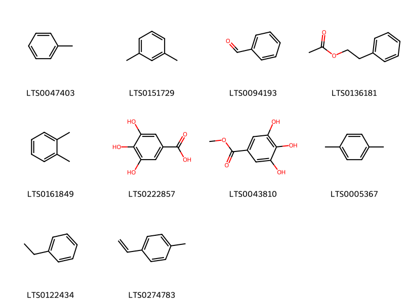
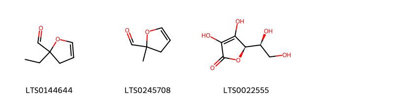
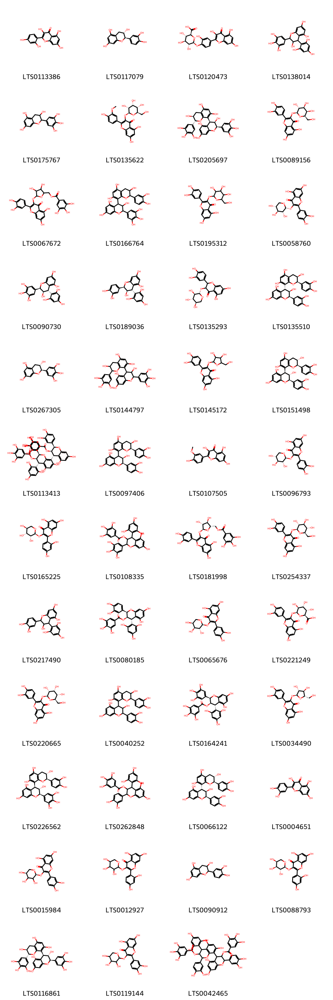
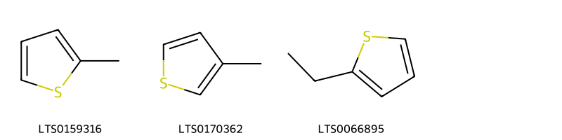
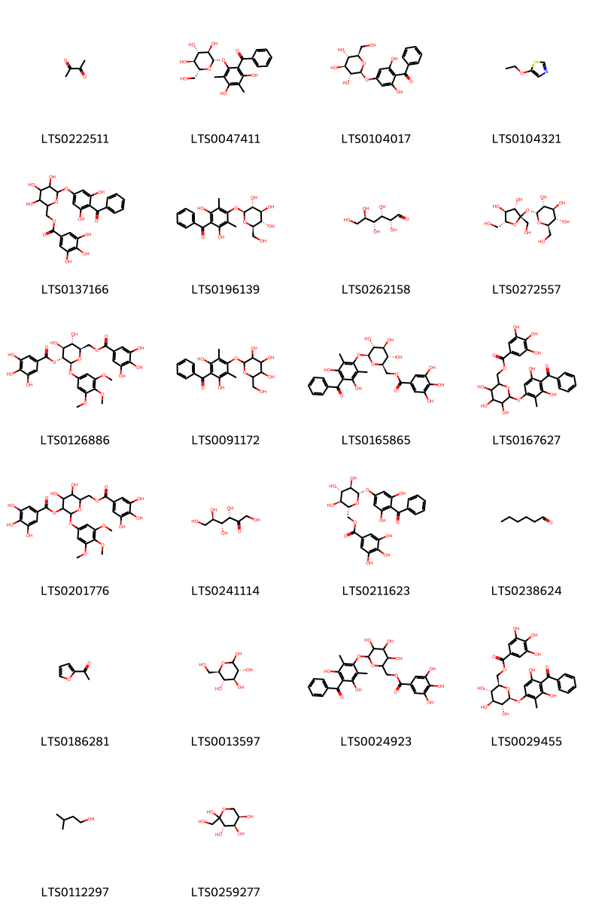
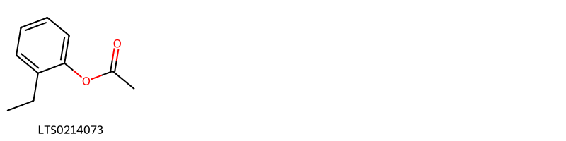
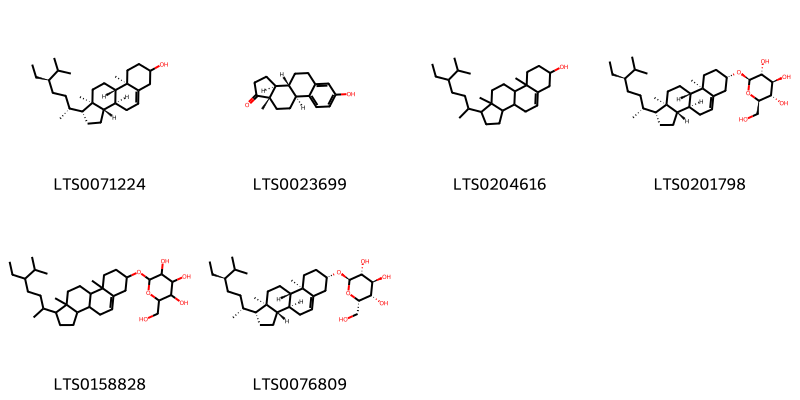

!!! abstract "Tóm tắt"

    Lá Cây Ổi(Folium Psidii guajavae) là lá đã phơi hoặc sấy khô của cây Ổi (Psidium guajava L.). họ Sim (Myrtaceae). Cây có nguồn gốc từ Nam Mỹ, hiện phân bố rộng rãi trên thế giới và được trồng phổ biến tại Việt Nam để ăn quả cũng như làm thuốc. Theo tài liệu cổ, lá ổi có vị đắng, chát, hơi chua, tính ấm, vào kinh đại tràng, vị. Dược liệu này được dùng trị đau bụng tiêu chảy, lỵ, dùng ngoài nấu nước rửa vết thương, mụn nhọt lở loét. Lá ổi chứa nhiều thành phần hóa học có giá trị như tinh dầu (0,36%), tanin pyrogalic (7-10%), nhựa (khoảng 3%), acid psiditanic, chất triterpenic (lupeol, amyrin), cùng với flavonoid (quercetin), acid phenolic (gallic acid, chlorogenic acid), và vitamin C. Các thành phần này mang lại nhiều tác dụng dược lý, đặc biệt là khả năng kháng khuẩn, kháng viêm, chống oxy hóa và làm săn mô niêm mạc.

## Thông tin về thực vật

Dược liệu **Cây Ổi (Lá)** từ bộ phận **nan** từ loài *Psidium guajava*.

**Mô tả thực vật:** Ổi là một cây nhỡ, cao chừng 3-5m, cành nhỏ thì vuông cạnh. Lá mọc đối có cuống ngắn, hình bầu dục, nhẵn hoặc hơi có lông ở mặt trên, mặt dưới có lông mịn, phiến nguyên, khi soi lên có thấy túi tinh dầu trong. Hoa màu trắng, mọc đơn độc ở kẽ lá. Quả là một quả mọng có vỏ quả giữa dày, hình dáng thay đổi tùy theo loài; ở đầu quả có sẹo của đài tồn tại. Rất nhiều hạt, hình thận, không đều, màu hơi hung.

*Tài liệu tham khảo:* "Những cây thuốc và vị thuốc Việt Nam" - Đỗ Tất Lợi 
Trong dược điển Việt nam, một loài được sử dụng làm dược liệu là *Psidium guajava*.

!!! info "Phân loại thực vật của *Psidium guajava*"
    - **Kingdom:** Plantae
    - **Phylum:** Tracheophyta
    - **Order:** Myrtales
    - **Family:** Myrtaceae
    - **Genus:** Psidium
    - **Species:** *Psidium guajava*

**Phân bố trên thế giới:** Benin, Haiti, Bahamas, Jamaica, Singapore, Antigua and Barbuda, Mexico, Chinese Taipei, Colombia, Bonaire, Sint Eustatius and Saba, South Africa, Australia, India, Brazil, Costa Rica, Argentina, Peru, Thailand, United States of America, Philippines, Ethiopia, Uganda, Dominican Republic, Ecuador, Puerto Rico

**Phân bố tại Việt nam:** Không có ghi nhận ở Việt Nam

## Thông tin về dược liệu 

### Định danh

!!! info "Thông tin về tên gọi"

    - Dược liệu tiếng Việt: nan
    - Dược liệu tiếng Trung: nan (nan)
    - Dược liệu tiếng Anh: nan
    - Dược liệu latin thông dụng: nan
    - Dược liệu latin kiểu DĐVN: *psidium guajava l.*
    - Dược liệu latin kiểu DĐVN: *nan*
    - Dược liệu latin kiểu thông tư: *nan*
    - Bộ phận dùng: nan (nan)

### Mô tả dược liệu 

- **Theo dược điển Việt nam V:** nan

- **Mô tả dược liệu theo thông tư chế biến dược liệu theo phương pháp cổ truyền:** nan

### Chế biến 

- **Chế biến theo dược điển việt nam V**: nan

- **Chế biến theo thông tư:** nan

--- 

## Thành phần hóa học

- Theo tài liệu của GS. Đỗ Tất Lợi:  Nhóm Tanin: Tanin pyrogalic (7-10%): 
Nhóm Acid hữu cơ: Axit psiditanic
Nhóm Nhựa (khoảng 3%)
Nhóm Tinh dầu (0,36%)
Nhóm Triterpenoid
Nhóm Flavonoid (quercetin, quercetin glycoside)
Nhóm Acid phenolic (gallic acid, chlorogenic acid)
Nhóm Vitamin và Khoáng chất (Vitamin C và vi chất)
    

**Thành phần hóa học từ loài **Psidium guajava**

Theo cơ sở dữ liệu lotus, loài *Psidium guajava* đã phân lập và xác định được **266** hoạt chất thuộc về các nhóm Thiols, Organic disulfides, Steroids and steroid derivatives, Phenol esters, Organooxygen compounds, Heteroaromatic compounds, Flavonoids, Fatty Acyls, Cinnamic acids and derivatives, Carboxylic acids and derivatives, Neoflavonoids, Tannins, Dihydrofurans, Benzene and substituted derivatives, Benzothiazoles, Coumarins and derivatives, Saturated hydrocarbons, Prenol lipids trong bảng dưới đây. Danh sách các hoạt chất như sau (1r,2r,20s,42s,46r)-7,8,9,12,13,14,25,26,27,30,31,32,35,36,37-pentadecahydroxy-46-[(2r,3s)-3,5,7-trihydroxy-2-(3,4,5-trihydroxyphenyl)-3,4-dihydro-2h-1-benzopyran-6-yl]-3,18,21,41,43-pentaoxanonacyclo[27.13.3.1³⁸,⁴².0²,²⁰.0⁵,¹⁰.0¹¹,¹⁶.0²³,²⁸.0³³,⁴⁵.0³⁴,³⁹]hexatetraconta-5,7,9,11(16),12,14,23,25,27,29,31,33(45),34(39),35,37-pentadecaene-4,17,22,40,44-pentone [(LTS0060020)](https://lotus.naturalproducts.net/compound/lotus_id/LTS0060020), [(2r,3s,4r,5r)-6-[2-(3,4-dimethoxyphenyl)ethoxy]-3-{[(2e)-3-(3,4-dimethoxyphenyl)prop-2-enoyl]oxy}-4,5-dihydroxyoxan-2-yl]methyl (2e)-3-phenylprop-2-enoate [(LTS0111924)](https://lotus.naturalproducts.net/compound/lotus_id/LTS0111924), 46-[2-(3,4-dihydroxyphenyl)-3,5,7-trihydroxy-3,4-dihydro-2h-1-benzopyran-6-yl]-7,8,9,12,13,14,25,26,27,30,31,32,35,36,37-pentadecahydroxy-3,18,21,41,43-pentaoxanonacyclo[27.13.3.1³⁸,⁴².0²,²⁰.0⁵,¹⁰.0¹¹,¹⁶.0²³,²⁸.0³³,⁴⁵.0³⁴,³⁹]hexatetraconta-5,7,9,11(16),12,14,23,25,27,29,31,33(45),34(39),35,37-pentadecaene-4,17,22,40,44-pentone [(LTS0188982)](https://lotus.naturalproducts.net/compound/lotus_id/LTS0188982), (+)-glucose [(LTS0262158)](https://lotus.naturalproducts.net/compound/lotus_id/LTS0262158), glucose [(LTS0013597)](https://lotus.naturalproducts.net/compound/lotus_id/LTS0013597), β-eudesmol [(LTS0203280)](https://lotus.naturalproducts.net/compound/lotus_id/LTS0203280), α pinene [(LTS0132416)](https://lotus.naturalproducts.net/compound/lotus_id/LTS0132416), (15z)-β-carotene [(LTS0039051)](https://lotus.naturalproducts.net/compound/lotus_id/LTS0039051), 2-(4,8-dimethylcyclodeca-2,7-dien-1-yl)propan-2-ol [(LTS0229694)](https://lotus.naturalproducts.net/compound/lotus_id/LTS0229694), (2s,3r,4s,5s,6r)-6-({[(2r,3r,4r,5s)-3,4-dihydroxy-5-(hydroxymethyl)oxolan-2-yl]oxy}methyl)-3,4,5-trihydroxyoxan-2-yl (2e)-3-phenylprop-2-enoate [(LTS0217742)](https://lotus.naturalproducts.net/compound/lotus_id/LTS0217742), (11r,12r)-12-[(15s,19s)-2,3,4,7,8,9,19-heptahydroxy-12,17-dioxo-13,16-dioxatetracyclo[13.3.1.0⁵,¹⁸.0⁶,¹¹]nonadeca-1(18),2,4,6,8,10-hexaen-14-yl]-3,4,5,17,18,19-hexahydroxy-8,14-dioxo-9,13-dioxatricyclo[13.4.0.0²,⁷]nonadeca-1(15),2,4,6,16,18-hexaen-11-yl 3,4,5-trihydroxybenzoate [(LTS0107688)](https://lotus.naturalproducts.net/compound/lotus_id/LTS0107688), (+)-catechol [(LTS0117079)](https://lotus.naturalproducts.net/compound/lotus_id/LTS0117079), neoxanthin [(LTS0000701)](https://lotus.naturalproducts.net/compound/lotus_id/LTS0000701), 14,16-dihydroxy-1,5,5-trimethyl-8-methylidene-12-phenyl-19-oxatetracyclo[9.8.0.0⁴,⁷.0¹³,¹⁸]nonadeca-13,15,17-triene-15,17-dicarbaldehyde [(LTS0072352)](https://lotus.naturalproducts.net/compound/lotus_id/LTS0072352), ethyl palmitate [(LTS0111042)](https://lotus.naturalproducts.net/compound/lotus_id/LTS0111042), octane [(LTS0186469)](https://lotus.naturalproducts.net/compound/lotus_id/LTS0186469), ortho-xylene [(LTS0161849)](https://lotus.naturalproducts.net/compound/lotus_id/LTS0161849), [(10s,12r,13s,14s,15r)-3,4,5,13,14,20,21,22-octahydroxy-8,17-dioxo-9,11,16-trioxatetracyclo[16.4.0.0²,⁷.0¹⁰,¹⁵]docosa-1(18),2,4,6,19,21-hexaen-12-yl]methyl 3,4,5-trihydroxybenzoate [(LTS0190913)](https://lotus.naturalproducts.net/compound/lotus_id/LTS0190913), (16e,18e,20e,22e,24e,26e)-2,6,10,14,19,23,27,31-octamethyldotriaconta-2,6,8,10,12,14,16,18,20,22,24,26,30-tridecaene [(LTS0046783)](https://lotus.naturalproducts.net/compound/lotus_id/LTS0046783), (11r,12r,13s)-13-(4-benzoyl-3,5-dihydroxyphenoxy)-3,4,5,11,12,21,22,23-octahydroxy-9,14,17-trioxatetracyclo[17.4.0.0²,⁷.0¹⁰,¹⁵]tricosa-1(19),2,4,6,20,22-hexaene-8,18-dione [(LTS0014760)](https://lotus.naturalproducts.net/compound/lotus_id/LTS0014760), 2-[(1r,2e,4r,7e)-4,8-dimethylcyclodeca-2,7-dien-1-yl]propan-2-ol [(LTS0206499)](https://lotus.naturalproducts.net/compound/lotus_id/LTS0206499), capric acid [(LTS0039856)](https://lotus.naturalproducts.net/compound/lotus_id/LTS0039856), banana oil [(LTS0226270)](https://lotus.naturalproducts.net/compound/lotus_id/LTS0226270), galop [(LTS0222857)](https://lotus.naturalproducts.net/compound/lotus_id/LTS0222857), (1r,2r,20s,42s,46r)-46-[(2r,3s)-2-(3,4-dihydroxyphenyl)-3,5,7-trihydroxy-3,4-dihydro-2h-1-benzopyran-6-yl]-7,8,9,12,13,14,25,26,27,30,31,32,35,36,37-pentadecahydroxy-3,18,21,41,43-pentaoxanonacyclo[27.13.3.1³⁸,⁴².0²,²⁰.0⁵,¹⁰.0¹¹,¹⁶.0²³,²⁸.0³³,⁴⁵.0³⁴,³⁹]hexatetraconta-5,7,9,11(16),12,14,23,25,27,29,31,33(45),34(39),35,37-pentadecaene-4,17,22,40,44-pentone [(LTS0010544)](https://lotus.naturalproducts.net/compound/lotus_id/LTS0010544), 2-(3,4-dihydroxyphenyl)-5,7-dihydroxy-3-{[(2r,3r,4s,5r)-3,4,5-trihydroxyoxan-2-yl]oxy}chromen-4-one [(LTS0058760)](https://lotus.naturalproducts.net/compound/lotus_id/LTS0058760), d-fructopyranose [(LTS0259277)](https://lotus.naturalproducts.net/compound/lotus_id/LTS0259277), [(2r,3s,4s,5r,6s)-3,4-dihydroxy-5-(3,4,5-trihydroxybenzoyloxy)-6-(3,4,5-trimethoxyphenoxy)oxan-2-yl]methyl 3,4,5-trihydroxybenzoate [(LTS0126886)](https://lotus.naturalproducts.net/compound/lotus_id/LTS0126886), (2r,4as,6as,6br,8ar,10r,11r,12ar,12br)-10,11-dihydroxy-1,2,6a,6b,9,9,12a-heptamethyl-3,4,5,6,7,8,8a,10,11,12,12b,13-dodecahydro-2h-picene-4a-carboxylic acid [(LTS0261726)](https://lotus.naturalproducts.net/compound/lotus_id/LTS0261726), (2s,3r,4s,5s,6r)-2-(4-benzoyl-3,5-dihydroxy-2,6-dimethylphenoxy)-6-(hydroxymethyl)oxane-3,4,5-triol [(LTS0196139)](https://lotus.naturalproducts.net/compound/lotus_id/LTS0196139), α-selinene [(LTS0024564)](https://lotus.naturalproducts.net/compound/lotus_id/LTS0024564), (1r,2e,6e,10s)-3,7,11,11-tetramethylbicyclo[8.1.0]undeca-2,6-diene [(LTS0079959)](https://lotus.naturalproducts.net/compound/lotus_id/LTS0079959), ethyl acetate [(LTS0196824)](https://lotus.naturalproducts.net/compound/lotus_id/LTS0196824), 7,8,9,12,13,14,25,26,27,30,31,32,35,36,37-pentadecahydroxy-46-(2,3,4,5-tetrahydroxyoxan-2-yl)-3,18,21,41,43-pentaoxanonacyclo[27.13.3.1³⁸,⁴².0²,²⁰.0⁵,¹⁰.0¹¹,¹⁶.0²³,²⁸.0³³,⁴⁵.0³⁴,³⁹]hexatetraconta-5,7,9,11(16),12,14,23,25,27,29,31,33(45),34(39),35,37-pentadecaene-4,17,22,40,44-pentone [(LTS0228955)](https://lotus.naturalproducts.net/compound/lotus_id/LTS0228955), 10-{19-[2-(3,4-dihydroxyphenyl)-3,5,7-trihydroxy-3,4-dihydro-2h-1-benzopyran-8-yl]-3,3,4,8,9-pentahydroxy-2,12,17-trioxo-13,16,20-trioxapentacyclo[13.3.1.1⁴,⁷.0⁵,¹⁸.0⁶,¹¹]icosa-1(18),6(11),7,9-tetraen-14-yl}-3,4,5,17,18,19-hexahydroxy-8,14-dioxo-9,13-dioxatricyclo[13.4.0.0²,⁷]nonadeca-1(15),2,4,6,16,18-hexaen-11-yl 3,4,5-trihydroxybenzoate [(LTS0075911)](https://lotus.naturalproducts.net/compound/lotus_id/LTS0075911), isorhamnetin [(LTS0107505)](https://lotus.naturalproducts.net/compound/lotus_id/LTS0107505), β-carotene [(LTS0275716)](https://lotus.naturalproducts.net/compound/lotus_id/LTS0275716), 3,4,5,17,18,19-hexahydroxy-8,14-dioxo-10-{3,3,4,8,9-pentahydroxy-2,12,17-trioxo-19-[3,5,7-trihydroxy-2-(3,4,5-trihydroxyphenyl)-3,4-dihydro-2h-1-benzopyran-8-yl]-13,16,20-trioxapentacyclo[13.3.1.1⁴,⁷.0⁵,¹⁸.0⁶,¹¹]icosa-1(18),6(11),7,9-tetraen-14-yl}-9,13-dioxatricyclo[13.4.0.0²,⁷]nonadeca-1(15),2,4,6,16,18-hexaen-11-yl 3,4,5-trihydroxybenzoate [(LTS0273950)](https://lotus.naturalproducts.net/compound/lotus_id/LTS0273950), 7,8,9,12,13,14,25,26,27,30,31,32,35,36,37,46-hexadecahydroxy-3,18,21,41,43-pentaoxanonacyclo[27.13.3.1³⁸,⁴².0²,²⁰.0⁵,¹⁰.0¹¹,¹⁶.0²³,²⁸.0³³,⁴⁵.0³⁴,³⁹]hexatetraconta-5,7,9,11(16),12,14,23,25,27,29,31,33(45),34(39),35,37-pentadecaene-4,17,22,40,44-pentone [(LTS0060522)](https://lotus.naturalproducts.net/compound/lotus_id/LTS0060522), α-cadinol [(LTS0178794)](https://lotus.naturalproducts.net/compound/lotus_id/LTS0178794), (2r,3r,4s,5s,6s)-6-[2-(3,4-dimethoxyphenyl)ethoxy]-4,5-dihydroxy-2-(hydroxymethyl)oxan-3-yl (2e)-3-(3,4-dimethoxyphenyl)prop-2-enoate [(LTS0050732)](https://lotus.naturalproducts.net/compound/lotus_id/LTS0050732), guaijaverin [(LTS0119144)](https://lotus.naturalproducts.net/compound/lotus_id/LTS0119144), lauric acid [(LTS0051907)](https://lotus.naturalproducts.net/compound/lotus_id/LTS0051907), lycopene [(LTS0116567)](https://lotus.naturalproducts.net/compound/lotus_id/LTS0116567), 2-methyl-3h-furan-2-carbaldehyde [(LTS0245708)](https://lotus.naturalproducts.net/compound/lotus_id/LTS0245708), (r)-β-bisabolene [(LTS0077209)](https://lotus.naturalproducts.net/compound/lotus_id/LTS0077209), prodelphinidin b6 [(LTS0189036)](https://lotus.naturalproducts.net/compound/lotus_id/LTS0189036), casuarictin [(LTS0241644)](https://lotus.naturalproducts.net/compound/lotus_id/LTS0241644), (1s,4s,5s,8s,10s,11r,13r,14r,17s,18s,19s,20r)-10,11-dihydroxy-4,5,9,9,13,19,20-heptamethyl-24-oxahexacyclo[15.5.2.0¹,¹⁸.0⁴,¹⁷.0⁵,¹⁴.0⁸,¹³]tetracos-15-en-23-one [(LTS0190805)](https://lotus.naturalproducts.net/compound/lotus_id/LTS0190805), hyperoside [(LTS0089156)](https://lotus.naturalproducts.net/compound/lotus_id/LTS0089156), 2-methylthiophene [(LTS0159316)](https://lotus.naturalproducts.net/compound/lotus_id/LTS0159316), (1r,2s,4ar,6as,6br,10r,11r,12ar)-2-(acetyloxy)-10,11-dihydroxy-1,2,6a,6b,9,9,12a-heptamethyl-1,3,4,5,6,7,8,8a,10,11,12,12b,13,14b-tetradecahydropicene-4a-carboxylic acid [(LTS0200158)](https://lotus.naturalproducts.net/compound/lotus_id/LTS0200158), (2s,6s,7ar)-4,4,7a-trimethyl-2-[(2e,4e,6e,8e,10e,12e,14e,16e)-6,11,15-trimethyl-17-(2,6,6-trimethylcyclohex-1-en-1-yl)heptadeca-2,4,6,8,10,12,14,16-octaen-2-yl]-2,5,6,7-tetrahydro-1-benzofuran-6-ol [(LTS0081618)](https://lotus.naturalproducts.net/compound/lotus_id/LTS0081618), (2r,3s,4s)-4-[(2r,3s)-3,5,7-trihydroxy-2-(3,4,5-trihydroxyphenyl)-3,4-dihydro-2h-1-benzopyran-8-yl]-2-(3,4,5-trihydroxyphenyl)-3,4-dihydro-2h-1-benzopyran-3,5,7-triol [(LTS0116861)](https://lotus.naturalproducts.net/compound/lotus_id/LTS0116861), 12-{19-[2-(3,4-dihydroxyphenyl)-3,5,7-trihydroxy-3,4-dihydro-2h-1-benzopyran-8-yl]-3,3,4,8,9-pentahydroxy-2,12,17-trioxo-13,16,20-trioxapentacyclo[13.3.1.1⁴,⁷.0⁵,¹⁸.0⁶,¹¹]icosa-1(18),6,8,10-tetraen-14-yl}-3,4,5,17,18,19-hexahydroxy-8,14-dioxo-9,13-dioxatricyclo[13.4.0.0²,⁷]nonadeca-1(15),2,4,6,16,18-hexaen-11-yl acetate [(LTS0021323)](https://lotus.naturalproducts.net/compound/lotus_id/LTS0021323), 3,7,11,11-tetramethylbicyclo[8.1.0]undeca-2,6-diene [(LTS0249608)](https://lotus.naturalproducts.net/compound/lotus_id/LTS0249608), 6-[2-(3,4-dimethoxyphenyl)ethoxy]-4,5-dihydroxy-2-(hydroxymethyl)oxan-3-yl 3-(3,4-dimethoxyphenyl)prop-2-enoate [(LTS0256165)](https://lotus.naturalproducts.net/compound/lotus_id/LTS0256165), octanol [(LTS0250216)](https://lotus.naturalproducts.net/compound/lotus_id/LTS0250216), isoamyl alcohol [(LTS0112297)](https://lotus.naturalproducts.net/compound/lotus_id/LTS0112297), 3-{[3,4-dihydroxy-5-(hydroxymethyl)oxolan-2-yl]oxy}-2-(3,4-dihydroxyphenyl)-5,7-dihydroxychromen-4-one [(LTS0145172)](https://lotus.naturalproducts.net/compound/lotus_id/LTS0145172), toluene [(LTS0047403)](https://lotus.naturalproducts.net/compound/lotus_id/LTS0047403), 7,8,9,12,13,14,25,26,27,30,31,32,35,36,37-pentadecahydroxy-46-[3,5,7-trihydroxy-2-(3,4,5-trihydroxyphenyl)-3,4-dihydro-2h-1-benzopyran-8-yl]-3,18,21,41,43-pentaoxanonacyclo[27.13.3.1³⁸,⁴².0²,²⁰.0⁵,¹⁰.0¹¹,¹⁶.0²³,²⁸.0³³,⁴⁵.0³⁴,³⁹]hexatetraconta-5,7,9,11(16),12,14,23,25,27,29,31,33(45),34(39),35,37-pentadecaene-4,17,22,40,44-pentone [(LTS0208752)](https://lotus.naturalproducts.net/compound/lotus_id/LTS0208752), carotenoid [(LTS0205297)](https://lotus.naturalproducts.net/compound/lotus_id/LTS0205297), 2-(3,4-dihydroxyphenyl)-5,7-dihydroxy-3-{[3,4,5-trihydroxy-6-(hydroxymethyl)oxan-2-yl]oxy}chromen-4-one [(LTS0195312)](https://lotus.naturalproducts.net/compound/lotus_id/LTS0195312), epigallocatechin [(LTS0175767)](https://lotus.naturalproducts.net/compound/lotus_id/LTS0175767), (5-{[2-(3,4-dihydroxyphenyl)-5,7-dihydroxy-4-oxochromen-3-yl]oxy}-3,4-dihydroxyoxolan-2-yl)methyl 3,4,5-trihydroxybenzoate [(LTS0067672)](https://lotus.naturalproducts.net/compound/lotus_id/LTS0067672), (1r,2r,20r,42s,46s)-46-[(2r,3s)-2-(3,4-dihydroxyphenyl)-3,5,7-trihydroxy-3,4-dihydro-2h-1-benzopyran-8-yl]-7,8,9,12,13,14,25,26,27,30,31,32,35,36,37-pentadecahydroxy-3,18,21,41,43-pentaoxanonacyclo[27.13.3.1³⁸,⁴².0²,²⁰.0⁵,¹⁰.0¹¹,¹⁶.0²³,²⁸.0³³,⁴⁵.0³⁴,³⁹]hexatetraconta-5,7,9,11(16),12,14,23,25,27,29,31,33(45),34(39),35,37-pentadecaene-4,17,22,40,44-pentone [(LTS0245530)](https://lotus.naturalproducts.net/compound/lotus_id/LTS0245530), β-caryophyllene oxide [(LTS0213960)](https://lotus.naturalproducts.net/compound/lotus_id/LTS0213960), estrone [(LTS0023699)](https://lotus.naturalproducts.net/compound/lotus_id/LTS0023699), 2-(3,4-dihydroxyphenyl)-5,7-dihydroxy-3-{[(2s,3r,4r,5s,6r)-3,4,5-trihydroxy-6-(hydroxymethyl)oxan-2-yl]oxy}chromen-4-one [(LTS0220665)](https://lotus.naturalproducts.net/compound/lotus_id/LTS0220665), (10r,11s)-10-[(4s,5s,14r,15r,19r)-19-[(2r,3s)-2-(3,4-dihydroxyphenyl)-3,5,7-trihydroxy-3,4-dihydro-2h-1-benzopyran-8-yl]-3,3,4,8,9-pentahydroxy-2,12,17-trioxo-13,16,20-trioxapentacyclo[13.3.1.1⁴,⁷.0⁵,¹⁸.0⁶,¹¹]icosa-1(18),6(11),7,9-tetraen-14-yl]-3,4,5,17,18,19-hexahydroxy-8,14-dioxo-9,13-dioxatricyclo[13.4.0.0²,⁷]nonadeca-1(15),2,4,6,16,18-hexaen-11-yl 3,4,5-trihydroxybenzoate [(LTS0193338)](https://lotus.naturalproducts.net/compound/lotus_id/LTS0193338), ethylbenzene [(LTS0122434)](https://lotus.naturalproducts.net/compound/lotus_id/LTS0122434), bois d,arc [(LTS0113386)](https://lotus.naturalproducts.net/compound/lotus_id/LTS0113386), (2r,3r,4r)-2-(3,4-dihydroxyphenyl)-4-[(2r,3r)-2-(3,4-dihydroxyphenyl)-3,5,7-trihydroxy-3,4-dihydro-2h-1-benzopyran-8-yl]-3,4-dihydro-2h-1-benzopyran-3,5,7-triol [(LTS0135510)](https://lotus.naturalproducts.net/compound/lotus_id/LTS0135510), 2-pentanethiol [(LTS0156576)](https://lotus.naturalproducts.net/compound/lotus_id/LTS0156576), humulene [(LTS0263171)](https://lotus.naturalproducts.net/compound/lotus_id/LTS0263171), (11s,12r)-12-[(14r,15s,19r)-2,3,4,7,8,9-hexahydroxy-12,17-dioxo-19-[(2r,3s)-3,5,7-trihydroxy-2-(3,4,5-trihydroxyphenyl)-3,4-dihydro-2h-1-benzopyran-8-yl]-13,16-dioxatetracyclo[13.3.1.0⁵,¹⁸.0⁶,¹¹]nonadeca-1(18),2,4,6,8,10-hexaen-14-yl]-3,4,5,17,18,19-hexahydroxy-8,14-dioxo-9,13-dioxatricyclo[13.4.0.0²,⁷]nonadeca-1(15),2,4,6,16,18-hexaen-11-yl 3,4,5-trihydroxybenzoate [(LTS0238422)](https://lotus.naturalproducts.net/compound/lotus_id/LTS0238422), (12e,14e,16e,18e,20e,22e,24e,26e)-2,6,10,14,19,23,27,31-octamethyldotriaconta-2,6,8,10,12,14,16,18,20,22,24,26,30-tridecaene [(LTS0205714)](https://lotus.naturalproducts.net/compound/lotus_id/LTS0205714), 2,4,6-trihydroxy-5-({4-hydroxy-1,1,4,7-tetramethyl-octahydrocyclopropa[e]azulen-7-yl}(phenyl)methyl)benzene-1,3-dicarbaldehyde [(LTS0120439)](https://lotus.naturalproducts.net/compound/lotus_id/LTS0120439), 7,8,9,12,13,14,25,26,27,30,31,32,35,36,37-pentadecahydroxy-46-[3,5,7-trihydroxy-2-(3,4,5-trihydroxyphenyl)-3,4-dihydro-2h-1-benzopyran-6-yl]-3,18,21,41,43-pentaoxanonacyclo[27.13.3.1³⁸,⁴².0²,²⁰.0⁵,¹⁰.0¹¹,¹⁶.0²³,²⁸.0³³,⁴⁵.0³⁴,³⁹]hexatetraconta-5,7,9,11(16),12,14,23,25,27,29,31,33(45),34(39),35,37-pentadecaene-4,17,22,40,44-pentone [(LTS0217553)](https://lotus.naturalproducts.net/compound/lotus_id/LTS0217553), benzaldehyde [(LTS0094193)](https://lotus.naturalproducts.net/compound/lotus_id/LTS0094193), (3r,6e)-nerolidol [(LTS0145065)](https://lotus.naturalproducts.net/compound/lotus_id/LTS0145065), guaijaverin [(LTS0015984)](https://lotus.naturalproducts.net/compound/lotus_id/LTS0015984), [(2r,3s,4s,5r,6s)-6-(4-benzoyl-3,5-dihydroxy-2-methylphenoxy)-3,4,5-trihydroxyoxan-2-yl]methyl 3,4,5-trihydroxybenzoate [(LTS0029455)](https://lotus.naturalproducts.net/compound/lotus_id/LTS0029455), (1r,2r,20r,44s,45r,49r,50s)-45-(3,4-dihydroxyphenyl)-7,8,9,12,13,14,25,26,27,30,31,32,35,41,44-pentadecahydroxy-3,18,21,38,46,51,54-heptaoxadodecacyclo[27.21.3.3³⁴,⁵⁰.0²,²⁰.0⁵,¹⁰.0¹¹,¹⁶.0²³,²⁸.0³³,⁵³.0³⁷,⁴⁹.0³⁹,⁴⁸.0⁴²,⁴⁷.0³⁷,⁵⁶]hexapentaconta-5,7,9,11(16),12,14,23,25,27,29,31,33(53),34,39,41,47-hexadecaene-4,17,22,36,52,55-hexone [(LTS0050147)](https://lotus.naturalproducts.net/compound/lotus_id/LTS0050147), (2s,3r,4s,5s,6r)-2-(4-benzoyl-3,5-dihydroxyphenoxy)-6-(hydroxymethyl)oxane-3,4,5-triol [(LTS0104017)](https://lotus.naturalproducts.net/compound/lotus_id/LTS0104017), 1,3,3-trimethyl-2-[3,7,12,16-tetramethyl-18-(2,6,6-trimethylcyclohex-1-en-1-yl)octadeca-1,3,5,7,9,11,13,15,17-nonaen-1-yl]cyclohex-1-ene [(LTS0165867)](https://lotus.naturalproducts.net/compound/lotus_id/LTS0165867), 7,8,9,12,13,14,25,26,27,30,31,32,35,44,47-pentadecahydroxy-43-(3,4,5-trihydroxyphenyl)-3,18,21,38,42,51,54-heptaoxadodecacyclo[27.21.3.3³⁴,⁵⁰.0²,²⁰.0⁵,¹⁰.0¹¹,¹⁶.0²³,²⁸.0³³,⁵³.0³⁷,⁴⁹.0³⁹,⁴⁸.0⁴¹,⁴⁶.0³⁷,⁵⁶]hexapentaconta-5,7,9,11(16),12,14,23,25,27,29,31,33(53),34,39,41(46),47-hexadecaene-4,17,22,36,52,55-hexone [(LTS0230344)](https://lotus.naturalproducts.net/compound/lotus_id/LTS0230344), 4-vinyltoluene [(LTS0274783)](https://lotus.naturalproducts.net/compound/lotus_id/LTS0274783), 5-[(s)-[(1ar,4r,4ar,7s,7as,7br)-4-hydroxy-1,1,4,7-tetramethyl-octahydrocyclopropa[e]azulen-7-yl](phenyl)methyl]-2,4,6-trihydroxybenzene-1,3-dicarbaldehyde [(LTS0132798)](https://lotus.naturalproducts.net/compound/lotus_id/LTS0132798), α-copaene [(LTS0207598)](https://lotus.naturalproducts.net/compound/lotus_id/LTS0207598), 2-ethyl-3h-furan-2-carbaldehyde [(LTS0144644)](https://lotus.naturalproducts.net/compound/lotus_id/LTS0144644), isopropyl disulfide [(LTS0094162)](https://lotus.naturalproducts.net/compound/lotus_id/LTS0094162), guaijaverin [(LTS0065676)](https://lotus.naturalproducts.net/compound/lotus_id/LTS0065676), α-eudesmol [(LTS0222498)](https://lotus.naturalproducts.net/compound/lotus_id/LTS0222498), 7,8,9,12,13,14,25,26,27,30,31,32,35,41,44-pentadecahydroxy-45-(3,4,5-trihydroxyphenyl)-3,18,21,38,46,51,54-heptaoxadodecacyclo[27.21.3.3³⁴,⁵⁰.0²,²⁰.0⁵,¹⁰.0¹¹,¹⁶.0²³,²⁸.0³³,⁵³.0³⁷,⁴⁹.0³⁹,⁴⁸.0⁴²,⁴⁷.0³⁷,⁵⁶]hexapentaconta-5,7,9,11(16),12,14,23,25,27,29,31,33(53),34,39,41,47-hexadecaene-4,17,22,36,52,55-hexone [(LTS0060341)](https://lotus.naturalproducts.net/compound/lotus_id/LTS0060341), (1s,4s,7r,11r,12r)-14,16-dihydroxy-1,5,5-trimethyl-8-methylidene-12-phenyl-19-oxatetracyclo[9.8.0.0⁴,⁷.0¹³,¹⁸]nonadeca-13,15,17-triene-15,17-dicarbaldehyde [(LTS0014065)](https://lotus.naturalproducts.net/compound/lotus_id/LTS0014065), hexanal [(LTS0238624)](https://lotus.naturalproducts.net/compound/lotus_id/LTS0238624), ethyl hexanoate [(LTS0021856)](https://lotus.naturalproducts.net/compound/lotus_id/LTS0021856), nerolidol [(LTS0197738)](https://lotus.naturalproducts.net/compound/lotus_id/LTS0197738), isoquercetin [(LTS0254337)](https://lotus.naturalproducts.net/compound/lotus_id/LTS0254337), 3,5,5-trimethyl-4-[(1e,3e,5e,7e,9e)-3,7,12,16-tetramethyl-18-(2,6,6-trimethylcyclohex-1-en-1-yl)octadeca-1,3,5,7,9,11,13,15,17-nonaen-1-yl]cyclohex-3-en-1-ol [(LTS0132454)](https://lotus.naturalproducts.net/compound/lotus_id/LTS0132454), 6-({[3,4-dihydroxy-5-(hydroxymethyl)oxolan-2-yl]oxy}methyl)-3,4,5-trihydroxyoxan-2-yl 3-phenylprop-2-enoate [(LTS0247667)](https://lotus.naturalproducts.net/compound/lotus_id/LTS0247667), isorhamnetin 3-glucoside [(LTS0135622)](https://lotus.naturalproducts.net/compound/lotus_id/LTS0135622), 7,8,9,12,13,14,28,29,30,33,34,35-dodecahydroxy-4,17,25,38-tetraoxo-3,18,21,24,39-pentaoxaheptacyclo[20.17.0.0²,¹⁹.0⁵,¹⁰.0¹¹,¹⁶.0²⁶,³¹.0³²,³⁷]nonatriaconta-5,7,9,11(16),12,14,26,28,30,32(37),33,35-dodecaen-20-yl 3,4,5-trihydroxybenzoate [(LTS0009009)](https://lotus.naturalproducts.net/compound/lotus_id/LTS0009009), 1,3,3-trimethyl-2-[(9e,11e,13e,15e,17e)-3,7,12,16-tetramethyl-18-(2,6,6-trimethylcyclohex-1-en-1-yl)octadeca-1,3,5,7,9,11,13,15,17-nonaen-1-yl]cyclohex-1-ene [(LTS0110068)](https://lotus.naturalproducts.net/compound/lotus_id/LTS0110068), β,β-carotene [(LTS0168447)](https://lotus.naturalproducts.net/compound/lotus_id/LTS0168447), 2-(3,4-dihydroxyphenyl)-4-[2-(3,4-dihydroxyphenyl)-5,7-dihydroxy-3-(3,4,5-trihydroxybenzoyloxy)-4-(2,4,6-trihydroxyphenyl)-3,4-dihydro-2h-1-benzopyran-8-yl]-5,7-dihydroxy-3,4-dihydro-2h-1-benzopyran-3-yl 3,4,5-trihydroxybenzoate [(LTS0042465)](https://lotus.naturalproducts.net/compound/lotus_id/LTS0042465), [(2r,3s,4s,5r,6s)-6-(4-benzoyl-3,5-dihydroxyphenoxy)-3,4,5-trihydroxyoxan-2-yl]methyl 3,4,5-trihydroxybenzoate [(LTS0211623)](https://lotus.naturalproducts.net/compound/lotus_id/LTS0211623), 2-(3,7,12,16,20,24-hexamethylpentacosa-1,3,5,7,9,11,13,15,17,19,23-undecaen-1-yl)-1,3,3-trimethylcyclohex-1-ene [(LTS0086978)](https://lotus.naturalproducts.net/compound/lotus_id/LTS0086978), selinene [(LTS0197809)](https://lotus.naturalproducts.net/compound/lotus_id/LTS0197809), (1r,2r,20r,37s,43r,44s,49s,50r,56r)-7,8,9,12,13,14,25,26,27,30,31,32,35,44,47-pentadecahydroxy-43-(3,4,5-trihydroxyphenyl)-3,18,21,38,42,51,54-heptaoxadodecacyclo[27.21.3.3³⁴,⁵⁰.0²,²⁰.0⁵,¹⁰.0¹¹,¹⁶.0²³,²⁸.0³³,⁵³.0³⁷,⁴⁹.0³⁹,⁴⁸.0⁴¹,⁴⁶.0³⁷,⁵⁶]hexapentaconta-5,7,9,11(16),12,14,23,25,27,29,31,33(53),34,39,41(46),47-hexadecaene-4,17,22,36,52,55-hexone [(LTS0227202)](https://lotus.naturalproducts.net/compound/lotus_id/LTS0227202), 4-[3,5,7-trihydroxy-2-(3,4,5-trihydroxyphenyl)-3,4-dihydro-2h-1-benzopyran-8-yl]-2-(3,4,5-trihydroxyphenyl)-3,4-dihydro-2h-1-benzopyran-3,5,7-triol [(LTS0144797)](https://lotus.naturalproducts.net/compound/lotus_id/LTS0144797), vitamin c [(LTS0022555)](https://lotus.naturalproducts.net/compound/lotus_id/LTS0022555), (1s,2r,20r,37s,44s,45r,49r,50r,56r)-45-(3,4-dihydroxyphenyl)-7,8,9,12,13,14,25,26,27,30,31,32,35,41,44-pentadecahydroxy-3,18,21,38,46,51,54-heptaoxadodecacyclo[27.21.3.3³⁴,⁵⁰.0²,²⁰.0⁵,¹⁰.0¹¹,¹⁶.0²³,²⁸.0³³,⁵³.0³⁷,⁴⁹.0³⁹,⁴⁸.0⁴²,⁴⁷.0³⁷,⁵⁶]hexapentaconta-5,7,9,11(16),12,14,23,25,27,29,31,33(53),34,39,41,47-hexadecaene-4,17,22,36,52,55-hexone [(LTS0148114)](https://lotus.naturalproducts.net/compound/lotus_id/LTS0148114), (1s,4s,5r,8r,10r,11r,13s,14r,17s,18r,19s,20r)-10,11-dihydroxy-4,5,9,9,13,19,20-heptamethyl-24-oxahexacyclo[15.5.2.0¹,¹⁸.0⁴,¹⁷.0⁵,¹⁴.0⁸,¹³]tetracos-15-en-23-one [(LTS0081334)](https://lotus.naturalproducts.net/compound/lotus_id/LTS0081334), 45-(3,4-dihydroxyphenyl)-7,8,9,12,13,14,25,26,27,30,31,32,35,41,44-pentadecahydroxy-3,18,21,38,46,51,54-heptaoxadodecacyclo[27.21.3.3³⁴,⁵⁰.0²,²⁰.0⁵,¹⁰.0¹¹,¹⁶.0²³,²⁸.0³³,⁵³.0³⁷,⁴⁹.0³⁹,⁴⁸.0⁴²,⁴⁷.0³⁷,⁵⁶]hexapentaconta-5,7,9,11(16),12,14,23,25,27,29,31,33(53),34,39,41,47-hexadecaene-4,17,22,36,52,55-hexone [(LTS0027123)](https://lotus.naturalproducts.net/compound/lotus_id/LTS0027123), (2s,3s,4r,5s,6s)-6-{[2-(3,4-dihydroxyphenyl)-5,7-dihydroxy-4-oxochromen-3-yl]oxy}-3,4,5-trihydroxyoxane-2-carboxylic acid [(LTS0221249)](https://lotus.naturalproducts.net/compound/lotus_id/LTS0221249), hexyl acetate [(LTS0202355)](https://lotus.naturalproducts.net/compound/lotus_id/LTS0202355), (2s,3r,4s,5s,6r)-2-(2-benzoyl-3,5-dihydroxy-4,6-dimethylphenoxy)-6-(hydroxymethyl)oxane-3,4,5-triol [(LTS0047411)](https://lotus.naturalproducts.net/compound/lotus_id/LTS0047411), α-citral [(LTS0246122)](https://lotus.naturalproducts.net/compound/lotus_id/LTS0246122), [(2r,3s,4s,5r,6s)-6-(4-benzoyl-3,5-dihydroxy-2,6-dimethylphenoxy)-3,4,5-trihydroxyoxan-2-yl]methyl 3,4,5-trihydroxybenzoate [(LTS0165865)](https://lotus.naturalproducts.net/compound/lotus_id/LTS0165865), (1s,2r,20r,37s,44s,45r,49r,50r,56r)-7,8,9,12,13,14,25,26,27,30,31,32,35,41,44-pentadecahydroxy-45-(3,4,5-trihydroxyphenyl)-3,18,21,38,46,51,54-heptaoxadodecacyclo[27.21.3.3³⁴,⁵⁰.0²,²⁰.0⁵,¹⁰.0¹¹,¹⁶.0²³,²⁸.0³³,⁵³.0³⁷,⁴⁹.0³⁹,⁴⁸.0⁴²,⁴⁷.0³⁷,⁵⁶]hexapentaconta-5,7,9,11(16),12,14,23,25,27,29,31,33(53),34,39,41,47-hexadecaene-4,17,22,36,52,55-hexone [(LTS0214387)](https://lotus.naturalproducts.net/compound/lotus_id/LTS0214387), phenethyl acetate [(LTS0136181)](https://lotus.naturalproducts.net/compound/lotus_id/LTS0136181), 3-methylthiophene [(LTS0170362)](https://lotus.naturalproducts.net/compound/lotus_id/LTS0170362), phytofluene [(LTS0267709)](https://lotus.naturalproducts.net/compound/lotus_id/LTS0267709), stigmast-5-en-3-ol, (3β)- [(LTS0204616)](https://lotus.naturalproducts.net/compound/lotus_id/LTS0204616), sucrose [(LTS0272557)](https://lotus.naturalproducts.net/compound/lotus_id/LTS0272557), β-ocimene [(LTS0242381)](https://lotus.naturalproducts.net/compound/lotus_id/LTS0242381), m-xylene [(LTS0151729)](https://lotus.naturalproducts.net/compound/lotus_id/LTS0151729), [6-(4-benzoyl-3,5-dihydroxyphenoxy)-3,4,5-trihydroxyoxan-2-yl]methyl 3,4,5-trihydroxybenzoate [(LTS0137166)](https://lotus.naturalproducts.net/compound/lotus_id/LTS0137166), (2r,3r,4s)-2-(3,4-dihydroxyphenyl)-5,7-dihydroxy-4-(2,4,6-trihydroxyphenyl)-3,4-dihydro-2h-1-benzopyran-3-yl 3,4,5-trihydroxybenzoate [(LTS0080185)](https://lotus.naturalproducts.net/compound/lotus_id/LTS0080185), palmitic acid [(LTS0079439)](https://lotus.naturalproducts.net/compound/lotus_id/LTS0079439), (9z)-β-carotene [(LTS0252839)](https://lotus.naturalproducts.net/compound/lotus_id/LTS0252839), ethyl laurate [(LTS0057246)](https://lotus.naturalproducts.net/compound/lotus_id/LTS0057246), quercetin-4'-glucuronide [(LTS0120473)](https://lotus.naturalproducts.net/compound/lotus_id/LTS0120473), 2-(3,4-dihydroxyphenyl)-5,7-dihydroxy-3-{[(2s,3r,4s,5r)-3,4,5-trihydroxyoxan-2-yl]oxy}chromen-4-one [(LTS0096793)](https://lotus.naturalproducts.net/compound/lotus_id/LTS0096793), ethyl caprate [(LTS0106514)](https://lotus.naturalproducts.net/compound/lotus_id/LTS0106514), 6-sulfanylhexan-1-ol [(LTS0026807)](https://lotus.naturalproducts.net/compound/lotus_id/LTS0026807), 2-ethylphenyl acetate [(LTS0214073)](https://lotus.naturalproducts.net/compound/lotus_id/LTS0214073), 5-ethoxy-1,3-thiazole [(LTS0104321)](https://lotus.naturalproducts.net/compound/lotus_id/LTS0104321), sitogluside [(LTS0201798)](https://lotus.naturalproducts.net/compound/lotus_id/LTS0201798), 6,7,14-trimethoxy-13-{[(2s,3r,4s,5s,6r)-3,4,5-trihydroxy-6-({[(3r,4s,5s,6r)-3,4,5-trihydroxy-6-(hydroxymethyl)oxan-2-yl]oxy}methyl)oxan-2-yl]oxy}-2,9-dioxatetracyclo[6.6.2.0⁴,¹⁶.0¹¹,¹⁵]hexadeca-1(15),4(16),5,7,11,13-hexaene-3,10-dione [(LTS0140064)](https://lotus.naturalproducts.net/compound/lotus_id/LTS0140064), delta-cadinol [(LTS0008282)](https://lotus.naturalproducts.net/compound/lotus_id/LTS0008282), isobutyl acetate [(LTS0266600)](https://lotus.naturalproducts.net/compound/lotus_id/LTS0266600), catechol [(LTS0090912)](https://lotus.naturalproducts.net/compound/lotus_id/LTS0090912), 46-[2-(3,4-dihydroxyphenyl)-3,5,7-trihydroxy-3,4-dihydro-2h-1-benzopyran-8-yl]-7,8,9,12,13,14,25,26,27,30,31,32,35,36,37-pentadecahydroxy-3,18,21,41,43-pentaoxanonacyclo[27.13.3.1³⁸,⁴².0²,²⁰.0⁵,¹⁰.0¹¹,¹⁶.0²³,²⁸.0³³,⁴⁵.0³⁴,³⁹]hexatetraconta-5,7,9,11(16),12,14,23,25,27,29,31,33(45),34(39),35,37-pentadecaene-4,17,22,40,44-pentone [(LTS0151816)](https://lotus.naturalproducts.net/compound/lotus_id/LTS0151816), [6-(4-benzoyl-3,5-dihydroxy-2,6-dimethylphenoxy)-3,4,5-trihydroxyoxan-2-yl]methyl 3,4,5-trihydroxybenzoate [(LTS0024923)](https://lotus.naturalproducts.net/compound/lotus_id/LTS0024923), 4-(3,7,12,16,20,24-hexamethylpentacosa-1,3,5,7,9,11,13,15,17,19,23-undecaen-1-yl)-3,5,5-trimethylcyclohex-3-en-1-ol [(LTS0242927)](https://lotus.naturalproducts.net/compound/lotus_id/LTS0242927), quercetin [(LTS0004651)](https://lotus.naturalproducts.net/compound/lotus_id/LTS0004651), (1s,4s,7r,11r,12s)-14,16-dihydroxy-1,5,5-trimethyl-8-methylidene-12-phenyl-19-oxatetracyclo[9.8.0.0⁴,⁷.0¹³,¹⁸]nonadeca-13,15,17-triene-15,17-dicarbaldehyde [(LTS0200238)](https://lotus.naturalproducts.net/compound/lotus_id/LTS0200238), stigmast-5-en-3-ol [(LTS0071224)](https://lotus.naturalproducts.net/compound/lotus_id/LTS0071224), (1s,2s,20s,42s,46r)-7,8,9,12,13,14,25,26,27,30,31,32,35,36,37-pentadecahydroxy-46-[(3r)-3,5,7-trihydroxy-2-(3,4,5-trihydroxyphenyl)-3,4-dihydro-2h-1-benzopyran-8-yl]-3,18,21,41,43-pentaoxanonacyclo[27.13.3.1³⁸,⁴².0²,²⁰.0⁵,¹⁰.0¹¹,¹⁶.0²³,²⁸.0³³,⁴⁵.0³⁴,³⁹]hexatetraconta-5,7,9,11(16),12,14,23,25,27,29,31,33(45),34(39),35,37-pentadecaene-4,17,22,40,44-pentone [(LTS0272600)](https://lotus.naturalproducts.net/compound/lotus_id/LTS0272600), ethylmyristate [(LTS0033616)](https://lotus.naturalproducts.net/compound/lotus_id/LTS0033616), phytofluene [(LTS0181914)](https://lotus.naturalproducts.net/compound/lotus_id/LTS0181914), (2r,3s,4s)-2-(3,4-dihydroxyphenyl)-4-[(2r,3s)-2-(3,4-dihydroxyphenyl)-3,5,7-trihydroxy-3,4-dihydro-2h-1-benzopyran-8-yl]-3,4-dihydro-2h-1-benzopyran-3,5,7-triol [(LTS0151498)](https://lotus.naturalproducts.net/compound/lotus_id/LTS0151498), (46r)-7,8,9,12,13,14,25,26,27,30,31,32,35,36,37-pentadecahydroxy-46-[(3r,4s)-2,3,4-trihydroxy-5-(hydroxymethyl)oxolan-2-yl]-3,18,21,41,43-pentaoxanonacyclo[27.13.3.1³⁸,⁴².0²,²⁰.0⁵,¹⁰.0¹¹,¹⁶.0²³,²⁸.0³³,⁴⁵.0³⁴,³⁹]hexatetraconta-5,7,9,11(16),12,14,23,25,27,29,31,33(45),34(39),35,37-pentadecaene-4,17,22,40,44-pentone [(LTS0028952)](https://lotus.naturalproducts.net/compound/lotus_id/LTS0028952), (2r,3r,4r)-2-(3,4-dihydroxyphenyl)-4-[(2r,3r,4s)-2-(3,4-dihydroxyphenyl)-5,7-dihydroxy-3-(3,4,5-trihydroxybenzoyloxy)-4-(2,4,6-trihydroxyphenyl)-3,4-dihydro-2h-1-benzopyran-8-yl]-5,7-dihydroxy-3,4-dihydro-2h-1-benzopyran-3-yl 3,4,5-trihydroxybenzoate [(LTS0113413)](https://lotus.naturalproducts.net/compound/lotus_id/LTS0113413), keto-d-fructose [(LTS0241114)](https://lotus.naturalproducts.net/compound/lotus_id/LTS0241114), avicularin [(LTS0034490)](https://lotus.naturalproducts.net/compound/lotus_id/LTS0034490), (6e,8e,10z,12e,14e,16e,18e,20e,22e,24e,26e)-2,6,10,14,19,23,27,31-octamethyldotriaconta-2,6,8,10,12,14,16,18,20,22,24,26,30-tridecaene [(LTS0116496)](https://lotus.naturalproducts.net/compound/lotus_id/LTS0116496), (1r,3s)-6-[(3e,5e,7e,9e,11e,13e,15e)-16-[(2r,6s,7ar)-6-hydroxy-4,4,7a-trimethyl-2,5,6,7-tetrahydro-1-benzofuran-2-yl]-3,7,12-trimethylheptadeca-1,3,5,7,9,11,13,15-octaen-1-ylidene]-1,5,5-trimethylcyclohexane-1,3-diol [(LTS0076274)](https://lotus.naturalproducts.net/compound/lotus_id/LTS0076274), 2-(2,4-dihydroxyphenyl)-5,7-dihydroxy-3-{[(2s,3r,4s,5s)-3,4,5-trihydroxyoxan-2-yl]oxy}chromen-4-one [(LTS0088793)](https://lotus.naturalproducts.net/compound/lotus_id/LTS0088793), [3,4-dihydroxy-5-(3,4,5-trihydroxybenzoyloxy)-6-(3,4,5-trimethoxyphenoxy)oxan-2-yl]methyl 3,4,5-trihydroxybenzoate [(LTS0201776)](https://lotus.naturalproducts.net/compound/lotus_id/LTS0201776), cinnamic acid [(LTS0128130)](https://lotus.naturalproducts.net/compound/lotus_id/LTS0128130), (6e,8e,10z,12z,14e,16e,18e,20e,22e,24e,26e)-2,6,10,14,19,23,27,31-octamethyldotriaconta-2,6,8,10,12,14,16,18,20,22,24,26,30-tridecaene [(LTS0192109)](https://lotus.naturalproducts.net/compound/lotus_id/LTS0192109), {3,4,5,13,14,20,21,22-octahydroxy-8,17-dioxo-9,11,16-trioxatetracyclo[16.4.0.0²,⁷.0¹⁰,¹⁵]docosa-1(18),2,4,6,19,21-hexaen-12-yl}methyl 3,4,5-trihydroxybenzoate [(LTS0015896)](https://lotus.naturalproducts.net/compound/lotus_id/LTS0015896), (1s,2r,4as,6as,6br,8ar,9s,10r,11r,12ar,12br,14bs)-10,11-dihydroxy-9-({[(2z)-3-(4-hydroxyphenyl)prop-2-enoyl]oxy}methyl)-1,2,6a,6b,9,12a-hexamethyl-2,3,4,5,6,7,8,8a,10,11,12,12b,13,14b-tetradecahydro-1h-picene-4a-carboxylic acid [(LTS0219641)](https://lotus.naturalproducts.net/compound/lotus_id/LTS0219641), para-xylene [(LTS0005367)](https://lotus.naturalproducts.net/compound/lotus_id/LTS0005367), (-)-β-bisabolene [(LTS0009940)](https://lotus.naturalproducts.net/compound/lotus_id/LTS0009940), asiatic acid [(LTS0249826)](https://lotus.naturalproducts.net/compound/lotus_id/LTS0249826), gamma-carotene [(LTS0108535)](https://lotus.naturalproducts.net/compound/lotus_id/LTS0108535), (2r,3r,4s)-4-(2,4,6-trihydroxyphenyl)-2-(3,4,5-trihydroxyphenyl)-3,4-dihydro-2h-1-benzopyran-3,5,7-triol [(LTS0090730)](https://lotus.naturalproducts.net/compound/lotus_id/LTS0090730), 4-(2,4,6-trihydroxyphenyl)-2-(3,4,5-trihydroxyphenyl)-3,4-dihydro-2h-1-benzopyran-3,5,7-triol [(LTS0138014)](https://lotus.naturalproducts.net/compound/lotus_id/LTS0138014), (1r)-4-[(1e,3e,5e,7e,9e,11e,13e,15e,17z,19e)-3,7,12,16,20,24-hexamethylpentacosa-1,3,5,7,9,11,13,15,17,19,23-undecaen-1-yl]-3,5,5-trimethylcyclohex-3-en-1-ol [(LTS0151341)](https://lotus.naturalproducts.net/compound/lotus_id/LTS0151341), 2-(4-benzoyl-3,5-dihydroxy-2,6-dimethylphenoxy)-6-(hydroxymethyl)oxane-3,4,5-triol [(LTS0091172)](https://lotus.naturalproducts.net/compound/lotus_id/LTS0091172), (18e,20e,22e,24e,26e)-2,6,10,14,19,23,27,31-octamethyldotriaconta-2,6,8,10,12,14,16,18,20,22,24,26,30-tridecaene [(LTS0202068)](https://lotus.naturalproducts.net/compound/lotus_id/LTS0202068), (2r,3s,4s)-4-[(2r,3s)-2-(3,4-dihydroxyphenyl)-3,5,7-trihydroxy-3,4-dihydro-2h-1-benzopyran-8-yl]-2-(3,4,5-trihydroxyphenyl)-3,4-dihydro-2h-1-benzopyran-3,5,7-triol [(LTS0226562)](https://lotus.naturalproducts.net/compound/lotus_id/LTS0226562), corosolic acid [(LTS0231285)](https://lotus.naturalproducts.net/compound/lotus_id/LTS0231285), methyl caproate [(LTS0235403)](https://lotus.naturalproducts.net/compound/lotus_id/LTS0235403), 5,7-dihydroxy-4-(2,4,6-trihydroxyphenyl)-2-(3,4,5-trihydroxyphenyl)-3,4-dihydro-2h-1-benzopyran-3-yl 3,4,5-trihydroxybenzoate [(LTS0108335)](https://lotus.naturalproducts.net/compound/lotus_id/LTS0108335), uvaol [(LTS0008025)](https://lotus.naturalproducts.net/compound/lotus_id/LTS0008025), urs-12-ene-3β,28-diol [(LTS0136738)](https://lotus.naturalproducts.net/compound/lotus_id/LTS0136738), (2r,3s,4r,5r)-6-[2-(3,4-dimethoxyphenyl)ethoxy]-4,5-dihydroxy-2-(hydroxymethyl)oxan-3-yl (2e)-3-(3,4-dimethoxyphenyl)prop-2-enoate [(LTS0099897)](https://lotus.naturalproducts.net/compound/lotus_id/LTS0099897), diacetyl [(LTS0222511)](https://lotus.naturalproducts.net/compound/lotus_id/LTS0222511), caryophyllene [(LTS0085212)](https://lotus.naturalproducts.net/compound/lotus_id/LTS0085212), 6,7,13-trihydroxy-14-methoxy-2,9-dioxatetracyclo[6.6.2.0⁴,¹⁶.0¹¹,¹⁵]hexadeca-1(15),4,6,8(16),11,13-hexaene-3,10-dione [(LTS0125222)](https://lotus.naturalproducts.net/compound/lotus_id/LTS0125222), [(2s,3r,4r,5s)-5-{[2-(3,4-dihydroxyphenyl)-5,7-dihydroxy-4-oxochromen-3-yl]oxy}-3,4-dihydroxyoxolan-2-yl]methyl 3,4,5-trihydroxybenzoate [(LTS0181998)](https://lotus.naturalproducts.net/compound/lotus_id/LTS0181998), cryptoxanthin [(LTS0132646)](https://lotus.naturalproducts.net/compound/lotus_id/LTS0132646), trans-cinnamoyl β-d-glucoside [(LTS0105203)](https://lotus.naturalproducts.net/compound/lotus_id/LTS0105203), 2-(3,4-dihydroxyphenyl)-4-(2,4,6-trihydroxyphenyl)-3,4-dihydro-2h-1-benzopyran-3,5,7-triol [(LTS0217490)](https://lotus.naturalproducts.net/compound/lotus_id/LTS0217490), (1r,2s,4ar,6as,6br,8ar,10r,11r,12ar,12br,14bs)-2-(acetyloxy)-10,11-dihydroxy-1,2,6a,6b,9,9,12a-heptamethyl-1,3,4,5,6,7,8,8a,10,11,12,12b,13,14b-tetradecahydropicene-4a-carboxylic acid [(LTS0191646)](https://lotus.naturalproducts.net/compound/lotus_id/LTS0191646), 3,4,5-trihydroxy-6-(hydroxymethyl)oxan-2-yl 3-phenylprop-2-enoate [(LTS0233142)](https://lotus.naturalproducts.net/compound/lotus_id/LTS0233142), 11-hydroxy-10-{[3-(4-hydroxyphenyl)prop-2-enoyl]oxy}-1,2,6a,6b,9,9,12a-heptamethyl-2,3,4,5,6,7,8,8a,10,11,12,12b,13,14b-tetradecahydro-1h-picene-4a-carboxylic acid [(LTS0240711)](https://lotus.naturalproducts.net/compound/lotus_id/LTS0240711), 2-(3,4-dihydroxyphenyl)-5,7-dihydroxy-4-(2,4,6-trihydroxyphenyl)-3,4-dihydro-2h-1-benzopyran-3-yl 3,4,5-trihydroxybenzoate [(LTS0262848)](https://lotus.naturalproducts.net/compound/lotus_id/LTS0262848), β-selinene [(LTS0096341)](https://lotus.naturalproducts.net/compound/lotus_id/LTS0096341), (2r,3r)-2-(3,4-dihydroxyphenyl)-4-[(2r,3r)-2-(3,4-dihydroxyphenyl)-3,5,7-trihydroxy-3,4-dihydro-2h-1-benzopyran-8-yl]-3,4-dihydro-2h-1-benzopyran-3,5,7-triol [(LTS0097406)](https://lotus.naturalproducts.net/compound/lotus_id/LTS0097406), 7,8,9,13,14,15,25,26,27,30,31,32,35,36,37-pentadecahydroxy-4,17,22,40,44-pentaoxo-3,18,21,41,43-pentaoxanonacyclo[27.13.3.1³⁸,⁴².0²,²⁰.0⁵,¹⁰.0¹¹,¹⁶.0²³,²⁸.0³³,⁴⁵.0³⁴,³⁹]hexatetraconta-5(10),6,8,11(16),12,14,23,25,27,29,31,33(45),34(39),35,37-pentadecaene-46-carboxylic acid [(LTS0115913)](https://lotus.naturalproducts.net/compound/lotus_id/LTS0115913), 2-{[1-(5-ethyl-6-methylheptan-2-yl)-9a,11a-dimethyl-1h,2h,3h,3ah,3bh,4h,6h,7h,8h,9h,9bh,10h,11h-cyclopenta[a]phenanthren-7-yl]oxy}-6-(hydroxymethyl)oxane-3,4,5-triol [(LTS0158828)](https://lotus.naturalproducts.net/compound/lotus_id/LTS0158828), (1s,2r,4as,6as,6br,9s,10r,11r,12ar)-10,11-dihydroxy-9-({[(2e)-3-(4-hydroxyphenyl)prop-2-enoyl]oxy}methyl)-1,2,6a,6b,9,12a-hexamethyl-2,3,4,5,6,7,8,8a,10,11,12,12b,13,14b-tetradecahydro-1h-picene-4a-carboxylic acid [(LTS0201436)](https://lotus.naturalproducts.net/compound/lotus_id/LTS0201436), (1s,4as,6br,12ar,14bs)-11-hydroxy-10-{[(2e)-3-(4-hydroxyphenyl)prop-2-enoyl]oxy}-1,2,6a,6b,9,9,12a-heptamethyl-2,3,4,5,6,7,8,8a,10,11,12,12b,13,14b-tetradecahydro-1h-picene-4a-carboxylic acid [(LTS0249725)](https://lotus.naturalproducts.net/compound/lotus_id/LTS0249725), 2-(2,4-dihydroxyphenyl)-5,7-dihydroxy-3-[(3,4,5-trihydroxyoxan-2-yl)oxy]chromen-4-one [(LTS0012927)](https://lotus.naturalproducts.net/compound/lotus_id/LTS0012927), (10s,11r,12r,13s,15s)-13-(4-benzoyl-3,5-dihydroxyphenoxy)-3,4,5,11,12,21,22,23-octahydroxy-9,14,17-trioxatetracyclo[17.4.0.0²,⁷.0¹⁰,¹⁵]tricosa-1(19),2,4,6,20,22-hexaene-8,18-dione [(LTS0139805)](https://lotus.naturalproducts.net/compound/lotus_id/LTS0139805), 9,11,19,25,26,27,30,31,32,42,43,44,47,48,49,61-hexadecahydroxy-3,14,21,35,38,53,55-heptaoxatetradecacyclo[26.26.3.2¹²,¹⁵.1⁶,²².1¹⁶,¹⁹.1²⁹,³³.0²,⁷.0⁵,²³.0⁸,¹³.0²⁴,⁵⁷.0³⁶,⁵⁴.0⁴⁰,⁴⁵.0⁴⁶,⁵¹.0²²,⁶⁰]dohexaconta-5,8,10,12,16,24,26,28(57),29,31,33(58),40(45),41,43,46,48,50-heptadecaen-4,18,20,34,39,52,56,59-octone [(LTS0260564)](https://lotus.naturalproducts.net/compound/lotus_id/LTS0260564), caprylic acid [(LTS0254176)](https://lotus.naturalproducts.net/compound/lotus_id/LTS0254176), 2-(acetyloxy)-10,11-dihydroxy-1,2,6a,6b,9,9,12a-heptamethyl-1,3,4,5,6,7,8,8a,10,11,12,12b,13,14b-tetradecahydropicene-4a-carboxylic acid [(LTS0041606)](https://lotus.naturalproducts.net/compound/lotus_id/LTS0041606), 4-[2-(3,4-dihydroxyphenyl)-3,5,7-trihydroxy-3,4-dihydro-2h-1-benzopyran-8-yl]-2-(3,4,5-trihydroxyphenyl)-3,4-dihydro-2h-1-benzopyran-3,5,7-triol [(LTS0166764)](https://lotus.naturalproducts.net/compound/lotus_id/LTS0166764), (1s,2r,4as,6as,6br,8ar,10r,11r,12ar,12br,14bs)-11-hydroxy-10-{[(2e)-3-(4-hydroxyphenyl)prop-2-enoyl]oxy}-1,2,6a,6b,9,9,12a-heptamethyl-2,3,4,5,6,7,8,8a,10,11,12,12b,13,14b-tetradecahydro-1h-picene-4a-carboxylic acid [(LTS0112820)](https://lotus.naturalproducts.net/compound/lotus_id/LTS0112820), 2-(2,4-dihydroxyphenyl)-5,7-dihydroxy-3-{[(2s,3r,4r,5s)-3,4,5-trihydroxyoxan-2-yl]oxy}chromen-4-one [(LTS0165225)](https://lotus.naturalproducts.net/compound/lotus_id/LTS0165225), (1s,2s,20s,42s,46r)-46-[(2r,3r)-2-(3,4-dihydroxyphenyl)-3,5,7-trihydroxy-3,4-dihydro-2h-1-benzopyran-6-yl]-7,8,9,12,13,14,25,26,27,30,31,32,35,36,37-pentadecahydroxy-3,18,21,41,43-pentaoxanonacyclo[27.13.3.1³⁸,⁴².0²,²⁰.0⁵,¹⁰.0¹¹,¹⁶.0²³,²⁸.0³³,⁴⁵.0³⁴,³⁹]hexatetraconta-5,7,9,11(16),12,14,23,25,27,29,31,33(45),34(39),35,37-pentadecaene-4,17,22,40,44-pentone [(LTS0171115)](https://lotus.naturalproducts.net/compound/lotus_id/LTS0171115), acetylfuran [(LTS0186281)](https://lotus.naturalproducts.net/compound/lotus_id/LTS0186281), 2-(3,4-dihydroxyphenyl)-5,7-dihydroxy-3-{[(2s,3r,4s,5r)-3,4,5-trihydroxyoxan-2-yl]oxy}-2,3-dihydro-1-benzopyran-4-one [(LTS0135293)](https://lotus.naturalproducts.net/compound/lotus_id/LTS0135293), (1s,2r,4as,6as,6br,8ar,10r,11r,12ar,12br,14bs)-10-hydroxy-11-{[(2e)-3-(4-hydroxyphenyl)prop-2-enoyl]oxy}-1,2,6a,6b,9,9,12a-heptamethyl-2,3,4,5,6,7,8,8a,10,11,12,12b,13,14b-tetradecahydro-1h-picene-4a-carboxylic acid [(LTS0020421)](https://lotus.naturalproducts.net/compound/lotus_id/LTS0020421), (1s,2r,4as,6as,6br,10r,11r,12ar,14bs)-11-hydroxy-10-{[(2e)-3-(4-hydroxyphenyl)prop-2-enoyl]oxy}-1,2,6a,6b,9,9,12a-heptamethyl-2,3,4,5,6,7,8,8a,10,11,12,12b,13,14b-tetradecahydro-1h-picene-4a-carboxylic acid [(LTS0140007)](https://lotus.naturalproducts.net/compound/lotus_id/LTS0140007), (1r,2r,20r,42r,46r)-7,8,9,12,13,14,25,26,27,30,31,32,35,36,37-pentadecahydroxy-46-[(2r,3s)-3,5,7-trihydroxy-2-(3,4,5-trihydroxyphenyl)-3,4-dihydro-2h-1-benzopyran-8-yl]-3,18,21,41,43-pentaoxanonacyclo[27.13.3.1³⁸,⁴².0²,²⁰.0⁵,¹⁰.0¹¹,¹⁶.0²³,²⁸.0³³,⁴⁵.0³⁴,³⁹]hexatetraconta-5,7,9,11(16),12,14,23,25,27,29,31,33(45),34(39),35,37-pentadecaene-4,17,22,40,44-pentone [(LTS0188008)](https://lotus.naturalproducts.net/compound/lotus_id/LTS0188008), myristic acid [(LTS0102566)](https://lotus.naturalproducts.net/compound/lotus_id/LTS0102566), (1s,2s,20s,42s,46r)-7,8,9,12,13,14,25,26,27,30,31,32,35,36,37-pentadecahydroxy-46-[(2r,3r)-3,5,7-trihydroxy-2-(3,4,5-trihydroxyphenyl)-3,4-dihydro-2h-1-benzopyran-6-yl]-3,18,21,41,43-pentaoxanonacyclo[27.13.3.1³⁸,⁴².0²,²⁰.0⁵,¹⁰.0¹¹,¹⁶.0²³,²⁸.0³³,⁴⁵.0³⁴,³⁹]hexatetraconta-5,7,9,11(16),12,14,23,25,27,29,31,33(45),34(39),35,37-pentadecaene-4,17,22,40,44-pentone [(LTS0085134)](https://lotus.naturalproducts.net/compound/lotus_id/LTS0085134), methyl gallate [(LTS0043810)](https://lotus.naturalproducts.net/compound/lotus_id/LTS0043810), 6,7,14-trimethoxy-13-{[(2s,3r,4s,5s,6r)-3,4,5-trihydroxy-6-(hydroxymethyl)oxan-2-yl]oxy}-2,9-dioxatetracyclo[6.6.2.0⁴,¹⁶.0¹¹,¹⁵]hexadeca-1(15),4(16),5,7,11,13-hexaene-3,10-dione [(LTS0087639)](https://lotus.naturalproducts.net/compound/lotus_id/LTS0087639), (11r,12r)-12-[(14r,15s,19s)-2,3,4,7,8,9,19-heptahydroxy-12,17-dioxo-13,16-dioxatetracyclo[13.3.1.0⁵,¹⁸.0⁶,¹¹]nonadeca-1(18),2,4,6,8,10-hexaen-14-yl]-3,4,5,17,18,19-hexahydroxy-8,14-dioxo-9,13-dioxatricyclo[13.4.0.0²,⁷]nonadeca-1(15),2,4,6,16,18-hexaen-11-yl 3,4,5-trihydroxybenzoate [(LTS0124879)](https://lotus.naturalproducts.net/compound/lotus_id/LTS0124879), 7-(2,3-dihydroxy-3-methylbutoxy)-6-methoxychromen-2-one [(LTS0226325)](https://lotus.naturalproducts.net/compound/lotus_id/LTS0226325), 7,8,9,12,13,14,25,26,27,30,31,32,35,42,47-pentadecahydroxy-43-(3,4,5-trihydroxyphenyl)-3,18,21,38,44,51,54-heptaoxadodecacyclo[27.21.3.3³⁴,⁵⁰.0²,²⁰.0⁵,¹⁰.0¹¹,¹⁶.0²³,²⁸.0³³,⁵³.0³⁷,⁴⁹.0³⁹,⁴⁸.0⁴⁰,⁴⁵.0³⁷,⁵⁶]hexapentaconta-5,7,9,11(16),12,14,23,25,27,29,31,33(53),34,39,45,47-hexadecaene-4,17,22,36,52,55-hexone [(LTS0254417)](https://lotus.naturalproducts.net/compound/lotus_id/LTS0254417), delta-selinene [(LTS0181591)](https://lotus.naturalproducts.net/compound/lotus_id/LTS0181591), {6-[2-(3,4-dimethoxyphenyl)ethoxy]-3-{[3-(3,4-dimethoxyphenyl)prop-2-enoyl]oxy}-4,5-dihydroxyoxan-2-yl}methyl 3-phenylprop-2-enoate [(LTS0224664)](https://lotus.naturalproducts.net/compound/lotus_id/LTS0224664), (11s,12r)-12-[(1s,8s,9r,13s,14s,15r,27r)-5,8,20,21,22,25-hexahydroxy-17,26,28-trioxo-9-(3,4,5-trihydroxyphenyl)-2,10,16,29-tetraoxaheptacyclo[12.12.3.0¹,¹³.0³,¹².0⁶,¹¹.0¹⁸,²³.0²⁴,²⁷]nonacosa-3,5,11,18,20,22,24-heptaen-15-yl]-3,4,5,17,18,19-hexahydroxy-8,14-dioxo-9,13-dioxatricyclo[13.4.0.0²,⁷]nonadeca-1(15),2,4,6,16,18-hexaen-11-yl 3,4,5-trihydroxybenzoate [(LTS0067065)](https://lotus.naturalproducts.net/compound/lotus_id/LTS0067065), (1r,2r,20s,42s,46r)-46-[(2r,3s)-2-(3,4-dihydroxyphenyl)-3,5,7-trihydroxy-3,4-dihydro-2h-1-benzopyran-8-yl]-7,8,9,12,13,14,25,26,27,30,31,32,35,36,37-pentadecahydroxy-3,18,21,41,43-pentaoxanonacyclo[27.13.3.1³⁸,⁴².0²,²⁰.0⁵,¹⁰.0¹¹,¹⁶.0²³,²⁸.0³³,⁴⁵.0³⁴,³⁹]hexatetraconta-5,7,9,11(16),12,14,23,25,27,29,31,33(45),34(39),35,37-pentadecaene-4,17,22,40,44-pentone [(LTS0073345)](https://lotus.naturalproducts.net/compound/lotus_id/LTS0073345), ethyl octanoate [(LTS0207229)](https://lotus.naturalproducts.net/compound/lotus_id/LTS0207229), caryophyllene oxide [(LTS0159789)](https://lotus.naturalproducts.net/compound/lotus_id/LTS0159789), oleanolic acid [(LTS0117717)](https://lotus.naturalproducts.net/compound/lotus_id/LTS0117717), 12-[5,8,20,21,22,25-hexahydroxy-17,26,28-trioxo-9-(3,4,5-trihydroxyphenyl)-2,10,16,29-tetraoxaheptacyclo[12.12.3.0¹,¹³.0³,¹².0⁶,¹¹.0¹⁸,²³.0²⁴,²⁷]nonacosa-3,5,11,18,20,22,24-heptaen-15-yl]-3,4,5,17,18,19-hexahydroxy-8,14-dioxo-9,13-dioxatricyclo[13.4.0.0²,⁷]nonadeca-1(15),2,4,6,16,18-hexaen-11-yl 3,4,5-trihydroxybenzoate [(LTS0232910)](https://lotus.naturalproducts.net/compound/lotus_id/LTS0232910), 10,11-dihydroxy-1,2,6a,6b,9,9,12a-heptamethyl-2,3,4,5,6,7,8,8a,10,11,12,12b,13,14b-tetradecahydro-1h-picene-4a-carboxylic acid [(LTS0122037)](https://lotus.naturalproducts.net/compound/lotus_id/LTS0122037), asiatic acid [(LTS0198395)](https://lotus.naturalproducts.net/compound/lotus_id/LTS0198395), 2-ethylthiophene [(LTS0066895)](https://lotus.naturalproducts.net/compound/lotus_id/LTS0066895), [(2r,3r,4s,5r,6s)-6-[2-(3,4-dimethoxyphenyl)ethoxy]-3-{[(2e)-3-(3,4-dimethoxyphenyl)prop-2-enoyl]oxy}-4,5-dihydroxyoxan-2-yl]methyl (2e)-3-phenylprop-2-enoate [(LTS0189829)](https://lotus.naturalproducts.net/compound/lotus_id/LTS0189829), [6-(4-benzoyl-3,5-dihydroxy-2-methylphenoxy)-3,4,5-trihydroxyoxan-2-yl]methyl 3,4,5-trihydroxybenzoate [(LTS0167627)](https://lotus.naturalproducts.net/compound/lotus_id/LTS0167627), octyl acetate [(LTS0217143)](https://lotus.naturalproducts.net/compound/lotus_id/LTS0217143), ursolic acid [(LTS0250838)](https://lotus.naturalproducts.net/compound/lotus_id/LTS0250838), (1s,2s,20s,42s,46r)-46-[(3r)-2-(3,4-dihydroxyphenyl)-3,5,7-trihydroxy-3,4-dihydro-2h-1-benzopyran-8-yl]-7,8,9,12,13,14,25,26,27,30,31,32,35,36,37-pentadecahydroxy-3,18,21,41,43-pentaoxanonacyclo[27.13.3.1³⁸,⁴².0²,²⁰.0⁵,¹⁰.0¹¹,¹⁶.0²³,²⁸.0³³,⁴⁵.0³⁴,³⁹]hexatetraconta-5,7,9,11(16),12,14,23,25,27,29,31,33(45),34(39),35,37-pentadecaene-4,17,22,40,44-pentone [(LTS0107409)](https://lotus.naturalproducts.net/compound/lotus_id/LTS0107409), (10r,11s)-3,4,5,17,18,19-hexahydroxy-8,14-dioxo-10-[(4s,5s,14r,15r,19r)-3,3,4,8,9-pentahydroxy-2,12,17-trioxo-19-[(2r,3s)-3,5,7-trihydroxy-2-(3,4,5-trihydroxyphenyl)-3,4-dihydro-2h-1-benzopyran-8-yl]-13,16,20-trioxapentacyclo[13.3.1.1⁴,⁷.0⁵,¹⁸.0⁶,¹¹]icosa-1(18),6(11),7,9-tetraen-14-yl]-9,13-dioxatricyclo[13.4.0.0²,⁷]nonadeca-1(15),2,4,6,16,18-hexaen-11-yl 3,4,5-trihydroxybenzoate [(LTS0059105)](https://lotus.naturalproducts.net/compound/lotus_id/LTS0059105), 2-(3,4-dihydroxyphenyl)-4-[2-(3,4-dihydroxyphenyl)-3,5,7-trihydroxy-3,4-dihydro-2h-1-benzopyran-8-yl]-3,4-dihydro-2h-1-benzopyran-3,5,7-triol [(LTS0040252)](https://lotus.naturalproducts.net/compound/lotus_id/LTS0040252), (1r,4ar,8as)-4-isopropyl-1,6-dimethyl-3,4,4a,7,8,8a-hexahydro-2h-naphthalen-1-ol [(LTS0136437)](https://lotus.naturalproducts.net/compound/lotus_id/LTS0136437), 10,11-dihydroxy-9-({[3-(4-hydroxyphenyl)prop-2-enoyl]oxy}methyl)-1,2,6a,6b,9,12a-hexamethyl-2,3,4,5,6,7,8,8a,10,11,12,12b,13,14b-tetradecahydro-1h-picene-4a-carboxylic acid [(LTS0142647)](https://lotus.naturalproducts.net/compound/lotus_id/LTS0142647), 2,6,10,14,19,23,27,31-octamethyldotriaconta-2,6,8,10,12,14,16,18,20,22,24,26,30-tridecaene [(LTS0219851)](https://lotus.naturalproducts.net/compound/lotus_id/LTS0219851), α-myrcene [(LTS0115731)](https://lotus.naturalproducts.net/compound/lotus_id/LTS0115731), ellagic acid [(LTS0037297)](https://lotus.naturalproducts.net/compound/lotus_id/LTS0037297), limonene,  [(LTS0155981)](https://lotus.naturalproducts.net/compound/lotus_id/LTS0155981), (2r,3r,4r)-2-(3,4-dihydroxyphenyl)-4-[(2r,3s)-2-(3,4-dihydroxyphenyl)-3,5,7-trihydroxy-3,4-dihydro-2h-1-benzopyran-8-yl]-3,4-dihydro-2h-1-benzopyran-3,5,7-triol [(LTS0066122)](https://lotus.naturalproducts.net/compound/lotus_id/LTS0066122), ethyl butyrate [(LTS0106732)](https://lotus.naturalproducts.net/compound/lotus_id/LTS0106732), (2r,3r,4s,5s,6s)-2-{[(1r,3as,3bs,7s,9ar,9bs,11ar)-1-[(2r,5r)-5-ethyl-6-methylheptan-2-yl]-9a,11a-dimethyl-1h,2h,3h,3ah,3bh,4h,6h,7h,8h,9h,9bh,10h,11h-cyclopenta[a]phenanthren-7-yl]oxy}-6-(hydroxymethyl)oxane-3,4,5-triol [(LTS0076809)](https://lotus.naturalproducts.net/compound/lotus_id/LTS0076809), all-trans-phytofluene [(LTS0269894)](https://lotus.naturalproducts.net/compound/lotus_id/LTS0269894), (2r,3r,4s)-5,7-dihydroxy-4-(2,4,6-trihydroxyphenyl)-2-(3,4,5-trihydroxyphenyl)-3,4-dihydro-2h-1-benzopyran-3-yl 3,4,5-trihydroxybenzoate [(LTS0164241)](https://lotus.naturalproducts.net/compound/lotus_id/LTS0164241), butyl acetate [(LTS0047300)](https://lotus.naturalproducts.net/compound/lotus_id/LTS0047300), squalene [(LTS0217821)](https://lotus.naturalproducts.net/compound/lotus_id/LTS0217821), [23-(carboxymethyl)-7,8,9,12,13,14,26,27,28,31,32,33,42-tridecahydroxy-4,17,22,36,40-pentaoxo-3,18,21,37,39-pentaoxaoctacyclo[23.13.3.1³⁴,³⁸.0²,²⁰.0⁵,¹⁰.0¹¹,¹⁶.0²⁹,⁴¹.0³⁰,³⁵]dotetraconta-5(10),6,8,11,13,15,25,27,29(41),30,32,34-dodecaen-24-yl](hydroxy)acetic acid [(LTS0062870)](https://lotus.naturalproducts.net/compound/lotus_id/LTS0062870), (15z)-lycopene [(LTS0066147)](https://lotus.naturalproducts.net/compound/lotus_id/LTS0066147), (1r,2s,19r,22r)-7,8,9,12,13,14,20,28,29,30,33,34,35-tridecahydroxy-3,18,21,24,39-pentaoxaheptacyclo[20.17.0.0²,¹⁹.0⁵,¹⁰.0¹¹,¹⁶.0²⁶,³¹.0³²,³⁷]nonatriaconta-5(10),6,8,11,13,15,26(31),27,29,32,34,36-dodecaene-4,17,25,38-tetrone [(LTS0137167)](https://lotus.naturalproducts.net/compound/lotus_id/LTS0137167), 4,4,7a-trimethyl-2-[(2e,4e,6e,8e)-6,11,15-trimethyl-17-(2,6,6-trimethylcyclohex-1-en-1-yl)heptadeca-2,4,6,8,10,12,14,16-octaen-2-yl]-2,5,6,7-tetrahydro-1-benzofuran-6-ol [(LTS0220535)](https://lotus.naturalproducts.net/compound/lotus_id/LTS0220535), (1r,2s,7s,8s)-8-isopropyl-1,3-dimethyltricyclo[4.4.0.0²,⁷]dec-3-ene [(LTS0190031)](https://lotus.naturalproducts.net/compound/lotus_id/LTS0190031), rubixanthin [(LTS0040991)](https://lotus.naturalproducts.net/compound/lotus_id/LTS0040991), 10-hydroxy-11-{[3-(4-hydroxyphenyl)prop-2-enoyl]oxy}-1,2,6a,6b,9,9,12a-heptamethyl-2,3,4,5,6,7,8,8a,10,11,12,12b,13,14b-tetradecahydro-1h-picene-4a-carboxylic acid [(LTS0128070)](https://lotus.naturalproducts.net/compound/lotus_id/LTS0128070), (2r,3r,4s)-4-[(2r,3s)-3,5,7-trihydroxy-2-(3,4,5-trihydroxyphenyl)-3,4-dihydro-2h-1-benzopyran-8-yl]-2-(3,4,5-trihydroxyphenyl)-3,4-dihydro-2h-1-benzopyran-3,5,7-triol [(LTS0205697)](https://lotus.naturalproducts.net/compound/lotus_id/LTS0205697), benzothiazole [(LTS0073984)](https://lotus.naturalproducts.net/compound/lotus_id/LTS0073984), (1r,2r,20r,42s,46r)-7,8,9,12,13,14,25,26,27,30,31,32,35,36,37,46-hexadecahydroxy-3,18,21,41,43-pentaoxanonacyclo[27.13.3.1³⁸,⁴².0²,²⁰.0⁵,¹⁰.0¹¹,¹⁶.0²³,²⁸.0³³,⁴⁵.0³⁴,³⁹]hexatetraconta-5,7,9,11(16),12,14,23,25,27,29,31,33(45),34(39),35,37-pentadecaene-4,17,22,40,44-pentone [(LTS0131190)](https://lotus.naturalproducts.net/compound/lotus_id/LTS0131190), gallocatechol [(LTS0267305)](https://lotus.naturalproducts.net/compound/lotus_id/LTS0267305), 12-{2,3,4,7,8,9-hexahydroxy-12,17-dioxo-19-[3,5,7-trihydroxy-2-(3,4,5-trihydroxyphenyl)-3,4-dihydro-2h-1-benzopyran-8-yl]-13,16-dioxatetracyclo[13.3.1.0⁵,¹⁸.0⁶,¹¹]nonadeca-1(18),2,4,6,8,10-hexaen-14-yl}-3,4,5,17,18,19-hexahydroxy-8,14-dioxo-9,13-dioxatricyclo[13.4.0.0²,⁷]nonadeca-1(15),2,4,6,16,18-hexaen-11-yl 3,4,5-trihydroxybenzoate [(LTS0247590)](https://lotus.naturalproducts.net/compound/lotus_id/LTS0247590), (6e,8e,10e,12e,14z,16e,18e,20e,22e,24e,26e)-2,6,10,14,19,23,27,31-octamethyldotriaconta-2,6,8,10,12,14,16,18,20,22,24,26,30-tridecaene [(LTS0195810)](https://lotus.naturalproducts.net/compound/lotus_id/LTS0195810). 
        
| chemicalTaxonomyClassyfireClass     |   smiles_count |
|:------------------------------------|---------------:|
| Benzene and substituted derivatives |            142 |
| Benzothiazoles                      |             13 |
| Carboxylic acids and derivatives    |             60 |
| Cinnamic acids and derivatives      |            764 |
| Coumarins and derivatives           |             34 |
| Dihydrofurans                       |             60 |
| Fatty Acyls                         |            240 |
| Flavonoids                          |           3614 |
| Heteroaromatic compounds            |             25 |
| Neoflavonoids                       |            229 |
| Organic disulfides                  |             12 |
| Organooxygen compounds              |           1235 |
| Phenol esters                       |             17 |
| Prenol lipids                       |           5991 |
| Saturated hydrocarbons              |              8 |
| Steroids and steroid derivatives    |            504 |
| Tannins                             |           8135 |
| Thiols                              |             16 |

            
### Nhóm Benzene and substituted derivatives
<figure markdown="span">
    { width=100% }
<figcaption>Hình ảnh cấu trúc hóa học của hoạt chất thuộc nhóm *Benzene and substituted derivatives*. Tên thường gọi của các hoạt chất tương ứng là toluene [(LTS0047403)](https://lotus.naturalproducts.net/compound/lotus_id/LTS0047403), m-xylene [(LTS0151729)](https://lotus.naturalproducts.net/compound/lotus_id/LTS0151729), benzaldehyde [(LTS0094193)](https://lotus.naturalproducts.net/compound/lotus_id/LTS0094193), phenethyl acetate [(LTS0136181)](https://lotus.naturalproducts.net/compound/lotus_id/LTS0136181), ortho-xylene [(LTS0161849)](https://lotus.naturalproducts.net/compound/lotus_id/LTS0161849), galop [(LTS0222857)](https://lotus.naturalproducts.net/compound/lotus_id/LTS0222857), methyl gallate [(LTS0043810)](https://lotus.naturalproducts.net/compound/lotus_id/LTS0043810), para-xylene [(LTS0005367)](https://lotus.naturalproducts.net/compound/lotus_id/LTS0005367), ethylbenzene [(LTS0122434)](https://lotus.naturalproducts.net/compound/lotus_id/LTS0122434), 4-vinyltoluene [(LTS0274783)](https://lotus.naturalproducts.net/compound/lotus_id/LTS0274783).</figcaption>
</figure>

            
            
### Nhóm Benzene and substituted derivatives
<figure markdown="span">
    { width=100% }
<figcaption>Hình ảnh cấu trúc hóa học của hoạt chất thuộc nhóm *Benzene and substituted derivatives*. Tên thường gọi của các hoạt chất tương ứng là toluene [(LTS0047403)](https://lotus.naturalproducts.net/compound/lotus_id/LTS0047403), m-xylene [(LTS0151729)](https://lotus.naturalproducts.net/compound/lotus_id/LTS0151729), benzaldehyde [(LTS0094193)](https://lotus.naturalproducts.net/compound/lotus_id/LTS0094193), phenethyl acetate [(LTS0136181)](https://lotus.naturalproducts.net/compound/lotus_id/LTS0136181), ortho-xylene [(LTS0161849)](https://lotus.naturalproducts.net/compound/lotus_id/LTS0161849), galop [(LTS0222857)](https://lotus.naturalproducts.net/compound/lotus_id/LTS0222857), methyl gallate [(LTS0043810)](https://lotus.naturalproducts.net/compound/lotus_id/LTS0043810), para-xylene [(LTS0005367)](https://lotus.naturalproducts.net/compound/lotus_id/LTS0005367), ethylbenzene [(LTS0122434)](https://lotus.naturalproducts.net/compound/lotus_id/LTS0122434), 4-vinyltoluene [(LTS0274783)](https://lotus.naturalproducts.net/compound/lotus_id/LTS0274783).</figcaption>
</figure>

### Nhóm Benzothiazoles
<figure markdown="span">
    { width=100% }
<figcaption>Hình ảnh cấu trúc hóa học của hoạt chất thuộc nhóm *Benzothiazoles*. Tên thường gọi của các hoạt chất tương ứng là benzothiazole [(LTS0073984)](https://lotus.naturalproducts.net/compound/lotus_id/LTS0073984).</figcaption>
</figure>

            
            
### Nhóm Benzene and substituted derivatives
<figure markdown="span">
    { width=100% }
<figcaption>Hình ảnh cấu trúc hóa học của hoạt chất thuộc nhóm *Benzene and substituted derivatives*. Tên thường gọi của các hoạt chất tương ứng là toluene [(LTS0047403)](https://lotus.naturalproducts.net/compound/lotus_id/LTS0047403), m-xylene [(LTS0151729)](https://lotus.naturalproducts.net/compound/lotus_id/LTS0151729), benzaldehyde [(LTS0094193)](https://lotus.naturalproducts.net/compound/lotus_id/LTS0094193), phenethyl acetate [(LTS0136181)](https://lotus.naturalproducts.net/compound/lotus_id/LTS0136181), ortho-xylene [(LTS0161849)](https://lotus.naturalproducts.net/compound/lotus_id/LTS0161849), galop [(LTS0222857)](https://lotus.naturalproducts.net/compound/lotus_id/LTS0222857), methyl gallate [(LTS0043810)](https://lotus.naturalproducts.net/compound/lotus_id/LTS0043810), para-xylene [(LTS0005367)](https://lotus.naturalproducts.net/compound/lotus_id/LTS0005367), ethylbenzene [(LTS0122434)](https://lotus.naturalproducts.net/compound/lotus_id/LTS0122434), 4-vinyltoluene [(LTS0274783)](https://lotus.naturalproducts.net/compound/lotus_id/LTS0274783).</figcaption>
</figure>

### Nhóm Benzothiazoles
<figure markdown="span">
    { width=100% }
<figcaption>Hình ảnh cấu trúc hóa học của hoạt chất thuộc nhóm *Benzothiazoles*. Tên thường gọi của các hoạt chất tương ứng là benzothiazole [(LTS0073984)](https://lotus.naturalproducts.net/compound/lotus_id/LTS0073984).</figcaption>
</figure>

### Nhóm Carboxylic acids and derivatives
<figure markdown="span">
    { width=100% }
<figcaption>Hình ảnh cấu trúc hóa học của hoạt chất thuộc nhóm *Carboxylic acids and derivatives*. Tên thường gọi của các hoạt chất tương ứng là ethyl acetate [(LTS0196824)](https://lotus.naturalproducts.net/compound/lotus_id/LTS0196824), banana oil [(LTS0226270)](https://lotus.naturalproducts.net/compound/lotus_id/LTS0226270), hexyl acetate [(LTS0202355)](https://lotus.naturalproducts.net/compound/lotus_id/LTS0202355), butyl acetate [(LTS0047300)](https://lotus.naturalproducts.net/compound/lotus_id/LTS0047300), isobutyl acetate [(LTS0266600)](https://lotus.naturalproducts.net/compound/lotus_id/LTS0266600).</figcaption>
</figure>

            
            
### Nhóm Benzene and substituted derivatives
<figure markdown="span">
    { width=100% }
<figcaption>Hình ảnh cấu trúc hóa học của hoạt chất thuộc nhóm *Benzene and substituted derivatives*. Tên thường gọi của các hoạt chất tương ứng là toluene [(LTS0047403)](https://lotus.naturalproducts.net/compound/lotus_id/LTS0047403), m-xylene [(LTS0151729)](https://lotus.naturalproducts.net/compound/lotus_id/LTS0151729), benzaldehyde [(LTS0094193)](https://lotus.naturalproducts.net/compound/lotus_id/LTS0094193), phenethyl acetate [(LTS0136181)](https://lotus.naturalproducts.net/compound/lotus_id/LTS0136181), ortho-xylene [(LTS0161849)](https://lotus.naturalproducts.net/compound/lotus_id/LTS0161849), galop [(LTS0222857)](https://lotus.naturalproducts.net/compound/lotus_id/LTS0222857), methyl gallate [(LTS0043810)](https://lotus.naturalproducts.net/compound/lotus_id/LTS0043810), para-xylene [(LTS0005367)](https://lotus.naturalproducts.net/compound/lotus_id/LTS0005367), ethylbenzene [(LTS0122434)](https://lotus.naturalproducts.net/compound/lotus_id/LTS0122434), 4-vinyltoluene [(LTS0274783)](https://lotus.naturalproducts.net/compound/lotus_id/LTS0274783).</figcaption>
</figure>

### Nhóm Benzothiazoles
<figure markdown="span">
    { width=100% }
<figcaption>Hình ảnh cấu trúc hóa học của hoạt chất thuộc nhóm *Benzothiazoles*. Tên thường gọi của các hoạt chất tương ứng là benzothiazole [(LTS0073984)](https://lotus.naturalproducts.net/compound/lotus_id/LTS0073984).</figcaption>
</figure>

### Nhóm Carboxylic acids and derivatives
<figure markdown="span">
    { width=100% }
<figcaption>Hình ảnh cấu trúc hóa học của hoạt chất thuộc nhóm *Carboxylic acids and derivatives*. Tên thường gọi của các hoạt chất tương ứng là ethyl acetate [(LTS0196824)](https://lotus.naturalproducts.net/compound/lotus_id/LTS0196824), banana oil [(LTS0226270)](https://lotus.naturalproducts.net/compound/lotus_id/LTS0226270), hexyl acetate [(LTS0202355)](https://lotus.naturalproducts.net/compound/lotus_id/LTS0202355), butyl acetate [(LTS0047300)](https://lotus.naturalproducts.net/compound/lotus_id/LTS0047300), isobutyl acetate [(LTS0266600)](https://lotus.naturalproducts.net/compound/lotus_id/LTS0266600).</figcaption>
</figure>

### Nhóm Cinnamic acids and derivatives
<figure markdown="span">
    { width=100% }
<figcaption>Hình ảnh cấu trúc hóa học của hoạt chất thuộc nhóm *Cinnamic acids and derivatives*. Tên thường gọi của các hoạt chất tương ứng là [(2r,3s,4r,5r)-6-[2-(3,4-dimethoxyphenyl)ethoxy]-3-{[(2e)-3-(3,4-dimethoxyphenyl)prop-2-enoyl]oxy}-4,5-dihydroxyoxan-2-yl]methyl (2e)-3-phenylprop-2-enoate [(LTS0111924)](https://lotus.naturalproducts.net/compound/lotus_id/LTS0111924), cinnamic acid [(LTS0128130)](https://lotus.naturalproducts.net/compound/lotus_id/LTS0128130), (2r,3s,4r,5r)-6-[2-(3,4-dimethoxyphenyl)ethoxy]-4,5-dihydroxy-2-(hydroxymethyl)oxan-3-yl (2e)-3-(3,4-dimethoxyphenyl)prop-2-enoate [(LTS0099897)](https://lotus.naturalproducts.net/compound/lotus_id/LTS0099897), trans-cinnamoyl β-d-glucoside [(LTS0105203)](https://lotus.naturalproducts.net/compound/lotus_id/LTS0105203), [(2r,3r,4s,5r,6s)-6-[2-(3,4-dimethoxyphenyl)ethoxy]-3-{[(2e)-3-(3,4-dimethoxyphenyl)prop-2-enoyl]oxy}-4,5-dihydroxyoxan-2-yl]methyl (2e)-3-phenylprop-2-enoate [(LTS0189829)](https://lotus.naturalproducts.net/compound/lotus_id/LTS0189829), (2r,3r,4s,5s,6s)-6-[2-(3,4-dimethoxyphenyl)ethoxy]-4,5-dihydroxy-2-(hydroxymethyl)oxan-3-yl (2e)-3-(3,4-dimethoxyphenyl)prop-2-enoate [(LTS0050732)](https://lotus.naturalproducts.net/compound/lotus_id/LTS0050732), 3,4,5-trihydroxy-6-(hydroxymethyl)oxan-2-yl 3-phenylprop-2-enoate [(LTS0233142)](https://lotus.naturalproducts.net/compound/lotus_id/LTS0233142), (2s,3r,4s,5s,6r)-6-({[(2r,3r,4r,5s)-3,4-dihydroxy-5-(hydroxymethyl)oxolan-2-yl]oxy}methyl)-3,4,5-trihydroxyoxan-2-yl (2e)-3-phenylprop-2-enoate [(LTS0217742)](https://lotus.naturalproducts.net/compound/lotus_id/LTS0217742), {6-[2-(3,4-dimethoxyphenyl)ethoxy]-3-{[3-(3,4-dimethoxyphenyl)prop-2-enoyl]oxy}-4,5-dihydroxyoxan-2-yl}methyl 3-phenylprop-2-enoate [(LTS0224664)](https://lotus.naturalproducts.net/compound/lotus_id/LTS0224664), 6-[2-(3,4-dimethoxyphenyl)ethoxy]-4,5-dihydroxy-2-(hydroxymethyl)oxan-3-yl 3-(3,4-dimethoxyphenyl)prop-2-enoate [(LTS0256165)](https://lotus.naturalproducts.net/compound/lotus_id/LTS0256165), 6-({[3,4-dihydroxy-5-(hydroxymethyl)oxolan-2-yl]oxy}methyl)-3,4,5-trihydroxyoxan-2-yl 3-phenylprop-2-enoate [(LTS0247667)](https://lotus.naturalproducts.net/compound/lotus_id/LTS0247667).</figcaption>
</figure>

            
            
### Nhóm Benzene and substituted derivatives
<figure markdown="span">
    { width=100% }
<figcaption>Hình ảnh cấu trúc hóa học của hoạt chất thuộc nhóm *Benzene and substituted derivatives*. Tên thường gọi của các hoạt chất tương ứng là toluene [(LTS0047403)](https://lotus.naturalproducts.net/compound/lotus_id/LTS0047403), m-xylene [(LTS0151729)](https://lotus.naturalproducts.net/compound/lotus_id/LTS0151729), benzaldehyde [(LTS0094193)](https://lotus.naturalproducts.net/compound/lotus_id/LTS0094193), phenethyl acetate [(LTS0136181)](https://lotus.naturalproducts.net/compound/lotus_id/LTS0136181), ortho-xylene [(LTS0161849)](https://lotus.naturalproducts.net/compound/lotus_id/LTS0161849), galop [(LTS0222857)](https://lotus.naturalproducts.net/compound/lotus_id/LTS0222857), methyl gallate [(LTS0043810)](https://lotus.naturalproducts.net/compound/lotus_id/LTS0043810), para-xylene [(LTS0005367)](https://lotus.naturalproducts.net/compound/lotus_id/LTS0005367), ethylbenzene [(LTS0122434)](https://lotus.naturalproducts.net/compound/lotus_id/LTS0122434), 4-vinyltoluene [(LTS0274783)](https://lotus.naturalproducts.net/compound/lotus_id/LTS0274783).</figcaption>
</figure>

### Nhóm Benzothiazoles
<figure markdown="span">
    { width=100% }
<figcaption>Hình ảnh cấu trúc hóa học của hoạt chất thuộc nhóm *Benzothiazoles*. Tên thường gọi của các hoạt chất tương ứng là benzothiazole [(LTS0073984)](https://lotus.naturalproducts.net/compound/lotus_id/LTS0073984).</figcaption>
</figure>

### Nhóm Carboxylic acids and derivatives
<figure markdown="span">
    { width=100% }
<figcaption>Hình ảnh cấu trúc hóa học của hoạt chất thuộc nhóm *Carboxylic acids and derivatives*. Tên thường gọi của các hoạt chất tương ứng là ethyl acetate [(LTS0196824)](https://lotus.naturalproducts.net/compound/lotus_id/LTS0196824), banana oil [(LTS0226270)](https://lotus.naturalproducts.net/compound/lotus_id/LTS0226270), hexyl acetate [(LTS0202355)](https://lotus.naturalproducts.net/compound/lotus_id/LTS0202355), butyl acetate [(LTS0047300)](https://lotus.naturalproducts.net/compound/lotus_id/LTS0047300), isobutyl acetate [(LTS0266600)](https://lotus.naturalproducts.net/compound/lotus_id/LTS0266600).</figcaption>
</figure>

### Nhóm Cinnamic acids and derivatives
<figure markdown="span">
    { width=100% }
<figcaption>Hình ảnh cấu trúc hóa học của hoạt chất thuộc nhóm *Cinnamic acids and derivatives*. Tên thường gọi của các hoạt chất tương ứng là [(2r,3s,4r,5r)-6-[2-(3,4-dimethoxyphenyl)ethoxy]-3-{[(2e)-3-(3,4-dimethoxyphenyl)prop-2-enoyl]oxy}-4,5-dihydroxyoxan-2-yl]methyl (2e)-3-phenylprop-2-enoate [(LTS0111924)](https://lotus.naturalproducts.net/compound/lotus_id/LTS0111924), cinnamic acid [(LTS0128130)](https://lotus.naturalproducts.net/compound/lotus_id/LTS0128130), (2r,3s,4r,5r)-6-[2-(3,4-dimethoxyphenyl)ethoxy]-4,5-dihydroxy-2-(hydroxymethyl)oxan-3-yl (2e)-3-(3,4-dimethoxyphenyl)prop-2-enoate [(LTS0099897)](https://lotus.naturalproducts.net/compound/lotus_id/LTS0099897), trans-cinnamoyl β-d-glucoside [(LTS0105203)](https://lotus.naturalproducts.net/compound/lotus_id/LTS0105203), [(2r,3r,4s,5r,6s)-6-[2-(3,4-dimethoxyphenyl)ethoxy]-3-{[(2e)-3-(3,4-dimethoxyphenyl)prop-2-enoyl]oxy}-4,5-dihydroxyoxan-2-yl]methyl (2e)-3-phenylprop-2-enoate [(LTS0189829)](https://lotus.naturalproducts.net/compound/lotus_id/LTS0189829), (2r,3r,4s,5s,6s)-6-[2-(3,4-dimethoxyphenyl)ethoxy]-4,5-dihydroxy-2-(hydroxymethyl)oxan-3-yl (2e)-3-(3,4-dimethoxyphenyl)prop-2-enoate [(LTS0050732)](https://lotus.naturalproducts.net/compound/lotus_id/LTS0050732), 3,4,5-trihydroxy-6-(hydroxymethyl)oxan-2-yl 3-phenylprop-2-enoate [(LTS0233142)](https://lotus.naturalproducts.net/compound/lotus_id/LTS0233142), (2s,3r,4s,5s,6r)-6-({[(2r,3r,4r,5s)-3,4-dihydroxy-5-(hydroxymethyl)oxolan-2-yl]oxy}methyl)-3,4,5-trihydroxyoxan-2-yl (2e)-3-phenylprop-2-enoate [(LTS0217742)](https://lotus.naturalproducts.net/compound/lotus_id/LTS0217742), {6-[2-(3,4-dimethoxyphenyl)ethoxy]-3-{[3-(3,4-dimethoxyphenyl)prop-2-enoyl]oxy}-4,5-dihydroxyoxan-2-yl}methyl 3-phenylprop-2-enoate [(LTS0224664)](https://lotus.naturalproducts.net/compound/lotus_id/LTS0224664), 6-[2-(3,4-dimethoxyphenyl)ethoxy]-4,5-dihydroxy-2-(hydroxymethyl)oxan-3-yl 3-(3,4-dimethoxyphenyl)prop-2-enoate [(LTS0256165)](https://lotus.naturalproducts.net/compound/lotus_id/LTS0256165), 6-({[3,4-dihydroxy-5-(hydroxymethyl)oxolan-2-yl]oxy}methyl)-3,4,5-trihydroxyoxan-2-yl 3-phenylprop-2-enoate [(LTS0247667)](https://lotus.naturalproducts.net/compound/lotus_id/LTS0247667).</figcaption>
</figure>

### Nhóm Coumarins and derivatives
<figure markdown="span">
    { width=100% }
<figcaption>Hình ảnh cấu trúc hóa học của hoạt chất thuộc nhóm *Coumarins and derivatives*. Tên thường gọi của các hoạt chất tương ứng là 7-(2,3-dihydroxy-3-methylbutoxy)-6-methoxychromen-2-one [(LTS0226325)](https://lotus.naturalproducts.net/compound/lotus_id/LTS0226325).</figcaption>
</figure>

            
            
### Nhóm Benzene and substituted derivatives
<figure markdown="span">
    { width=100% }
<figcaption>Hình ảnh cấu trúc hóa học của hoạt chất thuộc nhóm *Benzene and substituted derivatives*. Tên thường gọi của các hoạt chất tương ứng là toluene [(LTS0047403)](https://lotus.naturalproducts.net/compound/lotus_id/LTS0047403), m-xylene [(LTS0151729)](https://lotus.naturalproducts.net/compound/lotus_id/LTS0151729), benzaldehyde [(LTS0094193)](https://lotus.naturalproducts.net/compound/lotus_id/LTS0094193), phenethyl acetate [(LTS0136181)](https://lotus.naturalproducts.net/compound/lotus_id/LTS0136181), ortho-xylene [(LTS0161849)](https://lotus.naturalproducts.net/compound/lotus_id/LTS0161849), galop [(LTS0222857)](https://lotus.naturalproducts.net/compound/lotus_id/LTS0222857), methyl gallate [(LTS0043810)](https://lotus.naturalproducts.net/compound/lotus_id/LTS0043810), para-xylene [(LTS0005367)](https://lotus.naturalproducts.net/compound/lotus_id/LTS0005367), ethylbenzene [(LTS0122434)](https://lotus.naturalproducts.net/compound/lotus_id/LTS0122434), 4-vinyltoluene [(LTS0274783)](https://lotus.naturalproducts.net/compound/lotus_id/LTS0274783).</figcaption>
</figure>

### Nhóm Benzothiazoles
<figure markdown="span">
    { width=100% }
<figcaption>Hình ảnh cấu trúc hóa học của hoạt chất thuộc nhóm *Benzothiazoles*. Tên thường gọi của các hoạt chất tương ứng là benzothiazole [(LTS0073984)](https://lotus.naturalproducts.net/compound/lotus_id/LTS0073984).</figcaption>
</figure>

### Nhóm Carboxylic acids and derivatives
<figure markdown="span">
    { width=100% }
<figcaption>Hình ảnh cấu trúc hóa học của hoạt chất thuộc nhóm *Carboxylic acids and derivatives*. Tên thường gọi của các hoạt chất tương ứng là ethyl acetate [(LTS0196824)](https://lotus.naturalproducts.net/compound/lotus_id/LTS0196824), banana oil [(LTS0226270)](https://lotus.naturalproducts.net/compound/lotus_id/LTS0226270), hexyl acetate [(LTS0202355)](https://lotus.naturalproducts.net/compound/lotus_id/LTS0202355), butyl acetate [(LTS0047300)](https://lotus.naturalproducts.net/compound/lotus_id/LTS0047300), isobutyl acetate [(LTS0266600)](https://lotus.naturalproducts.net/compound/lotus_id/LTS0266600).</figcaption>
</figure>

### Nhóm Cinnamic acids and derivatives
<figure markdown="span">
    { width=100% }
<figcaption>Hình ảnh cấu trúc hóa học của hoạt chất thuộc nhóm *Cinnamic acids and derivatives*. Tên thường gọi của các hoạt chất tương ứng là [(2r,3s,4r,5r)-6-[2-(3,4-dimethoxyphenyl)ethoxy]-3-{[(2e)-3-(3,4-dimethoxyphenyl)prop-2-enoyl]oxy}-4,5-dihydroxyoxan-2-yl]methyl (2e)-3-phenylprop-2-enoate [(LTS0111924)](https://lotus.naturalproducts.net/compound/lotus_id/LTS0111924), cinnamic acid [(LTS0128130)](https://lotus.naturalproducts.net/compound/lotus_id/LTS0128130), (2r,3s,4r,5r)-6-[2-(3,4-dimethoxyphenyl)ethoxy]-4,5-dihydroxy-2-(hydroxymethyl)oxan-3-yl (2e)-3-(3,4-dimethoxyphenyl)prop-2-enoate [(LTS0099897)](https://lotus.naturalproducts.net/compound/lotus_id/LTS0099897), trans-cinnamoyl β-d-glucoside [(LTS0105203)](https://lotus.naturalproducts.net/compound/lotus_id/LTS0105203), [(2r,3r,4s,5r,6s)-6-[2-(3,4-dimethoxyphenyl)ethoxy]-3-{[(2e)-3-(3,4-dimethoxyphenyl)prop-2-enoyl]oxy}-4,5-dihydroxyoxan-2-yl]methyl (2e)-3-phenylprop-2-enoate [(LTS0189829)](https://lotus.naturalproducts.net/compound/lotus_id/LTS0189829), (2r,3r,4s,5s,6s)-6-[2-(3,4-dimethoxyphenyl)ethoxy]-4,5-dihydroxy-2-(hydroxymethyl)oxan-3-yl (2e)-3-(3,4-dimethoxyphenyl)prop-2-enoate [(LTS0050732)](https://lotus.naturalproducts.net/compound/lotus_id/LTS0050732), 3,4,5-trihydroxy-6-(hydroxymethyl)oxan-2-yl 3-phenylprop-2-enoate [(LTS0233142)](https://lotus.naturalproducts.net/compound/lotus_id/LTS0233142), (2s,3r,4s,5s,6r)-6-({[(2r,3r,4r,5s)-3,4-dihydroxy-5-(hydroxymethyl)oxolan-2-yl]oxy}methyl)-3,4,5-trihydroxyoxan-2-yl (2e)-3-phenylprop-2-enoate [(LTS0217742)](https://lotus.naturalproducts.net/compound/lotus_id/LTS0217742), {6-[2-(3,4-dimethoxyphenyl)ethoxy]-3-{[3-(3,4-dimethoxyphenyl)prop-2-enoyl]oxy}-4,5-dihydroxyoxan-2-yl}methyl 3-phenylprop-2-enoate [(LTS0224664)](https://lotus.naturalproducts.net/compound/lotus_id/LTS0224664), 6-[2-(3,4-dimethoxyphenyl)ethoxy]-4,5-dihydroxy-2-(hydroxymethyl)oxan-3-yl 3-(3,4-dimethoxyphenyl)prop-2-enoate [(LTS0256165)](https://lotus.naturalproducts.net/compound/lotus_id/LTS0256165), 6-({[3,4-dihydroxy-5-(hydroxymethyl)oxolan-2-yl]oxy}methyl)-3,4,5-trihydroxyoxan-2-yl 3-phenylprop-2-enoate [(LTS0247667)](https://lotus.naturalproducts.net/compound/lotus_id/LTS0247667).</figcaption>
</figure>

### Nhóm Coumarins and derivatives
<figure markdown="span">
    { width=100% }
<figcaption>Hình ảnh cấu trúc hóa học của hoạt chất thuộc nhóm *Coumarins and derivatives*. Tên thường gọi của các hoạt chất tương ứng là 7-(2,3-dihydroxy-3-methylbutoxy)-6-methoxychromen-2-one [(LTS0226325)](https://lotus.naturalproducts.net/compound/lotus_id/LTS0226325).</figcaption>
</figure>

### Nhóm Dihydrofurans
<figure markdown="span">
    { width=100% }
<figcaption>Hình ảnh cấu trúc hóa học của hoạt chất thuộc nhóm *Dihydrofurans*. Tên thường gọi của các hoạt chất tương ứng là 2-ethyl-3h-furan-2-carbaldehyde [(LTS0144644)](https://lotus.naturalproducts.net/compound/lotus_id/LTS0144644), 2-methyl-3h-furan-2-carbaldehyde [(LTS0245708)](https://lotus.naturalproducts.net/compound/lotus_id/LTS0245708), vitamin c [(LTS0022555)](https://lotus.naturalproducts.net/compound/lotus_id/LTS0022555).</figcaption>
</figure>

            
            
### Nhóm Benzene and substituted derivatives
<figure markdown="span">
    { width=100% }
<figcaption>Hình ảnh cấu trúc hóa học của hoạt chất thuộc nhóm *Benzene and substituted derivatives*. Tên thường gọi của các hoạt chất tương ứng là toluene [(LTS0047403)](https://lotus.naturalproducts.net/compound/lotus_id/LTS0047403), m-xylene [(LTS0151729)](https://lotus.naturalproducts.net/compound/lotus_id/LTS0151729), benzaldehyde [(LTS0094193)](https://lotus.naturalproducts.net/compound/lotus_id/LTS0094193), phenethyl acetate [(LTS0136181)](https://lotus.naturalproducts.net/compound/lotus_id/LTS0136181), ortho-xylene [(LTS0161849)](https://lotus.naturalproducts.net/compound/lotus_id/LTS0161849), galop [(LTS0222857)](https://lotus.naturalproducts.net/compound/lotus_id/LTS0222857), methyl gallate [(LTS0043810)](https://lotus.naturalproducts.net/compound/lotus_id/LTS0043810), para-xylene [(LTS0005367)](https://lotus.naturalproducts.net/compound/lotus_id/LTS0005367), ethylbenzene [(LTS0122434)](https://lotus.naturalproducts.net/compound/lotus_id/LTS0122434), 4-vinyltoluene [(LTS0274783)](https://lotus.naturalproducts.net/compound/lotus_id/LTS0274783).</figcaption>
</figure>

### Nhóm Benzothiazoles
<figure markdown="span">
    { width=100% }
<figcaption>Hình ảnh cấu trúc hóa học của hoạt chất thuộc nhóm *Benzothiazoles*. Tên thường gọi của các hoạt chất tương ứng là benzothiazole [(LTS0073984)](https://lotus.naturalproducts.net/compound/lotus_id/LTS0073984).</figcaption>
</figure>

### Nhóm Carboxylic acids and derivatives
<figure markdown="span">
    { width=100% }
<figcaption>Hình ảnh cấu trúc hóa học của hoạt chất thuộc nhóm *Carboxylic acids and derivatives*. Tên thường gọi của các hoạt chất tương ứng là ethyl acetate [(LTS0196824)](https://lotus.naturalproducts.net/compound/lotus_id/LTS0196824), banana oil [(LTS0226270)](https://lotus.naturalproducts.net/compound/lotus_id/LTS0226270), hexyl acetate [(LTS0202355)](https://lotus.naturalproducts.net/compound/lotus_id/LTS0202355), butyl acetate [(LTS0047300)](https://lotus.naturalproducts.net/compound/lotus_id/LTS0047300), isobutyl acetate [(LTS0266600)](https://lotus.naturalproducts.net/compound/lotus_id/LTS0266600).</figcaption>
</figure>

### Nhóm Cinnamic acids and derivatives
<figure markdown="span">
    { width=100% }
<figcaption>Hình ảnh cấu trúc hóa học của hoạt chất thuộc nhóm *Cinnamic acids and derivatives*. Tên thường gọi của các hoạt chất tương ứng là [(2r,3s,4r,5r)-6-[2-(3,4-dimethoxyphenyl)ethoxy]-3-{[(2e)-3-(3,4-dimethoxyphenyl)prop-2-enoyl]oxy}-4,5-dihydroxyoxan-2-yl]methyl (2e)-3-phenylprop-2-enoate [(LTS0111924)](https://lotus.naturalproducts.net/compound/lotus_id/LTS0111924), cinnamic acid [(LTS0128130)](https://lotus.naturalproducts.net/compound/lotus_id/LTS0128130), (2r,3s,4r,5r)-6-[2-(3,4-dimethoxyphenyl)ethoxy]-4,5-dihydroxy-2-(hydroxymethyl)oxan-3-yl (2e)-3-(3,4-dimethoxyphenyl)prop-2-enoate [(LTS0099897)](https://lotus.naturalproducts.net/compound/lotus_id/LTS0099897), trans-cinnamoyl β-d-glucoside [(LTS0105203)](https://lotus.naturalproducts.net/compound/lotus_id/LTS0105203), [(2r,3r,4s,5r,6s)-6-[2-(3,4-dimethoxyphenyl)ethoxy]-3-{[(2e)-3-(3,4-dimethoxyphenyl)prop-2-enoyl]oxy}-4,5-dihydroxyoxan-2-yl]methyl (2e)-3-phenylprop-2-enoate [(LTS0189829)](https://lotus.naturalproducts.net/compound/lotus_id/LTS0189829), (2r,3r,4s,5s,6s)-6-[2-(3,4-dimethoxyphenyl)ethoxy]-4,5-dihydroxy-2-(hydroxymethyl)oxan-3-yl (2e)-3-(3,4-dimethoxyphenyl)prop-2-enoate [(LTS0050732)](https://lotus.naturalproducts.net/compound/lotus_id/LTS0050732), 3,4,5-trihydroxy-6-(hydroxymethyl)oxan-2-yl 3-phenylprop-2-enoate [(LTS0233142)](https://lotus.naturalproducts.net/compound/lotus_id/LTS0233142), (2s,3r,4s,5s,6r)-6-({[(2r,3r,4r,5s)-3,4-dihydroxy-5-(hydroxymethyl)oxolan-2-yl]oxy}methyl)-3,4,5-trihydroxyoxan-2-yl (2e)-3-phenylprop-2-enoate [(LTS0217742)](https://lotus.naturalproducts.net/compound/lotus_id/LTS0217742), {6-[2-(3,4-dimethoxyphenyl)ethoxy]-3-{[3-(3,4-dimethoxyphenyl)prop-2-enoyl]oxy}-4,5-dihydroxyoxan-2-yl}methyl 3-phenylprop-2-enoate [(LTS0224664)](https://lotus.naturalproducts.net/compound/lotus_id/LTS0224664), 6-[2-(3,4-dimethoxyphenyl)ethoxy]-4,5-dihydroxy-2-(hydroxymethyl)oxan-3-yl 3-(3,4-dimethoxyphenyl)prop-2-enoate [(LTS0256165)](https://lotus.naturalproducts.net/compound/lotus_id/LTS0256165), 6-({[3,4-dihydroxy-5-(hydroxymethyl)oxolan-2-yl]oxy}methyl)-3,4,5-trihydroxyoxan-2-yl 3-phenylprop-2-enoate [(LTS0247667)](https://lotus.naturalproducts.net/compound/lotus_id/LTS0247667).</figcaption>
</figure>

### Nhóm Coumarins and derivatives
<figure markdown="span">
    { width=100% }
<figcaption>Hình ảnh cấu trúc hóa học của hoạt chất thuộc nhóm *Coumarins and derivatives*. Tên thường gọi của các hoạt chất tương ứng là 7-(2,3-dihydroxy-3-methylbutoxy)-6-methoxychromen-2-one [(LTS0226325)](https://lotus.naturalproducts.net/compound/lotus_id/LTS0226325).</figcaption>
</figure>

### Nhóm Dihydrofurans
<figure markdown="span">
    { width=100% }
<figcaption>Hình ảnh cấu trúc hóa học của hoạt chất thuộc nhóm *Dihydrofurans*. Tên thường gọi của các hoạt chất tương ứng là 2-ethyl-3h-furan-2-carbaldehyde [(LTS0144644)](https://lotus.naturalproducts.net/compound/lotus_id/LTS0144644), 2-methyl-3h-furan-2-carbaldehyde [(LTS0245708)](https://lotus.naturalproducts.net/compound/lotus_id/LTS0245708), vitamin c [(LTS0022555)](https://lotus.naturalproducts.net/compound/lotus_id/LTS0022555).</figcaption>
</figure>

### Nhóm Fatty Acyls
<figure markdown="span">
    { width=100% }
<figcaption>Hình ảnh cấu trúc hóa học của hoạt chất thuộc nhóm *Fatty Acyls*. Tên thường gọi của các hoạt chất tương ứng là palmitic acid [(LTS0079439)](https://lotus.naturalproducts.net/compound/lotus_id/LTS0079439), octyl acetate [(LTS0217143)](https://lotus.naturalproducts.net/compound/lotus_id/LTS0217143), ethyl butyrate [(LTS0106732)](https://lotus.naturalproducts.net/compound/lotus_id/LTS0106732), ethyl caprate [(LTS0106514)](https://lotus.naturalproducts.net/compound/lotus_id/LTS0106514), ethyl palmitate [(LTS0111042)](https://lotus.naturalproducts.net/compound/lotus_id/LTS0111042), ethyl octanoate [(LTS0207229)](https://lotus.naturalproducts.net/compound/lotus_id/LTS0207229), octanol [(LTS0250216)](https://lotus.naturalproducts.net/compound/lotus_id/LTS0250216), myristic acid [(LTS0102566)](https://lotus.naturalproducts.net/compound/lotus_id/LTS0102566), methyl caproate [(LTS0235403)](https://lotus.naturalproducts.net/compound/lotus_id/LTS0235403), ethyl hexanoate [(LTS0021856)](https://lotus.naturalproducts.net/compound/lotus_id/LTS0021856), ethyl laurate [(LTS0057246)](https://lotus.naturalproducts.net/compound/lotus_id/LTS0057246), lauric acid [(LTS0051907)](https://lotus.naturalproducts.net/compound/lotus_id/LTS0051907), caprylic acid [(LTS0254176)](https://lotus.naturalproducts.net/compound/lotus_id/LTS0254176), capric acid [(LTS0039856)](https://lotus.naturalproducts.net/compound/lotus_id/LTS0039856), ethylmyristate [(LTS0033616)](https://lotus.naturalproducts.net/compound/lotus_id/LTS0033616).</figcaption>
</figure>

            
            
### Nhóm Benzene and substituted derivatives
<figure markdown="span">
    { width=100% }
<figcaption>Hình ảnh cấu trúc hóa học của hoạt chất thuộc nhóm *Benzene and substituted derivatives*. Tên thường gọi của các hoạt chất tương ứng là toluene [(LTS0047403)](https://lotus.naturalproducts.net/compound/lotus_id/LTS0047403), m-xylene [(LTS0151729)](https://lotus.naturalproducts.net/compound/lotus_id/LTS0151729), benzaldehyde [(LTS0094193)](https://lotus.naturalproducts.net/compound/lotus_id/LTS0094193), phenethyl acetate [(LTS0136181)](https://lotus.naturalproducts.net/compound/lotus_id/LTS0136181), ortho-xylene [(LTS0161849)](https://lotus.naturalproducts.net/compound/lotus_id/LTS0161849), galop [(LTS0222857)](https://lotus.naturalproducts.net/compound/lotus_id/LTS0222857), methyl gallate [(LTS0043810)](https://lotus.naturalproducts.net/compound/lotus_id/LTS0043810), para-xylene [(LTS0005367)](https://lotus.naturalproducts.net/compound/lotus_id/LTS0005367), ethylbenzene [(LTS0122434)](https://lotus.naturalproducts.net/compound/lotus_id/LTS0122434), 4-vinyltoluene [(LTS0274783)](https://lotus.naturalproducts.net/compound/lotus_id/LTS0274783).</figcaption>
</figure>

### Nhóm Benzothiazoles
<figure markdown="span">
    { width=100% }
<figcaption>Hình ảnh cấu trúc hóa học của hoạt chất thuộc nhóm *Benzothiazoles*. Tên thường gọi của các hoạt chất tương ứng là benzothiazole [(LTS0073984)](https://lotus.naturalproducts.net/compound/lotus_id/LTS0073984).</figcaption>
</figure>

### Nhóm Carboxylic acids and derivatives
<figure markdown="span">
    { width=100% }
<figcaption>Hình ảnh cấu trúc hóa học của hoạt chất thuộc nhóm *Carboxylic acids and derivatives*. Tên thường gọi của các hoạt chất tương ứng là ethyl acetate [(LTS0196824)](https://lotus.naturalproducts.net/compound/lotus_id/LTS0196824), banana oil [(LTS0226270)](https://lotus.naturalproducts.net/compound/lotus_id/LTS0226270), hexyl acetate [(LTS0202355)](https://lotus.naturalproducts.net/compound/lotus_id/LTS0202355), butyl acetate [(LTS0047300)](https://lotus.naturalproducts.net/compound/lotus_id/LTS0047300), isobutyl acetate [(LTS0266600)](https://lotus.naturalproducts.net/compound/lotus_id/LTS0266600).</figcaption>
</figure>

### Nhóm Cinnamic acids and derivatives
<figure markdown="span">
    { width=100% }
<figcaption>Hình ảnh cấu trúc hóa học của hoạt chất thuộc nhóm *Cinnamic acids and derivatives*. Tên thường gọi của các hoạt chất tương ứng là [(2r,3s,4r,5r)-6-[2-(3,4-dimethoxyphenyl)ethoxy]-3-{[(2e)-3-(3,4-dimethoxyphenyl)prop-2-enoyl]oxy}-4,5-dihydroxyoxan-2-yl]methyl (2e)-3-phenylprop-2-enoate [(LTS0111924)](https://lotus.naturalproducts.net/compound/lotus_id/LTS0111924), cinnamic acid [(LTS0128130)](https://lotus.naturalproducts.net/compound/lotus_id/LTS0128130), (2r,3s,4r,5r)-6-[2-(3,4-dimethoxyphenyl)ethoxy]-4,5-dihydroxy-2-(hydroxymethyl)oxan-3-yl (2e)-3-(3,4-dimethoxyphenyl)prop-2-enoate [(LTS0099897)](https://lotus.naturalproducts.net/compound/lotus_id/LTS0099897), trans-cinnamoyl β-d-glucoside [(LTS0105203)](https://lotus.naturalproducts.net/compound/lotus_id/LTS0105203), [(2r,3r,4s,5r,6s)-6-[2-(3,4-dimethoxyphenyl)ethoxy]-3-{[(2e)-3-(3,4-dimethoxyphenyl)prop-2-enoyl]oxy}-4,5-dihydroxyoxan-2-yl]methyl (2e)-3-phenylprop-2-enoate [(LTS0189829)](https://lotus.naturalproducts.net/compound/lotus_id/LTS0189829), (2r,3r,4s,5s,6s)-6-[2-(3,4-dimethoxyphenyl)ethoxy]-4,5-dihydroxy-2-(hydroxymethyl)oxan-3-yl (2e)-3-(3,4-dimethoxyphenyl)prop-2-enoate [(LTS0050732)](https://lotus.naturalproducts.net/compound/lotus_id/LTS0050732), 3,4,5-trihydroxy-6-(hydroxymethyl)oxan-2-yl 3-phenylprop-2-enoate [(LTS0233142)](https://lotus.naturalproducts.net/compound/lotus_id/LTS0233142), (2s,3r,4s,5s,6r)-6-({[(2r,3r,4r,5s)-3,4-dihydroxy-5-(hydroxymethyl)oxolan-2-yl]oxy}methyl)-3,4,5-trihydroxyoxan-2-yl (2e)-3-phenylprop-2-enoate [(LTS0217742)](https://lotus.naturalproducts.net/compound/lotus_id/LTS0217742), {6-[2-(3,4-dimethoxyphenyl)ethoxy]-3-{[3-(3,4-dimethoxyphenyl)prop-2-enoyl]oxy}-4,5-dihydroxyoxan-2-yl}methyl 3-phenylprop-2-enoate [(LTS0224664)](https://lotus.naturalproducts.net/compound/lotus_id/LTS0224664), 6-[2-(3,4-dimethoxyphenyl)ethoxy]-4,5-dihydroxy-2-(hydroxymethyl)oxan-3-yl 3-(3,4-dimethoxyphenyl)prop-2-enoate [(LTS0256165)](https://lotus.naturalproducts.net/compound/lotus_id/LTS0256165), 6-({[3,4-dihydroxy-5-(hydroxymethyl)oxolan-2-yl]oxy}methyl)-3,4,5-trihydroxyoxan-2-yl 3-phenylprop-2-enoate [(LTS0247667)](https://lotus.naturalproducts.net/compound/lotus_id/LTS0247667).</figcaption>
</figure>

### Nhóm Coumarins and derivatives
<figure markdown="span">
    { width=100% }
<figcaption>Hình ảnh cấu trúc hóa học của hoạt chất thuộc nhóm *Coumarins and derivatives*. Tên thường gọi của các hoạt chất tương ứng là 7-(2,3-dihydroxy-3-methylbutoxy)-6-methoxychromen-2-one [(LTS0226325)](https://lotus.naturalproducts.net/compound/lotus_id/LTS0226325).</figcaption>
</figure>

### Nhóm Dihydrofurans
<figure markdown="span">
    { width=100% }
<figcaption>Hình ảnh cấu trúc hóa học của hoạt chất thuộc nhóm *Dihydrofurans*. Tên thường gọi của các hoạt chất tương ứng là 2-ethyl-3h-furan-2-carbaldehyde [(LTS0144644)](https://lotus.naturalproducts.net/compound/lotus_id/LTS0144644), 2-methyl-3h-furan-2-carbaldehyde [(LTS0245708)](https://lotus.naturalproducts.net/compound/lotus_id/LTS0245708), vitamin c [(LTS0022555)](https://lotus.naturalproducts.net/compound/lotus_id/LTS0022555).</figcaption>
</figure>

### Nhóm Fatty Acyls
<figure markdown="span">
    { width=100% }
<figcaption>Hình ảnh cấu trúc hóa học của hoạt chất thuộc nhóm *Fatty Acyls*. Tên thường gọi của các hoạt chất tương ứng là palmitic acid [(LTS0079439)](https://lotus.naturalproducts.net/compound/lotus_id/LTS0079439), octyl acetate [(LTS0217143)](https://lotus.naturalproducts.net/compound/lotus_id/LTS0217143), ethyl butyrate [(LTS0106732)](https://lotus.naturalproducts.net/compound/lotus_id/LTS0106732), ethyl caprate [(LTS0106514)](https://lotus.naturalproducts.net/compound/lotus_id/LTS0106514), ethyl palmitate [(LTS0111042)](https://lotus.naturalproducts.net/compound/lotus_id/LTS0111042), ethyl octanoate [(LTS0207229)](https://lotus.naturalproducts.net/compound/lotus_id/LTS0207229), octanol [(LTS0250216)](https://lotus.naturalproducts.net/compound/lotus_id/LTS0250216), myristic acid [(LTS0102566)](https://lotus.naturalproducts.net/compound/lotus_id/LTS0102566), methyl caproate [(LTS0235403)](https://lotus.naturalproducts.net/compound/lotus_id/LTS0235403), ethyl hexanoate [(LTS0021856)](https://lotus.naturalproducts.net/compound/lotus_id/LTS0021856), ethyl laurate [(LTS0057246)](https://lotus.naturalproducts.net/compound/lotus_id/LTS0057246), lauric acid [(LTS0051907)](https://lotus.naturalproducts.net/compound/lotus_id/LTS0051907), caprylic acid [(LTS0254176)](https://lotus.naturalproducts.net/compound/lotus_id/LTS0254176), capric acid [(LTS0039856)](https://lotus.naturalproducts.net/compound/lotus_id/LTS0039856), ethylmyristate [(LTS0033616)](https://lotus.naturalproducts.net/compound/lotus_id/LTS0033616).</figcaption>
</figure>

### Nhóm Flavonoids
<figure markdown="span">
    { width=100% }
<figcaption>Hình ảnh cấu trúc hóa học của hoạt chất thuộc nhóm *Flavonoids*. Tên thường gọi của các hoạt chất tương ứng là bois d,arc [(LTS0113386)](https://lotus.naturalproducts.net/compound/lotus_id/LTS0113386), (+)-catechol [(LTS0117079)](https://lotus.naturalproducts.net/compound/lotus_id/LTS0117079), quercetin-4'-glucuronide [(LTS0120473)](https://lotus.naturalproducts.net/compound/lotus_id/LTS0120473), 4-(2,4,6-trihydroxyphenyl)-2-(3,4,5-trihydroxyphenyl)-3,4-dihydro-2h-1-benzopyran-3,5,7-triol [(LTS0138014)](https://lotus.naturalproducts.net/compound/lotus_id/LTS0138014), epigallocatechin [(LTS0175767)](https://lotus.naturalproducts.net/compound/lotus_id/LTS0175767), isorhamnetin 3-glucoside [(LTS0135622)](https://lotus.naturalproducts.net/compound/lotus_id/LTS0135622), (2r,3r,4s)-4-[(2r,3s)-3,5,7-trihydroxy-2-(3,4,5-trihydroxyphenyl)-3,4-dihydro-2h-1-benzopyran-8-yl]-2-(3,4,5-trihydroxyphenyl)-3,4-dihydro-2h-1-benzopyran-3,5,7-triol [(LTS0205697)](https://lotus.naturalproducts.net/compound/lotus_id/LTS0205697), hyperoside [(LTS0089156)](https://lotus.naturalproducts.net/compound/lotus_id/LTS0089156), (5-{[2-(3,4-dihydroxyphenyl)-5,7-dihydroxy-4-oxochromen-3-yl]oxy}-3,4-dihydroxyoxolan-2-yl)methyl 3,4,5-trihydroxybenzoate [(LTS0067672)](https://lotus.naturalproducts.net/compound/lotus_id/LTS0067672), 4-[2-(3,4-dihydroxyphenyl)-3,5,7-trihydroxy-3,4-dihydro-2h-1-benzopyran-8-yl]-2-(3,4,5-trihydroxyphenyl)-3,4-dihydro-2h-1-benzopyran-3,5,7-triol [(LTS0166764)](https://lotus.naturalproducts.net/compound/lotus_id/LTS0166764), 2-(3,4-dihydroxyphenyl)-5,7-dihydroxy-3-{[3,4,5-trihydroxy-6-(hydroxymethyl)oxan-2-yl]oxy}chromen-4-one [(LTS0195312)](https://lotus.naturalproducts.net/compound/lotus_id/LTS0195312), 2-(3,4-dihydroxyphenyl)-5,7-dihydroxy-3-{[(2r,3r,4s,5r)-3,4,5-trihydroxyoxan-2-yl]oxy}chromen-4-one [(LTS0058760)](https://lotus.naturalproducts.net/compound/lotus_id/LTS0058760), (2r,3r,4s)-4-(2,4,6-trihydroxyphenyl)-2-(3,4,5-trihydroxyphenyl)-3,4-dihydro-2h-1-benzopyran-3,5,7-triol [(LTS0090730)](https://lotus.naturalproducts.net/compound/lotus_id/LTS0090730), prodelphinidin b6 [(LTS0189036)](https://lotus.naturalproducts.net/compound/lotus_id/LTS0189036), 2-(3,4-dihydroxyphenyl)-5,7-dihydroxy-3-{[(2s,3r,4s,5r)-3,4,5-trihydroxyoxan-2-yl]oxy}-2,3-dihydro-1-benzopyran-4-one [(LTS0135293)](https://lotus.naturalproducts.net/compound/lotus_id/LTS0135293), (2r,3r,4r)-2-(3,4-dihydroxyphenyl)-4-[(2r,3r)-2-(3,4-dihydroxyphenyl)-3,5,7-trihydroxy-3,4-dihydro-2h-1-benzopyran-8-yl]-3,4-dihydro-2h-1-benzopyran-3,5,7-triol [(LTS0135510)](https://lotus.naturalproducts.net/compound/lotus_id/LTS0135510), gallocatechol [(LTS0267305)](https://lotus.naturalproducts.net/compound/lotus_id/LTS0267305), 4-[3,5,7-trihydroxy-2-(3,4,5-trihydroxyphenyl)-3,4-dihydro-2h-1-benzopyran-8-yl]-2-(3,4,5-trihydroxyphenyl)-3,4-dihydro-2h-1-benzopyran-3,5,7-triol [(LTS0144797)](https://lotus.naturalproducts.net/compound/lotus_id/LTS0144797), 3-{[3,4-dihydroxy-5-(hydroxymethyl)oxolan-2-yl]oxy}-2-(3,4-dihydroxyphenyl)-5,7-dihydroxychromen-4-one [(LTS0145172)](https://lotus.naturalproducts.net/compound/lotus_id/LTS0145172), (2r,3s,4s)-2-(3,4-dihydroxyphenyl)-4-[(2r,3s)-2-(3,4-dihydroxyphenyl)-3,5,7-trihydroxy-3,4-dihydro-2h-1-benzopyran-8-yl]-3,4-dihydro-2h-1-benzopyran-3,5,7-triol [(LTS0151498)](https://lotus.naturalproducts.net/compound/lotus_id/LTS0151498), (2r,3r,4r)-2-(3,4-dihydroxyphenyl)-4-[(2r,3r,4s)-2-(3,4-dihydroxyphenyl)-5,7-dihydroxy-3-(3,4,5-trihydroxybenzoyloxy)-4-(2,4,6-trihydroxyphenyl)-3,4-dihydro-2h-1-benzopyran-8-yl]-5,7-dihydroxy-3,4-dihydro-2h-1-benzopyran-3-yl 3,4,5-trihydroxybenzoate [(LTS0113413)](https://lotus.naturalproducts.net/compound/lotus_id/LTS0113413), (2r,3r)-2-(3,4-dihydroxyphenyl)-4-[(2r,3r)-2-(3,4-dihydroxyphenyl)-3,5,7-trihydroxy-3,4-dihydro-2h-1-benzopyran-8-yl]-3,4-dihydro-2h-1-benzopyran-3,5,7-triol [(LTS0097406)](https://lotus.naturalproducts.net/compound/lotus_id/LTS0097406), isorhamnetin [(LTS0107505)](https://lotus.naturalproducts.net/compound/lotus_id/LTS0107505), 2-(3,4-dihydroxyphenyl)-5,7-dihydroxy-3-{[(2s,3r,4s,5r)-3,4,5-trihydroxyoxan-2-yl]oxy}chromen-4-one [(LTS0096793)](https://lotus.naturalproducts.net/compound/lotus_id/LTS0096793), 2-(2,4-dihydroxyphenyl)-5,7-dihydroxy-3-{[(2s,3r,4r,5s)-3,4,5-trihydroxyoxan-2-yl]oxy}chromen-4-one [(LTS0165225)](https://lotus.naturalproducts.net/compound/lotus_id/LTS0165225), 5,7-dihydroxy-4-(2,4,6-trihydroxyphenyl)-2-(3,4,5-trihydroxyphenyl)-3,4-dihydro-2h-1-benzopyran-3-yl 3,4,5-trihydroxybenzoate [(LTS0108335)](https://lotus.naturalproducts.net/compound/lotus_id/LTS0108335), [(2s,3r,4r,5s)-5-{[2-(3,4-dihydroxyphenyl)-5,7-dihydroxy-4-oxochromen-3-yl]oxy}-3,4-dihydroxyoxolan-2-yl]methyl 3,4,5-trihydroxybenzoate [(LTS0181998)](https://lotus.naturalproducts.net/compound/lotus_id/LTS0181998), isoquercetin [(LTS0254337)](https://lotus.naturalproducts.net/compound/lotus_id/LTS0254337), 2-(3,4-dihydroxyphenyl)-4-(2,4,6-trihydroxyphenyl)-3,4-dihydro-2h-1-benzopyran-3,5,7-triol [(LTS0217490)](https://lotus.naturalproducts.net/compound/lotus_id/LTS0217490), (2r,3r,4s)-2-(3,4-dihydroxyphenyl)-5,7-dihydroxy-4-(2,4,6-trihydroxyphenyl)-3,4-dihydro-2h-1-benzopyran-3-yl 3,4,5-trihydroxybenzoate [(LTS0080185)](https://lotus.naturalproducts.net/compound/lotus_id/LTS0080185), guaijaverin [(LTS0065676)](https://lotus.naturalproducts.net/compound/lotus_id/LTS0065676), (2s,3s,4r,5s,6s)-6-{[2-(3,4-dihydroxyphenyl)-5,7-dihydroxy-4-oxochromen-3-yl]oxy}-3,4,5-trihydroxyoxane-2-carboxylic acid [(LTS0221249)](https://lotus.naturalproducts.net/compound/lotus_id/LTS0221249), 2-(3,4-dihydroxyphenyl)-5,7-dihydroxy-3-{[(2s,3r,4r,5s,6r)-3,4,5-trihydroxy-6-(hydroxymethyl)oxan-2-yl]oxy}chromen-4-one [(LTS0220665)](https://lotus.naturalproducts.net/compound/lotus_id/LTS0220665), 2-(3,4-dihydroxyphenyl)-4-[2-(3,4-dihydroxyphenyl)-3,5,7-trihydroxy-3,4-dihydro-2h-1-benzopyran-8-yl]-3,4-dihydro-2h-1-benzopyran-3,5,7-triol [(LTS0040252)](https://lotus.naturalproducts.net/compound/lotus_id/LTS0040252), (2r,3r,4s)-5,7-dihydroxy-4-(2,4,6-trihydroxyphenyl)-2-(3,4,5-trihydroxyphenyl)-3,4-dihydro-2h-1-benzopyran-3-yl 3,4,5-trihydroxybenzoate [(LTS0164241)](https://lotus.naturalproducts.net/compound/lotus_id/LTS0164241), avicularin [(LTS0034490)](https://lotus.naturalproducts.net/compound/lotus_id/LTS0034490), (2r,3s,4s)-4-[(2r,3s)-2-(3,4-dihydroxyphenyl)-3,5,7-trihydroxy-3,4-dihydro-2h-1-benzopyran-8-yl]-2-(3,4,5-trihydroxyphenyl)-3,4-dihydro-2h-1-benzopyran-3,5,7-triol [(LTS0226562)](https://lotus.naturalproducts.net/compound/lotus_id/LTS0226562), 2-(3,4-dihydroxyphenyl)-5,7-dihydroxy-4-(2,4,6-trihydroxyphenyl)-3,4-dihydro-2h-1-benzopyran-3-yl 3,4,5-trihydroxybenzoate [(LTS0262848)](https://lotus.naturalproducts.net/compound/lotus_id/LTS0262848), (2r,3r,4r)-2-(3,4-dihydroxyphenyl)-4-[(2r,3s)-2-(3,4-dihydroxyphenyl)-3,5,7-trihydroxy-3,4-dihydro-2h-1-benzopyran-8-yl]-3,4-dihydro-2h-1-benzopyran-3,5,7-triol [(LTS0066122)](https://lotus.naturalproducts.net/compound/lotus_id/LTS0066122), quercetin [(LTS0004651)](https://lotus.naturalproducts.net/compound/lotus_id/LTS0004651), guaijaverin [(LTS0015984)](https://lotus.naturalproducts.net/compound/lotus_id/LTS0015984), 2-(2,4-dihydroxyphenyl)-5,7-dihydroxy-3-[(3,4,5-trihydroxyoxan-2-yl)oxy]chromen-4-one [(LTS0012927)](https://lotus.naturalproducts.net/compound/lotus_id/LTS0012927), catechol [(LTS0090912)](https://lotus.naturalproducts.net/compound/lotus_id/LTS0090912), 2-(2,4-dihydroxyphenyl)-5,7-dihydroxy-3-{[(2s,3r,4s,5s)-3,4,5-trihydroxyoxan-2-yl]oxy}chromen-4-one [(LTS0088793)](https://lotus.naturalproducts.net/compound/lotus_id/LTS0088793), (2r,3s,4s)-4-[(2r,3s)-3,5,7-trihydroxy-2-(3,4,5-trihydroxyphenyl)-3,4-dihydro-2h-1-benzopyran-8-yl]-2-(3,4,5-trihydroxyphenyl)-3,4-dihydro-2h-1-benzopyran-3,5,7-triol [(LTS0116861)](https://lotus.naturalproducts.net/compound/lotus_id/LTS0116861), guaijaverin [(LTS0119144)](https://lotus.naturalproducts.net/compound/lotus_id/LTS0119144), 2-(3,4-dihydroxyphenyl)-4-[2-(3,4-dihydroxyphenyl)-5,7-dihydroxy-3-(3,4,5-trihydroxybenzoyloxy)-4-(2,4,6-trihydroxyphenyl)-3,4-dihydro-2h-1-benzopyran-8-yl]-5,7-dihydroxy-3,4-dihydro-2h-1-benzopyran-3-yl 3,4,5-trihydroxybenzoate [(LTS0042465)](https://lotus.naturalproducts.net/compound/lotus_id/LTS0042465).</figcaption>
</figure>

            
            
### Nhóm Benzene and substituted derivatives
<figure markdown="span">
    { width=100% }
<figcaption>Hình ảnh cấu trúc hóa học của hoạt chất thuộc nhóm *Benzene and substituted derivatives*. Tên thường gọi của các hoạt chất tương ứng là toluene [(LTS0047403)](https://lotus.naturalproducts.net/compound/lotus_id/LTS0047403), m-xylene [(LTS0151729)](https://lotus.naturalproducts.net/compound/lotus_id/LTS0151729), benzaldehyde [(LTS0094193)](https://lotus.naturalproducts.net/compound/lotus_id/LTS0094193), phenethyl acetate [(LTS0136181)](https://lotus.naturalproducts.net/compound/lotus_id/LTS0136181), ortho-xylene [(LTS0161849)](https://lotus.naturalproducts.net/compound/lotus_id/LTS0161849), galop [(LTS0222857)](https://lotus.naturalproducts.net/compound/lotus_id/LTS0222857), methyl gallate [(LTS0043810)](https://lotus.naturalproducts.net/compound/lotus_id/LTS0043810), para-xylene [(LTS0005367)](https://lotus.naturalproducts.net/compound/lotus_id/LTS0005367), ethylbenzene [(LTS0122434)](https://lotus.naturalproducts.net/compound/lotus_id/LTS0122434), 4-vinyltoluene [(LTS0274783)](https://lotus.naturalproducts.net/compound/lotus_id/LTS0274783).</figcaption>
</figure>

### Nhóm Benzothiazoles
<figure markdown="span">
    { width=100% }
<figcaption>Hình ảnh cấu trúc hóa học của hoạt chất thuộc nhóm *Benzothiazoles*. Tên thường gọi của các hoạt chất tương ứng là benzothiazole [(LTS0073984)](https://lotus.naturalproducts.net/compound/lotus_id/LTS0073984).</figcaption>
</figure>

### Nhóm Carboxylic acids and derivatives
<figure markdown="span">
    { width=100% }
<figcaption>Hình ảnh cấu trúc hóa học của hoạt chất thuộc nhóm *Carboxylic acids and derivatives*. Tên thường gọi của các hoạt chất tương ứng là ethyl acetate [(LTS0196824)](https://lotus.naturalproducts.net/compound/lotus_id/LTS0196824), banana oil [(LTS0226270)](https://lotus.naturalproducts.net/compound/lotus_id/LTS0226270), hexyl acetate [(LTS0202355)](https://lotus.naturalproducts.net/compound/lotus_id/LTS0202355), butyl acetate [(LTS0047300)](https://lotus.naturalproducts.net/compound/lotus_id/LTS0047300), isobutyl acetate [(LTS0266600)](https://lotus.naturalproducts.net/compound/lotus_id/LTS0266600).</figcaption>
</figure>

### Nhóm Cinnamic acids and derivatives
<figure markdown="span">
    { width=100% }
<figcaption>Hình ảnh cấu trúc hóa học của hoạt chất thuộc nhóm *Cinnamic acids and derivatives*. Tên thường gọi của các hoạt chất tương ứng là [(2r,3s,4r,5r)-6-[2-(3,4-dimethoxyphenyl)ethoxy]-3-{[(2e)-3-(3,4-dimethoxyphenyl)prop-2-enoyl]oxy}-4,5-dihydroxyoxan-2-yl]methyl (2e)-3-phenylprop-2-enoate [(LTS0111924)](https://lotus.naturalproducts.net/compound/lotus_id/LTS0111924), cinnamic acid [(LTS0128130)](https://lotus.naturalproducts.net/compound/lotus_id/LTS0128130), (2r,3s,4r,5r)-6-[2-(3,4-dimethoxyphenyl)ethoxy]-4,5-dihydroxy-2-(hydroxymethyl)oxan-3-yl (2e)-3-(3,4-dimethoxyphenyl)prop-2-enoate [(LTS0099897)](https://lotus.naturalproducts.net/compound/lotus_id/LTS0099897), trans-cinnamoyl β-d-glucoside [(LTS0105203)](https://lotus.naturalproducts.net/compound/lotus_id/LTS0105203), [(2r,3r,4s,5r,6s)-6-[2-(3,4-dimethoxyphenyl)ethoxy]-3-{[(2e)-3-(3,4-dimethoxyphenyl)prop-2-enoyl]oxy}-4,5-dihydroxyoxan-2-yl]methyl (2e)-3-phenylprop-2-enoate [(LTS0189829)](https://lotus.naturalproducts.net/compound/lotus_id/LTS0189829), (2r,3r,4s,5s,6s)-6-[2-(3,4-dimethoxyphenyl)ethoxy]-4,5-dihydroxy-2-(hydroxymethyl)oxan-3-yl (2e)-3-(3,4-dimethoxyphenyl)prop-2-enoate [(LTS0050732)](https://lotus.naturalproducts.net/compound/lotus_id/LTS0050732), 3,4,5-trihydroxy-6-(hydroxymethyl)oxan-2-yl 3-phenylprop-2-enoate [(LTS0233142)](https://lotus.naturalproducts.net/compound/lotus_id/LTS0233142), (2s,3r,4s,5s,6r)-6-({[(2r,3r,4r,5s)-3,4-dihydroxy-5-(hydroxymethyl)oxolan-2-yl]oxy}methyl)-3,4,5-trihydroxyoxan-2-yl (2e)-3-phenylprop-2-enoate [(LTS0217742)](https://lotus.naturalproducts.net/compound/lotus_id/LTS0217742), {6-[2-(3,4-dimethoxyphenyl)ethoxy]-3-{[3-(3,4-dimethoxyphenyl)prop-2-enoyl]oxy}-4,5-dihydroxyoxan-2-yl}methyl 3-phenylprop-2-enoate [(LTS0224664)](https://lotus.naturalproducts.net/compound/lotus_id/LTS0224664), 6-[2-(3,4-dimethoxyphenyl)ethoxy]-4,5-dihydroxy-2-(hydroxymethyl)oxan-3-yl 3-(3,4-dimethoxyphenyl)prop-2-enoate [(LTS0256165)](https://lotus.naturalproducts.net/compound/lotus_id/LTS0256165), 6-({[3,4-dihydroxy-5-(hydroxymethyl)oxolan-2-yl]oxy}methyl)-3,4,5-trihydroxyoxan-2-yl 3-phenylprop-2-enoate [(LTS0247667)](https://lotus.naturalproducts.net/compound/lotus_id/LTS0247667).</figcaption>
</figure>

### Nhóm Coumarins and derivatives
<figure markdown="span">
    { width=100% }
<figcaption>Hình ảnh cấu trúc hóa học của hoạt chất thuộc nhóm *Coumarins and derivatives*. Tên thường gọi của các hoạt chất tương ứng là 7-(2,3-dihydroxy-3-methylbutoxy)-6-methoxychromen-2-one [(LTS0226325)](https://lotus.naturalproducts.net/compound/lotus_id/LTS0226325).</figcaption>
</figure>

### Nhóm Dihydrofurans
<figure markdown="span">
    { width=100% }
<figcaption>Hình ảnh cấu trúc hóa học của hoạt chất thuộc nhóm *Dihydrofurans*. Tên thường gọi của các hoạt chất tương ứng là 2-ethyl-3h-furan-2-carbaldehyde [(LTS0144644)](https://lotus.naturalproducts.net/compound/lotus_id/LTS0144644), 2-methyl-3h-furan-2-carbaldehyde [(LTS0245708)](https://lotus.naturalproducts.net/compound/lotus_id/LTS0245708), vitamin c [(LTS0022555)](https://lotus.naturalproducts.net/compound/lotus_id/LTS0022555).</figcaption>
</figure>

### Nhóm Fatty Acyls
<figure markdown="span">
    { width=100% }
<figcaption>Hình ảnh cấu trúc hóa học của hoạt chất thuộc nhóm *Fatty Acyls*. Tên thường gọi của các hoạt chất tương ứng là palmitic acid [(LTS0079439)](https://lotus.naturalproducts.net/compound/lotus_id/LTS0079439), octyl acetate [(LTS0217143)](https://lotus.naturalproducts.net/compound/lotus_id/LTS0217143), ethyl butyrate [(LTS0106732)](https://lotus.naturalproducts.net/compound/lotus_id/LTS0106732), ethyl caprate [(LTS0106514)](https://lotus.naturalproducts.net/compound/lotus_id/LTS0106514), ethyl palmitate [(LTS0111042)](https://lotus.naturalproducts.net/compound/lotus_id/LTS0111042), ethyl octanoate [(LTS0207229)](https://lotus.naturalproducts.net/compound/lotus_id/LTS0207229), octanol [(LTS0250216)](https://lotus.naturalproducts.net/compound/lotus_id/LTS0250216), myristic acid [(LTS0102566)](https://lotus.naturalproducts.net/compound/lotus_id/LTS0102566), methyl caproate [(LTS0235403)](https://lotus.naturalproducts.net/compound/lotus_id/LTS0235403), ethyl hexanoate [(LTS0021856)](https://lotus.naturalproducts.net/compound/lotus_id/LTS0021856), ethyl laurate [(LTS0057246)](https://lotus.naturalproducts.net/compound/lotus_id/LTS0057246), lauric acid [(LTS0051907)](https://lotus.naturalproducts.net/compound/lotus_id/LTS0051907), caprylic acid [(LTS0254176)](https://lotus.naturalproducts.net/compound/lotus_id/LTS0254176), capric acid [(LTS0039856)](https://lotus.naturalproducts.net/compound/lotus_id/LTS0039856), ethylmyristate [(LTS0033616)](https://lotus.naturalproducts.net/compound/lotus_id/LTS0033616).</figcaption>
</figure>

### Nhóm Flavonoids
<figure markdown="span">
    { width=100% }
<figcaption>Hình ảnh cấu trúc hóa học của hoạt chất thuộc nhóm *Flavonoids*. Tên thường gọi của các hoạt chất tương ứng là bois d,arc [(LTS0113386)](https://lotus.naturalproducts.net/compound/lotus_id/LTS0113386), (+)-catechol [(LTS0117079)](https://lotus.naturalproducts.net/compound/lotus_id/LTS0117079), quercetin-4'-glucuronide [(LTS0120473)](https://lotus.naturalproducts.net/compound/lotus_id/LTS0120473), 4-(2,4,6-trihydroxyphenyl)-2-(3,4,5-trihydroxyphenyl)-3,4-dihydro-2h-1-benzopyran-3,5,7-triol [(LTS0138014)](https://lotus.naturalproducts.net/compound/lotus_id/LTS0138014), epigallocatechin [(LTS0175767)](https://lotus.naturalproducts.net/compound/lotus_id/LTS0175767), isorhamnetin 3-glucoside [(LTS0135622)](https://lotus.naturalproducts.net/compound/lotus_id/LTS0135622), (2r,3r,4s)-4-[(2r,3s)-3,5,7-trihydroxy-2-(3,4,5-trihydroxyphenyl)-3,4-dihydro-2h-1-benzopyran-8-yl]-2-(3,4,5-trihydroxyphenyl)-3,4-dihydro-2h-1-benzopyran-3,5,7-triol [(LTS0205697)](https://lotus.naturalproducts.net/compound/lotus_id/LTS0205697), hyperoside [(LTS0089156)](https://lotus.naturalproducts.net/compound/lotus_id/LTS0089156), (5-{[2-(3,4-dihydroxyphenyl)-5,7-dihydroxy-4-oxochromen-3-yl]oxy}-3,4-dihydroxyoxolan-2-yl)methyl 3,4,5-trihydroxybenzoate [(LTS0067672)](https://lotus.naturalproducts.net/compound/lotus_id/LTS0067672), 4-[2-(3,4-dihydroxyphenyl)-3,5,7-trihydroxy-3,4-dihydro-2h-1-benzopyran-8-yl]-2-(3,4,5-trihydroxyphenyl)-3,4-dihydro-2h-1-benzopyran-3,5,7-triol [(LTS0166764)](https://lotus.naturalproducts.net/compound/lotus_id/LTS0166764), 2-(3,4-dihydroxyphenyl)-5,7-dihydroxy-3-{[3,4,5-trihydroxy-6-(hydroxymethyl)oxan-2-yl]oxy}chromen-4-one [(LTS0195312)](https://lotus.naturalproducts.net/compound/lotus_id/LTS0195312), 2-(3,4-dihydroxyphenyl)-5,7-dihydroxy-3-{[(2r,3r,4s,5r)-3,4,5-trihydroxyoxan-2-yl]oxy}chromen-4-one [(LTS0058760)](https://lotus.naturalproducts.net/compound/lotus_id/LTS0058760), (2r,3r,4s)-4-(2,4,6-trihydroxyphenyl)-2-(3,4,5-trihydroxyphenyl)-3,4-dihydro-2h-1-benzopyran-3,5,7-triol [(LTS0090730)](https://lotus.naturalproducts.net/compound/lotus_id/LTS0090730), prodelphinidin b6 [(LTS0189036)](https://lotus.naturalproducts.net/compound/lotus_id/LTS0189036), 2-(3,4-dihydroxyphenyl)-5,7-dihydroxy-3-{[(2s,3r,4s,5r)-3,4,5-trihydroxyoxan-2-yl]oxy}-2,3-dihydro-1-benzopyran-4-one [(LTS0135293)](https://lotus.naturalproducts.net/compound/lotus_id/LTS0135293), (2r,3r,4r)-2-(3,4-dihydroxyphenyl)-4-[(2r,3r)-2-(3,4-dihydroxyphenyl)-3,5,7-trihydroxy-3,4-dihydro-2h-1-benzopyran-8-yl]-3,4-dihydro-2h-1-benzopyran-3,5,7-triol [(LTS0135510)](https://lotus.naturalproducts.net/compound/lotus_id/LTS0135510), gallocatechol [(LTS0267305)](https://lotus.naturalproducts.net/compound/lotus_id/LTS0267305), 4-[3,5,7-trihydroxy-2-(3,4,5-trihydroxyphenyl)-3,4-dihydro-2h-1-benzopyran-8-yl]-2-(3,4,5-trihydroxyphenyl)-3,4-dihydro-2h-1-benzopyran-3,5,7-triol [(LTS0144797)](https://lotus.naturalproducts.net/compound/lotus_id/LTS0144797), 3-{[3,4-dihydroxy-5-(hydroxymethyl)oxolan-2-yl]oxy}-2-(3,4-dihydroxyphenyl)-5,7-dihydroxychromen-4-one [(LTS0145172)](https://lotus.naturalproducts.net/compound/lotus_id/LTS0145172), (2r,3s,4s)-2-(3,4-dihydroxyphenyl)-4-[(2r,3s)-2-(3,4-dihydroxyphenyl)-3,5,7-trihydroxy-3,4-dihydro-2h-1-benzopyran-8-yl]-3,4-dihydro-2h-1-benzopyran-3,5,7-triol [(LTS0151498)](https://lotus.naturalproducts.net/compound/lotus_id/LTS0151498), (2r,3r,4r)-2-(3,4-dihydroxyphenyl)-4-[(2r,3r,4s)-2-(3,4-dihydroxyphenyl)-5,7-dihydroxy-3-(3,4,5-trihydroxybenzoyloxy)-4-(2,4,6-trihydroxyphenyl)-3,4-dihydro-2h-1-benzopyran-8-yl]-5,7-dihydroxy-3,4-dihydro-2h-1-benzopyran-3-yl 3,4,5-trihydroxybenzoate [(LTS0113413)](https://lotus.naturalproducts.net/compound/lotus_id/LTS0113413), (2r,3r)-2-(3,4-dihydroxyphenyl)-4-[(2r,3r)-2-(3,4-dihydroxyphenyl)-3,5,7-trihydroxy-3,4-dihydro-2h-1-benzopyran-8-yl]-3,4-dihydro-2h-1-benzopyran-3,5,7-triol [(LTS0097406)](https://lotus.naturalproducts.net/compound/lotus_id/LTS0097406), isorhamnetin [(LTS0107505)](https://lotus.naturalproducts.net/compound/lotus_id/LTS0107505), 2-(3,4-dihydroxyphenyl)-5,7-dihydroxy-3-{[(2s,3r,4s,5r)-3,4,5-trihydroxyoxan-2-yl]oxy}chromen-4-one [(LTS0096793)](https://lotus.naturalproducts.net/compound/lotus_id/LTS0096793), 2-(2,4-dihydroxyphenyl)-5,7-dihydroxy-3-{[(2s,3r,4r,5s)-3,4,5-trihydroxyoxan-2-yl]oxy}chromen-4-one [(LTS0165225)](https://lotus.naturalproducts.net/compound/lotus_id/LTS0165225), 5,7-dihydroxy-4-(2,4,6-trihydroxyphenyl)-2-(3,4,5-trihydroxyphenyl)-3,4-dihydro-2h-1-benzopyran-3-yl 3,4,5-trihydroxybenzoate [(LTS0108335)](https://lotus.naturalproducts.net/compound/lotus_id/LTS0108335), [(2s,3r,4r,5s)-5-{[2-(3,4-dihydroxyphenyl)-5,7-dihydroxy-4-oxochromen-3-yl]oxy}-3,4-dihydroxyoxolan-2-yl]methyl 3,4,5-trihydroxybenzoate [(LTS0181998)](https://lotus.naturalproducts.net/compound/lotus_id/LTS0181998), isoquercetin [(LTS0254337)](https://lotus.naturalproducts.net/compound/lotus_id/LTS0254337), 2-(3,4-dihydroxyphenyl)-4-(2,4,6-trihydroxyphenyl)-3,4-dihydro-2h-1-benzopyran-3,5,7-triol [(LTS0217490)](https://lotus.naturalproducts.net/compound/lotus_id/LTS0217490), (2r,3r,4s)-2-(3,4-dihydroxyphenyl)-5,7-dihydroxy-4-(2,4,6-trihydroxyphenyl)-3,4-dihydro-2h-1-benzopyran-3-yl 3,4,5-trihydroxybenzoate [(LTS0080185)](https://lotus.naturalproducts.net/compound/lotus_id/LTS0080185), guaijaverin [(LTS0065676)](https://lotus.naturalproducts.net/compound/lotus_id/LTS0065676), (2s,3s,4r,5s,6s)-6-{[2-(3,4-dihydroxyphenyl)-5,7-dihydroxy-4-oxochromen-3-yl]oxy}-3,4,5-trihydroxyoxane-2-carboxylic acid [(LTS0221249)](https://lotus.naturalproducts.net/compound/lotus_id/LTS0221249), 2-(3,4-dihydroxyphenyl)-5,7-dihydroxy-3-{[(2s,3r,4r,5s,6r)-3,4,5-trihydroxy-6-(hydroxymethyl)oxan-2-yl]oxy}chromen-4-one [(LTS0220665)](https://lotus.naturalproducts.net/compound/lotus_id/LTS0220665), 2-(3,4-dihydroxyphenyl)-4-[2-(3,4-dihydroxyphenyl)-3,5,7-trihydroxy-3,4-dihydro-2h-1-benzopyran-8-yl]-3,4-dihydro-2h-1-benzopyran-3,5,7-triol [(LTS0040252)](https://lotus.naturalproducts.net/compound/lotus_id/LTS0040252), (2r,3r,4s)-5,7-dihydroxy-4-(2,4,6-trihydroxyphenyl)-2-(3,4,5-trihydroxyphenyl)-3,4-dihydro-2h-1-benzopyran-3-yl 3,4,5-trihydroxybenzoate [(LTS0164241)](https://lotus.naturalproducts.net/compound/lotus_id/LTS0164241), avicularin [(LTS0034490)](https://lotus.naturalproducts.net/compound/lotus_id/LTS0034490), (2r,3s,4s)-4-[(2r,3s)-2-(3,4-dihydroxyphenyl)-3,5,7-trihydroxy-3,4-dihydro-2h-1-benzopyran-8-yl]-2-(3,4,5-trihydroxyphenyl)-3,4-dihydro-2h-1-benzopyran-3,5,7-triol [(LTS0226562)](https://lotus.naturalproducts.net/compound/lotus_id/LTS0226562), 2-(3,4-dihydroxyphenyl)-5,7-dihydroxy-4-(2,4,6-trihydroxyphenyl)-3,4-dihydro-2h-1-benzopyran-3-yl 3,4,5-trihydroxybenzoate [(LTS0262848)](https://lotus.naturalproducts.net/compound/lotus_id/LTS0262848), (2r,3r,4r)-2-(3,4-dihydroxyphenyl)-4-[(2r,3s)-2-(3,4-dihydroxyphenyl)-3,5,7-trihydroxy-3,4-dihydro-2h-1-benzopyran-8-yl]-3,4-dihydro-2h-1-benzopyran-3,5,7-triol [(LTS0066122)](https://lotus.naturalproducts.net/compound/lotus_id/LTS0066122), quercetin [(LTS0004651)](https://lotus.naturalproducts.net/compound/lotus_id/LTS0004651), guaijaverin [(LTS0015984)](https://lotus.naturalproducts.net/compound/lotus_id/LTS0015984), 2-(2,4-dihydroxyphenyl)-5,7-dihydroxy-3-[(3,4,5-trihydroxyoxan-2-yl)oxy]chromen-4-one [(LTS0012927)](https://lotus.naturalproducts.net/compound/lotus_id/LTS0012927), catechol [(LTS0090912)](https://lotus.naturalproducts.net/compound/lotus_id/LTS0090912), 2-(2,4-dihydroxyphenyl)-5,7-dihydroxy-3-{[(2s,3r,4s,5s)-3,4,5-trihydroxyoxan-2-yl]oxy}chromen-4-one [(LTS0088793)](https://lotus.naturalproducts.net/compound/lotus_id/LTS0088793), (2r,3s,4s)-4-[(2r,3s)-3,5,7-trihydroxy-2-(3,4,5-trihydroxyphenyl)-3,4-dihydro-2h-1-benzopyran-8-yl]-2-(3,4,5-trihydroxyphenyl)-3,4-dihydro-2h-1-benzopyran-3,5,7-triol [(LTS0116861)](https://lotus.naturalproducts.net/compound/lotus_id/LTS0116861), guaijaverin [(LTS0119144)](https://lotus.naturalproducts.net/compound/lotus_id/LTS0119144), 2-(3,4-dihydroxyphenyl)-4-[2-(3,4-dihydroxyphenyl)-5,7-dihydroxy-3-(3,4,5-trihydroxybenzoyloxy)-4-(2,4,6-trihydroxyphenyl)-3,4-dihydro-2h-1-benzopyran-8-yl]-5,7-dihydroxy-3,4-dihydro-2h-1-benzopyran-3-yl 3,4,5-trihydroxybenzoate [(LTS0042465)](https://lotus.naturalproducts.net/compound/lotus_id/LTS0042465).</figcaption>
</figure>

### Nhóm Heteroaromatic compounds
<figure markdown="span">
    { width=100% }
<figcaption>Hình ảnh cấu trúc hóa học của hoạt chất thuộc nhóm *Heteroaromatic compounds*. Tên thường gọi của các hoạt chất tương ứng là 2-methylthiophene [(LTS0159316)](https://lotus.naturalproducts.net/compound/lotus_id/LTS0159316), 3-methylthiophene [(LTS0170362)](https://lotus.naturalproducts.net/compound/lotus_id/LTS0170362), 2-ethylthiophene [(LTS0066895)](https://lotus.naturalproducts.net/compound/lotus_id/LTS0066895).</figcaption>
</figure>

            
            
### Nhóm Benzene and substituted derivatives
<figure markdown="span">
    { width=100% }
<figcaption>Hình ảnh cấu trúc hóa học của hoạt chất thuộc nhóm *Benzene and substituted derivatives*. Tên thường gọi của các hoạt chất tương ứng là toluene [(LTS0047403)](https://lotus.naturalproducts.net/compound/lotus_id/LTS0047403), m-xylene [(LTS0151729)](https://lotus.naturalproducts.net/compound/lotus_id/LTS0151729), benzaldehyde [(LTS0094193)](https://lotus.naturalproducts.net/compound/lotus_id/LTS0094193), phenethyl acetate [(LTS0136181)](https://lotus.naturalproducts.net/compound/lotus_id/LTS0136181), ortho-xylene [(LTS0161849)](https://lotus.naturalproducts.net/compound/lotus_id/LTS0161849), galop [(LTS0222857)](https://lotus.naturalproducts.net/compound/lotus_id/LTS0222857), methyl gallate [(LTS0043810)](https://lotus.naturalproducts.net/compound/lotus_id/LTS0043810), para-xylene [(LTS0005367)](https://lotus.naturalproducts.net/compound/lotus_id/LTS0005367), ethylbenzene [(LTS0122434)](https://lotus.naturalproducts.net/compound/lotus_id/LTS0122434), 4-vinyltoluene [(LTS0274783)](https://lotus.naturalproducts.net/compound/lotus_id/LTS0274783).</figcaption>
</figure>

### Nhóm Benzothiazoles
<figure markdown="span">
    { width=100% }
<figcaption>Hình ảnh cấu trúc hóa học của hoạt chất thuộc nhóm *Benzothiazoles*. Tên thường gọi của các hoạt chất tương ứng là benzothiazole [(LTS0073984)](https://lotus.naturalproducts.net/compound/lotus_id/LTS0073984).</figcaption>
</figure>

### Nhóm Carboxylic acids and derivatives
<figure markdown="span">
    { width=100% }
<figcaption>Hình ảnh cấu trúc hóa học của hoạt chất thuộc nhóm *Carboxylic acids and derivatives*. Tên thường gọi của các hoạt chất tương ứng là ethyl acetate [(LTS0196824)](https://lotus.naturalproducts.net/compound/lotus_id/LTS0196824), banana oil [(LTS0226270)](https://lotus.naturalproducts.net/compound/lotus_id/LTS0226270), hexyl acetate [(LTS0202355)](https://lotus.naturalproducts.net/compound/lotus_id/LTS0202355), butyl acetate [(LTS0047300)](https://lotus.naturalproducts.net/compound/lotus_id/LTS0047300), isobutyl acetate [(LTS0266600)](https://lotus.naturalproducts.net/compound/lotus_id/LTS0266600).</figcaption>
</figure>

### Nhóm Cinnamic acids and derivatives
<figure markdown="span">
    { width=100% }
<figcaption>Hình ảnh cấu trúc hóa học của hoạt chất thuộc nhóm *Cinnamic acids and derivatives*. Tên thường gọi của các hoạt chất tương ứng là [(2r,3s,4r,5r)-6-[2-(3,4-dimethoxyphenyl)ethoxy]-3-{[(2e)-3-(3,4-dimethoxyphenyl)prop-2-enoyl]oxy}-4,5-dihydroxyoxan-2-yl]methyl (2e)-3-phenylprop-2-enoate [(LTS0111924)](https://lotus.naturalproducts.net/compound/lotus_id/LTS0111924), cinnamic acid [(LTS0128130)](https://lotus.naturalproducts.net/compound/lotus_id/LTS0128130), (2r,3s,4r,5r)-6-[2-(3,4-dimethoxyphenyl)ethoxy]-4,5-dihydroxy-2-(hydroxymethyl)oxan-3-yl (2e)-3-(3,4-dimethoxyphenyl)prop-2-enoate [(LTS0099897)](https://lotus.naturalproducts.net/compound/lotus_id/LTS0099897), trans-cinnamoyl β-d-glucoside [(LTS0105203)](https://lotus.naturalproducts.net/compound/lotus_id/LTS0105203), [(2r,3r,4s,5r,6s)-6-[2-(3,4-dimethoxyphenyl)ethoxy]-3-{[(2e)-3-(3,4-dimethoxyphenyl)prop-2-enoyl]oxy}-4,5-dihydroxyoxan-2-yl]methyl (2e)-3-phenylprop-2-enoate [(LTS0189829)](https://lotus.naturalproducts.net/compound/lotus_id/LTS0189829), (2r,3r,4s,5s,6s)-6-[2-(3,4-dimethoxyphenyl)ethoxy]-4,5-dihydroxy-2-(hydroxymethyl)oxan-3-yl (2e)-3-(3,4-dimethoxyphenyl)prop-2-enoate [(LTS0050732)](https://lotus.naturalproducts.net/compound/lotus_id/LTS0050732), 3,4,5-trihydroxy-6-(hydroxymethyl)oxan-2-yl 3-phenylprop-2-enoate [(LTS0233142)](https://lotus.naturalproducts.net/compound/lotus_id/LTS0233142), (2s,3r,4s,5s,6r)-6-({[(2r,3r,4r,5s)-3,4-dihydroxy-5-(hydroxymethyl)oxolan-2-yl]oxy}methyl)-3,4,5-trihydroxyoxan-2-yl (2e)-3-phenylprop-2-enoate [(LTS0217742)](https://lotus.naturalproducts.net/compound/lotus_id/LTS0217742), {6-[2-(3,4-dimethoxyphenyl)ethoxy]-3-{[3-(3,4-dimethoxyphenyl)prop-2-enoyl]oxy}-4,5-dihydroxyoxan-2-yl}methyl 3-phenylprop-2-enoate [(LTS0224664)](https://lotus.naturalproducts.net/compound/lotus_id/LTS0224664), 6-[2-(3,4-dimethoxyphenyl)ethoxy]-4,5-dihydroxy-2-(hydroxymethyl)oxan-3-yl 3-(3,4-dimethoxyphenyl)prop-2-enoate [(LTS0256165)](https://lotus.naturalproducts.net/compound/lotus_id/LTS0256165), 6-({[3,4-dihydroxy-5-(hydroxymethyl)oxolan-2-yl]oxy}methyl)-3,4,5-trihydroxyoxan-2-yl 3-phenylprop-2-enoate [(LTS0247667)](https://lotus.naturalproducts.net/compound/lotus_id/LTS0247667).</figcaption>
</figure>

### Nhóm Coumarins and derivatives
<figure markdown="span">
    { width=100% }
<figcaption>Hình ảnh cấu trúc hóa học của hoạt chất thuộc nhóm *Coumarins and derivatives*. Tên thường gọi của các hoạt chất tương ứng là 7-(2,3-dihydroxy-3-methylbutoxy)-6-methoxychromen-2-one [(LTS0226325)](https://lotus.naturalproducts.net/compound/lotus_id/LTS0226325).</figcaption>
</figure>

### Nhóm Dihydrofurans
<figure markdown="span">
    { width=100% }
<figcaption>Hình ảnh cấu trúc hóa học của hoạt chất thuộc nhóm *Dihydrofurans*. Tên thường gọi của các hoạt chất tương ứng là 2-ethyl-3h-furan-2-carbaldehyde [(LTS0144644)](https://lotus.naturalproducts.net/compound/lotus_id/LTS0144644), 2-methyl-3h-furan-2-carbaldehyde [(LTS0245708)](https://lotus.naturalproducts.net/compound/lotus_id/LTS0245708), vitamin c [(LTS0022555)](https://lotus.naturalproducts.net/compound/lotus_id/LTS0022555).</figcaption>
</figure>

### Nhóm Fatty Acyls
<figure markdown="span">
    { width=100% }
<figcaption>Hình ảnh cấu trúc hóa học của hoạt chất thuộc nhóm *Fatty Acyls*. Tên thường gọi của các hoạt chất tương ứng là palmitic acid [(LTS0079439)](https://lotus.naturalproducts.net/compound/lotus_id/LTS0079439), octyl acetate [(LTS0217143)](https://lotus.naturalproducts.net/compound/lotus_id/LTS0217143), ethyl butyrate [(LTS0106732)](https://lotus.naturalproducts.net/compound/lotus_id/LTS0106732), ethyl caprate [(LTS0106514)](https://lotus.naturalproducts.net/compound/lotus_id/LTS0106514), ethyl palmitate [(LTS0111042)](https://lotus.naturalproducts.net/compound/lotus_id/LTS0111042), ethyl octanoate [(LTS0207229)](https://lotus.naturalproducts.net/compound/lotus_id/LTS0207229), octanol [(LTS0250216)](https://lotus.naturalproducts.net/compound/lotus_id/LTS0250216), myristic acid [(LTS0102566)](https://lotus.naturalproducts.net/compound/lotus_id/LTS0102566), methyl caproate [(LTS0235403)](https://lotus.naturalproducts.net/compound/lotus_id/LTS0235403), ethyl hexanoate [(LTS0021856)](https://lotus.naturalproducts.net/compound/lotus_id/LTS0021856), ethyl laurate [(LTS0057246)](https://lotus.naturalproducts.net/compound/lotus_id/LTS0057246), lauric acid [(LTS0051907)](https://lotus.naturalproducts.net/compound/lotus_id/LTS0051907), caprylic acid [(LTS0254176)](https://lotus.naturalproducts.net/compound/lotus_id/LTS0254176), capric acid [(LTS0039856)](https://lotus.naturalproducts.net/compound/lotus_id/LTS0039856), ethylmyristate [(LTS0033616)](https://lotus.naturalproducts.net/compound/lotus_id/LTS0033616).</figcaption>
</figure>

### Nhóm Flavonoids
<figure markdown="span">
    { width=100% }
<figcaption>Hình ảnh cấu trúc hóa học của hoạt chất thuộc nhóm *Flavonoids*. Tên thường gọi của các hoạt chất tương ứng là bois d,arc [(LTS0113386)](https://lotus.naturalproducts.net/compound/lotus_id/LTS0113386), (+)-catechol [(LTS0117079)](https://lotus.naturalproducts.net/compound/lotus_id/LTS0117079), quercetin-4'-glucuronide [(LTS0120473)](https://lotus.naturalproducts.net/compound/lotus_id/LTS0120473), 4-(2,4,6-trihydroxyphenyl)-2-(3,4,5-trihydroxyphenyl)-3,4-dihydro-2h-1-benzopyran-3,5,7-triol [(LTS0138014)](https://lotus.naturalproducts.net/compound/lotus_id/LTS0138014), epigallocatechin [(LTS0175767)](https://lotus.naturalproducts.net/compound/lotus_id/LTS0175767), isorhamnetin 3-glucoside [(LTS0135622)](https://lotus.naturalproducts.net/compound/lotus_id/LTS0135622), (2r,3r,4s)-4-[(2r,3s)-3,5,7-trihydroxy-2-(3,4,5-trihydroxyphenyl)-3,4-dihydro-2h-1-benzopyran-8-yl]-2-(3,4,5-trihydroxyphenyl)-3,4-dihydro-2h-1-benzopyran-3,5,7-triol [(LTS0205697)](https://lotus.naturalproducts.net/compound/lotus_id/LTS0205697), hyperoside [(LTS0089156)](https://lotus.naturalproducts.net/compound/lotus_id/LTS0089156), (5-{[2-(3,4-dihydroxyphenyl)-5,7-dihydroxy-4-oxochromen-3-yl]oxy}-3,4-dihydroxyoxolan-2-yl)methyl 3,4,5-trihydroxybenzoate [(LTS0067672)](https://lotus.naturalproducts.net/compound/lotus_id/LTS0067672), 4-[2-(3,4-dihydroxyphenyl)-3,5,7-trihydroxy-3,4-dihydro-2h-1-benzopyran-8-yl]-2-(3,4,5-trihydroxyphenyl)-3,4-dihydro-2h-1-benzopyran-3,5,7-triol [(LTS0166764)](https://lotus.naturalproducts.net/compound/lotus_id/LTS0166764), 2-(3,4-dihydroxyphenyl)-5,7-dihydroxy-3-{[3,4,5-trihydroxy-6-(hydroxymethyl)oxan-2-yl]oxy}chromen-4-one [(LTS0195312)](https://lotus.naturalproducts.net/compound/lotus_id/LTS0195312), 2-(3,4-dihydroxyphenyl)-5,7-dihydroxy-3-{[(2r,3r,4s,5r)-3,4,5-trihydroxyoxan-2-yl]oxy}chromen-4-one [(LTS0058760)](https://lotus.naturalproducts.net/compound/lotus_id/LTS0058760), (2r,3r,4s)-4-(2,4,6-trihydroxyphenyl)-2-(3,4,5-trihydroxyphenyl)-3,4-dihydro-2h-1-benzopyran-3,5,7-triol [(LTS0090730)](https://lotus.naturalproducts.net/compound/lotus_id/LTS0090730), prodelphinidin b6 [(LTS0189036)](https://lotus.naturalproducts.net/compound/lotus_id/LTS0189036), 2-(3,4-dihydroxyphenyl)-5,7-dihydroxy-3-{[(2s,3r,4s,5r)-3,4,5-trihydroxyoxan-2-yl]oxy}-2,3-dihydro-1-benzopyran-4-one [(LTS0135293)](https://lotus.naturalproducts.net/compound/lotus_id/LTS0135293), (2r,3r,4r)-2-(3,4-dihydroxyphenyl)-4-[(2r,3r)-2-(3,4-dihydroxyphenyl)-3,5,7-trihydroxy-3,4-dihydro-2h-1-benzopyran-8-yl]-3,4-dihydro-2h-1-benzopyran-3,5,7-triol [(LTS0135510)](https://lotus.naturalproducts.net/compound/lotus_id/LTS0135510), gallocatechol [(LTS0267305)](https://lotus.naturalproducts.net/compound/lotus_id/LTS0267305), 4-[3,5,7-trihydroxy-2-(3,4,5-trihydroxyphenyl)-3,4-dihydro-2h-1-benzopyran-8-yl]-2-(3,4,5-trihydroxyphenyl)-3,4-dihydro-2h-1-benzopyran-3,5,7-triol [(LTS0144797)](https://lotus.naturalproducts.net/compound/lotus_id/LTS0144797), 3-{[3,4-dihydroxy-5-(hydroxymethyl)oxolan-2-yl]oxy}-2-(3,4-dihydroxyphenyl)-5,7-dihydroxychromen-4-one [(LTS0145172)](https://lotus.naturalproducts.net/compound/lotus_id/LTS0145172), (2r,3s,4s)-2-(3,4-dihydroxyphenyl)-4-[(2r,3s)-2-(3,4-dihydroxyphenyl)-3,5,7-trihydroxy-3,4-dihydro-2h-1-benzopyran-8-yl]-3,4-dihydro-2h-1-benzopyran-3,5,7-triol [(LTS0151498)](https://lotus.naturalproducts.net/compound/lotus_id/LTS0151498), (2r,3r,4r)-2-(3,4-dihydroxyphenyl)-4-[(2r,3r,4s)-2-(3,4-dihydroxyphenyl)-5,7-dihydroxy-3-(3,4,5-trihydroxybenzoyloxy)-4-(2,4,6-trihydroxyphenyl)-3,4-dihydro-2h-1-benzopyran-8-yl]-5,7-dihydroxy-3,4-dihydro-2h-1-benzopyran-3-yl 3,4,5-trihydroxybenzoate [(LTS0113413)](https://lotus.naturalproducts.net/compound/lotus_id/LTS0113413), (2r,3r)-2-(3,4-dihydroxyphenyl)-4-[(2r,3r)-2-(3,4-dihydroxyphenyl)-3,5,7-trihydroxy-3,4-dihydro-2h-1-benzopyran-8-yl]-3,4-dihydro-2h-1-benzopyran-3,5,7-triol [(LTS0097406)](https://lotus.naturalproducts.net/compound/lotus_id/LTS0097406), isorhamnetin [(LTS0107505)](https://lotus.naturalproducts.net/compound/lotus_id/LTS0107505), 2-(3,4-dihydroxyphenyl)-5,7-dihydroxy-3-{[(2s,3r,4s,5r)-3,4,5-trihydroxyoxan-2-yl]oxy}chromen-4-one [(LTS0096793)](https://lotus.naturalproducts.net/compound/lotus_id/LTS0096793), 2-(2,4-dihydroxyphenyl)-5,7-dihydroxy-3-{[(2s,3r,4r,5s)-3,4,5-trihydroxyoxan-2-yl]oxy}chromen-4-one [(LTS0165225)](https://lotus.naturalproducts.net/compound/lotus_id/LTS0165225), 5,7-dihydroxy-4-(2,4,6-trihydroxyphenyl)-2-(3,4,5-trihydroxyphenyl)-3,4-dihydro-2h-1-benzopyran-3-yl 3,4,5-trihydroxybenzoate [(LTS0108335)](https://lotus.naturalproducts.net/compound/lotus_id/LTS0108335), [(2s,3r,4r,5s)-5-{[2-(3,4-dihydroxyphenyl)-5,7-dihydroxy-4-oxochromen-3-yl]oxy}-3,4-dihydroxyoxolan-2-yl]methyl 3,4,5-trihydroxybenzoate [(LTS0181998)](https://lotus.naturalproducts.net/compound/lotus_id/LTS0181998), isoquercetin [(LTS0254337)](https://lotus.naturalproducts.net/compound/lotus_id/LTS0254337), 2-(3,4-dihydroxyphenyl)-4-(2,4,6-trihydroxyphenyl)-3,4-dihydro-2h-1-benzopyran-3,5,7-triol [(LTS0217490)](https://lotus.naturalproducts.net/compound/lotus_id/LTS0217490), (2r,3r,4s)-2-(3,4-dihydroxyphenyl)-5,7-dihydroxy-4-(2,4,6-trihydroxyphenyl)-3,4-dihydro-2h-1-benzopyran-3-yl 3,4,5-trihydroxybenzoate [(LTS0080185)](https://lotus.naturalproducts.net/compound/lotus_id/LTS0080185), guaijaverin [(LTS0065676)](https://lotus.naturalproducts.net/compound/lotus_id/LTS0065676), (2s,3s,4r,5s,6s)-6-{[2-(3,4-dihydroxyphenyl)-5,7-dihydroxy-4-oxochromen-3-yl]oxy}-3,4,5-trihydroxyoxane-2-carboxylic acid [(LTS0221249)](https://lotus.naturalproducts.net/compound/lotus_id/LTS0221249), 2-(3,4-dihydroxyphenyl)-5,7-dihydroxy-3-{[(2s,3r,4r,5s,6r)-3,4,5-trihydroxy-6-(hydroxymethyl)oxan-2-yl]oxy}chromen-4-one [(LTS0220665)](https://lotus.naturalproducts.net/compound/lotus_id/LTS0220665), 2-(3,4-dihydroxyphenyl)-4-[2-(3,4-dihydroxyphenyl)-3,5,7-trihydroxy-3,4-dihydro-2h-1-benzopyran-8-yl]-3,4-dihydro-2h-1-benzopyran-3,5,7-triol [(LTS0040252)](https://lotus.naturalproducts.net/compound/lotus_id/LTS0040252), (2r,3r,4s)-5,7-dihydroxy-4-(2,4,6-trihydroxyphenyl)-2-(3,4,5-trihydroxyphenyl)-3,4-dihydro-2h-1-benzopyran-3-yl 3,4,5-trihydroxybenzoate [(LTS0164241)](https://lotus.naturalproducts.net/compound/lotus_id/LTS0164241), avicularin [(LTS0034490)](https://lotus.naturalproducts.net/compound/lotus_id/LTS0034490), (2r,3s,4s)-4-[(2r,3s)-2-(3,4-dihydroxyphenyl)-3,5,7-trihydroxy-3,4-dihydro-2h-1-benzopyran-8-yl]-2-(3,4,5-trihydroxyphenyl)-3,4-dihydro-2h-1-benzopyran-3,5,7-triol [(LTS0226562)](https://lotus.naturalproducts.net/compound/lotus_id/LTS0226562), 2-(3,4-dihydroxyphenyl)-5,7-dihydroxy-4-(2,4,6-trihydroxyphenyl)-3,4-dihydro-2h-1-benzopyran-3-yl 3,4,5-trihydroxybenzoate [(LTS0262848)](https://lotus.naturalproducts.net/compound/lotus_id/LTS0262848), (2r,3r,4r)-2-(3,4-dihydroxyphenyl)-4-[(2r,3s)-2-(3,4-dihydroxyphenyl)-3,5,7-trihydroxy-3,4-dihydro-2h-1-benzopyran-8-yl]-3,4-dihydro-2h-1-benzopyran-3,5,7-triol [(LTS0066122)](https://lotus.naturalproducts.net/compound/lotus_id/LTS0066122), quercetin [(LTS0004651)](https://lotus.naturalproducts.net/compound/lotus_id/LTS0004651), guaijaverin [(LTS0015984)](https://lotus.naturalproducts.net/compound/lotus_id/LTS0015984), 2-(2,4-dihydroxyphenyl)-5,7-dihydroxy-3-[(3,4,5-trihydroxyoxan-2-yl)oxy]chromen-4-one [(LTS0012927)](https://lotus.naturalproducts.net/compound/lotus_id/LTS0012927), catechol [(LTS0090912)](https://lotus.naturalproducts.net/compound/lotus_id/LTS0090912), 2-(2,4-dihydroxyphenyl)-5,7-dihydroxy-3-{[(2s,3r,4s,5s)-3,4,5-trihydroxyoxan-2-yl]oxy}chromen-4-one [(LTS0088793)](https://lotus.naturalproducts.net/compound/lotus_id/LTS0088793), (2r,3s,4s)-4-[(2r,3s)-3,5,7-trihydroxy-2-(3,4,5-trihydroxyphenyl)-3,4-dihydro-2h-1-benzopyran-8-yl]-2-(3,4,5-trihydroxyphenyl)-3,4-dihydro-2h-1-benzopyran-3,5,7-triol [(LTS0116861)](https://lotus.naturalproducts.net/compound/lotus_id/LTS0116861), guaijaverin [(LTS0119144)](https://lotus.naturalproducts.net/compound/lotus_id/LTS0119144), 2-(3,4-dihydroxyphenyl)-4-[2-(3,4-dihydroxyphenyl)-5,7-dihydroxy-3-(3,4,5-trihydroxybenzoyloxy)-4-(2,4,6-trihydroxyphenyl)-3,4-dihydro-2h-1-benzopyran-8-yl]-5,7-dihydroxy-3,4-dihydro-2h-1-benzopyran-3-yl 3,4,5-trihydroxybenzoate [(LTS0042465)](https://lotus.naturalproducts.net/compound/lotus_id/LTS0042465).</figcaption>
</figure>

### Nhóm Heteroaromatic compounds
<figure markdown="span">
    { width=100% }
<figcaption>Hình ảnh cấu trúc hóa học của hoạt chất thuộc nhóm *Heteroaromatic compounds*. Tên thường gọi của các hoạt chất tương ứng là 2-methylthiophene [(LTS0159316)](https://lotus.naturalproducts.net/compound/lotus_id/LTS0159316), 3-methylthiophene [(LTS0170362)](https://lotus.naturalproducts.net/compound/lotus_id/LTS0170362), 2-ethylthiophene [(LTS0066895)](https://lotus.naturalproducts.net/compound/lotus_id/LTS0066895).</figcaption>
</figure>

### Nhóm Neoflavonoids
<figure markdown="span">
    { width=100% }
<figcaption>Hình ảnh cấu trúc hóa học của hoạt chất thuộc nhóm *Neoflavonoids*. Tên thường gọi của các hoạt chất tương ứng là 14,16-dihydroxy-1,5,5-trimethyl-8-methylidene-12-phenyl-19-oxatetracyclo[9.8.0.0⁴,⁷.0¹³,¹⁸]nonadeca-13,15,17-triene-15,17-dicarbaldehyde [(LTS0072352)](https://lotus.naturalproducts.net/compound/lotus_id/LTS0072352), (1s,4s,7r,11r,12s)-14,16-dihydroxy-1,5,5-trimethyl-8-methylidene-12-phenyl-19-oxatetracyclo[9.8.0.0⁴,⁷.0¹³,¹⁸]nonadeca-13,15,17-triene-15,17-dicarbaldehyde [(LTS0200238)](https://lotus.naturalproducts.net/compound/lotus_id/LTS0200238), (1s,4s,7r,11r,12r)-14,16-dihydroxy-1,5,5-trimethyl-8-methylidene-12-phenyl-19-oxatetracyclo[9.8.0.0⁴,⁷.0¹³,¹⁸]nonadeca-13,15,17-triene-15,17-dicarbaldehyde [(LTS0014065)](https://lotus.naturalproducts.net/compound/lotus_id/LTS0014065).</figcaption>
</figure>

            
            
### Nhóm Benzene and substituted derivatives
<figure markdown="span">
    { width=100% }
<figcaption>Hình ảnh cấu trúc hóa học của hoạt chất thuộc nhóm *Benzene and substituted derivatives*. Tên thường gọi của các hoạt chất tương ứng là toluene [(LTS0047403)](https://lotus.naturalproducts.net/compound/lotus_id/LTS0047403), m-xylene [(LTS0151729)](https://lotus.naturalproducts.net/compound/lotus_id/LTS0151729), benzaldehyde [(LTS0094193)](https://lotus.naturalproducts.net/compound/lotus_id/LTS0094193), phenethyl acetate [(LTS0136181)](https://lotus.naturalproducts.net/compound/lotus_id/LTS0136181), ortho-xylene [(LTS0161849)](https://lotus.naturalproducts.net/compound/lotus_id/LTS0161849), galop [(LTS0222857)](https://lotus.naturalproducts.net/compound/lotus_id/LTS0222857), methyl gallate [(LTS0043810)](https://lotus.naturalproducts.net/compound/lotus_id/LTS0043810), para-xylene [(LTS0005367)](https://lotus.naturalproducts.net/compound/lotus_id/LTS0005367), ethylbenzene [(LTS0122434)](https://lotus.naturalproducts.net/compound/lotus_id/LTS0122434), 4-vinyltoluene [(LTS0274783)](https://lotus.naturalproducts.net/compound/lotus_id/LTS0274783).</figcaption>
</figure>

### Nhóm Benzothiazoles
<figure markdown="span">
    { width=100% }
<figcaption>Hình ảnh cấu trúc hóa học của hoạt chất thuộc nhóm *Benzothiazoles*. Tên thường gọi của các hoạt chất tương ứng là benzothiazole [(LTS0073984)](https://lotus.naturalproducts.net/compound/lotus_id/LTS0073984).</figcaption>
</figure>

### Nhóm Carboxylic acids and derivatives
<figure markdown="span">
    { width=100% }
<figcaption>Hình ảnh cấu trúc hóa học của hoạt chất thuộc nhóm *Carboxylic acids and derivatives*. Tên thường gọi của các hoạt chất tương ứng là ethyl acetate [(LTS0196824)](https://lotus.naturalproducts.net/compound/lotus_id/LTS0196824), banana oil [(LTS0226270)](https://lotus.naturalproducts.net/compound/lotus_id/LTS0226270), hexyl acetate [(LTS0202355)](https://lotus.naturalproducts.net/compound/lotus_id/LTS0202355), butyl acetate [(LTS0047300)](https://lotus.naturalproducts.net/compound/lotus_id/LTS0047300), isobutyl acetate [(LTS0266600)](https://lotus.naturalproducts.net/compound/lotus_id/LTS0266600).</figcaption>
</figure>

### Nhóm Cinnamic acids and derivatives
<figure markdown="span">
    { width=100% }
<figcaption>Hình ảnh cấu trúc hóa học của hoạt chất thuộc nhóm *Cinnamic acids and derivatives*. Tên thường gọi của các hoạt chất tương ứng là [(2r,3s,4r,5r)-6-[2-(3,4-dimethoxyphenyl)ethoxy]-3-{[(2e)-3-(3,4-dimethoxyphenyl)prop-2-enoyl]oxy}-4,5-dihydroxyoxan-2-yl]methyl (2e)-3-phenylprop-2-enoate [(LTS0111924)](https://lotus.naturalproducts.net/compound/lotus_id/LTS0111924), cinnamic acid [(LTS0128130)](https://lotus.naturalproducts.net/compound/lotus_id/LTS0128130), (2r,3s,4r,5r)-6-[2-(3,4-dimethoxyphenyl)ethoxy]-4,5-dihydroxy-2-(hydroxymethyl)oxan-3-yl (2e)-3-(3,4-dimethoxyphenyl)prop-2-enoate [(LTS0099897)](https://lotus.naturalproducts.net/compound/lotus_id/LTS0099897), trans-cinnamoyl β-d-glucoside [(LTS0105203)](https://lotus.naturalproducts.net/compound/lotus_id/LTS0105203), [(2r,3r,4s,5r,6s)-6-[2-(3,4-dimethoxyphenyl)ethoxy]-3-{[(2e)-3-(3,4-dimethoxyphenyl)prop-2-enoyl]oxy}-4,5-dihydroxyoxan-2-yl]methyl (2e)-3-phenylprop-2-enoate [(LTS0189829)](https://lotus.naturalproducts.net/compound/lotus_id/LTS0189829), (2r,3r,4s,5s,6s)-6-[2-(3,4-dimethoxyphenyl)ethoxy]-4,5-dihydroxy-2-(hydroxymethyl)oxan-3-yl (2e)-3-(3,4-dimethoxyphenyl)prop-2-enoate [(LTS0050732)](https://lotus.naturalproducts.net/compound/lotus_id/LTS0050732), 3,4,5-trihydroxy-6-(hydroxymethyl)oxan-2-yl 3-phenylprop-2-enoate [(LTS0233142)](https://lotus.naturalproducts.net/compound/lotus_id/LTS0233142), (2s,3r,4s,5s,6r)-6-({[(2r,3r,4r,5s)-3,4-dihydroxy-5-(hydroxymethyl)oxolan-2-yl]oxy}methyl)-3,4,5-trihydroxyoxan-2-yl (2e)-3-phenylprop-2-enoate [(LTS0217742)](https://lotus.naturalproducts.net/compound/lotus_id/LTS0217742), {6-[2-(3,4-dimethoxyphenyl)ethoxy]-3-{[3-(3,4-dimethoxyphenyl)prop-2-enoyl]oxy}-4,5-dihydroxyoxan-2-yl}methyl 3-phenylprop-2-enoate [(LTS0224664)](https://lotus.naturalproducts.net/compound/lotus_id/LTS0224664), 6-[2-(3,4-dimethoxyphenyl)ethoxy]-4,5-dihydroxy-2-(hydroxymethyl)oxan-3-yl 3-(3,4-dimethoxyphenyl)prop-2-enoate [(LTS0256165)](https://lotus.naturalproducts.net/compound/lotus_id/LTS0256165), 6-({[3,4-dihydroxy-5-(hydroxymethyl)oxolan-2-yl]oxy}methyl)-3,4,5-trihydroxyoxan-2-yl 3-phenylprop-2-enoate [(LTS0247667)](https://lotus.naturalproducts.net/compound/lotus_id/LTS0247667).</figcaption>
</figure>

### Nhóm Coumarins and derivatives
<figure markdown="span">
    { width=100% }
<figcaption>Hình ảnh cấu trúc hóa học của hoạt chất thuộc nhóm *Coumarins and derivatives*. Tên thường gọi của các hoạt chất tương ứng là 7-(2,3-dihydroxy-3-methylbutoxy)-6-methoxychromen-2-one [(LTS0226325)](https://lotus.naturalproducts.net/compound/lotus_id/LTS0226325).</figcaption>
</figure>

### Nhóm Dihydrofurans
<figure markdown="span">
    { width=100% }
<figcaption>Hình ảnh cấu trúc hóa học của hoạt chất thuộc nhóm *Dihydrofurans*. Tên thường gọi của các hoạt chất tương ứng là 2-ethyl-3h-furan-2-carbaldehyde [(LTS0144644)](https://lotus.naturalproducts.net/compound/lotus_id/LTS0144644), 2-methyl-3h-furan-2-carbaldehyde [(LTS0245708)](https://lotus.naturalproducts.net/compound/lotus_id/LTS0245708), vitamin c [(LTS0022555)](https://lotus.naturalproducts.net/compound/lotus_id/LTS0022555).</figcaption>
</figure>

### Nhóm Fatty Acyls
<figure markdown="span">
    { width=100% }
<figcaption>Hình ảnh cấu trúc hóa học của hoạt chất thuộc nhóm *Fatty Acyls*. Tên thường gọi của các hoạt chất tương ứng là palmitic acid [(LTS0079439)](https://lotus.naturalproducts.net/compound/lotus_id/LTS0079439), octyl acetate [(LTS0217143)](https://lotus.naturalproducts.net/compound/lotus_id/LTS0217143), ethyl butyrate [(LTS0106732)](https://lotus.naturalproducts.net/compound/lotus_id/LTS0106732), ethyl caprate [(LTS0106514)](https://lotus.naturalproducts.net/compound/lotus_id/LTS0106514), ethyl palmitate [(LTS0111042)](https://lotus.naturalproducts.net/compound/lotus_id/LTS0111042), ethyl octanoate [(LTS0207229)](https://lotus.naturalproducts.net/compound/lotus_id/LTS0207229), octanol [(LTS0250216)](https://lotus.naturalproducts.net/compound/lotus_id/LTS0250216), myristic acid [(LTS0102566)](https://lotus.naturalproducts.net/compound/lotus_id/LTS0102566), methyl caproate [(LTS0235403)](https://lotus.naturalproducts.net/compound/lotus_id/LTS0235403), ethyl hexanoate [(LTS0021856)](https://lotus.naturalproducts.net/compound/lotus_id/LTS0021856), ethyl laurate [(LTS0057246)](https://lotus.naturalproducts.net/compound/lotus_id/LTS0057246), lauric acid [(LTS0051907)](https://lotus.naturalproducts.net/compound/lotus_id/LTS0051907), caprylic acid [(LTS0254176)](https://lotus.naturalproducts.net/compound/lotus_id/LTS0254176), capric acid [(LTS0039856)](https://lotus.naturalproducts.net/compound/lotus_id/LTS0039856), ethylmyristate [(LTS0033616)](https://lotus.naturalproducts.net/compound/lotus_id/LTS0033616).</figcaption>
</figure>

### Nhóm Flavonoids
<figure markdown="span">
    { width=100% }
<figcaption>Hình ảnh cấu trúc hóa học của hoạt chất thuộc nhóm *Flavonoids*. Tên thường gọi của các hoạt chất tương ứng là bois d,arc [(LTS0113386)](https://lotus.naturalproducts.net/compound/lotus_id/LTS0113386), (+)-catechol [(LTS0117079)](https://lotus.naturalproducts.net/compound/lotus_id/LTS0117079), quercetin-4'-glucuronide [(LTS0120473)](https://lotus.naturalproducts.net/compound/lotus_id/LTS0120473), 4-(2,4,6-trihydroxyphenyl)-2-(3,4,5-trihydroxyphenyl)-3,4-dihydro-2h-1-benzopyran-3,5,7-triol [(LTS0138014)](https://lotus.naturalproducts.net/compound/lotus_id/LTS0138014), epigallocatechin [(LTS0175767)](https://lotus.naturalproducts.net/compound/lotus_id/LTS0175767), isorhamnetin 3-glucoside [(LTS0135622)](https://lotus.naturalproducts.net/compound/lotus_id/LTS0135622), (2r,3r,4s)-4-[(2r,3s)-3,5,7-trihydroxy-2-(3,4,5-trihydroxyphenyl)-3,4-dihydro-2h-1-benzopyran-8-yl]-2-(3,4,5-trihydroxyphenyl)-3,4-dihydro-2h-1-benzopyran-3,5,7-triol [(LTS0205697)](https://lotus.naturalproducts.net/compound/lotus_id/LTS0205697), hyperoside [(LTS0089156)](https://lotus.naturalproducts.net/compound/lotus_id/LTS0089156), (5-{[2-(3,4-dihydroxyphenyl)-5,7-dihydroxy-4-oxochromen-3-yl]oxy}-3,4-dihydroxyoxolan-2-yl)methyl 3,4,5-trihydroxybenzoate [(LTS0067672)](https://lotus.naturalproducts.net/compound/lotus_id/LTS0067672), 4-[2-(3,4-dihydroxyphenyl)-3,5,7-trihydroxy-3,4-dihydro-2h-1-benzopyran-8-yl]-2-(3,4,5-trihydroxyphenyl)-3,4-dihydro-2h-1-benzopyran-3,5,7-triol [(LTS0166764)](https://lotus.naturalproducts.net/compound/lotus_id/LTS0166764), 2-(3,4-dihydroxyphenyl)-5,7-dihydroxy-3-{[3,4,5-trihydroxy-6-(hydroxymethyl)oxan-2-yl]oxy}chromen-4-one [(LTS0195312)](https://lotus.naturalproducts.net/compound/lotus_id/LTS0195312), 2-(3,4-dihydroxyphenyl)-5,7-dihydroxy-3-{[(2r,3r,4s,5r)-3,4,5-trihydroxyoxan-2-yl]oxy}chromen-4-one [(LTS0058760)](https://lotus.naturalproducts.net/compound/lotus_id/LTS0058760), (2r,3r,4s)-4-(2,4,6-trihydroxyphenyl)-2-(3,4,5-trihydroxyphenyl)-3,4-dihydro-2h-1-benzopyran-3,5,7-triol [(LTS0090730)](https://lotus.naturalproducts.net/compound/lotus_id/LTS0090730), prodelphinidin b6 [(LTS0189036)](https://lotus.naturalproducts.net/compound/lotus_id/LTS0189036), 2-(3,4-dihydroxyphenyl)-5,7-dihydroxy-3-{[(2s,3r,4s,5r)-3,4,5-trihydroxyoxan-2-yl]oxy}-2,3-dihydro-1-benzopyran-4-one [(LTS0135293)](https://lotus.naturalproducts.net/compound/lotus_id/LTS0135293), (2r,3r,4r)-2-(3,4-dihydroxyphenyl)-4-[(2r,3r)-2-(3,4-dihydroxyphenyl)-3,5,7-trihydroxy-3,4-dihydro-2h-1-benzopyran-8-yl]-3,4-dihydro-2h-1-benzopyran-3,5,7-triol [(LTS0135510)](https://lotus.naturalproducts.net/compound/lotus_id/LTS0135510), gallocatechol [(LTS0267305)](https://lotus.naturalproducts.net/compound/lotus_id/LTS0267305), 4-[3,5,7-trihydroxy-2-(3,4,5-trihydroxyphenyl)-3,4-dihydro-2h-1-benzopyran-8-yl]-2-(3,4,5-trihydroxyphenyl)-3,4-dihydro-2h-1-benzopyran-3,5,7-triol [(LTS0144797)](https://lotus.naturalproducts.net/compound/lotus_id/LTS0144797), 3-{[3,4-dihydroxy-5-(hydroxymethyl)oxolan-2-yl]oxy}-2-(3,4-dihydroxyphenyl)-5,7-dihydroxychromen-4-one [(LTS0145172)](https://lotus.naturalproducts.net/compound/lotus_id/LTS0145172), (2r,3s,4s)-2-(3,4-dihydroxyphenyl)-4-[(2r,3s)-2-(3,4-dihydroxyphenyl)-3,5,7-trihydroxy-3,4-dihydro-2h-1-benzopyran-8-yl]-3,4-dihydro-2h-1-benzopyran-3,5,7-triol [(LTS0151498)](https://lotus.naturalproducts.net/compound/lotus_id/LTS0151498), (2r,3r,4r)-2-(3,4-dihydroxyphenyl)-4-[(2r,3r,4s)-2-(3,4-dihydroxyphenyl)-5,7-dihydroxy-3-(3,4,5-trihydroxybenzoyloxy)-4-(2,4,6-trihydroxyphenyl)-3,4-dihydro-2h-1-benzopyran-8-yl]-5,7-dihydroxy-3,4-dihydro-2h-1-benzopyran-3-yl 3,4,5-trihydroxybenzoate [(LTS0113413)](https://lotus.naturalproducts.net/compound/lotus_id/LTS0113413), (2r,3r)-2-(3,4-dihydroxyphenyl)-4-[(2r,3r)-2-(3,4-dihydroxyphenyl)-3,5,7-trihydroxy-3,4-dihydro-2h-1-benzopyran-8-yl]-3,4-dihydro-2h-1-benzopyran-3,5,7-triol [(LTS0097406)](https://lotus.naturalproducts.net/compound/lotus_id/LTS0097406), isorhamnetin [(LTS0107505)](https://lotus.naturalproducts.net/compound/lotus_id/LTS0107505), 2-(3,4-dihydroxyphenyl)-5,7-dihydroxy-3-{[(2s,3r,4s,5r)-3,4,5-trihydroxyoxan-2-yl]oxy}chromen-4-one [(LTS0096793)](https://lotus.naturalproducts.net/compound/lotus_id/LTS0096793), 2-(2,4-dihydroxyphenyl)-5,7-dihydroxy-3-{[(2s,3r,4r,5s)-3,4,5-trihydroxyoxan-2-yl]oxy}chromen-4-one [(LTS0165225)](https://lotus.naturalproducts.net/compound/lotus_id/LTS0165225), 5,7-dihydroxy-4-(2,4,6-trihydroxyphenyl)-2-(3,4,5-trihydroxyphenyl)-3,4-dihydro-2h-1-benzopyran-3-yl 3,4,5-trihydroxybenzoate [(LTS0108335)](https://lotus.naturalproducts.net/compound/lotus_id/LTS0108335), [(2s,3r,4r,5s)-5-{[2-(3,4-dihydroxyphenyl)-5,7-dihydroxy-4-oxochromen-3-yl]oxy}-3,4-dihydroxyoxolan-2-yl]methyl 3,4,5-trihydroxybenzoate [(LTS0181998)](https://lotus.naturalproducts.net/compound/lotus_id/LTS0181998), isoquercetin [(LTS0254337)](https://lotus.naturalproducts.net/compound/lotus_id/LTS0254337), 2-(3,4-dihydroxyphenyl)-4-(2,4,6-trihydroxyphenyl)-3,4-dihydro-2h-1-benzopyran-3,5,7-triol [(LTS0217490)](https://lotus.naturalproducts.net/compound/lotus_id/LTS0217490), (2r,3r,4s)-2-(3,4-dihydroxyphenyl)-5,7-dihydroxy-4-(2,4,6-trihydroxyphenyl)-3,4-dihydro-2h-1-benzopyran-3-yl 3,4,5-trihydroxybenzoate [(LTS0080185)](https://lotus.naturalproducts.net/compound/lotus_id/LTS0080185), guaijaverin [(LTS0065676)](https://lotus.naturalproducts.net/compound/lotus_id/LTS0065676), (2s,3s,4r,5s,6s)-6-{[2-(3,4-dihydroxyphenyl)-5,7-dihydroxy-4-oxochromen-3-yl]oxy}-3,4,5-trihydroxyoxane-2-carboxylic acid [(LTS0221249)](https://lotus.naturalproducts.net/compound/lotus_id/LTS0221249), 2-(3,4-dihydroxyphenyl)-5,7-dihydroxy-3-{[(2s,3r,4r,5s,6r)-3,4,5-trihydroxy-6-(hydroxymethyl)oxan-2-yl]oxy}chromen-4-one [(LTS0220665)](https://lotus.naturalproducts.net/compound/lotus_id/LTS0220665), 2-(3,4-dihydroxyphenyl)-4-[2-(3,4-dihydroxyphenyl)-3,5,7-trihydroxy-3,4-dihydro-2h-1-benzopyran-8-yl]-3,4-dihydro-2h-1-benzopyran-3,5,7-triol [(LTS0040252)](https://lotus.naturalproducts.net/compound/lotus_id/LTS0040252), (2r,3r,4s)-5,7-dihydroxy-4-(2,4,6-trihydroxyphenyl)-2-(3,4,5-trihydroxyphenyl)-3,4-dihydro-2h-1-benzopyran-3-yl 3,4,5-trihydroxybenzoate [(LTS0164241)](https://lotus.naturalproducts.net/compound/lotus_id/LTS0164241), avicularin [(LTS0034490)](https://lotus.naturalproducts.net/compound/lotus_id/LTS0034490), (2r,3s,4s)-4-[(2r,3s)-2-(3,4-dihydroxyphenyl)-3,5,7-trihydroxy-3,4-dihydro-2h-1-benzopyran-8-yl]-2-(3,4,5-trihydroxyphenyl)-3,4-dihydro-2h-1-benzopyran-3,5,7-triol [(LTS0226562)](https://lotus.naturalproducts.net/compound/lotus_id/LTS0226562), 2-(3,4-dihydroxyphenyl)-5,7-dihydroxy-4-(2,4,6-trihydroxyphenyl)-3,4-dihydro-2h-1-benzopyran-3-yl 3,4,5-trihydroxybenzoate [(LTS0262848)](https://lotus.naturalproducts.net/compound/lotus_id/LTS0262848), (2r,3r,4r)-2-(3,4-dihydroxyphenyl)-4-[(2r,3s)-2-(3,4-dihydroxyphenyl)-3,5,7-trihydroxy-3,4-dihydro-2h-1-benzopyran-8-yl]-3,4-dihydro-2h-1-benzopyran-3,5,7-triol [(LTS0066122)](https://lotus.naturalproducts.net/compound/lotus_id/LTS0066122), quercetin [(LTS0004651)](https://lotus.naturalproducts.net/compound/lotus_id/LTS0004651), guaijaverin [(LTS0015984)](https://lotus.naturalproducts.net/compound/lotus_id/LTS0015984), 2-(2,4-dihydroxyphenyl)-5,7-dihydroxy-3-[(3,4,5-trihydroxyoxan-2-yl)oxy]chromen-4-one [(LTS0012927)](https://lotus.naturalproducts.net/compound/lotus_id/LTS0012927), catechol [(LTS0090912)](https://lotus.naturalproducts.net/compound/lotus_id/LTS0090912), 2-(2,4-dihydroxyphenyl)-5,7-dihydroxy-3-{[(2s,3r,4s,5s)-3,4,5-trihydroxyoxan-2-yl]oxy}chromen-4-one [(LTS0088793)](https://lotus.naturalproducts.net/compound/lotus_id/LTS0088793), (2r,3s,4s)-4-[(2r,3s)-3,5,7-trihydroxy-2-(3,4,5-trihydroxyphenyl)-3,4-dihydro-2h-1-benzopyran-8-yl]-2-(3,4,5-trihydroxyphenyl)-3,4-dihydro-2h-1-benzopyran-3,5,7-triol [(LTS0116861)](https://lotus.naturalproducts.net/compound/lotus_id/LTS0116861), guaijaverin [(LTS0119144)](https://lotus.naturalproducts.net/compound/lotus_id/LTS0119144), 2-(3,4-dihydroxyphenyl)-4-[2-(3,4-dihydroxyphenyl)-5,7-dihydroxy-3-(3,4,5-trihydroxybenzoyloxy)-4-(2,4,6-trihydroxyphenyl)-3,4-dihydro-2h-1-benzopyran-8-yl]-5,7-dihydroxy-3,4-dihydro-2h-1-benzopyran-3-yl 3,4,5-trihydroxybenzoate [(LTS0042465)](https://lotus.naturalproducts.net/compound/lotus_id/LTS0042465).</figcaption>
</figure>

### Nhóm Heteroaromatic compounds
<figure markdown="span">
    { width=100% }
<figcaption>Hình ảnh cấu trúc hóa học của hoạt chất thuộc nhóm *Heteroaromatic compounds*. Tên thường gọi của các hoạt chất tương ứng là 2-methylthiophene [(LTS0159316)](https://lotus.naturalproducts.net/compound/lotus_id/LTS0159316), 3-methylthiophene [(LTS0170362)](https://lotus.naturalproducts.net/compound/lotus_id/LTS0170362), 2-ethylthiophene [(LTS0066895)](https://lotus.naturalproducts.net/compound/lotus_id/LTS0066895).</figcaption>
</figure>

### Nhóm Neoflavonoids
<figure markdown="span">
    { width=100% }
<figcaption>Hình ảnh cấu trúc hóa học của hoạt chất thuộc nhóm *Neoflavonoids*. Tên thường gọi của các hoạt chất tương ứng là 14,16-dihydroxy-1,5,5-trimethyl-8-methylidene-12-phenyl-19-oxatetracyclo[9.8.0.0⁴,⁷.0¹³,¹⁸]nonadeca-13,15,17-triene-15,17-dicarbaldehyde [(LTS0072352)](https://lotus.naturalproducts.net/compound/lotus_id/LTS0072352), (1s,4s,7r,11r,12s)-14,16-dihydroxy-1,5,5-trimethyl-8-methylidene-12-phenyl-19-oxatetracyclo[9.8.0.0⁴,⁷.0¹³,¹⁸]nonadeca-13,15,17-triene-15,17-dicarbaldehyde [(LTS0200238)](https://lotus.naturalproducts.net/compound/lotus_id/LTS0200238), (1s,4s,7r,11r,12r)-14,16-dihydroxy-1,5,5-trimethyl-8-methylidene-12-phenyl-19-oxatetracyclo[9.8.0.0⁴,⁷.0¹³,¹⁸]nonadeca-13,15,17-triene-15,17-dicarbaldehyde [(LTS0014065)](https://lotus.naturalproducts.net/compound/lotus_id/LTS0014065).</figcaption>
</figure>

### Nhóm Organic disulfides
<figure markdown="span">
    { width=100% }
<figcaption>Hình ảnh cấu trúc hóa học của hoạt chất thuộc nhóm *Organic disulfides*. Tên thường gọi của các hoạt chất tương ứng là isopropyl disulfide [(LTS0094162)](https://lotus.naturalproducts.net/compound/lotus_id/LTS0094162).</figcaption>
</figure>

            
            
### Nhóm Benzene and substituted derivatives
<figure markdown="span">
    { width=100% }
<figcaption>Hình ảnh cấu trúc hóa học của hoạt chất thuộc nhóm *Benzene and substituted derivatives*. Tên thường gọi của các hoạt chất tương ứng là toluene [(LTS0047403)](https://lotus.naturalproducts.net/compound/lotus_id/LTS0047403), m-xylene [(LTS0151729)](https://lotus.naturalproducts.net/compound/lotus_id/LTS0151729), benzaldehyde [(LTS0094193)](https://lotus.naturalproducts.net/compound/lotus_id/LTS0094193), phenethyl acetate [(LTS0136181)](https://lotus.naturalproducts.net/compound/lotus_id/LTS0136181), ortho-xylene [(LTS0161849)](https://lotus.naturalproducts.net/compound/lotus_id/LTS0161849), galop [(LTS0222857)](https://lotus.naturalproducts.net/compound/lotus_id/LTS0222857), methyl gallate [(LTS0043810)](https://lotus.naturalproducts.net/compound/lotus_id/LTS0043810), para-xylene [(LTS0005367)](https://lotus.naturalproducts.net/compound/lotus_id/LTS0005367), ethylbenzene [(LTS0122434)](https://lotus.naturalproducts.net/compound/lotus_id/LTS0122434), 4-vinyltoluene [(LTS0274783)](https://lotus.naturalproducts.net/compound/lotus_id/LTS0274783).</figcaption>
</figure>

### Nhóm Benzothiazoles
<figure markdown="span">
    { width=100% }
<figcaption>Hình ảnh cấu trúc hóa học của hoạt chất thuộc nhóm *Benzothiazoles*. Tên thường gọi của các hoạt chất tương ứng là benzothiazole [(LTS0073984)](https://lotus.naturalproducts.net/compound/lotus_id/LTS0073984).</figcaption>
</figure>

### Nhóm Carboxylic acids and derivatives
<figure markdown="span">
    { width=100% }
<figcaption>Hình ảnh cấu trúc hóa học của hoạt chất thuộc nhóm *Carboxylic acids and derivatives*. Tên thường gọi của các hoạt chất tương ứng là ethyl acetate [(LTS0196824)](https://lotus.naturalproducts.net/compound/lotus_id/LTS0196824), banana oil [(LTS0226270)](https://lotus.naturalproducts.net/compound/lotus_id/LTS0226270), hexyl acetate [(LTS0202355)](https://lotus.naturalproducts.net/compound/lotus_id/LTS0202355), butyl acetate [(LTS0047300)](https://lotus.naturalproducts.net/compound/lotus_id/LTS0047300), isobutyl acetate [(LTS0266600)](https://lotus.naturalproducts.net/compound/lotus_id/LTS0266600).</figcaption>
</figure>

### Nhóm Cinnamic acids and derivatives
<figure markdown="span">
    { width=100% }
<figcaption>Hình ảnh cấu trúc hóa học của hoạt chất thuộc nhóm *Cinnamic acids and derivatives*. Tên thường gọi của các hoạt chất tương ứng là [(2r,3s,4r,5r)-6-[2-(3,4-dimethoxyphenyl)ethoxy]-3-{[(2e)-3-(3,4-dimethoxyphenyl)prop-2-enoyl]oxy}-4,5-dihydroxyoxan-2-yl]methyl (2e)-3-phenylprop-2-enoate [(LTS0111924)](https://lotus.naturalproducts.net/compound/lotus_id/LTS0111924), cinnamic acid [(LTS0128130)](https://lotus.naturalproducts.net/compound/lotus_id/LTS0128130), (2r,3s,4r,5r)-6-[2-(3,4-dimethoxyphenyl)ethoxy]-4,5-dihydroxy-2-(hydroxymethyl)oxan-3-yl (2e)-3-(3,4-dimethoxyphenyl)prop-2-enoate [(LTS0099897)](https://lotus.naturalproducts.net/compound/lotus_id/LTS0099897), trans-cinnamoyl β-d-glucoside [(LTS0105203)](https://lotus.naturalproducts.net/compound/lotus_id/LTS0105203), [(2r,3r,4s,5r,6s)-6-[2-(3,4-dimethoxyphenyl)ethoxy]-3-{[(2e)-3-(3,4-dimethoxyphenyl)prop-2-enoyl]oxy}-4,5-dihydroxyoxan-2-yl]methyl (2e)-3-phenylprop-2-enoate [(LTS0189829)](https://lotus.naturalproducts.net/compound/lotus_id/LTS0189829), (2r,3r,4s,5s,6s)-6-[2-(3,4-dimethoxyphenyl)ethoxy]-4,5-dihydroxy-2-(hydroxymethyl)oxan-3-yl (2e)-3-(3,4-dimethoxyphenyl)prop-2-enoate [(LTS0050732)](https://lotus.naturalproducts.net/compound/lotus_id/LTS0050732), 3,4,5-trihydroxy-6-(hydroxymethyl)oxan-2-yl 3-phenylprop-2-enoate [(LTS0233142)](https://lotus.naturalproducts.net/compound/lotus_id/LTS0233142), (2s,3r,4s,5s,6r)-6-({[(2r,3r,4r,5s)-3,4-dihydroxy-5-(hydroxymethyl)oxolan-2-yl]oxy}methyl)-3,4,5-trihydroxyoxan-2-yl (2e)-3-phenylprop-2-enoate [(LTS0217742)](https://lotus.naturalproducts.net/compound/lotus_id/LTS0217742), {6-[2-(3,4-dimethoxyphenyl)ethoxy]-3-{[3-(3,4-dimethoxyphenyl)prop-2-enoyl]oxy}-4,5-dihydroxyoxan-2-yl}methyl 3-phenylprop-2-enoate [(LTS0224664)](https://lotus.naturalproducts.net/compound/lotus_id/LTS0224664), 6-[2-(3,4-dimethoxyphenyl)ethoxy]-4,5-dihydroxy-2-(hydroxymethyl)oxan-3-yl 3-(3,4-dimethoxyphenyl)prop-2-enoate [(LTS0256165)](https://lotus.naturalproducts.net/compound/lotus_id/LTS0256165), 6-({[3,4-dihydroxy-5-(hydroxymethyl)oxolan-2-yl]oxy}methyl)-3,4,5-trihydroxyoxan-2-yl 3-phenylprop-2-enoate [(LTS0247667)](https://lotus.naturalproducts.net/compound/lotus_id/LTS0247667).</figcaption>
</figure>

### Nhóm Coumarins and derivatives
<figure markdown="span">
    { width=100% }
<figcaption>Hình ảnh cấu trúc hóa học của hoạt chất thuộc nhóm *Coumarins and derivatives*. Tên thường gọi của các hoạt chất tương ứng là 7-(2,3-dihydroxy-3-methylbutoxy)-6-methoxychromen-2-one [(LTS0226325)](https://lotus.naturalproducts.net/compound/lotus_id/LTS0226325).</figcaption>
</figure>

### Nhóm Dihydrofurans
<figure markdown="span">
    { width=100% }
<figcaption>Hình ảnh cấu trúc hóa học của hoạt chất thuộc nhóm *Dihydrofurans*. Tên thường gọi của các hoạt chất tương ứng là 2-ethyl-3h-furan-2-carbaldehyde [(LTS0144644)](https://lotus.naturalproducts.net/compound/lotus_id/LTS0144644), 2-methyl-3h-furan-2-carbaldehyde [(LTS0245708)](https://lotus.naturalproducts.net/compound/lotus_id/LTS0245708), vitamin c [(LTS0022555)](https://lotus.naturalproducts.net/compound/lotus_id/LTS0022555).</figcaption>
</figure>

### Nhóm Fatty Acyls
<figure markdown="span">
    { width=100% }
<figcaption>Hình ảnh cấu trúc hóa học của hoạt chất thuộc nhóm *Fatty Acyls*. Tên thường gọi của các hoạt chất tương ứng là palmitic acid [(LTS0079439)](https://lotus.naturalproducts.net/compound/lotus_id/LTS0079439), octyl acetate [(LTS0217143)](https://lotus.naturalproducts.net/compound/lotus_id/LTS0217143), ethyl butyrate [(LTS0106732)](https://lotus.naturalproducts.net/compound/lotus_id/LTS0106732), ethyl caprate [(LTS0106514)](https://lotus.naturalproducts.net/compound/lotus_id/LTS0106514), ethyl palmitate [(LTS0111042)](https://lotus.naturalproducts.net/compound/lotus_id/LTS0111042), ethyl octanoate [(LTS0207229)](https://lotus.naturalproducts.net/compound/lotus_id/LTS0207229), octanol [(LTS0250216)](https://lotus.naturalproducts.net/compound/lotus_id/LTS0250216), myristic acid [(LTS0102566)](https://lotus.naturalproducts.net/compound/lotus_id/LTS0102566), methyl caproate [(LTS0235403)](https://lotus.naturalproducts.net/compound/lotus_id/LTS0235403), ethyl hexanoate [(LTS0021856)](https://lotus.naturalproducts.net/compound/lotus_id/LTS0021856), ethyl laurate [(LTS0057246)](https://lotus.naturalproducts.net/compound/lotus_id/LTS0057246), lauric acid [(LTS0051907)](https://lotus.naturalproducts.net/compound/lotus_id/LTS0051907), caprylic acid [(LTS0254176)](https://lotus.naturalproducts.net/compound/lotus_id/LTS0254176), capric acid [(LTS0039856)](https://lotus.naturalproducts.net/compound/lotus_id/LTS0039856), ethylmyristate [(LTS0033616)](https://lotus.naturalproducts.net/compound/lotus_id/LTS0033616).</figcaption>
</figure>

### Nhóm Flavonoids
<figure markdown="span">
    { width=100% }
<figcaption>Hình ảnh cấu trúc hóa học của hoạt chất thuộc nhóm *Flavonoids*. Tên thường gọi của các hoạt chất tương ứng là bois d,arc [(LTS0113386)](https://lotus.naturalproducts.net/compound/lotus_id/LTS0113386), (+)-catechol [(LTS0117079)](https://lotus.naturalproducts.net/compound/lotus_id/LTS0117079), quercetin-4'-glucuronide [(LTS0120473)](https://lotus.naturalproducts.net/compound/lotus_id/LTS0120473), 4-(2,4,6-trihydroxyphenyl)-2-(3,4,5-trihydroxyphenyl)-3,4-dihydro-2h-1-benzopyran-3,5,7-triol [(LTS0138014)](https://lotus.naturalproducts.net/compound/lotus_id/LTS0138014), epigallocatechin [(LTS0175767)](https://lotus.naturalproducts.net/compound/lotus_id/LTS0175767), isorhamnetin 3-glucoside [(LTS0135622)](https://lotus.naturalproducts.net/compound/lotus_id/LTS0135622), (2r,3r,4s)-4-[(2r,3s)-3,5,7-trihydroxy-2-(3,4,5-trihydroxyphenyl)-3,4-dihydro-2h-1-benzopyran-8-yl]-2-(3,4,5-trihydroxyphenyl)-3,4-dihydro-2h-1-benzopyran-3,5,7-triol [(LTS0205697)](https://lotus.naturalproducts.net/compound/lotus_id/LTS0205697), hyperoside [(LTS0089156)](https://lotus.naturalproducts.net/compound/lotus_id/LTS0089156), (5-{[2-(3,4-dihydroxyphenyl)-5,7-dihydroxy-4-oxochromen-3-yl]oxy}-3,4-dihydroxyoxolan-2-yl)methyl 3,4,5-trihydroxybenzoate [(LTS0067672)](https://lotus.naturalproducts.net/compound/lotus_id/LTS0067672), 4-[2-(3,4-dihydroxyphenyl)-3,5,7-trihydroxy-3,4-dihydro-2h-1-benzopyran-8-yl]-2-(3,4,5-trihydroxyphenyl)-3,4-dihydro-2h-1-benzopyran-3,5,7-triol [(LTS0166764)](https://lotus.naturalproducts.net/compound/lotus_id/LTS0166764), 2-(3,4-dihydroxyphenyl)-5,7-dihydroxy-3-{[3,4,5-trihydroxy-6-(hydroxymethyl)oxan-2-yl]oxy}chromen-4-one [(LTS0195312)](https://lotus.naturalproducts.net/compound/lotus_id/LTS0195312), 2-(3,4-dihydroxyphenyl)-5,7-dihydroxy-3-{[(2r,3r,4s,5r)-3,4,5-trihydroxyoxan-2-yl]oxy}chromen-4-one [(LTS0058760)](https://lotus.naturalproducts.net/compound/lotus_id/LTS0058760), (2r,3r,4s)-4-(2,4,6-trihydroxyphenyl)-2-(3,4,5-trihydroxyphenyl)-3,4-dihydro-2h-1-benzopyran-3,5,7-triol [(LTS0090730)](https://lotus.naturalproducts.net/compound/lotus_id/LTS0090730), prodelphinidin b6 [(LTS0189036)](https://lotus.naturalproducts.net/compound/lotus_id/LTS0189036), 2-(3,4-dihydroxyphenyl)-5,7-dihydroxy-3-{[(2s,3r,4s,5r)-3,4,5-trihydroxyoxan-2-yl]oxy}-2,3-dihydro-1-benzopyran-4-one [(LTS0135293)](https://lotus.naturalproducts.net/compound/lotus_id/LTS0135293), (2r,3r,4r)-2-(3,4-dihydroxyphenyl)-4-[(2r,3r)-2-(3,4-dihydroxyphenyl)-3,5,7-trihydroxy-3,4-dihydro-2h-1-benzopyran-8-yl]-3,4-dihydro-2h-1-benzopyran-3,5,7-triol [(LTS0135510)](https://lotus.naturalproducts.net/compound/lotus_id/LTS0135510), gallocatechol [(LTS0267305)](https://lotus.naturalproducts.net/compound/lotus_id/LTS0267305), 4-[3,5,7-trihydroxy-2-(3,4,5-trihydroxyphenyl)-3,4-dihydro-2h-1-benzopyran-8-yl]-2-(3,4,5-trihydroxyphenyl)-3,4-dihydro-2h-1-benzopyran-3,5,7-triol [(LTS0144797)](https://lotus.naturalproducts.net/compound/lotus_id/LTS0144797), 3-{[3,4-dihydroxy-5-(hydroxymethyl)oxolan-2-yl]oxy}-2-(3,4-dihydroxyphenyl)-5,7-dihydroxychromen-4-one [(LTS0145172)](https://lotus.naturalproducts.net/compound/lotus_id/LTS0145172), (2r,3s,4s)-2-(3,4-dihydroxyphenyl)-4-[(2r,3s)-2-(3,4-dihydroxyphenyl)-3,5,7-trihydroxy-3,4-dihydro-2h-1-benzopyran-8-yl]-3,4-dihydro-2h-1-benzopyran-3,5,7-triol [(LTS0151498)](https://lotus.naturalproducts.net/compound/lotus_id/LTS0151498), (2r,3r,4r)-2-(3,4-dihydroxyphenyl)-4-[(2r,3r,4s)-2-(3,4-dihydroxyphenyl)-5,7-dihydroxy-3-(3,4,5-trihydroxybenzoyloxy)-4-(2,4,6-trihydroxyphenyl)-3,4-dihydro-2h-1-benzopyran-8-yl]-5,7-dihydroxy-3,4-dihydro-2h-1-benzopyran-3-yl 3,4,5-trihydroxybenzoate [(LTS0113413)](https://lotus.naturalproducts.net/compound/lotus_id/LTS0113413), (2r,3r)-2-(3,4-dihydroxyphenyl)-4-[(2r,3r)-2-(3,4-dihydroxyphenyl)-3,5,7-trihydroxy-3,4-dihydro-2h-1-benzopyran-8-yl]-3,4-dihydro-2h-1-benzopyran-3,5,7-triol [(LTS0097406)](https://lotus.naturalproducts.net/compound/lotus_id/LTS0097406), isorhamnetin [(LTS0107505)](https://lotus.naturalproducts.net/compound/lotus_id/LTS0107505), 2-(3,4-dihydroxyphenyl)-5,7-dihydroxy-3-{[(2s,3r,4s,5r)-3,4,5-trihydroxyoxan-2-yl]oxy}chromen-4-one [(LTS0096793)](https://lotus.naturalproducts.net/compound/lotus_id/LTS0096793), 2-(2,4-dihydroxyphenyl)-5,7-dihydroxy-3-{[(2s,3r,4r,5s)-3,4,5-trihydroxyoxan-2-yl]oxy}chromen-4-one [(LTS0165225)](https://lotus.naturalproducts.net/compound/lotus_id/LTS0165225), 5,7-dihydroxy-4-(2,4,6-trihydroxyphenyl)-2-(3,4,5-trihydroxyphenyl)-3,4-dihydro-2h-1-benzopyran-3-yl 3,4,5-trihydroxybenzoate [(LTS0108335)](https://lotus.naturalproducts.net/compound/lotus_id/LTS0108335), [(2s,3r,4r,5s)-5-{[2-(3,4-dihydroxyphenyl)-5,7-dihydroxy-4-oxochromen-3-yl]oxy}-3,4-dihydroxyoxolan-2-yl]methyl 3,4,5-trihydroxybenzoate [(LTS0181998)](https://lotus.naturalproducts.net/compound/lotus_id/LTS0181998), isoquercetin [(LTS0254337)](https://lotus.naturalproducts.net/compound/lotus_id/LTS0254337), 2-(3,4-dihydroxyphenyl)-4-(2,4,6-trihydroxyphenyl)-3,4-dihydro-2h-1-benzopyran-3,5,7-triol [(LTS0217490)](https://lotus.naturalproducts.net/compound/lotus_id/LTS0217490), (2r,3r,4s)-2-(3,4-dihydroxyphenyl)-5,7-dihydroxy-4-(2,4,6-trihydroxyphenyl)-3,4-dihydro-2h-1-benzopyran-3-yl 3,4,5-trihydroxybenzoate [(LTS0080185)](https://lotus.naturalproducts.net/compound/lotus_id/LTS0080185), guaijaverin [(LTS0065676)](https://lotus.naturalproducts.net/compound/lotus_id/LTS0065676), (2s,3s,4r,5s,6s)-6-{[2-(3,4-dihydroxyphenyl)-5,7-dihydroxy-4-oxochromen-3-yl]oxy}-3,4,5-trihydroxyoxane-2-carboxylic acid [(LTS0221249)](https://lotus.naturalproducts.net/compound/lotus_id/LTS0221249), 2-(3,4-dihydroxyphenyl)-5,7-dihydroxy-3-{[(2s,3r,4r,5s,6r)-3,4,5-trihydroxy-6-(hydroxymethyl)oxan-2-yl]oxy}chromen-4-one [(LTS0220665)](https://lotus.naturalproducts.net/compound/lotus_id/LTS0220665), 2-(3,4-dihydroxyphenyl)-4-[2-(3,4-dihydroxyphenyl)-3,5,7-trihydroxy-3,4-dihydro-2h-1-benzopyran-8-yl]-3,4-dihydro-2h-1-benzopyran-3,5,7-triol [(LTS0040252)](https://lotus.naturalproducts.net/compound/lotus_id/LTS0040252), (2r,3r,4s)-5,7-dihydroxy-4-(2,4,6-trihydroxyphenyl)-2-(3,4,5-trihydroxyphenyl)-3,4-dihydro-2h-1-benzopyran-3-yl 3,4,5-trihydroxybenzoate [(LTS0164241)](https://lotus.naturalproducts.net/compound/lotus_id/LTS0164241), avicularin [(LTS0034490)](https://lotus.naturalproducts.net/compound/lotus_id/LTS0034490), (2r,3s,4s)-4-[(2r,3s)-2-(3,4-dihydroxyphenyl)-3,5,7-trihydroxy-3,4-dihydro-2h-1-benzopyran-8-yl]-2-(3,4,5-trihydroxyphenyl)-3,4-dihydro-2h-1-benzopyran-3,5,7-triol [(LTS0226562)](https://lotus.naturalproducts.net/compound/lotus_id/LTS0226562), 2-(3,4-dihydroxyphenyl)-5,7-dihydroxy-4-(2,4,6-trihydroxyphenyl)-3,4-dihydro-2h-1-benzopyran-3-yl 3,4,5-trihydroxybenzoate [(LTS0262848)](https://lotus.naturalproducts.net/compound/lotus_id/LTS0262848), (2r,3r,4r)-2-(3,4-dihydroxyphenyl)-4-[(2r,3s)-2-(3,4-dihydroxyphenyl)-3,5,7-trihydroxy-3,4-dihydro-2h-1-benzopyran-8-yl]-3,4-dihydro-2h-1-benzopyran-3,5,7-triol [(LTS0066122)](https://lotus.naturalproducts.net/compound/lotus_id/LTS0066122), quercetin [(LTS0004651)](https://lotus.naturalproducts.net/compound/lotus_id/LTS0004651), guaijaverin [(LTS0015984)](https://lotus.naturalproducts.net/compound/lotus_id/LTS0015984), 2-(2,4-dihydroxyphenyl)-5,7-dihydroxy-3-[(3,4,5-trihydroxyoxan-2-yl)oxy]chromen-4-one [(LTS0012927)](https://lotus.naturalproducts.net/compound/lotus_id/LTS0012927), catechol [(LTS0090912)](https://lotus.naturalproducts.net/compound/lotus_id/LTS0090912), 2-(2,4-dihydroxyphenyl)-5,7-dihydroxy-3-{[(2s,3r,4s,5s)-3,4,5-trihydroxyoxan-2-yl]oxy}chromen-4-one [(LTS0088793)](https://lotus.naturalproducts.net/compound/lotus_id/LTS0088793), (2r,3s,4s)-4-[(2r,3s)-3,5,7-trihydroxy-2-(3,4,5-trihydroxyphenyl)-3,4-dihydro-2h-1-benzopyran-8-yl]-2-(3,4,5-trihydroxyphenyl)-3,4-dihydro-2h-1-benzopyran-3,5,7-triol [(LTS0116861)](https://lotus.naturalproducts.net/compound/lotus_id/LTS0116861), guaijaverin [(LTS0119144)](https://lotus.naturalproducts.net/compound/lotus_id/LTS0119144), 2-(3,4-dihydroxyphenyl)-4-[2-(3,4-dihydroxyphenyl)-5,7-dihydroxy-3-(3,4,5-trihydroxybenzoyloxy)-4-(2,4,6-trihydroxyphenyl)-3,4-dihydro-2h-1-benzopyran-8-yl]-5,7-dihydroxy-3,4-dihydro-2h-1-benzopyran-3-yl 3,4,5-trihydroxybenzoate [(LTS0042465)](https://lotus.naturalproducts.net/compound/lotus_id/LTS0042465).</figcaption>
</figure>

### Nhóm Heteroaromatic compounds
<figure markdown="span">
    { width=100% }
<figcaption>Hình ảnh cấu trúc hóa học của hoạt chất thuộc nhóm *Heteroaromatic compounds*. Tên thường gọi của các hoạt chất tương ứng là 2-methylthiophene [(LTS0159316)](https://lotus.naturalproducts.net/compound/lotus_id/LTS0159316), 3-methylthiophene [(LTS0170362)](https://lotus.naturalproducts.net/compound/lotus_id/LTS0170362), 2-ethylthiophene [(LTS0066895)](https://lotus.naturalproducts.net/compound/lotus_id/LTS0066895).</figcaption>
</figure>

### Nhóm Neoflavonoids
<figure markdown="span">
    { width=100% }
<figcaption>Hình ảnh cấu trúc hóa học của hoạt chất thuộc nhóm *Neoflavonoids*. Tên thường gọi của các hoạt chất tương ứng là 14,16-dihydroxy-1,5,5-trimethyl-8-methylidene-12-phenyl-19-oxatetracyclo[9.8.0.0⁴,⁷.0¹³,¹⁸]nonadeca-13,15,17-triene-15,17-dicarbaldehyde [(LTS0072352)](https://lotus.naturalproducts.net/compound/lotus_id/LTS0072352), (1s,4s,7r,11r,12s)-14,16-dihydroxy-1,5,5-trimethyl-8-methylidene-12-phenyl-19-oxatetracyclo[9.8.0.0⁴,⁷.0¹³,¹⁸]nonadeca-13,15,17-triene-15,17-dicarbaldehyde [(LTS0200238)](https://lotus.naturalproducts.net/compound/lotus_id/LTS0200238), (1s,4s,7r,11r,12r)-14,16-dihydroxy-1,5,5-trimethyl-8-methylidene-12-phenyl-19-oxatetracyclo[9.8.0.0⁴,⁷.0¹³,¹⁸]nonadeca-13,15,17-triene-15,17-dicarbaldehyde [(LTS0014065)](https://lotus.naturalproducts.net/compound/lotus_id/LTS0014065).</figcaption>
</figure>

### Nhóm Organic disulfides
<figure markdown="span">
    { width=100% }
<figcaption>Hình ảnh cấu trúc hóa học của hoạt chất thuộc nhóm *Organic disulfides*. Tên thường gọi của các hoạt chất tương ứng là isopropyl disulfide [(LTS0094162)](https://lotus.naturalproducts.net/compound/lotus_id/LTS0094162).</figcaption>
</figure>

### Nhóm Organooxygen compounds
<figure markdown="span">
    { width=100% }
<figcaption>Hình ảnh cấu trúc hóa học của hoạt chất thuộc nhóm *Organooxygen compounds*. Tên thường gọi của các hoạt chất tương ứng là diacetyl [(LTS0222511)](https://lotus.naturalproducts.net/compound/lotus_id/LTS0222511), (2s,3r,4s,5s,6r)-2-(2-benzoyl-3,5-dihydroxy-4,6-dimethylphenoxy)-6-(hydroxymethyl)oxane-3,4,5-triol [(LTS0047411)](https://lotus.naturalproducts.net/compound/lotus_id/LTS0047411), (2s,3r,4s,5s,6r)-2-(4-benzoyl-3,5-dihydroxyphenoxy)-6-(hydroxymethyl)oxane-3,4,5-triol [(LTS0104017)](https://lotus.naturalproducts.net/compound/lotus_id/LTS0104017), 5-ethoxy-1,3-thiazole [(LTS0104321)](https://lotus.naturalproducts.net/compound/lotus_id/LTS0104321), [6-(4-benzoyl-3,5-dihydroxyphenoxy)-3,4,5-trihydroxyoxan-2-yl]methyl 3,4,5-trihydroxybenzoate [(LTS0137166)](https://lotus.naturalproducts.net/compound/lotus_id/LTS0137166), (2s,3r,4s,5s,6r)-2-(4-benzoyl-3,5-dihydroxy-2,6-dimethylphenoxy)-6-(hydroxymethyl)oxane-3,4,5-triol [(LTS0196139)](https://lotus.naturalproducts.net/compound/lotus_id/LTS0196139), (+)-glucose [(LTS0262158)](https://lotus.naturalproducts.net/compound/lotus_id/LTS0262158), sucrose [(LTS0272557)](https://lotus.naturalproducts.net/compound/lotus_id/LTS0272557), [(2r,3s,4s,5r,6s)-3,4-dihydroxy-5-(3,4,5-trihydroxybenzoyloxy)-6-(3,4,5-trimethoxyphenoxy)oxan-2-yl]methyl 3,4,5-trihydroxybenzoate [(LTS0126886)](https://lotus.naturalproducts.net/compound/lotus_id/LTS0126886), 2-(4-benzoyl-3,5-dihydroxy-2,6-dimethylphenoxy)-6-(hydroxymethyl)oxane-3,4,5-triol [(LTS0091172)](https://lotus.naturalproducts.net/compound/lotus_id/LTS0091172), [(2r,3s,4s,5r,6s)-6-(4-benzoyl-3,5-dihydroxy-2,6-dimethylphenoxy)-3,4,5-trihydroxyoxan-2-yl]methyl 3,4,5-trihydroxybenzoate [(LTS0165865)](https://lotus.naturalproducts.net/compound/lotus_id/LTS0165865), [6-(4-benzoyl-3,5-dihydroxy-2-methylphenoxy)-3,4,5-trihydroxyoxan-2-yl]methyl 3,4,5-trihydroxybenzoate [(LTS0167627)](https://lotus.naturalproducts.net/compound/lotus_id/LTS0167627), [3,4-dihydroxy-5-(3,4,5-trihydroxybenzoyloxy)-6-(3,4,5-trimethoxyphenoxy)oxan-2-yl]methyl 3,4,5-trihydroxybenzoate [(LTS0201776)](https://lotus.naturalproducts.net/compound/lotus_id/LTS0201776), keto-d-fructose [(LTS0241114)](https://lotus.naturalproducts.net/compound/lotus_id/LTS0241114), [(2r,3s,4s,5r,6s)-6-(4-benzoyl-3,5-dihydroxyphenoxy)-3,4,5-trihydroxyoxan-2-yl]methyl 3,4,5-trihydroxybenzoate [(LTS0211623)](https://lotus.naturalproducts.net/compound/lotus_id/LTS0211623), hexanal [(LTS0238624)](https://lotus.naturalproducts.net/compound/lotus_id/LTS0238624), acetylfuran [(LTS0186281)](https://lotus.naturalproducts.net/compound/lotus_id/LTS0186281), glucose [(LTS0013597)](https://lotus.naturalproducts.net/compound/lotus_id/LTS0013597), [6-(4-benzoyl-3,5-dihydroxy-2,6-dimethylphenoxy)-3,4,5-trihydroxyoxan-2-yl]methyl 3,4,5-trihydroxybenzoate [(LTS0024923)](https://lotus.naturalproducts.net/compound/lotus_id/LTS0024923), [(2r,3s,4s,5r,6s)-6-(4-benzoyl-3,5-dihydroxy-2-methylphenoxy)-3,4,5-trihydroxyoxan-2-yl]methyl 3,4,5-trihydroxybenzoate [(LTS0029455)](https://lotus.naturalproducts.net/compound/lotus_id/LTS0029455), isoamyl alcohol [(LTS0112297)](https://lotus.naturalproducts.net/compound/lotus_id/LTS0112297), d-fructopyranose [(LTS0259277)](https://lotus.naturalproducts.net/compound/lotus_id/LTS0259277).</figcaption>
</figure>

            
            
### Nhóm Benzene and substituted derivatives
<figure markdown="span">
    { width=100% }
<figcaption>Hình ảnh cấu trúc hóa học của hoạt chất thuộc nhóm *Benzene and substituted derivatives*. Tên thường gọi của các hoạt chất tương ứng là toluene [(LTS0047403)](https://lotus.naturalproducts.net/compound/lotus_id/LTS0047403), m-xylene [(LTS0151729)](https://lotus.naturalproducts.net/compound/lotus_id/LTS0151729), benzaldehyde [(LTS0094193)](https://lotus.naturalproducts.net/compound/lotus_id/LTS0094193), phenethyl acetate [(LTS0136181)](https://lotus.naturalproducts.net/compound/lotus_id/LTS0136181), ortho-xylene [(LTS0161849)](https://lotus.naturalproducts.net/compound/lotus_id/LTS0161849), galop [(LTS0222857)](https://lotus.naturalproducts.net/compound/lotus_id/LTS0222857), methyl gallate [(LTS0043810)](https://lotus.naturalproducts.net/compound/lotus_id/LTS0043810), para-xylene [(LTS0005367)](https://lotus.naturalproducts.net/compound/lotus_id/LTS0005367), ethylbenzene [(LTS0122434)](https://lotus.naturalproducts.net/compound/lotus_id/LTS0122434), 4-vinyltoluene [(LTS0274783)](https://lotus.naturalproducts.net/compound/lotus_id/LTS0274783).</figcaption>
</figure>

### Nhóm Benzothiazoles
<figure markdown="span">
    { width=100% }
<figcaption>Hình ảnh cấu trúc hóa học của hoạt chất thuộc nhóm *Benzothiazoles*. Tên thường gọi của các hoạt chất tương ứng là benzothiazole [(LTS0073984)](https://lotus.naturalproducts.net/compound/lotus_id/LTS0073984).</figcaption>
</figure>

### Nhóm Carboxylic acids and derivatives
<figure markdown="span">
    { width=100% }
<figcaption>Hình ảnh cấu trúc hóa học của hoạt chất thuộc nhóm *Carboxylic acids and derivatives*. Tên thường gọi của các hoạt chất tương ứng là ethyl acetate [(LTS0196824)](https://lotus.naturalproducts.net/compound/lotus_id/LTS0196824), banana oil [(LTS0226270)](https://lotus.naturalproducts.net/compound/lotus_id/LTS0226270), hexyl acetate [(LTS0202355)](https://lotus.naturalproducts.net/compound/lotus_id/LTS0202355), butyl acetate [(LTS0047300)](https://lotus.naturalproducts.net/compound/lotus_id/LTS0047300), isobutyl acetate [(LTS0266600)](https://lotus.naturalproducts.net/compound/lotus_id/LTS0266600).</figcaption>
</figure>

### Nhóm Cinnamic acids and derivatives
<figure markdown="span">
    { width=100% }
<figcaption>Hình ảnh cấu trúc hóa học của hoạt chất thuộc nhóm *Cinnamic acids and derivatives*. Tên thường gọi của các hoạt chất tương ứng là [(2r,3s,4r,5r)-6-[2-(3,4-dimethoxyphenyl)ethoxy]-3-{[(2e)-3-(3,4-dimethoxyphenyl)prop-2-enoyl]oxy}-4,5-dihydroxyoxan-2-yl]methyl (2e)-3-phenylprop-2-enoate [(LTS0111924)](https://lotus.naturalproducts.net/compound/lotus_id/LTS0111924), cinnamic acid [(LTS0128130)](https://lotus.naturalproducts.net/compound/lotus_id/LTS0128130), (2r,3s,4r,5r)-6-[2-(3,4-dimethoxyphenyl)ethoxy]-4,5-dihydroxy-2-(hydroxymethyl)oxan-3-yl (2e)-3-(3,4-dimethoxyphenyl)prop-2-enoate [(LTS0099897)](https://lotus.naturalproducts.net/compound/lotus_id/LTS0099897), trans-cinnamoyl β-d-glucoside [(LTS0105203)](https://lotus.naturalproducts.net/compound/lotus_id/LTS0105203), [(2r,3r,4s,5r,6s)-6-[2-(3,4-dimethoxyphenyl)ethoxy]-3-{[(2e)-3-(3,4-dimethoxyphenyl)prop-2-enoyl]oxy}-4,5-dihydroxyoxan-2-yl]methyl (2e)-3-phenylprop-2-enoate [(LTS0189829)](https://lotus.naturalproducts.net/compound/lotus_id/LTS0189829), (2r,3r,4s,5s,6s)-6-[2-(3,4-dimethoxyphenyl)ethoxy]-4,5-dihydroxy-2-(hydroxymethyl)oxan-3-yl (2e)-3-(3,4-dimethoxyphenyl)prop-2-enoate [(LTS0050732)](https://lotus.naturalproducts.net/compound/lotus_id/LTS0050732), 3,4,5-trihydroxy-6-(hydroxymethyl)oxan-2-yl 3-phenylprop-2-enoate [(LTS0233142)](https://lotus.naturalproducts.net/compound/lotus_id/LTS0233142), (2s,3r,4s,5s,6r)-6-({[(2r,3r,4r,5s)-3,4-dihydroxy-5-(hydroxymethyl)oxolan-2-yl]oxy}methyl)-3,4,5-trihydroxyoxan-2-yl (2e)-3-phenylprop-2-enoate [(LTS0217742)](https://lotus.naturalproducts.net/compound/lotus_id/LTS0217742), {6-[2-(3,4-dimethoxyphenyl)ethoxy]-3-{[3-(3,4-dimethoxyphenyl)prop-2-enoyl]oxy}-4,5-dihydroxyoxan-2-yl}methyl 3-phenylprop-2-enoate [(LTS0224664)](https://lotus.naturalproducts.net/compound/lotus_id/LTS0224664), 6-[2-(3,4-dimethoxyphenyl)ethoxy]-4,5-dihydroxy-2-(hydroxymethyl)oxan-3-yl 3-(3,4-dimethoxyphenyl)prop-2-enoate [(LTS0256165)](https://lotus.naturalproducts.net/compound/lotus_id/LTS0256165), 6-({[3,4-dihydroxy-5-(hydroxymethyl)oxolan-2-yl]oxy}methyl)-3,4,5-trihydroxyoxan-2-yl 3-phenylprop-2-enoate [(LTS0247667)](https://lotus.naturalproducts.net/compound/lotus_id/LTS0247667).</figcaption>
</figure>

### Nhóm Coumarins and derivatives
<figure markdown="span">
    { width=100% }
<figcaption>Hình ảnh cấu trúc hóa học của hoạt chất thuộc nhóm *Coumarins and derivatives*. Tên thường gọi của các hoạt chất tương ứng là 7-(2,3-dihydroxy-3-methylbutoxy)-6-methoxychromen-2-one [(LTS0226325)](https://lotus.naturalproducts.net/compound/lotus_id/LTS0226325).</figcaption>
</figure>

### Nhóm Dihydrofurans
<figure markdown="span">
    { width=100% }
<figcaption>Hình ảnh cấu trúc hóa học của hoạt chất thuộc nhóm *Dihydrofurans*. Tên thường gọi của các hoạt chất tương ứng là 2-ethyl-3h-furan-2-carbaldehyde [(LTS0144644)](https://lotus.naturalproducts.net/compound/lotus_id/LTS0144644), 2-methyl-3h-furan-2-carbaldehyde [(LTS0245708)](https://lotus.naturalproducts.net/compound/lotus_id/LTS0245708), vitamin c [(LTS0022555)](https://lotus.naturalproducts.net/compound/lotus_id/LTS0022555).</figcaption>
</figure>

### Nhóm Fatty Acyls
<figure markdown="span">
    { width=100% }
<figcaption>Hình ảnh cấu trúc hóa học của hoạt chất thuộc nhóm *Fatty Acyls*. Tên thường gọi của các hoạt chất tương ứng là palmitic acid [(LTS0079439)](https://lotus.naturalproducts.net/compound/lotus_id/LTS0079439), octyl acetate [(LTS0217143)](https://lotus.naturalproducts.net/compound/lotus_id/LTS0217143), ethyl butyrate [(LTS0106732)](https://lotus.naturalproducts.net/compound/lotus_id/LTS0106732), ethyl caprate [(LTS0106514)](https://lotus.naturalproducts.net/compound/lotus_id/LTS0106514), ethyl palmitate [(LTS0111042)](https://lotus.naturalproducts.net/compound/lotus_id/LTS0111042), ethyl octanoate [(LTS0207229)](https://lotus.naturalproducts.net/compound/lotus_id/LTS0207229), octanol [(LTS0250216)](https://lotus.naturalproducts.net/compound/lotus_id/LTS0250216), myristic acid [(LTS0102566)](https://lotus.naturalproducts.net/compound/lotus_id/LTS0102566), methyl caproate [(LTS0235403)](https://lotus.naturalproducts.net/compound/lotus_id/LTS0235403), ethyl hexanoate [(LTS0021856)](https://lotus.naturalproducts.net/compound/lotus_id/LTS0021856), ethyl laurate [(LTS0057246)](https://lotus.naturalproducts.net/compound/lotus_id/LTS0057246), lauric acid [(LTS0051907)](https://lotus.naturalproducts.net/compound/lotus_id/LTS0051907), caprylic acid [(LTS0254176)](https://lotus.naturalproducts.net/compound/lotus_id/LTS0254176), capric acid [(LTS0039856)](https://lotus.naturalproducts.net/compound/lotus_id/LTS0039856), ethylmyristate [(LTS0033616)](https://lotus.naturalproducts.net/compound/lotus_id/LTS0033616).</figcaption>
</figure>

### Nhóm Flavonoids
<figure markdown="span">
    { width=100% }
<figcaption>Hình ảnh cấu trúc hóa học của hoạt chất thuộc nhóm *Flavonoids*. Tên thường gọi của các hoạt chất tương ứng là bois d,arc [(LTS0113386)](https://lotus.naturalproducts.net/compound/lotus_id/LTS0113386), (+)-catechol [(LTS0117079)](https://lotus.naturalproducts.net/compound/lotus_id/LTS0117079), quercetin-4'-glucuronide [(LTS0120473)](https://lotus.naturalproducts.net/compound/lotus_id/LTS0120473), 4-(2,4,6-trihydroxyphenyl)-2-(3,4,5-trihydroxyphenyl)-3,4-dihydro-2h-1-benzopyran-3,5,7-triol [(LTS0138014)](https://lotus.naturalproducts.net/compound/lotus_id/LTS0138014), epigallocatechin [(LTS0175767)](https://lotus.naturalproducts.net/compound/lotus_id/LTS0175767), isorhamnetin 3-glucoside [(LTS0135622)](https://lotus.naturalproducts.net/compound/lotus_id/LTS0135622), (2r,3r,4s)-4-[(2r,3s)-3,5,7-trihydroxy-2-(3,4,5-trihydroxyphenyl)-3,4-dihydro-2h-1-benzopyran-8-yl]-2-(3,4,5-trihydroxyphenyl)-3,4-dihydro-2h-1-benzopyran-3,5,7-triol [(LTS0205697)](https://lotus.naturalproducts.net/compound/lotus_id/LTS0205697), hyperoside [(LTS0089156)](https://lotus.naturalproducts.net/compound/lotus_id/LTS0089156), (5-{[2-(3,4-dihydroxyphenyl)-5,7-dihydroxy-4-oxochromen-3-yl]oxy}-3,4-dihydroxyoxolan-2-yl)methyl 3,4,5-trihydroxybenzoate [(LTS0067672)](https://lotus.naturalproducts.net/compound/lotus_id/LTS0067672), 4-[2-(3,4-dihydroxyphenyl)-3,5,7-trihydroxy-3,4-dihydro-2h-1-benzopyran-8-yl]-2-(3,4,5-trihydroxyphenyl)-3,4-dihydro-2h-1-benzopyran-3,5,7-triol [(LTS0166764)](https://lotus.naturalproducts.net/compound/lotus_id/LTS0166764), 2-(3,4-dihydroxyphenyl)-5,7-dihydroxy-3-{[3,4,5-trihydroxy-6-(hydroxymethyl)oxan-2-yl]oxy}chromen-4-one [(LTS0195312)](https://lotus.naturalproducts.net/compound/lotus_id/LTS0195312), 2-(3,4-dihydroxyphenyl)-5,7-dihydroxy-3-{[(2r,3r,4s,5r)-3,4,5-trihydroxyoxan-2-yl]oxy}chromen-4-one [(LTS0058760)](https://lotus.naturalproducts.net/compound/lotus_id/LTS0058760), (2r,3r,4s)-4-(2,4,6-trihydroxyphenyl)-2-(3,4,5-trihydroxyphenyl)-3,4-dihydro-2h-1-benzopyran-3,5,7-triol [(LTS0090730)](https://lotus.naturalproducts.net/compound/lotus_id/LTS0090730), prodelphinidin b6 [(LTS0189036)](https://lotus.naturalproducts.net/compound/lotus_id/LTS0189036), 2-(3,4-dihydroxyphenyl)-5,7-dihydroxy-3-{[(2s,3r,4s,5r)-3,4,5-trihydroxyoxan-2-yl]oxy}-2,3-dihydro-1-benzopyran-4-one [(LTS0135293)](https://lotus.naturalproducts.net/compound/lotus_id/LTS0135293), (2r,3r,4r)-2-(3,4-dihydroxyphenyl)-4-[(2r,3r)-2-(3,4-dihydroxyphenyl)-3,5,7-trihydroxy-3,4-dihydro-2h-1-benzopyran-8-yl]-3,4-dihydro-2h-1-benzopyran-3,5,7-triol [(LTS0135510)](https://lotus.naturalproducts.net/compound/lotus_id/LTS0135510), gallocatechol [(LTS0267305)](https://lotus.naturalproducts.net/compound/lotus_id/LTS0267305), 4-[3,5,7-trihydroxy-2-(3,4,5-trihydroxyphenyl)-3,4-dihydro-2h-1-benzopyran-8-yl]-2-(3,4,5-trihydroxyphenyl)-3,4-dihydro-2h-1-benzopyran-3,5,7-triol [(LTS0144797)](https://lotus.naturalproducts.net/compound/lotus_id/LTS0144797), 3-{[3,4-dihydroxy-5-(hydroxymethyl)oxolan-2-yl]oxy}-2-(3,4-dihydroxyphenyl)-5,7-dihydroxychromen-4-one [(LTS0145172)](https://lotus.naturalproducts.net/compound/lotus_id/LTS0145172), (2r,3s,4s)-2-(3,4-dihydroxyphenyl)-4-[(2r,3s)-2-(3,4-dihydroxyphenyl)-3,5,7-trihydroxy-3,4-dihydro-2h-1-benzopyran-8-yl]-3,4-dihydro-2h-1-benzopyran-3,5,7-triol [(LTS0151498)](https://lotus.naturalproducts.net/compound/lotus_id/LTS0151498), (2r,3r,4r)-2-(3,4-dihydroxyphenyl)-4-[(2r,3r,4s)-2-(3,4-dihydroxyphenyl)-5,7-dihydroxy-3-(3,4,5-trihydroxybenzoyloxy)-4-(2,4,6-trihydroxyphenyl)-3,4-dihydro-2h-1-benzopyran-8-yl]-5,7-dihydroxy-3,4-dihydro-2h-1-benzopyran-3-yl 3,4,5-trihydroxybenzoate [(LTS0113413)](https://lotus.naturalproducts.net/compound/lotus_id/LTS0113413), (2r,3r)-2-(3,4-dihydroxyphenyl)-4-[(2r,3r)-2-(3,4-dihydroxyphenyl)-3,5,7-trihydroxy-3,4-dihydro-2h-1-benzopyran-8-yl]-3,4-dihydro-2h-1-benzopyran-3,5,7-triol [(LTS0097406)](https://lotus.naturalproducts.net/compound/lotus_id/LTS0097406), isorhamnetin [(LTS0107505)](https://lotus.naturalproducts.net/compound/lotus_id/LTS0107505), 2-(3,4-dihydroxyphenyl)-5,7-dihydroxy-3-{[(2s,3r,4s,5r)-3,4,5-trihydroxyoxan-2-yl]oxy}chromen-4-one [(LTS0096793)](https://lotus.naturalproducts.net/compound/lotus_id/LTS0096793), 2-(2,4-dihydroxyphenyl)-5,7-dihydroxy-3-{[(2s,3r,4r,5s)-3,4,5-trihydroxyoxan-2-yl]oxy}chromen-4-one [(LTS0165225)](https://lotus.naturalproducts.net/compound/lotus_id/LTS0165225), 5,7-dihydroxy-4-(2,4,6-trihydroxyphenyl)-2-(3,4,5-trihydroxyphenyl)-3,4-dihydro-2h-1-benzopyran-3-yl 3,4,5-trihydroxybenzoate [(LTS0108335)](https://lotus.naturalproducts.net/compound/lotus_id/LTS0108335), [(2s,3r,4r,5s)-5-{[2-(3,4-dihydroxyphenyl)-5,7-dihydroxy-4-oxochromen-3-yl]oxy}-3,4-dihydroxyoxolan-2-yl]methyl 3,4,5-trihydroxybenzoate [(LTS0181998)](https://lotus.naturalproducts.net/compound/lotus_id/LTS0181998), isoquercetin [(LTS0254337)](https://lotus.naturalproducts.net/compound/lotus_id/LTS0254337), 2-(3,4-dihydroxyphenyl)-4-(2,4,6-trihydroxyphenyl)-3,4-dihydro-2h-1-benzopyran-3,5,7-triol [(LTS0217490)](https://lotus.naturalproducts.net/compound/lotus_id/LTS0217490), (2r,3r,4s)-2-(3,4-dihydroxyphenyl)-5,7-dihydroxy-4-(2,4,6-trihydroxyphenyl)-3,4-dihydro-2h-1-benzopyran-3-yl 3,4,5-trihydroxybenzoate [(LTS0080185)](https://lotus.naturalproducts.net/compound/lotus_id/LTS0080185), guaijaverin [(LTS0065676)](https://lotus.naturalproducts.net/compound/lotus_id/LTS0065676), (2s,3s,4r,5s,6s)-6-{[2-(3,4-dihydroxyphenyl)-5,7-dihydroxy-4-oxochromen-3-yl]oxy}-3,4,5-trihydroxyoxane-2-carboxylic acid [(LTS0221249)](https://lotus.naturalproducts.net/compound/lotus_id/LTS0221249), 2-(3,4-dihydroxyphenyl)-5,7-dihydroxy-3-{[(2s,3r,4r,5s,6r)-3,4,5-trihydroxy-6-(hydroxymethyl)oxan-2-yl]oxy}chromen-4-one [(LTS0220665)](https://lotus.naturalproducts.net/compound/lotus_id/LTS0220665), 2-(3,4-dihydroxyphenyl)-4-[2-(3,4-dihydroxyphenyl)-3,5,7-trihydroxy-3,4-dihydro-2h-1-benzopyran-8-yl]-3,4-dihydro-2h-1-benzopyran-3,5,7-triol [(LTS0040252)](https://lotus.naturalproducts.net/compound/lotus_id/LTS0040252), (2r,3r,4s)-5,7-dihydroxy-4-(2,4,6-trihydroxyphenyl)-2-(3,4,5-trihydroxyphenyl)-3,4-dihydro-2h-1-benzopyran-3-yl 3,4,5-trihydroxybenzoate [(LTS0164241)](https://lotus.naturalproducts.net/compound/lotus_id/LTS0164241), avicularin [(LTS0034490)](https://lotus.naturalproducts.net/compound/lotus_id/LTS0034490), (2r,3s,4s)-4-[(2r,3s)-2-(3,4-dihydroxyphenyl)-3,5,7-trihydroxy-3,4-dihydro-2h-1-benzopyran-8-yl]-2-(3,4,5-trihydroxyphenyl)-3,4-dihydro-2h-1-benzopyran-3,5,7-triol [(LTS0226562)](https://lotus.naturalproducts.net/compound/lotus_id/LTS0226562), 2-(3,4-dihydroxyphenyl)-5,7-dihydroxy-4-(2,4,6-trihydroxyphenyl)-3,4-dihydro-2h-1-benzopyran-3-yl 3,4,5-trihydroxybenzoate [(LTS0262848)](https://lotus.naturalproducts.net/compound/lotus_id/LTS0262848), (2r,3r,4r)-2-(3,4-dihydroxyphenyl)-4-[(2r,3s)-2-(3,4-dihydroxyphenyl)-3,5,7-trihydroxy-3,4-dihydro-2h-1-benzopyran-8-yl]-3,4-dihydro-2h-1-benzopyran-3,5,7-triol [(LTS0066122)](https://lotus.naturalproducts.net/compound/lotus_id/LTS0066122), quercetin [(LTS0004651)](https://lotus.naturalproducts.net/compound/lotus_id/LTS0004651), guaijaverin [(LTS0015984)](https://lotus.naturalproducts.net/compound/lotus_id/LTS0015984), 2-(2,4-dihydroxyphenyl)-5,7-dihydroxy-3-[(3,4,5-trihydroxyoxan-2-yl)oxy]chromen-4-one [(LTS0012927)](https://lotus.naturalproducts.net/compound/lotus_id/LTS0012927), catechol [(LTS0090912)](https://lotus.naturalproducts.net/compound/lotus_id/LTS0090912), 2-(2,4-dihydroxyphenyl)-5,7-dihydroxy-3-{[(2s,3r,4s,5s)-3,4,5-trihydroxyoxan-2-yl]oxy}chromen-4-one [(LTS0088793)](https://lotus.naturalproducts.net/compound/lotus_id/LTS0088793), (2r,3s,4s)-4-[(2r,3s)-3,5,7-trihydroxy-2-(3,4,5-trihydroxyphenyl)-3,4-dihydro-2h-1-benzopyran-8-yl]-2-(3,4,5-trihydroxyphenyl)-3,4-dihydro-2h-1-benzopyran-3,5,7-triol [(LTS0116861)](https://lotus.naturalproducts.net/compound/lotus_id/LTS0116861), guaijaverin [(LTS0119144)](https://lotus.naturalproducts.net/compound/lotus_id/LTS0119144), 2-(3,4-dihydroxyphenyl)-4-[2-(3,4-dihydroxyphenyl)-5,7-dihydroxy-3-(3,4,5-trihydroxybenzoyloxy)-4-(2,4,6-trihydroxyphenyl)-3,4-dihydro-2h-1-benzopyran-8-yl]-5,7-dihydroxy-3,4-dihydro-2h-1-benzopyran-3-yl 3,4,5-trihydroxybenzoate [(LTS0042465)](https://lotus.naturalproducts.net/compound/lotus_id/LTS0042465).</figcaption>
</figure>

### Nhóm Heteroaromatic compounds
<figure markdown="span">
    { width=100% }
<figcaption>Hình ảnh cấu trúc hóa học của hoạt chất thuộc nhóm *Heteroaromatic compounds*. Tên thường gọi của các hoạt chất tương ứng là 2-methylthiophene [(LTS0159316)](https://lotus.naturalproducts.net/compound/lotus_id/LTS0159316), 3-methylthiophene [(LTS0170362)](https://lotus.naturalproducts.net/compound/lotus_id/LTS0170362), 2-ethylthiophene [(LTS0066895)](https://lotus.naturalproducts.net/compound/lotus_id/LTS0066895).</figcaption>
</figure>

### Nhóm Neoflavonoids
<figure markdown="span">
    { width=100% }
<figcaption>Hình ảnh cấu trúc hóa học của hoạt chất thuộc nhóm *Neoflavonoids*. Tên thường gọi của các hoạt chất tương ứng là 14,16-dihydroxy-1,5,5-trimethyl-8-methylidene-12-phenyl-19-oxatetracyclo[9.8.0.0⁴,⁷.0¹³,¹⁸]nonadeca-13,15,17-triene-15,17-dicarbaldehyde [(LTS0072352)](https://lotus.naturalproducts.net/compound/lotus_id/LTS0072352), (1s,4s,7r,11r,12s)-14,16-dihydroxy-1,5,5-trimethyl-8-methylidene-12-phenyl-19-oxatetracyclo[9.8.0.0⁴,⁷.0¹³,¹⁸]nonadeca-13,15,17-triene-15,17-dicarbaldehyde [(LTS0200238)](https://lotus.naturalproducts.net/compound/lotus_id/LTS0200238), (1s,4s,7r,11r,12r)-14,16-dihydroxy-1,5,5-trimethyl-8-methylidene-12-phenyl-19-oxatetracyclo[9.8.0.0⁴,⁷.0¹³,¹⁸]nonadeca-13,15,17-triene-15,17-dicarbaldehyde [(LTS0014065)](https://lotus.naturalproducts.net/compound/lotus_id/LTS0014065).</figcaption>
</figure>

### Nhóm Organic disulfides
<figure markdown="span">
    { width=100% }
<figcaption>Hình ảnh cấu trúc hóa học của hoạt chất thuộc nhóm *Organic disulfides*. Tên thường gọi của các hoạt chất tương ứng là isopropyl disulfide [(LTS0094162)](https://lotus.naturalproducts.net/compound/lotus_id/LTS0094162).</figcaption>
</figure>

### Nhóm Organooxygen compounds
<figure markdown="span">
    { width=100% }
<figcaption>Hình ảnh cấu trúc hóa học của hoạt chất thuộc nhóm *Organooxygen compounds*. Tên thường gọi của các hoạt chất tương ứng là diacetyl [(LTS0222511)](https://lotus.naturalproducts.net/compound/lotus_id/LTS0222511), (2s,3r,4s,5s,6r)-2-(2-benzoyl-3,5-dihydroxy-4,6-dimethylphenoxy)-6-(hydroxymethyl)oxane-3,4,5-triol [(LTS0047411)](https://lotus.naturalproducts.net/compound/lotus_id/LTS0047411), (2s,3r,4s,5s,6r)-2-(4-benzoyl-3,5-dihydroxyphenoxy)-6-(hydroxymethyl)oxane-3,4,5-triol [(LTS0104017)](https://lotus.naturalproducts.net/compound/lotus_id/LTS0104017), 5-ethoxy-1,3-thiazole [(LTS0104321)](https://lotus.naturalproducts.net/compound/lotus_id/LTS0104321), [6-(4-benzoyl-3,5-dihydroxyphenoxy)-3,4,5-trihydroxyoxan-2-yl]methyl 3,4,5-trihydroxybenzoate [(LTS0137166)](https://lotus.naturalproducts.net/compound/lotus_id/LTS0137166), (2s,3r,4s,5s,6r)-2-(4-benzoyl-3,5-dihydroxy-2,6-dimethylphenoxy)-6-(hydroxymethyl)oxane-3,4,5-triol [(LTS0196139)](https://lotus.naturalproducts.net/compound/lotus_id/LTS0196139), (+)-glucose [(LTS0262158)](https://lotus.naturalproducts.net/compound/lotus_id/LTS0262158), sucrose [(LTS0272557)](https://lotus.naturalproducts.net/compound/lotus_id/LTS0272557), [(2r,3s,4s,5r,6s)-3,4-dihydroxy-5-(3,4,5-trihydroxybenzoyloxy)-6-(3,4,5-trimethoxyphenoxy)oxan-2-yl]methyl 3,4,5-trihydroxybenzoate [(LTS0126886)](https://lotus.naturalproducts.net/compound/lotus_id/LTS0126886), 2-(4-benzoyl-3,5-dihydroxy-2,6-dimethylphenoxy)-6-(hydroxymethyl)oxane-3,4,5-triol [(LTS0091172)](https://lotus.naturalproducts.net/compound/lotus_id/LTS0091172), [(2r,3s,4s,5r,6s)-6-(4-benzoyl-3,5-dihydroxy-2,6-dimethylphenoxy)-3,4,5-trihydroxyoxan-2-yl]methyl 3,4,5-trihydroxybenzoate [(LTS0165865)](https://lotus.naturalproducts.net/compound/lotus_id/LTS0165865), [6-(4-benzoyl-3,5-dihydroxy-2-methylphenoxy)-3,4,5-trihydroxyoxan-2-yl]methyl 3,4,5-trihydroxybenzoate [(LTS0167627)](https://lotus.naturalproducts.net/compound/lotus_id/LTS0167627), [3,4-dihydroxy-5-(3,4,5-trihydroxybenzoyloxy)-6-(3,4,5-trimethoxyphenoxy)oxan-2-yl]methyl 3,4,5-trihydroxybenzoate [(LTS0201776)](https://lotus.naturalproducts.net/compound/lotus_id/LTS0201776), keto-d-fructose [(LTS0241114)](https://lotus.naturalproducts.net/compound/lotus_id/LTS0241114), [(2r,3s,4s,5r,6s)-6-(4-benzoyl-3,5-dihydroxyphenoxy)-3,4,5-trihydroxyoxan-2-yl]methyl 3,4,5-trihydroxybenzoate [(LTS0211623)](https://lotus.naturalproducts.net/compound/lotus_id/LTS0211623), hexanal [(LTS0238624)](https://lotus.naturalproducts.net/compound/lotus_id/LTS0238624), acetylfuran [(LTS0186281)](https://lotus.naturalproducts.net/compound/lotus_id/LTS0186281), glucose [(LTS0013597)](https://lotus.naturalproducts.net/compound/lotus_id/LTS0013597), [6-(4-benzoyl-3,5-dihydroxy-2,6-dimethylphenoxy)-3,4,5-trihydroxyoxan-2-yl]methyl 3,4,5-trihydroxybenzoate [(LTS0024923)](https://lotus.naturalproducts.net/compound/lotus_id/LTS0024923), [(2r,3s,4s,5r,6s)-6-(4-benzoyl-3,5-dihydroxy-2-methylphenoxy)-3,4,5-trihydroxyoxan-2-yl]methyl 3,4,5-trihydroxybenzoate [(LTS0029455)](https://lotus.naturalproducts.net/compound/lotus_id/LTS0029455), isoamyl alcohol [(LTS0112297)](https://lotus.naturalproducts.net/compound/lotus_id/LTS0112297), d-fructopyranose [(LTS0259277)](https://lotus.naturalproducts.net/compound/lotus_id/LTS0259277).</figcaption>
</figure>

### Nhóm Phenol esters
<figure markdown="span">
    { width=100% }
<figcaption>Hình ảnh cấu trúc hóa học của hoạt chất thuộc nhóm *Phenol esters*. Tên thường gọi của các hoạt chất tương ứng là 2-ethylphenyl acetate [(LTS0214073)](https://lotus.naturalproducts.net/compound/lotus_id/LTS0214073).</figcaption>
</figure>

            
            
### Nhóm Benzene and substituted derivatives
<figure markdown="span">
    { width=100% }
<figcaption>Hình ảnh cấu trúc hóa học của hoạt chất thuộc nhóm *Benzene and substituted derivatives*. Tên thường gọi của các hoạt chất tương ứng là toluene [(LTS0047403)](https://lotus.naturalproducts.net/compound/lotus_id/LTS0047403), m-xylene [(LTS0151729)](https://lotus.naturalproducts.net/compound/lotus_id/LTS0151729), benzaldehyde [(LTS0094193)](https://lotus.naturalproducts.net/compound/lotus_id/LTS0094193), phenethyl acetate [(LTS0136181)](https://lotus.naturalproducts.net/compound/lotus_id/LTS0136181), ortho-xylene [(LTS0161849)](https://lotus.naturalproducts.net/compound/lotus_id/LTS0161849), galop [(LTS0222857)](https://lotus.naturalproducts.net/compound/lotus_id/LTS0222857), methyl gallate [(LTS0043810)](https://lotus.naturalproducts.net/compound/lotus_id/LTS0043810), para-xylene [(LTS0005367)](https://lotus.naturalproducts.net/compound/lotus_id/LTS0005367), ethylbenzene [(LTS0122434)](https://lotus.naturalproducts.net/compound/lotus_id/LTS0122434), 4-vinyltoluene [(LTS0274783)](https://lotus.naturalproducts.net/compound/lotus_id/LTS0274783).</figcaption>
</figure>

### Nhóm Benzothiazoles
<figure markdown="span">
    { width=100% }
<figcaption>Hình ảnh cấu trúc hóa học của hoạt chất thuộc nhóm *Benzothiazoles*. Tên thường gọi của các hoạt chất tương ứng là benzothiazole [(LTS0073984)](https://lotus.naturalproducts.net/compound/lotus_id/LTS0073984).</figcaption>
</figure>

### Nhóm Carboxylic acids and derivatives
<figure markdown="span">
    { width=100% }
<figcaption>Hình ảnh cấu trúc hóa học của hoạt chất thuộc nhóm *Carboxylic acids and derivatives*. Tên thường gọi của các hoạt chất tương ứng là ethyl acetate [(LTS0196824)](https://lotus.naturalproducts.net/compound/lotus_id/LTS0196824), banana oil [(LTS0226270)](https://lotus.naturalproducts.net/compound/lotus_id/LTS0226270), hexyl acetate [(LTS0202355)](https://lotus.naturalproducts.net/compound/lotus_id/LTS0202355), butyl acetate [(LTS0047300)](https://lotus.naturalproducts.net/compound/lotus_id/LTS0047300), isobutyl acetate [(LTS0266600)](https://lotus.naturalproducts.net/compound/lotus_id/LTS0266600).</figcaption>
</figure>

### Nhóm Cinnamic acids and derivatives
<figure markdown="span">
    { width=100% }
<figcaption>Hình ảnh cấu trúc hóa học của hoạt chất thuộc nhóm *Cinnamic acids and derivatives*. Tên thường gọi của các hoạt chất tương ứng là [(2r,3s,4r,5r)-6-[2-(3,4-dimethoxyphenyl)ethoxy]-3-{[(2e)-3-(3,4-dimethoxyphenyl)prop-2-enoyl]oxy}-4,5-dihydroxyoxan-2-yl]methyl (2e)-3-phenylprop-2-enoate [(LTS0111924)](https://lotus.naturalproducts.net/compound/lotus_id/LTS0111924), cinnamic acid [(LTS0128130)](https://lotus.naturalproducts.net/compound/lotus_id/LTS0128130), (2r,3s,4r,5r)-6-[2-(3,4-dimethoxyphenyl)ethoxy]-4,5-dihydroxy-2-(hydroxymethyl)oxan-3-yl (2e)-3-(3,4-dimethoxyphenyl)prop-2-enoate [(LTS0099897)](https://lotus.naturalproducts.net/compound/lotus_id/LTS0099897), trans-cinnamoyl β-d-glucoside [(LTS0105203)](https://lotus.naturalproducts.net/compound/lotus_id/LTS0105203), [(2r,3r,4s,5r,6s)-6-[2-(3,4-dimethoxyphenyl)ethoxy]-3-{[(2e)-3-(3,4-dimethoxyphenyl)prop-2-enoyl]oxy}-4,5-dihydroxyoxan-2-yl]methyl (2e)-3-phenylprop-2-enoate [(LTS0189829)](https://lotus.naturalproducts.net/compound/lotus_id/LTS0189829), (2r,3r,4s,5s,6s)-6-[2-(3,4-dimethoxyphenyl)ethoxy]-4,5-dihydroxy-2-(hydroxymethyl)oxan-3-yl (2e)-3-(3,4-dimethoxyphenyl)prop-2-enoate [(LTS0050732)](https://lotus.naturalproducts.net/compound/lotus_id/LTS0050732), 3,4,5-trihydroxy-6-(hydroxymethyl)oxan-2-yl 3-phenylprop-2-enoate [(LTS0233142)](https://lotus.naturalproducts.net/compound/lotus_id/LTS0233142), (2s,3r,4s,5s,6r)-6-({[(2r,3r,4r,5s)-3,4-dihydroxy-5-(hydroxymethyl)oxolan-2-yl]oxy}methyl)-3,4,5-trihydroxyoxan-2-yl (2e)-3-phenylprop-2-enoate [(LTS0217742)](https://lotus.naturalproducts.net/compound/lotus_id/LTS0217742), {6-[2-(3,4-dimethoxyphenyl)ethoxy]-3-{[3-(3,4-dimethoxyphenyl)prop-2-enoyl]oxy}-4,5-dihydroxyoxan-2-yl}methyl 3-phenylprop-2-enoate [(LTS0224664)](https://lotus.naturalproducts.net/compound/lotus_id/LTS0224664), 6-[2-(3,4-dimethoxyphenyl)ethoxy]-4,5-dihydroxy-2-(hydroxymethyl)oxan-3-yl 3-(3,4-dimethoxyphenyl)prop-2-enoate [(LTS0256165)](https://lotus.naturalproducts.net/compound/lotus_id/LTS0256165), 6-({[3,4-dihydroxy-5-(hydroxymethyl)oxolan-2-yl]oxy}methyl)-3,4,5-trihydroxyoxan-2-yl 3-phenylprop-2-enoate [(LTS0247667)](https://lotus.naturalproducts.net/compound/lotus_id/LTS0247667).</figcaption>
</figure>

### Nhóm Coumarins and derivatives
<figure markdown="span">
    { width=100% }
<figcaption>Hình ảnh cấu trúc hóa học của hoạt chất thuộc nhóm *Coumarins and derivatives*. Tên thường gọi của các hoạt chất tương ứng là 7-(2,3-dihydroxy-3-methylbutoxy)-6-methoxychromen-2-one [(LTS0226325)](https://lotus.naturalproducts.net/compound/lotus_id/LTS0226325).</figcaption>
</figure>

### Nhóm Dihydrofurans
<figure markdown="span">
    { width=100% }
<figcaption>Hình ảnh cấu trúc hóa học của hoạt chất thuộc nhóm *Dihydrofurans*. Tên thường gọi của các hoạt chất tương ứng là 2-ethyl-3h-furan-2-carbaldehyde [(LTS0144644)](https://lotus.naturalproducts.net/compound/lotus_id/LTS0144644), 2-methyl-3h-furan-2-carbaldehyde [(LTS0245708)](https://lotus.naturalproducts.net/compound/lotus_id/LTS0245708), vitamin c [(LTS0022555)](https://lotus.naturalproducts.net/compound/lotus_id/LTS0022555).</figcaption>
</figure>

### Nhóm Fatty Acyls
<figure markdown="span">
    { width=100% }
<figcaption>Hình ảnh cấu trúc hóa học của hoạt chất thuộc nhóm *Fatty Acyls*. Tên thường gọi của các hoạt chất tương ứng là palmitic acid [(LTS0079439)](https://lotus.naturalproducts.net/compound/lotus_id/LTS0079439), octyl acetate [(LTS0217143)](https://lotus.naturalproducts.net/compound/lotus_id/LTS0217143), ethyl butyrate [(LTS0106732)](https://lotus.naturalproducts.net/compound/lotus_id/LTS0106732), ethyl caprate [(LTS0106514)](https://lotus.naturalproducts.net/compound/lotus_id/LTS0106514), ethyl palmitate [(LTS0111042)](https://lotus.naturalproducts.net/compound/lotus_id/LTS0111042), ethyl octanoate [(LTS0207229)](https://lotus.naturalproducts.net/compound/lotus_id/LTS0207229), octanol [(LTS0250216)](https://lotus.naturalproducts.net/compound/lotus_id/LTS0250216), myristic acid [(LTS0102566)](https://lotus.naturalproducts.net/compound/lotus_id/LTS0102566), methyl caproate [(LTS0235403)](https://lotus.naturalproducts.net/compound/lotus_id/LTS0235403), ethyl hexanoate [(LTS0021856)](https://lotus.naturalproducts.net/compound/lotus_id/LTS0021856), ethyl laurate [(LTS0057246)](https://lotus.naturalproducts.net/compound/lotus_id/LTS0057246), lauric acid [(LTS0051907)](https://lotus.naturalproducts.net/compound/lotus_id/LTS0051907), caprylic acid [(LTS0254176)](https://lotus.naturalproducts.net/compound/lotus_id/LTS0254176), capric acid [(LTS0039856)](https://lotus.naturalproducts.net/compound/lotus_id/LTS0039856), ethylmyristate [(LTS0033616)](https://lotus.naturalproducts.net/compound/lotus_id/LTS0033616).</figcaption>
</figure>

### Nhóm Flavonoids
<figure markdown="span">
    { width=100% }
<figcaption>Hình ảnh cấu trúc hóa học của hoạt chất thuộc nhóm *Flavonoids*. Tên thường gọi của các hoạt chất tương ứng là bois d,arc [(LTS0113386)](https://lotus.naturalproducts.net/compound/lotus_id/LTS0113386), (+)-catechol [(LTS0117079)](https://lotus.naturalproducts.net/compound/lotus_id/LTS0117079), quercetin-4'-glucuronide [(LTS0120473)](https://lotus.naturalproducts.net/compound/lotus_id/LTS0120473), 4-(2,4,6-trihydroxyphenyl)-2-(3,4,5-trihydroxyphenyl)-3,4-dihydro-2h-1-benzopyran-3,5,7-triol [(LTS0138014)](https://lotus.naturalproducts.net/compound/lotus_id/LTS0138014), epigallocatechin [(LTS0175767)](https://lotus.naturalproducts.net/compound/lotus_id/LTS0175767), isorhamnetin 3-glucoside [(LTS0135622)](https://lotus.naturalproducts.net/compound/lotus_id/LTS0135622), (2r,3r,4s)-4-[(2r,3s)-3,5,7-trihydroxy-2-(3,4,5-trihydroxyphenyl)-3,4-dihydro-2h-1-benzopyran-8-yl]-2-(3,4,5-trihydroxyphenyl)-3,4-dihydro-2h-1-benzopyran-3,5,7-triol [(LTS0205697)](https://lotus.naturalproducts.net/compound/lotus_id/LTS0205697), hyperoside [(LTS0089156)](https://lotus.naturalproducts.net/compound/lotus_id/LTS0089156), (5-{[2-(3,4-dihydroxyphenyl)-5,7-dihydroxy-4-oxochromen-3-yl]oxy}-3,4-dihydroxyoxolan-2-yl)methyl 3,4,5-trihydroxybenzoate [(LTS0067672)](https://lotus.naturalproducts.net/compound/lotus_id/LTS0067672), 4-[2-(3,4-dihydroxyphenyl)-3,5,7-trihydroxy-3,4-dihydro-2h-1-benzopyran-8-yl]-2-(3,4,5-trihydroxyphenyl)-3,4-dihydro-2h-1-benzopyran-3,5,7-triol [(LTS0166764)](https://lotus.naturalproducts.net/compound/lotus_id/LTS0166764), 2-(3,4-dihydroxyphenyl)-5,7-dihydroxy-3-{[3,4,5-trihydroxy-6-(hydroxymethyl)oxan-2-yl]oxy}chromen-4-one [(LTS0195312)](https://lotus.naturalproducts.net/compound/lotus_id/LTS0195312), 2-(3,4-dihydroxyphenyl)-5,7-dihydroxy-3-{[(2r,3r,4s,5r)-3,4,5-trihydroxyoxan-2-yl]oxy}chromen-4-one [(LTS0058760)](https://lotus.naturalproducts.net/compound/lotus_id/LTS0058760), (2r,3r,4s)-4-(2,4,6-trihydroxyphenyl)-2-(3,4,5-trihydroxyphenyl)-3,4-dihydro-2h-1-benzopyran-3,5,7-triol [(LTS0090730)](https://lotus.naturalproducts.net/compound/lotus_id/LTS0090730), prodelphinidin b6 [(LTS0189036)](https://lotus.naturalproducts.net/compound/lotus_id/LTS0189036), 2-(3,4-dihydroxyphenyl)-5,7-dihydroxy-3-{[(2s,3r,4s,5r)-3,4,5-trihydroxyoxan-2-yl]oxy}-2,3-dihydro-1-benzopyran-4-one [(LTS0135293)](https://lotus.naturalproducts.net/compound/lotus_id/LTS0135293), (2r,3r,4r)-2-(3,4-dihydroxyphenyl)-4-[(2r,3r)-2-(3,4-dihydroxyphenyl)-3,5,7-trihydroxy-3,4-dihydro-2h-1-benzopyran-8-yl]-3,4-dihydro-2h-1-benzopyran-3,5,7-triol [(LTS0135510)](https://lotus.naturalproducts.net/compound/lotus_id/LTS0135510), gallocatechol [(LTS0267305)](https://lotus.naturalproducts.net/compound/lotus_id/LTS0267305), 4-[3,5,7-trihydroxy-2-(3,4,5-trihydroxyphenyl)-3,4-dihydro-2h-1-benzopyran-8-yl]-2-(3,4,5-trihydroxyphenyl)-3,4-dihydro-2h-1-benzopyran-3,5,7-triol [(LTS0144797)](https://lotus.naturalproducts.net/compound/lotus_id/LTS0144797), 3-{[3,4-dihydroxy-5-(hydroxymethyl)oxolan-2-yl]oxy}-2-(3,4-dihydroxyphenyl)-5,7-dihydroxychromen-4-one [(LTS0145172)](https://lotus.naturalproducts.net/compound/lotus_id/LTS0145172), (2r,3s,4s)-2-(3,4-dihydroxyphenyl)-4-[(2r,3s)-2-(3,4-dihydroxyphenyl)-3,5,7-trihydroxy-3,4-dihydro-2h-1-benzopyran-8-yl]-3,4-dihydro-2h-1-benzopyran-3,5,7-triol [(LTS0151498)](https://lotus.naturalproducts.net/compound/lotus_id/LTS0151498), (2r,3r,4r)-2-(3,4-dihydroxyphenyl)-4-[(2r,3r,4s)-2-(3,4-dihydroxyphenyl)-5,7-dihydroxy-3-(3,4,5-trihydroxybenzoyloxy)-4-(2,4,6-trihydroxyphenyl)-3,4-dihydro-2h-1-benzopyran-8-yl]-5,7-dihydroxy-3,4-dihydro-2h-1-benzopyran-3-yl 3,4,5-trihydroxybenzoate [(LTS0113413)](https://lotus.naturalproducts.net/compound/lotus_id/LTS0113413), (2r,3r)-2-(3,4-dihydroxyphenyl)-4-[(2r,3r)-2-(3,4-dihydroxyphenyl)-3,5,7-trihydroxy-3,4-dihydro-2h-1-benzopyran-8-yl]-3,4-dihydro-2h-1-benzopyran-3,5,7-triol [(LTS0097406)](https://lotus.naturalproducts.net/compound/lotus_id/LTS0097406), isorhamnetin [(LTS0107505)](https://lotus.naturalproducts.net/compound/lotus_id/LTS0107505), 2-(3,4-dihydroxyphenyl)-5,7-dihydroxy-3-{[(2s,3r,4s,5r)-3,4,5-trihydroxyoxan-2-yl]oxy}chromen-4-one [(LTS0096793)](https://lotus.naturalproducts.net/compound/lotus_id/LTS0096793), 2-(2,4-dihydroxyphenyl)-5,7-dihydroxy-3-{[(2s,3r,4r,5s)-3,4,5-trihydroxyoxan-2-yl]oxy}chromen-4-one [(LTS0165225)](https://lotus.naturalproducts.net/compound/lotus_id/LTS0165225), 5,7-dihydroxy-4-(2,4,6-trihydroxyphenyl)-2-(3,4,5-trihydroxyphenyl)-3,4-dihydro-2h-1-benzopyran-3-yl 3,4,5-trihydroxybenzoate [(LTS0108335)](https://lotus.naturalproducts.net/compound/lotus_id/LTS0108335), [(2s,3r,4r,5s)-5-{[2-(3,4-dihydroxyphenyl)-5,7-dihydroxy-4-oxochromen-3-yl]oxy}-3,4-dihydroxyoxolan-2-yl]methyl 3,4,5-trihydroxybenzoate [(LTS0181998)](https://lotus.naturalproducts.net/compound/lotus_id/LTS0181998), isoquercetin [(LTS0254337)](https://lotus.naturalproducts.net/compound/lotus_id/LTS0254337), 2-(3,4-dihydroxyphenyl)-4-(2,4,6-trihydroxyphenyl)-3,4-dihydro-2h-1-benzopyran-3,5,7-triol [(LTS0217490)](https://lotus.naturalproducts.net/compound/lotus_id/LTS0217490), (2r,3r,4s)-2-(3,4-dihydroxyphenyl)-5,7-dihydroxy-4-(2,4,6-trihydroxyphenyl)-3,4-dihydro-2h-1-benzopyran-3-yl 3,4,5-trihydroxybenzoate [(LTS0080185)](https://lotus.naturalproducts.net/compound/lotus_id/LTS0080185), guaijaverin [(LTS0065676)](https://lotus.naturalproducts.net/compound/lotus_id/LTS0065676), (2s,3s,4r,5s,6s)-6-{[2-(3,4-dihydroxyphenyl)-5,7-dihydroxy-4-oxochromen-3-yl]oxy}-3,4,5-trihydroxyoxane-2-carboxylic acid [(LTS0221249)](https://lotus.naturalproducts.net/compound/lotus_id/LTS0221249), 2-(3,4-dihydroxyphenyl)-5,7-dihydroxy-3-{[(2s,3r,4r,5s,6r)-3,4,5-trihydroxy-6-(hydroxymethyl)oxan-2-yl]oxy}chromen-4-one [(LTS0220665)](https://lotus.naturalproducts.net/compound/lotus_id/LTS0220665), 2-(3,4-dihydroxyphenyl)-4-[2-(3,4-dihydroxyphenyl)-3,5,7-trihydroxy-3,4-dihydro-2h-1-benzopyran-8-yl]-3,4-dihydro-2h-1-benzopyran-3,5,7-triol [(LTS0040252)](https://lotus.naturalproducts.net/compound/lotus_id/LTS0040252), (2r,3r,4s)-5,7-dihydroxy-4-(2,4,6-trihydroxyphenyl)-2-(3,4,5-trihydroxyphenyl)-3,4-dihydro-2h-1-benzopyran-3-yl 3,4,5-trihydroxybenzoate [(LTS0164241)](https://lotus.naturalproducts.net/compound/lotus_id/LTS0164241), avicularin [(LTS0034490)](https://lotus.naturalproducts.net/compound/lotus_id/LTS0034490), (2r,3s,4s)-4-[(2r,3s)-2-(3,4-dihydroxyphenyl)-3,5,7-trihydroxy-3,4-dihydro-2h-1-benzopyran-8-yl]-2-(3,4,5-trihydroxyphenyl)-3,4-dihydro-2h-1-benzopyran-3,5,7-triol [(LTS0226562)](https://lotus.naturalproducts.net/compound/lotus_id/LTS0226562), 2-(3,4-dihydroxyphenyl)-5,7-dihydroxy-4-(2,4,6-trihydroxyphenyl)-3,4-dihydro-2h-1-benzopyran-3-yl 3,4,5-trihydroxybenzoate [(LTS0262848)](https://lotus.naturalproducts.net/compound/lotus_id/LTS0262848), (2r,3r,4r)-2-(3,4-dihydroxyphenyl)-4-[(2r,3s)-2-(3,4-dihydroxyphenyl)-3,5,7-trihydroxy-3,4-dihydro-2h-1-benzopyran-8-yl]-3,4-dihydro-2h-1-benzopyran-3,5,7-triol [(LTS0066122)](https://lotus.naturalproducts.net/compound/lotus_id/LTS0066122), quercetin [(LTS0004651)](https://lotus.naturalproducts.net/compound/lotus_id/LTS0004651), guaijaverin [(LTS0015984)](https://lotus.naturalproducts.net/compound/lotus_id/LTS0015984), 2-(2,4-dihydroxyphenyl)-5,7-dihydroxy-3-[(3,4,5-trihydroxyoxan-2-yl)oxy]chromen-4-one [(LTS0012927)](https://lotus.naturalproducts.net/compound/lotus_id/LTS0012927), catechol [(LTS0090912)](https://lotus.naturalproducts.net/compound/lotus_id/LTS0090912), 2-(2,4-dihydroxyphenyl)-5,7-dihydroxy-3-{[(2s,3r,4s,5s)-3,4,5-trihydroxyoxan-2-yl]oxy}chromen-4-one [(LTS0088793)](https://lotus.naturalproducts.net/compound/lotus_id/LTS0088793), (2r,3s,4s)-4-[(2r,3s)-3,5,7-trihydroxy-2-(3,4,5-trihydroxyphenyl)-3,4-dihydro-2h-1-benzopyran-8-yl]-2-(3,4,5-trihydroxyphenyl)-3,4-dihydro-2h-1-benzopyran-3,5,7-triol [(LTS0116861)](https://lotus.naturalproducts.net/compound/lotus_id/LTS0116861), guaijaverin [(LTS0119144)](https://lotus.naturalproducts.net/compound/lotus_id/LTS0119144), 2-(3,4-dihydroxyphenyl)-4-[2-(3,4-dihydroxyphenyl)-5,7-dihydroxy-3-(3,4,5-trihydroxybenzoyloxy)-4-(2,4,6-trihydroxyphenyl)-3,4-dihydro-2h-1-benzopyran-8-yl]-5,7-dihydroxy-3,4-dihydro-2h-1-benzopyran-3-yl 3,4,5-trihydroxybenzoate [(LTS0042465)](https://lotus.naturalproducts.net/compound/lotus_id/LTS0042465).</figcaption>
</figure>

### Nhóm Heteroaromatic compounds
<figure markdown="span">
    { width=100% }
<figcaption>Hình ảnh cấu trúc hóa học của hoạt chất thuộc nhóm *Heteroaromatic compounds*. Tên thường gọi của các hoạt chất tương ứng là 2-methylthiophene [(LTS0159316)](https://lotus.naturalproducts.net/compound/lotus_id/LTS0159316), 3-methylthiophene [(LTS0170362)](https://lotus.naturalproducts.net/compound/lotus_id/LTS0170362), 2-ethylthiophene [(LTS0066895)](https://lotus.naturalproducts.net/compound/lotus_id/LTS0066895).</figcaption>
</figure>

### Nhóm Neoflavonoids
<figure markdown="span">
    { width=100% }
<figcaption>Hình ảnh cấu trúc hóa học của hoạt chất thuộc nhóm *Neoflavonoids*. Tên thường gọi của các hoạt chất tương ứng là 14,16-dihydroxy-1,5,5-trimethyl-8-methylidene-12-phenyl-19-oxatetracyclo[9.8.0.0⁴,⁷.0¹³,¹⁸]nonadeca-13,15,17-triene-15,17-dicarbaldehyde [(LTS0072352)](https://lotus.naturalproducts.net/compound/lotus_id/LTS0072352), (1s,4s,7r,11r,12s)-14,16-dihydroxy-1,5,5-trimethyl-8-methylidene-12-phenyl-19-oxatetracyclo[9.8.0.0⁴,⁷.0¹³,¹⁸]nonadeca-13,15,17-triene-15,17-dicarbaldehyde [(LTS0200238)](https://lotus.naturalproducts.net/compound/lotus_id/LTS0200238), (1s,4s,7r,11r,12r)-14,16-dihydroxy-1,5,5-trimethyl-8-methylidene-12-phenyl-19-oxatetracyclo[9.8.0.0⁴,⁷.0¹³,¹⁸]nonadeca-13,15,17-triene-15,17-dicarbaldehyde [(LTS0014065)](https://lotus.naturalproducts.net/compound/lotus_id/LTS0014065).</figcaption>
</figure>

### Nhóm Organic disulfides
<figure markdown="span">
    { width=100% }
<figcaption>Hình ảnh cấu trúc hóa học của hoạt chất thuộc nhóm *Organic disulfides*. Tên thường gọi của các hoạt chất tương ứng là isopropyl disulfide [(LTS0094162)](https://lotus.naturalproducts.net/compound/lotus_id/LTS0094162).</figcaption>
</figure>

### Nhóm Organooxygen compounds
<figure markdown="span">
    { width=100% }
<figcaption>Hình ảnh cấu trúc hóa học của hoạt chất thuộc nhóm *Organooxygen compounds*. Tên thường gọi của các hoạt chất tương ứng là diacetyl [(LTS0222511)](https://lotus.naturalproducts.net/compound/lotus_id/LTS0222511), (2s,3r,4s,5s,6r)-2-(2-benzoyl-3,5-dihydroxy-4,6-dimethylphenoxy)-6-(hydroxymethyl)oxane-3,4,5-triol [(LTS0047411)](https://lotus.naturalproducts.net/compound/lotus_id/LTS0047411), (2s,3r,4s,5s,6r)-2-(4-benzoyl-3,5-dihydroxyphenoxy)-6-(hydroxymethyl)oxane-3,4,5-triol [(LTS0104017)](https://lotus.naturalproducts.net/compound/lotus_id/LTS0104017), 5-ethoxy-1,3-thiazole [(LTS0104321)](https://lotus.naturalproducts.net/compound/lotus_id/LTS0104321), [6-(4-benzoyl-3,5-dihydroxyphenoxy)-3,4,5-trihydroxyoxan-2-yl]methyl 3,4,5-trihydroxybenzoate [(LTS0137166)](https://lotus.naturalproducts.net/compound/lotus_id/LTS0137166), (2s,3r,4s,5s,6r)-2-(4-benzoyl-3,5-dihydroxy-2,6-dimethylphenoxy)-6-(hydroxymethyl)oxane-3,4,5-triol [(LTS0196139)](https://lotus.naturalproducts.net/compound/lotus_id/LTS0196139), (+)-glucose [(LTS0262158)](https://lotus.naturalproducts.net/compound/lotus_id/LTS0262158), sucrose [(LTS0272557)](https://lotus.naturalproducts.net/compound/lotus_id/LTS0272557), [(2r,3s,4s,5r,6s)-3,4-dihydroxy-5-(3,4,5-trihydroxybenzoyloxy)-6-(3,4,5-trimethoxyphenoxy)oxan-2-yl]methyl 3,4,5-trihydroxybenzoate [(LTS0126886)](https://lotus.naturalproducts.net/compound/lotus_id/LTS0126886), 2-(4-benzoyl-3,5-dihydroxy-2,6-dimethylphenoxy)-6-(hydroxymethyl)oxane-3,4,5-triol [(LTS0091172)](https://lotus.naturalproducts.net/compound/lotus_id/LTS0091172), [(2r,3s,4s,5r,6s)-6-(4-benzoyl-3,5-dihydroxy-2,6-dimethylphenoxy)-3,4,5-trihydroxyoxan-2-yl]methyl 3,4,5-trihydroxybenzoate [(LTS0165865)](https://lotus.naturalproducts.net/compound/lotus_id/LTS0165865), [6-(4-benzoyl-3,5-dihydroxy-2-methylphenoxy)-3,4,5-trihydroxyoxan-2-yl]methyl 3,4,5-trihydroxybenzoate [(LTS0167627)](https://lotus.naturalproducts.net/compound/lotus_id/LTS0167627), [3,4-dihydroxy-5-(3,4,5-trihydroxybenzoyloxy)-6-(3,4,5-trimethoxyphenoxy)oxan-2-yl]methyl 3,4,5-trihydroxybenzoate [(LTS0201776)](https://lotus.naturalproducts.net/compound/lotus_id/LTS0201776), keto-d-fructose [(LTS0241114)](https://lotus.naturalproducts.net/compound/lotus_id/LTS0241114), [(2r,3s,4s,5r,6s)-6-(4-benzoyl-3,5-dihydroxyphenoxy)-3,4,5-trihydroxyoxan-2-yl]methyl 3,4,5-trihydroxybenzoate [(LTS0211623)](https://lotus.naturalproducts.net/compound/lotus_id/LTS0211623), hexanal [(LTS0238624)](https://lotus.naturalproducts.net/compound/lotus_id/LTS0238624), acetylfuran [(LTS0186281)](https://lotus.naturalproducts.net/compound/lotus_id/LTS0186281), glucose [(LTS0013597)](https://lotus.naturalproducts.net/compound/lotus_id/LTS0013597), [6-(4-benzoyl-3,5-dihydroxy-2,6-dimethylphenoxy)-3,4,5-trihydroxyoxan-2-yl]methyl 3,4,5-trihydroxybenzoate [(LTS0024923)](https://lotus.naturalproducts.net/compound/lotus_id/LTS0024923), [(2r,3s,4s,5r,6s)-6-(4-benzoyl-3,5-dihydroxy-2-methylphenoxy)-3,4,5-trihydroxyoxan-2-yl]methyl 3,4,5-trihydroxybenzoate [(LTS0029455)](https://lotus.naturalproducts.net/compound/lotus_id/LTS0029455), isoamyl alcohol [(LTS0112297)](https://lotus.naturalproducts.net/compound/lotus_id/LTS0112297), d-fructopyranose [(LTS0259277)](https://lotus.naturalproducts.net/compound/lotus_id/LTS0259277).</figcaption>
</figure>

### Nhóm Phenol esters
<figure markdown="span">
    { width=100% }
<figcaption>Hình ảnh cấu trúc hóa học của hoạt chất thuộc nhóm *Phenol esters*. Tên thường gọi của các hoạt chất tương ứng là 2-ethylphenyl acetate [(LTS0214073)](https://lotus.naturalproducts.net/compound/lotus_id/LTS0214073).</figcaption>
</figure>

### Nhóm Prenol lipids
<figure markdown="span">
    { width=100% }
<figcaption>Hình ảnh cấu trúc hóa học của hoạt chất thuộc nhóm *Prenol lipids*. Tên thường gọi của các hoạt chất tương ứng là urs-12-ene-3β,28-diol [(LTS0136738)](https://lotus.naturalproducts.net/compound/lotus_id/LTS0136738), (6e,8e,10e,12e,14z,16e,18e,20e,22e,24e,26e)-2,6,10,14,19,23,27,31-octamethyldotriaconta-2,6,8,10,12,14,16,18,20,22,24,26,30-tridecaene [(LTS0195810)](https://lotus.naturalproducts.net/compound/lotus_id/LTS0195810), squalene [(LTS0217821)](https://lotus.naturalproducts.net/compound/lotus_id/LTS0217821), 10-hydroxy-11-{[3-(4-hydroxyphenyl)prop-2-enoyl]oxy}-1,2,6a,6b,9,9,12a-heptamethyl-2,3,4,5,6,7,8,8a,10,11,12,12b,13,14b-tetradecahydro-1h-picene-4a-carboxylic acid [(LTS0128070)](https://lotus.naturalproducts.net/compound/lotus_id/LTS0128070), 4,4,7a-trimethyl-2-[(2e,4e,6e,8e)-6,11,15-trimethyl-17-(2,6,6-trimethylcyclohex-1-en-1-yl)heptadeca-2,4,6,8,10,12,14,16-octaen-2-yl]-2,5,6,7-tetrahydro-1-benzofuran-6-ol [(LTS0220535)](https://lotus.naturalproducts.net/compound/lotus_id/LTS0220535), carotenoid [(LTS0205297)](https://lotus.naturalproducts.net/compound/lotus_id/LTS0205297), 2-[(1r,2e,4r,7e)-4,8-dimethylcyclodeca-2,7-dien-1-yl]propan-2-ol [(LTS0206499)](https://lotus.naturalproducts.net/compound/lotus_id/LTS0206499), 2-(acetyloxy)-10,11-dihydroxy-1,2,6a,6b,9,9,12a-heptamethyl-1,3,4,5,6,7,8,8a,10,11,12,12b,13,14b-tetradecahydropicene-4a-carboxylic acid [(LTS0041606)](https://lotus.naturalproducts.net/compound/lotus_id/LTS0041606), (1s,4s,5r,8r,10r,11r,13s,14r,17s,18r,19s,20r)-10,11-dihydroxy-4,5,9,9,13,19,20-heptamethyl-24-oxahexacyclo[15.5.2.0¹,¹⁸.0⁴,¹⁷.0⁵,¹⁴.0⁸,¹³]tetracos-15-en-23-one [(LTS0081334)](https://lotus.naturalproducts.net/compound/lotus_id/LTS0081334), 3,5,5-trimethyl-4-[(1e,3e,5e,7e,9e)-3,7,12,16-tetramethyl-18-(2,6,6-trimethylcyclohex-1-en-1-yl)octadeca-1,3,5,7,9,11,13,15,17-nonaen-1-yl]cyclohex-3-en-1-ol [(LTS0132454)](https://lotus.naturalproducts.net/compound/lotus_id/LTS0132454), (r)-β-bisabolene [(LTS0077209)](https://lotus.naturalproducts.net/compound/lotus_id/LTS0077209), (1s,4s,5s,8s,10s,11r,13r,14r,17s,18s,19s,20r)-10,11-dihydroxy-4,5,9,9,13,19,20-heptamethyl-24-oxahexacyclo[15.5.2.0¹,¹⁸.0⁴,¹⁷.0⁵,¹⁴.0⁸,¹³]tetracos-15-en-23-one [(LTS0190805)](https://lotus.naturalproducts.net/compound/lotus_id/LTS0190805), (16e,18e,20e,22e,24e,26e)-2,6,10,14,19,23,27,31-octamethyldotriaconta-2,6,8,10,12,14,16,18,20,22,24,26,30-tridecaene [(LTS0046783)](https://lotus.naturalproducts.net/compound/lotus_id/LTS0046783), caryophyllene oxide [(LTS0159789)](https://lotus.naturalproducts.net/compound/lotus_id/LTS0159789), α-myrcene [(LTS0115731)](https://lotus.naturalproducts.net/compound/lotus_id/LTS0115731), β-selinene [(LTS0096341)](https://lotus.naturalproducts.net/compound/lotus_id/LTS0096341), 2,4,6-trihydroxy-5-({4-hydroxy-1,1,4,7-tetramethyl-octahydrocyclopropa[e]azulen-7-yl}(phenyl)methyl)benzene-1,3-dicarbaldehyde [(LTS0120439)](https://lotus.naturalproducts.net/compound/lotus_id/LTS0120439), lycopene [(LTS0116567)](https://lotus.naturalproducts.net/compound/lotus_id/LTS0116567), nerolidol [(LTS0197738)](https://lotus.naturalproducts.net/compound/lotus_id/LTS0197738), (12e,14e,16e,18e,20e,22e,24e,26e)-2,6,10,14,19,23,27,31-octamethyldotriaconta-2,6,8,10,12,14,16,18,20,22,24,26,30-tridecaene [(LTS0205714)](https://lotus.naturalproducts.net/compound/lotus_id/LTS0205714), (1r,4ar,8as)-4-isopropyl-1,6-dimethyl-3,4,4a,7,8,8a-hexahydro-2h-naphthalen-1-ol [(LTS0136437)](https://lotus.naturalproducts.net/compound/lotus_id/LTS0136437), α pinene [(LTS0132416)](https://lotus.naturalproducts.net/compound/lotus_id/LTS0132416), asiatic acid [(LTS0198395)](https://lotus.naturalproducts.net/compound/lotus_id/LTS0198395), humulene [(LTS0263171)](https://lotus.naturalproducts.net/compound/lotus_id/LTS0263171), (6e,8e,10z,12z,14e,16e,18e,20e,22e,24e,26e)-2,6,10,14,19,23,27,31-octamethyldotriaconta-2,6,8,10,12,14,16,18,20,22,24,26,30-tridecaene [(LTS0192109)](https://lotus.naturalproducts.net/compound/lotus_id/LTS0192109), 5-[(s)-[(1ar,4r,4ar,7s,7as,7br)-4-hydroxy-1,1,4,7-tetramethyl-octahydrocyclopropa[e]azulen-7-yl](phenyl)methyl]-2,4,6-trihydroxybenzene-1,3-dicarbaldehyde [(LTS0132798)](https://lotus.naturalproducts.net/compound/lotus_id/LTS0132798), (3r,6e)-nerolidol [(LTS0145065)](https://lotus.naturalproducts.net/compound/lotus_id/LTS0145065), 1,3,3-trimethyl-2-[3,7,12,16-tetramethyl-18-(2,6,6-trimethylcyclohex-1-en-1-yl)octadeca-1,3,5,7,9,11,13,15,17-nonaen-1-yl]cyclohex-1-ene [(LTS0165867)](https://lotus.naturalproducts.net/compound/lotus_id/LTS0165867), (1r)-4-[(1e,3e,5e,7e,9e,11e,13e,15e,17z,19e)-3,7,12,16,20,24-hexamethylpentacosa-1,3,5,7,9,11,13,15,17,19,23-undecaen-1-yl]-3,5,5-trimethylcyclohex-3-en-1-ol [(LTS0151341)](https://lotus.naturalproducts.net/compound/lotus_id/LTS0151341), 10,11-dihydroxy-9-({[3-(4-hydroxyphenyl)prop-2-enoyl]oxy}methyl)-1,2,6a,6b,9,12a-hexamethyl-2,3,4,5,6,7,8,8a,10,11,12,12b,13,14b-tetradecahydro-1h-picene-4a-carboxylic acid [(LTS0142647)](https://lotus.naturalproducts.net/compound/lotus_id/LTS0142647), β-eudesmol [(LTS0203280)](https://lotus.naturalproducts.net/compound/lotus_id/LTS0203280), 10,11-dihydroxy-1,2,6a,6b,9,9,12a-heptamethyl-2,3,4,5,6,7,8,8a,10,11,12,12b,13,14b-tetradecahydro-1h-picene-4a-carboxylic acid [(LTS0122037)](https://lotus.naturalproducts.net/compound/lotus_id/LTS0122037), limonene,  [(LTS0155981)](https://lotus.naturalproducts.net/compound/lotus_id/LTS0155981), (1s,2r,4as,6as,6br,10r,11r,12ar,14bs)-11-hydroxy-10-{[(2e)-3-(4-hydroxyphenyl)prop-2-enoyl]oxy}-1,2,6a,6b,9,9,12a-heptamethyl-2,3,4,5,6,7,8,8a,10,11,12,12b,13,14b-tetradecahydro-1h-picene-4a-carboxylic acid [(LTS0140007)](https://lotus.naturalproducts.net/compound/lotus_id/LTS0140007), ursolic acid [(LTS0250838)](https://lotus.naturalproducts.net/compound/lotus_id/LTS0250838), β,β-carotene [(LTS0168447)](https://lotus.naturalproducts.net/compound/lotus_id/LTS0168447), phytofluene [(LTS0181914)](https://lotus.naturalproducts.net/compound/lotus_id/LTS0181914), cryptoxanthin [(LTS0132646)](https://lotus.naturalproducts.net/compound/lotus_id/LTS0132646), (1s,4as,6br,12ar,14bs)-11-hydroxy-10-{[(2e)-3-(4-hydroxyphenyl)prop-2-enoyl]oxy}-1,2,6a,6b,9,9,12a-heptamethyl-2,3,4,5,6,7,8,8a,10,11,12,12b,13,14b-tetradecahydro-1h-picene-4a-carboxylic acid [(LTS0249725)](https://lotus.naturalproducts.net/compound/lotus_id/LTS0249725), (15z)-lycopene [(LTS0066147)](https://lotus.naturalproducts.net/compound/lotus_id/LTS0066147), caryophyllene [(LTS0085212)](https://lotus.naturalproducts.net/compound/lotus_id/LTS0085212), (1s,2r,4as,6as,6br,9s,10r,11r,12ar)-10,11-dihydroxy-9-({[(2e)-3-(4-hydroxyphenyl)prop-2-enoyl]oxy}methyl)-1,2,6a,6b,9,12a-hexamethyl-2,3,4,5,6,7,8,8a,10,11,12,12b,13,14b-tetradecahydro-1h-picene-4a-carboxylic acid [(LTS0201436)](https://lotus.naturalproducts.net/compound/lotus_id/LTS0201436), (1r,2s,4ar,6as,6br,8ar,10r,11r,12ar,12br,14bs)-2-(acetyloxy)-10,11-dihydroxy-1,2,6a,6b,9,9,12a-heptamethyl-1,3,4,5,6,7,8,8a,10,11,12,12b,13,14b-tetradecahydropicene-4a-carboxylic acid [(LTS0191646)](https://lotus.naturalproducts.net/compound/lotus_id/LTS0191646), β-carotene [(LTS0275716)](https://lotus.naturalproducts.net/compound/lotus_id/LTS0275716), (1r,2s,4ar,6as,6br,10r,11r,12ar)-2-(acetyloxy)-10,11-dihydroxy-1,2,6a,6b,9,9,12a-heptamethyl-1,3,4,5,6,7,8,8a,10,11,12,12b,13,14b-tetradecahydropicene-4a-carboxylic acid [(LTS0200158)](https://lotus.naturalproducts.net/compound/lotus_id/LTS0200158), (2r,4as,6as,6br,8ar,10r,11r,12ar,12br)-10,11-dihydroxy-1,2,6a,6b,9,9,12a-heptamethyl-3,4,5,6,7,8,8a,10,11,12,12b,13-dodecahydro-2h-picene-4a-carboxylic acid [(LTS0261726)](https://lotus.naturalproducts.net/compound/lotus_id/LTS0261726), (18e,20e,22e,24e,26e)-2,6,10,14,19,23,27,31-octamethyldotriaconta-2,6,8,10,12,14,16,18,20,22,24,26,30-tridecaene [(LTS0202068)](https://lotus.naturalproducts.net/compound/lotus_id/LTS0202068), 4-(3,7,12,16,20,24-hexamethylpentacosa-1,3,5,7,9,11,13,15,17,19,23-undecaen-1-yl)-3,5,5-trimethylcyclohex-3-en-1-ol [(LTS0242927)](https://lotus.naturalproducts.net/compound/lotus_id/LTS0242927), 2,6,10,14,19,23,27,31-octamethyldotriaconta-2,6,8,10,12,14,16,18,20,22,24,26,30-tridecaene [(LTS0219851)](https://lotus.naturalproducts.net/compound/lotus_id/LTS0219851), (1r,3s)-6-[(3e,5e,7e,9e,11e,13e,15e)-16-[(2r,6s,7ar)-6-hydroxy-4,4,7a-trimethyl-2,5,6,7-tetrahydro-1-benzofuran-2-yl]-3,7,12-trimethylheptadeca-1,3,5,7,9,11,13,15-octaen-1-ylidene]-1,5,5-trimethylcyclohexane-1,3-diol [(LTS0076274)](https://lotus.naturalproducts.net/compound/lotus_id/LTS0076274), α-eudesmol [(LTS0222498)](https://lotus.naturalproducts.net/compound/lotus_id/LTS0222498), β-caryophyllene oxide [(LTS0213960)](https://lotus.naturalproducts.net/compound/lotus_id/LTS0213960), selinene [(LTS0197809)](https://lotus.naturalproducts.net/compound/lotus_id/LTS0197809), α-copaene [(LTS0207598)](https://lotus.naturalproducts.net/compound/lotus_id/LTS0207598), (1r,2e,6e,10s)-3,7,11,11-tetramethylbicyclo[8.1.0]undeca-2,6-diene [(LTS0079959)](https://lotus.naturalproducts.net/compound/lotus_id/LTS0079959), (1s,2r,4as,6as,6br,8ar,9s,10r,11r,12ar,12br,14bs)-10,11-dihydroxy-9-({[(2z)-3-(4-hydroxyphenyl)prop-2-enoyl]oxy}methyl)-1,2,6a,6b,9,12a-hexamethyl-2,3,4,5,6,7,8,8a,10,11,12,12b,13,14b-tetradecahydro-1h-picene-4a-carboxylic acid [(LTS0219641)](https://lotus.naturalproducts.net/compound/lotus_id/LTS0219641), delta-selinene [(LTS0181591)](https://lotus.naturalproducts.net/compound/lotus_id/LTS0181591), delta-cadinol [(LTS0008282)](https://lotus.naturalproducts.net/compound/lotus_id/LTS0008282), corosolic acid [(LTS0231285)](https://lotus.naturalproducts.net/compound/lotus_id/LTS0231285), 11-hydroxy-10-{[3-(4-hydroxyphenyl)prop-2-enoyl]oxy}-1,2,6a,6b,9,9,12a-heptamethyl-2,3,4,5,6,7,8,8a,10,11,12,12b,13,14b-tetradecahydro-1h-picene-4a-carboxylic acid [(LTS0240711)](https://lotus.naturalproducts.net/compound/lotus_id/LTS0240711), 3,7,11,11-tetramethylbicyclo[8.1.0]undeca-2,6-diene [(LTS0249608)](https://lotus.naturalproducts.net/compound/lotus_id/LTS0249608), (9z)-β-carotene [(LTS0252839)](https://lotus.naturalproducts.net/compound/lotus_id/LTS0252839), α-cadinol [(LTS0178794)](https://lotus.naturalproducts.net/compound/lotus_id/LTS0178794), asiatic acid [(LTS0249826)](https://lotus.naturalproducts.net/compound/lotus_id/LTS0249826), β-ocimene [(LTS0242381)](https://lotus.naturalproducts.net/compound/lotus_id/LTS0242381), (15z)-β-carotene [(LTS0039051)](https://lotus.naturalproducts.net/compound/lotus_id/LTS0039051), (1r,2s,7s,8s)-8-isopropyl-1,3-dimethyltricyclo[4.4.0.0²,⁷]dec-3-ene [(LTS0190031)](https://lotus.naturalproducts.net/compound/lotus_id/LTS0190031), all-trans-phytofluene [(LTS0269894)](https://lotus.naturalproducts.net/compound/lotus_id/LTS0269894), (-)-β-bisabolene [(LTS0009940)](https://lotus.naturalproducts.net/compound/lotus_id/LTS0009940), uvaol [(LTS0008025)](https://lotus.naturalproducts.net/compound/lotus_id/LTS0008025), neoxanthin [(LTS0000701)](https://lotus.naturalproducts.net/compound/lotus_id/LTS0000701), (2s,6s,7ar)-4,4,7a-trimethyl-2-[(2e,4e,6e,8e,10e,12e,14e,16e)-6,11,15-trimethyl-17-(2,6,6-trimethylcyclohex-1-en-1-yl)heptadeca-2,4,6,8,10,12,14,16-octaen-2-yl]-2,5,6,7-tetrahydro-1-benzofuran-6-ol [(LTS0081618)](https://lotus.naturalproducts.net/compound/lotus_id/LTS0081618), (1s,2r,4as,6as,6br,8ar,10r,11r,12ar,12br,14bs)-11-hydroxy-10-{[(2e)-3-(4-hydroxyphenyl)prop-2-enoyl]oxy}-1,2,6a,6b,9,9,12a-heptamethyl-2,3,4,5,6,7,8,8a,10,11,12,12b,13,14b-tetradecahydro-1h-picene-4a-carboxylic acid [(LTS0112820)](https://lotus.naturalproducts.net/compound/lotus_id/LTS0112820), α-selinene [(LTS0024564)](https://lotus.naturalproducts.net/compound/lotus_id/LTS0024564), 2-(3,7,12,16,20,24-hexamethylpentacosa-1,3,5,7,9,11,13,15,17,19,23-undecaen-1-yl)-1,3,3-trimethylcyclohex-1-ene [(LTS0086978)](https://lotus.naturalproducts.net/compound/lotus_id/LTS0086978), (1s,2r,4as,6as,6br,8ar,10r,11r,12ar,12br,14bs)-10-hydroxy-11-{[(2e)-3-(4-hydroxyphenyl)prop-2-enoyl]oxy}-1,2,6a,6b,9,9,12a-heptamethyl-2,3,4,5,6,7,8,8a,10,11,12,12b,13,14b-tetradecahydro-1h-picene-4a-carboxylic acid [(LTS0020421)](https://lotus.naturalproducts.net/compound/lotus_id/LTS0020421), 2-(4,8-dimethylcyclodeca-2,7-dien-1-yl)propan-2-ol [(LTS0229694)](https://lotus.naturalproducts.net/compound/lotus_id/LTS0229694), rubixanthin [(LTS0040991)](https://lotus.naturalproducts.net/compound/lotus_id/LTS0040991), (6e,8e,10z,12e,14e,16e,18e,20e,22e,24e,26e)-2,6,10,14,19,23,27,31-octamethyldotriaconta-2,6,8,10,12,14,16,18,20,22,24,26,30-tridecaene [(LTS0116496)](https://lotus.naturalproducts.net/compound/lotus_id/LTS0116496), α-citral [(LTS0246122)](https://lotus.naturalproducts.net/compound/lotus_id/LTS0246122), gamma-carotene [(LTS0108535)](https://lotus.naturalproducts.net/compound/lotus_id/LTS0108535), phytofluene [(LTS0267709)](https://lotus.naturalproducts.net/compound/lotus_id/LTS0267709), oleanolic acid [(LTS0117717)](https://lotus.naturalproducts.net/compound/lotus_id/LTS0117717), 1,3,3-trimethyl-2-[(9e,11e,13e,15e,17e)-3,7,12,16-tetramethyl-18-(2,6,6-trimethylcyclohex-1-en-1-yl)octadeca-1,3,5,7,9,11,13,15,17-nonaen-1-yl]cyclohex-1-ene [(LTS0110068)](https://lotus.naturalproducts.net/compound/lotus_id/LTS0110068).</figcaption>
</figure>

            
            
### Nhóm Benzene and substituted derivatives
<figure markdown="span">
    { width=100% }
<figcaption>Hình ảnh cấu trúc hóa học của hoạt chất thuộc nhóm *Benzene and substituted derivatives*. Tên thường gọi của các hoạt chất tương ứng là toluene [(LTS0047403)](https://lotus.naturalproducts.net/compound/lotus_id/LTS0047403), m-xylene [(LTS0151729)](https://lotus.naturalproducts.net/compound/lotus_id/LTS0151729), benzaldehyde [(LTS0094193)](https://lotus.naturalproducts.net/compound/lotus_id/LTS0094193), phenethyl acetate [(LTS0136181)](https://lotus.naturalproducts.net/compound/lotus_id/LTS0136181), ortho-xylene [(LTS0161849)](https://lotus.naturalproducts.net/compound/lotus_id/LTS0161849), galop [(LTS0222857)](https://lotus.naturalproducts.net/compound/lotus_id/LTS0222857), methyl gallate [(LTS0043810)](https://lotus.naturalproducts.net/compound/lotus_id/LTS0043810), para-xylene [(LTS0005367)](https://lotus.naturalproducts.net/compound/lotus_id/LTS0005367), ethylbenzene [(LTS0122434)](https://lotus.naturalproducts.net/compound/lotus_id/LTS0122434), 4-vinyltoluene [(LTS0274783)](https://lotus.naturalproducts.net/compound/lotus_id/LTS0274783).</figcaption>
</figure>

### Nhóm Benzothiazoles
<figure markdown="span">
    { width=100% }
<figcaption>Hình ảnh cấu trúc hóa học của hoạt chất thuộc nhóm *Benzothiazoles*. Tên thường gọi của các hoạt chất tương ứng là benzothiazole [(LTS0073984)](https://lotus.naturalproducts.net/compound/lotus_id/LTS0073984).</figcaption>
</figure>

### Nhóm Carboxylic acids and derivatives
<figure markdown="span">
    { width=100% }
<figcaption>Hình ảnh cấu trúc hóa học của hoạt chất thuộc nhóm *Carboxylic acids and derivatives*. Tên thường gọi của các hoạt chất tương ứng là ethyl acetate [(LTS0196824)](https://lotus.naturalproducts.net/compound/lotus_id/LTS0196824), banana oil [(LTS0226270)](https://lotus.naturalproducts.net/compound/lotus_id/LTS0226270), hexyl acetate [(LTS0202355)](https://lotus.naturalproducts.net/compound/lotus_id/LTS0202355), butyl acetate [(LTS0047300)](https://lotus.naturalproducts.net/compound/lotus_id/LTS0047300), isobutyl acetate [(LTS0266600)](https://lotus.naturalproducts.net/compound/lotus_id/LTS0266600).</figcaption>
</figure>

### Nhóm Cinnamic acids and derivatives
<figure markdown="span">
    { width=100% }
<figcaption>Hình ảnh cấu trúc hóa học của hoạt chất thuộc nhóm *Cinnamic acids and derivatives*. Tên thường gọi của các hoạt chất tương ứng là [(2r,3s,4r,5r)-6-[2-(3,4-dimethoxyphenyl)ethoxy]-3-{[(2e)-3-(3,4-dimethoxyphenyl)prop-2-enoyl]oxy}-4,5-dihydroxyoxan-2-yl]methyl (2e)-3-phenylprop-2-enoate [(LTS0111924)](https://lotus.naturalproducts.net/compound/lotus_id/LTS0111924), cinnamic acid [(LTS0128130)](https://lotus.naturalproducts.net/compound/lotus_id/LTS0128130), (2r,3s,4r,5r)-6-[2-(3,4-dimethoxyphenyl)ethoxy]-4,5-dihydroxy-2-(hydroxymethyl)oxan-3-yl (2e)-3-(3,4-dimethoxyphenyl)prop-2-enoate [(LTS0099897)](https://lotus.naturalproducts.net/compound/lotus_id/LTS0099897), trans-cinnamoyl β-d-glucoside [(LTS0105203)](https://lotus.naturalproducts.net/compound/lotus_id/LTS0105203), [(2r,3r,4s,5r,6s)-6-[2-(3,4-dimethoxyphenyl)ethoxy]-3-{[(2e)-3-(3,4-dimethoxyphenyl)prop-2-enoyl]oxy}-4,5-dihydroxyoxan-2-yl]methyl (2e)-3-phenylprop-2-enoate [(LTS0189829)](https://lotus.naturalproducts.net/compound/lotus_id/LTS0189829), (2r,3r,4s,5s,6s)-6-[2-(3,4-dimethoxyphenyl)ethoxy]-4,5-dihydroxy-2-(hydroxymethyl)oxan-3-yl (2e)-3-(3,4-dimethoxyphenyl)prop-2-enoate [(LTS0050732)](https://lotus.naturalproducts.net/compound/lotus_id/LTS0050732), 3,4,5-trihydroxy-6-(hydroxymethyl)oxan-2-yl 3-phenylprop-2-enoate [(LTS0233142)](https://lotus.naturalproducts.net/compound/lotus_id/LTS0233142), (2s,3r,4s,5s,6r)-6-({[(2r,3r,4r,5s)-3,4-dihydroxy-5-(hydroxymethyl)oxolan-2-yl]oxy}methyl)-3,4,5-trihydroxyoxan-2-yl (2e)-3-phenylprop-2-enoate [(LTS0217742)](https://lotus.naturalproducts.net/compound/lotus_id/LTS0217742), {6-[2-(3,4-dimethoxyphenyl)ethoxy]-3-{[3-(3,4-dimethoxyphenyl)prop-2-enoyl]oxy}-4,5-dihydroxyoxan-2-yl}methyl 3-phenylprop-2-enoate [(LTS0224664)](https://lotus.naturalproducts.net/compound/lotus_id/LTS0224664), 6-[2-(3,4-dimethoxyphenyl)ethoxy]-4,5-dihydroxy-2-(hydroxymethyl)oxan-3-yl 3-(3,4-dimethoxyphenyl)prop-2-enoate [(LTS0256165)](https://lotus.naturalproducts.net/compound/lotus_id/LTS0256165), 6-({[3,4-dihydroxy-5-(hydroxymethyl)oxolan-2-yl]oxy}methyl)-3,4,5-trihydroxyoxan-2-yl 3-phenylprop-2-enoate [(LTS0247667)](https://lotus.naturalproducts.net/compound/lotus_id/LTS0247667).</figcaption>
</figure>

### Nhóm Coumarins and derivatives
<figure markdown="span">
    { width=100% }
<figcaption>Hình ảnh cấu trúc hóa học của hoạt chất thuộc nhóm *Coumarins and derivatives*. Tên thường gọi của các hoạt chất tương ứng là 7-(2,3-dihydroxy-3-methylbutoxy)-6-methoxychromen-2-one [(LTS0226325)](https://lotus.naturalproducts.net/compound/lotus_id/LTS0226325).</figcaption>
</figure>

### Nhóm Dihydrofurans
<figure markdown="span">
    { width=100% }
<figcaption>Hình ảnh cấu trúc hóa học của hoạt chất thuộc nhóm *Dihydrofurans*. Tên thường gọi của các hoạt chất tương ứng là 2-ethyl-3h-furan-2-carbaldehyde [(LTS0144644)](https://lotus.naturalproducts.net/compound/lotus_id/LTS0144644), 2-methyl-3h-furan-2-carbaldehyde [(LTS0245708)](https://lotus.naturalproducts.net/compound/lotus_id/LTS0245708), vitamin c [(LTS0022555)](https://lotus.naturalproducts.net/compound/lotus_id/LTS0022555).</figcaption>
</figure>

### Nhóm Fatty Acyls
<figure markdown="span">
    { width=100% }
<figcaption>Hình ảnh cấu trúc hóa học của hoạt chất thuộc nhóm *Fatty Acyls*. Tên thường gọi của các hoạt chất tương ứng là palmitic acid [(LTS0079439)](https://lotus.naturalproducts.net/compound/lotus_id/LTS0079439), octyl acetate [(LTS0217143)](https://lotus.naturalproducts.net/compound/lotus_id/LTS0217143), ethyl butyrate [(LTS0106732)](https://lotus.naturalproducts.net/compound/lotus_id/LTS0106732), ethyl caprate [(LTS0106514)](https://lotus.naturalproducts.net/compound/lotus_id/LTS0106514), ethyl palmitate [(LTS0111042)](https://lotus.naturalproducts.net/compound/lotus_id/LTS0111042), ethyl octanoate [(LTS0207229)](https://lotus.naturalproducts.net/compound/lotus_id/LTS0207229), octanol [(LTS0250216)](https://lotus.naturalproducts.net/compound/lotus_id/LTS0250216), myristic acid [(LTS0102566)](https://lotus.naturalproducts.net/compound/lotus_id/LTS0102566), methyl caproate [(LTS0235403)](https://lotus.naturalproducts.net/compound/lotus_id/LTS0235403), ethyl hexanoate [(LTS0021856)](https://lotus.naturalproducts.net/compound/lotus_id/LTS0021856), ethyl laurate [(LTS0057246)](https://lotus.naturalproducts.net/compound/lotus_id/LTS0057246), lauric acid [(LTS0051907)](https://lotus.naturalproducts.net/compound/lotus_id/LTS0051907), caprylic acid [(LTS0254176)](https://lotus.naturalproducts.net/compound/lotus_id/LTS0254176), capric acid [(LTS0039856)](https://lotus.naturalproducts.net/compound/lotus_id/LTS0039856), ethylmyristate [(LTS0033616)](https://lotus.naturalproducts.net/compound/lotus_id/LTS0033616).</figcaption>
</figure>

### Nhóm Flavonoids
<figure markdown="span">
    { width=100% }
<figcaption>Hình ảnh cấu trúc hóa học của hoạt chất thuộc nhóm *Flavonoids*. Tên thường gọi của các hoạt chất tương ứng là bois d,arc [(LTS0113386)](https://lotus.naturalproducts.net/compound/lotus_id/LTS0113386), (+)-catechol [(LTS0117079)](https://lotus.naturalproducts.net/compound/lotus_id/LTS0117079), quercetin-4'-glucuronide [(LTS0120473)](https://lotus.naturalproducts.net/compound/lotus_id/LTS0120473), 4-(2,4,6-trihydroxyphenyl)-2-(3,4,5-trihydroxyphenyl)-3,4-dihydro-2h-1-benzopyran-3,5,7-triol [(LTS0138014)](https://lotus.naturalproducts.net/compound/lotus_id/LTS0138014), epigallocatechin [(LTS0175767)](https://lotus.naturalproducts.net/compound/lotus_id/LTS0175767), isorhamnetin 3-glucoside [(LTS0135622)](https://lotus.naturalproducts.net/compound/lotus_id/LTS0135622), (2r,3r,4s)-4-[(2r,3s)-3,5,7-trihydroxy-2-(3,4,5-trihydroxyphenyl)-3,4-dihydro-2h-1-benzopyran-8-yl]-2-(3,4,5-trihydroxyphenyl)-3,4-dihydro-2h-1-benzopyran-3,5,7-triol [(LTS0205697)](https://lotus.naturalproducts.net/compound/lotus_id/LTS0205697), hyperoside [(LTS0089156)](https://lotus.naturalproducts.net/compound/lotus_id/LTS0089156), (5-{[2-(3,4-dihydroxyphenyl)-5,7-dihydroxy-4-oxochromen-3-yl]oxy}-3,4-dihydroxyoxolan-2-yl)methyl 3,4,5-trihydroxybenzoate [(LTS0067672)](https://lotus.naturalproducts.net/compound/lotus_id/LTS0067672), 4-[2-(3,4-dihydroxyphenyl)-3,5,7-trihydroxy-3,4-dihydro-2h-1-benzopyran-8-yl]-2-(3,4,5-trihydroxyphenyl)-3,4-dihydro-2h-1-benzopyran-3,5,7-triol [(LTS0166764)](https://lotus.naturalproducts.net/compound/lotus_id/LTS0166764), 2-(3,4-dihydroxyphenyl)-5,7-dihydroxy-3-{[3,4,5-trihydroxy-6-(hydroxymethyl)oxan-2-yl]oxy}chromen-4-one [(LTS0195312)](https://lotus.naturalproducts.net/compound/lotus_id/LTS0195312), 2-(3,4-dihydroxyphenyl)-5,7-dihydroxy-3-{[(2r,3r,4s,5r)-3,4,5-trihydroxyoxan-2-yl]oxy}chromen-4-one [(LTS0058760)](https://lotus.naturalproducts.net/compound/lotus_id/LTS0058760), (2r,3r,4s)-4-(2,4,6-trihydroxyphenyl)-2-(3,4,5-trihydroxyphenyl)-3,4-dihydro-2h-1-benzopyran-3,5,7-triol [(LTS0090730)](https://lotus.naturalproducts.net/compound/lotus_id/LTS0090730), prodelphinidin b6 [(LTS0189036)](https://lotus.naturalproducts.net/compound/lotus_id/LTS0189036), 2-(3,4-dihydroxyphenyl)-5,7-dihydroxy-3-{[(2s,3r,4s,5r)-3,4,5-trihydroxyoxan-2-yl]oxy}-2,3-dihydro-1-benzopyran-4-one [(LTS0135293)](https://lotus.naturalproducts.net/compound/lotus_id/LTS0135293), (2r,3r,4r)-2-(3,4-dihydroxyphenyl)-4-[(2r,3r)-2-(3,4-dihydroxyphenyl)-3,5,7-trihydroxy-3,4-dihydro-2h-1-benzopyran-8-yl]-3,4-dihydro-2h-1-benzopyran-3,5,7-triol [(LTS0135510)](https://lotus.naturalproducts.net/compound/lotus_id/LTS0135510), gallocatechol [(LTS0267305)](https://lotus.naturalproducts.net/compound/lotus_id/LTS0267305), 4-[3,5,7-trihydroxy-2-(3,4,5-trihydroxyphenyl)-3,4-dihydro-2h-1-benzopyran-8-yl]-2-(3,4,5-trihydroxyphenyl)-3,4-dihydro-2h-1-benzopyran-3,5,7-triol [(LTS0144797)](https://lotus.naturalproducts.net/compound/lotus_id/LTS0144797), 3-{[3,4-dihydroxy-5-(hydroxymethyl)oxolan-2-yl]oxy}-2-(3,4-dihydroxyphenyl)-5,7-dihydroxychromen-4-one [(LTS0145172)](https://lotus.naturalproducts.net/compound/lotus_id/LTS0145172), (2r,3s,4s)-2-(3,4-dihydroxyphenyl)-4-[(2r,3s)-2-(3,4-dihydroxyphenyl)-3,5,7-trihydroxy-3,4-dihydro-2h-1-benzopyran-8-yl]-3,4-dihydro-2h-1-benzopyran-3,5,7-triol [(LTS0151498)](https://lotus.naturalproducts.net/compound/lotus_id/LTS0151498), (2r,3r,4r)-2-(3,4-dihydroxyphenyl)-4-[(2r,3r,4s)-2-(3,4-dihydroxyphenyl)-5,7-dihydroxy-3-(3,4,5-trihydroxybenzoyloxy)-4-(2,4,6-trihydroxyphenyl)-3,4-dihydro-2h-1-benzopyran-8-yl]-5,7-dihydroxy-3,4-dihydro-2h-1-benzopyran-3-yl 3,4,5-trihydroxybenzoate [(LTS0113413)](https://lotus.naturalproducts.net/compound/lotus_id/LTS0113413), (2r,3r)-2-(3,4-dihydroxyphenyl)-4-[(2r,3r)-2-(3,4-dihydroxyphenyl)-3,5,7-trihydroxy-3,4-dihydro-2h-1-benzopyran-8-yl]-3,4-dihydro-2h-1-benzopyran-3,5,7-triol [(LTS0097406)](https://lotus.naturalproducts.net/compound/lotus_id/LTS0097406), isorhamnetin [(LTS0107505)](https://lotus.naturalproducts.net/compound/lotus_id/LTS0107505), 2-(3,4-dihydroxyphenyl)-5,7-dihydroxy-3-{[(2s,3r,4s,5r)-3,4,5-trihydroxyoxan-2-yl]oxy}chromen-4-one [(LTS0096793)](https://lotus.naturalproducts.net/compound/lotus_id/LTS0096793), 2-(2,4-dihydroxyphenyl)-5,7-dihydroxy-3-{[(2s,3r,4r,5s)-3,4,5-trihydroxyoxan-2-yl]oxy}chromen-4-one [(LTS0165225)](https://lotus.naturalproducts.net/compound/lotus_id/LTS0165225), 5,7-dihydroxy-4-(2,4,6-trihydroxyphenyl)-2-(3,4,5-trihydroxyphenyl)-3,4-dihydro-2h-1-benzopyran-3-yl 3,4,5-trihydroxybenzoate [(LTS0108335)](https://lotus.naturalproducts.net/compound/lotus_id/LTS0108335), [(2s,3r,4r,5s)-5-{[2-(3,4-dihydroxyphenyl)-5,7-dihydroxy-4-oxochromen-3-yl]oxy}-3,4-dihydroxyoxolan-2-yl]methyl 3,4,5-trihydroxybenzoate [(LTS0181998)](https://lotus.naturalproducts.net/compound/lotus_id/LTS0181998), isoquercetin [(LTS0254337)](https://lotus.naturalproducts.net/compound/lotus_id/LTS0254337), 2-(3,4-dihydroxyphenyl)-4-(2,4,6-trihydroxyphenyl)-3,4-dihydro-2h-1-benzopyran-3,5,7-triol [(LTS0217490)](https://lotus.naturalproducts.net/compound/lotus_id/LTS0217490), (2r,3r,4s)-2-(3,4-dihydroxyphenyl)-5,7-dihydroxy-4-(2,4,6-trihydroxyphenyl)-3,4-dihydro-2h-1-benzopyran-3-yl 3,4,5-trihydroxybenzoate [(LTS0080185)](https://lotus.naturalproducts.net/compound/lotus_id/LTS0080185), guaijaverin [(LTS0065676)](https://lotus.naturalproducts.net/compound/lotus_id/LTS0065676), (2s,3s,4r,5s,6s)-6-{[2-(3,4-dihydroxyphenyl)-5,7-dihydroxy-4-oxochromen-3-yl]oxy}-3,4,5-trihydroxyoxane-2-carboxylic acid [(LTS0221249)](https://lotus.naturalproducts.net/compound/lotus_id/LTS0221249), 2-(3,4-dihydroxyphenyl)-5,7-dihydroxy-3-{[(2s,3r,4r,5s,6r)-3,4,5-trihydroxy-6-(hydroxymethyl)oxan-2-yl]oxy}chromen-4-one [(LTS0220665)](https://lotus.naturalproducts.net/compound/lotus_id/LTS0220665), 2-(3,4-dihydroxyphenyl)-4-[2-(3,4-dihydroxyphenyl)-3,5,7-trihydroxy-3,4-dihydro-2h-1-benzopyran-8-yl]-3,4-dihydro-2h-1-benzopyran-3,5,7-triol [(LTS0040252)](https://lotus.naturalproducts.net/compound/lotus_id/LTS0040252), (2r,3r,4s)-5,7-dihydroxy-4-(2,4,6-trihydroxyphenyl)-2-(3,4,5-trihydroxyphenyl)-3,4-dihydro-2h-1-benzopyran-3-yl 3,4,5-trihydroxybenzoate [(LTS0164241)](https://lotus.naturalproducts.net/compound/lotus_id/LTS0164241), avicularin [(LTS0034490)](https://lotus.naturalproducts.net/compound/lotus_id/LTS0034490), (2r,3s,4s)-4-[(2r,3s)-2-(3,4-dihydroxyphenyl)-3,5,7-trihydroxy-3,4-dihydro-2h-1-benzopyran-8-yl]-2-(3,4,5-trihydroxyphenyl)-3,4-dihydro-2h-1-benzopyran-3,5,7-triol [(LTS0226562)](https://lotus.naturalproducts.net/compound/lotus_id/LTS0226562), 2-(3,4-dihydroxyphenyl)-5,7-dihydroxy-4-(2,4,6-trihydroxyphenyl)-3,4-dihydro-2h-1-benzopyran-3-yl 3,4,5-trihydroxybenzoate [(LTS0262848)](https://lotus.naturalproducts.net/compound/lotus_id/LTS0262848), (2r,3r,4r)-2-(3,4-dihydroxyphenyl)-4-[(2r,3s)-2-(3,4-dihydroxyphenyl)-3,5,7-trihydroxy-3,4-dihydro-2h-1-benzopyran-8-yl]-3,4-dihydro-2h-1-benzopyran-3,5,7-triol [(LTS0066122)](https://lotus.naturalproducts.net/compound/lotus_id/LTS0066122), quercetin [(LTS0004651)](https://lotus.naturalproducts.net/compound/lotus_id/LTS0004651), guaijaverin [(LTS0015984)](https://lotus.naturalproducts.net/compound/lotus_id/LTS0015984), 2-(2,4-dihydroxyphenyl)-5,7-dihydroxy-3-[(3,4,5-trihydroxyoxan-2-yl)oxy]chromen-4-one [(LTS0012927)](https://lotus.naturalproducts.net/compound/lotus_id/LTS0012927), catechol [(LTS0090912)](https://lotus.naturalproducts.net/compound/lotus_id/LTS0090912), 2-(2,4-dihydroxyphenyl)-5,7-dihydroxy-3-{[(2s,3r,4s,5s)-3,4,5-trihydroxyoxan-2-yl]oxy}chromen-4-one [(LTS0088793)](https://lotus.naturalproducts.net/compound/lotus_id/LTS0088793), (2r,3s,4s)-4-[(2r,3s)-3,5,7-trihydroxy-2-(3,4,5-trihydroxyphenyl)-3,4-dihydro-2h-1-benzopyran-8-yl]-2-(3,4,5-trihydroxyphenyl)-3,4-dihydro-2h-1-benzopyran-3,5,7-triol [(LTS0116861)](https://lotus.naturalproducts.net/compound/lotus_id/LTS0116861), guaijaverin [(LTS0119144)](https://lotus.naturalproducts.net/compound/lotus_id/LTS0119144), 2-(3,4-dihydroxyphenyl)-4-[2-(3,4-dihydroxyphenyl)-5,7-dihydroxy-3-(3,4,5-trihydroxybenzoyloxy)-4-(2,4,6-trihydroxyphenyl)-3,4-dihydro-2h-1-benzopyran-8-yl]-5,7-dihydroxy-3,4-dihydro-2h-1-benzopyran-3-yl 3,4,5-trihydroxybenzoate [(LTS0042465)](https://lotus.naturalproducts.net/compound/lotus_id/LTS0042465).</figcaption>
</figure>

### Nhóm Heteroaromatic compounds
<figure markdown="span">
    { width=100% }
<figcaption>Hình ảnh cấu trúc hóa học của hoạt chất thuộc nhóm *Heteroaromatic compounds*. Tên thường gọi của các hoạt chất tương ứng là 2-methylthiophene [(LTS0159316)](https://lotus.naturalproducts.net/compound/lotus_id/LTS0159316), 3-methylthiophene [(LTS0170362)](https://lotus.naturalproducts.net/compound/lotus_id/LTS0170362), 2-ethylthiophene [(LTS0066895)](https://lotus.naturalproducts.net/compound/lotus_id/LTS0066895).</figcaption>
</figure>

### Nhóm Neoflavonoids
<figure markdown="span">
    { width=100% }
<figcaption>Hình ảnh cấu trúc hóa học của hoạt chất thuộc nhóm *Neoflavonoids*. Tên thường gọi của các hoạt chất tương ứng là 14,16-dihydroxy-1,5,5-trimethyl-8-methylidene-12-phenyl-19-oxatetracyclo[9.8.0.0⁴,⁷.0¹³,¹⁸]nonadeca-13,15,17-triene-15,17-dicarbaldehyde [(LTS0072352)](https://lotus.naturalproducts.net/compound/lotus_id/LTS0072352), (1s,4s,7r,11r,12s)-14,16-dihydroxy-1,5,5-trimethyl-8-methylidene-12-phenyl-19-oxatetracyclo[9.8.0.0⁴,⁷.0¹³,¹⁸]nonadeca-13,15,17-triene-15,17-dicarbaldehyde [(LTS0200238)](https://lotus.naturalproducts.net/compound/lotus_id/LTS0200238), (1s,4s,7r,11r,12r)-14,16-dihydroxy-1,5,5-trimethyl-8-methylidene-12-phenyl-19-oxatetracyclo[9.8.0.0⁴,⁷.0¹³,¹⁸]nonadeca-13,15,17-triene-15,17-dicarbaldehyde [(LTS0014065)](https://lotus.naturalproducts.net/compound/lotus_id/LTS0014065).</figcaption>
</figure>

### Nhóm Organic disulfides
<figure markdown="span">
    { width=100% }
<figcaption>Hình ảnh cấu trúc hóa học của hoạt chất thuộc nhóm *Organic disulfides*. Tên thường gọi của các hoạt chất tương ứng là isopropyl disulfide [(LTS0094162)](https://lotus.naturalproducts.net/compound/lotus_id/LTS0094162).</figcaption>
</figure>

### Nhóm Organooxygen compounds
<figure markdown="span">
    { width=100% }
<figcaption>Hình ảnh cấu trúc hóa học của hoạt chất thuộc nhóm *Organooxygen compounds*. Tên thường gọi của các hoạt chất tương ứng là diacetyl [(LTS0222511)](https://lotus.naturalproducts.net/compound/lotus_id/LTS0222511), (2s,3r,4s,5s,6r)-2-(2-benzoyl-3,5-dihydroxy-4,6-dimethylphenoxy)-6-(hydroxymethyl)oxane-3,4,5-triol [(LTS0047411)](https://lotus.naturalproducts.net/compound/lotus_id/LTS0047411), (2s,3r,4s,5s,6r)-2-(4-benzoyl-3,5-dihydroxyphenoxy)-6-(hydroxymethyl)oxane-3,4,5-triol [(LTS0104017)](https://lotus.naturalproducts.net/compound/lotus_id/LTS0104017), 5-ethoxy-1,3-thiazole [(LTS0104321)](https://lotus.naturalproducts.net/compound/lotus_id/LTS0104321), [6-(4-benzoyl-3,5-dihydroxyphenoxy)-3,4,5-trihydroxyoxan-2-yl]methyl 3,4,5-trihydroxybenzoate [(LTS0137166)](https://lotus.naturalproducts.net/compound/lotus_id/LTS0137166), (2s,3r,4s,5s,6r)-2-(4-benzoyl-3,5-dihydroxy-2,6-dimethylphenoxy)-6-(hydroxymethyl)oxane-3,4,5-triol [(LTS0196139)](https://lotus.naturalproducts.net/compound/lotus_id/LTS0196139), (+)-glucose [(LTS0262158)](https://lotus.naturalproducts.net/compound/lotus_id/LTS0262158), sucrose [(LTS0272557)](https://lotus.naturalproducts.net/compound/lotus_id/LTS0272557), [(2r,3s,4s,5r,6s)-3,4-dihydroxy-5-(3,4,5-trihydroxybenzoyloxy)-6-(3,4,5-trimethoxyphenoxy)oxan-2-yl]methyl 3,4,5-trihydroxybenzoate [(LTS0126886)](https://lotus.naturalproducts.net/compound/lotus_id/LTS0126886), 2-(4-benzoyl-3,5-dihydroxy-2,6-dimethylphenoxy)-6-(hydroxymethyl)oxane-3,4,5-triol [(LTS0091172)](https://lotus.naturalproducts.net/compound/lotus_id/LTS0091172), [(2r,3s,4s,5r,6s)-6-(4-benzoyl-3,5-dihydroxy-2,6-dimethylphenoxy)-3,4,5-trihydroxyoxan-2-yl]methyl 3,4,5-trihydroxybenzoate [(LTS0165865)](https://lotus.naturalproducts.net/compound/lotus_id/LTS0165865), [6-(4-benzoyl-3,5-dihydroxy-2-methylphenoxy)-3,4,5-trihydroxyoxan-2-yl]methyl 3,4,5-trihydroxybenzoate [(LTS0167627)](https://lotus.naturalproducts.net/compound/lotus_id/LTS0167627), [3,4-dihydroxy-5-(3,4,5-trihydroxybenzoyloxy)-6-(3,4,5-trimethoxyphenoxy)oxan-2-yl]methyl 3,4,5-trihydroxybenzoate [(LTS0201776)](https://lotus.naturalproducts.net/compound/lotus_id/LTS0201776), keto-d-fructose [(LTS0241114)](https://lotus.naturalproducts.net/compound/lotus_id/LTS0241114), [(2r,3s,4s,5r,6s)-6-(4-benzoyl-3,5-dihydroxyphenoxy)-3,4,5-trihydroxyoxan-2-yl]methyl 3,4,5-trihydroxybenzoate [(LTS0211623)](https://lotus.naturalproducts.net/compound/lotus_id/LTS0211623), hexanal [(LTS0238624)](https://lotus.naturalproducts.net/compound/lotus_id/LTS0238624), acetylfuran [(LTS0186281)](https://lotus.naturalproducts.net/compound/lotus_id/LTS0186281), glucose [(LTS0013597)](https://lotus.naturalproducts.net/compound/lotus_id/LTS0013597), [6-(4-benzoyl-3,5-dihydroxy-2,6-dimethylphenoxy)-3,4,5-trihydroxyoxan-2-yl]methyl 3,4,5-trihydroxybenzoate [(LTS0024923)](https://lotus.naturalproducts.net/compound/lotus_id/LTS0024923), [(2r,3s,4s,5r,6s)-6-(4-benzoyl-3,5-dihydroxy-2-methylphenoxy)-3,4,5-trihydroxyoxan-2-yl]methyl 3,4,5-trihydroxybenzoate [(LTS0029455)](https://lotus.naturalproducts.net/compound/lotus_id/LTS0029455), isoamyl alcohol [(LTS0112297)](https://lotus.naturalproducts.net/compound/lotus_id/LTS0112297), d-fructopyranose [(LTS0259277)](https://lotus.naturalproducts.net/compound/lotus_id/LTS0259277).</figcaption>
</figure>

### Nhóm Phenol esters
<figure markdown="span">
    { width=100% }
<figcaption>Hình ảnh cấu trúc hóa học của hoạt chất thuộc nhóm *Phenol esters*. Tên thường gọi của các hoạt chất tương ứng là 2-ethylphenyl acetate [(LTS0214073)](https://lotus.naturalproducts.net/compound/lotus_id/LTS0214073).</figcaption>
</figure>

### Nhóm Prenol lipids
<figure markdown="span">
    { width=100% }
<figcaption>Hình ảnh cấu trúc hóa học của hoạt chất thuộc nhóm *Prenol lipids*. Tên thường gọi của các hoạt chất tương ứng là urs-12-ene-3β,28-diol [(LTS0136738)](https://lotus.naturalproducts.net/compound/lotus_id/LTS0136738), (6e,8e,10e,12e,14z,16e,18e,20e,22e,24e,26e)-2,6,10,14,19,23,27,31-octamethyldotriaconta-2,6,8,10,12,14,16,18,20,22,24,26,30-tridecaene [(LTS0195810)](https://lotus.naturalproducts.net/compound/lotus_id/LTS0195810), squalene [(LTS0217821)](https://lotus.naturalproducts.net/compound/lotus_id/LTS0217821), 10-hydroxy-11-{[3-(4-hydroxyphenyl)prop-2-enoyl]oxy}-1,2,6a,6b,9,9,12a-heptamethyl-2,3,4,5,6,7,8,8a,10,11,12,12b,13,14b-tetradecahydro-1h-picene-4a-carboxylic acid [(LTS0128070)](https://lotus.naturalproducts.net/compound/lotus_id/LTS0128070), 4,4,7a-trimethyl-2-[(2e,4e,6e,8e)-6,11,15-trimethyl-17-(2,6,6-trimethylcyclohex-1-en-1-yl)heptadeca-2,4,6,8,10,12,14,16-octaen-2-yl]-2,5,6,7-tetrahydro-1-benzofuran-6-ol [(LTS0220535)](https://lotus.naturalproducts.net/compound/lotus_id/LTS0220535), carotenoid [(LTS0205297)](https://lotus.naturalproducts.net/compound/lotus_id/LTS0205297), 2-[(1r,2e,4r,7e)-4,8-dimethylcyclodeca-2,7-dien-1-yl]propan-2-ol [(LTS0206499)](https://lotus.naturalproducts.net/compound/lotus_id/LTS0206499), 2-(acetyloxy)-10,11-dihydroxy-1,2,6a,6b,9,9,12a-heptamethyl-1,3,4,5,6,7,8,8a,10,11,12,12b,13,14b-tetradecahydropicene-4a-carboxylic acid [(LTS0041606)](https://lotus.naturalproducts.net/compound/lotus_id/LTS0041606), (1s,4s,5r,8r,10r,11r,13s,14r,17s,18r,19s,20r)-10,11-dihydroxy-4,5,9,9,13,19,20-heptamethyl-24-oxahexacyclo[15.5.2.0¹,¹⁸.0⁴,¹⁷.0⁵,¹⁴.0⁸,¹³]tetracos-15-en-23-one [(LTS0081334)](https://lotus.naturalproducts.net/compound/lotus_id/LTS0081334), 3,5,5-trimethyl-4-[(1e,3e,5e,7e,9e)-3,7,12,16-tetramethyl-18-(2,6,6-trimethylcyclohex-1-en-1-yl)octadeca-1,3,5,7,9,11,13,15,17-nonaen-1-yl]cyclohex-3-en-1-ol [(LTS0132454)](https://lotus.naturalproducts.net/compound/lotus_id/LTS0132454), (r)-β-bisabolene [(LTS0077209)](https://lotus.naturalproducts.net/compound/lotus_id/LTS0077209), (1s,4s,5s,8s,10s,11r,13r,14r,17s,18s,19s,20r)-10,11-dihydroxy-4,5,9,9,13,19,20-heptamethyl-24-oxahexacyclo[15.5.2.0¹,¹⁸.0⁴,¹⁷.0⁵,¹⁴.0⁸,¹³]tetracos-15-en-23-one [(LTS0190805)](https://lotus.naturalproducts.net/compound/lotus_id/LTS0190805), (16e,18e,20e,22e,24e,26e)-2,6,10,14,19,23,27,31-octamethyldotriaconta-2,6,8,10,12,14,16,18,20,22,24,26,30-tridecaene [(LTS0046783)](https://lotus.naturalproducts.net/compound/lotus_id/LTS0046783), caryophyllene oxide [(LTS0159789)](https://lotus.naturalproducts.net/compound/lotus_id/LTS0159789), α-myrcene [(LTS0115731)](https://lotus.naturalproducts.net/compound/lotus_id/LTS0115731), β-selinene [(LTS0096341)](https://lotus.naturalproducts.net/compound/lotus_id/LTS0096341), 2,4,6-trihydroxy-5-({4-hydroxy-1,1,4,7-tetramethyl-octahydrocyclopropa[e]azulen-7-yl}(phenyl)methyl)benzene-1,3-dicarbaldehyde [(LTS0120439)](https://lotus.naturalproducts.net/compound/lotus_id/LTS0120439), lycopene [(LTS0116567)](https://lotus.naturalproducts.net/compound/lotus_id/LTS0116567), nerolidol [(LTS0197738)](https://lotus.naturalproducts.net/compound/lotus_id/LTS0197738), (12e,14e,16e,18e,20e,22e,24e,26e)-2,6,10,14,19,23,27,31-octamethyldotriaconta-2,6,8,10,12,14,16,18,20,22,24,26,30-tridecaene [(LTS0205714)](https://lotus.naturalproducts.net/compound/lotus_id/LTS0205714), (1r,4ar,8as)-4-isopropyl-1,6-dimethyl-3,4,4a,7,8,8a-hexahydro-2h-naphthalen-1-ol [(LTS0136437)](https://lotus.naturalproducts.net/compound/lotus_id/LTS0136437), α pinene [(LTS0132416)](https://lotus.naturalproducts.net/compound/lotus_id/LTS0132416), asiatic acid [(LTS0198395)](https://lotus.naturalproducts.net/compound/lotus_id/LTS0198395), humulene [(LTS0263171)](https://lotus.naturalproducts.net/compound/lotus_id/LTS0263171), (6e,8e,10z,12z,14e,16e,18e,20e,22e,24e,26e)-2,6,10,14,19,23,27,31-octamethyldotriaconta-2,6,8,10,12,14,16,18,20,22,24,26,30-tridecaene [(LTS0192109)](https://lotus.naturalproducts.net/compound/lotus_id/LTS0192109), 5-[(s)-[(1ar,4r,4ar,7s,7as,7br)-4-hydroxy-1,1,4,7-tetramethyl-octahydrocyclopropa[e]azulen-7-yl](phenyl)methyl]-2,4,6-trihydroxybenzene-1,3-dicarbaldehyde [(LTS0132798)](https://lotus.naturalproducts.net/compound/lotus_id/LTS0132798), (3r,6e)-nerolidol [(LTS0145065)](https://lotus.naturalproducts.net/compound/lotus_id/LTS0145065), 1,3,3-trimethyl-2-[3,7,12,16-tetramethyl-18-(2,6,6-trimethylcyclohex-1-en-1-yl)octadeca-1,3,5,7,9,11,13,15,17-nonaen-1-yl]cyclohex-1-ene [(LTS0165867)](https://lotus.naturalproducts.net/compound/lotus_id/LTS0165867), (1r)-4-[(1e,3e,5e,7e,9e,11e,13e,15e,17z,19e)-3,7,12,16,20,24-hexamethylpentacosa-1,3,5,7,9,11,13,15,17,19,23-undecaen-1-yl]-3,5,5-trimethylcyclohex-3-en-1-ol [(LTS0151341)](https://lotus.naturalproducts.net/compound/lotus_id/LTS0151341), 10,11-dihydroxy-9-({[3-(4-hydroxyphenyl)prop-2-enoyl]oxy}methyl)-1,2,6a,6b,9,12a-hexamethyl-2,3,4,5,6,7,8,8a,10,11,12,12b,13,14b-tetradecahydro-1h-picene-4a-carboxylic acid [(LTS0142647)](https://lotus.naturalproducts.net/compound/lotus_id/LTS0142647), β-eudesmol [(LTS0203280)](https://lotus.naturalproducts.net/compound/lotus_id/LTS0203280), 10,11-dihydroxy-1,2,6a,6b,9,9,12a-heptamethyl-2,3,4,5,6,7,8,8a,10,11,12,12b,13,14b-tetradecahydro-1h-picene-4a-carboxylic acid [(LTS0122037)](https://lotus.naturalproducts.net/compound/lotus_id/LTS0122037), limonene,  [(LTS0155981)](https://lotus.naturalproducts.net/compound/lotus_id/LTS0155981), (1s,2r,4as,6as,6br,10r,11r,12ar,14bs)-11-hydroxy-10-{[(2e)-3-(4-hydroxyphenyl)prop-2-enoyl]oxy}-1,2,6a,6b,9,9,12a-heptamethyl-2,3,4,5,6,7,8,8a,10,11,12,12b,13,14b-tetradecahydro-1h-picene-4a-carboxylic acid [(LTS0140007)](https://lotus.naturalproducts.net/compound/lotus_id/LTS0140007), ursolic acid [(LTS0250838)](https://lotus.naturalproducts.net/compound/lotus_id/LTS0250838), β,β-carotene [(LTS0168447)](https://lotus.naturalproducts.net/compound/lotus_id/LTS0168447), phytofluene [(LTS0181914)](https://lotus.naturalproducts.net/compound/lotus_id/LTS0181914), cryptoxanthin [(LTS0132646)](https://lotus.naturalproducts.net/compound/lotus_id/LTS0132646), (1s,4as,6br,12ar,14bs)-11-hydroxy-10-{[(2e)-3-(4-hydroxyphenyl)prop-2-enoyl]oxy}-1,2,6a,6b,9,9,12a-heptamethyl-2,3,4,5,6,7,8,8a,10,11,12,12b,13,14b-tetradecahydro-1h-picene-4a-carboxylic acid [(LTS0249725)](https://lotus.naturalproducts.net/compound/lotus_id/LTS0249725), (15z)-lycopene [(LTS0066147)](https://lotus.naturalproducts.net/compound/lotus_id/LTS0066147), caryophyllene [(LTS0085212)](https://lotus.naturalproducts.net/compound/lotus_id/LTS0085212), (1s,2r,4as,6as,6br,9s,10r,11r,12ar)-10,11-dihydroxy-9-({[(2e)-3-(4-hydroxyphenyl)prop-2-enoyl]oxy}methyl)-1,2,6a,6b,9,12a-hexamethyl-2,3,4,5,6,7,8,8a,10,11,12,12b,13,14b-tetradecahydro-1h-picene-4a-carboxylic acid [(LTS0201436)](https://lotus.naturalproducts.net/compound/lotus_id/LTS0201436), (1r,2s,4ar,6as,6br,8ar,10r,11r,12ar,12br,14bs)-2-(acetyloxy)-10,11-dihydroxy-1,2,6a,6b,9,9,12a-heptamethyl-1,3,4,5,6,7,8,8a,10,11,12,12b,13,14b-tetradecahydropicene-4a-carboxylic acid [(LTS0191646)](https://lotus.naturalproducts.net/compound/lotus_id/LTS0191646), β-carotene [(LTS0275716)](https://lotus.naturalproducts.net/compound/lotus_id/LTS0275716), (1r,2s,4ar,6as,6br,10r,11r,12ar)-2-(acetyloxy)-10,11-dihydroxy-1,2,6a,6b,9,9,12a-heptamethyl-1,3,4,5,6,7,8,8a,10,11,12,12b,13,14b-tetradecahydropicene-4a-carboxylic acid [(LTS0200158)](https://lotus.naturalproducts.net/compound/lotus_id/LTS0200158), (2r,4as,6as,6br,8ar,10r,11r,12ar,12br)-10,11-dihydroxy-1,2,6a,6b,9,9,12a-heptamethyl-3,4,5,6,7,8,8a,10,11,12,12b,13-dodecahydro-2h-picene-4a-carboxylic acid [(LTS0261726)](https://lotus.naturalproducts.net/compound/lotus_id/LTS0261726), (18e,20e,22e,24e,26e)-2,6,10,14,19,23,27,31-octamethyldotriaconta-2,6,8,10,12,14,16,18,20,22,24,26,30-tridecaene [(LTS0202068)](https://lotus.naturalproducts.net/compound/lotus_id/LTS0202068), 4-(3,7,12,16,20,24-hexamethylpentacosa-1,3,5,7,9,11,13,15,17,19,23-undecaen-1-yl)-3,5,5-trimethylcyclohex-3-en-1-ol [(LTS0242927)](https://lotus.naturalproducts.net/compound/lotus_id/LTS0242927), 2,6,10,14,19,23,27,31-octamethyldotriaconta-2,6,8,10,12,14,16,18,20,22,24,26,30-tridecaene [(LTS0219851)](https://lotus.naturalproducts.net/compound/lotus_id/LTS0219851), (1r,3s)-6-[(3e,5e,7e,9e,11e,13e,15e)-16-[(2r,6s,7ar)-6-hydroxy-4,4,7a-trimethyl-2,5,6,7-tetrahydro-1-benzofuran-2-yl]-3,7,12-trimethylheptadeca-1,3,5,7,9,11,13,15-octaen-1-ylidene]-1,5,5-trimethylcyclohexane-1,3-diol [(LTS0076274)](https://lotus.naturalproducts.net/compound/lotus_id/LTS0076274), α-eudesmol [(LTS0222498)](https://lotus.naturalproducts.net/compound/lotus_id/LTS0222498), β-caryophyllene oxide [(LTS0213960)](https://lotus.naturalproducts.net/compound/lotus_id/LTS0213960), selinene [(LTS0197809)](https://lotus.naturalproducts.net/compound/lotus_id/LTS0197809), α-copaene [(LTS0207598)](https://lotus.naturalproducts.net/compound/lotus_id/LTS0207598), (1r,2e,6e,10s)-3,7,11,11-tetramethylbicyclo[8.1.0]undeca-2,6-diene [(LTS0079959)](https://lotus.naturalproducts.net/compound/lotus_id/LTS0079959), (1s,2r,4as,6as,6br,8ar,9s,10r,11r,12ar,12br,14bs)-10,11-dihydroxy-9-({[(2z)-3-(4-hydroxyphenyl)prop-2-enoyl]oxy}methyl)-1,2,6a,6b,9,12a-hexamethyl-2,3,4,5,6,7,8,8a,10,11,12,12b,13,14b-tetradecahydro-1h-picene-4a-carboxylic acid [(LTS0219641)](https://lotus.naturalproducts.net/compound/lotus_id/LTS0219641), delta-selinene [(LTS0181591)](https://lotus.naturalproducts.net/compound/lotus_id/LTS0181591), delta-cadinol [(LTS0008282)](https://lotus.naturalproducts.net/compound/lotus_id/LTS0008282), corosolic acid [(LTS0231285)](https://lotus.naturalproducts.net/compound/lotus_id/LTS0231285), 11-hydroxy-10-{[3-(4-hydroxyphenyl)prop-2-enoyl]oxy}-1,2,6a,6b,9,9,12a-heptamethyl-2,3,4,5,6,7,8,8a,10,11,12,12b,13,14b-tetradecahydro-1h-picene-4a-carboxylic acid [(LTS0240711)](https://lotus.naturalproducts.net/compound/lotus_id/LTS0240711), 3,7,11,11-tetramethylbicyclo[8.1.0]undeca-2,6-diene [(LTS0249608)](https://lotus.naturalproducts.net/compound/lotus_id/LTS0249608), (9z)-β-carotene [(LTS0252839)](https://lotus.naturalproducts.net/compound/lotus_id/LTS0252839), α-cadinol [(LTS0178794)](https://lotus.naturalproducts.net/compound/lotus_id/LTS0178794), asiatic acid [(LTS0249826)](https://lotus.naturalproducts.net/compound/lotus_id/LTS0249826), β-ocimene [(LTS0242381)](https://lotus.naturalproducts.net/compound/lotus_id/LTS0242381), (15z)-β-carotene [(LTS0039051)](https://lotus.naturalproducts.net/compound/lotus_id/LTS0039051), (1r,2s,7s,8s)-8-isopropyl-1,3-dimethyltricyclo[4.4.0.0²,⁷]dec-3-ene [(LTS0190031)](https://lotus.naturalproducts.net/compound/lotus_id/LTS0190031), all-trans-phytofluene [(LTS0269894)](https://lotus.naturalproducts.net/compound/lotus_id/LTS0269894), (-)-β-bisabolene [(LTS0009940)](https://lotus.naturalproducts.net/compound/lotus_id/LTS0009940), uvaol [(LTS0008025)](https://lotus.naturalproducts.net/compound/lotus_id/LTS0008025), neoxanthin [(LTS0000701)](https://lotus.naturalproducts.net/compound/lotus_id/LTS0000701), (2s,6s,7ar)-4,4,7a-trimethyl-2-[(2e,4e,6e,8e,10e,12e,14e,16e)-6,11,15-trimethyl-17-(2,6,6-trimethylcyclohex-1-en-1-yl)heptadeca-2,4,6,8,10,12,14,16-octaen-2-yl]-2,5,6,7-tetrahydro-1-benzofuran-6-ol [(LTS0081618)](https://lotus.naturalproducts.net/compound/lotus_id/LTS0081618), (1s,2r,4as,6as,6br,8ar,10r,11r,12ar,12br,14bs)-11-hydroxy-10-{[(2e)-3-(4-hydroxyphenyl)prop-2-enoyl]oxy}-1,2,6a,6b,9,9,12a-heptamethyl-2,3,4,5,6,7,8,8a,10,11,12,12b,13,14b-tetradecahydro-1h-picene-4a-carboxylic acid [(LTS0112820)](https://lotus.naturalproducts.net/compound/lotus_id/LTS0112820), α-selinene [(LTS0024564)](https://lotus.naturalproducts.net/compound/lotus_id/LTS0024564), 2-(3,7,12,16,20,24-hexamethylpentacosa-1,3,5,7,9,11,13,15,17,19,23-undecaen-1-yl)-1,3,3-trimethylcyclohex-1-ene [(LTS0086978)](https://lotus.naturalproducts.net/compound/lotus_id/LTS0086978), (1s,2r,4as,6as,6br,8ar,10r,11r,12ar,12br,14bs)-10-hydroxy-11-{[(2e)-3-(4-hydroxyphenyl)prop-2-enoyl]oxy}-1,2,6a,6b,9,9,12a-heptamethyl-2,3,4,5,6,7,8,8a,10,11,12,12b,13,14b-tetradecahydro-1h-picene-4a-carboxylic acid [(LTS0020421)](https://lotus.naturalproducts.net/compound/lotus_id/LTS0020421), 2-(4,8-dimethylcyclodeca-2,7-dien-1-yl)propan-2-ol [(LTS0229694)](https://lotus.naturalproducts.net/compound/lotus_id/LTS0229694), rubixanthin [(LTS0040991)](https://lotus.naturalproducts.net/compound/lotus_id/LTS0040991), (6e,8e,10z,12e,14e,16e,18e,20e,22e,24e,26e)-2,6,10,14,19,23,27,31-octamethyldotriaconta-2,6,8,10,12,14,16,18,20,22,24,26,30-tridecaene [(LTS0116496)](https://lotus.naturalproducts.net/compound/lotus_id/LTS0116496), α-citral [(LTS0246122)](https://lotus.naturalproducts.net/compound/lotus_id/LTS0246122), gamma-carotene [(LTS0108535)](https://lotus.naturalproducts.net/compound/lotus_id/LTS0108535), phytofluene [(LTS0267709)](https://lotus.naturalproducts.net/compound/lotus_id/LTS0267709), oleanolic acid [(LTS0117717)](https://lotus.naturalproducts.net/compound/lotus_id/LTS0117717), 1,3,3-trimethyl-2-[(9e,11e,13e,15e,17e)-3,7,12,16-tetramethyl-18-(2,6,6-trimethylcyclohex-1-en-1-yl)octadeca-1,3,5,7,9,11,13,15,17-nonaen-1-yl]cyclohex-1-ene [(LTS0110068)](https://lotus.naturalproducts.net/compound/lotus_id/LTS0110068).</figcaption>
</figure>

### Nhóm Saturated hydrocarbons
<figure markdown="span">
    { width=100% }
<figcaption>Hình ảnh cấu trúc hóa học của hoạt chất thuộc nhóm *Saturated hydrocarbons*. Tên thường gọi của các hoạt chất tương ứng là octane [(LTS0186469)](https://lotus.naturalproducts.net/compound/lotus_id/LTS0186469).</figcaption>
</figure>

            
            
### Nhóm Benzene and substituted derivatives
<figure markdown="span">
    { width=100% }
<figcaption>Hình ảnh cấu trúc hóa học của hoạt chất thuộc nhóm *Benzene and substituted derivatives*. Tên thường gọi của các hoạt chất tương ứng là toluene [(LTS0047403)](https://lotus.naturalproducts.net/compound/lotus_id/LTS0047403), m-xylene [(LTS0151729)](https://lotus.naturalproducts.net/compound/lotus_id/LTS0151729), benzaldehyde [(LTS0094193)](https://lotus.naturalproducts.net/compound/lotus_id/LTS0094193), phenethyl acetate [(LTS0136181)](https://lotus.naturalproducts.net/compound/lotus_id/LTS0136181), ortho-xylene [(LTS0161849)](https://lotus.naturalproducts.net/compound/lotus_id/LTS0161849), galop [(LTS0222857)](https://lotus.naturalproducts.net/compound/lotus_id/LTS0222857), methyl gallate [(LTS0043810)](https://lotus.naturalproducts.net/compound/lotus_id/LTS0043810), para-xylene [(LTS0005367)](https://lotus.naturalproducts.net/compound/lotus_id/LTS0005367), ethylbenzene [(LTS0122434)](https://lotus.naturalproducts.net/compound/lotus_id/LTS0122434), 4-vinyltoluene [(LTS0274783)](https://lotus.naturalproducts.net/compound/lotus_id/LTS0274783).</figcaption>
</figure>

### Nhóm Benzothiazoles
<figure markdown="span">
    { width=100% }
<figcaption>Hình ảnh cấu trúc hóa học của hoạt chất thuộc nhóm *Benzothiazoles*. Tên thường gọi của các hoạt chất tương ứng là benzothiazole [(LTS0073984)](https://lotus.naturalproducts.net/compound/lotus_id/LTS0073984).</figcaption>
</figure>

### Nhóm Carboxylic acids and derivatives
<figure markdown="span">
    { width=100% }
<figcaption>Hình ảnh cấu trúc hóa học của hoạt chất thuộc nhóm *Carboxylic acids and derivatives*. Tên thường gọi của các hoạt chất tương ứng là ethyl acetate [(LTS0196824)](https://lotus.naturalproducts.net/compound/lotus_id/LTS0196824), banana oil [(LTS0226270)](https://lotus.naturalproducts.net/compound/lotus_id/LTS0226270), hexyl acetate [(LTS0202355)](https://lotus.naturalproducts.net/compound/lotus_id/LTS0202355), butyl acetate [(LTS0047300)](https://lotus.naturalproducts.net/compound/lotus_id/LTS0047300), isobutyl acetate [(LTS0266600)](https://lotus.naturalproducts.net/compound/lotus_id/LTS0266600).</figcaption>
</figure>

### Nhóm Cinnamic acids and derivatives
<figure markdown="span">
    { width=100% }
<figcaption>Hình ảnh cấu trúc hóa học của hoạt chất thuộc nhóm *Cinnamic acids and derivatives*. Tên thường gọi của các hoạt chất tương ứng là [(2r,3s,4r,5r)-6-[2-(3,4-dimethoxyphenyl)ethoxy]-3-{[(2e)-3-(3,4-dimethoxyphenyl)prop-2-enoyl]oxy}-4,5-dihydroxyoxan-2-yl]methyl (2e)-3-phenylprop-2-enoate [(LTS0111924)](https://lotus.naturalproducts.net/compound/lotus_id/LTS0111924), cinnamic acid [(LTS0128130)](https://lotus.naturalproducts.net/compound/lotus_id/LTS0128130), (2r,3s,4r,5r)-6-[2-(3,4-dimethoxyphenyl)ethoxy]-4,5-dihydroxy-2-(hydroxymethyl)oxan-3-yl (2e)-3-(3,4-dimethoxyphenyl)prop-2-enoate [(LTS0099897)](https://lotus.naturalproducts.net/compound/lotus_id/LTS0099897), trans-cinnamoyl β-d-glucoside [(LTS0105203)](https://lotus.naturalproducts.net/compound/lotus_id/LTS0105203), [(2r,3r,4s,5r,6s)-6-[2-(3,4-dimethoxyphenyl)ethoxy]-3-{[(2e)-3-(3,4-dimethoxyphenyl)prop-2-enoyl]oxy}-4,5-dihydroxyoxan-2-yl]methyl (2e)-3-phenylprop-2-enoate [(LTS0189829)](https://lotus.naturalproducts.net/compound/lotus_id/LTS0189829), (2r,3r,4s,5s,6s)-6-[2-(3,4-dimethoxyphenyl)ethoxy]-4,5-dihydroxy-2-(hydroxymethyl)oxan-3-yl (2e)-3-(3,4-dimethoxyphenyl)prop-2-enoate [(LTS0050732)](https://lotus.naturalproducts.net/compound/lotus_id/LTS0050732), 3,4,5-trihydroxy-6-(hydroxymethyl)oxan-2-yl 3-phenylprop-2-enoate [(LTS0233142)](https://lotus.naturalproducts.net/compound/lotus_id/LTS0233142), (2s,3r,4s,5s,6r)-6-({[(2r,3r,4r,5s)-3,4-dihydroxy-5-(hydroxymethyl)oxolan-2-yl]oxy}methyl)-3,4,5-trihydroxyoxan-2-yl (2e)-3-phenylprop-2-enoate [(LTS0217742)](https://lotus.naturalproducts.net/compound/lotus_id/LTS0217742), {6-[2-(3,4-dimethoxyphenyl)ethoxy]-3-{[3-(3,4-dimethoxyphenyl)prop-2-enoyl]oxy}-4,5-dihydroxyoxan-2-yl}methyl 3-phenylprop-2-enoate [(LTS0224664)](https://lotus.naturalproducts.net/compound/lotus_id/LTS0224664), 6-[2-(3,4-dimethoxyphenyl)ethoxy]-4,5-dihydroxy-2-(hydroxymethyl)oxan-3-yl 3-(3,4-dimethoxyphenyl)prop-2-enoate [(LTS0256165)](https://lotus.naturalproducts.net/compound/lotus_id/LTS0256165), 6-({[3,4-dihydroxy-5-(hydroxymethyl)oxolan-2-yl]oxy}methyl)-3,4,5-trihydroxyoxan-2-yl 3-phenylprop-2-enoate [(LTS0247667)](https://lotus.naturalproducts.net/compound/lotus_id/LTS0247667).</figcaption>
</figure>

### Nhóm Coumarins and derivatives
<figure markdown="span">
    { width=100% }
<figcaption>Hình ảnh cấu trúc hóa học của hoạt chất thuộc nhóm *Coumarins and derivatives*. Tên thường gọi của các hoạt chất tương ứng là 7-(2,3-dihydroxy-3-methylbutoxy)-6-methoxychromen-2-one [(LTS0226325)](https://lotus.naturalproducts.net/compound/lotus_id/LTS0226325).</figcaption>
</figure>

### Nhóm Dihydrofurans
<figure markdown="span">
    { width=100% }
<figcaption>Hình ảnh cấu trúc hóa học của hoạt chất thuộc nhóm *Dihydrofurans*. Tên thường gọi của các hoạt chất tương ứng là 2-ethyl-3h-furan-2-carbaldehyde [(LTS0144644)](https://lotus.naturalproducts.net/compound/lotus_id/LTS0144644), 2-methyl-3h-furan-2-carbaldehyde [(LTS0245708)](https://lotus.naturalproducts.net/compound/lotus_id/LTS0245708), vitamin c [(LTS0022555)](https://lotus.naturalproducts.net/compound/lotus_id/LTS0022555).</figcaption>
</figure>

### Nhóm Fatty Acyls
<figure markdown="span">
    { width=100% }
<figcaption>Hình ảnh cấu trúc hóa học của hoạt chất thuộc nhóm *Fatty Acyls*. Tên thường gọi của các hoạt chất tương ứng là palmitic acid [(LTS0079439)](https://lotus.naturalproducts.net/compound/lotus_id/LTS0079439), octyl acetate [(LTS0217143)](https://lotus.naturalproducts.net/compound/lotus_id/LTS0217143), ethyl butyrate [(LTS0106732)](https://lotus.naturalproducts.net/compound/lotus_id/LTS0106732), ethyl caprate [(LTS0106514)](https://lotus.naturalproducts.net/compound/lotus_id/LTS0106514), ethyl palmitate [(LTS0111042)](https://lotus.naturalproducts.net/compound/lotus_id/LTS0111042), ethyl octanoate [(LTS0207229)](https://lotus.naturalproducts.net/compound/lotus_id/LTS0207229), octanol [(LTS0250216)](https://lotus.naturalproducts.net/compound/lotus_id/LTS0250216), myristic acid [(LTS0102566)](https://lotus.naturalproducts.net/compound/lotus_id/LTS0102566), methyl caproate [(LTS0235403)](https://lotus.naturalproducts.net/compound/lotus_id/LTS0235403), ethyl hexanoate [(LTS0021856)](https://lotus.naturalproducts.net/compound/lotus_id/LTS0021856), ethyl laurate [(LTS0057246)](https://lotus.naturalproducts.net/compound/lotus_id/LTS0057246), lauric acid [(LTS0051907)](https://lotus.naturalproducts.net/compound/lotus_id/LTS0051907), caprylic acid [(LTS0254176)](https://lotus.naturalproducts.net/compound/lotus_id/LTS0254176), capric acid [(LTS0039856)](https://lotus.naturalproducts.net/compound/lotus_id/LTS0039856), ethylmyristate [(LTS0033616)](https://lotus.naturalproducts.net/compound/lotus_id/LTS0033616).</figcaption>
</figure>

### Nhóm Flavonoids
<figure markdown="span">
    { width=100% }
<figcaption>Hình ảnh cấu trúc hóa học của hoạt chất thuộc nhóm *Flavonoids*. Tên thường gọi của các hoạt chất tương ứng là bois d,arc [(LTS0113386)](https://lotus.naturalproducts.net/compound/lotus_id/LTS0113386), (+)-catechol [(LTS0117079)](https://lotus.naturalproducts.net/compound/lotus_id/LTS0117079), quercetin-4'-glucuronide [(LTS0120473)](https://lotus.naturalproducts.net/compound/lotus_id/LTS0120473), 4-(2,4,6-trihydroxyphenyl)-2-(3,4,5-trihydroxyphenyl)-3,4-dihydro-2h-1-benzopyran-3,5,7-triol [(LTS0138014)](https://lotus.naturalproducts.net/compound/lotus_id/LTS0138014), epigallocatechin [(LTS0175767)](https://lotus.naturalproducts.net/compound/lotus_id/LTS0175767), isorhamnetin 3-glucoside [(LTS0135622)](https://lotus.naturalproducts.net/compound/lotus_id/LTS0135622), (2r,3r,4s)-4-[(2r,3s)-3,5,7-trihydroxy-2-(3,4,5-trihydroxyphenyl)-3,4-dihydro-2h-1-benzopyran-8-yl]-2-(3,4,5-trihydroxyphenyl)-3,4-dihydro-2h-1-benzopyran-3,5,7-triol [(LTS0205697)](https://lotus.naturalproducts.net/compound/lotus_id/LTS0205697), hyperoside [(LTS0089156)](https://lotus.naturalproducts.net/compound/lotus_id/LTS0089156), (5-{[2-(3,4-dihydroxyphenyl)-5,7-dihydroxy-4-oxochromen-3-yl]oxy}-3,4-dihydroxyoxolan-2-yl)methyl 3,4,5-trihydroxybenzoate [(LTS0067672)](https://lotus.naturalproducts.net/compound/lotus_id/LTS0067672), 4-[2-(3,4-dihydroxyphenyl)-3,5,7-trihydroxy-3,4-dihydro-2h-1-benzopyran-8-yl]-2-(3,4,5-trihydroxyphenyl)-3,4-dihydro-2h-1-benzopyran-3,5,7-triol [(LTS0166764)](https://lotus.naturalproducts.net/compound/lotus_id/LTS0166764), 2-(3,4-dihydroxyphenyl)-5,7-dihydroxy-3-{[3,4,5-trihydroxy-6-(hydroxymethyl)oxan-2-yl]oxy}chromen-4-one [(LTS0195312)](https://lotus.naturalproducts.net/compound/lotus_id/LTS0195312), 2-(3,4-dihydroxyphenyl)-5,7-dihydroxy-3-{[(2r,3r,4s,5r)-3,4,5-trihydroxyoxan-2-yl]oxy}chromen-4-one [(LTS0058760)](https://lotus.naturalproducts.net/compound/lotus_id/LTS0058760), (2r,3r,4s)-4-(2,4,6-trihydroxyphenyl)-2-(3,4,5-trihydroxyphenyl)-3,4-dihydro-2h-1-benzopyran-3,5,7-triol [(LTS0090730)](https://lotus.naturalproducts.net/compound/lotus_id/LTS0090730), prodelphinidin b6 [(LTS0189036)](https://lotus.naturalproducts.net/compound/lotus_id/LTS0189036), 2-(3,4-dihydroxyphenyl)-5,7-dihydroxy-3-{[(2s,3r,4s,5r)-3,4,5-trihydroxyoxan-2-yl]oxy}-2,3-dihydro-1-benzopyran-4-one [(LTS0135293)](https://lotus.naturalproducts.net/compound/lotus_id/LTS0135293), (2r,3r,4r)-2-(3,4-dihydroxyphenyl)-4-[(2r,3r)-2-(3,4-dihydroxyphenyl)-3,5,7-trihydroxy-3,4-dihydro-2h-1-benzopyran-8-yl]-3,4-dihydro-2h-1-benzopyran-3,5,7-triol [(LTS0135510)](https://lotus.naturalproducts.net/compound/lotus_id/LTS0135510), gallocatechol [(LTS0267305)](https://lotus.naturalproducts.net/compound/lotus_id/LTS0267305), 4-[3,5,7-trihydroxy-2-(3,4,5-trihydroxyphenyl)-3,4-dihydro-2h-1-benzopyran-8-yl]-2-(3,4,5-trihydroxyphenyl)-3,4-dihydro-2h-1-benzopyran-3,5,7-triol [(LTS0144797)](https://lotus.naturalproducts.net/compound/lotus_id/LTS0144797), 3-{[3,4-dihydroxy-5-(hydroxymethyl)oxolan-2-yl]oxy}-2-(3,4-dihydroxyphenyl)-5,7-dihydroxychromen-4-one [(LTS0145172)](https://lotus.naturalproducts.net/compound/lotus_id/LTS0145172), (2r,3s,4s)-2-(3,4-dihydroxyphenyl)-4-[(2r,3s)-2-(3,4-dihydroxyphenyl)-3,5,7-trihydroxy-3,4-dihydro-2h-1-benzopyran-8-yl]-3,4-dihydro-2h-1-benzopyran-3,5,7-triol [(LTS0151498)](https://lotus.naturalproducts.net/compound/lotus_id/LTS0151498), (2r,3r,4r)-2-(3,4-dihydroxyphenyl)-4-[(2r,3r,4s)-2-(3,4-dihydroxyphenyl)-5,7-dihydroxy-3-(3,4,5-trihydroxybenzoyloxy)-4-(2,4,6-trihydroxyphenyl)-3,4-dihydro-2h-1-benzopyran-8-yl]-5,7-dihydroxy-3,4-dihydro-2h-1-benzopyran-3-yl 3,4,5-trihydroxybenzoate [(LTS0113413)](https://lotus.naturalproducts.net/compound/lotus_id/LTS0113413), (2r,3r)-2-(3,4-dihydroxyphenyl)-4-[(2r,3r)-2-(3,4-dihydroxyphenyl)-3,5,7-trihydroxy-3,4-dihydro-2h-1-benzopyran-8-yl]-3,4-dihydro-2h-1-benzopyran-3,5,7-triol [(LTS0097406)](https://lotus.naturalproducts.net/compound/lotus_id/LTS0097406), isorhamnetin [(LTS0107505)](https://lotus.naturalproducts.net/compound/lotus_id/LTS0107505), 2-(3,4-dihydroxyphenyl)-5,7-dihydroxy-3-{[(2s,3r,4s,5r)-3,4,5-trihydroxyoxan-2-yl]oxy}chromen-4-one [(LTS0096793)](https://lotus.naturalproducts.net/compound/lotus_id/LTS0096793), 2-(2,4-dihydroxyphenyl)-5,7-dihydroxy-3-{[(2s,3r,4r,5s)-3,4,5-trihydroxyoxan-2-yl]oxy}chromen-4-one [(LTS0165225)](https://lotus.naturalproducts.net/compound/lotus_id/LTS0165225), 5,7-dihydroxy-4-(2,4,6-trihydroxyphenyl)-2-(3,4,5-trihydroxyphenyl)-3,4-dihydro-2h-1-benzopyran-3-yl 3,4,5-trihydroxybenzoate [(LTS0108335)](https://lotus.naturalproducts.net/compound/lotus_id/LTS0108335), [(2s,3r,4r,5s)-5-{[2-(3,4-dihydroxyphenyl)-5,7-dihydroxy-4-oxochromen-3-yl]oxy}-3,4-dihydroxyoxolan-2-yl]methyl 3,4,5-trihydroxybenzoate [(LTS0181998)](https://lotus.naturalproducts.net/compound/lotus_id/LTS0181998), isoquercetin [(LTS0254337)](https://lotus.naturalproducts.net/compound/lotus_id/LTS0254337), 2-(3,4-dihydroxyphenyl)-4-(2,4,6-trihydroxyphenyl)-3,4-dihydro-2h-1-benzopyran-3,5,7-triol [(LTS0217490)](https://lotus.naturalproducts.net/compound/lotus_id/LTS0217490), (2r,3r,4s)-2-(3,4-dihydroxyphenyl)-5,7-dihydroxy-4-(2,4,6-trihydroxyphenyl)-3,4-dihydro-2h-1-benzopyran-3-yl 3,4,5-trihydroxybenzoate [(LTS0080185)](https://lotus.naturalproducts.net/compound/lotus_id/LTS0080185), guaijaverin [(LTS0065676)](https://lotus.naturalproducts.net/compound/lotus_id/LTS0065676), (2s,3s,4r,5s,6s)-6-{[2-(3,4-dihydroxyphenyl)-5,7-dihydroxy-4-oxochromen-3-yl]oxy}-3,4,5-trihydroxyoxane-2-carboxylic acid [(LTS0221249)](https://lotus.naturalproducts.net/compound/lotus_id/LTS0221249), 2-(3,4-dihydroxyphenyl)-5,7-dihydroxy-3-{[(2s,3r,4r,5s,6r)-3,4,5-trihydroxy-6-(hydroxymethyl)oxan-2-yl]oxy}chromen-4-one [(LTS0220665)](https://lotus.naturalproducts.net/compound/lotus_id/LTS0220665), 2-(3,4-dihydroxyphenyl)-4-[2-(3,4-dihydroxyphenyl)-3,5,7-trihydroxy-3,4-dihydro-2h-1-benzopyran-8-yl]-3,4-dihydro-2h-1-benzopyran-3,5,7-triol [(LTS0040252)](https://lotus.naturalproducts.net/compound/lotus_id/LTS0040252), (2r,3r,4s)-5,7-dihydroxy-4-(2,4,6-trihydroxyphenyl)-2-(3,4,5-trihydroxyphenyl)-3,4-dihydro-2h-1-benzopyran-3-yl 3,4,5-trihydroxybenzoate [(LTS0164241)](https://lotus.naturalproducts.net/compound/lotus_id/LTS0164241), avicularin [(LTS0034490)](https://lotus.naturalproducts.net/compound/lotus_id/LTS0034490), (2r,3s,4s)-4-[(2r,3s)-2-(3,4-dihydroxyphenyl)-3,5,7-trihydroxy-3,4-dihydro-2h-1-benzopyran-8-yl]-2-(3,4,5-trihydroxyphenyl)-3,4-dihydro-2h-1-benzopyran-3,5,7-triol [(LTS0226562)](https://lotus.naturalproducts.net/compound/lotus_id/LTS0226562), 2-(3,4-dihydroxyphenyl)-5,7-dihydroxy-4-(2,4,6-trihydroxyphenyl)-3,4-dihydro-2h-1-benzopyran-3-yl 3,4,5-trihydroxybenzoate [(LTS0262848)](https://lotus.naturalproducts.net/compound/lotus_id/LTS0262848), (2r,3r,4r)-2-(3,4-dihydroxyphenyl)-4-[(2r,3s)-2-(3,4-dihydroxyphenyl)-3,5,7-trihydroxy-3,4-dihydro-2h-1-benzopyran-8-yl]-3,4-dihydro-2h-1-benzopyran-3,5,7-triol [(LTS0066122)](https://lotus.naturalproducts.net/compound/lotus_id/LTS0066122), quercetin [(LTS0004651)](https://lotus.naturalproducts.net/compound/lotus_id/LTS0004651), guaijaverin [(LTS0015984)](https://lotus.naturalproducts.net/compound/lotus_id/LTS0015984), 2-(2,4-dihydroxyphenyl)-5,7-dihydroxy-3-[(3,4,5-trihydroxyoxan-2-yl)oxy]chromen-4-one [(LTS0012927)](https://lotus.naturalproducts.net/compound/lotus_id/LTS0012927), catechol [(LTS0090912)](https://lotus.naturalproducts.net/compound/lotus_id/LTS0090912), 2-(2,4-dihydroxyphenyl)-5,7-dihydroxy-3-{[(2s,3r,4s,5s)-3,4,5-trihydroxyoxan-2-yl]oxy}chromen-4-one [(LTS0088793)](https://lotus.naturalproducts.net/compound/lotus_id/LTS0088793), (2r,3s,4s)-4-[(2r,3s)-3,5,7-trihydroxy-2-(3,4,5-trihydroxyphenyl)-3,4-dihydro-2h-1-benzopyran-8-yl]-2-(3,4,5-trihydroxyphenyl)-3,4-dihydro-2h-1-benzopyran-3,5,7-triol [(LTS0116861)](https://lotus.naturalproducts.net/compound/lotus_id/LTS0116861), guaijaverin [(LTS0119144)](https://lotus.naturalproducts.net/compound/lotus_id/LTS0119144), 2-(3,4-dihydroxyphenyl)-4-[2-(3,4-dihydroxyphenyl)-5,7-dihydroxy-3-(3,4,5-trihydroxybenzoyloxy)-4-(2,4,6-trihydroxyphenyl)-3,4-dihydro-2h-1-benzopyran-8-yl]-5,7-dihydroxy-3,4-dihydro-2h-1-benzopyran-3-yl 3,4,5-trihydroxybenzoate [(LTS0042465)](https://lotus.naturalproducts.net/compound/lotus_id/LTS0042465).</figcaption>
</figure>

### Nhóm Heteroaromatic compounds
<figure markdown="span">
    { width=100% }
<figcaption>Hình ảnh cấu trúc hóa học của hoạt chất thuộc nhóm *Heteroaromatic compounds*. Tên thường gọi của các hoạt chất tương ứng là 2-methylthiophene [(LTS0159316)](https://lotus.naturalproducts.net/compound/lotus_id/LTS0159316), 3-methylthiophene [(LTS0170362)](https://lotus.naturalproducts.net/compound/lotus_id/LTS0170362), 2-ethylthiophene [(LTS0066895)](https://lotus.naturalproducts.net/compound/lotus_id/LTS0066895).</figcaption>
</figure>

### Nhóm Neoflavonoids
<figure markdown="span">
    { width=100% }
<figcaption>Hình ảnh cấu trúc hóa học của hoạt chất thuộc nhóm *Neoflavonoids*. Tên thường gọi của các hoạt chất tương ứng là 14,16-dihydroxy-1,5,5-trimethyl-8-methylidene-12-phenyl-19-oxatetracyclo[9.8.0.0⁴,⁷.0¹³,¹⁸]nonadeca-13,15,17-triene-15,17-dicarbaldehyde [(LTS0072352)](https://lotus.naturalproducts.net/compound/lotus_id/LTS0072352), (1s,4s,7r,11r,12s)-14,16-dihydroxy-1,5,5-trimethyl-8-methylidene-12-phenyl-19-oxatetracyclo[9.8.0.0⁴,⁷.0¹³,¹⁸]nonadeca-13,15,17-triene-15,17-dicarbaldehyde [(LTS0200238)](https://lotus.naturalproducts.net/compound/lotus_id/LTS0200238), (1s,4s,7r,11r,12r)-14,16-dihydroxy-1,5,5-trimethyl-8-methylidene-12-phenyl-19-oxatetracyclo[9.8.0.0⁴,⁷.0¹³,¹⁸]nonadeca-13,15,17-triene-15,17-dicarbaldehyde [(LTS0014065)](https://lotus.naturalproducts.net/compound/lotus_id/LTS0014065).</figcaption>
</figure>

### Nhóm Organic disulfides
<figure markdown="span">
    { width=100% }
<figcaption>Hình ảnh cấu trúc hóa học của hoạt chất thuộc nhóm *Organic disulfides*. Tên thường gọi của các hoạt chất tương ứng là isopropyl disulfide [(LTS0094162)](https://lotus.naturalproducts.net/compound/lotus_id/LTS0094162).</figcaption>
</figure>

### Nhóm Organooxygen compounds
<figure markdown="span">
    { width=100% }
<figcaption>Hình ảnh cấu trúc hóa học của hoạt chất thuộc nhóm *Organooxygen compounds*. Tên thường gọi của các hoạt chất tương ứng là diacetyl [(LTS0222511)](https://lotus.naturalproducts.net/compound/lotus_id/LTS0222511), (2s,3r,4s,5s,6r)-2-(2-benzoyl-3,5-dihydroxy-4,6-dimethylphenoxy)-6-(hydroxymethyl)oxane-3,4,5-triol [(LTS0047411)](https://lotus.naturalproducts.net/compound/lotus_id/LTS0047411), (2s,3r,4s,5s,6r)-2-(4-benzoyl-3,5-dihydroxyphenoxy)-6-(hydroxymethyl)oxane-3,4,5-triol [(LTS0104017)](https://lotus.naturalproducts.net/compound/lotus_id/LTS0104017), 5-ethoxy-1,3-thiazole [(LTS0104321)](https://lotus.naturalproducts.net/compound/lotus_id/LTS0104321), [6-(4-benzoyl-3,5-dihydroxyphenoxy)-3,4,5-trihydroxyoxan-2-yl]methyl 3,4,5-trihydroxybenzoate [(LTS0137166)](https://lotus.naturalproducts.net/compound/lotus_id/LTS0137166), (2s,3r,4s,5s,6r)-2-(4-benzoyl-3,5-dihydroxy-2,6-dimethylphenoxy)-6-(hydroxymethyl)oxane-3,4,5-triol [(LTS0196139)](https://lotus.naturalproducts.net/compound/lotus_id/LTS0196139), (+)-glucose [(LTS0262158)](https://lotus.naturalproducts.net/compound/lotus_id/LTS0262158), sucrose [(LTS0272557)](https://lotus.naturalproducts.net/compound/lotus_id/LTS0272557), [(2r,3s,4s,5r,6s)-3,4-dihydroxy-5-(3,4,5-trihydroxybenzoyloxy)-6-(3,4,5-trimethoxyphenoxy)oxan-2-yl]methyl 3,4,5-trihydroxybenzoate [(LTS0126886)](https://lotus.naturalproducts.net/compound/lotus_id/LTS0126886), 2-(4-benzoyl-3,5-dihydroxy-2,6-dimethylphenoxy)-6-(hydroxymethyl)oxane-3,4,5-triol [(LTS0091172)](https://lotus.naturalproducts.net/compound/lotus_id/LTS0091172), [(2r,3s,4s,5r,6s)-6-(4-benzoyl-3,5-dihydroxy-2,6-dimethylphenoxy)-3,4,5-trihydroxyoxan-2-yl]methyl 3,4,5-trihydroxybenzoate [(LTS0165865)](https://lotus.naturalproducts.net/compound/lotus_id/LTS0165865), [6-(4-benzoyl-3,5-dihydroxy-2-methylphenoxy)-3,4,5-trihydroxyoxan-2-yl]methyl 3,4,5-trihydroxybenzoate [(LTS0167627)](https://lotus.naturalproducts.net/compound/lotus_id/LTS0167627), [3,4-dihydroxy-5-(3,4,5-trihydroxybenzoyloxy)-6-(3,4,5-trimethoxyphenoxy)oxan-2-yl]methyl 3,4,5-trihydroxybenzoate [(LTS0201776)](https://lotus.naturalproducts.net/compound/lotus_id/LTS0201776), keto-d-fructose [(LTS0241114)](https://lotus.naturalproducts.net/compound/lotus_id/LTS0241114), [(2r,3s,4s,5r,6s)-6-(4-benzoyl-3,5-dihydroxyphenoxy)-3,4,5-trihydroxyoxan-2-yl]methyl 3,4,5-trihydroxybenzoate [(LTS0211623)](https://lotus.naturalproducts.net/compound/lotus_id/LTS0211623), hexanal [(LTS0238624)](https://lotus.naturalproducts.net/compound/lotus_id/LTS0238624), acetylfuran [(LTS0186281)](https://lotus.naturalproducts.net/compound/lotus_id/LTS0186281), glucose [(LTS0013597)](https://lotus.naturalproducts.net/compound/lotus_id/LTS0013597), [6-(4-benzoyl-3,5-dihydroxy-2,6-dimethylphenoxy)-3,4,5-trihydroxyoxan-2-yl]methyl 3,4,5-trihydroxybenzoate [(LTS0024923)](https://lotus.naturalproducts.net/compound/lotus_id/LTS0024923), [(2r,3s,4s,5r,6s)-6-(4-benzoyl-3,5-dihydroxy-2-methylphenoxy)-3,4,5-trihydroxyoxan-2-yl]methyl 3,4,5-trihydroxybenzoate [(LTS0029455)](https://lotus.naturalproducts.net/compound/lotus_id/LTS0029455), isoamyl alcohol [(LTS0112297)](https://lotus.naturalproducts.net/compound/lotus_id/LTS0112297), d-fructopyranose [(LTS0259277)](https://lotus.naturalproducts.net/compound/lotus_id/LTS0259277).</figcaption>
</figure>

### Nhóm Phenol esters
<figure markdown="span">
    { width=100% }
<figcaption>Hình ảnh cấu trúc hóa học của hoạt chất thuộc nhóm *Phenol esters*. Tên thường gọi của các hoạt chất tương ứng là 2-ethylphenyl acetate [(LTS0214073)](https://lotus.naturalproducts.net/compound/lotus_id/LTS0214073).</figcaption>
</figure>

### Nhóm Prenol lipids
<figure markdown="span">
    { width=100% }
<figcaption>Hình ảnh cấu trúc hóa học của hoạt chất thuộc nhóm *Prenol lipids*. Tên thường gọi của các hoạt chất tương ứng là urs-12-ene-3β,28-diol [(LTS0136738)](https://lotus.naturalproducts.net/compound/lotus_id/LTS0136738), (6e,8e,10e,12e,14z,16e,18e,20e,22e,24e,26e)-2,6,10,14,19,23,27,31-octamethyldotriaconta-2,6,8,10,12,14,16,18,20,22,24,26,30-tridecaene [(LTS0195810)](https://lotus.naturalproducts.net/compound/lotus_id/LTS0195810), squalene [(LTS0217821)](https://lotus.naturalproducts.net/compound/lotus_id/LTS0217821), 10-hydroxy-11-{[3-(4-hydroxyphenyl)prop-2-enoyl]oxy}-1,2,6a,6b,9,9,12a-heptamethyl-2,3,4,5,6,7,8,8a,10,11,12,12b,13,14b-tetradecahydro-1h-picene-4a-carboxylic acid [(LTS0128070)](https://lotus.naturalproducts.net/compound/lotus_id/LTS0128070), 4,4,7a-trimethyl-2-[(2e,4e,6e,8e)-6,11,15-trimethyl-17-(2,6,6-trimethylcyclohex-1-en-1-yl)heptadeca-2,4,6,8,10,12,14,16-octaen-2-yl]-2,5,6,7-tetrahydro-1-benzofuran-6-ol [(LTS0220535)](https://lotus.naturalproducts.net/compound/lotus_id/LTS0220535), carotenoid [(LTS0205297)](https://lotus.naturalproducts.net/compound/lotus_id/LTS0205297), 2-[(1r,2e,4r,7e)-4,8-dimethylcyclodeca-2,7-dien-1-yl]propan-2-ol [(LTS0206499)](https://lotus.naturalproducts.net/compound/lotus_id/LTS0206499), 2-(acetyloxy)-10,11-dihydroxy-1,2,6a,6b,9,9,12a-heptamethyl-1,3,4,5,6,7,8,8a,10,11,12,12b,13,14b-tetradecahydropicene-4a-carboxylic acid [(LTS0041606)](https://lotus.naturalproducts.net/compound/lotus_id/LTS0041606), (1s,4s,5r,8r,10r,11r,13s,14r,17s,18r,19s,20r)-10,11-dihydroxy-4,5,9,9,13,19,20-heptamethyl-24-oxahexacyclo[15.5.2.0¹,¹⁸.0⁴,¹⁷.0⁵,¹⁴.0⁸,¹³]tetracos-15-en-23-one [(LTS0081334)](https://lotus.naturalproducts.net/compound/lotus_id/LTS0081334), 3,5,5-trimethyl-4-[(1e,3e,5e,7e,9e)-3,7,12,16-tetramethyl-18-(2,6,6-trimethylcyclohex-1-en-1-yl)octadeca-1,3,5,7,9,11,13,15,17-nonaen-1-yl]cyclohex-3-en-1-ol [(LTS0132454)](https://lotus.naturalproducts.net/compound/lotus_id/LTS0132454), (r)-β-bisabolene [(LTS0077209)](https://lotus.naturalproducts.net/compound/lotus_id/LTS0077209), (1s,4s,5s,8s,10s,11r,13r,14r,17s,18s,19s,20r)-10,11-dihydroxy-4,5,9,9,13,19,20-heptamethyl-24-oxahexacyclo[15.5.2.0¹,¹⁸.0⁴,¹⁷.0⁵,¹⁴.0⁸,¹³]tetracos-15-en-23-one [(LTS0190805)](https://lotus.naturalproducts.net/compound/lotus_id/LTS0190805), (16e,18e,20e,22e,24e,26e)-2,6,10,14,19,23,27,31-octamethyldotriaconta-2,6,8,10,12,14,16,18,20,22,24,26,30-tridecaene [(LTS0046783)](https://lotus.naturalproducts.net/compound/lotus_id/LTS0046783), caryophyllene oxide [(LTS0159789)](https://lotus.naturalproducts.net/compound/lotus_id/LTS0159789), α-myrcene [(LTS0115731)](https://lotus.naturalproducts.net/compound/lotus_id/LTS0115731), β-selinene [(LTS0096341)](https://lotus.naturalproducts.net/compound/lotus_id/LTS0096341), 2,4,6-trihydroxy-5-({4-hydroxy-1,1,4,7-tetramethyl-octahydrocyclopropa[e]azulen-7-yl}(phenyl)methyl)benzene-1,3-dicarbaldehyde [(LTS0120439)](https://lotus.naturalproducts.net/compound/lotus_id/LTS0120439), lycopene [(LTS0116567)](https://lotus.naturalproducts.net/compound/lotus_id/LTS0116567), nerolidol [(LTS0197738)](https://lotus.naturalproducts.net/compound/lotus_id/LTS0197738), (12e,14e,16e,18e,20e,22e,24e,26e)-2,6,10,14,19,23,27,31-octamethyldotriaconta-2,6,8,10,12,14,16,18,20,22,24,26,30-tridecaene [(LTS0205714)](https://lotus.naturalproducts.net/compound/lotus_id/LTS0205714), (1r,4ar,8as)-4-isopropyl-1,6-dimethyl-3,4,4a,7,8,8a-hexahydro-2h-naphthalen-1-ol [(LTS0136437)](https://lotus.naturalproducts.net/compound/lotus_id/LTS0136437), α pinene [(LTS0132416)](https://lotus.naturalproducts.net/compound/lotus_id/LTS0132416), asiatic acid [(LTS0198395)](https://lotus.naturalproducts.net/compound/lotus_id/LTS0198395), humulene [(LTS0263171)](https://lotus.naturalproducts.net/compound/lotus_id/LTS0263171), (6e,8e,10z,12z,14e,16e,18e,20e,22e,24e,26e)-2,6,10,14,19,23,27,31-octamethyldotriaconta-2,6,8,10,12,14,16,18,20,22,24,26,30-tridecaene [(LTS0192109)](https://lotus.naturalproducts.net/compound/lotus_id/LTS0192109), 5-[(s)-[(1ar,4r,4ar,7s,7as,7br)-4-hydroxy-1,1,4,7-tetramethyl-octahydrocyclopropa[e]azulen-7-yl](phenyl)methyl]-2,4,6-trihydroxybenzene-1,3-dicarbaldehyde [(LTS0132798)](https://lotus.naturalproducts.net/compound/lotus_id/LTS0132798), (3r,6e)-nerolidol [(LTS0145065)](https://lotus.naturalproducts.net/compound/lotus_id/LTS0145065), 1,3,3-trimethyl-2-[3,7,12,16-tetramethyl-18-(2,6,6-trimethylcyclohex-1-en-1-yl)octadeca-1,3,5,7,9,11,13,15,17-nonaen-1-yl]cyclohex-1-ene [(LTS0165867)](https://lotus.naturalproducts.net/compound/lotus_id/LTS0165867), (1r)-4-[(1e,3e,5e,7e,9e,11e,13e,15e,17z,19e)-3,7,12,16,20,24-hexamethylpentacosa-1,3,5,7,9,11,13,15,17,19,23-undecaen-1-yl]-3,5,5-trimethylcyclohex-3-en-1-ol [(LTS0151341)](https://lotus.naturalproducts.net/compound/lotus_id/LTS0151341), 10,11-dihydroxy-9-({[3-(4-hydroxyphenyl)prop-2-enoyl]oxy}methyl)-1,2,6a,6b,9,12a-hexamethyl-2,3,4,5,6,7,8,8a,10,11,12,12b,13,14b-tetradecahydro-1h-picene-4a-carboxylic acid [(LTS0142647)](https://lotus.naturalproducts.net/compound/lotus_id/LTS0142647), β-eudesmol [(LTS0203280)](https://lotus.naturalproducts.net/compound/lotus_id/LTS0203280), 10,11-dihydroxy-1,2,6a,6b,9,9,12a-heptamethyl-2,3,4,5,6,7,8,8a,10,11,12,12b,13,14b-tetradecahydro-1h-picene-4a-carboxylic acid [(LTS0122037)](https://lotus.naturalproducts.net/compound/lotus_id/LTS0122037), limonene,  [(LTS0155981)](https://lotus.naturalproducts.net/compound/lotus_id/LTS0155981), (1s,2r,4as,6as,6br,10r,11r,12ar,14bs)-11-hydroxy-10-{[(2e)-3-(4-hydroxyphenyl)prop-2-enoyl]oxy}-1,2,6a,6b,9,9,12a-heptamethyl-2,3,4,5,6,7,8,8a,10,11,12,12b,13,14b-tetradecahydro-1h-picene-4a-carboxylic acid [(LTS0140007)](https://lotus.naturalproducts.net/compound/lotus_id/LTS0140007), ursolic acid [(LTS0250838)](https://lotus.naturalproducts.net/compound/lotus_id/LTS0250838), β,β-carotene [(LTS0168447)](https://lotus.naturalproducts.net/compound/lotus_id/LTS0168447), phytofluene [(LTS0181914)](https://lotus.naturalproducts.net/compound/lotus_id/LTS0181914), cryptoxanthin [(LTS0132646)](https://lotus.naturalproducts.net/compound/lotus_id/LTS0132646), (1s,4as,6br,12ar,14bs)-11-hydroxy-10-{[(2e)-3-(4-hydroxyphenyl)prop-2-enoyl]oxy}-1,2,6a,6b,9,9,12a-heptamethyl-2,3,4,5,6,7,8,8a,10,11,12,12b,13,14b-tetradecahydro-1h-picene-4a-carboxylic acid [(LTS0249725)](https://lotus.naturalproducts.net/compound/lotus_id/LTS0249725), (15z)-lycopene [(LTS0066147)](https://lotus.naturalproducts.net/compound/lotus_id/LTS0066147), caryophyllene [(LTS0085212)](https://lotus.naturalproducts.net/compound/lotus_id/LTS0085212), (1s,2r,4as,6as,6br,9s,10r,11r,12ar)-10,11-dihydroxy-9-({[(2e)-3-(4-hydroxyphenyl)prop-2-enoyl]oxy}methyl)-1,2,6a,6b,9,12a-hexamethyl-2,3,4,5,6,7,8,8a,10,11,12,12b,13,14b-tetradecahydro-1h-picene-4a-carboxylic acid [(LTS0201436)](https://lotus.naturalproducts.net/compound/lotus_id/LTS0201436), (1r,2s,4ar,6as,6br,8ar,10r,11r,12ar,12br,14bs)-2-(acetyloxy)-10,11-dihydroxy-1,2,6a,6b,9,9,12a-heptamethyl-1,3,4,5,6,7,8,8a,10,11,12,12b,13,14b-tetradecahydropicene-4a-carboxylic acid [(LTS0191646)](https://lotus.naturalproducts.net/compound/lotus_id/LTS0191646), β-carotene [(LTS0275716)](https://lotus.naturalproducts.net/compound/lotus_id/LTS0275716), (1r,2s,4ar,6as,6br,10r,11r,12ar)-2-(acetyloxy)-10,11-dihydroxy-1,2,6a,6b,9,9,12a-heptamethyl-1,3,4,5,6,7,8,8a,10,11,12,12b,13,14b-tetradecahydropicene-4a-carboxylic acid [(LTS0200158)](https://lotus.naturalproducts.net/compound/lotus_id/LTS0200158), (2r,4as,6as,6br,8ar,10r,11r,12ar,12br)-10,11-dihydroxy-1,2,6a,6b,9,9,12a-heptamethyl-3,4,5,6,7,8,8a,10,11,12,12b,13-dodecahydro-2h-picene-4a-carboxylic acid [(LTS0261726)](https://lotus.naturalproducts.net/compound/lotus_id/LTS0261726), (18e,20e,22e,24e,26e)-2,6,10,14,19,23,27,31-octamethyldotriaconta-2,6,8,10,12,14,16,18,20,22,24,26,30-tridecaene [(LTS0202068)](https://lotus.naturalproducts.net/compound/lotus_id/LTS0202068), 4-(3,7,12,16,20,24-hexamethylpentacosa-1,3,5,7,9,11,13,15,17,19,23-undecaen-1-yl)-3,5,5-trimethylcyclohex-3-en-1-ol [(LTS0242927)](https://lotus.naturalproducts.net/compound/lotus_id/LTS0242927), 2,6,10,14,19,23,27,31-octamethyldotriaconta-2,6,8,10,12,14,16,18,20,22,24,26,30-tridecaene [(LTS0219851)](https://lotus.naturalproducts.net/compound/lotus_id/LTS0219851), (1r,3s)-6-[(3e,5e,7e,9e,11e,13e,15e)-16-[(2r,6s,7ar)-6-hydroxy-4,4,7a-trimethyl-2,5,6,7-tetrahydro-1-benzofuran-2-yl]-3,7,12-trimethylheptadeca-1,3,5,7,9,11,13,15-octaen-1-ylidene]-1,5,5-trimethylcyclohexane-1,3-diol [(LTS0076274)](https://lotus.naturalproducts.net/compound/lotus_id/LTS0076274), α-eudesmol [(LTS0222498)](https://lotus.naturalproducts.net/compound/lotus_id/LTS0222498), β-caryophyllene oxide [(LTS0213960)](https://lotus.naturalproducts.net/compound/lotus_id/LTS0213960), selinene [(LTS0197809)](https://lotus.naturalproducts.net/compound/lotus_id/LTS0197809), α-copaene [(LTS0207598)](https://lotus.naturalproducts.net/compound/lotus_id/LTS0207598), (1r,2e,6e,10s)-3,7,11,11-tetramethylbicyclo[8.1.0]undeca-2,6-diene [(LTS0079959)](https://lotus.naturalproducts.net/compound/lotus_id/LTS0079959), (1s,2r,4as,6as,6br,8ar,9s,10r,11r,12ar,12br,14bs)-10,11-dihydroxy-9-({[(2z)-3-(4-hydroxyphenyl)prop-2-enoyl]oxy}methyl)-1,2,6a,6b,9,12a-hexamethyl-2,3,4,5,6,7,8,8a,10,11,12,12b,13,14b-tetradecahydro-1h-picene-4a-carboxylic acid [(LTS0219641)](https://lotus.naturalproducts.net/compound/lotus_id/LTS0219641), delta-selinene [(LTS0181591)](https://lotus.naturalproducts.net/compound/lotus_id/LTS0181591), delta-cadinol [(LTS0008282)](https://lotus.naturalproducts.net/compound/lotus_id/LTS0008282), corosolic acid [(LTS0231285)](https://lotus.naturalproducts.net/compound/lotus_id/LTS0231285), 11-hydroxy-10-{[3-(4-hydroxyphenyl)prop-2-enoyl]oxy}-1,2,6a,6b,9,9,12a-heptamethyl-2,3,4,5,6,7,8,8a,10,11,12,12b,13,14b-tetradecahydro-1h-picene-4a-carboxylic acid [(LTS0240711)](https://lotus.naturalproducts.net/compound/lotus_id/LTS0240711), 3,7,11,11-tetramethylbicyclo[8.1.0]undeca-2,6-diene [(LTS0249608)](https://lotus.naturalproducts.net/compound/lotus_id/LTS0249608), (9z)-β-carotene [(LTS0252839)](https://lotus.naturalproducts.net/compound/lotus_id/LTS0252839), α-cadinol [(LTS0178794)](https://lotus.naturalproducts.net/compound/lotus_id/LTS0178794), asiatic acid [(LTS0249826)](https://lotus.naturalproducts.net/compound/lotus_id/LTS0249826), β-ocimene [(LTS0242381)](https://lotus.naturalproducts.net/compound/lotus_id/LTS0242381), (15z)-β-carotene [(LTS0039051)](https://lotus.naturalproducts.net/compound/lotus_id/LTS0039051), (1r,2s,7s,8s)-8-isopropyl-1,3-dimethyltricyclo[4.4.0.0²,⁷]dec-3-ene [(LTS0190031)](https://lotus.naturalproducts.net/compound/lotus_id/LTS0190031), all-trans-phytofluene [(LTS0269894)](https://lotus.naturalproducts.net/compound/lotus_id/LTS0269894), (-)-β-bisabolene [(LTS0009940)](https://lotus.naturalproducts.net/compound/lotus_id/LTS0009940), uvaol [(LTS0008025)](https://lotus.naturalproducts.net/compound/lotus_id/LTS0008025), neoxanthin [(LTS0000701)](https://lotus.naturalproducts.net/compound/lotus_id/LTS0000701), (2s,6s,7ar)-4,4,7a-trimethyl-2-[(2e,4e,6e,8e,10e,12e,14e,16e)-6,11,15-trimethyl-17-(2,6,6-trimethylcyclohex-1-en-1-yl)heptadeca-2,4,6,8,10,12,14,16-octaen-2-yl]-2,5,6,7-tetrahydro-1-benzofuran-6-ol [(LTS0081618)](https://lotus.naturalproducts.net/compound/lotus_id/LTS0081618), (1s,2r,4as,6as,6br,8ar,10r,11r,12ar,12br,14bs)-11-hydroxy-10-{[(2e)-3-(4-hydroxyphenyl)prop-2-enoyl]oxy}-1,2,6a,6b,9,9,12a-heptamethyl-2,3,4,5,6,7,8,8a,10,11,12,12b,13,14b-tetradecahydro-1h-picene-4a-carboxylic acid [(LTS0112820)](https://lotus.naturalproducts.net/compound/lotus_id/LTS0112820), α-selinene [(LTS0024564)](https://lotus.naturalproducts.net/compound/lotus_id/LTS0024564), 2-(3,7,12,16,20,24-hexamethylpentacosa-1,3,5,7,9,11,13,15,17,19,23-undecaen-1-yl)-1,3,3-trimethylcyclohex-1-ene [(LTS0086978)](https://lotus.naturalproducts.net/compound/lotus_id/LTS0086978), (1s,2r,4as,6as,6br,8ar,10r,11r,12ar,12br,14bs)-10-hydroxy-11-{[(2e)-3-(4-hydroxyphenyl)prop-2-enoyl]oxy}-1,2,6a,6b,9,9,12a-heptamethyl-2,3,4,5,6,7,8,8a,10,11,12,12b,13,14b-tetradecahydro-1h-picene-4a-carboxylic acid [(LTS0020421)](https://lotus.naturalproducts.net/compound/lotus_id/LTS0020421), 2-(4,8-dimethylcyclodeca-2,7-dien-1-yl)propan-2-ol [(LTS0229694)](https://lotus.naturalproducts.net/compound/lotus_id/LTS0229694), rubixanthin [(LTS0040991)](https://lotus.naturalproducts.net/compound/lotus_id/LTS0040991), (6e,8e,10z,12e,14e,16e,18e,20e,22e,24e,26e)-2,6,10,14,19,23,27,31-octamethyldotriaconta-2,6,8,10,12,14,16,18,20,22,24,26,30-tridecaene [(LTS0116496)](https://lotus.naturalproducts.net/compound/lotus_id/LTS0116496), α-citral [(LTS0246122)](https://lotus.naturalproducts.net/compound/lotus_id/LTS0246122), gamma-carotene [(LTS0108535)](https://lotus.naturalproducts.net/compound/lotus_id/LTS0108535), phytofluene [(LTS0267709)](https://lotus.naturalproducts.net/compound/lotus_id/LTS0267709), oleanolic acid [(LTS0117717)](https://lotus.naturalproducts.net/compound/lotus_id/LTS0117717), 1,3,3-trimethyl-2-[(9e,11e,13e,15e,17e)-3,7,12,16-tetramethyl-18-(2,6,6-trimethylcyclohex-1-en-1-yl)octadeca-1,3,5,7,9,11,13,15,17-nonaen-1-yl]cyclohex-1-ene [(LTS0110068)](https://lotus.naturalproducts.net/compound/lotus_id/LTS0110068).</figcaption>
</figure>

### Nhóm Saturated hydrocarbons
<figure markdown="span">
    { width=100% }
<figcaption>Hình ảnh cấu trúc hóa học của hoạt chất thuộc nhóm *Saturated hydrocarbons*. Tên thường gọi của các hoạt chất tương ứng là octane [(LTS0186469)](https://lotus.naturalproducts.net/compound/lotus_id/LTS0186469).</figcaption>
</figure>

### Nhóm Steroids and steroid derivatives
<figure markdown="span">
    { width=100% }
<figcaption>Hình ảnh cấu trúc hóa học của hoạt chất thuộc nhóm *Steroids and steroid derivatives*. Tên thường gọi của các hoạt chất tương ứng là stigmast-5-en-3-ol [(LTS0071224)](https://lotus.naturalproducts.net/compound/lotus_id/LTS0071224), estrone [(LTS0023699)](https://lotus.naturalproducts.net/compound/lotus_id/LTS0023699), stigmast-5-en-3-ol, (3β)- [(LTS0204616)](https://lotus.naturalproducts.net/compound/lotus_id/LTS0204616), sitogluside [(LTS0201798)](https://lotus.naturalproducts.net/compound/lotus_id/LTS0201798), 2-{[1-(5-ethyl-6-methylheptan-2-yl)-9a,11a-dimethyl-1h,2h,3h,3ah,3bh,4h,6h,7h,8h,9h,9bh,10h,11h-cyclopenta[a]phenanthren-7-yl]oxy}-6-(hydroxymethyl)oxane-3,4,5-triol [(LTS0158828)](https://lotus.naturalproducts.net/compound/lotus_id/LTS0158828), (2r,3r,4s,5s,6s)-2-{[(1r,3as,3bs,7s,9ar,9bs,11ar)-1-[(2r,5r)-5-ethyl-6-methylheptan-2-yl]-9a,11a-dimethyl-1h,2h,3h,3ah,3bh,4h,6h,7h,8h,9h,9bh,10h,11h-cyclopenta[a]phenanthren-7-yl]oxy}-6-(hydroxymethyl)oxane-3,4,5-triol [(LTS0076809)](https://lotus.naturalproducts.net/compound/lotus_id/LTS0076809).</figcaption>
</figure>

            
            
### Nhóm Benzene and substituted derivatives
<figure markdown="span">
    { width=100% }
<figcaption>Hình ảnh cấu trúc hóa học của hoạt chất thuộc nhóm *Benzene and substituted derivatives*. Tên thường gọi của các hoạt chất tương ứng là toluene [(LTS0047403)](https://lotus.naturalproducts.net/compound/lotus_id/LTS0047403), m-xylene [(LTS0151729)](https://lotus.naturalproducts.net/compound/lotus_id/LTS0151729), benzaldehyde [(LTS0094193)](https://lotus.naturalproducts.net/compound/lotus_id/LTS0094193), phenethyl acetate [(LTS0136181)](https://lotus.naturalproducts.net/compound/lotus_id/LTS0136181), ortho-xylene [(LTS0161849)](https://lotus.naturalproducts.net/compound/lotus_id/LTS0161849), galop [(LTS0222857)](https://lotus.naturalproducts.net/compound/lotus_id/LTS0222857), methyl gallate [(LTS0043810)](https://lotus.naturalproducts.net/compound/lotus_id/LTS0043810), para-xylene [(LTS0005367)](https://lotus.naturalproducts.net/compound/lotus_id/LTS0005367), ethylbenzene [(LTS0122434)](https://lotus.naturalproducts.net/compound/lotus_id/LTS0122434), 4-vinyltoluene [(LTS0274783)](https://lotus.naturalproducts.net/compound/lotus_id/LTS0274783).</figcaption>
</figure>

### Nhóm Benzothiazoles
<figure markdown="span">
    { width=100% }
<figcaption>Hình ảnh cấu trúc hóa học của hoạt chất thuộc nhóm *Benzothiazoles*. Tên thường gọi của các hoạt chất tương ứng là benzothiazole [(LTS0073984)](https://lotus.naturalproducts.net/compound/lotus_id/LTS0073984).</figcaption>
</figure>

### Nhóm Carboxylic acids and derivatives
<figure markdown="span">
    { width=100% }
<figcaption>Hình ảnh cấu trúc hóa học của hoạt chất thuộc nhóm *Carboxylic acids and derivatives*. Tên thường gọi của các hoạt chất tương ứng là ethyl acetate [(LTS0196824)](https://lotus.naturalproducts.net/compound/lotus_id/LTS0196824), banana oil [(LTS0226270)](https://lotus.naturalproducts.net/compound/lotus_id/LTS0226270), hexyl acetate [(LTS0202355)](https://lotus.naturalproducts.net/compound/lotus_id/LTS0202355), butyl acetate [(LTS0047300)](https://lotus.naturalproducts.net/compound/lotus_id/LTS0047300), isobutyl acetate [(LTS0266600)](https://lotus.naturalproducts.net/compound/lotus_id/LTS0266600).</figcaption>
</figure>

### Nhóm Cinnamic acids and derivatives
<figure markdown="span">
    { width=100% }
<figcaption>Hình ảnh cấu trúc hóa học của hoạt chất thuộc nhóm *Cinnamic acids and derivatives*. Tên thường gọi của các hoạt chất tương ứng là [(2r,3s,4r,5r)-6-[2-(3,4-dimethoxyphenyl)ethoxy]-3-{[(2e)-3-(3,4-dimethoxyphenyl)prop-2-enoyl]oxy}-4,5-dihydroxyoxan-2-yl]methyl (2e)-3-phenylprop-2-enoate [(LTS0111924)](https://lotus.naturalproducts.net/compound/lotus_id/LTS0111924), cinnamic acid [(LTS0128130)](https://lotus.naturalproducts.net/compound/lotus_id/LTS0128130), (2r,3s,4r,5r)-6-[2-(3,4-dimethoxyphenyl)ethoxy]-4,5-dihydroxy-2-(hydroxymethyl)oxan-3-yl (2e)-3-(3,4-dimethoxyphenyl)prop-2-enoate [(LTS0099897)](https://lotus.naturalproducts.net/compound/lotus_id/LTS0099897), trans-cinnamoyl β-d-glucoside [(LTS0105203)](https://lotus.naturalproducts.net/compound/lotus_id/LTS0105203), [(2r,3r,4s,5r,6s)-6-[2-(3,4-dimethoxyphenyl)ethoxy]-3-{[(2e)-3-(3,4-dimethoxyphenyl)prop-2-enoyl]oxy}-4,5-dihydroxyoxan-2-yl]methyl (2e)-3-phenylprop-2-enoate [(LTS0189829)](https://lotus.naturalproducts.net/compound/lotus_id/LTS0189829), (2r,3r,4s,5s,6s)-6-[2-(3,4-dimethoxyphenyl)ethoxy]-4,5-dihydroxy-2-(hydroxymethyl)oxan-3-yl (2e)-3-(3,4-dimethoxyphenyl)prop-2-enoate [(LTS0050732)](https://lotus.naturalproducts.net/compound/lotus_id/LTS0050732), 3,4,5-trihydroxy-6-(hydroxymethyl)oxan-2-yl 3-phenylprop-2-enoate [(LTS0233142)](https://lotus.naturalproducts.net/compound/lotus_id/LTS0233142), (2s,3r,4s,5s,6r)-6-({[(2r,3r,4r,5s)-3,4-dihydroxy-5-(hydroxymethyl)oxolan-2-yl]oxy}methyl)-3,4,5-trihydroxyoxan-2-yl (2e)-3-phenylprop-2-enoate [(LTS0217742)](https://lotus.naturalproducts.net/compound/lotus_id/LTS0217742), {6-[2-(3,4-dimethoxyphenyl)ethoxy]-3-{[3-(3,4-dimethoxyphenyl)prop-2-enoyl]oxy}-4,5-dihydroxyoxan-2-yl}methyl 3-phenylprop-2-enoate [(LTS0224664)](https://lotus.naturalproducts.net/compound/lotus_id/LTS0224664), 6-[2-(3,4-dimethoxyphenyl)ethoxy]-4,5-dihydroxy-2-(hydroxymethyl)oxan-3-yl 3-(3,4-dimethoxyphenyl)prop-2-enoate [(LTS0256165)](https://lotus.naturalproducts.net/compound/lotus_id/LTS0256165), 6-({[3,4-dihydroxy-5-(hydroxymethyl)oxolan-2-yl]oxy}methyl)-3,4,5-trihydroxyoxan-2-yl 3-phenylprop-2-enoate [(LTS0247667)](https://lotus.naturalproducts.net/compound/lotus_id/LTS0247667).</figcaption>
</figure>

### Nhóm Coumarins and derivatives
<figure markdown="span">
    { width=100% }
<figcaption>Hình ảnh cấu trúc hóa học của hoạt chất thuộc nhóm *Coumarins and derivatives*. Tên thường gọi của các hoạt chất tương ứng là 7-(2,3-dihydroxy-3-methylbutoxy)-6-methoxychromen-2-one [(LTS0226325)](https://lotus.naturalproducts.net/compound/lotus_id/LTS0226325).</figcaption>
</figure>

### Nhóm Dihydrofurans
<figure markdown="span">
    { width=100% }
<figcaption>Hình ảnh cấu trúc hóa học của hoạt chất thuộc nhóm *Dihydrofurans*. Tên thường gọi của các hoạt chất tương ứng là 2-ethyl-3h-furan-2-carbaldehyde [(LTS0144644)](https://lotus.naturalproducts.net/compound/lotus_id/LTS0144644), 2-methyl-3h-furan-2-carbaldehyde [(LTS0245708)](https://lotus.naturalproducts.net/compound/lotus_id/LTS0245708), vitamin c [(LTS0022555)](https://lotus.naturalproducts.net/compound/lotus_id/LTS0022555).</figcaption>
</figure>

### Nhóm Fatty Acyls
<figure markdown="span">
    { width=100% }
<figcaption>Hình ảnh cấu trúc hóa học của hoạt chất thuộc nhóm *Fatty Acyls*. Tên thường gọi của các hoạt chất tương ứng là palmitic acid [(LTS0079439)](https://lotus.naturalproducts.net/compound/lotus_id/LTS0079439), octyl acetate [(LTS0217143)](https://lotus.naturalproducts.net/compound/lotus_id/LTS0217143), ethyl butyrate [(LTS0106732)](https://lotus.naturalproducts.net/compound/lotus_id/LTS0106732), ethyl caprate [(LTS0106514)](https://lotus.naturalproducts.net/compound/lotus_id/LTS0106514), ethyl palmitate [(LTS0111042)](https://lotus.naturalproducts.net/compound/lotus_id/LTS0111042), ethyl octanoate [(LTS0207229)](https://lotus.naturalproducts.net/compound/lotus_id/LTS0207229), octanol [(LTS0250216)](https://lotus.naturalproducts.net/compound/lotus_id/LTS0250216), myristic acid [(LTS0102566)](https://lotus.naturalproducts.net/compound/lotus_id/LTS0102566), methyl caproate [(LTS0235403)](https://lotus.naturalproducts.net/compound/lotus_id/LTS0235403), ethyl hexanoate [(LTS0021856)](https://lotus.naturalproducts.net/compound/lotus_id/LTS0021856), ethyl laurate [(LTS0057246)](https://lotus.naturalproducts.net/compound/lotus_id/LTS0057246), lauric acid [(LTS0051907)](https://lotus.naturalproducts.net/compound/lotus_id/LTS0051907), caprylic acid [(LTS0254176)](https://lotus.naturalproducts.net/compound/lotus_id/LTS0254176), capric acid [(LTS0039856)](https://lotus.naturalproducts.net/compound/lotus_id/LTS0039856), ethylmyristate [(LTS0033616)](https://lotus.naturalproducts.net/compound/lotus_id/LTS0033616).</figcaption>
</figure>

### Nhóm Flavonoids
<figure markdown="span">
    { width=100% }
<figcaption>Hình ảnh cấu trúc hóa học của hoạt chất thuộc nhóm *Flavonoids*. Tên thường gọi của các hoạt chất tương ứng là bois d,arc [(LTS0113386)](https://lotus.naturalproducts.net/compound/lotus_id/LTS0113386), (+)-catechol [(LTS0117079)](https://lotus.naturalproducts.net/compound/lotus_id/LTS0117079), quercetin-4'-glucuronide [(LTS0120473)](https://lotus.naturalproducts.net/compound/lotus_id/LTS0120473), 4-(2,4,6-trihydroxyphenyl)-2-(3,4,5-trihydroxyphenyl)-3,4-dihydro-2h-1-benzopyran-3,5,7-triol [(LTS0138014)](https://lotus.naturalproducts.net/compound/lotus_id/LTS0138014), epigallocatechin [(LTS0175767)](https://lotus.naturalproducts.net/compound/lotus_id/LTS0175767), isorhamnetin 3-glucoside [(LTS0135622)](https://lotus.naturalproducts.net/compound/lotus_id/LTS0135622), (2r,3r,4s)-4-[(2r,3s)-3,5,7-trihydroxy-2-(3,4,5-trihydroxyphenyl)-3,4-dihydro-2h-1-benzopyran-8-yl]-2-(3,4,5-trihydroxyphenyl)-3,4-dihydro-2h-1-benzopyran-3,5,7-triol [(LTS0205697)](https://lotus.naturalproducts.net/compound/lotus_id/LTS0205697), hyperoside [(LTS0089156)](https://lotus.naturalproducts.net/compound/lotus_id/LTS0089156), (5-{[2-(3,4-dihydroxyphenyl)-5,7-dihydroxy-4-oxochromen-3-yl]oxy}-3,4-dihydroxyoxolan-2-yl)methyl 3,4,5-trihydroxybenzoate [(LTS0067672)](https://lotus.naturalproducts.net/compound/lotus_id/LTS0067672), 4-[2-(3,4-dihydroxyphenyl)-3,5,7-trihydroxy-3,4-dihydro-2h-1-benzopyran-8-yl]-2-(3,4,5-trihydroxyphenyl)-3,4-dihydro-2h-1-benzopyran-3,5,7-triol [(LTS0166764)](https://lotus.naturalproducts.net/compound/lotus_id/LTS0166764), 2-(3,4-dihydroxyphenyl)-5,7-dihydroxy-3-{[3,4,5-trihydroxy-6-(hydroxymethyl)oxan-2-yl]oxy}chromen-4-one [(LTS0195312)](https://lotus.naturalproducts.net/compound/lotus_id/LTS0195312), 2-(3,4-dihydroxyphenyl)-5,7-dihydroxy-3-{[(2r,3r,4s,5r)-3,4,5-trihydroxyoxan-2-yl]oxy}chromen-4-one [(LTS0058760)](https://lotus.naturalproducts.net/compound/lotus_id/LTS0058760), (2r,3r,4s)-4-(2,4,6-trihydroxyphenyl)-2-(3,4,5-trihydroxyphenyl)-3,4-dihydro-2h-1-benzopyran-3,5,7-triol [(LTS0090730)](https://lotus.naturalproducts.net/compound/lotus_id/LTS0090730), prodelphinidin b6 [(LTS0189036)](https://lotus.naturalproducts.net/compound/lotus_id/LTS0189036), 2-(3,4-dihydroxyphenyl)-5,7-dihydroxy-3-{[(2s,3r,4s,5r)-3,4,5-trihydroxyoxan-2-yl]oxy}-2,3-dihydro-1-benzopyran-4-one [(LTS0135293)](https://lotus.naturalproducts.net/compound/lotus_id/LTS0135293), (2r,3r,4r)-2-(3,4-dihydroxyphenyl)-4-[(2r,3r)-2-(3,4-dihydroxyphenyl)-3,5,7-trihydroxy-3,4-dihydro-2h-1-benzopyran-8-yl]-3,4-dihydro-2h-1-benzopyran-3,5,7-triol [(LTS0135510)](https://lotus.naturalproducts.net/compound/lotus_id/LTS0135510), gallocatechol [(LTS0267305)](https://lotus.naturalproducts.net/compound/lotus_id/LTS0267305), 4-[3,5,7-trihydroxy-2-(3,4,5-trihydroxyphenyl)-3,4-dihydro-2h-1-benzopyran-8-yl]-2-(3,4,5-trihydroxyphenyl)-3,4-dihydro-2h-1-benzopyran-3,5,7-triol [(LTS0144797)](https://lotus.naturalproducts.net/compound/lotus_id/LTS0144797), 3-{[3,4-dihydroxy-5-(hydroxymethyl)oxolan-2-yl]oxy}-2-(3,4-dihydroxyphenyl)-5,7-dihydroxychromen-4-one [(LTS0145172)](https://lotus.naturalproducts.net/compound/lotus_id/LTS0145172), (2r,3s,4s)-2-(3,4-dihydroxyphenyl)-4-[(2r,3s)-2-(3,4-dihydroxyphenyl)-3,5,7-trihydroxy-3,4-dihydro-2h-1-benzopyran-8-yl]-3,4-dihydro-2h-1-benzopyran-3,5,7-triol [(LTS0151498)](https://lotus.naturalproducts.net/compound/lotus_id/LTS0151498), (2r,3r,4r)-2-(3,4-dihydroxyphenyl)-4-[(2r,3r,4s)-2-(3,4-dihydroxyphenyl)-5,7-dihydroxy-3-(3,4,5-trihydroxybenzoyloxy)-4-(2,4,6-trihydroxyphenyl)-3,4-dihydro-2h-1-benzopyran-8-yl]-5,7-dihydroxy-3,4-dihydro-2h-1-benzopyran-3-yl 3,4,5-trihydroxybenzoate [(LTS0113413)](https://lotus.naturalproducts.net/compound/lotus_id/LTS0113413), (2r,3r)-2-(3,4-dihydroxyphenyl)-4-[(2r,3r)-2-(3,4-dihydroxyphenyl)-3,5,7-trihydroxy-3,4-dihydro-2h-1-benzopyran-8-yl]-3,4-dihydro-2h-1-benzopyran-3,5,7-triol [(LTS0097406)](https://lotus.naturalproducts.net/compound/lotus_id/LTS0097406), isorhamnetin [(LTS0107505)](https://lotus.naturalproducts.net/compound/lotus_id/LTS0107505), 2-(3,4-dihydroxyphenyl)-5,7-dihydroxy-3-{[(2s,3r,4s,5r)-3,4,5-trihydroxyoxan-2-yl]oxy}chromen-4-one [(LTS0096793)](https://lotus.naturalproducts.net/compound/lotus_id/LTS0096793), 2-(2,4-dihydroxyphenyl)-5,7-dihydroxy-3-{[(2s,3r,4r,5s)-3,4,5-trihydroxyoxan-2-yl]oxy}chromen-4-one [(LTS0165225)](https://lotus.naturalproducts.net/compound/lotus_id/LTS0165225), 5,7-dihydroxy-4-(2,4,6-trihydroxyphenyl)-2-(3,4,5-trihydroxyphenyl)-3,4-dihydro-2h-1-benzopyran-3-yl 3,4,5-trihydroxybenzoate [(LTS0108335)](https://lotus.naturalproducts.net/compound/lotus_id/LTS0108335), [(2s,3r,4r,5s)-5-{[2-(3,4-dihydroxyphenyl)-5,7-dihydroxy-4-oxochromen-3-yl]oxy}-3,4-dihydroxyoxolan-2-yl]methyl 3,4,5-trihydroxybenzoate [(LTS0181998)](https://lotus.naturalproducts.net/compound/lotus_id/LTS0181998), isoquercetin [(LTS0254337)](https://lotus.naturalproducts.net/compound/lotus_id/LTS0254337), 2-(3,4-dihydroxyphenyl)-4-(2,4,6-trihydroxyphenyl)-3,4-dihydro-2h-1-benzopyran-3,5,7-triol [(LTS0217490)](https://lotus.naturalproducts.net/compound/lotus_id/LTS0217490), (2r,3r,4s)-2-(3,4-dihydroxyphenyl)-5,7-dihydroxy-4-(2,4,6-trihydroxyphenyl)-3,4-dihydro-2h-1-benzopyran-3-yl 3,4,5-trihydroxybenzoate [(LTS0080185)](https://lotus.naturalproducts.net/compound/lotus_id/LTS0080185), guaijaverin [(LTS0065676)](https://lotus.naturalproducts.net/compound/lotus_id/LTS0065676), (2s,3s,4r,5s,6s)-6-{[2-(3,4-dihydroxyphenyl)-5,7-dihydroxy-4-oxochromen-3-yl]oxy}-3,4,5-trihydroxyoxane-2-carboxylic acid [(LTS0221249)](https://lotus.naturalproducts.net/compound/lotus_id/LTS0221249), 2-(3,4-dihydroxyphenyl)-5,7-dihydroxy-3-{[(2s,3r,4r,5s,6r)-3,4,5-trihydroxy-6-(hydroxymethyl)oxan-2-yl]oxy}chromen-4-one [(LTS0220665)](https://lotus.naturalproducts.net/compound/lotus_id/LTS0220665), 2-(3,4-dihydroxyphenyl)-4-[2-(3,4-dihydroxyphenyl)-3,5,7-trihydroxy-3,4-dihydro-2h-1-benzopyran-8-yl]-3,4-dihydro-2h-1-benzopyran-3,5,7-triol [(LTS0040252)](https://lotus.naturalproducts.net/compound/lotus_id/LTS0040252), (2r,3r,4s)-5,7-dihydroxy-4-(2,4,6-trihydroxyphenyl)-2-(3,4,5-trihydroxyphenyl)-3,4-dihydro-2h-1-benzopyran-3-yl 3,4,5-trihydroxybenzoate [(LTS0164241)](https://lotus.naturalproducts.net/compound/lotus_id/LTS0164241), avicularin [(LTS0034490)](https://lotus.naturalproducts.net/compound/lotus_id/LTS0034490), (2r,3s,4s)-4-[(2r,3s)-2-(3,4-dihydroxyphenyl)-3,5,7-trihydroxy-3,4-dihydro-2h-1-benzopyran-8-yl]-2-(3,4,5-trihydroxyphenyl)-3,4-dihydro-2h-1-benzopyran-3,5,7-triol [(LTS0226562)](https://lotus.naturalproducts.net/compound/lotus_id/LTS0226562), 2-(3,4-dihydroxyphenyl)-5,7-dihydroxy-4-(2,4,6-trihydroxyphenyl)-3,4-dihydro-2h-1-benzopyran-3-yl 3,4,5-trihydroxybenzoate [(LTS0262848)](https://lotus.naturalproducts.net/compound/lotus_id/LTS0262848), (2r,3r,4r)-2-(3,4-dihydroxyphenyl)-4-[(2r,3s)-2-(3,4-dihydroxyphenyl)-3,5,7-trihydroxy-3,4-dihydro-2h-1-benzopyran-8-yl]-3,4-dihydro-2h-1-benzopyran-3,5,7-triol [(LTS0066122)](https://lotus.naturalproducts.net/compound/lotus_id/LTS0066122), quercetin [(LTS0004651)](https://lotus.naturalproducts.net/compound/lotus_id/LTS0004651), guaijaverin [(LTS0015984)](https://lotus.naturalproducts.net/compound/lotus_id/LTS0015984), 2-(2,4-dihydroxyphenyl)-5,7-dihydroxy-3-[(3,4,5-trihydroxyoxan-2-yl)oxy]chromen-4-one [(LTS0012927)](https://lotus.naturalproducts.net/compound/lotus_id/LTS0012927), catechol [(LTS0090912)](https://lotus.naturalproducts.net/compound/lotus_id/LTS0090912), 2-(2,4-dihydroxyphenyl)-5,7-dihydroxy-3-{[(2s,3r,4s,5s)-3,4,5-trihydroxyoxan-2-yl]oxy}chromen-4-one [(LTS0088793)](https://lotus.naturalproducts.net/compound/lotus_id/LTS0088793), (2r,3s,4s)-4-[(2r,3s)-3,5,7-trihydroxy-2-(3,4,5-trihydroxyphenyl)-3,4-dihydro-2h-1-benzopyran-8-yl]-2-(3,4,5-trihydroxyphenyl)-3,4-dihydro-2h-1-benzopyran-3,5,7-triol [(LTS0116861)](https://lotus.naturalproducts.net/compound/lotus_id/LTS0116861), guaijaverin [(LTS0119144)](https://lotus.naturalproducts.net/compound/lotus_id/LTS0119144), 2-(3,4-dihydroxyphenyl)-4-[2-(3,4-dihydroxyphenyl)-5,7-dihydroxy-3-(3,4,5-trihydroxybenzoyloxy)-4-(2,4,6-trihydroxyphenyl)-3,4-dihydro-2h-1-benzopyran-8-yl]-5,7-dihydroxy-3,4-dihydro-2h-1-benzopyran-3-yl 3,4,5-trihydroxybenzoate [(LTS0042465)](https://lotus.naturalproducts.net/compound/lotus_id/LTS0042465).</figcaption>
</figure>

### Nhóm Heteroaromatic compounds
<figure markdown="span">
    { width=100% }
<figcaption>Hình ảnh cấu trúc hóa học của hoạt chất thuộc nhóm *Heteroaromatic compounds*. Tên thường gọi của các hoạt chất tương ứng là 2-methylthiophene [(LTS0159316)](https://lotus.naturalproducts.net/compound/lotus_id/LTS0159316), 3-methylthiophene [(LTS0170362)](https://lotus.naturalproducts.net/compound/lotus_id/LTS0170362), 2-ethylthiophene [(LTS0066895)](https://lotus.naturalproducts.net/compound/lotus_id/LTS0066895).</figcaption>
</figure>

### Nhóm Neoflavonoids
<figure markdown="span">
    { width=100% }
<figcaption>Hình ảnh cấu trúc hóa học của hoạt chất thuộc nhóm *Neoflavonoids*. Tên thường gọi của các hoạt chất tương ứng là 14,16-dihydroxy-1,5,5-trimethyl-8-methylidene-12-phenyl-19-oxatetracyclo[9.8.0.0⁴,⁷.0¹³,¹⁸]nonadeca-13,15,17-triene-15,17-dicarbaldehyde [(LTS0072352)](https://lotus.naturalproducts.net/compound/lotus_id/LTS0072352), (1s,4s,7r,11r,12s)-14,16-dihydroxy-1,5,5-trimethyl-8-methylidene-12-phenyl-19-oxatetracyclo[9.8.0.0⁴,⁷.0¹³,¹⁸]nonadeca-13,15,17-triene-15,17-dicarbaldehyde [(LTS0200238)](https://lotus.naturalproducts.net/compound/lotus_id/LTS0200238), (1s,4s,7r,11r,12r)-14,16-dihydroxy-1,5,5-trimethyl-8-methylidene-12-phenyl-19-oxatetracyclo[9.8.0.0⁴,⁷.0¹³,¹⁸]nonadeca-13,15,17-triene-15,17-dicarbaldehyde [(LTS0014065)](https://lotus.naturalproducts.net/compound/lotus_id/LTS0014065).</figcaption>
</figure>

### Nhóm Organic disulfides
<figure markdown="span">
    { width=100% }
<figcaption>Hình ảnh cấu trúc hóa học của hoạt chất thuộc nhóm *Organic disulfides*. Tên thường gọi của các hoạt chất tương ứng là isopropyl disulfide [(LTS0094162)](https://lotus.naturalproducts.net/compound/lotus_id/LTS0094162).</figcaption>
</figure>

### Nhóm Organooxygen compounds
<figure markdown="span">
    { width=100% }
<figcaption>Hình ảnh cấu trúc hóa học của hoạt chất thuộc nhóm *Organooxygen compounds*. Tên thường gọi của các hoạt chất tương ứng là diacetyl [(LTS0222511)](https://lotus.naturalproducts.net/compound/lotus_id/LTS0222511), (2s,3r,4s,5s,6r)-2-(2-benzoyl-3,5-dihydroxy-4,6-dimethylphenoxy)-6-(hydroxymethyl)oxane-3,4,5-triol [(LTS0047411)](https://lotus.naturalproducts.net/compound/lotus_id/LTS0047411), (2s,3r,4s,5s,6r)-2-(4-benzoyl-3,5-dihydroxyphenoxy)-6-(hydroxymethyl)oxane-3,4,5-triol [(LTS0104017)](https://lotus.naturalproducts.net/compound/lotus_id/LTS0104017), 5-ethoxy-1,3-thiazole [(LTS0104321)](https://lotus.naturalproducts.net/compound/lotus_id/LTS0104321), [6-(4-benzoyl-3,5-dihydroxyphenoxy)-3,4,5-trihydroxyoxan-2-yl]methyl 3,4,5-trihydroxybenzoate [(LTS0137166)](https://lotus.naturalproducts.net/compound/lotus_id/LTS0137166), (2s,3r,4s,5s,6r)-2-(4-benzoyl-3,5-dihydroxy-2,6-dimethylphenoxy)-6-(hydroxymethyl)oxane-3,4,5-triol [(LTS0196139)](https://lotus.naturalproducts.net/compound/lotus_id/LTS0196139), (+)-glucose [(LTS0262158)](https://lotus.naturalproducts.net/compound/lotus_id/LTS0262158), sucrose [(LTS0272557)](https://lotus.naturalproducts.net/compound/lotus_id/LTS0272557), [(2r,3s,4s,5r,6s)-3,4-dihydroxy-5-(3,4,5-trihydroxybenzoyloxy)-6-(3,4,5-trimethoxyphenoxy)oxan-2-yl]methyl 3,4,5-trihydroxybenzoate [(LTS0126886)](https://lotus.naturalproducts.net/compound/lotus_id/LTS0126886), 2-(4-benzoyl-3,5-dihydroxy-2,6-dimethylphenoxy)-6-(hydroxymethyl)oxane-3,4,5-triol [(LTS0091172)](https://lotus.naturalproducts.net/compound/lotus_id/LTS0091172), [(2r,3s,4s,5r,6s)-6-(4-benzoyl-3,5-dihydroxy-2,6-dimethylphenoxy)-3,4,5-trihydroxyoxan-2-yl]methyl 3,4,5-trihydroxybenzoate [(LTS0165865)](https://lotus.naturalproducts.net/compound/lotus_id/LTS0165865), [6-(4-benzoyl-3,5-dihydroxy-2-methylphenoxy)-3,4,5-trihydroxyoxan-2-yl]methyl 3,4,5-trihydroxybenzoate [(LTS0167627)](https://lotus.naturalproducts.net/compound/lotus_id/LTS0167627), [3,4-dihydroxy-5-(3,4,5-trihydroxybenzoyloxy)-6-(3,4,5-trimethoxyphenoxy)oxan-2-yl]methyl 3,4,5-trihydroxybenzoate [(LTS0201776)](https://lotus.naturalproducts.net/compound/lotus_id/LTS0201776), keto-d-fructose [(LTS0241114)](https://lotus.naturalproducts.net/compound/lotus_id/LTS0241114), [(2r,3s,4s,5r,6s)-6-(4-benzoyl-3,5-dihydroxyphenoxy)-3,4,5-trihydroxyoxan-2-yl]methyl 3,4,5-trihydroxybenzoate [(LTS0211623)](https://lotus.naturalproducts.net/compound/lotus_id/LTS0211623), hexanal [(LTS0238624)](https://lotus.naturalproducts.net/compound/lotus_id/LTS0238624), acetylfuran [(LTS0186281)](https://lotus.naturalproducts.net/compound/lotus_id/LTS0186281), glucose [(LTS0013597)](https://lotus.naturalproducts.net/compound/lotus_id/LTS0013597), [6-(4-benzoyl-3,5-dihydroxy-2,6-dimethylphenoxy)-3,4,5-trihydroxyoxan-2-yl]methyl 3,4,5-trihydroxybenzoate [(LTS0024923)](https://lotus.naturalproducts.net/compound/lotus_id/LTS0024923), [(2r,3s,4s,5r,6s)-6-(4-benzoyl-3,5-dihydroxy-2-methylphenoxy)-3,4,5-trihydroxyoxan-2-yl]methyl 3,4,5-trihydroxybenzoate [(LTS0029455)](https://lotus.naturalproducts.net/compound/lotus_id/LTS0029455), isoamyl alcohol [(LTS0112297)](https://lotus.naturalproducts.net/compound/lotus_id/LTS0112297), d-fructopyranose [(LTS0259277)](https://lotus.naturalproducts.net/compound/lotus_id/LTS0259277).</figcaption>
</figure>

### Nhóm Phenol esters
<figure markdown="span">
    { width=100% }
<figcaption>Hình ảnh cấu trúc hóa học của hoạt chất thuộc nhóm *Phenol esters*. Tên thường gọi của các hoạt chất tương ứng là 2-ethylphenyl acetate [(LTS0214073)](https://lotus.naturalproducts.net/compound/lotus_id/LTS0214073).</figcaption>
</figure>

### Nhóm Prenol lipids
<figure markdown="span">
    { width=100% }
<figcaption>Hình ảnh cấu trúc hóa học của hoạt chất thuộc nhóm *Prenol lipids*. Tên thường gọi của các hoạt chất tương ứng là urs-12-ene-3β,28-diol [(LTS0136738)](https://lotus.naturalproducts.net/compound/lotus_id/LTS0136738), (6e,8e,10e,12e,14z,16e,18e,20e,22e,24e,26e)-2,6,10,14,19,23,27,31-octamethyldotriaconta-2,6,8,10,12,14,16,18,20,22,24,26,30-tridecaene [(LTS0195810)](https://lotus.naturalproducts.net/compound/lotus_id/LTS0195810), squalene [(LTS0217821)](https://lotus.naturalproducts.net/compound/lotus_id/LTS0217821), 10-hydroxy-11-{[3-(4-hydroxyphenyl)prop-2-enoyl]oxy}-1,2,6a,6b,9,9,12a-heptamethyl-2,3,4,5,6,7,8,8a,10,11,12,12b,13,14b-tetradecahydro-1h-picene-4a-carboxylic acid [(LTS0128070)](https://lotus.naturalproducts.net/compound/lotus_id/LTS0128070), 4,4,7a-trimethyl-2-[(2e,4e,6e,8e)-6,11,15-trimethyl-17-(2,6,6-trimethylcyclohex-1-en-1-yl)heptadeca-2,4,6,8,10,12,14,16-octaen-2-yl]-2,5,6,7-tetrahydro-1-benzofuran-6-ol [(LTS0220535)](https://lotus.naturalproducts.net/compound/lotus_id/LTS0220535), carotenoid [(LTS0205297)](https://lotus.naturalproducts.net/compound/lotus_id/LTS0205297), 2-[(1r,2e,4r,7e)-4,8-dimethylcyclodeca-2,7-dien-1-yl]propan-2-ol [(LTS0206499)](https://lotus.naturalproducts.net/compound/lotus_id/LTS0206499), 2-(acetyloxy)-10,11-dihydroxy-1,2,6a,6b,9,9,12a-heptamethyl-1,3,4,5,6,7,8,8a,10,11,12,12b,13,14b-tetradecahydropicene-4a-carboxylic acid [(LTS0041606)](https://lotus.naturalproducts.net/compound/lotus_id/LTS0041606), (1s,4s,5r,8r,10r,11r,13s,14r,17s,18r,19s,20r)-10,11-dihydroxy-4,5,9,9,13,19,20-heptamethyl-24-oxahexacyclo[15.5.2.0¹,¹⁸.0⁴,¹⁷.0⁵,¹⁴.0⁸,¹³]tetracos-15-en-23-one [(LTS0081334)](https://lotus.naturalproducts.net/compound/lotus_id/LTS0081334), 3,5,5-trimethyl-4-[(1e,3e,5e,7e,9e)-3,7,12,16-tetramethyl-18-(2,6,6-trimethylcyclohex-1-en-1-yl)octadeca-1,3,5,7,9,11,13,15,17-nonaen-1-yl]cyclohex-3-en-1-ol [(LTS0132454)](https://lotus.naturalproducts.net/compound/lotus_id/LTS0132454), (r)-β-bisabolene [(LTS0077209)](https://lotus.naturalproducts.net/compound/lotus_id/LTS0077209), (1s,4s,5s,8s,10s,11r,13r,14r,17s,18s,19s,20r)-10,11-dihydroxy-4,5,9,9,13,19,20-heptamethyl-24-oxahexacyclo[15.5.2.0¹,¹⁸.0⁴,¹⁷.0⁵,¹⁴.0⁸,¹³]tetracos-15-en-23-one [(LTS0190805)](https://lotus.naturalproducts.net/compound/lotus_id/LTS0190805), (16e,18e,20e,22e,24e,26e)-2,6,10,14,19,23,27,31-octamethyldotriaconta-2,6,8,10,12,14,16,18,20,22,24,26,30-tridecaene [(LTS0046783)](https://lotus.naturalproducts.net/compound/lotus_id/LTS0046783), caryophyllene oxide [(LTS0159789)](https://lotus.naturalproducts.net/compound/lotus_id/LTS0159789), α-myrcene [(LTS0115731)](https://lotus.naturalproducts.net/compound/lotus_id/LTS0115731), β-selinene [(LTS0096341)](https://lotus.naturalproducts.net/compound/lotus_id/LTS0096341), 2,4,6-trihydroxy-5-({4-hydroxy-1,1,4,7-tetramethyl-octahydrocyclopropa[e]azulen-7-yl}(phenyl)methyl)benzene-1,3-dicarbaldehyde [(LTS0120439)](https://lotus.naturalproducts.net/compound/lotus_id/LTS0120439), lycopene [(LTS0116567)](https://lotus.naturalproducts.net/compound/lotus_id/LTS0116567), nerolidol [(LTS0197738)](https://lotus.naturalproducts.net/compound/lotus_id/LTS0197738), (12e,14e,16e,18e,20e,22e,24e,26e)-2,6,10,14,19,23,27,31-octamethyldotriaconta-2,6,8,10,12,14,16,18,20,22,24,26,30-tridecaene [(LTS0205714)](https://lotus.naturalproducts.net/compound/lotus_id/LTS0205714), (1r,4ar,8as)-4-isopropyl-1,6-dimethyl-3,4,4a,7,8,8a-hexahydro-2h-naphthalen-1-ol [(LTS0136437)](https://lotus.naturalproducts.net/compound/lotus_id/LTS0136437), α pinene [(LTS0132416)](https://lotus.naturalproducts.net/compound/lotus_id/LTS0132416), asiatic acid [(LTS0198395)](https://lotus.naturalproducts.net/compound/lotus_id/LTS0198395), humulene [(LTS0263171)](https://lotus.naturalproducts.net/compound/lotus_id/LTS0263171), (6e,8e,10z,12z,14e,16e,18e,20e,22e,24e,26e)-2,6,10,14,19,23,27,31-octamethyldotriaconta-2,6,8,10,12,14,16,18,20,22,24,26,30-tridecaene [(LTS0192109)](https://lotus.naturalproducts.net/compound/lotus_id/LTS0192109), 5-[(s)-[(1ar,4r,4ar,7s,7as,7br)-4-hydroxy-1,1,4,7-tetramethyl-octahydrocyclopropa[e]azulen-7-yl](phenyl)methyl]-2,4,6-trihydroxybenzene-1,3-dicarbaldehyde [(LTS0132798)](https://lotus.naturalproducts.net/compound/lotus_id/LTS0132798), (3r,6e)-nerolidol [(LTS0145065)](https://lotus.naturalproducts.net/compound/lotus_id/LTS0145065), 1,3,3-trimethyl-2-[3,7,12,16-tetramethyl-18-(2,6,6-trimethylcyclohex-1-en-1-yl)octadeca-1,3,5,7,9,11,13,15,17-nonaen-1-yl]cyclohex-1-ene [(LTS0165867)](https://lotus.naturalproducts.net/compound/lotus_id/LTS0165867), (1r)-4-[(1e,3e,5e,7e,9e,11e,13e,15e,17z,19e)-3,7,12,16,20,24-hexamethylpentacosa-1,3,5,7,9,11,13,15,17,19,23-undecaen-1-yl]-3,5,5-trimethylcyclohex-3-en-1-ol [(LTS0151341)](https://lotus.naturalproducts.net/compound/lotus_id/LTS0151341), 10,11-dihydroxy-9-({[3-(4-hydroxyphenyl)prop-2-enoyl]oxy}methyl)-1,2,6a,6b,9,12a-hexamethyl-2,3,4,5,6,7,8,8a,10,11,12,12b,13,14b-tetradecahydro-1h-picene-4a-carboxylic acid [(LTS0142647)](https://lotus.naturalproducts.net/compound/lotus_id/LTS0142647), β-eudesmol [(LTS0203280)](https://lotus.naturalproducts.net/compound/lotus_id/LTS0203280), 10,11-dihydroxy-1,2,6a,6b,9,9,12a-heptamethyl-2,3,4,5,6,7,8,8a,10,11,12,12b,13,14b-tetradecahydro-1h-picene-4a-carboxylic acid [(LTS0122037)](https://lotus.naturalproducts.net/compound/lotus_id/LTS0122037), limonene,  [(LTS0155981)](https://lotus.naturalproducts.net/compound/lotus_id/LTS0155981), (1s,2r,4as,6as,6br,10r,11r,12ar,14bs)-11-hydroxy-10-{[(2e)-3-(4-hydroxyphenyl)prop-2-enoyl]oxy}-1,2,6a,6b,9,9,12a-heptamethyl-2,3,4,5,6,7,8,8a,10,11,12,12b,13,14b-tetradecahydro-1h-picene-4a-carboxylic acid [(LTS0140007)](https://lotus.naturalproducts.net/compound/lotus_id/LTS0140007), ursolic acid [(LTS0250838)](https://lotus.naturalproducts.net/compound/lotus_id/LTS0250838), β,β-carotene [(LTS0168447)](https://lotus.naturalproducts.net/compound/lotus_id/LTS0168447), phytofluene [(LTS0181914)](https://lotus.naturalproducts.net/compound/lotus_id/LTS0181914), cryptoxanthin [(LTS0132646)](https://lotus.naturalproducts.net/compound/lotus_id/LTS0132646), (1s,4as,6br,12ar,14bs)-11-hydroxy-10-{[(2e)-3-(4-hydroxyphenyl)prop-2-enoyl]oxy}-1,2,6a,6b,9,9,12a-heptamethyl-2,3,4,5,6,7,8,8a,10,11,12,12b,13,14b-tetradecahydro-1h-picene-4a-carboxylic acid [(LTS0249725)](https://lotus.naturalproducts.net/compound/lotus_id/LTS0249725), (15z)-lycopene [(LTS0066147)](https://lotus.naturalproducts.net/compound/lotus_id/LTS0066147), caryophyllene [(LTS0085212)](https://lotus.naturalproducts.net/compound/lotus_id/LTS0085212), (1s,2r,4as,6as,6br,9s,10r,11r,12ar)-10,11-dihydroxy-9-({[(2e)-3-(4-hydroxyphenyl)prop-2-enoyl]oxy}methyl)-1,2,6a,6b,9,12a-hexamethyl-2,3,4,5,6,7,8,8a,10,11,12,12b,13,14b-tetradecahydro-1h-picene-4a-carboxylic acid [(LTS0201436)](https://lotus.naturalproducts.net/compound/lotus_id/LTS0201436), (1r,2s,4ar,6as,6br,8ar,10r,11r,12ar,12br,14bs)-2-(acetyloxy)-10,11-dihydroxy-1,2,6a,6b,9,9,12a-heptamethyl-1,3,4,5,6,7,8,8a,10,11,12,12b,13,14b-tetradecahydropicene-4a-carboxylic acid [(LTS0191646)](https://lotus.naturalproducts.net/compound/lotus_id/LTS0191646), β-carotene [(LTS0275716)](https://lotus.naturalproducts.net/compound/lotus_id/LTS0275716), (1r,2s,4ar,6as,6br,10r,11r,12ar)-2-(acetyloxy)-10,11-dihydroxy-1,2,6a,6b,9,9,12a-heptamethyl-1,3,4,5,6,7,8,8a,10,11,12,12b,13,14b-tetradecahydropicene-4a-carboxylic acid [(LTS0200158)](https://lotus.naturalproducts.net/compound/lotus_id/LTS0200158), (2r,4as,6as,6br,8ar,10r,11r,12ar,12br)-10,11-dihydroxy-1,2,6a,6b,9,9,12a-heptamethyl-3,4,5,6,7,8,8a,10,11,12,12b,13-dodecahydro-2h-picene-4a-carboxylic acid [(LTS0261726)](https://lotus.naturalproducts.net/compound/lotus_id/LTS0261726), (18e,20e,22e,24e,26e)-2,6,10,14,19,23,27,31-octamethyldotriaconta-2,6,8,10,12,14,16,18,20,22,24,26,30-tridecaene [(LTS0202068)](https://lotus.naturalproducts.net/compound/lotus_id/LTS0202068), 4-(3,7,12,16,20,24-hexamethylpentacosa-1,3,5,7,9,11,13,15,17,19,23-undecaen-1-yl)-3,5,5-trimethylcyclohex-3-en-1-ol [(LTS0242927)](https://lotus.naturalproducts.net/compound/lotus_id/LTS0242927), 2,6,10,14,19,23,27,31-octamethyldotriaconta-2,6,8,10,12,14,16,18,20,22,24,26,30-tridecaene [(LTS0219851)](https://lotus.naturalproducts.net/compound/lotus_id/LTS0219851), (1r,3s)-6-[(3e,5e,7e,9e,11e,13e,15e)-16-[(2r,6s,7ar)-6-hydroxy-4,4,7a-trimethyl-2,5,6,7-tetrahydro-1-benzofuran-2-yl]-3,7,12-trimethylheptadeca-1,3,5,7,9,11,13,15-octaen-1-ylidene]-1,5,5-trimethylcyclohexane-1,3-diol [(LTS0076274)](https://lotus.naturalproducts.net/compound/lotus_id/LTS0076274), α-eudesmol [(LTS0222498)](https://lotus.naturalproducts.net/compound/lotus_id/LTS0222498), β-caryophyllene oxide [(LTS0213960)](https://lotus.naturalproducts.net/compound/lotus_id/LTS0213960), selinene [(LTS0197809)](https://lotus.naturalproducts.net/compound/lotus_id/LTS0197809), α-copaene [(LTS0207598)](https://lotus.naturalproducts.net/compound/lotus_id/LTS0207598), (1r,2e,6e,10s)-3,7,11,11-tetramethylbicyclo[8.1.0]undeca-2,6-diene [(LTS0079959)](https://lotus.naturalproducts.net/compound/lotus_id/LTS0079959), (1s,2r,4as,6as,6br,8ar,9s,10r,11r,12ar,12br,14bs)-10,11-dihydroxy-9-({[(2z)-3-(4-hydroxyphenyl)prop-2-enoyl]oxy}methyl)-1,2,6a,6b,9,12a-hexamethyl-2,3,4,5,6,7,8,8a,10,11,12,12b,13,14b-tetradecahydro-1h-picene-4a-carboxylic acid [(LTS0219641)](https://lotus.naturalproducts.net/compound/lotus_id/LTS0219641), delta-selinene [(LTS0181591)](https://lotus.naturalproducts.net/compound/lotus_id/LTS0181591), delta-cadinol [(LTS0008282)](https://lotus.naturalproducts.net/compound/lotus_id/LTS0008282), corosolic acid [(LTS0231285)](https://lotus.naturalproducts.net/compound/lotus_id/LTS0231285), 11-hydroxy-10-{[3-(4-hydroxyphenyl)prop-2-enoyl]oxy}-1,2,6a,6b,9,9,12a-heptamethyl-2,3,4,5,6,7,8,8a,10,11,12,12b,13,14b-tetradecahydro-1h-picene-4a-carboxylic acid [(LTS0240711)](https://lotus.naturalproducts.net/compound/lotus_id/LTS0240711), 3,7,11,11-tetramethylbicyclo[8.1.0]undeca-2,6-diene [(LTS0249608)](https://lotus.naturalproducts.net/compound/lotus_id/LTS0249608), (9z)-β-carotene [(LTS0252839)](https://lotus.naturalproducts.net/compound/lotus_id/LTS0252839), α-cadinol [(LTS0178794)](https://lotus.naturalproducts.net/compound/lotus_id/LTS0178794), asiatic acid [(LTS0249826)](https://lotus.naturalproducts.net/compound/lotus_id/LTS0249826), β-ocimene [(LTS0242381)](https://lotus.naturalproducts.net/compound/lotus_id/LTS0242381), (15z)-β-carotene [(LTS0039051)](https://lotus.naturalproducts.net/compound/lotus_id/LTS0039051), (1r,2s,7s,8s)-8-isopropyl-1,3-dimethyltricyclo[4.4.0.0²,⁷]dec-3-ene [(LTS0190031)](https://lotus.naturalproducts.net/compound/lotus_id/LTS0190031), all-trans-phytofluene [(LTS0269894)](https://lotus.naturalproducts.net/compound/lotus_id/LTS0269894), (-)-β-bisabolene [(LTS0009940)](https://lotus.naturalproducts.net/compound/lotus_id/LTS0009940), uvaol [(LTS0008025)](https://lotus.naturalproducts.net/compound/lotus_id/LTS0008025), neoxanthin [(LTS0000701)](https://lotus.naturalproducts.net/compound/lotus_id/LTS0000701), (2s,6s,7ar)-4,4,7a-trimethyl-2-[(2e,4e,6e,8e,10e,12e,14e,16e)-6,11,15-trimethyl-17-(2,6,6-trimethylcyclohex-1-en-1-yl)heptadeca-2,4,6,8,10,12,14,16-octaen-2-yl]-2,5,6,7-tetrahydro-1-benzofuran-6-ol [(LTS0081618)](https://lotus.naturalproducts.net/compound/lotus_id/LTS0081618), (1s,2r,4as,6as,6br,8ar,10r,11r,12ar,12br,14bs)-11-hydroxy-10-{[(2e)-3-(4-hydroxyphenyl)prop-2-enoyl]oxy}-1,2,6a,6b,9,9,12a-heptamethyl-2,3,4,5,6,7,8,8a,10,11,12,12b,13,14b-tetradecahydro-1h-picene-4a-carboxylic acid [(LTS0112820)](https://lotus.naturalproducts.net/compound/lotus_id/LTS0112820), α-selinene [(LTS0024564)](https://lotus.naturalproducts.net/compound/lotus_id/LTS0024564), 2-(3,7,12,16,20,24-hexamethylpentacosa-1,3,5,7,9,11,13,15,17,19,23-undecaen-1-yl)-1,3,3-trimethylcyclohex-1-ene [(LTS0086978)](https://lotus.naturalproducts.net/compound/lotus_id/LTS0086978), (1s,2r,4as,6as,6br,8ar,10r,11r,12ar,12br,14bs)-10-hydroxy-11-{[(2e)-3-(4-hydroxyphenyl)prop-2-enoyl]oxy}-1,2,6a,6b,9,9,12a-heptamethyl-2,3,4,5,6,7,8,8a,10,11,12,12b,13,14b-tetradecahydro-1h-picene-4a-carboxylic acid [(LTS0020421)](https://lotus.naturalproducts.net/compound/lotus_id/LTS0020421), 2-(4,8-dimethylcyclodeca-2,7-dien-1-yl)propan-2-ol [(LTS0229694)](https://lotus.naturalproducts.net/compound/lotus_id/LTS0229694), rubixanthin [(LTS0040991)](https://lotus.naturalproducts.net/compound/lotus_id/LTS0040991), (6e,8e,10z,12e,14e,16e,18e,20e,22e,24e,26e)-2,6,10,14,19,23,27,31-octamethyldotriaconta-2,6,8,10,12,14,16,18,20,22,24,26,30-tridecaene [(LTS0116496)](https://lotus.naturalproducts.net/compound/lotus_id/LTS0116496), α-citral [(LTS0246122)](https://lotus.naturalproducts.net/compound/lotus_id/LTS0246122), gamma-carotene [(LTS0108535)](https://lotus.naturalproducts.net/compound/lotus_id/LTS0108535), phytofluene [(LTS0267709)](https://lotus.naturalproducts.net/compound/lotus_id/LTS0267709), oleanolic acid [(LTS0117717)](https://lotus.naturalproducts.net/compound/lotus_id/LTS0117717), 1,3,3-trimethyl-2-[(9e,11e,13e,15e,17e)-3,7,12,16-tetramethyl-18-(2,6,6-trimethylcyclohex-1-en-1-yl)octadeca-1,3,5,7,9,11,13,15,17-nonaen-1-yl]cyclohex-1-ene [(LTS0110068)](https://lotus.naturalproducts.net/compound/lotus_id/LTS0110068).</figcaption>
</figure>

### Nhóm Saturated hydrocarbons
<figure markdown="span">
    { width=100% }
<figcaption>Hình ảnh cấu trúc hóa học của hoạt chất thuộc nhóm *Saturated hydrocarbons*. Tên thường gọi của các hoạt chất tương ứng là octane [(LTS0186469)](https://lotus.naturalproducts.net/compound/lotus_id/LTS0186469).</figcaption>
</figure>

### Nhóm Steroids and steroid derivatives
<figure markdown="span">
    { width=100% }
<figcaption>Hình ảnh cấu trúc hóa học của hoạt chất thuộc nhóm *Steroids and steroid derivatives*. Tên thường gọi của các hoạt chất tương ứng là stigmast-5-en-3-ol [(LTS0071224)](https://lotus.naturalproducts.net/compound/lotus_id/LTS0071224), estrone [(LTS0023699)](https://lotus.naturalproducts.net/compound/lotus_id/LTS0023699), stigmast-5-en-3-ol, (3β)- [(LTS0204616)](https://lotus.naturalproducts.net/compound/lotus_id/LTS0204616), sitogluside [(LTS0201798)](https://lotus.naturalproducts.net/compound/lotus_id/LTS0201798), 2-{[1-(5-ethyl-6-methylheptan-2-yl)-9a,11a-dimethyl-1h,2h,3h,3ah,3bh,4h,6h,7h,8h,9h,9bh,10h,11h-cyclopenta[a]phenanthren-7-yl]oxy}-6-(hydroxymethyl)oxane-3,4,5-triol [(LTS0158828)](https://lotus.naturalproducts.net/compound/lotus_id/LTS0158828), (2r,3r,4s,5s,6s)-2-{[(1r,3as,3bs,7s,9ar,9bs,11ar)-1-[(2r,5r)-5-ethyl-6-methylheptan-2-yl]-9a,11a-dimethyl-1h,2h,3h,3ah,3bh,4h,6h,7h,8h,9h,9bh,10h,11h-cyclopenta[a]phenanthren-7-yl]oxy}-6-(hydroxymethyl)oxane-3,4,5-triol [(LTS0076809)](https://lotus.naturalproducts.net/compound/lotus_id/LTS0076809).</figcaption>
</figure>

### Nhóm Tannins
<figure markdown="span">
    { width=100% }
<figcaption>Hình ảnh cấu trúc hóa học của hoạt chất thuộc nhóm *Tannins*. Tên thường gọi của các hoạt chất tương ứng là (1r,2r,20s,42s,46r)-46-[(2r,3s)-2-(3,4-dihydroxyphenyl)-3,5,7-trihydroxy-3,4-dihydro-2h-1-benzopyran-8-yl]-7,8,9,12,13,14,25,26,27,30,31,32,35,36,37-pentadecahydroxy-3,18,21,41,43-pentaoxanonacyclo[27.13.3.1³⁸,⁴².0²,²⁰.0⁵,¹⁰.0¹¹,¹⁶.0²³,²⁸.0³³,⁴⁵.0³⁴,³⁹]hexatetraconta-5,7,9,11(16),12,14,23,25,27,29,31,33(45),34(39),35,37-pentadecaene-4,17,22,40,44-pentone [(LTS0073345)](https://lotus.naturalproducts.net/compound/lotus_id/LTS0073345), 10-{19-[2-(3,4-dihydroxyphenyl)-3,5,7-trihydroxy-3,4-dihydro-2h-1-benzopyran-8-yl]-3,3,4,8,9-pentahydroxy-2,12,17-trioxo-13,16,20-trioxapentacyclo[13.3.1.1⁴,⁷.0⁵,¹⁸.0⁶,¹¹]icosa-1(18),6(11),7,9-tetraen-14-yl}-3,4,5,17,18,19-hexahydroxy-8,14-dioxo-9,13-dioxatricyclo[13.4.0.0²,⁷]nonadeca-1(15),2,4,6,16,18-hexaen-11-yl 3,4,5-trihydroxybenzoate [(LTS0075911)](https://lotus.naturalproducts.net/compound/lotus_id/LTS0075911), (1s,2s,20s,42s,46r)-7,8,9,12,13,14,25,26,27,30,31,32,35,36,37-pentadecahydroxy-46-[(2r,3r)-3,5,7-trihydroxy-2-(3,4,5-trihydroxyphenyl)-3,4-dihydro-2h-1-benzopyran-6-yl]-3,18,21,41,43-pentaoxanonacyclo[27.13.3.1³⁸,⁴².0²,²⁰.0⁵,¹⁰.0¹¹,¹⁶.0²³,²⁸.0³³,⁴⁵.0³⁴,³⁹]hexatetraconta-5,7,9,11(16),12,14,23,25,27,29,31,33(45),34(39),35,37-pentadecaene-4,17,22,40,44-pentone [(LTS0085134)](https://lotus.naturalproducts.net/compound/lotus_id/LTS0085134), (1r,2r,20r,37s,43r,44s,49s,50r,56r)-7,8,9,12,13,14,25,26,27,30,31,32,35,44,47-pentadecahydroxy-43-(3,4,5-trihydroxyphenyl)-3,18,21,38,42,51,54-heptaoxadodecacyclo[27.21.3.3³⁴,⁵⁰.0²,²⁰.0⁵,¹⁰.0¹¹,¹⁶.0²³,²⁸.0³³,⁵³.0³⁷,⁴⁹.0³⁹,⁴⁸.0⁴¹,⁴⁶.0³⁷,⁵⁶]hexapentaconta-5,7,9,11(16),12,14,23,25,27,29,31,33(53),34,39,41(46),47-hexadecaene-4,17,22,36,52,55-hexone [(LTS0227202)](https://lotus.naturalproducts.net/compound/lotus_id/LTS0227202), 6,7,13-trihydroxy-14-methoxy-2,9-dioxatetracyclo[6.6.2.0⁴,¹⁶.0¹¹,¹⁵]hexadeca-1(15),4,6,8(16),11,13-hexaene-3,10-dione [(LTS0125222)](https://lotus.naturalproducts.net/compound/lotus_id/LTS0125222), (1r,2r,20r,44s,45r,49r,50s)-45-(3,4-dihydroxyphenyl)-7,8,9,12,13,14,25,26,27,30,31,32,35,41,44-pentadecahydroxy-3,18,21,38,46,51,54-heptaoxadodecacyclo[27.21.3.3³⁴,⁵⁰.0²,²⁰.0⁵,¹⁰.0¹¹,¹⁶.0²³,²⁸.0³³,⁵³.0³⁷,⁴⁹.0³⁹,⁴⁸.0⁴²,⁴⁷.0³⁷,⁵⁶]hexapentaconta-5,7,9,11(16),12,14,23,25,27,29,31,33(53),34,39,41,47-hexadecaene-4,17,22,36,52,55-hexone [(LTS0050147)](https://lotus.naturalproducts.net/compound/lotus_id/LTS0050147), 45-(3,4-dihydroxyphenyl)-7,8,9,12,13,14,25,26,27,30,31,32,35,41,44-pentadecahydroxy-3,18,21,38,46,51,54-heptaoxadodecacyclo[27.21.3.3³⁴,⁵⁰.0²,²⁰.0⁵,¹⁰.0¹¹,¹⁶.0²³,²⁸.0³³,⁵³.0³⁷,⁴⁹.0³⁹,⁴⁸.0⁴²,⁴⁷.0³⁷,⁵⁶]hexapentaconta-5,7,9,11(16),12,14,23,25,27,29,31,33(53),34,39,41,47-hexadecaene-4,17,22,36,52,55-hexone [(LTS0027123)](https://lotus.naturalproducts.net/compound/lotus_id/LTS0027123), (10s,11r,12r,13s,15s)-13-(4-benzoyl-3,5-dihydroxyphenoxy)-3,4,5,11,12,21,22,23-octahydroxy-9,14,17-trioxatetracyclo[17.4.0.0²,⁷.0¹⁰,¹⁵]tricosa-1(19),2,4,6,20,22-hexaene-8,18-dione [(LTS0139805)](https://lotus.naturalproducts.net/compound/lotus_id/LTS0139805), (1s,2s,20s,42s,46r)-46-[(3r)-2-(3,4-dihydroxyphenyl)-3,5,7-trihydroxy-3,4-dihydro-2h-1-benzopyran-8-yl]-7,8,9,12,13,14,25,26,27,30,31,32,35,36,37-pentadecahydroxy-3,18,21,41,43-pentaoxanonacyclo[27.13.3.1³⁸,⁴².0²,²⁰.0⁵,¹⁰.0¹¹,¹⁶.0²³,²⁸.0³³,⁴⁵.0³⁴,³⁹]hexatetraconta-5,7,9,11(16),12,14,23,25,27,29,31,33(45),34(39),35,37-pentadecaene-4,17,22,40,44-pentone [(LTS0107409)](https://lotus.naturalproducts.net/compound/lotus_id/LTS0107409), 7,8,9,13,14,15,25,26,27,30,31,32,35,36,37-pentadecahydroxy-4,17,22,40,44-pentaoxo-3,18,21,41,43-pentaoxanonacyclo[27.13.3.1³⁸,⁴².0²,²⁰.0⁵,¹⁰.0¹¹,¹⁶.0²³,²⁸.0³³,⁴⁵.0³⁴,³⁹]hexatetraconta-5(10),6,8,11(16),12,14,23,25,27,29,31,33(45),34(39),35,37-pentadecaene-46-carboxylic acid [(LTS0115913)](https://lotus.naturalproducts.net/compound/lotus_id/LTS0115913), [(10s,12r,13s,14s,15r)-3,4,5,13,14,20,21,22-octahydroxy-8,17-dioxo-9,11,16-trioxatetracyclo[16.4.0.0²,⁷.0¹⁰,¹⁵]docosa-1(18),2,4,6,19,21-hexaen-12-yl]methyl 3,4,5-trihydroxybenzoate [(LTS0190913)](https://lotus.naturalproducts.net/compound/lotus_id/LTS0190913), 12-{19-[2-(3,4-dihydroxyphenyl)-3,5,7-trihydroxy-3,4-dihydro-2h-1-benzopyran-8-yl]-3,3,4,8,9-pentahydroxy-2,12,17-trioxo-13,16,20-trioxapentacyclo[13.3.1.1⁴,⁷.0⁵,¹⁸.0⁶,¹¹]icosa-1(18),6,8,10-tetraen-14-yl}-3,4,5,17,18,19-hexahydroxy-8,14-dioxo-9,13-dioxatricyclo[13.4.0.0²,⁷]nonadeca-1(15),2,4,6,16,18-hexaen-11-yl acetate [(LTS0021323)](https://lotus.naturalproducts.net/compound/lotus_id/LTS0021323), 6,7,14-trimethoxy-13-{[(2s,3r,4s,5s,6r)-3,4,5-trihydroxy-6-({[(3r,4s,5s,6r)-3,4,5-trihydroxy-6-(hydroxymethyl)oxan-2-yl]oxy}methyl)oxan-2-yl]oxy}-2,9-dioxatetracyclo[6.6.2.0⁴,¹⁶.0¹¹,¹⁵]hexadeca-1(15),4(16),5,7,11,13-hexaene-3,10-dione [(LTS0140064)](https://lotus.naturalproducts.net/compound/lotus_id/LTS0140064), 46-[2-(3,4-dihydroxyphenyl)-3,5,7-trihydroxy-3,4-dihydro-2h-1-benzopyran-8-yl]-7,8,9,12,13,14,25,26,27,30,31,32,35,36,37-pentadecahydroxy-3,18,21,41,43-pentaoxanonacyclo[27.13.3.1³⁸,⁴².0²,²⁰.0⁵,¹⁰.0¹¹,¹⁶.0²³,²⁸.0³³,⁴⁵.0³⁴,³⁹]hexatetraconta-5,7,9,11(16),12,14,23,25,27,29,31,33(45),34(39),35,37-pentadecaene-4,17,22,40,44-pentone [(LTS0151816)](https://lotus.naturalproducts.net/compound/lotus_id/LTS0151816), (10r,11s)-10-[(4s,5s,14r,15r,19r)-19-[(2r,3s)-2-(3,4-dihydroxyphenyl)-3,5,7-trihydroxy-3,4-dihydro-2h-1-benzopyran-8-yl]-3,3,4,8,9-pentahydroxy-2,12,17-trioxo-13,16,20-trioxapentacyclo[13.3.1.1⁴,⁷.0⁵,¹⁸.0⁶,¹¹]icosa-1(18),6(11),7,9-tetraen-14-yl]-3,4,5,17,18,19-hexahydroxy-8,14-dioxo-9,13-dioxatricyclo[13.4.0.0²,⁷]nonadeca-1(15),2,4,6,16,18-hexaen-11-yl 3,4,5-trihydroxybenzoate [(LTS0193338)](https://lotus.naturalproducts.net/compound/lotus_id/LTS0193338), (1s,2r,20r,37s,44s,45r,49r,50r,56r)-45-(3,4-dihydroxyphenyl)-7,8,9,12,13,14,25,26,27,30,31,32,35,41,44-pentadecahydroxy-3,18,21,38,46,51,54-heptaoxadodecacyclo[27.21.3.3³⁴,⁵⁰.0²,²⁰.0⁵,¹⁰.0¹¹,¹⁶.0²³,²⁸.0³³,⁵³.0³⁷,⁴⁹.0³⁹,⁴⁸.0⁴²,⁴⁷.0³⁷,⁵⁶]hexapentaconta-5,7,9,11(16),12,14,23,25,27,29,31,33(53),34,39,41,47-hexadecaene-4,17,22,36,52,55-hexone [(LTS0148114)](https://lotus.naturalproducts.net/compound/lotus_id/LTS0148114), (1s,2r,20r,37s,44s,45r,49r,50r,56r)-7,8,9,12,13,14,25,26,27,30,31,32,35,41,44-pentadecahydroxy-45-(3,4,5-trihydroxyphenyl)-3,18,21,38,46,51,54-heptaoxadodecacyclo[27.21.3.3³⁴,⁵⁰.0²,²⁰.0⁵,¹⁰.0¹¹,¹⁶.0²³,²⁸.0³³,⁵³.0³⁷,⁴⁹.0³⁹,⁴⁸.0⁴²,⁴⁷.0³⁷,⁵⁶]hexapentaconta-5,7,9,11(16),12,14,23,25,27,29,31,33(53),34,39,41,47-hexadecaene-4,17,22,36,52,55-hexone [(LTS0214387)](https://lotus.naturalproducts.net/compound/lotus_id/LTS0214387), 7,8,9,12,13,14,25,26,27,30,31,32,35,44,47-pentadecahydroxy-43-(3,4,5-trihydroxyphenyl)-3,18,21,38,42,51,54-heptaoxadodecacyclo[27.21.3.3³⁴,⁵⁰.0²,²⁰.0⁵,¹⁰.0¹¹,¹⁶.0²³,²⁸.0³³,⁵³.0³⁷,⁴⁹.0³⁹,⁴⁸.0⁴¹,⁴⁶.0³⁷,⁵⁶]hexapentaconta-5,7,9,11(16),12,14,23,25,27,29,31,33(53),34,39,41(46),47-hexadecaene-4,17,22,36,52,55-hexone [(LTS0230344)](https://lotus.naturalproducts.net/compound/lotus_id/LTS0230344), (1r,2r,20r,42s,46r)-7,8,9,12,13,14,25,26,27,30,31,32,35,36,37,46-hexadecahydroxy-3,18,21,41,43-pentaoxanonacyclo[27.13.3.1³⁸,⁴².0²,²⁰.0⁵,¹⁰.0¹¹,¹⁶.0²³,²⁸.0³³,⁴⁵.0³⁴,³⁹]hexatetraconta-5,7,9,11(16),12,14,23,25,27,29,31,33(45),34(39),35,37-pentadecaene-4,17,22,40,44-pentone [(LTS0131190)](https://lotus.naturalproducts.net/compound/lotus_id/LTS0131190), 12-{2,3,4,7,8,9-hexahydroxy-12,17-dioxo-19-[3,5,7-trihydroxy-2-(3,4,5-trihydroxyphenyl)-3,4-dihydro-2h-1-benzopyran-8-yl]-13,16-dioxatetracyclo[13.3.1.0⁵,¹⁸.0⁶,¹¹]nonadeca-1(18),2,4,6,8,10-hexaen-14-yl}-3,4,5,17,18,19-hexahydroxy-8,14-dioxo-9,13-dioxatricyclo[13.4.0.0²,⁷]nonadeca-1(15),2,4,6,16,18-hexaen-11-yl 3,4,5-trihydroxybenzoate [(LTS0247590)](https://lotus.naturalproducts.net/compound/lotus_id/LTS0247590), (11r,12r)-12-[(14r,15s,19s)-2,3,4,7,8,9,19-heptahydroxy-12,17-dioxo-13,16-dioxatetracyclo[13.3.1.0⁵,¹⁸.0⁶,¹¹]nonadeca-1(18),2,4,6,8,10-hexaen-14-yl]-3,4,5,17,18,19-hexahydroxy-8,14-dioxo-9,13-dioxatricyclo[13.4.0.0²,⁷]nonadeca-1(15),2,4,6,16,18-hexaen-11-yl 3,4,5-trihydroxybenzoate [(LTS0124879)](https://lotus.naturalproducts.net/compound/lotus_id/LTS0124879), (1r,2r,20r,42r,46r)-7,8,9,12,13,14,25,26,27,30,31,32,35,36,37-pentadecahydroxy-46-[(2r,3s)-3,5,7-trihydroxy-2-(3,4,5-trihydroxyphenyl)-3,4-dihydro-2h-1-benzopyran-8-yl]-3,18,21,41,43-pentaoxanonacyclo[27.13.3.1³⁸,⁴².0²,²⁰.0⁵,¹⁰.0¹¹,¹⁶.0²³,²⁸.0³³,⁴⁵.0³⁴,³⁹]hexatetraconta-5,7,9,11(16),12,14,23,25,27,29,31,33(45),34(39),35,37-pentadecaene-4,17,22,40,44-pentone [(LTS0188008)](https://lotus.naturalproducts.net/compound/lotus_id/LTS0188008), [23-(carboxymethyl)-7,8,9,12,13,14,26,27,28,31,32,33,42-tridecahydroxy-4,17,22,36,40-pentaoxo-3,18,21,37,39-pentaoxaoctacyclo[23.13.3.1³⁴,³⁸.0²,²⁰.0⁵,¹⁰.0¹¹,¹⁶.0²⁹,⁴¹.0³⁰,³⁵]dotetraconta-5(10),6,8,11,13,15,25,27,29(41),30,32,34-dodecaen-24-yl](hydroxy)acetic acid [(LTS0062870)](https://lotus.naturalproducts.net/compound/lotus_id/LTS0062870), (10r,11s)-3,4,5,17,18,19-hexahydroxy-8,14-dioxo-10-[(4s,5s,14r,15r,19r)-3,3,4,8,9-pentahydroxy-2,12,17-trioxo-19-[(2r,3s)-3,5,7-trihydroxy-2-(3,4,5-trihydroxyphenyl)-3,4-dihydro-2h-1-benzopyran-8-yl]-13,16,20-trioxapentacyclo[13.3.1.1⁴,⁷.0⁵,¹⁸.0⁶,¹¹]icosa-1(18),6(11),7,9-tetraen-14-yl]-9,13-dioxatricyclo[13.4.0.0²,⁷]nonadeca-1(15),2,4,6,16,18-hexaen-11-yl 3,4,5-trihydroxybenzoate [(LTS0059105)](https://lotus.naturalproducts.net/compound/lotus_id/LTS0059105), 3,4,5,17,18,19-hexahydroxy-8,14-dioxo-10-{3,3,4,8,9-pentahydroxy-2,12,17-trioxo-19-[3,5,7-trihydroxy-2-(3,4,5-trihydroxyphenyl)-3,4-dihydro-2h-1-benzopyran-8-yl]-13,16,20-trioxapentacyclo[13.3.1.1⁴,⁷.0⁵,¹⁸.0⁶,¹¹]icosa-1(18),6(11),7,9-tetraen-14-yl}-9,13-dioxatricyclo[13.4.0.0²,⁷]nonadeca-1(15),2,4,6,16,18-hexaen-11-yl 3,4,5-trihydroxybenzoate [(LTS0273950)](https://lotus.naturalproducts.net/compound/lotus_id/LTS0273950), 7,8,9,12,13,14,25,26,27,30,31,32,35,41,44-pentadecahydroxy-45-(3,4,5-trihydroxyphenyl)-3,18,21,38,46,51,54-heptaoxadodecacyclo[27.21.3.3³⁴,⁵⁰.0²,²⁰.0⁵,¹⁰.0¹¹,¹⁶.0²³,²⁸.0³³,⁵³.0³⁷,⁴⁹.0³⁹,⁴⁸.0⁴²,⁴⁷.0³⁷,⁵⁶]hexapentaconta-5,7,9,11(16),12,14,23,25,27,29,31,33(53),34,39,41,47-hexadecaene-4,17,22,36,52,55-hexone [(LTS0060341)](https://lotus.naturalproducts.net/compound/lotus_id/LTS0060341), 9,11,19,25,26,27,30,31,32,42,43,44,47,48,49,61-hexadecahydroxy-3,14,21,35,38,53,55-heptaoxatetradecacyclo[26.26.3.2¹²,¹⁵.1⁶,²².1¹⁶,¹⁹.1²⁹,³³.0²,⁷.0⁵,²³.0⁸,¹³.0²⁴,⁵⁷.0³⁶,⁵⁴.0⁴⁰,⁴⁵.0⁴⁶,⁵¹.0²²,⁶⁰]dohexaconta-5,8,10,12,16,24,26,28(57),29,31,33(58),40(45),41,43,46,48,50-heptadecaen-4,18,20,34,39,52,56,59-octone [(LTS0260564)](https://lotus.naturalproducts.net/compound/lotus_id/LTS0260564), (1s,2s,20s,42s,46r)-7,8,9,12,13,14,25,26,27,30,31,32,35,36,37-pentadecahydroxy-46-[(3r)-3,5,7-trihydroxy-2-(3,4,5-trihydroxyphenyl)-3,4-dihydro-2h-1-benzopyran-8-yl]-3,18,21,41,43-pentaoxanonacyclo[27.13.3.1³⁸,⁴².0²,²⁰.0⁵,¹⁰.0¹¹,¹⁶.0²³,²⁸.0³³,⁴⁵.0³⁴,³⁹]hexatetraconta-5,7,9,11(16),12,14,23,25,27,29,31,33(45),34(39),35,37-pentadecaene-4,17,22,40,44-pentone [(LTS0272600)](https://lotus.naturalproducts.net/compound/lotus_id/LTS0272600), (1r,2r,20s,42s,46r)-7,8,9,12,13,14,25,26,27,30,31,32,35,36,37-pentadecahydroxy-46-[(2r,3s)-3,5,7-trihydroxy-2-(3,4,5-trihydroxyphenyl)-3,4-dihydro-2h-1-benzopyran-6-yl]-3,18,21,41,43-pentaoxanonacyclo[27.13.3.1³⁸,⁴².0²,²⁰.0⁵,¹⁰.0¹¹,¹⁶.0²³,²⁸.0³³,⁴⁵.0³⁴,³⁹]hexatetraconta-5,7,9,11(16),12,14,23,25,27,29,31,33(45),34(39),35,37-pentadecaene-4,17,22,40,44-pentone [(LTS0060020)](https://lotus.naturalproducts.net/compound/lotus_id/LTS0060020), 7,8,9,12,13,14,25,26,27,30,31,32,35,36,37-pentadecahydroxy-46-[3,5,7-trihydroxy-2-(3,4,5-trihydroxyphenyl)-3,4-dihydro-2h-1-benzopyran-8-yl]-3,18,21,41,43-pentaoxanonacyclo[27.13.3.1³⁸,⁴².0²,²⁰.0⁵,¹⁰.0¹¹,¹⁶.0²³,²⁸.0³³,⁴⁵.0³⁴,³⁹]hexatetraconta-5,7,9,11(16),12,14,23,25,27,29,31,33(45),34(39),35,37-pentadecaene-4,17,22,40,44-pentone [(LTS0208752)](https://lotus.naturalproducts.net/compound/lotus_id/LTS0208752), (11s,12r)-12-[(14r,15s,19r)-2,3,4,7,8,9-hexahydroxy-12,17-dioxo-19-[(2r,3s)-3,5,7-trihydroxy-2-(3,4,5-trihydroxyphenyl)-3,4-dihydro-2h-1-benzopyran-8-yl]-13,16-dioxatetracyclo[13.3.1.0⁵,¹⁸.0⁶,¹¹]nonadeca-1(18),2,4,6,8,10-hexaen-14-yl]-3,4,5,17,18,19-hexahydroxy-8,14-dioxo-9,13-dioxatricyclo[13.4.0.0²,⁷]nonadeca-1(15),2,4,6,16,18-hexaen-11-yl 3,4,5-trihydroxybenzoate [(LTS0238422)](https://lotus.naturalproducts.net/compound/lotus_id/LTS0238422), casuarictin [(LTS0241644)](https://lotus.naturalproducts.net/compound/lotus_id/LTS0241644), (1s,2s,20s,42s,46r)-46-[(2r,3r)-2-(3,4-dihydroxyphenyl)-3,5,7-trihydroxy-3,4-dihydro-2h-1-benzopyran-6-yl]-7,8,9,12,13,14,25,26,27,30,31,32,35,36,37-pentadecahydroxy-3,18,21,41,43-pentaoxanonacyclo[27.13.3.1³⁸,⁴².0²,²⁰.0⁵,¹⁰.0¹¹,¹⁶.0²³,²⁸.0³³,⁴⁵.0³⁴,³⁹]hexatetraconta-5,7,9,11(16),12,14,23,25,27,29,31,33(45),34(39),35,37-pentadecaene-4,17,22,40,44-pentone [(LTS0171115)](https://lotus.naturalproducts.net/compound/lotus_id/LTS0171115), (46r)-7,8,9,12,13,14,25,26,27,30,31,32,35,36,37-pentadecahydroxy-46-[(3r,4s)-2,3,4-trihydroxy-5-(hydroxymethyl)oxolan-2-yl]-3,18,21,41,43-pentaoxanonacyclo[27.13.3.1³⁸,⁴².0²,²⁰.0⁵,¹⁰.0¹¹,¹⁶.0²³,²⁸.0³³,⁴⁵.0³⁴,³⁹]hexatetraconta-5,7,9,11(16),12,14,23,25,27,29,31,33(45),34(39),35,37-pentadecaene-4,17,22,40,44-pentone [(LTS0028952)](https://lotus.naturalproducts.net/compound/lotus_id/LTS0028952), 46-[2-(3,4-dihydroxyphenyl)-3,5,7-trihydroxy-3,4-dihydro-2h-1-benzopyran-6-yl]-7,8,9,12,13,14,25,26,27,30,31,32,35,36,37-pentadecahydroxy-3,18,21,41,43-pentaoxanonacyclo[27.13.3.1³⁸,⁴².0²,²⁰.0⁵,¹⁰.0¹¹,¹⁶.0²³,²⁸.0³³,⁴⁵.0³⁴,³⁹]hexatetraconta-5,7,9,11(16),12,14,23,25,27,29,31,33(45),34(39),35,37-pentadecaene-4,17,22,40,44-pentone [(LTS0188982)](https://lotus.naturalproducts.net/compound/lotus_id/LTS0188982), 7,8,9,12,13,14,25,26,27,30,31,32,35,42,47-pentadecahydroxy-43-(3,4,5-trihydroxyphenyl)-3,18,21,38,44,51,54-heptaoxadodecacyclo[27.21.3.3³⁴,⁵⁰.0²,²⁰.0⁵,¹⁰.0¹¹,¹⁶.0²³,²⁸.0³³,⁵³.0³⁷,⁴⁹.0³⁹,⁴⁸.0⁴⁰,⁴⁵.0³⁷,⁵⁶]hexapentaconta-5,7,9,11(16),12,14,23,25,27,29,31,33(53),34,39,45,47-hexadecaene-4,17,22,36,52,55-hexone [(LTS0254417)](https://lotus.naturalproducts.net/compound/lotus_id/LTS0254417), (1r,2r,20r,42s,46s)-46-[(2r,3s)-2-(3,4-dihydroxyphenyl)-3,5,7-trihydroxy-3,4-dihydro-2h-1-benzopyran-8-yl]-7,8,9,12,13,14,25,26,27,30,31,32,35,36,37-pentadecahydroxy-3,18,21,41,43-pentaoxanonacyclo[27.13.3.1³⁸,⁴².0²,²⁰.0⁵,¹⁰.0¹¹,¹⁶.0²³,²⁸.0³³,⁴⁵.0³⁴,³⁹]hexatetraconta-5,7,9,11(16),12,14,23,25,27,29,31,33(45),34(39),35,37-pentadecaene-4,17,22,40,44-pentone [(LTS0245530)](https://lotus.naturalproducts.net/compound/lotus_id/LTS0245530), 7,8,9,12,13,14,25,26,27,30,31,32,35,36,37-pentadecahydroxy-46-(2,3,4,5-tetrahydroxyoxan-2-yl)-3,18,21,41,43-pentaoxanonacyclo[27.13.3.1³⁸,⁴².0²,²⁰.0⁵,¹⁰.0¹¹,¹⁶.0²³,²⁸.0³³,⁴⁵.0³⁴,³⁹]hexatetraconta-5,7,9,11(16),12,14,23,25,27,29,31,33(45),34(39),35,37-pentadecaene-4,17,22,40,44-pentone [(LTS0228955)](https://lotus.naturalproducts.net/compound/lotus_id/LTS0228955), (11s,12r)-12-[(1s,8s,9r,13s,14s,15r,27r)-5,8,20,21,22,25-hexahydroxy-17,26,28-trioxo-9-(3,4,5-trihydroxyphenyl)-2,10,16,29-tetraoxaheptacyclo[12.12.3.0¹,¹³.0³,¹².0⁶,¹¹.0¹⁸,²³.0²⁴,²⁷]nonacosa-3,5,11,18,20,22,24-heptaen-15-yl]-3,4,5,17,18,19-hexahydroxy-8,14-dioxo-9,13-dioxatricyclo[13.4.0.0²,⁷]nonadeca-1(15),2,4,6,16,18-hexaen-11-yl 3,4,5-trihydroxybenzoate [(LTS0067065)](https://lotus.naturalproducts.net/compound/lotus_id/LTS0067065), 7,8,9,12,13,14,25,26,27,30,31,32,35,36,37,46-hexadecahydroxy-3,18,21,41,43-pentaoxanonacyclo[27.13.3.1³⁸,⁴².0²,²⁰.0⁵,¹⁰.0¹¹,¹⁶.0²³,²⁸.0³³,⁴⁵.0³⁴,³⁹]hexatetraconta-5,7,9,11(16),12,14,23,25,27,29,31,33(45),34(39),35,37-pentadecaene-4,17,22,40,44-pentone [(LTS0060522)](https://lotus.naturalproducts.net/compound/lotus_id/LTS0060522), (1r,2s,19r,22r)-7,8,9,12,13,14,20,28,29,30,33,34,35-tridecahydroxy-3,18,21,24,39-pentaoxaheptacyclo[20.17.0.0²,¹⁹.0⁵,¹⁰.0¹¹,¹⁶.0²⁶,³¹.0³²,³⁷]nonatriaconta-5(10),6,8,11,13,15,26(31),27,29,32,34,36-dodecaene-4,17,25,38-tetrone [(LTS0137167)](https://lotus.naturalproducts.net/compound/lotus_id/LTS0137167), 7,8,9,12,13,14,28,29,30,33,34,35-dodecahydroxy-4,17,25,38-tetraoxo-3,18,21,24,39-pentaoxaheptacyclo[20.17.0.0²,¹⁹.0⁵,¹⁰.0¹¹,¹⁶.0²⁶,³¹.0³²,³⁷]nonatriaconta-5,7,9,11(16),12,14,26,28,30,32(37),33,35-dodecaen-20-yl 3,4,5-trihydroxybenzoate [(LTS0009009)](https://lotus.naturalproducts.net/compound/lotus_id/LTS0009009), (11r,12r,13s)-13-(4-benzoyl-3,5-dihydroxyphenoxy)-3,4,5,11,12,21,22,23-octahydroxy-9,14,17-trioxatetracyclo[17.4.0.0²,⁷.0¹⁰,¹⁵]tricosa-1(19),2,4,6,20,22-hexaene-8,18-dione [(LTS0014760)](https://lotus.naturalproducts.net/compound/lotus_id/LTS0014760), {3,4,5,13,14,20,21,22-octahydroxy-8,17-dioxo-9,11,16-trioxatetracyclo[16.4.0.0²,⁷.0¹⁰,¹⁵]docosa-1(18),2,4,6,19,21-hexaen-12-yl}methyl 3,4,5-trihydroxybenzoate [(LTS0015896)](https://lotus.naturalproducts.net/compound/lotus_id/LTS0015896), 7,8,9,12,13,14,25,26,27,30,31,32,35,36,37-pentadecahydroxy-46-[3,5,7-trihydroxy-2-(3,4,5-trihydroxyphenyl)-3,4-dihydro-2h-1-benzopyran-6-yl]-3,18,21,41,43-pentaoxanonacyclo[27.13.3.1³⁸,⁴².0²,²⁰.0⁵,¹⁰.0¹¹,¹⁶.0²³,²⁸.0³³,⁴⁵.0³⁴,³⁹]hexatetraconta-5,7,9,11(16),12,14,23,25,27,29,31,33(45),34(39),35,37-pentadecaene-4,17,22,40,44-pentone [(LTS0217553)](https://lotus.naturalproducts.net/compound/lotus_id/LTS0217553), (1r,2r,20s,42s,46r)-46-[(2r,3s)-2-(3,4-dihydroxyphenyl)-3,5,7-trihydroxy-3,4-dihydro-2h-1-benzopyran-6-yl]-7,8,9,12,13,14,25,26,27,30,31,32,35,36,37-pentadecahydroxy-3,18,21,41,43-pentaoxanonacyclo[27.13.3.1³⁸,⁴².0²,²⁰.0⁵,¹⁰.0¹¹,¹⁶.0²³,²⁸.0³³,⁴⁵.0³⁴,³⁹]hexatetraconta-5,7,9,11(16),12,14,23,25,27,29,31,33(45),34(39),35,37-pentadecaene-4,17,22,40,44-pentone [(LTS0010544)](https://lotus.naturalproducts.net/compound/lotus_id/LTS0010544), 12-[5,8,20,21,22,25-hexahydroxy-17,26,28-trioxo-9-(3,4,5-trihydroxyphenyl)-2,10,16,29-tetraoxaheptacyclo[12.12.3.0¹,¹³.0³,¹².0⁶,¹¹.0¹⁸,²³.0²⁴,²⁷]nonacosa-3,5,11,18,20,22,24-heptaen-15-yl]-3,4,5,17,18,19-hexahydroxy-8,14-dioxo-9,13-dioxatricyclo[13.4.0.0²,⁷]nonadeca-1(15),2,4,6,16,18-hexaen-11-yl 3,4,5-trihydroxybenzoate [(LTS0232910)](https://lotus.naturalproducts.net/compound/lotus_id/LTS0232910), ellagic acid [(LTS0037297)](https://lotus.naturalproducts.net/compound/lotus_id/LTS0037297), 6,7,14-trimethoxy-13-{[(2s,3r,4s,5s,6r)-3,4,5-trihydroxy-6-(hydroxymethyl)oxan-2-yl]oxy}-2,9-dioxatetracyclo[6.6.2.0⁴,¹⁶.0¹¹,¹⁵]hexadeca-1(15),4(16),5,7,11,13-hexaene-3,10-dione [(LTS0087639)](https://lotus.naturalproducts.net/compound/lotus_id/LTS0087639), (11r,12r)-12-[(15s,19s)-2,3,4,7,8,9,19-heptahydroxy-12,17-dioxo-13,16-dioxatetracyclo[13.3.1.0⁵,¹⁸.0⁶,¹¹]nonadeca-1(18),2,4,6,8,10-hexaen-14-yl]-3,4,5,17,18,19-hexahydroxy-8,14-dioxo-9,13-dioxatricyclo[13.4.0.0²,⁷]nonadeca-1(15),2,4,6,16,18-hexaen-11-yl 3,4,5-trihydroxybenzoate [(LTS0107688)](https://lotus.naturalproducts.net/compound/lotus_id/LTS0107688).</figcaption>
</figure>

            
            
### Nhóm Benzene and substituted derivatives
<figure markdown="span">
    { width=100% }
<figcaption>Hình ảnh cấu trúc hóa học của hoạt chất thuộc nhóm *Benzene and substituted derivatives*. Tên thường gọi của các hoạt chất tương ứng là toluene [(LTS0047403)](https://lotus.naturalproducts.net/compound/lotus_id/LTS0047403), m-xylene [(LTS0151729)](https://lotus.naturalproducts.net/compound/lotus_id/LTS0151729), benzaldehyde [(LTS0094193)](https://lotus.naturalproducts.net/compound/lotus_id/LTS0094193), phenethyl acetate [(LTS0136181)](https://lotus.naturalproducts.net/compound/lotus_id/LTS0136181), ortho-xylene [(LTS0161849)](https://lotus.naturalproducts.net/compound/lotus_id/LTS0161849), galop [(LTS0222857)](https://lotus.naturalproducts.net/compound/lotus_id/LTS0222857), methyl gallate [(LTS0043810)](https://lotus.naturalproducts.net/compound/lotus_id/LTS0043810), para-xylene [(LTS0005367)](https://lotus.naturalproducts.net/compound/lotus_id/LTS0005367), ethylbenzene [(LTS0122434)](https://lotus.naturalproducts.net/compound/lotus_id/LTS0122434), 4-vinyltoluene [(LTS0274783)](https://lotus.naturalproducts.net/compound/lotus_id/LTS0274783).</figcaption>
</figure>

### Nhóm Benzothiazoles
<figure markdown="span">
    { width=100% }
<figcaption>Hình ảnh cấu trúc hóa học của hoạt chất thuộc nhóm *Benzothiazoles*. Tên thường gọi của các hoạt chất tương ứng là benzothiazole [(LTS0073984)](https://lotus.naturalproducts.net/compound/lotus_id/LTS0073984).</figcaption>
</figure>

### Nhóm Carboxylic acids and derivatives
<figure markdown="span">
    { width=100% }
<figcaption>Hình ảnh cấu trúc hóa học của hoạt chất thuộc nhóm *Carboxylic acids and derivatives*. Tên thường gọi của các hoạt chất tương ứng là ethyl acetate [(LTS0196824)](https://lotus.naturalproducts.net/compound/lotus_id/LTS0196824), banana oil [(LTS0226270)](https://lotus.naturalproducts.net/compound/lotus_id/LTS0226270), hexyl acetate [(LTS0202355)](https://lotus.naturalproducts.net/compound/lotus_id/LTS0202355), butyl acetate [(LTS0047300)](https://lotus.naturalproducts.net/compound/lotus_id/LTS0047300), isobutyl acetate [(LTS0266600)](https://lotus.naturalproducts.net/compound/lotus_id/LTS0266600).</figcaption>
</figure>

### Nhóm Cinnamic acids and derivatives
<figure markdown="span">
    { width=100% }
<figcaption>Hình ảnh cấu trúc hóa học của hoạt chất thuộc nhóm *Cinnamic acids and derivatives*. Tên thường gọi của các hoạt chất tương ứng là [(2r,3s,4r,5r)-6-[2-(3,4-dimethoxyphenyl)ethoxy]-3-{[(2e)-3-(3,4-dimethoxyphenyl)prop-2-enoyl]oxy}-4,5-dihydroxyoxan-2-yl]methyl (2e)-3-phenylprop-2-enoate [(LTS0111924)](https://lotus.naturalproducts.net/compound/lotus_id/LTS0111924), cinnamic acid [(LTS0128130)](https://lotus.naturalproducts.net/compound/lotus_id/LTS0128130), (2r,3s,4r,5r)-6-[2-(3,4-dimethoxyphenyl)ethoxy]-4,5-dihydroxy-2-(hydroxymethyl)oxan-3-yl (2e)-3-(3,4-dimethoxyphenyl)prop-2-enoate [(LTS0099897)](https://lotus.naturalproducts.net/compound/lotus_id/LTS0099897), trans-cinnamoyl β-d-glucoside [(LTS0105203)](https://lotus.naturalproducts.net/compound/lotus_id/LTS0105203), [(2r,3r,4s,5r,6s)-6-[2-(3,4-dimethoxyphenyl)ethoxy]-3-{[(2e)-3-(3,4-dimethoxyphenyl)prop-2-enoyl]oxy}-4,5-dihydroxyoxan-2-yl]methyl (2e)-3-phenylprop-2-enoate [(LTS0189829)](https://lotus.naturalproducts.net/compound/lotus_id/LTS0189829), (2r,3r,4s,5s,6s)-6-[2-(3,4-dimethoxyphenyl)ethoxy]-4,5-dihydroxy-2-(hydroxymethyl)oxan-3-yl (2e)-3-(3,4-dimethoxyphenyl)prop-2-enoate [(LTS0050732)](https://lotus.naturalproducts.net/compound/lotus_id/LTS0050732), 3,4,5-trihydroxy-6-(hydroxymethyl)oxan-2-yl 3-phenylprop-2-enoate [(LTS0233142)](https://lotus.naturalproducts.net/compound/lotus_id/LTS0233142), (2s,3r,4s,5s,6r)-6-({[(2r,3r,4r,5s)-3,4-dihydroxy-5-(hydroxymethyl)oxolan-2-yl]oxy}methyl)-3,4,5-trihydroxyoxan-2-yl (2e)-3-phenylprop-2-enoate [(LTS0217742)](https://lotus.naturalproducts.net/compound/lotus_id/LTS0217742), {6-[2-(3,4-dimethoxyphenyl)ethoxy]-3-{[3-(3,4-dimethoxyphenyl)prop-2-enoyl]oxy}-4,5-dihydroxyoxan-2-yl}methyl 3-phenylprop-2-enoate [(LTS0224664)](https://lotus.naturalproducts.net/compound/lotus_id/LTS0224664), 6-[2-(3,4-dimethoxyphenyl)ethoxy]-4,5-dihydroxy-2-(hydroxymethyl)oxan-3-yl 3-(3,4-dimethoxyphenyl)prop-2-enoate [(LTS0256165)](https://lotus.naturalproducts.net/compound/lotus_id/LTS0256165), 6-({[3,4-dihydroxy-5-(hydroxymethyl)oxolan-2-yl]oxy}methyl)-3,4,5-trihydroxyoxan-2-yl 3-phenylprop-2-enoate [(LTS0247667)](https://lotus.naturalproducts.net/compound/lotus_id/LTS0247667).</figcaption>
</figure>

### Nhóm Coumarins and derivatives
<figure markdown="span">
    { width=100% }
<figcaption>Hình ảnh cấu trúc hóa học của hoạt chất thuộc nhóm *Coumarins and derivatives*. Tên thường gọi của các hoạt chất tương ứng là 7-(2,3-dihydroxy-3-methylbutoxy)-6-methoxychromen-2-one [(LTS0226325)](https://lotus.naturalproducts.net/compound/lotus_id/LTS0226325).</figcaption>
</figure>

### Nhóm Dihydrofurans
<figure markdown="span">
    { width=100% }
<figcaption>Hình ảnh cấu trúc hóa học của hoạt chất thuộc nhóm *Dihydrofurans*. Tên thường gọi của các hoạt chất tương ứng là 2-ethyl-3h-furan-2-carbaldehyde [(LTS0144644)](https://lotus.naturalproducts.net/compound/lotus_id/LTS0144644), 2-methyl-3h-furan-2-carbaldehyde [(LTS0245708)](https://lotus.naturalproducts.net/compound/lotus_id/LTS0245708), vitamin c [(LTS0022555)](https://lotus.naturalproducts.net/compound/lotus_id/LTS0022555).</figcaption>
</figure>

### Nhóm Fatty Acyls
<figure markdown="span">
    { width=100% }
<figcaption>Hình ảnh cấu trúc hóa học của hoạt chất thuộc nhóm *Fatty Acyls*. Tên thường gọi của các hoạt chất tương ứng là palmitic acid [(LTS0079439)](https://lotus.naturalproducts.net/compound/lotus_id/LTS0079439), octyl acetate [(LTS0217143)](https://lotus.naturalproducts.net/compound/lotus_id/LTS0217143), ethyl butyrate [(LTS0106732)](https://lotus.naturalproducts.net/compound/lotus_id/LTS0106732), ethyl caprate [(LTS0106514)](https://lotus.naturalproducts.net/compound/lotus_id/LTS0106514), ethyl palmitate [(LTS0111042)](https://lotus.naturalproducts.net/compound/lotus_id/LTS0111042), ethyl octanoate [(LTS0207229)](https://lotus.naturalproducts.net/compound/lotus_id/LTS0207229), octanol [(LTS0250216)](https://lotus.naturalproducts.net/compound/lotus_id/LTS0250216), myristic acid [(LTS0102566)](https://lotus.naturalproducts.net/compound/lotus_id/LTS0102566), methyl caproate [(LTS0235403)](https://lotus.naturalproducts.net/compound/lotus_id/LTS0235403), ethyl hexanoate [(LTS0021856)](https://lotus.naturalproducts.net/compound/lotus_id/LTS0021856), ethyl laurate [(LTS0057246)](https://lotus.naturalproducts.net/compound/lotus_id/LTS0057246), lauric acid [(LTS0051907)](https://lotus.naturalproducts.net/compound/lotus_id/LTS0051907), caprylic acid [(LTS0254176)](https://lotus.naturalproducts.net/compound/lotus_id/LTS0254176), capric acid [(LTS0039856)](https://lotus.naturalproducts.net/compound/lotus_id/LTS0039856), ethylmyristate [(LTS0033616)](https://lotus.naturalproducts.net/compound/lotus_id/LTS0033616).</figcaption>
</figure>

### Nhóm Flavonoids
<figure markdown="span">
    { width=100% }
<figcaption>Hình ảnh cấu trúc hóa học của hoạt chất thuộc nhóm *Flavonoids*. Tên thường gọi của các hoạt chất tương ứng là bois d,arc [(LTS0113386)](https://lotus.naturalproducts.net/compound/lotus_id/LTS0113386), (+)-catechol [(LTS0117079)](https://lotus.naturalproducts.net/compound/lotus_id/LTS0117079), quercetin-4'-glucuronide [(LTS0120473)](https://lotus.naturalproducts.net/compound/lotus_id/LTS0120473), 4-(2,4,6-trihydroxyphenyl)-2-(3,4,5-trihydroxyphenyl)-3,4-dihydro-2h-1-benzopyran-3,5,7-triol [(LTS0138014)](https://lotus.naturalproducts.net/compound/lotus_id/LTS0138014), epigallocatechin [(LTS0175767)](https://lotus.naturalproducts.net/compound/lotus_id/LTS0175767), isorhamnetin 3-glucoside [(LTS0135622)](https://lotus.naturalproducts.net/compound/lotus_id/LTS0135622), (2r,3r,4s)-4-[(2r,3s)-3,5,7-trihydroxy-2-(3,4,5-trihydroxyphenyl)-3,4-dihydro-2h-1-benzopyran-8-yl]-2-(3,4,5-trihydroxyphenyl)-3,4-dihydro-2h-1-benzopyran-3,5,7-triol [(LTS0205697)](https://lotus.naturalproducts.net/compound/lotus_id/LTS0205697), hyperoside [(LTS0089156)](https://lotus.naturalproducts.net/compound/lotus_id/LTS0089156), (5-{[2-(3,4-dihydroxyphenyl)-5,7-dihydroxy-4-oxochromen-3-yl]oxy}-3,4-dihydroxyoxolan-2-yl)methyl 3,4,5-trihydroxybenzoate [(LTS0067672)](https://lotus.naturalproducts.net/compound/lotus_id/LTS0067672), 4-[2-(3,4-dihydroxyphenyl)-3,5,7-trihydroxy-3,4-dihydro-2h-1-benzopyran-8-yl]-2-(3,4,5-trihydroxyphenyl)-3,4-dihydro-2h-1-benzopyran-3,5,7-triol [(LTS0166764)](https://lotus.naturalproducts.net/compound/lotus_id/LTS0166764), 2-(3,4-dihydroxyphenyl)-5,7-dihydroxy-3-{[3,4,5-trihydroxy-6-(hydroxymethyl)oxan-2-yl]oxy}chromen-4-one [(LTS0195312)](https://lotus.naturalproducts.net/compound/lotus_id/LTS0195312), 2-(3,4-dihydroxyphenyl)-5,7-dihydroxy-3-{[(2r,3r,4s,5r)-3,4,5-trihydroxyoxan-2-yl]oxy}chromen-4-one [(LTS0058760)](https://lotus.naturalproducts.net/compound/lotus_id/LTS0058760), (2r,3r,4s)-4-(2,4,6-trihydroxyphenyl)-2-(3,4,5-trihydroxyphenyl)-3,4-dihydro-2h-1-benzopyran-3,5,7-triol [(LTS0090730)](https://lotus.naturalproducts.net/compound/lotus_id/LTS0090730), prodelphinidin b6 [(LTS0189036)](https://lotus.naturalproducts.net/compound/lotus_id/LTS0189036), 2-(3,4-dihydroxyphenyl)-5,7-dihydroxy-3-{[(2s,3r,4s,5r)-3,4,5-trihydroxyoxan-2-yl]oxy}-2,3-dihydro-1-benzopyran-4-one [(LTS0135293)](https://lotus.naturalproducts.net/compound/lotus_id/LTS0135293), (2r,3r,4r)-2-(3,4-dihydroxyphenyl)-4-[(2r,3r)-2-(3,4-dihydroxyphenyl)-3,5,7-trihydroxy-3,4-dihydro-2h-1-benzopyran-8-yl]-3,4-dihydro-2h-1-benzopyran-3,5,7-triol [(LTS0135510)](https://lotus.naturalproducts.net/compound/lotus_id/LTS0135510), gallocatechol [(LTS0267305)](https://lotus.naturalproducts.net/compound/lotus_id/LTS0267305), 4-[3,5,7-trihydroxy-2-(3,4,5-trihydroxyphenyl)-3,4-dihydro-2h-1-benzopyran-8-yl]-2-(3,4,5-trihydroxyphenyl)-3,4-dihydro-2h-1-benzopyran-3,5,7-triol [(LTS0144797)](https://lotus.naturalproducts.net/compound/lotus_id/LTS0144797), 3-{[3,4-dihydroxy-5-(hydroxymethyl)oxolan-2-yl]oxy}-2-(3,4-dihydroxyphenyl)-5,7-dihydroxychromen-4-one [(LTS0145172)](https://lotus.naturalproducts.net/compound/lotus_id/LTS0145172), (2r,3s,4s)-2-(3,4-dihydroxyphenyl)-4-[(2r,3s)-2-(3,4-dihydroxyphenyl)-3,5,7-trihydroxy-3,4-dihydro-2h-1-benzopyran-8-yl]-3,4-dihydro-2h-1-benzopyran-3,5,7-triol [(LTS0151498)](https://lotus.naturalproducts.net/compound/lotus_id/LTS0151498), (2r,3r,4r)-2-(3,4-dihydroxyphenyl)-4-[(2r,3r,4s)-2-(3,4-dihydroxyphenyl)-5,7-dihydroxy-3-(3,4,5-trihydroxybenzoyloxy)-4-(2,4,6-trihydroxyphenyl)-3,4-dihydro-2h-1-benzopyran-8-yl]-5,7-dihydroxy-3,4-dihydro-2h-1-benzopyran-3-yl 3,4,5-trihydroxybenzoate [(LTS0113413)](https://lotus.naturalproducts.net/compound/lotus_id/LTS0113413), (2r,3r)-2-(3,4-dihydroxyphenyl)-4-[(2r,3r)-2-(3,4-dihydroxyphenyl)-3,5,7-trihydroxy-3,4-dihydro-2h-1-benzopyran-8-yl]-3,4-dihydro-2h-1-benzopyran-3,5,7-triol [(LTS0097406)](https://lotus.naturalproducts.net/compound/lotus_id/LTS0097406), isorhamnetin [(LTS0107505)](https://lotus.naturalproducts.net/compound/lotus_id/LTS0107505), 2-(3,4-dihydroxyphenyl)-5,7-dihydroxy-3-{[(2s,3r,4s,5r)-3,4,5-trihydroxyoxan-2-yl]oxy}chromen-4-one [(LTS0096793)](https://lotus.naturalproducts.net/compound/lotus_id/LTS0096793), 2-(2,4-dihydroxyphenyl)-5,7-dihydroxy-3-{[(2s,3r,4r,5s)-3,4,5-trihydroxyoxan-2-yl]oxy}chromen-4-one [(LTS0165225)](https://lotus.naturalproducts.net/compound/lotus_id/LTS0165225), 5,7-dihydroxy-4-(2,4,6-trihydroxyphenyl)-2-(3,4,5-trihydroxyphenyl)-3,4-dihydro-2h-1-benzopyran-3-yl 3,4,5-trihydroxybenzoate [(LTS0108335)](https://lotus.naturalproducts.net/compound/lotus_id/LTS0108335), [(2s,3r,4r,5s)-5-{[2-(3,4-dihydroxyphenyl)-5,7-dihydroxy-4-oxochromen-3-yl]oxy}-3,4-dihydroxyoxolan-2-yl]methyl 3,4,5-trihydroxybenzoate [(LTS0181998)](https://lotus.naturalproducts.net/compound/lotus_id/LTS0181998), isoquercetin [(LTS0254337)](https://lotus.naturalproducts.net/compound/lotus_id/LTS0254337), 2-(3,4-dihydroxyphenyl)-4-(2,4,6-trihydroxyphenyl)-3,4-dihydro-2h-1-benzopyran-3,5,7-triol [(LTS0217490)](https://lotus.naturalproducts.net/compound/lotus_id/LTS0217490), (2r,3r,4s)-2-(3,4-dihydroxyphenyl)-5,7-dihydroxy-4-(2,4,6-trihydroxyphenyl)-3,4-dihydro-2h-1-benzopyran-3-yl 3,4,5-trihydroxybenzoate [(LTS0080185)](https://lotus.naturalproducts.net/compound/lotus_id/LTS0080185), guaijaverin [(LTS0065676)](https://lotus.naturalproducts.net/compound/lotus_id/LTS0065676), (2s,3s,4r,5s,6s)-6-{[2-(3,4-dihydroxyphenyl)-5,7-dihydroxy-4-oxochromen-3-yl]oxy}-3,4,5-trihydroxyoxane-2-carboxylic acid [(LTS0221249)](https://lotus.naturalproducts.net/compound/lotus_id/LTS0221249), 2-(3,4-dihydroxyphenyl)-5,7-dihydroxy-3-{[(2s,3r,4r,5s,6r)-3,4,5-trihydroxy-6-(hydroxymethyl)oxan-2-yl]oxy}chromen-4-one [(LTS0220665)](https://lotus.naturalproducts.net/compound/lotus_id/LTS0220665), 2-(3,4-dihydroxyphenyl)-4-[2-(3,4-dihydroxyphenyl)-3,5,7-trihydroxy-3,4-dihydro-2h-1-benzopyran-8-yl]-3,4-dihydro-2h-1-benzopyran-3,5,7-triol [(LTS0040252)](https://lotus.naturalproducts.net/compound/lotus_id/LTS0040252), (2r,3r,4s)-5,7-dihydroxy-4-(2,4,6-trihydroxyphenyl)-2-(3,4,5-trihydroxyphenyl)-3,4-dihydro-2h-1-benzopyran-3-yl 3,4,5-trihydroxybenzoate [(LTS0164241)](https://lotus.naturalproducts.net/compound/lotus_id/LTS0164241), avicularin [(LTS0034490)](https://lotus.naturalproducts.net/compound/lotus_id/LTS0034490), (2r,3s,4s)-4-[(2r,3s)-2-(3,4-dihydroxyphenyl)-3,5,7-trihydroxy-3,4-dihydro-2h-1-benzopyran-8-yl]-2-(3,4,5-trihydroxyphenyl)-3,4-dihydro-2h-1-benzopyran-3,5,7-triol [(LTS0226562)](https://lotus.naturalproducts.net/compound/lotus_id/LTS0226562), 2-(3,4-dihydroxyphenyl)-5,7-dihydroxy-4-(2,4,6-trihydroxyphenyl)-3,4-dihydro-2h-1-benzopyran-3-yl 3,4,5-trihydroxybenzoate [(LTS0262848)](https://lotus.naturalproducts.net/compound/lotus_id/LTS0262848), (2r,3r,4r)-2-(3,4-dihydroxyphenyl)-4-[(2r,3s)-2-(3,4-dihydroxyphenyl)-3,5,7-trihydroxy-3,4-dihydro-2h-1-benzopyran-8-yl]-3,4-dihydro-2h-1-benzopyran-3,5,7-triol [(LTS0066122)](https://lotus.naturalproducts.net/compound/lotus_id/LTS0066122), quercetin [(LTS0004651)](https://lotus.naturalproducts.net/compound/lotus_id/LTS0004651), guaijaverin [(LTS0015984)](https://lotus.naturalproducts.net/compound/lotus_id/LTS0015984), 2-(2,4-dihydroxyphenyl)-5,7-dihydroxy-3-[(3,4,5-trihydroxyoxan-2-yl)oxy]chromen-4-one [(LTS0012927)](https://lotus.naturalproducts.net/compound/lotus_id/LTS0012927), catechol [(LTS0090912)](https://lotus.naturalproducts.net/compound/lotus_id/LTS0090912), 2-(2,4-dihydroxyphenyl)-5,7-dihydroxy-3-{[(2s,3r,4s,5s)-3,4,5-trihydroxyoxan-2-yl]oxy}chromen-4-one [(LTS0088793)](https://lotus.naturalproducts.net/compound/lotus_id/LTS0088793), (2r,3s,4s)-4-[(2r,3s)-3,5,7-trihydroxy-2-(3,4,5-trihydroxyphenyl)-3,4-dihydro-2h-1-benzopyran-8-yl]-2-(3,4,5-trihydroxyphenyl)-3,4-dihydro-2h-1-benzopyran-3,5,7-triol [(LTS0116861)](https://lotus.naturalproducts.net/compound/lotus_id/LTS0116861), guaijaverin [(LTS0119144)](https://lotus.naturalproducts.net/compound/lotus_id/LTS0119144), 2-(3,4-dihydroxyphenyl)-4-[2-(3,4-dihydroxyphenyl)-5,7-dihydroxy-3-(3,4,5-trihydroxybenzoyloxy)-4-(2,4,6-trihydroxyphenyl)-3,4-dihydro-2h-1-benzopyran-8-yl]-5,7-dihydroxy-3,4-dihydro-2h-1-benzopyran-3-yl 3,4,5-trihydroxybenzoate [(LTS0042465)](https://lotus.naturalproducts.net/compound/lotus_id/LTS0042465).</figcaption>
</figure>

### Nhóm Heteroaromatic compounds
<figure markdown="span">
    { width=100% }
<figcaption>Hình ảnh cấu trúc hóa học của hoạt chất thuộc nhóm *Heteroaromatic compounds*. Tên thường gọi của các hoạt chất tương ứng là 2-methylthiophene [(LTS0159316)](https://lotus.naturalproducts.net/compound/lotus_id/LTS0159316), 3-methylthiophene [(LTS0170362)](https://lotus.naturalproducts.net/compound/lotus_id/LTS0170362), 2-ethylthiophene [(LTS0066895)](https://lotus.naturalproducts.net/compound/lotus_id/LTS0066895).</figcaption>
</figure>

### Nhóm Neoflavonoids
<figure markdown="span">
    { width=100% }
<figcaption>Hình ảnh cấu trúc hóa học của hoạt chất thuộc nhóm *Neoflavonoids*. Tên thường gọi của các hoạt chất tương ứng là 14,16-dihydroxy-1,5,5-trimethyl-8-methylidene-12-phenyl-19-oxatetracyclo[9.8.0.0⁴,⁷.0¹³,¹⁸]nonadeca-13,15,17-triene-15,17-dicarbaldehyde [(LTS0072352)](https://lotus.naturalproducts.net/compound/lotus_id/LTS0072352), (1s,4s,7r,11r,12s)-14,16-dihydroxy-1,5,5-trimethyl-8-methylidene-12-phenyl-19-oxatetracyclo[9.8.0.0⁴,⁷.0¹³,¹⁸]nonadeca-13,15,17-triene-15,17-dicarbaldehyde [(LTS0200238)](https://lotus.naturalproducts.net/compound/lotus_id/LTS0200238), (1s,4s,7r,11r,12r)-14,16-dihydroxy-1,5,5-trimethyl-8-methylidene-12-phenyl-19-oxatetracyclo[9.8.0.0⁴,⁷.0¹³,¹⁸]nonadeca-13,15,17-triene-15,17-dicarbaldehyde [(LTS0014065)](https://lotus.naturalproducts.net/compound/lotus_id/LTS0014065).</figcaption>
</figure>

### Nhóm Organic disulfides
<figure markdown="span">
    { width=100% }
<figcaption>Hình ảnh cấu trúc hóa học của hoạt chất thuộc nhóm *Organic disulfides*. Tên thường gọi của các hoạt chất tương ứng là isopropyl disulfide [(LTS0094162)](https://lotus.naturalproducts.net/compound/lotus_id/LTS0094162).</figcaption>
</figure>

### Nhóm Organooxygen compounds
<figure markdown="span">
    { width=100% }
<figcaption>Hình ảnh cấu trúc hóa học của hoạt chất thuộc nhóm *Organooxygen compounds*. Tên thường gọi của các hoạt chất tương ứng là diacetyl [(LTS0222511)](https://lotus.naturalproducts.net/compound/lotus_id/LTS0222511), (2s,3r,4s,5s,6r)-2-(2-benzoyl-3,5-dihydroxy-4,6-dimethylphenoxy)-6-(hydroxymethyl)oxane-3,4,5-triol [(LTS0047411)](https://lotus.naturalproducts.net/compound/lotus_id/LTS0047411), (2s,3r,4s,5s,6r)-2-(4-benzoyl-3,5-dihydroxyphenoxy)-6-(hydroxymethyl)oxane-3,4,5-triol [(LTS0104017)](https://lotus.naturalproducts.net/compound/lotus_id/LTS0104017), 5-ethoxy-1,3-thiazole [(LTS0104321)](https://lotus.naturalproducts.net/compound/lotus_id/LTS0104321), [6-(4-benzoyl-3,5-dihydroxyphenoxy)-3,4,5-trihydroxyoxan-2-yl]methyl 3,4,5-trihydroxybenzoate [(LTS0137166)](https://lotus.naturalproducts.net/compound/lotus_id/LTS0137166), (2s,3r,4s,5s,6r)-2-(4-benzoyl-3,5-dihydroxy-2,6-dimethylphenoxy)-6-(hydroxymethyl)oxane-3,4,5-triol [(LTS0196139)](https://lotus.naturalproducts.net/compound/lotus_id/LTS0196139), (+)-glucose [(LTS0262158)](https://lotus.naturalproducts.net/compound/lotus_id/LTS0262158), sucrose [(LTS0272557)](https://lotus.naturalproducts.net/compound/lotus_id/LTS0272557), [(2r,3s,4s,5r,6s)-3,4-dihydroxy-5-(3,4,5-trihydroxybenzoyloxy)-6-(3,4,5-trimethoxyphenoxy)oxan-2-yl]methyl 3,4,5-trihydroxybenzoate [(LTS0126886)](https://lotus.naturalproducts.net/compound/lotus_id/LTS0126886), 2-(4-benzoyl-3,5-dihydroxy-2,6-dimethylphenoxy)-6-(hydroxymethyl)oxane-3,4,5-triol [(LTS0091172)](https://lotus.naturalproducts.net/compound/lotus_id/LTS0091172), [(2r,3s,4s,5r,6s)-6-(4-benzoyl-3,5-dihydroxy-2,6-dimethylphenoxy)-3,4,5-trihydroxyoxan-2-yl]methyl 3,4,5-trihydroxybenzoate [(LTS0165865)](https://lotus.naturalproducts.net/compound/lotus_id/LTS0165865), [6-(4-benzoyl-3,5-dihydroxy-2-methylphenoxy)-3,4,5-trihydroxyoxan-2-yl]methyl 3,4,5-trihydroxybenzoate [(LTS0167627)](https://lotus.naturalproducts.net/compound/lotus_id/LTS0167627), [3,4-dihydroxy-5-(3,4,5-trihydroxybenzoyloxy)-6-(3,4,5-trimethoxyphenoxy)oxan-2-yl]methyl 3,4,5-trihydroxybenzoate [(LTS0201776)](https://lotus.naturalproducts.net/compound/lotus_id/LTS0201776), keto-d-fructose [(LTS0241114)](https://lotus.naturalproducts.net/compound/lotus_id/LTS0241114), [(2r,3s,4s,5r,6s)-6-(4-benzoyl-3,5-dihydroxyphenoxy)-3,4,5-trihydroxyoxan-2-yl]methyl 3,4,5-trihydroxybenzoate [(LTS0211623)](https://lotus.naturalproducts.net/compound/lotus_id/LTS0211623), hexanal [(LTS0238624)](https://lotus.naturalproducts.net/compound/lotus_id/LTS0238624), acetylfuran [(LTS0186281)](https://lotus.naturalproducts.net/compound/lotus_id/LTS0186281), glucose [(LTS0013597)](https://lotus.naturalproducts.net/compound/lotus_id/LTS0013597), [6-(4-benzoyl-3,5-dihydroxy-2,6-dimethylphenoxy)-3,4,5-trihydroxyoxan-2-yl]methyl 3,4,5-trihydroxybenzoate [(LTS0024923)](https://lotus.naturalproducts.net/compound/lotus_id/LTS0024923), [(2r,3s,4s,5r,6s)-6-(4-benzoyl-3,5-dihydroxy-2-methylphenoxy)-3,4,5-trihydroxyoxan-2-yl]methyl 3,4,5-trihydroxybenzoate [(LTS0029455)](https://lotus.naturalproducts.net/compound/lotus_id/LTS0029455), isoamyl alcohol [(LTS0112297)](https://lotus.naturalproducts.net/compound/lotus_id/LTS0112297), d-fructopyranose [(LTS0259277)](https://lotus.naturalproducts.net/compound/lotus_id/LTS0259277).</figcaption>
</figure>

### Nhóm Phenol esters
<figure markdown="span">
    { width=100% }
<figcaption>Hình ảnh cấu trúc hóa học của hoạt chất thuộc nhóm *Phenol esters*. Tên thường gọi của các hoạt chất tương ứng là 2-ethylphenyl acetate [(LTS0214073)](https://lotus.naturalproducts.net/compound/lotus_id/LTS0214073).</figcaption>
</figure>

### Nhóm Prenol lipids
<figure markdown="span">
    { width=100% }
<figcaption>Hình ảnh cấu trúc hóa học của hoạt chất thuộc nhóm *Prenol lipids*. Tên thường gọi của các hoạt chất tương ứng là urs-12-ene-3β,28-diol [(LTS0136738)](https://lotus.naturalproducts.net/compound/lotus_id/LTS0136738), (6e,8e,10e,12e,14z,16e,18e,20e,22e,24e,26e)-2,6,10,14,19,23,27,31-octamethyldotriaconta-2,6,8,10,12,14,16,18,20,22,24,26,30-tridecaene [(LTS0195810)](https://lotus.naturalproducts.net/compound/lotus_id/LTS0195810), squalene [(LTS0217821)](https://lotus.naturalproducts.net/compound/lotus_id/LTS0217821), 10-hydroxy-11-{[3-(4-hydroxyphenyl)prop-2-enoyl]oxy}-1,2,6a,6b,9,9,12a-heptamethyl-2,3,4,5,6,7,8,8a,10,11,12,12b,13,14b-tetradecahydro-1h-picene-4a-carboxylic acid [(LTS0128070)](https://lotus.naturalproducts.net/compound/lotus_id/LTS0128070), 4,4,7a-trimethyl-2-[(2e,4e,6e,8e)-6,11,15-trimethyl-17-(2,6,6-trimethylcyclohex-1-en-1-yl)heptadeca-2,4,6,8,10,12,14,16-octaen-2-yl]-2,5,6,7-tetrahydro-1-benzofuran-6-ol [(LTS0220535)](https://lotus.naturalproducts.net/compound/lotus_id/LTS0220535), carotenoid [(LTS0205297)](https://lotus.naturalproducts.net/compound/lotus_id/LTS0205297), 2-[(1r,2e,4r,7e)-4,8-dimethylcyclodeca-2,7-dien-1-yl]propan-2-ol [(LTS0206499)](https://lotus.naturalproducts.net/compound/lotus_id/LTS0206499), 2-(acetyloxy)-10,11-dihydroxy-1,2,6a,6b,9,9,12a-heptamethyl-1,3,4,5,6,7,8,8a,10,11,12,12b,13,14b-tetradecahydropicene-4a-carboxylic acid [(LTS0041606)](https://lotus.naturalproducts.net/compound/lotus_id/LTS0041606), (1s,4s,5r,8r,10r,11r,13s,14r,17s,18r,19s,20r)-10,11-dihydroxy-4,5,9,9,13,19,20-heptamethyl-24-oxahexacyclo[15.5.2.0¹,¹⁸.0⁴,¹⁷.0⁵,¹⁴.0⁸,¹³]tetracos-15-en-23-one [(LTS0081334)](https://lotus.naturalproducts.net/compound/lotus_id/LTS0081334), 3,5,5-trimethyl-4-[(1e,3e,5e,7e,9e)-3,7,12,16-tetramethyl-18-(2,6,6-trimethylcyclohex-1-en-1-yl)octadeca-1,3,5,7,9,11,13,15,17-nonaen-1-yl]cyclohex-3-en-1-ol [(LTS0132454)](https://lotus.naturalproducts.net/compound/lotus_id/LTS0132454), (r)-β-bisabolene [(LTS0077209)](https://lotus.naturalproducts.net/compound/lotus_id/LTS0077209), (1s,4s,5s,8s,10s,11r,13r,14r,17s,18s,19s,20r)-10,11-dihydroxy-4,5,9,9,13,19,20-heptamethyl-24-oxahexacyclo[15.5.2.0¹,¹⁸.0⁴,¹⁷.0⁵,¹⁴.0⁸,¹³]tetracos-15-en-23-one [(LTS0190805)](https://lotus.naturalproducts.net/compound/lotus_id/LTS0190805), (16e,18e,20e,22e,24e,26e)-2,6,10,14,19,23,27,31-octamethyldotriaconta-2,6,8,10,12,14,16,18,20,22,24,26,30-tridecaene [(LTS0046783)](https://lotus.naturalproducts.net/compound/lotus_id/LTS0046783), caryophyllene oxide [(LTS0159789)](https://lotus.naturalproducts.net/compound/lotus_id/LTS0159789), α-myrcene [(LTS0115731)](https://lotus.naturalproducts.net/compound/lotus_id/LTS0115731), β-selinene [(LTS0096341)](https://lotus.naturalproducts.net/compound/lotus_id/LTS0096341), 2,4,6-trihydroxy-5-({4-hydroxy-1,1,4,7-tetramethyl-octahydrocyclopropa[e]azulen-7-yl}(phenyl)methyl)benzene-1,3-dicarbaldehyde [(LTS0120439)](https://lotus.naturalproducts.net/compound/lotus_id/LTS0120439), lycopene [(LTS0116567)](https://lotus.naturalproducts.net/compound/lotus_id/LTS0116567), nerolidol [(LTS0197738)](https://lotus.naturalproducts.net/compound/lotus_id/LTS0197738), (12e,14e,16e,18e,20e,22e,24e,26e)-2,6,10,14,19,23,27,31-octamethyldotriaconta-2,6,8,10,12,14,16,18,20,22,24,26,30-tridecaene [(LTS0205714)](https://lotus.naturalproducts.net/compound/lotus_id/LTS0205714), (1r,4ar,8as)-4-isopropyl-1,6-dimethyl-3,4,4a,7,8,8a-hexahydro-2h-naphthalen-1-ol [(LTS0136437)](https://lotus.naturalproducts.net/compound/lotus_id/LTS0136437), α pinene [(LTS0132416)](https://lotus.naturalproducts.net/compound/lotus_id/LTS0132416), asiatic acid [(LTS0198395)](https://lotus.naturalproducts.net/compound/lotus_id/LTS0198395), humulene [(LTS0263171)](https://lotus.naturalproducts.net/compound/lotus_id/LTS0263171), (6e,8e,10z,12z,14e,16e,18e,20e,22e,24e,26e)-2,6,10,14,19,23,27,31-octamethyldotriaconta-2,6,8,10,12,14,16,18,20,22,24,26,30-tridecaene [(LTS0192109)](https://lotus.naturalproducts.net/compound/lotus_id/LTS0192109), 5-[(s)-[(1ar,4r,4ar,7s,7as,7br)-4-hydroxy-1,1,4,7-tetramethyl-octahydrocyclopropa[e]azulen-7-yl](phenyl)methyl]-2,4,6-trihydroxybenzene-1,3-dicarbaldehyde [(LTS0132798)](https://lotus.naturalproducts.net/compound/lotus_id/LTS0132798), (3r,6e)-nerolidol [(LTS0145065)](https://lotus.naturalproducts.net/compound/lotus_id/LTS0145065), 1,3,3-trimethyl-2-[3,7,12,16-tetramethyl-18-(2,6,6-trimethylcyclohex-1-en-1-yl)octadeca-1,3,5,7,9,11,13,15,17-nonaen-1-yl]cyclohex-1-ene [(LTS0165867)](https://lotus.naturalproducts.net/compound/lotus_id/LTS0165867), (1r)-4-[(1e,3e,5e,7e,9e,11e,13e,15e,17z,19e)-3,7,12,16,20,24-hexamethylpentacosa-1,3,5,7,9,11,13,15,17,19,23-undecaen-1-yl]-3,5,5-trimethylcyclohex-3-en-1-ol [(LTS0151341)](https://lotus.naturalproducts.net/compound/lotus_id/LTS0151341), 10,11-dihydroxy-9-({[3-(4-hydroxyphenyl)prop-2-enoyl]oxy}methyl)-1,2,6a,6b,9,12a-hexamethyl-2,3,4,5,6,7,8,8a,10,11,12,12b,13,14b-tetradecahydro-1h-picene-4a-carboxylic acid [(LTS0142647)](https://lotus.naturalproducts.net/compound/lotus_id/LTS0142647), β-eudesmol [(LTS0203280)](https://lotus.naturalproducts.net/compound/lotus_id/LTS0203280), 10,11-dihydroxy-1,2,6a,6b,9,9,12a-heptamethyl-2,3,4,5,6,7,8,8a,10,11,12,12b,13,14b-tetradecahydro-1h-picene-4a-carboxylic acid [(LTS0122037)](https://lotus.naturalproducts.net/compound/lotus_id/LTS0122037), limonene,  [(LTS0155981)](https://lotus.naturalproducts.net/compound/lotus_id/LTS0155981), (1s,2r,4as,6as,6br,10r,11r,12ar,14bs)-11-hydroxy-10-{[(2e)-3-(4-hydroxyphenyl)prop-2-enoyl]oxy}-1,2,6a,6b,9,9,12a-heptamethyl-2,3,4,5,6,7,8,8a,10,11,12,12b,13,14b-tetradecahydro-1h-picene-4a-carboxylic acid [(LTS0140007)](https://lotus.naturalproducts.net/compound/lotus_id/LTS0140007), ursolic acid [(LTS0250838)](https://lotus.naturalproducts.net/compound/lotus_id/LTS0250838), β,β-carotene [(LTS0168447)](https://lotus.naturalproducts.net/compound/lotus_id/LTS0168447), phytofluene [(LTS0181914)](https://lotus.naturalproducts.net/compound/lotus_id/LTS0181914), cryptoxanthin [(LTS0132646)](https://lotus.naturalproducts.net/compound/lotus_id/LTS0132646), (1s,4as,6br,12ar,14bs)-11-hydroxy-10-{[(2e)-3-(4-hydroxyphenyl)prop-2-enoyl]oxy}-1,2,6a,6b,9,9,12a-heptamethyl-2,3,4,5,6,7,8,8a,10,11,12,12b,13,14b-tetradecahydro-1h-picene-4a-carboxylic acid [(LTS0249725)](https://lotus.naturalproducts.net/compound/lotus_id/LTS0249725), (15z)-lycopene [(LTS0066147)](https://lotus.naturalproducts.net/compound/lotus_id/LTS0066147), caryophyllene [(LTS0085212)](https://lotus.naturalproducts.net/compound/lotus_id/LTS0085212), (1s,2r,4as,6as,6br,9s,10r,11r,12ar)-10,11-dihydroxy-9-({[(2e)-3-(4-hydroxyphenyl)prop-2-enoyl]oxy}methyl)-1,2,6a,6b,9,12a-hexamethyl-2,3,4,5,6,7,8,8a,10,11,12,12b,13,14b-tetradecahydro-1h-picene-4a-carboxylic acid [(LTS0201436)](https://lotus.naturalproducts.net/compound/lotus_id/LTS0201436), (1r,2s,4ar,6as,6br,8ar,10r,11r,12ar,12br,14bs)-2-(acetyloxy)-10,11-dihydroxy-1,2,6a,6b,9,9,12a-heptamethyl-1,3,4,5,6,7,8,8a,10,11,12,12b,13,14b-tetradecahydropicene-4a-carboxylic acid [(LTS0191646)](https://lotus.naturalproducts.net/compound/lotus_id/LTS0191646), β-carotene [(LTS0275716)](https://lotus.naturalproducts.net/compound/lotus_id/LTS0275716), (1r,2s,4ar,6as,6br,10r,11r,12ar)-2-(acetyloxy)-10,11-dihydroxy-1,2,6a,6b,9,9,12a-heptamethyl-1,3,4,5,6,7,8,8a,10,11,12,12b,13,14b-tetradecahydropicene-4a-carboxylic acid [(LTS0200158)](https://lotus.naturalproducts.net/compound/lotus_id/LTS0200158), (2r,4as,6as,6br,8ar,10r,11r,12ar,12br)-10,11-dihydroxy-1,2,6a,6b,9,9,12a-heptamethyl-3,4,5,6,7,8,8a,10,11,12,12b,13-dodecahydro-2h-picene-4a-carboxylic acid [(LTS0261726)](https://lotus.naturalproducts.net/compound/lotus_id/LTS0261726), (18e,20e,22e,24e,26e)-2,6,10,14,19,23,27,31-octamethyldotriaconta-2,6,8,10,12,14,16,18,20,22,24,26,30-tridecaene [(LTS0202068)](https://lotus.naturalproducts.net/compound/lotus_id/LTS0202068), 4-(3,7,12,16,20,24-hexamethylpentacosa-1,3,5,7,9,11,13,15,17,19,23-undecaen-1-yl)-3,5,5-trimethylcyclohex-3-en-1-ol [(LTS0242927)](https://lotus.naturalproducts.net/compound/lotus_id/LTS0242927), 2,6,10,14,19,23,27,31-octamethyldotriaconta-2,6,8,10,12,14,16,18,20,22,24,26,30-tridecaene [(LTS0219851)](https://lotus.naturalproducts.net/compound/lotus_id/LTS0219851), (1r,3s)-6-[(3e,5e,7e,9e,11e,13e,15e)-16-[(2r,6s,7ar)-6-hydroxy-4,4,7a-trimethyl-2,5,6,7-tetrahydro-1-benzofuran-2-yl]-3,7,12-trimethylheptadeca-1,3,5,7,9,11,13,15-octaen-1-ylidene]-1,5,5-trimethylcyclohexane-1,3-diol [(LTS0076274)](https://lotus.naturalproducts.net/compound/lotus_id/LTS0076274), α-eudesmol [(LTS0222498)](https://lotus.naturalproducts.net/compound/lotus_id/LTS0222498), β-caryophyllene oxide [(LTS0213960)](https://lotus.naturalproducts.net/compound/lotus_id/LTS0213960), selinene [(LTS0197809)](https://lotus.naturalproducts.net/compound/lotus_id/LTS0197809), α-copaene [(LTS0207598)](https://lotus.naturalproducts.net/compound/lotus_id/LTS0207598), (1r,2e,6e,10s)-3,7,11,11-tetramethylbicyclo[8.1.0]undeca-2,6-diene [(LTS0079959)](https://lotus.naturalproducts.net/compound/lotus_id/LTS0079959), (1s,2r,4as,6as,6br,8ar,9s,10r,11r,12ar,12br,14bs)-10,11-dihydroxy-9-({[(2z)-3-(4-hydroxyphenyl)prop-2-enoyl]oxy}methyl)-1,2,6a,6b,9,12a-hexamethyl-2,3,4,5,6,7,8,8a,10,11,12,12b,13,14b-tetradecahydro-1h-picene-4a-carboxylic acid [(LTS0219641)](https://lotus.naturalproducts.net/compound/lotus_id/LTS0219641), delta-selinene [(LTS0181591)](https://lotus.naturalproducts.net/compound/lotus_id/LTS0181591), delta-cadinol [(LTS0008282)](https://lotus.naturalproducts.net/compound/lotus_id/LTS0008282), corosolic acid [(LTS0231285)](https://lotus.naturalproducts.net/compound/lotus_id/LTS0231285), 11-hydroxy-10-{[3-(4-hydroxyphenyl)prop-2-enoyl]oxy}-1,2,6a,6b,9,9,12a-heptamethyl-2,3,4,5,6,7,8,8a,10,11,12,12b,13,14b-tetradecahydro-1h-picene-4a-carboxylic acid [(LTS0240711)](https://lotus.naturalproducts.net/compound/lotus_id/LTS0240711), 3,7,11,11-tetramethylbicyclo[8.1.0]undeca-2,6-diene [(LTS0249608)](https://lotus.naturalproducts.net/compound/lotus_id/LTS0249608), (9z)-β-carotene [(LTS0252839)](https://lotus.naturalproducts.net/compound/lotus_id/LTS0252839), α-cadinol [(LTS0178794)](https://lotus.naturalproducts.net/compound/lotus_id/LTS0178794), asiatic acid [(LTS0249826)](https://lotus.naturalproducts.net/compound/lotus_id/LTS0249826), β-ocimene [(LTS0242381)](https://lotus.naturalproducts.net/compound/lotus_id/LTS0242381), (15z)-β-carotene [(LTS0039051)](https://lotus.naturalproducts.net/compound/lotus_id/LTS0039051), (1r,2s,7s,8s)-8-isopropyl-1,3-dimethyltricyclo[4.4.0.0²,⁷]dec-3-ene [(LTS0190031)](https://lotus.naturalproducts.net/compound/lotus_id/LTS0190031), all-trans-phytofluene [(LTS0269894)](https://lotus.naturalproducts.net/compound/lotus_id/LTS0269894), (-)-β-bisabolene [(LTS0009940)](https://lotus.naturalproducts.net/compound/lotus_id/LTS0009940), uvaol [(LTS0008025)](https://lotus.naturalproducts.net/compound/lotus_id/LTS0008025), neoxanthin [(LTS0000701)](https://lotus.naturalproducts.net/compound/lotus_id/LTS0000701), (2s,6s,7ar)-4,4,7a-trimethyl-2-[(2e,4e,6e,8e,10e,12e,14e,16e)-6,11,15-trimethyl-17-(2,6,6-trimethylcyclohex-1-en-1-yl)heptadeca-2,4,6,8,10,12,14,16-octaen-2-yl]-2,5,6,7-tetrahydro-1-benzofuran-6-ol [(LTS0081618)](https://lotus.naturalproducts.net/compound/lotus_id/LTS0081618), (1s,2r,4as,6as,6br,8ar,10r,11r,12ar,12br,14bs)-11-hydroxy-10-{[(2e)-3-(4-hydroxyphenyl)prop-2-enoyl]oxy}-1,2,6a,6b,9,9,12a-heptamethyl-2,3,4,5,6,7,8,8a,10,11,12,12b,13,14b-tetradecahydro-1h-picene-4a-carboxylic acid [(LTS0112820)](https://lotus.naturalproducts.net/compound/lotus_id/LTS0112820), α-selinene [(LTS0024564)](https://lotus.naturalproducts.net/compound/lotus_id/LTS0024564), 2-(3,7,12,16,20,24-hexamethylpentacosa-1,3,5,7,9,11,13,15,17,19,23-undecaen-1-yl)-1,3,3-trimethylcyclohex-1-ene [(LTS0086978)](https://lotus.naturalproducts.net/compound/lotus_id/LTS0086978), (1s,2r,4as,6as,6br,8ar,10r,11r,12ar,12br,14bs)-10-hydroxy-11-{[(2e)-3-(4-hydroxyphenyl)prop-2-enoyl]oxy}-1,2,6a,6b,9,9,12a-heptamethyl-2,3,4,5,6,7,8,8a,10,11,12,12b,13,14b-tetradecahydro-1h-picene-4a-carboxylic acid [(LTS0020421)](https://lotus.naturalproducts.net/compound/lotus_id/LTS0020421), 2-(4,8-dimethylcyclodeca-2,7-dien-1-yl)propan-2-ol [(LTS0229694)](https://lotus.naturalproducts.net/compound/lotus_id/LTS0229694), rubixanthin [(LTS0040991)](https://lotus.naturalproducts.net/compound/lotus_id/LTS0040991), (6e,8e,10z,12e,14e,16e,18e,20e,22e,24e,26e)-2,6,10,14,19,23,27,31-octamethyldotriaconta-2,6,8,10,12,14,16,18,20,22,24,26,30-tridecaene [(LTS0116496)](https://lotus.naturalproducts.net/compound/lotus_id/LTS0116496), α-citral [(LTS0246122)](https://lotus.naturalproducts.net/compound/lotus_id/LTS0246122), gamma-carotene [(LTS0108535)](https://lotus.naturalproducts.net/compound/lotus_id/LTS0108535), phytofluene [(LTS0267709)](https://lotus.naturalproducts.net/compound/lotus_id/LTS0267709), oleanolic acid [(LTS0117717)](https://lotus.naturalproducts.net/compound/lotus_id/LTS0117717), 1,3,3-trimethyl-2-[(9e,11e,13e,15e,17e)-3,7,12,16-tetramethyl-18-(2,6,6-trimethylcyclohex-1-en-1-yl)octadeca-1,3,5,7,9,11,13,15,17-nonaen-1-yl]cyclohex-1-ene [(LTS0110068)](https://lotus.naturalproducts.net/compound/lotus_id/LTS0110068).</figcaption>
</figure>

### Nhóm Saturated hydrocarbons
<figure markdown="span">
    { width=100% }
<figcaption>Hình ảnh cấu trúc hóa học của hoạt chất thuộc nhóm *Saturated hydrocarbons*. Tên thường gọi của các hoạt chất tương ứng là octane [(LTS0186469)](https://lotus.naturalproducts.net/compound/lotus_id/LTS0186469).</figcaption>
</figure>

### Nhóm Steroids and steroid derivatives
<figure markdown="span">
    { width=100% }
<figcaption>Hình ảnh cấu trúc hóa học của hoạt chất thuộc nhóm *Steroids and steroid derivatives*. Tên thường gọi của các hoạt chất tương ứng là stigmast-5-en-3-ol [(LTS0071224)](https://lotus.naturalproducts.net/compound/lotus_id/LTS0071224), estrone [(LTS0023699)](https://lotus.naturalproducts.net/compound/lotus_id/LTS0023699), stigmast-5-en-3-ol, (3β)- [(LTS0204616)](https://lotus.naturalproducts.net/compound/lotus_id/LTS0204616), sitogluside [(LTS0201798)](https://lotus.naturalproducts.net/compound/lotus_id/LTS0201798), 2-{[1-(5-ethyl-6-methylheptan-2-yl)-9a,11a-dimethyl-1h,2h,3h,3ah,3bh,4h,6h,7h,8h,9h,9bh,10h,11h-cyclopenta[a]phenanthren-7-yl]oxy}-6-(hydroxymethyl)oxane-3,4,5-triol [(LTS0158828)](https://lotus.naturalproducts.net/compound/lotus_id/LTS0158828), (2r,3r,4s,5s,6s)-2-{[(1r,3as,3bs,7s,9ar,9bs,11ar)-1-[(2r,5r)-5-ethyl-6-methylheptan-2-yl]-9a,11a-dimethyl-1h,2h,3h,3ah,3bh,4h,6h,7h,8h,9h,9bh,10h,11h-cyclopenta[a]phenanthren-7-yl]oxy}-6-(hydroxymethyl)oxane-3,4,5-triol [(LTS0076809)](https://lotus.naturalproducts.net/compound/lotus_id/LTS0076809).</figcaption>
</figure>

### Nhóm Tannins
<figure markdown="span">
    { width=100% }
<figcaption>Hình ảnh cấu trúc hóa học của hoạt chất thuộc nhóm *Tannins*. Tên thường gọi của các hoạt chất tương ứng là (1r,2r,20s,42s,46r)-46-[(2r,3s)-2-(3,4-dihydroxyphenyl)-3,5,7-trihydroxy-3,4-dihydro-2h-1-benzopyran-8-yl]-7,8,9,12,13,14,25,26,27,30,31,32,35,36,37-pentadecahydroxy-3,18,21,41,43-pentaoxanonacyclo[27.13.3.1³⁸,⁴².0²,²⁰.0⁵,¹⁰.0¹¹,¹⁶.0²³,²⁸.0³³,⁴⁵.0³⁴,³⁹]hexatetraconta-5,7,9,11(16),12,14,23,25,27,29,31,33(45),34(39),35,37-pentadecaene-4,17,22,40,44-pentone [(LTS0073345)](https://lotus.naturalproducts.net/compound/lotus_id/LTS0073345), 10-{19-[2-(3,4-dihydroxyphenyl)-3,5,7-trihydroxy-3,4-dihydro-2h-1-benzopyran-8-yl]-3,3,4,8,9-pentahydroxy-2,12,17-trioxo-13,16,20-trioxapentacyclo[13.3.1.1⁴,⁷.0⁵,¹⁸.0⁶,¹¹]icosa-1(18),6(11),7,9-tetraen-14-yl}-3,4,5,17,18,19-hexahydroxy-8,14-dioxo-9,13-dioxatricyclo[13.4.0.0²,⁷]nonadeca-1(15),2,4,6,16,18-hexaen-11-yl 3,4,5-trihydroxybenzoate [(LTS0075911)](https://lotus.naturalproducts.net/compound/lotus_id/LTS0075911), (1s,2s,20s,42s,46r)-7,8,9,12,13,14,25,26,27,30,31,32,35,36,37-pentadecahydroxy-46-[(2r,3r)-3,5,7-trihydroxy-2-(3,4,5-trihydroxyphenyl)-3,4-dihydro-2h-1-benzopyran-6-yl]-3,18,21,41,43-pentaoxanonacyclo[27.13.3.1³⁸,⁴².0²,²⁰.0⁵,¹⁰.0¹¹,¹⁶.0²³,²⁸.0³³,⁴⁵.0³⁴,³⁹]hexatetraconta-5,7,9,11(16),12,14,23,25,27,29,31,33(45),34(39),35,37-pentadecaene-4,17,22,40,44-pentone [(LTS0085134)](https://lotus.naturalproducts.net/compound/lotus_id/LTS0085134), (1r,2r,20r,37s,43r,44s,49s,50r,56r)-7,8,9,12,13,14,25,26,27,30,31,32,35,44,47-pentadecahydroxy-43-(3,4,5-trihydroxyphenyl)-3,18,21,38,42,51,54-heptaoxadodecacyclo[27.21.3.3³⁴,⁵⁰.0²,²⁰.0⁵,¹⁰.0¹¹,¹⁶.0²³,²⁸.0³³,⁵³.0³⁷,⁴⁹.0³⁹,⁴⁸.0⁴¹,⁴⁶.0³⁷,⁵⁶]hexapentaconta-5,7,9,11(16),12,14,23,25,27,29,31,33(53),34,39,41(46),47-hexadecaene-4,17,22,36,52,55-hexone [(LTS0227202)](https://lotus.naturalproducts.net/compound/lotus_id/LTS0227202), 6,7,13-trihydroxy-14-methoxy-2,9-dioxatetracyclo[6.6.2.0⁴,¹⁶.0¹¹,¹⁵]hexadeca-1(15),4,6,8(16),11,13-hexaene-3,10-dione [(LTS0125222)](https://lotus.naturalproducts.net/compound/lotus_id/LTS0125222), (1r,2r,20r,44s,45r,49r,50s)-45-(3,4-dihydroxyphenyl)-7,8,9,12,13,14,25,26,27,30,31,32,35,41,44-pentadecahydroxy-3,18,21,38,46,51,54-heptaoxadodecacyclo[27.21.3.3³⁴,⁵⁰.0²,²⁰.0⁵,¹⁰.0¹¹,¹⁶.0²³,²⁸.0³³,⁵³.0³⁷,⁴⁹.0³⁹,⁴⁸.0⁴²,⁴⁷.0³⁷,⁵⁶]hexapentaconta-5,7,9,11(16),12,14,23,25,27,29,31,33(53),34,39,41,47-hexadecaene-4,17,22,36,52,55-hexone [(LTS0050147)](https://lotus.naturalproducts.net/compound/lotus_id/LTS0050147), 45-(3,4-dihydroxyphenyl)-7,8,9,12,13,14,25,26,27,30,31,32,35,41,44-pentadecahydroxy-3,18,21,38,46,51,54-heptaoxadodecacyclo[27.21.3.3³⁴,⁵⁰.0²,²⁰.0⁵,¹⁰.0¹¹,¹⁶.0²³,²⁸.0³³,⁵³.0³⁷,⁴⁹.0³⁹,⁴⁸.0⁴²,⁴⁷.0³⁷,⁵⁶]hexapentaconta-5,7,9,11(16),12,14,23,25,27,29,31,33(53),34,39,41,47-hexadecaene-4,17,22,36,52,55-hexone [(LTS0027123)](https://lotus.naturalproducts.net/compound/lotus_id/LTS0027123), (10s,11r,12r,13s,15s)-13-(4-benzoyl-3,5-dihydroxyphenoxy)-3,4,5,11,12,21,22,23-octahydroxy-9,14,17-trioxatetracyclo[17.4.0.0²,⁷.0¹⁰,¹⁵]tricosa-1(19),2,4,6,20,22-hexaene-8,18-dione [(LTS0139805)](https://lotus.naturalproducts.net/compound/lotus_id/LTS0139805), (1s,2s,20s,42s,46r)-46-[(3r)-2-(3,4-dihydroxyphenyl)-3,5,7-trihydroxy-3,4-dihydro-2h-1-benzopyran-8-yl]-7,8,9,12,13,14,25,26,27,30,31,32,35,36,37-pentadecahydroxy-3,18,21,41,43-pentaoxanonacyclo[27.13.3.1³⁸,⁴².0²,²⁰.0⁵,¹⁰.0¹¹,¹⁶.0²³,²⁸.0³³,⁴⁵.0³⁴,³⁹]hexatetraconta-5,7,9,11(16),12,14,23,25,27,29,31,33(45),34(39),35,37-pentadecaene-4,17,22,40,44-pentone [(LTS0107409)](https://lotus.naturalproducts.net/compound/lotus_id/LTS0107409), 7,8,9,13,14,15,25,26,27,30,31,32,35,36,37-pentadecahydroxy-4,17,22,40,44-pentaoxo-3,18,21,41,43-pentaoxanonacyclo[27.13.3.1³⁸,⁴².0²,²⁰.0⁵,¹⁰.0¹¹,¹⁶.0²³,²⁸.0³³,⁴⁵.0³⁴,³⁹]hexatetraconta-5(10),6,8,11(16),12,14,23,25,27,29,31,33(45),34(39),35,37-pentadecaene-46-carboxylic acid [(LTS0115913)](https://lotus.naturalproducts.net/compound/lotus_id/LTS0115913), [(10s,12r,13s,14s,15r)-3,4,5,13,14,20,21,22-octahydroxy-8,17-dioxo-9,11,16-trioxatetracyclo[16.4.0.0²,⁷.0¹⁰,¹⁵]docosa-1(18),2,4,6,19,21-hexaen-12-yl]methyl 3,4,5-trihydroxybenzoate [(LTS0190913)](https://lotus.naturalproducts.net/compound/lotus_id/LTS0190913), 12-{19-[2-(3,4-dihydroxyphenyl)-3,5,7-trihydroxy-3,4-dihydro-2h-1-benzopyran-8-yl]-3,3,4,8,9-pentahydroxy-2,12,17-trioxo-13,16,20-trioxapentacyclo[13.3.1.1⁴,⁷.0⁵,¹⁸.0⁶,¹¹]icosa-1(18),6,8,10-tetraen-14-yl}-3,4,5,17,18,19-hexahydroxy-8,14-dioxo-9,13-dioxatricyclo[13.4.0.0²,⁷]nonadeca-1(15),2,4,6,16,18-hexaen-11-yl acetate [(LTS0021323)](https://lotus.naturalproducts.net/compound/lotus_id/LTS0021323), 6,7,14-trimethoxy-13-{[(2s,3r,4s,5s,6r)-3,4,5-trihydroxy-6-({[(3r,4s,5s,6r)-3,4,5-trihydroxy-6-(hydroxymethyl)oxan-2-yl]oxy}methyl)oxan-2-yl]oxy}-2,9-dioxatetracyclo[6.6.2.0⁴,¹⁶.0¹¹,¹⁵]hexadeca-1(15),4(16),5,7,11,13-hexaene-3,10-dione [(LTS0140064)](https://lotus.naturalproducts.net/compound/lotus_id/LTS0140064), 46-[2-(3,4-dihydroxyphenyl)-3,5,7-trihydroxy-3,4-dihydro-2h-1-benzopyran-8-yl]-7,8,9,12,13,14,25,26,27,30,31,32,35,36,37-pentadecahydroxy-3,18,21,41,43-pentaoxanonacyclo[27.13.3.1³⁸,⁴².0²,²⁰.0⁵,¹⁰.0¹¹,¹⁶.0²³,²⁸.0³³,⁴⁵.0³⁴,³⁹]hexatetraconta-5,7,9,11(16),12,14,23,25,27,29,31,33(45),34(39),35,37-pentadecaene-4,17,22,40,44-pentone [(LTS0151816)](https://lotus.naturalproducts.net/compound/lotus_id/LTS0151816), (10r,11s)-10-[(4s,5s,14r,15r,19r)-19-[(2r,3s)-2-(3,4-dihydroxyphenyl)-3,5,7-trihydroxy-3,4-dihydro-2h-1-benzopyran-8-yl]-3,3,4,8,9-pentahydroxy-2,12,17-trioxo-13,16,20-trioxapentacyclo[13.3.1.1⁴,⁷.0⁵,¹⁸.0⁶,¹¹]icosa-1(18),6(11),7,9-tetraen-14-yl]-3,4,5,17,18,19-hexahydroxy-8,14-dioxo-9,13-dioxatricyclo[13.4.0.0²,⁷]nonadeca-1(15),2,4,6,16,18-hexaen-11-yl 3,4,5-trihydroxybenzoate [(LTS0193338)](https://lotus.naturalproducts.net/compound/lotus_id/LTS0193338), (1s,2r,20r,37s,44s,45r,49r,50r,56r)-45-(3,4-dihydroxyphenyl)-7,8,9,12,13,14,25,26,27,30,31,32,35,41,44-pentadecahydroxy-3,18,21,38,46,51,54-heptaoxadodecacyclo[27.21.3.3³⁴,⁵⁰.0²,²⁰.0⁵,¹⁰.0¹¹,¹⁶.0²³,²⁸.0³³,⁵³.0³⁷,⁴⁹.0³⁹,⁴⁸.0⁴²,⁴⁷.0³⁷,⁵⁶]hexapentaconta-5,7,9,11(16),12,14,23,25,27,29,31,33(53),34,39,41,47-hexadecaene-4,17,22,36,52,55-hexone [(LTS0148114)](https://lotus.naturalproducts.net/compound/lotus_id/LTS0148114), (1s,2r,20r,37s,44s,45r,49r,50r,56r)-7,8,9,12,13,14,25,26,27,30,31,32,35,41,44-pentadecahydroxy-45-(3,4,5-trihydroxyphenyl)-3,18,21,38,46,51,54-heptaoxadodecacyclo[27.21.3.3³⁴,⁵⁰.0²,²⁰.0⁵,¹⁰.0¹¹,¹⁶.0²³,²⁸.0³³,⁵³.0³⁷,⁴⁹.0³⁹,⁴⁸.0⁴²,⁴⁷.0³⁷,⁵⁶]hexapentaconta-5,7,9,11(16),12,14,23,25,27,29,31,33(53),34,39,41,47-hexadecaene-4,17,22,36,52,55-hexone [(LTS0214387)](https://lotus.naturalproducts.net/compound/lotus_id/LTS0214387), 7,8,9,12,13,14,25,26,27,30,31,32,35,44,47-pentadecahydroxy-43-(3,4,5-trihydroxyphenyl)-3,18,21,38,42,51,54-heptaoxadodecacyclo[27.21.3.3³⁴,⁵⁰.0²,²⁰.0⁵,¹⁰.0¹¹,¹⁶.0²³,²⁸.0³³,⁵³.0³⁷,⁴⁹.0³⁹,⁴⁸.0⁴¹,⁴⁶.0³⁷,⁵⁶]hexapentaconta-5,7,9,11(16),12,14,23,25,27,29,31,33(53),34,39,41(46),47-hexadecaene-4,17,22,36,52,55-hexone [(LTS0230344)](https://lotus.naturalproducts.net/compound/lotus_id/LTS0230344), (1r,2r,20r,42s,46r)-7,8,9,12,13,14,25,26,27,30,31,32,35,36,37,46-hexadecahydroxy-3,18,21,41,43-pentaoxanonacyclo[27.13.3.1³⁸,⁴².0²,²⁰.0⁵,¹⁰.0¹¹,¹⁶.0²³,²⁸.0³³,⁴⁵.0³⁴,³⁹]hexatetraconta-5,7,9,11(16),12,14,23,25,27,29,31,33(45),34(39),35,37-pentadecaene-4,17,22,40,44-pentone [(LTS0131190)](https://lotus.naturalproducts.net/compound/lotus_id/LTS0131190), 12-{2,3,4,7,8,9-hexahydroxy-12,17-dioxo-19-[3,5,7-trihydroxy-2-(3,4,5-trihydroxyphenyl)-3,4-dihydro-2h-1-benzopyran-8-yl]-13,16-dioxatetracyclo[13.3.1.0⁵,¹⁸.0⁶,¹¹]nonadeca-1(18),2,4,6,8,10-hexaen-14-yl}-3,4,5,17,18,19-hexahydroxy-8,14-dioxo-9,13-dioxatricyclo[13.4.0.0²,⁷]nonadeca-1(15),2,4,6,16,18-hexaen-11-yl 3,4,5-trihydroxybenzoate [(LTS0247590)](https://lotus.naturalproducts.net/compound/lotus_id/LTS0247590), (11r,12r)-12-[(14r,15s,19s)-2,3,4,7,8,9,19-heptahydroxy-12,17-dioxo-13,16-dioxatetracyclo[13.3.1.0⁵,¹⁸.0⁶,¹¹]nonadeca-1(18),2,4,6,8,10-hexaen-14-yl]-3,4,5,17,18,19-hexahydroxy-8,14-dioxo-9,13-dioxatricyclo[13.4.0.0²,⁷]nonadeca-1(15),2,4,6,16,18-hexaen-11-yl 3,4,5-trihydroxybenzoate [(LTS0124879)](https://lotus.naturalproducts.net/compound/lotus_id/LTS0124879), (1r,2r,20r,42r,46r)-7,8,9,12,13,14,25,26,27,30,31,32,35,36,37-pentadecahydroxy-46-[(2r,3s)-3,5,7-trihydroxy-2-(3,4,5-trihydroxyphenyl)-3,4-dihydro-2h-1-benzopyran-8-yl]-3,18,21,41,43-pentaoxanonacyclo[27.13.3.1³⁸,⁴².0²,²⁰.0⁵,¹⁰.0¹¹,¹⁶.0²³,²⁸.0³³,⁴⁵.0³⁴,³⁹]hexatetraconta-5,7,9,11(16),12,14,23,25,27,29,31,33(45),34(39),35,37-pentadecaene-4,17,22,40,44-pentone [(LTS0188008)](https://lotus.naturalproducts.net/compound/lotus_id/LTS0188008), [23-(carboxymethyl)-7,8,9,12,13,14,26,27,28,31,32,33,42-tridecahydroxy-4,17,22,36,40-pentaoxo-3,18,21,37,39-pentaoxaoctacyclo[23.13.3.1³⁴,³⁸.0²,²⁰.0⁵,¹⁰.0¹¹,¹⁶.0²⁹,⁴¹.0³⁰,³⁵]dotetraconta-5(10),6,8,11,13,15,25,27,29(41),30,32,34-dodecaen-24-yl](hydroxy)acetic acid [(LTS0062870)](https://lotus.naturalproducts.net/compound/lotus_id/LTS0062870), (10r,11s)-3,4,5,17,18,19-hexahydroxy-8,14-dioxo-10-[(4s,5s,14r,15r,19r)-3,3,4,8,9-pentahydroxy-2,12,17-trioxo-19-[(2r,3s)-3,5,7-trihydroxy-2-(3,4,5-trihydroxyphenyl)-3,4-dihydro-2h-1-benzopyran-8-yl]-13,16,20-trioxapentacyclo[13.3.1.1⁴,⁷.0⁵,¹⁸.0⁶,¹¹]icosa-1(18),6(11),7,9-tetraen-14-yl]-9,13-dioxatricyclo[13.4.0.0²,⁷]nonadeca-1(15),2,4,6,16,18-hexaen-11-yl 3,4,5-trihydroxybenzoate [(LTS0059105)](https://lotus.naturalproducts.net/compound/lotus_id/LTS0059105), 3,4,5,17,18,19-hexahydroxy-8,14-dioxo-10-{3,3,4,8,9-pentahydroxy-2,12,17-trioxo-19-[3,5,7-trihydroxy-2-(3,4,5-trihydroxyphenyl)-3,4-dihydro-2h-1-benzopyran-8-yl]-13,16,20-trioxapentacyclo[13.3.1.1⁴,⁷.0⁵,¹⁸.0⁶,¹¹]icosa-1(18),6(11),7,9-tetraen-14-yl}-9,13-dioxatricyclo[13.4.0.0²,⁷]nonadeca-1(15),2,4,6,16,18-hexaen-11-yl 3,4,5-trihydroxybenzoate [(LTS0273950)](https://lotus.naturalproducts.net/compound/lotus_id/LTS0273950), 7,8,9,12,13,14,25,26,27,30,31,32,35,41,44-pentadecahydroxy-45-(3,4,5-trihydroxyphenyl)-3,18,21,38,46,51,54-heptaoxadodecacyclo[27.21.3.3³⁴,⁵⁰.0²,²⁰.0⁵,¹⁰.0¹¹,¹⁶.0²³,²⁸.0³³,⁵³.0³⁷,⁴⁹.0³⁹,⁴⁸.0⁴²,⁴⁷.0³⁷,⁵⁶]hexapentaconta-5,7,9,11(16),12,14,23,25,27,29,31,33(53),34,39,41,47-hexadecaene-4,17,22,36,52,55-hexone [(LTS0060341)](https://lotus.naturalproducts.net/compound/lotus_id/LTS0060341), 9,11,19,25,26,27,30,31,32,42,43,44,47,48,49,61-hexadecahydroxy-3,14,21,35,38,53,55-heptaoxatetradecacyclo[26.26.3.2¹²,¹⁵.1⁶,²².1¹⁶,¹⁹.1²⁹,³³.0²,⁷.0⁵,²³.0⁸,¹³.0²⁴,⁵⁷.0³⁶,⁵⁴.0⁴⁰,⁴⁵.0⁴⁶,⁵¹.0²²,⁶⁰]dohexaconta-5,8,10,12,16,24,26,28(57),29,31,33(58),40(45),41,43,46,48,50-heptadecaen-4,18,20,34,39,52,56,59-octone [(LTS0260564)](https://lotus.naturalproducts.net/compound/lotus_id/LTS0260564), (1s,2s,20s,42s,46r)-7,8,9,12,13,14,25,26,27,30,31,32,35,36,37-pentadecahydroxy-46-[(3r)-3,5,7-trihydroxy-2-(3,4,5-trihydroxyphenyl)-3,4-dihydro-2h-1-benzopyran-8-yl]-3,18,21,41,43-pentaoxanonacyclo[27.13.3.1³⁸,⁴².0²,²⁰.0⁵,¹⁰.0¹¹,¹⁶.0²³,²⁸.0³³,⁴⁵.0³⁴,³⁹]hexatetraconta-5,7,9,11(16),12,14,23,25,27,29,31,33(45),34(39),35,37-pentadecaene-4,17,22,40,44-pentone [(LTS0272600)](https://lotus.naturalproducts.net/compound/lotus_id/LTS0272600), (1r,2r,20s,42s,46r)-7,8,9,12,13,14,25,26,27,30,31,32,35,36,37-pentadecahydroxy-46-[(2r,3s)-3,5,7-trihydroxy-2-(3,4,5-trihydroxyphenyl)-3,4-dihydro-2h-1-benzopyran-6-yl]-3,18,21,41,43-pentaoxanonacyclo[27.13.3.1³⁸,⁴².0²,²⁰.0⁵,¹⁰.0¹¹,¹⁶.0²³,²⁸.0³³,⁴⁵.0³⁴,³⁹]hexatetraconta-5,7,9,11(16),12,14,23,25,27,29,31,33(45),34(39),35,37-pentadecaene-4,17,22,40,44-pentone [(LTS0060020)](https://lotus.naturalproducts.net/compound/lotus_id/LTS0060020), 7,8,9,12,13,14,25,26,27,30,31,32,35,36,37-pentadecahydroxy-46-[3,5,7-trihydroxy-2-(3,4,5-trihydroxyphenyl)-3,4-dihydro-2h-1-benzopyran-8-yl]-3,18,21,41,43-pentaoxanonacyclo[27.13.3.1³⁸,⁴².0²,²⁰.0⁵,¹⁰.0¹¹,¹⁶.0²³,²⁸.0³³,⁴⁵.0³⁴,³⁹]hexatetraconta-5,7,9,11(16),12,14,23,25,27,29,31,33(45),34(39),35,37-pentadecaene-4,17,22,40,44-pentone [(LTS0208752)](https://lotus.naturalproducts.net/compound/lotus_id/LTS0208752), (11s,12r)-12-[(14r,15s,19r)-2,3,4,7,8,9-hexahydroxy-12,17-dioxo-19-[(2r,3s)-3,5,7-trihydroxy-2-(3,4,5-trihydroxyphenyl)-3,4-dihydro-2h-1-benzopyran-8-yl]-13,16-dioxatetracyclo[13.3.1.0⁵,¹⁸.0⁶,¹¹]nonadeca-1(18),2,4,6,8,10-hexaen-14-yl]-3,4,5,17,18,19-hexahydroxy-8,14-dioxo-9,13-dioxatricyclo[13.4.0.0²,⁷]nonadeca-1(15),2,4,6,16,18-hexaen-11-yl 3,4,5-trihydroxybenzoate [(LTS0238422)](https://lotus.naturalproducts.net/compound/lotus_id/LTS0238422), casuarictin [(LTS0241644)](https://lotus.naturalproducts.net/compound/lotus_id/LTS0241644), (1s,2s,20s,42s,46r)-46-[(2r,3r)-2-(3,4-dihydroxyphenyl)-3,5,7-trihydroxy-3,4-dihydro-2h-1-benzopyran-6-yl]-7,8,9,12,13,14,25,26,27,30,31,32,35,36,37-pentadecahydroxy-3,18,21,41,43-pentaoxanonacyclo[27.13.3.1³⁸,⁴².0²,²⁰.0⁵,¹⁰.0¹¹,¹⁶.0²³,²⁸.0³³,⁴⁵.0³⁴,³⁹]hexatetraconta-5,7,9,11(16),12,14,23,25,27,29,31,33(45),34(39),35,37-pentadecaene-4,17,22,40,44-pentone [(LTS0171115)](https://lotus.naturalproducts.net/compound/lotus_id/LTS0171115), (46r)-7,8,9,12,13,14,25,26,27,30,31,32,35,36,37-pentadecahydroxy-46-[(3r,4s)-2,3,4-trihydroxy-5-(hydroxymethyl)oxolan-2-yl]-3,18,21,41,43-pentaoxanonacyclo[27.13.3.1³⁸,⁴².0²,²⁰.0⁵,¹⁰.0¹¹,¹⁶.0²³,²⁸.0³³,⁴⁵.0³⁴,³⁹]hexatetraconta-5,7,9,11(16),12,14,23,25,27,29,31,33(45),34(39),35,37-pentadecaene-4,17,22,40,44-pentone [(LTS0028952)](https://lotus.naturalproducts.net/compound/lotus_id/LTS0028952), 46-[2-(3,4-dihydroxyphenyl)-3,5,7-trihydroxy-3,4-dihydro-2h-1-benzopyran-6-yl]-7,8,9,12,13,14,25,26,27,30,31,32,35,36,37-pentadecahydroxy-3,18,21,41,43-pentaoxanonacyclo[27.13.3.1³⁸,⁴².0²,²⁰.0⁵,¹⁰.0¹¹,¹⁶.0²³,²⁸.0³³,⁴⁵.0³⁴,³⁹]hexatetraconta-5,7,9,11(16),12,14,23,25,27,29,31,33(45),34(39),35,37-pentadecaene-4,17,22,40,44-pentone [(LTS0188982)](https://lotus.naturalproducts.net/compound/lotus_id/LTS0188982), 7,8,9,12,13,14,25,26,27,30,31,32,35,42,47-pentadecahydroxy-43-(3,4,5-trihydroxyphenyl)-3,18,21,38,44,51,54-heptaoxadodecacyclo[27.21.3.3³⁴,⁵⁰.0²,²⁰.0⁵,¹⁰.0¹¹,¹⁶.0²³,²⁸.0³³,⁵³.0³⁷,⁴⁹.0³⁹,⁴⁸.0⁴⁰,⁴⁵.0³⁷,⁵⁶]hexapentaconta-5,7,9,11(16),12,14,23,25,27,29,31,33(53),34,39,45,47-hexadecaene-4,17,22,36,52,55-hexone [(LTS0254417)](https://lotus.naturalproducts.net/compound/lotus_id/LTS0254417), (1r,2r,20r,42s,46s)-46-[(2r,3s)-2-(3,4-dihydroxyphenyl)-3,5,7-trihydroxy-3,4-dihydro-2h-1-benzopyran-8-yl]-7,8,9,12,13,14,25,26,27,30,31,32,35,36,37-pentadecahydroxy-3,18,21,41,43-pentaoxanonacyclo[27.13.3.1³⁸,⁴².0²,²⁰.0⁵,¹⁰.0¹¹,¹⁶.0²³,²⁸.0³³,⁴⁵.0³⁴,³⁹]hexatetraconta-5,7,9,11(16),12,14,23,25,27,29,31,33(45),34(39),35,37-pentadecaene-4,17,22,40,44-pentone [(LTS0245530)](https://lotus.naturalproducts.net/compound/lotus_id/LTS0245530), 7,8,9,12,13,14,25,26,27,30,31,32,35,36,37-pentadecahydroxy-46-(2,3,4,5-tetrahydroxyoxan-2-yl)-3,18,21,41,43-pentaoxanonacyclo[27.13.3.1³⁸,⁴².0²,²⁰.0⁵,¹⁰.0¹¹,¹⁶.0²³,²⁸.0³³,⁴⁵.0³⁴,³⁹]hexatetraconta-5,7,9,11(16),12,14,23,25,27,29,31,33(45),34(39),35,37-pentadecaene-4,17,22,40,44-pentone [(LTS0228955)](https://lotus.naturalproducts.net/compound/lotus_id/LTS0228955), (11s,12r)-12-[(1s,8s,9r,13s,14s,15r,27r)-5,8,20,21,22,25-hexahydroxy-17,26,28-trioxo-9-(3,4,5-trihydroxyphenyl)-2,10,16,29-tetraoxaheptacyclo[12.12.3.0¹,¹³.0³,¹².0⁶,¹¹.0¹⁸,²³.0²⁴,²⁷]nonacosa-3,5,11,18,20,22,24-heptaen-15-yl]-3,4,5,17,18,19-hexahydroxy-8,14-dioxo-9,13-dioxatricyclo[13.4.0.0²,⁷]nonadeca-1(15),2,4,6,16,18-hexaen-11-yl 3,4,5-trihydroxybenzoate [(LTS0067065)](https://lotus.naturalproducts.net/compound/lotus_id/LTS0067065), 7,8,9,12,13,14,25,26,27,30,31,32,35,36,37,46-hexadecahydroxy-3,18,21,41,43-pentaoxanonacyclo[27.13.3.1³⁸,⁴².0²,²⁰.0⁵,¹⁰.0¹¹,¹⁶.0²³,²⁸.0³³,⁴⁵.0³⁴,³⁹]hexatetraconta-5,7,9,11(16),12,14,23,25,27,29,31,33(45),34(39),35,37-pentadecaene-4,17,22,40,44-pentone [(LTS0060522)](https://lotus.naturalproducts.net/compound/lotus_id/LTS0060522), (1r,2s,19r,22r)-7,8,9,12,13,14,20,28,29,30,33,34,35-tridecahydroxy-3,18,21,24,39-pentaoxaheptacyclo[20.17.0.0²,¹⁹.0⁵,¹⁰.0¹¹,¹⁶.0²⁶,³¹.0³²,³⁷]nonatriaconta-5(10),6,8,11,13,15,26(31),27,29,32,34,36-dodecaene-4,17,25,38-tetrone [(LTS0137167)](https://lotus.naturalproducts.net/compound/lotus_id/LTS0137167), 7,8,9,12,13,14,28,29,30,33,34,35-dodecahydroxy-4,17,25,38-tetraoxo-3,18,21,24,39-pentaoxaheptacyclo[20.17.0.0²,¹⁹.0⁵,¹⁰.0¹¹,¹⁶.0²⁶,³¹.0³²,³⁷]nonatriaconta-5,7,9,11(16),12,14,26,28,30,32(37),33,35-dodecaen-20-yl 3,4,5-trihydroxybenzoate [(LTS0009009)](https://lotus.naturalproducts.net/compound/lotus_id/LTS0009009), (11r,12r,13s)-13-(4-benzoyl-3,5-dihydroxyphenoxy)-3,4,5,11,12,21,22,23-octahydroxy-9,14,17-trioxatetracyclo[17.4.0.0²,⁷.0¹⁰,¹⁵]tricosa-1(19),2,4,6,20,22-hexaene-8,18-dione [(LTS0014760)](https://lotus.naturalproducts.net/compound/lotus_id/LTS0014760), {3,4,5,13,14,20,21,22-octahydroxy-8,17-dioxo-9,11,16-trioxatetracyclo[16.4.0.0²,⁷.0¹⁰,¹⁵]docosa-1(18),2,4,6,19,21-hexaen-12-yl}methyl 3,4,5-trihydroxybenzoate [(LTS0015896)](https://lotus.naturalproducts.net/compound/lotus_id/LTS0015896), 7,8,9,12,13,14,25,26,27,30,31,32,35,36,37-pentadecahydroxy-46-[3,5,7-trihydroxy-2-(3,4,5-trihydroxyphenyl)-3,4-dihydro-2h-1-benzopyran-6-yl]-3,18,21,41,43-pentaoxanonacyclo[27.13.3.1³⁸,⁴².0²,²⁰.0⁵,¹⁰.0¹¹,¹⁶.0²³,²⁸.0³³,⁴⁵.0³⁴,³⁹]hexatetraconta-5,7,9,11(16),12,14,23,25,27,29,31,33(45),34(39),35,37-pentadecaene-4,17,22,40,44-pentone [(LTS0217553)](https://lotus.naturalproducts.net/compound/lotus_id/LTS0217553), (1r,2r,20s,42s,46r)-46-[(2r,3s)-2-(3,4-dihydroxyphenyl)-3,5,7-trihydroxy-3,4-dihydro-2h-1-benzopyran-6-yl]-7,8,9,12,13,14,25,26,27,30,31,32,35,36,37-pentadecahydroxy-3,18,21,41,43-pentaoxanonacyclo[27.13.3.1³⁸,⁴².0²,²⁰.0⁵,¹⁰.0¹¹,¹⁶.0²³,²⁸.0³³,⁴⁵.0³⁴,³⁹]hexatetraconta-5,7,9,11(16),12,14,23,25,27,29,31,33(45),34(39),35,37-pentadecaene-4,17,22,40,44-pentone [(LTS0010544)](https://lotus.naturalproducts.net/compound/lotus_id/LTS0010544), 12-[5,8,20,21,22,25-hexahydroxy-17,26,28-trioxo-9-(3,4,5-trihydroxyphenyl)-2,10,16,29-tetraoxaheptacyclo[12.12.3.0¹,¹³.0³,¹².0⁶,¹¹.0¹⁸,²³.0²⁴,²⁷]nonacosa-3,5,11,18,20,22,24-heptaen-15-yl]-3,4,5,17,18,19-hexahydroxy-8,14-dioxo-9,13-dioxatricyclo[13.4.0.0²,⁷]nonadeca-1(15),2,4,6,16,18-hexaen-11-yl 3,4,5-trihydroxybenzoate [(LTS0232910)](https://lotus.naturalproducts.net/compound/lotus_id/LTS0232910), ellagic acid [(LTS0037297)](https://lotus.naturalproducts.net/compound/lotus_id/LTS0037297), 6,7,14-trimethoxy-13-{[(2s,3r,4s,5s,6r)-3,4,5-trihydroxy-6-(hydroxymethyl)oxan-2-yl]oxy}-2,9-dioxatetracyclo[6.6.2.0⁴,¹⁶.0¹¹,¹⁵]hexadeca-1(15),4(16),5,7,11,13-hexaene-3,10-dione [(LTS0087639)](https://lotus.naturalproducts.net/compound/lotus_id/LTS0087639), (11r,12r)-12-[(15s,19s)-2,3,4,7,8,9,19-heptahydroxy-12,17-dioxo-13,16-dioxatetracyclo[13.3.1.0⁵,¹⁸.0⁶,¹¹]nonadeca-1(18),2,4,6,8,10-hexaen-14-yl]-3,4,5,17,18,19-hexahydroxy-8,14-dioxo-9,13-dioxatricyclo[13.4.0.0²,⁷]nonadeca-1(15),2,4,6,16,18-hexaen-11-yl 3,4,5-trihydroxybenzoate [(LTS0107688)](https://lotus.naturalproducts.net/compound/lotus_id/LTS0107688).</figcaption>
</figure>

### Nhóm Thiols
<figure markdown="span">
    { width=100% }
<figcaption>Hình ảnh cấu trúc hóa học của hoạt chất thuộc nhóm *Thiols*. Tên thường gọi của các hoạt chất tương ứng là 6-sulfanylhexan-1-ol [(LTS0026807)](https://lotus.naturalproducts.net/compound/lotus_id/LTS0026807), 2-pentanethiol [(LTS0156576)](https://lotus.naturalproducts.net/compound/lotus_id/LTS0156576).</figcaption>
</figure>

            

---

## Tác dụng dược lý

Theo tài liệu "Những cây thuốc và vị thuốc Việt Nam" - Đỗ Tất Lợi:- Lá non là một vị thuốc chữa đại bụng đi ngoài kinh nghiệm lâu đời trong nhân dân.
- Tinh dầu từ lá ổi ức chế sự phát triển của E. coli, Bacillus subtilis, tụ cầu vàng.
- Nước sắc lá ổi 1/1 - 2/1 được dùng rửa đắp chữa vết thương phần mềm, làm sạch mủ, mất mùi hôi, làm tổ chức hạt phát triển tốt. 
- Cao đặc lá ổi với tỷ lệ 6/1 - 10/1 bởi lên các vết bỏng độ II, III có tác dụng nhanh chóng tạo màng che phủ, làm sẽ khô vết thương.

Theo tài liệu quốc tế: nan

---

## Dược điển Việt Nam V

### Soi bột:

nan

<!-- Hình ảnh soi bột sẽ được tự động chèn vào đây sau -->

### Vi phẫu:

nan

<!-- Hình ảnh vi phẫu sẽ được tự động chèn vào đây sau -->

### Định tính

nan

### Định lượng

nan

### Thông tin khác 

- ** Độ ẩm: ** nan
- ** Bảo quản:** nan

## Dược điển Hồng kong

<!-- PDF sẽ được tự động chèn vào đây sau -->

---

## Y dược học cổ truyền

- **Tên vị thuốc:** nan
- **Tính vị quy kinh:** Vị đắng, chát, hơi chua, tính ấm. Vào kinh đại tràng, vị.
- **Công năng chủ trị:** Sáp trường chỉ tả, sát trùng. Chủ trị: Đau bụng tiêu chảy, lỵ.
Dùng ngoài: Nấu nước rửa vết thương, mụn nhọt lở loét với lượng thích hợp.
- **Chú ý:** nan
- **Kiêng kỵ:** nan

## Bình luận

